# 11-sinf Jahon tarixi (2018-yil darsligi)

_Tarix (Mavzulashgan) (2017-2019-yillar darsliklari)_

## 1-§ XX asr oxiri - XXI asr boshlarida xalqaro munosabatlar.

**1. Jahon tarixining eng yangi davrida sotsializm avvalo qaysi mintaqalardagi davlatlarda barbod bo’ldi?**

- Markaziy va Sharqiy Osiyoda
- Janubiy va Shimoliy Amerikada
+ Markaziy va Sharqiy Yevropada
- Janubiy va Sharqiy Osiyoda

**2. O‘zbekiston Respublikasi Prezidenti Sh. Mirziyoyevning 2017-yil 19-sentabrda BMTning nechanchi sessiyasida so‘zlagan nutqi ko‘pqutbli dunyo shakllanishi va globallashuv jarayonida O‘zbekistonning o‘rnini belgilab berishga qaratilgan edi?**

+ 72-sessiyasida
- 73-sessiyasida
- 74-sessiyasida
- 75-sessiyasida

**3. Jahon tarixining eng yangi davrida dunyoda qaysi davlat boshchiligida G’arb davlatlarining hukmronligi o’rnatilgan?**

+ AQSH
- Germaniya
- Buyuk Britaniya
- Rossiya

**4. «Sovuq urush» da va u bilan bog’liq qurollanish poygasida bevosita ishtirok etmagan davlatlarga nisbatan qo’llaniladigan atama qaysi?**

- Betaraf dunyo
- Yangi dunyo
+ Uchinchi dunyo
- Begona dunyo

**5. Jahon YIM ining necha foizi G-20 ga kiruvchi davlatlar hissasiga to’g’ri keladi?**

- 50 foizi
- 60 foizi
- 70 foizi
+ 80 foizi

**6. XXI asrda jahon moliyaviy inqirozi qaysi yillarda bo’lgan?**

- 2006-2007-yillarda
- 2007-2008-yillarda
+ 2008-2009-yillarda
- 2009-2010-yillarda

**7. Jahon tarixining eng yangi davrida qaysi davlatlarining jadal rivojlanishi ularni «uchinchi dunyo» mamlakatlari qatoridan iqtisodiy rivojlangan mamlakatlarning kuchli o‘nligiga va jahon siyosatining yetakchilari qatoriga olib chiqqan?**

- Fransiya va Braziliya
- Xitoy va Shimolioy Koreya
+ Xitoy va Braziliya
- Eron va Pokiston

**8. XXI asrda AQSH va Rossiya o‘rtasida vujudga kelgan hamkorlik holati qachongacha davom etdi?**

- 2013-yilgacha
+ 2014-yilgacha
- 2015-yilgacha
- 2016-yilgacha

**9. Yer yuzi aholisining qancha qismi G-20 ga kiruvchi davlatlarda yashaydi?**

- 1/3 qismi
+ 2/3 qismi
- 3/4 qismi
- 3/5 qismi

**10. Qaysi davlatning birlashishi va G‘arb davlatlaridagi integratsiyalashuv jarayonlari XX asr oxiri – XXI asr boshlaridagi xalqaro munosabatlarning muhim omiliga aylangan?**

- AQSH
- Yugoslaviya
- Yaponiya
+ Germaniya

**11. Jahon tarixi eng yangi davrining uchinchi bosqichi qaysi davrni o’z ichiga oladi?**

- 1963-yildan boshlanib, hozirgi kungacha
- 1971-yildan boshlanib, hozirgi kungacha
- 1945-yildan boshlanib, hozirgi kungacha
+ 1991-yildan boshlanib, hozirgi kungacha

**12. Jahon tarixining eng yangi davrida qaysi davlatlarning yadro quroliga ega bo‘lishi bu davlatlarning xalqaro munosabatlarda mustaqilligini oshirgan?**

- Hindiston, Eron, Shimoli Koreya
- Hindiston, Eron, Janubiy Koreya
+ Hindiston, Pokiston, Shimoliy Koreya
- Hindiston, Pokiston, Isroil

**13. XX asr oxiri - XXI asrda qaysi davlat o‘zining yetakchilik rolini jahon hamjamiyatining xohish-irodasi sifatida taqdim etib kelgan?**

- Buyuk Britaniya
- Rossiya
- Germaniya
+ AQSH

**14. NATO so’znining kengaytmasini to’g’ri toping.**

+ Shimoliy Atlantika harbiy bloki
- Janubiy Afrika harbiy bloki
- Antanta harbiy bloki
- Tinch okeani harbiy bloki

**15. 2014-yilda qaysi davlatda boshlangan siyosiy inqiroz Rossiya va G’arb davlatlari o’rtasidagi jiddiy qarama-qarshilikning yangi bosqichiga olib keldi?**

- Belarusiyda
+ Ukrainada
- Polshada
- Chexiyada

**16. Jahon tarixining eng yangi davrida qaysi davlatning tarqalib ketishi jahon miqyosida kuchlar nisbatiga, qudratli davlatlar o‘rtasida shakllangan muvozanatga katta ta’sir ko‘rsatgan?**

- Germaniya
- Buyuk Britaniya
+ SSSR
- Yugoslaviya

## 2-§ Sharqiy Yevropa mamlakatlarida demokratik inqiloblar va sotsialistik lagerning parchalanishi.

**17. 1990-yil sentabr oyida qaysi shaharda ikki nemis davlatini bitta – Germaniya Federativ Respublikasiga birlashtirish to‘g‘risida shartnoma imzolangan?**

- Londonda
- Berlinda
+ Moskvada
- Parijda

**18. Polshadagi Lex Valensa boshchiligidagi kasaba uyushmasining nomi nima edi?**

+ «Birdamlik»
- «Birlik»
- «Yakdillik»
- «Umumiylik»

**19. Qanday omil 1990-yillarda Sharqiy Yevropa mamlakatlarida inflatsiya darajasi va ishsizlikning oshishi, turmush darajasining pasayishi, jamiyatning boylar va ko‘p sonli o‘ta kambag‘allarga ajralishiga olib kelgan?**

- Siyosiy beqarorlik
- Bo‘lib o‘tgan qurolli qo‘zg‘olonlar
- Sotsializmning qulashi
+ Bozor iqtisodiga jadal o‘tish

**20. Ruminiya sudi N. Chaushesku va uning rafiqasiga qanday hukm chiqargan?**

- Bir umrlik qamoq
- Surgun qilish
- 25 yilga qamoq
+ Otib tashlash

**21. Polshada qaysi yildagi prezidentlik saylovlarida Lex Valensa g‘alaba qozongan?**

- 1987-yildagi
- 1988-yildagi
- 1989-yildagi
+ 1990-yildagi

**22. Qachon ikki nemis davlatini ajratib turgan Berlin devori qulagan?**

- 1987-yilda
- 1988-yilda
+ 1989-yilda
- 1990-yilda

**23. Qachon Timishoara shahrida aholining N. Chaushesku rejimiga qarshi tinch namoyishi Ruminiya maxfiy xizmati xodimlari tomonidan o‘qqa tutilishi mamlakat bo‘ylab qo‘zg‘olonning boshlanishiga olib kelgan?**

- 1987-yilda
- 1988-yilda
+ 1989-yilda
- 1990-yilda

**24. Ruminiyada kommunistik rejimga qarshi qo’zg’olon payti qanday tashkilot tuzilgan?**

- Xalq fronti
+ Milliy qutqarish fronti
- Inqilob fronti
- Ozod Ruminiya fronti

**25. Qachon NATO qo‘shinlari Yugoslaviyani bombardimon qilgan?**

- 1996-yilda
- 1997-yilda
- 1998-yilda
+ 1999-yilda

**26. Qaysi davlatda 1990-yildan keyin musulmon-albanlar o‘zlarining «Kosovo Respublikasi» ni e’lon qilgan?**

- Makedoniyada
- Sloveniyada
+ Serbiyada
- Xorvatiyada

**27. Ruminiyada kommunistik rejimning qulashi nimaning oqibatida yuz bergan?**

+ Jiddiy harbiy to‘qnashuv
- AQSH ning aralashuvi
- Ochlik
- Siyosiy beqarorlik

**28. Qaysi mamlakat aholisi Yugoslaviya tarkibidan chiqishni istamagan?**

- Makedoniya
- Sloveniya
+ Serbiya
- Xorvatiya

**29. Quyidagi xaritada qaysi davlatning parchalanishi tasvirlangan?**

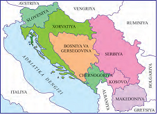

- Avstro-Vengriya
+ Yugoslaviya
- Usmoniylar imperiyasi
- Germaniya

**30. Polshada aholining mamlakatdagi sotsialistik tuzumdan norozilik namoyishlari qachondan boshlab kuchayib borgan?**

- 1987-yildan
+ 1988-yildan
- 1989-yildan
- 1990-yildan

**31. Qaysi davlat 1991-1992-yillarda millatchi va ayirmachi kuchlarning faollashuvi natijasida parchalanib ketgan?**

- Chernogoriya
- Bosniya
- Bukovina
+ Yugoslaviya

**32. Qachon Chernogoriya Serbiyadan ajralib chiqqan?**

+ 2006-yilda
- 2005-yilda
- 2004-yilda
- 2003-yilda

**33. Qachon bo‘lib o‘tgan saylovlar hukmron Polsha birlashgan ishchi partiyasining (PBIP) obro‘yi tushib ketganligi, ayni paytda, muxolifatdagi «Birdamlik» kasaba uyushmasining ommalashib borayotganini ko‘rsatgan?**

- 1987-yilda
- 1988-yilda
+ 1989-yilda
- 1990-yilda

**34. Qachon jahon xaritasida ikkita mustaqil davlat – Chexiya Respublikasi va Slovakiya Respublikasi paydo bo‘lgan?**

+ 1993-yil 1-yanvarda
- 1992-yil 1-yanvarda
- 1994-yil 1-yanvarda
- 1991-yil 1-yanvarda

**35. Ruminiyada qaysi yilgi saylovlarda Ion Iliyesku mamlakat prezidenti etib saylangan?**

- 1987-yilgi
- 1988-yilgi
- 1989-yilgi
+ 1990-yilgi

**36. Qachon Chexoslovakiyada milliy muammolarni hal qilish maqsadida referendum o‘tkazilgan?**

- 1993-yilda
+ 1992-yilda
- 1994-yilda
- 1991-yilda

## 3-§ Sovet davlatining parchalanishi va sobiq sovet respublikalarida mustaqillikning e’lon qilinishi.

**37. Qaysi davlat MDH ning bir qator tuzilmalarida kuzatuvchi sifatida ishtirok etib kelmoqda?**

- Pokiston
- Hindiston
+ Mo‘g‘uliston
- Afg‘oniston

**38. Qachon Boris Yelsin prezidentlik vakolatlarini Vladimir Putinga topshirgan?**

- 1998-yilda
+ 1999-yilda
- 2000-yilda
- 2001-yilda

**39. Qaysi sobiq sovet respublikalaridan tashqari barcha davlatlar MDH ga kirgan?**

- Ukraina, Gruziya, Tojikiston
+ Latviya, Litva, Estoniya
- O’zbekiston, Qozog’iston, Litva
- Estoniya, Gruziya, Ozarbayjon

**40. Qachon Rossiya, Ukraina va Belarus rahbarlari yig‘ilib SSSR siyosiy birlik sifatida tugatilganligini va Mustaqil Davlatlar Hamdo‘stligi (MDH) tuzilganligini tasdiqlaganlar?**

+ 1991-yil 8-dekabrda
- 1991-yil 10-dekabrda
- 1992-yil 8-dekabrda
- 1992-yil 10-dekabrda

**41. Qaysi davlat 2014-yili MDH faoliyatida qatnashmasligini ma’ lum qilgan?**

+ Ukraina
- Qozog‘iston
- Ozarbayjon
- Gruziya

**42. Qachon SSSR prezidenti M. Gorbachyov davlat boshlig‘i vakolatlarini o‘zidan soqit qilganligi to‘g‘risida bayonot bergan?**

- 1991-yil 8-dekabrda
- 1991-yil 10-dekabrda
+ 1991 -yil 25-dekabrda
- 1991-yil 27-dekabrda

**43. G‘arb davlatlari 2014-yilda nega Rossiyaga qarshi iqtisodiy sanksiyalar e’lon qilgan?**

- V. Putin yuritgan siyosat tufayli
- AQSH ga qarshi qo‘llagan sanksiyalar tufayli
+ Qrimning Rossiyaga qo‘shilishi sabab tufayli
- Ukrainadagi inqilob tufayli

**44. Qaysi davlat 2008-yili MDH faoliyatida qatnashmasligini ma’lum qilgan?**

- Ukraina
- Qozog‘iston
- Ozarbayjon
+ Gruziya

**45. Qachon V. Putin Rossiya prezidenti ctib saylangan?**

- 1998-yilda
- 1999-yilda
+ 2000-yilda
- 2001-yilda

**46. XXI asrda qaysi respublikalarida fuqarolararo mojarolar yuz berganda, Rossiya o‘zining iqtisodiy va strategik manfaatlari yuzasidan bu muammolarni bartaraf qilishda qatnashgan?**

- Polsha va Ukraina
- Gruziya va Estoniya
- Qirg‘iziston va Turkiya
+ Tojikiston va Moldova

**47. XXI asrda qaysi davlatlar o‘rtasida u yerda yashovchi ko‘p sonli rusiyzabon aholi huquqlari va hududiy masalalar bo‘yicha qattiq tortishuvlar bo‘lib o‘tgan?**

- Polsha va Ukraina
+ Boltiqbo‘yi davlatlari va Rossiya
- AQSH va Rossiya
- Ukraina va Rossiya

**48. 2014-yil qayerda «rangli inqilob» bo’lib o’tgan?**

- Rossiyada
+ Ukrainada
- Belarusiyada
- Portugaliyada

**49. Qaysi davlatda 2014-yilda bo’lib o’tgan inqilob natijasida hokimiyat almashgan?**

+ Ukrainada
- Qozog’istonda
- Ozarbayjonda
- Gruziyada

**50. 1991-yil dekabrda qayerda beshta Markaziy Osiyo respublikalari rahbarlarining uchrashuvi bolib, unda a’zo davlatlarning tengligi va barchasining MDH ta’sischisi sifatida ittifoqqa qo‘shilishi ma’lum qilingan?**

- Dushanbeda
+ Ashxobodda
- Toshkentda
- Olmaotada

**51. Qaysi davlat 2008-yil MDHga kirish istagini bildirib, hozir MDH parlamentlararo assambleyasida kuzatuvchi sifatida ishtirok etmoqda?**

- Pokiston
- Hindiston
- Mo’g’uliston
+ Afg’oniston

**52. SSSR tarqalib ketgandan so‘ng qancha rus Rossiya hududidan tashqarida qolib ketgan?**

- 60 million
+ 80 million
- 70 million
- 90 million

**53. SSSR parchalangach, xalqaro maydonda obro’yi pasaygan Rossiya qaysi davlatlardagi keskin xalqaro muammolarni hal qilishda deyarli ishtirok etmagan?**

- Ukraina, Turkiya
- Suriya, Misr
- Germaniya, Polsha
+ Yugoslaviya, Iroq

**54. 1991-yil dekabrda qayerda bo’lib o‘tgan uchrashuvda Deklaratsiya qabul qilinib, SSSR xalqaro huquq subyekti va geosiyosiy reallik sifatida o‘z faoliyatini tugatganligi ta’kidlangan?**

- Dushanbeda
- Ashxobodda
- Toshkentda
+ Olmaotada

**55. Nega Rossiya «Katta sakkizlik» - G-8 dan chiqarilgan?**

- V. Putin yuritgan siyosat tufayli
- AQSH ga qarshi qo‘llagan sanksiyalar tufayli
+ Qrimning Rossiyaga qo‘shilishi sabab tufayli
- Ukrainadagi inqilob tufayli

**56. XXI asrda qaysi davlatlar o‘rtasida Qora dengiz flotini bo‘lib olish, Qrim yarimorolidagi Sevastopol shahrining maqomi to‘g‘risida keskin bahslar kechgan?**

- Polsha va Ukraina
- Boltiqbo‘yi davlatlari va Rossiya
- AQSH va Rossiya
+ Ukraina va Rossiya

## 4-§ 1991-2017-yillarda Rossiya Federatsiyasi.

**57. Prezident Boris Yelsin qachon Xalq deputatlari syezdi va Oliy Sovetni tarqatib yuborgan?**

- 1992-yilda
+ 1993-yilda
- 1994-yilda
- 1995-yilda

**58. Vladimir Putin qachon Rossiya prezidenti etib saylangan?**

- 1998-yilda
- 1999-yilda
+ 2000-yilda
- 2001-yilda

**59. Tatariston qachon o‘z davlat mustaqilligini e’lon qilgan?**

+ 1992-yilda
- 1993-yilda
- 1994-yilda
- 1995-yilda

**60. Qaysi davlat bilan Rossiya o‘rtasida boshlangan urush 1996-yilda boshlanib 2000-yilgacha davom etgan?**

- Boshqirdiston
- Ingushetiya
+ Checheniston
- Yoqutiston

**61. 2008-yil avgust oyida qaysi davlat o‘zining tarkibiy qismi hisoblangan Janubiy Osetiya va Abxaziyada konstitutsion tartibni tiklash maqsadida bu hududlarni artilleriyadan bombardimon qilishni boshlagan?**

- Ukraina
- Qozog‘iston
- Ozarbayjon
+ Gruziya

**62. Qachon Rossiyada birinchi marta partiyaviy ro‘yxat bo‘yicha Federatsiya Kengashi va Davlat Dumasiga saylovlar bolib o‘tgan?**

- 1992-yilda
+ 1993-yilda
- 1994-yilda
- 1995-yilda

**63. Qachon Boris Yelsin davlat hokimiyatining yangi organlari - Federatsiya Kengashi va Davlat Dumasiga saylovlar hamda mamlakatning yangi konstitutsiyasi haqida referendum o‘tkazish to‘g‘risida farmonni imzolagan?**

- 1992-yilda
+ 1993-yilda
- 1994-yilda
- 1995-yilda

**64. Qachondan Rossiyada erkin qo‘yib yuborilgan narxlar keskin ko‘tarilgan?**

- 1991-yil 1-yanvardan
+ 1992-yil 1-yanvardan
- 1993-yil 1-yanvardan
- 1994-yil 1-yanvardan

**65. 2008-yildan keyin Rossiya bilan qaysi davlat o’rtasida munosabatlar keskin yomonlashgan?**

- Ukraina
- Qozog’iston
- Ozarbayjon
+ Gruziya

**66. 1990-yillarda qaysi davlat markaz, ya’ni Rossiya bilan har qanday shartnomalar tuzishni rad etish yo‘lidan borgan?**

- Boshqirdiston
- Ingushetiya
+ Checheniston
- Yoqutiston

**67. Rossiya prezidenti Boris Yelsin istefoga chiqqach vaqtincha prezident lavozimini kim egallagan?**

+ V. Putin
- D. Medvedev
- Y. Gaydar
- M. Gorbachov

**68. Tatariston qachon Rossiya federal hokimiyati bilan vakolatlarni taqsimlash to‘g‘risida shartnomani imzolagan?**

- 1991-yilda
- 1992-yilda
- 1993-yilda
+ 1994-yilda

**69. Rossiya prezidenti Boris Yelsin qachon iste’foga chiqqan?**

- 1998-yilda
+ 1999-yilda
- 2000-yilda
- 2001-yilda

**70. Rossiyada qachon siyosiy inqiroz bolib o’tgan va asosiy lavozimlarga demokratik kuchlar vakillari emas, kommunistik partiya faollari kelgan?**

- 1990-yil dekabrda
+ 1991-yil avgustda
- 1991-yil sentyabrda
- 1990-yil dekabrda

**71. Rossiyada Federativ Shartnoma qaysi davlatlardan tashqari barcha subyektlar tomonidan imzolangan?**

+ Tatariston va Checheniston
- Ingushetiya va Boshqirdiston
- Checheniston va Ingushetiya
- Boshqirdiston va Tatariston

**72. 2014-yil 16-martda qayer mustaqilligini e’lon qilgan va Rossiya Federatsiyasi tarkibiga kirish to‘g‘risida shartnoma imzolagan?**

- Boshqirdiston
- Checheniston
- Yoqutiston
+ Qrim

**73. M. Shaymiyev Rossiya Federatsiyasi tarkibidagi qaysi davlat prezidenti edi?**

- Ingushetiya
- Checheniston
+ Tatariston
- Yoqutiston

**74. Donetsk va Lugansk Xalq respublikalari qaysi davlatda e’lon qilingan?**

- Rossiyada
+ Ukrainada
- Belarusiyada
- Gruziyada

**75. Rossiyada Federativ Shartnoma qachon imzolangan?**

- 1991-yilda
+ 1992-yilda
- 1993-yilda
- 1994-yilda

**76. Rossiyaning qaysi davlat bilan urushi Ikkinchi jahon urushidan so‘ng SSSR hududida yuz bergan eng katta harbiy to‘qnashuv bo’lgan?**

+ Checheniston
- Boshqirdiston
- Ingushetiya
- Yoqutiston

**77. Boris Yelsin tomonidan Bosh vazir lavozimiga taklif qilingan qaysi shaxs Rossiyadagi islohotlarning «arxitektori» bo‘lgan?**

- V. Putin
- D. Medvedev
+ Y. Gaydar
- M. Gorbachov

**78. Qachon Tatariston, Boshqirdiston va Yoqutistondagi milliy harakatlar o‘zlarining syezdlarini o‘tkazib, ularda RSFSR tarkibidan chiqish masalasi qo‘yilgan?**

+ 1991-1992-yilda
- 1992-1993-yilda
- 1993-1994-yilda
- 1994-1995-yilda

**79. Rossiyaning harbiy-kosmik kuchlari 2015-yil sentyabrdan boshlab qayerdagi janglarda qatnashmoqda?**

- Iroqdagi
- Ukrainadagi
- Qrimdagi
+ Suriyadagi

**80. Nima sababdan Rossiya Oliy Sovet binosi qo‘shinlar tomonidan o‘rab olingan va artilleriyadan o‘qqa tutilgan?**

+ Prezident farmoniga qarshi chiqqani uchun
- Davlat to’ntarishini tayyorlagani uchun
- Siyosiy repressiyani kuchaytirgani uchun
- SSSR ni tiklashga harakat qilgani uchun

**81. 1999-yilga kelib Rossiyaning tashqi qarzi qancha dollardan oshib ketgan?**

- 140 mlrd. dollardan
+ 130 mlrd. dollardan
- 150 mlrd. dollardan
- 120 mlrd. dollardan

## 5-§ 1991-2017-yillarda Ukraina, Belarus va Moldova respublikalari.

**82. Viktor Yanukovich Ukrainadagi nechanchi yilgi prezidentlik saylovlarida g’alaba qozongan?**

- 2006-yildagi
- 2005-yildagi
+ 2004-yildagi
- 2002-yildagi

**83. Birinchi Umumbelarus xalq yig’ini qachon o’tkazilgan?**

- 1993-yilda
- 1994-yilda
- 1995-yilda
+ 1996-yilda

**84. Moldovadagi 2017-yildagi prezidentlik saylovlarida kim g’alaba qozongan?**

- Mircha Snegur
+ Igor Dodon
- Aleksandr Lukashenko
- Raymonds Vyonis

**85. 1991-yil dekabrdagi referendumga ko’ra Ukrainaning birinchi prezidenti etib kim saylangan?**

- Mircha Snegur
- Aleksandr Lukashenko
- Pyotr Poroshenko
+ Leonid Kravchuk

**86. 2014-yilda qaysi hududdagi qurolli qarama-qarshilik sababli Ukraina rahbarlari bu hududlarda antiterror operatsiyalarini boshlanishini e’lon qilgan?**

- Qrim va Sevastopolda
- Sevastopol va Odessada
+ Donetsk va Luganskda
- Odessa va Donestkda

**87. Hozirda Belarusiya qaysi mahsulotlarni yetkazib beruvchi dunyoning ilg’or mamlakati qatoriga kiradi?**

+ Sut va sut mahsulotlari
- Go’sht va go’sht mahsulotlari
- Shakar va qandolat mahsulotlari
- G’alla va un mahsulotlari

**88. Qachon Minsk shahrida Rossiya, Ukraina hamda Donetsk va Lugansk viloyatlari vakillari o’rtasida harbiy harakatlarni to’xtatish to’g’risida kelishuv imzolangan?**

- 2018-yilda
+ 2014-yilda
- 2015-yilda
- 2017-yilda

**89. Qaysi Ukraina prezidenti 2013-yili Yevroittifoq bilan hamkorlik to’g’risidagi kelishuvni imzolashdan bosh tortgan?**

- Igor Bondarenko
- Aleksandr Lukashenko
+ Viktor Yanukovich
- Pyotr Poroshenko

**90. 1991-yil 27 avgustda qaysi sobiq sovet davlati davlat o’z mustaqilligini e’lon qilgan?**

- Ukraina
- Rossiya
- Armaniston
+ Moldava

**91. Qaysi yilga kelib Belarusda sanoat hamda xalq iste’moli mashsulotlarini ishlab chiqarish va aholining real daromadlari inqirozdan oldingi darajadan oshib ketgan?**

- 1999-yilda
+ 2000-yilda
- 2001-yilda
- 2002-yilda

**92. Ukraina milliy valutasi qachon muomalaga kiritilgan?**

- 1991-yilda
- 1994-yilda
- 1995-yilda
+ 1996-yilda

**93. Qaysi Belarus prezidenti davrida Belarus va Rossiya o‘rtasida Do‘stlik, yaxshi qo‘shnichilik va hamkorlik to‘g‘risida, keyin esa Ittifoq davlatni tuzish to‘g‘risida shartnomalar imzolangan?**

- Igor Bondarenko
- Viktor Yanukovich
+ Aleksandr Lukashenko
- Pyotr Poroshenko

**94. «Yevromaydon» nomini olgan ommaviy norozilik harakatlari qaysi davlatda bo’lib o’tgan?**

- Rossiyada
+ Ukrainada
- Armanistonda
- Gruziyada

**95. Ukraina milliy valutasi qanday nomlanadi?**

- Rubl
+ Grivna
- Yevro
- Real

**96. Ukraina konstitutsiyasi qachon qabul qilingan?**

- 1991-yilda
- 1994-yilda
- 1995-yilda
+ 1996-yilda

**97. Minsk shahrida 2015-yil fevralda qaysi davlat rahbarlari Ukraina sharqida harbiy mojaroni hal etish uchun yig’ilganlar?**

+ Germaniya, Fransiya, Rossiya, Ukraina
- Germaniya, Buyuk Britaniya, Rossiya, Ukraina
- Rossiya, Fransiya, Ukraina, Belarusiya
- Rossiya, Belarusiya, Germaniya, Buyuk Britaniya

**98. Mircha Snegur qaysi davlatning prezidenti bo’lgan?**

- Ukraina
- Gruziya
- Armaniston
+ Moldova

**99. Rossiya qaysi hududlarni qo’shib olgandan so’ng Ukraina-Rossiya munosabatlari keskinlashgan?**

+ Qrim va Sevastopolni
- Sevastopol va Odessani
- Donetsk va Luganskni
- Odessa va Donestkni

**100. Viktor Yushchenko qaysi yillar davomida Ukraina prezidenti bo’lgan?**

- 2000-2004-yillarda
+ 2004-2010-yillarda
- 2002-2008-yillarda
- 2010-2014-yillarda

**101. Belarus Konstitutsiyasi qachon qabul qilingan?**

- 1993-yilda
+ 1994-yilda
- 1995-yilda
- 1996-yilda

**102. Moldova iqtisoy jihatdan qanday mamlakatlar qatoriga kiradi?**

- Industrial
- Agrar
+ Agrar-industrial
- Giperindustrial

**103. Ukraina o’z mustaqilligini qachon e’lon qilgan?**

+ 1991-yil 24-avgustda
- 1991-yil 1-yanvarda
- 1991-yil 3-iyulda
- 1991-yil 4-mayda

**104. Poytaxti 1944-yil nemis fashistlaridan ozod qilingan kun - 3-iyul qaysi davlatning Mustaqillik kuni sifatida nishonlanadi?**

- Rossiya
- Ukraina
- Armaniston
+ Belarus

**105. Belarusiyada kimning prezidentlik davrida belarus tili bilan bir qatorda rus tiliga ham davlat tili maqomi berilgan, davlat bayrog’i o’zgartirilgan va prezidenning vakolatlari kengaytirilgan?**

- Igor Bondarenko
+ Aleksandr Lukashenko
- Viktor Yanukovich
- Pyotr Poroshenko

**106. Dnestrbo’yi Moldaviya Respublikasi e’lon qilinishi bilan boshlangan qonli to’qnashuvlar qaysi davlatning aralashuvidan so’ng to’xtatilgan?**

+ Rossiya
- Ruminiya
- Belarus
- Ukraina

**107. 1990-yilda Moldovaning qaysi davlat bilan integratsiyalashuvi jarayonida respublika janubi-sharqiy mintaqalardagi mahalliy rusiyzabon aholi orasida ayirmachilik kayfiyatlari kuchaygan?**

- Rossiya
+ Ruminiya
- Belarus
- Ukraina

**108. «Yevromaydon» nomini olgan ommaviy norozilik harakatlari tufayli Ukrainani tark etishga majbur bo’lgan prezidentni toping.**

- Igor Bondarenko
- Aleksandr Lukashenko
+ Viktor Yanukovich
- Pyotr Poroshenko

**109. 2004-yilda Ukraina prezidenti etib saylanganViktor Yushchenko qaysi blok yetakchisi edi?**

- «Ozod Ukraina»
+ «Bizning Ukraina»
- «Olg’a Ukraina»
- «Yashasin Ukraina»

**110. 2014-yilgi Ukraindagi prezidentlik saylovida kim g’alaba qozongan?**

- Igor Bondarenko
- Aleksandr Lukashenko
- Viktor Yanukovich
+ Pyotr Poroshenko

**111. 1994-yilgi saylovlar natijasida kim Belarus prezidenti etib saylangan?**

- Igor Bondarenko
+ Aleksandr Lukashenko
- Viktor Yanukovich
- Pyotr Poroshenko

## 6-§ 1991-2017-yillarda Boltiqbo’yi davlatlari.

**112. Boltiqbo’yi respublikalari ichida eng shimoliysi qaysi hisoblanadi?**

- Latviya
- Litva
- Finlyandiya
+ Estoniya

**113. Latviya o’z mustaqilligini qachon e’lon qilgan?**

+ 1990-yil 4-mayda
- 1990-yil 11-martda
- 1988-yil 16-noyabrda
- 1991-yil 24-avgustda

**114. Latviya mustaqilligi uchun kurashgan «Xalq fronti» qachon tuzilgan edi?**

+ 1988-yilda
- 1989-yilda
- 1987-yilda
- 1986-yilda

**115. Qaysi davlat sovet davrida qurilgan yirik sanoat korxonalarini, jumladan, elektrotexnika buyumlarini ishlab chiqaruvchi eng yirik VEF, mikroavtobuslar ishlab chiqaruvchi RAF zavodlarini yopgan?**

- Litva
+ Latviya
- Estoniya
- Moldaviya

**116. Qachon Estoniya Oliy Soveti «Estoniya SSRning davlat suvereniteti to’g’risida deklaratsiya» ni qabul qilgan?**

- 1990-yil 4-mayda
- 1990-yil 11-martda
+ 1988-yil 16-noyabrda
- 1991-yil 24-avgustda

**117. Latviya mustaqilligini qo’lga kiritgandan so’ng iqtisodiy rivojlanishni o’sishiga olib kelgan dastlabki omilni toping.**

- Oltin zaxira fondi
- Eksport quvvati yuqoriligi
+ G’arb davlatlari investitisiyalari
- Yalpi ichki mahsulotni oshirilishi

**118. 1988-yil iyunda «Sayudis» («Harakat») tashkiloti qaysi davlatda tuzilgan?**

- Latviya
- Estoniya
+ Litva
- Finlyandiya

**119. Tovarlar, yuklar va shu kabilarni bir hududdan boshqasiga yetkazib berishning tizimini tashkil qiluvchi atamani toping.**

+ Logistika
- Demografiya
- Infratuzilma
- Geostrategiya

**120. Kersti Kalyulayd qaysi davlat prezidenti hisoblanadi?**

- Latviya
- Litva
+ Estoniya
- Finlyandiya

**121. Estoniyada «Xalq fronti» qachon tashkil qilingan?**

+ 1988-yilda
- 1989-yilda
- 1987-yilda
- 1986-yilda

**122. Raymonds Veyonis qaysi davlat prezidenti hisoblanadi?**

+ Latviya
- Litva
- Estoniya
- Finlyandiya

**123. Rusiyzabon aholi hozir Latviya aholisining necha foizini tashkil qiladi?**

- 20 foizini
+ 30 foizini
- 40 foizini
- 35 foizini

**124. Dalya Gribauskayte qaysi davlatning prezidenti hisoblanadi?**

- Latviya
+ Litva
- Estoniya
- Finlyandiya

**125. Qaysi davlatdagi «Xalq fronti» qayta qurishni qo‘llab-quvvatlashini e’lon qilib, respublikaning SSSR tarkibidan chiqishini o‘zining ochiq vazifasi qilib qo‘ymagan?**

- Latviyadagi
- Litvadagi
+ Estoniyadagi
- Finlyandiyadagi

**126. Boltiqbo’yi respublikalarida NATOning kichik sonli harbiy texnikasi va qo’shinlari qaysi yillarda joylashtirilgan?**

- 2015-2016-yillarda
+ 2016-2017-yillarda
- 2017-2018-yillarda
- 2014-2015-yillarda

**127. Boltiqbo’yi davlatlari qachon NATO va YI ga a’zo bo’lgan?**

- 2003-yilda
+ 2004-yilda
- 2005-yilda
- 2006-yilda

**128. «G’arb-2017» harbiy mashqlari qaysi davlatlar o’rtasida o’tkazilgan?**

- Latviya va Ozarbayjon
+ Rossiya va Belarusiya
- AQSH va Germaniya
- Buyuk Britaniya va Fransiya

**129. SSSR tarqalgandan so’ng Latviya aholisi qanchaga kamaygan?**

+ 400 ming kishiga
- 500 ming kishiga
- 600 ming kishiga
- 700 ming kishiga

**130. Litva mustaqilligini qachon e’lon qilgan?**

- 1990-yil 4-mayda
- 1988-yil 16-noyabrda
- 1991-yil 24-avgustda
+ 1990-yil 11-martda

**131. Boltiqbo’yi respublikalari qaysi sohani rivojlantirishi tufayli «Boltiq yo’lbarslari» degan nom olgan?**

- Ijtimoiy sohani
+ Iqtisodiy sohani
- Agrar sohani
- Harbiy sohani

**132. Qaysi Boltiqbo’yi respublikasida ruslarning fuqarolik olishlariga qarshi qonunlar qabul qilingan?**

- Latviyada
- Litvada
+ Estoniyada
- Finlyandiyada

**133. Aholi va uning ko‘payish qonuniyatlari to‘g‘risidagi fan qanday ataladi?**

- Logistika
- Infratuzilma
- Geostrategiya
+ Demografiya

**134. Litvada aholining qancha qismini litvaliklar tashkil qiladi?**

+ 90% ga yaqinini
- 80% ga yaqinini
- 70% ga yaqinini
- 60% ga yaqinini

**135. Bo’ltiqbo’yi respubliklari deganda qaysi davlatlar tushuniladi?**

+ Latviya, Litva, Estoniya
- Belarus, Polsha, Ukraina
- Gruziya, Ozarbayjon, Armaniston
- Norvegiya, Shvetsiya, Finlandiya

**136. Qachon rusiyzabon aholi vakillari bilan eston politsiyasi o‘rtasida bo‘lib o‘tgan to‘qnashuvda 1 kishi halok bo‘lgan?**

- 2009-yilda
- 2010-yilda
+ 2011-yilda
- 2012-yilda

**137. Qaysi Boltiqbo’yi respublikasida mustaqillikka erishgach barcha aholiga millatidan qat’i nazar fuqarolik berilgan?**

- Latviyada
+ Litvada
- Estoniyada
- Finlyandiyada

**138. Qachon Vilnyusda mustaqillikni qo‘llab o‘tkazilgan namoyishda teleminora va parlament binosini sovet qo‘shinlaridan himoya qilgan 14 nafar namoyishchi halok bo‘lgan?**

- 1990-yil 4-mayda
- 1990-yil 11-martda
- 1988-yil 16-noyabrda
+ 1991-yil 13-yanvarda

## 7-§ 1991-2017-yillarda Kavkazorti davlatlari.

**139. Gruziyada 2016-yilgi parlament saylovlarida qaysi partiya g’alaba qozongan?**

+ Gruziya orzusi partiyasi
- Gruziya xalq demokratik partiyasi
- Gruziya kommunistik partiyasi
- Gruziya sotsial-demokratik partiyasi

**140. Gruziya qachon o’z mustaqilligini e’lon qilgan?**

- 1991-yil 18-oktyabrda
+ 1991-yil 9-aprelda
- 1991-yil 21-sentyabrda
- 1991-yil 21-mayda

**141. Ozarbayjonda Xalq fronti kimning boshchiligida Milliy mudofaa kengashi tuzilganligini e’lon qilgan?**

- Avaz Mutalibov
+ Abulfayz Elchibey
- Geydar Aliyev
- Ilhom Aliyev

**142. Qaysi voqea Ozarbayjondagi milliy muammolarni chigallashtirib yuborgan?**

- Boku shahrida muholifatchi siyosiy tashkilot-Ozarbayjon Xalq frontining namoyishining o’tkazilishi
+ Tog’li Qorabog’ avtonom viloyati rahbarlarining viloyatni Aramaniston tarkibiga qo’shishini so’rab qilgan murojaati
- Milliy mudofaa kengashi tuzilganligi
- Rus armiyasining Boku shahriga kiritilishi

**143. Ozarbayjon prezidenti Geydar Aliyev qachon vafot etgan?**

- 2000-yil fevralda
- 2001-yil martda
- 2002-yil aprelda
+ 2003-yil dekabrda

**144. Tog’li Qorabog’ga to’g’ri berilgan ta’rifni toping.**

+ Ozarbayjon hududida joylashgan va asosan arman millatiga mansub aholi yashaydigan avtonom viloyat
- Armaniston hududida joylashgan va asosan ozarbayjon millatiga mansub aholi yashaydigan avtonom viloyat
- Gruziya hududida joylashgan va asosan arman millatiga mansub aholi yashaydigan avtonom viloyat
- Ozarbayjon hududida joylashgan va asosan gruzin millatiga mansub aholi yashaydigan avtonom viloyat

**145. Gruziya prezidenti Eduart Shevardnadze qachon iste’foga chiqanligini e’lon qilgan?**

+ 2003-yilda
- 2002-yilda
- 2001-yilda
- 2000-yilda

**146. 1990-yilda Sovet armiyasining Bokuga kiritilishiga nima sabab bo’lgan?**

- Armanlarning «non isyonlari»
- Ozarbayjon shifokorining arman millatchilari tomonidan o’ldirilishi
- Xalq frontining millatchilik ruhidagi mitinglari
+ Bokudagi armanlar qirg’ini

**147. Eduart Shevardnadze davlat tepasiga kelgan paytda Gruziyada qaysi urush davom etayotgan edi?**

+ Gruzin-osetin urushi
- Gruzin-abxaz urushi
- Gruzin-arman urushi
- Gruzin-turk urushi

**148. Ozarbayjon Respublikasi qachon o’z mustaqilligini e’lon qilgan?**

- 1991-yil 9-aprelda
- 1991-yil 21-sentyabrda
+ 1991-yil 18-oktyabrda
- 1991-yil 16-dekabrda

**149. Armaniston mustaqillikdan so’ng sovetlarning aybi uchun zamonaviy Rossiyani ayblamaganini sababini toping.**

- Rossiyadan katta miqdorda qarzi bor edi
- Sovetlar davridagi amaldorlarning ko’pchiligi vafot etgan edi
- Gruziya va Rossiyaga qarshi bir vaqtning o’zida ikki frontda kurasha olmas edi
+ Tog’li Qorabog’ masalasida Rossiyaga tayanar edi

**150. Ozarbayjonda Ayaz Mutalibovdan keyin hokimiyat tepasiga kim kelgan?**

- Zviad Gamsaxurdiya
+ Abulfayz Elchibey
- Geydar Aliyev
- Ilhom Aliyev

**151. Gruziyada qachon bo‘lib o‘tgan parlament saylovlarida muxolifatchi «Gruziya orzusi» partiyasi g‘olib chiqqan?**

- 2011-yilda
- 2013-yilda
+ 2012-yilda
- 2014-yilda

**152. XX asrning 80-90-yillarida qaysi masala arman jamiyatida etnik birlashish, tarixiy adolatning qaror topishi sifatida qaralgan?**

- Shimoliy Osetiyani qo‘shib olish
- Naxichevanni qo‘shib olish
+ Tog‘li Qorabog‘ni qo‘shib olish
- Janubiy Osetiyani qo‘shib olish

**153. Ozarbayjonda 1993-yilda bo’lib o’tgan prezidentlik saylovlarida kim yutib chiqqan?**

- Avaz Mutalibov
- Abulfayz Elchibey
+ Geydar Aliyev
- Ilhom Aliyev

**154. 2008-yilda kim Armaniston prezidenti etib saylangan?**

- Levon Ter-Petrosyan
+ Serj Sargsyan
- Mixail Saakashvili
- Georgiy Margvelashvili

**155. Gruziyada kimning prezidentlik davrida gruzin-osetin urushi to’xtatilgan?**

- Zviad Gamsaxurdiya
+ Eduart Shevardnadze
- Mixail Saakashvili
- Georgiy Margvelashvili

**156. Quyidagi xaritada “X” bilan qaysi davlat belgilangan?**

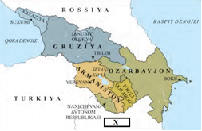

+ Eron
- Iroq
- Suriya
- Isroil

**157. Geydar Aliyev prezidentlikka nomzodi qo’yilguncha qaysi lavozimda ishlar edi?**

+ Ozarbayjon Milliy Majlisi raisi
- Ozarbayjon Tashqi ishlar vaziri
- Ozarbayjon Oliy sud raisi
- Ozarbayjon Moliya vaziri

**158. Gruziyda 2003-yilgi prezidentlik saylovlari natijasida, hokimiyatga ko‘pchiligi G‘arb davlatlarida ta’lim olgan «yangi demokratlar» kelgani mahalliy va G’arb matbuotida qanday nom bilan atalgan?**

- «Bahor inqilobi»
- «G’arbchilar inqilobi»
- «Demokratlar inqilobi»
+ «Atirgullar inqilobi»

**159. 2008-yilda qaysi davlat Abxaziya va Janubiy Osetiyaning mustaqilligini tan olib, ular bilan ikki tomonlama munosabatlar o’rnatgan?**

- Gruziya
+ Rossiya
- AQSH
- Ozarbayjon

**160. Qaysi omillarga ko’ra Ozarbayjon davlati Rossiya va G’arb manfaatlari orasida mohirlik bilan muvozanatni saqlab kelmoqda?**

- AQSH bilan tashqi savdoda yaxshi munosabatda ekanligi
- Suv va o’rmon resurslariga boy ekanligi
- Kaspiy dengizida erkin harakatlanishlari uchun keng imkoniyatlarni ta’minlab kelayotganligi
+ Katta neft va gaz zahiralariga egaligi, strategik joylashuvi

**161. 2008-yilda Kavkazda qaysi davlatlar o’rtasida harbiy to’qnashuv bo’lib o’tgan?**

- AQSH, Gruziya, Janubiy Osetiya va Abxaziya
+ Rossiya, Gruziya, Janubiy Osetiya va Abxaziya
- Rossiya, Ozarbayjon, Janubiy Osetiya va Abxaziya
- AQSH, Gruziya, Tog’li Qorabog’ va Abxaziya

**162. 1991-yilda Gruziyada o’tkazilgan prezidentlik saylovlarida kim g’alaba qozongan?**

+ Zviad Gamsaxurdiya
- Eduart Shevardnadze
- Mixail Saakashvili
- Georgiy Margvelashvili

**163. 1990-yilda Bokudagi armanlar qirg’iniga bevosita turtki bo’lgan sabab nima edi?**

- Armanlarning «non isyonlari»
- Ozarbayjon shifokorining arman millatchilari tomonidan o’ldirilishi
+ Xalq frontining millatchilik ruhidagi mitinglari
- Barcha javoblar to’g’ri

**164. Gruziyada qaysi prezident davrida gruzin-abxaz mojarosi vujudga kelgan?**

+ Zviad Gamsaxurdiya
- Eduart Shevardnadze
- Mixail Saakashvili
- Georgiy Margvelashvili

**165. Armanistonning davlat mustaqilligi to’g’risida deklaratsiyasi qachon qabul qilingan?**

+ 1991-yilda
- 1992-yilda 
- 1993-yilda
- 1990-yilda

**166. Qachon Armanistonda respublika maqomi bo’yicha referendum o’tkazilgan?**

- 1991-yil 18-oktyabrda
- 1991-yil 9-aprelda
+ 1991-yil 21-sentyabrda
- 1991-yil 21-oktyabrda

**167. 2012-yilda «Gruziya orzusi» partiyasidan kim prezident qilib saylangan?**

- Zviad Gamsaxurdiya
- Eduart Shevardnadze
- Mixail Saakashvili
+ Georgiy Margvelashvili

**168. Gruziyada Eduart Shevardnadzedan keyin hokimiyat tepasiga kim kelgan?**

- Zviad Gamsaxurdiya
- Eduart Shevardnadze
+ Mixail Saakashvili
- Georgiy Margvelashvili

**169. Armanistonning birinchi prezidenti kim?**

+ Levon Ter-Petrosyan
- Serj Sargsyan
- Mixail Saakashvili
- Georgiy Margvelashvili

**170. Qaysi Ozarbayjon prezidenti mamlakatni o’n yil boshqargan?**

- Ayaz Mutalibov
- Abulfayz Elchibey
+ Geydar Aliyev
- Ilhom Aliyev

**171. Qachon Boku shahrida muxolifatchi siyosiy tashkilot – Ozarbayjon Xalq frontining namoyishi boshlangan?**

+ 1990-yilda
- 1991-yilda
- 1989-yilda
- 1992-yilda

**172. Gruziya aholisi qachon referendumda mamlakat mustaqilligi uchun ovoz bergan?**

- 1990-yil fevralda
+ 1991-yil martda
- 1989-yil aprelda
- 1992-yil mayda

**173. 1991-yilda Gruziya prezidenti Zviad Gamsaxurdiyani qaysi partiya rahbarlari iste’foga chiqishini talab qilishgan?**

- Gruziya sotsial partiyasi
+ Gruziya xalq demokratik partiyasi
- Gruziya komunistik partiyasi
- Gruziya sotsial-demokratik partiyasi

**174. Gruziyada qaysi prezidentning hokimiyatni boshqaruv davri sakkiz oy davom etgan?**

+ Zviad Gamsaxurdiya
- Eduart Shevardnadze
- Mixail Saakashvili
- Georgiy Margvelashvili

**175. Qachon Bokuda davlat to’ntarishi yuz berib Ayaz Mutalibov hokimiyatdan ketgan?**

- 1990-yil fevralda
- 1991-yil martda
- 1989-yil aprelda
+ 1992-yil mayda

**176. Qaysi Gruziya prezidenti korrupsiyaga qarshi kurash e’lon qilgan?**

- Zviad Gamsaxurdiya
- Eduart Shevardnadze
+ Mixail Saakashvili
- Georgiy Margvelashvili

## 8-§ 1991-2017-yillarda Markaziy Osiyo  davlatlari.

**177. Qaysi prezidentning «Ruhnoma» nomli kitobi ommaviy axborot vositalarida keng targ‘ib qilinib, o‘quv yurtlarida o‘qitilgan?**

- Askar Akayev
- Nursulton Nazarboyev
- Gurbanguli Berdimuhammedov
+ Saparmurod Niyozov

**178. Qachon Turkmaniston MDH ga a’zo bo’lgan?**

- 1992-yilda
+ 1991-yilda
- 1993-yilda
- 1994-yilda

**179. Qirg’izistonda 2010-yilda bo’lib o’tgan «Aprel inqilobi» natijasida qaysi prezident hokimiyati ag‘darib tashlangan?**

- Almazbek Atambayev
- Asqar Akayev
- Sooronbay Jeenbekov
+ Kurmanbek Bakiyev

**180. Qachon Qirg’izistonda «Lolalar inqilobi» yuz bergan?**

- 2001-yilda
+ 2005-yilda
- 2002-yilda
- 2003-yilda

**181. Qirg’iziston qachon o’z mustaqilligini e’lon qilgan?**

- 1991-yil 26-oktyabrda
+ 1991-yil 31-avgustda
- 1991-yil 16-dekabrda
- 1991-yil 9-sentyabrda

**182. Asqar Akayev Qirg’izistonni necha yil boshqargan?**

- 12 yil
- 14 yil
+ 15 yil
- 11 yil

**183. Imomali Rahmonov qachon Tojikiston prezidenti etib saylangan?**

- 1991-yil 26-oktyabrda
- 1992-yil 31-avgustda
- 1993-yil 16-dekabrda
+ 1994-yil 6-noyabrda

**184. Qozog’istonning yangi konstitutsiyasi qachon qabul qilingan?**

- 1991-yilda
- 1992-yilda
- 1994-yilda
+ 1993-yilda

**185. Tojikiston qachon o’z mustaqilligini e’lon qilgan?**

- 1991-yil 26-oktyabrda
- 1991-yil 31-avgustda
- 1991-yil 16-dekabrda
+ 1991-yil 9-sentyabrda

**186. Qachon Nursulton Nazarboyev prezidentlik vakolatini yetti yildan besh yilga o’zgartirish, parlament deputatlari sonini oshirish tashabbusi bilan chiqqan?**

- 2005-yilda
- 2006-yilda
+ 2007-yilda
- 2008-yilda

**187. Saparmurod Niyozov qaysi unvonni olgan?**

+ «Turkmanboshi»
- «Millat otasi»
- «Otaturk»
- «Yurtboshi»

**188. Qachon Saparmurod Niyozov vafot etgan?**

- 2005-yilda
+ 2006-yilda
- 2007-yilda
- 2008-yilda

**189. Tojikiston konstitutsiyasi qachon qabul qilingan?**

- 1991-yil 26-oktyabrda
- 1992-yil 31-avgustda
- 1993-yil 16-dekabrda
+ 1994-yil 6-noyabrda

**190. Qachondan Xalq Majlisi qaroriga ko‘ra Saparmurod Niyozov davlat boshlig‘i lavozimini umrbod egallagan?**

- 1996-yildan
- 1997-yildan
- 1998-yildan
+ 1999-yildan

**191. Tojikistonning gidroenergetika imkoniyatlarining kattaligi qanday omil bilan bog’liq?**

- Tojikiston hududidan Amudaryo o’tganligi bilan
- Tojikiston hududidan Sirdaryo o’tganligi bilan
+ Tojikiston tog’li o’lka bo’lganligi bilan
- Tojikiston hududida shamol kuchli ekanligi bilan

**192. Qozog’istonning birinchi prezidenti kim?**

+ Nursulton Nazarboyev
- Saparmurod Niyozov
- Gurbanguli Berdimuhammedov
- Asqar Akayev

**193. Qozog’iston qachon o’z mustaqilligini e’lon qilgan?**

- 1991-yil 26-oktyabrda
- 1991-yil 31-avgustda
+ 1991-yil 16-dekabrda
- 1991-yil 9-sentyabrda

**194. Qirg’iziston mustaqilligi e’lon qilinib, kim prezidentlik saylovlarida g’alaba qozongan?**

- Kurmanbek Bakiyev
- Almazbek Atambayev
+ Asqar Akayev
- Sooronbay Jeenbekov

**195. Qachon O‘zbekiston Respublikasi Prezidenti Shavkat Mirziyoyev Qirg‘izistonga tashrif buyurgan?**

- 2019-yilda
- 2018-yilda
+ 2017-yilda
- 2016-yilda

**196. Quyidagi xaritada O’zbekistondan shimolda joylashgan davlatlarni toping.**

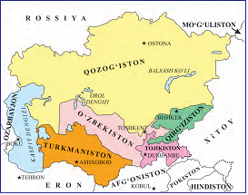

- Turkmaniston, Eron
+ Qozog’iston, Rossiya
- Afg’oniston, Pokiston
- Tojikiston, Qirg’iziston

**197. Tojikistonda qaysi yillar oralig’ida fuqarolar urushi bo’lib o’tgan?**

- 1991-1997-yillarda
+ 1992-1997-yillarda
- 1991-1995-yillarda
- 1992-1996-yillarda

**198. Qachondan boshlab Akmola shahri «Ostona» deb ataladigan bo’lgan?**

- 1995-yildan
- 1996-yildan
- 1997-yildan
+ 1998-yildan

**199. Qozog’istonning Janaozen shahridagi tartibsizliklarda necha kishi halok bo’lgan?**

+ 15 kishi
- 20 kishi
- 25 kishi
- 30 kishi

**200. Tojikiston qachon Yevroosiyo iqtisodiy hamkorligini ta’sis qilish to’g’risidagi shartnomani imzolagan?**

- 2001-yilda
+ 2000-yilda
- 2002-yilda
- 2003-yilda

**201. XXI asrda Qirg’iziston oltin qazib olish bo’yicha MDH davlatlari ichida nechanchi o’ringa chiqib olgan?**

- Birinchi o’ringa
- Ikkinchi o’ringa
+ Uchinchi o’ringa
- To’rtinchi o’ringa

**202. Qachon Qozog’istonda Elboshi to‘g‘risida qonun qabul qilingan?**

- 2007-yilda
- 2008-yilda
- 2009-yilda
+ 2010-yilda

**203. Qachon Qozog’istonning Mangistau viloyatida mehnat sharoiti va oylik maoshidan norozi bo‘lgan neft konlari ishchilarining mustaqillik davridagi eng yirik norozilik namoyishlari bo‘lib o‘tgan?**

- 2009-yilda
- 2012-yilda
+ 2011-yilda
- 2010-yilda

**204. Qachon Ashxobod shahrida Yopiq inshootlardagi V Osiyo o‘yinlari o‘tkazilgan?**

- 2016-yil may oyida
- 2015-yil avgust oyida
+ 2017-yil sentyabr oyida
- 2014-yil oktyabr oyida

**205. Turkmanistonda qachon referendum o’tkazilib, mamlakat mustaqilligi uchun ovoz berilgan?**

- 1991-yil 31-avgustda
- 1991-yil 16-dekabrda
+ 1991-yil 26-oktyabrda
- 1991-yil 9-sentyabrda

**206. Qirg’iziston prezidenti Kurmanbek Bakiyev oila a’zolari bilan mamlakatdan qochib ketgach kim boshchiligida muvaqqat hukumat tashkil qilingan?**

- Almazbek Atambayev
+ Roza Otunbayeva
- Asqar Akayev
- Sooronbay Jeenbekov

**207. Qachon Qirg’izistonda o‘tkazilgan prezidentlik saylovlari natijasiga ko‘ra, hukmron sotsial-demokratik partiya vakili Sooronbay Jeenbekov g‘alaba qozongan?**

- 2014-yilda
- 2015-yilda
- 2016-yilda
+ 2017-yilda

**208. To‘g‘ri ma’lumotni toping. Qozog‘istonda 1993-yilda … .**

- Milliy valuta – tenge muomalaga kiritilgan
- Mamlakat parlamenti poytaxtni Akmola shahriga ko‘chirish to‘g‘risida qaror qabul qilgan
- Hukumat yirik neft konsernlari bilan Kaspiy dengizining shimoliy qismida qidiruv o‘tkazish to‘g‘risida kelishuv imzolagan
+ Barcha javoblar to‘g‘ri

**209. Qirg’izistonda «Lolalar inqilobi» natijasida kim hokimiyatga kelgan?**

+ Kurmanbek Bakiyev
- Almazbek Atambayev
- Asqar Akayev
- Sooronbay Jeenbekov

**210. Qirg’izistonda 2011-yilda o’tkazilgan prezidentlik saylovlarida g’alaba qozongan sotsial-demokratik partiya yetakchisini toping.**

- Roza Otunbayeva
+ Almazbek Atambayev
- Asqar Akayev
- Sooronbay Jeenbekov

**211. Qachon Janubiy Qirg‘izistonning O‘sh va Jalolobod shaharlarida millatchi va ekstremistik kuchlar o’zbek jamoalariga qarshi fitna uyushtirganlar?**

- 2011-yilda
- 2012-yilda
+ 2010-yilda
- 2013-yilda

**212. Turkmanistonning birinchi prezidentini toping.**

- Askar Akayev
- Nursulton Nazarboyev
- Gurbanguli Berdimuhammedov
+ Saparmurod Niyozov

**213. Qachon bo‘lib o‘tgan navbatdan tashqari prezidentlik saylovlarida Nursulton Nazarboyev g‘alaba qozongan?**

+ 2015-yilda
- 2016-yilda
- 2017-yilda
- 2018-yilda

**214. Qachon Qirg’iziston prezidenti Sooronbay Jeenbekov O‘zbekistonga rasmiy tashrif bilan kelgan?**

- 2014-yilda
- 2015-yilda
- 2016-yilda
+ 2017-yilda

**215. Markaziy Osiyo mamlakatlariga nechta davlat kiradi?**

- 3 ta
- 4 ta
+ 5 ta
- 6 ta

**216. Qirg’izistonda qaysi prezident kuch ishlatar tizimlarga tayanib, jamiyatda shaxsiy hukmronligini mustahkamlashga, muxolifatni butunlay tugatishga harakat qilgan?**

+ Kurmanbek Bakiyev
- Almazbek Atambayev
- Asqar Akayev
- Sooronbay Jeenbekov

## 9-§ G’arb mamlakatlarida integratsiyalashuv jarayonlarining jadallashuvi. Yevropa Ittifoqi va AQSH munosabatlari.

**217. Buyuk Britaniyada qachon o‘tkazilgan referendumga ko’ra, aholining yarmidan ko‘pi mamlakatning Yevropa Ittifoqidan chiqishi uchun ovoz bergan?**

+ 2016-yilda
- 2015-yilda
- 2017-yilda
- 2018-yilda

**218. Qachon Yevropa Ittifoqida yagona valuta – «yevro» joriy qilingan?**

- 2000-yilda
- 2001-yilda
- 2003-yilda
+ 2002-yilda

**219. Qachon Bratislava shahrida bo‘lib o‘tgan YI rahbarlari yig‘ilishida ilk bor Buyuk Britaniya bosh vaziri qatnashmagan?**

+ 2016-yilda
- 2015-yilda
- 2017-yilda
- 2018-yilda

**220. Qachon yagona Yevropa fuqaroligini ta’minlagan Maastrixt kelishuvlari kuchga kirgan?**

- 1991-yilda
- 1992-yilda
+ 1993-yilda
- 1994-yilda

**221. Qaysi shaharda Iqlim o‘zgarishi to‘g‘risida BMT ning konvensiyasi imzolangan?**

+ Parijda
- Londonda
- Rimda
- Berlinda

**222. Qachon YI va AQSH o’rtasida Transatlantik iqtisodiy integratsiyani chuqurlashtirish to‘g‘risida kelishuv imzolangan va Transatlantik iqtisodiy kengash joriy qilgan?**

- 2006-yilda
+ 2007-yilda
- 2008-yilda
- 2009-yilda

**223. 1996-yilda Yevropa ittifoqining a’zolari soni qanchaga yetgan?**

- 10 taga
+ 15 taga
- 20 taga
- 25 taga

**224. Qaysi yilda Kopengagenda bo’lib o’tgan uchrashuvda Yevropa Ittifoqiga Vengriya, Kipr, Latviya, Litva, Malta, Polsha, Slovakiya, Sloveniya, Chexiya, Estoniya qabul qilingan?**

- 2000-yilda
- 2001-yilda
+ 2002-yilda
- 2003-yilda

**225. Qachon AQSH prezidenti D. Tramp mamlakatning Iqlim o‘zgarishi to‘g‘risida BMT ning Parij konvensiyasidan chiqishini e’lon qilgan?**

- 2016-yilda
- 2015-yilda
+ 2017-yilda
- 2018-yilda

**226. Qachon Ispaniyaning Kataloniya avtonom viloyatida referendum o‘tkazilgan va uning natijalariga ko‘ra Kataloniya mustaqilligi e’lon qilingan?**

- 2016-yilda
- 2015-yilda
+ 2017-yilda
- 2018-yilda

**227. Qachon Yevropa Iqtisodiy Hamkorlik tashkilotini YI ga aylantirishi bilan «ichki chegaralarsiz makon» bo‘lib qolgan?**

+ 1987-yilda
- 1988-yilda
- 1989-yilda
- 1990-yilda

**228. Ayni paytda YI da iqtisodiy jihatdan qaysi davlatlar yetakchilik qilmoqda?**

- Italiya va Ispaniya
- Buyuk Britaniya va Fransiya
- Ispaniya va Portugaliya
+ Germaniya va Fransiya

**229. 2016-yil Bratislava shahrida bo‘lib o‘tgan YI rahbarlari yig‘ilishida qaysi davlat rahbari Ittifoq og‘ir inqirozda ekanligini tan olgan?**

- Italiya
- Ispaniya
- Fransiya
+ Germaniya

**230. Qaysi davlatdan tashqari Yevropa Ittifoqida yagona valuta – «yevro» joriy qilingan?**

- Fransiyadan
+ Buyuk Britaniyadan
- Germaniyadan
- Ispaniyadan

**231. Qachondan Yevropa integratsiyasining rivojlanishi ikki yo’nalishda borgan?**

- 1970-yillardan
- 1980-yillardan
+ 1990-yillardan
- 2000-yillardan

**232. Qachon YI va AQSH o‘rtasida Deklaratsiya – «Transatlantik xartiya» imzolangan?**

+ 1990-yilda
- 1991-yilda
- 1992-yilda
- 1993-yilda

**233. Qaysi ittifoqqa kiruvchi mamlakatlar fuqarolari hech qanday vizasiz Ittifoqning istalgan mamlakatida o‘zi xohlagan muddat yashashi va mahalliy saylovlarda ishtirok etishi mumkin?**

- Shimoliy Atlantika xartiyasi
- Shanxay Hamkorlik Tashkiloti
+ Yevropa Ittfoqi
- Mustaqil Davlatlar Hamdo’stligi

**234. Qarz yoki kreditni to‘lash shartlarini qayta ko‘rib chiqish va o‘zgartirish nima deb ataladi?**

- Kapitalizatsiya
- Innovatsiya
- Akkreditatsiya
+ Restrukturizatsiya

**235. 2015-yilgi saylovlarda qaysi mamlakatda hokimiyatga kelgan A. Sipras boshchiligidagi so‘llar hukumati mamlakatning qarzini kreditorlar qo‘ygan shartlar bo‘yicha uza olmasligini e’lon qilgan?**

+ Gretsiyada
- Xorvatiyada
- Moldaviyada
- Makedoniyada

## 10-§ 1991-2017-yillarda Amerika Qo’shma Shtatlari.

**236. «Yangi iqtisodiy falsafa» nomini olgan AQSHni ijtimoiy davlatga aylantirish siyosati qaysi prezident davrida amalga oshirilgan?**

+ Bill Klinton
- Jorj Bush
- Barak Obama
- Donald Tramp

**237. AQSH da qachon bo’lib o’tgan prezidentlik saylovlarida respublikachi J. Bush kutilmaganda yosh demokrat B. Klintonga yutqazib qo‘ygan?**

- 1991-yilda
+ 1992-yilda
- 1993-yilda
- 1994-yilda

**238. 2009-yilda dunyoda ishsizlar soni qanchaga yetgan?**

- 100 mln. ga yaqin
- 150 mln. ga yaqin
+ 200 mln. ga yaqin
- 250 mln. ga yaqin

**239. AQSH da qaysi yildagi prezidentlik saylovlarida demokratlar partiyasidan nomzod Xillari Klinton yutqazib, respublikachilar partiyasidan nomzod Donald Tramp saylangan?**

- 2014-yilda
- 2015-yilda
+ 2016-yilda
- 2017-yilda

**240. Qaysi yillar AQSH da neokonservatizm g‘oyasining tantanasi davri bo‘lgan?**

- 1960-yillar – 1970-yillarning boshlarida
- 1970-yillar – 1980-yillarning boshlarida
- 1990-yillar – 2000-yillarning boshlarida
+ 1980-yillar – 1990-yillarning boshlarida

**241. Qachon dunyoni yadro qurolidan xalos qilish, xalqlar o‘rtasida hamkorlikni rivojlantirish yo‘lida qilgan harakatlari uchun Barak Obamaga Nobel tinchlik mukofoti berilgan?**

- 2006-yilda
- 2007-yilda
- 2008-yilda
+ 2009-yilda

**242. Qachon AQSH prezidenti D. Tramp Xitoyga tashrif buyurgan?**

- 2014-yilda
- 2015-yilda
- 2016-yilda
+ 2017-yilda

**243. Qachon Jorj Bush ikkinchi marta AQSH prezidentligiga saylangan?**

+ 2000-yilda
- 2001-yilda
- 2002-yilda
- 2003-yilda

**244. Prezidentlik saylovlariga rossiyalik xakerlarning aralashganligi to‘g‘risidagi gumonlar hamda prezident yordamchilarining Rossiya elchisi bilan xufiya uchrashuvlari qaysi AQSH prezidentining obro‘yini tushirib yuborgan?**

- Bill Klinton
- Jorj Bush
- Barak Obama
+ Donald Tramp

**245. AQSH xalqaro maydonda yetakchilik qilish uchun asosan qaysi vositalarga tayanadi?**

- Harbiy, sanoat
- Savdo, moliyaviy
- Ilmiy-texnik, madaniy
+ Barcha javoblar to’g’ri

**246. Qaysi davlatdagi Bashar Asad rejimiga qarshi kurashda mo‘tadil muxolifatchilarni qo‘llab-quvvatlagan AQSH hukumati ISHID ko‘rinishidagi yangi terroristik guruhning vujudga kelishiga sabab bo‘lgan?**

- Erondagi
- Iroqdagi
+ Suriyadagi
- Liviyadagi

**247. Iroq va Suriyadagi vaziyatning og‘irlashuvi, Yevropa mamlakatlari va AQSHning o‘zida ham terroristik xavfning kuchayishi kabi bir qator muammolar qaysi AQSH prezidentining ikkinchi muddatida uning obro’yini tushirib yuborgan?**

- Bill Klinton
+ Barak Obama
- Jorj Bush
- Donald Tramp

**248. Qachon Barak Obama AQSH prezidentligiga saylangan?**

- 2006-yilda
- 2007-yilda
+ 2008-yilda
- 2009-yilda

**249. AQSH ning qaysi prezidenti o’zining birinchi prezidentlik davrida dunyoda zo‘ravonlikka, ekstremizm va terrorizmga qarshi kurash, AQSH ning dunyodagi yetakchilik pozitsiyasini tiklash tashqi siyosatning ustuvor yo‘nalishi deb e’lon qilgan?**

+ Barak Obama
- Bill Klinton
- Jorj Bush
- Donald Tramp

**250. XXI asr boshida dunyo bo‘yicha yangi texnologiyalarni yaratishga sarflanayotgan barcha xarajatlarning 1/3 qismi qaysi davlat ulushiga to‘g‘ri kelgan?**

- Germaniya
- Fransiya
+ AQSH
- Buyuk Britaniya

**251. Qachon Bill Klinton AQSH prezidentligiga ikkinchi marta saylangan?**

+ 1996-yilda
- 1997-yilda
- 1998-yilda
- 1999-yilda

## 11-§ 1991-2017-yillarda Germaniya Federativ Respublikasi.

**252. GFR kansleri Gerxard Shryoder qaysi partiyadan saylangan?**

+ GSDP dan
- «Yashillar» partiyasidan
- Liberal partiyadan
- Xristian-demokratik partiyadan

**253. GFR da qaysi yilgi saylovlarda A. Merkel boshchiligidagi koalitsiya 33 % ovoz olgan, ya’ni hukumatni shakllantirish uchun yetarli bo’lmagan?**

- 2014-yilda
- 2015-yilda
- 2016-yilda
+ 2017-yilda

**254. GFR kansleri A. Merkel qaysi partiya yetakchisi hisoblanadi?**

- GSDP
- «Yashillar» partiyasi
- Liberal partiya
+ Xristian-demokratik partiya

**255. GFR da 1998-yilgi parlament saylovlarida qaysi partiya g’olib chiqqan?**

+ GSDP
- «Yashillar» partiyasi
- Liberal partiya
- Xristian-demokratik partiya

**256. XXI asr boshida qaysi davlat Yevropada eng kuchli iqtisodiy imkoniyatlarga ega bo’lib, YIM hajmi bo’yicha AQSH va Yaponiyadan keyin dunyoda uchinchi o’rinni egallagan?**

- Rossiya
- Fransiya
- Buyuk Britaniya
+ Germaniya

**257. Kim butun GFR tarixidagi eng yosh federal kansler bo’lgan?**

- Gerxard Shryoder
- Villi Brandt
+ Angela Merkel
- Konrad Adenauer

**258. 2015-yil oxiriga kelib GFR kansleri A. Merkelning obro‘yi biroz pasayishiga nima sabab bo’lgan?**

+ Suriyadan va urush harakatlari davom etayotgan boshqa mamlakatlardan kelayotgan qochoqlar muammosi
- Germaniyaning Yevropa Ittifoqining yetakchi davlati maqomini yo’qotishi
- Germaniya Rossiyaning Qrimni qo‘shib olishiga   qarshilik qila olmagani
- Germaniyaning ijtimoiy-iqtisodiy va ilmiy-texnik taraqqiyotda sezilarli darajada AQSH dan ortda qolayotgani

**259. Qachonga kelib Germaniyaning iqtisodiy o‘sish sur’atlari 2008-2009-yillardagi inqirozdan oldingi ko‘rsatkichlarga yetib olgan?**

+ 2014-yilga kelib
- 2015-yilga kelib
- 2011-yilga kelib
- 2016-yilga kelib

**260. 1990-yillarda quyidagi qaysi davlatda «Yashillar» partiyasi faoliyat olib borgan?**

- AQSH da
- Fransiyada
- Buyuk Britaniyada
+ Germaniyada

**261. Germaniya Demokratik Respublikasida bozor mexanizmlarini joriy qilish asosan qaysi davlat tomonidan moliyalashtirilgan?**

- Fransiya tomonidan
- Buyuk Britaniya tomonidan
- AQSH tomonidan
+ GFR tomonidan

**262. 2014-yil Ukrainada yuz bergan hokimiyat almashinuvi ortidan Rossiyaning Qrimni qo‘shib olishiga Germaniya qanday munosabat bildirgan?**

- Rossiya hukumatining harakatlarini qo’llab-quvvatlagan
- Betaraf pozitsiyani egallagan
+ Qat’iy qarshi pozitsiya egallagan va boshqa Yevropa mamlakatlari qatori Rossiyaga qarshi sanksiyalar e’lon qilgan
- Dastlab Rossiya hukumatining harakatlarini qo’llab-quvvatlagan, keyinchalik qat’iy qarshi pozitsiya egallagan

**263. Qachon yagona Germaniya davlati tashkil topganligi e`lon qilingan?**

+ 1990-yil 3-oktyabrda
- 1991-yil 3-aprelda
- 1991-yil 2-dekabrda
- 1990-yil 2-avgustda

**264. Germaniyada qaysi yilda bo`lib o`tgan saylov¬larda birorta partiya mutlaq ustunlikka erisha olmagan?**

+ 2005-yil sentyabrda
- 2006-yil sentyabrda
- 2007-yil sentyabrda
- 2008-yil sentyabrda

**265. Quyidagi xaritada qaysi davlat 1 raqami bilan belgilangan?**

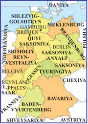

- Lixtenshteyn
- Andorra
+ Lyuksemburg
- Monako

**266. Qachon Yevropani fashizmdan ozod qilganlarni xotirlash uchun GFR kansleri A. Merkel Moskvaga kelgan?**

- 2014-yilda
+ 2015-yilda
- 2016-yilda
- 2017-yilda

**267. Qachon kelib chiqishi eronlik bo‘lgan 18 yoshli Ali Sonboli Myunxen shahridagi savdo markazida «Men nemisman!», degan qichqiriqlar bilan odamlarga qarata o‘q otgan?**

- 2014-yilda
- 2015-yilda
+ 2016-yilda
- 2017-yilda

**268. Germaniyada qachon bo’lib o’tgan bundestag (parlament) yig’ilishida A. Merkel GFR kansleri etib saylangan?**

+ 2005-yilda
- 2006-yilda
- 2007-yilda
- 2008-yilda

**269. Kelib chiqishi eronlik bo‘lgan 18 yoshli Ali Sonbolining Myunxen shahridagi savdo markazida odamlarga qarata o‘q otishi natijasida necha kishi halok bo‘lgan?**

- 7 kishi
- 8 kishi
+ 9 kishi
- 10 kishi

**270. GFR da nechanchi yilda bo`lib o’tgan saylovlarda Xristian-demokratlar bilan liberallar koalitsiyasining pozitsiyasi yana-da mustahkamlangan?**

+ 1994-yilda
- 1995-yilda
- 1996-yilda
- 1997-yilda

**271. Qachon A. Merkel hokimiyatga kelganligining o‘n yilligi nishonlangan?**

- 2014-yilda
+ 2015-yilda
- 2016-yilda
- 2017-yilda

## 12-§ 1991-2017-yillarda Buyuk Britaniya.

**272. Qaysi Buyuk Britaniya bosh vaziri siyosati M. Tetcher davridagi neokonservatizm kursini davom ettirishga, ayni paytda «tetcherizm» ning avtoritar boshqaruvga og‘ish hollaridan va boshqa qoldiqlaridan asta-sekin voz kechishga qaratilgan edi?**

- E. Bler
- G. Braun
+ J. Meyjor
- D. Kemeron

**273. Qachon Shotlandiya va Uels milliy assambleyalariga saylovlar o‘tkazilgan?**

+ 1999-yilda
- 1996-yilda
- 1997-yilda
- 1998-yilda

**274. Qachon Shotlandiyada Buyuk Britaniyadan ajralib chiqish masalasida umumxalq referendumi o‘tkazilib, unda 45% aholi mustaqillik uchun ovoz bergan?**

- 2012-yilda
- 2013-yilda
+ 2014-yilda
- 2015-yilda

**275. Qaysi yilda Isroil-Livan urushi yakunlangandan so‘ng, AQSH ortidan Isroilning yonini olgan Britaniya bosh vaziri E. Blerning iste’fosi talab qilingan?**

+ 2006-yilda
- 2003-yilda
- 2004-yilda
- 2005-yilda

**276. Quyidagi xaritada «X» bilan belgilangan dengiz nomini to’g’ri toping.**

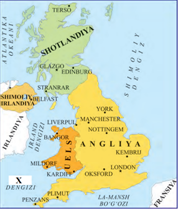

- Ingliz dengizi
- Uels dengizi
+ Kelt dengizi
- Janubiy dengiz

**277. Qachon Britaniya bosh vaziri E. Bler iste’foga chiqqan?**

- 2006-yilda
+ 2007-yilda
- 2004-yilda
- 2005-yilda

**278. Buyuk Britaniyada qaysi yilda bo’lgan parlament saylovlari J. Meyjorning taktikasi to‘g‘riligini ko‘rsatgan va konservatorlar partiyasi saylovlarda g‘olib bo‘lgan?**

- 1990-yilda
- 1991-yilda
+ 1992-yilda
- 1993-yilda

**279. Qachon Londonda to‘rtta terrorchilik akti amalga oshirilgan?**

- 2002-yilda
- 2003-yilda
- 2004-yilda
+ 2005-yilda

**280. Buyuk Britaniyada qaysi yilda bo’lgan parlament saylovlarida leyboristlar partiyasi g‘olib chiqqan va partiya yetakchisi yosh Entoni Bler hukumat boshlig‘i bo‘lgan?**

- 1995-yilda
- 1996-yilda
+ 1997-yilda
- 1998-yilda

**281. Britaniyada qachon bo’lib o’tgan parlament saylovlarida konservatorlar partiyasi g‘alaba qozongan va Devid Kemeron bosh vazir lavozimini egallagan?**

- 2009-yilda
+ 2010-yilda
- 2008-yilda
- 2011-yilda

**282. Qachon Buyuk Britaniya hukumatining Iroqqa qarshi koalitsiyada ishtiroki jamiyatda qizg‘in bahslarni keltirib chiqargan?**

- 2002-yilda
+ 2003-yilda
- 2004-yilda
- 2005-yilda

**283. Qaysi yildagi saylovoldi kampaniyasi davrida bosh vazir D. Kemeron agar konservatorlar g‘alaba qozonsa, Buyuk Britaniyaning Yevroittifoqdan chiqishi masalasini ko‘tarishga va ushbu masala bo‘yicha referendum o‘tkazishga va’da bergan?**

- 2012-yildagi
- 2013-yildagi
- 2014-yildagi
+ 2015-yildagi

**284. Devid Kemeron iste’foga chiqqandan keyin, Buyuk Britaniya bosh vaziri lavozimini kim egallagan?**

- Gordon Braun
- Jon Meyjor
- Boris Jonson
+ Tereza Mey

**285. Qachon Buyuk Britaniya mustamlaka imperiyasi to’liq tugatilgan?**

- XIX asrning ikkinchi yarmida
- XX asrning birinchi yarmida
+ XX asrning ikkinchi yarmida
- XXI asrning boshlarida

**286. Buyuk Britanioya bosh vaziri E. Bler hukumati tashqi siyosatdagi barcha masalalarda qaysi davlatning eng yaqin hamkori bo‘lgan?**

+ AQSH ning
- Rossiyaning
- Fransiyaning
- Germaniyaning

**287. Buyuk Britaniya bosh vaziri E. Bler siyosatidan norozilik ramzi sifatida iste’foga chiqqan Robin Kuk qaysi lavozimda faoliyat olib borgan?**

- Moliya vaziri
+ Tashqi ishlar vaziri
- Ichki ishlar vaziri
- Harbiy vazir

**288. Buyuk Britaniyada nechanchi yilda bo‘lib o‘tgan parlament saylovlarida kichik farq bilan leyboristlar partiyasi g‘olib chiqqan va E. Bler uchinchi muddatga bosh vazir etib saylangan?**

- 2002-yilda
- 2003-yilda
- 2004-yilda
+ 2005-yilda

**289. 2005-yilda Londonda sodir etilgan to‘rtta terrorchilik aktida javobgarlikni qaysi tashkilot o‘z zimmasiga olgan?**

+ Al-Qoida
- Hizb ut-Tahrir
- Tolibon
- ISHID

**290. Britaniyada E. Bler iste’foga chiqqandan keyin bosh vazir lavozimini kim egallagan?**

- Tereza Mey
- Devid Kemeron
- Entoni Bler
+ Gordon Braun

**291. Qachon Jon Meyjor Buyuk Britaniya bosh vaziri etib saylangan?**

+ 1990-yilda
- 1991-yilda
- 1992-yilda
- 1993-yilda

**292. 2016-yil iyun oyida bo‘lib o‘tgan referendumda ishtirok etgan Buyuk Britaniya aholisining necha foizidan ortig‘i mamlakatning Yevropa Ittifoqidan chiqishi uchun ovoz bergan?**

+ 50 % dan ortig‘i
- 60 % dan ortig‘i
- 70 % dan ortig‘i
- 75 % dan ortig‘i

## 13-§ 1991-2017-yillarda Fransiya.

**293. «Xalq harakati uchun ittifoq» partiyasining yetakchisi Nikolya Sarkozi qachon Fransiya prezidenti etib saylangan?**

- 2004-yilda
- 2005-yilda
- 2006-yilda
+ 2007-yilda

**294. Fransiya iqtisodiy taraqqiyotining 1989-1992-yillarga moʻljallangan rejasida nimalar koʻzda tutilgan edi?**

- Pul aylanishi barqarorligini ta’minlash
- Inflatsiyaning pasayishi
- Iqtisodning raqobatbardoshligini qo‘llab-quvvatlash
+ Barcha javoblar to‘g‘ri

**295. Fransiya hukumati ommaviy xususiylashtirish siyosatini qachon eʼlon qilgan?**

- 1980-yillar boshida
+ 1980-yillar oxirida
- 1990-yillar boshida
- 1990-yillar oxirida

**296. Qaysi fransuz prezidentining tashqi siyosati Fransiyaga Yevropa ittifoqining «yetakchisi» va butun dunyo uchun «erk mayogʻi» rolini qaytarish boʻlgan?**

- Nikolya Sarkozi
+ Jak Shirak
- Fransua Olland
- Fransua Mitteran

**297. 1990-yillarda Fransiyani soatiga qancha kilometr tezlik bilan yuradigan temiryoʻl trassalari qamrab olgan?**

+ 250-300 km. tezlik bilan
- 200-250 km. tezlik bilan
- 300-350 km. tezlik bilan
- 150-200 km. tezlik bilan

**298. Fransiyani sotsialistlar boshqargan davrni belgilang.**

- 1960–1970-yillar boshlari
- 1970–1980-yillar boshlari
+ 1980–1990-yillar boshlari
- 1990–2000-yillar boshlari

**299. Qachon Fransiya prezidenti Fransua Olland boylar uchun qo‘shimcha soliq o‘rnatish tashabbusi bilan chiqqan?**

- 2011-yilda
+ 2012-yilda
- 2013-yilda
- 2014-yilda

**300. Bitta mamlakatda va butun dunyoda madaniyatlar xilma-xilligini saqlab qolishga yo‘naltirilgan siyosat hamda bu siyosatni asoslovchi nazariya va mafkura qanday ataladi?**

+ Multikulturalizm
- Monokulturalizm
- Antikulturalizm
- Postkulturalizm

**301. Qachon Fransiya prezidentligiga bo’lgan saylovda «Olg‘a!» harakatining vakili Emmanyuel Makron gʻalaba qozongan?**

- 2015-yil noyabrda
- 2016-yil noyabrda
+ 2017-yil aprelda
- 2016-yil sentyabrda

**302. Angliya va Fransiya hamkorlikda qurilgan, La-Mansh bo‘g‘ozi ostidan o‘tgan temiryo‘l tonneli (Yevrotonnel) qachon ochilgan?**

- 1993-yilda
+ 1994-yilda
- 1995-yilda
- 1996-yilda

**303. Qaysi prezident Fransiya tarixiga eng nufuzsiz prezident boʻlib kirgan?**

- Nikolya Sarkozi
- Jak Shirak
+ Fransua Olland
- Fransua Mitteran

**304. Lyuksemburgning Shengen shahrida Fransiya hukumati Shengen kelishuvini qachon imzolagan?**

+ 1990-yilda
- 1991-yilda
- 1992-yilda
- 1993-yilda

**305. Qaysi Fransiya prezidenti bir jinsli shaxslar o‘rtasida nikohni yoqlab chiqib, uni qonunlashtirgan?**

- Nikolya Sarkozi
- Jak Shirak
- Emmanyuel Makron
+ Fransua Olland

**306. XX asr oxirida Gʻarbiy Yevropani birlashtirishning eng faol ishtirokchisi boʻlgan davlatlarni toping.**

+ Fransiya, Germaniya
- Germaniya, Britaniya
- Britaniya, Rossiya
- Ispaniya, Italiya

**307. Fransiyada ilk bor prezidentlik saylovlarida ikkinchi turga chiqib, qariyb 34% ovoz olgan Marin Le Pen qaysi partiya vakili edi?**

- «Olg‘a!» harakati vakili
+ Milliy front vakili
- Sotsial-demokratik harakat vakili
- O’ng kuchlar vakili

**308. Quyida qaysi davlat xaritasi tasvirlangan?**

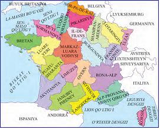

+ Fransiya
- Ispaniya
- Italiya
- Germaniya

**309. Qachon Parijda yuzdan oshiq kishi halok bo‘lgan, uch yuzdan oshiq odam yaralangan terroristik akt sodir boʻlgan?**

+ 2015-yil noyabrda
- 2016-yil noyabrda
- 2017-yil aprelda
- 2016-yil sentyabrda

**310. 2015-yilda Parijda sodir etilgan terroristik aktni qaysi tashkilot o‘z zimmasiga olgan?**

- Al-Qoida
+ ISHID
- Tolibon
- Hizb-ut Tahrir

**311. Fransiyada qachon bo’lib o’tgan saylovlar multikulturalizm siyosatini butunlay barbod boʻlganini ko’rsatgan?**

- 2015-yil noyabrda
- 2016-yil noyabrda
+ 2017-yil aprelda
- 2014-yil sentyabrda

**312. Fransiyada qaysi yildagi prezidentlik saylovlarida Jak Shirak g‘olib chiqqan?**

+ 1995-yildagi
- 1996-yildagi
- 1997-yildagi
- 1998-yildagi

**313. Shengen kelishuviga koʻra (YIH) mamlakatlari fuqarolariga qanday huquq berilgan?**

- YIH mamlakatlari fuqarolariga soliq to’lamaslik huquqi berilgan
- YIH mamlakatlari fuqarolariga imtiyozli kreditlar olish huquqi berilgan
- YIH mamlakatlari fuqarolariga bir nechta fuqarolikka ega bo’lish huquqi berilgan
+ YIH mamlakatlari fuqarolariga vizasiz va bojxona nazoratisiz bir-biriga bemalol oʻtish huquqi berilgan

**314. Fransiyada kimning hukumati Germaniya bilan yaqinlashish va Gʻarbiy Yevropa mamlakatlarining birlashishini oʻzining asosiy vazifasi deb bilgan?**

- Nikolya Sarkozi
- Jak Shirak
- Fransua Olland
+ Fransua Mitteran

**315. FSP (Fransiya sotsialistik partiyasi) yetakchisi Fransua Olland qachon prezidentlikka saylangan?**

- 2011-yilda
+ 2012-yilda
- 2013-yilda
- 2014-yilda

## 14-§ 1991-2017-yillarda Italiya.

**316. Qachon Italiya sotsialistik partiyasi tarqalib ketgan?**

- 1991-yilda
- 1992-yilda
- 1994-yilda
+ 1993-yilda

**317. Qachon Italiyada kommunistik partiya tarqalib ketgan?**

+ 1991-yilda
- 1992-yilda
- 1993-yilda
- 1994-yilda

**318. Italiyada «Halol qoʻllar» kompaniyasi natijasiga ko’ra qaysi Italiya prezidenti iste’foga chiqqan?**

- J. Meloni
+ F. Kossiga
- R. Prodi
- S. Berluskoni

**319. Italiyada «Halol qoʻllar» kompaniyasi davomida, ikki yil ichida qancha kishi poraxoʻrlikda ayblanib qamoqqa olingan?**

- 2 ming kishi
- 4 ming kishi
+ 3 ming kishi
- 5 ming kishi

**320. Quyidagi xaritada qaysi davlat tasvirlangan?**

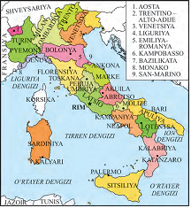

- Fransiya
+ Italiya
- Germaniya
- Niderlandiya

**321. XX asrdagi Italiya siyosiy mexanizmining oʻziga xos tomonini toping.**

- Institutlarning chuqur inqirozi
- Mafiya uyushmalarining faoliyati
+ Misli koʻrilmagan korrupsiya
- Hukumatning tez-tez almashishi

**322. Qachon Italiyada postindustrial jamiyatning asoslari shakllangan?**

- XX asrning 60-yillarida
- XX asrning 70-yillarida
+ XX asrning 80-yillarida
- XX asrning 90-yillarida

**323. Italiyada 1994-yildagi parlament saylovidan soʻng hukumat qaysi guruhlar koalitsiyasi asosida shakllangan?**

- «Olgʻa, Italiya!» va «Shimol ligasi»
- «Milliy alyans» va «Neofashistlar»
- «Oʻng natsionalistlar» va «Olgʻa, Italiya!»
+ «Shimol Ligasi» va «Milliy alyans»

**324. Italiyada 2000-yil aprel oyida bo‘lib o‘tgan mahalliy saylovlarda barcha … viloyatlarda o‘ng kuchlar g‘olib chiqqan.**

+ Shimoliy
- Janubiy
- G‘arbiy
- Sharqiy

**325. Italiyaning tashqi qarzi hozirgi YIM ga nisbatan qancha foizni tashkil etadi?**

+ 130 foizni
- 140 foizni
- 150 foizni
- 160 foizni

**326. Italiyada qaysi yildagi parlament saylovlari avvalgi partiyaviy tizimning qulaganligini namoyish qilgan va «Olg‘a, Italiya!», «Shimol ligasi», «Milliy alyans» – neofashistlar va o‘ng natsionalistlar birlashmasi oldingi maydonga chiqqan?**

- 1991-yildagi
- 1992-yildagi
- 1993-yildagi
+ 1994-yildagi

**327. Italiyada Liberal-sotsialistik partiya va Kommunistik uyg‘onish partiyasi qaysi partiya bazasida tashkil qilingan?**

+ Kommunistik partiya
- Liberal partiya
- Sotsialistik partiya
- Demokratik partiya

**328. Qachon Italiya bosh vaziri Romano Prodi iste’foga chiqqan?**

- 1997-yilda
- 1999-yilda
+ 1998-yilda
- 2000-yilda

**329. 1994-yil oxirida Italiyaning yangi hukumati kimlardan tashkil topgan edi?**

- Soʻl kuchlardan
- Oʻng kuchlardan
+ Partiyasizlardan
- Mafiya tarafdorlaridan

**330. Italiyada 2016-yil dekabrda bosh vazir lavozimini kim egallagan?**

- Massimo D’Alema
+ Paolo Jentiloni
- Matteo Rensi
- Romano Prodi

**331. Qachon Italiyada «Halol qoʻllar» kompaniyasi boshlanib, hokimiyatning yuqori qatlami va asosiy partiyalar rahbariyatida ommaviy korrupsiya holatlari aniqlangan?**

- 1991-yilda
+ 1992-yilda
- 1993-yilda
- 1994-yilda

**332. Qachon XDP bazasida Italiya xalq partiyasi tuzilgan?**

- 1991-yilda
- 1992-yilda
+ 1993-yilda
- 1994-yilda

**333. Italiyada1994-yildagi parlament saylovidan soʻng kim boshchiligida yangi hukumat shakllantirilgan?**

+ S. Berluskoni
- F. Kossiga
- M. Rensi
- R. Prodi

**334. Qaysi Italiya bosh vaziri 2014-yil fevral oyidan boshlab Italiya hukumatini boshqargan, 2015-yildan ta’lim tizimini isloh qilishni boshlagan?**

- Massimo D’Alema
- Paolo Jentiloni
+ Matteo Rensi
- Romano Prodi

**335. Italiyada soʻl markazchilar hokimyati koalitsiyasi qachon hukumatga kelgan?**

- 1994-yilda
+ 1996-yilda
- 1995-yilda
- 1997-yilda

**336. Qaysi Italiya bosh vaziri yuqori darajada saqlanib kelayotgan ishsizlikni qisqartirishni taklif qilgan?**

- Silvio Berluskoni
+ Massimo DʼAlema
- Matteo Rensi
- Romano Prodi

**337. Qaysi Italiya bosh vaziri korrupsiyaga qarshi kurash e’lon qilgani holda o‘zi soliq qoidalarini buzganlikda ayblanib, iste’foga chiqqan?**

+ S. Berluskoni
- F. Kossiga
- M. Rensi
- R. Prodi

**338. Qachon Italiya aholisi referendumda saylovning proporsional tizimidan voz kechish uchun ovoz bergan?**

- 1991-yilda
- 1992-yilda
- 1994-yilda
+ 1993-yilda

## 15-§ Osiyo, Afrika va Lotin Amerikasi mamlakatlari siyosiy, ijtimoiy-iqtisodiy rivojlanishning asosiy yo`nalishlari.

**339. Lotin Amerikasida qaysi yillardagi neoliberal islohotlarning salbiy oqibatlarini bartaraf qilish jarayonida so‘l yo‘nalishdagi hukumatlar saylov yo‘li bilan hokimiyatga kelgan va bu «so‘l burilish» nomini olgan?**

- 1970-yillardagi
- 1980-yillardagi
+ 1990-yillardagi
- 1960-yillardagi

**340. XX asr oxiriga kelib nima sababdan Osiyo, Afrika va Lotin Amerikasidagi mamlakatlar og‘ir sharoitga tushib qolgan?**

- AQSH ekspansiyasi kuchaygani sababli
+ Ular yordam olib turgan SSSR tarqab ketgani sababli
- Jahon iqtisodiy inqirozi boshlangani sababli
- Siyosiy beqarorlik kuchaygani sababli

**341. Islom davlatlaridagi ekstremistik guruhlar Usoma bin Lodin yetakchiligida qanday tashkilotni tashkil qilgan va bu tashkilot butun dunyo bo‘ylab terroristik aktlarni rag‘batlantirgan?**

- «Islom xalqaro fondi»
- «Muslim xalqaro fondi»
+ «Jihod xalqaro fondi»
- «Xalifat xalqaro fondi»

**342. Butun musulmon olamiga juda katta ta’sir ko‘rsatgan Erondagi islom inqilobi qachon yuz bergan?**

- 1977-yilda
- 1978-yilda
+ 1979-yilda
- 1980-yilda

**343. XX asrning oxiri – XXI asr boshlarida Lotin Amerikasi mamlakatlari o‘z tarixida birinchi marta …siz rivojlandi.**

- monarxiyalar
- islohotlar
- inqiloblar
+ diktaturalar

**344. XX asrda Lotin Amerikasi mamlakatlari uchun umumiy bo‘lgan modernizatsiyalashning qaysi usullari mavjud edi?**

- Inqilobiy
- Neokonservativ
- Islohotchilik
+ Barcha javoblar to‘g‘ri

**345. Hozirda Yer yuzi aholisi o‘sishining asosiy qismi qanday mamlakatlar hissasiga to‘g‘ri kelmoqda?**

+ Rivojlanayotgan mamlakatlar
- Rivojlangan mamlakatlar
- Qoloq mamlakatlar
- O‘ta qoloq mamlakatlar

**346. Quyidagi xaritada islomning shia mazhabiga e’tiqod qiluvchi sifatida qaysi davlatlar keltirilgan?**

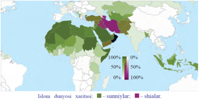

- Suriya, Eron, Albaniya
+ Eron, Iroq, Ozarbayjon
- Pokiston, Iroq, Afg’oniston
- Quvayt, Iroq, Turkiya

**347. Qachon arab mamlakatlari va Shimoliy Afrikada «Musulmon birodarlar» kabi terrorchi guruhlar faollashgan?**

- 1970-yillarning boshlarida
- 1980-yillarning boshlarida
+ 1990-yillarning boshlarida
- 2000-yillarning boshlarida

**348. Hozirda Janubiy Osiyo mamlakatlarida eng dolzarb muammolardan biri … qariyb yarmi savodsizligi.**

+ katta yoshdagi aholining
- maktab yoshdagi aholining
- o’rta yoshdagi aholining
- asosan ayollardan iborat bo’lgan aholining

**349. So‘nggi yillarda Hindistonda qaysi dinning dastlabki qadriyatlariga qaytishni talab qilayotgan kuchlar faollashib qolgan?**

- Islomning
- Buddizmning
- Sintoizmning
+ Hinduizmning

**350. XXI asr boshlarida AQSH qanday bahona bilan Iroq va Liviya kabi suveren davlatlarda hokimiyatni qurol kuchi bilan ag‘darib tashlagan?**

- «Adolat o‘rnatish»
- «Respublika o‘rnatish»
- «Tinchlik o‘rnatish»
+ «Demokratiya o‘rnatish»

## 16-§ 1991-2017-yillarda Xitoy Xalq Respublikasi.

**351. Sotsialistik tizim va SSSR tarqalib ketgandan so‘ng, qaysi davlat dunyodagi eng yirik sotsialistik davlat sifatida saqlanib qoldi?**

- KXDR
+ XXR
- RSFSR
- GDR

**352. «Xitoy orzusi» deganda nima tushuniladi?**

- «Xitoy millatini tiklash» yo‘lidagi ikki qadam
- XKP ning yuz yilligiga (2021-yil) «o‘rtacha farovonlik» darajasiga erishish
- XXR ning yuz yilligiga (2049-yil) esa jahonning rivojlangan mamlakatlari qatoridan o‘rin
+ Barcha javoblar to‘g‘ri

**353. Xitoydagi Tyananmen maydonida nechanchi yilda tinch namoyish bo‘lib o‘tgan?**

+ 1989-yilda
- 1990-yilda
- 1988-yilda
- 1991-yilda

**354. 1990-yillar boshida XXR da davlat apparati xodimlari qanchaga qisqartirilgan?**

+ 1/2 qismiga
- 1/3 qismiga
- 1/4 qismiga
- 1/5 qismiga

**355. O’z shahridagi namoyishlarni tinch yo’l bilan to’xtata olgani uchun, XXR rahbari Den Syaopin o’zini vorisi deb e’lon qilgan Szyan Szemin qaysi shahar meri edi?**

- Pekin
- Nankin
+ Shanxay
- Tayvan

**356. Xitoy Kommunistik partiyasining 19-Umumxitoy syezdi qachon bo‘lib o‘tgan?**

+ 2017-yil oktyabrida
- 2018-yil noyabrida
- 2016-yil mayida
- 2015-yil oktyabrida

**357. XXR da 1990-yillar boshida Xu Szintao qaysi lavozimga tayinlangan?**

+ XKP ning Bosh kotibi
- Tashqi ishlar vaziri
- Harbiy vazir
- Moliya vaziri

**358. Qachon AQSH prezidenti D. Tramp Xitoyga tashrif buyurgan?**

- 2015-yil sentyabrda
- 2016-yil oktyabrda
+ 2017-yil noyabrda
- 2018-yil dekabrda

**359. 1992-yil Den Syaopin XXR ning qaysi qismidagi provinsiyalarga safar qilgan?**

+ Janubiy qismidagi
- Sharqiy qismidagi
- G‘arbiy qismidagi
- Shimoliy qismidagi

**360. Bugungi kunda Xitoyning asosiy savdo hamkori qaysi davlat?**

- Rossiya
- Germaniya
- Yaponiya
+ AQSH

**361. Xitoy hukumati tomonidan ijtimoiy sohada XXI asrning asosiy vazifasi deb belgilab olingan vazifani toping.**

- Kam ta’minlangan oilalarni har tomonlama qo‘llab-quvvatlash
- Keksa yoshdagi shaxslarga tibbiy sohadan bepul foydalanish sharoitini yaratish
+ Ekologik sof muhitni yaratish
- Terrorizmni yo‘q qilish

**362. Xitoyda Den Syaopin vafot etgan yili … .**

- Xitoy Jahon savdo tashkilotiga (JST) a’zo bo‘ldi
+ XKP «davlat sektorini modernizatsiya qilish dasturini» qabul qildi
- Sinszyan-Uyg`ur avtanom o‘lkasida 200 ga yaqin terroristik aktlar amalga oshirildi
- Tyananmen maydonida talabalar namoyishi bo‘lib o‘tdi

**363. Xitoy Jahon savdo tashkilotiga qachon a’zo bo‘lgan?**

- 2000-yilda
- 2003-yilda
+ 2001-yilda
- 1999-yilda

**364. Si Szinpinning ta’kidlashicha Xitoy qachonga kelib zamonaviy buyuk sotsialistik davlatga aylanadi?**

- XXI asr boshlariga kelib
+ XXI asr o‘rtalariga kelib
- XXI asr oxirlariga kelib
- XXII asr boshlariga kelib

**365. XXR rahbari Den Syaopin qachon vafot etgan?**

- 1998-yilda
- 1999-yilda
+ 1997-yilda
- 1996-yilda

**366. Quyidagi qaysi javob AQSH va Xitoy o‘rtasida kelib chiqayotgan muammolarga misol bo‘ladi?**

+ AQSH ning Osiyo-Tinch okean mintaqasida o‘z ta’sirini kuchaytirishga qaratilgan siyosati
- AQSH tomonidan Xitoy bozoriga ko‘plab mahsulotlarning kiritilayotganligi
- Xitoy tomonidan AQSH bozoriga ko‘plab mahsulotlarning kiritilayotganligi
- Xitoy tomonidan KXDR ning qo‘llab-quvvatlanayotganligi

**367. XXR da Si Szinpin qachon hokimiyat tepasiga kelgan?**

- 2011-yilda
- 2009-yilda
- 2010-yilda
+ 2012-yilda

**368. «Boy bo‘lish – bu juda yaxshi» deb ta’kidlagan XXR rahbarini toping.**

- Si Szinpin
- Xu Szintao
+ Den Syaopin
- Szyan Szemin

**369. Sinszyan-Uyg‘ur avtanom o‘lkasida qachon 200 ga yaqin terroristik aktlar amalga oshirilgan?**

- 2011-yilda
- 2012-yilda
- 2014-yilda
+ 2013-yilda

**370. Xitoy tarixida «islohotlarining otasi» nomini olgan shaxsni toping.**

- Si Szinpin
+ Den Syaopin
- Xu Szintao
- Mao Szedun

**371. Den Syaopin Xitoyning qirg‘oq bo‘yidagi nechta viloyatini maxsus iqtisodiy zonalar deb e’lon qilgan?**

+ 4 ta viloyatni
- 3 ta viloyatni
- 5 ta viloyatni
- 2 ta viloyatni

**372. Nima sababdan G‘arb davlatlari Xitoyning tashqi siyosatini tanqid qilib keladi?**

+ KXDR ni qo‘llab-quvvatlagani uchun
- BMT Xavfsizlik kengashining doimiy a’zosi bo‘lmaganligi uchun
- Rossiya bilan yaqin munosabatda bo‘lganligi uchun
- G‘arb mamlakatlari manfaatiga zid ish olib borayotgani uchun

**373. «Bitta oila-bitta farzand» siyosati qaysi davlatda yuritilgan?**

- Janubiy Koreyada
- Yaponiyada 
+ Xitoyda
- Hindistonda

## 17-§ 1991-2017-yillarda Yaponiya.

**374. 2005-yili Yaponiya bosh vaziri J. Koidzumi hukumati Tayvan oroli masalasida ilk bor AQSHni ochiq qo‘llaganda qaysi davlat bilan munosabatlari keskin yomonlashgan?**

- Buyuk Britaniya
+ Xitoy
- Rossiya
- Fransiya

**375. Dunyoda YIM bo’yicha qaysi davlatlar birinchi va ikkinchi o’rinni egallagan?**

- Xitoy, AQSH
- AQSH, Buyuk Britaniya
+ AQSH, Xitoy
- Xitoy, Yaponiya

**376. Yaponiyada osiki Kayfu qachon hokimiyatga kelgan?**

- 1991-yilda
+ 1990-yilda
- 1992-yilda
- 1993-yilda

**377. Qachon Yaponiya bosh vaziri Keydzo Obuti vafot etgan?**

- 1997-yilda
- 1998-yilda
- 1999-yilda
+ 2000-yilda

**378. Ikkinchi jahon urushi yakunlangandan beri Yaponiya qaysi davlatning mintaqadagi eng yaqin savdo hamkori va strategik sherigi bo‘lib kelmoqda?**

- Buyuk Britaniyaning
- Xitoyning
+ AQSH ning
- Rossiyaning

**379. Qachon yuz bergan zilzila Yaponiyaga katta zarar yetkazgan?**

- 2009-yil fevralda
- 2010-yil aprelda
+ 2011-yil martda
- 2012-yil mayda

**380. Yaponiya qanday mahsulotlarni ishlab chiqarish bo’yicha dunyoda birinchi o’rinni egallab turibdi? 1) Kemasozlik; 2) Po’lat ishlab chiqarish; 3) Traktorsozlik; 4) Metallni qayta ishlash sanoati uchun uskunalar; 5) Televizorlar; 6) Avtomobil.**

- 2, 5, 6
- 1, 5, 6
- 1, 3, 4, 5
+ 1, 3, 4

**381. 1990-yillarda kim Yaponiyaning xalqaro obro‘yini oshirishga erishgan?**

- Ryutaro Xasimoto
- Keydzo Obuti
- Yosiro Mori
+ Tosiki Kayfu

**382. Qachon Shimoliy Koreya masalasida Yaponiya bilan Xitoy o‘rtasida yana kelishmovchilik yuzaga kelgan?**

- 2014-yilda
- 2015-yilda
- 2016-yilda
+ 2017-yilda

**383. Qaysi yildan buyon LDP yetakchisi Sindzo Abe Yaponiyani boshqarib kelmoqda?**

- 2010-yildan
- 2013-yildan
- 2011-yildan
+ 2012-yildan

**384. 2000-yil Yaponiya bosh vaziri Keydzo Obuti vafot etgandan so‘ng bu lavozimni kim egallagan?**

+ Yosiro Mori
- Ryutaro Xasimoto
- Tosiki Kayfu
- Sindzo Abe

**385. 2001-yilda Yaponiya bosh vaziri lavozimini kim  egallagan?**

- Sindzo Abe
+ Junitiro Koidzumi
- Tosiki Kayfu
- Yosiro Mori

**386. XX asr oxirida Yaponiya ichki siyosatida qaysi partiya yetakchilikni saqlab qolgan?**

- Demokratlar partiyasi
+ Liberal-demokratik partiya
- Sotsial-demokratik partiya
- Respublikachilar partiyasi

**387. Yaponiya YIM hajmi bo‘yicha dunyoda nechanchi o’rinda turadi?**

- 6 o‘rinda
- 5 o‘rinda
- 4 o‘rinda
+ 3 o‘rinda

**388. Qaysi yapon bosh vaziri bir qator terrorchilik aktlarini amalga oshirgan «Aum Sinrikyo» sektasi faoliyatiga chek qo‘yishda qat’iy harakatlari bilan tanilgan?**

- Keydzo Obuti
- Yosiro Mori
+ Ryutaro Xasimoto
- Tosiki Kayfu

**389. Quyidagi xaritada «X» bilan belgilangan dengiz nomini toping.**

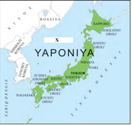

- Xitoy dengizi
+ Yapon dengizi
- Rus dengizi
- Koreys dengizi

**390. Qachon Quvaytning Iroq tomonidan anneksiya qilinishi paytida Yaponiya xalqaro harbiy kontingentga yordam tarzida bir necha milliard dollar mablag’ ajratgan?**

- 1991-yilda
+ 1990-yilda
- 1992-yilda
- 1993-yilda

**391. Yaponiya bosh vaziri Junitiro Koidzumi necha muddat hukumatni boshqargan?**

- 2 muddat
- 4 muddat
- 1 muddat
+ 3 muddat

**392. Yaponiyada «olti islohot» kimning davrida amalga oshirilgan?**

+ Ryutaro Xasimoto
- Keydzo Obuti
- Yosiro Mori
- Tosiki Kayfu

**393. «Detsentralizatsiya» nima?**

+ Qarorlar qabul qilish bo‘yicha vakolat va majburiyatlarni markazdan boshqa tashkilotlarga o‘tkazish
- Kishilarning ko‘pincha tor, o‘ta mutaassib va ekstremistik qarashlar doirasida birlashishi, umumiy diniy yo‘nalishdan chetga chiqish
- Shaharlar soni ko‘payib, ularda davlatning siyosiy, iqtisodiy va madaniy hayoti jamlanishi tarixiy jarayoni
- Qat’iy xalqaro valutaga milliy valutaning rasmiy kursini pasaytirish

**394. 1990-yillari butun dunyoda ishlab chiqarilgan videoapparaturalarning necha foizi Yaponiya hisobiga to’g’ri kelardi?**

- 75 foizi
+ 90 foizi
- 80 foizi
- 85 foizi

**395. Qaysi yapon bosh vaziri yangicha diplomatiyani namoyish qilib, tashqi siyosatda «yevroosiyochilik» konsepsiyasini tatbiq etishga uringan?**

- Keydzo Obuti
+ Ryutaro Xasimoto
- Yosiro Mori
- Tosiki Kayfu

**396. 2011-yil martda Xonsyu orolida yuz bergan zilzila oqibatida qaysi atom elektrostansiyasidan radioaktiv moddalarning atrof-muhitga tarqalishi yuz bergan?**

+ Fukusima-1
- Fukusima-2
- Fukusima-3
- Fukusima-4

**397. Yaponiyada XXI asrda ichki siyosatda asosan qaysi partiyaning yetakchiligi saqlanib qolgan?**

- Demokratik partiya
+ Liberal-demokratik partiya
- Sotsial-demokratik partiya
- Respublikachilar partiyasi

**398. «Osiyo inqirozi» qachon bo’lgan?**

+ 1997-1998-yillarda
- 1997-1999-yillarda
- 1996-1997-yillarda
- 1998-1999-yillarda

**399. Qaysi bosh vazir Yaponiya konstitutsiyasining mamlakatga o‘z qurolli kuchlariga ega bo‘lishini taqiqlovchi moddasini qayta ko‘rib chiqish tarafdori bo‘lgan?**

- Sindzo Abe
- Tosiki Kayfu
+ Junitiro Koidzumi
- Yosiro Mori

**400. Yaponiyada qachon LDP yana bir partiyali hukumat tuzishga erishgan?**

- 1995-yil yanvarda
+ 1996-yil yanvarda
- 1997-yil yanvarda
- 1998-yil yanvarda

**401. Yaponiyada 2011-yil martda qaysi orolda zilzila yuz bergan?**

- Xokkaydo orolida
- Kyusyu orolida
- Sikoku orolida
+ Xonsyu orolida

**402. 1990-yillari butun dunyoda ishlab chiqarilgan qanday mahsulotlarning 2/3 qismi Yaponiya hissasiga to‘g‘ri kelardi?**

- Videoapparatura
- Televizor
- Qurilish materiallari
+ Sanoat robotlari

**403. Qachon Yaponiya bosh vaziri J. Koidzumi hukumati Tayvan oroli masalasida ilk bor AQSHni ochiq qo‘llab-quvvatlagan?**

+ 2005-yilda
- 2006-yilda
- 2007-yilda
- 2004-yilda

**404. 1990-yillarda qaysi davlat mehnat unumdorligi bo‘yicha G‘arbiy Yevropa mamlakatlaridan o‘tib, AQSH ga tenglashib borgan?**

+ Yaponiya
- Koreya
- Xitoy
- Tailand

**405. Yaponiyada 1996-yil yanvarda tuzilgan LDP ning bir partiyali hukumatiga kim boshchilik qilgan?**

+ Ryutaro Xasimoto
- Keydzo Obuti
- Yosiro Mori
- Tosiki Kayfu

## 18-§ 1991-2017-yillarda Janubi-Sharqiy Osiyo mamlakatlari.

**406. Qachon Filippinda narkotik savdosi bilan noqonuniy shug‘ullanuvchilarga qarshi kompaniya boshlanib, narkotik savdosida gumon qilingan 2 mingdan oshiq kishi o‘ldirilgan?**

+ 2016-yilda
- 2012-yilda
- 2015-yilda
- 2011-yilda

**407. Qaysi Janubi-Sharqiy Osiyo davlatning parlamenti Milliy assambleya deb ataladi?**

- Kambodjaning
- Indoneziyaning
- Vyetnamning
+ Laosning

**408. Erkin tadbirkorlikka ruxsat berilgan, dehqonlar uzoq muddat yerga egalik qilish huquqini olgan Vyetnam Kommunistik partiyasining VII syezdi qachon bo’lgan?**

+ 1991-yilda
- 1992-yilda
- 1993-yilda
- 1994-yilda

**409. Qaysi Janubi-Sharqiy Osiyo (JSHO) mamlakatlari taraqqiyotning sotsialistik yo‘lini tanlagan edi?**

- Myanma, Tailand, Malayziya
- Bruney, Sharqiy Timor
+ Vyetnam, Kambodja, Laos
- Indoneziya, Filippin

**410. «Miss-2017» dunyo go‘zallari tanlovi g‘olibi Karen Ibasko qayerlik edi?**

- Laoslik
- Vyetnamlik
- Indoneziyalik
+ Filippinlik

**411. Qachon Malayziyada bo‘lgan saylovlarda doktor Mahatxir Muhammad boshchiligidagi Malayya birlashgan milliy partiyasi (MBMP) g‘alabani qo‘lga kiritgan?**

- 1992-yilda
+ 1995-yilda
- 1998-yilda
- 2000-yilda

**412. Qachon Indoneziya prezidenti etib Megavati Sukarnoputri saylangan?**

+ 2001-yilda
- 2002-yilda
- 2003-yilda
- 2004-yilda

**413. Janubi-Sharqiy Osiyo mamlakatlarida qancha aholisi yashaydi?**

+ Yarim milliarddan oshiq
- Bir milliarddan oshiq
- Bir yarim milliarddan oshiq
- Ikki milliarddan oshiq

**414. Quyidagi xaritada Osiyoning qaysi qismi tasvirlangan?**

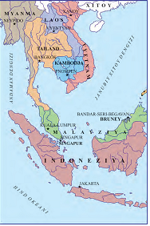

+ Janubi-Sharqiy
- Shimoli-Sharqiy
- Janubi-G’arbiy
- Shimoli-G’arbiy

**415. Qaysi Janubi-Sharqiy Osiyo davlatning milliy valyutasi «rupiya» deb ataladi?**

- Kambodjaning
- Laosning
- Vyetnamning
+ Indoneziyaning

**416. Qachon Filippinda general Fidel Ramos mamlakat prezidenti etib saylangan?**

- 1990-yilda
+ 1992-yilda
- 1993-yilda
- 1995-yilda

**417. Qachon Sharqiy Osiyo mamlakatlari «yangi industrial mamlakatlar» deb ataluvchi guruh qatoridan joy olgan?**

- 1970-yillarning boshida
+ 1990-yillarning boshida
- 1980-yillarning boshida
- 2000-yillarning boshida

**418. Qaysi mamlakatning milliy valyutasi «kipa» deb ataladi?**

- Kambodjaning
- Indoneziyaning 
+ Laosning
- Vyetnamning

**419. Janubi-Sharqiy Osiyo (JSHO) mamlakatlariga rivojlanish darajasi bir-biriga yaqin bo‘lgan nechta mamlakat kiradi?**

+ 10 ta
- 13 ta
- 18 ta
- 21 ta

**420. Qachon Laos birinchi marta o‘zini sholi bilan ta’minlagan?**

- 1994-yilda
- 1991-yilda
- 1995-yilda
+ 1999-yilda

**421. Qachon Sharqiy Osiyo mamlakatlarining barchasida iqtisodiy o‘sishning yuqori sur’atlari kuzatilgan?**

- 1960-1970-yillarda
- 1970-1980-yillarda
+ 1980-1990-yillarda
- 1990-2000-yillarda

**422. Qaysi davlatlar «Osiyo yo‘lbarslari», «yangi industrial davlatlar» deb ataladi?**

+ Janubiy Koreya, Tayvan, Singapur, Gonkong
- Myanma, Tailand, Malayziya
- Indoneziya, Filippin
- Vyetnam, Kambodja, Laos

**423. Qachon Kambodjada hokimiyatni Oliy milliy kengashga berish to‘g‘risida Parij konferensiyasida qaror qilingan?**

+ 1991-yilda
- 1995-yilda
- 1998-yilda
- 1994-yilda

**424. Qaysi Janubi-Sharqiy Osiyo mamlakatida XXI asr boshida «tirik tovar» savdosi keng avj olgan bo‘lib, ota-onalar bolalarini arzimagan pulga sotgan?**

+ Kambodjada
- Laosda
- Vyetnamda
- Indoneziyada

**425. Qachon Laosda konstitutsiya qabul qilingan?**

- 1995-yilda
+ 1991-yilda
- 1993-yilda
- 1994-yilda

**426. Qaysi mamlakat oziq-ovqat eksporti bo‘yicha Osiyo mamlakatlari ichida birinchi, sholi eksporti bo‘yicha dunyoda mamlakatlar o‘rtasida ikkinchi o‘rinni egallab turibdi?**

- Myanma
- Bruney
+ Vyetnam
- Indoneziya

**427. Malayziyada ishlab chiqilgan dasturga ko’ra, mamlakat qachon industrial rivojlangan mamlakatlar qatoridan o‘rin olishi ko‘zda tutilgan?**

+ 2020-yilga kelib
- 2025-yilga kelib
- 2030-yilga kelib
- 2035-yilga kelib

**428. Qachon Indoneziya prezidenti etib Joko Vidodo saylangan?**

- 2010-yilda
- 2012-yilda
+ 2014-yilda
- 2015-yilda

**429. 1990-yillarda «Osiyo inqirozi» tufayli iste’foga chiqqan Suxarto qaysi mamlakatning prezidenti edi?**

- Kambodjaning
- Laosning
- Vyetnamning
+ Indoneziyaning

**430. Qachon Kambodja ASEAN ning teng huquqli a’zosi bo‘lgan?**

- 1995-yilda
- 1994-yilda
- 1992-yilda
+ 1999-yilda

**431. Qachon bo‘lib o‘tgan saylovlarda Rodrigo Roa Duterte g‘olib chiqib, Filippin prezidenti bo‘lgan?**

+ 2016-yilda
- 2012-yilda
- 2015-yilda
- 2011-yilda

**432. Qachon Filippinda o‘lim jazosi bekor qilingan?**

- 2001-yilda
+ 2006-yilda
- 2003-yilda
- 2008-yilda

## 19-§ 1991-2017-yillarda Hindiston Respublikasi.

**433. 2017-yil oxiriga kelib Hindiston aholisi qanchani tashkil etgan?**

+ 1 mlrd. 350 mln. kishidan ortiq
- 1 mlrd. 150 mln. kishidan ortiq
- 1 mlrd. 250 mln. kishidan ortiq
- 1 mlrd. 200 mln. kishidan ortiq

**434. Hindiston aholisining qanchasini qashshoqlar tashkil etadi?**

- 200 millionini
+ 400 millionini
- 500 millionini
- 600 millionini

**435. Hindistonda qaysi bosh vazir hukumati tadbirkorlar va firmalar faoliyati ustidan davlat nazoratni kamaytirib, soliqlarni pasaytirgan?**

- Narasimxa Rao
+ Atal Bixari Vajpai
- Narendra Modi
- Manmoxan Singx

**436. Hozirda Hindistonda musulmonlar soni qanchani tashkil etadi?**

- 150 million
- 170 million
- 125 million
+ 160 million

**437. 2006-yilda e’lon qilingan Jahon bankining prognozlariga qaraganda, qachon Hindiston iqtisodiyoti dunyoda Xitoy va AQSH dan so‘ng uchinchi o‘ringa chiqishi mumkin?**

- 2020-yilda
- 2030-yilda
+ 2025-yilda
- 2035-yilda

**438. Bosh vazir Atal Bixari Vajpai tomonidan Hindistonning qaysi hududida musulmon separatizmini kuchsizlantirish tadbirlari o‘tkazilgan?**

+ Kashmir
- Ahmadobod
- Nagpur
- Kanpur

**439. Hindistonni muntazam rivojlanishiga to’sqinlik qilayotgan ijtimoiy muammolardan eng asosiysi nimadan iborat?**

+ Demografik muammo
- Diniy muammo
- Qashshoqlik muammosi
- Savodsizlik muammosi

**440. Qat’iy xalqaro valutaga nisbatan milliy valutaning rasmiy kursini pasaytirish qanday ataladi?**

- Deportatsiya
- Destruktrizatsiya
+ Devalvatsiya
- Dezinformatsiya

**441. Hindiston kompyuter dasturlarini yaratish sohasidagi yuqori malakali kadrlar soni bo‘yicha dunyodagi qaysi davlatdan so‘ng ikkinchi o’rinni egallaydi?**

- Rossiya
+ AQSH
- Yaponiya
- Xitoy

**442. Hindistonda Rajiv Gandidan so’ng bosh vazirlik o’rnini kim egallagan?**

+ Narasimxa Rao
- Atal Bixari Vajpai
- Narendra Modi
- Manmoxan Singx

**443. Hindiston 1992-yildan boshlab qanday mahsulotni eksport qilishni boshlagan?**

- Paxta
- Ip-gazlama
+ G’alla
- Shakarqamish

**444. 2004-yil Hindiston bosh vaziri lavozimi egallagan shaxsni toping.**

- Narasimxa Rao
- Atal Bixari Vajpai
- Narendra Modi
+ Manmoxan Singx

**445. Yaqin yillarda Hindistonda etnik muammolar keltirib chiqarayotgan etnoslarni hududlari bilan muvofiqlashtiring. 1) Sikxlar; 2) Bengallar; 3) Tamillar. a) Janubiy Hindiston; b) Panjob; c) Assam.**

- 1-a, 2-c, 3-b
+ 1-b, 2-c, 3-a
- 1-c, 2-a, 3-b
- 1-a, 2-b, 3-c

**446. 2000-yilda Hindistonning qaysi qismida uchta yangi shtat tashkil qilingan?**

- Shimoli-sharqida
- Janubi-sharqida
+ Shimoli-g’arbida
- Janubi-g’arbida

**447. Hindiston bosh vaziri Rajiv Gandi qachon o’ldirilgan?**

- 1990-yilda
- 1992-yilda
+ 1991-yilda
- 1989-yilda

**448. Hindiston bosh vaziri Rajiv Gandi kimlar tomonidan o’ldirilgan?**

- Assam terrorchilari
- Kashmir terrorchilari
- Bengal terrorchilari
+ Tamil terrorchilari

**449. Hindistonda kimning bosh vazirligi davrida mamlakat g‘arbida qurg‘oqchilik kelib chiqqan?**

- Narasimxa Rao davrida
+ Atal Bixari Vajpai davrida
- Narendra Modi davrida
- Ziyovuddin Tusiy davrida

**450. Hindistonda qachon o‘tkazilgan parlament saylovlarida Xalq-demokratik alyansi g‘alaba qozonib, uning yetakchisi Atal Bixari Vajpai bosh vazir lavozimini egallagan?**

+ 1998-yil martda
- 1997-yil aprelda
- 1994-yil yanvarda
- 1992-yil dekabrda

**451. 2014-yilda Hindiston bosh vaziri lavozimi egallagan shaxsni toping.**

- Narasimxa Rao
+ Narendra Modi
- Manmoxan Singx
- Atal Bixari Vajpai

## 20-§ 1991-2017-yillarda Turkiya Respublikasi. 

**452. Turkiya hukumati siyosatidan norozi bo’lgan Kurd ishchi partiyasiga kim boshchilik qilgan?**

- Sulaymon Demirel
- Nejmiddin Erbakan
- Rejep Tayyip Erdo‘g‘on
+ Abdulla Ojalon

**453. 2002-yilda Rejep Tayyip Erdo’g’onning partiyasi parlament saylovlarida g’olib bo’lgan bo’lsada, uning o’rniga kim bosh vazir bo’lgan?**

- Sulaymon Demirel
- Nejmiddin Erbakan
+ Abdulloh Gul
- Abdulla Ojalon

**454. Turkiyada prezident bevosita xalq tomonidan saylangan birinchi saylov qachon bo’lib o’tgan?**

- 2015-yilda
+ 2014-yilda
- 2016-yilda
- 2017-yilda

**455. 1990-yillar oxirida Turkiya eksportining asosiy qismini qanday mahsulotlar tashkil etgan?**

- G’alla mahsulotlari
- Poliz mahsulotlari
- Xom ashyo mahsulotlari
+ Sanoat mahsulotlari

**456. Turkiyada 1995-yilgi parlament saylovida eng ko‘p ovoz olgan «Refax» (Farog‘at) partiyasi rahbari kim edi?**

- Sulaymon Demirel
+ Nejmiddin Erbakan
- Rejep Tayyip Erdo‘g‘on
- Abdulla Ojalon

**457. Turkiyada jamiyatda islom dinining ta’siri o‘sganligini yana bir bor namoyish qilgan parlament saylovi nechanchi yilda bo‘lib o‘tgan?**

+ 1995-yilda
- 1992-yilda
- 1993-yilda
- 1994-yilda

**458. Turg‘ut O‘zoldan keyin Turkiya Respublikasida prezidentlik lavozimini kim egallagan?**

+ Sulaymon Demirel
- Nejmiddin Erbakan
- Rejep Tayyip Erdo‘g‘on
- Abdulla Ojalon

**459. Turkiyada prezidentni to’g’ridan-to’g’ri xalq saylashi to’g’risidagi qonun qachon qabul qilingan?**

- 2010-yilda
- 2015-yilda
+ 2012-yilda
- 2014-yilda

**460. Taniqli islohotchi Turg‘ut O‘zol nechanchi yilda Turkiya Respublikasi prezidenti etib saylangan?**

- 1990-yilda
+ 1989-yilda
- 1988-yilda
- 1991-yilda

**461. Turkiyada prezidentlik boshqaruvi qachon joriy qilingan?**

- 2015-yilda
- 2016-yilda
- 2014-yilda
+ 2017-yilda

**462. 2002-yilgi parlament saylovlarida Rejep Tayyip Erdo’g’on boshchiligdagi partiya g’alaba qozongan bo’lsada, u nima uchun bosh vazir lavozimini egallay olmagan?**

- Sud hukmiga ko’ra millatchi tashkilotlarni qo’llab-quvvatlagani uchun
- Sud hukmiga ko’ra saylovlarda noqonuniy qatnashgani uchun
+ Sud hukmiga ko’ra siyosiy lavozimlarni egallash huquqidan mahrum qilinganligi uchun
- Sud hukmiga ko’ra millatchilikda ayblanganligi uchun

**463. Turkiyada 2002-yilgi parlament saylovlarida qaysi partiya g’alaba qozongan?**

+ Adolat va taraqqiyot partiyasi
- Demokratik so’l partiyasi
- Hizbulloh partiyasi
- Refax partiyasi

**464. Rejep Tayyip Erdo’g’on qachon Turkiya bosh vaziri lavozimini egallagan?**

- 2004-yilda
+ 2003-yilda
- 2005-yilda
- 2006-yilda

**465. 2017-yil noyabr oyidagi Rossiya prezidenti V. Putin, Turkiya prezidenti R. Erdo’g’on va Eron prezidenti H. Ruhoniy o’rtasidagi muzokaralar qaysi shaharda bo’lib o’tgan?**

+ Sochida
- Anqarada
- Istanbulda
- Tehronda

**466. Turg‘ut O‘zol qachon vafot etgan?**

- 1995-yilda
- 1992-yilda
+ 1993-yilda
- 1994-yilda

**467. 2015-yil qaysi voqea tufayli Rossiya va Turkiya munosabatlari murakkablashib ketgan?**

- Rossiya va Turkiyaning Suriyadagi manfaatlar to’qnashuvi tufayli
+ Rossiyaning Su-24 samolyotining Turkiya tomonidan urub tushirilishi tufayli
- Rossiyaning Turkiya hududiga qo’shin kiritishi tufayli
- Rossiyaning Suriya masalasiga aralashganligi tufayli

**468. Qachon bo‘lib o‘tgan prezidentlik saylovlarida R. Erdo‘g‘on Turkiya Respublikasi prezidenti etib saylangan?**

+ 2014-yilda
- 2015-yilda
- 2016-yilda
- 2017-yilda

**469. Quyidagi xaritada «X» bilan belgilangan orolning nomini to’g’ri toping.**

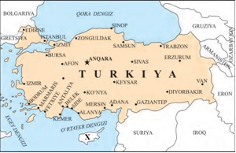

- Rodos
- Krit
- Malta
+ Kipr

**470. Turkiyada qachondan boshlab o‘ta millatchi «Ergenekon» yashirin tashkilotining faoliyati bilan bog‘liq tergov va qamoqqa olishlar boshlangan?**

+ 2007-yilda
- 2005-yilda
- 2002-yilda
- 2000-yilda

**471. Turkiyadagi 2016-yilgi davlat to’ntarishini kimlar amalga oshirishga urunib ko’rgan?**

- Mutaassiblar
+ Harbiylar
- Kurdlar
- Muholifatdagilar

**472. Nechanchi yilda bo’lib o’tgan parlament saylovlaridan so’ng Turkiya prokuraturasi «Nurchilar» tashkilotini konstitutsiyaga xilof deb tan olgan?**

- 1999-yilgi
+ 2000-yilgi
- 2001-yilgi 
- 2002-yilgi

**473. Turkiyaning milliy valyutasi qanday ataladi?**

- Dinor
- Real
+ Lira
- Dirham

## 21-§ 1991-2017-yillarda Eron Islom Respublikasi.

**474. 2001-yil 11-sentabr kuni Nyu-Yorkda amalga oshirilgan terrorchilik aktidan so‘ng AQSH qaysi davlatni «xalqaro terrorizmning sherigi» deb atadi?**

- Afg‘onistonni
- Pokistonni
+ Eronni
- Suriyani

**475. Eronda qaysi yilda bo’lib o’tgan parlament saylovlari prezident Hasan Ruhoniy obro‘yining yuqoriligini namoyish qilgan?**

- 2015-yilda
+ 2016-yilda
- 2017-yilda
- 2018-yilda

**476. Quyidagi xaritada qaysi davlat tasvirlangan?**

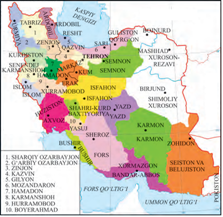

- Iroq
+ Eron
- Turkiya
- Afg’oniston

**477. XXI asr boshida Eron o‘lim jazosini amalga oshirish bo‘yicha dunyoda nechanchi o‘rinda turardi?**

- Birinchi o‘rinda
+ Xitoydan keyin ikkinchi o‘rinda
- AQSH va Xitoydan keyin uchinchi o‘rinda
- AQSH, Xitoy va Rossiyadan keyin to‘rtinchi o‘rinda

**478. 2005-yilda kimning prezident etib saylanishi Eronda islohotlarning borishini, mamlakatning jahon hamjamiyatiga qaytishini biroz susaytirgan?**

+ Mahmud Ahmadinajod
- Mir-Husayn Musaviy
- Hasan Ruhoniy
- Muhammad Hotamiy

**479. Eronda qaysi yilda islohotchilik qarashlarini qo‘llab-quvvatlovchi M. Hotamiy prezident etib saylangan?**

- 1998-yilda
+ 1997-yilda
- 1999-yilda
- 1996-yilda

**480. Hozirgi kunda qaysi davlat Eronga harbiy texnika yetkazib bermoqda va atom elektrostansiyasini qurib bermoqda?**

- Fransiya
+ Rossiya
- Buyuk Britaniya
- AQSH

**481. Qaysi voqeadan keyin Erondan «Hizbulloh» rahbarlari quvib chiqarilgan va Sudan, Liviya, Bosniyadagi eronlik diniy maslahatchilar chaqirib olingan?**

- 2001-yil 11-sentabr kuni Nyu-Yorkda amalga oshirilgan terrorchilik aktidan so‘ng
+ AQSH Eronni «xalqaro terrorizmning sherigi» deb ataganidan so‘ng
- BMT Eron hukumatini diniy mutaassiblikni yoyishda ayblaganidan so‘ng
- «Hizbulloh» tashkiloti tomonidan Tehronda terrorchilik akti amalga oshirilganidan so‘ng

**482. Hozirgi kunda Eronda urbanizatsiya darajasi necha foizga yaqinlashmoqda?**

+ 70 % ga
- 80 % ga
- 50 % ga
- 60 % ga

**483. AQSH prezidenti J. Bush Eronni xalqaro izolatsiya qilishga harakat qilganida, bu harakat qaysi davlatlar tomonidan ma’qullanmagan?**

+ Fransiya, Germaniya, Buyuk Britaniya
- Turkiya, Italiya, Rossiya
- Fransiya, Italiya, Ispaniya
- Italiya, Rossiya, Buyuk Britaniya

**484. 2013-yil iyun oyida bo‘lib o‘tgan prezidentlik saylovlarida kimning g‘alaba qozonishi Eronda yuz berayotgan chuqur o‘zgarishlarni ifoda etgan?**

- Mahmud Ahmadinajod
- Mir-Husayn Musaviy
+ Hasan Ruhoniy
- Humayniy

**485. XX asrda islom dini qaysi hududlarda juda qudratli ijtimoiy-siyosiy kuch sifatida maydonga chiqdi va ushbu mintaqalarda G‘arb qadriyatlarining joriy qilinishiga faol qarshi turmoqda?**

+ Yaqin Sharq va Shimoliy Afrikada
- Markaziy Osiyo va Hindistonda
- Janubi-Sharqiy Osiyoda
- Markaziy Osiyo va Sharqiy Afrikada

**486. O‘zgacha dunyoqarash, hayot tarzi, xulq-atvor, axloq va urf-odatlarga nisbatan sabr-bardoshli bo‘lish qanday ataladi?**

- Konservatorlik
- Irridentlik
+ Tolerantlik
- Liberallik

**487. Qachon AQSH prezidenti J. Bush Eronni «yovuzlik tayanchi» mamlakatlari qatoriga qo‘shib, terrorizmni moliyalashtirishda ayblagan?**

- 2009-yilda
- 2006-yilda
- 2005-yilda
+ 2002-yilda

**488. Eronning jahon hamjamiyatiga to’laqonli integratsiyalashuviga to‘siq bo’lib turgan yadroviy dasturi qaysi yilda hal qilingan?**

+ 2015-yil iyulda
- 2014-yil iyunda
- 2013-yil mayda
- 2016-yil iyulda

**489. Qachon Eron Semnondagi kosmodromdan Safir – 2 raketasi yordamida o‘zining «Umid» nomli sun’iy yo‘ldoshini fazoga chiqarib, koinotni o‘zlashtirayotgan davlatlar qatoridan o‘rin egallagan?**

+ 2009-yilda
- 2006-yilda
- 2005-yilda
- 2002-yilda

**490. Eronning zamonaviy muammolari ichida eng dolzarblari qaysilar bo’lib kelmoqda?**

- Migratsiya va inflatsiya
- Savodsizlik va inflatsiya
- Qashshoqlik va inflatsiya
+ Ishsizlik va inflatsiya

**491. Keskin konservativ qarashlarga ega bo‘lgan mutaassib kishi qanday ataladi?**

- Giperkonservator
- Postkonservator
+ Ultrakonservator
- Neytral konservator

**492. Eronning jahon hamjamiyatiga to’laqonli integratsiyalashuviga to‘siq bo’lib turgan yadroviy dasturi qaysi davlatlar vakillari tomonidan imzolangan kelishuv orqali hal qilingan? 1) AQSH; 2) Rossiya; 3) Xitoy; 4) Buyuk Britaniya; 5) Fransiya; 6) Germaniya; 7) Hindiston; 8) Pokiston; 9) Turkiya.**

+ 1, 2, 3, 4, 5, 6
- 2, 3, 4, 5
- 2, 4, 5, 6
- 1, 3, 5, 6, 7, 8, 9

**493. XX asrning ikkinchi yarmi Eron jamiyatida qanday davr bo’ldi?**

+ Ijtimoiy-iqtisodiy va siyosiy beqarorlik davri
- Ijtimoiy-iqtisodiy va siyosiy barqarorlik davri
- Iqtisodiy o’sish davri
- Ijtimoiy taraqqiyot davri

**494. Qaysi yilda Eronda ikki yuzdan oshiq kishi, jumladan, yetti nafar balog‘at yoshiga yetmagan bolalar qatl qilingan?**

- 2009-yilda
+ 2006-yilda
- 2005-yilda
- 2002-yilda

**495. Eron ijodkorlarining «Osmon bolalari» filmi qachon «Oskar» mukofotiga tavsiya qilingan?**

- 1998-yilda
+ 1999-yilda
- 2000-yilda
- 2001-yilda

**496. 2015-yilda Eron va oltita davlat o’rtasida tuzilgan shartnomaga ko’ra, Eron necha yil ichida boyitilgan uran ishlab chiqarmaydigan bo’lgan?**

+ 15 yil ichida
- 20 yil ichida
- 25 yil ichida
- 30 yil ichida

**497. Eronda kimning vafotidan so‘ng mamlakatda saqlanib qolayotgan teokratik rejim yanada kuchaygan, islom huquqiga (shariatga) asoslangan qonunlar inson huquqlari bo‘yicha qator muammolarni vujudga keltirgan?**

- Mahmud Ahmadinajod
- Mir-Husayn Musaviy
- Hasan Ruhoniy
+ Humayniy

**498. Eronda qaysi yilda prezidentlik saylovlarida asosiy kurash M. Ahmadinajod bilan islohotlar va’da qilayotgan Mir-Husayn Musaviy o‘rtasida kechgan?**

+ 2009-yilda
- 2006-yilda
- 2005-yilda
- 2002-yilda

## 22-§ 1991-2017-yillarda Pokiston va Afg’oniston.

**499. Nima sababdan BMT Xavfsizlik Kengashi (XK) Afg‘onistonga qarshi iqtisodiy sanksiyalar e’lon qilgan?**

- Tolibonlar Nyu-Yorkda terroristik akt sodir etgani uchun
- Afg‘onistonda terrorchilar tayyorlash uchun harbiy bazalar va lagerlar tizimi yaratilgani uchun
+ Tolibonlar rejimi Usoma bin Lodinni xalqaro sudga topshirishdan bosh tortgani uchun
- Barcha javoblar to‘g‘ri

**500. Qachon Afg‘onistonning yangi konstitutsiyasi qabul qilingan?**

- 2002-yilda
+ 2003-yilda
- 2004-yilda
- 2005-yilda

**501. Afg‘onistonning 2003-yilda qabul qilingan yangi konstitutsiya mamlakatda qanday huquq va erkinliklarini e’lon qilgan?**

- Prezidentlik boshqaruvini o‘rnatdi, saylovlar va siyosiy partiyalar tuzish uchun yo‘l ochib berdi
- Ikki palatali parlament, mustaqil sud tizimi tuzilishini ko‘zda tutdi
- Fuqarolarning demokratik, kichik millatlarning huquqlarini kafolatladi, erkak va ayollarning qonun oldida tengligini va e’tiqod erkinligini o‘rnatdi
+ Barcha javoblar to‘g‘ri

**502. 2001-yil 11-sentyabrda Nyu-Yorkda yuz bergan terrorchilik aktidan so‘ng Pokiston terrorchilikka qarshi qaysi davlat boshchiligida tuzilgan koalitsiyaga qo‘shilgan?**

- Rossiya
- Buyuk Britaniya
- Fransiya
+ AQSH

**503. Qachon umumafg‘on Loyya Jirgasida Homid Karzay Afg‘oniston prezidenti etib saylangan?**

+ 2002-yilda
- 2003-yilda
- 2004-yilda
- 2005-yilda

**504. Afg‘onistonda fuqarolar urushini tugatib, islomiy tartib o‘rnatishini e’lon qilgan tolibonlar yo’lboshchisi kim edi?**

+ Mulla Umar
- Mulla Habib
- Usoma bin Lodin
- Ahmad Zaxdiy

**505. Qaysi afg‘on rahbari Afg‘onistondagi beqaror ahvolning sababi sifatida mintaqada AQSH olib borayotgan siyosatni ko‘rsatgan va AQSH hukumatini o‘z xatolarini tan olishga chaqirgan?**

- Muhammad Ashraf G‘ani
- Abdulla Abdulla
- Ahmad Zaxdiy
+ Homid Karzay

**506. BMT axborotiga ko‘ra, 2005-yilda dunyodagi narkotik savdosining necha foizi Afg‘onistonga to‘g‘ri kelgan?**

+ 87 foizi
- 55 foizi
- 72 foizi
- 93 foizi

**507. Qaysi davlatda qabilalar tomonidan saylanadigan oqsoqollar kengashi «Loyya jirgasi» deb ataladi?**

+ Afg’onistonda
- Pokistonda
- Eronda
- Iroqda

**508. Afg‘onistonda tolibonlar yo‘q qilgan ikkita noyob yodgorlik – qoyaga o‘yib ishlangan Buddaning ulkan haykallari qaysi asrga oid edi?**

- IV asrga
+ V asrga
- VI asrga
- VII asrga

**509. Hozirda Pokiston rivojlanayotgan …  mamlakat.**

- industrial
+ agrar-industrial
- postindustrial
- agrar

**510. Qachon PXP hamraisi Asif Ali Zardariy Pokiston prezidenti etib saylangan?**

- 2013-yilda
+ 2008-yilda
- 2016-yilda
- 2010-yilda

**511. Afg‘onistonda hokimiyatni qo‘lga olgan Jihod kengashi mamlakatda qanday o‘zgarishlarni amalga oshirgan?**

- Mamlakat nomi «Afg‘oniston Islom Respublikasi» deb o‘zgartirilgan
- Barcha qonunlar bekor qilingan
- Shariat qoidalari joriy qilingan
+ Barcha javoblar to‘g‘ri

**512. Pokistonda 1990-yilda o‘tkazilgan saylovlarda g‘olib chiqqan Navoz Sharif qaysi partiyasining rahbari edi?**

- Pokiston xalq partiyasi
+ Musulmon ligasi
- Pokiston konservatorlar partiyasi
- Milliy tiklanish ligasi

**513. Pokistonda 1996-yilda prezident Sardor Farruk Ahmadxon Legariy Milliy assambleyani tarqatib yuborib, kim boshchiligidagi hukumatini iste’foga jo’natgan?**

+ Benazir Bxutto
- Navoz Sharif
- Mahmud Yanaf
- Ali Zardariy

**514. Qachon prezidentlik saylovlarining ikkinchi turida Muhammad Ashraf G‘ani Afg‘oniston prezidenti, Abdulla Abdulla esa hukumat raisi lavozimlarini egallagan?**

+ 2014-yilda
- 2015-yilda
- 2016-yilda
- 2017-yilda

**515. 2001-yil 11-sentyabrda Nyu-Yorkda uyushtirilgan terrorchilik aktlari uchun javobgarlikni AQSH ma’muriyati qaysi tashkilotga yuklagan?**

- Hizb-ut tahrir
+ Al-Qoida
- ISHID
- Tolibon

**516. Pokistonda 1993-yilda bo‘lgan saylovlarda kim bosh vazir lavozimini egallagan?**

- Navoz Sharif
- Sardor Farruk Ahmadxon
+ Benazir Bxutto
- Ali Zardariy

**517. Qachon Kobul shahriga mujohidlar otryadlari kirib kelgan?**

+ 1992-yil aprelda
- 1991-yil avgustda
- 1993-yil aprelda
- 1994-yil avgustda

**518. Qachon tolibonlar Kobulni egallab, mamlakatni «Afg‘oniston Islom amirligi» deb e’lon qilgan?**

- 1994-yilda
- 1998-yilda
+ 1996-yilda
- 1999-yilda

**519. Qaysi tashkilot tomonidan tolibonlar hukumatiga qarshi sanksiyalarni kuchaytirish to‘g‘risida yangi rezolutsiya qabul qilingan?**

+ BMT XK
- NATO
- YI
- SHHT

**520. Qachon Afg’onistondagi urushga islom fundamentalislarining tolibonlar harakati qo‘shilgan?**

+ 1994-yilda
- 1996-yilda
- 1998-yilda
- 1999-yilda

**521. Pokistonda qaysi yilda prezident G‘ulom Is’hoqxon yangi hukumatni korrupsiya va qarindosh-urug‘chilikda ayblab iste’foga chiqargan?**

+ 1993-yilda
- 1994-yilda
- 1992-yilda
- 1991-yilda

**522. Qaysi tolibonlar rahbari xalqaro hamjamiyat tomonidan tan olinishdan umidini uzgach, Afg‘onistondagi islomgacha bo’lgan barcha e’tiqod obyektlari, tarixiy yodgorliklarni yo‘q qilishga buyruq bergan?**

+ Mulla Umar
- Mulla Habib
- Usoma bin Lodin
- Ahmad Zaxdiy

**523. Qachondan boshlab Afg‘oniston «Afg‘oniston Islom Respublikasi» nomini olgan?**

- 2002-yildan
+ 2003-yildan
- 2004-yildan
- 2005-yildan

**524. Pokistonda qachon bo’lib o’tgan parlament saylovlarida Muhammad Navoz Sharif bosh vazir lavozimini egallagan?**

+ 2013-yilda
- 2008-yilda
- 2016-yilda
- 2010-yilda

**525. Pokistonni SHHT ga qabul qilish tartibi va muddatlari to‘g‘risidagi hujjat imzolangan SHHT ning Toshkent sammiti qachon bo‘lib o‘tgan?**

- 2013-yilda
- 2008-yilda
+ 2016-yilda
- 2010-yilda

**526. Qaysi yilda bo‘lib o‘tgan prezidentlik saylovlarida Homid Karzay Afg‘oniston prezidenti etib saylangan?**

- 2002-yilda
- 2003-yilda
+ 2004-yilda
- 2005-yilda

**527. Afg‘onistonda tolibonlar tomonidan musulmon bo‘lmagan aholining o‘z kiyimiga qaysi rangdagi belgi taqib yurishi haqida dekret qabul qilingan?**

- Qora belgi
- Oq belgi
- Qizil belgi
+ Sariq belgi

**528. Quyidagi xaritada qaysi davlatlar tasvirlangan?**

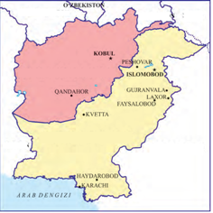

- Eron va Hindiston
- Afg‘oniston va Tojikiston
+ Pokiston va Afg‘oniston
- Hindiston va Pokiston

**529. Qachon Pokistonda harbiy to‘ntarish amalga oshirilib hokimiyatga Parvez Musharraf kelgan?**

- 1998-yil yozida
+ 1999-yil kuzda
- 2000-yil qishda
- 1997-yil kuzda

**530. 2003-2005-yillarda Pokiston armiyasi AQSH yordamida qaysi davlat hududida harbiy operatsiyalar olib borgan?**

- Iroq
- Eron
+ Afg‘oniston
- Hindiston

## 23-§ 1991-2017-yillarda Suriya va Iroq.

**531. Qachon Suriyaning janubidagi Dar’ya shahrida juma namozidan so‘ng boshlangan g‘alayonlar «Juma inqilobi» nomini olgan?**

- 2008-yilda
+ 2011-yilda
- 2015-yilda
- 2017-yilda

**532. Urush oqibatida 2017-yil sentyabr oyigacha Suriyani qancha kishi tark etgan?**

- 1 mln. dan oshiq
- 2 mln. dan oshiq
- 3 mln. dan oshiq
+ 4 mln. dan oshiq

**533. Qachon Saddam Husayn qo’lga olinib, osib o’ldirilgan?**

- 2000-yilda
- 2001-yilda
+ 2003-yilda
- 2005-yilda

**534. Bashar Asad Suriyada olib borgan tashqi siyosatiga oid to‘g‘ri javobni toping.**

- Isroil bilan Jo‘lan tepaliklari masalasida muzokaralarni tikladi
- 30 yildan beri Livanda turgan Suriya qo‘shinlarini u yerdan olib chiqdi
- Iroq diktatori Saddam Husayn bilan yarashdi
+ Barcha javoblar to‘g‘ri

**535. Iroqda qachon bo‘lib o‘tgan parlament saylovlarida kutilmaganda muxolifatdagi sunniylar g‘alaba qozongan?**

+ 2010-yilda
- 2012-yilda
- 2016-yilda
- 2017-yilda

**536. Qachon AQSH va Buyuk Britaniya qo’shinlari Bag’dodga bostirib kirgan?**

- 2000-yilda
- 2005-yilda
+ 2003-yilda
- 2007-yilda

**537. Qachon AQSH boshchiligidagi xalqaro kuchlar Quvaytni ozod qilish bo‘yicha «Sahrodagi bo‘ron» operatsiyasini boshlagan va Iroq armiyasini to‘liq tor-mor qilgan?**

- 1994-yilda
- 1993-yilda
+ 1991-yilda
- 1990-yilda

**538. Qachon AQSH boshchiligidagi xalqaro kuchlar Iroq harbiy obyektlarini bombardimon qilishgan?**

- 1992-1993-yillarda
- 1991-1992-yillarda
- 1998-1999-yillarda
+ 1999-2000-yillarda

**539. Qachon Suriya o‘z mustaqilligini e’lon qilgan?**

- 1941-yilda
- 1942-yilda
+ 1943-yilda
- 1945-yilda

**540. 2017-yil oxiriga kelib Suriya armiyasi qaysi davlatlar boshchiligidagi xalqaro koalitsiya yordamida mamlakat hududini jangarilardan deyarli to‘liq ozod qilgan?**

- Buyuk Britaniya, AQSH
- Rossiya, Buyuk Britaniya
+ Rossiya, AQSH
- Buyuk Britaniya, Fransiya

**541. Saddam Husayn qanday ayblov bilan BMT inspektorlarini va barcha xalqaro inspektorlarni Iroqdan quvib chiqargan?**

- Xalqaro normalarni buzganlikda ayblab
+ AQSH foydasiga josuslik qilishda ayblab
- Hukumatga bosim o’tkazishda ayblab
- Mahalliy aholining qadriyatlariga zid ravishda ish olib borganlikda ayblab

**542. Iroqda qachon hokimiyatga Arab sotsialistik uyg‘onish (BAAS) partiyasi kelgan?**

- 1955-yilda
- 1965-yilda
+ 1968-yilda
- 1979-yilda

**543. Qachon arab mamlakatlarida «Arab bahori» nomli inqilobiy jarayonlar boshlangan?**

+ 2000-yillarda
- 1990-yillarda
- 1980-yillarda
- 1970-yillarda

**544. Suriya rahbari Hafiz Asad qachon vafot etgan?**

- 1999-yilda
- 2002-yilda
- 1998-yilda
+ 2000-yilda

**545. Harbiy to‘ntarish orqali hokimiyatga kelgan Hafiz Asad qaysi yillari Suriyani boshqargan?**

- 1960-1990-yillarda
- 1965-1995-yillarda
+ 1970-2000-yillarda
- 1980-2005-yillarda

**546. XX asrning eng uzoq davom etgan hududiy to‘qnashuvi qaysi davlatlar o‘rtasida sodir bo‘lgan?**

+ Iroq va Eron
- Eron va Pokiston
- Pokiston va Afg‘oniston
- Afg‘oniston va Iroq

**547. Qachon Saddam Husayn rasman Iroq prezidenti etib saylangan?**

- 1976-yilda
- 1965-yilda
- 1968-yilda
+ 1979-yilda

**548. Qachon Iroq va qisman Suriya hududida terrorchi guruhlar «Iroq va Shom islom davlati» deb ataluvchi davlatni tuzgan?**

- 2009-yilda
- 2011-yilda
+ 2013-yilda
- 2017-yilda

**549. Qachondan Suriyadagi fuqarolar urushida Rossiya harbiy-kosmik kuchlari ham ishtirok etmoqda?**

- 2013-yildan
- 2014-yildan
+ 2015-yildan
- 2017-yildan

**550. Ko‘pchilik mutaxassislar qaysi davlatning siyosati Yaqin Sharqda vaziyatning keskinlashuviga, ISHID singari terrorchi tashkilotlarning paydo bo‘lishiga sabab bo‘ldi, deb hisoblashmoqda?**

+ AQSH
- Rossiya
- Buyuk Britaniya
- Eron

**551. Qaysi AQSH prezidenti Yaqin Sharqdagi o‘z siyosatini qayta ko‘rib chiqishga va’da bergan?**

- J. Bush
- B. Obama
+ D. Tramp
- B. Klinton

**552. Qachon ISHID «Umumjahon xalifati» deb e’lon qilingan?**

- 2010-yilda
+ 2014-yilda
- 2015-yilda
- 2017-yilda

**553. Qachon qabul qilingan konstitutsiyaga binoan Iroq uning xalqini tashkil qiluvchi uchta etnos – arab-sunniylar, arab-shialar va kurdlar kelishuviga asoslangan parlamentar federativ respublika deb e’lon qilingan?**

- 2000-yilda
- 2001-yilda
- 2003-yilda
+ 2005-yilda

**554. Qaysi yilda Iroq o‘z mustaqilligini e’lon qilgan?**

+ 1932-yilda
- 1933-yilda
- 1935-yilda
- 1936-yilda

**555. Quyidagi xaritada qaysi davlatlar tasvirlangan?**

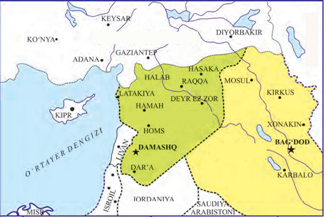

- Eron va Hindiston
- Turkiya va Eron
+ Suriya va Iroq
- Hindiston va Pokiston

**556. Qaysi yilda Suriyada yarim millionga yaqin falastinlik va bir milliondan oshiq iroqlik qochoqlar bo’lgan?**

- 2008-yilda
+ 2011-yilda
- 2015-yilda
- 2017-yilda

**557. Qachon Iroq Eronga qarshi urush boshlagan?**

- 1979-yilda
+ 1980-yilda
- 1983-yilda
- 1985-yilda

**558. Qachon Bashar Asad Suriyada o‘tkazilgan referendum natijasida hokimiyatga kelgan?**

- 1999-yilda
- 2002-yilda
- 1998-yilda
+ 2000-yilda

**559. Ittifoqchilar Saddam Husaynning … o‘ldirishgan.**

- otasi, onasi va uch nabirasini
- xotini va o‘g‘lini
- qizi va xotinini
+ ikki o‘g‘li va yosh nabirasini

**560. Qachon Iroq Quvaytga bostirib kirib, uning hududini egallab olgan?**

- 1984-yilda
- 1980-yilda
- 1981-yilda
+ 1990-yilda

**561. Iroqda prezident Hasan al-Bakr davrida real hokimiyatga ega bo’lgan Saddam Husayn qaysi lavozimda edi?**

- Tashqi ishlar vaziri
- Ichki ishlar vaziri
+ Mudofaa vaziri
- Bosh vazir

**562. Qachondan AQSH va uning ittifoqchilari Suriyadagi terrorchilar pozitsiyalarini bombardimon qilmoqda?**

- 2013-yildan
+ 2014-yildan
- 2015-yildan
- 2017-yildan

## 24-§ 1991-2017-yillarda Isroil davlati va Falastin muammosi.

**563. Qaysi qonunga ko’ra Isroilga kelgan barcha yahudiylar o‘z-o‘zidan fuqarolikka ega bo‘lishi tartibi o‘rnatilgan?**

- Vatanga qaytish to‘g‘risidagi
- Yagona vatan to’g’risidagi
- Milliy manfaat to’g’risidagi
+ Fuqarolik to‘g‘risidagi

**564. Qachon FATX bilan Isroil o‘rtasida muvaqqat kelishuv imzolangan?**

- 1990-yilda
- 1993-yilda
+ 1995-yilda
- 1996-yilda

**565. Yosir Arofat qachon vafot etgan?**

- 2004-yilda
- 2001-yilda
- 1999-yilda
+ 2006-yilda

**566. Isroil xo‘jaligi o‘z tuzilishiga ko‘ra qaysi mamlakatlarinikiga yaqinlashdi va postindustrial modelga moslashdi?**

+ AQSH va G‘arbiy Yevropa
- Yaponiya va Sharqiy Osiyo
- Janubiy Amerika va Shimoliy Yevropa
- AQSH va Sharqiy Yevropa

**567. Qachon BMT Xavfsizlik Kengashi Falastin bo‘yicha rezolutsiya qabul qilgan va unga ko’ra Falastinda ikkita – yahudiylarning Isroil va arablarning Falastin davlatlarini tashkil qilish tavsiya etilgan?**

- 1945-yilda
- 1946-yilda
+ 1947-yilda
- 1948-yilda

**568. Qachon Y. Arofat boshchiligida Falastin qonunchilik kengashi saylangan?**

- 1990-yilda
- 1993-yilda
- 1995-yilda
+ 1996-yilda

**569. Qachon Mahmud Abbos Falastin avtonomiyasining raisi va FATX yetakchisi etib saylangan?**

- 2004-yilda
- 2001-yilda
- 1999-yilda
+ 2006-yilda

**570. Qachon Isroil va Falastin davlatini tuzish rejasini arab aholisi adolatsiz deb hisoblagan va qabul qilmagan?**

- 1946-yilda
- 1947-yilda
+ 1948-yilda
- 1949-yilda

**571. Isroilda qachon bo‘lib o‘tgan saylovlarda «Likud» bloki g‘alaba qozongan va Falastinga nisbatan qat’iy yo‘nalish tarafdori bo‘lgan Binyamin Netanyaxu bosh vazir lavozimini egallagan?**

- 1990-yilda
- 1993-yilda
+ 1995-yilda
- 1996-yilda

**572. Qachon Iordan daryosining g‘arbiy sohilidagi ko‘plab shahar va qishloqlar FATX ixtiyoriga o‘tkazilgan?**

- 1990-yilda
- 1993-yilda
+ 1995-yilda
- 1996-yilda

**573. Yosir Arofat Falastin arablarining kurashiga boshchilik qilish uchun tuzilgan qaysi tashkilotga boshchilik qilgan?**

- Yagona Falastin tashkiloti
- Arab Falastini tashkiloti
- Ozod Falastin tashkiloti
+ Falastinni ozod qilish tashkiloti

**574. Qachon Falastin kuzatuvchi-davlat maqomida BMT faoliyatida qatnashish huquqini olgan?**

- 2013-yilda
- 2010-yilda
- 2008-yilda
+ 2012-yilda

**575. Isroilga AQSH har yili qancha miqdorida beminnat yordam ko‘rsatadi?**

- 1 mlrd. dollar
- 2 mlrd. dollar
+ 3 mlrd. dollar
- 4 mlrd. dollar

**576. BMT Xavfsizlik Kengashining Falastin bo‘yicha rezolutsiyasiga ko’ra qachondan Falastinda ikkita - yahudiylarning Isroil va arablarning Falastin davlatlarini tashkil qilish tavsiya etilgan?**

- 1951-yil 1-avgustdan
- 1950-yil 1-avgustdan
+ 1948-yil 1-avgustdan
- 1949-yil 1-avgustdan

**577. Qayer yahudiylarning milliy davlati hisoblanadi?**

- Falastin
+ Isroil
- Quvayt
- Iroq

**578. 1991-yil oktyabrda qayerda Yaqin Sharq bo‘yicha xalqaro konferensiya ish boshlagan?**

- Parijda
- Osloda
- Berlinda
+ Madridda

**579. Vashingtonda imzolangan kelishuvga asosan Falastin avtonomiyasini tuzish bosqichma-bosqich necha yil ichida amalga oshirilishi ko‘zda tutilgan edi?**

- 3 yil ichida
- 4 yil ichida
+ 5 yil ichida
- 6 yil ichida

**580. Qachon Vashingtonda Isroil va FATX delegatsiyalari Falastin avtonomiyasini tuzish to‘g‘risida kelishuvni imzolagan?**

+ 1993-yilda
- 1995-yilda
- 1996-yilda
- 1998-yilda

**581. 1990-yillari sobiq SSSR dan qancha kishi Isroilga ko‘chib kelgan?**

- 400 ming kishi
- 450 ming kishi
- 500 ming kishi
+ 600 ming kishi

**582. Qaysi atama «vatanga qaytish» ma’nosini anglatadi?**

- Immigratsiya
+ Repatriatsiya
- Militarizatsiya
- Urbanizatsiya

**583. Norvegiya hukumati taklifiga ko‘ra qaysi shaharda Isroil bilan FATX o‘rtasida muzokaralar boshlangan?**

- Parijda
+ Osloda
- Berlinda
- Madridda

**584. Oslodagi muzokaralar natijasida qachon Isroil va FATX bir-birini tan olganligi e’lon qilgan?**

+ 1993-yilda
- 1995-yilda
- 1996-yilda
- 1998-yilda

**585. Qachon Isroil iqtisodi jadal rivojlanayotgan mamlakatlar qatoriga kirgan?**

- 1980-yillarda
- 1970-yillarda
+ 1990-yillarda
- 1960-yillarda

**586. Qaysi hududlarni FATXning avtonom boshqaruviga berish to‘g‘risida kelishuv imzolanishi bilan Falastin avtonomiyasini tuzishning birinchi bosqichi boshlangan?**

+ G‘azo sektori va Iordan daryosining g‘arbiy sohilini
- G‘azo sektori va Iordan daryosining sharqiy sohilini
- G‘azo sektori va Iordan daryosining shimoliy sohilini
- G‘azo sektori va Iordan daryosining janubiy sohilini

**587. Qachondan boshlab Falastin xalqining o‘z davlatini tuzish uchun kurashi boshlangan?**

- 1946-yildan
- 1947-yildan
+ 1948-yildan
- 1949-yildan

**588. FATX qanday tashkilot?**

- Yagona Falastin tashkiloti
- Arab Falastini tashkiloti
- Ozod Falastin tashkiloti
+ Falastinni ozod qilish tashkiloti

**589. Qaysi qonunga binoan har qanday yahudiy o‘z oilasi, ya’ni turmush o‘rtog‘i, farzandlari, nabiralari bilan doimiy yashash uchun Isroilga kelish huquqiga ega?**

+ Vatanga qaytish to‘g‘risidagi
- Yagona vatan to’g’risidagi
- Milliy manfaat to’g’risidagi
- Fuqarolik to‘g‘risidagi

**590. Isroilning janubi-g’arbiy qismida qaysi davlat joylashgan?**

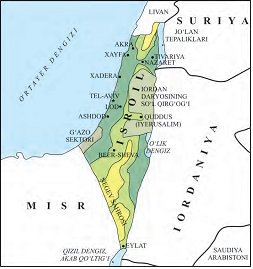

- Livan
+ Misr
- Iordaniya
- Suriya

**591. Yosir Arofat qayerning o‘ziga xos ramziga aylangan shaxs?**

+ Falastinning
- Isroilning
- Iroqning
- Suriyaning

**592. 2017-yilga kelib Falastinni nechta davlat tan olgan?**

- 120 ga yaqin
- 130 ga yaqin
+ 140 ga yaqin
- 150 ga yaqin

**593. Qachon Isroil bosh vaziri Isxak Rabin mutaassib-yahudiy tomonidan o’ldirilgan?**

- 1990-yilda
- 1993-yilda
+ 1995-yilda
- 1996-yilda

**594. Qaysi ekstremistik guruhlar Falastin avtonomiyasini tuzish bo’yicha kelishuvlarni buzishga harakat qilishgan?**

- «Xamas» guruhi
- «Jihod» guruhi
- «Hizbulloh» guruhi
+ Barcha javoblar to’g’ri

## 25-§ 1991-2017-yillarda Lotin Amerikasi mamlakatlari.

**595. Qaysi Lotin Amerikasi davlatining poytaxti davlat nomi bilan bir xil?**

- Chili
+ Braziliya
- Peru
- Argentina

**596. Qachon Argentinada defolt e’lon qilinishi jahon tarixidagi eng yirik bankrot holati bo‘lib, Lotin Amerikasi mamlakatlaridagi neoliberal tajribalarga nuqta qo‘ygan?**

- 1992-yilda
- 1994-yilda
+ 2001-yilda
- 1997-yilda

**597. XX asr oxiriga kelib Lotin Amerika mintaqasida nechta mustaqil davlat mavjud bo’lgan?**

- 64 ta
+ 34 ta
- 52 ta
- 43 ta

**598. Meksika Shimoliy Amerika erkin zonasiga nechanchi yilda kirgan?**

- 1992-yilda
+ 1994-yilda
- 2001-yilda
- 1997-yilda

**599. Neoliberal model Augusto Pinochet davrida qaysi Lotin Amerikasi davlatida muvafaqqiyatli amalga oshirilgan edi?**

+ Chilida
- Argentinada
- Braziliyada
- Paragvayda

**600. Lotin Amerika mintaqasida birinchi bo’lib neoliberal islohotlar yo’liga kirgan davlat qaysi?**

- Chilida
+ Meksikada
- Kolumbiyada
- Peruda

**601. Meksika milliy valyutasi qanday ataladi?**

- Lira
+ Peso
- Real
- Bolivar

**602. Qachon Braziliya, Meksika va Argentina G-20 («Katta yigirmalik») klubiga a’zo bo‘lgan?**

- 2010-yilda
- 2001-yilda
- 2004-yilda
+ 2008-yilda

**603. Qachon Peruda «Oydin yo‘l» qo‘zg‘olonchi terrorchilik tashkiloti faollashgan?**

+ 1992-yilda
- 1994-yilda
- 2001-yilda
- 1997-yilda

**604. XX asr oxiriga kelib qaysi Lotin Amerikasi mamlakatlarida hindular aholining 25-50 foizini tashkil qilgan? 1) Boliviya; 2) Gvatemala; 3) Peru; 4) Meksika; 5) Chili; 6) Ekvador; 7) Braziliya; 8) Argentina.**

- 1, 2, 3, 5, 8
- 1, 2, 3, 6, 7
+ 1, 2, 3, 4, 6
- 1, 5, 6, 7, 8

**605. Qaysi yilda bo’lgan inqilobdan keyin Kubada kommunistik siyosiy rejim shakllangan?**

- 1976-yilda
- 1965-yilda
- 1963-yilda
+ 1959-yilda

**606. XX asrning 90-yillarida qaysi Lotin Amerikasi mamlakatida qurollangan so’l radikal harakat avj olib, ularning qo’shinlari mamlakat hududining 40 foizini nazorat qilardi?**

- Chilida
- Meksikada
+ Kolumbiyada
- Peruda

**607. «Neoliberal islohot yutuqlarining namoyishi» bo‘lgan Argentinada qachon iqtisodiy inqiroz ro‘y bergan?**

- 1960-yillarda
- 1970-yillarda
- 1980-yillarda
+ 1990-yillarda

**608. Qachon Lotin Amerikasida ijtimoiy-iqtisodiy taraqqiyotning neoliberal modeli oldinggi o’ringga chiqqan?**

- XIX asrning birinchi yarmida
- XIX asrning ikkinchi yarmida
- XX asrning birinchi yarmida
+ XX asrning ikkinchi yarmida

**609. Qaysi Lotin Amerikasi davlati BRIKS tashkilotining a’zosi hisoblanadi?**

+ Braziliya
- Argentina
- Kolumbiya
- Ekvador

**610. Saralangan fuqarolarning ehtiyojlariga emas, xalq ommasi ehtiyojlariga qaratilgan siyosiy pozitsiya yoki nutq shakli qanday ataladi?**

- Militarizm
- Irredentizm
+ Populizm
- Shovinizm

**611. XX asrning oxirida Meksikada moliyaviy-iqtisodiy inqiroz boshlangan yilni toping.**

- 1990-yil
- 1992-yil
- 1995-yil
+ 1994-yil

**612. Qachon Meksikada hindularning ommaviy qo‘zg‘oloni boshlangan?**

- 1992-yilda
+ 1994-yilda
- 2001-yilda
- 1997-yilda

## 26-§ 1991-2017-yillarda Afrika mamlakatlari.

**613. Qaysi Afrika davlatida ayollarga nisbatan zo‘ravonlik oddiy hol bo‘lib, eng dahshatlisi, aholining katta qismi buni oddiy hol sifatida qabul qiladi?**

- Mozambik Demokratik Respublikasida
- Angola Demokratik Respublikasida
+ Kongo Demokratik Respublikasida
- Botsvana Demokratik Respublikasida

**614. Qachon Efiopiyadagi marksizmga sodiq qolgan Mengistu Xayle Mariam hukumati ag‘darib tashlangan?**

- 1989-yilda
- 1997-yilda
+ 1991-yilda
- 1994-yilda

**615. Misrda prezidentlik saylovida g’alaba qozongan «Musulmon birodarlari» radikal tashkiloti vakilini toping.**

- Husni Muborak
+ Muhammad Mursi
- Abdul Fattoh as-Sisi
- Moammar Kaddafiy

**616. XX asr oxiri – XXI asr boshlarida Misrga arab va musulmon dunyosining yetakchisi bo’lish imkonini bergan omillarni toping. 1) Rivojlangan sayyohlik industriyasini yaratilishi; 2) Mamlakatlararo diplopamatik munosabatlarning yo’lga qo’yilishi; 3) Faol tashqi siyosat; 4) Mamlakatlarning valyuta zaxirasi to’xtovsiz ortib borishi; 5) Madaniyat va qishloq xo’jaligi sohasida katta yutuqlarni qo’lga kiritishi; 6) Sanoatlashgan industriyani vujudga kelishi.**

+ 1, 4, 5
- 1, 3, 5
- 2, 4, 6
- 1, 2, 5

**617. Qachon Kongo Demokratik Respublikasida Mobutuning diktatorlik rejimi ag‘darilgan?**

- 1989-yilda
+ 1997-yilda
- 1991-yilda
- 1994-yilda

**618. Qaysi Misr prezidenti «inqilob himoyasiga yo‘naltirilgan har qanday dekretni» imzolashi va u sudda rad etilishi mumkin emasligini belgilab qo‘ygan?**

- Husni Muborak
+ Muhammad Mursi
- Abdul Fattoh as-Sisi
- Moammar Kaddafiy

**619. Qachon Misrda islom fundamentalizmi bosimi ostida prezident Husni Muborak iste’foga chiqqan?**

- 2014-yilda
- 2013-yilda
+ 2011-yilda
- 2009-yilda

**620. Qachon ISHID tarkibiga kiruvchi «Viloyat Sinay» terrorchi tashkiloti vakillari Sinay yarim orolidagi masjidda juma namozi paytida portlash uyushtirib, namozxonlarga qarshi avtomatlardan o’t ochgan?**

- 2015-yil 20-mayda
+ 2017-yil 24-noyabrda
- 2015-yil 15-fevralda
- 2016-yil 9-oktyabrda

**621. XX asr oxirida BMT qaysi davlatni dunyoning eng qashshoq mamlakati deb tan olgan?**

- Mozambik Demokratik Respublikasini
- Angola Demokratik Respublikasini
+ Kongo Demokratik Respublikasini
- Botsvana Demokratik Respublikasini

**622. Ruanda va Burundida qachon tutsi va xutu xalqlari o‘rtasidagi kurash keskinlashib, genotsidga olib kelgan?**

- 1980-yillar oxirlariga kelib
- 1990-yillar boshlariga kelib
+ 1990-yillar o‘rtalariga kelib
- 1990-yillar oxirlariga kelib

**623. Turli ijtimoiy guruhlar, ayni holatda – erkaklar va ayollarning jamiyatdagi imkoniyatlari bir-biridan keskin farq qilishi qanday ataladi?**

- Etno-konfessional mojaro
+ Gender tengsizlik
- Unifikatsiya
- Irqiy kamsitish

**624. Qachon Liviyada M. Kaddafiy hukumatiga qarshi g‘alayonlar boshlangan va qo‘zg‘olonchilar muvaqqat hukumat tuzib, yordam so‘rab NATO ga murojaat qilgan?**

+ 2011-yilda
- 2012-yilda
- 2009-yilda
- 2016-yilda

**625. Misr prezidenti Abdul Fattoh as-Sisi prezidentlikka saylanishidan oldin qaysi lavozimni egallagan?**

- Moliya vaziri
- Tashqi ishlar vaziri
- Ichki ishlar vaziri
+ Mudofaa vaziri

**626. Qaysi mintaqa mamlakatlarining muammosi zamonaviy qullikning saqlanib qolayotganligi bo‘lib, ayniqsa, bolalarning qullik holati jahon jamoatchiligini tashvishga solmoqda?**

+ Afrika mamlakatlarining
- Osiyo mamlakatlarining
- Janubiy Amerika mamlakatlarining
- Okeaniya mamlakatlarining

**627. Qachon Liviyada fuqarolar urushi boshlanib ketgan?**

- 2011-yilda
- 2012-yilda
- 2009-yilda
+ 2016-yilda

**628. ISHID tarkibiga kiruvchi «Viloyat Sinay» terrorchi tashkiloti vakillari Sinay yarim orolidagi masjidda juma namozi paytida portlash uyushtirib, namozxonlarga qarshi avtomatlardan o’t ochishi natijasida … .**

- 244 kishi halok bo‘lgan, 250 dan oshiq kishi yaralangan
- 258 kishi halok bo‘lgan, 50 dan oshiq kishi yaralangan
- 271 kishi halok bo‘lgan, 200 dan oshiq kishi yaralangan
+ 235 kishi halok bo‘lgan, 100 dan oshiq kishi yaralangan

**629. Qachon Liberiyada etnik asosda boshlangan fuqarolar urushi ko‘plab qurbonlar va 1 million aholining qo‘shni davlatlarga ommaviy qochishiga olib kelgan?**

+ 1989-yilda
- 1997-yilda
- 1991-yilda
- 1994-yilda

**630. Qachon Abdul Fattoh as-Sisi Misr prezidenti etib saylangan?**

- 2011-yilda
+ 2014-yilda
- 2013-yilda
- 2009-yilda

**631. XX asr oxirida aholisi Shimoliy Afrikada eng ta’minlangan davlat qaysi edi?**

- Misr
- Sudan
+ Liviya
- Marokash

**632. Quyidagi qaysi davlatlar Shimoliy Afrika davlatlari qatoriga kiradi? 1) Misr; 2) Sudan; 3) Liviya; 4) Jazoir; 5) Tunis; 6) Marokash; 7) Namibiya; 8) Mozambik; 9) Mavritaniya; 10) Angola; 11) G‘arbiy Sahroyi Kabir.**

+ 1, 2, 3, 4, 5, 6, 9, 11
- 1, 2, 4, 6, 8, 10, 11
- 1, 3, 4, 7, 8, 9, 10
- 1, 2, 5, 7, 8, 10

**633. M. Kaddafiy qaysi davlatda uzoq vaqt hukmronlik qilgan?**

- Misrda
- Sudanda
+ Liviyada
- Marokashda

**634. Qachon Misr prezidenti Muhammad Mursi harbiylar tomonidan ag‘darilgan va qamoqqa olingan?**

- 2011-yilda
- 2014-yilda
+ 2013-yilda
- 2009-yilda

**635. BMT ning hisob-kitobiga ko‘ra, Afrika aholisi 2050-yilga kelib qancha kishiga yetadi?**

- 1 mlrd. kishiga
- 1,5 mlrd. kishiga
+ 2 mlrd. kishiga
- 2,5 mlrd. kishiga

## 27-§ XX asr oxiri – XXI asr boshlarida globallashuv muammolari, harbiy, ekstremistik va ekologik xavf-xatarlar.

**636. Qanday qurolning paydo bo’lishi bilan tarixda ilk bor insoniyatning o‘zini o‘zi yo‘q qilish xavfi paydo bo‘lgan?**

- Kimyoviy qurolning
+ Yadro qurolining
- Kosmik qurolning 
- Bakteriologik qurolning

**637. Hozirgi globallshuv davrida … deb atalayotgan jarayon salbiy holatlarga ega bo‘lgan hodisalardan biridir.**

+ «ommaviy madaniyat»
- «g‘arb madaniyati»
- «umumjahon madaniyati»
- «yot madaniyat»

**638. Sayyoramizni quyoshning radioaktiv nurlaridan himoya qilib turgan qatlam qanday ataladi?**

- Vodorot qatlami
- Azot qatlami
+ Ozon qatlami
- Kislorod qatlami

**639. Davlat hokimiyati va mahalliy boshqaruv organlari hamda xalqaro tashkilotlarning qarorlar qabul qilish jarayonida aholini qo‘rqitish yoki qonunga xilof boshqa harakatlar bilan bog‘liq zo‘ravonlik orqali ta’sir ko‘rsatish mafkurasi va amaliyoti qanday ataladi?**

- Fundamentalizm
+ Terrorizm
- Ekstremizm
- Irridentizm

**640. Ijtimoiy-siyosiy, diniy, milliy maqsadlarga taqiqlangan usullar orqali erishishning nazariyasi va amaliyoti qanday ataladi?**

- Fundamentalizm
- Terrorizm
+ Ekstremizm
- Irridentizm

**641. Qaysi atama bitta tizim yoki shaklga keltirish ma’nosini anglatadi?**

- Integratsiya
+ Unifikatsiya
- Standartizatsiya
- Globalizatsiya

**642. Globallashuv deganda … integratsiyalashuv va unifikatsiyalashuv jarayoni tushuniladi.**

- iqtisodiy
- siyosiy
- madaniy
+ barchasi

**643. Hozirda sivilizatsiyani muqarrar halokatga olib kelish uchun Yer yuzida to‘plangan yadro qurollarining qancha foizini qo‘llash yetarli?**

+ 1 foizini
- 5 foizini
- 10 foizini
- 15 foizini

**644. Qachon dunyoning bir guruh mashhur olimlari yadro qurolini ommaviy qo‘llash sivilizatsiyaning to‘liq yo‘q qilinishiga olib keladi, degan ogohlantirishlar bilan chiqqanlar?**

+ XX asrning 50-yillarida
- XX asrning 60-yillarida
- XX asrning 70-yillarida
- XX asrning 80-yillarida

**645. Bugunga kelib, Orol dengizning qancha foizi qurib bo‘lgan?**

- 60 foizidan ortiqrog‘i
- 70 foizidan ortiqrog‘i
- 80 foizidan ortiqrog‘i
+ 90 foizidan ortiqrog‘i

## 28-§ XX asr oxiri – XXI asr boshlarida barqaror rivojlanish va etno-ijtimoiy muammolar.

**646. XX asr oxiri – XXI asr boshlarida dunyo mamlakatlarining dastlab qanday nodavlat tashkilotlarida etnik ozchilik vakillari manfaatlarini ifoda etuvchi bo‘limlar paydo bo‘lgan?**

- Sport federatsiyalarida
- Siyosiy partiyalarda
- Yoshlar tashkilotlarida
+ Kasaba uyushmalarida

**647. SSSR qulagandan so‘ng qaysi hududlarda etnoslararo mojarolar kelib chiqqan?**

- Uzoq Sharq va Kavkazorti respublikalarida
- Kavkazorti respublikalari va O‘rta Osiyoda
+ O‘rta Osiyo va Sharqiy Yevropa mamlakatlarida
- Sobiq SSSR ning markaziy hududlarida

**648. Kelib chiqishi belujlardan bo‘lgan Sodiq Omonxon qaysi shaharning meri etib saylangan?**

- Nyu-York
+ London
- Lissabon
- Berlin

**649. Etnik ozchilikning teng huquqlarini, jumladan, ijtimoiy sohadagi huquqlarini mustahkamlashga qaratilgan qonunlar dastlab qaysi davlatlarda qabul qilingan?**

+ SSSR, AQSH va G‘arbiy Yevropa mamlakatlarida
- Sharqiy Osiyo mamlakatlari va AQSH da
- G‘arbiy Yevropa mamlakatlari va SSSR da
- Lotin Amerikasi va Janubi-Sharqiy Osiyo mamlakatlarida

**650. Qaysidir soha, jabhada mavjud barcha imkoniyatlar, vositalar yig‘indisi, keng ma’noda «zaxira» vositalari qanday ataladi?**

- Global
+ Potensial
- Aktual
- Ideal

**651. 2000-yillardan boshlab qanday omil Rossiya Federatsiyasida etno-ijtimoiy holatni keskinlashtirib yuborgan?**

+ Sobiq sovet respublikalaridan mehnat muhojirlarining ommaviy ravishda kelishi
- Hukumat olib borgan, uzoqni ko’zlamagan etnik siyosat
- Federal hokimiyat boshqaruvidan etnik ozchilik vakillarini uzoqlashtirilishi
- Diniy va etnik bag’rikenglikni targ’ib qiluvchi davlat tadbirlarining keskin kamayib ketishi

**652. Jahonda aholisi 1 milliondan ziyod bo‘lgan nechta davlatning yarmidan kamrog‘i nisbatan bir millatli, ya’ni asosiy aholisi bitta millatga mansub davlatlardir?**

- 146 ta
- 151 ta
+ 164 ta
- 172 ta

**653. XX asrning qaysi davrida yuz bergan jami harbiy mojarolarning yarmidan ko‘pi bir davlat ichkarisida, etnoslararo mojarolar edi?**

- XX asrning 60-yillari oxirida
- XX asrning 70-yillari oxirida
+ XX asrning 80-yillari oxirida
- XX asrning 90-yillari oxirida

**654. Qachon atrof-muhitni himoya qilish va barqaror taraqqiyot bo‘yicha Rio-de-Janeyro shahrida konferensiya o’tkazilgan va butun insoniyat uchun barqaror-xavfsiz rivojlanish konsepsiyasini ishlab chiqish dasturi qabul qilingan?**

- 1990-yilda
- 1995-yilda
+ 1992-yilda
- 1987-yilda

**655. Qora tanli Devid Dinkins qaysi shahar meri bo’lgan?**

+ Nyu-York
- London
- Lissabon
- Berlin

**656. Qachon AQSH ning bir necha shaharlarida politsiyachilar va irqchilar tomonidan qora tanli amerikaliklarning o‘ldirilishi ortidan prezident B. Obama AQSH uchun irqchilik hamon dolzarb muammo ekanligini tan olgan?**

- 2008-yilda
- 2009-yilda
- 2013-yilda
+ 2015-yilda

**657. So‘nggi 50 yil ichida qanday omil dunyoda yonilg‘i sarfining keskin kamayishi tabiatdan oshiqcha boyliklarni olmasdan, atrof-muhitni iflos qilmasdan yuqori texnologiyalar asosida mahsulot olish mumkinligini isbotlagan?**

- Ekologik tadbirlar
+ Ilm-fan yutug‘i
- Globallashuv jarayoni
- Xalqaro hamkorlik

**658. Qachon Buyuk Britaniyada ilk bor jamoa palatasiga etnik ozchilik vakillaridan to‘rt nafari saylangan?**

- 1990-yilda
- 1995-yilda
- 1992-yilda
+ 1987-yilda

## 29-§ XX asr oxiri – XXI asr boshlarida ilmiy-texnik taraqqiyot. Ilm-fan, adabiyot, san’at.

**659. Qachon yuqumli kasallik – OITS paydo bo‘lgan?**

- XIX asrning oxirida
- XX asrning boshida
+ XX asrning oxirida
- XXI asrning boshida

**660. Biologiya, qishloq xo‘jaligi va tibbiyot fanidagi inqilobiy yutuqlar natijasida Yer yuzi aholisi XX asr boshidagi … kishidan asr oxiriga kelib olti milliard kishigacha ko‘paydi.**

- yarim milliard
- bir milliard
+ bir yarim milliard
- ikki milliard

**661. Qanday omil ko‘pchilik tomonidan bugungi G‘arb jamiyatining ma’naviy inqirozi sifatida qaralmoqda?**

- Oila instituti rolining pasayishi
- Ommaviy madaniyatning universallashtirilishi
- Qochoqlarga va qora tanli insonlarga nisbatan keskin siyosatning olib borilishi
+ Bir jinsli kishilar o‘rtasida oila qurishning qonunlashtirilishi

**662. XX asrda qorachechak, ispan grippi, o‘lat, vabo, terlama, sil, bezgak kabi kasalliklar Yer yuzida qancha kishining o‘limiga olib kelgan?**

- 500 mln. ga yaqin kishining
- 800 mln. ga yaqin kishining
+ 1 mlrd. ga yaqin kishining
- 1,2 mlrd. ga yaqin kishining

**663. XX asr oxiri – XXI asr boshlariga kelib adabiy jarayonlar tez o‘zgardi, har … yilda adabiyotda yangi yo‘nalish paydo bo‘lyapti, yangi maktablar shakllanyapti.**

- besh
+ o‘n
- o‘n besh
- yigirma

**664. To‘g‘ri ma’lumotni toping. Hozirgi kunda … .**

- Intellektual mehnat bilan band bo‘lgan aholi soni butun ishchi kuchining yarmiga yaqinlashmoqda, AQSH va Yaponiyada bu ko‘rsatkich yanada yuqori
- Afrikada aholining 2/3 qismi qishloq xo‘jaligi sohasida band bo‘lsa, AQSH da bu ko‘rsatkich 3% dan oshmaydi
- AQSH da axborot texnologiyalari sohasida 80% aholi mehnat qilmoqda
+ Barcha javoblar to‘g‘ri

**665. Hozirgi kunda intellektni «ishga solmasdan», bevosita insonning ichki olamiga murojaat qilish – bu tamoyil … da qo‘llanilmoqda.**

- kompyuter grafikasi
- videokliplar yaratish kabi san’atning yangi turlari
- qisman zamonaviy kino san’ati
+ barcha javoblar to‘g‘ri

**666. XX asr oxirida ilmiy-texnik inqilob jahonning ilg‘or mamlakatlarini sivilizatsiyaning industrial bosqichidan … davriga olib chiqdi.**

- kapitalistik
+ postindustrial
- postkapitalistik
- giperindustrial

**667. Olimlarning fikricha, qanday jamiyat industrial jamiyatdan keyin keladigan jamiyatning ancha yuqori bosqichidir?**

- «Demokratik jamiyat»
- «Kishilik jamiyati»
+ «Axborot jamiyati»
- «Postindustrial jamiyat»

**668. XX asrning ikkinchi yarmidagi ilmiy-texnik inqilobning asosiy belgilari to‘g‘ri ko‘rsatilgan javobni toping.**

- Tabiiy va sintetik materiallardan mahsulotlarni ommaviy ishlab chiqarish
- Mashinalardan keng foydalanish, ishlab chiqarishning konveyerli liniyalarini yaratish
- Zavod-avtomatlarni va sanoat robotlarini yaratish
+ Barcha javoblar to‘g‘ri

**669. XX asr oxiri – XXI asr boshlarida jahon jamoatchiligining e’tiborini qozongan «Garri Potter» romani kimning qalamiga mansub?**

- Yan Fleming
- Redyard Kipling
+ Joan Rouling
- Artur Konan Doyl

**670. Voqelikni bilishda ongning imkoniyatini rad etuvchi yoki uni juda cheklangan deb biluvchi falsafiy konsepsiya qanday ataladi?**

- Tolerantlik
- Liberallik
+ Irratsionallik
- Irredentlik

**671. «Alkimyogar» romani muallifi kim?**

- Xolid Husayniy
+ Paulo Koelyo
- Joan Rouling
- Mark Tven

**672. Qaysi davrda yurak-qon tomir tizimi va saraton kasalliklari kishilar o‘limining bosh sababchilariga aylangan?**

- XIX asrning oxirida
- XX asrning boshida
+ XX asrning oxirida
- XXI asrning boshida

**673. Hozirgi kunda bir qator rassomlar qanday jamiyatda san’at hokimiyat qo‘lidagi qurolga aylanadi deya xavotir bildirishmoqda?**

+ «Postdemokratik jamiyat» da
- «Postindustrial jamiyat» da
- «Postkapitalistik jamiyat» da
- «Postmodernistik jamiyat» da

**674. Qaysi asrda tarixda birinchi bor yuqumli kasalliklar odamlar o‘limining asosiy sababi bo‘lmay qolgan?**

- XVIII asrda
- XIX asrda
+ XX asrda
- XXI asrda

**675. «O‘z Taqdiriga erishish – mana insonning haqiqiy burchi», deb qaysi adib yozgan?**

- Xolid Husayniy
+ Paulo Koelyo
- Joan Rouling
- Mark Tven

**676. «Shamol ortidan yugurayotgan odam» romani muallifi Xolid Husayniy qayerlik?**

- Pokistonlik
- Turkiyalik
- Eronlik
+ Afg‘onistonlik

**677. Hozirgi kundagi zamonaviy san’at …ga muqobil, ba’zan unga keskin qarama-qarshi yo‘nalishlarni izlash, yangi san’at tilini yaratishga urinish bilan xarakterlanadi.**

- realizm
- abstraksionizm
+ modernizm
- postmodernizm