# 6-sinf Qadimgi dunyo tarixi (2017-yil darsligi)

_Tarix (Mavzulashgan) (2017-2019-yillar darsliklari)_

## 1-§ Qadimgi tarix – taraqqiyotning boshlanishi

**1. O’zbekiston tarixi bo’yicha eng qadimgi yozma manbalar ketma-ketligi to’g’ri keltirilgan javobni aniqlang.**

+ “Avesto”, Behistun yozuvlari, Gerodotning “Tarix” asari, Yunon-Rim manbalari 
- “Avesto”, shumer yozuvlari, Gerodotning “Tarix” asari, Behistun yozuvlari
- “Ramayana”, Yunon-Rim manba’lari, Persopol yozuvlari
- “Avesto”, Yunon-Rim manbalari, Xitoy solnomalari

**2. … – birgalikda yashagan va mehnat qilgan, umumiy mehnat qurollari va qurol-yarog‘larga ega bo‘lgan qarindoshlar jamoasi.**

- Qabila
+ Urug‘ 
- Ibtidoiy to‘da
- Ibtidoiy jamoa tuzumi

**3. Dastlabki urug’ jamoalari kimning tevaragida jipslasha boshlagan?**

- Harbiy yo’lboshchi
- Erkak
+ Ayol 
- Urug’ oqsoqoli

**4. Ushbu shaxs kim?**

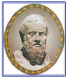

- Fidiy
- Strabon
- Arrian
+ Gerodot

**5. … – turmush va mehnat umumiyligi negizida birlashgan eng qadimgi odamlar jamoasi.**

- Qabila
- Urug‘ 
+ Ibtidoiy to‘da
- Ibtidoiy jamoa tuzumi

**6. Ushbu manbani aniqlang?**

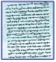

+ Avesto qo’lyozmasining sahifasi
- Mixxat yozuvi
- Bexistun yozuvi
- Elam yozuvi

**7. «Tarix» asari muallifi Gerodot qachon yashagan?**

- Milodiy II asrda
+ Miloddan avvalgi V asrda
- Miloddan avvalgi I asrda
- Milodiy I asrda

**8. «Aleksandrning harbiy yurishlari» («Aleksandr anabasisi») deb nomlangan asar muallifi, yunon tarixchisi Arrian qachon yashagan?**

+ Milodiy II asrda
- Miloddan avvalgi V asrda
- Miloddan avvalgi I asrda
- Milodiy I asrda

**9. … eng qadimgi urug’chilik tuzumi ham yakunlanadi.**

- Temir davrining tugashi bilan
+ Patriarxat bilan
- Matriarxat davrining boshlanishi bilan
- Muzlik davrining tugashi bilan

**10. Qadimgi dunyo tarixi qaysi davrlarni o’z ichiga oladi?**

- Milddan avvalgi IV-V ming yillikdan to milodiy 476-yilgacha
+ Yer yuzida odam paydo bo’lganidan to milodiy 476-yilgacha
- Yer yuzida odam paydo bo’lganidan to milodiy IV asr boshlarigacha 
- Yer yuzida odam paydo bo’lganidan to milodiy V asr boshlarigacha 

**11. Quyidagi ixtisosliklarni ta’riflari bilan mos ravishda joylshtiring. 1) arxeolog; 2) antropolog; 3) etnograf; 4) numizmat. a) ming yillar davomida kishilarning tashqi qiyofasida ro’y bergan o’zgarishlarni o’rganadi; b) qadimgi odamlar yashagan manzilgohlarni tadqiq qiladi; c) xalqlar xo’jaligini o’rganadi; d) tangalarni tadqiq qiladi.**

- 1-b, 2-a, 3-d, 4-c
+ 1-b, 2-a, 3-c, 4-d
- 1-a, 2-b, 3-d, 4-c
- 1-a, 2-b, 3-c, 4-d

**12. … – insoniyat tarixining boshlang‘ich davri bo‘lib, bu paytda barcha mehnat qurollari umumiy bo‘lgan va hamma birgalikda mehnat qilgan.**

- Qabila
- Urug‘ 
- Ibtidoiy to‘da
+ Ibtidoiy jamoa tuzumi

**13. Ilk paleolitning davrini to’g’ri ko’rsating.**

- Mil.avv. 12 –7 ming yil
- Mil.avv. 40 –12 ming yil
- Mil.avv. 100 – 40 ming yil
+ Mil.avv. 1 mln. – 100 ming yil

**14. O’rta paleolitning davrini to’g’ri ko’rsating.**

- Mil.avv. 12 –7 ming yil
- Mil.avv. 40 –12 ming yil
+ Mil.avv. 100 – 40 ming yil
- Mil.avv. 1 mln. – 100 ming yil

**15. Erondagi Kirmonshoh shahri yaqinida joylashgan tarixiy manbani aniqlang.**

- Behistun qoyalari yozuvlari, Persopol saroyi devorlari yozuvlari
- Persopol saroyi devorlari yozuvlari
- Naqshi Rustam
+ Behistun qoyalari yozuvlari

**16. Tarixning qadimgi davrida jamoadagi yetakchilik mavqei asta sekin erkak kishiga o’ta boshlashiga zamin yaratgan omil nima edi? 1. mehnat qurollarining takomillashuvi; 2. o’lja taqsimoti erkak kishining qo’liga o’tishi; 3. temir qurollarning paydo bo’lishi; 4. xo’jalik yuritish shakllarining o’zgarishi.**

+ 1, 4
- 2, 3
- 1, 2, 4
- 1, 2, 3, 4

**17. «Geografiya» nomli asar muallifi Strabon qachon yashagan?**

- Milodiy II asrda
- Miloddan avvalgi V asrda
+ Miloddan avvalgi I asrda
- Milodiy I asrda

**18. So’nggi paleolitning davrini to’g’ri ko’rsating.**

- Mil.avv. 12 –7 ming yil
+ Mil.avv. 40 –12 ming yil
- Mil.avv. 100 – 40 ming yil
- Mil.avv. 1 mln. – 100 ming yil

**19. Insoniyat rivojidagi birinchi bosqich qanday ataladi?**

- Harbiy demokratiya 
+ Ibtidoiy to’da
- Ona urug’i
- Urug’ jamoasi

**20. «Makedoniyalik Aleksandr tarixi» nomli asar muallifi, Rim tarixchisi Kvint Kursiy Ruf qachon yashagan?**

- Milodiy II asrda
- Miloddan avvalgi V asrda
- Miloddan avvalgi I asrda
+ Milodiy I asrda

## 2-§ Eng qadimgi odamlarning rivojlanish bosqichlari.

**21. Qaysi qadimiy odam hozirgi qiyofadagi odam hisoblanadi?**

- Sinantrop
+ Kromanyon
- Zinjantrop
- Avstralopitek

**22. Fransiyadagi Kromanyon g‘oridan topilgan qadimiy odam qanday nomlanadi?**

- Sinantrop
+ Kromanyon
- Zinjantrop
- Avstralopitek

**23. Janubiy Afrikadan topilgan qadimiy odam qanday nomlanadi?**

- Sinantrop
- Pitekantrop
- Zinjantrop
+ Avstralopitek

**24. Yava orolidan (Indoneziya) topilgan qadimiy odam qanday nomlanadi?**

- Sinantrop
+ Pitekantrop
- Zinjantrop
- Avstralopitek

**25. Qadimgi odamlar nimani bo’lajak ovda o’zlariga yordam beradi deya ishonishgan?**

- Jamoaviy raqslar uyushtirishni
- Tevarak dunyoni tushunishni
+ Rasmlarni
- Hayvonlar harakatlarini o’zlashtirishni

**26. Odamlar guruhi jamoasining biror hayvon yoki o‘simlik turi bilan qarindoshlik aloqasiga ishonish nima deb ataladi?**

- Fetishizm
- Animizm
+ Totemizm
- Shomonlik

**27. Odamni o‘rab turgan muhitda jonlar va ruhlarning mavjudligiga e’tiqod fanda qanday nomni olgan?**

- Fetishizm
+ Animizm
- Totemizm
- Shomonlik

**28. Buyuk muzlik davri qachon boshlangan?**

+ Ilk paleolitning oxirlariga kelib
- O’rta paleolitning oxirlariga kelib
- So’nggi paleolitning oxirlariga kelib
- Mezolitning oxirlariga kelib

**29. Selungur…  1. Toshkentda joylashgan manzilgoh; 2. chopperlar topilgan manzilgoh; 3. Dastlabki shahar; 4. bir tomoni urib o’tkirlangan tosh qurollari topilgan manzilgoh; 5. dastlabki diniy kurtaklar alomatlari kuzatilgan manzilgoh.**

- 2, 3, 5
- 1, 2, 3, 4, 5
+ 2, 4
- 1, 2

**30. Kishilarning eng qadimgi mashg’uloti … .**

- Barcha javoblar to’g’ri
- Chorvachilik va ziroatchilik deb ataladi
- Termachilik va ibtidoiy ziroatchilik deb ataladi
+ O’zlashtiruvchi xo’jalik deb ataldi

**31. Sharqiy Afrikadagi Zinj vodiysidan topilgan qadimiy odam qanday nomlanadi?**

- Sinantrop
- Pitekantrop
+ Zinjantrop
- Avstralopitek

**32. Germaniyadan topilgan qadimiy odam qanday nomlanadi?**

+ Neandertal
- Pitekantrop
- Zinjantrop
- Avstralopitek

**33. Quyidagilardan qaysilari qadimiyroq? 1) Chopper; 2) Teshiktoshdan topilgan 8-9 yashar bola; 3) animism; 4) fetishism; 5) Kapova; 6) Sinantrop.**

- 2 ,3, 4, 5
+ 1, 6
- 6
- 1

**34. Qadimgi odamlar u yoki bu buyumlar omad keltirishiga yoxud balo-qazoni bartaraf etishiga e’tiqod qanday nom olgan?**

+ Fetishizm
- Animizm
- Totemizm
- Shomonlik

**35. Xitoy hududidan topilgan qadimiy odam qanday nomlanadi?**

+ Sinantrop
- Pitekantrop
- Zinjantrop
- Avstralopitek

**36. Quyidagilardan qoyatosh rasmlar yodgorliklarining eng qadimgilari ketma-ketligi to’g’ri berilgan javobni toping.**

- Olduvay, Kapova, Lasko
- Lasko, Yava, Olduvay
- Kapova, Zarautsoy, Teshiktosh
+ Altamir, Lasko, Kapova

**37. O’rta Osiyoda toshdan yasalgan qadimiy mehnat qurollari topilgan ilk paleolit davri manzilgohlarini aniqlang.**

- Obishir, Selungur manzilgohlari
- Teshiktosh g’ori, Ko’lbuloq manzilgohi
- Selungur manzilgohi, Teshiktosh g’ori
+ Ko’lbuloq manzilgohi, Selung’ur manzilgohi

## 3-§ Urug‘chilik jamiyati.

**38. Odamlar qachon ancha takomillashgan kesuvchi va arralovchi mehnat qurollari yasaydigan bo‘lishgan?**

- Eneolitda
+ So’nggi paleolitda
- Neolitda
- Mezolitda

**39. Qachon qadimgi odamlar mikrolitlardan foydalanib, toshga ishlov berishning oldin ma’lum bo‘lmagan silliqlash va parmalash usullarini kashf qilishgan?**

+ Neolitda
- Bronzada
- Eneolitda
- Mezolitda

**40. Qachon Old Osiyoda xo‘jalikning yangi tarmoqlari – ibtidoiy ziroatchilik va chorvachilik vujudga keldi?**

- Mezolit boshida
- Mezolit o’rtasida
+ Mezolit oxirida
- Neolitda

**41. O‘rta Osiyoda neolit davrini to’g’ri ko’rsating.**

- Mil. avv. 3 – 2 ming yil
- Mil. avv. 4 – 3 ming yil
+ Mil. avv. 6 – 4 ming yil
- Mil. avv. 12 –7 ming yil

**42. So’nggi paleolitning davrini to’g’ri ko’rsating.**

- Mil.avv. 12 –7 ming yil
+ Mil.avv. 40 –12 ming yil
- Mil.avv. 100 – 40 ming yil
- Mil.avv. 1 mln. – 100 ming yil

**43. O’zbekiston hududidagi so‘nggi paleolit davri odami manzilgohlarini ko’rsating.**

- Samarqand shahri hududi
- Toshkent viloyati Ohangaron daryosi vohasidagi Ko‘lbuloq makoni
- Farg‘ona vodiysi
+ Barcha javoblar to’g’ri

**44. Qabila bu - … .**

- Qarindoshlar uyushmasi
+ Bir joyda yashab turgan bir qancha urug’lar
- Ibtidoiy odamlarning uyushmasi
- Ilk odamlarning dastlabki uyushmasi

**45. Qachon inson hayvonlarni qo‘lga o‘rgata boshladi?**

- Mezolit boshida
- Mezolit o’rtasida
+ Mezolit oxirida
- Neolitda

**46. Odamlar qachon munchoqlar, tumorlar va uzuklar yasay boshlagan?**

- Eneolitda
- Neolitda
+ So’nggi paleolitda
- Mezolitda

**47. Inson qachon o‘q-yoy yasashni o‘rganib olgan?**

- Eneolitda
- So’nggi paleolitda
- Neolitda
+ Mezolitda

**48. Mezolit davri manzilgohlarini aniqlang.**

- Sopollitepa, Machay, Qo’shilish
+ Obishir, Qo’shilish, Machay
- Toshkent viloyati Ohangaron daryosi vodiysi, Ko’lbuloq, Obishir
- Samarqand shahri hududi, Zarautsoy, Selung’ur

**49. Qaysi davrda paxsadan uylar qurila boshlangan?**

+ Neolitda
- Bronzada
- Eneolitda
- Mezolitda

**50. Quyidagi qaysi manzilgohdan qoyatosh rasmlari topib o’rganilgan?**

- Obishir
- Machay
+ Zarautsoy 
- Qo’shilish

**51. Muzlik davri qachon poyoniga yetgan?**

- Eneolitda
- So’nggi paleolitda
- Neolitda
+ Mezolitda

**52. Neolit davrida hunarmandchilik rivojiga zamin yaratgan omilni aniqlang.**

- Yo’g’och va toshga ishlov berishning paydo bo’lishi
+ Dehqonchilik va chorvachilikning rivojlanishi
- Metall qurollarning kashf etilishi
- Kulolchilik charxining paydo bo’lishi

**53. Neolit bu - … .**

- Yangi tosh asridir
- O’zlashtiruvchi xo’jalikdan dehqonchilik va chorvachilikka o’tish davridir
- Sopol idishlar kashf qilingan davrdir
+ Barcha javoblar to’g’ri

**54. Kulolchilik va to‘quvchilik qaysi davrning kashfiyoti?**

+ Neolit
- Bronza
- Eneolit
- Mezolit

**55. Quyidagi ixtirolar qaysi davrga mansub? Turar joylar qurilishi, kiyim-kechak tayyorlashda hayvonlar terisidan foydalanish, sun’iy tarzda olov hosil qilish.**

- Eneolit
+ So’nggi paleolit
- Neolit
- Mezolit

**56. Mayda tosh qurollari – mikrolitlar qachon kashf qilingan?**

- Neolitda
- Bronzada
- Eneolitda
+ Mezolitda

**57. Arxeologlar neolit davri boshlanishini qanday hodisa bilan belgilaydilar?**

- O’q-yoyni kashf etilishi
+ Sopol idishlar yasashning kashf etilishi
- Hayvon terisidan kiyim tikishni boshlanishi
- Itning qo’lga o’rgatilishi

**58. Qachon inson Qadimgi Sharqning turli viloyatlarida ishlab chiqaruvchi xo‘jalik – dehqonchilik va chorvachilikka o‘ta boshlaydi?**

- Mezolit boshida
- Mezolit o’rtasida
- Mezolit oxirida
+ Neolitda

**59. Mezolit davrini (o‘rta tosh davri) yillarini to’g’ri ko’rsating.**

+ Mil. avv. 12 –7 ming yil
- Mil. avv. 40 –12 ming yil
- Mil. avv. 4 – 3 ming yil
- Mil. avv. 3 – 2 ming yil

**60. Chorvachilik va dehqonchilik qaysi davrning eng katta ixtirosi hisoblanadi?**

+ Neolit
- Bronza
- Eneolit
- Mezolit

**61. Odamlar qachon urug‘ jamoalariga birlashganlar?**

- Eneolitda
+ So’nggi paleolitda
- Mezolitda
- Neolitda

**62. Qaysi davrda qabilalar o‘troq turmush tarziga o‘tib, doimiy turar joylar qura boshlaganlar?**

+ Neolitda
- Bronzada
- Eneolitda
- Mezolitda

## 4-§ Eneolit va bronza davri.

**63. Qaysi davrda patriarxat boshlangan?**

- Eneolit davrida
+ Bronza davrida
- Temir davrida
- Neolit davrida

**64. Insoniyat tarixida misdan foydalanishga qachon o’tilgan?**

- Mis-tosh davriga kelib
- Eneolit davriga kelib
+ Neolit davrining oxirlaridan
- Bronza davrining boshlarida

**65. Bronza davrini to’g’ri ko’rsating.**

- Mil.avv. 3 ming yil. boshlari –2 ming yil. o’rtalari
- Mil.avv. 2 –1 ming yil. boshlari
- Mil.avv. 4 – 3 ming yil. o’rtalari
+ Mil. avv. 3 ming yil. oxirlari – 2 ming yil.

**66. Qachon chorvachilik asta-sekin dehqonchilikdan ajralib chiqa boshladi?**

- Eneolit davrida
+ Bronza davrida
- Temir davrida
- Neolit davrida

**67. Qachon xom g‘ishtdan ko‘p xonali uylar qurila boshlandi?**

- Mil. avv. 1-ming yillikda
- Mil. avv. 2-ming yillikda
- Mil. avv. 3-ming yillikda
+ Mil. avv. 4-ming yillikda

**68. Miloddan avvalgi  4-mingyillikda … .**

- Chorvachilik dehqonchilikdan ajralib chiqa boshladi
- O’rta Osiyoning markazi va shimolida sug’orma dehqonchilik vujudga keldi
+ Idishlarni pishirish uchun kulolchilik xumdonlaridan foydalanishga kirishildi
- Barcha javoblar to’g’ri

**69. Eneolit (mis-tosh) davrini to’g’ri ko’rsating.**

- Mil. avv. 7 – 6 ming yil. o’rtalari
- Mil. avv. 6 – 5 ming yil. o’rtalari
+ Mil. avv. 4 – 3 ming yil. o’rtalari
- Mil. avv. 3 – 2 ming yil. o’rtalari

**70. Bronza davriga oid Muzrabod tumanida joylashgan, aholisi ziroatchilik bilan shug’ullangan qadimgi manzilgohni aniqlang.**

- Ko’lbuloq
- Machay
- Zamonbobo
+ Sopollitepa

**71. Ushbu ko’zgu qaysi davrga oid va qaysi manzilgohdan topilgan?**

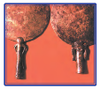

- Temir davri, Moykop
- Bronza davri, Jarqo’ton
- Bronza davri, Sopollitepa
+ Bronza davri, Zamonbobo

**72. Quyidagilardan ilk shahar alomatlari ko’zga tashlangan dastlabki tarixiy manzilgohni aniqlang.**

+ Sherobod tumani yaqinidagi manzilgoh
- Xorazm hududidagi manzilgoh
- Ustaxona qoldiqlari topilgan manzilgoh 
- Zamobobo manzilgohi

**73. Quyidagi rasmdagi ilonlar tasviri tushirilgan tosh tumor qaysi davrga mansub va qayerdan topilgan?**

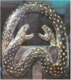

- Mil. avv. 3-ming yillik, Buxoro atroflaridan
- Mil. avv. 3-ming yillik, Zarafshon vodiysidan
+ Mil. avv. 2-ming yillik, Farg‘ona vodiysidan
- Mil. avv. 1-ming yillik, Xorazmdan

**74. Quyidagi rasmdagi bronzadan yasalgan to‘g‘nog‘ich va tosh munchoqlar qaysi asrga oid?**

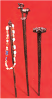

+ Mil.avv. XVII asrga
- Mil.avv. XVI asrga
- Mil.avv. XV asrga
- Mil.avv. XVIII asrga

**75. Qachon qadimgi Sharqda ilk shaharlar va davlatlar vujudga kela boshladi?**

- Mil. avv. 1-ming yillikda
- Mil. avv. 3-ming yillikda
- Mil. avv. 2-ming yillikda
+ Mil. avv. 4-ming yillikda 

**76. Quyidagi rasmdagi bronzadan yasalgan bilaguzuk nechanchi asrga oid?**

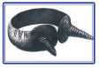

- Mil.avv. XIV asrga
- Mil.avv. XV asrga
+ Mil.avv. XII asrga
- Mil.avv. XIII asrga

**77. Qachondan bronza mehnat qurollari, qurol-yarog‘lar va zeb-ziynatlar tayyorlashda ishlatiluvchi asosiy ashyoga aylanib qoldi?**

- Mil. avv. 3-ming yillik boshlaridan
+ Mil. avv. 3-ming yillik o‘rtalaridan
- Mil. avv. 3-ming yillik oxirlaridan
- Mil. avv. 4-ming yillik boshlaridan

**78. Bronza davriga oid Zarafshon daryosi havzasidagi (Buxoro viloyati, Qorako‘l tumani) qadimgi manzilgohni aniqlang.**

- Ko’lbuloq
- Machay
+ Zamonbobo
- Sopollitepa

**79. … – ota tomonidan yaqin qarindoshlarning bir necha avlodlaridan tashkil topgan oila.**

- Ibtidoiy to’da
- Harbiy demokratiya
+ Patriarxal oila
- Matriarxal oila

**80. Qachon odamlar kulolchilik charxi va g‘ildirakni kashf etganlar?**

- Eneolit davrida
+ Bronza davrida
- Temir davrida
- Neolit davrida

**81. Odamlar misni eritib, qalay, qo‘rg‘oshin yoki rux bilan qo‘shib, qanday metall olishni o‘rganganlar?**

- Temir
+ Bronza
- Granit
- Oltin

**82. O’rta Osiyoning qayerlarida eneolit davrida suniy sug’orishga asoslangan dehqonchilik vujudga kelgan?**

- O’zbekistonning sharqiy viloyatlarida
- O’zbekistonning shimoliy viloyatlarida
- O’zbekistonning markaziy viloyatlarida
+ O’zbekistonning janubiy viloyatlarida

**83. Qaysi davrda sopol idishlar hayvonlarning, qushlarning tasvirlari va o‘simlik naqshlari (yaproqlar, gullar) bilan bezatila boshlandi?**

+ Eneolitda
- Bronza davrida
- Temir davrida
- Neolitda

## 5-§ Temir davriga o‘tishda O‘rta Osiyoning rivojlanishi.

**84. Quyidagi bronzadan yasalgan qozon qaysi asrga oid?**

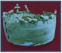

- Mil. avv. VIII–VII asrga
- Mil. avv. IV–III asrga
+ Mil. avv. VI–V asrga
- Mil. avv. VII–VI asrga

**85. Temirdan birinchi bo’lib qachon va kimlar foydalanishgan?**

- Misrliklar, mil. avv. 2-mingyillikda
- Kichik Osiyodagi xettlar, mil. avv. XV–XIV asrlarda
+ Kichik Osiyodagi xettlar, mil. avv. XIV–XIII asrlarda
- Mesopotamiya xalqlari, mil. avv. XV–XIV asrlarda

**86. Temirdan birinchi bo’lib xettlar, so’ngra … .**

- Suriyaliklar foydalanishgan
- Mitanniliklar foydalanishgan
+ Mesopotamiyaliklar foydalanishgan
- O’rta Osiyo xalqlari foydalanishgan

**87. O’rta Osiyodan topilgan ilk temir qurollari nechanchi asrlarga oid?**

- Mil.avv. VII-VI asrlarga
- Mil.avv. IX-VII asrlarga
- Mil.avv. VI-V asrlarga
+ Mil.avv. IX-VIII asrlarga

**88. Temir davridagi O’rta Osiyodagi aholini to’rt guruhini to’g’ri ko’rsating.**

- Harbiy sardorlar, jangchilar, dehqonlar, hunarmandlar
- Ko’chmanchilar, o’troq aholi, kohinlar, jangchilar
+ Kohinlar, jangchilar, dehqonlar, hunarmandlar
- Ovchilar, termachilar, dehqonlar, hunarmandlar

**89. Temir necha gradusda eriydi?**

- 2000°C
- 1000°C
- 500°C
+ 1500°C

**90. Insoniyat tarixidagi ijtimoiy tuzum taraqqiyotini to’g’ri ketma-ketlikda ko’rsating.**

- Qabilalar ittifoqi - ibtidoiy to‘da - qabila - urug’
+ Ibtidoiy to‘da - urug‘- qabila - qabilalar ittifoqi
- Qabila - qabilalar ittifoqi - ibtidoiy to‘da - urug’
- Urug’ - qabila - qabilalar ittifoqi - ibtidoiy to‘da

**91. Dastlab temirdan qanday buyumlar yasalgan?**

- Jang qurollari
+ Zeb-ziynat buyumlari
- Mehnat qurollari
- Barcha javoblar to’g’ri

**92. Mehnat qurollari yasash uchun temirdan foydalanish eng avvalo … .**

- Davlatlar tashkil topishini tezlashtirdi
- Aholi o’rtasida tabaqalanishga olib keldi
+ Dehqonchilik texnikasi rivojiga ta’sir o’tkazdi
- Barcha javoblar to’g’ri

**93. … – ilk davlatchilikka o‘tish davrida qabilalar ittifoqlariga saylab qo‘yilgan harbiy sardorlar boshchilik qilgan boshqaruv shakli.**

- Qabilalar ittifoqi
+ Harbiy demokratiya
- Patriarxal oila
- Matriarxal oila

**94. Temir asriga oid quyidagi temirdan ishlangan xanjar va qin qaysi davrga oid?**

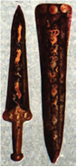

+ Mil. avv. 1 ming yillikka
- Mil. avv. VII –VI asrlarga
- Mil. avv. VIII –VII asrlarga
- Mil. avv. 2 ming yillikka

**95. Temir asriga oid quyidagi temir pichoq qaysi davrga oid?**

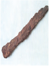

- Mil. avv. 1 ming yillikka
+ Mil. avv. VII –VI asrlarga
- Mil. avv. VIII –VII asrlarga
- Mil. avv. 2 ming yillikka

**96. Temirdan yasalgan zeb-ziynat buyumlari qayerlardan topilgan?**

+ Misr fir’avni Tutanxamon maqbarasidan va Kavkazdagi Maykop qo‘rg‘onidan
- Altamir va Kapova g’oridan
- Bobil va Suza shaharlari qoldiqlaridan
- Xufu va Xafra piramidalaridan

**97. Quyidagi tarixiy atamalarni ularning mazmuni bilan to’g’ri joylashtiring. 1. Zantu; 2. Nmana; 3. Varzana; 4. Vis. a) urug’ jamoasi; b) hududiy qo’shnichilik jamoasi; c) katta patriarxal oila; d) qabila.**

- 1-c, 2-d, 3-b, 4-a
+ 1-d, 2-c, 3-b, 4-a
- 1-c, 2-a, 3-d, 4-b
- 1-d, 2-c, 3-a, 4-b

**98. “Daxyu” nima?**

- Varzanalar (hududiy qo’shnichilik jamoalari) uyushmasi
- Nmanalar (patriarxal oilalar) uyushmasi
- Vislar (urug’ jamoalari) uyushmasi
+ Zantular (qabilalar) uyushmasi 

## 6-§ Nil vodiysi va uning aholisi.

**99. Qadimgi Misrda loy suvalgan papirus poyalaridan qanday inshootlar qurilgan?**

- Jamoat binolari
- Fir’avnlarning saroylari va ibodatxonalar
- Zodagonlarning uylari
+ Oddiy misrliklarning uylari

**100. Misrliklar iyul-sentabr oylarida urug’likni sepishga hozirlashardi, negaki bu mahalda… .**

- Iqlim juda yaxshi bo’lar edi
- Yer ekinga tayyor bo’lar edi
- Yomg’ir kam yog’ar edi
+ Dalalarni suv bosgan bo’ladi

**101. Qachon Quyi Misr va Yuqori Misr o`rtasida boshlangan urushda Yuqori Misr hukmdori Menes g‘alaba qozonadi?**

- Mil. avv. 2000-yilda
- Mil. avv. 2500-yilda
+ Mil. avv. 3000-yilda
- Mil. avv. 3500-yilda

**102. Misr qayta birlashganda qaysi shahar poytaxt bo’lgan?**

- Menesiya
- Rozett
+ Fiva
- Memfis

**103. Quyidagi rasmda nima tasvirlangan?**

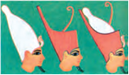

- Oddiy misrliklar bosh kiyimlari
- Misr boylari bosh kiyimlari
+ Misr fir’avnlarining tojlari
- Misr kohinlari bosh kiyimlari

**104. Qachon odamlar Nil daryosi qirg’oqlaridagi yerlarni o’zlashtira boshlaganlar?**

- Mil.avv. 3-ming yillikda
- Mil.avv. 4-mingyillik oxirlarida
+ Mil.avv. 4-mingyillik boshlarida
- Mil.avv. 4-ming o’rtalarida

**105. Qadimgi Misr podsholik davrlarini to’g’ri ketma-ketlikda ko’rsating.**

- Yangi, Ilk, O‘rta, Qadimgi va So‘nggi podsholik
- Ilk, O‘rta, Qadimgi, Yangi va So‘nggi podsholik
- Qadimgi, Ilk, O‘rta, Yangi va So‘nggi podsholik
+ Ilk, Qadimgi, O‘rta, Yangi va So‘nggi podsholik

**106. Yagona va birlashgan Misr davlati uchun yangi poytaxt tariqasida qaysi shahar barpo etilgan?**

- Menesiya
- Rozett
+ Memfis
- Fiva

**107. Qadimgi Misrda toshdan qanday inshootlar qurilgan?**

- Jamoat binolari
+ Fir’avnlarning saroylari va ibodatxonalar
- Zodagonlarning uylari
- Oddiy misrliklarning uylari

**108. «Qora tuproq» yoki «Nil in’omi» deb qaysi mamlakat atalgan?**

- Liviya
+ Misr
- Mesopotamiya
- Nubiya

**109. Nil daryosining uzunligini qancha?**

- 5 ming kilometr
- 3 ming kilometr
+ 6 ming kilometr
- 4 ming kilometr

**110. Misrda «nom» lar hukmdorlari o’z mol-mulkini ko’paytirib oldi, natijada… .**

+ Misr alohida «nom»larga parchalanib ketdi
- Poytaxti Fiva shahri bo’lgan Misr davlati qayta shakllandi
- Mamlakat yagona davlatga birlashdi
- Mamlakat Quyi va Yuqori Misrga parchalanib ketdi

**111. Quyi Misr mamlakatning qaysi qismi?**

+ Shimoliy qismi 
- Janubiy qismi
- G’arbiy qismi
- Sharqiy qismi

**112. Yuqori Misr mamlakatning qaysi qismi?**

- Shimoliy qismi
+ Janubiy qismi 
- G’arbiy qismi
- Sharqiy qismi

**113. Qadimgi Misrda «nom» deb nimalarga aytilgan?**

+ Kichik shahar-davlatlarga
- Fir’avnlar sulolalariga
- Aholi yashash manzilgohlariga
- Alohida viloyatlarga

**114. Qadimgi Misrda oftobda quritilgan xom g‘ishtdan qanday inshootlar qurilgan?**

- Jamoat binolari
- Ibodatxonalar
+ Zodagonlarning uylari
- Oddiy misrliklarning uylari

**115. Qadimgi Misrda … hukmdorlarga, podsholarga aylanishgan.**

- Harbiy yo’lboshchilar
- Kohinlar
+ Nomarxlar
- Oqsoqollar

## 7-§ Qadimgi Misr.

**116. Fors shohi Kambiz Misrni qachon bosib olgan?**

- Mil.avv. 539-yilda
- Mil.avv. 490-yilda
- Mil.avv. 530-yilda
+ Mil.avv. 525-yilda

**117. Suratda nima aks ettirilgan?**

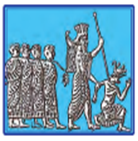

- Tutmos III bosqinchilik yurishlarida
- Misr giksoslar tomonidan bosib olinmoqda
+ Misrliklarni qadimgi fors podshosi Kambiz II asirlikka olib ketmoqda 
- Misr hukmdori qatl qilinmoqda

**118. Giksoslar qo’shinining kuchli tomoni nimada edi?**

- Og’ir qurollangan piyoda qo’shinda
+ Otlar qo‘shilgan jangovar aravalarda
- Tosh otuvchi katapultalarda
- Uzoqqa otuvchi kamonchilarda

**119. O’rta podsholik davrida Misr… .**

- Bosqinchilik yurishlari olib bormadi
+ Nubiya shimolini egalladi
- Nubiyani to’liq bosib oldi
- Falastinni to’liq bosib oldi

**120. Fir’avn Yaxmos … .**

- Giksoslarni tor-mor etdi
- Yangi podsholikka asos soldi
- Itoatsiz hukmdorlarni o’ziga bo’ysundirdi
+ Barcha javoblar to’g’ri

**121. Misr janubda qaysi hudud bilan chegaradosh edi?**

- Sinay
- Suriya
+ Nubiya
- Liviya

**122. Qadimgi Misrga oid ushbu hududlarga mos javob variantlarni tanlang 1. Liviya; 2. Nubiya; 3. Suriya; 4) Sinay. a) mis va temir rudasiga hamda boshqa foydali; qazilmalarga boy bo’lgan; b) misrliklar yuqori navli yog’ochlarni ayriboshlash uchun borganlar; c) bu hududga olib boradigan yo’l Memfis shahri orqali o’tgan; d) hudud aholisi chorvador bo’lishgan.**

- 1-d, 2-b, 3-c, 4-a
- 1-b, 2-d, 3-a, 4-c
+ 1-d, 2-b, 3-a, 4-c
- 1-a, 2-b, 3-c, 4-d

**123. Qachon Misrni ko’chmanchi giksos qabilalari istilo qilgan?**

- Mil.avv. XVIII asr boshlarida
- Mil.avv. XVII asr boshlarida
+ Mil.avv. XVIII asr oxirida
- Mil.avv. XVII asr oxirida

**124. Qaysi fir’avn Falastin, Finikiya  va Suriyani istilo qilishni boshlagan?**

+ Tutmos II
- Menes
- Tutmos III
- Yaxmos

**125. Ushbu suratda qaysi hukmdor jangchilarining shaharga hujumi tasvirlangan?**

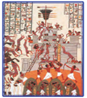

- Tutmos I
+ Tutmos III
- Tutmos II
- Yaxmos

**126. Misrda qaysi podsholik davrida fir’avnlar Nubiya va Old Osiyo mamlakatlariga hujum qilganlar?**

+ Yangi podsholik davrida
- O’rta podsholik davrida
- Qadimgi podsholik davrida
- Ilk podsholik davrida

**127. Yangi podsholik fir’avnlari… . 1. Old Osiyo mamlakatlariga hujum uyushtirdi; 2. Nubiyaga ham hujum qilganlar; 3. Mahalliy qabilalar bilan urishib zaiflashib qoldi; 4. Giksoslarga soliq to’lar edilar.**

- 1, 3, 4
- 3, 4
- 2, 3, 4
+ 1, 2, 3

## 8-§ Qadimgi Misrda din.

**128. Qadimgi Misrda Quyosh xudosi qanday nomlangan?**

- Tot
- Isida
+ Amon-Ra
- Apis

**129. Set bu - … .**

+ Osirisning birodari
- Marhumlar xudosi
- Quyosh xudosi
- Donishmandlik xudosi

**130. Qachondan boshlab quyosh xudosi Amon-Ra fir’avnlarning bosh ilohi va homiysi hisoblangan?**

- Mil. avv. 1-ming yillikdan
- Mil. avv. 3-ming yillik oxirlaridan
+ Mil. avv. 2-ming yillikdan
- Mil. avv. 3-ming yillik boshlaridan

**131. Qadimgi Misrda oy, donishmandlik va tabobat xudosi qanday nomlangan?**

+ Tot
- Isida
- Amon-Ra
- Apis

**132. Qadimgi Misr ilohalarini aniqlang.**

+ Xatxor, Maat
- Anubis, Tot
- Maat, Tot 
- Xatxor, Anubis

**133. Qadimgi Misrda buqa timsolidagi hosildorlik xudosi qanday nomlangan?**

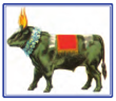

- Tot
- Isida
- Amon-Ra
+ Apis

**134. Qadimgi Misrda odamlar va xudolar o’rtasidagi vositachini aniqlang.**

- Ilohalar
- Ilohlar
+ Kohinlar
- Fir’avnlar

**135. Qadimgi Misrda musiqa, go‘zallik va sevgi ilohasi qanday nomlangan?**

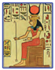

- Anubis
- Maat
+ Xatxor
- Isida

**136. Qadimgi Misr xudolarini ularga mos hususiyatlar bilan to’g’ri joylashtiring. 1. Osiris; 2. Anubis; 3. Ptax; 4. Xapi. a) marhumlar xudosi; b) xalqini dehqonchilikka o’rgatgan xudo; c) Misrdagi hayotning birlamchi manbai va posboni; d) Memfisning bosh xudosi.**

- 1-a, 2-b, 3-c, 4-d
+ 1-b, 2-a, 3-d, 4-c
- 1-b, 2-a, 3-c, 4-d
- 1-a, 2-b, 3-d, 4-c

**137. Misrda fir’avnlarning bosh ilohi va homiysi hisoblangan xudoni aniqlang.**

- Osiris
- Tot
+ Amon-Ra
- Apis

**138. Qadimgi Misrda Nil toshqini vaqtini, qachon urug‘lik sochish va hosilni yig‘ishtirib olish muddatini kimlar aniq bilishgan?**

- Fir’avnlar
- Munajjimlar
+ Kohinlar
- Dehqonlar

**139. Qadimgi Misrda Osirisning xotini qanday nomlangan?**

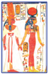

- Tot
+ Isida
- Amon-Ra
- Apis

**140. Misrliklar e`tiqodiga ko’ra, xudolarning bir qancha joni bo’lib ularning biri hayvon tanasida, ikkinchisi esa … deb bilganlar.**

- Osmonda yashaydi
- O’simliklarda yashaydi
+ Haykalida yashaydi
- Odamlarda yashaydi

**141. Qadimgi Misrda haqiqat va adolat ilohasi qanday nomlangan?**

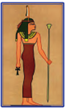

- Anubis
+ Maat
- Xatxor
- Isida

**142. Misrda nima sababdan barcha marhumlar mumiyolangan?**

- Jasadni yaxshi saqlanishi uchun
- Mumiyolangan jasad jannatga tushishiga ishonishgan
+ Jon qaytib keladigan bo’lishi uchun
- Qurt-qumursqalardan himoya qilish uchun

**143. Qadimgi Misrda marhumlar va mumiyolanganlar xudosi qanday nomlangan?**

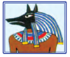

+ Anubis
- Maat
- Xatxor
- Isida

## 9-§ Piramidalar va daxmalar.

**144. Qaysi podsholiklar davrida Misrda piramidalar qurilgan?**

- So’nggi va Yangi podsholiklar davrida
- Yangi va O’rta podsholiklar davrida
- Ilk va Qadimgi podsholiklar davrida
+ Qadimgi va O‘rta podsholiklar davrida

**145. Xufu piramidasi qachon qurilgan?**

- Mil. avv. 2400-yil atrofida
+ Mil. avv. 2600-yil atrofida
- Mil. avv. 3000-yil atrofida
- Mil. avv. 2100-yil atrofida

**146. Qadimgi misrliklar e’tiqodiga ko’ra, inson vafot etgach uni xudo Osiris tarozi yordamida sud qilgan. Tarozining bir pallasiga marhumning yuragi, boshqa pallasiga qush patlari qo‘yiladi. Agar yurak solingan pallasi og‘irroq kelsa … .**

+ Inson bir talay yomon ishlarni qilgan bo‘lib chiqadi va badbashara maxluqlarga yemish bo‘ladi
- Inson boshqa hayvon qiyofasida qayta tiriladi
- Inson bu dunyodagi hayotida faqat ezgu ishlar qilgan bo‘ladi, u vafot etganidan keyin ajoyib bir sharoitda umrini davom ettiradi
- Inson xudolar qatoriga qo’shiladi

**147. Qadimgi Misrda mumiyolash necha kun davom etgan?**

- 30 kun
- 45 kun
+ 70 kun
- 90 kun

**148. Xufu, Xafra va Menkaura piramidalari qaysi shahar yaqinida joylashgan?**

- Abidos
- Avarna
- Fiva	
+ Memfis

**149. Qadimgi Misrda mumiyolash bilan kimlar shug‘ullanishgan?**

- Tajribaga ega bo’lgan tabiblar
- Marhumning qarindoshlari
- Maxsus o’rgatilgan xizmatkorlar
+ Tibbiy bilimlarga ega kohinlar

**150. Misrda qaysi podsholik davridan piramida qurmay qo’yishgan?**

+ Yangi podsholik davridan
- O’rta podsholik davridan
- Qadimgi podsholik davridan
- Ilk podsholik davridan

**151. Misrliklar e’tiqodicha marhumlar saltanatidagi hayot … .**

+ Osiris sudining natijalariga bog’liq bo’lgan
- Isida sudining natijalariga bog’liq bo’lgan
- Tot sudining natijalariga bog’liq bo’lgan
- Anubis sudining natijalariga bog’liq bo’lgan

**152. Xufu piramidasi qurilishi uchun toshlar qayerdan olib kelingan?**

- Nil daryosining yuqori qismidagi yassi tog‘lardan
- Nil daryosining quyi qismidagi yassi tog‘lardan
- Nil daryosining chap sohilidagi yassi tog‘lardan 
+ Nil daryosining o‘ng sohilidagi yassi tog‘lardan

**153. Xufu piramidasining balandligi qancha bo’lgan?**

+ 147 metr
- 152 metr
- 136 metr
- 161 metr

**154. Quyidagi atamalarga mos javoblarni toping. 1. Sarkofag; 2. Sfinks; 3. Bastet. a) go’zallik xudosi; b) toshtobut; c) sahro shohi.**

- 1-a, 2-c, 3-b
- 1-b, 2-a, 3-c
- 1-a, 2-b, 3-c
+ 1-b, 2-c, 3-a

**155. Qadimgi misrliklar e’tiqodiga ko’ra, inson vafot etgach uni xudo Osiris tarozi yordamida sud qilgan. Tarozining bir pallasiga marhumning yuragi, boshqa pallasiga qush patlari qo‘yiladi. Mabodo tarozi pallalari tenglashsa … .**

- Inson bir talay yomon ishlarni qilgan bo‘lib chiqadi va badbashara maxluqlarga yemish bo‘ladi
- Inson boshqa hayvon qiyofasida qayta tiriladi
+ Inson bu dunyodagi hayotida faqat ezgu ishlar qilgan bo‘ladi, u vafot etganidan keyin ajoyib bir sharoitda umrini davom ettiradi
- Inson xudolar qatoriga qo’shiladi

**156. Go’zallik xudosi Bastet qaysi hayvon ko’rinishida gavdalangan?**

- Burgut
+ Mushuk
- Tulki
- Ilon

**157. Eng mashhur, tog‘larga o‘yilgan tosh maqbara qaysi fir’avnga atab qurilgan?**

- Tutmos III
+ Tutanxamon
- Yaxmos II
- Menes

**158. Qaysi piramida har biri ikki tonnadan og‘irroq bo‘lgan 2,5 million dona tosh bo‘laklaridan tashkil topgan?**

- Menes piramidasi
+ Xufu piramidasi
- Xafra piramidasi
- Menkaura piramidasi 

**159. Xufu piramidasini kimlar “Xeops” deb atashgan?**

- Forslar
- Rimliklar
+ Yunonlar
- Mesopotamiyaliklar

**160. Osiris qarshisida go‘zal qiyofada qad rostlash uchun misrliklar … .**

- Jasadga yoqimli hid taratuvchi atirlar sepishgan
+ Inson jasadini mumiyolashgan
- Marhumni qabriga taqinchoqlar solishgan 
- Qabrlarni naqshlar va rasmlar bilan bezatishgan

**161. Eng katta piramida qaysi?**

- Menes piramidasi
+ Xufu piramidasi
- Xafra piramidasi
- Menkaura piramidasi 

**162. Sfinksning balandligi necha metrga teng?**

- 18 metr
+ 20 metr
- 45 metr
- 50 metr

## 10-§ Qadimgi Misr madaniyati.

**163. Qadimgi Misrda anhorlar qazilayotganda, istalgan imorat va inshootni barpo etayotganda maydon hajmini o‘lchash zarur edi, shu tariqa … – yer yuzasini o‘lchash ilmi dunyoga kelgan.**

+ Geometriya
- Astronomiya
- Matematika
- Arifmetika

**164. Qadimgi misrliklar 365 kunni 30 kundan 12 oyga taqsimladilar, ortib qolgan 5 kunni … .**

- Noto’g’ri kunlar deb, hisobga kiritishmagan
- Hosiyatsiz kunlar deb, hisobga kiritishmagan
+ Bayram kunlari deb, hisobga kiritishmagan
- Ilohiy kunlar deb, hisobga kiritishmagan

**165. Qadimgi Misrda asosiy o‘lchov birligi  bo’lgan «podsho tirsagi» necha santimetrga teng bo‘lgan?**

- 56,5 santimetrga
+ 52,5 santimetrga
- 55,5 santimetrga
- 50,5 santimetrga

**166. Qadimgi misrliklar yil davomiyligini necha kun deb belgilaganlar?**

- 371 kun
- 342 kun
- 356 kun
+ 365 kun

**167. Kimlar misrliklar yozuvlarini «iyerogliflar» deyishgan?**

- Forslar
- Mesopotamiyaliklar
- Rimliklar
+ Yunonlar

**168. Qadimgi Misrda ta’lim olayotganda nimaga yozishgan?**

- Papirus poyasidan ishlangan qog‘ozga
- Yog’ochga
- Qoya toshlariga
+ Sopol buyumlar parchasiga yoki ohaktoshga

**169. Qadimgi Misrda asosan nimaga yozishgan?**

+ Papirus poyasidan ishlangan qog‘ozga
- Yog’ochga
- Qoya toshlariga
- Sopol buyumlar parchasiga yoki ohaktoshga

**170. Misrliklar nima sababdan o’z yozuvlarini «muqaddas» yoki «xudolar kalomi» deb nomlashgan?**

- Faqat fir’avnlar yozuvni bilishgani uchun
+ Yozuvdan duolar va marosimlarni yozib borishda foydalanishgani uchun
- Yozuv xudolar tomonidan in’om etilgan deb hisoblashgani uchun
- Faqat kohinlar yozuvni bilishgani uchun

**171. Quyidagi rasmda kim tasvirlangan?**

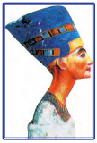

- Xatxor – sevgi ilohasi
- Bastet – go‘zallik xudosi
+ Nefertiti – Misr malikasi
- Isida – marhumlar dunyosining xudosi

**172. Quyidagi rasmda nima tasvirlangan?**

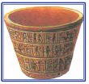

- Yil taqvimi tushirilgan idish
+ Qadimgi Misr suv soati
- Sopol vino idishi
- Fir’avn kosasi

**173. Qadimgi Misrda kunni nechta soatga bo’lishgan?**

+ 24 soatga
- 23 soatga
- 20 soatga
- 22 soatga

**174. Qadimgi Misrliklar alifbosi nechta iyeroglifdan iborat bo‘lgan?**

- 650 iyeroglifdan
- 600 iyeroglifdan
- 550 iyeroglifdan
+ 750 iyeroglifdan

**175. Misrda astronomiyaning (yulduzlar haqidagi fan) shakllanishiga zamin yaratgan sohani aniqlang.**

- Tabiblik
- Binokorlik
- Sayyohlik
+ Ziroatchilik

**176. Qohira shahri yaqinidan topilgan Rozett bitiktoshi hozir qayerda saqlanadi?**

- Sankt-Peterburgdagi Ermitaj muzeyida
- Parijdagi Luvr muzeyida 
+ Londondagi Britaniya muzeyida 
- Nyu Yorkdagi Metropolitan muzeyida

**177. Qadimgi Misrda kimlar ma’lumotli va savodxon kishilar sanalganlar va katta imtiyozlarga ega bo‘lib, izzat-hurmatda bo‘lganlar?**

- Astronomiyani bilganlar
- Matematika va geometriyani bilganlar
+ Husnixat san’atini egallagan kishilar
- Kohinlar

**178. Fransuz olimi Jak Fransua Shampolyon qachon Misr iyerogliflarini o’qish kalitini topgan?**

- 1852-yilda
- 1838-yilda
+ 1822-yilda
- 1821-yilda

**179. Qadimgi Misrda «podsho tirsagi» dan qisqa uzunliklarni o‘lchashda nimadan foydalanilgan?**

+ Kaft yoki barmoqlardan
- Tosh uskunalardan
- Yog’och tayoqchalardan
- Oyoq yoki qo’llardan

**180. Quyidagi rasmda kim tasvirlangan?**

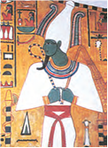

- Set – Osirisning birodari
- Tot – donishmandlik xudosi
- Amon-Ra – quyosh xudosi
+ Osiris – marhumlar dunyosi hukmdori 

**181. Rozett bitiktoshida qaysi tillardagi bir xil ma’nodagi matnlar yozilgan?**

- Misr va Bobil tillaridagi
+ Misr va qadimgi yunon tillaridagi
- Misr va xett tillaridagi
- Misr va lotin tillaridagi

**182. «Iyeroglif» so’zining ma’nosi nima?**

- «Ma’rifatlangan»
+ «Toshga chekilgan muqaddas bitiklar»
- «Muqaddas»
- «Xudolar kalomi»

## 11-§ Mesopotamiya sivilizatsiyalari.

**183. “Mesopotamiya” so’zi qaysi tildan olingan?**

- Shumer tilidan
- Akkad tilidan
+ Yunon tilidan
- Lotin tilidan

**184. Mesopotamiyaliklarning Quyosh xudosini belgilang.**

- Ishtar
- Sina
+ Shamash
- Ea

**185. Mesopotamiya  aholisining  asosiy  mashg‘uloti nima  bo‘lgan?**

+ Dehqonchilik
- Hunarmandchilik
- Chorvachilik
- Savdo-sotiq

**186. Mesopotamiyaliklarning Oy xudosini belgilang.**

- Ishtar
+ Sina
- Shamash
- Ea

**187. Mesopotamiyaliklar xurmo daraxtini qanday nomlashgan?**

- Xudo daraxti
- Xaloskor daraxt
- Ilohiy daraxt
+ Xayot daraxti

**188. Mesopotamiyaliklarning Suv xudosi belgilang.**

- Ishtar
- Sina
+ Ea
- Shamash

**189. Rasmda qaysi xudo tasvirlangan?**

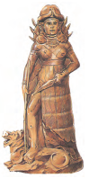

- Sina
+ Ishtar
- Ea
- Shamash

**190. Mesopotamiyadagi og‘irlik o‘lchovi «mino» necha gramm kumushga barobar bo‘lgan?**

- 500 gramm
- 540 gramm
- 560 gram
+ 550 gramm

**191. Suratda kim tasvirlangan?**

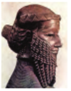

- Bobil podshosi Hammurapi
+ Shumer-Akkad davlati podshosi Sargon I
- Uruk shahri podshosi Gilgamish
- Ossuriya podshosi Ashshurbanipal

**192. Sargon I qanday unvon olgan?**

- «Yengilmas podsho»
- «Sharq mamlakatlari podshosi»
+ «To‘rt iqlim mamlakatlari podshosi»
- «Yetti iqlim mamlakatlari podshosi»

**193. Mesopotamiyaliklar qo‘shni Kavkazorti va Eron o‘lkalaridan donga ayirboshlab nimalarni keltirishgan?**

- Oltin, mis, kumush, qalayi va yog’och
- Oltin, mis, temir, qalayi va noyob toshlar
+ Oltin, mis, kumush, qalayi va noyob toshlar
- Oltin, mis, bronza, qalayi va noyob toshlar

**194. Mesopotamiyada podsho shahar-davlatni kimlarga tayangan holda idora qilgan?**

+ Aslzodalar, kohinlar va harbiy qo‘shinlarga
- Kohinlar, aslzodalar va savdogarlarga
- Aslzodalar, harbiy qo‘shinlarga
- Qullar, kohinlar va harbiy qo‘shinlarga

**195. Gilgamish qayerning podshosi bo’lgan?**

+ Uruk shahrining
- Lagash shahrining
- Umma shahrining
- Ur shahrining

**196. Mesopotamiyada … davlatdagi hokimiyat markazi bo‘lgan.**

- Bosh qo’mondon qarorgohi
+ Xudolar ibodatxonasi
- Shahar kengashi binosi
- Shoh saroyi

**197. Sargon I tuzgan muntazam qo’shin qancha jangchidan iborat bo’lgan?**

- 4000 nafar jangchidan
- 5000 nafar jangchidan
+ 5400 nafar jangchidan
- 4500 nafar jangchidan

**198. Mesopotamiyda qurilishda qanday materiallardan foydalanishgan?**

+ Tosh, xom va pishgan g‘ishtdan foydalanishgan
- Paxsa va toshdan foydalanishgan
- Tosh va g’ishtdan foydalanishgan
- Toshdan foydalanishgan

**199. Sargon I qachon Akkad va Shumer shaharlarini o‘z hokimiyati ostida birlashtirgan?**

- Mil. avv. 2-ming yillik oxirlarida
- Mil. avv. 2-ming yillik boshlarida
+ Mil. avv. 3-ming yillikning ikkinchi yarmida
- Mil. avv. 4-ming yillikning birinchi yarmida

**200. “Mesopotamiya” so’zi ma’nosini toping.**

- Jannatmakon o’lka
- Dunyoning chekkasi
- Daryoning narigi tomoni
+ Ikki daryo oralig‘i

**201. Qachon Shumer-Akkad davlati ko‘chmanchi qabilalar zarbasidan parchalanib ketgan?**

- Mil. avv. 2 ming yillik oxirlarida
+ Mil. avv. 2 ming yillik boshlarida
- Mil. avv. 3 ming yillikning ikkinchi yarmida
- Mil. avv. 4 ming yillikda birinchi yarmida

**202. Mesopotamiyaliklarning hosildorlik va sevgi, urush va g‘alaba ilohasini belgilang.**

+ Ishtar
- Sina
- Ea
- Shamash

**203. Mesopotamiyada … singari xo‘jalik uchun zarur  materiallar bo‘lmagan, ammo … mo‘l-ko‘l yetishtirilgan, chorva mollari ko‘p bo‘lgan.**

+ Yog‘och va metall/don 
- Don /yog‘och va metall 
- Metall /yog‘och va don
- Yog‘och /metall va don

**204. Mesopotamiyada ibodatxonalar nimalar bilan hashamatli bezatilgan edi?**

- Tasvirlar bilan
- Bog’lar bilan
+ Xudolar haykallari bilan
- Ustunlar bilan

**205. Suratda mixxat bilan yozilgan qanday matn tasvirlangan?**

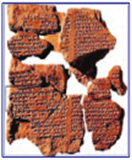

+ Gilgamish haqidagi rivoyat
- Sargon I ning yurishlari yozilgan etgan bitik
- Hammurapi qonunlari
- Quyosh xudosi Shamashga atalgan duolar

**206. Yer yuzini butunlay suv bosishi to‘g‘risidagi To‘fon rivoyati qayerda dunyoga kelgan?**

- Misrda
+ Mesopotamiyada
- Rimda
- Yunonistonda

**207. Mesopotamiyada yerlarga kimlar ishlov berishgan?**

- Erkin yollanma ishchilar
- Shaharlar tevaragida istiqomat qiluvchi aholi
+ Qullar va erkin yollanma ishchilar
- Qullar

**208. Sargon I savdo-sotiqni rivojlantirish maqsadida qanday chora ko’rgan?**

+ Barcha shaharlar uchun yagona bo‘lgan uzunlik, maydon va og‘irlik o‘lchovini joriy etgan
- Ko‘plab shaharlar va qo‘shni mamlakatlarni zabt etgan
- Jahon tarixida birinchi bo‘lib muntazam qo‘shin tuzgan
- Barcha javoblar to’g’ri

**209. Mesopotamiyada vujudga kelgan Uruk, Umma, Lagash va Ur shaharlari … .**

+ Shahar va unga tutash dehqonchilik tumanlaridan iborat bo‘lgan
- Shahar hududidan iborat bo’lgan
- Bir nechta aholi manzilgohidan iborat bo’lgan
- Dehqonchilik markazlari va unga tutashgan shaharlardan iborat bo’lgan

**210. Ushbu Ossuriya bo‘rtma tasvirida kim tasvirlangan?**

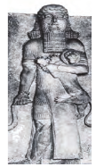

- Bobil podshosi Hammurapi
- Shumer-Akkad davlati podshosi Sargon I
+ Uruk shahri podshosi Gilgamish
- Ossuriya podshosi Ashshurbanipal

**211. Mesopotamiyada nimalar “zikkuratlar” deb atalgan?**

- Qal’alar
- Saroylar
- Maktablar 
+ Ibodatxonalar 

**212. Qachon shumerlar jahondagi eng qadimgi yozuvlardan biri mixxatni ixtiro qilishgan?**

- Mil. avv. 1-ming yillikda
- Mil. avv. 2-ming yillikda
- Mil. avv. 3-ming yillikda
+ Mil. avv. 4-ming yillikda

**213. Shumerlar uchi o‘tkirlangan tayoqchalar bilan nimalarga yozishgan?**

- Yog’ochga
- Papirus qog’ozga
+ Loy taxtachalarga
- Ohak taxtachalarga

**214. Qachon Mesopotamiyada shumerlar manzilgohlari  vujudga  kela boshlagan?**

- Mil. avv. 5-ming yillikda
- Mil. avv. 2-ming yillikda
- Mil. avv. 3-ming yillikda
+ Mil. avv. 4-ming yillikda

**215. Mesopotamiyada … ayniqsa qadrlangan.**

+ Metall buyumlar, zeb-ziynat buyumlar, qurol-yarog’, kulolchilik buyumlari
- Chorva mollari, zeb-ziynat buyumlar, qurol-yarog’, kulolchilik buyumlari
- Dehqonchilik mahsulotlari, metall buyumlar, qurol-yarog’, kulolchilik buyumlari
- Metall buyumlar, zeb-ziynat buyumlar, don, kulolchilik buyumlari

## 12-§ Bobil podsholigi.

**216. «Bobil minorasi» kartinasi P. Breygel tomonidan nechanchi yilda chizilgan?**

- 1568-yilda
+ 1563-yilda
- 1579-yilda
- 1572-yilda

**217. Xammurapi va Navuxodonosor davrida … .**

- Misrni bosib olganlar
- Mudofaa devorlarini qurishda pishgan g’isht ishlatish to’g’risida farmon berganlar
- Munajjimlikka doir asarlar yaratganlar
+ Mamlakat o’z ravnaqining cho’qqisiga erishgan

**218. Navuxodonosor II farmoniga ko’ra qanday inshootlar pishgan g’ishtdan quriladigan bo’lgan?**

- Zikkuratlar
+ Turar joylar va mudofa devorlari
- Saroylar
- Barcha inshootlar

**219. Xammurapi qonunlarining matnlari mamlakatning barcha shaharlarida … .**

- kirish darvozasiga yozib qo‘yilgan
+ tosh ustunlarga yozib qo‘yilgan
- ibodatxona eshigiga yozib qo‘yilgan
- saroy devoriga yozib qo‘yilgan

**220. Qachon Yangi Bobil podsholigi vujudga kelgan?**

- Miloddan avvalgi IX asrda
+ Miloddan avvalgi VII asrda
- Miloddan avvalgi VIII asrda
- Miloddan avvalgi VI asrda

**221. Zikkuratlar … .**

+ Mesopotamiyadagi ibodatxonalar va zinali rasadxonalardir
- Mesopotamiyadagi kutubxonalar va maktablardir
- Mesopotamiyadagi zinali rasadxonalar va saroylardir
- Mesopotamiyadagi ibodatxonalar va kutubxonalardir

**222. Qachon Bobil podsholigi Mesopotamiya janubidagi eng yirik qudratli davlatga aylangan?**

- Miloddan avvalgi 3-ming yillik oxirlarida
- Miloddan avvalgi 3-ming yillik boshlarida
- Miloddan avvalgi 4-ming yillikda
+ Miloddan avvalgi 2-ming yillikda

**223. Bobilda Ishtar … hisoblangan.**

+ G‘alaba ilohasi
- Quyosh xudosi
- O’lim xudosi
- Hosildorlik ilohasi

**224. Kim tarixda qonunlar tuzgan birinchi hukmdor sifatida nom qoldirgan?**

+ Xammurapi
- Navuxodonosor
- Sargon I
- Gilgamish

**225. Oy yili davomiyligi shumerliklar tomonidan necha kun etib belgilangan?**

- 362 kun
+ 354 kun
- 365 kun
- 356 kun

**226. Quyosh yili davomiyligi shumerliklar tomonidan necha kun etib belgilangan?**

- 362 kun
- 354 kun
+ 365 kun
- 356 kun

**227. «Bobil» so’zining ma’nosi nima?**

- «tangri darvozasi»
+ «xudolar darvozasi»
- «ilohiy darvoza»
- «podshohlar darvozasi»

**228. Suratda qaysi inshoot tasvirlangan?**

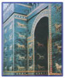

- Xammurapi saroyi
- Ea darvozasi
- Tutanxamon maqbarasi
+ Ishtar darvozasi 

**229. Ushbu suratda kim tasvirlangan?**

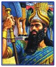

- Gilgamish
- Xammurapi
+ Navuxodonosor
- Sargon I

**230. Frot va Dajla daryolarining o‘zanlari bir-biriga yaqinlashib ketadigan hududda qaysi qadimiy shahar joylashgan?**

- Lagash shahri
- Uruk shahri
+ Bobil shahri
- Ur shahri

**231. Navuxodonosor II davrida Bobil shahrining nechta darvozasi bo‘lgan?**

- 5 ta
+ 8 ta
- 10 ta
- 4 ta

**232. Fors lashkarlari qachon Bobilni zabt etgan?**

- Mil. avv. 558-yilda
- Mil. avv. 604-yilda
+ Mil. avv. 539-yilda
- Mil. avv. 586-yilda

**233. Navuxodonosor II … .**

- Iyerusalim (Quddus) ni vayron qilib tashlagan
- Bobilni mustahkam qal’aga aylantirgan
- Misrni bosib olgan
+ Barcha javoblar to’g’ri

**234. Xammurapi vafotidan keyin kimlar Bobil podsholigini bosib oldilar?**

+ Kassitlar
- Ossuriylar
- Arameylar
- Giksoslar

**235. Qachon Bobil podshosi Xammurapi butun Mesopotamiyani yagona davlatga birlashtirishga muvaffaq bo‘lgan?**

- Mil. avv. XVI asrda
+ Mil. avv. XVIII asrda
- Mil. avv. XIII asrda
- Mil. avv. XVII asrda

**236. Bobil podsholigida qayerlarda zodagonlar va badavlat odamlar oilalarining farzandlari ta’lim oladigan maktablar tashkil qilingan edi?**

- Saroy va kutubxonalarda
- Badavlat odamlarning uylarida
+ Hukmdorlar saroylari va ibodatxonalarda
- Ibodatxonalarda

**237. Ushbu suratda qaysi qadimiy shahar tasvirlangan?**

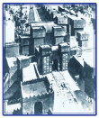

+ Bobil shahri
- Uruk shahri
- Ur shahri
- Lagash shahri

## 13-§ Old Osiyo davlatlari.

**238. Ossuriya davlatining poytaxti qaysi shahar bo‘lgan?**

- Avval Tushpa shahri, keyin esa Nineviya shahri
- Avval Karxamish shahri, keyin esa Tushpa shahri
+ Avval Oshshur shahri, keyin esa Nineviya shahri
- Avval Nineviya shahri, keyin esa Oshshur shahri

**239. Quyidagi qaysi xalq jangovar aravalar va temir uchli nayzalardan foydalangan?**

- Finikiyaliklar
- Urartlar
+ Xettlar
- Ossuriyaliklar

**240. O‘rtayer dengizining sharqiy qirg‘og‘i bo‘ylab hozirgi Livan hududida va Suriyaning bir qismida qaysi davlat joylashgan edi?**

- Ossuriya davlati
- Xettlar davlati
+ Finikiya davlati
- Tir-Sidon davlati

**241. Xettlar davlatining poytaxti qaysi shahar bo’lgan?**

+ Xattusa shahri
- Karxamish shahri
- Nineviya shahri
- Oshshur shahri

**242. Qachon Finikiyada 22 undosh harfdan iborat bo‘lgan alifbo yaratilgan?**

- Mil. avv. XI asrda
- Mil. avv. VIII asrda
- Mil. avv. IX asrda
+ Mil. avv. X asrda

**243. Ossuriyaliklar urartlarning qaysi shahrini bosib olib, vayron qilib tashlashgan?**

- Tushpa shahrini
- Nineviya shahrini
- Karxamish shahrini
+ Teyshebaini shahrini

**244. Qaysi xalq Finikiya alifbosini o‘zlashtirib oladi va ularga unli harflarni ham qo‘shib qo‘yadi?**

- Shumerlar
+ Yunonlar
- Rimliklar
- Misrliklar

**245. Kavkazortida, hozirgi Turkiya sharqiy qismida va Armaniston hududlarida qaysi davlat joylashgan edi?**

+ Urartu davlati
- Finikiya davlati
- Ossuriya davlati
- Xettlar davlati

**246. Tarixda nomlari noma’lum xalqlar (ularni … deb atashgan) xettlar poytaxtini bosib olib, shaharni butunlay vayronaga aylantirdilar.**

- «shimol xalqlari»
+ «dengiz xalqlari»
- «daryo xalqlari»
- «jangari xalqlar»

**247. Oshshurbanapal hukmronligi davrida qaysi shaharda Old Osiyodagi eng yirik sopol taxtachalardan iborat kutubxona jamlangan edi?**

- Tushpa shahrida
+ Nineviya shahrida
- Karxamish shahrida
- Oshshur shahrida

**248. Ushbu tasvir qaysi shahar devoriga o’yib chizilgan?**

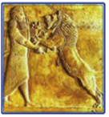

- Xattusa shahri
- Bobil shahri
+ Nineviya shahri
- Oshshur shahri

**249. Urartu davlati qachon gullab yashnagan?**

- Mil. avv. XI-IX asrlarda
- Mil. avv. VIII-VI asrlarda
+ Mil. avv. IX-VIII asrlarda
- Mil. avv. VII-VI asrlarda

**250. Qachon Old Osiyoda ilk davlatlar vujudga kela boshlagan?**

- Mil. avv. 3-ming yillikda
- Mil. avv. 1-ming yillikda
- Mil. avv. 4-ming yillikda
+ Mil. avv. 2-ming yillikda

**251. «Bibliya» so’zining ma’nosi nima?**

- «yaxshi yangilik»
- «muqaddas so’z»
- «so’z»
+ «kitob»

**252. Quyidagi Old Osiyo davlatlari aholisi qanday mashg’ulotlar bilan shug’ullanganlar? a) Finikiya b) Ossuriya c) Xett podsholigi 1. dehqonqchilik; 2. chorvachilik; 3. savdo-sotiq; 4. dengizchilik.**

- a-1, 3, 4; b-1, 2; c-1, 2
+ a-1, 3, 4; b-1, 3; c-1, 2
- a-1, 2, 4; b-1, 3; c-1, 2
- a-1, 3; b-1, 3, 4; c-1, 2, 3

**253. Urartu davlati poytaxti qaysi shahar bo`lgan?**

+ Tushpa shahri
- Nineviya shahri
- Karxamish shahri
- Teyshebaini shahri

**254. Qachon Falastin hududida Isroil podsholigi vujudga kelgan?**

+ Mil. avv. XI asrda
- Mil. avv. VIII asrda
- Mil. avv. IX asrda
- Mil. avv. X asrda

**255. Old Osiyoda asosiy mashg’uloti dehqonchilik va chorvachilik bo’lgan xettlar degan shimollik xalqlar qachon o’z davlatlariga asos soladilar?**

- Mil. avv. XI asrda
- Mil. avv. IX asrda
+ Mil. avv. XVIII asrda
- Mil. avv. XX asrda

**256. Ossuriya davlati qachon zavolga yuz tutgan?**

- Mil. avv. 539-yilda
+ Mil. avv. 605-yilda
- Mil. avv. 612-yilda 
- Mil. avv. 627-yilda

**257. Quyidagi qaysi xalq urushlarda otliq qo‘shindan foydalanishgan?**

+ Mitanniliklar
- Xettlar
- Urartlar
- Ossuriyaliklar

**258. Finikiyaliklar qo’shnilariga nimalarni sotganlar?**

+ Gazlama, yog’och, metall
- Meva, gazlama, yog’och
- Chorva mollari, yog’och, metall 
- Gazlama, yog’och, metall, chorva mollari

## 14-§ Ahamoniylar davlati.

**259. Qachon Makedoniyalik Aleksandr Fors davlatini bosib olgan?**

- Mil. avv. 334-yilda
+ Mil. avv. 330-yilda
- Mil. avv. 328-yilda
- Mil. avv. 323-yilda

**260. Ahamoniylarning Persopol shahridagi saroyi … .**

- Otlar tasviri bilan bezatilgan 
- Sherlar tasviri bilan bezatilgan
+ Afsonaviy va xayoliy qushlar tasviri bilan bezatilgan
- Afsonaviy devlar tasviri bilan bezatilgan

**261. Qaysi fors shohi qo‘shinlarni qaytadan tuzgan, saltanatni «satrapliklar» deb nomlangan alohida harbiy-ma’muriy o‘lkalarga taqsimlagan?**

- Kambiz II
- Doro III
+ Doro I
- Kir II

**262. Kaspiy dengizidan janubi-g‘arbda qaysi davlat joylashgan?**

+ Midiya davlati
- Parfiya davlati
- Elam davlati
- Fors davlati

**263. Qaysi davlatni bo’ysundirganidan so’ng Kir II ulkan lashkar tuzgan?**

- Parfiyani
+ Midiyani
- Urartuni
- Bobilni

**264. Qaysi hududning forslar tomonidan bosib olinishi yunon-fors urushlariga sabab bo’lgan?**

+ Kichik Osiyodagi yunon koloniyalari va Frakiyani
- Bolqon yarim orolining sharqidagi hududni
- Frakiya va Bolqon yarim orolini
- Kichik Osiyodagi yunon koloniyalari va Lidiyani

**265. Qaysi shaharda Doro I va Kserksning yuz ustunli zali bo‘lgan saroyining qoldiqlari saqlanib qolgan?**

- Tushpa shahrida
- Ekbatana shahrida
+ Persepol shahrida
- Suza shahrida

**266. Elam davlati qachon vujudga kelgan?**

+ Mil. avv. 3-ming yillikda
- Mil. avv. 2-ming yillikda
- Mil. avv. 1-ming yillikda
- Mil. avv. 4-ming yillikda

**267. Qadimdan Eron hududida qaysi xalqlar yashagan?**

- Parfiyaliklar, kassiylar
- Forslar, parfiyaliklar
- Midiyaliklar, forslar
+ Kassiylar, elamiylar

**268. Quyidagi qaysi davlatda jahondagi eng qadimiy yozuvlardan biri yaratilgan?**

- Midiya davlatida
- Parfiya davlatida
+ Elam davlatida
- Fors davlatida

**269. Suza shahri qaysi davlatning poytaxti bo‘lgan?**

- Parfiya davlatining
- Midiya davlatining
+ Elam davlatining
- Mitanni davlatining

**270. Qachon hozirgi Eron hududida Ahamoniylar sulolasiga mansub shohlar asos solgan Fors podsholigi vujudga kelgan?**

- Mil. avv. VII asrda
- Mil. avv. IV asrda
- Mil. avv. V asrda
+ Mil. avv. VI asrda

**271. Miloddan avvalgi VII asrda sodir bo’lmagan voqeani aniqlang.**

- Ossuriya davlati tarix sahnasidan ketgan
+ Fors podsholigi tuzilgan
- Yangi Bobil podsholigi vujudga kelgan
- Midiya qudratli davlatga aylangan

**272. Doro I … .**

+ Qora dengiz bo’ylarida yashovchi skiflar ustiga yurish qilgan
- Amudaryo sohillarida yashovchi skiflar ustiga yurish qilgan
- Fors qo’ltigi’da yashovchi skiflar ustiga yurish qilgan
- Kaspiy qirg’oqlarida yashovchi skiflar ustiga yurish qilgan

**273. Doro I qaysi shahardan O’rtayer dengizigacha “shoh yo’li” deb nomlangan savdo yo’li qurdirgan edi?**

+ Persopol shahridan
- Sard shahridan
- Ekbatana shahridan
- Suza shahridan

**274. Suratda kim aks ettirilgan?**

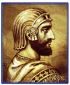

- Kserks
- Kambiz II
- Doro I
+ Kir II

**275. Fors shohlarining bitiklari qayerlarga o‘yib yozilgan?**

- Behistun qoyalariga
- Naqshi Rustam qoyalariga
- Persepol saroyi devorlariga
+ Barcha javoblar to’g’ri

**276. Qaysi asrda podsho Kiaksar hukmronligi davrida Midiya qudratli davlatga aylangan?**

+ Mil. avv. VII asrda
- Mil. avv. IV asrda
- Mil. avv. V asrda
- Mil. avv. VI asrda

**277. Midiya davlati qaysi davlat bilan ittifoq tuzib Ossuriyani bosib olagan?**

- Misr davlati bilan
- Parfiya davlati bilan
+ Bobil davlati bilan 
- Fors davlati bilan

**278. Suratda nima aks ettirilgan?**

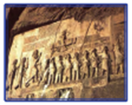

+ Asirlikka olingan qo‘zg‘olon boshliqlarining Doro I huzuriga olib kelinishi
- Fors qo’shini harbiy yurishi
- Forslarga qarshi qoz’g’olon
- Kir II sayrda

**279. Qachon Doro I Fors davlati taxtiga chiqqan?**

+ Mil. avv. 522-yilda
- Mil. avv. 595-yilda
- Mil. avv. 621-yilda
- Mil. avv. 558-yilda

**280. Doro I butun mamlakat uchun «darik» deb nomlangan yagona … tangani muomalaga kiritgan.**

- Bronza
+ Oltin
- Kumush
- Mis

**281. Eronning janubi-g‘arbiy qismida Mesopotamiya bilan chegarada qaysi davlat vujudga kelgan?**

+ Elam davlati
- Forslar davlati
- Midiya davlati
- Parfiya davlati

**282. Qaysi yilda ahamoniylar sulolasidan bo‘lmish podsho Kir II barcha forslarni o‘z hokimiyati ostida birlashtirgan?**

- Mil. avv. 522-yilda
- Mil. avv. 595-yilda
- Mil. avv. 621-yilda
+ Mil. avv. 558-yilda

**283. Qadimgi forslar qanday yozuvdan foydalanishgan?**

- Misr yozuvidan
- Finikiya yozuvidan
- Iyeroglif yozuvidan
+ Mixxat yozuvidan

**284. Qaysi Ahamoniy hukmdor davrida Falastin egallangan?**

- Kambiz II davrida
+ Kir II davrida
- Doro I davrida
- Doro III davrida

## 15-§ Qadimgi Hindiston sivilizatsiyasi.

**285. Hindistonda «chandal» lar kimlar bo’lgan?**

- «Hazar qilinadiganlar»
- Tabaqalardan birortasiga ham mansub bo‘lmaganlar
- Kastalarga mansub odamlar bilan birga bir uyda yashay olmaydigan, ular bilan bir dasturxonga o‘tirish taqiqlanganlar
+ Barcha javoblar to’g’ri

**286. Hindlarda momaqaldiroq xudosi qanday nomlanadi?**

- Braxma
+ Indra
- Budda
- Ganesha

**287. Quyudagi rasmda hindlarning qaysi xudosi tasvirlangan?**

+ Braxma
- Indra
- Budda
- Ganesha

**288. Qadimgi Hindiston mamlakati qaysi hududlarni egallagan edi?**

- Shu nomdagi yarimorol hamda Osiyo qit’asining Hind daryosi vodiylsining bir qismini
- Shu nomdagi yarimorol hamda Osiyo qit’asining Gang daryosi vodiysining bir qismini
- Shu nomdagi yarimorol hamda Seylon (Shri Lanka) orolini
+ Shu nomdagi yarimorol hamda Osiyo qit’asining Hind va Gang daryolari vodiylarining bir qismini

**289. Qaysi hayvon hindlar orasida muqaddas hayvon hisoblanib, o‘ldirish taqiqlangan?**

+ Sigir
- Qo’y
- Echki
- Fil

**290. Hindlar e’tiqodiga ko’ra kimlar xudo Braxmaning tovonidan yaratilgan?**

- Kohinlar
+ Xizmatkorlar
- Dehqonlar
- Jangchilar

**291. Qaysi asrdan tez-tez ro‘y beruvchi toshqinlar, o‘rmonlar va changalzorlar kengayishi natijasida Maxenjodoro va Xarappa shaharlari zavolga yuz tutib, butunlay vayronaga aylangan?**

- Mil. avv. XVII asrdan
- Mil. avv. XV asrdan
+ Mil. avv. XVIII asrdan
- Mil. avv. XVI asrdan

**292. Hindlar e’tiqodiga ko’ra qaysi xudo osmondagi suvni tutqunlikdan xalos etgach, Yer yuzida qurg‘oqchilik poyoniga yetgan?**

- Braxma
+ Indra
- Budda
- Ganesha

**293. Hindlarda donishmandlik xudosi qanday nomlanadi?**

- Braxma
- Indra
- Budda
+ Ganesha

**294. Quyudagi rasmda hindlarning qaysi xudosi tasvirlangan?**

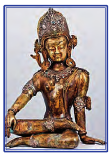

- Braxma
+ Indra
- Budda
- Ganesha

**295. Hindlar e’tiqodiga ko’ra kimlar xudo Braxmaning qo‘llaridan yaratilgan?**

- Kohinlar
- Xizmatkorlar
- Dehqonlar
+ Jangchilar

**296. Quyudagi rasmda hindlarning qaysi xudosi tasvirlangan?**

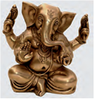

- Braxma
- Indra
- Budda
+ Ganesha

**297. Hindistondagi tabaqalarni mos ravishda joylashtiring 1. Kohinlar; 2. Dehqonlar; 3. Jangchilar; 4. Hunarmand va savdogarlar; 5. Hizmatkorlar va qullar. a) braxmanlar; b) vayshiylar; c) kshatriylar; d) shudralar.**

- 1-a, 2-c, 3-c, 4-b, 5-d
+ 1-a, 2-b, 3-c, 4-b, 5-d
- 1-d, 2-b, 3-c, 4-b, 5-d
- 1-a, 2-b, 3-c, 4-d, 5-d

**298. Hindlar e’tiqodiga ko’ra kimlar xudo Braxmaning og’zidan chiqqan?**

+ Kohinlar
- Xizmatkorlar
- Dehqonlar
- Jangchilar

**299. Maxenjodoro va Xarappa shaharlari aholisining asosiy mashg’uloti nima edi?**

- Ovchilik
- Chorvachilik
- Savdo-sotiq
+ Dehqonchilik

**300. Hindlar e’tiqodiga ko’ra kimlar xudo Braxmaning qovurg‘asidan yaratilgan?**

- Kohinlar
- Xizmatkorlar
+ Dehqonlar
- Jangchilar

**301. Qachon Hind daryosi vodiysida katta shaharlar vujudga kela boshlagan?**

- Mil. avv. 1-ming yillikda
+ Mil. avv. 3-ming yillikda
- Mil. avv. 4-ming yillikda
- Mil. avv. 2-ming yillikda

## 16-§ Miloddan avvalgi I ming yillikda Hindiston.

**302. Qachon Hindistonda buddaviylik dini yaratilgan?**

- Mil. avv. IV asrda
+ Mil. avv. VI asrda
- Mil. avv. VII asrda
- Mil. avv. V asrda

**303. Qaysi asrda podsho Ashoka hukmronligi davrida Maurya rivojlanishda yuksak taraqqiyotga erishgan?**

+ Mil. avv. III asrda
- Mil. avv. VI asrda
- Mil. avv. IV asrda
- Mil. avv. II asrda

**304. «Mahabharat» va «Ramayana» dostonlari qaysi tilda yozilgan?**

+ Sanskrit tilida
- Kashmir tilida
- Maurya tilida
- Pushtun tilida

**305. Hindlar birinchi bo’lib … . 1. noldan foydalanishgan; 2. taqvim tuzishgan; 3. shakarqamishdan shakar olganlar; 4. temirdan foydalanganlar.**

+ 1, 3
- 2, 3
- 1, 4
- 1, 2, 3

**306. Qaysi shahar Maurya davlatining poytaxti edi?**

- Dehli
+ Pataliputra
- Xarappa
- Moxenjadaro

**307. Qadimiy Hindistonda ilm-fan, xususan, qaysi fanlar yuksak darajaga erishgan?**

+ Astronomiya va matematika
- Matematika va geometriya
- Tibbiyot va astronomiya
- Geometriya va tibbiyot

**308. Ushbu suratda kim tasvirlangan?**

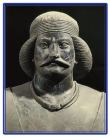

- Bindusara
- Siddhartha
- Ashoka
+ Chandragupta

**309. Chandragupta Hindistonning qaysi qismida Maurya davlatiga asos solgan?**

+ Shimoliy Hindistonda
- Sharqiy Hindistonda
- G’arbiy Hindistonda
- Janubiy Hindistonda

**310. Hindistonda Magadha, Koshala, Malla davlatlari qachon vujudga kelgan?**

- Mil. avv. X-IX asrlarda
- Mil. avv. IX-VIII asrlarda
+ Mil. avv. VII-VI asrlarda
- Mil. avv. VIII-VII asrlarda

**311. Ushbu suratda kim tasvirlangan?**

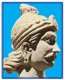

- Bindusara
- Siddhartha
+ Ashoka
- Chandragupta

**312. Budda taxallusini olgan shahzoda Siddhartha Gautama … .**

- Tabaqalarga barham berish maqsadida saroy hayotini tark etadi
- Insoniyatni azob-uqubatlardan qutqarish uchun sayohatga chiqadi
- Bechoralarga yordam berish maqsadida dunyo bo’ylab sayohatga otlanadi
+ Hayot mazmunini izlab topish maqsadida saroy hayotini tark etadi

**313. Hindistonda ixtiro qilingan shaxmatni hindlarning o‘zi nima deb atashgan?**

- «davlatning to‘rt turi»
- «o’yinning to‘rt turi»
- «jangning to‘rt turi»
+ «qo‘shinning to‘rt turi»

**314. Nimaga avvaliga buddaviylarda xudo bo’lmagan?**

- Xudolar barcha azoblarning sababchisi deb hisoblaganlar
- Xudolar urushlarga sabab bo’ladi deb hisoblaganlar
- Xudolar doimiy qurbonlik talab qiladi deb hisoblaganlar
+ Xudolar inson azob-uqubatlarini yengillashtira olmaydi deb hisoblaganlar

**315. O‘rta Osiyoni zabt etganidan so‘ng Makedoniyalik Aleksandr Hindistonning qaysi qismiga bostrib kirgan?**

- Gang vodiysiga
- Hind vodiysiga
- Kashmirga
+ Panjobga

## 17-§ Qadimgi Xitoy sivilizatsiyalari.

**316. Qadimgi Xitoyda asosiy dehqonchilik ekinlari nimalar bo’lishgan?**

- Shakarqamish va javdar
+ Javdar va bug’doy
- Bug’oy va shakarqamish
- Sholi va javdar

**317. Shan davlatining bosh shahri qanday atalgan?**

+ Shan
- Sian
- Dunxuan
- Chendu

**318. Xitoydagi qaysi sulola hukmdorlari o’z davlatini «Osmon ostidagi podsholik», o‘zlarini esa «Osmon o‘g‘illari» deb atashgan?**

- Sin sulolasi hukmdorlari
+ Chjou sulolasi hukmdorlari
- Sya sulolasi hukmdorlari
- Shan sulolasi hukmdorlari

**319. Xitoydagi ilk davlatni qaysi sulola boshqargan?**

- Sin sulolasi
- Chjou sulolasi
+ Sya sulolasi
- Shan sulolasi

**320. Qaysi daraxtni yetishtirish Xitoy aholisining asosiy mashg‘ulotlaridan biri bo’lgan?**

- Nok daraxtini
- Olma daraxtini
+ Tut daraxtini
- Olcha daraxtini

**321. Xitoyning qaysi qismi Chjou davlati tarkibiga kirgan?**

- Sharqiy qismi
- G’arbiy qismi
- Janubiy qismi
+ Shimoliy qismi

**322. Qaysi davr Xitoy tarixida «ko‘p podsholiklar» davri nomini olgan?**

- Mil. avv. XI-IX asrlar
+ Mil. avv. VII–V asrlar
- Mil. avv. VI-IV asrlar
- Mil. avv. IX-VII asrlar

**323. Qachon Chjou davlatida markaziy hokimiyat zaiflasha boshlagan?**

+ Mil. avv. VIII-VII asrlarda
- Mil. avv. VII–VI asrlarda
- Mil. avv. VI-V asrlarda
- Mil. avv. IX-VIII asrlarda

**324. Qadimgi Xitoy davlati qayerda vujudga kelgan?**

- Yantszi daryosi o’rta oqimida
+ Xuanxe daryosi o’rta oqimida
- Yantszi daryosi quyi oqimida
- Xuanxe daryosi quyi oqimida

**325. Qachon Xitoyda qadimgi sivilizatsiyalar paydo bo`lgan?**

+ Mil. avv. 3-mingyillik oxirlarida
- Mil. avv. 2-mingyillik oxirlarida
- Mil. avv. 2-mingyillik boshlarida
- Mil. avv. 3-mingyillik boshlarida

**326. Qaysi kasb Xitoyda qadimdan e’tiborli va faxrli kasb hisoblangan?**

- Kulolchilik
- Ipakchilik
- Shishasozlik
+ Dehqonchilik

**327. Suratda qaysi davlat hukmdori tasvirlangan?**

- Sin davlati hukmdori
+ Chjou davlati hukmdori
- Sya davlati hukmdori
- Shan davlati hukmdori

**328. Qadimgi Panyuy hozirgi qaysi hudud?**

- Dunxuan
- Sian
- Chendu
+ Guanchjou

**329. Qaysi qabilaning boshlig‘i Sya sulolasi podshosini taxtdan ag‘darib, davlatni o‘ziga bo‘ysundirgan?**

- Sin qabilasining
- Chjou qabilasining
- Sya qabilasining
+ Shan qabilasining

**330. Miloddan avvalgi 3-mingyillikda Shan davlatiga qo’shni qaysi qabila bostirib kirgan?**

+ Chjou qabilasi
- Sin qabilasi
- Sya qabilasi
- Yuan qabilasi

**331. Xitoyga sholi urug‘i qayerdan keltirilgan?**

+ Hindistondan
- Koreyadan
- Yaponiyadan
- O’rta Osiyodan

## 18-§ Miloddan avvalgi III - milodiy II asrlarda Xitoy.

**332. Xitoyda milodning boshlarida Xan sulolasi hukmronligiga qarshi boshlangan qo’zg’olon qanday nomlangan?**

- «Qora qalqonlilar» qo‘zg‘oloni
- «Oq kiyimlilar» qo‘zg‘oloni
- «Sariq ro’mollilar» qo‘zg‘oloni
+ «Qizil qoshlilar» qo‘zg‘oloni

**333. Suratda nima tasvirlangan?**

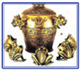

- Shamchiroq
- Usturlob
+ Seysmograf
- Kompas

**334. Xitoyda qog’oz qachon ixtiro qilingan?**

- Mil. avv. III asrda
- Mil. avv. II asrda
- Mil. avv. IV asrda
+ Mil. avv. I asrda

**335. Buyuk Xitoy devorini qurish ishlari qachon boshlangan?**

+ Mil. avv. IV asrda
- Mil. avv. VII asrda
- Mil. avv. VI asrda
- Mil. avv. V asrda

**336. Suratda kim tasvirlangan?**

+ Sima Syan
- U Di
- Lyu Ban
- Sin Shixuandi

**337. Suratda kim tasvirlangan?**

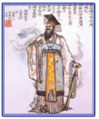

- Chjan Syan
- U Di
- Lyu Ban
+ Sin Shixuandi

**338. Suratda nima tasvirlangan?**

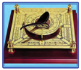

- Shamchiroq
- Usturlob
- Seysmograf
+ Kompas

**339. Qachon xitoyliklar yozuv uchun bambuk o’rniga shoyidan foydalana boshlaganlar?**

- Bundan uch ming besh yuz yil muqaddam
- Bundan uch ming ikki yuz yil muqaddam
- Bundan ikking ming to’r yuz yil muqaddam
+ Bundan ikking ming besh yuz yil muqaddam

**340. Suratda kim tasvirlangan?**

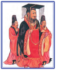

- Chjan Syan
+ U Di
- Lyu Ban
- Sin Shixuandi

**341. Sin Shixuandi … . 1. O‘z  davlati  hududini 36 viloyatga taqsimlagan, har biriga noiblarini rahbar etib tayinlgan; 2. Sin Shixuandi hali tirikligidayoq o‘ziga atab maqbara qurishga farmon bergan; 3. Sin Shixuandi maqbarasi hashamati va bezaklari jihatidan Misr piramidalari bilan bellasha olgan; 4. Sin Shixuandi maqbarasini 720 ming odam 37 yil mobaynida bunyod etgan; 5. O‘z davlatini ko‘chmanchi xunnlarning hujumlaridan himoya qilish uchun Shimoliy Xitoy bo‘ylab qurilgan mudofaa devorini yanada mustahkamlashni buyurgan.**

- 1, 2, 3, 4 
+ 1, 2, 3, 4, 5
- 1, 2, 3
- 1, 2, 3, 4 

**342. Qachon Xitoyni o‘z hokimiyati ostida birlashtirgan hukmdor Sin Shixuandi («Sinning birinchi hukmdori») nomini qabul qilgan?**

- Mil. avv. 249-yilda
- Mil. avv. 232-yilda
- Mil. avv. 240-yilda
+ Mil. avv. 246-yilda

**343. Sin sulolasiga qarshi Lyu Ban boshchiligidagi qo’zg’olon qachon boshlangan?**

- Mil. avv. 140-yilda
+ Mil. avv. 206-yilda
- Mil. avv. 210-yilda
- Mil. avv. 246-yilda

**344. Qaysi sulola U-Di hukmronligi davrida eng qudratli davlatga aylangan?**

- Sin sulolasi
- Chjou sulolasi
- Sya sulolasi
+ Xan sulolasi

**345. Buyuk Xitoy devori parametrlarini to’g’ri ko’rsating.**

- Balandligi 8-11 metr, qalinligi 4-7 metr, uzunligi qariyb 6000 kilometr
+ Balandligi 6-10 metr, qalinligi 5-8 metr, uzunligi qariyb 4000 kilometr
- Balandligi 5-9 metr, qalinligi 3-6 metr, uzunligi qariyb 5000 kilometr
- Balandligi 7-12 metr, qalinligi 6-9 metr, uzunligi qariyb 3000 kilometr

**346. Kimlarning hujumlari kuchayishi bilan Xitoydagi Xan davlati zaiflashgan?**

- Kushonlarning
+ Xunnlarning
- Manjurlarning
- Mo’g’ullarning

**347. Xitoyda Xan sulolasiga qarshi milodiy II asrda ko’tarilgan eng katta qo’zg’olon qaysi?**

- «Oq kiyimlilar» qo’zg’oloni
- «Qizil qoshlilar» qo’zg’oloni
+ «Sariq ro’mollilar» qo’zg’oloni
- «Qora qalqonlilar» qo‘zg‘oloni

**348. Qachon Xan davlati uchta podsholikka parchalanib ketgan?**

+ Milodiy III asrda
- Milodiy I asrda
- Milodiy II asrda
- Milodiy IV asrda

## 19-§ O‘zbekiston hududidagi ilk davlatlar.

**349. Afrosiyob – hozirgi Samarqandning …. chegarasi hududlarida mil. avv. … asrlarda asos solingan  qadimiy shahar xarobalaridir.**

- Shimoliy/VII-VI
- Janubiy/VIII-VII
- G’arbiy/VII-VI
+ Sharqiy/VIII-VII

**350. So’g’diyona, Baqtriya, Xorazm aholisining  asosiy mashg’ulotini aniqlang.**

- Savdo-sotiq
+ Dehqonchilik
- Hunarmandchilik
- Chorvachilik

**351. O’zbekiston hududidagi VII-VI asrlarda shakllangan shaharlarning ichki qismida … .**

- Shaharning boy aholisi mol mulkini saqlagan 
+ Turar joylar va hunarmandchilik ustaxonalari joylashgan
- Dehqonlar mahallalari joylashgan
- Barcha javoblar to’g’ri

**352. Ushbu sopol idishlar yurtimizning qadimgi qaysi shahridan topilgan?**

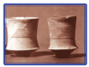

- Uzunqir shahridan
+ Qiziltepa shahridan
- Afrosiyob shahridan
- Yerqo’rg’on shahridan

**353. Quyidagi shaharlarning joylashgan viloyatlariga qarab to’g’ri joylashtiring. 1) Afrosiyob; 2) Yerqo‘rg‘on va Uzunqir; 3) Ko‘zaliqir; 4) Qiziltepa. a) Qashqadaryo; b) Surxondaryo; c) Xorazm; d) Samarqand.**

+ 1-d, 2-a, 3-c, 4-b
- 1-d, 2-c, 3-a, 4-b
- 1-a, 2-d, 3-c, 4-b
- 1-d, 2-a, 3-b, 4-c

**354. Mil.avv. VII-VI asrlarda Qadimgi Baqriya davlati tarkibida bo’lgan hududlarni aniqlang.**

- Sirdaryoning quyi oqimi va Qizilqumning shimoli
- Orol dengizi bo’ylari va Amudaryoning quyi oqimi
+ Surxondaryo, Qashqadaryo, Zarafshon vohalari va O’zbekistonga chegaradosh viloyatlar
- Pomirning tog’li tumanlari va Farg’ona

**355. Daryoning narigi tomonida yashovchi saklar deb atalgan «Saka-tiay-taradarayya» lar qayerlarda yashagan?**

- Pomirning tog‘li tumanlarida va Farg‘onada
+ Orol dengizi bo‘ylarida, Sirdaryoning (qadimgi nomi Yaksart) quyi oqimida
- Hozirgi Toshkent viloyati va Janubiy Qozog‘iston yerlarida
- Kaspiy dengizi shimoliy qismi va Kavkaz hududlarida

**356. Suratda kimning kiyimi tasvirlangan?**

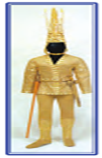

- So’g’d jangchisining
- Baktriya jangchisining
- Massaget jangchisining
+ Sak jangchisining

**357. Muqaddas ichimlikka sig‘inuvchi saklar deb atalgan «Saka-xaumovarka» lar qayerlarda yashagan?**

+ Pomirning tog‘li tumanlarida va Farg‘onada
- Orol dengizi bo‘ylarida, Sirdaryoning (qadimgi nomi Yaksart) quyi oqimida
- Hozirgi Toshkent viloyati va Janubiy Qozog‘iston yerlarida
- Kaspiy dengizi shimoliy qismi va Kavkaz hududlarida

**358. Miloddan avvalgi VII-VI asrlarda O’zbekiston hududida mavjud bo’lgan davlatlarning joylashgan hududlari bilan mos ravishda joylashtiring. 1. Baqtriya; 2. Xorazm; 3. So’g’diyona. a) Surxon vohasi; b) Zarafshon va Qashqadaryo vohasi; c) Amudaryoning quyi oqimi.**

- 1-c, 2-b, 3-a
- 1-a, 2-b, 3-c
- 1-b, 2-a, 3-c
+ 1-a, 2-c, 3-b

**359. O‘tkir uchli kigiz qalpoq kiyib yuruvchi saklar deb atalgan «Saka-tigraxauda» lar qayerlarda yashagan?**

- Pomirning tog‘li tumanlarida va Farg‘onada
- Orol dengizi bo‘ylarida, Sirdaryoning (qadimgi nomi Yaksart) quyi oqimida
+ Hozirgi Toshkent viloyati va Janubiy Qozog‘iston yerlarida
- Kaspiy dengizining shimoliy qismi va Kavkaz hududlarida

**360. Suratda nima tasvirlangan?**

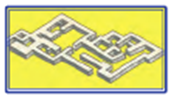

- Marg’iyona uy-joy qoldiqlari. Mil. avv. VI-V   asrlar
- So’g’diyona uy-joy qoldiqlari. Mil. avv. VI-V   asrlar
+ Baqtriya uy-joy qoldiqlari. Mil. avv. VI-V  asrlar
- Xorazm uy-joy qoldiqlari. Mil. avv. VI-V  asrlar

**361. Quyidagi ta’rifga mos qadimiy xalqni aniqlang. «Mahalliy  kulolchilik, qurolsozlik, zargarlik buyumlarining dovrug’i o’zga yurtlarga ham tarqalgan edi».**

- So’g’dlar
- Baqtriyaliklar
+ Xorazmliklar
- Saklar

## 20-§ Zardushtiylik.

**362. Zardushtiylikning ulug‘ va donishmand oliy xudosini toping.**

- Ahriman
- Mitra
+ Ahuramazda
- Anaxita

**363. Zardusht va’zlari matnlarining hammasi qachon 21 ta kitobga jamlangan?**

- Mil. avv. VI asrda
- Mil. avv. V asrda
+ Mil. avv. III asrda
- Mil. avv. IV asrda

**364. «Zardushtiylik» so‘zi qaysi ismdan kelib chiqqan?**

- Zardusht
- Zaratushtra
- Zoroastr
+ Barcha javoblar to’g’ri

**365. Qaysi olim «Avesto» ning alohida qismlarini tarjima qilgan?**

- Ingliz olimi E. Breygel
+ Fransuz olimi A. Dyuperron
- Nemis olimi G. Shlimman
- Fransuz olimi F. Shampalyon

**366. Zardushtiylikdagi yovuzlik va o‘lim xudosini toping.**

+ Ahriman
- Mitra
- Ahuramazda
- Anaxita

**367. Zardushtiylik muqaddas kitobi «Avesto» qanday ma’noni anglatadi?**

- «Umrboqiy qonun-qoidalar»
+ «Qat’iy belgilangan qonun-qoidalar»
- «Xudoning qonun-qoidalari»
- «Ezgulik qonun-qoidalari»

**368. Zardushtiylik paydo bo‘lishi haqidagi afsonaga ko’ra, bir kuni erta tongda suv olish uchun daryo bo‘yiga borgan Zardusht zilol suvda qaysi xudoning elchilaridan birining siymosini ko‘rib qolgan?**

+ Ahuramazdaning
- Anaxitaning
- Ahrimanning
- Mitraning

**369. Zardushtiylik tarqala boshlagan paytlarda diniy marosimlar qayerlarda o’tkazilgan?**

- Ochiq osmon ostida yoki jamoat binolarida
- Hukmdor saroyida yoki ibodatxonalarda
+ Ochiq osmon ostida, gulxan yonida yoki uydagi o‘choq olovi atrofida
- Ibodatxonalarda yoki uydagi o‘choq olovi atrofida

**370. Zardushtni Yunonistonda eng avvalo kim sifatida bilishgan?**

- Kohin, munajjim sifatida
- Tabib, donishmand sifatida
+ Donishmand, munajjim sifatida
- Payg’ambar, tabib sifatida

**371. Suratda kim tasvirlangan?**

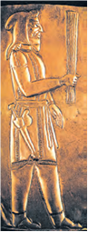

- So’g’d savdogari
- Fors askari
- Sak jangchisi
+ Zardushtiylik kohini

**372. «Payg‘ambar» so‘zining ma`nosi nima?**

- «Dinning tarqatuvchisi»
- «Xudoning elchisi»
+ «Ezgu amallar haqida xabar beruvchi»
- «Donishmand shaxs»

**373. Zardushtiylar umrining tub ma’nosi nimalardan iborat bo‘lgan?**

- Hayrli ish qilish, qo’shnilar bilan do’st bo’lish, qarz berganda sudxo’rlikka yo’l qo’ymaslikdan
+ Ezgu fikr, ezgu so‘z va ezgu amaldan
- Diniy marosimlarni to’kis bajarish, qurbonliklar qilish, bolalarni tarbiyalashdan
- Xayr-sadaqa berish, zakot berish va to’g’ri so’zlashdan

**374. Zardushtiylikda insonning asosiy burchi eng avvalo nima hisoblangan?**

+ Adolatli turmush tarzi
- Xayr-sadaqa berish
- Sudxo’rlikka yo’l qo’ymaslik
- Qurbonliklar qilish

**375. Zardusht necha yoshida yangi diniy ta’limot payg‘ambariga aylangan?**

- 28 yoshida
+ 30 yoshida
- 33 yoshida
- 40 yoshida

**376. Suratda qaysi xudo tasvirlangan?**

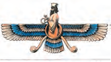

- Mitra
- Anaxita
- Ahriman
+ Ahuramazda

**377. «Ossuariy» nima?**

- Otliq qo’shin askarlari tomonidan qo’llaniladigan qurol – jangovor oybolta
- Dehqonchilik mahsulotlari va ichimliklar saqlash uchun ishlatiladigan sopol idish
+ Vafot etgan insonlarni suyaklarini soladigan maxsus sopol tobutcha – suyakdon
- Mum taxtachaga yozish uchun ishlatiladigan maxsus yog’och yoki metall tayoqcha

**378. Yunoncha «astron» qanday ma’noni anglatadi?**

- «payg’ambar»
+ «yulduz»
- «elchi»
- «xabarchi»

**379. Zardusht qachon yashagan?**

- Mil. avv. 2-ming yillikning birinchi yarmida
- Mil. avv. 1-ming yillikning ikkinchi yarmida
+ Mil. avv. 1-ming yillikning birinchi yarmida
- Mil. avv. 2-ming yillikning ikkinchi yarmida

**380. Qachon O’rta Osiyoda zardushtiylik deb atalgan din keng tarqalgan?**

- Mil. avv. 3-ming yillikda
- Mil. avv. 2-ming yillikda
- Mil. avv. 4-ming yillikda
+ Mil. avv. 1-ming yillikda

**381. Yulduzlar joylashuviga qarab kelajakni bashorat qilish bilan shug‘ullanadigan odam qanday ataladi?**

- Etnograf
- Antropolog
- Arxeolog
+ Astrolog

**382. Zardushtiylikdagi hosildorlik va suv ilohasini toping.**

- Ahriman
- Mitra
- Ahuramazda
+ Anaxita

**383. Zardushtiylikda qaysi xudo quyosh va yorug’lik xudosi hisoblanib, o‘tli chaqmoqlar yordamida yovuzlik va o‘lim xudosi bilan jang qilishi ta’kidlangan?**

+ Mitra
- Ahriman
- Anaxita
- Ahuramazda

**384. Xudo Ahuramazdaning saroy devoridagi ushbu tasviri qaysi shahardan topilgan?**

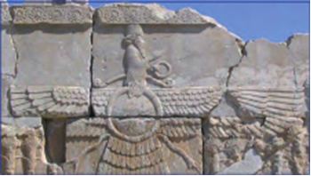

+ Persepol shahridan
- Sard shahridan
- Suza shahridan
- Kirmonshoh shahridan

**385. «Avesto» ning ilk qismi qachon paydo bo’lgan?**

- Mil. avv. VII–VI asrlarda
- Mil. avv. X–IX asrlarda
- Mil. avv. IV–III asrlarda
+ Mil. avv. IX–VIII asrlarda

**386. Zardushtiylar nimalarga sig’inishgan?**

+ Olov, tuproq, suv va yulduzlarga
- Olov, quyosh, suv va yulduzlarga 
- Olov, tuproq, quyosh va yulduzlarga 
- Olov, tuproq, suv va quyoshga 

**387. «Zand» nima?**

+ «Avesto» matnlariga sharh
- «Avesto» ning bizgacha yetib kelmagan kitoblari
- «Avesto» ning eng so’nggi qismi
- «Avesto» ning birinchi qismi

**388. Suratda nima tasvirlangan?**

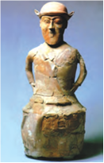

- Taqinchoqlar uchun idish
+ Ossuariy - suyakdon
- Jangchi qabr toshi
- Podsho haykali

**389. Qayerda Zardushtning ismi «Zoroastr» shaklida jaranglagan?**

- Misrda
+ Yunonistonda
- Rimda
- Mesopotamiyada

**390. Zardushtiylar e’tiqodiga ko‘ra, asosan qanday amallarni bajarish lozimligi ko’rsatilgan?**

- Hayrli ish qilish, qo’shnilar bilan do’st bo’lish, qarz berganda sudxo’rlikka yo’l qo’ymaslik
+ Yolg’on so’zlamaslik, aldamaslik, va’daga vafo qilish
- Diniy marosimlarni to’kis bajarish, qurbonliklar qilish, bolalarni tarbiyalash
- Xayr-sadaqa berish, zakot berish va jon solig’i berish

## 21-§ Antik tarixning boshlanishi.

**391. Qachon doriylar Miken davlatini vayronaga aylantirganlar?**

- Mil. avv. 1300-yilda
- Mil. avv. 1400-yilda
+ Mil. avv. 1200-yilda
- Mil. avv. 1100-yilda

**392. Krit orolidagi sivilizatsiya nima sababdan “Minoy sivilizatsiyasi” deb atalgan?**

+ Afsonaviy podsho Minos nomi bilan atalgan
- Afsonaviy xudo Minos nomi bilan atalgan
- Afsonaviy jangchi Minos nomi bilan atalgan
- Afsonaviy kentavr Minos nomi bilan atalgan

**393. Minoy sivilizatsiyasini barbod bo‘lishini qaysi xalq nihoyasiga yetkazgan?**

- Forslar
- Dengiz xalqlari
+ Axeylar
- Doriylar

**394. Yunonistonning eng baland tog‘i Olimp mamlakatning qaysi qismida joylashgan?**

- Janubi-g’arbiy qismida
- Shimoli-g’arbiy qismida
- Janubi-sharqiy qismida
+ Shimoli-sharqiy qismida

**395. Qachon Janubiy Yunoniston va Krit orolida ilk shahar-davlatlar (Knoss, Miken) vujudga kela boshlagan?**

- Mil. avv. 1-ming yillikda
+ Mil. avv. 2-ming yillikda
- Mil. avv. 3-ming yillikda
- Mil. avv. 4-ming yillikda

**396. Yunonistonda tajribali dengizchilar yelkanlardan  foydalanib, olis sayohatlarga  –  … .**

- Misrga hamda Egey va Qora dengiz sohillaridagi shaharlarga suzib borishgan
- Italiyaga hamda O‘rtayer va Qora dengiz sohillaridagi shaharlarga suzib borishgan
+ Misrga hamda O‘rtayer va Qora dengiz sohillaridagi shaharlarga suzib borishgan
- Misrga hamda Egey dengizi sohillaridagi shaharlarga suzib borishgan	

**397. Yunonlar qadim zamonlardan … bilan shug‘ullanishgan.**

+ Dehqonchilik va chorvachilik
- Dehqonchilik va savdo-sotiq
- Chorvachilik va ovchilik
- Ovchilik va dehqonchilik

**398. Qadimgi Yunoniston bu … .**

+ Bolqon yarimoroli va O’rtayer dengizi orollaridagi qadimgi yunon davlatlarining umumiy nomi
- Bolqon yarimoroli va O’rtayer dengizi orollaridagi qadimgi yunon davlatlaridan birining nomi
- O’sha paytda yunonlar yashagan va koloniyalarga asos solingan barcha o’lkalar nomi
- Rimliklar tomonidan Bolqon yarim orolidagi davlatlarga berilgan nom

**399. Yunonistonning qaysi qismida yunonlar uchun nihoyatda qadrli bo‘lgan ninabargli daraxtlar o’sgan?**

+ Shimolida va Peloponnesda
- Janubida va Lakonikada
- Shimolida va Attikada
- G’arbida va Fessaliyada

**400. Yunonlar “oykumena” deb qayerni atashgan?**

- Yer yuzining hech kim yashamaydigan qismini
+ Yer yuzining odamlar yashaydigan qismini
- Yer yuzining varvarlar yashaydigan qismini
- Yer yuzining yunonlar yashaydigan qismini

**401. Qaysi xalq Miken davlatinini tugatib, Sparta davlatiga asos solgan?**

- Peloponnesliklar
- Dengiz xalqlari
- Axeylar
+ Doriylar

**402. Minoy sivilizatsiya nimaning natijasida vayron bo‘lgan va ko‘p o‘tmay qayta tiklangan?**

- Suv toshqinlarining dalalardagi ekinlar va shaharni yuvib ketishi va kelib chiqqan ocharchilik natijasida
- Vulqon otilishi va kuchli yong’inlar natijasida
- Urushlar va tashqi kuchlar bosqini natijasida
+ Kuchli zilzila va suv toshqiniga sabab bo‘lgan vulqon otilishi	natijasida

## 22-§ Qadimgi Yunonistonning  yuksalishi.

**403. Pirey bandargohi qaysi davlatning asosiy porti bo’lgan?**

+ Afina
- Sparta
- Krit
- Miken

**404. Afina davlatiga qanday soha katta daromad keltirgan?**

+ Kumush konlarining mahsuloti va tuz qazib olish
- Tuz qazib olish va chorvachilik mahsulotlari
- Dehqonchilik va oltin konlari mahsuloti
- Qul savdosi va dehqonchilik

**405. Afinada kimlar og‘ir mehnat va salomatlikka zarar yetkazuvchi ishlarni bajarishdan ozod qilinganlar?**

- Amaldorlar
- Zodagonlar
- Strateglar
+ Fuqarolar

**406. Yunonchada «pedagog» so‘zi qanday ma’noni anglatadi?**

+ «Bolani yo‘lda kuzatib boruvchi»
- «Bolani doimo kuzatib boruvchi»
- «Bolani maktabga kuzatib boruvchi»
- «Bolani hayotda kuzatib boruvchi»

**407. Qachon Janubiy Yunoniston (Lakonika) hududiga doriylar qabilasi bostirib kirib, Sparta shahar-davlatiga asos solganlar?**

- Mil. avv. XIV asrda
+ Mil. avv. XII asrda
- Mil. avv. XIII asrda
- Mil. avv. X asrda

**408. Qadimgi Spartada “perieklar” deb kimlarga aytilgan?**

- Piyoda qo’shinga
+ To‘la-to‘kis huquqlarga ega bo‘lmagan, shaxsan ozod kishilarga
- Qullarga
- Chet elliklarga

**409. Qadimgi Afinada ota-onalar o‘z bolalarini qanday o’qitishgan?**

- Davlat maktablarida o’qitishgan
+ Davlat maktablari bo’lmagan. Pedagogga haq to’lab o‘qitishgan
- Maktablar bo’lmagan. Uylarida o’zlari imkon boricha o’qitishgan
- Davlat va xususiy maktablarda o’qitishgan

**410. Qadimda kimlar Afina fuqarosi bo‘la olgan?**

- Otasi va onasining kelib chiqishidan qat’iy nazar shaharda doimiy yashaydigan aholi
- Otasi yoki onasi ozod afinalik bo‘lgan ozod fuqarolar
- Otasi va onasi ozod afinalik bo‘lgan barcha aholi
+ Otasi va onasi ozod afinalik bo‘lgan erkaklar

**411. Qachon Attikaning g‘arbiy qismida yunonlar “Akropol”, ya’ni “Yuqori shahar” deb atalgan qal’a quraganlar va Afina shahri vujudga kelgan?**

- Mil. avv. 1-ming yillikda
+ Mil. avv. 2-ming yillikda
- Mil. avv. 3-ming yillikda
- Mil. avv. 4-ming yillikda

**412. “Ular alohida spartaliklarni emas, balki butun boshli davlatning mulki hisoblanardilar”. Gap kimlar haqida bormoqda?**

- Meteklar
+ Ilotlar
- Perieklar
- Goplitlar

**413. Yunon «polis» larining (shahar) ko’pchiligi qanday tashkil topgan?**

- Doimiy urushlarda yashagan aholi keyinchalik shaharlarga birlashishga majbur bo’lgani bilan
+ Bir qancha manzilgohlar birlashishi bilan
- Shahar va unga tutashgan qishloqlarning birlashib ketishi bilan
- Dehqonchilik va hunarmandchilik markazlarining rivojlanishi bilan

**414. Qadimgi Afinada «meteklar» deb kimlarga aytilgan?**

- Askarlarga
- Qullarga
- Fuqarolarga
+ Chet elliklarga

**415. Qadimgi Spartada necha yoshga to’lgan hamma yigitlar jangchi qo‘shinlariga qabul qilinib, keksa yoshga qadar xizmat qilganlar?**

- Yigirma besh yoshga to‘lgan
- O’n to’qqiz yoshga to‘lgan
+ Yigirma yoshga to‘lgan
- O’n yetti yoshga to‘lgan

**416. Qadimgi Afinada “palestra” deb nimalarga aytilgan?**

- Astronomiya maktablariga
- Oliy maktablarga
- Davlat maktablariga
+ Xususiy gimnastika maktablariga

**417. Qadimgi Afinada oliy ma’lumot beradigan o‘quv yurtlarida ta’lim olish muddati qancha bo’lgan?**

+ 3-4 yil
- 2-3 yil
- 1-2 yil
- 5-6 yil

**418. Suratdagi «Diskobol» («Disk uloqtiruvchi») haykali muallifini toping.**

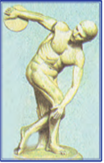

- Dedal
- Fidiy
+ Miron
- Poliklet

**419. Qadimgi Afinada (Attikada) aholi nechta katta guruhga bo’lingan va ular qaysilar?**

- Ikkita guruhga: fuqarolar va qullar
+ Uchta guruhga: fuqarolar, chet elliklar va qullar
- To’rtta guruhga: fuqarolar, chet elliklar, qullikdan ozod qilinganlar va qullar
- Beshta guruhga: fuqarolar, aristokratiya, chet elliklar, qullikdan ozod qilinganlar va qullar

**420. Qadimgi Afinada necha yoshdan boshlab bolalarga yozuv va hisob o‘rgatilgan?**

- Olti yoshdan boshlab
+ Yetti yoshdan boshlab
- Sakkiz yoshdan boshlab
- To’qqiz yoshdan boshlab

**421. “Falanga” nima?**

- Nayza va kamon bilan yengil qurollangan askarlarning umumiy nomi
+ To‘rtburchak shaklini yuzaga keltiruvchi bir-biriga zich joylashgan harbiy birlik
- Dengiz qo’shinining asosini tashkil qiluvchi eshkakli kema
- Otliq qo’shinning uchburchak shaklda shiddat bilan jangga kirishi

**422. Qadimgi Afinada o‘g‘il bolalar necha yoshdan gimnastika bilan shug‘ullanganlar?**

- 15 yoshdan
- 20 yoshdan
+ 14 yoshdan
- 7 yoshdan

**423. Qadimgi Spartada “ilotlar” deb kimlarga aytilgan?**

- To‘la-to‘kis huquqlarga ega bo‘lmagan, shaxsan ozod kishilarga
- Piyoda qo’shinga
+ Qullarga
- Chet elliklarga

**424. Qadimgi Afinada stil bilan harflarni metall tayoqcha yordamida nimalarga yozishgan?**

- Pergamentga
- Loy taxtachalarga
+ Mum surkalgan taxtachalarga
- Ohaktoshlarga

**425. Yunon qo’shinining asosini kimlar tashkil etgan?**

- Yengil qurollangan jangchilar
- Otliq jangchilar
+ Og‘ir qurollangan askarlar – goplitlar
- Kamon va nayza bilan qurollangan askarlar

## 23-§ Yunon koloniyalari.

**426. Yunonlar kimlarni “varvarlar” dab atashgan?**

- Rimliklarni
- Yunonlardan madaniyati jihatdan past deb hisoblangan xalqlarni 
+ Yunon bo‘lmagan, o’zga tilda so’zlashuvchi xalqlarni
- Dushmanlarni

**427. Qachon Yunonistonda Finikiya alifbosiga asoslangan yangi yozuv vujudga kelgan?**

- Mil. avv. V asrda
- Mil. avv. VII asrda
- Mil. avv. VI asrda
+ Mil. avv. VIII asrda

**428. Olviya, Xersones, Pantikapey koloniyalari qaysi dengiz sohilida asos solingan?**

- O’rtayer dengizi sohilida
+ Qora dengiz sohilida
- Egey dengizi sohilida
- Marmar dengizi sohilida

**429. Yunonlar koloniyalardan Elladaga nimalarni olib kelishgan?**

- Shoyi, vino, g’alla
- Metall, vino, g’alla	
+ Metall, qullar, g’alla
- Oltin, kumush, ziravor

**430. Qaysi xalq o‘zini yagona xalq – ellinlar deb, o‘z vatanini esa Ellada deb atagan?**

+ Yunonlar
- Rimliklar
- Misrliklar
- Finikiyaliklar

**431. Yunon alifbosi nechta harfdan iborat bo’lgan?**

- 20 harfdan
+ 24 harfdan
- 32 harfdan
- 34 harfdan

**432. Buyuk Yunon koloniyalashtirilishi qaysi asrlarni o’z ichiga oladi?**

- Mil. avv. VI–IV asrlarni
+ Mil. avv. VIII–VI asrlarni
- Mil. avv. VII–V asrlarni
- Mil. avv. IX–VII asrlarni

**433. Quyidagi rasmda qaysi shahardagi ibodatxona ustunlari tasvirlangan?**

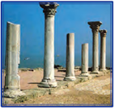

- Kirena
- Pantikapey
+ Xersones
- Olviya

**434. Yunonlar safarga jo‘nab ketish oldidan … .**

- Xudolarga qurbonliklar bag‘ishlashgan
- O‘zlari bilan birga loy surtilgan qamishdan to‘qilgan savatchalarda olov olishgan
- Savatchalardagi olov ular umrbod tark etgan vatanning bir parchasi deb hisoblashgan
+ Barcha javoblar to’g’ri

**435. Yunonistonda kimlar begona yurtlarga ko’chib ketishga majbur bo’lishgan?**

- Jangchilar strateg topshirig’iga muvofiq yangi yerlarni egallash uchun
- Jinoyat qilgani uchun surgun qilinganlar
- Savdogarlar savdo ishi bilan
+ Zodagonlardan qarzdor bo‘lib qolgan, o‘z yer va mulkiga ega bo‘lmaganlar

## 24-§ Afinada demokratiya.

**436. Qadimgi Afinada agoraga fuqarolar yuzaga kelgan muammolar va yangi qonunlarni muhokama qilish uchun har oyda necha marta yig‘ilardilar?**

- Ikki marta
- Uch marta
+ To‘rt marta
- Besh marta

**437. Drakont qonunlarini arzimas darajada buzganlik uchun ham bitta jazo – … belgilagan.**

- Mol-mulkni musodara qilish jazosi
- Bir umrlik qamoq jazosi
+ O‘lim jazosi
- Surgun qilish jazosi

**438. “Aristokratiya” so’zining ma’nosi nima?**

- Oqsoqollar hokimiyati
- Fuqarolar hokimiyati
- Harbiylar hokimiyati
+ Aslzodalar hokimiyati

**439. Qachon Solon Afinada davlatni idora qilishning oldingi aristokratiya tizimini demokratiyaga almashtirgan?**

- Mil. avv. 621-yilda
+ Mil. avv. 594-yilda
- Mil. avv. 632-yilda
- Mil. avv. 429-yilda

**440. Afinaliklar kim yozgan qonunlarni shu qadar qattiq va ayovsizligidan “siyoh qolib, qon bilan yozilgan”, deya ta’riflashgan?**

+ Drakont
- Miltiad
- Perikl
- Solon

**441. Qadimgi Afinada “aristokratlar” deb kimlar atalgan?**

- Sudyalar
+ Zodagonlar
- Harbiy boshliqlar
- Oqsoqollar

**442. Afinada strateg qaysi organga rahbarlik qilgan?**

- Xalq sudiga
- Oqsoqollar kengashiga
- Xalq majlisiga
+ Beshyuzlar kengashiga

**443. Qadimgi Afinada Solon islohotlarining asosini nimalar tashkil qilgan? 1) qarzdorlarni qul qilish bekor qilinadi; 2) zodagonlar davlat boshqaruvini qo’lga oladilar; 3) qonunlar yanada qat’iylashtiriladi; 4) Xalq majlisi faoliyati tiklanadi; 5) nasl-nasabidan qat’iy nazar afinaliklar uchun ham davlat mansablarini egallash imkoniyati yaratiladi; 6) davlat yerlarini kengaytirish boshlanadi.**

+ 1, 4, 5
- 1, 3, 5
- 2, 3, 6
- 1, 5, 6

**444. Demokratiya so’zining ma’nosi nima?**

+ “Xalq hokimiyati” (“demos” – xalq, “kratos” – hokimiyat)
- “Oqsoqollar hokimiyati” (“demos” – oqsoqol, “kratos” – hokimiyat)
- “Zodagonlar hokimiyati” (“demos” – zodagon, “kratos” – hokimiyat)
- “Xalq ishi” (“demos” – xalq, “kratos” – ish)

**445. Kimning hukmronligi davrida Afina eng qudratli davlatga aylangan?**

- Drakont davrida
- Solon davrida
- Miltiad davrida
+ Perikl davrida

**446. Qaysi yillar Afinada «Perikl asri» deb atalgan?**

+ Mil. avv. 443 – 429-yillar
- Mil. avv. 441 – 427-yillar
- Mil. avv. 445 – 432-yillar
- Mil. avv. 447 – 436-yillar

**447. Qadimgi Afinada hokimlar va sudyalar qaysi organ tomonidan saylangan?**

- Beshyuzlar kengashi tomonidan
- Xalq majlisi tomonidan
+ Oqsoqollar kengashi tomonidan
- Xalq sudi tomonidan

**448. Afinada kim Xalq majlisidagi lavozimlarga ish haqi to’lashni joriy qilgan?**

- Drakont
- Solon
+ Perikl
- Miltiad

**449. Kim Akropolda qurilgan mashhur inshoot Parfenon – iloha Afina ibodatxonasining tashabbuskori bo‘lgan?**

- Solon
- Drakont
- Miltiad
+ Perikl

**450. Suratda kimning haykali tasvirlangan?**

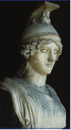

+ Afina
- Fortuna
- Afrodita
- Yunona

**451. Afinada Beshyuzlar kengashi qanday masalalarni ko’rib chiqqan?**

- Mansabdor shaxslarni saylagan
+ Kundalik joriy masalalarni hal qilgan
- Yangi inshootlar qurilishiga, armiyaga va boshqalarga mablag` ajratish to`g`risida qaror qabul qilgan
- Yangi qonunlarni tasdiqlagan, eski qonunlarni bekor qilgan 

**452. Qadimgi Afinada kimlar davlatni boshqarishda, qabul qilinayotgan qonunlar muhokamasida va ovoz berishda ishtirok ishtirok eta olgan?**

- Faqat Xalq majlisi tomonidan saylangan fuqarolar
+ Faqat erkak fuqarolar
- Faqat yetarlicha mol-mulkka ega bo’lgan fuqarolar
- Faqat Afina fuqarosi bo’lgan erkak va ayollar

**453. Suratda kimning haykali tasvirlangan?**

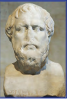

+ Solon
- Miltiad
- Perikl
- Drakont

**454. Afinada Xalq sudi faoliyatida necha yoshga to‘lgan fuqarolar ishtirok etganlar?**

- 18 yoshga
- 25 yoshga
+ 30 yoshga
- 20 yoshga

**455. Perikl necha marta strateg lavozimiga saylangan?**

- 8 marta
- 10 marta
- 17 marta
+ 15 marta

**456. Qadimgi Afinada qaysi yilda Drakont xalq boshqaruvini bekor qilgan qonunlarni yozgan?**

- Mil. avv. 632-yilda
- Mil. avv. 429-yilda
- Mil. avv. 594-yilda
+ Mil. avv. 621-yilda

**457. Qadimgi Afinada shahardagi markaziy xalq yig‘ini maydoni nima deb atalgan?**

- Amfora
- Forum
- Megara
+ Agora

**458. Qadimgi Afinada Xalq majlisida erkak jinsiga mansub barcha fuqarolar necha yoshdan boshlab ishtirok etardilar?**

- 18 yoshdan boshlab
- 25 yoshdan boshlab
+ 20 yoshdan boshlab
- 22 yoshdan boshlab

**459. Suratda kimning haykali tasvirlangan?**

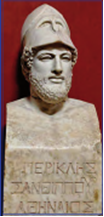

- Miltiad
- Drakont
- Solon
+ Perikl

## 25-§ Yunon-fors urushlari.

**460. Mil. avv. V asr boshlarida Yunonistonga forslar tahdid sola boshlagan davrda fors shohi kim edi?**

- Kserks
- Kir II
- Doro II
+ Doro I

**461. Marafon jangi qaysi yilda bo’lib o’tgan?**

- Mil. avv. 476-yilda
- Mil. avv. 479-yilda
- Mil. avv. 480-yilda
+ Mil. avv. 490-yilda

**462. Salamin bo‘g‘ozidagi jangda ishtirok etgan yunon harbiy kemalari tezligi qancha edi?**

- Soatiga 15 kilometr
+ Soatiga 18 kilometr
- Soatiga 24 kilometr
- Soatiga 31 kilometr

**463. Yunon-fors urushlaridagi Fermopil darasidagi jangda yunonlarga kim boshchilik qilgan?**

- Afina sarkardasi Miltiad
- Afina hukmdori Drakont
- Afina strategi Perikl
+ Sparta podshosi Leonid

**464. Yunon-fors urushlaridagi Fermopil darasidagi jang qachon bo’lib o’tgan?**

- Mil. avv. 476-yilda
- Mil. avv. 479-yilda
+ Mil. avv. 480-yilda
- Mil. avv. 490-yilda

**465. Yunon-fors urushlari qaysi yildagi sulh bilan yakunlangan?**

- Mil. avv. 438-yildagi
+ Mil. avv. 449-yildagi
- Mil. avv. 451-yildagi
- Mil. avv. 463-yildagi

**466. Marafon masofasi qancha kilometrni tashkil qiladi?**

- 41 kilometrni
+ 42 kilometrni
- 40 kilometrni
- 45 kilometrni

**467. Yunon-fors urushlarida Plateya shahri yaqinidagi jang qachon bo’lib o’tgan?**

- Mil. avv. 476-yilda
+ Mil. avv. 479-yilda
- Mil. avv. 480-yilda
- Mil. avv. 490-yilda

**468. “Triyera” deb nimaga aytiladi?**

- Afinaning tosh otuvchi quroli
+ Yunon harbiy kemasi
- Spartaning og’ir qurollangan lashkari
- Fors otliq qo’shini

**469. Yunon-fors urushlaridagi qaysi jangda “Uch yuz spartalik jasorati” voqeasi bo’lib o’tgan?**

- Plateya jangida
- Salamin jangida
+ Fermopil jangida
- Marafon jangida

**470. Yunon-fors urushlaridagi eng yirik jang qaysi bo’lgan?**

+ Plateya jangi
- Salamin jangi
- Marafon jangi
- Fermopil jangi

**471. Yunonistonning qaysi shahrida fors elchilari o’ldirilib, qoyadan uloqtirilgan?**

- Mikenda
- Spartada
+ Afinada
- Fivada

**472. Marafon jangida yunonlar nima sababdan fors suvoriylari yetib borolmaydigan qoyalarga o’rnashib olganlar?**

- Attika ichkarisiga boradigan yo’llarni to’sib qo’yish kerak edi, shuning uchun ham fors suvoriylari yetib borolmaydigan qoyalarga o’rnashib olganlar
+ Yunonlar forslarga qaraganda ancha oz edi, shuning uchun ham fors suvoriylari yetib borolmaydigan qoyalarga o’rnashib olganlar
- Yunonlar askarlarining ko’pchilik qismi kamonlar bilan qurollangan edi, shuning uchun ham fors suvoriylari yetib borolmaydigan qoyalarga o’rnashib olganlar
- Tekislikda jang qilish yunonlar uchun noqulay edi, shuning uchun ham fors suvoriylari yetib borolmaydigan qoyalarga o’rnashib olganlar

**473. Yunon-fors urushlaridagi Fermopil darasidagi jangda forslarga kim boshchilik qilgan?**

- Doro III
- Kambiz II
- Doro I
+ Kserks

**474. Yunon-fors urushlaridagi Marafon tekisligidagi jangda yunonlarga kim boshchilik qilgan?**

+ Afina sarkardasi Miltiad
- Afina hukmdori Drakont
- Afina strategi Perikl
- Sparta podshosi Leonid

**475. Fermopil darasidagi jangdan keyin Kserks qo‘shinlari O‘rta Yunonistonga yetib borib, qaysi shaharni ishg’ol qilgan?**

+ Afinani
- Spartani
- Fivani
- Korinfni

**476. Yunonlar va forslar o‘rtasidagi Salamin bo‘g‘ozida hal qiluvchi dengiz jangi qachon bo’lib o’tgan?**

- Mil. avv. 479-yilda
- Mil. avv. 476-yilda
+ Mil. avv. 480-yilda
- Mil. avv. 490-yilda

**477. Yunonistonning qaysi shahrida fors elchilariga «Suvni ham, yerni ham quduq tubidan yetarlicha olasizlar» deyishgan va chuqur quduqqa tashlab yuborishgan?**

- Korinfda
+ Spartada
- Afinada
- Fivada

**478. Salamin bo‘g‘ozidagi jangda yunonlarda nechta harbiy kema bor edi?**

+ 200 ta
- 150 ta
- 300 ta
- 250 ta

## 26-§ Yunonistonning Makedoniya tomonidan bosib olinishi.

**479. Makedoniya podshosi Filipp II ning piyoda qo’shinlari nechta qatordan iborat falangada saflanardi?**

+ 16 qatordan iborat
- 18 qatordan iborat
- 14 qatordan iborat
- 11 qatordan iborat

**480. Korinf yig’ilishida yunon shaharlari qanday qarorga kelganlar?**

- Murosada tinch-totuv yashash
- O’zaro urush olib bormaslik
- Bir-birining ichki ishlariga aralashmaslik
+ Barcha javoblar to’g’ri

**481. Filipp II Elladaga bostirib kirganida falanga qanotlarini qanday qo’shin himoya qilgan?**

- Nayza uloqtiruvchi askarlar
- Kamonchilar
+ Otliqlar
- Og’ir qurollangan goplitlar

**482. Xeroniya jangida Filipp II ning o‘g‘li Aleksandr qanday qo’shinga qo‘mondonlik qilgan?**

- Yengil qurollangan piyodalarga
+ Suvoriylarga
- Kamonchilarga
- Og’ir qurollangan piyodalarga

**483. “U o‘smirligidanoq notiq bo‘lishni orzu qilardi. Lekin u juda past ovozda gapirar va duduqlanardi. Ovozi balandligini oshirishni mashq qilarkan, u dengiz shovqinidan balandroq baqirishga harakat qilardi”. Ushbu jumlalar kim haqida?**

- Diogen
- Gerodot
+ Demosfen
- Erotosfen

**484. Qaysi mashhur notiq Ellada shaharlarini kezib, ularning aholisini birlashish va makedonlarga qarshi kurashishga da’vat etgan?**

- Diogen
- Femistokl
- Erotosfen
+ Demosfen

**485. Makedoniya podshosi Filipp II falangasining nechanchi qatoridagi nayza birinchi qatordagi jangchini muhofaza etardi?**

- To’rtinchi qatoridagi
- Beshinchi qatoridagi
+ Oltinchi qatoridagi
- Yettinchi qatoridagi

**486. Qachon yunonlar va makedonlarning asosiy kuchlari Xeroneya shahri yaqinidagi Beotiyada to’qnashgan?**

- Mil. avv. 339-yilda
+ Mil. avv. 338-yilda
- Mil. avv. 336-yilda
- Mil. avv. 337-yilda

**487. Qachon Spartadan tashqari barcha yunon shahar-davlatlarining vakillari Korinfga yig’ilganlar va Makedoniya hokimiyati ostida forslarga qarshi yurish maqsadida yunon shaharlari ittifoqini tuzganlar?**

- Mil.avv. 339-yilda
- Mil.avv. 338-yilda
- Mil.avv. 336-yilda
+ Mil.avv. 337-yilda

**488. “Yunonlar ozodligi Xeroneya ostonasida halok bo’lganlar bilan birgalikda dafn qilindi”. Ushbu ibora kimga tegishli?**

+ Demosfenga
- Erotosfenga
- Diogenga
- Femistoklga

## 27-§ Fuqaro tarbiyasi.

**489. Yunonlarda bolalikdanoq o‘g‘il bolalarga nimaga muhabbat hissi singdirilardi?**

+ She’riyat va musiqaga
- Haykaltaroshlik va rassomchilikka
- Jang va harbiy mashqlarga
- She’riyat va adabiyotga

**490. Qadimgi yunonlar yil hisobini nimaga qarab yuritganlar?**

- Quyosh tutilishiga qarab
- Oy to‘lishiga qarab
- Yulduzlarga qarab
+ Olimpiya o‘yinlariga qarab

**491. Qachon ilk bor Olimpiya o‘yinlari o‘tkazilgan?**

- Mil. avv. 777-yilda
- Mil. avv. 775-yilda
- Mil. avv. 778-yilda
+ Mil. avv. 776-yilda

**492. Qadimgi Yunonistonda Olimpiya o‘yinlarida kimlar ishtirok etishi mumkin bo‘lgan?**

+ Faqat jinoyat sodir etmagan, sha’niga dog‘ tushirmagan ozod yunonlar
- Faqat jangda o‘zini ko‘rsatgan askarlar
- Faqat yunon shahar-davlatlari aholisi
- Bellashishni istagan barcha

**493. Qadimgi Yunonistonda Olimpiya o‘yinlari necha yilda o‘tkazilgan?**

- Har yili bir marta
- Har ikki yilda bir marta
- Har uch yilda bir marta
+ Har to‘rt yilda bir marta

**494. Qadim Yunonistonda Olimpiya o’yinlari g‘oliblari qanday taqdirlanganlar?**

- Muqaddas kedr daraxti novdalaridan to‘qilgan gulchambar bilan
- Muqaddas olma daraxti novdalaridan to‘qilgan gulchambar bilan
+ Muqaddas zaytun daraxti novdalaridan to‘qilgan gulchambar bilan
- Muqaddas xurmo daraxti novdalaridan to‘qilgan gulchambar bilan

**495. Qadim Yunonistonda qaysi paytda barcha urushlar to‘xtatilgan?**

- O‘lat tarqalgan paytda
- Ocharchilik yuz bergan paytda
+ Olimpiya o‘yinlari paytida
- Hosildorlik bayrami paytida

**496. Qadimgi Yunonistonda yigitlar harbiy ta’limning ikkinchi yilida … .**

- Uylarida yashar va safda yurish, qurol taqib yurish, ochlik va sovuqqa chidamli bo‘lishni o‘rganishardi
+ Attika chegara qal’alarida harbiy xizmatni o‘tashar, Pirey bandargohida dengizchilik san’ati asoslarini o‘rganishar edi
- Harbiy otxonalarda xizmat qilishar, suvoriylik sirlarini o‘zlashtirar edi
- Qurol yasaydigan ustaxonalarda mehnat qilishar, qurol-yarog‘ning qadriga yetishni o‘rganishar edi

**497. Yunonistondagi Olimpiya o‘yinlari qaysi xudo sharafiga bag‘ishlab o‘tkazilgan?**

- Aid
+ Zevs
- Ares
- Poseydon

**498. Qadimgi Yunonistonda Olimpiya o‘yinlarida ishtirok etgan sportchilar o‘zaro bellashgan beshkurash qaysi musobaqalarni o‘z ichiga olgan edi?**

- Yugurish, kurash, arqon tortish, disk uloqtirish va tosh ko‘tarish
- Nayza uloqtirish, qilich chopish, kurash, arqon tortish va suzish
+ Uzunlikka sakrash, disk uloqtirish, nayza uloqtirish, yugurish va kurash
- Disk uloqtirish, nayza uloqtirish, yugurish, kurash va otlar poygasi

**499. Qadimgi Yunonistonda yigitlar harbiy ta’limning birinchi yilida … .**

+ Uylarida yashar va safda yurish, qurol taqib yurish, ochlik va sovuqqa chidamli bo‘lishni o‘rganishardi
- Attika chegara qal’alarida harbiy xizmatni o‘tashar, Pirey bandargohida dengizchilik san’ati asoslarini o‘rganishar edi
- Harbiy otxonalarda xizmat qilishar, suvoriylik sirlarini o‘zlashtirar edi
- Qurol yasaydigan ustaxonalarda mehnat qilishar, qurol-yarog‘ning qadriga yetishni o’rganishar edi

**500. Qadimgi Yunonistonda yigitlar necha yil harbiy ta’lim ham olishgan?**

- To’rt yil
- Besh yil
+ Ikki yil
- Uch yil

**501. To‘qqiz boshli ajdar bilan jang qilgan yunonlarning afsonaviy qahramoni kim?**

- Tesey
+ Gerakl
- Axilles
- Yason

**502. Afsonalarga ko‘ra, Olimpiya o‘yinlari asoschisi kim hisoblangan?**

- Zevs
- Axilles
- Yason
+ Gerakl

**503. Qadim Yunonistonda nima sababdan Olimpiya o‘yinlari man qilingan?**

- Zilzila oqibatida o‘yinlar o‘tkaziladigan joylar vayron bo‘lganligi natijasida
- Olimpiya o‘yinlarini o‘tkazish juda ko‘p mablag‘ talab etganligi natijasida
+ Xristian dini tarqalishi natijasida
- Yunonlar rimliklar tomonidan bosib olinishi natijasida

**504. Qaysi yilda Olimpiya o‘yinlari qayta tiklangan?**

+ 1896-yilda
- 1891-yilda
- 1875-yilda
- 1886-yilda

**505. Olimpiya o‘yinlari ochiladigan kundagi qadimgi qaysi odat hozirgacha saqlanib qolgan?**

+ Mash’ala yoqish odati
- Madhiya aytish odati
- Bayroq ko‘tarib yurish odati
- Jamoaviy maydonni aylanish odati

**506. Yunonlarning afsonaviy qahramoni Gerakl qayerning podshosi Diomedning yovvoyi otlarini bo‘ysundirgan?**

- Iberiya
- Fessaliya
- Makedoniya
+ Frakiya

**507. Qadimgi Yunonistonda Olimpiya o‘yinlarida necha karra g‘alaba qozongan sportchi Olimp tog‘ida o‘z haykalini o‘rnattirishga haqli bo‘lgan?**

- Ikki karra
- To‘rt karra
+ Uch karra
- Besh karra

**508. Yunonlarda mamlakatni mudofaa qilish zarurati yuzaga kelgan taqdirda necha yoshga to‘lmagan erkaklarning barchasi qurol-yarog‘lari va harbiy kiyim-kechaklari bilan ko‘rikka yetib kelishi shart bo‘lgan?**

- 28 yoshga
+ 30 yoshga
- 45 yoshga
- 40 yoshga

**509. Qaysi yilda sodir bo‘lgan zilzila oqibatida Olimpiya o‘yin maydoni vayron bo‘lib, qadimgi Olimpiya o‘yinlarini o‘tkazish butunlay to‘xtab qolgan?**

- Milodiy 397-yilda
+ Milodiy 394-yilda
- Milodiy 376-yilda
- Milodiy 382-yilda

## 28-§ Qadimgi Yunoniston madaniyati.

**510. “Iliada” dostonining bosh qahramoni kim?**

+ Axilles
- Gektor
- Paris
- Odissey

**511. Qaysi poema Yunon-Troya urushining oxirgi, o‘ninchi yili haqida hikoyaqiladi?**

- “Troya” poemasi
+ “Iliada” poemasi
- “Axilles” poemasi
- “Odisseya” poemasi

**512. Yunonistonda qachon teatr dunyoga kelgan?**

- Bundan uch ming yil muqaddam
- Bundan uch yarim ming yil muqaddam
- Bundan ikki ming yil muqaddam
+ Bundan ikki yarim ming yil muqaddam

**513. Qadimgi yunon teatrlarida tomoshalar qaysi kunlarda uyushtirilgan?**

- Olimpiya o’yinlari o’tkazilgan kunlarda
+ Bayram kunlarida
- Har kuni
- Dam olish kunlarida

**514. Minos degan podsho uchun mashhur Labirint saroyini barpo etgan arxitektor va haykaltarosh kim?**

- Fidiy
- Poliklet
- Miron
+ Dedal

**515. Yunon-Troya urushi haqida yunon shoiri Gomer qaysi poemalarni yozgan?**

- “Troya” va “Axilles” poemalarini
+ “Iliada” va “Odisseya” poemalarini
- “Axilles” va “Odisseya” poemalarini
- “Iliada” va “Axilles” poemalarini

**516. “Shoh Edip” va “Antigona” singari mashhur tragediyalar muallifi kim?**

+ Sofokl
- Aristofan
- Gerodot
- Gomer

**517. Parfenon barpo etilishi va Akropolning qayta qurilishiga boshchilik qilgan, yer yuzidagi yetti mo‘jizaning biri hisoblangan olimpiyalik Zevs haykalini yasagan buyuk yunon haykalataroshi kim?**

+ Fidiy
- Miron
- Poliklet
- Dedal

**518. “Axilles tovoni” atamasi hozirgi kunda qanday ma’noni anglatadi?**

- La’natlangan joy
+ Nozik joy
- Suvsiz joy
- Kuchli joy

**519. “Teatr” so‘zi yunonchadan tarjima qilganda qanday ma’noni anglatadi?**

- “komediya joyi”, “qayg‘y uyi”
- “tragediya joyi”, “tomosha joyi”
+ “tomoshalar joyi”, “tomoshaxona”
- “aktroylar uyi”, “kulgu joyi”

**520. Qadimgi Yunonistonda ibodatxonalar va boshqa jamoat binolari nimadan qurilgan?**

- Yog’ochdan
- Paxsadan
+ Toshdan
- G’ishtdan

**521. Yunon-Troya urushi necha yil davom etgan?**

- 5 yil
+ 10 yil
- 15 yil
- 20 yil

**522. Yunonlar Kichik Osiyoda joylashgan Troyaga nima sababdan urush ochganlar?**

- Troyaliklar yunonlar yeriga asrlar davomida xavf solib turganligi uchun
- Troya shohi va Sparta shohi o’rtasida shaxsiy adovat mavjudligi natijasida
- Eng chiroyli ayol, Sparta podshosining rafiqasi sohibjamol Yelenani Troya shahzodasi Paris tomonidan o’g’irlanganligi sababli 
+ Mo‘l-ko‘l o‘lja ilinjida

**523. Axillesning mangu barhayot bo‘lishini istagan onasi uni qaysi daryoga botirib olgan?**

- Kriks daryosiga
+ Stiks daryosiga
- Evfrat daryosiga
- Tibr daryosiga

**524. XIX asrning oxirida qaysi olim Gomer hikoyalarini tadqiq qilib, Troya joylashgan yerni aniqlagan?**

- Piter Breygel
- Fransua Shampalyon
- Anketil Dyuperon
+ Genrix Shlimann

**525. Troya shahri qoldiqlari topilgan Hisorlik tepaligi hozirgi qaysi davlat hududida joylashgan?**

+ Turkiyada
- Bolgariyada
- Suriyada
- Liviyada

**526. Qadimgi Yunonistonda xususiy uylar nimalardan qurilgan?**

+ G’ishtdan va paxsadan
- Yog’ochdan va g’ishtdan
- Paxsadan va yog’ochdan
- Toshdan va g’ishtdan

**527. Qadimgi Yunonistonda eng mashhur komediyalar muallifi kim bo’lgan?**

- Sofokl
+ Aristofan
- Gerodot
- Gomer

## 29-§ Qadimgi Yunoniston olimlari va mutafakkirlari.

**528. «Evrika!» («Topdim, topdim!») so’zini mashhur qilgan olim kim?**

- Demokrit
- Geraklit
- Aristotel
+ Arximed

**529. Yunon faylasuflardan qaysi biri fanlar klassifikatsiyasi bilan shug’ullangan?**

+ Aristotel
- Diogen
- Demokrit
- Geraklit

**530. Qaysi yunon faylasufi «Insonda hech qanday ehtiyojlar bo‘lmasligi shart» degan fikrni o‘z ta’limotiga asos qilib olgan?**

+ Diogen
- Geraklit
- Aristotel
- Arximed

**531. Shaharning eng aqlli kishisi deb e’lon qilingan yunon faylasufi kim?**

+ Suqrot
- Platon
- Arximed
- Diogen

**532. Suratdagi haykal kimga o’rnatilgan?**

- Suqrot
- Platon
- Arximed
+ Diogen

**533. Qaysi faylasuf Geraklit fikriga e’tiroz bildirgan?**

+ Frakiyalik Demokrit
- Delfiyalik Aristotel
- Afinalik Diogen
- Sirakuzalik Arximed

**534. Qachon Gerodot «Tarix » deb nomlangan kitob yozgan?**

- Mil. avv. III asrda
- Mil. avv. VI asrda
+ Mil. avv. V asrda
- Mil. avv. IV asrda

**535. Suqrot nima sababdan o’limga mahkum etilgan?**

- Turli xil bo’xtonlar girdobida qolgani uchun
- G’oyalaridan voz kechishdan bosh tortgani uchun
- Diniy ta’limotga qarshi chiqqani uchun
+ Afinadagi ba’zi tartiblarni qo‘rqmasdan tanqid qilgani uchun

**536. Yer yuzidagi hamma narsa olovdan kelib chiqqan deb uqtirgan yunon olimi kim?**

- Demokrit
+ Geraklit
- Aristotel
- Arximed

**537. Qaysi hukmdor «Senga qanday yordam berishim mumkin?» deb so‘raganida, Diogen: «Nariroq tursang-chi, quyoshni to‘sma!» deya kinoya qilgan ekan?**

- Spartalik Leonid
- Afinalik Perikl
- Makedoniyalik Filipp II
+ Makedoniyalik Aleksandr

**538. Qadimgi Yunonistonda kimlarni donishmandlar, hayot murabbiylari sifatida bilishgan?**

- Olimlarni
+ Faylasuflarni
- Shoirlarni
- Dramaturglarni

**539. Qaysi yunon olimi tarixda  odamgarchilik,  sabr-matonat va jasurlik timsoli bo‘lib qolgan?**

- Arximed
- Demokrit
+ Suqrot
- Aristotel

**540. Suqrotning sevimli bitigi bo‘lgan «O‘z-o‘zingni angla!» jumlalari qaysi ibodatxonada bo‘lgan?**

- Afina ibodatxonasida
+ Delfiya ibodatxonasida
- Sirakuza ibodatxonasida
- Xersones ibodatxonasida

**541. Yunon olimi Arximedning ona shahri qaysi?**

- Korinf
- Afina
+ Sirakuza
- Efes

**542. Qaysi yunon olimi «tarixning otasi» degan nom olgan?**

- Diogen
+ Gerodot
- Demokrit
- Aristotel

**543. Qaysi yunon olimi rimlik askar uni qilich bilan  urganida «Mening chizmalarimga tegma!» deyishga ulgurgan, xolos?**

- Aristotel
- Demokrit
+ Arximed
- Geraklit

**544. Qaysi yunon olimi richag (dastak) qonunini ishlab chiqqan va mashhur bo‘lib ketgan «Menga tayanch nuqtasini topib bersangiz, Yerni ag‘darib yuboraman!» iborasini aytgan?**

+ Arximed
- Aristotel
- Demokrit
- Geraklit

**545. «Hech narsani bilmasligimni bilganim uchun ham meni donishmand deb hisoblashsa kerak». Ushbu ibora muallifi kim?**

- Arximed
- Demokrit
+ Suqrot
- Aristotel

**546. Bizni qurshab turgan hamma narsa ko‘zga ko‘rinmaydigan mayda-mayda zarralar – atomlardan tashkil topgan degan ma’nodagi fikrni kim bayon etgan?**

+ Demokrit
- Geraklit
- Aristotel
- Arximed

**547. Suqrotning og‘zaki tarzda aytilgan g‘oyalari qaysi olim orqali bizgacha yetib kelgan?**

- Aristotel
- Arximed
- Demokrit
+ Platon

**548. «Shuncha narsadan bemalol voz kechib ham yashash mumkinligi naqadar ajoyib!» iborasi muallifi kim?**

+ Suqrot
- Platon
- Arximed
- Diogen

**549. «Bir daryoga ikki marta tushish mumkin emas», «Hamma narsa oqadi, hamma narsa o‘zgaruvchandir» degan mashhur hikmatlar muallifi kim?**

- Demokrit
+ Geraklit
- Aristotel
- Arximed

**550. Hayotdagi barcha qulayliklardan voz kechib, bir bochkada kun kechirgan yunon faylasufi kim?**

- Geraklit
+ Diogen
- Aristotel
- Arximed

## 30-§ Qadimgi Yunoniston afsonalari.

**551. Yunonlarda urush xudosini toping.**

- Gefest
- Aid
- Dionis
+ Ares

**552. Yunon afsonalariga ko’ra, eng avvalo qaysi Yer va Osmon xudolari paydo bo’lgan?**

- Zevs va Poseydon
- Gelios va Apollon
+ Geya va Uran
- Okean va Atlas

**553. Qadimgi yunonlarning olamga hukmronlik qilgan uch xudosini toping.**

- Apollon osmonda, Gelios dengizda, Afina marhumlar saltanatida
- Gelios osmonda, Aid dengizda, Apollon marhumlar saltanatida
- Poseydon osmonda, Zevs dengizda, Aid marhumlar saltanatida
+ Zevs osmonda, Poseydon dengizda, Aid marhumlar saltanatida

**554. Yunonlarda Zevsning o‘g‘li, yorug‘lik, musiqa va she’riyat xudosini toping.**

- Gelios
- Aid
- Poseydon
+ Apollon

**555. Yunon afsonalariga ko’ra, dastlab Yerni o’rab turga dengizlar hukmdori qaysi titan bo’lgan?**

- Atlas
- Poseydon
+ Okean
- Aid

**556. Yunonlarda ov ilohasini toping.**

+ Artemida
- Demetra
- Yustitsiya
- Fortuna

**557. Yunon afsonalariga ko’ra, qaysi titan ulkan osmon gumbazini yelkalasida suyab turgan?**

+ Atlas
- Aid
- Poseydon
- Okean

**558. Yunonlarda Zevsning inisi, marhumlar saltanati xudosini toping.**

- Gelios
+ Aid
- Apollon
- Poseydon

**559. Yunonlarda Yer ilohasini toping.**

+ Geya
- Femida
- Yustitsiya
- Fortuna

**560. Yunonlar afsonalarida yarim qush, yarim ayollar nima deb ataladi?**

- Kentavrlar
- Sikloplar
+ Sirenalar
- Titanlar

**561. Yunonlar afsonalarida xudolarning farzandlari nima deb ataladi?**

- Sikloplar
- Kentavrlar
- Sirenalar
+ Titanlar

**562. Yunonlar afsonalarida peshanasida bitta ko‘zi bo‘lgan mavjudotlar nima deb ataladi?**

+ Sikloplar
- Kentavrlar
- Sirenalar
- Titanlar

**563. Yunon tilida «mif» so’zi qanday ma’noni beradi?**

- Hikoya
+ Afsona
- Doston
- Ertak

**564. Yunonlarda Zevsning qizi, jangari ayol, donishmandlik ilohasini toping.**

+ Afina
- Yustitsiya
- Demetra
- Fortuna

**565. Yunonlar afsonalarida yarim otlar, yarim odamlar nima deb ataladi?**

- Sikloplar
+ Kentavrlar
- Sirenalar
- Titanlar

**566. Yunonlarda uzumchilik xudosini toping.**

+ Dionis
- Aid
- Gefest
- Ares

**567. Yunonlarda adliya ilohasini toping.**

- Afina
- Yustitsiya
+ Femida
- Fortuna

**568. Yunonlarda temirchilar va hunarmandlar xudosini toping.**

- Gelios
- Aid
+ Gefest
- Apollon

**569. Yunon afsonalariga ko’ra, o‘n ikki jasorati tufayli Olimp tog‘idagi xudolar saltanatida faxrli o‘ringa ega bo‘lgan bahodir kim?**

- Axilles
+ Gerakl
- Odissey
- Persey

**570. Yunonlarda oliy xudo va qolgan barcha xudolarning rahnamosini toping.**

- Afina
- Aid
- Poseydon
+ Zevs

**571. Yunon afsonalariga ko’ra, past tabaqali ma’budlar satirlar va nimfalar qayerlarda yashaydilar, deb tasavvur etilgan?**

- Uylarda, dalalarda va daryolarda
+ O’rmonlar, daryolar va tog’larda
- Osmonda, yer tagida va o‘rmonlarda
- Daryolar, dalalar va g’orlarda

**572. Yunonlarda Zevsning inisi, dengiz hukmdorini toping.**

- Gelios
- Aid
- Apollon
+ Poseydon

**573. Yunonlarda dehqonchilik va hosildorlik ilohasini toping.**

- Afina
- Yustitsiya
+ Demetra
- Fortuna

**574. Yunonlarda Quyosh xudosini toping.**

+ Gelios
- Aid
- Poseydon
- Apollon

## 31-§ O‘rta Osiyoda ahamoniylar hukmronligi.

**575. Qachon Kir II massagetlar ustiga yurish qilgan?**

- Mil. avv. 483-yilda
- Mil. avv. 490-yilda
+ Mil. avv. 530-yilda
- Mil. avv. 522-yilda 

**576. «Amudaryo xazinasi» qachon topilgan?**

- 1881-yilda
+ 1877-yilda
- 1878-yilda
- 1875-yilda

**577. Shiroq jasorati (Poliyen ma’lumotlari) qaysi yilda sodir bo’lgan?**

- Mil. avv. 483-yilda
- Mil. avv. 490-yilda
+ Mil. avv. 519-yilda
- Mil. avv. 530-yilda

**578. Tarixchi Poliyen qachon yashagan?**

- Miloddan avvalgi I asrda
+ Miloddan avvalgi II asrda
- Miloddan avvalgi IV asrda
- Miloddan avvalgi III asrda

**579. Qachon O‘rta Osiyo hududida dastlabki tanga pullar tarqalgan?**

- Mil. avv. III-II asrlarda
- Mil. avv. VI-V asrlarda
+ Mil. avv. V-IV asrlarda
- Mil. avv. IV-III asrlarda

**580. O’rta Osiyoning bosib olingan viloyatlarini forslar necha satraplikka bo’lib boshqarishgan?**

- 2 ta
+ 3 ta
- 4 ta
- 5 ta

**581. O’rta Osiyolik qaysi xalqlar suvoriylari Kserks qo’shinlarining eng yaxshi jangchilaridan hisoblanganlar?**

+ Sak va baqtriyaliklar
- Massaget va xorazmliklar
- Baqtriya va so’g’diyonaliklar
- Xorazmlik va massagetlar

**582. Parfiya, Marg‘iyona va Baqtriyani qaysi fors shohi bosib olgan?**

- Kambiz II
- Doro I
- Kserks
+ Kir II

**583. Fradaning asirlikka olingani haqidagi ma’lumotlarni qaysi manbadan bilib olamiz?**

- Poliyenning asaridan
+ Behistun yozuvlaridan
- Naqshi Rustam bitiklaridan
- Gerodotning «Tarix» asaridan

**584. Doro I qaysi saklar ustiga yuish qilgan?**

+ Uchi o‘tkir kuloh kiyib yuruvchi saklar
- Dengiz ortida yashovchi saklar
- Daryo ortida yashovchi saklar
- Muqaddas ichimlikka sig’inuvchi saklar

**585. Quyida tasvirlangan oltindan yasalgan ot-arava nusxasi nechanchi asrlarga oid?**

- Mil. avv. III-II asrlarga
- Mil. avv. IV-III asrlarga
- Mil. avv. VII-VI asrlarga
+ Mil. avv. V-IV asrlarga

**586. Amudaryo xazinasidan topilgan oltin va kumush buyumlar hozirda qayerda saqlanadi?**

- Luvr muzeyida
- Ermitaj muzeyida
- Metropoliten muzeyida
+ Britaniya muzeyida

**587. Doro I hukmronligining nechanchi yilida saklar ustiga yurish qilgan?**

- To’rtinchi yilida
+ Uchinchi yilida
- Beshinchi yilida
- Ikkinchi yilida

**588. Qaysi yilda forslar va Frada boshliq qo’zg’olonchilar o’rtasida hal qiluvchi jang bo’lgan?**

- Mil. avv. 483-yilda
- Mil. avv. 490-yilda
+ Mil. avv. 522-yilda
- Mil. avv. 530-yilda

**589. Kserks qo’shinlari tarkibidagi xorazmiylar va so‘g‘diylar qanday qurollar bilan jangga kirishgan?**

- Massagetlarniki kabi qurollar bilan (qilich va jangovar boltalar bilan)
- Saklarniki kabi qurollar bilan (xanjar va jangovar boltalar bilan)
+ Baqtriyaliklarniki kabi qurollar bilan (kamon va nayzalar bilan)
- Marg’iyonaliklarniki kabi qurollar bilan (jangovar bolta va xanjarlar bilan)

**590. Kserks qo’shinlari tarkibidagi baqtriyaliklar qanday qurollar bilan jangga kirishgan?**

- Qilich va jangovar boltalar bilan
- Xanjar va jangovar boltalar bilan
+ Kamon va nayzalar bilan
- Jangovar bolta va xanjarlar bilan

**591. Kserks qo’shinlari tarkibidagi saklar qanday qurollar bilan jangga kirishgan?**

- Qilich va jangovar boltalar bilan
+ Xanjar va jangovar boltalar bilan
- Kamon va nayzalar bilan
- Jangovar bolta va xanjarlar bilan

**592. O‘rta Osiyo hududini bosib olishga harakat qilib ko‘rgan dastlabki fors podshosi kim?**

- Kserks
- Doro I
- Kambiz II
+ Kir II

**593. Doro I ning saklar ustiga yurishi qaysi manbada keltirilgan?**

- Poliyenning asarida
+ Behistun yozuvlarida
- Naqshi Rustam bitiklarida
- Gerodotning «Tarix» asarida

**594. Kir II ning massagetlar ustiga yurishi to’g’risida qaysi tarixchi yozib qoldirgan?**

- Strabon
- Arrian
+ Gerodot
- Poliyen

**595. Forschada “xshatra” so’zi qanday ma’noni anglatadi?**

+ Viloyat
- Noib
- Hokim
- Mamlakat

**596. Doro I ning saklar ustiga yurishi va Shiroq afsonasi to’g’risida qaysi tarixchi yozib qldirgan?**

- Gerodot
- Arrian
- Strabon
+ Poliyen

**597. Mashhur Marafon jangida (mil. avv. 490-yil) fors qo‘shinlari markazida bo’lgan qaysi O’rta Osiyo xalqi muvaffaqiyatli urushgan?**

- So’g’diylar
+ Saklar
- Xorazmliklar
- Baqtriyaliklar

**598. Skunxa kim bo’lgan?**

- Baqtriya satrapi
- Forslar shohi
+ Saklar sardori
- Massagetlar sarkardasi

## 32-§ O‘rta Osiyo xalqlarining yunon-makedon istilochilariga qarshi kurashi.

**599. Maroqandani Spitaman qamalidan ozod qilgach Aleksandr u yerda maxsus harbiy qo’shin qoldirib, asosiy qo’shinlari bilan qishlash uchun qayerga jo’nagan?**

+ Zariaspga
- Nautakaga
- Kiropolisga
- Xo’jandda

**600. Qaysi yilda Makedoniyalik Aleksandr Fors davlatining Ahamoniylar sulolasidan bo‘lgan oxirgi shoh Doro III ning qo‘shinlarini tor-mor keltirgan?**

- Mil. avv. 327-yilda
- Mil. avv. 328-yilda
- Mil. avv. 329-yilda
+ Mil. avv. 330-yilda

**601. Mil. avv. VII-IV asrlar O’rta Osiyo jangchilarining quroli «akinak» nimaligini toping.**

- Qilich
- Kamon
- Jangovar oybolta
+ Xanjar

**602. Makedoniyalik Aleksandr O‘rta Osiyoni bosib olish uchun necha yil harakat qilgan?**

- Bir yil
- Ikki yil
+ Uch yil
- To’rt yil

**603. Spitaman qamalida qolgan qo’shiniga yordam berish uchun Makedoniyalik Aleksandr qancha qo’shin jo’natgan?**

- Besh mingga yaqin qo’shin
- Ikki mingga yaqin qo’shin
- To’rt mingga yaqin qo’shin
+ Uch mingga yaqin qo’shin

**604. Kimlarga qarshi kurash uchun Aleksandr Sirdaryo bo‘yida, Xo‘jand yaqinida qal’a (Aleksandriya Esxata) barpo etish to‘g‘risida buyruq bergan?**

+ Saklarga qarshi kurash uchun
- Massagetlarga qarshi kurash uchun
- So’g’diylarga qarshi kurash uchun
- Forslarga qarshi kurash uchun

**605. Mil. avv. IV asrda qaysi daryo Politimet deb atalgan?**

- Sirdaryo
- Murg’ob
+ Zarafshon
- Amudaryo

**606. Makedoniyalik Aleksandrning O’rta Osiyoga yurishi paytida qaysi hududlar mustaqilligicha qolgan? 1) Xorazm; 2) Bekobod va Xo’jand orasidagi Sirdaryo bo‘ylari; 3) Marg’iyona; 4) Baqtriya; 5) Toshkent vohasi; 6) So’g’diyona; 7) Farg’ona.**

- 2, 3, 4
- 2, 3, 4, 6
- 2, 3, 5
+ 1, 5, 7

**607. Mil. avv. IV asrda qaysi shahar Maroqanda deb atalgan?**

- Toshkent shahri
- Nasaf shahri
- Buxoro shahri
+ Samarqand shahri

**608. Makedoniyalik Aleksandr uylangan Ravshanak kimning qizi edi?**

- Spitamanning
- Farasmanning
+ Oksiartning
- Xoriyenning

**609. Mil. avv. IV asrda Nautaka shahri qayerda joylashgan edi?**

- Qashqadaryo vohasining g’arbiy qismida
+ Qashqadaryo vohasining sharqiy qismida
- Qashqadaryo vohasining shimoliy qismida
- Qashqadaryo vohasining janubiy qismida

**610. Makedoniyalik Aleksandrning ustozi qaysi mashhur yunon faylasufi bo’lgan?**

- Geraklit
- Suqrot
- Arximed
+ Aristotel

**611. Qachon Makedoniyalik Aleksandr Sharqqa yurish boshlagan?**

+ Mil. avv. 334-yilda
- Mil. avv. 336-yilda
- Mil. avv. 337-yilda
- Mil. avv. 338-yilda

**612. Makedoniyalik Aleksandr, Hindistonga yurish qilishdan oldin, qanday maqsadda Amudaryoning narigi tomonida yashovchi elatlarni bo‘ysundirishga qaror qilgan?**

+ Qo‘shinlarining orqa tomonini xavfsizlantirish maqsadida
- Qo‘shinlarining bo’shab qolgan safini to’ldirish maqsadida
- Qo‘shinlarining oziq-ovqat zahirasini to’ldirish maqsadida
- Qo‘shinlarining qishda dam olishiga sharoit yaratish maqsadida

**613. So‘g‘diyona xalqi Makedoniyalik Aleksandrga qarshi kurashga chiqqanida ularga yana qaysi xalqlar kelib qo’shilgan?**

- Baqtriyaliklar va marg’iyonaliklar
- Marg’iyonaliklar va xorazmliklar
+ Baqrtiyaliklar va saklar
- Marg’iyonaliklar va saklar

**614. O’rta Osiyoga yurishi paytida Makedoniyalik Aleksandr qaysi hududlarni bo’ysundirishga muvaffaq bo’lgan? 1) Xorazm; 2) Bekobod va Xo’jand orasidagi Sirdaryo bo‘ylari; 3) Marg’iyona; 4) Baqtriya; 5) Toshkent vohasi; 6) So’g’diyona; 7) Farg’ona.**

+ 2, 3, 4, 6
- 2, 3, 4
- 1, 5, 7
- 2, 3, 5

**615. Qaysi yilda Makedoniyalik Aleksandr qo‘shinlari Oks – Amudaryodan o‘tib olgan?**

- Mil. avv. 327-yilda
- Mil. avv. 328-yilda
+ Mil. avv. 329-yilda
- Mil. avv. 330-yilda

**616. Mil. avv. VII-IV asrlar O’rta Osiyo jangchilarining quroli «sagaris» nimaligini toping.**

- Qilich
- Kamon
+ Jangovar oybolta
- Xanjar

**617. Makedoniyalik Aleksandr podsho bo’lganida necha yoshga to’lgan edi?**

+ 20 yoshga
- 22 yoshga
- 21 yoshga
- 18 yoshga

**618. Makedoniyalik Aleksandr O‘rta Osiyoda qaysi shaharlarni qurdirgan?**

- Oksdagi Aleksandriya
- Aleksandriya Esxata
- Marg‘iyona Aleksandriyasi
+ Barcha javoblar to’g’ri

**619. Yunon-makedonlarga qarshi qo’zg’olon ko’targan Spitamаn qaysi shaharni qamal qilgan?**

+ Maroqandani
- Baqtrani
- Nautakani
- Kurushkatni

**620. Makedoniyalik Aleksandr qachon vafot etgan?**

- Mil. avv. 324-yilda
- Mil. avv. 322-yilda
- Mil. avv. 321-yilda
+ Mil. avv. 323-yilda

**621. Makedoniyalik Aleksandr vafotidan keyin, uning bo’linib ketgan imperiyasi o’rnida uchta davlat vujudga kelgan. Ular qaysilar edi?**

- Misr, Yunoniston, Hindiston davlatlari
- Makedoniya, Suriya, Hindiston davlatlari
- Yunoniston, Makedoniya, Suriya davlatlari
+ Makedoniya, Misr, Suriya davlatlari

**622. Aleksandriya Esxata shahri nomining ma’nosi nima?**

- Buyuk Aleksandriya
+ Chekka Aleksandriya
- Uzoq Aleksandriya
- Katta Aleksandriya

**623. Qayerda yunon-makedonlarga pistirma qo‘ygan Spitaman dushman guruhini tamomila qirib tashlagan?**

- Sirdaryo daryosi bo’yida
- Murg’ob daryosi bo’yida
+ Zarafshon daryosi bo’yida
- Amudaryo daryosi bo’yida

**624. Qachon Spitamanning Aleksandr bilan hal qiluvchi jangi bo‘lib o‘tgan?**

- Mil. avv. 327-yil kuzida
+ Mil. avv. 328-yil kuzida
- Mil. avv. 328-yil bahorida
- Mil. avv. 327-yil bahorida

**625. Rivoyatga ko‘ra Kurushkat (Kiropolis) shahriga kim asos solgan edi?**

- Kserks
+ Kir II
- Doro I
- Kambiz II

**626. Mil. avv. IV asrda qaysi shahar Zariasp deb ham atalgan?**

+ Baqtra shahri
- Maroqanda shahri
- Nautaka shahri
- Binkat shahri

**627. Makedoniyalik Aleksandr vafotidan keyin, uning bo’linib ketgan imperiyasi o’rnida vujudga kelgan qaysi davlat tarkibiga O’rta Osiyo kirgan?**

- Hindiston davlati tarkibiga
+ Suriya davlati tarkibiga
- Misr davlati tarkibiga
- Makedoniya davlati tarkibiga

**628. Makedoniyalik Aleksandr Spitaman qo’zg’olonini bostirish uchun o‘z lashkarlarini necha qismga bo’lib, So‘g‘diyonani u boshidan bu boshigacha kezib chiqqan?**

- Besh qismga bo‘lib
- To’rt qismga bo‘lib
- Ikki qismga bo‘lib
+ Uch qismga bo‘lib

**629. Makedoniyalik Aleksandr yurushi vaqtida ahamoniylar sulolasining vakili Bess qayerning satrapi edi?**

- Xorazm
- Marg’iyona
+ Baqtriya
- So’g’diyona

**630. Aleksandrdan yengilgan Spitamanning taqdiri qanday yakun topgan?**

+ Cho’lda xoinlarcha o‘ldirilgan
- Umrining oxirigacha zindonda bo’lgan
- O’zga yurtlarga qochib ketgan
- Taqdiri ma’lum emas

**631. Makedoniyalik Aleksandr yurishlari davrida mahalliy zodagonlar – Xoriyen va Oksiartning qal’alari qayerda joylashgan edi?**

- Zarafshon bo’ylarida
+ Hisor tog’larida
- Hindiqush tog’larida
- Amudaryo bo’ylarida

**632. Qachon yunon-makedonlar Maroqandani egallagan?**

- Mil. avv. 327-yilda
- Mil. avv. 328-yilda
+ Mil. avv. 329-yilda
- Mil. avv. 330-yilda

**633. Qachon Aleksandr Makedoniya podshosi bo‘lgan?**

+ Mil. avv. 336-yilda
- Mil. avv. 334-yilda
- Mil. avv. 338-yilda
- Mil. avv. 337-yilda

**634. Amudaryoning narigi tomoniga yurishi vaqtida birinchi bo’lib Makedoniyalik Aleksandrning yo’lini to’sgan shahar qaysi edi?**

+ Baqtra shahri
- Maroqanda shahri
- Nautaka shahri
- Binkat shahri

**635. Makedoniyalik Aleksandrning Sharqqa yurishi necha yil davom etgan?**

- 11 yil
- 12 yil
+ 10 yil
- 14 yil

## 33-§ Salavkiylar davlati va Yunon-Baqtriya podsholigi.

**636. Qachon Makedoniyalik Aleksandr vafot etgan?**

- Mil. avv. 321-yilda
- Mil. avv. 326-yilda
- Mil. avv. 325-yilda
+ Mil. avv. 323-yilda

**637. Baqtriya qachon Salavkiylar davlati tarkibidan ajralib chiqqan?**

- Mil. avv. 230-yilda
- Mil. avv. 240-yilda
- Mil. avv. 255-yilda
+ Mil. avv. 250-yilda

**638. Salavk davlati tarkibiga qayerlar kirgan?**

+ Mesopotamiya, Eron, Parfiya, Baqtriya, So’g’diyona, Marg’iyona
- Mesopotamiya, Eron, Parfiya, Misr, Makedoniya, Marg’iyona
- Mesopotamiya, Eron, Parfiya, Baqtriya, Makedoniya, Marg’iyona
- Mesopotamiya, Parfiya, Baqtriya, Misr

**639. Parfiyada hokimiyat kimning qo‘liga o‘tishi bilan Baqtriyaga harbiy tazyiqni kuchaytirgan?**

+ Mitridat I
- Yevtidem
- Demetriy
- Doidot

**640. Salavkiylar davlatida strateglar kimlardan tayinlangan edi?**

- Sulola vakillaridan
- Mahalliy aholidan
- Zodagonlardan
+ Sobiq lashkarboshilardan

**641. Baqtra, Maroqanda, Marg‘iyona Antioxiysi (Marv) va Termiz qaysi davlatning yirik shaharlari hisoblangan?**

- Suriya davlatining
- Parfiya davlatining
+ Salavkiylar davlatining
- Yunon-Baqtriya davlatining

**642. Salavka o’g’li Antioxni qayerlarga noib qilib tayinlagan?**

+ Parfiya, Marg’iyona, Baqtriya, So’g’diyona
- Eron, Parfiya, Makedoniya, Marg’iyona
- Eron, Parfiya, Baqtriya, Marg’iyona
- Parfiya, Baqtriya, Misr

**643. Quyidagi rasmda O’rta Osiyodagi qaysi xalq vakillarining tiklangan qiyofalari tasvirlangan?**

+ Xorazmliklarning
- Baqtriyaliklarning
- So’g’diylarning
- Marg’iyonaliklarning

**644. Yunon-Baqtriya podsholigi tarkibiga Baqtriyadan tashqari yana qayerlar kirgan?**

- Parfiya, So’g’diyona va Marg’iyona
- Parfiya va So’g’diyona
+ So’g’diyona va Marg’iyona
- Marg’iyona va Parfiya

**645. Quyidagi rasmda qaysi davlat tangalari tasvirlangan?**

- Suriya davlatining
- Parfiya davlatining
- Salavkiylar davlatining
+ Yunon-Baqtriya davlatining

**646. Qaysi mingta Baqtriya shahri hukmdori o‘zini podsho deb e’lon qilgan?**

- Mitridat I
- Yevtidem
- Demetriy
+ Doidot

**647. Qachon Yunon-Baqtriya davlati yuechji qabilalari tomonidan bosib olingan?**

- Mil. avv. 160–150-yillarda
- Mil. avv. 130–120-yillarda
- Mil. avv. 150–140-yillarda
+ Mil. avv. 140–130-yillarda

**648. Salavkiylar davlati tarkibidan Parfiya qachon ajralib chiqqan?**

- Mil. avv. 230-yilda
- Mil. avv. 240-yilda
- Mil. avv. 255-yilda
+ Mil. avv. 250-yilda

**649. O’z mamlakatini 20 yilga yaqin muddat boshqargan salavkiy hukmdorni aniqlang.**

- Salavk
+ Antiox
- Demetriy
- Yevtidem

**650. Kimning hukmronligi davrida Yunon-Baqtriya podsholigi eng katta sarhadlarga ega bo’lgan?**

- Mitridat I davrida
- Yevtidem davrida
- Doidot davrida
+ Demetriy davrida

**651. Salavk qachon Bobil (Suriya davlati) hukmdori bo’lgan?**

- Mil. avv 280-yilda
+ Mil. avv 312-yilda
- Mil. avv 323-yilda
- Mil.avv 293-yilda

**652. Qachon O‘rta Osiyo tarixida antik davr boshlangan?**

- Salavkiylar davlati vujudga kelganidan keyin
+ Yunon-makedon istilolaridan keyin
- Makedoniyalik Aleksandr taxtga o’tirganidan keyin
- Yunon-Baqtriya davlati vujudga kelganidan keyin

**653. Makedoniyalik Aleksandr vafotidan keyin, uning bo’linib ketgan imperiyasi o’rnida uchta davlat vujudga kelgan. Ular qaysilar edi?**

- Misr, Yunoniston, Hindiston davlatlari
- Makedoniya, Suriya, Hindiston davlatlari
- Yunoniston, Makedoniya, Suriya davlatlari
+ Makedoniya, Misr, Suriya davlatlari

**654. Antiox qachon Salavkiylar davlati taxtiga o’tirgan?**

- Mil. avv. 276-yilda
+ Mil. avv. 280-yilda
- Mil. avv. 291-yilda
- Mil. avv. 270-yilda

**655. Qaysi hukmdor davrida Hindistonning bir qismi Yunon-Baqtriya davlati tarkibiga qo‘shib olingan?**

- Mitridat I davrida
- Yevtidem davrida
+ Demetriy davrida
- Doidot davrida

## 34-§ Qadimgi Xorazm, Qang‘ va Davan davlati.

**656. Qang‘ davlatining asosiy shaharlari qaysi daryo sohillari bo‘ylab joylashgan edi?**

- Murg‘ob
- Zarafshon
+ Sirdaryo
- Amudaryo

**657. «Shahar qudratli mudofaa devorlari bilan o‘ralib, devor burchaklarida burjlar qurilgan. Markazdan o‘tgan ko‘cha shaharni ikki qismga bo‘lgan, undan esa, yon-atrofga ko‘chalar ketgan, mahallalar bir-biridan ajralib turgan. Markaziy maydonda muhtasham saroy va ibodatxonalar joylashgan». Yuqorida qaysi qadimiy shahar tasvirlanmoqda?**

- Qal’aliqir shahri
- Qo‘yqirilganqal’a shahri
+ Tuproqqal’a shahri
- Ko‘zaliqir shahri

**658. Qang‘yuy davlatiga qachon va kimlar asos solgan?**

- Mil. avv. II asrda, saklar
- Mil. avv. II asrda, chochliklar
- Mil. avv. III asrda, qang‘liklar
+ Mil. avv. III asrda, saklar

**659. Qaysi asrlarda Jonbosqal’a Xorazmning qadimgi shahri bo‘lgan?**

+ Miloddan avvalgi III–II asrlarda
- Miloddan avvalgi II–I asrlarda
- Miloddan avvalgi IV–III asrlarda
- Miloddan avvalgi V–IV asrlarda

**660. Ushbu rasmda qaysi qadimiy shaharning tiklangan surati tasvirlangan?**

- Qal’aliqir shahrining
+ Qo‘yqirilganqal’a shahrining
- Tuproqqal’a shahrining
- Ko‘zaliqir shahrining

**661. O‘rta Osiyodagi eng qadimgi yozuv Xorazm hududidan topilgan. Bular … (miloddan avvalgi … asrlar) yodgorligidan xum sirtiga bitilgan yozuv va …dan topilgan ayrim mahalliy yozuvlardir (miloddan avvalgi … asrlar).**

- Tuproqqal’a/III–II/ Ko‘zaliqir /II–I
+ Oybo‘yirqal’a/V–IV/Qo‘yqirilganqal’a/III–II
- Ko‘zaliqir/IV–III/ Qal’aliqir /V–IV
- Qal’aliqir/VI–V/Tuproqqal’a/IV–III

**662. Qadimda Xorazm aholisi xo‘jaligining asosini qaysi soha tashkil etgan?**

- Baliqchilik
+ Dehqonchilik
- Savdo-sotiq
- Chorvachilik

**663. Qang‘ davlatining madaniy markazlaridan biri bo‘lgan qaysi hududida o‘troq ziroatchilik va hunarmandchilik madaniyati vujudga kelgangan?**

- Farg‘ona vodiysida
+ Toshkent vohasida
- Zarafshon vohasida
- Murg‘ob vodiysida

**664. Toshkent vohasida qaysi asrda asos solingan, Qanqa – Qang‘xa shahar-qal’asi saklarning  poytaxti Qang‘dez bo‘lgan?**

+ Miloddan avvalgi III asrda
- Miloddan avvalgi I asrda
- Miloddan avvalgi IV asrda
- Miloddan avvalgi II asrda

**665. Qaysi davlatning otlari zotiga xitoyliklar “Samoviy” deb nom berganlar?**

- Baqtriya
- Marg‘iyona
+ Davan
- So‘g‘diyona

**666. Qachon Xorazm Ahamoniylar davlatidan ajralib chiqib, mustaqil davlatga aylangan?**

- Mil. avv. II asrda
- Mil. avv. V asrda
+ Mil. avv. IV asrda
- Mil. avv. III asrda

**667. Xorazmda shaharsozlikning boshlanishi qaysi asrga borib taqaladi?**

- Miloddan avvalgi VIII asrga
- Miloddan avvalgi VI asrga
- Miloddan avvalgi V asrga
+ Miloddan avvalgi VII asrga

**668. Qachon Farg‘ona vodiysida Davan davlati paydo bo‘lgan?**

- Mil. avv. II asrda 
- Mil. avv. I asrda
+ Mil. avv. III asrda
- Mil. avv. IV asrda

**669. Qaysi davlat hukmdori lashkari Davan davlatining poytaxti Ershini qo‘lga kiritgan, biroq aholisining tovon to‘lashi evaziga uni tashlab chiqishgan?**

- Baqtriya hukmdori lashkari
- Kushon hukmdori lashkari
- Qang‘ hukmdori lashkari
+ Xitoy hukmdori lashkari

**670. Qachon Qang‘ davlati parchalanib ketgan?**

- Milodiy I asrda
- Milodiy IV asrda
- Milodiy II asrda
+ Milodiy III asrda

**671. Davan davlati qachon barham topgan?**

- Milodiy I asrda
- Milodiy IV asrda
- Milodiy II asrda
+ Milodiy III asrda

**672. Qachon Xorazmda mahalliy taqvim ishlab chiqilgan?**

- Mil. II asrda
+ Mil. avv. I asrda
- Mil. avv. III asrda
- Mil. avv. II asrda

**673. Xorazmdagi Ko‘zaliqir shahri xarobalari qaysi asrga oid?**

- Miloddan avvalgi VIII asrga
- Miloddan avvalgi VI asrga
- Miloddan avvalgi V asrga
+ Miloddan avvalgi VII asrga

**674. Qaysi davrda Xorazmdagi Tuproqqal’a shahrida ulug‘vor va muhtasham qurilish ishlari amalga oshirilgan edi?**

- Milodiy IV–V asrlarda
- Milodiy III–IV asrlarda
- Milodiy I–II asrlarda
+ Milodiy II–III asrlarda

**675. Xorazmdagi qaysi qadimiy shahar xarobalaridan aylana shaklda qurilgan mustahkam ibodatxona qoldiqlari topilgan?**

- Qal’aliqirdan
+ Qo‘yqirilganqal’adan
- Tuproqqal’adan
- Ko‘zaliqirdan

**676. Xorazmdagi mahalliy taqvim qachongacha amalda bo‘lgan?**

- Milodiy V asrgacha
- Milodiy VII asrgacha
+ Milodiy VIII asrgacha
- Milodiy VI asrgacha

**677. Xitoy manbalarida Qang‘yuy davlatining poytaxti qanday atalgan?**

+ Bityan
- Qang‘dez
- Qang‘xa
- Qanqa

**678. O‘rta Osiyodagi eng qadimgi yozuv qaysi hududdan topilgan?**

- Toshkent vohasi hududidan
- Surxondaryo hududidan
- Farg‘ona hududidan
+ Xorazm hududidan

**679. Xorazmdagi qaysi qadimiy shaharda mahalliy hukmdorning qarorgohi bo‘lgan ulkan qal’a bunyod etilgan edi?**

+ Qal’aliqir shahrida
- Jonbosqal’a shahrida
- Tuproqqal’a shahrida
- Ko‘zaliqir shahrida

**680. Davan davlatining poytaxti qayshi shahar bo‘lgan?**

- Bityan
+ Ershi
- Sho‘rabashat
- Uchqo‘rg‘on

**681. Qachon Qang‘ qudratli davlat birlashmasiga aylangan?**

- Miloddan avvalgi I asr boshida
+ Miloddan avvalgi II asr oxirida
- Miloddan avvalgi II asr boshida
- Miloddan avvalgi I asr oxirida

**682. Miloddan avvalgi I asrda va dastlabki milodiy asrlarda Xorazmda… .**

- Oltin va kumush tangalar zarb qilingan
- Dastlabki yozuv yaratilgan
+ Kumush va mis tangalar zarb qilingan
- Mahalliy taqvim amalda bo‘lgan

**683. Qaysi manbalarda Davan davlati shu nom bilan atalgan?**

+ Xitoy manbalarida
- Fors manbalarida
- Turkiy manbalarda
- Yunon-Rim manbalarida

**684. «Qasrdagi saroy devorlari shohlar, lashkarlar, sozandalar, shuningdek, hayvonlar va qushlar tasviri bilan bezatilgan. 20 dan ortiq bo‘yalgan loy haykallar zallardan biridagi tokchalarda devor bo‘ylab o‘rnatilgan». Yuqorida qaysi qadimiy shahardagi qasr tasvirlanmoqda?**

- Oybuyirqal’adagi
- Jonbosqal’adagi
+ Tuproqqal’adagi
- Ko’zaliqirdagi

**685. Qachon Davan davlati yuksak taraqqiy etgan davlatga aylangan?**

- Milodiy I-II asrlarda
+ Miloddan avvalgi II-I asrlarda
- Miloddan avvalgi III-II asrlarda
- Milodiy II-III asrlarda

**686. Ushbu rasmda qaysi qadimiy xalq jangchisining tiklangan rasmi tasvirlangan?**

+ Qadimgi Xorazm jangchisining
- Qadimgi Baqtriya jangchisining
- Qadimgi So‘g‘d jangchisining
- Qadimgi Sak jangchisining

**687. Buyuk ipak yo’lining qaysi tarmog’i Qang‘ hududlaridan o’tgan edi?**

- Sharqiy tarmog‘i
- G‘arbiy tarmog‘i
+ Shimoliy tarmog‘i
- Janubiy tarmog‘i

**688. Qaysi davlatning Sho‘rabashat, Uchqo‘rg‘on singari shaharlari atrofidagi aholi yerni ishlash, sholi va bug‘doy yetishtirish, bog‘dorchilik va uzum yetishtirishda katta yutuqlarga erishgan?**

+ Davan davlatining
- Baqtriya davlatining
- Marg‘iyona davlatining
- Qang‘ davlatining

## 35-§ Kushon davlati.

**689. Qaysi Kushon hukmdori pul islohoti o‘tkazgan, zarb qilingan tangalar qadri ortgan va tangalar oltin, kumush va misdan zarb qilingan?**

- Kudzula Kadfiz
+ Vima Kadfiz
- Kanishka
- Vasudeva

**690. Qaysi yodgorlikni o‘rganish natijasida oromiy yozuvi asosidagi kushon-baqtriya alifbosidagi yozuv namunalari topilgan?**

- Qoratepa yodgorligini
+ Qadimgi Termiz yodgorligini
- Ayritom yodgorligini
- Xolchayon yodgorligini

**691. Quyidagi suratda qaysi davlat tangalari aks etgan?**

+ Kushon davlati tangalari
- Yunon-Baqtriya davlati tangalari
- Davan davlati tangalari
- Qang‘ davlati tangalari

**692. Kushonlar davrida Dalvarzintepa va Eski Termiz singari shaharlar … qurilgan mustahkam istehkom devorlari bilan o‘ralgan edi?**

- pishgan g‘ishtdan
- paxsadan
- toshdan
+ xom g‘ishtdan

**693. Qachon Guyshuan (Kushon) xonadonining boshlig‘i barcha yuechji mulklarini o‘z hokimiyati ostida birlashtirib, Kushon davlatiga asos solgan?**

- Milodiy II asrda
+ Milodiy I asrda
- Miloddan avvalgi I asrda
- Miloddan avvalgi II asrda

**694. Kushon mamlakatidagi qaysi yozuv harflari burchakli, to‘rtburchak va aylana shaklida yozilgan?**

- So‘g‘d yozuvi
- Sanskrit yozuvi
+ Kushon shaklli yozuvi
- Oromiy yozuvi

**695. Kushonlar davrida aynan qaysi hudud orqali buddaviylik O‘rta Osiyo bo‘ylab tarqala boshlagan?**

- Toshkent vohasi orqali
- Farg‘ona vodiysi orqali
- Zarafshon vodiysi orqali
+ Surxon vohasi orqali

**696. Ushbu do‘mbirachi tasviri qayerdan topilgan?**

- Fayoztepadan
- Xolchayondan
- Dalvarzintepadan
+ Ayritomdan

**697. Kimning hukmronligi davridan Kushon podsholigida hukmdor nomi ko‘rsatilgan tanga zarb qilish boshlangan?**

- Kudzula Kadfiz davridan
+ Vima Kadfiz davridan
- Kanishka davridan
- Vasudeva davridan

**698. Qaysi davlatlar qatorida Kushon davlati ham ulkan imperiyalardan biriga aylangan?**

+ Rim, Parfiya, Xitoy
- Rim, Xitoy, Hindiston
- Baqtriya, Parfiya, Xitoy
- Qang‘, Parfiya, Xitoy

**699. Kushon podsholigida yozuv qadimdan mavjudligini qaysi yodgorlikdan topilgan yunon alifbosidagi kushon bitiklari ham tasdiqlaydi?**

- Qoratepa yodgorligidan
- Qadimgi Termiz yodgorligidan
+ Surxko‘tal yodgorligidan
- Xolchayon yodgorligidan

**700. Kushonlar davriga oid Eski Termiz (Qoratepa, Fayoztepa) va Dalvarzintepadagi qaysi inshootda o‘sha davr devoriy tasvirlari va haykaltaroshlikning yuksak san’at namunalari o‘rganilgan?**

+ Buddaviylik ibodatxonalarida
- Hukmdorlar saroylarida
- Zodagonlar uylarida
- Jamoat binolarida

**701. Qachon Yunon-Baqtriya davlati yuechji qabilalari tomonidan bosib olingan?**

- Mil. avv. 160–150-yillarda
- Mil. avv. 130–120-yillarda
- Mil. avv. 150–140-yillarda
+ Mil. avv. 140–130-yillarda

**702. Suratdagi budda boshining tasviri qaysi aslarga oid va qayerdan topilgan?**

- I–II asr boshlari. Qoratepa
+ II–III asr boshlari. Dalvarzintepa
- IV–V asr boshlari. Xolchayon
- III–IV asr boshlari. Ayritom

**703. Kimning hukmronligi zamonida Kushon podsholigi ulkan davlatga aylangan?**

- Kudzula Kadfiz zamonida
- Vima Kadfiz zamonida
+ Kanishka zamonida
- Vasudeva zamonida

**704. Kushonlar davriga oid qaysi yodgorlikda fil suyagidan yasalgan shaxmat donalari topilgan?**

- Ayritom yodgorligida
- Xolchayon yodgorligida
- Qoratepa yodgorligida
+ Dalvarzintepa yodgorligida

**705. Kushonlar davrida Amudaryoning quyi oqimida, Zarafshon va Qashqadaryo vohalarida qaysi alifbo asosidagi xorazmiy va so‘g‘diy yozuvlari ham keng tarqalgan edi?**

- Kushon alifbosi
+ Oromiy alifbosi
- Yunon alifbosi
- Sanskrit alifbosi

**706. Kimning hukmronligi davrida Kushon podsholigi o‘z taraqqiyotining cho‘qqisiga erishgan?**

- Kudzula Kadfiz davrida
- Vima Kadfiz davrida
+ Kanishka davrida
- Vasudeva davrida

**707. Kushon davlatida yashagan xalqlarning o’zaro madaniy va savdo-sotiq aloqalari tufayli O‘rta Osiyoda qaysi yozuv keng tarqalgan?**

- So‘g‘d yozuvi
- Sanskrit yozuvi
- Mixxat yozuvi
+ Oromiy yozuvi

**708. Birlashgan yuechji qabilalarining birinchi hukmdori kim bo‘lgan?**

+ Kudzula Kadfiz
- Vima Kadfiz
- Kanishka
- Vasudeva

**709. Surxko‘tal yodgorligidan topilgan yozuv qanday yozuv edi?**

- So‘g‘d alifbosidagi toxar yozuvi
- Oromiy alifbosidagi so‘g‘d yozuvi
+ Yunon alifbosidagi kushon yozuvi
- Sanskrit alifbosidagi baqtriya yozuvi

**710. Qaysi Kushon hukmdori davrida poytaxt Baqtriyadan Peshovar (hozirgi Pokiston)ga ko‘chirilgan?**

- Kudzula Kadfiz davrida
- Vima Kadfiz davrida
+ Kanishka davrida
- Vasudeva davrida

**711. Kushonlar davriga oid qaysi yodgorlikda kushon hukmdorlari saroyi topib o‘rganilgan?**

- Qoratepa yodgorligida
- Eski Termiz yodgorligida
+ Xolchayon yodgorligida
- Surxko‘tal yodgorligida

**712. Kushon davlati tashkil topayotganda Baqtriya, So‘g‘diyonaning asosiy aholisi qaysi dinda edi?**

+ Zardushtiylik dinida
- Buddaviylik dinida
- Shomonlik dinida
- Xristianlik dinida

**713. Quyidagi qaysi yodgorlik Afg‘onistondagi Qunduz shahri yaqinida joylashgan?**

- Qoratepa yodgorligi
- Zartepa yodgorligi
+ Surxko‘tal yodgorligi
- Xolchayon yodgorligi

**714. Kimning hukmronligi davrida Hindistonning bir qismi qo‘shib olinib, yaqindan aloqalar o‘rnatilgach, Kushon davlati hududiga buddaviylik dini kirib kelgan?**

- Kudzula Kadfiz davrida
- Vima Kadfiz davrida
+ Kanishka davrida
- Vasudeva davrida

**715. Quyidagi suratdagi ayol kishi bosh tuzilishining haykali qaysi asrlarga oid?**

- Miloddan avvalgi III-II asrlarga
- Miloddan avvalgi II-I asrlarga
- Milodiy II-III asrlarga
+ Milodiy I-II asrlarga

**716. Nimaning oqibatida Kushon davlati inqirozga yuz tutgan va parchalanib ketgan?**

- Suv toshqinlari oqibatida
- Qurg‘oqchilik oqibatida
- Sulolaviy inqiroz oqibatida
+ To‘xtovsiz urushlar oqibatida

**717. Kushon davlati tarkibiga qaysi hududlar kirgan? 1. Hindiston; 2. Xorazm; 3. Xo‘tan; 4. Toshkent vohasi; 5. Afg‘oniston; 6. O‘zbekistonning janubigacha bo‘lgan yerlar.**

- 2, 4, 5, 6
+ 1, 3, 5, 6
- 1, 2, 4, 6
- 2, 3, 4, 5

**718. Kushonlar davriga oid qaysi yodgorlikda do‘mbirachi hamda ud cholg‘u asbobini chalayotgan musiqachilar tasvirlari topilgan?**

- Surxko‘tal yodgorligida
+ Ayritom yodgorligida
- Qoratepa yodgorligida
- Xolchayon yodgorligida

**719. Kushon davlati yodgorliklari bo‘lmish Xolchayon, Dalvarzintepa, Ayritom, Zartepa, Qoratepa qayerda joylashgan?**

+ Surxon vohasida
- Farg‘ona vodiysida
- Toshkent vohasida
- Zarafshon vodiysida

**720. Ushbu rasmdagi ko‘za qaysi davrga oid?**

- Mil. avv. V–IV asrlarga
- Mil. avv. IV–III asrlarga
+ Mil. avv. II–I asrlarga
- Mil. avv. III–II asrlarga

**721. Quyidagi qaysi yozuv G‘arbiy Osiyoda paydo bo‘lib, alifboga asoslangani tufayli o‘zlashtirish ancha oson bo‘lgan?**

- So‘g‘d yozuvi
- Sanskrit yozuvi
- Mixxat yozuvi
+ Oromiy yozuvi

**722. Kushonlar davrida O‘rta Osiyoga kirib kelgan buddaviylik dini zardushtiylik bilan birga qaysi asrgacha saqlanib qolgan?**

- Milodiy VII asrgacha
- Milodiy V asrgacha
- Milodiy VI asrgacha
+ Milodiy VIII asrgacha

**723. Kushon davlati iqtisodiyotining asosini qaysi soha tashkil qilgan?**

- Sug‘orma dehqonchilik
- Savdo-sotiq
- Hunarmandchilik
+ Barcha javoblar to‘g‘ri

## 36-§ Buyuk Ipak yo‘li.

**724. “Buyuk meridianal yo’l” ga qachon “Ipak yo’li” degan nom berilgan?**

- 1880-yilda
- 1879-yilda
+ 1877-yilda
- 1878-yilda

**725. O’rta Osiyodagi qaysi hududdan Xitoyga jun gazlama, gilam, zeb-ziynat buyumlari va qimmatbaho toshlar olib borilgan?**

- Marg’iyonadan
- Baqtriyadan
+ So’g’diyonadan
- Parfiyadan

**726. Buyuk Ipak yo’lida Farg’onadan XItoyga nima olib borilgan?**

- La’l
- Tuyalar
+ Otlar
- Guruch

**727. Buyuk Ipak yo’li qayerlar orqali o’tgan?**

- Sariq dengiz sohillaridan, Mesopotamiya, Eron, O’rta Osiyo, Sharqiy Turkiston, O’rtayer dengizi sohillarigacha
- Sariq dengiz sohillaridan, Eron, Mesopotamiya, Sharqiy Turkiston, O’rta Osiyo, O’rtayer dengizi sohillarigacha
- Sariq dengiz sohillaridan, O’rta Osiyo, Sharqiy Turkiston, Mesopotamiya, Eron, O’rtayer dengizi sohillarigacha
+ Sariq dengiz sohillaridan, Sharqiy Turkiston, O’rta Osiyo, Eron, Mesopotamiya, O’rtayer dengizi sohillarigacha

**728. “Ipak yo’li” degan nom qaysi nemis geografi tomonidan berilgan?**

- F. Shampolyon
- A. Dyuperron
- G. Shlimann
+ F. Rixtgofen

**729. Kim Xitoyga Farg’ona otlaridan birini va beda urug’idan olib kelgan edi?**

+ Chjan Syan
- Lyu Ban
- Sima Syan
- Chjan Xe

**730. Buyuk Ipak yo’lida qayerdan O’rta Osiyo viloyatlariga ip-gazlama va paxta chigiti ortilgan karvonlar kelgan?**

- Yaponiyadan
- Misrdan
+ Hindistondan
- Xitoydan

**731. Qaysi Xitoy imperatori o’z saroyi yaqinida beda ektirgan?**

- Sin Shixuandi
- Lyu Ban
+ U Di
- Li Yuan

**732. Kimning yurgan yo’li Buyuk Ipak yo’liga asos bo’lgan?**

+ Chjan Syan
- Lyu Ban
- Sima Syan
- Chjan Xe

**733. Qaysi Xitoy imperatori elchi Chjan Syanni ko’chmanchi xunn qabilalariga qarshi kurashda ittifoqchi va hamkorlar topish uchun jo’natgan?**

- Sin Shixuandi
- Lyu Ban
+ U Di
- Li Yuan

**734. “Buyuk Ipak yo’li” oldin qanday atalgan?**

- “Oltin meridianal yo’l”
+ “Buyuk meridianal yo’l”
- “Moviy meridianal yo’l”
- “G’arbiy meridianal yo’l”

**735. Buyuk Ipak yo’li qaysi davrlarda mavjud bo’lgan?**

- Mil. avv. I asrdan – milodiy XVII asrgacha
+ Mil. avv. II asrdan – milodiy XVI asrgacha
- Mil. avv. III asrdan – milodiy XV asrgacha
- Mil. avv. IV asrdan – milodiy XIV asrgacha

**736. Buyuk Ipak yo’lida Baqtriyadan Xitoyga nima olib borilgan?**

- La’l
+ Tuyalar
- Otlar
- Guruch

**737. Buyuk Ipak yo’li necha ming kilometrcha uzunlikda bo’lgan?**

- 9 ming km.
- 10 ming km.
- 11 ming km.
+ 12 ming km.

**738. Buyuk Ipak yo’lida Badaxshondan Xitoyga nima olib borilgan?**

+ La’l
- Tuyalar
- Otlar
- Guruch

**739. Chjan Syan qaysi vodiydan o’tib Xitoyga qaytgan?**

+ Oloy vodiysidan
- Vaxsh vodiysidan
- Norin vodiysidan
- Talas vodiysidan

**740. Buyuk Ipak yo’lida Xitoydan O’rta Osiyoga nima olib keltirilgan?**

- La’l
- Tuyalar
- Otlar
+ Guruch

## 37-§ Qadimgi Italiya.

**741. Qachon etrusklar Italiyada 12 ta shahar-davlat tuzishgan?**

- Mil. avv. V asrda
- Mil. avv. VI asrda
- Mil. avv. VII asrda
+ Mil. avv. VIII asrda

**742. Qaysi so’z yunoncha “vitulus” so’zidan olinib “buqa”, “buzoqcha” ma’nosini anglatadi?**

- Fransiya
- Ispaniya
+ Italiya
- Angliya

**743. Qachon yunonlar Italiya sohillarida koloniyalarga asos solgan?**

- Mil. avv. VI-IV asrlarda
- Mil. avv. VII-V asrlarda
+ Mil. avv. VIII-VI asrlarda
- Mil. avv. IX-VII asrlarda

**744. Lig’urlar nima bilan shug’ullanganlar?**

- Savdo-sotiq
- Dehqonchilik
+ Chorvachilik
- Hunarmandchilik

**745. Qaysi Italiya qabilalari Sharq mamlakatlari bilan erkin savdo-sotiq qilish uchun yunon koloniyalari bilan kurash boshlaganlar?**

+ Etrusklar
- Lig’urlar
- Samniylar
- Lotinlar

**746. Qachon Rim respublika deb e’lon qilingan?**

+ Mil. avv. 509-yilda
- Mil. avv. 510-yilda
- Mil. avv. 511-yilda
- Mil. avv. 512-yilda

**747. Etrusklarning asosiy mashg’uloti nima bo’lgan?**

- Savdo-sotiq
+ Dehqonchilik
- Chorvachilik
- Hunarmandchilik

**748. Laqabi Mag’rur bo’lgan rimlik shaxsni toping.**

- Ssipion
- Askaniy
- Numitor
+ Tarkviniy

**749. Appenin yarim oroli aholisining asosiy mashg’uloti nima bo’lgan?**

- Savdo-sotiq va hunarmandchilik
- Dehqonchilik va savdo-sotiq
+ Dehqonchilik va chorvachilik
- Hunarmandchilik va chorvachilik

**750. Rimdagi qaysi tepalikda dushmanlardan himoyalanish uchun qal’a bunyod etilgan?**

- Aventin tepaligida
- Vatikan tepaligida
+ Kapitoliy tepaligida
- Palatin tepaligida

**751. “Italiya” so’zi qanday ma’noni anglatadi?**

- “Qo’y”, “qo’zichoq”
+ “Buqa’’, “Buzoqcha”
- “Tog’”, “tepalik”
- “Yashil maydon”, “maysazor” 

**752. Karfagen qayerda joylashgan edi?**

- Afrikaning g’arbiy sohilida
- Afrikaning sharqiy sohilida
- Afrikaning janubiy sohilida
+ Afrikaning shimoliy sohilida

**753. Rim nechta tepalikda joylashgan?**

- 5 ta
+ 7 ta
- 6 ta
- 8 ta

**754. Kimlar Italiyaning qadimgi qabilalaridan biri bo‘lib, chorvachilik bilan shug‘ullanganlar?**

- Etrusklar
+ Lig’urlar
- Samniylar
- Lotinlar

**755. Rim shahri qaysi daryo bo’yidagi dehqonchilik manzilgohlaridan paydo bo’lgan?**

- Don daryosi
- Stiks daryosi
- Po daryosi
+ Tibr daryosi

**756. Apennin yarim orolida joylashgan davlatni toping.**

- Fransiya
- Ispaniya
+ Italiya
- Angliya

**757. Karfagen qayerning koloniyasi bo’lgan?**

- Nubiyaning
+ Finikiyaning
- Liviyaning
- Suriyaning

**758. Italiyaning shimoli-g’arbiy qismida kimlar yashagan?**

+ Etrusklar
- Lig’urlar
- Samniylar
- Lotinlar

**759. Sharq mamlakatlari bilan erkin savdo-sotiq qilish uchun yunon koloniyalari bilan kurash boshlagan Italiya qabilalariga qaysi davlat qo’shilgan?**

+ Karfagen
- Numidiya
- Misr
- Makedoniya

**760. Apennin yarimorolidagi eng katta daryo qaysi?**

- Stiks daryosi
- Don daryosi
+ Po daryosi
- Tibr daryosi

**761. Nima Rim shahridagi lotinlarni qo’shni qabilalar hujumlaridan himoya qilar edi? 1. Tog’lik; 2. O’rmon; 3. Daryo; 4. Botqoqlik.**

- 2, 4
- 1, 3
+ 3, 4
- 1, 2

**762. Apennin yarimorolining qabilalari qanday nomlangan?**

+ Italiklar
- Nemislar
- Iberlar
- Franklar

**763. Ona bo’ri qaysi shaharning timsoli hisoblanadi?**

- Berlin shahrining
+ Rim shahrining
- London shahrining
- Parij shahrining

**764. Qachon Rim shahriga aka-uka Romul va Rem tomonidan asos solingan?**

+ Mil. avv. 753-yilda
- Mil. avv. 754-yilda
- Mil. avv. 755-yilda
- Mil. avv. 756-yilda

## 38-§ Rim respublikasi.

**765. Rim respublikasida kimlar “veto” so’zini aytishi mumkin bo’lgan?**

+ Xalq tribunlari
- Xalq liktorlari
- Xalq senatorlari
- Xalq konsullari

**766. Rimning markaziy maydoni qanday atalgan?**

- Villa
- Agora
- Senat
+ Forum

**767. Rim respublikasida har bir konsulni necha kishidan iborat faxriy qorovul – liktorlar qo’riqlab yurar edi?**

- 9 kishidan
- 10 kishidan
- 11 kishidan
+ 12 kishidan

**768. Rim respublikasida diktator hokimiyatda necha oydan ko’p tura olmas edi?**

+ 6 oydan
- 7 oydan
- 8 oydan
- 5 oydan

**769. Rim respublikasida Xalq majlisi patritsiylardan ikki kishini bir yil muddatga hokim qilib saylagan. Ular qanday atalgan?**

- Strateg
+ Konsul
- Diktator
- Arxont

**770. Rimga ko’chib kelgan odamlar va ularning avlodlari qanday atalgan?**

- Patriarx
- Patritsiy
+ Plebey
- Periek

**771. Rim respublikasida “12 jadval qonunlari” nimani daxlsiz deb e’lon qilgan?**

- Davlat chegarasini
+ Xususiy mulkni
- Yashash huquqini
- So’z erkinligini

**772. “Senat” so’zi qanday ma’noni anglatadi?**

+ “Oqsoqollar kengashi”
- “Ruhoniylar majlisi”
- “Mag’rurlar jamoasi”
- “Aslzodalar yig’ini”

**773. Rim respublikasida saylov kuni konsullikka o’z nomzodini qo’ygan badavlat quldorlar nima kiyib olishgan?**

- “Kandida” deb ataluvchi qizil-harir libos
+ “Kandida” deb ataluvchi oq-harir libos
- “Kandida” deb ataluvchi qora-harir libos
- “Kandida” deb ataluvchi ko’k-harir libos

**774. Kimlar yil davomida Rim respublikasini boshqarib, rimliklarni sud qilar edilar. Harbiy davrlarda qo’shinlarga qo’mondonlik qilishgan. Har yili Xalq majlisiga hisobot berar edilar?**

- Strateglar
+ Konsullar
- Diktatorlar
- Arxontlar

**775. Rim respublikasida konsullar necha nafar bo’lgan?**

- 3 nafar
- 4 nafar
- 1 nafar
+ 2 nafar

**776. Qachondan Rim davlati respublika deb yuritila boshlangan?**

- Mil. avv. V asr oxiridan
+ Mil. avv. VI asr oxiridan
- Mil. avv. VII asr oxiridan
- Mil. avv. VIII asr oxiridan

**777. Rim respublikasida kimlar qashshoq rimliklar manfaatlarini ifoda etgan?**

- Xalq senatori
- Xalq liktori
+ Xalq tribuni
- Xalq konsuli

**778. Qachon Rimning barcha fuqarolari mavqeidan qat’iy nazar qonun oldida teng deb hisoblanadigan qonunlar qabul qilingan?**

- Mil. avv. III asr oxirlarida
+ Mil. avv. III asr boshlarida
- Mil. avv. IV asr oxirlarida
- Mil. avv. IV asr boshlarida

**779. Rim respublikasida Xalq majlisining qarorini qaysi organ tasdiqlagan?**

- Xalq tribuni
- Oqsoqollar kengashi
+ Senat
- Beshyuzlar kengashi

**780. Rim respublikasida qaysi lavozimga majlislarda barcha fuqarolarning teng va yashirin ovozi bilan saylanar edi?**

- Xalq senatori
- Xalq liktori
+ Xalq tribuni
- Xalq konsuli

**781. Rim hukmdorlari muhim masalalarni muhokama qilish uchun ... ni chaqirganlar.**

- Beshyuzlar kengashi
- Oqsoqollar kengashi
- Xalq sudi
+ Xalq majlisi

**782. Rimning tub aholisi qanday atalgan?**

- Patriarx
+ Patritsiy
- Plebey
- Periek

**783. Rim respublikasida nima uchun liktorlar yelkalariga o’rtasiga boltacha sanchilgan qayishqoq arqonchalardan bog’lama taqib yurishardi?**

- Diktator jinoyatchilarni jazolash imkoniyatiga egaligi alomati sifatida
- Liktor jinoyatchilarni jazolash imkoniyatiga egaligi alomati sifatida
+ Konsul jinoyatchilarni jazolash imkoniyatiga egaligi alomati sifatida
- Senat jinoyatchilarni jazolash imkoniyatiga egaligi alomati sifatida

**784. Rim respublikasida urush boshlangan taqdirda yoki xalq qo’zg’oloni ro’y berganda qaysi lavozim tayinlanar edi?**

- Strateg
- Konsul
+ Diktator
- Arxont

**785. Qadimgi rimda birorta ham qonun ..... muhokama etilmasdan turib, Xalq majlisi tomonidan qabul qilinmagan.**

- Oqsoqollar kengashida
- Xalq sudida
- Beshyuzlar kengashida
+ Senatda

**786. Rim respublikasida qaysi lavozim cheklanmagan hokimiyatga ega bo’lgan?**

- Strateg
- Konsul
+ Diktator
- Arxont

**787. Qadimgi Rim qonunchiligi nimaga asoslangan edi?**

- Qabila qonunlariga
+ Og’zaki qonunlarga
- Yozma qonunlarga
- Urug’ qonunlariga

**788. “Veto” qanday ma’noni anglatadi?**

- Ta’kidlayman
- Tasdiqlayman
- Takrorlayman
+ Taqiqlayman

**789. Rim respublikasida Senat necha kishidan iborat bo’lgan?**

- 200 kishidan
- 100 kishidan
- 400 kishidan
+ 300 kishidan

**790. Rim respublikasida Xalq majlisi ... edi. 1. Urush e’lon qilar;  2. Sulh tuzar; 3. Qonunlarni tasdiqlar va bekor qilar; 4. Barcha muhim mansabdor shaxslarni tayinlar.**

- 1
- 1, 2
- 1, 2, 3
+ 1, 2, 3, 4

**791. Rim respublikasida plebeylar talabiga ko’ra, necha patritsiydan iborat hay’at tuzilib, ular qonunlar yozma majmuasini tuzishlari kerak bo’lgan?**

- 12 ta
- 11 ta
+ 10 ta
- 9 ta

**792. “Respublika” so’zi qanday ma’noni anglatadi?**

- “Shoh ishi, buyuk ish” (“res” – ish, “publika” – shoh)
- “Davlat ishi, maxsus ish” (“res” – ish, “publika” – davlat)
- “E’tiqod ishi, din ishi” (“res” – ish, “publika” – e’tiqod)
+ “Xalq ishi, umumiy ish” (“res” – ish, “publika” – xalq)

**793. Shaharga suv keladigan, ustida anhori bo’lgan baland ko’prik qanday atalgan?**

- Apostol
- Akropol
- Arena
+ Akveduk

## 39-§ Rim respublikasining hayoti.

**794. Qadimgi rimliklarda may xudosi qanday atalgan?**

+ Baxus
- Mars
- Merkuriy
- Dionis

**795. Qadimgi rimliklarda qaysi xudo osmon, momaqaldiroq va yashin podshosi hisoblangan?**

- Morfey
+ Yupiter
- Neptun
- Vulkan

**796. Qadimgi rimliklar barcha muhim ishlarni nimadan boshlashgan?**

- Ibodat qilishdan
- Sadaqa qilishdan
- Qurbonlik qilishdan
+ Fol ochishdan

**797. Qadimgi rimliklarda bahor va sevgi xudosi qanday atalgan?**

- Fortuna
- Yustitsiya
- Diana
+ Venera

**798. Qadimgi rimliklar kimlarni xudolar bilan maslahatlashib, xulosa beradi deb hisoblashgan?**

- Avgurlarni
+ Buyuk pontifiklarni
- Kohinlarni
- Vestalarni

**799. Xom suvoqqa ishlangan rasm qanday atalgan?**

- Altar
- Mozaika
- Ikona
+ Freska

**800. Qadimgi rimliklarda ibodatxonada muqaddas olovni saqlash kimlarning majburiyatlariga kirardi?**

- Furiyalar
- Pontifiklar
+ Vestalkalar
- Avgurlar

**801. 7. Rim respublikasida o’g’il bolalar necha yoshga kirganlarida oppoq toga kiya boshlar edilar?**

- 16 yosh
- 15 yosh
+ 14 yosh
- 13 yosh

**802. Qadimgi rimliklarda fol ochish kimlarning yordamida amalga oshirilgan?**

- Magistrlar
- Pontifiklar
- Vestalkalar
+ Avgurlar

**803. Qadimgi rimliklarda olov va temirchilar xudosi qanday atalgan?**

- Morfey
- Yupiter
- Neptun
+ Vulkan

**804. Qadimgi rimliklarda ov xudosi qanday atalgan?**

- Fortuna
- Yustitsiya
+ Diana
- Venera

**805. Shisha yoki tosh parchalaridan ishlangan suratlar qanday atalgan?**

- Altar
+ Mozaika
- Ikona
- Freska

**806. Pontifiklar hay’atiga kim rahbarlik qilgan?**

- Buyuk magistr
+ Buyuk pontifik
- Buyuk vestalka
- Buyuk avgur

**807. Rimda qurbonlik baxshida etiladigan ko’tarma joy qanday atalgan?**

+ Altar
- Konstruksiya
- Platforma
- Pandus

**808. Rim bozorlarida katta tovar bo’lmish ... talab ko’p edi.**

- Qurolga
- Oltinga
- Ziravorga
+ Qulga

**809. Qadimgi rimliklarda urush xudosi qanday atalgan?**

- Baxus
+ Mars
- Yupiter
- Neptun

**810. Qadimgi rimliklarning taqdir ilohasi qanday atalgan?**

+ Fortuna
- Yustitsiya
- Furiya
- Diana

**811. Qadimgi rimliklarda odil sudlov ilohasi qanday atalgan?**

- Fortuna
+ Yustitsiya
- Furiya
- Diana

**812. Qadimgi rimliklarda uyqu xudosi qanday atalgan?**

+ Morfey
- Yupiter
- Vulkan
- Neptun

**813. Rim respublikasida nima odamlarning jamiyatdagi mavqeini bildirgan?**

- Bilim darajasining yuqoriligi
+ Kiyib yuradigan liboslari
- Uy-joylarining ko’rinishi
- Yuqori lavozimlarda ishlashi

**814. Qadimgi rimliklarda dengiz xudosi qanday atalgan?**

- Morfey
- Yupiter
+ Neptun
- Vulkan

**815. Rim respublikasida o’g’il bolalar 14 yoshga to’lgunga qadar qanday toga kiyishgan?**

- Moviy yo’llik toga
+ Pushti yo’llik toga
- Qora yo’llik toga
- Yashil yo’llik toga

**816. Qadimgi rimliklarda kimlar bayramlar taqvimi, marosimlar tantanalari tartibini tuzishardi?**

- Magistrlar
- Vestalkalar
+ Pontifiklar
- Avgurlar

**817. Qadimgi rimliklarda pontifiklar hay’atiga necha nafardan necha nafargacha ruhoniylar jamlangan?**

- 8 nafardan 18 nafargacha
+ 5 nafardan 15 nafargacha
- 7 nafardan 17 nafargacha
- 6 nafardan 16 nafargacha

**818. Qadimgi rimliklarda xonadon o’chog’i ilohasi qanday atalgan?**

- Fortuna
- Venera
+ Vesta
- Diana

**819. Qadimgi rimliklarda bosh xudo qanday atalgan?**

- Morfey
+ Yupiter
- Neptun
- Vulkan

**820. Rim respublikasida o’g’il bolalar necha yoshga kirganlarida voyaga yetgan shaxs hisoblanar edi?**

- 16 yosh
- 15 yosh
+ 14 yosh
- 13 yosh

**821. Qadimgi rimliklarda savdo-sotiq xudosi qanday atalgan?**

- Mars
- Neptun
- Baxus
+ Merkuriy

## 40-§ O‘rtayer dengizida hukmronlik uchun kurash.

**822. Rim armiyasida bir necha senturiyalar qanday birlikni tashkil etgan?**

- Drujina
- Falanga
+ Kogorta
- Legion

**823. Bosib olingan yerlarni boshqaradigan noiblarni rimliklar nima deb atashgan?**

- Senturion
- Liktor
+ Prokonsul
- Tribun

**824. Rim armiyasida nechta kogorta legionni tashkil etgan?**

- 20 ta
- 25 ta
- 15 ta
+ 10 ta

**825. Rim armiyasida eng yirik jangovar birlik qanday atalgan?**

- Senturiy
- Falanga
- Kogorta
+ Legion

**826. Uchinchi Puni urushida Karfagen shahri aholisi necha yil o’z shahrini mudofaa qilgan?**

- 1 yil
+ 2 yil
- 3 yil
- 4 yil

**827. Qachon Karfagen butunlay vayronaga aylantirilgan?**

- Mil. avv. 145-yilda
+ Mil. avv. 146-yilda
- Mil. avv. 147-yilda
- Mil. avv. 148-yilda

**828. Qachon Gannibal Kann yaqinidagi jangda 70 minglik Rim legionini tor-mor etgan?**

- Mil. avv. 213-yilda
- Mil. avv. 214-yilda
- Mil. avv. 215-yilda
+ Mil. avv. 216-yilda

**829. Birinchi Puni urushida rimliklar g’alaba qozonib, qayerni bosib olganlar?**

- Sardiniyani
- Korsikani
+ Sitsiliyani
- Misrni

**830. Bosib olingan yerlarni rimliklar qanday atashgan?**

+ Provinsiya
- Satrap
- Metropoliya
- Koloniya

**831. Qachon Gannibal armiyasi Zama shahri yaqinidagi jangda Ssipion boshliq rimliklar tomonidan tor-mor etilgan?**

- Mil. avv. 201-yilda
+ Mil. avv. 202-yilda
- Mil. avv. 203-yilda
- Mil. avv. 204-yilda

**832. Nima Rim va Karfagen o’rtasidagi urush boshlanishiga sabab bo’lgan?**

- O’rtayer dengizi masalasi
- Sardiniya masalasi
+ Sitsiliya masalasi
- G’arbiy Yevropa masalasi

**833. Karfagen davlati qaysi hududlarni o’z ichiga olgan edi?**

- Shimoliy Afrika sohillari, Krit, Kipr orollarini
- Shimoliy Afrika sohillari, Sardiniya, Sitsiliya orollarini
- Shimoliy Afrika sohillari, Sitsiliya, Korsika orollarini
+ Shimoliy Afrika sohillari, Sardiniya, Korsika orollarini

**834. Rimliklar Karfagenga qarshi necha marta urush olib borganlar?**

- 4 marta
+ 3 marta
- 2 marta
- 5 marta

**835. Rimda prokonsullar odatda necha yilga saylanar edi?**

- 3 yilga
- 2 yilga
- 4 yilga
+ 1 yilga

**836. Rim armiyasida xizmat muddati necha yil bo’lgan?**

+ 25 yil
- 15 yil
- 20 yil
- 10 yil

**837. Qachon Rim sarkardalari butun Italiyani zabt etishga erishganlar?**

- Mil. avv. II asr o’rtalarida
- Mil. avv. I asr o’rtalarida
+ Mil. avv. III asr o’rtalarida
- Mil. avv. IV asr o’rtalarida

**838. Rim armiyasida necha yoshdan boshlab erkak fuqarolar xizmat qila olgan?**

- 15 yoshdan
+ 17 yoshdan
- 16 yoshdan
- 18 yoshdan

**839. Provinsiyalar Rimga qarshi kurashga birlashmasliklari uchun rimliklar qanday tamoyilda ish ko’rishgan?**

- “Birlashib hukmronlik qil” tamoyilida
- “Bo’linib hukumronlik qil” tamoyilida
- “Birlashib hujm qil” tamoyilida
+ “Bo’lib tashlab, hukumronlik qil” tamoyilida

**840. Rimliklar qayerni “Puna” deb atashardi?**

+ Karfagenni
- Misrni
- Yunonistonni
- Makedoniyani

**841. Rimning qaysi davlat bilan urushlari tarixga ”Puni urushlari” nom bilan kirgan?**

- Makedoniya bilan urushlari
+ Karfagen bilan urushlari
- Misr bilan urushlari
- Nubiya bilan urushlari

**842. Rimda armiyasida senturiyalar necha jangchidan iborat bo’lgan?**

+ 80 nafar
- 60 nafar
- 70 nafar
- 50 nafar

## 41-§ Qullar va gladiatorlar.

**843. Spartak boshchiligidagi qo’zg’olonchilar qaysi tog’dagi qoyaga chiqib olaganlar?**

- Kapitoliy tog’idagi
- Golgofa tog’idagi
- Olimp tog’idagi
+ Vezuviy tog’idagi

**844. Qachon Spartak qo’zg’oloni bo’lib o’tgan?**

- Mil. avv. 75-72-yillarda
+ Mil. avv. 74-71-yillarda
- Mil. avv. 76-73-yillarda
- Mil. avv. 77-74-yillarda

**845. Kolizey amfiteatri qayerda qurilgan?**

- Kapuyada
+ Rimda
- Afinada
- Spartada

**846. Spartak qo’zg’olonida qatnashgan 6 mingdan ziyod asirlar qaysi shaharlar oralig’idagi yo’l bo’yidagi xochlarga mixlab tashlangan?**

+ Rim-Kapuya shaharlari
- Rim-Messana shaharlari
- Rim-Astiya shaharlari
- Rim-Neapol shaharlari

**847. Qachon Spartak lashkari tor-mor etilgan?**

- Mil. avv. 70-yilda
+ Mil. avv. 71-yilda
- Mil. avv. 72-yilda
- Mil. avv. 69-yilda

**848. “Kulbali qullar” qayerda bo’lgan?**

- Bobilda
+ Rimda
- Afinada
- Spartada

**849. Rimda qullarning qadri bo’lmagan, negaki ular ... .**

- Inson deb bilishmasdi
- Gapiradigan buyum edi
+ Judayam arzon turardi
- Ko’p miqdorda keltirilardi

**850. Kim frakiyalik qul bo’lgan?**

- Gannibal
+ Spartak
- Sertoriy
- Desebal

**851. Kolizey amfiteatriga necha ming tomoshabin sig’gan?**

- 60 ming
- 80 ming
- 70 ming
+ 50 ming

**852. Kim Rim armiyasida xizmat qilishdan bosh tortganligi uchun Kapuya shahridagi gladiatorlik maktabiga sotib yuborilgan?**

+ Spartak
- Gannibal
- Desebal
- Sertoriy

**853. Rimda mayda yer ijarachilari qanday atalgan?**

- Allod
- Senor
+ Kolon
- Domen

**854. Spartakka qarshi qaysi rim sarkardasi kurashgan?**

+ Mark Krass
- Mark Antoniy
- Oktavian Avgust
- Yuliy Sezar

## 42-§ Rim respublikasining qulashi.

**855. Qachon Yuliy Sezar hukmronligi tugagan?**

- Mil. avv. 43-yilda
- Mil. avv. 41-yilda
- Mil. avv. 42-yilda
+ Mil. avv. 44-yilda

**856. Kimlarning hukmronligi davrida Rim imperiyasi inqirozi boshlangan?**

- Antoniy va Kommod davrida
- Trayan va Adrian davrida
+ Kaligula va Neron davrida
- Tiberiy va Klavdiy davrida

**857. Rasmdagi Yuliy Sezar tangalari nechanchi yillarga oid?**

- Mil. avv. 46-45-yillarga
- Mil. avv. 47-46-yillarga
- Mil. avv. 48-47-yillarga
+ Mil. avv. 49-48-yillarga

**858. Qachon Oktavian Senatdan imperator unvoni va Avgust laqabini olgan?**

+ Mil. avv. 29-yilda
- Mil. avv. 32-yilda
- Mil. avv. 31-yilda
- Mil. avv. 30-yilda

**859. Qaysi mamlakat qirg’oqlarida Mark Antoniy va Oktavian Avgust flotlari o’rtasida jang bo’lib o’tgan?**

+ Yunoniston
- Ispaniya
- Misr
- Italiya

**860. Qachon Mark Antoniy va Oktavian Avgust flotlari o’rtasida jang bo’lib o’tgan?**

- Mil. avv. 29-yilda
- Mil. avv. 30-yilda
+ Mil. avv. 31-yilda
- Mil. avv. 32-yilda

**861. Rimda Galliya urushlaridagi g’alabalar tufayli kimning nufuzi va obro’yi ancha ortgan?**

- Mark Antoniy
- Mark Krass
- Oktavian Avgust
+ Yuliy Sezar

**862. Kim Rim imperiyasi asoschisiga aylangan?**

- Mark Antoniy
- Mark Krass
- Yuliy Sezar
+ Oktavian Avgust

**863. Sezar o’ldirilgach Brut va uning tarafdorlari qayerga qochib ketishga majbur bo’laganlar?**

+ Yunonistonga
- Misrga
- Mesopotamiyaga
- Karfagenga

**864. Qaysi Rim imperatori zamonida Dunay daryosi bo’ylarida yashovchi daklar bilan urushlar olib borilgan?**

+ Trayan
- Feodosiy
- Adrian
- Konstantin

**865. Qachon Oktavian qo’shinlari bilan Misrga yetib kelgan?**

- Mil. avv. 32-yilda
+ Mil. avv. 30-yilda
- Mil. avv. 31-yilda
- Mil. avv. 29-yilda

**866. Trayan ustunida qanday manzara tasvirlangan?**

- Skiflar bilan urush manzaralari
+ Daklar bilan urush manzaralari
- Xunnlar bilan urush manzaralari
- Saklar bilan urush manzaralari

**867. Yuliy Sezar Rimga boruvchi yo’ldagi qaysi daryodan kechib o’tar ekan, shunday degan: “Qur’a tashlandi!”?**

- Marna daryosidan
+ Rubikon daryosidan
- Po daryosidan
- Tibr daryosidan

**868. Kimning hukmronligidan so’ng rimliklar yirik bosqinchilik urushlarini olib bora olmaganlar?**

+ Trayanning
- Feodosiyning
- Adrianning
- Konstantinning

**869. Qachon Yuliy Sezar yakkahokimlik uchun oshkora kurashni boshlab yuborgan?**

+ Mil. avv. 49-yilda
- Mil. avv. 51-yilda
- Mil. avv. 50-yilda
- Mil. avv. 52-yilda

**870. Qachon Misr Rim imperiyasi provinsiyasiga aylangan?**

- Mil. avv. 31-yilda
+ Mil. avv. 30-yilda
- Mil. avv. 32-yilda
- Mil. avv. 29-yilda

**871. Yuliy Sezar yakkahokimlik uchun oshkora kurash boshlab yuborganda Pompeyning qo’shinlari qayerda edi?**

- Galliyada
+ Ispaniyada
- Afrikada
- Britaniyada

**872. Oktavian Avgust flotidan yengilgach, Kleopatra va Mark Antoniy qaysi shaharga qochaganlar?**

- Karfagenga
+ Aleksandriyaga
- Kapuyaga
- Rimga

**873. Qachon Trayan Rim taxtini egallagan?**

- 100-yilda
- 97-yilda
+ 98-yilda
- 99-yilda

**874. Kim Misr malikasi Kleopatraga uylangan?**

+ Mark Antoniy
- Mark Krass
- Oktavian Avgust
- Yuliy Sezar

**875. Trayan ustuni necha metrni tashkil etadi?**

+ 40 metrni
- 10 metrni
- 30 metrni
- 20 metrni

**876. Rim imperiyasining “oltin asri” qaysi asrga to’g’ri keladi?**

- Miloddan avvalgi II asrga
+ Milodiy II asrga
- Miloddan avvalgi I asrga
- Milodiy I asrga

**877. Kimning hukmronligi davrida Suriya va Mesopotamiya hududlari Rim imperiyasi tarkibiga qo’shib olingan?**

+ Trayan davrida
- Feodosiy davrida
- Adrian davrida
- Konstantin davrida

**878. Yuliy Sezarni o’ldirish fitnasiga yaqin do‘stlaridan bo‘lmish kim boshchilik qilagan?**

+ Brut
- Pompey
- Ssipion
- Krass

**879. Nikoh sovg’asi tariqasida Mark Antoniy Misr malikasi Kleopatraga qaysi provinsiyalarni bergan?**

- Rimning g’arbiy provinsiyalarini
+ Rimning sharqiy provinsiyalarini
- Rimning janubiy provinsiyalarini
- Rimning shimoliy provinsiyalarini

**880. Qachon Rimda muntazam yollanma qo’shinlarga tayanuvchi harbiy boshliqlar real kuchga aylanganlar?**

+ Mil. avv. I asrda
- Mil. avv. II asrda
- Mil. avv. III asrda
- Mil. avv. IV asrda

**881. Spartak qo’zg’oloni bostirilganidan keyin, kimlar Rimda hokimiyat uchun ancha vaqt kurash olib borganlar?**

- Sezar va Oktavian
+ Krass va Pompey
- Oktavian va Krass
- Pompey va Oktavian

## 43-§ Rim imperiyasining qulashi va zavolga yuz tutishi.

**882. Sharqiy Rim imperiyasi ... .**

- Bir nechta shahar-respublikalarga bo’linib ketgan
+ Imperatorning yagona hokimiyati saqlanib qolgan
- Alohida davlatlarga parchalana boshlagan
- Rim papalari davlati ta’siriga tushib qolgan

**883. Rimni talayotgan germanlar nima uchun ibodatxonalar va kutubxonalar binolaridan tosh taxtalarni ko’chirib olib ketganlar?**

+ Qo’rg’onchalarini o’rab turgan devorlarni mustahkamlash uchun
- Rimda o’lja sifatida olib ketishga arziydigan narsa qolmagani uchun
- Germanlarning hududlarida tosh taxtalar bo’lmaganligi uchun
- Shaharlarda savdo-sotiq munosabatlarini tartibga solish uchun

**884. Qachon G’arbiy Rim imperiyasi qulagan?**

+ 476-yilda
- 474-yilda
- 475-yilda
- 473-yilda

**885. Qachon Rim imperiyasining kuch-qudrati zaiflasha boshlagan?**

- I asrda
+ III asrda
- II asrda
- IV asrda

**886. Sharqiy Rim imperiyasiga qayerlar kirgan? 1) Bolqon yarimoroli; 2) Italiya; 3) Kichik Osiyo; 4) Yevropa; 5) Misr; 6) Shimoliy Afrikadagi viloyatlar.**

- 2, 4, 6
+ 1, 3, 5
- 4, 5, 6
- 1, 2, 3

**887. Qachon Rim shahri Alarix boshchiligidagi gotlar tomonidan bosib olinib, yakson qilingan?**

- 412-yilda
- 409-yilda
+ 410-yilda
- 411-yilda

**888. Qachon Qadimgi dunyo tarixi tugagan?**

+ 476-yilda
- 452-yilda
- 455-yilda
- 410-yilda

**889. Qaysi shaharni “boqiy shahar” deya ta’riflashgan?**

- Konstantinopol shahrini
+ Rim shahrini
- Karfagen shahrini
- Bobil shahrini

**890. Qachon Rim imperiyasi G’arbiy va Sharqiy qismlarga taqsimlangan?**

- 393-yilda
+ 395-yilda
- 394-yilda
- 396-yilda

**891. Rimliklar kimlarni “varvarlar” deb atashgan?**

- Madaniy taraqqiyotning ancha yuqori pog’onasida turuvchi xalqlarni
- Tillari o’zlari uchun tushunarli bo’lmagan barcha qabilalar va xalqlarni
+ Madaniy taraqqiyotning ancha quyi pog’onasida turuvchi xalqlarni
- Tillari o’zlari uchun tushunarli bo’lgan barcha qabilalar va  xalqlarni

**892. Odoakr kim bo’lgan?**

- Sharqiy Rim imperiyasida mustaqil saltanat tuzgan imperator
- Rim imperiyasi hududiga sharqdan kelgan xunnlarning hukmdori
+ German qabilalarining Rimdagi yollangan qo’shini sarkardasi
- G’arbiy Rim imperiyasida taxtdan ag’darilgan so’nggi imperator

**893. Yunonlar kimlarni “varvarlar” deb atashgan?**

- Madaniy taraqqiyotning ancha yuqori pog’onasida turuvchi xalqlarni
+ Tillari o’zlari uchun tushunarli bo’lmagan barcha qabilalar va xalqlarni
- Madaniy taraqqiyotning ancha quyi pog’onasida turuvchi xalqlarni
- Tillari o’zlari uchun tushunarli bo’lgan barcha qabilalar va xalqlarni

**894. Kimning o’limidan so’ng Rim imperiyasi uning ikki o’g’li o’rtasida G’arbiy va Sharqiy qismlarga taqsimlangan?**

- Trayan
+ Feodosiy
- Konstantin
- Adrian

**895. Kimlar ikki hafta davomida Rim shahrini talaganlar?**

+ Vandallar
- Franklar
- Gotlar
- Xunnlar

**896. Qachon Bosfor bo’g’ozidagi Vizantiy shahri Rim imperiyasining poytaxti deb e’lon qilingan?**

- 332-yilda
- 331-yilda
+ 330-yilda
- 329-yilda

**897. G’arbiy Rim imperiyasiga qayerlar kirgan? 1) Bolqon yarimoroli; 2) Italiya; 3) Kichik Osiyo; 4) Yevropa; 5) Misr; 6) Shimoliy Afrikadagi viloyatlar.**

+ 2, 4, 6
- 1, 3, 5
- 4, 5, 6
- 1, 2, 3

**898. Kimning zamonida Bosfor bo’g’ozidagi Vizantiy shahri Rim imperiyasining poytaxti deb e’lon qilingan?**

- Trayan
- Feodosiy
- Adrian
+ Konstantin

**899. Alarix boshchiligidagi gotlar Rimni necha kun talaganlar?**

- 2 kun
+ 3 kun
- 4 kun
- 5 kun

**900. Qachon Attila boshchiligidagi xunnlar Italiyaga bostirib kirganlar?**

+ 452-yilda
- 449-yilda
- 451-yilda
- 450-yilda

**901. So’nggi G’arbiy Rim imperatori kim bo’lgan?**

+ Romul
- Feodosiy
- Gonoriy
- Arkadiy

**902. G’arbiy Rim imperiyasi ... .**

- Bir nechta shahar-respublikalarga bo’linib ketgan
- Imperatorning yagona hokimiyati saqlanib qolgan
+ Alohida davlatlarga parchalana boshlagan
- Rim papalari davlati ta’siriga tushib qolgan

**903. Kim so’nggi G’arbiy Rim imperatorini taxtdan ag’dargan?**

- Attila
- Otton
- Alarix
+ Odoakr

**904. Qachon Rim shahriga germanlarning vandal qabilalari hujum qilgan?**

- 454-yilda
+ 455-yilda
- 456-yilda
- 453-yilda

## 44-§ Qadimgi Rim madaniyati.

**905. “Yevangeliya” so’zi qanday ma’noni anglatadi?**

- “E’tiqod”
- “Ma’rifat”
- “Gapirmoq”
+ “Xushxabar”

**906. Iso payg’ambar qaysi shaharda tug’ilgan?**

- Quddus shahrida
- Tir shahrida
- Sidon shahrida
+ Vifleem shahrida

**907. Rivoyatga ko’ra, qaysi Rim imperatori xristianlik ramzini o’z askarlari qalqonlariga chizishga buyurgan va jangda g’alabaga erishgan?**

- Trayan
- Feodosiy
+ Konstantin
- Adrian

**908. Iso payg’ambarni o’lim jazosiga mahkum etgan Rim noibi kim?**

- Ovidiy Nazon
- Fulviy Flakx
- Emiliy Pavel
+ Pontiy Pilat

**909. Rimdagi grammatikada (o’rta maktabda) qanday fanlar o’qitilardi? 1. Tibbiyot; 2. Tarix; 3. Geografiya; 4. Geometriya; 5. Musiqa; 6. Astronomiya.**

- 4, 5, 6
- 3, 4, 5, 6
+ 2, 3, 4, 5, 6
- 1, 2, 3, 4, 5, 6

**910. Qachon xristianlik dini vujudga kelgan?**

- Miloddan avvalgi I asrda
- Miloddan avvalgi II asrda
- Milodiy II asrda
+ Milodiy I asrda

**911. Xristianlar jamoalariga kimlar peshvolik qiladi?**

- Kardinallar
- Apostollar
- Patriarxlar
+ Yepiskoplar

**912. Necha yoshida Iso o’n ikki nafar havoriylari (apostollar) bilan Falastin bo’ylab sayohat qilgan?**

- 35 yoshida
+ 30 yoshida
- 20 yoshida
- 25 yoshida

**913. Iso payg’ambar shogirdlari qanday atalgan?**

- Abbatlar
+ Apostollar
- Patriarxlar
- Yepiskoplar

**914. Dastlab rimlik zodagonlar bo’lmish patritsiylar qayerlarda yashardilar?**

- Tepaliklar o’rtasidagi baland joylarda
- Tepaliklar o’rtasidagi tekis joylarda
+ Bir qavatli oddiy uylarda
- Ikki qavatli shohona uylarda

**915. Iso Masih haqidagi rivoyatlar qanday nom olgan?**

+ Yevangeliya
- Messiya
- Indulgensiya
- Bibliya

**916. Xristianlik diniga kim asos solgan?**

+ Iso payg’ambar
- Dovud payg’ambar
- Nuh payg’ambar
- Muso payg’ambar

**917. Me’morchilikda ustunlarning qanday uslublari bo’lgan? 1. Afina uslubi; 2. Etrusk uslubi; 3. Roman uslubi; 4. Korinf uslubi; 5. Ion uslubi; 6. Doriy uslubi; 7. Aralash uslub.**

- 2, 4, 5, 6
- 1, 3, 5, 6
+ 4, 5, 6, 7
- 1, 2, 3, 4

**918. Iso payg’ambarni qaysi tog’da xochga tortganlar?**

- Ararat tog’ida
- Vezuviy tog’ida
- Olimp tog’ida
+ Golgofa tog’ida

**919. Qachon Rim eng yirik va aholisi ko’p shaharga aylangan?**

- Miloddan avvalgi I asrda
- Miloddan avvalgi II asrda
- Milodiy II asrda
+ Milodiy I asrda

**920. Kim yunon-rim sarkardalari hayoti haqida kitob yozib qoldirgan?**

- Tit Liviy
- Kvint Kursiy Ruf
+ Plutarx
- Yuliy Sezar

**921. “Stil” nima?**

- Mum bilan qoplangan taxtachaga yozish uchun mo’ljallangan sopol tayoqcha
- Mum bilan qoplangan taxtachaga yozish uchun mo’ljallangan marmar tayoqcha
- Mum bilan qoplangan taxtachaga yozish uchun mo’ljallangan yog’och tayoqcha
+ Mum bilan qoplangan taxtachaga yozish uchun mo’ljallangan metall tayoqcha

**922. Rimda siyosiy arbob bo’lishni istagan har bir kishi ... .**

- Harbiy ta’lim va dinni o’zlashtirgan
- Geografiya va tarixni o’zlashtirgan
+ Ritorika – chiroyli so’zlashni o’zlashtirgan
- Yunon tili va fanini o’zlashtirgan

**923. Qaysi Rim imperatori xristianlik boshqa dinlar bilan teng din deb e’lon qilingan farmon chiqargan?**

- Trayan
- Feodosiy
- Adrian
+ Konstantin

**924. “Barcha yo’llar ... ga boradi”. Iborani to’ldiring.**

- Vatikanga
+ Rimga
- Konstantinopolga
- Aleksandriyaga

**925. Afsonalarga ko’ra qayerga Yer yuzidagi ilk inson – Odam ato dafn etilgan?**

- Ararat tog’iga
- Vezuviy tog’iga
- Olimp tog’iga
+ Golgofa tog’iga

**926. Badavlat bo’lmagan oddiy rimliklar qayerda yashagan?**

- Shahar chekkasidagi baland joylarda
+ Tepaliklar o’rtasidagi tekis joylarda
- Bir qavatli oddiy uylarda
- Bir nechta qavatli umumiy uylarda

**927. Rimda qaysi tilni o’rganishga alohida e’tibor qaratilgan?**

- German tilini
- Sanskrit tilini
- Lotin tilini
+ Yunon tilini

**928. Rimda badavlat xonadon farzandlari necha yoshdan maktabga qatnagan?**

- 8 yoshdan
- 7 yoshdan
+ 6 yoshdan
- 5 yoshdan

**929. Gumbaz shaklida ustunlarsiz qurilgan birinchi ibodatxona qaysi?**

- Galikarnas
+ Panteon
- Artemida
- Parfenon

**930. “Terma” lar nima?**

+ Hammomlar
- Qasrlar
- Ibodatxonalar
- Teatrlar

**931. “Terma” yunoncha qanday ma’noni anglatadi?**

- Toza
- Sovuq
+ Issiq
- Yomg’ir

**932. Qachon xristianlik boshqa dinlar bilan teng din deb e’lon qilingan farmon chiqarilgan?**

- 316-yilda
- 315-yilda
- 314-yilda
+ 313-yilda

**933. “Barcha xudolar ibodatxonasi” qaysi?**

- Galikarnas
+ Panteon
- Artemida
- Parfenon

**934. Betonni kimlar ixtiro qilgan?**

- Misrliklar
- Yunonlar
+ Rimliklar
- Hindlar

**935. “Rim tarixi” asarining muallifi kim?**

- Plutarx
- Kvint Kursiy Ruf 
+ Tit Liviy
- Yuliy Sezar