# 7-sinf O`zbekiston tarixi (2017-yil darsligi)

_Tarix (Mavzulashgan) (2017-2019-yillar darsliklari)_

## 1-2-§ Diyorimiz jahon sivilizatsiyasi beshiklaridan biri. Ijtimoiy-iqtisodiy o‘zgarishlar.

**1. Ilk o’rta asrlarda O’rta Osiyoda qanday suv inshootlari kashf etilgan?**

- Suv tegirmoni
- Chig’ir
- Charxpalak
+ Barcha javoblar to’g’ri

**2. O’rta Osiyoda V asrning o‘rtalariga kelib ekin yerlarining asosiy qismi kimlarning qo’lida edi?**

- Yirik dehqonlarga tegishli edi
- Kohinlar qo’lida edi
- Hukmdorlarga tegishli edi
+ Qishloq jamoalari qaramog’ida edi

**3. Ilk o’rta asrlarda dehqonlarning xizmatidagi askarlar nima deb atalgan?**

- Qo’riqchi
- Kadivar
- Kashovarz
+ Chokar

**4. Ilk o’rta asrlarda dehqonlarning ekinzorlarida ishlovchi yersiz ishchilar nima deb atalgan?**

- Dehqon
+ Kadivar
- Kashovarz
- Chokar

**5. “O’zbek” so’zi qanday ma’noni anglatadi?**

+ Qabila begi, hukmdor
- O’ziga bek
- Xalq yo’lboshchisi
- Barcha javoblar to’g’ri

**6. Ilk o’rta asrlarda erkin ziroatchilar tabaqasi nima deb atalgan?**

- Qo’riqchi
- Kadivar
+ Kashovarz
- Chokar

**7. Ilk o’rta asrlarda qaysi so’z “qishloq hokimi” degan ma’noni anglatgan?**

+ Dehqon
- Kadivar
- Kashovarz
- Chokar

**8. Qachon buyuk alloma va mutafakkirlarning ilmiy merosi va uning zamonaviy sivilizatsiya tarixida tutgan o‘rni va roliga bag‘ishlanib Samarqandda xalqaro konferensiya o‘tkazilgan?**

- 2013-yil 20-21-may kuni
+ 2014-yil 15-16-may kuni
- 2015-yil 19-20-aprel kuni
- 2018-yil 24-25-may kuni

## 3-§ Ilk o‘rta asrlarda Xorazm, Xioniylar, Kidariylar davlatlari.

**9. Xorazmning qaysi qal’asidan qo‘lida burgut qo‘ndirilgan tojdor hukmdor tasviri tushirilgan tanga topilgan?**

- Qo’yqirilganqal’adan
- Oybuyurqal’adan
+ Tuproqqal’adan
- Anqaqal’adan

**10. Qachondan boshlab Xorazmning afrig‘iy shohlari kumush tangalar zarb etganlar?**

- Milodiy 318-yildan
- Milodiy 298-yildan
+ Milodiy 305-yildan
- Milodiy 321-yildan

**11. Xiyoniylar davlati qancha muddat faoliyat yuritgan?**

- 140 yildan oshiqroq
- 150 yildan oshiqroq
- 130 yildan oshiqroq
+ 120 yildan oshiqroq

**12. Qaysi yilda Kidariylar va Sosoniylar davlatlari o‘rtasida to‘qnashuv bo‘lib o‘tgan?**

- 422-yilda
- 468-yilda
+ 456-yilda
- 491-yilda

**13. Afrig’iylar davrida Xorazmda hukmronlik ramzi nima bo’lgan?**

- Yo’lbars va qoplon
- Lochin va bo’ri
+ Burgut va lochin 
- Sher va burgut

**14. Qachon sharqdan Sirdaryo va Orol bo‘ylari orqali Xorazm hamda Amudaryo havzasiga ko‘chmanchi chorvador aholi – toxarlar kirib kelgan?**

- V asrning 50-yillarida
- V asrning 30-yillarida
+ V asrning 20-yillarida
- V asrning 40-yillarida

**15. Qang’ davlatidan birinchi bo’lib qaysi davlat ajralib chiqqan?**

+ Xorazm davlati
- So’g’diyona davlati
- Marg’iyona davlati
- Baqtriya davlati

**16. Xiyoniylar davlatiga qaysi qabilalardan bo’lgan xioniylar asos solgan?**

- Sak qabilalaridan
+ Turkiy qabilalardan
- Massaget qabilalaridan
- Yuechji qabilalaridan

**17. Qachon Xorazmshoh Afrig‘ o‘z qarorgohini Xorazmning qadimgi Kat shahriga ko‘chirgan?**

- Milodiy 318-yilda
- Milodiy 298-yilda
+ Milodiy 305-yilda
- Milodiy 321-yilda

**18. Nima sababdan toxariylarni “kidariylar” deb ham atashgan?**

- Kidar nomli daryo bo’ylarida yashaganliklari uchun
+ Kidar ismli hukmdor boshchilik qilganligi uchun
- Kidar ismli xudoga sig’ingaliklari uchun
- Kidar nomli shahar barpo qilganliklari uchun

**19. Xiyoniylar davlati qaysi davrlarda O‘rta Osiyoda hukmronlik qilgan?**

+ IV asrning 70-yillaridan V asrning ikkinchi yarmigacha 
- IV asrning 80-yillaridan VI asrning birinchi yarmigacha
- III asrning 80-yillaridan V asrning birinchi yarmigacha
- III asrning 70-yillaridan VI asrning ikkinchi yarmigacha

**20. Kidariylar davlatining poytaxti qaysi shahar bo’lgan?**

- Ayritom shahri
+ Balx shahri
- Varaxsha shahri
- Maroqanda shahri

**21. Xorazmning afrig‘iy shohlari kumush tangalarining oldi va orqa tarafiga nimaning tasviri tushirilgan?**

+ Oldi tarafiga shoh surati, orqasiga esa suvoriy
- Oldi tarafiga burgut surati, orqasiga esa qoplon
- Oldi tarafiga shoh surati, orqasiga esa malika
- Oldi tarafiga sher, orqasiga esa ot

**22. Afrig’iylar sulolasi Xorazmda qaysi asrlarda hukumronlik qilgan?**

- III-XI asrlarda
- V-VIII asrlarda
- VI-IX asrlarda
+ IV-X asrlarda

**23. Kidariylar eftallar bilan to’qnashuvdan so’ng qaysi hududga chekinib, u yerda 75 yil hukumronlik qilganlar?**

- Janubiy Afg’onistonga
- G’arbiy Eronga
+ Shimoliy Hindistonga
- Sharqiy Eronga

**24. Xorazmning qaysi qal’asidan qo‘lida lochin tutgan tojdor kishi tasviri tushirilgan tanga topilgan?**

- Qo’yqirilganqal’adan
- Oybuyurqal’adan
- Tuproqqal’adan
+ Anqaqal’adan

**25. Xiyoniylar davlatining markazi qayerda bo’lgan?**

- Murg’ob vodiysida
- Farg’ona vodiysida
+ Zarafshon vohasida
- Toshkent vohasida

**26. Toxariylar kimlarning avlodlari bo‘lgan?**

+ Kushonlarning
- Salavkiylarning
- Ahamoniylarning
- Qang‘arlarning

**27. Qaysi sulola birinchi bo’lib “Xorazmshoh” unvonini qabul qilgan?**

- Rustamiylar
- Anushtaginiylar
- Afrig’iylar
+ Siyovushiylar

**28. III asr o’rtalarida Xorazmning poytaxti qaysi shahar edi?**

- Ellikqal’a shahri
+ Tuproqqal’a shahri
- Qo’yqirilganqal’a shahri
- Oybuyurqal’a shahri

## 4-§ Eftallar davlati. Eftallar davrida ijtimoiy-iqtisodiy va madaniy hayot.

**29. Qaysi davrda O‘rta Osiyoda Eftaliylar davlati faoliyat ko‘rsatgan?**

- IV asrning 80-yillaridan V asrning 50-yillarigacha
- III asrning 60-yillaridan IV asrning 90-yillarigacha
+ V asrning 20-yillaridan VI asrning 70-yillarigacha
- VI asrning 20-yillaridan VII asrning 80-yillarigacha

**30. Eftallarga qaram bo‘lib qolgan sosoniylar ularga nimaning hisobida belgilangan bojni uzluksiz to‘lab turganlar?**

- La’l hisobida
- Teri hisobida
+ Kumush hisobida
- Oltin hisobida

**31. Qaysi davlatda hukmdor “sho (shoh)” deb atalgan?**

- Kidariylar davlatida
+ Eftaliylar davlatida
- Xioniylar davlatida
- Somoniylar davlatida

**32. Dastlab eftallarning poytaxti qaysi shaharlar bo’lgan?**

- Maroqanda va Qoratepa
- Buxoro va Poykand
+ Poykand va Varaxsha
- Varaxsha va Maroqanda

**33. Ilk o’rta asrlarda qaysi til xalqaro til sifatida Yettisuv va Farg‘ona, Sharqiy Turkiston, Xitoy hududlarida foydalanilgan?**

- Eftal tili
- Xorazm tili
- Turkiy til
+ So’g’diy tili

**34. Eftallar qaysi dinga sig’inganlar?**

- Animizm
+ Otashparastlik
- Shomonizm
- Buddizm

**35. Ilk o‘rta asrlarning qaysi davrida O‘rta Osiyoda shishasozlik rivojlangan?**

+ V asrda
- III asrda
- VI asrda
- IV asrda

**36. Qaysi yilda eftallar bilan bo’lib o’tgan urush sosoniylar shohi Pero‘zning halokati bilan tugagan?**

- 492-yildagi
- 479-yildagi
- 481-yildagi
+ 484-yildagi

**37. Baqtriya yozuvi asosida shakllangan eftallar alifbosi nechta harfdan iborat bo‘lgan?**

- 32 harfdan
- 30 harfdan
- 20 harfdan
+ 25 harfdan

**38. Qaysi yillarda Eftallar davlati Turk xoqonligi hamda Eron sosoniylarining zarbasiga uchragan va tamomila barbod bo‘lgan?**

+ 563-567-yillarda
- 586-592-yillarda
- 558-561-yillarda
- 542-551-yillarda

**39. V asrning ikkinchi yarmi va VI asrning boshlarida Eftallar davlati qaysi hududlari o’z ichiga olgan? 1. O‘rta Osiyo; 2. Kavkaz; 3. Sharqiy Eron; 4. Shimoliy Hindiston; 5. Sharqiy Turkiston; 6. G’arbiy Suriya.**

- 1, 2, 5, 6
- 1, 2, 4, 6
+ 1, 3, 4, 5
- 1, 2, 3, 4

**40. Ushbu sug’orish tarmoqlarining qaysi biri Toshkent vohasi va Janubiy Qozog‘iston yerlarining bir qismini suv bilan ta’minlagan?**

- Murg’ob, Bo’zsuv
- Darg’om, Zog’ariq
- Bo’zsuv, Darg’om
+ Zog’ariq, Bo’zsuv

**41. Eftallar nomi eftallar shohi “Eftalon”, ba’zi manbalarda … dan olingan.**

- “Vaxikishvar”
+ “Vaxshunvar”
- “Vaxtalon”
- “Vaxtivar”

**42. Yozma manbalarda eftallar qaysi nomlar bilan tilga olingan?**

- Eftaliylar
- Eftallar, eftalitlar
- Xaytallar
+ Barcha javoblar to’g’ri

**43. Quyidagi qaysi davlatda taxt otadan bolaga qolmay, shu suloladan kim loyiq deb topilsa o‘sha taxtga o‘tirgan?**

- Somoniylarda
- Kidariylarda
- Xorazmda
+ Eftallarda

**44. Zog’ariq, Bo’zsuv, Darg’om sug’orish tarmoqlari qachon barpo etilgan?**

- IV asrda
- VI asrda
+ V asrda
- III asrda

**45. Qachon Eftallar davlati o‘zaro aloqa o‘rnatish maqsadida Xitoyga elchi yuborgan?**

- 468-yilda
- 422-yilda
- 491-yilda
+ 456-yilda

**46. Ushbu sug’orish tarmoqlarining qaysi biri Samarqand viloyati janubiy tumanlarining asosiy suv manbayi hisoblanadi?**

- Murg’ob
+ Darg’om
- Bo’zsuv
- Zog’ariq

## 5-§ O‘rta Osiyo xalqlari Turk xoqonligi davrida.

**47. Ilk o’rta asrlarda Parak vodiysi bu … .**

- Zarafshon vodiysi
- Murg’ob vodiysi
- Xuttalon vodiysi
+ Chirchiq vodiysi

**48. G’arbiy xoqonlikning markazi qaysi hudud bo’lgan?**

+ Yettisuv
- Movorounnahr
- Oloy
- O‘tukan vodiysi

**49. Turklar eftaliylarga qarshi kurashish uchun kimlar bilan ittifoq tuzganlar?**

- Eron va Xitoy bilan
- Xitoy va Kushonlar bilan
- Guptalar va Vizantiya imperiyasi
+ Vizantiya imperiyasi va Eron bilan

**50. Qaysi yilda Bumin Turk xoqonligining hukmdori deb e’lon qilingan?**

- 550-yilda
+ 552-yilda
- 555-yilda
- 546-yilda

**51. Turk xoqonligida “budun” yoki “qora budun” nomlari bilan kimlar yuritilgan yuritilgan?**

- Harbiylar
- Mahalliy aholi
- O’troq aholi
+ Ko‘chmanchi chorvador aholi

**52. Turk xoqonligida harbiy bo‘linmaning tumanboshisi nima deb yuritilgan?**

+ “Shod”
- “Jabg‘u”
- “Budun”
- “Yabg‘u”

**53. Turk xoqonligini g’arbga yurishlariga boshchilik qilib, “yabg’u xoqon” unvonini olgan shaxsni aniqlang.**

- Tunyuquq
- Bumin
+ Istami
- Kultegin

**54. Turk xoqonligining markazi qayer bo’lgan?**

+ Oltoy
- Sharqiy Turkiston
- Janubiy Sibir
- Yettisuv

**55. Qaysi shahar yaqinida eftaliylar va turklar o’rtasida sakkiz kun jang bo’lib o’tgan?**

- Balx shahri yaqinida
- Samarqand shahri yaqinida
+ Buxoro shahri yaqinida
- Choch shahri yaqinida

**56. Turk xoqonligiga dastlab qaysi hududlar qo’shib olingan?**

- Yoyiq va Itil daryolari bo’ylari
+ Sharqiy Turkiston va Yettisuv
- Qrim yarim oroli va Sharqiy Turkiston
- Sirdaryo va Orol dengizi bo’ylari

**57. Turk xoqonligida o‘n o‘q budun yoki elning hokimi qanday atalgan?**

- “Shod” yoki “yabg‘u”
- “Jabg‘u” yoki “shod”
- “Budun” yoki “qora budun” 
+ “Yabg‘u” yoki “jabg‘u”

**58. Qachon Turk xoqonligi Sharqiy Turk xoqonligi va G‘arbiy Turk xoqonligiga bo‘linib ketgan?**

- VI asrning 90-yillari oxirlarida
- VI asrning 70-yillari oxirlarida
- VI asrning 50-yillari oxirlarida
+ VI asrning 80-yillari oxirlarida

**59. Turk xoqonligi ikkiga bo’linganidan keyin qaysi hududlar Sharqiy Turk xoqonligi tarkibiga o’tgan? 1. Janubiy Sibir; 2. Yettisuv; 3. Urxun havzasi (Mo‘g‘uliston); 4. Sharqiy Turkiston; 5. Shimoliy Xitoy; 6. Sirdaryo va Amudaryo havzalari.**

- 2, 3, 4
- 2, 4, 6
+ 1, 3, 5
- 1, 2, 3

**60. Turklar bilan ittifoqlik shartnomasini imzolagan va xoqonga kuyov bo’lgan sosoniy hukmdor kim?**

- Pero’z III
+ Xusrav Anushervon
- Yazdigird
- Shapur

**61. Turk xoqonligi ikkiga bo’linganidan keyin qaysi hududlar G’arbiy Turk xoqonligi tarkibiga o’tgan? 1. Janubiy Sibir; 2. Yettisuv; 3. Urxun havzasi (Mo‘g‘uliston); 4. Sharqiy Turkiston; 5. Shimoliy Xitoy; 6. Sirdaryo va Amudaryo havzalari.**

- 2, 3, 4
- 1, 2, 3
- 1, 3, 5
+ 2, 4, 6

**62. Qachon turklar Eftaliylar davlati yerlariga bostirib kirgan?**

- 558-yilda
+ 563-yilda
- 575-yilda
- 558-yilda

**63. Turk xoqonligi qaysi hududda tashkil topgan?**

- Yettisuv va Sharqiy Turkistonda
+ Oltoy va Janubiy Sibirda
- Mo’g’uliston va Manchjuriyada
- Sirdaryo va Orol bo’ylarida

**64. Turk xoqonligida bo‘ysundirilgan hududlarni mahalliy hokimlar orqali boshqaruv tartibi qanday natija bergan?**

- Soliq tushumlarini ko’paytirgan
+ Xoqonlikni tobora zaiflashtira borgan
- Deyarli hech qanday o’zgarish bo’lmagan
- Xoqonlikni tobora kuchaytira borgan

**65. Turk xoqonligining asoschisi kim hisoblanadi?**

- Tungin
+ Bumin
- Istami
- Bilga xoqon

**66. Sharqiy Turk xoqonligining markazi qaysi hudud bo’lgan?**

- Yettisuv
- Movorounnahr
- Oloy
+ O‘tukan vodiysi

**67. Ilk o’rta asrlarning qaysi asrida Chirchiq, Zarafshon, Qashqadaryo va Amudaryo havzalarida o‘ndan ortiq voha hokimliklari mavjud edi?**

- IV asrda
- III asrda
+ VI asrda
- V asrda

**68. Turklar va sosoniylar o’rtasida chegara qilinib qayer belgilangan?**

- Qizilqum
- Zarafshon
+ Amudaryo
- Sirdaryo

## 6-§ G‘arbiy Turk xoqonligi.

**69. Abruy qo‘zg‘olondan vahimaga tushgan mulkdor dehqonlar va boy savdogarlar qayerga borib o’rnashganlar?**

- Sharqiy Turkiston va Buxoro atrofiga
- Yettisuv va Maroqanda atrofiga
+ Turkiston va Taroz atrofiga
- Farg’ona va Choch atrofiga

**70. Abruy qo’zg’olonini kim bostirgan?**

+ Sheri Kishvar
- To‘ng yabg‘u
- Qoracho‘rin
- Bumin

**71. Quyidagilardan kim El Arslon deb ham atalgan?**

+ Sheri Kishvar
- To‘ng yabg‘u
- Qoracho‘rin
- Bumin

**72. O‘rta Osiyo, Sharqiy Turkiston va Toxaristonga yuborilgan xoqonlikning noiblari nima deb atalgan?**

- Jabg‘u
+ Tudun
- Yabg‘u
- Shod

**73. Abruy boshchiligidagi qo’zg’olon qachon va qayerda bo’lib o’tgan?**

- 579–581-yillarda Chochda
- 590–592-yillarda Yettisuvda
- 581–583-yillarda Samarqandda
+ 585–586-yillarda Buxoroda

**74. Qaysi xoqon davrida mahalliy hukmdorlarga xoqonlikning “yabg‘u” unvoni berilib, ular xoqonning noibiga (vakiliga) aylanganlar?**

- El Arslon
+ To‘ng yabg‘u
- Istemi
- Bumin

**75. Turk xoqonligida savdoda kimlarning mavqei baland edi?**

+ Sug‘d savdogarlarining
- Baqtriya savdogarlarining
- Fors savdogarlarining
- Turk savdogarlarining

**76. Xoqon To‘ng yabg‘uning hukmronlik yillarini to’g’ri ko’rsating.**

- 599–613-yillar
- 622–635-yillar
+ 618–630-yillar
- 585–586-yillar

**77. Qachon Turk xoqonligi Xitoyga to’qqiz marotaba elchi yuborgan?**

- VIII asrning ikkinchi yarmida
+ VII asrning birinchi yarmida
- VIII asrning birinchi yarmida
- VII asrning ikkinchi yarmida

**78. G’arbiy Turk xoqonligining Sharqiy xoqonlikka qaraganda rivojlanganligini sababini ko’rsating.**

- Erondan katta miqdorda o’lpon olar edi
- Buyuk ipak yo’li ustida joylashgan edi
+ Aholisining kattagina qismi o‘troq dehqonchilik, hunarmandchilik va savdo-sotiq bilan mashg‘ul edi
- Hududi qazilma boyliklariga boy edi

**79. Qachon G‘arbiy turk xoqonligi nihoyatda kuchaygan?**

+ VII asrning birinchi choragida
- VI asrning 80-yillari oxirlari
- VI asrning 50-yillari oxirlari
- V asrning 80-yillari boshlarida

## 7-§ Mahalliy hokimliklarning tashkil topishi.

**80. Ilk o‘rta asrlarda O‘rta Osiyodagi qishloqlarda qanday istehkomli turar-joylar qad ko‘targan?**

- “Qasr”, “qo‘rg‘on”, “rabot”, “shahriston”
- “Qo‘rg‘oncha”, “shahriston”, “ko‘handiz”, “qasr”
- “Ko‘handiz”, “shahriston”, “rabot”, “qo‘rg‘on”
+ “Ko‘shk”, “qasr”, “qo‘rg‘on”, “qo‘rg‘oncha”

**81. Balx, Qunduz, Termiz, Chag‘oniyon, Xuttal va boshqa 27 ta tog‘ va tog‘oldi viloyatlaridan iborat bo‘lgan hududni aniqlang.**

- Eloq
- Baqtriya
- So’g’d
+ Toxariston

**82. VII asrning dastlabki choragida G‘arbiy Turk xoqonligi hukmdorlik qarorgohini qaysi hududga ko’chirgan?**

- Varaxshaga
+ Chochga
- Tunkatga
- Ayritomga

**83. V–VII asrlarda Movorounnahr nechta hokimliklarga bo‘linib ketgan edi?**

- 30 dan ortiq
- 10 dan ortiq
+ 15 dan ortiq
- 25 dan ortiq

**84. O‘rta asr davlatlari birlashmasi ittifoqida Zarafshon va Qashqadaryo vodiylarida joylashgan Samarqand, Buxoro, Kesh vohalarining nechta mulki birlashgan edi?**

- 21 ta
- 15 ta
- 13 ta
+ 11 ta

**85. Qaysi hududning hukmdorlari “tudun” va “dehqon” deb atalgan?**

- So’g’d va Farg’onaning
- Farg’ona va Chochning
+ Choch va Eloqning
- Eloq va Chochning

**86. Ibn Xavqal va Ishtaxriy qayd etishicha, quyidagi qaysi shaharning 22 ta darvozasi bo`lgan?**

- Afrosiyobning
- Tunkatning
- Buxoroning
+ Binkatning

**87. Koson, Axsikat (Xushkat) va Quva (Qubo) kabi yirik markaziy shaharlar qaysi hududda joylashgan?**

- Eloqda
- Sug‘dda
- Chochda
+ Farg’onada

**88. Qachon Samarqanddan Xitoyga dubulg’a sovg’a tariqasida yuborilgan?**

- 735-yilda
+ 718-yilda
- 753-yilda
- 710-yilda

**89. Ilk o‘rta asrlarda O‘rta Osiyoda shahar qismlari qanday atalgan?**

- “Qo‘rg‘oncha”, “ko‘handiz”, “shahriston”
- “Rabot”, “qo‘rg‘on”, “qasr”
+ “Ko‘handiz”, “shahriston”, “rabot”
- “Ko‘shk”, “qasr”, “qo‘rg‘on” 

**90. Farg‘onada Qurama va Qoramozor tog‘lari yonbag‘irlarida qadimdan qaysi soha bilan shug‘ullanilgan?**

- Bog‘dorchilik bilan shug‘ullanilgan
- Dehqonchilik bilan shug‘ullanilgan
+ Yilqichilik bilan shug‘ullanilgan
- Konchilik bilan shug‘ullanilgan

**91. Qaysi hududning tangalarida old betida hukmdor surati, teskari tomonida ot, gajak dumli bars yoki qoplon tasviri, ba’zan sulolaviy ayri tamg‘a tushirilgan?**

- So’g’dning
+ Chochning
- Farg’onaning
- Eloqning

**92. Toxariston hukmdorlari dastlab …, keyinchalik … nomi bilan atalgan.**

+ “malikshoh”/“yabg‘u”
- “jabg‘u”/“dehqon”
- “yabg‘u”/“malikshoh”
- “dehqon”/“tudun”

**93. Toxariston poytaxti qaysi shahar bo‘lgan?**

- Choch shahri
- Marv shahri
- Xuttalon shahri
+ Balx shahri

**94. Quyidagi rasmda tasvirlangan Choch tangasi qaysi asrga oid?**

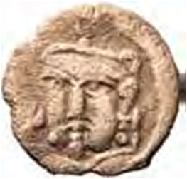

+ VII asrga
- V asrga
- VI asrga
- IV asrga

**95. Chochning markazi qaysi shahar bo’lgan?**

+ Choch shahri
- Varaxsha shahri
- Ayritom shahri
- Tunkat shahri

**96. Ilk o‘rta asrlarda Movorounnahrda mustaqil hokimliklar orasida eng yirigi qaysi edi?**

- Eloq dehqonlari
- Choch tudunlari
+ Sug‘d ixshidlari
- Farg‘ona ixshidlari

**97. Qaysi hududning tangalarida hukmdorga yonma-yon malika tasviri ham chekilgan?**

- Farg’onaning
+ Chochning
- So’g’dning
- Eloqning

**98. “Xvatun” bu … .**

- Hukmdorning malikasi
- Xotun
- Vazirlik darajasiga ega ayol
+ Barcha javoblar to’g’ri

**99. Eloqning markazi qaysi shahar bo’lgan?**

- Choch shahri
- Varaxsha shahri
- Ayritom shahri
+ Tunkat shahri

**100. Toxariston nomi qaysi qabila nomidan olingan?**

+ Yuechjilar nomidan
- Toxarlar nomidan
- Saklar nomidan
- Massagetlar nomidan

## 8-§ VI–VII asrlarda madaniy hayot.

**101. Samarqand viloyatining Urgut tumani Sug‘ddagina emas, balki butun O‘rta Osiyoda qaysi dinning markazlaridan bo‘lgan?**

- Moniylikning
+ Nasroniylikning
- Zardushtiylikning
- Buddaviylikning

**102. Quyidagi qaysi yozuvlar qadimgi oromiy yozuvi asosida vujudga kelgan?**

- Baqtriya va Kushon yozuvi
- Toxar va Turk yozuvi
+ So‘g‘d va Xorazm yozuvlari
- Barcha javoblar to’g’ri

**103. Ilk o‘rta asrlar ganchkorlik san’atining nodir yodgorligi namunalari … topilmalari orqali tadqiq etilgan.**

+ Varaxsha 
- Choch
- Buxoro
- Afrosiyob

**104. Choch raqqoslari ijro etgan qaysi mashhur raqslar Xitoy a’yonlarini maftun etib, ularni hayratga solgan?**

- “Doira raqsi”, “Dutor raqsi”
+ “Choch raqsi”, “Doira raqsi”
- “Rubob raqsi”, “Choch raqsi”
- “Eloq raqsi”, “Rubob raqsi”

**105. Quyidagi rasmda tasvirlangan VI–VII asrlarga oid ganchkor Humo qushi tasviri qayerdan topilgan?**

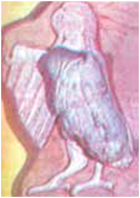

- Buxorodan
- Afrosiyobdan
- Poykanddan
+ Varaxshadan

**106. Ilk o’rta asrlarda quyidagi qaysi shaharlarning maydoni 20 gektardan oshmagan?**

- Varaxsha va Qoratepa
- Tuproqqal’a va Choch
+ Buxoro va Poykand
- Samarqand va Tuproqqal’a

**107. Turkiy run (ko‘kturk) xati nimalarga o‘yib yozishga nihoyatda qulay edi?**

- Metall va sopolga
+ Tosh va yog‘ochga
- Yog‘och va metallga
- Sopol va charmga

**108. Quyidagi qaysi din koinotni yo‘qlikdan bor qilgan Ko‘k Tangriga e’tiqod qiluvchi yakkaxudolik dini hisoblanadi?**

+ Qam (shomoniylik) dini
- Zardushtiylik dini
- Nasroniylik dini
- Moniylik dini

**109. Ilk o’rta asrlarda quyidagi qaysi shaharning umumiy maydoni qariyb 200 gektar bo‘lgan?**

- Varaxsha
- Buxoro
- Tuproqqal’a
+ Samarqand

**110. Ushbu devoriy tasvir qayerdan topilgan?**

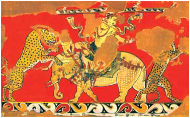

- Afrosiyobdan
+ Varaxshadan
- Chochdan
- Ayritomdan

**111. Qaysi o’lka Markaziy Osiyoda budda va moniylik dinlarini tarqalishi va rivojida muhim ahamiyat kasb etgan?**

- So’g’d
- Farg’ona
- Eloq
+ Toxariston

**112. Turklarning turkiy run (ko‘kturk) xati biri ikkinchisiga tutashib ketadigan nechta harflardan iborat edi?**

+ 38-40 harflardan
- 26-28 harflardan
- 28-30 harflardan
- 44-46 harflardan

**113. Ilk o‘rta asrlarda O‘rta Osiyoda xat, hujjat va ayrim axborotlar kabi maktubotlar asosan nimalarga yozilgan?**

+ Charmga, yog‘ochga, sopolga
- Sopolga, qog‘ozga, charmga
- Yog‘ochga, sopolga, toshga
- Charmga, toshga, qog‘ozga

**114. Ilk o‘rta asrlarda … qiziqchilari, … naychilari, … raqqos yigit va raqqosa qizlari bilan shuhrat topgan edi.**

- Toshkent/Buxoro/Samarqand
- Toshkent/Samarqand/ Buxoro
+ Buxoro/Samarqand/Toshkent
- Samarqand/Toshkent/Buxoro

**115. Qaysi din haykaltaroshlik rivojiga kuchli ta’sir ko‘rsatgan?**

- Nasroniylik dini
- Moniylik dini
- Zardushtiylik dini
+ Buddaviylik dini

**116. Quyidagi rasmdagi yozuv qaysi yozuv namunasi hisoblanadi?**

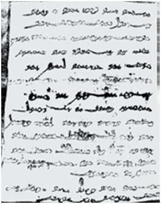

- Arab yozuvi
- Toxar yozuvi
+ So‘g‘d yozuvi
- Baqtriya yozuvi

**117. Qadimgi ko‘kturk bitiklari (Kultegin va Bilga xoqon bitiklari) qayerlardan topib o‘rganilgan?**

- Yettisuvdan
- Oltoy va Sharqiy Turkistondan
- Farg‘ona va Zarafshon vodiylaridan
+ Barcha javoblar to‘g‘ri

**118. VI–VII asrlarda O‘rta Osiyoda aholining ko‘pchiligi qaysi diniga e’tiqod qilgan?**

- Moniylik diniga
- Buddaviylik diniga
+ Zardushtiylik diniga
- Qam (shomoniylik) diniga

**119. Qaysi din ta’limoti bo‘yicha olamning ibtidosi ikki qarama-qarshi yaratuvchi – yorug‘lik va ezgulik hamda zulmat va yovuzlikdan iboratdir hamda ibodat, ro‘za, sadaqa dinning arkoni hisoblangan?**

+ Moniylik
- Buddaviylik
- Zardushtiylik
- Qam (shomoniylik)

**120. Nima sababdan qadimgi turklar o‘z dinini “qam” deb yuritganlar?**

- Bu so‘z “muqaddas” degan ma’nosini anglatgan
- Qam ismli payg‘ambar nomidan olingan
+ Ularda “shomon” degan so‘z bo‘lmagan
- “Qam” so‘zining ma’nosi “xudo” bo‘lgan

**121. Devoriy suratlar, haykallar va ganchkori naqshlar qaysi yodgorliklardan topib o’rganilgan?**

- Surxon vohasidagi Bolaliktepadan
- Farg’ona vodiysida Quva xarobalaridan
- Zarafshon vodiysida Panjikent, Varaxsha va Afrosiyobdan
+ Barcha javoblar to’g’ri

**122. Quyidagi qaysi yozuv Baqtriya yozuvi asosida shakllangan bo‘lib, 25 harfga ega bo‘lgan?**

- Kushon yozuvi
+ Toxar yozuvi
- So‘g‘d yozuvi
- Turk yozuvi

**123. Panjikent yaqinidagi Mug‘ qal’asida, Sharqiy Turkistondagi Turfan shahri yaqinida, Samarqandning qadimiy xarobasi Afrosiyobda qaysi yozuv namunalari saqlanib qolgan?**

- Turk yozuvi
+ So‘g‘d yozuvi
- Toxar yozuvi
- Baqtriya yozuvi

**124. Qayerdan topib o‘rganilgan budda haykalining bo‘yi 12 metrga boradi?**

- Zarafshon vodiysida Panjikentdan
- Surxon vohasida Bolaliktepadan
+ Qo‘rg‘ontepa yaqinidagi Ajinatepadan
- Farg‘ona vodiysida Quvadan

**125. So‘g‘dda o‘g‘il bolalar … yoshga to‘lgach, yozuv va hisobga o‘rgatilar, so‘ngra ular … yoshga kirganlarida savdo ishlarini o‘rganish uchun o‘zga mamlakatlarga jo‘natilar edi.**

- 6/14
- 8/25
- 6/30
+ 5/20

## 9-§ Movarounnahrda arab xalifaligining o‘rnatilishi.

**126. Qaysi yilda arablar tomonidan Choch vohasi bosib olinib, uning bosh shahri Madinat ash-Shosh va juda ko‘p qal’a va qo‘rg‘onlar hamda qishloqlarga o‘t qo‘yilib vayron etilgan?**

- 715-yilda
+ 713-yilda
- 714-yilda
- 716-yilda

**127. Qutayba Xorazmni qachon egallagan?**

- 709-yilda
- 712-yilda
- 710-yilda
+ 711-yilda

**128. Qutayba Naxshab va Keshni qachon bosib olgan?**

- 712-yilda
- 709-yilda
+ 710-yilda
- 711-yilda

**129. 710–737-yillarda Samarqandda kim hukmronlik qilgan?**

+ G‘urak
- Xoriyen
- Divashtich
- Oksiart

**130. Qaysi yilda Farg‘ona vodiysi Qutayba tomonidan uzil-kesil egallab olingan va u Koshg‘argacha kirib borgan?**

- 716-yilda
+ 715-yilda
- 713-yilda
- 714-yilda

**131. Qutayba qachon Buxoroni egallagan?**

- 712-yilda
+ 709-yilda
- 710-yilda
- 711-yilda

**132. Qaysi yilda Qutayba xalifa Sulaymonga qarshi isyon ko‘targani oqibatida Farg‘onada arab askarlari tomonidan o‘ldirilgan?**

- 716-yilda
+ 715-yilda
- 713-yilda
- 714-yilda

**133. Tarixshi olim Muhammad Narshaxiy qaysi yillarda yashagan?**

- 897–953-yillarda
+ 899–959-yillarda
- 894–956-yillarda
- 891–958-yillarda

**134. Ubaydulloh ibn Ziyod qaysi hudud hukmdorini yengib, o‘z foydasiga sulh tuzib, bir lak (yuz ming) dirham hajmida tovon undirgan?**

+ Buxoro hukmdorini
- Maymurg’ hukmdorini
- Chag’oniyon hukmdorini
- Choch hukmdorini

**135. Muhammad (s.a.v.) qayerda dunyoga kelgan?**

- Madina shahrida
+ Makka shahrida
- Yasrib shahrida
- Jidda shahrida

**136. Qachon Muhammad (s.a.v.) arablarni yagona davlatga birlashtirgan?**

+ 630-yilda
- 625-yilda
- 631-yilda
- 628-yilda

**137. Umaviylar sulolasining hukmronlik yillarini toping.**

- 750–964-yillar
- 630–665-yillar
- 644–750-yillar
+ 661–750-yillar

**138. Muhammad (s.a.v.) qaysi yillarda yashagan?**

- 574–630-yillarda
- 572–634-yillarda
+ 570–632-yillarda
- 576–638-yillarda

**139. Qutaybaga qaysi hudud hukmdori jangsiz taslim bo’lgan?**

- Samarqand hukmdori
- Buxoro hukmdori
- Poykand hukmdori
+ Chag‘oniyon hukmdori

**140. Qutayba harbiy yurishni qaysi yilda Balx viloyati atroflarini zabt etishdan boshlagan?**

- 673-yilda
- 668-yilda
- 675-yilda
+ 705-yilda

**141. Muhammad Narshaxiy qaysi tarixiy asarni yozib qoldirgan?**

- “Farg‘ona tarixi” asarini
+ “Buxoro tarixi” asarini
- “Samarqand tarixi” asarini
- “Choch tarixi” asarini

**142. Arablarning Movarounnahrga ilk hujumlari 654-yilda va 667-yilda qaysi hududlardan boshlangan?**

- Romiton va Poykand
- Poykand va Xuttalon
- Buxoro va Poykand
+ Maymurg‘ va Chag‘oniyon

**143. … (arabcha) – chek, taqsimlab berilgan yer, hukmdor tomonidan katta xizmatlari uchun in’om qilingan chek yer.**

- Xolisa
- Suyurg‘ol
- Vaqf
+ Iqto’

**144. Arablar bosqini davrida Xurosoning markazi qaysi shahar bo’lgan?**

+ Marv shahri
- Balx shahri
- Varaxsha shahri
- Poykand shahri

**145. Arabcha qaysi so’z “boshliq”, “hokim” ma’nosini anglatadi?**

- “Ixshid”
- “Xalifa”
- “Bek”
+ “Amir”

**146. “Islom” so’zining ma’nosi nima?**

- “E’tiqod qilish”, “bo‘ysunish”, “iymon keltirish”
- “O‘zini Alloh irodasiga topshirish”, “qabul qilish”, “e’tiqod qilish”
- “Itoat etish”, “o‘zini Alloh irodasiga topshirish”, “qabul qilish”
+ “Bo‘ysunish”, “itoat etish”, “o‘zini Alloh irodasiga topshirish”

**147. Qutayba Samarqandni qachon egallagan?**

- 710-yilda
- 709-yilda
+ 712-yilda
- 711-yilda

**148. Muhammad (s.a.v.) ning Otasining ismi kim bo‘lgan?**

- Abdulmutalib
+ Abdulloh
- Abu Bakr
- Ahmad

**149. Xalifa Abu Bakrning hukmronlik yillarini toping.**

- 656–662-yillar
- 644–656-yillar
+ 632–634-yillar
- 634–644-yillar

**150. “Movarounnahr” so’zining ma’nosi nima?**

- “Dunyoning narigi tomoni”
+ “Daryoning narigi tomoni”
- “Sahroning narigi tomoni”
- “Vodiyning narigi tomoni”

**151. Arablar davrida qaysi soliq idora ishlari uchun daromadning 1/10 hajmi hisobida olingan?**

- Zakot solig‘i
+ Ushr solig‘i
- Xiroj solig‘i
- Jizya solig‘i

**152. Arab xalifaligi qaysi yillarda mavjud bo’lgan?**

- 631–1262-yillarda
+ 632–1258-yillarda
- 628–1246-yillarda
- 630–1255-yillarda

**153. Arablar qachon Marv shahrini jangsiz egallaganlar?**

+ 651-yilda
- 650-yilda
- 648-yilda
- 649-yilda

**154. Muhammad Narshaxiy … Narshax qishlog‘ida tug‘ilgan.**

+ Buxoroning
- Samarqandning
- Farg‘onaning
- Chochning

**155. Qachon Muoviya I farmoni bilan Ubaydulloh ibn Ziyod Amudaryodan kechib o‘tib, Buxoro hududiga bostirib kirgan?**

+ 673-yilda
- 668-yilda
- 675-yilda
- 705-yilda

## 10-§ Movarounnahrda Islom dinining yoyilishi.

**156. Arablar tomonidan hosilning 1/3 qismi hajmida olinadigan yer solig‘i qanday atalgan?**

+ Xiroj
- Zakot
- Ushr
- Jizya

**157. Qutayba qaysi shahrining markazida joylashgan zardushtiylar ibodatxonasini jome masjidiga aylantirgan?**

- Varaxsha shahridagi
- Poykand shahridagi
+ Buxoro shahridagi
- Choch shahridagi

**158. Quyidagi qaysi shaharlar shahristoni yoki undagi xonadonlarning qoq yarmi arablar va ular bilan birga kelgan ajamlar (eronliklar) ga bo‘shatib berilgan?**

- Buxoro, Poykand, Choch va Chag‘oniyon
+ Marv, Poykand, Buxoro va Samarqand
- Choch, Binkat, Tunkat va Maymurg‘
- Afrosiyob, Varaxsha, Buxoro va Tunkat

**159. Arablar soliqlarni o‘z vaqtida to‘lamagan kishilarni qanday jazolashgan?**

- Mol-mulki musodara qilinib, qatl qilingan
+ Bo‘yiniga “qarzdor” deb yozilgan taxtacha osib qo‘yilgan
- Qarz miqdoriga teng muddatgacha jamoat ishlarida ishlatilgan
- Oilasi bilan qul qilib sotilgan

**160. Qaysi shahardagi budda ibodatxonasi haykallari arablar tomonidan parchalab tashlangan?**

+ Quva shahridagi
- Choch shahridagi
- Balx shahridagi
- Buxoro shahridagi

**161. Arablar tomonidan mol-mulkning 1/40 qismi hajmida olingan soliq qanday atalgan?**

- Xiroj
+ Zakot
- Ushr
- Jizya

**162. Quyidagi qaysi o’lkalar hukmdorlari arablar bilan sulh tuzishga majbur bo‘lgan va katta miqdorda boj-u tovonlar to‘lagan?**

- Choch, Chag‘oniyon, Poykand
- Samarqand, Poykand, Chag‘oniyon
+ Buxoro, Poykand, So‘g‘d
- Poykand, So‘g‘d, Maymurg‘

**163. Quyidagi qaysi shahardagi saroy devorlariga solingan suratlardagi odam rasmlarining ko‘zlari arablar tomonidan o‘yilib, bo‘yinlariga qilich bilan chizib yuborilgan?**

- Poykand shahridagi
- Buxoro shahridagi
- Quva shahridagi
+ Afrosiyob shahridagi

**164. Arablar islomni qabul qilmaganlardan qanday soliq olishgan?**

+ Jizya solig‘ini
- Ushr solig‘ini
- Xiroj solig‘ini
- Zakot solig‘ini

**165. Qutayba qaysi shaharda masjidga kelib ibodat qiluvchilar uchun 2 dirhamdan pul hadya etishni joriy etgan?**

- Choch shahrida
- Afrosiyob shahrida
+ Buxoro shahrida
- Poykand shahrida

## 11-§ Xalifalikka qarshi xalq noroziligi.

**166. Arablarga qarshi kurashayotgan sug‘dlik qo‘zg‘olonchilarga yordam berish uchun qayerdan turk lashkarlari kelgan?**

- Sharqiy Turkistondan
- Mo‘g‘ulistondan
+ Yettisuvdan
- Oloydan

**167. Muqanna qanday halok bo‘lgan?**

+ O‘zini yonib turgan tandirga tashlagan
- O‘zini qal’a devoridan tashlagan
- O‘zini daryoga tashlagan
- O‘zini minoradan tashlagan

**168. Oq kiyimlilar qo‘zg‘oloni rahbari bo‘lgan hunarmand Hoshim ibn Hakimni nima sababdan “Muqanna”, ya’ni “Niqobdor” laqabi bilan atashgan?**

- Boshi va yuziga oq parda tutib yurganligi uchun
+ Boshi va yuziga ko‘k parda tutib yurganligi uchun
- Boshi va yuziga qora parda tutib yurganligi uchun
- Boshi va yuziga sariq parda tutib yurganligi uchun

**169. Xurosonda 738–748-yillarda kim noiblik qilgan?**

- Hoshim
+ Nasr ibn Sayyor
- Ma’mun
- Ashros

**170. Nasr ibn Sayyorning moliya islohotiga ko‘ra, yer egasining e’tiqodidan qat’i nazar qaysi soliqni to‘lashi shart qilib qo‘yilgan?**

- Zakot solig‘ini
- Jizya solig‘ini
- Ushr solig‘ini
+ Xiroj solig‘ini

**171. Qachon “Oq kiyimlilar” qo‘zg‘oloniga zarba berish uchun xalifa Mansur katta harbiy kuchni Movarounnahrga safarbar qilgan?**

- 770-yilda
- 776-yilda
+ 775-yilda
- 778-yilda

**172. Qaysi Xuroson noibi Buxorxudotning qiziga uylangan?**

- Ashros
- Ma’mun
- Hoshim
+ Nasr ibn Sayyor

**173. Xurosonning qaysi noibi mamlakatda o‘z mavqeyini mustahkamlab olish maqsadida moliya islohoti o‘tkazgan?**

- Ma’mun
- Hoshim
+ Nasr ibn Sayyor
- Ashros

**174. Oq kiyimlilar bilar arablar o‘rtasidagi kurashning oxirgi bosqichi qayerda bo‘lib o‘tgan?**

- Zarafshon vodiysida
- Farg‘onda vodiysida
- Murg‘ob vodiysida
+ Kesh vodiysida

**175. Qaysi Xuroson noibi davrida barcha musulmonlar huquq jihatdan tenglashtirilgan?**

- Ashros davrida
- Hoshim davrida
- Ma’mun davrida
+ Nasr ibn Sayyor davrida

**176. Muqanna jаsоrаtigа bаg‘ishlаngаn “Muqаnnа” drаmаsining muallifi kim?**

- Abdulla Avloniy
- Said Ahmad
+ Hаmid Оlimjоn
- Sаdriddin Аyniy

**177. Nasr ibn Sayyorning moliya islohotiga ko‘ra, islomni yangi qabul qilgan kishilar qaysi soliqdan ozod etilgan?**

- Xiroj solig‘idan
- Zakot solig‘idan
+ Jizya solig‘idan
- Ushr solig‘idan

**178. Qayerda “Oq kiyimlilar” yengilgach, mahalliy mulkdor tabaqa vakillari arablarga yordam bera boshlaganlar?**

- Kesh va Quvada
- Choch va Buxoroda
- Eloq va Chochda
+ Narshax va Samarqandda

**179. Qaysi xalifa yangi yerlarni bundan buyon zabt etishni to‘xtatish hamda moliyaviy islohot o‘tkazish to‘g‘risida farmon bergan?**

- Abul Abbos Fattoh
- Marvon II
+ Umar ibn Abdulaziz
- Muoviya I

**180. Qachon Muqanna qarorgohi Som qal’asi arablar tomonidan ishg’ol qilingan?**

- 786-yilda
- 795-yilda
+ 783-yilda
- 784-yilda

**181. Qachon Sug‘d ixshidi G‘urak va Panjikent hokimi Divashtich boshchilida So‘g‘dda arablarga qarshi qo‘zg‘olon boshlangan?**

+ 720-yilda
- 715-yilda
- 719-yilda
- 727-yilda

**182. Arablarga qarshi kim boshchiligida ko‘tarilgan qo‘zg‘olon Samarqanddan boshlanib Shosh, Farg‘ona, Buxoro, Naxshab va Xorazmga tarqalgan?**

+ Rofe ibn Lays qo‘zg‘oloni
- Abu Muslim qo‘zg‘oloni
- Divashtich qo‘zg‘oloni
- G‘urak qo‘zg‘oloni

**183. Muqannanig qarorgohi Som qal’asi qayerda joylashgan edi?**

- Naxshab yaqinida
- Buxoro yaqinida
+ Kesh yaqinida
- Choch yaqinida

**184. Oq kiyimlilar qo’zg’oloni qaysi yillarda bo’lib o’tgan?**

+ 769-783-yillarda
- 759-784-yillarda
- 760-782-yillarda
- 772-795-yillarda

**185. “Oq kiyimlilar” ning yengilishiga sabab bo’lgan asosiy omilni toping.**

+ Qo‘zg‘olonchilarning uyushqoqlik bilan harakat qila olmaganligi
- Xalq harakatining ommalashib ketishidan cho‘chigan mahalliy mulkdorlar birin-ketin arablar tomoniga o‘tib ketganligi
- Qo‘zg‘olonning uzoq davom etganligi va mehnatkashlarni holdan toydirganligi 
- Barcha javoblar to‘g‘ri

**186. G‘urak va Divashtich boshchiligidagi qo’zg’olonchilarni tinchlantirish uchun Xurosonning qaysi noibi islom dinini qabul qilganlardan xiroj va jizya soliqlarini olmaslikka qaror qilgan?**

+ Ashros
- Ma’mun
- Hoshim
- Nasr ib Sayyor

**187. Qachon Samarqandda arab lashkarboshchisi Rofe ibn Lays boshchiligida xalifalikka qarshi qo‘zg‘olon ko‘tarilgan?**

- 812-yilda
+ 806-yilda
- 804-yilda
- 801-yilda

**188. Xalifa Umar ibn Abdulaziz davrida o’tkazilgan moliyaviy islohotga ko‘ra, musulmon arablar bilan bir qatorda islomni yangi qabul qilgan mahalliy xalqlardan qaysi soliqlarni olish bekor qilingan?**

+ Xiroj va jizya soliqlarini
- Zakot va jizya soliqlarini
- Ushr va xiroj soliqlarini
- Jizya va ushr soliqlarini

**189. Qaysi xalifa murakkab vaziyatni hisobga olib, bo‘ysundirilgan yerli xalqlar bilan kelishish siyosatini amalga oshirishga majbur bo‘lgan?**

- Marvon II
- Abul Abbos Fattoh
+ Umar ibn Abdulaziz
- Muoviya I

**190. Oq kiyimlilar qo‘zg‘oloni rahbari Hoshim ibn Hakim qayerda kichik lashkarboshidan vazirlik darajasigacha ko‘tarilgan?**

- Eronda
- Suriyada
- Movarounnahrda
+ Xurosonda

**191. “Muqаnnа isyoni” tаriхiy-аdаbiy оchеrki muallifi kim?**

+ Sаdriddin Аyniy
- Said Ahmad
- Hаmid Оlimjоn
- Abdulla Avloniy

**192. Qaysi Xuroson noibi Rofe ibn Lays qo‘zg‘olonini bostirishda Somonxudotning nabiralari: Nuh, Ahmad va Yahyolardan yordam so‘ragan?**

- Hoshim
- Nasr ibn Sayyor
- Ashros
+ Ma’mun

## 12-§ Abbosiylar davrida Xuroson va Movarounnahr.

**193. Abbosiylar Abu Muslimni poytaxtdan uzoqlashtirish uchun qayerga noib qilib yuborganlar?**

- So‘g‘diyona va Eronga
- Movarounnahr va Toxaristonga
- Eron va Xurosonga 
+ Xuroson va Movarounnahrga

**194. Qachon xalifalik poytaxti Damashqdan Bag’dodga ko’chirilgan?**

- 748-yilda
- 754-yilda
- 750-yilda
+ 749-yilda

**195. So’nggi Umaviy xalifa kim?**

- Muoviya III
- Sulaymon II
- Marvon I
+ Marvon II

**196. Arab xalifaligida kim harbiy ishlar uchun mas’ul bo‘lgan?**

- Vazir ul-vuzaro
+ Amir ul-umaro
- Vazir al-devoniy
- Amir al-kashshof

**197. Arab xalifaligida Devon ad-dar nechta asosiy devonga bo‘lingan?**

+ 3 devonga
- 5 devonga
- 4 devonga
- 2 devonga

**198. Abbosiylardan bo’lgan ilk xalifa Abul Abbos Saffohning hukmronlik yillarini toping.**

- 751-759-yillar
+ 750-754-yillar
- 748-761-yillar
- 749-755-yillar

**199. Qachon abbosiylarga qarshi Buxoroda qo‘zg‘olon ko‘tarilgan?**

- 753-yilda
- 755-yilda
- 751-yilda
+ 750-yilda

**200. Qaysi xalifa davrida Umaviylarga qarshi umumiy norozilik nihoyatda kuchaygan?**

- Muoviya III
- Sulaymon II
+ Marvon II
- Marvon I

**201. Xalifa Marvon II (744–750) davrida Umaviylarga qarshi umumiy norozilik nihoyatda kuchayishining sababini toping.**

+ Xiroj solig‘i miqdorining oshirib yuborilgani hamda aholining muttasil hasharlarga majburan jalb etilishi
- Aholining muttasil hasharlarga majburan jalb etilishi
- Juzya solig‘i miqdorining oshirib yuborilgani
- Barcha javoblar to’g’ri

**202. Qaysi yilda Abu Muslim aholini umaviylarga qarshi kurashga da’vat etgan?**

+ 747-yilda
- 750-yilda
- 748-yilda
- 745-yilda

**203. Qachon Abu Muslim tomonidan yuborilgan harbiy kuch Turkistonga bostirib kirgan Xitoy qo’shinlariga zarba berib, ularni mamlakat hududidan quvib chiqargan?**

- 750-yilda
+ 751-yilda
- 753-yilda
- 752-yilda

**204. Arab xalifaligida Movarounnahrga tegishli masalalar qaysi devonda hal qilinar edi?**

- Devon al-xarajda
- Devon al-tujjolda
+ Devon al-mashriqda
- Devon al-mag‘ribda

**205. Abu Muslim qo’zg’oloni davrida xalifalikning poytaxti qaysi shahar bo`lgan?**

- Makka shahri
- Madina shahri
+ Damashq shahri
- Bag’dod shahri

**206. Qachon qurolsiz va yolg‘iz saroyga tashrif buyurgan Abu Muslim xalifa buyrug‘iga binoan o‘ldirilgan?**

- 752-yilda
- 751-yilda
- 753-yilda
+ 755-yilda

**207. Xalifalik taxti uchun kurash boshlagan Muhammad payg‘ambar (s.a.v.) ning amakisi Abbosning evarasi Muhammad ibn Ali Umaviylarni nimada ayblagan edi?**

+ Muhammad (s.a.v.) avlodini qirib tashlashda
- Davlat mulkini talon-taroj qilishda
- Bosib olingan xalqlarni arablar bilan huquqiy jihatdan tenglashtirishda
- Qo’zg’olonlar ko’tarilishi va davlatni zaiflashishida

**208. Qayerda Abu Muslim tomonidan yuborilgan harbiy kuch Turkistonga bostirib kirgan Xitoy qo’shinlariga zarba berib, ularni mamlakat hududidan quvib chiqargan?**

- Zarafshon vodiysida
+ Talos vodiysida
- Kesh vodiysida
- Farg’ona vodiysida

**209. Umaviylarga qarshi kurashga da’vat qilish uchun kufalik Abu Muslim qayerga yuborilgan?**

- Toxaristonga
+ Xurosonga
- Eronga
- Movarounnahrga

**210. Arab xalifaligida ulug’ vazir qanday atalgan?**

- Amir ul-umaro
+ Vazir ul-vuzaro
- Vazir al-devoniy
- Amir al-kashshof

## 13-§ Qarluqlar, O‘g‘uzlar, Tohiriylar.

**211. Safforiylar davlati asoschisi kim?**

- Rofe ibn Lays as-Saffor
- Amr ibn Lays as-Saffor
+ Ya’qub ibn Lays as-Saffor
- Yahyo ibn Lays as-Saffor

**212. Xalifa Ma’mun Somonxudotning nabiralaridan Yahyoni qayerga noib qilib tayinlagan?**

- Farg‘ona va Keshga
- Balx va Marvga
+ Shosh va Ustrushona
- Samarqand va Narshaxga

**213. Tohir ibn Husayn qaysi viloyatning zodagonlaridan edi?**

- Mo’ltonning
- Movarounnahrning
- Xurosonning
+ Hirotning

**214. Qaysi davlat shimol va sharqdan Elsuvi daryosi vodiysigacha, chigil qabilasi yaylovlarigacha; g‘arbdan o‘g‘uz yurti va Farg‘ona vodiysi; janubda esa yag‘molar vohasi va Sharqiy Turkiston bilan chegaralangan edi?**

+ Qarluqlar davlati
- Toxiriylar davlati
- O‘g‘uzlar davlati
- Somoniylar davlati

**215. Tohirning o’g’li Abul Abbos Abdulloh (830–844) poytaxtni Marvdan qaysi shaharga ko’chirgan?**

+ Nishopurga
- Rayga
- Balxga
- Hirotga

**216. Tohir ibn Husayn vafotidan keyin o‘g‘illari … va … otasining o‘rniga birin-ketin noiblik qilganlar.**

- Abul Abbos Saffoh/Talxa
- Ahmad/Nuh
+ Talxa/Abul Abbos Abdulloh
- Abul Abbos Abdulloh/Yahyo

**217. Qachon Qarluqlar davlati tashkil topgan?**

- IX asr boshlarida
- VIII asr oxirlarida
+ VIII asr o‘rtalarida
- VIII asr boshlarida

**218. Xalifa Horun ar-Rashidning hukmronlik yillarini toping.**

- 780-802-yillar
+ 786-809-yillar
- 783-807-yillar
- 788-811-yillar

**219. Safforiylar davlatida 873-879-yillarda kim hukmronlik qilgan?**

- Rofe ibn Lays
- Amr ibn Lays
+ Ya’qub ibn Lays
- Yahyo ibn Lays

**220. Qachon o‘g‘uzlar islom dinini qabul qilganlar?**

- VIII asrda
- XI asrda
- IX asrda
+ X asrda

**221. Qarluqlar davlati hukmdori nima deb yuritilgan?**

- “Elshoh” yoki “malikshoh”
- “Tudun” yoki “budun”
+ “Yabg‘u” yoki “jabg‘u”
- “Xon” yoki “qoon”

**222. Qipchoqlar tomonidan qaqshatqich zarbaga uchrab, bo‘linib ketgan o‘g‘uzlarning birinchi qismi … .**

- Qipchoqlarga qaram bo‘lib, ko‘p yillar ularga tovon to‘lashgan
+ Shimoliy Kavkaz dashtlariga borib o‘rnashgan
- Avval Movarounnahrga kirib borgan va undan janubi-g‘arbga siljib, yangi sulola – saljuqiylar boshchiligida Old Osiyo mamlakatlarini istilo qilishga kirishgan
- Sirdaryoning quyi qismiga borib, keyinchalik Sharqiy Yevropa hududlariga ko‘chib ketishgan

**223. Xalifa Ma’mun Somonxudotning nabiralaridan Ahmadni qayerga noib qilib tayinlagan?**

- Ustrushonaga
- Samarqandga
+ Farg‘onaga
- Balxga

**224. Qaysi so’z haq din uchun kurashuvchi jangchi ma’nosini anglatadi?**

- “Safforiy”
+ “G‘oziy”
- “Sarbador”
- “Jihotchi”

**225. Xalifa Ma’mun Somonxudotning nabiralaridan Ilyosni qayerga noib qilib tayinlagan?**

- Samarqandga
+ Hirotga
- Farg‘onaga
- Balxga

**226. X asrda qarluqlar Movarounnahrning shimoliy hududlarini egallagach qaysi hududlarga o’rnashganlar?**

- Sirdaryoning quyi qismi, Zarafshon, Farg‘ona vodiylariga
- Farg’ona vodiysi, Yettisuv o’lkasi, Sirdaryoning quyi qismiga
+ Shosh atrofi, Farg‘ona, Zarafshon vodiylariga
- Talos, Farg’ona vodiysi, Shosh atrofiga

**227. Qarluqlar davlati poytaxti qaysi shahar bo’lgan?**

- Sirdaryodan sharqda joylashgan Karmankat shahri
+ Chu daryosidan shimolroqdagi Suyob shahri
- Kama daryosidan shimolroqdagi Navkat shahri
- Irtish daryosidan janubroqdagi Jo‘l shahri

**228. Qayerda Qarluqlar davlati tashkil topgan?**

+ Yettisuvda
- Oltoyning g‘arbida
- Sharqiy Turkistonda
- Irtish daryosining o‘rta oqimida

**229. Xalifa Ma’mun Somonxudotning nabiralaridan Nuhni qayerga noib qilib tayinlagan?**

- Shoshga
+ Samarqandga
- Farg‘onaga
- Hirotga

**230. Qaysi yillarda xalifa Horun ar-Rashidning o‘g‘illari Ma’mun bilan Amin o‘rtasida taxt uchun kurash bo‘lib o‘tgan?**

+ 809-813-yillarda
- 811-815-yillarda
- 807-816-yillarda
- 802-808-yillarda

**231. Xalifa Ma’mun qachon Tohir ibn Husaynni Xuroson va Movarounnahr noibi etib tayinlagan?**

- 819-yilda
- 822-yilda
+ 821-yilda
- 820-yilda

**232. Qarluqlar chetga asosan qaysi mahsulotlarni chiqarganlar?**

- Teri, zargarlik, kandakorlik mahsulotlari
- Temir, mis, oltin buyumlar
- Sut, go’sht, baliq
+ Gilam, sholcha, namat

**233. Qaysi davlatda Jo‘l, Navkat, Karmankat, Yor kabi shaharlar va qator qishloqlar qad ko‘targan edi?**

- Toxiriylar davlatida
+ Qarluqlar davlatida
- O‘g‘uzlar davlatida
- Somoniylar davlatida

**234. Qachon O‘g‘uzlar davlati shimoli sharqdan qo‘zg‘algan qipchoqlar tomonidan qaqshatqich zarbaga uchrab, bo‘linib ketganlar?**

- X asrning ikkinchi choragida
+ X asrning birinchi choragida
- XI asrning ikkinchi choragida
- XI asrning birinchi choragida

**235. Qachon Tohir ibn Husayn davlat ishlarini mustaqil idora etish maqsadida xalifa nomini xutbadan chiqartirib yuborgan?**

- 819-yilda
- 820-yilda
- 821-yilda
+ 822-yilda

**236. Qipchoqlar tomonidan qaqshatqich zarbaga uchrab, bo‘linib ketgan o‘g‘uzlarning ikkinchi qismi … .**

- Shimoliy Kavkaz dashtlariga borib o‘rnashgan
- Qipchoqlarga qaram bo‘lib, ko‘p yillar ularga tovon to‘lashgan
+ Avval Movarounnahrga kirib borgan va undan janubi-g‘arbga siljib, yangi sulola – saljuqiylar boshchiligida Old Osiyo mamlakatlarini istilo qilishga kirishgan
- Sirdaryoning quyi qismiga borib, keyinchalik Sharqiy Yevropa hududlariga ko‘chib ketishgan

**237. Tohiriylarga qarshi ko’tarilgan qo’zg’olon boshliqlari aka-uka Ya’qub va Amr ibn Layslarning kasbi nima edi?**

- Tunikachi
- Zargar
- Duradgor
+ Miskar

**238. “Ular Sirdaryo havzasi hamda Orol dengizi bo‘yida muqim o’rnashib olganlar, IX asr oxiri va X asr boshida o’z davlatiga asos solganlar”. Yuqorida qaysi davlatga izoh berilgan?**

- Qarluqlar davlatiga
+ O‘g‘uzlar davlatiga
- Toxiriylar davlatiga
- Saljuqiylar davlatiga

**239. Qarluqlar qadimda qayerda yashaganlar?**

- Sharqiy Turkistonda
- Irtish daryosining o‘rta oqimida
- Yettisuvda
+ Oltoyning g‘arbida

**240. Qarluqlar qaysi xalqlarning etnogenezida muhim rol o‘ynagan?**

- Qirg‘iz, qozoqlarning
+ O‘zbek, tojiklarning
- Turk, ozarbayjonlarning
- Turkman, qoraqalpoqlarning

**241. O‘g‘uzlar qaysi xalqlarning etnogenezida muhim rol o‘ynagan?**

- O‘zbek, turkman va tojiklarning
- Qirg‘iz, qozoq, turkmanlarning
+ Turkman, ozarbayjon, qoraqalpoqlarning
- Arman, gruzin, ozarbayjonlarning

**242. Sirdaryo quyi oqimi bo‘yidagi Yangikent shahri qaysi davlatning poytaxti bo‘lgan?**

- Qarluqlar davlatining
+ O‘g‘uzlar davlatining
- Toxiriylar davlatining
- Saljuqiylar davlatining

**243. Qachon Ma’mun Tohir ibn Husayn boshliq Xuroson va Movarounnahr mulkdorlari yordamida xalifalik taxtini egallagan?**

+ 813-yilda
- 808-yilda
- 816-yilda
- 815-yilda

**244. Qachon qarluqlarning kattagina qismi musulmon bo‘lgan?**

- IX asr o‘rtalarida
+ X asr o‘rtalarida
- XI asr oxirlarida
- X asr boshlarida

**245. Safforiylar davlatida 879-900-yillarda kim hukmronlik qilgan?**

- Yahyo ibn Lays
- Rofe ibn Lays
+ Amr ibn Lays
- Ya’qub ibn Lays

**246. Qachon tohiriylar hukmronligi tugatilib, hokimiyat safforiylar qo‘liga o‘tgan?**

- 872-yilda
- 869-yilda
- 876-yilda
+ 873-yilda

## 14-§ Somoniylar.

**247. Narshaxiyning yozishicha, somoniylar davlati asosan nechta devon orqali idora etilgan?**

- Beshta devon orqali
+ O‘nta devon orqali
- O‘n ikkita devon orqali
- Sakkizta devon orqali

**248. “Hojib”, “hojib ul-hujob”, “hojibi ul-buzruk” kabi harbiy lavozimlar qaysi davlatda bo‘lgan?**

- Qarluqlar davlatida
- O‘g‘uzlar davlatida
- Toxiriylar davlatida
+ Somoniylar davlatida

**249. Qaysi somoniy hukmdor davrida Buxoroning Registon maydonida amir qasri qarshisida devonlar uchun saroy qurilib, mahkama mana shu maxsus binoga joylashgan edi?**

- Ismoil
+ Nasr II
- Nasr
- Ahmad

**250. Suratdagi Buxoroda joylashgan Ismoil Somoniy maqbarasi qaysi asrga oid?**

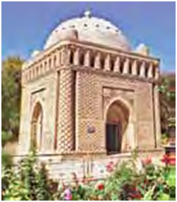

- XI asrga
- XII asrga
+ X asrga
- IX asrga

**251. Qachon Movarounnahrning deyarli barcha viloyatlari somoniylar tasarrufiga o‘tgan?**

- IX asrning birinchi choragida
+ IX asrning oxirgi choragida
- X asrning oxirgi choragida
- IX asrning ikkinchi choragida

**252. Qaysi somoniy hukmdor kumush dirham zarb etgan?**

+ Nasr
- Ahmad
- Nuh
- Ismoil

**253. Qachon Ismoil Somoniy butun Movarounnahrni o‘z qo‘l ostida birlashtirgan?**

- 887-yilda
+ 888-yilda
- 889-yilda
- 893-yilda

**254. Somoniy hukmdor Ahmad qachon vafot etgan?**

- 875-yilda
- 856-yilda
- 872-yilda
+ 865-yilda

**255. O‘rta Osiyodagi ilk ilmgoh  - Farjak madrasasi qachon va qayerda qurilgan?**

- X asrda Samarqandda
+ X asrda Buxoroda
- IX asrda Balxda
- IX asrda Hirotda

**256. Somoniylar davlatida qaysi devon bosh boshqaruv mahkamasi hisoblangan?**

- Amir devoni
+ Vazir devoni
- Hojib devoni
- Buzruk devoni

**257. Qachon Amr ibn Lays va Ismoil Somoniy o’rtasida urush chiqqan?**

- 905-yilda
+ 900-yilda
- 902-yilda
- 898-yilda

**258. 914-943-yillarda qaysi somoniy hukmdor hukmronlik qilgan?**

+ Nasr II
- Nasr
- Ahmad
- Ismoil

**259. Somoniylar davlati hukmronlik qilgan davrni to’g’ri ko’rsating.**

- 893–1009-yillar
+ 865–999-yillar
- 861–994-yillar
- 888–1002-yillar

**260. Qaysi somoniy hukmdor saroyning maxsus, muntazam sarbozlaridan iborat yaxshi qurollangan harbiy qo‘shin tuzgan?**

+ Ismoil
- Ahmad
- Nuh
- Nasr

**261. Qaysi somoniy hukmdor Samarqandni markazga aylantirgan va Movarounnahrning barcha viloyatlarini birlashtirish va uni Xurosondan ajratib olish choralarini ko‘rgan?**

- Ismoil
- Nuh
- Ahmad
+ Nasr

**262. Islom olamida din olimlari nima deb atalgan?**

+ “Ulamo”
- “Shayx”
- “Ustod”
- “Xatib”

**263. “Madrasa” so’zi arabchada qanday ma’noni anglatadi?**

- “Savod chiqarmoq”
- “Ilm olmoq”
- “O‘qimoq”
+ “O‘rganmoq”

**264. “Xonaqoh” nima?**

+ G‘aribxona, musofirxona
- Maktab, ilmxona
- Xattotlar uyi, kutubxona
- Olimlar dargohi, rasadxona

**265. Qaysi xalifa safforiylar hukmdori Amr ibn Laysga Xuroson bilan birga Movarounnahr ustidan ham hukm yuritish huquqi berilgani haqida farmon chiqargan va uni Ismoilga qarshi gijgijlagan?**

- Ma’mun II
- Horun III
+ Mu’tazid
- Ma’sud

**266. Qachon Ismoil Somoniy Taroz shahrini zabt etib, dashtliklarga qaqshatqich zarba bergan?**

- 887-yilda
- 888-yilda
- 889-yilda
+ 893-yilda

**267. Ismoil Somoniy qaysi shaharni Movarounnahr va Xurosonning poytaxtiga aylantirgan?**

+ Buxoro shahrini
- Shosh shahrini
- Afrosiyob shahrini
- Samarqand shahrini

## 15-§ Somoniylar davrida ijtimoiy-iqtisodiy hayot.

**268. IX-X asrlarda qanday tangalar faqat hukumat boshlig‘i nomidan Marv, Samarqand, Buxoro va Shoshda davlat zarbxonalarida so‘qilar edi?**

+ Kumush tanga – dirhamlar
- Mis tanga – “fals” lar
- Oltin tanga – dinolar
- Barcha javoblar to’g’ri

**269. Somoniylar davrida hukmron sulola vakillari, mulkdor dehqon va aslzodalarning tasarrufidagi katta-katta yer maydonlaridan tortib mehnatkash qishloq aholisiga tegishli mayda xususiy yerlargacha qanday nom bilan atalgan?**

- “Vaqf yerlari”
- “Mulki sultoniy”
+ “Mulk yerlari”
- “Mulki xos”

**270. IX–X asrlarda Movarounnahr va Xorazm aholisining asosiy qismi nima bilan shug‘ullanar edi?**

+ Sug‘orma dehqonchilik
- Hunarmandchilik
- Chorvachilik
- Savdo-sotiq

**271. Qaysi yili somoniylar og’ir moliyaviy ahvoldan chiqish uchun aholidan ikki marta soliq undirib olishgan?**

- 952-yilda
+ 942-yilda
- 961-yilda
- 947-yilda

**272. Qachon Nuh ibn Nasrning amakisi Ibrohim isyon ko‘tarib, saroy sarbozlari va Chag‘oniyonning yirik yer-mulk egasi Abu Ali Chag‘oniy yordamida Buxoro taxtini egallab olgan?**

- 952-yilda
- 942-yilda
- 961-yilda
+ 947-yilda

**273. IX–X asrlarda qayer ko‘nchilik mahsulotlari va charm mollari bilan mashhur edi?**

+ Shosh
- Eloq
- Buxoro
- Samarqand

**274. IX–X asrlarda “barzikor” yoki “qo‘shchilar” nima bilan shug`ullangan?**

- Davlat qo’shinida askar sifatida xizmat qilishgan
- Yirik dehqonlarga askar sifatida xizmat qilishgan
- Chorvachilik bilan shug’ullanishgan
+ Yerlarni ijaraga olib ishlaganlar

**275. Somoniylar davrida dehqonchilik solig’i nima deb atalgan?**

+ Xiroj
- Ushr
- Jizya
- Zakot

**276. … - o‘rtа аsrlаrdа аrаblаrning mustаhkаmlаngаn qаrоrgоhi. Dаstlаb g‘оziylаrgа mo‘ljаllаb qurilgаn mахsus binо. Kеyinchаlik fаqаt qo‘rg‘оn, istеhkоm mа’nоsidаginа emаs, bаlki mеhmоnхоnа (kаrvоnsаrоy) mаzmunidа hаm tushunilgаn.**

- Qal’a
- Shahriston
- Ark
+ Rabot

**277. IX–X asrlarda qayer kumush va qo‘rg‘oshin konlari hamda kumush tanga chiqaradigan zarbxonasi bilan mashhur edi?**

- Samarqand
- Shosh
+ Eloq
- Buxoro

**278. Somoniylar davrida oliy martabali ruhoniylar va sayyidlar qo‘l ostidagi yerlar qanday atalgan?**

- “Vaqf yerlari”
- “Mulki sultoniy”
- “Mulk yerlari”
+ “Mulki xos”

**279. Somoniylar davrida masjid xonaqoh va madrasalarga vaqtincha yoki abadiy foydalanish uchun berilgan yerlar qanday atalgan?**

- “Mulki xos”
+ “Vaqf yerlari”
- “Mulki sultoniy”
- “Mulk yerlari”

**280. Somoniylar davrida qaysi yilda Buxoro harbiy askarlarining g‘alayoni ko‘tarilgan va qo‘zg‘olonchilar amir saroyini talab, unga o‘t qo‘yib yuborganlar?**

- 952-yilda         
- 942-yilda
+ 961-yilda
- 947-yilda

**281. Qayerga IX-X asrlarda Movarounnahr va Xorazmdan guruch, quruq mevalar, shirinliklar, tuzlangan baliq, paxta, shoyi matolar, movut, kimxob va gilamlar olib borib sotilgan?**

- Xitoy, Sibir va Itilga
- Sibir, Xazar va Rusga
+ Itil, Xazar va Bulg‘orga
- Mo‘g‘uliston va Xitoyga

**282. “Vadoriy” nomli mato tayyorlanadigan Vador qishlog‘i qayerda joylashgan edi?**

- Shoshda
+ Samarqandda
- Buxoroda
- Eloqda

**283. Qachon Ibrohim Abu Ali Chag‘oniyni avval Chag‘oniyonga, so‘ngra Xurosonga hokim qilib tayinlashga majbur bo‘lgan?**

+ 952-yilda
- 942-yilda
- 961-yilda
- 947-yilda

**284. Qayerdan IX-X asrlarda Movarounnahr va Xorazmga qimmatbaho mo‘ynalar, shamlar, cho‘qqi qalpoqlar keltirilgan?**

- Kavkaz va Bulg‘ordan
- Mo’g’uliston va Xitoydan
- Rus va Dashti Qipchoqdan
+ Bulg‘or va Xazardan

**285. X asrda yirik mansabdorlarning davlat oldidagi xizmati uchun taqdim etilgan yer va suv, bazida ayrim viloyat yoki shaharlar va tumanlar hadya etilgan mulklar qanday atalgan?**

+ “Iqto”
- “Xolisa”
- “Mulki xos”
- “Jamoa yerlari”

**286. IX–X asrlarda qayerda qayiqsozlik taraqqiy topgan?**

- Buxoroda
+ Xorazmda
- Eloqda
- Samarqandda

**287. IX–X asrlarda qayerda yuqori navli qog‘oz ishlab chiqarilar edi?**

- Shoshda
- Eloqda
- Buxoroda
+ Samarqandda

**288. Mallarang bo‘z “zandanachi” to‘qiladigan Zandana qishlog‘i qayerda joylashgan edi?**

- Eloqda
- Shoshda
- Samarqandda
+ Buxoroda

**289. Somoniylar hukmronligi davrida yer egaligining nechta shakli bo’lgan?**

+ 5 ta
- 4 ta
- 2 ta
- 3 ta

**290. Somoniylar davridagi quyidagi qaysi yerga egalik shakli davlat tasarrufidagi yerlar hisoblangan?**

- “Mulk yerlari”
- “Mulki xos”
- “Vaqf yerlari”
+ “Mulki sultoniy”

**291. Suratdagi 961–962-yillarga oid somoniy Abdulmalik bin Nuh tangasi qayerdan topilgan?**

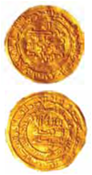

- Buxoro
- Balx
+ Samarqand
- Marv

**292. “Chek” so’zi qaysi tildan olingan?**

- Arab tilidan
+ Fors tilidan
- So’g’d tilidan
- Turkiy tildan

## 16-§ G‘aznaviylar.

**293. Qaysi hukmdor davrida G‘aznaviylarning siyosiy nufuzi ortib, somoniylar tomonidan e’tirof etilgan?**

+ Sobuqtegin davrida
- Alptegin davrida
- Mas’ud G‘aznaviy davrida
- Mahmud G‘aznaviy davrida

**294. G’aznaviylar davlatida shaharlar boshqaruv ishlari kim tomonidan amalga oshirilgan?**

+ Kutvol
- Rais
- Voliy
- Amid

**295. G’aznaviylar davlatida shahar hokimi nima deb yuritilgan?**

- Kutvol
- Amid
- Voliy
+ Rais

**296. Qachon G‘aznaviylar davlati butunlay tugatilgan?**

- 1195-yilda
- 1188-yilda
+ 1186-yilda
- 1180-yilda

**297. G’aznaviylar davlatida viloyatda boshqaruv ishlari bilan kim shug’ullangan?**

- Voliy
+ Amid
- Kutvol
- Rais

**298. Alptegin qaysi viloyatlarini mustaqil idora etishga intilib, G‘aznaviylar davlatiga asos solgan?**

- G‘azna va Chag‘oniyonni
- G‘azna va Hirotni
+ G‘azna va Kobulni
- Kobul va Hirotni

**299. Qaysi g’aznaviy hukmdor turkiy ona tili bilan bir qatorda fors, arab va pahlaviy tillarini ham mukammal bilgan, she’r bitgan?**

- Sobuqtegin
- Alptegin
- Mas’ud G‘aznaviy
+ Mahmud G‘aznaviy

**300. Qaysi Ga’znaviy hukmdor davrida mamlakat viloyatlari birin-ketin qo‘ldan chiqarilib, tanazzulga yuz tutgan?**

- Sobuqtegin davrida
- Alptegin davrida
+ Mas’ud G‘aznaviy davrida
- Mahmud G‘aznaviy davrida

**301. Quyidagi qaysi davlat qo’shinida harbiy kemalar (daryo va dengiz floti) ham mavjud bo‘lgan?**

- Safforiylar davlatida
- Tohiriylar davlatida
- Somoniylar davlatida
+ G’aznaviylar davlatida

**302. Kim Mahmud G‘aznaviyga mashhur “Shohnoma” dostonini taqdim etgan?**

- Gardiyziy
- Bayhaqiy
+ Firdavsiy
- Beruniy

**303. Mahmud G‘aznaviy qachon Xorazmni o‘z davlati tarkibiga qo‘shib olgan?**

- 1022-yilda
- 1018-yilda
- 1015-yilda
+ 1017-yilda

**304. “Tarixi Ma’sudiy” asari muallifi kim?**

- Gardiyziy
+ Bayhaqiy
- Firdavsiy
- Beruniy

**305. Kim 962–963-yillarda G‘azna viloyatini noib va lashkar amiri sifatida boshqargan?**

- Mahmud
- Mas’ud
+ Alptegin
- Sobuqtegin

**306. G’aznaviylar davlatida viloyat hukmdori nima deb atalgan?**

- Kutvol
- Amid
+ Voliy
- Rais

**307. Ga’znaviylar poytaxti G’azna saroyida qancha olim, shoir va san’atkorlar ijod qilgan?**

- 700 dan ortiq
- 500 dan ortiq
- 600 dan ortiq
+ 400 dan ortiq

**308. “Qonuni Ma’sudiy” asari muallifi kim?**

- Gardiyziy
- Bayhaqiy
- Firdavsiy
+ Beruniy

## 17-§ Qoraxoniylar.

**309. Qachon “dehqon” degan tushuncha o‘zining “qishloq hokimi” ni anglatuvchi asl ma’nosini yo‘qotgan?**

- XII–XIII asrlarda
- X–XI asrlarda
- IX–X asrlarda
+ XI–XII asrlarda

**310. Qachon Xoqoniya rivoj topib kuchaygach, u “Qarluq-Qoraxoniylar” davlati nomini olgan?**

+ XI–XII asrlarda
- IX–X asrlarda
- X–XI asrlarda
- XII–XIII asrlarda

**311. Qachon qoraxitoylar Xo‘jand shahri yaqinida qoraxoniylarning eloqxoni Mahmudga qaqshatqich zarba berganlar?**

- 1136-yilda
+ 1137-yilda
- 1139-yilda
- 1141-yilda

**312. Qarluq-Qoraxoniylar hukmdorlari qanday nom bilan atalgan?**

- “Arslonxon”
- “Bug‘roxon”
- “Tavg‘achxon”
+ Barcha javoblar to’g’ri

**313. Qoraxoniylarda eloqxon yoki takin (yoki tegin) qanday vazifani bajargan?**

- Lashkarboshi vazifasini
- Vazir vazifasini
+ Viloyat hokimi vazifasini
- Shahar hokimi vazifasini

**314. Qoraxoniylar davlati dastlab qanday atalgan?**

- “Yabg‘uxon o‘lkasi”
+ “Xoqoniya o‘lkasi”
- “Jabg‘uxon o‘lkasi”
- “Qoraxoniya o‘lkasi”

**315. Buyuklik yoki ulug‘lik qadimda turkiy xalqlarda qaysi so‘zi bilan sifatlangan?**

- “Tudun”
- “Qam”
- “Ko’k”
+ “Qora”

**316. Sharqiy Qoraxoniylar davlati poytaxti qaysi shahar bo’lgan?**

- Yettisuv
+ Bolasog‘un
- Buxoro
- Samarqand

**317. Qachon qoraxoniylar Movarounnahr tomon ikkinchi marta hujum boshlaganlar?**

- 989-yilda
- 992-yilda
- 994-yilda
+ 996-yilda

**318. Qoraxoniylar davlati asoschisi Abdulkarim Sotuk Bug‘roxonning hayot yillarini toping.**

- 850–948-yillar
- 852–951-yillar
- 863–949-yillar
+ 859–955-yillar

**319. Qachon Qoraxoniylar davlati tugatilgan?**

- 1136-yilda
- 1137-yilda
- 1139-yilda
+ 1141-yilda

**320. Kim qoraxoniylarga qarshi kurashib, Xurosonni o‘z davlati tasarrufida saqlab qolishga muvaffaq bo‘lgan?**

- Sobuqtegin
- Alptegin
- Mas’ud G‘aznaviy
+ Mahmud G‘aznaviy

**321. Raboti Malik, Masjidi kalon, Minorai kalon, Vobkent minorasi, Jarqo‘rg‘on minorasi, Mag‘oki attori masjidi qaysi sulola davrida qurilgan?**

+ Qoraxoniylar davrida
- G‘aznaviylar davrida
- Somoniylar davrida
- Tohiriylar davrida

**322. Movarounnahrdagi Qoraxoniylar davlati poytaxti qaysi shahar bo’lgan?**

- Yettisuv
- Bolasog‘un
- Buxoro
+ Samarqand

**323. Qoraxoniylar Movarounnahrdagi qaysi shaharni qarshiliksiz ishg‘ol qilganlar?**

- Samarqandni
- Shoshni
+ Buxoroni
- Eloqni

**324. Qachon Horun Bug‘roxon boshliq qoraxoniylar Movarounnahrga hujum boshlaganlar?**

- 989-yilda
+ 992-yilda
- 994-yilda
- 996-yilda

**325. Qachon Ibrohim Bo‘ritegin Amudaryo bo‘yi viloyatlari – Xuttalon, Vaxsh va Chag‘oniyonni g‘aznaviylardan tortib olgan?**

+ 1038-yilda
- 1036-yilda
- 1031-yilda
- 1032-yilda

**326. Qoraxitoylar hukmdori Go‘rxon qaysi shaharni Qoraxitoylar davlatining poytaxtiga aylantirgan?**

- Samarqand shahrini
+ Bolasog‘un shahrini
- Buxoro shahrini
- G‘azna shahrini

**327. Sobuqtegin va qoraxoniylar o’rtasidagi sulhga ko’ra qaysi hudud qoraxoniylar qo‘liga o‘tgan?**

- Farg’ona vodiysi
+ Sirdaryo havzasi
- Xuroson
- Movarounnahr

**328. Qachon qoraxoniylar Xuroson ustiga ikki marta qo‘shin tortganlar?**

- 1005-1007-yillarda
- 1008-1010-yillarda
+ 1006-1008-yillarda
- 1003-1005-yillarda

**329. Qachon Qoraxoniylar davlati sharqdan kelgan yangi istilochilar – ko‘chmanchi qoraxitoylar (mo‘g‘ullarga mansub qabila) hujumiga duchor bo‘lgan?**

+ XII asrning 30-yillari oxirida
- XII asrning 40-yillari oxirida
- XII asrning 50-yillari oxirida
- XII asrning 60-yillari oxirida

**330. Sobuqtegin va qoraxoniylar o’rtasidagi sulhga ko’ra Sobuqtegin qaysi hududda hukmdor bo‘lib olgan?**

- Farg’ona vodiysida
- Sirdaryo havzasida
+ Xurosonda
- Movarounnahrda

**331. XI asrdan boshlab yerdan foydalanishda … tartiboti juda keng yoyilgan.**

- Vaqf
- Suyurg’ol
+ Iqto
- Xolisa

**332. Qoraxoniylar Movarounnahr tomon ikkinchi marta hujum boshlaganida kim xiyonat qilib, Buxoroni egallagan?**

+ Sobuqtegin
- Alptegin
- Mas’ud G‘aznaviy
- Mahmud G‘aznaviy

**333. Nuh ibn Mansur qoraxoniylarga qarshi kurashish uchun kimni yordamga chaqirgan?**

- Mahmud G‘aznaviyni
- Mas’ud G‘aznaviyni
- Alpteginni
+ Sobuqteginni

**334. Qoraxoniylar ustidan qozonilgan g’alabadan so’ng Nuh ibn Mansur Sobuqteginni qayerning noibi etib tayinlagan?**

- Hirotning
- Movarounnahrning
+ Xurosonning
- G’aznaning

**335. Qaysi hudud eloqxoni qoraxoniy eloqxonlari orasida katta obro‘ga ega edi?**

- Sharqiy Turkiston
- Yettisuv
+ Movarounnahr
- Xuroson

**336. Ibrohim Bo‘ritegin Movarounnahr va Farg’onani bo’ysundirgandan keyin qanday unvonga sazovor bo’lgan?**

- “Tavg’achxon” unvoniga
- “Qoraxon” unvoniga
+ “Bug‘roxon” unvoniga
- “Arslonxon” unvoniga

**337. Qachon qarluqlar yag‘mo, chigil, o‘g‘uz va boshqa qabilalar bilan yagona ittifoqqa birlashganlar?**

- XI asr boshlarida
- X asr oxirlarida
+ X asr o‘rtalarida
- X asr boshlarida

**338. Qachon Nasr Eloqxon Buxoroni zabt etib, somoniylar hukmronligiga barham bergan?**

- 1002-yilda
- 997-yilda
- 996-yilda
+ 999-yilda

## 18-§ Xorazm davlati va uning yuksalishi.

**339. Qachon samarqandliklar Xorazmshohga qarshi qo‘zg‘olon ko‘targanlar?**

- 1211-yilda
- 1214-yilda
- 1210-yilda
+ 1212-yilda

**340. Qachon Xorazmshoh Takash saljuqiylar sultoni To‘g‘rulga qaqshatqich zarba berib, Eronni Xorazmga bo‘ysundirgan?**

- 1187-yilda
+ 1194-yilda
- 1210-yilda
- 1206-yilda

**341. Xorazm davlati, ayniqsa, Otsizning nabirasi … davrida juda kengaygan.**

- Sultonshoh Mahmud
- Qutbiddin Muhammad
- Alovuddin Muhammad
+ Takash

**342. Anushteginiylardan 1097–1127-yillarda hukmronlik qilgan hukmdorni toping.**

- Takash
+ Qutbiddin Muhammad
- Elarslon
- Otsiz

**343. Xorazmda Ma’muniylar davrida kim devonxona ishlariga mas’ul bo‘lgan va harbiy safarlar vaqtida hukmdor nomidan davlatni idora etgan?**

- Amir ul-umaro
- Vazir ul-vuzaro
+ Xo‘jayi buzruk
- Ulug’ vazir

**344. Qachon Sulton Sanjarga qarshi ko‘chmanchi o‘g‘uzlar isyon ko‘targanlar?**

+ 1153-yilda
- 1155-yilda
- 1149-yilda
- 1152-yilda

**345. Qaysi Anushteginiy Xorazmshoh turkman va qipchoqlarni o‘ziga bo‘ysundirgan, Sirdaryo etaklari va Mang‘ishloq yarimorolini egallagan?**

+ Otsiz
- Elarslon
- Qutbiddin Muhammad
- Takash

**346. Qaysi saljuqiylar hukmdori o‘z ma’murlaridan Anushteginni Xorazmga noib qilib tayinlagan?**

- Saljuqbek
- Alp Arslon
- Sanjar
+ Malikshoh

**347. Zaiflashib qolgan saljuqiylar davlatidan birinchi bo‘lib qayerlar ajralib chiqqan?**

- Fors va Xuroson
+ Kichik Osiyo va Kermon
- Ozarbayjon va Mozandaron
- Xuroson va Movarounnahr

**348. Ma’muniylar davrida Gurganchda shoh qarorgohi, markaziy boshqarma – … tashkil etilgan.**

- Xosxona
+ Devonxona
- Kengash
- Dargoh

**349. Anushteginiy Xorazmshohlarning to‘g‘ri ketma-ketligini ko‘rsating.**

+ Qutbiddin Muhammad - Otsiz - Elarslon - Sultonshoh Mahmud - Takash - Alovuddin Muhammad - Jaloliddin Manguberdi
- Qutbiddin Muhammad - Elarslon - Otsiz - Takash - Sultonshoh Mahmud - Alovuddin Muhammad - Jaloliddin Manguberdi
- Otsiz - Qutbiddin Muhammad  - Elarslon - Sultonshoh Mahmud - Alovuddin Muhammad - Takash - Jaloliddin Manguberdi
- Qutbiddin Muhammad - Otsiz - Alovuddin Muhammad -Elarslon - Sultonshoh Mahmud - Takash  - Jaloliddin Manguberdi

**350. Qaysi Anushteginiy Xorazm hukmdori “xorazmshoh” unvonini tiklab, bunday nom bilan ulug‘lansa-da, Saljuqiylar davlatining sadoqatli noibiligicha qolgan edi?**

- Otsiz
- Elarslon
+ Qutbiddin Muhammad
- Takash

**351. Qachon Xorazmshoh Takash Nishopur, Ray va Marv shaharlarini zabt etgan?**

+ 1187-1193-yillarda
- 1194-1198-yillarda
- 1182-1187-yillarda
- 1197-1206-yillarda

**352. Qoraxitoylar ustidan qozonilgan g`alabadan keyin qayergacha bo‘lgan yerlar Xorazmshohlar davlati tasarrufiga o‘tgan?**

- Sharqiy Turkistongacha
+ Yettisuvgacha
- Mo‘g‘ulistongacha
- Xitoygacha

**353. Anushteginiylardan 1200–1220-yillarda hukmronlik qilgan hukmdorni toping.**

- Qutbiddin Muhammad
- Takash
- Sultonshoh Mahmud
+ Alovuddin Muhammad

**354. Qachon Xorazmshoh Alovuddin Muhammad Talos vodiysida qoraxitoylarni mag‘lubiyatga uchratgan?**

- 1206-yilda
+ 1210-yilda
- 1187-yilda
- 1194-yilda

**355. XIII asr boshida Xorazmning janubi-g‘arbiy chegarasi qayergacha borgan edi?**

- Yettisuvgacha
- Kaspiy dengiz sohillarigacha
+ Iroqgacha
- G‘azna viloyatigacha

**356. XIII asr boshida Xorazmning shimoli-g‘arbiy va g‘arbiy chegarasi qayergacha borgan edi?**

- G‘azna va Kermongacha
- Yettisuv va Dashti Qipchoqgacha
+ Orol va Kaspiy dengiz sohillarigacha
- Iroq va Kichik Osiyogacha

**357. Anushteginiylardan 1172-yilda hukmronlik qilgan hukmdorni toping.**

- Takash
+ Sultonshoh Mahmud
- Qutbiddin Muhammad
- Alovuddin Muhammad

**358. XIII asr boshida Xorazmning shimoli-sharqiy chegarasi qayergacha borgan edi?**

- Iroq va Suriyagacha
- Orol va Kaspiy dengiz sohillariga
+ Yettisuv va Dashti Qipchoqgacha
- G‘azna va Kermon viloyatigacha

**359. Qachon Gurganch amiri Ma’mun ibn Muhammad Kat shahrini ishg‘ol qilib, Xorazmning ikkala qismini birlashtirgan va Xorazmshoh unvoniga sazovor bo‘lgan?**

+ 995-yilda
- 998-yilda
- 991-yilda
- 993-yilda

**360. Qaysi Xorazmshohning saroyida 27 hukmdor va ularning vakillari doimo itoatda bo‘lgan?**

- Qutbiddin Muhammad
- Jaloliddin Manguberdi
+ Alovuddin Muhammad
- Takash

**361. Ma’muniylar davrida Xorazmning poytaxti qaysi shahar bo’lgan?**

+ Ko‘hna Urganch shahri
- Kat shahri
- Tuproqqal’a shahri
- Vazir shahri

**362. Anushteginiylardan 1172–1200-yillarda hukmronlik qilgan hukmdorni toping.**

+ Takash
- Qutbiddin Muhammad
- Sultonshoh Mahmud
- Alovuddin Muhammad

**363. Qachon O‘tror aholisi Xorazmshohga qarshi qo‘zg‘olon ko‘targan?**

- 1211-yilda
- 1212-yilda
+ 1210-yilda
- 1214-yilda

**364. Qaysi Xorazmshoh “Iskandari soniy” deb ulug‘langan?**

+ Alovuddin Muhammad
- Takash
- Qutbiddin Muhammad
- Jaloliddin Manguberdi

**365. Anushteginiylardan 1156–1172-yillarda hukmronlik qilgan hukmdorni toping.**

- Takash
- Qutbiddin Muhammad
+ Elarslon
- Otsiz

**366. Xorazmning mustaqilligi qaysi Anushteginiy Xorazm hukmdori nomi bilan bog‘liqdir?**

+ Otsiz
- Elarslon
- Qutbiddin Muhammad
- Takash

**367. XIII asr boshida Xorazmning janubi-sharqiy chegarasi qayergacha borgan edi?**

+ G‘azna viloyatigacha
- Kermon viloyatigacha 
- Mozandaron viloyatigacha
- Seyiston viloyatigacha

**368. Anushteginiylardan 1127–1156-yillarda hukmronlik qilgan hukmdorni toping.**

- Takash
- Qutbiddin Muhammad
- Elarslon
+ Otsiz

**369. Xorazm qachon Saljuqiylar davlatiga qaram bo‘lib qolgan?**

- 1036-yilda
+ 1040-yilda
- 1042-yilda
- 1048-yilda

**370. Qachon Xorazmshoh Alovuddin Muhammad Movarounnahrni qoraxitoylarning qaramligidan ozod etishga kirishgan?**

- 1210-yilda
+ 1206-yilda
- 1194-yilda
- 1193-yilda

**371. Anushteginiylar davrida Xorazmning poytaxti qaysi shahar bo‘lgan?**

+ Urganch shahri
- Kat shahri
- Tuproqqal’a shahri
- Vazir shahri

## 19-§ Xorazmshoh va Chingizxon munosabatlari.

**372. Chingizxonning Xorazmga jo‘natgan ikkinchi karvoni … tuyadan hamda … musulmon savdogarlardan tashkil topgan edi.**

- 600/750
- 250/300
+ 500/450
- 300/600

**373. Sulton Muhammad Xorazmshoh o‘z hukmronligining so‘nggida ta’sis etgan “Davlat kengashi” ga nechta bilimdon vakillar jalb etilgan?**

+ 6 ta vakil
- 11 ta vakil
- 16 ta vakil
- 8 ta vakil

**374. Qaysi shahar noibi G‘oyirxon (Inolchiq) tomonidan Chingizxonning Xorazmga jo‘natgan ikkinchi karvoni talanib, savdogarlarning hammasi qirib tashlangan?**

- Taroz shahri noibi
- Xo‘jand shahri noibi
+ O‘tror shahri noibi
- Termiz shahri noibi

**375. Sulton Muhammadning volidasi Turkon xotun qanday nom bilan shuhrat topgan edi?**

- “G‘arb malikasi”
- “Sharq malikasi”
- “Sultonlar onasi”
+ “Turklar onasi”

**376. Sulton Muhammad Mahmud Yalavoch boshliq Chingizxon elchilarini qachon va qayerda qabul qilgan?**

+ 1218-yilda, Buxoroda
- 1216-yilda, Xo‘jandda
- 1215-yilda, Samarqandda
- 1217-yilda, Urganchda 

**377. Qachon Onon daryosi bo‘yida chaqirilgan mo‘g‘ul urug‘ va qabila boshliqlarining qurultoyida Temuchin ulug‘ xon (qoon) deb e’lon qilingan va unga “Chingiz” laqabi berilgan?**

+ 1206-yilda
- 1210-yilda
- 1212-yilda
- 1211-yilda

**378. Chingizxon qachon Xorazm bilan shartnoma tuzish uchun ikkinchi marta juda katta savdo va elchilar karvonini jo‘natgan?**

- 1221-yilda
- 1220-yilda
+ 1218-yilda
- 1219-yilda

**379. Sulton Muhammad qaysi Chingizxonning elchisini o‘ldirib u bilan birga kelgan ikkita mulozimning soqol-mo‘ylovlarini qirib, sharmanda qilib qaytarib yuborgan?**

- Ilyos Ahmad Malikni
- Mahmud Yalavochni
+ Ibn Kafroj Bug‘roni
- Hoja Mahmud Yahyoni

**380. Qachon Xorazmshoh Chingizxon huzuriga Bahouddin Roziy boshchiligida o‘z elchilarini yuborgan?**

- 1218-yilda
+ 1216-yilda
- 1215-yilda
- 1217-yilda

## 20-§ Muhammad Xorazmshohning mamlakat mudofaasiga oid tadbirlari va uning oqibati.

**381. Mo‘g‘ullar bilan jang vaqtida qaysi shahar arkining qamali 12 kun davom etgan?**

- Samarqand shahrining
- Xo’jand shahrining
- O‘tror shahrining
+ Buxoro shahrining

**382. XIII asrda qaysi daryo Jayhun deb atalgan?**

- Murg‘ob
- Zarafshon
+ Amudaryo
- Sirdaryo

**383. Mo‘g‘ullar tomonidan qaysi shahar qamali vaqtidagi janglarda zamonining buyuk allomasi shayx Najmiddin Kubro nomi bilan shuhrat topgan 76 yoshli Ahmad ibn Umar Xivaqiy o‘z do‘st-u shogirdlari va izdoshlari bilan ishtirok etgan?**

+ Urganch qamalida
- Samarqand qamalida
- Buxoro qamalida
- O‘tror qamalida

**384. Mo‘g‘ullar tomonidan Urganch qamali vaqtida shaharda xorazmliklarning qancha qo‘shini bo‘lgan?**

- 120 000 nafar qo‘shini
- 100 000 nafar qo‘shini
+ 110 000 nafar qo‘shini
- 130 000 nafar qo‘shini

**385. Chingizxon Samarqand qamaliga qayerdan turib boshchilik qilgan?**

- Oqsaroy qasridan
+ Ko‘ksaroy qasridan
- Bo‘stonsaroy qasridan
- Shohsaroy qasridan

**386. Xo‘jand shahri himoyachilari Temur Malik boshchiligida qancha muddat davomida o‘z shahrini mudofaa qilganlar?**

- Uch oy davomida
- Ikki oy davomida
+ Bir oy davomida
- To‘rt oy davomida

**387. Urganch uchun bo‘lgan jangda “Yo Vatan, yo sharofatli o‘lim” deb kim xitob qilgan?**

- Muhammad Xorazmshoh
- Jaloliddin Manguberdi
- Temur Malik
+ Najmiddin Kubro

**388. O‘tror egallanganch kim boshliq mudofaachilarning bir qismi O‘tror arkiga joylashib olib, mo‘g‘ullarga qarshi mudofaani yana bir oygacha davom ettirganlar?**

+ G‘oyirxon
- Qoracha Hojib
- Temur Malik
- Elbars Hojib

**389. Qachon Chingizxon qo‘shinlarining Urganchga yurishi boshlangan?**

+ 1221-yilning boshlarida
- 1221-yilning oxirlarida
- 1220-yilning boshlarida
- 1220-yilning oxirlarida

**390. Mo‘g‘ullar qaysi shahar qamalida hiyla ishlatib bir cho‘ponga 100-150 qo‘y, echki berib, shahar darvozasi yonidan haydab o‘tishni buyurganlar?**

- Xo‘jand qamalida
- Samarqand qamalida
+ Urganch qamalida
- Buxoro qamalida

**391. “U ilojsiz qolganda o‘t ichida qolgan shahar qal’asini ming nafarga yaqin bahodir bilan tark etib, Sirdaryo o‘rtasidagi orolda joylashib olib, dushman bilan mardlarcha olishdi va maxsus kemalar yasab, daryo oqimi bo‘ylab, Xorazm tomon suzib ketdi. Yo‘l-yo‘lakay dushman bilan jang qildi”. Yuqorida kimning jasorati tasvirlangan?**

- Qoracha Hojib
- G‘oyirxon
+ Temur Malik
- Jaloliddin Manguberdi

**392. Kim o‘limidan oldin tig‘ tutgan mo‘g‘ul sarboziga tashlanib, qahramonlarcha halok bo‘lgan va jangchi mo‘g‘ullar jonsiz qo‘ldan bayroqni tortib ololmaganlar?**

- Qoracha Hojib
- G‘oyirxon
- Temur Malik
+ Najmiddin Kubro

**393. Mo‘g‘ullar Urganchda asir tushgan aholini nechta nafardan jangchilariga bo‘lib berganlar?**

- 25 nafardan
+ 24 nafardan
- 22 nafardan
- 27 nafardan

**394. Kim boshliq O‘tror mudofaachilari mudofaaning eng og‘ir paytida o‘z qo‘shini bilan shahar darvozasidan chiqib, mo‘g‘ullarga taslim bo‘lgan?**

- G‘oyirxon
+ Qoracha Hojib
- Temur Malik
- Elbars Hojib

**395. Urganchliklar o‘z ona shahrini mo‘g‘ullardan qancha vaqt mudofaa qilganlar?**

- Uch oy davomida
+ Yetti oy davomida
- Olti oy davomida
- Besh oy davomida

**396. Kim Chingizxonga “Shu tuproqda tug‘ilibmiz, shu tuproqda o‘lamiz!” deb aytgan?**

+ Najmiddin Kubro
- Muhammad Xorazmshoh
- Jaloliddin Manguberdi
- Temur Malik

**397. Qachon O‘zbekistonda Najmiddin Kubro tavalludining 850 yilligi nishonlangan?**

- 1990-yildа
+ 1995-yildа
- 1993-yildа
- 1998-yildа

**398. Qachon Chingizxon Xorazmshohga qarshi yurish boshlagan?**

- 1221-yilning qishida
- 1220-yilning yozida
- 1220-yilning bahorida
+ 1219-yilning kuzida

**399. Qaysi shahar qamali vaqtida Chingizxon 30 minglik qang‘li qo‘shiniga omonlik va’da qilib, shahar olingach ularni qirib tashlagan?**

- O‘tror qamalida
- Urganch qamalida
- Buxoro qamalida
+ Samarqand qamalida

**400. Qachon mo‘g‘ullar Samarqand ustiga yurish qilgan?**

- 1221-yilning aprel oyida
- 1220-yilning iyul oyida
- 1221-yilning may oyida
+ 1220-yilning mart oyida

**401. Shayx Najmiddin Kubroning taxallusi qanday ma’noni anglatadi?**

- “Sharqning ulug‘ shaxsi”
- “Yurtning muqaddas odami”
- “Vatanning buyuk farzandi”
+ “Dinning ulug‘ yulduzi”

**402. G‘oyirxon (Inolchiq) va sarkarda Qoracha Hojib boshchiligida o‘trorliklar mo‘g‘ul qo‘shinlariga qancha muddat qarshilik ko`rsatganlar?**

+ 5 oy
- 6 oy
- 3 oy
- 4 oy

**403. Kim o‘zini Chingizxon savdogarlari va sarbonlarini o‘ldirishda aybdor his qilib, so‘nggi nafasigacha dushmanga qarshi kurashgan?**

+ G‘oyirxon
- Temur Malik
- Qoracha Hojib
- Elbars Hojib

**404. Mo‘g‘ullar Xorazmshohlarning qaysi shahrini suvga bostirib vayron qilganlar?**

- Xo‘jand shahrini
- Samarqand shahrini
- Buxoro shahrini
+ Urganch shahrini

**405. Qachon mo‘g‘ullar tomonidan Buxoro to‘liq egallanib, talon-toroj etilgan?**

- 1221-yilning 3-iyunida
- 1219-yilning 25-aprelida
- 1220-yilning 10-martda
+ 1220-yilning 16-fevralida

**406. Mo‘g‘ullar bilan urush boshlanish arafasida bo‘lgan harbiy kengashda Sulton Muhammadning o‘g‘li Jaloliddin va Xo‘jand hokimi Temur Malik nimani taklif etganlar?**

- Mudofaa taktikasini qo‘llashni
- Asosiy kuchlarni zaxira (rezerv) da saqlashni
- Qo‘shinlarini turli shaharlarga bo‘lib yuborishni
+ Harbiy kuchlarni asosiy nuqtalarga to‘plab, dushmanga zarba berishni

**407. Shayx Najmiddin Kubroning yashagan yillarini toping.**

- 1140–1220-yillar
- 1143–1222-yillar
+ 1145–1221-yillar
- 1138–1219-yillar

**408. Qachon Chingizxon Buxoro ustiga yurish qilgan?**

- 1221-yilning yanvarida
+ 1220-yilning fevralida
- 1220-yilning iyunida
- 1219-yilning mayida

**409. XIII asrda qaysi daryo Sayhun deb atalgan?**

- Murg‘ob
- Zarafshon
+ Sirdaryo
- Amudaryo

**410. Samarqand qamali vaqtida shahar ostonasida mo‘g‘ullar bilan necha kun shiddatli janglar davom etgan?**

- To‘rt kun
- Besh kun
+ Uch kun
- Ikki kun

**411. Mo‘g‘ullar bosqini davrida Xo‘jand shahri … joylashgan edi.**

- Baland tog‘ tepasida
+ Sirdaryo ikkiga ayrilgan yerda
- Jarlik ustida
- Cho‘l hududida

## 21-§ Jaloliddin Manguberdining Xorazm taxtiga o‘tirishi.

**412. Suratda kim tasvirlangan?**

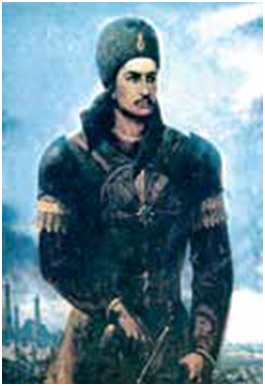

- Najmiddin Kubro
- Temur Malik
+ Jaloladdin Manguberdi
- Muhammad Xorazmshoh

**413. Jaloliddin Manguberdining hayot yillarini toping.**

+ 1198–1231-yillar
- 1195–1230-yillar
- 1199–1229-yillar
- 1200–1227-yillar

**414. Chingizxon kimning jasoratiga qoyil qolib, o‘g‘illariga qarab: “Ota o‘g‘il mana shunday bo‘lishi lozim”, – degan?**

- Temur Malikning
+ Jaloliddin Manguberdining
- Muhammad Xorazmshohning
- Najmiddin Kubroning

**415. Qaysi vohaning sug‘orish tarmoqlarining bosh to‘g‘oni – mashhur Sultonband mo‘g‘ullar tomonidan buzib tashlangan?**

+ Marv vohasining
- Balx vohasining
- Urganch vohasining
- Ray vohasining

**416. Jaloliddin Manguberdining hukmronlik yillarini toping.**

- 1218-1234-yillar
+ 1220-1231-yillar
- 1219-1233-yillar
- 1221-1232-yillar

**417. Jaloliddin Manguberdi Shiki Xutuxu no‘yonni yenggan Parvon dashti qayerda joylashgan edi?**

- Nishopur yaqinida
- Marv yaqinida
- Balx yaqinida
+ G‘azna yaqinida

**418. Urganchdan chekingach Muhammad Xorazmshohdan qaysi viloyatlar hokimlari yuz o‘girgan?**

+ Qunduz va Badaxshon
- Nishopur va Ray
- Mo‘lton va Hirot
- Badaxshon va Balx

**419. Qachon Muhammad Xorazmshoh Nishopurga kelgan?**

- 1220-yilning martida
+ 1220-yilning aprelida
- 1221-yilning noyabrida
- 1220-yilning dekabrida

**420. Qaysi daryoning bir tomoni “Ot sakrash”, narigi tomoni “Cho‘li Jaloliy” deb atalgan?**

- Murg‘ob daryosining
+ Sind daryosining
- Dajla daryosining
- Amudaryo daryosining

**421. Muhammad Xorazmshoh qachon vafot etgan?**

- 1220-yilning martida
- 1220-yilning aprelida
- 1221-yilning noyabrida
+ 1220-yilning dekabrida

**422. Qachon Sind (Hind) daryosi qirg‘oqlarida Jaloliddin va Chingizxon o‘rtasida jang bo‘lib o‘tgan?**

- 1220-yilning 10-dekabrida (10-12-dekabr)
+ 1221-yilning 25-noyabrida (24-26-noyabr)
- 1221-yilning 15-avgustida (14-17-avgust)
- 1220-yilning 20-oktyabrida (18-21-oktyabr)

**423. Qaysi g‘alabadan keyin Jaloliddinning lashkarboshilari Sayfuddin Ag‘roq, A’zam Malik va Muzaffar Maliklar qo‘lga kiritilgan o‘ljalarni taqsimlashda o‘zaro kelishmovchilik sababli ajralib ketganlar?**

+ Parvon dashtidagi
- Sind daryosi bo‘yidagi
- Valiyon qal’asidagi
- Garni qal’asidagi

**424. Chingizxon Jaloliddin Manguberdiga qarshi Shiki Xutuxu no‘yonni necha minglik qo‘shin bilan jo‘natgan?**

- 20 minglik
- 35 minglik
- 50 minglik
+ 45 minglik

**425. Qayerdagi jangda Jaloliddin Manguberdi dushman ustidan dastlabki yirik g‘alabaga erishgan?**

- Parvon dashtida
- Garni qal’asida
- Sind daryosi bo‘yida
+ Valiyon qal’asida

**426. Muhammad Xorazmshoh qayerda vafot etgan?**

- Sirdaryodagi Ashura orolida
- Amudaryodagi Ashura orolida
+ Kaspiy dengizidagi Ashura orolida
- Orol dengizidagi Ashura orolida

**427. Buxoro, Samarqand, Xo‘jand singari buyuk shaharlar qo‘ldan ketganidan keyin Muhammad Xorazmshoh qaysi hududlarga chekina boshlagan?**

- Janubi-sharqiy hududlarga
- Shimoli-sharqiy hududlarga
+ Janubi-g‘arbiy hududlarga
- Shimoli-g’arbiy hududlarga

## 22-§ Jaloliddin Manguberdi mohir sarkarda.

**428. Jaloliddin ittifoqchi izlab borgan Kirmon, Sheroz va Isfahon kimga tegishli edi?**

+ Ukasi G‘iyosiddin Pirshohga
- Xalifa Nosirga
- Shamsuddin Eltutmishga
- Chingizxonga

**429. Qachon Gurjiston Jaloliddin Xorazmshoh tomonidan to‘liq egallangan?**

- 1224-yilda
- 1227-yilda
+ 1226-yilda
- 1225-yilda

**430. XIII asrning boshlarida qaysi mamlakat Shirvon deb atalgan?**

+ Armaniston
- Gurjiston
- Ozarbayjon
- Eron

**431. Qaysi hudud aholisi Jaloliddin Xorazmshoh qiyofasida o‘zini gurjilar zo‘ravonligidan ozod etuvchi xaloskorni ko‘rgan?**

- Armaniston aholisi
+ Ozarbayjon aholisi
- Eron aholisi
- Iroq aholisi

**432. “Sening ortingda islomning dushmani turgani sir emas. Sen butun musulmonlarning sultonisan. Men bunday paytda senga qarshi bo‘lishni istamayman. Taqdir qo‘lida senga qarshi qurol bo‘lishni xohlamayman. Men kabi odam seningdek insonga qarshi qilich ko‘tarishi kechirilmas holdir!”. Ushbu xatni Dehli sultoni Shamsuddin Eltutmish kimga jo‘natgan?**

- Xalifa Nosirga
- Chingizxonga
+ Jaloliddin Manguberdiga
- Alouddin Muhammadga

**433. Qachon mo‘g‘ullar katta qo‘shin bilan Ozarbayjonga bostirib kirib, Jaloliddin Manguberdini ta’qib etishgan?**

+ 1231-yilda
- 1230-yilda
- 1229-yilda
- 1228-yilda

**434. Muxolif kuchlarni Jaloliddin Manguberdiga qarshi birlashtirishga muvaffaq bo‘lgan Alouddin Qayqubod qayerning hukmdori edi?**

- Misrning
- Damashqning
+ Ko‘niyaning
- Bag‘dodning

**435. Qachon Jaloliddin Manguberdi Marog‘a shahrini jangsiz qo‘lga kiritgan?**

- 1227-yil sentyabrda
- 1224-yil avgustda
- 1226-yil aprelda
+ 1225-yil mayda

**436. Jaloliddin Manguberdining ikki lashkarboshisi Yazidak pahlavon va Sunqurjiq xiyonat qilib kim tomonga o‘tib ketganlar?**

- G‘iyosiddin Pirshoh tomonga
+ Shamsuddin Eltutmish tomonga
- Xalifa Nosir tomonga
- Chingizxon tomonga

**437. Xorazmshoh Sulton Jaloliddin Manguberdi necha yil kurashib, mo‘g‘ullarni nafaqat O‘rta Sharqqa, balki Sharqiy Yevropaga ham qo‘ymagan?**

- 13 yil
- 10 yil
+ 11 yil
- 12 yil

**438. Jaloliddin Manguberdi Shimoliy Hindistonda necha yil hukmronlik qilgan?**

+ 3 yil
- 4 yil
- 1 yil
- 2 yil

**439. Qachon Jaloliddin Xorazmshoh Garni qal’asi yaqinida gurjilarning 60 minglik qo‘shinini tor-mor keltirgan va Tiflisga qarab yurgan?**

- 1227-yil sentyabrda
+ 1225-yil avgustda
- 1226-yil aprelda
- 1224-yil mayda

**440. Jaloliddin Manguberdi qayerda davlat barpo qilib, o‘z nomidan kumush va mis tangalar zarb ettirgan va soliqlar joriy qilgan?**

+ Shimoliy Hindistonda
- Janubiy Ozarbayjonda
- G‘arbiy Eronda
- Sharqiy Iroqda

**441. Jaloliddin Manguberdiga xiyonat qilgan Sharofulmulk qanday lavozimni egallagan edi?**

- Shahar hokimi
- Qo‘shin qo‘mondoni
- Devonxona boshqaruvchisi
+ Bosh vazir

**442. So‘nggi Xorazmshoh Sulton Jaloliddin Manguberdi necha yoshida olamdan ko‘z yumgan?**

+ 33 yoshida
- 32 yoshida
- 31 yoshida
- 34 yoshida

**443. Jaloliddin Manguberdi 1224-yili Shimoliy Hindistonga o‘z noiblarini tayinlab, o‘zi qayerga yo‘l olgan?**

- Suriyaga
- Ozarbayjonga
- Eronga
+ Iroqqa

**444. Jaloliddinning ukasi G‘iyosiddin Pirshoh kim tomonidan qo‘lga olinib, qatl etilgan?**

- Bag‘dod xalifasi tomonidan
- Dehli sultoni tomonidan
+ Kirmon hokimi tomonidan
- Ko‘niya hukmdori tomonidan

**445. Jaloliddin Xorazmshoh qaysi shaharni yangi barpo etgan davlatining poytaxtiga aylantirgan?**

- Valiyon shahrini
- G‘azna shahrini
- Marog‘a shahrini
+ Tabriz shahrini

**446. Jaloliddin Xorazmshoh nima sababdan Ozarbayjonni o‘z davlatining markazi sifatida tanlagan?**

- Mo‘g‘ullardan uzoqda joylashganligi sababli
- Ozarbayjon hukmdori bilan ittifoqdosh bo‘lganligi sababli
+ Harbiy yurishlar uchun qulay joyda joylashganligi sababli
- Jaloliddin Xorazmshohga sodiqligi sababli

**447. Jaloliddin Manguberdi qaysi o‘lkada qaroqchilar qo‘liga asir tushib, fojiali halok bo‘lgan?**

+ Kurdistonda
- Ko‘niyada
- Misrda
- Ozarbayjonda

**448. Kimning Jaloliddin Manguberdiga qarshi yuborgan 20 minglik qo‘shini Basra yaqinidagi jangda tor-mor keltirilgan?**

- G‘iyosiddin Pirshohning
+ Bag‘dod xalifasi Nosirning
- Shamsuddin Eltutmishning
- Chingizxonning

**449. Qachon Ko‘niya, Jazira, Damashq va Misrning birlashgan qo‘shinidan Jaloliddin Manguberdi kuchlari Arzinjon yaqinidagi jangda mag‘lubiyatga uchragan?**

- 1231-yilda noyabrda
- 1229-yilda aprelda
+ 1230-yil avgustda
- 1228-yilda iyulda

**450. Jaloliddin Manguberdi yurish qilgan qayerning hukmdori O‘zbek ichkilik, maishatga berilib davlat ishlarini o‘z holiga tashlab qo‘ygan, davlatni amalda uning xotini Malika xotun boshqargan?**

- Gurjistonning
+ Ozarbayjonning
- Eronning
- Iroqning

**451. Kim Jaloliddin Manguberdining jangdagi mardligiga qoyil qolib “Zamonasining haqiqiy bahodiri ekan, o‘z tengqurlarining sarvari ekan”, degan?**

- Shiki Xutuxu
- Shamsuddin Eltutmish
- Xalifa Nosir
+ Taynol no‘yon

**452. Iroqqa kelgach quyidagi qaysi hudud hukmdorlari Jaloliddin bilan yaxshi munosabatlar o‘rnatgan?**

- Bag‘dod, Tabariston, Damashq
- Misr, Ko‘nya, Suriya
+ Tabariston, Damashq, Misr
- Damashq, Ozarbayjon, Ko‘niya

**453. Qachon Jaloliddin Manguberdi Isfahon yaqinida mo‘g‘ullarning Taynol no‘yon boshliq qo‘shinini yenggan?**

+ 1227-yil sentyabrda
- 1224-yil avgustda
- 1226-yil aprelda
- 1225-yil mayda

**454. Basra yaqinidagi jangda g‘alabadan keyin Jaloliddin Manguberdi qayerga yurish qilgan?**

- Suriyaga
+ Ozarbayjonga
- Eronga
- Iroqqa

**455. Jangda g‘alabaga erishgan Jaloliddin Manguberdiga Shatra hukmdorining … otliq va … yaxshi qurollangan jangchilari taslim bo‘ladilar va uning tomoniga o‘tganlar.**

+ 1000/5000
- 1500/2000
- 500/1500
- 2000/3000

**456. Qaysi hind viloyatining hukmdori Jaloliddin Manguberdining og‘ir ahvolidan foydalanib, unga qarshi hujum qilgan?**

- Kalikut hukmdori
+ Shatra hukmdori
- Dehli hukmdori
- Lahor hukmdori

## 23-§ Jaloliddin Manguberdi Vatan qahramoni.

**457. Jaloliddin Manguberdi haqida ma’lumot beruvchi “Tarixi arba’ ulus” (To‘rt ulus tarixi) asari muallifi kim?**

- Ibn al-Asir
- Juvayniy
- Mirxond
+ Mirzo Ulug‘bek

**458. Nasaviy qachon Jaloliddin Manguberdi haqidagi asarni bitishga kirishgan?**

- 1242-yilda
- 1240-yilda
- 1243-yilda
+ 1241-yilda

**459. Qachon “Jaloliddin Manguberdi tavalludining 800 yilligini nishonlash haqida” qaror qabul qilingan?**

- 1994-yilda
+ 1998-yilda
- 1996-yilda
- 1999-yilda

**460. Yaqin va O‘rta Sharq mamlakatlari tarixining islom tarqalishidan to 1231-yilgacha bo‘lgan davr haqida ma’lumot beruvchi “al-Komil fit-tarix” (“Tarix haqida mukammal kitob)” asari muallifi kim?**

+ Ibn al-Asir
- Juvayniy
- Nasaviy
- Narshaxiy

**461. Kim Jaloliddin Manguberdining shaxsiy kotibi (kotib al-insho) bo‘lgan?**

- Ibn al-Asir
- Juvayniy
+ Nasaviy
- Narshaxiy

**462. Qachon Jaloliddin Manguberdi tavalludining 800 yilligi keng nishonlangan?**

+ 1999-yil 5-noyabrda
- 1996-yil 8-iyunda
- 1998-yil 28-avgustda
- 1997-yil 15-yanvarda

**463. Qachon Naso (Niso) viloyatidagi qal’alardan birining sohibi bo‘lgan Shihobiddin ibn Ahmad an-Nasaviy xizmat yuzasidan Iroqqa borib qolgan va o‘sha yerda Sulton Jaloliddinning xizmatiga kirgan?**

- 1225-yilda
- 1223-yilda
+ 1224-yilda
- 1226-yilda

**464. Anushteginiylar sulolasi Xorazmni qaysi yillarda boshqargan?**

+ 1097–1231-yillarda
- 1095–1233-yillarda
- 1094–1232-yillarda
- 1091–1230-yillarda

**465. “Siyrat as-sulton Jalol ad-Din Mengburni” (“Sulton Jaloliddin Manguberdining tarjimayi holi”) nomli asar muallifi kim?**

- Rumiy
- Juvayniy
+ Nasaviy
- Narshaxiy

**466. Qachon mashhur shoir va adib Maqsud Shayxzoda “Jaloliddin Manguberdi” tarixiy dramasini yozgan?**

+ 1944-yilda
- 1947-yilda
- 1945-yilda
- 1941-yilda

**467. Qachon “Jaloliddin Manguberdi” ordeni ta’sis etilgan?**

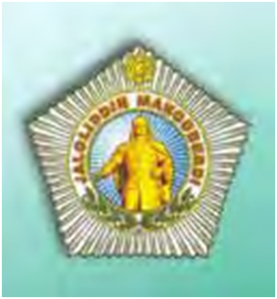

- 2001-yil 25-iyulda
- 1999-yil 13-oktyabrda
+ 2000-yil 30-avgustda
- 1998-yil 22-sentyabrda

**468. Jaloliddin Manguberdi haqida ma’lumot beruvchi “Ravzat us-safo” asari muallifi kim?**

- Ibn al-Asir
- Juvayniy
+ Mirxond
- Mirzo Ulug‘bek

**469. Jaloliddin Manguberdi haqida ma’lumot beruvchi “Tarixi jahonkusho” (“Jahon fotihi tarixi”) asari muallifi kim?**

- Ibn al-Asir
+ Juvayniy
- Nasaviy
- Narshaxiy

## 24-§ Chig‘atoy ulusining tashkil topishi.

**470. Qaysi yilda Chig‘atoy soliqlarni tartibga solish islohotida Mahmud Yalavochni noiblikdan chetlatgan?**

- 1243-yilda
- 1236-yilda
+ 1238-yilda
- 1241-yilda

**471. Mo‘g‘ullar davrida davlat xazinasi uchun olingan oziq-ovqat solig‘i nima deb atalgan?**

- “Qopchur”
- “Kalon”
- “Targ‘u”
+ “Shulen”

**472. Mo‘g‘ullar davrida aholidan asosiy soliqlardan tashqari yana qanday soliqlar undirilgan?**

- Tuz solig‘i
- Jun solig’i
- Kumush solig‘i
+ Barcha javoblar to‘g‘ri

**473. Mahmud Torobiy halok bo‘lganidan keyin, qo‘zg‘olonchilar uning o‘rniga Torobiyning qaysi ukalarini boshliq qilib saylaganlar?**

- Ismoil va Ahmadni
- Umar va Ismoilni
+ Muhammad va Alini
- Yahyo va Umarni

**474. Chig‘atoyxonning ulusni boshqaradigan o‘rdasi qayerda joylashgan edi?**

- Jayhun (Amudaryo) daryosi bo‘yida
- Yoyiq (Ural) daryosi bo‘yida
+ Elsuvi (Ili) daryosi bo‘yida
- Sayhun (Sirdaryo) daryosi bo‘yida

**475. Ulug‘ xoqon O‘qtoy Mahmud Yalavochni qayerga hokim etib tayinlagan?**

- Taroz shahriga
+ Pekin shahriga
- Qoraqurum shahriga
- Samarqand shahriga

**476. Mo‘g‘ullar davrida soliqlarning mahalliy amaldorlar tomonidan avvaldan bir yo‘la to‘lab yuborilishi qanday atalgan?**

- Qopchur
- Shulen
- Kalon
+ Barot

**477. Mahmud Torobiyning yaqin safdoshini toping.**

- Mahbub Shamsiy
- Umar Torobiy
- Ismoil Torobiy
+ Shamsiddin Mahbubiy

**478. Mo‘g‘ullar davrida ziroatchilardan hosilning 1/10 qismi hajmida olinadigan yer solig‘i nima deb atalgan?**

- “Qopchur”
+ “Kalon”
- “Shulen”
- “Targ‘u”

**479. Chingizxon xorazmlik savdogar Mahmud Yalavochga qayerni idora etish ishlarini topshirgan?**

- Eronni
- Xurosonni
- Xorazmni
+ Movarounnahrni

**480. Mo‘g‘ullar davrida hunarmandlar va savdogarlardan olinadigan soliq nima deb atalgan?**

- “Qopchur”
+ “Targ‘u”
- “Shulen”
- “Kalon”

**481. Chig‘atoy soliqlarni tartibga solish islohotida Mahmud Yalavochni noiblikdan chetlatib, uning o‘rniga Yalavochning qaysi o‘g‘lini noib qilib tayinlagan?**

+ Ma’sudbekni
- Ma’murbekni
- Yahyobekni
- Shamsiddinbekni

**482. Qayerda bo‘lib o‘tgan jangda Mahmud Torobiy va Shamsiddin Mahbubiylar halok bo‘lganlar?**

- Taroz yaqinida
- G‘ijduvon yaqinida
- Buxoro yaqinida
+ Karmana yaqinida

**483. Mahmud Yalavoch qaysi shaharni o‘ziga qarorgoh qilib olgan?**

- Urganch shahrini
- Buxoro shahrini
+ Xo‘jand shahrini
- Samarqand shahrini

**484. Torobdagi mo‘g‘ullarga qarshi qo‘zg‘olonga rahbarlik qilgan Mahmudning kasbi nima edi?**

+ G‘alvir yasovchi
- Tunukachi
- Miskar
- Duradgor

**485. Mo‘g‘ullar davrida chorvadorlardan chorva mollari bosh sonining 2,5% miqdorida olinadigan soliq nima deb atalgan?**

+ “Qopchur”
- “Kalon”
- “Shulen”
- “Targ‘u”

**486. Mo‘g‘ullarda mahalliy hokim qanday so‘z bilan atalgan?**

- Dorug‘achi
- Tavg‘ach
- No‘yon
+ Bosqoq

**487. Mo‘g‘ullar davrida har bir podadan ikki yashar qo‘y, qimiz uchun har ming otdan bir biya hisobida olingan soliq nima deb atalgan?**

- “Kalon”
+ “Shulen”
- “Targ‘u”
- “Qopchur”

**488. “Dorug‘achi” va “tavg‘ach” deb ataluvchi mo‘g‘ul amaldorlari qanday vazifani bajargan?**

- Harbiy hokimiyatni idora etish ishlarini
- Aholini ro‘yxatdan o‘tkazish ishlarini
- Soliq yig‘ish ishlari
+ Barcha javoblar to‘g‘ri

**489. Mo‘g‘ullar davrida ishlab chiqarilgan mahsulot yoki sotilgan molning o‘ttizdan bir qismi hajmida undirilgan soliq nima deb atalgan?**

+ “Targ‘u”
- “Shulen”
- “Kalon”
- “Qopchur”

**490. Qachon Buxoroning Torob qishlog‘ida mo‘g‘ullar va mahalliy mulkdorlar zulmiga qarshi qo‘zg‘olon boshlangan?**

- 1235-yilda
- 1236-yilda
+ 1238-yilda
- 1240-yilda

**491. Qachon Chingizxon tomonidan Chig‘atoy tasarrufiga berilgan Movarounnahr, Yettisuv va Sharqiy Turkistonda Chig‘atoy ulusi tashkil topgan?**

+ 1224-yilda
- 1223-yilda
- 1222-yilda
- 1221-yilda

**492. Buxoroni egallagach Mahmud Torobiy kimni sadr deb e’lon qilgan?**

- Umar Torobiyni
- Ismoil Torobiyni
+ Shamsiddin Mahbubiyni
- Mahbub Shamsiyni

**493. Mahmud Torobiy Buxoroga kirib olgach qayerni o‘ziga qarorgoh qilib olgan?**

- Rabotdagi arkni
- Amir saroyini
+ Robiya saroyini
- Jome masjidini

## 25-§ Ijtimoiy-iqtisodiy hayot.

**494. Mo‘g‘ullar davrida hukmdor va noiblarga qarashli yerlar nima deb atalgan?**

- Mulki vaqf
- Mulk
+ Mulki inju
- Mulki devon

**495. Qaysi mo‘g‘ul hukmdori birinchi bo‘lib o‘z qarorgohini Movarounnahrga ko‘chirgan?**

- Munke
- O‘qtoy
+ Kebekxon
- Chig‘atoy

**496. Qachon Ma’sudbek Movarounnahrning 16 ta shahar va viloyatlarida, bir xil vazn va yuqori qiymatli sof kumush tangalar zarb ettirib, ularni muomalaga chiqargan?**

- 1272-yilda
- 1273-yilda
- 1274-yilda
+ 1271-yilda

**497. Mo‘g‘ullar davrida xususiy yerlar nima deb atalgan?**

- Mulki vaqf
+ Mulk
- Mulki inju
- Mulki devon

**498. Qachon Chig‘atoy ulusida mo‘g‘ullarning o‘troqlikka o‘tish jarayoni kuchayib, ularning ijtimoiy hayotida jiddiy o‘zgarishlar sodir bo‘la boshlagan?**

- XV asrning ikkinchi yarmida
+ XIV asrning birinchi yarmida
- XIV asrning ikkinchi yarmida
- XV asrning birinchi yarmida

**499. Qachon Chig‘atoy naslidan bo‘lgan Tug‘luq Temur Mo‘g‘uliston xoni etib ko‘tarilgan?**

- 1350-yilda
+ 1348-yilda
- 1349-yilda
- 1346-yilda

**500. Qachon Chig‘atoy ulusi ikkiga bo‘linib ketgan?**

- XIV asrning 60-yillarida
- XIV asrning 50-yillarida
+ XIV asrning 40-yillarida
- XIV asrning 30-yillarida

**501. “Yomlar bo‘ylab pochta xizmati uchun ajratilgan otlar soni belgilanib, aholidan ortiqcha ot talab qilish man etilgan. Shuningdek, elchilarga, qo‘llarida bevosita topshiriqlari bo‘lmasa, shahar yoki qishloqlarga kirmasligi va aholidan ular uchun belgilanadigan ortiqcha yem-xashak hamda oziq-ovqat olmasligi uqtirilgan. Shu tariqa aholi o‘zboshimchalik bilan yig‘ib olinadigan hisobsiz to‘lovlardan ozod bo‘lgan”. Yuqoridagi islohot kim tomonidan amalga oshirilgan?**

+ Munke tomonidan
- Kebekxon tomonidan
- Tug‘luq Temur tomonidan
- Chig‘atoy tomonidan

**502. Mo‘g‘ullar davrida davlat yeri nima deb atalgan?**

- Mulki vaqf
- Mulk
- Mulki inju
+ Mulki devon

**503. Mo‘g‘ullar istilosidan keyin qaysi shahar yonida yangitdan shahar qad ko‘targan?**

- Xo‘jand
- Urganch
- Buxoro
+ Samarqand

**504. Movorounnahrda “Kepaki” deb nom olgan pullar qayerda zarb etilib, muomalaga chiqarilgan?**

- Qarshi va Xo‘jandda
- Marv va Samarqandda
- Nasaf va Balxda
+ Samarqand va Buxoroda

**505. “Mamlakatda yagona pul joriy qilingan. Erondagi Xulokiylar davlati va Oltin O‘rda xonligining kumush tangalari namunasida ikki xil pul: og‘irligi 8 grammlik katta kumush tanga va 1 grammlik kichik tanga zarb etilgan. Katta tanga “dinor”, kichigi “dirham” deb atalgan”. Yuqoridagi islohot kim tomonidan amalga oshirilgan?**

- Munke tomonidan
+ Kebekxon tomonidan
- O‘qtoy tomonidan
- Chig‘atoy tomonidan

**506. Mo‘g‘ullar davrida masjid va madrasa yerlari nima deb atalgan?**

+ Mulki vaqf
- Mulk
- Mulki inju
- Mulki devon

**507. …da yashayotgan mo‘g‘ullar …ga ko‘chib kelganlarni “qoraunas” (duragay), …da yashayotgan mo‘g‘ullar esa ularni “jete” (qaroqchi, talonchi) deb atay boshlaganlar.**

- Oloy/ Xuroson/Movarounnahr
- Sharqiy Turkiston/Movarounnahr/Xuroson 
+ Yettisuv/Movarounnahr/Movarounnahr
- Mo‘g‘uliston/Xuroson/Xuroson

**508. Mo‘g‘ulistonning qaysi ulug‘ xoqoni soliq va hashar ishlarini tartibga solish to‘g‘risida maxsus farmon – “yorliq” chiqargan?**

- Kebekxon
+ Munke
- Chig‘atoy
- O‘qtoy

**509. Qashqadaryo vohasidagi qadimgi Nasaf shahri yonida “Qarshi” saroyini kim qurdirgan?**

- Munke
- O‘qtoy
+ Kebekxon
- Chig‘atoy

## 26-§ Etnik jarayonlar va o‘zbek xalqining shakllanishi.

**510. O‘zbek etnosining asosini qaysi xalqlar tashkil etgan? 1. sug‘diylar; 2. baqtriylar; 3. xorazmiylar; 4. kushonlar; 5. farg‘onaliklar; 6. shoshliklar; 7. forsiylar; 8. yarim chorvador qang‘lar; 9. ko‘chmanchi sak-massagetlar.**

- 1, 2, 3, 5, 6, 7, 8
+ 1, 2, 3, 5, 6, 8, 9
- 1, 3, 4, 5, 6, 7, 8
- 1, 2, 4, 5, 7, 8, 9

**511. Qaysi davlat davrida Movarounnahr va Xorazmda siyosiy hokimiyat turkiy sulolalarga o‘tgan?**

+ Qoraxoniylar davlati davrida
- Qang‘ davlati davrida
- Saljuqiylar davlati davrida
- G‘aznaviylar davlati davrida

**512. Qaysi davlat davrida Movarounnahrda turkiyzabon etnoslar ustuvorlik qilib, o‘ziga xos uyg‘unlashgan madaniyat shakllangan?**

- G‘aznaviylar davlati davrida
- Qoraxoniylar davlati davrida
+ Qang‘ davlati davrida
- Saljuqiylar davlati davrida

**513. O‘zbek etnosining asosini tashkil etgan xalqlar qaysi tillarda so‘zlashgan?**

- G‘arbiy eroniy va oromiy tillarda
- So‘g‘diy va turkiy tillarda
- Oromiy va ivrit tillarida
+ Turkiy va sharqiy eroniy tillarda

**514. Qachon Movarounnahr mintaqasida yaxlit turkiy etnik qatlam, turkiy til muhiti vujudga kela boshlagan va o‘z navbatida sug‘diylar va boshqa mahalliy etnoslarda ham turkiylashish jarayoni jadallashgan?**

- X asrda
+ IX asrda
- VII asrda
- VIII asrda

**515. Qaysi madaniyat davrida O‘rta Osiyoning vodiy va vohalarida yashovchi aholi tashqi qiyofalarida hozirgi o‘zbek va voha tojiklariga xos antropologik qiyofasi to‘liq shakllangan?**

+ “Qovunchi madaniyati” davrida
- “Kaltaminor madaniyati” davrida
- “Yettisuv madaniyati” davrida
- “Turkiylar madaniyati” davrida

**516. Qaysi asrlarda o‘zbek xalqi shakllangan?**

- X–XIII asrlarda
- XII–XIII asrlarda
- X–XI asrlarda
+ IX–XII asrlarda

**517. Qachondan o‘lkamiz “Turkiston” nomi bilan atala boshlangan?**

- VIII asrdan
+ VII asrdan
- X asrdan
- IX asrdan

## 27-§ Movarounnahr va Xorazmning madaniy hayoti.

**518. Abu Ali ibn Sinoning “Al-qonun fit-tib” (“Tib qonunlari”) asari nechta jilddan iborat?**

+ 5 jilddan
- 3 jilddan
- 2 jilddan
- 4 jilddan

**519. Qachon Respublikamizda “Xorazm Ma’mun akademiyasi” ning 1000 yilligi nishonlangan?**

+ 2006-yil kuzida
- 2005-yil yozida
- 2004-yil qishida
- 2003-yil bahorida

**520. Qachon al-Farg‘oniy rahbarligida Nil daryosi sohilida qurilgan qadimgi gidrometr – daryo oqimi sathini belgilaydigan “Miqyos an-Nil” inshooti va uning darajoti qayta tiklangan?**

- 865-yilda
- 863-yilda
- 859-yilda
+ 861-yilda

**521. Abu Nasr Farobiy qancha asar yozgan?**

- 140 dan ortiq
- 150 dan ortiq
- 130 dan ortiq
+ 160 dan ortiq

**522. Abu Ali ibn Sino kimni davolab tuzatgach, somoniylarning saroy kutubxonasidan foydalanishga ruxsat olgan?**

+ Nuh ibn Mansurni
- Ahmad ibn Mansurni
- Yahyo ibn Mansurni
- Ilyos ibn Mansurni

**523. Al-Farg‘oniyning nomi qachon Oydagi kraterlardan biriga berilgan?**

- XIX asrda
- XVIII asrda
- XVII asrda
+ XVI asrda

**524. “Arastuning “Metafizika” asariga sharh”, “Musiqa kitobi”, “Baxt-saodatga erishuv haqida”, “Tirik mavjudot a’zolari haqida”, “Fozil odamlar shahri” asarlari muallifi kim?**

- Ahmad al-Farg‘oniy
- Muso al-Xorazmiy
+ Abu Nasr Farobiy
- Abu Rayhon Beruniy

**525. Qachon Mahmud G‘aznaviy Xorazmga bostirib kirgan va “Dor ul-hikma va maorif” ning faoliyati tugatilgan, olimlarning ko‘pchiligi G‘azna shahriga majburan olib ketilgan?**

- 1019-yilda
- 1018-yilda
+ 1017-yilda
- 1016-yilda

**526. Abu Ali ibn Sino qayerda dafn etilgan?**

- Kirmonda
- Mozandaronda
+ Hamadonda
- Hirotda

**527. Abu Nasr Farobiy qancha tilni bilgan?**

- 40 dan ortiq 
- 50 dan ortiq
- 30 dan ortiq
+ 70 dan ortiq

**528. Al-Farg‘oniyning “Samoviy harakatlar va umumiy ilmi nujum” kitobi qachon lotin va ibroniy tillariga tarjima qilingan?**

- XIII asrda
- XI asrda
+ XII asrda
- XIV asrda

**529. Abu Ali ibn Sino qaysi akademiyada faoliyat yuritgan?**

- Basradagi akademiyada
- Damashqdagi akademiyada
+ Gurganchdagi akademiyada
- Bag‘doddagi akademiyada

**530. Al-Xorazmiy qaysi fanga asos solgan?**

+ Algebra faniga
- Matematika faniga
- Geometriya faniga
- Fizika faniga

**531. Al-Xorazmiy … dan ortiq asarlar yozgan, ulardan faqat … tasigina bizgacha yetib kelgan.**

- 40/20
- 30/15
- 10/5
+ 20/10

**532. Abu Rayhon Beruniy nechta yulduzning koordinatlari kattaliklari qayd etilgan yulduzlar jadvalini hamda dunyoning geografik kartasini tuzgan?**

- 1019 ta yulduzning
- 1049 ta yulduzning
+ 1029 ta yulduzning
- 1039 ta yulduzning

**533. Muhammad ibn Muso al-Xorazmiyning yashagan yillarini toping.**

- 797–865-yillar
- 873–950-yillar
+ 783–850-yillar
- 973–1048-yillar

**534. Abu Nasr Farobiyning yashagan yillarini toping.**

- 797–865-yillar
+ 873–950-yillar
- 783–850-yillar
- 973–1048-yillar

**535. Al-Farg‘oniy Farg‘ona vodiysining qaysi shahrida tavallud topgan?**

- Pop shahrida
+ Quva shahrida
- Chust shahrida
- Rishton shahrida

**536. Abu Ali ibn Sinoning yashagan yillarini toping.**

+ 980–1037-yillar
- 797–865-yillar
- 783–850-yillar
- 973–1048-yillar

**537. Qachon Samarqandda “O‘rta asrlar Sharq allomalari va mutafakkirlarining tarixiy merosi, uning zamonaviy sivilizatsiya rivojidagi roli va ahamiyati” mavzusidagi xalqaro konferensiya bo‘lib o’tgan?**

- 2016-yil 16-mayda
- 2015-yil 16-mayda
+ 2014-yil 16-mayda
- 2013-yil 16-mayda

**538. “Dor ul-hikma va maorif” (“Bilimdonlik va maorif uyi”) – “Ma’mun akademiyasi”qachon tashkil etilgan?**

- 1007-yilda
- 1006-yilda
- 1005-yilda
+ 1004-yilda

**539. Abu Ali ibn Sinoning 450 dan ortiq asarining nechtasi tabobatga oid?**

- 45 tasi
- 44 tasi
+ 43 tasi
- 42 tasi

**540. Qaysi sharq olimi birinchi bo‘lib yer shari globusini yaratgan va yer aylanasi uzunligini o‘lchashda yangi usul – matematik usulni ishlab chiqqan?**

- Ahmad al-Farg‘oniy
- Muso al-Xorazmiy
- Abu Nasr Farobiy
+ Abu Rayhon Beruniy

**541. Qachon O‘zbekiston Respublikasi Prezidentining “Xorazm Ma’mun akademiyasini qaytadan tashkil etish to‘g‘risida” gi farmoni chiqqan?**

- 1998-yil 10-noyabrda
+ 1997-yil 11-noyabrda
- 1996-yil 15-noyabrda
- 1995-yil 22-noyabrda

**542. Qaysi olim Yerning dumaloq shaklda ekanligini asoslab bergan, yevropalik olimlardan 450 yilcha oldin Amerika qit’asi mavjudligini taxmin qilib, o‘z asarlarida bir necha bor yozgan va Kopernikdan qariyb besh asr muqaddam Yerning Quyosh atrofida aylanishi haqidagi fikrni o‘rta asrlarda birinchi bo‘lib ilgari surgan?**

- Ahmad al-Farg‘oniy
- Muso al-Xorazmiy
- Abu Nasr Farobiy
+ Abu Rayhon Beruniy

**543. Abu Rayhon Beruniy qaysi xorazmshoh saroyida to‘plangan olimlar bilan birgalikda Ma’mun akademiyasida ijod qilgan?**

- Abul-Horis Muhammad
+ Abul Abbos Ma’mun II
- Ma’mun I ibn Muhammad
- Abu al-Hasan Ali

**544. Qaysi olim Sharqda Arastudan (Aristotel) keyingi yirik mutafakkir – “Muallim us-soniy” va “Sharq Aflotuni” nomlari bilan shuhrat topgan?**

- Ahmad al-Farg‘oniy
- Muso al-Xorazmiy
+ Abu Nasr Farobiy
- Abu Rayhon Beruniy

**545. Abu Ali ibn Sino qayerdagi Afshona qishlog‘ida mahalliy amaldor oilasida dunyoga kelgan?**

- Marv yaqinidagi
+ Buxoro yaqinidagi
- Samarqand yaqinidagi
- Balx yaqinidagi

**546. Abu Rayhon Beruniy astronomiya, geografiya, matematika va tarix fanlari bo‘yicha qancha asar yozgan?**

- 140 dan ortiq
- 150 dan ortiq
- 130 dan ortiq
+ 160 dan ortiq

**547. Abul Abbos Ahmad ibn Muhammad ibn Kasir al-Farg‘oniyning yashagan yillarini toping.**

+ 797–865-yillar
- 973–1048-yillar
- 783–850-yillar
- 873–950-yillar

**548. Abu Rayhon Beruniy Xorazmning qaysi shahrida ta’lim olgan?**

+ Urganch shahrida
- Kat shahrida
- Vazir shahrida
- Xiva shahrida

**549. Qaysi olim “Bayt ul-hikma”da mudir sifatida faoliyat ko‘rsatgan?**

- Ahmad al-Farg‘oniy
+ Muso al-Xorazmiy
- Abu Nasr Farobiy
- Abu Rayhon Beruniy

**550. Qachon Ahmad al-Farg‘oniy tavalludining 1200 yilligi nishonlangan?**

- 1999-yil sentyabrda
+ 1998-yil oktyabrda
- 1997-yil dekabrda
- 1996-yil noyabrda

**551. IX–XII asrlarda quyidagi qaysi shaharda astronomik kuzatishlar olib boriladigan rasadxonalar mavjud edi?**

- Buxoro va Samarqandda
- Samarqand va Marvda
+ Bag‘dod va Damashqda
- Marv va Balxda

**552. Al-Farg‘oniy qaysi yillarda Suriyaning shimolida Sinjor dashtida va ar-Raqqa oralig‘ida Yer meridianining bir darajasi uzunligini o‘lchashda qatnashgan?**

- 834–835-yillarda
+ 832–833-yillarda
- 835–836-yillarda
- 837–838-yillarda

**553. Qachon Bag‘dodda “Bayt ul-hikma” tashkil etilgan?**

- XI asrda
+ IX asrda
- X asrda
- VIII asrda

**554. Abu Nasr Farobiy Aris suvining … quyilishida joylashgan Farob shahrida tug‘ilgan.**

- Murg‘obga
- Amudaryoga
+ Sirdaryoga
- Zarafshonga

**555. Abu Rayhon Beruniy Xorazmning qaysi shahrida tug‘ilgan?**

- Urganch shahrida
+ Kat shahrida
- Vazir shahrida
- Xiva shahrida

**556. Abu Ali ibn Sinoning “Al-qonun fit-tib” (“Tib qonunlari”) asari qaysi davrlarda Yevropa tabobatida asosiy qo‘llanma sifatida foydalanilgan?**

- XII-XVIII asrlarda
- XI-XVIII asrlarda
- XI-XVI asrlarda
+ XII-XVII asrlarda

**557. Abu Ali ibn Sino necha yoshida e’tiborli hakim va olim bo‘lib yetishgan?**

- O‘n olti yoshida
- O‘n sakkiz yoshida
- O‘n besh yoshida
+ O‘n yetti yoshida

**558. Abu Rayhon Beruniyning yashagan yillarini toping.**

- 797–865-yillar
- 873–950-yillar
- 783–850-yillar
+ 973–1048-yillar

**559. IX–XII asrlarda qaysi shahar Sharqning yirik ilm va madaniyat markazi edi?**

+ Bag‘dod shahri
- Damashq shahri
- Barsa shahri
- Kufa shahri

**560. Al-Xorazmiyning matematikaga doir “Al-jabr val-muqobala” asari qachon Ispaniyada lotin tiliga tarjima qilingan va qayta ishlangan?**

- XIV asrda
+ XII asrda
- XI asrda
- XIII asrda

## 28-§ Adabiyot.

**561. Quyidagi qaysi asarda muallif dunyo xaritasini ilova qilgan?**

- “Al-Kashshof” asarida
- “Qutadg‘u bilig” asarida
- “Hibat ul-haqoyiq” asarida
+ “Dеvоnu lug‘otit turk” asarida

**562. Abulqosim Mahmud az-Zamaxshariyning yashagan yillarini toping.**

- 1072–1142-yillar
+ 1075–1144-yillar
- 1078–1141-yillar
- 1071–1145-yillar

**563. Ahmad Yugnakiy qachon yashab ijod etgan?**

- XIV asrda
- XIII asrda
+ XII asrda
- XI asrda

**564. Yusuf Xos Hojib “Qutadg‘u bilig” (“Saodatga eltuvchi bilim”) asarini qachon va qayerda yozib tugatgan?**

- 1069-yilda Koshg‘arda
- 1070-yilda Bolasog‘unda
+ 1070-yilda Koshg‘arda
- 1069-yilda Bolasog‘unda

**565. Qaysi olim “Arab va g‘ayri arablar ustozi”, “Xorazm faxri” kabi sharafli nomlar bilan ulug‘langan?**

- Abulxayr ibn Hammor
- Muso al-Xorazmiy
- Abu Rayhon Beruniy
+ Mahmud az-Zamaxshariy

**566. Abulqosim Mahmud az-Zamaxshariy qancha asar yozib qoldirgan?**

- 40 dan ortiq
+ 50 dan ortiq
- 30 dan ortiq
- 60 dan ortiq

**567. Mahmud Koshg‘ariy qachon va qayerda dunyoga mashhur asari “Dеvоnu lug‘оtit turk” (“Turkiy so‘zlar dеvоni”) ni yozib tugatgan?**

+ 1072-yil Bag‘dоdda
- 1081-yil Koshg‘arda
- 1094-yil Bolasog‘unda
- 1067-yil Damashqda

**568. Mahmud Koshg‘ariy (Mahmud Kоshg‘ariy ibn Husayn ibn Muhammad) qachon yashab ijod etgan?**

+ XI asrda
- XII asrda
- X asrda
- IX asrda

**569. Abulqosim Mahmud az-Zamaxshariy qachon Xorazmning Zamaxshar qishlog‘ida tug‘ilgan?**

- 1078-yilda
- 1077-yilda
- 1076-yilda
+ 1075-yilda 

**570. Abulqosim Mahmud az-Zamaxshariy qayerda vafot etgan?**

- Makkada
+ Xorazmda
- Bag‘dodda
- Damashqda

**571. “Devonu lug‘otit turk” asarini muallifi kim?**

- Ahmad Yassaviy
- Ahmad Yugnakiy
+ Mahmud Koshg‘ariy
- Yusuf Xos Hojib

**572. Arab tili fonetikasi va morfologiyasiga bag‘ishlangan “Al-Mufassal”, Qur’oni karim tafsiriga oid “Al-Kashshof” asarlari muallifi kim?**

- Abu Mansur al-Moturidiy
- Yusuf Xos Hojib
- Mahmud Koshg‘ariy
+ Mahmud az-Zamaxshariy

**573. Qaysi sharq olimi ko‘p asarlarini Makkada yozganligi uchun “Jorulloh” (“Allohning qo‘shnisi”) degan sharafli nomga muyassar bo‘lgan?**

- Ahmad Yugnakiy
- Yusuf Xos Hojib
- Mahmud Koshg‘ariy
+ Mahmud az-Zamaxshariy

**574. Mahmud Koshg‘ariy qaysi yillarda mamlakatdagi ichki nizоlar natijasida o‘z vatanini tark etib, 15 yil davоmida atrоfdagi qardоsh xalqlar оrasida yurishga majbur bo‘lgan?**

- 1051–1052-yillarda
- 1053–1054-yillarda
+ 1056–1057-yillarda
- 1058–1059-yillarda

**575. Yusuf Xos Hojib “Qutadg‘u bilig” (“Saodatga eltuvchi bilim”) asarini qachon va qayerda yoza boshlagan?**

- 1069-yilda Koshg‘arda
- 1070-yilda Bolasog‘unda
+ 1069-yilda Bolasog‘unda 
- 1070-yilda Koshg‘arda

**576. Yusuf Xos Hojib “Qutadg‘u bilig” (“Saodatga eltuvchi bilim”) asarini taqdim etgan Tavg‘och Bug‘roxon qaysi sulola hukmdorlaridan bo‘lgan?**

- Safforiylardan
- Saljuqiylardan
+ Qoraxoniylardan
- G‘aznaviylardan

**577. Qachon Abulqosim Mahmud az-Zamaxshariyning 920 yilligi keng nishonlangan?**

+ 1995-yilda
- 1997-yilda
- 1998-yilda
- 1999-yilda

**578. Tavg‘och Bug‘roxon Yusufga bergan “Xos Hojib” martabasining ma’nosi nima?**

- “Yurt og‘asi”
- “Bilim og‘asi”
+ “Eshik og‘asi”
- “Saroy og‘asi”

**579. Yusuf Xos Hojib qayerda tug‘ilgan?**

- Hirotda
- Yettisuvda
- Koshg‘arda
+ Bolasog‘unda

**580. Qayerdagi Al-Azhar diniy dorilfununining talabalari hozir ham Mahmud az-Zamaxshariy yozgan “Al-Kashshof” asosida Qur’oni karimni o‘rganadilar?**

+ Qohiradagi
- Makkadagi
- Madinadagi
- Istanbuldagi

**581. “Qutadg‘u bilig” asarini muallifi kim?**

- Ahmad Yassaviy
- Ahmad Yugnakiy
- Mahmud Koshg‘ariy
+ Yusuf Xos Hojib

**582. Qaysi asar, muallifining fikricha, “oldin hech kim tuzmagan va hech kimga ma’lum bo‘lmagan alohida bir tartibda” tuzilgan?**

- “Al-Kashshof” asari
- “Qutadg‘u bilig” asari
- “Hibat ul-haqoyiq” asari
+ “Dеvоnu lug‘otit turk” asari

**583. Tarixdagi birinchi ko‘p tilli lug‘at – arabcha-forscha-turkiy lug‘atning asoschisi kim?**

- Ahmad Yugnakiy
- Yusuf Xos Hojib
- Mahmud Koshg‘ariy
+ Mahmud az-Zamaxshariy

**584. “Hibat ul-haqoyiq” asarini muallifi kim?**

- Yusuf Xos Hojib
- Mahmud Koshg‘ariy
+ Ahmad Yugnakiy
- Ahmad Yassaviy

**585. “Hikmat” asarini muallifi kim?**

- Ahmad Yugnakiy
- Yusuf Xos Hojib
- Mahmud Koshg‘ariy
+ Ahmad Yassaviy

## 29-§ Diniy bilimlarning rivojlanishi.

**586. Tasavvuf qoidalariga amal qilib yashash, ya’ni komil inson darajasiga erishishni ko‘rsatuvchi yo‘l qanday ataladi?**

+ Tariqat
- Tasavvuf
- Tafsir
- Fiqh

**587. Abu Mansur al-Moturidiy yodgorligi qaysi shaharda joylashgan?**

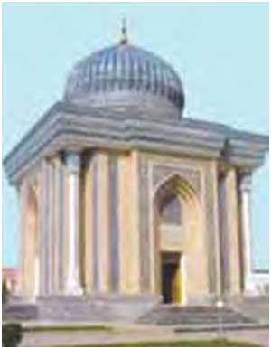

- Namanganda
+ Samarqandda
- Buxoroda
- Farg‘onada

**588. Qachon buyuk mutafakkir Imom al-Buxoriy tavalludi keng nishonlangan?**

+ 1998-yil oktyabrda
- 1997-yil aprelda
- 1996-yil martda
- 1995-yil noyabrda

**589. Qaysi olim Buxoro yaqinida Qasri Hinduvon qishlog‘ida dunyoga kelgan?**

- Imom al-Buxoriy
- Burhoniddin al-Marg‘inoniy
- Ahmad Yassaviy
+ Bahouddin Naqshband

**590. “Imom al-Buxoriy yodgorlik majmuyi” barpo etilgan Xartang qishlog‘i qayerda joylashgan?**

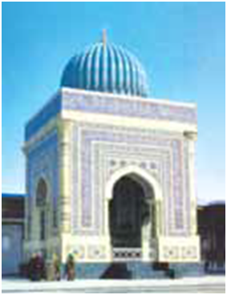

- Namanganda
- Buxoroda
+ Samarqandda
- Farg‘onada

**591. Tasavvuf ta’limoti qachon va qayerda yuzaga kelgan?**

- XI asr o‘rtalarida Arabistonda
+ VIII asr o‘rtalarida Iroqda
- X asr o‘rtalarida Shomda
- IX asr o‘rtalarida Eronda

**592. “Shariatsiz tariqat, tariqatsiz ma’rifat, ma’rifatsiz haqiqat bo‘la olmaydi” fikrinig muallifi kim?**

- Muhammad at-Termiziy
- Burhoniddin al-Marg‘inoniy
+ Ahmad Yassaviy
- Imom al-Buxoriy

**593. Burhoniddin al-Marg‘inoniy qachon va qayerda tavallud topgan?**

- 1125-yilda Termizda
- 1121-yilda Buxoroda
- 1128-yilda Marg‘ilonda
+ 1123-yilda Rishtonda

**594. Qaysi olim “Hidoyat yo‘lining sarboni” deya katta hurmat-e’tibor topgan?**

- Muhammad at-Termiziy
+ Burhoniddin al-Marg‘inoniy
- Abu Mansur al-Moturidiy
- Imom al-Buxoriy

**595. Qur’oni karimning sharhlari qanday ataladi?**

- Tariqat
- Tasavvuf
+ Tafsir
- Fiqh

**596. Qaysi ta’limotda xalqqa va Vatanga bo‘lgan muhabbat nihoyatda kuchli bo‘lib, har qanday og‘ir damlarda ham omma bilan birga bo‘lish, Vatanni mudofaa qilish va uning mustaqilligi uchun kurashga da’vat etilgan?**

- Yassaviya ta’limotida
- Yugnakiya ta’limotida
- Naqshbandiya ta’limotida
+ Kubroviya ta’limotida

**597. XII asr oxirida Xorazmda qanday ta‘limot paydo bo‘lgan?**

- Yassaviya ta’limoti
- Yugnakiya ta’limoti
- Naqshbandiya ta’limoti
+ Kubroviya ta’limoti

**598. “Hayotnoma” va “Dalil al-oshiqin” nomli asarlar muallifi kim?**

- Muhammad at-Termiziy
- Burhoniddin al-Marg‘inoniy
- Ahmad Yassaviy
+ Bahouddin Naqshband

**599. Qachon al-Marg‘inoniyning tavalludi keng nishonlangan?**

+ 2000-yilda
- 1999-yilda
- 1998-yilda
- 1997-yilda

**600. Qaysi olim “val-milla” (Islom dinining dalili, isboti) degan sharafli nomga sazovor bo‘lgan?**

- Muhammad at-Termiziy
+ Burhoniddin al-Marg‘inoniy
- Abu Mansur al-Moturidiy
- Imom al-Buxoriy

**601. Bahouddin Naqshband qachon dunyoga kelgan?**

- 1322-yilda
+ 1318-yilda
- 1315-yilda
- 1324-yilda

**602. Qachondan boshlab Buxoro “Qubbat ul-islom” – “Islom dinining gumbazi” nomi bilan shuhrat topgan?**

- XII asrdan
- XI asrdan
- X asrdan
+ IX asrdan

**603. Bahouddin Naqshband qanday hunarmand oilasida dunyoga kelgan?**

- Yog‘ochlarga naqsh bosuvchi hunarmand oilasida
- Kitoblarga naqsh bosuvchi hunarmand oilasida
+ Matolarga naqsh bosuvchi hunarmand oilasida
- Metallarga naqsh bosuvchi hunarmand oilasida

**604. Turkistonda XII asrda qanday ta‘limot paydo bo‘lgan?**

+ Yassaviya ta’limoti
- Yugnakiya ta’limoti
- Naqshbandiya ta’limoti
- Kubroviya ta’limoti

**605. Abu Mansur al-Moturidiy … yaqinidagi Moturid qishlog‘ida tug‘ilgan.**

- Termiz
- Qarshi
+ Samarqand
- Buxoro

**606. Qaysi ta’limotda kamolotga uzlat va tarkidunyochilik orqali yetishish g‘oyasi olg‘a surilgan?**

+ Yassaviya ta’limotida
- Yugnakiya ta’limotida
- Naqshbandiya ta’limotida
- Kubroviya ta’limotida

**607. Islom olamida “Musulmonlarning e’tiqodini tuzatuvchi” degan yuksak sharafga sazovor bo‘lgan olim kim?**

- Muhammad at-Termiziy
- Burhoniddin al-Marg‘inoniy
+ Abu Mansur al-Moturidiy
- Imom al-Buxoriy

**608. “Dil ba yor-u dast ba kor” (“Ko‘ngil Allohda bo‘lsin-u, qo‘l mehnat bilan band bo‘lsin”) degan hikmat qaysi tariqatning hayotiy mohiyatini ifodalaydi?**

+ Naqshbandiya tariqatining
- Yugnakiya tariqatining
- Kubroviya tariqatining
- Yassaviya tariqatining

**609. Muhammad ibn Ismoil al-Buxoriyning yashagan yillarini toping.**

- 825–885-yillar
- 870–944-yillar
- 824–894-yillar
+ 810–870-yillar

**610. Abu Iso Muhammad at-Termiziyning yashagan yillarini toping.**

- 825–885-yillar
- 870–944-yillar
+ 824–894-yillar
- 810–870-yillar

**611. Imom al-Moturidiy tavalludining 1130 yilligi qachon nishonlangan?**

- 1999-yil mayda
- 1998-yil oktyabrda
- 1997-yil aprelda
+ 2000-yil noyabrda

**612. Shayx Najmiddin Kubro yashagan yillarini toping.**

- 1140–1219-yillar
- 1142–1218-yillar
- 1146–1225-yillar
+ 1145–1221-yillar

**613. “Kitob at-Tavhid” (“Allohning birligi”) va “Ta’vilot ahl as-sunna” (“Sunniylik an’analari sharhi”) nomli asarlar muallifi kim?**

- Burhoniddin al-Marg‘inoniy
- Ismoil al-Buxoriy
+ Abu Mansur al-Moturidiy
- Muhammad at-Termiziy

**614. “Hidoya” asari muallifi kim?**

- Muhammad at-Termiziy
+ Burhoniddin al-Marg‘inoniy
- Abu Mansur al-Moturidiy
- Imom al-Buxoriy

**615. Buxoroning Darvozai Mansur mahallasida qonunshunoslar uchun maxsus “Faqihlar madrasasi” qachon qurilgan?**

- XIV asrda
- XIII asrda
+ XII asrda
- XI asrda

**616. Abu Mansur al-Moturidiyning yashagan yillarini toping.**

- 825–885-yillar
+ 870–944-yillar
- 824–894-yillar
- 810–870-yillar

**617. “Hikmat” asarining muallifi kim?**

- Muhammad at-Termiziy
- Burhoniddin al-Marg‘inoniy
+ Ahmad Yassaviy
- Imom al-Buxoriy

**618. Qaysi ta’limotda tarkidunyochilik rad etilib, kamolot yo‘lida olib boriladigan mashaqqatli mehnat jarayonida bu dunyo noz-ne’matlaridan bahramand bo‘lishning joizligi g‘oyasi ilgari surilgan?**

- Yassaviya ta’limotida
- Yugnakiya ta’limotida
- Naqshbandiya ta’limotida
+ Kubroviya ta’limotida

**619. Islom huquqshunosligi qanday ataladi?**

- Tariqat
- Tasavvuf
- Tafsir
+ Fiqh

**620. 7275 hadis kiritilgan “Al-jome’ as-sahih” asari muallifi kim?**

- Burhoniddin al-Marg‘inoniy
+ Ismoil al-Buxoriy
- Abu Mansur al-Moturidiy
- Muhammad at-Termiziy

**621. XIV asrda Buxoroda qanday ta‘limot paydo bo‘lgan?**

- Yassaviya ta’limoti
- Yugnakiya ta’limoti
+ Naqshbandiya ta’limoti
- Kubroviya ta’limoti

## 30-§ Me’morchilik, san’at va musiqa.

**622. Nurota tizmalaridagi Pastog‘ darasi to‘silib barpo etilgan Xonbandi suv ombori qaysi asrga oid?**

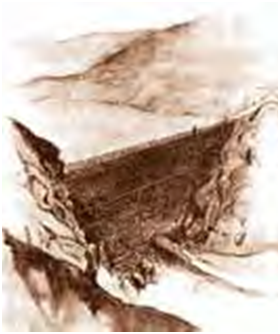

- XII asrga
- XI asrga
+ X asrga
- IX asrga

**623. Qachondan boshlab O‘rta Osiyoda binokorlikda sinchkori imoratlar keng tarqalgan?**

- XII asrdan
- XI asrdan
+ X asrdan
- IX asrdan

**624. Xonbandi suv omboriga qancha metr kub suv to‘plangan?**

- 2,5 mln. metr kub
+ 1,5 mln. metr kub
- 1 mln. metr kub
- 2 mln. metr kub

**625. Ismoil Somoniy maqbarasi, Namozgoh masjidi, Minorai kalon qaysi shaharda joylashgan?**

- Xo‘jand shahrida
- Termiz shahrida
+ Buxoro shahrida
- Samarqand shahrida

**626. XVII asrda suvning bosim kuchini kashf qilgan mashhur fransuz fizigi kim?**

- Moris Broyl
- Frederik Jolio Kyuri
- Antuan Bekkerel
+ Blez Paskal

**627. Afrosiyob, Varaxsha, Buxoro va Poykand shahar xarobalarida kovlab ochilgan turarjoy qoldiqlaridan ma’lum bo‘lishicha, qaysi asrlarda paxsa va xom g‘ishtdan qurilgan imoratlar shahar me’morchiligida asosiy o‘rinni egallagan?**

- XII–XIII asrlarda
- XI–XII asrlarda
+ X–XI asrlarda
- IX–X asrlarda

**628. Qaysi kuylar “Shashmaqom” uchun poydevor bo‘lgan? 1. “Rost”, 2. “Xusravoniy”, 3. “Boda”, 4. “Ushshoq”, 5. “Zerafkanda”, 6. “Buzruk”, 7. “Sipohon”, 8. “Navo”, 9. “Basta”, 10. “Tarona.**

- 1, 3, 5, 6, 8, 9, 10
- 1, 2, 3, 4, 5, 6, 7, 9
- 1, 2, 3, 4, 5, 6, 7, 8, 9
+ 1, 2, 3, 4, 5, 6, 7, 8, 9, 10

## 31-§ XIV asrning o‘rtalarida Movarounnahrda ijtimoiy-siyosiy vaziyat.

**629. XIV asrning 50–60-yillarida Movarounnahr qancha mustaqil bekliklarga bo‘linib ketgan edi?**

- 40 ga yaqin
- 30 ga yaqin
- 20 ga yaqin
+ 10 ga yaqin

**630. Amir Temur bilan yuzma-yuz o‘tirib suhbatlashishga muyassar bo‘lgan buyuk arab faylasufi kim?**

- Ibn Arabshoh
+ Ibn Xaldun
- Ibn Battuta
- Ibn Xayqal

**631. Amir Temur qachon tavallud topgan?**

- 1332-yil 19-fevral kuni
- 1334-yil 29-fevral kuni
+ 1336-yil 9-aprel kuni
- 1338-yil 19-aprel kuni

**632. Samarqanddagi sarbadorlar harakatining boshchilaridan qaysi biri mudarris bo‘lgan?**

- Abu Bakr Kalaviy
- Xurdaki Buxoriy
+ Mavlonozoda Samarqandiy
- Barchasi mudarris bo‘lgan

**633. Amir Temur Tug‘luq Temurning yorlig‘i bilan Kesh viloyatining dorug‘asi (hokimi) etib tayinlanganda necha yoshda edi?**

- 25 yoshda
+ 24 yoshda
- 23 yoshda
- 22 yoshda

**634. Qaysi so‘z mo‘g‘ulcha “nazoratchi”, “shahar boshlig‘i” degan ma’noni anglatadi?**

+ Dorug‘a
- Bosqoq
- Xoqon
- No‘yon

**635. Mo‘g‘uliston xoni Tug‘luq Temur bosqini paytida Amir Temurning amakisi – Kesh viloyatining hukmdori Amir Hoji Barlos qayerga qochgan?**

- Eronga
- Mozandaronga
+ Xurosonga
- Jurjonga

**636. Qachon Amir Temur bilan Amir Husayn sarbadorlar bilan uchrashish uchun Samarqandga yo‘l olganlar va shahar yaqinidagi Konigil mavzeyiga kelib tushganlar?**

- 1363-yilda
- 1364-yilda
- 1365-yilda
+ 1366-yilda

**637. Qachon Amir Temur bilan Amir Husayn Ilyosxo‘ja boshliq jeta lashkarlarini Movarounnahrdan quvib chiqarganlar?**

- 1360-yilda
- 1369-yilda
- 1366-yilda
+ 1364-yilda

**638. Amir Temurning onasi Onasi Takina xotun qayerning obro‘li beka (bek og‘o) laridan hisoblangan?**

+ Kesh yurtining
- Nasaf yurtining
- Qarshi yurtining
- Samarqand yurtining

**639. Amir Temurning otasi Amir Tarag‘ay qaysi urug‘dan bo‘lgan?**

- Mang‘it urug‘idan
+ Barlos urug‘idan
- Qipchoq urug‘idan
- Qoraxitoy urug‘idan

**640. Amir Temur va Amir Husyn mo‘g‘ul xoni Ilyosxo‘jaga qarshi olib borgan “Loy jangi” qayerda bo‘lib o‘tgan?**

- Balx bilan Xo‘jand o‘rtasidagi Qaynarja daryosi bo‘yida
+ Toshkent bilan Chinoz o‘rtasidagi Chirchiq daryosi bo‘yida
- Nasaf bilan Toshkent o‘rtasidagi Zarafshon daryosi bo‘yida
- Kesh bilan Jizzax o‘rtasidagi Chirchiq daryosi bo‘yida

**641. Qaysi shaharda “Sarbadorlar harakati” nomi bilan shuhrat topgan mo‘g‘ullar hukmronligiga qarshi xalq qo‘zg‘oloni boshlangan?**

+ Samarqand shahrida
- Xo‘jand shahrida
- Kesh shahrida
- Jizzax shahrida

**642. Tug‘luq Temur o‘g‘li Ilyosxo‘jani qayerni hukmdori etib tayinlab, o‘zi Mo‘g‘ulistonga qaytib ketgan?**

- Nasafni
+ Movarounnahrni
- Xurosonni
- Keshni

**643. Amir Temur (Amir Temur ibn Amir Tarag‘ay ibn Amir Barqul) … viloyatidgi Xoja Ilg‘or qishlog‘i (Yakkabog‘ tumani) da tug‘ilgan.**

- Samarqand
- Nasaf
- Qarshi
+ Kesh

**644. Mo‘g‘uliston xoni Tug‘luq Temur qaysi yillarda Movarounnahrga birin-ketin ikki marta bostirib kirgan?**

- 1364–1365-yillarda
- 1363–1364-yillarda
- 1362–1363-yillarda
+ 1360–1361-yillarda

**645. Amir Temur sarbadorlar harakati boshliqlaridan kimning hayotini Amir Husayndan so‘rab olgan va o‘limdan qutqarib qolgan?**

- Abu Bakr Kalaviyning
- Xurdaki Buxoriyning
+ Mavlonozoda Samarqandiyning
- Barchasini qutqarib qolgan

**646. Qaysi yillarda Amir Husayn bilan Amir Temur o‘rtasida munosabat keskinlashib, bir necha bor o‘zaro to‘qnashuvlar ham bo‘lgan?**

- 1368–1372-yillarda
- 1367–1371-yillarda
+ 1366–1370-yillarda
- 1365–1369-yillarda

**647. “Sarbador” so‘zi qaysi tildan olingan?**

- Mo‘g‘ul tilidan
- Turkiy tildan
- Arab tilidan
+ Fors tilidan

**648. Amir Temur singlisi Uljoy Turkon Og‘oga uylangan Amir Husayn qayerning hokimi edi?**

+ Balx hokimi
- Nasaf hokimi
- Marv hokimi
- Kesh hokimi

**649. Amir Temur necha yoshida bolalarga xos bo‘lgan ermak o‘yinlardan voz kechib, sipohiylikka oid o‘yinlar bilan shug‘ullangan?**

- 13 yoshida
+ 12 yoshida
- 11 yoshida
- 10 yoshida

**650. Qachon Amir Temur bilan Amir Husayn Amudaryoning chap sohilida, Qunduz shahri yonida Ilyosxo‘ja ustidan g‘alaba qozonganlar?**

- 1361-yilda
- 1364-yilda
+ 1363-yilda
- 1367-yilda

**651. Amir Temur va Amir Husyn mo‘g‘ul xoni Ilyosxo‘jaga qarshi olib borgan “Loy jangi” qachon sodir bo‘lgan?**

+ 1365-yilning 22-may kuni
- 1362-yilning 28-may kuni
- 1363-yilning 25-may kuni
- 1364-yilning 20-may kuni

**652. Mo‘g‘ullar davrida qaysi lavozimdagi shaxs aholini ro‘yxatga olish, mahalliy xalqdan qo‘shin to‘plash, pochta aloqalarini yo‘lga qo‘yish, soliqlar yig‘ish, to‘plangan soliq-to‘lovlarni saroyga yetkazish bilan shug‘ullangan?**

+ Dorug‘a
- Bosqoq
- Xoqon
- No‘yon

**653. Sarbadorlar harakati qachon vujudga kelgan?**

- XIV asrning 30-yillarida
+ XIV asrning 60-yillarida
- XIV asrning 50-yillarida
- XIV asrning 40-yillarida

## 32-§ Amir Temur – markazlashgan davlat asoschisi.

**654. Qachon Amir Temur davlatni siyosiy va iqtisodiy jihatdan mustahkamlab, ko‘pdan beri davom etib kelayotgan ichki tarqoqlikka barham berish, tinchlik va osoyishtalikni qaror toptirish maqsadida Samarqandda katta qurultoy chaqirgan?**

- 1370-yil may oyida
- 1370-yil iyun oyida
+ 1370-yil iyul oyida
- 1370-yil aprel oyida

**655. Qachon bo‘lib o‘tgan qurultoyda Amir Temurning hukmdorligi rasman tan olinib, u Movarounnahrning amiri deb e’lon qilingan?**

+ 1370-yilning 11-aprelida
- 1370-yilning 14-aprelida
- 1370-yilning 23-noyabrida
- 1370-yilning 11-martida

**656. Amir Temur qo‘shini qaysi shahar yaqinidagi Biyo qishlog‘iga yetganida uning huzuriga taniqli ulamolardan Sayyid Baraka tashrif buyurgan?**

- Shosh shahri
- Balx shahri
+ Termiz shahri
- Buxoro shahri

**657. Sayyid Baraka Amir Temurga qanday Oliy hokimiyat ramzlarini tortiq qilgan?**

- Qalqon bilan dubulg’a
+ Nog‘ora bilan bayroq
- Qilich bilan bayroq 
- Qilich bilan qalqon

**658. Amir Temur qaysi yildan boshlab Xorazmga besh marta harbiy yurish qilgan?**

- 1369-yildan boshlab
- 1376-yildan boshlab
+ 1372-yildan boshlab
- 1371-yildan boshlab

**659. Amir Temur davlat poytaxti deb qaysi shaharni e’lon qilgan?**

- Nasaf shahrini
- Buxoro shahrini
- Kesh shahrini
+ Samarqand shahrini

**660. Qachon Balx shahri Amir Temurga taslim bo‘lgan?**

- 1370-yilning 13-aprelida
+ 1370-yilning 10-aprelida
- 1370-yilning 22-noyabrida
- 1370-yilning 9-martida

**661. Amir Temur qachon Hirot, Seyiston, Mozandaronni egallagan?**

+ 1381-yilda
- 1388-yilda
- 1389-yilda
- 1386-yilda

**662. Amir Temur qachon Xorazmni uzil-kesil bo‘ysundirgan?**

- 1381-yilda
+ 1388-yilda
- 1389-yilda
- 1386-yilda

**663. Qaysi shaharlar Amir Temurga jangsiz bo‘ysungan?**

- Balx, Sabzavor, Jom, Ko‘niya
- Sabzavor, Kirmon, Qavsiya, Marv
- Qavsiya, Ko‘niya, Anqara, Astraxan
+ Saraxs, Jom, Qavsiya, Sabzavor

**664. Qachon Amir Temur butun qo‘shinlari bilan Balx hukmdori Amir Husaynga qarshi yurishga chiqqan?**

- 1371-yilning qishida
- 1371-yilning kuzida
- 1370-yilning yozida
+ 1370-yilning bahorida

## 33-§ Amir Temur saltanatida davlat boshqaruvi va harbiy tizim.

**665. Amir Temur saltanatida har bir yomda qancha boshdan ot-ulov tutilgan?**

- 70–100 boshdan
+ 50–200 boshdan
- 40–250 boshdan
- 60–150 boshdan

**666. Amir Temur lashkarida o‘nlik bo‘linmani kim boshqargan?**

- Tuman og‘asi
- Mirihazora
- Qo‘shunboshi
+ Aylboshi

**667. Amir Temur qo‘shini nechta qismdan iborat bo‘lgan?**

- 8 qismdan
+ 7 qismdan
- 6 qismdan
- 5 qismdan

**668. Sohibqiron Sharqda birinchilardan bo‘lib qo‘shinga qanday qurolni olib kirgan?**

- Miltiqni
+ O‘tsochar qurolni
- Katapultani
- Manjaniqni

**669. Qaysi davlat idorasini Amir Temurning o‘zi boshqargan?**

- Kengashni
- Qurultoyni
+ Dargohni
- Devonni

**670. Boyazid ustidan qozonilgan buyuk g‘alaba bilan Amir Temurni qaysi davlat hukmdorlari tabriklaganlar?**

+ Kastiliya va Leon, Fransiya, Angliya
- Fransiya, Italiya, Angliya
- Germaniya, Kastiliya va Leon, Italiya
- Angliya, Vizantiya, Fransiya

**671. Amir Temur hayotlik davridayoq uning harbiy san’ati va davlat boshqarish uslubiga bag‘ishlab yaratilgan asar qanday nomlanadi?**

- “Amir Temur qonunlari”
- “Temur qonunlari”
+ “Temur tuzuklari”
- “Amir tuzuklari”

**672. Amir Temur Afg‘oniston va Shimoliy Hindistonni (markazi G‘azna, keyinchalik Balx) kimga suyurg‘ol tarzida in’om qilgan?**

+ Pirmuhammadga
- Shohruxga
- Mironshohga
- Umarshayxga

**673. Amir Temur saltanatida davlat boshqaruvi qanday idoradan iborat bo‘lgan?**

- Mashvarat va kengash
- Devon va oliy qurultoy
- Devonxona va dargoh
+ Dargoh va vazirlik

**674. Usmonli turklar sultoni Boyazid Yildirim kimlarning Amir Temurga qarshi harakatlarini qo‘llab-quvvatlagan va buning natijasida ikki davlat o‘rtasida to‘qnashuv bo‘lishi muqarrar bo‘lib qolgan?**

- Qoraqo‘yunlarning
- Jaloyiriylarning
- Muzaffariylarning
+ Barcha javoblar to‘g‘ri

**675. Qachon Amir Temur 200 ming kishilik qo‘shin bilan Xitoyga qarshi yurishga chiqqan?**

- 1403-yil 26-martda
- 1402-yil 20-iyulda
- 1405-yil 18-fevralda
+ 1404-yil 27-noyabrda

**676. Amir Temur o‘z ixtiyori bilan taslim bo‘lib, … to‘lagan shaharlarga tegmagan, qo‘shinlarni bunday shaharlarga kiritmagan.**

- Mol-mulk to‘lovi
- Qo’shin puli
+ Moli omon 
- Afanak puli

**677. Amir Temur lashkarida yuzlik bo‘linmani kim boshqargan?**

- Tuman og‘asi
- Mirihazora
+ Qo‘shunboshi
- Aylboshi

**678. Amir Temur lashkarida yuzlik qism qanday atalgan?**

- Ayl
+ Qo‘shun
- Hazora
- Tuman

**679. Amir Temur qachon vafon etgan?**

- 1404-yil 27-noyabrda
+ 1405-yil 18-fevralda
- 1403-yil 26-martda
- 1402-yil 20-iyulda

**680. Amir Temur davrida butun saltanat bo‘ylab necha kunlik yo‘l oralig‘ida yomxonalar tashkil etilgan?**

- Ikki kunlik yo‘l oralig‘ida
- To‘rt kunlik yo‘l oralig‘ida
+ Bir kunlik yo‘l oralig‘ida
- Uch kunlik yo‘l oralig‘ida

**681. Amir Temur lashkarida o‘n minglik bo‘linmani kim boshqargan?**

+ Tuman og‘asi
- Mirihazora
- Qo‘shunboshi
- Aylboshi

**682. Amir Temur lashkarida o‘n minglik qism qanday atalgan?**

- Ayl
- Qo‘shun
- Hazora
+ Tuman

**683. Amir Temur bilan To‘xtamish o‘rtasidagi Shimoliy Kavkazda Tarak (Terek) daryosi bo‘yida jang qachon bo‘lgan?**

- 1398-yilning 17-iyunida
+ 1395-yilning 15-aprelida
- 1394-yilning 18-mayida
- 1391-yilning 10-martida

**684. Qaysi tarixchi qo‘shinni yetti qo‘lga – qismga bo‘lib joylashtirish tartibini birinchi bo‘lib Amir Temur joriy qilgan deb yozgan?**

- Xondamir
+ Ali Yazdiy
- Ibn Battuta
- Ibn Xayqal

**685. Amir Temur lashkarida o‘nlik qism qanday atalgan?**

+ Ayl
- Qo‘shun
- Hazora
- Tuman

**686. Amir Temur saltanatida bosh vazir qanday atalgan?**

- Amir ul-umaro
+ Devonbegi
- Dargohbegi
- Qushbegi

**687. Amir Temurning To‘xtamish ustidan g‘alabasining ahamiyati to‘g‘risida qaysi rus tarixchilari fikr bildirgan?**

+ B. Grekov va A.Yakubovskiy
- D. Ivanov va M. Yunusov
- A. Saltikov va G. Meshkov
- S. Maratov va A. Irtishev

**688. Amir Temur Xuroson, Jurjon, Mazondaron va Seyistonni (markazi Hirot) kimga suyurg‘ol tarzida in’om qilgan?**

- Pirmuhammadga
+ Shohruxga
- Mironshohga
- Umarshayxga

**689. Amir Temur qo‘shinida qanotlar yon tomonida joylashadigan qo‘riqchi qismlar qanday atalgan?**

+ Qanbul
- Juvong‘or
- Izofa
- Burong‘or

**690. Amir Temur G‘arbiy Eron, Ozarbayjon, Iroq va Armanistonni (markazi Tabriz) kimga suyurg‘ol tarzida in’om qilgan?**

- Pirmuhammadga
- Shohruxga
+ Mironshohga
- Umarshayxga

**691. Amir Temur To‘xtamishga qarshi necha marta qo‘shin tortishga majbur bo‘lgan?**

- 5 marta
- 4 marta
+ 3 marta
- 2 marta

**692. Sohibqiron qo‘shinida ayollardan iborat bo‘linmalar mavjudligi to‘g‘risida kim ma’lumot bergan?**

+ Ibn Arabshoh
- Ibn Xaldun
- Ibn Battuta
- Ibn Xayqal

**693. Amir Temur saltanatida ulus hukmdorlarining majburiyatlari nimlardan iborat edi?**

- Xirojning bir qismini Samarqandga yuborib turish
- Talab qilingan askarni yuborib turish
- Oliy hukmdor harbiy yurishlarida o‘z qo‘shini bilan qatnashish
+ Barcha javoblar to‘g‘ri

**694. Amir Temur saltanatida tashqi va ichki favqulodda voqealardan voqif etib turuvchi qancha piyoda va ot mingan choparlari bo‘lgan?**

- Bir ming besh yuz nafar piyoda, bir ming besh yuz ming nafar ot mingan choparlar bo‘lgan
- Ikki ming nafar piyoda, ikki ming nafar ot mingan choparlar bo‘lgan
- Besh yuz nafar piyoda, besh yuz nafar ot mingan choparlar bo‘lgan
+ Ming nafar piyoda, ming nafar ot mingan choparlar bo‘lgan

**695. Amir Temur saltanatida askariy qismlarni viloyatlardan to‘plash bilan qaysi mansabidagi amaldorlar shug‘ullanar edi?**

- Yasovulboshi
- Tumanboshi
- Dorug‘a
+ Tavochi

**696. Amir Temur lashkarida zaxira (rezerv) qismlar qanday atalgan?**

- Qanbul
- Juvong‘or
+ Izofa
- Burong‘or

**697. Amir Temur qo‘shinining chap qanoti qanday atalgan?**

- Qanbul
+ Juvong‘or
- Izofa
- Burong‘or

**698. Amir Temurning qaysi o‘lkalarga qilgan yurishari uch yillik, besh yillik va yetti yillik urushlar deb nom olgan?**

- Xitoy, Shom (Suriya), Old Osiyoga yurishlari
- Hindiston, Mo‘g‘uliston, Iroqqa yurishlari
+ Eron, Ozarbayjon, Iroq, Shom (Suriya) ga yurishlari
- Kavkaz, Oltin O‘rdaga yurishlari

**699. Amir Temur qo‘shinining o‘ng qanoti qanday atalgan?**

- Qanbul
- Juvong‘or
- Izofa
+ Burong‘or

**700. Amir Temur Fors, ya’ni Eronning janubiy qismini (markazi Sheroz) kimga suyurg‘ol tarzida in’om qilgan?**

- Pirmuhammadga
- Shohruxga
- Mironshohga
+ Umarshayxga

**701. Amir Temur qachon Hindistonga yurish qilib, Dehlini egallagan?**

- 1393–1394-yillarda
- 1389–1390-yillarda
- 1386–1387-yillarda
+ 1398–1399-yillarda

**702. Amir Temur lashkarida minglik bo‘linmani kim boshqargan?**

- Tuman og‘asi
+ Mirihazora
- Qo‘shunboshi
- Aylboshi

**703. Amir Temur lashkarida qismlarning oldinma-ketin yurishini to‘g‘ri tartibda joylashtiring.**

- Oldinda avangard, ular orasidan yasovul bo‘linmasi, undan keyinroqda manglay – xabarchilar qism borardi
- Oldinda yasovul bo‘linmasi, ular orasidan avangard, undan keyinroqda manglay – xabarchilar qism borardi
- Oldinda xabarchilar, ular orasidan avangard, undan keyinroqda manglay – yasovul bo‘linmasi qism borardi
+ Oldinda xabarchilar, ular orasidan yasovul bo‘linmasi, undan keyinroqda manglay – avangard qism borardi

**704. Amir Temur bilan Sulton Boyazid qo‘shinlari o‘rtasidagi Anqara yaqinida, Chubuq mavzeyidagi jang qachon bo‘lib o‘tgan?**

- 1404-yil 27-noyabrda
- 1402-yil 26-martda
+ 1402-yil 20-iyulda
- 1405-yil 18-fevralda

**705. Amir Temur lashkarida minglik qism qanday atalgan?**

- Ayl
- Qo‘shun
+ Hazora
- Tuman

## 34-§ Amir Temurning tashqi siyosati.

**706. Amir Temurning Angliya qiroli Genrix IV bilan olib borilgan diplomatik munosabatlarida g‘arbiy viloyatlar hokimi bo‘lgan qaysi o‘g‘li faol qatnashgan?**

+ Mironshoh
- Shohrux
- Umarshayx
- Jahongir

**707. Amir Temur 1371–1390-yillarda Mo‘g‘ulistonga necha marta yurish qilgan?**

+ 7 marta
- 4 marta
- 5 marta
- 6 marta

**708. 1404-yilda Samarqandga kelgan Xitoy imperatorining elchilarini Amir Temur boshqa mamlakat elchilari qatoridan o‘ziga yarasha joyga, quyiroqqa o‘tqazgani to‘g‘risida kim yozgan?**

+ Klavixo
- Ibn Xaldun
- Ali Yazdiy
- Xondamir

**709. Boyazidga qarshi ko‘rsatiladigan yordami uchun, qaysi o‘lkalarning Usmonlilarga to‘lab kelinayotgan bojini Amir Temurga to‘lashga va’da qilganlar?**

- Vengriya va Olmoniyaning
+ Konstantinopol va Peraning
- Kastiliya va Leonning
- Misr va Tunisning

**710. Amir Temurning Xitoy tomonga yurishi munosabati bilan boshqa ko‘pgina davlatlarning elchilari kabi Ispaniya elchilari ham qachon Samarqanddan jo‘natib yuborilgan?**

- 1403-yil 18-dekabrida
+ 1404-yil 21-noyabrida
- 1404-yil 24-fevralida
- 1403-yil 15-yanvarida

**711. Klavixo Samarqandga qayerdan 800 tuyalik savdo karvoni kelganini o‘z kundaligida qayd etgan?**

+ Xitoy poytaxti Xonbaliqdan
- Misr poytaxti Qohiradan
- Usmonli davlati poytaxti Bursadan
- Oltin O‘rda poytaxti Saroy Berkadan

**712. Qachon Amir Temur Yildirim Boyazidga qaqshatqich zarba bergan?**

+ 1402-yilda
- 1400-yilda
- 1395-yilda
- 1392-yilda

**713. Amir Temur elchilari qachon Parijga yetib borganlar?**

- 1404-yil aprel oyida
+ 1403-yil may oyida
- 1403-yil mart oyida
- 1404-yil iyun oyida

**714. Amir Temur Muhammadqozi ismli o‘z vakilini qayerga elchi qilib yuborgan?**

+ Ispaniyaga
- Fransiyaga
- Vizantiyaga
- Angliyaga

**715. Amir Temur davrida qaysi davlat Xorazm hukmdorlari bilan qo‘shilib, Buxoro, Chorjo‘y va Qarshi ustiga yurish qilgan?**

- Oltin O‘rda hukmdorlari
+ Oq O‘rda hukmdorlari
- Usmonli turklar hukmdorlari
- Eron hukmdorlari

**716. 1386–1405-yillar mobaynida Amir Temur va Misr sultonlari, shuningdek ularning Suriyadagi noiblari o‘rtasida necha marta maktub va elchilar almashuvi bo‘lgan?**

- 15 marta
- 10 marta
+ 25 marta
- 20 marta

**717. Nima sababdan Amir Temur poytaxt Samarqand atrofida qad ko‘targan bir qancha yangi qishloqlarni Sharqning mashhur shaharlari nomlari bilan atagan?**

+ Samarqand kattaligi, go‘zalligi hamda tevarak-atrofining obod etilganligi jihatidan dunyodagi eng yirik shaharlardan ham ustunroq turmog‘i lozim deb hisoblagan
- Ushbu mamlakatlarning elchilari taklifiga muvofiq nomlar qo‘yilgan
- Samarqandni katta va obodligini ushbu shaharlar bilan tenglashtirgan holda
- Barcha javoblar to‘g‘ri

**718. Qachon Amir Temur To‘xtamishxonga qaqshatqich zarba bergan?**

- 1402-yilda
- 1400-yilda
+ 1395-yilda
- 1392-yilda

**719. “Buyuk Temur tarixi”, “Temur qarorgohi” va “Samarqandga sayohat kundaligi” nomli kundaliklar muallifi kim?**

+ Klavixo
- Ali Yazdiy
- Xondamir
- Ibn Xayqal

**720. Qachon Ispaniya qiroli Genrix III Amir Temur huzuriga ikkinchi marta Klavixo boshliq maxsus elchilarni yuborgan?**

- 1402-yilda
+ 1403-yilda
- 1404-yilda
- 1401-yilda

**721. Qachon Amir Temur Fransiya va Angliyaga maxsus elchilar orqali Karl VI va Genrix IV nomlariga maktublar yo‘llagan?**

+ 1402-yil yozida
- 1403-yil yozida
- 1401-yil yozida
- 1404-yil yozida

**722. Qachon Fransiya qiroli Karl VI Amir Temurga javob xati yo‘llagan?**

- 1404-yil 15-iyulda
+ 1403-yil 15-iyunda
- 1404-yil 15-iyunda
- 1403-yil 15-iyulda

**723. Qachon To‘xtamishxonning elchisi Misr sultoni Barquq bilan uchrashuvda Amir Temurni yo‘q qilish taklifini kiritgan?**

- 1382-yilda
- 1380-yilda
- 1388-yilda
+ 1384-yilda

**724. Amir Temurning qaysi o‘g‘li G‘arbda “katolik oqimining homiysi” sifatida shuhrat qozongan?**

- Umarshayx
- Shohrux
+ Mironshoh
- Jahongir

**725. Amir Temur bilan Misr sultoni Barquq o‘rtasidagi rasmiy aloqalar qachon boshlangan edi?**

- 1387-yilda
- 1383-yilda
+ 1385-yilda
- 1381-yilda

**726. Boyaziddan yengilgan Kichik Osiyo mamlakatlarining hukmdorlari Amir Temurdan madad istab uning qayerdagi o‘rdagohiga borib, qaror topganlar?**

+ Qorabog‘dagi
- Basradagi
- Seyistondagi
- Hirotdagi

**727. Amir Temur davrida Xitoyda qaysi sulola hukmron edi?**

- Tan sulolasi
- Yuan sulolasi
+ Min sulolasi
- Sin sulolasi

**728. Kastiliya (Ispaniya) qiroli Genrix III 1402-yilning bahorida o‘z elchilarini Amir Temurning qayerdagi qarorgohiga yuborgan?**

- Misrdagi
- Erondagi
- Suriyadagi
+ Kichik Osiyodagi

## 35-§ Amir Temurning jahon tarixida tutgan o‘rni.

**729. Amir Temur bosib olingan qaysi shaharlarni qayta qurdirgan?**

- Anqara, G’azna, Damashq
- Hirot, Dehli, Qohira
+ Bag‘dod, Darband, Baylakon
- Hojar, Marv, Balx

**730. Hozirgi paytga kelib Amir Temur va Temuriylar haqida … mamlakatda … dan ziyod chet ellik tadqiqotchilarning asarlari chop etilgan.**

- 28/200
+ 33/500
- 24/450
- 20/100

**731. Amir Temur necha yil davomida mamlakatni boshqargan?**

- 25 yil davomida
- 31 yil davomida
- 28 yil davomida
+ 35 yil davomida

**732. XVI asrda yaratilgan “Buyuk Temur” nomli sahna asari muallifi kim?**

+ Xristofor Morlo
- Pero Meksika
- Perondino
- Klavixo

**733. Qachon Toshkent, Samarqand va xorijiy mamlakatlarda Amir Temur tavalludining 660 yilligi keng miqyosda nishonlandi va shu yil O‘zbekistonda “Amir Temur yili” deb e’lon qilindi?**

- 1998-yilda
+ 1996-yilda
- 1995-yilda
- 1993-yilda

**734. Qachon Xalqaro Amir Temur jamg‘armasi tashkil qilingan?**

+ 1995-yilda
- 1999-yilda
- 1996-yilda
- 1991-yilda

**735. O‘zbekiston Respublikasi Prezidenti Sh.M. Mirziyoyev  harbiy ta’lim-tarbiya beradigan kursantlar maktablariga “Temurbeklar maktabi” deb nom berish taklifini ilgari surilgan “Kamolot” yoshlar ijtimoiy harakatining IV qurultoyi qachon bo‘lib o‘tgan?**

- 2020-yil 11-iyulda
- 2019-yil 18-mayda
- 2018-yil 20-aprelda
+ 2017-yil 30-iyunda

**736. Qachon ispan tarixchisi Pero Meksikaning “Buyuk Temur tarixi” asari chop etilgan?**

- XIX asrda
- XVIII asrda
- XVII asrda
+ XVI asrda

**737. Qachon Seviliyada mashhur Ispaniya elchisi Klavixoning “Esdaliklar” kitobi nashrdan chiqqan?**

- 1590-yilda
- 1586-yilda
+ 1582-yilda
- 1580-yilda

**738. Qachon Toshkentdagi Amir Temur xiyobonida Temuriylar davri muzeyi barpo etildi va “Amir Temur” ordeni ta’sis etildi?**

- 1999-yilda
- 1995-yilda
+ 1996-yilda
- 1991-yilda

**739. Qaysi davlatda Amir Temurning oltindan haykalchasini quydirilib, ostiga “Yevropa xaloskoriga” deb yozdirib qo‘yilgan?**

- Italiyada
- Ispaniyada
+ Fransiyada
- Angliyada

**740. I.M. Mo‘minovning “Amir Temurning O‘rta Osiyo tarixida tutgan o‘rni va roli” risolasini qachon nashr etilgan?**

+ 1968-yilda
- 1969-yilda
- 1961-yilda
- 1963-yilda

**741. Qachon Italiyaning Florensiya shahrida italiyalik olim Perondinoning “Skifiyalik Tamerlanning ulug‘vorligi” asari bosilib chiqqan?**

+ 1553-yilda
- 1557-yilda
- 1551-yilda
- 1550-yilda

**742. Tarixiy manbalarda Amir Temur qanday nomlar bilan ulug‘langan?**

- “Sohibi jahon”
- “Adolat sohibi”
- “Sohibi adl”
+ Barcha javoblar to‘g‘ri

## 36-§ Temuriylar davridagi siyosiy jarayonlar.

**743. Qachon Qoraqo‘yunli turkmanlarning qabila boshlig‘i Qora Yusuf bilan bo‘lgan jangda Mironshoh halok bo‘lgan?**

- 1407-yil 22-fevralda
- 1409-yil 25-aprelda
- 1405-yil 18-martda
+ 1408-yil 22-aprelda

**744. Xalil Sultonga qarshi birinchi bo‘lib isyon ko‘targan amir Xudoydot bilan Shayx Nuriddin qayerlarning hokimi edilar?**

- Marv va G‘aznaning
- Hirot va Seyistonning
- Xuroson va Maymurg‘ning
+ Turkiston va Farg‘onaning

**745. Amir Temur vafoti oldidan taxt vorisi etib kimni tayinlagan edi?**

- Shohruxni
+ Pirmuhammadni
- Mironshohni
- Xalil Sulton Mirzoni

**746. Amudaryodan janubda joylashgan Shohrux boshchiligidagi davlatning poytaxti qaysi shahar edi?**

- O‘tror shahri
- G‘azna shahri
+ Hirot shahri
- Samarqand shahri

**747. Xalil Sultonning ukasi Sulton Husayn Mirzo qayerda o‘z hokimiyatini o‘rnatmoq niyatida akasiga qarshi bosh ko‘targan?**

- Sirdaryoning chap sohilidagi viloyatlarda
- Sirdaryoning o‘ng sohilidagi viloyatlarda
+ Amudaryoning chap sohilidagi viloyatlarda
- Amudaryoning o‘ng sohilidagi viloyatlarda

**748. Amir Temur taxtining qonuniy valiahdi Pirmuhammad Amudaryodan kechib o‘tib, Xalil Sultonga qarshi qayerga askar tortgan?**

+ Nasaf tomonga
- Buxoro tomonga
- Samarqand tomonga
- Kesh tomonga

**749. Amudaryodan shimolda, Movarounnahr va Turkiston hududida joylashgan Ulug‘bek boshchiligidagi davlatning poytaxti qaysi shahar edi?**

- O‘tror shahri
- G‘azna shahri
- Hirot shahri
+ Samarqand shahri

**750. Amir Temur qachon vafon etgan?**

- 1404-yil 27-noyabrda
- 1402-yil 26-martda
- 1403-yil 20-iyulda
+ 1405-yil 18-fevralda

**751. Qachon Xalil Sulton Mirzo o‘zboshimchalik bilan Samarqandni egallab, o‘zini Movarounnahrning oliy hukmdori deb e’lon qilgan?**

- 1409-yil 25-aprelda
- 1408-yil 22-aprelda
- 1407-yil 22-fevralda
+ 1405-yil 18-martda

**752. Amir Temur qaysi shaharda vafot etgan?**

- Kesh shahrida
- Xo‘jand shahrida
+ O‘tror shahrida
- Samarqand shahrida

**753. Qachon Shohrux Amudaryodan o‘tib, Samarqand sari yurish qilgan?**

+ 1409-yil 25-aprelda
- 1405-yil 18-martda
- 1407-yil 22-fevralda
- 1408-yil 22-aprelda

**754. Qachon Pirmuhammad vaziri Pir Ali Toz boshliq fitnachilar qo‘lida halok bo‘lgan?**

- 1409-yil 25-aprelda
- 1408-yil 22-aprelda
+ 1407-yil 22-fevralda
- 1405-yil 18-martda

## 37-§ Mirzo Ulug‘bekning hukmronligi davrida Movarounnahr.

**755. Movarounnahr va Turkistonga hokim qilib tayinlagan Ulug‘bekning hokimiyati dastlab qaysi hududlar bilan cheklangan edi?**

- Farg‘ona, O‘zgan, Samarqand bilan
+ Samarqand, Buxoro va Nasaf bilan
- Hisori Shodmon, Turkiston, Farg‘ona bilan
- Turkiston, Buxoro, Kesh bilan

**756. Ulug‘bek va o‘g‘li Abdullatif o‘rtasida qachon va qayerda jang bo‘lgan va Ulug‘bek yengilgan?**

- 1448-yil aprelda Oqsoy qishlog‘i yaqinida
- 1446-yil fevralda Sheroz qishlog‘i yaqinida
- 1447-yil noyabrda Bag‘dod qishlog‘i yaqinida
+ 1449-yil oktyabrda Damashq qishlog‘i yaqinida

**757. Qachondan boshlab Movarounnahr va Turkistonni to‘liq boshqarish 18 yashar Ulug‘bek qo‘liga o‘tgan?**

- 1414-yildan
+ 1412-yildan
- 1413-yildan
- 1425-yildan

**758. O‘g‘li Abdullatifdan jangda yengilgan Ulug‘bekni shaharga kiritmagan Mironshoh Qavchin qayerning amiri edi?**

- Buxoroning
+ Samarqandning
- Shohruxiyaning
- Nasafning

**759. Qachon Ulug‘bek Mo‘g‘uliston ustiga yurish boshlab, Issiqko‘l yaqinida sodir bo‘lgan to‘qnashuvda mo‘g‘ullar ustidan g‘alaba qozongan?**

- 1420-yilda
- 1427-yilda
- 1422-yilda
+ 1425-yilda

**760. Abdullatif kimning qo‘shinidan qo‘rqib Hirotni jangsiz bo‘shatib, Movarounnahr tomon qochgan?**

- Abulxayrxon qo‘shinidan
- Amirak Ahmad qo‘shinidan
+ Abulqosim Bobur qo‘shinidan
- Alouddavla qo‘shinidan

**761. Ulug‘bek Hirotga yurish payti kichik o‘g‘li Abdulazizni qayerga vaqtinchalik noib qilib tayinlagan edi?**

- Sherozga
+ Samarqandga
- Buxoroga
- Tarozga

**762. Abdullatif Balxga noib qilib tayinlangach, qaysi soliqni bekor qilib, savdogarlarni o‘z tarafiga og‘dirib olgan?**

- “Ushr” solig‘ini
+ “Tamg‘a” solig‘ini
- “Zakot” solig‘ini
- “Jizya” solig‘ini

**763. Shohruxning vafotidan so‘ng uning taxtini kim egallagan?**

- To‘ng‘ich o‘g‘li Ulug‘bek
- Ulug‘bekning to‘ng‘ich o‘g‘li Abdullatif
- Ulug‘bekning kichik o‘g‘li Abdulaziz
+ Boysung‘urning o‘g‘li Alouddavla

**764. Ulug‘bek Amir Temurning qabri uchun yasattirgan ikki bo‘lak nefrit toshini qayerdan olib kelgan edi?**

- Erondan shayxlar tuhfasi sifatida
- Dashti Qipchoqqa yurishidan o‘lja sifatida
+ Issiqko‘l yaqinida bo‘lgan jangdan o‘lja sifatida
- Bag‘dod xalifasidan sovg‘a sifatida

**765. Qachon Shohrux tomonidan Xorazm Oltin O‘rda xonlari tasarrufidan qaytarib olingan?**

- 1414-yilda
- 1412-yilda
+ 1413-yilda
- 1425-yilda

**766. Qachon Shohrux 15 yoshli Ulug‘bekni Movarounnahr va Turkistonga hokim qilib tayinlagan?**

- 1414-yilda
- 1408-yilda
- 1412-yilda
+ 1409-yilda

**767. Qachon Ulug‘bek Farg‘ona va Koshg‘arni egallagan?**

+ 1414-yilda
- 1412-yilda
- 1413-yilda
- 1425-yilda

**768. Mirzo Ulug‘bek qaysi yilda va necha yoshida fojiali halok bo‘lgan?**

- 1447-yil 53 yoshida
+ 1449-yil 55 yoshida
- 1446-yil 52 yoshida
- 1448-yil 54 yoshida

**769. Hirotni tashlab qochgan o‘g‘li Abdullatifni Ulug‘bek qayerga noib qilib tayinlangan?**

- Tarozga
+ Balxga
- Marvga
- Keshga

**770. Ulug‘bek Issiqko‘l yaqinida bo‘lgan jangdagi g‘alabasi sharafiga Ilono‘tti darasida qoyatoshga yozdirgan “zafarnoma” qaysi hududda joylashgan?**

- Toshkent yaqinida
+ Jizzax yaqinida
- Samarqand yaqinida
- Termiz yaqinida

**771. Shohrux davrida Muhammad Jahongir qayerlarning hukmdori sanalgan?**

- Farg‘onadan to O‘zgangacha hududlarning
- Buxoro va Nasafning
+ Hisori Shodmonning
- Turkistonning

**772. O‘g‘li Abdullatifdan jangda yengilgan Ulug‘bek qaysi shaharga kirolmay, unga taslim bo‘lgan?**

- Buxoroga kirolmay
- Samarqandga kirolmay
+ Shohruxiyaga kirolmay
- Nasafga kirolmay

**773. Alouddavla qo‘shini tor-mor keltirilib, Ulug‘bek tomonidan Hirot qo‘lga kiritilgan Tarnob yaqinidagi jang qachon sodir bo‘lgan?**

- 1447-yilda
- 1449-yilda
+ 1448-yilda
- 1445-yilda

**774. Abdullatif Hirotda necha kun hokimlik qilgan?**

- O‘n olti kun
- O‘n sakkiz kun
- O‘n ikki kun
+ O‘n besh kun

**775. Shohrux davrida Shayx Nuriddin qayerlarning hukmdori sanalgan?**

- Xurosonning
- Keshning
- Hisori Shodmonning
+ Turkistonning

**776. Qayerga qilgan yurishida Ulug‘bekning omadi kelmay, otasi Shohruxning katta qo‘shin bilan yetib kelishigina uni halokatdan saqlab qolgan?**

- Eronga yurishida
+ Dashti Qipchoqqa yurishida
- Mo‘g‘ulistonga yurishida
- Oltin O‘rdaga yurishida

**777. Ulug‘bekning qatl qilinishiga qarshi chiqqan Shamsiddin Muhammad Miskin kim bo‘lgan?**

- Shayx ul-islom
+ Shahar qozisi
- Amir ul-ulamo
- Tuman og‘asi

**778. Shohrux davrida Amirak Ahmad qayerlarning hukmdori sanalgan?**

+ Farg‘onadan O‘zgangacha hududlarning
- Samarqand va Nasafning
- Hisori Shodmonning
- Turkistonning

**779. Shohrux qachon va qayerda nevarasi Sulton Muhammad isyonini bostirish vaqtida olamdan o‘tgan?**

- 1446-yil 16-fevralda Mo‘lton viloyatida
- 1448-yil 14-aprelda Seyiston viloyatida
- 1449-yil 10-mayda Kirmon viloyatida
+ 1447-yil 12-martda Ray viloyatida

**780. Hirotdan Samarqandga qaytar ekan, Ulug‘bek qayerlik Abulxayrxon boshchiligidagi ko‘chmanchilar hujumiga duchor bo‘lgan?**

- Sharqiy Turkistonlik
- Oltin O‘rdalik
- Yettisuvlik
+ Dashti Qipchoqlik

**781. Nima sababdan Abdullatifda otasi Ulug‘bekka nisbatan adovat paydo bo‘lgan?**

- G‘alaba to‘g‘risida tevarak atrofga yuborilgan fathnomalarda Abdullatifning nomi inisi Abdulazizdan keyin tilga olingani sababli
- Ixtiyoriddin qal’asidagi xazinasi Ulug‘bek tomonidan olib qo‘yilgani sababli
- O‘ta shuhratparast hamda mol-dunyoga o‘ch bo‘lgani sababli
+ Barcha javoblar to‘g‘ri

**782. Qachon Alouddavla Ulug‘bekning katta o‘g‘li Abdullatifning qo‘shinini tor-mor qilib, uni asirga olgan?**

+ 1447-yilning bahorida
- 1449-yilning bahorida
- 1446-yilning bahorida
- 1448-yilning bahorida

**783. Mirzo Ulug‘bek yashagan yillarini toping.**

- 1390–1441-yillar
- 1397–1455-yillar
+ 1394–1449-yillar
- 1392–1451-yillar

**784. Qachon va qayerda Shayx Nuriddin boshchiligidagi isyonkor ittifoqchilar bilan Mirzo Ulug‘bek qo‘shinlari o‘rtasida jang bo‘lgan?**

- 1411-yil 9-fevraldada Buxoro yaqinida Karmana mavzeyida
- 1411-yil 30-martda Nasaf yaqinida Oqsaroy mavzeyida
+ 1410-yil 20-aprelda Samarqand yaqinida Qizilravot mavzeyida
- 1410-yil 15-avgustda Samarqand yaqinida Konigil mavzeyida

**785. Qachon Ulug‘bek va Abdullatifning 90 ming kishilik birlashgan qo‘shini Hirotga yurish qilgan?**

- 1447-yilda
- 1449-yilda
+ 1448-yilda
- 1445-yilda

**786. Milodiy 1425-yil hijriyda nechanchi yilga to‘g‘ri keladi?**

+ 828-yilga
- 832-yilga
- 836-yilga
- 822-yilga

**787. Mirzo Ulug‘bek Movarounnahrni necha yil idora qilgan?**

- O‘n yil
- O‘ttiz yil
- Yigirma yil
+ Qirq yil

## 38-§ Temuriylar saltanatining inqirozga yuz tutishi.

**788. Abdullatif o‘ldirilganidan keyin muxolafatchi kuchlar Buxoroda kimni hukmdor qilib ko‘tarishgan?**

- Shohruxning nabirasi Mirzo Abdulloni
- Umarshayxning nabirasi Sulton Husaynni
+ Mironshohning nabirasi Abu Saidni
- Jahongirning nabirasi Abulqosim Boburni

**789. Qachon Dashti Qipchoq hukmdorlaridan Abulxayrxon Abu Said yordami va ishtirokida Toshkent, Chinoz va Jizzax orqali Samarqandga, Mirzo Abdulloga qarshi yurish qilgan?**

- 1453-yilda
+ 1451-yilda
- 1455-yilda
- 1457-yilda

**790. 1451-yilda Sheroz qishlog‘i yaqinidagi Bulung‘ur anhori yoqasidagi Mirzo Abdullo va Abu Said o‘rtasidagi jangda ... .**

+ Mirzo Abdullo yengilgan va jangda halok bo‘lgan
- Abu Said yengilgan va jangda halok bo‘lgan
- Mirzo Abdullo yengilgan va Xurosonga qochgan
- Abu Said yengilgan va Dashti Qipchoqqa qochgan

**791. Alisher Navoiy qachon va qayerda dunyoga kelgan?**

- 1448-yilda Sherozda
+ 1441-yilda Hirotda
- 1452-yilda Samarqandda
- 1450-yilda Balxda

**792. Husayn Boyqaro avval Xorazmda, so‘ngra Xurosonning Obivard, Niso, Mashhad va boshqa viloyatlarida darbadarlikda yurib, kuch to‘plab Abu Saidga qarshi isyonlar ko‘targan davrda Alisher Navoiy qayerlarda o‘qigan?**

+ Mashhad va Hirotda
- Samarqand va Buxoroda
- Bag‘dod va Damashqda
- Hirot va Samarqandda

**793. Qachon Abu Said Hirot taxtini egallab, saltanatning har ikki qismini birlashtirishga muvaffaq bo‘lgan?**

- 1453-yilda
- 1451-yilda
- 1455-yilda
+ 1457-yilda

**794. XV asr o‘rtalarida Xuroson nechta bo‘lakka ajralib ketgan edi?**

- 19 ta bo‘lakka
- 15 ta bo‘lakka
+ 11 ta bo‘lakka
- 16 ta bo‘lakka

**795. Sulton Husayn Boyqaro o‘z tasarrufida qaysi viloyatlarini birlashtirgan edi?**

- Movarounnahr, Xuroson, Eron, Sharqiy va Janubiy Iroq viloyatlarini
- Movarounnahr, Eron, G‘arbiy Iroq viloyatlarini
- Xuroson, Movarounnahr, Shimoliy Eron viloyatlarini
+ Xuroson, Xorazm, Sharqiy va Shimoliy Eron viloyatlarini

**796. Abdullatif mamlakat fuqarolari tomonidan nima deb la’natlangan?**

- “Qotil”
- “Johil”
+ “Padarkush”
- “Manqurt”

**797. Qariyb 40 yil hukm surgan temuriylarning so‘nggi yirik hukmdori kim?**

- Abu Said
+ Husayn Boyqaro
- Abulqosim Bobur
- Sulton Ahmad

**798. Hirotni egallagach Sulton Husayn Alisher Navoiyni dastlab qaysi lavozimga tayinlagan?**

+ Muhrdor lavozimiga
- Vazir lavozimiga
- Hirot hokimi lavozimiga
- Saroy shoiri lavozimiga

**799. Movarounnahrda Abu Saidning o‘g‘li Sulton Mahmud qaysi yillarda hukmronlik qilgan?**

- 1500–1509-yillarda
- 1498–1500-yillarda
+ 1494–1495-yillarda
- 1469–1494-yillarda

**800. Abulqosim Bobur vafotidan keyin Xorazmni kim egallab olgan edi?**

- Shohrux avlodi Mirzo Abdullo
+ Umarshayx avlodi Sulton Husayn
- Mironshoh avlodi Abu Said
- Jahongir avlodi Ibrohim Sulton

**801. Qachon Hirot hokimi Abulqosim Bobur Movarounnahrga bostirib kirib, Samarqandni qamalga olganida Xoja Ubaydulloh Ahror mojaroga qat’iyan aralashib, raqiblarni yarashtirgan?**

- 1469-yilda
+ 1454-yilda
- 1441-yilda
- 1459-yilda

**802. Ulug‘bek qatl etilganidan keyin, kichik o‘g‘li Abdulaziz … .**

- Hokimiyatga da’vogarlik qilmaslik sharti bilan mamlakatdan chiqarib yuborilgan
- Ixtiyoriddin qal’asiga bir umrlik zindonga tashlangan
- Eronga qochib ketgan
+ Ulug‘bekka sodiq amirlar bilan qatl qilingan

**803. Movarounnahrda Abu Saidning o‘g‘li Sulton Ahmad qaysi yillarda hukmronlik qilgan?**

- 1500–1509-yillarda
- 1498–1500-yillarda
- 1494–1495-yillarda
+ 1469–1494-yillarda

**804. Movarounnahrda Abu Saidning nevarasi, Mahmudning o‘g‘li Sulton Ali qaysi yillarda hukmronlik qilgan?**

- 1500–1509-yillarda
+ 1498–1500-yillarda
- 1494–1495-yillarda
- 1469–1494-yillarda

**805. XV asr o‘rtalarida Xuroson kimning tasarrufida edi?**

- Jahongirning nabirasi Mirzo Abdulloning
- Umarshayxning nabirasi Sulton Husaynning
- Mironshohning nabirasi Abu Saidning
+ Shohruxning nabirasi Abulqosim Boburning

**806. Qachon Abulqosim Bobur vafot etgan?**

- 1453-yilda
- 1455-yilda
- 1451-yilda
+ 1457-yilda

**807. Alisher Navoiy va Husayn Boyqaro Abulqosim Boburning vafotidan so‘ng necha yil davomida boshqa-boshqa shaharlarda yashaganlar?**

- 10 yil davomida
+ 12 yil davomida
- 14 yil davomida
- 16 yil davomida

**808. Qachon Sulton Husayn Xurosonning hokimi sifatida tantana bilan Hirotga kirib borgan?**

- 1468-yil 26-aprelda
- 1470-yil 22-mayda
+ 1469-yil 24-martda
- 1467-yil 20-fevralda

**809. Abdullatif otasi Ulug‘bekning taxtida o‘tirganidan keyin qancha vaqt o‘tgach saroydagi fitna natijasida o‘ldirilgan?**

- Uch yarim oy
+ Olti yarim oy
- To‘rt yarim oy
- Besh yarim oy

**810. Alisher Navoiy Samarqandda yashagan yillari kimdan saboq olgan?**

- Xoja Ubaydulloh Ahrordan
+ Fazlulloh Abullays Samarqandiydan
- Umarshayx Samarqandiydan
- Xoja Ahror Validan

**811. Alisher Navoiy va Husayn Boyqaro bolalik chog‘laridayoq qaysi Xuroson hukmdori xizmatida bo‘lganlar?**

- Sulton Mahmud xizmatida
- Abu Said xizmatida
+ Abulqosim Bobur xizmatida
- Sulton Ahmad xizmatida

**812. Qachon Abu Said Ozarbayjon, G‘arbiy Eron va Iroqqacha bo‘lgan viloyatlarni egallab turgan turkmanlarga qarshi jangda halok bo‘lgan?**

+ 1469-yilda
- 1454-yilda
- 1441-yilda
- 1459-yilda

**813. Abdullatif o‘ldirilganidan keyin muxolafatchi kuchlar Samarqandda kimni hukmdor qilib ko‘tarishgan?**

- Umarshayxning nabirasi Sulton Husaynni
- Mironshohning nabirasi Abu Saidni
- Jahongirning nabirasi Abulqosim Boburni
+ Shohruxning nabirasi Mirzo Abdulloni

## 39-§ Ijtimoiy-iqtisodiy taraqqiyot va bunyodkorlik.

**814. Temuriylar davrida mulk yerlarining bir qismidan hosilning o‘ndan bir qismi (10%) miqdorida olingan soliq qanday atalgan?**

- “Begor”
- “Zakot”
+ “Ushr”
- “Xiroj”

**815. Qachon Ulug‘bek muomaladagi fulusiy pullar islohotini amalga oshirgan?**

- 1431-yilda
- 1426-yilda
+ 1428-yilda
- 1422-yilda

**816. Temuriylar davrida chorva mollaridan qirqdan bir, ya’ni 2,5% miqdorida olingan soliq qanday atalgan?**

- “Begor”
+ “Zakot”
- “Ushr”
- “Xiroj”

**817. Temuriylar davrida qayerda ishlab chiqarilgan qog‘ozning ma’lum bir qismi chet o‘lkalarga chiqarilgan?**

- Hirotda
+ Samarqandda
- Buxoroda
- Xo‘jandda

**818. Quyidagi qaysi inshootda Qur’onni qo‘yish uchun ulkan tosh lavh o‘rnatilgan?**

- Ulug‘bek rasadxonasida
- Shohizinda majmuasida
+ Bibixonim jome masjidida
- Go‘ri Amir maqbarasida

**819. XV asrda sug‘orma dehqonchilik yerlaridan hosilning uchdan bir qismi (33%) miqdorida olingan asosiy soliq qanday atalgan?**

- “Begor”
- “Xakot”
- “Ushr”
+ “Xiroj”

**820. XV asrda “ustoz” lar nima ish bilan shug‘ullangan?**

- G‘isht terib imorat qaddini bino qilish bilan
+ Peshtoq-u ravoq hamda toqlarga parchin va girihlar qoplab imoratga pardoz berish bilan
- Matolarga naqsh bosish bilan
- Gilam to‘qish bilan

**821. Temuriylar davrida “timlar” va “toqlar” deb nimalarga aytilgan?**

- Ustaxonalarga
- Ochiq bozorlarga
- Qabristonlarga
+ Usti gumbazli bozorlarga

**822. XV asrda Jand ko‘li deb qaysi dengiz aytilgan?**

- Fors dengizi
+ Orol dengizi
- Kaspiy dengiz
- Qora dengiz

**823. Quyidagi xaritada yashil rang bilan qaysi davlat tasvirlangan?**

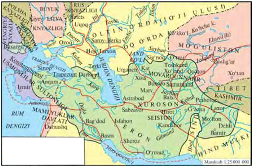

- Chingizxon davlati
- Chig‘atoy davlati
+ Amir Temur davlati
- Husayn Boyqaro davlati

**824. Temuriylar davrida “Tarxonlik” yorlig‘i odatda kimlarga berilgan va ismiga “tarxon” martabasi qo‘shib aytilgan?**

- Mayda mulkdorlar, harbiylar, hunarmandlar, dehqonlarga
- Hunarmandlar, dehqonlar, harbiylar, shayxlarga 
+ Amirlar, beklar, saroy amaldorlari, sayyidlarga
- Harbiylar, beklar, saroy amaldorlari, mayda mulkdorlarga

**825. Temuriylar davrida savdo boji, savdogarlardan olinadigan soliq qanday atalgan?**

- “Xiroj”
- “Ushr”
- “Zakot”
+ “Tamg‘a”

**826. XV asrda lalmikor yerlardan hosilning qancha miqdorida soliq olingan?**

- Sakkizdan birdan to o‘ndan bir qismigacha
- Uchdan birdan to beshdan bir qismigacha
+ Oltidan birdan to sakkizdan bir qismigacha
- To‘rtdan birdan to yettidan bir qismigacha

**827. Temuriylar davrida sug‘oriladigan yerlarning eng katta qismi qanday yerlarga qarashli bo‘lgan?**

- “Mulki vaqf” yerlariga
- “Mulki inju” yerlariga
+ “Mulki devoniy” yerlariga
- “Mulk” yerlariga

**828. XV asrda masjid, madrasa, xonaqoh, maqbara va mozorlarga biriktirilib berilgan yerlar qanday atalgan?**

- “Mulki inju”
+ “Mulki vaqf”
- “Mulki devoniy”
- “Mulk”

**829. Ulug‘bekning fulusiy pullari quyidagi qaysi shaharlarda zarb qilingan? 1. Buxoro, 2. Samarqand, 3. Qarshi, 4. Termiz, 5. Mashhad, 6. Hirot, 7. Toshkent, 8. Shohruxiya.**

+ 1, 2, 3, 4, 7, 8
- 1, 2, 3, 4, 5, 7
- 1, 2, 3, 5, 6, 7
- 1, 3, 5, 6, 7, 8

**830. Qaysi temuriy hukumdorlar Xitoy bilan muntazam ravishda elchilar almashib turishgan, Tibet va Hindiston bilan ham yaxshi qo‘shnichilik munosabatlari o‘rnatganlar?**

+ Ulug‘bek va Shohrux
- Husayn Boyqaro va Abulqosim Bobur
- Abu Said va Sulton Ahmad
- Amir Temur va Ulug‘bek

**831. Temuriylar davrida qanday yorliq olgan mulkdorlar barcha soliq, to‘lov va majburiyatlardan ozod qilingan?**

- “Dorug‘alik” yorlig‘ini olganlar
+ “Tarxonlik” yorlig‘ini olganlar
- “No‘yonlik” yorlig‘ini olganlar
- “Bosqoqlik” yorlig‘ini olganlar

**832. Temuriylar davrida asosiy soliqlardan tashqari mahalliy aholi qatnashishi lozim bo‘lgan ishlar qanday atalgan?**

+ “Begor”
- “Zakot”
- “Ushr”
- “Xiroj”

**833. XV asrda “banno” lar nima ish bilan shug‘ullangan?**

+ G‘isht terib imorat qaddini bino qilish bilan
- Peshtoq-u ravoq hamda toqlarga parchin va girihlar qoplab imoratga pardoz berish bilan
- Matolarga naqsh bosish bilan
- Qog‘oz yasash bilan

## 40-§ Ta’lim tizimi.

**834. Ulug‘bek farmoni bilan qurilgan qayerdagi madrasa darvozasiga “Bilim olish har bir musulmon ayol va erkakning burchidir”, degan xitobnoma o‘yib yozib qo‘yilgan?**

- Xo‘janddagi madrasada
+ Buxorodagi madrasada
- Samarqanddagi madrasada
- G‘ijduvondagi madrasada

**835. Temuriylar davrida Hirot hududining o‘zida qancha madrasa bo‘lgan?**

- 28 ta
- 40 ta
- 52 ta
+ 36 ta

**836. XV asrda “qofiya” deb qanday ilmga aytilgan?**

- Mantiq va uning ta’rifiga
+ Arab tili va uning morfologiyasiga
- Tibbiyot va uning sohalariga
- Falakiyot va uning tasnifiga

**837. XV asrda qonunshunoslik ilmi qanday atalgan?**

- Ilmi aruz
- Handasa
- Riyozat
+ Fiqh

**838. Ulug‘bek madrasasida ilmi hay’at (astronomiya) dan kim dars bergan?**

- G‘iyosiddin Jamshid Koshoniy
+ Qozizoda Rumiy
- Alouddin Ali Qushchi
- Shamsiddin Muhammad Xavofiy

**839. Qachon Ulug‘bek farmoni bilan Samarqandda madrasa qurilgan?**

- 1433-yilda
+ 1420-yilda
- 1417-yilda
- 1415-yilda

**840. XV asrda geometriya qanday atalgan?**

- Ilmi aruz
+ Handasa
- Riyozat
- Fiqh

**841. Qachon Ulug‘bek farmoni bilan Buxoroda madrasa qurilgan?**

- 1433-yilda
- 1420-yilda
+ 1417-yilda
- 1415-yilda

**842. Qachon Saroymulkxonim Samarqandda madrasa qurdirgan?**

- 1407-yilda
- 1402-yilda
+ 1404-yilda
- 1401-yilda

**843. Injil anhori bo‘yida joylashgan Ixlosiya madrasasi va Xalosiya xonaqohi qaysi temuriy hukmdor davrida qurilgan?**

- Mirzo Ulug‘bek davrida
- Abulqosim Bobur davrida
+ Husayn Boyqaro davrida
- Abu Said davrida

**844. Samarqanddagi Ulug‘bek madrasasi ochilgan kuni tolibi ilmlardan to‘qson nafari qatnashgan birinchi darsni kim o‘qigan?**

- G‘iyosiddin Jamshid Koshoniy
- Qozizoda Rumiy
- Alouddin Ali Qushchi
+ Shamsiddin Muhammad Xavofiy

**845. “Ikki qavatli, ellik hujrali bo‘lgan. Har bir hujra uch xonaga: qaznoq (omborxona), yotoqxona va darsxonalarga bo‘lingan. Madrasada o‘sha zamonning iqtidorli olimlaridan mavlono Shamsiddin Muhammad Xavofiy yetakchi mudarris bo‘lgan”. Yuqorida qaysi madrasa ta’riflangan?**

- Xo‘janddagi Ulug‘bek madrasasi
- G‘ijduvondagi Ulug‘bek madrasasi
+ Samarqanddagi Ulug‘bek madrasasi
- Buxorodagi Ulug‘bek madrasasi

**846. Amir Feruzshoh madrasasi qaysi shahar tevaragida joylashgan edi?**

- Balx shahri tevaragida
- Buxoro shahri tevaragida
- Samarqand shahri tevaragida
+ Hirot shahri tevaragida

**847. Qachon Ulug‘bek farmoni bilan G‘ijduvonda madrasa qurilgan?**

+ 1433-yilda
- 1420-yilda
- 1417-yilda
- 1415-yilda

**848. XV asrda she’riyat ilmi qanday atalgan?**

+ Ilmi aruz
- Handasa
- Riyozat
- Fiqh

**849. XV asrda Xonim, Qutbiddin Sadr va Muhammad Sadr madrasalari qaysi shaharda joylashgan edi?**

- Balx shahrida
- Buxoro shahrida
+ Samarqand shahrida
- Hirot shahrida

**850. Ulug‘bek madrasasida necha yil tahsil ko‘rib, uning dasturi bo‘yicha fanlarni to‘la o‘zlashtirgan va imtihonlarda o‘z bilimini namoyish qila olgan tolibi ilmlarga “sanad” (shahodatnoma) yozib berilgan?**

- 13-14 yil
- 19-20 yil
+ 15-16 yil
- 10-11 yil

**851. XV asrda matematika qanday atalgan?**

- Ilmi aruz
- Handasa
+ Riyozat
- Fiqh

## 41-§ Aniq fanlarning rivojlanishi.

**852. Ulug‘bek rasadxonasining balandligi qancha bo‘lgan?**

- 42 metr
- 35 metr
+ 31 metr
- 27 metr

**853. “Ulug‘bek Samarqandda bo‘lib akademiyaga asos soldi. Yer sharini o‘lchashni buyurdi va astronomiyaga oid jadvallarni tuzishda ishtirok etdi”. Ushbu jumla qaysi Yevropa olimiga tegishli?**

+ Volterga
- Brunoga
- Dekartga
- Paskalga

**854. Qachon Mirzo Ulug‘bek Obirahmat anhori bo‘yida rasadxona qurdirgan?**

- 1425–1430-yillarda
- 1423–1427-yillarda
- 1421–1423-yillarda
+ 1424–1429-yillarda

**855. “Samarqand akademiyasi” – …-yilda Xorazmda tashkil etilgan “Donishmandlar uyi” dan (Ma’mun akademiyasi) keyingi ikkinchi “Dor ul-ilm” edi.**

- 1010-yilda
+ 1004-yilda
- 1006-yilda
- 1002-yilda

**856. Ulug‘bekning yil hisobini hozirgi hisob-kitoblarga solishtirgudek bo‘lsak qanchaga farq qiladi?**

- 1 minut 4 sekundga
+ 1 minut 2 sekundga
- 2 minut 1 sekundga
- 2 minut 5 sekundga

**857. Ulug‘bek rasadxonasida olib borilgan kuzatish va tadqiqotlar tufayli nechta qo‘zg‘almas (turg‘un) yulduzning o‘rni va holati aniqlanib, ularning astronomik jadvali tuzilgan?**

- 1015 ta yulduzning
- 1022 ta yulduzning
- 1031 ta yulduzning
+ 1018 ta yulduzning

**858. “Tarixi arba’ ulus” (To‘rt ulus tarixi) nomli tarixiy asar muallifi kim?**

- Xondamir
- Mirxond
- Rumiy
+ Ulug‘bek

**859. “Ziji jadidi Ko‘ragoniy” (Ko‘ragoniyning yangi astronomik jadvali) nomli asar muallifi kim?**

- Alouddin Ali Qushchi
- G‘iyosiddin Jamshid
+ Mirzo Ulug‘bek
- Qozizoda Rumiy

**860. Ulug‘bek kutubxonasida nechta jild kitob saqlangan?**

+ 15 ming jild
- 20 ming jild
- 10 ming jild
- 25 ming jild

**861. Sharqning qaysi olimi “Aflotuni zamon” deb nom olgan?**

- G‘iyosiddin Jamshid
- Shamsiddin Muhammad Xavofiy
- Alouddin Ali Qushchi
+ Qozizoda Rumiy

**862. Sharqning qaysi olimi “o‘z davrining Ptolomeyi” nomi bilan shuhrat qozongan?**

- G‘iyosiddin Jamshid
- Shamsiddin Muhammad Xavofiy
+ Alouddin Ali Qushchi
- Qozizoda Rumiy

**863. Kim boshchiligida Ulug‘bek rasadxonasining asosiy o‘lchov asbob-uskunasi – ulkan sekstant o‘rnatilgan?**

- Shamsiddin Muhammad Xavofiy boshchiligida
+ G‘iyosiddin Jamshid boshchiligida
- Alouddin Ali Qushchi boshchiligida
- Qozizoda Rumiy boshchiligida

## 42-§ Adabiyot.

**864. Alisher Navoiy qancha yirik badiiy asar yozgan?**

- Yigirmadan ortiq
+ O‘ttizdan ortiq
- Ellikdan ortiq
- Qirqdan ortiq

**865. Alisher Navoiy qaysi yillarda yashagan?**

- 1414–1492-yillarda
+ 1441–1501-yillarda
- 1449–1499-yillarda
- 1424–1481-yillarda

**866. Shoir Atoiy qayerlik bo‘lgan?**

- G‘ijduvonlik
- Buxorolik
+ Toshkentlik
- Samarqandlik

**867. “Ravzat us-safo” (“Jannat bog‘i”) asari muallifi kim?**

+ Mirxond
- Xondamir
- Durbek
- Lutfiy

**868. “Mavlono Xondamir Mirxondning farzandidir va salohiyatli yigitdir. Tarix ilmida mahorati bordir”. Xondamir haqidagi ushbu jumlalarni Alisher Navoiy qaysi asarida yozib qoldirgan?**

- “Xazoyin ul-maoniy” asarida
+ “Majolis un-nafois” asarida
- “Mahbub ul-qulub” asarida
- “Lison ut-tayr” asarida

**869. “Habib us-siyar” asarining mullifi kim?**

- Durbek
- Lutfiy
- Mirxond
+ Xondamir

**870. Mirxondning “Ravzat us-safo” asarida qaysi davr oralig‘idagi voqealar bayon etilgan?**

- Amir Temurning taxtga chiqishidan to 1652-yilgacha bo‘lgan voqealar
- Muhammad (s.a.v.) payg‘ambarning tug‘ilishidan to 1500-yilgacha bo‘lgan voqealar
+ Dunyoning yaratilishidan to 1523-yilgacha bo‘lgan voqealar
- Islomning vujudga kelishidan to 1628-yilgacha bo‘lgan voqealar

**871. Mirxond “Ravzat us-safo” asarni oxiriga yetkaza olmagan va ushbu asarni uning … Xondamir yozib tugatgan.**

+ nabirasi
- o‘g‘li
- jiyani
- kuyovi

**872. Abdurahmon Jomiy qaysi yillarda yashagan?**

+ 1414–1492-yillarda
- 1441–1501-yillarda
- 1459–1503-yillarda
- 1424–1481-yillarda

**873. Lutfiy qaysi yillarda yashagan?**

- 1424–1481-yillarda
+ 1366–1465-yillarda
- 1352–1443-yillarda
- 1449–1499-yillarda

**874. Mirxond kimning ko‘rsatmasi va homiyligi bilan “Ravzat us-safo” (“Jannat bog‘i”) asarini yozgan?**

- Xusrav Dehlaviyning
- Jaloliddin Rumiyning
+ Alisher Navoiyning
- Abdurahmon Jomiyning

**875. Tarixchi Xondamir 15-16 yoshlarida kimning diqqat-nazariga tushgan va uning vafotiga qadar yonida bo‘lib, uning kutubxonasiga boshchilik qilgan?**

- Xusrav Dehlaviyning
- Jaloliddin Rumiyning
+ Alisher Navoiyning
- Abdurahmon Jomiyning

**876. “Yusuf va Zulayho” dostoni kim tomonidan qayta ishlangan?**

- Lutfiy tomonidan
- Navoiy tomonidan
+ Durbek tomonidan
- Atoiy tomonidan

**877. “Xamsa”, “Xazoyin ul-maoniy”, “Mahbub ul-qulub”, “Lison ut-tayr” asarlari muallifi kim?**

+ Alisher Navoiy
- Xusrav Dehlaviy
- Abdurahmon Jomiy
- Jaloliddin Rumiy

**878. Tarixchi olim Xondamir qaysi yillarda yashagan?**

- 1449–1499-yillarda
- 1438–1498-yillarda
- 1424–1481-yillarda
+ 1475–1535-yillarda

**879. “Xamsa”, “Xazoyin ul-maoniy”, “Mahbub ul-qulub”, “Lison ut-tayr” asarlari muallifi kim?**

+ Alisher Navoiy
- Xusrav Dehlaviy
- Abdurahmon Jomiy
- Jaloliddin Rumiy

**880. “Padarpanoh janob amir Xovand Muhammad yigitlik chog‘larida turli ilmlarni tahsil etish va nafis fazilatlarni kamoliga yetkazish yo‘lida tirishqoqlik va zo‘r mehnat qildi”. Mirxond haqidagi ushbu jumlalar muallifi kim?**

- Durbek
- Navoiy
+ Xondamir
- Jomiy

**881. Tarixchi olim Mirxond … tug‘ilgan bo‘lsa-da, umrining deyarli ko‘p qismini … o‘tkazgan.**

- Mashhadda/Samarqandda
+ Balxda/Hirotda
- Samarqandda/Balxda
- Marvda/Mashhadda

**882. Xondamir tarixga oid qancha asar yozib qoldirgan?**

- Yigirmaga yaqin asar
- Qirqqa yaqin asar
+ O‘nga yaqin asar
- O‘ttizga yaqin asar

**883. Tarixchi olim Mirxond (Muhammad Xovandshoh ibn Mahmud) qaysi yillarda yashagan?**

- 1430–1494-yillarda
- 1434–1492-yillarda
+ 1438–1498-yillarda
- 1432–1496-yillarda

## 43-§ Tasviriy san’at.

**884. Quyidagi Alisher Navoiy surati kimning qalamiga mansub?**

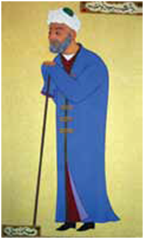

- Sultonali Mashhadiy
- Mirali Tabriziy
- Kamoliddin Behzod
+ Mahmud Muzahhib

**885. Xattot Sultonali Mashhadiy yana qaysi san’atda ham mohir bo‘lgan?**

- Sahhoflik san’atida
+ O‘ymakorlik san’atida
- Lavvohlik san’atida
- Naqqoshlik san’atida

**886. “Qiblat ul-kuttob” (Kotiblar qiblasi) va “Sulton ul-xattotin” (Xattotlar sultoni) nomlari bilan qaysi xattot shuhrat topgan?**

+ Sultonali Mashhadiy
- Mirali Tabriziy
- Mahmud Muzahhib
- Kamoliddin Behzod

**887. XV asrda kitoblarga lavha chizish bilan shug‘ullangan shaxs qanday nomlangan?**

- Ustod
- Xattot
- Sahhof
+ Lavvoh

**888. Qachon Abulqosim Firdavsiyning mashhur “Shohnoma” dostoni Boysung‘urning kutubxonasida ko‘chirtirilib, 20 ta turli mazmun va manzarali rangdor miniaturalar bilan bezatilgan?**

- 1433-yilda
- 1431-yilda
- 1425-yilda
+ 1429-yilda

**889. Ulug‘bekning ukasi Boysung‘urning kutubxonasi qaysi shaharda joylashgan edi?**

- Buxoro shahrida
- Balx shahrida
+ Hirot shahrida
- Samarqand shahrida

**890. Xattot Sultonali Mashhadiy qaysi yillarda yashagan?**

- 1343–1412-yillarda
- 1421–1506-yillarda
+ 1432–1520-yillarda
- 1330–1404-yillarda

**891. Musavvirlikda “Hirot maktabi” asoschisi va o‘z davrida “Moniyi Soniy” (Ikkinchi Moniy) deb ulug‘langan musavvir kim?**

- Mirali Tabriziy
- Sultonali Mashhadiy
+ Kamoliddin Behzod
- Mahmud Muzahhib

**892. Qachon O‘zbekiston Respublikasi Birinchi Prezidenti Islom Karimovning farmoniga binoan Kamoliddin Behzod nomidagi Davlat mukofoti ta’sis etilgan?**

- 1999-yil 30-martda
- 1994-yil 16-mayda
+ 1997-yil 23-yanvarda
- 1995-yil 20-dekabrda

**893. Qachon Toshkent, Samarqand shaharlarida va xorijiy mamlakatlarda YUNESKO homiyligida Behzod tavalludining 545 yilligi keng nishonlangan?**

- 2002-yil oktyabrda
- 1999-yil iyulda
- 1997-yil avgustda
+ 2000-yil noyabrda

**894. “Nasta’liq” deb nomlangan yangi uslubdagi xatni kim kashf qilgan?**

- Sultonali Mashhadiy
- Mahmud Muzahhib
+ Mirali Tabriziy
- Kamoliddin Behzod

**895. Xattot Mirali Tabriziy qaysi yillarda yashagan?**

- 1343–1412-yillarda
- 1421–1506-yillarda
- 1432–1520-yillarda
+ 1330–1404-yillarda

**896. XV asrda qog‘ozni sahifalash va kitobni muqovalash bilan shug‘ullangan shaxs qanday nomlangan?**

- Ustod
- Xattot
+ Sahhof
- Lavvoh

**897. Kamoliddin Behzod qaysi yillarda yashagan?**

+ 1455–1536-yillarda
- 1432–1520-yillarda
- 1445–1514-yillarda
- 1421–1506-yillarda

**898. XV asrda kutubxona ishlariga kim boshchilik qilgan?**

- Kitob ul-kuttob yoki kutubxona dorug‘asi
- Kutubxona og‘asi yoki kitob ul-kuttob
- Kitobdor yoki kutubxona og‘asi
+ Kutubxona dorug‘asi yoki kitobdor