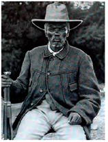
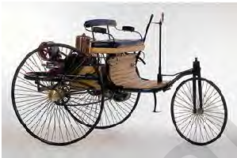

# 9-sinf Jahon tarixi (2019-yil darsligi)

_Tarix (Mavzulashgan) (2017-2019-yillar darsliklari)_

## 1-§ XIX asr oxiri - XX asr boshlarida kapitalizm taraqqiyotida yuz bergan tub o`zgarishlar.

**1. Kapitalizm jamiyatining eng yuqori va oxirgi davri qanday ataladi?**

- Sotsializm
- Kommunizm
- Monarxizm
+ Imperializm

**2. Ishlab chiqarish va savdoni o‘zlaricha emas, markaziy boshqaruv qarori asosida olib boradigan korxonalar birlashmasi nima deb yuritiladi?**

- Sindikat
+ Trest
- Konsern
- Kartel

**3. Qaysi davrga kelib dunyoning yarmidan ko‘pi buyuk davlatlar tomonidan hududiy jihatdan bo‘lib olingan edi?**

- XVI asr oxiri - XVII asr boshlarida
- XVII asr oxiri - XVIII boshlarida
- XVIII asr oxiri - XIX asr boshlarida
+ XIX asr oxiri - XX asr boshlarida

**4. XIX asr oxiriga kelib AQSH quyidagi qaysi hududni yarim mustamlakasiga aylantirgan?**

+ Puerto-Riko va Guam orollarini
- Guam oroli va Filippin orollarini
- Gavayi orollari va Filippin orollarini
- Puerto-Riko va Gavayi orollarini

**5. XIX asr oxiri - XX asr boshlarida quyidagi qaysi davlat iqtisodiy taraqqiyotda dunyoda 2-o‘rin, Yevropada 1-o‘ringa chiqib olgan edi?**

- Buyuk Britaniya
- Rossiya
- Fransiya
+ Germaniya

**6. 1900-1913-yillarda davomida industrial davlatlarning chetga chiqargan kapitali necha barobar oshgan?**

+ Ikki barobar
- Uch barobar
- To‘rt barobar
- Besh barobar

**7. XIX asr oxirida Germaniyada monopoliyalar soni qancha edi?**

+ 250 ta
- 195 ta
- 185 ta
- 150 ta

**8. «Kruppga nima yaxshi bo‘lsa, u ... uchun ham yaxshi». Jumlani to‘ldiring.**

- Buyuk Britaniya
- AQSH
- Fransiya
+ Germaniya

**9. Monopolistik kapitalizm vujudga kelgan paytda AQSH mamlakat iqtisodini nechta oila nazorat qilib turgan?**

- 40 ta
- 50 ta
+ 60 ta
- 70 ta

**10. Bir turdagi mahsulot ishlab chiqaradigan korxonalar birlashmasi qanday ataladi?**

+ Sindikat
- Trest
- Konsern
- Kartel

**11. XX asr boshlarida Fransiyada nechta gigant bank faoliyat olib borgan?**

- 2 ta
+ 3 ta
- 4 ta
- 5 ta

**12. XIX asr oxiri - XX asr boshlarida Fransiyada moliyaviy qudratning timsoli bo‘lgan fransuz bankining yirik omonatchilari necha oila edi?**

- 100 oila
- 150 oila
- 250 oila
+ 200 oila

**13. XX asr boshlarida Morganning po‘lat tresti AQSH dagi po‘latning qancha foizini berardi?**

+ 66 foizini
- 86 foizini
- 77 foizini
- 90 foizini

**14. AQSH dagi Morgan oilasi qaysi sohaga ixtisoslashgan edi?**

- Neft sohasiga
- Po‘lat sohasiga
- Temir sohasiga
+ Moliya sohasiga

**15. AQSH da kimlarni «Amerikaning tojsiz qirollari» deb etashgan edi?**

+ Monopoliyachilarni
- Prezidentlarni
- Harbiylarni
- Siyosatchilarni

**16. XIX asr oxiri – XX asr boshlarida AQSH ochiq qurolli ekspansiyadan ko‘ra qaysi davlatlar iqtisodiga kirib borishni afzal ko‘rgan?**

- Osiyo davlatlariga
- Afrika davlatlariga
- Sharqiy Yevropa davlatlariga
+ Lotin Amerikasi davlatlariga

**17. “Monopolistik kapitalizm” nima?**

- Kapitalizmning iqtisodiy hayotida monopoliyalar vujudga kelgan bosqichi
- Moliya oligarxiyasi shakllangan bosqichi 
- Siyosiy hayotda kapitalizmning jamiyat hayoti ustidan hukmronligi o‘rnatilgan bosqichi
+ Barcha javoblar to‘g‘ri

**18. Reyn-Vestfaliya sindikati nima ishlab chiqarar edi?**

- Elektr energiya
+ Ko‘mir
- Neft
- Kerosin

**19. Ishlab chiqarish yoki savdoning bir sohasida yakka hukmronlikni egallab olgan ulkan korxonalar yoki shunday korxonalar birlashmasi nima deb ataladi?**

+ Monopoliya
- Oligarxiya
- Aristokaratiya
- Byurokratiya

**20. «Monopoliya» so‘zi qaysi tildan olingan?**

+ Yunonchadan
- Lotinchadan
- Nemischadan
- Inglizchadan

**21. XIX asr oxiriga kelib AQSH quyidagi qaysi hududni bosib olgan?**

- Puerto-Riko orolini
- Guam orolini
- Gavayi orollarini
+ Filippin orollarini

**22. «Umumiy elektr jamiyati» (Germaniya) va «Umumiy elektr kompaniyasi» (AQSH) qachon jahon elektr bozorini bo‘lib olish va o‘zaro hamkorlik qilish to‘g‘risida shartnoma tuzishgan?**

+ 1907-yilda
- 1908-yilda
- 1909-yilda
- 1910-yilda

**23. «Imperializm» atamasi quyidagi qaysi atamaning sinonimi sifatida qo‘llanilgan?**

+ Monopolistik kapitalizm
- Monopolistik oligarxiya
- Sanoat oligarxiyasi
- Sanoat monopoliyasi

**24. XIX asr oxirlarida AQSH da «Katta uchlik» deb atalgan monopoliyalar qaysilar edi?**

+ Rokfeller, Karnegi, Morgan
- Rotshild, Karnegi, Krupp
- Ford, Simens, Karnegi
- Krupp, Ford, Rokfeller

**25. Iqtisodiy va siyosiy hukmronlik bir hovuch ulkan sarmoya egalari qo‘lida to‘planishi nima deb ataladi?**

- Monopoliya
- Aristokratiya
+ Oligarxiya
- Monarxiya

**26. Qachondan boshlab «imperializm» atamasi keng qo‘llanila boshlangan?**

- XIX asrning boshlarida
- XIX asrning o‘rtalarida
+ XIX asrning oxirlarida
- XX asrning boshlarida

**27. «Oligarxiya» so‘zi qaysi tildan olingan va qanday ma‘noni anglatadi?**

- Italyancha «qog‘oz»,«hujjat» degani
+ Yunoncha «ozchilik hokimiyati» degani
- Lotincha «ishtirok»,«manfaat» degani
- Inglizcha «birgalikda ishlash» degani

**28. XIX asr oxirida AQSH da monopoliyalar soni qancha edi?**

- 250 ta
- 195 ta
+ 185 ta
- 150 ta

**29. Qachonga kelib «egallanmagan yerlar» ni bosib olish tugallangan?**

- XIX asrning boshlarida
- XIX asrning o‘rtalarida
+ XIX asrning oxirlarida
- XX asrning boshlarida

**30. «Kartel» so‘zi qaysi tildan olingan va qanday ma‘noni anglatadi?**

+ Italyancha «qog‘oz»,«hujjat» degani
- Yunoncha «ozchilik hokimiyati» degani
- Lotincha «ishtirok»,«manfaat» degani
- Inglizcha «birgalikda ishlash» degani

**31. Quyidagi qaysi so‘z lotincha «birlashtirish» – bir davlat hududini butunlay yoki qisman egallab olish degan ma’noni anglatadi?**

- Emansipatsiya
- Ekspluatatsiya
+ Anneksiya
- Kapitulyatsiya

**32. AQSH dagi Rokfeller oilasi qanday mahsulot ishlab chiqargan?**

+ Neft
- Po‘lat
- Temir
- Ko‘mir

**33. AQSH dagi Karnegi oilasi qanday mahsulot ishlab chiqargan?**

- Neft
+ Po‘lat
- Temir
- Ko‘mir

**34. 1910-yilda millatlararo korporatsiyalar soni nechtaga yetgan edi?**

- 50 taga
+ 100 taga
- 150 taga
- 200 taga

**35. XIX asr oxiri - XX asr boshlarida AQSH nima sababdan mustamlakalar bosib olishga ishtiyoq bildirmagan? 1) Juda katta hududga ega bo‘lgani uchun; 2) Boy xomashyo zaxiralariga ega bo‘lgani uchun; 3) Keng ichki bozorlarga ega bo‘lganligi uchun; 4) Harbiy jihatdan yetarlicha qudratga ega bo‘lmaganligi uchun.**

+ 1, 2, 3
- 1, 2, 3, 4
- 1, 3, 4
- 1, 2, 4

**36. Manfaatlar umumiyligi asosida uyushgan korxonalarning yirik birlashmasi qanday ataladi?**

- Sindikat
- Trest
+ Konsern
- Kartel

**37. XIX asr oxiriga kelib AQSH quyidagi qaysi hududni anneksiya qilgan?**

- Puerto-Riko orolini
- Guam orolini
+ Gavayi orollarini
- Filippin orollarini

**38. XX asr boshlarida jahonda kerosin bozorini egallab olgan moliya guruhlarini toping.**

+ Rokfeller (AQSH), Rotshild (Buyuk Britaniya, Fransiya)
- Morgan (AQSH), Simens (Germaniya)
- «Umumiy elektr jamiyati» (Germaniya), «Umumiy elektr kompaniyasi» (AQSH)
- Krupp (Germaniya), Mitsiu (Yaponiya)

**39. XX asr boshlarida AQSH da nechta gigant bank faoliyat olib borgan?**

+ 2 ta
- 3 ta
- 4 ta
- 5 ta

**40. Quyidagi qaysi termin «ishtirok», «manfaat» degan ma‘nolarni anglatadi?**

- Sindikat
- Trest
+ Konsern
- Kartel

**41. Reyn-Vestfaliya sindikati qayerda vujudga kelgan?**

- AQSH da
+ Germaniyada
- Fransiyada
- Buyuk Britaniyada

**42. Qachon kapitalizm taraqqiyotida yangi bosqich – “monopolistik kapitalizm” deb ataluvchi bosqich qaror topgan?**

- XVI asr oxiri - XVII asr boshlarida
- XVII asr oxiri - XVIII boshlarida
- XVIII asr oxiri - XIX asr boshlarida
+ XIX asr oxiri - XX asr boshlarida

## 2-§ Industrial sivilizatsiya.

**43. Jamiyat hayotida shaharlar rolining va shahar aholisi salmog‘ining ortib borishi qanday ataladi?**

- Industrializatsiya
- Migratsiya
+ Urbanizatsiya
- Kolonizatsiya

**44. Qachon G‘arbiy Yevropa va AQSH da sanoat to‘ntarishi nihoyasiga yetgan?**

- XIX asrning 20-30-yillarida
- XIX asrning 30-40-yillarida
- XIX asrning 40-50-yillarida
+ XIX asrning 50-60-yillarida

**45. Qachondan boshlab Parij shahri 20 yil davomida qurilishlar maydoniga aylangan?**

- 1850-yildan
+ 1853-yildan
- 1855-yildan
- 1880-yildan

**46. Sanoat to‘ntarilishi yuz bergan uch davlat - Fransiya, Buyuk Britaniya, AQSH da XIX asrning 70-yillariga kelib sanoat ishchilari soni qancha kishini tashkil qilgan?**

+ 12-13 million kishini
- 14-15 million kishini
- 10-11 million kishini
- 15-16 million kishini

**47. Qaysi yillarda Buyuk Britaniya vazirlarining uchdan ikki qismi eng sara bilim yurtlarining bitiruvchilari bo‘lgan?**

+ 1906-1916-yillarda
- 1913-1923-yillarda
- 1916-1926-yillarda
- 1900-1910-yillarda

**48. Industrial sivilizatsiyaning belgilaridan biri … bo‘lgan.**

+ shaharlarning juda tez o‘sishi
- aholi sonining juda tez o‘sishi
- ishsizlikning juda tez o‘sishi
- kambag‘allikning juda tez o‘sishi

**49. Qachonga kelib, xotin-qizlar ozodligi va mustaqilligi g‘oyalari, ularning teng huquqlilik uchun kurashlari yangi sivilizatsiya jamiyatining belgilaridan biri bo‘lgan?**

- XIX asrning boshlariga
- XIX asrning o‘rtalariga
- XIX asrning oxirlariga
+ XX asrning boshlariga

**50. Sanoat to‘ntarilishi yuz bergan uch davlat - Fransiya, Buyuk Britaniya, AQSH da XIX asrning 70-yillariga kelib sanoat ishchilari, qishloq xo‘jaligidagi ishchilar soni bilan birgalikda qancha kishini tashkil qilgan?**

- 16 million kishini
- 18 million kishini
+ 20 million kishini
- 24 million kishini

**51. XIX asrning oxirlarida necha yoshli bolalar tamaki fabrikalardan tortib, toshko‘mir shaxtalarida mehnat qilardilar?**

+ 10-12 yoshli
- 12-14 yoshli
- 14-16 yoshli
- 16-18 yoshli

**52. XIX asrning qaysi davrida AQSH da jadal urbanizatsiya jarayoni boshlangan?**

- XIX asrning 60-yillarida
+ XIX asrning 70-yillarida
- XIX asrning 80-yillarida
- XIX asrning 90-yillarida

**53. «Industrial sivilizatsiya» atamasi o‘rnida qaysi atama ham ishlatilib, ular bir xil ma’noni anglatgan?**

- Monopolistik kapitalizm
+ Industrial jamiyat
- Kapital jamiyati
- Sotsialistik jamiyat

**54. Quyidagi qaysi atama lotincha «ko‘chib keluvchi» degan ma’noni anglatadi?**

- Adyutant
+ Immigrant
- Dominant
- Tolerant

**55. Quyidagi qaysi atama fransuzcha va lotincha «shaharga mansub» degan ma‘noni anglatadi?**

- Industrializatsiya
- Migratsiya  
- Kolonizatsiya
+ Urbanizatsiya

**56. XIX asrda jamiyat hayotining muhim voqealaridan biri qaysi qatlamning shakllanishi bo‘lgan?**

- Yuqori qatlamning
- Quyi qatlamning
+ O‘rta qatlamning
- Yangi qatlamning

**57. XX asr boshlarida AQSH da malakali ishchilar umumiy sanoat ishchilarining qancha qismini tashkil qilar edi?**

- Uchdan bir qismi
+ Uchdan ikki qismi
- Beshdan bir qismini
- To‘rtdan uch qismi

**58. XIX asrning oxirlarida «fabrika ayollari» asosan necha yoshli qizlardan iborat edi?**

- 15-16 yoshli
- 12-13 yoshli
- 14-15 yoshli
+ 13-14 yoshli

**59. 1850-yilda Parij shahrida qancha aholi yashagan?**

+ 1 million aholi
- 1,5 million aholi
- 2 million aholi
- 2,5 million aholi

**60. Quyidagi qaysi atama lotincha «ko‘chaman» degan ma’noni anglatadi?**

- Industrializatsiya
+ Migratsiya
- Kolonizatsiya
- Urbanizatsiya

**61. XX asr boshlarida Yevropa va Shimoliy Amerikadagi sanoat ishchilari soni qanchani tashkil etar edi?**

- 30 million kishini
+ 40 million kishini
- 50 million kishini
- 60 million kishini

**62. XX asr boshida sanoat ishchilarining soni jihatidan qaysi davlat birinchi o‘rinni egallagan edi?**

- Buyuk Britaniya
- Germaniya
+ AQSH
- Fransiya

**63. Qachon II Internatsional – Xalqaro sotlialistik ishchilar partiyasi uyushmasi tashkil topgan?**

- 1878-yilda
+ 1889-yilda
- 1881-yilda
- 1891-yilda

**64. «Immigrant» deb kimga aytiladi?**

+ Bir davlatdan boshqa davlatga doimiy yoki uzoq vaqt yashash uchun ko‘chib kelgan shaxsga
- Bir davlatdan boshqa davlatga siyosiy sabablarga ko‘ra ko‘chib kelgan shaxsga
- Bir davlatdan boshqa davlatga tijoriy maqsadlarda kelgan shaxsga
- Bir davlatdan boshqa davlatga sayohat uchun kelgan shaxsga

**65. XX asr boshlarida qaysi davlatda sanoat ishchilarining soni 10,4 million kishi edi?**

- Buyuk Britaniyada
- Germaniyada
+ AQSH da
- Fransiyada

**66. 1880-yilda Parij shahri aholisi qancha edi?**

- 1 million
- 1,5 million
+ 2 million
- 2,5 million

**67. XIX asr o‘rtalarida Buyuk Britaniya parlamentida jamoalar palatasining 652 a’zosidan nechtasi yer mulkdorlari edi?**

+ 489 tasi
- 352 tasi
- 452 tasi
- 556 tasi

**68. Quyidagi qaysi so‘z lotincha «faoliyat» degan ma’noni anglatadi?**

- Strategiya
- Ideologiya
+ Industriya
- Texnologiya

**69. U yoki bu davlatdan aholining boshqa davlatga majburiy yoki ixtiyoriy ko‘chib ketishi nima deb ataladi?**

- Industrializatsiya
+ Migratsiya
- Kolonizatsiya
- Urbanizatsiya

**70. XIX asrning 70-yillarigacha ish kunining uzunligi industrial davlatlarda necha soatni tashkil qilgan?**

- 13-19 soatni
+ 10-16 soatni
- 12-18 soatni
- 11-17 soatni

**71. XIX asr ikkinchi yarmida o‘rta qatlam vakillari orasida, ayniqsa, qaysi toifasi ajralib turgan?**

- Muhandislar
+ Huquqshunoslar
- Shifokorlar
- Moliyachilar

**72. Qachonga kelib Parij shahri ichikmlik, oqava suv tarmoqlariga, tramvay va metroga ega bo‘lgan?**

- XIX asrning boshlarida
- XIX asrning o‘rtalarida
+ XIX asrning oxirlarida
- XX asrning boshlarida

**73. 1907-yilda qaysi davlatda sanoat ishchilarining soni 8,6 million kishi edi?**

+ Germaniyada
- Buyuk Britaniyada
- AQSH da
- Fransiyada

**74. XIX asrning qaysi davrida Germaniyada shaharlarning riovjlanishi boshlangan?**

- XIX asrning 60-yillarida
+ XIX asrning 70-yillarida
- XIX asrning 80-yillarida
- XIX asrning 90-yillarida

**75. XX asr boshlarida «ishchi aristokratiyasi» Buyuk Britaniyada umumiy ishchilar sonining qancha qismini tashkil etgan?**

- O‘ndan bir qismini
+ Uchdan bir qismini
- To‘rtdan bir qismini
- Sakkizdan bir qismini

**76. XX asr boshlarida Yevropa va Shimoliy Amerikadagi sanoat ishchilari qishloq xo‘jaligi, xizmat ko‘rsatish sohasi, transport va boshqa sohalardagi ishchilar birgalikda qancha kishiga yaqinlashgan edi?**

- 60 million kishiga
+ 80 million kishiga
- 70 million kishiga
- 90 million kishiga

## 3-§ Fransiya–Prussiya urushi va uning yakunlari.

**77. Fransiya-Prussiya urushi davrida Prussiya qiroli kim edi?**

- Genrix V
- Genrix VI
+ Vilgelm I
- Vilgelm II

**78. Qachondan boshlab Fransiya imperatori Napoleon III mavqeyiga putur yetgan?**

- XIX asr 60-yillari birinchi yarmidan
+ XIX asr 60-yillari ikkinchi yarmidan
- XIX asr 70-yillari birinchi yarmidan
- XIX asr 70-yillari ikkinchi yarmidan

**79. Fransiya hukmron doiralari Buyuk Britaniya-Fransiya o‘rtasidagi qaysi yilgi shartnomadan norozi edi?**

+ 1860-yilgi
- 1866-yilgi
- 1867-yilgi
- 1870-yilgi

**80. Fransiya imperatori Napoleon III ning 100 ming kishilik ikkinchi armiyasi qayerda prussiyaliklar qurshoviga tushib qolgan?**

- Sedan qal’asida
+ Mets qal’asida
- Verden qal’asida
- Somma qal’asida

**81. Fransiya hukumati Germaniyada Ispan taxti uchun ko‘rsatilgan nomzodidan voz kechishni talab qilganida Prussiya qiroli Vilgelm I elchiga orqa qaratib olgan deya gazetalarda talqin qilingani keyinchalik tarixga qanday nom bilan kirgan?**

- Berlin operatsiyasi
- Parij voqeasi
- Reyms fojeasi
+ Ems depeshasi

**82. Fransiya imperatori Napoleon III ning mavqeyiga putur yetishiga sabab nima edi?**

+ Fransiyaning iqtisodiy taraqqiyot bo‘yicha o`z qo‘shnilari bo‘lgan Buyuk Britaniya va Germaniyadan tobora orqada qolayotganligi
- Fransiyaning Germaniyani birlashishiga to‘sqinlik qila olmay qolgani
- Rossiya bilan Tilzit shartomasining imzolanishi
- Mamlakatda inqilobiy kayfiyat kuchayishi

**83. Qachon Ispaniyada yuz bergan inqilob natijasida qirolicha Izabella II qochib ketgan?**

- 1865-yilda
- 1867-yilda
+ 1868-yilda
- 1866-yilda

**84. Qachon Fransiya Prussiyaga urush e’lon qilgan?**

+ 1870-yil 17-iyulda
- 1870-yil 12-sentabrda
- 1871-yil 18-iyunda
- 1871-yil 14-sentabrda

**85. Fransiya-Prussiya urushining boshlanishiga nima bahona bo‘lgan?**

+ Ispaniya taxtiga kimni o‘tqazish masalasi
- Fransiya elchilarining Prussiyada o‘ldirilishi
- Fransiya taxtiga nemis imperatorining da’vo qilishi
- Napoleon III ning Prussiya tovarlariga boykot e’lon qilishi

**86. Qachon Fransiya imperatori Napoleon III Prussiyadan yengilib, oq bayroq ko‘tarishga buyruq bergan va qilichini Prussiya qiroliga yuborgan?**

+ 1870-yil 2-sentabrda
- 1870-yil 7-iyulda
- 1871-yil 8-iyunda
- 1871-yil 4-sentabrda

**87. Fransiya-Prussiya urushida Sedan qal’asi yonida Fransiya qo‘shini nemislarning necha minglik qo‘shini orasidan qurshovni yorib o‘ta olmagan?**

- 100 minglik
+ 140 minglik
- 150 minglik
- 160 minglik

**88. “Depesha” nima?**

+ Shoshilinch xabar
- Murojaatnoma
- Siyosiy qaror
- Maxfiy maktub

**89. Ispaniyada yuz bergan inqilob natijasida qirolicha Izabella II qayerga qochib ketgan?**

- Germaniyaga
- Buyuk Britaniyaga
- Italiyaga
+ Fransiyaga

**90. 1815-yil 18-iyunda Napoleon I armiyasi tor-mor etilgan Vaterloo qishlog‘i hozirgi qaysi davlat hududiga to‘g‘ri keladi?**

- Germaniya hududiga
+ Belgiya hududiga
- Fransiya hududiga
- Avstriya hududiga

**91. Fransiya-Prussiya urushida Fransiya imperatori Napoleon III boshchiligida qancha kishilik qo‘shin prussiyaliklarga taslim bo‘lgan?**

+ 80 minglik
- 90 minglik
- 60 minglik
- 70 minglik

**92. Fransiya imperatori Napoleon III qayerda o‘z Veterloosini topgan?**

+ Sedan qal’asida
- Mets qal’asida
- Verden qal’asida
- Somma qal’asida

**93. Qachon Prussiya armiyasi tarkibida Napoleon III ham bo‘lgan Fransiya armiyasini Sedan qal’asi yonida qurshab olgan?**

- 1871-yil 7-iyulda
- 1870-yil 4-sentabrda
+ 1870-yil 1-sentabrda
- 1871-yil 8-iyunda

## 4-§ Fransiyada Uchinchi respublika va 1871-yil 18-mart davlat to`ntarishi.

**94. Fransiyada qachon xalq talabi bilan qonun chiqaruvchi Korpus imperator Napoleon III ning ag‘darilganligini e’lon qilgan?**

- 1870-yil 2-sentabrda
+ 1870-yil 4-sentabrda
- 1870-yil 3-sentabrda
- 1870-yil 5-sentabrda

**95. Germaniya Parij Kommunasini tor-mor etishda yordam berib, qancha fransuz askar va zobitlarini asirlikdan ozod qilgan va ularni Tyer hukumati ixtiyoriga topshirgan?**

- 20 ming
- 30 ming
+ 40 ming
- 50 ming

**96. Qachon Fransiyada Milliy Majlisga shoshilinch saylov o‘tkazilgan va Tyer boshchiligida yangi hukumat tuzilgan?**

- 1870-yil avgustda
- 1871-yil yanvarda
+ 1871-yil fevralda
- 1870-yil sentabrda

**97. Fransiyada Uchinchi respublika qachon o‘rnatilgan?**

- 1870-yil 2-sentabrda
- 1870-yil 3-sentabrda
+ 1870-yil 4-sentabrda
- 1870-yil 5-sentabrda

**98. Qachon Parij Kommunasiga saylov o‘tkazilgan va Kommuna Kengashi tuzilgan?**

- 1871-yil 18-yanvarda
+ 1871-yil 26-martda
- 1871-yil 18-fevralda
- 1871-yil 29-martda

**99. Fransiya va Germaniya o‘rtasida Frankfurt shahrida imzolangan sulhga ko‘ra Fransiya Germaniyaga qancha miqdorda tovon to‘laydigan bo‘lgan?**

- 3 mlrd. frank
- 8 mlrd. frank
+ 5 mlrd. frank
- 7 mlrd. frank

**100. 1870-yilda Fransiyada tuzilgan Muvaqqat milliy-mudofaa hukumatiga kim boshchilik qilgan?**

+ General Troshyu
- Bosh vazir Tyer
- Mudofaa vaziri Drayez
- Prezident Sadi Karno

**101. Fransiya va Germaniya o‘rtasida Frankfurt shahrida imzolangan sulhga ko‘ra Fransiyaning qaysi viloyatlari Germaniyaga berilgan?**

- Saar va Elzas viloyatlari
- Lotaringiya va Rur viloyatlari
+ Elzas va Lotaringiya viloyatlari
- Rur va Saar viloyatlari

**102. Qachon Fransiya hukumati qo‘shini Kommunaga hujumga o‘tgan va Parijga kirib kelgan?**

+ 1871-yil 21-mayda
- 1871-yil 29-martda
- 1871-yil 28-mayda
- 1871-yil 10-mayda

**103. 1871-yilda Parij Kommunasi Kengashida nechta komissiya (vazirlik) tashkil etilgan?**

- 13 ta
- 12 ta
+ 10 ta
- 11 ta

**104. Parij Kommunasi tor-mor etilgach, asir olingan qancha kommunachi otib tashlangan?**

+ 30 mingga yaqin
- 50 mingga yaqin
- 40 mingga yaqin
- 60 mingga yaqin

**105. Germaniya va Fransiya o‘rtasida Frankfurt shahrida sulh shartnomasi qachon imzolangan?**

- 1871-yil 21-mayda
- 1872-yil 29-martda
- 1872-yil 28-mayda
+ 1871-yil 10-mayda

**106. Parij shahri qachon Prussiya qo‘shini tomonidan qurshab olingan?**

- 1870-yil 18-sentabrda
- 1870-yil 17-sentabrda
- 1870-yil 20-sentabrda
+ 1870-yil 19-sentabrda

**107. Fransiyaning Prussiyadan mag‘lubiyati xabarini eshitgan Parij aholisi qachon qo‘zg‘olon ko‘targan?**

- 1870-yil 2-sentabrda
+ 1870-yil 3-sentabrda
- 1870-yil 4-sentabrda
- 1870-yil 5-sentabrda

**108. Parij Kommunasi tomonidan o‘tkazilgan islohotlar to‘g‘ri berilgan javobni toping. 1) Egalari tashlab ketgan korxonalar shu korxona ishchilariga topshirilgan; 2) Majburiy va bepul ta’lim joriy etilgan; 3) Cherkov davlatdan, maktab cherkovdan ajratilgan; 4) Mehnatkashlarning uy-joy haqini to‘lashi kechiktirilgan; 5) Ishsizlarni ish bilan ta’minlash idorasi tuzilgan; 6) Xususiy mulk bo‘lgan temir yo‘l idoralarini Kommuna o‘z ixtiyoriga olgan; 7) Soliqlar miqdori kamaytirilgan.**

- 1, 2, 3, 4, 5, 7
- 1, 3, 5, 6, 7
- 1, 2, 3, 4, 5, 6
+ 1, 2, 3, 4, 5, 6, 7

**109. Parij Kommunasi qachon to‘la tor-mor etilgan?**

- 1871-yil 21-mayda
- 1871-yil 29-martda
+ 1871-yil 28-mayda
- 1871-yil 10-mayda

**110. Parij Kommunasi qanday hokimiyatni amalga oshirgan?**

+ Qonun chiqaruvchi hokimiyatni
- Ijro etuvchi hokimiyatni
- Sud hokimiyatini
- Barcha hokimiyatni

**111. Parij kommunasi tor-mor etilgach, qancha kishi qamoqqa olingan?**

- 30 mingga yaqin
+ 50 mingga yaqin
- 40 mingga yaqin
- 60 mingga yaqin

**112. Fransiyada hukumat qo‘shini qachon Milliy gvardiyaga hujum qilgan?**

- 1871-yil 18-yanvarda
- 1871-yil 18-fevralda
- 1871-yil 12-aprelda
+ 1871-yil 18-martda

**113. Parij Kommunasi o‘z faoliyatida qanday xatoliklarga yo‘l qo‘ygan? 1) Parijdan qochib ketgan Tyer hukumatini ta’qib qilmagan; 2) Kommuna mamlakatning qolgan qismi qo‘llab-quvvatlashiga erisha olmagan; 3) Kommuna davlat xazinasini, banklarni to‘la o‘z  qoliga olmagan; 4) Kommuna kengashi ichida ichki siyosat masalasida birlikka erisha olmagan; 5) Munazam qo‘shin tuzilmagan.**

- 1, 2, 3
- 1, 2, 4
+ 1, 2, 3, 4
- 1, 2, 3, 4, 5

**114. Parij Kommunasi necha kun yashagan?**

- 50 kun
- 67 kun
- 84 kun
+ 72 kun

## 5-§ XIX asr oxiri - XX asr boshlarida Fransiyada iqtisodiy va siyosiy hayot.

**115. Fransiyada Uchinchi Respublika Konstitutsiyasiga ko‘ra, vazirlarni tayinlash huquqi kimga berilgan?**

+ Prezidentga
- Senatga
- Bosh vazirga
- Deputatlar palatasiga

**116. Fransiya-Prussiya urushida Fransiya qancha zarar ko‘rgan?**

- 9 mlrd. frank
- 10 mlrd. frank
+ 13 mlrd. frank
- 12 mlrd. frank  

**117. Qachon Fransiyada Uchinchi Respublika Konstitutsiyasi qabul qilingan?**

- 1872-yilda
- 1873-yilda
- 1874-yilda
+ 1875-yilda

**118. Fransiyada Uchinchi Respublika Konstitutsiyasiga ko‘ra, 2 palatali Parlament (Milliy majlis) tashkil etilga bo‘lib, quyida ularning nomlari to‘g‘ri berilgan javobni toping.**

- Qonunchilik palatasi va Senat
+ Deputatlar palatasi va Senat
- Yuqori palata va Quyi Palata
- Senat va Umumiy palata

**119. «Monarxiya» so‘zi yunoncha qanday ma’noni anglatadi?**

- «Oliy hokimiyat»
- «Mutloq hokimlik»
+ «Yakka hokimlik»
- «Yagona hokimiyat»

**120. Fransiyada Prussiya bilan urushdan keyin qaysi guruhlar o‘rtasida hokimiyat uchun kurash boshlangan?**

+ Monarxiya va respublika tarafdorlari o‘rtasida
- Demokratiya va diktatura tarafdorlari o‘rtasida
- Anarxistlar va sotsialistlar o‘rtasida
- Sotsialistlar va kommunistlar o‘rtasida

**121. Uchinchi Respublika Konstitutsiyaga ko‘ra, Fransiyada Prezident vakolati necha yil qilib belgilangan?**

- 4 yil
- 5 yil
- 6 yil
+ 7 yil

**122. Fuqarolarning umumiy saylovi asosida boshqariladigan davlat qanday ataladi?**

- Diktatura
+ Respublika
- Monarxiya
- Sotsializm

**123. Uchinchi Respublika Konstitutsiyaga ko‘ra, Fransiyada Milliy majlis vakolati necha yil qilib belgilangan?**

+ 4 yil
- 5 yil
- 6 yil
- 7 yil

**124. Uchinchi Respublika davrida qaysi kun fransuz xalqining Milliy bayram kuni deb e’lon qilingan?**

- 10-iyun
- 12-iyul
- 16-iyun
+ 14-iyul

**125. Qachon Fransiya Germaniyaga Fransiya-Prussiya urushidagi harbiy tovonni to‘lab bo‘lgan?**

- 1872-yilda
+ 1873-yilda
- 1874-yilda
- 1875-yilda

**126. Qachon Germaniya o‘z qo‘shinlarini Fransiya hududidan olib chiqib ketgan?**

- 1872-yilda
+ 1873-yilda
- 1874-yilda
- 1875-yilda

**127. XIX asrning so‘nggi choragida Fransiya sanoat ishlab chiqarishi hajmi bo‘yicha dunyoda ikkinchi o‘rindan nechanchi o‘ringa tushib qolgan?**

- Oltinchi o‘ringa
+ To‘rtinchi o‘ringa
- Uchinchi o‘ringa
- Beshinchi o‘ringa

**128. Fransiyaning XIX asr oxirlarida iqtisodiy sekinlashuvining sabablari to‘g‘ri berilgan javobni toping. 1) Fransiyaning hamon mayda tovar ishlab chiqaruvchi davlat bo‘lib qolayotganligi import hajmining eksportdan ortiq bo‘lishiga olib kelganligi; 2) Fransiyaning tabiiy boyliklarga kam davlat ekanligi; 3) Prussiya bilan bo‘lgan urushning Fransiyaga juda katta moddiy talofat yetkazganligi; 4) Ichki siyosiy vaziyatning beqarorligi mamlakat iqtisodiy ahvoliga katta salbiy ta’sir ko‘rsatganligi; 5) Dehqonlar xarid quvvatining pastligi sanoat ishlab  chiqarishi o‘sishiga salbiy ta’sir ko`rsatayotganligi; 6) Fransiya chetga ko‘p kapital chiqarib yuborganligi.**

- 1, 2, 3, 5
- 1, 2, 4, 5, 6
+ 1, 2, 3, 4, 5, 6
- 1, 2, 3, 4, 6

**129. Qaysi yildagi Konstitutsiyasiga ko‘ra, «Marselyeza» qo‘shig‘i Fransiyaning madhiyasi qilib belgilangan?**

- 1872-yildagi
+ 1875-yildagi
- 1873-yildagi
- 1874-yildagi

**130. Fransiya Prussiyaga qancha miqdorida tovon to‘lagan?**

- 9 mlrd. frank
- 3 mlrd. frank
- 8 mlrd. frank 
+ 5 mlrd. frank

## 6-§ Fransiyaning ichki siyosati.

**131. Fransiyadagi 1881-1882 yillardagi ta’lim to‘g‘risidagi qonunga ko‘ra o‘g‘il bolalar uchun qaysi fan majburiy qilib belgilangan?**

+ Gimnastika
- Matematika 
- Tarix
- Fizika

**132. Alohida bir shaxsning xohish-irodasinigina tan olib, har qanday hokimiyat va davlat tuzumini rad etuvchi ta’limot qanday ataladi?**

+ Anarxizm
- Terrorizm
- Shovinizm
- Patsifizm

**133. 1914-yilga kelganda Fransiya Rossiya, Buyuk Britaniya, AQSH va Janubiy Amerika davlatlariga qancha miqdorida kapital chiqargan?**

- 25 mlrd. frank
- 23 mlrd. frank
+ 24 mlrd. frank
- 26 mlrd. frank

**134. Fransiyada Germaniya josusi sifatida umrbod surgun jazosiga hukm etilgan A. Dreyfus qachon to‘la oqlangan?**

- 1896-yilda
- 1910-yilda
+ 1906-yilda
- 1899-yilda

**135. Fransiya prezidenti Sadi Karno qachon o‘ldirilgan?**

- 1893-yilda
- 1895-yilda
+ 1894-yilda
- 1887-yilda

**136. XX asr boshlarida chetga kapital chiqarish bo‘yicha ikkinchi o‘rinda turgan davlatni toping.**

- Buyuk Britaniya
+ Fransiya
- Germaniya
- AQSH

**137. «Dreyfus ishi» bo‘yicha Fransiyaning sirlarini Germaniyaga sotib yurgan Estergazi qaysi unvonda edi?**

- Bosh shtab generali
- Bosh shtab kapitani
+ Bosh shtab mayori
- Bosh shtab polkovnigi

**138. 1910-yilda pensiya yoshi Buyuk Britaniya va Germaniyada necha yosh edi?**

- 65 yosh
- 75 yosh
+ 70 yosh
- 60 yosh

**139. XX asr boshida Fransiya eksportida qaysi mahsulot ikkinchi o‘rinni egallagan?**

+ Ip-gazlama
- Shoyi gazlama
- Jun
- Vino

**140. XIX asr oxirlarida Fransiyada sanoatning yangi tarmoqlari sifatida qaysi tarmoqlar paydo bo‘lgan? 1) To‘quvchilik; 2) Elektrotexnika; 3) Kimyo; 4) Metallurgiya; 5) Tog‘-kon; 6) Vinochilik; 7) Avtomobilsozlik.**

- 1, 3, 4, 5
- 2, 3, 5, 6
+ 2, 3, 7
- 3, 4, 5

**141. Fransiyada «Dreyfus ishi» bo‘yicha haqiqat oshkor qilinib, qachon matbuotda e’lon qilingan?**

- 1896-yilda
+ 1897-yilda
- 1898-yilda
- 1899-yilda

**142. XX asr boshida Fransiya eksportida qaysi mahsulot uchinchi o‘rinni egallagan?**

- Ip-gazlama
+ Shoyi gazlama
- Jun
- Vino

**143. Fransiyada paydo bo‘lgan shovinizm tarafdorlari faqat qudratli qo‘shingina qaysi vazifani uddalashiga ishonar edilar?**

+ Elzas va Lotaringiyani qaytarib olishga
- Fransiyada monarxiyaning qayta tiklanishiga
- Germaniya imperiyasini parchalashga
- Yevropada gegemonlik o‘rnatishga

**144. Fransiyada 1881-1882-yillarda nima to‘g‘risida qonun qabul qilingan?**

- Kasaba uyushmalari to‘g‘risida
+ Ta’lim to‘g‘risida
- Saylov to‘g‘risida
- Parlament to‘g‘risida

**145. XX asr boshlarida chetga kapital chiqarish bo‘yicha birinchi o‘rinda turgan davlatni toping.**

+ Buyuk Britaniya
- Fransiya
- Germaniya
- AQSH

**146. Taraqqiyotga qarshi, eskirgan ijtimoiy tartiblarni saqlab qolish tarafdorlari bo‘lgan siyosiy kuch qanday ataladi?**

- Shovinistik oqim
- Diktatura tartiboti
+ Siyosiy reaksiya
- Ijtimoiy anarxiya

**147. “Boy mamlakatlar uchun mustamlakalar sarmoya kiritadigan eng qulay obyektdir… Men aytamanki … Fransiya hamma vaqt ortiqcha sarnoyaga ega bo‘lgan, katta-katta summalar eksport qilib kelgan. Janoblar … Buyuk irqlar quyi irqlarga nisbatan alohida huquqlarga ega, deb ochiq aytadigan vaqt keldi”. Yuqoridagi so‘zlar kimga tegishli?**

- Fransiya qurolli kuchlari generali Troshyuga 
- Fransiya imperatori Napoleon III ga
+ Fransiya hukumatining boshlig‘i J. Ferriga
- Fransiya prezidenti Mak-Magonga 

**148. Qachondan boshlab Fransiyada ishchilar o‘z kasaba uyushmalari va mehnat birjalarini tuza boshlaganlar?**

- 1885-yildan
+ 1884-yildan
- 1886-yildan
- 1887-yildan

**149. Qachon Fransiya temir rudasini qazib olish bo‘yicha AQSH va Germaniyani ortda qoldirgan?**

- XIX asr 70-yillarida
+ XIX asr 90-yillarida
- XIX asr 80-yillarida
- XIX asr 60-yillarida

**150. Qachon Fransiyada ish tashlashga ruxsat etuvchi qonun qabul qilingan?**

+ 1884-yilda
- 1885-yilda
- 1886-yilda
- 1887-yilda

**151. «Anarxizm» atamasi qaysi tildan olingan va uning ma’nosi nima?**

- Lotincha «yakka hukmronlik» degani
- Lotincha «qo‘sh hokimiyat» degani
+ Yunoncha «hokimiyatsizlik, beboshlik» degani
- Yunoncha «umumiy, xalqiniki» degani

**152. Irqiy ayirmachilik va milliy nizoni avj oldirishga urinuvchi o‘ta ketgan millatchilik tushunchasi qanday atama bilan ataladi?**

- Anarxizm
- Terrorizm
+ Shovinizm
- Patsifizm

**153. Qachon Fransiyada Senatga bo‘lgan saylovlarda respublikachilar qo‘li baland kelib, monarxiya tarafdori bo‘lgan prezdent Mak-Magon iste’fo bergan?**

- 1893-yilda
- 1895-yilda
+ 1876-yilda
- 1887-yilda

**154. «Fransiya ishchi partiyasi» qachon tuzilgan?**

- 1886-yilda
+ 1880-yilda
- 1883-yilda
- 1894-yilda

**155. Qachon Fransiyada kasaba uyushmalarning erkin faoliyatiga ruxsat etuvchi qonun qabul qilingan?**

+ 1884-yilda
- 1885-yilda
- 1886-yilda
- 1887-yilda

**156. Qachon Fransiyada pensiya haqida qonun qabul qilingan?**

- 1907-yilda
- 1905-yilda
- 1902-yilda
+ 1910-yilda

**157. 1910-yildagi pensiya haqidagi qonunga binoan Fransiyada pensiya yoshi qilib necha yosh belgilangan?**

+ 65 yosh
- 75 yosh
- 70 yosh
- 60 yosh

**158. XX asr boshida Fransiyaning eksportida qaysi mahsulot birinchi o‘rinni egallagan?**

- Ip-gazlama
- Shoyi gazlama
+ Jun
- Vino

**159. XIX asr oxirida Fransiya kontrrazvedkasi mamlakat harbiy kuchlari haqida josus tomonidan maxfiy ma‘lumotlar qayerga yetkazib berilayotganligini aniqlagan?**

- Buyuk Britantiyaga
+ Germaniyaga
- Italiyaga
- Rossiyaga

**160. XX asr boshida Fransiya eksportida qaysi mahsulot to‘rtinchi o‘rinni egallagan?**

- Ip-gazlama
- Shoyi gazlama
- Jun
+ Vino

**161. Fransiyada 1881-1882-yillarda qabul qilingan ta’lim to‘g‘risidagi qonunga ko‘ra necha yoshgacha bo‘lgan bolalar uchun majburiy bepul ta’lim joriy etilgan?**

- 14 yoshgacha
- 10 yoshgacha
+ 13 yoshgacha
- 16 yoshgacha

## 7-§ Fransiyaning tashqi siyosati.

**162. Buyuk Britaniya bilan Fransiyaning XX asr boshlarida yaqinlashuvi ular o‘rtasida qachon bitim imzolanishi bilan yakunlangan?**

- 1903-yilda
- 1909-yilda
+ 1904-yilda
- 1902-yilda

**163. XIX asr oxiri XX asr boshlarida Rossiya Bolqon masalasida qaysi davlat bilan manfaatlari to‘qnash kelib qolgan edi?**

+ Avstriya-Vengriya
- Bolgariya
- Usmonli davlati
- Germaniya

**164. Fransiya qachon Shimoliy Afrikada joylashgan Tunisni bosib olgan?**

- 1879-yilda
- 1882-yilda
+ 1881-yilda
- 1888-yilda

**165. Fransiya 1891-1896-yillarda bosib olgan hududlar to‘g‘ri berilgan javobni toping. 1) Gvineya; 2) Senegal; 3) Madagaskar; 4) Vyetnam; 5) Mavritaniya.**

- 1, 2, 3, 4
- 1, 3, 4, 5
+ 1, 2, 3, 5
- 1, 2, 4, 5

**166. 1904-yilgi Buyuk Britaniya va Fransiya o‘rtasidagi bitimga binoan Marokash sultoni o‘z vazifasini bajara olmagan taqdirda, Marokashning Gibraltar bo‘g‘ozi bilan bevosita tutash bo‘lgan hududi qaysi davlatga berilishi belgilab qo‘yilgan?**

- Gollandiyaga
- Buyuk Britaniyaga
+ Ispaniyaga
- Fransiyaga

**167. XX asr boshlarida Fransiya tuzgan mustamlakachilik imperiyasida qancha aholi yashardi?**

+ 20 million
- 24 million
- 35 million
- 33 million

**168. Germaniya va Avstriya-Vengriya o‘rtasida qachon ittifoqchilik shartnomasi imzolangan?**

+ 1879-yilda
- 1882-yilda
- 1884-yilda
- 1888-yilda

**169. Italiya qachon Germaniya va Avstriya-Vengriya o‘rtasida tuzilgan harbiy-siyosiy ittifoqqa qo‘shilgan?**

- 1886-yilda
+ 1882-yilda
- 1881-yilda
- 1888-yilda

**170. «Quyosh hamma davlatlar ustiga birdek nur sochishi lozimligi» ni da’vo qilib chiqqan davlatni toping.**

- AQSH
+ Germaniya
- Rossiya
- Italiya

**171. Fransiya bilan Italiyaning munosabatlarini keskinlashtirish tarafdori bo‘lib, Fransiyaning Tunisni bosib olishiga qarshilik ko‘rsatmagan davlatni toping.**

+ Germaniya
- Buyuk Britaniya
- Rossiya
- Avstriya-Vengriya

**172. Fransiya Buyuk Britaniyaning Misrdagi harakatlariga bundan buyon to‘sqinlik qilmasligini, Misrning Buyuk Britaniya ta’sir doirasida ekanligini tan olgan bitim qachon imzolangan?**

- 1903-yilda
- 1909-yilda
+ 1904-yilda
- 1902-yilda

**173. XIX asrning ikkinchi yarmida Fransiyaning qayerni bosib olishi yangi mustamlakalar bosib olish yo‘lidagi birinchi qadami bo‘lgan?**

- Jazoirni
- Marokashni
+ Tunisni
- Laosni

**174. Rossiya qachon Buyuk Britaniya va Fransiya  o‘rtasida tuzilgan harbiy-siyosiy ittifoqqa qo‘shilgan?**

+ 1907-yilda
- 1909-yilda
- 1904-yilda
- 1902-yilda

**175. Qachondan boshlab Fransiyaning xalqaro maydondagi ahvoli zaiflashgan?**

- XIX asrning 50-yillaridan
- XIX asrning 60-yillaridan
+ XIX asrning 70-yillaridan
- XIX asrning 80-yillaridan

**176. 1904-yilgi Buyuk Britaniya va Fransiya o‘rtasidagi bitimga binoan, Buyuk Britaniya Fransiyaning qayerdagi manfaatlarini tan olgan?**

- Vyetnamdagi
+ Marokashdagi
- Tunisdagi
- Madagaskardagi

**177. Fransiya qachon Vyetnamni egallagan?**

+ 1884-yilda
- 1882-yilda
- 1894-yilda
- 1888-yilda

**178. Fransiya qachon Laos ustidan protektorat o‘rnatgan?**

- 1884-yilda
- 1882-yilda
+ 1894-yilda
- 1888-yilda

**179. Fransiya qachon Marokash ustidan protektorat o‘rnatgan?**

- 1913-yilda
- 1909-yilda
- 1914-yilda
+ 1912-yilda

**180. Fransiya bilan Rossiya o‘rtasida, ikki davlatdan biriga tashqi hujum sodir etilganda, har ikki tomon bir vaqtning o‘zida harbiy safarbarlik e’lon qilishi ko‘zda tutilgan bitim qachon imzolangan?**

- 1890-yilda
- 1892-yilda
+ 1891-yilda
- 1893-yilda

## 8-§ XIX asr oxiri - XX asr boshlarida Germaniya. Imperiyaning tashkil topishi.

**181. XIX asr oxirida Prussiya qirolligida Germaniya aholisning qancha foizi yashayotgan edi?**

- 40 foizi
- 70 foizi
- 50 foizi
+ 60 foizi

**182. Germaniyada cho‘yan ishlab chiqarish 1912-yilga kelib necha tonnani tashkil qilgan?**

- 19,7 mln. tonnani
+ 17,6 mln. tonnani
- 18,3 mln. tonnani
- 21,2 mln. tonnani

**183. Qachon Germaniya ikkinchi marta imperiya deb e’lon qilingan?**

+ 1871-yil 18-yanvarda
- 1870-yil 19-yanvarda
- 1873-yil 28-yanvarda
- 1872-yil 30-yanvarda

**184. XIX asr oxirida Prussiya qirolligi butun Germaniya hududining qancha qismini tashkil  etardi?**

- 1/3 qismini
- 1/4 qismini
- 2/5 qismini
+ 2/3 qismini

**185. Germaniyada Otto fon Bismarkning kanslerlik yillarini toping.**

- 1870-1899-yillar
- 1874-1895-yillar
+ 1871-1890-yillar
- 1872-1897-yillar

**186. XIX asr oxirida fosfor olish jarayoni kim tomonidan soddalashtirilgan?**

+ Tomson
- Rentgen
- Edison
- Nobel

**187. Birlashgan Germaniya imperiyasi tashkil topganida «maxsus imperiya viloyati» bo‘lib kirgan hududlarni toping.**

+ Elzas va Lotaringiya
- Lotaringiya va Saar
- Saar va Rur
- Elzas va Rur

**188. XX asr boshlarida temir va po‘lat ishlab chiqarish bo‘yicha qaysi davlat ikkinchi o‘ringa chiqib olgan?**

- AQSH
+ Germaniya
- Fransiya
- Buyuk Britaniya

**189. Qachon barcha German davlatlari monarxlari to‘planib, Prussiya qiroli Vilgelm I ni Germaniya imperatori deb e’lon qilganlar?**

+ 1871-yil 18-yanvarda
- 1870-yil 19-yanvarda
- 1873-yil 28-yanvarda
- 1872-yil 30-yanvarda

**190. XIX asr oxirida Germaniyada kimlardan tashqari, 25 yoshga to‘lgan erkakarga saylov huquqi berilgan edi?**

- Sanoat xizmatchilari
- Davlat xizmatchilari
+ Harbiy xizmatchilar
- Cherkov xizmatchilari

**191. XX asr boshlarida Germaniyada ko‘mir qazib chiqarish, cho‘yan va po‘lat eritish asosan nechta monopoliya qo‘lida edi?**

+ 4 ta
- 5 ta
- 6 ta
- 8 ta

**192. XIX asr oxiri XX asr boshlarida Germaniyada parlament nima deb yuritilgan?**

- Reyxstag
- Shtatgalter
- Bundestag
+ Landtag

**193. Germaniya imperiyasi tarkibida bo‘lgan Elzas va Lotaringiya kim tomonidan boshqarilgan?**

- Kansler
+ Shtatgalter
- Burgomistr
- Landtag

**194. XIX asrning oxirlarida Germaniya qaysi sohada dunyoda birinchi o‘ringa chiqib olgan?**

- Yengil sanoatda
- Mashinasozlik sanoatida
+ Kimyo sanoatida
- Tog‘-kon sanoatida

**195. XIX asr oxiri XX asr boshlarida Germaniya parlamentining quyi palatasi nima deb yuritilgan?**

- Bundesrat
+ Reyxstag
- Landtag
- Vermaxt

**196. 1871-yil konsitutsiyasiga binoan, Germaniya imperatori bir vaqtning o‘zida qayerning qiroli hisoblangan?**

+ Prussiyaning
- Avstriyaning
- Vengriyaning
- Bavariyaning

**197. 1871-yil yanvarda barcha German davlatlari monarxlari qayerda to‘planib, Prussiya qiroli Vilgelm I ni Germaniya imperatori deb e’lon qilganlar?**

- Parijda
+ Versalda
- Myunxenda
- Berlinda

**198. Qachonga kelib, Germaniyada sanoat ishlab chiqarishi 1871-yilga nisbatan 7 marta ko‘paygan?**

- 1912-yilga
+ 1914-yilga
- 1913-yilga
- 1915-yilga

**199. XX asr boshlarida temir va po‘lat ishlab chiqarish bo‘yicha qaysi davlat birinchi o‘rinda turgan?**

+ AQSH
- Germaniya
- Fransiya
- Buyuk Britaniya

**200. XIX asr oxiri XX asr boshlarida Germaniyada reyxstag necha yil muddatga saylangan?**

- 7 yilga
+ 5 yilga
- 4 yilga
- 6 yilga

**201. XIX asr oxiridagi Germaniya Konsitutsiyasiga muvofiq imperiyaning oliy vakolatli muassasalarini aniqlang.**

- Reyxstag va Landtag
+ Bundesrat va Reyxstag
- Bundesrat va Landtag
- Shtatgalter va Reyxstag

**202. XIX asr oxirida Germaniyada oliy vakolatli mussasa, parlamentning yuqori palatasi - Ittifoq Kengashi nima deb yuritilgan?**

- Reyxstag
- Shtatgalter
+ Bundesrat
- Landtag

**203. XIX asrning 70-80-yillarida Germaniya sanoati gurkirab rivojlanishini omillarini toping. 1) Germaniyaning birlashtirilishi; 2) Fransiyaning talanishi; 3) Germaniya tadbirkorlarining boshqa davlatlar tajribalaridan muvaffaqqiyatli foydalanishi; 4) Sanoatning tez suratlarda militarlashirilishi.**

+ 1, 2, 3, 4
- 1, 2, 3
- 1, 3, 4
- 1, 2, 4

**204. Qachon Germaniya imperiyasi reyxstagi umumgerman konstitutsiyasini qabul qilgan?**

+ 1871-yilda
- 1872-yilda
- 1873-yilda
- 1874-yilda

**205. Germaniyada bosh vazir lavozimi nima deb yuritiladi?**

- Shtatgalter
- Reyxsgalter
- Landtag
+ Kansler

**206. Otto fon Bismark Germaniya tarixida qanday nom olgan?**

- «Oliy kansler»
- «Qudratli kansler»
+ «Temir kansler»
- «Buyuk kansler»

## 9-§ Imperiyaning ichki siyosati.

**207. Qachondan boshlab Germaniyada yakshanba kuni dam olish kuni deb e’lon qilingan?**

- 1888-yildan
- 1889-yildan
- 1890-yildan
+ 1891-yildan

**208. Germaniyada 1912-yilgi parlament saylovlarida GSDP necha foiz ovoz olgan?**

- 35,5 foiz
+ 34,8 foiz
- 38,8 foiz
- 45,7 foiz

**209. XIX asr oxirida Germaniyada fuqarolik holati aktlarini qayd etish ishlari (tug‘ilish, nikoh, vafot etganlik) qanday tashkilotlar qo‘liga o‘tkazilgan?**

- Diniy idoralar
+ Davlat idoralari
- Harbiy idoralar
- Ma’muriy idoralar

**210. Germaniyada qabul qilingan «Sotsial demokratlarning xavfli intilishlariga qarshi qonun» necha yil amalda bo‘lgan?**

- 10 yil
- 11 yil
+ 12 yil
- 13 yil

**211. Germaniya sotsial-demokratik partiyasi (GSDP) qachon tuzilgan?**

- 1874-yilda
+ 1875-yilda
- 1877-yilda
- 1876-yilda

**212. Otto fon Bismarkning qaysi tadbiri «Kulturkampf» (Madaniyat uchun kurash) degan nom olgan?**

+ Katolik cherkoviga qarshi qo‘llagan tadbirlari
- Sotsialistlaga qarshi kurashi
- Prusslashtirish siyosati
- Ta’lim sohasida qilgan o‘zgarishlari

**213. Qachon Germaniyada «Sotsial demokratlarning xavfli intilishlariga qarshi qonun» qabul qilingan?**

+ 1878-yilda
- 1879-yilda
- 1877-yilda
- 1876-yilda

**214. XX asr boshlarida jahon iqtisodiy inqirozi bo‘lib o‘tgan yillarni toping.**

- 1901-1904-yillar
- 1903-1906-yillar
- 1902-1905-yillar
+ 1900-1903-yillar

**215. XX asr boshlarida Germaniyada ishchilar necha soatlik ish kuni belgilanishini talab qila boshlaganlar?**

+ 8 soatlik
- 9 soatlik
- 7 soatlik
- 10 soatlik

**216. Germaniyada qabul qilingan «Sotsial demokratlarning xavfli intilishlariga qarshi qonun» necha yilga mo‘ljallangan edi?**

- 1,5 yilga
- 4,5 yilga
+ 2,5 yilga
- 3,5 yilga

**217. Germaniya imperatori Vilgelm II taxtga chiqqanida necha yoshda edi?**

- 20 yoshda
- 26 yoshda
+ 28 yoshda
- 30 yoshda

**218. XIX asr oxirida Germaniyada qishloq xo‘jaligida barcha haydaladigan yerlarning qancha foizga yaqini yunkerlar qo‘lida toplangan edi?**

- 20 foizga yaqini
+ 25 foizga yaqini
- 30 foizga yaqini
- 35 foizga yaqini

**219. Qachon Germaniyada 13 yoshdan kichik bo‘lgan bolalar mehnati taqiqlangan va xotin-qizlar uchun 11 soatlik ish kuni joriy qilingan?**

- 1888-yilda
- 1889-yilda
- 1890-yilda
+ 1891-yilda

**220. Qachon Germaniya imperiyasida 100 mingdan ortiq polyak bolalar maktabga borishdan bosh tortgan?**

- 1905-yilda
- 1907-yilda
+ 1906-yilda
- 1909-yilda

**221. Germaniyada «Sotsial demokratlarning xavfli intilishlariga qarshi qonun» qabul qilinishiga nima bahona bo‘lgan edi?**

- Otto fon Bismarkka nisbatan suiqasd uyushtirilishi
+ Vilgelm I ga nisbatan ikki marta suiqasd uyushtirilishi
- Kasaba uyushmalarining jangovor otryadlari tuzilishi
- Ishchilarning ish tashlashi

**222. Germaniya imperatori Vilgelm II ning imperatorlik yillarini toping.**

- 1887-1913-yillar
- 1881-1919-yillar
- 1886-1911-yillar
+ 1888-1918-yillar

**223. Otto fon Bismark qachon iste’fo bergan?**

- 1888-yilda
- 1889-yilda
+ 1890-yilda
- 1891-yilda

**224. Qachon Bismark Reyxstag oldiga sotsialistlarga qarshi qonunga doimiy tus berish masalasini qo‘ygan?**

- 1888-yilda
+ 1889-yilda
- 1890-yilda
- 1891-yilda

**225. Germaniyaning qaysi imperatori hokimiyatni hech kim bilan, hatto Bismark bilan ham bo‘lishishni istamagan va yakka hukmronlikka intilgan?**

- Vilgelm I
+ Vilgelm II
- Genrix V
- Genrix VI

**226. XIX asr oxiri XX asr boshlarida qaysi davlatlarning Germaniyaga o‘tgan hududlarida ham prusslashtirish siyosati yuritilgan?**

+ Polsha va Fransiyaning
- Rossiya va Fransiyaning
- Avstriya va Italiyaning
- Fransiya va Italiyaning

**227. XIX asrda Germaniyada katta yer egalari nima deb atalgan?**

- Lendlorlar 
- Fermerlar
+ Yunkerlar
- Landtaglar

## 10-§ Imperiyaning tashqi siyosati.

**228. Germaniya Afrikaning o‘rta qismida joylashgan qaysi hududlarini egallagan?**

- Zanzibar va Togo
+ Togo va Kamerun
- Kongo va Gana
- Gana va Mozambik

**229. Quyidagi qaysi so‘z lotinchada «birlashgan» degan ma’noni anglatadi?**

- Anneksiya
- Ekspansiya
- Intervensiya
+ Koalitsiya

**230. XIX asr oxiridan boshlab Usmonli turk davlati qaysi davlatning qiyofasida mustamlakachilardan o‘z xaloskorini ko‘rgandek bo‘lgan va tobora yaqinlashib borgan?**

- Fransiya
- Buyuk Britaniya
+ Germaniya
- Rossiya

**231. XIX asr 90-yillarida Germaniya bosib olgan hududlar o‘z hududidan qancha barobar ortiq edi?**

- Deyarli 2 baravar
- Deyarli 4 baravar
- Deyarli 3 baravar
+ Deyarli 5 baravar

**232. Qachon Bremen savdogarlari Afrikaning janubiy-g‘arbiy sohilidagi Angra-Peken buxtasiga kelganlar?**

- 1890-yilda
+ 1882-yilda
- 1883-yilda
- 1885-yilda

**233. «Uchlar ittifoqi» tuzilgan yilni toping.**

- 1880-yil
+ 1882-yil
- 1881-yil
- 1883-yil

**234. Bir yoki bir qancha davlatlarga qarshi birgalashib harakat qilish uchun ikki yoki undan ko‘p davlatlarning tuzgan vaqtinchalik harbiy siyosiy ittifoq qanday ataladi?**

- Anneksiya
- Ekspansiya
- Intervensiya
+ Koalitsiya

**235. XIX asr oxirlarida Usmonli turk davlati ko‘z o‘ngida uning hududlariga ko‘z olaytirmayotgan birdan-bir davlat qaysi edi?**

- Fransiya
- Buyuk Britaniya
+ Germaniya
- Rossiya

**236. Quyidagi qaysi so‘z lotinchada «kengaytirish» degan ma’noni anglatadi?**

- Anneksiya
+ Ekspansiya
- Intervensiya
- Koalitsiya

**237. Kill kanali qaysi dengizlarni tutashtirgan?**

+ Shimoliy va Boltiq dengizlarni
- Shimoliy va Qizil dengizlarni
- Qora va O‘rtayer dengizlarni
- Boltiq va Arabiston dengizlarni

**238. XIX asr oxirlarida qaysi davlat hukmron doiralari «quyoshning hammaning yelkasiga birday nur sochishi» talabi bilan chiqqan?**

- Buyuk Britaniya
- Fransiya
+ Germaniya
- Rossiya

**239. XIX asr oxirida Germaniya va Buyuk Britaniya munosabatlarining yanada keskinlashuviga olib kelgan omilni toping.**

- Germaniyaning Marokashga da’vosi
+ Germaniya reyxstagi tomonidan harbiy flot qurishning ulkan dasturi qabul qilinishi
- Vilgelm II ning «hazrati Iso qabri» ni ziyorat qilishi
- Shandun provinsiyasining bir qismini egallanishi

**240. Qachon German imperatori Vilgelm II «hazrati Iso qabrini ziyorat qilish» bahonasida Falastinga borgan?**

+ 1889-yilda
- 1891-yilda
- 1890-yilda
- 1892-yilda

**241. Qachon shovinistik tashkilot «German ittifoqi» tuzilgan?**

- 1890-yilda
+ 1891-yilda
- 1893-yilda
- 1895-yilda

**242. «Germaniyaning kelajagi dengizda» degan shiorni e’lon qilgan Germaniya imperatori kim?**

- Vilgelm I
+ Vilgelm II
- Genrix V
- Genrix VI

**243. XIX asr oxirida Germaniya va Fransiya munosabtlari yomonlashuviga olib kelgan omilni toping.**

+ Germaniyaning Marokashga da’vosi
- Germaniya reyxstagi tomonidan harbiy flot qurishning ulkan dasturi qabul qilinishi
- Vilgelm II ning «hazrati Iso qabri» ni ziyorat qilishi
- Shandun provinsiyasining bir qismini egallanishi

**244. Qachon Germaniya qurolli kuchlari Bosh shtabi ikki frontda, ya’ni ham G‘arbda, ham Sharqda (Rossiyaga qarshi) urush olib borish rejasini ishlab chiqqan?**

- 1904-yilda
+ 1905-yilda
- 1906-yilda
- 1907-yilda

**245. «Qirol Prussiya ustida, Prussiya Germaniya ustida, Germaniya dunyo ustida» iborasi qaysi tashkilot shiori edi?**

- «Imperiya ittifoqi»
- «Nemis ittifoqi»
+ «German ittifoqi»
- «Tevton ittifoqi»

**246. Germaniya tomonidan XIX asrning 90-yillarida egallangan hududlarni toping. 1) Shandun provinsiyasining bir qismi; 2) Karolina orollari; 3) Marshall orollari; 4) Mariana orollari; 5) Samoa orollarining bir qismi; 6) Bur respublikasining sharqiy qismi.**

- 1, 2, 3, 4, 5, 6
+ 1, 2, 3, 4, 5
- 1, 2, 3, 4
- 1, 3, 4

**247. Mustamlakachi davlatlarning o‘zgalar hududini va bozorlarini, xom-ashyo manbalarini bosib olishga, siyosiy va iqtisodiy ta’sir doiralarini kengaytirishga qaratilgan siyosatlari qanday ataladi?**

- Anneksiya
+ Ekspansiya
- Intervensiya
- Koalitsiya

**248. Qachon Buyuk Britaniya, Fransiya va Rossiya o‘rtasida ittifoqchilik to‘g‘risida shartnoma tuzilgan?**

+ 1907-yilda
- 1909-yilda
- 1901-yilda
- 1905-yilda

**249. Germaniyaning qaysi siyosati tarixga «Sharqqa hujum» («Grang nach osten») nomi bilan kirgan?**

+ Bolqonga, Yaqin, O‘rta va Uzoq Sharqqa suqilib kirishi
- Yaponiya va Afg‘onistonning ichki ishlariga aralashuvi
- Xitoydagi milliy-ozodlik qo‘zg‘olonlarini bostirishi
- Usmonli turk davlatini qo‘llab-quvvatlashi

**250. Bremen savdogarlari Afrikaning janubiy-ga‘rbiy sohilidagi Angra-Peken buxtasiga kelib, nimalar evaziga yerli qabila boshlig‘idan anchagina hududni sotib olganlar?**

- 300 eski miltiq va 3000 marka
- 100 eski miltiq va 1000 marka
+ 200 eski miltiq va 2000 marka
- 400 eski miltiq va 4000 marka

**251. «Germaniya sharqiy Afrikasi» qaysi hudularni o‘z ichiga olgan?**

- Afrikaning sharqiy qismidagi hududlar va Togo
- Afrikaning sharqiy qismidagi hududlar va Kamerun
+ Afrikaning sharqiy qismidagi hududlar va Zanzibar
- Afrikaning sharqiy qismidagi hududlar va Marokash

**252. XIX asr oxirlarida Usmonli turk davlatiga qarashli bo‘lgan Bosfor va Dardanell bo‘g‘ozlariga va Istanbul shahriga qaysi davlat da’vogarlik qilayotgan edi?**

- Fransiya
- Buyuk Britaniya
- Germaniya
+ Rossiya

**253. Quyidagi qaysi imperator Germaniya hukmron doiralari bosqinchilik siyosatining «jarchisi» va faol amalga oshiruvchisi bo‘lgan?**

- Vilgelm I
+ Vilgelm II
- Genrix V
- Genrix VI

**254. Nemis bankiri Simensning tashabbusi bilan Berlinni qayer bilan bog‘lovchi temiryo‘l qurish rejasi tuzilgan?**

- Atlantika okeani bilan
+ Fors qo‘ltig‘i bilan
- Qora dengiz bilan
- Dardanell bo‘g‘ozi bilan

## 11-§ XIX asr oxiri - XX asr boshlarida Buyuk Britaniyaning siyosiy va iqtisodiy ahvoli.

**255. XIX asr oxiri XX asr boshlarida Buyuk Britaniya ... davlati edi.**

- Mutloq monarxiya
+ Cheklangan monarxiya
- Parlamentar respublika
- Prezidentlik respublikasi

**256. XIX asr oxiri XX asr boshlarida Buyuk Britaniyada chetga kapital chiqarishdan keladigan foyda tashqi savdodan keladigan foydaga qaraganda necha marta ko‘p edi?**

- 2 marta
- 3 marta
- 4 marta
+ 5 marta

**257. XIX asr 80-yillaridan XX asr boshlarigacha Germaniyaning Buyuk Britaniyaga eksporti qancha foiz ko‘paygan?**

- 44 foiz
+ 41 foiz
- 54 foiz
- 38 foiz

**258. XIX asr oxirlarida Buyuk Britaniyada liberallarlar partiyasining asosiy tayanchi kimlar edi?**

- Burjuaziya va yirik monopolistlar
+ O‘rta sinf vakillari
- Qirol hokimiyati
- Yirik zamindorlar va anglikan cherkovi

**259. Quyidagi shaxslardan qaysi biri 1864-1874-yillarda Buyuk Britaniyada bosh vazir bo‘lgan?**

+ U. Gladston
- B. Dizraeli
- N. Chemberlen
- D. Lloyd-Jorj

**260. XIX asr oxirlarida Buyuk Britaniyada kuchli ikki partiyaviy tuzim qaror topgan edi. Ushbu partiyalar nomlari to‘g‘ri berilgan javobni toping.**

+ Konservatorlar va liberallar
- Demokratlar va respublikachilar
- Konservatorlar va leyboristlar
- Leyboristlar va demokratlar

**261. Buyuk Britaniyada qachon 54 soatlik ish xaftasi joriy qilingan?**

+ 1875-yilda
- 1889-yilda
- 1898-yilda
- 1874-yilda

**262. XIX asr oxirlarida Buyuk Britaniyadagi qaysi partiya zamon ruhiga mos islohotlar o‘tkazish tashabbuskori edi?**

- Leyboristlar partiyasi
- Konservatorlar partiyasi
+ Liberallar partiyasi
- Demokratlar partiasi

**263. XIX asr oxirlarida Buyuk Britaniyada qaysi partiya an’analarga sodiqligi bilan ajralib turgan?**

- Leyboristlar partiyasi
+ Konservatorlar partyasi
- Liberallar partiyasi
- Demokratlar partiyasi

**264. Qachonga kelib Buyuk Britaniya iqtisodiy jihatdan orqada qola boshlagan?**

- XIX asrning birinchi choragida
- XIX asrning ikkinchi choragida
- XIX asrning uchinchi choragida
+ XIX asrning so‘nggi choragida

**265. XIX asr oxiri XX asr boshlarida jahon savdosida hisob-kitob qaysi pulda amalga oshirilar edi?**

- AQSH dollarida
- German markasida
+ Buyuk Britaniya funt-sterlingida
- Fransiya frankida

**266. Nechanchi yilda o‘tkazilgan parlament islohati Buyuk Britaniyada demokratik jamiyat va huquqiy davlatchilik taraqqiyoti yo‘lida muhim bosqich bo‘lgan?**

+ 1911-yilda
- 1915-yilda
- 1917-yilda
- 1913-yilda

**267. XIX asr 80-yillaridan XX asr boshlarigacha AQSH ning Buyuk Britaniyaga eksporti necha martadan ziyodroqqa ko‘paygan?**

+ 2 martadan ziyodroqqa
- 3 martadan ziyodroqqa
- 4 martadan ziyodroqqa
- 5 martadan ziyodroqqa

**268. XIX asr oxiri XX asr boshlarida Buyuk Britaniya sanoat ishlab chiqarishi hajmi qanchaga qisqargan?**

+ 2 martaga
- 3 martaga
- 4 martaga
- 5 martaga

**269. Buyuk Britaniyada qaysi bosh vazir davrida ishchilar uchun 54 soatlik ish xaftasi joriy qilinib, 10 yoshdan kichik bolalarni ishga qabul qilish taqiqlangan?**

- U. Gladston davrida
+ B. Dizraeli davrida
- N. Chemberlen davrida
- D. Lloyd-Jorj

**270. XIX asr oxirlarida Buyuk Britaniyada konservatorlar va liberallar partiyasini birlashtiruvchi yagona manfaatlar ham mavjud bo‘lib, ular nimalardan iborat edi?**

- Buyuk Britaniyaning dunyoda yetakchi davlat maqomini saqlab qolishga intilishi
- Mustamlaka imperiyasini yanada kengaytirish
- Dunyo bozorlaridan o‘z raqiblarini mumkin qadar ko‘proq siqib chiqarishga intilish
+ Barcha javoblar to‘g‘ri

**271. Qachonga kelib Buyuk Britaniyada demokratik jamiyat asoslari qaror topgan?**

- XIX asr boshlarida
+ XIX asr o‘rtalarida
- XIX asr oxirlarida
- XX asr boshlarida

**272. Qaysi yildagi parlament islohotiga ko‘ra Buyuk Britaniyada erkak aholining 50 foizi saylov huquqiga ega bo‘lgan?**

- 1874-yildagi
- 1880-yildagi
+ 1867-yildagi
- 1892-yildagi

**273. XX asr boshlarida jahon moliya markazi qaysi shahar edi?**

- Berlin
- Nyu York
+ London
- Parij

**274. XX asr boshlarida quyidagi qaysi davlat bojsiz savdo an’anasiga amal qilib kelgan?**

- Germaniya
+ Buyuk Britaniya
- Fransiya
- Rossiya

**275. U. Gladston davrida Buyuk Britaniyada o‘tkazilgan islohotlar to‘g‘ri belgilangan javobni toping. 1) Ish tashlashlar o‘tkazilishiga ruxsat berildi; 2) Parlament saylovlari yashirin ovoz berish yo‘li bilan o‘tkaziladigan bo‘ldi; 3) 8 soatlik ish kuni joriy etildi; 4) Maktab islohoti o‘tkazildi; 5) Tred-yunionlarga o‘z manfaatlarini sudda himoya qilish huquqi berildi.**

+ 1, 2, 4, 5
- 1, 2, 3, 4
- 1, 3, 4, 5
- 2, 3, 4, 5

**276. O‘zini-o‘zi ko‘paytiruvchi qiymat, o‘z egasiga daromad keltiruvchi jami vositalar va mablag‘lar qanday ataladi?**

- Firma
+ Kapital
- Konsern
- Sindikat

**277. Quyidagi qaysi so‘z lotinchada «bosh», «asosiy» degan ma’noni anglatadi?**

- Firma
+ Kapital
- Konsern
- Sindikat

**278. Buyuk Britaniyada konservatorlar partiyasining asosiy tayanchi kimlar edi?**

- Burjuaziya va yirik monopolistlar
- O‘rta sinf vakillari
- Qirol hokimiyati
+ Yirik zamindorlar va anglikan cherkovi

## 12-§ Buyuk Britaniyaning ichki siyosati.

**279. Leyboristlar partiyasi ishtirok etgan birinchi parlament saylovida qancha deputalik o‘rnini egallagan?**

- 38 o‘rin
+ 29 o‘rin
- 41 o‘rin
- 16 o‘rin

**280. Qachon Buyuk Britaniya hukumati irlandlarga gomrul o‘rniga «Yer-suv akti» ni taklif qilgan?**

- 1875-yilda
+ 1881-yilda
- 1879-yilda
- 1886-yilda

**281. Qachon Buyuk Britaniyada uchinchi parlament islohoti o‘tkazilgan?**

- 1914-yilda
+ 1911-yilda
- 1910-yilda
- 1912-yilda

**282. XIX asr oxiri - XX asr boshlaridagi Buyuk Britaniyaning ichki siyosatidagi keskin muammolardan biri qaysi muammo edi?**

- Shotlandiya muammosi
- Uels muammosi
+ Irlandiya muammosi
- Kanada muammosi

**283. Qachon Buyuk Britaniya hukumati Irlandiyaga gomrul berishga qaror qilgan, ammo parlament uni rad etgan?**

- 1885-yilda
+ 1886-yilda
- 1894-yilda
- 1897-yilda

**284. Buyuk Britaniyada konchilarning 6 hafta davom etgan ish tashlashidan keyin o‘tkazilgan islohotlar to‘g‘ri berilgan javobni toping. 1) Konchilar uchun haq to‘lanadigan ta’til joriy etilgan; 2) «Ish haqi minimumi to‘g‘risida» qonun qabul qilingan; 3) 70 yoshga to‘lgan kishilarga pensiya tayinlangan; 4) Konchilar uchun 8 soatlik ish kuni belgilangan; 5) Kasallik va ishsizlik sababli sug‘urta to‘lovi joriy etilgan.**

+ 2, 3, 4, 5
- 2, 4, 5
- 1, 3, 4, 5
- 1, 2, 3, 4

**285. «Leyboristlar partiyasining tuzilishi Liberallar hukumatining xatosidir» degan Buyuk Britaniya vaziri kim?**

- U. Gladston
- B. Dizraeli
- A. Griffit
+ D. Lloyd-Jorj

**286. Qachon Irlandiyada «Shinfeyn» («Biz o‘zimiz») partiyasi tuzilgan?**

- 1902-yilda
- 1908-yilda
+ 1905-yilda
- 1906-yilda

**287. Qachon Buyuk Britaniyada eng yirik ish tashlash yuz bergan?**

- 1910-yilda
+ 1911-yilda
- 1912-yilda
- 1913-yilda

**288. Quyidagi qaysi so‘z «o‘z-o‘zini idora qilish» degan ma’noni anglatadi?**

+ Gomrul
- Dekret
- Boykot
- Defolt

**289. Qachon ingliz parlamenti deputati, olsterlik protestant Parnell Irlandiyaga muxtoriyat berishni talab qilib chiqqan?**

+ 1875-yilda
- 1881-yilda
- 1884-yilda
- 1872-yilda

**290. Buyuk Britaniyada qachon tred-yunionlar o‘z partiyalarini tuzganlar?**

- 1904-yilda
- 1902-yilda
- 1901-yilda
+ 1900-yilda

**291. Qachondan boshlab Buyk Britaniyada tred-yunionlar tuzgan partiya Leyboristlar partiyasi deb atala boshlangan?**

- 1904-yildan
- 1905-yildan
+ 1906-yildan
- 1907-yildan

**292. Qachon Dublinda Irlandiya ishlari bo‘yicha stats-sekretar va Irlandiya lord-hokimi o‘ldirilgan?**

+ 1882-yilda
- 1886-yilda
- 1891-yilda
- 1877-yilda

**293. Quyidagi qaysi so‘z «inkor qilish» degan ma’noni anglatadi?**

- Gomrul
- Dekret
+ Boykot
- Defolt

**294. Irlandlarga taklif qilingan «Yer-suv akti» ga ko‘ra necha yil muddatga ijara miqdori adolat bilan belgilanishi ko‘zda tutulgan edi?**

- 10 yil
+ 15 yil
- 25 yil
- 20 yil

**295. Buyuk Britaniyadagi uchinchi parlament islohotlari to‘g‘ri berilgan javobni toping. 1) Jamoalar palatasi bir qonun loyihasini 3 marta ma‘qullasa u Lordlar palatasi tomonidan tasdiqlanmasa ham qonun kuchiga ega bo‘ladigan bo‘lgan; 2) Lordlar palatasi moliya masalalarini hal etishdan chetlatib qo‘yilgan; 3) Parlamentning vakolati 5 yil etib belgilangan; 4) Deputatlarga maosh joriy etilgan; 5) Alohida uyiga ega bo‘lgan erkakarga saylov huquqi berilgan; 6) Cherkov davlatdan, maktab cherkovdan ajratilgan.**

- 1, 2, 4, 5
- 1, 2, 3, 4, 5
+ 1, 2, 3, 4
- 1, 2, 4, 6

**296. Buyuk Britaniyaning qaysi hududida «Yer-suv ligasi» nomli ommaviy tashkiloti tuzilgan?**

- Shotlandiyada
- Uelsda
+ Irlandiyada
- Kanadada

**297. Qayerda taqiqlangan «Yer-suv ligasi» o‘rniga «Oy yog‘dusi bahodirlari», «Xotin-qizlar yer ligasi»,  «Oq o‘g‘lonlar», «Yengilmas botirlar» kabi millatchi, jangovar tashkilotlar tuzilgan?**

- Shotlandiyada
- Uelsda
+ Irlandiyada
- Kanadada

**298. Irlandiyada A. Griffit qaysi partiyani tuzgan?**

- «Oy yog‘dusi bahodirlari» partiyasini
- «Yer-suv ligasi» partiyasini
+ «Shinfeyn» partiyasini
- «Oq o‘g‘lonlar» partiyasini

**299. Buyuk Britaniyada 1911-yilda qabul qilingan «Ish haqi minimumi to‘g‘risida» gi qonunga ko‘ra ... .**

- 70 yoshga to‘lgan kishilarga pensiya tayinlangan
- Kasallik va ishsizlik sababli sug‘urta to‘lovi joriy etilgan
+ Ish tashlashlar vaqtida korxonalar ko‘rgan zararning tred-yunionlardan undirilishi taqiqlangan
- Konchilar uchun haq to‘lanadigan ta’til joriy etilgan

**300. Buyuk Britaniya hukumati qachon ikkinchi marta parlamentga Irlandiyaga gomrul haqidagi qonun loyihasini taqdim etishga majbur bo‘lgan?**

- 1914-yilda
- 1908-yilda
- 1905-yilda
+ 1912-yilda

**301. Qachon Buyuk Britaniya hukumati Parnell bilan bitim tuzishga erishgan?**

- 1875-yilda
+ 1881-yilda
- 1879-yilda
- 1886-yilda

## 13-§ Buyuk Britaniyaning tashqi siyosati.

**302. Buyuk Britaniya Xitoyda nechanchi yilgi inqilobga qarshi chiqqan kuchlarni qo‘llab-quvvatlagan?**

- 1899-yilgi
- 1909-yilgi
- 1910-yilgi
+ 1911-yilgi

**303. Quyidagi qaysi mustamlakalar Buyuk Britaniyadan dominionlik huquqini olgan? 1) Kanada; 2) Yangi Zelandiya; 3) Misr; 4) Janubiy Afrika Ittifoqi; 5) Hindiston; 6) Avstraliya.**

- 2, 4, 5, 6
- 1, 2, 3, 4
+ 1, 2, 4, 6
- 2, 3, 4, 5

**304. XIX asr oxiriga kelganda Buyuk Britaniya mustamlakaga aylantirgan hududlar aholisi soni qancha edi?**

- 360 mln. kishi 
+ 370 mln. kishi
- 380 mln. kishi
- 390 mln. kishi

**305. Qachon Buyuk Britaniya Misr hukumatidan, O‘rtayer dengizidan Hind okeaniga chiqishga imkon beruvchi, Suvaysh kanalining 45 foiz aksiyasini sotib olgan?**

+ 1875-yilda
- 1877-yilda
- 1876-yilda
- 1878-yilda

**306. Rossiya va Usmonli turk davlati o‘rtasida tuzilgan San-Stefano shartnomasi qaysi kongressda qayta ko‘rib chiqilgan?**

- Parij kongressida
- London kongressida
+ Berlin kongressida
- Istanbul kongressida

**307. 1867-yilda Buyuk Britaniyadan dominionlik huquqini olgan mustamlakani toping.**

- Avstraliya
+ Kanada
- Yangi Zelandiya
- Janubiy Afrika Ittifoqi

**308. Misrdan keyin Buyuk Britaniya Afrikada egallagan hududlar to‘g‘ri berilgan javobni toping. 1) Nigeriya; 2) Somali; 3) Keniya; 4) Uganda; 5) Zanzibar.**

+ 1, 2, 3, 4
- 1, 2, 3, 5
- 1, 2, 3, 4, 5
- 1, 3, 4, 5

**309. Buyuk Britaniya qaysi yillardagi Erondagi inqilobni bostirgan?**

+ 1905-1911-yillardagi
- 1906-1912-yillardagi
- 1907-1914-yillardagi
- 1908-1910-yillardagi

**310. Qachon Buyuk Britaniya Misrni bosib olgan?**

- 1880-yilda
+ 1882-yilda
- 1881-yilda
- 1883-yilda

**311. XIX asr oxirida Rossiya-Usmonli turk davlati urushi boshlangan yilni toping.**

- 1875-yil
+ 1877-yil
- 1876-yil
- 1878-yil

**312. Afrikadagi Burlar Respublikasini qayerlardan ko‘chib borganlar avlodlari boshqarayotgan edi?**

+ Gollandiya, Fransiya va Germaniyadan
- Fransiya, Germaniya va Ispaniyadan
- Germaniya, Italiya va Buyuk Britaniyadan
- Buyuk Britaniya, Ispaniya va Avstriyadan

**313. San-Stefano sulh shartnomasi qaysi davlatlar o‘rtasida imzolangan?**

- Rossiya va Afg‘oniston o‘rtasida
- Buyuk Britaniya va Eron o‘rtasida
+ Rossiya va Usmonli davlati o‘rtasida
- Buyuk Britaniya va Afg‘oniston o‘rtasida

**314. Qachon Buyuk Britaniya Panama kanali qurilishi huquqini AQSH ga bergan?**

- 1899-yilda
+ 1901-yilda
- 1900-yilda
- 1902-yilda

**315. XIX asr tarixchilari «Buyuk Britaniyani boquvchi enaga» deb qaysi mustamlakani aytishgan?**

+ Hindistonni
- Misrni
- Kanadani
- Avstraliyani

**316. Buyuk Britaniya va Rossiya o‘rtasidagi kelishuvga binoan, qaysi davlat ikki buyuk davlat manfaatlari tig‘ini qaytarib turuvchi hudud vazifasini o‘tashi lozim edi?**

- Eron
+ Afg‘oniston
- Misr
- Turkiya

**317. XIX asr tarixchilari «Britaniya imperiyasi boshiga kiydirilgan toj» deb qaysi mustamlakani aytishgan?**

- Hindistonni
+ Misrni
- Kanadani
- Avstraliyani

**318. Rossiya va Usmonli turk davlati o‘rtasida imzolangan San-Stefano shartnomasini buyuk davlatlar ishtirokida qayta ko‘rib chiqishga Rossiyani majbur etgan davlatni toping.**

- AQSH
- Germaniya
+ Buyuk Britaniya
- Fransiya

**319. Qachon Buyuk Britaniya qirolichasi Viktoriya Hindiston imperatori deb e’lon qilingan?**

- 1875-yilda
- 1877-yilda
+ 1876-yilda
- 1878-yilda

**320. XIX asr oxiriga kelganda Buyuk Britaniya mustamlakaga aylantirgan hududlar maydoni qanchani tashkil etgan?**

- 22 mln. kv.kmni
- 44 mln. kv.kmni
+ 33 mln. kv.kmni
- 55 mln. kv.kmni

**321. Qachon Buyuk Britaniya Bur Respublikalariga qarshi urush boshlagan?**

- 1880-yilda
- 1882-yilda
- 1881-yilda
+ 1899-yilda

**322. Buyuk Britaniya Janubiy Afrikada bosib olgan barcha hududlarini yagona birlikka - … birlashtirgan.**

- Buyuk Britaniya Afrikasiga
+ Janubiy Afrika Ittifoqiga
- Bur Respublikasiga
- Keyptaun Konfederatsiyasiga

**323. San-Stefano shartnomasi qayta ko‘rib chiqilgani uchun Usmonli turk davlati Buyuk Britaniya foydasiga qayerdan voz kechgan?**

- Krit orolidan
- Korsika orolidan
+ Kipr orolidan
- Sardiniya orolidan

**324. Qachon Burlar Respublikalari Buyuk Britaniyaga taslim bo‘lgan?**

- 1899-yilda
- 1901-yilda
- 1900-yilda
+ 1902-yilda

## 14-§ Amerika Qo`shma Shtatlari.

**325. 1860-yilda AQSH dunyoda sanoat mahsuloti hajmi jihatidan nechanchi o‘rinda turgan?**

- Birinchi o‘rinda
- Ikkinchi o‘rinda
- Uchinchi o‘rinda
+ To‘rtinchi o‘rinda

**326. Quyidagi qaysi so‘z lotinchada «birlashma» degan ma’noni anglatadi?**

- Kartel
- Sindikat
+ Korporatsiya
- Trest

**327. Qachon AQSH da Morgan 1 mlrd. dollarlik kapitalga ega bo‘lgan «Po‘lat korporatsiyasi» deb atalgan katta trestni tashkil etgan?**

- 1900-yilda
+ 1901-yilda
- 1902-yilda
- 1903-yilda

**328. 1860-1910-yillar oralig‘ida AQSH da fermerlar soni necha marta ko‘paygan?**

- 2 marta
+ 3 marta
- 4 marta
- 5 marta

**329. Ekin maydonlarini kengaytirish hisobiga mahsulotni ko‘paytrish yo‘li qanday ataladi?**

- «Nemischa yo‘l»
- «Fransuzcha yo‘l»
+ «Amerikacha yo‘l»
- «Inglizcha yo‘l»

**330. AQSH da XX asrning boshlarida ishlab chiqarishning deyarli barcha tarmoqlarida … tashkil etilgan.**

- konsernlar
+ trestlar
- sindikatlar
- kartellar

**331. «Standart Oyl» trestining egasi kim edi?**

- Morgan
+ Rokfeller
- Karnegi
- Krupp

**332. Qachon AQSH Konstitutsiyasiga tuzatish kiritilib, unga ko‘ra «irqi, terisining rangi yoki ilgarigi qullik holatini bahona qilib» saylovlarda ishtirok etishni har qanaqasiga cheklash bekor qilingan?**

+ 1870-yilda
- 1871-yilda
- 1872-yilda
- 1873-yilda

**333. XX asr boshlarida «Standart oyl» tresti barcha neft mahsulotlarining qancha foizini o‘z qo‘liga olgan edi?**

- 60 foizini
- 70 foizini
- 80 foizini
+ 90 foizini

**334. Monopolistik aktsiyadorlar birlashmasi qanday ataladi?**

- Kartel
- Sindikat
+ Korporatsiya
- Trest

**335. AQSH qachon sanoat mahsuloti hajmi jihatidan dunyoda birinchi o‘ringa chiqib olgan?**

- 1867-yilda
- 1874-yilda
+ 1894-yilda
- 1886-yilda

**336. AQSH da «Linch sudi» deb nimaga aytilgan?**

- Jinoyatchi guruhlar a’zolarini sudsiz va so‘roqsiz jazolashga
+ Qora tanli kishilar va demokratik harakat qatnashchilarini sudsiz va so‘roqsiz jazolashga
- Hukumatga qarshi bo‘lgan kuchlarni sudsiz va so‘roqsiz jazolashga
- Ayollar huquqlari uchun kurashuvchilarni sudsiz va so‘roqsiz jazolashga

**337. XIX asr oxirlarida AQSH da, fuqarolar urushini keltirib chiqargan isyon boshliqlaridan necha kishining davlat vazifalarida ishlashi taqiqlangan?**

- 450 ga yaqin kishining  
- 600 ga yaqin kishining  
+ 500 ga yaqin kishining
- 550 ga yaqin kishining

**338. 1914-yilda AQSH da aholining 2 foizini tashkil etgan sarmoyadorlar milliy boylikning necha foiziga ega bo‘lgan?**

+ 60 foiziga
- 70 foiziga
- 80 foiziga
- 90 foiziga

**339. «Ku-kluks-klan» nima?**

+ Irqchi, terrorchi tashkilot
- Urushga qarshi tashkilot
- Ishsizlikka qarshi tashkilot
- Monopoliyalarga qarshi tashkilot

**340. 1870-1914-yillarda AQSH ga qancha kishi ko‘chib kelgan?**

- 20 mln. kishi
+ 25 mln. kishi
- 30 mln. kishi
- 35 mln. kishi

**341. Qachon AQSH Kongressi janubdagi sobiq isyonchilarga umumiy afv berish to‘g‘risidagi qonunni qabul qilgan?**

- 1870-yilda
- 1871-yilda
+ 1872-yilda
- 1873-yilda

**342. 1890-yilda Yevropa davlatlari AQSH ga qancha kapital kiritgan?**

- 1 mlrd. dollar
- 2 mlrd. dollar
+ 3 mlrd. dollar
- 4 mlrd. dollar

**343. AQSH da sanoat mahsulotlarining qiymati 1909-yilda necha dollardan oshgan?**

+ 20 mlrd. dollardan
- 14 mlrd. dollardan
- 34 mlrd. dollardan
- 26 mlrd. dollardan

**344. «Latifundiya» nima?**

- Fermerlar uyushmasi
- Qishloq ishchilari jamoasi
- Dehqonlar ittifoqi
+ Katta yer-mulk

## 15-§ AQSHning ichki siyosati.

**345. 1886-yil AQSH ning qaysi shahrida 8 soatlik ish kuni uchun kurash keskin tus olgan?**

- Vashingtonda
+ Chikagoda
- Dallasda
- Filadelfiyada

**346. Amerika Mehnat Federatsiyasi asosan kimlarning manfaatini himoya qilgan?**

- Korxona egalarini
+ Yuqori malakali ishchilarni
- Yirik burjuaziyani
- Aholining qashshoq qismini

**347. Quyidagi qaysi prezident davrida AQSH da bojxona tariflari to‘g‘risida yangi qonun qabul qilingan?**

+ Vudro Vilson davrida
- Uillis Grand davrida
- Teodor Ruzvelt davrida
- Govard Taft davrida

**348. Nima uchun 1900-1914-yillar AQSH tarixiga «taraqqiyparvar davr» nomi bilan kirgan?**

+ AQSH prezidentlarining monopoliyalarga qarshi kurash olib borganligi uchun
- AQSH sanoat jihatidan dunyoda birinchi o‘ringa chiqib olganligi uchun
- AQSH Konstitutsiyasiga o‘zgartirish kiritilib, irqiy kamsitish tugatilganligi uchun
- AQSH Lotin Amerikasi mamlakatlari iqtisodiyotiga chuqur kirib borganligi uchun

**349. «Mehnat kuni» bayrami sifatida nishonlanib kelinayotgan sentabrning birinchi dushanbasi AQSH da qachon joriy qilingan edi?**

- 1886-yilda
+ 1894-yilda
- 1887-yilda
- 1886-yilda

**350. Qaysi AQSH prezidentining monopoliyalarga qarshi kurash siyosati «Adolatli yo‘l» nomini olgan?**

- Vudro Vilson
- Uillis Grand
+ Teodor Ruzvelt
- Jeyms Medison

**351. AQSH da Birinchi jahon urushi arafasida qabul qilingan “Bojxona tariflari to‘g‘risida” gi qonunga ko‘ra tarif stavkasi necha foizga kamaytirilgan?**

- 20 foizga
+ 10 foizga
- 25 foizga
- 15 foizga

**352. 1913-yildagi ish tashlashdan keyin AQSH ning qaysi shtatida harbiy holat e’lon qilingan?**

- Kaliforniyada
+ Koloradoda
- Virjiniyada
- Texasda

**353. XIX asrning oxirida AQSH da ishchilarning asosiy maqsadi nima edi?**

+ Ish kunini qisqartirilishi
- Ish haqini oshirilishi
- Mehnat ta’tilini joriy qilinishi
- Pensiya joriy qilinishi

**354. Qachon AQSH da ish tashlash davrida trestlarga yetkazilgan zararni kasaba uyushmalaridan undirib olish tartibi bekor qilingan?**

- 1912-yilda
- 1913-yilda
+ 1914-yilda
- 1915-yilda

**355. XX asr boshlarida AQSH da monopoliyalarga qarshi kurashdan maqsad nima edi?**

- Ishchilar manfaatlarini himoya qilish
- Mayda va o‘rta biznes manfaatlarini himoya qilish
+ O‘rta tabaqa manfaatlarini himoya qilish
- Yirik mulkdorlar manfaatlarini himoya qilish 

**356. «Shunday zamon keladiki, bizning sukunatimiz nutqlarimizdan ham o‘tkirroq bo‘ladi». Ushbu so‘zlar muallifi kim?**

- Shpengler
- Drayzer
+ Shpis
- Debs

**357. XX asr boshlarida AQSH da sud qarori bilan Morgan nazorat qiladigan temiryo‘l kompaniyasi necha qismga bo‘linib ketgan?**

+ 2 qismga
- 3 qismga
- 5 qismga
- 4 qismga

**358. 1912-yilda AQSH da prezidentlik saylovlarida kim g‘alaba qozongan edi?**

+ Vudro Vilson
- Uillis Grand
- Teodor Ruzvelt
- Jeyms Medison

**359. Ayrim davlatlarda aholini majburiy irqiy guruhlarga bo‘lish nima deb ataladi?**

- Rezervatsiya
- Korparatsiya
+ Segregatsiya
- Konsentratsiya

**360. 1886-yilda Chikogoda Senno maydonidagi ommaviy namoyishni bostirish davomida necha kishi otib o‘ldirilgan?**

+ 6 kishi
- 9 kishi
- 4 kishi
- 7 kishi

**361. AQSH da 1886-yil namoyishida qatnashgan qancha ishchi 8 soatlik ish kuni joriy etilishga erishgan?**

- 100 mingga yaqin ishchi
- 300 mingga yaqin ishchi
+ 200 mingga yaqin ishchi
- 400 mingga yaqin ishchi

**362. Qachon AQSH Kongressi trestlarga qarshi qonun qabul qilgan?**

- 1912-yilda
- 1913-yilda
+ 1914-yilda
- 1915-yilda

**363. «Qo‘shma Shtatlar va Kanada uyushgan tred-yunonlari va ishchilar ittifoqi federatsiyasi» qachon Amerika Mehnat Federatsiyasi degan nom olgan?**

- 1888-yilda
+ 1886-yilda
- 1885-yilda
- 1883-yilda

**364. Quyidagi qaysi so‘z lotinchada «saqlayman» degan ma’noni anglatadi?**

+ Rezervatsiya
- Korparatsiya
- Segregatsiya
- Konsentratsiya

**365. Amerikaning tub aholisi bo‘lgan hindular bilan oq tanlilar o‘rtasidagi oxirgi jang qachon bo‘lgan edi?**

- 1860-yilda
+ 1880-yilda
- 1890-yilda
- 1900-yilda

**366. AQSH da 1913-yilda sentabrda ishchilar og‘ir mehnat sharoitiga qarshi ish tashladilar va nimani talab qildilar?**

+ 8 soatlik ish kuni va ish haqini oshirishni
- 8 soatlik ish kuni va pensiya joriy qilishni
- 9 soatlik ish kuni va ish haqini oshirishni
- 9 soatlik ish kuni va pensiya joriy qilishni

**367. Quyidagi qaysi so‘z lotinchada «bo‘lish» degan ma’noni anglatadi?**

- Rezervatsiya
- Korparatsiya
+ Segregatsiya
- Konsentratsiya

**368. 1886-yil 1-mayda AQSH da umumiy ish tashlashda qancha kishi qatnashgan?**

- 200 mingdan ortiq
- 300 mingdan ortiq
+ 350 mingdan ortiq
- 250 mingdan ortiq

**369. Teodor Ruzvelt qachon AQSH prezidenti qilib saylangan?**

+ 1901-yilda
- 1905-yilda
- 1908-yilda
- 1902-yilda

**370. AQSH tarixiga «taraqqiyparvar davr» nomi bilan kirgan yillarni toping.**

- 1880-1894-yillar
- 1894-1900-yillar
+ 1900-1914-yillar
- 1914-1928-yillar

**371. AQSH da XX asr boshlarida monopoliyalarga qarshi kurash tarafdorlari nima deb atalgan?**

- Adolatparvarlar
- Vatanparvarlar
+ Taraqqiyparvarlar
- Ma’rifatparvarlar

**372. Biror davlatda tub joy aholisining omon qolgan qismini zo‘rlab joylashtirish uchun ajratilgan hudud qanday ataladi?**

+ Rezervatsiya
- Korparatsiya
- Segregatsiya
- Konsentratsiya

**373. 1886-yilda ish tashlashda ishtirok etgan necha kishi Chikogodagi sudning qaroriga muvofiq dorga osilgan?**

- 6 kishi
- 9 kishi
- 2 kishi
+ 4 kishi

## 16-§ AQSHning tashqi siyosati.

**374. Qaysi AQSH prezidenti «dollar diplomatiyasi» siyosatini e’lon qilgan?**

- Ruzvelt
- Vilson
+ Taft
- Grand

**375. “Doktrina” deb nimaga aytiladi?**

+ Siyosiy rahbarlik tamoyili
- Davlatni boshqarish tamoyili
- Ma’anviy yo‘nalish tamoyili
- Ichki siyosat tamoyili

**376. Qachon AQSH Tinch okeanining eng markazida, Osiyoga boradigan strategik jihatdan muhim bo‘lgan dengiz yo‘llari kesishgan joydagi Gavayi orolini bosib olgan?**

- 1896-yilda
- 1897-yilda
+ 1898-yilda
- 1899-yilda

**377. Dunyoni qayta bo‘lib olish yo‘lidagi birinchi urush qachon bo‘lgan?**

+ 1898-yilda
- 1891-yilda
- 1902-yilda
- 1900-yilda

**378. «Yo‘g‘on kaltak» siyosatini olib borgan AQSH prezidenti kim?**

+ T. Ruzvelt
- V. Vilson
- U. Taft
- U. Grand

**379. XX asr boshlarida AQSH quyidagi qaysi davlatlarga asoratli shartlar asosida qarzlar bergan? 1) Gvatemala; 2) Kosta-Rika; 3) Nikaragua; 4) Meksika.**

- 1, 2, 3, 4
- 1, 2, 4
- 1, 3, 4
+ 1, 2, 3

**380. 1898-yilgi AQSH-Ispaniya tinchlik shartnomasiga ko‘ra AQSH qaysi orollarga ega bo‘lgan?**

- Kuba va Puerto-Riko orollariga
+ Puerto-Riko va Guam orollariga
- Guam va Filippin orollariga
- Filippin va Kuba orollariga

**381. Qachon AQSH Panamada Kolumbiyaga qarshi isyon tashkil etgan va u yerda “qo‘g‘irchoq” davlat tuzgan?**

+ 1903-yilda
- 1911-yilda
- 1908-yilda
- 1914-yilda

**382. Qachon AQSH Xitoyga ekspansiya qilishni kuchaytirib yuborgan?**

- XIX asr boshlarida
- XIX asr o‘rtlarda
- XIX asr oxirlarida
+ XX asr boshlarida

**383. IV Panamerika Konferensiyasi qaysi shaharda bo‘lib o‘tgan?**

- Vashingtonda
- Parijda
- Mexikoda
+ Buenos-Ayresda

**384. AQSH «Monro doktrinasiga» tayanib qayerni qo‘lga kiritgan?**

- Januby Saxalinni
+ Samoa orollarini
- Gavayi orollarini
- Puerto-Riko orolini

**385. Birinchi Panamerika konferensiyasi qaysi shaharda chaqirilgan?**

- Parijda
- Londonda
+ Vashingtonda
- Nyu Yorkda

**386. Qachon AQSH Xitoyga nisbatan «Ochiq eshiklar va teng imkoniyatlar» siyosatini e’lon qilgan?**

- 1896-yilda
- 1897-yilda
- 1898-yilda
+ 1899-yilda

**387. «Yangi davr arafasida turibmiz. Bu davrda amerikaliklar dunyoni boshqarishimiz kerak» degan so‘zlar qaysi AQSH prezidentiga tegishli?**

- T. Ruzveltga
+ V. Vilsonga
- U. Taftga
- U. Grandga

**388. Panama «mustaqil respublika» deb e’lon qilinganidan keyin kanalni qazish AQSH ixtiyoriga berilgan va buning evaziga Panama necha milllion dollar olgan?**

+ 10 mln. dollar
- 20 mln. dollar
- 25 mln. dollar
- 30 mln. dollar

**389. AQSH qaysi davlatdan Panama kanalini qurayotgan va bankrotga uchragan aksionerlik jamiyatning hamma aksiyalarini arzon-garovga sotib olgan?**

- Buyuk Britaniyadan
- Germaniyadan
+ Fransiyadan
- Ispaniyadan

**390. 1898-yilgi AQSH-Ispaniya urushi necha oy davom etgan?**

- 2 oy
+ 3 oy
- 4 oy
- 5 oy

**391. AQSH dagi qaysi doktrinaning shiori «Amerika amerikaliklar uchun» bo‘lgan?**

- «Trumen doktrinasi» ning
- «Marshall doktrinasi» ning
+ «Monro doktrinasi» ning
- «Xey doktrinasi» ning

**392. «Amerika respublikalari syezdi» assotsiatsiyasi qachon tuzilgan?**

- 1886-yilda
- 1887-yilda
- 1888-yilda
+ 1889-yilda

**393. Panama kanali qaysi davlat hududida joylashgan edi?**

- Kosta-Rika
- Gvatemala
+ Kolumbiya
- Nikaragua

**394. AQSH o‘z fuqarolarining manfaatini himoya qilish bahonasida qachon Ispaniyaga qarashli Kuba oroli sohiliga harbiy kemasini yuborgan?**

- 1896-yilda
- 1897-yilda
+ 1898-yilda
- 1899-yilda

**395. Qachon «Monro doktrinasi» qabul qilingan?**

+ 1823-yilda
- 1825-yilda
- 1832-yilda
- 1846-yilda

**396. Lotin Amerikasi davlatlarini o‘ziga bo‘ysundirish uchun boshqa davlatlarga qarshi kurashda AQSH qaysi doktrinaga tayanib ish olib borgan?**

- «Trumen doktrinasi» ga
- «Marshall doktrinasi» ga
+ «Monro doktrinasi» ga
- «Xey doktrinasi» ga

**397. 1898-yilgi AQSH-Ispaniya tinchlik shartnomasiga ko‘ra qayer nomiga mustaqilligini saqlab qolgan?**

- Filippin
- Guam
+ Kuba
- Puerto-Riko

**398. IV Panamerika Konferensiyasi qachon bo‘lib o‘tgan?**

- 1906-yilda
+ 1910-yilda
- 1912-yilda
- 1914-yilda

**399. 1898-yilgi AQSH-Ispaniya tinchlik shartnomasiga ko‘ra AQSH Ispaniyaga 20 mln dollar to‘lab qayerga egalik qilgan?**

- Puerto-Rikoga
- Guamga
+ Filippinga
- Kubaga

**400. Birinchi Panamerika konferensiyasi qachon chaqirilgan?**

- 1886-yilda
- 1887-yilda
- 1888-yilda
+ 1889-yilda

**401. 1899-yilda AQSH davlat kotibi Xey qaysi davlatlarga ayni bir mazmundagi nota yuborgan va unda tarixga «Ochiq eshiklar va teng imkoniyatlar» nomi bilan kirgan doktrina o‘z ifodasini topgan edi? 1) Buyuk Britaniya; 2) Germaniya; 3) Fransiya; 4) Portugaliya; 5) Ispaniya; 6) Italiya; 7) Yaponiya; 8) Rossiya.**

- 1, 2, 3, 4, 5, 7, 8
+ 1, 2, 3, 6, 7, 8
- 1, 3, 4, 6, 7, 8
- 1, 3, 5, 7, 8

**402. Bir davlatning boshqa davlatga yozgan murojaatnomasi quyidagi qaysi atama bilan yuritiladi?**

- Doktrina
- Depesha
+ Nota
- Proklamatsiya

**403. Qachon AQSH Kubaga majburan shartnoma qabul qildirgan?**

- 1901-yilda
+ 1903-yilda
- 1907-yilda
- 1910-yilda

**404. 1911-yil oxirida AQSH ning quyidagi qaysi davlatga kiritgan kapitali 1,5 mlrd. dollarga yetgan?**

+ Meksikaga
- Kubaga
- Gvatemalaga
- Nikaraguaga

**405. Quyidagi qaysi so‘z lotinchada «ta’limot» degan ma’noni anglatadi?**

- Depesha
+ Doktrina
- Nota
- Proklamatsiya

**406. Panama kanali qurilishi qachon tugallangan?**

- 1911-yilda
- 1913-yilda
+ 1914-yilda
- 1915-yilda

**407. Qachon AQSH va Ispaniya o‘rtasida tinchlik shartnomasi imzolangan?**

- 1899-yil 10-yanvarda
- 1897-yil 10-noyabrda
- 1896-yil 10-fevralda
+ 1898-yil 10-dekabrda

**408. XIX asr oxirida AQSH ning mustamlakachilik siyosatida uning e’tibori qayerda joylashgan mamlakatlarga qaratilgan?**

+ Lotin Amerikasi, Karib havzasi va Tinch okeani bo‘yida
- Lotin Amerikasi, Osiyo va Tinch okeani bo‘yida
- Karib dengizi havzasi va Afrikaning g‘arbiy sohillarida
- Shimoliy Afrika va Lotin Amerikasida

**409. Amerika Respublikalari ittifoqi qachon “Panamerika ittifoqi” deb nomlangan?**

- 1906-yilda
+ 1910-yilda
- 1912-yilda
- 1914-yilda

**410. 1898-yilgi AQSH va Ispaniya o‘rtasidagi sulh shartnomasi qaysi shaharda imzolangan?**

+ Parijda
- Madridda
- Vashingtonda
- Berlinda

**411. Dunyoni qayta bo‘lib olish yo‘lidagi birinchi urush qaysi davlar o‘rtasida boshlangan?**

- Germaniya va Fransiya
+ AQSH va Ispaniya
- Buyuk Britaniya va Rossiya
- Italiya va Germaniya

**412. Qachon Panama «mustaqil» respublika deb e’lon qilingan?**

+ 1903-yilda
- 1901-yilda
- 1908-yilda
- 1906-yilda

## 17-§ XIX asr oxiri va XX asr boshlarida Lotin Amerikasi davlatlari.

**413. Meksika qachon mustaqilligini qo‘lga kiritgan?**

- 1820-yilda
+ 1821-yilda
- 1822-yilda
- 1823-yilda

**414. Quyidagi qaysi so‘z amaldagi hukumat siyosatiga qarshi kuchlar degan ma’noni anglatadi?**

- Diktatura
- Liberal
+ Muxolifat
- Muvaqqat

**415. Meksika janubidagi dehqonlar harakatiga kim rahbarlik qilgan?**

+ Emiliano Sapata
- Madero
- Fransisko Vilya
- General Uerta

**416. Nima sababdan Janubiy va Markaziy Amerikaga “Lotin Amerikasi” tushunchasi qo‘llaniladi?**

- Birinchi kelgan bosqinchilar o‘zlarini lotinlarning avlodlari deb hisoblagani uchun
- Cherkovlarda duolar XX asrgacha lotin tilida o‘qilgani uchun
- Ushbu mintaqalarda lotin tili keng tarqalgani uchun
+ Aholisining ko‘pchiligi so‘zlashadigan ispan va portugal tillari lotin tili negizida tashkil topgani uchun

**417. Qaysi yillarda Kuba xalqi ispan mustamlakachilariga qarshi milliy ozodlik kurashi olib borgan?**

- 1848-1858-yillarda
- 1858-1868-yillarda
+ 1868-1878-yillarda
- 1878-1888-yillarda

**418. Porfirio Dias qachongacha Meksika prezidenti bo‘lgan?**

- 1907-yilgacha
- 1909-yilgacha
+ 1911-yilgacha
- 1913-yilgacha

**419. Qachon Kubada Xose Marti va Maksimo Gomes boshchiligida qo‘zg‘olon ko‘tarilgan?**

+ 1895-yilda
- 1896-yilda
- 1897-yilda
- 1898-yilda

**420. Qachon Fransisko Vilya qurolli kuchlari Meksika poytaxti Mexiko shahrini egallagan?**

+ 1914-yilda
- 1913-yilda
- 1916-yilda
- 1915-yilda

**421. Parijda imzolangan Ispaniya-AQSH shartnomasiga ko‘ra, Kuba mustaqil deb e’lon qilingan bo‘lsada, amalda qaysi davlatga qaram bo‘lib qolgan edi?**

+ AQSH ga
- Buyuk Britaniyaga
- Ispaniyaga
- Fransiyaga

**422. XX asr boshlarida Meksikada nima uchun qudratli dehqonlar harakati boshlangan?**

+ Dehqonlarning yersizligi uchun
- Soliqlarning miqdori oshib ketgani uchun
- Dehqonlar qarzlari ko‘paygani uchun
- Majburiyatlarning ko’paygani uchun

**423. Meksikada kimning prezidentligi davrida ishlab chiqarishda jarima tizimi bekor qilingan?**

- Emiliano Sapata davrida
+ Madero davrida
- Fransisko Vilya davrida
- General Uerta davrida

**424. Qachon Porfirio Dias Meksika prezidenti deb e’lon qilingan?**

- 1875-yilda
- 1877-yilda
- 1878-yilda
+ 1876-yilda

**425. Kim Meksikada “Dehqonlarni himoya qilish xuntasi” ni tuzgan?**

+ Emiliano Sapata
- Madero
- Fransisko Vilya
- General Uerta

**426. Qachon Meksikada demokratik ruhdagi konstitutsiya qabul qilingan?**

- 1919-yilda
+ 1917-yilda
- 1918-yilda
- 1916-yilda

**427. Meksikada kimning prezidentligi davrida ish kuni 10 soatgacha cheklab qo‘yilgan?**

- Emiliano Sapata davrida
+ Madero davrida
- Fransisko Vilya davrida
- General Uerta davrida

**428. Meksikada kim prezidentligi davrida chet el kapitalini cheklashga va milliy iqtisodni himoya qilishga intilgan?**

- Emiliano Sapata
- Fransisko Vilya
- General Uerta
+ Madero

**429. Qaysi so‘z lotinchadan tarjima qilganda “cheklanmagan hokimayat” – hech qanday qonun bilan cheklanmagan, zo‘rlikka tayanuvchi hokimiyat degan ma’noni anglatadi?**

+ Diktatura
- Monarxiya
- Respublika
- Anarxiya

**430. Meksikada 1910-yilda boshlangan dehqonlar harakati qachon bostirilgan?**

+ 1917-yilda
- 1919-yilda
- 1918-yilda
- 1916-yilda

**431. Porfirio Dias diktaturasi davri Meksikani … .**

+ chet el monopoliyalarining yarimmustamlakasiga aylantirish davri bo‘lgan
- harbiy jihatdan yuksaltirish davri bo‘lgan
- iqtisodiy jihatdan yuksaltrish davri bo‘lgan
- chet el monopoliyachilariga qarshi kurash davri bo‘lgan

**432. Meksikada Porfirio Dias diktaturasi davrida AQSH Meksikaning qaysi konlarini o‘z qo‘liga olgan?**

- Oltin konlarini
+ Neft konlarini
- Ko‘mir konlarini
- Olmos konlarini

**433. Meksikada Porfirio Dias diktaturasi davrida AQSH ning Meksikaga ajratgan kapitali qancha dollardan oshgan?**

+ 1 mlrd. dollardan
- 2 mlrd. dollardan
- 3 mlrd. dollardan
- 4 mlrd. dollardan

**434. Quyidagi qaysi yilda Meksikada hosil bo‘lmagan?**

- 1908-yilda
+ 1909-yilda
- 1910-yilda
- 1912-yilda

**435. Meksikadagi “burjua inqilobi” davri qaysi yillarni o‘z ichiga olgan?**

- 1912-1919-yillarni
+ 1910-1917-yillarni
- 1914-1921-yillarni
- 1915-1922-yillarni

**436. Meksika shimolidagi dehqonlar harakatiga kim rahbarlik qilgan?**

- Emiliano Sapata
- Madero
+ Fransisko Vilya
- General Uerta

**437. XX asr boshlaridagi Meksikada dehqonlar harakatiga kim rahbarlik qilgan?**

+ Emiliano Sapata
- Madero
- Fransisko Vilya
- General Uerta

**438. Qachon Emiliano Sapata o‘z agrar dasturini e’lon qilgan?**

- 1907-yilda
- 1909-yilda
+ 1911-yilda
- 1913-yilda

**439. Meksikadagi “Dehqonlarni himoya qilish xuntasi” ning shiori nima edi?**

- “Erkinlik va yer”
+ “Yer va ozodlik”
- “Yashasin, Meksika”
- “Tinchlik, Ozodlik, Birodarlik”

**440. Porfirio Dias Meksikada xalq qo‘zg‘olonidan qo‘rqib qochib ketgach, kim poytaxtga kirib kelib prezidentlik lavozimini egallagan?**

- Emiliano Sapata
+ Madero
- Fransisko Vilya
- General Uerta

**441. 1910-yil Meksikada prezidentlik saylovlarda kim g‘alaba qozongan?**

- Emiliano Sapata
- Madero
+ Porfirio Dias
- General Uerta

**442. Qachon Meksikada general Uerta davlat to‘ntarishi o‘tkazgan va Madero otib tashlangan?**

- 1914-yilda
- 1916-yilda
+ 1913-yilda
- 1915-yilda

**443. Emiliano Sapataning agarar dasturi nimalardan iborat edi? 1) Dehqonlarning barcha qarzlarini bekor qilish; 2) Hindulardan tortib olingan yerlarni ularga qaytarib berish; 3) Hindularga berilgan yerlardan qolgan barcha yerlarni musodara qilish; 4) Musodara qilingan yerlarni yersiz dehqonlarga bo‘lib berish; 5) Dehqonlarning barcha majburiyatlarini bekor qilish.**

- 1, 2, 3
- 1, 3, 4
- 2, 4, 5
+ 2, 3, 4

**444. Qachonga kelib Lotin Amerikasida siyosiy jihatdan mustaqil davlatlar tashkil topishi deyarli tugallangan?**

- 1860-yilga
- 1850-yilga
+ 1870-yilga
- 1880-yilga

**445. XIX asr oxiriga kelib Lotin Amerikasi davlatlari amalda qaysi davlatlarning yarimmustamlakalariga aylanib qolgan edi?**

- Buyuk Britaniya va Fransiyaning
+ AQSH va Buyuk Britaniyaning
- Germaniya va AQSH ning
- Ispaniya va Fransiyaning

**446. Kuba Ispaniya tomonidan qachon bosib olingan edi?**

- 1508-yilda
+ 1510-yilda
- 1514-yilda
- 1511-yilda

**447. Qachon AQSH-Meksika munosabatlari keskinlashib borgan?**

- XIX asrning 60-yillarida
+ XIX asrning 70-yillarida
- XIX asrning 80-yillarida
- XIX asrning 90-yillarida

## 18-§ Lotin Amerikasining boshqa davlatlari.

**448. XIX asrning охirlarida Braziliyada qancha ahоli yashar edi?**

+ 15 mln.
- 16 mln. 
- 17 mln.  
- 18 mln.

**449. “Panam Respublikasi nomi tilgan kanalni qurish saqlab turish, undan foydalanish, uni sanitariya holatiga keltirish hamda himoya qilish uchun 10 milyalik zona doirasidagi yerlar va suv ostidagi inshootlardan foydalanish, ularni egallash va nazorat qilish huquqini Amerika Qo‘shma Shtatlariga abadiy topshiradi”. AQSH va Panama Respublikasi o‘rtasidagi shartnomaning qaysi moddasida yuqoridagi jumlalar keltirilgan?**

- 1-moddasida
+ 2-moddasida
- 3-moddasida
- 4-moddasida

**450. Qachon Argentinada immigratsiya va kolonizatsiya to‘g‘risida qonun qabul qilingan?**

- 1872-yilda
- 1874-yilda
+ 1876-yilda
- 1878-yilda

**451. XIX asr oxirida Braziliyada qaysi yilda yangi Konstitutsiya qabul qilingan?**

- 1890-yilda
+ 1891-yilda
- 1893-yilda
- 1892-yilda

**452. Qachon malika Izebel Braziliyada qullarni ozod qilish haqidagi «Oltin qonun» ga qo‘l qo‘ygan?**

- 1887-yilda
+ 1888-yilda
- 1889-yilda
- 1883-yilda

**453. XIX asr oxirida Argentinaga chet el kapitalini kiritilishini rag‘batlantirish boshlanganda Buyuk Britaniya kiritgan kapital qanchani tashlik qilgan?**

- 2,5 mln. dollarni
- 4,5 mln. dollarni
+ 1,5 mln. dollarni
- 3,5 mln. dollarni

**454. Braziliyada 1888-yilda qullar soni qancha edi?**

- 700 ming
+ 750 ming
- 800 ming
- 850 ming

**455. XIX asr oxirida Argentina Sotsialistik partiyasi kimlardan tashqari 18 yoshga to‘lgan fuqarolarga umumiy saylov huquqini berish to‘g‘risida qonun chiqarilishiga erishgan?**

- Dehqonlar va harbiylardan tashqari
- Dehqonlar va ruhoniylardan tashqari
+ Ruhoniylar va harbiylardan tashqari
- Ruhoniylar va savdogarlardan tashqari

**456. 1889-yilda Braziliyada Pedru II taxtdan voz kechib, qaysi davlatga jo‘nab ketgan?**

- Buyuk Britaniyaga
- Ispaniyaga
- AQSH ga
+ Portugaliyaga

**457. Quyidagi qaysi davlatlar 1895-1896-yillarda Buyuk Markaziy Amerika Respublikasiga birlashganlar? 1) Gonduras; 2) Salvador; 3) Nikaragua; 4) Gvatemala.**

- 1, 2, 4
- 1, 3, 4
+ 1, 2, 3
- 1, 2, 3, 4

**458. XIX asr oxirida Argentinada qaysi davlat bilan urush olib borishi oqibatida iqtisodiy hayot deyarli to‘xtab qolgan edi?**

- Urugvay bilan
+ Paragvay bilan
- Braziliya bilan
- Venesuela bilan

**459. Qachon Braziliyada Pedru II taxtdan voz kechib, mamlakatdan jo‘nab ketgan?**

- 1888-yil 19-mayda
- 1887-yil 19-sentabrda
- 1890-yil 19-avgustda
+ 1889-yil 19-noyabrda

**460. XIX asr oxirida qisqa davr ichida Argentinaga necha kishi ko‘chib kelgan?**

+ 300 ming kishi
- 350 ming kishi
- 400 ming kishi
- 450 ming kishi

**461. Braziliyada qaysi shaxs o‘z qullarini ozod qilib yuborib, davlat vaziri bo‘lgach qullarni ozod qilish haqida taklif kiritgan?**

- Emiliano Sapata
- Fransisko Vilya
- Bоnifatsiо
+ Antonio Predo

**462. Qachon Argеntinada Sоtsialistik partiya tuzilgan?**

- 1893-yilda
- 1892-yilda
- 1894-yilda
+ 1895-yilda

**463. XIX asr oxirida Braziliyaning qaysi shahrida respublika tarafdorlarining namoyishi bo‘lib o‘tgan?**

+ Rio-de-Jeneyroda
- San-Pauluda
- Braziliada
- Fortalezada

**464. Argentinada Sotsialistik partiya tuzilgandan keyin qanday islohotlarni amalga oshirish uchun kurash olib borgan? 1) Diniy ta’limni bekor qilish; 2) Yagona soliq joriy qilish; 3) Kasaba uyushmalarini birlashtirish; 4) Namoyish o‘tkazish erkinligini joriy qilish.**

- 1, 2, 4
- 1, 3, 4
- 1, 2, 3
+ 1, 2, 3, 4

**465. “Panama Respublikasi Amerika Qo‘shma Shtatlariga zonadagi barcha huquqlarni, vakolatlarni va butun hokimiyatni topshiradi”. AQSH va Panama Respublikasi o‘rtasidagi shartnomaning qaysi moddasida yuqoridagi jumlalar keltirilgan?**

- 1-moddasida
- 2-moddasida
+ 3-moddasida
- 4-moddasida

**466. AQSH va Panama Respublikasi o‘rtasida Panama kanali to‘g‘risidagi shartnoma qachon tuzilgan?**

- 1904-yilda
+ 1903-yilda
- 1906-yilda
- 1901-yilda

**467. Qachоn Braziliyada barcha fuqarоlarining qоnun оldida tеngligi e’lon qilingan?**

- 1889-yilda
- 1890-yilda
+ 1891-yilda
- 1892-yilda

**468. Milya o‘lochov birligi necha metrni tashkil qiladi?**

+ 1609,3 metrni
- 1610,2 metrni
- 1790,8 metrni
- 1609,6 metrni

**469. Qachondan boshlab Braziliya “Braziliya Qo‘shma Shtatlari” deb ataladigan bo‘lgan?**

- 1890-yildan
+ 1891-yildan
- 1893-yildan
- 1892-yildan

**470. XIX asr охirlarida Braziliyada qullikka qarshi kuchlar qaysi hujjatni e’lon qilganlar?**

+ «Ozodlik manifesti» ni
- «Mustaqillik akti» ni
- «Yurt ozodligi xartiyasi» ni
- «Mustaqillik deklaratsiyasi» ni

**471. XIX asr oxirlarida Braziliyaning qaysi plantatsiyasida qullar qo‘zg‘olon ko‘targan?**

- Paxta plantatsiyasida
- Kofe plantatsiyasida
+ Shakarqamish plantatsiyasida
- Choy plantatsiyasida

**472. Quyidagi qaysi so‘z lotinchada “yo‘qotish”, “bekor qilish” degan ma’noni anglatadi?**

- Radikalizm
- Liberalizm
- Proteksionizm
+ Abolitsionizm

**473. XIX asr охirlarida Braziliyada qullar qo‘zg‘оlоniga kim bоshchilik qilgan?**

- Madero
- Uerta
+ Bоnifatsiо
- Vilya

**474. XIX asr oxirida Braziliyada qabul qilingan yangi konstitutsiyaga ko‘ra, kimlarga saylov huquqi berilgan?**

- O‘z mulkiga ega fuqarolarga
- Oliy ma’lumotli fuqarolarga
- Kasbiy malakaga ega fuqarolarga
+ Yozish va o‘qishni biladigan fuqarolarga

**475. Qora tanli qullarni qulikdan ozod qilish harakati nima deb ataladi?**

- Segregasiya
- Rezervatsiya
- Patsifizm
+ Abolitsionizm

## 19-§ XIX asr oxiri - XX asr boshlarida Rossiya imperiyasining ijtimoiy-siyosiy va iqtisodiy ahvoli.

**476. «Stolipin agrar islohoti» qaysi usul orqali amalga oshirish mo‘ljallangan edi? 1) Jamoa yer egaligini bekor qilish va dehqonlarga sotib olgan jamoa yerini xususiy mulkka aylantirish hamda dehqonlarga o‘z yerini sotish huquqini berish; 2) Dehqonlarning davlat va pomeshchiklarga qarashli yerlarini sotib olishlari uchun ularga “Dehqonlar banki” orqali yordam berish; 3) Yer tanqisligi kuchli bo‘lgan  markaziy minaqalardagi dehqonlarning bir qismini Sibir, Turkiston, Uzoq Sharq va imperiyaning miliy chekka o‘lkalariga yuborish 4) Dehqonlarning qarzlarini va umumiy majburiyatlarini bekor qilish.**

- 1, 2, 3, 4
+ 1, 2, 3
- 1, 2, 4
- 1, 3, 4

**477. Rossiyada «Med» jamiyati qachon tashkil etilgan?**

- 1904-yilda
- 1905-yilda
- 1906-yilda
+ 1907-yilda

**478. XIX asr oxiri - XX asr bоshlarida Rоssiya ko‘mir sanoatida qanday yirik monopolistik tashkilot tashkil topgan?**

- «Prodmet»
+ «Produgol»
- «Med»
- «Azov-Don»

**479. XIX asr oxiri - XX asr boshlarida Rossiya davlat tuzumi qanday edi?**

- Cheklangan monarxiya
+ Cheklanmagan monarxiya
- Prezidentlik respublikasi
- Parlamentar respublika

**480. XIX asr oxiri - XX asr bоshlarida Rоssiya qora metallurgiyasida qanday yirik monopolistik tashkilot tashkil topgan?**

+ «Prodmet»
- «Produgol»
- «Med»
- «Azov-Don»

**481. Rossiyaning kapitalistik taraqqiyoti yo‘lidagi asоsiy to‘siq nima edi?**

- Pravоslav chеrkоvi
+ Pomeshchik хo‘jaligi
- Mahalliy burjuaziya
- Davlat boshqaruvi

**482. XIX asr oxiri - XX asr bоshlarida Rоssiya sanoatiga kiritilgan chet el kapitalining asosiy qismi qaysi davlatniki edi?**

- Buyuk Britaniya
- AQSH
+ Fransiya
- Germaniya

**483. Rossiya Bosh vaziri P.A. Stolipin qachon otib o‘ldirilgan?**

- 1909-yilda
- 1910-yilda
+ 1911-yilda
- 1912-yilda

**484. Rossiya imperatorining, monarxiyaning cheklanmagan hokimiyatini asoslovchi davlat tuzumi bu nima deb ataladi?**

+ Chorizm
- Oprichnina
- Sotsializm
- Somaderjaviye

**485. Rossiyada 1906-yilda o‘tkazilgan agrar islohot kimning tashabbusi bilan bog‘liq edi?**

+ P.A. Stolipin
- G.V. Plexanov
- V.I. Ulyanov
- M.N. Skobelev

**486. XIX asr oxiri - XX asr bоshlarida Rоssiyada qancha millat va xalq yashar edi?**

- 50 dan ortiq
+ 100 dan ortiq
- 150 dan ortiq
- 200 dan ortiq

**487. XIX asr oxiri - XX asr boshlarida Rus podshosi hokimiyatining asosiy tayanchi kimlar edi?**

+ Pomeshchiklar va Pravoslav chеrkоvi
- Pomeshchiklar va Katolik chеrkоvi
- Pomeshchiklar va Davlat Dumasi
- Pomeshchiklar va Bоyarlar dumasi

**488. 1 desyatina necha gektarni tashkil qilgan?**

+ 1,1 gektarni
- 1,6 gektarni
- 1,2 gektarni
- 1,8 gektarni

**489. Qachon Rossiyada birinchi inqilob yuz bergan?**

- 1904-yilda
+ 1905-yilda
- 1906-yilda
- 1907-yilda

**490. Qachon Rossiya hukumati agrar islohot o‘tkazish va dehqonlarni ko‘chirish to‘g‘risida farmon chiqargan?**

- 1904-yilda
- 1905-yilda
+ 1906-yilda
- 1907-yilda

**491. XIХ asr oxiri - XX asr boshlarida Rossiyada imperator xonadonining o‘zi eng yirik pomeshchik bo‘lib, u qancha yerga yegalik qilar edi?**

- 3 mln. desyatina yerga
- 5 mln. desyatina yerga
+ 7 mln. desyatina yerga
- 9 mln. desyatina yerga

**492. XIX asr oxiri - XX asr bоshlarida Rоssiya rangli metallurgiya sohasida qanday yirik monopolistik tashkiloti tashkil topgan?**

- «Prodmet»
- «Produgol»
+ «Med»
- «Azov-Don»

**493. Rossiyadagi monarxiyaning cheklanmagan davlat tuzimi, mustabid hokimiyat qanday atalgan?**

- Chorizm
- Oprichnina
- Sotsializm
+ Somaderjaviye

**494. Rossiyada Stolipinning agarar islohoti natijasida qanday jarayon sodir bo‘lgan?**

- Qishloq xo‘jaligining tabaqalanishuviga olib kelgan
- Ichki bozorning o‘sishini kuchaytirgan
- Badavlat dehqonlar (quloqlar) ning mavqei mustahkamlangan
+ Barcha javoblar to‘g‘ri

**495. Quyidagi qaysi banklar XIX asr oxiri - XX asr boshlarida Rossiya hayotida yetakchi ro‘l o‘ynay boshlagan? 1) «Med» banki; 2) «Peterburg xalqaro banki»; 3) «Rus-Osiyo» banki; 4) «Azov-Don» banki.**

- 1, 2, 4
+ 2, 3, 4
- 1, 3, 4
- 1, 2, 3, 4

**496. XIX asr oxirida Rossiya qisqa vaqt ichida qaysi soha bo‘yicha AQSH ni ortda qoldirib dunyoda birinchi o‘ringa chiqib olgan?**

- Metall ishlab chiqarishda
+ Neft qazib chiqarishda
- Ko‘mir qazib chiqarishda
- Oltin qazib chiqarishda

## 20-§ Rossiya imperiyasining tashqi siyosati.

**497. Qachon Rossiya va Yaponiya o‘rtasida tinchlik sulhi imzolangan?**

- 1906-yil 31-yanvarda
- 1906-yil 15-mayda
- 1905-yil 2-sentabrda
+ 1905-yil 23-avgustda

**498. Qachon Rossiya tasarrufiga kiritilgan O‘rta Osiyo hududi va Afg‘oniston o‘rtasidagi chegara Pomirdan o‘tkazilgan?**

- 1890-yilda
+ 1891-yilda
- 1892-yilda
- 1893-yilda

**499. 1873-yildagi Rossiya-Buyuk Britaniya o`rtasidagi bitimga muvofiq Buyuk Britaniya qayerga da’vo qilmaydigan bo‘lgan?**

- Afg‘onistonga
+ Xivaga
- Eronga
- Kavkazga

**500. San-Stefano shartnomasini qayta ko‘rib chiqish uchun Berlin kongressi qachоn оchilgan?**

- 1877-yil 24-martda
- 1879-yil 25-aprelda
- 1876-yil 26-yanvarda
+ 1878-yil 13-iyunda

**501. XIX asr oxirida Amurbo‘yi va Primorye o‘lkalari qaysi davlat tomonidan bosib olingan?**

- Buyuk Britaniya
- Germaniya
- Avstriya-Vengriya
+ Rossiya

**502. Rоssiya Usmonli davlati bilan qachon San-Stеfanо shartnоmasini imzоlagan?**

+ 1878-yilda
- 1879-yilda
- 1876-yilda
- 1877-yilda

**503. Qachon rus qo‘shinlari tomonidan Kushka shahri bosib olingan?**

+ 1885-yilda
- 1884-yilda
- 1886-yilda
- 1887-yilda

**504. Qachon Serbiya-Usmonli davlati urushida usmonlilarning qo‘li baland kelgan?**

- 1870-yilda
- 1874-yilda
+ 1876-yilda
- 1877-yilda

**505. San-Stefano shartnomasini tan оlmagan davlatni toping.**

- Fransiya
- Germaniya
+ Buyuk Britaniya
- Italiya

**506. San-Stefano shartnomasini qayta ko‘rib chiqish uchun o‘tkazilgan Berlin Kongressi qaroriga ko‘ra Bosniya va Gersegovina qaysi davlatga berilgan?**

- Buyuk Britaniyaga
- Germaniyaga
+ Avstriya-Vengriyaga
- Rossiyaga

**507. Qachon Yaponiya floti urush e’lon qilmay, Port-Arturdagi Rossiya harbiy dengiz kuchlariga hujum qilgan?**

- 1903-yilda
- 1905-yilda
+ 1904-yilda
- 1906-yilda

**508. San-Stefano shartnomasini qayta ko‘rib chiqish uchun o‘tkazilgan Berlin Kongressi qaroriga ko‘ra qaysi davlat ikkiga bo‘lib yuborilgan?**

- Gersogavina
- Bosniya
+ Bolgariya
- Ruminiya

**509. «Berlin traktati» deb nomlangan hujjat qachon imzolangan?**

- 1875-yilda
- 1877-yilda
- 1876-yilda
+ 1878-yilda

**510. Qachon O‘rta Osiyo Rossiya tomonidan to‘la bo‘ysundirilgan?**

- 1884-yilda
+ 1885-yilda
- 1886-yilda
- 1887-yilda

**511. San-Stеfanо sulhiga ko‘ra, Usmonli davlatiga nomigagina qaram, amalda esa mustaqil bo‘lib olgan davlatni toping.**

- Chernogoriya
+ Bolgariya
- Serbiya
- Ruminiya

**512. “Traktat” nima?**

- Harbiy xizmatdan bo‘shatish
+ Xalqaro shartnoma, bitim
- Bir davlatning boshqa davlatga qo‘yadigan talabi
- Biror davlatning ichki ishlariga zo‘rlik bilan aralashuv

**513. Qachon Bosniya va Gersegovinada Usmonli davlati mustamlakachiligiga qarshi qo‘zg‘olon ko‘tarilgan?**

+ 1875-yilda
- 1870-yilda
- 1872-yilda
- 1873-yilda

**514. Qachon Rossiya Xiva xonligini vassal davlatga aylantirgan?**

- 1869-yilda
- 1870-yilda
- 1872-yilda
+ 1873-yilda

**515. Qachon Rossiya imperiyasi hukumati bilan Buyuk Britaniya hukumati o‘rtasida O‘rta Osiyodagi ta’sir doiralarini aniqlash uchun muzokaralar bitim tuzish bilan yakunlangan?**

- 1874-yilda
+ 1873-yilda
- 1875-yilda
- 1872-yilda

**516. Qachon Rossiya Usmonli davlatiga urush e’lon qilgan?**

+ 1877-yil 24-aprelda
- 1878-yil 25-aprelda
- 1876-yil 26-aprelda
- 1879-yil 30-aprelda

**517. 1873-yildagi Rossiya-Buyuk Britaniya o‘rtasidagi bitimga muvofiq Rossiya qayerni o‘z ta’sir doirasidan tashqari deb tan olgan?**

+ Afg‘onistonni
- Hindistonni
- Eronni
- Kavkazni

**518. San-Stefano shartnomasini qayta ko‘rib chiqish uchun o‘tkazilgan Berlin Kongressiga ko‘ra, quyidagi qaysi davlatlarning mustaqilligi tan olingan? 1) Chernogoriya; 2) Bolgariya; 3) Serbiya; 4) Ruminiya.**

- 1, 2, 3, 4
+ 1, 3, 4
- 1, 2, 4
- 1, 2, 3

**519. Serbiya-Usmonli davlati urushidan keyin Rossiya Usmonli davlatidan nimani talab qilgan?**

+ Serbiya bilan yarash bitimini imzolashni va armiyani demobilizatsiya qilishni
- Serbiyaning mustaqilligini tan olishni
- Serbiyaga tegishli hududlarni qaytarib berishni
- Barcha javoblar to‘g‘ri

**520. 1877-yilda Rossiya Usmonli davlatiga urush e’lon qilganida, qaysi davlatlar Rossiya bilan birga urush harakatlarida qatnashgan?**

- Ruminiya va Xorvatiya
- Albaniya va Bolgariya
+ Serbiya va Chernogoriya
- Gersegovina va Bosniya

**521. Rossiya Usmonli davlatiga 1877-yilda urush e’lon qilganidan keyin, Rossiya Konstantinopol shahriga kirsa, Rossiya bilan diplomatik aloqasini uzishini ma’lum qilgan davlatni toping.**

- Germaniya
+ Buyuk Britaniya
- Fransiya
- AQSH

**522. San-Stefano shartnomasini qayta ko‘rib chiqish uchun o‘tkazilgan Berlin Kongressi qaroriga ko‘ra Kipr oroli qaysi davlatga berilgan?**

+ Buyuk Britaniyaga
- Germaniyaga
- Avstriya-Vengriyaga
- Rossiyaga

**523. Rоssiyaning mustamlakachilik siyosatining o‘ziga хоs xususiyatini toping.**

+ Bоsib оlingan hududlarning bеvоsita impеriya tarkibiga qo‘shib оlinishi
- Mahalliy boshqaruv shaklining saqlanib qolinishi
- Aholi orasida provaslav dinining keng yoyilishi
- Barcha javoblar to‘g‘ri

**524. Rossiya-Usmonli davlati o‘rtasidagi San-Stefano sulhiga ko‘ra qaysi davlatlar to‘la mustaqil davlat deb tan olingan? 1) Chernogoriya; 2) Bolgariya;  3) Serbiya; 4) Ruminiya.**

- 1, 2, 3, 4
+ 1, 3, 4
- 1, 2, 4
- 1, 2, 3

**525. Rossiya Usmonli davlatiga 1877-yilda urush e’lon qilganan keyin, qaysi davlat Usmonli davlatini himoya qilish uchun o‘z harbiy kemalarini Marmar dengiziga kiritgan?**

+ Buyuk Britaniya
- Germaniya
- Fransiya
- AQSH

**526. San-Stefano shartnomasini qayta ko‘rib chiqish uchun o‘tkazilgan Berlin Kongressi qaroriga ko‘ra, Buyuk Britaniya qaysi dengizga kirish huquqiga ega bo‘lgan?**

- O‘rtayer dengiziga
- Boltiq dengiziga
+ Qora dengizga
- Qizil dengizga

**527. “Demobilizatsiya” nima?**

+ Harbiy xizmatdan bo‘shatish
- Xalqaro shartnoma, bitim
- Bir davlatning boshqa davlatga qo‘yadigan talabi
- Biror davlatning ichki ishlariga zo‘rlik bilan aralashuv

**528. Quyidagi qaysi shartnoma Bolqon yarimorolining siyosiy xaritasini tubdan o‘zgartirib yuborgan?**

- «Versal» shartnomasi
- «Nishtadt» shartnomasi
- «Adrianopol» shartnomasi
+ «San-Stеfanо» shartnomasi

**529. Rossiya va Yaponiya o‘rtasidagi sulh shartnomasi shartlari to‘g‘ri berilgan javobni toping. 1) Rossiya Koreyani Yaponiya ta’sir doirasi deb tan olgan; 2) Yaponiyaga Saxalinning janubiy qismi berilgan; 3) Yaponiya Port-Arturni ijaraga olish huquqiga ega bo‘lgan; 4) Rossiya Yaponiyaga 4 mln. rubl tavon to‘laydigan bo‘lgan.**

- 1, 2, 3, 4
- 1, 2, 4
+ 1, 2, 3
- 1, 3, 4

**530. Qachon Susima yonida rus floti yaponlar tomonidan yakson qilingan?**

- 1903-yilda
+ 1905-yilda
- 1904-yilda
- 1906-yilda

**531. Afg‘onistonda kim boshchiligidagi qo‘zg‘olonchilar inglizlar ustidan g‘alaba qozongan?**

+ Abdurahmon boshchiligidagi
- Sheralixon boshchiligidagi
- Omonullaxon boshchiligidagi
- Abdumalik boshchiligidagi

**532. XX asr boshlarida Rossiya va Yaponiya munosabatlari qaysi hududlar tufayli tobora keskinlashgan?**

+ Xitoy va Manjuriya
- Xitoy va Hindiston
- Xitoy va Vyetnam
- Xitoy va Tailand

**533. San-Stefano shartnomasini qayta ko‘rib chiqish uchun o‘tkazilgan Berlin Kongressi qaroriga ko‘ra, Usmonli davlati to‘lashi lozim bo‘lgan tovonning katta qismi evaziga Rossiyaga Kavkazning qaysi hududlari berilgan? 1) Botumi; 2) Kars; 3) Ardagan; 4) Saxalin.**

+ 1, 2, 3
- 1, 3, 4
- 1, 2, 4
- 1, 2, 3, 4

**534. Qaysi davlat ta’sirida bo‘lgan afg‘onistonlik siyosiy arbob Abdurahmon inglizlarga qarshi qo‘zg‘olonga boshchilik qilgan?**

- Fransiya
- Italiya
- Germaniya
+ Rossiya

**535. Qachon Buyuk Britaniya-Yaponiya o‘rtasida bir-birlarini har qanday sharoitda ham qo‘llab-quvvatlash haqida bitim imzolangan?**

- 1899-yilda
- 1900-yilda
- 1901-yilda
+ 1902-yilda

**536. Yaponiya qachon Janubiy Saxalinga da’vosidan voz kechish sharti bilan Kuril orollarining shimoliy qismiga ega bo‘lgan?**

- 1874-yilda
- 1876-yilda
+ 1875-yilda
- 1877-yilda

## 21-§ Rossiyada Davlat dumasining tashkil etilishi.

**537. Qachondan boshlab «Rоssiya sоtsial-demokratik ishchi partiyasi» ga V.I. Ulyanov (Lenin) rarbarlik qila boshlagan?**

- 1901-yildan
- 1899-yildan
- 1895-yildan
+ 1903-yildan

**538. “Ekspluatatsiya” so‘zi qaysi tildan olingan?**

- Nemischadan
- Yunonchadan
- Lotinchadan
+ Fransuzchadan

**539. Peterburgdagi “Qonli yakshanba” voqealariga javoban qaysi hududlarda ishchilarning ish tashlashlari va namoyishlar boshlangan? 1) Moskva; 2) Riga; 3) Varshava; 4) Boku.**

- 1, 2, 3
+ 1, 2, 3, 4
- 1, 2, 4
- 1, 3, 4

**540. Rossiyada 1907-yil 3-iyungi Dumaga yangi saylov to‘g‘risida qonunga ko‘ra, bir pomeshchikning ovozi necha nafar ishchining ovoziga teng deb belgilangan?**

- 446 nafar
- 618 nafar
- 329 nafar
+ 543 nafar

**541. Qachon Rossiyada 2-Davlat Dumasiga saylovlar o‘tkazilgan?**

- 1907-yil sentabrda
- 1906-yil noyabrda
+ 1907-yil yanvarda
- 1908-yil dekabrda

**542. «Rоssiya sоtsial-demokratik ishchi partiyasi» qachоn tashkil topgan?**

- 1895-yilda
+ 1898-yilda
- 1893-yilda
- 1903-yilda

**543. Rossiya tarixida birinchi inqilоb qachon boshlangan?**

+ 1905-yil 9-yanvarda
- 1906-yil 9-martda
- 1905-yil 9-fevralda
- 1905-yil 9-aprеlda

**544. 2-Davlat dumasiga saylovda Rossiya parlamenti necha palatali qilib belgilangan?**

- 1 palatali
+ 2 palatali
- 3 palatali
- 4 palatali

**545. Rossiyadagi 2-Davlat Dumasida qaysi masala asosiy bo‘lgan?**

+ Agrar masala
- Tashqi siyosat masalasi
- Savdo-sotiq masalasi
- Industrial masala

**546. Qachon Qora dengiz flotiga qarashli «Potyomkin» bronenosetsi matroslari qo‘zg‘olon ko‘targan?**

- 1906-yil bahorida
- 1904-yil kuzida
+ 1905-yil yozida
- 1907-yil qishida

**547. Rossiya imperiyasida «Mеhnatni оzоd qilish guruhi» qachon tuzilgan?**

- 1881-yilda
- 1882-yilda
+ 1883-yilda
- 1884-yilda

**548. Mulkdorlarning boshqalar mehnati mahsulini o‘zlashtirib olishi qanday ataladi?**

- Eksgumatsiya
- Intervensiya
+ Ekspluatatsiya
- Anneksiya

**549. Rossiyada 1907-yil 3-iyungi Dumaga yangi saylov to‘g‘risidagi qonunga ko‘ra, bir pomeshchikning ovozi qancha yirik burjuaziya vakilining ovoziga teng deb belgilangan?**

- 7 ta
- 3 ta
+ 4 ta
- 9 ta

**550. Qachon imperator Nikolay II 2-Davlat Dumasini tarqatib yuborgan?**

- 1905-yil 17-oktabrda
- 1905-yil 22-dekabrda
- 1906-yil 27-aprelda
+ 1907-yil 3-iyunda

**551. 1903-yildan V.I. Ulyanov (Lenin) RSDRP dagi ... deb atalgan oqimga yetakchilik qilgan.**

- Mensheviklar
- Kadetlar
+ Bolsheviklar
- Eserlar

**552. Rossiyada qachon 1-Davlat Dumasi o‘z ishini boshlagan?**

- 1908-yil oktabrda
- 1905-yil dekabrda
+ 1906-yil aprelda
- 1907-yil iyunda

**553. Qachon Rossiyada Dumaga yangi saylov to‘g‘risida qonun qabul qilingan?**

- 1905-yil 17-oktabrda
- 1905-yil 22-dekabrda
- 1906-yil 27-aprelda
+ 1907-yil 3-iyunda

**554. Rossiyada 1907-yil 3-iyungi Dumaga yangi saylov to‘g‘risidagi qonunga ko‘ra, bir pomeshchikning ovozi necha nafar dehqonning ovoziga teng deb belgilangan?**

- 250 nafar
+ 260 nafar
- 270 nafar
- 220 nafar

**555. Rossiya imperiyasida «Ishchilar sinfini ozod qilish uchun ittifoq» qachon tuzilgan?**

+ 1895-yilda
- 1893-yilda
- 1884-yilda
- 1906-yilda

**556. Rossiya imperatori Nikolay II 1905-yilda Manifest e’lon qilib, unga ko‘ra nimalarni va’da qilingan? 1) Vijon erkinligini joriy qilish; 2) So‘z erkinligini joriy qilish; 3) Matbuot erknligini joriy qilish; 4) Yig‘ilish o‘tkazish erkinligini joriy qilish 5) Turli ittifoqlar tuzish huquqini joriy qilish; 6) Qonun chiqaruvchi hokimiyat – Davlat dumasini (parlament) joriy qilish.**

- 1, 2, 3, 4
- 1, 2, 4, 5
- 1, 2, 3, 4, 5
+ 1, 2, 3, 4, 5, 6

**557. Qachon Rossiya imperiyasida Davlat Dumasiga saylov to‘g‘risida qonun qabul qilingan?**

- 1905-yil sentabrda
- 1906-yil noyabrda
- 1906-yil oktabrda
+ 1905-yil dekabrda

**558. Hukumatning juda muhim voqea munosabati bilan xalqqa qilgan yozma murojaati qanday ataladi?**

+ Manifest
- Depesha
- Dekret
- Nota

**559. Rossiyadagi 1-Davlat Dumasida qaysi masala asosiy bo‘lgan?**

+ Agrar masala
- Tashqi siyosat masalasi
- Savdo-sotiq masalasi
- Industrial masala

**560. Rossiya tarixida qaysi sana “Qonli yakshanba” nomini olgan?**

+ 1905-yil 9-yanvar
- 1906-yil 9-mart
- 1905-yil 9-fevral
- 1905-yil 9-aprеl

**561. «Ishchilar sinfini ozod qilish uchun ittifoq» Rossiya imperiyasining qaysi shahrida tuzilgan?**

- Moskvada
+ Peterburgda
- Kiyevda
- Astraxanda

**562. Rossiyada tashkil etilgan Davlat Kengashi a‘zolarining necha foizini imperator tayinlagan?**

- 30 foizini
+ 50 foizini
- 40 foizini
- 60 foizini

**563. Peterburg ishchilaridan 250 ming kishi, 1905-yil 9-yanvar, yakshanba kuni o‘z iltimoslarini podshoga bildirish uchun chiqqanlar. Ishchilar iltimosnomasida nimalar bayon etilgan edi? 1) Ta’sis majlisi chaqirish; 2) Demokratik erkinliklar berish; 3) 8 soatlik ish kuni joriy etish; 4) Ishchlarni ishsizlikdan sug‘urtalash.**

- 1, 2, 3, 4
+ 1, 2, 3
- 1, 2, 4
- 1, 3, 4

**564. Rossiya imperiyasida «Mеhnatni оzоd qilish guruhi» kim tomonidan tuzilgan?**

- V.I. Ulyanov
+ G.V. Plexanov
- P.A. Stolipin
- V.A. Ivanov

## 22-§ XIX asr oxiri - XX asr boshlarida Avstriya-Vengriya imperiyasi.

**565. Sun’iy to‘siq qo‘yish quyidagi qaysi atama bilan ataladi?**

- Brigada
- Kamuflyaj
- Kolonna
+ Barrikada

**566. Quyidagi qaysi so‘z lotinchada “ittifoq” degan ma’noni anglatadi?**

+ Federatsiya
- Integratsiya
- Asotsiatsiya
- Deklaratsiya

**567. Moddiy boyliklar garovi hisobiga foiz to‘lash va qaytarib berish sharti bilan muayyan muddatga qarzga beriladigan pul yoki moddiy boylik nima deb ataladi?**

+ Ssuda
- Kontributsiya
- Kredit
- Kapital

**568. Gabsburglar sulolasi Avstriya-Vengriya imperiyasini qachongacha boshqargan?**

- 1917-yilgacha
- 1922-yilgacha
+ 1918-yilgacha
- 1916-yilgacha

**569. Qachon Avstriya-Vengriyaning yangi Konstitutsiyasi qabul qilingan?**

- 1865-yilda
- 1866-yilda
+ 1867-yilda
- 1869-yilda

**570. Avstriya-Vengriya imperiyasi tashkil topganida Avstriya qirolligi tarkibiga qaysi hududlar kirar edi?  1) Chexiya; 2) Moraviya; 3) Galitsiya; 4) Slovakiya;   5) Bukovina; 6) Xorvatiya; 7) Transilvaniya.**

- 1, 3, 4, 5
+ 1, 2, 3, 5
- 1, 2, 4, 6
- 1, 3, 4, 7

**571. Vengriyada qirol hokimiyati qaysi organ tomonidan cheklangan edi?**

+ Seym
- Reyxstag
- Bundestag
- Bundesrat

**572. Avstriya-Vengriya imperiyasi tashkil topganida Vеngriya tarkibiga qaysi hududlar kirar edi? 1) Chexiya; 2) Moraviya; 3) Galitsiya; 4) Slovakiya; 5) Bukovina; 6) Xorvatiya; 7) Transilvaniya.**

+ 4, 6, 7
- 1, 2, 4
- 2, 3, 5
- 3, 4, 7

**573. Qachon Avstriya-Vengriyada og‘ir iqtisodiy inqiroz yuz bergan?**

- 1908-yilda
- 1910-yilda
+ 1912-yilda
- 1914-yilda

**574. XX asr boshlarida qaysi davlatda ayrim siyosiy arboblar “trializm” (uchlik) talabi bilan chiqqanlar?**

- Germaniyada
+ Avstriya-Vengriyada
- Fransiyada
- Buyuk Britaniyada

**575. XIX asr oxirida Avstriya-Vengriyada qaysi partiya arboblari “Buyuk Germaniya” g‘oyasini sinfiy tinchlikni targ‘ib qilish, barcha ijtimoiy nizolarni «inoqlik va muhabbat ruhida» hal qilishga da’vat qilish va antisemitizmni targ‘ib qilish bilan qo‘shib olib borgan?**

- Avstriya sotsial-demokratik partiyasi
- Xristan demokratik partiya
+ Xristian sotsialistlar partiyasi
- Pangerman partiyasi

**576. Avstriya-Vengriya imperiyasi tashkil topgach, qanday umumimperiya vazirliklari tashkil etilgan? 1) Tashqi ishlar; 2) Ichki ishlar; 3) Harbiy va dengiz; 4) Moliya.**

- 1, 2, 3
+ 1, 3, 4
- 1, 2, 3, 4
- 1, 2, 4

**577. XIX asr oxirida quyidagi qaysi davlatlar banklari qarz berish, sanoatga mablag‘lar yo‘naltirish orqali Avstriyani o‘z kapitallari bilan to‘ldirib tashlagan edi? 1) Fransiya; 2) Rossiya; 3) Germaniya; 4) Belgiya.**

- 1, 2, 3
- 1, 2, 4
+ 1, 3, 4
- 1, 2, 3, 4

**578. XX asr boshlarida Avstriya-Vengriya imperiyasining industrial tumanlari qaysilar edi?**

- Slovakiya va Bukovina
+ Quyi Avstriya va Chexiya
- Vengriya va Xorvatiya
- Galitsiya va Moraviya

**579. Avstriya Sotsial-demokratik partiyasi (ASDP) dasturida qanday talablar mavjud edi? 1) Siyoziy erkinlikni joriy qilish; 2) Parlamentni teng, to‘g‘ri, yashirin ovoz berish yo‘li bilan saylash to‘g‘risida qonun qabul qilish; 3) Cherkovni davlatdan, maktabni cherkovdan ajratish 4) Ish kunini qisqartirish.**

- 1, 2
- 1, 2, 4
- 1, 3, 4
+ 1, 2, 3, 4

**580. XX asr boshlarida Praga universitetida o‘qish qaysi ikki tilda olib borilishi joriy qilingan?**

- Rus va fransuz tillarida
- Chex va venger tillarida
- Venger va nemis tillarida
+ Nemis va chex tillarida

**581. Avstriya-Venriya imperiyasi qachon tashkil topgan?**

- 1865-yilda
- 1866-yilda
+ 1867-yilda
- 1869-yilda

**582. Yahudiylarga qarshi milliy, irqiy dushmanlikni avj oldirish siyosati nima deb ataladi?**

- Shovinizm
- Abolitsionizm
+ Antisemitizm
- Fashizm

**583. Qachon Avstriya hukumati Bismarkdan o‘rnak olib ishchilarga qarshi «favqulodda qonun» joriy etgan?**

- 1889-yilda
+ 1884-yilda
- 1885-yilda
- 1882-yilda

**584. Hududiy jihatdan muayyan siyosiy mustaqillikka ega bo‘lgan bir necha davlatlardan iborat yagona ittifoq davlat nima deb ataladi?**

+ Federatsiya
- Monarxiya
- Unitar
- Totalitar

**585. XX asr boshlarida Avstriya-Vengriya tarkibidagi Chexiyada sud va ma’muriy ishlar uchun qaysi ikki til joriy qilingan?**

- Rus va fransuz tillari
- Chex va venger tillari
+ Nemis va chex tillari
- Venger va nemis tillari

**586. Avstriya Sotsial-demokratik partiyasi (ASDP) qachon tuzilgan?**

+ 1889-yilda
- 1884-yilda
- 1885-yilda
- 1882-yilda

**587. Qachon Avstriyada saylov tizimi islohati haqida qonun qabul qilingan?**

- 1910-yilda
+ 1907-yilda
- 1904-yilda
- 1908-yilda

**588. XX asr boshlarida Avstriya-Vengriya sanoatining metallurgiya, mashinasozlik, elektrotexnika tarmoqlari qaysi davlat firmalari tomonidan moliyaviy ta’minlanib turilgan?**

- Fransiya
+ Germaniya
- Buyuk Britaniya
- Belgiya

**589. XX asr boshlarida Avstriya-Vengriyaning qaysi hududida qamal holati e’lon qilingan?**

- Vengriyada
- Albaniyada
+ Chexiyada
- Moraviyada

**590. XIX asrning so‘nggi o‘n yillarida Avstriya-Vengriya tarkibidagi qaysi hududdagi ukrain aholisi «vengerlashtirilgan»?**

+ Zakarpatyеdagi
- Galitsiyadagi
- Slovakiyadagi
- Transilvaniyadagi

**591. XIX asr oxirlarida Avstriya-Vengriya imperiyasining qaysi shahrida ishchilarning ommaviy namoyishi o‘tkazilib, demokratik erkinliklar talab qilingan?**

- Pragada
- Budapeshtda
- Krakovda
+ Venada

**592. Avstriyada imperator hokimiyati qaysi organ tomonidan cheklangan edi?**

- Seym
+ Reyxstag
- Bundestag
- Bundesrat

## 23-§ Avstriya-Vengriya imperiyasining tashqi siyosati.

**593. Birinchi Bolqon urushi qachon boshlangan?**

- 1908-yilda
- 1910-yilda
- 1906-yilda
+ 1912-yilda

**594. Qachon Bolqon ittifoqi Usmonli davlatiga qarshi urush boshlagan?**

- 1908-yilda
- 1910-yilda
+ 1912-yilda
- 1906-yilda

**595. Ikkinchi Bolqon urushida yengilgan va qo‘lga kiritgan hududlarining bir qismini yo‘qotgan davlatni toping.**

+ Bolgariya
- Serbiya
- Chernogoriya
- Gretsiya

**596. Qachon Avstriya-Vengriyada Parlament tarqatib yuborilgan?**

+ 1914-yilda
- 1910-yilda
- 1912-yilda
- 1913-yilda

**597. Qachon Avstriya-Vengriya Bosniya va Gersegovinani bosib olgan?**

+ 1908-yilda
- 1910-yilda
- 1912-yilda
- 1906-yilda

**598. Bolqon ittifoqiga kirgan davlatlarni aniqlang. 1) Bolgariya; 2) Serbiya; 3) Chernogoriya; 4) Gretsiya; 5) Xorvatiya.**

- 1, 2, 3
- 1, 2, 3, 4, 5
+ 1, 2, 3, 4
- 1, 2, 4, 5

**599. Qachon Bolgariya Serbiya va Gretsiyaga hujum qilgan?**

- 1914-yilda
- 1910-yilda
- 1912-yilda
+ 1913-yilda

**600. Ikkinchi Bolqon urushida qaysi davlatlar Serbiya va Gretsiyaga yordam bergan? 1) Makedoniya; 2) Chernogoriya; 3) Ruminiya; 4) Albaniya.**

- 1, 2
+ 2, 3
- 3, 4
- 1, 2, 4

**601. Birinchi Bоlqоn urushi tugaganidan kеyin ittifоqchilar оrasida kеlishmоvchilik kеlib chiqish sababi nimada edi?**

- Grеtsiyaning Bоlqоn ittifоqidan chiqishi
+ Usmonli davlatidan оzоd etilgan hududlarni bo‘lish masalasi
- Bolgariyaning Usmonli davlatiga yon bosish siyosati
- Serbiya va Chernogoriyaning Rossiya homiyligiga o‘tishi

**602. Avstriya-Vengriya taxt vorisi Frans Ferdinand 1914-yilda 28-iyulda ... millatchilari tomonidan o‘rdirilgan.**

- alban
- grek
+ serb
- bolgar

**603. Ikkinchi Bolqon urushi qachon boshlangan?**

- 1914-yilda
- 1910-yilda
- 1912-yilda
+ 1913-yilda

**604. Ikkinchi Bolqon urushi natijasida qaysi davlat Bolqonda yetakchi davlatga aylangan?**

- Bolgariya
+ Serbiya
- Chernogoriya
- Gretsiya

**605. Usmonli davlati va Italiyaning Shimoliy Afrikada to‘qnashuvi ular o‘rtasida qachon urush kelib chiqishiga olib kelgan?**

+ 1911-yilda
- 1910-yilda
- 1912-yilda
- 1906-yilda

**606. Birinchi Bolqon urushi tugaganidan keyin ittifoqchilar o‘rtasida kelishmovchilik kelib chiqishiga sabab qaysi davlatning hammadan ko‘p ulush olishga urinishi edi?**

- Serbiyaning
+ Bolgariyaning
- Chernogoriyaning
- Gretsiyaning

**607. Birinchi Bolqon urushi nima bilan tugagan?**

+ Bolqon slavyanlari va greklarning Usmonli davlati hukmronligidan ozod bo‘lishi bilan
- Serbiya va Ruminiyaning Usmonli davlatidan mustaqil bo‘lishi bilan
- Slavyan xalqlarining Rossiya homiyligiga o‘tishi bilan
- Bolgariyaning ikkiga bo‘linishi bilan

**608. Harbiylarning cheklanmagan hokimiyati qaysi atama bilan yuritiladi?**

- Harbiy anarxiya
+ Harbiy diktatura
- Harbiy kommunizm
- Harbiy monarxiya

**609. XIX asr oxiri - XX asr boshlarida Avstriya-Vengriya quyidagi qaysi davlatning Bolqon yarim orolidagi ta‘sirini keskin kamaytirishga jon-jahdi bilan harakat qilgan?**

- Buyuk Britaniya
- Fransiya
+ Rossiya
- Italiya

**610. Qachon Avstriya-Vengriya taxt vorisi Frans-Ferdinand o‘ldirilgan?**

- 1914-yil 28-aprelda
- 1914-yil 28-iyunda
- 1914-yil 28-mayda
+ 1914-yiI 28-iyulda

**611. Berlin kongressida Avstriya-Vengriya Bоlqоndagi qaysi hududlarni bosib olish huquqini qo‘lga kiritgan? 1) Sloveniya; 2) Serbiya; 3) Bosniya; 4) Gersegovina.**

- 1, 2
+ 3, 4
- 1, 2, 4
- 1, 3, 4

**612. Birinchi Bolqon urushi tugaganidan keyin Bolgariyaning hammadan ko‘p ulush olishga urinishi qaysi davlat tomonidan qo‘llab-quvvatlangan?**

+ Avstriya-Vengriya
- Rossiya
- Buyuk Britaniya
- Germaniya

## 24-§ XIX asr oxiri - XX asr boshlarida Italiya.

**613. 1870-yil qaysi davlat qo‘shini himoyasida bo‘lgan Rim shahri Italiya tarkibiga qo‘shib olingan?**

- Germaniya
+ Fransiya
- Buyuk Britaniya
- Rossiya

**614. XIX asrning oxirida Somali va Eritreyani qaysi davlat bosib olgan?**

- Germaniya
- Fransiya
+ Italiya
- Rossiya

**615. XIX asr oxirlarida Italiyadagi yer egalari o‘z yerlarini mayda uchastkalarga bo‘lib, dehqonlarga hosilning qancha miqdori evaziga ijaraga bergan?**

- 1/4 qismi miqdorida
- 2/4 qismi miqdorida
+ 3/4 qismi miqdorida
- 3/5 qismi miqdorida

**616. Qachon Vatikanga boshqa davlatlar bilan diplomatik munosabatlar o‘rnatish huquqi berilgan?**

- 1869-yilda
- 1870-yilda
- 1872-yilda
+ 1871-yilda

**617. Kim Rim shahrini Italiyaga qo‘shilishga qarshilik qilayotgan edi?**

- Qirol Emmanuil I
- Qirol Emmanuil II
- Papa Piy XI
+ Papa Piy IX

**618. Qachon Italiya Liviyaga hujum qilgan?**

+ 1911-yilda
- 1912-yilda
- 1913-yilda
- 1914-yilda

**619. Qachon Liviya Italiya mustamlakasiga aylangan?**

- 1911-yilda
+ 1912-yilda
- 1913-yilda
- 1914-yilda

**620. XIX asr oxirlarida Italiyani qaysi davlatlar bilan bog‘lagan tunnellar qurilgan?**

- Buyuk Britaniya va Skandinaviya
- Germaniya va Buyuk Britaniya
- Fransiya va Buyuk Britaniya
+ Fransiya va Shveysariya

**621. Qachon Italiyada Rim Papasi muqaddas va daxlsiz degan qonun qabul qilingan?**

- 1869-yilda
- 1870-yilda
+ 1871-yilda
- 1872-yilda

**622. 1871-yildan keyin Italiya kоnstitutsiyasiga ko‘ra, ikki palatali parlameni tashkil etildi. Ushbu palatalar nomlari to‘g‘ri berilgan javobni toping.**

+ Senat va Deputatlar palatasi
- Senat va Qonunchilik palatasi
- Kongress va Seym
- Reyxstag va Senat

**623. Qachon Italiyaning Milan shahrida ro‘y bergan umumiy ish tashlash 5 kunlik barrikada janglariga aylanib ketgan?**

+ 1898-yilda
- 1892-yilda
- 1894-yilda
- 1896-yilda

**624. XIX asr oxirlarida Italiya ... dunyoda uchinchi o‘ringa chiqqan.**

- metallurgiya sanoati
+ savdo floti
- ko‘mir sanoati
- harbiy floti

**625. Qachon Italiya va Fransiya o‘rtasida biri boshqa davlatning hujumiga uchraydigan bo‘lsa, boshqasi o‘zaro qat’iy betaraflik majburiyatini oluvchi bitim imzolangan?**

+ 1902-yilda
- 1904-yilda
- 1906-yilda
- 1908-yilda

**626. Qachon Italiya Rossiya bilan Bolqon yarim orolidagi o‘z manfaatlarini quvvatlovchi bitim tuzgan?**

- 1902-yilda
- 1904-yilda
+ 1909-yilda
- 1908-yilda

**627. 1903-1914-yillarda Italiya hukumatini (orada ma’lum uzilishlar bilan) boshqargan shaxsni toping.**

+ J. Jolitti
- J. Garibaldi
- K. Kavur
- J. Madzini

**628. Italiyadagi «Fiat» aksiadorlik jamiyati qachon vujudga kelgan?**

- 1904-yilda
+ 1906-yilda
- 1908-yilda
- 1910-yilda

**629. Qachon Rim shahri Italiya tarkibiga qo‘shib olingan?**

- 1871-yil 3-sentabrda
+ 1870-yil 3-oktabrda
- 1870-yil 3-dekabrda
- 1871-yil 3-yanvarda

**630. Liviya Italiya bosib olishidan oldin rasman qaysi davlat tarkibida edi?**

+ Usmonli davlati
- Buyuk Britaniya
- Ispaniya
- Fransiya

**631. «Sanoat taraqqiyoti tepasida ish haqi yuqori bo‘lgan mamlakatlar turadi», deb ta’kidlagan davlat arbobini toping.**

- A. Tyer
+ J. Jolitti   
- D.L. Jorj
- T. Ruzvelt

**632. 1896-yilda Adua yonida bo‘lgan jangda qancha italyan askari halok bo‘lgan?**

- 3 ming
- 4 ming
- 6 ming
+ 5 ming

**633. Italiyaga qo‘shni bo‘lgan davlatlarda italyanlar qisman yashaydigan hududlarni qo‘shib olishni targ‘ib qiluvchi millatchilik harakati qaysi atama bilan yuritiladi?**

- Trializm
+ Irredentizm
- Shovinizm
- Anarxizm

**634. Qachon Italiya qo‘shinlari Adua yonida Efiopiya qo‘shinlari tomonidan tor-mor etilgan?**

- 1899-yil 8-avgustda
- 1897-yil 5-iyulda
+ 1896-yil 1-avgustda
- 1895-yil 12-iyunda

**635. Italiyani to‘la birlashtirish yo‘lidagi oxirgi to‘siqni bartaraf etish imkonini bergan omilni toping.**

- Rossiyada inqilobning yuz berishi
- Usmonli davlatining Bolqon urushida yengilishi va mustamlakalaridan ajralishi
+ Fransiyaning Prussiya bilan urushda yengilishi
- AQSH va Buyuk Britaniya tomonidan Italiyaning moliyaviy jihatdan qo‘llab-quvvatlanishi

**636. Italiya qirolligi kоnstitutsiyasiga ko‘ra, Ijro etuvchi hokimiyat kimning qo‘lida to‘plangan edi?**

+ Bosh vazirning
- Qirolning
- Prezidentning
- Parlament raisining

**637. Saylovda qatnashish uchun fuqarolarning ma’lum darajadagi mulkka ega bo‘lishi sharti qaysi atama bilan yuritiladi?**

- Mulk kvotasi
+ Mulk senzi
- Mulk limiti
- Mulk fakturasi

**638. Qaysi Italiya Bоsh vazirining fikricha, davlat mеhnat va kapital o‘rtasida hakam vazifasini bajarishi lоzim edi?**

- J. Garibaldi
+ J. Jolitti
- K. Kavur
- J. Madzini

**639. Qachon Italiyada cherkov va davlat munosabatlarini tartibga soluvchi qonun qabul qilingan?**

- 1869-yilda
- 1870-yilda
+ 1871-yilda
- 1872-yilda

**640. XIX asr oxiri - XX asr boshlarida qaysi davlat aholi jon boshiga daromad taqsimoti darajasi bo‘yicha G‘arbiy Yevropada eng oxirgi o‘rinda turar edi?**

- Germaniya
- Fransiya
+ Italiya
- Niderlandiya

**641. XIX asr oxiri - XX asr boshlarida Italiya siyosiy tuzumi qanday edi?**

- Mutloq monarxiya
+ Konstitutsiyaviy monarxiya
- Parlamentar respublika
- Prezidentlik respublikasi

## 25-§ XIX asr oxiri - XX asr boshlarida Bolqon davlatlari.

**642. Qachon Bolgariya Konstitutsiyasi qabul qilingan?**

+ 1878-yilda
- 1876-yilda
- 1874-yilda
- 1872-yilda

**643. 1909-1911-yillarda Albaniyada bo‘lib o‘tgan qo‘zg‘olonda aholining qaysi tabaqalari qatnashgan?**

- Savdogarlar va burjuaziya
- Ziyolilar va hunarmandlar
- Burjuaziya va dehqonlar
+ Aholining barcha tabaqalari

**644. Kim halok bo‘lgan kun Bolgariyada Xotira kuni sifatida nishonlanadi?**

+ Xristo Botev
- Vasil Levskiy
- Aleksandr Battenberg
- Ferdinand Koburg

**645. 1908-yil qaysi davlatning madadiga tayangan Bolgariya o‘zini Usmonli davlatidan to‘la mustaqil davlat deb e’lon qilgan?**

+ Avstriya-Vengriya
- Germaniya
- Rossiya
- Buyuk Britaniya

**646. Aleksandr Battenbergni Bolgariya davlatining boshlig‘i etib saylanishini qaysi davlat imperatori bo‘lgan Aleksandr II taklif etgan?**

+ Rossiya
- Avstriya-Vengriya
- Germaniya
- Italiya

**647. Qachon Bolgariyada mustaqillik uchun qo‘zg‘olon boshlangan?**

- 1878-yilda
+ 1876-yilda
- 1874-yilda
- 1872-yilda

**648. Qachon Rossiya Bolgariya bilan munosabatlarni uzgan?**

- 1888-yilda
- 1896-yilda
+ 1886-yilda
- 1882-yilda

**649. Berlin Kongressida qaysi davlatga chet el tovarlariga tranzit boj olmaslik va Usmonli davlatidan olib berilgan yangi hududlarga mutanosib miqdorda Usmonli davlatining chet el davlatlari oldidagi qarzlarini to‘lash majburiyati yuklatilgan?**

- Makedoniyaga
- Bolgariyaga
+ Serbiyaga
- Chernogoriyaga

**650. Qachon Albaniyada mustaqillik uchun qo‘zg‘olon ko‘tarilgan?**

- 1907-1909-yillarda
- 1910-1912-yillarda
+ 1909-1911-yillarda
- 1912-1914-yillarda

**651. Mustaqil demokratik Bolgariya Respublikasini barpo etish rejasini ilgari surgan shaxsni toping.**

- Xristo Botev
+ Vasil Levskiy
- Aleksandr Battenberg
- Ferdinand Koburg

**652. 1886-yilda Bolgariya taxtiga o‘tqazilgan Ferdinand Koburg nomzodini qaysi davlat ko‘rsatgan edi?**

+ Avstriya-Vengriya
- Germaniya
- Rossiya
- Buyuk Britaniya

**653. Qachon Avstriya-Vengriya madadiga tayangan Bolgariya o‘zini Usmonli davlatidan to‘la mustaqil davlat deb e’lon qilgan?**

- 1907-yilda
- 1909-yilda
+ 1908-yilda
- 1912-yilda

**654. XIX asr 70-yillarida janubiy slavyanlardan faqat qaysi davlatlar yerlarining bir qismigina mustaqil edi?**

- Xorvatiya va Serbiyaning
- Serbiya va Makedoniyaning
+ Chernogoriya va Serbiyaning
- Xorvatiya va Bosniyaning

**655. XIX asr oxirida Bolgariya hududida yashirin qo‘zg‘olonchi qo‘mitalar tuzgan inqilobchini toping.**

- Xristo Botev
+ Vasil Levskiy
- Aleksandr Battenberg
- Ferdinand Koburg

**656. Qachon Vasil Levskiy qatl etilgan?**

- 1870-yilda
- 1871-yilda
+ 1872-yilda
- 1873-yilda

**657. 1878-yilgi Bolgariya Konstitutsiyasiga muvofiq, Bolgariya ... deb e’lon qilingan.**

- Mutloq monarxiya
+ Konstitutsiyaviy monarxiya
- Parlamentar respublika
- Prezidentlik respublikasi

**658. «Kalendari kombiar» («Milliy kalendar») jurnali qaysi davlatda chop etilgan?**

- Albaniyada
+ Bolgariyada
- Xorvatiyada
- Gretsiyada

**659. Qachon Bolgariya davlat boshlig‘i Aleksandr Battenberg taxtdan voz kechishga majbur bo‘lgan?**

- 1888-yilda
+ 1886-yilda
- 1884-yilda
- 1882-yilda

**660. Qaysi Kongress Serbiyaning Usmonli davlatidan mustaqil ekanligini tasdiqlagan?**

- Nishdat kongressi
- Vena kongressi
+ Berlin kongressi
- Parij kongressi

**661. XIX asr oxirlarida Serbiya qaysi davlatga nomigagina qaram edi?**

+ Usmonli davlatiga
- Germaniyaga
- Avstriya-Vengriyaga
- Rossiyaga

**662. Xristo Botev qachon urushda halok bo‘lgan?**

+ 1876-yil 1-iyunda
- 1875-yil 1-iyulda
- 1874-yil 1-mayda
- 1877-yil 1-noyabrda

**663. Rossiya hukumati quyidagi qaysi sanada Usmonli davlatiga qarshi urush e’lon qilgan?**

- 1878-yil 22-aprelda
+ 1877-yil 24-aprelda
- 1877-yil 26-aprelda
- 1878-yil 28-aprelda

**664. Albaniya qachon mustaqillikka erishgan?**

- 1912-yil 14-noyabrda
- 1913-yil 26-noyabrda
- 1913-yil 22-noyabrda
+ 1912-yil 28-noyabrda

## 26-§ XIX asrning oxiri va XX asr boshlarida Yaponiya.

**665. Qachon Xitoy qo‘shinlari Pxenyan yonida yaponlardan mag‘lubiyatga uchragan?**

- 1891-yilda
- 1892-yilda
- 1893-yilda
+ 1894-yilda

**666. Yaponiyada imperator Musixito davrida mamlakatni modernizatsiya qilish boshlangan va dastlab qaysi sohada islohot o‘tkazilgan?**

+ Agrar sohada
- Ma’muriy sohada
- Moliyaviy sohada
- Harbiy sohada

**667. Yaponiya milliy pul birligi nima deb ataladi?**

- Yuan
- Von
+ Iyena
- Bat

**668. Rossiya bilan urushdan oldin Yaponiyada necha yillik qurollanish dasturi qabul qilingan?**

+ 10 yillik
- 5 yillik
- 15 yillik
- 20 yillik

**669. Qachon Xitoy va Yaponiya o‘rtasida Simonoseki sulhi imzolangan?**

- 1896-yilda
- 1898-yilda
+ 1895-yilda
- 1897-yilda

**670. XIX asrda sharqda Yevropa tajribalaridan birinchi bo‘lib foydalangan davlatni toping.**

- Xitoy
- Hindiston
+ Yaponiya
- Koreya

**671. Qachon Yaponiyada zamindor samuray, dehqon, hunarmand va savdogar tabaqalari rasman teng huquqli deb e’lon qilingan?**

+ 1869-yilda
- 1871-yilda
- 1870-yilda
- 1872-yilda

**672. Bir davlat hududini zo‘ravonlik yo‘li bilan butunlay yoki qisman o‘z davlatiga qo‘shib olish quyidagi qaysi atama bilan yuritiladi?**

- Proteksiya
- Intervensiya
- Koalitsiya
+ Anneksiya

**673. Yaponiya 1900-1913-yillarda sanoat ishlab chiqarish bo‘yicha qaysi davlatdan o‘zib ketgan?**

- Fransiyadan
- Buyuk Britaniyadan
+ Italiyadan
- Rossiyadan

**674. XIX asr oxirida Yaponiyada birinchi galda qaysi sanoat tez rivojlangan?**

- Ko‘mir sanoati
- Kimyo sanoati
- Kemasozlik sanoati
+ To‘qimachilik sanoati

**675. Qachon Yaponiyada qishloq xo‘jaligi sohasida islohotlar o‘tkazilgan?**

- 1869-1876-yillarda
- 1870-1877-yillarda
+ 1871-1878-yillarda
- 1872-1879-yillarda

**676. Qachon yaponlar Seulda saroy to‘ntarishi uyushtirib, yaponparast hukumat tuzgan va poytaxt garnizonini qurolsizlantirgan?**

- 1891-yilda
- 1892-yilda
- 1893-yilda
+ 1894-yilda

**677. Yaponiya qaysi davlatning qat‘iy noroziligiga qaramay, Ryukyu orolini bosib olgan?**

- Koreyaning
+ Xitoyning
- Fransiyaning
- Buyuk Britaniyaning

**678. Yaponiya qachon Ryukyu orolini bosib olgan?**

- 1876-yilda
- 1878-yilda
- 1877-yilda
+ 1879-yilda

**679. Qaysi imperator davrida Yaponiyada mamlakatni modernizatsiyalash boshlangan?**

- Hirohito davrida
+ Mutsixito davrida
- Hideyosi davrida
- Akihito davrida

**680. XIX asr oxiridagi Yaponiya Konsitutsiyasiga ko‘ra, Vazirlar Kengashi faqat kimga hisob bergan?**

+ Imperatorga
- Bosh vazirga
- Vakillar palatasiga
- Deputatlar palatasiga

**681. “Koreyaning imperator janob oliylari Koreya ustidan ega bo‘lgan barcha suveren huquqlarini Yaponiyaning imperator janob oliylariga batamom va abadiy topshiradi”. Ushbu jumlalar qaysi yilda Yaponiyaning Koreyaga zo‘rlab qabul qildirgan shartnomasida keltirilgan?**

- 1909-yilda
- 1911-yilda
- 1908-yilda
+ 1910-yilda

**682. Qachon Yaponiya Koreya yarim orolini kuch ishlatib o‘ziga qo‘shib olgan?**

- 1907-yilda
- 1909-yilda
+ 1910-yilda
- 1912-yilda

**683. Yaponiya tarixida «Meydzi islohoti» davri deb yuritilgan yillarni aniqlang.**

+ 1867-1868-yillar
- 1866-1867-yillar
- 1864-1865-yillar
- 1865-1866-yillar

**684. Simonoseki shartnomasi qaysi davlatlar o‘rtasida imzolangan?**

- Koreya va Yaponiya o‘rtasida
- Yaponiya va Rossiya o‘rtasida
- Rossiya va Xitoy o‘rtasida
+ Xitoy va Yaponiya o‘rtasida

**685. Qachon Yaponiyada ikki palatali parlament joriy etilgan?**

- 1869-yilda
- 1880-yilda
+ 1889-yilda
- 1890-yilda

**686. XIX asr oxiridagi Yaponiya Konsitutsiyasiga ko‘ra saylov yoshi necha yosh qilib belgilangan?**

- 20 yosh
+ 25 yosh
- 22 yosh
- 18 yosh

**687. XIX asr oxirlarida Yaponiyada qaysi imperator ishlab chiqarish kuchlarining rivojiga to‘sqinlik qiluvchi qonun va tartiblarni bekor qilgan?**

- Hirohito
+ Mutsixito
- Hideyosi
- Akihito

**688. Yaponiyada 1871-1878-yillarda qishloq xo‘jaligi sohasida o‘tkazilgan islohotlar to‘g‘ri berilgan javobni toping. 1) Yerni oldi-sotdi qilishga, istalgan turdagi ekinlarni ekishga ruxsat berilgan; 2) Hosildan hissa ko‘rinishidagi soliq pul solig‘iga almashtriligan; 3) Yerning mayda bo‘laklarga bo‘linib ketishiga qarshi qonun qabul qilingan; 4) Yer solig‘i kamaytirilgan.**

- 1, 2, 3, 4
+ 1, 2, 3
- 1, 2, 4
- 1, 3, 4

**689. Simonoseki shartnomasiga ko‘ra, … . 1) Xitoy Koreyaning mustaqilligini tan olgan; 2) Lyaodun, Tayvan, Penxu (Peskador) orollari Yaponiyaga berilgan 3) Xitoy Yaponiyaga katta miqdorda tovon to‘lashga majbur bo‘lgan; 4) Yaponiya o‘z savdosi uchun Xitoy hududida sanoat korxonalarini qurish va ulardan foydalanish huquqini olgan.**

- 1, 2, 3
- 1, 2, 4
+ 1, 2, 3, 4
- 1, 3, 4

**690. Yaponiya 1900-1913-yillarda sanoat ishlab chiqarish bo‘yicha qaysi davlatga yaqinlashgan?**

+ Fransiyaga
- Buyuk Britaniyaga
- Italiyaga
- Rossiyaga

**691. Qachon Koreya yaponlar uchun ochiq mamlakat deb e’lon qilingan?**

+ 1876-yilda
- 1878-yilda
- 1877-yilda
- 1875-yilda

**692. Quyidagi qaysi so‘z lotinchada “birlashtirish” degan ma’noni anglatadi?**

- Proteksiya
- Intervensiya
+ Anneksiya
- Koalitsiya

**693. Qachon Yaponiyada Prussiya Konsitutsiyasi namunasida Konsitutsiya qabul qilingan?**

- 1869-yilda
- 1880-yilda
+ 1889-yilda
- 1890-yilda

**694. XIX asrning so‘nggi choragi davomidaYaponiyada necha sanoat korxonasi qurilgan?**

- 1100 ta
- 1200 ta
+ 1300 ta
- 1400 ta

**695. Qachon Yaponiya Janubiy Saxalin hisobiga Kuril orollarini Rossiyadan ajratib, o‘ziga qo‘shib olgan?**

- 1876-yilda
- 1878-yilda
- 1877-yilda
+ 1875-yilda

**696. XIX asrning oxirida Yaponiyaning bosqinchilik maqsadlari qaysi hududlarga qaratilgan edi?**

- Rossiya, Xitoy, Hindistonga
+ Koreya, Xitoy, Tinch okeani havzasiga
- Hind va Tinch okeanidagi orollarga
- Hindixitoy va Uzoq Sharq mamlakatlariga

**697. 1889-yil Yaponiyada ikki palatali parlametn joriy etilgan bo‘lib, yuqori palata nima deb yuritilgan?**

- Vakillar palatasi
+ Perlar palatasi
- Deputatlar palatasi
- Lordlar palatasi

**698. Yaponiyada 1890-yilda to‘qimachilik sanoati barcha sanoat tarmoqlarining necha foizini tashkil etgan?**

- 20 foizini
- 30 foizini
- 35 foizini
+ 45 foizini

**699. “Tovon” so‘zi qaysi tildan olingan?**

+ Fors tilidan
- Mo‘g‘ul tilidan
- Turkiy tildan
- Arab tilidan

## 27-§ XIX asrning oxirida Xitoy.

**700. «Xitoy uyg‘onish jamiyati» tashkiloti rahbarini toping.**

- Mao Szedun
+ Sun Yat Sen
- Chan Kayshi
- Yuan Shikay

**701. Qachon Fransiya Vyetnamni bosib olgan?**

- 1881-yilda
- 1897-yilda
+ 1884-yilda
- 1889-yilda

**702. Iqtisodiy qoloq va qaram davlatlar burjuaziyasining chet el kapitali bilan ichki bozor o‘rtasida vositalik qiluvchi qismi qanday ataladi?**

- Revizor
- Investor
- Kreditor
+ Komprador

**703. Qachonga kelib Xitoyda 600 ga yaqin chet el firmalari mavjud edi?**

- 1881-yilda
+ 1897-yilda
- 1876-yilda
- 1874-yilda

**704. XIX asrning oxirlarida Fransiya Xitoyning qaysi hududini bosib olgan?**

+ Guamchjuvan ko‘rfazi va Yunan viloyatini
- Veyxay porti va Yanszi daryosi havzasini
- Port-Artur (Lyuyshun) va Shandun viloyatini 
- Futsziyan viloyati va Guamchjuvan ko‘rfazini

**705. Qachоn Хitоy Markaziy Vyеtnam ustidan rasmiy hukmrоnligidan vоz kеchgan va u yеrda Fransiya prоtеktоratini tan оlgan?**

- 1881-yilda
- 1897-yilda
+ 1884-yilda
- 1889-yilda

**706. Ko‘p tamonlama xalqaro shartnoma turlaridan biri quyidagi qaysi termin bilan ataladi?**

- Dekret
- Depesha
+ Konvensiya
- Nota

**707. XIX asrning oxirlarida Xitoyning qaysi hududi Buyuk Britaniya ta‘sir doirasida bo‘lgan?**

- Guamchjvuan ko‘rfazi
+ Yanszi daryosi havzasi
- Port-Artur (Lyuyshun) porti
- Futsziyan viloyati

**708. Ixetuanlar harakatining shiori qanday edi?**

- «Manjur sinlarini haydab chiqaramiz, zodagonlarni qirib tashlaymiz»
+ «Manjur sinlarini haydab chiqaramiz, chet elliklarni yo‘qotamiz»
- «Manjur sinlarini haydab chiqaramiz, Xitoyni ozod qilamiz»
- «Manjur sinlarini haydab chiqaramiz, barcha yerlarni xalqqa beramiz»

**709. 1884-yilda Xitoy-Fransiya munosabatlari yomonlashishi sababi nima edi?**

+ Fransiyaning Vyetnamni bosib olishi
- Fransiyaning Guamchjuvan ko‘rfaziga hujum qilishi
- Fransiyaning Laos ustidan protektorat o‘rnatishi
- Franiyaning Tunisni bosib olishi

**710. Quyidagi qaysi so‘z lotinchada “shartnoma” degan ma’noni bildiradi?**

- Dekret
- Depesha
+ Konvensiya
- Nota

**711. XIX asrning oxirlarida qaysi davlat Xitoyning Veyxayvey portini ijaraga olgan?**

- Fransiya
+ Buyuk Britaniya
- Rossiya
- Yaponiya

**712. Qachon Shimoliy Xitoyda birinchi temir yo‘l ishga tushirilgan?**

+ 1881-yilda
- 1897-yilda
- 1876-yilda
- 1874-yilda

**713. Qachon chet el interventlari tomonidan Pekin egallangan?**

- 1897-yilda
- 1902-yilda
- 1899-yilda
+ 1900-yilda

**714. XIX asr 70-yillarida ajnabiylar Хitоyning qancha bandargohiga bemalol kirardilar va хo‘jayinlardеk ish yuritar edilar?**

- 20 ta
- 24 ta
+ 26 ta
- 28 ta

**715. Qachondan boshlab Xitoyda kapitalistik munоsabatlar rivоjlana bоshlagan?**

- XIX asrning birinchi chоragidan
- XIX asrning ikkinchi chоragidan
- XIX asrning uchinchi chоragidan
+ XIX asrning so‘nggi chоragidan

**716. XIX asr oxirida Xitoy qaysi davlat bilan konvensiya imzolab, unga 10 dan ortiq bandargohlarga erkin kirish va qator viloyatlarda imtiyozli savdo qilish huquqini bergan?**

- Fransiya
+ Buyuk Britaniya
- Rossiya
- Yaponiya

**717. Quyidagi qaysi termin ispanchadan tarjima qilinganida “xarid qiluvchi” ma’nosini bildiradi?**

- Kreditor
- Investor
- Revizor
+ Komprador

**718. Quyidagi qaysi so‘z lotinchada “aralashuv” degan ma’noni bildiradi?**

+ Intervensiya
- Anneksiya
- Konvensiya
- Repressiya

**719. Xitoy va interventlar o‘rtasidagi asoratli shartnomaga ko‘ra, Xitoyga qancha miqdorda tovon to‘lash majburiyati yuklatilgan?**

- 30 mln. dollar
+ 33 mln. dollar
- 38 mln. dollar
- 40 mln. dollar

**720. Qachon Xitoyda Ixetuanlar harakati qo‘zg‘olon tusini olgan?**

- 1897-yilda
- 1898-yilda
+ 1899-yilda
- 1900-yilda

**721. «Xitoy uyg‘onish jamiyati» tashkiloti nima uchun kurash olib borgan?**

- Manjurlarning Sin sulolasini taxtdan tushirish va Xitoydagi barcha mulklarni davlatniki qilish uchun
+ Manjurlarning Sin sulolasini taxtdan tushurish va Xitoyda demokratik milliy davlat tuzish uchun
- Manjurlarning Sin sulolasini taxtdan tushurish va konstitutsion monarxiya tuzumini o‘rnatish uchun
- Manjurlarning Sin sulolasini taxtdan tushurish va mahalliy Min sulolasini hokimiyat tepasiga qo‘yish uchun

**722. Qachon Xitoyda ilk sanoat korxonalari paydo bo‘la boshlagan?**

- XIX asrning boshida
- XIX asrning o‘rtasida
+ XIX asrning oxirida
- XX asrning boshida

**723. XIX asrning oxirlarida Yaponiya Xitoyning qaysi hududini bosib olgan?**

- Guamchjuvan ko‘rfazini
- Veyxayvey portini
- Port-Artur (Lyuyshun) portini
+ Futsziyan viloyatini

**724. O‘zga davlat hududini bosib olish, o‘z hukmronligi o‘rnatish maqsadida shu davlat ichki ishlariga zo‘rlik bilan aralashish qanday ataladi?**

+ Intervensiya
- Anneksiya
- Konvensiya
- Repressiya

**725. Qachon Germaniya Xitoyning Szyaochjouvan (Sindao) ko‘rfazini bosib olgan va Shandun viloyatini o‘z ta‘sir doirasiga kiritgan?**

- 1896-1897-yillarda
+ 1897-1898-yillarda
- 1898-1899-yillarda
- 1899-1900-yillarda

## 28-§ XX asr boshlarida Xitoyning ijtimoiy-iqtisodiy va siyosiy ahvoli.

**726. «Xitoy uyushmalari ittifoqi» qachondan «Minbao» (Xalq gazetasi) ni chiqara boshlagan?**

- 1905-yil oktabridan
+ 1905-yil noyabridan
- 1906-yil sentabridan
- 1906-yil yanvardan

**727. Qachon Sun Yat Sen ko‘p yillik muhojirlikdan so‘ng Xitoyga qaytib kelgan?**

- 1907-yilda
- 1909-yilda
+ 1911-yilda
- 1912-yilda

**728. «Xitoy uyushmalari ittifoqi» Sun Yat Sen rahbarligida qabul qilgan dasturida nimalar ko‘zda tutilgan edi? 1) Sin monarxiyasini ag‘darish; 2) Respublika ta‘sis etish; 3) Yerga egalik huquqini tenglashtirish; 4) Mustaqillikni tiklash; 5) Parlament tuzish.**

- 1, 2, 4, 5
- 1, 3, 4, 5
+ 1, 2, 3, 4
- 1, 3, 4

**729. Xitoyda Min sulolasiga barham bergan dehqonlar urushi qachon bo‘lgan?**

- 1626-1649-yillarda
+ 1628-1644-yillarda
- 1622-1641-yillarda
- 1623-1647-yillarda

**730. Qachon Millat Majlisi Xitoyni Respublika deb e’lon qilgan?**

+ 1911-yil 29-dekabrda
- 1911-yil 11-oktabrda
- 1912-yil 28-noyabrda
- 1912-yil 14-sentabrda

**731. «Sinxay» o‘zbek tilida qanday ma’noni anglatadi?**

- Oy
- Kun
+ Yil
- Hafta

**732. Sun Yat Sen … yaqinida dehqon oilasida tug‘ilgan.**

+ Guanchjou
- Pekin
- Nankin
- Shanxay

**733. Sun Yat Senning yashagan yillarini toping.**

- 1855-1920-yillar
+ 1866-1925-yillar
- 1867-1932-yillar
- 1868-1939-yillar

**734. Xitoyda Sin sulolasi qaysi yillarda hukmronlik qilgan?**

+ 1644-1911-yillarda
- 1628-1913-yillarda
- 1832-1914-yillarda
- 1655-1915-yillarda

**735. Qachon Xitoyda inqilobchilar Uxan shahrini to‘la qo‘lga kiritgan?**

- 1911-yil 29-dekabrda
+ 1911-yil 11-oktabrda
- 1912-yil 28-noyabrda
- 1912-yil 14-sentabrda

**736. «Sinxay inqilobi» davrida Pekindagi imperator hukumati boshlig‘i kim edi?**

- Chan Kayshi
- Sun Yat Sen
+ Yuan Shikay
- Mao Szedun

**737. Sun Yat Sen XIX asning 90-yillari boshida qayerdagi ingliz tibbiyot insitutini tamomlagan?**

- Guanchjoudagi
- Pekindagi
- Nankindagi
+ Gonkongdagi

**738. Qachon Nankinda inqilobiy viloyatlar vakillaridan iborat Millat Majlisi to‘plangan?**

+ 1911-yil 29-dekabrda
- 1911-yil 11-oktabrda
- 1912-yil 28-noyabrda
- 1912-yil 14-sentabrda

**739. Qachon Xitoynning janubida hukumatning siyosatiga qarshi «Ikkinchi inqilob» deb nomlangan qo‘zg‘olon boshlangan?**

- 1909-yilda
- 1912-yilda
+ 1913-yilda
- 1914-yilda

**740. Qachon Yuan Shikay Sin sulolasini taxtdan voz keshishga majbur etgan?**

- 1911-yil 29-dekabrda
- 1911-yil 11-oktabrda
+ 1912-yil 12-fevralda
- 1912-yil 14-sentabrda

**741. Sun Yat Sen qanday yo‘l bilan ijtimoiy adolatli tuzum yaratish mumkin degan fikrni olg‘a surgan?**

- Dehqonlarni yer bilan ta’minlash orqali
- Mulkni xususiylashtrish, davlat tasarrufidan chiqarish orqali
+ Yerga egalik huquqini tenglashtrish orqali
- Davlat tuzumini o‘zgartirish orqali

**742. Qachon Sun Yat Sen «Xitoy uyushmalari ittifoqi» (Tunminxay) siyosiy tashkilotini tuzgan?**

- 1902-yilda
- 1903-yilda
- 1904-yilda
+ 1905-yilda

**743. Sun Yat Sen o‘z oldiga qanday davlat tuzumini o‘rnatishni maqsad qilib qo‘ygan?**

- Monaxiya
+ Respublika
- Konstitutsiyaviy monarxiya
- Diktatura

**744. Qachon Xitoyda «Sinxay» inqilobi sodir bo‘lgan?**

- 1907-yilda
- 1909-yilda
+ 1911-yilda
- 1912-yilda

**745. Qachon Xitoyda demokratik kuchlar Gomindan (Milliy partiya) ni tuzganlar?**

- 1909-yilda
+ 1912-yilda
- 1913-yilda
- 1914-yilda

**746. Qachon Xitoyda temiryo‘l qurilishi uchun qarz olish haqida bitim tuzilgach, manjurlarga qarshi harakat qurolli qarshilik tusini olgan?**

- 1907-yilda
- 1909-yilda
+ 1911-yilda
- 1912-yilda

**747. Qachon Yuan Shikay Konsitutsiyaviy Kengash chaqirib, «Yangi Xitoy Konsitutsiyasi» ni qabul qilgan?**

- 1909-yilda
- 1912-yilda
- 1913-yilda
+ 1914-yilda

## 29-§ XIX asr oxiri - XX asr boshlarida Hindiston.

**748. Bengaliyaning bo‘linishiga qarshi qaysi shaharda katta namoyish bo‘lib o‘tgan?**

- Bombeyda
- Madrasda
+ Kalkuttada
- Punada

**749. Bal Gangadxara Tilakning yashagan yillarini toping.**

- 1869-1916-yillar
+ 1856-1920-yillar
- 1845-1918-yillar
- 1847-1922-yillar

**750. XIX asr oxirlarida Bal Gangadxara Tilak qaysi shaharda mustaqil o‘rta maktab tashkil etgan?**

- Surat shahrida
- Bombey shahrida 
+ Puna shahrida
- Dehli shahrida

**751. 1896-1906-yillarda Hindistonda qancha odam ochlikdan o‘lgan?**

+ 10 mln. dan ortiq
- 12 mln. dan ortiq
- 14 mln. dan ortiq
- 16 mln. dan ortiq

**752. «Xudo Hindistonni xorijiy mamlakatlarga hech qachon hadya qilgan emas»,- degan so‘zlar kimga tegishli?**

- Javaharla’l Neruga
+ Bal Gangadxara Tilakka
- Mahatma Gandiga
- Indira Gandiga

**753. XIX asr oxirida Hindistonda qishloq xo‘jaligining eng serdaromat tarmoqlari qaysilar edi?**

- Bug‘doy, choy va sholi
+ Paxta, choy va kanop
- Choy, sholi va paxta
- Kanop, choy va sholi

**754. Inglizlar Bal Gadgadxara Tilakni qancha vaqtga qamaganlar, lekin tez orada ozod qilishga majbur bo‘lganlar?**

+ 1,5 yilga
- 2,5 yilga
- 3,5 yilga
- 4,5 yilga

**755. Qachonga kelib Hindistonda kanop-tola fabrikalari soni ikki baravar ko‘paygan?**

- 1904-yilga kelib
- 1906-yilga kelib
+ 1910-yilga kelib
- 1914-yilga kelib

**756. Qachon Bengaliya ikki qismga bo‘lib tashlangan?**

- 1902-yilda
- 1903-yilda
- 1904-yilda
+ 1905-yilda

**757. Bengaliya birlashtirilgach, ingliz hukumati Hindiston poytaxtini xavfsizroq bo‘lgan qaysi shaharga ko‘chirgan?**

- Agra shahriga
- Bombey shahriga
+ Dehli shahriga
- Kalkutta shahriga

**758. «Milliy Kongress inqilobdan arzonroq»,- deb izohlagan inglizlarning Hindistondagi vitse-qiroli kim edi?**

- Lord Drayzer
- Lord Gladston
+ Lord Dafferin
- Lord Gippius

**759. Qachon Hindiston Milliy Kongressida so‘l radikal oqim shakllangan?**

- 1888-yilda
+ 1890-yilda
- 1892-yilda
- 1894-yilda

**760. XX asr boshida Buyuk Britaniya Hindistonda ish vaqtini necha soat bilan cheklash haqida qonun qabul qilgan?**

+ 12 soat
- 11 soat
- 14 soat
- 10 soat

**761. 1890-yilda tashkil topgan Hindiston Milliy Kongressidagi so‘l radikal oqimga kim rahbarlik qilgan?**

- Javaharla’l Neru
- Mahatma Gandi
+ Bal Gangadxara Tilak
- Indira Gandi

**762. «Svaraj» so‘zining ma’nosi nima?**

+ «O‘z hokimiyatimiz»
- «O‘z ishlab chiqarishimiz»
- «O‘z vatanimiz»
- «O‘z xalqimiz»

**763. XX asr boshida qabul qilingan «Hindiston kengashlari haqida qonun» ga ko‘ra, aholining necha foizi saylov huquqini olgan?**

+ 0,5 foizi
- 1,5 foizi
- 2,5 foizi
- 3,5 foizi

**764. 1886-yilda Hindistonda qaysi sanoatda 95 ta fabrika bor edi?**

- Metallurgiya sanoatida 
- Konchilik sanoatida
+ To‘qimachilik sanoatida
- Mashinasozlik sanoatida

**765. XIX asr oxirida Hindistonda mustamlakachilar tomonidan qurilgan sug‘orish inshootlari qancha yerni sug‘orishga yetar edi?**

+ 20 foiz yerni
- 30 foiz yerni
- 40 foiz yerni
- 50 foiz yerni

**766. XIX asrning oxirlarida Hindistonda Panjob nima yetishtirishga ixtisoslashgan edi?**

+ Bug‘doy
- Kanop
- Paxta
- Choy

**767. Qachon «so‘l» radikal oqim talabi bilan Hindiston Milliy Kongressi qo‘shimcha qaror qabul qilgan?**

- 1905-yil yanvarda
+ 1906-yil dekabrda
- 1907-yil noyabrda
- 1908-yil sentbrda

**768. Qachon Hindiston dunyo bozori uchun katta miqdorda sanoat va qishloq xo‘jaligi mollari ishlab chiqara boshlagan?**

- XIX asr boshida
- XIX asr o‘rtasida
+ XIX asr oxirida
- XX asr boshida

**769. XIX asrning oxirlarida Hindistonda Bombey va Markaziy Hindiston nima yetishtirishga ixtisoslashgan edi?**

- Bug‘doy
- Kanop
+ Paxta
- Choy

**770. Qachon ikkiga bo‘lib tashlangan Bengaliya qaytadan birlashtirilgan?**

- 1909-yilda
- 1910-yilda
+ 1911-yilda
- 1912-yilda

**771. XIX asrning oxiriarida Hindistonda Assam nima yetishtirishga ixtisoslashgan edi?**

- Bug‘doy
- Kanop
- Paxta
+ Choy

**772. Kim boshliq radikal oqim Hindiston Milliy Kongressi tarkibidan chiqarilgan?**

- Javaharla’l Neru
+ Bal Gangadxara Tilak
- Mahatma Gandi
- Indira Gandi

**773. XIX asr охirlarida Hindistоnda Bеngaliya nima еtishtirishga iхtisоslashgan edi?**

- Bug‘doy
+ Kanop
- Paxta
- Choy

**774. «Svadeshi» so‘zining ma’nosi nima?**

- «O‘z hokimiyatimiz»
+ «O‘z ishlab chiqarishimiz»
- «O‘z vatanimiz»
- «O‘z xalqimiz»

**775. XIX asr oxirida Hindistondagi monokulturaga oid to‘g‘ri javobni toping. 1) Bengaliya; 2) Assam; 3) Bombey va Markaziy Hindiston; 4) Panjob. a) choy; b) kanop; c) paxta; d) bug‘doy.**

- 1a, 2d, 3b, 4c
- 1d, 2c, 3b, 4a
- 1c, 2d, 3a, 4b
+ 1b, 2a, 3c, 4d

**776. Qachon «Hindiston milliy kongressi» (HMK) tuzilgan?**

- 1884-yilda
+ 1885-yilda
- 1886-yilda
- 1887-yilda

## 30-§ XIX asr oxiri – XX asr boshlarida Eron.

**777. Qaysi yilda Eron 1907-yilgi Rossiya va Buyuk Britaniyaning Erondagi ta’sir doirasi haqidagi bitimini tan olishga majbur bo‘lgan?**

- 1910-yilda
+ 1912-yilda
- 1913-yilda
- 1911-yilda

**778. Qachon Eron shohi Konstitutstya qabul qilish haqida farmon chiqarishga majbur bo‘lgan?**

+ 1906-yil avgustda
- 1908-yil dekabrda
- 1905-yil iyunda
- 1907-yil sentabrda

**779. Qachon Eron shohi Muzaffariddin konstitutsiyaning bir qismini tasdiqlagan?**

- 1910-yilda
- 1909-yilda
- 1907-yilda
+ 1906-yilda

**780. Qachon Eron shohi Muzaffariddin vafot etgan?**

- 1910-yilda
- 1909-yilda
+ 1907-yilda
- 1906-yilda

**781. XIX asr oxirida Eron Buyuk Britaniyadan qancha qarz olgan edi?**

- 4,6 mln. funt sterling
- 6,6 mln. funt sterling
- 7,6 mln. funt sterling
+ 9,6 mln. funt sterling

**782. Qachon Eronda inqilobiy harakat boshlangan?**

- 1903-yilda
- 1904-yilda
+ 1905-yilda
- 1906-yilda

**783. Qachon Eron shohi Muhammad Alishoh taxtdan tushirilgan?**

- 1906-yilda
- 1907-yilda
- 1908-yilda
+ 1909-yilda

**784. Qaysi yilda Rоssiya Erоnda aksilinqilоbiy davlat to‘ntarishi o‘tkazilishida qatnashgan?**

- 1910-yilda
- 1912-yilda
- 1913-yilda
+ 1911-yilda

**785. Qachon Eronda shoh ruslar va inglizlar yordamida aksinqilobiy davlat to‘ntarishi o‘tkazgan?**

- 1906-yilda
- 1907-yilda
+ 1908-yilda
- 1909-yilda

**786. XX asr boshida Eronda shoh Muzaffariddin vafotidan keyin taxtga kim o‘tirgan?**

- Ahmadshoh
- Rizo Shoh
- Nasriddin Shoh
+ Muhammad Alishoh

**787. Ingliz monopolisti Reyter ochgan “Shohanshohbank” Eronda qanday huquqlarni qo‘lga kiritgan? 1) Qog‘oz pullar chiqarish; 2) Mamlakat yerosti boyliklaridan erkin foydalanish; 3) Kasodga uchragan korxonalarni qayta tiklash.**

+ 1, 2
- 2, 3
- 1, 3
- 1, 2, 3

**788. XX asr boshida Eronda Majlis halokatga uchragach, inqilob markazi qaysi shaharga ko‘chgan?**

- Isfahonga
+ Tabrizga
- Sherozga
- Tehronga

**789. Buyuk Britaniya-Rossiya bitimiga ko‘ra, Eronning qaysi qismi Rossiya ta’sir doirasiga kiritilgan?**

+ Shimoliy qismi
- Markaziy qismi
- Janubiy qismi
- G‘arbiy qismi

**790. Erondagi ikkinchi inqilob oqibatida qanday katta ijtimoiy hodisa ro‘y bergan?**

- Dehqonlar qaramligiga barham berilgan
- Feodal munosabatlar tugatilgan
+ Feodal monarxiya tuzumidan konstitutsion monarxiya tuzumiga o‘tilgan
- Hukmronlik Kojarlar sulolasidan Pahlaviylar sulolasiga o‘tgan

**791. Qachon ingliz monopolisti Reyter Eronda “Shohanshohbank” ochishga erishgan?**

- 1880-yilda
- 1884-yilda
+ 1889-yilda
- 1890-yilda

**792. XX asr boshida Eronda qabul qilinayotgan qonunlarning shariatga muvoffiqligi ustidan nazorat qilish uchun nechta ulug‘ ulamo tayinlanadigan bo‘lgan?**

+ 5 ta
- 4 ta
- 6 ta
- 7 ta

**793. Qaysi shaharda Eron tarixida birinchi parlament – Majlis tuzilgan?**

- Isfahonda
+ Tabrizda
- Sherozda
- Tehronda

**794. Eron inqilobining ikkinchi davrida katta ta’sirga ega bo‘lgan mujohidlar tashkiloti qanday talablar bilan chiqqanlar? 1) Yashirin saylov huquqini joriy qilish; 2) Jamiyatlar tuzishga ruxsat berish; 3) Shaxs erkinligini ta’minlash; 4) Matbuot erkinligi ta’minlash; 5) Shoh yerlarini musodar qilish; 6) Ish vaqtini 8 soat qilib cheklash; 7) Bepul va majburiy ta’lim joriy qilish.**

- 1, 2, 3, 4, 5, 6, 7
- 1, 3, 4, 5, 7
- 1, 2, 4, 5, 7
+ 1, 2, 3, 5, 6, 7

**795. Qachon Eron masalasida Buyuk Britaniya-Rossiya bitimi imzolangan?**

- 1906-yilda
+ 1907-yilda
- 1908-yilda
- 1909-yilda

**796. Qachon Buyuk Britaniya Erondan neft konlaridan foydalanish va temiryo‘1 qurish konsessiyalarini olgan?**

- 1870-yilda
- 1871-yilda
+ 1872-yilda
- 1873-yilda

**797. Buyuk Britaniya-Rossiya bitimiga ko‘ra, Eronning qaysi qismi Buyuk Britaniya ta’sir doirasiga kiritilgan?**

- Shimoliy qismi
- Markaziy qismi
+ Janubiy qismi
- G‘arbiy qismi

**798. Qachon Eron shohi xalq tazyiqi bilan Majlisga saylov o‘tkazish haqida farmon chiqargan?**

- 1905-yilda
+ 1906-yilda
- 1907-yilda
- 1908-yilda

**799. Buyuk Britaniya-Rossiya bitimiga ko‘ra, Eronning qaysi qismi betaraf deb e’lon qilingan?**

- Shimoliy qismi
+ Markaziy qismi
- Janubiy qismi
- G‘arbiy qismi

**800. Quyidagi qaysi atama davlat organlarining muayyan shartlar asosida yerosti boyliklari, yerusti obyektlarini ekspluatatsiyaga berish to‘g‘risidagi bitim ma’nosini anglatadi?**

- Koalitsiya
- Konfessiya
- Konsepsiya
+ Konsessiya

**801. Quyidagi qaysi atama lotinchada “ruxsat etish” degan ma’noni bildiradi?**

- Koalitsiya
- Konfessiya
- Konsepsiya
+ Konsessiya

**802. Eron inqilobining ikkinchi davridagi harakat, asosan nimaga qarshi qaratilgan edi?**

- Monarxiyaga
+ Mustamlakachilarga
- Katta yer egalariga
- Hukmron sulolaga

**803. Eron inqilobining birinchi bosqichi qaysi yillarni o‘z ichiga oladi?**

- 1904-1906-yillarni
- 1906-1908-yillarni
+ 1905-1907-yillarni
- 1907-1909-yillarni

**804. XIX asr oxiri - XX asr boshlarida Eronga kapital chiqarish bo‘yicha qaysi davlat birinchi o‘rinda turgan?**

- Rossiya
+ Buyuk Britaniya
- Fransiya
- Germaniya

**805. XX asr boshida Eronda Muhammad Alishoh taxtdan tushirilgach o‘rniga kim shoh deb e’lon qilingan?**

+ Ahmadshoh
- Rizo Shoh
- Nasriddin Shoh
- Fath Ali Shoh

**806. Quyidagi qaysi atama masjid va qabristonlarda tinch o‘tirib, sust qarshilik ko‘rsatish ma’nosini anglatadi?**

- Mahdiy
- Sarbador
+ Best
- Bobiy

**807. Birinchi jahon urushi arafasida Eron Rossiyadan qancha olgan qarz edi?**

+ 164 mln. rubl
- 174 mln. rubl
- 184 mln. rubl
- 194 mln. rubl

**808. Eron inqilobining ikkinchi bosqichi qaysi yillarni o‘z ichiga oladi?**

- 1909-1913-yillarni
+ 1907-1911-yillarni
- 1908-1912-yillarni
- 1910-1914-yillarni

**809. Eronda Majlisga saylov o‘tkazish to‘g‘risidagi qoununga ko‘ra, kimlar saylov huquqiga ega bo‘lganlar? 1) Ruhoniylar; 2) Savdogarlar; 3) Zamindorlar; 4) Kojarlar (shoh urug‘iga mansublar); 5) Dehqonlar; 6) Hunarmandlar.**

- 1, 2, 3, 4
- 1, 2, 3, 5, 6
- 1, 2, 3, 4, 5
+ 1, 2, 3, 4, 5, 6

## 31-§ XIX asr oxiri – XX asr boshlarida Afg`oniston.

**810. Afg‘oniston amiri Abdurahmon tomonidan o‘tkazilgan islohotlar to‘g‘ri berilgan javobni toping. 1) Ma’muriy politsiya apparati tuzilgan; 2) Karvon yo‘llari xavfsizligi ta‘minlangan; 3) Qaroqchilar qattiq jazolanadigan bo‘lgan; 4) Diniy ulamolarga maosh belgilangan; 5) Yagona pul birligi joriy etilgan; 6) Chet elliklarining, ayniqsa, yevropaliklarning Afg‘onistonga kirishi taqiqlangan.**

- 1, 5, 6
- 1, 2, 3, 5
- 1, 2, 3, 4, 6
+ 1, 2, 3, 4, 5, 6

**811. XIX asr oxirida Afg‘onistondagi “Dyurand chizig‘i” kimning nomiga qo‘yilgan edi?**

- Fransuzlar vakili Dyurand nomiga
- Ruslar vakili Dyurand nomiga
+ Inglizlar vakili Dyurand nomiga
- Nemislar vakili Dyurand nomiga

**812. Afg‘oniston amiri Abdurahmon qachon vafot etgan?**

- 1900-yilda
+ 1901-yilda
- 1902-yilda
- 1903-yilda

**813. Qaysi afg‘on amiri 1849-yilda inglizlarga bo‘ysundirilgan afg‘on qabilalarini o‘z davlati atrofiga birlashtirish harakatini boshlab yuborgan?**

+ Abdurahmon
- Habibullo
- Yoqubxon
- Muhammad Tarziy

**814. Afg‘onistonda qaysi amirning inglizlarga taslimchilik siyosati mamlakatda keskin qarshilikka uchragan va Kobulda unga qarshi qo‘zg‘olon boshlangan?**

- Sheralixonning
+ Yoqubxonning
- Afzalxonning
- Abdurahmonxonning

**815. Afg‘oniston amiri Sheralixon Buyuk Britaniyaga qarshi Rossiyadan yodam so‘rab elchi yuborganida, Rossiya Kobulga kim boshchiligida elchilik missiyasini yuborgan?**

- General Kaufman
- General Skobelev
+ General Stoletov
- General Kuropatkin

**816. XX asr boshlarida Afg‘onistonda chop etilgan “Siroj ul-axbori afg‘oniya” (“Ag‘on xabarlari chirog‘i”) gazetasining muharriri kim edi?**

- Abdulhodi Davi
+ Muhammad Tarziy
- Gʻulom Muhiddinxon
- Mirzo Abdurahmon

**817. Amir Abdurahmon vafot etgandan keyin Afg‘oniston taxtiga kim o‘tirgan?**

+ Habibulloxon
- Omonulloxon
- Do‘st Muhammadxon
- Temurxon

**818. “Yosh afg‘onlar” harakatiga kim boshchilik qilgan?**

- Abdulhodi Davi
+ Muhammad Tarziy
- Gʻulom Muhiddinxon
- Mirzo Abdurahmon

**819. Qachon Abdurahmon Shimoliy Afg‘onistonda o‘z hokimiyatini o‘rnatgan?**

+ 1880-yilda
- 1881-yilda
- 1882-yilda
- 1883-yilda

**820. Qachon Afg‘oniston amiri Sheralixon ingliz missiyasini Kobulda qabul qilishdan bosh tortgan?**

- 1876-yilda
+ 1878-yilda
- 1877-yilda
- 1879-yilda

**821. Qachon Afg‘oniston Buyuk Britaniya manfaatlari mintaqasi deb e’lon qilingan bitim imzolangan?**

- 1905-yilda
- 1906-yilda
+ 1907-yilda
- 1908-yilda

**822. Quyidagi qaysi atama lotinchada “yuksak burch”, “ma’suliyatli vazifa” ma’nosini bildirib, bir davlatning ikkinchi davlatga maxsus topshiriq bilan yuborilgan vakillari ma’nosini anglatadi?**

- Konvensiya
+ Missiya
- Rezidensiya
- Komissiya

**823. Qachon Afg‘onistonda Abdurahmonning hokimiyati to‘liq o‘rnatilgan?**

+ 1880-yilda
- 1881-yilda
- 1882-yilda
- 1883-yilda

**824. Afg‘onistonning sobiq hukmdori Amir Sheralixonnning o‘g‘li Ayubxon qayerga yurish qilgan va ingliz harbiy brigadasini yanchib tashlangan?**

- Kobulga
- G‘aznaga
- Hirotga
+ Qandahorga

**825. Qachon Buyuk Britaniya va Afg‘oniston o‘rtasida Gandamak bitimi imzolangan?**

- 1876-yilda
- 1878-yilda
- 1877-yilda
+ 1879-yilda

**826. XIX asr oxirida quyidagi qaysi davlatda qaroqchilar temir qafaslarga solinib, yo‘l yoqasidagi ustunlarga osib qo‘yilar, ochlik hamda tashnalikda o‘limga mahkum etilar edi?**

- Usmonli davlatida
- Eronda
+ Afg‘onistonda
- Misrda

**827. Quyidagi qaysi atama bir davlat diplomatik vakillari qarorgohi ma’nosini angalatadi?**

- Konvensiya
- Missiya
+ Rezidensiya
- Rezervatsiya

**828. Qachon Afg‘onistonda Abdurahmon Ayubxon qo‘shinlarini qattiq talofatga uchratgan?**

+ 1880-yilda
- 1881-yilda
- 1882-yilda
- 1883-yilda

**829. Afg‘onistonda Amir Abdurahmonning hukmronlik yillarini toping.**

- 1883-1907-yillar
- 1885-1904-yillar
+ 1880-1901-yillar
- 1889-1908-yillar

**830. Qachon turkmanlar yashaydigan joylarda afg‘on-rus chegaralari qat’iy belgilangan?**

- 1889-yilda
- 1882-yilda
- 1884-yilda
+ 1887-yilda

**831. XIX asr oxirida Afg‘onistonda yopiq siyosat olib borgan amir kim edi?**

- Sheralixon
- Yoqubxon
- Afzalxon
+ Abdurahmonxon

**832. Gandamak shartnomasini imzolagan Afg‘oniston amirini toping.**

- Sheralixon
+ Yoqubxon
- Afzalxon
- Abdurahmonxon

**833. Qaysi davlat XIX asrning 70-yillarida Hindiston-Afg‘oniston chegarasida harbiy kuch to‘play boshlagan?**

+ Buyuk Britaniya
- Fransiya
- Germaniya
- Avtriya-Vengriya

## 32-§ XIX asr oxiri - XX asr boshlarida Usmonli davlati.

**834. “Yangi usmonlilar harakati” ning qaysi gazetasi demokratik g‘oyalar targ‘ibotchisiga aylangan?**

- “Ittihod”
+ “Ibrat”
- “Oyina”
- “Xabar”

**835. Quyidagi qaysi davlat XIX asr oxiri XX asr boshlarida Usmonli davlati hududidan ulush ololmagan edi?**

- Fransiya
- Buyuk Britaniya
- Rossiya
+ Germaniya

**836. Qayerda “Yosh turklar” tashkilotining birinchi qurultoyi bo‘lib o‘tgan?**

- Londonda
+ Parijda
- Vashingtonda
- Berlinda

**837. XIX asr oxirida butun musulmon olamini mustamlakachilarga qarshi kurashda birlashtirish to‘g‘sidagi harakatga Rossiya va Buyuk Britaniya imperiyalari, shuningdek, sobiq Ittifoq tomonidan berilgan sun’iy nomni toping.**

- Panturkizm
- Traditsionalizm
+ Panislomizm
- Globalizm

**838. Usmonli davlatida «Birlik va taraqqiyot» («Yosh turklar») yashirin tashkiloti qachon tuzilgan?**

- 1878-yilda
+ 1889-yilda
- 1896-yilda
- 1901-yilda

**839. Qachon Monastir shahrida «Birlik va taraqqiyot» partiyasi Usmonli davlati konstitutsiyasi tiklanganini e’lon qilgan va sultondan bu masalada farmon berishni talab qilgan?**

- 1907-yil 28-mayda
- 1909-yil 24-mayda
- 1910-yil 24-iyulda
+ 1908-yil 20-iyulda

**840. Qachon Germaniya Bag‘dod orqali Fors qo‘ltig‘igacha temiryo‘l qurish loyihasini to‘la qo‘lga kiritgan?**

- 1905-yilda
- 1907-yilda
+ 1903-yilda
- 1901-yilda

**841. Usmonli davlatida qaysi tashkilot tarafdori bo‘lgan harbiylar aksilinqilobiy isyon ko‘targanlar?**

- “Yosh turklar”
+ “Ittihodi Muhammadi”
- “Yosh usmonlilar”
- “Birlik va taraqqiyot”

**842. Qachon Usmonli davlatida «Yosh turklar» dan bo‘lgan qo‘shin zobitlari rahbarligida qo‘zg‘olon ko‘tarilgan?**

- 1907-yil 8-mayda
+ 1908-yil 3-iyulda
- 1909-yil 24-mayda
- 1910-yil 24-iyulda

**843. Qachon “Yosh turklar” o‘zlariga sodiq harbiy qismlari bilan isyonchilar hukumatini ag‘darishgan?**

- 1907-yil 23-aprelda
- 1908-yil 24-aprelda
+ 1909-yil 26-aprelda
- 1910-yil 29-aprelda

**844. Qaysi Usmoniy sulton “Birlik va taraqqiyot” tashkiloti ustidan sud jarayoni uyushtirgan?**

- Abdulaziz I
- Boyazid III
+ Abdulhamid II
- Murod IV

**845. Qachon Usmonli davlatida “Yosh turklar” tomonidan “Hurriyat va birdamlik” partiyasi hukumati ag‘darilgan?**

+ 1913-yil yanvarda
- 1914-yil fevralda
- 1912-yil martda
- 1915-yil aprelda

**846. 1876-yil Usmonli davlatida … . 1) Xalq qo‘zg‘oloni boshlangan; 2) Hukumat davlatni moliyaviy bankrot deb e’lon qilgan; 3) Konsitutsiya qabul qilingan; 4) Sulton Abdullaziz taxtdan ag‘darilgan.**

- 1, 2, 4
- 1, 3, 4
- 1, 2, 3
+ 1, 2, 3, 4

**847. Usmonli davlatida “Uchlik” guruhi qaysi davlat bilan yaqinlashish siyosatini davom ettirgan?**

- Fransiya bilan
+ Germaniya bilan
- Buyuk Britaniya bilan
- Rossiya bilan

**848. Qachon “Hurriyat va birdamlik” partiyasi Usmonli davlatida davlat to‘ntarishi o‘tkazgan?**

- 1911-yil 2-aprelda
+ 1912-yil 5-avgustda
- 1913-yil 6-iyulda
- 1914-yil 4-martda

**849. Qachon Germaniya va Usmonli davlati o‘rtasida maxfiy suratda ittifoq shartnomasi tuzilgan?**

- 1912-yil 1-avgustda
+ 1914-yil 2-avgustda
- 1913-yil 3-avgustda
- 1911-yil 4-avgustda

**850. 1913-yilda “Yosh turklar” kim boshchiligida “Hurriyat va birdamlik” partiaysi hukumatini ag‘darib tashlagan?**

+ Anvarbey boshchiligida
- Tal’atbey boshchiligida
- Jamolbey boshchiligida
- Niyozbey boshchiligida

**851. Usmonli davlatida davlat to‘ntarishi yuz berib, hokimiyat “Uchlik” deb atalgan guruh qo‘liga o‘tgan. Ushbu guruh a’zolari to‘g‘ri berilgan javobni toping.**

+ Anvar, Tal’at, Jamol
- Tal’at, Mustafo, Kamol
- Jamol, Kamol, Anvar
- Kamol, Anvar, Mustafo

**852. Qachon Usmonli davlatida davlat to‘ntarishi yuz berib, hokimiyat “Uchlik” deb atalgan guruh qo‘liga o‘tgan?**

- 1912-yilda
+ 1913-yilda
- 1914-yilda
- 1915-yilda

**853. 1876-yilda qabul qililngan Usmonli davlati konstitutsiyasiga ko‘ra … . 1) Mamlakatda ikki palatali parlament joriy etilgan; 2) Quyi palata Deputatlar palatasi, yuqori palata Senat deb yuritiladigan bo‘lgan; 3) Davlat diniy tashkilotlardan, diniy tashkilotlar maktabdan ajratilgan.**

+ 1, 2
- 1, 3
- 2, 3
- 1, 2, 3

**854. Bo‘lajak Bag‘dod temir yo‘li loyihasining Izmir-Anqara qismini qurish imkoniyatini qaysi davlat qo‘lga kiritgan?**

+ Germaniya
- Fransiya
- Buyuk Britaniya
- Rossiya

**855. Usmonli davlatida Abdulhamid II qachon taxtdan ag‘darilgan?**

- 1906-yilda
- 1907-yilda
- 1908-yilda
+ 1909-yilda

**856. Qachon Usmonli davlati hukumati mamlakatni moliyaviy bankrot deb e’lon qilgan?**

- 1874-yilda
- 1875-yilda
+ 1876-yilda
- 1877-yilda

**857. Qachon Usmonli davlatida konstitutsiya qabul qilingan?**

+ 1876-yil 23-dekabrda
- 1876-yil 22-mayda
- 1877-yil 14-oktabrda
- 1877-yil 16-martda

**858. Usmonli davlatida kimning davri «zulm davri» nomini olgan?**

- Abdulaziz I davri
+ Abdulhamid II davri
- Boyazid III davri
- Murod IV davri

**859. XIX asr oxiri XX asr boshlarida Usmonli davlati qaysi davlat bilan yaqinlasha boshlagan?**

- Fransiya
- Buyuk Britaniya
- Rossiya
+ Germaniya

**860. XIX asr oxirida Usmonli davlatining tashqi qarzi qanchaga yetgan edi?**

- 4,5 mlrd. frankka
- 3,5 mlrd. frankka
+ 5,5 mlrd. frankka
- 2,5 mlrd. frankka

**861. Usmonli davlatida sulton hokimiyatini tugatish g‘oyasini qaysi tashkilot a’zolari ilgari surgan edi?**

+ “Yangi usmonlilar harakati”
- “Yosh usmonlilar harakati”
- “Yangi turklar harakati”
- “Yosh turklar harakati”

**862. Qachon Usmonli davlati sultoni Abdulhamid II konstitutsiyani tiklashga majbur bo‘lgan?**

- 1907-yil 12-mayda
- 1906-yil 20-iyulda
- 1909-yil 24-mayda
+ 1908-yil 24-iyulda

**863. XIX asr oxiri - XX asr boshlarida Usmonli davlatida haydaladigan yerlarning katta qismi kimlarga tegishli edi?**

- Harbiylar va ruhoniylarga
- Amaldorlar va harbiylarga
+ Katta yer egalari va ruhoniylarga
- Katta yer egalari va harbiylarga

**864. Turkiy xalqlarni birlashtirish g‘oyasiga Rossiya va Buyuk Britaniya imperiyalari, shuningdek, sobiq Ittifoq tomonidan berilgan rasmiy nomni toping.**

+ Panturkizm
- Panislomizm
- Traditsionalizm
- Globalizm

**865. Usmonli davlatida “Birlik va taraqqiyot” tashkiloti ustidan uyushtirilgan sud natijasiga ko‘ra necha kishi o‘limga hukm qilingan?**

- 21 kishi
- 18 kishi
+ 13 kishi
- 27 kishi

## 33-§ Shimoliy Afrika mamlakatlari.

**866. Qachon Marokash shahrida fransuz shifokori o‘ldirilgan va bu urushga bahona bo‘lgan?**

+ 1907-yilda
- 1908-yilda
- 1909-yilda
- 1910-yilda

**867. Qachon Xartumga misrlik Abdul Qodir general-gubernator etib tayinlangan?**

- 1880-yilda
- 1881-yilda
+ 1882-yilda
- 1883-yilda

**868. 1888-yilda imozlangan Suvaysh kanalidan foydalanish konvensiyasiga ko‘ra … .**

- Misrda Buyuk Britaniya yakkahokimligi saqlanib qolingan
- Misr Buyuk Britaniya mustamalakasi ekanligi boshqa davlatlar tomonidan tan olingan
+ Suvaysh kanalidan barcha davlatlar xoh urush, xoh tinchlik paytida bo‘lsin ekin foydalanish huquqini olishgan
- Suvaysh kanalidan foydalanish Buyuk Britaniyaning ruxsati bilan amalga oshiriladigan bo‘lgan

**869. Qachon Italiya Liviyaga hujum qilgan?**

+ 1911-yil 29-sentabrda
- 1914-yil 5-noyabrda
- 1912-yil 26-yanvarda
- 1913-yil 12-aprelda

**870. Qachon Sudanda mustaqil mahdiylar davlati tuzilgan?**

- 1882-yilda
- 1883-yilda
- 1884-yilda
+ 1885-yilda

**871. Qachon Efiopiya imperatori Menelik bilan Sudan o‘rtasida sudanliklar foydasiga tuzilgan bitim imzolangan?**

- 1884-yilda
- 1887-yilda
+ 1889-yilda
- 1891-yilda

**872. Qachon Efiopiya va Sudan o‘rtasida urush harakatlari boshlangan?**

- 1883-yilda
- 1884-yilda
+ 1885-yilda
- 1886-yilda

**873. “Yosh Jazoir” partiyasi qanday talablarni qo‘ygan edi? 1) Sud ishlarida jazoirlik uchun “mahalliy kodeks” nomli kamsituvchi tartibni bekor qilish; 2) Soliq olishda jazoirlik va yevropaliklarni tenglashtirish; 3) Xalq maorifini kengaytirish; 4) Dehqonlar qarzlarini bekor qilish; 5) Arablar uchun saylanadigan lavozimni ko‘paytirish; 6) Yangi konstitutsiya qabul qilish.**

- 1, 2, 3, 4, 5
- 1, 2, 4, 5, 6
+ 1, 2, 3, 5
- 2, 3, 5, 6

**874. XIX asr oxiri - XX asr boshlarida Shimoliy Afrikadagi qaysi davlatlar Fransiya mustamlakasiga aylangan?**

- Liviya, Sudan va Efiopiya
+ Tunis, Marokash va Jazoir
- Misr, Marokash va Sudan
- Sudan, Tunis, Marokash

**875. Ansorlar … avs va hazraj qabilalarning a’zolari bo‘lganlar?**

- Ar-Riyodning
- Jiddaning
- Makkaning
+ Madinaning

**876. XIX asr oxirida qaysi davlatda hukmdor “hadiv” deb atagan?**

+ Misrda
- Suriyada
- Falastinda
- Tunisda

**877. Suvaysh kanalidan foydalanish bo‘yicha konvensiya qaysi davlatlar tomonidan imzolangan? 1) Buyuk Britaniya; 2) Fransiya; 3) Germaniya; 4) Italiya; 5) Ispaniya; 6) Rossiya; 7) Usmonli davlati; 8) AQSH.**

- 1, 2, 3, 4, 5, 7, 8
+ 1, 2, 3, 4, 5, 6, 7
- 1, 2, 4, 5, 7
- 1, 2, 3, 4, 5, 7, 8

**878. XIX asr oxiri - XX asr boshlarida Shimoliy Afrikadagi qaysi davlat Italiya mustamlakasiga aylangan?**

+ Liviya
- Marokash
- Jazoir
- Sudan

**879. Quyidagi qaysi atama arabchada “yordamchilar”, “safdoshlar” ma’nosini anglatadi?**

- Bob
- Xalifa
+ Ansor
- Mahdiy

**880. XIX asr oxirida nima sababdan Efiopiya va Sudan o‘rtasida umumiy dushmanga qarshi kurashish borasida zarur bo‘lgan bitim imzolanlmay qolgan?**

+ Sudan hukmdori Efiopiya hukmdori Yo‘xonnidan islom diniga o‘tishni talab qilgan
- Efiopiya hukmdori Sudandan katta miqdorda tovon talab qilgan
- Sudan hukmdori Efiopiyadan katta miqdorda tovon talab qilgan
- Efiopiya hukmdori Sudan hukmdoridan xristian diniga o‘tishni talab qilgan

**881. Qaysi ingliz generali qo‘shini yo‘q qilinganidan keyin Sudan ozod qilingan?**

+ General Gordon
- General Xiks
- General Griffit
- General Broun

**882. Qachon Liviya Italiya mustamlakasiga aylangan?**

- 1910-yilda
- 1911-yilda
+ 1912-yilda
- 1913-yilda

**883. Jazoirda XIX asr oxirlarida qancha fransuz yashardi?**

- 200 mingdan ortiq
+ 300 mingdan ortiq
- 400 mingdan ortiq
- 500 mingdan ortiq

**884. XIX asr oxiri - XX asr boshlarida Shimoliy Afrikadagi qaysi hudud Ispaniya mustamlakasiga aylangan?**

- Liviyaning bir qismi
- Jazoirning bir qismi
- Sudanning bir qismi
+ Marokashning bir qismi

**885. O‘zini “mahdiy” deb e’lon qilgan sudanliklar yo‘lboshchisini toping.**

- Saad Zaglul
- Abdul Qodir
- Ahmad Orabibey
+ Muhammad Ahmad

**886. Fransiyaning Marokashga nisbatan huquqlarini tan olishi evaziga Italiya qaysi davlatga daxldorlik huquqiga ega bo‘lgan?**

- Sudanga
- Falastinga
- Suriyaga
+ Liviyaga

**887. Qachon sudanliklar yetakchisi Muhammad Ahmad xalqni Misr-Usmonli davlati zulmiga hamda yevropaliklarga qarshi muqaddas urushga chaqirgan?**

- 1880-yilda
+ 1881-yilda
- 1882-yilda
- 1883-yilda

**888. XIX asrning 70-yillarida rasman Usmonli imperiyasining tarkibida bolsada, amalda unga itoat etmagan davlatlar to‘g‘ri berilgan javobni toping. 1) Tunis; 2) Misr; 3) Tripolitaniya; 4) Kirenaika; 5) Marokash.**

- 1, 2, 4, 5
+ 1, 2, 3, 4
- 1, 3, 5
- 1, 4, 5

**889. Quyidagi qaysi atama arabchada “Alloh tomonidan to‘g‘ri yo‘lga yetaklovchi” ma’nosini anglatadi?**

- Bob
- Xalifa
- Ansor
+ Mahdiy

**890. Qachon Buyuk Britaniya Iskandariyani to‘plardan o‘qqa tutgan?**

- 1884-yilda
- 1883-yilda
+ 1882-yilda
- 1881-yilda

**891. General Xiks boshliq ingliz qo‘shinlari Sudanda kimlar tomonidan qirib tashlangan?**

+ Ansorlar
- Mahdiylar
- Mamluklar
- Bobiylar

**892. Misrdagi “Xizb ul-Vatan” (“Vatan partiyasi”) partiyasi chet elliklarga qarshi qanday shior ostida kurashgan?**

- “Yer va ozodlik”
- “Misrga mustaqillik”
+ “Misr misrliklarniki”
- “Vatan o‘zimizniki”

**893. Sudanda mustaqil mahdiylar davlati tuzilgach, uning poytaxti qaysi shahar qilib belgilangan?**

- Xartum shahri
+ Omdurman shahri
- Darfur shahri
- Al-Ubayd shahri

**894. Yevropa davlatlarning mustamlaka taqsimoti natijasida qaysi davlat Marokashga ega bo‘lgan?**

- Ispaniya
- Buyuk Britaniya
+ Fransiya
- Italiya

**895. Mahdiylar qo‘zg‘oloni rahbari Muhammad Ahmadning nechta xalifi bor edi?**

- 2 ta
+ 4 ta
- 3 ta
- 5 ta

**896. Qachon Buyuk Britaniya-Misr birlashgan qo‘shinlari Sudan mahdiylari qo‘shini ustidan g‘alaba qozongan va mamlakatning asosiy qismini bosib olgan?**

- 1888-yil sentabrda
- 1890-yil iyunda
+ 1889-yil avgustda
- 1891-yil martda

**897. Misr Majlisi nomidan ingliz hukmronligiga qarshi hujjatni o‘tkazishga erishgan siyosiy arbobni toping.**

- Muhammad Ahmad
- Jamoliddin al-Afg‘oniy
- Ahmad Orabibey
+ Saad Zaglul

**898. XIX asr oxiri - XX asr boshlarida Shimoliy Afrikadagi qaysi davlatlar Buyuk Britaniya mustamlakasiga aylangan?**

- Liviya va Tunis
- Marokash va Jazoir
+ Misr va Sudan
- Efiopiya va Marokash

**899. Misrdagi “Vatan partiyasi” nima uchun kurash olib borgan?**

+ Hukmdorning huquqini cheklovchi konsitutsiya uchun
- Dehqonlarning yersizligini tugatish uchun
- Chet elliklarning davlatdan chiqib ketishi uchun
- Kapitalistik munosabatlar o‘rnatilishi uchun

**900. Misrda 1882-yilda hadiv qabul qilgan yangi qonunga ko‘ra … . 1) Hukumat Deputatlar palatasiga bo‘ysunadigan bo‘lgan; 2) Parlament budjet ustidan nazorat qilish huquqini olgan; 3) Birorta qonun Deputatlar palatasi ruxsatisiz qabul qilinmaydigan bo‘lgan; 4) Voyaga yetgan barcha fuqarolar ovoz berish huquqini qo‘lga kiritgan.**

+ 1, 2, 3
- 1, 2, 4
- 1, 3, 4
- 1, 2, 3, 4

**901. Qachon Suvaysh kanalidan foydalanish bo‘yicha Istanbulda konvensiya imzolangan?**

- 1887-yilda
+ 1888-yilda
- 1889-yilda
- 1890-yilda

**902. Jamoliddin al-Afg‘oniy qaysi madrasaning mudarrisi edi?**

+ Al-Azhar madrasasining
- Qohira madrasasining
- Hasan madrasasining
- Sidi Arif madrasasining

**903. Qachon Jamoliddin al-Afg‘oniy “Xizb ul-Vatan” (“Vatan partiyasi”) partiyasini tuzgan?**

- 1870-yilda
+ 1871-yilda
- 1873-yilda
- 1875-yilda

**904. XIX asr oxirida qaysi davlat Efiopiyani Sudanga qarshi gijgijlagan?**

+ Buyuk Britaniya
- Fransiya
- Rossiya
- Germaniya

**905. Misr mustaqilligi uchun kurash olib borgan polkovnik Ahmad Orabibey umurbod qayerga surgun qilingan?**

- Malta oroliga
+ Seylon oroliga
- Muqaddas Yelena oroliga
- Samoa oroliga

**906. Xartumga general-gubernator etib tayinlangan Abdul Qodir qayerlik edi?**

- Sudanlik
- Suriyalik
+ Misrlik
- Marokashlik

**907. Qachon Tunisda Fransiya hukmronligi o‘rnatilgan?**

- 1883-yilda
+ 1881-yilda
- 1885-yilda
- 1886-yilda

**908. Sudanda tashkil etilgan mustaqil mahdiylar davlatining asosiy tayanchi nima edi?**

+ Qo‘shin
- Amaldorlar
- Zamindorlar
- Burjuaziya

**909. XIX asr oxiri - XX asr boshlarida Misrda milliy ozodlik harakatiga kim boshchilik qilgan?**

- Muhammad Ahmad
+ Jamoliddin al-Afg‘oniy
- Ahmad Orabibey
- Saad Zaglul

**910. XIX asr oxiri - XX asr boshlarida Sharqiy Sudan qaysi davlatning qaramog‘ida edi?**

+ Misr
- Suriya
- Usmonli davlati
- Liviya

**911. Ahmad Orabibey qaysi yilda Misrda oliy davlat organi vazifasidagi Muvaqqat Kengash tuzib, inglizlarga qarshi kurash olib borgan?**

- 1884-yilda
- 1883-yilda
+ 1882-yilda
- 1881-yilda

**912. Qachon Jazoirda “Yosh Jazoir” partiyasi tuzilgan?**

- 1910-yilda
- 1914-yilda
+ 1912-yilda
- 1916-yilda

## 34-§ Tropik va Janubiy Afrika mamlakatlari.

**913. XX asr boshlarida G‘arbiy Afrikadagi Nigeriya qaysi davlatning mustamlakasi edi?**

+ Fransiyaning
- Buyuk Britaniyaning
- Portugaliyaning
- Germaniyaning

**914. 1889-1913-yillarda Qizil dengiz bo‘yi va Somali yarim oroli qaysi davlatlar o‘rtasida taqsimlab olingan? 1) Buyuk Britaniya; 2) Fransiya; 3) Germaniya; 4) Italiya.**

- 1, 2, 3
+ 1, 2, 4
- 1, 3, 4
- 1, 2, 3, 4

**915. Xendrik Vitboy o‘limidan keyin nama qabilalari nemislarga qarshi kurashni yana necha yil davom ettirganlar?**

+ 2 yil
- 3 yil
- 4 yil
- 5 yil

**916. XIX asr oxirida Bunoro davlatini bosib olgan davlatni toping.**

- Fransiya
+ Buyuk Britaniya
- Belgiya
- Germaniya

**917. XIX asr oxirida nemislarga qarshi Sharqiy Afrikaning janubi va markazida (Tanganika) ozodlik uchun boshlangan qo‘zg‘olon necha yildan ortiq davom etgan?**

+ 2 yildan ortiq
- 3 yildan ortiq
- 4 yildan ortiq
- 5 yildan ortiq

**918. XIX asr oxirida Nama qabilalarining bosqinchilarga qarshi qo‘zg‘oloniga kim boshchilik qilgan?**

- Samori Ture
+ Xendrik Vitboy
- Ketchvayo
- Samuil Magarero

**919. Quyidagi suratda kim tasvirlangan?**

- Samori Ture
+ Xendrik Vitboy
- Ketchvayo
- Samuil Magarero

**920. Qachon Bur Respublikasi (Transvaal va Oranj) Buyuk Britaniya mulklari tarkibiga qo‘shib olingan?**

- 1898-yilda
- 1899-yilda
- 1900-yilda
+ 1902-yilda

**921. XIX asr oxiri - XX asr boshlarida qayerda dunyoning eng yirik olmos konlari mavjud edi?**

+ Janubiy Afrikada
- Sharqiy Afrikada
- G‘arbiy Afrikada
- Shimoliy Afrikada

**922. Qachon ingliz-bur urushi boshlangan?**

- 1898-yilda
+ 1899-yilda
- 1900-yilda
- 1902-yilda

**923. XX asr boshlarida G‘arbiy Afrikadagi Fil Suyagi Qirg‘oqi qaysi davlatning mustamlakasi edi?**

+ Fransiyaning
- Buyuk Britaniyaning
- Portugaliyaning
- Germaniyaning

**924. XX asr boshlarida G‘arbiy Afrikadagi Syerra-Leone qaysi davlatning mustamlakasi edi?**

+ Fransiyaning
- Buyuk Britaniyaning
- Portugaliyaning
- Germaniyaning

**925. Ingliz siyosatchisi Sesil Rods tashabbusi bilan tuzilgan qaysi kompaniya “Keyptaundan Qohiragacha Buyuk Britaniya mustamlakasi bo‘lishi kerak”, degan ma’noda bosqinchilik harakatlariga ruxsat olgan?**

- “Britaniya-G‘arbiy Afrika kompaniyasi”
+ “Britaniya-Janubiy Afrika imtiyozli kompaniyasi”
- “Afrika kompaniyasi”
- “De Rods kompaniyasi”

**926. XIX asr oxirida qaysi davlat zuluslarni bo‘ysundirish uchun shafqatsiz kurash olib borgan?**

- Germaniya
- Fransiya
- Belgiya
+ Buyuk Britaniya

**927. Samore Ture qayerga surgun qilingan va o‘sha yerda vafot etgan?**

- Jazoirga
- Ganaga
+ Gabonga
- Tunisga

**928. XX asr boshlarida G‘arbiy Afrikadagi Gambiya qaysi davlatning mustamlakasi edi?**

+ Fransiyaning
- Buyuk Britaniyaning
- Portugaliyaning
- Germaniyaning

**929. XX asr boshlarida Kamerun qaysi davlatning mustamlakasi edi?**

- Fransiyaning
- Buyuk Britaniyaning
- Portugaliyaning
+ Germaniyaning

**930. XIX asr oxirida qaysi davlat Mazambik va Angola kabi yerlarni birlashtrishni rejaga kiritgan?**

- Ispaniya
- Italiya
+ Portugaliya
- Niderlandiya

**931. Qachon Fransiya va Madagaskar o‘rtasida noteng bitim imzolangan?**

+ 1883-yilda
- 1885-yilda
- 1887-yilda
- 1889-yilda

**932. XIX asr oxirida qaysi Afrika davlatida podsho “negus” deb atalgan?**

- Somalida
+ Efiopiyada
- Gambiyada
- Sudanda

**933. XIX asrning oxirida Janubiy Afrikani mustamlaka qilishda qaysi davlat asosiy rol o‘ynagan?**

- Fransiya
+ Buyuk Britaniya
- Italiya
- Germaniya

**934. XIX asr oxirida Kongo havzasidagi yerlar qaysi davlat mustamlakasi deb e’lon qilingan?**

- Fransiya
- Germaniya
+ Belgiya
- Ispaniya

**935. Qachon Fransiya Samore Tureni taslim etishga muvaffaq bo‘lgan?**

- 1892-yilda
- 1895-yilda
+ 1898-yilda
- 1900-yilda

**936. Qaysi yillarda Qizil dengiz bo‘yi va Somali yarim oroli mustamlakachi davlatlar tomonidan taqsimlab olingan?**

- 1883-1912-yillarda
- 1899-1911-yillarda
- 1885-1914-yillarda
+ 1889-1913-yillarda

**937. Qachon Buyuk Britaniya Efiopiyaga qarshi urush qilib, podsho Feodor II ning birlashtiruvchi siyosatiga putur yetkazgan?**

- 1863-yilda
- 1865-yilda
+ 1867-yilda
- 1869-yilda

**938. XIX asr oxirida qaysi davlat tomonidan Gviniya ko‘rfazi bo‘ylari bo‘ysundirilgan?**

+ Fransiya
- Germaniya
- Italiya
- Ispaniya

**939. XIX asr oxiri - XX asr boshlarida G‘arbiy Afrikada mustamlakalar uchun kurashda quyidagi qaysi davlatlarning manfaatlari to‘qnashgan? 1) Buyuk Britaniya; 2) Fransiya; 3) Belgiya; 4) AQSH; 5) Porugaliya; 6) Niderlandiya; 7) Germaniya; 8) Ispaniya.**

- 1, 2, 4, 5, 7
- 1, 3, 4, 5, 6, 8
+ 1, 2, 3, 4, 5, 6, 7
- 1, 2, 3, 4, 5, 6, 7, 8

**940. XIX asrning oxirgi choragida Afrikaning qaysi qismidagi qazilma boyliklarga boy yerlarda olmos va oltin konlari topilgan?**

+ Janubiy qismida
- Sharqiy qismida
- Shimoliy qismida
- G‘arbiy qismida

**941. XIX asr oxirida Germaniya qo‘shini Sharqiy Afrikaning janubi va markazida (Tanganika) qancha afrikalikni qirib tashlab, qo‘zg‘olonni bostirgan?**

+ 120 ming
- 130 ming
- 110 ming
- 140 ming

**942. G‘arbiy Sudanni fransuzlardan ozod qilish qilish harakatiga kim rahbarlik qilgan?**

+ Samori Ture
- Xendrik Vitboy
- Ketchvayo
- Samuil Magarero

**943. XX asr boshlarida Togo qaysi davlatning mustamlakasi edi?**

- Fransiyaning
- Buyuk Britaniyaning
- Portugaliyaning
+ Germaniyaning

**944. XX asr boshlarida G‘arbiy Afrikadagi Oltin Qirg‘oq qaysi davlatning mustamlakasi edi?**

- Buyuk Britaniyaning
+ Fransiyaning
- Portugaliyaning
- Germaniyaning

**945. XIX asr oxirida qaysi davlat tomonidan Chad ko‘li atroflari bo‘ysundirilgan?**

+ Fransiya
- Germaniya
- Italiya
- Ispaniya

**946. XIX asr oxiri - XX asr boshlarida G‘arbiy Sudan, Senegal va Nil daryosi havzasi qaysi davlatlarning raqobat maydoniga aylangan? 1) Fransiya; 2) Buyuk Britaniya; 3) Ispaniya; 4) Gollandiya; 5) Portugaliya; 6) Germaniya.**

+ 1, 2, 4
- 1, 4, 5
- 2, 4, 5, 6
- 2, 3, 4, 6

**947. XX asr boshlarida G‘arbiy Afrikadagi Senegal qaysi davlatning mustamlakasi edi?**

+ Fransiyaning
- Buyuk Britaniyaning
- Portugaliyaning
- Germaniyaning

**948. XIX asr oxirida Janubiy Afrikaning shimoli-g‘arbiy qismi qaysi davlat tomonidan bosib olina boshlangan?**

+ Germaniya
- Fransiya
- Portugaliya
- Buyuk Britaniya

**949. Xendrik Vitboy qaysi yildagi jangda halok bo‘lgan?**

- 1901-yildagi
- 1903-yildagi
+ 1905-yildagi
- 1907-yildagi

**950. Zuluslar hukmdori Ketchvayo qachon uch to‘qnashuv davomida inglizlarning 20 minglik qo‘shini yakson qilgan?**

- 1875-yilda
- 1877-yilda
+ 1879-yilda
- 1882-yilda

**951. XIX asr oxirida Buyuk Britaniya qaysi hududni egallab, uni mayda hokimlikka bo‘lib tashlagan?**

+ Zululendni
- Gambiyani
- Ugandani
- Bunoroni

**952. XIX asr oxirida nemislar namalardan qanchasini qirib tashlashgan?**

- 120 ming kishini
- 130 ming kishini
- 110 ming kishini
+ 140 ming kishini

**953. XIX asr oxirida Zanzibar arab sultonligi qul savdosiga qarshi kurash bahonasida qaysi davlatlar tomonidan bo‘lib olingan? 1) Buyuk Britaniya; 2) Germaniya; 3) Fransiya; 4) Belgiya.**

- 1, 2, 3, 4
- 1, 2, 4
- 1, 3, 4
+ 1, 2, 3

**954. XX asr boshlarida G‘arbiy Afrikadagi Gvineyaning bir qismi qaysi davlatning mustamlakasi edi?**

- Fransiyaning
- Buyuk Britaniyaning
+ Portugaliyaning
- Germaniyaning

**955. Qachon Fransiya Madagaskarni o‘z mustamlakasi deb e’lon qilgan?**

- 1883-yilda
+ 1896-yilda
- 1899-yilda
- 1887-yilda

**956. XIX asr oxirida yevropaliklar Nil daryosi boshlanish havzalarini ilmiy o‘rganish bahonasi bilan qaysi mamlakatni ochishgan?**

- Uganda davlatini
+ Buganda davlatini
- Kamerun davlatini
- Dagomeya davlatini

**957. Ingliz siyosatchisi Sesil Rods “De Rods” kompaniyasini tuzib, qaysi konlarni qo‘lga kiritgan?**

+ Olmos konlarini
- Ko‘mir konlarini
- Oltin konlarini
- Kumush konlarini

**958. XIX asr oxirida Buganda Buyuk Britaniya tomonidan tuzilgan qaysi protektorial hudud tarkibiga kiritilgan?**

- Bunoro protektorati
+ Uganda protektorati
- Zanzibar protektorati
- Buganda protektorati

**959. XX asr boshlarida G‘arbiy Afrikadagi Dagomeya qaysi davlatning mustamlakasi edi?**

+ Fransiyaning
- Buyuk Britaniyaning
- Portugaliyaning
- Germaniyaning

**960. Qachon Buyuk Britaniya mustamlaka hududlari bo‘lgan Transvaal, Oranj, Natal, Kapni “Janubiy Afrika Ittifoqi” nomi ostida birlashtirgan?**

- 1905-yilda
- 1909-yilda
+ 1910-yilda
- 1912-yilda

**961. “Chavandozlar! Qani otlaning darhol, barchaga yetadi o‘q-dori, qurol”, deb boshlanuvchi she’r muallifi kim?**

- Samori Ture
+ Xendrik Vitboy
- Ketchvayo
- Samuil Magarero

**962. Qachon Fransiya Madagaskarga urush e‘lon qilgan?**

+ 1883-yilda
- 1885-yilda
- 1887-yilda
- 1889-yilda

**963. Qachon Fransiya G‘arbiy Sudanni bosib olgan?**

- 1895-yilda
+ 1892-yilda
- 1898-yilda
- 1900-yilda

**964. Qachon Efiopiya va Somali Suvaysh kanali ochilishi tufayli alohida savdo-iqtisodiy va harbiy-strategik ahamiyatga ega bo‘lib qolgan?**

+ 1869-yilda
- 1871-yilda
- 1873-yilda
- 1875-yilda

**965. Tropik Afrika deganda Afrikaning qaysi qismi tushuniladi?**

- Shimoliy Afrika
- Janubiy Afrika
+ Markaziy Afrika
- G‘arbiy Afrika

**966. XIX asr oxirida Gerero qabilalari kim boshchiligida nemislarga qarshi kurash olib borgan?**

- Samori Ture
- Xendrik Vitboy
- Ketchvayo
+ Samuil Magarero

## 35-§ Birinchi jahon urushining boshlanishi va borishi.

**967. Birinchi jahon urushida Germaniyaning “yashin tezligidagi urush” rejasini barbod qilgan jangni toping.**

+ Marna jangi
- Verden jangi
- Ipr jangi
- Somma jangi

**968. Birinchi jahon urushida qachon Marna daryosi bo‘yida Fransiya va Buyuk Britaniyaning birlashgan qo‘shini Germaniya qo‘shiniga qarshi hujumga o‘tgan?**

+ 1914-yil sentabrda
- 1914-yil oktabrda
- 1914-yil noyabrda
- 1914-yil dekabrda

**969. Birinchi jahon urushida Ipr jangida qancha odam gazdan zaharlanib vafot etgan?**

- 2 ming odam
- 3 ming odam
- 4 ming odam
+ 5 ming odam

**970. Birinchi jahon urushining bosh sababini toping.**

+ Ikki harbiy-siyosiy guruh o‘rtasida bo‘lingan dunyoni qayta bo‘lib olish
- Avstriya-Venriya taxt vorisi Frans Ferdinandning o‘ldirilishi
- Rossiyada fevral burjua inqilobining boshlanishi
- AQSH ning mustamlakalarni bosib olishga intilishi

**971. 1915-yil yanvarda Yaponiya Xitoyga qaysi talablarni qo‘ygan edi? 1) Shandun viloyatini Germaniya ta’sir doirasidan Yaponiya ta’sir doirasiga o‘tkazish; 2) Sharqiy Ichki Mo‘g‘uliston va Janubiy Manjuriyada Yaponiyaning mavqeyini yanada mustahkamlashga imkon berish; 3) Port-Artur, Janubiy Manjuriya va Andun-Mukden temiryo‘llarining ijara muddatini yana 99 yilga uzaytrish; 4) Yaponiya fuqarolarining Janubiy Manjuriya va Sharqiy Ichki Mo‘g‘ulistonda yer maydonlariga ega bo‘lishiga imkon berish; 5) Yanszi daryosi bo‘ylaridagi hududlarda bojsiz savdo qilishga ruxsat berish.**

- 1, 2, 3, 5
- 1, 2, 4, 5
- 1, 3, 4, 5
+ 1, 2, 3, 4

**972. Qachon serb millatchilari tomonidan Avstriya-Vengriya taxt vorisi Frans Ferdinand o‘ldirilgan?**

+ 1914-yil 28-iyulda
- 1914-yil 29-iyulda
- 1914-yil 3-avgustda
- 1914-yil 1-avgustda

**973. Birinchi jahon urushida Ipr jangida qancha odam gazdan zaharlangan?**

- 10 ming odam
+ 15 ming odam
- 20 ming odam
- 25 ming odam

**974. 1914-yil 17-avgustda Rossiyaning Germaniya va Avstriya-Vengriyaga hujum harakatini boshlashi qaysi davlatni halokatdan saqlab qolgan?**

- Serbiyani
+ Fransiyani
- Belgiyani
- Gollandiyani

**975. Birinchi jahon urushida qachon Bolgariya, Avstriya-Vengriya, Germaniya qo‘shinlari Serbiyaga hujum qilib, uni bosib olganlar?**

- 1916-yil 18-sentabrda
- 1916-yil 15-sentabrda
+ 1915-yil 14-oktabrda
- 1915-yil 26-dekabrda

**976. Birinchi jahon urushida “To‘rtlar ittifoqi” qachon vujudga kelgan?**

- 1916-yil 18-sentabrda
+ 1915-yil 15-sentabrda
- 1915-yil 14-oktabrda
- 1916-yil 26-dekabrda

**977. Birinchi jahon urushida qachon Avstriya-Vengriya Serbiyaga urush e’lon qilgan?**

+ 1914-yil 28-iyulda
- 1914-yil 29-iyulda
- 1914-yil 3-avgustda
- 1914-yil 1-avgustda

**978. 1915-yil Germaniya va Avstriya-Vengriya Rossiyaga qarshi urush harakatlarini qayerda joylashgan Galitsiyadan boshlagan?**

+ G‘arbiy Ukrainada
- Janubiy Moldaviyada
- Sharqiy Polshada
- Shimoliy Ruminiyada

**979. Birinchi jahon urushida qachon Germaniya Rossiyaga qarshi urush e’lon qilgan?**

- 1914-yil 28-iyulda
- 1914-yil 29-iyulda
- 1914-yil 3-avgustda
+ 1914-yil 1-avgustda

**980. Taxt vorisi Frans Ferdinand o‘ldirilgach, Avstriya-Vengriya hukumati Sebiya hukumatiga katta ultimatum qo‘yganida Serbiya hukumati Avstriya-Vengriyaning qaysi talabini bajarishga rozilik bermagan?**

- Katta miqdorda tovon to‘lashdan bosh tortgan
+ Suiqasd yuzasidan o‘tkazilga tergov ishlarini Avstriya-Vengriya davlat huquqiy idoralari olib borishga rozilik bermagan
- Avstriya-Vengriya hukumatining isyonchilarni topshirish talabiga rozilik bermagan
- Sarayevo shahrini Avstriya-Vengriya mulki sifatida tan olishdan bosh tortgan

**981. Birinchi jahon urushida qachon Rossiya Germaniya va Avstriya-Vengriyaga qarshi harbiy harakatni boshlagan?**

+ 1914-yil 17-avgustda
- 1914-yil 19-sentabrda
- 1914-yil 11-oktabrda
- 1914-yil 29-oktabrda

**982. Birinchi jahon urushida Yaponiya Germaniyadan qayerdagi mustamlaka hududlarini Yaponiyaga berish talabi bilan chiqqan?**

- Afrikadagi
- Vyetnamdagi
- Indoneziyadagi
+ Xitoydagi

**983. Kim tomonidan Sarayevoda Avstriya-Vengriya taxt vorisi Frans Ferdinand o‘ldirilgan?**

- A. Gippius tomonidan
+ G. Prinsip tomonidan
- A. Bakkerel tomonidan
- X. Botev tomonidan

**984. Birinchi jahon urushida qaysi davlat Belgiyaning betaraflik maqomini buzib, unga hujum qilgan?**

- Avstriya-Vengriya
- Italiya
+ Germaniya
- Bolgariya

**985. Birinchi jahon urushida qachon Germaniya Fransiyaga qarshi harbiy harakatni boshlagan?**

- 1914-yil 1-avgustda
- 1914-yil 2-avgustda
+ 1914-yil 3-avgustda
- 1914-yil 4-avgustda

**986. Qaysi davlat Birinchi jahon urushi davrida birinchi marta suvosti kemalaridan foydalangan?**

+ Germaniya
- Fransiya
- Italiya
- Buyuk Britaniya

**987. Birinchi jahon urushida qaysi davlatning “Uchlar ittifoqi” ga qo‘shilishi natijasida “To‘rtlar ittifoqi” vujudga kelgan?**

- Chernogoriya
+ Bolgariya
- Gretsiya
- Ruminiya

**988. Birinchi jahon urushida Buyuk Britaniyaning “Luzitaniya” deb nomlangan ulkan yo‘lovchi kemasi nemis suv ost kemalari tomonidan cho‘ktirib yuborilganda uning bortida qancha AQSH fuqarosi bor edi?**

- 115 nafar
- 122 nafar
- 124 nafar
+ 126 nafar

**989. Birinchi jahon urushida Kavkaz fronti qaysi davlatlar o‘rtasida urush boshlangandan keyin vujudga kelgan?**

- Rossiya va Germaniya
+ Rossiya va Usmonli davlati
- Rossiya va Avstriya-Vengriya
- Rossiya va Bolgariya

**990. Birinchi jahon urushida qachon Yaponiya AQSH ning aralashuvi mumkinligi xavfi bilan Xitoy oldiga biroz yumshatilgan talablarni qo‘ygan va buni Xitoy qabul qilgan?**

- 1916-yil 6-mayda
+ 1915-yil 8-mayda
- 1915-yil 5-mayda
- 1916-yil 2-mayda

**991. Birinchi jahon urushi davridagi “buyuk chekinish” deb … ning 1915-yil bahor va yozidagi og‘ir talofat bilan chekinishiga aytiladi.**

- nemis armiyasining
+ rus armiyasining
- ingliz armiyasining
- fransuz armiyasining

**992. Birinchi jahon urushida Buyuk Britaniyaning “Luzitaniya” deb nomlangan ulkan yo‘lovchi kemasi nemis suv ost kemalari tomonidan cho‘ktirib yuborilganda uning bortida qancha yo‘lovchi bor edi?**

- 4000 ga yaqin
+ 2000 ga yaqin
- 1000 ga yaqin
- 3000 ga yaqin

**993. Birinchi jahon urushida Antanta harbiy dengiz kuchlari Usmonli davlatiga qarshi qaysi bo‘g‘ozda harbiy operatsiyani boshlab yuborgan?**

+ Dardanell bo‘g‘ozida
- La-Mansh bo‘g‘ozida
- Bering bo‘g‘ozida
- Bosfor bo‘g‘ozida

**994. Germaniya va Usmonli davlati o‘rtasida yashirin sharoitda ittifoq shartnomasi qachon imzolangan?**

- 1914-yil 1-avgustda
+ 1914-yil 2-avgustda
- 1914-yil 3-avgustda
- 1914-yil 4-avgustda

**995. Birinchi jahon urushidagi Germaniya diplomatiyasining katta mag‘lubiyati nima edi?**

+ Italiyaning Antanta tarafga o‘tishi
- Yaponiyaning Antanta tarafida urushga kirishi
- AQSH ning Germaniyaga urush e’lon qilishi
- Usmonli davlatining urushdan chiqishi

**996. Birinchi jahon urushi davrida qachon sharqiy front asosiy urush maydoniga aylangan?**

- 1914-yilda
+ 1915-yilda
- 1916-yilda
- 1917-yilda

**997. Qachon Italiya va Antanta o‘rtasida Londonda shartnoma imzolangan?**

+ 1915-yil aprelda
- 1915-yil noyabrda
- 1916-yil iyulda
- 1916-yil avgustda

**998. 1915-yil aprelda qaysi jangda urushlar tarixida birinchi bo‘lib Germaniya zaharli gaz (xlor) dan foydalangan?**

- Marna jangida
- Verden jangida
+ Ipr jangida
- Somma jangida

**999. Birinchi jahon urushida qachon Rossiya Usmonli davlati hujumiga javoban unga urush e’lon qilgan?**

- 1914-yil 2-avgustda
- 1914-yil 2-sentabrda
+ 1914-yil 2-noyabrda
- 1914-yil 2-dekabrda

**1000. Birinchi jahon urushida qachon Germaniya Fransiyaga qarshi urush e’lon qilgan?**

- 1914-yil 28-iyulda
- 1914-yil 29-iyulda
+ 1914-yil 3-avgustda
- 1914-yil 1-avgustda

**1001. Birinchi jahon urushida qachon Buyuk Britaniya va Fransiya Usmonli davlatiga urush e’lon qilgan?**

- 1914-yil 1-2-dekabrda
- 1914-yil 2-3-oktabrda
- 1914-yil 4-5-sentabrda
+ 1914-yil 5-6-noyabrda

**1002. Birinchi jahon urushida qachon Italiya Avstriya-Vengriyaga qarshi urush e’lon qilgan?**

- 1916-yil 13-mayda
- 1915-yil 15-mayda
+ 1915-yil 23-mayda
- 1916-yil 27-mayda

**1003. Birinchi jahon urushida “Buyuk chekinish” oqibatida rus armiyasi tashlab chiqqan hududlar berilgan javobni toping. 1) Polsha; 2) Boltiqbo‘yi; 3) G‘arbiy Belorus; 4) G‘arbiy Ukraina.**

- 1, 2, 4
- 1, 2, 3
- 1, 3, 4
+ 1, 2, 3, 4

**1004. Birinchi jahon urushida Marna jangida har ikkala tomondan qancha jangchi qatnashgan?**

- 1 mln. ga yaqin
- 3 mln. ga yaqin
+ 2 mln. ga yaqin
- 4 mln. ga yaqin

**1005. Birinchi jahon urushi davrida “Yashin tezligida urush” rejasini ishlab chiqqan nemis generali kim edi?**

+ Shliffen
- Lyudendorf
- Gindenburg
- Shtaufenberg

**1006. Birinchi jahon urushida Buyuk Britaniya Belgiyani himoya qilish bahonasi bilan qachon Germaniyaga qarshi urush e’lon qilgan?**

- 1914-yil 1-avgustda
- 1914-yil 2-avgustda
- 1914-yil 3-avgustda
+ 1914-yil 4-avgustda

**1007. Birinchi jahon urushida og‘ir ahvolga tushib qolgan nemis qomondonligi qachon g‘arbiy front bo‘ylab chekinishga majbur bo‘lgan?**

- 1914-yil 7-avgustda
+ 1914-yil 9-sentabrda
- 1914-yil 1-oktabrda
- 1914-yil 2-noyabrda

**1008. Birinchi jahon urushida Bolgariyaning Germaniya tarafidan urushga kirishiga qaysi voqea sabab bo‘lgan edi?**

- Antanta kuchlarining Dardanel bo‘g‘ozida muvaffaqiyatsizlikka uchrashi
+ Rossiya armiyasining 1915-yilgi “Buyuk chekinishi”
- Italiyaning Antanta tomoniga o‘tib ketishi
- Yaponiyaning Germaniyaga urush e’lon qilishi

**1009. Birinchi jahon urushida qachon Yaponiya Germaniyaga qarshi urush e’lon qilgan?**

- 1914-yil 15-avgustda
+ 1914-yil 23-avgustda
- 1914-yil 27-avgustda
- 1914-yil 30-avgustda

**1010. 1915-yil aprelda Antanta va Italiya o‘rtasida qayerda shartnoma imzolangan?**

- Parijda
+ Londonda
- Rimda
- Sankt-Peterburgda

## 36-§ 1916-1917-yillardagi urush harakatlari.

**1011. Birinchi jahon urushida Germaniyani Fransiyaning Verden qal’asiga hujum qilish sababini toping.**

+ Qal’a Parijga yo‘lni to‘sib turar edi
- Qal’ada fransuzlarning asosiy qo‘shini joylashgan edi
- Qal’ada fransuzlarning asosiy harbiy zavodlari joylashgan edi
- Qal’a fransuzlarning eng mustahkam istehkomi edi

**1012. Qachon general-feldmarshal fon Gindenburg Germaniya qo‘shinining qomondoni etib tayinlangan?**

+ 1916-yil avgustda
- 1917-yil oktabrda
- 1917-yil noyabrda
- 1916-yil iyulda

**1013. 1914-yilda imzolangan Rossiy-Ruminiya shartnomasga ko‘ra … .**

+ Rossiya Ruminiyaning hududiy yaxlitligini kafolatlaydigan bo‘lgan va Ruminiyaning Avstriya-Vengriya imperiyasidagi ruminlar yashaydigan hududlarga bo‘lgan huquqini tan olgan
- Rossiya Ruminiyaning Avstriya-Vengriya imperiyasidagi ruminlar yashaydigan hududlarga bo‘lgan huquqini tan olgan va Ruminiyaga katta miqdorda qarz beradigan bo‘lgan
- Rossiya Ruminiyaga katta miqdorda qarz beradigan bo‘lgan va Ruminiyaning hududiy yaxlitligini kafolatlaydigan bo‘lgan
- Rossiya Ruminiyaning urush davomida bosib oladigan barcha hududlariga bo‘lgan huquqini tan olgan

**1014. 1917-yilda Antanta qurolli kuchlarining son jihatdan ustunligi necha foizni tashkil etardi?**

+ 40 foizni
- 50 foizni
- 30 foizni
- 20 foizni

**1015. Birinchi jahon urushida Somma daryosidagi janglardan keyin, qachondan boshlab nemis armiyasi mudofaaga o‘tishga majbur bo‘lgan?**

- 1916-yil iyuldan
- 1917-yil martdan
- 1917-yil noyabrdan
+ 1916-yil dekabrdan

**1016. Germaniya qo‘shini 1916-yil g‘arbiy frontda hujumga o‘tgach, Fransiya Rossiyaga murojaat qilib, yordam so‘rashga majbur bo‘ladi. Bunga javoban qaysi general qo‘mondonligidagi rus qo‘shini may oyida nemislarga qarshi hujumga o‘tgan?**

- Y.I. Alekseev
- I.M. Belousov
+ A.A. Brusilov
- G.E. Berxman

**1017. Birinchi jahon urushida Rossiya-Ruminiya shartnomasi qachon imzolangan?**

- 1914-yil sentabrda
+ 1914-yil oktabrda
- 1915-yil dekabrda
- 1915-yil yanvarda

**1018. Birinchi jahon urushida qachondan boshlab Germaniya Buyuk Britaniyaga qarshi cheklanmagan suvosti urushi e’lon qilgan?**

- 1918-yil apreldan
- 1918-yil iyundan
- 1917-yil martdan
+ 1917-yil fevraldan

**1019. Birinchi jahon urushidagi Verden jangi tarixga qaysi nom bilan kirgan?**

- “Verden tragediyasi”
- “Verden fojiasi”
+ “Verden qirg‘ini”
- “Verden bosqini”

**1020. Birinchi jahon urushida rus generali A.A. Brusilov boshliq qo‘shinlarning hujumga o‘tishi natijasida Avstriya-Vengriya armiyasining qayerdagi fronti yorib o‘tilgan?**

- Bukovinadagi
- Pomeraniyadagi
+ Galitsiyadagi
- Transilvaniyadagi

**1021. Birinchi jahon urushida Verden jangi qachon nihoyasiga yetgan?**

- 1916-yil 21-fevralda
- 1917-yil 21-martda
- 1917-yil 21-noyabrda
+ 1916-yil 21-dekabrda

**1022. Birinchi jahon urushi davrida qachon AQSH Buyuk Britaniya va Fransiya bilan 500 mln. dollar miqdorida qarz berish haqida shartnoma imzolagan?**

- 1914-yilda
+ 1915-yilda
- 1916-yilda
- 1917-yilda

**1023. Birinchi jahon urushida Antanta davlatlari va Ruminiya o‘rtasida shartnoma imzolangandan keyin, Ruminiya qaysi davlatga qarshi urushga kirish majburiyatini olgan?**

- Bolgariyaga qarshi
- Usmonli davlatiga qarshi
- Germaniyaga qarshi
+ Avstriya-Vengriyaga qarshi

**1024. Birinchi jahon urushida Somma daryosidagi jang qachongacha davom etgan?**

- 1917-yil iyulgacha
- 1917-yil martgacha
+ 1916-yil noyabrgacha
- 1916-yil dekabrgacha

**1025. Birinchi jahon urushida Germaniya qo‘shinlarining Verden qal’asiga hujumi qachongacha davom etgan?**

- 1917-yil 21-fevralgacha
+ 1916-yil 21-martgacha
- 1916-yil 18-noyabrgacha
- 1917-yil 21-dekabrgacha

**1026. 1918-yilda g‘arbiy frontda jang qilayotgan AQSH qo‘shinlarining soni qancha edi?**

- 1 mln. kishi
- 1,5 mln. kishi
+ 2 mln. kishi
- 2,5 mln. kishi

**1027. 1916-yil Somma daryosi bo‘yida qaysi davlat birinchi bor yangi qurol - tankni ishga solgan?**

- Fransiya
- AQSH
- Germaniya
+ Buyuk Britaniya

**1028. Birinchi jahon urushida qachon Ruminiya Avstriya-Vengriyaga qarshi urush e’lon qilgan?**

- 1916-yil 11-iyulda
- 1917-yil 17-iyunda
- 1917-yil 14-sentabrda
+ 1916-yil 28-avgustda

**1029. Birinchi jahon urushida Antanta davlatlari va Ruminiya o‘rtasida imzolangan shartnomaga ko‘ra, Ruminiyaga qaysi hududlarni berish va’da qilingan? 1) Transilvaniya; 2) Bukovina; 3) Banatning katta qismi; 4) Bachka.**

+ 1, 2, 3
- 1, 2, 4
- 1, 3, 4
- 1, 2, 3, 4

**1030. Birinchi jahon urushida Verden jangida har ikki tomondan qancha jangchi halok bo‘lgan?**

- 1 mln. dan ortiq
+ 2 mln. dan ortiq
- 1,5 mln. dan ortiq
- 2,5 mln. dan ortiq

**1031. Birinchi jahon urushida rus generali A.A. Brusilov boshliq qo‘shinlarning hujumga o‘tishi natijasida Avstriya-Vengriya armiyasi qancha talofat ko‘rgan?**

- 500 mingdan ortiq jangchisi halok bo‘lgan, 200 mingdan ortig‘i asir olingan
+ 1 mln. dan ortiq jangchisi halok bo‘lgan, 400 mingdan ortig‘i asir olingan
- 1,5 mln. dan ortiq jangchisi halok bo‘lgan, 600 mingdan ortig‘i asir olingan
- 2 mln. dan ortiq jangchisi halok bo‘lgan, 800 mingdan ortig‘i asir olingan

**1032. Birinchi jahon urushida AQSH harbiy qo‘shinlarining dastlabki harbiy qismlari qaysi davlat hududiga tashlangan?**

- Italiya
- Usmonli davlati
- Germaniya
+ Fransiya

**1033. Birinchi jahon urushida Germaniya qo‘shinlari qachon Verden qal’asiga hujum boshlagan?**

+ 1916-yil 21-fevralda
- 1917-yil 21-martda
- 1917-yil 18-noyabrda
- 1916-yil 21-dekabrda

**1034. Birinchi jahon urushi davrida qachon Rossiya o‘q-dori va harbiy texnika ishlab chiqarish bo‘yicha yuqori ko‘rsatkichga erishgan?**

- 1916-yil oxirlarida
+ 1917-yil boshlarida
- 1916-yil boshlarida
- 1917-yil oxirlarida

**1035. Birinchi jahon urushida qachon Ruminiya bilan Antanta davlatlari o‘rtasida shartnoma imzolangan?**

- 1917-yil iyulda
- 1916-yil noyabrda
+ 1916-yil avgustda
- 1917-yil sentabrda

**1036. Birinchi jahon urushida qachon AQSH Germaniyaga urush e’lon qilgan?**

+ 1917-yil 6-aprelda
- 1917-yil 2-iyunda
- 1918-yil 8-martda
- 1918-yil 3-fevralda

## 37-§ Birinchi jahon urushining yakunlari va oqibatlari.

**1037. Quyidagi qaysi so‘z lotinchada “tiklash” degan ma’noni anglatadi?**

- Kontributsiya
+ Reparatsiya
- Koalitsiya
- Anneksiya

**1038. Birinchi jahon urushida “Nevel qirg‘ini” qachon bo‘lib o‘tgan?**

- 1917-yil yanvarda
- 1918-yil fevralda
- 1918-yil martda
+ 1917-yil aprelda

**1039. Quyidagi qaysi so‘z lotinchada “qaror” degan ma’noni anglatadi?**

- Nota
- Konsessiya
- Depesha
+ Dekret

**1040. 1917-yil kuziga kelib Usmonli davlati qaysi hududning bir qismini qo‘ldan boy bergan?**

- Arabistonning
+ Falastinning
- Suriyaning
- Misrning

**1041. Birinchi jahon urushi davrida Germnaniya qachon oxirgi marta hujumga o‘tgan?**

- 1917-yil yanvarda
- 1918-yil fevralda
+ 1918-yil martda
- 1917-yil aprelda

**1042. Brest tinchlik shartnomasiga ko‘ra, qaysi hududlar Usmonli davlatiga berilgan? 1) Kars; 2) Ardagan; 3) Batumi; 4) Banat.**

+ 1, 2, 3
- 1, 2, 4
- 1, 3, 4
- 1, 2, 3, 4

**1043. “Biz dunyoda katta rol o‘ynashimiz mumkin. Siz bir faktga e’tibor beryapsizmi, oxirgi bir yoki ikki yil ichida biz qarzdor davlatdan qarz beruvchi davlatga aylandik”, deb boshlanuvchi nutq AQSH prezidenti V. Vilson tomonidan qachon aytilgan?**

- 1915-yil iyun oyida
+ 1916-yil iyul oyida
- 1917-yil sentabr oyida
- 1918-yil oktabr oyida

**1044. Birinchi jahon urushida Germaniya imperiyasi qulagan sanani toping.**

- 1919-yil 3-noyabr
- 1918-yil 5-noyabr
+ 1918-yil 9-noyabr
- 1919-yil 2-noyabr

**1045. Birinchi jahon urushida jami qancha odam halok bo‘lgan?**

- 16 mln. ga yaqin odam
+ 10 mln. ga yaqin odam
- 34 mln. ga yaqin odam
- 20 mln. ga yaqin odam

**1046. Birinchi jahon urushida dunyoning nechta davlati ishtirok etgan?**

- 35 davlati
+ 38 davlati
- 40 davlati
- 42 davlati

**1047. Xalqaro huquqda urushda ko‘rilgan zararni to‘la yoki qisman qoplash uchun yengilgan davlat tomonidan g‘olib davlatga to‘lanadigan tovon qanday ataladi?**

- Kontributsiya
+ Reparatsiya
- Koalitsiya
- Anneksiya

**1048. 1917-yil kuziga kelib Usmonli davlati qaysi hududni to‘la qo‘ldan boy bergan?**

+ Arabistonni
- Falastinni
- Suriyani
- Misrni

**1049. Xalqaro huquqda ittifoqchi davlatlarning biri tomonidan ittifoqchilar ruxsatisiz va ular bilan kelishmay turib, urishayotgan dushman davlat bilan tuzilgan bitim qanday ataladi?**

- Anarxizm
- Patsifizm
+ Separatizm
- Shovinizm

**1050. Brest tinchlik shartnomasiga ko‘ra, qaysi hududlar mustaqil davlat deb e’lon qilingan?**

- Litva va Belorussiya
+ Ukraina va Finlandiya
- Estoniya va Latviya
- Polsha va Norvegiya

**1051. Qachon Germaniyada sotsial Ebert boshchiligida hukumat tuzilgan?**

- 1918-yil 13-noyabrda
- 1919-yil 15-noyarbrda
- 1919-yil 19-noyabrda
+ 1918-yil 10-noyabrda

**1052. Sovet davlati qachon “Sulh to‘g‘risida” gi dekretni qabul qilgan?**

- 1918-yil 7-noyabrda
+ 1917-yil 8-noyabrda
- 1917-yil 9-noyabrda
- 1918-yil 10-noyabrda

**1053. Birinchi jahon urushi yakunida tuzilgan Versal sulhiga ko‘ra, mag‘lub tomonlar qancha miqdroda reparatsiya to‘laydigan bo‘lgan?**

- 120 mlrd. marka
- 124 mlrd. marka
- 130 mlrd. marka
+ 132 mlrd. marka

**1054. Qachon Kompen o‘rmonida marshal Foshning shtab vagonida Germaniyaning taslim bo‘lganligi haqida Antanta bilan bitim imzolangan?**

- 1918-yil 10-noyabrda
+ 1918-yil 11-noyarbrda
- 1919-yil 12-noyabrda
- 1919-yil 13-noyabrda

**1055. Birinchi jahon urushiga qancha odam safarbar etilgan?**

- 65 mln. ga yaqin odam
- 70 mln. ga yaqin odam
+ 74 mln. ga yaqin odam
- 80 mln. ga yaqin odam

**1056. Birinchi jahon urushida qachon Bolgariyaga qaqshatqich zarba berilgan?**

- 1915-yil yanvarda
+ 1918-yil sentabrda
- 1916-yil martda
- 1917-yil aprelda

**1057. Qachon Avstriya-Vengriya Antanta bilan yarash bitimini imzolagan?**

+ 1918-yil 3-noyabrda
- 1918-yil 5-noyarbrda
- 1919-yil 9-noyabrda
- 1919-yil 2-noyabrda

**1058. Qachon Sovet Rossiyasi va “To‘rtlar ittifoqi” Brest tinchlik shartnomasini imzolagan?**

- 1917-yil 3-martda
- 1918-yil 5-yanvarda
+ 1918-yil 3-martda
- 1917-yil 8-yanvarda

**1059. Quyidagi qaysi so‘z lotinchada “ajrataman” degan ma’noni anglatadi?**

- Anarxizm
- Patsifizm
+ Separatizm
- Shovinizm

**1060. Birinchi jahon urushida qachon inglizlar tomonidan Bag‘dod shahri egallangan?**

- 1918-yil yanvarda
- 1917-yil fevralda
+ 1917-yil martda
- 1918-yil aprelda

**1061. Brest tinchlik shartnomasi bandlari to‘g‘ri ko‘rsatilgan javobni toping. 1) Rossiya o‘z qo‘shinini demoblizatsiya qilishi lozim edi; 2) Harbiy flotni portlarga qaytarishi lozim edi; 3) Rossiya Germaniyaga 6 mlrd. marka miqdorda reparatsiya to‘lash majburiyatini olgan; 4) Rossiya Antanta davlatlari bilan diplomatik aloqalarni uzishi kerak edi.**

- 1, 2, 4
- 1, 3, 4
+ 1, 2, 3
- 1, 2, 3, 4

**1062. 1917-yil noyabrda Germaniya inglizlar hujumini qaytarishda yana bir yangi qurol … ni qo‘llagan.**

+ ognemyot
- pulemyot
- tank
- suvosti kemasi

**1063. Qachon Rossiyada bolsheviklar boshchiligida davlat to‘ntarishi yuz bergan?**

+ 1917-yil 7-noyabrda
- 1918-yil 8-noyabrda
- 1918-yil 9-noyabrda
- 1917-yil 10-noyabrda

**1064. Fransiya va Buyuk Britaniya 1918-yil yagona qo‘mondonlik tuzishga qaror qilgan va birlashgan kuchlarga kim qo‘mondon etib tayinlangan?**

- Marshal Peten
- Marshal Joffr
+ Marshal Fosh
- Marshal Xeyg

**1065. Birinchi jahon urushida Nevel qaysi davlat qurolli kuchlarining Bosh qo‘mondoni bo‘lgan?**

- Buyuk Britaniyaning
+ Fransiyaning
- AQSH ning
- Italiyaning

**1066. Birinchi jahon urushida ishtirok etgan davlatlarning umumiy aholisi soni qancha edi?**

- 1 mlrd. dan ortiq
+ 1,5 mlrd. dan ortiq
- 2 mlrd. dan ortiq
- 2,5 mlrd. dan ortiq

**1067. Qachon Rossiyada inqilob yuz bergan va Rossiya imperatori taxtdan voz keshishga majbur bo‘lgan?**

- 1916-yil yanvarda
+ 1917-yil fevralda
- 1919-yil martda
- 1918-yil aprelda

**1068. Oliy hokimiyat boshqaruv organi chiqargan va qonun kuchiga ega bo‘lgan qaror nima deb yuritiladi?**

- Nota
- Konsessiya
- Depesha
+ Dekret

**1069. Qachon Sovet Rossiyasi va Avstriya-Germaniya qo‘mondonligi o‘rtasida yarashish bitimi imzolangan?**

- 1917-yil yanvarda
+ 1917-yil dekabrda
- 1918-yil martda
- 1918-yil aprelda

**1070. Birinchi jahon urushida jami qancha odam mayib-majruh bo‘lgan?**

- 16 mln. dan ortiq odam
- 10 mln. dan ortiq odam
- 34 mln. dan ortiq odam
+ 20 mln. dan ortiq odam

**1071. Brest tinchlik shartnomasiga ko‘ra Rossiya qaysi hududlardan voz kechgan? 1) Polsha; 2) Belorussiya; 3) Finlandiya; 4) Ukraina; 5) Moldaviya; 6) Boltiqbo‘yi.**

+ 1, 3, 4, 6
- 2, 3, 4, 6
- 1, 2, 4, 5
- 1, 2, 3, 5

**1072. Qachon Versalda Birinchi jahon urushida g‘olib va mag‘lub tomonlar o‘rtasida sulh shartnomasi imzolangan?**

- 1919-yil 18-dekabrda
+ 1919-yil 28-iyunda
- 1920-yil 25-yanvarda
- 1920-yil 20-iyulda

**1073. “Vilson tinchlik dasturi” qachon e’lon qilingan?**

+ 1918-yil yanvarda
- 1917-yil fevralda
- 1917-yil iyunda
- 1918-yil iyulda

## 38-§ Moddiy ishlab chiqarishda texnika va fan taraqqiyoti.

**1074. Qachon R. Dizel yonilg‘i siqilganda o‘z-o‘zidan alangalanib ketadigan yangi dvigatel yaratgan?**

- 1895-yilda
+ 1897-yilda
- 1899-yilda
- 1901-yilda

**1075. Qaysi olim elektromagnit to‘lqinlari tarqalish faktini jahonda birinchi bo‘lib tajribalar yo‘li bilan isbotlab bergan?**

- G. Markoni
- A. Popov
+ G. Gers
- A. Bell

**1076. 1876-yil “elektr shami” deb atalgan lampani kim yaratgan?**

- T. Edison
+ N. Yablochkov
- L. Bakeland
- R. Kirxgof

**1077. Tomas Edison qaysi shaharda birinchi issiqlik elektr stansiyasini qurgan?**

+ Nyu-Yorkda        
- Vashingtonda  
- Filadelfiyada
- Bostonda

**1078. Samolyotlarni avtomatik boshqarishni qaysi olim yaratgan?**

- Ch. Bebbij
- J. Jakkard
+ L. Sperri
- N. Kibalchich

**1079. Qachon fransuz olimi Vyelye piroksilinli tutunsiz porox tayyorlashga muvaffaq bo‘lgan?**

- 1882-yilda
+ 1884-yilda
- 1886-yilda
- 1888-yilda

**1080. Qachon Buyuk Britaniya va AQSH ning yirik shaharlarida tramvaylar ishlatila boshlangan?**

- 1880-yilda
- 1885-yilda
+ 1895-yilda
- 1898-yilda

**1081. Temir betonni ixtiro qilgan fransuz Monyening kasbi nima edi?**

- Dehqon
+ Bog‘bon
- O‘qituvchi
- Quruvchi

**1082. L. Bakeland qayerlik olim edi?**

- Fransiyalik
- Buyuk Britaniyalik
- Germaniyalik
+ Belgiyalik

**1083. Plastmassa olish yo‘li kim tomonidan kashf etilgan?**

- T. Edison
- R. Kirxgof
+ L. Bakeland
- I. Time

**1084. Qachon A. Nobel dinamitni yaratgan?**

- 1886-yilda
+ 1888-yilda
- 1890-yilda
- 1892-yilda

**1085. Qaysi shaxs telefon apparatiga birinchi bo‘lib imtiyoznoma olgan?**

- G. Markoni
- A. Popov
- G. Gers
+ A. Bell

**1086. Dastlabki shahar telefon stansiyasi qayerda ishga tushirilgan?**

- Buyuk Britaniyada
+ AQSH da
- Fransiyada
- Germaniyada

**1087. Rossiyada fransuzlardan mustaqil ravishda tutunsiz poroxning sirini kim topgan?**

- N.I.  Kibalchich
- A.S. Popov
+ D.I. Mendeleyev
- A.F. Majoyiskiy

**1088. Qaysi olim simsiz aloqa uchun elektromagnit to‘lqinlarini chiqarish va qabul qilish yo‘lini topgan va kerakli asboblarni yaratgan?**

- G. Markoni
+ A. Popov
- G. Gers
- A. Bell

**1089. Raqamli hisoblash mashinasini qaysi olim yaratgan?**

+ Ch. Bebbij
- J. Jakkard
- L. Sperri
- N. Kibalchich

**1090. Qachon plastmassa olish yo‘li kashf etilgan?**

- XIX asr boshida
- XIX asr o‘rtasida
- XIX asr oxirida
+ XX asr boshida

**1091. Elektr bilan payvandlash usuli dastlab kim tomonidan qo‘llangan edi?**

- Daymler tomonidan
- Dizel tomonidan
+ Tomson tomonidan
- Popov tomonidan

**1092. XIX asr oxirida metallurgiyada avtomatlashtrishni yaratgan olimni toping.**

- T. Edison
+ R. Kirxgof
- L. Bakeland
- I. Time

**1093. Tikuv mashinalarini dastrurlashni qaysi olim yaratgan?**

- Ch. Bebbij
+ J. Jakkard
- L. Sperri
- N. Kibalchich

**1094. A. Nobel qayerlik olim edi?**

- Daniyalik
- Fransiyalik
+ Shvetsiyalik
- Germaniyalik

**1095. Qachon Alp tog‘laridagi mashhur Sen-Gotard dovoni ostida 15 km. lik tunnel qurilgan?**

+ 1880-yilda
- 1881-yilda
- 1882-yilda
- 1883-yilda

**1096. XX asr boshlarida … bo‘lgan samolyotlar qurilgan.**

- soatiga 100 km bilan uchadigan, uchish balandligi 3000 metrgacha, uchish uzoqligi esa 500 km. gacha
- soatiga 150 km bilan uchadigan, uchish balandligi 5000 metrgacha, uchish uzoqligi esa 700 km. gacha
+ soatiga 200 km bilan uchadigan, uchish balandligi 7000 metrgacha, uchish uzoqligi esa 900 km. gacha
- soatiga 400 km bilan uchadigan, uchish balandligi 9000 metrgacha, uchish uzoqligi esa 1100 km. gacha

**1097. Qaysi olim simsiz telegrafni ixtiro qilgan?**

+ G. Markoni
- A. Popov
- G. Gers
- A. Bell

**1098. I.A. Time qayerlik olim edi?**

+ Rossiyalik
- Fransiyalik
- Germaniyalik
- Belgiyalik

**1099. Qachon aka-uka Uilber va Orvill Raytlar samolyotda uchganlar?**

- 1899-yilda
+ 1903-yilda
- 1905-yilda
- 1907-yilda

**1100. Raketaplanni qaysi olim yaratgan?**

- Ch. Bebbij
- J. Jakkard
- L. Sperri
+ N. Kibalchich

**1101. Qaysi yilda Parijdagi Jahon ko‘rgazmasi uchun Eyfel minorasi qurilgan?**

- 1884-yilda
- 1886-yilda
+ 1889-yilda
- 1891-yilda

**1102. Birinchi aeroplanni yaratishda kimlar katta hissa qo‘shganlar? 1) A. Mojayskiy; 2) G. Filipps; 3) K. Ader; 4) G. Daymler.**

+ 1, 2, 3
- 1, 2, 4
- 1, 3, 4
- 1, 2, 3, 4

**1103. Panama kanali qaysi okeanlarni bir-biri bilan bog‘laydi?**

+ Atlantika va Tinch okeanlarini
- Hind va Tinch okeanlarini
- Atlantika va Hind okeanlarini
- Atlantika va Shimoliy muz okeanlarini

**1104. Metall kesish jarayonini ilmiy jihatdan tekshirishga kim asos solgan?**

- T. Edison
- R. Kirxgof
- L. Bakeland
+ I. Time

**1105. Havosi so‘rib olingan ko‘mir tolali cho‘g‘lanish lampasining yangi turini kim yaratgan?**

+ T. Edison  
- N. Yablochkov
- L. Bakeland
- R. Kirxgof

**1106. AQSH dan so‘ng qaysi shaharlarda telefon stansiyalari ochilgan?**

- London va Venada
- Parij va Sankt-Peterburgda
+ Berlin va Parijda
- Parij va Istanbulda

**1107. Qaysi olim avtomobil, motorli qayiq, mototsiklga o‘rnatiladigan dvigatellarni yaratgan?**

+ G. Daymler
- R. Dizel
- E. Tomson
- A. Popov

**1108. Quyidagi olimlarning qaysi davlatga mansubligini aniqlang. 1) Ch. Bebbij; 2) J.M. Jakkard; 3) L. Sperri; 4) N.I. Kibalchich. a) Rossiya; b) Fransiya; c) AQSH; d) Buyuk Britaniya.**

+ 1-d, 2-b, 3-c, 4-a
- 1-a, 2-b, 3-c, 4-d
- 1-d, 2-c, 3-b, 4-a
- 1-c, 2-b, 3-d, 4-a

**1109. Quyidagi suratda tasvirlangan birinchi avtomobil qachon yaratilgan?**

+ 1885-yilda
- 1897-yilda
- 1899-yilda
- 1901-yilda

**1110. Eyfel minorasining balandligi qancha?**

- 200 metr
+ 300 metr
- 350 metr
- 400 metr

**1111. Qaysi olim fonografni yaratgan?**

+ T. Edison
- A. Popov
- G. Gers
- A. Bell

**1112. Qachon elektrolit yo‘li bilan aluminiy ajaratib olingan?**

- 1884-yilda
+ 1886-yilda
- 1889-yilda
- 1891-yilda

## 39-§ Aniq va tabiiy fanlar rivoji.

**1113. Qachon qanotning ko‘tarish kuchini aniqlash formulasi kashf etilgan?**

- 1909-yilda
+ 1904-yilda
- 1889-yilda
- 1901-yilda

**1114. Lotinchada “batsilla” so‘zi qanday ma’noni anglatadi?**

- Uchburchak
- Uzunchoq
- Dumaloq
+ Tayoqcha

**1115. Qaysi rus olimi, Nobel mukofoti laureati, organizmlarni mikroblardan himoya qilish haqidagi yangi ta’limotni yaratgan?**

- B. Samsonov
- R. Nikolayev
- V. Ulsenov
+ I. Mechnikov

**1116. Turli xilma-xil organik moddalarni sintez qilish usuli kim tomonidan kashf etilgan?**

- G. Mendel
- I. Pavlov
+ V. Grinyar
- P. Griss

**1117. Qaysi davr darvinizmning tarqalishi va qaror topishi davri bo‘lgan?**

- XIX asrning birinchi choragi
- XIX asrning ikkinchi choragi
- XIX asrning uchinchi choragi
+ XIX asrning so‘nggi choragi

**1118. Qachon U. Kurks siyraklashtirilgan havodagi katod nurlarini kashf etgan?**

+ 1870-yilda
- 1871-yilda
- 1873-yilda
- 1875-yilda

**1119. Qaysi olim hamma atomlar og‘ir yadroga ega ekanligini isbotlagan?**

- A. Bekkerel
- M. Sklodovskkaya-Kyuri
+ E. Rezerford
- N. Bor

**1120. Qachon D.I. Mendeleyev elementlar davriy sistemasini yaratgan?**

+ 1869-yilda
- 1871-yilda
- 1873-yilda
- 1875-yilda

**1121. Fiziklar ichida birinchi bo‘lib kimga Nobel mukofoti berilgan?**

- F. Leshga
- R. Koxga
+ V. Rentgenga
- I. Mechnikovga

**1122. Qachon ichterlama tug‘diruvchi mikrob aniqlangan?**

+ 1880-yilda
- 1881-yilda
- 1883-yilda
- 1884-yilda

**1123. Qachon rus olimi F.A. Lesh amyoba dizenteriyasini tug‘diruvchi mikrobni aniqlagan?**

+ 1875-yilda
- 1881-yilda
- 1883-yilda
- 1884-yilda

**1124. Mikrobiologiya va immunologiya fanlarining asoschisi kim?**

- T. Shvan
- Ch. Darvin
+ L. Paster
- K. Eber

**1125. Qaysi olim uran atomlari yaqin joyda turgan jismlardan o‘tib ketadigan nurlarni o‘z-o‘zidan chiqarishni aniqlagan?**

+ A. Bekkerel
- M. Sklodovskkaya-Kyuri
- E. Rezerford
- N. Bor

**1126. Qaysi olim E. Rezerford nazariyasiga tuzatish kiritgan va bu tuzatish klassik Nyuton fizikasi bilan ajralish edi?**

- A. Bekkerel
+ N. Bor
- T. Edison
- A. Eynshteyn

**1127. Qaysi olim hozirgi zamon patologik anatomiya asoslarini yaratgan?**

- K. Eber
- F. Lyofler
+ R. Virxov
- F. Lesh

**1128. Qaysi olim tajribalar jarayonida o‘zidan nur chiqarish faqat uran atomlarigagina xos emas, degan xulosaga kelgan?**

- A. Bekkerel
+ M. Sklodovskaya-Kyuri
- E. Rezerford
- N. Bor

**1129. Kimning ilmiy ishlari natijasida elektromagnit to‘lqinlarning umumiy shkalasidagi bo‘sh joy – odatdagi radioto‘lqinlar bilan infraqizil nurlar o‘rtasidagi bo‘shliq to‘ldirilgan?**

- V. Galvane
+ P.N. Lebedev
- U. Kruks
- A. Bekkerel

**1130. Turli xilma-xil organik moddalarni sintez qilish usuli qachon kashf etilgan?**

- 1899-yilda
+ 1900-yilda
- 1901-yilda
- 1902-yilda

**1131. Qaysi olim ichterlama tug‘diruvchi mikrobni aniqlangan?**

+ K. Eber
- F. Lyofler
- R. Virxov
- F. Lesh

**1132. Kimning izlanishlari immunitet haqidagi fanning yaratilishi uchun asos bo‘lgan?**

- T. Shvanning
- Ch. Darvinning
+ L. Pasterning
- K. Eberning

**1133. Olim Robert Kox yashagan yillarni toping.**

- 1861-1913-yillar
+ 1843-1910-yillar
- 1889-1923-yillar
- 1887-1921-yillar

**1134. Qaysi olim qanotning ko‘tarish kuchini aniqlash formulasini kashf etgan?**

- N.I. Lobachevskiy
- Y. Beltrami
- D. Gilbert
+ N.Y. Jukovskiy

**1135. Qaysi atama tibbiyot va biologiyada turli moddalar, bog‘lov materiallari, oziq-ovqat mahsulotlarini zararli mikroorganizmlardan butunlay tozlash ma’nosini anglatadi?**

+ Sterilizatsiya
- Filtratsiya
- Emulsifikatsiya
- Mutatsiya

**1136. Gidratlanish reaksiyasini kashf qilgan olimni toping.**

- S. Arrenius
+ M. Kucherov
- T. Shvan
- Ch. Darvin

**1137. XIX asr oxiri - XX asr boshlaridagi matematika sohasida buyuk kashfiyotlar kimlarning nomlari bilan bog‘liq? 1) N.I. Lobachevskiy; 2) Y. Beltrami; 3) D. Gilbert; 4) N.Y. Jukovskiy.**

- 1, 2, 4
- 1, 3, 4
+ 1, 2, 3
- 1, 2, 3, 4

**1138. Diazotlash reaksiyasi kim tomonidan kashf etilgan?**

- G. Mendel
- I. Pavlov
- V. Grinyar
+ P. Griss

**1139. Qachon bo‘g‘ma tug‘duruvchi mikrob aniqlangan?**

- 1880-yilda
- 1881-yilda
- 1883-yilda
+ 1884-yilda

**1140. Qaysi olim “Fazo bilan vaqtning hususiyatlari moddiy obyektning harakatlariga bog‘liqdir. Tezlik yorug‘lik tezligiga yaqinlashib borganida vaqtning kechishi sekinlashadi, jismlarning kattaligi qisqaradi”, deb fikr yuritgan edi?**

- A. Bekkerel
- M. Sklodovskkaya-Kyuri
- E. Rezerford
+ A. Eynshteyn

**1141. Qachon Albert Eynshteyn nisbiylik nazariyasining asosiy g‘oyalarini e’lon qilgan?**

- 1903-yilda
- 1904-yilda
+ 1905-yilda
- 1906-yilda

**1142. Zararli mikroorganizmlarni o‘ldirish uchun suyuqlikni 60º-80ºC gacha qizdirish va ularni tezda sovutish qaysi atama bilan nomlanadi?**

- Sterillash
+ Pasterlash
- Distillash
- Polimerlash

**1143. Gidratlanish reaksiyasi qachon kashf qilingan?**

+ 1881-yilda
- 1883-yilda
- 1885-yilda
- 1887-yilda

**1144. Elektronik dissotsiatsiya nazariyasi qachon yaratilgan?**

- 1885-yilda
+ 1887-yilda
- 1897-yilda
- 1899-yilda

**1145. Elektronik dissotsiatsiya nazariyasi kim tomonidan kashf etilgan?**

+ S. Arrenius
- M. Kucherov
- T. Shvan
- Ch. Darvin

**1146. “Ilm”, “fan” so‘zlari qaysi tildan olingan?**

- Turkiy tildan
- Fors tilidan
+ Arab tilidan
- Oromiy tilidan

**1147. Qachon V. Galvane manfiy zaryadlangan metall plastinka yoy lampa nuri bilan yoritilganda o‘z zaryadini yo‘qotishini isbotlagan?**

+ 1888-yilda
- 1887-yilda
- 1885-yilda
- 1893-yilda

**1148. “Turlarning kelib chiqishi” asari muallifi kim?**

- S. Arreniuss
- M. Kucherov
- T. Shvan
+ Ch. Darvin

**1149. Qaysi olim ba’zi irsiyat qonunlarini kashf etib, yangi fan - genetikaning rivojlanishiga asos solgan?**

+ G. Mendel
- I.P. Pavlov
- V. Grinyar
- P. Griss

**1150. Qaysi olim bo‘g‘ma tug‘diruvchi mikrobni aniqlagan?**

- K. Eber
+ F. Lyofler
- R. Virxov
- F. Lesh

**1151. Quyidagi qaysi so‘z lotinchada “toza” degan ma’noni anglatadi?**

+ Sterilizatsiya
- Filtratsiya
- Emulsifikatsiya
- Mutatsiya

**1152. Qachon birinchi mikrozarra – “elektron” kashf etilgan?**

- XIX asr boshlarida
- XIX asr o‘rtalarida
- XIX asr oxirlarida
+ XX asr boshlarida

**1153. Qaysi olim bijg‘ish jarayonini o‘rganib, vino, pivo va boshqa mahsulotlar ishlab chiqarish sanoatiga ilmiy asos solgan?**

- T. Shvan
- Ch. Darvin
+ L. Paster
- K. Eber

**1154. Qachon J. Tomson katod nurlari manfiy zaryadli zarrachalar – elektronlar oqimi ekanligini aniqlagan?**

- 1898-yilda
- 1877-yilda
- 1885-yilda
+ 1897-yilda

**1155. Qaysi olim tomonidan qilingan barcha organizmlarning hujayrali tuzulishi haqidagi kashfiyotlar tabiatshunoslikning ilmiy asosini mustahkamlashga xizmat qilgan?**

- S. Arrenius
- M. Kucherov
+ T. Shvan
- Ch. Darvin

**1156. Sil kasalligini keltirib chiqaruvchi batsillani kashf qilgan nemis olimi kim?**

- K. Eber
+ R. Kox
- V. Rentgen
- T. Shvan

**1157. Qaysi olim odamlar, hayvon va parrandalarning yuqumli kasalliklari-kuydirgi, vabo, quturish va boshqalarni o‘rganib, ularning oldini oluvchi emlash usullarini yaratgan?**

- T. Shvan
- Ch. Darvin
+ L. Paster
- K. Eber

**1158. Qaysi olim inson hatti-harakatining negizida bosh miya qobig‘ida yuz beradigan moddiy fiziologik jarayonlar yotishini isbotlagan?**

- G. Mendel
+ I.P. Pavlov
- V. Grinyar
- P. Griss

## 40-§ Xalq ta`limi. Gumanitar fanlar. Sa`nat.

**1159. “Oq tanli kishining burch anduhi” asari muallifi kim?**

+ R. Kipling
- R. Shtraus
- G. Maler
- A. Skryabin

**1160. Psixoanaliz nazariyasining asoschisi kim?**

- G. Bicher-Stou
- F. Nitsshe
- O. Shpengler
+ Z. Freyd

**1161. O. Roden qayerlik haykaltarosh edi?**

- Buyuk Britaniyalik
+ Fransiyalik
- Rossiyalik
- Germaniyalik

**1162. Quyidagi qaysi so‘z fransuzchada “insoniy tabiat”, “bilimlilik” degan ma’nolarni anglatadi?**

- Pluralist
- Populyar
+ Gumanitar
- Individ

**1163. Quyidagi qaysi bastakor boy kuylar vositasida vatan mavzusini romantik pafos va lirika bilan ochib bergan?**

+ S.V. Raxmaninov
- R. Shtraus
- G. Maler
- A.M. Skryabin

**1164. AQSH da hukm surgan irqchilikka qarshi kurash masalasi quyidagi qaysi asarda o‘z ifodasini topgan edi?**

+ “Tom tog‘aning kulbasi” asarida
- “Zardusht tavallosi” asarida
- “Oq tanli kishining burch anduhi” asarida
- “Qazo qilgan bolalar haqida qo‘shiq” asarida

**1165. Tabiat, jamiyat va tafakkur taraqqiyotining umumiy qonuniyatlari haqidagi fan qanday ataladi?**

- Ma’naviyat
- Adabiyot
+ Falsafa
- Mantiq

**1166. “Zardusht tavallosi” asari muallifi kim?**

- G. Bicher-Stou
+ F. Nitsshe
- O. Shpengler
- Z. Freyd

**1167. Quyidagi qaysi asarda kuchli shaxslarni tarbiyalash g‘oyasi ilgari surilgan?**

- “Tom tog‘aning kulbasi” asarida
+ “Zardusht tavallosi” asarida
- “Oq tanli kishining burch anduhi” asarida
- “Qazo qilgan bolalar haqida qo‘shiq” asarida

**1168. Quyidagi qaysi asar O. Shpengler qalamiga mansub?**

- “Tom tog‘aning kulbasi”
- “Zardusht tavallosi”
- “Oq tanli kishining burch anduhi”
+ “Yevropa quyoshining botishi”

**1169. Tasviriy san’atda realizm namoyondalari to‘g‘ri berilgan javobni toping. 1) P. Gogen; 2) P. Sezann; 3) K. Mone; 4) J. Bonyan; 5) O. Renuar; 6) V. Gog.**

- 1, 2, 3
+ 1, 2, 6
- 2, 3, 5
- 2, 5, 6

**1170. Qaysi adib Dekartning inson to‘g‘risidagi tasavvurini inkor etib, fenomenologik yondoshuv yordamida ongsizlikni tahlil qilish mumkinligini asoslab bergan?**

- G. Bicher-Stou
- F. Nitsshe
- O. Shpengler
+ Z. Freyd

**1171. “Mutafakkir” haykali muallifi kim?**

- E. Mane
+ O. Roden
- K. Mone
- J. Bonyan

**1172. Bastakor Gustav Maler asarlari to‘g‘ri berilgan javobni toping. 1) “Salomeya”; 2) “Qazo qilgan bolalar haqida qo‘shiq”; 3) “Elektra”; 4) “Bolaning sehrli shoxi”; 5) “Gullar oshig‘i”.**

- 1, 2
- 1, 3
+ 2, 4
- 2, 3

**1173. “Tom tog‘aning kulbasi” asari muallifi kim?**

+ G. Bicher-Stou
- F. Nitsshe
- O. Shpengler
- Z. Freyd

**1174. Quyidagi qaysi adib inson borlig‘ida maxluqlik va xoliqlik birlashib ketganini asoslashga harakat qilgan?**

- G. Bicher-Stou
+ F. Nitsshe
- O. Shpengler
- Z. Freyd

**1175. Quyidagi qaysi bastakor motsartcha operani qayta tiklagan?**

- S.V. Raxmaninov
+ R. Shtraus
- G. Maler
- A.M. Skryabin

**1176. Quyidagi qaysi san’atkor ipak matoga rasm solishning qulay usulini yaratgan?**

- E. Mane
- O. Roden
- K. Mone
+ J. Bonyan

**1177. Quyidagi qaysi adib har bir madaniyatning o‘ziga xosligi, bir-biridan mustasno holda rivojlanish g‘oyasini mutlaqlashtirgan?**

- G. Bicher-Stou
- F. Nitsshe
+ O. Shpengler
- Z. Freyd

**1178. Quyidagi qaysi adib “Yevropasentrizm” ga qarshi chiqqan?**

- G. Bicher-Stou
- F. Nitsshe
+ O. Shpengler
- Z. Freyd

**1179. Quyidagi qaysi bastakor Betxoven an’analarini rivojlantirgan?**

- S.V. Raxmaninov
- R. Shtraus
+ G. Maler
- A.M. Skryabin

**1180. Quyidagi qaysi bastakor musiqada davrning g‘oya va obrazlarini gavdalantirgan?**

- S.V. Raxmaninov
- R. Shtraus
- G. Maler
+ A.M. Skryabin

**1181. Bastakor Rixard Shtraus qayerda avstriyalik oilasida tug‘ilgan?**

- Drezdenda
+ Myunxenda
- Strasburgda
- Dusseldorfda

**1182. Tasviriy san’atda impressionizmning mashur namoyondalari to‘g‘ri berilgan javobni toping. 1) E. Mane; 2) P. Sezann; 3) K. Mone; 4) J. Bonyan; 5) O. Renuar; 6) K. Pissaro.**

+ 1, 3, 5, 6
- 1, 2, 4, 5
- 1, 3, 4, 6
- 1, 4, 5, 6

**1183. Bastakor Rixard Shtraus asarlari to‘g‘ri berilgan javobni toping. 1) “Salomeya”; 2) “Qazo qilgan bolalar haqida qo‘shiq”; 3) “Elektra”; 4) “Bolaning sehrli shoxi”; 5) “Gullar oshig‘i”.**

- 1, 3, 4
- 1, 2, 4
+ 1, 3, 5
- 1, 2, 3

## 41-§ Adabiyot.

**1184. “Temir tovon”, “Marten Iden” asarlari muallifi kim?**

+ J. London
- R. Rollan
- T. Drayzer
- M. Tven

**1185. XIX asr oxiri - XX asr boshlarida ijod qilgan rossiyalik qaysi adabiyot nomoyondalari chet ellardagi zamondoshlari uchun realistik ijodning yangi imkoniyalarini ochib berganlar? 1) F.M. Dostoyevskiy; 2) A.P. Chexov; 3) L.N. Tolstoy; 4) A.M. Skryabin.**

+ 1, 2, 3
- 1, 3, 4
- 1, 2, 4
- 1, 2, 3, 4

**1186. “Jasoratning qonli belgisi” asari muallifi kim?**

- Frenk Norris
+ Stiven Kreyn
- Emil Zolya
- Jovanni Vega

**1187. Quyidagi qaysi ijodkor o‘z asarlarida ekspluatatsiyani, meshchanlik axloqini, munofiqlik va soxtalikni qoralagan?**

- J. London
+ B. Shou
- V. Gyugo
- J. Vern

**1188. Quyidagi qaysi asarda XIX asr Amerika qullari va quldorlari hayoti, ular o‘rtasidagi ziddiyat, qulchilikka qarshi qora tanlilar isyoni haqqoniy yoritilgan?**

+ “Tom tog‘aning kulbasi” asarida
- “Men va mening xotinim” asarida
- “Biz va qo‘shnilarimiz” asarida
- “Sodiq fuqaro” asarida

**1189. Amerikalik yozuvchi J. Londonning qaysi asari avtobiografik tarzda yozilgan?**

+ “Marten Iden” asari
- “Temir tovon” asari
- “Jan Kristof” asari
- “Sodiq fuqaro” asari

**1190. “Rugon-Makkarlar”, “Jerminal” va “Tor-mor” asarlari muallifi kim?**

- Luiji Kapuana
- Stiven Kreyn
+ Emil Zolya
- Jovanni Vega

**1191. Quyidagi qaysi asar Fransiyada Ikkinchi imperiya davridagi bir oilaning hayoti va ijtimoiy tarixiga bag‘ishlangan?**

- “Jerminal” asari
+ “Rugon-Makkarlar” asari
- “Tor-mor” asari
- “Girdob” asari

**1192. Jyul Vern asarlari to‘g‘ri berilgan javobni toping. 1) “Havo sharida besh hafta”; 2) “Uch opa-singil”; 3) “Yer markaziga sayohat”; 4) “Kapitan Grant bolalari”; 5) “O‘n besh yoshli kapitan”; 6) “Olachazor bog‘”.**

+ 1, 3, 4, 5
- 1, 2, 3, 4
- 1, 2, 5, 6
- 2, 3, 4, 5

**1193. Quyidagi qaysi asar halol ijod ahlining soxta madaniyat bilan fojiali to‘qnashuvini ochib berilgan?**

+ “Marten Iden” asari
- “Temir tovon” asari
- “Jan Kristof” asari
- “Sodiq fuqaro” asari

**1194. “Halokat” asarining muallifi kim?**

+ R. Tagor
- A. Frans
- T. Drayzer
- R. Rollan

**1195. Fransiyalik naturalizm namoyandasi to‘g‘ri berilgan javobni toping.**

- Luiji Kapuana
- Stiven Kreyn
+ Emil Zolya
- Jovanni Vega

**1196. Italiyalik naturalizm namoyandalari to‘g‘ri berilgan javobni toping.**

+ Luiji Kapuana va Jovanni Vega
- Jovanni Vega va Stiven Kreyn
- Emil Zolya va Luiji Kapuana
- Jovanni Vega va Emil Zolya

**1197. “Silvester Bonnarning jinoyati” asari muallifi kim?**

- G. Man
+ A. Frans
- A. Ryunoske
- M. Tven

**1198. “Olovli ustun” asari muallifi kim?**

- R. Tokutomi
+ N. Kinosito
- X. Szunsyan
- L. Baotszya

**1199. Quyidagi qaysi ijodkorning ijodi kambag‘allarning og‘ir ahvoliga chuqur hamdardlik asosida sug‘orilgan edi?**

- R. Tagorning
- A. Fransning
- A. Ryunoskening
+ L. Sinning

**1200. Jek Londonning ishchi va dehqonlar hayotiga bag‘ishlangan asarlari to‘g‘ri berilgan javobni toping. 1) “Hayotga muhabbat”; 2) “Bir parcha go‘sht”; 3) “Dengiz bo‘risi”; 4) “Olachazor bog‘”.**

- 1, 2
- 1, 3
+ 2, 3
- 2, 4

**1201. Amerikalik naturalizm namoyandasi to‘g‘ri berilgan javobni toping.**

- Luiji Kapuana
+ Stiven Kreyn
- Emil Zolya
- Jovanni Vega

**1202. Jek Londonning asarlari to‘g‘ri berilgan javobni toping. 1) “Hayotga muhabbat”; 2) “Bir parcha go‘sht”; 3) “Dengiz bo‘risi”; 4) “Olachazor bog‘”.**

+ 1, 2, 3
- 1, 2, 4
- 1, 3, 4
- 1, 2, 3, 4

**1203. Gi de Mopassan asarlari to‘g‘ri berilgan javobni toping. 1) “Hayo”; 2) “Azizim”; 3) “Titan”; 4) “Mont-Oriol”.**

- 1, 2, 3
- 1, 3, 4
+ 1, 2, 4
- 1, 2, 3, 4

**1204. A.P. Chexov asarlari to‘g‘ri berilgan javobni toping. 1) “Havo sharida besh hafta”; 2) “Uch opa-singil”; 3) “Yer markaziga sayohat”; 4) “Kapitan Grant bolalari”; 5) “O‘n besh yoshli kapitan”; 6) “Olachazor bog‘”.**

- 1, 3
+ 2, 6
- 2, 4
- 1, 5

**1205. “Meshchan” deb qaysi davlatda revolyutsiyaga qadar shahar aholisining turli toifalari – mayda savdogarlar, hunarmandlar va shu kabilar ifodalangan?**

+ Rossiyada
- Germaniyada
- Fransiyda
- Italiyada

**1206. Dekadentlik oqimi vakillari kimlar?**

- J. Vega, E. Zolya, F. Norris
+ P. Varlen, A. Relebo, S. Mallorme
- L. Kapuana, R. Tokutomi, L. Baotszya
- J. London, V. Gyugo, R. Tagor

**1207. G. Bicher-Stouning asarlari to‘g‘ri berilgan javobni toping. 1) “Tom tog‘aning kulbasi”; 2) “Men va mening xotinim”; 3) “Biz va qo‘shnilarimiz”; 4) “Havo sharida besh hafta”.**

+ 1, 2, 3
- 1, 2, 4
- 1, 3, 4
- 1, 2, 3, 4

**1208. “Sodiq fuqaro” romani va “Imperiya” trilogiyasining muallifi kim?**

- A. Frans
+ G. Man
- A. Ryunoske
- M. Tven

**1209. “Olomon qiluvchi Qo‘shma Shtatlar” maqolasining muallifi kim?**

- G. Man
- A. Frans
- A. Ryunoske
+ M. Tven

**1210. Bernard Shouning asarlari to‘g‘ri berilgan javobni toping. 1) “Qariyalar uyida”; 2) “Qurol va inson”; 3) “Shayton shogirdi”; 4) “Mayor Barbara”.**

- 1, 2, 3
- 1, 2, 4
- 1, 3, 4
+ 1, 2, 3, 4

**1211. Quyidagi qaysi atama Yevropa madaniyatidagi inqiroz holatini umumiy tarzda ifoda etuvchi tushunchadir?**

- Naturalizm
- Irridentlik
+ Dekadentlik
- Yevropasentrizm

**1212. Quyidagi qaysi asarlar feodal qoldiqlarga qarshi, milliy qadriyatlarni asrashga, xorijning ma’naviy ta’siriga qarshi qaratilgan edi? 1) “Kurosivo”; 2) “Tor-mor”; 3) “Olovli ustun”; 4) “Yashamagan yaxshi”.**

+ 1, 3, 4
- 1, 2, 4
- 1, 2, 3
- 1, 2, 3, 4

**1213. Jek Londonning qaysi asari tabiatni bo‘ysundirgan inson haqida?**

+ “Hayotga muhabbat” asari
- “Bir parcha go‘sht” asari
- “Dengiz bo‘risi” asari
- “Olachazor bog‘” asari

**1214. Quyidagi qaysi so‘z lotinchada “tanazzul” degan ma’noni anglatadi?**

- Naturalizm
- Irridentlik
+ Dekadentlik
- Separatizm

**1215. “Girdob” asari muallifi kim?**

+ Frenk Norris
- Stiven Kreyn
- Emil Zolya
- Jovanni Vega

**1216. “Rugon-Makkarlar” asari necha jilddan iborat?**

- 5 jilddan
- 10 jilddan
- 15 jilddan
+ 20 jilddan

**1217. Viktor Gyugo asarlari to‘g‘ri berilgan javobni toping. 1) “Dahshatli yil”; 2) “To‘qson uchinchi yil”; 3) “Xo‘rlanganlar”; 4) “Olachazor bog‘”.**

- 1, 3, 4
- 1, 2, 4
+ 1, 2, 3
- 1, 2, 3, 4

**1218. Quyidagi qaysi asarda insoniyat oldida turgan halokat yoki dahshatli azoblar oldindan aytib berilgan?**

- “Marten Iden” asarida
+ “Temir tovon” asarida
- “Jan Kristof” asarida
- “Sodiq fuqaro” asarida

**1219. “Kurosivo”, “Yashamagan yaxshi” asarlari muallifi kim?**

+ R. Tokutomi
- N. Kinosito
- X. Szunsyan
- L. Baotszya