# 10-sinf Jahon tarixi (2022-yil darsligi)

_Tarix (Mavzulashgan) (2022-2025-yillar darsliklari)_

## Kirish.

**1. Eng yangi tarixga kishilik jamiyati rivojlanishining … sivilizatsiyadan … sivilizatsiyaga o‘tish davri sifatida qaraladi.**

- modernistik/postmodernistik
- sotsialistik/postsotsialistik
+ industrial/postindustrial
- liberal/postliberal

**2. Eng yangi davrning ikkinchi bosqichi qaysi yillarni o‘z ichiga oladi?**

- 1935–1981-yillar
- 1937–1983-yillar
- 1941–1987-yillar
+ 1945–1991-yillar

**3. Eng yangi davrning birinchi bosqichi mazmunini nima tashkil etadi?**

+ Jamiyat taraqqiyotining ikki asosiy modeli – liberal-demokratik va totalitar tuzum o‘rtasidagi kurash
- Mustamlaka tizimining qulashi va ko‘plab mustaqil davlatlarning tashkil topishi, “sovuq urush”, dunyoni yadroviy halokat yoqasiga olib kelgan qurollanish poygasi
- Globallashuv, “uchinchi dunyo” mamlakatlari rivojlanishining jadallashuvi, sivilizatsiyalar o‘rtasidagi ziddiyatlarning kuchayishi
- Raqamli informatsion yangi olam va eski dunyo modelining qarama-qarshiligi

**4. Qachon rus olimi Aleksandr Popov Rossiya fizika-kimyo jamiyati yig‘ilishida dunyoda birinchi marta radiotelegramma uzatgan?**

- 1891-yil 24-mayda
- 1894-yil 24-aprelda
+ 1896-yil 24-martda
- 1897-yil 24-iyulda

**5. Eng yangi davr nechta bosqichdan iborat?**

- Ikki bosqichdan
+ Uch bosqichdan
- To‘rt bosqichdan
- Besh bosqichdan

**6. Eng yangi davrning uchinchi bosqichi qaysi yillarni o‘z ichiga oladi?**

- 1985-yildan boshlab hozirgi kunda qadar
- 1987-yildan boshlab hozirgi kunda qadar
+ 1991-yildan boshlab hozirgi kunda qadar
- 1995-yildan boshlab hozirgi kunda qadar

**7. Eng yangi davrning birinchi bosqichi qaysi yillarni o‘z ichiga oladi?**

+ 1918–1945-yillar
- 1920–1947-yillar
- 1925–1952-yillar
- 1931–1958-yillar

**8. Eng yangi davrning uchinchi bosqichi mazmunini nima tashkil etadi?**

- Jamiyat taraqqiyotining ikki asosiy modeli – liberal-demokratik va totalitar tuzum o‘rtasidagi kurash
- Mustamlaka tizimining qulashi va ko‘plab mustaqil davlatlarning tashkil topishi, “sovuq urush”, dunyoni yadroviy halokat yoqasiga olib kelgan qurollanish poygasi
+ Globallashuv, “uchinchi dunyo” mamlakatlari rivojlanishining jadallashuvi, sivilizatsiyalar o‘rtasidagi ziddiyatlarning kuchayishi
- Raqamli informatsion yangi olam va eski dunyo modelining qarama-qarshiligi

**9. Qachon amerikalik ixtirochi Tomas Edison 40 soat yonib turuvchi uglerod tolali lampochkani yaratishga muvaffaq bo‘lgan?**

- 1876-yilda
- 1885-yilda
- 1881-yilda
+ 1879-yilda

**10. Ingliz muhandisi Richard Trevitikning paravozi og‘irligi … tonna atrofida ekaniga qaramay, har birida … tonnadan yuk bo‘lgan … ta vagonni … km/soat tezlik bilan tortib, manziliga elta olgan.**

- 4/20/4/6
+ 5/25/5/8
- 6/30/6/10
- 7/35/7/12

**11. Birinchi jahon urushining yakuni – 1918-yildan boshlanib, hozirgi kungacha bo‘lgan davr qanday ataladi?**

- “Yangi tarix”
+ “Eng yangi tarix”
- “Zamonaviy tarix”
- “Global tarix”

**12. XX asr boshiga kelib Afrika qit’asining qancha hududi yetakchi Yevropa davlatlarining mustamlakalariga aylantirilgan edi?**

- 60 foiz hududi
- 70 foiz hududi
- 80 foiz hududi
+ 90 foiz hududi

**13. Qachon ingliz muhandisi Richard Trevitik tarixda ilk parovozni konstruksiyalagan va amalda yasab ko‘rgan?**

- 1803-yilda
- 1801-yilda
+ 1804-yilda
- 1806-yilda

**14. Qaysi voqea insoniyat tarixida buyuk geografik kashfiyotlardan boshlangan yangi davrga yakun yasagan?**

+ Birinchi jahon urushi
- Ikkinchi jahon urushi
- Sovuq urush
- Karib inqirozi

**15. XIX asrning oxirlarida boshlangan tarixiy davr fanda qanday nom olgan?**

- Sotsializm
- Patsifizm
+ Imperializm
- Gumanizm

**16. Qachon italyan olimi Guglielmo Markoni radio signallarni uzoq masofalarga uzatishga qodir qurilmaga patent olgan?**

- 1891-yil 2-mayda
- 1894-yil 2-aprelda
- 1896-yil 2-martda
+ 1897-yil 2-iyulda

**17. Qaysi voqeadan keyingi davr “Eng yangi tarix” deb ataladi?**

+ Birinchi jahon urushidan
- Ikkinchi jahon urushidan
- Sovuq urushdan
- Karib inqirozidan

**18. Eng yangi davrning ikkinchi bosqichi mazmunini nima tashkil etadi?**

- Jamiyat taraqqiyotining ikki asosiy modeli – liberal-demokratik va totalitar tuzum o‘rtasidagi kurash
+ Mustamlaka tizimining qulashi va ko‘plab mustaqil davlatlarning tashkil topishi, “sovuq urush”, dunyoni yadroviy halokat yoqasiga olib kelgan qurollanish poygasi
- Globallashuv, “uchinchi dunyo” mamlakatlari rivojlanishining jadallashuvi, sivilizatsiyalar o‘rtasidagi ziddiyatlarning kuchayishi
- Raqamli informatsion yangi olam va eski dunyo modelining qarama-qarshiligi

## 1-§ Industrial sivilizatsiyaning qaror topishi.

**19. Sanoat to‘ntarishi dastlab qaysi davlatda sodir bo‘lgan?**

+ Angliya
- AQSH
- Fransiya
- Germaniya

**20. Qachon elektr energiyasini simlar orqali uzoq masofaga yetkazib berish imkoniyati paydo boʻlgan?**

- 1860-yillar – 1870-yillar boshlarida
- 1870-yillar – 1880-yillar boshlarida
+ 1880-yillar – 1890-yillar boshlarida
- 1890-yillar – 1900-yillar boshlarida

**21. 1870-yildan 1900-yilgacha jahonda poʻlat ishlab chiqarish necha barobar o‘sgan?**

+ 56 barobar
- 66 barobar
- 76 barobar
- 86 barobar

**22. Sanoat to‘ntarishi Angliya ortidan qaysi davlatda sodir bo‘lgan?**

- Angliya
- AQSH
+ Fransiya
- Germaniya

**23. “Industrial sivilizatsiya” ning bosh qadriyatlari nimalar edi?**

- Ishchilar sinfining manfaati va texnik taraqqiyot
+ Texnik taraqqiyot va inson erkinligi
- Inson erkinligi va o‘zaro birodarlik
- O‘zaro birodarlik va ishchilar sinfining manfaati

**24. Kim kashf etgan suyuq choʻyanni tozalash usuli fosfatlarga boy temir rudalaridan foydalanish imkonini yaratgan va mahsulotning sifatini keskin oshirgan?**

- Fransuz metallurgi Pyer Marten
- Rus metallurgi Vatslav Lopushinskiy
+ Ingliz metallurgi Sidney Tomas
- Nemis metallurgi Henri Bessemer

**25. Moliya oligarxiyasining vujudga kelishi va rivojlanishi qaysi mamlakatlarda XX asr oxiri – XXI asr boshlarida ham kuzatilgan?**

- Ikkinchi jahon urushidan keyin mustaqillikni qo‘lga kiritgan sobiq mustamlaka mamlakatlarda
+ Kapitalistik rivojlanish yoʻliga oʻtgan bir qator sobiq sotsialistik mamlakatlarda
- “Uchinchi dunyo” mamlakatlarida
- Yevropa Ittifoqi va uning tashabbusida vujudga kelgan savdo ittifoqiga birlashgan mamlakatlarda

**26. Qaysi davrda elektrdvigatel, elektrlampa, telefon kashf qilingan?**

- 1860-yillarda
+ 1870-yillarda
- 1880-yillarda
- 1890-yillarda

**27. Sanoat to‘ntarishi Fransiyadan biroz keyinroq qaysi davlatlarda sodir bo‘lgan? 1) AQSH; 2) Germaniya; 3) Avstriya-Vengriya; 4) Italiya; 5) Rossiya.**

- 2, 3, 4
- 1, 2, 3, 5
- 1, 2, 3, 4
+ 1, 2, 3, 4, 5

**28. “… – ijtimoiy hayot uchun muhim rol oʻynaydigan jamiyat. Yangi davrda shakllangan bozor munosabatlari, siyosiy va ijtimoiy tenglik, huquqiy davlat, diniy bagʻrikenglik, inson huquqlari, umuminsoniy qadriyatlar kabi tushunchalar uning asosiy belgilari hisoblanadi”. Nuqtalar o‘rnini to‘ldiring.**

+ Industrial sivilizatsiya
- Kapitalistik jamiyat
- Siyosiy plyuralizm
- Ilmiy-texnik inqilob

**29. Sanoat to‘ntarishi qachon boshlangan?**

- XVIII asrning boshlarida
- XVIII asrning o‘rtalarida
+ XVIII asrning oxirlarida
- XIX asrning boshlarida

**30. XIX asrda yirik ishlab chiqarishning keskin rivojlangan davri ulkan moliyaviy sarf-xarajatlarni talab qilardi va bunday katta mablagʻlarni bir joyga toʻplash uchun qanday muassasalar tashkil qilingan?**

- Savdo sindikatlari
- Tijorat gildiyalari
- Kapital korporatsiyalari
+ Aksionerlik kompaniyalari

**31. XIX asrda iqtisodiyotning yetakchi sohalari qaysilar edi? 1) Metallurgiya; 2) Mashinasozlik; 3) Transport; 4) Elektrotexnika; 5) Kimyo.**

+ 1, 2, 3
- 1, 2, 4
- 2, 3, 4, 5
- 1, 2, 3, 4, 5

**32. XIX asrda qaysi sohalar yangi paydo bo‘lib, kishilarning kundalik turmushini oʻzgartira boshlagan? 1) Metallurgiya; 2) Mashinasozlik; 3) Transport; 4) Elektrotexnika; 5) Kimyo.**

- 1, 3
+ 4, 5
- 2, 4
- 3, 5

**33. Hukumat va boshqa huquq manbalari dinning har qanday turidan alohida boʻlishi kerakligi haqidagi tushuncha qanday ataladi?**

- Plyuralizm
- Patsifistlik
+ Sekulyarlik
- Irridentizm

**34. Qaysi kashfiyot avtomobillar, keyinroq samolyotlar paydo boʻlishiga olib kelgan?**

+ Ichki yonuv dvigatellari yaratilishi
- Benzinning yaratilishi
- Konveyr tayyorlash tizimining yaratilishi
- Yengil vaznli, mustahkam metallarning yaratilishi

**35. XIX asrda absolyut monarxiyalar o‘z o‘rnini qanday tuzumlarga bo‘shatib bergan?**

- Harbiy diktaturalar va partiyaviy boshqaruvlarga
- Partiyaviy boshqaruvlar va cheklangan (konstitutsion) monarxiyalarga
+ Cheklangan (konstitutsion) monarxiyalar va respublikalarga
- Respublikalar va harbiy diktaturalarga

**36. XIX asrda ilm-fanda juda katta oʻzgarishlar yuz berishi, uni ishlab chiqaruvchi kuchga aylantirishning uzoq davom etgan jarayoni XX asrda qanday jarayonga olib kelgan?**

- Sanoat inqilobiga
+ Ilmiy-texnik inqilobga
- Ijtimoiy inqilobga
- Sotsial inqilobga

**37. “Industrial sivilizatsiya” qachon Yevropa va AQSH da uzil-kesil qaror topgan?**

- XVII asrda
- XVIII asrda
+ XIX asrda
- XX asrda

**38. XIX asrda huquqiy davlat, fuqarolik jamiyatining rivojlanishi odamlar hayotiga qanday oʻzgarishlarni olib kelgan? 1) Shaxsiy erkinliklar kengaygan; 2) Feodal qaramlikdan ozod boʻlish jarayoni davom etgan; 3) Mahalliy boshqaruv organlari shakllangan; 4) Ittifoqlar va siyosiy partiyalar tashkil qilingan; 5) Ayollarning erkaklar bilan teng huquqliligini taʼminlash uchun kurash olib borilgan; 6) Vijdon erkinligi eʼlon qilingan va kafolatlangan.**

+ 1, 2, 3, 4, 5, 6
- 1, 3, 4, 5, 6
- 2, 3, 4, 5
- 1, 2, 3, 4

**39. XIX asrda kimlar joriy etgan poʻlat eritishning yangi usullari uni ishlab chiqarishni keskin oshirib, tannarxini arzonlashtirgan?**

- Nemis metallurgi Fridrix Krupp va fransuz ixtirochisi Pyer Marten
+ Fransuz metallurgi Pyer Marten va ingliz ixtirochisi Henri Bessemer
- Ingliz metallurgi Sidney Tomas va rus ixtirochisi Vatslav Lopushinskiy
- Rus metallurgi Vatslav Lopushinskiy va nemis ixtirochisi Henri Bessemer

**40. Qachon muhandis V.I. Lopushinskiy yuk lokomotivini ishlab chiqqan?**

+ 1895-yilda
- 1870-yilda
- 1877-yilda
- 1882-yilda

**41. XIX asr oxirida sanoatda temir davri oʻrniga … davri boshlangan.**

- alyuminiy
- cho‘yan
- xrom
+ poʻlat

## 2-§ “Yanada Buyuk Britaniya” uchun: yangi iqtisodiy va mafkuraviy tizimning paydo boʻlishi.

**42. Angliyaning mustamlakalar uchun boʻlgan urushlarining eng yirigi qaysi edi?**

+ Ingliz-bur urushi
- Ingliz-fransuz urushi
- Ingliz-golland urushi
- Ingliz-hind urushi

**43. Birinchi jahon urushi arafasida, Londonning markaziy dahasi – Sitida joylashgan, nechta yirik bank moliya bozorida yetakchilik qilgan?**

- To‘rtta yirik bank
+ Beshta yirik bank
- Oltita yirik bank
- Yettita yirik bank

**44. Qachon Angliyada shaharlarda ishchilarning bir qismi saylov huquqiga ega boʻlgan?**

- 1892-yilda
- 1864-yilda
+ 1868-yilda
- 1887-yilda

**45. Qachon “Pax Britanica” (“Britaniya dunyosi”) davri o‘z yakuniga yetgan?**

+ Birinchi jahon urushi arafasida
- Birinchi jahon urushi yakunida
- Ikkinchi jahon urushi arafasida
- Ikkinchi jahon urushi yakunida

**46. “Oq tanlilar yuki” sheʼri muallifi kim?**

- Lyuis Karrol
+ Jozef Redyard Kipling
- Meri Enn Evans
- Jorj Elliot

**47. Burlar kimlar qayerlik mustamlakachilarning avlodlari edi?**

- Fransiyalik
+ Gollandiyalik
- Portugaliyalik
- Ispaniyalik

**48. Qachon Angliya Transvaal va Oranj respublikalarini o‘ziga boʻysundirgan?**

- 1900-yilda
+ 1902-yilda
- 1891-yilda
- 1892-yilda

**49. “Pax Britanica” (lotincha “Paks Britanika” – “Britaniya dunyosi”) qaysi jangdan boshlab Buyuk Britaniyaning Birinchi jahon urushiga qadar dengizdagi va xalqaro munosabatlardagi hukmronlik davrini anglatadi?**

+ 1815-yilgi Vaterloo jangidan
- 1813-yilgi Leypsig jangidan
- 1805-yildagi Austerlits jangidan
- 1809-yildagi Vagram jangidan

**50. “Dominion” so‘zining ma’nosi nima?**

- “Ozod yer”
+ “Qaram yer”
- “Olisdagi yer”
- “Bizning yer”

**51. XIX asrning 70-yillariga kelib Angliya sanoati nisbatan sekin rivojlanishining asosiy sababi nima edi?**

- Kapitalning chetga chiqib ketayotganida
- Malakali kadrlarning yetishmovchiligida
- Ichki bozorning rivojlanmaganligida
+ Texnik qoloqligida

**52. Angliya qirolichasi Viktoriya necha yil hukmronlik qilgan?**

- 73 yil
- 59 yil
- 67 yil
+ 64 yil

**53. Angliya qiroli Eduard VII siyosatining muvaffaqiyati deb Angliya bilan qaysi davlat oʻrtasidagi munosabatlarning iliqlashuvini aytishimiz mumkin?**

- Rossiya
+ Fransiya
- Germaniya
- AQSH

**54. XIX asr oxiri – XX asr boshlarida Angliyaning  “Dominion” maqomini olgan mustamlakalarini sanab bering. 1) Kanada; 2) Hindiston; 3) Yangi Zelandiya; 4) Avstraliya; 5) Singapur.**

- 1, 2, 3
- 2, 4, 5
+ 1, 3, 4
- 2, 3, 4

**55. Angliya qiroli Eduard VII ingliz diplomatiyasida hukmronlik qilgan qaysi siyosatni tugatgan?**

- “Yaxshi qo‘shni” siyosatini
- “Ochiq eshiklar” siyosatini
+ “Ajoyib izolyatsiya” siyosatini
- “Funt-sterling diplomatiyasi” siyosatini

**56. Qachon Londonda Xalqaro sotsialistik ishchilar va kasaba uyushmalari kongressi bo‘lib o‘tgan?**

- 1891-yilda
- 1894-yilda
+ 1896-yilda
- 1899-yilda

**57. Qaysi davrga kelib Angliya sanoatning rivojlanish surʼatlari bo‘yicha Germaniya va AQSH kabi yosh sanoat mamlakatlaridan ortda qola boshlagan?**

- XIX asrning 60-yillariga kelib
+ XIX asrning 70-yillariga kelib
- XIX asrning 80-yillariga kelib
- XIX asrning 90-yillariga kelib

**58. Viktoriya davrining qaysi “unutilgan mashhur” yozuvchisi “yanada Buyuk Britaniyani yaratish” tashabbuskorlaridan biri boʻlgan?**

- Charlz Jon Dikkens
- Lord Alfred Tenison
- Meri Enn Evans
+ Jozef Redyard Kipling

**59. Qirol Eduard VII davri Angliya tarixida qanday ataladi?**

- “Buyuk davr”
- “Oltin davr”
+ “Ajoyib davr”
- “Iliqlik davri”

**60. XIX asrda Angliya taraqqiyotning qaysi yoʻlini tanlagan edi?**

- Revolyutsion yo‘lini
+ Evolyutsion yo‘lini
- Avtoritar yo‘lni
- Mustamlakachilik yo‘lini

**61. Burlar asosan qaysi soha bilan shug‘ullangan?**

+ Chorvachilik
- Dehqonchilik
- Baliqchilik
- Ovchilik

**62. Qachon Angliya qirolichasi Viktoriya vafot etgan?**

+ 1901-yilda
- 1903-yilda
- 1904-yilda
- 1906-yilda

**63. Banklarning oʻz kapitallarini butun dunyo boʻylab foydali sohalarga joylashtirishi qanday ataladi?**

- Kapital investitsiyasi
- Kapital devalvatsiyasi
+ Kapital eksporti
- Kapital importi

**64. XX asr boshlariga kelib qaysi davlat dunyoning birinchi sanoat mamlakatiga aylangan?**

- Angliya
- Germaniya
+ AQSH
- Fransiya

**65. Ingliz-bur urushi qaysi yillarda bo‘lib o‘tgan?**

- 1897–1900-yillarda
+ 1899–1902-yillarda
- 1888–1891-yillarda
- 1889–1892-yillarda

**66. XIX asrda Yevropada qaysi urushning yakunlanishi taraqqiyotning yangi bosqichini boshlab bergan?**

- Qrim urushining
+ Napoleon urushlarining
- Fransiya–Prussiya urushining
- Fransiya–Prussiya urushining

**67. XIX asrda qaysi davlat “jahon ustaxonasi” degan nom olgan, birinchi davlatga, dunyoning moliyaviy markazi va liberal jamiyatning namunasiga aylangan?**

+ Angliya
- Germaniya
- Fransiya
- AQSH

**68. Britaniya imperiyasining hududi 1884-yildan 1900-yilgacha necha foizga kengaygan?**

- 10 foizga
- 20 foizga
+ 30 foizga
- 40 foizga

**69. Burlar qayerda Transvaal va Oranj nomli ikkita respublika tuzishgan edi?**

- Markaziy Afrikada
- Shimoliy Afrikada
- G‘arbiy Afrikada
+ Janubiy Afrikada

**70. Birinchi jahon urushi arafasida ingliz mustamlakalarida qancha kishi yashardi?**

- 100 mln. kishi
- 200 mln. kishi
- 300 mln. kishi
+ 400 mln. kishi

**71. Angliya qirolichasi Viktoriya vafot etgach, uning o‘rniga taxtga o‘tirgan katta oʻgʻli kim edi?**

+ Eduard VII
- Eduard V
- Charlz VI
- Charlz VII

**72. XX asr boshlarida qaysi davlat dunyoning eng boy mamlakati boʻlib qolayotgan edi?**

+ Angliya
- Germaniya
- AQSH
- Fransiya

**73. XIX asrning 70-yillariga kelib Germaniya va AQSH Angliyadan sanoatning qanday yangi sohalarida ham o‘zib ketgan edi?**

- Elektrotexnika va transport
- Transport va metallurgiya
- Metallurgiya va kimyoviy ishlab chiqarish
+ Kimyoviy ishlab chiqarish va elektrotexnika

**74. Viktoriya davrining qaysi yozuvchisi “madaniyatdan orqada qolgan” xalqlarga faqat oq tanlilar yordam berishi mumkinligiga chin dildan ishongan?**

- Charlz Jon Dikkens
- Lord Alfred Tenison
- Meri Enn Evans
+ Jozef Redyard Kipling

**75. Yozuvchi Jozef Redyard Kipling hayotiy falsafasi va inglizlarning sivilizatsiyachilik missiyasiga qatʼiy ishonchi bilan qaysi imperiya maddohlari qatoridan joy olgan? 1) Alfred Tenison; 2) Jorj Elliot; 3) Charlz Dilk; 4) Jon Sili; 5) Sesil Rods.**

- 1, 2, 3
- 2, 3, 5
- 2, 3, 4
+ 3, 4, 5

## 3-§ Fransiya va Germaniya: Yevropada yetakchilik uchun kurash.

**76. XIX asrda Germaniyada yirik korporatsiyalar eng avvalo qaysi sohada tashkil qilingan?**

- Qishloq xo‘jaligida
- Moliya sohasida
- Yengil sanoatda
+ Ogʻir sanoatda

**77. XIX asr oxirida Fransiyada qaysi yirik sanoatga oʻtishning yakunlanganligi alohida ahamiyat kasb etib, u yangi tarixiy davrning kirib kelayotganligidan darak berardi?**

+ Mashina sanoatiga
- Kimyo sanoatiga
- Metallurgiya sanoatiga
- Elektrotexnika sanoatiga

**78. Qachon Germaniya sanoat ishlab chiqarishining umumiy hajmi boʻyicha jahonda toʻrtinchi oʻrinda bo‘lgan?**

+ 1870-yilda
- 1880-yilda
- 1895-yilda
- 1913-yilda

**79. Quyidagi suratda qaysi Fransiya imperatori tasvirlangan?**

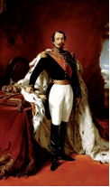

- Lyudovik XVIII
- Lyudovik XVII
- Napoleon II
+ Napoleon III

**80. Parij kommunasidan keyin Fransiyada qanday tuzum uzil-kesil oʻrnatilgan?**

- Parlamentar monarxiya
- Diktatura
+ Respublika
- Mutloq monarxiya

**81. Germaniya sanoat ishlab chiqarishining umumiy hajmi boʻyicha jahonda qaysi davlatdan keyin ikkinchi oʻringa chiqib olgan?**

- Angliyadan keyin
- Fransiyadan keyin
+ AQSH dan keyin
- Yaponiyadan keyin

**82. Germaniya birlashtirilgach, qaysi yillarda mamlakatda juda koʻplab sanoat kompaniyalari va banklar paydo boʻlgan?**

+ 1871-yildan 1875-yilgacha
- 1872-yildan 1876-yilgacha
- 1873-yildan 1877-yilgacha
- 1874-yildan 1878-yilgacha

**83. Fransiya-Prussiya urushidan keyin Germaniya kansleri Bismark … german davlatlari bilan shartnomalar imzolagan.**

- shimoliy
+ janubiy
- sharqiy
- g‘arbiy

**84. Parij kommunasi qulagach, oʻldirilgan, qamalgan va surgun qilinganlarni hisoblaganda Parij oʻzining qancha oʻgʻil-qizidan ayrilgan?**

- 50 ming
+ 100 ming
- 150 ming
- 200 ming

**85. Parij kommunasi rejasiga ko‘ra, Fransiya qanday davlat bo‘lishi kerak edi?**

- Imperator boshqaruvidagi mutloq monarxiya
+ Erkin kommunalarni birlashtirgan respublika
- Prezidentlik respublikasi
- Burbonlar sulolasi hukmronlik qiluvchi parlamentar monarxiya

**86. Parij kommunasi qaysi sanada qulagan?**

+ 28-may (1871-yil)
- 28-mart (1871-yil)
- 28-may (1872-yil)
- 28-mart (1872-yil)

**87. Fransiyada Ikkinchi imperiya qaysi yilgacha yashagan?**

+ 1870-yilgacha
- 1872-yilgacha
- 1873-yilgacha
- 1875-yilgacha

**88. Qachon Germaniya sanoat ishlab chiqarishining umumiy hajmi boʻyicha jahonda uchinchi oʻrinda bo‘lgan?**

- 1870-yilda
+ 1880-yilda
- 1895-yilda
- 1913-yilda

**89. Fransiya-Prussiya urushi davrida Prussiya imperatori kim edi?**

+ Vilgelm I
- Vilgelm II
- Fridrix I
- Fridrix II

**90. Fransiya-Prussiya urushi davrida asir tushgan Fransiya imperatori kim edi?**

- Lyudovik XVIII
- Lyudovik XVII
- Napoleon II
+ Napoleon III

**91. Biror narsaning muayyan joyda toʻplanishi qaysi atama bilan ataladi?**

- Diffuziya
- Dispersiya
+ Konsentratsiya
- Kulminatsiya

**92. Parij kommunasi qaysi sanalarda Fransiyani boshqargan muvaqqat hukumat hisoblanadi?**

- 1870-yilning 18-martidan 28-mayigacha
- 1870-yilning 18-mayidan 28-aprelgacha
+ 1871-yilning 18-martidan 28-mayigacha
- 1871-yilning 18-mayidan 28-aprelgacha

**93. Parij kommunasi qanday islohotlarni amalga oshirgan? 1) Doimiy armiya bekor qilingan; 2) Burjua sudi bekor qilingan; 3) Cherkov davlatdan ajratilgan; 4) Rahbar organlarning saylab qoʻyilishi haqidagi dekret qabul qilingan; 5) Kommunani tan olmagan eski amaldorlarning hammasi lavozimlaridan ozod qilingan.**

+ 1, 2, 3, 4, 5
- 1, 2, 3, 4
- 1, 2, 4, 5
- 2, 3, 4

**94. Fransiya-Prussiya urushi qachon boshlangan?**

+ 1870-yilda
- 1872-yilda
- 1873-yilda
- 1875-yilda

**95. XIX asr oxirida Fransiyada …lar juda katta moliya kapitaliga egalik qilardi.**

- sanoatchi
- fermer
- zodagon
+ bank

**96. XIX asr oxiriga kelib Fransiya sanoat ishlab chiqarishining darajasi boʻyicha qaysi yosh kapitalizm mamlakatlaridan ortda qolib ketgan?**

- Italiya va Yaponiya
- Yaponiya va AQSH
+ AQSH va Germaniya
- Germaniya va Italiya

**97. Oliy hokimiyat yoki boshqaruv organi chiqargan va qonun kuchiga ega boʻlgan muhim qaror qanday ataladi?**

+ Dekret
- Depesha
- Bill
- Xartiya

**98. Fransiya Prussiyaga yengilgan Parijda hokimiyat oʻzlarini qanday atagan bir guruh siyosatchilar va harbiylar qoʻliga oʻtgan?**

- “Milliy tiklanish hukumati”
- “Milliy manfaat hukumati”
+ “Milliy mudofaa hukumati”
- “Milliy fransuz hukumati”

**99. Fransiyadagi Uchinchi Respublika qachongacha mavjud boʻlgan?**

- Birinchi jahon urushigacha
+ Ikkinchi jahon urushigacha
- Karib inqirozigacha
- Sh. de Gollning iste’fosigacha

**100. Qaysi yilda Germaniya aholisining 2/3 qismi shaharlarda yashagan?**

- 1871-yilda
- 1885-yilda
- 1896-yilda
+ 1910-yilda

**101. “Konsentratsiya” so‘zi lotincha qanday ma’noni anglatadi?**

+ “Con” – “birga” va “centrum” – “markaz”
- “Con” – “katta” va “centrum” – “hudud”
- “Con” – “davlat” va “centrum” – “chegara”
- “Con” – “shakl” va “centrum” – “doira”

**102. Qachon Prussiya imperatori Vilgelm I Versal saroyida Germaniya imperatori deb eʼlon qilingan?**

- 1871-yil dekabrda
+ 1871-yil yanvarda
- 1872-yil dekabrda
- 1872-yil yanvarda

**103. Fransiyada “milliy mudofaa hukumati” oʻzining butun eʼtiborini nimaga qaratgan?**

- Imperatorni asirlikdan ozod etishga
- Ijtimoiy himoyani kengaytirishga
+ Prussiya bilan kelishishga
- Parij xalqini tinchlantirishga

**104. Qaysi yilda Germaniya aholisining 1/3 qismi shaharlarda yashagan?**

+ 1871-yilda
- 1885-yilda
- 1896-yilda
- 1910-yilda

**105. Butun XIX asr davomida Fransiya sanoat ishlab chiqarishining darajasi boʻyicha nechanchi oʻrinni egallab kelgan?**

- Birinchi oʻrinni
+ Ikkinchi oʻrinni
- Uchinchi oʻrinni
- To‘rtinchi oʻrinni

**106. Butun XIX asr davomida Fransiya sanoat ishlab chiqarishining darajasi boʻyicha qaysi davlatdan keyingi oʻrinni egallab kelgan?**

+ Angliyadan keyingi
- Germaniyadan keyingi
- AQSH dan keyingi
- Rossiyadan keyingi

**107. Qachon Fransiyada Uchinchi respublika eʼlon qilingan?**

- 1870-yil 14-sentyabrda
- 1871-yil 14-sentyabrda
- 1871-yil 4-sentyabrda
+ 1870-yil 4-sentyabrda

**108. Fransiyadagi Uchinchi Respublikaning qaysi yilgi konstitutsiyasining xarakteri oxir-oqibatda mamlakatning iqtisodiy va ijtimoiy hayotida yuz bergan oʻzgarishlar bilan belgilangan?**

+ 1875-yilgi
- 1878-yilgi
- 1881-yilgi
- 1883-yilgi

**109. XX asr boshlariga kelib Fransiya dunyoning eng qudratli davlatlari qatoriga kirsa-da, qanday sabablar tufayli rivojlanish surʼatlari tobora pasayib borayotgan edi?**

- Siyosiy beqarorlik va aholi sonining o‘sishdan to‘xtashi
- Aholi sonining o‘sishdan to‘xtashi va inqiloblar
+ Inqiloblar va urushlardagi juda katta yoʻqotishlar
- Urushlardagi juda katta yoʻqotishlar va siyosiy beqarorlik

**110. Prussiya armiyasi Parij shahrini qancha vaqt davomida qamal qilgan?**

- Besh oy davomida
+ Olti oy davomida
- Yetti oy davomida
- Sakkiz oy davomida

**111. Parij kommunasi necha kunlik faoliyatidan soʻng qulagan?**

- 74 kunlik
- 78 kunlik
+ 72 kunlik
- 70 kunlik

**112. Qachon Germaniya sanoat ishlab chiqarishining umumiy hajmi boʻyicha jahonda ikkinchi oʻringa chiqib olgan?**

- 1870-yilda
- 1880-yilda
- 1895-yilda
+ 1913-yilda

**113. XIX asrda qaysi davlat mustamlakalar “adolatsiz” boʻlingan deb hisoblardi va mustamlakalardan oʻz iqtisodiy qudrati va siyosiy mavqeyiga mos ulush talab qila boshlagan?**

- Yaponiya
+ Germaniya
- Fransiya
- AQSH

**114. Qachon Parij aholisi qoʻzgʻolon boshlab, Milliy gvardiyaga birlashgan va Kommunani taʼsis qilgan?**

- 1870-yil mayda
- 1870-yil martda
- 1871-yil mayda
+ 1871-yil martda

**115. Qaysi davrda Germaniya katta iqtisodiy sakrashni amalga oshirgan?**

- XIX asrning 60-yillarida
- XIX asrning 70-yillarida
- XIX asrning 80-yillarida
+ XIX asrning 90-yillarida

**116. Qachon birinchi imperiya reyxstagi Germaniya konstitutsiyasini qabul qilgan?**

+ 1871-yil bahorida
- 1872-yil bahorida
- 1873-yil bahorida
- 1874-yil bahorida

**117. XIX asr oxirida qaysi german imperatori “yangi kurs” ni eʼlon qilgan?**

- Vilgelm I
+ Vilgelm II
- Fridrix I
- Fridrix II

**118. Birinchi imperiya reyxstagi tomonidan qabul qilingan Germaniya konstitutsiyasida qayerning imperiyadagi yetakchilik roli mustahkamlagan?**

- Bavariya
- Saksoniya
+ Prussiya
- Brandenburg

## 4-§ Sharqiy Yevropa va Rossiya: jamiyatni isloh qilish muammolari.

**119. Qachon Bosniya va Gersegovina Avstriya tomonidan anneksiya qilingan?**

- 1867-yilda
- 1918-yilda
- 1878-yilda
+ 1908-yilda

**120. Boshqa bir davlat hududini butunlay yoki qisman egallab olish yoki oʻz davlatiga qoʻshib olish siyosati qanday ataladi?**

+ Anneksiya
- Anshlyuz
- Proteksiya
- Intervensiya

**121. Rossiyadagi ikkinchi fevral inqilobi qaysi yilda sodir bo‘lgan?**

- 1914-yilda
+ 1917-yilda
- 1918-yilda
- 1922-yilda

**122. Quyidagi suratda qaysi Rossiya imperatori tasvirlangan?**

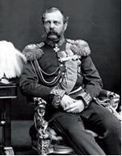

- Nikolay I
- Nikolay II
- Aleksandr I
+ Aleksandr II

**123. Avstriya-Vengriya imperiyasi tashkil topgunicha quyidagi qaysi hududlar Vengriya tarkibiga kirgan? 1) Chexiya; 2) Slovakiya; 3) Xorvatiya; 4) Moraviya; 5) Galitsiya; 6) Transilvaniya; 7) Bukovina.**

- 1, 2, 3
- 1, 6, 7
- 2, 4, 5
+ 2, 3, 6

**124. Qaysi yilda Avstriya-Vengriya imperiyasi konstitutsiyasi qabul qilinib, unga binoan Avstriya imperatori birlashgan imperiya hukmdori boʻlgan?**

+ 1867-yilda
- 1882-yilda
- 1878-yilda
- 1856-yilda

**125. Avstriya-Vengriya imperiyasi tashkil topgunicha quyidagi qaysi hududlar Avstriya tarkibiga kirgan? 1) Chexiya; 2) Slovakiya; 3) Xorvatiya; 4) Moraviya; 5) Galitsiya; 6) Transilvaniya; 7) Bukovina.**

- 1, 2, 4, 6
+ 1, 4, 5, 7
- 2, 3, 4, 5
- 3, 4, 5, 7

**126. Bolqon mamlakatlarida Usmoniylar imperiyasi hukmronligi qachon o‘rnatilgan va XIX asrgacha, baʼzi hududlarda XX asrgacha saqlanib qolgan?**

- XII–XIII asrlarda
- XIII–XIV asrlarda
+ XIV–XV asrlarda
- XV–XVI asrlarda

**127. Rossiyada podshoning cheklanmagan mustabid hokimiyati va shunday hokimiyat asosiga qurilgan davlat tuzumi qanday atalgan?**

- Oprichnina
- Byurokratiya
+ Samoderjaviye
- Aristokratiya

**128. XIX asr oxiriga kelib Avstriya-Vengriya imperiyasi aholisining qancha qismi shaharlarda yashardi?**

+ Uchdan bir qismi
- To‘rtdan bir qismi
- Beshdan bir qismi
- Oltidan bir qismi

**129. Rossiyada qaysi davrda krepostnoy huquqning bekor qilinishi, yer islohoti, moliya, universitet, maktab, matbuot islohotlari o‘tkazilgan?**

- XIX asrning 50–60-yillarida
+ XIX asrning 60–70-yillarida
- XIX asrning 70–80-yillarida
- XIX asrning 80–90-yillarida

**130. Birinchi rus inqilobi samoderjaviyega qanday ta’sir qilgan?**

- Hech kim va hech narsa bilan cheklanmagan
- Respublika o‘rnatilgan
- Vaqtincha hukumat ta’sis qilingan
+ Davlat Kengashi va Davlat Dumasi bilan cheklangan

**131. Qaysi davrga kelib Rossiyada sanoat toʻntarishi yakunlangan va mamlakat ishlab chiqarishning umumiy hajmi boʻyicha dunyoning beshta eng yirik industrial davlatlari qatoriga qoʻshilgan?**

- XIX asrning 60-yillariga kelib
- XIX asrning 70-yillariga kelib
- XIX asrning 80-yillariga kelib
+ XIX asrning 90-yillariga kelib

**132. Qaysi yilda boshlanib ketgan iqtisodiy inqiroz Avstriya-Vengriya imperiyasi ahvolini yanada ogʻirlashtirgan?**

- 1910-yilda
+ 1912-yilda
- 1915-yilda
- 1917-yilda

**133. Birinchi rus inqilobi mehnat sharoitlariga qanday ta’sir qilgan? 1) Ish haqi oshirilgan; 2) Ish vaqti 9–10 soatgacha qisqartirilgan; 3) Haq to‘lanadigan mehnat ta’tili joriy qilingan.**

+ 1, 2
- 1, 3
- 2, 3
- 1, 2, 3

**134. XIX asr oxiri – XX asr boshlaridagi mashhur rus kompozitorlarini toping. 1) F. M. Dostoyevskiy; 2) M. P. Musorgskiy; 3) L. N. Tolstoy; 4) P. I. Chaykovskiy; 5) A. P. Chexov; 6) N. A. Rimskiy-Korsakov.**

- 1, 3, 5
- 1, 2, 4
+ 2, 4, 6
- 2, 3, 5

**135. Birinchi rus inqilobi oʻz oldiga qoʻygan qanday jiddiy muammolarni hal qila olmagan? 1) Podsho hokimiyatda qolgan; 2) Hukmron qatlam oʻzgarmagan; 3) Byurokratiya yoʻq boʻlmagan; 4) Korrupsiya yanada kuchaygan; 5) Odamlarning yashash darajasi tushib ketgan.**

- 1, 2, 3
- 2, 3, 5
- 1, 2, 3, 4
+ 1, 2, 3, 4, 5

**136. Rossiyada kommunistik rejim necha yil davom etgan?**

- Oltmish yil
+ Yetmish yil
- Sakson yil
- To‘qson yil

**137. Avstriya-Vengriya imperiyasini qaysi sulola boshqargan?**

- Shtaufenlar
- Gogensollernlar
+ Gabsburglar
- Saksoniyaliklar

**138. XIX asr oxirida Sharqiy Yevropaga qaysi hududlar kirgan? 1) Janubiy german mamlakatlari; 2) Bolqon mamlakatlari; 3) Avstriya-Vengriya imperiyasi; 4) Rossiya imperiyasining bir qismi.**

- 1, 2, 3
+ 2, 3, 4
- 1, 2, 4
- 1, 3, 4

**139. Quyidagi qaysi atama dastlab hukumat idoralarining rahbarlari va amaldorlari hokimiyatini, keyinchalik jamiyatning turli sohalarida paydo boʻlgan yirik tashkilotlardagi xizmatchilar qatlamini ham ifodalagan?**

- Burjuaziya
+ Byurokratiya
- Samoderjaviye
- Aristokratiya

**140. Avstriya-Vengriya imperiyasi qaysi yilda ikki davlat – Avstriya va Vengriya hukmron doiralarining kelishuvi asosida tashkil topgan edi?**

+ 1867-yilda
- 1882-yilda
- 1878-yilda
- 1856-yilda

**141. Bosniya va Gersegovina aholisi kimlardan iborat bo‘lgan?**

+ Serblardan
- Xorvatlardan
- Albanlardan
- Makedonlardan

**142. Avstriya-Vengriya imperiyasi taxtida Gabsburglar sulolasi qaysi yilgacha oʻtirgan?**

- 1910-yilgacha
- 1914-yilgacha
- 1917-yilgacha
+ 1918-yilgacha

**143. Qaysi yilda Rossiya yordamiga tayangan Serbiya oʻz mustaqilligini eʼlon qilgan?**

- 1867-yilda
- 1918-yilda
+ 1878-yilda
- 1908-yilda

**144. Qaysi yillarda Birinchi rus inqilobi bo‘lib o‘tgan?**

+ 1905–1907-yillarda
- 1906–1908-yillarda
- 1907–1909-yillarda
- 1908–1910-yillarda

**145. Birinchi rus inqilobi aholining asosiy qatlamlariga qanday ta’sir qilgan?**

- Ovoz berish huquqiga ega boʻlishgan
- Yuqori lavozimlarga saylanish huquqiga ega boʻlishgan
+ Shaxs daxlsizligiga ega boʻlishgan
- Mulk daxlsizligiga ega boʻlishgan

**146. XIX asr oxiri – XX asr boshlaridagi rus adabiyotining mashhur vakillarini toping. 1) F. M. Dostoyevskiy; 2) M. P. Musorgskiy; 3) L. N. Tolstoy; 4) P. I. Chaykovskiy; 5) A. P. Chexov; 6) N. A. Rimskiy-Korsakov.**

+ 1, 3, 5
- 1, 2, 4
- 2, 4, 6
- 2, 3, 5

**147. Birinchi rus inqilobi oʻz oldiga qo‘ygan vazifalariga koʻra, avvalo nimaga qaratilgan edi?**

- Ishchilar sinfining manfaatlarini himoya qilishga
- Samoderjaviyeni ag‘darib tashlashga
+ Krepostnoylik qoldiqlarini yoʻq qilishga
- Konstitutsiyani qabul qilishga

## 5-§ Ikki xil Amerika: Shimoliy va Janubiy Amerikada taraqqiyot yoʻnalishlari.

**148. XIX asr oxiri XX asr boshlarida AQSH mustamlakalarni egallash va taʼsir doirasini kengaytirishda oʻz eʼtiborini qaysi mindaqalarda joylashgan mamlakatlarga qaratgan? 1) Lotin Amerikasi; 2) Karib dengizi; 3) Uzoq Sharq; 4) Tinch okean qirgʻoqlari.**

- 2, 3, 4
- 1, 2, 3
+ 1, 2, 4
- 1, 2, 3, 4

**149. Qaysi AQSH prezidenti jamiyatga oʻzining “yangi erkinlik” deb atalgan siyosiy dasturini taklif qilgan?**

- Teodor Ruzvelt
- Kalvin Kulidj
- Gerbert Guver
+ Vudro Vilson

**150. Qachon AQSH da prezidentlik lavozimini Teodor Ruzvelt egallagan?**

- 1894-yilda
- 1897-yilda
+ 1901-yilda
- 1912-yilda

**151. AQSH qaysi yilda Ispaniya bilan boʻlgan urushda gʻolib chiqqan?**

- 1891-yilda
- 1877-yilda
+ 1898-yilda
- 1889-yilda

**152. AQSH Alyaska yarimorolini qaysi davlatdan sotib olgan?**

- Ispaniyadan
+ Rossiyadan
- Meksikadan
- Fransiyadan

**153. XIX asrda Lotin Amerikasi iqtisodiyotiga kapital kiritishda dastlab qaysi davlat yetakchilik qilgan?**

+ Angliya
- AQSH
- Germaniya
- Fransiya

**154. Qachon Braziliyada qulchilik bekor qilingan?**

- 1894-yilda
- 1882-yilda
+ 1888-yilda
- 1891-yilda

**155. XIX asr oxirida AQSH ning Gʻarbiy yarimshar mamlakatlari ustidan yagona hukmronligiga qaratilgan … siyosati shakllangan.**

- panatlantika
+ panamerika
- panimperiya
- pankontinent

**156. XX asr boshlari Lotin Amerikasi tasviriy sanʼatining mashhur vakillarini toping.**

- David Sikeyros, Sezar Valyexo, Gabrila Mistral
- Sezar Valyexo, Gabrila Mistral, Diyego Rivera
+ Diyego Rivera, Xose Orosko, David Sikeyros
- Xose Orosko, David Sikeyros, Sezar Valyexo

**157. Quyidagi suratda qaysi AQSH prezidenti tasvirlangan?**

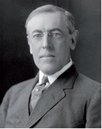

- Teodor Ruzvelt
- Kalvin Kulidj
- Gerbert Guver
+ Vudro Vilson

**158. AQSH Ispaniya bilan boʻlgan urushda gʻolib chiqib, qayerlarni o‘ziga qoʻshib olgan?**

- Filippin, Kuba
- Kuba, Puerto Riko
+ Puerto Riko, Guam orollari
- Guam orollari, Filippin

**159. AQSH Tinch okeandagi Osiyoga eltuvchi yoʻllarning chorrahasida joylashgan qaysi orollarni bosib olgan?**

- Mariana orollari
+ Gavayi orollari
- Fiji orollari
- Samoa orollari

**160. XX asrdagi Meksika inqilobi qaysi yillarda bo‘lib o‘tgan?**

+ 1910–1917-yillarda
- 1911–1918-yillarda
- 1912–1919-yillarda
- 1913–1920-yillarda

**161. Qachon AQSH hukumati chegaradagi tushunmovchilikni bahona qilib Meksikaga qo‘shin kiritgan?**

- 1910-yilda
- 1911-yilda
- 1913-yilda
+ 1916-yilda

**162. XX asrdan boshlab Amerika madaniyatining oʻziga xos jihati unda qanday madaniyatning ustuvorligi boʻlib qolgan?**

- Erkin madaniyat
+ Ommaviy madaniyat
- Aralash madaniyat
- Yangi madaniyat

**163. Lotin Amerikasining eng katta davlati qaysi?**

- Argentina
+ Braziliya
- Chili
- Paragvay

**164. XIX asr oxirida quyidagi qaysi hudud AQSH mustamlakasiga aylangan?**

- Puerto Riko
- Guam orollari
- Kuba
+ Filippin

**165. AQSH da qaysi yillarda fuqarolar urushi bo‘lib o‘tgan?**

- 1859–1863-yillarda
+ 1861–1865-yillarda
- 1863–1867-yillarda
- 1865–1869-yillarda

**166. Qachon AQSH dagi saylovlarda demokratlar vakili, taniqli tarixchi, davlatchilik va xalqaro munosabatlar boʻyicha mutaxassis Vudro Vilson gʻolib chiqqan?**

- 1901-yilda
+ 1912-yilda
- 1904-yilda
- 1910-yilda

**167. XX asr boshlari Lotin Amerikasi adabiyotining mashhur vakillarini toping.**

- Xose Orosko, Sezar Valyexo
+ Sezar Valyexo, Gabrila Mistral
- Gabrila Mistral, Diyego Rivera
- Diyego Rivera, Xose Orosko

**168. Qaysi konferensiya yakunida Amerika respublikalari yigʻini xalqaro assotsiatsiyasi tashkil qilingan?**

+ I Panamerika konferensiyasi
- II Panamerika konferensiyasi
- III Panamerika konferensiyasi
- IV Panamerika konferensiyasi

**169. AQSH madaniyatining asosini kimlar belgilagan?**

+ Inglizzabon aholi
- Irlandiya, Germaniya, Italiya, Polshadan kelgan emigrantlar
- Afrikadan keltirilgan qullarning avlodlari
- Amerika hindulari va Gavayi orollari aholisi

**170. Qachon Meksikada diktator Dias hokimiyati ag‘darilgan?**

- 1910-yilda
+ 1911-yilda
- 1913-yilda
- 1916-yilda

**171. Lotin Amerikasida turli xalqlar – hindular, qora tanlilar, yevropaliklar madaniyati va anʼanalari oʻrtasidagi oʻzaro taʼsir bu mamlakatlarda juda xilma¬xil va oʻziga xos qanday jamoalarning shakllanishiga olib kelgan?**

- Madaniy integratsiya jamoalari
- Gibrid jamoalar
- Multietnik jamoalar
+ Etnopsixologik jamoalar

**172. XIX asr oxiriga kelib Lotin Amerikasi iqtisodiyotiga kapital kiritishda qaysi davlatlar juda faollashganlar?**

- Fransiya va Angliya
- Angliya va Germaniya
+ Germaniya va AQSH
- AQSH va Fransiya

**173. Qachon Braziliya respublika deb eʼlon qilingan?**

- 1894-yilda
- 1882-yilda
- 1888-yilda
+ 1891-yilda

**174. XX asr boshlarida qaysi yilda Meksikada inqilob boshlangan?**

+ 1910-yilda
- 1911-yilda
- 1913-yilda
- 1916-yilda

**175. Meksikada general Uerta hokimiyatga kelgach, sobiq prezident Madero … .**

- mamlakatdan qochib ketgan
- noma’lum shaxs tomonidan o‘ldirilgan
- umrbod qamoqqa hukm qilingan
+ qamoqqa olinib, otib tashlangan

**176. Meksikada qaysi yilning oktyabrda bo‘lib o‘tgan prezidentlik saylovlarida Madero g‘olib chiqqan?**

- 1910-yilning
+ 1911-yilning
- 1913-yilning
- 1916-yilning

**177. XIX asrning 60–90-yillari Amerika madaniyati rivojlanishining nechanchi bosqichi bo‘lgan?**

- Birinchi bosqichi
+ Ikkinchi bosqichi
- Uchinchi bosqichi
- To‘rtinchi bosqichi

**178. Qaysi yil Meksikada inqilob g‘alaba qozongan?**

- 1916-yil
+ 1917-yil
- 1918-yil
- 1919-yil

**179. Qaysi yil fevralda Meksikada interventlar bilan kurash AQSH qo‘shinlarining Meksikadan olib chiqilishi bilan yakunlangan?**

- 1916-yil
+ 1917-yil
- 1918-yil
- 1919-yil

**180. Bir yoki bir necha davlatning boshqa bir davlat ichki ishlariga zoʻrlik bilan aralashuvi, uning hududiy yaxlitligi, siyosiy mustaqilligiga qarshi qaratilgan harakatlari qanday ataladi?**

- Anneksiya
- Anshlyuz
- Proteksiya
+ Intervensiya

**181. Fuqarolar urushi AQSH ning ijtimoiy-iqtisodiy taraqqiyotiga oid qaysi eng muhim masala taqdirini burjuacha ruhda hal qilgan?**

+ Qulchilik
- Davlat tuzilishi
- Tashqi siyosat
- Aparteid

**182. AQSH tashabbusi bilan qayerda I Panamerika konferensiyasi chaqirilgan?**

+ Vashington
- Nyu York
- Chikago
- Boston

**183. Qachon AQSH tashabbusi bilan I Panamerika konferensiyasi chaqirilgan?**

- 1891-yilda
- 1898-yilda
- 1877-yilda
+ 1889-yilda

**184. XIX asr oxiri XX asr boshlarida Lotin Amerikasining ko‘plab mamlakatlarida nimaga tayangan avtoritar rejimlar oʻrnatilgan?**

+ Armiyaga
- Aristokratiyaga
- Chet elliklarga
- Mahalliy etnik kuchlarga

**185. Fuqarolar urushidan keyin AQSH qishloq xoʻjaligida kapitalizm rivojlanishining erkin fermerlikka asoslangan qanday yo‘li qaror topgan?**

- “G‘arbcha” yoʻli
- “Fermerlik” yoʻli
+ “Amerikacha” yoʻli
- “Kapitalistik” yoʻli

**186. AQSH prezidenti Vudro Vilson dasturining muhokamasi Yevropadagi qaysi voqeaga to‘g‘ri kelgan?**

+ Birinchi jahon urushi boshlanishiga
- Birinchi Bolqon urushiga
- Ikkinchi Bolqon urushiga
- Birinchi jahon urushi tugashiga

**187. XIX asrning ikkinchi yarmi Amerika tasviriy sanʼatining mashhur vakillarini toping.**

- Tomas Ikins, Jeyms Uistler, Uolt Uitmen
- Jeyms Uistler, Uolt Uitmen, Mark Tven
- Uolt Uitmen, Mark Tven, Uinslou Homer
+ Uinslou Homer, Tomas Ikins, Jeyms Uistler

**188. Siyosiy hokimiyat birgina hukmdor shaxs yoki bir guruh shaxslarning irodasi, markazlashgan hokimiyatiga asoslangan davlat boshqaruvi usuli qanday ataladi?**

- Liberal rejim
- Konservativ rejim
- Sotsial rejim
+ Avtoritar rejim

**189. Qachon AQSH sanoat mahsulotlarining umumiy hajmi boʻyicha dunyoda birinchi oʻringa chiqib olgan?**

+ 1894-yilda
- 1897-yilda
- 1901-yilda
- 1912-yilda

**190. XIX asr oxirida quyidagi qaysi hudud ustidan AQSH nazorati o‘rnatilgan?**

- Puerto Riko
- Guam orollari
+ Kuba
- Filippin

**191. Meksikada qaysi yilning fevralida boshlangan qo‘zg‘olon natijasida hokimiyatga general Uerta kelgan?**

- 1910-yilning
- 1911-yilning
+ 1913-yilning
- 1916-yilning

**192. AQSH da sodir bo‘lgan qaysi urush oʻz mohiyatiga koʻra burjua-demokratik inqilob edi?**

- Mustaqillik urushi
+ Fuqarolar urushi
- Ispaniyaga qarshi urush
- Meksikaga qarshi urush

**193. XIX asrning ikkinchi yarmi Amerika adabiyotining mashhur vakillarini toping.**

+ Uolt Uitmen, Mark Tven
- Mark Tven, Uinslou Homer
- Uinslou Homer, Tomas Ikins
- Tomas Ikins, Uolt Uitmen

## 6-§ Yaponiya, Xitoy va Hindiston: islohotlarning osiyocha yoʻli.

**194. “Gomindan” so‘zining ma’nosi nima?**

+ “Milliy partiya”
- “Xalq partiyasi”
- “Milliy majlis”
- “Xalq majlisi”

**195. Nima sababdan Xitoydagi “Sinxay inqilobi” shunday nom olgan?**

+ Xitoyliklar taqvimi boʻyicha “sinxay” yilida boshlangani uchun
- Xitoy tilida “sinxay” so‘zi “inqilob” ma’nosini anglatgani uchun
- Xitoyda inqilob boshlangan oy “sinxay” deb nomlangani uchun
- Xitoyliklar tomonidan “sinxay” inqilob boshlanganini anglatuvchi maxsus so‘z sifatida ishlatilgani uchun

**196. Qaysi yilda Yaponiyada Tokugava syogunligi agʻdarilgan?**

+ 1868-yilda
- 1869-yilda
- 1870-yilda
- 1871-yilda

**197. Yaponiya necha asr davomida Gʻarb mamlakatlari uchun “yopiq” boʻlib qolgan?**

- Bir asr davomida
+ Ikki asr davomida
- Uch asr davomida
- To‘rt asr davomida

**198. Qaysi yildan Koreya rasman Yaponiyaning mustamlakasi boʻlib qolgan?**

- 1909-yildan
+ 1910-yildan
- 1911-yildan
- 1912-yildan

**199. XX asr boshlarida Xitoy aholisining qancha foizi savodsiz edi?**

- 60 foizi
- 70 foizi
- 80 foizi
+ 90 foizi

**200. XIX asrning ikkinchi yarmida Hindistonda inglizlar tomonidan sarmoya kiritilgan keyingi, ikkinchi darajali soha qaysi bo‘lgan?**

+ Plantatsiya xoʻjaligi
- Togʻ-kon sanoati
- To‘qimachilik
- Temiryoʻl qurilishi

**201. Angliya hukumati Hindistonda qanday plantatsiyalarni koʻpaytirish va turli imtiyozlar orqali qoʻllab-quvvatlashga katta eʼtibor qaratgan? 1) Paxta; 2) Choy; 3) Qahva; 4) Kauchuk.**

- 1, 2, 3
+ 2, 3, 4
- 1, 2, 4
- 1, 3, 4

**202. Qachon Sun Yatsen “Gomindan” partiyasiga asos solgan?**

+ 1912-yilda
- 1914-yilda
- 1915-yilda
- 1917-yilda

**203. Hindiston milliy-ozodlik harakati gʻoyasini targʻib qilishda kimning oʻrni beqiyos bo‘lgan?**

- Ramakrishna Paramahamsa
- Rabindranath Thakur
+ Svami Vivekananda
- Mahatma Gandi

**204. “Gitanjali” (“Qurbonlik qoʻshiqlari”) turkum sheʼrlari muallifi kim?**

- Ramakrishna Paramahamsa
+ Rabindranath Thakur
- Svami Vivekananda
- Mahatma Gandi

**205. Xitoyda aholining keng qatlamlariga tushunarli boʻlgan adabiy til qanday atalgan?**

- Beifanghua
- Kanton
+ Bayxua
- Venyan

**206. Qaysi yillarda rus-yapon urushi bo‘lib o‘tgan?**

+ 1904–1905-yillarda
- 1905–1906-yillarda
- 1906–1907-yillarda
- 1907–1908-yillarda

**207. Qachon qabul qilingan Yaponiya konstitutsiyasiga binoan mamlakat konstitutsion monarxiyaga aylangan?**

- 1884-yilda
- 1887-yilda
+ 1889-yilda
- 1891-yilda

**208. “Meydzi” so‘zining ma’nosi nima?**

- “Adolatli boshqaruv”
- “Ulug‘vor boshqaruv”
+ “Maʼrifatli boshqaruv”
- “Ziyoli boshqaruv”

**209. Xitoyda jamiyatning faqat oʻqimishli qismigagina tushunarli boʻlgan eski adabiy til qanday atalgan?**

- Beifanghua
- Kanton
- Bayxua
+ Venyan

**210. XIX asrning ikkinchi yarmida Xitoyda ishlab chiqilgan, “szi syan” nomini olgan taraqqiyotning yangicha yoʻli qanday ma’noni anglatadi?**

+ “Oʻz-oʻzini kuchaytirish”
- “Oʻz-oʻzini rag‘batlantirish”
- “Oʻz-oʻzini yangilash”
- “Oʻz-oʻzini yuksaltirish”

**211. Quyidagi suratda tasvirlangan faylasuf kim?**

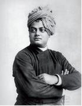

- Ramakrishna Paramahamsa
- Rabindranath Thakur
+ Svami Vivekananda
- Mahatma Gandi

**212. Hind milliy yangilanish mafkurasining dastlabki vakillari sifatida … va uning shogirdi … Hindistonda va chet ellarda mashhur edi.**

+ Ramakrishna Paramahamsa/Svami Vivekananda
- Svami Vivekananda/Rabindranath Thakur
- Rabindranath Thakur/Mahatma Gandi
- Mahatma Gandi/Ramakrishna Paramahamsa

**213. Qaysi yilda Yaponiyaning yagona davlatga birlashish jarayoni yakunlangan?**

- 1868-yilda
- 1869-yilda
- 1870-yilda
+ 1871-yilda

**214. Qaysi davr “Osiyo uygʻonishi” davri boʻlib, unda Sharqning anʼanaviy jamiyatlarida sanoatlashtirish kurtaklari koʻrina boshlagan?**

- XVI asr oxiri – XVII asr boshlari
- XVII asr oxiri – XVIII asr boshlari
- XVIII asr oxiri – XIX asr boshlari
+ XIX asr oxiri – XX asr boshlari

**215. Xitoyda “Sinxay inqilobi” qaysi yillarda sodir bo‘lgan?**

- 1910–1911-yillarda
+ 1911–1912-yillarda
- 1912–1913-yillarda
- 1913–1914-yillarda

**216. XX asr boshlarida Xitoyda qancha aholi yashagan?**

- 200 mln. aholi
- 300 mln. aholi
+ 400 mln. aholi
- 500 mln. aholi

**217. Xitoyda “Sinxay inqilobi” natijasida … . 1) Manchjurlar sulolasi taxtdan agʻdarilgan; 2) Mamlakat chet el qaramligidan ozod bo‘lgan; 3) Respublika e’lon qilingan.**

- 2, 3
- 1, 2
+ 1, 3
- 1, 2, 3

**218. Yaponiyada Meydzi davri qaysi yillarni o‘z ichiga oladi?**

- 1867–1911-yillarni
+ 1868–1912-yillarni
- 1869–1913-yillarni
- 1870–1914-yillarni

**219. Quyidagi suratda kim tasvirlangan?**

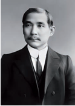

- Chan Kayshi
+ Sun Yatsen
- Mao Szedun
- U Peyfu

**220. Qachon “Gitanjali” (“Qurbonlik qoʻshiqlari”) turkum sheʼrlari uchun adabiyot sohasida Nobel mukofoti berilgan?**

+ 1913-yilda
- 1915-yilda
- 1917-yilda
- 1918-yilda

**221. Quyidagi suratda qaysi yapon imperatori tasvirlangan?**

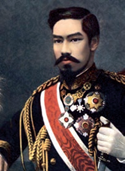

- Hirohito
- Naruhito
+ Mutsuxito
- Tayko

**222. Quyidagi suratda kim tasvirlangan?**

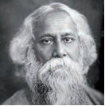

- Ramakrishna Paramahamsa
+ Rabindranath Thakur
- Svami Vivekananda
- Mahatma Gandi

**223. Rus-yapon urushidan keyin Yaponiya qayerning tashqi siyosatini ham belgilay boshlagan?**

- Xitoy
+ Koreya
- Vyetnam
- Laos

**224. Yaponiyada feodal yer mulklari tugatilgan va toʻgʻridan toʻgʻri markaziy hukumatga boʻysunuvchi …lar joriy qilingan.**

+ prefektura
- provinsiya
- shtat
- okrug

**225. Qaysi yillarda hind musulmonlarining partiyasi – “Musulmon ligasi” tashkil qilingan?**

- 1904–1905-yillarda
- 1905–1906-yillarda
+ 1906–1907-yillarda
- 1907–1908-yillarda

**226. Xitoyda Ikkinchi afyun urushi qaysi yillarda sodir bo‘lgan?**

- 1851–1855-yillarda
- 1853–1857-yillarda
+ 1856–1860-yillarda
- 1858–1862-yillarda

**227. XIX asrning ikkinchi yarmida Hindistonda inglizlar tomonidan birinchi yirik sarmoya kiritilgan soha qaysi bo‘lgan?**

- Plantatsiya xoʻjaligi
- Togʻ-kon sanoati
- To‘qimachilik
+ Temiryoʻl qurilishi

**228. Yaponiyada Meydzi davrida tabaqalar soni nechtagacha qisqartirilgan va ular qaysilar?**

- Ikkitagacha: zodagonlar va oddiy xalq
+ Uchtagacha: unvonli aslzodalar, zodagonlar va oddiy xalq
- To‘rttagacha: unvonli aslzodalar, zodagonlar, samuraylar va oddiy xalq
- Beshtagacha: unvonli aslzodalar, zodagonlar, rohiblar, samuraylar va oddiy xalq

**229. Yaponiyada qaysi imperator hukmronligi davri “Meydzi” deb ataladi?**

- Hirohito
- Naruhito
+ Mutsuxito
- Tayko

**230. Xitoyda ishlab chiqilgan, “szi syan” nomini olgan taraqqiyotning yangicha yoʻli qaysi yilgacha jiddiy oʻzgarishlarsiz amalga oshirilgan?**

- 1887-yilgacha
- 1889-yilgacha
- 1892-yilgacha
+ 1895-yilgacha

**231. Xitoyda kim boshchiligida “Sinxay inqilobi” boshlangan?**

- Chan Kayshi
+ Sun Yatsen
- Mao Szedun
- U Peyfu

**232. Qachon Hindiston milliy kongressi (HMK) tashkil qilingan?**

- 1882-yilda
+ 1885-yilda
- 1887-yilda
- 1889-yilda

**233. Rus-yapon urushidan keyin Yaponiya qayerlar ustidan oʻz hukmronligini oʻrnatgan?**

+ Janubiy Manchjuriya va Koreya
- Shimoliy Xitoy va Kambodja
- Sharqiy Vyetnam va Siam
- G‘arbiy Indoneziya va Laos

**234. Qayerda Hindiston milliy kongressi (HMK) tashkil qilingan?**

- Dehli
- Agra
- Kalkutta
+ Bombey

**235. Qaysi yilda Yaponiyada Tokugava syogunligi butunlay tugatilgan?**

- 1868-yilda
+ 1869-yilda
- 1870-yilda
- 1871-yilda

## 7-§ Islom sivilizatsiyasi mamlakatlarida anʼanaviylik va islohotchilik oʻrtasidagi kurash.

**236. Qaysi yillarda Fors davlatida burjua-demokratik inqilobi bo‘lib o‘tgan?**

- 1904–1910-yillarda
+ 1905–1911-yillarda
- 1906–1912-yillarda
- 1907–1913-yillarda

**237. XIX asrning ikkinchi yarmida Fors davlatida Yevropa davlatlarining, birinchi navbatda, qaysi davlatlarning faol mustamlakachilik ekspansiyasi davri boʻlgan?**

- Germaniya va Angliya
+ Angliya va Rossiya
- Rossiya va Fransiya
- Fransiya va Germaniya

**238. Sulton Abdulhamid II davrida qaysi yilda Rossiya-Turkiya urushi boshlangan?**

- 1875-yilda
- 1876-yilda
+ 1877-yilda
- 1878-yilda

**239. Islom sivilizatsiyasi tarixida intellektual tushkunlik qaysi asrlardan boshlangan?**

- X–XI asrlardan
- XI–XII asrlardan
- XII–XIII asrlardan
+ XIII–XIV asrlardan

**240. XIX asr oxiri – XX asr boshlarida islom mamlakatlarida mustamlakaсhi hukumatlar tomonidan qanday eskirgan urf-odat va holatlar bekor qilingan? 1) Qul savdosi; 2) Bolalar savdosi; 3) Koʻpxotinlik.**

- 2, 3
- 1, 2
- 1, 3
+ 1, 2, 3

**241. Qachon “Yosh turklar” partiyasidan boʻlgan zobitlar qoʻzgʻolon koʻtargan?**

- 1905-yilda
- 1907-yilda
+ 1908-yilda
- 1910-yilda

**242. Qaysi turk sultoni konstitutsiyani qabul qilishga majbur boʻlgan?**

+ Abdulhamid II
- Mehmed V
- Murad V
- Abdulaziz

**243. 1870–1914-yillarda mustamlakaсhi davlatlar tomonidan Turkiya, Misr va Yaqin Sharq mamlakatlariga kiritilgan investitsiyalar hajmi barcha investitsiyalarning qancha foizini tashkil qilgan?**

+ 50–60 foizini
- 60–70 foizini
- 70–80 foizini
- 80–90 foizini

**244. “Yosh turklar” partiyasining qaysi vakillaridan iborat uchlik hokimiyatga kelgan? 1) Mustafo posho; 2) Anvar posho; 3) Talʼat posho; 4) Jamol posho.**

- 1, 2, 3
- 1, 3, 4
+ 2, 3, 4
- 1, 2, 4

**245. Qachon Istanbulda “yangi usmoniylar” maxfiy siyosiy tashkiloti tuzilgan?**

- 1861-yilda
+ 1865-yilda
- 1868-yilda
- 1876-yilda

**246. Qaysi turk sultoni davrida Midhat posho buyuk vazir lavozimini egallagan va boʻlgʻusi konstitutsiya loyihasini tayyorlashga ruxsat olgan?**

- Mehmed V
+ Abdulhamid II
- Murad V
- Abdulaziz

**247. Usmoniylar imperiyasi iqtisodiyotining asosini juda qoloq … tashkil qilganligi uchun ocharchiliklar boʻlib turardi.**

+ qishloq xoʻjaligi
- chorvachilik
- savdo-sotiq
- ovchilik

**248. Qaysi yilda Turkiya bosh vaziri Mahmud Nadim posho taʼqib qilingan “yosh turklar” ning afv etilishiga erishgan?**

- 1869-yilda
+ 1871-yilda
- 1875-yilda
- 1878-yilda

**249. Qayerda “yangi usmoniylar” tashkiloti “Yosh Turkiya”, uning ishtirokchilari “yosh turklar” nomini olgan?**

+ Yevropada
- Amerikada
- Markaziy Osiyoda
- Uzoq Sharqda

**250. XIX asrning ikkinchi yarmida Fors davlatini qaysi sulola boshqargan?**

+ Qojarlar sulolasi
- Pahlaviylar sulolasi
- Afshariylar sulolasi
- Safaviylar sulolasi

**251. Islom sivilizatsiyasi tarixida qaysi asrda iqtisodiy va siyosiy inqiroz boshlangan?**

- XIV asrda
- XV asrda
+ XVI asrda
- XVII asrda

**252. Qachon Usmoniylar davlati taxtiga Abdulhamid II kelgan?**

- 1877-yilda
- 1865-yilda
- 1868-yilda
+ 1876-yilda

**253. Qachon San Stefano nomli joyda ruslar bilan turklar o‘rtasida sulh imzolangan?**

+ 1878-yil martda
- 1876-yil mayda
- 1879-yil aprelda
- 1877-yil avgustda

**254. Qaysi yilda Turkiya inqilobi gʻalaba qozongan?**

- 1905-yilda
+ 1908-yilda
- 1909-yilda
- 1911-yilda

**255. Qaysi asrga kelib islom sivilizatsiyasi chuqur intellektual inqirozga yuz tutgan va islom mamlakatlaridagi taʼlim va madaniyat markazlarining koʻpchiligi tor fikrli mutaassiblar va murosasiz jaholatparastlar oʻchogʻiga aylanib qolgan?**

- XIV asrga kelib
- XV asrga kelib
- XVI asrga kelib
+ XVII asrga kelib

**256. Bir necha harbiy toʻntarishlardan soʻng qaysi yilda Turkiyada hokimiyatga “Yosh turklar” partiyasining vakillari kelgan?**

+ 1913-yilda
- 1914-yilda
- 1916-yilda
- 1919-yilda

**257. Qaysi fors shohining siyosati burjua-demokratik inqilobiga olib kelgan va u milliy-ozodlik harakati bilan qoʻshilib ketgan?**

- Muhammad Ali
- Nosiriddin
- Fath Ali
+ Muzaffariddin

**258. Qaysi turk sultoni davrida Mahmud Nadim posho bosh vazir bo‘lgan?**

- Abdulhamid II
- Mehmed V
- Murad V
+ Abdulaziz

**259. San Stefano qaysi shahar yaqinida joylashgan?**

+ Istanbul
- Edirna
- Anqara
- Izmir

**260. XX asr boshida Fors davlatida parlament qanday atalgan?**

+ Majlis
- Kengash
- Loya Jirg‘a
- Qurultoy

**261. Birinchi jahon urushi arafasida qaysi yilda Turkiya oʻta maxfiy holatda Germaniya bilan shartnoma imzolagan?**

- 1911-yil mayda
- 1912-yil iyunda
- 1913-yil iyulda
+ 1914-yil avgustda

**262. Qaysi yilda “Yosh turklar inqilobi” nomini olgan inqilobiy voqealar Turkiyada feodal-mustabid tuzumni agʻdarib tashlagan va konstitutsiyani tiklagan?**

- 1905-yilda
- 1907-yilda
+ 1908-yilda
- 1910-yilda

**263. Qaysi yilda rus ofitserlari boshchiligida tuzilgan kazaklar polki keyinchalik brigadaga aylantirilgan va Fors armiyasining yagona jangovar qismi sifatida shoh rejimining Rossiyaga qaramligini kuchaytirishga xizmat qilgan?**

- 1872-yilda
- 1877-yilda
+ 1879-yilda
- 1881-yilda

**264. XX asr boshida Fors davlati qaysi davlatlar tomonidan taʼsir hududlariga boʻlib olingan?**

- Germaniya va Angliya
+ Angliya va Rossiya
- Rossiya va Fransiya
- Fransiya va Germaniya

**265. Qachon qabul qilingan “Midhat konstitutsiyasi” Turkiyani konstitutsion monarxiya deb eʼlon qilgan?**

- 1877-yil martda
- 1865-yil fevralda
- 1868-yil yanvarda
+ 1876-yil dekabrda

**266. San Stefano sulhining asosiy sharti qaysi mustaqil davlatni tuzish bo‘lgan?**

- Gretsiya
+ Bolgariya
- Serbiya
- Albaniya

**267. Turkiyada qabul qilingan “Midhat konstitutsiyasi” da nimalar ko‘zda tutilgan edi? 1) Turkiya konstitutsion monarxiya deb eʼlon qilingan; 2) Ikki palatali parlament tuzilishi koʻzda tutilgan; 3) Imperiyaning barcha fuqarolari usmoniylar deb atalishi lozim edi; 4) Barcha fuqarolar qonun oldida teng hisoblangan.**

- 2, 3, 4
- 1, 2, 3
- 1, 2, 4
+ 1, 2, 3, 4

## 8-§ Afrika mamlakatlarida mustamlakachilik va taraqqiyot muammolari.

**268. Qul savdosini taqiqlagan Bryussel konferensiyasi qaysi yillarda bo‘lib o‘tgan?**

- 1888–1889-yillarda
+ 1889–1890-yillarda
- 1890–1891-yillarda
- 1891–1892-yillarda

**269. XIX asrda Yevropa va Amerikadagi shaharlar – Bristol, Liverpul, Manchester, London, Nant, Ruan, Amsterdam, Nyu York, Yangi Orlean, Rio de Janeyro va boshqalarning jadal rivojlanishi va gullab¬yashnashi nima bilan bog‘liq edi?**

+ Qul savdosi
- Oltin savdosi
- Tuz savdosi
- Tamaki savdosi

**270. Afrikada qul savdosi qaysi davrgacha davom etgan?**

- XIX asrning 50-yillarigacha
- XIX asrning 60-yillarigacha
+ XIX asrning 70-yillarigacha
- XIX asrning 80-yillarigacha

**271. Berlin konferensiyasida … Yevropa davlatlari mustamlakachilik va iqtisodiy ekspansiyasining obyekti sifatida qaralgan.**

+ Afrika
- Janubiy Amerika
- Uzoq Sharq
- Okeaniya

**272. Qaysi davlat Afrika qitʼasining katta qismini egallab olgan boʻlib, bu hududlarda Afrika aholisining qariyb uchdan bir qismi yashardi?**

- Germaniya
+ Fransiya
- Belgiya
- Buyuk Britaniya

**273. Quyidagi qaysi atama “irqchilik” degan ma’noni anglatadi?**

- Natsizm
- Shovinizm
- Marksizm
+ Rasizm

**274. Qaysi yilgacha Yevropa davlatlari tomonidan Afrika qitʼasining faqat 10 foizi egallangan edi?**

- 1872-yilgacha
+ 1876-yilgacha
- 1881-yilgacha
- 1887-yilgacha

**275. Qariyb toʻrt asr ichida yevropaliklar Amerikaga qancha qul olib kelishgan?**

- 14–15 million
+ 15–16 million
- 16–17 million
- 17–18 million

**276. Mustaqillik uchun kurash yillarida qaysi Afrika vatanparvarlari oʻz jasoratlari va uddaburonliklari bilan mashhur boʻlganlar? 1) Samori; 2) Behanzin; 3) Raboh; 4) Muhammad ibn Abdulla.**

- 2, 3, 4
- 1, 2, 4
- 1, 2, 3
+ 1, 2, 3, 4

**277. Afrika taqdirini muhokama qilishga bagʻishlangan Berlin konferensiyasida nechta Yevropa davlati qatnashgan?**

- 10 ta
+ 12 ta
- 14 ta
- 16 ta

**278. Afrikadagi hududlar, Buyuk Britaniya va Fransiyadan tashqari, yana qaysi davlatlar o‘rtasida taqsimlangan edi? 1) Belgiya; 2) Portugaliya; 3) Ispaniya; 4) Germaniya; 5) Italiya.**

- 2, 3, 4
- 1, 2, 3
- 1, 2, 3, 4
+ 1, 2, 3, 4, 5

**279. Qaysi davlat Afrika qitʼasining katta qismini bosib olgan boʻlib, bu hududlarda Afrika umumiy aholisining qariyb yarmi istiqomat qilardi?**

- Germaniya
- Fransiya
- Belgiya
+ Buyuk Britaniya

**280. Tropik Afrika mamlakatlarida milliy mafkuraning shakllanishida rol oʻynagan qatlamni kimlar tashkil qilgan? 1) Dehqonlar; 2) Kichik amaldorlar; 3) Oʻqituvchilar; 4) Ruhoniylar; 5) Shifokorlar; 6) Yuristlar; 7) Hunarmandlar.**

- 1, 2, 4, 5
- 1, 3, 4, 6, 7
+ 2, 3, 4, 5, 6
- 2, 4, 5, 7

**281. Qaysi yilga kelib Afrika qitʼasining 9/10 qismi mustamlakachi bosqinchilar qoʻliga oʻtgan?**

- 1880-yilga kelib
- 1890-yilga kelib
+ 1900-yilga kelib
- 1910-yilga kelib

**282. Yevropa davlatlari ishtirokida “Qora qitʼa” (Afrika) taqdirini muhokama qilishga bagʻishlangan birinchi maxsus yigʻilish, Berlin konferensiyasi qaysi yillarda bo‘lib o‘tgan?**

+ 1884–1885-yillarda
- 1885–1886-yillarda
- 1886–1887-yillarda
- 1887–1888-yillarda

**283. Quyidagi qaysi atama “tanazzulga uchrash” degan ma’noni anglatadi?**

- Retsessiya
- Depressiya
+ Degradatsiya
- Agressiya

**284. “Lagos observer” gazetasi qayerda chiqarilgan?**

- G‘arbiy Yevropada
+ Tropik Afrikada
- Markaziy Amerikada
- Yaqin Sharqda

**285. Qaysi davlatning Afrikadagi mustamlakalarining asosiy qismi Gʻarbiy va Ekvatorial Afrikada joylashgan va ancha qismi Sahroyi Kabirga toʻgʻri kelardi?**

+ Fransiya
- Germaniya
- Belgiya
- Buyuk Britaniya

**286. Toʻrt asr davomida koʻplab avlod Afrikaning qaysi o‘ziga xos sivilizatsiyalar haqida maʼlumotga ega boʻlmasdan, Afrikani faqat qul savdosi va qul tushunchalari orqaligina tasavvur qilgan? 1) Gana; 2) Songay; 3) Benin; 4) Monomotapa.**

- 1, 2, 3
- 1, 2, 4
- 2, 3, 4
+ 1, 2, 3, 4

**287. Qaysi yilda “Lagos observer” gazetasi “Dunyo hali hech qachon bunday katta miqyosdagi va surbetlarcha qilingan talonchilikka guvoh boʻlmagan edi. Biroq Afrika qarshilik qilishga ojiz”, – deb yozgan edi?**

+ 1885-yilda
- 1887-yilda
- 1883-yilda
- 1890-yilda

**288. Afrika taqdirini muhokama qilishga bagʻishlangan Berlin konferensiyasi qaysi davlatlar tashabbusi bilan chaqirilgan?**

- Angliya va Germaniya
+ Germaniya va Fransiya
- Fransiya va Belgiya
- Belgiya va Angliya

**289. Afrika taqdirini muhokama qilishga bagʻishlangan Berlin konferensiyasida Yevropa davlatlaridan tashqari yana qaysi davlatlar qatnashgan?**

- Turkiya va Fors
- Fors va Yaponiya
- Yaponiya va AQSH
+ AQSH va Turkiya

**290. Afrika taqdirini muhokama qilishga bagʻishlangan Berlin konferensiyasida umumiy nechta davlat qatnashgan?**

- 10 ta
- 12 ta
+ 14 ta
- 16 ta

**291. Qariyb toʻrt asr ichida Atlantika okeani orqali amalga oshirilgan qul savdosi jarayonlarida taxminan qancha kishi halok boʻlgan?**

- 30–40 million
- 40–50 million
- 50–60 million
+ 60–70 million

## 9-§ Birinchi jahon urushining kelib chiqish sabablari va oqibatlari.

**292. Birinchi jahon urushida urushayotgan mamlakatlar armiyalariga qancha kishi safarbar etilgan?**

- 54 milliondan ortiq kishi
- 64 milliondan ortiq kishi
+ 74 milliondan ortiq kishi
- 84 milliondan ortiq kishi

**293. Ikkinchi jahon urushida nechta davlat qatnashgan?**

- 32 davlat
- 42 davlat
- 52 davlat
+ 62 davlat

**294. Birinchi jahon urushida qaysi davlat Rossiyaga ultimatum eʼlon qilib, safarbarlikni toʻxtatishni talab qilgan?**

- Avstriya-Vengriya
- Italiya
- Turkiya
+ Germaniya

**295. Qachon Avstriya-Vengriya Serbiyaga urush eʼlon qilgan?**

- 1914-yil 28-iyunda
- 1914-yil 23-iyulda
+ 1914-yil 28-iyulda
- 1914-yil 1-avgustda

**296. Birinchi jahon urushidan qaysi davlat Xitoyni boʻysundirishda, Tinch okeandagi Germaniya mustamlakalarini egallab olishda hamda Uzoq Sharqda oʻz hukmronligini oʻrnatishda foydalanmoqchi boʻlgan?**

- Angliya
+ Yaponiya
- Fransiya
- AQSH

**297. Birinchi jahon urushida qaysi sanada Germaniya delegatsiyasi Antanta davlatlari tomonidan qoʻyilgan shartlarni imzolagan va urush yakunlanganligi eʼlon qilingan?**

- 1918-yil 11-avgust kuni
- 1918-yil 11-sentyabr kuni
- 1918-yil 11-oktyabr kuni
+ 1918-yil 11-noyabr kuni

**298. Birinchi jahon urushi boshlanganida Germaniya imperatori kim edi?**

- Viktor Emmanuel III
+ Vilgelm II
- Frans Ferdinand
- Frans Iosif I

**299. Ikkinchi jahon urushi bo‘lib o‘tgan davrni toping.**

- 1938-yil 1-avgust – 1944-yil 2-avgust
+ 1939-yil 1-sentyabr – 1945-yil 2-sentyabr
- 1940-yil 1-oktyabr – 1946-yil 2-oktyabr
- 1941-yil 1-noyabr – 1947-yil 2-noyabr

**300. Birinchi jahon urushida AQSH qaysi tomonda urushga kirgan?**

- Uchlar ittifoqi
+ Antanta
- Betaraf qolgan
- Ikkala blokka ham qo‘shilgan

**301. Birinchi jahon urushida Germaniyaning talanishi, uni tiz choʻktirish uchun qilingan harakatlar qanday oqibatlarga olib kelgan?**

+ Ikkinchi jahon urushining sodir bo‘lishiga
- Dunyoning qayta bo‘linishiga
- G‘olib davlatlarning yanada rivolanishiga
- Mustamlakachilik zulmining kuchayishiga

**302. Qachon Avstriya-Vengriya taxtining vorisi shahzoda Frans Ferdinand va uning xotini otib oʻldirilgan?**

+ 1914-yil 28-iyunda
- 1914-yil 23-iyulda
- 1914-yil 28-iyulda
- 1914-yil 1-avgustda

**303. Birinchi jahon urushida qancha odam halok bo‘lgan?**

- 11,6 mln. dan ortiq
- 12,6 mln. dan ortiq
+ 13,6 mln. dan ortiq
- 14,6 mln. dan ortiq

**304. Birinchi jahon urushida 1917-yil yozda qaysi davlat armiyasida tartibsizliklar boshlangan?**

- Rossiya
- Italiya
+ Fransiya
- Angliya

**305. Avstriya-Vengriya Serbiyaga urush eʼlon qilgach, qaysi davlatda Serbiyani aniq halokat holatiga tashlab qoʻymaslik uchun umumiy safarbarlik eʼlon qilingan?**

- Angliyada
- Fransiyada
+ Rossiyada
- AQSH da

**306. Birinchi jahon urushida qaysi yilda nemislar fransuzlar himoyasining muhim boʻgʻini boʻlgan Verdenga hujum qilganlar?**

- 1914-yil dekabrda
- 1915-yil yanvarda
+ 1916-yil fevralda
- 1917-yil martda

**307. Qaysi kuni Germaniya Birinchi jahon urushini rasman yakunlagan Versal shartnomasini imzolashga majbur bo‘lgan?**

- 1918-yil 28-iyun
- 1918-yil 28-iyul
+ 1919-yil 28-iyun
- 1919-yil 28-iyul

**308. Birinchi jahon urushida AQSH urushga kirgach, Antanta davlatlari qachon tashabbusni oʻz qoʻllariga olib, barcha frontlarda hujumga oʻtgan?**

- 1918-yilning iyun oyida
- 1918-yilning iyul oyida
+ 1918-yilning avgust oyida
- 1918-yilning sentyabr oyida

**309. Birinchi jahon urushining qaysi davrida Antanta davlatlari urushda burilish yasash uchun samarasiz harakat qilganlar?**

- 1916-yil bahorda
- 1916-yil yozda
+ 1917-yil bahorda
- 1917-yil yozda

**310. Qaysi yilda Germaniya, Avstriya-Vengriya va Italiya “Uchlar ittifoqi” harbiy-siyosiy blokini tashkil qilgan?**

- 1883-yilda
- 1885-yilda
+ 1882-yilda
- 1888-yilda

**311. Avstriya-Vengriya taxtining vorisi shahzoda Frans Ferdinand va uning xotini otib oʻldirilgan Sarayevo shahri qayerda joylashgan edi?**

- Serbiyada
- Albaniyada
+ Bosniyada
- Gersegovinada

**312. Birinchi jahon urushida ishtirok etgan davlatlar aholisining umumiy soni qancha edi?**

- 1 mlrd.
+ 1,5 mlrd.
- 2 mlrd.
- 2,5 mlrd.

**313. Birinchi jahon urushining qaysi davriga kelib choʻzilib ketgan urush Germaniyani muqarrar halokatga olib kelayotganligi aniq boʻlib qolgan?**

+ 1916-yilning boshiga kelib
- 1916-yilning oxiriga kelib
- 1917-yilning boshiga kelib
- 1917-yilning oxiriga kelib

**314. Qaysi yillarda Buyuk Britaniya, Fransiya va Rossiya oʻrtasida “Antanta” bloki shakllangan?**

- 1901–1904-yillarda
- 1902–1905-yillarda
- 1903–1906-yillarda
+ 1904–1907-yillarda

**315. Birinchi jahon urushida Angliya qachon Germaniyaga urush eʼlon qilgan?**

- 1914-yil 1-avgustda
- 1914-yil 2-avgustda
- 1914-yil 3-avgustda
+ 1914-yil 4-avgustda

**316. Birinchi jahon urushida 1917-yil Fevral inqilobidan soʻng qaysi davlat armiyasida jangovarlik susayib ketgan?**

+ Rossiya
- Italiya
- Fransiya
- Angliya

**317. Birinchi jahon urushida nechta davlat qatnashgan?**

+ 38 ta
- 48 ta
- 58 ta
- 68 ta

**318. Birinchi jahon urushida Germaniya qachon Rossiyaga urush e’lon qilgan?**

- 1914-yil 28-iyunda
- 1914-yil 23-iyulda
- 1914-yil 28-iyulda
+ 1914-yil 1-avgustda

**319. Birinchi jahon urushidagi Verden janggida fransuzlar qancha odamini yo‘qotishgan?**

- 340 ming
+ 360 ming
- 380 ming
- 400 ming

**320. Birinchi jahon urushida Turkiya qaysi tomonda urushga kirgan?**

+ Uchlar ittifoqi
- Antanta
- Betaraf qolgan
- Ikkala blokka ham qo‘shilgan

**321. Birinchi jahon urushida 1917-yilda qaysi davlatlarda ishchilar urushga qarshi shiorlar bilan chiqa boshlaganlar? 1) Angliya; 2) Fransiya; 3) AQSH; 4) Italiya.**

- 1, 2, 3, 4
- 1, 2, 3
+ 1, 2, 4
- 2, 3, 4

**322. Qachon Avstriya-Vengriya shahzoda Frans Ferdinand va uning xotinini o‘ldirilishi yuzasidan Serbiyaga ultimatum eʼlon qilgan?**

- 1914-yil 28-iyunda
+ 1914-yil 23-iyulda
- 1914-yil 28-iyulda
- 1914-yil 1-avgustda

**323. Birinchi jahon urushi bo‘lib o‘tgan davrni toping.**

+ 1914-yil 28-iyul – 1918-yil 11-noyabr
- 1915-yil 28-avgust – 1919-yil 11-dekabr
- 1916-yil 28-sentyabr – 1920-yil 11-yanvar
- 1917-yil 28-oktyabr – 1921-yil 11-fevral

**324. Birinchi jahon urushi oʻzining kelib chiqishi, xarakteri va natijalariga koʻra, …, …, … va ozodlik uchun kurashyotgan boshqa xalqlardan tashqari unda qatnashayotgan barcha davlatlarning gʻarazli manfaatlarini ifodalovchi imperialistik, bosqinchilik xarakteridagi urush edi.
1) Serbiya; 2) Turkiya; 3) Chernogoriya; 4) Belgiya.**

- 1, 2, 3
+ 1, 3, 4
- 1, 2, 4
- 2, 3, 4

**325. Qaysi konferensiyada Germaniya Birinchi jahon urushini rasman yakunlagan Versal shartnomasini imzolashga majbur bo‘lgan?**

- Berlin tinchlik konferensiyasida
- Bryussel tinchlik konferensiyasida
- Vashington tinchlik konferensiyasida
+ Parij tinchlik konferensiyasida

**326. Birinchi jahon urushida qachon Yaponiya Germaniyaga urush eʼlon qilgan?**

+ 1914-yil avgustda
- 1915-yil sentyabrda
- 1916-yil oktyabrda
- 1917-yil noyabrda

**327. Ikkinchi jahon urushida janglar nechta davlat hududida olib borilgan?**

- 20 davlat
- 30 davlat
+ 40 davlat
- 50 davlat

**328. Avstriya-Vengriya taxti vorisi Frans Ferdinand va rafiqasini o‘ldirgan Gavrilo Prinsipning millatini toping.**

- Xorvat
+ Serb
- Slovak
- Alban

**329. Birinchi jahon urushining davomiyligini toping.**

- 3 yil-u 2,5 oy
+ 4 yil-u 3,5 oy
- 5 yil-u 4,5 oy
- 6 yil-u 5,5 oy

**330. Avstriya-Vengriya taxtining vorisi shahzoda Frans Ferdinand va uning xotinini otib oʻldirgan Gavrilo Prinsip tashkilotning aʼzosi edi?**

- “Crna Ruka” (“Qora Qo‘l”)
+ “Mlada Bosna” (“Yosh Bosniya”)
- “Mlada Serbiya” (“Yosh Serbiya”)
- “Hrvatski domobran” (“Xorvat vatanparvarlar ittifoqi”)

**331. Birinchi jahon urushida Germaniya qachon Fransiyaga urush eʼlon qilgan?**

- 1914-yil 1-avgustda
- 1914-yil 2-avgustda
+ 1914-yil 3-avgustda
- 1914-yil 4-avgustda

**332. Avstriya-Vengriya taxti vorisi Frans Ferdinand va rafiqasini o‘ldirgan Gavrilo Prinsip qayerlik edi?**

+ Bosniyalik
- Serbiyalik
- Albaniyalik
- Gersegovinalik

**333. Birinchi jahon urushida yaralangan va nogiron boʻlganlar soni qancha edi?**

- 10 mln. dan ortiq
+ 20 mln. dan ortiq
- 30 mln. dan ortiq
- 40 mln. dan ortiq

**334. Holokost natijasida Ikkinchi jahon urushi davrida qancha odam o‘lim lagerlarida halok bo‘lgan?**

- 5 millionga yaqin odam
+ 6 millionga yaqin odam
- 7 millionga yaqin odam
- 8 millionga yaqin odam

**335. Birinchi jahon urushidagi Verden janggida nemislar qancha odamidan ayrilgan?**

- 450 ming
- 500 ming
- 550 ming
+ 600 ming

**336. Birinchi jahon urushi boshlanganida Italiya qiroli kim edi?**

+ Viktor Emmanuel III
- Vilgelm II
- Frans Ferdinand
- Frans Iosif I

**337. Birinchi jahon urushidagi Verden janggi qancha vaqt davom etgan?**

- To‘qqiz oy
+ Oʻn oy
- O‘n bir oy
- O‘n ikki oy

**338. Birinchi jahon urushi boshlanganida Avstriya-Vengriya imperatori kim edi?**

- Viktor Emmanuel III
- Vilgelm II
- Frans Ferdinand
+ Frans Iosif I

**339. 1918-yilning oʻrtalariga kelib AQSH Yevropaga qancha qoʻshin kiritgan edi?**

- 500 mingga yaqin
+ 1 mln. ga yaqin
- 1,5 mln. ga yaqin
- 2 mln. ga yaqin

## 10-§ Liberal-demokratik mamlakatlarda taraqqiyotning yangi muammolari.

**340. Birinchi jahon urushidan keyin Fransiya qaysi davlatdan qarzdor boʻlib qolgan?**

- Yaponiya
+ AQSH
- Buyuk Britaniya
- Italiya

**341. Buyuk Britaniyada hukumatni Nevill Chemberlendan keyin kim boshqargan?**

+ Uinston Cherchill
- Devid Lloyd Jorj
- Stenli Bolduin
- Ramsey Makdonald

**342. AQSH da 1929–1932-yillari sanoat ishlab chiqarish hajmi qanchaga qisqargan?**

- 30 foizga
- 40 foizga
+ 50 foizga
- 60 foizga

**343. XX asr boshlarida Fransiyada hokimiyatga qanday siyosiy kuchlar kelgandan soʻng fashistik rejim oʻrnatilishi real xavfga aylangan?**

+ Oʻnglar
- So‘llar
- Konservatorlar
- Radikallar

**344. AQSH da qaysi sanada Nyu York fond birjasida boshlangan inqiroz tufayli barqaror rivojlanish davri tugagan?**

- 1928-yil 24-sentyabrda
+ 1929-yil 24-oktyabrda
- 1930-yil 24-noyabrda
- 1931-yil 24-dekabrda

**345. Qachon AQSH SSSR bilan diplomatik munosabatlar oʻrnatgan?**

- 1931-yilda
+ 1933-yilda
- 1937-yilda
- 1938-yilda

**346. Qaysi yildan boshlab Buyuk Britaniya jahon iqtisodiy inqirozidan chiqa boshlagan?**

- 1932-yildan
- 1933-yildan
+ 1934-yildan
- 1935-yildan

**347. Biror shaxsning vakolatini, muayyan narsaga huquqini tasdiqlovchi hujjat qanday ataladi?**

- Dekret
- Depesha
- Konsessiya
+ Mandat

**348. Qaysi sanada Germaniya Versal tinchlik shartnomasini imzolagan?**

- 1918-yil 28-iyunda
- 1918-yil 28-iyulda
+ 1919-yil 28-iyunda
- 1919-yil 28-iyulda

**349. Birinchi jahon urushidan keyin bo‘lib o‘tgan Vashington konferensiyasida qaysi davlatlar o‘rtasida shartnoma imzolangan? 1) AQSH; 2) Buyuk Britaniya; 3) Fransiya; 4) Yaponiya; 5) Italiya.**

+ 1, 2, 3, 4
- 1, 2, 3, 5
- 2, 3, 4, 5
- 1, 2, 3, 4, 5

**350. Birinchi jahon urushining bevosita urush harakatlari boʻlib oʻtgan Fransiya hududining qancha qismidagi sanoat korxonalari vayron boʻlgan?**

+ Uchdan bir qismidagi
- To‘rtdan bir qismidagi
- Beshdan bir qismidagi
- Oltidan bir qismidagi

**351. AQSH da qaysi yillarda neytralitet haqida hamda urushayotgan davlatlarga qurol yetkazib berish va kredit ajratishni taqiqlash toʻgʻrisida qonunlar qabul qilingan?**

+ 1935–1936-yillarda
- 1936–1937-yillarda
- 1937–1938-yillarda
- 1938–1939-yillarda

**352. Birinchi jahon urushidan keyin Fransiya qaysi koʻmir havzasini egallagan?**

- Elzas
- Lotaringiya
+ Saar
- Rur

**353. Birinchi jahon urushidan so‘ng liberal-demokratik davlatlar “Urushning maqsadi – dunyoni … uchun xavfsiz qilish”, deya taʼkidlashgan.**

+ demokratiya
- insoniyat
- kapitalizm
- liberalizm

**354. Birinchi jahon urushidan keyin Vashington konferensiyasi qaysi yillarda bo‘lib o‘tgan?**

- 1918-yil noyabr – 1919-yil fevral
- 1919-yil noyabr – 1920-yil fevral
- 1920-yil noyabr – 1921-yil fevral
+ 1921-yil noyabr – 1922-yil fevral

**355. Birinchi jahon urushidan keyin qaysi imperiyalar tarqalib ketgan? 1) Germaniya; 2) Avstriya-Vengriya; 3) Rossiya; 4) Usmoniylar.**

- 2, 3, 4
- 1, 2, 4
- 1, 2, 3
+ 1, 2, 3, 4

**356. Versal tinchlik shartnomasiga ko‘ra, qaysi davlat Birinchi jahon urushi boshlanishi uchun yagona javobgar davlat deb eʼlon qilingan?**

- Avstriya-Vengriya
+ Germaniya
- Italiya
- Turkiya

**357. Birinchi jahon urushidan keyin magʻlub davlatlar – Germaniya va Turkiyaning mustamlakalarini gʻolib davlatlar tomonidan boʻlib olinishini qonuniylashtirish uchun Millatlar Ligasi Ustaviga qanday tushuncha kiritilgan?**

- Dekret
- Depesha
- Konsessiya
+ Mandat

**358. Qaysi yillarda Buyuk Britaniyada hukumatga konservatorlar yetakchisi Nevill Chemberlen kelgan?**

- 1936–1939-yillarda
+ 1937–1940-yillarda
- 1938–1941-yillarda
- 1939–1942-yillarda

**359. XX asr boshlarida Fransiyada fashistlar faollashgan bir paytda hukumat qanday siyosat olib borgan?**

- Demokratlashtirish siyosatini
+ Aralashmaslik siyosatini
- Antifashistik siyosatni
- Liberal siyosatni

**360. Qaysi AQSH prezidenti Amerika xalqiga “Yangi kurs” vaʼda qilgan?**

- Teodor Ruzvelt
- Kalvin Kulidj
+ Franklin Ruzvelt
- Vudro Vilson

**361. Birinchi jahon urushidan keyin Parij yaqinidagi Versal saroyida qaysi sanalarda tinchlik konferensiyasi boʻlib oʻtgan?**

- 1918-yil 18-yanvardan 1919-yil 21-yanvargacha
+ 1919-yil 18-yanvardan 1920-yil 21-yanvargacha
- 1920-yil 18-yanvardan 1921-yil 21-yanvargacha
- 1921-yil 18-yanvardan 1922-yil 21-yanvargacha

**362. Buyuk Britaniya hukumati rahbari Nevill Chemberlen qachon lavozimidan isteʼfoga chiqishga majbur boʻlgan?**

- 1938-yilda
- 1939-yilda
+ 1940-yilda
- 1941-yilda

**363. Millatlar Ligasi qachon tashkil qilingan?**

- 1918-yilda
+ 1919-yilda
- 1920-yilda
- 1921-yilda

**364. Qaysi davrda AQSH va uning ortidan butun kapitalistik dunyo iqtisodiy inqirozdan chiqib olgan?**

- 1930-yillarning birinchi yarmida
+ 1930-yillarning ikkinchi yarmida
- 1940-yillarning birinchi yarmida
- 1940-yillarning ikkinchi yarmida

**365. Birinchi jahon urushidan keyin Fransiya qaysi hududlarni qaytarib olgan?**

- Rur va Elzas
+ Elzas va Lotaringiya
- Lotaringiya va Saar
- Saar va Rur

**366. Birinchi jahon urushidan keyin Uzoq Sharq va Tinch okeandagi bahsli muammolarni hal qilish va dengizdagi qurollarni cheklash maqsadida qaysi konferensiya bo‘lib o‘tgan?**

- Parij konferensiyasi
- London konferensiyasi
+ Vashington konferensiyasi
- Berlin konferensiyasi

**367. Birinchi jahon urushidan keyingi Parij tinchlik konferensiyasida nechta davlat vakillari ishtirok etgan?**

- 18 davlat vakillari
- 24 davlat vakillari
+ 27 davlat vakillari
- 31 davlat vakillari

**368. Birinchi jahon urushidan keyingi amerikacha gullab-yashnashning va ilgʻor kapitalistik mamlakatlar iqtisodiyotining boʻsh tomoni ham boʻlib, u doimiy yuz beradigan nimalarda namoyon boʻlgan?**

- Urushlarda
- Ish tashlashlarda
+ Inqirozlarda
- Siyosiy retsessiyalarda

**369. “Myunxen kelishuvi” qaysi yilda imzolangan?**

+ 1938-yilda
- 1939-yilda
- 1940-yilda
- 1941-yilda

**370. AQSH da qaysi yildagi saylovlarda Franklin Ruzvelt gʻolib chiqqan?**

+ 1932-yildagi
- 1933-yildagi
- 1934-yildagi
- 1935-yildagi

**371. Buyuk Britaniyada “Myunxen kelishuvi” ning imzolanishi natijasida qaysi hukumat rahbari isteʼfoga chiqishga majbur boʻlgan?**

- Uinston Cherchill
- Devid Lloyd Jorj
- Stenli Bolduin
+ Nevill Chemberlen

**372. Boshqa davlatlar, millatlar, xalqlar, etnik guruhlarning ishlariga aralashmaslik g‘oyasiga asoslangan tashqi siyosat yo‘nalishini belgilash qanday ataladi?**

+ Izolyatsionizm
- Internatsionalizm
- Militarizm
- Demokratizm

**373. AQSH da 1929–1932-yillari qancha odam oʻz ish joylaridan mahrum boʻlgan?**

- 10 millionga yaqin
- 11 millionga yaqin
- 12 millionga yaqin
+ 13 millionga yaqin

**374. Birinchi jahon urushidan keyin qaysi davlat AQSH dan va oʻz dominionlaridan qarzdor bo‘lib qolgan?**

- Germaniya
- Italiya
- Fransiya
+ Buyuk Britaniya

**375. Fashistik kuchlarga nisbatan olib borilgan qanday ichki siyosat Fransiyada Uchinchi respublikani halokatga olib kelgan asosiy omillardan biri boʻlgan?**

- Demokratlashtirish siyosati
+ Aralashmaslik siyosati
- Antifashistik siyosat
- Liberal siyosat

**376. Birinchi jahon urushidan keyin liberal demokratiya mamlakatlarining yetakchisi qaysi davlat boʻlib qolgan?**

+ AQSH
- Buyuk Britaniya
- Fransiya
- Yaponiya

**377. Qaysi davrga kelib AQSH kapitalistik dunyoning tan olingan yetakchisiga, texnik taraqqiyotning yalovbardoriga aylangan?**

- 1910-yillarning boshiga kelib
- 1920-yillarning boshiga kelib
+ 1930-yillarning boshiga kelib
- 1940-yillarning boshiga kelib

**378. Qaysi yillarda imzolangan shartnomalar va jahondagi kuchlarning yangi nisbati xalqaro munosabatlarning Versal-Vashington tizimi nomini olgan?**

- 1918–1922-yillarda
+ 1919–1923-yillarda
- 1920–1924-yillarda
- 1921–1925-yillarda

**379. Birinchi jahon urushidan keyin gʻolib davlatlar xalqaro munosabatlarda yangi tartib oʻrnatish, urushdan keyingi dunyoning qiyofasini belgilash uchun qayerga yigʻilganlar?**

+ Parijga
- Londonga
- Vashingtonga
- Berlinga

**380. Ikkinchi jahon urushi boshlanguncha nima AQSH hukumatining ustuvor siyosati boʻlib qolgan?**

+ Izolyatsionizm
- Internatsionalizm
- Militarizm
- Panamerikanizm

**381. Birinchi jahon urushidan keyin Fransiya qaysi davlat mustamlakalari hisobiga oʻz imperiyasi hududini kengaytirgan?**

- Italiya
- Turkiya
+ Germaniya
- Avstriya-Vengriya

## 11-§ Totalitar va avtoritar diktatura mamlakatlari: yangi urush oʻchogʻining paydo boʻlishi.

**382. Qachondan SSSR da “Yangi iqtisodiy siyosat” ni bekor qilish boshlangan?**

+ 1920-yillarning o‘rtalaridan
- 1920-yillarning oxirlaridan
- 1930-yillarning boshlaridan
- 1930-yillarning o‘rtalaridan

**383. SSSR da sovet rejali iqtisodiyoti davrini boshlab bergan birinchi besh yillik qaysi yillarga moʻljallangan edi?**

- 1927–1931-yillarga
+ 1928–1932-yillarga
- 1929–1933-yillarga
- 1930–1934-yillarga

**384. Quyidagi qaysi atama “ijtimoiy” degan ma’noni anglatadi?**

+ Sotsializm
- Liberalizm
- Konservatizm
- Leyborizm

**385. Qaysi yilda Germaniyada umumiy harbiy majburiyat toʻgʻrisidagi qonun kuchga kirgan?**

- 1933-yilda
+ 1935-yilda
- 1938-yilda
- 1940-yilda

**386. Qaysi Italiya qiroli Benito Mussolinini hukumat boshligʻi etib tayinlagan?**

- Viktor Emmanuel II
+ Viktor Emmanuel III
- Umberto I
- Umberto II

**387. Germaniya hukumat boshligʻi qanday ataladi?**

- Bundeskansler
+ Reyxskansler
- Folkskansler
- Germankansler

**388. SSSR ning Ukraina, Kuban, Volgaboʻyi, Qozogʻiston hududlarida yuz bergan ocharchilikda qancha odam vafot etgan?**

- 2 mln. dan ortiq
- 4 mln. dan ortiq
- 5 mln. dan ortiq
+ 7 mln. dan ortiq

**389. SSSR da nechanchi besh yillikda 1500 ta yirik sanoat korxonalari qurilgan va sovet ogʻir sanoatining asoslari yaratilgan?**

+ Birinchi besh yillikda
- Ikkinchi besh yillikda
- Uchinchi besh yillikda
- To‘rtinchi besh yillikda

**390. SSSR tarixida savodsizlikni tugatish, yangi tipdagi sovet maktablari tizimini yaratish, xalq ziyoli kadrlarini tayyorlash, bolsheviklar nazorati ostida va markscha-lenincha mafkura asosida fan, adabiyot va sanʼatni rivojlantirish, xalqning turmush madaniyatini oshirish qanday nom olgan?**

+ “Madaniy inqilob”
- “Ziyoli inqilob”
- “Leninizm inqilobi”
- “Marksizm inqilobi”

**391. SSSR da ikkinchi besh yillik qaysi yillarni qamrab olgan edi?**

- 1932–1936-yillarni
+ 1933–1937-yillarni
- 1934–1938-yillarni
- 1935–1939-yillarni

**392. SSSR da qaysi yilda majburiy boshlangʻich taʼlim joriy qilingan?**

+ 1930-yilda
- 1933-yilda
- 1935-yilda
- 1938-yilda

**393. Qachon Yaponiya va Germaniya “Antikomintern pakti” deb ataluvchi hujjatni imzolaganlar?**

- 1933-yilda
+ 1936-yilda
- 1938-yilda
- 1941-yilda

**394. XX asr boshlarida Yaponiyada shakllangan totalitar tizim oʻziga xos … shaklga ega edi.**

- totalitar-shovinistik
- totalitar-natsionalistik
- avtoritar-liberalistik
+ avtoritar-monarxistik

**395. Totalitar tipdagi siyosiy diktaturaga asoslangan hokimiyatning siyosiy konsepsiyasi qanday ataladi?**

- Avtoritarizm
- Shovinizm
- Natsizm
+ Fashizm

**396. Qachon Italiyada fashistik guruhlarning Rimga yurishi amalga oshirilgan?**

- 1919-yil avgustda
- 1920-yil sentyabrda
+ 1922-yil oktyabrda
- 1924-yil noyabrda

**397. XX asrda bir-biriga qarama-qarshi turgan qaysi ikkita totalitar mafkuralar asosida totalitar davlatlar vujudga kelgan?**

- Bolshevizm va kapitalizm
- Kapitalizm va liberalizm
- Liberalizm va fashizm
+ Fashizm va bolshevizm

**398. Rossiyada qaysi yillarda fuqarolar urushi bo‘lib o‘tgan?**

+ 1917–1922-yillarda
- 1918–1923-yillarda
- 1919–1924-yillarda
- 1920–1925-yillarda

**399. Fuqarolar urushi davrida Antanta davlatlarining Rossiyaga qarshi bosqinchilik harakatlari ham boʻlib o‘tdi, u chet el … nomini oldi.**

- anneksiyasi
- agressiyasi
+ intervensiyasi
- ekspansiyasi

**400. Rossiyada qaysi yilda “Fevral inqilobi” natijasida monarxiya agʻdarilgan?**

- 1916-yilda
+ 1917-yilda
- 1918-yilda
- 1919-yilda

**401. Dastlab SSSR ga qaysi hududlar kirgan? 1) Rossiya; 2) Ukraina; 3) Belorussiya; 4) Oʻrta Osiyo; 5) Kavkazorti.**

- 1, 2, 3, 4
+ 1, 2, 3, 5
- 1, 2, 4, 5
- 1, 2, 3, 4, 5

**402. Italiyada qachon Benito Mussolini boshchiligida fashistlar partiyasi tuzilgan?**

- 1917-yilda
- 1918-yilda
+ 1919-yilda
- 1920-yilda

**403. XX asr boshlarida Yaponiya “Yosh ofitserlar” taʼsiri ostida qaysi yo‘ldan jadal ketdan?**

- Demokratik yoʻldan
- Konservativ yoʻldan
+ Bosqinchilik yoʻlidan
- Sanoatlashtirish yoʻlidan

**404. Qaysi yillarda Efiopiya, Eritreya va Somalining bir qismi Italiya mustamlakasiga aylantirilgan?**

+ 1935–1936-yillarda
- 1936–1937-yillarda
- 1937–1938-yillarda
- 1938–1939-yillarda

**405. Qachon Sovet Sotsialistik Respublikalari Ittifoqi (SSSR) tashkil topgan?**

- 1917-yil 30-oktyabrda
- 1929-yil 30-noyabrda
+ 1922-yil 30-dekabrda
- 1924-yil 30-yanvarda

**406. XX asrda modernizatsiya jarayonini boshlagan koʻpchilik mamlakatlarda yangi tipdagi siyosiy rejimlar shakllangan va ular qanday nom olgan?**

- Avtoritarizm
- Konservatizm
+ Totalitarizm
- Liberalizm

**407. Qachon Germaniya prezidenti Paul fon Gindenburg vafot etgan?**

- 1931-yilda
- 1932-yilda
- 1933-yilda
+ 1934-yilda

**408. SSSR nechanchi besh yillikda sanoat ishlab chiqarishi boʻyicha dunyoda AQSH dan keyin – ikkinchi oʻringa chiqib olgan?**

- Birinchi besh yillikda
+ Ikkinchi besh yillikda
- Uchinchi besh yillikda
- To‘rtinchi besh yillikda

**409. Italyan fashizmi mafkuraviy tizimi qanday gʻoyalar bilan yo‘g‘rilgan millatchilik poydevori ustiga qurilgandi? 1) Katolitsizm; 2) Anʼanaviylik; 3) Sotsializm.**

- 1, 2
- 1, 3
- 2, 3
+ 1, 2, 3

**410. Qayerda Germaniya natsistlari tomonidan “Pivo isyoni” nomini olgan isyon koʻtarilgan?**

+ Myunxen shahrida
- Berlin shahrida
- Nyurnberg shahrida
- Veymar shahrida

**411. Qaysi Germaniya prezidenti Adolf Gitlerni hukumat boshligʻi lavozimiga tayinlagan?**

- Fridrix Ebert
- Karl Donitz
+ Paul fon Gindenburg
- Gustav Heyneman

**412. Qachon “Berlin – Rim – Tokio uchburchagi” deb ataluvchi tajovuzkor davlatlar ittifoqi vujudga kelgan?**

- 1933-yilda
- 1936-yilda
+ 1937-yilda
- 1940-yilda

**413. Birinchi jahon urushidan keyin Germaniya tarixida yangi – … respublikasi davri boshlandi.**

- Berlin
- Myunxen
- Nyurnberg
+ Veymar

**414. Qachon Yaponiya va Germaniya o‘rtasida imzolangan “Antikomintern pakti” ga Italiya qoʻshilgan?**

- 1933-yilda
- 1935-yilda
+ 1937-yilda
- 1940-yilda

**415. Qachon Italiyada fashistlar harakati bir qadar rasmiy tus olib, davlatning siyosiy qudratini mustahkamlashga qaratilgan millatchilik tashviqotlari olib borgan?**

- 1918-yilda
- 1919-yilda
- 1920-yilda
+ 1921-yilda

**416. Xususiy mulkni ijtimoiy mulkka aylantirish orqali erkinlik va tenglik, baxt va farovonlikka erishish mumkin deb hisoblovchi taʼlimot qanday ataladi?**

+ Sotsializm
- Liberalizm
- Konservatizm
- Leyborizm

**417. Qaysi yilda Yaponiyada sanoat mahsulotlari ishlab chiqarish darajasi 1919-yilgi darajasidan oshib ketgan?**

- 1920-yilda
- 1922-yilda
+ 1925-yilda
- 1928-yilda

**418. Rossiyada kim boshchiligida bolsheviklar hukumati – Xalq komissarlari soveti tuzilgan?**

- I. Stalin
- L. Trotskiy
- A. Kerenskiy
+ V. Lenin

**419. Qachon Kavkazorti va Oʻrta Osiyoda milliy-hududiy chegaralanish siyosati oʻtkazilib, milliy sovet respublikalari tashkil qilingan?**

+ 1924-yilda
- 1926-yilda
- 1929-yilda
- 1932-yilda

**420. Qaysi yillarda SSSR da kollektivlashtirish deb nom olgan siyosat amalga oshirilgan?**

- 1927–1932-yillarda
+ 1928–1933-yillarda
- 1929–1934-yillarda
- 1930–1935-yillarda

**421. “Fyurer” so‘zining ma’nosi nima?**

- “Oliy”
- “Ilohiy”
+ “Dohiy”
- “Hukmdor”

**422. Sovetlar respublikasida qanday maqsadda iqtisodni boshqarishning harbiy usuli – “harbiy kommunizm” siyosati oʻrnatilgan?**

+ Fuqarolar urushida gʻalaba qozonish uchun
- Birinchi jahon urushida gʻalaba qozonish uchun
- Chet el bosqinchilariga qarshi kurashda gʻalaba qozonish uchun
- Turkistondagi sovetlarga qarshi qurolli kurashda gʻalaba qozonish uchun

**423. Germaniya parlamenti qanday ataladi?**

+ Reyxstag
- Bundestag
- Bundesrat
- Landtag

**424. Qaysi yildan Germaniya natsional-sotsialistik ishchi partiyasiga Adolf Gitler boshchilik qilgan?**

- 1918-yildan
+ 1919-yildan
- 1920-yildan
- 1921-yildan

**425. XX asr boshlarida Yaponiyada “Mitsubisi” va “Sumitomo” konsernlari qaysi sohada oʻz pozitsiyasini mustahkamlab olgan?**

- Kimyo sanoatida
- Elektrotexnika sanoatida
- Yengil sanoatda
+ Ogʻir sanoatda

**426. Qayerda Germaniyada Taʼsis majlisi inqilobiy ommaning demokratik talablarini qondiruvchi konstitutsiyani qabul qilgan?**

- Berlin shahrida
- Myunxen shahrida
- Nyurnberg shahrida
+ Veymar shahrida

**427. Qaysi yilda Italiya Millatlar Ligasidan chiqqan?**

- 1934-yilda
+ 1937-yilda
- 1939-yilda
- 1940-yilda

**428. Germaniyada qaysi yilda boʻlib oʻtgan saylovlarda national-sotsialistlar gʻolib chiqib, eng yirik parlament partiyasiga aylangan?**

- 1929-yilda
- 1930-yilda
+ 1932-yilda
- 1934-yilda

**429. XX asr boshlarida jahonning yetakchi davlatlariga qaram boʻlib qolmagan, nisbatan yuqori darajadagi iqtisodiy va harbiy rivojlanishga erishgan Osiyo mintaqasidagi yagona davlat qaysi edi?**

+ Yaponiya
- Xitoy
- Koreya
- Afg‘oniston

**430. Qachon Germaniya natsistlari tomonidan “Pivo isyoni” nomini olgan isyon koʻtarilgan?**

- 1921-yil avgustda
- 1922-yil sentyabrda
+ 1923-yil noyabrda
- 1924-yil dekabrda

**431. Qachon Germaniya prezidenti parlamentda eng katta fraksiyaga ega boʻlgan national-sotsialistlar yoʻlboshchisi – Adolf Gitlerni hukumat boshligʻi lavozimiga tayinlagan?**

- 1930-yil 30-oktyabrda
- 1931-yil 30-noyabrda
- 1932-yil 30-dekabrda
+ 1933-yil 30-yanvarda

**432. Qanday rejimli mamlakatlar jamiyat hayotida davlatning roli juda yuqoriligi, jamiyatda yagona qadriyatlar tizimi, mafkura, siyosiy dasturlar mavjudligi bilan ajralib turadi?**

- Avtoritar
- Konservativ
+ Totalitar
- Liberal

**433. 1936–1939-yillari Germaniyada harbiy xarajatlar qanchaga oshirilgan?**

+ 10 barobar
- 20 barobar
- 30 barobar
- 40 barobar

**434. Germaniya totalitar rejimiga qayerdagi shunday rejimlar ittifoqchi boʻlgan?**

+ Italiya va Yaponiya
- Yaponiya va SSSR
- SSSR va Ispaniya
- Ispaniya va Italiya

**435. Rossiyada fuqarolar urushi natijasida qancha odam halok boʻlgan?**

+ 1 milliongacha
- 2 milliongacha
- 3 milliongacha
- 4 milliongacha

**436. Qaysi yilda SSSR ning Ukraina, Kuban, Volgaboʻyi, Qozogʻiston hududlarida ocharchilik yuz bergan?**

- 1925-yilda
- 1928-yilda
- 1931-yilda
+ 1933-yilda

**437. Qachon Adolf Gitler Germaniyaning “fyureri” boʻlib olgan?**

- 1931-yilda
- 1932-yilda
- 1933-yilda
+ 1934-yilda

**438. Italiyada fashistlar qaysi yildagi parlament saylovlarida 30 ta oʻringa ega boʻlgan?**

- 1918-yildagi
- 1919-yildagi
- 1920-yildagi
+ 1921-yildagi

**439. Qaysi davrga kelib Yaponiyada sanoat toʻntarishi yuz bergan?**

- 1920-yillar boshlariga kelib
+ 1920-yillar oʻrtalariga kelib
- 1920-yillar oxirlariga kelib
- 1930-yillar boshlariga kelib

**440. 1936–1939-yillari Germaniyada qoʻshinlar soni qaysi yil darajasiga yetkazilgan?**

- 1910-yil darajasiga
+ 1914-yil darajasiga
- 1918-yil darajasiga
- 1920-yil darajasiga

**441. Qachon Anton Dreksler Germaniya natsional-sotsialistik ishchi partiyasiga asos solgan?**

- 1918-yilda
+ 1919-yilda
- 1920-yilda
- 1921-yilda

**442. Qachon Germaniyada Taʼsis majlisi inqilobiy ommaning demokratik talablarini qondiruvchi konstitutsiyani qabul qilgan?**

- 1918-yil 31-iyunda
- 1918-yil 31-iyulda
+ 1919-yil 31-iyulda
- 1919-yil 31-iyunda

**443. Qaysi yillarda Sovetlar respublikasida iqtisodni boshqarishning harbiy usuli – “harbiy kommunizm” siyosati oʻrnatilgan?**

- 1917–1921-yillarda
+ 1918–1922-yillarda
- 1919–1923-yillarda
- 1920–1924-yillarda

**444. Turkistonda sovetlarga qarshi qurolli kurash qachongacha davom etgan?**

- 1930-yillarning boshlarigacha
+ 1930-yillarning oʻrtalarigacha
- 1930-yillarning oxirlarigacha
- 1940-yillarning boshlarigacha

**445. Rossiyada qachon amalga oshirilgan davlat toʻntarishi natijasida sovet hokimiyati oʻrnatilgan?**

+ 1917-yil 7-noyabrda
- 1917-yil 17-noyabrda
- 1918-yil 7-noyabrda
- 1918-yil 17-noyabrda

**446. Quyidagi qaysi atama “to‘da”, “birlashish” degan ma’noni anglatadi?**

- Avtoritarizm
- Shovinizm
- Natsizm
+ Fashizm

**447. Qaysi yilda sovet davlati kuchli iqtisodiy va siyosiy inqirozni boshidan kechirgan?**

- 1917-yilda
- 1919-yilda
+ 1921-yilda
- 1924-yilda

**448. Mamlakatni ogʻir inqiroz holatidan olib chiqish uchun bolsheviklar “harbiy kommunizm” siyosatidan voz kechib, qanday nom olgan kursga oʻtishga majbur boʻlgan?**

- “Bozor iqtisodiy siyosati”
- “Kapitalistik iqtisodiy siyosat”
- “Zamonaviy iqtisodiy siyosat”
+ “Yangi iqtisodiy siyosat”

**449. Qachon Birinchi jahon urushida magʻlubiyatga uchragan Germaniyaning barcha yirik shaharlarini gʻalayonlar qamrab olgan?**

+ 1918-yil noyabrda
- 1919-yil dekabrda
- 1920-yil yanvarda
- 1921-yil fevralda

## 12-§ Osiyo mamlakatlarida mustaqillik va taraqqiyot muammolari.

**450. Xitoyda qaysi yil oxiriga kelib butun mamlakat rasman Pekindagi Gomindan hukumati boshchiligida birlashgan?**

- 1933-yil
- 1931-yil
+ 1928-yil
- 1925-yil

**451. Qachon Mustafo Kamol posho qoʻshinlari butun Turkiya hududini ozod qilgan?**

- 1920-yil avgustda
- 1921-yil sentyabrda
+ 1922-yil oktyabrda
- 1923-yil noyabrda

**452. Turkiya respublikasida arab alifbosidan voz kechilib, qaysi alifbo joriy etilgan?**

- Kirill alifbosi
+ Lotin alifbosi
- Turk alifbosi
- Yunon alifbosi

**453. Jahon urushlari oraligʻida kim Hindiston Milliy kongressi (HMK) partiyasining gʻoyaviy rahbari, xalq harakatining yetakchisiga aylangan, “zoʻravonliklarsiz qarshilik koʻrsatish taktikasi” ni ishlab chiqqan?**

+ Mahatma Gandi
- Ramakrishna Paramahamsa
- Svami Vivekananda
- Rabindranath Thakur

**454. Qachon Sun Yatsen Xitoy Respublikasi prezidenti lavozimiga saylangan?**

+ 1921-yilda
- 1922-yilda
- 1923-yilda
- 1924-yilda

**455. Qachon Turkiya Buyuk Millat majlisi monarxiyani bekor qilgan?**

+ 1922-yil 1-noyabr kuni
- 1923-yil 1-dekabr kuni
- 1924-yil 1-yanvar kuni
- 1925-yil 1-fevral kuni

**456. Qachon Turkiya respublika deb eʼlon qilingan?**

- 1922-yil 29-sentyabrda
+ 1923-yil 29-oktyabrda
- 1924-yil 29-noyabrda
- 1925-yil 29-dekabrda

**457. Qachon Turkiyada xalifalik tugatilib, dunyo musulmonlarini birlashtirib turuvchi tizim yoʻq qilingan?**

- 1921-yilda
- 1922-yilda
- 1923-yilda
+ 1924-yilda

**458. Turkiyada Mustafo Kamol islohotlarni qaysi sohadan boshlagan?**

- Ta’limdan
- Armiyadan
+ Dindan
- Qishloq xo‘jaligidan

**459. Birinchi jahon urushida magʻlubiyatga uchragan va Antanta mamlakatlari tomonidan okkupatsiya qilingan Usmoniylar imperiyasida qarshilik harakatiga kim boshchilik qilgan?**

- Anvar posho
+ Mustafo Kamol posho
- Talʼat posho
- Jamol posho

**460. 1921–1922-yillari qayerda bo‘lib o‘tgan konferensiyada barcha ishtirokchi davlatlar Xitoyning suvereniteti va hududiy yaxlitligini kafolatlaganlar?**

- Parijda
- Berlinda
- Bryusselda
+ Vashingtonda

**461. 1920–1940-yillarda hindlarning zoʻravonliklarsiz ommaviy chiqishlarini tashkil qilishda kimning roli beqiyos boʻlgan?**

+ Mahatma Gandi
- Ramakrishna Paramahamsa
- Svami Vivekananda
- Rabindranath Thakur

**462. Inglizlarning mustamlaka hukumati Birinchi jahon urushi yillarida Hindistonga nima vada qilgandi?**

- Mustaqillikni
- Kashmirni birlashtirishni
+ Oʻzini oʻzi boshqarish huquqini
- Pokistonni qo‘shib olishni

**463. Boshqa bir davlat hududini butunlay yoki qisman egallab olish yoki oʻz davlatiga qoʻshib olish siyosati qanday ataladi?**

+ Anneksiya
- Proteksiya
- Okkupatsiya
- Intervensiya

**464. Xitoyda … bahorda … burjuaziya, talabalar va ishchilar vakillari mamlakatdagi inglizlarga qarshi harakat boshlaganlar.**

- 1933-yil/nankinlik
- 1928-yil/pekinlik
+ 1925-yil/shanxaylik
- 1931-yil/guanchjoulik

**465. Xitoy inqilobini tashkil qilishda kimning roli beqiyos hisoblanadi?**

- Chan Kayshi
+ Sun Yatsen
- Mao Szedun
- U Peyfu

**466. Urush olib borayotgan tomon qurolli kuchlarining boshqa davlat yerlarini bosib olib, vaqtincha egallab turishi qanday ataladi?**

- Anneksiya
- Anshlyuz
+ Okkupatsiya
- Intervensiya

**467. Xitoyda “30-may harakati” qaysi yilda sodir bo‘lgan?**

- 1933-yilda
- 1931-yilda
- 1928-yilda
+ 1925-yilda

**468. Yangi tashkil topgan Xitoy Sovet respublikasi raisi etib kim saylangan?**

- Chan Kayshi
- Sun Yatsen
+ Mao Szedun
- U Peyfu

**469. Sun Yatsen qachon vafot etgan?**

- 1933-yilda
- 1928-yilda
+ 1925-yilda
- 1931-yilda

**470. Mustafo Kamol qaysi davlat bilan munosabatlarga alohida eʼtibor qaratgan va Turkiya tashqi savdosining yarmidan koʻprogʻi aynan ushbu davlat hissasiga toʻgʻri kelardi?**

- Buyuk Britaniya
+ Germaniya
- Fransiya
- AQSH

**471. So‘nggi usmoniy sulton kim?**

- Abdulhamid II
- Murad V
- Abdulaziz
+ Mehmed VI

**472. Quyidagi qaysi atama lotinchada “egallash”, “bosib olish” degan ma’noni anglatadi?**

- Anneksiya
- Anshlyuz
+ Okkupatsiya
- Intervensiya

**473. Muayyan sharoitda biron-bir g‘oya yoki tamoyilga qatʼiy ishonib, uni mutlaqlashtirish asosida shakllangan qoida va tartiblarni sharoit, vaziyatni hisobga olmagan holda ko‘r-ko‘rona qo‘llash yoki shunga urinish qanday ataladi?**

- Dinparastlik
+ Aqidaparastlik
- G‘oyaparastlik
- Qoidaparastlik

**474. Qachon Xitoyda Pekindagi hukumat agʻdarilib, hokimiyatga Buyuk Britaniya va AQSH tomonidan qoʻllab-quvvatlangan U Peyfu kelgan?**

- 1918-yil mayda
- 1919-yil iyunda
+ 1920-yil iyulda
- 1921-yil avgustda

**475. Turkiya respublikasida din sohasida amalga oshirilgan islohotlarni toping. 1) Darveshlik ordenlari va darveshxonalar tarqatib yuborilgan; 2) Din va vaqf ishlari boʻyicha vazirlik tugatilgan; 3) Vaqf mulklari davlat mulkiga aylantirilgan; 4) Shariat sudlari bekor qilingan; 5) Madrasalar yopilib, barcha maktablar Maorif vazirligi ixtiyoriga oʻtkazilgan.**

+ 1, 2, 3, 4, 5
- 2, 3, 4, 5
- 1, 3, 4
- 3, 4, 5

**476. Sun Yatsen hukumatini Xitoyning qaysi qismi va chet el davlatlari tan olmaganlar?**

- Janubi
+ Shimoli
- G‘arbi
- Sharqi

**477. Lozanna shartnomasi qachon imzolangan?**

- 1922-yilda
+ 1923-yilda
- 1924-yilda
- 1925-yilda

**478. Qayerda Buyuk Britaniya, Fransiya va boshqa bir qator davlatlar bilan Mustafo Kamol hukumati imzolagan shartnomaga ko‘ra, Turkiya oʻz suvereniteti va hududiy yaxlitligini saqlab qolgan?**

- San-Stefano
- Brest
+ Lozanna
- Versal

**479. Quyidagi suratda qaysi turk sultoni tasvirlangan?**

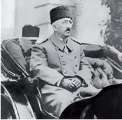

+ Mehmed VI
- Abdulhamid II
- Murad V
- Abdulaziz

**480. Xitoyda Gomindan bilan kommunistlar oʻrtasidagi kurash necha yil davom etgan fuqarolar urushiga aylanib ketgan?**

- O‘n yil
+ Yigirma yil
- O‘ttiz yil
- Qirq yil

**481. Turkiya Ikkinchi jahon urushida rasman betaraf qolgan boʻlsa-da, hukmron doiralarning katta qismi qaysi davlatga xayrixoh edi?**

- Buyuk Britaniya
+ Germaniya
- Fransiya
- AQSH

**482. Qachon kommunistlar Xitoy Sovet respublikasi tuzilganini eʼlon qilganlar?**

- 1933-yilda
+ 1931-yilda
- 1928-yilda
- 1925-yilda

**483. Mustafo Kamol poshoning unvoni nima edi?**

- Admiral
- Polkovnik
+ General
- Kapitan

**484. Qachon Turkiya Buyuk millat majlisi xalifalikni tugatish toʻgʻrisida qaror qabul qilgan?**

- 1921-yilda
- 1922-yilda
- 1923-yilda
+ 1924-yilda

**485. Birinchi jahon urushidan soʻng Osiyoning qaysi mamlakatlarida milliy-ozodlik harakatlari kuchaygan? 1) Koreya; 2) Turkiya; 3) Eron; 4) Xitoy; 5) Hindiston; 6) Afgʻoniston.**

+ 2, 3, 4, 5, 6
- 2, 3, 4, 5
- 1, 2, 4, 5
- 1, 3, 5, 6

**486. 1919-yil Parij konferensiyasida Xitoy talablariga rasman rad javobi berilgach, qaysi kuni gʻazablangan xitoylik talabalar namoyish boshlaganlar?**

- 1919-yil 4-aprel kuni
+ 1919-yil 4-may kuni
- 1920-yil 4-iyun kuni
- 1920-yil 4-iyul kuni

**487. 1919-yil Parij konferensiyasida Xitoy talablariga rasman rad javobi berilgach, qayerda gʻazablangan xitoylik talabalar namoyish boshlaganlar?**

+ Pekin
- Nankin
- Shanxay
- Guanchjou

**488. Qachon Turkiya Millatlar Ligasiga aʼzo boʻlgan?**

- 1927-yilda
- 1929-yilda
+ 1932-yilda
- 1941-yilda

**489. So‘nggi usmoniy sulton taxtdan ag‘darilgach, … .**

- qatl qilingan
- qamoqqa tashlangan
- oddiy fuqaro sifatida yashagan
+ mamlakatni tark etgan

**490. Qachon Turkiya Germaniya bilan doʻstlik shartnomasini imzolagan?**

- 1927-yilda
- 1929-yilda
- 1932-yilda
+ 1941-yilda

**491. Buyuk millat majlisi Mustafo Kamolga rasman qanday nasabni bergan?**

+ “Otaturk”
- “Turkboshi”
- “Millat Otasi”
- “Buyuk turk”

**492. Xitoydagi “30-may harakati” ga qaysi siyosiy partiya rahbarlik qilgan?**

- Kommunistik partiya
+ Gomindan partiyasi
- Sinxay partiyasi
- Liberal partiya

**493. Turkiya respublika deb eʼlon qilingach, kim prezident etib saylangan?**

+ Mustafo Kamol posho
- Anvar posho
- Talʼat posho
- Jamol posho

**494. Quyidagi suratda kim tasvirlangan?**

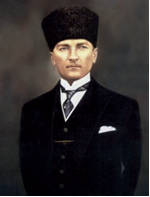

+ Mustafo Kamol posho
- Anvar posho
- Talʼat posho
- Jamol posho

**495. Quyidagi suratda kim tasvirlangan?**

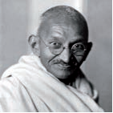

- Ramakrishna Paramahamsa
- Svami Vivekananda
- Rabindranath Thakur
+ Mahatma Gandi

**496. 1919-yil Parij konferensiyasida oʻz talablari bilan ishtirok etgan Xitoy qaysi davlat qoʻshinlari tomonidan Xitoy hududini bosib olishni toʻxtatish, Xitoyning suvereniteti va hududiy yaxlitligini tan olishni so‘ragan?**

- Buyuk Britaniya
- Fransiya
+ Yaponiya
- SSSR

**497. Turkiya respublika deb eʼlon qilingach, “Islohotlarning bosh maqsadi – mamlakatni …”, deb eʼlon qilingan.**

- demokratlashtirish
- industrlashtirish
+ modernizatsiyalash
- rekonstruksiyalash

## 13-§ Afrikada milliy uygʻonish va mustaqillik gʻoyalarining paydo boʻlishi.

**498. Birinchi jahon urushidan soʻng Afrikada iqtisodda aholining katta qismi … .**

- sanoat korxonalarida ishlash uchun yangi kasblarni o‘zlashtira boshlagandi
+ anʼanaviy usulda kun kechirish bilan band edi
- shaharlarga ko‘chib borib, ichki bozorni rivojlantirgan
- metropoliyalarga ko‘chib keta boshlagan

**499. Janubiy Afrika toʻgʻrisidagi akt necha yil amalda bo‘lgan?**

- 20 yil
- 30 yil
- 40 yil
+ 50 yil

**500. Birinchi jahon urushidan soʻng Afrika qitʼasining eng katta hududini qaysi davlat egallagan edi?**

- Buyuk Britaniya
+ Fransiya
- Italiya
- Germaniya

**501. XX asr boshlarida qayerda Habib Burgʻiba boshchiligida milliy-ozodlik harakatlari avj olgan?**

- Marokashda
- Jazoirda
+ Tunisda
- Misrda

**502. XX asr boshlarida qayerda Abdul Karim boshchiligida milliy-ozodlik harakatlari avj olgan?**

+ Marokashda
- Jazoirda
- Tunisda
- Misrda

**503. Shimoliy Afrikada qaysi davlatlar joylashgan? 1) Misr; 2) Jazoir; 3) Tunis; 4) Marokash; 5) Efiopiya; 6) Liviya.**

+ 1, 2, 3, 4, 6
- 2, 3, 4, 5
- 2, 4, 5
- 1, 3, 5, 6

**504. Birinchi jahon urushidan soʻng Afrikada siyosiy sohada … .**

- jiddiy o‘zgarishlar amalga oshirilib, aholi orasida milliy o‘zlikni anglash kayfiyati kuchaygan
- asosan metropoliya siyosatiga bog‘lanib qolish kuchli bo‘lgan
- qulchilik davridan qolgan psixologik to‘siqlarni yengib o‘tish uchun siyosiy partiyalar faoliyati kuchaygan
+ yangi siyosiy institutlar paydo boʻlgan, ammo ular eski siyosiy tizim asosiga qurilgan

**505. Birinchi jahon urushidan soʻng Afrikadagi hududlar, Buyuk Britaniya va Fransiyadan tashqari, yana qaysi davlatlar o‘rtasida taqsimlangan edi? 1) Belgiya; 2) Portugaliya; 3) Ispaniya; 4) Italiya.**

- 2, 3, 4
- 1, 3, 4
- 1, 2, 3
+ 1, 2, 3, 4

**506. Ikkinchi jahon urushi yillarida Jazoir va Tunis qaysi davlatlarning xomashyo bazasiga aylantirilgan?**

- Fransiya va Germaniyaning
+ Germaniya va Italiyaning
- Italiya va Buyuk Britaniyaning
- Buyuk Britaniya va Fransiyaning

**507. Ikkinchi jahon urushi yillarida koʻplab musulmonlar qaysi Yevropa davlatini qoʻllab-quvvatlagan va armiyasi safiga kirgan?**

- Buyuk Britaniyani
- Italiyani
- Germaniyani
+ Fransiyani

**508. Birinchi jahon urushidan soʻng Afrikaga missionerlik faoliyati orqali qaysi din tarqalgan?**

+ Xristian dini
- Islom dini
- Buddaviylik dini
- Iudaizm dini

**509. Ikkinchi jahon urushi qachon boshlangan?**

- 1938-yilda
+ 1939-yilda
- 1940-yilda
- 1941-yilda

**510. Birinchi Panafrika konferensiyasi qaysi yilda bo‘lib o‘tgan?**

- 1903-yilda
+ 1900-yilda
- 1908-yilda
- 1905-yilda

**511. Birinchi jahon urushidan soʻng Afrikada ozodlik harakati mafkurasining shakllanishida va uning faollashuvida … katta rol oʻynagan.**

- panislomizm
- panxristianizm
+ panafrikanizm
- panglobalizm

**512. Afrikaning qaysi qismi doim Yaqin Sharqqa intilib yashaydi va shu bilan Afrikaning qolgan qismidan farq qiladi?**

- Sharqiy qismi
+ Shimoliy qismi
- Janubiy qismi
- G‘arbiy qismi

**513. XX asr boshlarida qayerda Farhod Abbos boshchiligida milliy-ozodlik harakatlari avj olgan?**

- Marokashda
+ Jazoirda
- Tunisda
- Misrda

**514. Qachon Buyuk Britaniyaning oʻzini oʻzi boshqaruvchi dominioni sifatida Janubiy Afrika Ittifoqi (JAI) tuzilganligi eʼlon qilingan?**

- 1919-yilda
- 1920-yilda
- 1914-yilda
+ 1910-yilda

**515. Birinchi jahon urushidan keyin Italiya qayerga koʻp ming kishilik qoʻshin kiritgan?**

- Tunisga
- Jazoirga
+ Liviyaga
- Marokashga

**516. Qachon Misr hududiga Germaniya va Italiya qoʻshinlari kiritilgan?**

- 1939-yilda
- 1940-yilda
+ 1941-yilda
- 1942-yilda

**517. Birinchi jahon urushidan soʻng Afrikada madaniy sohada … .**

+ xristianlik rasmiyat uchun qabul qilingan, mahalliy aholining ongi va xulqida avvalgiday anʼanaviy madaniyat va ibtidoiy tasavvurlar hukmron boʻlib qolavergan
- zamonaviy madaniyat jadallik bilan aholi ongiga singdirilgan
- mahalliychilikning zamonaviy madaniyatdan ancha qoloqligi sezilib qolgan
- chet ellarda janglarda ishtirok etgan yoshlar tomonidan ommaviy, yevropacha madaniyat keng ko‘lamda tarqatilgan

**518. Afrika qitʼasini keng maʼnoda qanday ikkita mintaqaga boʻlish mumkin?**

- Sharqiy va Subtropik Afrika
- Janubiy va Tropik Afrika
+ Shimoliy va Tropik Afrika
- G‘arbiy va Subtropik Afrika

**519. Qaysi yilda qabul qilingan konstitutsiyaga koʻra, Misr monarxiya deb eʼlon qilingan?**

- 1920-yilda
- 1921-yilda
- 1922-yilda
+ 1923-yilda

**520. Afrika qitʼasining qaysi qismi arab-islom sivilizatsiyasining bir bo‘lagiga aylangan?**

- Sharqiy qismi
+ Shimoliy qismi
- Janubiy qismi
- G‘arbiy qismi

**521. Quyidagi suratda kim tasvirlangan?**

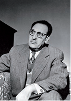

- Habib Burgʻiba
- Abdul Karim
- Hendrik Vitboy
+ Farhod Abbos

**522. Qaysi hujjat Janubiy Afrika Ittifoqining konstitutsiyasi boʻlgan?**

- Janubiy Afrika toʻgʻrisidagi pakt
- Janubiy Afrika toʻgʻrisidagi dekret
+ Janubiy Afrika toʻgʻrisidagi akt
- Janubiy Afrika toʻgʻrisidagi mandat

**523. Qachon Afrikada birinchi siyosiy partiya – Afrika milliy kongressi (AMK) tashkil topgan?**

- 1919-yilda
+ 1920-yilda
- 1910-yilda
- 1914-yilda

**524. Birinchi Panafrika konferensiyasi qayerda bo‘lib o‘tgan?**

- Bryusselda
- Qohirada
- Parijda
+ Londonda

**525. Birinchi jahon urushidan soʻng Afrikada ijtimoiy sohada ... .**

- urbanizatsiya jarayoni jadal rivojlangan
- xristian dini ta’sirida aholining eski qabilaviy udumlar bilan aloqasi susayib, yevropalashish boshlangan
+ eski tuzum (katta oila, urugʻ, jamoa, qabila) saqlanib qolgan
- yangi avlod va burjuaziya aqidaparastlikka qarshi kurasha boshlagan

**526. Panafrika harakati rasmiylashtirilgan I Taʼsis kongressi qachon bo‘lib o‘tgan?**

+ 1919-yilda
- 1920-yilda
- 1910-yilda
- 1939-yilda

**527. Jazoir, Tunis va Marokash qaysi davlat mustamlakalari edi?**

+ Fransiya
- Buyuk Britaniya
- Italiya
- Germaniya

**528. Janubiy Afrika toʻgʻrisidagi akt dunyodagi eng … konstitutsiya sifatida tarixda qolgan.**

+ irqchi
- liberal
- demokratik
- sotsial

**529. Qachon Liviyadagi qarshilik harakati bostirilib, uning rahbarlari qatl qilingan va mamlakat Italiyaning mustamlakasiga aylantirilgan?**

- 1928-yilda
+ 1931-yilda
- 1933-yilda
- 1937-yilda

**530. Qaysi yilda Millatlar Ligasi tomonidan “Qullik haqida” konvensiya qabul qilingan?**

- 1919-yilda
- 1920-yilda
- 1924-yilda
+ 1926-yilda

**531. Qachon Buyuk Britaniya Misrning toʻliq mustaqilligini tan olgan?**

- 1920-yil dekabrda
- 1921-yil yanvarda
+ 1922-yil fevralda
- 1923-yil martda

**532. Birinchi jahon urushidan soʻng Afrikaning janubiy va markaziy qismida joylashgan hududlar qaysi davlatga qarashli boʻlib, uning mustamlakalarida Afrika umumiy aholisining yarmidan koʻpi istiqomat qilardi?**

+ Buyuk Britaniyaga
- Italiyaga
- Germaniyaga
- Fransiyaga

## 14-§ Ikkinchi jahon urushining kelib chiqish sabablari va oqibatlari.

**533. “Atlantik xartiya” ni imzolagan tomonlar qanday majburiyatlarni oʻz zimmasiga olganlar? 1) Hududiy va boshqa boyliklarni egallab olishga intilmaslik; 2) Xalqlarning oʻz boshqaruv shaklini erkin tanlash huquqini hurmat qilish; 3) Dunyoni o‘z ta’sir doiralariga bo‘lib olishda adolat tamoyillariga rioya qilish; 4) Zoʻravonlik yoʻli bilan suverenitetidan mahrum qilingan xalqlarning oʻz huquqlarini tiklashga intilishini qoʻllab-quvvatlash.**

- 1, 2, 3
- 2, 3, 4
+ 1, 2, 4
- 1, 2, 3, 4

**534. Yapon agressiyasidan aziyat chekkan davlatlar vakillaridan tashkil topgan Xalqaro harbiy tribunal qaysi davrda faoliyat olib borgan?**

- 1946-yil noyabrdan 1948-yil oktyabrgacha
- 1945-yil maydan 1946-yil noyabrgacha
- 1945-yil noyabrdan 1946-yil oktyabrgacha
+ 1946-yil maydan 1948-yil noyabrgacha

**535. Natsistlar davrida Germaniyada “gestapo” qanday tashkilot bo‘lgan?**

+ Siyosiy politsiya
- Harbiy politsiya
- Irqiy politsiya
- Jinoiy politsiya

**536. O‘zbekiston Respublikasi qachon BMT ga a’zo bo‘lgan?**

+ 1992-yilda
- 1993-yilda
- 1994-yilda
- 1995-yilda

**537. Yapon agressiyasidan aziyat chekkan davlatlar vakillaridan tashkil topgan Xalqaro harbiy tribunal Yaponiyaning qaysi shahrida faoliyat olib borgan?**

- Xirosima
- Nagasaki
+ Tokio
- Osaka

**538. Ikkinchi jahon urushida qaysi yilda Sovet Ittifoqi oʻz hududini toʻliq ozod qilgan?**

- 1942-yilda
- 1943-yilda
+ 1944-yilda
- 1945-yilda

**539. Ikkinchi jahon urushida qaysi yilda Sovet Ittifoqi Yaponiyaga qarshi urushga kirgan?**

- 1942-yilda
- 1943-yilda
- 1944-yilda
+ 1945-yilda

**540. Ikkinchi jahon urushi yillarida gitlerchilarga qarshi koalitsiya davlatlarining oʻzaro munosabatlariga oid asosiy masalalar SSSR, AQSH va Buyuk Britaniya liderlarining uchrashuvlarida hal qilingan bo‘lib, ularning yig‘ilishlari necha marta boʻlib oʻtgan?**

- Ikki marta
+ Uch marta
- To‘rt marta
- Besh marta

**541. Fashizmga qarshi kurashda katta rol oʻynagan “Ozod Fransiya” qarshilik harakati rahbari kim edi?**

+ Sharl de Goll
- I. B. Tito
- L. Longo
- Jan Mulen

**542. Ikkinchi jahon urushida qaysi davrda Berlin operatsiyasi amalga oshirilib, bu vaqt ichida Germaniya poytaxti oʻrab olingan va shturm bilan zabt etilgan?**

- 1944-yil 6-apreldan 12-maygacha
- 1944-yil 16-apreldan 2-maygacha
- 1945-yil 6-apreldan 12-maygacha
+ 1945-yil 16-apreldan 2-maygacha

**543. Oʻzaro urushmaslik toʻgʻrisidagi Sovet-German pakti (Molotov-Ribbentrop pakti) necha yilga mo‘ljallangan edi?**

- 5 yil muddatga
+ 10 yil muddatga
- 15 yil muddatga
- 20 yil muddatga

**544. “Urushda gʻolib va baxtli podshoh, gʻolib va baxtli qoʻshin, gʻolib va baxtli davlat, gʻolib va baxtli tuzum boʻlishi mumkin. Ammo gʻolib va baxtli odam boʻlmaydi. Negaki urush odamni odam oʻldirishga majbur qiladi. Odam oʻldirgan odam esa hech qachon baxtli boʻlmaydi”. Ushbu satrlar kimning qaysi asaridan olingan?**

+ Oʻtkir Hoshimovning “Daftar hoshiyasidagi bitiklar” asaridan
- Said Ahmadning “Ufq” asaridan
- Pirimqul Qodirovning “Yulduzli tunlar” asaridan
- O‘tkir Hoshimovning “Dunyoning ishlari” asaridan

**545. Stalingrad ostonalarida qurshovga olingan nemis qoʻshinlari qachon taslim boʻlgan?**

- 1941-yil sentyabrda
- 1942-yil noyabrda
+ 1943-yil fevralda
- 1944-yil dekabrda

**546. Sovet-fin urushida sovetlar juda katta yoʻqotishlar evaziga qayerni SSSR tarkibiga qoʻshib olgan?**

+ Kareliya
- Suomi
- Laplandiya
- Usima

**547. Birlashgan Millatlar Tashkiloti (BMT) ni tuzish g‘oyasi qaysi yilda imzolangan deklaratsiyada o‘z aksini topgan?**

+ 1942-yilda
- 1943-yilda
- 1944-yilda
- 1945-yilda

**548. Ikkinchi jahon urushida Germaniya bilan SSSR oʻrtasida doʻstlik shartnomasi imzolanib, unda qaysi davlat siyosiy xaritadan butunlay oʻchirib tashlangan?**

- Chexoslovakiya
- Ruminiya
- Yogoslaviya
+ Polsha

**549. Qachon sovet qoʻshinlari Stalingrad ostonalarida qarshi hujumga oʻtib, nemis qoʻshinlarining katta guruhini qurshab olgan?**

- 1941-yil sentyabrda
+ 1942-yil noyabrda
- 1943-yil fevralda
- 1944-yil dekabrda

**550. Ikkinchi jahon urushida Polshaga yordam berishni vaʼda qilgan Buyuk Britaniya va Fransiya qachon Germaniyaga urush eʼlon qilgan?**

+ 1939-yil 3-sentyabrda
- 1939-yil 17-sentyabrda
- 1940-yil 3-sentyabrda
- 1940-yil 17-sentyabrda

**551. Ikkinchi jahon urushi qachongacha davom etgan?**

+ 1945-yil 2-sentyabrgacha
- 1946-yil 2-oktyabrgacha
- 1947-yil 2-noyabrgacha
- 1948-yil 2-dekabrgacha

**552. Ikkinchi jahon urushida mag‘lubiyatga uchragan tajovuzkor davlatlar bloki asosini qaysi davlatlar tashkil etgan edi?**

+ Germaniya, Italiya, Yaponiya
- Italiya, Yaponiya, Vengriya
- Yaponiya, Vengriya, Ruminiya
- Vengriya, Ruminiya, Germaniya

**553. Birlashgan Millatlar Tashkiloti (BMT) ni tuzish g‘oyasi qaysi davlatlar tomonidan imzolangan deklaratsiyada o‘z aksini topgan? 1) AQSH; 2) Buyuk Britaniya; 3) SSSR; 4) Xitoy.**

- 2, 3, 4
- 1, 3, 4
- 1, 2, 3
+ 1, 2, 3, 4

**554. Qachon SSSR Finlandiya bilan sulh tuzishga majbur boʻlgan?**

- 1938-yil yanvarda
- 1939-yil fevralda
+ 1940-yil martda
- 1941-yil aprelda

**555. Qaysi davlatning taslim bo‘lishi bilan Ikkinchi jahon urushi tugagan?**

+ Yaponiya
- Germaniya
- Italiya
- Vengriya

**556. Ikkinchi jahon urushida Afrikada german-italyan qoʻshinlari qayerga xavf solib turgan?**

- Marokashga
- Liviyaga
- Tunisga
+ Misrga

**557. Chexoslovakiyaning Germaniyaga kapitulyatsiyasi qayerda rasmiylashtirilgan?**

+ Myunxen
- Berlin
- Praga
- Nyurnberg

**558. Ikkinchi jahon urushi necha yil davom etgan?**

- Uch yil
- To‘rt yil
- Besh yil
+ Olti yil

**559. Birlashgan Millatlar Tashkiloti (BMT) Ustavi AQSH ning qaysi shahrida tasdiqlangan?**

- Vashington
- Nyu York
+ San Fransisko
- Chikago

**560. Tinch okeanida qaysi davlat boshlagan jangovar harakatlar AQSH ning urushga qoʻshilishini va antigitler koalitsiyasining batamom shakllanishini tezlashtirgan?**

- Germaniya
- Italiya
+ Yaponiya
- Vengriya

**561. Chexoslovakiyaning qaysi viloyati aholisining koʻpchiligi nemis millatiga mansub edi va Gitler bu viloyat Germaniyaga berilishini talab qilgan?**

- Bogemiya viloyati
+ Sudet viloyati
- Moraviya viloyati
- Sileziya viloyati

**562. Ikkinchi jahon urushida qaysi sanada Polshaga sovet qoʻshinlari kiritilgan?**

- 1939-yil 3-sentyabrda
+ 1939-yil 17-sentyabrda
- 1940-yil 3-sentyabrda
- 1940-yil 17-sentyabrda

**563. Germaniya, Yaponiya va Italiya oʻrtasida tuzilgan “Uchlar pakti” ga qaysi davlatlar qo‘shilgan? 1) Vengriya; 2) Ruminiya; 3) Slovakiya; 4) Bolgariya.**

+ 1, 2, 3, 4
- 1, 2, 3
- 1, 2, 4
- 2, 3, 4

**564. Ikkinchi jahon urushidan so‘ng Tribunal Germaniyaning qaysi tashkilotlarini jinoyatchi tashkilotlar deb eʼlon qilgan? 1) Natsistlar partiyasining rahbariyati; 2) SS hujumkor otryadi; 3) SD hujumkor otryadi; 4) Gestapo.**

- 1, 2, 3
- 1, 2, 4
- 2, 3, 4
+ 1, 2, 3, 4

**565. Qaysi davlatlar bosimi ostida Chexoslovakiya hukumati Germaniyaning talabini bajarishga majbur boʻlgan?**

- AQSH va SSSR
- SSSR va Buyuk Britaniya
+ Buyuk Britaniya va Fransiya
- Fransiya va AQSH

**566. Qaysi sana SSSR da “Gʻalaba kuni” deb eʼlon qilingan?**

- 2-may
- 8-may
+ 9-may
- 11-may

**567. Qachon AQSH va Buyuk Britaniya urush payti va undan keyingi hamkorlik tamoyillari toʻgʻrisida deklaratsiya – “Atlantik xartiya” ni imzolaganlar?**

+ 1941-yil avgustda
- 1942-yil sentyabrda
- 1943-yil oktyabrda
- 1944-yil noyabrda

**568. Qachon Germaniyada Adolf Gitler boshchiligidagi natsional-sotsialistik ishchi partiyasi hokimiyatga kelgan?**

- 1930-yil yanvarda
- 1931-yil yanvarda
- 1932-yil yanvarda
+ 1933-yil yanvarda

**569. Ikkinchi jahon urushida 1945-yil fevralda SSSR, AQSH va Buyuk Britaniya liderlari qayerda uchrashishgan?**

+ Qrim (Yalta)
- Tehron
- Potsdam
- Nyurnberg

**570. Germaniya Avstriyadan keyin qaysi davlatni bosib olishga tayyorlana boshlagan?**

+ Chexoslovakiya
- Polsha
- Fransiya
- SSSR

**571. Qachon Germaniya SSSR ga hujum boshlagan?**

- 1940-yil 22-mayda
+ 1941-yil 22-iyunda
- 1942-yil 22-iyulda
- 1943-yil 22-avgustda

**572. “Millatlar Ligasi” qachon tuzilgan?**

+ 1919-yilda
- 1920-yilda
- 1921-yilda
- 1922-yilda

**573. “Millatlar Ligasi” qanday maqsadda tuzilgan?**

- Dunyoni qaytadan bo‘lib olish uchun
- Mustamlaka hududlarni samarali boshqarish uchun
- Egallanmagan hududlarda ta’sir doiralarini belgilash uchun
+ Jahonda tinchlikni saqlash uchun

**574. Germaniyaning qaysi shahrida fashist hokimiyati rahbarlari ustidan sud jarayoni boʻlib oʻtgan?**

- Berlin
- Potsdam
+ Nyurnberg
- Myunxen

**575. Qachon AQSH Yaponiyaning Nagasaki shahriga atom bombasini tashlagan?**

- 1945-yil 6-avgustda
+ 1945-yil 9-avgustda
- 1945-yil 16-avgustda
- 1945-yil 19-avgustda

**576. Qaysi davlatga hujumdan keyin SSSR tajovuzkor davlat sifatida Millatlar Ligasi tarkibidan chiqarilgan?**

- Polsha
- Ruminiya
- Chexoslovakiya
+ Finlandiya

**577. Qachon AQSH Yaponiyaning Xirosima shahriga atom bombasini tashlagan?**

+ 1945-yil 6-avgustda
- 1945-yil 9-avgustda
- 1945-yil 16-avgustda
- 1945-yil 19-avgustda

**578. Birlashgan Millatlar Tashkiloti (BMT) Ustavi qaysi yilda tasdiqlangan?**

- 1944-yilda
+ 1945-yilda
- 1946-yilda
- 1947-yilda

**579. Ikkinchi jahon urushida yapon qoʻshinlari qayerlarni bosib olib, Hindiston va Avstraliyaga xavf solgan? 1) Malayya; 2) Birma; 3) Filippin; 4) Indoneziya.**

- 2, 3, 4
- 1, 2, 3
- 1, 2, 4
+ 1, 2, 3, 4

**580. Qachon Germaniyaning fashist hokimiyati rahbarlari ustidan sud jarayoni boʻlib oʻtgan?**

- 1946-yil noyabrdan 1948-yil oktyabrgacha
- 1945-yil maydan 1946-yil noyabrgacha
+ 1945-yil noyabrdan 1946-yil oktyabrgacha
- 1946-yil maydan 1948-yil noyabrgacha

**581. Germaniya SSSR ga hujum boshlaganda sovetlar bilan birdamligini eʼlon qilgan Buyuk Britaniya bosh vaziri kim edi?**

- N. Chemberlen
- S. Bolduin
- D. Lloyd Jorj
+ U. Cherchill

**582. Qachon Germaniya, Yaponiya va Italiya oʻrtasida harbiy hamkorlik toʻgʻrisida kelishuv – Uchlar pakti imzolangan?**

- 1938-yil iyulda
- 1939-yil avgustda
+ 1940-yil sentyabrda
- 1941-yil oktyabrda

**583. Germaniya SSSR ga hujum boshlaganda sovetlar bilan birdamligini eʼlon qilgan AQSH prezidenti kim edi?**

- T. Ruzvelt
- K. Kulidj
- V. Vilson
+ F. Ruzvelt

**584. Ikkinchi jahon urushida qaysi sanada Yaponiya soʻzsiz taslim boʻlish toʻgʻrisidagi paktni imzolagan?**

- 1945-yil 9-mayda
- 1945-yil 6-avgustda
- 1945-yil 9-avgustda
+ 1945-yil 2-sentyabrda

**585. Ikkinchi jahon urushida 1943-yilda SSSR, AQSH va Buyuk Britaniya liderlari qayerda uchrashishgan?**

- Qrim (Yalta)
- Potsdam
+ Tehron
- Nyurnberg

**586. Qaysi yillarda sovet-fin urushi boʻlib oʻtgan?**

- 1937–1938-yillarda
- 1938–1939-yillarda
+ 1939–1940-yillarda
- 1940–1941-yillarda

**587. Myunxen kelishuvidan keyin Germaniya bilan qaysi davlatning manfaatlari vaqtincha bir-biriga mos tushgan?**

- AQSH
+ SSSR
- Yaponiya
- Italiya

**588. Ikkinchi jahon urushida nemislar qayerda dastlabki jiddiy magʻlubiyatga uchraganlar?**

- Parij ostonalarida
+ Moskva ostonalarida
- Vena ostonalarida
- Varshava ostonalarida

**589. Birlashgan Millatlar Tashkiloti (BMT) Ustavi qaysi sanada kuchga kirgan?**

- 1944-yil 24-sentyabrda
+ 1945-yil 24-oktyabrda
- 1946-yil 24-noyabrda
- 1947-yil 24-dekabrda

**590. Ikkinchi jahon urushiga qancha odam safarbar qilingan?**

+ 110 mln.
- 120 mln.
- 130 mln.
- 140 mln.

**591. Ikkinchi jahon urushida Sovet Ittifoqi nomidan Germaniyaning soʻzsiz taslim boʻlganligi toʻgʻrisidagi aktni imzolagan Oliy bosh qoʻmondon oʻrinbosari kim edi?**

- K. K. Rokossovskiy
- K. E. Voroshilov
+ G. K. Jukov
- I. S. Konev

**592. Ikkinchi jahon urushida, Berlin shahri zabt etilgach, reyxstag ustiga qaysi davlat bayrog‘i o‘rnatilgan?**

+ SSSR
- AQSH
- Buyuk Britaniya
- Fransiya

**593. Ikkinchi jahon urushida qaysi yilda ittifoqchilar Fransiyaning shimoli-gʻarbiga qoʻshin tushirib, Fransiya va Belgiyani ozod qilgan?**

- 1941-yilda
- 1942-yilda
- 1943-yilda
+ 1944-yilda

**594. Ikkinchi jahon urushi qachon boshlangan?**

- 1937-yil 1-avgustda
- 1938-yil 1-noyabrda
+ 1939-yil 1-sentyabrda
- 1940-yil 1-oktyabrda

**595. Ikkinchi jahon urushida qaysi sanada Oliy bosh qoʻmondon oʻrinbosari Sovet Ittifoqi nomidan Germaniyaning soʻzsiz taslim boʻlganligi toʻgʻrisidagi aktni imzolagan?**

- 1945-yil 2-may kuni
+ 1945-yil 8-may kuni
- 1945-yil 9-may kuni
- 1945-yil 11-may kuni

**596. Fashizmga qarshi kurashda katta rol oʻynagan Yugoslaviya ozodlik harakati rahbari kim edi?**

- Sharl de Goll
+ I. B. Tito
- L. Longo
- Jan Mulen

**597. Ikkinchi jahon urushida 1945-yil iyul-avgustda SSSR, AQSH va Buyuk Britaniya liderlari qayerda uchrashishgan?**

- Qrim (Yalta)
- Tehron
+ Potsdam
- Nyurnberg

**598. Qaysi sana har yili BMT kuni sifatida butun dunyoda nishonlanadi?**

- 24-sentyabr
+ 24-oktyabr
- 24-noyabr
- 24-dekabr

**599. Qachon oʻzaro urushmaslik toʻgʻrisidagi Sovet-German pakti (Molotov-Ribbentrop pakti) imzolangan?**

- 1936-yil 21-dekabrda
- 1937-yil 25-noyabrda
- 1938-yil 29-sentyabrda
+ 1939-yil 23-avgustda

**600. Qachon SSSR Atlantik xartiyaning asosiy tamoyillarini qabul qilgan?**

+ 1941-yil sentyabrda
- 1942-yil oktyabrda
- 1943-yil noyabrda
- 1944-yil dekabrda

**601. Chexoslovakiyaning Germaniyaga kapitulyatsiyasi qachon rasmiylashtirilgan?**

- 1936-yil 21-dekabrda
- 1937-yil 25-noyabrda
+ 1938-yil 29-sentyabrda
- 1939-yil 23-avgustda

**602. Ikkinchi jahon urushida qaysi yil bahor-kuzida nemis qoʻshinlari Volga daryosiga va Shimoliy Kavkazga yetib kelganlar?**

- 1941-yil
+ 1942-yil
- 1943-yil
- 1944-yil

**603. Gitler qaysi davlatni shiddat bilan tor-mor qilishni koʻzda tutgan “Barbarossa” rejasini tasdiqlagan?**

- Fransiya
+ SSSR
- Buyuk Britaniya
- Norvegiya

**604. Germaniya qaysi davlatni anshlyus (qo‘shib olish) qilgan?**

- Chexoslovakiya
- Polsha
+ Avstriya
- Shveysariya

**605. Qachon nemis qoʻshinlari Moskva ostonalarida jangni boy berganlar?**

+ 1941-yil dekabrda
- 1942-yil yanvarda
- 1943-yil fevralda
- 1944-yil martda

**606. Ikkinchi jahon urushi Germaniyaning qaysi davlatga bostirib kirishi bilan boshlangan?**

- Chexoslovakiya
+ Polsha
- Fransiya
- SSSR

**607. Ikkinchi jahon urushida qancha odam halok bo‘lgan?**

- 55–60 mln.
+ 65–70 mln.
- 75–80 mln.
- 85–90 mln.

**608. Qaysi davlatning urushga qoʻshilishi bilan antigitler koalitsiya davlatlari moddiy va insoniy resurslarda soʻzsiz ustunlikka erishgan?**

- Fransiyaning
- SSSR ning
- Buyuk Britaniyaning
+ AQSH ning

## 15-§ Gʻarbiy Yevropa va Shimoliy Amerika mamlakatlari rivojlanishining asosiy yoʻnalishlari.

**609. XX asrning ikkinchi yarmida Fransiyada qaysi prezident tashabbusi bilan oʻtkazilgan referendumda saylovchilarning koʻpchiligi prezidentni qoʻllamagan va u isteʼfoga chiqishga majbur boʻlgan?**

- Jorj Pompidu
- Fransua Mitteran
- Jiskar d’Esten
+ Sharl de Goll

**610. Qachon Parij talabalarining namoyishi boshlangan?**

- 1966-yil mayda
- 1967-yil mayda
+ 1968-yil mayda
- 1969-yil mayda

**611. Berlin devorining balandligi … metr va umumiy uzunligi … kilometr bo‘lib, devori bo‘ylab … ta qo‘riqchi-minoralar va boshqa chegara inshootlari qurilgan.**

- 1,6/86/102
- 2,6/96/202
+ 3,6/106/302
- 4,6/116/402

**612. XX asrda ilmiy-texnik taraqqiyotning birinchi toʻlqinida iqtisodiyotda qanday yangi sohalar vujudga kelgan? 1) Aviakosmik soha; 2) Radiotelevizion soha; 3) Robot texnikasi sohasi.**

- 1, 2
- 1, 3
- 2, 3
+ 1, 2, 3

**613. “Karib inqirozi” ning sababi AQSH ning …da yadro qurolini joylashtirishiga javoban yadroviy bombalarga ega sovet raketalarining … hududida yashirin tarzda joylashtirilishi edi.**

- Misr/Meksika
- Isroil/Gvatemala
- Suriya/Panama
+ Turkiya/Kuba

**614. Qaysi yilda AQSH da Ronald Reygan qayta saylangan?**

- 1976-yilda
- 1980-yilda
+ 1984-yilda
- 1988-yilda

**615. Qachon amerikalik sotsiolog Daniel Bell “postindustrial jamiyat” atamasini muomalaga kiritgan?**

- 1960-yilda
+ 1962-yilda
- 1965-yilda
- 1969-yilda

**616. Qaysi davrda Gʻarbning rivojlangan mamlakatlarida xalq farovonligini oshirishning davlat kafolatlari tizimi yaratilgan, “umumiy farovonlik jamiyati” ni qurish gʻoyasi paydo boʻlgan, uni amalga oshirish boshlangan?**

- 1950-yillarda
+ 1960-yillarda
- 1970-yillarda
- 1980-yillarda

**617. Fuqarolarning davlat, viloyat yoki mahalliy koʻlamda eng muhim masalalar boʻyicha ovoz berish yoʻli orqali oʻz fikrlarini bevosita bildirishlari nima orqali amalga oshiriladi?**

+ Referendum
- Impichment
- Mandat
- Veto

**618. “Karib inqirozi” qachon sodir bo‘lgan?**

+ 1962-yilning ikkinchi yarmida
- 1963-yilning birinchi yarmida
- 1963-yilning ikkinchi yarmida
- 1964-yilning birinchi yarmida

**619. Tarixiy taraqqiyotning hozirgi bosqichini … jamiyatdan … jamiyatga o‘tish davri deb atash mumkin.**

- global/postglobal
- liberal/postliberal
- radikal/postradikal
+ industrial/postindustrial

**620. XX asrda Atlantika okeanining ikki qirgʻogʻi – Gʻarbiy Yevropa va Shimoliy Amerikada shakllangan sivilizatsiya qanday nom olgan?**

- “Neoatlantik sivilizatsiya”
+ “Yevroatlantik sivilizatsiya”
- “Amerikoatlantik sivilizatsiya”
- “Panatlantik sivilizatsiya”

**621. XX asrning qaysi davrida ilmiy-texnik taraqqiyotning birinchi toʻlqini yuz bergan?**

- 1920-yillar oxiri – 1930-yillarda
- 1930-yillar oxiri – 1940-yillarda
+ 1940-yillar oxiri – 1950-yillarda
- 1950-yillar oxiri – 1960-yillarda

**622. Qaysi davrda Gʻarb mamlakatlarida liberal demokratiyaning takomillashuv jarayoni davom etgan?**

- 1950-yillarda
+ 1960-yillarda
- 1970-yillarda
- 1980-yillarda

**623. Qaysi yilda AQSH da Ronald Reygan hokimiyatga kelgan?**

- 1976-yilda
+ 1980-yilda
- 1984-yilda
- 1988-yilda

**624. XX asrning qaysi davrida ilmiy-texnik taraqqiyotning “information” yoki “telekommunikatsion” inqilob nomini olgan yangi toʻlqini boshlangan?**

- 1970-yillarning birinchi yarmida
+ 1970-yillarning ikkinchi yarmida
- 1980-yillarning birinchi yarmida
- 1980-yillarning ikkinchi yarmida

**625. Qaysi davrda G‘arb davlatlaridagi iqtisodiy yuksalish tufayli Italiya, Germaniya Federativ Respublikasi, Shvetsiya kabi mamlakatlar o‘z “iqtisodiy mo‘jiza” sini namoyish qilgan?**

+ 1950-yillarda
- 1960-yillarda
- 1970-yillarda
- 1980-yillarda

**626. Parij talabalarining namoyishi boshlanganda Fransiya prezidenti kim edi?**

- Jorj Pompidu
- Fransua Mitteran
- Jiskar d’Esten
+ Sharl de Goll

**627. XX asrning ikkinchi yarmida Fransiyada davlatning qaysi siyosati fransuz jamiyatining koʻplab qatlamlarini norozi qilgan va Parijda talabalar namoyishi boshlangan?**

+ Qatʼiy tartibga solish
- Ijtimoiy yordamni qisqartirish
- Konstitutsiyani o‘zgartirish
- Prezident vakolatlarini kengaytirish

**628. XX asr davomida Gʻarb mamlakatlarida qaror topgan rivojlanish modeli qaysi davrga kelib oʻz imkoniyatlarini tugatib boʻlgan va chuqur inqiroz holatiga kirib kelgan?**

- 1950-yillar oxiri – 1960-yillar boshlariga kelib
- 1960-yillar oxiri – 1970-yillar boshlariga kelib
+ 1970-yillar oxiri – 1980-yillar boshlariga kelib
- 1980-yillar oxiri – 1990-yillar boshlariga kelib

**629. XX asrning 80-yillarida Buyuk Britaniyada kim boshchiligidagi konservativ partiya saylovlarda qatorasiga uch marta gʻalaba qozongan?**

- Kliment Etli
- Edvard Hit
- Harold Makmilan
+ Margaret Tetcher

**630. Ikkinchi jahon urushidan keyin Yevropaning qaysi qismida parlament demokratiyasi tiklangan?**

- Gʻarbiy va Sharqiy Yevropada
- Sharqiy va Janubiy Yevropada
- Janubiy va Markaziy Yevropada
+ Markaziy va Gʻarbiy Yevropada

**631. XX asr davomida Gʻarb mamlakatlarida qaror topgan rivojlanish modeli inqirozining nishonasi 1970–1980-yillardagi qaysi siyosiy toʻlqin bo‘lgan?**

+ Neokonservativ
- Neoliberal
- Neodemokratik
- Neofashistik

**632. XX asrda ilmiy-texnik taraqqiyotning “information” yoki “telekommunikatsion” inqilob nomini olgan yangi toʻlqini natijasida qanday yangi sohalar yoʻlga qoʻyilgan? 1) Hisoblash mashinalaridan foydalanish; 2) Iqtisodiyotni axborotlashtirish; 3) Kompyuterlashtirish; 4) Ishlab chiqarishni robotlashtirish; 5) Integral sxemalarni joriy qilish.**

+ 1, 2, 3, 4, 5
- 1, 2, 3, 4
- 2, 3, 4
- 1, 3, 5

**633. XX asrning qaysi davrida AQSH da fuqarolar tengligi uchun harakat qizgʻin tus olgan?**

- 40-yillarida
- 50-yillarida
+ 60-yillarida
- 70-yillarida

**634. Ikkinchi jahon urushidan keyin G‘arb mamlakatlarida demokratiya deganda qanday demokratiyani tushuna boshlashgan?**

+ Liberal demokratiyani
- Sotsial demokratiyani
- Konservativ demokratiyani
- Natsional demokratiyani

**635. Qanday demokratiya uchun erkin va tez-tez o‘tkaziladigan saylovlar, qonun ustuvorligi, hokimiyatning bo‘linishi, shaxs huquq va erkinliklarining (so‘z, vijdon, mulk erkinligi kabilar) kafolatlanganligi xarakterli jihatlar bo‘lib qolgan?**

+ Liberal demokratiya
- Sotsial demokratiya
- Konservativ demokratiya
- Natsional demokratiya

**636. XX asrning ikkinchi yarmida Gʻarb davlatlarida farovonlik davlati institutlari va mexanizmlarining uzil-kesil shakllanishida markaziy o‘rinni nimalar egallagan? 1) Yirik biznes uchun soliq yukini kamaytirish; 2) Aholining kam ta’minlangan qismiga ijtimoiy yordam ko‘rsatish dasturlari; 3) Yangi ish o‘rinlarini yaratish; 4) Ta’lim va sog‘liqni saqlash sohalarini qo‘llab-quvvatlash; 5) Pensiya ta’minoti.**

- 2, 3, 5
- 1, 2, 3, 4
+ 2, 3, 4, 5
- 1, 3, 4

**637. XX asrdagi qaysi sivilizatsiya uchun liberal-demokratik qadriyatlar, jadal iqtisodiy rivojlanish va xalq farovonligini doimiy yuksaltirib borish kabi jihatlar xosdir?**

- “Neoatlantik sivilizatsiya”
+ “Yevroatlantik sivilizatsiya”
- “Amerikoatlantik sivilizatsiya”
- “Panatlantik sivilizatsiya”

**638. “Sovuq urush” tushunchasi qaysi yillarda matbuotda paydo bo‘lgan va asta-sekin siyosiy lug‘atga kirib borgan?**

- 1944–1946-yillarda
+ 1945–1947-yillarda
- 1946–1948-yillarda
- 1947–1949-yillarda

**639. Postindustrial jamiyatning o‘ziga xos jihati – bu jamiyatda … emas, … ishlab chiqarishning ustuvor ekanligi.**

- mahsulot/kapital
- kapital/sanoat
+ sanoat/axborot
- axborot/mahsulot

**640. “Sovuq urush” qaysi davlatlar boshchiligidagi ikki harbiy-siyosiy blok o‘rtasidagi ochiq harbiy to‘qnashuvga erishmagan, global qarama-qarshilik hisoblanadi?**

- Xitoy va Buyuk Britaniya
- Buyuk Britaniya va SSSR
+ SSSR va AQSH
- AQSH va Xitoy

**641. XX asrning ikkinchi yarmida Gʻarb davlatlarida … barcha ijtimoiy qatlamlar uchun teng imkoniyatlar yaratishning kafolatiga aylangan.**

+ Davlat
- Ijtimoiy tashkilotlar
- Siyosiy partiyalar
- Xalqaro tashkilotlar

**642. Berlin devori qaysi davlatning G‘arbiy Berlin bilan mustahkamlangan davlat chegarasi bo‘lib, sovuq urush va temir parda ramzi hisoblanadi?**

+ GDR ning
- GFR ning
- SSSR ning
- XXR ning

**643. XX asrning qaysi davri butun Gʻarb mamlakatlarida liberal islohotchilikning eng avj pallasi sifatida tarixga kirgan?**

- 40-yillari
- 50-yillari
+ 60-yillari
- 70-yillari

**644. XX asrning ikkinchi yarmida Daniya, Norvegiya va Shvetsiyada amalga oshirilgan sotsializmning ijtimoiy tamoyillar shakli qanday atalgan?**

- “Shimol modeli” yoki “norveg modeli”
+ “Skandinav modeli” yoki “shved modeli”
- “Skandinav modeli” yoki “daniyacha model”
- “Shimol modeli” yoki “skandinav modeli”

## 16-§ SSSR va Sharqiy Yevropa mamlakatlari rivojlanishining asosiy yoʻnalishlari.

**645. … – hur fikrli, erkin shaxs; murosasoz, kelishuvchi.**

- Sotsialist
- Kommunist
- Konservator
+ Liberal

**646. Sovet qoʻshinlari joylashgan Sharqiy Yevropa davlatlarida qaysi yillarda kommunistik qarashlarni yoqlamaganlar hukumatlar tarkibidan chiqarilgan?**

- 1945–1946-yillarda
- 1946–1947-yillarda
+ 1947–1948-yillarda
- 1948–1949-yillarda

**647. Qachon Gʻarb davlatlari “Shimoliy Atlantika Shartnomasi Tashkiloti” (NATO) deb ataluvchi harbiy-siyosiy tashkilotni tuzganlar?**

+ 1949-yil aprelda
- 1952-yil yanvarda
- 1955-yil dekabrda
- 1957-yil oktyabrda

**648. Qaysi yilda AQSH tomonidan “Marshall rejasi” taklif qilingan?**

- 1946-yilda
+ 1947-yilda
- 1948-yilda
- 1949-yilda

**649. Yevropaning ikki guruhga – AQSH bilan yaqinlashuv yoʻlini tanlagan hamda SSSR bilan hamkorlikni tanlagan davlatlarga boʻlinishi jahon tarixida qanday nom olgan?**

+ “Sovuq urush”
- “Sotsialistik urush”
- “Kapitalistik urush”
- “Ittifoqlar urushi”

**650. Sovet Ittifoqi kommunistik partiyasi (KPSS) ning nechanchi syezdida Nikita Xrushchyov nutq soʻzlab, Stalin davrida shakllangan shaxsga sigʻinishni qoralagan?**

+ XX syezdida
- XXII syezdida
- XXIV syezdida
- XXVI syezdida

**651. Sharqiy Yevropaning quyidagi qaysi davlatlari jahon siyosiy xaritasida Birinchi jahon urushidan soʻng paydo boʻlgan edi? 1) Polsha; 2) Bolgariya; 3) Chexoslovakiya; 4) Vengriya.**

+ 1, 3, 4
- 1, 2, 4
- 1, 2, 3
- 2, 3, 4

**652. … – kommunizm tamoyillarini qoʻllab-quvvatlaydigan yoki unga ishonadigan odam.**

- Sotsialist
+ Kommunist
- Konservator
- Liberal

**653. SSSR da qaysi yillari kirib kelgan oshkoralik sovet jamiyatining poklanishi yoʻlida katta qadam boʻlgan va stalinizmning, sovet totalitar tuzumining jinoyatlarini ochib tashlagan?**

+ Qayta qurish yillari
- Iliqlik yillari
- Oshkoralik yillari
- Katta sakrash yillari

**654. Qachon boʻlib oʻtgan Sovet Ittifoqi kommunistik partiyasi (KPSS) ning syezdida Nikita Xrushchyov nutq soʻzlab, Stalin davrida shakllangan shaxsga sigʻinishni qoralagan?**

- 1953-yil martda
+ 1956-yil fevralda
- 1958-yil yanvarda
- 1961-yil iyulda

**655. Qachon SSSR bilan unga doʻst boʻlgan Sharqiy Yevropa davlatlarining harbiy-siyosiy ittifoqi – “Varshava Shartnomasi Tashkiloti” tuzilgan?**

- 1949-yilda
- 1952-yilda
+ 1955-yilda
- 1957-yilda

**656. Qachon SSSR va Sharqiy Yevropaning koʻpchilik davlatlari iqtisodiy ittifoq – “Oʻzaro Iqtisodiy Yordam Kengashi” (OʻIYK) tuzilganligini eʼlon qilhanlar?**

- 1946-yil sentyabrda
- 1947-yil mayda
- 1948-yil aprelda
+ 1949-yil yanvarda

**657. “Varshava Shartnomasi Tashkiloti” qaysi tashkilotga javoban tuzilgan?**

- Oʻzaro Iqtisodiy Yordam Kengashiga
+ Shimoliy Atlantika Shartnomasi Tashkilotiga
- Yevropa xavfsizlik va hamkorlik Tashkilotiga
- Yevropa Kengashiga

**658. Yevropaning ikki guruhga – AQSH bilan yaqinlashuv yoʻlini tanlagan hamda SSSR bilan hamkorlikni tanlagan davlatlarga boʻlinishi qachongacha davom etgan?**

- 1970-yillar boshigacha
- 1970-yillar oxirigacha
- 1980-yillar boshigacha
+ 1980-yillar oxirigacha

## 17-§ AQSH: yangi liderning paydo boʻlishi.

**659. Quyidagi suratda qaysi AQSH prezidenti tasvirlangan?**

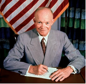

- Franklin Ruzvelt
+ Duayt Eyzenhauer
- Jon Kennedi
- Lindon Jonson

**660. Qachon AQSH da fuqarolar tengligi uchun harakatning eng mashhur rahbari, afroamerikalik tinchlik bo‘yicha Nobel mukofoti laureati, ruhoniy Martin Lyuter King oʻldirilgan?**

- 1965-yil 4-yanvarda
- 1966-yil 4-fevralda
- 1967-yil 4-martda
+ 1968-yil 4-aprelda

**661. XX asrning qaysi davriga AQSH ancha sust ichki va tashqi pozitsiya bilan kirib kelgan?**

- 60-yillarga
- 70-yillarga
+ 80-yillarga
- 90-yillarga

**662. AQSH prezidenti Jon Kennedi qaysi shtatda yollanma qotil tomonidan oʻldirilgan?**

+ Texas
- Arizona
- Kaliforniya
- Vashington

**663. AQSH prezidenti Ronald Reyganning ijtimoiy-iqtisodiy dasturi qanday nom bilan mashhur boʻlgan?**

- “Ronaldnomika”
+ “Reyganomika”
- “Ronaldflyantiysa”
- “Reyganflyantiysa”

**664. Quyidagi suratda kim tasvirlangan?**

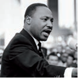

+ Martin Lyuter King
- Muhammad Ali
- Jeyms Bolduin
- Toni Morrison

**665. Qaysi davrda AQSH da afroamerikaliklar harakatida oʻz huquqlari uchun kurashda kuch ishlatish yoʻlini tanlagan guruh paydo boʻlgan?**

- 1960-yillar boshlarida
+ 1960-yillar oʻrtalarida
- 1960-yillar oxirlarida
- 1970-yillar boshlarida

**666. AQSH da qaysi yildan beri respublikachilar partiyasi muxolifatda boʻlib kelayotgan edi?**

- 1930-yildan beri
+ 1932-yildan beri
- 1934-yildan beri
- 1936-yildan beri

**667. AQSH siyosati va obroʻyiga katta zarba bergan “Eron inqilobi” qachon sodir bo‘lgan?**

- 1971-yilda
- 1973-yilda
- 1976-yilda
+ 1979-yilda

**668. XX asrning qaysi davrida AQSH da afroamerikaliklarning kamsitilishi asosiy sabab bo‘lgan ommaviy norozilik harakatlari avj olgan?**

- 50-yillarda
+ 60-yillarda
- 70-yillarda
- 80-yillarda

**669. Ikkinchi jahon urushi yillari AQSH ning yalpi milliy mahsuloti hajmi necha barobar o‘sgan?**

+ Ikki barobar
- Uch barobar
- To‘rt barobar
- Besh barobar

**670. 1980-yillar oxiri – 1990-yillar boshida xalqaro maydonda qanday voqealar yuz bergan? 1) Sovuq urushning yakunlanishi; 2) Yadro urushi xavfining kamayishi; 3) SSSR va sotsialistik hamdoʻstlikning tarqalib ketishi; 4) Germaniyaning birlashishi.**

- 1, 3, 4
- 1, 2, 3
- 2, 3, 4
+ 1, 2, 3, 4

**671. AQSH ning qayi shahrida fuqarolar tengligi uchun harakatning eng mashhur rahbari, afroamerikalik tinchlik bo‘yicha Nobel mukofoti laureati, ruhoniy Martin Lyuter King oʻldirilgan?**

- Vashington
+ Memfis
- San Fransisko
- Dallas

**672. Quyidagi qaysi AQSH prezidenti iqtisodiy tushkunlikni yengib oʻtishga, ishsizlikni qisqartirishga, daromad soligʻini pasaytirishga, iqtisodiy oʻsish surʼatlarini jadallashtirishga, ish tashlash harakatini jilovlashga erishgan?**

- Richard Nikson
- Jimmi Karter
+ Ronald Reygan
- Jorj Bush

**673. Qaysi yildagi saylovlarda Lindon Jonson gʻalaba qozongan va AQSH prezidenti lavozimini egallagan?**

- 1952-yildagi
- 1956-yildagi
- 1960-yildagi
+ 1964-yildagi

**674. AQSH da qaysi yildagi prezidentlik saylovlarida respublikachilar partiyasidan nomzod – Ronald Reygan gʻalaba qozongan?**

- 1968-yildagi
- 1972-yildagi
- 1976-yildagi
+ 1980-yildagi

**675. Ikkinchi jahon urushidan soʻng qudratli davlatga aylangan AQSH qaysi davlat bilan sovuq urushga kirishgan?**

+ SSSR
- Xitoy
- Eron
- Kuba

**676. AQSH da qaysi yildagi prezidentlik saylovlarida demokratik partiya vakili – Jimmi Karter gʻalaba qozongan?**

- 1968-yildagi
- 1972-yildagi
+ 1976-yildagi
- 1980-yildagi

**677. Quyidagi suratda qaysi AQSH prezidenti tasvirlangan?**

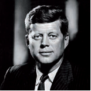

- Franklin Ruzvelt
- Duayt Eyzenhauer
+ Jon Kennedi
- Lindon Jonson

**678. Ikkinchi jahon urushi yillari AQSH ning ishlab chiqarish quvvatlari necha barobar o‘sgan?**

+ Ikki barobar
- Uch barobar
- To‘rt barobar
- Besh barobar

**679. AQSH da qaysi yildagi prezidentlik saylovlarida respublikachilar partiyasi vakili – Jorj Bush gʻalaba qozongan?**

- 1984-yildagi
+ 1988-yildagi
- 1992-yildagi
- 1996-yildagi

**680. AQSH da 1952-yilgi saylovlarda qaysi partiya gʻalaba qozongan?**

- Konservatorlar partiyasi
- Demokratlar partiyasi
+ Respublikachilar partiyasi
- Liberallar partiyasi

**681. Qaysi yildagi saylovlarda respublikachilar partiyasi vakili – Richard Nikson AQSH prezidenti etib saylangan?**

- 1960-yildagi
- 1964-yildagi
+ 1968-yildagi
- 1972-yildagi

**682. Qaysi sanada AQSH prezidenti Jon Kennedi ikkinchi marta prezident boʻlish uchun saylovoldi tashviqoti doirasidagi tadbirda ishtirok etayotgan chogʻida yollanma qotil tomonidan oʻldirilgan?**

- 1962-yil 22-oktyabrda
+ 1963-yil 22-noyabrda
- 1964-yil 22-dekabrda
- 1965-yil 22-yanvarda

**683. Qachon AQSH prezidenti Richard Nikson “yangi iqtisodiy siyosat” ni eʼlon qilgan?**

+ 1971-yilda
- 1974-yilda
- 1976-yilda
- 1978-yilda

**684. Qaysi yilda Amerika Qoʻshma Shtatlari oʻz mustaqilligining 200 yilligini katta tantanalar bilan nishonlagan?**

- 1971-yilda
- 1974-yilda
+ 1976-yilda
- 1978-yilda

**685. AQSH da qaysi yildagi prezidentlik saylovlarida demokratik partiya nomzodi Jon Kennedi gʻalaba qozongan?**

- 1952-yildagi
- 1956-yildagi
+ 1960-yildagi
- 1964-yildagi

**686. Qaysi yilda AQSH ning Vyetnamdagi urushi toʻxtatilgan?**

- 1968-yilda
- 1971-yilda
+ 1973-yilda
- 1977-yilda

**687. AQSH prezidenti Jon Kennedi qaysi shaharda yollanma qotil tomonidan oʻldirilgan?**

- Vashington
- Memfis
- San Fransisko
+ Dallas

**688. Qaysi yilda AQSH prezidenti Ronald Reygan ikkinchi muddatga prezident etib saylangan?**

+ 1984-yilda
- 1988-yilda
- 1992-yilda
- 1996-yilda

**689. Ikkinchi jahon urushi yillari AQSH ning eksport hajmi necha barobar o‘sgan?**

- Ikki barobar
- Uch barobar
- To‘rt barobar
+ Besh barobar

**690. Qachon Ikkinchi jahon urushi qahramoni, urush yillari AQSH ning Yevropadagi qoʻshinlari qoʻmondoni bo‘lgan general Duayt Eyzenhauer AQSH prezidenti etib saylangan?**

+ 1952-yilda
- 1956-yilda
- 1960-yilda
- 1964-yilda

**691. Qaysi AQSH prezidenti oʻzining “Yangi marralar” deb nom olgan islohotchilik dasturini ilgari surgan?**

- Franklin Ruzvelt
- Duayt Eyzenhauer
+ Jon Kennedi
- Lindon Jonson

## 18-§ Buyuk Britaniya va Fransiya: yangi Yevropani qurish.

**692. Ikkinchi jahon urushidan keyingi qaysi yillarda Buyuk Britaniya iqtisodiyotining oʻsish surʼatlari pastligicha qolgan?**

- 1950-yillarda
+ 1960-yillarda
- 1970-yillarda
- 1980-yillarda

**693. Qachon Fransiyada Beshinchi respublikada inqiroz boshlangan?**

- 1960-yillar boshida
+ 1960-yillar oxirida
- 1970-yillar boshida
- 1970-yillar oxirida

**694. Buyuk Britaniyada qaysi yildagi saylovlarda Jon Meyjor bosh vazir etib saylangan?**

- 1978-yildagi
- 1982-yildagi
- 1986-yildagi
+ 1990-yildagi

**695. Qaysi davlat Buyuk Britaniyani sanoat ishlab chiqarish darajasi bo‘yicha dunyoda uchinchi oʻrindan surib chiqargan?**

- GFR
+ Yaponiya
- AQSH
- Fransiya

**696. 1950-yillarda Buyuk Britaniya sanoat ishlab chiqarish darajasi bo‘yicha dunyoda nechanchi o‘rinda turardi?**

- Birinchi oʻrinda
+ Ikkinchi oʻrinda
- Uchinchi oʻrinda
- To‘rtinchi oʻrinda

**697. Quyidagi qaysi prezident Fransiyaning buyukligini tiklashga intilgan, kuchli iqtisodiyot va mustaqil tashqi siyosatga ega boʻlgan davlatni shakllantirishga kirishgan?**

- Jiskar d’Esten
- Jorj Pompidu
- Fransua Mitteran
+ Sharl de Goll

**698. 1945-yil 8-may kuni Uaythollda xalqqa murojaat qilgan Buyuk Britaniya bosh vaziri kim?**

- D. Lloyd Jorj
- S. Bolduin
+ U. Cherchill
- N. Chemberlen

**699. Fransiyada qaysi yildagi parlament saylovlarida oʻng kuchlar gʻolib chiqqan va ularning vakili Jak Shirak bosh vazir lavozimini egallagan?**

+ 1986-yildagi
- 1988-yildagi
- 1990-yildagi
- 1991-yildagi

**700. Fransiyada qaysi yilda Taʼsis majlisiga oʻtkazilgan saylovlarda soʻl kuchlar gʻalaba qozongan va koalitsion hukumatni Fransiya ozodligi uchun kurash yetakchisi general Sharl de Goll boshqargan?**

+ 1945-yilda
- 1947-yilda
- 1949-yilda
- 1951-yilda

**701. Ikkinchi jahon urushidan keyin Buyuk Britaniya iqtisodiyotining oʻsishiga qaysi partiya hukumati tomonidan amalga oshirilgan davlat sektorining ancha kengayishi ham taʼsir koʻrsatgan?**

+ Leyboristlar
- Liberallar
- Konservatorlar
- Demokratlar

**702. Quydagi suratda qaysi Fransiya prezidenti tasvirlangan?**

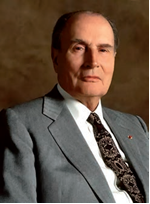

- Jiskar d’Esten
- Jorj Pompidu
+ Fransua Mitteran
- Jak Shirak

**703. General Sharl de Goll koalitsion hukumatni boshqarishga kirishganida, Taʼsis majlisida qaysi siyosiy kuchlar koʻpchilik oʻrinlarni egallagan edi?**

- Konservatorlar va kommunistlar
+ Kommunistlar va sotsialistlar
- Sotsialistlar va liberallar
- Liberallar va konservatorlar

**704. Fransiyada Beshinchi respublika davrida davlatning qaysi siyosati fransuz jamiyatining koʻplab qatlamlarining noroziligiga sabab bo‘lgan?**

- Ijtimoiy rag‘batni kamaytirish siyosati
- Tashqi ekspansiyani kuchaytirish siyosati
- Prezident vakolatlarini kengaytirish siyosati
+ Qatʼiy tartibga solish siyosati

**705. Fransiyada Toʻrtinchi respublikaning birinchi prezidenti etib kim saylangan?**

+ Sharl de Goll
- Jiskar d’Esten
- Jorj Pompidu
- Fransua Mitteran

**706. Qachon Fransiya Jazoirga mustaqillik bergan?**

- 1960-yilda
+ 1962-yilda
- 1964-yilda
- 1966-yilda

**707. Ayrim shaxs yoki birlashmalarning xususiy mulki boʻlgan yer, ishlab chiqarish korxonalari, transport, banklarni davlat yoki jamiyat mulkiga aylantirish, davlat ixtiyoriga olish qanday ataladi?**

+ Natsionalizatsiya
- Urbanizatsiya
- Eskalyatsiya
- Spekulyatsiya

**708. 1958-yil dekabrda kim Fransiya prezideni etib saylangan?**

+ Sharl de Goll
- Jiskar d’Esten
- Jorj Pompidu
- Fransua Mitteran

**709. Fransiyada 1981-yilgi saylovlarda kim respublika prezidenti etib saylangan?**

- Jiskar d’Esten
- Jorj Pompidu
+ Fransua Mitteran
- Jak Shirak

**710. Fransiyada qaysi yilda navbatdan tashqari parlament saylovlari o‘tkazilib, unda sotsialistlar gʻolib chiqqan va yana besh yil hokimiyatni boshqargan?**

- 1986-yilda
+ 1988-yilda
- 1990-yilda
- 1991-yilda

**711. Fransiyada 1969-yil oxirida boʻlib oʻtgan saylovlarda kim respublika prezidenti etib saylangan?**

- Sharl de Goll
- Jiskar d’Esten
+ Jorj Pompidu
- Fransua Mitteran

**712. Buyuk Britaniyada kim bosh vazir etib saylanganidan keyin “tetcherizm” davri tugagan?**

- Toni Bler
- Gordon Braun
+ Jon Meyjor
- Devid Kemeron

**713. Fransiyada 1945-yilda qabul qilingan yangi konstitutsiyaga ko‘ra, ikki palatali parlament umumiy ovoz berish yoʻli bilan necha yil muddatga saylanadigan bo‘lgan?**

+ 5 yil muddatga
- 6 yil muddatga
- 7 yil muddatga
- 8 yil muddatga

**714. Qaysi davrga kelib Buyuk Britaniya sanoat ishlab chiqarish darajasi bo‘yicha dunyoda uchinchi oʻrindan surib chiqarilgan?**

- 1960-yillarning boshiga
- 1960-yillarning oʻrtasiga
- 1960-yillarning oxiriga
+ 1970-yillarning boshiga

**715. Fransiyada 1945-yilda qabul qilingan yangi konstitutsiyaga ko‘ra, prezident kim tomonidan saylanadigan bo‘lgan?**

- Vazirlar
- Xalq
- Saylov komissiyasi
+ Parlament

**716. Qaysi yillarda Fransiyaning Afrikadagi mustamlakalari oʻz mustaqilliklarini eʼlon qilgan?**

- 1957–1959-yillarda
+ 1958–1960-yillarda
- 1959–1961-yillarda
- 1960–1962-yillarda

**717. Fransiyada 1988-yildagi prezidentlik saylovlarida kim gʻalaba qozongan?**

- Sharl de Goll
- Jiskar d’Esten
- Jorj Pompidu
+ Fransua Mitteran

**718. Fransiyada 1945-yilda qabul qilingan yangi konstitutsiyaga ko‘ra, prezident necha yil muddatga saylanadigan bo‘lgan?**

- 5 yil muddatga
- 6 yil muddatga
+ 7 yil muddatga
- 8 yil muddatga

**719. Qaysi yilda Argentina bahsli Folklend orollari ustidan oʻz suverenitetini oʻrnatishga urinib koʻrgan?**

- 1979-yilda
+ 1982-yilda
- 1984-yilda
- 1987-yilda

**720. “Tetcherizm” oʻzining asosiy maqsadi qilib nimaga qarshi kurashni tanlagan?**

- Ishsizlikka
- Ish tashlashlarga
- Iqtisodni o‘sishdan to‘xtashiga
+ Inflyatsiyaga

**721. Fransiyada qaysi yildagi saylovlarda birinchi marta sotsialist prezident saylangan?**

- 1976-yildagi
+ 1981-yildagi
- 1986-yildagi
- 1991-yildagi

**722. Fransiya tarixida Toʻrtinchi respublika davri qaysi yillarni o‘z ichiga oladi?**

- 1945–1957-yillarni
+ 1946–1958-yillarni
- 1947–1959-yillarni
- 1948–1960-yillarni

**723. Qaysi davrga kelib Buyuk Britaniya sanoat ishlab chiqarish darajasi bo‘yicha dunyoda ikkinchi oʻrindan surib chiqarilgan?**

- 1960-yillarning boshlariga
+ 1960-yillarning oʻrtalariga
- 1960-yillarning oxirlariga
- 1970-yillarning boshlariga

**724. Qaysi davlatga mustaqillik berilishi bilan fransuz mustamlaka imperiyasi toʻliq barham topgan?**

- Senegal
- Liviya
+ Jazoir
- Tunis

**725. Fransiyada 1986-yildagi parlament saylovlarida kim prezident boʻlib qolgan?**

+ Fransua Mitteran
- Jiskar d’Esten
- Jorj Pompidu
- Jak Shirak

**726. Buyuk Britaniyada qaysi yilda boʻlib oʻtgan saylovlarda konservatorlar ishonchli gʻalabani qoʻlga kiritgan va hukumatni Buyuk Britaniya tarixida birinchi marta ayol kishi – Margaret Tetcher boshqargan?**

+ 1979-yilda
- 1982-yilda
- 1984-yilda
- 1987-yilda

**727. Qachon o‘tkazilgan referendumda fransuzlar yangi konstitutsiyani maʼqullagan va Fransiya prezidentlik respublikasiga aylangan?**

- 1957-yil sentyabrda
- 1957-yil dekabrda
+ 1958-yil sentyabrda
- 1958-yil dekabrda

**728. “Tetcherizm” qaysi yo‘nalishning britaniyacha varianti boʻlgan?**

- Neoliberalizmning
- Neodemokratizmning
+ Neokonservatizmning
- Neoleyborizmning

**729. Buyuk Britaniyada konservatorlar ijtimoiy-iqtisodiy kursining asoslari bo‘lgan “Toʻgʻri yondashuv” nomli dasturiy hujjat qachon qabul qilingan edi?**

- 1970-yillarning boshlarida
+ 1970-yillarning oʻrtalarida
- 1970-yillarning oxirlarida
- 1980-yillarning boshlarida

**730. Qachon Parij talabalarining namoyishi boshlangan?**

- 1966-yil martda
- 1967-yil aprelda
+ 1968-yil mayda
- 1969-yil iyunda

**731. 1950-yillarda Buyuk Britaniya sanoat ishlab chiqarish darajasi bo‘yicha qaysi davlatdan keyingi o‘rinda turardi?**

- GFR
- Yaponiya
+ AQSH
- Fransiya

**732. Qaysi davlat Buyuk Britaniyani sanoat ishlab chiqarish darajasi bo‘yicha dunyoda ikkinchi oʻrindan surib chiqargan?**

+ GFR
- Yaponiya
- AQSH
- Fransiya

**733. Ikkinchi jahon urushida Fransiya qancha kishisidan ayrilgan?**

- 1 mln.
- 2 mln.
+ 3 mln.
- 4 mln.

**734. Quydagi suratda qaysi Fransiya prezidenti tasvirlangan?**

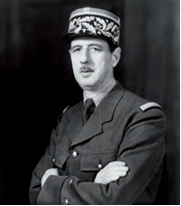

+ Sharl de Goll
- Jiskar d’Esten
- Jorj Pompidu
- Fransua Mitteran

**735. Ikkinchi jahon urushidan keyin qaysi davrga kelib Buyuk Britaniya sanoat ishlab chiqarishining hajmi urushdan oldingi darajasiga yetgan?**

+ 1947-yil oxiriga kelib
- 1947-yil boshiga kelib
- 1948-yil boshiga kelib
- 1948-yil oxiriga kelib

**736. Fransiyada qaysi yilda boʻlib oʻtgan parlament saylovlarida Sotsialistik partiya juda katta yutuqqa erishgan?**

- 1976-yilda
+ 1981-yilda
- 1986-yilda
- 1991-yilda

**737. Qachon Britaniya hukumati Folklend orollariga harbiy eskadra joʻnatgan?**

- 1979-yilda
+ 1982-yilda
- 1984-yilda
- 1987-yilda

## 19-§ Germaniya va Italiya: magʻlubiyatdan keyingi taraqqiyot.

**738. Ikkinchi jahon urushida ittifoqchilar aviatsiyasi Germaniyaning qaysi shaharlarini vayron qilib tashlagandi? 1) Hamburg; 2) Drezden; 3) Berlin; 4) Myunxen; 5) Nyurnberg; 6) Rur koʻmir-metallurgiya havzasi shaharlari.**

+ 1, 2, 3, 4, 5, 6
- 2, 3, 4, 5, 6
- 2, 3, 4, 5
- 1, 5, 6

**739. XX asrning qaysi yillari Italiyada mafiyaga qarshi kurash davri boʻlgan?**

- 50–60-yillari
- 60–70-yillari
- 70–80-yillari
+ 80–90-yillari

**740. Qaysi shahar Germaniya Demokratik Respublikasi (GDR) ning poytaxti boʻlgan?**

- Myunxen
- Bonn
- Nyurnberg
+ Sharqiy Berlin

**741. Qaysi yillarga kelib Italiyada koalitsion hukumat shakllangan?**

- 1960-yillarga
- 1970-yillarga
+ 1980-yillarga
- 1990-yillarga

**742. Qachon GFR NATO ga a’zo bo‘lgan?**

- 1951-yilda
+ 1955-yilda
- 1958-yilda
- 1960-yilda

**743. Italiya NATO ga aʼzo boʻlgach, uning hududiga qaysi davlat harbiy bazalari joylashtirilgan?**

- Buyuk Britaniya
+ AQSH
- Fransiya
- Germaniya

**744. Qanday omillar Ikkinchi jahon urushidan keyin Italiyada jadal iqtisodiy rivojlanishga koʻmaklashgan? 1) “Marshall rejasi” ga qoʻshilish; 2) Asosiy kapitalni yangilash; 3) Chet el xususiy sarmoyalarining oqib kelishi; 4) Ichki bozorda talabning yuqoriligi; 5) Xususiy monopoliyalarga davlat yordami; 6) Ishlab chiqarishga ilmiy-texnik yangiliklarni tatbiq qilish.**

- 2, 3, 4, 5, 6
- 2, 3, 5
- 1, 2, 4, 5
+ 1, 2, 3, 4, 5, 6

**745. Qachon GDR da inqilob boshlangan?**

- 1982-yilda
- 1987-yilda
+ 1989-yilda
- 1990-yilda

**746. Qaysi GFR kansleri davrida soliqlar qisqartirilgan, davlat xarajatlari tartibga solingan, davlatning biznesga aralashuvini kamaytirish, raqobatni ragʻbatlantirish boʻyicha tadbirlar amalga oshirilgan?**

- Konrad Adenauer
+ Gelmut Kol
- Villi Brant
- Lyudvig Erhard

**747. Ikkinchi jahon urushidan keyin Italiyaning qaysi qismi kambagʻallik va ijtimoiy keskinlik manbai boʻlib qolavergan?**

- Shimoliy qismi
- Sharqiy qismi
+ Janubiy qismi
- G‘arbiy qismi

**748. Germaniya Federativ Respublikasi (GFR) tashkil etilgach kim kansler etib saylangan?**

+ Konrad Adenauer
- Lyudvig Erhard
- Villi Brant
- Gelmut Kol

**749. Ikkinchi jahon urushidan keyin qaysi siyosiy oqimlar birlashib, Germaniya birlashgan sotsialistik partiyasini (GBSP) tashkil qilgan?**

- Liberallar va konservatorlar
- Konservatorlar va kommunistlar
+ Kommunistlar va sotsial-demokratlar
- Sotsial-demokratlar va liberallar

**750. Quyidagi suratda qaysi GFR kansleri tasvirlangan?**

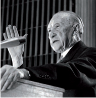

+ Konrad Adenauer
- Lyudvig Erhard
- Villi Brant
- Gelmut Kol

**751. Qachon Berlin devori buzib tashlangan?**

- 1982-yilda
- 1987-yilda
+ 1989-yilda
- 1990-yilda

**752. Xristian-demokratik ittifoqi (XDI) raisi lavozimini egallagan “nemis iqtisodiy moʻjizasining tan olingan otasi” kim?**

- Konrad Adenauer
- Villi Brant
- Gelmut Kol
+ Lyudvig Erhard

**753. GFR da iqtisod qaysi yillarda jadal surʼatlar bilan rivojlangan?**

+ 1950–1960-yillarda
- 1960–1970-yillarda
- 1970–1980-yillarda
- 1980–1990-yillarda

**754. Ikkinchi jahon urushidan keyin gʻolib davlatlar Germaniya hududini nechta okkupatsiya zonalariga boʻlib, mamlakatda hokimiyatni oʻz qoʻllariga olganlar?**

- Uchta okkupatsiya zonalariga
+ Toʻrtta okkupatsiya zonalariga
- Beshta okkupatsiya zonalariga
- Oltita okkupatsiya zonalariga

**755. Xalqaro munosabatlarning ayrim masalalarida birgalikda ish koʻrish haqida oʻzaro ahdlashgan davlatlarning siyosiy yoki harbiy ittifoqi; bir necha siyosiy partiyalarning shu partiyalar vakillaridan iborat hukumat tuzish toʻgʻrisidagi kelishuvi qanday ataladi?**

- Mobilizatsiya
+ Koalitsiya
- Stabilizatsiya
- Modernizatsiya

**756. Sharqdan koʻchib kelayotganlar oqimi va kansler K. Adenauerning qulay iqtisodiy siyosati “Marshall rejasi” doirasida olgan salmoqli moliyaviy “darmon” bilan qoʻshilishi natijasida GFR qaysi yildayoq misli koʻrilmagan taraqqiyotga erishgan?**

- 1951-yilda
+ 1955-yilda
- 1958-yilda
- 1960-yilda

**757. Qaysi sanada SSSR ning okkupatsiya zonasi boʻlgan sharqiy qismida Germaniya Demokratik Respublikasi (GDR) tashkil qilingan?**

+ 1949-yil 7-oktyabrda
- 1950-yil 7-noyabrda
- 1951-yil 7-dekabrda
- 1952-yil 7-yanvarda

**758. Ikkinchi jahon urushidan keyin Italiyada kimning hukumati Gʻarbning yetakchi davlatlari bilan ittifoqchi boʻlishga intilgan?**

- Paolo Emilio Taviani
+ Alchide de Gasperi
- Juzeppe Pella
- Aldo Moro

**759. Daromadga nisbatan xarajatlarning oshib ketishi; tanqislik; yetishmaslik, kamchillik, taqchillik; yetarli miqdorda boʻlmagan, kam uchraydigan; kamchil, taqchil, kamyob bo‘lgan narsa qanday ataladi?**

- Kredit
+ Defitsit
- Tranzit
- Benefit

**760. “Italiya iqtisodiy moʻjizasi” natijasida asosan mamlakatning sanoati rivojlangan qaysi qismi foyda ko‘rgan?**

+ Shimoliy qismi
- Sharqiy qismi
- Janubiy qismi
- G‘arbiy qismi

**761. Ikkinchi jahon urushidan keyin Italiyada milliy birlik hukumati qanday islohotlarni amalga oshirgan? 1) Pomeshchiklarning foydalanilmayotgan yerlari dehqonlarga berilgan; 2) Ish haqining narx-navoga qarab oʻsib borishi belgilab qoʻyilgan; 3) Kasaba uyushmasi roziligisiz ishchilarni ishdan boʻshatish taqiqlangan; 4) Korxonalarda ishchi kengashlari tuzilgan.**

- 1, 2, 3
- 1, 3, 4
- 2, 3, 4
+ 1, 2, 3, 4

**762. Ikkinchi jahon urushidan keyin qaysi davlatning aralashuvi bilan Italiyada kommunistlar hukumatdan chiqarilgan?**

- Buyuk Britaniya
+ AQSH
- Fransiya
- Germaniya

**763. Qachon GFR kansleri Konrad Adenauer istefoga chiqqan?**

- 1961-yilda
+ 1963-yilda
- 1966-yilda
- 1968-yilda

**764. Qaysi davr “nemis iqtisodiy moʻjizasi” nomini olgan?**

- 1950–1960-yillar
+ 1960–1970-yillar
- 1970–1980-yillar
- 1980–1990-yillar

**765. Germaniyaning ikkita davlatga boʻlingan davri necha yil davom etgan?**

- 20 yil
- 30 yil
+ 40 yil
- 50 yil

**766. Ikkinchi jahon urushi yakunida nemislar quyidagi qaysi Yevropa mamlakatlaridan quvilgan? 1) Avstriya; 2) Polsha; 3) Chexoslovakiya; 4) Yugoslaviya; 5) Vengriya.**

- 1, 2, 3, 4, 5
+ 2, 3, 4, 5
- 2, 3, 4
- 1, 2, 4

**767. GFR kansleri Konrad Adenauer qaysi shaharlarga dastlabki rasmiy tashriflarni amalga oshirgan? 1) Parij; 2) Rim; 3) London; 4) Vashington.**

+ 1, 2, 3, 4
- 1, 3, 4
- 1, 2, 3
- 2, 3, 4

**768. Quyidagi suratda qaysi Italiya hukumat rahbari tasvirlangan?**

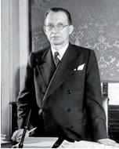

- Paolo Emilio Taviani
+ Alchide de Gasperi
- Juzeppe Pella
- Aldo Moro

**769. Qaysi yilda Italiyada chuqur iqtisodiy inqiroz boshlangan?**

- 1972-yilda
+ 1974-yilda
- 1976-yilda
- 1979-yilda

**770. Ikkinchi jahon urushidan keyin Italiyada qaysi davrda haqiqiy iqtisodiy inqilob boshlanib, bu “Italiya iqtisodiy moʻjizasi” nomini olgan?**

- 1950-yillar boshida
- 1950-yillar o‘rtasida
+ 1950-yillar oxirida
- 1960-yillar boshida

**771. Italiyada qaysi yilda zilzila bo‘lgan?**

- 1972-yilda
- 1975-yilda
- 1978-yilda
+ 1980-yilda

**772. Italiya qachon NATO ga aʼzo boʻlgan?**

+ 1949-yilda
- 1950-yilda
- 1957-yilda
- 1959-yilda

**773. Qachon yagona Germaniya davlati tashkil topganligi eʼlon qilingan?**

- 1989-yil 3-sentyabrda
+ 1990-yil 3-oktyabrda
- 1991-yil 3-noyabrda
- 1992-yil 3-dekabrda

**774. “Vayronalar oralab yegulik izlab timirskilanib yurgan, faqat qoq suyaklari qolgan bolalar, bir parcha koʻmir uchun koʻchada mushtlashayotgan odamlar, ochiq havoda uxlayotgan asirlar...”. Ushbu jumlalar Ikkinchi jahon urushi yakunida qaysi xalq haqida yozilgan edi?**

- Sovet xalqi
- Polyak xalqi
+ Nemis xalqi
- Yapon xalqi

**775. Qaysi yilda Parlament kengashi Germaniya Federativ Respublikasining Asosiy qonunini tasdiqlagan?**

- 1945-yilda
- 1946-yilda
- 1948-yilda
+ 1949-yilda

**776. XX asr oxirlarida Italiya siyosatida qanday xodisa mamlakatning oʻziga xos anʼanasiga aylangan?**

- Amaldorlarning korrupsion faoliyati
- Siyosiy terrorizm
- Mamlakat rahbarlarining qat’iyatsizligi
+ Hukumatning tez-tez almashishi

**777. Qachon Yevropa iqtisodiy hamjamiyatini (YIH) tuzish toʻgʻrisida Rim shartnomasi imzolangan?**

- 1949-yilda
- 1950-yilda
+ 1957-yilda
- 1959-yilda

**778. Italiya tashqi siyosatida 1970-yillarda … davom ettirilgan.**

+ “Atlantik kurs”
- “Sotsialistik kurs”
- “Kapitalistik kurs”
- “Patsifistik kurs”

**779. GFR kansleri Konrad Adenauer qaysi yilgacha bir paytning oʻzida tashqi ishlar vaziri vazifasini ham bajargan?**

- 1951-yilgacha
+ 1955-yilgacha
- 1958-yilgacha
- 1960-yilgacha

**780. Ikkinchi jahon urushida qancha italiyalik halok bo‘lgan?**

+ 330 mingga yaqin
- 430 mingga yaqin
- 530 mingga yaqin
- 630 mingga yaqin

**781. Qaysi ahdnomaning kuchga kirishi tufayli GFR uchun okkupatsiya davri tugagan?**

+ Parij ahdnomasining
- Berlin ahdnomasining
- Vashington ahdnomasining
- Rim ahdnomasining

**782. Germaniyada 1990-yilda boʻlib oʻtgan navbatdan tashqari saylovlarda kim boshchiligidagi koalitsiya gʻalaba qozongan?**

+ Gelmut Kol
- Villi Brant
- Lyudvig Erhard
- Gerxard Shryoder

**783. Qachon Germaniya Federativ Respublikasi (GFR) tashkil etilganligi eʼlon qilingan?**

- 1947-yil 7-iyulda
- 1948-yil 7-avgustda
+ 1949-yil 7-sentyabrda
- 1950-yil 7-oktyabrda

**784. Qanday omillar GFR da iqtisodni jadal surʼatlar bilan rivojlanishini taʼminlagan? 1) Harbiy xarajatlarning kamligi; 2) “Marshall rejasi” boʻyicha Amerikaning katta yordami; 3) Arzon chet el ishchi kuchidan unumli foydalanish; 4) Yangi uskunalarning keltirilishi.**

- 1, 2, 3
- 1, 2, 4
- 2, 3, 4
+ 1, 2, 3, 4

**785. Ikkinchi jahon urushidan keyin Germaniyaning qaysi shahri toʻrtta sektorga boʻlingan?**

+ Berlin
- Myunxen
- Drezden
- Nyurnberg

**786. Quyidagi suratda qaysi davlatning okkupatsiya zonalariga boʻlinishi tasvirlangan?**

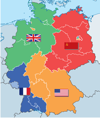

+ Germaniya
- Italiya
- Turkiya
- Yaponiya

**787. Qaysi GFR kansleri dasturida ozod, ochiq, dinamik, demokratik jamiyat qurish gʻoyasi ilgari surilgandi?**

- Konrad Adenauer
- Villi Brant
- Gelmut Kol
+ Lyudvig Erhard

**788. Ikkinchi jahon urushida Germaniya qancha aholisidan ayrilgan?**

- 3,5 mln.
- 4,5 mln.
- 5,5 mln.
+ 6,5 mln.

**789. Qaysi shahar Germaniya Federativ Respublikasi (GFR) poytaxti boʻlgan?**

- Myunxen
+ Bonn
- Drezden
- Hamburg

**790. GFR kansleri Konrad Adenauer qayerda reparatsion toʻlovlar haqidagi shartnomaga imzo chekkan?**

- Andorra
- Monako
+ Lyuksemburg
- Lixtenshteyn

**791. Qachon xristian-demokrat Gelmut Kol GFR kansleri etib saylangan?**

+ 1982-yilda
- 1987-yilda
- 1989-yilda
- 1990-yilda

**792. GFR birinchi kansleri diplomatiyasining asosiy maqsadi nima edi?**

- Yevropada yana gegemon mavqega ega bo‘lish
- Ikkinchi jahon urushi natijasida yo‘qotilgan hududlarni qaytarib olish
+ German fashizmidan jafo chekkan mamlakatlarning yotsirashini yengib oʻtish
- Germaniyani yagona davlatga qayta birlashtirish

**793. Ikkinchi jahon urushidan keyin qaysi yilda Italiyada kommunistlar hukumatdan chiqarilgan?**

- 1945-yilda
- 1946-yilda
+ 1947-yilda
- 1948-yilda

**794. GFR kansleri Konrad Adenauer imzo chekkan reparatsion toʻlovlar haqidagi shartnomada qaysi yosh davlatga yordam berish koʻzda tutilgan edi?**

- GDR
- Polsha
+ Isroil
- Vengriya

## 20-§ Gʻarbiy Yevropada iqtisodiy va siyosiy integratsiya jarayonlari.

**795. Tariflar va savdo boʻyicha bosh kelishuv (TSBK) keyinchalik qaysi tashkilotga aylantirilgan?**

- Iqtisodiy hamkorlik va taraqqiyot tashkilotiga
- Yevropa iqtisodiy hamkorlik tashkilotiga
- Yevropa Kengashiga
+ Jahon savdo tashkilotiga

**796. Yevropada qonunchilik organi sifatida qaysi tashkilot tashkil qilingan?**

- Yevropa hamjamiyati komissiyasi
+ Yevropa Kengashi
- Yevropa iqtisodiy hamkorlik tashkiloti
- Yevropa koʻmir va poʻlat birlashmasi

**797. Quyidagi qaysi tashkilot Yevropa Ittifoqi (YI) sifatida qayta tashkil qilingan?**

+ Yevropa iqtisodiy hamjamiyati
- Yevropa koʻmir va poʻlat birlashmasi
- Yevropa erkin savdo assotsiatsiyasi
- Yevropa hamjamiyati komissiyasi

**798. Yevropa Ittifoqi (YI) qanday makon bo‘lishi lozim edi?**

- “Ichki urushlarsiz makon”
- “Ichki bozorlarsiz makon”
+ “Ichki chegaralarsiz makon”
- “Ichki muammolarsiz makon”

**799. Qaysi davrda Yevropada sotsialistik tizimning inqirozi, SSSR va sotsialistik hamdoʻstlikning tarqalib ketishi yuz bergan?**

- 1970-yillar boshida
- 1970-yillar oxirida
- 1980-yillar boshida
+ 1980-yillar oxirida

**800. XX asrning oxirlarida iqtisodiyotda neokonservatizm tajribasi Fransiyadan oldin qaysi davlatda boshlangan?**

- GFR da
+ Buyuk Britaniyada
- Italiyada
- Portugaliyada

**801. Quyidagi qaysi tashkilotning dastlabki vazifasi urushdan keyingi iqtisodiyotni tiklash uchun “Marshall rejasi” boʻyicha AQSH Yevropa mamlakatlariga koʻrsatgan yordamni taqsimlashdan iborat edi?**

- Iqtisodiy hamkorlik va taraqqiyot tashkilotining
+ Yevropa iqtisodiy hamkorlik tashkilotining
- Yevropa Kengashining
- Jahon savdo tashkilotining

**802. Qachon Yevropa iqtisodiy hamkorlik tashkiloti (YIHT) tuzilgan?**

+ 1948-yilda
- 1951-yilda
- 1947-yilda
- 1949-yilda

**803. Quyidagi qaysi tashkilotning maqsadi faqat sanoat mahsulotlariga boj to‘lovlarini bosqichma-bosqich kamaytirish qilib belgilangan, ammo millatlararo organni tashkil qilish, qonunchilikni bir xillashtirish nazarda tutilmagan?**

- Yevropa hamjamiyati komissiyasi
+ Yevropa erkin savdo assotsiatsiyasi
- Yevropa iqtisodiy hamkorlik tashkiloti
- Yevropa koʻmir va poʻlat birlashmasi

**804. Qaysi tashkilot a’zolari tomonidan Yevropa iqtisodiy hamjamiyati (YIH) ni tuzish haqida Rim shartnomasi va Atom energiyasi boʻyicha Yevropa hamjamiyati (YEVROATOM) ni tuzish boʻyicha shartnoma imzolangan?**

- Iqtisodiy hamkorlik va taraqqiyot tashkiloti
- Yevropa iqtisodiy hamkorlik tashkiloti
- Jahon savdo tashkiloti
+ Yevropa koʻmir va poʻlat birlashmasi

**805. Qaysi davlatlar Yevropa erkin savdo assotsiatsiyasi (YESA) ga aʼzo boʻlib kirganlar? 1) Buyuk Britaniya; 2) Fransiya; 3) Avstriya; 4) Daniya; 5) Irlandiya; 6) Norvegiya; 7) Shvetsiya; 8) Belgiya; 9) Shveytsariya; 10) Portugaliya.**

+ 1, 3, 4, 5, 6, 7, 9, 10
- 1, 2, 4, 5, 6, 7, 8, 10
- 2, 4, 5, 6, 7, 8, 9
- 2, 3, 4, 5, 6, 9

**806. Yevropa Ittifoqi parlamenti binosi qaysi shaharda joylashgan?**

- Jenevada
+ Bryusselda
- Parijda
- Rimda

**807. Qachon Tariflar va savdo boʻyicha bosh kelishuv (TSBK) imzolangan?**

- 1948-yilda
- 1951-yilda
+ 1947-yilda
- 1949-yilda

**808. Ikkinchi jahon urushidan keyin Yevropa mamlakatlari tashqi savdo aylanmasining oʻsish surʼatlari iqtisodiy oʻsish surʼatlaridan necha barobar yuqori boʻlgan?**

+ Ikki barobar
- Uch barobar
- To‘rt barobar
- Besh barobar

**809. Suratda qaysi tashkilot logotipi tasvirlangan?**

- Yevropa iqtisodiy hamkorlik tashkiloti
+ Iqtisodiy hamkorlik va taraqqiyot tashkiloti
- Tariflar va savdo boʻyicha bosh kelishuv
- Jahon savdo tashkiloti

**810. Yevropa iqtisodiy hamkorlik tashkiloti (YIHT) Iqtisodiy hamkorlik va taraqqiyot tashkiloti (IHTT) deb qayta nomlangach, uning faoliyatiga qaysi davlat ham qo‘shilgan?**

- Janubiy Koreya
- Xitoy
- Singapur
+ Yaponiya

**811. Quyidagi qaysi atama ommaviy yigʻin, majlis, kengash, yirik anjuman ma’nolarini anglatadi?**

+ Forum
- Konferensiya
- Simpozium
- Kongress

**812. Qaysi davlatlar ishtirokida Yevropa koʻmir va poʻlat birlashmasi (YKPB) nomli tashkilot tuzilgan? 1) Buyuk Britaniya; 2) GFR; 3) Fransiya; 4) Daniya; 5) Italiya; 6) Belgiya; 7) Niderlandlar qirolligi; 8) Lyuksemburg.**

+ 2, 3, 5, 6, 7, 8
- 1, 3, 4, 5, 6, 7
- 1, 2, 4, 5, 6, 7
- 2, 3, 4, 6, 7, 8

**813. Yevropada ijro organi sifatida qaysi tashkilot tashkil qilingan?**

+ Yevropa hamjamiyati komissiyasi
- Yevropa Kengashi
- Yevropa iqtisodiy hamkorlik tashkiloti
- Yevropa koʻmir va poʻlat birlashmasi

**814. Qaysi aktga binoan Yevropa Ittifoqi (YI) tashkil qilingan?**

- Umumiy Yevropa aktiga
- Mustaqil Yevropa aktiga
- Ittifoqdosh Yevropa aktiga
+ Yagona Yevropa aktiga

**815. Rim shartnomasi qaysi sanada imzolangan?**

- 1951-yil 25-yanvarda
- 1955-yil 25-fevralda
+ 1957-yil 25-martda
- 1959-yil 25-aprelda

**816. Quyidagi qaysi tashkilot keyinchalik koʻptomonlama iqtisodiy maʼlumotlarni almashish, iqtisodiy maslahatlar forumiga aylangan?**

- Iqtisodiy hamkorlik va taraqqiyot tashkiloti
+ Yevropa iqtisodiy hamkorlik tashkiloti
- Yevropa Kengashi
- Jahon savdo tashkiloti

**817. Qachon Yevropa koʻmir va poʻlat birlashmasi (YKPB) nomli tashkilot tuzilgan?**

- 1963-yilda
- 1958-yilda
+ 1951-yilda
- 1960-yilda

**818. Qaysi davrda iqtisodiyotning muhim sohalarini davlat tomonidan nazorat qilishga intilish va yuqori soliqlar oqibatida transmilliy korporatsiyalar oʻz kapitalini Fransiyadan chiqarib keta boshlagan?**

- 1960-yillarda
- 1970-yillarda
+ 1980-yillarda
- 1990-yillarda

**819. Yevropada qaysi shartnoma bandlarini amalga oshirish integratsiyada ishtirok etayotgan mamlakatlar tovar ishlab chiqaruvchilari oʻrtasida raqobatni pasaytirib, uni tashqi bozorga yoʻnaltirish imkonini bergan?**

- Parij shartnomasi
- London shartnomasi
- Berlin shartnomasi
+ Rim shartnomasi

**820. XX asrning oxirlarida kapitalning chiqib ketishini toʻxtatish uchun Fransiya … tajribasiga murojaat qilib, davlat korxonalarini qisman xususiylashtirgan, soliqlarni pasaytirgan.**

- neoliberalizm
- neosotsializm
- neokapitalizm
+ neokonservatizm

**821. Quyidagi qaysi atama “uyushma, hamjamiyat” degan ma’nolarni anglatib, rivojlangan yirik aksiyadorlar jamiyati, biron-bir faoliyat uchun uyushgan yuridik va jismoniy shaxslar majmuini ifodalashda ishlatiladi?**

- Sindikat
+ Korporatsiya
- Faktoriya
- Konglomerat

**822. Suratda qaysi tashkilot logotipi tasvirlangan?**

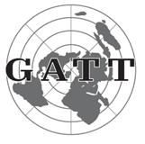

- Yevropa iqtisodiy hamkorlik tashkiloti
- Iqtisodiy hamkorlik va taraqqiyot tashkiloti
+ Tariflar va savdo boʻyicha bosh kelishuv
- Jahon savdo tashkiloti

**823. Tariflar va savdo boʻyicha bosh kelishuv (TSBK) da ishtirok etgan davlatlar qanday majburiyatni olgan edilar?**

+ Import mahsulotlariga boj soligʻini kamaytirish hisobiga tashqi savdoni rivojlantirishga koʻmaklashish
- Umumiy o‘lchov va pul birliklarini joriy qilish
- Mehnat migratsiyasini rivojlantirish
- Yirik biznes imkoniyatlarini cheklagan holda kichik biznesni o‘sishiga yordam berish

**824. Iqtisodiy, ijtimoiy, madaniy, ilmiy, huquqiy va maʼmuriy sohalarda Gʻarbiy Yevropaning oʻzaro kelishilgan siyosat yuritishiga koʻmaklashuvchi dastlabki tashkilot qaysi?**

- Iqtisodiy hamkorlik va taraqqiyot tashkiloti
- Yevropa iqtisodiy hamkorlik tashkiloti
+ Yevropa Kengashi
- Jahon savdo tashkiloti

**825. Yevropa koʻmir va poʻlat birlashmasi (YKPB) da nimalar ko‘zda tutilgan edi? 1) Koʻmir va metallurgiya sanoatining umumiy bozorini tashkil qilish; 2) Oʻzaro boj to‘lovlarini bekor qilish; 3) YKPB ga kirmagan davlatlar mahsulotlariga nisbatan yagona boj siyosatini yuritish; 4) Mahsulotlarga o‘zgarmas narx belgilash.**

- 2, 3, 4
- 1, 2, 4
+ 1, 2, 3
- 1, 2, 3, 4

**826. Rim shartnomasi qaysi davlatlar vakillari tomonidan imzolangan? 1) Belgiya; 2) Fransiya; 3) GFR; 4) Italiya; 5) Lyuksemburg; 6) Niderlandlar qirolligi.**

- 1, 3, 5, 6
- 2, 4, 5
- 2, 3, 4, 5
+ 1, 2, 3, 4, 5, 6

**827. Ikkinchi jahon urushidan keyin Gʻarbiy Yevropa mamlakatlarida iqtisodiyotning yuqori samaradorligini taʼminlash, ijtimoiy muammolarni hal etish imkoniyatini oshirishning eng muhim omili sifatida qanday jarayonlarni rivojlantirishga eʼtibor qaratilgan?**

- Irregatsion jarayonlarni
- Globalizatsion jarayonlarni
- Yevropasentrik jarayonlarni
+ Integratsion jarayonlarni

**828. Qaysi davlatlar Yevropa Kengashi taʼsischilari boʻlgan? 1) Belgiya; 2) Daniya; 3) Fransiya; 4) Irlandiya; 5) SSSR; 6) Italiya; 7) Lyuksemburg; 8) GFR; 9) Niderlandlar qirolligi; 10) Norvegiya; 11) Shvetsiya; 12) Buyuk Britaniya; 13) Ispaniya.**

- 1, 3, 4, 5, 7, 8, 10, 11, 12
+ 1, 2, 3, 4, 6, 7, 9, 10, 11, 12
- 2, 4, 5, 6, 7, 8, 9, 11, 13
- 3, 5, 6, 7, 8, 10, 11, 12, 13

**829. Yevropada qaysi davlatda sanoat mahsulotlari ishlab chiqarish hajmini ikki barobar oshirish imkonini bergan modernizatsiya natijasida koʻmir va gaz ishlab chiqarish, aviatsiya, avtomobilsozlik sanoatlarining katta qismi davlat mulkiga aylantirilgan?**

+ Fransiyada
- Buyuk Britaniyada
- Italiyada
- Belgiyada

**830. Qaysi davlat tashqi ishlar vaziri Robert Shuman Germaniya va Fransiyaning iqtisodiy imkoniyatlarini birlashtirish tashabbusi bilan chiqqan?**

+ Fransiya
- GFR
- Buyuk Britaniya
- AQSH

**831. Ikkinchi jahon urushidan keyin koʻplab Gʻarbiy Yevropa mamlakatlarida isteʼmolning necha foizdan ortigʻini boshqa hududlarda ishlab chiqarilgan mahsulotlar tashkil qilardi?**

- 40 foizdan ortigʻini
+ 50 foizdan ortigʻini
- 60 foizdan ortigʻini
- 70 foizdan ortigʻini

**832. Qachon Yevropa iqtisodiy hamkorlik tashkiloti (YIHT) Iqtisodiy hamkorlik va taraqqiyot tashkiloti (IHTT) deb qayta nomlangan?**

- 1963-yilda
- 1958-yilda
- 1951-yilda
+ 1960-yilda

**833. Yevropada qaysi davlatlar fermerlari va vino ishlab chiqaruvchilari oʻrtasidagi raqobatni yengib oʻtishga alohida eʼtibor qaratilgan?**

- Ispaniya, Portugaliya, Fransiya
+ Fransiya, Italiya, Germaniya
- Italiya, Germaniya, Ispaniya
- Germaniya, Ispaniya, Portugaliya

**834. Suratda qaysi tashkilot logotipi tasvirlangan?**

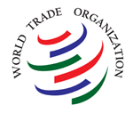

- Yevropa iqtisodiy hamkorlik tashkiloti
- Iqtisodiy hamkorlik va taraqqiyot tashkiloti
- Tariflar va savdo boʻyicha bosh kelishuv
+ Jahon savdo tashkiloti

**835. Qachon Yevropa iqtisodiy hamjamiyati (YIH) ni tuzish haqida Rim shartnomasi va Atom energiyasi boʻyicha Yevropa hamjamiyati (YEVROATOM) ni tuzish boʻyicha shartnoma imzolangan?**

- 1966-yilda
+ 1957-yilda
- 1951-yilda
- 1960-yilda

**836. Yevropa Kengashi qachon ta’sis etilgan?**

- 1948-yilda
- 1951-yilda
- 1947-yilda
+ 1949-yilda

**837. Yevropada sud organi sifatida qaysi tashkilot tashkil qilingan?**

- Yevropa sudi
- Xalqaro sud
+ Maxsus sud
- Ittifoq sudi

## 21-§ Janubiy va Shimoliy Yevropa mamlakatlari: diktatura va demokratiya.

**838. Qachon Gretsiyada uch nafar harbiy boshchilik qilgan isyonchilar hokimiyatni egallab olib, qamal holatini eʼlon qilgan, partiya, jamoat tashkilotlari tarqatib yuborilgan, yigʻilishlar va ishtashlashlar taqiqlangan?**

+ 1967-yil mayda
- 1974-yil iyunda
- 1981-yil sentyabrda
- 1978-yil dekabrda

**839. XX asrning 70-yillarida Kipr orolida yashovchi qaysi xalqlar oʻrtasida ziddiyat kuchaygan?**

- Arman va arab
- Arab va grek
+ Grek va turk
- Turk va arman

**840. 1980-yillar oxirida qaysi davlat YIH davlatlari orasida eng kam taraqqiy etgani boʻlib qolayotgan edi?**

+ Gretsiya
- Portugaliya
- Ispaniya
- Vengriya

**841. Ikkinchi jahon urushidan keyin Gretsiyada hokimiyatga kelgan Konstantinos Saldaris nimani tiklashga kirishgan?**

- Respublikani
+ Monarxiyani
- Diktaturani
- Imperiyani

**842. Portugaliyada qanday g‘oya Antonio Salazar rejimi rasmiy mafkurasining ajralmas qismi edi?**

- Demokratik islohotlarni o‘tkazish
- Yevropa integratsiyasiga qo‘shilish
- Ichki muammolarni evolyutsion yo‘l bilan hal qilish
+ Mustamlaka imperiyasini saqlab turish

**843. Qachon Ispaniya YIH ga aʼzo boʻlgan?**

- 1975-yilda
- 1982-yilda
+ 1985-yilda
- 1974-yilda

**844. Qaysi yilda Portugaliyada prezident lavozimiga birinchi marta fuqaroviy arbob – taniqli siyosatchi, sobiq bosh vazir Mariu Suaresh saylangan?**

- 1973-yilda
- 1976-yilda
- 1982-yilda
+ 1986-yilda

**845. Portugaliyada Marselu Kaetanu hukumati ag‘darilgach, kim boshchiligida “Milliy qutqaruv kengashi” tuzilgan?**

+ Antonio de Spinola
- Konstantinos Saldaris
- Mariu Suaresh
- Antonio Salazar

**846. Qaysi yilda Portugaliya Yevropa iqtisodiy hamjamiyati (YIH) ga aʼzo boʻlgan?**

- 1973-yilda
- 1976-yilda
- 1982-yilda
+ 1986-yilda

**847. Quyidagi suratda kim tasvirlangan?**

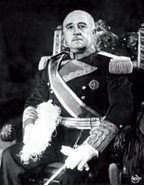

+ Fransisko Franko
- Antonio Salazar
- Marselu Kaetanu
- Antonio de Spinola

**848. Ikkinchi jahon urushidan keyingi fuqarolar urushida Gretsiya hukumatini qaysi davlat qo‘llagan?**

+ AQSH
- Buyuk Britaniya
- Fransiya
- SSSR

**849. Ikkinchi jahon urushidan keyin Gretsiyada boshlangan fuqarolar urushi qaysi siyosiy kuchlarning o‘rtasida bo‘lgan?**

+ Soʻllar bilan monarxistlar
- Monarxistlar bilan respublikachilar
- Respublikachilar bilan o‘nglar
- O‘nglar bilan kommunistlar

**850. XX asrning 80-yillarida Gretsiya tashqi siyosatining maqsadi qaysi davlatga qaramlikdan xalos bo‘lish ekanligi eʼlon qilingan?**

+ AQSH ga
- SSSR ga
- Buyuk Britaniyaga
- Fransiyaga

**851. Qaysi yilda Turkiya Kiprga qoʻshin kiritib, uning bir qismini Kipr Turkiya Respublikasi deb eʼlon qilganidan keyin Gretsiyadagi “qora polkovniklar” harbiy xuntasi hokimiyatdan ketishga majbur boʻlgan?**

- 1967-yilda
+ 1974-yilda
- 1981-yilda
- 1978-yilda

**852. Qachon Ispaniya NATO ga a’zo bo‘lgan?**

- 1975-yil aprelda
+ 1982-yil mayda
- 1985-yil martda
- 1974-yil avgustda

**853. Portugaliyada qabul qilingan, mamlakatda ijtimoiy-siyosiy jarayonlarni barqarorlashtirish uchun huquqiy asos boʻlgan konstitutsiyada davlat boshligʻi boʻlgan kim juda katta vakolatlarga ega boʻlgan?**

- Bosh vazir
- Qirol
- Parlament raisi
+ Prezident

**854. Janubiy Yevropaning qaysi uchta mamlakati XX asrning boshiga kelib oʻzlarining avvalgi iqtisodiy va siyosiy qudratini yoʻqotib, “Yevropaning chekka hududlari” ga aylanib qolgan?**

- Gretsiya, Italiya, Bolgariya
- Italiya, Bolgariya, Ispaniya
+ Ispaniya, Portugaliya, Gretsiya
- Portugaliya, Gretsiya, Italiya

**855. Qachon Portugaliya diktatori Antonio Salazar vafot etgan?**

- 1963-yilda
+ 1968-yilda
- 1971-yilda
- 1974-yilda

**856. Yevropa yangi tarixida eng uzoq hokimiyatda oʻtirgan diktator kim?**

- Fransisko Franko
+ Antonio Salazar
- Marselu Kaetanu
- Antonio de Spinola

**857. Gretsiyada harbiy xunta boshchilik qilgan rejim qanday atalgan?**

- “Qora kapitanlar”
+ “Qora polkovniklar”
- “Qora generallar”
- “Qora mayorlar”

**858. Portugaliyada kim boshchiligidagi hukumat aholining eng qashshoq qismi yashash darajasini koʻtarishga qaratilgan bir qator tadbirlarni amalga oshirgan?**

+ Antonio de Spinola
- Mariu Suaresh
- Antonio Salazar
- Marselu Kaetanu

**859. Portugaliyada Marselu Kaetanu davrida amalga oshirilgan oʻzgarishlar ichida eng ahamiyatlisi qaysi bo‘lgan?**

- Siyosiy tashkilotlarga ruxsat berilishi
- Ish tashlashlarga ruxsat berilishi
- Mustamlakalarga o‘z-o‘zini boshqarishga ruxsat berilishi
+ Mustaqil kasaba uyushmalariga ruxsat berilishi

**860. Ikkinchi jahon urushidan soʻng mavjud sharoitga moslashib olgan Fransisko Franko rejimi Ispaniyada yana qancha muddat hokimiyatda turgan?**

- O‘n yil
- Yigirma yil
+ Oʻttiz yil
- Qirq yil

**861. Portugaliyada Marselu Kaetanu “yangi davlat” ning nomini nimaga almashtirgan?**

- “Buyuk davlat” ga
- “Oliy davlat” ga
+ “Ijtimoiy davlat” ga
- “Demokratik davlat” ga

**862. Portugaliya diktatori Antonio Salazar kuchayib borayotgan ozodlik harakatiga qarshi terror uyushtirib, birinchi oʻrinda kimlarni qatag‘on qilgan?**

- Siyosatchilarni
- Harbiylarni
+ Ziyolilarni
- Ishchilarni

**863. Qachon BMT Bosh Assambleyasi Ispaniyani xalqaro tashkilotlarga qabul qilmaslik toʻgʻrisida maxsus qaror qabul qilgan va tashkilotga aʼzo boʻlgan davlatlarga Ispaniya bilan diplomatik munosabatlarni uzish tavsiya etilgan?**

- 1945-yilda
+ 1946-yilda
- 1947-yilda
- 1948-yilda

**864. Qaysi konferensiya Ispaniyadagi Fransisko Franko hukumatini fashistik davlatlar yordamida hokimiyatga kelganligi uchun qoralagan?**

- Qrim konferensiyasi
+ Potsdam konferensiyasi
- Tehron konferensiyasi
- Parij konferensiyasi

**865. Davlat yoki partiya, jamoat va olimlar vakillarining muayyan masalani muhokama etish uchun yigʻilishi qanday ataladi?**

- Kongress
- Simpozium
- Forum
+ Konferensiya

**866. Portugaliyada Antonio Salazar vafotidan keyin bosh vazir lavozimini egallagan Marselu Kaetanu nimani oʻzining asosiy vazifasi deb bilgan?**

+ Diktatorlik rejimini saqlab qolishni
- Demokratik islohotlarni amalga oshirishni
- Yevropa integratsiyasiga qo‘shilishni
- Mustamlakalarga mustaqillik berishni

**867. Qachon Gretsiya harbiylari Kipr orolida harbiy toʻntarishni amalga oshirib, orolning Gretsiyaga qoʻshilishiga qarshi boʻlgan hukumatni ag‘darib tashlashgan?**

- 1967-yilda
+ 1974-yilda
- 1981-yilda
- 1978-yilda

**868. Qaysi yilda Portugaliyada ofitserlar Marselu Kaetanu hukumatini bir kunda, deyarli qon toʻkishlarsiz agʻdarib tashlashgan?**

- 1963-yilda
- 1968-yilda
- 1971-yilda
+ 1974-yilda

**869. Gretsiyada harbiy xunta boshchilik qilgan rejimning iqtisodiy islohotlari natijasida Gretsiya qanday mamlakatga aylangan?**

- Agrar mamlakatga
- Industrial mamlakatga
+ Industrial-agrar mamlakatga
- Agrar-industrial mamlakatga

**870. Antonio Salazar Portugaliyani qancha muddat boshqargan?**

- Sal kam yigirma yil
- Sal kam o‘ttiz yil
+ Sal kam qirq yil
- Sal kam ellik yil

**871. Portugaliyada Antonio Salazarning siyosiy rejimi rasman … deb atalgan.**

- “demokratik davlat”
- “liberal davlat”
- “buyuk davlat”
+ “yangi davlat”

**872. Portugaliyada Marselu Kaetanu rejimiga qarshi armiyada qanday tashkilot tuzilgan?**

- “Marshallar harakati”
- “Ofitserlar harakati”
+ “Kapitanlar harakati”
- “Generallar harakati”

**873. Ikkinchi jahon urushidan keyin Gretsiyada qaysi kuchlar Gretsiya demokratik armiyasi (GDA) tuzilganligini eʼlon qilgan?**

+ Soʻl radikal kuchlar
- O‘ng radikal kuchlar
- Kommunist radikal kuchlar
- Neofashist radikal kuchlar

**874. Portugaliyada Milliy qutqaruv kengashi davrida agrar islohot natijasida qaysi hududlardagi bir qism yerlar yersiz dehqonlar va batraklarga, yangidan tashkil qilingan davlat va kooperativ xoʻjaliklarga boʻlib berilgan?**

- Shimoliy hududlardagi
+ Janubiy hududlardagi
- Sharqiy hududlardagi
- G‘arbiy hududlardagi

**875. Qaysi voqeadan keyin Ispaniyaning tashqi siyosiy ahvoli yaxshi tomonga oʻzgargan va mudofaa, iqtisodiy yordam, oʻzaro xavfsizlik maqsadlarida yordam koʻrsatish toʻgʻrisida Ispaniya-Amerika ikki tomonlama kelishuvi imzolangan hamda Ispaniya BMT ga qabul qilingan?**

- Germaniyaning birlashishi
- Karib inqirozi
- SSSR ning parchalanishi
+ Sovuq urush boshlanishi

**876. Gretsiyada Ikkinchi jahon urushidan keyingi fuqarolar urushi necha yil davom etgan?**

- Ikki yildan koʻproq
+ Uch yildan koʻproq
- To‘rt yildan koʻproq
- Besh yildan koʻproq

**877. Portugaliyada kimning prezident lavozimiga saylanishi diktaturadan demokratiyaga oʻtish jarayonining yakunlanganligini anglatar edi?**

- Antonio de Spinola
- Antonio Salazar
+ Mariu Suaresh
- Marselu Kaetanu

**878. Qaysi yilda Gretsiyada oʻtkazilgan parlament saylovlari fuqarolar urushining boshlanishiga olib kelgan?**

- 1947-yilda
- 1949-yilda
+ 1946-yilda
- 1950-yilda

**879. Portugaliyada kimning davrida Afrikadagi mustamlakalarga mustaqillik berilgan?**

+ Antonio de Spinola
- Mariu Suaresh
- Antonio Salazar
- Marselu Kaetanu

**880. Qachon Fransisko Franko vafot etgan?**

+ 1975-yilda
- 1982-yilda
- 1985-yilda
- 1974-yilda

**881. Ikkinchi jahon urushidan keyingi fuqarolar urushida Gretsiya demokratik armiyasi (GDA) qaysi davlat yordamiga tayangan?**

- AQSH
- Buyuk Britaniya
- Fransiya
+ SSSR

**882. Mamlakatning oʻz-oʻzini ta’minlash qoidasiga asoslangan, boshqa mamlakatlar bilan iqtisodiy aloqalardan uzilib qolgan biqiq xoʻjalik yuritish siyosati qanday ataladi?**

- Izolyatsionizm
+ Avtarkiya
- Proteksiya
- Kolonializm

**883. Portugaliyada XX asrning qaysi davrigacha rivojlanishning iqtisodiy modeli avtarkiya boʻlib qolgan?**

+ 1960-yillarning oʻrtalarigacha
- 1970-yillarning oʻrtalarigacha
- 1980-yillarning oʻrtalarigacha
- 1990-yillarning oʻrtalarigacha

**884. Qachon Gretsiya YIH tashkilotining teng huquqli aʼzosiga aylangan?**

- 1967-yilda
- 1974-yilda
+ 1981-yilda
- 1978-yilda

**885. Portugaliyada qaysi yilda qabul qilingan respublika konstitutsiyasi mamlakatda ijtimoiy-siyosiy jarayonlarni barqarorlashtirish uchun huquqiy asos boʻlgan?**

- 1973-yilda
+ 1976-yilda
- 1982-yilda
- 1986-yilda

**886. Gretsiyada harbiy xunta boshchilik qilgan rejim nimani oʻzlarining asosiy vazifasi deb eʼlon qilgan?**

- Monarxistik xavfga qarshi kurashni
- Avtoritar xavfga qarshi kurashni
- Totalitar xavfga qarshi kurashni
+ Kommunistik xavfga qarshi kurashni

**887. Qachon Ispaniyada qirol Xuan Karlos I taxtga oʻtirgan va davlat boshligʻi lavozimini egallagan?**

+ 1975-yilda
- 1982-yilda
- 1985-yilda
- 1974-yilda

## 22-§ Sovet Ittifoqida islohotlar va inqiroz: imperiyaning tugatilishi.

**888. SSSR da ijtimoiy hayotni demokratizatsiyalash va oshkoralik kursi eʼlon qilinganidan keyin qaysi partiya oʻzini KPSS ga muxolifatdagi partiya deb eʼlon qilgan?**

- Liberal ittifoq
+ Demokratik ittifoq
- Sotsial ittifoq
- Kommunistik ittifoq

**889. Qachon dunyoda birinchi kosmonavt Yuriy Gagarin koinotga parvoz qilgan?**

- 1958-yil 12-martda
+ 1961-yil 12-aprelda
- 1963-yil 12-mayda
- 1969-yil 12-iyunda

**890. Qachon SSSR rahbari Leonid Brejnev vafot etgan?**

- 1978-yilda
- 1980-yilda
+ 1982-yilda
- 1984-yilda

**891. Ikkinchi jahon urushidan keyin qaysi yilda Sovet Ittifoqida qurgʻoqchilik yuz bergan?**

+ 1946-yilda
- 1947-yilda
- 1948-yilda
- 1949-yilda

**892. SSSR da Leonid Brejnev davrida qabul qilingan konstitutsiyadan oldin qaysi yilda SSSR konstitutsiyasi qabul qilingan edi?**

- 1922-yilda
- 1928-yilda
+ 1937-yilda
- 1939-yilda

**893. KPSS ning nechanchi syezdi xalqaro kommunistik harakatning inqirozini boshlab bergan va sotsialistik tizim oxirigacha bu inqirozdan chiqa olmagan?**

- XVIII syezdi
- XIX syezdi
+ XX syezdi
- XXI syezdi

**894. SSSR da Leonid Brejnev davrida qaysi yilda yangi – rivojlangan sotsializm konstitutsiyasi qabul qilingan?**

+ 1977-yilda
- 1980-yilda
- 1983-yilda
- 1985-yilda

**895. Qaysi SSSR rahbari ijtimoiy hayotni demokratizatsiyalash vazifasini qoʻygan va oshkoralik kursini eʼlon qilgan?**

- Leonid Brejnev
- Yuriy Andropov
- Konstantin Chernenko
+ Mixail Gorbachyov

**896. Qaysi yildan SSSR chetdan gʻalla sotib olishni boshlagan?**

- 1958-yildan
- 1961-yildan
+ 1963-yildan
- 1969-yildan

**897. Qachon Moskvada SSSR KPSS ning 28-syezdi bo‘lib o‘tgan?**

- 1987-yil 2–13-aprelda
- 1988-yil 2–13-mayda
- 1989-yil 2–13-iyunda
+ 1990-yil 2–13-iyulda

**898. SSSR da keksa va kasalmand kishi boʻlgan kimning Bosh kotib lavozimiga saylanishi katta xato, tugab borayotgan SSSR ning ramzi boʻlgan?**

+ Konstantin Chernenko
- Leonid Brejnev
- Yuriy Andropov
- Mixail Gorbachyov

**899. Qachon SSSR rahbari Konstantin Chernenko vafot etgan?**

- 1984-yil 10-fevralda
+ 1985-yil 10-martda
- 1986-yil 10-aprelda
- 1987-yil 10-mayda

**900. Qachon boʻlib oʻtgan KPSS Markaziy Komiteti plenumi Nikita Xrushchyovni barcha lavozimlaridan ozod qilgan?**

+ 1964-yil oktyabrda
- 1965-yil noyabrda
- 1966-yil dekabrda
- 1967-yil yanvarda

**901. Qachon demokratik kuchlar Rossiya fuqarolariga murojaat qilib, GKCHP harakati gʻayrikonstitutsion toʻntarish, uning qarorlari noqonuniy deb eʼlon qilishgan?**

- 1991-yil 18-avgustda
+ 1991-yil 19-avgustda
- 1991-yil 20-avgustda
- 1991-yil 21-avgustda

**902. Qachon Iosif Stalin vafot etgan?**

- 1952-yil 5-fevralda
+ 1953-yil 5-martda
- 1954-yil 5-aprelda
- 1955-yil 5-mayda

**903. SSSR da Favqulodda holat davlat komiteti (GKCHP) qaysi yildagi konstitutsiyaga xilof ravishda faoliyat yuritayotgan hokimiyat tizimlarini tarqatib yuborgan?**

- 1971-yildagi
- 1974-yildagi
+ 1977-yildagi
- 1979-yildagi

**904. Qachon 1922-yilgi Ittifoq shartnomasi bekor qilinib, Mustaqil Davlatlar Hamdoʻstligi (MDH) tuzilganligi eʼlon qilingan?**

- 1991-yil 8-noyabrda
+ 1991-yil 8-dekabrda
- 1991-yil 8-yanvarda
- 1991-yil 8-fevralda

**905. Ikkinchi jahon urushidan keyin qaysi Sovet Ittifoqi rahbari qishloq xoʻjaligiga asosan sanoat va shaharlarni tiklash uchun manba sifatida qaragan, dehqonlarning ayanchli ahvoliga eʼtibor qaratmagan?**

- Vladimir Lenin
+ Iosif Stalin
- Lev Trotskiy
- Nikita Xrushchyov

**906. Nikita Xrushchyov barcha lavozimlaridan ozod qilingach, kim SSSR Ministrlar Soveti Raisi etib tayinlangan?**

- Leonid Brejnev
+ Aleksey Kosigin
- Yuriy Andropov
- Konstantin Chernenko

**907. SSSR ni ta’sis qilgan qaysi davlatlar 1922-yilgi Ittifoq shartnomasini bekor qilib, Mustaqil Davlatlar Hamdoʻstligi (MDH) tuzilganligini eʼlon qilishgan?**

- Rossiya, Belarus, Gruziya
- Rossiya, Gruziya, Ukraina
- Rossiya, Moldova, Qozog‘iston
+ Rossiya, Ukraina, Belarus

**908. Ikkinchi jahon urushidan keyin qaysi davlat iqtisodiyotni toʻliq ichki resurslar hisobiga oʻz kuchi bilan tiklagan?**

- Buyuk Britaniya
- Fransiya
- GFR
+ SSSR

**909. Qachon Favqulodda holat davlat komiteti (GKCHP) aʼzolari qamoqqa olingan?**

- 1991-yil 19-avgustda
- 1991-yil 20-avgustda
+ 1991-yil 21-avgustda
- 1991-yil 22-avgustda

**910. Qachon SSSR da Favqulodda holat davlat komiteti (GKCHP) tuzilganligi eʼlon qilingan?**

- 1991-yil 18-avgustga oʻtar kechasi
+ 1991-yil 19-avgustga oʻtar kechasi
- 1991-yil 20-avgustga oʻtar kechasi
- 1991-yil 21-avgustga oʻtar kechasi

**911. Qachon Rossiya Oliy Sovetining favqulodda sessiyasi ochilgan?**

- 1991-yil 18-avgustda
- 1991-yil 19-avgustda
- 1991-yil 20-avgustda
+ 1991-yil 21-avgustda

**912. SSSR ning oxirgi yillarida qanday illatlar tuzumning poydevorini yemirib, uning intihosini yaqinlashtirgan? 1) Proteksionizm; 2) Urugʻ-aymoqchilik; 3) Korrupsiya; 4) Konservatizm.**

+ 1, 2, 3
- 1, 2, 4
- 1, 3, 4
- 2, 3, 4

**913. Qayerda 1922-yilgi Ittifoq shartnomasi bekor qilinib, Mustaqil Davlatlar Hamdoʻstligi (MDH) tuzilganligi eʼlon qilingan?**

- Moskva shahrida
- Leningrad shahrida
+ Minsk shahrida
- Kiyev shahrida

**914. Gʻarb davlatlari qaysi yillarda “Marshall rejasi” boʻyicha yordam olgan?**

- 1946–1950-yillarda
- 1947–1951-yillarda
+ 1948–1952-yillarda
- 1949–1953-yillarda

**915. Quyidagi suratda qaysi SSSR rahabri tasvirlangan?**

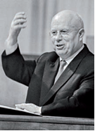

- Leonid Brejnev
+ Nikita Xrushchyov
- Yuriy Andropov
- Konstantin Chernenko

**916. Quyidagi suratda qaysi SSSR rahabri tasvirlangan?**

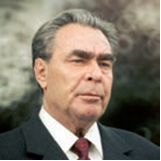

+ Leonid Brejnev
- Nikita Xrushchyov
- Yuriy Andropov
- Konstantin Chernenko

**917. Markazlashgan tizimdan markazlashmagan tizimga oʻtish yoki oʻtkazish qanday ataladi?**

- Demokratizatsiyalash
+ Desentralizatsiyalash
- Demilitarizatsiyalash
- Dekolonizatsiyalash

**918. Qachon boʻlib oʻtgan KPSS MK Plenumi Mixail Gorbachyovni Bosh kotib qilib saylagan?**

- 1984-yil 11-fevralda
+ 1985-yil 11-martda
- 1986-yil 11-aprelda
- 1987-yil 11-mayda

**919. SSSR ning qaysi hududidagi respublikalarida dastlabki xalq frontlari paydo boʻlgan?**

- Sharqiy Yevropa
+ Boltiqboʻyi
- Markaziy Osiyo
- Kavkaz

**920. Ikkinchi jahon urushidan keyin SSSR ga qaysi davlat to‘lagan reparatsiya sezilarli rol oʻynagan, bu pullar sanoatda oʻrnatilgan uskunalar xarajatining yarmini taʼminlagan va boshqa sohalarda ilmiy-texnik taraqqiyotga turtki boʻlgan?**

- Yaponiya
- Italiya
+ Germaniya
- Ruminiya

**921. SSSR rahbari Yuriy Andropov vafot etgach, kim Bosh kotib lavozimiga saylangan?**

+ Konstantin Chernenko
- Nikolay Bulganin
- Georgiy Malenkov
- Mixail Gorbachyov

**922. Qaysi yilga kelib SSSR da sanoat ishlab chiqarishi Ikkinchi jahon urushidan oldingi darajasiga yetgan?**

- 1946-yilga kelib
- 1947-yilga kelib
+ 1948-yilga kelib
- 1949-yilga kelib

**923. Mixail Gorbachyov obroʻsizlanishining oʻrnini qoplash uchun SSSR da … .**

+ prezidentlik lavozimini joriy qilgan
- ommaviy repressiyani boshlagan
- siyosiy tashkilotlarni tarqatib yuborgan
- yangi konstitutsiyani qabul qilgan

**924. Iosif Stalin vafotidan so‘ng SSSR da hokimiyat uchun kurashda kim g‘olib chiqqan?**

- Lavrentiy Beriya
- Georgiy Malenkov
- Vyacheslav Molotov
+ Nikita Xrushchyov

**925. Qachon SSSR da Yuriy Andropov Bosh kotib lavozimiga saylangan?**

- 1978-yilda
- 1980-yilda
+ 1982-yilda
- 1984-yilda

**926. Iosif Stalin vafotidan so‘ng SSSR da nima sababdan hokimiyat uchun kurash boshlangan?**

- I. Stalin o‘ziga voris tanlamaganligi sababli
- Siyosiy byuro a’zolarining barchasi rahbar bo‘lish uchun teng huquqqa ega bo‘lganligi sababli
+ Hokimiyatni boshqa shaxsga oʻtkazishning legitim yoʻli boʻlmaganligi sababli
- Nomzodlar turli xil davlatlar tomonidan qo‘llab turilganligi sababli

**927. SSSR da Leonid Brejnev davrida qabul qilingan yangi – rivojlangan sotsializm konstitutsiyasida nima “jamiyatning yoʻnaltiruvchi va rahbar kuchi, siyosiy tuzumning yadrosi” deyilgan edi?**

- Xalq
- Davlat
- Siyosiy byuro
+ Kommunistik partiya

**928. SSSR da … voqealaridan keyin obroʻyi tushib ketgan KPSS faoliyati toʻxtatilgan.**

+ Avgust
- Fevral
- Oktyabr
- Iyun

**929. Ikkinchi jahon urushidan keyin Sovet Ittifoqida yuz bergan qurgʻoqchilikda qancha odam ochlikdan vafot etgan?**

- Yarim million odam
+ Bir million odam
- Bir yarim million odam
- Ikki million odam

**930. Qaysi yilda KPSS syezdida Nikita Xrushchyov “Shaxsga sigʻinish va uning oqibatlari toʻgʻrisida” degan mavzuda nutq soʻzlagan?**

- 1953-yil yanvarda
+ 1956-yil fevralda
- 1958-yil martda
- 1961-yil aprelda

**931. SSSR rahbari Leonid Brejnev vafot etgach, kim Bosh kotib lavozimiga saylangan?**

- Nikolay Bulganin
- Georgiy Malenkov
- Konstantin Chernenko
+ Yuriy Andropov

**932. Nikita Xrushchyov barcha lavozimlaridan ozod qilingach, kim KPSS MK Birinchi sekretari etib tayinlangan?**

+ Leonid Brejnev
- Aleksey Kosigin
- Yuriy Andropov
- Konstantin Chernenko

**933. KPSS ning nechanchi syezdida Nikita Xrushchyov “Shaxsga sigʻinish va uning oqibatlari toʻgʻrisida” degan mavzuda nutq soʻzlagan?**

- XVIII syezdida
- XIX syezdida
+ XX syezdida
- XXI syezdida

**934. SSSR da 1960-yillar boshlarida iqtisodiy qiyinchiliklar, avvalo, nima tanqisligi bilan bogʻliq keskinlik vujudga kelgan?**

- Energetika
- Kiyim-kechak
- Xomashyo
+ Oziq-ovqat

**935. Ikkinchi jahon urushida qancha sovet fuqarolari halok boʻlgan?**

+ 26,5 mln.
- 27,5 mln.
- 28,5 mln.
- 29,5 mln.

**936. Qachon SSSR rahbari Yuriy Andropov vafot etgan?**

- 1978-yil noyabrda
- 1980-yil dekabrda
- 1982-yil yanvarda
+ 1984-yil fevralda

**937. SSSR KPSS MK ning qaysi plenumida mamlakatni ijtimoiy-iqtisodiy rivojlantirishni jadallashtirish dasturi “yangi rahbariyat va butun sovet jamiyatining maqsadi” deb eʼlon qilingan?**

- 1983-yil fevral plenumida
- 1984-yil mart plenumida
+ 1985-yil aprel plenumida
- 1986-yil may plenumida

**938. Qaysi yilda SSSR da yangi iqtisodiy dastur eʼlon qilinib, u sovet davlati tarixida birinchi marta yengil sanoatning xalq isteʼmoli mollari ishlab chiqarishdagi ustuvorligini belgilagan?**

+ 1953-yilda
- 1956-yilda
- 1958-yilda
- 1961-yilda

**939. KPSS Markaziy Komitetining qachon bo‘lib o‘tgan plenumida Mixail Gorbachyov “Qayta qurish va partiyaning kadrlar siyosati” mavzusida maʼruza qilgan?**

+ 1987-yil yanvar
- 1988-yil fevral
- 1989-yil mart
- 1990-yil aprel

**940. Qachondan SSSR da ichkilikbozlikka qarshi keng kampaniya boshlanib, maʼmuriy taqiq va mafkuraviy yoʻllar bilan qisqa vaqt ichida rus xalqining asrlar davomida shakllangan anʼanasini va uning boshqa sovet xalqlariga koʻrsatgan salbiy taʼsirini yoʻq qilish koʻzda tutilgan edi?**

- 1983-yil mart oyidan
- 1984-yil aprel oyidan
+ 1985-yil may oyidan
- 1986-yil iyun oyidan

**941. Qaysi yillarda SSSR da kommunizm qurish toʻgʻrisidagi reja barbod boʻlib, odamlar endi kommunizm safsatasiga ishonmay qoʻygan edi?**

- 1950-yillarda
- 1960-yillarda
- 1970-yillarda
+ 1980-yillarda

## 23-§ Markaziy va Sharqiy Yevropa mamlakatlari totalitarizm va demokratiya oraligʻida.

**942. Qaysi yilga kelib Albaniya, Bolgariya, Vengriya, Polsha, Ruminiya, Chexoslovakiya, Yugoslaviyada kommunistik partiyalar toʻliq hokimiyatni egallagan?**

- 1946-yilga kelib
- 1947-yilga kelib
- 1948-yilga kelib
+ 1949-yilga kelib

**943. Nikolae Chaushesku qaysi davlat rahbari edi?**

- Albaniya
- Bolgariya
- Vengriya
+ Ruminiya

**944. Vengriyada totalitar rejimga qarshi demokratik inqilob paytida asosiy janglar qaysi shaharda boʻlib oʻtgan?**

- Debretsen
- Miskolts
- Seged
+ Budapesht

**945. Quyidagi suratda kim tasvirlangan?**

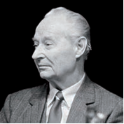

- Nikolae Chaushesku
- Klement Gotvald
- Imre Nad
+ Aleksandr Dubchek

**946. Ikkinchi jahon urushidan keyin qaysi mamlakatda sobiq Krayova armiyasi (Vatan armiyasi) tarafdori boʻlgan qurolli guruhlar faoliyat yuritayotgan edi?**

- Chexoslovakiya
- Vengriya
- Ruminiya
+ Polsha

**947. “Praga bahori” nomini olgan inqilobiy harakat qaysi davlatda bo‘lib o‘tgan?**

+ Chexoslovakiya
- Ruminiya
- Vengriya
- Polsha

**948. Yevropadagi qaysi sotsialistik mamlakatda ishchilar “Birdamlik” mustaqil ommaviy kasaba uyushmasini tuzganlar?**

- Albaniya
- Bolgariya
- Vengriya
+ Polsha

**949. 1940-yillar oxirida Markaziy va Sharqiy Yevropa mamlakatlarida oʻrnatilgan tuzum keyinchalik qanday atalgan?**

- “Xalq-demokratik”
- “Sovet-sotsialistik”
+ “Sotsialistik”
- “Kommunistik”

**950. Qaysi yilda Imre Nad boshchiligidagi yangi hukumat tomonidan hokimiyatning totalitar tizimini buzish, koʻppartiyaviylik tizimiga oʻtish uchun qilingan harakat totalitar rejimga qarshi demokratik inqilobga aylanib ketgan?**

- 1953-yilda
+ 1956-yilda
- 1958-yilda
- 1961-yilda

**951. Qaysi davrda Markaziy va Sharqiy Yevropa mamlakatlarida sanoat ishlab chiqarishining oʻsishi barqaror ravishda yiliga 6–8% darajasida saqlanib qolgan?**

+ 1970-yillarning birinchi yarmida
- 1970-yillarning ikkinchi yarmida
- 1980-yillarning birinchi yarmida
- 1980-yillarning ikkinchi yarmida

**952. Ikkinchi jahon urushidan keyin qaysi Markaziy va Sharqiy Yevropa mamlakatlarida bittadan partiya faoliyat yuritgan? 1) Albaniya; 2) Vengriya; 3) Ruminiya; 4) Yugoslaviya.**

- 2, 3, 4
- 1, 2, 4
- 1, 2, 3
+ 1, 2, 3, 4

**953. Quyidagi qaysi davlatda kommunistik rejimning qulashi qoʻzgʻolon va jiddiy harbiy toʻqnashuv natijasida yuz bergan?**

- Albaniya
- Bolgariya
- Vengriya
+ Ruminiya

**954. Qaysi diktator rafiqasi bilan birga sud qilingan va sudning hukmiga koʻra otib tashlash jarayoni televideniyeda toʻgʻridan toʻgʻri namoyish qilingan?**

+ Nikolae Chaushesku
- Klement Gotvald
- Imre Nad
- Aleksandr Dubchek

**955. Markaziy va Sharqiy Yevropa mamlakatlaridagi oʻzgarishlarning qaysi davlatga taʼsiri kam boʻlgan?**

- Chexoslovakiya
+ Yugoslaviya
- Bolgariya
- Albaniya

**956. Qachon Oʻzaro iqtisodiy yordam kengashi tarqalib ketgan?**

- 1989-yilda
- 1990-yilda
+ 1991-yilda
- 1992-yilda

**957. Quyidagi suratda kim tasvirlangan?**

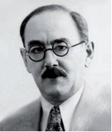

- Nikolae Chaushesku
- Klement Gotvald
+ Imre Nad
- Aleksandr Dubchek

**958. Qanday omillar Markaziy va Sharqiy Yevropa mamlakatlarida Ikkinchi jahon urushidan keyin hokimiyat kommunistlar qoʻliga o‘tishiga ko‘maklashgan? 1) G‘arbiy Yevropa mamlakatlarining urushdan keyingi tiklanish jarayoni bilan bandligi; 2) Kommunistlarning hujumkor taktikasi; 3) Sovet Ittifoqi tomonidan ularga koʻrsatilgan yordam; 4) Ular hududida sovet armiyasi qoʻshinlarining joylashganligi; 5) Sovet maslahatchilarining yordami.**

- 2, 3, 5
- 1, 2, 4
- 1, 2, 3, 4
+ 2, 3, 4, 5

**959. Albaniya demokratik partiyasi qachon tuzilgan?**

+ 1989-yilda
- 1990-yilda
- 1991-yilda
- 1992-yilda

**960. Qanday omillar Markaziy va Sharqiy Yevropa mamlakatlarida Ikkinchi jahon urushidan keyin hokimiyat kommunistlar qoʻliga o‘tishida hal qiluvchi rol oʻynagan? 1) G‘arbiy Yevropa mamlakatlarining urushdan keyingi tiklanish jarayoni bilan bandligi; 2) Kommunistlarning hujumkor taktikasi; 3) Sovet Ittifoqi tomonidan ularga koʻrsatilgan yordam; 4) Ular hududida sovet armiyasi qoʻshinlarining joylashganligi; 5) Sovet maslahatchilarining yordami.**

- 1, 2
- 2, 3
- 3, 4
+ 4, 5

**961. Quyidagi suratda kim tasvirlangan?**

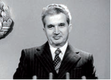

- Sali Berisha
+ Nikolae Chaushesku
- Imre Nad
- Aleksandr Dubchek

**962. Qachon Bolgariyada kommunistlarga muxolifat kuchlar hokimiyatga kelgan?**

- 1989-yilda
- 1990-yilda
+ 1991-yilda
- 1992-yilda

**963. 1948-yil iyunda Chexoslovakiyada … .**

- Kommunistlar bilan ularning siyosiy muxoliflari oʻrtasidagi ziddiyat eng keskin darajaga yetgan
- Kommunistik partiya vakili Klement Gotvald boshqarayotgan hukumat tarkibidagi burjua partiyalari vakillari isteʼfoga chiqishgan
+ Klement Gotvald prezident etib saylangan
- Yangi hukumatda asosiy rahbarlik oʻrinlarini kommunistlar egallagan

**964. Qaysi yilda Polshada “Birdamlik” harakati vakillari hokimiyatga kelgan?**

+ 1989-yilda
- 1990-yilda
- 1991-yilda
- 1992-yilda

**965. Vengriyadagi totalitar rejimga qarshi demokratik inqilob bostirilganidan so‘ng Imre Nad va uning safdoshlari … .**

- mamlakatdan qochib ketgan
- siyosiy faoliyatdan chetlatilgan
+ oʻlim jazosiga hukm qilingan
- umrbod qamoqqa hukm qilingan

**966. Markaziy va Sharqiy Yevropa mamlakatlarida modernizatsiya jarayoni SSSR da nechanchi besh yillikda amalga oshirilgan jarayonni koʻchirish orqali, sotsialistik metodlar bilan amalga oshirilgan?**

+ Birinchi besh yillikda
- Ikkinchi besh yillikda
- Uchinchi besh yillikda
- To‘rtinchi besh yillikda

**967. Markaziy va Sharqiy Yevropa mamlakatlarida Ikkinchi jahon urushidan keyingi qaysi yillar siyosiy kuchlar oʻrtasidagi kurashning hal qiluvchi yillari boʻlgan?**

- 1945–1946-yillar
- 1946–1947-yillar
+ 1947–1948-yillar
- 1948–1949-yillar

**968. Markaziy va Sharqiy Yevropada sotsialistik hamdoʻstlik qancha muddat faoliyat yuritgan?**

- 20 yildan oshiq
- 30 yildan oshiq
+ 40 yildan oshiq
- 50 yildan oshiq

**969. Germaniya Demokratik Respublikasi (GDR) qachon tashkil topgan?**

- 1947-yil avgustda
- 1948-yil sentyabrda
+ 1949-yil oktyabrda
- 1950-yil noyabrda

**970. Ikkinchi jahon urushidan keyin qaysi Markaziy va Sharqiy Yevropa mamlakatlari hududida sovet armiyasi qoʻshinlari joylashtirilmagan edi?**

- Bolgariya va Albaniya
+ Albaniya va Yugoslaviya
- Yugoslaviya va Ruminiya
- Ruminiya va Bolgariya

**971. “Praga bahori” nomini olgan inqilobiy harakat paytida qamoqqa olinib, Moskvaga olib ketilgan Chexoslovakiya kommunistik partiyasi (CHKP) rahbari kim edi?**

- Nikolae Chaushesku
- Klement Gotvald
- Imre Nad
+ Aleksandr Dubchek

**972. 1980-yillarda Yevropadagi qaysi sotsialistik mamlakatlarda oziq-ovqat muammosi juda keskinlashgan?**

- Chexoslovakiya, SSSR
+ SSSR, Ruminiya
- Ruminiya, Vengriya
- Vengriya, Chexoslovakiya

**973. 1948-yil fevralda Chexoslovakiyada … . 1) Kommunistlar bilan ularning siyosiy muxoliflari oʻrtasidagi ziddiyat eng keskin darajaga yetgan; 2) Kommunistik partiya vakili Klement Gotvald boshqarayotgan hukumat tarkibidagi burjua partiyalari vakillari isteʼfoga chiqishgan; 3) Yangi hukumatda asosiy rahbarlik oʻrinlarini kommunistlar egallagan; 4) Klement Gotvald prezident etib saylangan.**

+ 1, 2, 3
- 1, 2, 4
- 1, 3, 4
- 2, 3, 4

**974. 1940-yillar oxirida Markaziy va Sharqiy Yevropa mamlakatlarida oʻrnatilgan tuzum dastlab qanday atalgan?**

+ “Xalq-demokratik”
- “Sovet-sotsialistik”
- “Sotsialistik”
- “Kommunistik”

**975. Qaysi yildagi saylovlarda demokratik lider – Sali Berisha Albaniya prezidenti etib saylangan?**

- 1989-yildagi
- 1990-yildagi
- 1991-yildagi
+ 1992-yildagi

**976. Qaysi yilda SSSR da Stalin shaxsiga sigʻinishning qoralanishi koʻplab Sharqiy Yevropa mamlakatlarida Stalin davrida hokimiyatga kelgan va u tomonidan qoʻllab-quvvatlangan rahbarlarning almashinishiga olib kelgan?**

- 1953-yilda
+ 1956-yilda
- 1958-yilda
- 1961-yilda

**977. Qaysi davlatda Imre Nad boshchiligidagi yangi hukumat tomonidan hokimiyatning totalitar tizimini buzish, koʻppartiyaviylik tizimiga oʻtish uchun qilingan harakat totalitar rejimga qarshi demokratik inqilobga aylanib ketgan?**

- Chexoslovakiya
- Ruminiya
+ Vengriya
- Polsha

**978. Ikkinchi jahon urushidan keyin koʻpchilik Markaziy va Sharqiy Yevropa mamlakatlarida hokimiyat kimlar qo‘liga o‘tgan?**

- Sotsialistlar
+ Kommunistlar
- Monarxistlar
- Liberalistlar

**979. Ikkinchi jahon urushidan keyin Markaziy va Sharqiy Yevropa mamlakatlaridagi quyidagi qaysi shaharda ishchilar ish me’yorlarining oshirilishi va ish haqining pasaytirilishiga qarshi ishtashlash eʼlon qilgan, politsiya va harbiylar bilan toʻqnashuvlarda bir necha kishi halok boʻlgan?**

+ Poznan
- Krakov
- Gdansk
- Varshava

**980. Qachon Vengriya Xalq Respublikasi nomi Vengriya Respublikasi deb oʻzgartirilgan?**

- 1989-yilda
+ 1990-yilda
- 1991-yilda
- 1992-yilda

## 24-§ Osiyo, Afrika va Lotin Amerikasi mamlakatlari rivojlanishining asosiy yoʻnalishlari.

**981. “Bu – inson uchun kichik bir qadam, lekin butun insoniyat uchun ulkan sakrash”. Ushbu jumlalar muallifi kim?**

- Yuriy Gagarin
+ Nil Armstrong
- Bazz Oldrin
- Anatoliy Solovyov

**982. … – imperator, podshoh, qirol boshqaradigan davlat; bir qancha mustamlaka hududlariga ega bo‘lgan, totalitar tuzumga asoslangan davlat.**

+ Imperiya
- Diktatura
- Monarxiya
- Harbiy xunta

**983. … – irqiy kamsitishning eng ashaddiy koʻrinishi bo‘lib, muayyan aholi guruhlarini ularning irqiy mansubligiga qarab, siyosiy, ijtimoiy, iqtisodiy va fuqarolik huquqlaridan mahrum etishni, hududiy jihatdan yakkalatib qoʻyishgacha borishni anglatadi.**

+ Aparteid
- Shovinizm
- Fashizm
- Antisemit

**984. Hindiston qanday belgi asosida ikkita davlatga – Hindiston Ittifoqi va Pokistonga ajralib ketgan?**

- Etnik belgi
+ Diniy belgi
- Lingvistik belgi
- Geografik belgi

**985. Xitoyda kim tomonidan “Madaniy inqilob” amalga oshirilgan?**

- Sun Yatsen
- U Peyfu
+ Mao Szedun
- Den Syaopin

**986. “Moderne” so‘zi qaysi tildan olingan?**

- Nemis tilidan
+ Fransuz tilidan
- Lotin tilidan
- Yunon tilidan

**987. … – bitta shaxs (yoki guruh) hokimiyatining almashmasligiga asoslangan nodemokratik siyosiy rejim.**

- Totalitarizm
+ Avtoritarizm
- Individualizm
- Shovinizm

**988. Qaysi kosmik kemada odam Oy yuzasiga qadam qo‘ygan?**

+ “Apollon-11”
- “Orbita-9”
- “Vostok-1”
- “Chellenjer-5”

**989. … – davlat toʻntarishi orqali hokimiyatga kelgan, odatda zoʻrovonlik va diktatorlik usullari bilan davlatni boshqaradigan harbiylar hokimiyati.**

- Imperiya
- Diktatura
- Monarxiya
+ Harbiy xunta

**990. Qaysi yilda Eronda anʼanaviy islom qadriyatlariga va hayot tarziga qaytish shiori ostida boshlangan harakat butun mamlakatni qamrab olgan inqilobga aylangan?**

- 1982-yilda
+ 1979-yilda
- 1976-yilda
- 1987-yilda

**991. Xitoyda fuqarolar urushi qaysi sanada Xitoy Xalq Respublikasi tuzilgani eʼlon qilinishi bilan yakunlangan?**

- 1950-yil 1-iyulda
- 1945-yil 1-avgustda
- 1947-yil 1-sentyabrda
+ 1949-yil 1-oktyabrda

**992. Xitoyda amalga oshirilgan “Madaniy inqilob” ning maqsadi nima edi?**

- Yuzaga kelishi mumkin bo‘lgan “kapitalizmni tiklash” ga qarshi chiqish
+ Siyosiy muxolifatni obro‘sizlantirish va yo‘q qilish
- Aholi savodxonligini oshirish
- Sanoat korxonalarini malakali ishchi kuchi bilan ta’minlash

**993. Qaysi yillarda koʻpchilik Lotin Amerikasi mamlakatlarida davlat toʻntarishlari yuz berib, hokimiyatga harbiy xuntalar kelgan?**

- 1950–1960-yillarda
+ 1960–1970-yillarda
- 1970–1980-yillarda
- 1980–1990-yillarda

**994. 1950-yillari Lotin Amerikasi mamlakatlarining koʻpchiligi, avvalo, qaysi davlat kapitalining taʼsirini kamaytirish uchun kurashgan?**

- Buyuk Britaniya
+ AQSH
- Fransiya
- Ispaniya

**995. Qaysi yilda Portugaliya mustamlaka imperiyasi qulagan?**

- 1960-yilda
- 1965-yilda
- 1970-yilda
+ 1975-yilda

**996. Qaysi yil tarixga “Afrika yili” sifatida kirgan?**

- 1950-yil
+ 1960-yil
- 1970-yil
- 1980-yil

**997. Qachon Hindiston ikkita davlatga – Hindiston Ittifoqi va Pokistonga ajralib ketgan?**

- 1950-yilda
- 1945-yilda
+ 1947-yilda
- 1949-yilda

**998. Yaqin va Oʻrta Sharq hamda Shimoliy Afrika mamlakatlarida dastlabki milliy-ozodlik harakatlari … bayrogʻi ostida amalga oshirilgan.**

+ islom
- xristian
- sintoizm
- iudaizm

**999. Eronda anʼanaviy islom qadriyatlariga va hayot tarziga qaytish shiori ostida boshlangan inqilob natijasida qaysi shoh chet elga qochishga majbur boʻlgan?**

- Ahmadshoh Pahlaviy
- Rizoshoh Pahlaviy
+ Muhammad Rizo Pahlaviy
- Muhammad Ali Pahlaviy

**1000. Yaqin va Oʻrta Sharq hamda Shimoliy Afrika mamlakatlarida qaysi din alohida oʻringa ega va bu mamlakatlar xalqlari tarixida, ularning ijtimoiy-iqtisodiy va siyosiy hayotida ushbu din muhim rol oʻynagan?**

+ Islom dini
- Xristian dini
- Sintoizm dini
- Iudaizm dini

**1001. Ikkinchi jahon urushidan soʻng Hindixitoy va Jazoirda qaysi davlat milliy-ozodlik harakatlarini shafqatsizlarcha bostirish siyosatini olib borgan?**

- Ispaniya
- Buyuk Britaniya
- Portugaliya
+ Fransiya

**1002. “Moderne” so‘zi qanday ma’nolarni anglatadi?**

+ “Eng yangi”, “zamonaviy”
- “Yorqin”, “ko‘rkam”
- “O‘rtacha”, “o‘rtamiyona”
- “Eski”, “qoloq”

**1003. Xitoyda amalga oshirilgan “Madaniy inqilob” ning to‘liq nomini toping.**

- “Buyuk sotsialistik madaniy inqilobi”
- “Buyuk kommunistik madaniy inqilobi”
+ “Buyuk proletar madaniy inqilobi”
- “Buyuk Xitoy madaniy inqilobi”

**1004. 1960-yilda Afrikada nechta mustamlaka mamlakat oʻz mustaqilligini eʼlon qilgan?**

+ 17 ta
- 19 ta
- 21 ta
- 23 ta

**1005. Ikkinchi jahon urushidan soʻng Angola va Mozambikda qaysi davlat milliy-ozodlik harakatlarini shafqatsizlarcha bostirish siyosatini olib borgan?**

- Ispaniya
- Buyuk Britaniya
+ Portugaliya
- Fransiya

**1006. Qaysi davlatlarda avtoritar rejimlar modernizatsiya jarayonini muvaffaqiyatli amalga oshirish mumkinligini koʻrsatgan va oʻrtacha rivojlanish darajasiga yetgan? 1) Braziliya; 2) Argentina; 3) Kolumbiya; 4) Chili.**

- 2, 3, 4
- 1, 2, 3
- 1, 3, 4
+ 1, 2, 4

**1007. Tarixdagi oxirgi mustamlakachi imperiya qaysi?**

- Ispaniya
- Buyuk Britaniya
+ Portugaliya
- Fransiya

**1008. Janubi-sharqiy Osiyodagi qaysi davlatlar mustaqillikning dastlabki davrlarida ichki va tashqi urushlarni boshdan kechirgan? 1) Filippin; 2) Indoneziya; 3) Koreya; 4) Vyetnam.**

+ 1, 3, 4
- 1, 2, 4
- 1, 2, 3
- 2, 3, 4

**1009. Ikkinchi jahon urushidan soʻng Malayyada qaysi davlat milliy-ozodlik harakatlarini shafqatsizlarcha bostirish siyosatini olib borgan?**

- Ispaniya
+ Buyuk Britaniya
- Portugaliya
- Fransiya

**1010. Ikkinchi jahon urushidan soʻng mustaqil taraqqiyot yoʻliga kirgan ba’zi mamlakatlarda ishga yaroqli aholining qancha foizigacha qishloq xoʻjaligida band edi?**

- 60 foizgacha
- 70 foizgacha
- 80 foizgacha
+ 90 foizgacha

**1011. Qaysi yilda Falastinning arab va yahudiy davlatlariga boʻlinishi Yaqin Sharqda doimiy tanglik oʻchogʻini vujudga keltirgan?**

- 1950-yilda
- 1945-yilda
+ 1947-yilda
- 1949-yilda

**1012. Xitoyda amalga oshirilgan “Madaniy inqilob” ning bahonasi nima edi?**

+ Yuzaga kelishi mumkin bo‘lgan “kapitalizmni tiklash” ga qarshi chiqish
- Siyosiy muxolifatni obro‘sizlantirish va yo‘q qilish
- Aholi savodxonligini oshirish
- Sanoat korxonalarini malakali ishchi kuchi bilan ta’minlash

**1013. Qachon odam Oy yuzasiga qadam qo‘ygan?**

- 1961-yil 12-aprelda
- 1964-yil 12-avgustda
- 1967-yil 21-iyunda
+ 1969-yil 21-iyulda

**1014. … – biror narsani yangilash, zamonaviy talablar va me’yorlarga muvofiq oʻzgartirish.**

- Industrializatsiya
+ Modernizatsiya
- Urbanizatsiya
- Reformatsiya

**1015. Quyidagi suratda qaysi Eron shohi tasvirlangan?**

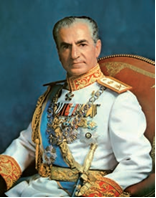

- Ahmadshoh Pahlaviy
- Rizoshoh Pahlaviy
+ Muhammad Rizo Pahlaviy
- Muhammad Ali Pahlaviy

**1016. Islom mamlakatlarida oʻtkazilgan islohotlar jarayonida diniy omilni inobatga olmaslikning oqibatlarini qaysi davlatdagi modernizatsiya jarayoni yaqqol koʻrsatib bergan?**

- Afg‘oniston
- Pokiston
+ Eron
- Misr

**1017. Xitoyda qaysi yillarda “Madaniy inqilob” amalga oshirilgan?**

- 1963–1973-yillarda
- 1964–1974-yillarda
- 1965–1975-yillarda
+ 1966–1976-yillarda

**1018. Kim Oy yuzasiga qadam qo‘ygan birinchi odam sifatida tarixda qolgan?**

- Yuriy Gagarin
+ Nil Armstrong
- Bazz Oldrin
- Anatoliy Solovyov

## 25-§ Yaponiya, Xitoy va Janubiy Koreya: Osiyo sivilizatsiyasi qadriyatlari va Gʻarb ishlab chiqarish usuli uygʻunligi.

**1019. Postindustrial sivilizatsiya ijtimoiy taraqqiyotda rivojlangan mamlakatlarda qachondan vujudga kela boshlagan?**

- XIX asrning birinchi yarmidan
- XIX asrning ikkinchi yarmidan
- XX asrning birinchi yarmidan
+ XX asrning ikkinchi yarmidan

**1020. Qachon KXDR armiyasi Koreya Respublikasiga bostirib kirishi bilan birodarkushlik urushi boshlangan?**

- 1950-yil avgustda
+ 1950-yil iyunda
- 1950-yil sentyabrda
- 1950-yil noyabrda

**1021. Qachon Janubiy Xitoyning deyarli barcha hududlari kommunistlar nazoratiga oʻtgan?**

- 1948-yil avgustda
+ 1949-yil sentyabrda
- 1950-yil oktyabrda
- 1951-yil noyabrda

**1022. Ikkinchi jahon urushida Koreya hududidagi yapon qo‘shinlarini qurolsizlantirish bahonasida mamlakatning janubiy qismiga …, shimoliy qismiga … oʻz qoʻshinlarini kiritgan.**

+ AQSH/SSSR
- Buyuk Britaniya/Xitoy
- AQSH/Xitoy
- Buyuk Britaniya/SSSR

**1023. Xitoyda “Katta sakrash” siyosati qanday shior ostida olib borilgan?**

- “Bir yil matonatli mehnat – ming yil baxt-saodat”
- “Ikki yil matonatli mehnat – ikki ming yil baxt-saodat”
+ “Uch yil matonatli mehnat – uch ming yil baxt-saodat”
- “To‘rt yil matonatli mehnat – to‘rt ming yil baxt-saodat”

**1024. Chet el kapitalini jalb qilish uchun Xitoyning qaysi qismida erkin iqtisodiy zonalar tashkil etilgan?**

- Shimolida
+ Janubida
- Sharqida
- G‘arbida

**1025. Sovet hokimiyati, sovet turmush tarziga yoki Sovet Ittifoqiga qarshi qaratilgan qarashlar tizimi qanday ataladi?**

- Antisotsializm
+ Antisovetizm
- Antikommunizm
- Antileninizm

**1026. Xitoydagi “toʻrtta modernizatsiya” islohotida qaysi sohalarni isloh qilish belgilab olingan edi? 1) Madaniy; 2) Qishloq xoʻjaligi; 3) Sanoat; 4) Fan-texnika; 5) Harbiy; 6) Ijtimoiy.**

+ 2, 3, 4, 5
- 1, 3, 4, 6
- 1, 2, 3, 5
- 2, 3, 4, 6

**1027. Xitoyda “Yuzta gul” siyosati, fikr va soʻz erkinligi, birinchi besh yillik reja qaysi yillarda amalga oshirilgan?**

+ 1953–1957-yillarda
- 1958–1962-yillarda
- 1963–1967-yillarda
- 1968–1972-yillarda

**1028. Qaysi yilda Xitoyda SSSR yordamida sotsializm qurish boshlangan?**

+ 1950-yilda
- 1953-yilda
- 1956-yilda
- 1958-yilda

**1029. Qachondan “Yapon iqtisodiy moʻjizasi” davri boshlangan?**

- 1950-yillar boshlaridan
+ 1950-yillar oʻrtalaridan
- 1950-yillar oxirlaridan
- 1960-yillar boshlaridan

**1030. Xitoyda “Katta sakrash” davrida necha soatlik ish kuni oʻrnatilgan hamda odamlar dam olish kunlarisiz va taʼtilsiz mehnat qilgan?**

- 10 soatlik
+ 12 soatlik
- 14 soatlik
- 16 soatlik

**1031. Janubiy Koreyada, avvalo, agrar islohot oʻtkazilib, uning natijasida yer … .**

+ dehqonlarga xususiy mulk qilib berilgan
- davlat mulkiga aylantirilgan
- jamoa xo‘jaliklariga berilgan
- chet el fermerlariga ijaraga berilgan

**1032. Ikkinchi jahon urushidan keyin Yaponiyada aholining asosiy qatlami kimlar bo‘lgan?**

+ Fermerlar
- Hunarmandlar
- Ziyolilar
- Harbiylar

**1033. Koreya urushi tugagach, nechanchi parallel boʻylab chegara oʻtkazilgan?**

- 18-parallel
- 28-parallel
+ 38-parallel
- 48-parallel

**1034. Xitoy Xalq Respublikasi (XXR) tuzilgani eʼlon qilingach, Gomindan maʼmuriyati qayerga koʻchib oʻtgan?**

- Kinmen oroliga
- Makao oroliga
- Gonkong oroliga
+ Tayvan oroliga

**1035. SSSR va AQSH vositachiligida Xitoy Kommunistik partiyasi (XKP) va Gomindan oʻzaro dushmanlik harakatlarini toʻxtatishga kelishganidan keyin, Gomindan … .**

- ommaviy terrorni boshlab yuborgan
- sanoat korxonalarini qayta tiklashni boshlagan
- agrar islohot oʻtkazib, yerni qayta taqsimlashni amalga oshirgan
+ tinchlik haqidagi kelishuvni bekor qilib, oʻz qoʻshinlarini yigʻa boshlagan

**1036. Qachon Xitoy Xalq Respublikasi (XXR) tuzilgani eʼlon qilingan?**

- 1947-yil 1-avgustda
- 1948-yil 1-sentyabrda
+ 1949-yil 1-oktyabrda
- 1950-yil 1-noyabrda

**1037. Ikkinchi jahon urushida qachon Yaponiyaning Koreyadagi qoʻshinlari taslim boʻlgan?**

- 1944-yil mayda
- 1944-yil iyunda
- 1945-yil iyulda
+ 1945-yil avgustda

**1038. Xitoyda “Madaniy inqilob” (xunveybinlar va szaofanlar) qaysi yillarda amalga oshirilgan?**

- 1963–1973-yillarda
- 1964–1974-yillarda
- 1965–1975-yillarda
+ 1966–1976-yillarda

**1039. Ikkinchi jahon urushidan keyin Yaponiyada hokimiyat qaysi general boshchiligidagi AQSH okkupatsion qoʻshinlari shtabiga oʻtgan?**

- Jorj Patton
- Omar Bredli
+ Duglas Makartur
- Duayt Eyzenhauer

**1040. Xitoyda qaysi siyosat ziyolilarga qarshi keng miqyosli qatagʻonlarga aylanib ketib, madaniyat va taʼlimga juda katta zarar yetkazgan, feodal urf-odat va anʼanalarga qarshi kurash shiori ostida koʻplab madaniyat yodgorliklari yoʻq qilingan, tashqi siyosiy kurs keskin oʻzgarib, mamlakatda antisovetizm kuchaygan?**

- “Katta sakrash”
- “Yuzta gul”
- “Matonatli mehnat – baxt-saodat”
+ “Madaniy inqilob”

**1041. Xitoyda hokimiyatga kommunistlar kelganidan keyin kim XXR raisi lavozimini egallagan va oliy hokimiyat ramziga aylangan?**

- Chan Kayshi
- Sun Yatsen
+ Mao Szedun
- Den Syaopin

**1042. Mao Szedun vafot etgach, Xitoyda qaysi siyosat rasman yakunlangan?**

- “Katta sakrash”
- “Yuzta gul”
- “Matonatli mehnat – baxt-saodat”
+ “Madaniy inqilob”

**1043. Xitoyda Mao Szedun vafot etgach, kim hokimiyatga kelgan?**

- Hua Guofeng
- Jiang Zemin
+ Den Syaopin
- Hu Jintao

**1044. Yaponiyada general Duglas Makartur chiqargan agrar islohotlarni oʻtkazish toʻgʻrisidagi direktivaga ko‘ra, … . 1) Oʻz yer-mulkida yashamaydigan yirik yer egalari shu mulkka egalik qilish huquqidan mahrum qilingan; 2) Yer unda ishlaydiganlarga berilgan; 3) Dehqonlar uch yilga soliqlardan ozod qilingan.**

- 1, 3
+ 1, 2
- 2, 3
- 1, 2, 3

**1045. “Mamlakatlar tanazzuli sabablari: qudrat, farovonlik va kambagʻallik manbalari” asari mualliflarini toping.**

- Alvaro Yunke va Daron Ajemoʻgʻli
+ Daron Ajemoʻgʻli va Jeyms Alan Robinson
- Jeyms Alan Robinson va Aziz Nesin
- Aziz Nesin va Alvaro Yunke

**1046. SSSR va AQSH vositachiligida Xitoy Kommunistik partiyasi (XKP) va Gomindan oʻzaro dushmanlik harakatlarini toʻxtatishga kelishganidan keyin, XKP oʻz nazorati ostidagi hududlarda … .**

- ommaviy terrorni boshlab yuborgan
- sanoat korxonalarini qayta tiklashni boshlagan
+ agrar islohot oʻtkazib, yerni qayta taqsimlashni amalga oshirgan
- tinchlik haqidagi kelishuvni bekor qilib, oʻz qoʻshinlarini yigʻa boshlagan

**1047. Qaysi yilda qabul qilingan reja Xitoyda muddatidan oldin sotsializm qurishni nazarda tutgan edi?**

- 1950-yilda
- 1953-yilda
- 1956-yilda
+ 1958-yilda

**1048. Koreya Respublikasi 1980-yillar oxiriga kelib dunyoning qanday mamlakatlaridan biri boʻlib qolgan?**

- Eng qoloq
- Qoloq
- Rivojlanayotgan
+ Eng rivojlangan

**1049. Mao Szedun qachon vafot etgan?**

- 1974-yil 9-avgustda
+ 1976-yil 9-sentyabrda
- 1978-yil 9-oktyabrda
- 1980-yil 9-noyabrda

**1050. XX asrning qaysi davriga kelib Xitoy taraqqiyotning yangi bosqichiga chiqib olgan?**

- 1970-yillar boshiga kelib
- 1970-yillar oxiriga kelib
- 1980-yillar boshiga kelib
+ 1980-yillar oxiriga kelib

**1051. Yaponiyada shakllangan yangi iqtisodiy tizimda … deb ataluvchi sohalar – savdo, xizmat koʻrsatish, moliya, ijtimoiy soha, fan, informatika, infratuzilmalar asosiy oʻrin egallagan.**

- birinchi sektor
- ikkinchi sektor
+ uchinchi sektor
- to‘rtinchi sektor

**1052. Ikkinchi jahon urushidan keyin Yaponiyada demokratik jarayonlarni boshlagan amerikaliklar ikkita maqsadni ko‘zlagan edilar. Shulardan birinchisini toping.**

- Yaponiyaning tabiiy va intellektual resurslaridan maksimal darajada foydalanish
+ Yaponiyaning demokratik davlatga aylanishi va hech qachon boshqalarga xavf solmasligi
- Yaponlarning Janubi-sharqiy Osiyo mamlakatlari va Tinch okeani mintaqasiga bo‘lgan da’vosidan voz kechtirish
- Yaponlarning ming yillik jangchilik anʼanalariga ega boʻlgan jangovarlik ruhini sindirish

**1053. XX asrning oxirlarida Yaponiya eksportining katta qismini qanday mahsulotlar tashkil qilgan?**

- Yengil avtomobillar
+ Xalq isteʼmoli mollari
- Sanoat uskunalari
- Tekstil mahsulotlari

**1054. General Duglas Makartur Yaponiyada qaysi sohada islohotlarni oʻtkazish toʻgʻrisida direktiva chiqargan?**

+ Agrar sohada
- Ma’muriy sohada
- Harbiy sohada
- Siyosiy sohada

**1055. Yuqori rahbar organlar tomonidan berilgan va bajarilishi majburiy sanalgan rasmiy yoʻl-yoʻriq, dastur, koʻrsatma qanday ataladi?**

+ Direktiva
- Mandat
- Nota
- Depesha

**1056. Qaysi davrga kelib Yaponiya yalpi ichki mahsulotning hajmi boʻyicha dunyoda ikkinchi oʻringa chiqib olgan?**

- 1950-yillarning oxiriga kelib
- 1960-yillarning boshiga kelib
- 1960-yillarning o‘rtasiga kelib
+ 1960-yillarning oxiriga kelib

**1057. XX asr oxirlarida Janubiy Koreya qaysi sohada Osiyoda Yaponiyadan keyingi ikkinchi oʻringa chiqib olgan?**

+ Poʻlat quyish
- Mashinasozlik
- Kimyo
- Elektrotexnika

**1058. Xitoyda amalga oshirilgan “Katta sakrash” siyosatining tarkibiy qismi nima bo‘lgan?**

- “Madaniy inqilob”
+ “Texnik inqilob”
- “Ijtimoiy inqilob”
- “Iqtisodiy inqilob”

**1059. Janubiy Koreya taraqqiyotining uchinchi bosqichi qaysi yillarni o‘z ichiga olgan?**

- 1950-yillarni
- 1960-yillarni
+ 1970-yillarni
- 1980-yillarni

**1060. Qachon Koreya janubida Koreya Respublikasi tashkil topgan va bunga javoban shimolda KXDR tuzilgani eʼlon qilingan?**

- 1947-yil avgustda
+ 1948-yil sentyabrda
- 1949-yil oktyabrda
- 1950-yil noyabrda

**1061. 1980-yillardan Yaponiyada nechta texnopolislar tashkil qilingan?**

- 16 ta
- 21 ta
- 23 ta
+ 26 ta

**1062. Ikkinchi jahon urushidan keyin qaysi davrga kelib Yaponiyada bozor iqtisodiyoti infratuzilmasi shakllangan?**

- 1940-yillar oxirlariga kelib
- 1950-yillar boshlariga kelib
+ 1950-yillar oʻrtalariga kelib
- 1950-yillar oxirlariga kelib

**1063. Qachon Xitoy KXDR ga yordam bera boshlagan?**

- 1950-yil avgustda
- 1950-yil iyunda
- 1950-yil sentyabrda
+ 1950-yil noyabrda

**1064. Qaysi yilda Xitoyda byurokratiyaga qarshi kurash jarayoni “Madaniy inqilob” nomini olgan?**

+ 1966-yilda
- 1968-yilda
- 1970-yilda
- 1972-yilda

**1065. Qaysi AQSH prezidenti XXR ga tashrif buyurgan?**

- J. Karter
- J. Kennedi
+ R. Nikson
- L. Jonson

**1066. Qaysi yildan Xitoy va SSSR oʻrtasidagi munosabatlar buzilgan?**

- 1950-yildan
- 1953-yildan
+ 1956-yildan
- 1958-yildan

**1067. Yaponiya yalpi ichki mahsulotning hajmi boʻyicha dunyoda qaysi davlatdan keyin ikkinchi oʻringa chiqib olgan?**

+ AQSH
- SSSR
- GFR
- GDR

**1068. Qaysi yilda Xitoyda “Katta sakrash” siyosati amalga oshirila boshlangan?**

- 1950-yilda
- 1953-yilda
- 1956-yilda
+ 1958-yilda

**1069. XX asrning qaysi davrida Janubiy Koreyada industrlashtirish siyosati amalga oshirilgan?**

- 1950-yillar davomida
+ 1960-yillar davomida
- 1970-yillar davomida
- 1980-yillar davomida

**1070. Qaysi Xitoy rahbari pragmatik “toʻrtta modernizatsiya” islohoti konsepsiyasini ishlab chiqqan?**

- Hua Guofeng
- Jiang Zemin
+ Den Syaopin
- Hu Jintao

**1071. Ikkinchi jahon urushidan keyin Yaponiyada demokratik jarayonlarni boshlagan amerikaliklar ikkita maqsadni ko‘zlagan edilar. Shulardan ikkinchisini toping.**

- Yaponiyaning tabiiy va intellektual resurslaridan maksimal darajada foydalanish
- Yaponiyaning demokratik davlatga aylanishi va hech qachon boshqalarga xavf solmasligi
- Yaponlarning Janubi-sharqiy Osiyo mamlakatlari va Tinch okeani mintaqasiga bo‘lgan da’vosidan voz kechtirish
+ Yaponlarning ming yillik jangchilik anʼanalariga ega boʻlgan jangovarlik ruhini sindirish

**1072. Qachon Koreya urushi tugagan?**

- 1951-yil mayda
- 1952-yil iyunda
+ 1953-yil iyulda
- 1954-yil avgustda

**1073. Chet el kapitalini jalb qilish uchun Xitoyda nechta erkin iqtisodiy zonalar tashkil etilgan?**

- 2 ta
+ 4 ta
- 6 ta
- 8 ta

**1074. XX asrning oxirlarida qaysi davlat jahon bozoriga yangi turdagi mahsulotlar – mikroprotsessorlar, shaxsiy kompyuterlar, sanoat robotlari va tez oʻzgaruvchan ishlab chiqarish tizimlari bilan chiqqan?**

+ Yaponiya
- Xitoy
- Janubiy Koreya
- Singapur

**1075. Qachon kutilmaganda Xitoyda kommunistlar bilan gomindanchilar oʻrtasida fuqarolar urushi qaytadan boshlangan?**

- 1945-yil mayda
+ 1946-yil iyunda
- 1947-yil iyulda
- 1948-yil avgustda

**1076. Xitoyda “Katta sakrash”, ikkinchi besh yillik reja qaysi yillarda amalga oshirilgan?**

- 1953–1957-yillarda
+ 1958–1962-yillarda
- 1963–1967-yillarda
- 1968–1972-yillarda

**1077. Janubiy Koreya taraqqiyotining nechanchi bosqichida ogʻir sanoat, avvalo, metallurgiya, mashinasozlik, kimyo sanoati rivojlantirilgan?**

- Birinchi bosqichida
- Ikkinchi bosqichida
+ Uchinchi bosqichida
- To‘rtinchi bosqichida

**1078. Qachon SSSR va AQSH vositachiligida Xitoy Kommunistik partiyasi (XKP) va Gomindan oʻzaro dushmanlik harakatlarini toʻxtatishga kelishgan?**

+ 1945-yil avgustda
- 1946-yil sentyabrda
- 1947-yil oktyabrda
- 1948-yil noyabrda

**1079. Qachon AQSH Koreya Respublikasi armiyasiga yordam yuborgan?**

- 1950-yil avgustda
- 1950-yil iyunda
+ 1950-yil sentyabrda
- 1950-yil noyabrda

**1080. Qaysi yillardagi iqtisodiy rivojlanish natijasida Yaponiyada shakllangan iqtisodiy model postindustrial sivilizatsiyaga asos boʻlgan?**

- 1950–1960-yillardagi
- 1960–1970-yillardagi
+ 1970–1980-yillardagi
- 1980–1990-yillardagi

## 26-§ Hindiston va Pokistonda mustaqillikning murakkab yoʻli.

**1081. Sharqiy Bengaliya qachon ajralib chiqqan?**

- 1956-yilda
- 1964-yilda
+ 1971-yilda
- 1982-yilda

**1082. Pokistonning ilk bosh vaziri kim?**

- Gʻulom Isʼhoqxon
- Zulfiqor Bhutto
- Benazir Bhutto
+ Liakat Alixon

**1083. Hindistonda “yashil inqilob” deb atalgan yangi agrar siyosat natijasida qaysi mahsulotlarning ulgurji savdosi toʻliq natsionalizatsiya qilingan? 1) Gʻalla; 2) Sholi; 3) Choy; 4) Qand.**

- 1, 2, 3
+ 1, 2, 4
- 1, 3, 4
- 1, 2, 3, 4

**1084. 1990-yillar boshlarida Hindistonning iqtisodiy ahvoli yomonlashgach, hokimiyatga kelgan kimning hukumati bozor islohotlarining yangi bosqichini boshlashga majbur bo‘lgan?**

- Indira Gandi
- Rajiv Gandi
- Rajendra Prasad
+ Narasimha Rao

**1085. Pokistonda respublika davri qaysi yillarni o‘z ichiga oladi?**

+ 1956–1958-yillarni
- 1970–1977-yillarni
- 1978–1985-yillarni
- 1988–1990-yillarni

**1086. Qachon Hindistonning yangi konstitutsiyasi qabul qilingan?**

- 1947-yilda
- 1948-yilda
+ 1949-yilda
- 1950-yilda

**1087. Ikkita mustaqil davlat – Hindiston va Pokiston tashkil topgach, Pokiston hukumatini kim boshqargan?**

- Javoharlal Neru
+ Liakat Alixon
- Lal Bahadur Shastri
- Benazir Bhutto

**1088. Pokistonda demokratiya davri qaysi yillarni o‘z ichiga oladi?**

- 1956–1958-yillarni
+ 1970–1977-yillarni
- 1978–1985-yillarni
- 1988–1990-yillarni

**1089. XX asr oxirlarida Pokistonning asosiy eksport tovarlari nimalardan iborat edi? 1) Tekstil; 2) Teri mahsulotlari; 3) Sport buyumlari; 4) Kimyoviy moddalar; 5) Gilamlar.**

- 2, 3, 4
- 2, 4, 5
- 1, 2, 3, 4
+ 1, 2, 3, 4, 5

**1090. Kim Hindistonda “yashil inqilob” deb atalgan yangi agrar siyosatni amalga oshirgan?**

+ Indira Gandi
- Narasimha Rao
- Rajendra Prasad
- Rajiv Gandi

**1091. Qachon Pokiston oʻz mustaqilligini eʼlon qilgan?**

- 1947-yilda
+ 1951-yilda
- 1956-yilda
- 1962-yilda

**1092. Qaysi yilda nomigagina Buyuk Britaniya nazorati ostida boʻlgan yangi davlat – Pokiston dominioni tashkil topgan?**

+ 1947-yilda
- 1951-yilda
- 1956-yilda
- 1962-yilda

**1093. Hindiston rahbari Lal Bahadur Shastri qachon vafot etgan?**

- 1964-yilda
+ 1966-yilda
- 1968-yilda
- 1970-yilda

**1094. Sharqiy Bengaliya qaysi davlat sifatida ajralib chiqqan?**

- Bruney
+ Bangladesh
- Birma
- Burkina-Faso

**1095. Qaysi yilda Pokistonda ilk demokratik saylovlar o‘tkazilgan?**

- 1964-yilda
- 1966-yilda
- 1968-yilda
+ 1970-yilda

**1096. Pokistonda diktatura davri qaysi yillarni o‘z ichiga oladi?**

- 1956–1958-yillarni
- 1970–1977-yillarni
+ 1978–1985-yillarni
- 1988–1990-yillarni

**1097. … – hind jamoasiga xos murakkab ijtimoiy tizim bo‘lib, tabaqalanishni ifodalaydi.**

+ Kasta tizimi
- Svadeshi tizimi
- Svaraj tizimi
- Rajput tizimi

**1098. Pokistonda harbiy diktator – general Ziyo ul-Haq aviahalokat oqibatida halok boʻlgach o‘tkazilgan savlovlar natijasida kim bosh vazir bo‘lgan?**

- Gʻulom Isʼhoqxon
- Zulfiqor Bhutto
+ Benazir Bhutto
- Liakat Alixon

**1099. Qaysi yilda Pokistonda M. Ayyubxon boshchiligida harbiy toʻntarish amalga oshirilgan?**

- 1954-yilda
- 1956-yilda
+ 1958-yilda
- 1960-yilda

**1100. Pokistonda qaysi yildagi navbatdagi harbiy toʻntarishdan soʻng harbiylar jamiyatni islomlashtirish orqali umumiy tenglik va farovonlik davlatini qurishga uringan?**

+ 1977-yildagi
- 1979-yildagi
- 1986-yildagi
- 1988-yildagi

**1101. Javoharlal Neru qachon vafot etgan?**

+ 1964-yilda
- 1966-yilda
- 1968-yilda
- 1970-yilda

**1102. Quyidagi suratda kim tasvirlangan?**

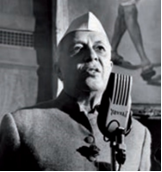

+ Javoharlal Neru
- Liakat Alixon
- Lal Bahadur Shastri
- Narasimha Rao

**1103. Qachon Pokiston Taʼsis majlisi konstitutsiyani qabul qilgan?**

- 1947-yilda
- 1951-yilda
+ 1956-yilda
- 1962-yilda

**1104. Quyidagi qaysi Pokiston rabari harbiy rejim davrida qamoqqa olingan barcha siyosiy arboblarga amnistiya bergan?**

- Gʻulom Isʼhoqxon
- Zulfiqor Bhutto
+ Benazir Bhutto
- Liakat Alixon

**1105. Pokistonda Gʻulom Isʼhoqxon prezidentligi, Benazir Bhutto va Pokiston Xalq partiyasining gʻalabasi qaysi yillarga to‘g‘ri keladi?**

- 1956–1958-yillarga
- 1970–1977-yillarga
- 1978–1985-yillarga
+ 1988–1990-yillarga

**1106. Ikkita mustaqil davlat – Hindiston va Pokiston tashkil topgach, Hindiston hukumatini kim boshqargan?**

+ Javoharlal Neru
- Liakat Alixon
- Lal Bahadur Shastri
- Benazir Bhutto

**1107. Qachon Toshkentda Hindiston va Pokiston oʻrtasidagi muzokaralardan soʻng “Toshkent deklaratsiyasi” imzolangan?**

- 1964-yilda
+ 1966-yilda
- 1968-yilda
- 1970-yilda

**1108. Qaysi yilda Pokiston respublikaga aylangan?**

- 1954-yilda
+ 1956-yilda
- 1958-yilda
- 1960-yilda

**1109. Pokistonda Ziyo ul-Haq rejimi, Afgʻonistondagi urushning Pokiston siyosatiga taʼsiri, 1973-yilgi konstitutsiyaning tiklanishi qaysi yillarga to‘g‘ri keladi?**

- 1956–1958-yillarga
- 1970–1977-yillarga
+ 1978–1985-yillarga
- 1988–1990-yillarga

**1110. Pokistonda Britaniya imperiyasi tarkibidagi monarxiya davri qaysi yillarni o‘z ichiga oladi?**

+ 1947–1952-yillarni
- 1947–1951-yillarni
- 1948–1951-yillarni
- 1948–1952-yillarni

**1111. Hindistonda “yashil inqilob” deb atalgan yangi agrar siyosat natijasida qaysi yilda gʻalla va sholi hosildorligi keskin oʻsgan?**

- 1964-yilda
- 1966-yilda
- 1968-yilda
+ 1970-yilda

**1112. XX asrning o‘rtalarida yangi qabul qilingan konstitutsiyaga ko‘ra, Hindiston qanday belgiga qarab shtatlarga boʻlingan?**

- Etnik belgiga
+ Lingvistik belgiga
- Diniy belgiga
- Geografik belgiga

**1113. Hindistonda Javoharlal Neru vafot etgach, kim uning o‘rnini egallagan?**

- Narasimha Rao
- Indira Gandi
+ Lal Bahadur Shastri
- Rajendra Prasad

**1114. Qachon Pokiston harbiy diktatori – general Ziyo ul-Haq aviahalokat oqibatida halok boʻlgan?**

- 1977-yilda
- 1979-yilda
- 1986-yilda
+ 1988-yilda

**1115. Lal Bahadur Shastri vafot etgach, Hindistonda kim hokimiyatga kelgan?**

+ Indira Gandi
- Narasimha Rao
- Rajiv Gandi
- Rajendra Prasad

**1116. XX asrning o‘rtalarida yangi qabul qilingan konstitutsiyaga ko‘ra, Hindiston qanday respublika deb eʼlon qilingan?**

- Diniy respublika
- Parlamentar respublika
- Demokratik respublika
+ Dunyoviy respublika

**1117. Pokistonda jamiyatni islomlashtirish orqali umumiy tenglik va farovonlik davlatini qurishga uringan harbiylar hokimiyatni egallagach, mamlakatni nechta hududga boʻlib, ularga harbiy rahbarlar tayinlashgan?**

- 3 ta
+ 5 ta
- 7 ta
- 9 ta

**1118. “Toshkent deklaratsiyasi” ni imzolash uchun kelgan va toʻsatdan Toshkentda vafot etgan Hindiston rahbari kim?**

- Narasimha Rao
- Indira Gandi
+ Lal Bahadur Shastri
- Rajendra Prasad

**1119. Qaysi yilda Pokistonda harbiy diktator – general Ziyo ul-Haq parlamentni tarqatib yuborgan, bosh vazirni vazifasidan ozod qilgan va erkin saylovlar tayinlagan?**

- 1977-yilda
- 1979-yilda
- 1986-yilda
+ 1988-yilda

**1120. XX asrda mustaqillikka erishgan Osiyo va Afrika mamlakatlari ichida parlament demokratiyasini shakllantira olgan yagona davlat qaysi edi?**

- Pokiston
- Eron
- Misr
+ Hindiston

**1121. Sharqiy Bengaliya qaysi davlat tarkibidan ajralib chiqqan?**

- Hindiston
- Laos
+ Pokiston
- Kambodja

**1122. Qaysi yillarda Liakat Alixon Pokiston bosh vaziri bo‘lgan?**

- 1947–1952-yillarda
+ 1947–1951-yillarda
- 1948–1951-yillarda
- 1948–1952-yillarda

**1123. Pokistonning boʻlinishi, Zulfiqor Bhutto davri qaysi yillarga to‘g‘ri keladi?**

- 1956–1958-yillarga
+ 1970–1977-yillarga
- 1978–1985-yillarga
- 1988–1990-yillarga

**1124. Qaysi sanada Hindiston va Pokiston tashkil topganligi eʼlon qilingan?**

- 1945-yil 15-iyunda
- 1946-yil 15-iyulda
+ 1947-yil 15-avgustda
- 1948-yil 15-sentyabrda

## 27-§ Turkiya, Eron va  Afg‘oniston: diniy qadriyatlar va zamonaviy sivilizatsiya muammolari.

**1125. Qaysi yilda Afgʻoniston shohi Muhammad Zohirshoh taxtdan agʻdarilgan?**

- 1970-yilda
+ 1973-yilda
- 1977-yilda
- 1978-yilda

**1126. Quyidagi qaysi Afgʻoniston rahbarlari o‘ldirilgan? 1) Hafizullo Amin; 2) Muhammad Najibullo; 3) Nur Muhammad Taraqqiy.**

- 1, 2
- 2, 3
+ 1, 3
- 1, 2, 3

**1127. Qachon ingliz va sovet qoʻshinlari Erondan olib chiqib ketilgan?**

- 1945-yilda
+ 1946-yilda
- 1947-yilda
- 1948-yilda

**1128. XX asr oxirlarigacha Turkiyada siyosatda nimaning roli yuqoriligicha qolgan?**

- Partiyaning
- Parlamentning
- Vazirlar kengashining
+ Armiyaning

**1129. Afgʻonistonda Muhammad Dovudxon hokimiyatdan chetlatilganidan keyin tuzilgan Inqilobiy kengashga kim boshchilik qilgan?**

- Hafizullo Amin
+ Nur Muhammad Taraqqiy
- Muhammad Najibullo
- Amir Zohirshoh

**1130. Turkiyada qachon oʻtkazilgan referendum yangi konstitutsiyani tasdiqlagan?**

- 1980-yil sentyabrda
+ 1982-yil noyabrda
- 1983-yil dekabrda
- 1989-yil fevralda

**1131. Qaysi yildagi saylovlarda Turgʻut Oʻzol Turkiya Respublikasi prezidenti etib saylangan?**

- 1982-yildagi
- 1983-yildagi
+ 1989-yildagi
- 1990-yildagi

**1132. Qaysi yilda Muhammad Dovudxon Afgʻoniston prezidenti deb eʼlon qilingan?**

- 1970-yilda
+ 1973-yilda
- 1977-yilda
- 1978-yilda

**1133. “Oq inqilob” dasturi nimalarni o‘z ichiga olgan edi? 1) Madaniyat va agrar sektordagi o‘zgarishlarni; 2) Aholining saylov huquqlarini kengaytirishni; 3) Mamlakatni sanoatlashtirishni.**

- 1, 2
- 1, 3
- 2, 3
+ 1, 2, 3

**1134. Qachon Amir Zohirshoh Afgʻonistonni mustaqil boshqarishga oʻtgan?**

- 1945-yilda
+ 1946-yilda
- 1947-yilda
- 1948-yilda

**1135. Qaysi Turkiya prezidenti Ikkinchi jahon urushidan soʻng Otaturkning yoʻlini davom ettirib, mamlakatda bitta partiya diktaturasini saqlab qolgan?**

+ Ismet Inyonyu
- Kenan Evren
- Turgʻut Oʻzol
- Sulaymon Demirel

**1136. Sovuq urush yillarida Turkiya qaysi tomon bilan birga bo‘lgan?**

- SSSR bilan
+ Gʻarb bilan
- Neytral bo‘lgan
- Ikkala tomon bilan

**1137. Qachon Afgʻonistonda hokimiyatga Muhammad Najibullo kelgan?**

+ 1986-yilda
- 1987-yilda
- 1988-yilda
- 1989-yilda

**1138. Qaysi yildan Turkiyada bosh vazir lavozimini Sulaymon Demirel egallagan?**

- 1982-yildan
- 1983-yildan
- 1989-yildan
+ 1990-yildan

**1139. Eron shohi Muhammad Rizo Pahlaviy islohotlari qanday nom olgan?**

- “Qora inqilob”
- “Qizil inqilob”
- “Sariq inqilob”
+ “Oq inqilob”

**1140. “Gʻaroyib bolalar” asari muallifi kim?**

- Jeyms Alan Robinson
- Daron Ajemoʻgʻli
+ Aziz Nesin
- Alvaro Yunke

**1141. Eron-Iroq urushi qaysi yillarda bo‘lib o‘tgan?**

- 1976–1984-yillarda
- 1978–1986-yillarda
+ 1980–1988-yillarda
- 1982–1990-yillarda

**1142. Afgʻonistonda SSSR qoʻshinlariga qarshi kurashgan isyonchilarga qaysi davlatlar qurol yetkazib bergan?**

- AQSH va Hindiston
+ AQSH va Pokiston
- Buyuk Britaniya va Pokiston
- Buyuk Britaniya va Hindiston

**1143. Qachon Eronda shoh rejimi agʻdarilgan va Eron Islom Respublikasi deb eʼlon qilingan?**

- 1963-yil yanvarda
+ 1979-yil fevralda
- 1980-yil dekabrda
- 1988-yil noyabrda

**1144. Qaysi yilda referendum oʻtkazilib, unda Eron shohi Muhammad Rizo Pahlaviy islohotlar oʻtkazish taklifini kiritgan?**

+ 1963-yilda
- 1979-yilda
- 1980-yilda
- 1988-yilda

**1145. “Oq inqilob” kim tomonidan amalga oshirilgan?**

+ Muhammad Rizo Pahlaviy
- Muhammad Dovudxon
- Muhammad Najibullo
- Muhammad Zohirshoh

**1146. Qachon Turgʻut Oʻzol Turkiya bosh vaziri bo‘lgan?**

- 1980-yilda
- 1982-yilda
+ 1983-yilda
- 1989-yilda

**1147. Qachon Afgʻonistondan SSSR oʻz qoʻshinlarini olib chiqib ketgan?**

- 1986-yilda
- 1987-yilda
- 1988-yilda
+ 1989-yilda

**1148. SSSR oʻz qoʻshinlarini Afgʻonistondan olib chiqib ketgach, mamlakat rahbari Muhammad Najibullo … .**

- o‘ldirilgan
- mamlakatdan qochib ketgan
+ hokimiyatni saqlab qolgan
- hukumati ag‘darilgan

**1149. Qaysi Afgʻoniston rahbari SSSR ga murojaat qilib, Afgʻonistonga sovet qoʻshinlarini kiritishni soʻragan?**

+ Hafizullo Amin
- Nur Muhammad Taraqqiy
- Muhammad Najibullo
- Amir Zohirshoh

**1150. Afgʻonistonda Muhammad Dovudxon davrida eng muhim tadbirlardan biri nimani tugatish boʻyicha davlat boshqarmasini tuzish boʻlgan?**

- Korrupsiyani
- Jinoyatchilikni
- Ichkilikbozlikni
+ Savodsizlikni

**1151. Qaysi davrda Eron siyosati asosan mamlakat neft sanoatini natsionalizatsiya qilishga qaratilgan?**

+ 1950-yillarning birinchi yarmida
- 1950-yillarning ikkinchi yarmida
- 1960-yillarning birinchi yarmida
- 1960-yillarning ikkinchi yarmida

**1152. Qachon Afgʻonistonda demokratik konstitutsiya qabul qilingan?**

- 1953-yilda
+ 1964-yilda
- 1969-yilda
- 1973-yilda

**1153. Gʻarb davlatlari bilan hamkorlik va ularning yordamiga qaramasdan, qaysi yillargacha Turkiyada iqtisodiy oʻsish surʼatlari past boʻlgan?**

- 1960-yillargacha
- 1970-yillargacha
+ 1980-yillargacha
- 1990-yillargacha

**1154. Qaysi yillarda Afgʻonistonda “Savr inqilobi” sodir bo‘lgan va sovet armiyasi mamlakatga kiritilgan?**

+ 1978–1979-yillarda
- 1979–1980-yillarda
- 1980–1981-yillarda
- 1981–1982-yillarda

**1155. Afgʻonistonda Muhammad Dovudxon … ustidan oʻz hukmronligini oʻrnata olmagan.**

+ armiya
- partiya
- parlament
- mujohidlar

**1156. Qaysi yilda Afgʻonistonda Muhammad Dovudxon hukumatga kelgan?**

+ 1953-yilda
- 1964-yilda
- 1969-yilda
- 1973-yilda

**1157. Qachon Turkiyada general Kenan Evren harbiy toʻntarish oʻtkazgan?**

+ 1980-yil sentyabrda
- 1982-yil noyabrda
- 1983-yil dekabrda
- 1989-yil fevralda

**1158. Ikkinchi jahon urushidan keyingi Turkiyaning xarakterli jihati nimada edi?**

- Agrar sohaning qoloqligi
- Yuqori darajadagi ishsizlik
- Ijtimoiy himoyaning deyarli mavjud emasligi
+ Iqtisodda davlat sektorining ustunligi

**1159. “Oq inqilob” qaysi davlatda sodir bo‘lgan?**

- Turkiyada
- Iroqda
+ Eronda
- Afgʻonistonda

**1160. Qachon Afgʻonistonga sovet qoʻshinlari kiritilgan?**

- 1978-yil aprelda
+ 1979-yil dekabrda
- 1980-yil fevralda
- 1981-yil sentyabrda

**1161. Turkiyada XX asrning oxirlarida amalga oshirilgan islohotlarda kim juda katta rol oʻynagan?**

- Ismet Inyonyu
- Kenan Evren
+ Turgʻut Oʻzol
- Sulaymon Demirel

**1162. Turkiyada Turgʻut Oʻzol qaysi sohada zudlik bilan islohotlar boshlab yuborgan?**

- Harbiy sohada
+ Iqtisodiy sohada
- Agrar sohada
- Ijtimoiy sohada

**1163. Qaysi yilda Afgʻonistonda davlat toʻntarishi amalga oshirilib, Muhammad Dovudxon prezidentligi boshlangan?**

- 1953-yilda
- 1964-yilda
- 1969-yilda
+ 1973-yilda

**1164. Eronda shoh rejimi agʻdarilgach, kimlardan tuzilgan Kengash yangi konstitutsiyani ishlab chiqishga kirishgan?**

+ Dindorlardan
- Siyosatchilardan
- Huquqshunoslardan
- Inqilobchilardan

**1165. XX asrning 80-yillarida Afgʻoniston hududining katta qismini kimlar nazorat qilardi?**

- SSSR askarlari
- Afg‘oniston Xalq demokratik partiyasi (AXDP) qo‘shinlari
- NATO bo‘linmalari
+ Mujohidlar

**1166. “Oq inqilob” qaysi yillarda sodir bo‘lgan?**

- 1960–1976-yillarda
- 1961–1977-yillarda
- 1962–1978-yillarda
+ 1963–1979-yillarda

**1167. Qachon Afgʻonistonda harbiylar davlat toʻntarishini amalga oshirib, Muhammad Dovudxonni hokimiyatdan chetlatishgan?**

+ 1978-yil 27-aprelda
- 1979-yil 27-dekabrda
- 1986-yil 27-fevralda
- 1989-yil 27-sentyabrda

**1168. Afgʻonistonda qaysi yilda yangi konstitutsiya qabul qilinib, unga koʻra, Muhammad Dovudxon umrbod prezident deb eʼlon qilingan?**

- 1970-yilda
- 1973-yilda
+ 1977-yilda
- 1978-yilda

## 28-§ Suriya, Iroq va Janubi-gʻarbiy Osiyo mamlakatlari.

**1169. Iordaniya moliyaviy inqirozdan qanday chiqa olgan?**

- Ichki zaxiralar hisobiga
+ Yevropa Ittifoqi va xalqaro moliyaviy tashkilotlar ko‘magida
- Arab davlatlari yordamida
- AQSH ning yordami bilan

**1170. Iroqning Kuvaytga qarshi tajovuzida Suriya qaysi tomonni qoʻllagan?**

+ Kuvaytni qoʻllagan
- Iroqni qoʻllagan
- Ikkala tomon bilan ham do‘stona munosabatda bo‘lgan
- Neytral pozitsiyada bo‘lgan

**1171. Amir Abdulloh I ibn Husayn quyidagi qaysi davlat podshohi boʻlgan?**

+ Iordaniya
- Saudiya Arabistoni
- Birlashgan Arab Amirliklari
- Livan

**1172. Qachon amalga oshirilgan harbiy toʻntarishdan soʻng Suriyada hokimiyat mudofaa vaziri general Hafiz Asad qoʻliga oʻtgan?**

- 1961-yil sentyabrda
- 1964-yil dekabrda
- 1968-yil oktyabrda
+ 1970-yil noyabrda

**1173. Qachonga kelib Iordaniya moliyaviy inqirozdan chiqa olgan?**

- 1982-yil oxiriga
- 1985-yil oxiriga
- 1988-yil oxiriga
+ 1991-yil oxiriga

**1174. Qachon armiya ofitserlari harbiy toʻntarishni amalga oshirib, Suriya BAR tarkibidan chiqqanligini va Suriya Arab Respublikasi tashkil etilganligini eʼlon qilishgan?**

+ 1961-yil sentyabrda
- 1964-yil dekabrda
- 1968-yil oktyabrda
- 1970-yil noyabrda

**1175. Qachon Transiordaniyaning nomi Iordaniya deb oʻzgartirilgan?**

- 1945-yil iyunda
+ 1946-yil mayda
- 1947-yil sentyabrda
- 1948-yil yanvarda

**1176. Qaysi yilda Iordaniya Gʻarbiy qirgʻoq bilan har qanday aloqani uzgan?**

- 1982-yilda
- 1985-yilda
+ 1988-yilda
- 1991-yilda

**1177. Janubi-gʻarbiy Osiyo mintaqasida nechta mustaqil davlat joylashgan?**

- 11 ta
- 14 ta
+ 16 ta
- 19 ta

**1178. Iroqda qaysi yilda navbatdagi davlat toʻntarishidan soʻng real hokimiyat Saddam Husayn qoʻliga oʻtgan?**

- 1951-yilda
- 1954-yilda
- 1958-yilda
+ 1968-yilda

**1179. Iroqda davlat toʻntarishi uyushtirgan generallar Abdul Karim Qosim va Abdul Salim Aref … .**

+ oʻzaro janjallar tufayli oʻldirilgan
- hokimiyatni topshirishga majbur bo‘lishgan
- sud qilinib, qatl qilingan
- chet elga qochib ketishgan

**1180. Livanda boshlangan fuqarolar urushi qancha odamning oʻlimiga olib kelgan?**

+ 3 ming
- 5 ming
- 7 ming
- 9 ming

**1181. Qaysi sanada Iroq Eronga qarshi urush boshlagan?**

+ 1980-yil 22-sentyabrda
- 1982-yil 22-dekabrda
- 1985-yil 22-yanvarda
- 1987-yil 22-aprelda

**1182. Qaysi yildagi urushda Iordaniya Isroildan magʻlubiyatga uchragan?**

- 1961-yildagi
- 1964-yildagi
- 1966-yildagi
+ 1967-yildagi

**1183. Quyidagi qaysi davlat Yaqin Sharqdagi eng yirik moliyaviy va tranzit savdo markazi hisoblanadi?**

- Iordaniya
- Saudiya Arabistoni
+ Birlashgan Arab Amirliklari
- Livan

**1184. Tashqi siyosatda Suriya qaysi davlat bilan yaqinlashgan?**

- Isroil
- Eron
+ Liviya
- Misr

**1185. Iroq qachon o‘z mustaqilligini e’lon qilgan?**

- 1928-yilda
+ 1932-yilda
- 1935-yilda
- 1937-yilda

**1186. Iroqda real hokimiyatni qo‘lga olganida Saddam Husayn qaysi lavozimda faoliyat yuritar edi?**

- Bosh vazir
+ Mudofaa vaziri
- Ichki ishlar vaziri
- Tashqi ishlar vaziri

**1187. Qaysi yilda Iroqda generallar – Abdul Karim Qosim va Abdul Salim Aref boshchiligida davlat toʻntarishi uyushtirilib, qirol Feysal, bosh vazir va qirol oilasi aʼzolari oʻldirilgan?**

- 1951-yilda
- 1954-yilda
+ 1958-yilda
- 1968-yilda

**1188. Eron-Iroq urushi qachongacha davom etgan?**

- 1986-yilgacha
+ 1988-yilgacha
- 1990-yilgacha
- 1991-yilgacha

**1189. Qaysi davrda Suriyada burjua-demokratik davlatini qurishni oʻz oldiga maqsad qilib qoʻygan milliy burjuaziya hukumatlari bir-birini almashtirgan?**

- 1940-yillarning birinchi yarmida
+ 1940-yillarning ikkinchi yarmida
- 1950-yillarning birinchi yarmida
- 1950-yillarning ikkinchi yarmida

**1190. Qachon Iroq Kuvaytga bostirib kirib, uning hududini egallab olgan?**

- 1986-yilda
- 1988-yilda
+ 1990-yilda
- 1991-yilda

**1191. Iroq-Eron urushi qaysi yillarda bo‘lib o‘tgan?**

- 1976–1984-yillarda
- 1978–1986-yillarda
+ 1980–1988-yillarda
- 1982–1990-yillarda

**1192. Iroq qachon Kuvaytga qarshi tajovuz qilgan?**

- 1982-yilda
- 1985-yilda
- 1988-yilda
+ 1990-yilda

**1193. Saudiya Arabistoni qaysi yilda Amerikaning “Aramko” kompaniyasi bilan neft qazib olish toʻgʻrisida kelishuvga erishgan?**

+ 1950-yilda
- 1951-yilda
- 1953-yilda
- 1956-yilda

**1194. Iordaniya arab davlatlarining moliyaviy yordamidan nima sababli mahrum bo‘lgan?**

- AQSH bilan aloqalari tufayli
- Falastinliklardan voz kechgani tufayli
- Isroil bilan urush boshlaganligi tufayli
+ G‘arbiy qirg‘oq bilan aloqani uzganligi tufayli

**1195. Kimning qarshiligiga qaramasdan, Suriya oʻz mustaqilligini eʼlon qilgan?**

+ Sharl de Goll
- Uinston Cherchill
- Iosif Stalin
- Benito Mussolini

**1196. Isroildan magʻlubiyatga uchraganidan keyin Iordaniyaning qaysi hududi tortib olingan?**

+ O‘rdun daryosining gʻarbiy sohili
- O‘rdun daryosining sharqiy sohili
- Iordan daryosining gʻarbiy sohili
- Iordan daryosining sharqiy sohili

**1197. Qachon Transiordaniyaning mustaqilligi eʼlon qilingan?**

- 1945-yil 22-iyunda
+ 1946-yil 22-martda
- 1947-yil 22-avgustda
- 1948-yil 22-yanvarda

**1198. … – xalqaro majburiyatlarga yoki xalqaro huquq meʼyorlariga rioya qilmagan, ularni buzgan davlatlarga nisbatan bir mamlakat (yoki mamlakatlar guruhi) tomonidan qarshi qoʻllanadigan (iqtisodiy, moliyaviy yoki harbiy) jazo yoxud taʼsir chorasi.**

- Ultimatum
- Agressiya
+ Sanksiya
- Mandat

**1199. Suriya Ikkinchi jahon urushidan oldin qaysi davlatning mandati ostida edi?**

- Buyuk Britaniya
+ Fransiya
- Germaniya
- Italiya

**1200. XX asrning qaysi davrida musulmon dunyosida Saudiya podshohi Feysalning obroʻsi ortib borgan?**

- 1950-yillarda
+ 1960-yillarda
- 1970-yillarda
- 1980-yillarda

**1201. 1980–1990-yillarda Suriya … qurish kursini davom ettirgan.**

- kapitalizm
- marksizm
+ sotsializm
- kommunizm

**1202. Suriyada qaysi davrga kelib YIM ning asosiy qismini davlat sektori bergan?**

- 1970-yillar boshiga
- 1970-yillar oxiriga
- 1980-yillar boshiga
+ 1980-yillar oxiriga

**1203. Qaysi yilda Suriyada Arab sotsialistik uygʻonish partiyasi mamlakatga Misr qoʻshinlarini taklif qilish tarafdori boʻlib chiqqan?**

+ 1957-yilda
- 1958-yilda
- 1959-yilda
- 1960-yilda

**1204. Qaysi yilda Bayrutda falastinlik jangarilar bilan xristianlar otryadlari oʻrtasidagi toʻqnashuv Livanda fuqarolar urushini boshlab bergan?**

- 1970-yilda
- 1972-yilda
+ 1975-yilda
- 1977-yilda

**1205. Qaysi davlat taʼsiri ostida Iordaniya Gʻarbiy qirgʻoq bilan har qanday aloqani uzgan?**

- Iroq
+ Isroil
- Eron
- Suriya

**1206. Qayerda boʻlgan Arab mamlakatlari rahbarlari kengashida Saudiya podshohi Feysalning taklifi bilan “Islom konferensiyasi” tashkiloti tuzilgan?**

- Makka
- Madina
- Jidda
+ Rabot

**1207. Kimlarning qo‘shini chiqib ketgandan soʻng Birlashgan Arab Amirliklari (BAA) federatsiyasi tashkil qilingan?**

- Amerikalik qoʻshinlar
+ Ingliz qoʻshinlari
- Fransuz qoʻshinlari
- Portugal qoʻshinlari

**1208. Suriya mustaqillikka erishgach, rasman qanday davlat deb e’lon qilingan?**

- Mutloq monarxiya
- Parlament monarxiyasi
- Prezidentlik respublikasi
+ Parlament respublikasi

**1209. Qachon Suriya real mustaqillikka erishgan?**

- 1940-yilda
- 1943-yilda
+ 1946-yilda
- 1948-yilda

**1210. Qachon xalqaro kuchlar Kuvaytni Iroq qo‘shinidan ozod qilish boʻyicha “Sahrodagi boʻron” operatsiyasini boshlagan?**

- 1986-yilda
- 1988-yilda
- 1990-yilda
+ 1991-yilda

**1211. Qachon Saddam Husayn rasman Iroq prezidenti etib saylangan?**

- 1973-yilda
+ 1979-yilda
- 1980-yilda
- 1984-yilda

**1212. Qachon Birlashgan Arab Respublikasi (BAR) tuzilganligi eʼlon qilingan?**

- 1957-yil noyabrda
+ 1958-yil fevralda
- 1959-yil oktyabrda
- 1960-yil avgustda

**1213. Qaysi yilga kelib Iroqda eksportdan tushadigan daromadning asosiy qismini neft va neft mahsulotlari daromadi tashkil qilgan?**

+ 1973-yilga
- 1979-yilga
- 1980-yilga
- 1984-yilga

**1214. 1990-yilga kelib saudiyaliklar jahon moliya resurslarining qancha qismini oʻz qoʻllarida toʻplashgan?**

+ 1/3 qismini
- 1/4 qismini
- 1/5 qismini
- 1/6 qismini

**1215. Qachon Suriya oʻz mustaqilligini eʼlon qilgan?**

- 1940-yilda
+ 1943-yilda
- 1946-yilda
- 1948-yilda

**1216. Birlashgan Arab Amirliklari (BAA) federatsiyasiga nechta amirlik kirgan?**

- 4 ta
- 5 ta
- 6 ta
+ 7 ta

**1217. Qaysi davlatlar ittifoqqa birlashib Birlashgan Arab Respublikasi (BAR) tuzilganligini eʼlon qilishgan?**

- Misr va Iroq
- Iroq va Eron
- Eron va Suriya
+ Suriya va Misr

**1218. Jahonda aniqlangan neft zaxiralarining qancha qismi Saudiya Arabistonida joylashgan?**

- 1/3 qismi
+ 1/4 qismi
- 1/5 qismi
- 1/6 qismi

**1219. Qaysi davlat agressiyasi Livanda ijtimoiy, siyosiy va etnokonfessional ziddiyatlarni kuchaytirib yuborgan?**

- Iroq
+ Isroil
- Eron
- Suriya

**1220. Qayerda Transiordaniyaning mustaqilligi eʼlon qilingan?**

- Vashington
- Bryussel
- Parij
+ London

**1221. Iroq-Eron urushida Suriya qaysi tomonni qoʻllagan?**

- Eronni qoʻllagan
+ Iroqni qoʻllagan
- Ikkala tomon bilan ham do‘stona munosabatda bo‘lgan
- Neytral pozitsiyada bo‘lgan

**1222. Qachon Suriyadan chet el qoʻshinlari olib chiqib ketilgan?**

- 1940-yilda
- 1943-yilda
+ 1946-yilda
- 1948-yilda

**1223. Ikkinchi jahon urushidan keyin Gʻarb davlatlarining siyosiy hukmronligi bartaraf qilinishi, chet el qoʻshinlari mamlakatdan olib chiqilishiga qaramasdan, chet el monopoliyalari qaysi davlatda oʻz mavqeyini saqlab qolgan?**

- Iordaniya
- Saudiya Arabistoni
- Birlashgan Arab Amirliklari
+ Livan

**1224. Birlashgan Arab Amirliklari (BAA) federatsiyasidagi qaysi amirliklar eng kattalari hisoblanadi? 1) Abu Dabi; 2) Dubay; 3) Sharja; 4) Ajman; 5) Umm ul-Qayvayn; 6) Al-Fujayra; 7) Raʼs ul-Xayma.**

+ 1, 2
- 2, 5
- 3, 6
- 4, 7

**1225. Qaysi yildan boshlab neftning narxi keskin koʻtarilgan va Saudiya Arabistoni boyligi mislsiz darajaga yetgan?**

+ 1973-yildan
- 1976-yildan
- 1978-yildan
- 1979-yildan

**1226. Iordaniyaning hukmdori qanday atalgan?**

- Xalif
- Amir
+ Malik
- Sulton

**1227. 1960-yillari Livan iqtisodiyoti asosan qaysi sohaga yoʻnaltirilgan edi?**

- Bank-moliya
+ Xizmat koʻrsatish
- Agrar xo‘jalik
- Sanoat ishlab chiqarish

**1228. Qachon Livan “erkin mamlakat” deb eʼlon qilingan?**

- 1945-yilda
- 1946-yilda
- 1947-yilda
+ 1948-yilda

**1229. Tashqi siyosatda Suriya qaysi davlatga qarshi qatʼiy pozitsiyani egallagan?**

+ Isroil
- Eron
- Liviya
- Misr

**1230. Qachon oʻtkazilgan referendumda Hafiz Asad Suriya prezidenti etib saylangan?**

- 1970-yilda
+ 1971-yilda
- 1972-yilda
- 1973-yilda

**1231. Saudiya podshohi Feysal qaysi davlat bilan munosabatlarni yaxshilay boshlagan va Makkada ushbu davlat shohini qabul qilgan?**

- Iordaniya
- Birlashgan Arab Amirliklari
+ Eron
- Afg‘oniston

**1232. XX asrning eng uzoq davom etgan hududiy toʻqnashuvi qaysi urush bo‘lgan?**

+ Eron-Iroq urushi
- Iroq-Kuvayt urushi
- Kuvayt-Suriya urushi
- Suriya-Isroil urushi

**1233. Bayrutda falastinlik jangarilar bilan xristianlar otryadlari oʻrtasidagi toʻqnashuv natijasida Livanda boshlangan fuqarolar urushi qachongacha davom etgan?**

- 1984-yilgacha
- 1987-yilgacha
+ 1990-yilgacha
- 1992-yilgacha

**1234. Iroq o‘z mustaqilligini e’lon qilgach ham koʻp jihatdan qaysi davlatga bogʻliq boʻlib qolavergan?**

- SSSR
- Fransiya
+ Buyuk Britaniya
- AQSH

**1235. Qachon Livanda fuqarolar urushi boshlangan?**

+ 1958-yil mayda
- 1960-yil aprelda
- 1963-yil martda
- 1965-yil iyulda

**1236. Qaysi yilda Birlashgan Arab Amirliklari (BAA) federatsiyasi tashkil qilingan?**

+ 1971-yilda
- 1973-yilda
- 1976-yilda
- 1978-yilda

## 29-§ Lotin Amerikasida milliy islohotchilik va taraqqiyotning boshqa yoʻllari.

**1237. Qaysi yilda Chilida davlat toʻntarishi amalga oshirilib, hokimiyatga general Avgusto Pinochet boshchiligidagi harbiy xunta kelgan?**

- 1967-yilda
- 1970-yilda
+ 1973-yilda
- 1989-yilda

**1238. Qaysi davlatning SSSR bilan kelishuv orqali mamlakat mudofaa qudratini mustahkamlay boshlashi “Karib inqirozi” ga olib kelgan?**

- Chili
- Meksika
+ Kuba
- Panama

**1239. Qaysi yilda Chilida diktatura davri tugagan?**

- 1967-yilda
- 1970-yilda
- 1973-yilda
+ 1989-yilda

**1240. Qaysi davrdan jamiyatni modernizatsiya qilishning Kuba variantida kamchiliklar koʻzga tashlana boshlagan?**

- 1950-yillardan
- 1960-yillardan
- 1970-yillardan
+ 1980-yillardan

**1241. Quyidagi suratda kim tasvirlangan?**

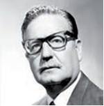

+ Salvador Alyende
- Avgusto Pinochet
- Patrisio Eylvin
- Fidel Kastro

**1242. … – asosiy boyligini qishloq xoʻjaligi mahsulotlari tashkil qiladigan, sanoati qishloq xoʻjaligi mahsulotlari va tabiiy boyliklarni qayta ishlashga yoʻnaltirilgan mamlakat.**

+ Agrar-industrial mamlakat
- Industrial-agrar mamlakat
- Agrar mamlakat
- Industrial mamlakat

**1243. Qaysi yilda Chilida oʻtkazilgan prezidentlik saylovlarida Patrisio Eylvin gʻolib chiqqan?**

- 1967-yilda
- 1970-yilda
- 1973-yilda
+ 1989-yilda

**1244. Qaysi kuni Kubada inqilob gʻalaba qozongan?**

- 1957-yil 1-noyabrda
- 1958-yil 1-dekabrda
+ 1959-yil 1-yanvarda
- 1960-yil 1-fevralda

**1245. Qaysi davrda Kubada yuz bergan voqealar butun dunyoning eʼtiborini oʻziga jalb qilgan?**

- 1950-yillar boshida
+ 1950-yillar oxirida
- 1960-yillar boshida
- 1960-yillar oxirida

**1246. XX asrda Lotin Amerikasi mamlakatlari uchun umumiy boʻlgan modernizatsiyalashning variantlarini toping. 1) Demokratik; 2) Inqilobiy; 3) Neokonservativ; 4) Islohotchilik.**

+ 2, 3, 4
- 1, 2, 3
- 1, 3, 4
- 1, 2, 3, 4

**1247. Chilida kim boshchiligidagi hukumat modernizatsiyalashning neokonservativ variantini tanlagan?**

- Salvador Alyende
+ Avgusto Pinochet
- Patrisio Eylvin
- Fidel Kastro

**1248. Meksikaning muvaffaqiyatli iqtisodiy rivojlanishida ancha qudratli … asosiy rol oʻynagan.**

- xususiy sektor
+ davlat sektori
- chet el kapitali
- xalqaro tashkilotlar yordami

**1249. Qaysi yilda “Karib inqirozi” sodir bo‘lgan?**

- 1958-yilda
- 1960-yilda
+ 1962-yilda
- 1964-yilda

**1250. XX asrda Lotin Amerikasi mamlakatlari uchun umumiy boʻlgan modernizatsiyalashning nechta variantlari yaqqol koʻzga tashlangan?**

- Ikkita varianti
+ Uchta varianti
- To‘rtta varianti
- Beshta varianti

**1251. Chili prezidenti etib saylangan Patrisio Eylvin qaysi partiya yetakchisi edi?**

- Kommunistik partiya
- Sotsialistik partiya
+ Xristian-demokratik partiyasi
- “Xalq faoliyati yagona harakati” partiyasi

**1252. Kuba oroli qaysi dengizda joylashgan?**

- Barens dengizida
- Irminger dengizida
+ Karib dengizida
- Sargasso dengizida

**1253. Qaysi voqea Meksika rahbarlarini ijtimoiy sohaga jiddiy eʼtibor qaratishga undagan?**

- Neft embargosi
- SSSR ning parchalanishi
+ Kuba inqilobi
- Jahon iqtisodiy inqirozi

**1254. Quyidagi qaysi davlatda kommunistlar, sotsialistlar, radikallar va “Xalq faoliyati yagona harakati” birlashib “Xalq birligi” blokini tashkil qilishgan?**

+ Chili
- Meksika
- Kuba
- Panama

**1255. Qaysi yilda Nikaraguada inqilob boshlanib, Salvador va Gvatemalada isyonchilik harkati kuchaygan?**

- 1976-yilda
+ 1979-yilda
- 1981-yilda
- 1983-yilda

**1256. Meksika jamiyatni modernizatsiya qilishning qanday yo‘lini tanlagan?**

- Demokratik yoʻlini
- Neokonservativ yoʻlini
+ Islohotchilik yoʻlini
- Inqilobiy yoʻlini

**1257. Qaysi yilda Meksika sanoat mahsulotlarining umumiy hajmi boʻyicha Lotin Amerikasida birinchi oʻringa chiqqan?**

+ 1958-yilda
- 1961-yilda
- 1963-yilda
- 1970-yilda

**1258. Qaysi voqea Kuba uchun juda katta zarba boʻlgan?**

- Karib inqirozi
- Neft embargosi
- Kauchuk narxining tushib ketishi
+ SSSR ning parchalanishi

**1259. Qachon Kuba rahbari Fidel Kastro Oʻzbekistonga tashrif buyurgan?**

- 1955-yilda
- 1958-yilda
- 1960-yilda
+ 1963-yilda

**1260. Kubadagi inqilobiy hukumatga qaysi davlat dushmanlarcha munosabatda bo‘lgan?**

- SSSR
+ AQSH
- Buyuk Britaniya
- Fransiya

**1261. XX asrning qaysi davrida Lotin Amerikasi mamlakatlarida diktatorlik rejimlariga qarshi kurash faollashgan?**

- 1950-yillar oxiri – 1960-yillar boshlarida
- 1960-yillar oxiri – 1970-yillar boshlarida
+ 1970-yillar oxiri – 1980-yillar boshlarida
- 1980-yillar oxiri – 1990-yillar boshlarida

**1262. 1980-yillardagi jahon iqtisodiy inqirozidan keyin Meksikaning qaysi davlatga qaramligi ortgan?**

- SSSR
+ AQSH
- Buyuk Britaniya
- Fransiya

**1263. Kuba jamiyatni modernizatsiya qilishning qanday yo‘lini tanlagan?**

- Demokratik yoʻlini
- Neokonservativ yoʻlini
- Islohotchilik yoʻlini
+ Inqilobiy yoʻlini

**1264. Chili jamiyatni modernizatsiya qilishning qanday yo‘lini tanlagan?**

- Demokratik yoʻlini
+ Neokonservativ yoʻlini
- Islohotchilik yoʻlini
- Inqilobiy yoʻlini

**1265. Qaysi Lotin Amerikasi mamlakatlarida harbiy rejimlar fuqarolik hukumatlari bilan almashtirilgan? 1) Ekvador; 2) Peru; 3) Boliviya; 4) Argentina; 5) Braziliya; 6) Urugvay.**

- 2, 4, 5
- 2, 3, 4, 5
- 1, 2, 3, 4, 6
+ 1, 2, 3, 4, 5, 6

**1266. … – davlatni boshqarish shakli boʻlib, unda butun hokimiyat harbiylarga tegishli boʻladi, odatda harbiy toʻntarish orqali oʻrnatiladi.**

- Totalitar rejim
+ Harbiy rejim
- Avtoritar rejim
- Kommunistik rejim

**1267. Kubada qoʻzgʻolonchilar qaysi shaharga kirib kelganidan keyin inqilob g‘alaba qozongan?**

+ Gavana
- San-Paulu
- Bogota
- San-Salvador

**1268. Kubadagi inqilobiy hukumat qaysi davlat bilan kelishuv orqali mamlakat mudofaa qudratini mustahkamlay boshlagan?**

+ SSSR
- AQSH
- Buyuk Britaniya
- Fransiya

**1269. Kubada inqilobchilar kim boshchiligida gʻalaba qozongan?**

- Salvador Alyende
- Avgusto Pinochet
- Patrisio Eylvin
+ Fidel Kastro

**1270. Qaysi yilda “Xalq birligi” bloki vakili Salvador Alyende Chili prezidenti etib saylangan?**

- 1967-yilda
+ 1970-yilda
- 1973-yilda
- 1989-yilda

**1271. Qaysi davrda Chili hukumati mamlakatni modernizatsiyalashda ilgʻor mamlakatlarda sinovdan oʻtgan islohotchilik tizimlariga tayangan?**

- 1950-yillarda
+ 1960-yillarda
- 1970-yillarda
- 1980-yillarda

**1272. “Muallima uchun atirgul” hikoyasi muallifi kim?**

- Jeyms Alan Robinson
- Daron Ajemoʻgʻli
- Aziz Nesin
+ Alvaro Yunke

## 30-§ Afrikada mustaqillik, qashshoqlik va taraqqiyot muammolari.

**1273. Sudanda Jaʼfar Nimeyri rejimi agʻdarib tashlangach, mamlakatning qaysi qismidagi islomiy davlat tarafdorlari bilan hukumat oʻrtasida urush boshlangan?**

+ Janubidagi
- Shimolidagi
- Sharqidagi
- G‘arbidagi

**1274. Qachon Liviya Qoʻshma Podshohligi agʻdarilib, Liviya Arab Respublikasi tuzilgan?**

- 1952-yilda
+ 1969-yilda
- 1977-yilda
- 1981-yilda

**1275. Afrikada mustamlakachilikdan ozod boʻlish jarayonlarining eng yuqori nuqtasi qaysi yilga toʻgʻri kelgan?**

- 1962-yilga
- 1955-yilga
- 1958-yilga
+ 1960-yilga

**1276. Misrda Jamol Abdul Nosir boshchiligidagi hukumat qaysi yagona rasmiy siyosiy uyushmani tuzgan?**

+ “Ozodlik tashkiloti”
- “Yosh ofitserlar”
- “Musulmon birodarlar”
- “Ozod ofitserlar”

**1277. Tropik Afrikada qaysi davr mustamlaka rejimlarini qulatish uchun kurashlar davri boʻlgan?**

- 1950-yillarning birinchi yarmi
+ 1950-yillarning ikkinchi yarmi
- 1960-yillarning birinchi yarmi
- 1960-yillarning ikkinchi yarmi

**1278. Qachon BMT Liviyaga mustaqillik bergan?**

+ 1952-yilda
- 1969-yilda
- 1977-yilda
- 1981-yilda

**1279. Misrda kim prezident etib saylanganidan soʻng butun 80-yillar va 90-yillar boshlarida Misr jadal rivojlanishda davom etgan?**

- Jamol Abdul Nosir
- Anvar Sadat
+ Husni Muborak
- Jaʼfar Nimeyri

**1280. … – irqiy kamsitishning eng ashaddiy koʻrinishi.**

+ Aparteid
- Genotsid
- Holokost
- Repressiya

**1281. Ikkinchi jahon urushi davrida Liviyani kimlar egallagan?**

- Fransuz va amerikaliklar
- Sovet va inglizlar
- Nemis va italiyaliklar
+ Ingliz va fransuzlar

**1282. Qachon Liviya hududida neft va gazning katta zaxiralari aniqlangan?**

- 1948-yilda
- 1949-yilda
+ 1950-yilda
- 1951-yilda

**1283. Qachon Liviya mustaqil davlat deb eʼlon qilingan?**

- 1948-yilda
- 1949-yilda
- 1950-yilda
+ 1951-yilda

**1284. Sudan qachon mustaqil boʻlgan?**

- 1952-yilda
+ 1956-yilda
- 1957-yilda
- 1959-yilda

**1285. Qaysi yilda Misrda inqilob amalga oshirilib, hokimiyatga Jamol Abdul Nosir kelgan?**

+ 1952-yilda
- 1954-yilda
- 1961-yilda
- 1970-yilda

**1286. Qaysi Misr rahbari SSSR bilan barcha aloqalarni uzib, AQSH bilan yaqinlashgan va uning yordamida iqtisodiy rivojlanishni boshlagan?**

- Jamol Abdul Nosir
+ Anvar Sadat
- Husni Muborak
- Jaʼfar Nimeyri

**1287. 1940-yillar oxiri – 1950-yillar boshlarida Tropik Afrikaning qaysi mamlakatlarida mustamlakachilikka qarshi qurolli qoʻzgʻolonlari avj olgan? 1) Madagaskar; 2) Fil Suyagi Qirgʻogʻi; 3) Keniya; 4) Kamerun.**

- 1, 3, 4
- 1, 2, 4
- 2, 3, 4
+ 1, 2, 3, 4

**1288. Liviya hududida aniqlangan neft va gazning katta zaxiralari birinchi oʻrinda qaysi davlatning kompaniyalari tomonidan oʻzlashtirilgan?**

+ AQSH
- Buyuk Britaniya
- Fransiya
- Italiya

**1289. Qachon Liviya podshohligi tuzilgan?**

- 1948-yilda
+ 1949-yilda
- 1950-yilda
- 1951-yilda

**1290. Liviyada monarxiya ag‘darib tashlanganida Muammar Qazzofiy necha yoshda edi?**

- 27 yoshda
- 28 yoshda
+ 29 yoshda
- 30 yoshda

**1291. Qaysi yilda Sudanda diniy rejim ag‘darib tashlangan?**

- 1965-yilda
+ 1969-yilda
- 1971-yilda
- 1974-yilda

**1292. XX asrda quyidagi qaysi davlatda islom – davlat dini, arab tili – davlat tili, shariat – barcha qonunlarning asosi deb eʼlon qilingan?**

- Misr
- Liviya
- Keniya
+ Sudan

**1293. Sudan XX asr oxirida mintaqaning … mamlakati boʻlib qolgan.**

- qoloq
+ eng qoloq
- rivojlangan
- eng rivojlangan

**1294. Sudanda diniy rejim ag‘darilgach, hokimiyat kim boshchiligidagi Inqilobiy kengashga oʻtgan?**

- General Jamol Abdul Nosir
- Admiral Muammar Qazzofiy
+ Polkovnik Jaʼfar Nimeyri
- Mayor Husni Muborak

**1295. Jamol Abdul Nosir hukumati Misrni rivojlantirishda qaysi davlat yordamiga tayangan?**

- AQSH
- Buyuk Britaniya
- Fransiya
+ SSSR

**1296. Liviyada kim boshchiligida monarxiya ag‘darib tashlangan?**

- Jamol Abdul Nosir
- Jaʼfar Nimeyri
- Husni Muborak
+ Muammar Qazzofiy

**1297. Afrikadagi irqchilik (aparteid) rejimiga asoslangan davlat qaysi edi?**

- Fil Suyagi Qirgʻogʻi
+ Janubiy Afrika Respublikasi
- Madagaskar
- Kamerun

**1298. Qachon Anvar Sadat Misr prezidenti etib saylangan?**

+ 1970-yilda
- 1976-yilda
- 1978-yilda
- 1981-yilda

**1299. Gvineya qaysi davlat mustamlakasi edi?**

+ Fransiya
- Italiya
- Buyuk Britaniya
- Portugaliya

**1300. Qaysi yilda Misrda “Musulmon birodarlar” tarafdorlari bilan “Ozodlik tashkiloti” tarafdorlari oʻrtasidagi qonli toʻqnashuvda “Musulmon birodarlar” tashkiloti tor-mor qilingan?**

- 1952-yilda
+ 1954-yilda
- 1961-yilda
- 1970-yilda

**1301. Qaysi yil tarixga “Afrika yili” sifatida kirgan?**

- 1962-yil
- 1955-yil
- 1958-yil
+ 1960-yil

**1302. Qachon Sudanda Jaʼfar Nimeyri rejimi agʻdarib tashlangan?**

- 1978-yilda
- 1981-yilda
+ 1985-yilda
- 1989-yilda

**1303. Qaysi davlatning sobiq mustamlakalari – Fessan, Kirenaika va Tripolitaniya birlashtirilib, Liviya podshohligi tuzilgan?**

- Fransiya
- Buyuk Britaniya
+ Italiya
- Germaniya

**1304. Oltin Qirgʻoq qaysi davlat mustamlakasi edi?**

- Fransiya
- Italiya
+ Buyuk Britaniya
- Portugaliya

**1305. Qachon boʻlib oʻtgan saylovlardan soʻng Janubiy Afrika Respublikasi tarixidagi birinchi qora tanli yoʻlboshchi – Nelson Mandela mamlakat prezidenti boʻlgan?**

- 1991-yilda
- 1992-yilda
- 1993-yilda
+ 1994-yilda

**1306. … – xalqaro jinoyatlarning bir turi: irqi, millati, dini, etnik tarkibiga koʻra, aholi guruhlarini yoppasiga yoki qisman jismonan qirib yuborishga qaratilgan harakat.**

- Aparteid
+ Genotsid
- Holokost
- Repressiya

**1307. Sudanda qaysi tashkilot diniy rejimni ag‘darib tashlagan?**

- “Ozodlik tashkiloti”
- “Yosh ofitserlar”
- “Musulmon birodarlar”
+ “Ozod ofitserlar”

**1308. “Afrika yili” da jahon xaritasida nechta yangi Afrika davlati paydo boʻlgan?**

- 11 ta
- 14 ta
+ 17 ta
- 19 ta

**1309. Shimoliy Afrikadagi arab mamlakatlariga qaysilar kiradi? 1) Misr; 2) Tunis; 3) Sudan; 4) Jazoir; 5) Marokash; 6) Liviya; 7) Mavritaniya.**

+ 1, 2, 3, 4, 5, 6, 7
- 1, 3, 4, 5
- 2, 4, 5, 6
- 2, 3, 5, 6, 7

**1310. Misrda inqilob natijasida hokimiyatga kelgan Jamol Abdul Nosir qaysi tashkilot yetakchisi edi?**

- “Ozodlik tashkiloti”
+ “Yosh ofitserlar”
- “Musulmon birodarlar”
- “Ozod ofitserlar”

**1311. Qaysi voqeadan so‘ng Afrikada mustamlakachilik toʻliq yakunlangan?**

- V Panafrika kongressi o‘tkazilishi
- “Afrika yili” e’lon qilinishi
+ Aparteid rejimining agʻdarilishi
- Qit’adagi mustamlakachilarga qarashli barcha davlatlarning oʻz mustaqilligini eʼlon qilishi

**1312. Misrdagi Jamol Abdul Nosir boshchiligidagi hukumatga qaysi tashkilot qarshi chiqqan?**

- “Ozodlik tashkiloti”
- “Yosh ofitserlar”
+ “Musulmon birodarlar”
- “Ozod ofitserlar”

**1313. Afrika qit’asida qachon ommaviy namoyishlar va politsiya bilan qonli toʻqnashuvlar davrning xarakterli jihati boʻlib qolgan?**

+ 1940-yillar oxiri – 1950-yillar boshlari
- 1950-yillar oxiri – 1960-yillar boshlari
- 1960-yillar oxiri – 1970-yillar boshlari
- 1970-yillar oxiri – 1980-yillar boshlari

**1314. Quyidagi qaysi davlatlarda “Yosh ofitserlar” tashkiloti davlat to‘ntarishi uyushtirgan? 1) Misr; 2) Sudan; 3) Liviya.**

- 1, 2
+ 1, 3
- 2, 3
- 1, 2, 3

**1315. Misr prezidenti Anvar Sadat qachon o‘ldirilgan?**

- 1968-yil 6-avgustda
- 1979-yil 6-dekabrda
+ 1981-yil 6-oktyabrda
- 1984-yil 6-yanvarda

**1316. Qachon Misr rahbari Jamol Abdul Nosir vafot etgan?**

- 1952-yilda
- 1954-yilda
- 1961-yilda
+ 1970-yilda

**1317. Qachon Liviya Arab Respublikasi oʻrniga Liviya Arab Sotsialistik Xalq Jamahiriyasi eʼlon qilingan?**

- 1952-yilda
- 1969-yilda
+ 1977-yilda
- 1981-yilda

**1318. XX asr boshida Liviya qaysi davlat mustamlakasi edi?**

- Italiya
- Buyuk Britaniya
+ Turkiya
- Fransiya

**1319. “Afrika yili” dan keyingi yillarda Afrikadagi qaysi davlatga qarashli deyarli barcha davlatlar oʻz mustaqilligini eʼlon qilgan?**

+ Buyuk Britaniya
- Fransiya
- Italiya
- Portugaliya

**1320. Mustaqil boʻlgach, qator ichki toʻqnashuvlardan keyin, oxir-oqibat Sudan rivojlanishning qanday yo‘lini tanlagan?**

+ Islomiy yoʻlini
- Dunyoviy yoʻlini
- Sotsialitik yoʻlini
- Kapitalistik yoʻlini

**1321. Qachon V Panafrika kongressi boʻlib o‘tgan?**

+ 1945-yil oktyabrda
- 1946-yil dekabrda
- 1947-yil yanvarda
- 1948-yil aprelda

**1322. Misrda qaysi yildagi inqilob antiimperialistik va antifeodal inqilob bo‘lib, uzoq davom etgan milliy-ozodlik harakatiga yakun yasagan va Misrning chinakam mustaqillik davrini boshlab bergan?**

+ 1952-yildagi
- 1954-yildagi
- 1961-yildagi
- 1970-yildagi

**1323. Qayerda V Panafrika kongressi boʻlib o‘tgan?**

- Angliyaning London shahrida
+ Angliyaning Manchester shahrida
- AQSH ning Nyu York shahrida
- AQSH ning Vashington shahrida

**1324. Qachon Liviyada monarxiya ag‘darib tashlangan?**

- 1952-yilda
+ 1969-yilda
- 1977-yilda
- 1981-yilda

**1325. Magʻrib davlatlariga qaysilar kiradi? 1) Misr; 2) Tunis; 3) Sudan; 4) Jazoir; 5) Marokash; 6) Liviya; 7) Mavritaniya.**

- 1, 3, 6, 7
- 1, 2, 4, 5
+ 2, 4, 5, 7
- 2, 3, 5, 6

**1326. Oltin Qirgʻoq mustaqilligini eʼlon qilgach, qaysi nom bilan atalgan?**

- Kamerun
- Uganda
+ Gana
- Senegal

**1327. Turkiya-Italiya urushidan keyin Liviya … .**

+ Italiyaga qaram bo‘lib qolgan
- Turkiya tarkibida qolgan
- mustaqillikni qo‘lga kiritgan
- ikki davlat o‘rtasida bo‘lib olingan

**1328. Sudan mustaqil boʻlgach, qanday davlat deb e’lon qilingan?**

+ Unitar demokratik respublika
- Konstitutsiyaviy monarxiya
- Sotsialistik federatsiya
- Federativ respublika

**1329. Quyidagi suratda kim tasvirlangan?**

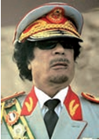

- Jamol Abdul Nosir
+ Muammar Qazzofiy
- Jaʼfar Nimeyri
- Husni Muborak

**1330. Qachon Sudan Demokratik Respublikasi tuzilganligi e’lon qilingan?**

- 1965-yilda
+ 1969-yilda
- 1971-yilda
- 1974-yilda

**1331. Liviyada monarxiya qaysi tashkilot tomonidan ag‘darib tashlangan?**

+ “Yosh ofitserlar”
- “Ozodlik tashkiloti”
- “Musulmon birodarlar”
- “Ozod ofitserlar”

**1332. Mustaqillikdan soʻng Afrika mamlakatlarida tartib va kuchga ega boʻlgan yagona tashkilot qaysi edi?**

- Politsiya
+ Armiya
- Kasaba uyushmasi
- Partiya

## 31-§ XX asrning ikkinchi yarmida ilm-fan va madaniyatning rivojlanishi.

**1333. XX asrning qaysi yangi adabiy yoʻnalishi keng ommaga moʻljallangan bo‘lib, aniq andazalar asosida yoziladi va mafkuraviy jihatdan mavjud tartiblarni qoʻllab-quvvatlashga yoʻnaltiriladi?**

- Zamonaviy adabiyot
- Modernistik adabiyot
- Realistik adabiyot
+ Ommaviy adabiyot

**1334. Qachon Y. A. Gagarin dunyoda birinchi bo‘lib koinotga parvoz qilgan?**

- 1957-yil 4-oktyabrda
+ 1961-yil 12-aprelda
- 1969-yil 21-iyulda
- 1972-yil 8-mayda

**1335. Qaysi nazariya kimyoviy bogʻlanishlarning tabiatini tushuntirib, fan va ishlab chiqarish oldida moddalarning kimyoviy transformatsiyasi uchun keng imkoniyatlar eshigini ochgan?**

- Xromosoma nazariyasi
- Valentlik nazariyasi
+ Kvant nazariyasi
- Nisbiylik nazariyasi

**1336. Qachon yarimoʻtkazgichli integral mikrosxemalar yaratilgan?**

+ 1959-yilda
- 1946-yilda
- 1954-yilda
- 1960-yilda

**1337. Mexanikaga asoslangan dunyoqarash va yangi davr fanining inqiroziga nimalarning kashf etilishi katta turtki boʻlgan?**

+ Elektron va radioaktivlik
- Radioaktivlik va atom
- Atom va kvant nazariyasi
- Kvant nazariyasi va elektron

**1338. Qaysi yilda lazer (lighit amplification by stimulated emission of radiation – “majburiy nurlanish natijasida yorugʻlikning kuchaytirilishi”) yaratilgan?**

- 1959-yilda
- 1946-yilda
- 1954-yilda
+ 1960-yilda

**1339. Sanʼatning qaysi yo‘nalishi ixlosmandlarining fikricha, dunyodagi har qanday buyum oʻzining dastlabki isteʼmolchilik ahamiyatini yoʻqotib, badiiy¬estetik sifat kasb etishi mumkin?**

- Abstraksionizm
+ Pop art
- Postmodernizm
- Surrealizm

**1340. Kimlar tomonidan yarimoʻtkazgichli integral mikrosxemalar yaratilgan?**

+ Amerikalik muhandislar D. Kilbi va R. Noys
- Amerikalik olimlar Stenli Kohen, Herbert Boyer
- Sovet fiziklari N. G. Basov, A. M. Proxorov va amerikalik olim Ch. Tauns
- Sovet olimlari Pavel Tatarinov, Vladimir Zvorykin va amerikalik muhandis Filo Farnsvort

**1341. Ilm-fanda mexanikaga asoslangan dunyoqarash qaysi olimdan boshlangan edi?**

- Rene Dekart
+ Isaak Nyuton
- Blez Paskal
- Robert Guk

**1342. Plastik sanoati qaysi davrda vujudga kelgan?**

- 1940-yillarda
+ 1950-yillarda
- 1960-yillarda
- 1970-yillarda

**1343. Sanʼatning qaysi yo‘nalishi o‘zida Gʻarb va Sharq sanʼati, oʻtmish va zamonaviy uslublar, folklor va ommaviy madaniyat elementlarini oʻzida jamlagan?**

- Abstraksionizm
- Pop art
+ Postmodernizm
- Surrealizm

**1344. Qaysi yillarda Ericsson, Philips va boshqa koʻplab mashhur kompaniyalar tomonidan uyali telefon apparatlarining yangi turlari yaratilgan?**

- 1950–1960-yillarda
- 1960–1970-yillarda
+ 1970–1980-yillarda
- 1980–1990-yillarda

**1345. Qachon ENIAC kompyuteri yaratilgan?**

- 1959-yilda
+ 1946-yilda
- 1954-yilda
- 1961-yilda

**1346. XX asrning ikkinchi yarmidagi ilmiy-texnik inqilob jahon iqtisodiyotini qaysi davrga olib chiqqan?**

- Postkapitalizm davriga
- Postmodernizm davriga
+ Postindustrial davrga
- Postsotsial davrga

**1347. … – yuk tashish, mashinani butlab yigʻish yoki ishlanayotgan narsalarni bir ish joyidan ikkinchi ish joyiga ketma-ket uzluksiz yetkazib berish uchun toʻxtovsiz yoki davriy ravishda aylanib ishlab turadigan lentasimon maxsus transport qurilmasi.**

- Logistika
+ Konveyer
- Montaj liniyasi
- Transportyor

**1348. “Televerket” kompaniyasi qaysi mamlakatniki edi?**

- Norvegiya
- Daniya
- Finlandiya
+ Shvetsiya

**1349. Lazer nuri kimlar tomonidan yaratilgan va ularga ushbu kashfiyot uchun Nobel mukofoti berilgan?**

- Amerikalik muhandislar D. Kilbi va R. Noys
- Amerikalik olimlar Stenli Kohen, Herbert Boyer
+ Sovet fiziklari N. G. Basov, A. M. Proxorov va amerikalik olim Ch. Tauns
- Sovet olimlari Pavel Tatarinov, Vladimir Zvorykin va amerikalik muhandis Filo Farnsvort

**1350. XX asrning ikkinchi yarmidagi ilmiy-texnik inqilobning asosiy belgilari nimalardan iborat edi? 1) Tabiiy va sintetik materiallardan tovarlarni ommaviy ishlab chiqarish; 2) Mashinalardan keng foydalanish; 3) Ishlab chiqarishning konveyerli liniyalarini yaratish; 4) Sanoat robotlarini yaratish.**

- 1, 2, 4
- 1, 3, 4
- 2, 3, 4
+ 1, 2, 3, 4

**1351. Inglizcha “computer” so‘zi qanday ma’noni anglatadi?**

- “Ma’lumot saqlagich”
+ “Hisoblagich”
- “Tahlil qiluvchi”
- “Kodlovchi”

**1352. Yangi davrda genetika fanida qanday nazariya shakllangan?**

+ Xromosoma nazariyasi
- Valentlik nazariyasi
- Kvant nazariyasi
- Nisbiylik nazariyasi

**1353. Qachon adabiyotda realizm jamiyatdagi yangi dolzarb muammolarni aks ettirish quroliga aylangan?**

- 1950-yillardan keyin
+ 1960-yillardan keyin
- 1970-yillardan keyin
- 1980-yillardan keyin

**1354. “Pop art” so‘zining ma’nosi nima?**

- Zamonaviy sanʼat
- Yangi sanʼat
- Aralash sanʼat
+ Ommaviy sanʼat

**1355. XX asrning ikkinchi yarmida sanʼatning qaysi yo‘nalishi fotografiya sanʼatining rivojlanishiga oʻziga xos javob tarzida paydo boʻlgan?**

+ Abstraksionizm
- Pop art
- Postmodernizm
- Surrealizm

**1356. Iqtisodiyotda Ikkinchi jahon urushidan keyin “keynschilik” asosida yaratilgan iqtisodiy nazariya qanday nom olgan?**

- Postkeynschilik
- Antikeynschilik
+ Neokeynschilik
- Pankeynschilik

**1357. Gen muhandisligi qachon yaratilgan?**

+ 1973-yilda
- 1976-yilda
- 1978-yilda
- 1981-yilda

**1358. Qachon Sovet Ittifoqida Yerning birinchi sunʼiy yoʻldoshi uchirilgan?**

+ 1957-yil 4-oktyabrda
- 1961-yil 12-aprelda
- 1969-yil 21-iyulda
- 1972-yil 8-mayda

**1359. Yangi davr fanining inqirozini bartaraf etish jarayoni va ilmiy-texnik inqilob, avvalo, qaysi olimlar nomlari bilan bog‘liq?**

- Mariya Kyuri va Maks Plank
+ Maks Plank va Albert Eynshteyn
- Albert Eynshteyn va Nils Bor
- Nils Bor va Mariya Kyuri

**1360. Ommaviy adabiyot oʻzining qanday xususiyatlari bilan XX asr birinchi yarmidagi adabiyotdan farq qiladi? 1) Ochiq tijoriy xarakteri; 2) Koʻngilochar funksiyasi; 3) Voqealar rivojining oldindan maʼlumligi.**

+ 1, 2, 3
- 1, 3
- 1, 2
- 2, 3

**1361. Adabiyotda Ikkinchi jahon urushidan keyin koʻpchilik asarlar qanday ruhda yozilgan edi?**

- Realistik, sotsialistik
- Sotsialistik, antifashistik
+ Antifashistik, patsifistik
- Patsifistik, realistik

**1362. Qaysi ixtironi olimlar XX asrning soʻnggi 50 yili ichida qilingan eng mashhur ixtiro deb hisoblaganlar?**

- EHM – elektron hisoblash mashinasini
- Lazer – majburiy nurlanish natijasida yorugʻlikning kuchaytirilishini
+ Yarimoʻtkazgichli integral mikrosxemalarni
- Moddalarning kimyoviy transformatsiyasini

**1363. “Abstraksionizm” so‘zining ma’nosi nima?**

- Aniqlik
+ Mavhumlik
- Reallik
- Go‘zallik

**1364. Qachon “Televerket” kompaniyasi uyali telefonlarni yaratish ustida ish boshlagan edi?**

- 1940-yillar boshida
+ 1940-yillar oxirida
- 1950-yillar boshida
- 1950-yillar oxirida

**1365. “Motorola” uyali telefoni qachon yaratilgan?**

- 1978-yilda
- 1981-yilda
+ 1984-yilda
- 1992-yilda

**1366. Gen muhandisligiga kimlar tomonidan asos solingan?**

+ Stenli Kohen, Herbert Boyer
- Herbert Boyer, Jek Kilbi
- Jek Kilbi, Robert Noys
- Robert Noys, Stenli Kohen

**1367. Qaysi ilmiy muassasa xodimlari uzoq masofadan turib kompyuter orqali aloqa oʻrnatish mumkinligini asoslagan va Internetning yaratilishini yaqinlashtirgan?**

- Stenford universiteti
+ Massachusets texnologiya instituti
- Ilg‘or tadqiqotlar loyihalari agentligi
- Pensilvaniya universiteti

**1368. Bayon qilishning qanday shakli XX asrning yangi adabiy yoʻnalishi – ommaviy adabiyotda oʻziga yoʻl topgan?**

+ Realistik
- Patsifistik
- Sotsialistik
- Antifashistik

**1369. Obninsk AES (atom elektr stansiyasi) qachon ishga tushirilgan?**

- 1951-yilda
- 1946-yilda
+ 1954-yilda
- 1969-yilda

**1370. Makroiqtisodiyotni yaratgan ingliz iqtisodchisi kim?**

- Alfred Marshall
- Irving Fisher
- Uesli Mitchell
+ Jon Keyns

**1371. Qachon internetning oʻtmishdoshi – ARPANET yaratilgan?**

- 1951-yilda
- 1946-yilda
- 1954-yilda
+ 1969-yilda

**1372. Sovet Ittifoqida qaysi akademik boshchiligidagi guruh tomonidan Oyga kosmik kema uchirish borasida tadqiqotlar olib borilgan?**

- V. P. Glushko
- M. K. Siolkovskiy
+ S. P. Korolyov
- M. K. Yangel

**1373. … – XX asr oʻrtalari va oxirlarida rivojlangan yoʻnalish boʻlib, u asosan falsafa, sanʼat, arxitektura va adabiy tanqidchilikda modernizm anʼanalaridan chekinishni oʻzida ifodalaydi. Atama asosan modernizmdan keyin kelgan tarixiy davrni ifodalash uchun qoʻllanadi.**

- Abstraksionizm
- Pop art
+ Postmodernizm
- Surrealizm

**1374. AQSH dagi qaysi muassasada ENIAC kompyuteri yaratilgan?**

- Stenford universiteti
- Massachusets texnologiya instituti
- Ilg‘or tadqiqotlar loyihalari agentligi
+ Pensilvaniya universiteti

**1375. Abstraksionizmga qarama-qarshi ravishda sanʼatning qaysi yo‘nalishi paydo bo‘lgan va tezda Yevropaga tarqalgan?**

- Impressionizm
+ Pop art
- Postmodernizm
- Surrealizm

**1376. Kimlar tomonidan taklif qilingan birinchi ommaviy uyali telefon aloqasi MTA – mobile telephone system (mobil telefon tizimi) deb atalgan?**

- Norveglar
- Daniyalikar
- Finlar
+ Shvedlar

**1377. Y. A. Gagarin qaysi kosmik kemada koinotga parvoz qilgan?**

+ “Vostok”
- “Soyuz”
- “Mir”
- “Orbita”

**1378. Adabiyotning qaysi yo‘nalishida yozilgan asar bozorning barcha qonunlariga rioya qiladigan, xaridorlarning turli qatlamiga moʻljallangan adabiy tovar hisoblanadi?**

- Zamonaviy adabiyot yo‘nalishida
- Modernistik adabiyot yo‘nalishida
- Realistik adabiyot yo‘nalishida
+ Ommaviy adabiyot yo‘nalishida

**1379. Yangi davr fanining inqirozini bartaraf etish jarayonida qaysi fandan boshlangan va fanning barcha sohalarini qamrab olgan ilmiy-texnik inqilob yuz bergan?**

+ Fizika
- Matematika
- Biologiya
- Mexanika