# 10-sinf O`zbekiston tarixi (2022-yil darsligi)

_Tarix (Mavzulashgan) (2022-2025-yillar darsliklari)_

## Kirish.

**1. «...Yoshlikdan ilmni qunt bilan o‘rganish lozimligini aytib, «Yoshlikda egallangan bilim toshga o‘yilgan naqshdur», «Ong yo‘q joyda jasorat bo‘lmaydi», «Bu dunyoda hech narsa tan-sog‘liqqa yetmas» kabi shiorlarni ko‘p eshitar edik. Milliy tarix darslaridan birida shunday deganlar: «Insonlar o‘z hayotlarini ongli ravishda tushunib turishlari uchun dunyo ilmlari ichida boshqalardan ko‘ra tarix ilmiga hojatlari ayniqsa ko‘pdur. Shuning uchun har davrning dono olimlari tarafidan bu to‘g‘rida bek (ko‘p) kitoblar yozilmish ekandur. Tarix demak, o‘quvchilarning ko‘z oldilariga qo‘yilgan bir ko‘zgu kabi bo‘lib, unga qaragan kishilar esa yuz-ko‘zlariga yuqqan yomon narsalarni ko‘rar ekanlar, albatta, undan o‘zlarini tozalaydilar». Ushbu jumlalar kimning qaysi asaridan olingan?**

- Abdurauf Fitrat «Munozara»
- Abdulhamid Cho‘lpon «Qurboni jaholat»
- Abdulla Qodiriy «O‘tkan kunlar»
+ Alixonto‘ra Sog‘uniy «Turkiston qayg‘usi»

**2. Ixtirochi Tomas Edisonning xo‘jalik lampochkasini ixtiro qilishiga kimning tajribalari asos bo‘lgan?**

- Meyer
+ Svan
- Gilbert
- Filipp

**3. Quyidagi suratda Toshkentning qaysi dahasi tasvirlangan?**

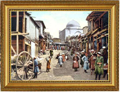

- Ko‘kcha
- Sebzor
- Beshyogʻoch
+ Shayxontohur

**4. Toshkent shahrining tashkil topganiga qancha yil bo‘lgan?**

- 1000 yildan oshgan
- 1500 yildan oshgan
+ 2000 yildan oshgan
- 2500 yildan oshgan

**5. Parij shahri qachon tashkil topgan?**

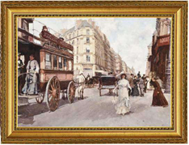

- IX asrda
+ X asrda
- XI asrda
- XII asrda

**6. Qachon fransuz olimi Lui Paster tomonidan pasterizatsiya usuli kashf etilgan?**

- 1850-yillarda
+ 1860-yillarda
- 1870-yillarda
- 1880-yillarda

**7. Qachon rus kimyogari Dmitriy Mendeleyev kimyoviy elementlarning davriy jadvalini tuzib chiqqan?**

- 1876-yilda
- 1863-yilda
+ 1869-yilda
- 1879-yilda

**8. Qachon Karl fon Linde tomonidan “Linde sovutgichi” ixtiro qilingan?**

+ 1900-yilda
- 1903-yilda
- 1906-yilda
- 1908-yilda

**9. Qachon Tomas Nyukomen bug‘ mashinasini ixtiro qilgan?**

- 1714-yilda
+ 1712-yilda
- 1719-yilda
- 1710-yilda

**10. Ixtirochi Tomas Edison qaysi yillarda yashagan?**

- 1841–1925-yillarda
- 1844–1928-yillarda
+ 1847–1931-yillarda
- 1849–1933-yillarda

**11. «Tarix millatlarning o‘tmishi, taraqqiyoti hamda tanazzulining sabablarini o‘rganaturg‘on ilmdir». Ushbu jumlalar muallifi kim?**

+ Abdurauf Fitrat
- Abdulhamid Cho‘lpon
- Abdulla Qodiriy
- Alixonto‘ra Sog‘uniy

**12. Qachon ixtirochi Tomas Edison hozirda biz ishlatadigan xo‘jalik lampochkasini ixtiro qilgan?**

- 1876-yilda
- 1863-yilda
- 1869-yilda
+ 1879-yilda

## Rossiya imperiyasi bosqini arafasida Buxoro amirligi, Qo‘qon va Xiva xonliklaridagi ijtimoiy–siyosiy va iqtisodiy ahvol.

**13. XIX asrning o‘rtalarida Buxoro amirligida kimga tashqi aloqalarni yuritish yuklatilgan edi?**

- Qo‘shbegi
- Mirzaboshi
- Dodxoh
+ Devonbegi

**14. XIX asrning o‘rtalarida Xiva xonligida devonbegi ixtiyorida kimlardan iborat kengash faoliyat ko‘rsatgan?**

- Shayxulislom, mirshabboshi, qo‘shbegi
+ Qo‘shbegi, mehtar, otaliq
- Mehtar, otaliq, shayxulislom
- Otaliq, shayxulislom, mirshabboshi

**15. XIX asrda O‘rta Osiyo davlatlarida qaysi tillarda ijod qilingan?**

+ Ikki tilda: o‘zbek va fors
- Uch tilda: o‘zbek, fors va arab
- To‘rt tilda: o‘zbek, fors, arab va tojik
- Besh tilda: o‘zbek, fors, arab, tojik va chig‘atoy

**16. XIX asrda O‘rta Osiyoda qayerda do‘ppichilik, pichoqchilik rivojlangan?**

- Marg‘ilon
- Rishton
- Shahrixon
+ Chust

**17. XIX asrda O‘rta Osiyo davlatlaridagi maktablarda o‘quvchilar «Haftiyak» dan so‘ng nimani o‘qishgan?**

- Qur’oni karim
- «Risоlai aziz»
+ «Chor-kitob» (To‘rt kitob)
- «Sabоtul оjizin»

**18. XIX asrning o‘rtalarida Qo‘qon xonligida alohida harbiy bo‘linmalarga kimlar rahbarlik qilgan va ular bosh vazir vazifasini ham bajargan?**

- Lashkarboshilar
- Mirshabboshilar
+ Mingboshilar
- To‘pchiboshilar

**19. XIX asrning o‘rtalarida Buxoro amirligida moliya va xazina ishlari, soliqlar to‘planishi kabi sohalarni kim idora qilgan?**

- Qo‘shbegi
- Mirzaboshi
- Dodxoh
+ Devonbegi

**20. XIX asrning ikkinchi yarmida Xiva xonligi shimolda qayer bilan chegaradosh bo‘lgan?**

- Eron
- Buxoro amirligi
- Kaspiy dengizi
+ Qozoq juzlari

**21. XIX asrning o‘rtalarida Buxoro amirligida viloyat va tuman beklari kimning tavsiyasi bilan tayinlangan?**

+ Qo‘shbegi
- Mirzaboshi
- Dodxoh
- Devonbegi

**22. XIX asrning ikkinchi yarmida Xiva xonligida nechta beklik bo‘lgan?**

- 40 ta
+ 18 ta
- 15 ta
- 22 ta

**23. XIX asrning o‘rtalarida Buxoro amirligida shariat qoidalari va qonunlar ijrosi, sud ishlarini nazorat qilishni kim bajargan?**

+ Shayxulislom
- Mirshabboshi
- Ko‘kaldosh
- Qozikalon

**24. XIX asrning o‘rtalarida Xiva xonligida diniy ishlar va shariat qoidalariga rioya etilishi va amal qilinishi masalalariga kim mas’ul bo‘lgan?**

- Mirshabboshi
- Ko‘kaldosh
- Qozikalon
+ Shayxulislom

**25. XIX asrning o‘rtalarida Buxoro amirligida ijro hokimiyati rahbari bo‘lgan bosh vazir qanday atalgan?**

+ Qo‘shbegi
- Mirzaboshi
- Dodxoh
- Devonbegi

**26. Qachon Xiva va Buxoroga kapitan J. Abbot yuborilgan?**

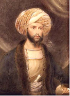

- 1832-yilda
- 1825-yilda
+ 1843-yilda
- 1844-yilda

**27. XIX asrda O‘rta Osiyo xonliklarida sug‘orish ishlari bilan kimlar shug‘ullanganlar?**

- Mehtarlar
- Muhtasiblar
- Muftiylar
+ Miroblar

**28. XIX o‘rtalarida Buxoro amirligi janubda qayer bilan chegaradosh bo‘lgan?**

- Xiva xonligi
- Pomir tog‘lari
- Sirdaryo
+ Amudaryo

**29. XIX asrning o‘rtalarida Buxoro amirligida amir qarorgohi hisoblangan arkda taxt vorisi – valiahd tarbiyasi bilan kim mashg‘ul bo‘lgan?**

- Ko‘kaldosh
- Mehtar
- Qo‘shbegi
+ Otaliq

**30. AQSH da fuqarolar urushi qaysi yillarda bo‘lib o‘tgan?**

- 1859–1863-yillarda
- 1860–1864-yillarda
+ 1861–1865-yillarda
- 1862–1866-yillarda

**31. XIX o‘rtalarida Buxoro amirligi g‘arbda qayer bilan chegaradosh bo‘lgan?**

+ Xiva xonligi
- Pomir tog‘lari
- Sirdaryo
- Amudaryo

**32. Buxoroga kelgan Ost-Indiya kompaniyasi vakillarining amir tomonidan qatl qilinishiga javoban Angliya hukumati Buxoroga qarshi qaysi davlat bilan sulh tuzib, uni qurollantirgan?**

+ Afg‘oniston
- Eron
- Qo‘qon xonligi
- Xiva xonligi

**33. XIX asrda O‘rta Osiyo davlatlaridagi madrasa talabalari yoshi necha yoshdan necha yoshgacha bo‘lgan?**

+ 10 yoshdan 40 yoshgacha
- 15 yoshdan 45 yoshgacha
- 20 yoshdan 50 yoshgacha
- 25 yoshdan 55 yoshgacha

**34. Qachon Buxoroga A. Byorns yuborilgan?**

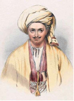

+ 1832-yilda
- 1825-yilda
- 1843-yilda
- 1844-yilda

**35. XIX o‘rtalarida Buxoro amirligi tarkibida nechta viloyat bo‘lgan?**

+ 40 ta
- 18 ta
- 15 ta
- 22 ta

**36. XIX asrda O‘rta Osiyo davlatlaridagi maktablarda diniy bilimlar bilan bir qatorda yana qanday bilimlar berilgan? 1) Jo‘g‘rofiya (geografiya); 2) Sanoq; 3) Savodxonlik.**

+ 1, 2, 3
- 1, 2
- 1, 3
- 2, 3

**37. XIX o‘rtalarida Qo‘qon xonligi sharqda qayer bilan chegaradosh bo‘lgan?**

- Buxoro amirligi va Xiva xonligi
+ Sharqiy Turkiston
- Qozoq juzlari
- Qorategin, Ko‘lob, Darvoz, Sho‘g‘non

**38. XIX asrda O‘rta Osiyoda qayerda kulolchilik rivojlangan?**

- Marg‘ilon
+ Rishton
- Shahrixon
- Chust

**39. XIX asrning o‘rtalarida Qo‘qon xonligi qaysi sulola tomonidan boshqarilgan?**

- Qo‘ng‘irotlar
- Mang‘itlar
- Ashtarxoniylar
+ Minglar

**40. XIX asrning ikkinchi yarmida Xiva xonligidagi beklik va noibliklarni kimlar boshqargan?**

- To‘ralar va biylar
- Biylar va hokimlar
- Hokimlar va beklar
+ Beklar va to‘ralar

**41. XIX asrda O‘rta Osiyo davlatlarida boshlang‘ich maktablar qayerlarda tashkil etilgan? 1) Saroylarda; 2) Masjidlar huzurida; 3) Madrasalar huzurida; 4) Xususiy hovlilarda.**

- 1, 2, 3, 4
- 1, 3, 4
- 1, 2, 3
+ 2, 3, 4

**42. XIX asrda Buxoro amirligi, Xiva va Qo‘qon xonliklarida aholi ijaraga olgan yerlari uchun hosilning bir qismini … sifatida to‘laganlar.**

+ xiroj
- zakot
- begar
- ushr

**43. O‘rta Osiyo istilo qilinishidan oldin Rossiya qayerga olib boradigan asosiy Orenburg yo‘lida harbiy istehkomlar qurgan?**

- Qo‘qonga
- Xo‘jandga
- Turkistonga
+ Toshkentga

**44. XIX asrning o‘rtalarida Xiva xonligi qaysi sulola tomonidan boshqarilgan?**

+ Qo‘ng‘irotlar
- Mang‘itlar
- Ashtarxoniylar
- Minglar

**45. XIX asrning o‘rtalarida Xiva xonligida sug‘orish inshootlari va suv ta’minoti hamda taqsimotiga kim mas’ul bo‘lgan?**

- Mehtar
- Qo‘shbegi
+ Mirobboshi
- Devonbegi

**46. XIX asrda O‘rta Osiyoda qayerda me’morchilik, ganchkorlik rivojlangan?**

- Chust
+ Xiva
- Buxoro va Samarqand
- Qo‘qon

**47. XIX asrning o‘rtalarida Buxoro amirligida mamlakat xavfsizligi, amirning yaqinlari, do‘stlari va dushmanlari to‘g‘risida ma’lumotlar to‘plash bilan kim shug‘ullangan?**

- Otaliq
- Parvonachi
+ Ko‘kaldosh
- Mehtar

**48. XIX o‘rtalarida Qo‘qon xonligi shimolda qayer bilan chegaradosh bo‘lgan?**

- Buxoro amirligi va Xiva xonligi
- Sharqiy Turkiston
+ Qozoq juzlari
- Qorategin, Ko‘lob, Darvoz, Sho‘g‘non

**49. XIX asrda O‘rta Osiyo davlatlaridagi maktablarda o‘quvchilar dastlab nimani o‘rgangan?**

- Qur’oni karim
+ «Haftiyak»
- «Chor-kitob» (To‘rt kitob)
- «Sabоtul оjizin»

**50. XIX asrda O‘rta Osiyoda qayerda zargarlik rivojlangan?**

- Chust
- Xiva
+ Buxoro va Samarqand
- Qo‘qon

**51. «Moziyg‘a qaytib ish ko‘rish xayrlik, deydilar. Shunga ko‘ra mavzuni moziydan, yaqin o‘tkan kunlardan, tariximizning eng kirlik, qora kunlari bo‘lg‘an keyingi «xon zamonlari» dan belguladim». Ushbu jumlalar kimning qaysi asaridan olingan?**

- Abdurauf Fitrat «Munozara»
- Abdulhamid Cho‘lpon «Qurboni jaholat»
+ Abdulla Qodiriy «O‘tkan kunlar»
- Alixonto‘ra Sog‘uniy «Turkiston qayg‘usi»

**52. Buxoroga kelgan qaysi Ost-Indiya kompaniyasi vakillari amir tomonidan qatl qilingan?**

- I. Volf va Ch. Stoddart
+ Ch. Stoddart va A. Konnoli
- A. Konnoli va J. Abbot
- J. Abbot va I. Volf

**53. XIX asrning o‘rtalarida Qo‘qon xonligida kimlar islom dini qoidalari asosida sud ishlarini olib borganlar?**

- Mirshablar
+ Qozikalonlar
- Muhtasib raislar
- Shayxulislomlar

**54. Xiva xonligida asosiy soliq nima deb atalgan?**

- Xiroj
- Zakot
+ Solg‘ut
- Ushr

**55. XIX asrda O‘rta Osiyo savdogarlari qaysi davlatlar bilan savdo-sotiq qilganlar? 1) Eron; 2) Xitoy; 3) Hindiston; 4) Afg‘oniston; 5) Rossiya; 6) Qozoq juzlari.**

- 2, 4, 5
- 2, 3, 4, 5
- 1, 2, 3, 5, 6
+ 1, 2, 3, 4, 5, 6

**56. XIX o‘rtalarida Buxoro amirligi sharqda qayer bilan chegaradosh bo‘lgan?**

- Xiva xonligi
+ Pomir tog‘lari
- Sirdaryo
- Amudaryo

**57. XIX o‘rtalarida Buxoro amirligi viloyat va tumanlarini kim boshqargan?**

- Hokimlar
+ Beklar
- Biylar
- To‘ralar

**58. XIX asrning o‘rtalarida Buxoro amirligida kim amir qo‘shinlarining bosh qo‘mondoni bo‘lgan?**

- Mirshabboshi
- Yasovulboshi
- Lashkarboshi
+ To‘pchiboshi

**59. XIX asrning o‘rtalarida Xiva xonligida oliy amaldor kim hisoblangan?**

- Qo‘shbegi
+ Devonbegi
- Mehtar
- Otaliq

**60. XIX asrda O‘rta Osiyoda qayerda temirchilik, duradgorlik, zargarlik rivojlangan?**

- Chust
- Xiva
- Buxoro va Samarqand
+ Qo‘qon

**61. XIX asrning ikkinchi yarmida Xiva xonligida nechta noiblik bo‘lgan?**

+ 2 ta
- 4 ta
- 6 ta
- 8 ta

**62. XIX asrning o‘rtalarida Qo‘qon xonligida eng yuqori harbiy lavozim (harbiy vazir) qaysi edi?**

- To‘pchiboshi
+ Amirlashkar
- Yasovulboshi
- Lashkarboshi

**63. XIX asrning o‘rtalarida Xiva xonligida xon qarorgohi qaysi shaharda joylashgan edi?**

- Hazorasp
- Yangi Urganch
- Kat
+ Xiva

**64. XIX asrning o‘rtalarida Buxoro amirligida oliy hukmdor farmonlarini kim e’lon qilgan?**

- Otaliq
+ Parvonachi
- Ko‘kaldosh
- Mehtar

**65. XIX asrning o‘rtalarida Xiva xonligida aholining tinchligi va osoyishtaligi bilan kim mashg‘ul bo‘lgan?**

+ Mirshabboshi
- Yasovulboshi
- Lashkarboshi
- To‘pchiboshi

**66. Qaysi davrga kelib Angliya O‘rta Osiyoga qiziqa boshlagan?**

- XVIII asrning oxirlariga
- XIX asrning boshlariga
+ XIX asrning o‘rtalariga
- XIX asrning oxirlariga

**67. XIX asrning ikkinchi yarmida Xiva xonligi sharqda qayer bilan chegaradosh bo‘lgan?**

- Eron
+ Buxoro amirligi
- Kaspiy dengizi
- Qozoq juzlari

**68. XIX asrda O‘rta Osiyoda qayerda pichoqchilik, do‘ppichilik, duradgorlik rivojlangan?**

- Marg‘ilon
- Rishton
+ Shahrixon
- Chust

**69. XIX asrning o‘rtalarida Buxoro amirligida soliqlarni o‘z vaqtida yig‘ishga kim javobgar bo‘lgan?**

- Dodxoh
- Qo‘shbegi
+ Mushrif
- Devonbegi

**70. XIX asrning o‘rtalarida Buxoro amirligi qaysi sulola tomonidan boshqarilgan?**

- Qo‘ng‘irotlar
+ Mang‘itlar
- Ashtarxoniylar
- Minglar

**71. Qachon Ost-Indiya kompaniyasi vakillari Ch. Stoddart va A. Konnoli Buxoroga kelgan?**

- 1832-yilda
- 1825-yilda
- 1843-yilda
+ 1842-yilda

**72. XIX o‘rtalarida Qo‘qon xonligi g‘arbda qayer bilan chegaradosh bo‘lgan?**

+ Buxoro amirligi va Xiva xonligi
- Sharqiy Turkiston
- Qozoq juzlari
- Qorategin, Ko‘lob, Darvoz, Sho‘g‘non

**73. XIX asrda O‘rta Osiyo davlatlarida madrasalar qanday mutaxassislarni tayyorlagan? 1) Tabib; 2) Mudarris; 3) Imom; 4) Qozi; 5) Mirza; 6) Moliyaviy ishlarni olib boruvchi; 7) Yer-suvni taqsimlovchi; 8) Tarixshunos.**

- 1, 2, 3, 4, 6, 7
+ 2, 3, 4, 5, 6, 7
- 2, 4, 5, 6, 7, 8
- 1, 3, 4, 5, 6, 8

**74. XIX o‘rtalarida Buxoro amirligi qaysi davlatlar bilan chegaradosh bo‘lgan? 1) Rossiya; 2) Eron; 3) Afg‘oniston; 4) Qo‘qon xonligi; 5) Xiva xonligi; 6) Qozoq juzlari.**

- 1, 3, 4, 5
- 1, 2, 3, 4, 5
- 2, 4, 5, 6
+ 2, 3, 4, 5, 6

**75. XIX o‘rtalarida Qo‘qon xonligi aholisi soni qancha bo‘lgan?**

- 1 millionga yaqin
- 2 millionga yaqin
+ 3 millionga yaqin
- 4 millionga yaqin

**76. Buxoro amirligining markziy qismi Buxoro va Samarqand shaharlari joylashgan qaysi vodiy hisoblangan?**

- Tajan vodiysi
- Murg‘ob vodiysi
+ Zarafshon vodiysi
- Amudaryo vodiysi

**77. XIX asrning ikkinchi yarmida Xiva xonligining ma’muriy markazi qaysi shahar bo‘lgan?**

- Hazorasp
- Yangi Urganch
- Kat
+ Xiva

**78. Quyidagi XIX asr karikaturasida Rossiya (ayiq timsolida) va Angliya (sher timsolida) o‘rtasida qaysi davlat (odam timsolida) tasvirlangan?**

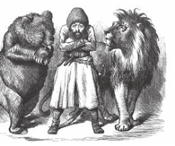

+ Afg‘oniston
- Eron
- Hindiston
- Turkiya

**79. XIX asrning o‘rtalarida Xiva xonligida tartib-intizom ishlariga kim mas’ul bo‘lgan?**

- Mirshabboshi
+ Yasovulboshi
- Lashkarboshi
- To‘pchiboshi

**80. Qachon Sirdaryoning Orolga quyilish joyida Raim qal’asi bunyod etilgan?**

- 1842-yilda
- 1855-yilda
- 1853-yilda
+ 1847-yilda

**81. XIX asrda Qo‘qon xonligida qanday yirik sug‘orish inshootlari bo‘lgan? 1) Shahrixonsoy; 2) Andijonsoy; 3) Marg‘ilonsoy; 4) Yangiariq; 5) Ulug‘nor; 6) Qoradaryo.**

+ 1, 2, 3, 4, 5, 6
- 1, 2, 3, 5, 6
- 2, 3, 4, 5
- 2, 4, 5

**82. XIX asrda O‘rta Osiyo davlatlarida o‘qish mavsumi necha oy bo‘lgan?**

- 4 oy
- 5 oy
+ 6 oy
- 7 oy

**83. XIX asrda qaysi urush tufayli Rossiyaning to‘qimachilik sanoati uchun paxta xomashyosi taqchilligi vujudga kelgan, natijada O‘rta Osiyo yerlari va resurslariga ehtiyojni yanada oshirgan?**

+ AQSH dagi fuqarolar urushi
- Napoleon urushlari
- Qrim urushi
- Avstriya-Prussiya urushi

**84. XIX asrning o‘rtalarida Qo‘qon xonligida xazina ishlari va xarajatlarini kim nazorat qilib borgan?**

- Muhtasib
- Qo‘shbegi
+ Mehtar
- Devonbegi

**85. XIX o‘rtalarida Buxoro amirligining aholisi soni qancha bo‘lgan?**

- 1 million atrofida
+ 2 million atrofida
- 3 million atrofida
- 4 million atrofida

**86. XIX asrning ikkinchi yarmida Xiva xonligida aholi soni qancha bo‘lgan?**

- 600 mingdan ortiq
- 700 mingdan ortiq
+ 800 mingdan ortiq
- 900 mingdan ortiq

**87. XIX asrning o‘rtalarida Buxoro amirligida shaharlarda tinchlik va tartibni saqlashga kim mas’ul bo‘lgan?**

+ Mirshabboshi
- Yasovulboshi
- Lashkarboshi
- To‘pchiboshi

**88. XIX o‘rtalarida Qo‘qon xonligi janubda qayer bilan chegaradosh bo‘lgan?**

- Buxoro amirligi va Xiva xonligi
- Sharqiy Turkiston
- Qozoq juzlari
+ Qorategin, Ko‘lob, Darvoz, Sho‘g‘non

**89. Qachon Buxoroga mayor I. Volf yuborilgan?**

- 1832-yilda
- 1825-yilda
- 1843-yilda
+ 1844-yilda

**90. «Agrar» (agrarius) so‘zi lotinchada qanday ma’noni anglatadi?**

- «Suvga, dengizga oid»
- «Hosilga, xirmonga oid»
+ «Yerga, dalaga oid»
- «Dehqonga, ekinga oid»

**91. Qachon Angliya mintaqaviy aloqalarni yo‘lga qo‘yish uchun M. Murkroftni Buxoro amirligiga yuborgan?**

- 1832-yilda
+ 1825-yilda
- 1843-yilda
- 1844-yilda

**92. Qo‘qon xonligi bilan qaysi davlat o‘rtasida Qorategin, Ko‘lob, Darvoz, Sho‘g‘non singari tog‘li o‘lkalar uchun tez-tez to‘qnashuvlar bo‘lib turgan?**

+ Buxoro amirligi
- Xiva xonligi
- Qozoq juzlari
- Rossiya imperiyasi

**93. XIX asrning o‘rtalarida Buxoro amirligida amirlik hujjatlarini yuritishga kim mas’ul bo‘lgan?**

- Qo‘shbegi
+ Mirzaboshi
- Dodxoh
- Devonbegi

**94. XIX asrning o‘rtalarida Qo‘qon xonligida kimlar diniy ishlar, shariat qoidalariga rioya qilinishi, savdo-sotiqning to‘g‘ri yuritilishini nazorat qilganlar?**

- Mirshablar
- Qozikalonlar
+ Muhtasib raislar
- Shayxulislomlar

**95. XIX asrning o‘rtalarida Xiva xonligida askarlik xizmatida bo‘lganlar … .**

- majburiy mehnatdan ozod qilingan
+ soliqlardan ozod qilingan
- qo‘shimcha to‘lovlardan ozod qilingan
- sud qilinishdan ozod qilingan

**96. XIX asrning o‘rtalarida Xiva xonligida qaysi shaharda ichki – Ichan qal’a va mudofaa devori bilan o‘ralgan tashqi – Dishan qal’a mavjud bo‘lgan?**

- Hazorasp
- Yangi Urganch
- Kat
+ Xiva

**97. Qachon o‘zbeklar va tojiklar yashaydigan Amudaryoning janubiy sohilidagi hududlar Afg‘oniston viloyatiga aylantirilgan?**

- 1842-yilda
+ 1855-yilda
- 1853-yilda
- 1847-yilda

**98. XIX asrning o‘rtalarida Buxoro amirligida xalqning shikoyatlari bilan kim shug‘ullangan?**

+ Dodxoh
- Qo‘shbegi
- Mushrif
- Devonbegi

**99. XIX asrning o‘rtalarida Xiva xonligida xon qo‘shinlarining bosh qo‘mondoni qanday atalgan?**

- Mirshabboshi
+ Yasovulboshi
- Lashkarboshi
- To‘pchiboshi

**100. XIX asrning o‘rtalarida Qo‘qon xonligining ma’muriy markazi qaysi shahar bo‘lgan?**

+ Qo‘qon
- Toshkent
- Tepaqo‘rg‘on
- Marg‘ilon

**101. Qachon Britaniyaning Ost-Indiya kompaniyasi strategik ahamiyatga ega bo‘lgan O‘rta Osiyo xonliklari hududiga qiziqa boshlagan?**

- XVIII asrning boshlarida
- XVIII asrning oxirlarida
+ XIX asrning boshlarida
- XIX asrning oxirlarida

**102. XIX asrning o‘rtalarida Qo‘qon xonligida ichki tartib-intizom ishlari bilan kimlar shug‘ullangan?**

- Lashkarlar
- Yasovullar
- To‘pchilar
+ Mirshablar

**103. Qaysi davrda Buxoro amirligidan Farg‘ona vodiysi va Sirdaryoning quyi qismigacha bo‘lgan hududlar ajrab, mustaqil davlat – Qo‘qon xonligi tashkil topgan?**

- XVII asrning boshlarida
- XVII asrning oxirlarida
+ XVIII asrning boshlarida
- XVIII asrning oxirlarida

**104. XIX asrning o‘rtalariga kelib, Buxoro amirligi, Xiva va Qo‘qon xonliklari aholisining etnik tarkibi, asosan, kimlardan iborat bo‘lgan?**

- Tojiklardan
- Turkmanlardan
- Qirg‘izlardan
+ O‘zbeklardan

**105. XIX asrda O‘rta Osiyoda qayerda atlas to‘qish, do‘ppichichilik rivojlangan?**

+ Marg‘ilon
- Rishton
- Shahrixon
- Chust

**106. XIX asrning o‘rtalarida Xiva xonligida harbiy bo‘linmalarga kimlar qo‘mondonlik qilgan?**

- To‘pchiboshilar
- Mingboshilar
- Mirshabboshilar
+ Lashkarboshilar

**107. XIX asrning ikkinchi yarmida Xiva xonligi janubda qayer bilan chegaradosh bo‘lgan?**

+ Eron
- Buxoro amirligi
- Kaspiy dengizi
- Qozoq juzlari

**108. XIX asrning ikkinchi yarmida Xiva xonligi g‘arbda qayer bilan chegaradosh bo‘lgan?**

- Eron
- Buxoro amirligi
+ Kaspiy dengizi
- Qozoq juzlari

**109. XIX asrda O‘rta Osiyo davlatlarida madrasalarda o‘qish muddati asosan … oyining ikkinchi yarmida boshlanib, … oyining oxiriga qadar davom etgan.**

+ sentyabr/mart
- oktyabr/aprel
- noyabr/may
- dekabr/iyun

**110. Suv chiqishi qiyin bo‘lgan joylarda ishlatiladigan maxsus qurilma qanday atalgan?**

- Tegirmon
+ Chig‘ir
- Sardoba
- To‘g‘on

**111. XIX o‘rtalarida Qo‘qon xonligi nechta beklikka bo‘lingan?**

- 40 ta
+ 15 ta
- 18 ta
- 22 ta

**112. XIX asrning o‘rtalarida Buxoro amirligida sud boshlig‘i kim hisoblangan?**

+ Qozikalon, raiskalon
- Raiskalon, muhtasib
- Muhtasib, shayxulislom
- Shayxulislom, qozikalon

**113. XIX asrning o‘rtalarida Buxoro amirligida mirzaboshi kimga bo‘ysungan?**

- Amirga
- Qo‘shbegiga
- Dodxohga
+ Devonbegiga

**114. XIX o‘rtalarida Buxoro amirligi shimolda qayer bilan chegaradosh bo‘lgan?**

- Xiva xonligi
- Pomir tog‘lari
+ Sirdaryo
- Amudaryo

## Rossiya imperiyasining O‘rta Osiyoga yurishi va Turkiston general-gubernatorligining tashkil topishi.

**115. Rossiya imperiyasi tomonidan qaysi shaharni bosib olishda Oqmachit qal’asi harbiy harakatlarning tayanchiga aylangan?**

- Qo‘qon
- Turkiston
- Avliyoota
+ Toshkent

**116. Rossiya imperiyasi Oqmachit qal’asini bosib olish uchun ikkinchi marta necha kishilik qo‘shin bilan hujum boshlangan?**

- 1 mingdan ortiq
- 2 mingdan ortiq
+ 3 mingdan ortiq
- 4 mingdan ortiq

**117. Turkiston general-gubernatorligi tarkibidagi Yettisuv viloyatining markazi qaysi shahar bo‘lgan?**

+ Verniy
- Toshkent
- Chimkent
- Turkiston

**118. Qaysi general-gubernatorlik tarkibida Turkiston viloyati tashkil qilingan?**

+ Orenburg general-gubernatorligi
- G‘arbiy Sibir general-gubernatorligi
- Krasnovodsk general-gubernatorligi
- Semipalatinsk general-gubernatorligi

**119. Qachon «Turkiston viloyatini boshqarish to‘g‘risidagi Muvaqqat Nizom» qabul qilingan?**

- 1864-yil 6-aprelda
+ 1865-yil 6-avgustda
- 1866-yil 6-dekabrda
- 1867-yil 6-yanvarda

**120. M. Chernyayev Niyozbek qal’asini egallagach, Toshkent shahri aholisini suv bilan ta’minlaydigan qaysi daryodagi to‘g‘on buzib tashlangan?**

+ Chirchiq
- Talas
- Zarafshon
- Ohangaron

**121. Rossiya imperiyasining Toshkentni bosib olish uchun yo‘lga chiqqan qo‘shini avval qaysi shaharni bosib olgan?**

- Turkiston
- Chimkent
+ Avliyoota
- Bishkek

**122. Rossiya imperiyasi bosqini davrida Toshkent shahri necha kilometrlik qal’a devori bilan o‘ralgan edi?**

- 10 kilometrlik
- 15 kilometrlik
+ 20 kilometrlik
- 25 kilometrlik

**123. XIX asr o‘rtalarida hozirgi qaysi shahar Verniy deb atalgan?**

- Chimkent
- Bishkek
- Taroz
+ Almati

**124. Rossiya imperiyasi tomonidan Oqmachit qal’asini bosib olish borasidagi dastlabki harakatlari qaysi yilda mag‘lubiyatga uchragan edi?**

+ 1852-yilda
- 1853-yilda
- 1859-yilda
- 1864-yilda

**125. XIX asrning ikkinchi yarmida Toshkentning nechta darvozasi bo‘lgan?**

- 6 ta
- 8 ta
- 10 ta
+ 12 ta

**126. Qachon Turkiston general-gubernatorligi tashkil qilingan va Turkiston harbiy okrugi tuzilgan?**

- 1864-yilda
- 1865-yilda
- 1866-yilda
+ 1867-yilda

**127. XIX asrning ikkinchi yarmida Semipalatinskdan Verniy shahrigacha qaysi istehkom chizig‘i vujudga kelgan?**

- Yangi Qo‘qon istehkom chizig‘i
- Dasht istehkom chizig‘i
- Sirdaryo istehkom chizig‘i
+ Sibir istehkom chizig‘i

**128. Turkiston general-gubernatorligining markazi qilib qaysi shahar belgilangan?**

- Chimkent
+ Toshkent
- Turkiston
- Avliyoota

**129. Quyidagilardan XIX asrning ikkinchi yarmida Toshkentning ham dahasi, ham darvozasi nomi bo‘lganlarni toping.**

- Shayxontohur, Kamolon
+ Beshyog‘och, Ko‘kcha
- Sag‘bon, Sebzor
- Labzak, Chig‘atoy

**130. Toshkent mudofaasida ishtirok etgan Qo‘qon xonligi qo‘shinlari amirlashkarini toping.**

+ Aliquli
- Alixon
- Niyoz Bek
- Yoqub Bek

**131. Qo‘qon xonligi qo‘shinlari amirlashkari Aliquli qaysi shahar mudofaasi paytida halok bo‘lgan?**

- Avliyoota
- Turkiston
- Chimkent
+ Toshkent

**132. Qachon Rossiya imperatori Qo‘qon xonligini bosib olishning davom ettirilishi to‘g‘risida ko‘rsatma bergan?**

- 1852-yilda
- 1853-yilda
+ 1859-yilda
- 1864-yilda

**133. Niyozbek qal’asining egallanishi M. Chernyayevga Toshkentni bosib olishda qanday imkoniyat bergan?**

+ Shaharni suv ta’minotidan uzib qo‘yish imkonini
- Shaharga to‘g‘ridan-to‘g‘ri hujum qilish imkonini
- Shahar atrofidagi hududni qurshab olish imkonini
- Shaharni tepalikdan turib o‘qqa tutish imkonini

**134. Avliyoota shahri qayerda joylashgan edi?**

- Talas daryosining o‘ng sohilida
+ Talas daryosining chap sohilida
- Keles daryosining o‘ng sohilida
- Keles daryosining chap sohilida

**135. O‘zini imperiyaga yaxshi ko‘rsatish uchun tezlik bilan Toshkentni bosib olmoqchi bo‘lgan M. Chernyayevni shahar himoyachilari qayerga chekinishga majbur qilgan?**

- Avliyootaga
- Orenburgga
+ Chimkentga
- Turkistonga

**136. XIX asr o‘rtalarida Toshkentni mudofaa qilish uchun qurilgan devor ortida qaysi ariq suvi bilan to‘ldiriladigan xandaqlar bo‘lgan?**

+ Kaykovus arig‘ining
- Bo‘zsuv arig‘ining
- Labzak arig‘ining
- Zangiota arig‘ining

**137. Turkiston general-gubernatorligi tarkibidagi qaysi viloyat hududiga, asosan, 1865-yilda tashkil qilingan Turkiston viloyatiga tegishli bo‘lgan yerlar va Qo‘qon xonligining bosib olingan shimoliy hududlari kirgan?**

- Yettisuv viloyati
- Zarafshon viloyati
- Toshkent viloyati
+ Sirdaryo viloyati

**138. M. Chernyayev tomonidan Toshkent shahri bosib olinganida shahar qozikaloni kim edi?**

- Abulqosim eshon
- Solihbek dodxoh
+ Hakimxo‘ja
- Aliquli

**139. Toshkent shahrini «ixtiyoriy ravishda topshirish» to‘g‘risidagi sulhni imzolashga qarshi bo‘lgan Solihbek dodxoh, Abulqosim eshon, Hakimxo‘jalar M. Chernyayev tomonidan qanday jazolangan?**

- Otib tashlangan
- Qamoqqa tashlangan
- Mol-mulki musodara qilingan
+ Sibirga surgun qilingan

**140. Qachon Rossiya imperiyasining qo‘shini Toshkentni bosib olish uchun yo‘lga chiqqan?**

- 1859-yilda
- 1852-yilda
+ 1864-yilda
- 1853-yilda

**141. Turkiston general-gubernatorligi tarkibidagi qaysi viloyat hududiga Semipalatinsk viloyatining Sergiopol, Kopal va Olatavsk okrugi yerlari va sobiq Turkiston viloyatining bir qismi kirgan?**

+ Yettisuv viloyati
- Zarafshon viloyati
- Toshkent viloyati
- Sirdaryo viloyati

**142. Toshkent shahrini bosib olishga kim qo‘mondon etib tayinlangan?**

+ M. Chernyayev
- V. Perovskiy
- K. Kaufman
- M. Skobelev

**143. Quyidagi suratda kim tasvirlangan?**

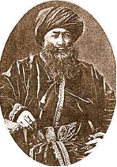

- Aliquli
- Alimqul
- Niyoz Bek
+ Yoqub Bek

**144. M. Chernyayev tomonidan Toshkent shahrini bosib olinishi paytida, shahar himoyachilariga yordam berish uchun qaysi davlat qo‘shinlari kechikib yetib kelgan va ularning foydasi tegmagan?**

- Eron
- Xiva xonligi
+ Buxoro amirligi
- Xitoy

**145. Qachon M. Chernyayev boshchiligidagi qo‘shin Niyozbek qal’asiga kelib, uni jangsiz topshirishni taklif qilgan, lekin qal’a himoyachilari rad javobini berib, mudofaaga o‘tgan?**

- 1864-yil iyun oyi oxirida
- 1864-yil may oyi oxirida
+ 1865-yil aprel oyi oxirida
- 1865-yil sentyabr oyi oxirida

**146. Kim yangi tashkil etilgan Turkiston general-gubernatorligi gubernatori va bir paytning o‘zida Turkiston harbiy okrugining qo‘mondoni etib tayinlangan?**

- M. Chernyayev
- V. Perovskiy
+ K. Kaufman
- M. Skobelev

**147. XIX asrning ikkinchi yarmida Raim qal’asidan Perovskiy fortigacha qaysi istehkom chizig‘i vujudga kelgan?**

- Yangi Qo‘qon istehkom chizig‘i
- Dasht istehkom chizig‘i
+ Sirdaryo istehkom chizig‘i
- Sibir istehkom chizig‘i

**148. Rossiya imperiyasining qancha qo‘shini Toshkentni bosib olish uchun yo‘lga chiqqan?**

- Ikki mingdan ko‘proq
+ Uch mingdan ko‘proq
- To‘rt mingdan ko‘proq
- Besh mingdan ko‘proq

**149. Rossiya imperiyasining qo‘shini nechta yo‘nalishda Toshkentni bosib olish uchun yo‘lga chiqqan va ular qaysi yo‘nalishlar?**

- Bir yo‘nalishda: Perovskiy fortidan (Orenburg tomondan)
+ Ikki yo‘nalishda: Perovskiy fortidan (Orenburg tomondan); Verniy (Almati) shahri tomondan
- Uch yo‘nalishda: Perovskiy fortidan (Orenburg tomondan); Verniy (Almati) shahri tomondan; Krasnovodsk tomondan
- To‘rt yo‘nalishda: Perovskiy fortidan (Orenburg tomondan); Verniy (Almati) shahri tomondan; Krasnovodsk tomondan; Mang‘ishloq tomondan

**150. Quyidagi xaritada qaysi shaharning XIX asrdagi ko‘rinishi tasvirlangan?**

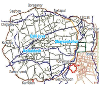

- Chimkent
+ Toshkent
- Qo‘qon
- Turkiston

**151. Rossiya imperiyasi Oqmachit qal’asini bosib olish uchun ikkinchi marta hujum boshlaganida qal’a qo‘mondoni kim edi?**

- Aliquli
- Alimqul
- Niyoz Bek
+ Yoqub Bek

**152. Qachon Toshkent M. Chernyayev tomonidan egallangan?**

- 1865-yil mayda
+ 1865-yil iyunda
- 1866-yil iyulda
- 1866-yil sentyabrda

**153. Rossiya imperiyasi Oqmachit qal’asini bosib olish uchun ikkinchi marta hujum boshlaganida ularga necha nafar qal’a himoyachilari qarshilik ko‘rsatgan?**

+ 400 nafar
- 500 nafar
- 600 nafar
- 700 nafar

**154. XIX asrning ikkinchi yarmida Toshkentning nechta dahasi bo‘lgan?**

+ 4 ta
- 6 ta
- 8 ta
- 10 ta

**155. Turkiston general-gubernatorligi tarkibidagi Sirdaryo viloyatining markazi qaysi shahar bo‘lgan?**

- Verniy
+ Toshkent
- Chimkent
- Turkiston

**156. Niyozbek qal’asi qayerda joylashgan edi?**

- Talas daryosining o‘ng sohilida
- Talas daryosining chap sohilida
- Chirchiq daryosining o‘ng sohilida
+ Chirchiq daryosining chap sohilida

**157. Qachon Rossiya imperiyasi tomonidan Chimkent shahri egallanib, Yangi Qo‘qon chizig‘i asosida qo‘lga kiritilgan qal’alar birlashtirilgan?**

- 1863-yil yozida
+ 1864-yil kuzida
- 1865-yil qishida
- 1866-yil bahorida

**158. Rossiya imperiyasi bosqini davrida Turkiston va Chimkent shaharlari mudofaasiga rahbarlik qilgan Qo‘qon xonining amirlashkari kim edi?**

- Alixon
+ Alimqul
- Niyoz Bek
- Yoqub Bek

**159. Qachon Turkiston viloyati tashkil qilingan?**

- 1864-yilda
+ 1865-yilda
- 1866-yilda
- 1867-yilda

**160. Rossiya imperiyasining harbiy istilochilik yurishlari natijasida bosib olingan hududlarda Turkiston viloyati tuzilib, unga kim gubernator qilib tayinlangan?**

+ M. Chernyayev
- V. Perovskiy
- K. Kaufman
- M. Skobelev

**161. Qachon M. Chernyayev o‘zini imperiyaga yaxshi ko‘rsatish uchun tezlik bilan Toshkentni bosib olmoqchi bo‘lgan?**

- 1864-yil 1-noyabrda
+ 1864-yil 1-oktyabrda
- 1865-yil 1-dekabrda
- 1865-yil 1-aprelda

**162. Dastlab Turkiston general-gubernatorligi ma’muriy jihatdan nechta viloyatga bo‘lingan va ular qaysilar?**

+ Ikkita viloyat: Sirdaryo, Yettisuv
- Uchta viloyat: Sirdaryo, Yettisuv, Zarafshon
- To‘rtta viloyat: Sirdaryo, Yettisuv, Zarafshon, Toshkent
- Beshta viloyat: Sirdaryo, Yettisuv, Zarafshon, Toshkent, Turkiston

**163. Quyidagilardan XIX asrning ikkinchi yarmidagi Toshkentning dahalarini toping. 1) Labzak; 2) Taxtapul; 3) Sebzor; 4) Qorasaroy; 5) Sag‘bon; 6) Chig‘atoy; 7) Shayxontohur; 8) Ko‘kcha; 9) Samarqand; 10) Kamolon; 11) Beshyog‘och; 12) Qo‘ymas; 13) Qo‘qon; 14) Qoshg‘ar.**

- 1, 3, 5, 6, 7, 8, 9, 10, 12, 14
- 1, 2, 4, 5, 9, 10, 11, 12
- 2, 4, 7, 10, 11, 13
+ 3, 7, 8, 11

**164. M. Chernyayev tomonidan Toshkent shahrini bosib olinishi paytida asosiy jang qaysi darvozadan Xadradagi markaziy bozorga boradigan ko‘chada bo‘lgan?**

- Beshyog‘och
- Samarqand
+ Kamolon
- Labzak

**165. Rossiya imperiyasi Oqmachit qal’asini bosib olgach, qal’aga qanday nom berilgan?**

- Verniy forti
- Raim forti
+ Perovskiy forti
- Chernyayev forti

**166. Quyidagilardan XIX asrning ikkinchi yarmidagi Toshkentning darvozalarini toping. 1) Labzak; 2) Taxtapul; 3) Sebzor; 4) Qorasaroy; 5) Sag‘bon; 6) Chig‘atoy; 7) Shayxontohur; 8) Ko‘kcha; 9) Samarqand; 10) Kamolon; 11) Beshyog‘och; 12) Qo‘ymas; 13) Qo‘qon; 14) Qoshg‘ar.**

- 2, 3, 5, 6, 10, 11
- 1, 3, 5, 6, 7, 8, 10, 12
+ 1, 2, 4, 5, 6, 8, 9, 10, 11, 12, 13, 14
- 2, 4, 5, 6, 7, 8, 9, 10, 11, 13

**167. XIX asr o‘rtalarida hozirgi qaysi shahar Avliyoota deb atalgan?**

- Chimkent
- Bishkek
+ Taroz
- Almati

**168. Krasnovodskga qachon asos solingan?**

- 1852-yilda
- 1873-yilda
+ 1869-yilda
- 1846-yilda

**169. Qachon Rossiya imperiyasi Oqmachit qal’asini bosib olish uchun ikkinchi marta hujum boshlangan?**

- 1852-yilda
+ 1853-yilda
- 1859-yilda
- 1864-yilda

**170. Qaysi Rossiya imperatori Qo‘qon xonligini bosib olishning davom ettirilishi to‘g‘risida ko‘rsatma bergan?**

+ Aleksandr II
- Aleksandr III
- Nikolay I
- Nikolay II

**171. Rossiya imperiyasi Oqmachit qal’asini bosib olish uchun ikkinchi marta hujum boshlaganida qal’a himoyachilari necha kun davomida qarshilik ko‘rsatgan?**

- 10 kun
+ 20 kun
- 30 kun
- 40 kun

**172. M. Chernyayev tomonidan Toshkent shahrini bosib olinishi paytida, asosiy jang bo‘lib o‘tgan Xadradagi markaziy bozorga boradigan ko‘chada, imperiya qo‘shinlari nechta to‘p himoyasida bo‘lgan to‘siqdan o‘ta olishmagan?**

- Ikkta to‘p
+ To‘rtta to‘p
- Oltita to‘p
- Sakkizta to‘p

## Buxoro amirligi va Xiva xonligining Rossiya imperiyasi vassaliga aylanishi.

**173. Turkiston general-gubernatori Kaufman Buxoro amiri qo‘shinini mag‘lubiyatga uchratganidan keyin, qanday shartlar bilan sulh tuzishni taklif etgan, ammo amir Muzaffarga yozgan maktubi javobsiz qolgan? 1) Samarqand bekligini Rossiyaga berish; 2) «Harbiy xarajatlarni» to‘lash; 3) 1865-yildan buyon Turkiston o‘lkasida qo‘lga kiritilgan barcha narsalarni Rossiya mulki deb e’tirof etish.**

+ 1, 2, 3
- 2, 3
- 1, 2
- 1, 3

**174. Turkiston general-gubernatorligi tarkibidagi qaysi viloyat hududiga Verniy, Jarkent, Kopal, Lepsinek, Prjevalsk uyezdlari kirgan?**

+ Yettisuv viloyati
- Sirdaryo viloyati
- Samarqand viloyati
- Farg‘ona viloyati

**175. Qo‘qon xonligida qo‘zg‘olonchilar rahbari Po‘latxon (Mulla Is’hoq Mullo Hasan o‘g‘li) ga kim boshchiligidagi rus qo‘shini hujum qilgan?**

+ Skobelev
- Chernyayev
- Perovskiy
- Krijanovskiy

**176. N. Krijanovskiy qo‘shinlari O‘ratepadan keyin qayerni egallashgan?**

- Kattaqo‘rg‘on
+ Jizzax
- Xo‘jand
- Samarqand

**177. Kaufman Xivani egallaganidan so‘ng, qachon Rossiya imperiyasi va Xiva xonligi o‘rtasida shartnoma imzolangan?**

+ 1873-yil 12-avgustda
- 1873-yil 2-avgustda
- 1874-yil 2-avgustda
- 1874-yil 12-avgustda

**178. Qaysi shartnoma Xiva xonligining Rossiya imperiyasiga tobeligini, xonning davlat boshlig‘i darajasida boshqa davlatga bo‘ysunganligini ko‘rsatuvchi hujjat bo‘lgan?**

- Qiyot shartnomasi
- Pitnak shartnomasi
+ Gandimiyon shartnomasi
- Gandamak shartnomasi

**179. Qachon Kaufman Buxoro amirligini Rossiya imperiyasining protektoratiga aylantirgan shartnomani imzolagan?**

- 1867-yil 23-iyunda
- 1867-yil 23-iyulda
+ 1868-yil 23-iyunda
- 1868-yil 23-iyulda

**180. Qo‘qon xonligida Po‘latxon qaysi yillarda qo‘zg‘olonga rahbarlik qilgan?**

- 1870–1873-yillarda
- 1871–1874-yillarda
- 1872–1875-yillarda
+ 1873–1876-yillarda

**181. Rossiya imperiyasi tomonidan Buxoro amirligining yangi bosib olingan hududlarida tuzilgan Zarafshon okrugi qaysi bo‘limlardan iborat edi?**

- Panjikent va Jizzax bo‘limlaridan
- Jizzax va Samarqand bo‘limlaridan
+ Samarqand va Kattaqo‘rg‘on bo‘limlaridan
- Kattaqo‘rg‘on va Panjikent bo‘limlaridan

**182. O‘rta Osiyoning Rossiya imperiyasi tomonidan bosib olinishining to‘rtinchi bosqichi (1880–1885-yillar) da … .**

+ Turkmanlar bo‘ysundirilgan
- Xiva xonligi yerlarining bir qismi va Qo‘qon xonligining yerlari to‘liq bosib olingan
- Qo‘qon xonligi va Buxoro amirligiga qarshi istilochilik harakatlari amalga oshirilgan
- Qo‘qon xonligining shimoli-g‘arbiy viloyatlari va Toshkent shahri istilo qilingan. Istilo etilgan hududlarda Orenburg general-gubernatorligi tarkibiga kiruvchi Turkiston viloyati tashkil etilgan

**183. Turkiston general-gubernatorligi tarkibida qaysi viloyatlar bo‘lgan? 1) Sirdaryo; 2) Yettisuv; 3) Farg‘ona; 4) Samarqand; 5) Kaspiyorti.**

- 2, 3, 4
- 2, 3, 4, 5
- 1, 2, 3, 4
+ 1, 2, 3, 4, 5

**184. Qo‘qon xonligi taslim bo‘lganligi haqidagi shartnomaga ko‘ra, Qo‘qon xoni tashqi siyosatda hech qanday bitimlar tuza olmasligi va qancha miqdorda tovon to‘lashi belgilangan edi?**

- Bir million rubl
+ Ikki million rubl
- Uch million rubl
- To‘rt million rubl

**185. Kaufman va Xiva xonligi o‘rtasidagi shartnomadan keyin, Xiva xonligiga qarashli qaysi yerlar u joyda yashaydigan o‘troq va chorvador aholisi bilan birga xonlik tasarrufidan chiqqan?**

+ Amudaryoning o‘ng sohilidagi
- Amudaryoning chap sohilidagi
- Sirdaryoning o‘ng sohilidagi
- Sirdaryoning chap sohilidagi

**186. O‘rta Osiyoning Rossiya imperiyasi tomonidan bosib olinishining ikkinchi bosqichi (1865–1868-yillar) da … .**

- Turkmanlar bo‘ysundirilgan
- Xiva xonligi yerlarining bir qismi va Qo‘qon xonligining yerlari to‘liq bosib olingan
+ Qo‘qon xonligi va Buxoro amirligiga qarshi istilochilik harakatlari amalga oshirilgan
- Qo‘qon xonligining shimoli-g‘arbiy viloyatlari va Toshkent shahri istilo qilingan. Istilo etilgan hududlarda Orenburg general-gubernatorligi tarkibiga kiruvchi Turkiston viloyati tashkil etilgan

**187. Qaysi Xiva xoni Kaufman bilan shartnoma imzolagan?**

- Isfandiyorxon
- Said Abdullaxon
- Muhammad Rahimxon I
+ Muhammad Rahimxon II

**188. Kaufman boshchilik qilgan Rossiya imperiyasi qo‘shinlari qachon Xiva xonligini bosib olish uchun yo‘lga chiqqan?**

- 1872-yil dekabrda
- 1872-yil noyabrda
+ 1873-yil fevralda
- 1873-yil yanvarda

**189. Qaysi jangdan keyin Buxoro amiri o‘z mag‘lubiyatini tan olib, Kaufmanning Turkiston general-gubernatorligi yangi chegaralari haqidagi taklifini qabul qilishga majbur bo‘lgan?**

- Yerjar jangidan keyin
- O‘ratepa jangidan keyin
- Cho‘ponota jangidan keyin
+ Zirabuloq jangidan keyin

**190. Turkiston general-gubernatorligi tarkibidagi qaysi viloyat hududiga Ashxobod, Krasnovodsk, Mang‘ishloq, Marv va Tajan uyezdlari kirgan?**

- Yettisuv viloyati
- Sirdaryo viloyati
- Samarqand viloyati
+ Kaspiyorti viloyati

**191. Qaysi yilda Qo‘qon xoni Xudoyorxon o‘rniga taxtga Nasriddinbek o‘tirgan?**

- 1873-yilda
+ 1875-yilda
- 1876-yilda
- 1878-yilda

**192. Qaysi yilda A. Bekovich-Cherkasskiy boshchiligidagi qo‘shinlarning Xiva xonligiga hujumi muvaffaqiyatsiz tugagan?**

+ 1717-yilda
- 1719-yilda
- 1724-yilda
- 1727-yilda

**193. Kaufman va Xiva xonligi o‘rtasidagi shartnomaga binoan Xiva xonligi qancha miqdordagi tovonni to‘lashi belgilangan edi?**

- 1 million 100 ming rubl
+ 2 million 200 ming rubl
- 3 million 300 ming rubl
- 4 million 400 ming rubl

**194. Qachon Rossiya imperiyasining asosiy qo‘shinlari Xivaga yetib kelgan?**

- 1873-yil iyul oyining o‘rtalariga kelib
+ 1873-yil may oyining o‘rtalariga kelib
- 1874-yil aprel oyining o‘rtalariga kelib
- 1874-yil iyun oyining o‘rtalariga kelib

**195. Turkiston general-gubernatori Kaufman amir Muzaffarni general-gubernatorlik chegaralariga bostirib kirishga tayyorgarlik ko‘rishda ayblab, qancha qo‘shin bilan Samarqandga bostirib kirgan?**

- 2 mingdan ziyod qo‘shin
+ 4 mingdan ziyod qo‘shin
- 6 mingdan ziyod qo‘shin
- 8 mingdan ziyod qo‘shin

**196. Qo‘qon xonligi taslim bo‘lganligi haqidagi shartnomaga ko‘ra, Sirdaryoning o‘ng sohilidagi qaysi yerlar Rossiya ixtiyoriga o‘tganligi belgilangan?**

- Chust va Marg‘ilon
- Marg‘ilon va Andijon
- Andijon va Namangan
+ Namangan va Chust

**197. Xiva xonligini bosib olish uchun Rossiya imperiyasi qo‘shinlari sharqda qaysi harbiy okrugdan yo‘lga chiqqan?**

- Mang‘ishloq
- Orenburg
+ Turkiston
- Krasnovodsk

**198. Turkiston general-gubernatorligi tarkibidagi qaysi viloyat hududiga G‘azali, Perovskiy, Chimkent, Avliyoota, Toshkent kirgan?**

- Yettisuv viloyati
+ Sirdaryo viloyati
- Samarqand viloyati
- Farg‘ona viloyati

**199. Buxoro amirligida Rossiya imperiyasining harbiy yurishlariga qarshi kurash olib borgan Jo‘rabek qayerning begi edi?**

- O‘ratepa
- Jizzax
+ Kitob
- Shahrisabz

**200. Qachon Qo‘qon xonligida qo‘zg‘olonchilar rahbari Po‘latxon (Mulla Is’hoq Mullo Hasan o‘g‘li) ga rus qo‘shini hujum qilgan?**

- 1875-yil sentyabrda
+ 1875-yil oktyabrda
- 1876-yil fevralda
- 1876-yil martda

**201. Xiva xonligini bosib olish uchun Rossiya imperiyasi qo‘shinlari shimolda qaysi harbiy okrugdan yo‘lga chiqqan?**

- Mang‘ishloq
+ Orenburg
- Turkiston
- Krasnovodsk

**202. Rossiya imperiyasi tomonidan Buxoro amirligiga qarashli Jizzaxni egallash uchun necha kecha-kunduz jang bo‘lgan?**

+ Ikki kecha-kunduz
- To‘rt kecha-kunduz
- Olti kecha-kunduz
- Sakkiz kecha-kunduz

**203. Rossiya imperiyasi Tashqi ishlar vazirligi Angliya bilan Afg‘oniston va O‘rta Osiyodagi chegaralarni belgilash to‘g‘risida muzokaralar natijasiga ko‘ra, chegaralar Amudaryo bo‘ylab qaysi tumandan o‘tkazilishiga kelishilgan?**

- Balx tumanidan
+ Panj tumanidan
- Qunduz tumanidan
- Badaxshon tumanidan

**204. Buxoro amirligida Rossiya imperiyasining harbiy yurishlariga qarshi kurash olib borgan Bobobek qayerning begi edi?**

- O‘ratepa
- Jizzax
- Kitob
+ Shahrisabz

**205. Turkiston general-gubernatorligi tarkibidagi qaysi viloyat hududiga Marg‘ilon, Andijon, Qo‘qon, Namangan, O‘sh uyezdlari va Pomir kirgan?**

- Yettisuv viloyati
- Sirdaryo viloyati
- Samarqand viloyati
+ Farg‘ona viloyati

**206. Qachon Qo‘qon xonligi Rossiya imperiyasi tomonidan bosib olinib, Po‘latxon va uning tarafdorlari qatl qilingan?**

- 1875-yil sentyabrda
- 1875-yil oktyabrda
+ 1876-yil fevralda
- 1876-yil martda

**207. Kim Rossiya imperiyasining Buxoro amirligidagi birinchi vakili etib tayinlangan?**

- K. Girs
- I. Korostoves
+ P. Lessar
- V. Ivanov

**208. O‘rta Osiyoning Rossiya imperiyasi tomonidan bosib olinishining birinchi bosqichi (1847–1865-yillar) da … .**

- Turkmanlar bo‘ysundirilgan
- Xiva xonligi yerlarining bir qismi va Qo‘qon xonligining yerlari to‘liq bosib olingan
- Qo‘qon xonligi va Buxoro amirligiga qarshi istilochilik harakatlari amalga oshirilgan
+ Qo‘qon xonligining shimoli-g‘arbiy viloyatlari va Toshkent shahri istilo qilingan. Istilo etilgan hududlarda Orenburg general-gubernatorligi tarkibiga kiruvchi Turkiston viloyati tashkil etilgan

**209. Xiva xonligini bosib olish uchun Rossiya imperiyasi qo‘shinlari g‘arbda qaysi harbiy okrugdan yo‘lga chiqqan?**

+ Mang‘ishloq
- Orenburg
- Turkiston
- Krasnovodsk

**210. Qachon Jo‘rabek va Bobobek boshchiligidagi qo‘shinlar Rossiya imperiyasi qo‘shinlari garnizoni joylashgan qal’aga hujum qilishgan?**

- 1868-yil 2-iyulda
+ 1868-yil 2-iyunda
- 1869-yil 2-iyunda
- 1869-yil 2-iyulda

**211. Qaysi Rossiya imperiyasi qo‘mondoni vodiyda harbiy harakatlarni boshlab yuborgach, Qo‘qon xonligi taslim bo‘lganligi haqidagi shartnoma imzolangan?**

- Chernyayev
- Skobelev
+ Kaufman
- Krijanovskiy

**212. Qaysi Buxoro amiri o‘z mag‘lubiyatini tan olib, Kaufmanning Turkiston general-gubernatorligi yangi chegaralari haqidagi taklifini qabul qilishga majbur bo‘lgan?**

- Amir Nasrullo
+ Amir Muzaffar
- Amir Abdulahad
- Amir Olimxon

**213. Rossiya imperiyasi tomonidan Buxoro amirligining yangi bosib olingan hududlarida qaysi okrug tuzilgan?**

+ Zarafshon okrugi
- Samarqand okrugi
- Buxoro okrugi
- Kattaqo‘rg‘on okrugi

**214. Rossiya imperiyasi qo‘shinlari necha kun davom etgan qamaldan so‘ng Xo‘jandni egallashgan?**

+ Ikki kun
- To‘rt kun
- Olti kun
- Sakkiz kun

**215. Xiva xonligini bosib olish uchun Rossiya imperiyasi qo‘shinlari janubda qaysi harbiy okrugdan yo‘lga chiqqan?**

- Mang‘ishloq
- Orenburg
- Turkiston
+ Krasnovodsk

**216. O‘rta Osiyoning Rossiya imperiyasi tomonidan bosib olinishining uchinchi bosqichi (1873–1879-yillar) da … .**

- Turkmanlar bo‘ysundirilgan
+ Xiva xonligi yerlarining bir qismi va Qo‘qon xonligining yerlari to‘liq bosib olingan
- Qo‘qon xonligi va Buxoro amirligiga qarshi istilochilik harakatlari amalga oshirilgan
- Qo‘qon xonligining shimoli-g‘arbiy viloyatlari va Toshkent shahri istilo qilingan. Istilo etilgan hududlarda Orenburg general-gubernatorligi tarkibiga kiruvchi Turkiston viloyati tashkil etilgan

**217. Qaysi yillardagi muzokaralar natijasida chegaralarni belgilash bo‘yicha ingliz-rus komissiyasi Rossiya imperiyasining O‘rta Osiyodagi Buxoro amirligi yerlari bilan Afg‘oniston o‘rtasidagi chegara chizig‘ini belgilashni nihoyasiga yetkazgan?**

- 1883–1885-yillardagi
- 1884–1886-yillardagi
+ 1885–1887-yillardagi
- 1886–1888-yillardagi

**218. Rossiya imperiyasi qo‘shinlari Buxoro qo‘shinini Yerjar qishlog‘i yaqinida mag‘lubiyatga uchratganidan keyin, Qo‘qon xonligi bilan Buxoro amirligi o‘rtasida joylashgan qaysi shaharga yurish qilishgan?**

- Kattaqo‘rg‘on
- Jizzax
+ Xo‘jand
- O‘ratepa

**219. Zirabuloq shartnomasiga ko‘ra Toshkentdan Samarqandgacha bo‘lgan barcha bosib olingan qaysi shaharlar Rossiya imperiyasi ixtiyoriga o‘tgan? 1) Xo‘jand; 2) O‘ratepa; 3) Panjikent; 4) Jizzax; 5) Samarqand; 6) Kattaqo‘rg‘on.**

- 1, 2, 3, 4, 5
- 2, 3, 5, 6
- 1, 3, 4, 5
+ 1, 2, 3, 4, 5, 6

**220. Qo‘qon xoni Xudoyorxon Makkaga haj ziyoratiga borgan va u yerdan qaytib kelayotganda qayerda vafot etgan?**

- Hindistonda
- Eronda
- Suriyada
+ Afg‘onistonda

**221. Rossiya imperiyasi tomonidan qaysi yillar davomida bosib olingan hududlarni o‘z ichiga olgan Sirdaryo viloyati tashkil qilingan?**

- 1860–1862-yillar
- 1862–1864-yillar
+ 1864–1866-yillar
- 1866–1868-yillar

**222. Qo‘qon xoni Olimxon qaysi yillarda hukmronlik qilgan?**

+ 1801–1810-yillarda
- 1802–1811-yillarda
- 1803–1812-yillarda
- 1804–1813-yillarda

**223. Kaufman boshchilik qilgan Rossiya imperiyasi qo‘shinlari Xiva xonligini bosib olish uchun nechta harbiy okrugdan deyarli bir vaqtda yo‘lga chiqqan?**

- Uch harbiy okrugdan
+ To‘rt harbiy okrugdan
- Besh harbiy okrugdan
- Olti harbiy okrugdan

**224. Qaysi yillarda Rossiya imperiyasi Tashqi ishlar vazirligi Angliya bilan Afg‘oniston va O‘rta Osiyodagi chegaralarni belgilash to‘g‘risida muzokaralar olib borgan?**

+ 1869–1870-yillarda
- 1870–1871-yillarda
- 1871–1872-yillarda
- 1872–1873-yillarda

**225. Rossiya imperiyasi qo‘shinlari qachon Xo‘jandni egallashgan?**

- 1865-yil aprelda
+ 1866-yil mayda
- 1867-yil iyunda
- 1868-yil iyulda

**226. Qo‘qon xonligi tugatilgach, uning hududi o‘rnida Turkiston general-gubernatorligi tarkibiga kiruvchi qaysi viloyat tashkil qilingan?**

+ Farg‘ona viloyati
- Namangan viloyati
- Marg‘ilon viloyati
- Andijon viloyati

**227. Qachon Qo‘qon xonligi taslim bo‘lganligi haqidagi shartnoma imzolangan?**

- 1873-yil 22-noyabrda
+ 1875-yil 22-sentyabrda
- 1876-yil 22-dekabrda
- 1878-yil 22-oktyabrda

**228. Rossiya imperiyasi qo‘shinlari Xo‘jandni egallaganidan so‘ng, qaysi Turkiston viloyati gubernatori Buxoro amirining vakili bilan sulh shartnomasi bo‘yicha uchrashgan?**

- M. Chernyayev
- M. Skobelev
- V. Perovskiy
+ N. Krijanovskiy

**229. Turkiston general-gubernatorligi tarkibidagi qaysi viloyat hududiga Samarqand, Kattaqo‘rg‘on, Jizzax va Xo‘jand uyezdlari kirgan?**

- Yettisuv viloyati
- Sirdaryo viloyati
+ Samarqand viloyati
- Kaspiyorti viloyati

**230. Rossiya imperiyasi qo‘shinlari bilan Xiva xonligi qo‘shinlari o‘rtasida 1873-yil may oyida qaysi qal’a yaqinida jang bo‘lib o‘tgan?**

+ Hazorasp
- Qo‘ng‘irot
- Xo‘jayli
- Mang‘it

**231. Qachon Rossiya imperiyasi va Buxoro amirligi qo‘shinlari Yerjar qishlog‘i yaqinida to‘qnashgan?**

- 1865-yil 8-aprelda
+ 1866-yil 8-mayda
- 1867-yil 8-iyunda
- 1868-yil 8-iyulda

**232. Rossiya imperiyasi tomonidan Buxoro amirligiga qarashli Jizzaxni egallash uchun kechgan jangda har ikkala tomondan qancha odam halok bo‘lgan?**

- 2 mingdan ko‘proq
- 4 mingdan ko‘proq
+ 6 mingdan ko‘proq
- 8 mingdan ko‘proq

**233. Kaufman qo‘shinlari qaysi darvoza orqali Xiva shahrini egallagan?**

- Tosh darvoza
- Polvon darvoza
+ Hazorasp darvoza
- Ota darvoza

**234. Rossiya imperiyasi Xiva xonligini bosib olish necha yil puxta tayyorgarlik ko‘rgan?**

- Ikki yil
- Uch yil
- To‘rt yil
+ Besh yil

**235. Qachon Rossiya imperiyasi hukumatining Qo‘qon xonligi tugatilganligi to‘g‘risidagi farmoni e’lon qilingan?**

- 1875-yil sentyabrda
- 1875-yil oktyabrda
+ 1876-yil fevralda
- 1876-yil martda

**236. Kaufman va Xiva xonligi o‘rtasidagi shartnomaga binoan Xiva xonligi tovon pulini qancha yil davomida to‘lashi belgilangan edi?**

- 10 yil davomida
+ 20 yil davomida
- 30 yil davomida
- 40 yil davomida

**237. Rossiya imperiyasi qo‘shinlari Xo‘jandni egallaganidan so‘ng, Buxoro amirligiga … kun mobaynida … rubl tovon to‘lash talabi qo‘yilgan.**

+ 10/100 ming
- 20/200 ming
- 30/300 ming
- 40/400 ming

**238. Qachon Turkiston general-gubernatori Kaufman amir Muzaffarni general-gubernatorlik chegaralariga bostirib kirishga tayyorgarlik ko‘rishda ayblab, Samarqandga bostirib kirgan?**

- 1865-yilda
- 1866-yilda
- 1867-yilda
+ 1868-yilda

**239. Buxoro bilan Rossiya imperiyasi qaysi yilda amirlikka o‘z vakilini tayinlash huquqini beruvchi yangi shartnomani imzolagan?**

- 1871-yilda
+ 1873-yilda
- 1875-yilda
- 1877-yilda

**240. Qaysi xon Qo‘qon xonligi taslim bo‘lganligi haqidagi shartnomani imzolagan?**

+ Nasriddinbek
- Xudoyorxon
- Muhammad Alixon
- Sheralixon

**241. Qo‘qon xonligi taslim bo‘lganligi haqidagi shartnomaga ko‘ra, Sirdaryoning o‘ng sohilidagi xonlikdan tortib olingan yerlarda tashkil qilingan bo‘limga kim boshliq etib tayinlangan?**

- M. Chernyayev
+ M. Skobelev
- V. Perovskiy
- N. Krijanovskiy

**242. Kaufman qaysi amir bilan Buxoro amirligini Rossiya imperiyasining protektoratiga aylantirgan shartnomani imzolagan?**

+ Amir Muzaffar
- Amir Nasrullo
- Amir Abdulahad
- Amir Olimxon

**243. Qaysi yilda V. Perovskiy boshchiligidagi qo‘shinlarning Xiva xonligiga hujumi muvaffaqiyatsiz tugagan?**

- 1828-yilda
- 1836-yilda
+ 1839-yilda
- 1841-yilda

**244. «Kontributsiya» nima?**

+ Tovon
- Soliq
- Talab
- Shart

**245. Rossiya imperiyasi qo‘shinlari bilan Xiva xonligi qo‘shinlari o‘rtasida 1873-yil may oyida qaysi shaharlar yaqinida janglar bo‘lib o‘tgan? 1) Qo‘ng‘irot; 2) Xo‘jayli; 3) Mang‘it; 4) Xiva.**

- 1, 2, 3
- 1, 3, 4
- 2, 3, 4
+ 1, 2, 3, 4

**246. Rossiya imperiyasi Xiva xonligini bosib olish orqali nimani maqsad qilgan edi?**

- Orol dengizi ustidan nazoratni qo‘lga kiritishni
- Kaspiy dengizi ustidan nazoratni qo‘lga kiritishni
- Sirdaryo ustidan nazoratni qo‘lga kiritishni
+ Amudaryo ustidan nazoratni qo‘lga kiritishni

**247. Kaufman qayerda Buxoro amirligini Rossiya imperiyasining protektoratiga aylantirgan shartnomani imzolagan?**

- Buxoroda
- Jizzaxda
- Kattaqo‘rg‘onda
+ Samarqandda

**248. Buxoro amirligiga qarashli O‘ratepani kimning qo‘shinlari egallagan?**

- M. Chernyayev
- M. Skobelev
- V. Perovskiy
+ N. Krijanovskiy

**249. Kaufman Xivani egallaganidan so‘ng qayerda Rossiya imperiyasi va Xiva xonligi o‘rtasida shartnoma imzolangan?**

- Qiyot qishlog‘ida
+ Gandimiyon qishlog‘ida
- Pitnak qishlog‘ida
- Gandamak qishlog‘ida

**250. Po‘latxon qaysi Qo‘qon xoni nabirasi Po‘latxon nomidan soxta xon sifatida qo‘zg‘olonga rahbarlik qilgan?**

- Sheralixon
+ Olimxon
- Muhammad Alixon
- Xudoyorxon

**251. Buxoro amirligida Jo‘rabek va Bobobek boshchiligidagi qo‘shinlar qayerda Rossiya imperiyasi qo‘shinlariga qarshi kurash olib borishgan?**

+ Samarqandda
- Kogonda
- Kattaqo‘rg‘onda
- Panjikentda

**252. Buxoro amirligi va Eron o‘rtasidagi chegara qachon Eron shohi bilan Tehrondagi Rossiya elchisi imzolagan maxfiy shartnomada belgilangan?**

- 1879-yil 10-noyabrda
- 1880-yil 10-fevralda
+ 1881-yil 10-dekabrda
- 1882-yil 10-yanvarda

**253. «Zirabuloq shartnomasi» dan keyin O‘rta Osiyoga Rossiya imperiyasi istilochilik yurishlarining nechanchi bosqichi yakunlangan?**

- Birinchi bosqichi
+ Ikkinchi bosqichi
- Uchinchi bosqichi
- To‘rtinchi bosqichi

**254. Qo‘qon xonligi taslim bo‘lganligi haqidagi shartnomaga ko‘ra, Sirdaryoning o‘ng sohilidagi xonlikdan tortib olingan yerlarda qaysi bo‘lim tashkil qilingan?**

- Chust bo‘limi
- Marg‘ilon bo‘limi
- Andijon bo‘limi
+ Namangan bo‘limi

**255. O‘rta Osiyoning Rossiya imperiyasi tomonidan bosib olinishi necha bosqichda amalga oshirilgan?**

- Ikki bosqichda
- Uch bosqichda
+ To‘rt bosqichda
- Besh bosqichda

**256. Turkiston general-gubernatori Kaufman boshchiligidagi qo‘shinlar qayerlardagi janglarda Buxoro amiri qo‘shinini mag‘lubiyatga uchratgan? 1) Yerjar qishlog‘i yaqinida; 2) Cho‘ponota tepaligida; 3) Zirabuloq tepaligida.**

- 1, 2, 3
+ 2, 3
- 1, 2
- 1, 3

## Turkiston o‘lkasida siyosiy-ma’muriy boshqaruv tizimi.

**257. Qaysi imperator tomonidan yangi «Turkiston o‘lkasini boshqarish haqidagi Nizom» tasdiqlangan?**

- Aleksandr II
+ Aleksandr III
- Nikolay I
- Nikolay II

**258. Yangi «Turkiston o‘lkasini boshqarish haqidagi Nizom» ga muvofiq o‘lkaga ko‘chib kelgan rus aholisi necha yil davomida soliqlarning yarmini to‘lagan?**

- 4 yil davomida
+ 5 yil davomida
- 6 yil davomida
- 7 yil davomida

**259. «Turkiston o‘lkasini boshqarish haqidagi Nizom» qachon qabul qilingan?**

- 1864-yilda
- 1865-yilda
- 1866-yilda
+ 1867-yilda

**260. Turkiston general-gubernatorligida qaysi organ katta vakolatlarga ega bo‘lgan asosiy ijrochi organ hisoblangan?**

- General-gubernatorlik mahkamasi
- General-gubernatorlik majlisi
+ General-gubernatorlik devoni
- General-gubernatorlik dumasi

**261. Turkiston o‘lkasida uchastkalarni kim boshqargan?**

- Komendant
- Zobit
+ Pristav
- Hokim

**262. Toshkentda joriy etilgan «Shahar nizomi» ga ko‘ra, Duma a’zolarining qancha qismi Yangi shahar hududidan saylangan?**

- 1/3 qismi
+ 2/3 qismi
- 1/4 qismi
- 2/4 qismi

**263. Rossiya imperiyasi qaysi shaharni bosib olgandan so‘ng, imperator «Turkiston viloyatini idora qilish to‘g‘risidagi Muvaqqat Nizom» ni tasdiqlagan?**

+ Toshkent
- Samarqand
- Xo‘jand
- Qo‘qon

**264. Turkiston o‘lkasi ma’muriy-hududiy jihatdan qanday birliklarga bo‘lingan?**

- Okrug
- Shtat
- Guberniya
+ Viloyat

**265. Qachon yangi «Turkiston o‘lkasini boshqarish haqidagi Nizom» tasdiqlangan?**

- 1885-yilda
+ 1886-yilda
- 1887-yilda
- 1888-yilda

**266. Turkiston o‘lkasida mingboshi qanday lavozimga teng bo‘lgan?**

- Qishloq oqsoqoli
- Ovul boshlig‘i
- Uchastka pristavi
+ Volost boshlig‘i

**267. Yangi «Turkiston o‘lkasini boshqarish haqidagi Nizom» ga muvofiq tashkil qilingan Samarqand viloyati tarkibiga qaysi uyezdlar kiritilgan? 1) Xo‘jand; 2) Jizzax; 3) Kattaqo‘rg‘on; 4) Samarqand.**

- 1, 2, 3
- 1, 3, 4
- 2, 3, 4
+ 1, 2, 3, 4

**268. «Turkiston o‘lkasini boshqarish haqidagi Nizom» loyihasi asosida har bir ovul nechta o‘tovdan iborat holda tashkil qilinishi belgilangan?**

- 50–100 o‘tov
+ 100–200 o‘tov
- 150–250 o‘tov
- 200–300 o‘tov

**269. Turkiston o‘lkasida vaqf hujjatlarini e’tirof etish, vaqf daromadlarining to‘g‘ri ishlatilishi ustidan nazorat qilish va ularni taftish qilish huquqi qaysi organga o‘tkazilgan?**

- General-gubernatorlik devoni
- Volost boshqaruvi
- Shahar hokimiyati
+ Viloyat ma’muriyati

**270. Turkiston general-gubernatorligi boshqaruvi qanday nom bilan gubernator qo‘lida harbiy va fuqarolik ishlarini mujassamlashtirgan?**

- «Gubernatorlik-fuqaroviy boshqaruvi»
- «Gubernatorlik-xalq boshqaruvi»
+ «Harbiy-xalq boshqaruvi»
- «Harbiy-fuqarolik boshqaruvi»

**271. Toshkentda joriy etilgan «Shahar nizomi» ga ko‘ra, shaharning 80 minglik mahalliy aholisidan qancha deputat Dumaga saylangan?**

+ 21 nafar
- 32 nafar
- 48 nafar
- 56 nafar

**272. Quyidagi suratda Toshkent shahridagi qaysi bino tasvirlangan?**

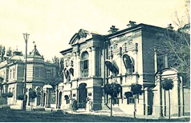

- Tashqi ishlar vazirligi
+ Davlat banki bo‘linmasi
- Shahar Dumasi
- Soliq qo‘mitasi

**273. Toshkentda joriy etilgan «Shahar nizomi» ga ko‘ra, shaharning 3 900 kishilik, asosan ruslardan iborat Yangi shahar aholisidan qancha deputat Dumaga saylangan?**

- 21 nafar
- 32 nafar
+ 48 nafar
- 56 nafar

**274. XIX asrning oxirgi choragida Toshkentda Dumaga rahbarlik qiluvchi shaxs kim tomonidan tasdiqlangan?**

- Imperator
- Tashqi ishlar vaziri
+ Harbiy vazir
- General-gubernator

**275. «Turkiston o‘lkasini boshqarish haqidagi Nizom» loyihasi asosida o‘troq aholi bir bosqichli tizim shaklida qanday birlikka birlashtirilgan?**

+ Oqsoqolliklar
- Volostlar
- Ovullar
- Uyezdlar

**276. Turkiston general-gubernatorligi viloyatlari bo‘limlarga bo‘linib, ularning boshliqlari bir vaqtning o‘zida … ham hisoblangan.**

- bosh prokuror
- qo‘shin qo‘mondoni
- hudud sudyasi
+ harbiy komendant

**277. Qachon Rossiya imperatori «Turkiston viloyatini idora qilish to‘g‘risidagi Muvaqqat Nizom» ni tasdiqlagan?**

- 1864-yilda
+ 1865-yilda
- 1866-yilda
- 1867-yilda

**278. Yangi «Turkiston o‘lkasini boshqarish haqidagi Nizom» ga muvofiq Zarafshon okrugi qaysi viloyatga aylantirilgan?**

+ Samarqand viloyatiga
- Sirdaryo viloyatiga
- Jizzax viloyatiga
- Qashqadaryo viloyatiga

**279. Yangi «Turkiston o‘lkasini boshqarish haqidagi Nizom» ga muvofiq Turkiston general-gubernatorligining ma’muriy boshqaruvi qaysi yangi idora bilan to‘ldirilgan?**

- Turkiston general-gubernatori Majlisi
+ Turkiston general-gubernatori Kengashi
- Turkiston general-gubernatori Devoni
- Turkiston general-gubernatori Dumasi

**280. «Turkiston o‘lkasini boshqarish haqidagi Nizom» loyihasi asosida har bir volost nechta o‘tovdan iborat holda tashkil qilinishi belgilangan?**

+ 1000–2000 o‘tovdan
- 2000–3000 o‘tovdan
- 3000–4000 o‘tovdan
- 4000–5000 o‘tovdan

**281. Yangi «Turkiston o‘lkasini boshqarish haqidagi Nizom» ga muvofiq o‘lkaga ko‘chib kelgan rus aholisi necha yil davomida soliqlardan ozod etilgan?**

- 4 yil davomida
+ 5 yil davomida
- 6 yil davomida
- 7 yil davomida

**282. Turkiston o‘lkasida qaysi yillarda mintaqaga ko‘chib kelganlar hisobiga o‘lkada ko‘plab pravoslav jamoalari shakllanib, ular yashaydigan aholi punktlarida pravoslav cherkovlari qurilgan?**

- 1860–1870-yillarda
- 1870–1880-yillarda
+ 1880–1890-yillarda
- 1890–1900-yillarda

**283. Qaysi imperator «Turkiston viloyatini idora qilish to‘g‘risidagi Muvaqqat Nizom» ni tasdiqlagan?**

- Aleksandr I
+ Aleksandr II
- Nikolay I
- Nikolay II

**284. Turkiston o‘lkasida viloyatlardan keyingi turuvchi ma’muriy birlik qaysi?**

- Uchastka
+ Uyezd
- Volost
- Qishloq

**285. Toshkentda joriy etilgan «Shahar nizomi» ga ko‘ra, Duma a’zolarining qancha qismi Eski shahar hududidan saylangan?**

+ 1/3 qismi
- 2/3 qismi
- 1/4 qismi
- 2/4 qismi

**286. «Turkiston o‘lkasini boshqarish haqidagi Nizom» loyihasi asosida chorvador aholi ikki bosqichli tizim ko‘rinishidagi qanday birliklarga birlashtirilgan?**

+ Volost va ovullar
- Ovul va oqsoqolliklar
- Oqsoqollik va uyezdlar
- Uyezd va volostlar

**287. Yangi «Turkiston o‘lkasini boshqarish haqidagi Nizom» ga muvofiq qaysi uyezdning nomi Toshkent uyezdi deb o‘zgartirilgan?**

- Xo‘jand uyezdining
- Kattaqo‘rg‘on uyezdining
+ Qurama uyezdining
- Jizzax uyezdining

**288. Turkiston o‘lkasida yangi vaqf hujjatlarini tasdiqlash faqat kimning roziligi bilan davlat soliqlari va majburiyatlaridan ozod qilmasdan amalga oshirilgan?**

- Viloyat boshlig‘i
- Uyezd pristavi
+ General-gubernator
- Harbiy komendant

**289. Turkiston o‘lkasida viloyatlarni kim boshqargan?**

+ Harbiy gubernator
- Pristav
- Zobit
- Harbiy komendant

**290. Qaysi yilda Toshkentda «Shahar nizomi» joriy etilgan bo‘lib, unga muvofiq shahar boshqaruvi Dumaga o‘tgan?**

- 1874-yilda
- 1883-yilda
- 1879-yilda
+ 1877-yilda

**291. Qaysi Turkiston general-gubernatori «Turkiston o‘lkasi boshqa o‘lkalarga nisbatan tarixiy o‘tmishi, etnografik xususiyatlarini hisobga olgan holda alohida e’tibor berilishini talab qiladi», – degan edi?**

- K. Kaufman
- M. Skobelev
+ S. Duxovskoy
- N. Kuropatkin

**292. XIX asrning oxirgi choragida Toshkentda Dumaga rahbarlik qiluvchi shaxs kim tomonidan tavsiya qilingan?**

- Imperator
- Tashqi ishlar vaziri
- Harbiy vazir
+ General-gubernator

**293. Turkiston o‘lkasida «politsmeyster» qanday lavozim bo‘lgan?**

- Maslahatchi
- Viloyat mahkamasi boshlig‘i
- Tumanboshi
+ Mirshabboshi

**294. Turkiston o‘lkasida o‘troq aholi uchun qanday sudlar faoliyat yuritgan?**

- Fuqarolik sudi
- Biylar sudi
+ Qozilar sudi
- Shariat sudi

**295. «Turkiston o‘lkasini boshqarish haqidagi Nizom» loyihasi asosida har bir oqsoqollik nechta xonadondan iborat holda tashkil qilinishi belgilangan?**

- 50–100 xonadon
+ 100–200 xonadon
- 150–250 xonadon
- 200–300 xonadon

**296. Qaysi yildan Buxoroda Rossiya imperatorining siyosiy agentligi faoliyati yo‘lga qo‘yilgan?**

+ 1885-yildan
- 1886-yildan
- 1887-yildan
- 1888-yildan

**297. Turkiston o‘lkasida ko‘chmanchi aholi uchun qanday sudlar faoliyat yuritgan?**

- Fuqarolik sudi
+ Biylar sudi
- Qozilar sudi
- Shariat sudi

## Turkistonda Rossiya imperiyasiga qarshi milliy-ozodlik harakatlari.

**298. Dukchi eshon boshchiligidagi qo‘zg‘olonchilar qayerdagi harbiy kazarmaga hujum qilganlar?**

- Jizzaxdagi
+ Andijondagi
- Namangandagi
- O‘ratepadagi

**299. Toshkentdagi «Vabo isyoni» dan so‘ng, Turkiston general-gubernatori qanday holat e’lon qilingan joylarda majlis yig‘inlarini tarqatish, savdo-sanoat korxonalarini yopish, istalgan odamni surgun qilish, jarima solish va yana boshqa huquqlarni olgan?**

- «Favqulotda holat»
- «Mirshablik holati»
+ «Kuchli muhofazada» holati
- «Favqulodda muhofazada» holati

**300. Toshkentdagi «Vabo isyoni» paytida qancha odam shahar boshlig‘i huzuriga chora ko‘rish to‘g‘risidagi talab bilan yo‘lga tushgan?**

- 100 kishi atrofida
- 200 kishi atrofida
- 300 kishi atrofida
+ 400 kishi atrofida

**301. Dukchi eshon qo‘zg‘oloni qayerda boshlangan?**

- Jizzaxda
+ Andijonda
- Namanganda
- O‘ratepada

**302. Qachon Turkistonda Darvishxon boshchiligida qo‘zg‘olon ko‘tarilgan?**

- 1879-yilning qishida
- 1876-yilning bahorida
- 1881-yilning kuzida
+ 1885-yilning yozida

**303. Toshkentdagi «Vabo isyoni» dan so‘ng o‘lkada qanday holat joriy etilgan?**

- «Favqulotda holat»
+ «Mirshablik holati»
- «Kuchli muhofazada» holati
- «Favqulodda muhofazada» holati

**304. Qachon Xo‘jand va O‘ratepa tumanlarida mustamlakachi hukumatga qarshi qo‘zg‘olon ko‘tarilgan?**

- 1879-yil aprelda
- 1882-yil dekabrda
+ 1880-yil noyabrda
- 1885-yil yanvarda

**305. Qaysi yildan Turkistonda mustamlakachilar ma’murlarga qarshilik ko‘rsatgan oddiy fuqarolarni bevosita harbiy dala sudiga bera boshlaganlar?**

+ 1892-yildan
- 1894-yildan
- 1897-yildan
- 1899-yildan

**306. Toshkentdagi «Vabo isyoni» paytida shahar boshlig‘i kim edi?**

+ S. Putinsev
- M. Ivanov
- I. Kurpatov
- N. Korolkov

**307. Toshkentdagi «Vabo isyoni» ni bostirish uchun kazaklar polki va … askar chaqirilgan.**

+ bir rota
- ikki rota
- uch rota
- to‘rt rota

**308. Qaysi yildagi «Turkiston o‘lkasini boshqarish haqidagi Nizom» ga ko‘ra Rossiyadan ko‘chib kelganlar uchun yer fondi tashkil etilgan?**

+ 1886-yildagi
- 1889-yildagi
- 1891-yildagi
- 1895-yildagi

**309. Dukchi eshon qo‘zg‘oloni qachon boshlangan?**

- 1889-yilda
- 1891-yilda
- 1896-yilda
+ 1898-yilda

**310. Vabo kasalligi tarqalishi munosabati bilan, Toshkent shahar ma’muriyati kasallikka qarshi tadbirlar qatorida, kasallikdan vafot etgan kishilar uchun shahardan chekka joyda nechta maxsus qabriston ochgan?**

+ Bitta qabriston
- Ikkita qabriston
- Uchta qabriston
- To‘rtta qabriston

**311. XIX asr oxirlarida Rossiya sanoati tomonidan ishlab chiqarilgan uy-ro‘zg‘or buyumlari, ayniqsa, to‘qimachilik mahsulotlari bilan O‘rta Osiyo bozorlarining to‘ldirilishi natijasida … .**

- narx-navo arzonlagan
- boshqa davlatlar mahsulotlari bilan kuchli raqobat yuzaga kelgan
- mahsulotlarning sifati tushib ketgan
+ hunarmandchilikning ko‘plab turlari inqirozga uchragan

**312. Qachon Afg‘onistonda vabo kasalligi tarqalgan?**

+ 1892-yil mart oyida
- 1892-yil aprel oyida
- 1892-yil may oyida
- 1892-yil iyun oyida

**313. Toshkentda «Vabo isyoni» qachon boshlangan?**

- 1890-yil 24-aprelda
- 1891-yil 24-mayda
+ 1892-yil 24-iyunda
- 1893-yil 24-iyulda

**314. Qaysi yilda Rossiyadan Farg‘ona viloyatiga ko‘plab aholining ko‘chirib keltirilishi va joylashtirilishi yer taqchil va aholi zich yashaydigan vodiyning ahvolini nihoyatda yomonlashtirib yuborgan?**

- 1886-yilda
- 1889-yilda
+ 1891-yilda
- 1895-yilda

**315. Vabo kasalligi tarqalishi munosabati bilan, Toshkent shahar ma’muriyati kasallikka qarshi tadbirlar qatorida, shahardagi nechta qabristonni yopib qo‘ygan?**

- 8 ta
- 10 ta
+ 12 ta
- 14 ta

**316. «Yig», «duk» ma’nosini anglatuvchi «dukchi» so‘zi qaysi tildan olingan?**

+ Forschadan
- Arabchadan
- Turkiychadan
- Tojikchadan

**317. Mingtepa hozirda qayerda joylashgan?**

+ Andijon viloyati, Marhamat tumanida
- Farg‘ona viloyati, Marg‘ilon tumanida
- Namangan viloyati, Chust tumanida
- Jizzax viloyati, Zarbdor tumanida

**318. Dukchi eshon qo‘zg‘oloni paytida jazo ekspeditsiyasiga rahbarlik qilgan general-gubernator kim edi?**

+ N. Korolkov
- A. Vrevskiy
- N. Kuropatkin
- S. Duxovskoy

**319. Qachon Farg‘onada mustamlakachi hukumatga qarshi qo‘zg‘olon ko‘tarilgan?**

+ 1879-yil kuzida
- 1882-yil yozida
- 1878-yil bahorida
- 1885-yil qishida

**320. XIX asrning 70-yillari oxirida Turkistonning qaysi qismida mustamlakachi hukumatga qarshi xalq harakatlari kuchaygan?**

- Toshkent vohasida
+ Farg‘ona vodiysida
- Yettisuv o‘lkasida
- Kaspiyorti viloyatida

**321. Dukchi eshon boshchiligidagi qo‘zg‘olonchilar ikkiga bo‘linib, ularning biriga kim boshchilik qilgan?**

- Ziyovuddin eshon
- Ziyovuddin imom
+ Ziyovuddin maxsum
- Ziyovuddin qo‘rboshi

**322. Dukchi eshonning asl ismi kim edi?**

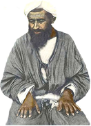

- Muhammad Amin
- Muhammad Niyoz
- Muhammad Yoqub
+ Muhammad Ali

**323. Turkistonning qayerida Yetimxon boshchiligida qo‘zg‘olon ko‘tarilgan?**

- O‘ratepada
+ Mingtepada
- Xo‘jandda
- Andijonda

**324. Turkistonda qayerda Darvishxon boshchiligida qo‘zg‘olon ko‘tarilgan?**

- Jizzaxda
- Namanganda
+ Andijonda
- Xo‘jandda

**325. Toshkentdagi «Vabo isyoni» yana qanday nom bilan tarixga kirgan?**

- «Toshkent voqeasi»
+ «Toshotar voqeasi»
- «Vabo voqeasi»
- «Qabriston voqeasi»

**326. Toshkentdagi «Vabo isyoni» paytida Eski shahar oqsoqoli kim edi?**

- Muhammad Amin
- Muhammad Niyoz
+ Muhammad Yoqub
- Muhammad Ali

**327. Qachon vabo kasalligi Toshkentda qayd qilingan?**

- 1892-yil mart oyida
- 1892-yil aprel oyida
- 1892-yil may oyida
+ 1892-yil iyun oyida

**328. Toshkentdagi «Vabo isyoni» dan so‘ng, Turkistonda qanday holat e’lon qilingan joylarda butun hokimiyat general-gubernator yoki u tayinlagan bosh noib qo‘liga o‘tishi belgilangan?**

- «Favqulotda holat»
- «Mirshablik holati»
- «Kuchli muhofazada» holati
+ «Favqulodda muhofazada» holati

**329. Qachon Namanganda mustamlakachi hukumatga qarshi qo‘zg‘olon ko‘tarilgan?**

- 1878-yilning boshlarida
+ 1882-yilning boshlarida
- 1884-yilning boshlarida
- 1886-yilning boshlarida

**330. Qachon Turkistonda Yetimxon boshchiligida qo‘zg‘olon ko‘tarilgan?**

- 1879-yilda
- 1882-yilda
+ 1878-yilda
- 1885-yilda

**331. 1892-yil bahor faslining oxirlariga kelib vabo kasalligi Samarqand viloyatining qaysi uyezdida qayd qilingan?**

- Samarqand uyezdida
- Kattaqo‘rg‘on uyezdida
- Xo‘jand uyezdida
+ Jizzax uyezdida

## Birinchi jahon urushining boshlanishi va uning Turkistonga ta’siri.

**332. Birinchi jahon urushi qachon boshlangan?**

- 1912-yilda
- 1913-yilda
+ 1914-yilda
- 1915-yilda

**333. Birinchi jahon urushi yillarida Turkiston o‘lkasida favqulodda holat tartibini buzganlar … so‘mgacha jarima to‘laydigan yoki … oygacha qamoq jazosiga hukm qilinadigan bo‘lgan.**

+ 50/3
- 100/5
- 150/7
- 200/9

**334. Birinchi jahon urushida Antanta ittifoqiga qaysi davlatlar birlashgan edi?**

- Italiya, Yaponiya, Germaniya
+ Rossiya, Angliya, Fransiya
- Angliya, Fransiya, Italiya
- Fransiya, Italiya, Yaponiya

**335. Birinchi jahon urushi yillarida Rossiya imperiyasiga qarashli qaysi hududlardagi aholidan front ortidagi ishlarni bajarishga safarbar qilina boshlangan? 1) Turkiston; 2) Sibir; 3) Kavkaz.**

- 1, 2
- 1, 3
- 2, 3
+ 1, 2, 3

**336. Birinchi jahon urushi yillarida Turkiston o‘lkasida qaysi mahsulotga o‘zgarmas davlat narxi joriy etilgan?**

+ Paxtaga
- Shakarga
- Unga
- Guruchga

**337. Qachon Turkistonda favqulodda muhofaza holati e’lon qilingan?**

- 1912-yilda
- 1913-yilda
+ 1914-yilda
- 1915-yilda

**338. Birinchi jahon urushiga Turkiston o‘lkasidan necha yoshda bo‘lgan aholining yevropalik qismi vakillari chaqirilgan?**

- 17 yoshdan 41 yoshgacha
- 18 yoshdan 42 yoshgacha
+ 19 yoshdan 43 yoshgacha
- 20 yoshdan 44 yoshgacha

**339. Birinchi jahon urushida jami nechta davlat qatnashgan?**

- 32 davlat
- 34 davlat
- 36 davlat
+ 38 davlat

**340. Birinchi jahon urushida Antanta ittifoqiga birlashgan davlatlar qaysi davlatlardan tuzilgan harbiy ittifoqa qarshi kurashgan?**

+ Germaniya, Avstriya-Vengriya, Italiya
- Avstriya-Vengriya, Italiya, Yaponiya
- Italiya, Yaponiya, Bolgariya
- Yaponiya, Bolgariya, Rossiya

## Turkistonda 1916-yilgi qo‘zg‘olonning boshlanishi.

**341. 1916-yilning iyulida qayerda mahalliy aholi o‘rtasida mardikorlikka olishga qarshi norozilik chiqishlari bo‘lib o‘tgan?**

- Urgut
- Siyob
+ Dahbed
- Angor

**342. Jizzax qo‘zg‘oloni bostirilgach, hukumatga yordam bermagan aholi qanday jazolangan?**

- Mol-mulki musodara qilingan
+ Uylaridan cho‘lga haydab yuborilgan
- Sibirga surgun qilingan
- Ishlash uchun frontga oilaviy olib ketilgan

**343. Qachon Jizzaxda mardikorlikka qarshi ommaviy qo‘zg‘olon ko‘tarilgan?**

- 1914-yilda
- 1915-yilda
+ 1916-yilda
- 1917-yilda

**344. Birinchi jahon urushi yillarida Turkistonda qaysi viloyatda xonadonlarning har beshtasidan bir kishi mardikorlikka olingan?**

- Samarqand viloyatida
+ Farg‘ona viloyatida
- Yettisuv viloyatida
- Sirdaryo viloyatida

**345. 1916-yilgi qo‘zg‘olon butun mustamlakachilik davomida Turkistondagi eng yirik qo‘zg‘olon sifatida qanday nom bilan tarixda qolgan?**

+ «Jizzax fojiasi»
- «Jizzax halokati»
- «Jizzax qirg‘ini»
- «Jizzax voqeasi»

**346. Birinchi jahon urushi yillarida Turkistonda mahalliy aholi o‘rtasida mardikorlikka olishga qarshi Samarqandning qaysi qishloqlarida norozilik chiqishlari bo‘lib o‘tgan? 1) Urgut; 2) Siyob; 3) Mahalla; 4) Xo‘ja Ahror; 5) Angor; 6) Dahbed.**

+ 1, 2, 3, 4, 5, 6
- 1, 3, 4, 5
- 2, 3, 4, 5, 6
- 2, 3, 4, 5

**347. Birinchi jahon urushi yillarida Turkistonda qayerda Damin kulol boshchiligida hunarmandlar mardikorlikka olish bo‘yicha ro‘yxatni talab qilib, qishloq oqsoqoli huzuriga borganlar?**

- Samarqand
- Toshkent
- Andijon
+ Jizzax

**348. «To‘rt yil davom etgan muhorabaning ko‘b nimarsalarga zarari tegdi. Jannatdin nishona bo‘lg‘on buyuk Turkiston qit’asida g‘alla yetishmay qimmatchilik bo‘la boshladi. Hozir emdi qimmatchilik dahshatli qahatlikka aylanmakda...». Ushbu jumlalar muallifi kim?**

- Zavqiy
- Sadriddin Ayniy
+ Miyon Buzruk
- Cho‘lpon

**349. Jizzax qo‘zg‘oloni natijasida xalq boshiga qanday musibatlar tushgan? 1) Aholisi qo‘zg‘olonda qatnashgan Jizzax atrofidagi qishloqlar yondirib yuborilgan, oqibatda ko‘pchilik uy-joysiz qolgan; 2) Qo‘zg‘olon yoz faslida bo‘lib o‘tganligi bois ekinzorlar, qishloq xo‘jaligi mahsulotlari nobud bo‘lgan. Bu esa oziq-ovqat taqchilligi, narx-navoning ko‘tarilishi, tirikchilik qilishning qiyinlashishiga olib kelgan; 3) Qo‘zg‘olon aholi orasida ko‘plab qurbonlar bo‘lishiga olib kelgan.**

- 1, 2
- 1, 3
- 2, 3
+ 1, 2, 3

## XIX asrning ikkinchi yarmi – XX asrning boshlarida Buxoro amirligi.

**350. XIX asr oxiri va XX asr boshlarida Buxoroda «otinoyi» deb kimga aytilgan?**

- Enagaga
+ Domlaga
- Shoiraga
- Tikuvchiga

**351. Nima sababdan Buxoro amirligida baljuvonlik dehqonlar qo‘zg‘olon ko‘tarishgan?**

- Dehqonlarni qo‘shimcha ravishda amaldorlar yerlarida tekin ishlashga majbur qilishgani uchun
- Amirlik hukumati suv solig‘ini ikki marta oshirgani uchun
- Majburiy tarzda askarlik xizmatiga jalb qilishgani uchun
+ Soliq yig‘uvchilar o‘tgan kamhosil yillar uchun ham xiroj to‘lashni talab qilishgani uchun

**352. XIX asr oxiri va XX asr boshlarida Buxoroda qancha an’anaviy (boshlang‘ich) maktablar faoliyat ko‘rsatgan?**

- 150 ga yaqin
- 250 ga yaqin
+ 350 ga yaqin
- 450 ga yaqin

**353. XIX asr oxiri va XX asr boshlarida Buxoro amirligidagi boshlang‘ich ta’lim muassasalarining moddiy asosini qanday manbalar tashkil etgan? 1) Hukmdor tomonidan ajratilgan mablag‘lar; 2) Vaqf mulklari; 3) Ayrim shaxslardan tushgan xayri-ehsonlar.**

- 1, 2
- 1, 3
+ 2, 3
- 1, 2, 3

**354. XIX asr oxirida Buxoro amirligidagi qaysi shaharda Rossiya davlat banki bo‘limi, paxta tozalash zavodi, Yevropa namunasidagi mehmonxona barpo etilgan?**

- Chorjo‘yda
+ Buxoroda
- Shahrisabzda
- Denovda

**355. XIX asr oxiri va XX asr boshlarida Buxoroda maktabxonada ta’lim jarayoni necha yil davom etgan?**

- 6–9 yilgacha
+ 7–10 yilgacha
- 8–11 yilgacha
- 9–12 yilgacha

**356. XIX asr oxiri va XX asr boshlarida Buxoroda qizlarning o‘qishi necha yoshdan boshlanib, necha yoshda tugar edi?**

- 5 yoshdan boshlanib, 11 yoshda tugar edi
- 6 yoshdan boshlanib, 12 yoshda tugar edi
+ 7 yoshdan boshlanib, 13 yoshda tugar edi
- 8 yoshdan boshlanib, 14 yoshda tugar edi

**357. Quyidagi suratdagi Buxorodagi rus-tuzem maktabi qachon ochilgan?**

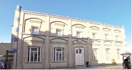

+ 1898-yilda
- 1891-yilda
- 1894-yilda
- 1896-yilda

**358. XIX asr oxirida Buxoro amirligida Buxorodan tashqari yana qaysi shaharlar savdo va hunarmandchilik markazlari hisoblangan? 1) Chorjo‘y; 2) Kitob; 3) Shahrisabz; 4) Denov; 5) Samarqand.**

+ 1, 2, 3, 4
- 2, 3, 4 ,5
- 1, 3, 4, 5
- 2, 3, 4

**359. XIX asr oxiri va XX asr boshlarida Buxoroda maktabxonaga o‘qishga qabul qilish yoshi … bo‘lgan.**

+ 5 yoshdan 12 yoshgacha
- 6 yoshdan 13 yoshgacha
- 7 yoshdan 14 yoshgacha
- 8 yoshdan 15 yoshgacha

**360. Buxoro amirligida ketma-ket kamhosil yillardan keyin baljuvonlik dehqonlar qaysi yilda mo‘l hosil yig‘ib olishgan?**

- 1883-yilda
- 1881-yilda
+ 1885-yilda
- 1888-yilda

**361. Qachon Buxoro amirligi hududi orqali dastlabki temiryo‘l o‘tkazilgan?**

- 1883-yilda
- 1885-yilda
- 1881-yilda
+ 1888-yilda

**362. Matndagi ikkita o‘rinda tushirib qoldirilgan bitta so‘zni toping. «XIX asr oxiri va XX asr boshlarida Buxorodagi maktablarda har … kuni keltiriladigan «…lik noni» maktabdor domlaning asosiy haqi hisoblangan».**

- seshanba
- chorshanba
+ payshanba
- juma

**363. XIX asr oxirida Eski Buxorodagi qaysi binolar ilk paydo bo‘lgan telefon aloqasi bilan bog‘langan?**

+ Qo‘shbegi uyi va Rossiya imperatorining siyosiy agentligi qarorgohi
- Rossiya imperatorining siyosiy agentligi qarorgohi va Davlat banki bo‘limi
- Davlat banki bo‘limi va amir saroyi
- Amir saroyi va qo‘shbegi uyi

**364. Buxoro amirligida qo‘zg‘olon ko‘targan baljuvonlik dehqonlar bilan qaysi amir lashkari o‘rtasida jang bo‘lib o‘tgan?**

- Amir Nasrullo
+ Amir Muzaffar
- Amir Abdulahad
- Amir Olimxon

**365. Buxoro amirligi hududi orqali dastlabki temiryo‘l o‘tkazilganda, Buxorodan necha kilometr masofada Yangi Buxoro stansiyasi qurilgan?**

- 11 kilometr
+ 15 kilometr
- 17 kilometr
- 22 kilometr

**366. Buxoro amirligidagi Yangi Buxoro stansiyasida qanday binolar qurilgan? 1) Amir saroyi; 2) Rossiya siyosiy agentining qarorgohi; 3) Davlat banki bo‘limi.**

- 1, 2, 3
+ 1, 2
- 1, 3
- 2, 3

**367. XIX asr oxiri va XX asr boshlarida Buxoroda odatda qizlar qayerda ta’lim olishgan?**

- Maktabxonalarda
- Masjidlarda
- Madrasalarda
+ Uylarida

**368. XIX asr oxirida Buxoroning qaysi mahsulotiga nafaqat ichki bozorda, balki tashqi bozorda ham talab katta bo‘lib, amirlik savdogarlari ularni ko‘p miqdorda xorijga sotar edilar?**

- Qog‘ozlariga
- Chinnilariga
+ Gilamlariga
- Taqinchoqlariga

**369. Qachon Buxoro amirligida baljuvonlik dehqonlar qo‘zg‘olon ko‘tarishgan?**

- 1883-yil aprelda
+ 1885-yil iyulda
- 1881-yil mayda
- 1888-yil yanvarda

**370. «Maktabda sinflarga bo‘lish degan gap yo‘q, hamma o‘quvchi qizlar bir xonada bo‘yra ustida o‘tirib dars qilishardi... Biri alifbe o‘qisa, ikkinchisi «Haftiyak» o‘qir, uchinchisi «Qur’on» o‘qisa, to‘rtinchisi «Chahor kitob» o‘qir, beshinchisi «Hikmat» o‘qisa, oltinchisi Mashrabni o‘qirdi ... . Bir kunda asosan ikki-uch soat o‘qilar, qolgan vaqt qizlar otinning xizmatini qilishardi ... . «Haftiyak» ni bitirib Qur’onga o‘tmoqchi bo‘lsa, yoki Qur’onni bitirib «Chahor kitobi» ga o‘tmoqchi bo‘lsa, qizning ota-onasi otinga, uning eriga albatta bosh oyoq sarpo qilib kelishi shart edi». Ushbu jumlalar kimning qaysi kitobidan olingan?**

- Uyg‘unoy To‘xtaboyevaning «Mehrigiyo» kitobidan
- Saida Zunnunovaning «Yurak so‘zi» kitobidan
- Orifaxonim Muhammedovaning «Orzularim» kitobidan
+ Kibriyo Qahhorovaning «Chorak asr hamnafas» kitobidan

**371. Buxoro amirligi hududi orqali dastlabki temiryo‘l o‘tkazilgach, amirlik temir yo‘l orqali qaysi shaharlar bilan bog‘langan? 1) Toshkent; 2) Orenburg; 3) Moskva.**

+ 1, 2, 3
- 1, 2
- 1, 3
- 2, 3

**372. XIX asr oxiri va XX asr boshlarida Buxorodagi qanday muassasada «bo‘yra puli», «ko‘mir puli», «supurgi puli» kabi to‘lovlar bo‘lgan?**

- Qozixonada
- Madrasada
+ Maktabda
- Kutubxonada

**373. Buxoro amirligida qaysi yilda Ko‘lob viloyatida dehqonlarning norozilik harakatlari bo‘lib o‘tgan?**

- 1883-yilda
- 1885-yilda
- 1881-yilda
+ 1888-yilda

**374. O‘rta Osiyoda maktablar sonining ko‘pligini ko‘rgan qaysi rus olimi musulmon aholisining ommaviy savodxonligini xalq ta’limi bo‘yicha Rossiya hukumatiga namuna sifatida ko‘tsatgan?**

- V. Bartold
- I. Krachkovskiy
+ A. Middendorf
- I. Berezin

**375. XIX asr oxiri va XX asr boshlarida Buxoro amirligidagi boshlang‘ich ta’lim muassasalarida asosan nimalarga urg‘u berilgan? 1) Arab tili va alifbosida savod chiqarish; 2) Islom asoslarini egallash; 3) Axloqiy tarbiya.**

- 1, 2
- 1, 3
- 2, 3
+ 1, 2, 3

## XIX asrning ikkinchi yarmi – XX asrning boshlarida Xiva xonligi.

**376. XIX asrning ikkinchi yarmida qoraqalpoqlar nimaning junidan guldor namatlar to‘qishgan?**

- Qo‘y junidan
- Echki junidan
+ Tuya junidan
- Qo‘y va tuya junidan

**377. XIX asrning ikkinchi yarmida qoraqalpoq xalq amaliy san’atida qanday sohalar rivojlangan? 1) O‘tovlar uchun o‘ymakor eshiklar yasash; 2) Uy-ro‘zg‘or buyumlari yasash; 3) Gilam to‘qish; 4) Kashtachilik.**

- 1, 2, 3
- 1, 2, 4
- 2, 3, 4
+ 1, 2, 3, 4

**378. XIX asrning o‘rtalarida Xiva xonligidagi qaysi shaharda 2 ta maktab va 2 masjid bo‘lgan?**

- Shovot
- Yangi Urganch
- Hazorasp
+ Shohobod

**379. XIX asrning ikkinchi yarmida qoraqalpoq urug‘larini kimlar boshqargan?**

+ Biy va uning oqsoqollari
- Bek va uning biylari
- Hokim va uning beklari
- Oqsoqol va uning botirlari

**380. Xiva xonligi Rossiya vassaliga aylantirilgandan so‘ng Xiva saroy kutubxonasidagi 300 dona qo‘lyozma, 18 dona Qur’oni karim, 50 dan ortiq nodir kitoblar kim tomonidan musodara qilingan?**

- Perovskiy
+ Kaufman
- Skobelev
- Chernyayev

**381. XIX asrning o‘rtalarida Xiva xonligida qaysi lavozimdagi shaxs o‘zining bevosita vazifasidan tashqari soliq to‘lovchilar hisobini yuritish, soliq yig‘ish, ba’zan esa suv taqsimoti bilan ham shug‘ullanar edi?**

- Mahalla oqsoqoli
- Shahar qozisi
- Qishloq mirshabi
+ Masjid imomi

**382. XIX asr oxirida Xiva xonligining Rossiya bilan savdo-sotig‘i rivojlanishi natijasida nima yetishtirishga ixtisoslashuv jadal kechgan?**

- G‘alla
+ Paxta
- Ipak
- Kunjut

**383. XIX asrning o‘rtalarida Xiva xonligidagi qaysi shaharda 15 ta masjid va ikkita madrasa bo‘lgan?**

- Shovot
+ Yangi Urganch
- Gurlan
- Shohobod

**384. XIX asrning o‘rtalarida Xiva xonligidagi qaysi shaharda 10 ta masjid va Qutlug‘ Inoq madrasasi bo‘lgan?**

- Shovot
- Yangi Urganch
+ Hazorasp
- Shohobod

**385. Quyidagi suratda qoraqalpoqlarning qaysi xalq amaliy san’ati namunasi berilgan?**

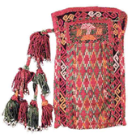

- Jumalak-tuyme
- Sovkele
+ Shayqalta
- Anshik

**386. Xiva xonligida XIX asrning ikkinchi yarmida qanday maqsadda beklarbegi lavozimi joriy etilgan? 1) Butun qoraqalpoq urug‘larini boshqarish; 2) Soliqlarni undirish; 3) Harbiy xizmatni o‘tash majburiyatlariga doir ishlarni tartibga solish.**

- 1, 2
- 1, 3
- 2, 3
+ 1, 2, 3

**387. Rossiya imperiyasi tomonidan Amudaryo bo‘limidagi qoraqalpoqlarga nisbatan jabr-zulm kuchayishi oqibatida qaysi volostlarda mustamlakachilarga qarshi Bobo Go‘klan boshchiligida xalq qo‘zg‘oloni bo‘lib o‘tgan?**

- Mo‘ynoq va Biybozor
+ Biybozor va Nukus
- Nukus va Mang‘it
- Mang‘it va Mo‘ynoq

**388. XIX asrning ikkinchi yarmida qoraqalpoq hunarmandlari, asosan, qanday buyumlarni tayyorlash bilan shug‘ullangan?**

- Ichki bozorda sotish uchun buyumlarni
- Tashqi bozorda sotish uchun buyumlarni
+ Ro‘zg‘or uchun zarur buyumlarni
- Ichki va tashqi bozorda sotish va ayriboshlash uchun buyumlarni

**389. Suratdagi Xiva xonligi vakillari qaysi Rossiya imperatori taxtga chiqishi marosimida ishtirok etgan?**

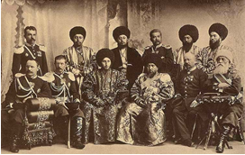

- Nikolay I
+ Nikolay II
- Aleksandr II
- Aleksandr III

**390. XIX asr oxirida Xiva xonligida nima yetishtirish qishloq xo‘jaligining asosiy tarmog‘i hisoblangan?**

+ G‘alla
- Paxta
- Ipak
- Kunjut

**391. XIX asrning ikkinchi yarmida qoraqalpoq urug‘lari biylarini kim tayinlab, uni tasdiqlovchi yorliq bergan?**

+ Xiva xoni
- Beklarbegi
- Devonbegi
- Biylar og‘asi

**392. XIX asrning o‘rtalarida Xiva xonligidagi qaysi shaharda 6 ta masjid va 2 maktab bo‘lgan?**

- Shovot
- Yangi Urganch
+ Gurlan
- Shohobod

**393. Xiva xonligida qaysi yildan so‘ng hosildor yerlarning katta qismi Rossiya tasarrufiga o‘tishi oqibatida xonlik ma’muriyati sarf-xarajatlarga bo‘lgan ehtiyojlarini yangi soliqlarni joriy etish yoki ilgari mavjud bo‘lganlarini oshirish yo‘li bilan qoplay boshlagan?**

- 1872-yildan so‘ng
+ 1873-yildan so‘ng
- 1874-yildan so‘ng
- 1875-yildan so‘ng

**394. XIX asrning o‘rtalarida Xiva xonligidagi qaysi shaharda 4 ta masjid va 1 madrasa bo‘lgan?**

+ Shovot
- Yangi Urganch
- Hazorasp
- Shohobod

**395. XX asr boshlariga kelib Xiva xonligining qaysi shaharlari ijtimoiy-iqtisodiy va madaniy markazlarga aylangan? 1) Xiva; 2) Yangi Urganch; 3) Qo‘ng‘irot; 4) Toshhovuz; 5) Gurlan.**

- 2, 3, 4
- 2, 3, 4, 5
- 1, 2, 3, 4
+ 1, 2, 3, 4, 5

**396. XX asr boshlariga kelib Xiva xonligida vujudga kelgan yangi shaharlarni toping. 1) Bog‘ot; 2) Gurlan; 3) Mo‘ynoq; 4) Taxta.**

- 1, 2, 3
- 1, 2, 4
+ 1, 3, 4
- 1, 2, 3, 4

## XIX asr ikkinchi yarmi – XX asr boshlarida qoraqalpoqlar madaniyati.

**397. «Bo‘zatov», «Qiz Mengesh bilan aytishuv» dostonlari muallifi kim?**

- Kunxo‘ja
- Otash Olshinboy
- Berdaq
+ Ajiniyoz Qasiboy o‘g‘li

**398. Quyidagi qaysi dostonda qoraqalpoq xalqining hayoti, ayniqsa, ularning ko‘chib yurish jarayoni bilan bog‘liq voqealar katta mahorat bilan tasvirlangan?**

+ «Bo‘zatov»
- «Qiz Mengesh bilan aytishuv»
- «Qirq qiz»
- «Xalq uchun»

**399. XX asr boshlariga kelib qoraqalpoq adabiyotidagi demokratik an’analarni davom ettirgan yangi avlod vakillarini toping. 1) Umar; 2) Sariboy; 3) Qulmurot; 4) Sodiq.**

- 1, 2, 3
- 1, 3, 4
- 1, 2, 4
+ 1, 2, 3, 4

**400. XIX asrda qoraqalpoqlarda madrasada ta’lim ikki bosqichli bo‘lib, birinchi bosqichda nima o‘rgatilgan?**

+ Arab tili grammatikasi
- Diniy-huquqiy bilimlar
- Dunyoviy bilimlar
- Ma’muriy-boshqaruvga oid bilimlar

**401. XIX asrda qoraqalpoqlarda qaysi madrasalar tashkil etilgan? 1) Qoraqum eshon; 2) Tosh madrasa; 3) Qalila oxun; 4) Egambergan oxun; 5) Oybit eshon; 6) Eshonqal’a.**

- 2, 3, 4, 5, 6
- 2, 3, 5, 6
- 1, 2, 4, 5
+ 1, 2, 3, 4, 5, 6

**402. «Xalq uchun» she’ri muallifi kim?**

- Kunxo‘ja
- Otash Olshinboy
+ Berdaq
- Ajiniyoz Qasiboy o‘g‘li

**403. XIX asrda xalq orasida qoraqalpoq folklorining … yo‘llari mashhur edi.**

+ doston
- o‘lan
- she’r
- masal

**404. Ajiniyoz Qasiboy o‘g‘lidan bizga qancha she’rlar yetib kelgan?**

- 50 ga yaqin
+ 100 ga yaqin
- 150 ga yaqin
- 200 ga yaqin

**405. Tosh madrasa qayerning hokimi Xo‘janiyoz tomonidan qurdirilgan?**

+ Mang‘it
- Nukus
- Biybozor
- Mo‘ynoq

**406. Berdaq yarim asr davomida turli mavzularda … to‘qigan.**

- dostonlar
+ o‘lanlar
- she’rlar
- masallar

**407. Quyidagi qaysi qoraqalpoq adibi «Zevar» taxallusi bilan ijod qilgan?**

- Kunxo‘ja
- Otash Olshinboy
+ Ajiniyoz Qasiboy o‘g‘li
- Berdaq

**408. «Bu dostonda Sarkub hukmdori Olloyor o‘z qizi Guloyimga Muyeli degan hosildor yerlarni tortiq qilgani haqida aytiladi. Bu joyda Guloyim va uning qirq kanizagi mustahkam bir qal’a barpo etishadi. Dushmanlar Sarkub yerlariga hujum qilib, Guloyimning otasini o‘ldirishadi. Sarkub mulklari talanadi, sarkubliklarning ko‘pi asir olinib haydab ketiladi. Guloyim va uning kanizaklari dushmanga qarshi kurashga kirishadi, qoraqalpoqlarni asirlikdan ozod qiladi va ona yurtga ozodlikni qaytaradi. Bu ishda Guloyimga uning oshig‘i xorazmlik bahodir Arslon yordam beradi. Dostonning bosh g‘oyasi – yuksak vatanparvarlik hissi va ona Vatanga, xalqqa fidoyilarcha muhabbatdir». Yuqorida qoraqalpoq xalqining qaysi dostoni mazmuni keltirib o‘tilgan?**

- «Bo‘zatov»
- «Qiz Mengesh bilan aytishuv»
+ «Qirq qiz»
- «Xalq uchun»

**409. Qoraqalpoq adibi Kunxo‘ja qaysi yillarda yashagan?**

- 1827–1900-yillarda
+ 1799–1880-yillarda
- 1788–1875-yillarda
- 1824–1878-yillarda

**410. Quyidagi qaysi qoraqalpoq adibi qoraqalpoq ziyolilari orasida birinchilardan bo‘lib oxund (o‘qimishli, ilmli kishi; xalq dostonlarining mahoratli kuychisi) darajasiga erishgan?**

- Kunxo‘ja
- Otash Olshinboy
- Berdaq
+ Ajiniyoz Qasiboy o‘g‘li

**411. XIX asr boshlarida qoraqalpoqlarda nechta maktab tashkil etilgan?**

- 118 ta
- 218 ta
+ 318 ta
- 418 ta

**412. Quyidagi qaysi qoraqalpoq adibi Orolbo‘yida tug‘ilgan, ovul maktabida, so‘ngra Qoraqum eshon madrasasida o‘qigan?**

- Kunxo‘ja
- Otash Olshinboy
+ Berdaq
- Ajiniyoz Qasiboy o‘g‘li

**413. XIX asrda qoraqalpoqlar o‘z yuritdan tashqari yana qaysi shaharlarda ta’lim olganlar?**

- Xiva va Samarqand
- Samarqand va Hirot
- Hirot va Buxoro
+ Buxoro va Xiva

**414. Quyidagi qaysi qoraqalpoq adibi Mo‘ynoqdagi maktabda, so‘ngra Xivadagi Sherg‘ozixon madrasasida o‘qigan, o‘zbek, qozoq, turkman tillarini yaxshi bilgan?**

- Kunxo‘ja
- Otash Olshinboy
+ Ajiniyoz Qasiboy o‘g‘li
- Berdaq

**415. XIX asr oxiri – XX asr boshlarida qoraqalpoqlarning eng katta madrasalari qaysilar edi? 1) Qoraqum eshon; 2) Tosh madrasa; 3) Qutlug‘ Inoq.**

- 2, 3
- 1, 3
+ 1, 2
- 1, 2, 3

**416. Tosh madrasa qachon qurilgan?**

- 1839-yilda
+ 1841-yilda
- 1844-yilda
- 1846-yilda

**417. Berdaq necha yoshidan she’rlar yoza boshlagan?**

- 17 yoshidan
- 18 yoshidan
- 19 yoshidan
+ 20 yoshidan

**418. Qoraqalpoqlarning quyidagi qaysi madrasasi XIX asr o‘rtalarida qurilgan bo‘lib, dastlab masjid vazifasini bajargan?**

- Tosh madrasa
+ Qoraqum eshon
- Qalila oxun
- Egambergan oxun

**419. Qoraqalpoq adibi Ajiniyoz Qasiboy o‘g‘li qaysi yillarda yashagan?**

- 1827–1900-yillarda
- 1799–1880-yillarda
- 1788–1875-yillarda
+ 1824–1878-yillarda

**420. Qoraqalpoq adibi Berdaq qaysi yillarda yashagan?**

+ 1827–1900-yillarda
- 1799–1880-yillarda
- 1788–1875-yillarda
- 1824–1878-yillarda

**421. Qoraqalpoq xalq og‘zaki ijodida kim kulgi qahramoni bo‘lgan?**

+ O‘mirbek laqqi
- Umarbek laqqi
- Qulmurot laqqi
- Otabek laqqi

**422. Quyidagi qaysi qoraqalpoq adibi o‘z ijodida ovullarning oddiy ahlini, ularning kundalik mehnati va turmushini kuylagan?**

+ Kunxo‘ja
- Otash Olshinboy
- Ajiniyoz Qasiboy o‘g‘li
- Berdaq

**423. Qoraqalpoq adibi Otash Olshinboy qaysi yillarda yashagan?**

- 1827–1900-yillarda
- 1799–1880-yillarda
+ 1788–1875-yillarda
- 1824–1878-yillarda

**424. XIX asrda qoraqalpoqlarda madrasada ta’lim ikki bosqichli bo‘lib, ikkinchi bosqichda nima o‘rgatilgan?**

- Arab tili grammatikasi
+ Diniy-huquqiy bilimlar
- Dunyoviy bilimlar
- Ma’muriy-boshqaruvga oid bilimlar

## Turkistonda jadidchilik harakati.

**425. Turkistonda taraqqiyparvarlik harakatining rivojlanishi necha bosqichda bo‘lgan?**

+ Ikki bosqichda
- Uch bosqichda
- To‘rt bosqichda
- Besh bosqichda

**426. O‘rta Osiyodagi milliy taraqqiyparvarlik harakati hududiy xususiyatlariga ko‘ra qaysi hudud jadidlariga bo‘linadi?**

+ Turkiston, Buxoro, Xiva
- Buxoro, Xiva, Kavkaz
- Xiva, Kavkaz, Yettisuv
- Kavkaz, Yettisuv, Turkiston

**427. Buxoro amirligida birinchi yangi usul maktabi qachon faoliyat ko‘rsata boshlagan?**

- 1891-yilda
+ 1893-yilda
- 1896-yilda
- 1898-yilda

**428. Qaysi yildan Turkistonda yangi usul maktablarini ochish uchun maxsus ruxsatnoma olinishi belgilangan?**

- 1905-yildan
+ 1909-yildan
- 1912-yildan
- 1916-yildan

**429. Jadidchilk g‘oyalarining keng yoyilishida qaysi gazeta muhim o‘rin tutgan?**

+ «Tarjimon»
- «Oyna»
- «Hurriyat»
- «Taraqqiy»

**430. Qaysi yildan boshlab Buxoroda jadidchilik harakati siyosiy tashkilot sifatida shakllana boshlagan?**

- 1902-yildan
- 1905-yildan
+ 1910-yildan
- 1917-yildan

**431. Qaysi yilga kelib Turkistondagi taraqqiyparvarlik harakati siyosiy ko‘rinishdagi harakatga aylangan?**

- 1908-yilga
- 1910-yilga
- 1914-yilga
+ 1917-yilga

**432. Jadid maktabi asoschilari va ular maktab ochgan joylarni mos tartibini toping. 1) Salohiddin domla; 2) Shamsiddin domla; 3) Mannon qori. a) Andijon; b) Toshkent; c) Qo‘qon.**

- 1a, 2b, 3c
+ 1c, 2a, 3b
- 1b, 2a, 3c
- 1c, 2b, 3a

**433. Xiva xonligida jadidchilik nechta oqimdan iborat edi?**

+ Ikkita oqimdan
- Uchta oqimdan
- To‘rtta oqimdan
- Beshta oqimdan

**434. Xiva xonligida jadidchilikning sarmoyadorlar, hunarmandlar va boshqa tabaqa vakillarini birlashtirib, yangi usul maktablarini tashkil qilish orqali xalq ommasining siyosiy faolligiga erishmoqchi bo‘lgan so‘l oqimiga kim boshchilik qilgan?**

+ Qozikalon Bobooxun Salimov
- Bosh vazir Islomxo‘ja
- Savdogar Polvonniyoz hoji Yusupov
- Devonbegi Husaynbek Matmurodov

**435. Qachon Toshkentda Mannon qori jadid maktabini ochgan?**

- 1896-yilda
- 1897-yilda
- 1898-yilda
+ 1899-yilda

**436. «Jadid» so‘zi qanday ma’noni anglatadi?**

- «Qadimiy»
+ «Yangi»
- «Ilg‘or»
- «Zamonaviy»

**437. Qachon Andijonda Shamsiddin domla jadid maktabini ochgan?**

- 1896-yilda
- 1897-yilda
- 1898-yilda
+ 1899-yilda

**438. Qachon Ismoil G‘aspirali Toshkent, Samarqand va Buxoroga tashrif buyurgan?**

- 1889-yilda
- 1891-yilda
+ 1893-yilda
- 1895-yilda

**439. Qachon Turkistonda ma’rifatparvarlik harakati vujudga kelgan?**

- XVIII asrning ikkinchi yarmida
- XIX asrning birinchi yarmida
+ XIX asrning ikkinchi yarmida
- XX asrning birinchi yarmida

**440. Qayerdagi jadidchilik harakati Turkiston o‘lkasiga nisbatan og‘ir ijtimoiy-siyosiy sharoitda yuzaga kelib, uning tarkibi, asosan, mayda do‘kondorlar, o‘qituvchilar, hunarmandlar, savdogarlardan iborat edi?**

- Xiva
- Qrim
+ Buxoro
- Kavkaz

**441. «Jadid» so‘zi qaysi tildan olingan?**

+ Arab tilidan
- Fors tilidan
- Tojik tilidan
- Turkiy tildan

**442. Jadidchilik harakatining asoschisi, qrim-tatar ma’rifatparvari Ismoil G‘aspirali qaysi yillarda yashagan?**

- 1849–1912-yillarda
+ 1851–1914-yillarda
- 1852–1915-yillarda
- 1854–1917-yillarda

**443. Xiva xonligida jadidchilikning o‘z oldiga mamlakatda xon hokimiyatini saqlab qolgan holda islohotlar o‘tkazilishini maqsad qilib qo‘ygan o‘ng oqimiga kim boshchilik qilgan?**

- Qozikalon Bobooxun Salimov
+ Bosh vazir Islomxo‘ja
- Savdogar Polvonniyoz hoji Yusupov
- Devonbegi Husaynbek Matmurodov

**444. XIX asr oxirlarida jadidlar tomonidan nimani rivojlantirish orqali mustaqillikka erishish mumkin degan g‘oyalar ilgari surilgan?**

- Teatrni
- Adabiyotni
- Matbuotni
+ Ta’limni

**445. Qachon jadidchilik harakati yuzaga kelgan?**

- XVIII asr oxirlarida
- XIX asr boshlarida
+ XIX asr oxirlarida
- XX asr boshlarida

**446. Turkiston jadidchiligining asosiy tarkibini kimlar tashkil qilib, ular Rossiya imperiyasi mustamlakachilik siyosatiga qarshi kurashning oldingi saflarida turganlar?**

- Zodagonlar
- Dehqonlar
- Hunarmandlar
+ Ziyolilar

**447. Qachon Qo‘qon shahrida Salohiddin domla ikkinchi jadid maktabini ochgan?**

- 1896-yilda
- 1897-yilda
+ 1898-yilda
- 1899-yilda

## Jadidchilik harakati namoyandalari va ularning faoliyati.

**448. Toshkentdagi jadidchilik harakati vakillarini toping.**

- Hamza Hakimzoda Niyoziy, Abdulhamid Cho‘lpon, Is’hoqxon Ibrat
- Abdurauf Fitrat, Sadriddin Ayniy, Fayzulla Xo‘jayev
+ Munavvarqori Abdurashidxonov, Abdulla Avloniy, Ubaydullaxo‘ja Asadullaxo‘jayev
- Mahmudxo‘ja Behbudiy, Abduqodir Shakuriy, Saidahmad Siddiqiy-Ajziy

**449. «Tarbiyai atfol» («Bolalar tarbiyasi») jamiyati qayerda tashkil qilingan?**

- Toshkentda
- Samarqandda
+ Buxoroda
- Andijonda

**450. Asadullaxo‘ja o‘g‘li Ubaydullaxo‘ja qayerda huquqshunoslik sohasi bo‘yicha ta’lim olgan?**

+ Rossiyada
- Turkiyada
- Germaniyada
- Angliyada

**451. «...Maktab va madrasa bir millatning hatto bani odamning darajali taraqqiy va taoliysi deb bo‘ladur. Faqat taraqqiy va taoliyni maktab va madrasalarni ko‘pligi ila bo‘lmayincha, balki nizom va tartiblik bo‘lub, yaxshi idora etilmog‘i ila bo‘ladur. Dunyoda mavjud millatlar taraqqiyni ibtidoiy maktablardan boshlarlar. Haqiqatan taraqqiy va taoliy uchun birinchi yo‘l va asosul-asos maktabdur». Yuqoridagi jumlalar kelirilgan «Masala» maqolasi muallifi kim?**

+ Mulla Rahimxon
- Munavvarqori Abdurashidxonov
- Hoji Muin
- Miyon Buzruk

**452. Quyidagilardan qaysilar jadidlar tomonidan tuzilgan milliy-siyosiy partiyalar hisoblanadi? 1) «Sadoi Turkiston»; 2) «Sho‘royi islomiya»; 3) «Ittifoq».**

+ 2, 3
- 1, 2
- 1, 3
- 1, 2, 3

**453. Farg‘onadagi jadidchilik harakati vakillarini toping.**

+ Hamza Hakimzoda Niyoziy, Abdulhamid Cho‘lpon, Is’hoqxon Ibrat
- Abdurauf Fitrat, Sadriddin Ayniy, Fayzulla Xo‘jayev
- Munavvarqori Abdurashidxonov, Abdulla Avloniy, Ubaydullaxo‘ja Asadullaxo‘jayev
- Mahmudxo‘ja Behbudiy, Abduqodir Shakuriy, Saidahmad Siddiqiy-Ajziy

**454. «Tarbiyai atfol» («Bolalar tarbiyasi») jamiyati qachon tashkil qilingan?**

- 1911-yilda
- 1907-yilda
- 1912-yilda
+ 1908-yilda

**455. Mahmudxo‘ja Behbudiy tashabbusi bilan uning otasi sharafiga qanday muassasa tashkil qilingan?**

- «Behbudiya shifoxonasi»
- «Behbudiya maktabxonasi»
+ «Behbudiya kutubxonasi»
- «Behbudiya bosmaxonasi»

**456. «Shuhrat» gazetasiga qachon asos solingan?**

- 1911-yilda
+ 1907-yilda
- 1912-yilda
- 1908-yilda

**457. O‘z hisobidan jadidlarni qo‘llab-quvvatlagan Mirkomil Mirmo‘minboyev qayerlik edi?**

- Toshkent
- Samarqand
+ Andijon
- Buxoro

**458. Qaysi voqeadan keyin jadidlar ancha keng qamrovli siyosiy talablarni, ya’ni mahalliy aholi huquqlarini kengaytirish, o‘lkani boshqarish yuzasidan islohotlar o‘tkazish, Davlat Dumasida o‘lka aholisi sonidan kelib chiqib o‘rin ajratish, milliy matbuot erkinligini ta’minlash kabilarni ilgari surganlar?**

- Birinchi jahon urushi boshlanganidan keyin
+ Rossiyadagi fevral voqealaridan keyin
- Rossiya imperiyasi Birinchi jahon urushidan chiqqanidan keyin
- Birinchi jahon urushi tugaganidan keyin

**459. Huquqshunoslik sohasi bo‘yicha ta’lim olib, birinchi oliy ma’lumotli o‘zbek advokati bo‘lgan Asadullaxo‘ja o‘g‘li Ubaydullaxo‘ja Toshkentning qaysi mahallasidan bo‘lgan?**

- «Mirishkor» mahallasidan
+ «Qoryog‘di» mahallasidan
- «Sayram» mahallasidan
- «Qorasuv» mahallasidan

**460. Sha’riy masalalarni hal qilish, hanafiylik mazhabini sofligicha keyingi avlodga yetkazish maqsadida qachon «Fuqaho jamiyati» tashkil topgan?**

- 1915-yil 10-dekabrda
- 1916-yil 10-yanvarda
+ 1917-yil 10-avgustda
- 1918-yil 10-sentyabrda

**461. «Oila tarbiyasi» maqolasi qachon va qaysi nashrda chiqarilgan?**

+ «Mehnatkashlar tovushi» gazetasi, 1918-yil
- «Shuhrat» gazetasi, 1915-yil
- «Izhor ul-Haq» jurnali, 1917-yil
- «Oyna» jurnali, 1916-yil

**462. «Fuqaho jamiyati» qaysi nashrni chiqargan?**

- «Shuhrat» gazetasi
- «Mehnatkashlar tovushi» gazetasi
- «Oyna» jurnali
+ «Izhor ul-Haq» jurnali

**463. «Tarbiyai atfol» («Bolalar tarbiyasi») jamiyati qaysi yilda 15 nafar talabani Turkiyaga o‘qishga yuborgan?**

- 1910-yilda
+ 1911-yilda
- 1912-yilda
- 1913-yilda

**464. «Fuqaho jamiyati» nechta qozi va ular yonidagi muhrdor, a’lam va muftiylardan iborat bo‘lgan?**

- Uch qozi
+ To‘rt qozi
- Besh qozi
- Olti qozi

**465. «Islomiyatning avvalgi asrlarindagi musulmonlar oila tarbiyasig‘a ahamiyat berib, erkak va qiz bolalarini o‘qita boshladilar. Xotunlar huquqini rioya etdilar. Va shul soyada maorif va madaniyat yo‘lig‘a qadam qo‘yib, ulug‘ bir quvvat hosil etdilar. Ozgina vaqtda dunyoning qismi a’zamini o‘zlarig‘a qaratdilar. Ul asrlarda islom dunyosinda erlar qatorinda xotunlardan ham qancha olima va shoira, muharrira, xatiba, adiba va faqihalar yetishgan edi». Yuqoridagi jumlalar kelirilgan «Oila tarbiyasi» maqolasi muallifi kim?**

- Mulla Rahimxon
- Munavvarqori Abdurashidxonov
+ Hoji Muin
- Miyon Buzruk

**466. O‘rta Osiyo jadidchilik harakatining asoschisi va yo‘lboshchisi kim bo‘lgan?**

- Abdulla Avloniy
- Munavvarqori Abdurashidxonov
- Is’hoqxon Ibrat
+ Mahmudxo‘ja Behbudiy

**467. Qaysi yilga kelib Turkiston jadidchiligi siyosiy harakatga aylangan?**

- 1908-yilga
- 1910-yilga
- 1914-yilga
+ 1917-yilga

**468. Quyidagi qaysi so‘z lotinchada «ittifoq bo‘lib mustahkamlash» degan ma’noni anglatadi?**

- Delegatsiya
- Proklamatsiya
+ Federatsiya
- Konfederatsiya

**469. Kim «O‘rta Osiyo jadidlarining otasi» deb tan olingan?**

- Abdulla Avloniy
- Munavvarqori Abdurashidxonov
- Is’hoqxon Ibrat
+ Mahmudxo‘ja Behbudiy

**470. Lotincha «delegat» so‘zining ma’nosi nima?**

- «Vakil»
- «Xodim»
+ «Yuborgan»
- «Kelgan»

**471. «Fuqaho jamiyati» qayerda tashkil topgan?**

+ Toshkent
- Samarqand
- Andijon
- Buxoro

**472. «Tahzib va tasfiyai axloq degan narsa maktablarimizda hech yo‘q. Muddati tahsil ko‘b uzoq bo‘lgani uchun ko‘b kishilar bolalarini 8-15 yil maktabga qo‘yolmaydurlar, chunki qudrat va iste’dodlari yetmaydur. Ham maktablarimizga intizom yo‘qdur. Shuning uchun maktabda yurgan aziz, gavhari noyob bolalarimizdan o‘n besh yo sakkiz nafardan ikki yo uch nafari ahli savod bo‘lib chiqadurlar». Ushbu jumlalar keltirilgan maqola qaysi nashrda chop etilgan?**

- «Shuhrat» gazetasida
- «Mehnatkashlar tovushi» gazetasida
- «Oyna» jurnalida
+ «Izhor ul-Haq» jurnalida

**473. Buxorodagi jadidchilik harakati vakillarini toping.**

- Polvonniyoz hoji Yusupov, Bobooxun Salimov
+ Abdurauf Fitrat, Sadriddin Ayniy, Fayzulla Xo‘jayev
- Munavvarqori Abdurashidxonov, Abdulla Avloniy, Ubaydullaxo‘ja Asadullaxo‘jayev
- Mahmudxo‘ja Behbudiy, Abduqodir Shakuriy, Saidahmad Siddiqiy-Ajziy

**474. Xivadagi jadidchilik harakati vakillarini toping.**

+ Polvonniyoz hoji Yusupov, Bobooxun Salimov
- Abdurauf Fitrat, Sadriddin Ayniy, Fayzulla Xo‘jayev
- Munavvarqori Abdurashidxonov, Abdulla Avloniy, Ubaydullaxo‘ja Asadullaxo‘jayev
- Mahmudxo‘ja Behbudiy, Abduqodir Shakuriy, Saidahmad Siddiqiy-Ajziy

**475. Asadullaxo‘ja o‘g‘li Ubaydullaxo‘ja qaysi rus yozuvchisi bilan yozishmalar olib borgan?**

- Aleksandr Blok
- Sergey Yesenin
- Nikolay Gumilyov
+ Lev Tolstoy

**476. Mahmudxo‘ja Behbudiy qaysi yillarda yashagan?**

- 1878–1931-yillarda
+ 1875–1919-yillarda
- 1878–1934-yillarda
- 1862–1937-yillarda

**477. Abdulla Avloniy qayerda tavallud topgan?**

+ Toshkentda
- Samarqandda
- Buxoroda
- Andijonda

**478. «Agar bizlarning maktablarimiz boshqa millat maktablari kabi bir nizomga qo‘yilib yaxshi muallimlik vazifasini lavozimicha ado qilurlik kishilardin muallimlar tayin qilinsa edi, ma’sum avlodlarimiz ruhiy hayotiga, dunyo va oxiratni saodatig‘a birinchi sabab o‘ladurg‘on ilm va maorifdin bu darajada mahrum o‘lmagiga sabab o‘lmas eduk». Yuqoridagi jumlalar muallifi kim?**

- Mulla Rahimxon
+ Munavvarqori Abdurashidxonov
- Hoji Muin
- Miyon Buzruk

**479. Qaysi voqeadan keyin jadidlar parlamentar monarxiya uchun kurashganlar?**

- Birinchi jahon urushi boshlanganidan keyin
- Rossiyadagi fevral voqealaridan keyin
+ Rossiya imperiyasi Birinchi jahon urushidan chiqqanidan keyin
- Birinchi jahon urushi tugaganidan keyin

**480. Samarqanddagi jadidchilik harakati vakillarini toping.**

- Polvonniyoz hoji Yusupov, Bobooxun Salimov
- Abdurauf Fitrat, Sadriddin Ayniy, Fayzulla Xo‘jayev
- Munavvarqori Abdurashidxonov, Abdulla Avloniy, Ubaydullaxo‘ja Asadullaxo‘jayev
+ Mahmudxo‘ja Behbudiy, Abduqodir Shakuriy, Saidahmad Siddiqiy-Ajziy

**481. Kim maktablar uchun «Adibi avval», «Adibi soniy», «Yer yuzi» kabi darsliklarni yaratgan?**

- Abdulla Avloniy
+ Munavvarqori Abdurashidxonov
- Abdurauf Fitrat
- Mahmudxo‘ja Behbudiy

**482. «Turon» teatr truppasini kim tashkil etgan?**

- Mahmudxo‘ja Behbudiy
- Abdurauf Fitrat
+ Abdulla Avloniy
- Is’hoqxon Ibrat

**483. «Tarbiyai atfol» («Bolalar tarbiyasi») jamiyati qaysi yilda 30 nafar talabani Turkiyaga o‘qishga yuborgan?**

- 1910-yilda
- 1911-yilda
+ 1912-yilda
- 1913-yilda

**484. Munavvarqori Abdurashidxonov qaysi yillarda yashagan?**

+ 1878–1931-yillarda
- 1875–1919-yillarda
- 1878–1934-yillarda
- 1862–1937-yillarda

**485. «Tarbiyai atfol» («Bolalar tarbiyasi») jamiyati kimlar tomonidan tashkil qilingan? 1) Abduvohid Burhonov; 2) Mukammil Burhonov; 3) Hamidxo‘ja Meqriy; 4) Ahmadjon Abdusaidov.**

- 1, 2, 3
- 1, 3, 4
- 2, 3, 4
+ 1, 2, 3, 4

**486. Abdulla Avloniy qanday oilada tavallud topgan?**

- Ziyolilar oilasida
- Savdogarlar oilasida
- Zodagonlar oilasida
+ Hunarmandlar oilasida

**487. Abdulla Avloniy qachon tavallud topgan?**

- 1875-yilda
+ 1878-yilda
- 1861-yilda
- 1867-yilda

**488. Kim o‘zi tashkil qilgan yangi usul maktabi uchun «Birinchi muallim», «Ikkinchi muallim», «Turkiy guliston yoxud axloq» kabi darsliklarni yaratgan?**

+ Abdulla Avloniy
- Munavvarqori Abdurashidxonov
- Is’hoqxon Ibrat
- Mahmudxo‘ja Behbudiy

**489. «Masala» maqolasi qachon va qaysi nashrda chiqarilgan?**

- «Shuhrat» gazetasi. 1911-yil
- «Mehnatkashlar tovushi» gazetasi. 1914-yil
- «Oyna» jurnali. 1915-yil
+ «Izhor ul-Haq» jurnali. 1918-yil

**490. «Shuhrat» gazetasiga kim asos solgan?**

+ Abdulla Avloniy
- Munavvarqori Abdurashidxonov
- Abdulhamid Cho‘lpon
- Mahmudxo‘ja Behbudiy

## Turkistonda ilm-fan va madaniyat.

**491. XIX asr oxiri – XX asr boshlarida Turkiston tasviriy san’ati qaysi hudud miniatyurachilari ijodida yorqin namoyon bo‘lgan? 1) Samarqand; 2) Qo‘qon; 3) Buxoro.**

- 1, 2
- 1, 3
- 2, 3
+ 1, 2, 3

**492. «Tarixi Turkiston» («Turkiston tarixi») asarida qaysi davrdagi voqealar yilnomasi bayon etilgan edi?**

- Qadimgi davrdan to XIX asr boshlarigacha
- Qadimgi davrdan to XIX asr o‘rtalarigacha
- Qadimgi davrdan to XIX asr oxirlarigacha
+ Qadimgi davrdan to XX asr boshlarigacha

**493. «Biz kim, Xorazm mamlakatining oliy xoqoni Muhammad Rahimxon Soniy quyidagi farmoni oliyga imzo chekdik. Xorazm maqomlari xalqning daxlsiz mulki deb e’lon qilinsin. Ushbu farmoni oliyga shak keltirgan va maqomlarni kamsitgan yoki uni buzib ijro etgan kimsalar qattiq jazolansin!». Ushbu farmon qaysi yilda qabul qilingan?**

- 1889-yilda
- 1880-yilda
- 1884-yilda
+ 1882-yilda

**494. XIX asr oxirlarida Farg‘ona vodiysidagi qaysi jome masjidi o‘z qurilishi bilan yuksak milliy me’morchilik namunasi bo‘lib qolgan?**

+ Andijon jome masjidi
- Namangan jome masjidi
- Marg‘ilon jome masjidi
- Qo‘qon jome masjidi

**495. Qaysi olim Tyanshan tog‘ tizimini o‘rganib, muzlik, vulqonlar haqida qiziqarli ma’lumotlar to‘plagan?**

- V. V. Bartold
- N. A. Seversev
+ P. P. Semyonov-Tyan-Shanskiy
- A. I. Levshin

**496. Turkiston qishloq xo‘jaligi jamiyati tomonidan qaysi jurnal nashr etilgan?**

- «Turkistonning iqlimi va yerlari»
- «Turkistonning sug‘orma dehqonchiligi»
- «Turkistonning tabiiy boyliklari»
+ «Turkistonning qishloq xo‘jaligi»

**497. Qaysi yilda Toshkent shahrida Rossiya Xalq maorifi vazirligiga tegishli 9 ta ta’lim muassasasi faoliyat yuritgan?**

- 1889-yilda
- 1870-yilda
- 1868-yilda
+ 1886-yilda

**498. «Teatr – bu ibratxonadir» so‘zlari muallifi kim?**

- Abdulla Avloniy
- Munavvarqori Abdurashidxonov
- Abdurauf Fitrat
+ Mahmudxo‘ja Behbudiy

**499. Qaysi olim Pomir tog‘ tizimini o‘rganib, botanikaga va minerallarga oid namunalar to‘plagan?**

- V. V. Bartold
+ N. A. Seversev
- P. P. Semyonov-Tyan-Shanskiy
- A. I. Levshin

**500. «Tarixi Turkiston» («Turkiston tarixi») kitobi qanday asar sifatida shuhrat qozongan?**

- O‘zbek tilidagi ilk yilnoma asar sifatida
- O‘zbek tilidagi ilk ilmiy asar sifatida
+ O‘zbek tilidagi ilk tarixiy asar sifatida
- O‘zbek tilidagi ilk tanqidiy asar sifatida

**501. XIX asr oxiri – XX asr boshlarida Turkistonda «rishtachilar» deb kimlarga aytilgan?**

- Jarrohlarga
+ Yaralarni tuzatuvchilarga
- Ko‘zni davolovchilarga
- Zulukchilarga

**502. XX asr boshlarida Sitorai Mohi Xosa qayerda qurilgan?**

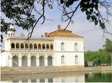

- Qo‘qon
- Xiva
+ Buxoro
- Samarqand

**503. «O‘rta Osiyo Olimlar jamiyati» qachon tashkil etilgan?**

- 1893-yilda
- 1884-yilda
+ 1871-yilda
- 1891-yilda

**504. Qachon Turkiston muzeyi (hozirgi O‘zbekiston tarixi davlat muzeyi) tashkil etilgan?**

- 1871-yilda
- 1873-yilda
+ 1876-yilda
- 1878-yilda

**505. Qaysi yilda Toshkent shahrida Rossiya Xalq maorifi vazirligiga tegishli 14 ta ta’lim muassasasi faoliyat yuritgan?**

+ 1889-yilda
- 1891-yilda
- 1894-yilda
- 1886-yilda

**506. XX asr boshlarida Turkistonda devoriy naqshlarda ilgari uchramagan qanday manzaralar tasvirlaridan foydalanila boshlangan? 1) Suzib borayotgan kema; 2) Temiryo‘llar; 3) Hayvonlar.**

+ 1, 2, 3
- 2, 3
- 1, 2
- 1, 3

**507. Qaysi yilda Xudoybergan Devonov Xivaning minoralari va hamyurtlarini suratga ola boshlagan?**

- 1901-yilda
- 1902-yilda
+ 1903-yilda
- 1904-yilda

**508. Qaysi Xiva xoni iste’dodli shoir va bastakor sifatida tarixda qolgan?**

- Muhammad Rahimxon I
+ Muhammad Rahimxon II
- Asfandiyorxon
- Said Abdullaxon

**509. «Hozirgi dunyoda yashash, ziyoli, komil va odil bo‘lish uchun o‘z vatani tarixini o‘rganish zarur». Ushbu jumlalar muallifi kim?**

- Abdulla Avloniy
- Munavvarqori Abdurashidxonov
- Abdulla Qodiriy
+ Mahmudxo‘ja Behbudiy

**510. XIX asr oxiri – XX asr boshlarida qaysi hudud me’morchilik maktabining e’tiborli tomoni peshtoqlar, shiplar, burjlar o‘ta nozik did va nafosat timsoli arabiy yozuvlar bilan bezatilishida va xattotlar bu yozuvlarni mohirlik bilan bino bezagiga uyg‘unlashtirib yubora olishida bo‘lgan?**

+ Xorazm
- Farg‘ona
- Buxoro
- Samarqand

**511. Jadid adabiyotida qaysi yilda ilk nasriy asarlar e’lon qilingan?**

- 1908-yilda
- 1917-yilda
- 1914-yilda
+ 1910-yilda

**512. Xudoybergan Devonovning suratga ola boshlashi avvaliga kimlarning qattiq qarshiligiga uchragan?**

- Oddiy xalqning
+ Diniy ulamolarning
- Saroy ahlining
- Mustamlakachi hukumatning

**513. Nay, surnay qanday musiqa asboblari turiga kiradi?**

- Torli-zarbli
+ Puflama nayli
- Munshtuk-puflamali
- Zarbli-membranali

**514. Qaysi yilda mustamlakachi hukumat tomonidan Turkistonda rus ta’lim maktablarini tashkil etish loyihasini ishlab chiqilishi borasida ko‘rsatma berilgan?**

- 1889-yilda
- 1870-yilda
+ 1868-yilda
- 1886-yilda

**515. «Tarixi Turkiston» («Turkiston tarixi») asari muallifi bo‘lgan tarixchi va jurnalist kim?**

- Miyon Buzruk
+ Mulla Olim Mahdum hoji
- Mulla Rahimxon
- Hoji Muin

**516. Qachon Farg‘ona vodiysi milliy me’morchiligiga Yevropa me’moriy uslubidagi binolarni qurish an’analari kirib kelgan?**

- XVIII asrning ikkinchi yarmida
- XIX asrning birinchi yarmida
+ XIX asrning ikkinchi yarmida
- XX asrning birinchi yarmida

**517. Qachon Turkiston xalq kutubxonasi tashkil etilgan?**

- 1891-yilda
- 1874-yilda
+ 1870-yilda
- 1889-yilda

**518. Quyidagi suratdagi kumush muqovali Qur’oni Karim qaysi asrga oid?**

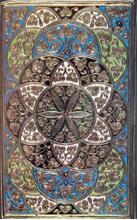

- XVII asrga
- XVIII asrga
+ XIX asrga
- XX asrga

**519. Qaysi yilda Turkistonda o‘quv bo‘limini tashkil etish bo‘yicha maxsus komissiya Toshkent shahrida ish boshlagan?**

- 1889-yilda
+ 1870-yilda
- 1868-yilda
- 1886-yilda

**520. Jadid adabiyotida kim ilk nasriy asarlarni e’lon qilgan?**

- Abdulla Avloniy
+ Abdulla Qodiriy
- Abdurauf Fitrat
- Abdulhamid Cho‘lpon

**521. Quyidagi suratdagi XIX asrning oxiri – XX asrning boshiga oid Mirza Mir Ishoq al Buxoriy qalamiga mansub miniatyura qaysi asarga ishlangan?**

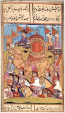

- «Farhod va Shirin»
- «Tohir va Zuhra»
+ «Yusuf va Zulayho»
- «Layli va Majnun»

**522. XIX asr oxiri – XX asr boshlaridagi Turkiston miniatyura san’ati kimlarning ijodida yorqin namoyon bo‘lgan? 1) Ahmad Donish; 2) Abdulxoliq maxdum; 3) S. Siddiqov; 4) Usta Shirin Murodov.**

- 1, 2, 4
+ 1, 2, 3
- 2, 3, 4
- 1, 2, 3, 4

**523. Quyidagi suratdagi Xiva teatri qaysi shaharda joylashgan edi?**

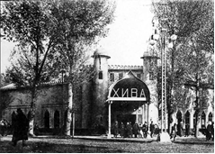

- Xiva
+ Toshkent
- Urganch
- Samarqand

**524. Karnay qanday musiqa asboblari turiga kiradi?**

- Torli-zarbli
- Puflama nayli
+ Munshtuk-puflamali
- Zarbli-membranali

**525. Sitorai Mohi Xosa qurilishida kim boshchiligidagi bir guruh usta ganchkorlar ishlagan?**

- Ahmad Donish
+ Usta Shirin Murodov
- Abdulxoliq maxdum
- S. Siddiqov

**526. Xudoybergan Devonov qachon tavallud topgan?**

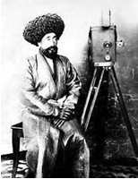

- 1866-yilda
- 1869-yilda
- 1874-yilda
+ 1878-yilda

**527. Xudoybergan Devonovning qaysi tilni o‘rgana boshlashi uning taqdirini belgilab bergan?**

+ Nemis tilini
- Rus tilini
- Arab tilini
- Fors tilini

**528. Qayerda Turkiston xalq kutubxonasi tashkil etilgan?**

+ Toshkent
- Samarqand
- Qo‘qon
- Buxoro

**529. Quyidagi suratdagi XIX asrga oid yog‘och lavh va Qur’on qo‘lyozmasi kimga tegishli bo‘lgan?**

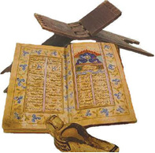

- Amir Olimxon
+ Xudoyorxon
- Muhammad Rahimxon II
- Amir Muzaffar

**530. «O‘rta Osiyo Olimlar jamiyati» qachon mablag‘ yo‘qligi tufayli o‘z faoliyatini to‘xtatgan?**

+ 1893-yilda
- 1884-yilda
- 1871-yilda
- 1891-yilda

**531. XX asr boshlarida kim ayollarning jamiyat va oiladagi haq-huquqsiz ahvoli to‘g‘risida achchiq haqiqatlarni qalamga olgan?**

- Muqimiy
+ Anbar otin
- Furqat
- Ahmad Donish

**532. Qachon Ulug‘bek rasadxonasi binosi qoldiqlari va rasadxonaga tegishli asbob-uskunalarning bir qismi topilgan?**

+ 1908-yilda
- 1913-yilda
- 1906-yilda
- 1910-yilda

**533. «Turon» teatri truppasining birinchi spektakllari qo‘yilgan «Kolizey» teatri-sirki binosi qaysi shaharda joylashgan edi?**

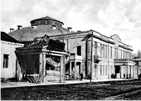

- Qo‘qon
+ Toshkent
- Buxoro
- Samarqand

**534. XX asrda qurilgan Shirmonpaz masjidi qayerda joylashgan?**

+ Marg‘ilonda
- Andijonda
- Namanganda
- Qo‘qonda

**535. Chang qanday musiqa asboblari turiga kiradi?**

+ Torli-zarbli
- Torli-noxunli
- Torli-kamonchali
- Zarbli-membranali

**536. «Padarkush» pyesasi muallifi kim?**

- Abdulla Avloniy
- Munavvarqori Abdurashidxonov
- Abdurauf Fitrat
+ Mahmudxo‘ja Behbudiy

**537. Do‘mbira, dutor, tanbur, ud, rubob qanday musiqa asboblari turiga kiradi?**

- Torli-zarbli
+ Torli-noxunli
- Torli-kamonchali
- Zarbli-membranali

**538. Turkistonda qaysi yilda birinchi futbol jamoasi tuzilgan?**

- 1910-yilda
- 1911-yilda
+ 1912-yilda
- 1913-yilda

**539. Qaysi Xiva xoni Xudoybergan Devonovga o‘zining suratini olishni buyurgan, keyin esa uni o‘z devoniga ishga taklif qilgan?**

- Muhammad Rahimxon I
+ Muhammad Rahimxon II
- Asfandiyorxon
- Said Abdullaxon

**540. Doira, nog‘ora, chindovul qanday musiqa asboblari turiga kiradi?**

- Torli-zarbli
- Puflama nayli
- Munshtuk-puflamali
+ Zarbli-membranali

**541. Turkistonda qayerda birinchi futbol jamoasi tuzilgan?**

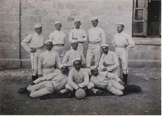

+ Qo‘qon
- Toshkent
- Buxoro
- Samarqand

**542. Turkistonni xaritalashtirish va iqlimini o‘rganish uchun qayerda meteorologiya stansiyasi tashkil etilgan?**

+ Toshkent
- Samarqand
- Qo‘qon
- Buxoro

**543. Kim Xudoybergan Devonovni o‘z himoyasiga olgan?**

+ Xiva xoni Muhammad Rahimxon II
- Bosh vazir Islomxo‘ja
- Qozikalon Bobooxun Salimov
- Devonbegi Husaynbek Matmurodov

**544. Qaysi yillarda Turkistonning turli shaharlarida teatrlar tashkil etilgan?**

+ 1911–1913-yillarda
- 1912–1914-yillarda
- 1913–1915-yillarda
- 1914–1916-yillarda

**545. «Uloqda» hikoyasi muallifi kim?**

- Abdulla Avloniy
+ Abdulla Qodiriy
- Abdurauf Fitrat
- Abdulhamid Cho‘lpon

**546. Qayerda Turkiston muzeyi (hozirgi O‘zbekiston tarixi davlat muzeyi) tashkil etilgan?**

+ Toshkent
- Samarqand
- Qo‘qon
- Buxoro

**547. G‘ijjak, qo‘biz, uchtor qanday musiqa asboblari turiga kiradi?**

- Torli-zarbli
- Torli-noxunli
+ Torli-kamonchali
- Zarbli-membranali

## Turkiston o‘lkasi 1917-yil fevral-oktyabr oralig‘ida.

**548. Butunturkiston musulmonlarining birinchi o‘lka qurultoyida qaysi masalalar bo‘yicha qaror qabul qilgan? 1) Mustamlakachilikni tugatish; 2) Musodara qilingan yerlarni mahalliy aholiga qaytarish; 3) Musulmonlar Markaziy Sho‘rosini ta’sis etish.**

- 1, 3
- 2, 3
+ 1, 2
- 1, 2, 3

**549. Qachon «Sho‘royi islomiya» tashkilotidan «Sho‘royi ulamo» ajralib chiqqan?**

- 1917-yil aprelda
- 1917-yil iyulda
- 1917-yil martda
+ 1917-yil iyunda

**550. Qachon bolsheviklar Rossiya imperiyasi markazida hokimiyatni egallab olgan?**

- 1917-yil 25-sentyabrda
+ 1917-yil 25-oktyabrda
- 1917-yil 25-noyabrda
- 1917-yil 25-dekabrda

**551. Butunturkiston musulmonlarining birinchi o‘lka qurultoyida Musulmonlar Markaziy Sho‘rosini ta’sis etish bo‘yicha kelishilgan va bu qaror keyinchalik qanday tashkilot shaklida amalga oshirilgan?**

- Milliy kengash
- Milliy ittifoq
+ Milliy markaz
- Milliy majlis

**552. «Muvaqqat hukumat ishlab chiqqan yangi qonunda: 1. Rusiyaning har bir fuqarosi din masalasida hurdir; 2. To‘qqiz yoshga yetmagan bolalar ota-onasining dinida, ota-onalari ikki e’tiqodda bo‘lsa, otasining dinida deb hisoblanur; 3. Ota-onasi ma’lum bo‘lmagan bolalar vasiylarining dinida deb hisoblanur; 4. O‘n yetti yoshga har bir kishiga bir dindan ikkinchi dinga ko‘chishi uchun biror ruxsat lozim emas; 5. To‘qqiz yoshga yetmagan bola ota-onasi ko‘chgan dinga ko‘chgan hisoblanur». Ushbu qonun keltirib o‘tilgan «Hurriyati diniya» maqolasi muallifi kim?**

- Mulla Rahimxon
+ Ibrohim Tohiriy
- Hoji Muin
- Miyon Buzruk

**553. «Sho‘royi islomiya» tashabbusi bilan qayerda Butunturkiston musulmonlarining birinchi o‘lka qurultoyi bo‘lib o‘tgan?**

+ Toshkentda
- Qo‘qonda
- Buxoroda
- Samarqandda

**554. Rossiyadagi 1917-yil fevral inqilobidan keyin Turkistonda paydo bo‘lgan hokimiyatlarni toping. 1) Rossiya Muvaqqat hukumatining vaqtli Turkiston komiteti; 2) Turkistondagi ishchi va askar deputatlarining mahalliy va markaziy Sovetlari; 3) Jadidlarning «Sho‘royi islomiya» tashkiloti (jamiyati) va uning joylardagi shu’balari, Toshkentda Turkiston o‘lka musulmonlari soveti (Kraymussovet) – Milliy Markaz.**

- 1, 3
- 2, 3
- 1, 2
+ 1, 2, 3

**555. «Sho‘royi islomiya» tashkilotiga kim rahbarlik qilgan?**

- Abdulla Avloniy
+ Munavvarqori Abdurashidxonov
- Abdurauf Fitrat
- Mahmudxo‘ja Behbudiy

**556. «Rusiyada bosh ko‘targan yangi bir balo – bolshevik balosi», deb kim yozgan?**

- Abdulla Avloniy
- Munavvarqori Abdurashidxonov
+ Abdurauf Fitrat
- Mahmudxo‘ja Behbudiy

**557. «Hurriyati diniya» maqolasi qachon va qaysi nashrda chiqarilgan?**

+ «Al-Isloh», 1917-yil
- «Mehnatkashlar tovushi», 1914-yil
- «Izhor ul-Haq», 1918-yil
- «Shuhrat», 1911-yil

**558. «Sho‘royi islomiya» tashkiloti qachon tashkil topgan?**

- 1917-yil aprelda
- 1917-yil iyulda
+ 1917-yil martda
- 1917-yil iyunda

**559. Butunturkiston musulmonlarining birinchi o‘lka qurultoyi qancha masalani ko‘rib chiqqan?**

- 10 ga yaqin
+ 20 ga yaqin
- 30 ga yaqin
- 40 ga yaqin

**560. Qachon «Sho‘royi islomiya» tashkilotidan «Turk adami markaziyat firqasi» («Turkiston federalistlar partiyasi») ajralib chiqqan?**

- 1917-yil aprelda
+ 1917-yil iyulda
- 1917-yil martda
- 1917-yil iyunda

**561. Rossiyadagi 1917-yil fevral inqilobidan keyin Turkistonda nechta hokimiyatchilik paydo bo‘lgan?**

- Ikki hokimiyatchilik
+ Uch hokimiyatchilik
- To‘rt hokimiyatchilik
- Besh hokimiyatchilik

**562. Nikolay II taxtdan voz kechgach, Rossiyada hokimiyat boshqaruviga … kelgan.**

+ Muvaqqat hukumat
- Inqilobiy hukumat
- Bolshevistik hukumat
- Koalitsion hukumat

**563. Rossiyadagi Muvaqqat hukumat tomonidan Turkiston bo‘ylab har bir shahar, uyezd, volost va qishloqda, eski ma’muriyat idoralari o‘rniga, qanday nomlangan qo‘mitalar tashkil qilingan?**

- Jamoat ittifoqi
+ Jamoat xavfsizligi
- Jamoat uyushmasi
- Jamoat markazi

**564. «Sho‘royi islomiya» tashabbusi bilan qachon Butunturkiston musulmonlarining birinchi o‘lka qurultoyi bo‘lib o‘tgan?**

+ 1917-yil 16-23-aprelda
- 1917-yil 16-23-iyulda
- 1917-yil 16-23-martda
- 1917-yil 16-23-iyunda

**565. Butunturkiston musulmonlarining birinchi o‘lka qurultoyida qancha delegat to‘plangan?**

- 100 ga yaqin
+ 150 ga yaqin
- 200 ga yaqin
- 250 ga yaqin

**566. Qachon bolsheviklar Toshkentda sovet hokimiyatini o‘rnatganlar?**

+ 1917-yil 1-noyabrda
- 1917-yil 1-dekabrda
- 1918-yil 1-yanvarda
- 1918-yil 1-fevralda

**567. «Haq olinur, berilmas!» shiori muallifi kim?**

- Abdulla Avloniy
- Munavvarqori Abdurashidxonov
- Abdurauf Fitrat
+ Mahmudxo‘ja Behbudiy

**568. Butunturkiston musulmonlarining birinchi o‘lka qurultoyida qaysi masala bo‘yicha kelishilgan?**

- Mustamlakachilikni tugatish
- Musodara qilingan yerlarni mahalliy aholiga qaytarish
- Milliy davlatchilikni tiklash
+ Musulmonlar Markaziy Sho‘rosini ta’sis etish

**569. 1917-yil fevral oyida Rossiya imperiyasi markazida yuz bergan davlat to‘ntarishi oqibatida qaysi sanada Nikolay II taxtdan voz kechgan?**

- 15-fevral
+ 15-mart
- 15-oktyabr
- 15-dekabr

## Yosh buxoroliklar faoliyati va Buxoro amirligining tugatilishi.

**570. Sayid Olimxon Peterburgda necha yil davomida harbiy ishlar va davlat boshqaruvi asoslarini o‘rgangan?**

- 2 yil davomida
+ 3 yil davomida
- 4 yil davomida
- 5 yil davomida

**571. Buxoro amiri Sayid Olimxonga ko‘ra, bolsheviklar sulh tuzish uchun Toshkentdan tashqi ishlar vaziri bo‘lgan kimni jo‘natishgan?**

- Osipov
+ Baranov
- Ivanov
- Danilev

**572. 1917-yilda bahorda jadidlar qayerda o‘tkazgan namoyishida «Yashasin Amir!» shiori qatorida «Hurriyat, Adolat, Musavvat!» kabi boshqa mazmundagi da’vatlar ham bor edi?**

- Kogonda
- Karkida
+ Buxoroda
- Chorjo‘yda

**573. Qachon jadidlar Karki va Buxoroda namoyishlar o‘tkazishgan?**

+ 1917-yil 8-aprelda
- 1917-yil 8-mayda
- 1917-yil 8-iyunda
- 1917-yil 8-iyulda

**574. Buxoro amirining 1917-yil bahoridagi farmonida nima ta’sis etilgan?**

- Odil sudlov tizimi
- Xiroj, zakot va boshqa soliqlarni undirishning barqaror asoslari
+ Amaldorlarga davlat tomonidan qat’iy belgilab qo‘yilgan maosh
- Sanoat va savdoni rivojlantirish bo‘yicha mahkama

**575. Yosh buxoroliklar mamlakatda qanday ishlarni amalga oshirishni ko‘zlashgan edi? 1) Amirlikdagi yer-suv masalasiga katta e’tibor berish; 2) Milliy armiyani shakllantirish uchun harbiy maktablar ochish; 3) Moliya masalasida kirim-chiqimlarni hisoblash; 4) Ma’orif sohasida amirlik xazinasi hisobidan maktablar va oliy o‘quv yurtlari ochish; 5) Yakka hokimlik (monarxiyani) yevropacha konstitutsion monarxiyaga almashtirish.**

- 1, 2, 3, 4
- 2, 3, 4
- 1, 3, 4, 5
+ 1, 2, 3, 4, 5

**576. 1917-yilda bahorda jadidlar Buxoroda o‘tkazgan namoyishida namoyishga chiqqanlar Arkgacha yetib kelishganida amir sarbozlari ularni to‘xtatishgan va qanchasini hibsga olishgan?**

- 20 dan ziyod
+ 30 dan ziyod
- 40 dan ziyod
- 50 dan ziyod

**577. Yosh buxoroliklardan kimlar amirning 1917-yil bahoridagi farmonini vazmin, bosiq harakatlar bilan qo‘llab-quvvatlaganlar?**

- Fayzulla Xo‘jayev, Abdurauf Fitrat, Usmon Xo‘ja
- Abdurauf Fitrat, Mahmudxo‘ja Behbudiy, Fayzulla Xo‘jayev
+ Mahmudxo‘ja Behbudiy, Mullaxon o‘g‘li, Mirzo G‘ulom
- Usmon Xo‘ja, Mirzo G‘ulom, Mullaxon o‘g‘li

**578. 1920-yil hijriy hisobda qaysi yilga to‘g‘ri kelgan?**

- 1336-yilga
- 1337-yilga
- 1338-yilga
+ 1339-yilga

**579. Bolsheviklar Buxoroga hujum paytida nechta tayyora (samolyot) dan foydalanishgan?**

+ O‘n bitta
- O‘n ikkita
- O‘n uchta
- O‘n to‘rtta

**580. XX asr boshlarida Buxoro ijtimoiy hayotida Buxoroning siyosiy hayotini demokratik asosda qayta qurish, uning iqtisodini rivojlantirish, ilg‘or mamlakatlar qatoriga ko‘tarilishi uchun astoydil kurashuvchi Yosh buxoroliklarga qarshi har qanday yangilik va islohotlarning dushmani bo‘lgan qanday kuch turgan?**

- Amir hokimiyati
+ Diniy mutaassiblar
- Mustamlakachi hukumat
- Mahalliy zodagonlar

**581. Qachon Yosh buxoroliklar va bolsheviklar birgalikda Muvaqqat inqilobiy qo‘mita tuzishgan?**

- 1919-yil sentyabrda
+ 1920-yil avgustda
- 1920-yil oktyabrda
- 1919-yil yanvarda

**582. Yosh buxoroliklardan kimlar amirning 1917-yil bahoridagi farmonidan qoniqmay, yanada chuqur islohotlar o‘tkazishni talab qilib, o‘z tarafdorlarini zudlik bilan namoyish o‘tkazishga da’vat etganlar?**

+ Fayzulla Xo‘jayev, Abdurauf Fitrat, Usmon Xo‘ja
- Abdurauf Fitrat, Mahmudxo‘ja Behbudiy, Fayzulla Xo‘jayev
- Mahmudxo‘ja Behbudiy, Mullaxon o‘g‘li, Mirzo G‘ulom
- Usmon Xo‘ja, Mirzo G‘ulom, Mullaxon o‘g‘li

**583. Qayerda Yosh buxoroliklar va bolsheviklar birgalikda Muvaqqat inqilobiy qo‘mita tuzishgan?**

- Kogonda
- Karkida
- Buxoroda
+ Chorjo‘yda

**584. Qachon Buxoro amiri Abdullahad vafot etgan va taxtni uning o‘g‘li Said Olimxon egallagan?**

- 1908-yil 10-sentyabrda
- 1909-yil 10-oktyabrda
+ 1910-yil 10-dekabrda
- 1911-yil 10-yanvarda

**585. Buxoro amirining 1917-yil bahoridagi farmonida nimalar haqida va’dalar berilgan? 1) Amaldorlarga davlat tomonidan qat’iy belgilab qo‘yilgan maosh ta’sis etish; 2) Bosmaxona ochish; 3) Mahbuslarni zindonlardan ozod qilish.**

- 1, 2
+ 2, 3
- 1, 3
- 1, 2, 3

**586. Yosh buxoroliklar o‘z faoliyatlarini qaysi yildan boshlagan?**

+ 1910-yildan
- 1913-yildan
- 1914-yildan
- 1917-yildan

**587. Buxoro amiri Sayid Abdulahadxon qachon Sankt-Peterburgdagi masjid poydevorini qurish marosimida ishtirok etgan?**

- 1907-yil 3-noyabrda
- 1908-yil 3-dekabrda
- 1909-yil 3-yanvarda
+ 1910-yil 3-fevralda

**588. So‘nggi Buxoro amiri kim?**

- Amir Nasrullo
- Amir Muzaffar
- Amir Abdulahad
+ Amir Olimxon

**589. Yosh buxoroliklar siyosiy harakatning tashkil etilishiga kimlarning «Ittihodi va taraqqiy» partiyasi katta ta’sir ko‘rsatgan edi?**

- Yosh eroniylarning
- Yosh misrliklarning
+ Yosh turklarning
- Yosh armanlarning

**590. Qachon bolsheviklar armiyasi Buxoroga kirgan?**

+ 1920-yil 2-sentyabrda
- 1920-yil 2-avgustda
- 1920-yil 6-oktyabrda
- 1920-yil 6-yanvarda

**591. Amir qo‘shini Buxoro shahrini bolsheviklardan necha kun himoya qilib, jang qilgan?**

- Ikki kun
- Uch kun
+ To‘rt kun
- Besh kun

**592. Qachon Buxoro amiri Abdulahad o‘g‘li Sayid Olimxonni Peterburgga o‘qishga jo‘natgan?**

- 1891-yilda
+ 1893-yilda
- 1895-yilda
- 1897-yilda

**593. 1917-yilda bahorda Buxoroda namoyishga to‘plangan 150 kishiga kimlar boshchilik qilishgan?**

- Usmon Xo‘ja va Fayzulla Xo‘jayev
+ Fayzulla Xo‘jayev va Abdurauf Fitrat
- Abdurauf Fitrat va Mahmudxo‘ja Behbudiy
- Mahmudxo‘ja Behbudiy va Usmon Xo‘ja

**594. Toshkentda bo‘lgan Yosh buxoroliklarning so‘l qismi kim rahbarligida «Inqilobchi yosh buxoroliklarning Turkistondagi markaziy byurosi» ni tuzishgan?**

- Mahmudxo‘ja Behbudiy
- Usmon Xo‘ja
+ Fayzulla Xo‘jayev
- Abdurauf Fitrat

**595. Buxoro amirining 1917-yil bahoridagi farmonida nima taqiqlangan?**

- Jadid maktablari ochish
- Ommaviy namoyish uyushtirish
+ Amaldorlarga xizmat yuzasidan vazifalarni ijro etish chog‘ida qo‘shimcha ustama haq olish
- Xiroj, zakot va boshqa soliqlarni belgilanidan ortiqcha undirish

**596. Qachon Toshkentda bo‘lgan Yosh buxoroliklarning so‘l qismi «Inqilobchi yosh buxoroliklarning Turkistondagi markaziy byurosi» ni tuzishgan?**

- 1919-yil sentyabrda
- 1919-yil avgustda
- 1920-yil oktyabrda
+ 1920-yil yanvarda

**597. Qachon Buxoro Xalq Sovet Respublikasi va Fayzulla Xo‘jayev boshchiligidagi birinchi hukumat Xalq Nozirlar Kengashi tuzilganligi e’lon qilingan?**

- 1920-yil 2-sentyabrda
- 1920-yil 2-avgustda
+ 1920-yil 6-oktyabrda
- 1920-yil 6-yanvarda

**598. 1917-yil bahorida Yosh buxoroliklar amir farmonini amalga oshirish maqsadida qanday muassasa tuzishgan?**

- Yosh buxoroliklar kengashi
- Yosh buxoroliklar majlisi
- Yosh buxoroliklar qurultoyi
+ Yosh buxoroliklar qo‘mitasi

**599. Bolsheviklarning Buxoroga hujumidan keyin amir Olimxon qayerga chekingan?**

+ Afg‘onistonga
- Eronga
- Hindistonga
- Suriyaga

**600. Buxoroda 1917-yil bahorida kim amirning mavjud tuzum asoslariga daxl qilmaydigan va xalqning ahvolini ko‘p ham o‘nglamaydigan farmonini o‘qib eshittirgan?**

+ Bosh qozi
- Qo‘shbegi
- Devonbegi
- Shayxulislom

## Xiva xonligining tugatilishi.

**601. Xiva xoni Asfandiyorxonning hukmronlik yillarini toping.**

- 1909–1917-yillar
+ 1910–1918-yillar
- 1911–1919-yillar
- 1912–1920-yillar

**602. 1917-yil aprelda Xivada xon devonxonasi ro‘parasida Yosh xivaliklar boshchiligida bir necha ming kishilik namoyish bo‘lib o‘tgach, xon kimlar boshchiligidagi delegatsiyani qabul qilgan?**

- Bobooxun Salimov va Nazir Sholikorov
- Nazir Sholikorov va Polvonniyoz Hoji Yusupov
+ Polvonniyoz Hoji Yusupov va Husaynbek Matmurodov
- Husaynbek Matmurodov va Bobooxun Salimov

**603. Yosh xivaliklarning islohotlar manifestida nimalar ko‘zda tutilgan edi? 1) Cheklangan konstitutsiyaviy monarxiyani tashkil etish; 2) Davlat mablag‘lari sarflanishi ustidan nazorat qilish uchun moliya vazirligini tashkil etish; 3) Suv taqsimotini isloh qilish; 4) Xonlikning butun hududida yangi usul maktablarini tashkil qilish uchun qo‘mita tuzish; 5) Temiryo‘llar va pochta-telegraf tizimi qurish.**

- 1, 3
- 2, 3, 5
- 1, 2, 3, 4
+ 1, 2, 3, 4, 5

**604. Xalq vakillari Butunxorazm qurultoyi XXSR ning muvaqqat Konstitutsiyasini qabul qilgan va necha kishidan iborat hukumat – Xalq Nozirlar Kengashini saylagan?**

- 10 kishidan iborat
+ 15 kishidan iborat
- 20 kishidan iborat
- 25 kishidan iborat

**605. Xiva xoni qachon Yosh xivaliklar taqdim etgan manifestni imzolagan?**

- 1917-yil 4-aprelda
+ 1917-yil 5-aprelda
- 1917-yil 18-aprelda
- 1917-yil 26-aprelda

**606. Qachon Xivada xon devonxonasi ro‘parasida Yosh xivaliklar boshchiligida bir necha ming kishilik namoyish bo‘lib o‘tgan?**

+ 1917-yil 4-aprelda
- 1917-yil 5-aprelda
- 1917-yil 18-aprelda
- 1917-yil 26-aprelda

**607. Qachon sovetlar Xivaga qarshi hujumga o‘tgan?**

- 1919-yil dekabrda
+ 1920-yil yanvarda
- 1920-yil fevralda
- 1919-yil aprelda

**608. Qachon Junaydxon Xiva xoni Asfandiyorxonga qarshi suiqasd uyushtirgan?**

- 1917-yil sentyabrda
- 1917-yil dekabrda
- 1918-yil noyabrda
+ 1918-yil oktyabrda

**609. 1917-yil aprelda Yosh xivaliklar taqdim etgan manifestni xon imzolagach, Xorazm qanday davlat deb belgilangan?**

- Mutloq monarxiya
- Parlamentar monarxiya
+ Konstitutsiyaviy monarxiya
- Parlamentar respublika

**610. Sovetlar xavfi oldida hukumatni yo‘qotishdan qo‘rqqan Xiva xoni Asfandiyorxon Junaydxonni qaysi lavozimga tayinlagan?**

- Devonbegi
+ Bosh qo‘mondon
- Shayxulislom
- Tashqi ishlar noziri

**611. Xorazm Xalq Sovet Respublikasi Xalq Nozirlar Kengashining birinchi raisi kim bo‘lgan?**

+ Polvonniyoz Yusupov
- Husaynbek Matmurodov
- Bobooxun Salimov
- Nazir Sholikorov

**612. Yosh xivaliklarning islohotlar manifesti talablarini toping. 1) Xon va uning hukumati tomonidan mamlakatni mutlaq boshqarishni butkul barham toptirish; 2) Xiva xoniga shahzodalar va vazirlarga tegishli bo‘lgan mablag‘lar va mulklarni xalq mulki deb e’lon qilish; 3) Kambag‘allar hayotini yaxshilash yo‘lida yirik zamindorlar yerlaridan foydalanish; 4) Bolalarni bepul o‘qitish uchun xonlikning hamma joyida maktablar ochish; 5) Shaharlar va aholi manzilgohlarida bepul shifoxonalar va sog‘lomlashtirish muassasalari ochish; 6) Xiva xoni va beklari tomonidan kambag‘al aholidan tortib olingan yerlar, mulk va boshqa narsalarni qaytarib berish; 7) Majburiy mehnatga jalb qilish (begor) ni butunlay yo‘q qilish.**

+ 1, 2, 3, 4, 5, 6, 7
- 2, 3, 4, 5, 6, 7
- 2, 3, 4, 5, 6
- 3, 4, 5, 6

**613. Xivada Majlisning birinchi sessiyasidan qancha muddat o‘tmasdan konservativ kuchlar harbiy to‘ntarishni amalga oshirgan va Majlisni tarqatib yuborgan?**

+ Ikki oy o‘tmasdan
- Uch oy o‘tmasdan
- To‘rt oy o‘tmasdan
- Besh oy o‘tmasdan

**614. Junaydxon qayerda Xiva xoni Asfandiyorxonga qarshi suiqasd uyushtirgan?**

- Xiva Arkida
- Toshhovli saroyida
+ Nurullaboy saroyida
- Muhammad Rahimxon saroyida

**615. Perovsk (avvalgi Oqmachit) hozirda qanday nomlanadi?**

- Suzak
- To‘rg‘ay
- Irgiz
+ Qizilo‘rda

**616. Yosh xivaliklarning islohotlar manifestida qanday nom olgan Vazirlar kengashini tuzish ko‘zda tutilgan edi?**

- Majlis
+ Nozirlar kengashi
- Kengash
- Qurultoy

**617. Qachon Xiva xoni Asfandiyorxon Junaydxonni turkman qabilalarining sardori etib tayinlagan?**

- 1913-yilda
- 1914-yilda
+ 1915-yilda
- 1916-yilda

**618. Xiva xoni Asfandiyorxon Junaydxon tomonidan o‘ldirilgach, taxtga sobiq xonning … bo‘lgan Said Abdulla o‘tirgan.**

+ akasi
- ukasi
- o‘g‘li
- kuyovi

**619. Qaysi voqeadan keyin Yosh xivaliklar Asfandiyorxondan islohotlar o‘tkazish to‘g‘risidagi manifestni imzolashni talab qilganlar?**

- Birinchi jahon urushi boshlanganidan keyin
+ Rossiyadagi 1917-yil fevral voqealaridan keyin
- Rossiya imperiyasi Birinchi jahon urushidan chiqqanidan keyin
- Birinchi jahon urushi tugaganidan keyin

**620. Xivada bo‘lib o‘tgan Majlisning birinchi sessiyasida nechta deputat va vakil ishtirok etgan?**

- 15 nafar xivalik deputat va turkmanlardan 4 nafar vakil
- 20 nafar xivalik deputat va turkmanlardan 5 nafar vakil
- 25 nafar xivalik deputat va turkmanlardan 6 nafar vakil
+ 30 nafar xivalik deputat va turkmanlardan 7 nafar vakil

**621. Junaydxon (Qurbon Mamed (Muhammad)) turkmanlarning qaysi urug‘idan bo‘lgan?**

- Ersari
+ Yovmut
- Goklan
- Qaradashli

**622. Yosh xivaliklarning islohotlar manifestida qanday nom olgan deputatlar palatasini tuzish ko‘zda tutilgan edi?**

+ Majlis
- Nozirlar kengashi
- Kengash
- Qurultoy

**623. Qachon Xivada bo‘lib o‘tgan xalq vakillari Butunxorazm qurultoyi xonlik tugatilganligi va Xorazm Xalq Sovet Respublikasi tuzilganligini e’lon qilgan?**

- 1920-yil 27-30-dekabrda
- 1919-yil 27-30-yanvarda
- 1919-yil 27-30-fevralda
+ 1920-yil 27-30-aprelda

**624. Qachon Xivada Majlisning birinchi sessiyasi bo‘lib o‘tgan?**

- 1917-yil 4-aprelda
- 1917-yil 5-aprelda
- 1917-yil 18-aprelda
+ 1917-yil 26-aprelda

**625. Qachon Xiva xoni Said Abdullaxon taxtdan voz kechgan?**

- 1919-yil dekabrda
- 1920-yil yanvarda
+ 1920-yil fevralda
- 1919-yil aprelda

## Turkiston muxtoriyati.

**626. «27-noyabr Qo‘qonda Turkiston muxtoriyati umumiy musulmon syezdida e’lon qilindi. Muborak va xayrli bo‘lsin! Kamina ham majlisda bo‘lushdan iftixor etaman. Yashasin Turkiston muxtoriyati!». 1917-yildagi ushbu jumlalar muallifi kim va qaysi nashrda chiqqan?**

- Fitrat. «Hurriyat»
- Avloniy «Sadoi Turkiston»
- Qodiriy «Sadoi Turkiston»
+ Behbudiy. «Hurriyat»

**627. Turkiston o‘lkasi ishchi, soldat va dehqon deputatlari Sovetlarining qachon bo‘lib o‘tgan favqulodda IV syezdida Turkiston Muxtoriyati hukumatini kuch bilan tugatishga qaror qilingan?**

- 1917-yil 19-26-noyabrda
- 1917-yil 19-26-dekabrda
+ 1918-yil 19-26-yanvarda
- 1918-yil 19-26-fevralda

**628. Qachon Qo‘qon shahridagi Rus–Osiyo banki binosida Turkiston Muxtoriyati hukumati bilan bolsheviklar tomonidan tayyorlangan «tinchlik shartnomasi» imzolangan?**

- 1918-yil 20-fevralda
+ 1918-yil 22-fevralda
- 1918-yil 24-fevralda
- 1918-yil 26-fevralda

**629. «Elli(k) yildan beri ezildik, tahqir etildik, qo‘limiz bog‘landi, tilimiz kesildi, og‘zimiz qopondi, yerimiz bosildi, molimiz talandi, sharafimiz yumuruldi, nomusimiz g‘asb qilindi, huquqimizg‘a tajovuzlar bo‘ldi, insonligimiz oyog‘lar ostig‘a olindi, to‘zimli turdik, sabr etdik. Kuchga tayangan har buyrug‘ga bo‘yunsundik, butun borlig‘imizni qo‘ldan berdik. Yolg‘iz bir fikrni bermadik, yashunturdik, imonlarimizga avrab saqladik: Turkiston muxtoriyati!». 1917-yildagi ushbu jumlalar muallifi kim va qaysi nashrda chiqqan?**

+ Fitrat. «Hurriyat»
- Avloniy «Sadoi Turkiston»
- Qodiriy «Sadoi Turkiston»
- Behbudiy. «Hurriyat»

**630. Qaysi shoirlar Turkiston Muxtoriyati hukumatini alqab she’rlar bitishgan? 1) Fitrat; 2) Cho‘lpon; 3) Hamza.**

+ 1, 2, 3
- 1, 3
- 1, 2
- 2, 3

**631. Butunturkiston o‘lka musulmonlarining favqulodda IV qurultoyi qaysi sanada qabul qilgan qarorida «Turkistonda yashab turgan turli millatga mansub aholi Rossiya inqilobi da’vat etgan xalqlarning o‘z huquqlarini o‘zlari belgilash xususidagi irodasini namoyon etib, Turkistonni Rossiya Federativ Respublikasi tarkibida hududiy jihatdan muxtor deb e’lon qiladi», deyilgan?**

- 1917-yil 26-noyabrda
+ 1917-yil 27-noyabrda
- 1917-yil 28-noyabrda
- 1917-yil 29-noyabrda

**632. Butunturkiston o‘lka musulmonlarining favqulodda IV qurultoyi diqqat markazida qaysi masala turgan?**

- Agrar islohot to‘g‘risidagi masala
+ Turkistonni boshqarish shakli to‘g‘risidagi masala
- Mustaqillik to‘g‘risidagi masala
- Milliy armiyani tashkil etish to‘g‘risidagi masala

**633. Turkiston Muxtoriyati e’lon qilinganligini olqishlab, turli shahar va qishloqlarda bo‘lib o‘tgan namoyishlardagi bayroqalarda qanday so‘zlar hilpirab turgan?**

- «Yashasin Mustaqil Turkiston va uning hukumati!»
- «Yashasin Musulmon Turkiston va uning hukumati!»
+ «Yashasin Muxtoriyatli Turkiston va uning hukumati!»
- «Yashasin Muvaqqat Turkiston va uning hukumati!»

**634. Kim Turkiston Muxtoriyati e’lon qilingan 27-noyabr tunini «Milliy laylatulqadrimiz» deb atagan?**

+ Fitrat
- Cho‘lpon
- Hamza
- Qodiriy

**635. Qachon Butunturkiston o‘lka musulmonlarining favqulodda IV qurultoyi bo‘lib o‘tgan?**

- 1917-yil 26-28-sentyabrda
- 1917-yil 26-28-oktyabrda
+ 1917-yil 26-28-noyabrda
- 1917-yil 26-28-dekabrda

**636. Qachon bolsheviklar Orenburgni qo‘lga olib, Moskva bilan Turkiston o‘rtasida temiryo‘l qatnovini tiklaganlar?**

- 1918-yil 12-yanvarda
- 1918-yil 16-yanvarda
+ 1918-yil 19-yanvarda
- 1918-yil 31-yanvarda

**637. Turkiston Muxtoriyati hukumati va bolsheviklar o‘rtasidagi shartnomaning nechanchi moddasida «Aholi o‘lka Xalq Komissarlari Soveti hokimiyati va barcha mahalliy sovet tashkilotlarini tan oladi», deb yozilgan edi?**

- 1-moddasida
+ 2-moddasida
- 3-moddasida
- 4-moddasida

**638. 1917-yilda Toshkent Soveti rahbari kim edi?**

- Fyodor Kolesov
- Konstantin Ivanov
+ Ivan Tobolin
- Pavel Kobozev

**639. Turkiston Muxtoriyati hukumati necha kun umr ko‘rgan?**

- 70 kun
+ 72 kun
- 74 kun
- 76 kun

**640. Turkiston Respublikasi Xalq Komissarlari Soveti qachon Turkiston Muxtoriyatiga qarshi harbiy harakatlarni boshlagan?**

- 1918-yil 19-yanvarda
- 1918-yil 21-yanvarda
- 1918-yil 27-yanvarda
+ 1918-yil 30-yanvarda

**641. Qachon Toshkentdagi bolsheviklar Qo‘qondagi Turkiston Muxtoriyati hukumatini tarqatib yuborish haqida qaror qabul qilgan?**

- 1918-yil 12-yanvarda
- 1918-yil 16-yanvarda
- 1918-yil 19-yanvarda
+ 1918-yil 31-yanvarda

**642. Turkiston Muxtoriyati qachon tashkil topgan?**

- 1917-yil 26-noyabrda
+ 1917-yil 27-noyabrda
- 1917-yil 28-noyabrda
- 1917-yil 29-noyabrda

**643. Turkiston Muxtoriyati Ta’sis majlisi chaqirilgunga qadar hokimiyat qaysi organlar qo‘lida jamlangan?**

- Turkiston Milliy majlisi va Nozirlar kengashi
- Nozirlar kengashi va Inqilobiy qo‘mita
- Inqilobiy qo‘mita va Muvaqqat kengash
+ Muvaqqat kengash va Turkiston Milliy majlisi

**644. Butunturkiston o‘lka musulmonlarining favqulodda IV qurultoyi qayerda bo‘lib o‘tgan?**

+ Qo‘qonda
- Toshkentda
- Samarqandda
- Buxoroda

## Turkiston o‘lkasida sovet hokimiyati boshqaruv tizimining o‘rnatilishi.

**645. «Harbiy kommunizm» qaysi yillarda amalga oshirilgan?**

- 1917–1919-yillarda
+ 1918–1920-yillarda
- 1919–1921-yillarda
- 1920–1922-yillarda

**646. O‘rta Osiyoda Sovet hokimiyati tomonidan xususiy mulkni tugatish qaysi yillardan boshlangan?**

- 1919–1920-yillardan
- 1920–1921-yillardan
+ 1921–1922-yillardan
- 1922–1923-yillardan

**647. «Oziq-ovqat razvyorstkasi» nima?**

+ Dehqonlar o‘zi yetishtirgan mahsulotning ortiqchasini davlatga topshirishi
- Davlatda bozor yo‘qotilib, pul muomalasi natura (mahsulotlar) bilan almashtirilishi
- Mehnatga yaroqli barcha aholini majburiy mehnatga jalb qilinishi
- Butun sanoat ishlab chiqarishi davlat qo‘lida jamlanib, qattiq markazlashtirish asosida boshqarilishi

**648. Qachon «Rossiya Sovet federatsiyasi (RSFSR) ning Turkiston Sovet Respublikasi haqidagi Nizomi» qabul qilingan?**

- 1917-yil 30-fevralda
- 1917-yil 30-martda
+ 1918-yil 30-aprelda
- 1918-yil 30-mayda

**649. Qaysi yilda Turkiston o‘lkasidan Markazga tashib ketilayotgan non mahsulotlari va boshqa oziq-ovqat turlarining miqdori bir necha marta ko‘paygan?**

+ 1920-yilda
- 1921-yilda
- 1922-yilda
- 1923-yilda

**650. Sovet hokimiyati tomonidan xususiy mulkni tugatish maqsadida O‘rta Osiyoda qanday islohot amalga oshirilgan?**

- Mulk islohoti
- Xususiy xo‘jaliklar islohoti
+ Yer-suv islohoti
- Qulqolashtirish islohoti

**651. Turkiston ASSR dagi ijtimoiy-siyosiy, iqtisodiy va madaniy jarayonlar bilan bog‘liq barcha muhim masalalar qaysi organ roziligi bilan hal etilgan?**

- Turkiston Markaziy Ijroiya Komiteti
- Turkiston Xalq Komissarlari Soveti
+ Turkiston komissiyasi
- Turkiston kommunistik partiyasi

**652. «Rossiya Sovet federatsiyasi (RSFSR) ning Turkiston Sovet Respublikasi haqidagi Nizomi» ga ko‘ra Turkistonda qanday davlat tuzilganligi e’lon qilingan?**

- Turkiston Sovet Respublikasi
+ Turkiston Avtonom Sovet Sotsialistik Respublikasi
- Turkiston Sovet Sotsialistik Respublikasi
- Turkiston Xalq Sovet Respublikasi

**653. Sovet Rossiyasi poytaxti qaysi shahar bo‘lgan?**

- Leningrad
- Orenburg
- Stalingrad
+ Moskva

**654. Sovet hokimiyati tomonidan O‘rta Osiyoda amalga oshirgan yer-suv islohotining dastlabki natijasiga ko‘ra, yer tuzish jamg‘armasiga qo‘shilgan 1.722.626 desyatina yerdan qanchasi mahalliy aholiga ajratilgan?**

- 300.000 desyatinasi
- 400.000 desyatinasi
- 500.000 desyatinasi
+ 600.000 desyatinasi

**655. Sovet hokimiyatining dastlabki yillarida kimlar tekinxo‘rlar deb e’lon qilinib, fuqarolik huquqlaridan mahrum etilgan?**

- Ziyolilar
+ Xususiy mulk egalari
- Chekka o‘lkalardagi mahalliy aholi
- Sobiq tuzumga xizmat qilgan amaldorlar

**656. Sovet hokimiyati O‘rta Osiyoda amalga oshirgan yer-suv islohoti nimalardan iborat edi? 1) Boy xo‘jaliklarini tugatish; 2) Ko‘chmanchi aholini o‘troq holatga o‘tkazish; 3) Katta yer egaligini yo‘qotib, yerlarni yersiz va kam yerli dehqonlar, batraklar, chorikorlar o‘rtasida mehnat normalari bo‘yicha taqsimlash; 4) Qishloq xo‘jaligida bozor munosabatlarini qayta tiklash.**

+ 1, 2, 3
- 1, 2, 4
- 2, 3, 4
- 1, 2, 3, 4

**657. Qachon sovet davlatida NEP (Yangi iqtisodiy siyosat) ni joriy qilish boshlanib, xalq xo‘jaligiga rahbarlik qilishning harbiy-kommunistik usullaridan voz kechilgan va ishlab chiqaruvchiga, avvalo dehqonlarga bir qadar erkinlik berilgan?**

- 1920-yilda
+ 1921-yilda
- 1922-yilda
- 1923-yilda

**658. Turkiston Muxtoriyati tor-mor etilgach, sovet hukumatining topshirig‘i bilan kim O‘rta Osiyoning favqulodda komissari qilib Toshkentga jo‘natilgan?**

+ P. Kobozev
- K. Ivanov
- F. Kolesov
- I. Tobolin

**659. Sovet hokimiyati tomonidan xususiy mulkni tugatish jarayonida, dastlab Turkiston ASSR va Qozog‘iston ASSR ning qaysi viloyatlarida katta yer egaligi yo‘qotilgan? 1) Yettisuv; 2) Sirdaryo; 3) Farg‘ona; 4) Samarqand.**

- 1, 2, 3
- 1, 2, 4
- 2, 3, 4
+ 1, 2, 3, 4

**660. «Mehnat militarizatsiyasi» nima?**

- Dehqonlar o‘zi yetishtirgan mahsulotning ortiqchasini davlatga topshirishi
- Davlatda bozor yo‘qotilib, pul muomalasi natura (mahsulotlar) bilan almashtirilishi
+ Mehnatga yaroqli barcha aholini majburiy mehnatga jalb qilinishi
- Butun sanoat ishlab chiqarishi davlat qo‘lida jamlanib, qattiq markazlashtirish asosida boshqarilishi

**661. «Harbiy kommunizm» nima?**

- Dehqonlar o‘zi yetishtirgan mahsulotning ortiqchasini davlatga topshirishi
- Davlatda bozor yo‘qotilib, pul muomalasi natura (mahsulotlar) bilan almashtirilishi
- Mehnatga yaroqli barcha aholini majburiy mehnatga jalb qilinishi
+ Butun sanoat ishlab chiqarishi davlat qo‘lida jamlanib, qattiq markazlashtirish asosida boshqarilishi

## Turkiston ASSR, BXSR va XXSR da sovet hokimiyatiga qarshi qurolli harakatlar.

**662. 1921-yil iyun–sentyabr oylarida Farg‘ona vodiysida nechta qo‘rboshi guruhlari harakat qilgan?**

- 100 dan ortiq
- 150 dan ortiq
+ 200 dan ortiq
- 250 dan ortiq

**663. 1919-yilning kech kuzida Madaminbek qo‘l ostida qancha askar bo‘lgan?**

- 10 000 nafarga yaqin
- 20 000 nafarga yaqin
+ 30 000 nafarga yaqin
- 40 000 nafarga yaqin

**664. Junaydxon necha nafar hamrohi bilan Afg‘onistondagi Hirot shahriga yetib kelgan?**

- 10 nafar
+ 20 nafar
- 30 nafar
- 40 nafar

**665. Turkiyadan kelgan general Anvar Posho 1921-yilning kuzida qaysi qo‘rboshi bilan uchrashib, maxsus bayonot bilan chiqqan?**

- Ibrohimbek
- Davlatmandbek
- Mulla Abdulqahhor
+ Mulla Nafis

**666. Mulla Abdulqahhor qo‘rboshi qayerda qizil askarlarga qarshi bo‘lgan janglarning birida halok bo‘lgan?**

- Yettisuvda
+ Qizilqumda
- Oloy vohasida
- Sharqiy Turkistonda

**667. Qachon Farg‘ona vodiysidagi istiqlolchilik harakati o‘zining eng yuqori cho‘qqisiga chiqqan?**

- 1917-yil yozining oxiri va kuzida
- 1918-yil yozining oxiri va kuzida
+ 1919-yil yozining oxiri va kuzida
- 1920-yil yozining oxiri va kuzida

**668. Farg‘ona muvaqqat muxtoriyat hukumati tarkibiga nechta mahalliy aholi vakili kiritilgan edi?**

- 14 nafar
+ 16 nafar
- 18 nafar
- 20 nafar

**669. Qachon sovet qo‘mondonligi tomonidan qo‘rboshilar o‘rdasiga yuborilgan Madaminbek noaniq vazi yatda o‘ldirilgan?**

- 1920-yil iyunda
+ 1920-yil mayda
- 1921-yil martda
- 1921-yil iyulda

**670. «... Turkiston marvaridi bo‘lgan Farg‘ona ikki yildan ortiqroq vaqtdan beri qonli urush maydoni holatidadir ... . Bu yerdagi sovet hokimiyati ilk tuzilish davrida rus va yerlik ishchi, dehqon ommalarini o‘ziga tortish o‘rniga mehnatkash xalqni o‘zidan uzoqlashtirish uchun qo‘lidan kelgancha harakat qildi ... . Bu yerda harakat qilgan qizil askar qismlari, inqilobni himoya qilgan ba’zi rahbarlar yerli mehnatkash xalqning tub manfaatlari bilan hisoblashmadi, uning arz-u dodiga quloq solmadi. Bosmachilik harakati shu asosda vujudga keldi». Ushbu jumlalar muallifi kim?**

+ M. Frunze
- P. Kobozev
- I. Tobolin
- N. Veryovkin-Roxalskiy

**671. Ko‘lob, Kalif, Baljuvon viloyatlari qayerda joylashgan?**

- Janubiy Buxoroda
- Shimoliy Buxoroda
- G‘arbiy Buxoroda
+ Sharqiy Buxoroda

**672. Buxorodagi istiqlolchilik harakatiga rahbarlik qilish uchun Turkiyadan kelgan generallarni toping.**

- Kamol Posho va Tal’at Posho
- Tal’at Posho va Anvar Posho
+ Anvar Posho va Salim Posho
- Salim Posho va Kamol Posho

**673. O‘rta Osiyodagi sovet hukumatiga qarshi qurolli kurashning ikkinchi davrida janglar asosan qayerlarda bo‘lgan? 1) Sharqiy Buxoro; 2) Xorazm vohasi; 3) Farg‘ona vodiysining ayrim hududlari.**

- 1, 2
- 2, 3
- 1, 3
+ 1, 2, 3

**674. Kimning qo‘l ostidagi Sharqiy Buxoro hududida yangi Buxoro hukumati tugatilib, uning o‘rniga amirlik davridagi boshqaruv usuli joriy qilingan?**

+ Ibrohimbek
- Davlatmandbek
- Mulla Abdulqahhor
- Mulla Nafis

**675. Qachon Junaydxon Afg‘onistondagi Hirot shahriga yetib kelgan?**

- 1922-yil 17-martda
- 1923-yil 17-mayda
+ 1924-yil 17-iyunda
- 1925-yil 17-iyulda

**676. Kimning gapiga ko‘ra «Yo‘qolsin sovet hokimiyati!» va «Mustaqil bir musulmon davlatini tuzamiz!» iboralari istiqlolchilik harakatining lo‘nda g‘oyasini ifodalardi?**

+ M. Frunze
- P. Kobozev
- I. Tobolin
- N. Veryovkin-Roxalskiy

**677. 1919-yilning kech kuzida Katta Ergash qo‘rboshida qancha askar bo‘lgan?**

+ 8 000 nafar
- 10 000 nafar
- 12 000 nafar
- 14 000 nafar

**678. Madaminbek bilan 2-Turkiston o‘qchi diviziyasining boshlig‘i N. Veryovkin-Roxalskiy o‘rtasida qachon yarash bitimi imzolangan?**

- 1921-yil 6-iyunda
- 1920-yil 6-mayda
+ 1920-yil 6-martda
- 1921-yil 6-iyulda

**679. Muxolifatdagi qurolli harakat saflariga o‘tib ketgan BXSR harbiy ishlar nozirini toping.**

+ Abdulhamid Oripov
- Ali Rizo Afandi
- Usmon Xo‘ja
- Muhiddin Maxsum Xo‘jayev

**680. Kim boshchiligidagi qo‘shinning sovet hukumatiga qarshi hujumi Farg‘ona vodiysini larzaga keltirgan?**

- Fuzayl Maxsum
- Ibrohimbek
- Shermuhammadbek
+ Madaminbek

**681. Quyidagi suratdagi istiqlolchilar harakati a’zolarining uchrashuvi qachon va qayerda bo‘lgan?**

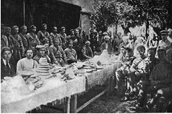

+ 1921-yil. Farg‘ona
- 1922-yil. Buxoro
- 1923-yil. Toshkent
- 1924-yil. Samarqand

**682. 1921-yil mart oyida qizil askarlarga qarshi bir qator janglarda mag‘lubiyatga uchragan Olimxon qayerga o‘tib ketgan?**

- Eronga
- Suriyaga
+ Afg‘onistonga
- Hindistonga

**683. Madaminbek qanday maqsadda Farg‘ona fronti qo‘shinlari qo‘mondonligiga yarashish muzokaralarini boshlashni taklif qilgan?**

- Taslim bo‘lish uchun
- Dushmanni rejalarini aniqlash uchun
- Tashabbusni qo‘lga olish uchun
+ Vaqtdan yutish uchun

**684. Madaminbek bilan 2-Turkiston o‘qchi diviziyasining boshlig‘i N. Veryovkin-Roxalskiy o‘rtasida qayerda yarash bitimi imzolangan?**

- Toshkent shahrida
- Verniy shahrida
- Qo‘qon shahrida
+ Skobelev shahrida

**685. Qaysi yilga kelib Turkistondagi istiqlolchilik harakati mag‘lubiyatga uchragan?**

- 1932-yilga
- 1933-yilga
- 1934-yilga
+ 1935-yilga

**686. Farg‘ona muvaqqat muxtoriyat hukumati boshlig‘i yana qanday lavozimga ham tayinlangan?**

- Bosh qozi
- Shayxulislom
+ Oliy bosh qo‘mondon
- Tashqi ishlar vaziri

**687. Sovet davrida istiqlolchilik harakatining vakillari qanday atalgan?**

- «Qaroqchilar»
- «Talonchilar»
+ «Bosmachilar»
- «Isyonchilar»

**688. Qachon Turkistondagi istiqlolchilik harakati o‘zining yangi bosqichiga qadam qo‘ygan va Farg‘ona vodiysi va Samarqand viloyatidagi vatanparvarlar bilan bir qatorda endilikda Buxoro va Xorazmda ham qizil armiyaga qarshi kurash boshlangan?**

+ 1920-yilning yozi va kuzida
- 1921-yilning yozi va kuzida
- 1922-yilning yozi va kuzida
- 1923-yilning yozi va kuzida

**689. Ibrohimbek va Davlatmandbek Buxoroning qaysi qismidagi istiqlolchilik harakatiga rahbarlik qilgan?**

- Janubiy Buxoro
- Shimoliy Buxoro
- G‘arbiy Buxoro
+ Sharqiy Buxoro

**690. «Bosmachilikka qarshi kurash tamomila yangi, ayricha xususiyati bo‘lgan, o‘ziga xos dushman bilan kurash demakdir», deb yozgan Turkiston frontining qo‘mondoni kim edi?**

+ M. Frunze
- P. Kobozev
- I. Tobolin
- N. Veryovkin-Roxalskiy

**691. Qachon Pomirning Ergashtom ovulida bo‘lgan anjumanda Farg‘ona muvaqqat muxtoriyat hukumati tuzilgan?**

- 1917-yil 12-noyabrda
- 1918-yil 12-sentyabrda
+ 1919-yil 12-oktyabrda
- 1920-yil 12-dekabrda

**692. Mulla Abdulqahhor Buxoroning qaysi qismidagi istiqlolchilik harakatiga rahbarlik qilgan?**

- Janubiy Buxoro
- Shimoliy Buxoro
+ G‘arbiy Buxoro
- Sharqiy Buxoro

**693. Qaysi qo‘rboshilar Farg‘ona vodiysidagi jangovar harakatlarni yo‘naltirib turgan? 1) Madaminbek; 2) Shermuhammadbek; 3) Katta Ergash; 4) Kichik Ergash.**

- 2, 3, 4
- 1, 2, 4
+ 1, 2, 3
- 1, 2, 3, 4

**694. Istiqlolchilik harakatining eng zaif tomonlari nimalarda edi? 1) Kurashchilarda o‘ziga bo‘lgan ishonchni yo‘qligi; 2) Yagona markaz ostida to‘liq birlasha olmaganligi; 3) Harbiy tayyorgarlikning yetarli darajada emasligi.**

- 1, 2
+ 2, 3
- 1, 3
- 1, 2, 3

**695. 1920-yilda … qo‘rboshining qo‘shini mag‘lubiyatga uchragach, … asosiy kuchlarini olib, …ga chekingan.**

- Madaminbek/Katta Ergash/Yettisuv
+ Katta Ergash/Shermuhammadbek/Oloy vohasi
- Shermuhammadbek/Kichik Ergash/Sharqiy Turkiston
- Kichik Ergash/Ibrohimbek/Qizilqum

**696. Kim boshchiligida Farg‘ona muvaqqat muxtoriyat hukumati tuzilgan?**

- Fuzayl Maxsum
- Ibrohimbek
- Shermuhammadbek
+ Madaminbek

**697. Qaysi voqea natijasida O‘rta Osiyoda sovet hukumatiga qarshi qurolli kurashning birinchi davri yakunlangan?**

- NEP (Yangi iqtisodiy siyosat) ning joriy etilishi
- Harbiy kommunizm siyosatining yakunlanishi
+ Milliy-hududiy chegaralanish o‘tkazilishi
- Yer-suv islohoti boshlanishi

**698. O‘rta Osiyodagi sovet hukumatiga qarshi qurolli kurashning ikkinchi davri qaysi yillarni o‘z ichiga oladi?**

- 1924–1934-yillarni
+ 1925–1935-yillarni
- 1926–1936-yillarni
- 1927–1937-yillarni

**699. 1919-yilning kech kuzida Shermuhammadbek qo‘l ostida qancha askar bo‘lgan?**

- 10 000 nafar
+ 20 000 nafar
- 30 000 nafar
- 40 000 nafar

**700. Turkistondagi milliy-ozodlik harakatining bosh g‘oyasi nima edi?**

+ Turkiston mustaqilligi
- Turkiston muxtoriyatini tiklash
- Xonliklarni tiklash
- Yer-suv va mol-mulklarni qaytarish

**701. Mulla Abdulqahhor qo‘rboshi qachon qizil askarlarga qarshi bo‘lgan janglarning birida halok bo‘lgan?**

+ 1924-yilning oxirida
- 1925-yilning oxirida
- 1926-yilning oxirida
- 1927-yilning oxirida

**702. Turkistonda milliy-ozodlik harakati uzluksiz necha yil davom etgan?**

- Sal kam 5 yil
- Sal kam 10 yil
- Sal kam 15 yil
+ Sal kam 20 yil

**703. Qachon Junaydxon qizil askarlarga qarshi mustaqillik uchun jangga kirgan?**

- 1917-yil o‘rtalaridan
+ 1918-yil o‘rtalaridan
- 1919-yil o‘rtalaridan
- 1920-yil o‘rtalaridan

**704. Turkiyadan kelgan general Anvar Poshoning sa’y-harakatlari bilan qayerda birlashgan qismlar tashkil etilgan va u turk zobitlari bilan mustahkamlanib, g‘arbcha qo‘mondonlik uslubi joriy qilingan?**

- Janubiy Buxoroda
- Shimoliy Buxoroda
- G‘arbiy Buxoroda
+ Sharqiy Buxoroda

**705. Turkistonda milliy-ozodlik harakati qaysi yillarda bo‘lib o‘tgan?**

- 1917–1934-yillarda
+ 1918–1935-yillarda
- 1919–1936-yillarda
- 1920–1937-yillarda

**706. Qachon O‘rta Osiyoda sovet hukumatiga qarshi qurolli kurashning birinchi davri yakunlangan?**

- 1923-yil kuzida
+ 1924-yil kuzida
- 1925-yil kuzida
- 1926-yil kuzida

**707. Turkistonda sovet hokimiyatiga qarshi kurash qachon boshlangan?**

- 1917-yil dekabr oyi oxirlarida
+ 1918-yil fevral oyi oxirlarida
- 1919-yil oktyabr oyi oxirlarida
- 1920-yil noyabr oyi oxirlarida

**708. Buxoroda amirlik tuzumi ag‘darilgach, 1920-yil sentyabr oyida amir Olimxon qayerga kelib katta kuch to‘plab, qizil armiyaga qarshi kurashga rahbarlik qilgan?**

- Janubiy Buxoroga
- Shimoliy Buxoroga
- G‘arbiy Buxoroga
+ Sharqiy Buxoroga

**709. Mulla Abdulqahhor qo‘l ostida Buxoroning g‘arbiy qismida necha nafar qo‘rboshi birlashgan edi?**

- 10 nafar
+ 20 nafar
- 30 nafar
- 40 nafar

**710. Qachon Farg‘ona vodiysiga bolsheviklar tomonidan qo‘shimcha kuchlarning tashlanishi natijasida jangovar tashabbus qizil armiya qo‘liga o‘tgan?**

+ 1920-yil yanvar oyining o‘rtalariga kelib
- 1920-yil mart oyining o‘rtalariga kelib
- 1921-yil may oyining o‘rtalariga kelib
- 1921-yil avgust oyining o‘rtalariga kelib

**711. Turkiyadan kelgan general Anvar Posho qachon qizil askarlarga qarshi bo‘lgan jangda halok bo‘lgan?**

- 1921-yil iyulda
+ 1922-yil avgustda
- 1923-yil sentyabrda
- 1924-yil oktyabrda

**712. Xorazmda Junaydxon boshchiligidagi qurolli guruhlar va boshqa o‘nlab sardorlar qayerlarda qizil askarlarga jiddiy zarba berganlar? 1) Ko‘hna Urganch; 2)Toshhovuz; 3) Mang‘it; 4) Qo‘shko‘pir; 5) Chimboy; 6) Qo‘ng‘irot; 7) To‘rtko‘l.**

- 2, 3, 6, 7
- 2, 3, 4 ,5, 6
- 1, 3, 4 ,5, 6
+ 1, 2, 3, 4 ,5, 6, 7

**713. Turkiyadan kelgan general Anvar Posho …ning … atrofidagi Obidara qishlog‘ida qizil askarlarga qarshi bo‘lgan jangda halok bo‘lgan.**

+ Sharqiy Buxoro/Baljuvon
- G‘arbiy Buxoro/Kalif
- Shimoliy Buxoro/Ko‘lob
- Janubiy Buxoro/Qorako‘l

**714. Muxolifatdagi qurolli harakat saflariga o‘tib ketgan BXSR Markaziy Ijroiya Qo‘mitasi raisini toping.**

- Abdulhamid Oripov
- Ali Rizo Afandi
+ Usmon Xo‘ja
- Muhiddin Maxsum Xo‘jayev

## O‘rta Osiyoda hududiy chegaralanish.

**715. Qoraqalpoq muxtor viloyati dastlab davlat tarkibida tuzilgan?**

- Tojikiston ASSR
+ Qozog‘iston ASSR
- O‘zbekiston SSR
- Turkmaniston SSR

**716. Turkistonda hududlarni qaytadan belgilash va chegaralash tarafdorlari nimalarga diqqatni ko‘proq qaratganlar? 1) Til tafovutlari; 2) Iqtisodiy omillar; 3) Milliy tafovutlar; 4) Mavjud suv resurslari; 5) Sug‘orish tizimlarining umumiyligi.**

+ 1, 3
- 2, 4, 5
- 2, 3, 4, 5
- 1, 2, 3, 4

**717. Milliy respublikalar tuzish zarurligi g‘oyasining tashabbuskorlari o‘z fikrlarini qanday omillar bilan asoslaganlar? 1) Turkistondagi tub xalqlar hayotida tengsizlik mavjudligi; 2) Milliy mojarolar kuchayib borayotgani; 3) Mamlakat boyligi aholi orasida noto‘g‘ri taqsimlangani.**

+ 1, 2
- 2, 3
- 1, 3
- 1, 2, 3

**718. O‘zbekiston SSR qachon tashkil topgan?**

+ 1924-yilda
- 1929-yilda
- 1931-yilda
- 1936-yilda

**719. Xorazmni chegaralanishga qo‘shmaslik nuqtayi nazarini qo‘llab-quvvatlagani uchun 1924-yil iyulda o‘z vazifasidan olib tashlangan Xorazm Kompartiyasi Markaziy Komiteti mas’ul kotibi kim edi?**

- Sanjar Asfandiyorov
+ Qalandar Odinayev
- Polvonniyoz Yusupov
- Bobooxun Salimov

**720. Qozog‘iston ASSR dastlab qaysi dastlab davlat tarkibida tuzilgan?**

+ RSFSR
- O‘zbekiston SSR
- Tojikiston SSR
- Turkmaniston SSR

**721. Qoraqirg‘iz (Qirg‘iziston) muxtor viloyati dastlab qaysi davlat tarkibida tuzilgan?**

+ RSFSR
- O‘zbekiston SSR
- Qozog‘iston SSR
- Turkmaniston SSR

**722. Qachon I. V. Stalinning taklifi bilan RKP(b) MK Siyosiy byurosining «O‘rta Osiyo respublikalarini milliy-hududiy chegaralash to‘g‘risida» gi maxsus qarori qabul qilingan?**

- 1924-yil 8-mayda
- 1924-yil 15-iyulda
+ 1924-yil 12-iyunda
- 1924-yil 27-oktyabrda

**723. Qozog‘iston SSR qachon tashkil topgan?**

- 1924-yilda
- 1929-yilda
- 1931-yilda
+ 1936-yilda

**724. Kim boshchiligidagi bir guruh milliy kommunistlar 1920-yildayoq turkiy xalqlar yagona bo‘lib, ularning tarixiy ildizlari, dinlari, an’analari va madaniyati mushtarakdir, yagona Turkistonni alohida qismlarga ajratib bo‘lmaydi, degan g‘oyani ilgari surganlar?**

+ Turor Risqulov
- Sultonbek Xo‘janov
- Sanjar Asfandiyorov
- Fayzulla Xo‘jayev

**725. Qachon SSSR dagi markaziy organlar, Turkiston, Buxoro, Xorazm kommunistik partiyalari va Rossiya kommunistlar partiyasi (bolsheviklar) (RKP(b) MK O‘rta Osiyo byurosi milliy chegaralanish masalalari yuzasidan jadal ish olib borishgan?**

- 1922-yil fevral–iyun oylarida
- 1923-yil fevral–iyun oylarida
+ 1924-yil fevral–iyun oylarida
- 1925-yil fevral–iyun oylarida

**726. Turkistonda hududlarni qaytadan belgilash va chegaralash tarafdorlari nimalarga e’tibor qaratmaganlar? 1) Til tafovutlari; 2) Iqtisodiy omillar; 3) Milliy tafovutlar; 4) Mavjud suv resurslari; 5) Sug‘orish tizimlarining umumiyligi.**

- 1, 3
+ 2, 4, 5
- 2, 3, 4, 5
- 1, 2, 3, 4

**727. Turkistonda hududiy chegaralanish paytida RKP(b) MK Bosh kotibi kim edi?**

- V. Lenin
- M. Frunze
+ I. Stalin
- Y. Rudzutak

**728. Qirg‘iziston SSR qachon tashkil topgan?**

- 1924-yilda
- 1929-yilda
- 1931-yilda
+ 1936-yilda

**729. Ushbu rasmda qaysi davlat gerbi tsavirlangan?**

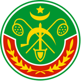

+ Xorazm Xalq Sovet Respublikasi
- Buxoro Xalq Sovet Respublikasi
- Turkiston Avtonom Sovet Sotsialistik Respublikasi
- O‘zbekiston Sovet Sotsialistik Respublikasi

**730. Milliy kommunistlarning Turkistonni alohida qismlarga ajratib bo‘lmaydi, degan g‘oyasini Markaz kommunistlari qanday baholagan? 1) «Panturkizm»; 2) «Panislomizm»; 3) «Burjua millatchiligi va o‘ng og‘machiligi».**

- 1, 2
- 2, 3
- 1, 3
+ 1, 2, 3

**731. Bir guruh Xorazm rahbarlari Xorazmni chegaralanishga qo‘shmaslikni iltimos qilib, o‘zlarining nuqtayi nazarlarini qanday omillar bilan asoslaganlar? 1) Respublikaning olisda joylashganligi; 2) Madaniyatda katta tafovut mavjudligi; 3) Iqtisodiy jihatdan ajralib turganligi.**

- 1, 2
- 2, 3
+ 1, 3
- 1, 2, 3

**732. Qachon bo‘lgan Turkiston ASSR MIK va Turkiston Kompartiyasining birlashgan kengashida Sultonbek Xo‘janov, Sanjar Asfandiyorov, N. Paskutskiy kabi partiya xodimlari Sovet Sotsialistik Respublikalarining O‘rta Osiyo federatsiyasini tuzish taklifi bilan chiqqanlar?**

- 1918-yil 10-aprelda
- 1919-yil 10-mayda
+ 1920-yil 10-martda
- 1921-yil 10-iyunda

**733. 1924-yil fevralda Buxoro Kompartiyasi chegaralanish masalasi yuzasidan kim tomonidan yozilgan tezislarni qabul qilgan?**

- Turor Risqulov
+ Fayzulla Xo‘jayev
- Sultonbek Xo‘janov
- Sanjar Asfandiyorov

**734. O‘zbeklar byurosi tarkibiga kim nomzod sifatida kiritilgan?**

+ Inoyatov
- Kalugin
- Ikromov
- Po‘latov

**735. O‘zbeklar byurosi tarkibiga kimlar a’zo sifatida kiritilgan? 1) Fayzulla Xo‘jayev; 2) Rustam Islomov; 3) Akmal Ikromov; 4) Inoyatov; 5) Qori Yo‘ldosh Po‘latov; 6) Muxtorjon Saidjonov; 7) Kalugin.**

- 1, 3, 4, 5, 6
- 2, 4, 6, 7
- 2, 3, 5, 6
+ 1, 2, 3, 5, 6, 7

**736. Turkiston ASSR, BXSR, XXSR qaysi yillarda mavjud bo‘lgan?**

- 1917–1923-yillarda
+ 1918–1924-yillarda
- 1919–1925-yillarda
- 1920–1926-yillarda

**737. O‘rta Osiyoni hududiy chegaralab bo‘lish masalasi qachondan amalga oshirila boshlangan?**

- 1921-yil boshlaridan
- 1922-yil boshlaridan
- 1923-yil boshlaridan
+ 1924-yil boshlaridan

**738. Qachon Moskvada bo‘lgan Butunittifoq (SSSR) Markaziy Ijroiya Qo‘mitasining III sessiyasi O‘rta Osiyoda milliy respublikalar tuzish to‘g‘risida maxsus qaror qabul qilgan?**

- 1924-yil 8-mayda
- 1924-yil 15-iyulda
- 1924-yil 12-iyunda
+ 1924-yil 27-oktyabrda

**739. O‘rta Osiyo hududidagi Turkiston ASSR, Buxoro va Xorazm respublikalari o‘rnida nechta milliy davlat birlashmalari tashkil etilgan?**

- To‘rtta
- Beshta
+ Oltita
- Yettita

**740. Qaysi yildan Qoraqalpog‘iston ASSR O‘zbekiston SSR tarkibiga kirgan?**

- 1927-yildan
- 1929-yildan
- 1931-yildan
+ 1936-yildan

**741. Qachon bir guruh Xorazm rahbarlari RKP(b) MK ga «Xorazmda milliy masalani hal qilish to‘g‘risida maktub» yuborib, unga Xorazmni chegaralanishga qo‘shmaslikni iltimos qilganlar?**

+ 1924-yil 8-mayda
- 1924-yil 15-iyulda
- 1924-yil 12-iyunda
- 1924-yil 27-oktyabrda

**742. Qachon RKP(b) MK O‘rta Osiyo byurosi yangi tashkil etiladigan milliy respublikalar va oblastlarning muvaqqat byurosini tashkil etgan?**

- 1924-yil 8-mayda
+ 1924-yil 15-iyulda
- 1924-yil 12-iyunda
- 1924-yil 27-oktyabrda

**743. Quyidagi qaysi shaxs Turkiston yagona va butun, uning yaxlitligini buzish maqsadga muvofiq emas, deb ta’kidlagan?**

- Turor Risqulov
+ Sultonbek Xo‘janov
- Sanjar Asfandiyorov
- Fayzulla Xo‘jayev

**744. Qachon Farg‘ona vodiysi vakillari RSFSR tarkibida Farg‘ona muxtor viloyatini tashkil etish to‘g‘risidagi taklif bilan chiqqan edilar?**

- 1921-yil oktyabrda
- 1922-yil avgustda
+ 1923-yil dekabrda
- 1924-yil yanvarda

**745. Turkmaniston SSR qachon tashkil topgan?**

+ 1924-yilda
- 1929-yilda
- 1931-yilda
- 1936-yilda

**746. Qaysi yilgacha Tojikiston ASSR O‘zbekiston SSR tarkibida bo‘lgan?**

- 1927-yilgacha
+ 1929-yilgacha
- 1931-yilgacha
- 1936-yilgacha

**747. Milliy masalada «og‘machilik» ka yo‘l qo‘yishda ayblangan, 1937-yil 16-iyunda qamoqqa olingan va 1938-yil 8-fevralda otishga hukm qilingan, 1957-yilda esa oqlangan shaxsni toping.**

- Turor Risqulov
+ Sultonbek Xo‘janov
- Sanjar Asfandiyorov
- Fayzulla Xo‘jayev

**748. Tojikiston SSR qachon tashkil topgan?**

- 1924-yilda
+ 1929-yilda
- 1931-yilda
- 1936-yilda

**749. Turkistonda hududiy chegaralanish paytida RKP(b) MK O‘rta Osiyo byurosi raisi kim edi?**

- V. Lenin
- M. Frunze
- I. Stalin
+ Y. Rudzutak

## O‘zbekiston SSR ning tashkil topishi.

**750. Butunittifoq kommunistlar (bolsheviklar) partiyasi (VKP (b)) qaysi yillarda KPSS (Sovet Ittifoqi kommunistik partiyasi) deb atalgan?**

- 1923–1950-yillarda
- 1924–1951-yillarda
+ 1925–1952-yillarda
- 1926–1953-yillarda

**751. Qachon O‘zbekiston kasaba uyushmalariga asos solingan?**

- 1926-yil 29-sentyabrda
+ 1925-yil 21-martda
- 1925-yil 29-yanvarda
- 1927-yil 30-martda

**752. 1924-yilda O‘rta Osiyodagi qaysi davlatda 9 ta viloyat bo‘lgan?**

- Xorazm Xalq Sovet Respublikasi
+ Buxoro Xalq Sovet Respublikasi
- Turkiston Avtonom Sovet Sotsialistik Respublikasi
- O‘zbekiston Sovet Sotsialistik Respublikasi

**753. 1925-yil apreldan 1930-yil sentyabrgacha qaysi shahar O‘zbekiston SSR poytaxti bo‘lgan?**

+ Samarqand
- Qo‘qon
- Toshkent
- Buxoro

**754. Qachon O‘zbekiston SSR da 10 ta okrug (Xorazm, Buxoro, O‘rta Zarafshon, Samarqand, Toshkent, Xo‘jand, Qo‘qon, Andijon, Surxondaryo, Qashqadaryo) va alohida Konimex tumani tuzilgan?**

+ 1926-yil 29-sentyabrda
- 1925-yil 21-martda
- 1925-yil 29-yanvarda
- 1927-yil 30-martda

**755. 1924-yil oxirida O‘rta Osiyo respublikalaridagi aholining yarmisi qayerda istiqomat qilgan?**

- Qozog‘istonda
- Tojikistonda
- Turkmanistonda
+ O‘zbekistonda

**756. O‘zbekiston SSR da 1925-yilda «Qo‘shchi» ittifoqi qancha odamni o‘ziga birlashtirgan edi?**

- 100 000 kishini
+ 200 000 kishini
- 300 000 kishini
- 400 000 kishini

**757. O‘zbekiston kasaba uyushmalari respublika soveti (Uzsovprof) qaysi tashkilot rahbarligida ish olib borgan?**

+ Butunittifoq Kasaba uyushmalari Markaziy Soveti (VSSPS)
- O‘zbekiston Sovet Sotsialistik Respublikasi Markaziy Ijroiya Qo‘mitasi (O‘zSSR MIQ)
- O‘zbekiston SSR Xalq Komissarlari Soveti (O‘zSSR XKS)
- O‘zbekiston Kommunistik partiyasi (O‘zKP)

**758. «Turkiston o‘lkasini boshqarish haqidagi Nizom» ga ko‘ra, jabhalar qanday atalgan?**

- Uyezd
- Oblast
- Volost
+ Uchastka

**759. Qoraqalpog‘iston qaysi yillarda Qozog‘iston tarkibida bo‘lgan?**

- 1924–1925-yillarda
+ 1925–1932-yillarda
- 1932–1936-yillarda
- 1936–1939-yillarda

**760. Qayerda bo‘lib o‘tgan O‘zbekiston Kommunistik partiyasining I ta’sis syezdida O‘zbekiston Kommunistik (bolsheviklar) partiyasi tashkiliy jihatdan rasmiylashtirilgan?**

- Qo‘qon
- Samarqand
- Toshkent
+ Buxoro

**761. 1924-yilda O‘rta Osiyodagi qaysi davlatda 9 ta uyezd, 133 tuman va 7 qishloq okrugi bo‘lgan?**

- Xorazm Xalq Sovet Respublikasi
- Buxoro Xalq Sovet Respublikasi
+ Turkiston Avtonom Sovet Sotsialistik Respublikasi
- O‘zbekiston Sovet Sotsialistik Respublikasi

**762. 1925-yil fevral–aprel davomida qaysi shahar O‘zbekiston SSR poytaxti bo‘lgan?**

- Samarqand
- Qo‘qon
- Toshkent
+ Buxoro

**763. Sovet hokimiyati yillarida O‘zbekiston SSR siyosiy hayotida qaysi organ asosiy rol o‘ynagan?**

- O‘zbekiston Sovet Sotsialistik Respublikasi Markaziy Ijroiya Qo‘mitasi
- O‘zbekiston SSR Xalq Komissarlari Soveti
- «Qo‘shchi» uyushmasi
+ O‘zbekiston Kommunistik partiyasi

**764. Quyidagilardan qaysilari O‘zbekiston SSR ning oliy organlari hisoblangan? 1) O‘zbekiston Sovet Sotsialistik Respublikasi Markaziy Ijroiya Qo‘mitasi (O‘zSSR MIQ); 2) O‘zbekiston SSR Xalq Komissarlari Soveti (O‘zSSR XKS); 3) O‘zbekiston Kompartiyasi Markaziy Komiteti (O‘zKompartiya MK).**

+ 1, 2
- 1, 3
- 2, 3
- 1, 2, 3

**765. Qachon O‘zbekiston SSR birinchi Konstitutsiyasi qabul qilingan?**

- 1926-yil 29-sentyabrda
- 1925-yil 21-martda
- 1925-yil 29-yanvarda
+ 1927-yil 30-martda

**766. «Turkiston o‘lkasini boshqarish haqidagi Nizom» ga ko‘ra, viloyatlar qanday atalgan?**

- Uyezd
+ Oblast
- Volost
- Uchastka

**767. Qachon O‘zbekiston SSR poytaxti Toshkent shahriga ko‘chirilgan?**

- 1929-yil 20-avgustda
+ 1930-yil 20-sentyabrda
- 1931-yil 20-oktyabrda
- 1932-yil 20-noyabrda

**768. Yangi tashkil qilingan O‘zbekiston SSR tarkibiga qaysi avtonom respublika bo‘lgan?**

- Qirg‘iziston ASSR
+ Tojikiston ASSR
- Qozog‘iston ASSR
- Qoraqalpog‘iston ASSR

**769. Qachon Tojikiston ASSR o‘rniga Tojikiston SSR tashkil topgan va u O‘zbekiston SSR tarkibidan chiqqan?**

- 1932-yil 8-yanvarda
- 1927-yil 30-martda
+ 1929-yil 16-oktyabrda
- 1936-yil 5-dekabrda

**770. Bir kechada poytaxtni Samarqanddan Toshkentga ko‘chirib keltirgan O‘zbekiston SSR hukumatining raisi kim edi?**

+ Fayzulla Xo‘jayev
- Akmal Ikromov
- Yo‘ldosh Oxunboboyev
- Muxtorjon Saidjonov

**771. O‘zbekistondagi dehqonlarni g‘oyaviy jihatdan birlashtirib turgan «Qo‘shchi» ittifoqi qaysi yillarda faoliyat ko‘rsatgan?**

- 1917–1930-yillarda
- 1918–1931-yillarda
- 1919–1932-yillarda
+ 1920–1933-yillarda

**772. Qachon bo‘lib o‘tgan Butuno‘zbek (O‘zbekiston SSR) Sovetlarining I ta’sis qurultoyida «O‘zbekiston Sovet Sotsialistik Respublikasini tashkil etish to‘g‘risida Deklaratsiya» qabul qilingan?**

- 1924-yil 13-17-yanvarda
- 1924-yil 13-17-fevralda
- 1925-yil 13-17-yanvarda
+ 1925-yil 13-17-fevralda

**773. 1924-yilda O‘rta Osiyodagi qaysi davlatda 23 ta tuman bo‘lgan?**

+ Xorazm Xalq Sovet Respublikasi
- Buxoro Xalq Sovet Respublikasi
- Turkiston Avtonom Sovet Sotsialistik Respublikasi
- O‘zbekiston Sovet Sotsialistik Respublikasi

**774. Qachon O‘zbekiston leninchi kommunistik yoshlar ittifoqi (O‘zLKSM) tashkil etilgan?**

+ 1925-yilda
- 1926-yilda
- 1927-yilda
- 1928-yilda

**775. Yangi tashkil qilingan O‘zbekiston SSR tarkibiga qaysi viloyatlar kirgan? 1) Toshkent; 2) Samarqand; 3) Farg‘ona; 4) Sirdaryo; 5) Qashqadaryo; 6) Zarafshon (Buxoro); 7) Surxondaryo; 8) Xorazm.**

- 2, 5, 6, 7, 8
- 2, 3, 4, 5, 6, 7
+ 1, 2, 3, 5, 6, 7, 8
- 1, 2, 3, 4, 5, 6, 7

**776. Respublikaning markazida joylashgan qaysi poytaxt shahar O‘zbekiston SSR hududining barcha qismlarida sovet tashkilotlari ishini jonlantirishga yordam bergan?**

- Qo‘qon
+ Samarqand
- Toshkent
- Buxoro

**777. Kim yangi tashkil qilingan O‘zbekiston SSR Markaziy Ijroiya Qo‘mitasi raisi etib saylangan?**

- Fayzulla Xo‘jayev
- Akmal Ikromov
+ Yo‘ldosh Oxunboboyev
- Muxtorjon Saidjonov

**778. Qachon Qoraqalpog‘iston ASSR hududi O‘zbekiston SSR tarkibiga kiritilgan?**

- 1932-yil 8-yanvarda
- 1927-yil 30-martda
- 1929-yil 16-oktyabrda
+ 1936-yil 5-dekabrda

**779. Qachon O‘zbekiston SSR tarkibida Tojikiston Avtonom Sovet Sotsialistik Respublikasi (Tojikiston ASSR) tuzilganligi haqida deklaratsiya qabul qilingan?**

+ 1926-yil 1-12-dekabrda
- 1925-yil 6-12-fevralda
- 1925-yil 13-17-fevralda
- 1926-yil 14-19-dekabrda

**780. Qachon O‘zbekiston SSR da ilk bor ma’muriy-hududiy bo‘linish o‘tkazilib, 7 viloyat (Zarafshon, Samarqand, Toshkent, Farg‘ona, Surxondaryo, Qashqadaryo, Xorazm) va alohida Konimex tumani tashkil etilgan?**

- 1926-yil 29-sentyabrda
- 1925-yil 21-martda
+ 1925-yil 29-yanvarda
- 1927-yil 30-martda

**781. «Turkiston o‘lkasini boshqarish haqidagi Nizom» ga ko‘ra, bo‘lislar qanday atalgan?**

- Uyezd
- Oblast
+ Volost
- Uchastka

**782. Qaysi yilda O‘rta Osiyo respublikalarida hammasi bo‘lib 8 131 062 kishi yashagan?**

- 1921-yil oxirida
- 1921-yil oxirida
- 1923-yil oxirida
+ 1924-yil oxirida

**783. Kim yangi tashkil qilingan O‘zbekiston SSR Xalq Komissarlari Soveti raisi etib saylangan?**

+ Fayzulla Xo‘jayev
- Akmal Ikromov
- Yo‘ldosh Oxunboboyev
- Muxtorjon Saidjonov

**784. O‘zbekiston Kommunistik partiyasining I ta’sis syezdida kimlar O‘zbekiston Kompartiyasi Markaziy Komiteti mas’ul sekretarlari qilib saylanganlar?**

- Fayzulla Xo‘jayev va Yo‘ldosh Oxunboboyev
- Yo‘ldosh Oxunboboyev va Vladimir Ivanov
+ Vladimir Ivanov va Akmal Ikromov
- Akmal Ikromov va Fayzulla Xo‘jayev

**785. Quyidagilardan kim «Qo‘shchi» uyushmasi faoli bo‘lgan?**

- Fayzulla Xo‘jayev
- Akmal Ikromov
+ Yo‘ldosh Oxunboboyev
- Muxtorjon Saidjonov

**786. Qaysi yilda Tojikiston ASSR hududi 135.620 km/kv, aholisi 739.503 kishi bo‘lgan?**

- 1925-yilda
+ 1926-yilda
- 1927-yilda
- 1928-yilda

**787. Qayerda bo‘lib o‘tgan Butuno‘zbek (O‘zbekiston SSR) Sovetlarining I ta’sis qurultoyida «O‘zbekiston Sovet Sotsialistik Respublikasini tashkil etish to‘g‘risida Deklaratsiya» qabul qilingan?**

- Qo‘qon
+ Buxoro
- Toshkent
- Samarqand

**788. Qachon bo‘lib o‘tgan O‘zbekiston Kommunistik partiyasining I ta’sis syezdida O‘zbekiston Kommunistik (bolsheviklar) partiyasi tashkiliy jihatdan rasmiylashtirilgan?**

- 1926-yil 1-12-dekabrda
+ 1925-yil 6-12-fevralda
- 1925-yil 13-17-fevralda
- 1926-yil 14-19-dekabrda

**789. Qoraqalpog‘iston qaysi yillarda RSFSR tarkibida bo‘lgan?**

- 1924–1925-yillarda
- 1925–1932-yillarda
+ 1932–1936-yillarda
- 1936–1939-yillarda

**790. «Turkiston o‘lkasini boshqarish haqidagi Nizom» ga ko‘ra, tumanlar qanday atalgan?**

+ Uyezd
- Oblast
- Volost
- Uchastka

## Sovet hokimiyati amalga oshirgan islohotlarning mohiyati. Industrlashtirish siyosati va uning natijalari.

**791. Kollektivlashtirish mutasaddilari dehqonlarning majlislarida kolxozga kirmaganlarga qanday choralar ko‘riladi deb dag‘dag‘a qilishgan? 1) Suvdan mahrum etiladi; 2) Sanoat mollari bilan ta’minlanmaydi; 3) Katta soliq solinadi; 4) Yashash joyidan surgun qilinadi.**

- 1, 2, 3
- 1, 3, 4
- 2, 3, 4
+ 1, 2, 3, 4

**792. Qaysi dehqon xo‘jaliklari keyinchalik «quloqlar» deb nomlangan?**

- Kambag‘al dehqon xo‘jaliklari
+ O‘ziga to‘q dehqon xo‘jaliklari
- Boy dehqon xo‘jaliklari
- O‘ta boy dehqon xo‘jaliklari

**793. Sovet hokimiyatining rasmiy hujjatlarida «quloqlar» – «mushtumzo‘rlar» deb kimlar atalgan?**

+ Katta yer egalari
- Jinoyatchilar
- Dehqonlar
- Ziyolilar

**794. «O‘zbeklashtirish tushunchasi, aslini olganda, O‘zbekiston respublikasi territoriyasidagi davlat apparati va ish yuritishni o‘zbeklashtirishni ko‘zda tutadi, lekin kamsonli millatlarga o‘z ona tillarida xizmat ko‘rsatishni aslo istisno qilmaydi, balki, aksincha taqozo qiladi. Kamsonli millatlar ko‘pchilik yashagan tumanlarda sud organlari, maktablar o‘z ishlarini ularning ona tilida olib borishlari shart. Kamsonli millatlarni mamlakatni idora qilishga, jamiyat hayotiga jalb qilish kerak. Kamsonli millatlardan kadrlar tayyorlash masalasiga zo‘r e’tibor berish lozim». Ushbu masala ko‘rib chiqilgan syezd qachon bo‘lib o‘tgan?**

+ 1927-yil 16–24-noyabrda
- 1928-yil 16–24-dekabrda
- 1929-yil 16–24-sentyabrda
- 1930-yil 16–24-oktyabrda

**795. Kim raisligida «Davlat apparatini mahalliylashtirish Markaziy komissiyasi» tuzilgan?**

- Akmal Ikromov
- Fayzulla Xo‘jayev
- Rahim Inog‘omov
+ Bobon Mavlonbekov

**796. O‘rta Osiyo respublikalarida paxtachilik va mashinasozlik sanoatining to‘ng‘ichi bo‘lgan zavod qaysi?**

- Toshkent to‘qimachilik kombinati
+ Toshkent qishloq xo‘jaligi mashinasozligi zavodi
- Andijon paxta tozalash zavodi
- Chirchiq elektr kimyo kombinati

**797. Qaysi yilgacha SSSR xalq xo‘jaligi bir yillik, besh yillik rejalari joriy bo‘lgan?**

- 1927-yil yozigacha
+ 1928-yil kuzigacha
- 1929-yil qishigacha
- 1930-yil bahorigacha

**798. Kollektivlashtirish davrida O‘zbekistondagi dehqon xo‘jaliklarining qancha foizi umumiylashtirilgan sektorga, ya’ni kolxoz va sovxozlarga birlashgan?**

- 65 foizi
+ 75 foizi
- 85 foizi
- 95 foizi

**799. Yer-suv islohotining ikkinchi bosqichi Zarafshon viloyati (Buxoro va O‘rta Zarafshon okruglari) da qaysi yilda o‘tkazilgan?**

- 1925–1926-yillarda
+ 1927-yilda
- 1928–1929-yillarda
- 1930-yilda

**800. Yer-suv islohotining ikkinchi bosqichi Qashqadaryo, Surxondaryo, Xorazm okruglarida qaysi yilda o‘tkazilgan?**

- 1925–1926-yillarda
- 1927-yilda
+ 1928–1929-yillarda
- 1930-yilda

**801. Yer-suv islohotining ikkinchi bosqichi Farg‘ona, Toshkent, Samarqand viloyatlarida qaysi yilda o‘tkazilgan?**

+ 1925–1926-yillarda
- 1927-yilda
- 1928–1929-yillarda
- 1930-yilda

**802. Qayerda bo‘lib o‘tgan O‘zbekiston Kommunistik partiyasining II syezdida «Partiya, sovet, xo‘jalik, kasaba uyushmalari va kooperativ tashkilotlariga mahalliy aholini jalb qilish» masalasi ko‘rib chiqilgan?**

+ Samarqand
- Buxoro
- Toshkent
- Qo‘qon

**803. Qachon SSSR MIK ning «O‘zSSR apparatini o‘zbeklashtirish to‘g‘risida» gi qarori qabul qilib, unga ko‘ra «Davlat apparati va sanoatni O‘zbeklashtirish Markaziy komissiyasi» faoliyati to‘xtatilgan?**

- 1929-yilda
- 1930-yilda
+ 1931-yilda
- 1932-yilda

**804. 1925–1929-yillarda o‘tkazilgan islohotlar natijasida O‘zbekistondagi barcha viloyatlarda qancha o‘ziga to‘q xo‘jaliklarning «ortiqcha» yerlari tortib olingan?**

- 20 000 dan ortiq
- 21 000 dan ortiq
- 22 000 dan ortiq
+ 23 000 dan ortiq

**805. 1925–1929-yillarda o‘tkazilgan islohotlar natijasida O‘zbekistondagi barcha viloyatlarda qancha boy xo‘jaliklar tugatilgan?**

+ 5 000 ga yaqin
- 6 000 ga yaqin
- 7 000 ga yaqin
- 8 000 ga yaqin

**806. Quyidagilardan kimlar «Davlat apparatini mahalliylashtirish Markaziy komissiyasi» ga a’zo bo‘lishgan?**

- Bobon Mavlonbekov, Fayzulla Xo‘jayev
- Fayzulla Xo‘jayev, Akmal Ikromov
+ Akmal Ikromov, Rahim Inog‘omov
- Rahim Inog‘omov, Bobon Mavlonbekov

**807. O‘zbekistonda kolxozlardan tashqarida qolgan yakka dehqon xo‘jaliklariga qanday tazyiqlar o‘tkazilgan? 1) Qishloq xo‘jalik soliqlari oshirilgan; 2) Davlatga majburan topshiriladigan mahsulot hajmi kolxozlarga nisbatan 50 foizga ko‘paytirilgan; 3) Yashash joyidan surgun qilingan.**

- 1, 3
- 2, 3
+ 1, 2
- 1, 2, 3

**808. Yer-suv islohotining nechanchi bosqichida katta yer egaligini butunlay cheklash va ularni sinf sifatida tugatish masalasi qo‘yilgan?**

- Birinchi bosqichida
+ Ikkinchi bosqichida
- Uchinchi bosqichida
- To‘rtinchi bosqichida

**809. Qaysi davrda Chirchiq–Bo‘zsuv GES lar kaskadi barpo etilgan?**

+ XX asr 30-yillarida
- XX asr 40-yillarida
- XX asr 50-yillarida
- XX asr 60-yillarida

**810. SSSR da qachon «Agrar inqilob» ning strategiya va taktikasi tasdiqlangan?**

- 1923-yil sentyabrda
- 1924-yil oktyabrda
+ 1925-yil noyabrda
- 1926-yil dekabrda

**811. Yer-suv islohotini o‘tkazish to‘g‘risidagi dekretga asosan qaysi viloyatlarda 40–50 desyatina va undan ortiq sug‘oriladigan yerlar davlat yer fondiga o‘tkazilishi va dehqonlarga bo‘lib berilishi nazarda tutilgan edi?**

- Samarqand va Surxondaryo viloyatlarida
- Surxondaryo va Qashqadaryo viloyatlarida
- Qashqadaryo va Toshkent viloyatlarida
+ Toshkent va Samarqand viloyatlarida

**812. Qachon «Davlat apparatini mahalliylashtirish Markaziy komissiyasi» tuzilgan?**

- 1926-yil oktyabrda
- 1925-yil noyabrda
+ 1925-yil martda
- 1926-yil aprelda

**813. Sovet hokimiyati yillarida quloqlikka tortilganlarning o‘z yurtiga qaytish jarayoni og‘ir kechib, qaysi yillarini o‘z ichiga olgan?**

+ 1934–1956-yillarni
- 1935–1957-yillarni
- 1936–1958-yillarni
- 1937–1959-yillarni

**814. Yangi iqtisodiy siyosat tufayli o‘z xo‘jaligini tiklab olgan xo‘jaliklarni quloq qilish maqsadida qachon «Kollektivlashtirish va quloq xo‘jaliklarini tugatish to‘g‘risida» gi qaror qabul qilingan?**

+ 1930-yilda
- 1932-yilda
- 1937-yilda
- 1939-yilda

**815. Kimning tashabbusi bilan «Davlat apparatini mahalliylashtirish Markaziy komissiyasi» tuzilgan?**

- Akmal Ikromov
+ Fayzulla Xo‘jayev
- Rahim Inog‘omov
- Bobon Mavlonbekov

**816. Birinchi besh yillik davrida O‘zbekistonda nechta yangi sanoat korxonasi qurilgan va ishga tushirilgan?**

+ 289 ta
- 389 ta
- 489 ta
- 589 ta

**817. Qaysi O‘zbekiston SSR Xalq Komissarlari Soveti raisi tub xalqlardan mahalliy kadrlar tayyorlash va ularni yuqori lavozimlarga ko‘tarishda jonbozlik ko‘rsatgan?**

- Akmal Ikromov
+ Fayzulla Xo‘jayev
- Rahim Inog‘omov
- Bobon Mavlonbekov

**818. 1925–1929-yillarda o‘tkazilgan islohotlar natijasida O‘zbekistonda har bir boy va o‘ziga to‘q xo‘jalikning o‘ziga qancha desyatinagacha bo‘lgan yer qoldirilishi mumkin edi?**

- 6–9 desyatinagacha
+ 7–10 desyatinagacha
- 8–11 desyatinagacha
- 9–12 desyatinagacha

**819. Qachon bo‘lib o‘tgan O‘zbekiston Kommunistik partiyasining II syezdida «Partiya, sovet, xo‘jalik, kasaba uyushmalari va kooperativ tashkilotlariga mahalliy aholini jalb qilish» masalasi ko‘rib chiqilgan?**

- 1926-yil oktyabrda
+ 1925-yil noyabrda
- 1925-yil martda
- 1926-yil aprelda

**820. Birinchi besh yillik davrida O‘zbekistonda yengil sanoatning qaysi sohalari sur’atlari oshib borgan? 1) Ko‘nchilik; 2) Poyabzal ishlab chiqarish; 3) Tikuvchilik; 4) Ip-gazlama ishlab chiqarish.**

- 1, 2, 3
- 1, 2, 4
- 2, 3, 4
+ 1, 2, 3, 4

**821. Qaysi yilda O‘zSSR xalq xo‘jaligida qishloq xo‘jaligining salmog‘i 62,6 foiz, sanoatning salmog‘i 37,4 foizni tashkil etar edi?**

+ 1927-yilda
- 1928-yilda
- 1929-yilda
- 1930-yilda

**822. O‘zbekistonda qachon sanoatni industrlashtirish amalga oshirilgan?**

- 1927-yilda
+ 1928-yilda
- 1929-yilda
- 1930-yilda

**823. Qaysi yilga kelib O‘zbekistonda yakka dehqon xo‘jaliklariga butkul barham berilgan?**

- 1932-yilga
- 1934-yilga
- 1937-yilga
+ 1939-yilga

**824. Markaz tomonidan O‘zbekiston SSR da mahalliylashtirish jarayoni to‘xtatilib, u nima deb e’lon qilingan?**

- «O‘ng og‘machiligi»
+ «Burjua millatchiligi»
- «Panturkizm»
- «Pano‘zbekizm»

**825. O‘zbekistonda boy xo‘jaliklar ikki toifaga bo‘lingan bo‘lib, qancha yeri bor xo‘jaliklar ikkinchi toifa, ya’ni o‘ziga to‘q dehqon xo‘jaliklari deb atalgan?**

+ 10–40 desyatinagacha
- 20–50 desyatinagacha
- 30–60 desyatinagacha
- 40–70 desyatinagacha

**826. O‘zbekistonda boy xo‘jaliklar ikki toifaga bo‘lingan bo‘lib, qancha sug‘oriladigan yeri bor xo‘jaliklar birinchi toifa, ya’ni boy xo‘jaliklar deb atalgan?**

- 10–20 desyatina va undan ortiq
- 20–30 desyatina va undan ortiq
- 30–40 desyatina va undan ortiq
+ 40–50 desyatina va undan ortiq

**827. SSSR da birinchi besh yillik qaysi yillarni o‘z ichiga olgan?**

- 1927-yil oktyabr – 1931-yil dekabr
+ 1928-yil oktyabr – 1932-yil dekabr
- 1929-yil oktyabr – 1933-yil dekabr
- 1930-yil oktyabr – 1934-yil dekabr

**828. O‘rta Osiyoda yer-suv islohotining ikkinchi bosqichi qaysi yillarda amalga oshirilgan?**

- 1924–1928-yillarda
+ 1925–1929-yillarda
- 1926–1930-yillarda
- 1927–1931-yillarda

**829. Industrlashtirish davrida O‘zbekistonda elektr stansiyalari quvvati qancha kilovattga yetgan?**

+ 482 mln. kilovattga
- 582 mln. kilovattga
- 682 mln. kilovattga
- 782 mln. kilovattga

**830. «Davlat apparatini mahalliylashtirish Markaziy komissiyasi» rahbariyati zimmasiga qayerlarni mahalliylashtirishning asosiy rejasini ishlab chiqish yuklatilgan edi? 1) O‘quv yurtlari; 2) Ilmiy tashkilotlar; 3) Madaniy-oqartuv tashkilotlari; 4) Sanoat korxonalari.**

+ 1, 2, 3, 4
- 2, 3, 4
- 1, 2, 4
- 1, 3, 4

**831. Qachon «Davlat apparatini mahalliylashtirish Markaziy komissiyasi» ning nomi «Davlat apparati va sanoatni O‘zbeklashtirish Markaziy komissiyasi» deb o‘zgartirilgan?**

- 1925-yilda
- 1926-yilda
+ 1927-yilda
- 1928-yilda

**832. «Madaniy-oqartuv tashkilotlari» deganda nima bilan shug‘ullanuvchi tashkilotlar tushunilgan?**

- Xalqning madaniyat va savodini oshirish
+ Xalqning bilim va ongini oshirish
- Xalqning yashash tarzi va bilimini oshirish
- Xalqning savodi va ongini oshirish

**833. SSSR da yer-suv islohotining ikkinchi bosqichi qaysi dekretlar bilan boshlangan? 1) «Quloqlarni sinf sifatida tugatish to‘g‘risida»; 2) «Suv va suvni natsionalizatsiya qilish to‘g‘risida»; 3) «Yer-suv islohoti to‘g‘risida».**

- 1, 2
- 1, 3
+ 2, 3
- 1, 2, 3

**834. «Kolxozlar» deb qanday xo‘jaliklarga aytilgan?**

- Dehqon xo‘jaliklari
- Davlat xo‘jaliklari
+ Jamoa xo‘jaliklari
- Quloq xo‘jaliklari

**835. Qaysi yillarda O‘zbekistonda quloqlashtirish siyosati oqibatida ko‘plab badavlat dehqon xo‘jaliklari quloq qilingan?**

+ 1934–1937-yillarda
- 1935–1938-yillarda
- 1936–1939-yillarda
- 1937–1940-yillarda

**836. O‘zSSR da industrlashtirish siyosati … hisobidan amalga oshirilgan.**

- qo‘shni republikalar
- markaz
+ qishloq
- shahar

**837. SSSR da birinchi besh yillik rejasi muddatidan necha oy oldin yakunlangan?**

- 7 oy
- 8 oy
+ 9 oy
- 10 oy

**838. 1927-yilda O‘zSSR sanoat ishlab chiqarishining qancha foizi qishloq xo‘jalik xomashyosini qayta ishlashga asoslangan edi?**

- 60 foizi
- 70 foizi
- 80 foizi
+ 90 foizi

**839. Qaysi organ huzurida «Davlat apparatini mahalliylashtirish Markaziy komissiyasi» tuzilgan?**

- O‘zSSR XKS
- O‘zSSR KP
- O‘zSSR LKSM
+ O‘zSSR MIK

**840. «Davlat apparati va sanoatni O‘zbeklashtirish Markaziy komissiyasi» qaroriga ko‘ra, o‘zbek aholisi ko‘proq bo‘lgan tumanlardagi barcha davlat, jamoat, kooperativ muassasalari va tashkilotlarida … .**

- kadrlarning yarmidan ko‘pi mahalliy aholidan bo‘lishi shart edi
- mahalliy kadrlarni tayyorlash uchun maxsus kurslar ochilishi shart edi
- rahbar lavozimlarga o‘zbek xodimlari tayinlanishi shart edi
+ ish yuritishni o‘zbek tilida olib borishlari shart edi

**841. Qaysi yilda sovet jamiyatida bozor munosabatlari muhiti barham topgan?**

- 1924-yilda
- 1926-yilda
+ 1929-yilda
- 1931-yilda

**842. «Sovxozlar» deb qanday xo‘jaliklarga aytilgan?**

- Dehqon xo‘jaliklari
+ Davlat xo‘jaliklari
- Jamoa xo‘jaliklari
- Quloq xo‘jaliklari

**843. O‘zbekistonda yer-suv islohotining ikkinchi bosqichi joylardagi shart-sharoit va tayyorgarlik darajasiga qarab necha bosqichda o‘tkazilgan?**

- Ikki bosqichda
+ Uch bosqichda
- To‘rt bosqichda
- Besh bosqichda

**844. Qachon O‘zbekiston qishloq xo‘jaligini kollektivlashtirish rasman tugallangan?**

+ 1932-yilda
- 1934-yilda
- 1937-yilda
- 1939-yilda

## O‘zbekistonda sovet hokimiyati yuritgan madaniy siyosat.

**845. «Hujum» harakati eng faol o‘tkazilgan 1927–1928-yillarda O‘zbekistonda qancha xotin-qizlar fojiyali halok bo‘lishgan?**

- 1000 dan ortiq
- 1500 dan ortiq
- 2000 dan ortiq
+ 2500 dan ortiq

**846. O‘rta Osiyo xotin-qizlari kengashida «Hujum» kompaniyasini qaysi sanadan boshlashga qaror qilingan?**

- 1926-yil 8-iyuldan
+ 1927-yil 8-martdan
- 1928-yil 8-iyundan
- 1929-yil 8-maydan

**847. Qachon Toshkentda davlat konservatoriyasi ochilgan?**

- 1943-yilda
- 1935-yilda
+ 1936-yilda
- 1941-yilda

**848. O‘zbekiston SSR Sovetlarining nechanchi qurultoyida 8 yoshdan to 15 yoshgacha bo‘lgan hamma bolalarni majburiy yetti yillik ta’limga tortish hamda respublika shahar va qishloqlarida yangi maktab binolari qurish dasturini ishlab chiqish taklifi kiritilgan?**

- IV qurultoyida
+ V qurultoyida
- VI qurultoyida
- VII qurultoyida

**849. Qayerda o‘tkazilgan O‘zbekiston adiblari, imlochilari va yetakchi ziyolilari konferensiyasida o‘zbek yozuvini arab grafikasidan lotin grafikasiga o‘tkazish haqida qaror qabul qilingan?**

+ Samarqand
- Buxoro
- Toshkent
- Qo‘qon

**850. Qachon o‘tkazilgan O‘zbekiston adiblari, imlochilari va yetakchi ziyolilari konferensiyasida o‘zbek yozuvini arab grafikasidan lotin grafikasiga o‘tkazish haqida qaror qabul qilingan?**

+ 1929-yil mayda
- 1940-yil martda
- 1931-yil iyunda
- 1937-yil iyulda

**851. Qaysi sanada O‘zbekistonda arab alifbosidan lotin yozuviga o‘tilgan?**

- 1938-yil 1-mayda
- 1927-yil 1-sentyabrda
+ 1929-yil 1-dekabrda
- 1933-yil 1-yanvarda

**852. Qaysi yillarda O‘rta Osiyoda isloh qilingan arab alifbosi muomalada bo‘lgan?**

- 1917–1921-yillarda
+ 1921–1929-yillarda
- 1929–1940-yillarda
- 1940–1953-yillarda

**853. O‘zbekiston SSR maktablarida o‘qish nechta tilda olib borilgan?**

- 12 tilda
- 14 tilda
- 16 tilda
+ 18 tilda

**854. Qachon O‘zbekiston ilmiy tekshirish muassasalariga rahbarlik qiluvchi O‘zbekiston SSR Fanlar komiteti tuzilgan?**

+ 1932-yil 14-oktyabrda
- 1927-yil 8-martda
- 1938-yil 21-iyunda
- 1940-yil 8-mayda

**855. O‘zbekiston SSR da o‘zbek tilida o‘qitiladigan maktablarning soni o‘n yil ichida necha marta oshgan?**

- 4 marta
- 6 marta
- 8 marta
+ 10 marta

**856. Qaysi yilda O‘zbekiston SSR dagi tuman ijroiya qo‘mitalari a’zolarining 20 foizi, okrug ijroiya qo‘mitalari a’zolarining 17 foizi ayollar edi?**

+ 1927-yilda
- 1928-yilda
- 1929-yilda
- 1930-yilda

**857. Qachon «Hujum» kompaniyasi O‘rta Osiyo xotin-qizlari kengashida e’lon qilingan?**

+ 1926-yil sentyabrda
- 1928-yil dekabrda
- 1925-yil mayda
- 1927-yil avgustda

**858. Qachon bo‘lgan O‘zbekiston SSR Oliy Soveti III sessiyasida lotin yozuvidan kirill (rus grafikasi) asosidagi o‘zbek yozuviga o‘tish to‘g‘risida qaror qabul qilingan?**

- 1932-yil 14-oktyabrda
- 1927-yil 8-martda
- 1938-yil 21-iyunda
+ 1940-yil 8-mayda

**859. Sovet hokimiyatining dastlabki o‘n yilliklarida O‘zbekistonda imlo necha marta o‘zgartirilgan?**

- 2 marta
+ 3 marta
- 4 marta
- 5 marta

**860. Nechanchi besh yillik davrida O‘zbekistonda hamma umumiy ta’lim maktablaridagi o‘quvchilarning soni tez sur’atlar bilan o‘sib, 931 800 nafarga yetgan?**

- Birinchi besh yillik davrida
+ Ikkinchi besh yillik davrida
- Uchinchi besh yillik davrida
- To‘rtinchi besh yillik davrida

**861. O‘zbekiston SSR dagi 931 800 nafar maktab o‘quvchilaridan qanchasi qishloq maktablarida o‘qirdi?**

- 525 mingga yaqini
- 625 mingga yaqini
+ 725 mingga yaqini
- 825 mingga yaqini

**862. Qaysi yildan keyin O‘rta Osiyoda kirill alifbosidan foydalanila boshlangan?**

+ 1940-yildan
- 1937-yildan
- 1935-yildan
- 1942-yildan

**863. Sovet hukumati «Hujum» kompaniyasini o‘tkazishdan qanday maqsadlarni ko‘zlagan edi? 1) O‘zbek xalqining tarixan tarkib topgan milliy axloqiy sharqona an’ana va qadriyatlarini yo‘qotish va ma’naviyatimizga zarba berish; 2) Sovet davlati hududida aralash, proletar madaniyatni yaratish, ayollarni bu jarayonga faol jalb qilish; 3) «Xotin-qizlarni ozod qilish» bahonasida sanoat korxonalari, kolxoz va sovxozlarda arzon-garovda ishlaydigan qo‘shimcha ishchi kuchlari sifatida ulardan foydalanish.**

- 2, 3
- 1, 2
+ 1, 3
- 1, 2, 3

**864. O‘zSSR Markaziy Ijroiya Komiteti Prezidiumi raisining o‘rinbosari bo‘lgan ayolni toping.**

- Yodgor Nasriddinova
+ Jahon Obidova
- Halima Nosirova
- Tojixon Shodiyeva

**865. Qaysi yillarda O‘rta Osiyoda lotin alifbosi muomalada bo‘lgan?**

- 1917–1921-yillarda
- 1921–1929-yillarda
+ 1929–1940-yillarda
- 1940–1953-yillarda

**866. O‘zbekiston SSR da qaysi yilda 139.000 nafar xotin-qizlar o‘qish va yozishni o‘rganib olganlar?**

- 1940-yilda
+ 1937-yilda
- 1935-yilda
- 1942-yilda

**867. O‘zSSR Prezidiumi a’zosi bo‘lgan ayolni toping.**

- Yodgor Nasriddinova
- Jahon Obidova
- Zebuniso Rajabova
+ Tojixon Shodiyeva

**868. Qaysi yilgacha O‘rta Osiyoda arab alifbosi muomalada bo‘lgan?**

+ 1921-yilgacha
- 1929-yilgacha
- 1931-yilgacha
- 1940-yilgacha

**869. Qaysi yilda O‘zbekiston SSR da 30 ta oliy, 100 ga yaqin o‘rta maxsus o‘quv yurtlari ishlab turgan?**

+ 1940-yilda
- 1937-yilda
- 1935-yilda
- 1942-yilda

**870. O‘rta Osiyoda oliy ta’limning beshigi bo‘lgan Turkiston xalq dorilfununi hozirda qaysi oliy ta’lim muassasasi hisoblanadi?**

- Toshkent Davlat Pedagogika Universiteti
- Jahon iqtisodiyoti va diplomatiya universiteti
+ O‘zbekiston Milliy Universiteti
- Toshkent Davlat Texnika Universiteti

**871. Qachon boshlangan ommaviy mitinglarda 100 000 dan ortiq xotin-qizlar paranjilarini gulxanda yoqqan?**

- 1926-yil 8-iyulda
+ 1927-yil 8-martda
- 1928-yil 8-iyunda
- 1929-yil 8-mayda

**872. O‘zbekiston SSR da hunarmandchilik kooperatsiyasining 50 dan ortiq artellarida mehnat qilgan 5000 nafardan ko‘proq mahalliy ayollarning ko‘pchiligi qanday korxonalarda ishlagan?**

- To‘quvchilik korxonalarida
- Gilamchilik korxonalarida
- Ipakchilik korxonalarida
+ Tikuvchilik korxonalarida

**873. O‘zbekiston SSR bilan birga O‘rta Osiyoning boshqa respublikalari va … rus grafikasiga o‘tkazilgan.**

- Armaniston
- Boshqirdiston
+ Ozarbayjon
- Checheniston

**874. XX asrgacha asrlar davomida yurtimizda yaratilgan asarlar arab alifbosidagi qaysi yozuvda yozilgan edi?**

- Eski tojk yozuvida
+ Eski o‘zbek yozuvida
- Eski fors yozuvida
- Eski urdu yozuvida

**875. Qaysi yilda O‘zbekistonda hunarmandchilik kooperatsiyasining 50 dan ortiq artellarida 5000 nafardan ko‘proq mahalliy ayollar ishlardi?**

- 1927-yilda
- 1928-yilda
- 1929-yilda
+ 1930-yilda

## Sovet hokimiyatining O‘zbekistondagi qatag‘onlik siyosati.

**876. Fitrat, Cho‘lpon, Qodiriylar qayerda otib tashlangan?**

- Moskva atrofida
- Leningrad atrofida
- Samarqand atrofida
+ Toshkent atrofida

**877. O‘zSSR Maorif xalq komissari Mannon Ramziy va uning o‘rinbosari Botu qaysi ish bo‘yicha qatag‘on qilingan?**

- «Botir gapchilar»
+ «Narkompros»
- «Milliy ittihodchilar» va «milliy istiqlolchilar»
- «O‘n sakkizlar guruhi»

**878. Qayerda Munavvarqori Abdurashidxonov boshchiligidagi 38 nafar kishi qamoqqa olingan?**

+ Toshkent
- Samarqand
- Buxoro
- Qo‘qon

**879. Qaysi sanalarda O‘zbekiston Oliy sudining sobiq prokurori Shamsutdin Badriddinov va uning 5 nafar safdoshi ustidan sud jarayoni o‘tkazilgan?**

- 1931-yil 5-yanvar – 15-fevralda
- 1935-yil 5-iyun – 15-iyulda
+ 1932-yil 5-may – 15-iyunda
- 1936-yil 5-mart – 15-aprelda

**880. Qayerda bo‘lib o‘tgan sud majlisida Munavvarqori boshchiligidagi millatning 15 nafar fidoyisi bo‘lgan «Milliy Istiqlol» a’zolari otib o‘ldirishga, qolgan 72 nafar kishi esa uzoq muddatli qamoq jazosiga hukm qilingan?**

- Toshkent
- Samarqand
+ Moskva
- Leningrad

**881. Sovet rejimi o‘z hokimiyatini mustahkamlab olgach, uning xususiyatlari milliy respublikalardagi kimlarga munosabatda yaqqol ko‘zga tashlangan?**

- Jadid ziyolilariga
- Mahalliy kommunistlarga
+ Rahbar xodimlarga
- Oddiy mehnatkashlarga

**882. Fitrat, Cho‘lpon, Qodiriylar qaysi kunda otib tashlangan?**

+ 1938-yil 4-oktyabrda
- 1938-yil 9-oktyabrda
- 1938-yil 10-oktyabrda
- 1938-yil 24-oktyabrda

**883. 1937–1938-yillarda to‘qib chiqarilgan soxta ayblar bo‘yicha O‘zbekistonda faqat davlat va jamoat arboblari, yozuvchi, shoir va olimlardan … nafar kishi qamoqqa olinib, ulardan … nafari otib tashlangan.**

- 4 758/3 811
+ 5 758/4 811
- 6 758/5 811
- 7 758/6 811

**884. Munavvarqori Abdurashidxonov va uning safdoshlariga qanday ayblovlar qo‘yilgan?**

- «Bosmachilar» tarafdorlari
+ «Milliy Ittihod» va «Milliy Istiqlol» tashkilotlarining a’zolari
- Islom dinini himoyachilari
- Inqilob dushmanlari

**885. XX asr o‘zbek madaniyatining qaysi 3 nafar yorqin yulduzlari bir kunda otib tashlangan?**

+ Fitrat, Cho‘lpon, Qodiriy
- Cho‘lpon, Qodiriy, Munavvarqori
- Qodiriy, Munavvarqori, Avloniy
- Munavvarqori, Avloniy, Fitrat

**886. «Inog‘omovchilik» ishi bo‘yicha qatag‘on qilingan Rahim Inog‘omov qaysi lavozimda ishlagan?**

- O‘zSSR Oliy sudi raisi
+ O‘zSSR Maorif xalq komissari
- O‘zSSR Oliy sudining prokurori
- O‘zSSR Maorif xalq komissarining o‘rinbosari

**887. «Qosimovchilik» ishi bo‘yicha qatag‘on qilingan Sa’dulla Qosimov qaysi lavozimda ishlagan?**

+ O‘zSSR Oliy sudi raisi
- O‘zSSR Maorif xalq komissari
- O‘zSSR Oliy sudining prokurori
- O‘zSSR Maorif xalq komissarining o‘rinbosari

**888. XXSR harbiy ishlar noziri, alohida O‘zbek otliq askarlar polkining komandiri va komissari, 19-tog‘li otliq O‘zbek diviziyasi komandiri bo‘lgan shaxsni toping.**

- Sa’dulla Qosimov
- Shamsutdin Badriddinov
- Muxtorjon Saidjonov
+ Mirkomil Mirsharopov

**889. XX asr 20-yillarining ikkinchi yarmi va 30-yillar boshida kommunistik partiya saflarini «tozalash» kampaniyasi natijasida O‘zbekiston kompartiyasi a’zolarining necha foizi firqadan chiqarilgan?**

- 15,6 foizi
+ 25,6 foizi
- 35,6 foizi
- 45,6 foizi

**890. Qo‘qonda Ashurali Zohiriy boshchiligidagi 19 nafar kishi qaysi ish bo‘yicha qatag‘on qilingan?**

+ «Botir gapchilar»
- «Narkompros»
- «Milliy ittihodchilar» va «milliy istiqlolchilar»
- «O‘n sakkizlar guruhi»

**891. Mirkomil Mirsharopov qachon qamoqqa olingan?**

- 1931-yil 25-aprelda
+ 1937-yil 28-oktyabrda
- 1938-yil 10-oktyabrda
- 1929-yil 5-noyabrda

**892. Qatag‘on yillarida qamoqqa olingan ko‘plab yurtdoshlarimiz ommaviy ravishda qaysi sanada qatl qilingan?**

+ 1938-yil 4-oktyabrda
- 1938-yil 9-oktyabrda
- 1938-yil 10-oktyabrda
- 1938-yil 24-oktyabrda

**893. Qachon Munavvarqori Abdurashidxonov boshchiligidagi 38 nafar kishi qamoqqa olingan?**

- 1931-yil 25-aprelda
- 1937-yil 28-oktyabrda
- 1938-yil 10-oktyabrda
+ 1929-yil 5-noyabrda

**894. O‘zbekiston Oliy sudining sobiq prokurori Shamsutdin Badriddinov va uning 5 nafar safdoshiga qanday jazo tayinlangan?**

- Otib tashlash
- Surgun qilish
+ Uzoq muddatli qamoq
- Mol-mulkni musodara qilish

**895. Mirkomil Mirsharopov qayerda qamoqqa olingan?**

- Armavir
+ Maykop
- Nalchik
- Mozdok

**896. O‘zbekiston SSR Oliy sudining raisi Sa’dulla Qosimov va uning safdoshlari butun mol-mulki davlat hisobiga musodara qilinib, necha yil muddatga qamoq jazosiga hukm qilingan?**

+ 10 yil
- 15 yil
- 20 yil
- 25 yil

**897. O‘zbekiston SSR Oliy sudining raisi Sa’dulla Qosimov va uning 6 nafar safdoshiga qanday ayblovlar qo‘yilgan? 1) «Bosmachilar» ni qo‘llab-quvvatlash; 2) «Aksilinqilobchi millatchi tashkilotlar» a’zolari bilan aloqa bog‘laganlik; 3) Islom dinini himoya qilish.**

- 1, 2
- 2, 3
- 1, 3
+ 1, 2, 3

**898. 1937–1938-yillarda to‘qib chiqarilgan soxta ayblar bo‘yicha O‘zbekistonda … nafardan ortiq kishi hibsga olinib, ulardan … nafardan ko‘prog‘i jazolangan, … nafar kishi esa otishga hukm qilingan.**

- 21 000/17 000/4 920
- 31 000/27 000/5 920
+ 41 000/37 000/6 920
- 51 000/47 000/7 920

**899. Munavvarqori Abdurashidxonov bilan qamoqqa olinganlar soni keyinchalik necha kishga yetgan?**

- 57 kishiga
- 67 kishiga
- 77 kishiga
+ 87 kishiga

**900. Abdurahim Hojiboyev, Inomjon Xidiraliyev, Muxtorjon Saidjonovlar qaysi ish bo‘yicha qatag‘on qilingan?**

- «Botir gapchilar»
- «Narkompros»
- «Milliy ittihodchilar» va «milliy istiqlolchilar»
+ «O‘n sakkizlar guruhi»

**901. «Badriddinovchilik» ishi bo‘yicha qatag‘on qilingan Shamsutdin Badriddinov qaysi lavozimda ishlagan?**

- O‘zSSR Oliy sudi raisi
- O‘zSSR Maorif xalq komissari
+ O‘zSSR Oliy sudining prokurori
- O‘zSSR Maorif xalq komissarining o‘rinbosari

**902. Qachon O‘zbekiston SSR Oliy sudining raisi Sa’dulla Qosimov lavozimidan bo‘shatilib, qamoqqa olingan?**

- 1927-yil mayda
- 1936-yil avgustda
- 1932-yil oktyabrda
+ 1929-yil martda

**903. Qaysi davrga kelib sovetlar millat yetakchilarini jismoniy jihatdan yo‘qotishga kirishgan?**

- XX asr 20-yillarining boshiga
+ XX asr 20-yillarining oxiriga
- XX asr 30-yillarining boshiga
- XX asr 30-yillarining oxiriga

**904. Munavvarqori Abdurashidxonov boshchiligidagi 87 nafar kishi qaysi ish bo‘yicha qatag‘on qilingan?**

- «Botir gapchilar»
- «Narkompros»
+ «Milliy ittihodchilar» va «milliy istiqlolchilar»
- «O‘n sakkizlar guruhi»

**905. Mirkomil Mirsharopovga qanday ayblovlar qo‘yilgan? 1) «Aksilinqilobchi millatchi tashkilotlar» a’zolari bilan aloqa bog‘laganlik; 2) O‘zbek diviziyasini milliylashtirish; 3) O‘zbekistonni SSSR tarkibidan ajratib olish va mustaqil davlatni barpo etishga urinish.**

- 1, 2
- 1, 3
+ 2, 3
- 1, 2, 3

**906. Qachon bo‘lib o‘tgan sud majlisida Munavvarqori boshchiligidagi millatning 15 nafar fidoyisi bo‘lgan «Milliy Istiqlol» a’zolari otib o‘ldirishga, qolgan 72 nafar kishi esa uzoq muddatli qamoq jazosiga hukm qilingan?**

+ 1931-yil 25-aprelda
- 1937-yil 28-oktyabrda
- 1938-yil 10-oktyabrda
- 1929-yil 5-noyabrda

**907. Qachon Toshkent shahri Yunusobod tumanidagi Bo‘zsuv kanali bo‘yida «Shahidlar xotirasi» yodgorlik majmuasi ochilgan?**

+ 2000-yil 12-mayda
- 2001-yil 12-martda
- 2002-yil 12-iyulda
- 2003-yil 12-iyunda

**908. Qachon Mirkomil Mirsharopov boshchiligida 18 nafar o‘zbek harbiy komandirlari va askarlari otib tashlangan?**

- 1931-yil 25-aprelda
- 1937-yil 28-oktyabrda
+ 1938-yil 10-oktyabrda
- 1929-yil 5-noyabrda

## O‘zbekiston Ikkinchi jahon urushi yillarida.

**909. Qachon SSSR da Davlat mudofaa komiteti tuzilgan?**

- 1941-yil 22-iyunda
- 1941-yil 23-iyunda
- 1941-yil 25-iyunda
+ 1941-yil 30-iyunda

**910. Qachon SSSR agressor mamlakat sifatida Millatlar ligasidan chiqarilgan?**

- 1938-yil 14-yanvarda
+ 1939-yil 14-dekabrda
- 1940-yil 14-fevralda
- 1941-yil 14-sentyabrda

**911. Ikkinchi jahon urushi yillarida qachon Toshkentdan Moskvaga oziq-ovqat mahsulotlari ortilgan eshelon yuborilgan?**

+ 1941-yil dekabrda
- 1942-yil dekabrda
- 1943-yil dekabrda
- 1944-yil dekabrda

**912. «Qiyomat qarz» asari muallifi kim?**

- Oybek
- O‘tkir Hoshimov
+ O‘lmas Umarbekov
- Said Ahmad

**913. Ikkinchi jahon urushi yillarida O‘zbekiston aholisi davlatga 1 million 283 ming tonna qanday mahsulot yetkazib bergan?**

- Guruch
- Kartoshka
- Paxta
+ Don

**914. Ikkinchi jahon urushi qaysi yillarda bo‘lib o‘tgan?**

- 1938-yil 1-oktyabrdan 1944-yil 2-oktyabrgacha
- 1938-yil 1-sentyabrdan 1944-yil 2-sentyabrgacha
- 1939-yil 1-oktyabrdan 1945-yil 2- oktyabrgacha
+ 1939-yil 1-sentyabrdan 1945-yil 2-sentyabrgacha

**915. «Ufq» asari muallifi kim?**

- Oybek
- O‘tkir Hoshimov
- O‘lmas Umarbekov
+ Said Ahmad

**916. Ikkinchi jahon urushi yillarida O‘zbekiston aholisi davlatga 108 ming tonna qanday mahsulot yetkazib bergan?**

- Guruch
+ Kartoshka
- Paxta
- Don

**917. Qachon Toshkentda ko‘p ming kishilik miting bo‘lib o‘tgan va unda turli korxona hamda muassasalarning ishchi va xizmatchilari, o‘qituvchilar, talabalar fashizmga qarshi kurashga, frontda va front orqasida dushman ustidan g‘alaba qozonishga tayyor ekanliklarini bildirishgan?**

- 1941-yil 22-iyunda
+ 1941-yil 23-iyunda
- 1941-yil 25-iyunda
- 1941-yil 30-iyunda

**918. Ikkinchi jahon urushi yillarida front hududlaridan O‘zbekistonga nechta zavod ko‘chirib keltirilgan?**

- 121 ta
- 131 ta
- 141 ta
+ 151 ta

**919. Qachon gitlerchilar Germaniyasi SSSR ga hujum qilgan?**

- 1939-yil 22-aprelda
- 1940-yil 22-mayda
+ 1941-yil 22-iyunda
- 1942-yil 22-iyulda

**920. Ikkinchi jahon urushi yillarida O‘zbekiston aholisi davlatga 374 ming tonna qanday mahsulot yetkazib bergan?**

- Quruq meva
+ Meva-sabzavot
- Uzum
- Go‘sht

**921. «Quyosh qoraymas» asari muallifi kim?**

+ Oybek
- O‘tkir Hoshimov
- O‘lmas Umarbekov
- Said Ahmad

**922. Ikkinchi jahon urushi yillarida O‘zbekiston aholisi davlatga 1,5 million tonnadan ortiq qanday mahsulot yetkazib bergan?**

- Quruq meva
- Meva-sabzavot
- Uzum
+ Go‘sht

**923. Qaysi davlat SSSR ga Bessarabiya va Shimoliy Bukovinani berishga majbur bo‘lgan?**

+ Ruminiya
- Bolgariya
- Xorvatiya
- Albaniya

**924. Ikkinchi jahon urushi yillarida front va front oldi hududlaridan O‘zbekistonga qancha yetim bolalar evakuatsiya qilingan?**

- 100 mingdan ziyod
+ 200 mingdan ziyod
- 300 mingdan ziyod
- 400 mingdan ziyod

**925. «Urushning so‘nggi qurboni» asari muallifi kim?**

- Oybek
+ O‘tkir Hoshimov
- O‘lmas Umarbekov
- Said Ahmad

**926. Ikkinchi jahon urushi yillarida qishloq joylarida necha yoshdan boshlab mehnat minimumi joriy etilgan?**

- 11 yoshdan
+ 12 yoshdan
- 13 yoshdan
- 14 yoshdan

**927. Ikkinchi jahon urushi yillarida front va front oldi hududlaridan O‘zbekistonga qancha odam evakuatsiya qilingan?**

- 1 million 300 ming
- 1 million 400 ming
+ 1 million 500 ming
- 1 million 600 ming

**928. Ikkinchi jahon urushi yillarida frontga borgan O‘zbekiston delegatsiyasining birinchi guruhiga boshchilik qilgan Oliy Sovet Prezidiumi raisi kim edi?**

- Usmon Yusupov
- Fayzulla Xo‘jayev
+ Yo‘ldosh Oxunboboyev
- Hasan Islomov

**929. Ikkinchi jahon urushi yillarida ish vaqti yoshi kattalar uchun necha soat qilib belgilangan?**

- 9 soatgacha
- 10 soatgacha
+ 11 soatgacha
- 12 soatgacha

**930. Ikkinchi jahon urushi yillarida frontga borgan O‘zbekiston delegatsiyasining ikkinchi guruhiga boshchilik qilgan xalq ta’limi xodimi, o‘sha vaqtda frontda jang qilayotgan uch o‘g‘ilning otasi kim edi?**

- Usmon Yusupov
- Fayzulla Xo‘jayev
- Yo‘ldosh Oxunboboyev
+ Hasan Islomov

**931. Ikkinchi jahon urushida qancha odam qatnashgan?**

- Qariyb 1,4 milliard
- Qariyb 1,5 milliard
- Qariyb 1,6 milliard
+ Qariyb 1,7 milliard

**932. Ikkinchi jahon urushi yillarida O‘zbekiston aholisi davlatga 200 ming tonnaga yaqin qanday mahsulot yetkazib bergan?**

+ Guruch
- Kartoshka
- Paxta
- Don

**933. Qaysi yilda O‘zbekiston 1,6 million sentnerdan ortiq lavlagi, ya’ni butun SSSR da ishlab chiqariladigan qandning chorak qismini davlatga topshirgan?**

- 1942-yilda
- 1943-yilda
- 1944-yilda
+ 1945-yilda

**934. Ikkinchi jahon urushi yillarida O‘zbekistonda nechta evakuatsiya gospitali faoliyat yuritgan?**

- 90 dan ortiq
- 100 dan ortiq
- 110 dan ortiq
+ 120 dan ortiq

**935. Ikkinchi jahon urushida umr yo‘ldoshini frontga kuzatgan samarqandlik Fotima Qosimova nechta bolani asrab olgan?**

+ 10 nafar bolani
- 13 nafar bolani
- 14 nafar bolani
- 17 nafar bolani

**936. Ikkinchi jahon urushi yillarida O‘zbekiston aholisi davlatga 5 million 300 mingga yaqin qanday mahsulot yetkazib bergan?**

- Radio lampochka
- Kiyim-kechak
+ Charm-teri
- Snaryad

**937. O‘zbekistonda 1941-yil dekabriga kelib, nechta korxona mudofaa mahsulotlarini bera boshlagan?**

- 220 ta
+ 230 ta
- 240 ta
- 250 ta

**938. Ikkinchi jahon urushi yillarida O‘zbekistonda foydalanishga topshirilgan yangi irrigasiya inshootlari … maydonlarini kengaytirishga imkon bergan.**

- paxta
- sabzavot-poliz ekinlari
- bog‘dorchilik
+ sholi

**939. Ikkinchi jahon urushi yillarida Toshkentdan Moskvaga oziq-ovqat mahsulotlari ortilgan eshelon yuborilishi to‘g‘risida qanday nomdagi film suratga olingan?**

+ «Qirq birinchi yil olmasi»
- «Qirq ikkinchi yil olmasi»
- «Qirq uchinchi yil olmasi»
- «Qirq to‘rtinchi yil olmasi»

**940. Davlat mudofaa komitetining dastlabki kunlarida qabul qilingan ko‘rsatmalar, qarorlarida nimalar zarurligi qayd etilgan edi? 1) Front ortini mudofaa manfaatlariga bo‘ysundirish; 2) Barcha ishlarni harbiy izga solish; 3) Dushman egallagan hududlarda partizanlik guruhlarini tashkil etish.**

- 1, 2
- 1, 3
- 2, 3
+ 1, 2, 3

**941. Ikkinchi jahon urushi yillarida toshkentlik temirchi Shoahmad Shomahmudov va uning turmush o‘rtog‘i Bahri Akromova nechta bolani asrab olgan?**

- 10 nafar bolani
- 13 nafar bolani
+ 14 nafar bolani
- 17 nafar bolani

**942. Ikkinchi jahon urushi yillarida O‘zbekistonda qishloq xo‘jaligi mahsulotlari yetishtirishni ko‘paytirish muammosini hal etish uchun nechta yirik irrigasiya inshootlari foydalanishga topshirilgan?**

+ 10 ta
- 15 ta
- 20 ta
- 25 ta

**943. Quyidagi artilleriya general-leytenanti bo‘lgan qaysi o‘zbek jangchisi Hasan ko‘li bo‘yidagi harbiy harakatlarda qatnashgan?**

- Avazmat Niyozmatov
- Ikrom Jalilov
+ Fayzulla Norxo‘jayev
- Amirali Saidbekov

**944. Ikkinchi jahon urushidan og‘ir yarador bo‘lib qaytgan kattaqo‘rg‘onlik Hamid Samadov nechta bolani asrab olgan?**

- 10 nafar bolani
+ 13 nafar bolani
- 14 nafar bolani
- 17 nafar bolani

**945. O‘zbekistonda 1943-yildan qaysi viloyatda yangi ekin – qand lavlagiga unumli yerlar ajratilgan?**

- Samarqand
+ Qashqadaryo
- Farg‘ona
- Toshkent

**946. Ikkinchi jahon urushi yillarida O‘zbekistondagi nechta korxonada harbiy mahsulotlar ishlab chiqarilgan?**

- 200 ga yaqin
+ 300 ga yaqin
- 400 ga yaqin
- 500 ga yaqin

**947. Ikkinchi jahon urushi yillarida O‘zbekiston aholisi davlatga 57 ming tonnadan ortiq qanday mahsulot yetkazib bergan?**

- Quruq meva
- Meva-sabzavot
+ Uzum
- Go‘sht

**948. Ikkinchi jahon urushi yillarida O‘zbekiston aholisi davlatga 36 ming tonna qanday mahsulot yetkazib bergan?**

+ Quruq meva
- Meva-sabzavot
- Uzum
- Go‘sht

**949. Ikkinchi jahon urushi yillarida O‘zbekistonda qand lavlagini qayta ishlovchi qaysi qand zavodlari qurilgan? 1) Zirabuloq; 2) Krasnogvardeysk; 3) Qo‘qon; 4) Yangiyo‘l.**

- 1, 2, 3
- 2, 3, 4
- 1, 3, 4
+ 1, 2, 3, 4

**950. Ikkinchi jahon urushi yillarida SSSR dagi qaysi organ qarorlari urush davri qonunlari kuchiga ega edi?**

+ Davlat mudofaa komiteti
- Kommunistik partiya
- Harbiy bosh shtab
- Xalq Komissarlari Soveti

**951. Quyidagi Sovet Ittifoqi Qahramoni bo‘lgan qaysi o‘zbek jangchisi Sovet–Finlyandiya urushida qatnashgan?**

- Avazmat Niyozmatov
- Ikrom Jalilov
- Fayzulla Norxo‘jayev
+ Amirali Saidbekov

**952. Ikkinchi jahon urushi yillarida ish vaqti 16 yoshgacha bo‘lgan o‘smirlar uchun necha soat qilib belgilangan?**

- 9 soatgacha
+ 10 soatgacha
- 11 soatgacha
- 12 soatgacha

**953. Qaysi urush vaqtidagi yo‘qotishlar ko‘lami Germaniyada sovet Qizil Armiyasi kuchsiz, degan tasavvur shakllanishiga olib kelgan?**

+ Sovet-Finlyandiya
- Sovet-Estoniya
- Sovet-Latviya
- Sovet-Litva

**954. Qachon SSSR Boltiqbo‘yi davlatlariga qo‘shimcha Qizil Armiya qo‘shinlarini kiritib, sovet respublikalarini tashkil etgan?**

- 1938-yil bahorda
- 1939-yil kuzda
+ 1940-yil yozda
- 1941-yil qishda

**955. Ikkinchi jahon urushi yillarida qaysi viloyatlarda O‘zbekiston uchun yangi ekin – qand lavlagiga unumli yerlar ajratilgan? 1) Samarqand; 2) Farg‘ona; 3) Toshkent; 4) Qashqadaryo.**

+ 1, 2, 3, 4
- 2, 3, 4
- 1, 2, 3
- 1, 2, 4

**956. Ikkinchi jahon urushi yillarida O‘zbekistondan qancha odam safarbar etilgan?**

- 1 million 651 mingga yaqin
- 1 million 751 mingga yaqin
- 1 million 851 mingga yaqin
+ 1 million 951 mingga yaqin

**957. Ikkinchi jahon urushi yillarida O‘zbekistonda sug‘oriladigan yer maydonlari qancha gektarga kengaygan?**

- 145,7 ming gektarga
- 245,7 ming gektarga
+ 345,7 ming gektarga
- 445,7 ming gektarga

**958. O‘zbekiston aholisi Ikkinchi jahon urushi yillarida mudofaa jamg‘armasiga qancha qimmatbaho metallarni topshirishgan?**

- 45 kg dan ziyod
+ 55 kg dan ziyod
- 65 kg dan ziyod
- 75 kg dan ziyod

**959. Qaysi yilda Estoniya, Latviya va Litva bilan tuzilgan o‘zaro yordam berish haqidagi shartnomalar asosida SSSR mazkur mamlakatlarga harbiy bazalarini joylashtirgan edi?**

- 1938-yil bahorda
+ 1939-yil kuzda
- 1940-yil yozda
- 1941-yil qishda

**960. Ikkinchi jahon urushi yillarida O‘zbekiston aholisi davlatga 4 million tonnadan ziyod qanday mahsulot yetkazib bergan?**

- Guruch
- Kartoshka
+ Paxta
- Don

**961. Ikkinchi jahon urushi yillarida har … o‘zbekistonlikdan biri jangga borgan.**

- ikki nafar
+ uch nafar
- to‘rt nafar
- besh nafar

**962. Ikkinchi jahon urushi yillarida urushga ketganlar o‘rnini kimlar egallashgan? 1) Qariyalar; 2) Ayollar; 3) O‘smirlar.**

- 1, 3
- 1, 2
- 2, 3
+ 1, 2, 3

**963. Ikkinchi jahon urushi yillarida O‘zbekistonga rahbarlik qilgan, «mamlakat ichkarisidagi marshal» deb atalgan inson kim edi?**

+ Usmon Yusupov
- Fayzulla Xo‘jayev
- Yo‘ldosh Oxunboboyev
- Hasan Islomov

## O‘zbekistonliklarning frontdagi jasorati va qahramonliklari.

**964. Zebo G‘aniyeva qayer uchun janglarda hamshira, minomyotchi va pulemyotchi sifatida ishtirok etgan?**

+ Moskva
- Stalingrad
- Leningrad
- Kiyev

**965. Ikkinchi jahon urushida qancha o‘zbekistonliklar bedarak yo‘qolgan?**

+ 158 mingdan ziyod
- 168 mingdan ziyod
- 178 mingdan ziyod
- 188 mingdan ziyod

**966. O‘zbekistonliklardan necha jangchi «Stalingrad mudofaasi uchun» medali bilan taqdirlangan?**

- 2 538 jangchi
- 2 638 jangchi
+ 2 738 jangchi
- 2 838 jangchi

**967. Zebo G‘aniyeva snayper sifatida nechta dushmanni yo‘q qilgan?**

- 119 nafar
+ 129 nafar
- 139 nafar
- 149 nafar

**968. Dnepr daryosini kechib o‘tishdagi janglarda Sovet Ittifoqi Qahramoni bo‘lgan o‘zbekistonlik qaysi jangchining razvedkadan dushman kuchlari joylashuvi haqida muhim ma’lumotlarni keltirishi hal qiluvchi jangovar operatsiya boshlanishiga xizmat qilgan?**

- Bois Ergashev
- Qudrat Suyunov
- Shodi Shoimov
+ Abdulla Qurbonov

**969. Ikkinchi jahon urushidagi Buyuk G‘alabaning necha yilligida O‘zbekiston xalqining fashizm ustidan qozonilgan g‘alabaga qo‘shgan hissasiga bag‘ishlangan kitob-albom birinchi bor chop etilgan?**

- 60 yilligida
- 65 yilligida
- 70 yilligida
+ 75 yilligida

**970. Ikkinchi jahon urushida O‘zbekistonda nechta alohida o‘qchilar brigadasi tashkil etilgan?**

- 5 ta
- 7 ta
+ 9 ta
- 11 ta

**971. Sovet Ittifoqi Qahramoni unvoniga sazovor bo‘lgan o‘zbekistonlik razvedkachi partizanni toping.**

+ Mamadali Topivoldiyev
- G‘anitoy Toshniyozov
- Luqmon O‘roqov
- Shodi Shoimov

**972. Fransiyadagi Qarshilik ko‘rsatish harakati qatnashchilari bo‘lgan, ordenlar bilan taqdirlangan o‘zbekistonlik jangchilarni toping.**

+ Hoshim Ismoilov, Tojiboy Ziyoyev
- Tojiboy Ziyoyev, Ahmadjon Mamajonov
- Ahmadjon Mamajonov, Amirali Saidbekov
- Amirali Saidbekov, Hoshim Ismoilov

**973. Ikkinchi jahon urushida qaysi yilda Sovet Ittifoqi o‘z hududini dushmandan to‘liq ozod qilgan?**

- 1942-yilda
- 1943-yilda
+ 1944-yilda
- 1945-yilda

**974. Qaysi yilda Ikkinchi jahon urushidan qaytmagan yurtdoshlarimiz haqida ma’lumotlar aks etgan 34 jildlik (keyinchalik yana qo‘shimcha 2 jild chop etilgan) Xotira kitobi hamda urush yillaridagi O‘zbekistonga bag‘ishlangan umumlashma jild nashr qilingan?**

+ 1995-yilda
- 1996-yilda
- 1998-yilda
- 1999-yilda

**975. Ikkinchi jahon urushida har … o‘zbekistonlikning biri frontdan qaytmagan.**

- ikki nafar
+ uch nafar
- to‘rt nafar
- besh nafar

**976. Ikkinchi jahon urushidagi tub burilish antigitler koalitsiyasini mustahkamlagan hamda Buyuk Britaniya va AQSH o‘z qo‘shinlarini qayerga kiritish orqali Yevropada ikkinchi frontni ochishga qaror qilgan?**

- Italiyaga
- Ispaniyaga
- Niderlandiyaga
+ Fransiyaga

**977. Don daryosining o‘ng qirg‘og‘idagi Kletskiy qishlog‘i yaqinidagi tepaliklardan biri uchun jangda Mixail Kabribov boshchiligidagi 11 kishi 300 nafar dushmanni yo‘q qilishga muvaffaq bo‘lgan va bu joyga «Sharqlik o‘n bir qahramon tepaligi» nomi berilgan. Shulardan necha nafari o‘zbekistonlik edi?**

- 7 nafari
+ 8 nafari
- 9 nafari
- 10 nafari

**978. O‘zbekistonlik Sobir Yunusov, Ikrom Jalilovlar qaysi shahar mudofaasi uchun medal bilan taqdirlanishgan?**

+ Moskva
- Stalingrad
- Leningrad
- Kiyev

**979. Qaysi yilda Ikkinchi jahon urushidan qaytmagan yurtdoshlarimiz nomlari Toshkent shahrida bunyod etilgan Xotira maydoni ayvonlari tokchalariga o‘rnatilgan temir kitoblarga muhrlangan?**

- 1995-yilda
- 1996-yilda
- 1998-yilda
+ 1999-yilda

**980. Kavkaz uchun janglarning yakuniy bosqichida dushman zarbalari ostida 3 mingga yaqin minalarni zararsizlantirgan hamda ko‘rsatgan jasorati uchun Sovet Ittifoqi Qahramoni unvoniga sazovor bo‘lgan jangchini toping.**

- Sobirjon Oxunjonov
- Abdulla Ayupov
+ Samig‘ Abdullayev
- Kamol Turg‘unov

**981. Ikkinchi jahon urushida Berlin operatsiyasi qachon boshlangan?**

+ 1945-yil 16-aprelda
- 1945-yil 19-aprelda
- 1945-yil 23-aprelda
- 1945-yil 27-aprelda

**982. Polshani ozod etishda qahramonlarcha halok bo‘lgan o‘zbekistonlik jangchilarni toping.**

- Amirali Saidbekov, Botir Boboyev
+ Ahmadjon Qurbonov, Amirali Saidbekov
- Botir Boboyev, Plis Nurpeysov
- Plis Nurpeysov, Ahmadjon Qurbonov

**983. Qaysi jang Ikkinchi jahon urushida tub burilish yasagan?**

- Moskva jangi
+ Stalingrad jangi
- Leningrad jangi
- Kiyev jangi

**984. Qaysi yildan boshlab O‘zbekistonda har yili Ikkinchi jahon urushi qatnashchilariga bir martalik pul mukofoti berilishi yo‘lga qo‘yilgan?**

- 2016-yildan
+ 2017-yildan
- 2018-yildan
- 2019-yildan

**985. 1941-yil yozida qayerda tuzilgan motorlashtirilgan diviziya Yelnya yaqinida jangga kirgan, Moskva atrofidagi janglarda qatnashgan va asosiy qismi oktyabr oyida Vyazma shahri atrofida qurshovda qolib halok bo‘lgan?**

- Toshkent
+ Samarqand
- Buxoro
- Qo‘qon

**986. 1945-yil 23-aprelda Berlin osmonida halok bo‘lgan o‘zbekistonlik kuzatuvchi-uchuvchini toping.**

- Ahmadjon Qurbonov
- Botir Boboyev
+ Plis Nurpeysov
- Abdusamat Taymetov

**987. O‘zbekistonlik Ahmadjon Shukurov, Valdemar Shalandin, Qayumjon Karimovlar qaysi jangda qatnashgan?**

+ Kursk jangida
- Dnepr daryosini kechib o‘tishdagi janglarda
- Belorusiyani ozod qilish janglarida
- Don daryosi bo‘yidagi janglarda

**988. Qachon general-mayor Sobir Rahimovga Sovet Ittifoqi Qahramoni unvoni berilgan?**

- 1960-yilda
- 1962-yilda
- 1963-yilda
+ 1965-yilda

**989. Ikkinchi jahon urushida O‘zbekistonda tashkil etilgan brigadalar va diviziyalar tarkibi mahalliy millatlar vakillariga mansub necha yoshdan katta bo‘lmagan sog‘lom va baquvvat kishilar bilan to‘ldirilgan?**

- 36 yoshdan
- 38 yoshdan
+ 40 yoshdan
- 42 yoshdan

**990. Ikkinchi jahon urushida Yaponiyaning Kvantun armiyasini tor-mor keltirishda qatnashgan o‘zbekistonlik jangchilarni toping. 1) Odil Yoqubov; 2) Pidamat Rismatov; 3) Usmon Doniyorov; 4) Fatxulla Po‘latov.**

- 1, 2, 3
- 1, 2, 4
- 2, 3, 4
+ 1, 2, 3, 4

**991. Ikkinchi jahon urushida frontning turli nuqtalarida xizmat qilgan o‘zbek aka-uka harbiy shifokorlarini toping.**

- Anvar va Abdulla Xudoyberdiyev
+ Is’hoq va Habibulla Komilov
- Tursun va Ziyodulla To‘xtayev
- Kamol va Shamsiddin Yo‘ldoshev

**992. Ikkinchi jahon urushida Yaponiyaga qarshi urushda sovet qo‘shinlari qayerlarni ozod qilishgan?**

- Janubiy Saxalin, Kuril orollari
- Kuril orollari, Shimoli-sharqiy Xitoy
+ Shimoli-sharqiy Xitoy, Shimoliy Koreya
- Shimoliy Koreya, Janubiy Saxalin

**993. Ikkinchi jahon urushida qaysi sanada ikkinchi front ochilgan?**

- 1942-yil 6-aprelda
- 1943-yil 6-mayda
+ 1944-yil 6-iyunda
- 1945-yil 6-iyulda

**994. Polshaning qaysi shahri uchun bo‘lgan jangda general-mayor Sobir Rahimov og‘ir yarador bo‘lgan?**

- Poznan
- Varshava
+ Dansig
- Glivitse

**995. 1945-yil 30-aprelda Gitler Germaniyasining bosh ramzi Reyxstag gumbaziga birinchi bo‘lib bayroq o‘rnatgan 150-o‘qchi diviziya tarkibida bo‘lgan o‘zbekistonlik jangchilarni toping.**

+ Karimjon Isoqov, G‘ulom Sultonov
- G‘ulom Sultonov, Tojiali Boboyev
- Tojiali Boboyev, Abdusattor Eshonqulov
- Abdusattor Eshonqulov, Karimjon Isoqov

**996. O‘zbekistonlik Sobirjon Oxunjonov, Abdulla Ayupov, Kamol Turg‘unovlar qaysi shahar uchun janglarda ishtirok etishgan?**

- Moskva
- Leningrad
+ Stalingrad
- Kiyev

**997. Ikkinchi jahon urushida G‘alaba bayrog‘i o‘ramini Berlindan Moskvaga 9-may tongida olib kelganlar safida bo‘lgan o‘zbek uchuvchisini toping.**

- Ahmadjon Qurbonov
- Botir Boboyev
- Plis Nurpeysov
+ Abdusamat Taymetov

**998. Qaysi shahar bo‘sag‘alarini himoya qilgan 316-o‘qchi diviziya tarkibida Toshkent piyoda askarlar bilim yurtining kursantlari bor edi?**

+ Moskva
- Stalingrad
- Yelnya
- Vyazma

**999. Qachon Xarkov viloyatidagi Trudolyubovka qishlog‘i uchun jangda 47-o‘qchi diviziya o‘qchisi Qo‘chqor Turdiyev dushmanga qarshi hujum uyushtirishda jasorat ko‘rsatgan?**

- 1942-yil 11-aprelda
- 1943-yil 19-martda
+ 1941-yil 15-oktyabrda
- 1942-yil 27-martda

**1000. Ikkinchi jahon urushida Brest qal’asi mudofaasida halok bo‘lgan o‘zbekistonlik jangchini toping.**

- Sobir Yunusov
- Ikrom Jalilov
- Qo‘chqor Turdiyev
+ Avazmat Niyozmatov

**1001. Ikkinchi jahon urushida O‘zbekistonda nechta kavaleriya diviziyasi tashkil etilgan?**

+ 5 ta
- 7 ta
- 9 ta
- 11 ta

**1002. Partizanlar orasida jang qilgan o‘zbekistonlik jangchilarni toping. 1) G‘anitoy Toshniyozov; 2) Shodi Shoimov; 3) Luqmon O‘roqov; 4) Mamadali Topivoldiyev.**

- 1, 2, 3
+ 1, 3, 4
- 2, 3, 4
- 1, 2, 3, 4

**1003. 1942-yil va 1943-yil boshlarida 90 va 94-alohida o‘qchi brigadalari qaysi janglarda ishtirok etgan?**

- Stalingrad janggi, Brest qal’asi mudofaasi
- Brest qal’asi mudofaasi, Yelnya yaqinida jang
- Yelnya yaqinida jang, Moskva mudofaasi
+ Moskva mudofaasi, Stalingrad jangi

**1004. Ikkinchi jahon urushida qancha o‘zbekistonliklar halok bo‘lgan?**

- 338 mingdan ziyod
- 438 mingdan ziyod
+ 538 mingdan ziyod
- 638 mingdan ziyod

**1005. Ikkinchi jahon urushi yillarida qancha o‘zbekistonlik uchala darajadagi «Slava» ordeniga sazovor bo‘lgan?**

- 60 nafar
+ 70 nafar
- 80 nafar
- 90 nafar

**1006. 1945-yil 23-aprel kuni Berlindagi Silez vokzaliga birinchi bo‘lib kirishga va bayroq o‘rnatishga muvaffaq bo‘lgan o‘zbekistonlik jangchini toping.**

- Karimjon Isoqov
+ Tojiali Boboyev
- G‘ulom Sultonov
- Abdusattor Eshonqulov

**1007. Ikkinchi jahon urushi yillarida qancha o‘zbekistonlik askar va ofitserlar jangovar orden va medallar bilan taqdirlanishgan?**

- 100 mingdan ziyod
+ 200 mingdan ziyod
- 300 mingdan ziyod
- 400 mingdan ziyod

**1008. Qaysi yildan boshlab G‘alaba bayrami «Xotira va qadrlash kuni» sifatida nishonlana boshlangan?**

+ 1999-yildan
- 2000-yildan
- 2001-yildan
- 2002-yildan

**1009. 1944-yil yozida Belorusiyani fashistlardan ozod qilinishida ishtirok etgan o‘zbekistonlik jangchilarni toping.**

- G‘anitoy Toshniyozov, Luqmon O‘roqov
- Luqmon O‘roqov, Shodi Shoimov
+ Shodi Shoimov, Eson Jovbo‘riyev
- Eson Jovbo‘riyev, G‘anitoy Toshniyozov

**1010. Quyidagilardan general-mayor Sobir Rahimovning adyutantini toping.**

+ L. Yusupov
- T. Sobirov
- A. O‘tkirov
- B. Ahmedov

**1011. Ikkinchi jahon urushida Sovet Ittifoqi Qahramoni unvoniga sazovor bo‘lgan o‘zbek uchuvchisini toping.**

- Karimjon Isoqov
- Tojiali Boboyev
- G‘ulom Sultonov
+ Abdusattor Eshonqulov

**1012. Ikkinchi jahon urushida Oder daryosini birinchilardan bo‘lib kechib o‘tgan o‘zbekistonlik jangchini toping.**

- Plis Nurpeysov
+ Botir Boboyev
- Ahmadjon Qurbonov
- Amirali Saidbekov

**1013. Ikkinchi jahon urushi yillarida qancha o‘zbekistonlik Sovet Ittifoqi Qahramoni unvoniga sazovor bo‘lgan?**

- 101 nafar
- 201 nafar
+ 301 nafar
- 401 nafar

**1014. «G‘alaba bog‘i» hududida qaysi konslagerda asirlikda bo‘lgan 101 nafar o‘zbek installyatsiyasi barpo etilgan?**

- Buxenvald
- Zaksenxauzen
+ Amersfort
- Daxau

**1015. Toshkentdagi «G‘alaba bog‘i» ning markazida qaysi monument joylashgan?**

- «Shon-sharaf»
- «Mangu jasorat»
- «Shukronalik»
+ «Matonat madhiyasi»

**1016. Italiyadagi Qarshilik ko‘rsatish harakati qatnashchisi, qahramon maqomidagi «Vatanparvar» guvohnomasi berilgan o‘zbekistonlik jangchini toping.**

- Hoshim Ismoilov
+ Ahmadjon Mamajonov
- Tojiboy Ziyoyev
- Amirali Saidbekov

**1017. O‘zbeklardan birinchi bo‘lib Sovet Ittifoqi Qahramoni unvoni berilgan jangchini toping.**

- Sobir Yunusov
- Ikrom Jalilov
+ Qo‘chqor Turdiyev
- Avazmat Niyozmatov

**1018. Ikkinchi jahon urushida Yaponiyaga qarshi urushda sovet qo‘shinlari qayerlarni egallashgan?**

+ Janubiy Saxalin, Kuril orollari
- Kuril orollari, Shimoli-sharqiy Xitoy
- Shimoli-sharqiy Xitoy, Shimoliy Koreya
- Shimoliy Koreya, Janubiy Saxalin

**1019. Qachon general-mayor Sobir Rahimov og‘ir yarador bo‘lgan?**

- 1944-yil 23-martda
- 1944-yil 24-martda
+ 1945-yil 25-martda
- 1945-yil 26-martda

**1020. Zebo G‘aniyeva qaysi yo‘nalishdagi janglardan birida og‘ir yarador bo‘lgan?**

- Moskva
- Stalingrad
+ Leningrad
- Kiyev

**1021. Ikkinchi jahon urushida qaysi kun SSSR da «G‘alaba bayrami» deb e’lon qilingan?**

- 6-may
- 7-may
- 8-may
+ 9-may

**1022. Ikkinchi jahon urushida Yaponiyaga qarshi urushda, sovet qo‘shinlari bilan birgalikda, qaysi davlat qo‘shinlari ham ishtirok etgan?**

- Xitoy
- Koreya
- Vyetnam
+ Mongoliya

**1023. Qachon Qo‘chqor Turdiyevga SSSR Oliy Soveti Prezidiumining farmoni bilan Sovet Ittifoqi Qahramoni unvoni berilgan?**

- 1942-yil 11-aprelda
- 1943-yil 19-martda
- 1941-yil 15-oktyabrda
+ 1942-yil 27-martda

**1024. Qachon Sobir Rahimovga general-mayor unvoni berilgan?**

- 1942-yil 11-aprelda
+ 1943-yil 19-martda
- 1941-yil 15-oktyabrda
- 1942-yil 27-martda

**1025. Ikkinchi jahon urushida Xalqaro Qizil Xoch Qo‘mitasining Florens Naytingeyl medaliga sazovor bo‘lgan o‘zbek hamshirasini toping.**

- Shirinoy Jo‘rayeva
- Muqaddam Ashrapova
+ Rixsixon Mo‘minova
- Xosiyatxon Matyoqubova

**1026. Quyidagi qaysi o‘zbekistonlik jangchiga vafotidan keyin Sovet Ittifoqi Qahramoni berilgan?**

+ Shodi Shoimov
- Eson Jovbo‘riyev
- G‘anitoy Toshniyozov
- Mamadali Topivoldiyev

**1027. Qaysi yilda Qoraqalpog‘iston Respublikasi, viloyatlar va tuman markazlarida Xotira maydonlari barpo etilgan?**

- 1995-yilda
- 1996-yilda
- 1998-yilda
+ 1999-yilda

**1028. Zebo G‘aniyeva frontda kim sifatida ishtirok etgan? 1) Hamshira; 2) Minomyotchi; 3) Pulemyotchi; 4) Snayper.**

- 1, 2, 3
- 2, 3, 4
- 1, 2, 4
+ 1, 2, 3, 4

**1029. «G‘alaba bog‘i» yodgorlik majmuasi («Shon-sharaf» davlat muzeyi bo‘lgan) qachon bunyod etilgan?**

- 2019-yilda
+ 2020-yilda
- 2021-yilda
- 2022-yilda

**1030. Stalingraddagi «Pavlov uyi» ni himoya qilgan o‘zbekistonlik jangchini toping.**

- Sobirjon Oxunjonov
- Abdulla Ayupov
- Samig‘ Abdullayev
+ Kamol Turg‘unov

**1031. Ikkinchi jahon urushida Yaponiyaga qarshi urush qaysi sanada sovet qo‘shinlarining Uzoq Sharqdagi hujumi bilan boshlangan?**

+ 1945-yil 9-avgustga o‘tar kechasi
- 1945-yil 10-avgustga o‘tar kechasi
- 1945-yil 11-avgustga o‘tar kechasi
- 1945-yil 12-avgustga o‘tar kechasi

**1032. Ikkinchi jahon urushida qaysi sanada Berlin operatsiyasi Germaniyaning so‘zsiz taslim bo‘lishi bilan yakunlangan?**

- 1945-yil 6-mayda
- 1945-yil 7-mayda
+ 1945-yil 8-mayda
- 1945-yil 9-mayda

**1033. Ikkinchi jahon urushida Zulfiya aya Zokirova necha farzandini frontga yuborgan va ular qaytib kelmagan?**

- Uch farzandini
- To‘rt farzandini
+ Besh farzandini
- Olti farzandini

**1034. O‘zbekistonlik Bois Ergashev, Qudrat Suyunov, Abdulla Qurbonovlar qaysi jangda ishtirok etib, Sovet Ittifoqi Qahramoni bo‘lishgan?**

- Kursk jangida
+ Dnepr daryosini kechib o‘tishdagi janglarda
- Belorusiyani ozod qilish janglarida
- Don daryosi bo‘yidagi janglarda

**1035. Qachon general-mayor Sobir Rahimov vafot etgan?**

- 1944-yil 23-martda
- 1944-yil 24-martda
- 1945-yil 25-martda
+ 1945-yil 26-martda

**1036. Qayer uchun janglarda Sobir Rahimov komandirligidagi 395-o‘qchi diviziya o‘zini ko‘rsatgan?**

- Ukraina
- Belorusiya
+ Kavkaz
- Bolqon

**1037. O‘zbekistonliklardan necha jangchi «Moskva mudofaasi uchun» medali bilan taqdirlangan?**

- 1 653 jangchi
+ 1 753 jangchi
- 1 853 jangchi
- 1 953 jangchi

**1038. Ikkinchi jahon urushida qamoqdan jarima batalyoniga yuborilgan va Sovet Ittifoqi Qahramoni unvoniga sazovor bo‘lgan o‘zbekistonlik jangchini toping.**

- Fatxulla Po‘latov
+ Inoyat Navro‘zboyev
- Pidamat Rismatov
- Usmon Doniyorov

## Gvardiyachi general-mayor Sobir Rahimovning dafn qilinishi.

**1039. General Sobir Rahimovning motam mitingida so‘zga chiqqan O‘rta Osiyo harbiy okrugi qo‘shinlari qo‘mondoni bo‘lgan general-mayorni toping.**

- Hasan Islamov
- Abdurahmonov
+ Lipatov
- U. Yusupov

**1040. General Sobir Rahimovning motam mitingida so‘zga chiqqan O‘zbekiston KP (b) Markaziy Komitetining sekretarini toping.**

- Hasan Islamov
- Abdurahmonov
- Lipatov
+ U. Yusupov

**1041. Birinchi o‘zbek generali Sobir Rahimov qaysi sanada Toshkent shahrida dafn etilgan?**

+ 1945-yil 27-mayda
- 1945-yil 28-mayda
- 1945-yil 29-mayda
- 1945-yil 30-mayda

**1042. General Sobir Rahimovning xoki solingan idish O‘zbekiston Oliy Sovetining zalida necha kun qo‘yilgan?**

+ Ikki kun
- Uch kun
- To‘rt kun
- Besh kun

**1043. General Sobir Rahimovning xoki solingan idish chor qirrali yaxlit … ichiga qo‘yilgan.**

- granit tosh
- nefrit tosh
+ marmar tosh
- bazalt tosh

**1044. General Sobir Rahimovning motam mitingida so‘zga chiqqan respublikaning xizmat ko‘rsatgan o‘qituvchisini toping.**

+ Hasan Islamov
- Abdurahmonov
- Lipatov
- U. Yusupov

**1045. General Sobir Rahimovning motam mitingida so‘zga chiqqan O‘zbekiston Xalq Komissarlari Sovetining raisini toping.**

- Hasan Islamov
+ Abdurahmonov
- Lipatov
- U. Yusupov

**1046. General Sobir Rahimovning dafn marosimi haqida qaysi nashrda va qachon maqola chop etilgan?**

- «Qizil Oʻzbekiston», 1945-yil 27-may, 32-son
- «Sharq Yulduzi», 1945-yil 28-may, 33-son
- «Toshkent garnizoni xabarchisi», 1945-yil 29-may, 34-son
+ «Qizil askar haqiqati» gazetasi, 1945-yil 30-may, 35-son

**1047. «G‘alaba bog‘i» da markaziy qahramoni general Sobir Rahimov bo‘lgan, o‘zbekistonlik jangchilarning so‘nmas xotirasiga bag‘ishlab o‘rnatilgan monument qanday ataladi?**

- «Shon-sharaf»
+ «Mangu jasorat»
- «Shukronalik»
- «Matonat madhiyasi»

## O‘zbekiston fani va madaniyati g‘alaba uchun xizmatda.

**1048. Ikkinchi jahon urushining dastlabki kunlarida bitilgan «Yovga o‘lim!» she’rining muallifi kim?**

- Mirtemir
- G‘afur G‘ulom
- Hamid Olimjon
+ Oybek

**1049. Ikkinchi jahon urushi yillarida O‘zbekiston ijodkorlari tomonidan qaysi antologiya yaratilgan?**

- «Front bo‘ylab»
- «Biz yengamiz!»
+ «O‘zbekiston shoirlari – frontga»
- «Urush yo‘llarida»

**1050. Ikkinchi jahon urushi yillarida SSSR da dinga qarshi faol targ‘ibot yuritgan qaysi tashkilot tugatilgan?**

- «Bezbojnik» («Xudosiz»)
- «Din va ateizmni o‘rganish jamiyati»
+ «Jangovar xudosizlar ittifoqi»
- «Ateist»

**1051. XX asrning 30-yillarda qatag‘on qilingan Usmon Nosir qachon Kemerovodagi lagerda vafot etgan?**

- 1942-yilda
- 1943-yilda
+ 1944-yilda
- 1945-yilda

**1052. «Front bo‘ylab» nasriy jangnomasi muallifi kim?**

- O‘rol Tansiqboev
- G‘afur G‘ulom
- Hamid Olimjon
+ Oybek

**1053. «Qahramonlik simfoniyasi» qachon yaratilgan?**

+ 1942-yilda
- 1943-yilda
- 1944-yilda
- 1945-yilda

**1054. «Navoiy» romani qachon chop etilgan?**

- 1942-yilda
- 1943-yilda
+ 1944-yilda
- 1945-yilda

**1055. 1941-yil noyabrigacha O‘zbekistonga Ukraina, Belorus va Rossiyadan … ta ilmiy tadqiqot instituti, … ta oliy o‘quv yurti, … ta kutubxona evakuatsiya qilingan.**

- 12/14/1
+ 22/16/2
- 32/18/3
- 42/20/4

**1056. Ikkinchi jahon urushi yillarida Toshkent shahrida bo‘lib o‘tgan musulmon vakillari qurultoyida nima asosiy masala qilib qo‘yilgan?**

+ O‘rta Osiyo va Qozog‘iston musulmonlari diniy boshqarmasining ta’sis etilishi
- Alohida har bir respublikaning musulmonlari diniy boshqarmasining ta’sis etilishi
- SSSR tarkibiga kiruvchi barcha respublikalarning musulmonlari yagona diniy boshqarmasining ta’sis etilishi
- Turkiston musulmonlari diniy boshqarmasining ta’sis etilishi

**1057. Ikkinchi jahon urushida sharoit o‘zgarib sovetlar hokimiyatining saqlanib qolishi aniq bo‘lib qolgach, qachon kommunistlar partiyasi markaziy qo‘mitasi yana dinga qarshi eski ta’qiblarini boshlagan?**

+ 1944-yil sentyabrda
- 1944-yil oktyabrda
- 1945-yil yanvarda
- 1945-yil fevralda

**1058. Qachon Eshon Boboxon O‘rta Osiyo va Qozog‘iston musulmonlari diniy boshqarmasining muftiysi etib saylangan?**

- 1942-yilda
+ 1943-yilda
- 1944-yilda
- 1945-yilda

**1059. «Qahramonlik simfoniyasi» uchun davlat mukofotiga sazovor bo‘lgan, mukofot pulini esa samolyot va tank kolonnalarini qurish fondiga topshirgan kompozitor kim?**

+ Muxtor Ashrafiy
- To‘xtasin Jalilov
- Mutavakkil Burhonov
- Yunus Rajabiy

**1060. Pravoslav cherkovining boshqaruv organi qanday ataladi?**

- Sobor
- Patriarxiya
- Yeparxiya
+ Sinod

**1061. Eshon Boboxon ibn Abdulmajidxon boshchiligidagi vakillar haj safarini amalga oshirgach, yana qaysi yillarda SSSR da musulmonlar haj safarlarini amalga oshirishgan va keyin ma’lum bir muddatgacha sovet musulmonlarining haj safariga borishlari to‘xtab qolgan?**

+ 1945 va 1946-yillarda
- 1946 va 1947-yillarda
- 1947 va 1948-yillarda
- 1948 va 1949-yillarda

**1062. Qachon O‘zbekiston SSR Fanlar akademiyasi tashkil etilgan?**

- 1942-yil 4-dekabrda
+ 1943-yil 4-noyabrda
- 1944-yil 4-oktyabrda
- 1945-yil 4-sentyabrda

**1063. Qaysi yilga kelib O‘zbekiston SSR Fanlar akademiyasi yirik ilmiy markazga aylanib, uning tarkibida 20 ta ilmiy tadqiqot instituti, 2 ta laboratoriya va 1 ta tajriba stansiyasi faoliyat yuritgan?**

+ 1945-yilga
- 1946-yilga
- 1947-yilga
- 1948-yilga

**1064. Ikkinchi jahon urushining dastlabki kunlarida bitilgan «Qo‘lingga qurol ol!» she’rining muallifi kim?**

- Mirtemir
- G‘afur G‘ulom
+ Hamid Olimjon
- Oybek

**1065. O‘zbekiston SSR Fanlar akademiyasi tomonidan qaysi GES loyihasi ishlab chiqilgan?**

- Norin GES
- Chorvoq GES
- Xonobod GES
+ Farhod GES

**1066. Ikkinchi jahon urushi yillarida frontda tashkil etilgan o‘zbek tilidagi gazetalarda faoliyat olib borgan ijodkorlarni toping. 1) Jalolxon Azizxonov; 2) Mirzakalon Ismoiliy; 3) Amin Umariy; 4) Adham Rahmat; 5) Mirmuhsin; 6) Nazarmat; 7) Meli Jo‘ra; 8) Ibrohim Rahim.**

+ 1, 2, 4, 6, 7, 8
- 2, 3, 4, 5, 6, 7
- 1, 2, 4, 5, 6, 7
- 2, 3, 4, 6, 7, 8

**1067. Ikkinchi jahon urushi davrida qaysi yilda Eshon Boboxon ibn Abdulmajidxon boshchiligida vakillar birinchi bor Saudiya Arabistoniga haj safariga yo‘l olganlar?**

- 1942-yilda
- 1943-yilda
+ 1944-yilda
- 1945-yilda

**1068. Ikkinchi jahon urushi yillarida qaysi ijodkorlar jang maydonlaridan qaytmagan? 1) Obidjon Abdurahmonov; 2) Sulton Jo‘ra; 3) Burhon Tursunov.**

- 1, 2
- 1, 3
- 2, 3
+ 1, 2, 3

**1069. Ikkinchi jahon urushi yillarida O‘zbekiston san’ati ustalari … dan ortiq konsert brigadalari tarkibida frontdagi jangchilarga … dan ortiq va O‘rta Osiyo Harbiy okrugi gospitallari, harbiy qismlariga … ta konsert berishgan.**

- 10/25 ming/10 ming
- 20/30 ming/15 ming
+ 30/35 ming/20 ming
- 40/40 ming/25 ming

**1070. Qaysi yilda SSSR da Ichki ishlar vazirligi qoshida Rus pravoslav cherkovi ishlari vakilligi tashkil qilingan?**

- 1942-yilda
+ 1943-yilda
- 1944-yilda
- 1945-yilda

**1071. Qachon «Qahramonlik simfoniyasi» AQSH da ijro etilgan va bir yil ichida Amerika radiouzatish kompaniyasi asar yozilgan plastinkani ommaviy chiqargan?**

- 1942-yil dekabrda
- 1943-yil oktyabrda
- 1944-yil noyabrda
+ 1945-yil sentyabrda

**1072. Ikkinchi jahon urushi yillarida Toshkent shahrida bo‘lib o‘tgan musulmon vakillari qurultoyi Eshon Boboxon boshchiligida qanday tashkilot tashkil etilishi haqida qaror qabul qilgan?**

+ «O‘rta Osiyo va Qozog‘iston musulmonlari diniy boshqarmasi»
- «O‘zbekiston musulmonlari diniy boshqarmasi»
- «SSSR musulmonlari diniy boshqarmasi»
- «Turkiston musulmonlari diniy boshqarmasi»

**1073. Ikkinchi jahon urushi yillarida qaysi ijodkorlar jangohlarda dushmanga qarshi kurashganlar? 1) Shuhrat; 2) Obidjon Abdurahmonov; 3) Sharof Rashidov; 4) Vali G‘ofurov.**

- 1, 2, 3
+ 1, 3, 4
- 1, 2, 4
- 1, 2, 3, 4

**1074. Ikkinchi jahon urushi yillarida O‘zbekiston ijodkorlari tomonidan qaysi almanax yaratilgan?**

- «Front bo‘ylab»
+ «Biz yengamiz!»
- «O‘zbekiston shoirlari – frontga»
- «Urush yo‘llarida»

**1075. 1941-yil dekabrida qamalda qolgan Leningrad shahrida joylashgan Ermitaj muzeyida qaysi adibning 500 yilligi nishonlanib, ilmiy anjuman o‘tkazilgan?**

- Abdurahmon Jomiy
+ Alisher Navoiy
- Nizomiy Ganjaviy
- Xusrav Dehlaviy

**1076. «Urush yo‘llarida» nomli turkum asarlar muallifi kim?**

+ O‘rol Tansiqboev
- G‘afur G‘ulom
- Mirtemir
- Oybek

**1077. Ikkinchi jahon urushi yillarida SSSR da dinga qarshi faol targ‘ibot yuritgan qaysi jurnal yopilgan?**

+ «Bezbojnik» («Xudosiz»)
- «Din va ateizmni o‘rganish jamiyati»
- «Jangovar xudosizlar ittifoqi»
- «Ateist»

**1078. O‘zbekiston SSR Fanlar akademiyasining birinchi prezidenti, matematik olim Toshmuhammad Qori-Niyoziy qaysi yillarda yashagan?**

- 1892–1965-yillarda
- 1895–1968-yillarda
+ 1897–1970-yillarda
- 1899–1972-yillarda

**1079. Ikkinchi jahon urushi yillarida Eshon Boboxon ibn Abdulmajidxon boshchiligidagi vakillar Saudiya Arabistoniga haj safariga yo‘l olganlar va yana qaysi davlatlarda bo‘lib, ilk bor xorijdagi dindorlar bilan muloqotda bo‘lish, shaxsiy aloqalar o‘rnatish imkoniga ega bo‘lishgan? 1) Eron; 2) Iroq; 3) Livan; 4) Misr.**

- 1, 2, 3
- 2, 3, 4
- 1, 2, 4
+ 1, 2, 3, 4

**1080. Qaysi yilda SSSR da barcha dinlar uchun mas’ul «Din ishlari bo‘yicha vakillik» tashkil qilingan?**

- 1942-yilda
- 1943-yilda
+ 1944-yilda
- 1945-yilda

**1081. Ikkinchi jahon urushida front oldi hududlaridan O‘zbekistonga qaysi rus, ukrain, belorus yozuvchi va shoirlari evakuatsiya qilingan? 1) Aleksey Tolstoy; 2) Korney Chukovskiy; 3) Anna Axmatova; 4) Yanka Kupala; 5) Yakub Kolas; 6) Svetlana Somova.**

+ 1, 2, 3, 4, 5, 6
- 2, 3, 5, 6
- 2, 3, 4, 6
- 1, 2, 3, 4, 5

**1082. Ikkinchi jahon urushi yillarida qanday omillar sovet hukumatini din va diniy tashkilotlarga nisbatan siyosatni vaqtincha bo‘lsa-da o‘zgartirishga majbur etgan? 1) Dindorlarning noroziligi; 2) G‘arb davlatlari talabi; 3) Aholini urushga safarbar qilish zarurati.**

- 1, 2
+ 2, 3
- 1, 3
- 1, 2, 3

**1083. «Navoiy» romani muallifi kim?**

- O‘rol Tansiqboev
- G‘afur G‘ulom
- Hamid Olimjon
+ Oybek

**1084. Ikkinchi jahon urushi davrida qaysi sanada Toshkent shahrida musulmon vakillari qurultoyi bo‘lib o‘tgan?**

- 1941-yil 20-noyabrda
- 1942-yil 20-sentyabrda
+ 1943-yil 20-oktyabrda
- 1944-yil 20-dekabrda

## O‘zbekiston xalq xo‘jaligining urushdan keyingi yillardagi rivojlanishi.

**1085. SSSR da Ikkinchi jahon urushidan keyingi qaysi davrda shaharlarda, hatto non ham yetishmasdi?**

+ 1960-yillar boshida
- 1960-yillar oxirida
- 1970-yillar boshida
- 1970-yillar oxirida

**1086. Qayi davrdan sug‘oriladigan ekin maydonlarining kengaytirilishi natijasida Orol dengiziga Amudaryo va Sirdaryodan quyiladigan suv miqdori yildan-yilga kamaya borgan?**

- XX asrning 50-yillaridan
+ XX asrning 60-yillaridan
- XX asrning 70-yillaridan
- XX asrning 80-yillaridan

**1087. Qachon Muruntov oltin konida dastlabki sof quyma oltin (999,9 probali) tayyorlangan?**

- 1956-yilda
- 1958-yilda
- 1961-yilda
+ 1963-yilda

**1088. Qachon O‘zbekiston Kompartiyasi Markaziy Komitetining birinchi sekretari lavozimiga Sharof Rashidov saylangan?**

- 1958-yil 15-fevralda
+ 1959-yil 15-martda
- 1960-yil 15-aprelda
- 1961-yil 15-mayda

**1089. Qachon Navoiy kon­metallurgiya kombinatiga poydevor qo‘yilishi bilan Navoiy shahriga asos solingan?**

- 1956-yil 3-avgustda
+ 1958-yil 3-sentyabrda
- 1961-yil 3-oktyabrda
- 1963-yil 3-noyabrda

**1090. XX asrning ikkinchi yarmida O‘zbekistonda qaysi cho‘llarning o‘zlashtirilishi natijasida ekin maydonlari kengaytirilgan? 1) Mirzacho‘l; 2) Surxon-Sherobod; 3) Qarshi.**

- 1, 2
- 2, 3
- 1, 3
+ 1, 2, 3

**1091. Toshkent metropolitenining birinchi navbati nechta bekatdan iborat bo‘lgan?**

- 6 ta bekatdan
- 7 ta bekatdan
- 8 ta bekatdan
+ 9 ta bekatdan

**1092. SSSR da qaysi sanadan hukumat vaqtincha go‘sht va yog‘ning narxini oshirishga majbur bo‘lgan, bu esa odamlar, avvalo, ishchilar orasida norozilikni keltirib chiqargan?**

- 1961-yil 1-martdan
+ 1962-yil 1-iyundan
- 1963-yil 1-iyuldan
- 1964-yil 1-maydan

**1093. Sharof Rashidov qayerda tug‘ilgan?**

- Shahrisabz
- Samarqand
+ Jizzax
- Toshkent

**1094. Ikkinchi jahon urushidan keyingi davrda Moskvaning paxtachilikni rivojlantirish bo‘yicha O‘zbekiston oldiga juda baland reja qo‘yishi natijasida qaysi yillarda reja topshiriqlari bajarilmagan?**

- 1948-1949-yillarda
+ 1949-1950-yillarda
- 1950-1951-yillarda
- 1951-1952-yillarda

**1095. Qachon Buxoro viloyatida Gazli neft-gaz koni topilgan?**

+ 1956-yilda
- 1958-yilda
- 1961-yilda
- 1963-yilda

**1096. SSSR da to‘rtinchi besh yillik qaysi yillarni o‘z ichiga olgan?**

- 1947–1951-yillarni
+ 1948–1952-yillarni
- 1949–1953-yillarni
- 1950–1954-yillarni

**1097. Qaysi davrda O‘zbekistonda har yili taxminan 50 tonna atrofida sof oltin quymasi tayyorlangan?**

- XX asr 40-50-yillarida
- XX asr 50-60-yillarida
- XX asr 60-70-yillarida
+ XX asr 70-80-yillarida

**1098. Ikkinchi jahon urushidan keyingi yillarida O‘zbekistonda xomashyo yetishtirish bo‘yicha qaysi sohalar jadal sur’atlarda oshirib borilgan? 1) Neft qazib olish; 2) Ko‘mir qazib olish; 3) Elektr energiyasi ishlab chiqarish; 4) Mineral o‘g‘itlar ishlab chiqarish; 5) Po‘lat ishlab chiqarish.**

- 2, 3, 4
- 2, 3, 4, 5
- 1, 2, 3, 4
+ 1, 2, 3, 4, 5

**1099. 1950-yillarda qaysi o‘zbek adiblari «feodal o‘tmishni ideallashtirganliklari» uchun qatag‘on qilingan? 1) Oybek; 2) Maqsud Shayxzoda; 3) Shukrullo; 4) Hamid Sulaymonov.**

+ 1, 2, 3, 4
- 1, 2, 4
- 2, 3, 4
- 1, 2, 3

**1100. O‘zbekistonning yerosti boyliklaridan qimmatbaho resurslarni so‘rib olgan Ittifoq korxonalari olingan foydaning qancha qismini mahalliy byudjetga o‘tkazgan?**

+ 1 foizini
- 3 foizini
- 5 foizini
- 7 foizini

**1101. Sharof Rashidov qaysi yillarda yashagan?**

+ 1917–1983-yillarda
- 1918–1984-yillarda
- 1919–1985-yillarda
- 1920–1986-yillarda

**1102. Qaysi yillar O‘zbekiston dehqonchiligi uchun juda og‘ir kechgan, paxta maydonlarining kengayib borishi O‘zbekiston ekologiyasining buzilishiga sabab bo‘lgan?**

- 1960–1970-yillarning oxirlari
- 1970–1980-yillarning boshlari
+ 1970–1980-yillarning o‘rtalari
- 1970–1980-yillarning oxirlari

**1103. O‘zbekiston SSR kommunistik partiyasi markaziy komitetining X plenumi qachon o‘tkazilgan?**

- 1950-yil avgustda
- 1951-yil dekabrda
+ 1952-yil fevralda
- 1953-yil martda

**1104. Ikkinchi jahon urushidan keyingi yillarida sovet tuzumining qatag‘on siyosati davom etib, bu jarayon kimlarga qarshi o‘tkazilgan kampaniyalarda o‘z aksini topgan va ularga «feodal o‘tmishni ideallashtirishda va undagi ayrim arboblarning o‘zbek xalqi tarixidagi roliga «nomarksistik» yondashish orqali baho berganlik aybi qo‘yilgan?**

- Rahbar xodimlarga
- Harbiylarga
+ Fan va madaniyat namoyandalariga
- Ishlab chiqarishga mas’ul mutaxassislarga

**1105. Sharof Rashidov qachon tug‘ilgan?**

+ 1917-yil 8-noyabrda
- 1918-yil 8-dekabrda
- 1919-yil 8-yanvarda
- 1920-yil 8-fevralda

**1106. Sovet hokimiyati davrida partiya organlari bilan kelishib tayinlanadigan lavozimlar qanday atalgan?**

- Partiya kvotasi
- Partiya normasi
- Partiya kandidaturasi
+ Partiya nomenklaturasi

**1107. O‘zbekiston SSR kommunistik partiyasi markaziy komitetining X plenumi qarorida qaysi xalq dostoni mutlaqo jaholatparastlikda ayblangan?**

- «Kuntug‘mish»
- «Qirq qiz»
- «Go‘ro‘g‘li»
+ «Alpomish»

**1108. Qaysi yillardagi O‘zbekistondagi ruslashtirish siyosati «yagona sovet xalqi shakllanishidagi qonuniy jarayon» sifatida qabul qilingan?**

- 1940–1950-yillardagi
- 1950–1960-yillardagi
- 1960–1970-yillardagi
+ 1970–1980-yillardagi

**1109. O‘zbekistonda to‘rtinchi besh yillikda paxtachilikka ajratilgan maydon qanchaga ko‘paygan?**

+ 148 ming gektarga
- 158 ming gektarga
- 168 ming gektarga
- 178 ming gektarga

**1110. Qaysi yillarda «SSSR da rivojlangan sotsialistik jamiyat» qurilgani e’lon qilingan?**

- 1950-yillarda
- 1960-yillarda
+ 1970-yillarda
- 1980-yillarda

**1111. Sharof Rashidov qaysi yildagi zilziladan so‘ng Toshkentni qayta tiklash ishiga ko‘p kuch­quvvat va g‘ayratini sarflagan?**

+ 1966-yildagi
- 1967-yildagi
- 1968-yildagi
- 1969-yildagi

**1112. Qachon O‘zSSR yangi konstitutsiyasi qabul qilingan?**

- 1976-yilda
- 1977-yilda
+ 1978-yilda
- 1979-yilda

**1113. XX asrning 60–80-yillarida O‘zbekistonda nechta millat va elatlar yashagan?**

- 117 ta
+ 127 ta
- 137 ta
- 147 ta

**1114. Sharof Rashidov qaysi yillarda O‘zbekiston SSR Oliy Soveti Prezidiumining raisi lavozimida ishlagan?**

- 1947–1956-yillarda
- 1948–1957-yillarda
- 1949–1958-yillarda
+ 1950–1959-yillarda

**1115. SSSR qaysi yildan boshlab chetdan g‘alla sotib ola boshlagan?**

- 1961-yildan
- 1962-yildan
+ 1963-yildan
- 1964-yildan

**1116. O‘zbekistonda ittifoqqa bo‘ysunuvchi qaysi «yopiq shaharlar» qurilgan? 1) Navoiy; 2) Zarafshon; 3) Uchquduq; 4) Guliston.**

+ 1, 2, 3
- 1, 3, 4
- 2, 3, 4
- 1, 2, 3, 4

**1117. Qaysi davrda Qizilqum sahrosi markaziy tumanlarining sanoat jihatidan o‘zlashtirilishi oltin va uran qazib olish sanoatining paydo bo‘lishiga olib kelgan?**

- XX asr 40-50-yillarida
+ XX asr 50-60-yillarida
- XX asr 60-70-yillarida
- XX asr 70-80-yillarida

**1118. Qachon qabul qilingan SSSR ning yangi Konstitutsiyasi milliy respublikalar huquqini rasmiy cheklagan va Markazga keng vakolatlar bergan?**

- 1976-yil 7-sentyabrda
+ 1977-yil 7-oktyabrda
- 1978-yil 7-noyabrda
- 1979-yil 7-dekabrda

**1119. Ikkinchi jahon urushi yillarida O‘zbekiston Respublikasi aholisining qancha qismini (halok bo‘lgan yoki bedarak yo‘qolgan) yo‘qotgan?**

- 4 foiziga yaqinini
- 6 foiziga yaqinini
- 8 foiziga yaqinini
+ 10 foiziga yaqinini

**1120. Gazli neft-gaz konining zaxirasi qancha kubometr gaz bo‘lgan?**

- 200 mlrd. kubometr
- 300 mlrd. kubometr
- 400 mlrd. kubometr
+ 500 mlrd. kubometr

**1121. Ikkinchi jahon urushi yillarida O‘zbekiston Respublikasi iqtisodining qancha qismini urush xarajatlariga yo‘naltirgan?**

- 40 foizini
- 50 foizini
+ 60 foizini
- 70 foizini

**1122. XX asr 70-80-yillarida O‘zbekiston oltin zaxiralari bo‘yicha dunyoda nechanchi o‘rinni egallagan?**

- Beshinchi o‘rinni
- Oltinchi o‘rinni
+ Yettinchi o‘rinni
- Sakkizinchi o‘rinni

**1123. 1950-­yillar sovet qatag‘on siyosati aks etgan «Kafansiz ko‘milganlar» asari muallifi kim?**

- Oybek
+ Shukrullo
- Maqsud Shayxzoda
- Hamid Sulaymonov

**1124. Qurilishi Sharof Rashidov tashabbusi bilan boshlangan Toshkent metropolitenining birinchi navbati qachon ishga tushirilgan?**

- 1975-yil sentyabrda
- 1976-yil oktyabrda
+ 1977-yil noyabrda
- 1978-yil dekabrda

**1125. Qaysi yilda sovet siyosiy rahbariyati tomonidan kolxozlarni yiriklashtirish va ularni mutaxassislar bilan ta’minlash siyosati boshlangan?**

+ 1950-yilda
- 1951-yilda
- 1952-yilda
- 1953-yilda

**1126. Dunyoda eng yirik Muruntov oltin koni qachon ishga tushirilgan?**

- 1956-yilda
- 1958-yilda
+ 1961-yilda
- 1963-yilda

## 1980–1990-yillarda O‘zbekiston.

**1127. 1980-yillarda O‘zbekiston SSR dan tashqari yana qayerlardagi bir qator shaxslarga mansabni suiiste’mol qilish, davlat muklini o‘zlashtirish, katta miqdorda pora olish ayblari qo‘yilgan?**

- Leningrad, Sverdlovsk viloyati
+ Moskva, Krasnodar viloyati
- Stalingrad, Rostov viloyati
- Kiyev, Kemerovo viloyati

**1128. Qaysi yilda KPSS XXVII syezdining «Ateistik tarbiya va uni takomillashtirish tadbirlari to‘g‘risida» gi qarori ijrosi bo‘yicha ma’ruza va davra suhbatlari tashkil etilgan?**

- 1985-yilda
+ 1986-yilda
- 1987-yilda
- 1988-yilda

**1129. Qaysi davrga kelib sovet imperiyasi qurmoqchi bo‘lgan «sotsialistik» tuzumning nochorligi namoyon bo‘lib qolgan?**

- 1960-yillarga
- 1970-yillarga
+ 1980-yillarga
- 1990-yillarga

**1130. 1985–1990-yillarda O‘zbekistonda «paxta ishi» degan uydirma bo‘yicha jami … kishi tergov qilingan, … nafar kishi esa soxta ayblar bilan jinoiy javobgarlikka tortilgan.**

- 10 000/2 000
- 20 000/3 000
- 30 000/4 000
+ 40 000/5 000

**1131. O‘zbekiston SSR da 1980-yillar oxirida qaysi shaharda mahalliy aholi qatnashgan tinch namoyish harbiy qism askarlari tomonidan o‘qqa tutilishi natijasida 50 dan ziyod namoyishchilar halok bo‘lgan?**

- Namangan
- Andijon
+ Qo‘qon
- Farg‘ona

**1132. 1980-yillar oxirida O‘zbekistonda rus tilida o‘qitiladigan maktablar uchun o‘zbek tili va adabiyotini o‘rganishga qancha soat ajratilgan?**

- 260 soat
- 360 soat
- 460 soat
+ 560 soat

**1133. Farg‘ona vodiysida Quvasoyda yoshlar o‘rtasida bo‘lgan bezorilik natijasida boshlangan millatlararo to‘qnashuv vodiydan tashqari yana qaysi viloyatga tarqalib, xavfli tus olgan?**

+ Toshkent viloyatiga
- Sirdaryo viloyatiga
- Surxondaryo viloyatiga
- Jizzax viloyatiga

**1134. Qayta qurish siyosati qaysi SSSR rahbari g‘oyasi asosida amalga oshirilgan?**

- Leonid Brejnev
- Yuriy Andropov
- Konstantin Chernenko
+ Mixail Gorbachyov

**1135. 1980-yillar oxirida O‘zbekistonda rus tilida o‘qitiladigan maktablar uchun o‘zbek tili va adabiyotini o‘rganishga ajratilgan soat, o‘zbek tilida ta’lim oladigan maktablarning har bir sinfiga rus tili va adabiyotini o‘rganish uchun ajratilgan soatdan necha baravar kam bo‘lgan?**

+ 6 baravar
- 7 baravar
- 8 baravar
- 9 baravar

**1136. Qaysi yilda Toshkent shahrida 30 ta, Qoraqalpog‘iston Respublikasida 25 ta maktab uch smenada ishlashiga to‘g‘ri kelgan?**

- 1986-yilda
- 1987-yilda
- 1988-yilda
+ 1989-yilda

**1137. O‘zbekiston SSR da qaysi sanalarda mahalliy aholi qatnashgan tinch namoyish harbiy qism askarlari tomonidan o‘qqa tutilishi natijasida 50 dan ziyod namoyishchilar halok bo‘lgan?**

- 1990-yil 7-8-iyunda
+ 1989-yil 7-8-iyunda
- 1989-yil 3-12-iyunda
- 1990-yil 3-12-iyunda

**1138. SSSR da Qayta qurishning nechanchi bosqichida ilmiy-texnika taraqqiyoti yutuqlarini ishlab chiqarishga jalb etish asosida jamiyatda tub iqtisodiy taraqqiyotni jadallashtirish va uning asnosida inson omilini faollashtirish mo‘ljallangan edi?**

+ Birinchi bosqichida
- Ikkinchi bosqichida
- Uchinchi bosqichida
- To‘rtinchi bosqichida

**1139. O‘zbekiston SSR da qaysi sanalarda Farg‘ona viloyatida bo‘lgan millatlararo to‘qnashuvlar va namoyishchilarning harbiylar tomonidan o‘qqa tutilishi natijasida 103 nafar kishi halok bo‘lgan, 1 011 nafar kishi jarohatlangan va 757 xonadonga o‘t qo‘yilib, vayron etilgan?**

- 1990-yil 7-8-iyunda
- 1989-yil 7-8-iyunda
+ 1989-yil 3-12-iyunda
- 1990-yil 3-12-iyunda

**1140. Qachon O‘zbekiston Kompartiyasi Markaziy Komitetining XVI plenumi qarorlari bilan Markaz tomonidan O‘zbekistonda «paxta ishi» deb atalgan siyosiy qatag‘onlar boshlangan?**

+ 1984-yil 23-iyunda
- 1985-yil 23-iyulda
- 1986-yil 23-mayda
- 1987-yil 23-martda

**1141. SSSR da Qayta qurishning ikkinchi bosqichi qaysi yillarni o‘z ichiga olgan?**

- 1985–1987-yillarni
- 1986–1988-yillarni
+ 1987–1989-yillarni
- 1988–1990-yillarni

**1142. SSSR da Qayta qurishning nechanchi bosqichida jamiyatning barcha jabhalarini kompleks tarzda isloh qilish kun tartibiga qo‘yilgan, xususan, 1987-yil yanvar va 1988-yil iyunda bu vazifalar yanada aniqlashtirilgan va uning asosiy maqsadi sovet jamiyatini to‘liq demokratlashtirishdan iborat ekanligi ta’kidlangan?**

- Birinchi bosqichida
+ Ikkinchi bosqichida
- Uchinchi bosqichida
- To‘rtinchi bosqichida

**1143. «Afg‘on urushi» da qancha kishi og‘ir yaralangan yoki uyiga nogiron bo‘lib qaytgan?**

+ 100 000 dan ortiq
- 150 000 dan ortiq
- 200 000 dan ortiq
- 250 000 dan ortiq

**1144. 1970–1980-yillar mobaynida O‘zbekistonda davlat byudjetidan mablag‘ ajratish … foizdan … foizga qisqarib, o‘quv binolarining yetishmasligi yaqqol sezilib qolgan.**

- 8/5
- 9/6
- 10/7
+ 11/8

**1145. 1980-yillar oxirida O‘zbekistonda ming yillar davomida nishonlanib kelinayotgan qaysi bayram diniy bayram sifatida butunlay taqiqlangan?**

- Qurbon hayiti
- Ramazon hayiti
+ Navro‘z
- Mehrjon

**1146. Qaysi yilda O‘zbekiston umumta’lim maktablarining 5 596 tasi (72,1%) da o‘qish ikki smenada tashkil etilgan?**

- 1986-yilda
+ 1987-yilda
- 1988-yilda
- 1989-yilda

**1147. SSSR da Qayta qurishning birinchi bosqichi qaysi yillarni o‘z ichiga olgan?**

+ 1985–1986-yillarni
- 1986–1987-yillarni
- 1987–1988-yillarni
- 1988–1989-yillarni

**1148. SSSR Bosh prokurori huzurida alohida muhim ishlar bo‘yicha maxsus tergovchilar guruhi tuzilib, ularning dastlabkisi qachon O‘zbekistonga yuborilgan edi?**

- 1982-yil boshlarida
- 1982-yil oxirlarida
+ 1983-yil boshlarida
- 1983-yil oxirlarida

**1149. SSSR «baynalmilal yordam» ko‘rsatish bahonasi bilan qaysi davlatga bostirib kirgan?**

- Mo‘g‘uliston
- Pokiston
- Hindiston
+ Afg‘oniston

**1150. «Afg‘on urushi» da qancha o‘zbekistonlik halok bo‘lgan?**

- 1 415 nafar
+ 1 515 nafar
- 1 615 nafar
- 1 715 nafar

**1151. Qachon Quvasoyda yoshlar o‘rtasida bo‘lgan bezorilik Farg‘ona vodiysida millatlararo to‘qnashuvni keltirib chiqargan?**

- 1987-yil mart–aprel oylarida
- 1988-yil aprel–may oylarida
+ 1989-yil may–iyun oylarida
- 1990-yil iyun–iyul oylarida

**1152. Qaysi yilda O‘zbekiston Kommunistik partiyasi markaziy komitetining XVI plenumida partiya a’zolari o‘z yaqinlarining dafn marosimida, janozalarida ishtirok etishi «siyosiy jihatdan zararli, sotsial jihatdan xatarli», deb baholangan?**

- 1981-yilda
- 1982-yilda
- 1983-yilda
+ 1984-yilda

**1153. 1980-yillarga kelib «Sovet ittifoqi» deb atalgan ulkan imperiyaning qulashi aniq bo‘lib qolgach, hukumat qayerlarda mas’ul lavozimlarda ishlayotgan partiya a’zolari orasidagi dindorlarga hujum boshlagan?**

+ Davlat idoralari va muassasalarida
- Umumta’lim maktablari, o‘rta va oliy ta’lim muassasalarida
- Kolxoz va sovxozlarda
- Ijodiy uyushma, gazeta va jurnallar nashriyotlarida

**1154. T. Gdlyan va N. Ivanov rahbarligidagi guruh qachon tuzilgan edi?**

- 1982-yil martda
+ 1983-yil aprelda
- 1984-yil mayda
- 1985-yil iyunda

**1155. 1980-yillar oxirida O‘zbekistonda o‘zbek tilida ta’lim oladigan maktablarning har bir sinfiga rus tili va adabiyotini o‘rganish uchun qancha soat ajratilgan?**

- 1 390 soat
- 2 390 soat
+ 3 390 soat
- 4 390 soat

**1156. Qaysi sovet rahbari mavjud barcha muammolar va yo‘qotishlarda «aybdorlar» ni topish va ularni «sovet xalqi» ga ko‘rsatishga bel bog‘lagan?**

+ Yuriy Andropov
- Leonid Brejnev
- Konstantin Chernenko
- Mixail Gorbachyov

**1157. KPSS MK ning qachon bo‘lib o‘tgan plenumi sovet jamiyati hayotining barcha sohalarini chuqur isloh qilish (Qayta qurish) yo‘lini e’lon qilgan?**

+ 1985-yil aprelda
- 1986-yil mayda
- 1987-yil iyunda
- 1988-yil iyulda

**1158. Farg‘ona vodiysida Quvasoyda qaysi millat vakillari va mahalliy yoshlar o‘rtasida bo‘lgan bezorilik millatlararo to‘qnashuvni keltirib chiqargan?**

- Qrim tatarlari
+ Mesxeti turklari
- Kuban kazaklari
- O‘rta Osiyo koreyslari

**1159. «Afg‘on urushi» da qancha sovet harbiysi halok bo‘lgan?**

- 11 500 dan ortiq
- 12 500 dan ortiq
- 13 500 dan ortiq
+ 14 500 dan ortiq

**1160. Qachon Sharof Rashidov yurak xurujidan vafot etgan?**

- 1981-yil 31-sentyabrda
- 1982-yil 31-noyabrda
+ 1983-yil 31-oktyabrda
- 1984-yil 31-dekabrda

**1161. KPSS XXVII syezdining «Ateistik tarbiya va uni takomillashtirish tadbirlari to‘g‘risida» gi qarori ijrosi bo‘yicha qanday mavzulardagi ma’ruza va davra suhbatlari tashkil etilgan? 1) «Yoshlar va ateistik tarbiya»; 2) «Lenin tamoyillari ateistik tarbiyada»; 3) «Din afyundir»; 4) «Ilmiy kommunizm kommunistik tarbiyaning ajralmas qismi».**

+ 1, 2, 3, 4
- 2, 3, 4
- 1, 3, 4
- 1, 2, 3

**1162. «Afg‘on urushi» necha yil davom etgan?**

- Olti yil
- Sakkiz yil
+ O‘n yil
- O‘n ikki yil

**1163. 1980-yillar oxirida O‘zbekistonda qancha o‘quvchi uch smenada o‘qishga majbur bo‘lgan?**

- 100 ming
+ 150 ming
- 200 ming
- 250 ming

## Sharof Rashidov.

**1164. Toshkentda zilzila sodir bo‘lganida O‘zSSR rahbari kim edi?**

- Usmon Yusupov
- Inomjon Usmonxo‘jayev
+ Sharof Rashidov
- Rafiq Nishonov

**1165. Toshkentdagi zilzila natijasida 181 ta qanday inshootlar buzilgan?**

+ O‘quv yurtlari
- Kommunal korxonalar
- Savdo va umumiy ovqatlanish obyektlari
- Ma’muriy binolar

**1166. 1940-yillarda O‘rta Osiyodagi qaysi shahar Frunze deb atalgan?**

- Dushanbe
+ Bishkek
- O‘sh
- Ostona

**1167. Toshkentdagi zilzila qancha maydondagi binolarning vayron bo‘lishiga olib kelgan?**

+ 10 kvadrat kilometr
- 20 kvadrat kilometr
- 30 kvadrat kilometr
- 40 kvadrat kilometr

**1168. Nima sababdan Toshkentdagi zilzila qurbonlari va vayronagarchiliklar nisbatan kam bo‘lgan?**

- Zilzila markazi (epitsentr) shahardan uzoqda bo‘lganligi uchun
+ Yer qimirlashi gorizontal emas, vertikal holda yuz berganligi uchun
- Shahardagi ko‘pchilik binolar eski va bir qavatli bo‘lganligi uchun
- Qimirlash qisqa muddat davom etganligi uchun

**1169. Toshkentdagi zilzila natijasida 245 ta qanday inshootlar buzilgan?**

- O‘quv yurtlari
- Madaniyat idoralari
- Tibbiyot binolari
+ Sanoat korxonalari

**1170. Toshkentdagi zilzila natijasida 236 ta qanday inshootlar buzilgan?**

- O‘quv yurtlari
- Kommunal korxonalar
- Savdo va umumiy ovqatlanish obyektlari
+ Ma’muriy binolar

**1171. Toshkentdagi zilzila natijasida 26 ta qanday inshootlar buzilgan?**

- O‘quv yurtlari
+ Kommunal korxonalar
- Savdo va umumiy ovqatlanish obyektlari
- Ma’muriy binolar

**1172. Toshkentdagi zilzila natijasida 36 ta qanday inshootlar buzilgan?**

- Tibbiyot binolari
+ Madaniyat idoralari
- O‘quv yurtlari
- Sanoat korxonalari

**1173. Sharof Rashidov qaysi frontga kichik politruk sifatida yuborilgan?**

- Ukraina frontiga
- Leningrad frontiga
- Stalingrad frontiga
+ Kalinin frontiga

**1174. Toshkentdagi zilzila qancha vaqt davom etgan?**

- 8–10 sekund
+ 10–12 sekund
- 12–14 sekund
- 14–16 sekund

**1175. Toshkentdagi zilzila natijasida 185 ta qanday inshootlar buzilgan?**

+ Tibbiyot binolari
- Madaniyat idoralari
- O‘quv yurtlari
- Sanoat korxonalari

**1176. «Erk istar ko‘ngil» kitobi muallifi kim?**

- M. Tojiyev
- I. Mo‘minov
- A. Usmonov
+ Sh. Ergashev

**1177. Toshkentdagi zilzilaning ertasi kuni shaharga yetib kelgan KPSS Markaziy Komitetining birinchi sekretari kim edi?**

+ L. Brejnev
- Y. Andropov
- A. Kosigin
- K. Chernenko

**1178. Toshkentdagi zilzila natijasida qancha kvadrat metrdan ziyod turarjoylar buzilgan?**

- 1 million kvadrat metrdan ziyod
+ 2 million kvadrat metrdan ziyod
- 3 million kvadrat metrdan ziyod
- 4 million kvadrat metrdan ziyod

**1179. 1941-yil noyabrda Sharof Rashidov qaysi harbiy bilim yurtini tezlashtirilgan dastur asosida tugatgan?**

+ Frunze piyodalar harbiy bilim yurtini
- Chkalov piyodalar harbiy bilim yurtini
- Orenburg piyodalar harbiy bilim yurtini
- Toshkent piyodalar harbiy bilim yurtini

**1180. Sovet Armiyasida shaxsiy tarkibning siyosiy tayyorgarligi bilan shug‘ullanuvchi komandir qanday atalgan?**

- Yefreytor
+ Politruk
- Komissar
- Starshina

**1181. Toshkentdagi zilzila natijasida qancha odam halok bo‘lgan?**

- 4 kishi
- 6 kishi
+ 8 kishi
- 10 kishi

**1182. Toshkentdagi zilzila natijasida 700 ga yaqin qanday inshootlar buzilgan?**

- O‘quv yurtlari
- Kommunal korxonalar
+ Savdo va umumiy ovqatlanish obyektlari
- Ma’muriy binolar

**1183. Toshkentda zilzila bo‘lgan yili butun yil davomida necha ballgacha bo‘lgan yer silkinishlari takrorlanib, odamlarni doimiy bezovta qilib turgan?**

- 6 ballgacha
+ 7 ballgacha
- 8 ballgacha
- 9 ballgacha

**1184. Qaysi sanada tongda soat 5 dan 23 daqiqa o‘tganda Toshkentda Rixter shkalasi bo‘yicha 8–9 ball kuchlanishdagi zilzila yuz bergan?**

- 1964-yil 26-fevralda
- 1965-yil 26-martda
+ 1966-yil 26-aprelda
- 1967-yil 26-mayda

**1185. Toshkentdagi zilzilaning ertasi kuni shaharga yetib kelgan SSSR Ministrlar Sovetining raisi kim edi?**

- L. Brejnev
- Y. Andropov
+ A. Kosigin
- K. Chernenko

**1186. Toshkentdagi zilzila natijasida qancha kishi boshpanasiz qolgan?**

- 100 ming kishi
- 200 ming kishi
+ 300 ming kishi
- 400 ming kishi

**1187. Toshkentdagi zilzila natijasida qancha oila boshpanasiz qolgan?**

- 48 ming oila
- 58 ming oila
- 68 ming oila
+ 78 ming oila

## O‘zbekistonda ijtimoiy-siyosiy faollik va mustaqillik sari intilishning kuchayishi.

**1188. Qachon O‘zbekiston SSR rahbarligiga Islom Karimov kelgan?**

+ 1989-yil 23-iyunda
- 1989-yil 21-oktyabrda
- 1990-yil 24-martda
- 1990-yil 20-iyunda

**1189. Qachon O‘zbekiston SSR Oliy Soveti Islom Karimovni O‘zbekiston SSR ning prezidenti etib saylagan?**

- 1989-yil 23-iyunda
- 1989-yil 21-oktyabrda
+ 1990-yil 24-martda
- 1990-yil 20-iyunda

**1190. Qachon O‘zbekiston Respublikasi Mustaqillik Deklaratsiyasi qabul qilingan?**

- 1989-yil 23-iyunda
- 1989-yil 21-oktyabrda
- 1990-yil 24-martda
+ 1990-yil 20-iyunda

**1191. Sovet Ittifoqi rahbariyati, ayniqsa, maxsus xizmatlar O‘zbekistonning qaysi hududlarida millatlararo mojarolar chiqarish orqali odamlar diqqatini chalg‘itish, ularni bostirish orqali milliy-ozodlik harakatini so‘ndirishga qattiq bel bog‘laganlar? 1) Farg‘ona; 2) Qo‘qon; 3) Quvasoy; 4) Guliston; 5) Parkent; 6) Bo‘ka.**

- 2, 3, 4, 6
- 1, 2, 5, 6
- 1, 2, 3, 4, 5
+ 1, 2, 3, 4, 5, 6

**1192. Moskvadagi imperiyaparast kuchlar davlat to‘ntarishi uyushtirish orqali SSSR ni saqlab qolishga urinib ko‘rganlar, ammo ularning ushbu xatti-harakati necha kundan oshmay, muvaffaqiyatsizlikka uchragan?**

- Ikki kundan
+ Uch kundan
- To‘rt kundan
- Besh kundan

**1193. Qachon O‘zbekiston Respublikasining Davlat mustaqilligi to‘g‘risida Oliy Kengash bayonoti va «O‘zbekiston Respublikasining Davlat mustaqilligi asoslari to‘g‘risida» Qonun qabul qilingan?**

- 1991-yil 12-avgustda
- 1991-yil 19-avgustda
- 1991-yil 25-avgustda
+ 1991-yil 31-avgustda

**1194. O‘zbekiston SSR Prezidentining qaysi sanadagi farmoni bilan respublika ichki ishlar vazirligi va davlat xavfsizligi qo‘mitasi O‘zbekiston SSR ning qonuniy tasarrufiga olingan, SSSR Ichki ishlar vazirligining ichki qo‘shinlari bevosita O‘zbekiston SSR Prezidentiga bo‘ysundirilgan?**

- 1991-yil 12-avgustdagi
- 1991-yil 19-avgustdagi
+ 1991-yil 25-avgustdagi
- 1991-yil 31-avgustdagi

**1195. Qachon Moskvadagi imperiyaparast kuchlar davlat to‘ntarishi uyushtirish orqali SSSR ni saqlab qolishga urinib ko‘rganlar?**

- 1990-yil 12-avgustda
- 1990-yil 29-avgustda
+ 1991-yil 19-avgustda
- 1991-yil 25-avgustda

**1196. O‘zbekiston SSR Oliy Sovetining … chaqiriq navbatdan tashqari … da O‘zbekiston Respublikasining Davlat mustaqilligi to‘g‘risida Oliy Kengash bayonoti va «O‘zbekiston Respublikasining Davlat mustaqilligi asoslari to‘g‘risida» Qonun qabul qilingan.**

+ o‘n ikkinchi/6-sessiyasi
- o‘n uchinchi/7-sessiyasi
- o‘n to‘rtinchi/8-sessiyasi
- o‘n beshinchi/9-sessiyasi

**1197. Qachon O‘zbekiston SSR Oliy Sovetining XI sessiyasi «O‘zbekiston SSR davlat tili haqida» gi Qonunni qabul qilib, o‘zbek tiliga davlat tili maqomini bergan?**

- 1989-yil 23-iyunda
+ 1989-yil 21-oktyabrda
- 1990-yil 24-martda
- 1990-yil 20-iyunda