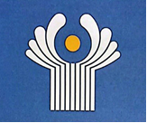

# 11-sinf Jahon tarixi (2025-yil darsligi)

_Tarix (Mavzulashgan) (2022-2025-yillar darsliklari)_

## 1-mavzu. XX asr oxiri – XXI asr birinchi choragida xalqaro munosabatlar.

**1. Xalqaro munosabatlarda ikki qutbli dunyo tartibi necha yil hukmronlik qilgan?**

- O‘n yildan ortiq
- Yigirma yildan ortiq
- O‘ttiz yildan ortiq
+ Qirq yildan ortiq

**2. XXI asrning birinchi choragida jahon hamjamiyati oldida hal qilinishi lozim bo‘lgan qanday muammolar turibdi? 1) Yaqin Sharqdagi Isroil bilan “Hamas’’ guruhi o‘rtasidagi urush; 2) Suriyadagi jangovar to‘qnashuvlar; 3) Rossiya va Ukraina o‘rtasidagi mojaro; 4) Afrika va dunyoning boshqa mintaqalarida kuchayib borayotgan xalqaro terrorizm xavfi.**

- 1, 2, 3
- 1, 2, 4
- 2, 3, 4
+ 1, 2, 3, 4

**3. … — bu mafkuraviy tuzum shakli bo‘lib, totalitar jamiyatda aholini keng miqyosda, ommaviy ravishda mafkuraviy qayta tarbiyalash vositasi.**

- Diniy mafkura
- Ommaviy mafkura
+ Totalitar mafkura
- Sotsialistik mafkura

**4. Qachon “COVID-19” pandemiyasi butun dunyoga tarqalgan?**

- 2019-yil boshida
+ 2020-yil boshida
- 2021-yil boshida
- 2022-yil boshida

**5. Jahon tarixi eng yangi davrining uchinchi bosqichida nimalar xalqaro barqarorlikka jiddiy xavf solib, ko‘plab mamlakatlardagi murakkab muammolarning manbayiga aylangan? 1) Iqtisodiy va madaniy hayotning globallashuvi; 2) Ekologiya muammolarining keskinlashuvi; 3) Dunyoning katta qismida modernizatsiya jarayonlarining tugallanmaganligi bilan bog‘liq ziddiyatlar.**

+ 1, 2, 3
- 1, 2
- 1, 3
- 2, 3

**6. Qaysi yilda O‘zbekiston Respublikasi birinchi Prezidenti Islom Karimov BMT Bosh Assambleyasining sessiyasida xalqaro terrorizm xavfi haqida nutq so‘zlagan?**

- 1991-yilda
- 1992-yilda
+ 1993-yilda
- 1994-yilda

**7. Qaysi AQSH prezidenti va SSSR rahbari “Sovuq urush” tugaganligini e’lon qilgan?**

+ Jorj Bush va Mixail Gorbachov
- Ronald Reygan va Konstantin Chernenko
- Bill Klinton va Yuriy Andropov
- Jimmi Karter va Leonid Brejnev

**8. O‘zbekiston Prezidenti Shavkat Mirziyoyev qachon o‘tkazilgan BMT Bosh Assambleyasining sessiyasida so‘zlagan nutqida: “Jahon miqyosida ishonch inqirozi kuzatilmoqda. Global xavfsizlik institutlari faoliyatidagi muammolar va xalqaro huquq me’yorlaridan chekinish kuchaymoqda va bularning barchasi keng ko‘lamdagi keskinlik ortishiga sabab bo‘lmoqda”, - deya bugungi xalqaro vaziyatga ta’rif bergan?**

- 2021-yil iyulda
- 2022-yil avgustda
+ 2023-yil sentyabrda
- 2024-yil oktyabrda

**9. Jahon tarixi eng yangi davrining uchinchi bosqichi qaysi yildan boshlanib, hozirgi kungacha bo‘lgan voqealar tarixini o‘rganadi?**

- 1990-yildan
+ 1991-yildan
- 1992-yildan
- 1993-yildan

**10. Qaysi davrda xalqaro munosabatlar tizimida tub burilish yuz bergan?**

+ 1990-yillar boshlarida
- 1990-yillar o‘rtalarida
- 1990-yillar oxirlarida
- 2000-yillar boshlarida

**11. BRIKS qachon paydo bo‘lgan?**

- 2001-yilda
- 2005-yilda
+ 2009-yilda
- 2012-yilda

**12. XXI asr boshlarida insoniyat duch kelgan eng xavfli muammolardan biri nima bo‘lgan?**

- Iqlimning o‘zgarishi
+ Xalqaro terrorizm
- Diniy mutaassiblik
- Globallashuv jarayoni

**13. Qaysi sanada SSSR Oliy Sovetining respublikalar kengashi SSSR ning tugatilishi to‘g‘risidagi deklaratsiyani qabul qilgan?**

- 1990-yil 16-dekabrda
- 1990-yil 26-dekabrda
- 1991-yil 16-dekabrda
+ 1991-yil 26-dekabrda

**14. O‘zbekiston Prezidenti Shavkat Mirziyoyev BMT Bosh Assambleyasining nechanchi sessiyasida so‘zlagan nutqida: “Jahon miqyosida ishonch inqirozi kuzatilmoqda. Global xavfsizlik institutlari faoliyatidagi muammolar va xalqaro huquq me’yorlaridan chekinish kuchaymoqda va bularning barchasi keng ko‘lamdagi keskinlik ortishiga sabab bo‘lmoqda”, - deya bugungi xalqaro vaziyatga ta’rif bergan?**

- 77-sessiyasida
+ 78-sessiyasida
- 79-sessiyasida
- 80-sessiyasida

**15. Qaysi sanada Nyu York va Vashington shaharlarida amalga oshirilgan terroristik aktlar jahon jamoatchiligini terrorizmga qarshi birlashishga undagan?**

- 2000-yil 10-sentyabrda
- 2000-yil 11-sentyabrda
- 2001-yil 10-sentyabrda
+ 2001-yil 11-sentyabrda

**16. … — XX asrning ikkinchi yarmiga xos bo‘lgan siyosiy atama. U “sovuq urush” da va u bilan bog‘liq qurollanish poygasida bevosita ishtirok etmayotgan davlatlarga nisbatan qo‘llanilgan. Dastlab kapitalistik dunyo va sotsialistik lagerga kirmagan barcha mamlakatlar shunday atalgan.**

- Yakka qutbli dunyo
- Ikki qutbli dunyo
- Ko‘p qutbli dunyo
+ Uchinchi dunyo

**17. Qachon “Sovuq urush” tugaganligi e’lon qilingan?**

- 1988-yil 3-noyabrda
+ 1989-yil 3-dekabrda
- 1990-yil 3-yanvarda
- 1991-yil 3-fevralda

**18. BMT Bosh Assambleyasining nechanchi sessiyasida O‘zbekiston Respublikasi birinchi Prezidenti Islom Karimov xalqaro terrorizm xavfi haqida nutq so‘zlagan?**

- 45-sessiyasida
- 46-sessiyasida
- 47-sessiyasida
+ 48-sessiyasida

**19. … — bu ijtimoiy tizimni jadal rivojlantirish maqsadida uni to‘liq yoki qisman yangilash, an’anaviy jamiyatdan yangilangan jamiyatga, agrar sivilizatsiyadan industrial sivilizatsiyaga o‘tish jarayoni.**

+ Modernizatsiya
- Globallashuv
- Urbanizatsiya
- Tolerantlik

**20. SHHT (Shanxay Hamkorlik Tashkiloti) qachon paydo bo‘lgan?**

+ 2001-yilda
- 2005-yilda
- 2009-yilda
- 2012-yilda

**21. “BRIKS” atamasi qaysi davlatlarning inglizcha nomlarining bosh harflaridan tashkil topgan? 1) Braziliya; 2) Rossiya; 3) Eron; 4) Hindiston; 5) Xitoy; 6) Singapur; 7) JAR.**

- 1, 3, 4, 5, 6
- 1, 2, 3, 5, 6
- 1, 2, 3, 6, 7
+ 1, 2, 4, 5, 7

**22. Jahon sog‘liqni saqlash tashkilotining ma’lumotiga ko‘ra, 2025-yil boshiga kelib, dunyo bo‘yicha … milliondan ortiq odam “COVID-19” bilan kasallanib, shundan … milliondan ortiq kishi vafot etgan.**

- 555/5,0
- 666/6,0
+ 777/7,0
- 888/8,0

**23. Qaysi davrda Tropik va Janubiy Afrika qonli urushlar, davlat to‘ntarishlari, partizanlik harakatlari maydoniga aylangan?**

- 1990-yillar boshida
- 1990-yillar o‘rtasida
+ 1990-yillar oxirida
- 2000-yillar boshida

**24. Qaysi davrda Markaziy va Sharqiy Yevropa mamlakatlarida sotsializmning qulashi, SSSR ning parchalanishi natijasida “ikki qutbli dunyo” modeli barham topishi ko‘p qutbli dunyoning tashkil topishiga sabab bo‘lgan?**

+ 1990-yillar boshlarida
- 1990-yillar o‘rtalarida
- 1990-yillar oxirlarida
- 2000-yillar boshlarida

**25. Totalitar mafkuraning barham topishi natijasida vujudga kelgan mafkuraviy bo‘shliqqa progressiv g‘oyalar bilan birga yana qanday g‘oyalar ham kirib kelib, lokal urushlar xavfi kuchaygan? 1) Millatchilik; 2) Diniy mutaassiblik; 3) Tolerantlik; 4) Tajovuzkorlik.**

- 1, 2, 3
+ 1, 2, 4
- 2, 3, 4
- 1, 2, 3, 4

**26. … — bu jahon mamlakatlarining iqtisodiy, siyosiy, madaniy va diniy jihatdan birlashishi yoki yaqinlashishi jarayoni.**

- Modernizatsiya
+ Globallashuv
- Urbanizatsiya
- Tolerantlik

**27. Jahon tarixi eng yangi davrining nechanchi bosqichida sotsialistik rejimning barbod bo‘lishi, “sovuq urush” ning barham topishi va SSSR ning tarqalib ketishi jahon miqyosida kuchlar nisbatiga, shakllangan geosiyosiy muvozanatga katta ta’sir ko‘rsatgan?**

- Birinchi bosqichida
- Ikkinchi bosqichida
+ Uchinchi bosqichida
- To‘rtinchi bosqichida

**28. … — jahonda bir-biridan ustun bo‘lmagan bir nechta siyosiy, iqtisodiy, harbiy va madaniy markazlar (qutblar) ning mavjudlik holati.**

- Yakka qutbli dunyo
- Ikki qutbli dunyo
+ Ko‘p qutbli dunyo
- Uchinchi dunyo

**29. XXI asrning birinchi choragida qanday omil sababli masofaviy ish va onlayn ta’limning keskin oshishi raqamli texnologiyalarning ahamiyatini yanada oshirgan?**

+ “COVID-19” pandemiyasi
- Xalqaro terrorizm xavfi
- Iqlim muammolari
- Globallashuv jarayoni

## 2-mavzu. Sharqiy Yevropa mamlakatlarida demokratik inqiloblar va sotsialistik lagerning parchalanishi.

**30. Qaysi Yugoslaviya sobiq respublikasidagi etnik nizolarni bartaraf qilish uchun u yerga BMT tinchliksevar kuchlari kiritilgan va urush harakatlari to‘xtatilgan?**

- Sloveniya
- Serbiya
+ Bosniya
- Xorvatiya

**31. Qachon Timishoara shahrida aholining tinch namoyishi Ruminiya maxfiy xizmati xodimlari tomonidan o‘qqa tutilishi mamlakat bo‘ylab qo‘zg‘olonning boshlanishiga olib kelgan?**

- 1988-yil noyabrda
+ 1989-yil dekabrda
- 1990-yil yanvarda
- 1991-yil fevralda

**32. Qayerda 1990-yildan keyin Kosovo avtonom o‘lkasi bilan bog‘liq inqiroz vujudga kelgan?**

- Sloveniya
- Bosniya
+ Serbiya
- Xorvatiya

**33. Qaysi yillarda Sharqiy Yevropaning Polsha, Ruminiya, GDR, Chexoslovakiya, Bolgariya, Vengriya va Yugoslaviya davlatlarida sotsialistik rejimlar barham topgan?**

- 1987-1989-yillarda
- 1988-1990-yillarda
- 1989-1991-yillarda
+ 1990-1992-yillarda

**34. Qaysi sanadan jahon xaritasida ikkita mustaqil davlat — Chexiya Respublikasi va Slovakiya Respublikasi paydo bo‘lgan?**

+ 1993-yil 1-yanvardan
- 1994-yil 1-dekabrdan
- 1995-yil 1-noyabrdan
- 1996-yil 1-oktyabrdan

**35. Qaysi yilda NATO qo‘shinlari Yugoslaviyani bombardimon qilgan?**

- 1996-yilda
- 1997-yilda
- 1998-yilda
+ 1999-yilda

**36. Qaysi yilda o‘tkazilgan referendum natijasiga ko‘ra, Chexoslovakiya bo‘linishga qaror qilgan?**

- 1989-yilda
- 1990-yilda
- 1991-yilda
+ 1992-yilda

**37. Yugoslaviya Federativ Respublikasi tarkibiga kirgan respublikalarni toping. 1) Sloveniya; 2) Chexiya; 3) Xorvatiya; 4) Bosniya va Gersegovina; 5) Albaniya; 6) Bolgariya; 7) Chernogoriya; 8) Serbiya; 9) Makedoniya.**

+ 1, 3, 4, 7, 8, 9
- 2, 5, 6
- 3, 4, 6, 8
- 1, 2, 4, 5, 6

**38. Qaysi yilda Yugoslaviya Respublikasi barham topgan?**

- 2005-yilda
+ 2006-yilda
- 2007-yilda
- 2008-yilda

**39. Qachon ikki nemis davlati (GDR va GFR) bitta — Germaniya Federativ Respublikasiga birlashgan shartnoma imzolangan?**

- 1988-yilda
- 1989-yilda
+ 1990-yilda
- 1991-yilda

**40. Rossiya va Ukraina o‘rtasida ziddiyat qachon boshlangan?**

+ 2014-yilda
- 2016-yilda
- 2019-yilda
- 2022-yilda

**41. Qaysi yilda o‘tkazilgan referendum natijasiga ko‘ra, Chernogoriya Serbiyadan ajralib chiqqan?**

- 2005-yilda
+ 2006-yilda
- 2007-yilda
- 2008-yilda

**42. Qaysi Sharqiy Yevropa davlatida kommunistik rejim qulagach hokimiyat yangi tashkil qilingan Milliy qutqarish qo‘mitasi qo‘liga o‘tgan?**

- Polsha
- Chexoslovakiya
- Vengriya
+ Ruminiya

**43. “Germaniya bilan munosabatlarni uzil-kesil tartibga solish to‘g‘risida” gi shartnoma qachon va qayerda imzolangan?**

- 1988-yil, Parij
- 1989-yil, Berlin
+ 1990-yil, Moskva
- 1991-yil, London

**44. Sharqiy Yevropa davlatlarida bozor iqtisodiga jadal o‘tish oqibatida qanday salbiy holatlar kuzatilib, vaqtincha bo‘lsa-da, aholining noroziligiga olib kelgan? 1) Demografik inqiroz; 2) Inflyatsiya darajasi o‘sishi; 3) Ishsizlikning o‘sishi; 4) Aholi turmush darajasining pasayishi.**

- 1, 2, 3
+ 2, 3, 4
- 1, 3, 4
- 1, 2, 3, 4

**45. XX asr so‘nggi choragida SSSR da boshlangan qaysi siyosat Sharqiy Yevropa mamlakatlarida ijtimoiy hayotning barcha jabhalarini chuqur isloh qilish uchun imkoniyat yaratgan?**

- “Katta sakrash” siyosati
- “Iliqlik” siyosati
+ “Qayta qurish” siyosati
- “Madaniy inqilob” siyosati

**46. Sharqiy Yevropada demokratik o‘zgarishlarni boshlab bergan mamlakat qaysi edi?**

- Ruminiya
+ Polsha
- Chexoslovakiya
- Vengriya

**47. Yugoslaviya Federativ Respublikasi nechta respublikadan tashkil topgan edi?**

- Uchta respublikadan
- To‘rtta respublikadan
- Beshta respublikadan
+ Oltita respublikadan

**48. Qaysi Sharqiy Yevropa davlatida sotsialistik tuzumning qulashi millatchi va ayirmachi kuchlarning faollashuvi uchun imkoniyat yaratgan?**

+ Yugoslaviya
- Albaniya
- Bolgariya
- Chexoslovakiya

**49. Qaysi yillarda Sharqiy Yevropaning Chexoslovakiya, Bolgariya, Vengriya va Yugoslaviya kabi mamlakatlarida sotsialistik rejimlar barham topgan?**

- 1987-1989-yillarda
- 1988-1990-yillarda
- 1989-1991-yillarda
+ 1990-1992-yillarda

**50. “Siyosiy plyuralizm” atamasining ma’nosi nima?**

- Hurfikrlilik
- Qoloqlik
- Birdamlik
+ Ko‘pfikrlilik

**51. Milliy qutqarish qo‘mitasi raisi bo‘lgan Ion Iliesku qaysi yilda bo‘lib o‘tgan saylovda Ruminiya prezidenti etib saylangan?**

- 1988-yilda
- 1989-yilda
+ 1990-yilda
- 1991-yilda

**52. Sharqiy Yevropa mamlakatlarida yuz bergan o‘zgarishlar ularga rivojlanishning qanday modelini tanlash imkonini bergan?**

- Sharq modelini
+ G‘arb modelini
- Sotsialistik modelni
- Kommunistik modelni

**53. Qaysi yilda Polshada bo‘lib o‘tgan saylovlar Polsha birlashgan ishchi partiyasi (PBIP) ning obro‘si tushib ketganligini, muxolifatdagi “Birdamlik” kasaba uyushmasining ommalashib borayotganini ko‘rsatgan?**

- 1988-yilda
+ 1989-yilda
- 1990-yilda
- 1991-yilda

**54. Kosovo avtonom o‘lkasida o‘lkaning asosiy aholisi bo‘lgan musulmon qaysi xalq o‘zlarining “Kosovo Respublikasi” ni e’lon qilgan?**

+ Albanlar
- Xorvatlar
- Serblar
- Ruminlar

**55. Qaysi Sharqiy Yevropa davlatida kommunistik rejimning qulashi jiddiy harbiy to‘qnashuv oqibatida yuz bergan?**

+ Ruminiya
- Polsha
- Chexoslovakiya
- Vengriya

**56. Yugoslaviya tarkibidagi qaysi respublikada kelib chiqqan mojaro Yevropa miqyosidagi inqirozga aylangan va mamlakat NATO qo‘shinlari tomonidan bombardimon qilingan?**

- Chernogoriya
- Bosniya
+ Serbiya
- Xorvatiya

**57. Qaysi yilda Polshada navbatdan tashqari o‘tkazilgan prezidentlik saylovida “Birdamlik” kasaba uyushmasi yetakchisi Lex Valensa g‘alaba qozongan?**

- 1988-yilda
- 1989-yilda
+ 1990-yilda
- 1991-yilda

**58. Rossiya va Ukraina o‘rtasidagi ziddiyat keng miqyosli urushga aylangach, Sharqiy Yevropadagi qaysi davlatlar rahbarlari Rossiya bilan iqtisodiy munosabatlarni tiklash tarafdori bo‘lib qolgan?**

- Bolgariya va Xorvatiya
- Xorvatiya va Vengriya
+ Vengriya va Slovakiya
- Slovakiya va Bolgariya

**59. Polshadagi “Birdamlik” harakatining faoliyati qachon boshlangan edi?**

+ “Qayta qurish” dan oldin
- “Qayta qurish” davrida
- “Qayta qurish” dan keyin
- Mustaqillikdan keyin

**60. GDR va GFR ni ajratib turgan “Berlin devori” qaysi sanada qulagan?**

- 1988-yil 9-oktyabrda
+ 1989-yil 9-noyabrda
- 1990-yil 9-dekabrda
- 1991-yil 9-yanvarda

**61. Ikki nemis davlati (GDR va GFR) bitta — Germaniya Federativ Respublikasiga birlashgan shartnoma qayerda imzolangan?**

- Berlin
- Parij
- London
+ Moskva

**62. Rossiya va Ukraina o‘rtasidagi ziddiyat qachon keng miqyosli urushga aylangan?**

- 2014-yilda
- 2016-yilda
- 2019-yilda
+ 2022-yilda

**63. Yugoslaviyadan 1991-1992-yillarda qaysi respublikalar ajralib chiqqan? 1) Chernogoriya; 2) Sloveniya; 3) Xorvatiya; 4) Serbiya; 5) Bosniya; 6) Makedoniya.**

- 1, 2, 3, 4
+ 2, 3, 5, 6
- 1, 3, 4
- 1, 2, 3, 4, 5, 6

**64. XXI asrning qaysi yillarida Kosovo va Serbiya o‘rtasidagi kichik mojarolarda bir qancha tinch aholi vakillari halok bo‘lgan?**

- 2020-2022-yillarda
- 2021-2023-yillarda
+ 2022-2024-yillarda
- 2023-2025-yillarda

## 3-mavzu. Sovet respublikalarida mustaqillikning e’lon qilinishi va SSSR ning parchalanishi.

**65. Qaysi yilda Sumgait shahrida ozarbayjon-arman mojarosi bo‘lgan?**

- 1986-yilda
- 1987-yilda
+ 1988-yilda
- 1989-yilda

**66. Qayerda bo‘lib o‘tgan Markaziy Osiyo davlatlari rahbarlarining VI maslahat uchrashuvida “Markaziy Osiyo – 2040” mintaqaviy hamkorlikni rivojlantirish konsepsiyasi va mintaqa davlatlarida transport-logistika markazlarini rivojlantirish bo‘yicha o‘zaro anglashuv memorandumi imzolandi?**

- Toshkent
- Bishkek
- Ashxobod
+ Ostona

**67. Qaysi yil oxirigacha Boltlqbo‘yi respublikalari — Latviya, Litva, Estoniyadan tashqari barcha sobiq sovet respublikalari MDH tarkibiga kirgan?**

+ 1991-yil oxirigacha
- 1992-yil oxirigacha
- 1993-yil oxirigacha
- 1994-yil oxirigacha

**68. Qaysi shaharda Qozog‘iston rahbari etib G. V. Kolbin tayinlanishiga qarshi talabalar namoyishi bo‘lgan?**

- Chimkent
+ Olmaota
- Aqtau
- Ostona

**69. Qachon bir guruh sovet rahbarlari tomonidan GKCHP (Favqulodda holat bo‘yicha davlat qo‘mitasi) ning tuzilishi SSSR ning parchalanish jarayonini yanada tezlashtirgan?**

- 1990-yil avgustda
+ 1991-yil avgustda
- 1991-yil dekabrda
- 1990-yil dekabrda

**70. Qaysi davlatlar rahbarlari yig‘ilib, SSSR siyosiy birlik sifatida tugatilganligini e‘lon qilgan? 1) Rossiya; 2) Moldova; 3) Ukraina; 4) Belorussiya.**

- 1, 2, 3
+ 1, 3, 4
- 2, 3, 4
- 1, 2, 3, 4

**71. Qaysi davrga kelib barcha sovet respublikalari mustaqil bo‘lgan?**

- 1991-yilning boshiga
+ 1991-yilning oxiriga
- 1992-yilning boshiga
- 1992-yilning oxiriga

**72. Turkiy Davlatlar Tashkiloti birinchi sammiti qachon o‘tkazilgan?**

- 1991-yil sentyabrda
+ 1992-yil oktyabrda
- 1993-yil noyabrda
- 1994-yil dekabrda

**73. Qaysi yilda Qozog‘iston rahbari etib G. V. Kolbin tayinlanishiga qarshi talabalar namoyishi bo‘lgan?**

+ 1986-yilda
- 1987-yilda
- 1988-yilda
- 1989-yilda

**74. Qaysi shaharda o‘zbek-qirg‘iz mojarosi yuz bergan?**

- Bishkek
- Jalolobod
+ O‘sh
- Talas

**75. Turkiy Davlatlar Tashkiloti birinchi sammiti qayerda o‘tkazilgan?**

+ Anqara
- Boku
- Istanbul
- Toshkent

**76. Qaysi davlat MDH da assotsiatsiyalashgan (hamfikr) a’zo hisoblanadi?**

- Qirg‘iziston
+ Turkmaniston
- Ukraina
- Gruziya

**77. 2009-yil qaysi davlat MDH tarkibidan chiqqan?**

- Qirg‘iziston
- Turkmaniston
- Ukraina
+ Gruziya

**78. Qaysi sanada SSSR siyosiy birlik sifatida tugatilganligi e’lon qilingan?**

+ 1991-yil 8-dekabrda
- 1991-yil 18-dekabrda
- 1992-yil 8-dekabrda
- 1992-yil 18-dekabrda

**79. Qayerda Markaziy Osiyoning beshta respublikasi rahbarlarining uchrashuvi bo‘lib o‘tgan va unda MDH ga a’zo davlatlarning tengligi va barchasining ta’sischi sifatida tashkilotga qo‘shilishi ma’lum qilingan?**

- Qozog‘iston poytaxti Ostona shahrida
+ Turkmaniston poytaxti Ashxobod shahrida
- Qirg‘iziston poytaxti Bishkek shahrida
- Tojikiston poytaxti Dushanbe shahrida

**80. XX asrning oxirlarida qanday sabablar oqibatida SSSR tarkibidagi sovet respublikalarida ko‘plab millatlararo mojarolar kelib chiqqan? 1) Respublikalarning notekis iqtisodiy rivojlanishi; 2) Respublikalarning tarixan bir-biriga hududiy da’volarining mavjudligi; 3) Respublikalardagi muammolarning sovet rahbariyati tomonidan e’tiborga olinmaganligi.**

- 1, 2
- 1, 3
- 2, 3
+ 1, 2, 3

**81. SSSR parchalangandan keyin, Rossiya bilan qaysi mintaqa davlatlari o‘rtasida u yerda yashovchi ko‘p sonli rusiyzabon aholi huquqlari va hududiy masalalar bo‘yicha tortishuvlar bo‘lib o‘tgan?**

- Kavkaz
- Markaziy Osiyo
+ Boltiqbo‘yi
- Uzoq Sharq

**82. Boltiqbo‘yi respublikalari – Latviya, Litva va Estoniya qaysi yilda amalda SSSR tarkibidan chiqqan?**

- 1988-yilda
- 1989-yilda
+ 1990-yilda
- 1991-yilda

**83. Qaysi davlat MDH faoliyatida qatnashmayapti?**

- Qirg‘iziston
- Turkmaniston
+ Ukraina
- Qozog‘iston

**84. Qaysi yilda Qrim avtonomiyasini tiklash uchun qrim tatarlarining milliy harakati tuzilgan va dastlabki namoyishlari bo‘lib o‘tgan?**

- 1986-yilda
+ 1987-yilda
- 1988-yilda
- 1989-yilda

**85. Qaysi yilda ko‘plab sovet respublikalari o‘z mustaqillik deklaratsiyalarini qabul qilgan?**

- 1989-yilda
+ 1990-yilda
- 1991-yilda
- 1992-yilda

**86. Turkiy Davlatlar Tashkiloti birinchi sammiti qaysi davlat tashabbusi bilan o‘tkazilgan?**

- O‘zbekiston
- Qozog‘iston
+ Turkiya
- Ozarbayjon

**87. Turkiy Kengashning qayerda bo‘lib o‘tgan sammitida O‘zbekiston tashkilotga yangi a’zo sifatida ishtirok etdi?**

+ Boku
- Anqara
- Toshkent
- Istanbul

**88. Yangi shakllangan mustaqil davlatlar o‘rtasidagi qanday jabhalarda MDH ma’lum ijobiy rol o‘ynagan? 1) Iqtisodiy va gumanitar aloqalarni saqlab turishda; 2) Ijtimoiy va gumanitar halokatlarning oldini olishda; 3) Paydo bo‘lgan muammolarni hamkorlikda hal etishda.**

- 1, 2
- 1, 3
- 2, 3
+ 1, 2, 3

**89. SSSR parchalanishi natijasida qanday jarayonlar sodir bo‘ldi? 1) Sobiq sovet respublikalari o‘z mustaqil davlatlarini qurish yo‘lini tanladi; 2) Erkin bozor iqtisodiyotiga o‘tildi va fuqarolarning iqtisodiy faoliyati uchun keng imkoniyatlar yaratildi; 3) Demokratik huquq va erkinliklar (so‘z, matbuot, ijod erkinligi) oshdi; 4) Siyosiy erkinliklar kengaydi, yangi partiyalar paydo bo‘lib, boshqaruvning ko‘ppartiyaviylik tizimiga o‘tildi; 5) “Sovuq urush” va ikki qutbli dunyo tizimi barham topdi hamda ko‘p qutbli dunyo davri boshlandi; 6) Globallashuv jarayoni kuchaydi.**

- 1, 2, 3
- 1, 2, 3, 4
+ 1, 2, 3, 4, 5
- 1, 2, 3, 4, 5, 6

**90. … — bu zamonaviy demokratik mamlakatlarda siyosiy hayotni tashkil qilishning asosiy konstitutsiyaviy tamoyillaridan biri bo‘lib, mafkuraviy plyuralizm (ko‘pfikrlilik) ning yorqin ifodalangan ko‘rinishidir.**

- Demokratik prinsip
- Plyuralistik prinsip
- Mafkuraviylik prinsipi
+ Ko‘ppartiyaviylik prinsipi

**91. Qayerda bo‘lib o‘tgan uchrashuvda deklaratsiya qabul qilinib, SSSR xalqaro huquq subyekti va geosiyosiy reallik sifatida o‘z faoliyatini tugatganligi ta’kidlangan?**

+ Qozog‘istonning Olmaota shahrida
- Turkmanistonning Ashxobod shahrida
- Qirg‘izistonning Bishkek shahrida
- Tojikistonning Dushanbe shahrida

**92. SSSR parchalangandan keyin, qaysi respublikalarda fuqarolararo mojarolar yuz berganda Rossiya o‘zining iqtisodiy va strategik manfaatlari yuzasidan bu mojarolarni bartaraf qilishda qatnashgan?**

- Qirg‘iziston va Latviya
+ Tojikiston va Moldova
- Turkmaniston va Litva
- Qozog‘iston va Estoniya

**93. Qaysi yilda Farg‘ona voqealari bo‘lgan?**

- 1986-yilda
- 1987-yilda
- 1988-yilda
+ 1989-yilda

**94. Turkiy Kengashning qachon bo‘lib o‘tgan sammitida O‘zbekiston tashkilotga yangi a’zo sifatida ishtirok etdi?**

- 2018-yil 15-sentyabrda
+ 2019-yil 15-oktyabrda
- 2020-yil 15-noyabrda
- 2021-yil 15-dekabrda

**95. Qachon bo‘lib o‘tgan uchrashuvda deklaratsiya qabul qilinib, SSSR xalqaro huquq subyekti va geosiyosiy reallik sifatida o‘z faoliyatini tugatganligi ta’kidlangan?**

- 1990-yil avgustda
- 1991-yil avgustda
+ 1991-yil dekabrda
- 1990-yil dekabrda

**96. Bugungi kunga kelib, O‘zbekiston Respublikasi MDH dan tashqari, xalqaro maydonda nufuzli bo‘lgan yana qaysi xalqaro va mintaqaviy tashkilotlar faoliyatida o‘zaro manfaatdorlik va tenglik asosida qatnashib kelmoqda? 1) Birlashgan Millatlar Tashkiloti (BMT); 2) Yevropada Xavfsizlik va Hamkorlik Tashkiloti (YXHT); 3) Shanxay Hamkorlik Tashkiloti (SHHT); 4) Islom Hamkorlik Tashkiloti; 5) Turkiy Davlatlar Tashkiloti; 6) Iqtisodiy Hamkorlik Tashkiloti (IHT).**

- 2, 4, 5
- 1, 3, 4, 5, 6
+ 1, 2, 3, 4, 5, 6
- 3, 4, 5, 6

**97. Mustaqil Davlatlar Hamdo‘stligi (MDH) qanday maqsadda tashkil etilgan edi?**

+ SSSR parchalanishining sobiq sovet respublikalariga salbiy ta’sirini kamaytirish maqsadida
- Sobiq ittifoq respublikalarini siyosiy jihatdan birlashtirish maqsadida
- SSSR davridagi markazlashgan boshqaruv tizimini davom ettirish maqsadida
- Sobiq sovet respublikalarini harbiy ittifoqchi sifatida saqlab qolish maqsadida

**98. SSSR parchalangandan keyin, Rossiya bilan Ukraina o‘rtasida qaysi masalalar to‘g‘risida keskin bahslar ketgan? 1) Qora dengiz flotini bo‘lib olish; 2) Qrim yarimorolidagi Sevastopol shahrining maqomi; 3) Yadro qurollarini topshirish.**

+ 1, 2
- 1, 3
- 2, 3
- 1, 2, 3

**99. Qachon Markaziy Osiyoning beshta respublikasi rahbarlarining uchrashuvi bo‘lib o‘tgan va unda MDH ga a’zo davlatlarning tengligi va barchasining ta’sischi sifatida tashkilotga qo‘shilishi ma’lum qilingan?**

- 1990-yil avgustda
- 1991-yil avgustda
+ 1991-yil dekabrda
- 1990-yil dekabrda

**100. SHHT Xalq diplomatiyasi forumi, Sayyohlik forumi, An’anaviy tabobat, yoshlar o‘rtasida startap loyihalari tanlovi, SHHT ayollar forumi kabi yirik xalqaro tadbirlar qaysi davlat tashabbusi bilan o‘tkazib kelinmoqda?**

+ O‘zbekiston
- Qozog‘iston
- Turkiya
- Ozarbayjon

**101. Qaysi yildan Markaziy Osiyo davlatlari rahbarlarining Maslahat uchrashuvi tashkil qilinib, unda mintaqadagi iqtisodiy, xavfsizlik, suv va energetika, gumanitar hamda boshqa sohalardagi muammolar o‘z yechimini topib bormoqda?**

+ 2019-yildan
- 2020-yildan
- 2021-yildan
- 2022-yildan

**102. Qachon bo‘lib o‘tgan Markaziy Osiyo davlatlari rahbarlarining VI maslahat uchrashuvida “Markaziy Osiyo – 2040” mintaqaviy hamkorlikni rivojlantirish konsepsiyasi va mintaqa davlatlarida transport-logistika markazlarini rivojlantirish bo‘yicha o‘zaro anglashuv memorandumi imzolandi?**

- 2021-yil mayda
- 2022-yil iyunda
- 2023-yil iyulda
+ 2024-yil avgustda

**103. Qaysi yilda o‘zbek-qirg‘iz mojarosi yuz bergan?**

- 1987-yilda
- 1988-yilda
- 1989-yilda
+ 1990-yilda

## 4-mavzu. Rossiya Federatsiyasi.

**104. Rossiya bilan Checheniston o‘rtasidagi urush natijasida har ikki tomondan qancha kishi qurbon bo‘lgan?**

- 110 mingdan ortiq
+ 120 mingdan ortiq
- 130 mingdan ortiq
- 140 mingdan ortiq

**105. Qachon Rossiyada Federatsiya Kengashi va Davlat Dumasiga saylovlar bo‘lib o‘tgan?**

- 1992-yil noyabrda
+ 1993-yil dekabrda
- 1994-yil yanvarda
- 1995-yil fevralda

**106. Qachon Ukrainada hokimiyat almashgan?**

- 2013-yil yanvarda
+ 2014-yil fevralda
- 2015-yil martda
- 2016-yil aprelda

**107. Rossiya bilan qaysi davlat o‘rtasida “Besh kunlik urush” nomini olgan harbiy mojaro bo‘lib o‘tgan?**

- Ozarbayjon
+ Gruziya
- Armaniston
- Suriya

**108. Qachon Qrimda hokimiyatni egallagan rossiyaparastlar referendum o‘tkazib, uning natijasiga binoan, Qrimning mustaqilligini e’lon qilgan va Rossiya Federatsiyasi tarkibiga kirish to‘g‘risida shartnomani imzolagan?**

+ 2014-yil 16-martda
- 2015-yil 16-aprelda
- 2016-yil 16-mayda
- 2017-yil 16-iyunda

**109. 2022-yil sentyabr oyida referendum o‘tkazilib, uning natijalariga ko‘ra, Ukrainaning qaysi viloyatlari Rossiya tarkibiga qo‘shib olingan? 1) Donetsk; 2) Lugansk; 3) Zaporojye; 4) Xerson.**

- 1, 2, 3
- 1, 3, 4
- 2, 3, 4
+ 1, 2, 3, 4

**110. Qachon Gruziya o‘zining tarkibiy qismi hisoblangan Janubiy Osetiya va Abxaziyada konstitutsion tartibni tiklashni boshlagan?**

+ 2008-yil avgustda
- 2009-yil sentyabrda
- 2010-yil oktyabrda
- 2011-yil noyabrda

**111. Qaysi AQSH prezidenti Rossiyani jahonning yetakchi liderlari norasmiy klubi — G7 ga (katta yettilikka) taklif qilgan?**

+ Bill Klinton
- Ronald Reygan
- Jorj Bush
- Jimmi Karter

**112. 1990-yillarda Rossiya Osiyoda asosiy e’tiborini qaysi davlat bilan munosabatlarini yaxshilashga qaratgan?**

- Xitoy
- Janubiy Koreya
- Shimoliy Koreya
+ Yaponiya

**113. Yugoslaviyada qaysi yilda boshlangan ichki mojaroga NATO aralashgan?**

- 1991-yilda
- 1992-yilda
- 1993-yilda
+ 1994-yilda

**114. Rossiya prezidenti Boris Yelsin iste’foga chiqqach, vaqtincha prezident lavozimini egallagan Vladimir Putin qachon bo‘lib o‘tgan saylovda rasman Rossiya prezidenti etib saylangan?**

- 1997-yil dekabrda
- 1998-yil yanvarda
- 1999-yil fevralda
+ 2000-yil martda

**115. Rossiyada Federativ Shartnoma qachon imzolangan?**

- 1991-yil fevralda
+ 1992-yil martda
- 1993-yil aprelda
- 1994-yil mayda

**116. Qachon Rossiya Donetsk va Lugansk Xalq Respublikalarining mustaqilligini tan olgan?**

- 2021-yil 21-fevralda
+ 2022-yil 21-fevralda
- 2022-yil 24-fevralda
- 2021-yil 24-fevralda

**117. Rossiyadagi qaysi o‘lkalarda 1991-yil oxiri - 1992-yil boshlarida milliy harakatlar o‘zlarining syezdlarini o‘tkazib, ularda RSFSR tarkibidan chiqish masalasi qo‘yilgan? 1) Dog‘iston; 2) Tatariston; 3) Boshqirdiston; 4) Yoqutiston.**

- 1, 2, 3
- 1, 3, 4
+ 2, 3, 4
- 1, 2, 3, 4

**118. O‘zbekiston Respublikasi va Rossiya Federatsiyasi o‘rtasida qachon diplomatik munosabatlar o‘rnatilgan?**

- 1991-yil 20-fevralda
+ 1992-yil 20-martda
- 1993-yil 20-aprelda
- 1994-yil 20-mayda

**119. Qachon Rossiya prezidenti Boris Yelsin Xalq deputatlari syezdini va Oliy Sovetni tarqatib yuborgan, davlat hokimiyatining yangi organlari — Federatsiya Kengashi va Davlat Dumasiga saylovlar hamda mamlakatning yangi konstitutsiyasi haqida referendum o‘tkazish to‘g‘risida farmon imzolagan?**

- 1992-yilda
+ 1993-yilda
- 1994-yilda
- 1995-yilda

**120. Qaysi yildan O‘zbekiston va Rossiya munosabatlari yangi bosqichga ko‘tarildi?**

+ 2017-yildan
- 2018-yildan
- 2019-yildan
- 2020-yildan

**121. Qrimdagi hukumat Rossiya Federatsiyasi tarkibiga kirish to‘g‘risida shartnomani imzolagach, Rossiya tarkibiga ikkita yangi subyekt – Qrim Respublikasi va federal ahamiyatdagi … shahri kirgan.**

- Yalta
- Simferopol
+ Sevastopol
- Kerch

**122. Rossiya prezidenti B. N. Yelsin qaysi AQSH prezidenti bilan uchrashib, Rossiya – AQSH hamkorligi va do‘stligi to‘g‘risida xartiya, Hujum qurollarini qisqartirish to‘g‘risida shartnoma kabi bir qator hujjatlarni imzolagan?**

- Bill Klinton
- Ronald Reygan
+ Jorj Bush
- Jimmi Karter

**123. Rossiyada Federativ Shartnoma qaysi o‘lkalardan tashqari barcha subyektlar tomonidan imzolangan?**

+ Tatariston va Checheniston
- Checheniston va Boshqirdiston
- Boshqirdiston va Yoqutiston
- Yoqutiston va Tatariston

**124. Ukrainaning sharqidagi qaysi hududlar mamlakatdagi hokimiyat almashinuvini tan olmagan?**

- Lugansk va Zaporojye
- Zaporojye va Xerson
- Xerson va Donetsk
+ Donetsk va Lugansk

**125. Qaysi voqeadan keyin Rossiya aholisi Ikkinchi jahon urushidan keyingi davrda birinchi marta kamaya boshlagan?**

- “Qayta qurish” siyosatidan keyin
- SSSR parchalanganidan keyin
+ Narxlar erkin qo‘yib yuborilganidan keyin
- Rossiyaning tashqi qarzi oshib ketganidan keyin

**126. Rossiya – AQSH hamkorligi va do‘stligi to‘g‘risida xartiya qachon imzolangan?**

+ 1992-yilda
- 1993-yilda
- 1994-yilda
- 1995-yilda

**127. 1990-yillarda Rossiyaning Xitoy bilan munosabatlari … .**

- sovuqlashgan
+ rivojlanishda davom etgan
- o‘zgarib turgan
- umuman to‘xtab qolgan

**128. … — bu iqtisodiy nazariya, shuningdek, ushbu nazariyaga asoslangan keskin iqtisodiy islohotlar.**

- Inflyatsiya jarayoni
- Byudjet taqchilligi
+ Shok terapiyasi
- Narx muvozanati

**129. Rossiyada qaysi sanadan narxlar erkin qo‘yib yuborilgan?**

- 1990-yil 1-yanvardan
- 1991-yil 1-yanvardan
+ 1992-yil 1-yanvardan
- 1993-yil 1-yanvardan

**130. Rossiya va AQSH o‘rtasida Hujum qurollarini qisqartirish to‘g‘risida shartnoma qachon imzolangan?**

- 1992-yilda
+ 1993-yilda
- 1994-yilda
- 1995-yilda

**131. Qaysi yilga kelib Rossiyaning tashqi qarzi 130 milliard dollardan oshib ketgan?**

- 1996-yilga
- 1997-yilga
- 1998-yilga
+ 1999-yilga

**132. Qaysi o‘lka prezidenti etib saylangan M. Shaymiyev Rossiya federal hokimiyati bilan vakolatlarni taqsimlash to‘g‘risidagi shartnomani imzolagan?**

- Checheniston
- Boshqirdiston
- Yoqutiston
+ Tatariston

**133. 1990-yillar boshlarida qaysi voqealar Rossiya jamiyatida ijtimoiy tanglikni oshirgan? 1) 1991-yilgi avgust voqealari; 2) SSSR ning parchalanishi; 3) “Shok terapiyasi”.**

- 1, 2
- 1, 3
- 2, 3
+ 1, 2, 3

**134. Ikkinchi jahon urushidan keyin Rossiya va qaysi davlat o‘rtasida davom etib kelayotgan Janubiy Kuril orollari muammosi tufayli ikki o‘rtada tinchlik shartnomasi imzolanmagan edi?**

- Xitoy
- Janubiy Koreya
- Shimoliy Koreya
+ Yaponiya

**135. Qachon Prezident Shavkat Mirziyoyev va Prezident Vladimir Putin O‘zbekiston Respublikasi bilan Rossiya Federatsiyasi o‘rtasida keng qamrovli strategik sheriklik to‘g‘risidagi deklaratsiyani imzoladi?**

- 2021-yil avgustda
+ 2022-yil sentyabrda
- 2023-yil oktyabrda
- 2024-yil noyabrda

**136. Qachon Tatariston Rossiya federal hokimiyati bilan vakolatlarni taqsimlash to‘g‘risidagi shartnomani imzolagan?**

- 1992-yilda
- 1993-yilda
+ 1994-yilda
- 1995-yilda

**137. Rossiyadagi qaysi avtonom respublikada chechen xalqining umummilliy kongressi avtonomiyani Checheniston va Ingushiyaga bo‘lishini, Chechenistonning RSFSR tarkibidan chiqishini bildirgan?**

+ Chechen-Ingush Avtonom Respublikasida
- Chechen Avtonom Respublikasida
- Ingush Avtonom Respublikasida
- Ingush-Chechen Avtonom Respublikasida

**138. 1994-yilda kim AQSH prezidenti etib saylangan?**

+ Bill Klinton
- Ronald Reygan
- Jorj Bush
- Jimmi Karter

**139. 1999-yillari qaysi davlat hududining bombardimon qilinishi Rossiya va AQSH o‘rtasidagi munosabatlarning sovuqlashuviga olib kelgan?**

- Xorvatiya
- Bolgariya
+ Yugoslaviya
- Albaniya

**140. Qachon Rossiya prezidenti V. Putin Donbasga yordam berish uchun keng miqyosli maxsus harbiy operatsiya boshlanganligini e’lon qilgan?**

- 2021-yil 21-fevralda
- 2022-yil 21-fevralda
+ 2022-yil 24-fevralda
- 2021-yil 24-fevralda

**141. Mustaqil Davlatlar Hamdo‘stligi (MDH) bayrog‘i qachon qabul qilingan?**

+ 1996-yil 19-yanvarda
- 1997-yil 19-fevralda
- 1998-yil 19-martda
- 1999-yil 19-aprelda

**142. Rossiya Oliy Sovet rahbariyati va Konstitutsion sudning ko‘pchilik a’zolari prezident Boris Yelsinning Federatsiya Kengashi va Davlat Dumasiga saylovlar hamda mamlakatning yangi konstitutsiyasi haqida referendum o‘tkazish to‘g‘risidagi farmonini konstitutsiyaga xilof deb hisoblab, unga qarshi chiqishiga javoban … .**

+ Oliy Sovet binosi qo‘shinlar tomonidan o‘rab olingan va tankdan o‘qqa tutilgan
- Oliy Sovet rahbariyati va Konstitutsion sud a’zolari ishdan olingan
- Oliy Sovet rahbariyati va Konstitutsion sud a’zolari qamoqqa tashlangan
- Oliy Sovet va Konstitutsion sud tuzulmasi tugatilgan

**143. Qaysi o‘lka Rossiya federal hokimiyati bilan har qanday shartnoma tuzishni rad etish yo‘lidan borgan?**

+ Checheniston
- Boshqirdiston
- Yoqutiston
- Tatariston

**144. Quyida qaysi tashkilot bayrog‘i tasvirlangan? “Rangi ko‘k, markazida tillarang doira tasvirlangan. Uni tenglik, birlik, tinchlik va barqarorlikni anglatadigan o‘ziga xos shaklli oq rangli chiziqlar o‘rab turadi”.**

- Shanxay Hamkorlik Tashkiloti (SHHT)
+ Mustaqil Davlatlar Hamdo‘stligi (MDH)
- Iqtisodiy Hamkorlik Tashkiloti (IHT)
- Birlashgan Millatlar Tashkiloti (BMT)

**145. Mustaqil Davlatlar Hamdo‘stligi (MDH) qayerda tuzilgan?**

- Moskva
- Kiyev
- Ostona
+ Minsk

**146. Mustaqil Davlatlar Hamdo‘stligi (MDH) qachon tuzilgan?**

+ 1991-yil 8-dekabrda
- 1992-yil 8-yanvarda
- 1993-yil 8-fevralda
- 1994-yil 8-martda

**147. Qaysi yilda Tatariston o‘z davlat mustaqilligini e’lon qilgan?**

- 1991-yilda
+ 1992-yilda
- 1993-yilda
- 1994-yilda

**148. Qaysi yilda Rossiyada hokimiyatning sovet tizimi barham topgan?**

- 1991-yilda
- 1992-yilda
+ 1993-yilda
- 1994-yilda

**149. Qaysi yillarda Rossiya bilan Checheniston o‘rtasida urush bo‘lib o‘tgan?**

- 1994-1998-yillarda
- 1995-1999-yillarda
+ 1996-2000-yillarda
- 1997-2001-yillarda

**150. 1990-yillarda Janubiy Koreya bilan aloqalarning yo‘lga qo‘yilishi qaysi davlat bilan Rossiya o‘rtasidagi munosabatlarning sovuqlashuviga olib kelgan?**

- Xitoy
- AQSH
+ Shimoliy Koreya
- Yaponiya

**151. Rossiya prezidenti Boris Yelsin qachon iste’foga chiqqan?**

- 1997-yil oktyabrda
- 1998-yil noyabrda
+ 1999-yil dekabrda
- 2000-yil yanvarda

## 5-mavzu. Ukraina, Belarus va Moldova respublikalari.

**152. Rossiya, Ukraina hamda Donetsk va Lugansk viloyatlari vakillari o‘rtasida harbiy harakatlarni to‘xtatish to‘g‘risida kelishuv imzolangandan keyin qachon janglar yana boshlanib ketgan?**

- 2014-yil sentyabrda
+ 2015-yil yanvarda
- 2017-yil noyabrda
- 2019-yil aprelda

**153. Qaysi yilda bo‘lib o‘tgan saylovda Aleksandr Lukashenko Belorussiya prezidenti etib saylangan?**

- 1991-yilda
- 1992-yilda
- 1993-yilda
+ 1994-yilda

**154. Qaysi yilda qabul qilingan konstitutsiyaga binoan, Belarus Respublikasi unitar, demokratik, ijtimoiy-huquqiy davlat deb e’lon qilingan?**

- 1991-yilda
- 1992-yilda
- 1993-yilda
+ 1994-yilda

**155. Belorussiyada qaysi sohalar yaxshi taraqqiy topgan?**

- Konchilik va qishloq xo‘jaligi
+ Qishloq xo‘jaligi va mashinasozlik
- Mashinasozlik va elektrotexnika
- Elektrotexnika va konchilik

**156. Moldovada 2020-yil noyabrda bo‘lib o‘tgan prezidentlik saylovida Harakat va hamkorlik partiyasidan nomzod bo‘lgan kim g‘olib chiqqan?**

- Mircha Snegur
+ Mayya Sandu
- Igor Dodon
- Nikolay Timofte

**157. Qachondan Rossiya va Ukraina o‘rtasida keng miqyosli urush harakatlari boshlanib ketgan?**

- 2021-yil yanvardan
+ 2022-yil fevraldan
- 2023-yil martdan
- 2024-yil apreldan

**158. Ukrainada 2004-yilda o‘tkazilgan saylovning uchinchi turi natijasiga ko‘ra prezident etib saylangan “Bizning Ukraina” bloki yetakchisi kim edi?**

- Pyotr Poroshenko
+ Viktor Yushchenko
- Vladimir Zelenskiy
- Viktor Yanukovich

**159. Qaysi sanada Ukraina o‘z mustaqilligini e’lon qilgan?**

- 1991-yil 14-avgustda
+ 1991-yil 24-avgustda
- 1992-yil 14-avgustda
- 1992-yil 24-avgustda

**160. Mustaqillikning ilk davrida Ukraina oldida turgan eng muhim vazifalardan biri nima edi?**

- Iqtisodiy muammo
- Ichki ijtimoiy muammolar
- Jahon hamjamiyati tomonidan tan olinishi muammosi
+ Davlat qurilishi muammosi

**161. Qayerda Rossiya, Ukraina hamda Donetsk va Lugansk viloyatlari vakillari o‘rtasida harbiy harakatlarni to‘xtatish to‘g‘risida kelishuv imzolangan?**

- Moskva
- Kiyev
- Sevastopol
+ Minsk

**162. Belorussiya parlamenti qaroriga ko‘ra, poytaxt Minsk shahri fashistlardan ozod qilingan qaysi sana Mustaqillik kuni sifatida nishonlanadigan bo‘lgan?**

- 3-mart
- 3-iyun
+ 3-iyul
- 3-may

**163. XXI asr boshlariga kelib, Ukrainada kapitalistik iqtisodiyot yaratilishi, ko‘pchilik MDH mamlakatlarida bo‘lgani singari, qanday salbiy oqibatlarga olib kelgan? 1) Siyosiy elitaning korrupsiyalashuviga; 2) Aholi katta qismining qashshoqlashuviga; 3) Demografik inqirozga.**

+ 1, 2
- 1, 3
- 2, 3
- 1, 2, 3

**164. Moldova eksportining asosiy qismini qanday mahsulotlar tashkil qiladi?**

- Kimyo va oziq-ovqat
+ Oziq-ovqat va to‘qimachilik
- To‘qimachilik va mashinasozlik
- Mashinasozlik va kimyo

**165. … — bu amaldor shaxs tomonidan o‘z vakolatlarini va unga ishonib topshirilgan huquqlarni, shuningdek, rasmiy lavozim bilan bog‘liq obro‘si va aloqalarini qonunga va axloq normalariga xilof ravishda o‘z shaxsiy manfaatlari yo‘lida suiiste’mol qilish.**

- Byurokratiya
- Nepotizm
- Avtoritarizm
+ Korrupsiya

**166. 2014-yilda Ukrainaning qayerlarida Yevrointegratsiyaga intilayotgan yangi hukumatga qarshi rusiyzabon aholining norozilik chiqishlari kuchayib borgan?**

- Shimoliy hududlarda
+ Janubi-sharqiy hududlarda
- Markaziy hududlarda
- G‘arbiy hududlarda

**167. XX asr oxiriga kelib, qanday omillar Ukraina iqtisodiga mablag‘ kiritishni foydali qilib qo‘ygan? 1) Barqaror siyosiy tuzum; 2) Yuqori malakali va juda arzon ishchi kuchi; 3) Qudratli sanoat bazasi.**

- 1, 2
- 1, 3
+ 2, 3
- 1, 2, 3

**168. 2014-yilda Yevrointegratsiyaga intilayotgan yangi hukumatga qarshi Ukrainaning qaysi viloyatlarida rossiyaparast yetakchilar boshchiligidagi harakat qurolli qarama-qarshilikka aylanib ketgan?**

- Zaporojye va Xerson
- Xerson va Donetsk
+ Donetsk va Lugansk
- Lugansk va Zaporojye

**169. Moldova iqtisodiy jihatdan qanday mamlakatlar qatoriga kiradi?**

- Agrar
- Industrial
+ Agrar-industrial
- Industrial-agrar

**170. Yevropaning eng kambag‘al mamlakatlaridan biri hisoblangan Moldova qaysi yildagi inqirozdan so‘ng jadal rivojlanishni boshlagan?**

- 2008-yildagi
+ 2009-yildagi
- 2010-yildagi
- 2011-yildagi

**171. Qachon Ukrainada referendum bilan birga prezidentlik saylovi ham o‘tkazilib, Leonid Kravchuk Ukrainaning birinchi prezidenti etib saylangan?**

+ 1991-yil martda
- 1991-yil mayda
- 1992-yil martda
- 1992-yil mayda

**172. Ukrainada 2014-yil bo‘lib o‘tgan saylovda kim prezident etib saylangan?**

+ Pyotr Poroshenko
- Viktor Yushchenko
- Vladimir Zelenskiy
- Viktor Yanukovich

**173. Qachon Ukraina milliy valyutasi — grivna muomalaga kiritilgan?**

- 1994-yilda
- 1995-yilda
+ 1996-yilda
- 1997-yilda

**174. “Yevromaydon” nomini olgan ommaviy norozilik chiqishlari qayerda bo‘lib o‘tgan?**

- Rossiya
- Moldova
+ Ukraina
- Belorussiya

**175. Rossiya va Ukraina o‘rtasidagi urushda 2025-yil boshiga kelib, har ikki tomondan halok bo‘lganlar va yaradorlar soni qanchani tashkil etdi?**

+ 1 million kishidan ortdi
- 1,5 million kishidan ortdi
- 2 million kishidan ortdi
- 2,5 million kishidan ortdi

**176. Moldaviya qachon o‘z mustaqilligini e’lon qilgan?**

- 1990-yil 7-avgustda
- 1990-yil 27-avgustda
- 1991-yil 7-avgustda
+ 1991-yil 27-avgustda

**177. Belorussiya iqtisodiy jihatdan qanday davlat sanaladi?**

- Sust rivojlangan
- Rivojlanayotgan
+ O‘rtacha rivojlangan
- Yuqori darajada rivojlangan

**178. Qaysi yilda birinchi Umumbelarus xalq yig‘ini mamlakatning 1996-2000-yillarga mo‘ljallangan ijtimoiy-iqtisodiy rivojlanishi asosiy yo‘nalishlarini tasdiqlagandan so‘ng asta-sekin iqtisodiy yuksalish kuzatilgan?**

- 1993-yilda
- 1994-yilda
- 1995-yilda
+ 1996-yilda

**179. Qaysi yilda Moldovaning Ruminiya bilan integratsiyalashuvi jarayonida respublikaning janubi-sharqiy mintaqalaridagi mahalliy rusiyzabon aholi orasida ayirmachilik kayfiyati kuchaygan?**

+ 1990-yilda
- 1991-yilda
- 1992-yilda
- 1993-yilda

**180. Ukraina sharqidagi harbiy mojaroni hal etish to‘g‘risida yangi kelishuv (Minsk-2) qachon imzolangan?**

- 2014-yil oktyabrda
+ 2015-yil fevralda
- 2017-yil dekabrda
- 2019-yil mayda

**181. Moldovada prezidentlik saylovida g‘olib chiqqan Igor Dodon qaysi yilda yangi saylovlar o‘tkazishni taklif qilgan?**

- 2017-yilda
- 2018-yilda
+ 2019-yilda
- 2020-yilda

**182. O‘zbekiston - Belarus munosabatlari qaysi yilda O‘zbekiston Respublikasi Prezidenti Shavkat Mirziyoyevning Belarus Respublikasiga qilgan tashrifidan so‘ng jadal rivojlandi?**

- 2017-yilda
- 2018-yilda
+ 2019-yilda
- 2020-yilda

**183. Moldova Respublikasining birinchi prezidenti kim?**

+ Mircha Snegur
- Mayya Sandu
- Igor Dodon
- Nikolay Timofte

**184. Moldovada 2024-yil noyabrda bo‘lib o‘tgan prezidentlik saylovida kim g‘olib chiqqan?**

- Mircha Snegur
+ Mayya Sandu
- Igor Dodon
- Nikolay Timofte

**185. Qachon Rossiya, Ukraina hamda Donetsk va Lugansk viloyatlari vakillari o‘rtasida harbiy harakatlarni to‘xtatish to‘g‘risida kelishuv imzolangan?**

+ 2014-yil sentyabrda
- 2015-yil yanvarda
- 2017-yil noyabrda
- 2019-yil aprelda

**186. Qachon Ukraina, Belarus, Kavkazorti va Rossiya davlatlari ittifoq tuzishgan edi?**

- 1919-yil 30-martda
- 1920-yil 30-fevralda
- 1921-yil 30-yanvarda
+ 1922-yil 30-dekabrda

**187. Qaysi Ukraina prezidentining Yevroittifoq bilan hamkorlik to‘g‘risida kelishuvni imzolashdan bosh tortishi siyosiy inqirozga sabab bo‘lgan?**

- Pyotr Poroshenko
- Viktor Yushchenko
- Vladimir Zelenskiy
+ Viktor Yanukovich

**188. Ukrainada 2019-yil aprelda bo‘lib o‘tgan saylovda kim prezident etib saylangan?**

- Pyotr Poroshenko
- Viktor Yushchenko
+ Vladimir Zelenskiy
- Viktor Yanukovich

**189. Ukraina sharqidagi harbiy mojaroni hal etish to‘g‘risida yangi kelishuv (Minsk-2) qaysi davlatlar rahbarlari tomonidan imzolangan? 1) Germaniya; 2) Fransiya; 3) Rossiya; 4) Ukraina.**

- 1, 2, 3
- 1, 2, 4
- 2, 3, 4
+ 1, 2, 3, 4

**190. 2014-yilda Ukrainaning qayerlarida Yevrointegratsiyaga intilayotgan yangi hukumat tezda tan olinib, aholining xayrixohligiga erishgan? 1) Poytaxtda; 2) Janubi-sharqiy hududlarda; 3) Shimoliy hududlarda; 4) Markaziy hududlarda; 5) G‘arbiy hududlarda.**

+ 1, 3, 4, 5
- 1, 2, 4
- 2, 3, 4, 5
- 1, 2, 3

**191. Qachon Belorussiya respublikasi suvereniteti haqida deklaratsiya qabul qilingan?**

- 1991-yil 15-avgustda
+ 1991-yil 25-avgustda
- 1992-yil 15-avgustda
- 1992-yil 25-avgustda

**192. Qaysi yilda Belorussiya poytaxti Minsk shahri fashistlardan ozod qilingan?**

- 1942-yilda
- 1943-yilda
+ 1944-yilda
- 1945-yilda

**193. Ukraina sharqidagi harbiy mojaroni hal etish to‘g‘risida yangi kelishuv (Minsk-2) imzolanganidan keyin qachon artilleriyadan o‘zaro otishmalar yana boshlanib ketgan?**

- 2014-yil sentyabrda
- 2015-yil yanvarda
+ 2017-yil noyabrda
- 2019-yil aprelda

**194. Moldovaning janubi-sharqiy mintaqalaridagi mahalliy rusiyzabon aholi o‘zlari yashaydigan hududni Dnestrbo‘yi Moldaviya Respublikasi deb e’lon qilgach boshlangan urush qaysi davlat armiyasi aralashgandan so‘ng to‘xtatilgan?**

- Ruminiya
+ Rossiya
- Belorussiya
- Polsha

**195. Ukrainada 2010-yil bo‘lib o‘tgan saylovda kim prezident etib saylangan?**

- Pyotr Poroshenko
- Viktor Yushchenko
- Vladimir Zelenskiy
+ Viktor Yanukovich

**196. Rossiya va Ukraina o‘rtasidagi urush natijasida 2025-yil boshiga kelib, Ukrainaning qancha aholisi o‘z yashash joyini tark etishga majbur bo‘lgan?**

- 3 milliondan ortiq
- 4 milliondan ortiq
+ 5 milliondan ortiq
- 6 milliondan ortiq

**197. Qachon bo‘lib o‘tgan prezidentlik saylovlarida Aleksandr Lukashenko yana Belorussiya prezidenti etib saylandi?**

- 2022-yil 26-oktyabrda
- 2023-yil 26-noyabrda
- 2024-yil 26-dekabrda
+ 2025-yil 26-yanvarda

**198. Belorussiyaning asosiy savdo hamkorlari qaysi davlatlar hisoblanadi?**

+ Rossiya va MDH davlatlari
- Xitoy va Uzoq Sharq davlatlari
- Germaniya va YI davlatlari
- AQSH va Janubiy Amerika davlatlari

**199. Qaysi yilga kelib, Belorussiyada sanoat mahsulotlari, xalq iste’mol tovarlarini ishlab chiqarish va aholining real daromadi inqirozdan oldingi darajasidan oshib ketgan?**

- 1998-yilga
- 1999-yilga
+ 2000-yilga
- 2001-yilga

**200. Moldova Respublikasi prezidenti Mayya Sandu Moldovaning Yevropa Ittifoqiga qaysi davlat yordamida integratsiyalashuv siyosatini olib bormoqda?**

+ Ruminiya
- Rossiya
- Belorussiya
- Polsha

**201. Qaysi yilda Ukraina prezidentining Yevroittifoq bilan hamkorlik to‘g‘risida kelishuvni imzolashdan bosh tortishi siyosiy inqirozga sabab bo‘lgan?**

+ 2013-yilda
- 2014-yilda
- 2015-yilda
- 2016-yilda

**202. Qachon Ukraina Konstitutsiyasi qabul qilingan?**

- 1994-yilda
- 1995-yilda
+ 1996-yilda
- 1997-yilda

**203. Ukrainada qaysi yildagi saylovda Viktor Yanukovichning g‘olib deb e’lon qilinishi ommaviy norozilik namoyishiga sabab bo‘lgan?**

- 2003-yildagi
+ 2004-yildagi
- 2005-yildagi
- 2006-yildagi

**204. Qaysi shartnomalar Rossiya va Belarus o‘rtasida yaqinlashuv va huquqiy, iqtisodiy, moliyaviy, bojxona va boshqa tizimlarni birlashtirishni, davlatlararo hokimiyat tizimlarini shakllantirishni, ayni paytda davlatlar mustaqilligi va suvereniteti saqlanib qolishini ko‘zda tutadi? 1) “Do‘stlik, yaxshi qo‘shnichilik va hamkorlik to‘g‘risida” shartnoma; 2) “Minsk-2” shartnomasi; 3) “Rossiya va Belarus o‘rtasida Ittifoq davlatni tuzish to‘g‘risida” shartnoma.**

- 1, 2
+ 1, 3
- 2, 3
- 1, 2, 3

**205. Ukrainada XX asr 90-yillarining ikkinchi yarmidan qanday choralar hisobiga iqtisodiy holat o‘zgargan? 1) Ish haqidan qarzdorlikni bartaraf qilish; 2) Harbiy xarajatlarni qisqartirish; 3) Chet el kreditlari va valyuta bozorini tartibga solish.**

- 1, 2
+ 1, 3
- 2, 3
- 1, 2, 3

**206. Moldovada 2017-yil mayda bo‘lib o‘tgan prezidentlik saylovida Rossiya bilan yaxshi munosabatlar tarafdori bo‘lgan kim g‘olib chiqqan?**

- Mircha Snegur
- Mayya Sandu
+ Igor Dodon
- Nikolay Timofte

**207. Aleksandr Lukashenko Belorussiya prezidenti etib saylangach qanday o‘zgarishlarni amalga oshirgan? 1) Referendum o‘tkazilib, belarus tili bilan bir qatorda, rus tiliga ham davlat tili maqomi berilgan; 2) Davlat bayrog‘i o‘zgartirilgan; 3) Prezidentning vakolatlari kengaytirilgan; 4) Respublika NATO ga a’zo bo‘lgan.**

+ 1, 2, 3
- 1, 3, 4
- 2, 3, 4
- 1, 2, 3, 4

## 6-mavzu. Kavkazorti davlatlari.

**208. Armanistonning qaysi qo‘shni davlat bilan geosiyosiy kelishmovchiliklari mavjud edi?**

- Turkiya
- Gruziya
- Ozarbayjon
+ Eron

**209. Armanistonning qaysi qo‘shni davlatlar bilan chegaralari amalda yopiq edi?**

- Turkiya va Gruziya
- Gruziya va Eron
- Eron va Ozarbayjon
+ Ozarbayjon va Turkiya

**210. Qachon Armaniston o‘zi a’zo bo‘lgan Rossiya boshchiligidagi Kollektiv xavfsizlik shartnomasi tashkilotiga badal to‘lashdan bosh tortgan?**

- 2022-yil aprelda
- 2023-yil mayda
- 2024-yil iyunda
+ 2025-yil martda

**211. Armanistonning uchinchi prezidenti kim?**

- Nikol Pashinyan
+ Serj Sargsyan
- Levon Ter-Petrosyan
- Robert Kocharyan

**212. Gruziyada qaysi yilda bo‘lib o‘tgan prezidentlik saylovida muxolifat yetakchisi Zviad Gamsaxurdiya mamlakat prezidenti etib saylangan?**

- 1990-yilda
+ 1991-yilda
- 1992-yilda
- 1993-yilda

**213. Qachon Bokuda davlat to‘ntarishi amalga oshirilib, prezident Ayaz Mutalibov hokimiyatdan ag‘darilgan va Abulfayz Elchibey boshchiligidagi Xalq fronti hokimiyatga kelgan?**

- 1989-yil avgustda
- 1990-yil aprelda
- 1991-yil martda
+ 1992-yil mayda

**214. Gruziyada qachon hokimiyatga ko‘pchiligi G‘arb davlatlarida ta’lim olgan “yangi demokratlar” kelgan?**

- 1990-yillar boshida
- 1990-yillar oxirida
+ 2000-yillar boshida
- 2000-yillar oxirida

**215. Gruziyada 2024-yil 14-dekabrda bo‘lib o‘tgan parlament saylovida “Gruziya orzusi” partiyasi g‘olib chiqqan va parlament majlisida shu partiya vakili bo‘lgan kim bosh vazir etib saylangan?**

- Mixail Kavelashvili
- Georgiy Margvelashvili
+ Irakliy Kobaxidze
- Salome Zurabishvili

**216. Armaniston Tog‘li Qorabog‘ masalasida qaysi davlatga tayangan va u bilan munosabatlarini izchil davom ettirgan?**

+ Rossiya
- AQSH
- Turkiya
- Eron

**217. Qaysi yilda boshlangan urush natijasida Ozarbayjon o‘zining xalqaro tan olingan barcha hududlari ustidan o‘z nazoratini o‘rnatgan?**

- 2020-yilda
- 2021-yilda
- 2022-yilda
+ 2023-yilda

**218. Qaysi yilda Mixail Saakashvili qaytadan sud qilinib, Gruziya davlat chegarasidan noqonuniy o‘tganligi uchun qamoq muddati uzaytirilgan?**

- 2022-yilda
- 2023-yilda
- 2024-yilda
+ 2025-yilda

**219. Nima sababdan Ozarbayjon Milliy Majlisi Xalq fronti yetakchisi Abulfayz Elchibeyni lavozimidan mahrum qilib, uning vakolatlarini Milliy Majlis raisi bo‘lgan Haydar Aliyevga topshirgan?**

- Iqtisodiy o‘sish darajasi pasayib ketgani sababli
- Faol tashqi siyosat olib bormagani sababli
+ Tinchlik va totuvlikni ta’minlay olmagani sababli
- Korrupsion mojarolarga aralashgani sababli

**220. Gruziyada qaysi yilda o‘tkazilgan parlament saylovlaridan so‘ng Eduard Shevardnadze iste’foga chiqqanligini e’lon qilgan?**

- 2000-yilda
- 2001-yilda
- 2002-yilda
+ 2003-yilda

**221. Gruziyada 2024-yil 14-dekabrda bo‘lib o‘tgan parlament saylovida “Gruziya orzusi” partiyasi g‘olib chiqqan va parlament majlisida shu partiya vakili bo‘lgan kim prezident etib saylangan?**

+ Mixail Kavelashvili
- Georgiy Margvelashvili
- Irakliy Kobaxidze
- Salome Zurabishvili

**222. Qachon Gruziya rahbari Eduard Shevardnadze gruzin-osetin urushini to‘xtatishga erishgan?**

- 1990-yil aprelda
- 1991-yil mayda
+ 1992-yil iyunda
- 1993-yil iyulda

**223. Qachon Gruziya, Rossiya, Janubiy Osetiya va Abxaziya ishtirokida bo‘lib o‘tgan harbiy to‘qnashuv oqibatida Rossiya Abxaziya va Janubiy Osetiyaning mustaqilligini tan olib, ular bilan ikki tomonlama munosabatlar o‘rnatgan?**

- 2007-yil iyulda
+ 2008-yil avgustda
- 2009-yil sentyabrda
- 2010-yil oktyabrda

**224. Ozarbayjon hududida joylashgan Tog‘li Qorabog‘ avtonom viloyati rahbarlarining viloyatni qaysi davlat tarkibiga qo‘shishni so‘rab qilgan murojaati mintaqadagi milliy muammolarni chigallashtirib yuborgan?**

- Rossiya
- Gruziya
+ Armaniston
- Turkiya

**225. Qaysi yilda 110 mingga yaqin rossiyalik IT mutaxassislarining Armanistonga ko‘chib kelishi mamlakat iqtisodiga katta ijobiy ta’sir ko‘rsatgan?**

+ 2022-yilda
- 2023-yilda
- 2024-yilda
- 2025-yilda

**226. Qaysi yilda Gruziyaga qaytib kelgan Mixail Saakashvili bir nechta jinoyatda ayblanib qamoqqa olingan?**

- 2020-yilda
+ 2021-yilda
- 2022-yilda
- 2023-yilda

**227. Qaysi sana Ozarbayjonda mustaqillikning tiklangan kuni sifatida nishonlanadi?**

- 18-sentyabr
- 18-noyabr
- 18-dekabr
+ 18-oktyabr

**228. Qachon Ozarbayjon prezidenti Haydar Aliyev vafot etganidan so‘ng mamlakat prezidenti etib uning o‘g‘li Ilhom Aliyev saylangan?**

+ 2003-yil dekabrda
- 2004-yil yanvarda
- 2005-yil fevralda
- 2006-yil martda

**229. Ozarbayjon Respublikasi qachon o‘z mustaqilligini e’lon qilgan?**

- 1989-yilda
- 1990-yilda
+ 1991-yilda
- 1992-yilda

**230. Qachon bo‘lib o‘tgan saylovda Levon Ter-Petrosyan Armanistonning birinchi prezidenti etib saylangan?**

- 1989-yil noyabrda
- 1990-yil dekabrda
+ 1991-yil oktyabrda
- 1992-yil yanvarda

**231. Tog‘li Qorabog‘da Ozarbayjon suvereniteti tiklangach, Armanistonning qaysi davlat bilan munosabatlarida sovuqlik yuzaga kelgan?**

- Eron
+ Rossiya
- Turkiya
- AQSH

**232. Armanistonning qaysi qo‘shni davlat bilan munosabatlari murakkab edi?**

- Turkiya
+ Gruziya
- Ozarbayjon
- Eron

**233. Qachon o‘tkazilgan saylovlarda Eduard Shevardnadze Gruziya Oliy Kengashi raisi etib saylangan?**

- 1990-yil avgustda
- 1991-yil sentyabrda
+ 1992-yil oktyabrda
- 1993-yil noyabrda

**234. Qachon Armanistonda o‘tkazilgan referendum natijalariga asosan, “Armanistonning davlat mustaqilligi to‘g‘risida” deklaratsiya qabul qilingan?**

- 1990-yil 21-avgustda
+ 1991-yil 21-sentyabrda
- 1992-yil 21-oktyabrda
- 1993-yil 21-noyabrda

**235. Armaniston iqtisodiyotining so‘nggi 15 yildagi o‘rtacha yillik o‘sish sur’ati necha foizni tashkil qiladi?**

- 2% ni
- 3% ni
- 4% ni
+ 5% ni

**236. O‘zbekiston — Ozarbayjon munosabatlari …da O‘zbekiston Respublikasi Prezidenti Shavkat Mirziyoyevning Ozarbayjonga tashrifi va …da Ozarbayjon Respublikasi prezidenti Ilhom Aliyevning O‘zbekistonga tashrifidan so‘ng jadal rivojlandi.**

- 2021-yil iyun/2022-yil sentyabr
- 2022-yil aprel/2023-yil iyul
+ 2023-yil mart/2024-yil avgust
- 2024-yil may/2025-yil oktyabr

**237. Armanistonda kimning bosh vazir lavozimiga saylanishiga qarshi norozilik namoyishlari “Baxmal inqilob” nomini olgan?**

- Nikol Pashinyan
+ Serj Sargsyan
- Levon Ter-Petrosyan
- Robert Kocharyan

**238. Ozarbayjon Xalq frontining millatchilik ruhidagi mitinglari Boku shahridagi qaysi xalq qirg‘iniga bevosita turtki bo‘lgan?**

+ Armanlar
- Gruzinlar
- Ruslar
- Turklar

**239. Gruziyada qaysi yilda bo‘lib o‘tgan parlament saylovida muxolifatchi “Gruziya orzusi” partiyasi g‘olib chiqqan?**

- 2009-yilda
- 2010-yilda
- 2011-yilda
+ 2012-yilda

**240. Qaysi Kavkazorti davlati neft va gaz zaxirasiga boy bo‘lib, mintaqa siyosatida muhim rol o‘ynaydi?**

+ Ozarbayjon
- Gruziya
- Armaniston
- Dog‘iston

**241. Boshqaruv tajribasiga ega bo‘lmagan qaysi Gruziya prezidenti o‘zining sakkiz oylik prezidentlik davrida mamlakat elitasi, ziyolilar bilan munosabatlarini buzgan, millatlararo munosabatlarni keskinlashtirib, gruzin-abxaz mojarosini keltirib chiqargan?**

- Georgiy Margvelashvili
- Eduard Shevardnadze
- Mixail Saakashvili
+ Zviad Gamsaxurdiya

**242. Armanistonda “Baxmal inqilob” nomini olgan harakat natijasida hokimiyatga muxolifat yetakchisi bo‘lgan kim kelgan?**

+ Nikol Pashinyan
- Serj Sargsyan
- Levon Ter-Petrosyan
- Robert Kocharyan

**243. Tog‘li Qorabog‘ masalasida birinchi arman-ozarbayjon urushi qaysi yillarda sodir bo‘lgan?**

- 1990-1993-yillarda
+ 1991-1994-yillarda
- 1992-1995-yillarda
- 1993-1996-yillarda

**244. Armaniston YIM ning 50% dan ko‘pi qaysi sohaga to‘g‘ri keladi?**

- Bank-moliya
+ Xizmat ko‘rsatish
- Sanoat
- Qishloq xo‘jaligi

**245. Gruziya Davlat Kengashi yo‘lboshchisi bo‘lgan kim hokimiyatga kelganida mamlakatda ahvol og‘ir, gruzin-osetin qurolli to‘qnashuvi davom etayotgan edi?**

- Georgiy Margvelashvili
+ Eduard Shevardnadze
- Mixail Saakashvili
- Zviad Gamsaxurdiya

**246. Qaysi Kavkazorti davlatida mustaqillik uchun kurash 1980-yillardayoq tashqi omil — Tog‘li Qorabog‘ muammosi qizigan bir paytda boshlangan?**

- Ozarbayjon
- Gruziya
+ Armaniston
- Dog‘iston

**247. Qaysi yilda Gruziya xalq demokratik partiyasi rahbarlari prezident Zviad Gamsaxurdiyaning iste’foga chiqishini talab qilgan, mamlakatda isyon boshlanib, Tbilisida haqiqiy janglar bo‘lib o‘tgan?**

- 1990-yilda
+ 1991-yilda
- 1992-yilda
- 1993-yilda

**248. Ozarbayjon Demokratik Respublikasi qachon tashkil qilingan edi?**

- 1917-yilda
+ 1918-yilda
- 1919-yilda
- 1920-yilda

**249. Qachon bo‘lib o‘tgan prezidentlik saylovlarida Haydar Aliyev Ozarbayjon Respublikasi Prezidenti etib saylangan?**

- 1992-yilda
+ 1993-yilda
- 1994-yilda
- 1995-yilda

**250. Armaniston prezidenti Serj Sargsyan qaysi yilda amalga oshirgan konstitutsion islohotlar natijasida prezident vakolatlari bosh vazirga o‘tgan?**

- 2016-yilda
- 2017-yilda
+ 2018-yilda
- 2019-yilda

**251. Gruziyaning YI ga a’zoligi masalasi qaysi yilgacha to‘xtatilgan?**

- 2027-yilgacha
+ 2028-yilgacha
- 2029-yilgacha
- 2030-yilgacha

**252. “Gruziya orzusi” partiyasi vakili Salome Zurabishvili qachon Gruziya Prezidenti etib saylangan?**

- 2016-yilda
- 2017-yilda
+ 2018-yilda
- 2019-yilda

**253. Armanistonning mintaqadagi yagona ittifoqchisi bo‘lib qolgan davlat qaysi edi?**

+ Rossiya
- Ozarbayjon
- Turkiya
- Eron

**254. Qaysi Ozarbayjon prezidenti o‘n yil davomida mamlakatning tinch taraqqiyotini ta’minlagan, qo‘shnilar bilan yaxshi hamkorlik munosabatlarini o‘rnatgan, Tog‘li Qorabog‘ masalasida faol jang harakatlari to‘xtatilib, muzokaralar boshlangan?**

- Ayaz Mutalibov
+ Haydar Aliyev
- Ilhom Aliyev
- Abulfayz Elchibey

**255. Qachon Boku shahrida muxolifatchi siyosiy tashkilot — Ozarbayjon Xalq fronti namoyish boshlagan va Abulfayz Elchibey boshchiligida Milliy mudofaa kengashi tuzilganligini e’lon qilgan?**

- 1989-yilda
+ 1990-yilda
- 1991-yilda
- 1992-yilda

**256. Qaysi yilda Tog‘li Qorabog‘da ikkinchi arman-ozarbayjon urushi boshlanib, natijada Ozarbayjon ilgari boy berilgan yerlarining bir qismini qaytarib olgan?**

+ 2020-yilda
- 2021-yilda
- 2022-yilda
- 2023-yilda

**257. Armanistonda “Baxmal inqilob” nomini olgan harakat qachon sodir bo‘lgan?**

- 2016-yil iyunda
- 2017-yil iyulda
+ 2018-yil mayda
- 2019-yil martda

**258. O‘zbekiston — Ozarbayjon munosabatlari qaysi tashkilotlar doirasida amalga oshirilmoqda? 1) Mustaqil Davlatlar Hamdo‘stligi (MDH); 2) Shanxay Hamkorlik Tashkiloti (SHHT); 3) Turkiy Davlatlar Tashkiloti (TDT).**

- 1, 2
+ 1, 3
- 2, 3
- 1, 2, 3

**259. “Gruziya orzusi” partiyasi vakili Georgiy Margvelashvili qachon Gruziya Prezidenti etib saylangan?**

- 2009-yilda
- 2010-yilda
- 2011-yilda
+ 2012-yilda

**260. Qachon o‘tkazilgan referendumda Gruziya aholisining mutlaq katta qismi mamlakat mustaqilligi uchun ovoz bergan?**

- 1990-yil fevralda
+ 1991-yil martda
- 1992-yil aprelda
- 1993-yil mayda

**261. Qachon Gruziya Respublikasi bosh vaziri Irakliy Kobaxidzening O‘zbekistonga tashrifi doirasida ikki tomonlama munosabatlarni rivojlantirishga kelishib olingan?**

- 2022-yil iyunda
- 2023-yil iyulda
- 2024-yil mayda
+ 2025-yil martda

**262. Tog‘li Qorabog‘ Ozarbayjon hududida joylashgan va asosan, … millatiga mansub aholi yashaydigan avtonom viloyat.**

+ arman
- gruzin
- turk
- eron

**263. Armaniston iqtisodiy jihatdan qanday mamlakat?**

- Agrar
- Industrial
+ Agrar-industrial
- Industrial-agrar

**264. Qaysi Gruziya rahbari davrida korrupsiyaga chek qo‘yilgan, lekin Janubiy Osetiya mojarosi o‘z yechimini topmagan?**

+ Mixail Saakashvili
- Georgiy Margvelashvili
- Zviad Gamsaxurdiya
- Eduard Shevardnadze

**265. Qachon Gruziya Oliy Kengashi “Gruziya mustaqilligini tiklash to‘g‘risida akt” ni qabul qilgan?**

+ 1991-yil 9-aprelda
- 1991-yil 19-aprelda
- 1992-yil 9-aprelda
- 1992-yil 19-aprelda

**266. Gruziyada kimning hokimiyatga kelishi Gruziya va G‘arb matbuotida “Atirgullar inqilobi” nomini olgan?**

+ Mixail Saakashvili
- Georgiy Margvelashvili
- Zviad Gamsaxurdiya
- Eduard Shevardnadze

**267. Qachon Tog‘li Qorabog‘da Ozarbayjon suvereniteti tiklangan?**

- 2020-yilda
- 2021-yilda
- 2022-yilda
+ 2023-yilda

## 7-mavzu. Markaziy Osiyo davlatlari.

**268. Turkmanistonda 1998-yilda YIM hajmi 1991-yilga nisbatan necha barobar kamayib ketgan?**

+ Ikki barobar
- Uch barobar
- To‘rt barobar
- Besh barobar

**269. Qaysi yilda bo‘lib o‘tgan prezidentlik saylovida Nursulton Nazarboyev Qozog‘istonning birinchi prezidenti etib saylangan?**

- 1990-yilda
+ 1991-yilda
- 1992-yilda
- 1993-yilda

**270. Turkmanistonda qaysi qazilma boylikning katta zaxirasi mavjud?**

- Oltin
- Neft
+ Tabiiy gaz
- Uran

**271. Qachon Turkmanistonda referendum o‘tkazilib, unda qatnashganlar mamlakat mustaqilligi uchun ovoz bergan?**

- 1991-yil 31-avgustda
- 1991-yil 9-sentyabrda
+ 1991-yil 26-oktyabrda
- 1991-yil 16-dekabrda

**272. Qachon Qozog‘iston o‘z mustaqilligini e’lon qilgan?**

- 1991-yil 31-avgustda
- 1991-yil 9-sentyabrda
- 1991-yil 26-oktyabrda
+ 1991-yil 16-dekabrda

**273. Qachondan Qozog‘iston poytaxti Oqmola shahri “Ostona” deb atalgan?**

- 1992-yildan
- 1994-yildan
- 1996-yildan
+ 1998-yildan

**274. Qachon Qozog‘istonda siyosiy islohotlarni davom ettirish maqsadida “Yangi Qozog‘iston” konsepsiyasi e’lon qilingan, partiya va saylov tizimi liberallashgan, prezident vakolatlari muddati qisqartirilgan?**

- 2019-yilda
- 2020-yilda
- 2021-yilda
+ 2022-yilda

**275. Qirg‘izistonda qaysi yilga kelib iqtisodiy o‘sish boshlangan?**

- 1994-yilga
- 1995-yilga
+ 1996-yilga
- 1997-yilga

**276. Qozog‘istonning yangi konstitutsiyasida eng katta vakolatlar kimga berilgan edi?**

+ Prezidentga
- Vitse-prezidentga
- Bosh vazirga
- Parlament spikeriga

**277. Tojikiston qaysi tashkilotlarga qo‘shilgan? 1) Yevroosiyo Iqtisodiy Hamkorligi; 2) Shanxay Hamkorlik Tashkiloti; 3) Kollektiv xavfsizlik shartnomasi.**

- 1, 2
- 1, 3
- 2, 3
+ 1, 2, 3

**278. Qaysi davrga kelib Turkmaniston iqtisodiy inqirozdan chiqib olgan va jadal rivojlanayotgan mamlakatlardan biriga aylangan?**

- 1990-yillarning boshlariga
- 1990-yillarning oxirlariga
+ 2000-yillarning boshlariga
- 2000-yillarning oxirlariga

**279. Tojikistonda qanday omil fuqarolar urushi boshlanishiga olib kelgan?**

- Millatlararo ziddiyatlar
- Iqtisodiy qiyinchiliklar
- Siyosiy repressiyalarning kuchayishi
+ Mahalliy elitalar o‘rtasidagi hokimiyat uchun kurash

**280. Qirg‘izistonda 2011-yil oktyabrda bo‘lib o‘tgan saylovda Qirg‘iziston sotsial-demokratik partiyasi yetakchisi bo‘lgan kim prezident etib saylangan?**

+ Almazbek Atambayev
- Roza Otunbayeva
- Sadir Japarov
- Sooronboy Jeenbekov

**281. Qachon Qozog‘istonda milliy valyuta — tenge muomalaga kiritilgan?**

- 1991-yil avgustda
- 1992-yil sentyabrda
+ 1993-yil noyabrda
- 1994-yil dekabrda

**282. Qaysi Markaziy Osiyo davlatida 1990-yillari qashshoqlar soni jami aholining yarmidan oshib ketgan edi?**

- Qozog‘iston
+ Qirg‘iziston
- Tojikiston
- Turkmaniston

**283. Qachon Tojikiston o‘z mustaqilligini e’lon qilgan?**

- 1991-yil 16-dekabrda
- 1991-yil 26-oktyabrda
- 1991-yil 31-avgustda
+ 1991-yil 9-sentyabrda

**284. Qozog‘istonda qancha etno-madaniy birlashmalar faoliyat olib bormoqda?**

- 620 ga yaqin
- 720 ga yaqin
+ 820 ga yaqin
- 920 ga yaqin

**285. Qozog‘istonda etno-madaniy tashkilotlar faoliyat olib boradigan bino qanday ataladi?**

+ “Do‘stlik uyi”
- “Xalqlar uyi”
- “Tinchlik uyi”
- “Totuvlik uyi”

**286. O‘zbekiston Respublikasining tashqi siyosat strategiyasida qaysi mintaqa davlatlari bilan hamkorlik davlat tashqi siyosatining ustuvor yo‘nalishi deb belgilangan?**

+ Markaziy Osiyo
- G‘arbiy Yevropa
- Uzoq Sharq
- Shimoliy Amerika

**287. Turkmanistonda Serdar Berdimuhamedov prezident etib saylangach, sobiq prezident bo‘lgan otasi Gurbanguli Berdimuhamedov qaysi lavozimni saqlab qolgan?**

+ Xalq Maslahatining raisi
- Bosh vazir
- Ichki ishlar vaziri
- Oliy bosh qo‘mondon

**288. Qaysi yilda O‘zbekiston MDH tashkilotiga raislik qilgan?**

+ 2020-yilda
- 2021-yilda
- 2022-yilda
- 2023-yilda

**289. Qirg‘izistondagi iqtisodiy sohadagi katta yutuqlardan biri yirik Qumtor … konining davlat ixtiyoriga qaytarilishi bo‘lgan.**

- neft
- gaz
- simob
+ oltin

**290. Tojikistonda qaysi yillarda fuqarolar urushi bo‘lib o‘tgan?**

- 1991-1996-yillarda
+ 1992-1997-yillarda
- 1993-1998-yillarda
- 1994-1999-yillarda

**291. Qachon Tojikiston Yevroosiyo Iqtisodiy Hamkorligini ta’sis qilish to‘g‘risidagi shartnomani imzolagan?**

- 1999-yilda
+ 2000-yilda
- 2001-yilda
- 2002-yilda

**292. Qirg‘izistonda “Atirgullar inqilobi” deb atalgan ommaviy harakat qachon sodir bo‘lgan?**

- 2009-yilda
+ 2010-yilda
- 2011-yilda
- 2012-yilda

**293. Turkmanistonda qachon bo‘lib o‘tgan navbatdan tashqari prezidentlik saylovida Gurbanguli Berdimuhamedovning o‘g‘li Serdar Berdimuhamedov prezident etib saylangan?**

+ 2022-yilda
- 2023-yilda
- 2024-yilda
- 2025-yilda

**294. Qirg‘izistonda 2021-yil saylovda g‘alaba qozongan kim konstitutsiyaviy referendum orqali o‘z prezidentlik vakolatlarini kengaytirgan, parlamentning ta’sirini kamaytirgan, Xalq Qurultoyini tashkil qilgan?**

- Almazbek Atambayev
- Roza Otunbayeva
+ Sadir Japarov
- Sooronboy Jeenbekov

**295. Mustaqil Davlatlar Hamdo‘stligi davlatlari rahbarlarining qachon va qayerda bo‘lib o‘tgan uchrashuvida O‘zbekiston Prezidenti Shavkat Mirziyoyev O‘zbekiston Hamdo‘stlik mamlakatlari bilan savdo-iqdisodiyot, sarmoya, transport, turizm, ilm-fan, ta’lim va xavfsizlik sohalaridagi hamkorlikni rivojlantirishdan manfaatdorligini, MDH ga a’zo mamlakatlar o‘rtasida o‘zaro ishonch va hamkorlikni mustahkamlash, yangi, aniq loyihalarni ishlab chiqish va amalga oshirish zarurligini qayd etgan?**

- 2016-yil sentyabrda Moskva shahrida
+ 2017-yil oktyabrda Sochi shahrida
- 2018-yil noyabrda Ostona shahrida
- 2019-yil dekabrda Toshkent shahrida

**296. Qozog‘istonda qachon bo‘lib o‘tgan yirik namoyishda yuzlab odamlar jabrlangan va faqat Kollektiv xavfsizlik shartnomasi tashkiloti (ODKB) qo‘shinlarining aralashuvi holatni tinchlantirish imkonini bergan?**

+ 2022-yil yanvarda
- 2023-yil fevralda
- 2024-yil martda
- 2025-yil aprelda

**297. Tojikistonda tinchlik o‘rnatilgandan so‘ng qaysi davlatlar bilan hamkorlikda iqtisodiyotni tiklashga kirishilgan va bir necha yirik investitsion loyihalar amalga oshirilgan? 1) AQSH; 2) Rossiya; 3) Xitoy; 4) Eron.**

- 1, 2, 3
- 1, 3, 4
+ 2, 3, 4
- 1, 2, 3, 4

**298. Qachon Qirg‘iziston o‘z mustaqilligini e’lon qilgan?**

- 1991-yil 16-dekabrda
- 1991-yil 9-sentyabrda
+ 1991-yil 31-avgustda
- 1991-yil 26-oktyabrda

**299. Qozog‘iston prezidenti Qosim-Jomart Toqayev qaysi yilda bo‘ladigan prezidentlikka saylovda o‘z nomzodini qo‘ymasligini bildirgan?**

- 2027-yilda
- 2028-yilda
+ 2029-yilda
- 2030-yilda

**300. Qirg‘izistonda “Atirgullar inqilobi” deb atalgan ommaviy harakat natijasida … hokimiyati ag‘darilib, mamlakatda tartibni saqlash uchun … boshchiligida muvaqqat hukumat tashkil qilingan.**

- Sooronboy Jeenbekov/Kurmanbek Bakiyev
+ Kurmanbek Bakiyev/Roza Otunbayeva
- Roza Otunbayeva/Almazbek Atambayev
- Almazbek Atambayev/Sooronboy Jeenbekov

**301. Qachon Qozog‘iston parlamenti mamlakat poytaxtini Oqmola shahriga ko‘chirish to‘g‘risida qaror qilgan?**

- 1992-yilda
+ 1994-yilda
- 1996-yilda
- 1998-yilda

**302. Turkmanistonda qaysi yildan Xalq Majlisi qaroriga ko‘ra, Saparmurod Niyozov umrbod davlat boshlig‘i bo‘lgan?**

- 1996-yildan
- 1997-yildan
- 1998-yildan
+ 1999-yildan

**303. BMT Bosh Assambleyasida O‘zbekiston tashabbusi bilan va Markaziy Osiyo mamlakatlari hamkorligida qabul qilingan rezolyutsiyalar va ularning sanalarini moslashtiring. 1) “Markaziy Osiyo mintaqasida tinchlik, barqaror va izchil taraqqiyotni ta’minlash bo‘yicha mintaqaviy va xalqaro hamkorlikni mustahkamlash”; 2) “Ma’rifat va diniy bag‘rikenglik”; 3) “Markaziy Osiyo barqaror turizm va barkamol rivojlanish”; 4) “Orolbo‘yi mintaqasini ekologik innovatsiyalar va texnologiyalar hududiga aylantirish to‘g‘risida”. a) 2018-yil 12-dekabr; b) 2018-yil 19-dekabr; c) 2021-yil 18-may; d) 2018-yil 22-iyun.**

- 1a, 2d, 3c, 4b
- 1b, 2c, 3d, 4a
- 1c, 2b, 3a, 4d
+ 1d, 2a, 3b, 4c

**304. Qirg‘izistonda kimning hukumati mamlakatni dunyoning eng rivojlangan 30 mamlakati qatoriga olib chiqish rejasini qo‘ygan?**

- Almazbek Atambayev
- Roza Otunbayeva
+ Sadir Japarov
- Sooronboy Jeenbekov

**305. Qirg‘izistonda “Lolalar inqilobi” natijasida hokimiyatga kelgan kim kuch ishlatar tizimlarga tayanib, jamiyatda shaxsiy hukmronligini mustahkamlashga, muxolifatni butunlay tugatishga harakat qilgan?**

- Asqar Akayev
- Roza Otunbayeva
+ Kurmanbek Bakiyev
- Almazbek Atambayev

**306. Tojikistonda qanday omillar natijasida iqtisodiy o‘sish boshlanib, kambag‘allikning qisqarishi va iqtisodiyotning o‘sishiga olib kelgan? 1) Oltin eksportining o‘sishi; 2) Mehnat migrantlarining pul jo‘natmalari; 3) Maoshlarning oshishi.**

- 1, 2
- 1, 3
- 2, 3
+ 1, 2, 3

**307. Qozog‘istonda qachon o‘tkazilgan prezidentlik saylovida Qosim-Jomart Toqayev g‘alaba qozonganidan so‘ng kuchli norozilik namoyishlari boshlanib ketgan?**

- 2018-yil mayda
+ 2019-yil iyunda
- 2020-yil iyulda
- 2021-yil avgustda

**308. Qozog‘istonda qaysi yilda bo‘lib o‘tgan navbatdan tashqari prezidentlik saylovida Nursulton Nazarboyev g‘alaba qozongan?**

- 2013-yilda
- 2014-yilda
+ 2015-yilda
- 2016-yilda

**309. Qozog‘istonning milliy xavfsizligi va ichki siyosiy barqarorligini saqlashda nima asosiy masala hisoblanadi?**

- Qudratli armiyaning tashkil etilishi
+ Turli konfessiyalarga mansub xalqlarning tinch-totuv yashashi
- Shaxs va so‘z erkinligining mustahkamlanishi
- Kuchli ijtimoiy himoya tuzulmasining yaratilishi

**310. Qirg‘iziston oltin qazib chiqarishda MDH da qaysi davlatlardan keyin uchinchi o‘ringa chiqqan?**

- Qozog‘iston va Rossiya
+ Rossiya va O‘zbekiston
- O‘zbekiston va Turkmaniston
- Turkmaniston va Qozog‘iston

**311. Qozog‘istonda …ga yaqin milliy maktablar bo‘lib, ularda … milliy tilda dars olib boriladi.**

+ yuz/22
- ikki yuz/32
- uch yuz/42
- to‘rt yuz/52

**312. Qirg‘izistonda mustaqillik e’lon qilinganidan keyin o‘tkazilgan prezidentlik saylovida kim g‘olib chiqqan?**

+ Asqar Akayev
- Roza Otunbayeva
- Kurmanbek Bakiyev
- Almazbek Atambayev

**313. Qozog‘istonda o‘zbek va rus milliy teatrlaridan tashqari, MDH da yagona qaysi xalqlar teatrlari ham ishlab turibdi? 1) Uyg‘ur; 2) Koreys; 3) Fransuz; 4) Nemis.**

- 1, 2, 3
+ 1, 2, 4
- 2, 3, 4
- 1, 2, 3, 4

**314. Qozog‘iston iqtisodiyotining asosiy sohalari qaysilar hisoblanadi? 1) Neft; 2) Gaz; 3) Metallurgiya; 4) Chorvachilik.**

+ 1, 2, 3
- 1, 3, 4
- 2, 3, 4
- 1, 2, 3, 4

**315. Qirg‘izistonda “Lolalar inqilobi” qachon sodir bo‘lgan?**

+ 2005-yilda
- 2006-yilda
- 2007-yilda
- 2008-yilda

**316. Qachon Qozog‘istonning yangi konstitutsiyasi qabul qilingan?**

- 1990-yilda
- 1991-yilda
- 1992-yilda
+ 1993-yilda

**317. Qaysi yilda Tojikistonda konstitutsiya qabul qilingan va shu kuni o‘tkazilgan prezidentlik saylovida Emomali Rahmonov g‘olib chiqib, Tojikiston prezidenti etib saylangan?**

- 1992-yilda
- 1993-yilda
+ 1994-yilda
- 1995-yilda

**318. Qirg‘iziston prezidenti Asqar Akayev necha yil ichida hokimiyatda turgan vaqtida mamlakatdagi iqtisodiy ahvol yetarli darajada yaxshilanmagan?**

- 12 yil
- 13 yil
- 14 yil
+ 15 yil

**319. Qachon Qozog‘iston hukumati yirik neft konsernlari bilan Kaspiy dengizining shimoliy qismida qidiruv o‘tkazish to‘g‘risida kelishuv imzolagan?**

- 1991-yil oktyabrda
- 1992-yil noyabrda
+ 1993-yil dekabrda
- 1994-yil yanvarda

**320. Tojikistondagi fuqarolar urushida qancha odam halok bo‘lgan?**

- 100 ming
+ 150 ming
- 200 ming
- 250 ming

**321. Qachon Qozog‘iston prezidenti Nursulton Nazarboyev iste’foga chiqqanligini e’lon qilgan?**

- 2018-yil fevralda
+ 2019-yil martda
- 2020-yil aprelda
- 2021-yil mayda

**322. Turkmaniston prezidenti Saparmurod Niyozov qachon vafot etgan va Gurbanguli Berdimuhamedov prezident etib saylangan?**

- 2005-yilda
+ 2006-yilda
- 2007-yilda
- 2008-yilda

**323. Qirg‘izistonda 2017-yil oktyabrda o‘tkazilgan saylov natijasiga ko‘ra, hukmron sotsial-demokratik partiya vakili bo‘lgan kim g‘alaba qozongan?**

- Almazbek Atambayev
- Roza Otunbayeva
- Sadir Japarov
+ Sooronboy Jeenbekov

**324. Qachon Turkmaniston MDH ga a’zo bo‘lgan?**

+ 1991-yil dekabrda
- 1992-yil yanvarda
- 1993-yil fevralda
- 1994-yil martda

**325. Qanday sababga ko‘ra Tojikistonda gidroenergetika imkoniyatlari katta hisoblanadi?**

+ Tog‘li o‘lka bo‘lganligi sababli
- Yuqori malakali mutaxassislar ko‘pligi sababli
- Bir nechta daryolar mamlakat hududidan oqib o‘tganligi sababli
- Sobiq ittifoq davrida ko‘plab GES lar qurilganligi sababli

## 8-mavzu. G‘arb mamlakatlarida integratsiyalashuv jarayonlarining jadallashuvi.

**326. Yevropa ko‘mir va po‘lat birlashmasini tuzish to‘g‘risidagi Parij shartnomasi qachon imzolangan?**

- 1985-yilda
+ 1951-yilda
- 1978-yilda
- 1957-yilda

**327. Yevropa Ittifoqi Yevropa qit’asidan uzoqda joylashgan Fransiyaga qarashli qaysi mintaqalarni qamrab olgan? 1) Fransuz Gvineyasi; 2) Gvadelupa; 3) Azor orollari; 4) Martiniki; 5) Madeyra; 6) Mayotta; 7) Reyunon; 8) Sen Marten; 9) Kanar orollari.**

- 2, 3, 4, 5
- 1, 3, 5, 6, 7, 9
+ 1, 2, 4, 6, 7, 8
- 3, 4, 6, 7, 8

**328. Qachon Yevropa Ittifoqi va Markaziy Osiyo formati doirasida Qozog‘istonning Ostona shahrida oliy darajadagi uchrashuv bo‘lib o‘tgan?**

+ 2022-yilda
- 2023-yilda
- 2024-yilda
- 2025-yilda

**329. Yagona Yevropa fuqaroligini ta’minlagan Maastrixt shartnomasi qachon kuchga kirgan?**

- 1992-yilda
+ 1993-yilda
- 1994-yilda
- 1995-yilda

**330. Yevropa iqtisodiy hamjamiyati (YIH) ni va Atom energiyasi bo‘yicha Yevropa hamjamiyati (Yevratom) ni tashkil etish to‘g‘risidagi Rim shartnomasi qachon imzolangan?**

- 1985-yilda
- 1951-yilda
- 1978-yilda
+ 1957-yilda

**331. Har kuni qancha odam qo‘shimcha hujjatlarsiz, vaqt sarflamasdan ishlash, o‘qish yoki oilasi va do‘stlari bilan uchrashish uchun Yevropa Ittifoqi mamlakatlari ichki chegaralarini kesib o‘tadi?**

- 1,5 milliondan ortiq
- 2,5 milliondan ortiq
+ 3,5 milliondan ortiq
- 4,5 milliondan ortiq

**332. Yevropa Ittifoqining qaysi davlatidan tashqari barcha davlatlarida yagona valyuta — “yevro” joriy qilingan edi?**

- Germaniya
+ Buyuk Britaniya
- Fransiya
- Italiya

**333. 2022-yil fevralda Rossiya va Ukraina o‘rtasida keng miqyosli urush boshlanishi bilan Yevropa Ittifoqi qaysi tomonni qo‘llab-quvvatlashni boshlagan?**

- Rossiya va uning xalqini
+ Ukraina va uning xalqini
- Vaziyatga qarab har ikkala tomonni
- Hech qaysi tomonni

**334. O‘rta asrlarda qaysi davlatda “ekyu” deb atalgan tangalar muomalada bo‘lgan?**

+ Fransiya
- Germaniya
- Italiya
- Ispaniya

**335. Bugungi kunda Yevropa Ittifoqi siyosiy tashkilot sifatida qanday masalalarni umumiy institutlar yordamida muvaffaqiyatli amalga oshirmoqda? 1) Tashqi siyosat; 2) Mudofaa; 3) Iqtisodiy siyosatni muvofiqlashtirish; 4) Umumiy huquqiy bazani shakllantirish.**

- 1, 2, 3
- 1, 3, 4
- 2, 3, 4
+ 1, 2, 3, 4

**336. Yevropa Ittifoqi mamlakatlaridan Markaziy Osiyoga to‘g‘ridan to‘g‘ri investitsiyalar oqimini rag‘batlantirish maqsadida qaysi shaharda Yevropa investitsiya banki ofisini ochish to‘g‘risida bitim imzolangan?**

- Ostona
- Bishkek
- Dushanbe
+ Toshkent

**337. Yevroittifoqqa yangi taklif qilingan o‘nta a’zo — Vengriya, Kipr, Latviya, Litva, Malta, Polsha, Slovakiya, Sloveniya, Chexiya, Estoniyaga o‘zlarining ichki muammolarini hal qilish uchun Yevroittifoq byudjetidan qancha miqdorda subsidiya ajratilgan?**

+ 1 milliard yevro
- 2 milliard yevro
- 3 milliard yevro
- 4 milliard yevro

**338. Qachon Lyuksemburgda bo‘lib o‘tgan Yevropa Ittifoqi va Markaziy Osiyo davlatlari tashqi ishlar vazirlarining uchrashuvida birinchi sammitni Samarqand shahrida o‘tkazishga kelishib olingan?**

- 2022-yil sentyabrda
+ 2023-yil oktyabrda
- 2024-yil noyabrda
- 2025-yil dekabrda

**339. Shengen shartnomasi qachon imzolangan?**

+ 1985-yilda
- 1951-yilda
- 1992-yilda
- 1957-yilda

**340. Yevropa Ittifoqi Yevropa qit’asidan uzoqda joylashgan nechta mintaqani qamrab olgan?**

- Yettita mintaqani
- Sakkizta mintaqani
+ To‘qqizta mintaqani
- O‘nta mintaqani

**341. Yevropa valyuta tizimi qachon yaratilgan?**

- 1985-yilda
- 1951-yilda
+ 1978-yilda
- 1957-yilda

**342. “Breksit” nima?**

- Yevropa davlatlarining Ukrainaga moddiy yordam dasturi
+ Buyuk Britaniyaning Yevropa Ittifoqi tarkibidan chiqishi
- G‘arb mamlakatlarining integratsiyalashuv jarayoni
- Globallashuv jarayoniga qarshi ijtimoiy harakat

**343. Yagona Yevropa fuqaroligini ta’minlagan Maastrixt shartnomasiga ko‘ra, Yevropa Ittifoqiga kiruvchi mamlakatlar fuqarolari uchun nimalar mumkin bo‘lgan? 1) Hech qanday vizasiz Ittifoqning istalgan mamlakatida xohlagan muddatigacha yashashi; 2) Ittifoqning istalgan mamlakati armiyasida xizmat qilishi; 3) Mahalliy saylovlarda ishtirok etishi.**

- 1, 2
+ 1, 3
- 2, 3
- 1, 2, 3

**344. Qachon Buyuk Britaniyada Yevropa Ittifoqida iqtisodiy jihatdan yetakchilik qilayotgan davlatlarning siyosiy bosimiga norozilikning yorqin namoyishi bo‘lgan referendum o‘tkazilgan va unda ishtirok etgan aholining yarmidan ko‘pi mamlakatning YI dan chiqishi uchun ovoz bergan?**

+ 2016-yil iyunda
- 2017-yil iyulda
- 2018-yil avgustda
- 2019-yil sentyabrda

**345. Yevropa Ittifoqida iqtisodiy jihatdan yetakchilik qilayotgan qaysi davlatlarning siyosiy bosimidan norozilik kuchayib borgan?**

- Italiya va Ispaniya
- Ispaniya va Germaniya
+ Germaniya va Fransiya
- Fransiya va Italiya

**346. Yevropa Ittifoqi aholisi qancha kishini tashkil etadi?**

+ 448 milliondan ortiq
- 548 milliondan ortiq
- 648 milliondan ortiq
- 748 milliondan ortiq

**347. Yevropa Ittifoqi (YI) nechta davlatni birlashtiradi?**

- 12 ta
- 18 ta
- 23 ta
+ 27 ta

**348. Yevropa Ittifoqi Yevropa qit’asidan uzoqda joylashgan Portugaliyaga qarashli qaysi mintaqalarni qamrab olgan?**

- Madeyra va Kanar orollari
- Kanar orollari va Gvadelupa
- Gvadelupa va Reyunon
+ Azor orollari va Madeyra

**349. … — bu qarz yoki kreditni to‘lash shartlarini qayta ko‘rib chiqish va o‘zgartirish.**

+ Restrukturizatsiya
- Sanksiya
- Subsidiya
- Kapital

**350. Yevroittifoqqa o‘nta yangi a’zo — Vengriya, Kipr, Latviya, Litva, Malta, Polsha, Slovakiya, Sloveniya, Chexiya, Estoniya taklif qilingan uchrashuv qayerda bo‘lib o‘tgan?**

- Stokgolm (Shvetsiya)
+ Kopengagen (Daniya)
- Bryussel (Belgiya)
- Bern (Shveysariya)

**351. Qachon Yevropada yagona valyuta — “yevro” joriy qilingan?**

- 1996-yilda
- 1998-yilda
- 2000-yilda
+ 2002-yilda

**352. 2025-yilgacha so‘nggi yetti yilda Markaziy Osiyo va Yevropa Ittifoqi o‘rtasidagi tovar ayirboshlash hajmi qancha yevroni tashkil etdi?**

- 34 milliard
- 44 milliard
+ 54 milliard
- 64 milliard

**353. Qachon Buyuk Britaniya Yevropa Ittifoqi tarkibidan chiqqan?**

- 2018-yil 31-noyabr
- 2019-yil 31-dekabr
+ 2020-yil 31-yanvar
- 2021-yil 31-fevral

**354. Yevropa Iqtisodiy Hamjamiyatiga asoslangan Yevropa Ittifoqini tashkil etish to‘g‘risidagi Maastrixt shartnomasi qachon imzolangan?**

- 1985-yilda
- 1951-yilda
+ 1992-yilda
- 1957-yilda

**355. Yevropa Ittifoqi aholisi Yer yuzi aholisining necha foiziga yaqinini tashkil qiladi?**

- 5% ga
+ 6% ga
- 7% ga
- 8% ga

**356. Yevropa Ittifoqi shtab-kvartirasi qayerda joylashgan?**

+ Bryussel (Belgiya)
- Kopengagen (Daniya)
- Stokgolm (Shvetsiya)
- Bern (Shveysariya)

**357. … — bir nechta maqsadni, xususan: aybdorni jazolashni, jamoat tartibini saqlash va mavjud qoida, uning buzilganligiga qaramasdan, o‘z kuchini saqlab qolishini rasman ta’kidlashni ko‘zda tutadi.**

- Restrukturizatsiya
+ Sanksiya
- Subsidiya
- Kapital

**358. Yevropa integratsiyasi rivojlanishining birinchi yo‘nalishi nimadan iborat?**

- O‘zaro siyosiy munosabatlar sohasini qamrab olish
+ Yangi a’zolarni qabul qilish
- Mudofaa sohasida hamkorlikni chuqurlashtirish
- Umumiy huquqiy bazani zamon talablariga moslashtirish

**359. Yevroittifoqqa o‘nta yangi a’zo — Vengriya, Kipr, Latviya, Litva, Malta, Polsha, Slovakiya, Sloveniya, Chexiya, Estoniya taklif qilingan uchrashuv qachon bo‘lib o‘tgan?**

- 1996-yilda
- 1998-yilda
- 2000-yilda
+ 2002-yilda

**360. Yevropa Ittifoqi shiori nima?**

+ “Xilma-xillik birligi”
- “Yevropaliklar birligi”
- “Madaniyatlar birligi”
- “Millatlar birligi”

**361. Qaysi davrdan boshlab Yevropa integratsiyasining rivojlanishi ikki yo‘nalish bo‘yicha borgan?**

- 1970-yillardan
- 1980-yillardan
+ 1990-yillardan
- 2000-yillardan

**362. Yevropa valyuta birligi (ing. ECU — European Currency Unit) qaysi yillarda Yevropa valyuta tizimida qo‘llanilgan?**

- 1976-1995-yillarda
- 1977-1996-yillarda
- 1978-1997-yillarda
+ 1979-1998-yillarda

**363. Yevropa integratsiyasi rivojlanishining ikkinchi yo‘nalishi nimadan iborat?**

+ O‘zaro siyosiy munosabatlar sohasini qamrab olish
- Yangi a’zolarni qabul qilish
- Mudofaa sohasida hamkorlikni chuqurlashtirish
- Umumiy huquqiy bazani zamon talablariga moslashtirish

**364. Lyuksemburgda bo‘lib o‘tgan Yevropa Ittifoqi va Markaziy Osiyo davlatlari tashqi ishlar vazirlarining uchrashuvida birinchi sammitni qaysi yilda Samarqand shahrida o‘tkazishga kelishib olingan?**

- 2022-yilda
- 2023-yilda
+ 2024-yilda
- 2025-yilda

**365. Yevropa Ittifoqi Yevropa qit’asidan uzoqda joylashgan Ispaniyaga qarashli qaysi mintaqani qamrab olgan?**

- Azor orollari
+ Kanar orollari
- Martiniki
- Gvadelupa

**366. Lyuksemburgda bo‘lib o‘tgan Yevropa Ittifoqi va Markaziy Osiyo davlatlari tashqi ishlar vazirlarining uchrashuvida kelishib olingan, Samarqand shahrida o‘tkazilishi rejalashtirilgan birinchi sammit turli sabablarga ko‘ra, qaysi yilga ko‘chirilgan?**

+ 2025-yilga
- 2026-yilga
- 2027-yilga
- 2028-yilga

**367. Yevropa Ittifoqi dastlab qanday birikma sifatida faoliyat boshlagan?**

- Siyosiy birikma
+ Iqtisodiy birikma
- Ijtimoiy birikma
- Madaniy birikma

**368. Qachon Yevropa Ittifoqi tinchlik bo‘yicha Nobel mukofotiga sazovor bo‘lgan?**

- 2008-yilda
- 2010-yilda
+ 2012-yilda
- 2014-yilda

**369. … — bu qo‘shimcha qiymat olishda foydalaniladigan moddiy, intellektual va moliyaviy vositalar yig‘indisi.**

- Restrukturizatsiya
- Sanksiya
- Subsidiya
+ Kapital

**370. Qaysi yilda Yevropa Ittifoqi a’zolari soni 15 taga yetgan?**

+ 1996-yilda
- 1998-yilda
- 2000-yilda
- 2002-yilda

**371. Qachon Samarqandda O‘zbekiston Respublikasi prezidenti Shavkat Mirziyoyev raisligida Yevropa Ittifoqi va Markaziy Osiyo davlatlari sammiti bo‘lib o‘tdi?**

- 2022-yil yanvarda
- 2023-yil fevralda
- 2024-yil martda
+ 2025-yil aprelda

**372. “Shengen zonasi” qaysi yildan ichki chegaralarda vizalar va bojxona nazorati bekor qilingan 29 ta davlatdan iborat hududga aylangan?**

- 2022-yildan
- 2023-yildan
- 2024-yildan
+ 2025-yildan

**373. Qachon Yevropa Ittifoqi va Markaziy Osiyo formati doirasida Qirg‘izistonning Cho‘ponota shahrida oliy darajadagi uchrashuv bo‘lib o‘tgan?**

- 2022-yilda
+ 2023-yilda
- 2024-yilda
- 2025-yilda

**374. 2000-yillar boshlarida qaysi davlatning Yevropa Ittifoqiga qabul qilinishi masalasi hal qilinmagan?**

- Rossiya
- Ukraina
+ Turkiya
- Bolgariya

**375. … — davlat yoki boshqa biron-bir muassasa tomonidan boshqa davlat, muassasa, alohida shaxsga ko‘rsatiladigan moliyaviy yoki moddiy yordam.**

- Restrukturizatsiya
- Sanksiya
+ Subsidiya
- Kapital

**376. O‘zbekiston Respublikasi Prezidenti Shavkat Mirziyoyev bilan uchrashgan Odil Reno-Basso qaysi lavozimni egallagan?**

- Yevroparlament raisi
+ Yevropa tiklanish va taraqqiyot banki prezidenti
- Yevropa Ittifoqi Oliy sudi sudyasi
- Yevropa Kengashi prezidenti

## 9-mavzu. Amerika Qo‘shma Shtatlari.

**377. XXI asrda qaysi AQSH prezidenti bir qator musulmon mamlakatlari va Afrika davlatlari fuqarolariga AQSH ga kirish uchun ruxsat bergan?**

- Barak Obama
- Bill Klinton
- Donald Tramp
+ Jozef Bayden

**378. Donald Trampning ikkinchi ma’muriyatiga qanday tashqi siyosiy muammolar meros qolgan? 1) Yaqin Sharq va Afg‘onistonda xalqaro terrorizmga qarshi kurash; 2) Xitoy va Rossiya bilan munosabatlardagi taranglik; 3) Janubiy Amerikadagi diktatorlik rejimlari bilan kurash.**

+ 1, 2
- 1, 3
- 2, 3
- 1, 2, 3

**379. … — bu iqtisodiyotda ishlab chiqarishning nisbatan mo‘tadil, unchalik xavfli bo‘lmagan pasayishini yoki iqtisodiy o‘sish sur’atining sekinlashuvini anglatadi.**

+ Retsessiya
- Depressiya
- Monetar siyosat
- Iqtisodiy konyunktura

**380. XXI asr boshiga kelib, dunyo bo‘yicha yangi texnologiyalarni yaratishga sarflanayotgan barcha xarajatlarning qancha qismi AQSH ulushiga to‘g‘ri kelardi?**

- 1/2 qismi
+ 1/3 qismi
- 1/4 qismi
- 1/5 qismi

**381. Qaysi sanada AQSH Isroil – Eron mojarosiga aralashib, Eronning Fordo va Natanze hududlaridagi uranni boyitish yerosti zavodlarini bombardimon qilgan?**

- 2025-yil 13-iyulda
- 2025-yil 13-iyunda
+ 2025-yil 22-iyunda
- 2025-yil 22-iyulda

**382. 2017-2020-yillarda faoliyat yuritgan qaysi AQSH prezidenti davrida ichki siyosatda Amerikaning buyukligini tiklash, tashqi siyosatda esa boshqa davlatlar ishlariga aralashmaslik e’lon qilingan, migratsiya siyosati qayta ko‘rib chiqilgan, ish o‘rinlari ko‘paytirilgan, tashqi siyosatda AQSH manfaatlari ustuvor deb qaralgan?**

- Barak Obama
- Bill Klinton
+ Donald Tramp
- Jozef Bayden

**383. AQSH da qaysi yildagi oraliq saylovlarda demokratlar qaqshatqich mag‘lubiyatga uchragan, har ikkala palatada ko‘pchilik o‘rinlarni ham, ko‘plab shtatlarda gubernatorlik lavozimlarini ham respublikachilar egallagan?**

- 1990-yildagi
- 1992-yildagi
+ 1994-yildagi
- 1996-yildagi

**384. AQSH prezidenti Barak Obamaning ikkinchi muddatida qanday muammolar uning ma’muriyati obro‘sini tushirib yuborgan? 1) Iroq va Suriyadagi vaziyatning og‘irlashuvi; 2) Rossiya va Ukraina mojarosi; 3) Yevropa mamlakatlari va AQSH ning o‘zida terroristik xavfning kuchayishi.**

- 1, 2
+ 1, 3
- 2, 3
- 1, 2, 3

**385. AQSH prezidenti Jozef Bayden o‘zidan oldingi qaysi prezidentning JSST (Jahon sog‘liqni saqlash tashkiloti) dan va Iqlim bo‘yicha Parij kelishuvidan chiqish to‘g‘risidagi, Meksika bilan chegarada devor qurish haqidagi farmonlarini bekor qilgan?**

- Jorj Bush
- Bill Klinton
- Barak Obama
+ Donald Tramp

**386. AQSH da qaysi yillar neokonservatizm g‘oyasining tantanasi davri bo‘lgan?**

- 1960-yillar-1970-yillarning boshlari
- 1970-yillar-1980-yillarning boshlari
+ 1980-yillar-1990-yillarning boshlari
- 1990-yillar-2000-yillarning boshlari

**387. AQSH “Pauell doktrinasi” dan kelib chiqib, qachon qo‘shinlarini Afg‘onistondan olib chiqqan?**

- 2020-yil 31-iyulda
+ 2021-yil 31-avgustda
- 2022-yil 31-sentyabrda
- 2023-yil 31-oktyabrda

**388. AQSH da qaysi yil noyabr (prezidentlik saylovi bo‘ladigan oy) da bo‘lib o‘tgan saylovda Donald Tramp ikkinchi marta g‘alaba qozongan?**

- 2022-yil
- 2023-yil
+ 2024-yil
- 2025-yil

**389. AQSH da Donald Tramp hokimiyatga kelishi bilan 2025-yil martda qayerda AQSH – Rossiya va AQSH – Ukraina muzokaralari boshlanib, urushni to‘xtatish uchun harakatlar qilingan?**

+ Saudiya Arabistoni poytaxti Ar-Riyod shahrida
- Misr poytaxti Qohira shahrida
- Turkiya poytaxti Istanbul shahrida
- Birlashgan Arab Amirliklari poytaxti Abu-Dabi shahrida

**390. … — bu belgilangan parametrlar bo‘yicha ma’lum mahsulot turini yaratish borasidagi barcha texnologik jarayonlar (ilmiy-texnik izlanishlar, konstruktorlik ishlari, ishlab chiqarishni tayyorlash, ishlab chiqarish, sotish va loyihani servis qo‘llab-quvvatlash) majmuyi.**

+ Makrotexnologiya
- Nanotexnologiya
- Elektrotexnologiya
- Mikrotexnologiya

**391. …da Saddam Husayn rejimi ag‘darilgandan so‘ng …dagi Bashar Asad rejimiga qarshi kurashda AQSH hukumati “ISHID” ko‘rinishidagi yangi terroristik guruhning vujudga kelishiga sabab bo‘lgan.**

- Liviya/Iroq
+ Iroq/Suriya
- Suriya/Afg‘oniston
- Afg‘oniston/Liviya

**392. “Sovuq urush” tugashi munosabati bilan taklif qilingan “Pauell doktrinasi” muallifi general Pauell AQSH armiyasida qaysi lavozimda faoliyat yuritgan?**

- Yevropada joylashgan harbiy qismlar bosh qo‘mondoni
- Prezidentning mudofaa masalalari bo‘yicha maslahatchisi
+ Shtab boshliqlari birlashgan qo‘mitasi raisi
- Strategik amaliyotlarni ishlab chiqish boshqarmasi rahbari

**393. … — bu iqtisodiyotning pulning harakati, foiz stavkalari, valyuta kursi, ish haqi, shuningdek, ishlab chiqarish va iste’molning dinamikasi bilan xarakterlanuvchi holati, faollik darajasini bildiradi.**

- Retsessiya
- Depressiya
- Monetar siyosat
+ Iqtisodiy konyunktura

**394. AQSH 1998 va 2003-yillarda qaysi davlatda faol tashqi siyosat olib borgan?**

- Liviya
+ Iroq
- Suriya
- Yugoslaviya

**395. “Pauell doktrinasi” ga ko‘ra, nimalarga ega bo‘lmasdan turib AQSH faol harbiy harakatlarga qo‘shilmasligi lozim bo‘lgan? 1) Aniq milliy manfaatga; 2) AQSH ning o‘zida va tashqarida ijtimoiy qo‘llab-quvvatlashga; 3) Real harbiy va iqtisodiy yordam ko‘rsatadigan ittifoqchilarga.**

- 1, 2
- 1, 3
- 2, 3
+ 1, 2, 3

**396. AQSH da qaysi yildagi saylovda respublikachi Jorj Bush kutilmaganda yosh demokrat Bill Klintonga yutqazib qo‘ygan?**

- 1990-yildagi
+ 1992-yildagi
- 1994-yildagi
- 1996-yildagi

**397. Qaysi yilda bo‘lib o‘tgan saylovda demokratik partiyadan yagona nomzod Barak Obama AQSH ning 44-prezidenti etib saylangan?**

- 2002-yilda
- 2004-yilda
- 2006-yilda
+ 2008-yilda

**398. 2025-yilda AQSH ning Eron hududini bombardimon qilishi barcha xalqaro normalarga xilof bo‘lib, qaysi davlatlar tomonidan keskin qoralangan? 1) Rossiya; 2) Xitoy; 3) Saudiya Arabistoni; 4) O‘mon.**

- 1, 2, 3
- 1, 3, 4
- 2, 3, 4
+ 1, 2, 3, 4

**399. 2009-yil dunyoda ishsizlar soni qancha kishini tashkil qilgan?**

- 100 millionga yaqin
+ 200 millionga yaqin
- 300 millionga yaqin
- 400 millionga yaqin

**400. 2025-yil may oyida bo‘lib o‘tgan muzokaralardan so‘ng, AQSH va Xitoy delegatsiyalari import bojlaridagi 100% dan oshiq o‘zaro tariflarni 90 kunga kamaytirishga kelishib olishgan. Unga ko‘ra, Pekin Amerika tovarlariga boj to‘lovlarini …% dan …% ga pasaytirgan.**

+ 125/10
- 135/20
- 145/30
- 155/40

**401. AQSH da kim prezidentlik qilgan 2021-2024-yillar “COVID-19” dan keyingi jadal iqtisodiy o‘sish davriga to‘g‘ri kelgan?**

- Bill Klinton
- Barak Obama
+ Jozef Bayden
- Donald Tramp

**402. Prezident Jozef Bayden davrida AQSH Ukrainaga qancha miqdorda harbiy yordam ko‘rsatgan?**

- 46,5 milliard dollardan ko‘proq
- 56,5 milliard dollardan ko‘proq
+ 66,5 milliard dollardan ko‘proq
- 76,5 milliard dollardan ko‘proq

**403. XXI asrda qaysi prezidentning birinchi davrida dunyoda zo‘ravonlikka, ekstremizm va terrorizmga qarshi kurash, AQSH ning dunyodagi yetakchilik pozitsiyasini tiklash hukumat tashqi siyosatining ustuvor yo‘nalishi deb e’lon qilingan?**

+ Barak Obama
- Bill Klinton
- Donald Tramp
- Jozef Bayden

**404. AQSH da kim prezidentlik qilgan davr iqtisodga davlat aralashuvining kuchayishi bilan xarakterlanib, u investitsiyalarning ortishi, ish o‘rinlarining ko‘payishi, aholi daromadining oshishi kabi ijobiy natijalarga olib kelgan?**

- Barak Obama
- Bill Klinton
- Donald Tramp
+ Jozef Bayden

**405. 2025-yil aprel oyining boshlaridan AQSH dagi Donald Tramp hukumatining importga 100% dan oshiq boj to‘lovlarini kiritishi xalqaro savdo sohasida qaysi davlatlarning noroziligini keltirib chiqargan? 1) Xitoy; 2) Kanada; 3) Meksika; 4) Yevropa Ittifoqi.**

- 1, 2, 3
- 1, 3, 4
+ 2, 3, 4
- 1, 2, 3, 4

**406. AQSH da terrorchilar tomonidan egallab olingan yo‘lovchi samolyotlar Nyu Yorkdagi Jahon savdo markazi va Vashingtondagi Mudofaa vazirligi binolariga borib urilishi natijasida qancha odam halok bo‘lgan?**

- 1000 dan ortiq
- 2000 dan ortiq
+ 3000 dan ortiq
- 4000 dan ortiq

**407. AQSH prezidenti Bill Klinton davrida Federal xarajatlarning asosiy qismi nimaga sarflangan?**

+ Inson resurslarini rivojlantirishga
- Harbiy amaliyotlarni olib borishga
- Byudjet taqchilligini to‘ldirishga
- Tashqi qarzni so‘ndirishga

**408. 2025-yil may oyida qayerda bo‘lib o‘tgan muzokaralardan so‘ng AQSH va Xitoy delegatsiyalari import bojlaridagi 100% dan oshiq o‘zaro tariflarni 90 kunga kamaytirishga kelishib olishgan?**

+ Jeneva
- Bryussel
- Parij
- Madrid

**409. Dunyoda “Buyuk depressiya” qachon sodir bo‘lgan edi?**

- 1910-yillarda
- 1920-yillarda
+ 1930-yillarda
- 1940-yillarda

**410. AQSH 2011-yilda qaysi davlatda faol tashqi siyosat olib borgan?**

+ Liviya
- Iroq
- Suriya
- Yugoslaviya

**411. Qaysi sanada AQSH da terrorchilar tomonidan egallab olingan yo‘lovchi samolyotlar Nyu Yorkdagi Jahon savdo markazi va Vashingtondagi Mudofaa vazirligi binolariga borib urilgan?**

- 2000-yil 10-sentyabr
- 2000-yil 11-sentyabr
+ 2001-yil 11-sentyabr
- 2001-yil 10-sentyabr

**412. XXI asr boshiga kelib, dunyo ishlab chiqarishida yetakchi pozitsiyani ta’minlab turgan makrotexnologiyalarning qancha qismi AQSH ga tegishli edi?**

- Hammasi
+ Yarmi
- Choragi
- Nimchoragi

**413. XXI asr boshida qaysi yilda dunyo bo‘ylab YIM ulushi Ikkinchi jahon urushidan beri birinchi marta salbiy ko‘rsatkichga tushib ketgan?**

- 2006-yilda
- 2007-yilda
- 2008-yilda
+ 2009-yilda

**414. 2025-yil aprel oyining boshlaridan AQSH dagi Donald Tramp hukumatining importga 100% dan oshiq boj to‘lovlarini kiritishi qaysi davlat bilan “savdo urushi” ga olib kelgan?**

- Yevropa Ittifoqi
- Kanada
- Meksika
+ Xitoy

**415. 2025-yil 15-mayda Tramp, Zelenskiy va Putin delegatsiyalarining urushni to‘xtatish yuzasidan qayerdagi uchrashuvi ijobiy yakun topmagan?**

- Qohira
+ Istanbul
- Ar-Riyod
- Abu-Dabi

**416. Qisqa muddatli retsessiyadan keyin, qaysi yilning bahoridan AQSH da yalpi ichki mahsulotning o‘sish sur’ati yana jadallasha boshlagan?**

- 1991-yilning
+ 1992-yilning
- 1993-yilning
- 1994-yilning

**417. AQSH da qaysi yildagi saylovda demokratlar partiyasidan nomzod Hillari Klinton yutqazib qo‘ygan va respublikachilar partiyasidan nomzod Donald Tramp prezident etib saylangan?**

- 2014-yildagi
+ 2016-yildagi
- 2018-yildagi
- 2020-yildagi

**418. AQSH da qaysi yildagi saylovda Jozef Bayden dastlab prezidentlikka nomzod sifatida ishtirok etgan bo‘lsa-da, ilk debatlardagi muvaffaqiyatsizlikdan so‘ng iyul oyida saylovda ishtirok etishdan voz kechishga majbur bo‘lgan?**

- 2022-yildagi
- 2023-yildagi
+ 2024-yildagi
- 2025-yildagi

**419. Qaysi sanada Isroil Eronning yadroviy dasturi bilan bog‘liq bir qator obyektlarini bombardimon qilishni boshlagan?**

- 2025-yil 13-iyulda
+ 2025-yil 13-iyunda
- 2025-yil 22-iyunda
- 2025-yil 22-iyulda

**420. XXI asr boshida qaysi yillarda AQSH ning moliya sektorida inqiroz boshlangan va u qaysi yilga kelib, dunyo miqyosidagi global retsessiyaga aylanib ketgan?**

- 2005-2006-yillarda/2007-yilda
- 2006-2007-yillarda/2008-yilda
+ 2007-2008-yillarda/2009-yilda
- 2008-2009-yillarda/2010-yilda

**421. AQSH da demokratlarning ichki va tashqi siyosatdagi muvaffaqiyatlari qaysi yildagi saylovda Bill Klintonning g‘alabasini ikkinchi marta ta’minlagan?**

- 1990-yildagi
- 1992-yildagi
- 1994-yildagi
+ 1996-yildagi

**422. O‘zbekiston Respublikasi Prezidenti Shavkat Mirziyoyev qachon BMT ning 78-sessiyasida qatnashish uchun AQSH ga qilgan tashrifi davomida Markaziy Osiyo mamlakatlari va AQSH yetakchilarining “С5+1” formatidagi birinchi sammitida ishtirok etgan va AQSH prezidenti Jozef Bayden bilan uchrashuvda davlatlararo va mintaqaviy hamkorlikning dolzarb masalalarini ko‘rib chiqqan?**

- 2022-yil
+ 2023-yil
- 2024-yil
- 2025-yil

**423. AQSH dunyoda o‘zining hayotiy manfaatlarini himoya qilish uchun qanday vositalardan foydalanadi? 1) Harbiy; 2) Sanoat; 3) Savdo; 4) Moliyaviy; 5) Ilmiy-texnik; 6) Madaniy.**

- 1, 3, 4
- 2, 3, 4, 5
- 1, 2, 3, 4, 5
+ 1, 2, 3, 4, 5, 6

**424. XXI asrda AQSH tashqi siyosatida qayerda ekstremizm va terrorizmga qarshi kurash to‘liq tugallanmay turib, Yaqin Sharqda keskinlikning yangi o‘chog‘i paydo bo‘lgan?**

- Iroq
- Suriya
- Liviya
+ Afg‘oniston

**425. Qaysi davrda AQSH iqtisodiyotida qisqa muddatli retsessiya kuzatilgan?**

- 1980-yillar boshida
- 1980-yillar oxirida
+ 1990-yillar boshida
- 1990-yillar oxirida

**426. 1789-yildan boshlab 2025-yilga qadar AQSH da prezidentlik lavozimida necha nafar siyosatchi faoliyat olib borgan?**

- 45 nafar
- 46 nafar
+ 47 nafar
- 48 nafar

**427. Qaysi prezident hukumati darvida AQSH “Pauell doktrinasi” ga amal qilishini bildirgan?**

- Barak Obama
- Bill Klinton
- Donald Tramp
+ Jozef Bayden

**428. O‘zbekiston Respublikasi Prezidenti Shavkat Mirziyoyev qachon ilk marotaba AQSH ga rasmiy tashrif bilan borgan va AQSH Prezidenti Donald Tramp bilan muzokaralar o‘tkazgan?**

- 2017-yil aprelda
+ 2018-yil mayda
- 2019-yil iyunda
- 2020-yil iyulda

**429. 2025-yil may oyida bo‘lib o‘tgan muzokaralardan so‘ng, AQSH va Xitoy delegatsiyalari import bojlaridagi 100% dan oshiq o‘zaro tariflarni 90 kunga kamaytirishga kelishib olishgan. Unga ko‘ra, Vashington Xitoy tovarlariga boj to‘lovlarini …% dan …% ga pasaytirgan.**

- 125/10
- 135/20
+ 145/30
- 155/40

**430. AQSH 2013-yilda qaysi davlatda faol tashqi siyosat olib borgan?**

- Liviya
- Iroq
+ Suriya
- Yugoslaviya

**431. Qachon AQSH prezidenti Barak Obamaga dunyoni yadro qurolidan xalos qilish, xalqlar o‘rtasida hamkorlikni rivojlantirish yo‘lida qilgan harakatlari uchun tinchlik yo‘nalishida Nobel mukofoti berilgan?**

- 2008-yilda
+ 2009-yilda
- 2010-yilda
- 2011-yilda

**432. Qaysi prezident davrida AQSH ni ijtimoiy davlatga aylantirish siyosati “yangi iqtisodiy falsafa” nomini olgan?**

+ Bill Klinton
- Barak Obama
- Jozef Bayden
- Donald Tramp

**433. Qachon AQSH prezidenti Donald Tramp Xitoyga qilgan rasmiy tashrifi davomida ikki davlat o‘rtasidagi munosabatlarning iliqlashuviga, juda katta miqdordagi savdo va investitsiya kelishuvlariga erishgan?**

+ 2017-yil noyabrda
- 2018-yil dekabrda
- 2019-yil yanvarda
- 2020-yil fevralda

**434. AQSH da qaysi yildagi saylovda respublikachilar vakili kichik Jorj Bush yana saylangan?**

+ 2002-yildagi
- 2004-yildagi
- 2006-yildagi
- 2008-yildagi

**435. AQSH ning yagona qora tanli prezidenti Barak Obama qaysi yillarda faoliyat yuritgan?**

+ 2009-2017-yillarda
- 2010-2018-yillarda
- 2011-2019-yillarda
- 2012-2020-yillarda

**436. Bill Klinton prezidentligining dastlabki necha yili AQSH ning iqtisodiy rivojlanishi uchun muvaffaqiyatli kelgan?**

- Bir yili
- Ikki yili
+ Uch yili
- To‘rt yili

**437. AQSH da qaysi yil noyabr (prezidentlik saylovi bo‘ladigan oy) da bo‘lib o‘tgan saylovda Demokratik partiya vakili Jozef Bayden g‘alaba qozongan?**

+ 2020-yil
- 2021-yil
- 2022-yil
- 2023-yil

**438. AQSH geografik jihatdan qaysi okeanlar bilan chegaralangan?**

- Atlantika okeani va Hind okeani
- Hind okeani va Shimoliy Muz okeani
- Shimoliy Muz okeani va Tinch okeani
+ Tinch okeani va Atlantika okeani

**439. AQSH prezidenti Bill Klintonning siyosati (“Clintonomics”) qanday nom olgan?**

- “Klintonning yangi ijtimoiy falsafasi”
- “Klintonning yangi iqtisodiy siyosati”
- “Klintonning yangi ijtimoiy siyosati”
+ “Klintonning yangi iqtisodiy falsafasi”

**440. AQSH 1999-yilda qaysi davlatda faol tashqi siyosat olib borgan?**

- Liviya
- Iroq
- Suriya
+ Yugoslaviya

**441. Bill Klinton ikkinchi marta AQSH prezidenti qilib saylangach, qaysi sohani o‘z siyosatining ustuvor yo‘nalishi deb e’lon qilgan?**

+ Ijtimoiy sohani
- Iqtisodiy sohani
- Ma’muriy sohani
- Harbiy sohani

**442. 2022-yilda keng miqyosli Rossiya – Ukraina urushi boshlanishi bilan AQSH qaysi tomon hukumatini qo‘llab-quvvatlagan?**

+ Ukraina
- Rossiya
- Har ikkala tomonni
- Hech qaysi tomonni

## 10-mavzu. Germaniya Federativ Respublikasi.

**443. Angela Merkel va u boshchilik qilgan Germaniya XDI (Xristian-demokratik ittifoqi) partiyasi obro‘sining pasayishiga qanday muammo sabab bo‘lgan?**

- Ukrainada yuz bergan hokimiyat almashinuvi ortidan Rossiyaning Qrimni qo‘shib olishi muammosi
- AQSH va boshqa ittifoqchi davlatlar bilan tashqi munosabatlar buzilishi muammosi
- Xitoy bilan “savdo urushi” natijasida yuzaga kelgan narxlar oshishi muammosi
+ Suriyadan va urush harakatlari davom etayotgan boshqa mamlakatlardan kelayotgan qochoqlar muammosi

**444. Germaniyada har 1000 nafar aholiga nechta avtomobil to‘g‘ri keladi?**

- 387 ta
- 487 ta
- 587 ta
+ 687 ta

**445. XXI asr boshlariga kelib, Germaniya YIM hajmi bo‘yicha dunyoda nechanchi o‘rinni egalladi?**

- Birinchi o‘rinni
- Ikkinchi o‘rinni
+ Uchinchi o‘rinni
- To‘rtinchi o‘rinni

**446. O‘zbekiston Respublikasi Prezidenti Shavkat Mirziyoyevning qaysi yil mayda Germaniyaga tashrifi doirasida 16 ta hujjat imzolangan?**

- 2019-yil
- 2021-yil
+ 2023-yil
- 2025-yil

**447. Nemislarning necha foizi sport bilan shug‘ullanadi?**

- 15%
- 25%
- 35%
+ 45%

**448. Germaniyada qaysi yilda bo‘lib o‘tgan saylovda xristian-demokratlar bilan liberallar koalitsiyasining pozitsiyasi yanada mustahkamlangan, Germaniya sotsial-demokratik partiyasi (GSDP) yetakchi muxolifatchi partiya bo‘lib qolavergan, “Yashillar” partiyasi ham ancha katta kuchga aylangan?**

- 1991-yilda
- 1992-yilda
- 1993-yilda
+ 1994-yilda

**449. Qaysi yil bo‘lib o‘tgan parlament saylovida eng ko‘p ovoz olgan Germaniya sotsial-demokratik partiyasi vakili Olaf Shols kansler lavozimini egallagan?**

+ 2021-yil
- 2022-yil
- 2023-yil
- 2024-yil

**450. … — atrof-muhitni muhofaza qilish va patsifistlar, shuningdek, atom energiyasidan foydalanishga qarshi harakat tarafdorlaridan tuzilgan partiya. Partiyaning asosiy maqsadi – ekologik, iqtisodiy va ijtimoiy barqaror rivojlanishni uyg‘unlashtirishdan iborat.**

- “Xristian-sotsial ittifoqi” partiyasi
- “Germaniya sotsial-demokratik” partiyasi
+ “Yashillar” partiyasi
- “Xristian-demokratik ittifoqi” partiyasi

**451. Germaniyada qaysi yildagi parlament saylovida GSDP g‘olib chiqqan va Gerxard Shryoder hukumat tepasiga kelgan?**

- 1997-yildagi
+ 1998-yildagi
- 1999-yildagi
- 2000-yildagi

**452. Germaniyaning qaysi kansleri davrida choksiz quvurlar ishlab chiqaruvchi ikkita “Vallourec” zavodi, shinalar ishlab chiqaruvchi “Michelin” zavodlari, shuningdek, faqat 2023-yilning o‘zini hisoblaganda kimyo sanoatiga tegishli bo‘lgan 360 ta zavod hamda “Volkswagen” kompaniyasining bir qator zavodlari yopilgan?**

- Gerxard Shryoder
- Angela Merkel
+ Olaf Shols
- Fridrix Mers

**453. Dunyodagi eng katta hayvonot bog‘i – “Zoologischer Garten” qaysi Germaniya shahrida joylashgan?**

+ Berlin
- Myunxen
- Bremen
- Frankfurt

**454. Qaysi yilga kelib Germaniyaning iqtisodiy o‘sish sur’ati 2007-2009-yillardagi inqirozdan oldingi ko‘rsatkichga yetib olgan?**

- 2011-yilga
- 2012-yilga
- 2013-yilga
+ 2014-yilga

**455. Butun GFR tarixidagi eng yosh federal kansler kim bo‘lgan?**

- Gerxard Shryoder
- Olaf Shols
+ Angela Merkel
- Fridrix Mers

**456. “Shimoliy oqim” Germaniya va qaysi davlat o‘rtasidagi magistral gaz quvurining Boltiq dengizi tubidan o‘tgan va portlatish (diversiya) dan keyin ishlamay qolgan qismi?**

- Daniya
+ Rossiya
- Belgiya
- Shvetsiya

**457. Germaniyada qaysi yil sentyabrda bo‘lib o‘tgan parlament saylovida Angela Merkel boshchiligidagi koalitsiya 33% ovoz olgan va Angela Merkel kansler lavozimini saqlab qolgan?**

- 2014-yil
- 2015-yil
- 2016-yil
+ 2017-yil

**458. Germaniyadagi avtostradalarning qancha foizida tezlik cheklanmagan?**

- 60% ida
+ 70% ida
- 80% ida
- 90% ida

**459. Germaniya shimolda qaysi dengizlar bilan chegaralangan?**

- Marmar dengizi va Shimoliy dengiz
+ Shimoliy dengiz va Boltiq dengizi
- Boltiq dengizi va Qora dengiz
- Qora dengiz va Marmar dengizi

**460. Germaniyada necha xil non mavjud?**

- 100 xil
- 200 xil
+ 300 xil
- 400 xil

**461. Nemis maktablarida eng yaxshi baho – …, eng yomoni – … hisoblanadi.**

+ 1/6
- 2/5
- 3/4
- 4/3

**462. Germaniyaning qaysi kansleri davri Rossiya – Ukraina urushiga to‘g‘ri kelgan va Rossiyaga qarshi sanksiyalar, “Shimoliy oqim”, “Shimoliy oqim-2” gaz o‘tkazgich quvurlarining portlatilishi natijasida mamlakat iqtisodida bir qator muammolar paydo bo‘lgan?**

- Gerxard Shryoder
+ Olaf Shols
- Angela Merkel
- Fridrix Mers

**463. GDR da bozor mexanizmlarini joriy qilish, asosan, qaysi davlat tomonidan moliyalashtirilgan?**

+ GFR
- AQSH
- SSSR
- YI

**464. Qaysi Germaniya kansleri davrida korxonalar uchun eng qulay sharoitlar yaratish, kichik va o‘rta biznesni qo‘llab-quvvatlash va natijada ishsizlikni kamaytirish islohotlarning maqsadi qilib belgilangan, moliya tizimini qayta qurish, pensiya, tibbiy xizmat va ijtimoiy sug‘urta tizimini isloh qilish boshlangan?**

+ Gerxard Shryoder
- Angela Merkel
- Olaf Shols
- Fridrix Mers

**465. Qachon yagona Germaniya davlati tashkil topganligi e’lon qilingan?**

+ 1990-yil 3-oktyabrda
- 1990-yil 13-oktyabrda
- 1991-yil 3-oktyabrda
- 1991-yil 13-oktyabrda

**466. Germaniyadagi taksi avtomobillarining qancha foizi “Mercedes-Benz” rusumidagi avtomobillar?**

- 60%
- 70%
+ 80%
- 90%

**467. Qaysi GFR kansleri federativ tizimni isloh qilish, byurokratiyaga qarshi kurashish, ilmiy tadqiqotlarni rivojlantirish, energetika, byudjet, moliya va oila, mehnat bozori sohalaridagi siyosat, sog‘liqni saqlash tizimini isloh qilish to‘g‘risidagi dasturini e’lon qilgan?**

- Gerxard Shryoder
- Olaf Shols
+ Angela Merkel
- Fridrix Mers

**468. Germaniyada qaysi yil fevralda bo‘lib o‘tgan navbatdan tashqari parlament saylovida Fridrix Mers boshchiligidagi XDI va XSI (Xristian-sotsial ittifoqi) partiyalari bloki ko‘p ovoz olib, g‘olib chiqqan?**

- 2022-yil
- 2023-yil
- 2024-yil
+ 2025-yil

**469. Germaniyada qaysi yil sentyabrda bo‘lib o‘tgan saylovda birorta partiya mutlaq ustunlikka erisha olmagan, noyabrda bo‘lib o‘tgan bundestag (parlament) yig‘ilishida Angela Merkel Germaniya Federativ Respublikasi kansleri etib saylangan?**

- 2003-yil
+ 2005-yil
- 2007-yil
- 2009-yil

**470. Qaysi yilda Germaniyada bir qator hududlarda bo‘lib o‘tgan saylovlarda hukmron partiya mag‘lubiyatga uchragan va kansler Gerxard Shryoder navbatdan tashqari parlament saylovi o‘tkazilishini e’lon qilgan?**

- 2003-yilda
+ 2005-yilda
- 2007-yilda
- 2009-yilda

**471. Germaniya 2014-yil Ukrainada yuz bergan hokimiyat almashinuvi ortidan Rossiyaning qaysi hududni qo‘shib olishiga qarshi qat’iy pozitsiyani egallagan va boshqa Yevropa mamlakatlari qatori Rossiyaga qarshi sanksiyalar e’lon qilgan?**

+ Qrim
- Donetsk
- Lugansk
- Xerson

**472. O‘zbekiston Respublikasi Prezidenti Shavkat Mirziyoyevning qaysi yilda Germaniyaga tashrifi davomida kansler Angela Merkel bilan o‘tkazgan muzokaralari yakunida 9 ta hujjat imzolangan?**

+ 2019-yilda
- 2021-yilda
- 2023-yilda
- 2025-yilda

**473. Germaniyada qaysi familiya taqiqlangan?**

+ Gitler
- Gimmler
- Gebbels
- Gering

**474. Germaniyada qaysi yil oxiriga kelib Angela Merkelning obro‘si biroz pasaygan?**

- 2014-yil
+ 2015-yil
- 2016-yil
- 2017-yil

**475. Bugungi kunda Germaniyadan tashqari yana qaysi davlatda hukumat rahbari “kansler” deb ataladi?**

- Niderlandiya
- Shveysariya
- Vengriya
+ Avstriya

**476. 1990-yillarning birinchi yarmida Germaniyada qanday muammo ko‘rsatkichi mamlakat tarixidagi misli ko‘rilmagan darajaga yetgan?**

- Yoshlarni chet elga ketishi
- Inflyatsiya ko‘rsatkichi
+ Ishsizlik darajasi
- Demografiyaning pasayishi

## 11-mavzu. Buyuk Britaniya.

**477. Qaysi yil mayda Buyuk Britaniya bosh vaziri Tereza Mey iste’foga chiqishini e’lon qilgan va iyulda konservatorlar yetakchisi Boris Jonson bosh vazir lavozimini egallagan?**

+ 2019-yil
- 2021-yil
- 2022-yil
- 2024-yil

**478. Qaysi yildagi Buyuk Britaniya parlamenti saylovida bosh vazir lavozimini Leyboristlar partiyasi yetakchisi Kir Starmer egallagan?**

- 2019-yildagi
- 2021-yildagi
- 2022-yildagi
+ 2024-yildagi

**479. Buyuk Britaniya bosh vaziri Entoni Bler qachon iste’foga chiqqan?**

- 2005-yilda
- 2006-yilda
+ 2007-yilda
- 2008-yilda

**480. Buyuk Britaniyada qaysi yilda bo‘lib o‘tgan parlament saylovlarida kichik farq bilan leyborist Entoni Bler uchinchi muddatga bosh vazir etib saylangan?**

- 2002-yilda
- 2003-yilda
- 2004-yilda
+ 2005-yilda

**481. Jon Meyjor qachon Buyuk Britaniya bosh vaziri etib saylangan?**

- 1989-yilda
+ 1990-yilda
- 1991-yilda
- 1992-yilda

**482. Qaysi Buyuk Britaniya bosh vazirining “Buyuk Britaniyaning Yl dan chiqishi (Breksit) shartlari” parlament quyi palatasida uch marta muhokama qilingan, ammo parlament va hukumat o‘rtasida kelishuvga erishilmagan?**

- Kir Starmer
- Rishi Sunak
- Boris Jonson
+ Tereza Mey

**483. Qaysi yilda Londonda to‘rtta terroristik akt amalga oshirilgan va javobgarlikni “Al-Qoida” terroristik tashkiloti o‘z zimmasiga olgan?**

+ 2005-yilda
- 2006-yilda
- 2007-yilda
- 2008-yilda

**484. Buyuk Britaniyada qaysi yilda bo‘lib o‘tgan parlament saylovida “yangi leyboristlar” yana g‘alaba qozongan?**

- 1999-yilda
- 2000-yilda
+ 2001-yilda
- 2002-yilda

**485. Qaysi yilda Buyuk Britaniya bosh vaziri Devid Kemeron iste’foga chiqqan va ushbu lavozimni Tereza Mey egallagan?**

- 2015-yilda
+ 2016-yilda
- 2017-yilda
- 2018-yilda

**486. Shotlandiyada o‘tkazilgan Buyuk Britaniyadan ajralib chiqish masalasidagi umumxalq referendumida qancha foiz aholi mustaqillik uchun ovoz bergan?**

- 25%
- 35%
+ 45%
- 55%

**487. Qachon Buyuk Britaniya rasman YI a’zoligidan chiqqan?**

- 2018-yilda
+ 2020-yilda
- 2022-yilda
- 2024-yilda

**488. … — ichki bozorni ma’lum cheklovlar (import va eksport boj to‘lovlari, subsidiyalar va boshqa tadbirlar) orqali chet el raqobatidan himoya qilishga qaratilgan siyosat.**

+ Proteksionizm
- Anarxizm
- Separatizm
- Populizm

**489. Qaysi Buyuk Britaniya bosh vaziri jahon iqtisodiyotining globallashuvi tarafdorlaridan bo‘lgan va tashqi savdoda proteksionizm siyosatiga qarshi chiqqan?**

+ Gordon Braun
- Entoni Bler
- Jon Meyjor
- Devid Kemeron

**490. Qaysi Buyuk Britaniya bosh vaziri faoliyatining asosiy yo‘nalishi konstitutsion islohot bo‘lib, Shotlandiya va Uelsga avtonomiya, Angliya mintaqalariga ko‘proq mustaqillik berishni, saylov haqidagi qonunni isloh qilishni, yuqori palatani qayta tashkil etish hamda uning saylanishiga erishish va boshqa tadbirlarni ko‘zda tutardi?**

- Gordon Braun
+ Entoni Bler
- Jon Meyjor
- Devid Kemeron

**491. Qaysi yildagi Isroil – Livan urushi yakunlangandan so‘ng Isroilning yonini olgan Buyuk Britaniya bosh vaziri Entoni Blerning muddatidan oldin iste’foga chiqishini ko‘pchilik britaniyaliklar qo‘llab-quvvatlagan, ular bosh vazirning amerikaparast siyosatidan norozi bo‘lgan?**

- 2005-yildagi
+ 2006-yildagi
- 2007-yildagi
- 2008-yildagi

**492. Qachon Shotlandiyada Buyuk Britaniyadan ajralib chiqish masalasida umumxalq referendumi o‘tkazilgan?**

- 2008-yil noyabrda
- 2010-yil oktyabrda
- 2012-yil dekabrda
+ 2014-yil sentyabrda

**493. Qaysi Buyuk Britaniya bosh vaziri davrida ishsizlikni ancha qisqartirishga erishilgan, ammo sog‘liqni saqlash sohasida “daromadli” shifoxonalarga xususiy investitsiyalar kiritishga ruxsat berilgan, 100 ga yaqin shifoxona, gospital va boshqa tibbiyot markazlarini jismoniy shaxslarga sotish to‘g‘risida e’lon qilingan, sog‘liqni saqlash, davlat xizmati, pensiyalar va umumiy ta’limga davlat xarajatlari qisqartirilgan?**

- Gordon Braun
+ Entoni Bler
- Jon Meyjor
- Devid Kemeron

**494. XXI asr boshlarida Buyuk Britaniyada kimlar siyosatining ustuvor yo‘nalishini ijtimoiy sohaga yo‘naltirilgan investitsiyani oshirish, umumiy, o‘rta va oliy ta’limni rivojlantirish, kasbiy tayyorgarlikni takomillashtirish, ishsizlikka qarshi kurashish, sog‘liqni saqlash sohasini yaxshilash kabilar tashkil qilgan?**

- “Konservatorlar”
- “Liberallar”
- “Leyboristlar”
+ “Yangi leyboristlar”

**495. Buyuk Britaniya bosh vaziri Entoni Bler siyosatidan norozi bo‘lib, iste’foga chiqqan Robin Kuk qaysi lavozimda faoliyat yuritgan?**

- Mudofaa vaziri
- Moliya vaziri
+ Tashqi ishlar vaziri
- Ichki ishlar vaziri

**496. Qaysi Buyuk Britaniya bosh vaziri Rossiyaga qarshi sanksiyalarni kuchaytirish, Ukrainaga yordamni davom ettirish tarafdori bo‘lib, ammo AQSH prezidenti Donald Tramp olib borayotgan siyosat, xususan, Ukraina va Rossiya o‘rtasidagi muzokaralarga Buyuk Britaniyani jalb qilmayotgani, AQSH ga olib kirilayotgan Buyuk Britaniya tovarlariga bojning oshirilishi kabilar uning hukumatini noqulay ahvolga solib qo‘ygan?**

+ Kir Starmer
- Rishi Sunak
- Boris Jonson
- Tereza Mey

**497. Qaysi yilda Buyuk Britaniyada leyboristlar partiyasining lideri Gordon Braun bosh vazir lavozimini egallagan?**

- 2005-yilda
- 2006-yilda
+ 2007-yilda
- 2008-yilda

**498. Qaysi yildagi referendumda ishtirok etgan Buyuk Britaniya aholisining 50% dan oshig‘i mamlakatning Yevropa Ittifoqidan chiqishi uchun ovoz bergan?**

- 2015-yildagi
+ 2016-yildagi
- 2017-yildagi
- 2018-yildagi

**499. Qaysi shahar metrosi dunyodagi dastlabki metro hisoblanadi?**

- Manchester
- Birmingem
- Kardif
+ London

**500. Buyuk Britaniyada navbatda turuvchilik kasbi mavjud bo‘lib, boshqa odam uchun navbatda turib bergan odamga qancha haq to‘lanadi?**

- 9 funt sterling
- 14 funt sterling
+ 20 funt sterling
- 26 funt sterling

**501. La-Mansh bo‘g‘ozi qaysi davlatlarni ajratib turadi?**

- Fransiya va Germaniya
- Germaniya va Daniya
- Daniya va Angliya
+ Angliya va Fransiya

**502. Qaysi yilda Buyuk Britaniyada bo‘lib o‘tgan parlament saylovida konservatorlar partiyasi g‘alaba qozongan va ularning yetakchisi Devid Kemeron bosh vazir lavozimini egallagan?**

- 2008-yilda
+ 2010-yilda
- 2012-yilda
- 2014-yilda

**503. Qaysi Buyuk Britaniya bosh vaziri “tetcherizm” dan qat’iy uzoqlashib, o‘zining mustaqil kursini ishlab chiqa olmagan, natijada soliq tizimini isloh qilish harakati ham, 1990-yillarning ikkinchi yarmidan iqtisodiy o‘sishning boshlanishi ham konservatorlar partiyasining obro‘sini ko‘tarmagan?**

- Gordon Braun
- Entoni Bler
+ Jon Meyjor
- Devid Kemeron

**504. … — bu ko‘zlangan maqsadga erishish uchun qo‘llaniladigan usul va vositalar yig‘indisi.**

- Strategiya
+ Taktika
- Doktrina
- Ideologiya

**505. Qachon Buyuk Britaniya qiroli Karl III Rishi Sunakni bosh vazir etib tayinlagan?**

- 2019-yil avgustda
- 2021-yil sentyabrda
+ 2022-yil oktyabrda
- 2024-yil noyabrda

**506. Buyuk Britaniyada qaysi yilda bo‘lib o‘tgan parlament saylovlarida leyboristlar partiyasi g‘olib chiqqan va Entoni Bler hukumat boshlig‘i bo‘lgan?**

- 1995-yilda
+ 1997-yilda
- 1999-yilda
- 2001-yilda

**507. Buyuk Britaniya bosh vaziri Entoni Bler hukumati tashqi siyosatdagi barcha masalalarda qaysi davlatning eng yaqin hamkori bo‘lgan?**

+ AQSH
- Rossiya
- Germaniya
- Fransiya

**508. Buyuk Britaniya tarixida eng uzoq, 70 yil hukmdor bo‘lgan Qirolicha Yelizaveta II qaysi yillarda hukmronlik qilgan?**

+ 1952-2022-yillarda
- 1953-2023-yillarda
- 1954-2024-yillarda
- 1955-2025-yillarda

**509. Buyuk Britaniya qaysi yilda Iroqqa qarshi koalitsiyada AQSH ning asosiy ittifoqchisiga aylangan?**

- 2002-yilda
+ 2003-yilda
- 2004-yilda
- 2005-yilda

**510. 1990-yillarning birinchi yarmida Buyuk Britaniya hukumatining qanday harakatlari aholining qarshiligiga uchragan? 1) Shaxtalarni modernizatsiya qilish; 2) Temiryo‘l transport xizmatini xususiylashtirish; 3) Pochta xizmatini xususiylashtirish.**

- 1, 2
- 1, 3
- 2, 3
+ 1, 2, 3

**511. XX asrning ikkinchi yarmida Buyuk Britaniya mustamlaka imperiyasi … .**

- rivojlanishining eng yuqori cho‘qqisiga chiqqan
- yangi hududlar egallashni to‘xtatgan
- sezilarli darajada kichraygan
+ to‘liq tugatilgan

**512. Londonda eng kam ish haqi soatiga o‘rtacha qancha funtni tashkil qiladi?**

+ 9 funtni
- 14 funtni
- 20 funtni
- 26 funtni

**513. Qaysi Buyuk Britaniya bosh vaziri Britaniya provinsiyalaridagi sobiq harbiy poligonlarda arzon va ekologik uy-joy qurish, hokimiyatning ochiqligini va xalq oldida javobgarligini ta’minlashga qaratilgan konstitutsion tadbirlar majmuyini amalga oshirish, xalqaro institutlarni isloh qilish kabi tashabbuslar bilan chiqqan?**

- Jon Meyjor
- Entoni Bler
- Devid Kemeron
+ Gordon Braun

**514. Qaysi Buyuk Britaniya bosh vazirining davlat xarajatlarini tejash uchun qilgan bir qator harakatlari natijasida YIM ga nisbatan byudjet tanqisligi qisqargan, ammo uning davridagi iqtisodiy qiyinchiliklar davlatning butunligiga raxna sola boshlagan?**

- Jon Meyjor
- Gordon Braun
+ Devid Kemeron
- Entoni Bler

**515. Qaysi yilda Buyuk Britaniyada saylovoldi kampaniyasi davrida bosh vazir Devid Kemeron agar konservatorlar g‘alaba qozonsa, Buyuk Britaniyaning Yevroittifoqdan chiqishi masalasini ko‘tarishga, ushbu masala bo‘yicha referendum o‘tkazishga va’da bergan va parlament saylovida konservatorlar partiyasi yana g‘alaba qozongan?**

+ 2015-yilda
- 2016-yilda
- 2017-yilda
- 2018-yilda

**516. Buyuk Britaniya bosh vaziri Entoni Bler islohotlarini amalga oshirishda qaysi yilga kelib dastlabki yutuqlarga erishilgan, Shotlandiya va Uels milliy assambleyalariga saylovlar o‘tkazilgan?**

+ 1999-yilga
- 2000-yilga
- 2001-yilga
- 2002-yilga

**517. Qachon O‘zbekiston va Buyuk Britaniya o‘rtasida sheriklik va hamkorlik to‘g‘risidagi bitim imzolangan?**

- 2018-yil 31-sentyabrda
+ 2019-yil 31-oktyabrda
- 2020-yil 31-noyabrda
- 2021-yil 31-dekabrda

**518. Qaysi yilda matbuotda Buyuk Britaniya bosh vaziri Boris Jonson pandemiyadagi taqiq qoidalarini buzib, hukumat a’zolari bilan kechki ziyofat uyushtirganlikda ayblanib, bosh vazir va konservatorlar partiyasi yetakchisi lavozimlaridan iste’foga chiqishga majbur bo‘lgan?**

- 2019-yilda
- 2021-yilda
+ 2022-yilda
- 2024-yilda

**519. Qaysi Buyuk Britaniya bosh vazirining 2008-yilda boshlangan jahon moliyaviy inqirozi sharoitida bank tizimini xonavayron bo‘lishdan saqlab qolishga, biznesni qo‘llab-quvvatlashga qaratilgan qat’iy harakatlari uning reytingini oshirgan?**

- Jon Meyjor
+ Gordon Braun
- Devid Kemeron
- Entoni Bler

**520. … — harbiy mashg‘ulotlar yoki qurol va harbiy texnikani sinovdan o‘tkazish uchun mo‘ljallangan obyekt.**

- Harbiy baza
- Harbiy platsdarm
- Harbiy zona
+ Harbiy poligon

**521. Qaysi davrda Buyuk Britaniya iqtisodiyoti uzoq muddatli retsessiya davrini boshdan kechirgan?**

+ 1990-yillarning birinchi yarmida
- 1990-yillarning ikkinchi yarmida
- 2000-yillarning birinchi yarmida
- 2000-yillarning ikkinchi yarmida

## 12-mavzu. Fransiya.

**522. Fransiyada migrantlar sonining ko‘payishi, terrorizm xavfining kuchayishi sharoitida qaysi o‘ng siyosiy tashkilot obro‘si ortib borgan?**

+ “Milliy front” partiyasi
- “Fransiya sotsialistik partiyasi”
- “Xalq harakati uchun ittifoq” partiyasi
- “Olg‘a!” harakati

**523. Nyu Yorkdagi Ozodlik haykalini fransuz haykaltaroshi Ogyust Bartoldi qayerda yaratgan?**

- Marsel
+ Parij
- Lion
- Orlean

**524. … — bu bitta mamlakatda va butun dunyoda madaniyatlar xilma-xilligini saqlab qolishga yo‘naltirilgan siyosat hamda bu siyosatni asoslovchi nazariya va mafkura.**

+ Multikulturalizm
- Pankulturalizm
- Antikulturalizm
- Monokulturalizm

**525. Yevrotunnel qurilishi natijasida …dan …gacha 2 soat-u 15 daqiqada yetib borsa bo‘ladigan bo‘lgan.**

- Rim/Parij
+ Parij/London
- London/Berlin
- Berlin/Rim

**526. Yevrotunnel qaysi yillarda qurilgan?**

- 1983-1990-yillarda
- 1985-1992-yillarda
+ 1987-1994-yillarda
- 1989-1996-yillarda

**527. Fransiya sovg‘a qilgan Ozodlik haykali qaysi AQSH prezidenti tomonidan ochilgan?**

+ Grover Klivlend
- Benjamin Xarrison
- Uilyam Mak-Kinli
- Teodor Ruzvelt

**528. Fransiya prezidenti Fransua Olland qaysi yilda bo‘lib o‘tgan prezidentlik sayloviga o‘z nomzodini qo‘ymagan va bu saylovda “Olg‘a!” harakatining vakili Emmanuel Makron g‘alaba qozongan?**

- 2012-yilda
- 2007-yilda
+ 2017-yilda
- 2015-yilda

**529. Qaysi Fransiya prezidenti Fransiyaning YI dagi rolini yanada oshirish, Yevropa siyosatida yetakchi davlatlardan biri sifatidagi o‘rnini saqlab qolish uchun harakat qilgan?**

+ Fransua Olland
- Jak Shirak
- Fransua Mitteran
- Nikola Sarkozi

**530. Qaysi Fransiya prezidentining tashqi siyosatdagi asosiy faoliyati Fransiyaga Yevropa Ittifoqining “yetakchisi” va butun dunyo uchun “erk mayog‘i” rolini qaytarishga qaratilgan edi?**

- Fransua Olland
+ Jak Shirak
- Fransua Mitteran
- Nikola Sarkozi

**531. 1990-yillar boshlarida qaysi yilda Fransiyada ishlab chiqarish hajmi qisqargan, ishsizlik mislsiz darajaga yetgan?**

- 1991-yilda
- 1992-yilda
+ 1993-yilda
- 1994-yilda

**532. Fransiyada qaysi yildagi prezidentlik saylovida Jak Shirak g‘olib chiqqan?**

- 1993-yildagi
- 1994-yildagi
+ 1995-yildagi
- 1996-yildagi

**533. Kim Fransiya tarixidagi eng nufuzsiz prezident bo‘lib qolgan?**

- Fransua Mitteran
+ Fransua Olland
- Nikola Sarkozi
- Jak Shirak

**534. Yevrotunnel qaysi suv havzasi ostidan o‘tgan temiryo‘l tunnelidir?**

- Biskay ko‘rfazi
+ La-Mansh bo‘g‘ozi
- Kelt dengizi
- Balear dengizi

**535. 1990-yillarda Fransiyada boshqa rivojlangan mamlakatlardagi singari qaysi sohalar va ular bilan bog‘liq sanoat sohalari jadal taraqqiy etgan?**

+ Elektronika, informatika
- Informatika, metallurgiya
- Metallurgiya, ko‘mir qazib chiqarish
- Ko‘mir qazib chiqarish, elektronika

**536. Fransiya sotsialistik partiyasi (FSP) lideri Fransua Olland qachon prezident etib saylangan?**

+ 2012-yilda
- 2007-yilda
- 2004-yilda
- 2015-yilda

**537. Qaysi Fransiya prezidenti ishsizlikka qarshi kurashish, jamiyatning boylar va qashshoqlarga bo‘linishini bartaraf qilishni asosiy vazifa deb e’lon qilgan?**

- Fransua Olland
+ Jak Shirak
- Fransua Mitteran
- Nikola Sarkozi

**538. Fransiyada qancha masjid faoliyat yuritadi?**

- 1900 tadan ortiq
- 2000 tadan ortiq
- 2100 tadan ortiq
+ 2200 tadan ortiq

**539. 1990-yillar boshlarida qaysi omillar Fransiyada sotsialistik qadriyatlar tizimini obro‘sizlantirgan? 1) Sharqiy Yevropada kommunistik rejimlarning qulashi; 2) SSSR va Yugoslaviyaning tarqalib ketishi; 3) Rossiya hukumati tomonidan kommunistik g‘oyaning rasman qoralanishi.**

- 1, 2
- 1, 3
- 2, 3
+ 1, 2, 3

**540. Qachon Parij shahrida bo‘lib o‘tgan muzokaralar yakunida O‘zbekiston Respublikasi Prezidenti Shavkat Mirziyoyev va Fransiya Respublikasi Prezidenti Emmanuel Makron Strategik sheriklik o‘rnatish to‘g‘risidagi qo‘shma deklaratsiyani qabul qilgan?**

- 2022-yil mayda
- 2023-yil aprelda
- 2024-yil iyunda
+ 2025-yil martda

**541. Fransiya sotsialistik partiyasi (FSP) ning qaysi yetakchisi davrida mamlakatda iqtisodiy o‘sish sur’ati juda past bo‘lgan?**

- Fransua Olland
- Jak Shirak
+ Fransua Mitteran
- Nikola Sarkozi

**542. Yevrotunnel qurish g‘oyasi qachon taklif etilgan?**

- 1800-yilda
+ 1802-yilda
- 1804-yilda
- 1806-yilda

**543. Yevrotunnel qachon ochilgan?**

- 1990-yil martda
- 1992-yil aprelda
+ 1994-yil mayda
- 1996-yil iyunda

**544. Fransiyaning AQSH ga sovg‘a qilgan Ozodlik haykali rasman qachon ochilgan?**

- 1882-yilda
- 1884-yilda
+ 1886-yilda
- 1888-yilda

**545. Fransiyada qaysi yildagi prezidentlik saylovi Germaniyadagi singari multikulturalizm siyosatining barbod bo‘lganligini ko‘rsatgan?**

- 2012-yildagi
- 2007-yildagi
+ 2017-yildagi
- 2015-yildagi

**546. Qaysi prezident davrida Suriya va boshqa urush harakatlari bo‘layotgan Sharq mamlakatlaridan kelayotgan migrantlar oqimi Fransiyadagi ijtimoiy holatni keskinlashtirgan?**

- Fransua Mitteran
- Jak Shirak
- Nikola Sarkozi
+ Fransua Olland

**547. … — bir davlatdan boshqasiga vaqtincha yoki doimiy yashash uchun ko‘chuvchi shaxs.**

- Emigrant
- Migrant
- Rezident
+ Immigrant

**548. 1990-yillarda qaysi yildan Fransiyada YIM ning o‘sish sur’ati, kapital kiritish va shaxsiy iste’mol hajmi oshgan?**

- 1993-yildan
- 1994-yildan
- 1995-yildan
+ 1996-yildan

**549. Fransiyada qaysi yilda Milliy majlisga bo‘lib o‘tgan saylovda o‘ng kuchlar parlamentda mutlaq ko‘p o‘ringa ega bo‘lgan, so‘l kuchlar bunday mag‘lubiyatdan so‘ng uzoq vaqt tanazzuldan chiqa olmagan?**

+ 1993-yilda
- 1994-yilda
- 1995-yilda
- 1996-yilda

**550. Fransiya prezidenti Emmanuel Makron qaysi davlat bilan hamkorlikda YI ni mustahkamlash, ayniqsa, Buyuk Britaniya uni tark etgandan so‘ng tashkilotning obro‘sini saqlab qolish tarafdori hisoblanadi?**

+ Germaniya
- Italiya
- Ispaniya
- Avstriya

**551. Nyu Yorkdagi Ozodlik haykalini fransuz haykaltaroshi Ogyust Bartoldi necha yil davomida yaratgan?**

- 8 yil davomida
+ 9 yil davomida
- 10 yil davomida
- 11 yil davomida

**552. 1990-yillarda Fransiyani necha km/soat tezlik bilan yuradigan temiryo‘llar tarmog‘i qamrab olgan?**

- 100-150 km/soat
- 150-200 km/soat
- 200-250 km/soat
+ 250-300 km/soat

**553. 1990-yillarda Fransiyada industrial jamiyatning ramzi bo‘lgan qaysi sohalar asta-sekin inqirozga yuz tutgan?**

- Elektronika, informatika
- Informatika, metallurgiya
+ Metallurgiya, ko‘mir qazib chiqarish
- Ko‘mir qazib chiqarish, elektronika

**554. Yevrotunnel qurilishida qancha ishchi va injener qatnashgan?**

- 10 ming
- 11 ming
- 12 ming
+ 13 ming

**555. Fransiya Yevrotunnelni qaysi davlat bilan hamkorlikda qurgan?**

+ Angliya
- Germaniya
- Italiya
- Ispaniya

**556. Qachon Parijda sodir etilgan terroristik akt oqibatida yuzdan ortiq kishi halok bo‘lgan, uch yuzdan ko‘p odam yaralangan?**

- 2012-yil oktyabrda
- 2007-yil sentyabrda
- 2017-yil dekabrda
+ 2015-yil noyabrda

**557. Yevrotunnel uzunligi necha metrni tashkil etadi?**

- 20450 metr
- 30450 metr
- 40450 metr
+ 50450 metr

**558. Quyidagi suv havzalari Fransiyaning qaysi tomonlarida joylashgan? 1) La-Mansh bo‘g‘ozi; 2) Biskay ko‘rfazi; 3) Balear dengizi. a) g‘arb; 2) janub; c) shimol.**

+ 1c, 2a, 3b
- 1b, 2c, 3a
- 1a, 2b, 3c
- 1b, 2a, 3c

**559. 2025-yilga kelib immigrantlar va ularning avlodlari Fransiya aholisining qancha foizini tashkil qilgan va yaqin kelajakda bu ko‘rsatkich qancha foizdan ortishi kutilmoqda?**

- 16,9% ga yaqinini/21% dan ortishi
- 18,9% ga yaqinini/23% dan ortishi
+ 20,9% ga yaqinini/25% dan ortishi
- 22,9% ga yaqinini/27% dan ortishi

**560. Fransiyada Milliy front vakili Marin Le Pen ilk bor prezidentlik saylovida ikkinchi turga chiqib qancha ovoz olgan?**

- Qariyb 32%
+ Qariyb 34%
- Qariyb 36%
- Qariyb 38%

**561. Fransiyada o‘ng konservativ “Xalq harakati uchun ittifoq” partiyasining yetakchisi Nikola Sarkozi qachon prezident etib saylangan?**

- 2012-yilda
+ 2007-yilda
- 2004-yilda
- 2015-yilda

## 13-mavzu. Italiya.

**562. Qachon O‘zbekiston Prezidenti Shavkat Mirziyoyev Italiya Respublikasiga tashrif buyurgan va Italiya Prezidenti Serjo Mattarella, Bosh vazir Jorja Meloni bilan strategik sheriklik munosabatlarni o‘rnatish to‘g‘risida qo‘shma deklaratsiya qabul qilingan?**

- 2022-yil aprelda
+ 2023-yil noyabrda
- 2024-yil avgustda
- 2025-yil oktyabrda

**563. Italiya qaysi dengizlar bilan o‘rab olingan?**

+ Tirren, Adriatika, Ion dengizlari
- Adriatika, Ion, Marmar dengizlari
- Ion, Marmar, Boltiq dengizlari
- Marmar, Boltiq, Tirren dengizlari

**564. Qaysi yildagi referendumda Italiya aholisi proporsional tizim bo‘yicha o‘tkaziladigan saylovdan voz kechish uchun ovoz bergan?**

- 1991-yildagi
- 1992-yildagi
+ 1993-yildagi
- 1994-yildagi

**565. … — bu 1920-1940-yillardagi fashistik tashkilotlarning g‘oyaviy-siyosiy davomchisi bo‘lgan o‘ng radikal oqim.**

- Neokonservatizm
+ Neofashizm
- Neoradikalizm
- Neosotsializm

**566. XX asrning 90-yillarida Italiyada ishlab chiqarishda kompyuter boshqaruv tizimini qo‘llash, robotlardan keng foydalanishni joriy qilish jarayonining oldingi safida qanday korxonalar borgan?**

- Davlat korxonalari
- Yirik mahalliy korxonalar
+ Kichik xususiy korxonalar
- Chet el korxonalari

**567. Italiyada qaysi yildagi mahalliy saylovlarda barcha shimoliy viloyatlarda o‘ng kuchlar g‘olib chiqqan va Massimo D’Alema iste’foga chiqqan?**

- 1994-yildagi
- 1996-yildagi
- 1998-yildagi
+ 2000-yildagi

**568. Italiyada YIM ning yillik o‘sishi …da 4,66% bo‘lgan, …da esa bu ko‘rsatkich bor-yo‘g‘i 0,7% ni tashkil qilgan.**

- 2020-yil/2022-yil
- 2021-yil/2023-yil
+ 2022-yil/2024-yil
- 2023-yil/2025-yil

**569. Qachondan Italiya hukumatini boshqargan Matteo Rensi soliqlarni pasaytirish evaziga kamxarj italiyaliklarning daromadini keskin oshirish maqsadini e’lon qilgan?**

+ 2014-yil fevraldan
- 2015-yil martdan
- 2016-yil apreldan
- 2017-yil maydan

**570. Ikkinchi jahon urushidan keyingi ellik yil ichida Italiyada nechta hukumat almashgan?**

- 40 ta
- 50 ta
+ 60 ta
- 70 ta

**571. Italiyada 2025-yilda YIM … .**

+ pasayishi kutilmoqda
- o‘sishi kutilmoqda
- o‘zgarmasdan qolishi mumkin
- yil mobaynida o‘zgarib turishi mumkin

**572. Italiya siyosiy hayotida 1994-yildagi saylovda oldingi maydonga chiqqan neofashist va o‘ng natsionalistlar birlashmalarini toping. 1) “Olg‘a, Italiya!”; 2) “Shimol ligasi”; 3) “Milliy alyans”.**

- 1, 2
- 1, 3
- 2, 3
+ 1, 2, 3

**573. XX asrning 90-yillarida Italiya siyosiy hayotida qanday hodisa mamlakatning o‘ziga xos an’anasiga aylangan?**

- Siyosiy barqarorlik
+ Hukumatning tez-tez almashishi
- Harbiy to‘ntarishlar
- Koalitsion hukumatlar tuzilishi

**574. Qachon bo‘lib o‘tgan saylovlarda Yevropa Konservatorlari va reformistlari partiyasi vakili Jorja Meloni Italiya Respublikasi Vazirlar Kengashi raisi etib saylangan va Italiya tarixida shu lavozimni egallagan birinchi ayol bo‘lgan?**

+ 2022-yil oktyabrda
- 2023-yil noyabrda
- 2024-yil dekabrda
- 2025-yil yanvarda

**575. Italiyada o‘tkazilgan “Halol qo‘llar” kampaniyasi jarayonida qaysi prezident iste’foga chiqqan?**

- Silvio Berluskoni
+ Franchesko Kossiga
- Romano Prodi
- Massimo D’Alema

**576. Qaysi yilda Italiya kommunistik partiyasi tarqalib ketgan?**

- 1990-yilda
+ 1991-yilda
- 1992-yilda
- 1993-yilda

**577. Italiyada o‘tkazilgan “Halol qo‘llar” kampaniyasi jarayonida qaysi siyosiy tashkilotlar yetakchilari tergovga tortilgan?**

- Italiya sotsialistik partiyasi va Italiya kommunistik partiyasi
- Italiya kommunistik partiyasi va “Milliy alyans” birlashmasi
- “Milliy alyans” birlashmasi va Xristian-demokratlar partiyasi
+ Xristian-demokratlar partiyasi va Italiya sotsialistik partiyasi

**578. Italiyada Silvio Berluskoni iste’foga chiqqach, yangi hukumat kimlardan tashkil qilingan?**

+ Partiyasizlardan
- Kommunistlardan
- Sotsialistlardan
- O‘ng natsionalistlardan

**579. XX asrning qaysi davriga kelib Italiyada postindustrial jamiyatning asoslari shakllangan?**

- 60-yillariga
- 70-yillariga
- 80-yillariga
+ 90-yillariga

**580. Italiyada o‘tkazilgan “Halol qo‘llar” kampaniyasi jarayonida jami qancha kishi tergov ro‘yxatiga kiritilgan?**

- 10 ming kishi
- 15 ming kishi
+ 20 ming kishi
- 25 ming kishi

**581. Italiyada 1994-yilda Silvio Berluskoni shakllantirgan hukumat qachongacha tura olgan?**

- 1994-yil o‘rtasigacha
+ 1994-yil oxirigacha
- 1995-yil boshigacha
- 1995-yil o‘rtasigacha

**582. Italiyada o‘tkazilgan “Halol qo‘llar” kampaniyasi necha yil davom etgan?**

- Bir yil
+ Ikki yil
- Uch yil
- To‘rt yil

**583. Korrupsiyaga qarshi kurash e’lon qilgan qaysi Italiya rahbarining o‘zi soliq qoidalarini buzganlikda ayblangan va iste’foga chiqqan?**

+ Silvio Berluskoni
- Franchesko Kossiga
- Romano Prodi
- Massimo D’Alema

**584. Qaysi yilda Italiyada Romano Prodi iste’foga chiqqan va so‘l demokrat Massimo D’Alema bosh vazir lavozimini egallagan?**

- 1994-yilda
- 1996-yilda
+ 1998-yilda
- 2000-yilda

**585. Italiyaning tashqi qarzi 2025-yilga kelib YIM ga nisbatan necha foizni tashkil qilgan?**

- 120% ni
+ 130% ni
- 140% ni
- 150% ni

**586. Qachon Italiyada “Halol qo‘llar” kampaniyasi boshlanib, hokimiyatning yuqori qatlami va asosiy partiyalar rahbariyatida ommaviy korrupsiya holatlari aniqlangan?**

- 1990-yil dekabrda
- 1991-yil yanvarda
+ 1992-yil fevralda
- 1993-yil martda

**587. Italiyada o‘tkazilgan “Halol qo‘llar” kampaniyasi yakunida hokimiyatning oliy rahbariyati bilan … o‘rtasidagi aloqani ochib tashlagan sud jarayoni butun jamiyatni hayratga solgan.**

+ mafiya
- chet el josuslari
- yirik korporatsiyalar
- terroristik tashkilotlar

**588. Italiya hukumati rahbari Matteo Rensi qachondan ta’lim tizimini isloh qilishni boshlagan?**

- 2014-yildan
+ 2015-yildan
- 2016-yildan
- 2017-yildan

**589. Italiyada industrial jamiyatdan postindustrial jamiyatga o‘tish qaysi sohalarning ustuvorligi bilan xarakterlangan?**

+ Xizmat ko‘rsatish va axborot texnologiyalari
- Axborot texnologiyalari va sanoat
- Sanoat va bank-moliya
- Bank-moliya va xizmat ko‘rsatish

**590. Italiyada qaysi davrda ichki siyosiy jarayonlarga an’anaviy partiyalarning ta’siri kamaygan?**

+ 1990-yillar boshlarida
- 1990-yillar o‘rtalarida
- 1990-yillar oxirlarida
- 2000-yillar boshlarida

**591. Rossiya – Ukraina urushi boshlanishi bilan Italiya bosh vaziri Jorja Meloni … .**

- Ukrainaga qarshi qat’iy pozitsiyani egallagan va Rossiyaga yordam ko‘rsatgan
- qat’iy neytral pozitsiyani egallagan va ikkala tomonga ham yordam ko‘rsatishdan bosh tortgan
- ikkala tomonga ham moddiy, gumanitar, harbiy yordam ko‘rsatishini ta’kidlagan
+ Rossiyaga qarshi qat’iy pozitsiyani egallagan va Ukrainaga yordam ko‘rsatgan

**592. Italiyada qaysi yildan hokimiyatda Romano Prodi boshchiligidagi so‘l markazchilar koalitsiyasi turgan?**

- 1994-yildan
+ 1996-yildan
- 1998-yildan
- 2000-yildan

**593. Italiyada o‘tkazilgan “Halol qo‘llar” kampaniyasi jarayonida poraxo‘rlikda ayblanib qancha kishi qamoqqa olingan?**

- Mingga yaqin kishi
- Ikki mingga yaqin kishi
+ Uch mingga yaqin kishi
- To‘rt mingga yaqin kishi

**594. Italiyada 1994-yilda hukumatni Silvio Berluskoni qaysi birlashmalar asosida shakllantirgan? 1) “Olg‘a, Italiya!”; 2) “Shimol ligasi”; 3) “Milliy alyans”.**

- 1, 2
- 1, 3
+ 2, 3
- 1, 2, 3

**595. Italiyada qachon bo‘lib o‘tgan parlament saylovlari Qarshilik harakati to‘lqinida shakllangan tizimning qulaganligini namoyish qilgan?**

- 1991-yil iyunda
- 1992-yil iyulda
- 1993-yil mayda
+ 1994-yil martda

## 14-mavzu. Osiyo, Afrika va Lotin Amerikasi mamlakatlari siyosiy, ijtimoiy-iqtisodiy rivojlanishining asosiy yo‘nalishlari.

**596. Ruandadagi etnik genotsid natijasida qancha tutsi xalqi vakillari vafot etgan?**

- 200 mingdan ortiq
- 300 mingdan ortiq
- 400 mingdan ortiq
+ 500 mingdan ortiq

**597. XX asr oxiri - XXI asr boshlariga kelib, Osiyo, Afrika va Lotin Amerikasi mamlakatlarini iqtisodiy rivojlanish darajasi bo‘yicha uchta guruhga ajratish mumkin. Ikkinchi guruhga iqtisodiy o‘sish darajasi o‘rtacha bo‘lgan mamlakatlar, ya’ni qaysilar kiradi?**

- Janubiy Koreya, Singapur, Tayvan, Gonkong, Malayziya, Tailand, Indoneziya, Filippin, Chili, Argentina, Urugvay
- Braziliya, Meksika, Argentina, Chili
- Tropik Afrika, Kambodja, Laos, Myanma, Nepal, Bangladesh, Afg‘oniston, Gaiti, Gonduras, Nikaragua, Boliviya
+ Misr, Jazoir, Tunis, Filippin, Kolumbiya, Peru, Kuvayt, Bahrayn, Saudiya Arabistoni, Birlashgan Arab Amirliklari

**598. Lotin Amerikasidagi qaysi davlat hamon xalqaro yordamga muhtojligicha qolmoqda?**

- Gonduras
- Nikaragua
- Boliviya
+ Gaiti

**599. Qachon va qayerda o‘tkazilgan Turkiy tilli davlatlarning sammitida davlatimiz rahbari Shavkat Mirziyoyev faxriy mehmon sifatida ishtirok etgan?**

- 2016-yil oktyabr, Istanbul
- 2017-yil noyabr, Anqara
+ 2018-yil sentyabr, Cho‘lponota
- 2019-yil dekabr, Naxichevan

**600. Lotin Amerikasidagi yirik iqtisodiyotga ega qaysi davlatlarni “yangi industrial mamlakatlar” qatoriga qo‘shish mumkin? 1) Braziliya; 2) Peru; 3) Meksika; 4) Argentina; 5) Chili.**

- 1, 2, 4
+ 1, 3, 4, 5
- 2, 3, 4, 5
- 1, 2, 3, 4, 5

**601. Afrika aholisi 1955-yilda … million kishi bo‘lgan bo‘lsa, 2025-yilga kelib, … milliard kishini tashkil qilgan.**

- 152/1,44
+ 252/1,54
- 352/1,64
- 452/1,74

**602. Qaysi Turkiya Respublikasi Prezidenti tashabbusi bilan Turkiy tilli davlatlarning birinchi sammiti bo‘lib o‘tgan?**

- Rejep Tayyip Erdog‘an
- Sulaymon Demirel
+ Turgut O‘zal
- Ahmed Nejdet Sezar

**603. 1990-yildan 2025-yilgacha Afrika mamlakatlarida nechta davlat to‘ntarishi amalga oshirilgan?**

- 17 ta
+ 27 ta
- 37 ta
- 47 ta

**604. “Paritet” so‘zi kelib chiqqan “paritas” so‘zi qaysi tildan olingan va qanday ma’noni anglatadi?**

+ Lotincha – “tenglik”
- Yunoncha – “nisbat”
- Fransuzcha – “qobiliyat”
- Inglizcha – “xizmat”

**605. Qaysi yilda Ruandadagi etnik genotsid natijasida tutsi xalqi vakillari vafot etgan?**

+ 1994-yilda
- 1996-yilda
- 1998-yilda
- 2000-yilda

**606. Turkiy Davlatlar Tashkilotiga a’zo mamlakatlar iqtisodiyoti yillik o‘sish sur’ati o‘rtacha necha foizni tashkil etadi?**

- 4-7% ni
- 5-8% ni
+ 6-9% ni
- 7-10% ni

**607. Turkiy Davlatlar Tashkilotiga a’zo mamlakatlar aholisi qanchani tashkil etadi?**

+ 150 millionni
- 200 millionni
- 250 millionni
- 300 millionni

**608. Turkiy Davlatlar Tashkilotiga a’zo mamlakatlarning Osiyo yalpi ichki mahsulotidagi ulushi necha foizga teng?**

- 4,5% ga
+ 5,5% ga
- 6,5% ga
- 7,5% ga

**609. “Modernizatsiya” so‘zi kelib chiqqan “moderne” so‘zi qaysi tildan olingan va qanday ma’noni anglatadi?**

- Lotincha – “takomillashtirish”, “rivojlantirish”
- Yunoncha – “yangilash”, “tuzatish”
+ Fransuzcha – “eng yangi”, “zamonaviy”
- Inglizcha – “qulay”, “farovon”

**610. XX asr oxiri - XXI asr boshlariga kelib, Osiyo, Afrika va Lotin Amerikasi mamlakatlarini iqtisodiy rivojlanish darajasi bo‘yicha uchta guruhga ajratish mumkin. Birinchi guruhga nisbatan past rivojangan mamlakatlar, ya’ni qaysilar kiradi?**

- Janubiy Koreya, Singapur, Tayvan, Gonkong, Malayziya, Tailand, Indoneziya, Filippin, Chili, Argentina, Urugvay
- Braziliya, Meksika, Argentina, Chili
+ Tropik Afrika, Kambodja, Laos, Myanma, Nepal, Bangladesh, Afg‘oniston, Gaiti, Gonduras, Nikaragua, Boliviya
- Misr, Jazoir, Tunis, Filippin, Kolumbiya, Peru, Kuvayt, Bahrayn, Saudiya Arabistoni, Birlashgan Arab Amirliklari

**611. Turkiy tilli davlatlarning birinchi sammitida qaysi davlatlar ishtirok etgan? 1) Ozarbayjon; 2) Qozog‘iston; 3) Qirg‘iziston; 4) Turkmaniston; 5) Turkiya; 6) O‘zbekiston.**

- 1, 3, 4, 5
- 2, 3, 4, 5, 6
- 1, 2, 3, 4
+ 1, 2, 3, 4, 5, 6

**612. XX asr oxirida aholi jon boshiga daromadning o‘sishi 16 ta arab mamlakatining nechtasida kuzatilgan?**

+ 2 tasida
- 4 tasida
- 6 tasida
- 8 tasida

**613. 1990-yildan 2025-yilgacha Afrika mamlakatlarida amalga oshirilgan davlat to‘ntarishlarining nechtasi 2020-yildan so‘ng yuz bergan?**

+ 17 tasi
- 27 tasi
- 37 tasi
- 47 tasi

**614. “Ular uchun juda past o‘sish sur’ati va hatto salbiy natijalar xarakterli jihat bo‘lib, iqtisodiyot strukturaslda agrar sohaning ustuvorligi, YIM ning 2/3 qismini shu soha tashkil qilishi, uning samaradorlik darajasi pastligi bilan ajralib turadi. Bu mamlakatlarda ishlab chiqarilgan qishloq xo‘jalik mahsulotlari aksariyat hollarda o‘z aholisi ehtiyojlarini ta’minlashga ham yetmaydi. Sanoat va transport sohalari yaxshi rivojlanmagan. Ularda yashash darajasi, ayniqsa, jahon bozorida qishloq xo‘jalik mahsulotlarining narxiga o‘ta bog`liq. Keskin demografik holat ishsizlik darajasining yuqoriligiga olib keladi. 60% dan 90% gacha aholini yersiz, ya’ni yashash vositalaridan mutlaqo mahrum bo‘lgan kambag‘allar tashkil qiladi. Ularning ko‘pchiligi rivojlangan mamlakatlarda mehnat qilishga intiladi”. Yuqoridagi jumlalar Osiyo, Afrika va Lotin Amerikasidagi qaysi mamlakatlar haqida?**

- Janubiy Koreya, Singapur, Tayvan, Gonkong, Malayziya, Tailand, Indoneziya, Filippin, Chili, Argentina, Urugvay
- Braziliya, Meksika, Argentina, Chili
+ Tropik Afrika, Kambodja, Laos, Myanma, Nepal, Bangladesh, Afg‘oniston, Gaiti, Gonduras, Nikaragua, Boliviya
- Misr, Jazoir, Tunis, Filippin, Kolumbiya, Peru, Kuvayt, Bahrayn, Saudiya Arabistoni, Birlashgan Arab Amirliklari

**615. Kuvayt, Bahrayn, Saudiya Arabistoni, Birlashgan Arab Amirliklari qaysi davrga kelib iqtisodiyotni modernizatsiya qilishga erishgan?**

- 1970-yillarga
+ 1980-yillarga
- 1990-yillarga
- 2000-yillarga

**616. Osiyo, Afrika va Lotin Amerikasi mamlakatlari aholisining qancha qismini kambag‘allar tashkil qiladi?**

- 1/3 qismini
- 2/3 qismini
- 2/4 qismini
+ 3/4 qismini

**617. XX asr oxiri - XXI asr boshlariga kelib, Osiyo, Afrika va Lotin Amerikasi mamlakatlarini iqtisodiy rivojlanish darajasi bo‘yicha uchta guruhga ajratish mumkin. Uchinchi guruhga yangi industrial mamlakatlar, ya’ni qaysilar kiradi?**

+ Janubiy Koreya, Singapur, Tayvan, Gonkong, Malayziya, Tailand, Indoneziya, Filippin, Chili, Argentina, Urugvay
- Braziliya, Meksika, Argentina, Chili
- Tropik Afrika, Kambodja, Laos, Myanma, Nepal, Bangladesh, Afg‘oniston, Gaiti, Gonduras, Nikaragua, Boliviya
- Misr, Jazoir, Tunis, Filippin, Kolumbiya, Peru, Kuvayt, Bahrayn, Saudiya Arabistoni, Birlashgan Arab Amirliklari

**618. Tropik Afrika mintaqasida deyarli barcha yirik konlar (oltin, olmos, platina va h.k.) qaysi davlat hududida joylashgan?**

- Efiopiya
+ Janubiy Afrika Respublikasi
- Kongo Demokratik Respublikasi
- Tanzaniya

**619. Arabiston yarimoroli mamlakatlari iqtisodiyoti, asosan, xomashyo (neft va gaz) ga bog‘liqligi muammosini nimani rivojlantirish hisobiga yengib o‘tmoqda?**

- Qishloq xo‘jaligini
- Turizm va xizmat ko‘rsatishni
- Bank-moliyani
+ Yangi texnologiyalarni

**620. 2025-yil iyun oyiga kelib Yer yuzi aholisi soni qancha kishidan ortib ketgan?**

- 6,2 milliard kishidan
- 7,2 milliard kishidan
+ 8,2 milliard kishidan
- 9,2 milliard kishidan

**621. XX asr oxirida qaysi mintaqalardagi mamlakatlarda tibbiyotning yutuqlari tufayli o‘rtacha umr ko‘rishning ikki barobarga o‘sishi, bolalar o‘limining pasayishi, ilgari yuz minglab kishilarning o‘limiga sabab bo‘lgan ko‘plab yuqumli kasalliklarning bartaraf etilishi natijasida “demografik portlash” kuzatilgan?**

+ Osiyo va Afrika
- Afrika va Lotin Amerikasi
- Lotin Amerikasi va Yevropa
- Yevropa va Osiyo

**622. … — bu turli mamlakatlar valyutalarining o‘zaro nisbati bo‘lib, ularning ma’lum tovar yoki xizmatga nisbatan sotib olish qobiliyatini hisobga oladi. Boshqacha aytganda, bu turli mamlakatlarda bir xil sonli valyutaga bir turdagi tovar va xizmatlarni sotib olish demakdir.**

- Prioritet
- Suverenitet
+ Paritet
- Avtoritet

**623. Qachon AQSH o‘z itifoqchilari bilan Saddam Husayn rejimini ag‘darish maqsadida “Iroq erkinligi” operatsiyasi doirasida Iroqqa bostirib kirgan?**

- 2002-yil 20-fevralda
+ 2003-yil 20-martda
- 2004-yil 20-aprelda
- 2005-yil 20-mayda

**624. Turkiy Davlatlar Tashkilotining asosiy maqsadi nimalardan iborat? 1) O‘zaro ishonch va ko‘p qirrali aloqalarni mustahkamlash; 2) Savdo-iqtisodiy, energetika, turizm, transport, madaniy-gumanitar sohalarda o‘zaro hamkorlikni rivojlantirish; 3) Umumiy harbiy blok tuzish, tashqi tahdidlarga qarshi birgalikda kurashish; 4) Mintaqada tinchlik va xavfsizlikni ta’minlash bo‘yicha sa’y-harakatlarni muvofiqlashtirish.**

- 1, 2, 3
+ 1, 2, 4
- 2, 3, 4
- 1, 2, 3, 4

**625. Osiyo, Afrika va Lotin Amerikasidagi mamlakatlar XX asr oxirigacha qaysi davlatdan yordam olib turgan?**

- AQSH
- Buyuk Britaniya
+ SSSR
- Fransiya

**626. Yangi industrial mamlakatlar qatoriga mavjud qiyinchiliklarni modernizatsiya orqali yengib o‘tib, jadal o‘sish sur’atlarini namoyish qilayotgan qaysi Lotin Amerikasi mamlakatlarini kiritish mumkin?**

- Urugvay, Boliviya, Gonduras
- Boliviya, Gonduras, Chili
+ Chili, Argentina, Urugvay
- Argentina, Urugvay, Boliviya

**627. Qaysi yilda O‘zbekiston Naxichevan bitimini ratifikatsiya qilib, o‘sha yili oktyabrda Turkiy tilli davlatlar tuzilmasiga rasmiy qo‘shilgan?**

- 2016-yilda
- 2017-yilda
- 2018-yilda
+ 2019-yilda

**628. Turkiy tilli davlatlarning birinchi sammiti qaysi shaharda bo‘lib o‘tgan?**

- Istanbul
- Cho‘lponota
- Boku
+ Anqara

**629. So‘nggi yetmish yilda Afrika aholisi necha barobardan ko‘proqqa o‘sgan?**

- Besh barobardan
+ Olti barobardan
- Yetti barobardan
- Sakkiz barobardan

**630. XX asr oxirida aholi jon boshiga daromadning o‘sishi Sahroyi Kabirdan janubda joylashgan 43 ta Afrika mamlakatining nechtasida kuzatilgan?**

- 2 tasida
- 4 tasida
- 6 tasida
+ 8 tasida

**631. Osiyo, Afrika va Lotin Amerikasi mamlakatlarining ijtimoiy-iqtisodiy rivojlanishidagi muammolarning sabablarini toping. 1) Ko‘pchilik, ayniqsa, Afrika mamlakatlari mustaqillikka erishgan davrda rivojlanish darajasining pastligi; 2) Aksariyat hollarda harbiy mojarolarga olib kelgan geosiyosiy omillar; 3) Mustaqillikka erishilgandan so‘ng tanlangan taraqqiyot modeli; 4) Siyosiy tizimning barqaror emasligi; 5) Rivojlanayotgan mamlakatlar iqtisodiyotining jahon bozoridagi konyunkturaga bog‘liqligi; 6) Tabiiy boyliklarning yetarli emasligi; 7) XX asr oxirida kuzatilgan “demografik portlash”.**

- 1, 3, 4, 5
- 2, 4, 5, 6, 7
+ 1, 2, 3, 4, 5, 7
- 1, 2, 3, 4, 5, 6

**632. … — jamiyatning ijtimoiy-iqtisodiy, siyosiy, madaniy, diniy, axloqiy va boshqa asoslarini eng zamonaviy talablarga javob beradigan yangi texnologiyalarni joriy etish, ishlab chiqarishni qayta jihozlash, takomillashtirish orqali uzluksiz yangilash jarayonidir.**

- Restavratsiya
- Mexanizatsiya
- Kulminatsiya
+ Modernizatsiya

**633. “Ular avvalboshdan kapitalistik rivojlanish yo‘lini tanladi. Bu mamlakatlarda iqtisodiyotga xususiy, jumladan, chet el kapitalini jalb qilish, davlat va jamoat sektorini qisqartirish, iqtisodiyot va mehnat bozorini liberallashtirish sari yo‘l tutildi. Ularda industrlashtirish qishloq xo‘jaligi hisobiga amalga oshirildi. Bu mamlakatlarning iqtisodiy yutuqlariga qishloq xo‘jaligidagi fermerlik tizimi ham katta hissa qo‘shdi. Sanoat va ilmtalab ishlab chiqarishning jadal rivojlanishi ularga jahon bozorida o‘z o‘rnini mustahkamlash, transmilliy korporatsiyalarni o‘z bozoriga jalb qilish imkonini berdi. Mehnatsevarlik, barkamollikka intilish va qat’iy tartib kabi xitoy-konfutsiy sivilizatsiyasi an’analari bu mamlakatlarda jadal iqtisodiy o‘sishning asosini tashkil qildi. Kapitalistik rivojlanish yo‘li bu mamlakatlarda jamiyat ijtimoiy qatlamlashuvining o‘sishiga olib kelgan bo‘lsa-da, aholi yashash darajasi va daromadi, shuningdek, savodxonlik va ma’lumot darajasining sezilarli darajada o‘sishi bu jarayonning ijtimoiy muhitga salbiy ta’sirini pasaytirdi”. Yuqoridagi jumlalar Osiyo, Afrika va Lotin Amerikasidagi qaysi mamlakatlar haqida?**

+ Janubiy Koreya, Singapur, Tayvan, Gonkong, Malayziya, Tailand, Indoneziya, Filippin
- Braziliya, Meksika, Argentina, Chili
- Tropik Afrika, Kambodja, Bangladesh, Afg‘oniston, Gaiti, Gonduras, Nikaragua, Boliviya
- Misr, Jazoir, Kolumbiya, Peru, Kuvayt, Bahrayn, Saudiya Arabistoni, Birlashgan Arab Amirliklari

**634. Xarid qilish qobiliyati pariteti bo‘yicha jahon YIM ning taxminan qancha foizi Osiyo, Afrika va Lotin Amerikasi mamlakatlari hissasiga to‘g‘ri keladi?**

+ 40%
- 45%
- 50%
- 55%

**635. Osiyo, Afrika va Lotin Amerikasi mamlakatlari aholisining qancha qismini ishsizlar tashkil qiladi?**

+ 1/3 qismini
- 2/3 qismini
- 2/4 qismini
- 3/4 qismini

**636. 2025-yilga kelib barqaror yuqori o‘sish sur’atlarini namoyish qilgan qaysi Osiyo, Afrika va Lotin Amerikasi mamlakatlarida daromadning aholi jon boshiga miqdori rivojlangan mamlakatlardan ancha ortda qolgan? 1) Eron; 2) Xitoy; 3) Hindiston; 4) Misr; 5) Jazoir; 6) Filippin.**

- 1, 3, 4, 5
+ 2, 3, 4, 5, 6
- 1, 2, 3, 4
- 1, 2, 3, 4, 5, 6

**637. “Ular nisbatan barqaror iqtisodiy tizimni shakllantirgan, ularda qishloq xo‘jaligi bilan bir qatorda, sanoat, ichki va tashqi savdo ham yaxshi rivojlangan. Milliy burjuaziya mustahkam pozitsiyani egallagan. Bu mamlakatlarning iqtisodiyotida, ayniqsa, moliya sohasida davlat muhim rol o‘ynaydi. Ammo ularning iqtisodiyoti texnologik jihaldan rivojlangan mamlakatlardan sezilarli darajada ortda qolmoqda”. Yuqoridagi jumlalar Osiyo, Afrika va Lotin Amerikasidagi qaysi mamlakatlar haqida?**

- Janubiy Koreya, Singapur, Tayvan, Gonkong, Malayziya, Tailand, Indoneziya, Filippin, Chili, Argentina, Urugvay
- Braziliya, Meksika, Argentina, Chili
- Tropik Afrika, Kambodja, Laos, Myanma, Nepal, Bangladesh, Afg‘oniston, Gaiti, Gonduras, Nikaragua, Boliviya
+ Misr, Jazoir, Tunis, Filippin, Kolumbiya, Peru, Kuvayt, Bahrayn, Saudiya Arabistoni, Birlashgan Arab Amirliklari

**638. Yer yuzi aholisining qancha foizi Osiyo, Afrika va Lotin Amerikasi mamlakatlarida yashaydi?**

- 70%
+ 75%
- 80%
- 85%

## 15-mavzu. Xitoy Xalq Respublikasi.

**639. Qaysi hudud xitoychada “Syangan” deb ataladi?**

+ Gonkong
- Маkао
- Shinjon
- Tayvan

**640. 2024-yil yakunlariga ko‘ra, O‘zbekiston va Xitoy o‘rtasidagi savdo aylanmasi qancha AQSH dollariga yetgan?**

- 220 million
+ 320 million
- 420 million
- 520 million

**641. Qaysi XKP yetakchisi Xitoy jamiyatining barcha qatlamlariga qaratilgan kelishuvchanlik siyosatini olib borgan?**

+ Szyan Szemin
- Si Szinpin
- Xu Szintao
- Den Syaopin

**642. Qaysi yilgacha Xitoyda “bitta oila – bitta farzand” qoidasi amal qilgan?**

- 2013-yilgacha
- 2012-yilgacha
- 2018-yilgacha
+ 2016-yilgacha

**643. Qaysi yilda Xitoy konstitutsiyasiga Si Szinpin g‘oyalari kiritilgan?**

- 2012-yilda
- 2016-yilda
- 2013-yilda
+ 2018-yilda

**644. Xitoydagi qaysi hududlar “bir mamlakat, ikki tizim” tamoyili amal qiluvchi maxsus ma’muriy hududlar hisoblanadi?**

- Shinjon va Gonkong
+ Gonkong va Маkао
- Маkао va Tayvan
- Tayvan va Shinjon

**645. Qachon bo‘lib o‘tgan yig‘ilishda Si Szinpin Xitoy tashqi siyosati asosiga qo‘shish lozim bo‘lgan “o‘nta fundamental yo‘nalish” ni belgilab bergan?**

- 2021-yil avgustda
- 2022-yil fevralda
+ 2023-yil dekabrda
- 2024-yil oktyabrda

**646. Qachon Xitoy Xalq Respublikasining 75 yilligi nishonlangan?**

- 2021-yil avgustda
- 2022-yil fevralda
- 2023-yil dekabrda
+ 2024-yil oktyabrda

**647. Qachon Si Szinpin Xitoy kommunistik partiyasi bosh kotibi etib saylangan?**

+ 2012-yilda
- 2016-yilda
- 2013-yilda
- 2018-yilda

**648. Qaysi sanadan boshlab Xitoy tovarlarini AQSH ga olib kirish uchun boj to‘lovlari oshirilgan?**

- 2024-yil 10-fevraldan
- 2024-yil 10-martdan
+ 2025-yil 10-apreldan
- 2025-yil 10-maydan

**649. Qaysi Xitoy rahbari tadbirkorlikni qo‘llab-quvvatlash dasturi doirasida qirg‘oq bo‘yidagi to‘rtta viloyatni “maxsus iqtisodiy zona” deb e’lon qilgan?**

- Szyan Szemin
- Si Szinpin
- Xu Szintao
+ Den Syaopin

**650. Xitoy Xalq Respublikasining nafaqat “jahon fabrikasi”, balki ilg‘or texnologiyalar markaziga aylanishida sanoatni modernizatsiya qilish va eng yangi texnologiyalarni integratsiyalashga qaratilgan qaysi davlat strategiyasi asos bo‘lgan?**

+ “Xitoyda ishlab chiqarilgan – 2025”
- “Bir makon, bir yo‘l”
- “Islohotlar va ochiqlik”
- “Bir mamlakat, ikki tizim”

**651. Kimning davrida Xitoy Xalq Respublikasi (XXR) Raisi lavozimini egallashga qo‘yilgan 5 yildan ikki muddatlik cheklov olib tashlangan?**

- Szyan Szemin
+ Si Szinpin
- Xu Szintao
- Den Syaopin

**652. Xitoy qishloqlarida nima asosiy muammo hisoblanadi?**

- Yoshlar sonining kamayishi
- Havoda zaharli gazlarning ko‘payishi
+ Suvning ifloslanishi
- Tuproqning zararlanishi

**653. Маkао qaysi yilgacha Portugaliya hududi bo‘lgan?**

- 1993-yilgacha
- 1995-yilgacha
- 1997-yilgacha
+ 1999-yilgacha

**654. Qachon O‘zbekiston Respublikasi Prezidenti Shavkat Mirziyoyev Xitoyga tashrif buyurib, XXR Raisi Si Szinpin bilan muzokara o‘tkazgan?**

- 2022-yil noyabrda
- 2023-yil dekabrda
+ 2024-yil yanvarda
- 2025-yil fevralda

**655. … — shaharlar soni ko‘payib, ularda davlatning siyosiy, iqtisodiy va madaniy hayoti jamlanishi bilan bog‘liq tarixiy jarayon.**

+ Urbanizatsiya
- Integratsiya
- Modernizatsiya
- Industrializatsiya

**656. Pekinning markaziy Tyananmen maydonidagi talabalar namoyishiga qarshi armiya qo‘llanilishi natijasida qancha odam halok bo‘lgan?**

- 4 mingga yaqin
+ 5 mingga yaqin
- 6 mingga yaqin
- 7 mingga yaqin

**657. Xitoy konstitutsiyasiga Si Szinpin g‘oyalari kiritilguncha, asosiy qonunda faqat kimlarning nomlari bor edi?**

- Szyan Szemin va Mao Szedun
+ Mao Szedun va Den Syaopin
- Den Syaopin va Xu Szintao
- Xu Szintao va Szyan Szemin

**658. XX asrning oxirgi yigirma yilida Xitoy Xalq Respublikasining YIMi necha barobardan ko‘proqqa o‘sgan?**

+ Olti barobardan
- Sakkiz barobardan
- O‘n barobardan
- O‘n ikki barobardan

**659. Qaysi Xitoy kommunistik partiyasi rahbari davrida mamlakat konstitutsiyasiga o‘zgartirishlar kiritilib, bozor iqtisodiyotiga o‘tish kursi qonunlashtirilgan, ijtimoiy ta’minot rejimini tashkil qilish, shaxsiy mulkni himoya qilish, inson huquqlarini kafolatlash va hurmat qilish to‘g‘risida o‘zgartirishlar qabul qilingan, ayni paytda sotsializm g‘oyasi asosiy qadriyat bo‘lib qolavergan?**

- Szyan Szemin
- Si Szinpin
+ Xu Szintao
- Den Syaopin

**660. 2008-yilgi jahon moliyaviy inqirozi davrida Xitoy iqtisodining o‘sish sur’ati … .**

- keskin pasaygan
+ yuqoriligicha qolgan
- o‘zgarmasdan turgan
- beqaror bo‘lgan

**661. Qaysi hudud xitoychada “Aomen” deb ataladi?**

- Gonkong
+ Маkао
- Shinjon
- Tayvan

**662. Qaysi yilda Xitoy YIM hajmi bo‘yicha Yaponiyani quvib o‘tib, jahonda yetakchi o‘rinlarga ko‘tarilgan?**

+ 2010-yilda
- 2012-yilda
- 2016-yilda
- 2021-yilda

**663. Xitoyda Tyananmen maydonidagi talabalar namoyishi shafqatsizlarcha bostirilgan bo‘lsa ham, mamlakatda islohotlar davom ettirilgan va Mao Szedun davridagi bir qator tadbirlardan, avvalo, nimadan voz kechishga to‘g‘ri kelgan?**

- Kasaba uyushmalari
- Kooperatsiyalar
- Kichik mahalliy korxonalar
+ Jamoa xo‘jaliklari

**664. Internetga qaramlikni kasallik sifatida rasman tan olgan dunyodagi birinchi davlat qaysi?**

- AQSH
+ Xitoy
- Germaniya
- Buyuk Britaniya

**665. Xitoyda Den Syaopin islohotlaridan keyin iqtisodiy o‘sish sur’ati yiliga necha foizni tashkil qilgan?**

- 17-18% ni
- 18-19% ni
+ 19-20% ni
- 20-21% ni

**666. Xitoy Xalq Respublikasi rahbariyati tomonidan XXI asrning dastlabki yigirma yili mamlakatning qanday qudratini oshirish va jahonda sifat jihatidan yangi o‘rinni egallash uchun “strategik imkoniyatlar bosqichi” sifatida qaralgan? 1) Iqtisodiy; 2) Harbiy; 3) Tashqi siyosiy.**

- 1, 2
- 1, 3
- 2, 3
+ 1, 2, 3

**667. Xitoyda qaysi partiya hokimiyatni egallab turibdi?**

- Xitoy xalq partiyasi (XXP)
- Xitoy sotsialistik partiyasi (XSP)
+ Xitoy kommunistik partiyasi (XKP)
- Xitoy sotsial-demokratik partiyasi (XSDP)

**668. Xitoyning Shinjon hududi aholisi asosan kimlardan iborat?**

- Mo‘g‘ul
- Qirg‘iz
+ Uyg‘ur
- Afg‘on

**669. “Boy bo‘lish – bu juda yaxshi”, - deya ta’kidlagan Xitoy rahbari kim?**

- Szyan Szemin
- Si Szinpin
- Xu Szintao
+ Den Syaopin

**670. Xitoydagi innovatsiyalarning asosiy yo‘nalishlari nimalardan iborat? 1) Ishlab chiqarishga sun’iy intellekt va avtomatlashtirishni faol joriy qilish, bu esa samaradorlikni oshiradi va xarajatlarni kamaytiradi; 2) Narsalarning industrial internetini rivojlantirish. Bunday texnologiyalar allaqachon Xitoyning inson aralashuvisiz boshqarilayotgan “aqlli fabrikalari” da qo‘llaniladi; 3) Xorijdan yarimo‘tkazgichlarni yetkazib berish bo‘yicha sanksiyalar va cheklovlarga qaramay, Xitoy o‘zining yarimo‘tkazgichlarini yaratishda sezilarli yutuqlarga erishmoqda, 2025-yildan esa jahon elektronika bozorida o‘z o‘rnini mustahkamlay boshladi; 4) Yangi infratuzilmani yaratish: “aqlli shaharlar”, avtonom transport va boshqalarni rivojlantirish uchun asos bo‘lgan 5G va bulutli texnologiyalarni qo‘llash.**

- 1, 2, 3
- 1, 2, 4
- 2, 3, 4
+ 1, 2, 3, 4

**671. Si Szinpin belgilab bergan Xitoy tashqi siyosati asosiga qo‘shish lozim bo‘lgan “o‘nta fundamental yo‘nalish” da nimalar haqida aytilgan? 1) Global dunyo tartibida Xitoyning rolini oshirish; 2) Davlatlar o‘rtasida hamkorlikni kuchaytirish; 3) “Bir makon, bir yo‘l” tashabbusini rivojlantirish; 4) “Islohotlar va ochiqlik” siyosati boshlash; 5) Xavfsizlikni mustahkamlash bo‘yicha hamkorlikdagi siyosatni ishlab chiqish.**

- 2, 4, 5
+ 1, 2, 3, 5
- 1, 3, 4
- 1, 2, 3, 4, 5

**672. Qaysi yilda Xitoy kommunistik partiyasi rahbarligiga Xu Szintao kelgan?**

- 1995-yilda
- 1997-yilda
- 2000-yilda
+ 2003-yilda

**673. Xitoyda oliy o‘quv yurtiga imtihon topshirish jarayonida yoki o‘qish vaqtida firibgarlik uchun necha yilgacha qamoq jazosi berilishi belgilangan?**

- 6 yilgacha
+ 7 yilgacha
- 8 yilgacha
- 9 yilgacha

**674. Jahon sotsialistik tizimi va SSSR tarqalib ketgandan so‘ng qaysi davlat eng yirik sotsialistik davlat sifatida saqlanib qolgan?**

+ Xitoy Xalq Respublikasi
- Koreya Xalq Demokratik Respublikasi
- Vyetnam Sotsialistik Respublikasi
- Laos Xalq Demokratik Respublikasi

**675. Qaysi yildagi Xitoy kommunistik partiyasining XIV syezdida ijtimoiy-iqtisodiy islohotlarning maqsadi bozor iqtisodiyotiga asoslangan sotsializm qurish sifatida belgilangan?**

- 1989-yildagi
- 1990-yildagi
- 1991-yildagi
+ 1992-yildagi

**676. Xitoyda Den Syaopin islohotlaridan keyin yuz bergan jadal iqtisodiy o‘sish qanday muammoni keltirib chiqargan?**

- Tashqi qarz oshgan
+ Inflyatsiya kuchaygan
- YIM pasaygan
- Ishsizlik ko‘paygan

**677. XX asrning qaysi yillarida Xitoyda islohotlar boshlanishiga qaramasdan, siyosiy sohada XKP sotsializm yo‘lini qat’iy davom ettirgan?**

- 60-yillarida
- 70-yillarida
+ 80-yillarida
- 90-yillarida

**678. Qachon Xitoy hukumati uyg‘urlar saqlanadigan “majburiy” lagerlar mavjudligini tan olgan va ularni “kasbga o‘rgatish va ishga joylashtirish markazlari” deb atab, mintaqada ekstremizmga qarshi kurash uchun zaruriy choralar sifatida qarashini bildirgan?**

- 2015-yilda
- 2016-yilda
- 2017-yilda
+ 2018-yilda

**679. Qaysi yilda Pekinning markaziy Tyananmen maydonidagi talabalar namoyishi g‘ayriinqilobiy isyon deb baholangan va namoyishchilarga qarshi armiya qo‘llanilgan?**

+ 1989-yilda
- 1990-yilda
- 1991-yilda
- 1992-yilda

**680. Gonkong qaysi yilgacha Britaniya hududi bo‘lgan?**

- 1993-yilgacha
- 1995-yilgacha
+ 1997-yilgacha
- 1999-yilgacha

**681. Xitoyda necha yoshdan oshgan qarindoshlardan xabar olish majburiyligi qonun bilan belgilangan?**

- 50 yoshdan
+ 60 yoshdan
- 70 yoshdan
- 80 yoshdan

**682. Qachon Xitoy kommunistik partiyasi “Davlat sektorini modernizatsiya qilish dasturi” ni qabul qilgan?**

- 1995-yilda
- 1996-yilda
+ 1997-yilda
- 1998-yilda

**683. 2025-yilga kelib O‘zbekistonda xitoy kapitali ishtirokida … ta korxona faoliyat yuritmoqda, … milliard dollardan ortiq qiymatdagi … ta qo‘shma loyiha amalga oshirilmoqda.**

- 74/3/12
+ 84/4/22
- 94/5/32
- 104/6/42

**684. XXI asr boshlariga kelib Xitoyda qanday dolzarb muammolar vujudga kelgan? 1) Boylar bilan kambag‘allar daromadi o‘rtasidagi farqning keskin oshishi; 2) Aholining tez keksayib borishi; 3) Millatlararo etnik mojarolar; 4) Ishlab chiqarishning ekologiyaga yetkazayotgan zarari.**

- 1, 2, 3
+ 1, 2, 4
- 2, 3, 4
- 1, 2, 3, 4

**685. XX asrda Xitoyda qaysi davrga kelib iqtisodiy o‘sish sur’ati 9-10% ga tushgan va hukumat tomonidan bu optimal sur’at sifatida qabul qilingan?**

- 80-yillar boshiga
+ 80-yillar oxiriga
- 90-yillar boshiga
- 90-yillar oxiriga

**686. Qachon Xitoy Xalq Respublikasi Raisi Si Szinpin “Ipak yo‘li” va “Dengiz Ipak yo‘li XXI asr iqtisodiy kamarini yaratish” tashabbuslari bilan chiqqan?**

+ 2013-yilda
- 2016-yilda
- 2018-yilda
- 2021-yilda

**687. Qachon Si Szinpin Xitoy Xalq Respublikasi (XXR) Raisi lavozimini egallagan?**

- 2012-yilda
- 2016-yilda
+ 2013-yilda
- 2018-yilda

**688. Xitoyda Tyananmen maydonidagi talabalar namoyishi shafqatsizlarcha bostirilgan bo‘lsa ham, mamlakatda islohotlar davom ettirilgan va nimalarga ruxsat berilgan? 1) Dehqonlarga hosilning bir qismini erkin bozorda sotishga; 2) Shaharlar va qishloqlarda kichik mahalliy korxonalar tuzishga; 3) Jamoa xo‘jaliklarini tashkil etishga.**

+ 1, 2
- 1, 3
- 2, 3
- 1, 2, 3

**689. 2025-yilga kelib Xitoy qaysi ko‘rsatkich bo‘yicha rivojlangan mamlakatlardan hali ancha ortda qolgan?**

- Kambag‘allikni qisqartirish
+ YIM ning aholi jon boshiga taqsimoti
- Aholi bandligini ta’minlash
- Yuqori texnologiyalarni joriy etish

**690. Qaysi hudud masalasi Xitoy uchun bahsli bo‘lib, oxirigacha yechimini topgani yo‘q?**

- Gonkong
- Маkао
- Shinjon
+ Tayvan

**691. Si Szinpin boshchiligidagi XKP va XXR rahbarlarini nimani amalga oshirish g‘oyasi birlashtigan?**

+ “Xitoy orzusi”
- “Millat orzusi”
- “Xalq orzusi”
- “Jamiyat orzusi”

**692. Shinjon hududi Xitoyning qaysi qismida joylashgan?**

+ Shimoli-g‘arbida
- Janubi-g‘arbida
- Shimoli-sharqida
- Janubi-sharqida

**693. “Xitoy orzusi” deganda umumiy ma’noda “xitoy millatini tiklash” yo‘lidagi ikki qadam – XKP ning yuz yilligi bo‘lgan qaysi yilda “o‘rtacha farovonlik” darajasiga erishish va XXR ning yuz yilligi bo‘lgan qaysi yilda jahonning rivojlangan mamlakatlari qatoridan o‘rin olish tushuniladi?**

+ 2021-yilda/2049-yilda
- 2023-yilda/2051-yilda
- 2025-yilda/2053-yilda
- 2027-yilda/2055-yilda

**694. Shinjon hududida “Islohotlar va ochiqlik” siyosati orqali Xitoy hukumati qanday muammoga qarshi samarali kurash olib bormoqda?**

- Ishsizlik
+ Kambag‘allik
- Jinoyatchilik
- Terrorizm

**695. Shinjon hududida yashovchi aholi orasida davlatning titul millati – “xan” lar salmog‘i 2020-yilga kelib qancha foizni tashkil etgan?**

- 20% ga yaqinni
- 30% ga yaqinni
+ 40% ga yaqinni
- 50% ga yaqinni

**696. XXI asrda Xitoy duch kelgan muammolardan biri mamlakatning qaysi hududi bilan bog‘liq?**

- Ichki Mo‘g‘uliston avtonom rayoni
- Tibet avtonom rayoni
- Sichuan avtonom rayoni
+ Shinjon-Uyg‘ur avtonom rayoni

**697. Xitoydagi qurilishlarda atigi 3 yilda, aynan qaysi yillarda AQSH da butun XX asr davomida ishlatilgan sementga qaraganda ko‘proq sement ishlatilgan?**

- 2007-2009-yillarda
- 2009-2011-yillarda
+ 2011-2013-yillarda
- 2013-2015-yillarda

**698. 2025-yilda Xitoy va qaysi davlat o‘rtasida savdo urushi avj olgan?**

- Yaponiya
- Rossiya
+ AQSH
- Fransiya

**699. Xitoyda korxona rahbarlari va boshqa mas’ul shaxslar firibgarlik uchun qanday jazoga hukm qilinishi mumkin?**

+ O‘lim jazosiga
- Umrbod qamoq jazosiga
- Katta miqdorda jarima to‘lash jazosiga
- Mol-mulkni musodara qilish jazosiga

**700. Qachon Xitoy islohotlarining “otasi” Den Syaopin vafot etgan?**

- 1995-yilda
+ 1997-yilda
- 2000-yilda
- 2003-yilda

## 16-mavzu. Yaponiya va Koreya.

**701. Qaysi Yaponiya bosh vaziri yangi diplomatiya namoyish qilib, tashqi siyosatda “yevroosiyochilik” konsepsiyasini tatbiq etishga uringan, Yaponiyada bir qator terroristik aktlarni amalga oshirgan “Aum Sinrikyo” sektasi faoliyatiga chek qo‘yishdagi qat’iy harakatlari bilan ham tanilgan?**

+ Ryutaro Xasimoto
- Keydzo Obuti
- Yosiro Mori
- Dzyunitiro Koidzumi

**702. Qachon ikkala Koreya davlati BMT ga a’zo bo‘lgan?**

- 1990-yil 17-avgustda
+ 1991-yil 17-sentyabrda
- 1992-yil 17-oktyabrda
- 1993-yil 17-noyabrda

**703. Qaysi yil oxirida Osiyoning boshqa ko‘plab mamlakatlari qatorida Janubiy Koreya ham chuqur moliyaviy-iqtisodiy inqirozga uchragan va Jahon valyuta fondi hamda boshqa xalqaro moliya tashkilotlari Janubiy Koreyaga 50 milliard dollardan ortiq kredit ajratgan?**

- 1995-yil
- 1996-yil
+ 1997-yil
- 1998-yil

**704. Qaysi Yaponiya bosh vaziri inqirozga qarshi chora sifatida o‘zining “olti islohot” dasturini e’lon qilgan?**

+ Ryutaro Xasimoto
- Keydzo Obuti
- Yosiro Mori
- Dzyunitiro Koidzumi

**705. Qachon O‘zbekiston va Janubiy Koreya munosabatlari alohida strategik sheriklik darajasiga ko‘tarilgan?**

- 2015-yilda
- 2017-yilda
+ 2019-yilda
- 2021-yilda

**706. Qaysi yilda Dzyunitiro Koidzumi Yaponiya bosh vaziri lavozimini egallagan?**

- 2000-yilda
+ 2001-yilda
- 2002-yilda
- 2003-yilda

**707. Yaponiya Liberal-demokratik partiyasi (LDP) yetakchisi Ryutaro Xasimoto qachon hokimiyatga kelgan?**

+ 1996-yilda
- 1997-yilda
- 1998-yilda
- 1999-yilda

**708. Qachon O‘zbekiston va Janubiy Koreya o‘rtasida diplomatik munosabatlar o‘rnatilgan?**

- 1991-yilda
+ 1992-yilda
- 1993-yilda
- 1994-yilda

**709. Sindzo Abe qaysi yillarda birinchi marta Yaponiya bosh vaziri bo‘lgan?**

- 2004-2005-yillarda
- 2005-2006-yillarda
+ 2006-2007-yillarda
- 2007-2008-yillarda

**710. Janubiy Koreyadan ko‘plab xalqlarga tarqalgan “tokpokki”, “chikin”, “pibimpap”, “mandu”, “samgyopsal”, “kimbap”, “sunde”, “kimchi” nimaning turlari hisoblanadi?**

+ Taom
- Musiqa
- Mato
- Kiyim

**711. Janubiy Koreyada YIM …(yil) dagi 2,3 milliard dollar (aholi jon boshiga 87 dollar) dan …(yil) da 1,7 trillion dollar (aholi jon boshiga 48600 dollar) ga o‘sgan.**

- 1960-yil/2021-yil
- 1961-yil/2022-yil
+ 1962-yil/2023-yil
- 1963-yil/2024-yil

**712. XXI asrda Yaponiya bilan qaysi davlatlar o‘rtasidagi munosabatlarda sovuqlik saqlanib qolmoqda?**

- Rossiya va AQSH
- AQSH va Germaniya
- Germaniya va Xitoy
+ Xitoy va Rossiya

**713. XXI asrda Yaponiya duch kelgan ekologik muammolar qatorida nimalarni keltirish mumkin? 1) Qurg‘oqchilik; 2) Havo va suvning ifloslanishi; 3) Okeanda plastik qoldiqlarning ko‘payishi; 4) Tayfun va boshqa tabiiy halokatlar.**

- 1, 2, 3
- 1, 2, 4
+ 2, 3, 4
- 1, 2, 3, 4

**714. XX asrning qaysi davri Yaponiya iqtisodiyotining eng rivojlangan davri bo‘lgan?**

- 60-yillari
- 70-yillari
+ 80-yillari
- 90-yillari

**715. Qaysi yilda O‘zbekiston va Yaponiya o‘rtasidagi munosabatlar strategik sheriklik xarakteriga ega bo‘lgan?**

- 2000-yilda
+ 2002-yilda
- 2004-yilda
- 2006-yilda

**716. Qaysi davlatlar yordamiga tayangan Shimoliy Koreya yadro quroliga ega bo‘lgan qudratli armiyani barpo qilgan?**

- Buyuk Britaniya va Xitoy
+ Xitoy va Rossiya
- Rossiya va AQSH
- AQSH va Buyuk Britaniya

**717. XX asrning 80-yillarida Yaponiya qaysi sohalarda peshqadam davlatga aylangan? 1) Elektronika; 2) Metallurgiya; 3) Avtomobilsozlik; 4) Robototexnika.**

- 1, 2, 3
+ 1, 3, 4
- 2, 3, 4
- 1, 2, 3, 4

**718. Shimoliy Koreya rahbari Kim Chen Ir qachon vafot etgan va hokimiyat o‘g‘li Kim Chen In qo‘liga o‘tgan?**

+ 2011-yilda
- 2012-yilda
- 2013-yilda
- 2014-yilda

**719. Yaponiya XX asr oxiri - XXI asr boshlarida qanday yangi muammolarga duch kelgan? 1) Iqtisodiy turg‘unlik; 2) Demografik tushkunlik; 3) Global siyosatda o‘zining yangi o‘rnini izlash.**

- 1, 2
- 1, 3
- 2, 3
+ 1, 2, 3

**720. Sindzo Abe qaysi yillarda ikkinchi marta Yaponiya bosh vaziri bo‘lgan?**

- 2011-2019-yillarda
+ 2012-2020-yillarda
- 2013-2021-yillarda
- 2014-2022-yillarda

**721. XXI asrda Yaponiya duch kelgan asosiy muammo nima?**

+ Demografik muammo
- Ekologik muammo
- Iqtisodiy muammo
- Siyosiy muammo

**722. Qaysi yilda Koreya yarimoroli janubida Koreya Respublikasi, shimolda Koreya Xalq Demokratik Respublikasi tashkil topgan?**

- 1942-yilda
- 1945-yilda
+ 1948-yilda
- 1953-yilda

**723. 2025-yilga kelib O‘zbekistonda Koreya yetakchi oliygohlarining nechta filiali faoliyat yuritmoqda?**

+ 4 ta
- 5 ta
- 6 ta
- 7 ta

**724. 1990-yillarda butun dunyoda ishlab chiqarilgan videoapparaturalarning qancha foizi Yaponiya hissasiga to‘g‘ri kelgan?**

- 60%
- 70%
- 80%
+ 90%

**725. Yaponiyaning nechta transmilliy kompaniyasi vakolatxonalari O‘zbekistonda akkreditatsiyadan o‘tgan?**

+ 15 ta
- 17 ta
- 19 ta
- 21 ta

**726. Qaysi yildan Yaponiya bosh vaziri Dzyunitiro Koidzumi iqtisodning muttasil o‘sishini, bank-moliya sohasining tiklanishini, davlat qarzlarining kamayishini ta’minlagan?**

- 2000-yildan
- 2001-yildan
- 2002-yildan
+ 2003-yildan

**727. Yaponiyada “Abenomika” nomini olgan islohotlar natijasida … . 1) Ishsizlik darajasi pasaygan; 2) Eksport ko‘paygan; 3) Iqtisodiy o‘sish sur’ati pastligicha qolgan; 4) Davlat qarzi ko‘payib, YIM ga nisbatan 250% ga yetgan.**

+ 1, 2, 3, 4
- 1, 3, 4
- 1, 2
- 3, 4

**728. Yaponiya bosh vaziri Sindzo Abe qachon pul-kredit sohasini kengaytirish, inflyatsiyani 2% gacha pasaytirish, iqtisodiyotni moliyaviy qo‘llab-quvvatlash, byudjet xarajatlarini keskin oshirish va eksportni rag‘batlantirish, iqtisodiyotda strukturaviy islohotni amalga oshirish, ayrim sohalarda raqobatni kuchaytirish ko‘zda tutilgan islohotlarni boshlagan?**

- 2011-yilda
+ 2012-yilda
- 2013-yilda
- 2014-yilda

**729. 1990-yillarda Yaponiyaning chet davlatlarda joylashtirgan investitsiyalari miqdori qancha bo‘lgan?**

+ 1 trillion dollardan ortiq
- 2 trillion dollardan ortiq
- 3 trillion dollardan ortiq
- 4 trillion dollardan ortiq

**730. Qaysi yildagi saylovlarda “Adolat” liberal-demokratik partiyasi yetakchisi Kim Yen Samning g‘alaba qozonishi Janubiy Koreyada harbiy doiralarning uzoq yillik boshqaruviga barham bergan?**

- 1991-yildagi
+ 1992-yildagi
- 1993-yildagi
- 1994-yildagi

**731. O‘zbekistonda Yaponiya sarmoyasi ishtirokidagi jami … ta kompaniya mavjud bo‘lsa, shundan … tasi 100% Yaponiya kapitali asosida faoliyat yuritmoqda.**

- 31/6
+ 33/8
- 35/10
- 37/12

**732. XXI asrning birinchi choragida Yaponiyada ichki siyosatida, asosan, qaysi partiya yetakchiligi saqlanib qolgan?**

- Sotsial-demokratik partiya
- Konstitutsiyaviy-demokratik partiya
- Kommunistik partiya
+ Liberal-demokratik partiya

**733. Qaysi yilda Yaponiya bosh vaziri Keydzo Obuti vafot etgandan so‘ng bu lavozimni Yosiro Mori egallagan?**

+ 2000-yilda
- 2001-yilda
- 2002-yilda
- 2003-yilda

**734. Janubiy va Shimoliy Koreya o‘rtasidagi fuqarolar urushi qaysi sanada tuzilgan sulh bilan yakunlangan?**

- 1942-yil 27-iyunda
- 1945-yil 27-avgustda
- 1948-yil 27-mayda
+ 1953-yil 27-iyulda

**735. XXI asrda Yaponiyada “Ayollar uchun ish o‘rinlari” (“Womenomics”) dasturi ishlab chiqilgan bo‘lsa-da, jamiyatda ayollar o‘rni past bo‘lib, rahbarlik lavozimlarida ularning hissasi qancha foizni tashkil qiladi?**

- 3% ni
+ 5% ni
- 7% ni
- 9% ni

**736. Yapon dengizi Yaponiyaning qaysi tomonida joylashgan?**

- Sharqida
+ G‘arbida
- Shimolida
- Janubida

**737. Janubiy Koreyadan O‘zbekistonga to‘g‘ridan to‘g‘ri jalb etilgan investitsiyalarning umumiy hajmi qancha dollar miqdorida?**

+ 7,5 milliarddan ortiq
- 8,5 milliarddan ortiq
- 9,5 milliarddan ortiq
- 10,5 milliarddan ortiq

**738. O‘zbekistonda Janubiy Koreya kapitali ishtirokida nechta korxona faoliyat yuritmoqda?**

- 426 ta
- 526 ta
- 626 ta
+ 726 ta

**739. Yaponiya YIM bo‘yicha qaysi davlatlardan so‘ng to‘rtinchi o‘rinni egallab turibdi?**

- Germaniya, Fransiya, Buyuk Britaniya
- Fransiya, Buyuk Britaniya, AQSH
+ AQSH, Xitoy, Germaniya
- Xitoy, Germaniya, Fransiya

**740. Janubiy va Shimoliy Koreya o‘rtasidagi fuqarolar urushi necha yil davom etgan?**

- Ikki yil
+ Uch yil
- To‘rt yil
- Besh yil

**741. Yaponiyada e’lon qilingan inqirozga qarshi “olti islohot” dasturida nimalar belgilangan edi? 1) Soliq; 2) Ta’lim; 3) Ijtimoiy ta’minot; 4) Agrar sektorni moliyaviy qo‘llab-quvvatlash; 5) Iqtisodiyotda davlat boshqaruvini kamaytirish; 6) Ma’muriy boshqaruvning markazlashuv darajasini pasaytirish; 7) Armiya sonini kamaytirish; 8) Sanoat kompaniyalariga yer uchastkalari ajratish.**

- 1, 3, 4, 5, 6, 7
- 1, 2, 4, 5, 7, 8
+ 1, 2, 3, 5, 6, 8
- 2, 3, 4, 5, 6, 7

**742. XX asrning qaysi davrida Yaponiyada ko‘chmas mulk va aksiyalar narxi keskin tushib ketgan, “muammoli qarzlar” ning ko‘pligi bank sohasini inqiroziga sabab bo‘lgan, iqtisodiy o‘sish sur’ati pasayib, bu davr “yo‘qotilgan o‘n yillik” deb atalgan?**

- 1960-yillarda
- 1970-yillarda
- 1980-yillarda
+ 1990-yillarda

**743. 1990-yillarda Yaponiya inqirozga qaramasdan mehnat unumdorligi bo‘yicha G‘arbiy Yevropa mamlakatlaridan o‘tib, qaysi davlatga tenglashib borgan?**

- Xitoy
+ AQSH
- Janubiy Koreya
- Kanada

**744. XXI asrda qaysi yilga kelib Yaponiya YIMi faqat 0,6% ga o‘sib, 4,0 trillion dollarni tashkil qilgan?**

- 2022-yilga
- 2023-yilga
+ 2024-yilga
- 2025-yilga

**745. 1990-yillarda butun dunyoda ishlab chiqarilgan sanoat robotlarining qancha qismi Yaponiya hissasiga to‘g‘ri kelgan?**

- 1/3 qismi
+ 2/3 qismi
- 1/4 qismi
- 2/4 qismi

**746. Shimoliy Koreya rahbari Kim Ir Sen qachon vafot etgan va hokimiyat o‘g‘li Kim Chen Ir qo‘liga o‘tgan?**

- 1991-yilda
- 1992-yilda
- 1993-yilda
+ 1994-yilda

**747. XX asr oxirida Yaponiya ichki siyosatida qaysi partiya yetakchilikni saqlab qolgan?**

- Sotsial-demokratik partiya
- Konstitutsiyaviy-demokratik partiya
- Kommunistik partiya
+ Liberal-demokratik partiya

**748. “Osiyo inqirozi” qaysi yillarda sodir bo‘lgan?**

- 1995-1996-yillarda
- 1996-1997-yillarda
+ 1997-1998-yillarda
- 1998-1999-yillarda

**749. O‘zbekiston va Yaponiya o‘rtasidagi iqtisodiy hamkorlikni rivojlantirishga qaysi muassasalar salmoqli hissa qo‘shib kelmoqda? 1) Yaponiya xalqaro hamkorlik agentligi (JICA); 2) Yaponiya tashqi savdoni rivojlantirish tashkiloti (JETRO); 3) Yaponiya fan va texnologiyalar agentligi (JST).**

+ 1, 2
- 1, 3
- 2, 3
- 1, 2, 3

**750. Janubiy Koreya 2023-yilda YIM bo‘yicha dunyoda nechanchi o‘rinda edi?**

- 7-o‘rinda
- 9-o‘rinda
- 11-o‘rinda
+ 13-o‘rinda

**751. Janubiy Koreyada hokimiyatga Kim Yen Sam kelganidan keyin sobiq prezidentlar qanday ayblov bilan uzoq muddatli qamoq jazosiga hukm qilingan?**

+ Poraxo‘rlik
- Davlatga xiyonat
- Qotillik
- Vakolatni suiiste’mol qilish

**752. Shimoliy Koreya qaysi davlatlar yordamiga tayanib, sotsializm qurish yo‘lidan borgan?**

- Kuba va GDR
- GDR va SSSR
+ SSSR va Xitoy
- Xitoy va Kuba

**753. Qachon O‘zbekiston Respublikasi Prezidenti Shavkat Mirziyoyevning Yaponiyaga tashrifi doirasida strategik sheriklikni yanada chuqurlashtirish va kengaytirish to‘g‘risidagi Qo‘shma bayonot imzolangan?**

- 2017-yil oktyabrda
- 2018-yil noyabrda
+ 2019-yil dekabrda
- 2020-yil yanvarda

**754. 2025-yilga kelib Janubiy Koreyada qancha o‘zbekistonlik talaba ta’lim olmoqda?**

- 10 mingdan ortiq
+ 11 mingdan ortiq
- 12 mingdan ortiq
- 13 mingdan ortiq

## 17-mavzu. Janubi-sharqiy Osiyo mamlakatlari.

**755. “Janubi-sharqiy Osiyo mamlakatlari orasida juda kichik davlat. Maydoni 735,7 kv.km. Davlat ta’lim sohasiga katta mablag‘ sarfladi, asosiy o‘qish tili deb ingliz tili tanlandi, qisqa muddatda yuqori malakali mutaxassislar yetishtirishga erishildi”. Ushbu jumlalar qaysi Janubi-sharqiy Osiyo davlati haqida?**

- Kambodja
+ Singapur
- Indoneziya
- Malayziya

**756. Qaysi davrda Sharqiy Osiyo mamlakatlari zamonaviy dunyoda jiddiy ta’sirga ega bo‘lgan “Yangi industrial mamlakatlar” deb ataluvchi guruh qatoridan joy olgan?**

+ 1990-yillarning boshida
- 1990-yillarning oxirida
- 2000-yillarning boshida
- 2000-yillarning oxirida

**757. Qachon bo‘lgan saylovlarda doktor Mahathir bin Muhammad boshchiligidagi Malayziya birlashgan milliy partiyasi (MBMP) ishonchli g‘alabani qo‘lga kiritgan?**

- 1993-yil fevralda
- 1994-yil martda
+ 1995-yil aprelda
- 1996-yil mayda

**758. Filippinda ishsizlik darajasi necha foizni tashkil qiladi?**

- 4% dan ortiq
- 6% dan ortiq
- 8% dan ortiq
+ 10% dan ortiq

**759. 1990-yillarda qaysi tashkilotning Kambodjadagi Muvaqqat ma’muriyati tuzilgan va u umumiy saylovlarga tayyorgarlikni amalga oshirgan?**

+ BMT
- ASEAN
- MDH
- SHHT

**760. “Osiyo yo‘lbarslari”, “Yangi industrial davlatlar” da sanoatning qaysi sohalari rivojlangan? 1) Kemasozlik; 2) Avtomobilsozlik; 3) Neftni qayta ishlash; 4) Yengil sanoat buyumlari ishlab chiqarish.**

- 1, 2, 3
- 1, 2, 4
- 2, 3, 4
+ 1, 2, 3, 4

**761. Qachon Indoneziyada o‘tkazilgan prezidentlik saylovida general Susilo Bambang Yudoyono g‘alaba qozongan?**

- 2000-yilda
- 2002-yilda
+ 2004-yilda
- 2006-yilda

**762. Qachon Filippinda bo‘lib o‘tgan prezidentlik saylovida Filippin federal partiyasi yetakchisi Ferdinand Romualdes Markos g‘olib chiqqan?**

+ 2022-yilda
- 2023-yilda
- 2024-yilda
- 2025-yilda

**763. Qachon Indoneziyada o‘tkazilgan prezidentlik saylovida Joko Vidodo g‘alaba qozongan?**

- 2008-yilda
- 2010-yilda
- 2012-yilda
+ 2014-yilda

**764. Filippin 50 yilga yaqin qaysi davlat mustamlakasi bo‘lgan?**

- Buyuk Britaniya
+ AQSH
- Yaponiya
- Xitoy

**765. Malayziyada YIM ning 15% dan ortig‘ini tashkil etadigan iqtisodiyotning asosiy sektorlaridan biri qaysi?**

+ Turizm
- Qishloq xo‘jaligi
- Konchilik
- Baliqchilik

**766. Indoneziya prezidenti Suxarto mamlakatni necha yil boshqargan?**

- 28 yil
- 30 yil
+ 32 yil
- 34 yil

**767. Janubi-sharqiy Osiyo mamlakatlari qaysi okeanlar bilan o‘ralgan?**

- Atlantika okeani va Shimoliy Muz okeani
- Shimoliy Muz okeani va Hind okeani
+ Hind okeani va Tinch okeani
- Tinch okeani va Atlantika okeani

**768. Filippin qaysi mahsulotni yetishtirish bo‘yicha dunyoda 3-o‘rinda?**

- Sholi
- Mandarin
+ Ananas
- Banan

**769. Qachon Filippinda bo‘lib o‘tgan prezidentlik saylovida Rodrigo Roa Duterte g‘olib chiqqan?**

- 2010-yil fevralda
- 2012-yil martda
- 2014-yil aprelda
+ 2016-yil mayda

**770. Indoneziyaning eng yirik orollari qaysilar? 1) Yava; 2) Sumatra; 3) Kalimantan; 4) Sulavesi.**

- 1, 2, 3
- 1, 3, 4
- 2, 3, 4
+ 1, 2, 3, 4

**771. Qachon Filippin prezidenti Rodrigo Roa Duterte Xalqaro jinoyat sudi tomonidan qamoqqa olingan?**

- 2022-yil iyulda
- 2023-yil mayda
- 2024-yil iyunda
+ 2025-yil martda

**772. O‘zbekiston va Singapur o‘rtasidagi savdo ayirboshlash sur’ati …(yil) dagi 92,6 million dollardan …(yil) 143 million dollarga yetgan.**

+ 2017-yil/2022-yil
- 2018-yil/2023-yil
- 2019-yil/2024-yil
- 2020-yil/2025-yil

**773. Qachon Sharqiy Timorda referendum o‘tkazilib, orol aholisi mustaqillik uchun ovoz bergan?**

+ 1999-yilda
- 2000-yilda
- 2001-yilda
- 2002-yilda

**774. Kambodjada hokimiyatni Oliy Milliy Kengashga berish to‘g‘risida …da yakunlangan … konferensiyasida qaror qilingan.**

- 1990-yil sentyabr/London
+ 1991-yil oktyabr/Parij
- 1992-yil noyabr/Berlin
- 1993-yil dekabr/Rim

**775. Qachon Indoneziya prezidenti Joko Vidodo ikkinchi muddatga qayta saylangan?**

- 2018-yilda
+ 2019-yilda
- 2020-yilda
- 2021-yilda

**776. Qaysi Indoneziya prezidenti davrida mamlakat iqtisodi yiliga o‘rtacha 4% dan o‘sgan, aholining daromadi ko‘payib, ishsizlik, inflyatsiya, kambag‘allik darajasi esa keskin pasaygan?**

+ Joko Vidodo
- Suxarto
- Prabovo Subianto
- Susilo Bambang Yudoyono

**777. Filippin 350 yildan ortiq qaysi davlat mustamlakasi bo‘lgan?**

+ Ispaniya
- Fransiya
- Portugaliya
- Niderlandiya

**778. Janubi-sharqiy Osiyo mamlakatlarida qancha aholi yashaydi?**

+ Yarim milliarddan ortiq
- Bir milliarddan ortiq
- Bir yarim milliarddan ortiq
- Ikki milliarddan ortiq

**779. Qachon Kambodja ASEAN ning teng huquqli a’zosi bo‘lgan?**

- 1997-yilda
- 1998-yilda
+ 1999-yilda
- 2000-yilda

**780. Indoneziya iqtisodiy jihatdan qanday davlat hisoblanadi?**

- Agrar
- Industrial
- Industrial-agrar
+ Agrar-industrial

**781. Qachon Laosda konstitutsiya qabul qilingan?**

- 1990-yilda
+ 1991-yilda
- 1992-yilda
- 1993-yilda

**782. Vyetnamda XX asrning so‘nggi yillarida iqtisodiy o‘sish yiliga necha foizni tashkil qilgan?**

- 6% ni
- 7% ni
- 8% ni
+ 9% ni

**783. Qaysi Janubi-sharqiy Osiyo davlati qisqa vaqt ichida tibbiyot anjomlari, aloqa apparaturalari, aviauskunalar, kompyuterlar ishlab chiqarishda dunyoning yetakchi mamlakatlari bilan raqobatni vujudga keltirgan, neftni qayta ishlash bo‘yicha dunyoning uchinchi markaziga, ikkinchi port shahriga, Nyu York va Londondan keyin uchinchi moliya markaziga aylangan?**

+ Singapur
- Gonkong
- Tayvan
- Malayziya

**784. “Poytaxti — Manila, eng yirik shahri — Keson Siti. Mamlakatda mahalliy xalqlardan tashqari hindlar va malayziyaliklarning katta guruhi yashaydi”. Ushbu jumlalar qaysi Janubi-sharqiy Osiyo davlati haqida?**

- Singapur
- Indoneziya
- Malayziya
+ Filippin

**785. Qaysi yilda bo‘lib o‘tgan Vyetnam Kommunistik partiyasining VII syezdi islohotlar kursini e’lon qilgan?**

- 1990-yilda
+ 1991-yilda
- 1992-yilda
- 1993-yilda

**786. Filippin aholisining qancha foizi musulmonlardan iborat?**

- 5% ga yaqini
+ 7% ga yaqini
- 9% ga yaqini
- 11% ga yaqini

**787. “Osiyo yo‘lbarslari”, “Yangi industrial davlatlar” qaysi sohalar bo‘yicha dunyoda eng ilg‘orlardan hisoblanadi? 1) Kimyo; 2) Yuqori texnologiyalarni joriy qilish; 3) Kompyuterlashtirish; 4) Robotlashtirish.**

- 1, 2, 3
- 1, 2, 4
+ 2, 3, 4
- 1, 2, 3, 4

**788. Janubi-sharqiy Osiyo mintaqasida XX asrning ikkinchi yarmi - XXI asr boshlarida jadal modernizatsiyalashni amalga oshirgan qaysi davlatlar “Osiyo yo‘lbarslari”, “Yangi industrial davlatlar” deb atala boshlangan? 1) Janubiy Koreya; 2) Filippin; 3) Tayvan; 4) Singapur; 5) Indoneziya; 6) Gonkong.**

+ 1, 3, 4, 6
- 2, 4, 5
- 1, 3, 5, 6
- 1, 2, 3, 4, 5

**789. Qachon Indoneziya milliy raqobatbardoshlik ko‘rsatkichi bo‘yicha jahonda 27-o‘rinni egallagan?**

- 2022-yilda
- 2023-yilda
+ 2024-yilda
- 2025-yilda

**790. Qaysi Janubi-sharqiy Osiyo davlatida parlament Milliy Assambleya deb ataladi?**

- Indoneziya
+ Laos
- Kambodja
- Malayziya

**791. Qaysi yilda 6% dan yuqori o‘sishga erishgan Malayziya YIM ning umumiy hajmi bo‘yicha dunyoda 31-o‘rinni egallagan?**

- 2021-yilda
- 2022-yilda
+ 2023-yilda
- 2024-yilda

**792. Sharqiy Timor qaysi davlatdan mustaqil bo‘lib chiqqan?**

- Kambodja
+ Indoneziya
- Malayziya
- Filippin

**793. Filippinda qaysi sohalar yaxshi rivojlangan?**

- Kimyo va elektrotexnika
- Elektrotexnika va xizmat ko‘rsatish
+ Xizmat ko‘rsatish va qishloq xo‘jaligi
- Qishloq xo‘jaligi va kimyo

**794. Qaysi Janubi-sharqiy Osiyo davlati 17 mingtadan ko‘proq oroldan iborat?**

- Kambodja
+ Indoneziya
- Malayziya
- Filippin

**795. Laosda bir partiyali tizim (Laos Xalq demokratik partiyasi) hukmron bo‘lishiga qaramasdan, qaysi yilda bo‘lib o‘tgan parlament saylovida mustaqil nomzodlar ham ishtirok etgan?**

+ 2021-yilda
- 2022-yilda
- 2023-yilda
- 2024-yilda

**796. Malayziyada qachon bo‘lib o‘tgan saylovda Anvar Ibrohim rahbarligidagi Xalq adolati partiyasi g‘alaba qozongan?**

+ 2022-yil noyabrda
- 2023-yil dekabrda
- 2024-yil yanvarda
- 2025-yil fevralda

**797. Malayziyada rivojlanish dasturi ishlab chiqilib, unga binoan, qaysi yilga kelib Malayziya industrial rivojlangan mamlakatlar qatoridan o‘rin olishi ko‘zda tutilgan edi?**

- 2018-yilga
+ 2020-yilga
- 2022-yilga
- 2024-yilga

**798. Janubi-sharqiy Osiyo mamlakatlaridan qaysilari taraqqiyotning sotsialistik yo‘lini tanlagan?**

- Kambodja, Laos, Myanma
- Myanma, Tailand, Malayziya
- Tailand, Malayziya, Vyetnam
+ Vyetnam, Kambodja, Laos

**799. Janubi-sharqiy Osiyodagi taraqqiyotning sotsialistik yo‘lini tanlagan davlatlar qachon juda og‘ir ahvolda qolgan?**

- 1970-yillarda
- 1980-yillarda
+ 1990-yillarda
- 2000-yillarda

**800. Filippin prezidenti Rodrigo Roa Duterte kimlarga qarshi kampaniya boshlanib, bir necha ming kishining sudsiz o‘ldirilishi jamoatchilikning noroziligiga sabab bo‘lgan?**

+ Narkotik savdosi bilan shug‘ullanuvchilarga
- Uyushgan jinoyatchilik bilan shug‘ullanuvchi guruhlarga
- Muxolifatdagi siyosiy kuchlarga
- Odam savdosi bilan shug‘ullanuvchilarga

**801. Qaysi Janubi-sharqiy Osiyo davlati shiddatli iqtisodiy rivojlanish tufayli korrupsiya va mamlakat shimolida mutaassiblarining faollashuvi bilan bog‘liq ichki siyosiy inqirozni yengib o‘tgan?**

- Indoneziya
- Laos
- Kambodja
+ Malayziya

**802. Filippin YIM ning yillik o‘sishi o‘rtacha necha foizni tashkil qilmoqda?**

- 4-5% ni
+ 5-6% ni
- 6-7% ni
- 7-8% ni

**803. Qachon O‘zbekiston Prezidenti Shavkat Mirziyoyev Singapurga tashrif buyurgan?**

- 2022-yil dekabrda
+ 2023-yil yanvarda
- 2024-yil fevralda
- 2025-yil martda

**804. Filippin XXI asr boshlarida jadal iqtisodiy o‘sishni davom ettirib, qaysi sanoatlar mahsulotlarini ishlab chiqaruvchi eng yirik mamlakatlardan biriga aylangan?**

- Mashinasozlik va metallurgiya sanoati
- Metallurgiya va elektron sanoati
+ Elektron va kimyo sanoati
- Kimyo va mashinasozlik sanoati

**805. Qaysi yildan Indoneziyada to‘g‘ridan to‘g‘ri prezidentlik saylovi o‘tkazila boshlangan?**

- 2000-yildan
- 2002-yildan
+ 2004-yildan
- 2006-yildan

**806. Vyetnam Kommunistik partiyasining VII syezdida e’lon qilingan islohotlar kursida nimalarga ruxsat berilgan edi? 1) Erkin tadbirkorlikka; 2) Ishchilarning ish tashlash o‘tkazishiga; 3) Dehqonlarning yerga uzoq muddat egalik qilishiga.**

- 1, 2
+ 1, 3
- 2, 3
- 1, 2, 3

**807. Qaysi davrga kelib Singapurda ishsizlik 3% gacha kamaygan, YIM ning real o‘sishi yiliga 8% ni tashkil qilgan?**

- 1990-yillar boshiga
+ 1990-yillar oxiriga
- 2000-yillar boshiga
- 2000-yillar oxiriga

**808. Filippin Respublikasi qachon o‘z mustaqilligini e’lon qilgan?**

- 1945-yil 4-iyunda
+ 1946-yil 4-iyulda
- 1947-yil 4-martda
- 1948-yil 4-mayda

**809. Qachon Indoneziyada o‘tkazilgan prezidentlik saylovida Prabovo Subianto g‘alaba qozongan?**

- 2022-yilda
- 2023-yilda
+ 2024-yilda
- 2025-yilda

**810. Qaysi yilda Sharqiy Timorning suveren davlatga aylanish jarayoni BMT nazorati ostida yakunlangan?**

- 1999-yilda
- 2000-yilda
- 2001-yilda
+ 2002-yilda

**811. 2025-yilda qaysi Janubi-sharqiy Osiyo davlati oziq-ovqat eksporti bo‘yicha Osiyo mamlakatlari ichida birinchi, sholi eksporti bo‘yicha dunyoda ikkinchi o‘rinni egallab turibdi?**

+ Vyetnam
- Laos
- Malayziya
- Tailand

**812. XXI asr boshlarida qaysi Janubi-sharqiy Osiyo davlati og‘ir iqtisodiy holatda bo‘lib, xalqaro yordam hisobiga kun kechirgan, mamlakatda “tirik tovar” savdosi keng avj olgan bo‘lib, ota-onalar bolalarini arzimagan pulga sotganlar?**

- Indoneziya
- Laos
+ Kambodja
- Malayziya

**813. Qaysi Janubi-sharqiy Osiyo davlatining milliy valyutasi “kipa” deb ataladi?**

- Kambodja
- Indoneziya
- Malayziya
+ Laos

## 18-mavzu. Hindiston Respublikasi.

**814. Qachon Hindistonda Manmohan Singh hokimiyatga kelgan?**

- 1998-yilda
- 2000-yilda
- 2002-yilda
+ 2004-yilda

**815. Qachon tamil terrorchisi tomonidan Hindiston bosh vaziri Radjiv Gandi o‘ldirilgan?**

- 1990-yilda
+ 1991-yilda
- 1992-yilda
- 1993-yilda

**816. Qaysi yilga kelib Hindiston ilmiy tekshirish va tajriba-konstruktorlik sohasida “Nature Index” va “Global innovatsion indeks” lar bo‘yicha yuqori o‘rinlarga ko‘tarilgan?**

- 2022-yilga
- 2023-yilga
+ 2024-yilga
- 2025-yilga

**817. Qaysi Hindiston bosh vaziri davrida ko‘plab tabiiy qiyinchiliklarga, jumladan, mamlakat g‘arbidagi qurg‘oqchilikka qaramasdan, Kashmirdagi musulmon separatizmini kuchsizlantirish tadbirlari amalga oshirilgan?**

- Narendra Modi
- Manmohan Singh
+ Atal Bihari Vajpayi
- Narasimha Rao

**818. Hindistonda qanday yuqori texnologiyali tovarni sotishdan 2024-yilda 150 milliard dollardan ortiq foyda olingan bo‘lsa, 2029-yilga kelib, bu ko‘rsatkich 190 milliard dollarni tashkil qilishi aytilmoqda?**

- Sanoat robotlari
- Yarimo‘tkazgichli mikrosxemalar
- Elektromobil akkumulyatorlari
+ Kompyuter dasturlari

**819. Hindistonning janubida qaysi orol joylashgan?**

+ Shri Lanka
- Kalimantan
- Yava
- Sulavesi

**820. Hindistonda kim boshchiligidagi hukumat mayda ishlab chiqaruvchilarni qo‘llab-quvvatlashga, ishsizlikni kamaytirishga, aholining kamdaromad qismini oziq-ovqat bilan ta’minlashni yaxshilashga, qashshoqlikni kamaytirishga, inson manfaatlari yo‘lida iqtisodiy islohotlar o‘tkazishga va’da bergan?**

- Narendra Modi
+ Manmohan Singh
- Atal Bihari Vajpayi
- Narasimha Rao

**821. 2000-yillar boshida Hindistonda iqtisodiyotning yanada liberallashuvi qanday salbiy oqibatlarga olib kelgan? 1) Yoshlar orasida ishsizlikning o‘sishiga; 2) Qashshoqlik muammosining keskinlashuviga; 3) Narxlarning oshishiga.**

+ 1, 2
- 1, 3
- 2, 3
- 1, 2, 3

**822. Hindistonning ichki va tashqi siyosati shakllanishiga, XXI asrda uning iqtisodiy yuksalishiga ta’sir ko‘rsatgan va ko‘rsatayotgan hal qiluvchi omil mamlakatning qanday yo‘ldan rivojlanishi bo‘lgan?**

+ Demokratik
- Sotsialistik
- Inqilobiy
- Kommunistik

**823. Hindistonda 2026-yilda mamlakatning raqamli transformatsiya va IT sohasini modernizatsiyalashga ajratgan mablag‘i qancha dollarini tashkil qiladi?**

- 75 milliard
+ 85 milliard
- 95 milliard
- 105 milliard

**824. Jahon banki va Xalqaro valyuta fondi e’lon qilgan ma’lumotga ko‘ra, Hindiston qaysi yilda YIM hajmi (xarid qobiliyati pariteti) bo‘yicha dunyoda Xitoy va AQSH dan so‘ng uchinchi o‘ringa chiqqan?**

- 2022-yilda
+ 2023-yilda
- 2024-yilda
- 2025-yilda

**825. Hindistonda qancha siyosiy partiya bor?**

- 100 ga yaqin
- 200 ga yaqin
+ 300 ga yaqin
- 400 ga yaqin

**826. Hindistonda qachon bo‘lib o‘tgan saylovlarda Hindiston milliy kongressi (HMK) so‘llar bilan hamkorlikda g‘olib chiqqan?**

- 1998-yil iyulda
- 2000-yil aprelda
- 2002-yil martda
+ 2004-yil mayda

**827. Hindistonda etnik muammolar kelib chiqishiga sabab bo‘layotgan etnoslar va ularning yashash hududini moslashtiring. 1) Panjob; 2) Assam; 3) Janubiy Hindiston. a) tamil; b) bengal; c) sikh.**

- 1c, 2a, 3b
- 1a, 2b, 3c
+ 1c, 2b, 3a
- 1b, 2a, 3c

**828. 1990-yillarda qaysi Hindiston bosh vaziri davrida bozor islohotlarining yangi bosqichi boshlangan, davlat seklori qisqartirilib, yirik korxonalar xususiylashtirilgan, iqtisodga davlatning aralashuvi yanada kamaytirilgan, rupiya devalvatsiya qilingan, soliq isloholi o‘tkazilgan, davlatning valyuta zaxirasi to‘ldirilgan?**

- Narendra Modi
- Manmohan Singh
- Atal Bihari Vajpayi
+ Narasimha Rao

**829. Hindistonda aholining qancha foizi savodsiz hisoblanadi?**

- 12% dan ortig‘i
+ 22% dan ortig‘i
- 32% dan ortig‘i
- 42% dan ortig‘i

**830. XXI asrdagi Hindistonning eng asosiy muammosi nima hisoblanadi?**

- Ekologik muammo
+ Demografik muammo
- Etnik muammo
- Diniy muammo

**831. Hindiston yadro quroliga ega bo‘lgan kosmik davlat hisoblanadimi?**

+ Hisoblanadi
- Yadro quroliga ega bo‘lish bosqichidagi davlat hisoblanadi
- Yadro quroliga ega, ammo kosmik davlat hisoblanmaydi
- Yadro quroliga ham, kosmik texnologiyaga ham ega bo‘lmagan davlat hisoblanadi

**832. Qaysi yildan Hindiston g‘alla eksport qilishni boshlagan?**

- 1990-yildan
- 1991-yildan
+ 1992-yildan
- 1993-yildan

**833. Qaysi Hindiston bosh vaziri davrida xo‘jalik faoliyatiga hukumatning bevosita aralashuvini qisqartirish choralari ko‘rilgan, ko‘plab sohalarda davlat monopoliyasi bekor qilingan, tadbirkorlar va firmalar faoliyati ustidan nazorat kamaytirilgan, soliqlar pasaytirilgan?**

- Narendra Modi
- Manmohan Singh
+ Atal Bihari Vajpayi
- Narasimha Rao

**834. Qaysi yilga kelib Hindistonda aholi soni 1 milliard 460 million kishidan oshib ketgan?**

- 2022-yilga
- 2023-yilga
- 2024-yilga
+ 2025-yilga

**835. … — bu qat’iy xalqaro valyutaga nisbatan milliy valyutaning rasmiy kursini pasaytirish.**

+ Devalvatsiya
- Inflyatsiya
- Monetizatsiya
- Indeksatsiya

**836. Hindistonda qancha qashshoq aholi mavjud?**

- 130 million
+ 230 million
- 330 million
- 430 million

**837. Qachon bo‘lib o‘tgan parlament saylovida Lok Sabha (Xalq partiyasi) g‘alaba qozonib, uning yetakchisi Atal Bihari Vajpayi Hindiston bosh vaziri lavozimini egallagan?**

+ 1998-yil martda
- 2000-yil aprelda
- 2002-yil mayda
- 2004-yil iyunda

**838. Hindiston bosh vaziri Radjiv Gandi o‘ldirilgandan keyin hokimiyatga kim kelgan?**

- Narendra Modi
- Manmohan Singh
- Atal Bihari Vajpayi
+ Narasimha Rao

**839. Hindistonning qaysi shaharlari dunyoning eng yirik yuzta ilmiy-texnologik klasterlari qatoridan o‘rin olgan? 1) Bangalor; 2) Dehli; 3) Chennay; 4) Mumbay.**

+ 1, 2, 3, 4
- 1, 2, 3
- 1, 2, 4
- 2, 3, 4

**840. Qachon Hindiston shimoli-g‘arbida uchta yangi shtat tashkil qilinib, bu mintaqani rivojlantirishga katta e’tibor qaratilgan va shu maqsadda birinchi marta maxsus vazirlik ta’sis etilgan?**

- 1998-yilda
+ 2000-yilda
- 2002-yilda
- 2004-yilda

**841. Hindistonda etnik muammolar kelib chiqishiga sabab bo‘layotgan mamlakatning shimoli-g‘arbida joylashgan hududni toping.**

+ Kashmir
- Assam
- Panjob
- Gujarot

**842. Hindiston qaysi tashkilotning doimiy a’zosi bo‘lish uchun tinimsiz harakat qilib kelmoqda?**

- BRIKS
+ BMT Xavfsizlik Kengashi
- Janubiy Osiyo mintaqaviy hamkorlik assotsiatsiyasi
- Birlashgan Millatlar Hamdo‘stligi

**843. Hindistonda nimalar hamon davlat va jamiyatning eng dolzarb muammosi bo‘lib qolmoqda? 1) Qashshoqlikni bartaraf qilish; 2) Ishsizlik darajasini pasaytirish; 3) Aholi yashash darajasini oshirish.**

- 1, 2
- 1, 3
- 2, 3
+ 1, 2, 3

**844. Hindistondagi qaysi shahar “qashshoqlar va boylar shahri” sifatida ta’riflanadi?**

- Bangalor
- Dehli
+ Mumbay
- Chennay

**845. Hindiston qaysi sohadagi yuqori malakali kadrlar soni bo‘yicha dunyoda AQSH dan so‘ng ikkinchi, ilmiy-texnik xodimlar soni bo‘yicha esa uchinchi o‘rinda turadi?**

- Yarimo‘tkazgichli mikrosxemalar yaratish
- Sanoat robotlarini ishlab chiqarish
+ Kompyuter dasturlarini yaratish
- Elektromobil akkumulyatorlarini ishlab chiqarish

## 19-mavzu. Turkiya Respublikasi.

**846. XXI asrning birinchi choragida qanday omillar Turkiyada moliyaviy beqarorlikka sabab bo‘lgan? 1) Liraning qadrsizlanishi; 2) Jahon iqtisodiy inqirozi; 3) Suriyadagi urush; 4) Migrantlar muammosi; 5) G‘arb davlatlari bilan munosabatlardagi qarama-qarshiliklar.**

- 1, 2, 3, 4
+ 1, 3, 4, 5
- 2, 3, 5
- 1, 2, 3, 4, 5

**847. Qachon Ahmed Nejdet Sezar Turkiya prezidenti etib saylangan?**

- 1998-yilda
- 1999-yilda
+ 2000-yilda
- 2001-yilda

**848. Rejep Tayyip Erdog‘an davrida Turkiya harbiylari navbatdagi harbiy to‘ntarishni amalga oshirish paytida qaysi shahardagi prezident qarorgohi F-16 samolyotlari tomonidan bombardimon qilingan?**

- Anqara
- Ko‘nya
+ Istanbul
- Malatya

**849. Turkiyaning qaysi shahri ikki qit’a — Yevropa va Osiyoda joylashgan dunyodagi yagona shahar hisoblanadi?**

+ Istanbul
- Anqara
- Ko‘nya
- Malatya

**850. Qaysi yilda Turkiya Xalqaro valyuta fondi (XVF) bilan yangi qarz to‘g‘risidagi shartnomani rad etgan?**

+ 2008-yilda
- 2011-yilda
- 2013-yilda
- 2016-yilda

**851. Turkiya hududida YUNESKO ro‘yxatiga kiritilgan butunjahon madaniy yodgorliklaridan qanchasi joylashgan?**

- 10 ga yaqini
+ 20 ga yaqini
- 30 ga yaqini
- 40 ga yaqini

**852. Qaysi yilda Turkiyada hukumatga “To‘g‘ri yo‘l” partiyasi yetakchisi Tansu Chiller kelgan?**

- 1991-yilda
+ 1993-yilda
- 1995-yilda
- 1997-yilda

**853. Qachon O‘zbekiston Respublikasi Prezidenti Shavkat Mirziyoyev Turkiya prezidenti Rejep Tayyip Erdog‘anning taklifiga binoan rasmiy tashrif bilan Turkiyada bo‘lgan?**

- 2022-yil 6-martda
- 2023-yil 6-mayda
+ 2024-yil 6-iyunda
- 2025-yil 6-iyulda

**854. Rejep Tayyip Erdog‘anga qarshi harbiylar isyonini tashkil qilishda Turkiya hukumati qayerda yashayotgan muxolifatchi Fatxulloh Gulenni ayblagan va uni Turkiyaga ekstraditsiya qilishni talab qilgan?**

- Germaniya
- BAA
- Xitoy
+ AQSH

**855. Turkiya hukumati qaysi yil oxiridan boshlab inflyatsiyaga qarshi kurashishga va bozorlarga bo‘lgan ishonchni tiklashga harakat qilmoqda, Markaziy bank foiz stavkalarini oshirish va xorijiy sarmoyani jalb qilish bo‘yicha islohotlar olib bormoqda?**

- 2021-yil
- 2022-yil
+ 2023-yil
- 2024-yil

**856. Rejep Tayyip Erdog‘an davrida Turkiya harbiylari navbatdagi harbiy to‘ntarishni amalga oshirish paytida prezident isyonchilar egallashga ulgurmagan … orqali xalqqa murojaat qilgan va aholi prezidentni qo‘llab shaharlarda namoyishga chiqqan.**

- radiokanal
- gazeta
+ telekanal
- jurnal

**857. 2000-yillar boshida Turkiyada qaysi lavozim egasi agar islomiy guruhlar hokimiyatga kelsa, harbiylar konstitutsiyani himoya qilishga tayyorligi to‘g‘risida ogohlantirgan?**

+ Armiya bosh shtabi boshlig‘i
- Bosh vazir
- Parlament raisi
- Prezident

**858. Turkiyada qachon bo‘lib o‘tgan parlament saylovida “Adolat va taraqqiyot” partiyasi hukmron partiya maqomidan mahrum bo‘lgan?**

+ 2015-yilda
- 2016-yilda
- 2017-yilda
- 2018-yilda

**859. Turkiyada Rejep Tayyip Erdog‘an davrida harbiylar isyoni sababli qaysi yillarda favqulodda holat tartibi amal qilgan?**

- 2015-2017-yillarda
+ 2016-2018-yillarda
- 2017-2019-yillarda
- 2018-2020-yillarda

**860. Rejep Tayyip Erdog‘an davrida Turkiya harbiylari navbatdagi harbiy to‘ntarishni amalga oshirish paytida qaysi shaharlardagi xalqaro aeroportlarni o‘z nazoratiga olganlar?**

+ Istanbul va Anqara
- Anqara va Ko‘nya
- Ko‘nya va Marmaris
- Marmaris va Istanbul

**861. 2017-yildan so‘ng Turkiyadan O‘zbekistonga kiritilgan investitsiyalar hajmi necha barobarga ko‘paygan?**

- 40 barobarga
- 50 barobarga
- 60 barobarga
+ 70 barobarga

**862. Qachon bo‘lib o‘tgan prezidentlik saylovida Rejep Tayyip Erdog‘an Turkiya Respublikasi prezidenti etib saylangan?**

- 2010-yilda
- 2012-yilda
+ 2014-yilda
- 2016-yilda

**863. Qachon Turkiyada o‘ta millatchi “Ergenekon” yashirin tashkilotining faoliyati bilan bog‘liq tergov va qamoqqa olishlar boshlangan?**

- 2005-yilda
- 2002-yilda
- 2003-yilda
+ 2007-yilda

**864. Turkiyada referendum o‘tkazilib, unda aholi prezidentning xalq tomonidan to‘g‘ridan to‘g‘ri saylanishi uchun ovoz berganidan so‘ng qaysi yilda bu haqda qonun qabul qilingan?**

- 2010-yilda
+ 2012-yilda
- 2014-yilda
- 2016-yilda

**865. Turkiyada “Adolat va taraqqiyot” partiyasining hukmron partiya maqomidan mahrum bo‘lishiga mamlakatda demokratiya rivojlanishiga juda katta hissa qo‘shgan kimning davridagi erkinlik holati salbiy tomonga o‘zgarganligi sabab bo‘lgan?**

- Najmiddin Erbakan
+ Sulaymon Demirel
- Turgut O‘zol
- Mesut Yilmaz

**866. Rejep Tayyip Erdog‘an davrida Turkiya harbiylari navbatdagi harbiy to‘ntarishni amalga oshirish paytida qaysi shaharlardagi strategik muhim obyektlarni o‘z nazoratiga olishga urinishgan? 1) Anqara; 2) Istanbul; 3) Marmaris; 4) Ko‘nya; 5) Malatya.**

- 1, 3, 4
- 1, 2, 3, 5
- 2, 3, 4
+ 1, 2, 3, 4, 5

**867. Qachon Turkiya parlamenti Rejep Tayyip Erdog‘anni bosh vazir lavozimiga tasdiqlagan?**

- 2005-yil iyulda
- 2002-yil dekabrda
+ 2003-yil martda
- 2007-yil avgustda

**868. Turkiyada qaysi yashirin tashkilot qatnashchilari Rejep Tayyip Erdog‘an hukumatini ag‘darib tashlashni maqsad qilgan edi?**

- “Tolibon”
- “Hizbulloh”
+ “Ergenekon”
- “Nurchilar”

**869. Turkiyada qaysi yil oxirida navbatdan tashqari parlament saylovi bo‘lib o‘tgan va saylov jamiyatda islom dinining ta’siri o‘sganligini ko‘rsatgan, shakllangan koalitsion hukumatni avval Tansu Chiller, keyin esa Najmiddin Erbakan boshqargan?**

- 1991-yilda
- 1993-yilda
+ 1995-yilda
- 1997-yilda

**870. Turkiya qaysi dengizlar bilan chegaralangan? 1) Qora dengiz; 2) Marmar dengizi; 3) Egey dengizi; 4) O‘rtayer dengizi.**

- 1, 2, 3
- 1, 2, 4
- 2, 3, 4
+ 1, 2, 3, 4

**871. Turkiya sudi “Ergenekon” yashirin tashkiloti faoliyati bilan bog‘liq bo‘lgan ishda … nafar iste’fodagi generalni davlat to‘ntarishini amalga oshirishga urinishda aybdor deb topgan va … yildan qamoq jazosiga hukm qilgan.**

- bir/10
- ikki/15
+ uch/20
- to‘rt/25

**872. Turkiyada islomiy guruhlarning pozitsiyasi kuchayishdan norozi bo‘lgan kimlar prezident Sulaymon Demirelni bir necha bor ogohlantirgan va natijada Najmiddin Erbakan bosh vazir lavozimidan ozod etilib, o‘rniga “Ona vatan” partiyasi yetakchisi Mesut Yilmaz tayinlangan?**

- Partiyalar yetakchilari
- Mamlakat vazirlari
- Parlament deputatlari
+ Armiya rahbariyati

**873. Turkiyada qaysi yilda bosh vazir lavozimini “Ona vatan” partiyasi vakili Sulaymon Demirel egallagan?**

+ 1991-yilda
- 1993-yilda
- 1995-yilda
- 1997-yilda

**874. Turkiyada qachon Ahmet Dovuto‘g‘li bosh vazir lavozimini egallagan?**

- 2010-yilda
- 2012-yilda
+ 2014-yilda
- 2016-yilda

**875. Qaysi yilda Turkiya Xalqaro valyuta fondi (XVF) oldidagi barcha qarzlarini uzgan?**

- 2008-yilda
- 2011-yilda
+ 2013-yilda
- 2016-yilda

**876. Qachon bo‘lib o‘tgan “Adolat va taraqqiyot” partiyasi (ATP) ning syezdida Turkiya bosh vaziri Rejep Tayyip Erdog‘an uning partiyasi barcha musulmonlar uchun namunaga aylangani haqida bayonot bergan va u konservativ islomiy partiyaning yetakchisi etib qayta saylangan?**

- 2010-yil avgustda
+ 2012-yil sentyabrda
- 2014-yil oktyabrda
- 2016-yil noyabrda

**877. Turkiyada qachon referendum o‘tkazilib, prezident vakolatlari kuchaytirilgan, bosh vazir lavozimi bekor qilingan?**

- 2015-yilda
- 2016-yilda
+ 2017-yilda
- 2018-yilda

**878. 2000-yillar boshida Turkiyada qaysi partiyaning turk filiali faoliyati taqiqlangan?**

- “Tolibon”
+ “Hizbulloh”
- “Ergenekon”
- “Nurchilar”

**879. Qaysi yilda Turkiya prezidenti Turgut O‘zol to‘satdan vafot etgandan so‘ng uning o‘rniga Sulaymon Demirel saylangan?**

- 1991-yilda
+ 1993-yilda
- 1995-yilda
- 1997-yilda

**880. “Siyosiy islom” ning asoschisi, Turkiyaning hozirgi prezidenti Rejep Tayyip Erdog‘anning ustozi kim hisoblanadi?**

+ Najmiddin Erbakan
- Sulaymon Demirel
- Turgut O‘zol
- Mesut Yilmaz

**881. 2017-yildan so‘ng O‘zbekiston bilan Turkiya o‘rtasidagi savdo hajmi … barobarga, qo‘shma shirkatlar soni … karraga ortgan.**

- 1,5/4
+ 2,5/5
- 3,5/6
- 4,5/7

**882. Turkiya qirg‘oqbo‘yi hududi uzunligi qancha kilometrni tashkil etadi?**

- 3 ming km. dan ortiq
- 5 ming km. dan ortiq
+ 7 ming km. dan ortiq
- 9 ming km. dan ortiq

**883. Turkiyada qaysi yildagi parlament saylovida Rejep Tayyip Erdog‘an asos solgan konservativ islom yo‘nalishidagi “Adolat va taraqqiyot” partiyasi (ATP) g‘alaba qozongan?**

- 2005-yildagi
+ 2002-yildagi
- 2003-yildagi
- 2007-yildagi

**884. Qachon bo‘lib o‘tgan parlament saylovida Demokratik so‘l partiya (DSP) g‘alaba qozonib, uning yetakchisi Byulent Ejevit Turkiya bosh vaziri lavozimini egallagan?**

- 1998-yilda
+ 1999-yilda
- 2000-yilda
- 2001-yilda

**885. Turkiyaga har yili qancha sayyoh keladi?**

- 10 milliondan ortiq
- 20 milliondan ortiq
- 30 milliondan ortiq
+ 40 milliondan ortiq

**886. … — bu mamlakat miqyosida moddiy va nomoddiy ishlab chiqarish sohalarini bir butun qilib birlashtirgan milliy va jahon xo‘jaligi darajasidagi iqtisodiyotdir.**

- Ekoiqtisodiyot
- Mikroiqtisodiyot
- Geoiqtisodiyot
+ Makroiqtisodiyot

**887. 2000-yillar boshida Turkiya prokuraturasi qaysi tashkilotni konstitutsiyaga xilof deb topgan va faoliyatini taqiqlagan?**

- “Tolibon”
- “Hizbulloh”
- “Ergenekon”
+ “Nurchilar”

**888. 1990-yillar oxirida Turkiya eksportning asosiy qismini nimalar tashkil qilgan?**

+ Sanoat tovarlari
- Qishloq xo‘jaligi tovarlari
- Moliya xizmatlari
- Turistik xizmatlar

**889. Turkiyada qaysi yilda muddatidan oldin o‘tkazilgan prezidentlik saylovida Rejep Tayyip Erdog‘an yana g‘olib chiqqan?**

- 2015-yilda
- 2016-yilda
- 2017-yilda
+ 2018-yilda

**890. … — xalqaro huquqda jinoyat sodir qilgan shaxsni jinoiy javobgarlikka tortish yoki unga nisbatan chiqarilgan sud hukmini ijro etish uchun bir davlatdan ikkinchi davlatga berish.**

+ Ekstraditsiya
- Deportatsiya
- Reabilitatsiya
- Konfiskatsiya

**891. Rejep Tayyip Erdog‘an davrida qaysi yilda Turkiya harbiylari navbatdagi harbiy to‘ntarishni amalga oshirishga urinib ko‘rishgan?**

- 2010-yilda
- 2012-yilda
- 2014-yilda
+ 2016-yilda

**892. Istanbul shahri qaysi imperiyalar poytaxti bo‘lgan? 1) Makedon; 2) Rim; 3) Vizantiya; 4) Usmoniylar.**

- 1, 2, 3
- 1, 2, 4
+ 2, 3, 4
- 1, 2, 3, 4

**893. XXI asrning birinchi choragida qaysi yillarda Turkiya YIM ning real o‘sishi 64% ni, aholi jon boshiga o‘sishi esa 43% ni tashkil qilgan?**

- 2000-2010-yillarda
- 2001-2011-yillarda
+ 2002-2012-yillarda
- 2003-2013-yillarda

**894. Dunyoning yetti mo‘jizasidan ikkitasi Turkiya hududida joylashgan bo‘lib, ular qaysilar?**

+ Efesdagi Artemida ibodatxonasi va Galikarnasdagi mavzoley
- Galikarnasdagi mavzoley va Iskandariyadagi mayoq
- Iskandariyadagi mayoq va Rodosdagi Gelios haykali
- Rodosdagi Gelios haykali va Efesdagi Artemida ibodatxonasi

**895. Turkiyada qaysi yilda bo‘lib o‘tgan saylovda parlamentga uchta partiya: “Ona vatan” partiyasi (OVP), Sotsial-demokratik partiya (SDP) va “To‘g‘ri yo‘l” partiyasi (TYP) vakillari kirgan?**

+ 1991-yilda
- 1993-yilda
- 1995-yilda
- 1997-yilda

## 20-mavzu. Eron Islom Respublikasi.

**896. Eronda aholining yarmini necha yoshdan kichik bo‘lganlar tashkil qiladi?**

- 20 yoshdan
- 25 yoshdan
+ 30 yoshdan
- 35 yoshdan

**897. AQSH Eronni “xalqaro terrorizmning sherigi” deb ataganidan so‘ng, Eron bu tamg‘adan qutulish uchun qaysi tashkilot rahbarlarini mamlakatdan chiqarib yuborgan?**

- “Hamas”
- “Tolibon”
+ “Hizbulloh”
- “Al-Qoida”

**898. Qachon Eron prezidenti Ali Akbar Rafsanjoni O‘zbekistonga tashrif buyurgan?**

- 1991-yil noyabrda
- 1992-yil fevralda
+ 1993-yil oktyabrda
- 1994-yil dekabrda

**899. Dashti Lut cho‘li Eronning qaysi viloyatida joylashgan?**

- Xuroson
+ Kermon
- Isfahon
- Semnon

**900. Qachon bo‘lib o‘tgan prezidentlik saylovida Hasan Ruhoniyning g‘alaba qozonishi Eronda yuz berayotgan chuqur o‘zgarishlarni ifoda etgan?**

- 2005-yil aprelda
- 2009-yil iyulda
- 2018-yil mayda
+ 2013-yil iyunda

**901. Qaysi Eron prezidenti o‘z nutqida hukumat Eronga qarshi sanksiyalarni bekor qilish uchun harakat qilishini, ammo boshqa davlatlarning Eronga ta’sir o‘tkazishiga yo‘l qo‘ymasligini e’lon qilgan hamda u ultrakonservativ siyosiy qanotga mansub bo‘lib, G‘arb bilan munosabatda qat’iy bo‘lish tarafdori bo‘lgan?**

- Muhammad Hotamiy
+ Ibrohim Raisiy
- Mas’ud Pazishkiyon
- Mahmud Ahmadinejod

**902. Eron inqilobidan so‘ng necha foiz eronlik yahudiylar mamlakatni tark etgan?**

- 60%
+ 70%
- 80%
- 90%

**903. Erondagi qaysi universitetlar dunyoning 500 ta eng yaxshi universiteti qatoriga kiradi?**

- Mashhad universiteti va Amirkabir texnologiya universiteti
+ Amirkabir texnologiya universiteti va Sharif texnologiya universiteti
- Sharif texnologiya universiteti va Tehron universiteti
- Tehron universiteti va Mashhad universiteti

**904. Yunoncha “kratiya” so‘zi qanday ma’noni anglatadi?**

- “Xalq”
- “Qudrat”
- “Xudo”
+ “Hokimiyat”

**905. Eron qaysi viloyatida joylashgan kosmodromdan “Safir-2” raketasi yordamida o‘zining “Umid” nomli sun’iy yo‘ldoshini fazoga chiqargan?**

- Xuroson
- Kermon
- Isfahon
+ Semnon

**906. Qaysi yilda Eronda yoshlar o‘rtasida ishsizlik 30% ga yetgan?**

+ 2018-yilda
- 2020-yilda
- 2022-yilda
- 2024-yilda

**907. Qachon Eronda bo‘lib o‘tgan prezidentlik saylovida mamlakatning siyosiy va diniy arboblaridan biri Ibrohim Raisiy g‘alaba qozongan?**

+ 2021-yilda
- 2022-yilda
- 2023-yilda
- 2024-yilda

**908. Qaysi yilda AQSH prezidenti Jorj Bush Eronni “yovuzlik tayanchi” mamlakatlari qatoriga qo‘shib, terrorizmni moliyalashtirishda ayblagan?**

- 2000-yilda
- 2001-yilda
+ 2002-yilda
- 2003-yilda

**909. Qachon Eron “Safir-2” raketasi yordamida o‘zining “Umid” nomli sun’iy yo‘ldoshini fazoga chiqarib, koinotni o‘zlashtirayotgan davlatlar qatoridan o‘rin egallagan?**

- 2005-yilda
+ 2009-yilda
- 2018-yilda
- 2013-yilda

**910. Qaysi yilda Eronning “Osmon bolalari” filmi “Oskar” mukofotiga tavsiya qilingan?**

- 1997-yilda
- 1998-yilda
+ 1999-yilda
- 2000-yilda

**911. … — davlat boshqaruv shakli, bunda davlat (odatda, monarxiya davlati) boshlig‘i bir vaqtning o‘zida diniy boshliq ham hisoblanadi.**

- Byurokratiya
- Aristokratiya
+ Teokratiya
- Avtokratiya

**912. Qaysi sanada Nyu Yorkda amalga oshirilgan terroristik aktdan so‘ng AQSH Eronni “xalqaro terrorizmning sherigi” deb atagan?**

- 2000-yil 11-sentyabrda
- 2000-yil 10-sentyabrda
- 2001-yil 10-sentyabrda
+ 2001-yil 11-sentyabrda

**913. … — xalqaro hamjamiyatdan ajratib qo‘yish, yakkalash.**

- Diskriminatsiya
+ Izolyatsiya
- Integratsiya
- Segregatsiya

**914. Qachon AQSH Eronning yadroviy dasturi haqidagi shartnomadan chiqqan va u amalda o‘z kuchini yo‘qotgan?**

- 2012-yilda
+ 2018-yilda
- 2015-yilda
- 2021-yilda

**915. Qaysi yilda ultrakonservator Mahmud Ahmadinejodning prezidentlikka saylanishi Eronda islohotlarning borishini, mamlakatning jahon hamjamiyatiga qaytishini biroz susaytirgan?**

+ 2005-yilda
- 2009-yilda
- 2018-yilda
- 2013-yilda

**916. Eron hududining deyarli yarmi …dan iborat.**

- tog‘
- o‘rmon
- botqoq
+ cho‘l

**917. Qaysi yildagi inqilob tarixda birinchi marta Eron Islom Respublikasida islomiy boshqaruvni umumdemokratik institutlar bilan birlashtirgan?**

- 1977-yildagi
+ 1979-yildagi
- 1981-yildagi
- 1983-yildagi

**918. Qachon O‘zbekiston Respublikasi Prezidenti Shavkat Mirziyoyev Eronga tashrif buyurgan?**

- 2021-yil aprelda
- 2022-yil mayda
+ 2023-yil iyunda
- 2024-yil iyulda

**919. Qachon islohotchilik qarashlarini qo‘llab-quvvatlovchi Muhammad Hotamiy Eron prezidenti etib saylangan?**

+ 1997-yilda
- 1998-yilda
- 1999-yilda
- 2000-yilda

**920. Yunoncha “theos” so‘zi qanday ma’noni anglatadi?**

- “Xalq”
- “Qudrat”
+ “Xudo”
- “Hokimiyat”

**921. Eron qanday davlat hisoblanadi?**

- Demokratik
+ Teokratik
- Sotsialistik
- Aristokratik

**922. Eron bilan qaysi oltita davlat vakillari tomonidan imzolangan kelishuv orqali Eronning yadroviy dasturi masalasi hal qilingan? 1) AQSH; 2) Rossiya; 3) Isroil; 4) Xitoy; 5) Buyuk Britaniya; 6) Belgiya; 7) Fransiya; 8) Germaniya.**

- 1, 2, 3, 4, 5, 6
- 1, 3, 4, 5, 6, 7
+ 1, 2, 4, 5, 7, 8
- 3, 4, 5, 6, 7, 8

**923. AQSH prezidenti Jorj Bush tomonidan Eronni xalqaro izolyatsiya qilish harakati Eronga harbiy texnika yetkazib berayotgan va atom elektrostansiyasini qurayotgan qaysi davlat qarshiligiga uchragan?**

- Germaniya
+ Rossiya
- Fransiya
- Buyuk Britaniya

**924. Eronning zamonaviy muammolari ichida eng dolzarblari qaysilar?**

- Inflyatsiya va korrupsiya
- Korrupsiya va ekologiya
- Ekologiya va ishsizlik
+ Ishsizlik va inflyatsiya

**925. AQSH Eronni “xalqaro terrorizmning sherigi” deb ataganidan so‘ng, Eron bu tamg‘adan qutulish uchun qayerlardagi diniy maslahatchilarini chaqirib olgan? 1) Sudan; 2) Misr; 3) Liviya; 4) Bosniya.**

- 1, 2, 3
+ 1, 3, 4
- 2, 3, 4
- 1, 2, 3, 4

**926. Hozir Eron mavjud suv zaxirasining qancha foizidan qishloq xo‘jaligida foydalanadi?**

- 60%
- 70%
- 80%
+ 90%

**927. Erondagi qaysi universitet dunyoning 400 ta eng yaxshi universiteti qatoriga kiradi?**

+ Tehron universiteti
- Amirkabir texnologiya universiteti
- Sharif texnologiya universiteti
- Mashhad universiteti

**928. Eron Isroilga qarshi kurashayotgan Livandagi … hamda G‘azo sektoridagi … tashkilotlarini qo‘llab-quvvatlagan.**

- “ISHID”/“Hizbulloh”
+ “Hizbulloh”/“Hamas”
- “Hamas”/“Tolibon”
- “Tolibon”/“ISHID”

**929. 2025-yilda Isroil va Eron o‘rtasida yuz bergan harbiy to‘qnashuv qaysi sanada yakunlangan?**

+ 24-iyunda
- 25-iyunda
- 26-iyunda
- 27-iyunda

**930. AQSH prezidenti Jorj Bush tomonidan Eronni xalqaro izolyatsiya qilish harakati qaysi davlatlar tomonidan ma’qullanmagan? 1) Fransiya; 2) Germaniya; 3) Buyuk Britaniya; 4) Rossiya.**

+ 1, 2, 3
- 1, 3, 4
- 2, 3, 4
- 1, 2, 3, 4

**931. … — bu keskin konservativ qarashlarga ega bo‘lgan mutaassib kishi.**

+ Ultrakonservator
- Ultraradikal
- Ultraliberal
- Ultrademokrat

**932. Isroil qaysi yillardan beri “Hizbulloh” va “Hamas” guruhlariga qarshi kurashib kelmoqda?**

+ 2006-2007-yillardan
- 2007-2008-yillardan
- 2008-2009-yillardan
- 2009-2010-yillardan

**933. 2025-yilda Isroil va Eron o‘rtasida yuz bergan harbiy to‘qnashuvga oid sanalar va voqealarni moslashtiring. 1) 13-iyun; 2) 22-iyun; 3) 23-iyun. a) Isroil Eron hududini bombardimon qilgan, fizik-yadrochi olimlardan 14 kishi, harbiy qo‘mondonlik tarkibidan ko‘plab kishilar o‘ldirilgan; b) Eron Qatardagi AQSH ning harbiy bazasiga havo hujumi uyushtirgan; c) AQSH Eronning yadroviy dasturiga kirgan uchta yerosti zavodini portlatib yuborgan.**

- 1c; 2a; 3b
- 1b; 2a; 3c
+ 1a; 2c; 3b
- 1c; 2b; 3a

**934. … — bu o‘zgacha dunyoqarash, hayot tarzi, xulq-atvor, axloq va urf-odatlarga nisbatan sabr-bardoshli bo‘lish.**

- Radikallik
- Demokratlik
- Liberallik
+ Tolerantlik

**935. Qachon Eron O‘zbekistonning mustaqilligini tan olgan?**

+ 1991-yil noyabrda
- 1992-yil fevralda
- 1993-yil oktyabrda
- 1994-yil dekabrda

**936. Erondagi inqilob qaysi mamlakatlardagi islomiy partiyalarni ruhlantirib yuborgan? 1) Misr; 2) Tunis; 3) Falastin; 4) Livan; 5) Suriya; 6) Iroq; 7) Yaman.**

- 1, 3, 4, 6
- 1, 2, 5, 6
- 2, 3, 4, 5, 7
+ 1, 2, 3, 4, 5, 6, 7

**937. Qachon Eron prezidenti Ibrohim Raisiy aviahalokat oqibatida halok bo‘lgan?**

- 2022-yilda
- 2023-yilda
+ 2024-yilda
- 2025-yilda

**938. Eronda …(yil) da maktabni bitiruvchi qizlarning faqat 2,9% igina oliy o‘quv yurtiga kirgan bo‘lsa, …(yil) da bu ko‘rsatkich 65,5% ni tashkil qilgan.**

- 1976-yil/2014-yil
- 1977-yil/2015-yil
+ 1978-yil/2016-yil
- 1979-yil/2017-yil

**939. Qaysi yillarda Eron YIM 554,8 milliard dollardan 403 milliard dollarga tushib ketgan, natijada aholining xarid qobiliyati bir yilda 28% ga pasaygan?**

- 2020-2022-yillarda
- 2021-2023-yillarda
+ 2022-2024-yillarda
- 2023-2025-yillarda

**940. Eronda urbanizatsiya darajasi necha foizga yaqinlashmoqda?**

- 70% ga
+ 75% ga
- 80% ga
- 85% ga

**941. Qachon bo‘lib o‘tgan saylovda Mas’ud Pazishkiyon Eron prezidenti etib saylangan?**

- 2022-yil fevralda
- 2023-yil mayda
+ 2024-yil iyulda
- 2025-yil dekabrda

**942. Erondagi Dashti Lut cho‘li dunyodagi eng issiq hududlardan biri bo‘lib, u yerda 2005-yilda havo harorati necha darajaga ko‘tarilgan?**

- 60,7 darajaga
+ 70,7 darajaga
- 80,7 darajaga
- 90,7 darajaga

**943. Inqilobdan keyin qaysi davrda Eronning iqtisodi barqarorlashib, YIM ning jadal o‘sishiga olib kelgan?**

- 1980-yillar boshlarida
- 1980-yillar oxirlarida
+ 1990-yillar boshlarida
- 1990-yillar oxirlarida

**944. Eron prezidenti Mas’ud Pazishkiyon sobiq islohotchi prezident Muhammad Hotamiy hukumatida kim bo‘lib ishlagan?**

+ Sog‘liqni saqlash vaziri
- Mudofaa vaziri
- Ta’lim va fan vaziri
- Ichki ishlar vaziri

**945. Eronning jahon hamjamiyatiga to‘laqonli integratsiyalashuviga to‘siq bo‘lib turgan yadroviy dasturi qachon Eron bilan oltita davlat vakillari tomonidan imzolangan kelishuv orqali hal qilingan?**

- 2012-yil avgustda
- 2018-yil yanvarda
+ 2015-yil iyulda
- 2021-yil oktyabrda

**946. Qaysi Eron prezidenti AQSH bilan munosabatlarni yo‘lga qo‘yish, shuningdek, ayollar erkinligi tarafdori ekanligini bildirgan?**

- Mahmud Ahmadinejod
+ Mas’ud Pazishkiyon
- Muhammad Hotamiy
- Ibrohim Raisiy

**947. Qachon Eron BRIKS ga a’zo bo‘lgan?**

- 2022-yilda
- 2023-yilda
+ 2024-yilda
- 2025-yilda

**948. Eron inqilobidan so‘ng hokimiyatga kelgan teokratik rejim qaysi davlatni davlat sifatida tan olmagan va uni arablar yerlarini bosib olganlikda ayblagan?**

+ Isroil
- Suriya
- Iroq
- Livan

## 21-mavzu. Pokiston va Afg‘oniston.

**949. Qachon Afg‘onistonda Kobul shahriga mujohidlar otryadlari kirib kelgan?**

- 1990-yil fevralda
- 1991-yil martda
+ 1992-yil aprelda
- 1993-yil mayda

**950. Qaysi yillardagi bir qator terroristik aktlardan keyin Afg‘onistonning sobiq prezidenti Hamid Karzay bayonot berib, mamlakatdagi beqaror ahvolning sababi sifatida mintaqada AQSH olib borayotgan siyosatni ko‘rsatgan va AQSH hukumatini o‘z xatolarini tan olishga chaqirgan?**

- 2014-2015-yillardagi
- 2015-2016-yillardagi
+ 2016-2017-yillardagi
- 2017-2018-yillardagi

**951. Qaysi yillarda Pokiston armiyasi AQSH yordamida qo‘shni Afg‘oniston hududida harbiy operatsiyalar olib borgan?**

- 2000-2002-yillarda
- 2001-2003-yillarda
- 2002-2004-yillarda
+ 2003-2005-yillarda

**952. Qachon Shahboz Sharif ikkinchi marta Pokiston bosh vaziri etib saylangan?**

+ 2024-yilda
- 2016-yilda
- 2022-yilda
- 2017-yilda

**953. Pokiston BRIKS davlatlari bilan bir qatorda, XXI asrda dunyoning eng yirik iqtisodiy tuzilmalaridan biriga aylanish imkoniyatiga ega bo‘lgan nechta mamlakat qatoriga kiradi?**

- To‘qqizta
- O‘nta
+ O‘n bitta
- O‘n ikkita

**954. Afg‘onistonni mujohidlar egallaganidan keyin hokimiyatni nima deb atalgan guruh o‘z qo‘liga olgan?**

+ “Jihod kengashi”
- “Mujohid kengashi”
- “Afg‘on kengashi”
- “Jirg‘a kengashi”

**955. Tolibonlar Kobulni egallab olgach mamlakat nomini nima deb e’lon qilgan?**

- “Afg‘oniston Islom Xalifaligi”
+ “Afg‘oniston Islom Amirligi”
- “Afg‘oniston Islom Sultonligi”
- “Afg‘oniston Islom Respublikasi”

**956. Afg‘onistonda tolibonlar tomonidan musulmon bo‘lmagan aholining o‘z kiyimiga qaysi rangdagi belgi taqib yurishi haqida dekret qabul qilingan?**

- Oq
- Qizil
- Qora
+ Sariq

**957. Tolibonlar yetakchisi bo‘lgan kim Afg‘onistonda fuqarolar urushini tugatib, islomiy tartib o‘rnatishini e’lon qilgan?**

- Mulla Ahmad
- Mulla Mahmud
+ Mulla Umar
- Mulla Usmon

**958. Xalqaro hamjamiyat tomonidan tan olinishdan umidini uzgan Afg‘onistondagi tolibonlar yetakchisi bo‘lgan kim islomgacha bo‘lgan barcha e’tiqod obyektlari, tarixiy yodgorliklarni yo‘q qilishga buyruq bergan?**

- Muhammad Najibullo
- Hamid Karzay
+ Mulla Umar
- Usoma bin Lodin

**959. SHHT ning qaysi yilda bo‘lib o‘tgan sammitida Pokistonni tashkilotga qabul qilish tartibi va muddati to‘g‘risidagi hujjat imzolangan?**

- 2024-yilda
+ 2016-yilda
- 2022-yilda
- 2017-yilda

**960. Qachon Pokiston bosh vaziri Imron Xon lavozimidan ozod qilinib, noqonuniy daromad orttirganlik hamda davlat sirini oshkor qilganlikda ayblanib, uning o‘zi, rafiqasi va o‘n nafar safdoshi uzoq muddatli qamoq jazosiga hukm qilingan?**

- 2016-yilda
- 2018-yilda
- 2020-yilda
+ 2022-yilda

**961. SHHT ning qayerda bo‘lib o‘tgan sammitida Pokistonni tashkilotga qabul qilish tartibi va muddati to‘g‘risidagi hujjat imzolangan?**

+ Toshkent
- Ostona
- Boku
- Moskva

**962. Qachon Pokiston prezidenti Sardor Faruq Ahmadxon Leg‘oriy Milliy Assambleyani tarqatib yuborgan va Benazir Bhutto hukumatini iste’foga jo‘natgan?**

- 1993-yilda
+ 1996-yilda
- 1999-yilda
- 2001-yilda

**963. Qaysi Pokiston rahbari 2001-yil 11-sentyabrda Nyu Yorkda yuz bergan terroristik aktdan so‘ng terrorizmga qarshi AQSH boshchiligida tuzilgan koalitsiyaga qo‘shilgan?**

+ Parvez Musharraf
- Asif Ali Zardariy
- Shahboz Sharif
- G‘ulom Is’hoqxon

**964. Qachon Pokiston bosh vaziri Navoz Sharif korrupsiyada ayblanib, hokimiyatdan chetlatilgan?**

- 2024-yilda
- 2016-yilda
- 2022-yilda
+ 2017-yilda

**965. Pokiston aholisining katta qismi nima bilan shug‘ullanadi?**

- Xizmat ko‘rsatish
+ Qishloq xo‘jaligi
- Baliqchilik
- Hunarmandchilik

**966. Pokiston eksport qiladigan asosiy tovarlarga nimalar kiradi? 1) G‘alla; 2) Gazlamalar; 3) Charm mahsulotlar; 4) Sport buyumlari; 5) Kimyoviy moddalar; 6) Gilamlar.**

- 1, 2, 3, 4
- 1, 3, 4, 5
+ 2, 3, 4, 5, 6
- 1, 2, 3, 4, 5, 6

**967. Qaysi Pokiston bosh vaziri 2020-2021-yillarda yuqori inflyatsiya va davlat qarzlarining ortishiga, “COVID-19” pandemiyasiga qarshi kurashgan?**

- Asif Ali Zardariy
- Navoz Sharif
+ Imron Xon
- Shahboz Sharif

**968. O‘zbekistonning qaysi tumanida Afg‘oniston fuqarolarini o‘qitish ta’lim markazi faoliyat yuritmoqda?**

- Angor tumanida
+ Termiz tumanida
- Denov tumanida
- Muzrabot tumanida

**969. Qachon Termiz shahrida Markaziy Osiyoda birinchi “Termiz xalqaro savdo markazi” ochilgan?**

- 2022-yilda
- 2023-yilda
+ 2024-yilda
- 2025-yilda

**970. Afg‘onistondagi tolibonlar tomonidan yo‘q qilingan ikkita noyob yodgorlik— Buddaning qoyaga o‘yib ishlangan ulkan haykallari nechanchi asrga oid edi?**

+ V asrga
- VI asrga
- VII asrga
- VIII asrga

**971. Pokiston rivojlanayotgan qanday mamlakat?**

+ Agrar-industrial
- Industrial-agrar
- Industrial
- Agrar

**972. Pokistonda qaysi yilda o‘tkazilgan saylovlarda Pokiston xalq partiyasi (PXP) hamraisi Asif Ali Zardariy prezident etib saylangan?**

- 2013-yilda
+ 2008-yilda
- 2005-yilda
- 2017-yilda

**973. Qaysi yilda Pokiston prezidenti G‘ulom Is’hoqxon hukumatni korrupsiya va qarindosh-urug‘chilikda ayblab, iste’foga chiqargan?**

- 1990-yilda
- 1991-yilda
- 1992-yilda
+ 1993-yilda

**974. Qaysi yildagi saylovda g‘alaba qozonib, Pokiston bosh vaziri bo‘lgan Imron Xon iqtisodiy islohotlar va tashqi munosabatlarni yaxshilash kursini e’lon qilgan?**

- 2016-yildagi
+ 2018-yildagi
- 2020-yildagi
- 2022-yildagi

**975. Afg‘onistondan AQSH va NATO qo‘shinlari olib chiqib ketilishi e’lon qilingandan keyin qaysi sanada tolibon poytaxt Kobulni egallab, o‘z hokimiyatini o‘rnatgan?**

- 2018-yil 15-mayda
- 2019-yil 15-iyunda
- 2020-yil 15-iyulda
+ 2021-yil 15-avgustda

**976. Qaysi yilda Pokistonda bo‘lib o‘tgan saylovda Benazir Bhutto g‘olib chiqqan va yana bosh vazir lavozimini egallagan?**

- 1990-yilda
- 1991-yilda
- 1992-yilda
+ 1993-yilda

**977. Tolibonlar hukumati ag‘darilgach Afg‘onistonga qancha dollar xalqaro yordam ajratilgan?**

+ 5 milliard
- 7 milliard
- 9 milliard
- 11 milliard

**978. Qachon bo‘lib o‘tgan prezidentlik saylovida Hamid Karzay rasman Afg‘oniston prezidenti etib saylangan?**

- 2002-yilda
- 2003-yilda
+ 2004-yilda
- 2005-yilda

**979. Qachon Afg‘onistondagi mujohidlar o‘rtasidagi mojaroga yangi siyosiy kuch — tolibon harakati qo‘shilgan?**

+ 1994-yilda
- 1996-yilda
- 1998-yilda
- 2000-yilda

**980. 2001-yil 11-sentyabrda Nyu Yorkda uyushtirilgan terroristik aktlar uchun javobgarlikni AQSH ma‘muriyati kimlarga yuklagan?**

- “Tolibon” tashkiloti bilan Mulla Umarga
- “Hamas” tashkiloti bilan Usoma bin Lodinga
+ “Al-Qoida” tashkiloti bilan Usoma bin Lodinga
- “Hizbulloh” tashkiloti bilan Mulla Umarga

**981. Pokistonda sanoatning qaysi sohalari rivojlanmoqda? 1) Qayta ishlash; 2) Neft; 3) Tog‘-kon.**

- 1, 2
- 1, 3
- 2, 3
+ 1, 2, 3

**982. Qachon Pokiston SHHT ga a’zo bo‘lgan?**

- 2024-yilda
- 2016-yilda
- 2022-yilda
+ 2017-yilda

**983. Qachon Afg‘onistonning yangi konstitutsiyasi qabul qilingan?**

- 2002-yilda
+ 2003-yilda
- 2004-yilda
- 2005-yilda

**984. Qachon bo‘lib o‘tgan Umumafg‘on Loyya Jirg‘asida Hamid Karzay Afg‘oniston prezidenti vazifasini bajaruvchi etib saylangan?**

+ 2002-yil iyunda
- 2003-yil mayda
- 2004-yil avgustda
- 2005-yil martda

**985. Afg‘onistonning yangi konstitutsiyasi qabul qilingach mamlakat qanday nom olgan?**

- “Afg‘oniston Islom Xalifaligi”
- “Afg‘oniston Islom Amirligi”
- “Afg‘oniston Islom Sultonligi”
+ “Afg‘oniston Islom Respublikasi”

**986. Qachon bo‘lib o‘tgan prezidentlik saylovining ikkinchi turida Ashraf G‘ani Ahmadzoy Afg‘oniston prezidenti, Abdulla esa hukumat raisi lavozimlarini egallagan?**

- 2012-yilda
+ 2014-yilda
- 2016-yilda
- 2018-yilda

**987. Afg‘onistondagi tolibon hukumatining qaysi tadbirlari aholi orasida ularga nisbatan ijobiy munosabatni shakllantirgan? 1) Korrupsiyani yo‘q qilish; 2) Tinchlik o‘rnatish; 3) Tadbirkorlikni tiklash; 4) Ijtimoiy himoyani kuchaytirish.**

+ 1, 2, 3
- 1, 3, 4
- 2, 3, 4
- 1, 2, 3, 4

**988. Afg‘oniston va O‘zbekiston o‘rtasidagi savdo aylanmasini 2025-yilda necha dollarga yetkazish rejalashtirilgan?**

- 1 milliard
- 2 milliard
+ 3 milliard
- 4 milliard

**989. Qachon Shahboz Sharif Pokiston bosh vaziri etib saylangan?**

- 2024-yilda
- 2016-yilda
+ 2022-yilda
- 2017-yilda

**990. Mujohidlar Afg‘oniston prezidenti Muhammad Najibulloni qachon dorga osishgan?**

- 1994-yilda
+ 1996-yilda
- 1998-yilda
- 2000-yilda

**991. Qachon Pokistonda harbiy to‘ntarish amalga oshirilib, hokimiyatga general Parvez Musharraf boshchiligidagi harbiy qo‘mondonlik kelgan?**

- 1993-yil bahorda
- 1996-yil yozda
+ 1999-yil kuzda
- 2001-yil qishda

**992. Afg‘onistondagi tolibon hukumati tomonidan ayollarning necha yoshdan so‘ng ta’lim olishi, ko‘plab sohalarda faoliyat yuritishi taqiqlangan va jamiyat hayotida qatnashishi cheklangan?**

+ 12 yoshdan so‘ng
- 14 yoshdan so‘ng
- 16 yoshdan so‘ng
- 18 yoshdan so‘ng

**993. Pokistonda Benazir Bhutto hukumati iste’foga chiqarilgandan so’ng qaysi yilda o‘tkazilgan saylovlarda g‘olib chiqqan Musulmon ligasi partiyasining rahbari Navoz Sharif hokimiyatni boshqargan?**

+ 1990-yilda
- 1991-yilda
- 1992-yilda
- 1993-yilda

**994. Qachon tolibonlar Kobulni egallab olgan?**

- 1994-yil avgustda
+ 1996-yil sentyabrda
- 1998-yil oktyabrda
- 2000-yil noyabrda

**995. Qaysi yilda prezidentlik lavozimini egallagan Jozef Bayden AQSH va NATO qo‘shinlari Afg‘onistondan so‘zsiz olib chiqib ketilishini e’lon qilgan?**

- 2018-yilda
- 2019-yilda
- 2020-yilda
+ 2021-yilda

**996. Tolibonlar hukumati kimni xalqaro sudga topshirishdan bosh tortgandan so‘ng BMT Xavfsizlik Kengashi (XK) Afg‘onistonga qarshi iqtisodiy sanksiyalar e’lon qilgan?**

- Muhammad Najibullo
- Hamid Karzay
- Mulla Umar
+ Usoma bin Lodin

**997. Pokistonda qaysi yilda o‘tkazilgan parlament saylovlaridan so‘ng Navoz Sharif yana bosh vazir lavozimini egallagan?**

+ 2013-yilda
- 2008-yilda
- 2005-yilda
- 2017-yilda

**998. Pokistonda qachon o‘tkazilgan parlament saylovlarida Pokiston xalq partiyasi (PXP) qaqshatqich mag‘lubiyatga uchragan?**

- 1993-yilda
+ 1996-yilda
- 1999-yilda
- 2001-yilda

**999. Afg‘onistonni mujohidlar egallaganidan keyin mamlakat nomi nima deb o‘zgartirilgan?**

- “Afg‘oniston Islom Xalifaligi”
- “Afg‘oniston Islom Amirligi”
- “Afg‘oniston Islom Sultonligi”
+ “Afg‘oniston Islom Respublikasi”

## 22-mavzu. Suriya va Iroq.

**1000. Suriyada “Hayyat Tahrir ash-Shom” guruhi necha kun ichida Halab, Hamo, Hims, Damashqni egallagan?**

+ 11 kun
- 13 kun
- 15 kun
- 17 kun

**1001. Suriya rahbari Bashar Asad qaysi davlatda 30 yildan beri turgan Suriya qo‘shinlarini olib chiqqan?**

- Iroq
+ Livan
- Isroil
- Eron

**1002. Iroq rahbari Saddam Husayn BMT inspektorlarini AQSH foydasiga josuslik qilishda ayblab, ularni mamlakatdan quvib chiqarganidan so‘ng qaysi yillarda AQSH boshchiligidagi xalqaro kuchlar Iroq harbiy obyektlarini bombardimon qilgan?**

- 1997-1998-yillarda
- 1998-1999-yillarda
+ 1999-2000-yillarda
- 2000-2001-yillarda

**1003. Prezident Bashar Asad oilasi bilan qochib ketgach Suriyada hokimiyatni kim egallagan?**

+ Abu Muhammad al-Jo‘loniy
- Abu Bakr al-Bag‘dodiy
- Ahmad ash-Sharʼa
- Abdulloh bin Abdulaziz

**1004. Qachon AQSH va Buyuk Britaniya qo‘shinlari Bag‘dodga bostirib kirgan va Saddam Husayn hukumati qulagan?**

- 2002-yilda
+ 2003-yilda
- 2004-yilda
- 2005-yilda

**1005. “U davlatda tibbiyot va ta‘lim bepul. Davlat xizmatchilariga xususiy klinikalarda qilgan xarajatlari qoplanadi, mamlakatda savodxonlik darajasi yuqori. Erkaklar 60 yoshida pensiyaga chiqadi. Pensioner vafot etgan taqdirda, uning pullari xotini va farzandlariga to‘lanadi”. Yuqorida qaysi davlat haqida ma’lumotlar keltirilgan?**

- Iroq
- Livan
+ Suriya
- Isroil

**1006. Hofiz Asad Suriyani qachongacha boshqargan?**

+ 2000-yilgacha
- 2002-yilgacha
- 2004-yilgacha
- 2006-yilgacha

**1007. Suriya rahbari Bashar Asad qaysi davlat bilan Jo‘lon tepaliklari masalasida muzokaralarni tiklagan?**

- Iroq
- Livan
+ Isroil
- Eron

**1008. Suriya rahbari Bashar Asadning iqtisoddagi turg‘unlikni savdo va moliya sohasini liberallashtirish orqali yengib o‘tishga urinishi faqat qaysi yirik shaharlarda iqtisodning jonlanishiga olib kelgan?**

+ Damashq va Halab
- Halab va Darayya
- Darayya va Idlib
- Idlib va Damashq

**1009. XXI asr boshlarida arab mamlakatlarida sodir bo‘lgan “Arab bahori” nomli inqilobiy jarayonlar Suriyada qaysi yilda boshlangan?**

+ 2011-yilda
- 2012-yilda
- 2013-yilda
- 2014-yilda

**1010. Suriyada “ISHID” guruhi tor-mor qilinganidan keyin, mamlakat shimolidagi kurdlar yashaydigan hududlarda qaysi davlat qo‘shinlari faol harakatlar olib borgan?**

+ Turkiya
- AQSH
- Rossiya
- Isroil

**1011. O‘zbekiston Prezidenti topshirig‘iga binoan, maxsus xizmatlar tomonidan o‘tkazilgan “Mehr” operatsiyasining maqsadi qayerlarda bo‘layotgan urushlarda qiyin holatda qolgan o‘zbekistonlik ayollar va bolalarni Vatanga qaytarish bo‘lgan? 1) Suriya; 2) Iroq; 3) Afg‘oniston.**

- 1, 2
- 1, 3
- 2, 3
+ 1, 2, 3

**1012. Suriya fuqarolar urushi natijasida amalda necha qismga bo‘linib ketgan?**

- Ikki qismga
+ Uch qismga
- To‘rt qismga
- Besh qismga

**1013. Suriyadagi “Juma inqilobi” da amaldagi prezident Bashar Asadga qarshi bo‘lgan qaysi kuchlar ishtirok etgan? 1) Suriya “mo‘tadil” muxolifatining Suriya ozodlik armiyasi; 2) “Iroq va Shom islom davlati” (“ISHID”) terrorchi tashkiloti; 3) “Jibhat an-Nusra” terrorchi tashkiloti; 4) Suriya arab armiyasi; 5) Kurdlar otryadlari.**

+ 1, 2, 3, 5
- 1, 3, 4, 5
- 2, 3, 4, 5
- 1, 2, 3, 4

**1014. Qachon Suriyada “Hayyat Tahrir ash-Shom” guruhi Halab, Hamo, Hims, Damashqni egallagan?**

- 2022-yil sentyabrda
- 2023-yil oktyabrda
+ 2024-yil noyabrda
- 2025-yil dekabrda

**1015. 1990-yillarda Suriyada yuz bergan iqtisodiy turg‘unlik sabablarini toping. 1) Sotsialistik rejim inqirozi; 2) Sanksiyalar; 3) Qurg‘oqchilik.**

- 1, 2
+ 1, 3
- 2, 3
- 1, 2, 3

**1016. Qachon qabul qilingan konstitutsiyaga binoan, Iroq uning xalqini tashkil qiluvchi uchta etnos — sunniy arablar, shia arablar va kurdlar kelishuviga asoslangan parlamentar federativ respublika deb e’lon qilingan?**

- 2002-yilda
- 2003-yilda
- 2004-yilda
+ 2005-yilda

**1017. Suriya rahbari Bashar Asad kim bilan yarashgan?**

- Hamid Karzay
- Navoz Sharif
- Rejep Tayyip Erdog‘an
+ Saddam Husayn

**1018. Suriyada “Juma inqilobi” natijasida boshlangan ichki mojaroda qaysi davlatlarning ham manfaatlari namoyon bo‘lgan? 1) Turkiya; 2) Eron; 3) Saudiya Arabistoni; 4) Iordaniya; 5) Iroq; 6) Livan; 7) Isroil.**

- 1, 2, 4, 5
- 2, 3, 5, 6, 7
- 1, 2, 3, 4, 5, 6
+ 1, 2, 3, 4, 5, 6, 7

**1019. AQSH qo‘shinlari tomonidan Suriyaning qaysi provinsiyasida terroristik harakat yetakchisi Abu Bakr al-Bag‘dodiy o‘ldirilganligi e’lon qilingan?**

- Ar-Raqqa
+ Idlib
- As-Suvayda
- Hamo

**1020. Qaysi prezident AQSH ning Iroqqa nisbatan siyosati xato ekanligini tan olgan?**

+ Barak Obama
- Jozef Bayden
- Donald Tramp
- Jorj Bush

**1021. Qaysi yilda “Gallup International” xalqaro tashkiloti tomonidan o‘tkazilgan so‘rovda ishtirok etganlarning 60% i Iroqqa AQSH bostirib kirgandan keyin o‘tgan 20 yil ichida yashash darajasi yomonlashganligini bildirgan?**

- 2022-yilda
+ 2023-yilda
- 2024-yilda
- 2025-yilda

**1022. Qachon “Iroq va Shom islom davlati” “Umumjahon xalifaligi” deb e’lon qilingan?**

- 2011-yilda
- 2012-yilda
- 2013-yilda
+ 2014-yilda

**1023. Qachon Suriya rahbari Hofiz Asad vafot etgan va hokimiyatga o‘g‘li Bashar Asad kelgan?**

+ 2000-yilda
- 2002-yilda
- 2004-yilda
- 2006-yilda

**1024. Qachon Suriyada “ISHID” guruhi tor-mor qilingan va bu Rossiyaga o‘z harbiy operatsiyalarini to‘xtatish imkonini bergan?**

- 2014-yilda
- 2015-yilda
- 2016-yilda
+ 2017-yilda

**1025. Suriyadagi “Juma inqilobi” da amaldagi prezident Bashar Asad tarafida qaysi kuchlar ishtirok etgan?**

- “Iroq va Shom islom davlati” (“ISHID”) terrorchi tashkiloti
- Suriya “mo‘tadil” muxolifatining Suriya ozodlik armiyasi
+ Suriya arab armiyasi
- “Jibhat an-Nusra” terrorchi tashkiloti

**1026. Qachon Iroq va qisman Suriya hududida terrorchi guruhlar “Iroq va Shom islom davlati” deb ataluvchi davlatni tuzgan?**

- 2011-yilda
- 2012-yilda
+ 2013-yilda
- 2014-yilda

**1027. Iroqda qaysi yilda bo‘lib o‘tgan parlament saylovida kutilmaganda muxolifatdagi sunniylar g‘olib chiqqan, biroq joylarda real hokimiyat turli qurolli guruhlar qo‘lida qolgan?**

- 2006-yilda
- 2008-yilda
+ 2010-yilda
- 2012-yilda

**1028. Suriya rahbari Bashar Asad davrida qurg‘oqchilik va iqtisodiy inqirozga yana qaysi muammo qo‘shilib, aholining keskin noroziligiga sabab bo‘lgan?**

- Inflyatsiya muammosi
- Terrorizm muammosi
- Ishsizlik muammosi
+ Qochoqlar muammosi

**1029. Suriyada Hofiz Asad qachon harbiy to‘ntarish orqali hokimiyatga kelgan?**

- 1966-yilda
- 1968-yilda
+ 1970-yilda
- 1972-yilda

**1030. Suriyada “Hayyat Tahrir ash-Shom” guruhi Halab, Hamo, Hims, Damashqni egallagach mamlakat prezidenti Bashar Asad oilasi bilan qaysi davlatga qochib ketgan?**

- AQSH
+ Rossiya
- Fransiya
- Buyuk Britaniya

**1031. AQSH va uning ittifoqchilari tomonidan Suriyadagi islomiy guruhlar pozitsiyalarini bombardimon qilish operatsiyasida qaysi yildan Rossiya harbiy-kosmik kuchlari ham ishtirok etgan?**

- 2014-yildan
+ 2015-yildan
- 2016-yildan
- 2017-yildan

**1032. O‘zbekiston Prezidenti topshirig‘iga binoan, maxsus xizmatlar tomonidan …ta “Mehr” operatsiyasi o‘tkazilgan va ular orqali … nafardan ortiq ayol va bolalar O‘zbekistonga olib kelingan.**

- uch/300
- to‘rt/400
+ besh/500
- olti/600

**1033. Suriyada “Juma inqilobi” nomini olgan g‘alayonlar qaysi shaharda juma namozidan so‘ng boshlangan?**

- Halab
+ Darayya
- Damashq
- Idlib

## 23-mavzu. Ko‘rfaz arab mamlakatlari.

**1034. Qatarning asosiy boyligini nima tashkil qiladi?**

+ Neft
- Tabiiy gaz
- Uran
- Oltin

**1035. Bahraynda dunyodagi eng katta neftni qayta ishlash zavodlaridan biri joylashgan bo‘lib, u neft quvuri orqali qayerdan keladigan neftni qayta ishlaydi?**

- Kuvayt
+ Saudiya Arabistoni
- Birlashgan Arab Amirliklari
- O‘mon

**1036. Tashib keltiriladigan xomashyo hisobiga alyumin erituvchi “ALBA” zavodi qaysi davlatda joylashgan?**

+ Bahrayn
- O‘mon
- Qatar
- Kuvayt

**1037. Qatarga asosan qaysi davlatlar fuqarolari kelib ishlashadi?**

+ Hindiston va Pokiston
- Pokiston va Afg‘oniston
- Afg‘oniston va Tojikiston
- Tojikiston va Hindiston

**1038. Qatar aholi jon boshiga daromadi bo‘yicha dunyoda nechanchi o‘rinda?**

- To‘rtinchi o‘rinda
+ Beshinchi o‘rinda
- Oltinchi o‘rinda
- Yettinchi o‘rinda

**1039. Saudiya Arabistonida Podshoh Abdulloh (Abdulloh bin Abdulaziz bin Abdurrahmon Ol Saud) qaysi yillarda hukmronlik qilgan?**

- 2002-2012-yillarda
- 2003-2013-yillarda
- 2004-2014-yillarda
+ 2005-2015-yillarda

**1040. Qaysi ko‘rfaz arab mamlakati Amerikaning “Aramco” kompaniyasi bilan neft qazib olish to‘g‘risida kelishuvga erishganidan so‘ng boylikning timsoliga aylangan?**

+ Saudiya Arabistoni
- Kuvayt
- Birlashgan Arab Amirliklari
- O‘mon

**1041. Qachon sulton Qobus O‘monning birinchi konstitutsiyasini imzolagan?**

- 1994-yilda
+ 1996-yilda
- 1998-yilda
- 2000-yilda

**1042. … — korxona (birlashma) larning faoliyati sohalari va ishlab chiqaradigan mahsulotlari turining kengayishi, yangilanib turishi. Yuqori samaradorlikka erishish, iqtisodiy foyda olish, bankrotlikka barham berish va boshqa maqsadlarda amalga oshiriladi.**

- Modernizatsiya
+ Diversifikatsiya
- Privatizatsiya
- Stabilizatsiya

**1043. Qachon Bahrayn mustaqillikka erishgan?**

- 1941-yil sentyabrda
- 1951-yil dekabrda
- 1961-yil mayda
+ 1971-yil avgustda

**1044. Qachon Saudiya Arabistonida podshoh Abdulloh vafot etgan va taxtga 80 yoshli Salmon bin Abdulaziz Ol Saud kelgan?**

- 2012-yilda
- 2013-yilda
- 2014-yilda
+ 2015-yilda

**1045. Qancha davlat fuqarolari Saudiya Arabistoniga vizasiz kirishi mumkin?**

+ 50 ga yaqin
- 100 ga yaqin
- 150 ga yaqin
- 200 ga yaqin

**1046. Qaysi ko‘rfaz arab mamlakati 30 ta oroldan iborat arxipelagda joylashgan?**

+ Bahrayn
- O‘mon
- Qatar
- Kuvayt

**1047. Qaysi yildan Birlashgan Arab Amirliklarida baland binolar qurish avj olgan?**

- 1998-yildan
+ 1999-yildan
- 2000-yildan
- 2001-yildan

**1048. … — bir-biridan unchalik uzoq bo‘lmagan va odatda, bir butun deb hisoblanadigan orollar to‘dasi.**

- Akvatoriya
- Materik
- Delta
+ Arxipelag

**1049. Arabiston yarimorolining eng janubiy qismida qaysi davlat joylashgan?**

- Bahrayn
+ O‘mon
- Qatar
- Kuvayt

**1050. Qatarda ishlayotganlarning qancha foizi mamlakat fuqarolari hisoblanadi?**

- 10%
- 15%
+ 20%
- 25%

**1051. Qatar neft va neft mahsulotlari eksporti bo‘yicha dunyoda nechanchi o‘rinni egallaydi?**

- To‘rtinchi o‘rinni
- Beshinchi o‘rinni
+ Oltinchi o‘rinni
- Yettinchi o‘rinni

**1052. Qachon Saudiya Arabistonida korrupsiyaga qarshi qonunlar qabul qilingan?**

- 2001-yilda
- 2003-yilda
- 2005-yilda
+ 2007-yilda

**1053. Qachon xalqaro koalitsiya tomonidan Kuvayt Iroq armiyasidan ozod qilingan?**

- 1990-yil 2-avgustda
+ 1991-yil 28-fevralda
- 1991-yil 2-avgustda
- 1990-yil 28-fevralda

**1054. Qaysi ko‘rfaz arab mamlakatiga qarashli “Masdar” va “Mubadala Development Company” kompaniyalari O‘zbekistondagi an’anaviy va muqobil energiya tarmoqlarini rivojlantirish uchun 10 milliard dollar miqdorida sarmoya kiritgan?**

- Bahrayn
+ Birlashgan Arab Amirliklari
- Saudiya Arabistoni
- Qatar

**1055. Saudiya Arabistonidagi quyidagi islohotlar qaysi podshoh davrida amalga oshirilgan? 1) Mahalliy kengashlarga saylovlar o‘tkazilgan; 2) Podshohlik Jahon savdo tashkiloti (JST) ga a’zo bo‘lgan; 3) Korrupsiyaga qarshi qonunlar qabul qilingan; 4) Podshoh oila a’zolariga davlat xazinasidan shaxsiy ehtiyojlar uchun foydalanish taqiqlangan; 5) Chet ellarda ta’lim olishni istagan saudiyalik yoshlar uchun mablag‘ ajratilgan; 6) Podshoh Abdulloh nomidagi Fan va texnologiyalar universiteti ochilib, unda qizlarning ham ta’lim olishiga ruxsat berilgan; 7) Malika Nora al-Fayz ayollar ishlari bo‘yicha vazir o‘rinbosari etib tayinlangan.**

+ Abdulloh bin Abdulaziz bin Abdurrahmon Ol Saud
- Muhammad bin Salmon Ol Saud
- Salmon bin Abdulaziz Ol Saud
- Fahd bin Abdulaziz Ol Saud

**1056. “Mamlakatda ta’lim (oily ta’lim ham) bepul. Birinchi kursni faqat “a’lo” baholarga bitirgan talabaga universitet ma’muriyati dunyoning istalgan eng yaxshi universitetlarida o‘qish huquqini beradi va xorijga borish-kelish, yashash hamda kontrakt pullarini to‘lashni o‘z zimmasiga oladi. Xorijga o‘qishga ketgan talabaga har oyda 2000 AQSH dollari miqdorida stipendiya to‘lab boriladi. Barcha tibbiy xizmatlar va dori-darmon bepul. Fuqaro chet elda davolansa, u davlat tomonidan moddiy qo‘llab-quvvatlanadi”. Yuqorida qaysi ko‘rfaz arab mamlakati haqida ma’lumotlar keltirilgan?**

- Bahrayn
- Saudiya Arabistoni
- Qatar
+ Birlashgan Arab Amirliklari

**1057. O‘zbekiston Respublikasi Prezidenti Shavkat Mirziyoyevning Birlashgan Arab Amirliklariga qachon amalga oshirgan tashrifi O‘zbekiston – BAA munosabatlari rivojida yangi bosqichni boshlab bergan?**

+ 2019-yil martda
- 2020-yil avgustda
- 2024-yil aprelda
- 2025-yil yanvarda

**1058. Qachon Saudiya Arabistonida Qirollik markazi (Burj al-Mamlaka) ishga tushgan?**

- 1999-yilda
- 2000-yilda
- 2001-yilda
+ 2002-yilda

**1059. Qaysi yilda “Masdar” va “Mubadala Development Company” kompaniyalari O‘zbekistondagi an’anaviy va muqobil energiya tarmoqlarini rivojlantirish uchun 10 milliard dollar miqdorida sarmoya kiritgan?**

- 2017-yilda
- 2018-yilda
+ 2019-yilda
- 2020-yilda

**1060. O‘zbekistonning Saudiya Arabistoni bilan munosabatlarini shartli ravishda ikki davrga ajratish mumkin. Ular qaysilar?**

- 90-yillardan 2016-yilgacha va 2016-yildan bugungi kungacha
+ 90-yillardan 2017-yilgacha va 2017-yildan bugungi kungacha
- 90-yillardan 2018-yilgacha va 2018-yildan bugungi kungacha
- 90-yillardan 2019-yilgacha va 2019-yildan bugungi kungacha

**1061. Qachon Kuvayt amiri “Kuwait oil company” kompaniyasi bilan neftdan tushadigan daromadni teng bo‘lish to‘g‘risida kelishuv imzolagan?**

- 1941-yilda
+ 1951-yilda
- 1961-yilda
- 1971-yilda

**1062. O‘zbekiston qaysi ko‘rfaz arab mamlakatiga qarashli “ACWA Power” kompaniyasi bilan jami 2 milliard 600 million dollarlik yirik energetika loyihalarini boshlangan va kimyo tarmog‘ida “SABIC” kompaniyasi bilan sheriklik istiqbolli ekanligi aytilmoqda?**

- Bahrayn
+ Saudiya Arabistoni
- Qatar
- Birlashgan Arab Amirliklari

**1063. Arabiston yarimorolining 80% hududini egallagan davlat qaysi?**

- Bahrayn
+ Saudiya Arabistoni
- Birlashgan Arab Amirliklari
- Qatar

**1064. O‘mon aholisining qancha foizga yaqini ishchi-immigrantlar va ularning oila a’zolaridan iborat?**

- 20%
- 30%
- 40%
+ 50%

**1065. “Davlatda 2025-yilga kelib, 38,8 milliondan ziyod aholi yashaydi, shundan 38% dan ortig‘i chet elliklar”. Yuqorida qaysi ko‘rfaz arab mamlakati haqida ma’lumotlar keltirilgan?**

- Bahrayn
+ Saudiya Arabistoni
- Birlashgan Arab Amirliklari
- Qatar

**1066. Qachon Saudiya Arabistonida Milliy muzey ochilgan?**

+ 1999-yilda
- 2000-yilda
- 2001-yilda
- 2002-yilda

**1067. Qatar … zaxirasi bo‘yicha dunyoda uchinchi, uni eksport qilish bo‘yicha oltinchi o‘rinda turadi.**

- neft
+ tabiiy gaz
- uran
- oltin

**1068. Qaysi davlat agressiyasi Kuvaytni mintaqaviy xavfsizlik konsepsiyasini to‘liq qayta ko‘rib chiqishga majbur qilgan?**

- Suriya
- Isroil
- Eron
+ Iroq

**1069. Birlashgan Arab Amirliklarining turistik poytaxti qaysi shahar hisoblanadi?**

- Sharja
- Abu Dabi
+ Dubay
- Ajman

**1070. Qaysi davrga kelib Kuvaytda neft sotishdan olinadigan daromad 13,5 milliard dollarga yetgan?**

- 1990-yillarning boshiga
- 1990-yillarning o‘rtasiga
+ 1990-yillarning oxiriga
- 2000-yillarning boshiga

**1071. Kuvaytdan janubda qaysi davlat joylashgan?**

- Bahrayn
- Saudiya Arabistoni
+ Qatar
- Birlashgan Arab Amirliklari

**1072. Qachon Qatar mustaqillikka erishgan?**

- 1941-yil 3-fevralda
- 1951-yil 3-oktyabrda
- 1961-yil 3-yanvarda
+ 1971-yil 3-sentyabrda

**1073. Qachon Kuvayt Angliya va Fransiya bilan harbiy hamkorlik to‘g‘risida shartnoma tuzgan?**

- 1989-yilda
- 1990-yilda
- 1991-yilda
+ 1992-yilda

**1074. Birlashgan Arab Amirliklariga qaysi amirliklar kiradi? 1) Abu Dabi; 2) Dubay; 3) Sharja; 4) Ajman; 5) Umm ul-Qayvayn; 6) Ras ul-Xayma; 7) Ar-Raqqa; 8) Al-Fujayra.**

- 1, 3, 5, 6, 7
- 1, 2, 3, 4, 5, 6
+ 1, 2, 3, 4, 5, 6, 8
- 1, 2, 3, 4, 5, 6, 7, 8

**1075. “Ushbu davlatda ichimlik suvi dengiz suvini chuchuklashtirish orqali olinadi. Shuning uchun suvning narxi gazlangan ichimliklar va benzinga qaraganda qimmatroq. Mamlakatda 3 millionga yaqin aholi istiqomat qiladi, ularning 99% i shahar aholisi, 90% i esa poytaxt Dohada yashaydi”. Yuqorida qaysi ko‘rfaz arab mamlakati haqida ma’lumotlar keltirilgan?**

- Bahrayn
- O‘mon
+ Qatar
- Kuvayt

**1076. Birlashgan Arab Amirliklari nechta amirlikdan iborat?**

- Beshta
- Oltita
+ Yettita
- Sakkizta

**1077. Qachon Kuvayt AQSH bilan harbiy hamkorlik to‘g‘risida 10 yil muddatga shartnoma tuzgan?**

- 1989-yil iyulda
- 1990-yil avgustda
+ 1991-yil sentyabrda
- 1992-yil oktyabrda

**1078. Saudiya Arabistonida podshoh oila a’zolari qariyb … ming kishi bo‘lib, shundan faqat … mingi mamlakat boyligini nazorat qilish huquqiga ega.**

- 12/1
+ 22/2
- 32/3
- 42/4

**1079. Qaysi yilda Qatarda YIM aholi jon boshiga 121124 dollarga yetgan?**

- 2022-yilda
+ 2023-yilda
- 2024-yilda
- 2025-yilda

**1080. Neft zaxiralarining kamayishi sababli O‘mon hukumati qaysi yilda iqtisodni diversifikatsiya qilish – gaz qazib chiqarishni ko‘paytirish, qayta ishlash sanoati, qishloq xo‘jaligi, baliqchilik va turizmni rivojlantirish rejasini qabul qilgan?**

- 2012-yilda
- 2014-yilda
+ 2016-yilda
- 2018-yilda

**1081. “Ushbu davlat Fors ko‘rfazining moliyaviy va savdo markaziga aylangan. Chet elliklarga mamlakatda korxonalar tuzish va hatto yer sotib olishga ruxsat berilgan. Qishloq xo‘jaligi ehtiyojlari uchun mamlakat hududining 5% idan foydalaniladi, xolos. Mamlakatning eng katta boyligi – 360 kun quyoshli issiq havo bo‘lishi va iliq dengiz, shuningdek, butun qirg‘oq bo‘ylab joylashgan juda katta qumloq plyaj. Mamlakatda turizm rivojlanmoqda, yangi mehmonxonalar qurilyapti. Mamlakatning 33% aholisini chet elliklar tashkil qiladi”. Yuqorida qaysi ko‘rfaz arab mamlakati haqida ma’lumotlar keltirilgan?**

- O‘mon
- Qatar
+ Bahrayn
- Kuvayt

**1082. Birlashgan Arab Amirliklaridagi qaysi ikki amirlik mamlakat qonunchiligidagi muhim masalalar bo‘yicha qarorlarga veto qo‘yish huquqiga ega?**

- Dubay va Sharja
- Sharja va Ajman
- Ajman va Abu Dabi
+ Abu Dabi va Dubay

**1083. Qachon Saudiya Arabistonida mahalliy kengashlarga saylovlar o‘tkazilgan?**

- 2001-yilda
- 2003-yilda
+ 2005-yilda
- 2007-yilda

**1084. “Mamlakat aholisining 85% i migrantlardan iborat bo‘lib, ular davlat boshqaruvidan boshqa barcha sohalarda ishlaydi. Fuqarolari, asosan, davlat boshqaruvi tashkilotlarida faoliyat yuritadi, boshqa ma’lum bir qismi o‘z biznesiga ega”. Yuqorida qaysi ko‘rfaz arab mamlakati haqida ma’lumotlar keltirilgan?**

- Bahrayn
- Saudiya Arabistoni
- Qatar
+ Birlashgan Arab Amirliklari

**1085. Qaysi yilga qadar O‘zbekiston va Birlashgan Arab Amirliklari o‘rtasidagi o‘zaro savdo hajmini 10 barobarga ko‘paytirish asosiy vazifa etib belgilangan?**

+ 2030-yilga qadar
- 2035-yilga qadar
- 2040-yilga qadar
- 2045-yilga qadar

**1086. O‘zbekiston va Birlashgan Arab Amirliklari rahbarlari qaysi yillarni ikki mamlakat o‘rtasidagi iqtisodiy hamkorlikning yangi davri deb e’lon qilgan?**

- 2022-2024-yillarni
- 2023-2025-yillarni
- 2024-2026-yillarni
+ 2025-2027-yillarni

**1087. Sulton Qobus tomonidan imzolangan O‘monning birinchi konstitutsiyasi vakillik va maslahat organi – … tuzilishini ko‘zda tutgan va fuqarolarning asosiy huquqlarini e’lon qilgan.**

- O‘mon Majlisi
- O‘mon Assambleyasi
+ O‘mon Kengashi
- O‘mon Jirg‘asi

**1088. Qachon O‘zbekiston Respublikasi Prezidenti Shavkat Mirziyoyev Saudiya Arabistoniga qilgan davlat tashrifi doirasida energetika va neft-kimyo sohalaridagi sheriklikni kengaytirish ikki tomon uchun ham manfaatli ekanligini ta’kidlagan?**

+ 2022-yil avgustda
- 2023-yil sentyabrda
- 2024-yil oktyabrda
- 2025-yil noyabrda

**1089. O‘zbekiston mustaqilligining dastlabki necha yilida erishilgan qator davlatlararo kelishuvlar O‘zbekiston Respublikasining Saudiya Arabistoni bilan hozirgi o‘zaro munosabatlarini faollashtirishga asos bo‘lib xizmat qilgan?**

- Dastlabki 15 yilida
- Dastlabki 20 yilida
+ Dastlabki 25 yilida
- Dastlabki 30 yilida

**1090. Birlashgan Arab Amirliklari qaysi amirlik shayxi Zoid bin Sulton Ol-Nahayon tashabbusi bilan tashkil topgan?**

+ Abu Dabi
- Dubay
- Ras ul-Xayma
- Al-Fujayra

**1091. Birlashgan Arab Amirliklarida qurilayotgan dunyodagi eng baland – 122 qavatli “Pentominium” binosining balandligi necha metr bo‘ladi?**

- 316 metr
- 416 metr
+ 516 metr
- 616 metr

**1092. Birlashgan Arab Amirliklari qachon tashkil topgan?**

- 1968-yil 2-sentyabrda
- 1969-yil 2-oktyabrda
- 1970-yil 2-noyabrda
+ 1971-yil 2-dekabrda

**1093. Qaysi yilga kelib Kuvaytda neft eksportidan tushadigan daromad Iroq bilan urushdan oldingi darajasidan oshib ketgan va 9,9 milliard dollarni tashkil qilgan?**

- 1992-yilga
+ 1993-yilga
- 1994-yilga
- 1995-yilga

**1094. Salmon porti qaysi davlatda qurilgan?**

+ Bahrayn
- O‘mon
- Qatar
- Kuvayt

**1095. Qachon Kuvayt to‘liq mustaqillikka erishgan?**

- 1941-yilda
- 1951-yilda
+ 1961-yilda
- 1971-yilda

**1096. Qachon Saudiya Arabistonida birinchi konstitutsiya qabul qilinib, chet ellik investorlar uchun fond birjasi ochilgan?**

- 1970-yillarda
- 1980-yillarda
+ 1990-yillarda
- 2000-yillarda

**1097. Diversifikatsiya so‘zi kelib chiqqan lotincha “diversificatio” so‘zi qanday ma’nolarni anglatadi? 1) “O‘zgarish”; 2) “Xilma-xil taraqqiyot”; 3) “Yangilanish”.**

+ 1, 2
- 1, 3
- 2, 3
- 1, 2, 3

**1098. Qatarda hozirgi vaqtda qaysi sohani rivojlantirishga katta e’tibor qaratilib, ushbu soha bo‘yicha boshqarma tashkil qilingan?**

- Sun’iy intellekt
- Qishloq xo‘jaligi
- Avtomobilsozlik
+ Turizm

**1099. Ko‘rfaz arab mamlakatlariga qaysilar kiradi? 1) Livan; 2) Saudiya Arabistoni; 3) Birlashgan Arab Amirliklari; 4) Bahrayn; 5) Qatar; 6) Kuvayt; 7) O‘mon; 8) Iroq.**

- 1, 3, 4, 5, 6, 8
- 1, 2, 3, 4, 5, 6
+ 2, 3, 4, 5, 6, 7
- 3, 4, 5, 6, 7, 8

**1100. Birlashgan Arab Amirliklaridagi neft boyliklarining 5% i qaysi amirlikka tegishli?**

- Abu Dabi
+ Dubay
- Ras ul-Xayma
- Al-Fujayra

**1101. Birlashgan Arab Amirliklarida baland binolar qurish jarayoni boshlangan Dubay Xalqaro savdo markazi necha qavatli?**

- 37 qavatli
+ 39 qavatli
- 41 qavatli
- 43 qavatli

**1102. Birlashgan Arab Amirliklarida o‘n yildan ortiq vaqt davomida balandligi 220 metr bo‘lgan nechta bino qurilgan?**

- 37 ta
- 38 ta
+ 39 ta
- 40 ta

**1103. Birlashgan Arab Amirliklaridagi neft boyliklarining 95% i qaysi amirlikka tegishli?**

+ Abu Dabi
- Dubay
- Ras ul-Xayma
- Al-Fujayra

**1104. Saudiya Arabistonida valiahd shahzoda Muhammad bin Salmon Ol Saud kimning nomidan mamlakatni boshqarib kelmoqda?**

- Fahd bin Abdulaziz Ol Saud
+ Salmon bin Abdulaziz Ol Saud
- Abdulloh bin Abdulaziz bin Abdurrahmon Ol Saud
- Xolid bin Abdulaziz Ol Saud

**1105. Qachon Iroq armiyasi Kuvaytga bostirib kirgan?**

+ 1990-yil 2-avgustda
- 1991-yil 28-fevralda
- 1991-yil 2-avgustda
- 1990-yil 28-fevralda

**1106. Qaysi yilda Bahrayn YIM ida qishloq xo‘jaligining ulushi 0,28% ni tashkil qilgan?**

- 2014-yilda
- 2016-yilda
- 2018-yilda
+ 2020-yilda

**1107. O‘zbekiston Respublikasi Prezidenti Shavkat Mirziyoyevning Birlashgan Arab Amirliklariga qachon amalga oshirgan tashrifi davomida ikki mamlakat o‘rtasida Strategik sheriklik munosabatlarini o‘rnatish to‘g‘risidagi deklaratsiya imzolangan?**

- 2019-yil martda
- 2020-yil avgustda
- 2024-yil aprelda
+ 2025-yil yanvarda

**1108. Musulmonlar uchun muqaddas hisoblangan Маkkа va Madina shaharlari hamda Jidda shahri qaysi davlatda joylashgan?**

- Bahrayn
- Qatar
+ Saudiya Arabistoni
- Birlashgan Arab Amirliklari

**1109. XXI asr boshiga kelib Kuvayt faol … eksport qilayotgan davlatlardan biriga aylangan.**

+ kapital
- xomashyo
- oziq-ovqat
- texnologiya

**1110. O‘mon iqtisodiyoti asosini … eksporti tashkil qiladi.**

+ neft
- oltin
- alyumin
- gaz

## 24-mavzu. Falastin va Isroil: ikki xalq uchun ikki davlat.

**1111. AQSH Isroilga har yili qancha dollar miqdorida beminnat yordam ko‘rsatadi?**

- 1 milliard
- 2 milliard
+ 3 milliard
- 4 milliard

**1112. Qaysi davlatlar o‘rtasida Yaqin Sharqda “O‘n ikki kunlik urush” bo‘lib o‘tgan?**

- Falastin va Isroil
+ Isroil va Eron
- Eron va Livan
- Livan va Falastin

**1113. Isroilda 1996-1999, 2009-2021-yillarda kim bosh vazir sifatida faoliyat yuritgan?**

- Ariel Sharon
+ Binyamin Netanyaxu
- Is’hoq Rabin
- Ehud Barak

**1114. Qachon Yosir Arofat boshchiligida Falastin qonunchilik kengashi saylangan?**

+ 1996-yil yanvarda
- 1998-yil fevralda
- 2000-yil martda
- 2002-yil aprelda

**1115. Qachon G‘azo sektorida o‘tkazilgan demokratik saylovda “Hamas” harakati g‘alaba qozongan?**

- 2000-yilda
+ 2006-yilda
- 2001-yilda
- 2003-yilda

**1116. Qachon “Hamas” guruhi Falastinga qarashli G‘azo sektorida hokimiyatni egallab olgan?**

+ 2005-yilda
- 2006-yilda
- 2007-yilda
- 2008-yilda

**1117. Kemp Devid shahrida bo‘lib o‘tgan Falastin muammosini tartibga solish bo‘yicha muzokaralar natijasiz yakunlangach qaysi Isroil bosh vaziri iste’foga chiqqan?**

- Ariel Sharon
- Binyamin Netanyaxu
- Is’hoq Rabin
+ Ehud Barak

**1118. Qachon Vashingtonda Isroil va Falastinni ozod qilish tashkiloti (FOQT) delegatsiyalari Falastin avtonomiyasini bosqichma-bosqich 5 yil ichida tuzish to‘g‘risidagi kelishuvni imzolagan?**

- 1991-yilda
- 1992-yilda
+ 1993-yilda
- 1994-yilda

**1119. Qachon Kemp Devid shahrida Falastin muammosini tartibga solish bo‘yicha muzokaralar bo‘lib o‘tgan?**

+ 2000-yilda
- 2006-yilda
- 2001-yilda
- 2003-yilda

**1120. Qachon Yosir Arofat vafot etgan?**

- 2005-yilda
+ 2006-yilda
- 2007-yilda
- 2008-yilda

**1121. Yosir Arofat uzoq yillar qaysi tashkilotga boshchilik qilgan?**

- “Hamas”
+ “Falastinni ozod qilish tashkiloti”
- “Hizbulloh”
- “Jihod”

**1122. Qachon Isroil Eronga qarshi harbiy operatsiyani boshlagan va uning yadro obyektlari, harbiy bazalari va qo‘mondonlik tarkibini bombardimon qilgan?**

- 2022-yil 13-iyulda
- 2023-yil 13-martda
- 2024-yil 13-mayda
+ 2025-yil 13-iyunda

**1123. Qaysi sana Falastin Davlati e’lon qilingan kun sifatida Falastin xalqi tomonidan nishonlanadi?**

- 15-avgust
- 15-sentyabr
- 15-oktyabr
+ 15-noyabr

**1124. 1990-yillarga kelib Isroil bilan qaysi davlat o‘rtasida diplomatik aloqalar o‘rnatilgach, keyin esa sotsialistik rejim barham topgandan so‘ng Falastin muammosini hal qilish imkoni paydo bo‘lgan?**

+ SSSR
- AQSH
- Buyuk Britaniya
- Fransiya

**1125. Qaysi yilda boshlangan Birinchi Falastin intifadasi natijasida Falastinni ozod qilish tashkiloti (FOQT) bilan Isroil o‘rtasida muzokaralar boshlanib, Oslo shahrida kelishuv imzolangan?**

- 1983-yilda
- 1985-yilda
+ 1987-yilda
- 1989-yilda

**1126. Qachon Isroil va “Hamas” o‘rtasida janglar boshlanib ketgan va uning oqibatida Falastinda “Yo‘l xaritasi” ni amalga oshirish to‘xtatilgan?**

- 2000-yil bahorda
+ 2006-yil yozda
- 2001-yil kuzda
- 2003-yil qishda

**1127. Isroil va “Hamas” o‘rtasida janglar boshlanib ketgach qayerdagi “Hizbulloh” shia islomiy partiyasi Isroilga qarshi ikkinchi frontni ochgan?**

+ Livan
- Falastin
- Iroq
- Suriya

**1128. Yosir Arofat boshchiligida tashkil qilingan Falastin milliy ma’muriyatining siyosiy markazi etib qaysi shahar belgilangan?**

- Gʻazo
+ Romalloh
- Quddus
- Rafah

**1129. Falastin avtonomiyasini bosqichma-bosqich 5 yil ichida tuzish to‘g‘risidagi Vashingtonda imzonlagan kelishuvning birinchi bosqichi G‘azo sektori va Iordan daryosining G‘arbiy sohilini qaysi tashkilotning avtonom boshqaruviga berish to‘g‘risida bitim imzolanishi bilan boshlangan?**

+ “Falastinni ozod qilish tashkiloti”
- “Hamas”
- “Jihod”
- “Hizbulloh”

**1130. Falastin milliy ma’muriyati tuzilishidagi xizmatlari uchun Yosir Arofat va Isroil bosh vaziri Is’hoq Rabin qachon tinchlik bo‘yicha Nobel mukofotiga sazovor bo‘lishgan?**

- 1992-yilda
- 1993-yilda
+ 1994-yilda
- 1995-yilda

**1131. Qachon Yaqin Sharqda “O‘n ikki kunlik urush” bo‘lib o‘tgan?**

- 2022-yilda
- 2023-yilda
- 2024-yilda
+ 2025-yilda

**1132. Qachon Mahmud Abbos Falastin avtonomiyasining raisi etib saylangan?**

- 2005-yilda
+ 2006-yilda
- 2007-yilda
- 2008-yilda

**1133. Qaysi tashkilotlar Falastin avtonomiyasini bosqichma-bosqich 5 yil ichida tuzish to‘g‘risidagi Vashingtonda imzolangan kelishuvni buzishga harakat qilganlar? 1) “Hamas”; 2) “Falastinni ozod qilish tashkiloti”; 3) “Jihod”; 4) “Hizbulloh”.**

- 1, 2, 3
+ 1, 3, 4
- 2, 3, 4
- 1, 2, 3, 4

**1134. O‘zbekiston Respublikasi Prezidenti Shavkat Mirziyoyevning Falastin muammosiga bag‘ishlangan navbatdan tashqari o‘tkazilgan Arab-islom sammitida ilgari surgan tashabbuslari doirasida urush hududlarida aziyat chekkan necha nafar falastinlik bolalar va ayollar O‘zbekistonga olib kelingan?**

+ 100 nafar
- 200 nafar
- 300 nafar
- 400 nafar

**1135. Qaysi davrdan Isroil iqtisodi jadal rivojlanayotgan mamlakatlar qatoriga kirgan?**

- 1970-yillardan
- 1980-yillardan
+ 1990-yillardan
- 2000-yillardan

**1136. Qaysi yilda G‘azo sektori Isroil tomonidan bosib olingan edi?**

- 1961-yilda
- 1963-yilda
- 1965-yilda
+ 1967-yilda

**1137. Bugungi kunda Isroil rivojlangan … mamlakat bo‘lib, iqtisodiyotda davlat sektorining roli kattaligiga qaramasdan, bozor munosabatlari ustuvor hisoblanadi.**

- agrar
- industrial
- industrial-agrar
+ agrar-industrial

**1138. G‘azo sektori Isroilning qaysi qismida joylashgan?**

- Shimoliy qismida
- Janubiy qismida
+ G‘arbiy qismida
- Sharqiy qismida

**1139. Qachon BMT Xavfsizlik Kengashi Falastin bo‘yicha rezolyutsiya qabul qilgan?**

- 1945-yilda
- 1946-yilda
+ 1947-yilda
- 1948-yilda

**1140. Qachon Isroil bilan Falastinni ozod qilish tashkiloti (FOQT) bir-birini tan olganligi to‘g‘risida e’lon qilingan?**

- 1991-yilda
- 1992-yilda
+ 1993-yilda
- 1994-yilda

**1141. 2017-yilga kelib Falastin davlatini qancha davlat tan olgan?**

- 120 ga yaqin
- 130 ga yaqin
+ 140 ga yaqin
- 150 ga yaqin

**1142. Yosir Arofat boshchiligida Falastin qonunchilik kengashi saylanganidan keyin G‘arbiy sohildagi qaysi shahar Falastin ma’muriyati ixtiyoriga o‘tgan?**

- Romalloh
+ Hevron
- Rafah
- Bayt-Xanun

**1143. G‘azo sektori qaysi dengiz bo‘yida joylashgan?**

- Qora dengiz
- Marmar dengizi
+ O‘rtayer dengizi
- Qizil dengiz

**1144. “Aminmanki, bu qadimiy va boy tarixga ega xalq 1967-yildagi chegaralar doirasida, poytaxti Sharqiy Quddus bo‘lgan mustaqil va ozod davlatini tuzishga tola haqlidir. Bu borada biz Saudiya Arabistoni tashabbusi bilan tashkil etilgan Ikki davlat yechimi uchun global alyans faoliyatini har tomonlama ma’qullaymiz. Falastin va Livan hududidagi mislsiz gumanitar inqirozning oldini olish maqsadida davlatlarimiz tomonidan hamda yetakchi xalqaro tashkilotlar doirasida yordam ko‘lamini kengaytirishimiz lozim. Shu o‘rinda biz urushda jabrlangan falastinlik bolalar va ayollarni O‘zbekiston shifoxonalarida beg’araz davolashga tayyorligimizni bildiramiz”. Yuqoridagi nutqni O‘zbekiston Respublikasi Prezidenti Shavkat Mirziyoyev qachon bo‘lib o‘tgan Falastin muammosiga bag‘ishlangan navbatdan tashqari Arab-islom sammitida so‘zlagan?**

- 2022-yil sentyabrda
- 2023-yil oktyabrda
+ 2024-yil noyabrda
- 2025-yil dekabrda

**1145. Qachon Madridda Yaqin Sharq bo‘yicha xalqaro konferensiya bo‘lib o‘tgan?**

+ 1991-yilda
- 1992-yilda
- 1993-yilda
- 1994-yilda

**1146. O‘zbekiston Respublikasi Prezidenti Shavkat Mirziyoyevning Falastin muammosiga bag‘ishlangan navbatdan tashqari o‘tkazilgan Arab-islom sammitida ilgari surgan tashabbuslari doirasida qaysi davlatdan Toshkentga maxsus yo‘lovchi charter reys amalga oshirilgan?**

- Livan
+ Misr
- Falastin
- Turkiya

**1147. Qachon BMT, AQSH, Rossiya va YI vositachiligida Falastin muammosini hal qilish bo‘yicha yangi “Yo‘l xaritasi” qabul qilingan?**

- 2000-yilda
- 2006-yilda
- 2001-yilda
+ 2003-yilda

**1148. Qachon Isroil va Falastin davlatlarini tuzish rejasini arab aholisi adolatsiz deb hisoblagan va shu davrdan boshlab falastin xalqi o‘z davlatini saqlab qolish uchun kurash boshlagan?**

- 1945-yilda
- 1946-yilda
- 1947-yilda
+ 1948-yilda

**1149. Madridda Yaqin Sharq bo‘yicha xalqaro konferensiya bo‘lib o‘tganidan keyin qayerda Isroil bilan Falastinni ozod qilish tashkiloti (FOQT) o‘rtasida muzokaralar boshlangan?**

- Daniya poytaxti Kopengagenda
- Shvetsiya poytaxti Stokgolmda
- Belgiya poytaxti Bryusselda
+ Norvegiya poytaxti Osloda

**1150. Qachon ikki tomonlama kelishuvga binoan, isroilliklar G‘azo sektoridan chiqib ketgan?**

+ 2005-yilda
- 2006-yilda
- 2007-yilda
- 2008-yilda

**1151. Qachon Falastin kuzatuvchi davlat maqomida BMT faoliyatida qatnashish huquqini olgan?**

+ 2012-yilda
- 2014-yilda
- 2016-yilda
- 2018-yilda

**1152. Falastin avtonomiyasini tuzishning ikkinchi bosqichi doirasida qaysi yilda Isroil va Falastinni ozod qilish tashkiloti (FOQT) o‘rtasida muvaqqat bitim imzolangan va unga ko‘ra Iordan daryosining g‘arbiy sohilidagi ko‘plab shahar va qishloqlar FOQT ixtiyoriga o‘tkazilgan?**

- 1992-yilda
- 1993-yilda
- 1994-yilda
+ 1995-yilda

**1153. Qachon bo‘lib o‘tgan saylovda “Likud” bloki g‘alaba qozongan va Falastinga nisbatan qat’iy yo‘nalish tarafdori bo‘lgan Binyamin Netanyaxu Isroil bosh vaziri lavozimini egallagan?**

+ 2022-yil dekabrda
- 2023-yil yanvarda
- 2024-yil fevralda
- 2025-yil martda

**1154. Qachon Ariel Sharon Isroil bosh vaziri etib saylangan?**

- 2000-yilda
- 2006-yilda
+ 2001-yilda
- 2003-yilda

**1155. Oslo shahridagi kelishuvga ko‘ra qaysi yilda Yosir Arofat boshchiligida Falastin milliy ma’muriyati tashkil qilingan?**

- 1991-yilda
- 1992-yilda
- 1993-yilda
+ 1994-yilda

**1156. Qachon Falastinning G‘azo sektoridagi “Hamas” va boshqa qurolli guruhlar Isroilga qarshi urush boshlagan?**

- 2022-yilda
+ 2023-yilda
- 2024-yilda
- 2025-yilda

**1157. Qaysi AQSH prezidenti vositachiligida Kemp Devid shahrida Falastin muammosini tartibga solish bo‘yicha muzokaralar bo‘lib o‘tgan?**

- Jorj Bush
+ Bill Klinton
- Barak Obama
- Jozef Bayden

**1158. Falastin xalqining o‘z davlatini saqlab qolish uchun boshlagan kurashi arab davlatlari va yana qaysi davlat tomonidan qo‘llab-quvvatlangan?**

+ SSSR
- AQSH
- Buyuk Britaniya
- Fransiya

**1159. O‘z mustaqil taraqqiyotining bir necha o‘n yili ichida Isroil harbiy sanoat kompleksining rivojlanishi yana qaysi turdosh sohalarning ham jadal taraqqiy etishiga olib kelgan? 1) Metallsozlik; 2) Mashinasozlik; 3) Elektrotexnika; 4) Elektronika; 5) Olmosga ishlov berish.**

- 2, 3, 4
- 1, 3, 4, 5
- 1, 2, 5
+ 1, 2, 3, 4, 5

**1160. Qaysi yilda Isroil bosh vaziri Is’hoq Rabin mutaassib yahudiy tomonidan o‘ldirilgan?**

- 1992-yilda
- 1993-yilda
- 1994-yilda
+ 1995-yilda

**1161. BMT Xavfsizlik Kengashi Falastin bo‘yicha qabul qilgan rezolyutsiyasida qachondan Falastinda ikkita – yahudiylarning Isroil va arablarning Falastin davlatlarini tashkil qilish tavsiya etilgan?**

- 1945-yil 1-oktyabrdan
- 1946-yil 1-maydan
- 1947-yil 1-yanvardan
+ 1948-yil 1-avgustdan

**1162. 1990-yillarda sobiq SSSR dan qancha kishining Isroilga ko‘chib kelishi qurilish, sanoatning ayrim sohalarida jadal rivojlanishni ta’minlagan?**

+ 600 ming
- 700 ming
- 800 ming
- 900 ming

**1163. Kemp Devid shahrida bo‘lib o‘tgan Falastin muammosini tartibga solish bo‘yicha muzokaralarda qaysi shaharni Falastin va Isroil o‘rtasida bo‘lib olish asosiy muammo bo‘lgan va bu masalada tomonlar kelishuvga erishmagan?**

- Gʻazo
- Romalloh
+ Quddus
- Rafah

**1164. Qaysi shahar bir vaqtning o‘zida uchta – yahudiylik, xristianlik va islom dini vakillari uchun muqaddas joy hisoblanadi?**

- Makka
+ Quddus
- Madina
- Jidda

**1165. “Ushbu davlatda ta’lim darajasi barcha arab davlatlari orasida eng yuqori. Aholining 90% dan ortig‘i savodli, 18 yoshdan 30 yoshgacha bo‘lgan yoshlarning 33% i oliy o‘quv yurtlarida tahsil oladi”. Yuqorida qaysi arab davlati haqida ma’lumotlar keltirilgan?**

- Kuvayt
- Qatar
+ Falastin
- Suriya

## 25-mavzu. Lotin Amerikasi mamlakatlari.

**1166. Qaysi Lotin Amerikasi davlati Xitoy, Hindiston, Janubiy Afrika Respublikasi va Rossiya qatorida BRIKS tashkilotining a’zosi hisoblanadi?**

- Boliviya
- Argentina
- Meksika
+ Braziliya

**1167. Qaysi Lotin Amerikasi davlati XXI asrda mintaqaning tan olingan lideriga aylanish, AQSH ning doimiy ta’siridan butunlay qutulish va BMT XK ning doimiy a’zolaridan biri bo‘lish kabi olamshumul vazifalarni maqsad qilib qo‘yib, shunga intilmoqda?**

- Argentina
- Kuba
- Meksika
+ Braziliya

**1168. Kubada qachon inqilob sodir bo‘lgan va kommunistik rejim o‘rnatilgan edi?**

- 1957-yilda
+ 1959-yilda
- 1961-yilda
- 1963-yilda

**1169. … — saralangan fuqarolarning ehtiyojlariga emas, xalq ommasi ehtiyojlariga qaratilgan siyosiy pozitsiya yoki nutq shakli.**

+ Populizm
- Anarxizm
- Fundamentalizm
- Avtoritarizm

**1170. Lotin Amerikasi mintaqasi qancha kv.km hududni egallaydi?**

- 10 million kv.km
+ 20 million kv.km
- 30 million kv.km
- 40 million kv.km

**1171. … — kredit shartnomasini bajarmaslik, ya’ni qarz majburiyatlari yoki obligatsiyali kredit shartnomasi bo‘yicha foizlarni yoki asosiy qarzni o‘z vaqtida to‘lamaslik, to‘lay olmaslik.**

- Bankrot
+ Defolt
- Stagnatsiya
- Devalvatsiya

**1172. XX asr oxiridan boshlab aholining an’anaviy partiyalarga ishonchi so‘nishi natijasida XXI asr boshida qaysi Lotin Amerikasi mamlakatlarida hokimiyatga yangi, mustaqil deb atalayotgan nomzodlar kelgan? 1) Braziliya; 2) Peru; 3) Venesuela; 4) Ekvador.**

- 1, 2, 3
- 1, 3, 4
- 2, 3, 4
+ 1, 2, 3, 4

**1173. Lotin Amerikasi mamlakatlaridagi partiyaviy-siyosiy tizimning qanday belgilari ularning xarakterli jihatlari hisoblanadi? 1) Anarxizm; 2) Dohiyparastlik; 3) Populizm.**

- 1, 2
- 1, 3
+ 2, 3
- 1, 2, 3

**1174. XX asr oxirida Lotin Amerikasidagi qaysi davlatlarda hukumat siyosatining ijtimoiy oqibatlariga qarshi ommaviy namoyishlar bo‘lib o‘tgan?**

+ Argentina, Meksika, Ekvador
- Meksika, Ekvador, Boliviya
- Ekvador, Boliviya, Gvatemala
- Boliviya, Gvatemala, Argentina

**1175. XX asr oxirida qaysi yilda Meksikada hindularning ommaviy qo‘zg‘oloni boshlangan?**

- 1991-yilda
- 1992-yilda
- 1993-yilda
+ 1994-yilda

**1176. Braziliya Federativ Respublikasi prezidenti Luis Inasiu Lula da Silva qanday choralarni o‘z ichiga olgan kompleks ijtimoiy tadbirlarni olib bormoqda? 1) Aholining eng kambag‘al qismini qo‘llab-quvvatlash; 2) Moliya sohasi ustidan qat’iy nazorat o‘rnatish; 3) Inflyatsiyaga qarshi choralarni kuchaytirish.**

- 1, 2
- 1, 3
- 2, 3
+ 1, 2, 3

**1177. Qaysi yilda Braziliya, Meksika va Argentina G20 (katta yigirmalik) ga a’zo bo‘lgan?**

- 2002-yilda
- 2004-yilda
- 2006-yilda
+ 2008-yilda

**1178. Luis Inasiu Lula da Silva qaysi yillarda Braziliya Federativ Respublikasi prezidenti etib saylangan?**

+ 2002, 2006 va 2022-yillarda
- 2003, 2007 va 2023-yillarda
- 2004, 2008 va 2024-yillarda
- 2005, 2009 va 2025-yillarda

**1179. Lotin Amerikasi nomi hudud aholisining o‘zagi lotin tili bo‘lgan qaysi tillarda so‘zlashishi sababli kelib chiqqan? 1) Ispan; 2) Ingliz; 3) Portugal; 4) Fransuz.**

- 1, 2, 3
+ 1, 3, 4
- 2, 3, 4
- 1, 2, 3, 4

**1180. Argentinaning XX asr oxirida hukumat tarixidagi eng katta defolt e’lon qilishi uning qancha dollarlik qarzni to‘lay olmasligini anglatar edi?**

- 70 milliard
+ 80 milliard
- 90 milliard
- 100 milliard

**1181. 1990-yillarda “neoliberal islohot yutuqlarining namoyishi” bo‘lgan qaysi Lotin Amerikasi davlati iqtisodiyoti qattiq zarar ko‘rgan?**

+ Argentina
- Meksika
- Venesuela
- Braziliya

**1182. Qaysi yilda Argentinaning defolt e’lon qilishi jahon tarixidagi eng yirik bankrotlik holati bo‘lib, Lotin Amerikasi mamlakatlaridagi neoliberal eksperimentlarga nuqta qo‘ygan va mintaqada siyosiy va iqtisodiy rivojlanishning yangi davrini boshlab bergan?**

- 1998-yilda
- 1999-yilda
- 2000-yilda
+ 2001-yilda

**1183. XX asr oxiriga kelib Boliviya, Gvatemala, Peru, Meksika, Ekvador kabi mamlakatlarda aholining necha foizini tashkil qilgan hindular jamoalarining yerlarini tortib olish hollaridan norozilik kuchaygan?**

- 15-30% ini
- 20-40% ini
+ 25-50% ini
- 30-60% ini

**1184. XX asr oxiri – XXI asr boshlarida Lotin Amerikasi mamlakatlarida siyosiy hayotning boshqa bir xarakterli jihati qanday partiyalarning o‘z mavqeyini yo‘qotishi bo‘lgan?**

+ Kommunistik
- Konservativ
- Liberal
- Demokratik

**1185. Defolt so‘zi kelib chiqqan inglizcha “default” so‘zi qanday ma’noni anglatadi?**

- “Qarzlarni qaytarmaslik”
+ “Majburiyatlarni bajarmaslik”
- “Kelishuvga amal qilmaslik”
- “Rozi bo‘lmaslik”

**1186. Qaysi yillarda Argentina YIM ining o‘rtacha o‘sish sur’ati 7,1% ni tashkil qilgan?**

- 2001-2010-yillarda
+ 2003-2012-yillarda
- 2005-2014-yillarda
- 2007-2016-yillarda

**1187. Lotin Amerikasi aholisi 2025-yil boshiga kelib qancha kishidan oshdi?**

- 365 million
- 465 million
- 565 million
+ 665 million

**1188. XX asr oxirida Lotin Amerikasidagi qaysi davlatlar iqtisodiy va xavfsizlik manfaatlarining umumiyligi asosida AQSH bilan do‘stona munosabatlar tarafdori bo‘lgan?**

- Venesuela, Kuba, Kosta Rika, Nikaragua, Boliviya
- Gvatemala, Panama, Ekvador
+ Kolumbiya, Meksika
- Braziliya, Argentina

**1189. XX asr oxirida Lotin Amerikasidagi qaysi davlatlar AQSH bilan pragmatik hamkorlik tarafdori bo‘lgan?**

- Venesuela, Kuba, Kosta Rika, Nikaragua, Boliviya
- Gvatemala, Panama, Ekvador
- Kolumbiya, Meksika
+ Braziliya, Argentina

**1190. Qachon Argentinada yillik inflyatsiya 1991-yildan beri birinchi marta 100% dan ortgan?**

- 2022-yil yanvarda
- 2023-yil fevralda
+ 2024-yil martda
- 2025-yil aprelda

**1191. Yaqin o‘tmishda Meksika eksportning asosini nima tashkil qilgan?**

+ Neft
- Tabiiy gaz
- Sanoat mahsulotlari
- Oltin

**1192. Meksikaning milliy valyutasi nima?**

- Real
+ Peso
- Sol
- Gurd

**1193. Qaysi Argentina prezidenti AQSH bilan yaqinlashish yo‘lini tanlab, mamlakatning BRIKS ga a’zo bo‘lmasligini, Rossiya, Xitoy va boshqa “kommunistik rejimlar” bilan aloqalarni mustahkamlamasligini e’lon qilgan?**

- Nestor Kirshner
- Kristina de Kirshner
+ Xaver Miley
- Luis Inasiu Lula da Silva

**1194. XXI asrda AQSH ning iqtisodiy sanksiyalari sharoitida Kubaga qaysi davlatlar yordam ko‘rsatib kelmoqda? 1) Xitoy; 2) Rossiya; 3) Eron; 4) Turkiya; 5) Jazoir.**

+ 1, 2, 4, 5
- 1, 3, 4
- 2, 3, 5
- 1, 2, 3, 4, 5

**1195. 1994-2010-yillarda Meksikaga kiritilgan chet el investitsiyalarining 75% i qaysi davlat ulushiga to‘g‘ri kelgan?**

- Xitoy
- Yaponiya
- Germaniya
+ AQSH

**1196. Lotin Amerikasida XX asr oxiriga kelib oldingi o‘ringa chiqqan rivojlanishning neoliberal modeli Augusto Pinochet davrida qaysi davlatda muvaffaqiyatli amalga oshirilgan?**

+ Chili
- Peru
- Meksika
- Kolumbiya

**1197. Lotin Amerikasi mintaqasi qaysi okeanlar oralig‘ida joylashgan?**

- Atlantika okeani va Hind okeani
- Hind okeani va Shimoliy Muz okeani
- Shimoliy Muz okeani va Tinch okeani
+ Tinch okeani va Atlantika okeani

**1198. XX asr oxirida Lotin Amerikasi mamlakatlaridagi iqtisodiy kursdan norozilik, an’anaviy partiyalar va ularning yetakchilariga ishonchsizlik hollari qaysi davlatlarda radikal-terroristik tashkilotlar va narkomafiya faollashuvi uchun sharoit tug‘dirgan?**

- Ekvador, Argentina
- Argentina, Kolumbiya
+ Kolumbiya, Peru
- Peru, Ekvador

**1199. Hozirda Meksika eksportining 80% ini nima tashkil qiladi?**

- Neft
- Tabiiy gaz
+ Sanoat mahsulotlari
- Oltin

**1200. Lotin Amerikasidagi qaysi davlat birinchi bo‘lib neoliberal islohotlar yo‘liga kirgan?**

- Chili
- Peru
+ Meksika
- Kolumbiya

**1201. Qachon Meksika Shimoliy Amerika erkin savdo zonasiga kirgan?**

- 1990-yilda
- 1992-yilda
+ 1994-yilda
- 1996-yilda

**1202. 1994-2010-yillarda Meksikaga kiritilgan chet el investitsiyalari miqdori necha barobar o‘sgan?**

- Uch barobar
+ To‘rt barobar
- Besh barobar
- Olti barobar

**1203. XX asr oxirida qaysi yilda Meksikada moliyaviy-iqtisodiy inqiroz boshlangan?**

- 1992-yil noyabrda
+ 1994-yil dekabrda
- 1996-yil yanvarda
- 1998-yil fevralda

**1204. XX asr oxirida Meksikada sodir bo‘lgan moliyaviy-iqtisodiy inqiroz natijasida qancha korxona xonavayron bo‘lgan?**

- 10 ming
+ 20 ming
- 30 ming
- 40 ming

**1205. Lotin Amerikasida nechta mustaqil davlat mavjud?**

- 13 ta
- 23 ta
+ 33 ta
- 43 ta

**1206. Qachon Nestor Kirshner Argentina prezidenti etib saylangan?**

+ 2003-yilda
- 2005-yilda
- 2007-yilda
- 2009-yilda

**1207. XX asr oxirida qaysi Lotin Amerikasi davlatlarida AQSH bilan munosabatlarda AQSH ning mintaqadagi yetakchilik rolini tan olmaydigan va lotin amerikacha sotsializmga intiladigan siyosat ustun bo‘lgan?**

+ Venesuela, Kuba, Kosta Rika, Nikaragua, Boliviya
- Gvatemala, Panama, Ekvador
- Kolumbiya, Meksika
- Braziliya, Argentina

**1208. XX asr oxirida Meksikada sodir bo‘lgan moliyaviy-iqtisodiy inqiroz natijasida kapitalning ommaviy ravishda Meksikadan qayerga ko‘chishi boshlangan?**

+ AQSH
- Kanada
- Xitoy
- YI

**1209. Qaysi yilda Argentina prezidenti etib saylangan Xaver Miley davlat boshqaruvi apparatini ikki barobar qisqartirib, inflyatsiyaga qarshi kurash olib bormoqda?**

- 2022-yilda
+ 2023-yilda
- 2024-yilda
- 2025-yilda

**1210. XXI asr boshiga kelib, Lotin Amerikasi mamlakatlari o‘z tarixida birinchi marta …larsiz rivojlanish yo‘liga kirdi, deyarli barcha davlatlarda saylov va konstitutsiyaviy rejim joriy etildi.**

- sotsialist
- kommunist
+ diktatura
- monarxiya

**1211. Qachon Kristina de Kirshner (Nestor Kirshnerning rafiqasi) Argentina prezidenti etib saylangan?**

- 2003-yilda
- 2005-yilda
+ 2007-yilda
- 2009-yilda

**1212. XX asr oxirida Lotin Amerikasi davlatlarida asosiy sherik bo‘lgan AQSH bilan munosabatlarda nechta model shakllangan va ular qaysilar?**

- Ikkita model: venesuelacha, kolumbiyacha modellar
+ Uchta model: venesuelacha, kolumbiyacha, braziliyacha modellar
- To‘rtta model: venesuelacha, kolumbiyacha, braziliyacha, argentinacha modellar
- Beshta model: venesuelacha, kolumbiyacha, braziliyacha, argentinacha, panamacha modellar

**1213. XX asr oxirida hukumatlarning kaltabin ijtimoiy-iqtisodiy siyosati oqibatida Lotin Amerikasidagi qaysi davlatlarda hindularning tartibsiz chiqishlari ommaviy tus olgan?**

- Chili, Kolumbiya, Meksika, Boliviya va Braziliya shimolida
+ Ekvador, Boliviya, Peru, Braziliya va Meksika janubida
- Venesuela, Ekvador, Boliviya, Gvatemala va Argentina g‘arbida
- Panama, Nikaragua, Salvador, Meksika va Gonduras sharqida

**1214. Qaysi sanada Argentinada moliyaviy inqiroz sodir bo‘lgan?**

+ 2019-yil 4-sentyabrda
- 2020-yil 4-oktyabrda
- 2021-yil 4-noyabrda
- 2022-yil 4-dekabrda

## 26-mavzu. Afrika mamlakatlari.

**1215. XXI asr boshlarida afrikaliklar oldida turgan eng katta muammo nima?**

- Etnik muammo
- Iqtisodiy muammo
- Ekologik muammo
+ Demografik muammo

**1216. … — bu etnik mojaroning shakllaridan biri bo‘lib, unda etnik ziddiyat diniy ziddiyat bilan qo‘shilib ketadi.**

+ Etno-konfessional mojaro
- Etno-liberal mojaro
- Etno-radikal mojaro
- Etno-sotsial mojaro

**1217. Hozirgi kunda qaysi Afrika mamlakatining eng katta muammolari qashshoqlik, korrupsiya va gender tengsizlik bo‘lib qolmoqda?**

- Ruanda
- Burundi
- Syerra Leone
+ Kongo

**1218. 1990-yillarda Tropik va Janubiy Afrika mamlakatlarida yuz bergan muhim va o‘ta murakkab o‘zgarishlar qaysi voqea bilan bog‘liq?**

- Yevropa Ittifoqining shakllanishi
+ “Sovuq urush” ning yakunlanishi
- NATO ning sharqqa kengayishi
- Globalizatsiyaning keskin kuchayishi

**1219. Shimoliy Afrika mamlakatlariga qaysilar kiradi? 1) Misr; 2) Sudan; 3) Liviya; 4) Jazoir; 5) Tunis; 6) Marokash; 7) Mavritaniya; 8) G‘arbiy Sahroyi Kabir; 9) Somali; 10) Gana; 11) Efiopiya.**

+ 1, 2, 3, 4, 5, 6, 7, 8
- 2, 3, 4, 5, 6, 7, 8, 9, 10
- 1, 3, 4, 5, 6, 7, 8, 9, 11
- 1, 2, 3, 4, 5, 6, 7, 8, 9, 10, 11

**1220. Qachon Abdulfattoh as-Sisi uchinchi marta Misr prezidenti bo‘lgan?**

- 2022-yil noyabrda
+ 2023-yil dekabrda
- 2024-yil yanvarda
- 2025-yil fevralda

**1221. Qachon Liviyada qo‘zg‘olonchilar muvaqqat hukumat tuzib, yordam so‘rab NATO ga murojaat qilgan va NATO kuchlari Liviyani bombardimon qilib, Muammar Qazzofiy o‘ldirilgan?**

- 2009-yilda
- 2016-yilda
+ 2011-yilda
- 2018-yilda

**1222. Qaysi davrga kelib tutsi va xutu xalqlari o‘rtasidagi kurash keskinlashib, genotsidga olib kelgan?**

- 1990-yillar boshlariga
+ 1990-yillar o‘rtalariga
- 1990-yillar oxirlariga
- 2000-yillar boshlariga

**1223. Misrda nechanchi yilgacha barqaror rivojlanish strategiyasi qabul qilingan?**

+ 2030-yilgacha
- 2035-yilgacha
- 2040-yilgacha
- 2045-yilgacha

**1224. Misrda qabul qilingan barqaror rivojlanish strategiyasi …ta asosiy “tayanch” ga ega bo‘lib, ulardan biri … dir.**

- ikkita/sanoat
- uchta/qishloq xo‘jaligi
+ to‘rtta/innovatsiya va ilmiy tadqiqotlar
- beshta/turizm

**1225. Qaysi yillarda Liviya inflyatsiya darajasining pastligi bo‘yicha Ginnesning rekordlar kitobiga kiritilgan?**

+ 2001-2005-yillarda
- 2002-2006-yillarda
- 2003-2007-yillarda
- 2004-2008-yillarda

**1226. Qaysi Afrika davlatidagi inqirozga boshqa Afrika davlatlari: Janubiy Afrika Respublikasi, Angola, Namibiya, Uganda, Ruanda, Zimbabve u yoki bu darajada hissa qo‘shgan?**

- Liviya
- Burundi
+ Kongo
- Syerra Leone

**1227. XX asr oxirida qanday sabab Tropik va Janubiy Afrika mintaqasi mamlakatlari iqtisodiga katta zarba bo‘lgan?**

+ Jahon bozorida mintaqa xomashyosiga bo‘lgan talabning kamayishi
- Xalqaro moliya tashkilotlarining moddiy yordami to‘xtatilishi
- Yetakchi davlatlar tomonidan sanksiyalarning joriy etilishi
- Qurg‘oqchilikning bir necha yil davom etishi

**1228. Dunyodagi eng qashshoq nechta davlatdan asosiy qismi Afrikada joylashgan?**

- 10 davlatdan
- 20 davlatdan
+ 30 davlatdan
- 40 davlatdan

**1229. Qachon Liviyada fuqarolar urushi boshlanib, mamlakat iqtisodiy halokat yoqasiga kelib qolgan?**

- 2009-yilda
+ 2016-yilda
- 2011-yilda
- 2018-yilda

**1230. Qachon Liberiyada etnik asosda fuqarolar urushi boshlangan?**

+ 1989-yilda
- 1990-yilda
- 1991-yilda
- 1992-yilda

**1231. “Ushbu davlat XX asr oxiri - XXI asr boshlarida mintaqaning eng qoloq mamlakati bo‘lib qolmoqda. Mamlakat aholisining asosiy qismi qishloq xo‘jaligida band. Sanoat juda sust rivojlangan, mamlakat aholisining faqat 5% i shu sohada band. Mamlakat chegarasi mustamlaka davrida sun’iy bo‘lingan bo‘lib, bu ko‘plab etno-konfessional mojarolarga sabab bo‘lib kelmoqda”. Yuqorida qaysi Shimoliy Afrika mamlakati haqida ma’lumotlar keltirilgan?**

- Liviya
+ Sudan
- Jazoir
- Tunis

**1232. BMT ning hisob-kitobiga ko‘ra, Afrika aholisi qaysi yilga kelib 2 milliard kishiga yetadi?**

- 2035-yilga
- 2040-yilga
- 2045-yilga
+ 2050-yilga

**1233. Misrda qaysi yilda ilmiy tadqiqotlarga ajratilgan mablag‘ YIM ning 1,2% ini tashkil qilgan?**

+ 2022-yilda
- 2023-yilda
- 2024-yilda
- 2025-yilda

**1234. Qachon Kongo Demokratik Respublikasida Mobutuning diktatorlik rejimi ag‘darilgan?**

- 1995-yilda
+ 1997-yilda
- 1999-yilda
- 2001-yilda

**1235. Liviyada Muammar Qazzofiyning uzoq hukmronligi davrida nimadan olingan daromad yirik ijtimoiy islohotlarni amalga oshirish imkonini bergan?**

+ Neft
- Tabiiy gaz
- Oltin
- Uran

**1236. Qaysi Tropik va Janubiy Afrika davlatida yuz bergan harbiy to‘ntarishlar va qurolli mojarolar fuqarolar urushiga olib kelgan va faqat BMT aralashuvi keskinlikni biroz yumshatgan, ammo mamlakat iqtisodi vayron bo‘lgan edi?**

- Angola
- Namibiya
- Uganda
+ Syerra Leone

**1237. “Musulmon birodarlar” radikal tashkiloti a’zosi bo‘lgan Misr prezidenti Muhammad Mursiy qachon harbiylar tomonidan ag‘darilgan va qamoqqa olingan?**

- 2011-yilda
- 2012-yilda
+ 2013-yilda
- 2014-yilda

**1238. Liviyada Muammar Qazzofiy necha yil hukmronlik qilgan?**

- 38 yil
- 40 yil
+ 42 yil
- 44 yil

**1239. Afrikaning janubi-sharqiy qismida qaysi orol joylashgan?**

- Shri Lanka
- Kipr
- Sumatra
+ Madagaskar

**1240. Qachon bo‘lib o‘tgan saylovlarda Misr prezidenti etib mudofaa vaziri general Abdulfattoh as-Sisi saylangan?**

- 2011-yilda
- 2012-yilda
- 2013-yilda
+ 2014-yilda

**1241. Qaysi Afrika davlatida ayollarga nisbatan zo‘ravonlik oddiy hol bo‘lib, eng dahshatlisi, aholining ko‘pchiligi buni normal hol sifatida qabul qiladi?**

+ Kongo
- Ruanda
- Syerra Leone
- Burundi

**1242. XX asr oxirida Afrikaning ko‘plab mamlakatlarida aholi jon boshiga yillik daromad qaysi yildagidan ham pastga tushib ketgan?**

- 1940-yildagidan
- 1950-yildagidan
+ 1960-yildagidan
- 1970-yildagidan

**1243. XX asr oxirida Kongoda qanday sabab ishsizlik muammosini yanada keskinlashtirgan?**

- Jahon bozorida Tropik va Janubiy Afrika xomashyosiga bo‘lgan talabning kamayishi
+ Aholi o‘sish darajasining yuqoriligi
- Chet el investitsiyalari oqimi to‘xtashi
- Qo‘shni davlatlardan qochoqlarning kirib kelishi

**1244. Tutsi va xutu xalqlari o‘rtasidagi kurash keskinlashib, genotsidga olib kelishi natijasida qaysi davlatning 1 millionga yaqin aholisi halok bo‘lgan?**

- Zimbabve
- Uganda
+ Ruanda
- Burundi

**1245. Qaysi yilga kelib Liviya aholi jon boshiga daromad bo‘yicha Buyuk Britaniya, Italiya va Yaponiyani ortda qoldirgan?**

- 1973-yilga
- 1975-yilga
- 1977-yilga
+ 1979-yilga

**1246. Liberiyada etnik asosda boshlangan fuqarolar urushi qancha aholining qo‘shni davlatlarga ommaviy qochishiga olib kelgan?**

+ 1 million
- 2 million
- 3 million
- 4 million

**1247. Tutsi va xutu xalqlari o‘rtasidagi kurash keskinlashib, genotsidga olib kelishi natijasida qaysi davlatning 1 millionga yaqin aholisi qochoqqa aylangan?**

- Zimbabve
- Uganda
- Ruanda
+ Burundi

**1248. Qachon Misr prezidenti Husni Muborak iste’foga chiqqan?**

+ 2011-yilda
- 2012-yilda
- 2013-yilda
- 2014-yilda

**1249. BMT qaysi Afrika davlatini dunyoning eng qashshoq mamlakati deb tan olgan?**

- Ruanda
- Burundi
+ Kongo
- Zimbabve

**1250. Liviyada Muammar Qazzofiy hukmronligi davomida mamlakat aholisi … barobar ko‘paygan, bolalar o‘limi … barobar kamaygan.**

- 2/10
+ 3/9
- 4/8
- 5/7

**1251. Marksizmga sodiq qolgan Efiopiyadagi Mengistu Xayle Mariam hukumati qachon ag‘darib tashlangan?**

- 1989-yilda
- 1990-yilda
+ 1991-yilda
- 1992-yilda

**1252. G‘arb davlatlarining Afrikaga yo‘naltirgan investitsiyasi necha foizni tashkil qiladi?**

- 1%
- 3%
- 5%
+ 7%

**1253. Hozirgi vaqtda Misr prezidenti Abdulfattoh as-Sisi mamlakat va mintaqada tobora kuchayib borayotgan qanday muammolarga duch kelmoqda? 1) Yuqori darajadagi davlat qarzi; 2) Ishsizlik; 3) Inflyatsiya; 4) G‘azo sektorida davom etayotgan urush.**

- 1, 2, 3
+ 1, 3, 4
- 2, 3, 4
- 1, 2, 3, 4

**1254. … — bu ijtimoiy tizimning muhim belgisi bo‘lib, unga binoan, turli ijtimoiy guruhlar, ayni holatda erkaklar va ayollarning jamiyatdagi imkoniyatlari bir-biridan muqim farq qiladi.**

- Sotsial tengsizlik
+ Gender tengsizlik
- Global tengsizlik
- Konfessional tengsizlik

**1255. “Ushbu davlat aholisi Shimoliy Afrikadagi eng ta’minlangan aholi adi. Mamlakatda majburiy maktab ta’limi muddati 6 yildan 9 yilgacha oshirilgan, bepul oliy ta’lim joriy etilgan. Muammar Qazzofiy hokimiyat tepasiga kelgunga qadar aholining savodxonlik darajasi 27% ni tashkil qilgan bo‘lsa, oradan 10 yil o‘tib ko‘plab kutubxonalar va ta’lim muassasalari tashkil etilishi ortidan bu ko‘rsatkich 51 % gacha yetgan. Uning davrida ayollarga o‘zi va yangi tug‘ilgan chaqalog‘i uchun katta miqdorda ijtimoiy nafaqa to‘langan”. Yuqorida qaysi Shimoliy Afrika mamlakati haqida ma’lumotlar keltirilgan?**

+ Liviya
- Sudan
- Jazoir
- Tunis

**1256. Misr sivilizatsiyaviy jihatdan ko‘proq qaysi mintaqaga mansub?**

- Shimoliy Afrika
+ Sharqiy O‘rtayer dengizi
- G‘arbiy Sahroyi Kabir
- Janubiy Mesopotamiya

## 27-mavzu. XX asr oxiri – XXI asr birinchi choragida globallashuv muammolari, harbiy, ekstremistik va ekologik xavf-xatarlar.

**1257. Qayerda iqlim o‘zgarishi bo‘yicha tarixiy konferensiya bo‘lib o‘tgan?**

- Oslo
+ Parij
- Berlin
- Rim

**1258. Qaysi fanlarning yutuqlari tufayli kimyoviy va bakteriologik qurollarni takomillashtirish imkoniyati oshgan?**

- Gen injeneriyasi va biologiya
- Biologiya va bakteriologiya
- Bakteriologiya va kimyo
+ Kimyo va gen injeneriyasi

**1259. Sayyoramizni quyoshning radioaktiv nurlaridan himoya qilib turgan qatlamning buzilishi odamlarning qanday kasallikka yo‘liqishi xavfini orttirmoqda?**

+ Saraton
- Oqqon
- Diabet
- Tuberkulyoz

**1260. … — bu bitta tizim yoki shaklga keltirish.**

- Globalizatsiya
- Integratsiya
- Diversifikatsiya
+ Unifikatsiya

**1261. So‘nggi davrda Yer yuzi aholisining katta qismi to‘plangan shaharlarda inson o‘tmishdagiga nisbatan ancha katta axborot ta’siriga uchramoqda. Natijada qanday kasalliklar ko‘payib bormoqda? 1) Asab-psixologik; 2) Saraton; 3) Yurak-qon tomir.**

- 1, 2
- 1, 3
- 2, 3
+ 1, 2, 3

**1262. Bugungi xavf-xatarlar orasida inson organizmiga ta’siri hali oxirigacha o‘rganilmagan qanday omil mavjud?**

- Genetik modifikatsiya
- Nanotexnologiya
+ Elektromagnit nurlanish
- Sun’iy intellekt

**1263. XX asrning qaysi davrida dunyoning bir guruh mashhur olimlari yadro qurolini ommaviy qo‘llash sivilizatsiyaning to‘liq yo‘q qilinishiga olib keladi, degan ogohlantirish bilan chiqqanlar?**

- 40-yillarida
+ 50-yillarida
- 60-yillarida
- 70-yillarida

**1264. Atmosferaga qaysi gazning ko‘p miqdorda chiqarilishi global iqlim o‘zgarishi jarayonini boshlab bergan?**

- Argon gazi
+ Is gazi
- Karbonat angidrid gazi
- Metan gazi

**1265. Terroristik tashkilotlar hozirda, ayniqsa, … niqobdan keng foydalanmoqda.**

- siyosiy
+ diniy
- etnik
- demokratik

**1266. … — turli davlatlar iqtisodiy, madaniy va siyosiy hayotining birlashish jarayoni.**

- Integratsiyalashuv
- Liberallashuv
- Unifikatsiyalashuv
+ Globallashuv

**1267. Zaporojye atom elektrostansiyasi qayerda joylashgan?**

- Rossiya
+ Ukraina
- Belorussiya
- Ruminiya

**1268. Quyidagi halokat sodir bo‘lgan obyektlardan qaysi biri kimyo zavodi hisoblanadi?**

- Fukusima-1 (Yaponiya)
- Tri Mayl Aylend (AQSH)
+ Bhopal (Hindiston)
- Chernobil (SSSR)

**1269. Qachon Nyu Yorkda birinchi ovozli kino namoyish qilingan?**

+ 1927-yilda
- 1929-yilda
- 1931-yilda
- 1933-yilda

**1270. Ekstremizmning eng xavfli shakli nima?**

+ Terrorizm
- Populizm
- Shovinizm
- Radikalizm

**1271. Globallashuv jarayoni qanday asosiy tarkibiy qismlardan iborat?**

- Moliyaviy, ishlab chiqarish
- Moliyaviy, ishlab chiqarish, savdo
+ Moliyaviy, ishlab chiqarish, savdo, gumanitar
- Moliyaviy, ishlab chiqarish, savdo, gumanitar, ijtimoiy

**1272. Osiyodagi qaysi an’anaviy sivilizatsiyasi uzoq tarixga ega bo‘lgan mamlakatlarning jahon iqtisodiyoti, siyosatidagi rolining ortib borishi bu jamiyatlar ma’naviy-axloqiy qadriyatlarining ham jahon maydoniga chiqishiga olib kelmoqda?**

- Janubiy Koreya va Yaponiya
- Yaponiya va Xitoy
+ Xitoy va Hindiston
- Hindiston va Janubiy Koreya

**1273. Qaysi mintaqalardagi an’anaviy sivilizatsiyalar o‘chog‘ida G‘arb qadriyatlar tizimini, uning ma’naviy-axloqiy asoslarga zid normalarini qabul qilish jiddiy qarshiliklarga uchramoqda?**

+ Osiyo va Afrika
- Afrika va Amerika
- Amerika va Yevropa
- Yevropa va Osiyo

**1274. XXI asrning birinchi choragida ikki yadroviy davlat – Hindiston va Pokiston o‘rtasida qachon mojaro kelib chiqqan?**

- 2022-yil fevralda
- 2023-yil martda
- 2024-yil aprelda
+ 2025-yil mayda

**1275. Quyidagi halokat sodir bo‘lgan obyektlardan qaysilari atom elektrostansiyalari hisoblanadi? 1) Bhopal (Hindiston); 2) Tri Mayl Aylend (AQSH); 3) Chernobil (SSSR); 4) Fukusima-1 (Yaponiya).**

- 1, 2, 3
- 1, 3, 4
+ 2, 3, 4
- 1, 2, 3, 4

**1276. Kelajakda qayerlardagi muz qatlamlarining erishi natijasida dunyo okeani sathining ko‘tarilishi, qirg‘oq bo‘yidagi yuzlab shaharlarni, keng hosildor yerlarni suv bosishi kutilmoqda?**

- Kanada va Grenlandiya
+ Grenlandiya va Antarktida
- Antarktida va Arktika
- Arktika va Kanada

**1277. … — bu ijtimoiy-siyosiy, diniy, milliy maqsadlarga taqiqlangan usullar orqali erishishning nazariyasi va amaliyoti.**

- Terrorizm
- Populizm
- Shovinizm
+ Ekstremizm

**1278. … — bu davlat hokimiyati va mahalliy boshqaruv organlari hamda xalqaro tashkilotlarning qarorlar qabul qilish jarayoniga aholini qo‘rqitish yoki qonunga xilof boshqa harakatlar bilan bog‘liq zo‘ravonlik orqali ta’sir ko‘rsatish mafkurasi va amaliyotidir.**

+ Terrorizm
- Populizm
- Shovinizm
- Radikalizm

**1279. Qachon iqlim o‘zgarishi bo‘yicha tarixiy konferensiya bo‘lib o‘tgan?**

- 2013-yil 12-oktyabrda
- 2014-yil 12-noyabrda
+ 2015-yil 12-dekabrda
- 2016-yil 12-yanvarda

**1280. Quyoshning radioaktiv nurlaridan sayyoramizni nima himoya qiladi?**

- Kislorod qatlami
- Vodorod qatlami
+ Ozon qatlami
- Azot qatlami

## 28-mavzu. XX asr oxiri – XXI asr birinchi choragida barqaror rivojlanish va etno-ijtimoiy muammolar.

**1281. Butun dunyoda mavjud bo‘lgan etno-ijtimoiy muammolarni hal etish va barqaror rivojlanishni ta’minlash uchun BMT tomonidan nechta maqsaddan iborat global dastur qabul qilingan?**

- 15 maqsaddan
+ 17 maqsaddan
- 19 maqsaddan
- 21 maqsaddan

**1282. Qachon Barak Obama AQSH da irqchilik hamon dolzarb muammo ekanligini tan olgan?**

- 2012-yilda
- 2013-yilda
- 2014-yilda
+ 2015-yilda

**1283. Qachon AQSH da afroamerikalik Jorj Floydning qamoqqa olish paytida politsiyachilar tomonidan o‘ldirilishi butun dunyoda “Black Lives Matter” norozilik namoyishlariga olib kelgan?**

- 2017-yilda
- 2018-yilda
- 2019-yilda
+ 2020-yilda

**1284. SSSR da milliy-hududiy chegaralanish o‘tkazilgan 1920-yillarda, sovet respublikalari o‘rtasidagi chegaralarni belgilashda etnik faktor yaxshi inobatga olinmaganligi sababli SSSR qulagandan so‘ng qaysi hududlardagi respublikalarda ko‘plab sun’iy etnoslararo mojarolar o‘choqlari paydo bo‘lgan?**

+ Kavkazorti va Markaziy Osiyo
- Markaziy Osiyo va Sharqiy Yevropa
- Sharqiy Yevropa va Boltiqbo‘yi
- Boltiqbo‘yi va Kavkazorti

**1285. AQSH da “Black Lives Matter” (“Qora tanlilar hayoti ahamiyatli”) jamoat tashkiloti qaysi yilda ikki nafar afroamerikalikning o‘ldirilishi ortidan juda faollashib ketgan?**

- 2012-yilda
- 2013-yilda
+ 2014-yilda
- 2015-yilda

**1286. Etnik ozchilikning teng huquqlarini va ijtimoiy himoyani mustahkamlash borasidagi qonunlar dastlab qaysi davlatlarda qabul qilingan? 1) SSSR; 2) AQSH; 3) G‘arbiy Yevropa mamlakatari.**

- 1, 2
- 1, 3
- 2, 3
+ 1, 2, 3

**1287. Qachon AQSH da “Black Lives Matter” (“Qora tanlilar hayoti ahamiyatli”) jamoat tashkiloti paydo bo‘lgan?**

- 2012-yilda
+ 2013-yilda
- 2014-yilda
- 2015-yilda

**1288. Qora tanli Devid Dinkins qaysi shahar meri etib saylangan?**

- Minneapolis
- Rio de Janeyro
- London
+ Nyu York

**1289. AQSH ning qaysi shahrida afroamerikalik Jorj Floydning qamoqqa olish paytida politsiyachilar tomonidan o‘ldirilishi butun dunyoda “Black Lives Matter” norozilik namoyishlariga olib kelgan?**

- Nyu York
+ Minneapolis
- Richmond
- Baltimor

**1290. AQSH da afroamerikalik Jorj Floydning qamoqqa olish paytida politsiyachilar tomonidan o‘ldirilishi natijasida yuzaga kelgan norozilik namoyishlari paytida qaysi shaharlardagi Xristofor Kolumbga o‘rnatilgan haykallar ag‘darilib tashlangan?**

+ Richmond va Baltimor
- Baltimor va Minneapolis
- Minneapolis va Nyu York
- Nyu York va Richmond

**1291. Kelib chiqishi panjoblik Buyuk Britaniya bosh vaziri kim?**

+ Rishi Sunak
- Kir Starmer
- Tereza Mey
- Boris Jonson

**1292. Qachon Buyuk Britaniyada ilk bor jamoa palatasiga etnik ozchilik vakillaridan to‘rt nafari saylangan?**

- 1985-yilda
+ 1987-yilda
- 1989-yilda
- 1991-yilda

**1293. AQSH ning afroamerikalik prezidenti kim?**

- Ronald Reygan
- Bill Klinton
+ Barak Obama
- Jimmi Karter

**1294. … — bu ijtimoiy-iqtisodiy taraqqiyotning tarkibiy qismi bo‘lib, ijtimoiy institutlardagi rivojlanish va o‘zgarishlarda namoyon bo‘ladi.**

- Fundamental o‘zgarishlar
- Konstitutsional o‘zgarishlar
+ Institutsional o‘zgarishlar
- Natsional o‘zgarishlar

**1295. Kelib chiqishi belujlardan bo‘lgan Sodiq Omonxon qaysi shahar meri etib saylangan?**

- Minneapolis
- Rio de Janeyro
+ London
- Nyu York

**1296. Yevropada etnik ozchilikning ijtimoiy muammolariga va siyosiy maqomiga dastlab jamiyatining nodavlat tizimlari bo‘lgan qaysi tashkilotlar katta e’tibor qaratgan?**

- Siyosiy partiyalar
+ Kasaba uyushmalari
- Mahalliy hokimiyatlar
- Ta’lim muassasalari

**1297. So‘nggi necha yil ichida dunyoda yonilg‘i sarfining keskin kamayishi tabiatdan oshiqcha boylikni olmasdan, atrof-muhitni iflos qilmasdan yuqori texnologiyalar asosida mahsulot olish mumkinligini isbotlagan?**

+ 50 yil
- 60 yil
- 70 yil
- 80 yil

**1298. … — bu irqlarning teng emasligi, “oliy” irqlarning “past” irqlar ustidan hukmronlik qilishi to‘g‘risidagi g‘ayriilmiy, reaksion nazariya.**

- Millatchilik
- Urug‘chilik
- Mahalliychilik
+ Irqchilik

**1299. Jahonda aholisi 1 milliondan oshiq bo‘lgan nechta davlatning yarmidan kamrog‘i nisbatan bir millatli, ya’ni asosiy aholisi bitta millatga mansub davlatlardir?**

- 144 ta
- 154 ta
+ 164 ta
- 174 ta

**1300. Qachon Rio de Janeyro (Braziliya) da atrof-muhitni himoya qilish va barqaror taraqqiyot bo‘yicha konferensiya o‘tkazilgan?**

- 1990-yilda
- 1991-yilda
+ 1992-yilda
- 1993-yilda

**1301. Qaysi davrga kelib yuz bergan jami harbiy nifoqlarning yarmidan ko‘pi bir davlat ichkarisida, etnoslararo kelishmovchiliklar edi?**

- 1980-yillar boshiga
+ 1980-yillar oxiriga
- 1990-yillar boshiga
- 1990-yillar oxiriga

**1302. … — bu qaysidir soha, jabhada mavjud barcha imkoniyatlar, vositalar yig‘indisi; keng ma’noda “zaxira” vositalari.**

- Differensial
- Eksponensial
+ Potensial
- Preferensial

**1303. 1980-yillar oxirida etnoslararo mojarolarning asosiy maydoni qaysi mintaqalar mamlakatlari bo‘lgan?**

- Afrika va Amerika
- Amerika va Yevropa
- Yevropa va Osiyo
+ Osiyo va Afrika

## 29-mavzu. XX asr oxiri – XXI asr birinchi choragida ilmiy-texnik taraqqiyot: ilm-fan, adabiyot, san’at.

**1304. XX asrda qora chechak, ispan grippi, o‘lat, vabo, terlama, sil, bezgak kabi kasalliklar Yer yuzida qancha kishining o‘limiga olib kelgan?**

+ 1 milliardga yaqin
- 1,5 milliardga yaqin
- 2 milliardga yaqin
- 2,5 milliardga yaqin

**1305. Nima san’atning zamonaviy muammosiga aylandi?**

- Postindustrial jamiyat
- Axborot texnologiyalari
- Sun’iy intellekt
+ Ommaviy madaniyat

**1306. Asli afg‘onistonlik bo‘lgan amerikalik yozuvchi Xolid Husayniyning 2001-yil sentyabr voqealaridan so‘ng nashr qilingan va bestsellerga aylangan romanini toping.**

- “Alkimyogar”
+ “Shamol ortidan yugurib”
- “Tog‘lar ham sado berdi”
- “Ming quyosh shu’lasi”

**1307. Internetning o‘tmishdoshi qanday atalgan?**

- Globalnet
- Webnet
+ Arpanet
- Infonet

**1308. … — bu zamonaviy jamiyat hayotining deyarli barcha sohalariga kirib kelgan maishiy, ko‘ngilochar va axboriy madaniyat.**

+ Ommaviy madaniyat
- Zamonaviy madaniyat
- Global madaniyat
- Internatsional madaniyat

**1309. Zamonaviy ta’lim tizimidagi islohotlar qanday muammolar yechimiga qaratilgan? 1) Ta’lim dasturlari, ko‘pincha, jadal o‘zgarayotgan zamonaviy mehnat bozori talablaridan ortda qolmoqda. Bitiruvchilar davrning kasbiy talablariga har doim ham tayyor emas, ularga amaliy ko‘nikmalar va kompetensiyalar yetishmaydi; 2) Hamma maktablar va oliy o‘quv yurtlari ham o‘quv jarayonida raqamli texnologiyalardan foydalanish uchun resurs va kompetensiyalarga ega emas, bu, o‘z navbatida, axborot olish va o‘qish sifatiga salbiy ta’sir ko‘rsatadi; 3) Ta’lim tizimida bolalarning moliyaviy ahvoli, yashash sharoiti va jismoniy cheklovlaridan qat’i nazar, barcha uchun bir xil sharoit yaratilishi lozim. Shu sababli hozir inklyuziv ta’limga alohida e’tibor qaratilmoqda; 4) Zamonaviy ta’limda o‘quv yuklamalarining ortib borishi, raqobat va stress o‘quvchilarning psixologik holatiga ta’sir ko‘rsatmoqda. Ta’lim tizimi bolalarning nafaqat intellektual, balki emotsional rivojlanishiga ham e’tibor qaratmog‘i lozim; 5) Malakali o‘qituvchilarning yetishmasligi ham kuzatilmoqda, bu ta’lim sifatini oshirish jarayoniga sezilarli ta’sir ko‘rsatadi.**

- 1, 4
- 2, 3, 5
- 1, 2, 3, 4
+ 1, 2, 3, 4, 5

**1310. XX asr oxiri – XXI asr boshlarida shakllangan, bayon qilishning realistik shakli bo‘lgan adabiy maktab turi yangi adabiy fenomen bo‘lmish qanday adabiyotda o‘ziga yo‘l topgan?**

+ Ommaviy adabiyotda
- Zamonaviy adabiyotda
- Global adabiyotda
- Internatsional adabiyotda

**1311. XX asr ikkinchi yarmidagi Xitoy tarixining fojiali tomonlarini bitta oila taqdirida katta mahorat bilan yoritib bergan xitoylik yozuvchi Yuy Xuaning romanini toping.**

- “Shamol ortidan yugurib”
- “Tog‘lar ham sado berdi”
- “Ming quyosh shu’lasi”
+ “Yashamoq”

**1312. … — bu voqelikni bilishda ongning imkoniyatini rad etuvchi yoki uni juda cheklangan deb biluvchi falsafiy konsepsiya.**

- Subyektivlik
- Emotsionallik
+ Irratsionallik
- Impulsivlik

**1313. Kinematografiya sohasida dahshatli filmlar janri qanday ataladi?**

- Melodrama
- Detektiv
+ Triller
- Blokbaster

**1314. Braziliyalik yozuvchi Paulo Koelyoning yoshlik, orzu va unga intilish haqidagi romanini toping.**

+ “Alkimyogar”
- “Shamol ortidan yugurib”
- “Tog‘lar ham sado berdi”
- “Ming quyosh shu’lasi”

**1315. Asli afg‘onistonlik bo‘lgan amerikalik yozuvchi Xolid Husayniy asarlarini toping. 1) “Alkimyogar”; 2) “Shamol ortidan yugurib”; 3) “Tog‘lar ham sado berdi”; 4) “Ming quyosh shu’lasi”.**

- 1, 2, 3
- 1, 3, 4
+ 2, 3, 4
- 1, 2, 4

**1316. “O‘z taqdiri yo‘lidan borib, ko‘ngliga tuggan orzu umidlarini amalga oshirishi – mana insonning yagona eng to‘g‘ri vazifasi”, - deb kim yozgan?**

- Xolid Husayniy
+ Paulo Koelyo
- Yuy Xua
- Haruki Murakami

**1317. … — bu alohida ta’lim ehtiyojlari va individual imkoniyatlarning xilma-xilligini hisobga olgan holda barcha o‘quvchilar uchun teng sharoitlar ta’minlangan holda beriladigan ta’lim. Ushbu ta’lim maktablarda jismoniy, aqliy, sensor (sezgi) yoki ruhiy nuqsonlari bo‘lgan bolalar uchun tashkil etiladi.**

- Individual ta’lim
- Eksklyuziv ta’lim
- Intellektual ta’lim
+ Inklyuziv ta’lim

**1318. Ilmiy-texnik inqilob jahonning ilg‘or mamlakatlarini sivilizatsiyaning ... bosqichidan ... davriga olib chiqqan.**

- sotsial/postsotsial
+ industrial/postindustrial
- demoktratik/postdemokratik
- informatsion/postinformatsion

**1319. Axborot va yangi texnologiyalarning jadal rivojlanishi natijasida olimlar ... deb atagan jamiyat shakllana boshladi.**

+ “axborot jamiyati”
- “texnologiya jamiyati”
- “internet jamiyati”
- “ijtimoiy tarmoq jamiyati”

**1320. Intellektni “ishga solmasdan”, bevosita insonning ichki olamiga murojaat qilish prinsipi qaysi sohalarda qo‘llanilmoqda? 1) Kompyuter grafikasi; 2) Videokliplar yaratish; 3) Zamonaviy kino.**

+ 1, 2, 3
- 1, 2
- 1, 3
- 2, 3

**1321. XX asr oxiri – XXI asr boshlarida har necha yilda adabiyotda yangi yo‘nalish paydo bo‘lgan va yangi maktablar shakllangan?**

- Har besh yilda
+ Har o‘n yilda
- Har o‘n besh yilda
- Har yigirma yilda

**1322. XX asr oxiriga kelib qaysi yangi yuqumli kasallik paydo bo‘lgan?**

- COVID-19
- Ebola
- Ispan grippi
+ OITS

**1323. … — yuqumli kasalliklarga qarshi emlashda qo‘llaniladigan vosita.**

- Sindrom
+ Vaksina
- Immunitet
- Terapiya

**1324. … — bu g‘ayritabiiy kuchlarga moyillik, mistikaga asoslangan diniy-idealistik dunyoqarash shakli.**

- Spiritualizm
+ Mistitsizm
- Ezoterizm
- Fanatizm

**1325. XX asrda tarixda birinchi bor qanday kasalliklar odamlar o‘limining asosiy sababi bo‘lmay qolgan?**

- Asab-psixologik kasalliklar
+ Yuqumli kasalliklar
- Yurak-qon tomir kasalliklar
- Genetik kasalliklar

**1326. XX asrning ikkinchi yarmidagi ilmiy-texnik inqilobning asosiy belgilari nimalar bo‘lgan? 1) Tovarlarni tabiiy va sintetik materiallardan ommaviy ishlab chiqarish; 2) Mashinalardan keng foydalanish; 3) Ishlab chiqarishning konveyerli liniyalarini yaratish; 4) Zavod-avtomatlarni va sanoat robotlarini yaratish; 5) Nanotexnologiyalarni joriy qilish.**

- 1, 4
- 2, 3, 5
+ 1, 2, 3, 4
- 1, 2, 3, 4, 5

**1327. “COVID-19” pandemiyasi qachon boshlangan?**

- 2017-yilda
- 2018-yilda
+ 2019-yilda
- 2020-yilda