# 11-sinf O`zbekiston tarixi (2025-yil darsligi)

_Tarix (Mavzulashgan) (2022-2025-yillar darsliklari)_

## 1-mavzu. Mustaqil O‘zbekiston Respublikasining tashkil topishi.

**1. “Ko‘z oching, boqing har yon, Qardoshlar, qanday zamon! Shodlikka to`ldi jahon, Fido bu kunlarga jon!”. Ushbu jumlalar muallifi kim?**

- Abdurauf Fitrat
- Abdulla Avloniy
+ Abdulhamid Cho‘lpon
- Abdulla Qodiriy

**2. O‘zbekiston Respublikasi davlat madhiyasi musiqasi muallifi kim?**

+ Mutal Burhonov
- Rustam Abdullayev
- Baxtiyor Aliyev
- To‘xtasin Jalilov

**3. Qaysi yillarda o‘tkazilgan saylovlarda I. Karimov Prezidentlikka qayta saylangan?**

- 1997, 2004 va 2012-yillarda
- 1998, 2005 va 2013-yillarda
- 1999, 2006 va 2014-yillarda
+ 2000, 2007 va 2015-yillarda

**4. O‘zbekiston Oliy Kengashining navbatdan tashqari ... chaqiriq ... sessiyasida O‘zbekistonning Birinchi Prezidenti Islom Karimov O‘zbekiston Respublikasining davlat mustaqilligini e’lon qilgan va uni mustaqillik to‘g‘risidagi qonun bilan mustahkamlashni taklif etgan.**

- X/IV
- XI/V
+ XII/VI
- XIII/VII

**5. O‘zbekistonning yangi madhiyasi matni va musiqasi bo‘yicha tanlovning birinchi bosqichi natijasida qancha madhiya tanlab olingan?**

- 40 dan ortiq
- 50 dan ortiq
- 60 dan ortiq
+ 70 dan ortiq

**6. Qaysi hujjat O‘zbekiston uchun vaqtincha konstitutsiya rolini ham bajargan va o‘z mazmun-mohiyatiga ko‘ra uni “Muvaqqat kichik konstitutsiya” deb ta’riflash mumkin?**

- O‘zbekiston Respublikasi Mustaqillik deklaratsiyasi
+ “O‘zbekiston Respublikasining davlat mustaqilligi asoslari to‘g‘risida” gi qonun
- “O‘zbekiston Respublikasining davlat bayrog‘i to‘g‘risida” gi qonun
- “O‘zbekiston SSR Prezidenti lavozimini ta’sis etish va O‘zbekiston SSR Konstitutsiyasiga o‘zgartishlar kiritish to‘g‘risida” gi qonun

**7. O‘zbekiston Respublikasining ilk konstitutsiyasini tayyorlash va qabul qilish bo‘yicha O‘zbekiston rahbari Islom Abdug‘aniyevich Karimov boshchiligida necha a’zodan iborat komissiya tuzilgan?**

- 60 a’zodan
- 62 a’zodan
+ 64 a’zodan
- 66 a’zodan

**8. “O‘zbekiston Respublikasining davlat bayrog‘i to‘g‘risida” gi qonun qachon qabul qilingan?**

- 1991-yil 31-avgust
+ 1991-yil 18-noyabr
- 1992-yil 2-iyul
- 1992-yil 10-dekabr

**9. Qachon O‘zbekiston Respublikasi davlat mustaqilligi e’lon qilingan?**

- 1990-yil 24-mart
- 1991-yil 18-noyabr
+ 1991-yil 31-avgust
- 1992-yil 2-iyul

**10. Qaysi sanalarda O‘zbekiston Respublikasining ilk konstitutsiyasi loyihasi umumxalq muhokamasi uchun matbuotda e’lon qilingan?**

- 1991-yil 26-sentyabr va 21-noyabr
- 1991-yil 8-dekabr va 10-dekabr
- 1992-yil 8-dekabr va 10-dekabr
+ 1992-yil 26-sentyabr va 21-noyabr

**11. Zamonaviy ko‘rinishdagi davlat madhiyasi ilk bor yurtimizda qaysi tilda yozilgan?**

- Tojik tilida
- Qozoq tilida
- Rus tilida
+ O‘zbek tilida

**12. Sovet Ittifoqi davrida O‘zbekiston SSR madhiyasi qaysi yilda qabul qilingan?**

- 1917-yilda
- 1924-yilda
- 1933-yilda
+ 1947-yilda

**13. O‘zbekistonning yangi madhiyasi matni va musiqasi bo‘yicha tanlovning yakuniy bosqichida saralangan nechta variant ichidan, deputatlar tomonidan yopiq ovoz berish yo‘li bilan go‘lib aniqlangan?**

- Ikkita variant
+ Uchta variant
- To‘rtta variant
- Beshta variant

**14. “Oliy Sovet O‘zbekistonning kelajagi uchun tarixiy mas’uliyatni chuqur his etgan holda xalqaro huquq qoidalariga, umumbashariy qadriyatlarga va demokratiya prinsiplariga asoslanib, O‘zbekiston Sovet Sotsialistik Respublikasining davlat mustaqilligini e’lon qiladi”. Yuqoridagi jumlalar qaysi hujjatning kirish qismiga yozilgan?**

+ O‘zbekiston Respublikasi Mustaqillik deklaratsiyasi
- “O‘zbekiston Respublikasining davlat mustaqilligi asoslari to‘g‘risida” gi qonun
- O‘zbekiston Respublikasi Konstitutsiyasi
- “O‘zbekiston SSR Prezidenti lavozimini ta’sis etish va O‘zbekiston SSR Konstitutsiyasiga o‘zgartishlar kiritish haqida” gi qonun

**15. Qachon O‘zbekiston Respublikasining davlat bayrog‘i qabul qilingan?**

- 1990-yil 24-mart
+ 1991-yil 18-noyabr
- 1991-yil 31-avgust
- 1992-yil 2-iyul

**16. “O‘zbekiston Respublikasining davlat gerbi to‘g‘risida” gi qonun qachon qabul qilingan?**

- 1991-yil 31-avgust
- 1991-yil 18-noyabr
+ 1992-yil 2-iyul
- 1992-yil 10-dekabr

**17. Zamonaviy ko‘rinishdagi davlat madhiyasi ilk bor yurtimizda kim tomonidan yozilgan?**

- Abdurauf Fitrat
+ Abdulhamid Cho‘lpon
- Abdulla Avloniy
- Abdulla Qodiriy

**18. Qachon O‘zbekistonning yangi madhiyasi matni va musiqasi bo‘yicha tanlov e’lon qilingan?**

- 1989-yilda
+ 1990-yilda
- 1991-yilda
- 1992-yilda

**19. Qachon bo‘lib o‘tgan O‘zbekiston Respublikasi Prezidentligiga navbatdan tashqari saylovda O‘zbekiston Liberal-demokratik partiyasidan nomzod Shavkat Mirziyoyevga saylovchilarning 88,61 foizi ovoz bergan?**

+ 2016-yil 4-dekabrda
- 2017-yil 4-yanvarda
- 2018-yil 4-fevralda
- 2019-yil 4-martda

**20. Qachon O‘zbekiston Respublikasining davlat madhiyasi qabul qilingan?**

- 1991-yil 31-avgust
- 1991-yil 18-noyabr
+ 1992-yil 10-dekabr
- 1992-yil 8-dekabr

**21. Qachon O‘zbekiston Respublikasi Prezidenti saylovi muqobillik asosida o‘tkazilib, saylovchilarning 86 foiz ovozi bilan Islom Karimov O‘zbekiston Respublikasi Prezidenti etib saylangan?**

- 1990-yil 20-iyun
- 1990-yil 24-mart
+ 1991-yil 29-dekabr
- 1991-yil 31-avgust

**22. Qachon O‘zbekiston Respublikasining Birinchi Prezidenti Islom Abdug‘aniyevich Karimov miya qon aylanishining o‘tkir buzilishi (insult) oqibatida vafot etgan?**

- 2015-yil 2-avgustda
+ 2016-yil 2-sentyabrda
- 2017-yil 2-oktyabrda
- 2018-yil 2-noyabrda

**23. O‘zbekiston Respublikasining Birinchi Prezidenti Islom Abdug‘aniyevich Karimov vafot etgach, Oliy Majlis Qonunchilik palatasi va Senatining qo‘shma qaroriga muvofiq, O‘zbekiston Respublikasi Prezidentining vazifa va vakolatlarini vaqtincha bajarish O‘zbekiston Respublikasi Bosh vaziri bo‘lmish kimning zimmasiga yuklangan?**

- Abdulla Aripov
- Oʻtkir Sultonov
+ Shavkat Mirziyoyev
- Abdulhoshim Mutalov

**24. Qachon O‘zbekiston SSR Oliy Sovetining sessiyasida Islom Karimov O‘zbekiston SSR Prezidenti etib saylangan?**

- 1990-yil 20-iyun
+ 1990-yil 24-mart
- 1991-yil 29-dekabr
- 1991-yil 31-avgust

**25. O‘zbekistonning mustaqillikdan keyingi tarixini shartli ravishda ikki bosqichga ajratish mumkin. Ikkinchi, Shavkat Mirziyoyev rahbarligida amalga oshirilayotgan keng ko‘lamli islohotlar va Yangi O‘zbekiston taraqqiyoti davri bosqichi qaysi yillarni o‘z ichiga oladi?**

- 2014-yildan hozirgi kungacha
- 2015-yildan hozirgi kungacha
- 2016-yildan hozirgi kungacha
+ 2017-yildan hozirgi kungacha

**26. Zamonaviy ko‘rinishdagi davlat madhiyasi ilk bor yurtimizda ... davrida yaratilgan.**

- Turkiston General-Gubernatorligi
+ Turkiston Muxtoriyati
- Buxoro Xalq Sovet Respublikasi
- O‘zbekiston Sovet Sotsialistik Respublikasi

**27. Qachon O‘zbekistonda prezidentlik instituti joriy etilgan?**

+ 1990-yil 24-mart
- 1991-yil 18-noyabr
- 1991-yil 31-avgust
- 1992-yil 2-iyul

**28. Qachon O‘zbekiston gerbiga kichik o‘zgarish kiritilib, bayroq o‘rtasidagi “O‘zbekiston” yozuvi kirill alifbosidan lotin yozuviga asoslangan o‘zbek alifbosiga o‘girilgan?**

- 2004-yilda
- 2006-yilda
- 2008-yilda
+ 2010-yilda

**29. O‘zbekiston Respublikasining ilk konstitutsiyasini tayyorlash va qabul qilish bo‘yicha O‘zbekiston rahbari Islom Abdug‘aniyevich Karimov boshchiligida qachon komissiya tuzilgan?**

+ 1990-yil 20-iyun
- 1990-yil 24-mart
- 1991-yil 18-noyabr
- 1991-yil 31-avgust

**30. Qachon O‘zbekiston Respublikasining davlat gerbi qabul qilingan?**

- 1990-yil 24-mart
- 1991-yil 18-noyabr
- 1991-yil 31-avgust
+ 1992-yil 2-iyul

**31. O‘zbekistonning mustaqillikdan keyingi tarixini shartli ravishda ikki bosqichga ajratish mumkin. Birinchi, milliy davlatchilik asoslarini yaratish va dastlabki islohotlar davri bosqichi qaysi yillarni o‘z ichiga oladi?**

- 1989-2014-yillar
- 1990-2015-yillar
+ 1991-2016-yillar
- 1992-2017-yillar

**32. Qachon O‘zbekiston SSR ning Mustaqillik deklaratsiyasi qabul qilingan?**

+ 1990-yil 20-iyun
- 1990-yil 24-mart
- 1991-yil 18-noyabr
- 1991-yil 31-avgust

**33. Mustaqillik deklaratsiyasi O‘zbekiston SSR Oliy Sovetining nechanchi sessiyasida qabul qilingan?**

- I sessiyasida
+ II sessiyasida
- III sessiyasida
- IV sessiyasida

**34. O‘zbekiston Respublikasi davlat madhiyasi matni muallifi kim?**

- Turob To‘la
- Temur Fattoh
+ Abdulla Oripov
- Mirpo‘lat Mirzo

**35. O‘zbekistonning yangi madhiyasini ishlab chiqish bo‘yicha nizomga ko‘ra, tanlovda ishtirok etuvchi ijodkorlar ... shart qilib qo‘yilgan.**

+ yashirin imzo - taxallus bilan qatnashishi
- o‘zbek millatiga mansub bo‘lishi
- davlat mukofoti bilan taqdirlangan bo‘lishi
- madhiyani ishlab chiqish bo‘yicha komissiyaga a’zo bo‘lmasligi

**36. “O‘zbekiston Respublikasining davlat mustaqilligi asoslari to‘g‘risida” gi qonun necha moddadan iborat?**

- 11 moddadan
- 13 moddadan
- 15 moddadan
+ 17 moddadan

**37. O‘zbekistonning yangi madhiyasini ishlab chiqishga qachondan kirishilgan?**

- 1989-yil aprelidan
+ 1990-yil martidan
- 1991-yil mayidan
- 1992-yil iyunidan

**38. Qachon o‘tkazilgan referendum asosida Prezident vakolatlari 2000-yilgacha uzaytirilgan?**

- 1993-yil 26-yanvar
- 1994-yil 26-fevral
+ 1995-yil 26-mart
- 1996-yil 26-aprel

**39. “O‘zbekiston Respublikasining davlat madhiyasi to‘g‘risida” gi qonun qachon qabul qilingan?**

- 1991-yil 31-avgust
- 1991-yil 18-noyabr
- 1992-yil 2-iyul
+ 1992-yil 10-dekabr

**40. SSSR tarkibidagi ittifoqdosh respublikalar orasida birinchi bo‘lib qayerda prezidentlik boshqaruvi joriy qilingan?**

- Ukraina SSR
- Armaniston SSR
+ O‘zbekiston SSR
- Moldova SSR

**41. Sovet Ittifoqi davrida qabul qilingan O‘zbekiston SSR madhiyasi matni mualliflari kimlar?**

- Mirpo‘lat Mirzo va Abdulla Oripov
- Abdulla Oripov va Turob To‘la
+ Turob To‘la va Temur Fattoh
- Temur Fattoh va Mirpo‘lat Mirzo

**42. O‘zbekiston Oliy Kengashining qaysi qarorida “Respublikaning davlat mustaqilligi to‘g‘risidagi Oliy Kengash bayonoti tasdiqlansin va respublika bundan buyon O‘zbekiston Respublikasi deb atalsin; 1-sentyabr O‘zbekiston Respublikasining Mustaqillik kuni deb belgilansin va 1991-yildan boshlab bu kun bayram va dam olish kuni deb e’lon qilinsin”, deb qat’iy belgilab qo‘yilgan?**

+ “O‘zbekiston Respublikasining davlat mustaqilligini e’lon qilish to‘g‘risida” gi qarorida
- “O‘zbekiston Respublikasining davlat mustaqilligi kunini belgilash to‘g‘risida” gi qarorida
- “O‘zbekiston Respublikasining davlat maqomini tasdiqlash to‘g‘risida” gi qarorida
- “O‘zbekiston Respublikasining davlat bayramlarini belgilash to‘g‘risida” gi qarorida

**43. Qachon bo‘lib o‘tgan O‘zbekiston Respublikasi Prezidentligiga navbatdan tashqari saylovda 46 davlatdan 600 ga yaqin kuzatuvchi hamda Mustaqil Davlatlar Hamdo‘stligi, Shanxay hamkorlik tashkiloti, Butunjahon saylov organlari uyushmasi va Islom hamkorlik tashkiloti kabi xalqaro tashkilotlar vakillari hamda birinchi marta YXHT ning Demokratik institutlar va inson huquqlari bo‘yicha byurosining 32 mamlakatdan 200 ga yaqin kuzatuvchidan iborat hay’ati to‘laqonli ishtirok etgan?**

+ 2016-yil 4-dekabrda
- 2017-yil 4-yanvarda
- 2018-yil 4-fevralda
- 2019-yil 4-martda

**44. O‘zbekistonning yangi madhiyasi matni va musiqasi bo‘yicha tanlovning yakuniy bosqichida qatnashish uchun saralangan uchta madhiya mualliflarini toping.**

- Baxtiyor Aliyev va Rustam Abdullayev, Mirpo‘lat Mirzo va Mutal Burhonov, Abdulla Oripov va Mutal Burhonov
- Abdulla Oripov va Mirpo‘lat Mirzo, Rustam Abdullayev va Baxtiyor Aliyev, Rustam Abdullayev va Mutal Burhonov
+ Abdulla Oripov va Mutal Burhonov, Mirpo‘lat Mirzo va Rustam Abdullayev, Abdulla Oripov va Baxtiyor Aliyev
- Rustam Abdullayev va Mirpo‘lat Mirzo, Rustam Abdullayev va Baxtiyor Aliyev, Abdulla Oripov va Mirpo‘lat Mirzo

**45. Qachon O‘zbekiston Respublikasining yangilangan Konstitutsiyasi qabul qilingan?**

- 2022-yil 1-aprel
+ 2023-yil 1-may
- 2024-yil 1-iyun
- 2025-yil 1-iyul

**46. O‘zbekiston Respublikasining Birinchi Prezidenti Islom Abdug‘aniyevich Karimov vafot etgach, vasiyatiga binoan qaysi shahardagi Hazrati Xizr qabristoniga dafn etilgan?**

+ Samarqand
- Toshkent
- Jizzax
- Buxoro

**47. Bugungi kunda yangi tahrirdagi O‘zbekiston Konstitutsiyasi qaysi ezgu g‘oyani ro‘yobga chiqarishda muhim dastur bo‘lib xizmat qilmoqda?**

- “Milliy rivojlanishdan milliy tiklanish sari”
+ “Milliy tiklanishdan milliy yuksalish sari”
- “Milliy yuksalishdan milliy taraqqiyot sari”
- “Milliy taraqqiyotdan milliy rivojlanish sari”

**48. Qachon Shavkat Mirziyoyev Oliy Majlis Qonunchilik palatasi va Senatining qo‘shma majlisidagi nutqida O‘zbekistonning zamonaviy tarixi mamlakatimizning chinakam mustaqillikka erishishida juda og‘ir va mashaqqatli kurash davri bo‘lganini ta’kidlagan?**

- 2015-yil 8-avgustda
+ 2016-yil 8-sentyabrda
- 2017-yil 8-oktyabrda
- 2018-yil 8-noyabrda

**49. O‘zbekistonda prezidentlik institutining paydo bo‘lishi qanday maqsadlarga xizmat qilgan? 1) Mustaqillikka erishish; 2) Davlatchilik asoslarini shakllantirish; 3) Milliy manfaatlarni himoya qilish; 4) Davlat boshqaruvini markazlashtirish.**

- 1, 2, 3
- 1, 3, 4
- 2, 3, 4
+ 1, 2, 3, 4

**50. Sovet Ittifoqi davrida qabul qilingan O‘zbekiston SSR madhiyasi musiqasi muallifi kim?**

+ Mutal Burhonov
- Rustam Abdullayev
- Baxtiyor Aliyev
- To‘xtasin Jalilov

**51. Qaysi sana o‘zbek xalqi va davlatchiligi tarixida Yangi O‘zbekiston davri boshlangani bilan e’tiborlidir?**

- 2015-yil 8-avgust
+ 2016-yil 8-sentyabr
- 2017-yil 8-oktyabr
- 2018-yil 8-noyabr

**52. Qachon O‘zbekiston Respublikasi Konstitutsiyasi qabul qilingan?**

- 1991-yil 31-avgust
- 1991-yil 18-noyabr
- 1992-yil 10-dekabr
+ 1992-yil 8-dekabr

**53. Zamonaviy ko‘rinishdagi davlat madhiyasi ilk bor yurtimizda qaysi yilda qabul qilingan?**

+ 1917-yilda
- 1924-yilda
- 1933-yilda
- 1947-yilda

**54. “O‘zbekiston Respublikasining davlat mustaqilligi asoslari to‘g‘risida” gi qonun qachon qabul qilingan?**

- 1990-yil 24-mart
- 1991-yil 18-noyabr
+ 1991-yil 31-avgust
- 1992-yil 2-iyul

## 2-mavzu. O‘zbekistonda davlat boshqaruvi tizimi.

**55. O‘zbekiston mustaqillikning ilk bosqichida qanday boshqaruv shaklini tanlagan?**

- Parlament respublikasi
+ Prezidentlik respublikasi
- Konstitutsion respublika
- Aralash shakldagi respublika

**56. O‘zbekistonda 2016-yildan buyon kim Bosh vazir lavozimini egallab kelmoqda?**

+ Abdulla Aripov
- Shukrullo Mirsaidov
- Abdulhoshim Mutalov
- Tanzila Norboyeva

**57. O‘zbekiston mustaqilligining ilk bosqichida kim Vazirlar Mahkamasi, ya’ni hukumatning rahbari edi hamda fuqarolarning huquq va erkinliklariga, Konstitutsiyaga va qonunlarga rioya etilishini kafolatlovchi shaxs sifatida belgilangan?**

+ Prezident
- Vitse-prezident
- Bosh vazir
- Parlament raisi

**58. Qaysi yildagi konstitutsiyaviy referendumdan so‘ng parlament ikki palatali (Quyi palata – Qonunchilik palatasi, yuqori palata – Senat) bo‘lgan?**

- 1994-yildagi
- 1998-yildagi
+ 2002-yildagi
- 2006-yildagi

**59. Sud tizimidagi islohotlardan keyin, xalqaro tashkilotlar tanqid qilgan qaysi bosqich butunlay bekor qilingan?**

- Amaliyot bosqichi
- Shikoyat bosqichi
- Faoliyat bosqichi
+ Nazorat bosqichi

**60. O‘zbekistonda qaysi yillarda 150 deputat, 100 senatordan iborat ikki palatali Oliy Majlis faoliyat yuritgan?**

- 1990-1994-yillarda
- 1995-2004-yillarda
+ 2005-2023-yillarda
- 2024-2025-yillarda

**61. Sud tizimidagi islohotlardan keyin, qaysi sudlarda sudgacha majlis, soddalashtirilgan tartibda ish yuritish va mediatsiya institutlari joriy etilgan?**

- Iqtisodiy va jinoiy sudlarda
- Jinoiy va ma’muriy sudlarda
- Ma’muriy va fuqarolik sudlarda
+ Fuqarolik va iqtisodiy sudlarda

**62. Qachon O‘zbekistonda vitse-prezidentlik lavozimi tugatilib, uning o‘rniga Bosh vazir lavozimi joriy etilgan?**

- 1990-yilda
- 1991-yilda
+ 1992-yilda
- 1993-yilda

**63. Mustaqillikdan oldin O‘zbekiston SSR da ijro hokimiyati qaysi organ orqali amalga oshirilgan?**

- Kompartiya
+ Ministrlar Soveti
- Markaziy Ijroiya Qo‘mitasi
- Oliy Sovet

**64. Sud tizimidagi islohotlardan keyin, sudlar zarur bo‘lsa, ... qo‘llash huquqiga ega bo‘lgan.**

- favqulodda choralarni
- intizomiy choralarni
- protsessual choralarni
+ muqobil ehtiyot choralarni

**65. O‘zbekiston SSR Ministrlar Soveti Vazirlar Mahkamasi deb nomlana boshlangach kim uning raisi bo‘lgan?**

+ Prezident
- Vitse-prezident
- Bosh vazir
- Parlament raisi

**66. ... – kelib chiqqan nizoni taraflar o‘zaro maqbul qarorga erishishi uchun ularning ixtiyoriy roziligi asosida hal qilish usuli.**

+ Mediatsiya
- Reanimatsiya
- Eksgumatsiya
- Ekspluatatsiya

**67. Prezidentning hukumat raisi sifatidagi norma qachon Konstitutsiyadan chiqarilgan?**

- 2002-yilda
+ 2007-yilda
- 2003-yilda
- 2011-yilda

**68. Bugun BMT ga a’zo 193 davlatdan nechtasida tasida Prezident lavozimi ta’sis etilgan?**

+ 143 tasida
- 153 tasida
- 163 tasida
- 173 tasida

**69. Mustaqillikdan so‘ng qaysi yilgacha parlament bir palatali bo‘lgan?**

+ 1994-yilgacha
- 1998-yilgacha
- 2002-yilgacha
- 2006-yilgacha

**70. Bosh vazir lavozimiga nomzod parlamentda eng ko‘p o‘rin olgan partiya yoki bir nechta partiyalar tomonidan ko‘rsatilishi va parlament tomonidan tasdiqlanishi to‘g‘risida qachon Konstitutsiyaga o‘zgartishlar kiritilgan?**

- 2002-yilda
- 2007-yilda
- 2003-yilda
+ 2011-yilda

**71. Qaysi rivojlangan davlatlarda aralash boshqaruv shakli mavjud bo‘lib, prezident va parlament birgalikda muhim rol o‘ynaydi?**

- Meksika va Ispaniya
- AQSH va Braziliya
+ Fransiya va Rossiya
- Germaniya va Italiya

**72. O‘zbekiston SSR Ministrlar Soveti qaysi yildan Vazirlar Mahkamasi deb nomlana boshlangan?**

- 1988-yildan
- 1989-yildan
+ 1990-yildan
- 1991-yildan

**73. Sud tizimidagi islohotlardan keyin, qaysi sudlar fuqarolik, jinoiy, ma’muriy va iqtisodiy sud ish yurituvi sohasida sud hokimiyatining yagona oliy organi – Oliy sudga birlashtirilgan?**

- Oliy ma’muriy sud va Oliy sud
+ Oliy sud va Oliy xo‘jalik sudi
- Oliy xo‘jalik sudi va Oliy fuqarolik sudi
- Oliy fuqarolik sudi va Oliy ma’muriy sud

**74. Sud tizimidagi islohotlardan keyin, qaysi tamoyil asosida har bir ish faqat tegishli instansiyada ko‘rib chiqiladigan bo‘lgan va bu esa ortiqcha takroriy ko‘rib chiqishlarni kamaytirgan?**

+ “Bir sud – bir instansiya” tamoyili
- “Bir sud – bir ish” tamoyili
- “Bir sud – bir masala” tamoyili
- “Bir sud – bir apellyatsiya” tamoyili

**75. Qaysi rivojlangan davlatlarda parlament respublikasi shakli amal qiladi, ya’ni siyosiy qarorlarni parlament va bosh vazir qabul qiladi?**

- Meksika va Ispaniya
- AQSH va Braziliya
- Fransiya va Rossiya
+ Germaniya va Italiya

**76. Sud tizimidagi islohotlardan keyin, Sudyalar oliy kengashi, ma’muriy sudlar, Oliy sud huzurida qanday muassasa tashkil qilingan?**

+ Sudlar faoliyatini ta’minlash departamenti
- Sudlar faoliyatini ta’minlash agentligi
- Sudlar faoliyatini ta’minlash instituti
- Sudlar faoliyatini ta’minlash konsulligi

**77. Davlat boshqaruvi shakli asosan qanday omil bilan aniqlanadi?**

+ Amalda davlat hokimiyati siyosatini belgilashda qaysi organning mavqeyi yuqoriligi bilan
- Davlat hududining hajmi va geografik joylashuvi bilan
- Aholining milliy tarkibi va diniy e’tiqodlari bilan
- Davlat iqtisodiyotining rivojlanish darajasi bilan

**78. Qaysi yildan boshlab sud tizimining ochiqligi va shaffofligini ta’minlashga alohida e’tibor qaratilgan?**

- 2014-yildan
- 2015-yildan
+ 2016-yildan
- 2017-yildan

**79. O‘zbekistonda sud-huquq tizimining rivojlanishini ikki davrga ajratish mumkin. Ikkinchi davriga qaysi yillar kiradi?**

- 2015-yildan hozirgi kungacha
+ 2016-yildan hozirgi kungacha
- 2017-yildan hozirgi kungacha
- 2018-yildan hozirgi kungacha

**80. Qaysi yilda O‘zbekiston tarixida ilk bor Bosh vazir lavozimiga nomzod Prezident tomonidan emas, balki saylovda g‘alaba qozongan siyosiy harakat – O‘zLiDeP tomonidan ilgari surildi va Shavkat Mirziyoyev shu tariqa parlament tomonidan tasdiqlandi?**

- 2009-yilda
- 2011-yilda
- 2013-yilda
+ 2015-yilda

**81. Qachon Oliy Majlis Qonunchilik palatasiga navbatdagi saylov “Yangi O‘zbekiston. Yangi saylovlar” shiori ostida o‘tkazilgan?**

- 2018-yil 22-noyabrda
+ 2019-yil 22-dekabrda
- 2020-yil 24-yanvarda
- 2021-yil 24-fevralda

**82. O‘zbekistonda vitse-prezident Prezident tomonidan tayinlanalar va qaysi organ tomonidan tasdiqlanar edi?**

- Kompartiya
- Ministrlar Soveti
- Markaziy Ijroiya Qo‘mitasi
+ Oliy Sovet

**83. O‘zbekistonda qachon o‘tkazilgan referendumdan so‘ng ikki palatali parlament tuzilgan?**

+ 2002-yilda
- 2007-yilda
- 2003-yilda
- 2011-yilda

**84. O‘zbekistonda 2003-2016-yillarda kim Bosh vazir bo‘lgan?**

- Abdulla Aripov
- Shukrullo Mirsaidov
- Abdulhoshim Mutalov
+ Shavkat Mirziyoyev

**85. Qachon Vazirlar Mahkamasi to‘g‘risidagi qonun yangilanib, unda Prezidentning hukumat raisi sifatidagi vakolati bekor qilingan?**

- 2002-yilda
- 2007-yilda
+ 2003-yilda
- 2011-yilda

**86. Sud tizimidagi islohotlardan keyin, agar shaxs ushlangan yoki jinoyat ustida qo‘lga olingan bo‘lsa, unga nisbatan protsessual harakatlar boshlanishidan oldin ... shart deb belgilangan.**

- yaqin qarindoshlari bilan uchrashishi
- o‘ziga qo‘yilayotgan ayblov bilan to‘liq tanishishi
+ advokat bilan xoli uchrashuvi ta’minlanishi
- jismoniy va ruhiy holati tibbiy ko‘rikdan o‘tkazilishi

**87. Quyi palata – Qonunchilik palatasi kim tomonidan saylanadi?**

+ Xalq
- Vazirlar
- Hokimlar
- Hududiy deputatlar

**88. ... – murdani ko‘zdan kechirish va ekspertiza oʻtkazish zaruriyati tugʻilganda uni dafn etilgan joyidan qazib olish.**

- Mediatsiya
- Reanimatsiya
+ Eksgumatsiya
- Ekspluatatsiya

**89. Qaysi yildan boshlab sud tizimida muhim o‘zgarishlar amalga oshirilgan?**

- 2014-yildan
- 2015-yildan
- 2016-yildan
+ 2017-yildan

**90. Parlamentning qaysi palatasi davlat hokimiyati organlarini shakllantirishda faol ishtirok etadi?**

+ Senat
- Qonunchilik palatasi
- Ikkala palata faol ishtirok etadi
- Hech qaysi palata ishtirok etmaydi

**91. O‘zbekistonda 1992-1995-yillarda kim Bosh vazir bo‘lgan?**

- O‘tkir Sultonov
- Shukrullo Mirsaidov
+ Abdulhoshim Mutalov
- Shavkat Mirziyoyev

**92. Qachon Prezident Shavkat Mirziyoyev Oliy Majlisga murojaatnoma yo‘llagan va unda qonunchilikdagi muhim masalalar bo‘yicha takliflar, mamlakatni yaqin istiqbolda rivojlantirishga doir strategik yo‘nalishlar, siyosiy, iqtisodiy, g‘oyaviy-mafkuraviy qoidalar bilan bir qatorda, parlamentning qonun ijodkorligi faoliyatiga taalluqli aniq takliflar va shu kabi boshqa fikr va mulohazalar bayon etilgan?**

- 2018-yil 22-noyabrda
- 2019-yil 22-dekabrda
+ 2020-yil 24-yanvarda
- 2021-yil 24-fevralda

**93. O‘zbekistonda sud-huquq tizimining rivojlanishini ikki davrga ajratish mumkin. Birinchi davriga qaysi yillar kiradi?**

- 1990-2015-yillar
+ 1991-2016-yillar
- 1992-2017-yillar
- 1993-2018-yillar

**94. Sud tizimidagi islohotlardan keyin, qanday tartib asosida, ish fuqarolik, iqtisodiy yoki ma’muriy sudga taalluqli bo‘lishidan qat’i nazar, ariza yagona tartibda qabul qilinadigan bo‘lgan?**

+ “Yagona darcha” tartibi
- “Yagona ariza” tartibi
- “Yagona murojaat” tartibi
- “Yagona sud” tartibi

**95. O‘zbekistonda 1990-1992-yillarda kim vitse-prezident bo‘lgan?**

- O‘tkir Sultonov
+ Shukrullo Mirsaidov
- Abdulhoshim Mutalov
- Shavkat Mirziyoyev

**96. Qaysi rivojlangan davlatlarda prezidentlik respublikasi mavjud bo‘lib, u yerda prezident asosiy rahbar hisoblanadi?**

- Meksika va Ispaniya
+ AQSH va Braziliya
- Fransiya va Rossiya
- Germaniya va Italiya

**97. Prezident Shavkat Mirziyoyev ilk bor qaysi yilda mahkumlarni afv etish to‘g‘risida farmon e’lon qilgan?**

- 2016-yilda
+ 2017-yilda
- 2018-yilda
- 2019-yilda

**98. Sud tizimidagi islohotlardan keyin, sudlarga yangi vakolatlar, xususan, pochta-telegraf jo‘natmalarini xatlab qo‘yish, murdani eksgumatsiya qilish, ayblanuvchini lavozimidan chetlashtirish, shaxsni tibbiy muassasaga joylashtirish yoki u yerda qolish muddatini uzaytirish uchun sanksiya berish huquqi o‘tkazilgan. Oldin ushbu huquqlar kimda edi?**

- Tergovchilarda
+ Prokurorlarda
- Advokatlarda
- Mediatorlarda

**99. O‘zbekistonda vitse-prezident lavozimi joriy etilgach bu lavozimga kim tayinlangan?**

- O‘tkir Sultonov
+ Shukrullo Mirsaidov
- Abdulhoshim Mutalov
- Shavkat Mirziyoyev

**100. Sud tizimidagi islohotlardan keyin, sud qarorlarini ko‘rib chiqish bosqichlari: ilgari ... bosqichli tartib bo‘lgan bo‘lsa, endi ... bosqichli tizim joriy etildi.**

- to‘rt/bir
- besh/ikki
+ olti/uch
- yetti/to‘rt

**101. Qachon O‘zbekistonda vitse-prezident lavozimi joriy etilgan?**

- 1988-yilda
- 1989-yilda
+ 1990-yilda
- 1991-yilda

**102. O‘zbekistonda qaysi yillarda 500 deputatdan iborat bir palatali Oliy Kengash faoliyat yuritgan?**

+ 1990-1994-yillarda
- 1995-2004-yillarda
- 2005-2023-yillarda
- 2024-2025-yillarda

**103. Sovet Ittifoqida Ministrlar Soveti o‘rniga Vazirlar Mahkamasi birinchi bo‘lib qayerda ta’sis etilgan?**

- Tojikiston
- Armaniston
+ O‘zbekiston
- Qozog‘iston

**104. O‘zbekistonda vitse-prezident lavozimi joriy etilgach kim hukumat ishlariga rahbarlik qilishi belgilangan?**

- Prezident
+ Vitse-prezident
- Bosh vazir
- Parlament raisi

**105. Yuqori palata – Senat kim tomonidan saylanadi?**

- Xalq
- Vazirlar
- Hokimlar
+ Hududiy deputatlar

**106. O‘zbekistonda 1995-2003-yillarda kim Bosh vazir bo‘lgan?**

+ O‘tkir Sultonov
- Shukrullo Mirsaidov
- Abdulhoshim Mutalov
- Shavkat Mirziyoyev

**107. O‘zbekistonda ... qonun chiqaruvchi, ijro etuvchi va sud hokimiyati faoliyatini muvofiqlashtiruvchi mustaqil organ hisoblanadi.**

+ Prezident
- Bosh vazir
- Parlament
- Oliy sud

**108. Sud tizimidagi islohotlardan keyin, qanday ishlarda dastlabki eshituv joriy etilgan?**

- Ma’muriy ishlarda
+ Jinoyat ishlarida
- Iqtisodiy ishlarda
- Fuqarolik ishlarida

**109. O‘zbekistonda qaysi yillarda 250 deputatdan iborat bir palatali Oliy Majlis faoliyat yuritgan?**

- 1990-1994-yillarda
+ 1995-2004-yillarda
- 2005-2023-yillarda
- 2024-2025-yillarda

**110. Mustaqillikdan so‘ng O‘zbekiston parlamenti qanday nomlar bilan atalgan?**

- Dastlab Oliy Sovet, keyinchalik Oliy Kengash
+ Dastlab Oliy Kengash, keyinchalik Oliy Majlis
- Dastlab Oliy Majlis, keyinchalik Oliy Senat
- Dastlab Oliy Senat, keyinchalik Oliy Palata

**111. “Eksgumatsiya” so‘zi qaysi tildan olingan?**

- Nemis
- Fransuz
+ Lotin
- Yunon

## 3-mavzu. Fuqarolik jamiyatining shakllanishi va rivojlanishi.

**112. О‘zbekistonning fuqarolik jamiyatini shakllantirish yo‘lining birinchi bosqichi qaysi yillarni qamrab olgan?**

+ 1991-2000-yillarni
- 1992-2001-yillarni
- 1993-2002-yillarni
- 1994-2003-yillarni

**113. O‘zbekistonda Prezidentning lavozim muddatini uzaytirish masalasi so‘ralgan uchinchi referendumdan keyin Prezident vakolati qaysi yilgacha uzaytirilgan?**

- 1999-yilgacha
+ 2000-yilgacha
- 2001-yilgacha
- 2002-yilgacha

**114. Qaysi partiyalar g‘oyalari va maqsadlari bir-biriga o‘xshash bo‘lganligi sababli birlashtirilgan?**

- “Vatan taraqqiyoti” va “Fidokorlar” partiyalari
+ “Fidokorlar” va “Milliy tiklanish” partiyalari
- “Milliy tiklanish” va “Adolat” partiyalari
- “Adolat” va “Vatan taraqqiyoti” partiyalari

**115. “Milliy tiklanish” demokratik partiyasi qachon tuzilgan?**

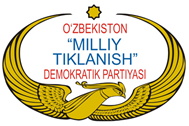

- 1991-yilda
- 1992-yilda
+ 1995-yilda
- 1999-yilda

**116. О‘zbekistonning fuqarolik jamiyatini shakllantirish yo‘lining nechanchi bosqichida fuqarolik jamiyatining tashkiliy-huquqiy asoslari shakllantirilgan, ko‘ppartiyaviylik tizimi, o‘zini o‘zi boshqarish organlari, nodavlat notijorat tashkilotlar (NNT) keng tarmog‘i yo‘lga qo‘yilgan?**

+ Birinchi bosqichida
- Ikkinchi bosqichida
- Uchinchi bosqichida
- To‘rtinchi bosqichida

**117. O‘zbekiston Respublikasi Markaziy saylov komissiyasi (MSK) qaysi yildan mustaqil organ sifatida faoliyat ko‘rsatadi?**

- 1992-yildan
- 1994-yildan
- 1996-yildan
+ 1998-yildan

**118. Fuqarolik jamiyati instituti hisoblanadigan “Hunarmand” qanday muassasa?**

- Markaz
+ Uyushma
- Umummilliy harakat
- Fond

**119. “Adolat” sotsial-demokratik partiyasi qachon tuzilgan?**

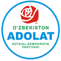

- 1991-yilda
- 1992-yilda
+ 1995-yilda
- 1999-yilda

**120. Davlat ishlarini boshqarishda fuqarolar necha xil yo‘l bilan ta’sir o‘tkazadilar va ular qaysilar?**

- Bir yo‘l: bevosita
+ Ikki yo‘l: bevosita, vakillar orqali
- Uch yo‘l: bevosita, bilvosita, vakillar orqali
- To‘rt yo‘l: bevosita, bilvosita, vakillar orqali, jamoaviy

**121. О‘zbekistonning fuqarolik jamiyatini shakllantirish yo‘lining uchinchi bosqichi qaysi yillarni qamrab olgan?**

- 2009-2014-yillarni
- 2010-2015-yillarni
+ 2011-2016-yillarni
- 2012-2017-yillarni

**122. О‘zbekistonning fuqarolik jamiyatini shakllantirish yo‘lining nechanchi bosqichida asosiy maqsad kuchli davlatdan kuchli fuqarolik jamiyatiga bosqichma-bosqich o‘tish bo‘lib, ikki palatali parlament tizimi joriy qilingan, siyosiy partiyalarni moliyalashtirishning milliy tizimi shakllangan, parlament fraksiyalari va muxolifatning huquqiy maqomi aniq belgilangan?**

- Birinchi bosqichida
+ Ikkinchi bosqichida
- Uchinchi bosqichida
- To‘rtinchi bosqichida

**123. О‘zbekistonning fuqarolik jamiyatini shakllantirish yo‘lining nechanchi bosqichi Yangi O‘zbekistonni barpo etish davri hisoblanib, uning asosiy mohiyati “Inson manfaatlari - ustuvor” tamoyiliga asoslangan bo‘lib, fuqarolik jamiyati institutlari davlat va jamiyat o‘rtasidagi ko‘prikka aylangan?**

- Birinchi bosqichi
- Ikkinchi bosqichi
- Uchinchi bosqichi
+ To‘rtinchi bosqichi

**124. Qachon “Fidokorlar” partiyasi “Milliy tiklanish” partiyasi bilan birlashtirilgan?**

- 2000-yilda
- 2003-yilda
- 2005-yilda
+ 2008-yilda

**125. О‘zbekistonning fuqarolik jamiyatini shakllantirish yo‘lining ikkinchi bosqichi qaysi yillarni qamrab olgan?**

- 2000-2009-yillarni
+ 2001-2010-yillarni
- 2002-2011-yillarni
- 2003-2012-yillarni

**126. O‘zbekistonda “O‘zbekiston mustaqil respublika sifatida yangilangan ittifoq tarkibida qolishiga rozimisiz?” deb so‘ralgan birinchi referendum qachon bo‘lib o‘tgan?**

- 1990-yil yanvarda
+ 1991-yil martda
- 1991-yil dekabrda
- 1992-yil avgustda

**127. Markaziy saylov komissiyasi (MSK) kollegial organ bo‘lib, eng kamida necha kishidan iborat tarkibda Oliy Majlis palatalari tomonidan tuziladi?**

+ 15 kishidan
- 20 kishidan
- 25 kishidan
- 30 kishidan

**128. Saylov qonunchiligiga ko‘ra, Markaziy saylov komissiyasi (MSK) O‘zbekiston Respublikasi hududida ... o‘tkazadi. 1) Oliy Majlis saylovlari; 2) Prezidentlik saylovlari; 3) O‘zbekiston Respublikasi referendumi.**

- 1, 2
- 1, 3
- 2, 3
+ 1, 2, 3

**129. Referendum va saylovning bir-biridan nima farqi bor?**

- Referendumda bir necha nomzod taqdim etiladi, fuqarolar o‘zlari munosib ko‘rgan nomzodni tanlaydilar; Saylovda mamlakat hayoti uchun eng muhim masalalar yuzasidan umumxalq so‘rovi o‘tkaziladi
+ Referendumda mamlakat hayoti uchun eng muhim masalalar yuzasidan umumxalq so‘rovi o‘tkaziladi; Saylovda bir necha nomzod taqdim etiladi, fuqarolar o‘zlari munosib ko‘rgan nomzodni tanlaydilar
- Saylov va referendumda mamlakat hayoti uchun eng muhim masalalar yuzasidan umumxalq so‘rovi o‘tkaziladi
- Saylov va referendumda bir necha nomzod taqdim etiladi, fuqarolar o‘zlari munosib ko‘rgan nomzodni tanlaydilar

**130. Fuqarolarning saylovlarda ovoz berishlari, referendumlarda qatnashishlari, qonun loyihalari muhokamasida o‘z fikrlarini bildirishlari va mahalla yig‘inlarida qatnashishlari ularning davlat ishlarini boshqarishda qanday yo‘l bilan ishtirok etishi deb ataladi?**

+ Bevosita ishtirok
- Bilvosita ishtirok
- Vakillar orqali ishtirok
- Jamoaviy ishtirok

**131. О‘zbekistonning fuqarolik jamiyatini shakllantirish yo‘lining nechanchi bosqichida fuqarolik jamiyati institutlarining ijtimoiy-iqtisodiy faolligi oshgan davr bo‘lgan, nodavlat notijorat tashkilotlarning soni sezilarli darajada ortgan, ular mamlakatdagi islohotlarni rejalashtirish, amalga oshirish va nazorat qilish jarayonida faol qatnasha boshlagan hamda tashqi kuzatuvchidan davlatning hamkori sifatida yuzaga chiqishgan?**

- Birinchi bosqichida
- Ikkinchi bosqichida
+ Uchinchi bosqichida
- To‘rtinchi bosqichida

**132. O‘zbekiston Liberal-demokratik partiyasi (O‘zLiDeP) qachon bo‘lib o‘tgan Ta’sis qurultoyida tuzilgan?**

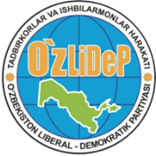

- 1999-yil sentyabrda
- 2001-yil oktyabrda
+ 2003-yil noyabrda
- 2005-yil dekabrda

**133. Fuqarolarning o‘zlari ishonch bildirgan vakillarni saylab, ular orqali davlat ishlariga ta‘sir ko‘rsatishlari ularning davlat ishlarini boshqarishda qanday yo‘l bilan ishtirok etishi deb ataladi?**

- Bevosita ishtirok
- Bilvosita ishtirok
+ Vakillar orqali ishtirok
- Jamoaviy ishtirok

**134. Qaysi partiya ko‘proq yoshlar faolligi va vatanparvarlik g‘oyalariga urg‘u bergan?**

- “Milliy tiklanish” demokratik partiyasi
+ “Fidokorlar” milliy demokratik partiyasi
- O‘zbekiston Liberal-demokratik partiyasi
- “Adolat” sotsial-demokratik partiyasi

**135. Fuqarolarning qonunda belgilangan tartibda ro‘yxatdan o‘tkazilgan birlashmalari qanday ataladi?**

+ Jamoat birlashmalari
- Siyosiy partiyalar
- Xayriya jamg‘armalari
- Kasaba uyushmalari

**136. Qachon O‘zbekiston ekologik harakati vujudga kelgan?**

+ 2008-yilda
- 2013-yilda
- 2019-yilda
- 2021-yilda

**137. O‘zbekiston ekologik harakati qachon Ekologik partiya nomi bilan rasmiy ro‘yxatdan o‘tgan va ilk bor parlament saylovida qatnashgan?**

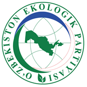

- 2008-yilda
- 2013-yilda
+ 2019-yilda
- 2021-yilda

**138. Qaysi yillarda fuqarolik jamiyatini qo‘llab-quvvatlashga qaratilgan 60 dan ortiq hujjat qabul qilingan?**

- 2015-2022-yillarda
- 2016-2023-yillarda
+ 2017-2024-yillarda
- 2018-2025-yillarda

**139. O‘zbekistonda ikki masala: Oliy Majlisni ikki palatali parlament qilish va Prezident vakolat muddatini uzaytirish muhokama qilingan to‘rtinchi referendum qachon bo‘lib o‘tgan?**

- 1995-yilda
- 1998-yilda
- 1999-yilda
+ 2002-yilda

**140. Qaysi partiya milliy qadriyatlarni asrash, madaniyat va an’analarni rivojlantirishni maqsad qilib olgan?**

+ “Milliy tiklanish” demokratik partiyasi
- O‘zbekiston Liberal-demokratik partiyasi
- Xalq demokratik partiyasi
- “Adolat” sotsial-demokratik partiyasi

**141. O‘zbekistonda Konstitutsiyani yangilash masalasi muhokama qilingan beshinchi referendum qachon o‘tkazilgan?**

- 2021-yil fevralda
- 2022-yil martda
+ 2023-yil aprelda
- 2024-yil mayda

**142. “Fidokorlar” milliy demokratik partiyasi qachon tuzilgan?**

- 1991-yilda
- 1992-yilda
- 1995-yilda
+ 1999-yilda

**143. Markaziy saylov komissiyasi (MSK) qachondan 9 kishilik tarkibda faoliyat ko‘rsatmoqda?**

- 2022-yil iyuldan
- 2023-yil avgustdan
+ 2024-yil sentyabrdan
- 2025-yil oktyabrdan

**144. “Fuqarolik jamiyatini rivojlantirishga qo‘shgan hissasi uchun” ko‘krak nishoni qachon ta’sis etilgan?**

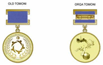

+ 2018-yilda
- 2019-yilda
- 2020-yilda
- 2021-yilda

**145. Fuqarolik jamiyatini shakllantirish yo‘lidagi keng ko‘lamli amaliy ishlar sifatida har bir ...da “Do‘stlik va nodavlat tashkilotlar uylari” ochilib, yuzlab NNT va milliy madaniy markazlarga bepul joy berilgan.**

- mahalla
- shahar
- tuman
+ viloyat

**146. Xalq demokratik partiyasi qachon tuzilgan?**

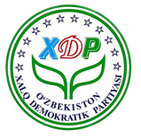

+ 1991-yilda
- 1992-yilda
- 1995-yilda
- 1999-yilda

**147. O‘zbekistonda “O‘zbekiston Respublikasining davlat mustaqilligini ma’qullaysizmi?” deb so‘ralgan ikkinchi referendum qachon bo‘lib o‘tgan?**

- 1990-yil yanvarda
- 1991-yil martda
+ 1991-yil dekabrda
- 1992-yil avgustda

**148. Fuqarolik jamiyati instituti hisoblanadigan “Yuksalish” qanday muassasa?**

- Markaz
- Uyushma
+ Umummilliy harakat
- Fond

**149. Fuqarolik jamiyati instituti hisoblanadigan “Vatandoshlar” qanday muassasa?**

- Markaz
- Uyushma
- Umummilliy harakat
+ Fond

**150. “Vatan taraqqiyoti” partiyasi qachon tuzilgan?**

- 1991-yilda
+ 1992-yilda
- 1995-yilda
- 1999-yilda

**151. O‘zbekistonda Prezidentning lavozim muddatini uzaytirish masalasi so‘ralgan uchinchi referendum qachon bo‘lib o‘tgan?**

+ 1995-yilda
- 1998-yilda
- 1999-yilda
- 2002-yilda

**152. Davlatchiligimiz tarixida birinchi marta ... tushunchasi Konstitutsiyamizga kiritilib, uning jamiyat boshqaruvidagi o‘rni va maqomi qat’iy belgilab qo‘yilgan.**

- “fuqaro”
- “oila”
+ “mahalla”
- “xalq”

**153. “Vatan taraqqiyoti” partiyasi necha yil faoliyat yuritib, o‘z oldiga qo‘ygan maqsadlarini amalga oshira olmagani sababli “Fidokorlar” milliy demokratik partiyasiga qo‘shilgan?**

- Ikki yil
- Uch yil
- To‘rt yil
+ Besh yil

**154. Fuqarolik jamiyati instituti hisoblanadigan “Taraqqiyot strategiyasi” qanday muassasa?**

+ Markaz
- Uyushma
- Umummilliy harakat
- Fond

**155. О‘zbekistonning fuqarolik jamiyatini shakllantirish yo‘lining nechanchi bosqichida Konstitutsiyaga ilk bor fuqarolik jamiyati institutlariga bag‘ishlangan maxsus bob kiritilgan?**

- Birinchi bosqichida
- Ikkinchi bosqichida
- Uchinchi bosqichida
+ To‘rtinchi bosqichida

**156. Qaysi partiyaning asosiy g‘oyasi tenglik, qonun ustuvorligi va ijtimoiy adolatni ta’minlash hisoblanadi?**

- “Milliy tiklanish” demokratik partiyasi
- O‘zbekiston Liberal-demokratik partiyasi
- Xalq demokratik partiyasi
+ “Adolat” sotsial-demokratik partiyasi

**157. О‘zbekistonning fuqarolik jamiyatini shakllantirish yo‘lining to‘rtinchi bosqichi qaysi yillarni qamrab olgan?**

- 2013-yildan hozirgi kungacha
- 2014-yildan hozirgi kungacha
- 2015-yildan hozirgi kungacha
+ 2016-yildan hozirgi kungacha

**158. Siyosiy partiyalarning jamiyatdagi mavqeyini belgilovchi asosiy mezon nima hisoblanadi?**

- Ilgari surgan g‘oyalarining aktualligi
+ Saylovlarda erishgan natijasi
- A’zolari soni
- Ustav jamg‘armasi

**159. Qaysi partiya mulkdorlar, kichik biznes vakillari, fermerlar, ishlab chiqarish mutaxassislari va ishbilarmonlar manfaatlarini ifodalashni maqsad qilgan?**

- “Milliy tiklanish” demokratik partiyasi
- Xalq demokratik partiyasi
+ O‘zbekiston Liberal-demokratik partiyasi
- “Adolat” sotsial-demokratik partiyasi

**160. O‘zbekistonda faoliyati yo‘lga qo‘yilgan birinchi siyosiy partiya qaysi?**

- “Milliy tiklanish” demokratik partiyasi
- “Vatan taraqqiyoti” partiyasi
+ Xalq demokratik partiyasi
- “Adolat” sotsial-demokratik partiyasi

**161. “Vatan taraqqiyoti” partiyasi qachon “Fidokorlar” milliy demokratik partiyasiga qo‘shilgan?**

+ 2000-yilda
- 2003-yilda
- 2005-yilda
- 2008-yilda

**162. О‘zbekistonning fuqarolik jamiyatini shakllantirish yo‘li nechta asosiy bosqichdan iborat?**

- Ikkita bosqichdan
- Uchta bosqichdan
+ To‘rtta bosqichdan
- Beshta bosqichdan

## 4-mavzu. O‘zbekistonda tub islohotlar: Harakatlar strategiyasidan Taraqqiyot strategiyasi sari.

**163. “O‘zbekiston – 2030” strategiyasida qanday asosiy g‘oyalar aks ettirilgan? 1) Barqaror iqtisodiy o‘sish orqali daromadi o‘rtachadan yuqori bo‘lgan davlatlar qatoridan o‘rin olish; 2) Aholi talablariga va xalqaro standartlarga to‘liq javob beradigan ta’lim, tibbiyot va ijtimoiy himoya tizimini yo‘lga qo‘yish; 3) Har bir insonga o‘z salohiyatini ro‘yobga chiqarish uchun munosib sharoit yaratish; 4) Aholi uchun qulay ekologik sharoit yaratish; 5) Barqaror iqtisodiy o‘sish orqali aholi farovonligini ta’minlash; 6) Xalq xizmatidagi adolatli va zamonaviy davlat barpo etish; 7) Suv resurslarini tejash va atrof-muhitni muhofaza qilish; 8) Qonun ustuvorligini ta’minlash, xalq xizmatidagi davlat boshqaruvini tashkil etish; 9) “Xavfsiz va tinchliksevar davlat” tamoyiliga asoslangan siyosatni izchil davom ettirish; 10) Mamlakatning suvereniteti va xavfsizligini kafolatlash.**

- 1, 3, 4, 5, 7
+ 1, 2, 4, 6, 10
- 2, 3, 5, 6, 8
- 3, 5, 7, 8, 9

**164. Prezident Shavkat Mirziyoyev e’lon qilgan O‘zbekiston Respublikasini yanada rivojlantirish bo‘yicha Harakatlar strategiyasi nechta ustuvor yo‘nalishni qamrab olgan edi?**

- Uchta yo‘nalishni
- To‘tta yo‘nalishni
+ Beshta yo‘nalishni
- Oltita yo‘nalishni

**165. “O‘zbekiston – 2030” strategiyasi qachon qabul qilingan?**

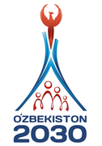

- 2020-yilda
- 2021-yilda
- 2022-yilda
+ 2023-yilda

**166. Prezident Shavkat Mirziyoyev Konstitutsiyaviy komissiyaga Konstitutsiyaga o‘zgartirishlar kiritish jarayoni ijrosini necha bosqichda amalga oshirishni belgilab bergan va ular qaysilar?**

- Bir bosqichda: yangi tahrirdagi Konstitutsiya loyihasini referendum orqali qonuniy kuchga kiritish
- Ikki bosqichda: takliflarni yig‘ish va tahlil qilish; yangi tahrirdagi referendum orqali qonuniy kuchga kiritish
+ Uch bosqichda: takliflarni yig‘ish va tahlil qilish; yangi tahrirdagi Konstitutsiya loyihasini umumxalq muhokamasiga qo‘yish; referendum orqali qonuniy kuchga kiritish
- To‘rt bosqichda: takliflarni yig‘ish va tahlil qilish; yangi tahrirdagi Konstitutsiya loyihasini umumxalq muhokamasiga qo‘yish; referendum orqali qonuniy kuchga kiritish; eski tahrirdagi Konstitutsiyani muomaladan chiqarish bo‘yicha qonun qabul qilish

**167. Yangi tahrirdagi Konstitutsiyaning nechanchi moddasiga asosan, Prezident Shavkat Mirziyoyev muddatidan ilgari saylov o‘tkazish tashabbusini ilgari surgan?**

+ 128-moddasiga
- 130-moddasiga
- 132-moddasiga
- 134-moddasiga

**168. Yangi tahrirdagi Konstitutsiyada qanday tamoyil mustahkamlangan?**

- “O‘zbekiston – suveren va demokratik davlat” tamoyili
- “O‘zbekiston - suveren, demokratik va huquqiy davlat” tamoyili
- “O‘zbekiston - suveren, demokratik, huquqiy va ijtimoiy davlat” tamoyili
+ “O‘zbekiston - suveren, demokratik, huquqiy, ijtimoiy va dunyoviy davlat” tamoyili

**169. Prezident Shavkat Mirziyoyev e’lon qilgan O‘zbekiston Respublikasini yanada rivojlantirish bo‘yicha Harakatlar strategiyasi qaysi yillarga mo‘ljallangan edi?**

- 2016-2020-yillarga
+ 2017-2021-yillarga
- 2018-2022-yillarga
- 2019-2023-yillarga

**170. O‘zbekistonda 2018-yil qanday nomlangan?**

+ “Faol tadbirkorlik, innovatsion g‘oyalar va texnologiyalarni qo‘llab-quvvatlash yili”
- “Ilm-ma’rifat va raqamli iqtisodiyotni rivojlantirish yili”
- “Faol investitsiyalar va ijtimoiy rivojlanish yili”
- “Xalq bilan muloqot va inson manfaatlari yili”

**171. “O‘zbekiston – 2030” strategiyasi qaysi 5 ustuvor yo‘nalishdan iborat? 1) Barqaror iqtisodiy o‘sish orqali daromadi o‘rtachadan yuqori bo‘lgan davlatlar qatoridan o‘rin olish; 2) Aholi talablariga va xalqaro standartlarga to‘liq javob beradigan ta’lim, tibbiyot va ijtimoiy himoya tizimini yo‘lga qo‘yish; 3) Har bir insonga o‘z salohiyatini ro‘yobga chiqarish uchun munosib sharoit yaratish; 4) Aholi uchun qulay ekologik sharoit yaratish; 5) Barqaror iqtisodiy o‘sish orqali aholi farovonligini ta’minlash; 6) Xalq xizmatidagi adolatli va zamonaviy davlat barpo etish; 7) Suv resurslarini tejash va atrof-muhitni muhofaza qilish; 8) Qonun ustuvorligini ta’minlash, xalq xizmatidagi davlat boshqaruvini tashkil etish; 9) “Xavfsiz va tinchliksevar davlat” tamoyiliga asoslangan siyosatni izchil davom ettirish; 10) Mamlakatning suvereniteti va xavfsizligini kafolatlash.**

- 1, 3, 4, 5, 7
- 1, 2, 4, 6, 10
- 2, 3, 5, 6, 8
+ 3, 5, 7, 8, 9

**172. Harakatlar strategiyasi amalga oshirilgan yillar davomida mamlakatning siyosiy hayotida qanday o‘zgarishlar yuz berdi? 1) Prezidentning vakolat muddati uzaytirildi; 2) Parlamentning roli kuchaytirildi; 3) Siyosiy partiyalar faollashdi; 4) Saylovlar ochiq va raqobatli o‘ta boshladi.**

- 1, 2, 3
- 1, 3, 4
+ 2, 3, 4
- 1, 2, 3, 4

**173. O‘zbekistonda 2020-yil qanday nomlangan?**

- “Yoshlarni qo‘llab-quvvatlash va aholi salomatligini mustahkamlash yili”
+ “Ilm-ma’rifat va raqamli iqtisodiyotni rivojlantirish yili”
- “Faol investitsiyalar va ijtimoiy rivojlanish yili”
- “Xalq bilan muloqot va inson manfaatlari yili”

**174. Yangi tahrirdagi Konstitutsiya loyihasi bo‘yicha umumxalq muhokamasi davrida nechta davlat tajribasi o‘rganilgan?**

- 163 davlat
- 173 davlat
- 183 davlat
+ 193 davlat

**175. Qachon Shavkat Mirziyoyev qayta Prezident etib saylangan?**

- 2018-yilda
- 2019-yilda
- 2020-yilda
+ 2021-yilda

**176. Qachon Prezident Shavkat Mirziyoyevning nutqlari va dasturlarida Yangi O‘zbekistonning Taraqqiyot strategiyasi e’lon qilingan?**

- 2020-yilda
+ 2021-yilda
- 2022-yilda
- 2023-yilda

**177. Yangi tahrirdagi Konstitutsiya loyihasi bo‘yicha qachon referendum o‘tkazilgan?**

- 2023-yil 9-iyulda
- 2023-yil 14-avgustda
+ 2023-yil 30-aprelda
- 2023-yil 1-mayda

**178. Yangi tahrirdagi Konstitutsiya loyihasi bo‘yicha umumxalq muhokamasi davrida qancha qo‘shimcha taklif kelib tushgan?**

+ 10 minglab
- 20 minglab
- 30 minglab
- 40 minglab

**179. Qachon Prezident Shavkat Mirziyoyev O‘zbekiston Respublikasini yanada rivojlantirish bo‘yicha Harakatlar strategiyasini e’lon qilgan?**

- 2016-yilda
+ 2017-yilda
- 2018-yilda
- 2019-yilda

**180. O‘zbekistonda 2017-yil qanday nomlangan?**

- “Faol tadbirkorlik, innovatsion g‘oyalar va texnologiyalarni qo‘llab-quvvatlash yili”
- “Ilm-ma’rifat va raqamli iqtisodiyotni rivojlantirish yili”
- “Faol investitsiyalar va ijtimoiy rivojlanish yili”
+ “Xalq bilan muloqot va inson manfaatlari yili”

**181. Harakatlar strategiyasi amalga oshirilgan yillar davomida ...ga yaqin yangi qonun va minglab Prezident qarorlari qabul qilinib, siyosiy va iqtisodiy hayotda katta o‘zgarishlar yuz berdi.**

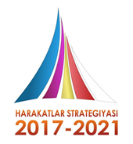

- 100
- 200
+ 300
- 400

**182. O‘zbekistonda 2019-yil qanday nomlangan?**

- “Faol tadbirkorlik, innovatsion g‘oyalar va texnologiyalarni qo‘llab-quvvatlash yili”
- “Ilm-ma’rifat va raqamli iqtisodiyotni rivojlantirish yili”
+ “Faol investitsiyalar va ijtimoiy rivojlanish yili”
- “Xalq bilan muloqot va inson manfaatlari yili”

**183. O‘zbekistonda 2021-yil qanday nomlangan?**

+ “Yoshlarni qo‘llab-quvvatlash va aholi salomatligini mustahkamlash yili”
- “Ilm-ma’rifat va raqamli iqtisodiyotni rivojlantirish yili”
- “Faol investitsiyalar va ijtimoiy rivojlanish yili”
- “Xalq bilan muloqot va inson manfaatlari yili”

**184. Qachon bo‘lib o‘tgan muddatidan ilgari Prezident saylovida Shavkat Mirziyoyev g‘alaba qozongan?**

+ 2023-yil 9-iyulda
- 2023-yil 14-avgustda
- 2023-yil 30-aprelda
- 2023-yil 1-mayda

**185. Qachon Oliy Majlis Senati va Qonunchilik palatasi qo‘shma majlisida Konstitutsiyaviy komissiya tuzilgan?**

- 2020-yil 20-martda
- 2021-yil 20-aprelda
+ 2022-yil 20-mayda
- 2023-yil 20-iyunda

**186. Yangi tahrirdagi Konstitutsiya kuchga kirganidan keyin davlatning fuqarolar oldidagi ijtimoiy majburiyatlari necha barobar ko‘paytirilgan?**

- 2 barobar
+ 3 barobar
- 4 barobar
- 5 barobar

**187. Yangi tahrirdagi Konstitutsiya qachondan kuchga kirgan?**

- 2023-yil 9-iyuldan
- 2023-yil 14-avgustdan
- 2023-yil 30-apreldan
+ 2023-yil 1-maydan

**188. Yangi tahrirdagi Konstitutsiya loyihasi bo‘yicha umumxalq muhokamasi davrida butun mamlakat bo‘ylab qancha uchrashuv vа yig‘ilishlar o‘tkazilgan?**

- 10 mingdan ortiq
+ 20 mingdan ortiq
- 30 mingdan ortiq
- 40 mingdan ortiq

## 5-mavzu. Qurolli kuchlar va milliy armiya.

**189. Prezident huzurida tuzilgan Xavfsizlik kengashi nima bilan shug‘ullangan?**

+ Mamlakat xavfsizligi masalalarini muvofiqlashtirish
- Tabiiy ofatlar va boshqa xavfli vaziyatlarda aholiga yordam ko‘rsatish
- Terrorizmga qarshi kurashish
- Davlat mustaqilligini ta’minlash

**190. O‘zbekistonda harbiy xizmatda bo‘lish yoshining chegarasi – katta ofitserlar uchun necha yosh?**

- 45 yosh
+ 50 yosh
- 55 yosh
- 60 yosh

**191. Vatanga sadoqatli, jasur yoshlarni rag‘batlantirish uchun qaysi davlat mukofoti ta’sis etilgan?**

+ “Mard o‘g‘lon”
- “Shon-sharaf”
- “Jasorat”
- “Sodiq xizmatlari uchun”

**192. Qaysi yildan boshlab turli harbiy okruglarda serjantlar tayyorlash maktablari ochilgan?**

- 2000-yildan
+ 2001-yildan
- 2002-yildan
- 2003-yildan

**193. Qaysi yildan boshlab Mudofaa, Ichki ishlar, Favqulodda vaziyatlar vazirliklari va Milliy gvardiya tarkibida yangi akademik litseylar tashkil etilgan?**

- 2017-yildan
- 2018-yildan
+ 2019-yildan
- 2020-yildan

**194. Qaysi shaharlarda harbiy bilim yurtlari tashkil etilgan? 1) Chirchiq; 2) Urganch; 3) Samarqand; 4) Toshkent.**

- 1, 2, 3
+ 1, 3, 4
- 2, 3, 4
- 1, 2, 3, 4

**195. Qachon Prezident farmoni bilan ichki ishlar tizimida xizmat qilish tartibi aniq belgilangan, ofitser va xodimlarning huquqiy himoyasi mustahkamlangan?**

+ 2001-yilda
- 2003-yilda
- 2005-yilda
- 2007-yilda

**196. Qaysi yillarda O‘zbekistonda terrorchilik xavfi kuchayib, Toshkentdagi portlashlar, tog‘li hududlardagi chegaradan jangarilar kirib kelishi sababli “Terrorizmga qarshi kurash to‘g‘risida” gi qonun qabul qilingan?**

- 1996-1997-yillarda
- 1997-1998-yillarda
- 1998-1999-yillarda
+ 1999-2000-yillarda

**197. O‘zbekistonda harbiy xizmatda bo‘lish yoshining chegarasi – general-mayor, general-leytenant va general-polkovnik harbiy unvonidagi ofitserlar uchun necha yosh?**

- 45 yosh
- 50 yosh
- 55 yosh
+ 60 yosh

**198. Hozir majburiy harbiy xizmat (armiya) oliy ma’lumotlilar uchun necha oy etib belgilangan?**

+ 9 oy
- 10 oy
- 11 oy
- 12 oy

**199. Qachon mamlakatimizda Harbiy doktrina qabul qilingan?**

- 1991-yilda
- 1993-yilda
+ 1995-yilda
- 1997-yilda

**200. O‘zbekiston Respublikasi Prezidenti huzuridagi Xavfsizlik kengashining ilk bor bo‘lib o‘tgan kengaytirilgan, ochiq videokonferensiya yig‘ilishida O‘zbekiston Qurolli Kuchlarining jangovar holatga shayligi ilgarigi ... kundan ... soatga tushirilgani ta’kidlangan.**

- 3/1
- 4/2
+ 5/3
- 6/4

**201. O‘zbekistonda harbiy xizmatda bo‘lish yoshining chegarasi – polkovniklar uchun necha yosh?**

- 45 yosh
- 50 yosh
+ 55 yosh
- 60 yosh

**202. Qachon O‘zbekiston Respublikasi Prezidenti huzuridagi Xavfsizlik kengashining ilk bor kengaytirilgan, ochiq videokonferensiya yig‘ilishi bo‘lib o‘tgan?**

- 2017-yil 10-dekabrda
+ 2018-yil 10-yanvarda
- 2019-yil 10-fevralda
- 2020-yil 10-martda

**203. O‘zbekistonda harbiy xizmatda bo‘lish yoshining chegarasi – shartnoma bo‘yicha harbiy xizmatni o‘tayotgan oddiy askarlar, serjantlar va kichik ofitserlar uchun necha yosh?**

+ 45 yosh
- 50 yosh
- 55 yosh
- 60 yosh

**204. Qachon Prezident huzurida Xavfsizlik kengashi tuzilgan?**

- 1994-yilda
+ 1995-yilda
- 1996-yilda
- 1997-yilda

**205. Konstitutsiyada kim mamlakat Qurolli Kuchlarining Oliy Bosh Qo‘mondoni sifatida belgilangan?**

+ Prezident
- Mudofaa vaziri
- Qurolli kuchlar shtabi boshlig‘i
- Ichki ishlar vaziri

**206. Hozir majburiy harbiy xizmat (armiya) necha oy etib belgilangan?**

- 9 oy
- 10 oy
- 11 oy
+ 12 oy

**207. Qachon Andijonda “Akromiylar” deb atalgan jangarilar tartibsizliklar keltirib chiqargan?**

- 2002-yilda
- 2003-yilda
- 2004-yilda
+ 2005-yilda

**208. Bugungi kunda Davlat xavfsizlik xizmati (DXX) qaysi yo‘nalishlarda faoliyat yuritadi? 1) Mamlakat konstitutsion tuzumini himoya qilish; 2) Davlat chegaralarini qo‘riqlash; 3) Mamlakat xavfsizligi masalalarini muvofiqlashtirish; 4) Ichki va tashqi xavflarni aniqlash hamda bartaraf etish; 5) Razvedka va kontrrazvedka ishlari; 6) Tabiiy ofatlar va boshqa xavfli vaziyatlarda aholiga yordam ko‘rsatish; 7) Terrorizm va ekstremizmga qarshi kurash; 8) Narkotik moddalar savdosini to‘xtatish; 9) Korrupsiya va boshqa xavfli jinoyatlarning oldini olish.**

+ 1, 2, 4, 5, 7, 8, 9
- 1, 3, 5, 6, 7, 8
- 2, 4, 6, 7, 8, 9
- 1, 2, 3, 4, 5, 7, 9

**209. Qachon Sovet ittifoqi Davlat xavfsizlik qo‘mitasi o‘rnida O‘zbekiston Milliy xavfsizlik xizmati (MXX) tashkil etilgan?**

+ 1991-yil 26-sentyabrda
- 1991-yil 26-oktyabrda
- 1992-yil 26-noyabrda
- 1992-yil 26-dekabrda

**210. Qachondan boshlab 25-oktyabr Ichki ishlar xodimlari kuni deb belgilangan?**

- 2003-yildan
- 2004-yildan
- 2005-yildan
+ 2006-yildan

**211. Qachon O‘zbekiston Respublikasi Milliy xavfsizlik xizmati O‘zbekiston Respublikasi Davlat xavfsizlik xizmati (DXX) sifatida qayta tashkil etilgan?**

- 2016-yilda
- 2017-yilda
+ 2018-yilda
- 2019-yilda

**212. Favqulodda vaziyatlar vazirligiga qanday vazifa yuklatilgan?**

- Mamlakat xavfsizligi masalalarini muvofiqlashtirish
+ Tabiiy ofatlar va boshqa xavfli vaziyatlarda aholiga yordam ko‘rsatish
- Terrorizmga qarshi kurashish
- Davlat mustaqilligini ta’minlash

**213. Qachon Prezident farmoni bilan Chegara qo‘shinlari boshqarmasi tashkil etilgan?**

- 1991-yilda
+ 1992-yilda
- 1993-yilda
- 1994-yilda

**214. Qachon Davlat xavfsizlik xizmati (DXX) xodimlarining kasb bayrami sanasi milliy xavfsizlik tizimiga asos solingan 26-sentyabr kuni etib belgilangan?**

+ 2021-yilda
- 2022-yilda
- 2023-yilda
- 2024-yilda

**215. Qachon O‘zbekiston Respublikasi Prezidenti Shavkat Mirziyoyev tomonidan “O‘zbekiston Respublikasining Mudofaa doktrinasi to‘g‘risida” gi qonuni imzolangan?**

- 2016-yil 14-yanvarda
- 2017-yil 9-yanvarda
+ 2018-yil 9-yanvarda
- 2019-yil 14-yanvarda

**216. Mudofaa, Ichki ishlar, Favqulodda vaziyatlar vazirliklari va Milliy gvardiya tarkibida yangi akademik litseylar tashkil etilgach qaysi shaharlardagi “Temurbeklar maktabi” faoliyati tugatilgan?**

- Toshkent va Samarqand
+ Samarqand va Urganch
- Urganch va Chirchiq
- Chirchiq va Toshkent

**217. Yoshlarni harbiy kasbga yo‘naltiradigan “Temurbeklar maktabi” qanday muassasa?**

- Harbiy maktab
- Harbiy kollej
- Harbiy lager
+ Harbiy litsey

**218. O‘zbekiston mustaqillikka erishgach, qaysi yillar oralig‘ida chet elda xizmat qilgan o‘zbek ofitserlari vatanga qayta boshlagan?**

+ 1991-1994-yillar
- 1992-1995-yillar
- 1993-1996-yillar
- 1994-1997-yillar

**219. Mustaqillikning ilk yillarida qaysi yangi harbiy oliy o‘quv yurtlari ochilgan? 1) Toshkent axborot texnologiyalari universiteti (TATU) maxsus fakulteti; 2) Qurolli Kuchlar akademiyasi; 3) Oliy harbiy aviatsiya bilim yurti; 4) “Temurbeklar maktabi”.**

+ 1, 2, 3
- 1, 2, 4
- 2, 3, 4
- 1, 2, 3, 4

**220. O‘zbekiston Respublikasi Prezidenti Shavkat Mirziyoyev tomonidan imzolangan “O‘zbekiston Respublikasining Mudofaa doktrinasi to‘g‘risida” gi qonun qanday muhim masalalarni o‘z ichiga olgan? 1) Xalqaro tahdidlarga qarshi kurashish; 2) Terrorizm va ekstremizmga qarshi choralar; 3) Axborot xavfsizligini ta’minlash.**

- 1, 2
- 1, 3
- 2, 3
+ 1, 2, 3

**221. Qaysi hujjatda Vatan himoyasi har bir fuqaroning muqaddas burchi deb belgilangan?**

- Mustaqillik deklaratsiyasi
+ Konstitutsiya
- Mudofaa doktrinasi
- Qurolli Kuchlar nizomi

**222. Harbiy xizmatga chaqirilish qanday asosda amalga oshiriladi?**

+ Umumiy harbiy majburiyat
- Umumiy harbiy chaqiriq
- Umumiy harbiy shartnoma
- Umumiy harbiy yo‘llanma

**223. Ichki ishlar tizimining asosiy maqsadlari nimalardan iborat? 1) Fuqarolarning tinchligi, huquq va erkinliklarini himoya qilish; 2) Davlat hududiy yaxlitligini ta’minlash; 3) Jinoyatchilikka qarshi kurashish; 4) Jamoat tartibini saqlash.**

- 1, 2, 3
+ 1, 3, 4
- 2, 3, 4
- 1, 2, 3, 4

**224. Mamlakatimizda qabul qilingan Harbiy doktrina qaysi yilga kelib, Oliy Majlisda qayta muhokama qilingan va O‘zbekiston Qurolli Kuchlarini tashkil etishdan asosiy maqsad Vatan himoyasiga qaratilgani e’tiborga olinib Mudofaa doktrinasi, deb o‘zgartirilgan?**

+ 2003-yilga
- 2005-yilga
- 2007-yilga
- 2009-yilga

**225. Qaysi yillarda ichki ishlar tizimi xalq bilan ochiq muloqotga o‘tgan, “Xavfsiz shahar” va “Xavfsiz hudud” loyihalari orqali shahar va mahallalarda videokuzatuv tizimlari, tezkor javob berish mexanizmlari joriy etilgan?**

- 2016-2018-yillarda
- 2017-2019-yillarda
- 2018-2020-yillarda
+ 2019-2021-yillarda

**226. Qachon ichki ishlar organlari faoliyati tubdan qayta ko‘rib chiqilgan, tizimning moddiy-texnik bazasi yangilangan, zamonaviy texnologiyalar joriy qilingan va kadrlar tayyorlashga alohida e’tibor qaratilgan?**

- 2015-yilda
- 2016-yilda
+ 2017-yilda
- 2018-yilda

**227. Qachon Favqulodda vaziyatlar vazirligi tashkil etilgan?**

- 1994-yilda
- 1995-yilda
+ 1996-yilda
- 1997-yilda

**228. ... – O‘zbekiston Respublikasi fuqarolarining Qurolli Kuchlar safida umumiy harbiy majburiyatni bajarish borasidagi davlat xizmatining alohida turi.**

- Fuqarolik burchi
+ Harbiy xizmat
- Umumiy majburiyat
- Vatan himoyasi

**229. O‘zbekiston mustaqillikka erishgach, eng muhim vazifalardan biri milliy xavfsizlik vа hududiy yaxlitlikni ta’minlash bo‘lgan. Bu maqsadda qanday ishlar amalga oshirilgan? 1) Ichki ishlar vazirligi va Davlat xavfsizlik komiteti O‘zbekiston tasarrufiga o‘tgan; 2) SSSR ning O‘zbekistondagi harbiy qismlari Prezidentga bo‘ysundirilgan; 3) Mudofaa ishlari vazirligi tashkil etilgan.**

- 1, 2
- 1, 3
- 2, 3
+ 1, 2, 3

**230. O‘zbekiston Milliy xavfsizlik xizmati (MXX) qanday maqsadlar uchun xizmat qilgan? 1) Davlat mustaqilligini ta’minlash; 2) Davlat hududiy yaxlitligini ta’minlash; 3) Fuqarolarning osoyishtaligini ta’minlash.**

- 1, 2
- 1, 3
- 2, 3
+ 1, 2, 3

**231. Qachon 14-yanvar Vatan himoyachilari kuni deb e’lon qilingan?**

- 1991-yilda
- 1992-yilda
+ 1993-yilda
- 1994-yilda

## 6-mavzu. Milliy iqtisodiyotning barpo еtilishi.

**232. Qachon milliy valyuta – so‘m muomalaga kiritilgan?**

- 1991-yil 1-fevralda
- 1992-yil 1-mayda
- 1993-yil 1-noyabrda
+ 1994-yil 1-iyulda

**233. Qishloq xo‘jaligida bozor munosabatlari asosida agroklasterlar va kooperatsiyalar hamkorligi o‘rnatilgach qanday yangi texnologiya joriy qilingan?**

- Geoaxborot tizimlari
- Robotlashtirilgan terim va dronlar
- Zamonaviy qayta ishlash va logistika
+ Suv tejovchi sug‘orish texnologiyalari

**234. Qachon Birinchi Prezident Islom Karimov yangi iqtisodiy tizimga o‘tish modeli haqida yozib, uning asosiy yo‘nalishlari (besh tamoyil) ni ko‘rsatgan?**

- 1991-yilda
- 1992-yilda
+ 1993-yilda
- 1994-yilda

**235. O‘zbekistonda qaysi yilga qadar iqtisodiyot hajmini 2 barobar oshirish va “daromadi o‘rtachadan yuqori bo‘lgan davlatlar” qatoriga kirish asosiy maqsad qilib belgilangan va bunda kelgusi yillarda yalpi ichki mahsulot hajmini 160 milliard dollarga va aholi jon boshiga daromadlarni 4 ming dollarga yetkazish ko‘zda tutilgan?**

+ 2030-yilga
- 2035-yilga
- 2040-yilga
- 2045-yilga

**236. Qachondan O‘zbekistonda davlat mulkini xususiylashtirish jarayoni yanada kengaygan va bu bosqichda nafaqat kichik korxonalar, balki o‘rta va yirik sanoat korxonalari ham xususiy sektorga aylantirilgan?**

- 1993-yildan
- 1994-yildan
+ 1995-yildan
- 1996-yildan

**237. Mustaqillikning dastlabki davrida, milliy valyuta joriy etilishidan oldin O‘zbekiston qaysi davlat valyutasidan foydalangan?**

+ Sovet Ittifoqi rubli
- Qozog‘iston tengesi
- Qirg‘iziston so‘mi
- Turkmaniston manati

**238. Qaysi yildan boshlab qishloq xo‘jaligida bozor munosabatlari asosida agroklasterlar va kooperatsiyalar hamkorligi o‘rnatilib, yetishtirilgan paxta tolasini mamlakatimizda to‘liq qayta ishlash yo‘lga qo‘yilgan?**

- 2014-yildan
- 2015-yildan
+ 2016-yildan
- 2017-yildan

**239. Qaysi yildan oilaviy tadbirkorlikni qo‘llab-quvvatlash bo‘yicha alohida dasturlar joriy etilib, imtiyozli kreditlar ajratilgan?**

+ 2017-yildan
- 2018-yildan
- 2019-yildan
- 2020-yildan

**240. Prezident Shavkat Mirziyoyev davrida iqtisodiy o‘sish har yili necha foizni tashkil etgan?**

+ 5-7 foiz
- 6-8 foiz
- 7-9 foiz
- 8-10 foiz

**241. Toshkent metrosi Yunusobod yo‘nalishining birinchi qismi qachon ishga tushirilgan?**

+ 2001-yilda
- 2002-yilda
- 2003-yilda
- 2004-yilda

**242. Davlat mulkini boshqarish va xususiylashtirish davlat qo‘mitasi qachon tuzilgan?**

- 1991-yil noyabrda
+ 1992-yil fevralda
- 1993-yil aprelda
- 1994-yil avgustda

**243. Qaysi yillarda davlat mulkini xususiylashtirish jarayoni yanada chuqurlashtirilib, bu davrda investitsiyalar jalb qilish, sanoatni modernizatsiya qilish va yangi tarmoqlarni rivojlantirishga alohida e’tibor qaratilgan, davlat mulkini sotishda ochiq tanlov va auksionlar o‘tkazilgan?**

+ 2001-2016-yillarda
- 2002-2017-yillarda
- 2003-2018-yillarda
- 2004-2019-yillarda

**244. Qaysi yildan boshlab paxta va g‘alla maydonlari qisqartirilib, ularning o‘rniga eksportbop ekinlar ekila boshlangan?**

+ 2021-yildan
- 2022-yildan
- 2023-yildan
- 2024-yildan

**245. Qachondan boshlab haftaning juma kuni “Mehr va saxovat kuni” deb belgilangan?**

- 2011-yildan
- 2019-yildan
- 2020-yildan
+ 2024-yildan

**246. Qaysi yilga kelib umumiy avtomobil yo‘llari tarmog‘i uzunligi 184 ming kilometrdan oshgan?**

- 2022-yilga
- 2023-yilga
- 2024-yilga
+ 2025-yilga

**247. Andijonda ishga tushirilgan “Uz-DaewooAuto” zavodi keyinchalik qaysi nom bilan mashhur bo‘lgan?**

+ “GM Uzbekistan”
- “BYD Uzbekistan Factory”
- “Uz Truck and Bus Motors”
- “Asaka Motors International”

**248. Qaysi yil uchun ishlab chiqilgan “Yo‘l xaritasi” ga muvofiq, O‘zbekiston avtomobil yo‘llari bo‘yida zamonaviy xizmat ko‘rsatish obyektlari – “Service point” (xizmat nuqtasi) va “Service area” (xizmat hududi) tashkil etilmoqda?**

- 2022-yil
- 2023-yil
- 2024-yil
+ 2025-yil

**249. Qachondan so‘m-kuponlar muomalaga chiqarilgan?**

- 1991-yil 1-fevraldan
- 1992-yil 1-maydan
+ 1993-yil 1-noyabrdan
- 1994-yil 1-iyuldan

**250. Tezyurar “Afrosiyob” poyezdi dastlab qaysi yo‘nalishda qatnay boshlagan?**

- Toshkent – Xiva
- Toshkent – Buxoro
- Toshkent – Qarshi
+ Toshkent – Samarqand

**251. O‘zbekistondagi nechta shahar aeroporti xalqaro maqomga ega bo‘lgan?**

- 7 ta
- 9 ta
+ 11 ta
- 13 ta

**252. Qachon Toshkentni Andijon bilan bog‘laydigan yangi 314 kilometrli magistral yo‘l loyihasi ishlab chiqilgan?**

- 2022-yilda
- 2023-yilda
- 2024-yilda
+ 2025-yilda

**253. Qachon Imom Moturidiy xalqaro ilmiy-tadqiqot markazi tashkil etilgan?**

- 2011-yilda
- 2019-yilda
+ 2020-yilda
- 2024-yilda

**254. Qaysi yildan boshlab Prezident Shavkat Mirziyoyev davrida iqtisodiyotda davlat ulushini kamaytirish, xususiy sektorni rivojlantirish va xorijiy investitsiyalarni jalb qilish bo‘yicha faol siyosat olib borilgan?**

- 2016-yildan
+ 2017-yildan
- 2018-yildan
- 2019-yildan

**255. Qaysi korxona O‘zbekistonda elektr va gibrid avtomobillar ishlab chiqarishni yo‘lga qo‘ygan?**

- Tesla
- Zeekr
+ BYD
- Li Auto

**256. Qaysi yilga kelib O‘zbekiston avtomobilsozlik bozorida yangi raqobatchilar paydo bo‘lgan?**

+ 2020-yilga
- 2021-yilga
- 2022-yilga
- 2023-yilga

**257. Xizmat hududi (Service area) bu – avtomobil yo‘llari bo‘yida yo‘lovchilar va haydovchilarga zarur xizmatlarni ko‘rsatadigan xizmat nuqtasidan kengroq va to‘liqroq obyekt bo‘lib, unda qanday xizmatlar mavjud bo‘ladi? 1) TIR park (yuk mashinalari uchun to‘xtash joyi); 2) Yonilg‘i quyish shoxobchasi; 3) Elektromobillarni quvvatlash stansiyasi; 4) Motel yoki mehmonxona; 5) Ovqatlanish maskani (kafe, choyxona); 6) Avtomobillarni yuvish joyi; 7) Sanitariya-gigiyena shoxobchasi (hojatxona, yuvinish joyi); 8) Texnik xizmat ko‘rsatish nuqtasi; 9) Dam olish maskani; 10) Wi-Fi va aloqa nuqtalari; 11) Do‘kon va dorixona; 12) Bolalar maydonchasi.**

- 1, 2, 3, 5, 6, 9
+ 1, 4, 6, 9, 10, 12
- 2, 3, 5, 7, 8, 11
- 2, 4, 5, 8, 9, 10

**258. “АDМ Jizzakh” zavodi qachon ish boshlagan?**

- 2020-yilda
+ 2021-yilda
- 2022-yilda
- 2023-yilda

**259. Qachon “Fermer xo‘jaliklari to‘g‘risida” gi qonun qabul qilingan va natijada mayda shirkat xo‘jaliklari tugatilib, fermer xo‘jaliklari tashkil etilgan?**

- 1995-yilda
+ 1996-yilda
- 1997-yilda
- 1998-yilda

**260. Qachon so‘m-kuponlar tayyorlangan?**

- 1991-yilda
+ 1992-yilda
- 1993-yilda
- 1994-yilda

**261. Mustaqillikning dastlabki davrida mulkni davlat tasarrufidan chiqarish bo‘yicha qancha qonun va qaror qabul qilingan?**

- 10 dan ortiq
+ 20 dan ortiq
- 30 dan ortiq
- 40 dan ortiq

**262. Tezyurar “Afrosiyob” poyezdi keyinchalik qaysi shaharlargacha qatnay boshlagan?**

- Samarqand va Qarshi
+ Qarshi va Buxoro
- Buxoro va Xiva
- Xiva va Samarqand

**263. O‘zbekiston Prezidenti Shavkat Mirziyoyev Jizzaxdagi “BYD Uzbekistan Factory” avtomobil zavodiga qachon tashrif buyurgan?**

- 2022-yilda
- 2023-yilda
+ 2024-yilda
- 2025-yilda

**264. 1 gektar paxta yetishtirishdan ... yetishtirish 7 baravar, ... 6 baravar, ... 5 baravar daromadliroq ekani sababli ko‘plab yerlar bog‘dorchilikka ajratilgan.**

- gilos/yong‘oq/uzum
+ uzum/gilos/yong‘oq
- yong‘oq/uzum/gilos
- gilos/uzum/yong‘oq

**265. Qaysi yilda aholiga kerakli g‘allaning 82 foizi, kartoshka, go‘sht va sut mahsulotlarining yarmi chetdan olib kelinar edi va import tarkibida oziq-ovqat mahsulotlari 70 foizdan ortiqni tashkil qilgan?**

+ 1990-yilda
- 1991-yilda
- 1992-yilda
- 1993-yilda

**266. Qachon “Yer to‘g‘risida” gi qonun qabul qilinib, yerlar davlat mulki deb belgilangan?**

- 1990-yilda
- 1991-yilda
+ 1992-yilda
- 1993-yilda

**267. Qaysi yillar davomidagi iqtisodiy islohotlar natijasida O‘zbekistonda qo‘shimcha 1 milliondan ortiq yangi tadbirkorlik subyektlari tashkil etilgan va 2 millionga yaqin odam doimiy ish bilan ta’minlangan?**

- 2016-2022-yillar
- 2017-2023-yillar
+ 2018-2024-yillar
- 2019-2025-yillar

**268. Iqtisodiy sohada Birinchi Prezident Islom Karimov tomonidan belgilangan besh tamoyil nimalardan iborat edi? 1) Harakatlar strategiyasini ishlab chiqish; 2) Iqtisodiyotning siyosatdan ustunligi va uni mafkuradan xoli etish; 3) Davlat bosh islohotchi bo‘lishi; 4) Milliy valyutani joriy qilish; 5) Qonun ustuvorligi; 6) Kuchli ijtimoiy himoya yo‘lga qo‘yilishi; 7) Bozor iqtisodiyotiga bosqichma-bosqich o‘tish.**

- 1, 2, 3, 4, 6
+ 2, 3, 5, 6, 7
- 1, 3, 4, 5, 6
- 3, 4, 5, 6, 7

**269. Qishloq xo‘jaligida bozor munosabatlari asosida agroklasterlar va kooperatsiyalar hamkorligi o‘rnatilgach eksport qilinadigan meva-sabzavot mahsulotlari ... turdan ... turga, ularning eksport geografiyasi esa ... tadan ... ta davlatga kengaygan.**

- 14/99/23/72
- 24/109/33/82
+ 34/119/43/92
- 44/129/53/102

**270. Qaysi yilda O‘zbekiston xalqaro ochiq ma’lumotlar (ODIN) reytingida 83 ball olib, dunyoda 12-o‘ringa ko‘tarilgan va Markaziy Osiyodagi yetakchi o‘rnini saqlab qolgan?**

- 2022-yilda
- 2023-yilda
+ 2024-yilda
- 2025-yilda

**271. O‘zbekistonda davlat mulkini xususiylashtirish jarayonining dastlabki bosqichi ko‘proq aholiga yaqin bo‘lgan qaysi sohalarni qamrab olgan? 1) Umumiy uy-joy fondi; 2) Savdo shoxobchalari; 3) Mahalliy sanoat korxonalari; 4) Xizmat ko‘rsatish joylari; 5) Qishloq xo‘jaligi mahsulotlarini tayyorlash tizimi.**

- 1, 2, 4
- 1, 3, 4, 5
- 2, 3, 5
+ 1, 2, 3, 4, 5

**272. Mamlakatni daromadi o‘rtachadan yuqori davlatlar qatoriga qo‘shish maqsadida qaysi yillarda har bir sohada tizimli islohotlar amalga oshirilgan?**

- 2013-2022-yillarda
- 2014-2023-yillarda
- 2015-2024-yillarda
+ 2016-2025-yillarda

**273. Qachon O‘zbekiston ilk bor xalqaro yevroobligatsiyalarini London birjasida joylashtirgan?**

- 2011-yilda
+ 2019-yilda
- 2020-yilda
- 2024-yilda

**274. Xizmat nuqtasi (Service point) bu – avtomobil yo‘llari bo‘yida yo‘lovchilar va haydovchilarga zarur xizmatlarni ko‘rsatadigan kichik obyektlar majmuasi bo‘lib, unda qanday xizmatlar mavjud bo‘ladi? 1) TIR park (yuk mashinalari uchun to‘xtash joyi); 2) Yonilg‘i quyish shoxobchasi; 3) Elektromobillarni quvvatlash stansiyasi; 4) Motel yoki mehmonxona; 5) Ovqatlanish maskani (kafe, choyxona); 6) Avtomobillarni yuvish joyi; 7) Sanitariya-gigiyena shoxobchasi (hojatxona, yuvinish joyi); 8) Texnik xizmat ko‘rsatish nuqtasi; 9) Dam olish maskani; 10) Wi-Fi va aloqa nuqtalari; 11) Do‘kon va dorixona; 12) Bolalar maydonchasi.**

- 1, 2, 3, 5, 6, 9
- 1, 4, 6, 9, 10, 12
+ 2, 3, 5, 7, 8, 11
- 2, 4, 5, 8, 9, 10

**275. “Oziq-ovqat dasturi” qabul qilinib, ... mustaqilligi siyosati boshlangan.**

- go‘sht
- kartoshka
- sut mahsulotlari
+ g‘alla

**276. Qachon O‘zbekiston g‘alla mustaqilligiga erishgan?**

- 1995-yilda
+ 1996-yilda
- 1997-yilda
- 1998-yilda

**277. Qaysi yilga kelib O‘zbekistonda 3 million oila shaxsiy tomorqaga, 50 ming kishi kichik biznesga va 5 ming kishi ko‘chmas mulkka ega bo‘lgan?**

- 1993-yilga
- 1994-yilga
- 1995-yilga
+ 1996-yilga

**278. Toshkentni Andijon bilan bog‘laydigan yangi 314 kilometrli magistral yo‘l loyihasi natijasida qatnov vaqti ... soatdan ... soatga qisqaradi.**

- 4/2
+ 5/3
- 6/4
- 7/5

**279. Qachon O‘zbekiston Oliy Kengashi “Mulkni davlat tasarrufidan chiqarish va xususiylashtirish to‘g‘risida” gi qonunni qabul qilgan?**

+ 1991-yil 18-noyabrda
- 1992-yil 18-fevralda
- 1993-yil 18-aprelda
- 1994-yil 18-avgustda

**280. Qaysi yildan keyin Toshkent metrosi Yunusobod yo‘nalishida yangi bekatlar ochilib, poytaxt metrosining umumiy uzunligi 70 kilometrdan oshgan?**

- 2016-yildan
- 2018-yildan
+ 2020-yildan
- 2022-yildan

**281. “BYD Uzbekistan Factory” qachon ish boshlagan?**

- 2020-yilda
- 2021-yilda
- 2022-yilda
+ 2023-yilda

**282. Qaysi yillarda xorijiy davlatlar bilan hamkorlikda zamonaviy texnologiyalarga asoslangan qishloq xo‘jaligi texnikalari ishlab chiqarilgan va fermer xo‘jaliklariga yetkazib berilgan?**

+ 2008-2009-yillarda
- 2009-2010-yillarda
- 2010-2011-yillarda
- 2011-2012-yillarda

**283. Qachondan boshlab tezyurar “Afrosiyob” poyezdi qatnay boshlagan?**

+ 2011-yildan
- 2019-yildan
- 2020-yildan
- 2024-yildan

**284. Farg‘ona vodiysini poytaxt bilan to‘g‘ridan to‘g‘ri bog‘lagan Qamchiq tunneli qachon ochilgan?**

+ 2016-yilda
- 2017-yilda
- 2018-yilda
- 2019-yilda

**285. Qachon Asaka shahrida “UzDaewoo” avtomobil zavodi ish boshlagan?**

- 1992-yilda
- 1994-yilda
+ 1996-yilda
- 1998-yilda

## 7-mavzu. Mamlakatda ishlab chiqarish salohiyatining oshishi va jahon iqtisodiyotiga integratsiyalashuv.

**286. O‘zbekistonning qaysi viloyatida avtomobil ishlab chiqaruvchi “Uz-Daewoo” zavodi ishga tushgan?**

+ Andijon
- Samarqand
- Toshkent
- Farg‘ona

**287. O‘zbekistonda “Erkin iqtisodiy zonalar to‘g‘risida” gi qonun qabul qilingach, keyingi yillarda qaysi maxsus industrial zonalar barpo etilgan?**

+ “Jizzax” va “Angren”
- “Angren” va “Navoiy”
- “Navoiy” va “Termiz”
- “Termiz” va “Jizzax”

**288. Prezident Shavkat Mirziyoyev rahbarligidagi islohotlar doirasida O‘zbekiston qaysi davlatlar bilan yirik investitsiya loyihalarini amalga oshirgan? 1) Xitoy; 2) Koreya; 3) Germaniya; 4) Rossiya; 5) Turkiya; 6) Hindiston.**

+ 1, 2, 3, 4, 5
- 1, 2, 5, 6
- 2, 3, 4, 5
- 1, 2, 3, 4, 5, 6

**289. Markaziy Osiyoda yagona bo‘lgan “Falk Porsche Fiberglass” qo‘shma korxonasi qaysi davlat bilan hamkorlikda ishga tushirilgan?**

- Buyuk Britaniya
- AQSH
- Fransiya
+ Germaniya

**290. Qaysi yilga kelib O‘zbekistonda yigirmadan ortiq erkin iqtisodiy zona va uch yuzdan ortiq kichik sanoat zonasi mavjud edi?**

- 2020-yilga
+ 2021-yilga
- 2022-yilga
- 2023-yilga

**291. Turli davlatlarda biznes qilish qanchalik oson yoki qiyin ekanini ko‘rsatib beradigan “Doing Business” yillik xalqaro hisoboti qaysi tashkilot tomonidan chiqariladi?**

- Xalqaro valyuta fondi
- Osiyo taraqqiyot banki
+ Jahon banki
- Yevropa taraqqiyot va tiklanish banki

**292. Qaysi yildan jismoniy shaxslarga chet el valyutasini tijorat banklarining valyuta ayirboshlash shoxobchalariga erkin sotish va conversion bo‘limlaridan sotib olish hamda chet elda hech qanday cheklovlarsiz ishlatish huquqi berilgan?**

+ 2017-yildan
- 2018-yildan
- 2019-yildan
- 2020-yildan

**293. “Urgut”, “G‘ijduvon”, “Qo‘qon” va “Hazorasp” erkin iqtisodiy zonalari qachon ish boshlagan?**

+ 2016-yilda
- 2017-yilda
- 2018-yilda
- 2019-yilda

**294. Valyuta siyosatini liberallashtirish natijasida qaysi yillarda ichki valyuta bozorida ishtirokchilar soni o‘sishi kuzatilgan?**

+ 2017-2020-yillarda
- 2018-2021-yillarda
- 2019-2022-yillarda
- 2020-2023-yillarda

**295. O‘zbekistonning Jahon savdo tashkiloti (JST) ga a‘zo bo‘lish jarayoni qachon to‘xtab qolgan edi?**

- 2003-yilda
- 2004-yilda
+ 2005-yilda
- 2006-yilda

**296. Qaysi yilgacha “Tashabbusli byudjet” portali orqali 2215 ta loyiha amalga oshirilgan va ular uchun 1,1 trillion so‘m ajratilgan?**

- 2022-yilgacha
- 2023-yilgacha
- 2024-yilgacha
+ 2025-yilgacha

**297. Qaysi yilga kelib Islom taraqqiyot banki bilan qiymati jami 2,5 milliard dollardan ortiq 30 ta yirik investitsiya loyihasi ma’qullangan?**

- 2022-yilga
- 2023-yilga
- 2024-yilga
+ 2025-yilga

**298. Qaysi yilda O‘zbekistonning “Doing Business” reytingidagi o‘rni 44 ball bo‘lgan?**

- 2014-yilda
+ 2016-yilda
- 2018-yilda
- 2020-yilda

**299. Qachon O‘zbekistonda “Erkin iqtisodiy zonalar to‘g‘risida” gi qonun qabul qilingan?**

- 1994-yilda
- 1995-yilda
+ 1996-yilda
- 1997-yilda

**300. ... – o‘z mablag‘ini (pulini, mulkini yoki boshqa resurslarini) foyda olish maqsadida korxona, loyiha yoki qimmatli qog‘ozlarga kiritadigan shaxs yoki tashkilot.**

- Kreditor
- Aksiyador
+ Investor
- Donor

**301. Qachon 750 million dollarlik obligatsiyalar London fond birjasiga muvaffaqiyatli joylashtirilgan?**

- 2017-yil avgustda
- 2018-yil sentyabrda
- 2019-yil oktyabrda
+ 2020-yil noyabrda

**302. Prezident Shavkat Mirziyoyev rahbarligidagi islohotlar doirasida O‘zbekiston qaysi moliyaviy institutlar bilan hamkorlikni kuchaytirgan? 1) Jahon banki; 2) Yevropa tiklanish va taraqqiyot banki; 3) Osiyo taraqqiyot banki.**

- 1, 2
- 1, 3
- 2, 3
+ 1, 2, 3

**303. Qaysi yildan Prezident Shavkat Mirziyoyev rahbarligidagi islohotlar doirasida Jahon savdo tashkiloti (JST) ga a‘zo bo‘lish jarayoni yana faollashtirilgan?**

- 2017-yildan
+ 2018-yildan
- 2019-yildan
- 2020-yildan

**304. Mustaqillik yillarida qayerda kaliy zavodi ishga tushgan?**

+ Dehqonobod
- Qo‘ng‘irot
- Buxoro
- Sho‘rtan

**305. O‘zbekistonda “Erkin iqtisodiy zonalar to‘g‘risida” gi qonun qabul qilingach, keyingi yillarda qaysi logistika markazi ochilgan?**

- “Jizzax”
+ “Navoiy”
- “Angren”
- “Termiz”

**306. O‘zbekistonning xalqaro iqtisodiyotga qo‘shilishi nimalarda namoyon bo‘lmoqda? 1) Savdo aloqalari kengayishida; 2) Investitsiyalar jalb qilinishida; 3) Yangi transport yo‘llari ochilishida; 4) Yalpi ichki mahsulot hajmi oshishida; 5) Moliyaviy hamkorlikni mustahkamlashda.**

- 1, 3, 5
+ 1, 2, 3, 5
- 2, 3, 4, 5
- 1, 2, 3, 4, 5

**307. Qaysi yildan boshlab O‘zbekistonda iqtisodiy o‘sish sur’ati yiliga o‘rtacha 7,5 foizni tashkil etgan?**

- 2001-yildan
- 2002-yildan
- 2003-yildan
+ 2004-yildan

**308. Mustaqillik yillarida qayerda neftni qayta ishlash zavodi ishga tushgan?**

- Dehqonobod
- Qo‘ng‘irot
+ Buxoro
- Sho‘rtan

**309. O‘zbekistonda qaysi sohalarga ixtisoslashtirilgan erkin iqtisodiy zonalar faoliyat yuritmoqda? 1) Sanoat; 2) Farmatsevtika; 3) Turizm; 4) Qishloq xo‘jaligi.**

- 1, 2, 3
- 1, 2, 4
- 2, 3, 4
+ 1, 2, 3, 4

**310. O‘zbekiston Islom taraqqiyot bankiga qachon a’zo bo‘lgan?**

- 2001-yilda
- 2002-yilda
+ 2003-yilda
- 2004-yilda

**311. Qaysi soliq stavkalarining pasaytirilishi korxonalar uchun qo‘shimcha imkoniyatlar yaratgan hamda ularning iqtisodiy faolligini oshirishga xizmat qilgan? 1) Qo‘shilgan qiymat solig‘i (QQS); 2) Daromad solig‘i; 3) Ijtimoiy soliq.**

- 1, 2
+ 1, 3
- 2, 3
- 1, 2, 3

**312. Qaysi yildan keyingi islohotlar oddiy odamlarning hayotiga ham, tadbirkorlik va turizm sohalariga ham juda katta qulayliklar olib kelgan?**

- 2016-yildan
+ 2017-yildan
- 2018-yildan
- 2019-yildan

**313. Qachon O‘zbekiston birinchi marta Iqtisodiy hamkorlik va taraqqiyot tashkiloti (IHTT) indeksiga kiritilgan va Markaziy Osiyo bo‘yicha to‘g‘ridan to‘g‘ri xorijiy sarmoyalarni jalb qilishda yetakchi o‘ringa chiqqan?**

- 2017-yilda
- 2018-yilda
- 2019-yilda
+ 2020-yilda

**314. Qaysi yillarda O‘zbekistonda iqtisodiy o‘sish sur’ati yiliga o‘rtacha 4,3 foizni tashkil etgan?**

- 1994-2001-yillarda
- 1995-2002-yillarda
+ 1996-2003-yillarda
- 1997-2004-yillarda

**315. “Termiz” erkin iqtisodiy zonasi qachon ish boshlagan?**

- 2016-yilda
- 2017-yilda
- 2018-yilda
+ 2019-yilda

**316. Qaysi yilga kelib O‘zbekistonning “Doing Business” reytingidagi o‘rni 58 ballga chiqqan?**

- 2014-yilga
- 2016-yilga
- 2018-yilga
+ 2020-yilga

**317. Qaysi portal orqali odamlarga ovoz berish yo‘li bilan qaysi loyihaga pul ajratish kerakligini tanlash imkoniyati berilgan?**

+ “Tashabbusli byudjet”
- “my.gov.uz”
- “е-МЕНМОN”
- “lex.uz”

**318. Qaysi yildan ipoteka krediti orqali aholini uy-joy bilan ta’minlashning bozor tamoyillariga asoslangan yangi tartibi joriy qilinib, daromadi yuqori bo‘lmagan oilalarga ipoteka krediti bo‘yicha dastlabki badal uchun 32 million so‘m subsidiya berish va foiz stavkasining 10 foizdan oshgan qismini qoplash tizimi yo‘lga qo‘yilgan?**

- 2014-yildan
- 2016-yildan
- 2018-yildan
+ 2020-yildan

**319. Qachon O‘zbekiston xalqaro moliyaviy statistik tizimlarda o‘z sahifasiga ega bo‘lgan?**

- 2017-yilda
- 2018-yilda
+ 2019-yilda
- 2020-yilda

**320. ... – tegishli hududni jadal ijtimoiy-iqtisodiy rivojlantirish uchun chet el investitsiyalari va mahalliy sarmoyalarni, yuqori texnologiyalar hamda boshqaruv tajribasini jalb etish maqsadida maxsus ajratilgan, belgilangan chegaralarga va maxsus huquqiy tartibga ega hudud.**

- Alohida iqtisodiy zona
- Mahalliy iqtisodiy zona
- Erkin iqtisodiy zona
+ Maxsus iqtisodiy zona

**321. Qaysi yilda Xalqaro valyuta jamg‘armasi O‘zbekistonning yalpi ichki mahsuloti ilk bor 100 milliard dollardan oshganini qayd etgan?**

- 2022-yilda
+ 2023-yilda
- 2024-yilda
- 2025-yilda

**322. Sovet Ittifoqi respublikalari orasida faqat O‘zbekistonda qaysi yildan boshlab izchil iqtisodiy o‘sish sur’atlari ta‘minlangan?**

- 1995-yildan
+ 1996-yildan
- 1997-yildan
- 1998-yildan

**323. Turizm bilan bog‘liq soha va tarmoqlarda yuz bergan ijobiy o‘zgarishlar natijasida O‘zbekistonga kelayotgan sayyohlar soni necha barobar ortgan?**

- 1,5 barobar
+ 2,5 barobar
- 3,5 barobar
- 4,5 barobar

**324. “O‘zbekistonda valyutaning kutilmagan tarzda 50 foiz devalvatsiya qilinishi tijoriy shartnoma tuzuvchilarning e’tiborini tortadi”. Ushbu ma’lumot qaysi yilda AQSH ning moliyaviy-iqtisodiy yangiliklar bo‘yicha Bloomberg agentligi tomonidan e’lon qilingan?**

+ 2017-yilda
- 2018-yilda
- 2019-yilda
- 2020-yilda

**325. Qaysi avtomatlashtirilgan axborot tizimi to‘liq ishga tushirilib, mamlakat bo‘yicha mingga yaqin elektron joylashtirish vositalari yagona platformaga birlashtirilgan, natijada xorijiy va mahalliy fuqarolarni roʻyxatga olish jarayoni hamda tegishli hisobotlar yuritish to‘liq elektron shaklga o‘tkazilgan?**

- “Tashabbusli byudjet”
- “my.gov.uz”
+ “е-МЕНМОN”
- “lex.uz”

**326. Mustaqillik yillarida qayerda gaz-kimyo majmuasi ishga tushgan?**

- Dehqonobod
- Qo‘ng‘irot
- Buxoro
+ Sho‘rtan

**327. So‘nggi yillarda barpo etilgan “Nukus-farm”, “Zomin-farm” va “Kosonsoy-farm” maxsus hududlari qaysi sohaga ixtisoslashtirilgan?**

- Fermerchilik
- Kimyo
- Metallurgiya
+ Farmatsevtika

**328. O‘zbekistonning Jahon savdo tashkiloti (JST) ga a‘zo bo‘lish jarayoni qachon boshlangan?**

- 1992-yilda
- 1993-yilda
+ 1994-yilda
- 1995-yilda

**329. Qachon O‘zbekiston o‘z tarixida birinchi bor suveren kredit reytingini olgan?**

- 2017-yilda
+ 2018-yilda
- 2019-yilda
- 2020-yilda

**330. Qaysi yildan O‘zbekistonda iqtisodiyotni rivojlantirishning yangi bosqichi boshlangan, soliq, bojxona, tashqi savdo va moliya tizimida katta o‘zgarishlar qilingan?**

- 2015-yildan
+ 2016-yildan
- 2017-yildan
- 2018-yildan

**331. Jahon iqtisodiyotiga integratsiyalashuv jarayonida O‘zbekiston qaysi transport loyihalarida faol ishtirok etmoqda? 1) “Transafg‘on temiryo‘li”; 2) “Qozog‘iston - O‘zbekiston - Turkmaniston - Eron”; 3) “Xitoy - Qirg‘iziston - O‘zbekiston”.**

+ 1, 2, 3
- 1, 2
- 1, 3
- 2, 3

**332. ... – yangi ishlab chiqarish quvvatlarini barpo etish, yuqori texnologik ishlab chiqarishni rivojlantirish, zamonaviy raqobatbardosh, import o‘rnini bosuvchi, eksportga yo‘naltirilgan tayyor sanoat mahsulotini ishlab chiqarishni o‘zlashtirish, shuningdek, ishlab chiqarish, muhandislik-kommunikatsiya, yo‘l-transport, ijtimoiy infratuzilma va logistika xizmatlarini rivojlantirish maqsadida tashkil etiladigan hudud.**

- Alohida iqtisodiy zona
- Mahalliy iqtisodiy zona
+ Erkin iqtisodiy zona
- Maxsus iqtisodiy zona

**333. 2025-yil yanvar – avgust oylarida O‘zbekiston eksportidagi yetakchi 10 davlatni toping. 1) Rossiya; 2) Xitoy; 3) Qozog‘iston; 4) Afg‘oniston; 5) Turkiya; 6) Fransiya; 7) BAA; 8) Qirg‘iz Respublikasi; 9) Tojikiston; 10) Pokiston; 11) Janubiy Koreya; 12) AQSH.**

+ 1, 2, 3, 4, 5, 6, 7, 8, 9, 10
- 1, 3, 4, 5, 6, 7, 8, 9, 10, 12
- 2, 3, 4, 5, 6, 7, 9, 10, 11, 12
- 1, 2, 3, 5, 6, 7, 8, 9, 10, 11

**334. O‘zbekistonning qaysi viloyatida avtobus ishlab chiqaruvchi “SamKochAvto” zavodi ishga tushgan?**

- Andijon
+ Samarqand
- Toshkent
- Farg‘ona

**335. Mustaqillik yillarida qayerda soda zavodi ishga tushgan?**

- Dehqonobod
+ Qo‘ng‘irot
- Buxoro
- Sho‘rtan

**336. Qaysi yilda O‘zbekiston iqtisodiyoti 6 foizdan ortiq o‘sgan va bu o‘sishda erkin iqtisodiy zonalarda amalga oshirilgan loyihalar muhim rol o‘ynagan?**

- 2022-yilda
- 2023-yilda
+ 2024-yilda
- 2025-yilda

**337. Zamonaviy transport-logistika markazi “Orient Logistics Center” qaysi shaharda joylashgan?**

+ Toshkent
- Buxoro
- Andijon
- Samarqand

**338. Qachon O‘zbekiston ilk bor xalqaro yevroobligatsiyalarini London birjasida joylashtirgan?**

- 2017-yilda
- 2018-yilda
+ 2019-yilda
- 2020-yilda

**339. Andijon ... negizida tashkil etilgan “O‘ztemiryo‘lkonteyner” AJ va “Rhenus SE &amp; Co. KG” kompaniyalari hamkorligida “UzContargo Andijan” qo‘shma korxonasi ochilgan.**

+ logistika markazi
- maxsus hududi
- erkin iqtisodiy zonasi
- maxsus iqtisodiy zonasi

**340. Soliq tizimida amalga oshirilgan islohotlar natijasida korxonalar to‘laydigan 25 foizli ijtimoiy soliq stavkasi necha foizgacha tushirilgan?**

- 10 foizgacha
- 11 foizgacha
+ 12 foizgacha
- 13 foizgacha

## 8-mavzu. Ijtimoiy siyosat va uni amalga oshirish bosqichlari.

**341. Qachon “Fuqarolar sog‘lig‘ini saqlash to‘g‘risida” gi qonun qabul qilingan?**

+ 1996-yilda
- 1997-yilda
- 1998-yilda
- 1999-yilda

**342. Qaysi yilda O‘zbekistonda aholi soni 20,6 million kishini tashkil etgan va ulardan katta qismining turmush farovonligi past darajada edi?**

- 1990-yilda
+ 1991-yilda
- 1992-yilda
- 1993-yilda

**343. Qaysi yilda O‘zbekistonda aholining o‘rtacha umr ko‘rish davomiyligi 67 yosh atrofida bo‘lgan?**

+ 1990-yilda
- 1992-yilda
- 1994-yilda
- 1996-yilda

**344. Yolg‘iz shaxslar tomonidan amalga oshiriladigan qanday faoliyat turi rivojlantirilgan?**

- Oilaviy tadbirkorlik
- Mas’uliyati cheklangan jamiyat (MChJ)
+ Yakka tartibdagi tadbirkorlik (YaTT)
- Aksiyadorlik jamiyati (AJ)

**345. Islohotlar natijasida O‘zbekistonda kambag‘allik darajasini ... foizdan ... foizgacha qisqartirishga erishilgan.**

- 30/5,6
+ 35/6,6
- 40/7,6
- 45/8,6

**346. 1990-yillar oxirida O‘zbekistonda qaysi kasb egalarining oylik maoshi mamlakatdagi o‘rtacha daromadning taxminan 60-65 foizini tashkil qilardi?**

- Shifokorlar
- Bankirlar
+ O‘qituvchilar
- Konchilar

**347. Mustaqillikka erishish arafasida kishi boshiga yalpi ijtimoiy mahsulot ishlab chiqarish bo‘yicha O‘zbekiston Ittifoqdagi 15 respublika ichida nechanchi o‘rinda edi?**

+ 12-o‘rinda
- 13-o‘rinda
- 14-o‘rinda
- 15-o‘rinda

**348. Mahalla darajasida yordamga muhtoj odamlarga turli xizmatlar – moddiy yordam, maslahat, huquqiy ko‘mak ko‘rsatadigan, har bir tuman va shaharda ochilgan ijtimoiy xizmatlar markazlari qanday atalgan?**

- “Mehr”
- “Sahovat”
- “Muruvvat”
+ “Inson”

**349. Qaysi yildan boshlab haftaning juma kuni “Mehr va saxovat kuni” deb belgilangan?**

- 2022-yildan
- 2023-yildan
+ 2024-yildan
- 2025-yildan

**350. Qaysi yilda bog‘cha va maktablar barpo qilish, tibbiy xizmatni kengaytirish, mahallalarda ichimlik suv, elektr energiyasi, yo‘l infratuzilmasini yaxshilash uchun byudjetdan 31,5 trillion so‘m ajratilgan?**

- 2021-yilda
- 2022-yilda
- 2023-yilda
+ 2024-yilda

**351. O‘zbekistonda oliy tibbiy ta’lim muassasalari, ularning filiallari va xalqaro nufuzli tibbiy ilmiy markazlar bilan hamkorlikda nechta xalqaro fakultet ochilgan?**

- 18 ta
- 20 ta
+ 22 ta
- 24 ta

**352. O‘zbekistonda 2000-yillargacha banklarda naqd pul yetarli bo‘lmaganligi sababli ... va ...larni moliyalashtirishda muammolar paydo bo‘lgan.**

- ijtimoiy yordam/pensiya
+ pensiya/nafaqa
- nafaqa/oylik maosh
- oylik maosh/ijtimoiy yordam

**353. Mustaqilligimizning necha yilligi arafasida Prezident Shavkat Mirziyoyev Respublika ixtisoslashtirilgan onkologiya va radiologiya ilmiy-amaliy tibbiyot markazining ochilishiga tashrif buyurgan?**

- 31 yilligi
- 32 yilligi
+ 33 yilligi
- 34 yilligi

**354. Respublika ixtisoslashtirilgan onkologiya va radiologiya ilmiy-amaliy tibbiyot markazi loyihasi uchun qancha mablag‘ ajratilgan?**

- 1,1 trillion so‘m
+ 1,2 trillion so‘m
- 1,3 trillion so‘m
- 1,4 trillion so‘m

**355. Qaysi yilda 800 ming kvadrat metrdan ziyod uy foydalanishga topshirilgan?**

+ 2017-yilda
- 2019-yilda
- 2021-yilda
- 2023-yilda

**356. Shoshilinch tibbiy yordam sohasida brigadalar soni ... tadan ... tagacha ko‘paytirilgan, ... dan ortiq tez yordam mashinasi xarid qilingan.**

- 618/1466/1300
- 718/1566/1400
+ 818/1666/1500
- 918/1766/1600

**357. Qaysi sana holatiga ko‘ra, O‘zbekistonning doimiy aholisi soni 37 million 134 ming 200 kishini tashkil etgan; aholining 18 million 696 ming 700 nafari erkaklar, 18 million 437 ming 500 nafari ayollardir; Mamlakatda shahar aholisi 18,9 million, qishloq aholisi 18,2 million kishini tashkil etgan?**

- 2022-yil 1-may
- 2023-yil 1-iyun
+ 2024-yil 1-iyul
- 2025-yil 1-avgust

**358. O‘zbekistondagi ijtimoiy siyosatning o‘ziga xos jihatlari nimalardan iborat? 1) Davlat bosh islohotchi; 2) Davlat ijtimoiy siyosatni boshqarish funksiyasiga ega; 3) Islohotlar bosqichma-bosqich amalga oshiriladi; 4) Aholi turmush darajasining keskin tushib ketishiga yo‘l qo‘yilmaydi; 5) Mahalliy o‘zini o‘zi boshqarish idoralari orqali manzilli yordam ko‘rsatiladi; 6) Islohotlarning iqtisodiy va huquqiy asoslari yaratiladi.**

+ 2, 3, 4, 5, 6
- 1, 3, 4, 5
- 1, 2, 4, 6
- 1, 2, 3, 4, 5, 6

**359. Qaysi yilda O‘zbekistonda jami 40 million kvadrat metrdan ziyod bino-inshootlar qurilgan, jumladan, 100 mingdan ziyod xonadonga ega 2 044 ta ko‘p qavatli uy bunyod etilgan?**

- 2021-yilda
- 2022-yilda
- 2023-yilda
+ 2024-yilda

**360. Yoshlar (yosh fuqarolar) – ... yoshga to‘lgan va ... yoshdan oshmagan shaxslar hisoblanadi.**

- 13/29
+ 14/30
- 15/31
- 16/32

**361. Mustaqillikka erishish arafasida O‘zbekistonda aholi jon boshiga to‘g‘ri keladigan milliy daromad ishlab chiqarish bo‘yicha ko‘rsatkich o‘rtacha darajadan necha hissa past bo‘lgan?**

+ Ikki hissa
- Uch hissa
- To‘rt hissa
- Besh hissa

**362. Yosh oila – er-xotinning ikkisi ham ... yoshdan oshmagan oila yoxud farzand (bola) tarbiyalab voyaga yetkazayotgan ... yoshdan oshmagan yolg‘iz otadan yoki yolg‘iz onadan iborat bo‘lgan oila, shu jumladan, nikohdan ajralgan, beva erkak (beva ayol) hisoblanadi.**

+ 30
- 32
- 34
- 36

**363. Qaysi yildan boshlab tuman va shaharlarda Bandlikka ko‘maklashish markazlari tashkil qilingan?**

- 2005-yildan
+ 2007-yildan
- 2009-yildan
- 2011-yildan

**364. Sovet Ittifoqi davrida O‘zbekistondagi qancha kishi ijtimoiy ishlab chiqarishda o‘zining qo‘lidan keladigan ishni topa olmasdi?**

- Yarim millionga yaqin kishi
+ Bir millionga yaqin kishi
- Bir yarim millionga yaqin kishi
- Ikki millionga yaqin kishi

**365. O‘zbekistonda ilk bor kattalar ... markazida donordan olingan suyak ko‘migi hujayralarini ko‘chirish, ya’ni allogen transplantatsiya amaliyoti yo‘lga qo‘yilgan.**

- onkologiya
- transfuziologiya
+ gematologiya
- immunologiya

**366. Qishloqlarda qaysi yillarda 70 mingdan ortiq namunaviy uy-joy qurilgan?**

- 2007-2014-yillarda
- 2008-2015-yillarda
+ 2009-2016-yillarda
- 2010-2017-yillarda

**367. Respublikadagi barcha onkologiya shifoxonalarini jihozlashga qancha mablag‘ (dollar) yo‘naltirilgan?**

- 60 million
- 70 million
+ 80 million
- 90 million

**368. Qaysi yilda gematologiya va bolalar onkologiyasi markazlari alohida muassasa sifatida tashkil etilgan?**

+ 2021-yilda
- 2022-yilda
- 2023-yilda
- 2024-yilda

**369. Qachon O‘zbekiston Respublikasi Prezidenti huzurida Ijtimoiy himoya milliy agentligi tashkil etilgan?**

- 2022-yilda
+ 2023-yilda
- 2024-yilda
- 2025-yilda

**370. Ijtimoiy muammolarni adolatli hal etishning qanday mutlaqo yangi va o‘ziga xos tizimlari joriy etilgan? 1) “Temir daftar”; 2) “Ayollar daftari”; 3) “Yoshlar daftari”.**

- 1, 2
- 1, 3
- 2, 3
+ 1, 2, 3

**371. Sog‘liqni saqlash sohasida Rossiya, Koreya, Germaniya, Turkiya, Hindiston, Italiya, Xitoy va Polsha kabi davlatlarning nechta universiteti bilan hamkorlikda kadrlar tayyorlash boshlangan?**

- 18 ta
- 20 ta
+ 22 ta
- 24 ta

**372. Qaysi yillarda O‘zbekiston aholisi taxminan 11,5 million kishiga ko‘paygan va 32 milliondan ortgan?**

- 1990-2015-yillarda
+ 1991-2016-yillarda
- 1992-2017-yillarda
- 1993-2018-yillarda

**373. O‘zbekistonda xorijiy hamkorlikda qancha zamonaviy xususiy klinika ish boshlagan?**

+ 100 dan ortiq
- 200 dan ortiq
- 300 dan ortiq
- 400 dan ortiq

**374. Sovet Ittifoqi davrida O‘zbekiston aholisi o‘rta hisobda go‘sht mahsulotlari, sut va sut mahsulotlarini Ittifoq aholisiga nisbatan necha barobar kam iste’mol qilardi?**

+ Ikki barobar
- Uch barobar
- To‘rt barobar
- Besh barobar

**375. O‘zbekistonda ... ta ixtisoslashgan bo‘lim va ... ta respublika tibbiyot markazi filiali ochilgan.**

- 210/12
+ 310/14
- 410/16
- 510/18

**376. Ijtimoiy muammolarni adolatli hal etishning qanday mutlaqo yangi va o‘ziga xos ishlash usullari joriy etilgan? 1) “Mahallabay”; 2) “Ko‘chabay”; 3) “Xonadonbay”.**

- 1, 2
+ 1, 3
- 2, 3
- 1, 2, 3

**377. 1990-yillar oxirida O‘zbekiston byudjetida kamomad yuzaga kelgan va bu holat qaysi sohalarga salbiy ta’sir ko‘rsatgan? 1) Ta’lim; 2) Tibbiyot; 3) Ijtimoiy himoya.**

- 1, 2
- 1, 3
- 2, 3
+ 1, 2, 3

**378. Qaysi yilda Sog‘liqni saqlash vazirligidan rasmiy ruxsat olgan xususiy tibbiyot muassasalari soni 1700 tani, shaxsiy tibbiy xizmat ko‘rsatuvchi subyektlar soni esa 4000 tani tashkil etgan?**

- 2000-yilda
+ 2001-yilda
- 2002-yilda
- 2003-yilda

**379. Qaysi yilda O‘zbekistonda aholining o‘rtacha umr ko‘rish davomiyligi 74 yoshga yaqinlashgan?**

- 2022-yilda
+ 2023-yilda
- 2024-yilda
- 2025-yilda

**380. Qanday muammolar O‘zbekistonda sog‘liqni saqlash tizimini rivojlantirishga to‘sqinlik qilgan? 1) Zamonaviy amaliyotdan uzilish; 2) Xorijga davolanish uchun chiqish; 3) Profilaktika ishlarining sustligi; 4) Ta’lim va fan bilan yetarli bog‘lanishning yo‘qligi; 5) Elektron sog‘liqni saqlashda yagona standartlar mavjud emasligi.**

- 2, 3, 4
- 1, 2, 3, 4
- 1, 2, 4, 5
+ 1, 2, 3, 4, 5

**381. Qoraqalpog‘iston Respublikasi, Toshkent shahri va barcha viloyatlarda aholining farovon hayot kechirishi uchun barpo etilayotgan yangi turarjoylar, ijtimoiy obyektlar va infratuzilmani o‘z ichiga olgan massivlar qanday ataladi?**

- “Yangi Vatan”
+ “Yangi O‘zbekiston”
- “Yangi taraqqiyot”
- “Yangi kelajak”

**382. Qaysi yilga kelib kam ta’minlangan oilalarni aniqlash va ularga aniq yordam ko‘rsatish maqsadida “Ijtimoiy himoya yagona reestri” axborot tizimi joriy etilgan?**

+ 2022-yilga
- 2023-yilga
- 2024-yilga
- 2025-yilga

**383. Yoshlarni ijtimoiy himoya qilish kafolatlari nimalardan iborat? 1) Bepul tibbiy xizmat ko‘rsatilishi; 2) Bepul umumiy o‘rta va o‘rta maxsus ta’lim olish; 3) Bepul umumiy harbiy xizmatni o‘tash; 4) Davlat ta’lim muassasalarida davlat grantlari doirasida bepul kasb-hunar va oliy ta’lim olish; 5) Davlat sport-sog‘lomlashtirish va madaniy-ma’rifiy muassasalariga borish uchun shart-sharoitlar yaratish.**

- 2, 3, 4
- 1, 2, 3, 4
+ 1, 2, 4, 5
- 1, 2, 3, 4, 5

**384. O‘zbekistonda allergologiya, onkologiya, nefrologiya kabi yo‘nalishlarda nechta ixtisoslashgan markaz tashkil etilgan?**

- 14 ta
+ 16 ta
- 18 ta
- 20 ta

**385. Qaysi yilda O‘zbekistonda aholining o‘rtacha umr ko‘rish davomiyligi ayollar uchun 75 yosh, erkaklar uchun 72 yoshdan oshgan?**

- 2022-yilda
- 2023-yilda
- 2024-yilda
+ 2025-yilda

**386. Qaysi yilda xotin-qizlarni qo‘llab-quvvatlash bo‘yicha maxsus qaror qabul qilinib, unda ayollarning ta’lim olishi, ish bilan band bo‘lishi, tadbirkorlikni rivojlantirishini qo‘llash, “Ayollar daftari” orqali muammolarini hal qilish vazifalari belgilangan?**

- 2017-yilda
- 2019-yilda
+ 2021-yilda
- 2023-yilda

**387. O‘zbekistonda xususiy shifoxonalar soni ... tadan ortgan.**

- 2300
- 3300
- 4300
+ 5300

## 9-mavzu. Millatlararo totuvlik va diniy bag‘rikenglik.

**388. Prezident Shavkat Mirziyoyev tashabbusi bilan qayerdagi “Imom eshon Muhammad” masjidida keng ko‘lamli qurilish-ta’mirlash ishlari bajarilgan?**

- Urganch
- Xiva
+ Nukus
- Namangan

**389. Mir Arab madrasasi qayerda joylashgan?**

- Toshkent
- Termiz
+ Buxoro
- Samarqand

**390. Qaysi yildan O‘zbekiston xalqaro islom akademiyasi “O‘zbekiston xalqaro islomshunoslik akademiyasi” deb nomlangan?**

- 2022-yildan
- 2023-yildan
- 2024-yildan
+ 2025-yildan

**391. Prezident Shavkat Mirziyoyev tomonidan BMT Bosh Assambleyasida ilgari surilgan “Ma’rifat va diniy bag‘rikenglik” rezolyutsiyasi nimalarga qaratilgan edi? 1) Ta’lim huquqini ta’minlash; 2) Savodsizlikka qarshi kurashish; 3) Diniy erkinlikni himoya qilish; 4) E’tiqod qiluvchilarning huquqlarini himoyalash; 5) Gender tenglikni ta’minlash.**

- 1, 3, 5
- 2, 3, 4
+ 1, 2, 3, 4
- 1, 2, 3, 4, 5

**392. Qachon Din ishlari bo‘yicha qo‘mita tashkil etilgan?**

- 1990-yilda
- 1991-yilda
+ 1992-yilda
- 1993-yilda

**393. Pravoslav va xristian seminariyalari qayerda joylashgan?**

+ Toshkent
- Termiz
- Buxoro
- Samarqand

**394. Prezident Shavkat Mirziyoyev tashabbusi bilan qayerdagi “Imom Termiziy”, “Shayx Muhammad Sodiq Muhammad Yusuf”, “Suzuk ota” masjid-majmualarida keng ko‘lamli qurilish-ta’mirlash ishlari bajarilgan?**

- Namangan
+ Toshkent
- Buxoro
- Sherobod

**395. O‘zbekiston aholisining necha foizini boshqa millat va elatlar (tojik, qozoq, qoraqalpoq, ruslardan tashqari) vakillari tashkil qiladi?**

- 2,7 foizini
- 3,7 foizini
+ 4,7 foizini
- 5,7 foizini

**396. O‘zbekiston aholisining necha foizini o‘zbeklar tashkil qiladi?**

+ 84 foizini
- 86 foizini
- 88 foizini
- 90 foizini

**397. Turli millat va elatlarning madaniyatini rivojlantirish maqsadida Qoraqalpog‘iston Respublikasi, viloyatlar va Toshkent shahrida qanday muassasalar tashkil etilgan?**

- “Birodarlik uylari”
+ “Do‘stlik uylari”
- “Hamjihatlik uylari”
- “Tinchlik uylari”

**398. Qachon O‘zbekiston islom akademiyasi negizida O‘zbekiston xalqaro islom akademiyasi tashkil etilgan?**

- 2015-yilda
- 2016-yilda
- 2017-yilda
+ 2018-yilda

**399. “Yagona oilada” jurnalida qaysi millatning “Chunjie” bayrami haqida ma’lumot beriladi?**

- Koreyslarning
- Uyg‘urlarning
+ Xitoylarning
- Ruslarning

**400. Qachon O‘zbekiston musulmonlari haj ziyoratini amalga oshirish imkoniga ega bo‘lib, Ramazon va Qurbon hayitlari rasmiy bayram va dam olish kuni sifatida e’lon qilingan?**

+ 1990-yilda
- 1991-yilda
- 1992-yilda
- 1993-yilda

**401. “Yagona oilada” jurnalida qaysi millatning “Soller” va “Ovol-tano” bayramlari haqida ma’lumot beriladi?**

+ Koreyslarning
- Uyg‘urlarning
- Xitoylarning
- Ruslarning

**402. Prezident Shavkat Mirziyoyev tashabbusi bilan qayerdagi “Oxun bobo” masjidida keng ko‘lamli qurilish-ta’mirlash ishlari bajarilgan?**

+ Urganch
- Xiva
- Nukus
- Namangan

**403. Prezident Shavkat Mirziyoyev tashabbusi bilan qayerdagi Sulton Uvays Qaraniy ziyoratgohida keng ko‘lamli qurilish-ta’mirlash ishlari bajarilgan?**

+ Namangan
- Toshkent
- Buxoro
- Sherobod

**404. Prezident Shavkat Mirziyoyev tomonidan BMT Bosh Assambleyasida ilgari surilgan “Ma’rifat va diniy bag‘rikenglik” rezolyutsiyasi qachon BMT ga a’zo barcha davlatlar tomonidan qo‘llab-quvvatlanib, yakdillik bilan qabul qilingan?**

- 2016-yilda
- 2017-yilda
+ 2018-yilda
- 2019-yilda

**405. “Yagona oilada” jurnalida qaysi millatning “Maslennitsa” bayrami haqida ma’lumot beriladi?**

- Tatar va boshqirdlarning
- Uyg‘urlarning
- Xitoylarning
+ Ruslarning

**406. “Hamma uchun vijdon erkinligi kafolatlanadi. Har kim xohlagan dinga e’tiqod qilish yoki hech qaysi dinga e’tiqod qilmaslik huquqiga ega. Diniy qarashlarni majburan singdirishga yo‘l qo‘yilmaydi”. Ushbu jumlalar O‘zbekiston Respublikasi Konstitutsiyasining qaysi moddasida keltirilgan?**

- 33-moddasida
+ 35-moddasida
- 37-moddasida
- 39-moddasida

**407. YUNESKO Bosh konferensiyasining nechanchi sessiyasida Bag‘rikenglik tamoyillari deklaratsiyasi qabul qilingan?**

+ 28-sessiyasida
- 29-sessiyasida
- 30-sessiyasida
- 31-sessiyasida

**408. Ziyoratgohi tubdan ta’mirlanib, har tomonlama obod qilingan, “Tabsiratul adilla” nomli kitobi o‘zbek tilida nashr etilgan alloma kim?**

- Abu Mansur Moturidiy
- Abu Iso Muhammad at-Termiziy
+ Abu Muin Nasafiy
- Abu Nasr Forobiy

**409. Qachon YUNESKO Bosh konferensiyasining sessiyasida Bag‘rikenglik tamoyillari deklaratsiyasi qabul qilingan?**

- 1994-yil 16-oktyabrda
+ 1995-yil 16-noyabrda
- 1996-yil 16-dekabrda
- 1997-yil 16-yanvarda

**410. O‘zbekistonda qancha millat va elat vakillari yashaydi?**

- 110 dan ortiq
- 120 dan ortiq
+ 130 dan ortiq
- 140 dan ortiq

**411. Qachon tarix fanlari doktori, professor Rahbarxon Murtazayeva tashabbusi bilan Millatlararo totuvlik va bag‘rikenglik ilmiy markazi tashkil etilgan?**

+ 2006-yilda
- 2007-yilda
- 2008-yilda
- 2009-yilda

**412. O‘zbekiston aholisining 4,9 foizini qaysi millat vakillari tashkil qiladi?**

- Qozoq
+ Tojik
- Qoraqalpoq
- Rus

**413. Qaysi yilga kelib yangi do‘stlik jamiyatlari tashkil etilgan?**

- 2022-yilga
- 2023-yilga
- 2024-yilga
+ 2025-yilga

**414. Qaysi yilda Samarqand shahrida o‘tkazilgan “Islom dunyosining ma’naviy merosi va madaniy ifodalari: xattotlik, musiqa, she’riyat va hamjihatlik” mavzusidagi xalqaro forumda Samarqandga Islom madaniyati poytaxti maqomi berilgani haqidagi ramziy bayroq va statuetka tantanali topshirilgan?**

- 2022-yilda
- 2023-yilda
- 2024-yilda
+ 2025-yilda

**415. “Musulmon olami turli millat va din vakillari bir-birini hurmat qilib, qadrlab va qo‘llab-quvvatlab yashayotgan O‘zbekistondan ibrat olib, bag‘rikenglik muhitini yaratishi zarur”. Ushbu so‘zlar muallifi bo‘lgan imom Muhammad Majid qaysi mintaqa musulmonlari jamiyatining taniqli arboblaridan biri hisoblanadi?**

- G‘arbiy Yevropa
- Sharqiy Yevropa
- Janubiy Amerika
+ Shimoliy Amerika

**416. Qaysi oliy ta’lim muassasasida tarix fanlari doktori, professor Rahbarxon Murtazayeva tashabbusi bilan Millatlararo totuvlik va bag‘rikenglik ilmiy markazi tashkil etilgan?**

- Milliy tadqiqot universiteti
- Toshkent davlat pedagogika universiteti
- Jahon iqtisodiyoti va diplomatiya universiteti
+ O‘zbekiston Milliy universiteti

**417. Bugungi kunda “O‘zbekiston – Belarus”, “O‘zbekiston – Ispaniya”, “O‘zbekiston – Kanada” kabi jamiyatlar soni qanchadan oshgan?**

- 20 dan
- 30 dan
+ 40 dan
- 50 dan

**418. Prezident Shavkat Mirziyoyev tashabbusi bilan qayerdagi Pahlavon Mahmud ziyoratgohida keng ko‘lamli qurilish-ta’mirlash ishlari bajarilgan?**

- Urganch
+ Xiva
- Nukus
- Namangan

**419. Prezident Shavkat Mirziyoyev tashabbusi bilan qayerdagi Imom Termiziy ziyoratgohida keng ko‘lamli qurilish-ta’mirlash ishlari bajarilgan?**

- Namangan
- Toshkent
- Buxoro
+ Sherobod

**420. Diniy-ma’rifiy ishlarni rivojlantirishga xizmat qilayotgan xayriya fondi qanday ataladi?**

+ “Vaqf”
- “Ziyo”
- “Ezgu amal”
- “Mehrli qo‘llar”

**421. Prezident Shavkat Mirziyoyev tashabbusi bilan Bahouddin Naqshband tasavvuf ilmi hamda Islom huquqi maktablari qayerda tashkil etilgan?**

- Toshkent
- Qashqadaryo
+ Buxoro
- Samarqand

**422. O‘zbekistonda millatlararo totuvlik g‘oyasini targ‘ib qiluvchi qanday shiorlar ostida festivallar o‘tkaziladi? 1) “Biz – yagona oila farzandlarimiz”; 2) “Vatan yagonadir, Vatan bittadir”; 3) “O‘zbekiston – umumiy uyimiz”.**

- 1, 2
- 1, 3
- 2, 3
+ 1, 2, 3

**423. Prezident Shavkat Mirziyoyev tashabbusi bilan Toshkent islom universiteti negizida qaysi muassasa faoliyati yo‘lga qo‘yilgan?**

+ Xalqaro islom akademiyasi
- Islom sivilizatsiyasi markazi
- Hadis ilmi maktabi
- Islom huquqi maktabi

**424. Qaysi yildan e’tiboran O‘zbekiston fuqarolari uchun Umra ziyoratchilarining sonini belgilash bo‘yicha cheklovlar olib tashlangan?**

- 2018-yildan
+ 2019-yildan
- 2020-yildan
- 2021-yildan

**425. O‘zbekistonda muqaddas islom dinimizning insonparvarlik g‘oyalarini targ‘ib etish qaysi tamoyil asosida yoshlarimizni sogʻlom e’tiqod ruhida tarbiyalashga ahamiyat qaratilmoqda?**

- “Kuch – adolatda”
- “Vatan yagonadir, Vatan bittadir”
+ “Jaholatga qarshi – ma’rifat”
- “Biz – yagona oila farzandlarimiz”

**426. Har yili qaysi sana butun dunyoda “Xalqaro bag‘rikenglik kuni” sifatida nishonlanib kelinadi?**

- 16-oktyabr
+ 16-noyabr
- 16-dekabr
- 16-yanvar

**427. O‘zbekiston aholisining 2,3 foizini qaysi millat vakillari tashkil qiladi?**

+ Qozoq
- Tojik
- Qoraqalpoq
- Rus

**428. Imom Termiziy nomidagi islom instituti qayerda joylashgan?**

- Toshkent
+ Termiz
- Buxoro
- Samarqand

**429. Qachon Prezident Shavkat Mirziyoyev BMT Bosh Assambleyasida “Ma’rifat va diniy bag‘rikenglik” rezolyutsiyasini ilgari surgan?**

- 2016-yilda
+ 2017-yilda
- 2018-yilda
- 2019-yilda

**430. Diniy-ma’rifiy ishlarni rivojlantirishga xizmat qilayotgan media markaz qanday ataladi?**

- “Vaqf”
+ “Ziyo”
- “Ezgu amal”
- “Mehrli qo‘llar”

**431. “Yagona oilada” jurnalida qaysi millatning “Sabanto‘y” bayrami haqida ma’lumot beriladi?**

+ Tatar va boshqirdlarning
- Uyg‘urlarning
- Xitoylarning
- Ruslarning

**432. Dastlab O‘zbekistonda nechta milliy-madaniy markaz faoliyat yuritgan?**

+ 10 ta
- 15 ta
- 20 ta
- 25 ta

**433. Prezident Shavkat Mirziyoyev tashabbusi bilan Hadis ilmi va Kalom ilmi maktablari qayerda tashkil etilgan?**

- Toshkent
- Qashqadaryo
- Buxoro
+ Samarqand

**434. Prezident Shavkat Mirziyoyev tashabbusi bilan Aqida ilmi maktabi qayerda tashkil etilgan?**

- Toshkent
+ Qashqadaryo
- Buxoro
- Samarqand

**435. O‘zbekistonda masjidlarning umumiy soni qanchaga yetgan?**

- 2056 taga
+ 2066 taga
- 2076 taga
- 2086 taga

**436. O‘zbekiston aholisining 2 foizini qaysi millat vakillari tashkil qiladi?**

- Qozoq
- Tojik
- Qoraqalpoq
+ Rus

**437. Qachon Imom Moturidiy xalqaro ilmiy-tadqiqot markazi tashkil etilgan?**

- 2018-yilda
- 2019-yilda
+ 2020-yilda
- 2021-yilda

**438. Prezident Shavkat Mirziyoyev tashabbusi bilan qayerdagi Bahouddin Naqshband va yetti pir ziyoratgohlarida keng ko‘lamli qurilish-ta’mirlash ishlari bajarilgan?**

- Namangan
- Toshkent
+ Buxoro
- Sherobod

**439. Mustaqillik yillarida qaysi allomalarning hadis to‘plamlari o‘zbek tilida chop etilgan?**

- Imom Termiziy va Imom Moturidiy
- Imom Moturidiy va Imom Nasafiy
- Imom Nasafiy va Imom Buxoriy
+ Imom Buxoriy va Imom Termiziy

**440. O‘zbekistonda gazetalar qaysi tillarda nashr etiladi? 1) O‘zbek; 2) Qirg‘iz; 3) Rus; 4) Qoraqalpoq; 5) Tojik; 6) Qozoq; 7) Turkman; 8) Ingliz; 9) Koreys; 10) Xitoy.**

- 1, 2, 3, 4, 5, 6, 7, 8, 9, 10
- 1, 3, 4, 6, 8, 9
- 2, 3, 5, 6, 7, 8, 9, 10
+ 1, 3, 4, 5, 6, 7, 8, 9

**441. “Yagona oilada” jurnalida qaysi millatning “Sayil” bayrami haqida ma’lumot beriladi?**

- Koreyslarning
+ Uyg‘urlarning
- Xitoylarning
- Ruslarning

**442. Bugungi kunda O‘zbekistonda qancha milliy-madaniy markaz faoliyat yuritadi?**

- 130 dan ortiq
- 140 dan ortiq
+ 150 dan ortiq
- 160 dan ortiq

**443. O‘zbekiston aholisining 2,1 foizini qaysi millat vakillari tashkil qiladi?**

- Qozoq
- Tojik
+ Qoraqalpoq
- Rus

**444. Qachon Respublika Baynalmilal madaniyat markazi tashkil etilgan?**

- 1991-yilda
+ 1992-yilda
- 1993-yilda
- 1994-yilda

## 10-mavzu. Ta’lim tizimidagi islohotlar.

**445. O‘zbekistondagi OTM lar soni qaysi yilda 202 tani tashkil etgan?**

- 2022-yilda
- 2023-yilda
- 2024-yilda
+ 2025-yilda

**446. O‘zbekistondagi OTM lar soni qaysi yilda 199 tani tashkil etgan?**

- 2021-yilda
+ 2022-yilda
- 2023-yilda
- 2024-yilda

**447. Maktabgacha ta’lim sohasida xususiy sektor faoliyati kengaytirilishi natijasida qaysi yilda kichik yoshdagi bolalarni bog‘chalarga qamrab olish darajasi sezilarli oshgan va bog‘chalar soni ham ko‘paygan?**

- 2016-yilda
- 2017-yilda
- 2018-yilda
+ 2019-yilda

**448. O‘zbekistonda Abdulla Qodiriy, Hamid Olimjon va Zulfiya, Erkin Vohidov, Abdulla Oripov, Ibroyim Yusupov, Ogahiy, Is’hoqxon Ibrat, Muhammad Yusuf va Halima Xudoyberdiyeva nomidagi qanday maktablar faoliyat boshlagan?**

- Harbiy maktablar
+ Ijod maktablari
- Ixtisoslashtirilgan maktablar
- Prezident maktablari

**449. Bugungi kunda maktabgacha ta’lim tizimida qanday turdagi muassasalar faoliyat yuritmoqda? 1) Davlat muassasalari; 2) Oilaviy muassasalar; 3) Nodavlat muassasalar; 4) Davlat-xususiy sheriklik asosida tashkil etilgan muassasalar.**

- 1, 2, 3
+ 1, 3, 4
- 2, 3, 4
- 1, 2, 3, 4

**450. Maktabgacha ta’lim sohasida uzoq yillardan beri mavjud eng katta muammo nima edi?**

+ Bog‘chalar sonining yetarli emasligi
- Huquqiy asoslar ishlab chiqilmaganligi
- Maktabgacha ta’lim muassasalaridagi moddiy-texnik ta’minotning qoniqarli emasligi
- Sohaga oid malakali kadrlar yetishmovchiligi

**451. “Ta’lim to‘g‘risida” gi qonunning yangi tahriri va Kadrlar tayyorlash milliy dasturiga ko‘ra, islohotlar necha bosqichda amalga oshirilishi belgilangan edi?**

- Ikki bosqichda
+ Uch bosqichda
- To‘rt bosqichda
- Besh bosqichda

**452. O‘zbekistondagi OTM lar soni qaysi yilda 213 tani tashkil etgan?**

- 2021-yilda
- 2022-yilda
+ 2023-yilda
- 2024-yilda

**453. Qaysi yilda maktabgacha ta’lim tashkilotlari soni 30792 tani tashkil etgan?**

- 2020-yilda
- 2021-yilda
- 2022-yilda
+ 2023-yilda

**454. Qaysi yilda maktabgacha ta’lim tashkilotlari soni 4500 tani tashkil etgan?**

+ 2016-yilda
- 2017-yilda
- 2018-yilda
- 2019-yilda

**455. Qaysi yildan boshlab xususiy maktablar tashkil etish va davlat-xususiy sheriklik imkoniyatlaridan foydalanish kengaygan?**

- 2018-yildan
+ 2019-yildan
- 2020-yildan
- 2021-yildan

**456. Ixtisoslashtirilgan maktablarda aniq va tabiiy fanlar bilan birga qaysi fan chuqurlashtirib o‘qitiladi?**

+ O‘zbekiston tarixi
- Jahon tarixi
- Huquqshunoslik
- Falsafa

**457. Qachon Prezident maktablarini tashkil etish bo‘yicha qaror qabul qilingan?**

- 2016-yil 20-noyabrda
- 2017-yil 20-dekabrda
- 2018-yil 20-yanvarda
+ 2019-yil 20-fevralda

**458. O‘zbekistonda Mirzo Ulug‘bek va Muhammad al-Xorazmiy nomidagi qanday maktablar faoliyat boshlagan?**

- Harbiy maktablar
- Ijod maktablari
+ Ixtisoslashtirilgan maktablar
- Prezident maktablari

**459. Maktabgacha ta’lim tizimida qanday turdagi muassasalar doirasida oilaviy bog‘chalar tashkil etishga ham ruxsat berilgan?**

- Davlat muassasalari
- Davlat-xususiy sheriklik asosida tashkil etilgan muassasalar
+ Nodavlat muassasalar
- Oilaviy muassasalar

**460. “O‘zbekiston – 2030” strategiyasida xorijiy universitetlar bilan hamkorlikda “ikki diplomli tizim” ni joriy etish belgilangan. Bu tizim kamida ... ta qo‘shma ta’lim dasturi asosida amalga oshiriladi.**

- 30
- 40
+ 50
- 60

**461. Ixtisoslashtirilgan maktablarda chet tillar bo‘yicha qaysi imtihonlarga tayyorlov mashg‘ulotlari yo‘lga qo‘yilgan? 1) IELTS; 2) TOEFL; 3) SAT.**

- 1, 2
- 1, 3
- 2, 3
+ 1, 2, 3

**462. Qachon tarixda ilk bor O‘zbekiston milliy terma jamoasi futbol bo‘yicha Jahon chempionatiga yo‘llanmani qo‘lga kiritgan?**

- 2022-yilda
- 2023-yilda
- 2024-yilda
+ 2025-yilda

**463. Qaysi yilda maktabgacha ta’lim sohasida sezilarli o‘sish kuzatilib, mamlakat bo‘ylab minglab yangi bog‘chalar qurilgan va ularda 100 minglab qo‘shimcha o‘rinlar yaratilgan?**

- 2022-yilda
- 2023-yilda
+ 2024-yilda
- 2025-yilda

**464. Qaysi yillarda Prezident maktablari O‘zbekistonning barcha hududlarida tashkil etilgan?**

- 2019-2020-yillarda
+ 2020-2021-yillarda
- 2021-2022-yillarda
- 2022-2023-yillarda

**465. Zamonaviy ta’lim talablariga mos ravishda O‘zbekistonda necha yillik ta’lim tizimini takomillashtirish zarur bo‘lgan?**

- 11 yillik
+ 12 yillik
- 13 yillik
- 14 yillik

**466. Qachon ilk bor “Ta‘lim to‘g‘risida” gi qonun qabul qilingan?**

- 1990-yil 2-mayda
- 1991-yil 2-iyunda
+ 1992-yil 2-iyulda
- 1993-yil 2-avgustda

**467. O‘zbekistondagi OTM lar soni qaysi yilda 222 tani tashkil etgan?**

- 2022-yilda
- 2023-yilda
+ 2024-yilda
- 2025-yilda

**468. O‘zbekistondagi OTM lar soni qaysi yilda 77 tani tashkil etgan?**

+ 2016-yilda
- 2017-yilda
- 2018-yilda
- 2019-yilda

**469. O‘zbekiston oliy ta’lim tizimida necha yillik magistratura bosqichi mavjud?**

- 1 yillik
+ 2 yillik
- 3 yillik
- 4 yillik

**470. Qaysi yildan boshlab O‘zbekiston Respublikasi oliy ta’lim tizimida tub islohotlar amalga oshirilgan?**

+ 2016-yildan
- 2017-yildan
- 2018-yildan
- 2019-yildan

**471. Qachon oliy ta’limga test asosida qabul qilish amaliyoti rasman joriy etilgan?**

- 1991-yilda
- 1992-yilda
- 1993-yilda
+ 1994-yilda

**472. O‘zbekistondagi OTM lar soni qaysi yilda 130 tani tashkil etgan?**

+ 2021-yilda
- 2022-yilda
- 2023-yilda
- 2024-yilda

**473. Qaysi yildan boshlab maktabgacha ta’lim sohasini takomillashtirish uchun yangi huquqiy asoslar ishlab chiqilgan?**

- 2016-yildan
+ 2017-yildan
- 2018-yildan
- 2019-yildan

**474. Qaysi yilda O‘zbekistondagi 23 ta oliy ta’lim muassasasi QS (Quacquarelli Symonds) xalqaro reytingining Markaziy Osiyodagi eng yetakchi universitetlar ro‘yxatidan o‘rin olgan?**

- 2022-yilda
- 2023-yilda
- 2024-yilda
+ 2025-yilda

**475. O‘zbekistonda bolalarni bog‘chalarga qamrab olish darajasi ...(yil)da 74 foiz bo‘lgan bo‘lsa, ...(yil)da 76 foizga yetgan.**

- 2021-yil/2022-yil
- 2022-yil/2023-yil
+ 2023-yil/2024-yil
- 2024-yil/2025-yil

**476. Qachon O‘zbekistondagi 6 ta oliy ta’lim muassasasida test sinovi asosida o‘qishga qabul qilish tajriba tariqasida yo‘lga qo‘yilgan?**

- 1991-yilda
+ 1992-yilda
- 1993-yilda
- 1994-yilda

**477. Times Higher Education (THE) Impact Rankings natijalariga ko‘ra qaysi yilda O‘zbekistondagi 53 ta oliy ta’lim muassasasi global reytingga kiritilgan va ulardan 7 tasi eng ilg‘or 1000 talikdan joy olgan?**

- 2022-yilda
- 2023-yilda
+ 2024-yilda
- 2025-yilda

**478. Prezident Shavkat Mirziyoyev o‘z nutqida Yangi O‘zbekiston ostonasi qayerdan boshlanishini ta’kidlagan?**

- Bog‘chadan
+ Maktabdan
- Oiladan
- Mahalladan

**479. Maktab bitiruvchilari va ularning ota-onalari o‘rtasida o‘tkazilgan so‘rovnomalar, shuningdek, kelib tushgan takliflar asosida Prezident Shavkat Mirziyoyev tashabbusi bilan 9+3 shaklidagi majburiy ta’limdan to‘liq ... yillik ta’lim tizimiga o‘tilgan.**

+ 11
- 12
- 13
- 14

**480. O‘zbekistonda 2018/2019-o‘quv yilida xususiy maktablarda o‘qiyotgan o‘quvchilar soni ...dan ortgan bo‘lsa, 2024/2025-o‘quv yilida bu ko‘rsatkich yanada oshgan.**

- 11 ming
+ 13 ming
- 15 ming
- 17 ming

**481. “Ta’lim to‘g‘risida” gi qonunning yangi tahriri va Kadrlar tayyorlash milliy dasturiga ko‘ra, islohotlar asosida qanday shakldagi majburiy ta’lim tizimi yo‘lga qo‘yilgan?**

+ 9+3, ya’ni 9 yil maktabda ta’lim olib, keyin o‘quv faoliyatini kasb-hunar kollejlari yoki akademik litseylarda davom ettirish
- 10+2, ya’ni 10 yil maktabda ta’lim olib, keyin o‘quv faoliyatini kasb-hunar kollejlari yoki akademik litseylarda davom ettirish
- 11+3, ya’ni 11 yil maktabda ta’lim olib, keyin o‘quv faoliyatini kasb-hunar kollejlari yoki akademik litseylarda davom ettirish
- 12+2, ya’ni 12 yil maktabda ta’lim olib, keyin o‘quv faoliyatini kasb-hunar kollejlari yoki akademik litseylarda davom ettirish

**482. Qaysi yilda 9 foizga yaqin bitiruvchi oliy ta’lim bosqichida o‘qishni davom ettirish imkoniyatiga ega bo‘lgan bo‘lsa, keyingi yillarda bu ko‘rsatkich muntazam oshib borgan?**

- 2014-yilda
- 2015-yilda
+ 2016-yilda
- 2017-yilda

**483. Qachon “Ta’lim to‘g‘risida” gi qonunning yangi tahriri va Kadrlar tayyorlash milliy dasturi qabul qilingan?**

- 1996-yil 29-iyulda
+ 1997-yil 29-avgustda
- 1998-yil 29-sentyabrda
- 1999-yil 29-oktyabrda

**484. Maktabgacha ta’lim muassasalarida ishlayotgan xodimlar orasida oliy ma’lumotga ega bo‘lganlar ko‘rsatkichi necha foizga yetkazilgan?**

+ 34,6 foizga
- 44,6 foizga
- 54,6 foizga
- 64,6 foizga

**485. Qaysi yilda maktabgacha ta’lim tashkilotlari soni 38000 tani tashkil etgan?**

- 2021-yilda
- 2022-yilda
- 2023-yilda
+ 2024-yilda

**486. Qaysi yilda maktabgacha ta’lim tashkilotlari soni 7104 tani tashkil etgan?**

- 2016-yilda
- 2017-yilda
+ 2018-yilda
- 2019-yilda

**487. “Ta’lim to‘g‘risida” gi qonunning yangi tahriri va Kadrlar tayyorlash milliy dasturiga ko‘ra, islohotlarning birinchi bosqichi qaysi yillarni qamrab olgan?**

+ 1997-2001-yillarni
- 1998-2002-yillarni
- 1999-2003-yillarni
- 2000-2004-yillarni

**488. Qaysi yildan matematika, kimyo, biologiya, axborot tizimlari va informatika fanlari bo‘yicha milliy test tizimini joriy etish boshlangan?**

+ 2020-yildan
- 2021-yildan
- 2022-yildan
- 2023-yildan

**489. Prezident maktablariga nechanchi sinfni tugatgan o‘quvchilar mantiqiy fikrlash testlari, yozma imtihon va suhbat asosida tanlab olingan?**

+ 4-sinfni
- 5-sinfni
- 6-sinfni
- 7-sinfni

**490. Qaysi yilda maktabgacha ta’lim tashkilotlari soni 13530 tani tashkil etgan?**

- 2016-yilda
- 2017-yilda
- 2018-yilda
+ 2019-yilda

**491. Qaysi yilda maktabgacha ta’lim tashkilotlari soni 5211 tani tashkil etgan?**

- 2016-yilda
+ 2017-yilda
- 2018-yilda
- 2019-yilda

**492. Qachon O‘zbekistondagi 46 ta oliy ta’lim muassasasining bir qismida test sinovlari o‘tkazilgan?**

- 1991-yilda
- 1992-yilda
+ 1993-yilda
- 1994-yilda

**493. O‘zbekistondagi nechta oliy ta’lim muassasasini dunyoning eng nufuzli 1000 ta universiteti ro‘yxatiga kiritish rejalashtirilgan?**

+ 10 ta
- 20 ta
- 30 ta
- 40 ta

**494. O‘zbekistonda 2019-yilda oliy ta’limga qabul parametrlari 2016-yilga nisbatan necha barobar o‘sgan?**

- 1,5 barobar
+ 2,5 barobar
- 3,5 barobar
- 4,5 barobar

**495. Qaysi yilda maktabgacha ta’lim tashkilotlari soni 18254 tani tashkil etgan?**

+ 2020-yilda
- 2021-yilda
- 2022-yilda
- 2023-yilda

**496. Qachon Oliy attestatsiya komissiyasi (OAK) tashkil etilgan?**

- 1991-yilda
+ 1992-yilda
- 1993-yilda
- 1994-yilda

**497. Qaysi yil umumta’lim va o‘rta maxsus ta’lim tizimida islohotlar yili bo‘lgan?**

- 2015-yil
- 2016-yil
+ 2017-yil
- 2018-yil

**498. O‘zbekistonda “Temurbeklar maktabi” deb ataluvchi qanday maktablar faoliyat boshlagan?**

+ Harbiy maktablar
- Ijod maktablari
- Ixtisoslashtirilgan maktablar
- Prezident maktablari

**499. Qachon Davlat test markazi tashkil etilgan?**

- 1991-yilda
- 1992-yilda
- 1993-yilda
+ 1994-yilda

**500. Qaysi yilda maktabgacha ta’lim tashkilotlari soni 27609 tani tashkil etgan?**

- 2020-yilda
+ 2021-yilda
- 2022-yilda
- 2023-yilda

**501. “Ta’lim to‘g‘risida” gi qonunning yangi tahriri va Kadrlar tayyorlash milliy dasturiga ko‘ra, islohotlarning uchinchi bosqichi qaysi yildan keyingi davrni qamrab olgan?**

- 2002-yildan keyingi
- 2003-yildan keyingi
- 2004-yildan keyingi
+ 2005-yildan keyingi

**502. Ixtisoslashtirilgan maktablarda qaysi yo‘nalishlar bo‘yicha qo‘shimcha kurslar tashkil etilgan? 1) Sun’iy intellekt; 2) Robototexnika; 3) Agrotexnologiya; 4) Biotexnologiya; 5) Yashil energetika.**

- 1, 2, 3, 4, 5
+ 1, 2, 3, 4
- 1, 3, 5
- 2, 3, 4

**503. Qachon O‘zbekiston FIFA (Xalqaro Futbol Assotsiatsiyalari Federatsiyasi) ga a’zo bo‘lgan?**

- 1991-yilda
- 1992-yilda
- 1993-yilda
+ 1994-yilda

**504. Qaysi yilda maktabgacha ta’lim tashkilotlari soni 29420 tani tashkil etgan?**

- 2020-yilda
- 2021-yilda
+ 2022-yilda
- 2023-yilda

**505. “Ta’lim to‘g‘risida” gi qonunning yangi tahriri va Kadrlar tayyorlash milliy dasturiga ko‘ra, islohotlarning ikkinchi bosqichi qaysi yillarni qamrab olgan?**

- 1999-2003-yillarni
- 2000-2004-yillarni
+ 2001-2005-yillarni
- 2002-2006-yillarni

**506. Qanday omil xususiy maktablar tashkil etish va davlat-xususiy sheriklik imkoniyatlaridan foydalanishni kengaytirgan?**

- Bo‘sh yotgan binolardan bepul foydalanish imkoniyati yaratilishi
- Davlat tomonidan foizsiz subsidiya ajratilishi
+ Soliq imtiyozlari berilishi
- Imtiyozli kreditlar taqdim etilishi

**507. Qachon Maktabgacha va maktab ta’limi vazirligi tashkil etilgan?**

- 2022-yilda
+ 2023-yilda
- 2024-yilda
- 2025-yilda

**508. Prezident maktablari dastlab qaysi shaharlarda ochilgan? 1) Toshkent; 2) Namangan; 3) Xiva; 4) Nukus.**

- 1, 2, 3
- 1, 3, 4
- 2, 3, 4
+ 1, 2, 3, 4

**509. Ilk bor qabul qilingan “Ta‘lim to‘g‘risida” gi qonunga ko‘ra, ta’lim siyosati nimalar asosida yuritilishi belgilangan edi? 1) Xalqning tarixiy tajribasi; 2) Xalqning madaniyati; 3) Xalqning ilm-fani; 4) Umuminsoniy qadriyatlar.**

+ 1, 2, 3, 4
- 1, 2, 3
- 1, 3, 4
- 2, 3, 4

## 11-mavzu. Ilm-fanda erishilgan yutuqlar.

**510. Qaysi muassasa fan, ta’lim va madaniyat yo‘nalishlarida ilmiy va ilmiy-pedagog xodimlarga ilmiy daraja hamda unvonlar beruvchi davlat organi hisoblanadi?**

+ Oliy attestatsiya komissiyasi
- Innovatsion rivojlanish agentligi
- Fanlar akademiyasi
- Oliy ta’lim, fan va innovatsiyalar vazirligi

**511. Qachon bo‘lib o‘tgan Islom hamkorlik tashkilotining ilm-fan va texnologiyalar bo‘yicha birinchi Sammitida O‘zbekiston Respublikasi Prezidenti Shavkat Mirziyoyev xalqaro matematika olimpiadasini o‘tkazish tashabbusini ilgari surgan?**

- 2016-yil avgustda
+ 2017-yil sentyabrda
- 2018-yil oktyabrda
- 2019-yil noyabrda

**512. Qaysi yildan “11-fevral – Xalqaro ilm-fan sohasidagi xotin-qizlar kuni” butun dunyoda keng nishonlab kelinmoqda?**

- 2014-yildan
- 2015-yildan
+ 2016-yildan
- 2017-yildan

**513. Qaysi yilda Fanlar akademiyasining 16 nafar yangi haqiqiy a’zosi tasdiqlangan?**

- 2017-yilda
- 2019-yilda
- 2021-yilda
+ 2023-yilda

**514. BMT Bosh Assambleyasi tomonidan qachon qabul qilingan “Taraqqiyot maqsadlaridagi fan, texnika va innovatsiyalar to‘g‘risida” gi rezolyutsiyada “11-fevral – Xalqaro ilm-fan sohasidagi xotin-qizlar kuni” deb e’lon qilingan?**

- 2014-yil 19-oktyabrda
+ 2015-yil 22-dekabrda
- 2016-yil 11-fevralda
- 2017-yil 28-yanvarda

**515. Sho‘rlangan tuproqda serhosil ekinlar yetishtirish bo‘yicha olib borgan ilmiy tadqiqotlari uchun YUNESKO ning nufuzli Karlos Finley xalqaro mukofotiga sazovor bo‘lgan mikrobiolog olimamiz kim?**

+ Dilfuza Egamberdiyeva
- Shaxlo Turdiqulova
- Dilorom Alimova
- Yulduz Ergasheva

**516. Fanlar akademiyasining faxri bo‘lgan, noyob astroiqlimi bilan jahonning eng yetakchi beshta observatoriyalaridan biri hisoblanadigan, Shimoliy yarimsharning eng yaxshi observatoriyasi Maydanakda ... dan ortiq asteroid, ...ta kometa va yangi kichik sayyora kashf etilgan.**

- 60/ikki
- 70/uch
+ 80/to‘rt
- 90/besh

**517. Qachon “El-yurt umidi” jamg‘armasi tashkil etilgan?**

- 2015-yilda
- 2016-yilda
- 2017-yilda
+ 2018-yilda

**518. Fanlar аkademiyasi tomonidan Tilshunoslik va adabiyotshunoslik sohasida qanday muhim kitoblar nashr qilingan? 1) “O‘zbek tilining izohli lug‘ati”; 2) “O‘zbek tilining imlo lug‘ati”; 3) “Ruscha-o‘zbekcha va o‘zbekcha-ruscha lug‘atlar”; 4) “Alisher Navoiy ensiklopediyasi”; 5) O‘zbek va qoraqalpoq folklori to‘plamlari.**

- 1, 2, 4
- 1, 3, 4
- 2, 3, 4, 5
+ 1, 2, 3, 4, 5

**519. Qaysi yilda Maydanak rasadxonasida O‘zbekiston tarixida ilk bor Quyosh tizimidagi yangi kichik sayyora aniqlangan?**

- 2001-yilda
- 2003-yilda
- 2005-yilda
+ 2007-yilda

**520. Dasturiy mahsulotlar va axborot texnologiyalari parki qaysi shaharda ochilgan?**

- Xiva
+ Toshkent
- Samarqand
- Urganch

**521. Fanlar аkademiyasi tomonidan 1991-2016-yillarda qaysi o‘simlikning turli iqlim sharoitlariga mos, yuqori hosildor navlari yaratilgan?**

- Bug‘doy
- Sholi
- Kartoshka
+ Paxta

**522. YUNESKO Statistika institutining qaysi yildagi ma’lumotlariga ko‘ra, dunyoda ilm-fan bilan shug‘ullanayotgan olimalar ulushi 30 foizni tashkil etgan?**

+ 2020-yildagi
- 2021-yildagi
- 2022-yildagi
- 2023-yildagi

**523. O‘zbekistonda fizika sohasida dunyoda birinchi marta ... energiyasidan foydalanib, 110-150 Kelvin darajada o‘ta o‘tkazuvchanlik holatiga o‘tadigan mustahkam materiallar yaratilgan.**

- atom
+ quyosh
- suv
- shamol

**524. “Olima” uyushmasi Toshkent shahri, Qoraqalpog‘iston Respublikasi, viloyatlar, ... ga yaqin oliy o‘quv yurtlari va Fanlar akademiyasi institutlaridagi olima ayollarni birlashtirib, ilm-fan sohasida davlat siyosatini xotin-qizlar o‘rtasida targ‘ib etishga xizmat qilmoqda.**

- 70
- 80
- 90
+ 100

**525. Fanlar аkademiyasi tomonidan nashr qilingan “O‘zbek tilining izohli lug‘ati” necha jilddan iborat?**

- 2 jild
- 4 jild
+ 6 jild
- 8 jild

**526. Qaysi jamg‘arma chet ellarda faoliyat ko‘rsatayotgan salohiyatli olimlar, mutaxassislar va ekspertlarni O‘zbekistonda amalga oshirilayotgan keng qamrovli islohotlarga faol jalb etish tadbirlarini, shuningdek, iqtidorli yoshlarning rivojlangan mamlakatlarda ta’lim olish, yetakchi xalqaro institutlar hamda xorijiy tashkilotlarda malaka oshirish ishlarini tashkil etmoqda?**

- “Bo‘lajak olim”
+ “El-yurt umidi”
- “Akademik harakatchanlik”
- “Olima ayollar”

**527. Qayerda ilk bor talabalar o‘rtasida Muhammad al-Xorazmiy nomidagi xalqaro matematika olimpiadasi o‘tkazilgan?**

- Xiva
+ Urganch
- Toshkent
- Samarqand

**528. Qachon Oliy attestatsiya komissiyasi (OAK) tashkil etilgan?**

- 1991-yilda
+ 1992-yilda
- 1993-yilda
- 1994-yilda

**529. Fanlar akademiyasi tarkibida 2025-yil holatiga ko‘ra nechta ilmiy-tadqiqot muassasasi faoliyat yuritmoqda?**

- 10 dan ortiq
- 20 dan ortiq
+ 30 dan ortiq
- 40 dan ortiq

**530. O‘zbekiston Respublikasi Fanlar аkademiyasi qachon qayta tashkil etilgan?**

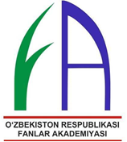

+ 1991-yilda
- 1992-yilda
- 1993-yilda
- 1994-yilda

**531. Qayerda bo‘lib o‘tgan Islom hamkorlik tashkilotining ilm-fan va texnologiyalar bo‘yicha birinchi Sammitida O‘zbekiston Respublikasi Prezidenti Shavkat Mirziyoyev xalqaro matematika olimpiadasini o‘tkazish tashabbusini ilgari surgan?**

+ Ostona
- Istanbul
- Toshkent
- Boku

**532. Fanlar akademiyasi tarkibidagi muzeylarni toping. 1) O‘zbekiston davlat san’at muzeyi; 2) O‘zbekiston tarixi Davlat muzeyi; 3) Alisher Navoiy nomidagi Davlat adabiyot muzeyi; 4) Temuriylar tarixi davlat muzeyi.**

- 1, 2, 3
- 1, 3, 4
+ 2, 3, 4
- 1, 2, 3, 4

**533. Qaysi muassasa “Bo‘lajak olim”, “Olima ayollar”, “Akademik harakatchanlik” kabi tanlovlarni yo‘lga qo‘ygan?**

- Oliy attestatsiya komissiyasi
+ Innovatsion rivojlanish agentligi
- Fanlar akademiyasi
- Oliy ta’lim, fan va innovatsiyalar vazirligi

**534. Ilm-fan bilan shug‘ullanayotgan olimalar ulushi O‘zbekistonda necha foizga yetgan?**

- 19 foizga
- 29 foizga
+ 39 foizga
- 49 foizga

**535. Qachon Xorazm Ma’mun Akademiyasi o‘z faoliyatini boshlagan?**

- 1996-yilda
+ 1997-yilda
- 1998-yilda
- 1999-yilda

**536. Qachon ayollarning ilmiy faoliyatini qo‘llab-quvvatlash maqsadida “Olima” uyushmasi tashkil etilgan?**

- 1991-yilda
+ 1992-yilda
- 1993-yilda
- 1994-yilda

**537. Qaysi yilda 22 yillik uzoq tanaffusdan so‘ng Fanlar akademiyasining 32 nafar yangi haqiqiy a’zosi tasdiqlangan?**

+ 2017-yilda
- 2019-yilda
- 2021-yilda
- 2023-yilda

**538. Qaysi yildan boshlab O‘zbekistonda ilmiy faoliyat yangi bosqichga ko‘tarilgan?**

- 2014-yildan
- 2015-yildan
+ 2016-yildan
- 2017-yildan

**539. “Hozirgi vaqtda ... dan ortiq xotin-qizlar ilmiy faoliyat bilan shug‘ullanayotgani, ilmiy ishlanmalarning ... foizini olima ayollarimiz yaratayotgani ham, jamiyatda ularning o‘rni mustahkamlanib borayotganidan dalolat beradi. Ularning orasida xalqaro darajada e’tirof etilayotgan ilm-fan vakillarining borligi barchamizga cheksiz faxr-iftixor bag‘ishlaydi, yoshlarimizni yangi-yangi yutuqlarga undaydi”. Prezident Shavkat Mirziyoyev nutqidan.**

+ 6 ming 200/25
- 7 ming 300/30
- 8 ming 400/35
- 9 ming 500/40

**540. Qachon ilk bor talabalar o‘rtasida Muhammad al-Xorazmiy nomidagi xalqaro matematika olimpiadasi o‘tkazilgan?**

- 2016-yilda
- 2017-yilda
+ 2018-yilda
- 2019-yilda

**541. Maydanak rasadxonasida O‘zbekiston tarixida ilk bor aniqlangan Quyosh tizimidagi yangi kichik sayyoraga qanday nom berilgan?**

+ “Samarqand”
- “Maydanak”
- “O‘zbekiston”
- “Ulug‘bek”

## 12-mavzu. Jismoniy tarbiya va sportning rivojlanishi.

**542. Qachon Nodirbek Abdusattorov tezkor shaxmat bo‘yicha jahon chempionatida g‘olib bo‘lgan?**

- 2020-yilda
+ 2021-yilda
- 2022-yilda
- 2023-yilda

**543. Shaxmat bo‘yicha O‘zbekiston milliy terma jamoasi qayerda o‘tkazilgan 44-jahon shaxmat olimpiadasida birinchi o‘rinni egallagan?**

- Liviyaning Tripoli shahrida
- Misrning Qohira shahrida
- Suriyaning Damashq shahrida
+ Hindistonning Chennay shahrida

**544. Qaysi Olimpiadada bokschimiz Muhammadqodir Abdullayev oltin medalni qo‘lga kiritgan?**

- Pekin (Xitoy)
- Rio de Janeyro (Braziliya)
+ Sidney (Avstraliya)
- Parij (Fransiya)

**545. O‘zbekistonlik sportchilar ilk bor qatnashgan qaysi yildagi qishki Olimpiada o‘yinlarida Lina Cheryazova oltin medalni qo‘lga kiritgan?**

- 1992-yildagi
+ 1994-yildagi
- 1996-yildagi
- 1998-yildagi

**546. Oksana Chusovitina 1992-2020-yillarda Olimpiya o‘yinlarida gimnastika bo‘yicha necha marta ishtirok etgan hamda mazkur ko‘rsatkich bilan Ginnesning rekordlar kitobiga kirgan?**

- 4 marta
- 6 marta
+ 8 marta
- 10 marta

**547. Qachon shaxmat bo‘yicha O‘zbekiston milliy terma jamoasi 44-jahon shaxmat olimpiadasida birinchi o‘rinni egallagan?**

- 2020-yilda
- 2021-yilda
+ 2022-yilda
- 2023-yilda

**548. O‘zbekiston futbol terma jamoasi chempionlikni qo‘lga kiritgan yozgi Osiyo o‘yinlari Yaponiyaning qaysi shaharlarida bo‘lib o‘tgan edi? 1) Tokio; 2) Xirosima; 3) Onomiti; 4) Miyosi.**

- 1, 2, 3
- 1, 3, 4
+ 2, 3, 4
- 1, 2, 3, 4

**549. “Ishtirokchilar soni: 71; Oltin: 0; Kumush: 1; Bronza: 1; Jami: 2; O‘rin: 58”. Yuqoridagi natijalar sportchilarimiz tomonidan qaysi Olimpiadada qo‘lga kiritilgan?**

+ Atlanta – 1996
- Sidney – 2000
- Afina – 2004
- Pekin – 2008

**550. Qachon shaxmat bo‘yicha xalqaro grossmeyster Rustam Qosimjonov jahon chempionatida g‘alaba qozonib, bosh sovrinni qo‘lga kiritgan?**

- 2003-yil 13-iyunda
+ 2004-yil 13-iyulda
- 2005-yil 13-martda
- 2006-yil 13-mayda

**551. Toshkentda o‘tkazilgan, O‘zbekiston terma jamoasi 1-o‘rinni egallagan boks bo‘yicha jahon chempionatida 5 ta oltin medalni qaysi bokschilarimiz qo‘lga kiritgan? 1) Shahram G‘iyosov; 2) Abdumalik Xaloqov; 3) Ruslan Abdullayev; 4) Asadxo‘ja Mo‘ydinxo‘jayev; 5) Hasanboy Do‘smatov; 6) Bahodir Jalolov.**

- 1, 2, 3, 5, 6
- 1, 3, 4, 5, 6
+ 2, 3, 4, 5, 6
- 1, 2, 3, 4, 5

**552. “Para yengil atletikachi, disk va yadro uloqtirish bilan shug‘ullanadi. O‘zbekiston terma jamoasi a’zosi. 2016, 2020 va 2024-yilgi yozgi Paralimpiya o‘yinlari chempioni. Yengil atletika bo‘yicha uch karra jahon chempioni va yozgi Paraosiyo o‘yinlarining ikki karra chempioni”. Yuqoridagi ma’lumotlar qaysi sportchimiz haqida?**

- Boburjon Omonov
+ Husniddin Norbekov
- Abdumalik Xaloqov
- Ruslan Abdullayev

**553. Qaysi yildan futbol bo‘yicha O‘zbekiston ichki chempionatiga start berilgan?**

- 1991-yildan
+ 1992-yildan
- 1993-yildan
- 1994-yildan

**554. Qachon va qaysi Paralimpiya o‘yinlarida Sharif Xalilov paradzyudo bo‘yicha O‘zbekiston tarixidagi ilk paralimpiya medali – kumush medalni qo‘lga kiritgan?**

- 2004-yil Afina (Gretsiya) da
+ 2012-yil London (Buyuk Britaniya) da
- 2016-yil Rio de Janeyro (Braziliya) da
- 2020-yil Tokio (Yaponiya) da

**555. “Qo‘qon shahrida tug‘ilgan. Shaxmat bilan 9 yoshidan shug‘ullana boshlagan. Ko‘plab xalqaro musobaqalarda qatnashgan. Bir necha bor shaxmat bo‘yicha xalqaro olimpiadalarda O‘zbekiston terma jamoasi safida ishtirok etgan. U nafaqat sportchi, balki murabbiy hamdir”. Yuqoridagi ma’lumotlar qaysi sportchimiz haqida?**

- Rustam Qosimjonov
- Nodirbek Abdusattorov
+ Nafisa Mo‘minova
- Javohir Sindarov

**556. “Para yengil atletikachi. Yengil atletikaning uzunlikka sakrash yo‘nalishidagi musobaqalarda ishtirok etadi. O‘zbekiston terma jamoasi a’zosi. 2020-yilgi yozgi Paralimpiya o‘yinlarining kumush medali sovrindori, yozgi Paraosiyo o‘yinlari bronza medali sohibasi. Shuningdek, paralimpiya chempioni. 2021-yilda “O‘zbekiston belgisi” ko‘krak nishoni bilan taqdirlangan. O‘zbekiston Respublikasi Prezidenti Shavkat Mirziyoyevning farmoni bilan “O‘zbekiston Respublikasida xizmat ko‘rsatgan sportchi” unvoni berilgan”. Yuqoridagi ma’lumotlar qaysi sportchimiz haqida?**

- Diyora Keldiyorova
+ Asila Mirzayorova
- Nozimaxon Qayumova
- Oksana Chusovitina

**557. “2016-yilda Rio de Janeyroda bo‘lib o‘tgan yozgi Paralimpiya o‘yinlarida disk uloqtirish bo‘yicha oltin medalni qo‘lga kiritib, paralimpiya chempioni bo‘lgan. 2021-yilda Tokio (Yaponiya) da bo‘lib o‘tgan yozgi Paralimpiya o‘yinlarida yadroni 16,13 metr masofaga uloqtirib, oltin medalni qo‘lga kiritgan va ikki karra paralimpiya chempioni bo‘lgan. O‘zbekiston Prezidenti Shavkat Mirziyoyev farmoniga binoan “O‘zbekiston Respublikasida xizmat ko‘rsatgan sportchi” unvoni berilgan”. Yuqoridagi ma’lumotlar qaysi sportchimiz haqida?**

+ Husniddin Norbekov
- Boburjon Omonov
- Ruslan Abdullayev
- Abdumalik Xaloqov

**558. Qachon Xitoyda 23 yoshgacha bo‘lganlar o‘rtasida o‘tkazilgan Osiyo chempionatida O‘zbekiston futbol terma jamoasi g‘olib bo‘lgan?**

- 2017-yilda
+ 2018-yilda
- 2019-yilda
- 2020-yilda

**559. “Ishtirokchilar soni: 70; Oltin: 1; Kumush: 1; Bronza: 2; Jami: 4; O‘rin: 43”. Yuqoridagi natijalar sportchilarimiz tomonidan qaysi Olimpiadada qo‘lga kiritilgan?**

- Atlanta – 1996
+ Sidney – 2000
- Afina – 2004
- Pekin – 2008

**560. Osiyo Olimpiya kengashining qachon va qayerda bo‘lib o‘tgan XXII Bosh assambleyasida o‘zbek kurashi Osiyo o‘yinlari dasturiga kiritilgan?**

+ 2003-yil Kuvaytda
- 2004-yil Saudiya Arabistonida
- 2005-yil Turkiyada
- 2006-yil Yaponiyada

**561. “Ishtirokchilar soni: 90; Oltin: 8; Kumush: 2; Bronza: 3; Jami: 13; O‘rin: 13”. Yuqoridagi natijalar sportchilarimiz tomonidan qaysi Olimpiadada qo‘lga kiritilgan?**

- London – 2012
- Rio – 2016
- Tokio – 2020
+ Раrij – 2024

**562. “Samarqand viloyatida tug‘ilgan. 2024-yili Fransiyaning Parij shahrida bo‘lib o‘tgan yozgi Olimpiada o‘yinlarida dzyudo bo‘yicha oltin medalni qo‘lga kiritgan. 2025-yilda uning nomidagi dzyudo mahorati maktabi tashkil qilingan”. Yuqoridagi ma’lumotlar qaysi sportchimiz haqida?**

- Asila Mirzayorova
+ Diyora Keldiyorova
- Nozimaxon Qayumova
- Oksana Chusovitina

**563. Futbol bo‘yicha O‘zbekiston milliy terma jamoasi ...(yil)da tarixda ilk bor ...(yil)dagi jahon chempionati yo‘llanmasiga ega bo‘lgan.**

- 2022-yil/2023-yil
- 2023-yil/2024-yil
- 2024-yil/2025-yil
+ 2025-yil/2026-yil

**564. Qachon O‘zbekiston FIFA ga a’zo bo‘lgan?**

- 1991-yilda
- 1992-yilda
- 1993-yilda
+ 1994-yilda

**565. “Ishtirokchilar soni: 56; Oltin: 0; Kumush: 1; Bronza: 3; Jami: 4; O‘rin: 62”. Yuqoridagi natijalar sportchilarimiz tomonidan qaysi Olimpiadada qo‘lga kiritilgan?**

- Atlanta – 1996
- Sidney – 2000
- Afina – 2004
+ Pekin – 2008

**566. Qachon Kurash xalqaro assotsiatsiyasi tuzilgan?**

+ 1998-yilda
- 1999-yilda
- 2000-yilda
- 2001-yilda

**567. Qaysi Olimpiadada bokschilarimiz Hasanboy Do‘smatov, Shahobiddin Zoirov va Fazliddin G‘oibnazarovlar oltin medallarni qo‘lga kiritganlar?**

- Pekin (Xitoy)
+ Rio de Janeyro (Braziliya)
- Sidney (Avstraliya)
- Parij (Fransiya)

**568. Akobir Qurbonov, Kamol Murodovlar qaysi sport turi bo‘yicha birinchi jahon chempionlari bo‘lgan?**

- Boks
+ Kurash
- Dzyudo
- Shaxmat

**569. Toshkent shahrida bunyod etilgan Olimpiya shaharchasida ... ta asosiy sport majmuasi, ... ming o‘rinli stadion joylashgan va sportning futbol, voleybol, tennis, chim ustida xokkey, yengil atletika kabi turlari uchun ... ta ochiq maydon ham barpo etilgan.**

+ 5/12/15
- 6/13/16
- 7/14/17
- 8/15/18

**570. O‘zbekiston uchun eng yorqin natija qaysi Olimpiadada qo‘lga kiritilgan?**

- Pekin (Xitoy)
- Rio de Janeyro (Braziliya)
- Sidney (Avstraliya)
+ Parij (Fransiya)

**571. “Alpomish” va “Barchinoy” sport bellashuvlari qanday ta’lim muassasalarida o‘tkazilgan?**

+ Maktablarda
- Litseylarda
- Kollejlarda
- Oliy ta’lim muassasalarida

**572. Mamlakatimiz tarixidagi birinchi olimpiada oltin medali qachon qo‘lga kiritilgan?**

- 1992-yilda
+ 1994-yilda
- 1996-yilda
- 1998-yilda

**573. Qachon shaxmatchimiz Nafisa Moʻminova Osiyo chempionatida kumush medalni qo‘lga kiritgan?**

+ 2008-yilda
- 2009-yilda
- 2012-yilda
- 2013-yilda

**574. Qachon va qaysi Paralimpiya o‘yinlarida O‘zbekiston para sportchilari medallar soni bo‘yicha jahon reytingida 16-o‘rinni egallagan?**

- 2004-yil Afina (Gretsiya) da
- 2012-yil London (Buyuk Britaniya) da
+ 2016-yil Rio de Janeyro (Braziliya) da
- 2020-yil Tokio (Yaponiya) da

**575. “2021-yilda bo‘lib o‘tgan yozgi Paralimpiya o‘yinlarida erkaklar o‘rtasida yadro uloqtirish bo‘yicha oltin medalni qo‘lga kiritgan. 14,06 metr natija bilan Paralimpiya rekordini yangilagan. O‘sha yili O‘zbekiston Respublikasi Prezidenti Shavkat Mirziyoyev tomonidan “O‘zbekiston iftixori” faxriy unvoni bilan taqdirlangan”. Yuqoridagi ma’lumotlar qaysi sportchimiz haqida?**

+ Boburjon Omonov
- Husniddin Norbekov
- Abdumalik Xaloqov
- Ruslan Abdullayev

**576. “Ishtirokchilar soni: 67; Oltin: 3; Kumush: 0; Bronza: 2; Jami: 5; O‘rin: 32”. Yuqoridagi natijalar sportchilarimiz tomonidan qaysi Olimpiadada qo‘lga kiritilgan?**

- London – 2012
- Rio – 2016
+ Tokio – 2020
- Раrij – 2024

**577. Uch karra Paralimpiya o‘yinlari g‘olibi bo‘lgan ilk o‘zbekistonlik sportchi kim?**

- Asila Mirzayorova
- Nozimaxon Qayumova
+ Husniddin Norbekov
- Boburjon Omonov

**578. Shaxmat bo‘yicha xalqaro grossmeyster Rustam Qosimjonov qayerda o‘tkazilgan jahon chempionatida g‘alaba qozonib, bosh sovrinni qo‘lga kiritgan?**

+ Liviyaning Tripoli shahrida
- Misrning Qohira shahrida
- Suriyaning Damashq shahrida
- Hindistonning Chennay shahrida

**579. O‘zbekistonning 17 yoshgacha bo‘lgan o‘smirlar futbol terma jamoasi 9 o‘yinchi bo‘lib o‘ynaganiga qaramay, Saudiya Arabistoni o‘smirlarini 2:0 hisobida mag‘lub etib, qit’a chempioni bo‘lgan Osiyo chempionati qayerda o‘tkazilgan edi?**

- Kuvayt
- Yaponiya
+ Saudiya Arabistoni
- Turkiya

**580. “Ishtirokchilar soni: 70; Oltin: 2; Kumush: 1; Bronza: 2; Jami: 5; O‘rin: 34”. Yuqoridagi natijalar sportchilarimiz tomonidan qaysi Olimpiadada qo‘lga kiritilgan?**

- Atlanta – 1996
- Sidney – 2000
+ Afina – 2004
- Pekin – 2008

**581. Qachon Toshkent shahrida Olimpiya shaharchasi bunyod etilgan?**

- 2022-yilda
- 2023-yilda
- 2024-yilda
+ 2025-yilda

**582. Mamlakatimiz tarixidagi birinchi olimpiada oltin medali kim tomonidan qo‘lga kiritilgan?**

+ Lina Cheryazova
- Muhammadqodir Abdullayev
- Hasanboy Do‘smatov
- Shahobiddin Zoirov

**583. Qachon Turkiyaning Antaliya shahrida kurash bo‘yicha 2-jahon chempionati bo‘lib o‘tgan?**

- 1998-yilda
- 1999-yilda
+ 2000-yilda
- 2001-yilda

**584. Qachon Toshkent shahrida kurash bo‘yicha 1-jahon chempionati o‘tkazilib, unda jahonning 48 mamlakatidan kurashchilar qatnashgan?**

- 1998-yilda
+ 1999-yilda
- 2000-yilda
- 2001-yilda

**585. Qachon Nafisa Moʻminova O‘zbekiston tarixida birinchi boʻlib ayollar oʻrtasida xalqaro grossmeyster unvonini olgan?**

- 2008-yilda
- 2009-yilda
- 2012-yilda
+ 2013-yilda

**586. “Ishtirokchilar soni: 54; Oltin: 0; Kumush: 0; Bronza: 3; Jami: 3; O‘rin: 75”. Yuqoridagi natijalar sportchilarimiz tomonidan qaysi Olimpiadada qo‘lga kiritilgan?**

+ London – 2012
- Rio – 2016
- Tokio – 2020
- Раrij – 2024

**587. “Ishtirokchilar soni: 70; Oltin: 4; Kumush: 2; Bronza: 7; Jami: 13; O‘rin: 21”. Yuqoridagi natijalar sportchilarimiz tomonidan qaysi Olimpiadada qo‘lga kiritilgan?**

- London – 2012
+ Rio – 2016
- Tokio – 2020
- Раrij – 2024

**588. Qachon futbol bo‘yicha O‘zbekiston terma jamoasi yozgi Osiyo o‘yinlarida chempionlikni qo‘lga kiritgan?**

- 1993-yilda
+ 1994-yilda
- 1995-yilda
- 1996-yilda

**589. “Buxoroda tug‘ilgan. Sport gimnastikasi bo‘yicha Olimpiada chempioni, Osiyo o‘yinlari va “Jahon yulduzlari” xalqaro musobaqasining sovrindori. Toshkentda uning nomidagi sport maktabi ochilgan”. Yuqoridagi ma’lumotlar qaysi sportchimiz haqida?**

- Asila Mirzayorova
- Diyora Keldiyorova
- Nozimaxon Qayumova
+ Oksana Chusovitina

**590. O‘zbekiston qachon va qaysi Paralimpiya o‘yinlarida ilk bor mustaqil davlat sifatida qatnashgan?**

+ 2004-yil Afina (Gretsiya) da
- 2012-yil London (Buyuk Britaniya) da
- 2016-yil Rio de Janeyro (Braziliya) da
- 2020-yil Tokio (Yaponiya) da

**591. Grossmeyster unvoniga sazovor bo‘lgan shaxmatchilarimizni toping. 1) Rustam Qosimjonov; 2) Jahongir Vohidov; 3) Nodirbek Yoqubboyev; 4) Nafisa Mo‘minova; 5) Nodirbek Abdusattorov; 6) Javohir Sindarov; 7) Shamsiddin Vohidov; 8) Muhiddin Madaminov; 9) Abdumalik Abdusalimov; 10) Ortiq Nig‘matov.**

- 1, 3, 4, 5, 7, 8
- 2, 3, 5, 6, 8, 10
- 1, 2, 4, 5, 6, 7, 8, 9
+ 1, 2, 3, 4, 5, 6, 7, 8, 9, 10

**592. “Namangan viloyatida tug‘ilgan. Para yengil atletikaning nayza uloqtirish yo‘nalishida O‘zbekiston sharafini himoya qilib kelmoqda. Ikki karra Paralimpiya o‘yinlari chempioni: 2016-yilda Rio de Janeyroda oltin medalni qo‘lga kiritgan va jahon rekordini yangilagan. 2020-yilgi Tokio Paralimpiadasida (2021-yilda) yana oltin medal olgan. O‘sha yili O‘zbekiston Respublikasi Prezidenti farmoni bilan “O‘zbekiston Respublikasida xizmat ko‘rsatgan sportchi” unvoni bilan taqdirlangan”. Yuqoridagi ma’lumotlar qaysi sportchimiz haqida?**

- Diyora Keldiyorova
- Asila Mirzayorova
+ Nozimaxon Qayumova
- Oksana Chusovitina

**593. O‘zbekiston sportchilari Parij (Fransiya) Olimpiadasida 206 ta mamlakat orasida nechanchi o‘rinni egallagan?**

- 21-o‘rinni
+ 13-o‘rinni
- 32-o‘rinni
- 43-o‘rinni

**594. Qachon va qaysi Paralimpiya o‘yinlarida O‘zbekiston sportchilari jami 19 ta medalni qo‘lga kiritib, umumjamoa hisobida 16-o‘rinni egallagan?**

- 2012-yil London (Buyuk Britaniya) da
- 2016-yil Rio de Janeyro (Braziliya) da
+ 2020-yil Tokio (Yaponiya) da
- 2024-yil Parij (Fransiya) da

**595. Qachon va qaysi Paralimpiya o‘yinlarida O‘zbekiston sportchilari 10 ta oltin, 9 ta kumush va 7 ta bronza medal (umumiy 26 ta medal) yutib, tarixiy rekord o‘rnatgan hamda medallar soni bo‘yicha 13-o‘rinni, Osiyoda Xitoy va Yaponiya ortidan 3-o‘rinni band qilgan?**

- 2012-yil London (Buyuk Britaniya) da
- 2016-yil Rio de Janeyro (Braziliya) da
- 2020-yil Tokio (Yaponiya) da
+ 2024-yil Parij (Fransiya) da

**596. Shaxmat bo‘yicha O‘zbekiston milliy terma jamoasi qaysi davlat jamoasini mag‘lubiyatga uchratib, 44-jahon shaxmat olimpiadasida birinchi o‘rinni egallagan?**

- Hindiston
- Xitoy
+ Niderlandiya
- Norvegiya

**597. Milliy paralimpiya qo‘mitasi (NPC Uzbekistan) qachon tashkil etilgan?**

+ 2007-yilda
- 2009-yilda
- 2011-yilda
- 2013-yilda

**598. 2000-yillardan boshlab o‘quvchilar va talabalar uchun qanday sport musobaqalari muntazam o‘tkazila boshlangan? 1) “Umid nihollari”; 2) “Barkamol avlod”; 3) “Universiada”.**

+ 1, 2, 3
- 1, 2
- 1, 3
- 2, 3

**599. “2023-yilda Parij (Fransiya) da yengil atletika bo‘yicha jahon chempionatida erkaklar o‘rtasida yadro uloqtirish bo‘yicha oltin medalni qo‘lga kiritgan va shu tariqa jahon chempionati rekordini yangilagan. O‘sha yilning oktyabr oyida Xanchjou shahri (Xitoy) da bo‘lib o‘tgan yozgi Paraosiyo o‘yinlarining erkaklar o‘rtasida yadro uloqtirish bo‘yicha 13,14 metr natija bilan oltin medalni qo‘lga kiritgan. 2024-yilda “O‘zbekiston Respublikasida xizmat ko‘rsatgan sportchi” faxriy unvoni bilan taqdirlangan”. Yuqoridagi ma’lumotlar qaysi sportchimiz haqida?**

+ Boburjon Omonov
- Husniddin Norbekov
- Abdumalik Xaloqov
- Ruslan Abdullayev

**600. Qaysi yilda Toshkentda o‘tkazilgan boks bo‘yicha jahon chempionatida O‘zbekiston terma jamoasi 9 ta medal (5 ta oltin) ni qo‘lga kiritgan va umumjamoa hisobida 1-o‘rinni egallagan?**

- 2022-yilda
+ 2023-yilda
- 2024-yilda
- 2025-yilda

**601. Qaysi yildagi futbol bo‘yicha U-17 Osiyo chempionatida O‘zbekiston terma jamoasi birinchi bo‘limda ikki futbolchisi maydondan chetlatilganiga qaramay, ikkinchi bo‘limda ikki gol urib, mezbonlarni mag‘lub etgan?**

- 2022-yildagi
- 2023-yildagi
- 2024-yildagi
+ 2025-yildagi

**602. Nodirbek Abdusattorov qayerda o‘tkazilgan tezkor shaxmat bo‘yicha jahon chempionatida g‘olib bo‘lgan?**

- Sofiya (Bolgariya)
- Budapesht (Vengriya)
+ Varshava (Polsha)
- Buxarest (Ruminiya)

**603. Sportchilarimiz yozgi Olimpiadada qaysi sport turlarida ilk medallarga erishganlar?**

- Boks va tennis
- Tennis va shaxmat
- Shaxmat va dzyudo
+ Dzyudo va boks

## 13-mavzu. O‘zbekistonda yoshlarga oid davlat siyosati.

**604. YUNESKO me’yorlariga ko‘ra necha yoshli shaxslar yoshlar hisoblanadi?**

- 15-23 yoshli
- 16-24 yoshli
+ 17-25 yoshli
- 18-26 yoshli

**605. Zulfiya nomidagi davlat mukofoti bilan qaysi yillarda 322 nafar yosh xotin-qiz taqdirlangan?**

- 1997-2018-yillarda
- 1998-2019-yillarda
+ 1999-2020-yillarda
- 2000-2021-yillarda

**606. “Kamolot” yoshlar ijtimoiy harakati tomonidan qanday nomdagi yoshlar mehnat harakati tuzilgan?**

- “Quruvchi”
- “Madadkor”
- “Binokor”
+ “Bunyodkor”

**607. Qachon Yoshlar ittifoqi tashkiloti tuzilgan?**

+ 1991-yilda
- 1992-yilda
- 1993-yilda
- 1994-yilda

**608. Yoshlar akademiyasi qaysi davlat organi huzurida tuzilgan?**

- Yoshlar ishlari agentligi
+ Innovatsion rivojlanish agentligi
- Oliy Majlis Senati
- Oliy Majlis Qonunchilik palatasi

**609. O‘zbekiston Respublikasi Prezidenti Shavkat Mirziyoyev BMT ning nechanchi sessiyasida so‘zlagan nutqida dunyo yoshlari haqida alohida to‘xtalib, O‘zbekiston globallashuv va axborot-kommunikatsiya texnologiyalari jadal rivojlanib borayotgan bugungi sharoitda yoshlarga oid siyosatni shakllantirish va amalga oshirishga qaratilgan xalqaro huquqiy hujjat – BMT ning Yoshlar huquqlari to‘g‘risidagi xalqaro konvensiyasini ishlab chiqishni taklif etgan?**

- 70-sessiyasida
+ 72-sessiyasida
- 74-sessiyasida
- 76-sessiyasida

**610. Yoshlar ishlari agentligi tomonidan tashkil etilgan “Yosh kitobxon” tanlovida necha yoshli bolalar va yoshlar ishtirok etishi mumkinligi belgilanib, g‘olibga bosh sovrin sifatida avtomobil berilishi qayd etilgan?**

- 7 yoshdan 27 yoshgacha
- 8 yoshdan 28 yoshgacha
- 9 yoshdan 29 yoshgacha
+ 10 yoshdan 30 yoshgacha

**611. AQSH va Yaponiyada “yoshlar” atamasi necha yoshlilarga qo‘llaniladi?**

- 10-11 yoshdan 26-27 yoshgacha
- 11-12 yoshdan 27-28 yoshgacha
- 12-13 yoshdan 28-29 yoshgacha
+ 13-14 yoshdan 29-30 yoshgacha

**612. “Kamolot” yoshlar ijtimoiy harakatining nechanchi qurultoyi qaroriga muvofiq, O‘zbekiston Prezidenti Shavkat Mirziyoyev tashabbusi bilan Yoshlar ittifoqi tashkil etilgan?**

- II qurultoyi
- III qurultoyi
+ IV qurultoyi
- V qurultoyi

**613. “Kamolot” yoshlar ijtimoiy harakati tomonidan qanday tanlovlar muntazam o‘tkazib kelingan? 1) “Mening biznes g‘oyam”; 2) “Biz – buyuk yurt farzandlarimiz”; 3) “Yosh tadbirkor – yurtga madadkor”.**

- 1, 2
+ 1, 3
- 2, 3
- 1, 2, 3

**614. Qachon Buxoro shahri birinchi “Turkiy dunyo yoshlar tashabbuslari poytaxti” deb e’lon qilingan?**

+ 2022-yilda
- 2023-yilda
- 2024-yilda
- 2025-yilda

**615. Imtiyozli asosda uy-joylar va xonadonlar, birinchi navbatda, qanday toifadagi yoshlarga berilgan? 1) Imkoniyati cheklangan; 2) Ijod, ilm-fan bilan mashg‘ul bo‘lgan; 3) Turli loyihalarda faol ishtirok etgan.**

- 1, 2
- 1, 3
- 2, 3
+ 1, 2, 3

**616. Qachon “Kamolot” yoshlar ijtimoiy harakati ta’sis qilingan?**

- 2000-yilda
+ 2001-yilda
- 2002-yilda
- 2003-yilda

**617. “Kamolot” yoshlar ijtimoiy harakati tarkibiga kiritilgan “Kamalak” tashkiloti necha yoshli bolalar uchun tashkil etilgan edi?**

- 8-12 yoshli
- 9-13 yoshli
+ 10-14 yoshli
- 11-15 yoshli

**618. Qaysi davlat muassasasi yoshlar bilan bog‘liq soha va yo‘nalishlarda yagona davlat siyosatini yuritishi, strategik yo‘nalishlar va davlat dasturlarini ishlab chiqishi hamda amalga oshirishi nazarda tutilgan?**

- Yoshlar ittifoqi
- Yoshlar parlamenti
+ Yoshlar ishlari agentligi
- Yoshlar akademiyasi

**619. O‘zbekiston Respublikasi Prezidenti Shavkat Mirziyoyev BMT ning qaysi yilda bo‘lib o‘tgan sessiyasida so‘zlagan nutqida dunyo yoshlari haqida alohida to‘xtalib, O‘zbekiston globallashuv va axborot-kommunikatsiya texnologiyalari jadal rivojlanib borayotgan bugungi sharoitda yoshlarga oid siyosatni shakllantirish va amalga oshirishga qaratilgan xalqaro huquqiy hujjat – BMT ning Yoshlar huquqlari to‘g‘risidagi xalqaro konvensiyasini ishlab chiqishni taklif etgan?**

+ 2017-yilda
- 2018-yilda
- 2019-yilda
- 2020-yilda

**620. Qachon O‘zbekiston BMT ning “Yoshlar – 2030” strategiyasini amalga oshirayotgan 10 davlat qatoriga kiritilgan?**

- 2022-yilda
- 2023-yilda
- 2024-yilda
+ 2025-yilda

**621. Qachon O‘zbekiston Prezidenti Shavkat Mirziyoyev 30-iyun kunini Yoshlar kuni sifatida nishonlash tashabbusini ilgari surgan?**

+ 2017-yil 30-iyunda
- 2018-yil 30-mayda
- 2019-yil 30-aprelda
- 2020-yil 30-martda

**622. O‘zbekiston Yoshlar ittifoqi rahbari ayni vaqtda yana qanday lavozimlarda faoliyat yuritishi belgilangan? 1) O‘zbekiston Respublikasi Prezidentining yoshlar siyosati bo‘yicha davlat maslahatchisi; 2) Oliy Majlis Senati a’zosi; 3) Oliy Majlis Qonunchilik palatasi a’zosi.**

+ 1, 2
- 1, 3
- 2, 3
- 1, 2, 3

**623. O‘zbekiston aholisining qancha foizini yoshlar tashkil etadi?**

- 50 foizini
+ 60 foizini
- 70 foizini
- 80 foizini

**624. Qachon Yoshlar ishlari agentligi tashkil etilgan?**

- 2017-yilda
- 2018-yilda
- 2019-yilda
+ 2020-yilda

**625. Qaysi yilda Yoshlar ittifoqi tashkiloti yoshlarni o‘z plenumi va konferensiyalari qarorlarini bajarishga safarbar qilolmagani, yoshlarning manfaatlari va ehtiyojlarini to‘la aks ettirmagani tufayli tugatilib, o‘rniga “Kamolot” jamg‘armasi tashkil etilgan?**

- 1992-yilda
- 1994-yilda
+ 1996-yilda
- 1998-yilda

**626. Qachon Yoshlar taraqqiyoti indeksiga ko‘ra, O‘zbekiston yoshlar siyosati sohasida eng tez rivojlanayotgan mamlakat deb e’tirof etilgan?**

- 2022-yilda
+ 2023-yilda
- 2024-yilda
- 2025-yilda

**627. “Kamolot” yoshlar ijtimoiy harakatining qaysi sanada o‘tkazilgan qurultoyi qaroriga muvofiq, O‘zbekiston Prezidenti Shavkat Mirziyoyev tashabbusi bilan Yoshlar ittifoqi tashkil etilgan?**

+ 2017-yil 30-iyunda
- 2018-yil 30-mayda
- 2019-yil 30-aprelda
- 2020-yil 30-martda

**628. Qaysi yillarda O‘zbekiston Respublikasi Oliy Majlisi Senatida Yoshlar, madaniyat va sport masalalari qo‘mitasi, Qonunchilik palatasida Yoshlar masalalari bo‘yicha komissiya tuzilgan?**

+ 2016-2020-yillarda
- 2017-2021-yillarda
- 2018-2022-yillarda
- 2019-2023-yillarda

**629. Qachon Zulfiya nomidagi davlat mukofoti ta’sis etilgan?**

- 1997-yilda
- 1998-yilda
+ 1999-yilda
- 2000-yilda

**630. Milliy qonunchiligimizda necha yoshli shaxslar yoshlar yoki yosh fuqarolar deb ataladi?**

- 11 yoshga to‘lgan va 27 yoshdan oshmagan
- 12 yoshga to‘lgan va 28 yoshdan oshmagan
- 13 yoshga to‘lgan va 29 yoshdan oshmagan
+ 14 yoshga to‘lgan va 30 yoshdan oshmagan

**631. Yoshlarni qiziqtirayotgan dolzarb masalalar bo‘yicha fikr almashish, ularning taklif va tavsiyalarini o‘rganish, muammolariga amaliy yechim topish maqsadida qaysi muassasa faoliyati yo‘lga qo‘yilgan?**

- Yoshlar parlamenti
- Yoshlar akademiyasi
- Yoshlar ittifoqi
+ Yoshlar press-klubi

**632. Yoshlar parlamenti qaysi davlat organlari huzurida tuzilgan? 1) Oliy Majlis Senati; 2) Oliy Majlis Qonunchilik palatasi; 3) Innovatsion rivojlanish agentligi.**

+ 1, 2
- 1, 3
- 2, 3
- 1, 2, 3

**633. Qachon “Yoshlarga oid davlat siyosati to‘g‘risida” gi qonun yangi tahrirda qabul qilingan?**

- 2015-yilda
+ 2016-yilda
- 2017-yilda
- 2018-yilda

**634. “Kamolot” yoshlar ijtimoiy harakati tomonidan qanday shior ostida yoshlar festivallari, turli tadbirlar muntazam o‘tkazib kelingan?**

+ “Biz – buyuk yurt farzandlarimiz”
- “O‘zbekiston – Vatanim manim”
- “Yosh tadbirkor – yurtga madadkor”
- “Gulla, yashna hur O‘zbekiston”

**635. Qachon Toshkent shahri birinchi “MDH yoshlar poytaxti” deb e’lon qilingan?**

- 2022-yilda
- 2023-yilda
+ 2024-yilda
- 2025-yilda

**636. O‘zbekistonda qaysi yillarda 8 mingdan ortiq yosh oila imtiyozli asosda uy-joy bilan ta’minlangan?**

- 2013-2019-yillarda
+ 2014-2020-yillarda
- 2015-2021-yillarda
- 2016-2022-yillarda

## 14-mavzu. Ma’naviy va tarixiy merosga munosabat. Buyuk ajdodlar xotirasining tiklanishi.

**637. Qaysi sana Qatag‘on qurbonlarini yod etish kuni sifatida belgilangan?**

+ 31-avgust
- 31-sentyabr
- 31-oktyabr
- 31-noyabr

**638. Qachon Mahmud Zamaxshariy tavalludining 920 yilligi nishonlangan?**

- 1993-yilda
- 1994-yilda
+ 1995-yilda
- 1996-yilda

**639. Qachon Navro‘z umumxalq bayrami deb e’lon qilingan?**

+ 1990-yil 3-mayda
- 1991-yil 20-iyunda
- 1992-yil 27-martda
- 1993-yil 16-yanvarda

**640. Prezident Shavkat Mirziyoyev tashabbusi bilan qaysi shahardagi xalqaro aeroportga Islom Karimov nomi berilgan?**

- Jizzax
+ Toshkent
- Qarshi
- Samarqand

**641. Qachon Alisher Navoiy tavalludining 550 yilligi nishonlangan?**

+ 1991-yilda
- 1993-yilda
- 1995-yilda
- 1997-yilda

**642. Qaysi intellektual tanlovlarining o‘tkazilishi an’anaga aylangan? 1) “Yosh kitobxon”; 2) “Yosh kitobxon oila”; 3) “Mushoira”; 4) “Zakovat”.**

- 1, 2, 3
- 1, 3, 4
- 2, 3, 4
+ 1, 2, 3, 4

**643. Qachon Respublika Ma’naviyat va ma’rifat jamoatchilik markazi tashkil etilgan?**

- 1991-yilda
- 1992-yilda
- 1993-yilda
+ 1994-yilda

**644. Qaysi sana Islom Karimov xotirasi kuni sifatida belgilangan?**

- 2-avgust
+ 2-sentyabr
- 2-oktyabr
- 2-noyabr

**645. Qachon Amir Temur tavalludining 660 yilligi xalqaro miqyosda nishonlangan va “Temur tuzuklari” bir necha tilda chop etilgan?**

- 1993-yilda
- 1994-yilda
- 1995-yilda
+ 1996-yilda

**646. Qachon Ajiniyoz Qo‘siboy o‘g‘li tavalludining 175 yilligi nishonlangan?**

+ 1999-yilda
- 2001-yilda
- 2002-yilda
- 2004-yilda

**647. Qaysi yildan so‘ng ma’naviyat sohasidagi ishlar yangi bosqichga ko‘tarilgan?**

- 2016-yildan
+ 2017-yildan
- 2018-yildan
- 2019-yildan

**648. Qachon Muhammad ibn Ismoil Buxoriy tavalludining 1225 yilligi nishonlangan?**

- 1995-yilda
- 1996-yilda
- 1997-yilda
+ 1998-yilda

**649. Qaysi tashkilot muassisligida “Tafakkur”, “Ma’naviy hayot” jurnallari chop etilmoqda?**

- Ma’naviyat targ‘iboti markazi
- Milliy g‘oya va mafkura ilmiy-amaliy markazi
+ Ma’naviyat va ma’rifat markazi
- Ma’rifat markazi

**650. Qachon Samarqand va Shahrisabzda Amir Temur haykali o‘rnatilgan?**

- 1993-yilda
- 1994-yilda
- 1995-yilda
+ 1996-yilda

**651. Qachon Samarqand va Shahrisabz shaharlari “Amir Temur” ordeni bilan mukofotlangan?**

- 1995-yilda
+ 1996-yilda
- 1997-yilda
- 1998-yilda

**652. Qachon bir guruh jadid namoyandalari “Buyuk xizmatlari uchun” ordeni bilan mukofotlangan?**

- 2016-yilda
- 2018-yilda
+ 2020-yilda
- 2022-yilda

**653. Qaysi jadid namoyandalari “Buyuk xizmatlari uchun” ordeni bilan mukofotlangan? 1) Abdulla Avloniy; 2) Abdulla Qodiriy; 3) Mahmudxo‘ja Behbudiy; 4) Munavvar qori Abdurashidxonov.**

- 1, 2, 3
+ 1, 3, 4
- 2, 3, 4
- 1, 2, 3, 4

**654. Qachon “Jadid” gazetasining ilk soni nashr etilgan?**

- 2020-yil 9-mayda
- 2021-yil 22-aprelda
- 2023-yil 17-dekabrda
+ 2024-yil 1-yanvarda

**655. Qachon 9-may – Xotira va qadrlash kuni deb e’lon qilingan?**

- 1996-yil 18-oktyabrda
- 1997-yil 9-mayda
- 1998-yil 27-iyunda
+ 1999-yil 2-martda

**656. Mustaqillik monumenti qayerda o‘rnatilgan?**

- “G‘alaba bog‘i” majmuasida
- “Shon-sharaf” muzeyida
+ “Yangi O‘zbekiston” bog‘ida
- “Shahidlar xotirasi” maydonida

**657. Qachon Najmiddin Kubro tavalludining 850 yilligi nishonlangan?**

- 1993-yilda
- 1994-yilda
+ 1995-yilda
- 1996-yilda

**658. Qaysi shahardagi markaziy istirohat bog‘i Alisher Navoiy nomidagi O‘zbekiston Milliy bog‘i deb atalgan?**

- Navoiy
- Samarqand
- Shahrisabz
+ Toshkent

**659. Qaysi tadbir doirasida kitobxonlik va intellektual o‘yinlar tashkil etilgan?**

- “Yosh kitobxon”
- “Yosh kitobxon oila”
- “Mushoira”
+ “Besh tashabbus olimpiadasi”

**660. Qachon Ramazon hayiti umumxalq bayrami va dam olish kuni deb e’lon qilingan?**

- 1990-yil 3-mayda
- 1991-yil 20-iyunda
+ 1992-yil 27-martda
- 1993-yil 16-yanvarda

**661. Qachon O‘zbekiston Respublikasi Prezidenti Shavkat Mirziyoyev tashabbusi bilan Sharof Rashidov tavalludining 100 yilligi nishonlangan?**

- 2015-yilda
- 2016-yilda
+ 2017-yilda
- 2018-yilda

**662. Qaysi yildan keyin Toshkent, Nukus va barcha viloyatlarning markaziy shaharlarida Xotira maydonlari barpo etilgan?**

- 1997-yildan
- 1998-yildan
+ 1999-yildan
- 2000-yildan

**663. Qaysi tadbir doirasida 3 milliondan ortiq kitob yoshlarga yetkazib berilgan?**

+ “Ma’rifat karvoni”
- “Mushoira”
- “Yoshlar kutubxonasi”
- “Yosh kitobxon”

**664. Qaysi shaharlarda Islom Karimov haykallari o‘rnatilgan? 1) Jizzax; 2) Toshkent; 3) Samarqand; 4) Qarshi.**

- 1, 2, 3
- 1, 3, 4
+ 2, 3, 4
- 1, 2, 3, 4

**665. Qachon O‘zbekiston Prezidenti Shavkat Mirziyoyev tashabbusi bilan Toshkentda “Yangi O‘zbekiston” bog‘i barpo etilgan?**

- 2020-yilda
+ 2021-yilda
- 2023-yilda
- 2024-yilda

**666. Qachon Termiz shahri “Amir Temur” ordeni bilan mukofotlangan?**

- 2012-yilda
- 2013-yilda
+ 2014-yilda
- 2015-yilda

**667. Qaysi alloma nomidagi davlat mukofoti ta’sis etilgan?**

+ Alisher Navoiy
- Mirzo Ulug‘bek
- Bahouddin Naqshband
- Abu Ali ibn Sino

**668. Qaysi shaharda “Shahidlar xotirasi” yodgorlik majmuasi hamda “Qatag‘on qurbonlari xotirasi” muzeyi tashkil qilingan?**

- Termiz
- Samarqand
- Shahrisabz
+ Toshkent

**669. Qachon Toshkentda “G‘alaba bog‘i” majmuasi ochilgan?**

+ 2020-yil 9-mayda
- 2021-yil 22-aprelda
- 2023-yil 17-dekabrda
- 2024-yil 1-yanvarda

**670. Qachon 9-may – Xotira va qadrlash kuni munosabati bilan Toshkentda “G‘alaba bog‘i” majmuasi va “Shon-sharaf” muzeyi ochilgan?**

+ 2020-yilda
- 2021-yilda
- 2023-yilda
- 2024-yilda

**671. Qachon O‘zbekistonda “Mirzo Ulug‘bek yili” deb e’lon qilingan hamda allomaning 600 yilligi O‘zbekistonda va YUNESKO qarorgohida nishonlangan?**

- 1993-yilda
+ 1994-yilda
- 1995-yilda
- 1996-yilda

**672. Qachon Mahmudxo‘ja Behbudiy tavalludining 150 yilligi nishonlangan?**

- 2022-yilda
- 2023-yilda
- 2024-yilda
+ 2025-yilda

**673. Qachon Ahmad Farg‘oniy tavalludining 1200 yilligi nishonlangan?**

- 1995-yilda
- 1996-yilda
- 1997-yilda
+ 1998-yilda

**674. Qanday rukn ostida ko‘plab badiiy adabiyotlar chop etilib, respublikamizdagi barcha ta’lim muassasalari kutubxonalariga tarqatilgan?**

- “Ma’rifat karvoni”
- “Mushoira”
+ “Yoshlar kutubxonasi”
- “Yosh kitobxon”

**675. Qachon Toshkentda Temuriylar tarixi davlat muzeyi ochilgan?**

+ 1996-yil 18-oktyabrda
- 1997-yil 9-mayda
- 1998-yil 27-iyunda
- 1999-yil 2-martda

**676. Qaysi tashkilot “Milliy tiklanishdan milliy yuksalish sari” g‘oyasi asosida xalqimizning ma’naviy-ma’rifiy dunyoqarashini shakllantirishga salmoqli hissa qo‘shmoqda?**

- Ma’naviyat targ‘iboti markazi
- Milliy g‘oya va mafkura ilmiy-amaliy markazi
+ Ma’naviyat va ma’rifat markazi
- Ma’rifat markazi

**677. Turkmanistonning qaysi shahrida Islom Karimov haykali ochilgan?**

- Ashxobod
- Dosho‘guz
- Mari
+ Turkmanobod

**678. Qaysi yildan Respublika Ma’naviyat targ‘iboti markazi hamda Milliy g‘oya va mafkura ilmiy-amaliy markazi alohida tashkilot sifatida ish boshlagan?**

- 2005-yildan
+ 2006-yildan
- 2007-yildan
- 2008-yildan

**679. Qachon Qurbon hayiti dam olish kuni deb e’lon qilingan?**

- 1990-yil 3-mayda
+ 1991-yil 20-iyunda
- 1992-yil 27-martda
- 1993-yil 16-yanvarda

**680. Qaysi jadid namoyandalari “Mustaqillik” ordeni bilan taqdirlangan?**

- Abdulla Avloniy va Abdulla Qodiriy
+ Abdulla Qodiriy va Abdulhamid Cho‘lpon
- Abdulhamid Cho‘lpon va Abdurauf Fitrat
- Abdurauf Fitrat va Abdulla Avloniy

**681. Prezident Shavkat Mirziyoyev tashabbusi bilan qaysi oliy ta’lim muassasasiga Islom Karimov nomi berilgan?**

- Toshkent davlat iqtisodiyot universitetiga
- Toshkent arxitektura-qurilish universitetiga
+ Toshkent davlat texnika universitetiga
- Toshkent transport universitetiga

**682. Ijtimoiy-ma’naviy tadqiqotlar instituti qaysi davlat muassasasi huzurida ochilgan?**

+ Ma’naviyat va ma’rifat markazi
- Ma’naviyat targ‘iboti markazi
- Milliy g‘oya va mafkura ilmiy-amaliy markazi
- Ma’rifat markazi

**683. Qaysi shaharda Sharof Rashidov haykali o‘rnatilib, muzeyi barpo etilgan?**

+ Jizzax
- Toshkent
- Termiz
- Samarqand

**684. Rossiyaning qaysi shahrida Islom Karimov haykali ochilgan?**

+ Moskva
- Sankt-Peterburg
- Yekaterinburg
- Nijniy Novgorod

**685. Qaysi yildan boshlab buyuk ajdodlar xotirasi tiklanishi bo‘yicha ishlar yangi bosqichga ko‘tarilgan?**

- 2016-yildan
+ 2017-yildan
- 2018-yildan
- 2019-yildan

**686. Qozog‘istonning qaysi shahrida Alisher Navoiy haykali o‘rnatilgan?**

+ Ostona
- Olmaota
- Chimkent
- Turkiston

**687. Qaysi tumanga Sharof Rashidov nomi berilgan?**

- Do‘stlik tumaniga
+ Jizzax tumaniga
- Mirzacho‘l tumaniga
- Zarbdor tumaniga

**688. Qachon Toshkentda milliy va zamonaviy me’morchilik uslubidagi O‘zbekiston xalqaro anjumanlar saroyi va Alisher Navoiy nomidagi O‘zbekiston Milliy kutubxonasini birlashtirgan “Ma’rifat markazi” bunyod etilgan?**

- 2010-yilda
+ 2011-yilda
- 2012-yilda
- 2013-yilda

**689. Qachon Bahouddin Naqshband tavalludining 675 yilligi nishonlangan?**

+ 1993-yilda
- 1994-yilda
- 1995-yilda
- 1996-yilda

**690. Qachon Toshkentda Amir Temur haykali o‘rnatilgan?**

+ 1993-yilda
- 1994-yilda
- 1995-yilda
- 1996-yilda

**691. Toshkent davlat o‘zbek tili va adabiyoti universitetiga qaysi alloma nomi berilgan?**

- Muhammadrizo Ogahiy
- Abu Rayhon Beruniy
+ Alisher Navoiy
- Nizomiy Ganjaviy

**692. Alisher Navoiy haykali O‘zbekistondagi qaysi shaharlarning markaziy xiyobonlariga o‘rnatilgan?**

- Shahrisabz va Toshkent
+ Toshkent va Navoiy
- Navoiy va Samarqand
- Samarqand va Shahrisabz

**693. Qachon Xoja Ahror Valiy tavalludining 600 yilligi nishonlangan?**

- 1999-yilda
- 2001-yilda
- 2002-yilda
+ 2004-yilda

**694. Qachon Muhammadrizo Ogahiy tavalludining 190 yilligi nishonlangan?**

+ 1999-yilda
- 2001-yilda
- 2002-yilda
- 2004-yilda

**695. Qachon O‘zbekiston Respublikasi Prezidenti Shavkat Mirziyoyev tashabbusi bilan Islom Karimov tavalludining 80 yilligi nishonlangan?**

- 2015-yilda
- 2016-yilda
- 2017-yilda
+ 2018-yilda

## 15-mavzu. Milliy va diniy qadriyatlarning qayta tiklanishi.

**696. O‘zbekiston Respublikasi Prezidenti Shavkat Mirziyoyev tashabbusi bilan qaysi shaharda Islom sivilizatsiyasi markazi bunyod etilgan?**

- Buxoro
- Xiva
+ Toshkent
- Samarqand

**697. Islom sivilizatsiyasi markazida qanday muassasalar faoliyat yuritadi? 1) Masjid; 2) Muzey; 3) Kutubxona; 4) Ilmiy markaz.**

- 1, 2, 3
- 1, 3, 4
+ 2, 3, 4
- 1, 2, 3, 4

**698. Qaysi bayram ko‘p millatli O‘zbekistonda birlik timsoliga aylangan?**

- Mustaqillik bayrami
- Ramazon hayiti
- Qurbon hayiti
+ Navro‘z bayrami

**699. Navro‘z bayramini Markaziy Osiyo, Kavkaz, Qora dengiz havzasi, Yaqin Sharq, Bolqon yarimoroli va dunyoning boshqa mintaqalaridagi qancha inson nishonlaydi?**

- 100 milliondan ortiq
- 200 milliondan ortiq
+ 300 milliondan ortiq
- 400 milliondan ortiq

**700. Navro‘z bayrami necha yillik tarixga ega?**

- 1 ming yildan ortiq
- 2 ming yildan ortiq
+ 3 ming yildan ortiq
- 4 ming yildan ortiq

**701. Islom sivilizatsiyasi markazida qanday bo‘limlar tashkil etilgan? 1) “Islomdan avvalgi sivilizatsiyalar”; 2) “Birinchi Renessans davri”; 3) “Ikkinchi Renessans davri”; 4) “O‘zbekiston XX asrda”; 5) “Yangi O‘zbekiston – yangi Renessans”.**

- 1, 3, 4
- 1, 2, 3, 4
- 2, 3, 5
+ 1, 2, 3, 4, 5

**702. “Navro‘z” so‘zi qanday ma’noni bildiradi?**

+ “Yangi kun”
- “Yangi oy”
- “Yangi fasl”
- “Yangi yil”

**703. Qachon Hazrati Imom (Hastimom) me’moriy majmuasi qayta ta’mirlangan?**

+ 2007-yilda
- 2009-yilda
- 2011-yilda
- 2013-yilda

**704. Qachon YUNESKO Navro‘z bayramini insoniyatning nomoddiy madaniy merosi sifatida e’tirof etgan?**

- 2007-yilda
- 2008-yilda
+ 2009-yilda
- 2010-yilda

**705. Qachon Islom dunyosi ta’lim, fan va madaniyat tashkiloti (ICESCO) Toshkent shahrini Islom madaniyatining poytaxti deb e’lon qilgan?**

+ 2007-yilda
- 2009-yilda
- 2011-yilda
- 2013-yilda

**706. Qachon BMT tomonidan 21-mart Xalqaro Navro‘z kuni deb e’lon qilingan?**

- 2007-yilda
- 2008-yilda
- 2009-yilda
+ 2010-yilda

**707. Qachon Navro‘z umumxalq bayrami, 21-mart esa dam olish kuni deb e’lon qilingan?**

- 1989-yilda
+ 1990-yilda
- 1991-yilda
- 1992-yilda

**708. Xattot Habibulloh Solih tomonidan ko‘chirilgan Toshkentdagi Usmon mus’hafi nusxasi qayerda saqlanadi?**

- Islom sivilizatsiyasi markazi
+ O‘zbekiston xalqaro islomshunoslik akademiyasi
- Toshkent islom universiteti
- Hazrati Imom (Hastimom) majmuasi

**709. Qachon Islom dunyosi ta’lim, fan va madaniyat tashkiloti (ICESCO) Buxoro shahrini Islom madaniyatining poytaxti deb e’lon qilgan?**

- 2018-yilda
+ 2020-yilda
- 2022-yilda
- 2024-yilda

**710. Islom sivilizatsiyasi markazining qurilishi O‘zbekiston Prezidentining ...-yildagi qaroriga binoan boshlanib, ...-yil Ramazon hayiti kuni unga poydevor qo‘yilgan.**

- 2016/2017
+ 2017/2018
- 2018/2019
- 2019/2020

**711. Toshkent islom universiteti qanday maqsadlarda ochilgan? 1) Islom diniga oid merosni o‘rganish; 2) Islom dinini aholi orasida keng targ‘ib qilish; 3) Islom dini sohada malakali kadrlar tayyorlash.**

- 1, 2
+ 1, 3
- 2, 3
- 1, 2, 3

**712. Toshkent islom universiteti hozirda qanday muassasa sifatida faoliyat olib bormoqda?**

- Islom sivilizatsiyasi markazi
- Mintaqa musulmonlari agentligi
+ O‘zbekiston xalqaro islomshunoslik akademiyasi
- O‘rta Osiyo musulmonlari kengashi

**713. Sovet hokimiyati davrida Navro‘z qanday bayram degan tamg‘a bilan taqiqlangan?**

- G‘ayridiniy bayram
+ Diniy bayram
- Zararli bayram
- Antisovet bayram

**714. Islom sivilizatsiyasi markazi binosining gumbazi balandligi necha metrni tashkil etadi?**

- 35 metrni
- 45 metrni
- 55 metrni
+ 65 metrni

**715. Qachon xattot Habibulloh Solih Toshkentdagi Usmon mus’hafidan nusxa ko‘chirgan?**

+ 2004-yilda
- 2006-yilda
- 2008-yilda
- 2010-yilda

**716. Qachon Islom hamkorlik tashkiloti Xiva shahrini “Islom dunyosining turizm poytaxti” deb e’lon qilgan?**

- 2018-yilda
- 2020-yilda
- 2022-yilda
+ 2024-yilda

**717. Qachon Toshkent islom universiteti ochilgan?**

- 1996-yilda
- 1997-yilda
- 1998-yilda
+ 1999-yilda

**718. Hazrati Imom (Hastimom) me’moriy majmuasida qaysi xalifa davriga taalluqli noyob mus’haf (Qur’on) saqlanib kelingan?**

- Abu Bakr
- Umar
+ Usmon
- Ali

**719. Qaysi yildan o‘zbekistonliklarning haj amalini ado etishi uchun Saudiya Arabistoniga borish imkoniyati yaratilgan?**

+ 1990-yildan
- 1991-yildan
- 1992-yildan
- 1993-yildan

## 16-mavzu. Madaniyat va san’at taraqqiyoti.

**720. Qachon Toshkentda Temuriylar tarixi davlat muzeyi va Olimpiya shon-shuhrati muzeyi tashkil etilgan?**

+ 1996-yilda
- 1998-yilda
- 2000-yilda
- 2002-yilda

**721. Qaysi yildan boshlab Toshkent xalqaro kinofestivali qayta tiklangan va yangi formatda “Ipak yo‘li durdonasi” nomi bilan tashkil etilgan?**

+ 2021-yildan
- 2022-yildan
- 2023-yildan
- 2024-yildan

**722. Qashqadaryodagi qaysi teatr studiyasi xalqaro madaniy tadbirlarda faol qatnashib kelmoqda?**

- “Yoshlar”
- “Ilhom”
- “Turon”
+ “Eski masjid”

**723. Qachon Toshkent davlat milliy raqs va xoreografiya oliy maktabi negizida O‘zbekiston davlat xoreografiya akademiyasi tashkil etilgan?**

- 2018-yilda
- 2019-yilda
+ 2020-yilda
- 2021-yilda

**724. “Nihol” davlat mukofoti kimlarni rag‘batlantirish uchun ta’sis etilgan?**

- Badiiy adabiyot namoyondalarini
- Tasviriy san’at ijodkorlarini
+ Musiqa va raqs san’ati vakillarini
- Kinoijodkorlarni

**725. O‘z asarlarida O‘zbekiston tarixi, madaniyati, buyuk ajdodlarimizning obrazlarini tasvirlagan rassom va haykaltaroshlarni toping. 1) Akmal Nur; 2) Bahodir Jalolov; 3) Javlon Umarbekov; 4) Bahodir Yo‘ldoshev; 5) Ortiqali Qozoqov; 6) Ilhom Jabborov.**

- 2, 3, 4, 6
- 1, 3, 4
+ 1, 2, 3, 5, 6
- 2, 3, 5

**726. Qachon Toshkent davlat konservatoriyasi O‘zbekiston davlat konservatoriyasiga aylantirilgan?**

- 1996-yilda
- 1998-yilda
- 2000-yilda
+ 2002-yilda

**727. Qachon O‘zbekiston Badiiy akademiyasi tashkil etilgan?**

- 1996-yilda
+ 1997-yilda
- 1998-yilda
- 1999-yilda

**728. Qachon Toshkent shahrida Adiblar xiyoboni barpo etilgan?**

- 2017-yilda
- 2018-yilda
- 2019-yilda
+ 2020-yilda

**729. O‘zbekiston Prezidenti Shavkat Mirziyoyev tashabbusi bilan qaysi loyiha doirasida eng qadimgi o‘tmishdan yaqin tarixgacha bo‘lgan davrni yorituvchi turkum filmlar yaratish ishlari yoʻlga qo‘yilgan?**

- “Yangi tarix”
+ “Tirik tarix”
- “Buyuk tarix”
- “Ko‘hna tarix”

**730. Qachon O‘zbekiston Milliy muzeyi qurilishiga tamal toshi qo‘yilgan?**

- 2020-yilda
- 2022-yilda
- 2023-yilda
+ 2025-yilda

**731. Qachon Toshkentda “Turkiston” san’at saroyi ish boshlagan?**

+ 1993-yilda
- 1995-yilda
- 1997-yilda
- 1999-yilda

**732. Qachon “Teatr: Sharq – G‘arb” xalqaro festivali bo‘lib o‘tgan?**

- 1993-yilda
- 1995-yilda
+ 1997-yilda
- 1999-yilda

**733. “Kamalak yulduzlari” nima?**

+ Bolalar festivali
- Davlat mukofoti
- Raqs ansambli
- Ko‘rik-tanlov

**734. Qachon Farg‘ona viloyati teatr-konsert saroyi ochilgan?**

- 2013-yilda
+ 2014-yilda
- 2015-yilda
- 2016-yilda

**735. Qaysi yildan boshlab mamlakatimizda muzeyshunoslik sohasida yangi davr boshlangan?**

- 2016-yildan
+ 2017-yildan
- 2018-yildan
- 2019-yildan

**736. “O‘zbekiston Respublikasi xalq ustasi” faxriy unvoni kimlarni rag‘batlantirish uchun ta’sis etilgan?**

- Badiiy adabiyot namoyondalarini
+ Tasviriy san’at ijodkorlarini
- Musiqa va raqs san’ati vakillarini
- Kinoijodkorlarni

**737. Qachondan boshlab “O‘zbekiston – Vatanim manim” nomli ko‘rik-tanlov o‘tkazila boshlangan?**

+ 1996-yildan
- 1998-yildan
- 2000-yildan
- 2002-yildan

**738. “Moziydan sado” jurnali qaysi sohaga oid?**

- Arxeologiya sohasiga
+ Muzey sohasiga
- San’at sohasiga
- Folklor sohasiga

**739. Qaysi jadid namoyondasi badiiy rahbarligida Toshkentda tashkil etgan teatr truppasi “Turon” deb nomlangan?**

- Abdurauf Fitrat
- Abdulhamid Cho‘lpon
+ Abdulla Avloniy
- Abdulla Qodiriy

**740. Xalqaro madaniy tadbirlarda faol qatnashib kelayotgan viloyatlardagi teatr jamoalarini toping. 1) “Yoshlar”; 2) “Ilhom”; 3) “Eski masjid”; 4) “Turon”.**

+ 1, 2, 3
- 1, 3, 4
- 2, 3, 4
- 1, 2, 3, 4

**741. Qachon Hamza nomidagi o‘zbek davlat akademik drama teatriga “Milliy teatr” maqomi berilgan?**

+ 2001-yilda
- 2003-yilda
- 2005-yilda
- 2007-yilda

**742. Qaysi yildan boshlab teatr san’ati sohasida keng islohotlar boshlangan?**

- 2016-yildan
+ 2017-yildan
- 2018-yildan
- 2019-yildan

**743. Oʻzbekiston mustaqillikka erishgach, avvalo, qayerlarda davlat qo‘g‘irchoq teatrlari tashkil etilgan?**

- Namangan va Farg‘ona
+ Farg‘ona va Xorazm
- Xorazm va Qashqadaryo
- Qashqadaryo va Namangan

**744. “Oltin humo” mukofoti kimlarni rag‘batlantirish uchun ta’sis etilgan?**

- Badiiy adabiyot namoyondalarini
- Tasviriy san’at ijodkorlarini
- Musiqa va raqs san’ati vakillarini
+ Kinoijodkorlarni

**745. Har yili qaysi oyda “Muzeylar haftaligi” nishonlanadi?**

- Dekabr
- Aprel
+ Sentyabr
- May

**746. Qachon “Shon-sharaf” muzeyi va Toshkent muzeyi ish boshlagan?**

+ 2020-yilda
- 2022-yilda
- 2023-yilda
- 2025-yilda

**747. Qachon Qatag‘on qurbonlari xotirasi muzeyi va Termiz shahrida Arxeologiya muzeyi tashkil etilgan?**

- 1996-yilda
- 1998-yilda
- 2000-yilda
+ 2002-yilda

**748. “Sozlar navosi” nima?**

- Bolalar festivali
- Davlat mukofoti
- Raqs ansambli
+ Ko‘rik-tanlov

**749. Oʻzbekiston mustaqillikka erishgach, avvalo, Farg‘ona va Xorazmda, keyinchalik qayerlarda yangi qo‘g‘irchoq teatr guruhlari ish boshlagan? 1) Qashqadaryo; 2) Namangan; 3) Surxondaryo.**

- 1, 2
- 1, 3
- 2, 3
+ 1, 2, 3

**750. O‘zbekiston hayotida muhim voqea bo‘lgan qaysi musiqa tanlovlari va festivallar o‘tkazilgan? 1) “Sharq taronalari”; 2) “Navro‘z sadolari”; 3) “Asrlarga tengdosh navolar”; 4) “Boqiy ovozlar”; 5) “O‘zbekiston – Vatanim manim”.**

- 1, 3, 4
- 1, 2, 3, 4
- 2, 3, 5
+ 1, 2, 3, 4, 5

**751. Qachon O‘zbekistonda ilk bor “Turon” harbiy teatr studiyasi tashkil etilgan?**

- 2016-yilda
- 2017-yilda
+ 2018-yilda
- 2019-yilda

**752. Qachon Alisher Navoiy nomidagi davlat akademik katta teatri binosi qayta ta’mirlangan?**

- 2013-yilda
- 2014-yilda
+ 2015-yilda
- 2016-yilda

**753. Mustaqillik davrida tasviriy san’at rivoji uchun keng imkoniyatlar yaratilib, “Hunarmand” ... faoliyati yo‘lga qo‘yilgan.**

+ uyushmasi
- ijod uyi
- fondi
- muzeyi

**754. “Ijod” fondi kimlarni qo‘llab-quvvatlash maqsadida tashkil etilgan?**

+ Yozuvchilarni
- Haykaltaroshlarni
- Rassomlarni
- Hunarmandlarni

**755. Qaysi sanada “Xalqaro muzeylar kuni” nishonlanadi?**

- 18-dekabr
- 18-aprel
- 18-sentyabr
+ 18-may

## 17-mavzu. O‘zbekiston Respublikasi tashqi siyosatining shakllanishi va ustuvor yo‘nalishlari.

**756. O‘zbekiston Respublikasi Konstitutsiyasining nechanchi bobi “Tashqi siyosat” deb nomlanadi?**

- 2-bobi
- 3-bobi
+ 4-bobi
- 5-bobi

**757. O‘zbekiston geosiyosiy joylashuvining qanday o‘ziga xos noqulayliklari mavjud? 1) Xalqaro dengiz portlariga to‘g‘ridan to‘g‘ri chiqish imkoniyati yo‘q; 2) Foydali qazilmalar deyarli yo‘q; 3) Markaziy Osiyo mintaqasiga yaqin hududlardagi beqarorlik; 4) Xalqaro terrorizm, ekstremizm, turli ekologik muammolar.**

- 1, 2, 3
+ 1, 3, 4
- 2, 3, 4
- 1, 2, 3, 4

**758. Qachon O‘zbekiston va Turkmaniston o‘rtasida diplomatik munosabatlar o‘rnatilgan?**

- 1992-yil 20-oktyabrda
- 1992-yil 23-noyabrda
+ 1993-yil 8-yanvarda
- 1993-yil 16-fevralda

**759. O‘zbekiston Respublikasi tashqi siyosatining asosiy tamoyillari nimalardan iborat? 1) Mamlakat iqtisodini jahon kapitalistik munosabatlariga integratsiya qilish; 2) Davlatlarning suveren tengligini hurmat qilish; 3) Boshqa davlatlarning ichki ishlariga aralashmaslik; 4) Ochiqlik va pragmatizm; 5) Kuch ishlatmaslik yoki kuch bilan tahdid qilmaslik; 6) Xalqaro majburiyatlarni bajarish; 7) Qo‘shni mamlakatlar bilan yaxshi qo‘shnichilik munosabatlarini rivojlantirish; 8) Chegaralarning daxlsizligi; 9) Inson huquqlarini hurmat qilish va himoya qilish; 10) Mintaqaviy va xalqaro hamkorlikni mustahkamlash.**

- 3, 4, 5, 7, 8, 10
- 1, 2, 3, 5, 6, 7, 8, 9
+ 2, 3, 4, 5, 6, 7, 8, 9, 10
- 1, 2, 3, 4, 5, 6, 7, 8, 9, 10

**760. Qachon O‘zbekiston va Qozog‘iston o‘rtasida diplomatik munosabatlar o‘rnatilgan?**

- 1992-yil 20-oktyabrda
+ 1992-yil 23-noyabrda
- 1993-yil 8-yanvarda
- 1993-yil 16-fevralda

**761. O‘zbekiston 2025-yil holatiga ko‘ra nechta Markaziy Osiyo+ platformalari faoliyatida ishtirok etmoqda?**

+ 10 ga yaqin
- 20 ga yaqin
- 30 ga yaqin
- 40 ga yaqin

**762. Qachon O‘zbekiston va Qirg‘iziston o‘rtasida diplomatik munosabatlar o‘rnatilgan?**

- 1992-yil 20-oktyabrda
- 1992-yil 23-noyabrda
- 1993-yil 8-yanvarda
+ 1993-yil 16-fevralda

**763. O‘zbekiston 2025-yil holatiga ko‘ra nechta davlat bilan o‘zaro aloqalarni yo‘lga qo‘ygan?**

+ 163 ta
- 173 ta
- 183 ta
- 193 ta

**764. Qachon O‘zbekiston va Tojikiston o‘rtasida diplomatik munosabatlar o‘rnatilgan?**

+ 1992-yil 20-oktyabrda
- 1992-yil 23-noyabrda
- 1993-yil 8-yanvarda
- 1993-yil 16-fevralda

**765. Qaysi yildan boshlab O‘zbekiston jahonning turli mamlakatlari va xalqaro tashkilotlari bilan ikki va ko‘ptomonlama hamkorlikni yanada rivojlantirgan?**

- 2016-yildan
+ 2017-yildan
- 2018-yildan
- 2019-yildan

**766. O‘zbekiston Respublikasi Konstitutsiyasining qaysi moddalari mamlakatning tashqi faoliyatini huquqiy jihatdan asoslaydi?**

+ 17-18-moddalar
- 18-19-moddalar
- 19-20-moddalar
- 20-21-moddalar

**767. O‘zbekiston Respublikasi tashqi siyosiy faoliyatining bosh maqsadi nimalarga qaratilgan? 1) Davlat mustaqilligi va suverenitetini, xalqaro maydondagi o‘rni va rolini mustahkamlashga; 2) Mintaqada xavfsizlik, barqarorlik va ahil qo‘shnichilik muhitini shakllantirishga; 3) Respublikaning tashqi iqtisodiy manfaatlarini faol tarzda ilgari surishga.**

- 1, 2
- 1, 3
- 2, 3
+ 1, 2, 3

**768. “O‘zbekiston Respublikasi davlatlar va xalqaro tashkilotlar bilan ikki va ko‘ptomonlama munosabatlarni har taraflama rivojlantirishga qaratilgan tinchliksevar tashqi siyosatni amalga oshiradi. O‘zbekiston Respublikasi davlatning, xalqning oliy manfaatlaridan, uning farovonligi va xavfsizligidan kelib chiqqan holda ittifoqlar tuzishi, hamdo‘stliklarga va boshqa davlatlararo tuzilmalarga kirishi hamda ulardan chiqishi mumkin”. Ushbu jumlalar O‘zbekiston Respublikasi Konstitutsiyasining qaysi moddasida keltirilgan?**

- 17-moddasida
+ 18-moddasida
- 19-moddasida
- 20-moddasida

**769. Qachon Jahon iqtisodiyoti va diplomatiya universiteti tashkil qilingan?**

- 1991-yilda
+ 1992-yilda
- 1993-yilda
- 1994-yilda

**770. Xalqaro va mintaqaviy muammolar bo‘yicha O‘zbekiston tashabbusi bilan qaysi shaharlarda nufuzli anjumanlar, forumlar, sammitlar tashkil etilgan? 1) Toshkent; 2) Samarqand; 3) Xiva; 4) Buxoro.**

- 1, 2, 3
- 1, 3, 4
- 2, 3, 4
+ 1, 2, 3, 4

## 18-mavzu. Markaziy Osiyo – O‘zbekiston tashqi siyosatining ustuvor yo‘nalishi.

**771. Qachon O‘zbekiston va Turkmaniston o‘rtasida diplomatik munosabatlar o‘rnatilgan?**

- 1991-yilda
- 1992-yilda
+ 1993-yilda
- 1994-yilda

**772. Qaysi shaharda turkman shoiri Maxtumquli Firog‘iy nomidagi ko‘cha ochilgan hamda “Ashxobod” bog‘i ishga tushirilgan?**

- Xiva
- Urganch
- Samarqand
+ Toshkent

**773. O‘zbekiston Prezidenti Shavkat Mirziyoyev Turkmanistonga ilk xorijiy tashrifini amalga oshirgach qachon Turkmaniston Prezidenti Gurbanguli Berdimuhamedov O‘zbekistonga tashrif buyurgan?**

+ 2018-yilda
- 2020-yilda
- 2022-yilda
- 2024-yilda

**774. Qachon O‘zbekiston va Turkmaniston o‘rtasida Do‘stlik, hamkorlik va o‘zaro yordam to‘g‘risida shartnoma imzolangan?**

+ 1996-yilda
- 1997-yilda
- 1998-yilda
- 1999-yilda

**775. O‘zbekistonda qaysi qozoq shoiri va mutafakkiri ijodiy merosini o‘rganish va targ‘ib qilishga alohida e’tibor qaratilgan?**

+ Abay Qo‘nonboyev
- Shoqan Valixonov
- Shakarim Xudoyberdi o‘g‘li
- Muxtor Avezov

**776. Qachon O‘zbekiston va Qozog‘iston o‘rtasida Strategik sheriklik to‘g‘risida shartnoma imzolangan?**

- 1998-yilda
+ 2013-yilda
- 2018-yilda
- 2019-yilda

**777. O‘zbekiston Respublikasi Prezidenti Shavkat Mirziyoyev bilan “Do‘stlik” stelasini ochgan (a) Tojikiston va (b) Qirg‘iziston Respublikalari prezidentlarini toping.**

+ (a) Emomali Rahmon, (b) Sadir Japarov
- (a) Sadir Japarov, (b) Qosim-Jomart To‘qayev
- (a) Qosim-Jomart To‘qayev, (b) Serdar Berdimuhamedov
- (a) Serdar Berdimuhamedov, (b) Emomali Rahmon

**778. Markaziy Osiyo davlatlari rahbarlarining birinchi Maslahat uchrashuvi qachon va qayerda bo‘lib o‘tgan?**

- 2016-yil, Dushanbeda
- 2017-yil, Ashxobodda
+ 2018-yil, Ostonada
- 2019-yil, Toshkentda

**779. Qachon Turkmanistonning yangi saylangan Prezidenti Serdar Berdimuhamedov O‘zbekistonga tashrif buyurgan?**

- 2018-yilda
- 2020-yilda
+ 2022-yilda
- 2024-yilda

**780. Qachon O‘zbekiston – Turkmaniston – Ozarbayjon davlatlari rahbarlarining uch tomonlama uchrashuvi bo‘lib o‘tgan?**

- 2022-yilda
- 2023-yilda
- 2024-yilda
+ 2025-yilda

**781. Qachon O‘zbekiston, Qozog‘iston, Qirg‘iziston, keyinchalik Tojikiston ishtirokida iqtisodiy hamjamiyat tashkil etilgan?**

- 1991-yilda
- 1992-yilda
- 1993-yilda
+ 1994-yilda

**782. O‘zbekiston Prezidenti Shavkat Mirziyoyev tashabbusi bilan O‘zbekiston va qaysi Markaziy Osiyo davlati chegaralarini huquqiy rasmiylashtirish yakunlangan?**

+ Qozog‘iston
- Turkmaniston
- Tojikiston
- Qirg‘iziston

**783. Qachon O‘zbekistonda qirg‘iz yozuvchisi Chingiz Aytmatov tavalludining 90 yilligi nishonlangan?**

- 2015-yilda
- 2016-yilda
- 2017-yilda
+ 2018-yilda

**784. Qachon va qayerda “O‘zbek – turkman do‘stlik uyi” ochilgan?**

- 2017-yil, Xivada
+ 2018-yil, Urganchda
- 2019-yil, Samarqandda
- 2020-yil, Toshkentda

**785. Qachon O‘zbekiston va Qozog‘iston o‘rtasida Abadiy do‘stlik to‘g‘risida shartnoma imzolangan?**

+ 1998-yilda
- 2013-yilda
- 2018-yilda
- 2019-yilda

**786. Markaziy Osiyo davlatlari rahbarlarining Maslahat uchrashuvlarini muntazam o‘tkazish g‘oyasi ilk bor O‘zbekiston Prezidenti Shavkat Mirziyoyev tomonidan qachon ilgari surilgan?**

- 2016-yilda
+ 2017-yilda
- 2018-yilda
- 2019-yilda

**787. Qaysi yilda O‘zbekiston Prezidenti Shavkat Mirziyoyev va Qirg‘iz Respublikasi Prezidenti Sadir Japarov ishtirokida Farg‘ona va Namangan viloyatlarida quyosh stansiyalarini qurish, Qirg‘iz Respublikasining Chuy viloyatida avtomobillar, Qora-Baltada to‘qimachilik mahsulotlari ishlab chiqarish bo‘yicha muhim loyihalarga start berilgan?**

- 2022-yilda
- 2023-yilda
+ 2024-yilda
- 2025-yilda

**788. Qachon O‘zbekiston va Qirg‘iziston o‘rtasida diplomatik munosabatlar o‘rnatilgan?**

- 1991-yilda
- 1992-yilda
+ 1993-yilda
- 1994-yilda

**789. Markaziy Osiyo davlatlari rahbarlarining ikkinchi Maslahat uchrashuvi qachon va qayerda bo‘lib o‘tgan?**

- 2016-yil, Dushanbeda
- 2017-yil, Ashxobodda
- 2018-yil, Ostonada
+ 2019-yil, Toshkentda

**790. Qaysi yilda Qozog‘iston Prezidenti Qosim-Jomart To‘qayev Toshkentga, O‘zbekiston Prezidenti Shavkat Mirziyoyev Ostonaga tashrif buyurgan?**

- 2022-yilda
- 2023-yilda
+ 2024-yilda
- 2025-yilda

**791. Qozog‘istonning Ostona shahrida qaysi o‘zbek adibi haykali o‘rnatilgan?**

- Zahriddin Muhammad Bobur
- Abdulla Qodiriy
- Boborahim Mashrab
+ Alisher Navoiy

**792. Qachon Tojikiston Respublikasi Prezidenti Emomali Rahmonning Toshkentga rasmiy tashrifi amalga oshgan?**

- 1996-yilda
+ 1998-yilda
- 2000-yilda
- 2002-yilda

**793. Qachon O‘zbekiston Respublikasi Birinchi Prezidenti Islom Karimov Turkmanistonga tashrif buyurgan?**

- 2006-yilda
+ 2007-yilda
- 2008-yilda
- 2009-yilda

**794. Qaysi yilda o‘zbek va tojik xalqlari do‘stligining ramzi sifatida Samarqand hamda Dushanbe shaharlarida buyuk mutafakkirlar – Navoiy va Jomiy haykallari o‘rnatilgan?**

+ 2018-yilda
- 2019-yilda
- 2020-yilda
- 2021-yilda

**795. Tojikiston Respublikasi Prezidenti Emomali Rahmon va O‘zbekistonning Birinchi Prezidenti Islom Karimovning o‘zaro tashriflari asosida qanday shartnoma imzolangan?**

+ Abadiy do‘stlik to‘g‘risida
- Do‘stlik, yaxshi qo‘shnichilik va hamkorlik to‘g‘risida
- Strategik hamkorlik to‘g‘risida
- Ittifoqchilik to‘g‘risida

**796. O‘zbekiston, Qozog‘iston, Qirg‘iziston, Tojikiston ishtirokida tashkil etilgan iqtisodiy hamjamiyat qachon “Markaziy Osiyo hamkorligi tashkiloti” ga aylantirilgan?**

- 2000-yilda
+ 2002-yilda
- 2004-yilda
- 2006-yilda

**797. Qachon va qayerda bo‘lib o‘tgan anjumanda “Markaziy Osiyo” iborasi siyosiy va hududiy atama sifatida ishlatilgan?**

- 1991-yil, Ostonada
- 1992-yil, Dushanbeda
+ 1993-yil, Toshkentda
- 1994-yil, Ashxobodda

**798. O‘zbekistonda nechta qozoq milliy madaniy markazi mavjud?**

+ 14 ta
- 16 ta
- 18 ta
- 20 ta

**799. “Markaziy Osiyo hamkorligi tashkiloti” qachon Yevrosiyo iqtisodiy hamjamiyatiga qo‘shilib, faoliyatini to‘xtatgan?**

- 2000-yilda
- 2002-yilda
- 2004-yilda
+ 2006-yilda

**800. O‘zbekiston Prezidenti Shavkat Mirziyoyev tashabbusi bilan O‘zbekiston va qaysi Markaziy Osiyo davlatlari chegara masalalari bo‘yicha muhim natijalarga erishilgan? 1) Turkmaniston; 2) Tojikiston; 3) Qirg‘iziston.**

- 1, 2
- 1, 3
- 2, 3
+ 1, 2, 3

**801. Qaysi yildan buyon “Toshkent – Dushanbe – Toshkent” muntazam aviaparvozlari tiklangan?**

- 2019-yildan
- 2020-yildan
+ 2021-yildan
- 2022-yildan

**802. Qaysi yildan buyon “Samarqand – Dushanbe”, “Panjikent – Samarqand” xalqaro avtobus qatnovlari tiklangan?**

- 2019-yildan
- 2020-yildan
- 2021-yildan
+ 2022-yildan

**803. Qachon O‘zbekiston va Qirg‘iziston o‘rtasida Abadiy do‘stlik to‘g‘risida shartnoma imzolangan?**

- 1994-yilda
+ 1996-yilda
- 1998-yilda
- 2000-yilda

**804. Qachon O‘zbekiston va Tojikiston o‘rtasida diplomatik munosabatlar o‘rnatilgan?**

- 1991-yilda
+ 1992-yilda
- 1993-yilda
- 1994-yilda

**805. Qachon O‘zbekistonning Birinchi Prezidenti Islom Karimovning Dushanbega rasmiy tashrifi amalga oshgan?**

- 1996-yilda
- 1998-yilda
+ 2000-yilda
- 2002-yilda

**806. “Do‘stlik” stelasi qaysi Markaziy Osiyo davlatlari chegaralari tutashgan hududda joylashgan? 1) O‘zbekiston; 2) Turkmaniston; 3) Tojikiston; 4) Qirg‘iziston.**

- 1, 2, 3
+ 1, 3, 4
- 1, 2, 4
- 2, 3, 4

**807. Qachon O‘zbekiston Prezidenti Shavkat Mirziyoyev Turkmanboshi shahridagi “Avaza” milliy turizm hududida BMT ning Dengizga chiqish imkoni bo‘lmagan rivojlanayotgan mamlakatlar bo‘yicha uchinchi konferensiyasida ishtirok etgan?**

- 2022-yilda
- 2023-yilda
- 2024-yilda
+ 2025-yilda

**808. O‘zbekiston va Qirg‘iziston o‘rtasida “Xitoy – Qirg‘iziston – O‘zbekiston” ...ni qurish bo‘yicha dastlabki kelishuvlarga erishilgan.**

- avtomobil yo‘li
+ temiryo‘li
- gaz quvuri
- kanali

**809. O‘zbekiston Tojikistonning nechta eng yirik savdo hamkoridan biri hisoblanadi?**

- Ikkita
- Uchta
- To‘rtta
+ Beshta

**810. Qachon Turkmaniston Prezidenti Gurbanguli Berdimuhamedov O‘zbekistonga tashrif buyurgan?**

- 2006-yilda
- 2007-yilda
+ 2008-yilda
- 2009-yilda

**811. Qozog‘iston O‘zbekistonning nechanchi yirik tashqi savdo hamkori hisoblanadi?**

- Birinchi
- Ikkinchi
+ Uchinchi
- To‘rtinchi

**812. Qozog‘istonda O‘zbekiston kapitali ishtirokida ... ishlab chiqarish yo‘lga qo‘yilgan.**

+ avtomobil
- sement
- to‘qimachilik mahsulotlari
- qishloq xo‘jaligi texnikasi

**813. Tojikiston O‘zbekiston tashqi savdo aylanmasida muhim nechta davlat qatorida turadi?**

- Beshta
+ O‘nta
- O‘n beshta
- Yigirmata

**814. O‘zbekiston Prezidenti Shavkat Mirziyoyev do‘stona munosabatlarni mustahkamlashga qo‘shgan ulkan hissasi uchun qaysi davlatning “Oltin Qiron” (“Oltin burgut”) ordeni bilan taqdirlangan?**

- Tojikiston
+ Qozog‘iston
- Qirg‘iziston
- Turkmaniston

**815. Qachon va qayerda O‘zbekiston va Qozog‘iston o‘rtasida do‘stlik va hamkorlik to‘g‘risidagi shartnoma imzolangan?**

- 1991-yil, Toshkentda
+ 1992-yil, Turkistonda
- 1993-yil, Ostonada
- 1994-yil, Olmaotada

**816. Markaziy Osiyo mintaqasi qaysi davrga qadar O‘rta Osiyo nomi bilan atab kelingan?**

- Ikkinchi jahon urushigacha
- Sobiq ittifoq parchalanguncha
+ Mustaqillikning ilk yillarigacha
- XXI asr boshlarigacha

**817. Qirg‘izistonning qaysi shaharlarida O‘zbekiston madaniyati va san’ati kunlari o‘tkazilgan?**

+ Bishkek va O‘sh
- O‘sh va Jalolobod
- Jalolobod va O‘zgan
- O‘zgan va Bishkek

**818. Markaziy Osiyo davlatlariga qaysilar kiradi? 1) O‘zbekiston; 2) Qozog‘iston; 3) Qirg‘iziston; 4) Tojikiston; 5) Afg‘oniston; 6) Turkmaniston.**

+ 1, 2, 3, 4, 6
- 1, 2, 3, 4, 5
- 1, 2, 3, 5, 6
- 2, 3, 4, 5, 6

**819. Shavkat Mirziyoyev O‘zbekiston Prezidenti sifatida ilk xorijiy tashrifini qaysi davlatdan boshlagan?**

- Qirg‘iziston
+ Turkmaniston
- Tojikiston
- Qozog‘iston

**820. Qachon O‘zbekiston va Tojikiston o‘rtasida Do‘stlik, yaxshi qo‘shnichilik va hamkorlik to‘g‘risida shartnoma imzolangan?**

- 1991-yilda
- 1992-yilda
+ 1993-yilda
- 1994-yilda

**821. Qaysi shoirlar ijodi o‘zbek hamda turkman xalqlarining umumiy merosi hisoblanadi?**

+ Alisher Navoiy va Maxtumquli Firog‘iy
- Mavlono Lutfiy va Berdiy Kerboboyev
- Muhammad Rizo Ogahiy va Omon Kekilov
- Boborahim Mashrab va Qurbonnazar Azizov

**822. Markaziy Osiyo davlatlari rahbarlarining Maslahat uchrashuvlarini muntazam o‘tkazish g‘oyasi ilk bor O‘zbekiston Prezidenti Shavkat Mirziyoyev tomonidan BMT Bosh Assambleyasining nechanchi sessiyasida ilgari surilgan?**

+ 72-sessiyasida
- 74-sessiyasida
- 76-sessiyasida
- 78-sessiyasida

**823. Qaysi yil O‘zbekistonda “Qozog‘iston yili” deb e’lon qilingan?**

- 1998-yil
- 2013-yil
- 2018-yil
+ 2019-yil

**824. Qaysi yil Qozog‘istonda “O‘zbekiston yili” deb e’lon qilingan?**

- 1998-yil
- 2013-yil
+ 2018-yil
- 2019-yil

**825. O‘zbekistonning qaysi shaharlarida Qirg‘iziston madaniyati va san’ati kunlari o‘tkazilgan?**

- Jizzax va Namangan
- Namangan va Toshkent
+ Toshkent va Samarqand
- Samarqand va Jizzax

**826. “Do‘stlik” stelasining tantanali ochilishi qachon va qayerda bo‘lib o‘tgan?**

- 2022-yil, O‘sh (Qirg‘iziston) da
- 2023-yil, Turkmanobod (Turkmaniston) da
- 2024-yil, Olmaota (Qozog‘iston) da
+ 2025-yil, Xo‘jand (Tojikiston) da

**827. Qaysi yilda O‘zbekiston Prezidenti Shavkat Mirziyoyev tashabbusi bilan Markaziy Osiyo davlatlari munosabatlarida yangi davr boshlangan?**

- 2016-yilda
+ 2017-yilda
- 2018-yilda
- 2019-yilda

**828. Qaysi yilda O‘zbekiston Prezidenti Shavkat Mirziyoyevning Dushanbe shahriga tashrifi doirasida O‘zbekiston Respublikasi bilan Tojikiston Respublikasi o‘rtasida Ittifoqchilik munosabatlari to‘g‘risidagi shartnoma imzolangan?**

- 2022-yilda
- 2023-yilda
+ 2024-yilda
- 2025-yilda

## 19-mavzu. O‘zbekiston va dunyoning yetakchi mamlakatlari hamkorligi.

**829. O‘zbekistonda qaysi davlatning “General Motors”, “Coca-Cola”, “Hilton”, “Honeywell” kabi ko‘plab yirik kompaniyalari faoliyat yuritmoqda?**

- Kanada
- Buyuk Britaniya
+ AQSH
- Germaniya

**830. O‘zbekiston Prezidenti Shavkat Mirziyoyevning qaysi yillar oralig‘idagi Rossiyaga rasmiy va amaliy tashriflari o‘zaro munosabatlarni yangi bosqichga ko‘targan?**

- 2014-2022-yillar
- 2015-2023-yillar
- 2016-2024-yillar
+ 2017-2025-yillar

**831. O‘zbekiston qaysi davlatning Eksimbank, “Ipak yo‘li” jamg‘armasi kabi institutlari bilan keng ko‘lamli sheriklik o‘rnatgan?**

- Janubiy Koreya
- Yaponiya
- Rossiya
+ Xitoy

**832. Qachon Toshkentda AQSH elchixonasi ochilgan?**

- 1991-yilda
+ 1992-yilda
- 1993-yilda
- 1994-yilda

**833. Qachon O‘zbekiston Respublikasining Birinchi Prezidenti Islom Karimov AQSH ga rasmiy tashrif buyurgan?**

- 1993-yil martda
- 1994-yil aprelda
- 1995-yil mayda
+ 1996-yil iyunda

**834. Qaysi yilda O‘zbekiston Prezidenti Shavkat Mirziyoyevning Fransiyaga davlat tashrifi doirasida ikki mamlakat rahbarlari strategik sheriklik munosabatlarini o‘rnatish to‘g‘risida tarixiy qarorga kelganlar?**

- 2022-yilda
- 2023-yilda
- 2024-yilda
+ 2025-yilda

**835. Qaysi yilda BMT ning 80-sessiyasi doirasida O‘zbekiston Prezidenti Shavkat Mirziyoyev va AQSH Prezidenti Donald Tramp uchrashuvi bo‘lib o‘tgan?**

- 2022-yilda
- 2023-yilda
- 2024-yilda
+ 2025-yilda

**836. O‘zbekistonlik talabalarga o‘z mamlakatining yetakchi universitetlarida o‘qish uchun stipendiyalar ajratadigan “DAAD” akademik almashinuv xizmati qaysi davlatga tegishli?**

- Italiya
- Vengriya
+ Germaniya
- Fransiya

**837. Qaysi shaharlarda “Fransuz alyansi” tashkiloti fransuz tilini o‘rganishga hissa qo‘shmoqda?**

- Buxoro va Jizzax
- Jizzax va Toshkent
+ Toshkent va Samarqand
- Samarqand va Buxoro

**838. Italiyaning qadimiy qaysi shaharlarida O‘zbekiston madaniyati kunlari bo‘lib o‘tgan?**

- Piza va Florensiya
+ Florensiya va Rim
- Rim va Turin
- Turin va Piza

**839. O‘zbekistonda Plexanov nomidagi ... filiali mavjud.**

- Moskva davlat xalqaro munosabatlar instituti
- Rossiya davlat neft va gaz universiteti
+ Rossiya iqtisodiyot akademiyasi
- Moskva davlat universiteti

**840. O‘zbekiston Yevropa mamlakatlari bilan qaysi tashkilotlar doirasida hamkorlik olib bormoqda? 1) BMT; 2) SHHT; 3) Yevropa Ittifoqi; 4) Yevropa xavfsizlik va hamkorlik tashkiloti.**

- 1, 2, 3
+ 1, 3, 4
- 2, 3, 4
- 1, 2, 3, 4

**841. Qaysi Yevropa davlati bilan arxeologiya sohasida qo‘shma ekspeditsiyalar tashkil etilgan?**

+ Fransiya
- Germaniya
- Italiya
- Vengriya

**842. Qachon O‘zbekiston Respublikasi va Rossiya Federatsiyasi o‘rtasida Strategik sheriklik to‘g‘risida shartnoma imzolangan?**

- 2002-yilda
- 2003-yilda
+ 2004-yilda
- 2005-yilda

**843. Markaziy Osiyo mamlakatlari va AQSH qanday formatda o‘zaro hamkorlik qilmoqda?**

- “С 3+1”
- “С 4+1”
+ “С 5+1”
- “С 6+1”

**844. Toshkentda AQSH ning qaysi universiteti filiali ish boshlagan?**

- Garvard universiteti
- Stenford universiteti
- Prinston universiteti
+ Vebster universiteti

**845. “Unutilgan ma’rifat: Markaziy Osiyoning arab istilosidan to Amir Temur davrigacha bo‘lgan oltin asri” hamda “O‘zbekistonning yangi qiyofasi” kitoblari muallifi bo‘lgan amerikalik olim kim?**

- Edvard Allvort
- Yuri Bregel
- Semyuel Patton
+ Frederik Starr

**846. O‘zbekiston Prezidenti Shavkat Mirziyoyev Yevropaga ilk tashrifini qaysi davlatdan boshlagan?**

+ Fransiya
- Germaniya
- Italiya
- Vengriya

**847. O‘zbekiston Prezidenti Shavkat Mirziyoyev qaysi yillar oralig‘ida Germaniya, Fransiya, Italiya va Vengriya kabi Yevropa davlatlariga tashriflarni amalga oshirgan?**

- 2016-2022-yillar
- 2017-2023-yillar
- 2018-2024-yillar
+ 2019-2025-yillar

**848. Qachon O‘zbekiston Respublikasi va Rossiya Federatsiyasi o‘rtasida Keng qamrovli strategik sheriklik to‘g‘risidagi deklaratsiya imzolangan?**

+ 2022-yilda
- 2023-yilda
- 2024-yilda
- 2025-yilda

**849. O‘zbekiston va Xitoy o‘rtasida necha kungacha vizasiz rejim joriy etilgan?**

- 10 kungacha
- 20 kungacha
+ 30 kungacha
- 40 kungacha

**850. Pop – Angren temiryo‘li va Qamchiq tunneli qaysi davlat hamkorligida barpo etilgan?**

+ Xitoy
- AQSH
- Rossiya
- Germaniya

**851. Qachon Vladimir Putin Rossiya Prezidenti etib saylangan?**

- 1997-yilda
- 1998-yilda
- 1999-yilda
+ 2000-yilda

**852. Qachon O‘zbekiston Respublikasi va AQSH o‘rtasida Strategik sheriklikning yangi davri haqida qo‘shma bayonot qabul qilingan?**

- 2017-yilda
+ 2018-yilda
- 2019-yilda
- 2020-yilda

**853. O‘zbekistonda Gubkin nomidagi ... filiali mavjud.**

- Moskva davlat xalqaro munosabatlar instituti
+ Rossiya davlat neft va gaz universiteti
- Rossiya iqtisodiyot akademiyasi
- Moskva davlat universiteti

**854. ... – xalqaro miqyosdagi yirik ko‘rgazma yoki madaniy san’at tadbiri bo‘lib, оdatdа har ikki yilda bir marta o‘tkaziladi.**

- Festival
- Konkurs
+ Biyennale
- Karnaval

**855. O‘zbekiston va Rossiya qanday masalalarda faol hamkorlik qiladi? 1) Mintaqaviy xavfsizlikni ta’minlash; 2) Terrorizm; 3) Ekstremizm; 4) Narkotrafikka qarshi kurash.**

- 1, 2, 3
- 1, 3, 4
- 2, 3, 4
+ 1, 2, 3, 4

**856. Qaysi yildan boshlab O‘zbekiston va Yevropa mamlakatlari hamkorligida yangi davr boshlangan?**

- 2016-yildan
+ 2017-yildan
- 2018-yildan
- 2019-yildan

**857. Qachon О‘zbekiston va Rossiya o‘rtasida diplomatik munosabat o‘rnatilgan?**

- 1991-yilda
+ 1992-yilda
- 1993-yilda
- 1994-yilda

**858. Fransiya kompaniyalari O‘zbekiston iqtisodiyotining qaysi sohalariga investitsiya kiritgan? 1) Energetika; 2) Transport; 3) Qishloq xo‘jaligi; 4) Metallurgiya.**

+ 1, 2, 3
- 1, 3, 4
- 2, 3, 4
- 1, 2, 3, 4

**859. Qachon Fransiya prezidenti Emmanuel Makron O‘zbekistonga rasmiy tashrif bilan kelgan?**

- 2022-yilda
+ 2023-yilda
- 2024-yilda
- 2025-yilda

**860. Rossiya O‘zbekistonning nechanchi eng yirik savdo sherigi hisoblanadi?**

- Birinchi
+ Ikkinchi
- Uchinchi
- To‘rtinchi

**861. Toshkentda Germaniyaning qaysi instituti faoliyat yuritadi?**

+ Gyote instituti
- Leybnits instituti
- Maks Plank instituti
- Robert Kox instituti

**862. Qaysi yilga kelib O‘zbekiston va Fransiya o‘rtasidagi o‘zaro aloqalar rivoji yangi bosqichga ko‘tarilgan?**

- 2016-yilga
- 2017-yilga
+ 2018-yilga
- 2019-yilga

**863. Xitoyning qaysi oliy ta’lim muassasalarida o‘zbek tili va adabiyoti kafedrasi faoliyat ko‘rsatmoqda?**

- Sinxua universiteti va Millatlar markaziy universiteti
+ Millatlar markaziy universiteti va Shanxay xorijiy tillar universiteti
- Shanxay xorijiy tillar universiteti va Pekin universiteti
- Pekin universiteti va Sinxua universiteti

**864. Rossiya Prezidenti Vladimir Putin o‘zining xorijga ilk rasmiy tashrifini qaysi davlatdan boshlagan?**

+ O‘zbekiston
- Xitoy
- AQSH
- Fransiya

**865. O‘zbekistonda Italiyaning qaysi universitetlarining filiallari faoliyat yuritmoqda?**

- Piza va Florensiya universitetlari
- Florensiya va Rim universitetlari
- Rim va Turin universitetlari
+ Turin va Piza universitetlari

**866. Qachon Italiya O‘zbekistonning mustaqilligini tan olgan va diplomatik munosabatlar o‘rnatgan?**

- 1991-yilda
+ 1992-yilda
- 1993-yilda
- 1994-yilda

**867. O‘zbekiston Prezidenti Shavkat Mirziyoyevning qaysi yillar oralig‘idagi Xitoyga davlat tashriflari o‘zaro hamkorlikni yangi bosqichga ko‘targan?**

- 2014-2022-yillar
- 2015-2023-yillar
- 2016-2024-yillar
+ 2017-2025-yillar

**868. Qachon va qayerda O‘zbekiston va Yevropa Ittifoqi o‘rtasida sheriklik va hamkorlik to‘g‘risida bitim imzolangan?**

+ 1996-yil, Florensiya (Italiya) da
- 1998-yil, Jeneva (Shveysariya) da
- 2000-yil, Barselona (Ispaniya) da
- 2002-yil, Marsel (Fransiya) da

**869. Qachon Fransiya va O‘zbekiston o‘rtasida diplomatik munosabatlar o‘rnatilgan?**

- 1991-yilda
+ 1992-yilda
- 1993-yilda
- 1994-yilda

**870. O‘zbekiston qaysi yildan buyon Venetsiyada o‘tkaziladigan zamonaviy madaniyat, san’at va arxitektura biyennalelarida ishtirok etmoqda?**

+ 2020-yildan
- 2021-yildan
- 2022-yildan
- 2023-yildan

**871. Qachon O‘zbekiston Respublikasi va Rossiya Federatsiyasi o‘rtasida Davlatlararo munosabatlar, Do‘stlik asoslari to‘g‘risida shartnomalar imzolangan?**

- 1991-yilda
+ 1992-yilda
- 1993-yilda
- 1994-yilda

**872. O‘zbekiston va Italiyaning qaysi shaharlarida diplomatik vakolatxonalar ochilgan?**

- Samarqand va Rim
- Toshkent va Florensiya
+ Toshkent va Rim
- Samarqand va Florensiya

**873. O‘zbekiston ... bilan BMT va SHHT kabi xalqaro hamda mintaqaviy tashkilotlar doirasida, shuningdek, “Bir makon – bir yo‘l”, “Markaziy Osiyo – ...” formatlari doirasida hamkorlik qilmoqda.**

+ Xitoy
- AQSH
- Rossiya
- Yaponiya

**874. O‘zbekistonning qaysi shaharlarida Konfutsiy instituti ochilgan?**

- Andijon va Xiva
- Xiva va Toshkent
+ Toshkent va Samarqand
- Samarqand va Andijon

**875. O‘zbekistonda Lomonosov nomidagi ... filiali mavjud.**

- Moskva davlat xalqaro munosabatlar instituti
- Rossiya davlat neft va gaz universiteti
- Rossiya iqtisodiyot akademiyasi
+ Moskva davlat universiteti

**876. Qaysi shaharda “O‘zbekiston – Italiya” do‘stlik jamiyati faoliyat yuritmoqda?**

- Samarqand
- Rim
- Florensiya
+ Toshkent

**877. Qaysi davlat O‘zbekistonning asosiy savdo hamkori hisoblanadi?**

+ Xitoy
- AQSH
- Rossiya
- Germaniya

**878. Qachon Luvr muzeyida Markaziy Osiyo tarixiga oid ko‘rgazma o‘tkazilgan?**

+ 2022-yilda
- 2023-yilda
- 2024-yilda
- 2025-yilda

**879. Qachon O‘zbekiston Respublikasi va Xitoy Xalq Respublikasi o‘rtasida diplomatik aloqalar o‘rnatilgan?**

- 1991-yilda
+ 1992-yilda
- 1993-yilda
- 1994-yilda

**880. O‘zbekiston Prezidenti Shavkat Mirziyoyev va Amerika Qo‘shma Shtatlari Prezidenti Donald Tramp 2025-yilda qaysi shaharda uchrashishgan?**

+ Nyu York
- Vashington
- Chikago
- San-Fransisko

**881. O‘zbekiston va Amerika Qo‘shma Shtatlari o‘rtasidagi diplomatik aloqalar qachon o‘rnatilgan?**

- 1991-yilda
+ 1992-yilda
- 1993-yilda
- 1994-yilda

**882. Qachon О‘zbekistonning Birinchi Prezidenti Islom Karimov davlat tashrifi bilan Rossiyaga borgan?**

- 1999-yilda
- 2000-yilda
+ 2001-yilda
- 2002-yilda

**883. Qachon Vashingtonda O‘zbekiston elchixonasi ochilgan?**

- 1991-yilda
- 1992-yilda
+ 1993-yilda
- 1994-yilda

**884. Qachon va qayerda “Markaziy Osiyo – Yevropa Ittifoqi” birinchi sammiti bo‘lib o‘tgan?**

- 2022-yil, Toshkentda
- 2023-yil, Bishkekda
- 2024-yil, Ostonada
+ 2025-yil, Samarqandda

**885. Germaniya va O‘zbekiston diplomatik munosabatlari qachon o‘rnatilgan?**

- 1991-yilda
+ 1992-yilda
- 1993-yilda
- 1994-yilda

**886. Qachon O‘zbekiston Respublikasi va Rossiya Federatsiyasi o‘rtasida Ittifoqchilik munosabatlari to‘g‘risida shartnoma imzolangan?**

- 2002-yilda
- 2003-yilda
- 2004-yilda
+ 2005-yilda

**887. O‘zbekistonning Yevropa Ittifoqidagi eng yirik savdo hamkori qaysi davlat?**

+ Germaniya
- Fransiya
- Italiya
- Vengriya

**888. O‘zbekistonda qaysi davlatning “Volkswagen”, “Siemens”, “Knauf” kabi yetakchi kompaniyalari faoliyat olib bormoqda?**

+ Germaniya
- Fransiya
- Italiya
- Vengriya

**889. Qachon O‘zbekiston Prezidenti Shavkat Mirziyoyevning AQSH ga birinchi rasmiy tashrifi bo‘lib o‘tgan?**

- 2017-yilda
+ 2018-yilda
- 2019-yilda
- 2020-yilda

## 20-mavzu. O‘zbekiston va Sharqning rivojlangan davlatlari aloqalari.

**890. Qachon O‘zbekiston va Turkiya o‘rtasida diplomatik munosabatlar o‘rnatilgan?**

- 1991-yilda
+ 1992-yilda
- 1993-yilda
- 1994-yilda

**891. Koreya madaniyati uyi, Seul bog‘i va Seul ko‘chasi qayerda joylashgan?**

+ Toshkent
- Samarqand
- Buxoro
- Jizzax

**892. Qaysi yildan beri “Korean Air” kompaniyasi Navoiy xalqaro aeroporti orqali yuk tashimoqda?**

- 2006-yildan
- 2007-yildan
+ 2008-yildan
- 2009-yildan

**893. O‘zbekistonning Birinchi Prezidenti Islom Karimov qaysi yillarda rasmiy tashrif bilan Yaponiyada bo‘lgan?**

+ 1994 va 2002-yillarda
- 1995 va 2003-yillarda
- 1996 va 2004-yillarda
- 1997 va 2005-yillarda

**894. Yaponiya – O‘zbekiston diplomatik munosabatlari qachon o‘rnatilgan?**

- 1991-yilda
+ 1992-yilda
- 1993-yilda
- 1994-yilda

**895. Qaysi davlat bilan O‘zbekistonda “UzDaewoo” avtomobilsozlik korxonasi tashkil etilgan?**

- Hindiston
+ Janubiy Koreya
- Yaponiya
- Turkiya

**896. Qachon Samarqandda “SamKochAvto” qo‘shma korxonasi ishga tushirilgan?**

- 1996-yilda
- 1997-yilda
- 1998-yilda
+ 1999-yilda

**897. O‘zbekiston qanday format doirasida Hindiston bilan strategik sheriklik va amaliy hamkorlikni yanada kengaytirishga intilmoqda?**

- “Hindiston – Sharqiy Osiyo” formati
- “Hindiston – Yevrosiyo” formati
- “Hindiston – Osiyo” formati
+ “Hindiston – Markaziy Osiyo” formati

**898. Yaponiyaning qaysi shahrida O‘zbekiston elchixonasi ochilgan?**

- Osaka
- Nagoya
- Yokogama
+ Tokio

**899. Yaponiyaning qaysi universitetlarida o‘zbek tili o‘qitiladi?**

- Nagoya universiteti va Sukuba universiteti
+ Sukuba universiteti va Tokio xorijiy tillar universiteti
- Tokio xorijiy tillar universiteti va Soka universiteti
- Soka universiteti va Nagoya universiteti

**900. Turkiya Prezidenti Rejep Tayyip Erdog‘an qaysi yillarda O‘zbekistonga davlat tashriflarini amalga oshirgan?**

+ 2018-2022-yillarda
- 2019-2023-yillarda
- 2020-2024-yillarda
- 2021-2025-yillarda

**901. Koreya Respublikasidan O‘zbekistonga nimalar import qilinadi?**

- Qishloq xo‘jaligi mahsulotlari, transport vositalari
+ Transport vositalari, mexanik va elektron asbob-uskunalar
- Mexanik va elektron asbob-uskunalar, tabiiy resurslar
- Tabiiy resurslar, qishloq xo‘jaligi mahsulotlari

**902. O‘zbekiston va Turkiya qaysi tashkilotlar doirasida hamkorlik olib bormoqda? 1) BMT; 2) Islom hamkorlik tashkiloti; 3) Turkiy davlatlar tashkiloti.**

- 1, 2
- 1, 3
- 2, 3
+ 1, 2, 3

**903. Qachon O‘zbekiston va Turkiya o‘rtasida Abadiy do‘stlik va hamkorlik to‘g‘risidagi shartnoma imzolangan?**

+ 1996-yilda
- 1997-yilda
- 1998-yilda
- 1999-yilda

**904. O‘zbekistonning qaysi shahrida Yaponiya elchixonasi ochilgan?**

+ Toshkent
- Samarqand
- Buxoro
- Jizzax

**905. Qachon Toshkentda La’l Bahodir Shastri nomidagi Hind madaniyati markazi tashkil etilgan?**

- 1992-yilda
- 1993-yilda
- 1994-yilda
+ 1995-yilda

**906. Qachon O‘zbekiston Respublikasi va Koreya Respublikasi o‘rtasida diplomatik munosabatlar o‘rnatilgan?**

- 1991-yilda
+ 1992-yilda
- 1993-yilda
- 1994-yilda

**907. Qachon Soka universitetida ulug‘ mutafakkir Alisher Navoiy haykali o‘rnatilgan?**

- 2002-yilda
- 2003-yilda
+ 2004-yilda
- 2005-yilda

**908. O‘zbekistonda Hindistonning qaysi universitetlari filiallari ochilgan?**

- Dehli universiteti va Javaharlal Neru universiteti
- Javaharlal Neru universiteti va Amiti universiteti
+ Amiti universiteti va Sharda universiteti
- Sharda universiteti va Dehli universiteti

**909. Koreyaning nechta ilmiy-tadqiqot muassasasi bilan hamkorlik yo‘lga qo‘yilgan?**

- 10 dan ortiq
- 20 dan ortiq
+ 30 dan ortiq
- 40 dan ortiq

**910. O‘zbekiston va Janubiy Koreya qaysi forum doirasida hamkorlik qilmoqda?**

+ “Markaziy Osiyo – Koreya” forumi
- “Osiyo – Koreya” forumi
- “Yevrosiyo – Koreya” forumi
- “Sharqiy Osiyo – Koreya” forumi

**911. Qaysi yillarda O‘zbekiston Prezidenti Shavkat Mirziyoyev davlat tashrifi bilan Koreya Respublikasida bo‘lgan?**

+ 2017 va 2019-yillarda
- 2018 va 2020-yillarda
- 2019 va 2021-yillarda
- 2020 va 2022-yillarda

**912. Qachon O‘zbekiston va Hindiston o‘rtasida diplomatik munosabatlar o‘rnatilgan?**

- 1991-yilda
+ 1992-yilda
- 1993-yilda
- 1994-yilda

**913. Qachon Toshkentda “O‘zbekiston – Yaponiya” do‘stlik jamiyati ta’sis etilgan?**

- 1996-yilda
- 1997-yilda
- 1998-yilda
+ 1999-yilda

**914. Qachon O‘zbekiston Prezidenti Shavkat Mirziyoyev rasmiy tashrif bilan Yaponiyada bo‘lgan?**

- 2017-yilda
- 2018-yilda
+ 2019-yilda
- 2020-yilda

**915. Qaysi davlat bilan hamkorlikda Buxoro neftni qayta ishlash zavodi, Sho‘rtan gaz-kimyo majmuasi, Toshguzar – Boysun – Qumqo‘rg‘on temiryo‘li, Samarqand, Buxoro va Urganch xalqaro aeroportlari, Navoiy va Tallimarjon IES da modernizatsiya ishlari bajarilgan?**

- Hindiston
- Janubiy Koreya
+ Yaponiya
- Turkiya

**916. Hind san’ati ustalari qayerda o‘tadigan xalqaro “Sharq taronalari” musiqa festivalida faol qatnashib keladi?**

+ Samarqand
- Buxoro
- Xiva
- Toshkent

**917. O‘zbekiston Yaponiya bilan qaysi tashkilotlar doirasida hamkorlik olib bormoqda? 1) BMT; 2) SHHT; 3) “Markaziy Osiyo + Yaponiya” muloqoti.**

- 1, 2
+ 1, 3
- 2, 3
- 1, 2, 3

**918. Qachon O‘zbekiston Respublikasi va Koreya Respublikasi o‘rtasida Strategik sherikchilik to‘g‘risidagi qo‘shma deklaratsiya imzolangan?**

+ 2006-yilda
- 2007-yilda
- 2008-yilda
- 2009-yilda

**919. O‘zbekistonda qaysi davlatning “Samsung”, “LG”, “Hyundai” kabi ko‘plab yetakchi kompaniyalari faoliyat olib bormoqda?**

- Hindiston
+ Janubiy Koreya
- Yaponiya
- Turkiya

**920. Qachon Dehlidagi Jamiya Milliya Islamiya universitetida o‘zbek tili va madaniyati markazi ochilgan?**

+ 2017-yilda
- 2018-yilda
- 2019-yilda
- 2020-yilda

**921. O‘zbekiston Janubiy Koreyaga asosan nimalarni eksport qiladi?**

- Qishloq xo‘jaligi mahsulotlari, transport vositalari
- Transport vositalari, mexanik va elektron asbob-uskunalar
- Mexanik va elektron asbob-uskunalar, tabiiy resurslar
+ Tabiiy resurslar, qishloq xo‘jaligi mahsulotlari

**922. O‘zbekiston Respublikasi Prezidenti Shavkat Mirziyoyevga qaysi Yaponiya universiteti faxriy doktori unvoni berilgan?**

- Vaseda universiteti
- Soka universiteti
- Sukuba universiteti
+ Nagoya universiteti

**923. O‘zbekiston Respublikasi Birinchi Prezidenti Islom Karimovga qaysi Yaponiya universitetlari faxriy doktori unvoni berilgan?**

+ Vaseda universiteti va Soka universiteti
- Soka universiteti va Tokio xorijiy tillar universiteti
- Tokio xorijiy tillar universiteti va Nagoya universiteti
- Nagoya universiteti va Vaseda universiteti

**924. O‘zbekiston va Hindiston qaysi tashkilotlar doirasida hamkorlik qiladi? 1) BRIKS; 2) BMT; 3) SHHT.**

- 1, 2
- 1, 3
+ 2, 3
- 1, 2, 3

**925. Qaysi yilda O‘zbekiston Prezidenti Shavkat Mirziyoyevning Hindistonga rasmiy tashrifi o‘zaro munosabatlarning yangi davrini boshlab bergan?**

- 2017-yilda
+ 2018-yilda
- 2019-yilda
- 2020-yilda

**926. Qachon “KIA” kompaniyasi bilan hamkorlikda Jizzax viloyatida zamonaviy avtomobillar ishlab chiqarish yo‘lga qo‘yilgan?**

- 2021-yilda
- 2022-yilda
+ 2023-yilda
- 2024-yilda

**927. O‘zbekiston Prezidenti Shavkat Mirziyoyev qaysi yillarda Turkiyaga bir necha marotaba tashrif buyurgan?**

- 2015-2022-yillarda
- 2016-2023-yillarda
+ 2017-2024-yillarda
- 2018-2025-yillarda

**928. O‘zbekistonda Koreya Respublikasining qaysi universitetlari faoliyat yuritadi? 1) Inha universiteti; 2) Adju universiteti; 3) Puchon universiteti.**

- 1, 2
- 1, 3
- 2, 3
+ 1, 2, 3

**929. Qachon Hindiston Bosh vaziri Narendra Modi SHHT sammitida ishtirok etish uchun amaliy tashrif bilan O‘zbekistonga kelgan?**

+ 2022-yilda
- 2023-yilda
- 2024-yilda
- 2025-yilda

**930. Qaysi yilda Anqaraga tashrifi doirasida O‘zbekiston Respublikasi Prezidenti Shavkat Mirziyoyev “Turkiya Respublikasi nishoni” bilan taqdirlangan?**

- 2022-yilda
- 2023-yilda
+ 2024-yilda
- 2025-yilda

**931. Qaysi yillarda O‘zbekiston bilan Yaponiya o‘rtasidagi tovar ayirboshlash hajmi oshib borgan?**

- 2017-2022-yillarda
- 2018-2023-yillarda
- 2019-2024-yillarda
+ 2020-2025-yillarda

**932. O‘zbekiston Prezidenti Shavkat Mirziyoyev qaysi davlatda bo‘lib o‘tgan “Jo‘shqin Gujarat” va “Global Janub ovozi” sammitlarida faol ishtirok etgan?**

+ Hindiston
- Janubiy Koreya
- Yaponiya
- Turkiya

## 21-mavzu. O‘zbekiston va Birlashgan Millatlar Tashkiloti: o‘zaro hamkorlikning ustuvor yo‘nalishlari.

**933. Qaysi yillarda O‘zbekiston ilk marotaba BMT Inson huquqlari kengashining a’zosi bo‘lgan?**

- 2020-2022-yillarda
+ 2021-2023-yillarda
- 2022-2024-yillarda
- 2023-2025-yillarda

**934. Qachon O‘zbekiston Birlashgan Millatlar Tashkiloti (BMT) ga a’zo bo‘lgan?**

- 1991-yil 21-dekabrda
+ 1992-yil 2-martda
- 1993-yil 26-oktyabrda
- 1994-yil 11-yanvarda

**935. BMT tizimida qaysi ixtisoslashgan muassasalar mavjud? 1) Jahon banki guruhi; 2) Jahon sog‘liqni saqlash tashkiloti; 3) YUNESKO; 4) YUNISEF.**

- 1, 2, 3
- 1, 3, 4
- 2, 3, 4
+ 1, 2, 3, 4

**936. Qachon O‘zbekiston taklif va tashabbusi bilan Afg‘oniston muammosi bo‘yicha “6+2” muloqot guruhi tuzilgan?**

- 1996-yilda
+ 1997-yilda
- 1998-yilda
- 1999-yilda

**937. Qaysi yillarda YUNESKO Bosh direktori Odri Azule O‘zbekistonga tashrif buyurgan?**

+ 2019 va 2022-yillarda
- 2020 va 2023-yillarda
- 2021 va 2024-yillarda
- 2022 va 2025-yillarda

**938. Qachon BMT ning ta’lim, fan va madaniyat masalalari bo‘yicha tashkiloti YUNESKO tashkil topgan?**

- 1944-yil 16-oktyabrda
+ 1945-yil 16-noyabrda
- 1946-yil 16-dekabrda
- 1947-yil 16-yanvarda

**939. YUNESKO va O‘zbekiston hamkorligida ta‘sis etilgan xalqaro mukofotlarni toping. 1) “Sharq taronasi”; 2) Mirzo Ulug‘bek; 3) Ibn Sino; 4) Abu Rayhon Beruniy.**

- 1, 2, 3
+ 1, 3, 4
- 2, 3, 4
- 1, 2, 3, 4

**940. Qachon BMT Bosh kotibi Antoniu Guterrish O‘zbekistonga tashrif buyurgan?**

- 2007 va 2011-yillarda
- 2010 va 2015-yillarda
- 2015 va 2022-yillarda
+ 2017 va 2024-yillarda

**941. Qachon BMT Bosh kotibi Pan Gi Mun O‘zbekistonga tashrif buyurgan?**

- 2007 va 2011-yillarda
+ 2010 va 2015-yillarda
- 2015 va 2022-yillarda
- 2017 va 2024-yillarda

**942. BMT shtab-kvartirasi qaysi shaharda joylashgan?**

- Jeneva
- Vashington
+ Nyu York
- Parij

**943. Qachon Toshkentda BMT vakolatxonasi ochilgan?**

- 1991-yilda
- 1992-yilda
+ 1993-yilda
- 1994-yilda

**944. BMT qayerdagi ekologik falokat oqibatlarini yumshatish bo‘yicha O‘zbekistonning sa’y-harakatlarini qo‘llab-quvvatlagan?**

+ Orol dengizi
- Qoraqum
- Qizilqum
- Kaspiy dengizi

**945. “Shashmaqom”, “Katta ashula”, “Askiya”, “Navro‘z”, “Palov”, “Lazgi”, “Baxshichilik”, “Kulolchilik”, “Naqqoshlik” kabi noyob qadriyatlarimiz YUNESKO ning qaysi ro‘yxatiga olingan?**

- “Jahon xotirasi”
- “BMT ning aql laboratoriyasi”
+ “Nomoddiy madaniy meros”
- “Insoniyat vijdoni”

**946. O‘zbekistonda BMT ning qaysi yillarga mo‘ljallangan “Barqaror rivojlanish maqsadlari” dasturi faol amalga oshirilmoqda?**

- 2010-2025-yillarga
+ 2015-2030-yillarga
- 2020-2035-yillarga
- 2025-2040-yillarga

**947. Qachon O‘zbekiston Prezidenti Shavkat Mirziyoyev tashabbusi bilan BMT Bosh Assambleyasining “Markaziy va Janubiy Osiyoda o‘zaro bog‘liqlikni mustahkamlash to‘g‘risida” gi rezolyutsiyasi qabul qilingan?**

- 2018-yilda
- 2020-yilda
+ 2022-yilda
- 2024-yilda

**948. YUNESKO ning qarorgohi qaysi shaharda joylashgan?**

- Jeneva
- Vashington
- Nyu York
+ Parij

**949. YUNESKO bilan hamkorlikda qaysi shaharda “Atlas bayrami” festivali tashkil etilmoqda?**

- Qarshi
- Shahrisabz
- Buxoro
+ Marg‘ilon

**950. BMT hamkorligida O‘zbekistondagi qaysi shaharlarda global masalalarga bag‘ishlangan qator xalqaro anjumanlar va forumlar tashkil etilgan? 1) Buxoro; 2) Toshkent; 3) Samarqand; 4) Xiva.**

- 1, 2, 3
- 1, 3, 4
+ 2, 3, 4
- 1, 2, 3, 4

**951. Hindiston Bosh vaziri Javoharla’l Neru qaysi tashkilotga nisbatan “insoniyat vijdoni” degan ta’rifni qo‘llagan?**

- BMT
- JSST
+ YUNESKO
- YUNISEF

**952. Qaysi shaharlarda O‘zbekiston Respublikasining BMT dagi vakolatxonalari tashkil etilgan?**

+ Nyu York va Jeneva
- Jeneva va Vashington
- Vashington va Parij
- Parij va Oslo

**953. Qachon YUNESKO hamkorligida Imom Buxoriy tavalludining 1225 yilligi nishonlangan?**

- 1994-yilda
- 1996-yilda
+ 1998-yilda
- 2000-yilda

**954. Qachon Buxoro shahri YUNESKO ning “Ijodkor shaharlar tarmog‘i” ga kiritilgan?**

- 2022-yilda
+ 2023-yilda
- 2024-yilda
- 2025-yilda

**955. YUNESKO qaysi sohalarda faoliyat olib boradi? 1) Sog‘liqni saqlash; 2) Fan; 3) Madaniyat; 4) Ekologiyani asrash; 5) Barqaror taraqqiyot va madaniyatlararo muloqot; 6) Ta’lim; 7) Axborot-kommunikatsiya.**

- 1, 2, 4, 5
- 1, 3, 4, 5, 6
+ 2, 3, 4, 5, 6, 7
- 1, 2, 3, 4, 5, 6, 7

**956. Olimlar va mutaxassislar qaysi tashkilotga nisbatan “BMT ning aql laboratoriyasi” iborasini ishlatadi?**

+ YUNESKO
- YUNISEF
- BMTTD
- JSST

**957. Qachon BMT Bosh kotibi Kofi Annan O‘zbekistonga tashrif buyurgan?**

- 2015-yilda
+ 2002-yilda
- 2017-yilda
- 2010-yilda

**958. O‘zbekistonning qaysi qadimiy tarixiy shaharlari yubileyi YUNESKO shafeligida xalqaro miqyosda tashkil etilgan? 1) Buxoro; 2) Xiva; 3) Urganch; 4) Termiz; 5) Shahrisabz; 6) Qarshi; 7) Marg‘ilon; 8) Samarqand; 9) Toshkent; 10) Nukus.**

- 3, 4, 5, 6, 7, 8
+ 1, 2, 4, 5, 6, 7, 8, 9
- 1, 2, 3, 4, 5, 6, 7, 8, 9, 10
- 2, 3, 4, 6, 7, 8, 10

**959. BMT qachon tashkil etilgan?**

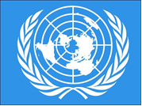

- 1943-yilda
- 1944-yilda
+ 1945-yilda
- 1946-yilda

**960. O‘zbekiston BMT doirasida jahon hamjamiyatini qayerdagi mojaroni tinch yo‘l bilan hal qilishga da’vat etgan?**

+ Afg‘oniston
- Pokiston
- Checheniston
- Armaniston

**961. YUNESKO ning “Inson va biosfera”, Karlos Finley mukofotlari bilan taqdirlangan, L’Oreal “Olima ayollar” stipendiyasiga sazovor bo‘lgan o‘zbekistonlik mikrobiolog olima kim?**

- Shaxlo Turdiqulova
- Yulduz Ergasheva
- Dilorom Alimova
+ Dilfuza Egamberdiyeva

**962. Qachon O‘zbekiston Respublikasi YUNESKO a’zoligiga qabul qilingan?**

- 1991-yilda
- 1992-yilda
+ 1993-yilda
- 1994-yilda

**963. Qachon O‘zbekiston Mustaqil Davlatlar Hamdo‘stligi (MDH) ga qabul qilingan?**

+ 1991-yil 21-dekabrda
- 1992-yil 2-martda
- 1993-yil 26-oktyabrda
- 1994-yil 11-yanvarda

**964. Qachon O‘zbekiston YUNESKO a’zoligiga qabul qilingan?**

- 1991-yil 21-dekabrda
- 1992-yil 2-martda
+ 1993-yil 26-oktyabrda
- 1994-yil 11-yanvarda

**965. Qachon O‘zbekiston Prezidenti Shavkat Mirziyoyev tashabbusi bilan BMT Bosh Assambleyasining “10-iyunni Xalqaro sivilizatsiyalar o‘rtasidagi muloqot kuni deb e’lon qilish to‘g‘risida” gi rezolyutsiyasi qabul qilingan?**

- 2018-yilda
- 2020-yilda
- 2022-yilda
+ 2024-yilda

**966. O‘zbekiston Prezidenti Shavkat Mirziyoyev tashabbusi bilan BMT Bosh Assambleyasining qancha rezolyutsiyasi qabul qilingan?**

+ O‘ndan ortiq
- Yigirmadan ortiq
- O‘ttizdan ortiq
- Qirqdan ortiq

**967. Qachon YUNESKO hamkorligida Abu Rayhon Beruniy tavalludining 1050 yilligi nishonlangan?**

- 2022-yilda
- 2023-yilda
+ 2024-yilda
- 2025-yilda

**968. Markaziy Osiyo yadro qurolidan xoli hudud deb e’lon qilinishi tashabbusi ilk bor O‘zbekistonning Birinchi Prezidenti Islom Karimov tomonidan BMT Bosh Assambleyasining nechanchi sessiyasida ilgari surilgan?**

+ 48-sessiyasida
- 50-sessiyasida
- 52-sessiyasida
- 54-sessiyasida

**969. O‘zbekistonda saqlanayotgan muqaddas Usmon mus’hafi va Fanlar akademiyasi Sharqshunoslik institutidagi qo‘lyozmalar, “Buxoro amiri qushbegi devonxonasi” deb nomlangan arxiv fondi YUNESKO ning qaysi dasturiga kiritilgan?**

+ “Jahon xotirasi”
- “BMT ning aql laboratoriyasi”
- “Nomoddiy madaniy meros”
- “Insoniyat vijdoni”

**970. Qachon O‘zbekiston Prezidenti Shavkat Mirziyoyev tashabbusi bilan BMT Bosh Assambleyasining “Ma’rifat va diniy bag‘rikenglik to‘g‘risida” gi rezolyutsiyasi qabul qilingan?**

+ 2018-yilda
- 2020-yilda
- 2022-yilda
- 2024-yilda

**971. YUNESKO bilan hamkorlikda qaysi shaharda Xalqaro maqom san’ati forumi tashkil etilmoqda?**

- Qarshi
+ Shahrisabz
- Buxoro
- Marg‘ilon

**972. “Urush haqidagi g‘oyalar kishilar ongida paydo bo‘ladi, shuning uchun insonlar ongiga tinchlikni himoya qilish g‘oyasini singdirish kerak”. Ushbu jumlalar qaysi tashkilot nizomidan olingan?**

- Jahon banki guruhi
- Jahon sog‘liqni saqlash tashkiloti
+ YUNESKO
- YUNISEF

**973. YUNESKO bilan hamkorlikda qaysi shaharda “Ipak va ziravorlar” festivali tashkil etilmoqda?**

- Qarshi
- Shahrisabz
+ Buxoro
- Marg‘ilon

**974. Qachon O‘zbekiston Shanxay hamkorlik tashkiloti (SHHT) ga a’zo bo‘lgan?**

- 1998-yil 22-martda
- 1999-yil 3-fevralda
- 2000-yil 28-sentyabrda
+ 2001-yil 15-iyunda

**975. Qaysi yildan boshlab O‘zbekiston va BMT munosabatlarida yangi davr boshlangan?**

- 2016-yildan
+ 2017-yildan
- 2018-yildan
- 2019-yildan

**976. Qaysi yildan buyon O‘zbekiston tashabbusi bilan har ikki yilda YUNESKO hamkorligida Samarqandda “Sharq taronalari” xalqaro musiqa festivali o‘tkazib kelinadi?**

+ 1997-yildan
- 1999-yildan
- 2001-yildan
- 2003-yildan

**977. Qachon Samarqandda YUNESKO ning Markaziy Osiyo tadqiqotlari xalqaro instituti tashkil etilgan?**

- 1992-yilda
- 1993-yilda
- 1994-yilda
+ 1995-yilda

**978. O‘zbekiston Prezidenti Shavkat Mirziyoyev 2017-2025-yillarda BMT Bosh Assambleyasida necha marotaba nutq so‘zlagan?**

- Ikki marotaba
- Uch marotaba
- To‘rt marotaba
+ Besh marotaba

**979. O‘zbekiston tashabbusi bilan BMT doirasida Markaziy Osiyo ...dan xoli hudud deb e’lon qilingan.**

- terrorizm
+ yadro quroli
- narkotik moddalar
- ekstremizm

**980. Qachon O‘zbekiston Prezidenti Shavkat Mirziyoyev BMT Bosh Assambleyasining 80-yubiley sessiyasidagi nutqida Markaziy Osiyo va umumjahon miqyosidagi dolzarb muammolarga e’tibor qaratgan?**

- 2022-yilda
- 2023-yilda
- 2024-yilda
+ 2025-yilda

**981. BMT doirasida Markaziy Osiyo yadro qurolidan xoli hudud deb e’lon qilinishi tashabbusi ilk bor O‘zbekistonning Birinchi Prezidenti Islom Karimov tomonidan qachon ilgari surilgan?**

- 1991-yilda
- 1992-yilda
+ 1993-yilda
- 1994-yilda

**982. Qachon BMT Bosh Assambleyasining rezolyutsiyasi asosida Markaziy Osiyo rasman yadro qurolidan xoli hudud deb e’lon qilingan?**

- 2000-yilda
- 2002-yilda
- 2004-yilda
+ 2006-yilda

**983. Qachon YUNESKO hamkorligida Amir Temur tavalludining 660 yilligi nishonlangan?**

- 1994-yilda
+ 1996-yilda
- 1998-yilda
- 2000-yilda

**984. Qachon O‘zbekiston Turkiy davlatlar tashkiloti (TDT) sammitida ilk bor to‘la huquqli a’zo sifatida ishtirok etgan?**

+ 2019-yil 15-oktyabrda
- 2020-yil 22-martda
- 2021-yil 21-dekabrda
- 2022-yil 3-fevralda

**985. Qaysi ajdodlarimiz yubiley sanalari YUNESKO qarorgohida keng nishonlangan? 1) Mirzo Ulug‘bek; 2) Amir Temur; 3) Abu Rayhon Beruniy.**

- 1, 2
- 1, 3
- 2, 3
+ 1, 2, 3

**986. Qaysi yillarda O‘zbekiston Prezidenti Shavkat Mirziyoyev YUNESKO bosh qarorgohida bo‘lib, tashkilot Bosh direktori Odri Azule bilan uchrashgan?**

- 2015 va 2022-yillarda
- 2016 va 2023-yillarda
- 2017 va 2024-yillarda
+ 2018 va 2025-yillarda

**987. Qachon YUNESKO hamkorligida Mirzo Ulug‘bek tavalludining 600 yilligi nishonlangan?**

+ 1994-yilda
- 1996-yilda
- 1998-yilda
- 2000-yilda

**988. Qachon O‘zbekiston tashabbusi bilan BMT ning Orolbo‘yi mintaqasi uchun maxsus trest fondi tashkil etilgan?**

+ 2018-yilda
- 2020-yilda
- 2022-yilda
- 2024-yilda

## 22-mavzu. O‘zbekistonning mintaqaviy tashkilotlar doirasida ko‘ptomonlama munosabatlari.

**989. O‘zbekiston qaysi deklaratsiyasiga binoan Mustaqil Davlatlar Hamdo‘stligi (MDH) ga a’zo bo‘lgan?**

- Kiyev Deklaratsiyasiga
- Minsk Deklaratsiyasiga
- Moskva Deklaratsiyasiga
+ Olmaota Deklaratsiyasiga

**990. Shanxay hamkorlik tashkiloti (SHHT) ga (2025-yil holatiga ko‘ra) qaysi davlatlar a’zo bo‘lgan? 1) Xitoy; 2) Rossiya; 3) Qozog‘iston; 4) Qirg‘iziston; 5) Tojikiston; 6) O‘zbekiston; 7) Hindiston; 8) Pokiston; 9) Eron; 10) Belarus; 11) Mo‘g‘uliston; 12) Afg‘oniston.**

- 1, 2, 3, 4, 5, 6, 7, 9, 10
+ 1, 2, 3, 4, 5, 6, 7, 8, 9, 10
- 1, 2, 3, 4, 5, 6, 7, 8, 9, 10, 11
- 1, 2, 3, 4, 5, 6, 7, 8, 9, 10, 11, 12

**991. Muayyan qit’a, mintaqa yoki hudud miqyosida faoliyat yuritadigan a’zo davlatlardan iborat tuzilmalar ... tashkilotlar deb ataladi.**

- transkontinental
- subregion
+ mintaqaviy
- mahalliy

**992. Shanxay hamkorlik tashkiloti (SHHT) ning rasmiy tillarini toping.**

+ Xitoy va rus tillari
- Rus va qozoq tillari
- Qozoq va tojik tillari
- Tojik va xitoy tillari

**993. Mustaqil Davlatlar Hamdo‘stligi (MDH) ning bosh organi qarorgohi qaysi shaharda joylashgan?**

- Moskva
+ Minsk
- Kiyev
- Olmaota

**994. Qachon O‘zbekiston Prezidenti Shavkat Mirziyoyev tashabbusi bilan Turkiy davlatlar tashkiloti doirasida Alisher Navoiy nomidagi xalqaro mukofot ta’sis etilgan?**

- 2019-yilda
- 2020-yilda
+ 2021-yilda
- 2022-yilda

**995. Qaysi yil O‘zbekiston tashabbusi bilan “Turkiy sivilizatsiyaning yuksalish yili” deb e’lon qilingan?**

- 2022-yil
+ 2023-yil
- 2024-yil
- 2025-yil

**996. Qachon “Shanxay beshligi” muloqot mexanizmi Shanxay hamkorlik tashkiloti (SHHT) sifatida qayta tashkil etilgan?**

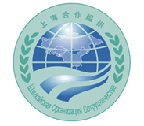

- 1996-yilda
- 1999-yilda
+ 2001-yilda
- 2004-yilda

**997. Turkiy davlatlar tashkiloti dastlab qaysi yilda Turkiy tilli davlatlar kengashi nomi bilan tashkil etilgan?**

- 2006-yilda
- 2007-yilda
- 2008-yilda
+ 2009-yilda

**998. “Tashkilot siyosat, xavfsizlik, parlamentlararo munosabatlar, chegara, savdo-iqtisodiy, madaniy-gumanitar, ilmiy-texnik sohalarda hamkorlikni rivojlantiradi”. Yuqoridagi jumlalar qaysi tashkilot haqida?**

+ Mustaqil Davlatlar Hamdo‘stligi (MDH)
- Shanxay hamkorlik tashkiloti (SHHT)
- Turkiy davlatlar tashkiloti (TDT)
- Birlashgan Millatlar Tashkiloti (BMT)

**999. Qaysi yildan O‘zbekiston va MDH hamkorligining yangi sahifalari ochilgan?**

- 2016-yildan
+ 2017-yildan
- 2018-yildan
- 2019-yildan

**1000. Qaysi davlatlar Turkiy davlatlar tashkiloti (TDT) da kuzatuvchi a’zo mamlakatlar hisoblanadi?**

- Ozarbayjon va Vengriya
+ Vengriya va Turkmaniston
- Turkmaniston va Qozog‘iston
- Qozog‘iston va Ozarbayjon

**1001. Qachon Buxoro shahri “Turkiy dunyo yoshlar poytaxti” maqomiga ega bo‘lgan?**

+ 2022-yilda
- 2023-yilda
- 2024-yilda
- 2025-yilda

**1002. O‘zbekiston SHHT faoliyatida qachondan ishtirok etib kelmoqda?**

- 1996-yil apreldan
- 1999-yil maydan
+ 2001-yil iyundan
- 2004-yil iyuldan

**1003. Qachon O‘zbekiston Turkiy davlatlar tashkiloti (TDT) ga a’zo bo‘lgan?**

+ 2019-yilda
- 2020-yilda
- 2021-yilda
- 2022-yilda

**1004. Shanxay hamkorlik tashkiloti (SHHT) ning Mintaqaviy aksilterror tuzilmasi qaysi shaharda faoliyat yuritadi?**

- Bishkek
- Olmaota
- Dushanbe
+ Toshkent

**1005. Shanxay hamkorlik tashkiloti (SHHT) da (2025-yil holatiga ko‘ra) qaysi davlatlar kuzatuvchi maqomiga ega?**

+ Mo‘g‘uliston va Afg‘oniston
- Afg‘oniston va Hindiston
- Hindiston va Pokiston
- Pokiston va Mo‘g‘uliston

**1006. Mustaqil Davlatlar Hamdo‘stligi (MDH) qachon tashkil qilingan?**

- 1991-yil 8-dekabrda
+ 1991-yil 21-dekabrda
- 1992-yil 21-yanvarda
- 1992-yil 8-yanvarda

**1007. Qachon Xitoy, Rossiya, Qozog‘iston, Qirg‘iziston va Tojikiston Shanxay shahrida chegara hududlarida o‘zaro ishonchni mustahkamlash maqsadida bitim imzolagan va shu asosda “Shanxay beshligi” muloqot mexanizmi shakllangan?**

+ 1996-yilda
- 1999-yilda
- 2001-yilda
- 2004-yilda

**1008. Qachon Rossiya, Belarus, Ukraina davlat rahbarlari o‘zaro hamdo‘stlik tuzish to‘g‘risida bitim imzolagan?**

+ 1991-yil 8-dekabrda
- 1991-yil 21-dekabrda
- 1992-yil 21-yanvarda
- 1992-yil 8-yanvarda

**1009. Qaysi yilda Ostona sammitida Hindiston va Pokiston SHHT ga rasman a’zo bo‘lganlar?**

- 2016-yilda
+ 2017-yilda
- 2018-yilda
- 2019-yilda

**1010. Qachon O‘zbekiston Respublikasi Prezidenti Shavkat Mirziyoyev Budapesht (Vengriya) shahrida bo‘lib o‘tgan Turkiy davlatlar tashkilotining norasmiy sammitida ishtirok etgan?**

- 2022-yilda
- 2023-yilda
- 2024-yilda
+ 2025-yilda

**1011. Necha jildli “Turkiy adabiyot durdonalari” to‘plami o‘zbek tilida nashr qilingan?**

- 80 jildli
- 90 jildli
+ 100 jildli
- 110 jildli

**1012. Qaysi yilda SHHT ga raisligi davrida O‘zbekiston tashabbusi bilan BMT va SHHT hamkorligi to‘g‘risidagi rezolyutsiya qabul qilingan?**

- 2005-yilda
- 2007-yilda
+ 2009-yilda
- 2011-yilda

**1013. Qachon Samarqandda Turkiy davlatlar tashkiloti sammiti bo‘lib o‘tgan va sammit doirasida Samarqand deklaratsiyasi qabul qilingan?**

+ 2022-yilda
- 2023-yilda
- 2024-yilda
- 2025-yilda

**1014. Turkiy davlatlar tashkiloti (TDT) ning ishchi tillari qaysilar? 1) Turk tili; 2) O‘zbek tili; 3) Ozarbayjon tili; 4) Qirg‘iz tili; 5) Qozoq tili; 6) Ingliz tili.**

- 1, 3, 4, 5, 6
- 1, 2, 4, 5
- 2, 3, 4, 5
+ 1, 2, 3, 4, 5, 6

**1015. Qaysi yilda bo‘lib o‘tgan SHHT ning Samarqand sammiti o‘zbek diplomatiyasi va tashqi siyosatining muhim yutuqlaridan biri bo‘lgan hamda dunyoda muloqot va hamkorlik muhimligini isbotlagan holda “Shanxay ruhi” va “Samarqand ruhi” tushunchalarini uyg‘unlashtirgan?**

+ 2022-yilda
- 2023-yilda
- 2024-yilda
- 2025-yilda

**1016. Qachon Toshkentda SHHT ning Xalq diplomatiyasi markazi tashkil etilgan?**

- 2016-yilda
- 2017-yilda
+ 2018-yilda
- 2019-yilda

**1017. Qachon Alisher Navoiy nomidagi xalqaro mukofot ilk bor turkiy dunyo birligiga qo‘shgan hissasi uchun buyuk adib va jamoat arbobi, qirg‘iz yozuvchisi (marhum) Chingiz Aytmatovga berilgan?**

- 2019-yilda
- 2020-yilda
- 2021-yilda
+ 2022-yilda

**1018. “O‘zbekiston ushbu tashkilot doirasida xavfsizlik, savdo-iqtisodiy, transport-kommunikatsiya, madaniy-gumanitar sohalarda hamkorlik olib boradi”. Yuqoridagi jumlalar qaysi tashkilot haqida?**

- Mustaqil Davlatlar Hamdo‘stligi (MDH)
+ Shanxay hamkorlik tashkiloti (SHHT)
- Turkiy davlatlar tashkiloti (TDT)
- Birlashgan Millatlar Tashkiloti (BMT)

**1019. Mustaqil Davlatlar Hamdo‘stligi (MDH) qaysi shaharda tashkil qilingan?**

- Moskva
- Minsk
- Kiyev
+ Olmaota

**1020. Qachon Samarqand shahri “Turkiy sivilizatsiya poytaxti” deb e’lon qilingan?**

+ 2022-yilda
- 2023-yilda
- 2024-yilda
- 2025-yilda

**1021. SHHT ga a’zo mamlakatlar umumiy aholisi dunyo aholisining qariyb ... demakdir.**

- nimchoragi
- choragi
+ yarmi
- yarmidan ko‘pi

**1022. SHHT davlatlarining umumiy hududi Yevrosiyo hududining qancha foizini tashkil qiladi?**

- 45 foizini
- 55 foizini
+ 65 foizini
- 75 foizini

**1023. Mustaqil Davlatlar Hamdo‘stligi (MDH) ning bosh organi qaysi?**

- Vakillik kengashi
- Muvaqqat komissiya
- Oliy kollegiya
+ Ijroiya qo‘mitasi

**1024. Shanxay hamkorlik tashkiloti (SHHT) ga (2025-yil holatiga ko‘ra) nechta davlat a’zo bo‘lgan?**

- To‘qqizta
+ O‘nta
- O‘n bitta
- O‘n ikkita

**1025. Mustaqil Davlatlar Hamdo‘stligi (MDH) nechta mustaqil davlat rahbarlari tomonidan tashkil qilingan?**

- To‘qqizta
- O‘nta
+ O‘n bitta
- O‘n ikkita

**1026. Qaysi davlatlar Turkiy davlatlar tashkiloti (TDT) ga a’zo hisoblandi? 1) Ozarbayjon; 2) Turkiya; 3) Vengriya; 4) Turkmaniston; 5) Qozog‘iston; 6) Qirg‘iziston; 7) O‘zbekiston.**

- 1, 2, 3, 5
+ 1, 2, 5, 6, 7
- 2, 3, 4, 5, 7
- 1, 3, 5, 6

**1027. Qaysi yilda O‘zbekiston raisligida bo‘lib o‘tgan Toshkent sammitida Hindiston va Pokistonning SHHT ga a’zo davlat maqomini olishi bo‘yicha tegishli hujjatlar imzolangan?**

+ 2016-yilda
- 2017-yilda
- 2018-yilda
- 2019-yilda

**1028. Qachon O‘zbekiston Mustaqil Davlatlar Hamdo‘stligi (MDH) ga a’zo bo‘lgan?**

- 1991-yil 8-dekabrda
+ 1991-yil 21-dekabrda
- 1992-yil 21-yanvarda
- 1992-yil 8-yanvarda

**1029. Qachon va qayerda bo‘lib o‘tgan Mustaqil Davlatlar Hamdo‘stligi (MDH) sammitida tashkilotning nizomi qabul qilingan?**

- 1991-yil, Olmaotada
- 1992-yil, Moskvada
+ 1993-yil, Minskda
- 1994-yil, Kiyevda

**1030. Qachon Xiva shahri “Turkiy dunyo madaniyati poytaxti” deb e’lon qilingan?**

- 2019-yilda
+ 2020-yilda
- 2021-yilda
- 2022-yilda

**1031. O‘zbekiston 2001-2025-yillar oralig‘ida necha marotaba SHHT ga raislik qilgan?**

- Bir marotaba
- Ikki marotaba
- Uch marotaba
+ To‘rt marotaba

**1032. Qaysi yilda O‘zbekiston MDH ga raislik qilgan?**

- 2018-yilda
- 2019-yilda
+ 2020-yilda
- 2021-yilda

**1033. Budapesht (Vengriya) shahrida bo‘lib o‘tgan Turkiy davlatlar tashkilotining norasmiy sammitida O‘zbekiston Respublikasi Prezidenti Shavkat Mirziyoyev o‘z nutqida dolzarb xalqaro muammolarni hal etishda, birinchi navbatda, xalqaro huquq normalari va ... Nizomiga tayangan holda tashkilot davlatlarining umumiy yondashuv va pozitsiyalarini mustahkamlash muhimligini qayd etgan.**

- TDT
- SHHT
+ BMT
- MDH

**1034. Qachon O‘zbekiston Respublikasi Prezidenti Shavkat Mirziyoyev Xitoyning Tyanszin shahrida SHHT yig‘ilishida ishtirok etgan?**

- 2022-yilda
- 2023-yilda
- 2024-yilda
+ 2025-yilda

**1035. Mustaqil Davlatlar Hamdo‘stligi (MDH) ning ayrim tuzilmalari qaysi shaharda joylashgan?**

+ Moskva
- Minsk
- Kiyev
- Olmaota

**1036. Qaysi davlat a’zo bo‘lishi bilan “Shanxay beshligi” muloqot mexanizmi Shanxay hamkorlik tashkiloti (SHHT) sifatida qayta tashkil etilgan?**

- Qozog‘iston
- Qirg‘iziston
- Tojikiston
+ O‘zbekiston

**1037. Mustaqil Davlatlar Hamdo‘stligi (MDH) qaysi davlatlar tomonidan tashkil qilingan? 1) Ruminiya; 2) Ozarbayjon; 3) Armaniston; 4) Belarus; 5) Qozog‘iston; 6) Qirg‘iziston; 7) Moldova; 8) Rossiya; 9) Ukraina; 10) Tojikiston; 11) Turkmaniston; 12) O‘zbekiston; 13) Estoniya.**

- 3, 5, 6, 7, 8, 9, 10, 12, 13
- 1, 3, 4, 5, 6, 7, 8, 9, 11, 13
+ 2, 3, 4, 5, 6, 7, 8, 9, 10, 11, 12
- 1, 2, 3, 4, 5, 6, 7, 8, 9, 10, 11, 12

**1038. Xitoyning Tyanszin shahridagi SHHT yig‘ilishida O‘zbekiston Prezidenti Shavkat Mirziyoyev o‘z nutqida ko‘ptomonlama hamkorlikda ... formati ishonchli muloqot maydoniga aylanib borayotganini ta’kidlagan.**

- “MDH plyus”
+ “SHHT plyus”
- “TDT plyus”
- “BMT plyus”

**1039. Qachon Alisher Navoiy nomidagi xalqaro mukofotga taniqli turk biokimyogari, Nobel mukofoti sovrindori Aziz Sanjar sazovor bo‘lgan?**

- 2022-yilda
- 2023-yilda
- 2024-yilda
+ 2025-yilda

**1040. Turkiy tilli davlatlar kengashi nomi qaysi yilda Turkiy davlatlar tashkiloti (TDT) deb o‘zgartirilgan?**

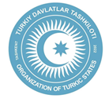

- 2020-yilda
+ 2021-yilda
- 2022-yilda
- 2023-yilda