# 6-sinf Qadimgi dunyo tarixi (2022-yil darsligi)

_Tarix (Mavzulashgan) (2022-2025-yillar darsliklari)_

## 1-§ Qadimgi tarix ildizlari.

**1. “Matriarxat” nima?**

+ Ona urug‘i davri
- Ota urug‘i davri
- Ilk podsholik davri
- Urug‘chilik davri

**2. O‘rta Osiyo tarixi bo‘yicha eng qadimgi yozma manba qaysi?**

- Xitoy solnomalari
- Behistun qoyasi yozuvlari
- Yunon manbalari
+ “Avesto” kitobi

**3. Yunoncha “litos” so‘zi qanday ma’noni anglatadi?**

- Temir
- Mis
+ Tosh
- Oltin

**4. Ibtidoiy jamoalar asta-sekin … urug‘laridan iborat alohida urug‘ jamoalariga bo‘lina boshladi.**

+ qarindosh
- qabiladosh
- kasbdosh
- yondosh

**5. Behistun qoyasi yozuvlari qayerda joylashgan?**

- Pokistonda
+ Eronda
- Afg‘onistonda
- Turkmanistonda

**6. Nima sababdan arxeologlar insoniyat tarixining boshlanishini “tosh davri” deb atashgan?**

- Eng qadimgi odamlar asosan toshlarga surat tushirganligi sababli
- Eng qadimgi odamlar dastlabki taqinchoqlarni toshlardan yasaganligi sababli
- Eng qadimgi odamlar qoldiqlari toshga aylanib qolganligi sababli
+ Eng qadimgi odamlar dastlabki mehnat qurollarini toshlardan yasaganligi sababli

**7. “Qadimgi dunyo tarixi” qaysi davrlarni o‘z ichiga oladi?**

- Yer yuzida odam paydo bo`lganidan 478-yilda Rim imperiyasi qulaguniga qadar bo‘lgan davr
- Antik davr boshlanishidan Makedoniyalik Iskandar yurishlarigacha bo‘lgan davr
+ Yer yuzida odam paydo bo‘lganidan 476-yilda G‘arbiy Rim imperiyasi qulaguniga qadar bo`lgan davr
- Rim shahri paydo bo‘lganidan 1453-yilda Vizantiya imperiyasi qulaguniga qadar bo‘lgan davr

**8. Qadimgi yunon tarixchisi Gerodot qachon yashagan?**

- Miloddan avvalgi II asrda
- Miloddan avvalgi IV asrda
+ Miloddan avvalgi V asrda
- Miloddan avvalgi III asrda

**9. Qaysi soha mutaxassislari qadimgi odamlarning ko‘pgina urf-odatlari, xo‘jalik va madaniy an’analarini saqlab qolgan, hozirda yashayotgan qabilalar va elatlarni o‘rganishadi?**

- Arxeologlar
+ Etnograflar
- Antropologlar
- Lingvistlar

**10. Ilk urug‘ jamoalari … atrofida birlashgan.**

+ ayol
- erkak
- kohin
- sarkarda

**11. Quyidagi suratda kim tasvirlangan?**

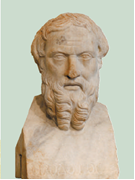

- Plutarx
+ Geradot
- Strabon
- Arrian

**12. Mezolit nima?**

- Yangi tosh davri
- Mis-tosh davri
- Qadimgi tosh davri
+ O‘rta tosh davri

**13. To‘g‘ri javobni toping.**

+ Yunoncha paleos – “qadimgi”, yunoncha mezos – “o‘rta”, yunoncha neos – “yangi”, lotincha eneus – “mis”
- Yunoncha paleos – “yangi”, yunoncha mezos – “o‘rta”, yunoncha neos – “qadimgi”, lotincha eneus – “mis”
- Yunoncha paleos – “qadimgi”, yunoncha mezos – “o‘rta”, yunoncha neos – “mis”, lotincha eneus – “yangi”
- Lotincha paleos – “qadimgi”, yunoncha mezos – “o’rta”, yunoncha neos – “yangi”, yunoncha eneus – “mis”

**14. Arxeologik qazishmalar davomida topilgan mehnat qurollari, sopol idishlar, qurol-aslahalar va zeb-ziynat buyumlari, xullas, qadimda inson qo‘li bilan yaratilgan barcha narsalar qanday ataladi?**

- Ma’naviy manbalar
- Tarixiy manbalar
+ Moddiy (ashyoviy) manbalar
- Antropologik manbalar

**15. Neolit nima?**

+ Yangi tosh davri
- Mis-tosh davri
- Qadimgi tosh davri
- O‘rta tosh davri

**16. Nima sababdan jamoadagi yetakchilik mavqeyi asta-sekin ayoldan erkak kishiga o‘ta boshlagan?**

- O‘zaro urushlar avj olganligi sababli
- Ayollar uy ishlariga ko‘proq e’tibor qaratganligi sababli
+ Mehnat qurollari va xo‘jalik yuritish shakllari takomillashgani sababli
- Barcha javoblar to‘g‘ri

**17. Qaysi soha mutaxassislari qadim zamonlarda odamlar yashagan manzilgohlarda va turarjoylarda qazishma ishlarini amalga oshiradilar?**

+ Arxeologlar
- Etnograflar
- Antropologlar
- Lingvistlar

**18. Jahondagi barcha xalqlarning tarixi qaysi tuzumdan boshlangan?**

- Feodalizmdan
- Matriarxatdan
- Patriarxatdan
+ Ibtidoiy jamoa tuzumidan

**19. Quyidagi suratda nima tasvirlangan?**

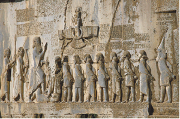

- “Avesto” kitobining qoyaga o‘yib yozilgan qismi
- Kirmonshoh bitiklari
+ Behistun qoyasi yozuvlari va bo‘rtma tasvirlari
- Naqshi Rustam yozuvlari

**20. Behistun qoyasi yozuvlari qaysi fors shohi buyrug‘iga binoan yozilgan?**

+ Doro I
- Doro III
- Kir II
- Kserks

**21. “Geografiya” nomli asar muallifi kim?**

- Plutarx
- Geradot
+ Strabon
- Arrian

**22. “Patriarxat” nima?**

- Ona urug‘i davri
+ Ota urug‘i davri
- Ilk podsholik davri
- Urug‘chilik davri

**23. Paleolit nima?**

- Yangi tosh davri
- Mis-tosh davri
+ Qadimgi tosh davri
- O‘rta tosh davri

**24. “Tarix” nomli asarni kim yozgan?**

- Plutarx
+ Geradot
- Strabon
- Arrian

**25. Yunon tarixchisi Arrian qachon yashagan?**

- Milodiy I asrda
+ Milodiy II asrda
- Milodiy III asrda
- Milodiy IV asrda

**26. Yunon tarixchisi va geografi Strabon qachon yashagan?**

- Mil. avv. I asr boshlarida
+ Mil. avv. I asr oxirlarida
- Milodiy I asr boshlarida
- Milodiy I asr oxirlarida

**27. Eneolit nima?**

- Yangi tosh davri
+ Mis-tosh davri
- Qadimgi tosh davri
- O‘rta tosh davri

**28. Makedoniyalik Aleksandrning O‘rta Osiyoga qilgan harbiy yurishlari haqida “Aleksandrning harbiy yurishlari” nomli asarni kim yozgan?**

- Plutarx
- Geradot
- Strabon
+ Arrian

**29. Qaysi soha mutaxassislari qadimgi odamlarning suyak qoldiqlari (skelet va bosh chanoqlari) ni sinchiklab tekshirib, ularning tashqi ko‘rinishini tiklaydilar, ming yillar avvalgi kishilarning tashqi qiyofasida ro‘y bergan o‘zgarishlarni o‘rganadilar?**

- Arxeologlar
- Etnograflar
+ Antropologlar
- Lingvistlar

**30. Quyidagi suratda kim tasvirlangan?**

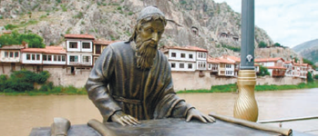

- Plutarx
- Geradot
+ Strabon
- Arrian

## 2-§ Eng qadimgi odamlarning rivojlanish bosqichlari.

**31. “Ishbilarmon odam” suyaklari qoldiqlari qayerdan topib o‘rganilgan?**

+ Sharqiy Afrikadan
- G‘arbiy Afrikadan
- Janubiy Afrikadan
- Shimoliy Afrikadan

**32. Qadimgi odamlarning u yoki bu buyumlar omad keltirishiga yoxud balo-qazoni daf qilishiga ishonishi qanday nomlanadi?**

- Animizm
+ Fetishizm
- Totemizm
- Buddizm

**33. Olimlar eng qadimgi odamni qanday atashgan?**

- “Uddaburon odam”
+ “Ishbilarmon odam”
- “Aqlli odam”
- “Tik yuruvchi odam”

**34. Qachon “Buyuk muzlik davri” boshlangan?**

- Ilk paleolit davrining boshlariga kelib
+ Ilk paleolit davrining oxirlariga kelib
- Mezolit davrining boshlariga kelib
- Mezolit davrining oxirlariga kelib

**35. Yer yuzida iqlim iliq bo‘lgan davrlarda odamlar asosan qayerlarda yashashgan?**

- G‘orlarda va tog‘ yon bag‘irlarida
- O‘zlari qurgan yarim yerto‘la uylarda
+ Mayda daryolar yoki buloqlar yaqinidagi tepaliklarda
- O‘rmonlar yoki dalalarda

**36. Lasko g‘ori qayerda joylashgan?**

- Ispaniyada
+ Fransiyada
- Boshqirdistonda
- Rossiyada

**37. “Chopper” deb nimalarga aytiladi?**

+ Bir tomoni urib o‘tkirlangan qo‘pol tosh qurollarga
- Ikki tomoni urib o‘tkirlangan qo‘pol tosh qurollarga
- Silliq qilib taroshlangan tosh qurollarga
- Ilk metalldan yasalgan qurollarga

**38. O‘rta Osiyoda toshdan yasalgan qadimiy mehnat qurollari qayerlardan topilgan?**

- Obishir, Qo‘shilish
+ Selungur, Ko‘lbuloq
- Qo‘shilish, Selungur
- Ko‘lbuloq, Obishir

**39. Qadimgi tosh davrining navbatdagi bosqichida … deb atalgan qadimgi inson vujudga kelgan.**

- “Uddaburon odam”
- “Ishbilarmon odam”
- “Aqlli odam”
+ “Tik yuruvchi odam”

**40. Selengur manzilgohi qayerda joylashgan?**

- Toshkent viloyatida
+ Farg‘ona vodiysida
- Buxoro viloyatida
- Xorazm vohasida

**41. Teshiktosh g‘oridan topilgan bolaning jasadi atrofiga … qadab chiqilgan.**

- qush patlari
- tosh qurollar
- buqa suyaklari
+ tog‘ echkisi shoxlari

**42. Kapova g‘ori qayerda joylashgan?**

- Ispaniyada
- Fransiyada
+ Boshqirdistonda
- Polshada

**43. “Petroglif” deb nimalarga aytiladi?**

- Takomillashgan tosh qurollarga
+ Toshga chizilgan rasmlarga
- Sopol buyumlarga chizilgan naqshlarga
- Suyaklardan ishlangan taqinchoqlarga

**44. “Ishbilarmon odam” yoshi … yildan oshadi.**

- 1 million
+ 2 million
- 3 million
- 4 million

**45. Quyidagi suratdagi manzilgohlar qaysi davrga oid?**

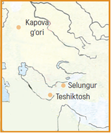

- Mezolit davriga
- Neolit davriga
- Eneolit davriga
+ Paleolit davriga

**46. Teshiktosh g‘ori qayerdan topilgan?**

- Qurama tog‘laridan
- Chotqol tog‘laridan
- Pomir tog‘laridan
+ Boysun tog‘laridan

**47. Yer yuzidagi dastlabki odamlar … .**

- Qaddi-qomatlarini tik tutib yurishgan
- Mehnat qurollarini yasash va ularni ishlatishni bilishgan
- Mehnat qurollari yordamida tabiatdan yegulik topib yeyishgan
+ Barcha javoblar to‘g‘ri

**48. Tarix fanida eng qadimgi odamlar qanday nomlanadi?**

- Ko‘chmanchi odamlar
- Maymun odamlar
- G‘or odamlari
+ Ibtidoiy odamlar

**49. Odamlarning eng qadimiy mashg‘ulotlari – meva-ildizlarni terish va ov qilish qanday atalgan?**

- Ibtidoiy xo‘jalik
- Ko‘chmanchi xo‘jalik
+ O‘zlashtiruvchi xo‘jalik
- Sodda xo‘jalik

**50. Qaysi odam chaqmoq zarbidan yong‘in chiqqan o‘rmondagi tabiiy olovdan foydalanishni bilib olgan?**

- “Uddaburon odam”
- “Ishbilarmon odam”
- “Aqlli odam”
+ “Tik yuruvchi odam”

**51. “Dastlabki qoya tasvirlarini arxeologning qizalog‘i kashf qilgan. Ota ibtidoiy odamning mehnat qurollarini to‘plash bilan band bo‘lganida, qizaloq g‘orni kezib yurib, to‘satdan ibtidoiy odamlar chizgan rasmlarni topgan”. Ushbu voqea qayerda sodir bo‘lgan?**

- Fransiyaning Lasko g‘orida
- Germaniyaning Neandertal g‘orida
+ Ispaniyaning Altamira g‘orida
- Boshqirdistonning Kapova g‘orida

**52. “Ishbilarmon odam” … .**

- Yog‘och va toshlar yordamida sun’iy olov hosil qilishni bilgan
- Chaqmoq zarbidan yong‘in chiqqan o‘rmondagi tabiiy olovdan foydalanishni bilgan
+ Toshdan o‘ta sodda mehnat qurollari yasashni bilgan
- Sodda tipdagi uy-joy qurishni bilgan

**53. Teshiktosh g‘ori topilmalari orasidan necha yashar neandertal bolaning suyak qoldiqlari topilgan?**

- 7-8 yashar
- 9-10 yashar
+ 8-9 yashar
- 6-7 yashar

**54. Odamlar guruhi jamoasining biror hayvon yoki o‘simlik turi bilan qarindoshlik aloqasiga ishonish qanday nomlanadi?**

- Animizm
- Fetishizm
+ Totemizm
- Buddizm

**55. Qaysi davrga oid g‘orlar devorlaridagi rasmlarning topilishi qadimgi odamlarda diniy e’tiqodlar bo‘lganining isbotidir?**

- Ik paleolit
- O‘rta paleolit
+ So‘nggi paleolit
- Mezolit

**56. Ko‘lbuloq manzilgohi qayerda joylashgan?**

+ Toshkent viloyatida
- Farg‘ona vodiysida
- Buxoro viloyatida
- Xorazm vohasida

**57. Teshiktosh g‘ori topilmalari qaysi davrga taalluqli?**

- Ik paleolit davri (mil. avv. 1 mln.–100-mingyillik)
+ O‘rta paleolit davri (mil. avv. 100–40-mingyillik)
- So‘nggi paleolit davri (mil. avv. 40–12-mingyillik)
- Mezolit davri (mil. avv. 12–7-mingyillik)

**58. Odamni o‘rab turgan muhitdagi har bir narsaning joni va ruhi borligiga ishonish qanday nomlanadi?**

+ Animizm
- Fetishizm
- Totemizm
- Buddizm

**59. Altamira g‘ori qayerda joylashgan?**

+ Ispaniyada
- Fransiyada 
- Boshqirdistonda
- Rossiyada

## 3-§ Urug‘chilik jamiyati.

**60. Qachon inson qadimgi Sharqning turli hududlarida ishlab chiqaruvchi xo‘jaliklar – ziroatchilik va chorvachilikka o‘ta boshlagan?**

- So‘nggi paleolitda
- Mezolitda
+ Neolitda
- Eneolitda

**61. So‘nggi paleolit davri ixtirolari to‘g‘ri berilgan javobni toping. 1) Olov hosil qilish; 2) Taqinchoqlar (munchoq, tumor, uzuk) yasash; 3) O‘q-yoy yasash; 4) Boshpana qurish; 5) Kesuvchi va arralovchi mehnat qurollari yasash.**

- 1, 2, 3, 4
+ 1, 2, 4, 5
- 1, 3, 4, 5
- 2, 3, 4, 5

**62. Arxeologlar neolit davri boshlanishini qanday xodisa bilan belgilaydilar?**

- Hayvonning qo‘lga o‘rgatilishi bilan
- Turarjoylar qurishning boshlanishi bilan
- Yangi turdagi tosh qurollar yasashning boshlanishi bilan
+ Sopol idishlar yasashning kashf etilishi bilan

**63. Qachon odamlar tiriklayin tutib olingan hayvonlar (qo‘zichoqlar, uloqchalar) ni o‘ldirmasdan, yegulik zaxirasi sifatida saqlab qo‘yadigan bo‘lganlar?**

- Ilk paleolitda
- O‘rta paleolitda
- So‘nggi paleolitda
+ Mezolitda

**64. “Qabila” nima?**

+ Bir joyda yashab turgan bir qancha urug‘lar birlashmasi
- Bir joyda yashab turgan bir qancha jamoa birlashmasi
- Harbiy maqsadda birlashgan jamoa
- Talonchilik yurishlari uyushtirish uchun birlashgan jamoa

**65. Yurtimizda so‘nggi paleolit davriga oid manzilgohlar qayerlardan topilgan? 1) Samarqand shahri hududida; 2) Toshkent viloyatida (Ko‘lbuloq); 3) Farg‘ona vodiysida; 4) Boysun tog‘larida; 5) Buxoro viloyatida.**

- 3, 4, 5
- 2, 3, 5
- 1, 3, 4
+ 1, 2, 3

**66. Qaysi davrlarda odam toshdan mayda mehnat qurollari – mikrolitlar yasagan, toshga ishlov berishning oldin ma’lum bo‘lmagan usullari – silliqlash va teshikchalar parmalashni qo‘llay boshlagan?**

- Ilk va o‘rta paleolit davrida
- O‘rta va so‘nggi paleolit davrida
+ Mezolit va neolit davrida
- Neolit va eneolit davrida

**67. O‘rta Osiyoda neolit davri qaysi yillarni o‘z ichiga olgan?**

- Mil. avv. 12–10-mingyilliklarni
- Mil. avv. 8–6-mingyilliklarni
+ Mil. avv. 6–4-mingyilliklarni
- Mil. avv. 4–3-mingyilliklarni

**68. Kromanyon odami qaysi davrda yashagan?**

- Ilk paleolitda
- O‘rta paleolitda
+ So‘nggi paleolitda
- Mezolitda

**69. Qachon odamlar qarindoshlardan tarkib topgan ixcham guruhlar – urug‘ jamoalariga birlashgan?**

- Ilk paleolitda
- O‘rta paleolitda
+ So‘nggi paleolitda
- Mezolitda

**70. Termachilik, ovchilik, baliqchilikni o‘z ichiga olgan xo‘jalik turi qanday nomlanadi?**

+ O‘zlashtiruvchi xo‘jalik
- Ko‘chmanchi xo‘jalik
- Natural xo‘jalik
- Ishlab chiqaruvchi xo‘jalik

**71. Neolit davri ixtirolari to‘g‘ri berilgan javobni toping. 1) Hayvonlarni qo‘lga o‘rgatish; 2) Toshdan mikrolitlar, tolalardan to‘qima, loydan sopol idishlar yasash; 3) Doimiy turarjoylar qurish; 4) O‘troq tumush tarziga o‘tish.**

- 1, 2, 4
- 1, 2, 3
+ 2, 3, 4
- 1, 2, 3, 4

**72. O‘rta Osiyodagi mezolit davriga oid manzilgohlar to‘g‘ri berilgan javobni toping. 1) Obishir (Farg‘ona vodiysi); 2) Ko‘lbuloq (Toshkent viloyati); 3) Qo‘shilish (Toshkent vohasi); 4) Machay (Surxondaryo viloyati).**

- 1, 2, 3
+ 1, 3, 4
- 2, 3, 4
- 1, 2, 3, 4

**73. Kulolchilik va to‘quvchilik qaysi davrning muhim kashfiyotlaridir?**

- Mezolit davrining
+ Neolit davrining
- Eneolit davrining
- Bronza davrining

**74. Mezolit davri ixtirolari to‘g‘ri berilgan javobni toping. 1) O‘q-yoy yasash; 2) Hayvonlarni qo‘lga o‘rgatish; 3) Ibtidoiy ziroatchilik va chorvachilik; 4) Boshpana qurish.**

+ 1, 2, 3
- 1, 3, 4
- 1, 2, 4
- 1, 2, 3, 4

**75. Qachon inson hayvonlarni qo‘lga o‘rgata boshlagan?**

- Ilk paleolitda
- O‘rta paleolitda
- So‘nggi paleolitda
+ Mezolitda

**76. So‘nggi paleolit yillarini to‘g‘ri toping.**

- Mil. avv. 45–15-mingyilliklar
- Mil. avv. 41–10-mingyilliklar
+ Mil. avv. 40–12-mingyilliklar
- Mil. avv. 42–10-mingyilliklar

**77. Turarjoylar (boshpana) qurilishi qaysi davr odamlarining muhim ixtirosi hisoblanadi?**

- Ilk paleolit
- O‘rta paleolit
+ So‘nggi paleolit
- Mezolit

**78. Qachon odamlar kiyim-kechaklarni hayvonlar terisidan tayyorlashni o‘rganganlar?**

- Ilk paleolitda
- O‘rta paleolitda
+ So‘nggi paleolitda
- Mezolitda

**79. Dehqonchilik, chorvachilikni o‘z ichiga olgan xo‘jalik turi qanday nomlanadi?**

- O‘zlashtiruvchi xo‘jalik
- Ko‘chmanchi xo‘jalik
- Natural xo‘jalik
+ Ishlab chiqaruvchi xo‘jalik

**80. Mezolit – o‘rta tosh davri yillarini to‘g‘ri toping.**

+ Mil. avv. 12–7-mingyilliklar
- Mil. avv. 11–5-mingyilliklar
- Mil. avv. 17–2-mingyilliklar
- Mil. avv. 10–5-mingyilliklar

## 4-§ Eneolit va bronza davri.

**81. Qachon qadimgi Sharqda ilk shaharlar va davlatlar vujudga kela boshlagan?**

- Mil. avv. 5-mingyillikda
+ Mil. avv. 4-mingyillikda
- Mil. avv. 3-mingyillikda
- Mil. avv. 2-mingyillikda

**82. Qachon O‘rta Osiyo janubida sun’iy sug‘orishga asoslangan dehqonchilik vujudga kelgan?**

- Temir davrida
- Bronza davrida
- Neolit davrida
+ Eneolit davrida

**83. Qachon sopol idishlar hayvon va qushlarning tasvirlari va o‘simlik naqshlari (yaproqlar, gullar) bilan bezatila boshlangan?**

- Temir davrida
- Bronza davrida
- Neolit davrida
+ Eneolit davrida

**84. Sopollitepa manzilgohi qaysi davrga oid?**

+ Mil. avv. 3-mingyillik oxirlari – 2-ming yillikka
- Mil. avv. 3-mingyillik boshlari – 2-ming yillikka
- Mil. avv. 3-mingyillik o‘rtalari – 2-ming yillikka
- Mil. avv. 2-mingyillik oxirlari – 1-ming yillikka

**85. Qaysi davrda yurtimizning qadimgi aholisi va qadimgi Sharq elatlari o‘rtasida keng madaniy aloqalar boshlangan?**

- Temir davrida
+ Bronza davrida
- Neolit davrida
- Eneolit davrida

**86. Jarqo‘ton manzilgohi qayerda joylashgan?**

- Buxoro viloyati Qorako‘l yaqinida
- Sirdaryo viloyati Boyovut yaqinida
+ Surxondaryo viloyati Sherobod yaqinida
- Farg‘ona viloyati Beshariq yaqinida

**87. “… bronza davriga oid shahar ko‘rinishiga ega qal’a bo‘lib, uning ichi va atrofida jamoa a’zolari bo‘lmish hunarmand va dehqonlarning uylari joylashgan. Qal’a ichidan jamoa sardorining saroy qoldiqlari topilgan”. Yuqoridagi jumlalar qaysi manzilgoh haqida?**

- Zamonbobo
+ Jarqo‘ton
- Sopollitepa
- Qo‘yqirilganqal’a

**88. Quyidagi suratdagi ibodatxona qaysi manzilgohdan topilgan?**

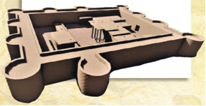

- Zamonbobodan
+ Jarqo‘tondan
- Sopollitepadan
- Qo‘yqirilganqal’adan

**89. Eneolit davri ixtirolari to‘g‘ri berilgan javobni toping. 1) Sun’iy sug‘orishga asoslangan dehqonchilik; 2) Xom g‘ishtdan ko‘p xonali uylar qurilishi; 3) Kulolchilik o‘choqlaridan foydalanish; 4) Mikrolitlarning yaratilishi.**

- 1, 2, 4
+ 1, 2, 3
- 2, 3, 4
- 1, 2, 3, 4

**90. Misdan yasalgan mehnat qurollarining tosh qurollar bilan birgalikda ishlatilish davri qanday ataladi?**

- Metall davri
- Bronza davri
- Neolit davri
+ Eneolit davri

**91. Qachon bronza misdan ko‘ra ancha qattiqligi tufayli asta-sekin mehnat qurollari, qurol-yarog‘lar va zeb-ziynatlar tayyorlashda ishlatiluvchi asosiy ashyoga aylanib qolgan?**

- Mil. avv. 3-mingyillik boshlaridan
+ Mil. avv. 3-mingyillik o‘rtalaridan
- Mil. avv. 3-mingyillik oxirlaridan
- Mil. avv. 2-mingyillik boshlaridan

**92. Zamonbobo ko‘li … viloyati, … tumanida … daryosi havzasida joylashgan.**

- Toshkent/Bo‘stonliq/Sirdaryo
- Qashqadaryo/Kitob/Qashqadaryo
- Surxondaryo/Sherobod/Amudaryo
+ Buxoro/Qorako‘l/Zarafshon

**93. Quyidagi qaysi manzilgohga yagona darvozadan kirilgan va sakkizta mavzedan iborat bo‘lgan?**

- Zamonbobo
- Jarqo‘ton
+ Sopollitepa
- Qo‘yqirilganqal’a

**94. Eneolit davri qaysi yillarni o‘z ichiga oladi?**

- Mil. avv. 3–2-mingyilliklarning oxirlari
- Mil. avv. 3–2-mingyilliklarning o‘rtalari
- Mil. avv. 4–3-mingyilliklarning oxirlari
+ Mil. avv. 4–3-mingyilliklarning o‘rtalari

**95. Sopollitepa manzilgohi qayerda joylashgan?**

- Sirdaryo vodiysi Bo‘ka tumanida
- Farg‘ona vodiysi Chust tumanida
- Zarafshon vohasi Sherobod tumanida
+ Surxondaryo vohasi Muzrabot tumanida

**96. Bronza davriga oid manzilgohlar to‘g‘ri berilgan javobni toping. 1) Zamonbobo; 2) Obishir; 3) Qo‘shilish; 4) Xorazm vohasi; 5) Jarqo‘ton; 6) Sopollitepa.**

- 2, 3, 4, 5
- 1, 3, 4, 5
+ 1, 4, 5, 6
- 2, 4, 5, 6

**97. Qachon odamlar kulolchilik charxi va g‘ildirakni kashf etdgan?**

- Temir davrida
- Neolit davrida
+ Bronza davrida
- Eneolit davrida

**98. Quyidagi suratdagi ilonlar tasviri tushirilgan tosh tumor qaysi davrga oid?**

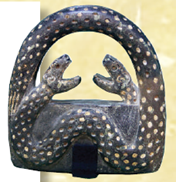

- Mil. avv. 4-mingyillikka
- Mil. avv. 3-mingyillikka
+ Mil. avv. 2-mingyillikka
- Mil. avv. 1-mingyillikka

**99. Qachon ko‘p xonali uylarni qurish boshlangan?**

- Temir davrida
- Bronza davrida
- Neolit davrida
+ Eneolit davrida

**100. Qachon patriarxat davri boshlangan?**

- Temir davrida
+ Bronza davrida
- Neolit davrida
- Eneolit davrida

**101. Odamlar bronzani qanday metallarni qo‘shib eritish orqali olganlar?**

- Misni temir, qo‘rg‘oshin yoki rux bilan qo‘shib eritib
+ Misni qalay, qo‘rg‘oshin yoki rux bilan qo‘shib eritib
- Misni qalay, qo‘rg‘oshin yoki uran bilan qo‘shib eritib
- Misni qalay, kumush yoki rux bilan qo‘shib eritib

**102. Jarqo‘ton manzilgohiga qachon asos solingan?**

- Taxminan 3 ming yil oldin
+ Taxminan 4 ming yil oldin
- Taxminan 5 ming yil oldin
- Taxminan 6 ming yil oldin

**103. Neolit davrining oxirida odamlar qaysi metalldan foydalanish va undan mehnat qurollari yasashni o‘rganib olganlar?**

+ Mis
- Qalay
- Qo‘rg‘oshin
- Bronza

**104. Quyidagi suratdagi buyumlar qanday materialdan yasalgan?**

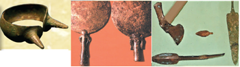

+ Bronza
- Mis
- Temir
- Oltin

**105. Qaysi manzilgohda olovga va suvga sig‘inish e’tiqodi bilan bog‘liq ibodatxona qoldiqlari arxeologlar tomonidan o‘rganilgan?**

- Zamonboboda
+ Jarqo‘tonda
- Sopollitepada
- Qo‘yqirilganqal’ada

**106. Qachon odamlar ilk shaharlar va davlatlarni yaratgan?**

- Temir davrida
- Bronza davrida
- Neolit davrida
+ Eneolit davrida

## 5-§ O‘rta Osiyo temir asriga o‘tish davrida.

**107. Temirdan yasalgan bezaklar qayerdan topilgan?**

- Kichik Osiyodagi Troya shahri qoldiqlaridan
+ Misr fir’avini Tutanxamon maqbarasidan
- Fors podsholigining Persepol shahridan
- Bobil hukmdori Hammurapi saroyidan

**108. Bir necha patriarxal oilalar nimani tashkil etgan?**

- Urug‘ jamoasini
- Qabilalarni
+ Hududiy qo‘shnichilik jamoasini
- Qabilalar ittifoqini

**109. Temirdan birinchi bo‘lib kimlar foydalana boshlaganlar?**

- Urartlar
- Forslar
- Giksoslar
+ Xettlar

**110. Temir necha gradusda eriydi?**

- 1300˚C
- 1400˚C
+ 1500˚C
- 1600˚C

**111. Mehnat qurollari yasash uchun temirdan foydalanilish, eng avvalo, qaysi sohaning rivojiga ta’sir qilgan?**

+ Dehqonchilikning
- Chorvachilikning
- Hunarmandchilikning
- Savdo-sotiqning

**112. Temirdan birinchi bo‘lib nechanchi asrlarda foydalana boshlaganlar?**

- Mil. avv. XVI-XV asrlarda
- Mil. avv. XV-XIV asrlarda
+ Mil. avv. XIV-XIII asrlarda
- Mil. avv. XIII-XII asrlarda

**113. Rasmdagi tosh gurzi nechanchi asrlarga mansub?**

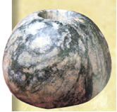

- Mil. avv. X–IX asrlarga
+ Mil. avv. IX–VIII asrlarga
- Mil. avv. VII–VI asrlarga
- Mil. avv. VI–V asrlarga

**114. Quyidagi rasmda tasvirlangan Surxondaryodan topilgan kohin boshi haykalchasi nechanchi asrlarga mansub?**

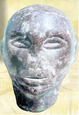

+ Mil. avv. X–IX asrlarga
- Mil. avv. IX–VIII asrlarga
- Mil. avv. VII–VI asrlarga
- Mil. avv. VI–V asrlarga

**115. Qachon O‘rta Osiyoda aholi turli guruhlarga bo‘lingan?**

- Mezolit davri oxirida
+ Temir davri boshlarida
- Neolit davri boshlarida
- Eneolit davri oxirlarida

**116. Temirdan dastlab qanday maqsadda foydalanishgan?**

- Qurol-yarog‘ yasashda
- Ov qurollari yasashda
+ Zeb-ziynat buyumlari yasashda
- Uy-ro‘zg‘or ashyolari yasashda

**117. Temirdan birinchi bo‘lib qayerda foydalana boshlaganlar?**

- O‘rta Osiyoda
- Old Osiyoda
+ Kichik Osiyoda
- Janubiy Osiyoda

**118. O‘rta Osiyodan topilgan temirdan yasalgan ilk mehnat qurollar nechanchi asrlarga oid?**

+ Mil. avv. IX-VIII asrlarga
- Mil. avv. VIII-VII asrlarga
- Mil. avv. VII-VI asrlarga
- Mil. avv. VI-V asrlarga

**119. Qaysi manba orqali O‘rta Osiyoda jamiyatning asosini katta patriarxal oila tashkil etganini bilamiz?**

+ “Avesto” kitobi
- “Tarix” asari
- Behistun yozuvlari
- Naqshi Rustam bitiklari

**120. Temirdan nima uchun dastlab zeb-ziynat buyumlari yasashda foydalanishgan?**

- Qattiq metall bo‘lgani uchun
- Arzon metall bo‘lgani uchun
- Qimmatbaho metall bo‘lgani uchun
+ Kamyob metall bo‘lgani uchun

**121. Temir asri boshlarida O‘rta Osiyo aholisi quyidagi qaysi guruhlarga bo‘lingan? 1) Kohinlar; 2) Jangchilar; 3) Savdogarlar; 4) Chorvadorlar; 5) Dehqonlar; 6) Hunarmandlar.**

- 1, 2, 3, 4
+ 1, 2, 4, 5, 6
- 1, 3, 4, 5, 6
- 2, 3, 4, 5

## 6-§ Nil vodiysi va uning aholisi.

**122. Qadimgi Misrda nechta podsho hukmdorlik qilgan?**

- 1 ta podsho
+ 2 ta podsho
- 3 ta podsho
- 4 ta podsho

**123. Qadimgi Misr hunarmandlarining qancha kasb-korlari bo‘lgan?**

- 10 dan ziyod
- 20 dan ziyod
+ 30 dan ziyod
- 40 dan ziyod

**124. Qadimgi Misrda nimadan gazlama to‘qishgan?**

+ Kanopdan
- Jundan
- Paxtadan
- Movutdan

**125. Qadimgi Misrda dehqonlar qanday ekinlarni ekishgan?**

- Javdar, tariq, poliz ekinlarini
- Tariq, bug‘doy, poliz ekinlarini
+ Bug‘doy, arpa, poliz ekinlarini
- Arpa, javdar, poliz ekinlarini

**126. Hosil yig‘im-terimi boshlangan paytda misrliklar boshoqlarni qanday o‘roqlar bilan o‘rib olishgan?**

- Temir o‘roqlar bilan
+ Mis o‘roqlar bilan
- Bronza o‘roqlar bilan
- Kumush o‘roqlar bilan

**127. Qachon odamlar Nil daryosi qirg‘oqlaridagi yerlarni o‘zlashtirishga bel bog‘laganlar?**

+ Mil. avv. 4-ming yillik boshlarida
- Mil. avv. 4-ming yillik oxirlarida
- Mil. avv. 3-ming yillik boshlarida
- Mil. avv. 3-ming yillik oxirlarida

**128. Qadimgi Misrda tarqoq manzilgohlar nima deb atalgan kichik davlatlarga birlashgan?**

- “Burg” deb atalgan
- “Kent” deb atalgan
- “Polis” deb atalgan
+ “Nom” deb atalgan

**129. Nil daryosining uzunligi necha kilometr?**

- 5 ming kilometr
- 3 ming kilometr
+ 6 ming kilometr
- 4 ming kilometr

**130. Qadimda misrliklar xirmonjoydan chiqqan donlarni nima sababdan sopol xumlarda saqlashgan?**

- O‘g‘rilikni oldini olgan
+ Kemiruvchilardan himoyalagan
- Tabiiy ofatlardan saqlagan
- Tashish uchun qulay bo‘lgan

**131. Kim birlashgan Misr mamlakatining birinchi hukmdori – fir’avni bo‘lgan?**

- Yaxmos
- Ramzes
- Tutmos
+ Menes

**132. Nil daryosining quyi qismi … kenglikdagi qora tuproqli serhosil dalalardan iborat.**

- 2 km dan 23 kilometrgacha
+ 3 km dan 22 kilometrgacha
- 2 km dan 22 kilometrgacha
- 3 km dan 23 kilometrgacha

**133. Qayta birlashgan Misr davlatining poytaxtini toping.**

- Giza
+ Fiva
- Abidos
- Memfis

**134. Quyi podsholik Misrning qaysi qismida joylashgan?**

+ Shimoliy qismida
- Janubiy qismida
- Sharqiy qismida
- G‘arbiy qismida

**135. Qadimgi Misrda oddiy misrliklarning uyi nimadan qurilgan?**

- Somon qo‘shilgan pishgan g‘ishtdan
- Oftobda quritilgan xom g‘ishtdan
- Kedr qatronli noyob yog‘ochdan
+ Loy suvalgan papirus poyalaridan

**136. Qadimgi Misrda kemasozlar nimadan qayiqlar qurishgan?**

- Somondan
- Papirusdan
- Yog‘ochdan
+ Qamishdan

**137. Qadimgi Misr poytaxtlarini toping. 1) Memfis; 2) Fiva; 3) Abidos; 4) Giza.**

+ 1, 2
- 3, 4
- 1, 3
- 2, 4

**138. Mil. avv. 3000-yilda yagona va birlashgan Misr uchun qaysi shahar poytaxt bo‘lgan?**

+ Memfis
- Giza
- Fiva
- Abidos

**139. Odamlar qachon Nil vodiysidagi sermashaqqat turmush sharoitiga moslasha boshlagan?**

- Mil. avv. 4-ming yillik boshlarida
+ Mil. avv. 4-ming yillik oxirlarida
- Mil. avv. 3-ming yillik boshlarida
- Mil. avv. 3-ming yillik oxirlarida

**140. Misrda “nom” larni kim boshqargan?**

+ Nomarx
- Monarx
- Fir’avn
- Kohin

**141. Qadimgi Misrda kemasozlar nimadan kemalar qurishgan?**

- Somondan
- Papirusdan
+ Yog‘ochdan
- Qamishdan

**142. Qadimgi Misrda fir’avnlarning saroylari va ibodatxonalar nimadan barpo etilgan?**

- Xom g‘ishtdan
+ Toshdan
- Pishgan g‘ishtdan
- Paxsadan

**143. Qadimgi Misrda zodagonlarning uylari nimadan qurilgan?**

+ Xom g‘ishtdan
- Toshdan
- Pishgan g‘ishtdan
- Paxsadan

**144. Yuqori podsholik Misrning qaysi qismida joylashgan?**

- Shimoliy qismida
+ Janubiy qismida
- Sharqiy qismida
- G‘arbiy qismida

**145. Misrliklar o‘z yurtiga nima deb nom berishgan?**

- “Sariq tuproq” yoki “Xudo in’omi”
+ “Qora tuproq” yoki “Nil in’omi”
- “Qizil tuproq” yoki “Fir’avn in’omi”
- “Yashil tuproq” yoki “Tabiat in’omi”

**146. Qaysi davlat “Nil in’omi” deb ataladi?**

- Urartu
- Bobil
+ Misr
- Karfagen

**147. Qachon Yuqori va Quyi Misr davlatlari o‘rtasida urush boshlangan?**

- Mil. avv. 3500-yilda
+ Mil. avv. 3000-yilda
- Mil. avv. 2500-yilda
- Mil. avv. 2000-yilda

**148. Misrda vaqt o‘tishi bilan asta-sekin qabila sardorlari kimlarga aylangan?**

+ Podsholarga
- Noiblarga
- Hokimlarga
- Aristokratlarga

**149. Nil daryosi Afrikaning qaysi qismida sivilizatsiya vujudga kelishi uchun zamin yaratgan?**

+ Shimoliy-sharqida
- Shimoliy-g‘arbida
- Janubiy-sharqida
- Janubiy-g‘arbida

**150. Mil. avv. 3000-yilda mamlakatni birlashtirgan Yuqori Misr hukmdori kim?**

- Yaxmos
- Ramzes
- Tutmos
+ Menes

## 7-§ Qadimgi Misr va qo‘shni davlatlar.

**151. Qadimgi Misrda qaysi fir’avn zamonidan Yangi podsholik davri boshlangan?**

+ Yaxmos
- Ramzes
- Tutmos
- Menes

**152. Nubiya hozirgi qayerga to‘g‘ri keladi?**

- Janubiy Sudanga
+ Shimoliy Sudanga
- Janubiy Falastinga
- G‘arbiy Falastinga

**153. Quyi Misrdagi qaysi shahar orqali o‘tadigan yo‘l Sinay yarimoroliga olib borgan?**

- Giza
- Fiva
- Abidos
+ Memfis

**154. Qadimgi Misr g‘arbida qaysi mamlakat joylashgan edi?**

- Suriya
+ Liviya
- Finikiya
- Nubiya

**155. Qadimgi Misrda qaysi podsholik davrida fir’avnlar Nubiya va Liviyaga ham yurish qilib, shaharlarni talagan, asirlar, chorva mollari va boshqa boyliklarni egallab olgan?**

- O‘rta podsholik davrida
+ Qadimgi podsholik davrida
- So‘nggi podsholik davrida
- Yangi podsholik davrida

**156. Misrni bosib olgan forslarning shahanshohi kim?**

- Kserks
- Kir II
+ Kambiz II
- Doro I

**157. Qadimgi Misrda qaysi podsholik davrida Sinay yarimoroli bosib olingan?**

- O‘rta podsholik davrida
+ Qadimgi podsholik davrida
- So‘nggi podsholik davrida
- Yangi podsholik davrida

**158. Fir’avn Tutmos II qaysi hududlarni istilo qilishni boshlagan? 1) Falastin; 2) Suriya; 3) Mesopotamiya; 4) Kichik Osiyo; 5) Finikiya; 6) Sinay.**

+ 1, 2, 5
- 1, 5, 6
- 2, 3, 5
- 2, 5, 6

**159. Qadimgi Misrda qaysi podsholik fir’avnlari Janubiy Falastin yerlari va Nubiya shimolini Misrga qo‘shib olishga muyassar bo‘lganlar?**

+ O‘rta podsholik
- Qadimgi podsholik
- So‘nggi podsholik
- Yangi podsholik

**160. Qadimda Liviya aholisi ... bo‘lgan.**

- savdogar
- mohir hunarmand
- ziroatkor
+ ko‘chmanchi chorvador

**161. Qachon forslarning shahanshohi Kambiz II Misrni bosib olgan?**

- Mil. avv. 528-yilda
- Mil. avv. 527-yilda
- Mil. avv. 526-yilda
+ Mil. avv. 525-yilda

**162. Qadimgi Misrda Yangi podsholik hukmdorlari qaysi mamlakatlarga hujumni boshlab yuborganlar?**

- Falastin va Suriyaga
+ Old Osiyo va Nubiyaga
- Mesopotamiya va Finikiyaga
- Sinay va Nubiyaga

**163. Qachon giksoslar Misrga hujum qilgan?**

- Mil. avv. XVIII asr boshida
+ Mil. avv. XVIII asr oxirida
- Mil. avv. XVII asr boshida
- Mil. avv. XVII asr oxirida

**164. Qadimgi Misrda giksoslar zulmidan xalos bo‘lish taraddudiga tushib qolgan “nom” lar hukmdorlari qaysi shahar atrofiga birlasha boshlashgan?**

- Giza
+ Fiva
- Luksor
- Memfis

**165. Qadimgi Misrda qaysi shahar hukmdorlari giksoslarga itoat qilmaganlar?**

- Giza shahri
+ Fiva shahri
- Luksor shahri
- Memfis shahri

**166. Sinay yarimorolida nima qazib olingan?**

- Temir
- Bronza
- Oltin
+ Mis

**167. Qadimgi misrliklar qayerdan hunarmandlar yasagan nodir buyumlar va qimmatbaho toshlarni olib kelishgan?**

+ Falastin va Suriyadan
- Bolqon va Liviyadan
- Kavkaz va Finikiyadan
- Yaman va Nubiyadan

**168. Qadimgi Misrda O‘rta podsholik fir’avnlari qayerlarni Misrga qo‘shib olishga muyassar bo‘lganlar? 1) Nubiya janubini; 2) Shimoliy Falastin yerlarini; 3) Janubiy Falastin yerlarini; 4) Nubiya shimolini.**

- 1, 2
+ 3, 4
- 1, 3
- 2, 4

**169. Qadimda quyidagi qaysi mamlakatlar mis va temir rudasiga hamda boshqa foydali qazilmalarga boy bo‘lgan? 1) Nubiya; 2) Liviya; 3) Falastin; 4) Suriya.**

- 1, 2
- 2, 3
+ 3, 4
- 1, 3

**170. Fir’avn Tutmos II ning yurishlarini kim davom ettirgan?**

- Tutmos V
- Tutmos VI
+ Tutmos III
- Tutmos IV

**171. Qadimgi Misr janubdan qayer bilan chegaradosh bo‘lgan?**

- Suriya
- Liviya
- Finikiya
+ Nubiya

**172. Giksoslar hujumi davrida Misrda qaysi podsholik hukm surar edi?**

+ O‘rta podsholik
- Qadimgi podsholik
- So‘nggi podsholik
- Yangi podsholik

**173. Yangi podsholik tugatilganidan keyin qachon Misr yana yagona davlatga birlashgan?**

- Mil. avv. VIII asrda
+ Mil. avv. VII asrda
- Mil. avv. VI asrda
- Mil. avv. V asrda

**174. Falastinning yonida qayer joylashgan?**

+ Suriya
- Liviya
- Finikiya
- Nubiya

**175. Qadimgi Misrda qaysi fir’avn giksoslarni tor-mor etib, bosqinchilarni Misrdan haydab chiqargan?**

+ Yaxmos
- Ramzes
- Tutmos
- Menes

**176. Sinay yarimorolidan shimolroqda qayer joylashgan?**

- Suriya
+ Falastin
- Yaman
- Kavkaz

## 8-§ Qadimgi Misrda din.

**177. Misrliklar ma’budlarning bir qancha joni mavjud: ulardan biri ..., boshqasi esa  ...  yashaydi deb o‘ylashgan.**

- hayvon tanasida/mumiyosida
- maqbara devorlarida/hayvon tanasida
- haykalida/ibodatxonada
+ hayvon tanasida/haykalida

**178. Qadimgi Misrda kimlar ma’budlar va odamlar o‘rtasida vositachi bo‘lishgan?**

+ Kohinlar
- Fir’avnlar
- Nomarxlar
- Sfinkslar

**179. Qaysi davlatda hukmdorlar hamma ishni o‘zining samoviy otasi amri bilan amalga oshiradi, degan qarash mavjud bo‘lgan?**

- Rimda
- Bobilda
+ Misrda
- Afinada

**180. Qadimgi Misr podsholigining poytaxti Memfis shahrining xudosi qaysi?**

- Amon
- Ra
+ Ptax
- Osiris

**181. Qadimgi Misrda Fiva shahri homiysi qaysi ma’bud hisoblangan?**

+ Amon
- Ra
- Ptax
- Osiris

**182. Qadimgi Misr fir’avnlarining bosh ilohi va homiysi hisoblangan ma’bud qaysi?**

+ Amon-Ra
- Ptax
- Isida
- Apis

**183. Qadimgi Misrda fir’avnlar qaysi ma’budning o‘g‘illari hisoblanishgan?**

+ Amon-Raning
- Ptaxning
- Isidaning
- Apisning

**184. Qadimgi Misrdagi hayotning birlamchi manbai va posboni hisoblangan ma’bud qaysi?**

- Isida
+ Xapi
- Apis
- Set

**185. Misrliklar e’tiqodicha, qaysi ma’bud olamni yaratayotganida har bir narsaning nomini odamga o‘rgatgan?**

- Amon
- Ra
+ Ptax
- Osiris

**186. Qadimgi Misr dinida Osiris taxtining himoyachisi sanalgan ma’budni toping.**

- Anubis
+ Xapi
- Xatxor
- Maat

**187. Qadimgi Misrda Nil ma’budi nima deb atalgan?**

- Isida
+ Xapi
- Apis
- Set

**188. Qadimgi misrliklar ma’budlar hayvonlar qiyofasiga kirib olib, ya’ni ... ko‘rinishida odamlar orasida yashaydi deb hisoblashgan. 1) mushuk; 2) qo‘y; 3) it; 4) ho‘kiz; 5) arslon; 6) sichqon; 7) sigir.**

- 1, 2, 3, 4, 5, 6, 7
+ 1, 2, 4, 5, 7
- 1, 4, 5, 6, 7
- 1, 3, 5, 7

**189. Qadimgi Misrda Ptax degan ma’budning Yer yuzidagi qiyofasi qanday atalgan?**

- Isida
- Xapi
- Set
+ Apis

**190. Qadimgi Misrda yerosti saltanati ma’budi qaysi?**

- Amon
- Ra
- Ptax
+ Osiris

**191. Baolbek qaysi shaharning yana bir nomi?**

- Abidosning
+ Geliopolning
- Memfisning
- Fivaning

**192. Qadimgi Misrda Quyosh ma’budi nima deb atalgan?**

- Amon
+ Ra
- Ptax
- Osiris

**193. Amon-Raning ibodatxonasi qayerda bo‘lgan?**

- Abidosda
+ Geliopolda
- Memfisda
- Fivada

**194. Qadimgi Misrda kimlar Nil toshqini vaqtini, qachon urug‘lik sochish va hosilni yig‘ishtirib olish muddatini aniq bilishgan?**

+ Kohinlar
- Fir’avnlar
- Nomarxlar
- Dehqonlar

**195. Qadimgi Misrda qaysi ma’bud shunchalik qudratliki, uni asl qiyofasida ko‘rishning iloji yo‘q deb hisoblangan?**

- Amon
- Ra
+ Ptax
- Osiris

**196. Qadimgi Misrda qaysi ma’bud peshonasi va belida oq qashqasi bo‘lgan qora ho‘kiz timsolida tasavvur etilgan?**

- Isida
+ Apis
- Xapi
- Set

## 9-§ Piramidalar va daxmalar.

**197. Qadimgi Misrda mumiyolash necha kun davom etgan?**

- 50 kun
- 60 kun
+ 70 kun
- 80 kun

**198. Qadimgi misrliklar fikricha marhumlar saltanatidagi hayot qaysi ma’bud sudining natijalariga bog‘liq bo‘ladi?**

- Amon-Ra sudining
- Ptax sudining
+ Osiris sudining
- Tot sudining

**199. Xufu (Xeops) piramidasi qurulishi uchun ishlatiladigan toshlari shunchalik tekis qilib kesilgan va taroshlanganki, ular o‘rtasidagi yoriq necha millimetrdan oshmaydi?**

- 1,5 millimetrdan
- 3,5 millimetrdan
+ 0,5 millimetrdan
- 2,5 millimetrdan

**200. Sfinks haykali nimadan ishlangan?**

- Xom g‘ishtdan
+ Toshdan
- Pishgan g‘ishtdan
- Paxsadan

**201. Sfinks haykalining balandligi necha metrga teng?**

- 10 metrga
+ 20 metrga
- 30 metrga
- 40 metrga

**202. Xufu, Xafra, Menkaura piramidalari Misrning qaysi shahri yaqinida bunyod etilgan?**

- Giza
- Fiva
- Luksor
+ Memfis

**203. Qachon Xufu (Xeops) piramidasi qurilgan?**

- Mil. avv. 2800-yilda
- Mil. avv. 2700-yilda
+ Mil. avv. 2600-yilda
- Mil. avv. 2500-yilda

**204. Xufu (Xeops) piramidasi har biri 2 tonnadan og‘irroq bo‘lgan qancha tosh bo‘laklaridan tashkil topgan?**

- 1 mln. tosh bo‘laklaridan
- 1,5 mln. tosh bo‘laklaridan
- 2 mln. tosh bo‘laklaridan 
+ 2,5 mln. tosh bo‘laklaridan

**205. Rasmdagi oltin niqob qaysi fir’avnga tegishli?**

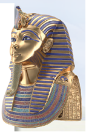

- Yaxmosga
- Amenxotepga
- Tutmos II ga
+ Tutanxamonga

**206. “Sarkofag” nima?**

- Sopoltobut
- Yog‘ochtobut
+ Toshtobut
- Metalltobut

**207. Qaysi podsholik davriga kelib fir’avnlarni tog‘larga o‘yilgan tosh maqbaralarga dafn etadigan bo‘lishgan?**

- O‘rta podsholik davriga kelib
- Qadimgi podsholik davriga kelib
- So‘nggi podsholik davriga kelib
+ Yangi podsholik davriga kelib

**208. Qadimgi Misrga oid eng mashhur maqbara qaysi fir’avnga tegishli?**

- Menesga
- Amenxotepga
- Yaxmosga
+ Tutanxamonga

**209. Piramidalarni “sfinks” – tanasi ..., boshi ... bo‘lgan ulkan haykal qo‘riqlaydi.**

+ sherniki/odamniki
- odamniki/sherniki
- ilonniki/timsohniki
- buqaniki/otniki

**210. Qadimgi Misrda qaysi podsholiklar davrida misrliklar ulkan piramidalar barpo etgan? 1) Qadimgi podsholik; 2) O‘rta podsholik; 3) Ilk podsholik; 4) Yangi podsholik.**

- 1, 3
+ 1, 2
- 2, 3
- 2, 4

**211. Qadimgi Misrda qaysi podsholik davriga kelib ehromlar qurmay qo‘yishgan?**

- O‘rta podsholik davriga kelib
- Qadimgi podsholik davriga kelib
- So‘nggi podsholik davriga kelib
+ Yangi podsholik davriga kelib

**212. Xufu (Xeops) piramidasining balandligi necha metr bo‘lgan?**

- 145 metr
- 146 metr
+ 147 metr
- 148 metr

**213. Qadimgi Misrda nimalar fir’avnni himoya qiladi va o‘zga hayotga o‘tayotganida unga yordam beradi deb hisoblashgan?**

- Yilnomalar va sulolalardan iborat bitiklar
- Ziyofatlar va zafarnomalardan iborat bitiklar
- Jangnomalar va urushlardan iborat bitiklar
+ Munojotlar va qarg‘ishlardan iborat bitiklar

**214. Qadimgi misrliklar inson jasadini nima uchun mumiyolashgan?**

- Jasad chirib yo‘qolib ketmasligi uchun
- Marhumlar saltanatida umrini davom ettirishi uchun
- Ruhi qayta jasadga kira olishi uchun
+ Osiris qarshisida go‘zal qiyofada qad rostlashi uchun

**215. Qadimgi Misrdagi dahmalar ichi nima bilan qoplangan?**

- Yilnomalar va sulolalardan iborat bitiklar bilan
- Ziyofatlar va zafarnomalardan iborat bitiklar bilan
- Jangnomalar va urushlardan iborat bitiklar bilan
+ Munojotlar va qarg‘ishlardan iborat bitiklar bilan

**216. Misrda mumiyolash bilan kimlar shug‘ullanishgan?**

+ Kohin-tabiblar
- Saroy xizmatchilari
- Marhumning qarindoshlari
- Maxsus o‘rgatilgan odamlar

**217. Kimlar Xufu piramidasini “Xeops” deb atashgan?**

- Bobilliklar
- Rimliklar
+ Yunonlar
- Forslar

## 10-§ Qadimgi Misr madaniyati.

**218. Birinchi taqvim qayerda tuzilgan?**

- Finikiyada
- Mesopotamiyada
+ Misrda
- Yunonistonda

**219. Quyidagi qaysi qadimgi xalq nafaqat oddiy arifmetik hisoblashni, qolaversa, kasrlar, maxrajlar va murakkab hisob-kitoblarni ham bilishgan?**

- Suriyaliklar
- Akkadliklar
+ Misrliklar
- Liviyaliklar

**220. Quyidagi qaysi mamlakat shaharlarida tabiblarga ta’lim beruvchi maxsus maktablar bo‘lgan?**

- Finikiyada
- Mesopotamiyada
- Yunonistonda
+ Misrda

**221. Qadimgi Misrda ta’lim olayotganda nimalarga yozishgan?**

- Qog‘ozga yoki papirus o‘simligi o‘ramiga
- Maqbaralar devoriga yoki xudolar haykaliga
+ Sopol buyumlar parchasiga yoki ohaktoshga
- Ibodatxona peshtoqiga yoki saroylar ustuniga

**222. Qadimgi misrliklar iyerogliflarni papirusga nima bilan yozishgan?**

+ Qamish qilqalam bilan
- Daraxt novdalari bilan
- Metall tayoqcha bilan
- Paxta poyasi bilan

**223. Rozett bitiktoshi qaysi muzeyda saqlanmoqda?**

- Sankt-Peterburgdagi Ermitaj muzeyida
- Nyu-Yorkdagi Metropoliten muzeyida
+ Londondagi Britaniya muzeyida
- Parijdagi Luvr muzeyida

**224. Qadimgi misrliklar alifbosi nechta iyeroglifdan iborat bo‘lgan?**

- 650 ta
- 700 ta
+ 750 ta
- 800 ta

**225. Kim qadimgi Misr matnlarini o‘qishga erishgan?**

- Ferdinand Rixtgofen
- Genrix Shlimman
- Charlz Darvin
+ Jak-Fransua Shampolyon

**226. “Iyeroglif” so‘zi qanday ma’noni anglatadi?**

+ “Muqaddas bitiklar”
- “Rasmli yozuv”
- “Tugunli xat”
- “Xushxabar”

**227. Qadimgi Misrda yozuvdan qanday maqsadda foydalanishgan?**

- Yilnomalar va sulolalarni yozib borishda
- Tarixiy va adabiy matnlarni yozib borishda
- Jangnomalar va urushlarni yozib borishda
+ Duolar va marosimlarni yozib borishda

**228. Qadimgi Misrda kimlar yuksak saviyadagi ma’lumotli va savodxon kishilar sanalganlar va ular katta imtiyozga ega bo‘lib, izzat-hurmatda bo‘lganlar?**

+ Husnixat san’atini egallagan kishilar
- Hisob-kitobni a’lo darajada biladigan kishilar
- Ravon o‘qishni bilgan kishilar
- Tabiblikni biladigan kishilar

**229. Kimlar qadimgi misr yozuvini “iyerogliflar” deyishgan?**

+ Yunonlar
- Forslar
- Akkadlar
- Rimliklar

**230. Qadimgi Misrda vaqt nechta bo‘lmaga ajratilgan maxsus idishdan iborat suv soatlari yordamida o‘lchangan?**

+ 24 ta bo‘lmaga
- 25 ta bo‘lmaga
- 26 ta bo‘lmaga
- 27 ta bo‘lmaga

**231. Qachon Jak-Fransua Shampolyon qadimgi Misr matnlarini o‘qishga erishgan?**

- 1821-yilda
+ 1822-yilda
- 1823-yilda
- 1824-yilda

**232. Qadimgi Misrda yozuvlar nimaga o‘yib yozilgan?**

- Qog‘ozlarga va papirus o‘simligi o‘ramlariga
+ Maqbaralarning devorlariga va ma’budlar haykallariga
- Sopol buyumlar parchasiga va maxsus ohaktoshlarga
- Ibodatxonalarning peshtoqiga va saroylarning ustuniga

**233. Qadimgi Misrda nechta kaft bir “tirsak” ni tashkil etgan?**

+ 7 ta
- 5 ta
- 8 ta
- 6 ta

**234. Qadimgi Misrda asosiy o‘lchov birligi nima bo‘lgan?**

- Barmoq
+ Tirsak
- Oyoq
- Qo‘l

**235. Qadimda qaysi davlatda yil davomiyligi 365 kun bo‘lib, 30 kundan 12 oyga taqsimlab, ortib qolgan 5 kunni bayram sifatida nishonlashgan?**

- Finikiyada
- Mesopotamiyada
+ Misrda
- Yunonistonda

**236. Qadimda qayerda davolash muolajasida giyohlar damlamasi, ma’danli suvlar va tuzdan keng foydalangan?**

- Finikiyada
+ Misrda
- Mesopotamiyada
- Yunonistonda

**237. Qayerda yozuvni “muqaddas kalom” yoki  “ma’budlar kalomi” deb nomlashgan?**

- Italiyada
- Mesopotamiyada
+ Misrda
- Yunonistonda

**238. Qadimgi Misrda “Podsho tirsagi” necha santimetrga teng bo‘lgan?**

- 50,5 sm. ga
- 51,5 sm. ga
+ 52,5 sm. ga
- 53,5 sm. ga

## 11-§ Mesopotamiya sivilizatsiyalari.

**239. Shumer shaharlarida qurilish nimalar bilan amalga oshirilgan? 1)Tosh; 2) Xom g‘isht; 3) Pishgan g‘isht; 4) Marmar.**

- 1
- 1, 2
+ 1, 2, 3
- 1, 2, 3, 4

**240. Gilgamish qaysi shaharning podshosi bo‘lgan?**

- Ur
- Lagash
+ Uruk
- Umma

**241. Sargon I ning muntazam lashkari necha nafar jangchidan iborat bo‘lgan?**

- 5100 nafar
- 5200 nafar
- 5300 nafar
+ 5400 nafar

**242. Mesopotamiya shahar-davlatlarida qayer hokimiyat markazi bo‘lgan?**

- Hukmdorlar saroyi
- Bozorlar maydoni
- Jamoatchilik binolari
+ Xudolar ibodatxonasi

**243. Mesopatamiyada podsho shahar-davlatni kimlarga tayangan holda amaldorlar yordamida boshqargan? 1) Aslzoda; 2) Hunarmand; 3) Kohin; 4) Bosh vazir; 5) Harbiy qo‘shin; 6) Aholi.**

- 1, 2, 3
- 4, 5, 6
+ 1, 3, 5
- 2, 4, 6

**244. Afsonaga ko‘ra, Gilgamish sehrli giyohni o‘g‘irlatib qo‘yganidan keyin, nima uni himoya etishini tushinib yetgan?**

+ Shahri devorlari
- O‘z xalqi
- Ezgu so‘zlari
- Buyuk ishlari

**245. Mesopotamiyada Oy ma’budi qanday atalgan?**

+ Sin
- Ishtar
- Ea
- Shamash

**246. Mesopotamiyada oliy hakam hisoblangan ma’bud qanday atalgan?**

- Sin
- Ishtar
+ Shamash
- Ea

**247. Mesopotamiyaning katta yer-mulklari kimlarning qo‘l ostida bo‘lgan? 1) Zamindorlar; 2) Sudxo‘rlar; 3) Hukmdorlar; 4) Kohinlar.**

- 1, 2
+ 3, 4
- 1, 3
- 2, 4

**248. “Mesopotamiya” so‘zi qanday ma’noni anglatadi?**

- Daryoning narigi tomoni
- Ikki buyuk daryo
- Daryolar qo‘shilish joyi
+ Ikki daryo oralig‘i

**249. Mesopotamiyada qanday buyumlar, ayniqsa, qadrlangan? 1) Metall buyumlar; 2) Zeb-ziynatlar; 3) Qurol-yarog‘lar; 4) Kulolchilik buyumlari; 5) Kedr yog‘ochi; 6) Chorva mollari.**

- 1, 2, 3
+ 1, 2, 3, 4
- 1, 2, 3, 4, 5
- 1, 2, 3, 4, 5, 6

**250. Mesopotamiyada Quyosh ma’budi qanday atalgan?**

- Sin
- Ishtar
- Ea
+ Shamash

**251. Mesopotamiyada Sin qanday ma’bud sanalgan?**

- Suv xudosi
+ Oy xudosi
- Yer xudosi
- Quyosh xudosi

**252. Qachon Sargon I Akkad va Shumer shaharlarini o‘z hokimiyati ostida birlashtirgan?**

- Mil. avv. 4-ming yillikning birinchi yarmida
- Mil. avv. 4-ming yillikning ikkinchi yarmida
- Mil. avv. 3-ming yillikning birinchi yarmida
+ Mil. avv. 3-ming yillikning ikkinchi yarmida

**253. Kim “to‘rt iqlim mamlakati podshosi” unvonini olgan?**

+ Sargon I
- Navuxodonosor II
- Xammurapi
- Navuxodonosor

**254. Mesopotamiyada kim mil. avv. 3-ming yillikning ikkinchi yarmida barcha shaharlar uchun yagona bo‘lgan uzunlik, maydon va og‘irlik o‘lchovini joriy etgan?**

+ Sargon I
- Navuxodonosor II
- Xammurapi
- Navuxodonosor

**255. Mesopotamiyada hosildorlik, sevgi, urush, g‘alaba ma’budasi qanday atalgan?**

- Sin
+ Ishtar
- Ea
- Shamash

**256. Mesopotamiya rivoyatlarining eng sevimli qahramoni kim edi?**

- Axilles
- Enkidu
- Shamash
+ Gilgamish

**257. Mesopotamiya shahar-davlatlarida oliy ma’bud nomidan kimlar hukmronlik qilgan?**

- Sarkardalar
+ Kohinlar
- Hukmdorlar
- Oqsoqollar

**258. Afsonaga ko‘ra, jarga uloqtirilgan Gilgamishni burgut tutib olib, ko‘tarib ketadi va uni kimga eltib beradi?**

- Dehqonga
- Hunarmandga
+ Bog‘bonga
- Cho‘ponga

**259. Mesopotamiyada Shamash qanday ma’bud hisoblangan?**

- Suv xudosi
- Oy xudosi
- Yer xudosi
+ Quyosh xudosi

**260. Mesopotamiyada Ea qanday ma’bud sanalgan?**

+ Suv xudosi
- Oy xudosi
- Yer xudosi
- Quyosh xudosi

**261. Mesopotamiya savdo-sotiqda ... quymasi ko‘rinishidagi metall tangalar ishlatilgan.**

- oltin
+ kumush
- mis
- temir

**262. Mesopotamiyada yovuz ishlari uchun odamlarni sud qilgan ma’bud qanday atalgan?**

- Sin
- Ishtar
+ Shamash
- Ea

**263. Nima uchun Sargon I barcha shaharlar uchun yagona bo‘lgan uzunlik, maydon va og‘irlik o‘lchovini joriy etgan?**

- Hunarmandchilikni rivojlantirish maqsadida
+ Savdo-sotiqni rivojlantirish maqsadida
- Dehqonchilikni rivojlantirish maqsadida
- Chorvachilikni rivojlantirish maqsadida

**264. Mesopotamiyaning qadimiy ibodatxonalari – zikkuratlar nimadan qurilgan?**

+ Xom g‘ishtdan
- Toshdan
- Pishgan g‘ishtdan
- Paxsadan

**265. Mixxat yozuvini kimlar ixtiro qilishgan?**

- Xettlar
+ Shumerlar
- Urartlar
- Akkadlar

**266. Mesopotamiyada “mino” deb atalgan og‘irlik o‘lchovi necha gramm kumushga barobar bo‘lgan?**

- 350 gramm
- 450 gramm
+ 550 gramm
- 650 gramm

**267. Mesopotamiyada suv ma’budi qanday atalgan?**

- Sin
- Ishtar
+ Ea
- Shamash

**268. Mesopotamiyaning shimolida kimlarning shaharlari vujudga kelgan?**

- Bobilliklar
+ Akkadlar
- Elamliklar
- Shumerlar

**269. Qachon Mesopotamiyada shumerlar manzilgohlari vujudga kela boshlagan?**

+ Mil. avv. 4-ming yillikda
- Mil. avv. 3-ming yillikda
- Mil. avv. 2-ming yillikda
- Mil. avv. 1-ming yillikda

**270. Dajla va Frot daryolari oralig‘idagi vodiyni kimlar “Mesopotamiya” deb nomlashgan?**

- Rimliklar
+ Yunonlar
- Forslar
- Shumerlar

**271. Mesopotamiyada dalalarga kimlar ishlov berishgan? 1) Qullar; 2) Erkin yollanma mehnatchilar; 3) Qishloq jamoasi; 4) Qaram dehqonlar.**

+ 1, 2
- 3, 4
- 1, 3
- 2, 4

**272. Kim jahon tarixida birinchi bo‘lib muntazam qo‘shin tuzgan?**

+ Sargon I
- Navuxodonosor II
- Xammurapi
- Navuxodonosor

**273. Mesopotamiyaning janubida kimlarning shaharlari vujudga kelgan?**

- Bobilliklar
- Akkadlar
- Elamliklar
+ Shumerlar

**274. Miloddan avvalgi 4-mingyillik oxirida Mesopotamiyada vujudga kelgan shaharlarni toping. 1) Ur; 2) Sidon; 3) Uruk; 4) Tushpa; 5) Umma; 6) Suza; 7) Lagash; 8) Bobil.**

- 1, 2, 3, 4
- 2, 5, 6, 7
+ 1, 3, 5, 7
- 2, 4, 6, 8

**275. Mesopotamiyaga qayerlardan donga ayirboshlab oltin, mis, kumush, qalayi va noyob toshlarni keltirishgan?**

- Misr va Yamandan
- Suriya va Falastindan
- Finikiya va Bolqondan
+ Kavkazorti va Erondan

**276. Afsonaga ko‘ra Gilgamish kim bilan do‘st tutingan?**

- Sin
- Ea
- Shamash
+ Enkidu

**277. Shumerliklar uchi o‘tkirlangan tayoqcha bilan nimaga yozishgan?**

+ Loy taxtachalarga
- Ipak matoga
- Papirus poyalariga
- Yog‘och taxtachaga

**278. Afsonaga ko‘ra, Gilgamish sehrli giyohni o‘g‘irlatib qo‘yganidan keyin, nima uni umrboqiy qilishini tushinib yetgan?**

+ Ezgu ishlari
- Haykallari
- Qonunlari
- Afsonalari

**279. Mesopotamiya aholisining asosiy mashg‘uloti nima bo‘lgan?**

- Hunarmandchilik
- Chorvachilik
+ Dehqonchilik
- Savdo-sotiq

**280. Mesopotamiyada Ishtar qanday ma’buda sanalgan? 1) Tabobat; 2) Hosildorlik; 3) Quyosh; 4) Sevgi; 5) Adolat; 6) Urush; 7) Musiqa; 8) G‘alaba.**

- 1, 2, 3, 4
- 5, 6, 7, 8
- 1, 3, 5, 7
+ 2, 4, 6, 8

## 12-§ Bobil podsholigi.

**281. Kimning hukmronligi davrida Bobil eng qudratli davlatga aylangan?**

- Sargon I davrida
- Ashshurbanipal davrida
+ Xammurapi davrida
- Navuxodonosor II davrida

**282. Qaysi shahar Frot va Dajla daryolarining o‘zanlari bir-biriga yaqinlashib ketadigan hududda joylashgan edi?**

+ Bobil
- Uruk
- Lagash
- Ur

**283. Xammurapi qonunlarida shifokor amalga oshirgan jarrohlik muolajasi natijasida bemor bevaqt vafot etsa shifokor qanday jazolangan?**

+ Shifokorning qo‘llari kesib tashlanishi shart bo‘lgan
- Shifokor o‘sha zahoti olovga otilgan
- Shifokor bir umr vafot etgan shaxsning oilasini modiy ta’minlagan
- Shifokor katta miqdorda jarima to‘lagan

**284. Xammurapi qonunlarini nima uchun so‘zsiz, og‘ishmasdan bajarish talab qilinardi?**

- Qonunlar podsho xohish-irodasi sifatida talqin etilgan
- Qonunlar xalq xohish-irodasi sifatida talqin etilgan
+ Qonunlar xudolar xohish-irodasi sifatida talqin etilgan
- Qonunlari kohinlar xohish-irodasi sifatida talqin etilgan

**285. Kimlar Oy yili taqvimini yaratganlar?**

- Xettlar
+ Shumerlar
- Urartlar
- Akkadlar

**286. Qachon Yangi Bobil podsholigi vujudga kelgan?**

- Mil. avv. VIII asrda
+ Mil. avv. VII asrda
- Mil. avv. VI asrda
- Mil. avv. V asrda

**287. Mil. avv. XVIII asrda kim butun Mesopotamiyani yagona davlatga birlashtirishga muvaffaq bo‘lgan?**

- Sargon I
- Ashshurbanipal
+ Xammurapi
- Navuxodonosor II

**288. Qaysi hukmdor Misrni Yangi Bobil podsholigiga qo‘shib olgan?**

- Sargon I
- Ashshurbanipal
- Xammurapi
+ Navuxodonosor II

**289. Bobil madaniyatining eng qadimiy o‘choqlarini toping.**

- Suza va Ekbatana
- Suza va Akkad
+ Shumer va Akkad
- Akkad va Ekbatana

**290. Bobilning bosh ko‘chasi qaysi ma’buda darvozasidan boshlangan edi?**

- Sin
+ Ishtar
- Ea
- Shamash

**291. Mesopotamiyaning qayerlarida zodagonlar va badavlat odamlar oilalarining farzandlari ta’lim oladigan maktablar tashkil qilingan edi?**

- Xususiy va davlat maktablarida
- Ibodatxonalar va xususiy maktablarda
- Davlat maktablari va hukmdorlar saroylarida
+ Hukmdorlar saroylari va ibodatxonalarda

**292. Qachondan boshlab Yangi Bobil podsholigi Fors davlati tarkibiga kirgan?**

- Mil. avv. 540-yildan
+ Mil. avv. 539-yildan
- Mil. avv. 538-yildan
- Mil. avv. 537-yildan

**293. Xammurapi qonunlarida yong‘in mahalida o‘g‘rilik ustida qo‘lga tushgan kimsa qanday jazolangan?**

- Qo‘llari kesib tashlanishi shart bo‘lgan
+ O‘sha zahoti olovga otilgan
- Bir umr qamoqqa tashlangan
- Ko‘zlari o‘yib olinishi shart bo‘lgan

**294. Qaysi Yangi Bobil hukmdori Iyerusalim (Quddus) ni vayron qilib tashlagan?**

- Sargon I
- Ashshurbanipal
- Xammurapi
+ Navuxodonosor II

**295. Xammurapi qonunlarida qulufbuzar o‘g‘ri qanday jazolangan?**

- Qo‘llari kesib tashlanishi shart bo‘lgan
- O‘sha zahoti olovga otilgan
- Uzoq muddatli qamoqqa tashlangan
+ O‘zganing mulkiga tajovuz qilgan joyida o‘ldirilgan va o‘sha yerning o‘zida ko‘mib yuborilgan

**296. Olam yaratilishi haqidagi eng qadimiy asotirlardan biri qayerda yaratilgan?**

+ Mesopotamiyada
- Italiyada
- Misrda
- Yunonistonda

**297. Shumerliklarda Quyosh yili necha kundan iborat bo‘lgan?**

+ 365 kundan
- 366 kundan
- 367 kundan
- 368 kundan

**298. Mil. avv. II ming yillikda qaysi podsholik Mesopotamiya janubidagi eng yirik qudratli davlatga aylangan?**

- Xett podsholigi
- Urartu podsholigi
+ Bobil podsholigi
- Ossuriya podsholigi

**299. Xammurapi qonunlarida binokor qurgan uy to‘satdan qulab, biror kishini bosib qolsa, binokor qanday jazolangan?**

- Binokorning qo‘llari kesib tashlanishi shart bo‘lgan
- Binokor o‘sha zahoti olovga otilgan
+ Binokor qatl etilishi qayd qilingan
- Binokorning ko‘zlari o‘yib olinishi shart bo‘lgan

**300. Kimning hukmronligi davrida Yangi Bobil podsholigi o‘z ravnaqining cho‘qqisiga erishgan?**

- Sargon I
- Ashshurbanipal
- Xammurapi
+ Navuxodonosor II

**301. Xammurapi tarixda qanday hukmdor sifatida nom qoldirgan?**

- Muntazam qo‘shin tuzuvchi hukmdor sifatida
+ Qonunlar tuzuvchi hukmdor sifatida
- Imperiya tuzuvchi hukmdor sifatida
- Alifbo yaratuvchi hukmdor sifatida

**302. Bobil podsholigida qaysi sohalar rivojlangan? 1) Chorvachilik; 2) Dehqonchilik; 3) Hunarmandchilik; 4) Binokorlik; 5) Ishlab chiqarish; 6) Kandakorlik; 7) Savdo-sotiq.**

- 1, 2, 3, 5
+ 2, 3, 5, 7
- 1, 4, 5, 6
- 2, 3, 4, 7

**303. Qaysi Yangi Bobil hukmdori turarjoy binolari va mudofaa devorlari qurilishida pishgan g‘isht ishlatish to‘g‘risida farmon bergan?**

- Sargon I
- Ashshurbanipal
+ Navuxodonosor II
- Xammurapi

**304. “Bobil” so‘zi qanday ma’noni anglatadi?**

- “Sherlar darvozasi”
- “Dengiz darvozasi”
- “Sharq darvozasi”
+ “Xudolar darvozasi”

**305. Shumerliklarda Oy yili necha kundan iborat bo‘lgan?**

- 353 kundan
+ 354 kundan
- 355 kundan
- 356 kundan

**306. Bobildagi qaysi darvoza chiroyli va nafis bo‘lib, afsonaviy hayvonlar tasviri tushirilgan koshin taxtachalar bilan bezatilgan?**

- Sin darvozasi
+ Ishtar darvozasi
- Ea darvozasi
- Shamash darvozasi

**307. Bobilda o‘quvchilar nam loy taxtachalarga nimadan yasalgan tayoqchalar bilan yozishgan?**

- Yog‘och va metalldan
- Suyak va metalldan
+ Yog‘och va suyakdan
- Suyak va qamishdan

**308. Navuxodonosor II hukmronlik qilgan davrda Bobil shahrining qancha darvozasi bo‘lgan?**

- 6 ta
+ 8 ta
- 10 ta
- 12 ta

**309. Xammurapi qonunlari qayerga yozib qo‘yilgan?**

+ Shaharlarda o‘rnatilgan tosh ustunlarga
- Ibodatxonalar darvozasiga
- Hukmdor saroyi oldiga
- Bozorlarda o‘rnatilgan yog‘och ustunlarga

## 13-§ Old Osiyo davlatlari.

**310. Finikiyaliklar qo‘shnilariga nimalar sotganlar? 1) G‘alla; 2) Kedr qatroni; 3) Qurol-yarog‘lar; 4) Yog‘och; 5) Metallar; 6) Gazlamalar.**

- 1, 2, 3
+ 4, 5, 6
- 1, 3, 5
- 2, 4, 6

**311. Ossuriya podsholigi hozirgi qaysi hududda tashkil topgan?**

- Eron
+ Iroq
- Suriya
- Misr

**312. Qachon Falastin hududida Isroil podsholigi vujudga kelgan?**

- Mil. avv. XII asrda
+ Mil. avv. XI asrda
- Mil. avv. X asrda
- Mil. avv. IX asrda

**313. Kimning hukmronligi yillarida Nineviya shahrida Old Osiyodagi eng yirik sopol taxtachalardan iborat kutubxona jamlangan edi?**

- Sargon I
+ Ashshurbanipal
- Xammurapi
- Navuxodonosor II

**314. Qaysi davlat Kavkazortida, hozirgi Turkiyaning sharqiy qismida va Armaniston hududlarida joylashgan edi?**

- Xett podsholigi
+ Urartu podsholigi
- Bobil podsholigi
- Ossuriya podsholigi

**315. Qachon Urartu podsholigi gullab-yashnagan?**

+ Mil. avv. IX-VIII asr boshlarida
- Mil. avv. VIII-VII asr oxirlarida
- Mil. avv. VII-VI asr boshlarida
- Mil. avv. VI-V asr oxirlarida

**316. Qachon Old Osiyo hududida Ossuriya podsholigi vujudga kelgan?**

- Mil. avv. 4-ming yillikda
- Mil. avv. 3-ming yillikda
+ Mil. avv. 2-ming yillikda
- Mil. avv. 1-ming yillikda

**317. Teyshebaini shahridagi qal’a ko‘chmanchi qaysi qabilalari tomonidan ishg‘ol etilgan va vayron qilib tashlangan?**

+ Skiflar
- Doriylar
- Axeylar
- Massagetlar

**318. Tir, Sidon, Ugarit singari yirik dengiz bo‘yi shaharlari qaysi dengiz sohilida vujudga kelgan?**

- Qora dengiz
- Arabiston dengizi
- Sariq dengiz
+ O‘rta Yer dengizi

**319. Tir, Sidon, Ugarit singari yirik dengiz bo‘yi shaharlari qaysi davlat hududida vujudga kelgan?**

- Suriya
- Liviya
+ Finikiya
- Nubiya

**320. Isroil podsholigi qaysi podsholik bilan birlashgan?**

- Mitanni podsholigi
+ Yahudiy podsholigi
- Misr podsholigi
- Akkad podsholigi

**321. Qaysi voqeadan keyin Ossuriya podsholigi zavolga yuzlangan?**

- Ossuriya qo‘shinlari Urartu va Elam tomonidan tor-mor etilganidan keyin
+ Ossuriya qo‘shinlari Bobil va Midiya tomonidan tor-mor etilganidan keyin
- Ossuriya qo‘shinlari Elam va Bobil tomonidan tor-mor etilganidan keyin
- Ossuriya qo‘shinlari Midiya va Urartu tomonidan tor-mor etilganidan keyin

**322. “Bibliya” yunonchada qanday ma’noni anglatadi?**

- “O‘qish”
- “Ma’rifat”
+ “Kitob”
- “Bilim”

**323. Skiflar istilosidan so‘ng Urartu podsholigini qaysi davlat bosib olgan?**

+ Midiya
- Mitanni
- Finikiya
- Xett

**324. Ossuriya aholisining asosiy mashg‘uloti nima bo‘lgan?**

- Hunarmandchilik va chorvachilik
- Dehqonchilik va chorvachilik
+ Dehqonchilik va savdo-sotiq
- Savdo-sotiq va hunarmandchilik

**325. Yunonlar o‘z alifbosini kimlarning alifbosidan o‘zlashtirib olganlar?**

- Lotinlarning
- Lidiyaliklarning
- Shumerlarning
+ Finikiyaliklarning

**326. Qachon Finikiyada 22 undosh harfdan iborat bo‘lgan alifbo yaratilgan?**

- Mil. avv. XII asrda
- Mil. avv. XI asrda
+ Mil. avv. X asrda
- Mil. avv. IX asrda

**327. Qadim zamonlarda ossuriyaliklar qaysi hududni egallashgan?**

- Nil va Dajla daryosi quyi oqimidagi kichik hududni
+ Frot va Dajla daryosi yuqori oqimidagi kichik hududni
- Gang va Frot daryosi quyi oqimidagi kichik hududni
- Frot va Nil daryosi yuqori oqimidagi kichik hududni

**328. Qachon Ossuriya qo‘shinlari Bobil va Midiya qo‘shinlari tomonidan tor-mor etilgan?**

- Mil. avv. 608-yilda
- Mil. avv. 607-yilda
- Mil. avv. 606-yilda
+ Mil. avv. 605-yilda

**329. Qachon Ossuriya podsholigi tarix sahnasidan ketgan?**

- Mil. avv. 608-yilda
- Mil. avv. 607-yilda
- Mil. avv. 606-yilda
+ Mil. avv. 605-yilda

**330. Urartu podsholigining poytaxti qaysi shahar bo‘lgan?**

+ Tushpa
- Suza
- Xattusa
- Nineviya

**331. O‘rta Yer dengizining sharqiy qirg‘og‘i bo‘ylab hozirgi Livan hududida va Suriyaning bir qismida joylashgan qadimgi davlat qaysi?**

- Urartu
- Mitanni
+ Finikiya
- Xett

**332. Teyshebaini shahri qayerda joylashgan edi?**

- Xett podsholigida
+ Urartu podsholigida
- Bobil podsholigida
- Ossuriya podsholigida

**333. Avval Oshshur shahri, keyin esa Nineviya shahri qaysi davlatning poytaxti bo‘lgan?**

- Xett podsholigining
- Urartu podsholigining
- Bobil podsholigining
+ Ossuriya podsholigining

**334. Nima finikiyaliklarning asosiy mashg‘ulotlaridan biri bo‘lgan?**

+ Savdo-sotiq
- Dengizchilik
- Dehqonchilik
- Hunarmandchilik

## 14-§ Ahamoniylar davlati.

**335. Fors podsholigida kim Misrni zabt etish orqali Fors davlati hududini nihoyatda kengaytirgan?**

- Kserks
- Kir II
+ Kambiz II
- Doro I

**336. Fors podsholigida kimning hukmronligi davrida Hindiston shimolidan O‘rta Yer dengiziga qadar cho‘zilgan ulkan davlat barpo etilgan?**

- Kserks
- Kir II
- Kambiz II
+ Doro I

**337. Kim Fors podsholigiga asos solgan?**

+ Kir II
- Kserks
- Kambiz II
- Doro I

**338. Qachon Midiya qudratli davlatga aylangan?**

- Mil. avv. VIII asrda
+ Mil. avv. VII asrda
- Mil. avv. VI asrda
- Mil. avv. V asrda

**339. Fors podsholigini kim bosib olgan?**

- Filipp II
- Parmenion
- Salavka
+ Aleksandr

**340. Qadimda vaqt o‘tib  Eron hududiga kimlar ko‘chib kelib o‘rnashgan? 1) Midiyaliklar; 2) Forslar; 3) Kassiylar; 4) Elamiylar.**

+ 1, 2
- 3, 4
- 1, 3
- 2, 4

**341. Yunon-fors urushlari boshlanib ketishiga qaysi fors hukmdorining Kichik Osiyodagi yunonlar koloniyalari va Bolqon yarimoroli sharqida joylashgan Frakiyani bosib olishi sabab bo‘lgan?**

+ Doro I ning
- Kserksning
- Kir II ning
- Kambiz II ning

**342. Kimning hukmronligi davrida Midiya qudratli davlatga aylangan?**

- Astiag
- Yevtidem
+ Kiaksar
- Sargon

**343. Qachon Fors podsholigi barham topgan?**

- Mil. avv. 332-yilda
- Mil. avv. 331-yilda
+ Mil. avv. 330-yilda
- Mil. avv. 329-yilda

**344. Qachon shoh Doro I qadimgi Fors davlati taxtiga chiqqan?**

- Mil. avv. 558-yilda
- Mil. avv. 486-yilda
+ Mil. avv. 522-yilda
- Mil. avv. 465-yilda

**345. Ahamoniylarning qaysi podshosi O‘rta Yer dengiziga chiqib, Falastin va Finikiyani bo‘ysundirgan?**

- Kserks
+ Kir II
- Kambiz II
- Doro I

**346. Fors podsholigida kim Qora dengiz bo‘ylarida yashovchi skiflar ustiga yurish qilgan?**

- Kserks
- Kir II
- Kambiz II
+ Doro I

**347. Fors podsholigida kimlarning yuz ustunli zali bo‘lgan saroyining qoldiqlari saqlanib qolgan? 1) Kambiz II; 2) Doro I; 3) Kir II; 4) Kserks.**

+ 2, 4
- 1, 2
- 3, 4
- 1, 3

**348. Fors podsholigining Persepol shahridagi saroy devorlaridagi bo‘rtma naqshlarida qanday tasvirlar saqlanib qolgan?**

- Ahamoniylar bilan urushgan ko‘pgina elatlarning tasvirlari
- Ahamoniylarga qo‘shni bo‘lgan ko‘pgina elatlarning tasvirlari
- Ahamoniylar savdo qilgan ko‘pgina elatlarning tasvirlari
+ Ahamoniylar bo‘ysundirgan ko‘pgina elatlarning tasvirlari

**349. Fors podsholigida kim butun mamlakat uchun “darik” deb nomlangan yagona oltin tangani muomalaga kiritgan?**

- Kserks
- Kir II
- Kambiz II
+ Doro I

**350. Doro I Qora dengiz bo‘ylarida yashovchi qaysi xalqning ustiga yurish qilgan?**

- Massagetlar
- Xunnlar
- Daklar
+ Skiflar

**351. Fors podsholigida kim qo‘shinlarni qaytadan tuzgan, saltanatni “satrapiyalar” deb nomlangan alohida harbiy-ma’muriy o‘lkalarga taqsimlagan?**

- Kserks
- Kir II
- Kambiz II
+ Doro I

**352. Qaysi Fors humdorining hukmronlik paytida bosib olingan barcha mamlakatlarda qo‘zg‘olonlar alangalanib ketgan?**

- Kserks
- Kir II
- Kambiz II
+ Doro I

**353. Skif qabilalari qayerda yashagan?**

- Qizil dengiz bo‘yida
+ Qora dengiz bo‘yida
- O‘rta Yer dengizi bo‘yida
- Egey dengizi bo‘yida

**354. Qaysi podsholikni bo‘ysundirganidan so‘ng Kir II ulkan lashkar tuzgan va bosqinchilik yurishlarini davom ettirgan?**

+ Midiya
- Elam
- Bobil
- Urartu

**355. Qachon Ahamoniylar sulolasidan bo‘lgan podsho Kir II barcha forslarni o‘z hokimiyati ostida birlashtirgan?**

- Mil. avv. 560-yilda
- Mil. avv. 559-yilda
+ Mil. avv. 558-yilda
- Mil. avv. 557-yilda

**356. Kir II ning istilochilik siyosatini kimlar davom ettirganlar? 1) Kambiz II; 2) Doro I; 3) Shopur; 4) Kserks.**

+ 1, 2
- 3, 4
- 1, 3
- 2, 4

**357. Qadimgi Fors davlatida tog‘oldi vodiylarida aholi nima bilan shug‘ullangan?**

+ Dehqonchilik
- Chorvachilik
- Hunarmandchilik
- Savdo-sotiq

**358. Midiya qayerda joylashgan edi?**

- Kaspiy dengizidan janubi-sharqda
- Eronning janubi-sharqida
+ Kaspiy dengizidan janubi-g‘arbda
- Eronning janubi-g‘arbida

**359. Eron hududida qadim zamonlarda qaysi qabilalar yashab kelgan? 1) Midiyaliklar; 2) Forslar; 3) Kassiylar; 4) Elamiylar.**

- 1, 2
+ 3, 4
- 1, 3
- 2, 4

**360. Fors podsholigining Persepol shahridagi saroy qanday tasvirlar bilan bezatilgan edi?**

- Afsonaviy va xayoliy xudolar tasviri bilan
+ Afsonaviy va xayoliy qushlar tasviri bilan
- Afsonaviy va xayoliy qahramonlar tasviri bilan
- Afsonaviy va xayoliy shohlar tasviri bilan

**361. Qaysi shaharda yuz ustunli zali bo‘lgan saroyning qoldiqlari saqlanib qolgan?**

- Ekbatana
- Ktesifon
- Suza
+ Persepol

**362. Fors shohlarining bitiklari Behistun va Naqshi Rustam qoyalariga, shuningdek, Persepol saroyi devorlariga o‘yib yozilgan. Ular nimalar haqida ma’lumot beradi? 1) Afsonaviy qahramonlar haqida; 2) Fors shohlari haqida; 3) Savdo va diplomatik aloqalar haqida; 4) Yurishlar haqida; 5) Qo‘zg‘olonlar haqida; 6) Davlat hayotidagi muhim voqealar haqida.**

- 1, 2, 3, 4, 5, 6
- 2, 3, 4, 5, 6
- 3, 4, 5, 6
+ 4, 5, 6

**363. Fors podsholigida kim Persepol shahridan O‘rta Yer dengiziga qadar “shoh yo’li” degan savdo yo‘lini qurdirgan?**

- Kserks
- Kir II
- Kambiz II
+ Doro I

**364. Ahamoniylar sulolasidan bo‘lgan qaysi podsho barcha forslarni o‘z hokimiyati ostida birlashtirgan?**

+ Kir II
- Kserks
- Kambiz II
- Doro I

**365. Qadimgi forslar qanday yozuvdan foydalanishgan?**

- Rasmli yozuvdan
- Alifboli yozuvdan
+ Mixxat belgi yozuvdan
- Bo‘rtma belgi yozuvdan

**366. Qadimgi Fors podsholigi markazini toping.**

- Suza
- Ekbatana
+ Persepol
- Kirmonshoh

**367. Qayerda Elam davlati vujudga kelgan?**

- Kaspiy dengizining janubi-sharqiy qismida
- Eronning janubi-sharqiy qismida
- Kaspiy dengizining janubi-g‘arbiy qismida
+ Eronning janubi-g‘arbiy qismida

**368. Eronning qaysi qismida Fors viloyati – qadimgi forslar o‘rnashgan o‘lka joylashgan edi?**

- Shimolida
+ Janubida
- Sharqida
- G‘arbida

**369. Frakiya qayerda joylashgan edi?**

+ Bolqon yarimoroli sharqida
- Bolqon yarimoroli janubida
- Bolqon yarimoroli g‘arbida
- Bolqon yarimoroli shimolida

**370. Ahamoniylarning qaysi podshosi Armaniston, Midiya va Bobilni zabt etgan?**

- Kserks
+ Kir II
- Kambiz II
- Doro I

**371. Elam davlatining poytaxti qaysi shahar bo‘lgan?**

- Tushpa
+ Suza
- Xattusa
- Nineviya

## 15-§ Qadimgi Hindistondagi ilk sivilizatsiya.

**372. Quyidagi rasmda qaysi hind ma’budi tasvirlangan?**

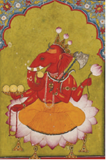

+ Ganesha
- Indra
- Krishna
- Braxma

**373. Qadimgi Hindistonda kimlar ma’bud Brahmaning og‘zidan chiqqan deb hisoblangan?**

- Kshatriy
- Shudra
+ Brahman
- Vayshiy

**374. Mohenjodaro va Xarappa aholisining asosiy mashg‘uloti nima bo’lgan?**

- Hunarmandchilik
+ Dehqonchilik
- Savdo-sotiq
- Chorvachilik

**375. Qadimgi hind rivoyatlarida aytilishicha, qaysi ma’bud osmondagi suvni tutqinlikdan xalos etgach, Yer yuzida qurg‘oqchilik poyoniga yetibgan?**

- Urush ma’budi
- Quyosh ma’budi
- Dengiz ma’budi
+ Momaqaldiroq ma’budi

**376. Qadimgi hindlar qanday omilga ko‘ra to‘rt guruhga ajratilgan edi?**

- Hukmdorlar belgilagan tartibga qarab
- Xudo Brahmaning qaysi qismidan yaratilganligiga qarab
- Qanday ijtimoiy tabaqadan kelib chiqishiga qarab
+ Qanday yumushlar bilan shug‘ullanishiga qarab

**377. Qadimgi Hindistonda dehqon, hunarmand va savdogarlar qaysi tabaqaga kirgan?**

- Kshatriy
- Shudra
- Brahman
+ Vayshiy

**378. Qadimda qaysi shaharlar Hind daryosi havzasining eng yirik shaharlari edi? 1) Pataliputra; 2) Kalkutta; 3) Mohenjodaro; 4) Xarappa.**

- 1, 2
+ 3, 4
- 1, 3
- 2, 4

**379. Hindiston mamlakati Osiyo qit’asining qaysi daryolari vodiylarining bir qismini egallagan?**

- Dajla va Frot
- Brahmaputra va Hind
+ Hind va Gang
- Gang va Dajla

**380. Qadimgi hind rivoyatlarida aytilishicha, qaysi ma’bud har tongda oltin aravada osmon bo‘ylab yo‘lga tushgan?**

- Urush ma’budi
+ Quyosh ma’budi
- Oy ma’budi
- Momaqaldiroq ma’budi

**381. Kimlar jon bir tanadan boshqasiga ko‘chib o‘tishiga e’tiqod qilishgan?**

+ Hindlar
- Xitoyliklar
- Yunonlar
- Misrliklar

**382. Qadimgi Hindistonda xizmatkorlar va qullar qaysi tabaqaga kirgan?**

- Kshatriy
+ Shudra
- Brahman
- Vayshiy

**383. Qadimgi Hindistonda boshi filnikiga o‘xshagan donishmandlik ma’budi qanday atalgan?**

+ Ganesha
- Indra
- Krishna
- Braxma

**384. Kimlar birinchi bo‘lib shakarqamishdan shakar olgan edi?**

+ Hindlar
- Xitoyliklar
- Yunonlar
- Misrliklar

**385. Himolay tog‘lari Hindistonning qaysi tomonidan kelgan shamollarni to‘sib turgan?**

- Sharq tomonidan
- Janub tomonidan
+ Shimol tomonidan
- G‘arb tomonidan

**386. Qadimgi Hindistonda kimlar ma’bud Brahmaning qo‘llaridan yaratilgan deb hisoblangan?**

+ Kshatriy
- Shudra
- Brahman
- Vayshiy

**387. Qachon Hind daryosi vodiysida katta shaharlar vujudga kela boshlagan?**

- Mil. avv. 4-ming yillikda
+ Mil. avv. 3-ming yillikda
- Mil. avv. 2-ming yillikda
- Mil. avv. 1-ming yillikda

**388. Qadimgi Hindistonda momaqaldiroq ma’budi qanday atalgan?**

- Ganesha
+ Indra
- Krishna
- Braxma

**389. “Chandal” so‘zi qanday ma’noni anglatadi?**

+ “Hazar qilinadiganlar”
- “La’natlanganlar”
- “Aqldan ozganlar”
- “Zoti pastlar”

**390. Qadimgi hind aholisi qaysi hayvonni qo‘lga o‘rgatganlar?**

- Tuya
- Sher
- It
+ Fil

**391. Qadimgi Hindistonda kohinlar qaysi tabaqaga kirgan?**

- Kshatriy
- Shudra
+ Brahman
- Vayshiy

**392. Qachon Hind daryosi vodiysi manzilgohlari  tez-tez ro‘y beruvchi toshqinlar, o‘rmonlar va changalzorlar kengayishi natijasida zavolga yuz tutgan?**

- Mil. avv. XX asrda
- Mil. avv. XIX asrda
+ Mil. avv. XVIII asrda
- Mil. avv. XVII asrda

**393. Qadimgi hindlar nimalar yetishtirganlar?**

- Makkajo‘xori, sholi o‘simliklarini
+ Shakarqamish, paxta o‘simliklarini
- Kungaboqar, kanop o‘simliklarini
- Pomidor, beda o‘simliklarini

**394. Mohenjodaro va Xarappa mavzelaridan nimadan qurilgan binolar topilgan?**

- Xom g‘isht va paxsa
+ Pishiq va xom g‘isht
- Pishiq g‘isht va paxsa
- Tosh va pishiq g‘isht

**395. Qadimgi Hindistonda jangchilar qaysi tabaqaga kirgan?**

+ Kshatriy
- Shudra
- Brahman
- Vayshiy

**396. Qadimgi Hindistonda qaysi shahar hunarmandchilik va savdo markazi bo‘lgan?**

- Pataliputra
- Kalkutta
+ Mohenjodaro
- Xarappa

**397. Qadimgi Hindistonda to‘rt tabaqaga mansub bo‘lmaganlarni nima deyishgan?**

- “Ilot”
+ “Chandal”
- “Metek”
- “Rajput”

**398. Qadimgi Hindistonda kimlar ma’bud Brahmaning tovonidan yaratilgan deb hisoblangan?**

- Kshatriy
+ Shudra
- Brahman
- Vayshiy

**399. Qadimgi Hindistonda kimlar ma’bud Brahmaning qovurg‘asidan yaratilgan deb hisoblangan?**

- Kshatriy
- Shudra
- Brahman
+ Vayshiy

## 16-§ Qadimgi Hindiston madaniyati.

**400. Buddaviylik diniga kim asos solgan?**

- Indra
- Shiva
- Ganesha
+ Siddhartha Gautama

**401. “Shaxmat” ni hindlar qanday ataganlar?**

+ “Qo‘shinlarning to‘rt turi”
- “Janglarning to‘rt turi”
- “Urushlarning to‘rt turi”
- “O‘yinlarning to‘rt turi”

**402. Qadimiy hind tillari asosida yangi adabiy til bo‘lmish qaysi til vujudga kelgan?**

+ Sanskrit
- Bengal
- Panjob
- Pushtun

**403. Qaysi xalqlar qadimgi davrda juda katta raqamlarni bildiruvchi alohida belgilarni ishlatgan?**

- Xitoyliklar
+ Hindlar
- Forslar
- Yunonlar

**404. Qachon Buddaviylik diniga asos solingan?**

- Mil. avv. VIII asrda
- Mil. avv. VII asrda
+ Mil. avv. VI asrda
- Mil. avv. V asrda

**405. Budda qaysi gul ustida teran o‘ylarga cho‘mgan holda qilt etmay, ko‘zlarini yumib, chordona qurib o‘tirgan holatda tasvirlanadi?**

- Atir gul
- Lola gul
+ Nilufar gul
- Qirmiz gul

**406. “Mahabharata” va  “Ramayana” dostonlari qaysi tilda yozilgan?**

+ Sanskrit tilida
- Bengal tilida
- Panjob tilida
- Pushtun tilida

**407. Hindlar yil hisobini necha kundan tarkib topgan taqvimni tuzganlar?**

- 357 kundan
- 358 kundan
- 359 kundan
+ 360 kundan

**408. Avvaliga nima sababdan buddaviylarda xudo bo‘lmagan?**

+ Ular xudolar inson azob-uqubatlarini yengillashtira olmaydi, deb hisoblashgan
- Ular xudolar insonlarga azob beradi, deb hisoblashgan
- Ular xudolar inson umrini uzytira olmaydi, deb hisoblashgan
- Ular xudolar inson dardini yengillashtira olmaydi, deb hisoblashgan

**409. Qadimgi Hindistonda ilm-fan, xususan, qanday fanlar sohasida yuksak darajaga erishilgan? 1) Astronomiya; 2) Matematika; 3) Geometriya; 4) Tarix.**

+ 1, 2
- 3, 4
- 1, 3
- 2, 4

**410. Qaysi xalqlarga oy yog‘dusi uning sirtiga tushgan quyosh nurining akslanishi ekanligi ma’lum bo‘lgan?**

- Xitoyliklarga
+ Hindlarga
- Forslarga
- Yunonlarga

**411. Budda haykali joylashgan Mahabodhi ibodatxonasi qaysi shaharda joylashgan?**

- Yangi Dehli
+ Bodh Gaya
- Bangalor
- Kalkutta

**412. “Shaxmat” qayerda ixtiro qilingan?**

- Xitoyda
- Misrda
- Yaponiyada
+ Hindistonda

**413. “Budda” taxallusini olgan Siddhartha Gautama kim bo‘lgan?**

- Rohib
- Hunarmand
- Dehqon
+ Shahzoda

**414. Buddaviylar inson ... kerak  deb hisoblaydi. 1) yolg‘on so‘zlamasligi; 2) mol-davlat to‘plamasligi; 3) tirik  mavjudotlar qonini to‘kmasligi; 4) ibodat qilishga vaqt sarflamasligi.**

- 1
- 1, 2
+ 1, 2, 3
- 1, 2, 3, 4

**415. Rivoyatda naql qilinishicha, shahzoda Siddhartha Gautama necha yoshga to‘lguniga qadar hukmdor otasi saroyida betashvish kun kechirgan?**

- 10 yoshga
+ 20 yoshga
- 30 yoshga
- 40 yoshga

**416. Rivoyatda naql qilinishicha, shahzoda Siddhartha Gautama kunlardan bir kuni sayr qilib yurar ekan u ko‘rgan qaysi voqealar hayotini tamomila o‘zgartirib yuborgan?**

- Ikki buyuk sarkarda o‘rtasida bo‘lib o‘tgan jangga, keyin esa muqaddas sigirning o‘ldirilishiga ko‘zi tushgan
+ Munkillagan, bedavo dardga yo‘liqqan bir kishiga, keyin esa dafn marosimiga ko‘zi tushgan
- Aslzodalar tomonidan azob-uqubatlarga giriftor qilingan oddiy xalqqa, keyin esa betashvish yashayotgan boylarga ko‘zi tushgan
- Yangi tug‘ilgan chaqaloqqa, keyin esa o‘lim to‘shagida yotgan keksa odamga ko‘zi tushgan

**417. Shahzoda Siddhartha Gautama qanday maqsadda dunyo bo‘ylab sayohatga otlangan?**

- Hayot daraxtini izlab topish maqsadida
+ Hayot mazmunini izlab topish maqsadida
- Hayot yo‘lini izlab topish maqsadida
- Hayot sirini izlab topish maqsadida

## 17-§ Qadimgi Xitoy sivilizatsiyalari.

**418. Xitoyda nechanchi asrlar “kurashayotgan podsholiklar” davri nomini olgan?**

- Mil. avv. IX-VII asrlar
- Mil. avv. VIII-VI asrlar
+ Mil. avv. VII-V asrlar
- Mil. avv. V-III asrlar

**419. Xitoyga sholi urug‘i qayerdan keltirilgan?**

- Koreyadan
- Tailanddan
- Yaponiyadan
+ Hindistondan

**420. Qadimda Xitoyda qaysi daraxtni yetishtirish aholining asosiy mashg‘ulotlaridan biri bo‘lgan?**

+ Tut daraxtini
- Olcha daraxtini
- Nok daraxtini
- Bambuk daraxtini

**421. Chjou davlatida hukmronlikni qo‘lga kiritish uchun mayda podsholiklar o‘rtasida urushlar necha yildan uzoqroq davom etgan?**

- 100 yildan
+ 200 yildan
- 300 yildan
- 400 yildan

**422. Xaritadagi Xao shahrining ikkinchi nomini toping.**

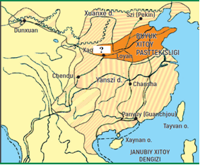

- Gongkong
+ Sian
- Guanchjou
- Shan

**423. Xitoyda ilk sivilizatsiyalar qayerda  vujudga kelgan?**

+ Xuanxe va Yanszi daryolari bo‘ylarida
- Yanszi va Mekong daryolari bo‘ylarida
- Mekong va Siszyan daryolari bo‘ylarida
- Siszyan va Xuanxe daryolari bo‘ylarida

**424. Qachon Chjou davlatida markaziy hokimiyat zaiflasha boshlagan?**

- Mil. avv. IX-VIII asrlarda
+ Mil. avv. VIII-VII asrlarda
- Mil. avv. VII-VI asrlarda
- Mil. avv. VI-V asrlarda

**425. Shan davlatining bosh shahri nima deb atalgan?**

- Pekin
- Sian
- Guanchjou
+ Shan

**426. Xitoydagi qaysi davlatni “Osmon ostidagi podsholik” deb atashgan?**

- Vey
- Xan
+ Chjou
- Sin

**427. Qadimgi Xitoydagi asosiy dehqonchilik  ekinlarini toping. 1) Arpa; 2) Sholi; 3) Javdar; 4) Bug‘doy.**

- 1, 2
+ 3, 4
- 1, 3
- 2, 4

**428. Xitoy tarixida nechanchi asrlar “ko‘p podsholiklar” davri nomini olgan?**

- Mil. avv. IX-VII asrlar
- Mil. avv. VIII-VI asrlar
+ Mil. avv. VII-V asrlar
- Mil. avv. VI-IV asrlar

**429. Choy daraxtini dastlab qayerda yetishtirishgan?**

+ Xitoyda
- Hindistonda
- Misrda
- Yaponiyada

**430. Xitoyda Chjou davlati hukmdorlari o‘zlarini nima deb atashgan?**

- “Quyosh o‘g‘illari”
+ “Osmon o‘g‘illari”
- “Olov o‘g‘illari”
- “Xudo o‘g‘illari”

**431. Qadimgi Xitoy hududida ilk davlat qayerda vujudga kelagan?**

- Yanszi daryosining o‘rta oqimida
- Yanszi daryosining quyi oqimida
+ Xuanxe daryosining o‘rta oqimida
- Xuanxe daryosining quyi oqimida

**432. Qachon qadimgi Xitoy hududida ilk davlat paydo bo‘lgan?**

- Mil. avv. 4-ming yillikda oxirida
+ Mil. avv. 3-ming yillikda oxirida
- Mil. avv. 2-ming yillikda oxirida
- Mil. avv. 1-ming yillikda oxirida

**433. Qachon Xitoyda Sin davlati tashkil topgan?**

- Mil. avv. I asrda
- Mil. avv. II asrda
+ Mil. avv. III asrda
- Mil. avv. IV asrda

**434. Butun … Xitoy Chjou davlati tarkibiga kirgan.**

+ Shimoliy
- Janubiy
- G‘arbiy
- Sharqiy

**435. Shan davlatini bosib olgan qabila qaysi?**

- Vey
- Xan
+ Chjou
- Sin

**436. Xitoyda Chjou davlati hukmdorlari nima uchun davlatni “Osmon ostidagi podsholik” deb atashgan?**

- Xazinasi juda boy bo‘lgani uchun
- Aholisi ko‘pligi uchun
+ Davlat yerlari ulkanligi uchun
- Qo‘shini soni ko‘pligi uchun

## 18-§ Miloddan avvalgi III asrda Xitoy.

**437. Buyuk Xitoy devorining balandligi necha metrni tashkil etadi?**

- 5-9 metrni
+ 6-10 metrni
- 7-11 metrni
- 8-12 metrni

**438. Buyuk Xitoy devorining qalinligi necha metrni tashkil etadi?**

+ 5-8 metrni
- 6-9 metrni
- 7-10 metrni
- 8-11 metrni

**439. Sin Shixuandi qabridan hukmdorni “qo‘riqlash” uchun o‘rnatilgan qancha sopol askarlar haykallari topilgan?**

- 2000 ta
- 4000 ta
+ 6000 ta
- 8000 ta

**440. Dastlab xitoyliklar yozuvni nimaga yozishgan?**

- Qog‘ozlarga
+ Bambuk taxtachalarga
- Ipak matolarga
- Loy taxtachalarga

**441. Qog‘oz, kompas, seysmograf qayerda ixtiro qilingan?**

+ Xitoyda
- Hindistonda
- Misrda
- Yaponiyada

**442. Sin Shixuandi Xitoyda kimlarning hujumlaridan himoyalanish uchun Buyuk Xitoy devorni yanada mustahkamlashni buyurgan?**

- Saklar
+ Hunlar
- Manjurlar
- Skiflar

**443. Qachon qog‘oz ixtiro qilingan?**

- Mil. avv. IV asrda
- Mil. avv. III asrda
- Mil. avv. II asrda
+ Mil. avv. I asrda

**444. Buyuk Xitoy devorini qurish ishlari dastlab nechanchi asrda boshlangan?**

+ Mil. avv. IV asrda
- Mil. avv. III asrda
- Mil. avv. II asrda
- Mil. avv. I asrda

**445. Sin Shixuandi maqbarasini qancha odam bunyod etgan?**

- 710 ming
+ 720 ming
- 730 ming
- 740 ming

**446. Sin Shixuandi qachon Xitoyni o‘z hokimyati ostida birlashtirgan?**

- Mil. avv. 248-yilda
- Mil. avv. 247-yilda
+ Mil. avv. 246-yilda
- Mil. avv. 245-yilda

**447. Sin Shixuandi qanday ma’noni anglatadi?**

+ “Sinning birinchi hukmdori”
- “Sinning yagona hukmdori”
- “Sinning oliy hukmdori”
- “Sinning ilohiy hukmdori”

**448. Xitoyda bundan necha yil muqaddam yozishda bambuk o‘rnida shoyidan foydalanishga o‘tilgan?**

- 2 ming yil muqaddam
+ 2,5 ming yil muqaddam
- 3 ming yil muqaddam
- 3,5 ming yil muqaddam

**449. Buyuk Xitoy devorining uzunligi necha kilometrni tashkil etadi?**

- 2000 km. ni
+ 4000 km. ni
- 6000 km. ni
- 8000 km. ni

**450. Qadimda xitoyliklar kompasi hamma vaqt qaysi tomonni ko‘rsatgan?**

+ Janub tomonni
- Shimol tomonni
- G‘arb tomonni
- Sharq tomonni

**451. Buyuk Xitoy devori mamlakatning qaysi tomonida qurilgan?**

- Janub tomonida
+ Shimol tomonida
- G‘arb tomonida
- Sharq tomonida

**452. Sin Shixuandi maqbarasi necha yil mobaynida bunyod etilgan?**

+ 37 yil
- 38 yil
- 39 yil
- 40 yil

## 19-20-§ O‘zbekiston hududidagi qadimiy davlatlar.

**453. Qadimda O‘rta Osiyo tog‘laridan nimalar qazib olingan? 1) Lojuvard (la’l); 2) Feruza; 3) Mis; 4) Qalay; 5) Kumush; 6) Oltin.**

- 1, 2, 3
- 1, 2, 3, 4
- 1, 2, 3, 5, 6
+ 1, 2, 3, 4, 5, 6

**454. Yunon tarixchisi Ktesiy Ossuriyaning qaysi podshosining Baqtriyaga yurishi haqida hikoya qilgan?**

- Yevtidem
- Oksiart
+ Nin
- Xoriyen

**455. Mil. avv. VII-VI asrlarda O‘zbekiston hamda qo‘shni hududlarda kimlar yashagan? 1) So‘g‘diylar; 2) Baqtriyaliklar; 3) Xorazmliklar; 4) Massagetlar; 5) Saklar.**

- 1, 2
- 1, 2, 3
- 1, 2, 3, 4
+ 1, 2, 3, 4, 5

**456. Quyidagi suratda qaysi ma’dan tasvirlangan?**

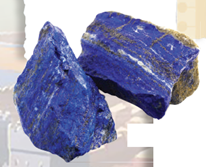

- Ko‘hinur
- Bazalt
+ La’l
- Feruza

**457. Kimlar Baqtriyani “Baqtriana”, “Baqtriya” deb ataganlar?**

- Hind mualliflari
- Fors mualliflari
+ Yunon-rim mualliflari
- Xitoy mualliflari

**458. Yerqo‘rg‘on va Uzunqir shaharlari qayerda joylashgan?**

- Sirdaryoda
- Xorazmda
- Surxondaryoda
+ Qashqadaryoda

**459. Qaysi manbalarda Xorazm “Xorasmiya” deb atalgan?**

- Xitoy manbalarida
- Vizantiya manbalarida
- Fors manbalarida
+ Yunon manbalarida

**460. Quyidagi suratdagi oltin qoplon tasvirli buyum qaysi xalq san’ati namunasi hisoblanadi?**

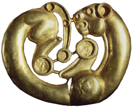

- Massagetlar
+ Saklar
- Parfiyaliklar
- Marg‘iyonaliklar

**461. Qiziltepa shahri qayerda joylashgan?**

- Samarqandda
+ Surxondaryoda
- Xorazmda
- Qashqadaryoda

**462. Afrosiyob shahri qayerda joylashgan?**

+ Samarqandda
- Surxondaryoda
-  Xorazmda
- Qashqadaryoda

**463. Qadimda O‘rta Osiyoda lojuvard qayerdan qazib olingan?**

- Xorazmdan
+ Baqtriyadan
- Parfiyadan
- Marg‘iyonadan

**464. Mil. avv. VII-VI asrlarda Xorazm, So‘g‘diyona va Baqtriya aholisining asosiy mashg‘uloti nima bo‘lgan?**

- Hunarmandchilik va savdo-sotiq
+ Sun‘iy sug‘orishga asoslangan dehqonchilik
- Ko‘chmanchi chorvachilik
- Ovchilik va baliqchilik

**465. Ko‘chmanchi sak va massaget qabilalarining asosiy mashg‘uloti nima bo‘lgan?**

+ Chorvachilik
- Dehqonchilik
- Hunarmandchilik
- Savdo-sotiq

**466. “Baqtriya botirlarining jasoratini, ularning yurti ko‘plab mustahkam qo‘rg‘onlarga ega ekanini yaxshi bilgan Nin o‘ziga qarashli elatlardan ko‘p sonli jangchilar to‘pladi” Ushbu jumla muallifini toping.**

- Arrian
- Gerodot
- Strabon
+ Ktesiy

**467. Ko‘ktepa shahri qayerda joylashgan?**

- Samarqandda
+ Zarafshonda
- Xorazmda
- Qashqadaryoda

**468. Quyidagi rasmdagi Qadimgi Baqtriya uy-qo‘rg‘oni nechanchi asrlarga taalluqli?**

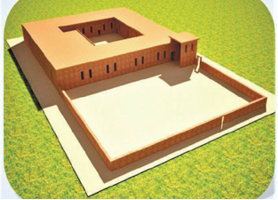

+ Mil. avv. VII-IV asrlarga
- Mil. avv. VI-V asrlarga
- Mil. avv. V-IV asrlarga
- Mil. avv. IV-III asrlarga

**469. Qadimda kimlarning yurti Surxon vohasi, Afg‘onistonning shimoliy, Tojikistonning janubiy hududlarida joylashgan bo‘lgan?**

- Parfiyaliklarning
+ Baqtriyaliklar
- Marg‘iyonaliklarning
- So‘g‘diyonaliklarning

**470. Quyidagi qaysi hudud yaqinida arpa va bug‘doyni saqlash uchun mo‘ljallangan yirik g‘alla omborxonasi bunyod etilgan edi?**

+ Ko‘zaliqir
- Qiziltepa
- Yerqo‘rg‘on
- Ko‘ktepa

**471. Yunon tarixchisi Ktesiyning ma’lumotlariga ko‘ra, baqtriyaliklar ossuriyaliklarni ta’qib etib, tog‘ etagigacha quvib borgan va qancha nafar dushman qo‘shinini qirib tashlagan?**

- 30 ming nafar
- 50 ming nafar
- 80 ming nafar
+ 100 ming nafar

**472. Quyidagi suratda nima tasvirlangan?**

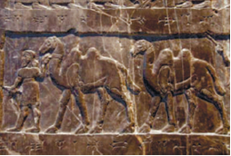

+ Baqtriyalik tuyakash
- Xorazmlik tuyakash
- So‘g‘dlik tuyakash
- Parfiyalik tuyakash

**473. Qadimda Amudaryoning quyi oqimida yashagan o‘troq dehqon elatlari qanday atalgan?**

- Parfiyaliklar
+ Xorazmliklar
- Baqtriyaliklar
- Dovonliklar

**474. Baqtriyaning Ossuriya bilan aloqalari haqida qaysi qadimgi yunon tarixchisi yozib qoldirgan?**

- Arrian
- Gerodot
+ Ktesiy
- Strabon

**475. So‘g‘diylarning eng yaqin qo‘shnilari kimlar bo‘lgan?**

- Parfiyaliklar
- Xorazmliklar
+ Baqtriyaliklar
- Dovonliklar

**476. Mil. avv. VII asrda Marg‘iyona va So‘g‘diyona qaysi davlatning siyosiy va madaniy ta’sirida bo‘lgan?**

- Xorazmning
+ Baqtriyaning
- Dovonning
- Parfiyaning

**477. Yunon tarixchisi Ktesiy nechanchi asrlarda yashagan?**

- Mil. avv. VII-VI asrlarda
- Mil. avv. VI-V asrlarda
+ Mil. avv. V-IV asrlarda
- Mil. avv. IV-III asrlarda

**478. Qadimgi Xorazmda qanday mahsulotlarning dovrug‘i o‘zga yurtlarga ham tarqalgan edi? 1) Kulolchilik; 2) Qurolsozlik; 3) Zargarlik; 4) To‘qimachilik; 5) Bo‘yoqchilik; 6) Shishasozlik.**

+ 1, 2, 3
- 4, 5, 6
- 1, 3, 5
- 2, 4, 6

**479. Yunon yozma manbalarida Zarafshon va Qashqadaryo vohasi qanday nomlangan?**

- Baqtriya
- Parfiya
+ So‘g‘diyona
- Araxosiya

**480. Qadimda Zarafshon va Qashqadaryo vohasida xo‘jalikning qanday turi bilan shug‘ullanuvchi ko‘plab aholi istiqomat qilgan?**

- Chorvachilik
+ Dehqonchilik
- Hunarmandchilik
- Savdo-sotiq

**481. Hunarmandchilik va savdoning rivojlanishi natijasida qachon O‘rta Osiyoda qadimgi shaharlar rivojlangan?**

+ Mil. avv. VII-VI asrlarda
- Mil. avv. VIII-VII asrlarda
- Mil. avv. VI-V asrlarda
- Mil. avv. IX-VIII asrlarda

**482. Yunon tarixchisi Ktesiy uzoq muddat qaysi qadimgi fors shohi saroyida yashab, saroy tabibi bo‘lgan?**

- Doro I
+ Artakserks
- Kambiz II
- Kir II

**483. Yunon tarixchisi Ktesiyning ma’lumotlariga ko‘ra, qaysi shahar boshqa shaharlaridan qal’asining va devorlarining mustahkamligi bilan ajralib turgan?**

- Afrosiyob
+ Baqtra
- Nineviya
- Ershi

**484. “Podshoh so‘ragan la’l borasida: “Menga la’l keltiring”, degan ekanlar. Men, janobi oliylari, tog‘ga chiqib, la’lni qo‘lga kiritganimda mamlakat ahli menga qarshi qo‘zg‘alganini bilmaydilar.” Baqtriya la’li to‘g‘risidagi ushbu jumla qaysi mamlakat manbasidan olingan?**

- Elam
+ Ossuriya
- Fors
- Parfiya

**485. Ossuriya podshosi Ninga qarshi kurash olib borgan Baqtriya podshosini toping.**

- Yevtidem
+ Oksiart
- Kiaksar
- Xoriyen

**486. Qachon xorazmliklar Ko‘zaliqir qal’asida katta saroy qurishgan?**

- Mil. avv. III asrda
- Mil. avv. IV asrda
- Mil. avv. V asrda
+ Mil. avv. VI asrda

**487. Qachon Qadimgi Baqtriya davlati tashkil topgan?**

- Mil. avv. VIII asrda
+ Mil. avv. VII asrda
- Mil. avv. VI asrda
- Mil. avv. V asrda

**488. Qadimgi Xorazm aholisi asosan nima bilan shug‘ullangan?**

+ Dehqonchilik va chorvachilik
- Ovchilik va dehqonchilik
- Chorvachilik va bog‘dorchilik
- Bog‘dorchilik va baliqchilik

**489. Ko‘zaliqir shahri qayerda joylashgan?**

- Samarqandda
- Surxondaryoda
+ Xorazmda
- Qashqadaryoda

## 21-§ Zardushtiylik va “Avesto”.

**490. Zardushtiylar yomg‘irdan keyin hosil bo‘ladigan kamalakka qaysi ma’budning o‘q uzayotgan yoyi deb sig‘inishgan?**

+ Mitraning
- Anaxitaning
- Ahuramazdaning
- Ahrimanning

**491. Zardushtiylik dini qaysi ibtidoiy davrda vujudga kelgan?**

- Neolit davrida
- Mezolit davrida
- Bronza davrida
+ Temir davrida

**492. Quyidagi qaysi manbada inson mehnat qilishi, biror hunar, binokorlik, dehqonchilik va chorvachilik bilan shug‘ullanishi kerakligi aytiladi?**

+ “Avesto” kitobida
- “Rigveda” kitobida
- “Bibliya” kitobida
- “Injil” kitobida

**493. Quyidagi suratda qaysi kitob tasvirlangan?**

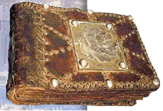

+ “Avesto” kitobi
- “Rigveda” kitobi
- “Bibliya” kitobi
- “Injil” kitobi

**494. Quyidagi suratdagi oltin plastinkada tasvirlangan zardushtiylik kohini qayerdan topilgan?**

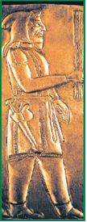

- Balx xazinasidan
- Sirdaryo xazinasidan
+ Amudaryo xazinasidan
- Zarafshon xazinasidan

**495. Zardushtiylik tarqala boshlagan paytlarda diniy marosimlar qayerlarda o‘tkazilgan? 1) Ibodatxonalarda; 2) Ochiq osmon ostida; 3) Daryolar bo‘yida; 4) Gulxan yonida; 5) Hukmdorlar saroyida; 6) Uydagi o‘choq olovi atrofida.**

- 1, 2, 3
- 4, 5, 6
- 1, 3, 5
+ 2, 4, 6

**496. Zardushtiylik dinida Quyosh va yorug‘lik ma’budi qanday ataladi?**

+ Mitra
- Anaxita
- Ahuramazda
- Ahriman

**497. “Quyosh madhi” qasidasini kimlar kuylashgan?**

- Xristianlar
- Yahudiylar
+ Zardushtiylar
- Buddaviylar

**498. Zardushtiylarning ulug‘ va donishmand oliy xudosi qanday ataladi?**

- Mitra
- Anaxita
+ Ahuramazda
- Ahriman

**499. Zardushtiylik dinida yovuzlik va o‘lim ma’budi qanday ataladi?**

- Mitra
- Anaxita
- Ahuramazda
+ Ahriman

**500. Quyidagi qaysi manbada yosh bolalarga bilim berib, bironta hunarga o‘rgatish qadrlangan, negaki “o‘qish – ko‘zning nuri” deb uqtirilgan?**

+ “Avesto” kitobida
- “Rigveda” kitobida
- “Bibliya” kitobida
- “Injil” kitobida

**501. “Ossuariy” nima?**

- Yog‘och tobutcha
- Tosh tobutcha
- Temir tobutcha
+ Sopol tobutcha

**502. Yunonistonda Zardushtni “Zoroastr” deb atashgan, negaki Yunonistonda uni birinchi galda kim sifatida bilishgan? 1) Donishmand; 2) Tabib; 3) Munajjim; 4) Savdogar.**

- 1, 2
- 3, 4
+ 1, 3
- 2, 4

**503. Zardushtiylik e’tiqodiga ko‘ra, ... kerak edi. 1) Yolg‘on so‘zlamaslik; 2) Aldamaslik; 3) Va’daga vafo qilish; 4) Faqat ezgu ishlarni amalga oshirish.**

- 2, 3, 4
- 1, 2, 4
- 1, 2, 3
+ 1, 2, 3, 4

**504. Nisbatan oldinroq paydo bo‘lgan dinni toping.**

- Moniylik
- Mazdakiylik
- Buddaviylik
+ Zardushtiylik

**505. Qachon O‘rta Osiyoda zardushtiylik dini keng tarqalgan?**

- Mil. avv. 4-ming yillikda
- Mil. avv. 3-ming yillikda
- Mil. avv. 2-ming yillikda
+ Mil. avv. 1-ming yillikda

**506. Quyidagi suratda qaysi manba sahifasi tasvirlangan?**

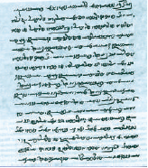

+ “Avesto” kitobi
- “Rigveda” kitobi
- “Bibliya” kitobi
- “Injil” kitobi

**507. Qaysi dinda inson vafot etganidan keyin uni olovda kuydirish ham, suvga tashlab yuborish ham ta’qiqlangan?**

- Moniylikda
- Mazdakiylikda
- Buddaviylikda
+ Zardushtiylikda

**508. Zardushtiylar hayotining tub ma’nosi nima bo‘lgan?**

- Suv, havo, yer va olovni muqaddas hisoblashdan iborat bo‘lgan
- Ibodat qilish, ro‘za tutish va sadaqa qilishdan iborat bo‘lgan
- Va’daga vafo qilish, aldamaslik va to‘g‘ri so‘zlashdan iborat bo‘lgan
+ Ezgu fikr, ezgu so‘z va ezgu amaldan iborat bo‘lgan

**509. Zardushtiylik dinida qaysi ma’bud o‘tli chaqmoqlar yordamida yovuzlik va o‘lim ma’budi bo‘lmish Ahriman bilan jang qiladi deb hisoblangan?**

+ Mitra
- Anaxita
- Ahuramazda
- Ahriman

**510. Zardusht necha yoshida payg‘ambar bo‘lgan?**

- 20 yoshida
+ 30 yoshida
- 40 yoshida
- 50 yoshida

**511. “Avesto” so‘zi qanday ma’noni anglatadi?**

+ “Qat’iy belgilangan qonun-qoidalar”
- “Ilohiy qonunlar”
- “Muqaddas urf-odatlar”
- “Ezgu ishlar haqidagi so‘zlar”

**512. Quyidagi qaysi manbada o‘g‘rilik va qarzdorlik gunoh deb hisoblangan?**

+ “Avesto” kitobida
- “Rigveda” kitobida
- “Bibliya” kitobida
- “Injil” kitobida

**513. Zardusht qaysi davrda yashagan?**

- Mil. avv. 2-ming yillik ikkinchi choragida
- Mil. avv. 2-ming yillik birinchi choragida
- Mil. avv. 1-ming yillik ikkinchi choragida
+ Mil. avv. 1-ming yillik birinchi choragida

**514. Zardushtiylik dinida hosildorlik va suv ma’budasi qanday ataladi?**

- Mitra
+ Anaxita
- Ahuramazda
- Ahriman

## 22-§ Antik tarixning boshlanishi.

**515. Kimlar Minoy sivilizatsiyasi barbod bo‘lishini nihoyasiga yetkazganlar?**

+ Axeylar
- Doriylar
- Oriylar
- Giksoslar

**516. Miloddan avvalgi 1-mingyillikda Fern shahri qaysi davlat tarkibida bo‘lgan?**

- Rim
+ Yunoniston
- Makedoniya
- Pont

**517. Qaysi hududlarni o‘z ichiga olgan qadimgi yunon davlatlarining umumiy nomi Qadimgi Yunoniston deb atalgan?**

- Kichik Osiyo yarimoroli va Qora dengizi orollarini
- Periney yarimoroli va Qizil dengizi orollarini
+ Bolqon yarimoroli va O‘rta Yer dengizi orollarini
- Apennin yarimoroli va Fors ko‘rfazi orollarini

**518. Krit orolidagi sivilizatsiya qanday atalgan?**

+ Minoy sivilizatsiyasi
- Miron sivilizatsiyasi
- Menes sivilizatsiyasi
- Miken sivilizatsiyasi

**519. Qadimgi Yunonistonning qayerida ilk sivilizatsiya vujudga kelgan?**

+ Krit orolida
- Sitsiliya orolida
- Kipr orolida
- Sardiniya orolida

**520. Quyidagi suratdagi oltin buyumlar qayerdan topilgan?**

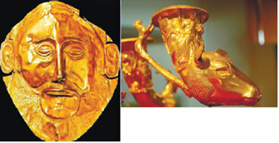

- Spartadan
- Troyadan
- Afinadan
+ Mikendan

**521. Qachon Krit orolida sivilizatsiya vujudga kelgan?**

- Mil. avv. 4-ming yillikda
- Mil. avv. 3-ming yillikda
+ Mil. avv. 2-ming yillikda
- Mil. avv. 1-ming yillikda

**522. Yunonistonning qaysi qismida yunonlar uchun nihoyatda qadrli bo‘lgan ninabargli o‘rmonlar o‘sgan?**

+ Yunonistonning shimolidagi Peloponnesda
- Yunonistonning janubidagi Fessaliyada
- Yunonistonning g‘arbidagi Attikada
- Yunonistonning sharqidagi Lakonikada

**523. Yunonistonning eng baland tog‘i qaysi?**

- Plateya
- Fermopil
+ Olimp
- Marafon

**524. Yunonlar qadim zamonlardan nima bilan shug‘ullanishgan?**

- Hunarmandchilik va chorvachilik bilan
+ Dehqonchilik va chorvachilik bilan
- Dehqonchilik va savdo-sotiq bilan
- Savdo-sotiq va hunarmandchilik bilan

**525. Krit orolidagi sivilizatsiyani nima uchun “Minoy sivilizatsiyasi” deb atashgan?**

- Afsonaviy mahluq Minos nomi bilan
- Afsonaviy qahramon Minos nomi bilan
- Afsonaviy xudo Minos nomi bilan
+ Afsonaviy podsho Minos nomi bilan

**526. Shimol tarafidan tashqari, Qadimgi Yunonistonni qaysi dengizlar o‘rab turgan? 1) Qora dengiz; 2) Marmar dengizi; 3) Qizil dengiz; 4) O‘rta Yer dengizi; 5) Egey dengizi.**

- 1, 3
+ 4, 5
- 2, 3
- 1, 5

**527. Mikendagi “Arslonlar darvozasi” surati kim tomonidan chizilgan?**

- Piter Berygel
+ Dyu Monsel Teodor
- Fridrix Rixtgofen
- Jak Fransua Shampolyon

**528. Qanday omil yunonlar orasida dengizchilik rivoj topishiga imkon yaratib bergan?**

+ Egey dengizidagi ko‘p sonli katta-kichik orollar, qulay dengiz qirg‘oqlari va qo‘ltiqlarning mavjudligi
- Qo‘shni hududlar bilan doimiy savdo-sotiq
- Kema yasash uchun yaroqli bo‘lgan daraxt navining ko‘pligi
- Yunonistonda tabiiy qazilma boyliklarining kamligi

**529. Qachon qadimgi Yunonistonda ilk shahar-davlatlar vujudga kela boshlagan?**

- Mil. avv. 4-ming yillikda
- Mil. avv. 3-ming yillikda
+ Mil. avv. 2-ming yillikda
- Mil. avv. 1-ming yillikda

**530. Olimp tog‘i Yunonistonning qaysi tomonida joylashgan?**

- Janubi-sharqiy tomonida
- Janubi-g‘arbiy tomonda
+ Shimoli-sharqiy tomonida
- Shimoli-g‘arbiy tomonida

**531. Kimlar Miken davlatini yakson qilib, Sparta davlatiga asos solganlar?**

- Axeylar
+ Doriylar
- Oriylar
- Giksoslar

## 23-24-§ Qadimgi Yunonistonning yuksalishi.

**532. Spartaliklar tomonidan qulga aylantirilgan mahalliy aholi qanday atalgan?**

- Liktor
- Periyek
- Metek
+ Ilot

**533. Attika aholisi uchta katta guruhga bo‘lingan. Ularni toping. 1) Aristokratlar; 2) Kohinlar; 3) Goplitlar; 4) Fuqarolar; 5) Meteklar; 6) Qullar.**

- 1, 2, 3
+ 4, 5, 6
- 1, 3, 5
- 2, 4, 6

**534. Qadimgi Yunonistonda necha yoshdan boshlab bolalarga yozuv va hisob o‘rgatilgan?**

- 5 yoshdan
- 6 yoshdan
+ 7 yoshdan
- 8 yoshdan

**535. Afinada oliy ma’lumot beradigan o‘quv yurtlarida qaysi fanlar o‘qitilardi? 1) Tibbiyot; 2) Ritorika; 3) Matematika; 4) Astronomiya; 5) Geometriya; 6) Geografiya; 7) Tarix.**

- 1, 2, 3, 4, 5, 6, 7
- 2, 3, 4, 5, 6, 7
- 3, 4, 5, 6, 7
+ 4, 5, 6, 7

**536. Kimlar Afina fuqarosi bo‘la olgan?**

+ Otasi va onasi ozod afinalik bo‘lgan erkaklar
- Otasi va onasi ozod afinalik bo‘lgan erkaklar va ayollar
- Otasi ozod afinalik bo‘lgan erkaklar
- Otasi ozod afinalik bo‘lgan erkaklar va ayollar

**537. Afinada o‘g‘il bolalarga 14 yoshdan nimalar o‘rgatilar edi? 1) Kurash; 2) Nayza uloqtirish; 3) Disk uloqtirish; 4) Uzunlikka sakrash; 5) Balandlikka sakrash; 6) Yugurish.**

- 1, 2, 3
- 1, 2, 3, 4
- 1, 2, 3, 4, 5
+ 1, 2, 3, 4, 5, 6

**538. “Polis” so‘zi qanday ma’noni anglatadi?**

+ “Shahar”
- “Qishloq”
- “Davlat”
- “Viloyat”

**539. Afinada “abak” deb nimaga aytilgan?**

- Tosh otuvchi qurolga
+ Hisob taxtachasiga
- Askar qalqoniga
- Yozuv qalamchasiga

**540. Qachon Attikaning g‘arbiy qismida yunonlar “Akropol” qurganlar?**

- Mil. avv. 4-ming yillikda
- Mil. avv. 3-ming yillikda
+ Mil. avv. 2-ming yillikda
- Mil. avv. 1-ming yillikda

**541. Yunon shaharlarining ko‘pchiligi qanday tashkil topgan?**

- Manzilgohlar bilan savdo-sotiq qilish natijasida
- Hunarmandchilik va savdoning rivojlanishi orqali
- Tashqi hujum xavfi yanada kuchayishi oqibatida
+ Bir qancha manzilgohlar birlashishi natijasida

**542. Qadimgi Yunonistonda qo‘shinning asosini kimlar tashkil etgan?**

- Og‘ir qurollangan otliqlar
+ Og‘ir qurollangan askarlar
- Yengil qurollangan askarlar
- Yengil qurollangan otliqlar

**543. Afinada og‘il bolalar necha yoshdan gimnastika bilan shug‘ullanar edilar?**

- 13 yoshdan
+ 14 yoshdan
- 15 yoshdan
- 16 yoshdan

**544. “Pedagog” so‘zi qanday ma’noni anglatadi?**

+ “Bolani yo‘lda kuzatib boruvchi”
- “Bolaga ta’lim beruvchi”
- “Bolaning savodini chiqaruvchi”
- “Bola tarbiyasi bilan shug‘ullanuvchi”

**545. Attikaning qaysi qismida yunonlar “Akropol” qurganlar?**

- Sharqiy qismida
- Janubiy qismida
- Shimoliy qismida
+ G‘arbiy qismida

**546. Yunonistonda nimaning rivoj topishi bilan manzilgohlar va shaharlar soni ortib borgan?**

+ Dehqonchilik va hunarmandchilikning
- Chorvachilik va dehqonchilikning
- Dehqonchilik va savdo-sotiqning
- Savdo-sotiq va hunarmandchilikning

**547. Attika viloyati qayerda joylashgan?**

+ O‘rta Yunonistonning janubi-sharqiy qismida
- Janubiy Yunonistonning janubi-g‘arbiy qismida
- Shimoliy Yunonistonning shimoli-sharqiy qismida
- G‘arbiy Yunonistonning shimoli-g‘arbiy qismida

**548. Akropol tevaragida qaysi shahar vujudga kelgan?**

+ Afina
- Fiva
- Korinf
- Sparta

**549. Quyidagi qaysi shaharda qonun bo‘yicha faqat o‘g‘il bolalar uchun ta’lim olish majburiy bo‘lgan?**

- Spartada
- Korinfda
- Fivada
+ Afinada

**550. Qadimgi Yunonistonning qaysi shahrida hamma uylar bir-biriga o‘xshatib qurilgan?**

- Afinada
- Fivada
- Korinfda
+ Spartada

**551. Afina shahrida yashagan odamlarning asosiy qismini kimlar tashkil etgan? 1) Dehqonlar; 2) Hunarmandlar; 3) Savdogarlar; 4) Chorvadorlar; 5) Harbiylar.**

- 1, 2
+ 2, 3
- 3, 4
- 4, 5

**552. Kimlar Sparta davlatiga asos solganlar?**

- Axeylar
+ Doriylar
- Oriylar
- Giksoslar

**553. “Palestra” nima?**

- Davlat va jamoat maktablari
+ Xususiy gimnastika maktablari
- Saroy va ibodatxona maktablari
- Sport va musiqa maktablari

**554. Afinada o‘spirinlar qo‘shimcha ravishda yana nimalarni o‘rgangan? 1) Notiqlik; 2) Qo‘l jangi; 3) Harbiy ishlar; 4) Otga minib yurish; 5) Tabobat.**

- 1, 2, 3
- 1, 3, 4
+ 2, 3, 4
- 2, 3, 5

**555. Qadimgi Yunonistonning qaysi shahriga chet elliklar kiritilmagan?**

- Afinaga
+ Spartaga
- Fivaga
- Korinfga

**556. “Akropol” so‘zi qanday ma’noni anglatadi?**

- “Quyi shahar”
+ “Yuqori shahar”
- “Katta shahar”
- “Buyuk shahar”

**557. Spartada necha yoshga to‘lgan hamma yigitlar qo‘shinga qabul qilinib, keksa yoshga qadar xizmat qilganlar?**

+ 20 yoshga
- 19 yoshga
- 18 yoshga
- 17 yoshga

**558. Quyidagi qaysi shahar urushga tayyorgarlik ko‘rayotgan shaharga o‘xshab qolgan?**

- Afina
- Fiva
+ Sparta
- Korinf

**559. Qadimgi Yunonistonda to‘rt burchak shaklni yuzaga keltiruvchi bir-biriga zich joylashgan jangovar saf nima deb atalgan?**

- Kogorta
- Legion
- Senturiya
+ Falanga

**560. Qadimgi Yunonistondagi qaysi muassasada adabiyot o‘qitilar, she’r yozish va musiqa o‘rgatilar edi?**

+ Palestrada
- Akademiyada
- Termada
- Gimnaziyada

**561. Spartaliklar o‘z davlatida qanday shart-sharoitlar yaratganlar? 1) Boshqa davlatlar bilan tinch-totuv yashash; 2) Hamma qat’iy intizomga amal qilishi; 3) Qulga aylantirilgan mahalliy aholini ezish; 4) Koloniyalar bilan savdo-sotiqni rivojlantirish; 5) Intizomni buzganlar shafqatsiz jazolanishi.**

- 2, 6
- 4, 5
- 1, 5
+ 2, 5

**562. Qadimgi Yunonistonda shahar-davlatlar qanday atalgan?**

- Agora
- Forum
+ Polis
- Nom

**563. Mil. avv. XII asrda Yunonistonning qaysi hududiga doriylar qabilasi bostirib kirgan?**

+ Lakonika
- Messeniya
- Attika
- Beotiya

**564. Qachon Janubiy Yunoniston (Lakonika) hududiga doriylar qabilasi bostirib kirgan?**

+ Mil. avv. XII asrda
- Mil. avv. XI asrda
- Mil. avv. X asrda
- Mil. avv. IX asrda

**565. Afinaning asosiy portiga aylangan bandargoh qanday atalgan?**

- Salamin
- Fermopil
+ Pirey
- Plateya

**566. Qadimgi Yunonistonning qaysi shahrida savdo-sotiq sust rivojlangan, san’at asarlari, chiroyli ibodatxonalar bo‘lmagan?**

+ Spartada
- Afinada
- Fivada
- Korinfda

**567. Quyidagi qaysi shahar fuqarolari og‘ir mehnat va salomatlikka zarar yetkazuvchi ishlardan ozod qilingan?**

- Fivaliklar
+ Afinaliklar
- Korinfliklar
- Spartaliklar

**568. Attikada “meteklar” deb kimlarga aytilgan?**

- Qullarga
- Qaram kishilarga
- Ijarachi dehqonlarga
+ Chet elliklarga

**569. Spartada ilotlar ... .**

- alohida spartaliklarni emas, balki butun oilaning mulki hisoblanganlar
- butun boshli davlatning emas, balki hukmron tabaqaning mulki hisoblanganlar
- butun boshli davlatning emas, balki alohida spartaliklarning mulki hisoblanganlar
+ alohida spartaliklarni emas, balki butun boshli davlatning mulki hisoblanganlar

**570. Qadimgi Yunonistonda og‘ir qurollangan askarlar qanday atalgan?**

- Liktor
+ Goplit
- Legioner
- Gastat

**571. Quyidagi qaysi davlatda bolalar ancha qattiq sharoitda voyaga yetishgan?**

- Afinada
- Fivada
- Korinfda
+ Spartada

**572. Spartaliklar faqat nima bilan shug‘ullangan?**

- Dehqonchilik bilan
- Chorvachilik bilan
- Savdo-sotiq bilan
+ Harbiy ish bilan

**573. Qadimgi Spartada to‘la-to‘kis huquqlarga ega bo‘lmagan fuqarolar qanday atalgan?**

- Goplit
+ Periyek
- Metek
- Ilot

**574. Qadimgi Spartada qanday odamlar qadrlangan?**

- Bilimli va dono odamlar
+ Kuchli va chidamli odamlar
- Boy va nasabli odamlar
- Erkin va ziyoli odamlar

**575. Afinada mum surkalgan taxtachalarga nima bilan yozishgan?**

- Papirus bilan
+ Stil bilan
- Temir bilan
- Yog‘och bilan

**576. Afinada oliy ma’lumot beradigan o‘quv yurtlarida ta’lim olish muddati necha yil bo‘lgan?**

- 1-2 yil
- 2-3 yil
+ 3-4 yil
- 4-5 yil

## 25-§ Yunon koloniyalari.

**577. Qaysi davr tarixda “Buyuk yunon koloniyalashtirishi” nomini olgan?**

- Mil. avv. IX-VII asrlar
+ Mil. avv. VIII-VI asrlar
- Mil. avv. VII-V asrlar
- Mil. avv. VI-IV asrlar

**578. Yunonlar o‘z vatanini tark etishda o‘zlari bilan birga loy surtilgan qamishdan to‘qilgan savatchalarda nima olib ketishgan?**

+ Olov
- Tuproq
- Suv
- Non

**579. Mil. avv. VIII-VI asrlarda vujudga kelgan yunon koloniyalarni toping. 1) Olviya; 2) Sirakuza; 3) Xersones; 4) Korinf; 5) Pantikapey; 6) Karfagen.**

- 1, 2, 3
- 4, 5, 6
+ 1, 3, 5
- 2, 4, 6

**580. Yunonlar o‘z vatanini qanday atashgan?**

- Olimpiya
- Albion
+ Ellada
- Peloponnes

**581. Yunonistondan ko‘chib ketgan yunonlar qayerlarga o‘rnashganlar?**

+ Sitsiliya oroli sohillari va Apennin yarimoroli janubiga
- Sardinya oroli sohillari va Apennin yarimoroli janubiga
- Sitsiliya oroli sohillari va Apennin yarimoroli shimoliga
- Sardinya oroli sohillari va Apennin yarimoroli shimoliga

**582. Yunonistondan ko‘chib ketganlarning manzilgohlari qaysi dengiz bo‘ylarida vujudga kelgan? 1) Qora dengiz; 2) Marmar dengizi; 3) Qizil dengiz; 4) O‘rta Yer dengizi; 5) Egey dengizi.**

- 1, 3
+ 1, 4
- 2, 3
- 1, 5

**583. Yunonlar o‘zini qanday atashgan?**

- Doriylar
- Axeylar
+ Ellinlar
- Mikenlar

**584. Yunonlar o‘zlashtirilgan yerlar tevaragida yashovchi yunon bo‘lmagan xalqlarni nima deb atagan?**

- “Meteklar”
+ “Varvarlar”
- “Ilotlar”
- “Periyeklar”

## 26-§ Afinada demokratiya.

**585. Afinada qaysi organ hokimlar va sudyalarni saylagan?**

- Xalq majlisi
- Aslzodalar majlisi
+ Oqsoqollar kengashi
- Beshyuzlar kengashi

**586. Afinada necha yoshga to‘lgan fuqarolar Xalq sudi faoliyatida ishtirok etar edilar?**

- 20 yoshga
- 25 yoshga
+ 30 yoshga
- 35 yoshga

**587. Afinada kimning islohotlari natijasida Xalq majlisi faoliyati tiklanib, davlat boshqaruvidagi oliy tashkilotga aylangan?**

- Leonidning
- Miltiadning
+ Solonning
- Periklning

**588. Qachon Solon Afinada davlatni idora qilish tizimini o‘zgartirgan?**

- Mil. avv. 596-yilda
- Mil. avv. 595-yilda
+ Mil. avv. 594-yilda
- Mil. avv. 593-yilda

**589. Qonunni buzganlik uchun Drakont bitta, ya’ni qanday jazo belgilagan?**

- Surgun
+ O‘lim
- Qamoq
- Jarima

**590. Afinada kim davlatni idora qilishning oldingi aristokratiya (aslzodalar hokimyati) tizimini demokratiya (xalq hokimyati) ga almashtirgan?**

- Leonid
- Miltiad
+ Solon
- Perikl

**591. Afinada Agora qayerda joylashgan edi?**

- Dengiz bo‘yida
- Parfenon qarshisida
+ Akropol tevaragida
- Pirey bandargohida

**592. Afinada Xalq majlisining katta qismi kimlardan iborat bo‘lgan? 1) Hunarmandlar; 2) Chorvadorlar; 3) Savdogarlar; 4) Qullar; 5) Chet elliklar; 6) Dehqonlar.**

+ 1, 3, 5, 6
- 2, 3, 4, 5
- 1, 2, 3, 6
- 2, 4, 5, 6

**593. Kimning hukmronligi davrida Afinada qonun chiqaruvchi tadbirlar amalga oshirilishi natijasida demokratiya rivojlangan?**

- Drakont davrida
+ Perikl davrida
- Miltiad davrida
- Solon davrida

**594. Afinaliklar qaysi qonunga “siyoh qolib, qon bilan yozilgan” deya ta’rif berishgan?**

- Solon qonunlariga
- Leonid qonunlariga
- Perikl qonunlariga
+ Drakont qonunlariga

**595. Qaysi Afina hukmdori tarixchi Gerodot, haykaltarosh Fidiy bilan do‘st tutingan edi?**

- Drakont
- Miltiad
- Solon
+ Perikl

**596. Kimning hukmronligi davrida Parfenon – ma’buda Afina ibodatxonasi qurilgan?**

- Drakont davrida
- Miltiad davrida
+ Perikl davrida
- Solon davrida

**597. Afinada qaysi organ yangi inshootlar qurilishiga, armiyaga va boshqalarga mablag‘ ajratish to‘g‘risida qaror qabul qilar edi?**

+ Xalq majlisi
- Aslzodalar majlisi
- Oqsoqollar kengashi
- Beshyuzlar kengashi

**598. Afinada qaysi organ kundalik joriy masalalarni hal qilardi?**

- Xalq majlisi
- Aslzodalar majlisi
- Oqsoqollar kengashi
+ Beshyuzlar kengashi

**599. Qachon Afinada Drakont xalq boshqaruvini bekor qilgan qonunlarni yozgan va amalga kiritgan?**

- Mil. avv. 624-yilda
- Mil. avv. 623-yilda
- Mil. avv. 622-yilda
+ Mil. avv. 621-yilda

**600. Perikl necha marotaba strateg lavozimiga saylangan?**

- 13 marta
- 14 marta
+ 15 marta
- 16 marta

**601. Kimning hukmronligi davrida Afinada kam ta’minlangan oilalar teatr spektakllarni borib ko‘rishi uchun pul jamg‘armasi tashkil etilgan?**

- Drakont davrida
+ Perikl davrida
- Miltiad davrida
- Solon davrida

**602. Qaysi davr “Perikl asri” deb atalgan?**

- Mil. avv. 446-432-yillar
- Mil. avv. 445-431-yillar
- Mil. avv. 444-430-yillar
+ Mil. avv. 443-429-yillar

**603. Afinada erkak jinsiga mansub barcha fuqarolar necha yoshdan boshlab Xalq majlisida ishtirok etardilar?**

- 15 yoshdan
+ 20 yoshdan
- 25 yoshdan
- 30 yoshdan

**604. Afinada Beshyuzlar kengashi qarorlari qaysi organda tasdiqlangan?**

+ Xalq majlisida
- Aslzodalar majlisida
- Oqsoqollar kengashida
- Beshyuzlar kengashida

**605. Afinani idora qilishda qaysi organ muhim ahamiyatga ega bo‘lgan?**

- Xalq majlisi
- Aslzodalar majlisi
+ Oqsoqollar kengashi
- Beshyuzlar kengashi

**606. Afina shahrida qanday sohalarga oid muhim masalalar xalq yig‘inida muhokama qilingan? 1) Savdo-sotiq; 2) Qurilish; 3) Sud; 4) Dehqonchilik; 5) Harbiy.**

- 1, 2, 4
+ 1, 3, 5
- 2, 3, 4
- 2, 4, 5

**607. “Demokratiya” so‘zi qanday ma’noni anglatadi?**

+ “Xalq hokimiyati”
- “Aslzodalar hokimiyati”
- “Umumiy hokimiyat”
- “Oliy hokimiyat”

**608. Afinada kimning taklifi bilan dehqonlar qarzdorlarni qul qilishi bekor bo‘lgan?**

+ Solonning
- Drakontning
- Miltiadning
- Periklning

**609. Qadimgi Yunoniston shaharlarida xalq yig‘ilishi joyi, shahar maydoni qanday atalgan?**

- Forum
- Senat
+ Agora
- Villa

**610. Afinada qaysi organ yangi qonunlarni tasdiqlar, eski qonunlarni bekor qilardi?**

+ Xalq majlisi
- Aslzodalar majlisi
- Oqsoqollar kengashi
- Beshyuzlar kengashi

**611. Qaysi Afina hukmdori Xalq majlisidagi lavozimlarga ish haqi to‘lashni joriy qilgan?**

- Drakont
- Miltiad
+ Perikl
- Solon

**612. Afinaliklar yuzaga kelgan muammolar va yangi qonunlarni muhokama qilish uchun har oyda necha marta agorada yig‘ilardilar?**

- 1 marta
- 2 marta
- 3 marta
+ 4 marta

**613. Qayerda barcha erkak fuqarolar davlatni qanday boshqarish kerakligi xususida o‘z fikr-mulohazalarini bayon eta olar edi?**

- Spartada
- Korinfda
- Fivada
+ Afinada

**614. Afinada Beshyuzlar kengashiga kim rahbarlik qilgan?**

- Arxont
- Diktator
- Konsul
+ Strateg

**615. Kimning hukmronligi davrida Afina eng  qudratli davlatga aylangan va mamlakatda demokratiya ravnaq topgan?**

- Drakont
- Miltiad
- Solon
+ Perikl

## 27-28-§ Yunon-fors urushlari. Makedoniyaning Yunonistonni bosib olishi.

**616. Mil. avv. 480-yilda fors qo‘shinlarini Yunonistonga kim boshlab kelgan?**

+ Kserks
- Kir II
- Kambiz II
- Doro I

**617. Yunon-fors urushlarida qaysi jang bo‘g‘ozda bo‘lib o‘tgan?**

+ Salamin jangi
- Plateya jangi
- Fermopil jangi
- Marafon jangi

**618. Qachon Plateya jangi bo‘lib o‘tgan?**

- Mil. avv. 480-yilda
+ Mil. avv. 479-yilda
- Mil. avv. 478-yilda
- Mil. avv. 477-yilda

**619. Qachon Yunonistonga forslar tahdid sola boshlagan?**

- Mil. avv. VI asr boshlarida
- Mil. avv. VI asr oxirlarida
+ Mil. avv. V asr boshlarida
- Mil. avv. V asr oxirlarida

**620. Quyidagi qaysi jang darada bo‘lib o‘tgan?**

- Salamin jangi
- Plateya jangi
+ Fermopil jangi
- Marafon jangi

**621. Yunoniston shimolidan janubiga olib boradigan birdan-bir yo‘l qayerdan o‘tgan edi?**

- Salamin bo‘g‘ozidan
- Plateya shahridan
+ Fermopil darasidan
- Marafon tekisligidan

**622. Qaysi jangdan keyin Yunoniston Makedoniyaga qaram bo‘lib qolgan?**

- Salamin jangidan keyin
- Plateya jangidan keyin
+ Xeroneya jangidan keyin
- Marafon jangidan keyin

**623. Qaysi jangdagi voqea “Uch yuz spartaliklar jasorati” deb tarixda mashhur bo‘lib qolgan?**

- Salamin jangidagi
- Plateya jangidagi
+ Fermopil jangidagi
- Marafon jangidagi

**624. “Ellada fuqarolari, makedoniyaliklarga qarshi kurashish uchun birlashaylik!” Ushbu jumla kimga tegishli?**

- Demokritga
- Femistoklga
- Geraklitga
+ Demosfenga

**625. Makedoniya podshosi Filipp II ning piyoda qo‘shinlari necha qatordan iborat falangada saflangan?**

- 13 qatordan
- 14 qatordan
- 15 qatordan
+ 16 qatordan

**626. Fermopil jangida yunon qo‘shinlariga kim boshchilik qilgan?**

+ Leonid
- Miltiad
- Solon
- Perikl

**627. Qachon Fermopil jangi bo‘lgan?**

+ Mil. avv. 480-yilda
- Mil. avv. 479-yilda
- Mil. avv. 478-yilda
- Mil. avv. 477-yilda

**628. Yunonlar va forslar o‘rtasidagi hal qiluvchi dengiz jangi qachon bo‘lgan?**

+ Mil. avv. 480-yilda
- Mil. avv. 479-yilda
- Mil. avv. 478-yilda
- Mil. avv. 477-yilda

**629. Qayerda yunonlar va makedonlarning asosiy kuchlari to‘qnashganlar?**

- Frakiyadagi Nikeya shahri yaqinida
+ Beotiyadagi Xeroneya shahri yaqinida
- Attikadagi Olviya shahri yaqinida
- Peloponnesdagi Fiva shahri yaqinida

**630. Qachon Yunoniston Makedoniyaga qaram bo‘lib qolgan?**

- Mil. avv. 340-yilda
- Mil. avv. 339-yilda
+ Mil. avv. 338-yilda
- Mil. avv. 337-yilda

**631. Filipp II yunon shahar-davlatlari ittifoqini tuzish maqsadida qayerda yig‘ilishga chaqirgan?**

+ Korinfda
- Afinada
- Fivada
- Spartada

**632. Fors shohi Doro I dastlab qayerdagi yunon shahar-davlatlarini bosib olib, Yunonistonga yurish qilgan?**

- Egey dengizidagi orollardagi
- Bolqon yarim orolidagi
- Qora dengiz bo‘yidagi
+ Kichik Osiyodagi

**633. Qachon Salamin jangi bo‘lib o‘tgan?**

+ Mil. avv. 480-yilda
- Mil. avv. 479-yilda
- Mil. avv. 478-yilda
- Mil. avv. 477-yilda

**634. Filipp II yunon shahar-davlatlari ittifoqini tuzish maqsadida chaqirgan yig‘ilishga qaysi davlat vakili kelmagan?**

- Afina
- Fiva
- Korinf
+ Sparta

**635. Yunun-fors urushlari davridaLeonid qayerning podshosi bo‘lgan?**

- Afina
- Korinf
- Fiva
+ Sparta

**636. Qachon Marafon jangi bo‘lib o‘tgan?**

- Mil. avv. 492-yilda
- Mil. avv. 491-yilda
+ Mil. avv. 490-yilda
- Mil. avv. 489-yilda

**637. Qaysi jangda forslar yunonlar ustidan g‘alaba qozongan?**

- Salamin jangida
- Plateya jangida
+ Fermopil jangida
- Marafon jangida

**638. Kim Ellada shaharlarini kezib, ularning aholisini birlashish va makedonlarga qarshi kurashishga da’vat etgan?**

- Demokrit
- Femistokl
- Geraklit
+ Demosfen

**639. Qaysi yillarda yunon-fors urushlari bo‘lib o‘tgan?**

- Mil. avv. 492-451-yillarda
- Mil. avv. 491-450-yillarda
+ Mil. avv. 490-449-yillarda
- Mil. avv. 489-448-yillarda

**640. Makedoniya hokimiyati ostida Korinfda tuzilgan yunon davlatlari ittifoqi nimalar to‘g‘risida shartlashganlar? 1) Kichik Osiyodagi yunon shahar-davlatlarini qaramlikdan qutqarish; 2) Forslardan qasos olish; 3) Sharqqa birgalikda yurish qilish; 4) Murosada tinch-totuv yashash; 5) O‘zaro urushlar olib bormaslik; 6) Bir-birining ichki ishlariga aralashmaslik.**

- 1, 2, 3
+ 4, 5, 6
- 1, 3, 5
- 2, 4, 6

**641. Makedoniyaning qaysi podshosi Elladani bosib olish maqsadida jang taktikasini takomillashtirgan va qo‘shin yig‘gan?**

- Antiox
- Aleksandr
- Diodot
+ Filipp II

**642. Qaysi shahar aholisi Filipp II qo‘shinlariga qarshi Afina shaharlari ittifoqiga qo‘shilgan?**

- Kroton
+ Fiva
- Korinf
- Sparta

**643. Xeroniya jangida Makedoniya shohi Filipp II ning o‘g‘li Aleksandr qo‘shinning qaysi turiga qo‘mondonlik qilgan va dushmanga qaqshatqich zarba bergan?**

+ Suvoriylarga
- Piyodalarga
- Dengiz flotiga
- Kamonchilarga

**644. Makedon falangasining nechanchi qatoridagi nayza birinchi qatordagi jangchini muhofaza etgan?**

- 5 qatoridagi
+ 6 qatoridagi
- 7 qatoridagi
- 8 qatoridagi

**645. Qachon yunonlar va makedonlarning asosiy kuchlari to‘qnashganlar?**

- Mil. avv. 340-yilda
- Mil. avv. 339-yilda
+ Mil. avv. 338-yilda
- Mil. avv. 337-yilda

**646. “Elladani bosib olish sari olg‘a!” Ushbu jumla kimga tegishli?**

+ Filipp II
- Doro I
- Aleksandr
- Kserks

## 29-§ Yunon fuqarolari tarbiyasi.

**647. Qachon Olimpiya o‘yinlari qayta tiklangan?**

- 1893-yilda
- 1894-yilda
- 1895-yilda
+ 1896-yilda

**648. Nimaning natijasida Yunonistondagi Olimpiya o‘yinlari man qilingan?**

- Ketma-ket zilzila bo‘lishi natijasida
- Rim imperiyasi bosqini natijasida
- Yunon-fors urushlari natijasida
+ Xristian dini tarqalishi natijasida

**649. Yunonistondagi Olimpiya o‘yinlari kimning sharafiga bag‘ishlab o‘tkazilgan?**

+ Zevs
- Axilles
- Afina
- Gerakl

**650. Olimpiya o‘yinlari necha yilda bir marta o‘tkazilgan?**

- 1 yilda
- 2 yilda
- 3 yilda
+ 4 yilda

**651. Yunonistondagi Olimpiya musobaqalarida 3 karra g‘alaba qozongan sportchi qanday taqdirlangan?**

- Katta miqdorda pul mikofotiga ega bo‘lgan
- O‘z shahrida haykalini o‘rnatishga haqli bo‘lgan
+ Olimpiya shahrida o‘z haykalini o‘rnatishga haqli bo’lgan
- Yunon mifologiyasida afsonaviy qahramon obraziga ega bo‘lgan

**652. Qadimgi Yunonistonda umumiy ta’limdan tashqari, yigitlar ikki yil, harbiy ta’lim ham olishgan. Ikkinchi yili ular nima bilan shug‘ullanishgan?**

- Qurol-yarog‘ yasash sirlarini o‘rganish uchun ustaxonalarda xizmat qilishar edi
+ Attika chegara qal’alarida harbiy xizmatni o‘tash va Pirey portida dengizchilik san’ati asoslarini o‘rganishar edi
- Uylarida yashar va safda yurish, qurol ta’qib yurish, ochlik va sovuqqa chidamli bo‘lishni o‘rganishar edi
- Fors davlatiga qarshi urushda ishtirok etish va yunon koloniyalari bilan savdo-sotiq qilishga ketishar edi

**653. Yunonlar yil hisobini nimaga qarab yuritganlar?**

- Yunon-fors urushlariga
+ Olimpiya o‘yinlariga
- Afinaga asos solinganiga
- Drakont qonunlariga

**654. Yunonistondagi Olimpiya o‘yinlari asoschisi kim hisoblangan?**

- Zevs
- Gektor
- Axilles
+ Gerakl

**655. Yunonistondagi Olimpiya o‘yinlarida g‘oliblar nima bilan taqdirlangan?**

- Kedr daraxti novdalaridan to‘qilgan gulchambar bilan
- Chinor daraxti novdalaridan to‘qilgan gulchambar bilan
+ Zaytun daraxti novdalaridan to‘qilgan gulchambar bilan
- Palma daraxti novdalaridan to‘qilgan gulchambar bilan

**656. Qachon Olimpiya o‘yinlari to‘xtatilgan?**

- Milodiy 393-yilda
+ Milodiy 394-yilda
- Milodiy 395-yilda
- Milodiy 396-yilda

**657. Qadimgi Yunonistonda mamlakatni mudofaa qilish zarurati yuzaga kelgan taqdirda necha yoshga to‘lmagan erkaklarning barchasi qurol-yarog‘lari va harbiy kiyim-kechaklari bilan ko‘rikka yetib kelishi shart bo‘lgan?**

- 20 yoshga to‘lmagan
+ 30 yoshga to‘lmagan
- 40 yoshga to‘lmagan
- 50 yoshga to‘lmagan

**658. Qachon ilk Olimpiya o‘yinlari o‘tkazilgan?**

+ Mil. avv. 776-yilda
- Mil. avv. 775-yilda
- Mil. avv. 774-yilda
- Mil. avv. 773-yilda

**659. Qadimgi Yunonistonda umumiy ta’limdan tashqari, yigitlar ikki yil harbiy ta’lim ham olishgan. Birinchi yili ular nima bilan shug‘ullanishgan?**

- Qurol-yarog‘ yasash sirlarini o‘rganish uchun ustaxonalarda xizmat qilishar edi
- Attika chegara qal’alarida harbiy xizmatni o‘tash va Pirey portida dengizchilik san’ati asoslarini o‘rganishar edi
+ Uylarida yashar va safda yurish, qurol ta’qib yurish, ochlik va sovuqqa chidamli bo‘lishni o‘rganishar edi
- Fors davlatiga qarshi urushda ishtirok etish va yunon koloniyalari bilan savdo-sotiq qilishga ketishar edi

## 30-§ Qadimgi Yunoniston madaniyati.

**660. Yunon-Troya urushiga sabab bo‘lgan Yelena qaysi shahar podshosining rafiqasi edi?**

+ Sparta
- Afina
- Fiva
- Korinf

**661. Quyidagilardan kim komediyalar ustasi bo‘lgan?**

- Gomer
- Esxil
- Sofokl
+ Aristofan

**662. Yunon-Troya urushida yunonlar necha yil Troyani behudaga qamal qilganlar?**

+ 9 yil
- 10 yil
- 11 yil
- 12 yil

**663. Bundan necha ming yil muqaddam Yunonistonda teatr dunyoga kelgan?**

- 2000 yil
+ 2500 yil
- 3000 yil
- 3500 yil

**664. Qadimgi Yunonistonda ibodatxonaga kirish yo‘li – peshtoqning yuqori qismi nima bilan bezatilgan?**

+ Yunon ma’budlarining haykallari bilan
- Yunon olimlarining haykallari bilan
- Yunon bahodirlarining haykallari bilan
- Yunon sportchilarining haykallari bilan

**665. “Iliada” dostonining bosh qahramoni kim?**

- Gektor
+ Axilles
- Paris
- Odissey

**666. Axillesning onasi chaqalog‘ini qaysi daryoga botirib olgan?**

- Tibr daryosiga
- Po daryosiga
+ Stiks daryosiga
- Rubikon daryosiga

**667. Yunonistonda ibodatxona va boshqa jamoat binolari nimadan barpo etilgan?**

+ Toshdan
- Marmardan
- G‘ishtdan
- Paxsadan

**668. Kim Minos degan podsho uchun mashhur Labirint saroyini barpo etgan?**

+ Dedal
- Fidiy
- Miron
- Poliklet

**669. Qaysi ma’bud Troya homiysi hisoblangan?**

- Zevs
- Dionis
+ Afina Pallada
- Apollon

**670. Qachon yunonlar Egey dengizi qirg‘og‘idagi Kichik Osiyoda joylashgan Troyaga mo‘l-ko‘l o‘lja ilinjida urush boshlaganlar?**

- Mil.avv. 1100-yilda
+ Mil.avv. 1200-yilda
- Mil.avv. 1300-yilda
- Mil.avv. 1400-yilda

**671. Kim Akropoldagi ibodatxona – Parfenon qurilishiga boshchilik qilgan?**

- Dedal
- Miron
- Poliklet
+ Fidiy

**672. “Shoh Edip” va “Antigona” tragediyalarining muallifi kim?**

- Esxil
- Aristofan
- Gomer
+ Sofokl

**673. Yunonistonda xususiy uylar nimadan qurilgan? 1) Tosh; 2) Marmar; 3) G‘isht; 4) Paxsa.**

- 1, 2
+ 3, 4
- 1, 3
- 2, 4

**674. Sohibjamol Yelenani o‘g‘irlab ketgan Troya podshosining o‘g‘li kim?**

- Gektor
- Axilles
+ Paris
- Odissey

**675. Qaysi so‘z yunonchadan tarjima qilganda “tomoshalar joyi”, “tomoshaxona” degan ma’nolarni anglatadi?**

- Sirk
- Forum
- Agora
+ Teatr

**676. “Iliada” va “Odisseya” dostonlarining muallifi kim?**

- Esxil
- Platon
+ Gomer
- Sofokl

**677. Yunonlar Troyani egallaganidan so‘ng o‘z uylariga qaytishi uchun qaysi dengiz orqali uzoq va xatarli yo‘llardan o‘tishi kerak edi?**

- O‘rta Yer dengizi orqali
- Qizil dengiz orqali
+ Egey dengizi orqali
- Qora dengiz orqali

**678. Qaysi ibora xosiyatsiz sovg‘a-salom ma’nosini anglatadi?**

- “Axilles tovoni”
+ “Troya oti”
- “Milet malikasi”
- “Frakiya buqasi”

**679. Kim tovoniga tekkan o‘qdan halok bo‘lgan?**

- Gektor
+ Axilles
- Paris
- Odissey

**680. Qadimgi Yunonistonda teatr sahnalarida barcha rollarni faqat kimlar ijro etishgan?**

+ Erkaklar
- Ayollar
- O‘smirlar
- Qariyalar

**681. Qaysi ibora nozik joyni anglatadi?**

- “Gektor tovoni”
+ “Axilles tovoni”
- “Paris tovoni”
- “Odissey tovoni”

**682. Yunoniston haykaltaroshlari asosan kimlarning haykallarini yasashgan? 1) Olimpiya o‘yinlari g‘oliblarini; 2) Hukmdorlarni; 3) Mashhur olimlarni; 4) Jangda zafar quchgan qahramonlarni; 5) Afsonaviy mahluqlarni.**

- 1, 3, 5
- 1, 2, 3
- 2, 3, 5
+ 1, 3, 4

**683. Yunon-Troya urushida kimning maslahati bilan yunonlar ichi bo‘m-bo‘sh ulkan yog‘och ot yasashgan?**

- Gektorning
- Axillesning
- Parisning
+ Odisseyning

**684. Qadimgi Yunonistonda ibodatxona ustunlari nima deb atalgan?**

+ Kolonna
- Terma
- Gelereya
- Terassa

**685. Qadimgi Yunonistonda ajoyib qochiriqlar, quvnoq sahnalar, nozik yumorga boy pyesalar nima deyilgan?**

- Tragediya
+ Komediya
- Epopeya
- Roman

**686. “Iliada” dostoni Yunon-Troya urushining nechanchi yili haqida hikoya qiladi?**

- 9-yili haqida
+ 10-yili haqida
- 11-yili haqida
- 12-yili haqida

**687. Qadimgi Yunonistonda teatrlarda odatda qatnashuvchi kishilar halok bo‘lishi bilan tugaydigan pyesalar nima deyilgan?**

+ Tragediya
- Komediya
- Epopeya
- Roman

## 31-§ Qadimgi Yunoniston olimlari va mutafakkirlari.

**688. Kim Yer yuzidagi hamma narsa olovdan kelib chiqqan deb uqtirgan?**

- Demokrit
- Aristotel
+ Geraklit
- Demosfen

**689. Makedoniyalik Aleksandr kimdan: “Senga qanday yordam berishim mumkin?” deb so‘raganida u “Nariroq tursangchi, quyoshni to‘sma!” deya kinoya qilgan?**

- Suqrot
- Platon
+ Diogen
- Gerodot

**690. Kim hayotdagi barcha qulayliklardan voz kechib, bochkada kun kechirgan?**

- Suqrot
- Platon
+ Diogen
- Gerodot

**691. Kim bizni qurshab turgan hamma narsa ko‘zga ko‘rinmaydigan mayda-mayda zarralar – atomlardan tashkil topgan degan ma’nodagi fikrni bayon etgan?**

+ Demokrit
- Aristotel
- Geraklit
- Demosfen

**692. “Evrika!” (“Topdim, topdim!”) so‘zi kimga tegishli?**

- Platon
+ Arximed
- Aristotel
- Demokrit

**693. “Menga tayanch nuqtasini topib bering, Yerni o‘z o‘qidan chiqarib yuboraman!” iborasini kim aytgan?**

- Platon
+ Arximed
- Aristotel
- Demokrit

**694. “Bir daryoga ikki marta tushish mumkin emas”, “Hamma narsa oqadi, hamma narsa o‘zgaruvchandir” degan mashhur hikmatlar kimga tegishli?**

- Demokrit
- Aristotel
- Demosfen
+ Geraklit

**695. Qadimda kimga “tarixning otasi” degan nom berilgan?**

+ Gerodot
- Arrian
- Kvint Kursiy Ruf
- Strabon

**696. Kim yorug‘likni ko‘zgu orqali jamlab, Sirakuza ustiga hujum qilib kelayotgan rimliklarning kemalarini yondirib yuborgani haqida hikoya bor?**

- Platon
+ Arximed
- Aristotel
- Demokrit

**697. Kim “Insonda hech qanday ehtiyojlar bo‘lmasligi shart” degan fikrni o‘z ta’limotiga asos qilib olgan?**

- Suqrot
- Platon
+ Diogen
- Gerodot

**698. “Tarix” asari muallifi kim?**

+ Gerodot
- Arrian
- Kvint Kursiy Ruf
- Strabon

**699. Gerodot nechanchi asrda yashagan?**

- Mil.avv. IV asrda
- Mil.avv. VI asrda
- Mil.avv. III asrda
+ Mil.avv. V asrda

**700. Qadimgi Yunonistonda olimlarni kim sifatida bilishgan? 1) Donishmand; 2) Kohin; 3) Hayot murabbiyi; 4) Munajjim.**

- 1, 2
- 3, 4
+ 1, 3
- 2, 4

**701. Demokrit qayerlik faylasuf edi?**

- Delfiyalik
+ Frakiyalik
- Makedoniyalik
- Afinalik

**702. Richag (dastak) qonunini kim ishlab chiqqan?**

- Platon
+ Arximed
- Aristotel
- Demokrit

**703. Kim faylasuf Geraklit fikrlariga e’tiroz bildirgan?**

+ Demokrit
- Aristotel
- Geraklit
- Demosfen

## 32-§ Qadimgi Yunoniston afsonalari.

**704. Qadimgi Yunonistonda ikkinchi darajali xudolar qanday atalganlar?**

- Sikloplar va titanlar
- Sirenalar va kentavrlar
+ Satirlar va nimfalar
- Avgurlar va pontifiklar

**705. Qadimgi Yunonistonning oliy xudosi qaysi?**

+ Zevs
- Poseydon
- Aid
- Apollon

**706. Qadimgi Yunonistonda peshonasida bitta ko‘zi bo‘lgan bahaybat mavjudotlar qanday atalgan?**

- Sirena
- Kentavr
+ Siklop
- Titan

**707. Qadimgi Yunonistonda osmon xudosi qanday atalgan?**

+ Zevs
- Atlas
- Aid
- Poseydon

**708. Qadimgi Yunoniston afsonalarida aytilishicha, qaysi titan ulkan osmon gumbazini yelkasida suyab turgan?**

- Uran
+ Atlant
- Okean
- Geya

**709. Qadimgi Yunonistonda marhumlar saltanati xudosi qanday atalgan?**

- Zevs
- Atlas
+ Aid
- Poseydon

**710. “Mif” so‘zi qanday ma’noni anglatadi?**

- Doston
+ Afsona
- Hikoya
- Ertak

**711. Qadimgi Yunonistonda yarim otlar, yarim odamlar qanday atalgan?**

- Sirena
+ Kentavr
- Siklop
- Titan

**712. Qadimgi Yunonistonda olamga hukmronlik qilgan uch xudo qaysi?**

- Nika, Ares, Germes
- Atlas, Okean, Gefest
- Uran, Geya, Femida
+ Zevs, Poseydon, Aid

**713. Qadimgi Yunonistonda dengiz xudosi qanday atalgan?**

- Zevs
- Atlas
- Aid
+ Poseydon

**714. Qadimgi Yunonistonda yarim qush, yarim ayollar qanday atalgan?**

- Kentavr
- Siklop
- Titan
+ Sirena

**715. Qadimgi Yunonistonda satirlar va nimfalar qayerlarda yashagan deb tasavvur etilgan? 1) Dengizlarda; 2) O‘rmonlarda; 3) Dashtlarda; 4) Daryolarda; 5) Cho‘llarda; 6) Tog‘larda.**

- 1, 2, 3
- 4, 5, 6
- 1, 3, 5
+ 2, 4, 6

**716. Yunonlarning tasavvurlariga ko‘ra, ma’budlar Shimoliy Yunonistondagi qaysi hududda yashagan?**

+ Olimp tog‘ida
- Itaka orolida
- Fiva shahrida
- Delfiya bo‘g‘ozida

**717. Qadimgi Yunoniston afsonalarida aytilishicha, azalda Yer hamma tomondan dengizlar bilan o‘ralgan bo‘lib, dastlab ularning hukmdori qaysi titan bo‘lgan?**

- Uran
- Atlas
+ Okean
- Geya

**718. O‘n ikki jasorati tufayli Olimp tog‘idagi xudolar saltanatida faxrli o‘ringa ega bo‘lgan mifologik qahramon kim?**

+ Gerakl
- Axilles
- Tesey
- Ayaks

**719. Qadimgi Yunoniston rivoyatlari kimlarning jasorati haqida hikoya qiladi? 1) Gerakl; 2) Axilles; 3) Odissey; 4) Gektor.**

+ 1, 2
- 3, 4
- 1, 3
- 2, 4

## 33-34-§ Ahamoniylarning O‘rta Osiyoga bosqinchilik yurishlari.

**720. Quyidagi rasmdagi haykalchalar qayerdan topilgan?**

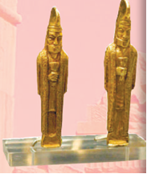

- Sirdaryo xazinasidan
- Zarafshon xazinasidan
- Qoradaryo xazinasidan
+ Amudaryo xazinasidan

**721. “Ular skif (sak) lar singari kiyinadi. Turmush tarzlari bir xil. Ular otda va piyoda jang qiladi. Odatda o‘q-yoy, nayza va jangovar boltalar bilan qurollanadi. Ularning barcha buyumlari va asboblari oltin va misdan ishlangan”. Ushbu ta’rif kimlar haqida?**

+ Massagetlar
- Forslar
- So‘g‘diylar
- Xorazmiylar

**722. Ko‘ktepa hunarmandchilik markazi qayerda joylashgan?**

- Qashqadrayoda
- Quyi Amudaryoda
+ Zarafshonda
- Samarqandda

**723. Qadimgi dunyo tarixida Amudaryo qanday nom bilan atalgan?**

+ Araks
- Yaksart
- Jand
- Jurjon

**724. Doro I hukmronligining uchinchi yilida kimlarning ustiga yurish qilgan?**

+ Saklarning
- Hunlarning
- Daklarning
- Massagetlarning

**725. “Amudaryo (Oks) xazinasi” ... vodiysidan, qadimgi Baqtriya yeridan topilgan.**

- Varaxsh
- Oltinbog‘
+ Qubodiyon
- Qorabog‘

**726. O‘rta Osiyoning forslar bosib olgan viloyatlari necha satraplikka bo‘lingan?**

- 2 ta
+ 3 ta
- 4 ta
- 5 ta

**727. Marg‘iyonadagi Frada qo‘zg‘oloni haqidagi ma’lumotlar qaysi manbada qayd etilgan?**

- Yunon-rim tarixchilari asarlarida
+ Behistun qoyatosh yozuvlarida
- “Avesto” kitobida
- Xitoy solnomalarida

**728. Suzadagi saroy qurilishda ishlatilgan olmos, la’l va yoqut qayerdan olib kelingan?**

- Xorazmdan
- Misrdan
- Baqtriyadan
+ So‘g‘diyonadan

**729. Marg‘iyonada fors istilochilariga qarshi ko‘tarilgan yirik xalq qo‘zg‘oloniga kim rahbarlik qilgan?**

- Spitamen
- Shiroq
- Skunxa
+ Frada

**730. Suzadagi saroy qurilishda ishlatilgan to‘q ko‘k yoqut qayerdan olib kelingan?**

+ Xorazmdan
- Misrdan
- Sarddan
- So‘g‘diyonadan

**731. O‘rtaosiyolik qaysi xalqlarning suvoriylari Kserks qo‘shinidagi eng yaxshi jangchilardan hisoblangan?**

- So‘g‘diy va sak
- Massaget va parfiya
- Xorazmiy va massaget
+ Sak va baqtriya

**732. Daratepa hunarmandchilik markazi qayerda joylashgan?**

+ Qashqadrayoda
- Quyi Amudaryoda
- Zarafshonda
- Samarqandda

**733. “Buyuk shohimizni aldab, ko‘p sonli qo‘shinni bu suvsiz sahroga boshlab kelishga seni nima majbur qildi? Bu yerlarda qush uchsa – qanoti, odam yursa – oyog‘i kuyadi. Na bir chashma, na bir jonzot uchraydi. Ilgari yurmoq yoki orqaga qaytmoqning imkoni yo‘q”. Ushbu jumla kimga tegishli?**

- Bess
+ Ranosbat
- Xoriyen
- Dadarshish

**734. Mashhur Marafon jangida fors qo‘shinlari markazida bo‘lgan o‘rtaosiyolik qaysi xalq muvaffaqiyatli urushgan?**

+ Saklar
- Massagetlar
- Daklar
- Hunlar

**735. Quyidagi rasmdagi oltin bilaguzuk qayerdan topilgan?**

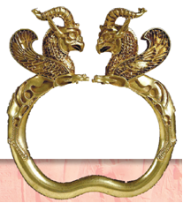

+ Amudaryo xazinasidan
- Sirdaryo xazinasidan
- Zarafshon xazinasidan
- Qoradaryo xazinasidan

**736. Gerodotning ma’lumotlariga ko‘ra saklar qanday qurol-aslahalar bilan jangga kirishgan? 1) Kamon; 2) Nayza; 3) Xanjar; 4) Jangovor bolta.**

- 1, 2
+ 3, 4
- 1, 3
- 2, 4

**737. Ahamoniylar bosib olingan mamlakatlarni itoatda tutib turish uchun qanday yo‘l tutishgan?**

- Bosib olgan hududlarga forslarni joylashtirishgan
+ Yagona davlatni alohida viloyat – satrapiyalarga bo‘lib tashlashgan
- Mahalliy aholini o‘z hududlaridan haydab chiqarishgan
- Soliqlarni birmuncha kamaytirishgan

**738. Suzadagi saroy qurilishda ishlatilgan kumush va jez qayerdan olib kelingan?**

- Xorazmdan
+ Misrdan
- Sarddan
- Baqtriyadan

**739. Amudaryo xazinasidan topilgan buyumlar hozirda qayerda saqlanadi?**

- Peterburgdagi Ermitaj muzeyida
- Madriddagi Qirollik muzeyida
+ Londondagi Britaniya muzeyida
- Parijdagi Luvr muzeyida

**740. Doro I ning saklar ustiga yurishi haqidagi ma’lumot qayerda qayd etilgan?**

- B) Behistun qoyatosh yozuvlarida
- “Avesto” kitobida
- Xitoy solnomalarida
+ Behistun qoyatosh yozuvlarida

**741. Gerodotning ma’lumotlariga ko‘ra baqtriyaliklar, xorazmiylar va so‘g‘diylar qanday qurol-aslahalar bilan jangga kirishgan? 1) Kamon; 2) Nayza; 3) Xanjar; 4) Jangovor bolta.**

+ 1, 2
- 3, 4
- 1, 3
- 2, 4

**742. Massagetlarning ibodat qiladigan yagona tangrisi nima bo‘lgan?**

- Olov
+ Quyosh
- Yer
- Suv

**743. Kir II ning massagetlar ustiga yurishi to‘g‘risida kim hikoya qilgan?**

+ Gerodot
- Poliyen
- Strabon
- Arrian

**744. Doro I hukmronligining birinchi yili qayerda fors istilochilariga qarshi yirik xalq qo‘zg‘oloni ko‘tarilgan?**

- Parfiyada
- So‘g‘diyonada
- Baqtriyada
+ Marg‘iyonada

**745. Tarixchi Poliyen qachon yashagan?**

- Mil. avv. IV asrda
- Mil. avv. III asrda
+ Mil. avv. II asrda
- Mil. avv. I asrda

**746. Kim Shiroq jasorati haqida rivoyat keltirgan?**

- Gerodot
+ Poliyen
- Strabon
- Arrian

**747. Qaysi fors hukmdorlari davrida egallab olingan hududlarda istiqomat qilgan o‘rtaosiyoliklar yunon-fors urushlarida ishtirok etgan? 1) Kambiz II; 2) Doro I; 3) Kir II; 4) Kserks.**

- 1, 2
- 3, 4
- 1, 3
+ 2, 4

**748. Quyidagi rasmdagi Naqshi Rustam qoyasi yodgorligi qayerda joylashgan?**

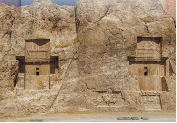

- Pokistonda
- Afg‘onistonda
- Turkiyada
+ Eronda

**749. “Bu jang ... barcha janglardan ham dahshatlirog‘i edi”, – deb Gerodot kimlar o‘rtasidagi jangni aytgan?**

- Doro I va Skunxa
- Aleksandr va Spitamen
+ Kir II va To‘maris
- Aleksandr va Doro III

**750. Kir II qachon halok bo‘lgan?**

+ Mil. avv. 530-yilda
- Mil. avv. 523-yilda
- Mil. avv. 529-yilda
- Mil. avv. 535-yilda

**751. Kir II ga qarshi kurash olib borgan massagetlar malikasi kim?**

- Apama
- Ravshanak
+ To‘maris
- Roksana

**752. “Amudaryo (Oks) xazinasi” qachon topilgan?**

+ 1877-yilda
- 1878-yilda
- 1879-yilda
- 1880-yilda

**753. Kir II O‘rta Osiyoda qayerlarni bosib olgan? 1) Xorazm; 2) Midiya; 3) So‘g‘diyona; 4) Parfiya; 5) Marg‘iyona; 6) Baqtriya.**

- 1, 2, 3
+ 4, 5, 6
- 1, 3, 5
- 2, 4, 6

**754. Massagetlar nayzalarining va kamon o‘qlarining uchi hamda harbiy boltalari nimadan yasalgan?**

- Temirdan
+ Misdan
- Qo‘rg‘oshindan
- Bronzadan

**755. “Xshatra” so‘zi qanday ma’noni anglatadi?**

- Shahar
- Qishloq
- Davlat
+ Viloyat

**756. Xumbuztepa va Ko‘zaliqir hunarmandchilik markazlari qayerda joylashgan?**

- Qashqadrayoda
+ Quyi Amudaryoda
- Zarafshonda
- Samarqandda

**757. Massagetlar haqidagi ma’lumotlar qaysi tarixchi tomonidan yozib qoldirilgan?**

+ Gerodot
- Poliyen
- Strabon
- Arrian

**758. Kim O‘rta Osiyo hududini bosib olishga harakat qilib ko‘rgan dastlabki fors podshosi bo‘lgan?**

- Kserks
+ Kir II
- Kambiz II
- Doro I

**759. Qachon Doro I saklar ustiga yurish qilgan?**

- Mil. avv. 520-yilda
+ Mil. avv. 519-yilda
- Mil. avv. 518-yilda
- Mil. avv. 517-yilda

**760. Har bir satrapiya aholisidan fors shohiga yillik o‘lpon-soliq yetkazib berilgan. Bundan tashqari aholining yana qanday majburiyati bo‘lgan?**

- Chorva mollarini boqishga safarbar etilgan
+ Saroy va ibodatxonalar qurilishiga safarbar etilgan
- Dehqonchilik ishlarini bajarishga safarbar etilgan
- Kanallar qazishga safarbar etilgan

**761. Massagetlar quyosh xudosiga nimani qurbonlik uchun keltiradilarki, g‘ayratli tangriga g‘ayratli va tezchopar jonliqni qurbon qilish kerak deb hisoblaganlar?**

- Bo‘rini
+ Otni
- Qoplonni
- Kiyikni

**762. Suzadagi saroy qurilishda ishlatilgan oltin qayerdan olib kelingan?**

- Xorazm va Marg‘iyonadan
- Misr va Elamdan
+ Sard va Baqtriyadan
- So‘g‘diyona va Sarddan

**763. Qachon Kir II ulkan lashkar bilan massagetlar ustiga yurish qilgan?**

- Mil. avv. 532-yilda
- Mil. avv. 531-yilda
+ Mil. avv. 530-yilda
- Mil. avv. 529-yilda

**764. “Quloviz” qanday lavozim?**

- Lashkarboshi
+ Yo‘lboshlovchi
- Kohin
- Tabib

**765. Doro I Baqtriya satrapi kimga chopar jo‘natib: “Borib meni mensimay qo‘yganlarni tor-mor qilish kerak”, deb aytgan?**

- Xoriyenga
- Bessga
+ Dadarshishga
- Ranosbatga

**766. Qachon marg‘iyonalik qo‘zg‘olonchilar bilan forslar qo‘shinlari o‘rtasidagi hal qiluvchi jang bo‘lib o‘tgan?**

- Mil. avv. 524-yilda
- Mil. avv. 523-yilda
+ Mil. avv. 522-yilda
- Mil. avv. 521-yilda

**767. Qachon O‘rta Osiyo hududida dastlabki tanga pullar tarqalgan?**

+ Mil. avv. V-IV asrlarda
- Mil. avv. IV-III asrlarda
- Mil. avv. III-II asrlarda
- Mil. avv. II-I asrlarda

**768. Qachon Afg‘onistonning janubida, Kobuldan uch kunlik yo‘lda Peshovarga ketayotgan buxorolik savdogarlar karvoniga qaroqchilar hujum qilingan?**

- 1877-yil iyunda
+ 1880-yil mayda
- 1881-yil martda
- 1879-yil iyulda

**769. Shiroq boshchiligida suvsiz cho‘l-u biyobonda necha kun yo‘l bosishgach, forslar o‘zlarining aldanganliklarini sezib qolganlar?**

- 5 kun
- 6 kun
+ 7 kun
- 8 kun

**770. “Men yengdim. Saklarni halokatdan qutqazmoq uchun sizlarni tashnalik va ochlik balosiga giriftor qildim”. Ushbu jumla kimga tegishli?**

- To‘maris                
- Frada    
+ Shiroq
- Spitamen

**771. 1880-yilda qaroqchilar hujumiga uchragan buxorolik savdogarlardan birining xizmatkori qaroqchilar bandidan qochib, qaysi angliyalik harbiy-siyosiy noibining harbiy postini oyoqqa turg‘izgan?**

+ F. Berton
- O. Dalton
- U. Murkroft
- A. Jenkinson

**772. Quyidagi qaysi xalqlarning bosh kiyimlari, kamarlari oltin bilan bezatilgan, otlari himoyalovchi sovut bilan yopilgan, ular ham misdan to‘qilgan bo‘lgan?**

+ Massagetlarning
- Saklarning
- So‘g‘diylar
- Xorazmiylar

**773. Qachon Britaniya muzeyining xazinachisi  O. Dalton Buxoro savdogarlari xazinasi to‘g‘risida “Oks xazinasi” degan kitob yozgan?**

- 1906-yilda
+ 1905-yilda
- 1910-yilda
- 1908-yilda

## 35-36-§ O‘rta Osiyo aholisining yunon-makedon istilochilariga qarshi kurashi.

**774. Makedoniyalik Aleksandr O‘rta Osiyoda qaysi hududlarni bo‘ysundirishga muvaffaq bo‘lgan? 1) Marg‘iyona; 2) Xorazm; 3) Baqtriya; 4) Toshkent; 5) So‘g‘diyona; 6) Farg‘ona; 7) Hozirgi Bekobod va Xo‘jand orasidagi Sirdaryo bo‘ylari.**

- 4, 5, 6, 7
- 1, 2, 3, 4
+ 1, 3, 5, 7
- 2, 4, 5, 6

**775. “Sagaris” nima?**

- Xanjar
- Kamon
+ Oybolta
- Nayza

**776. “Akinak” nima?**

+ Xanjar
- Kamon
- Oybolta
- Nayza

**777. O‘rta Osiyo yerlarini bosib olish uchun Makedoniyalik Aleksandr necha yil uringan?**

- 1 yil
- 2 yil
+ 3 yil
- 4 yil

**778. Makedoniyalik Aleksandr qanday maqsadda bosib olingan shaharlarga yunonlarni joylashtirgan?**

- Mamlakat sarhadlarini dahlsizligini ta’minlash maqsadida
- Ulkan hududda o‘z hukmronligini mustahkamlash maqsadida
+ Yunon madaniyatini tarqatish maqsadida
- Etnografik udumlarni o‘rganish maqsadida

**779. Yaksart qaysi daryoning qadimgi nomi?**

- Zarafshonning
- Amudaryoning
- Chirchiqning
+ Sirdaryoning

**780. Makedoniyalik Aleksandr Sharqqa yurishi davomida qayerlarni bosib olgan? 1) Kichik Osiyo; 2) Iroq; 3) Suriya; 4) Misr; 5) Eron; 6) Xitoy; 7) Hindiston.**

- 1, 2, 3, 5, 6
+ 1, 3, 4, 5, 7
- 2, 3, 4, 5, 7
- 1, 2, 5, 6, 7

**781. Ahamoniylar sulolasining oxirgi shohi qaysi?**

- Kambiz III
- Artakserks II
+ Doro III
- Kir IV

**782. O‘rta Osiyo aholisining yunon-makedon istilochilariga qarshi kurashiga kim boshchilik qilgan?**

+ Spitaman
- Shiroq
- Skunxa
- Frada

**783. Makedoniyalik Aleksandr, qiziga uylangandan keyin, Oksiartni qaysi hudud viloyatlaridan birining hokimi etib tayinlagan?**

+ Baqtriya
- So‘g‘diyona
- Marg‘iyona
- Parfiya

**784. O‘rta Osiyoga yurishlardan so‘ng yunon-makedon askarlarining siyraklashgan saflari Makedoniya tartibida qurollantirilgan qaysi hudud yoshlari hisobiga to‘ldirilgan? 1) Parfiya; 2) Marg‘iyona; 3) Baqtriya; 4) So‘g‘diyona.**

- 1, 2
+ 3, 4
- 1, 3
- 2, 4

**785. “Intiqom o‘zini kuttirmadi. Halok bo‘lgan jangchilarni Olimp tog‘idagi xudolar ham ellinlar armiyasi safiga qaytarishga ojiz qoldi”. Ushbu tarixiy voqea kimning istilosi bilan bog‘liq?**

- Kir II
- Kserks
+ Aleksandr
- Filipp II

**786. Zariasp qaysi shaharning ikkinchi nomi?**

- Persepolning
- Marvning
+ Baqtraning
- Nautakaning

**787. Makedoniyalik Aleksandr yurishi paytida Bess Baqtra shahrini dushmanga tashlab, qayerga qochib o‘tgan?**

- Yaksart ortiga
- Zarafshon ortiga
- Chirchiq ortiga
+ Oks ortiga

**788. Oks qaysi daryoning qadimgi nomi?**

- Sirdaryoning
+ Amudaryoning
- Zarafshonning
- Chirchiqning

**789. Spitaman Maroqandani qamal qilganda Aleksandr qamalda qolganlarga yordam sifatida qanchaga qo‘shin jo‘natgan?**

+ 3000 ga yaqin
- 4000 ga yaqin
- 5000 ga yaqin
- 6000 ga yaqin

**790. Makedoniyalik Aleksandr yurishi paytida ahamoniylar sulolasidan bo‘lgan Bess qayerning satrapi edi?**

- So‘g‘diyonaning
+ Baqtriyaning
- Marg‘iyonaning
- Parfiyaning

**791. Antik dunyoning eng sara otliq jangchilari qayerda bo‘lgan?**

- Parfiyada
- Illiriyada
- Massiliyada
+ Fessaliyada

**792. Makedoniyalik Aleksandrning harbiy yurishlarida frakiyalik, agrian, peon, makedoniyalik, fessaliyalik va illiriyaliklardan qancha jangchi Zarafshon bo‘yida abadiy qolib ketgan?**

- Ming nafar
+ Ikki ming nafar
- Uch ming nafar
- To‘rt ming nafar

**793. Xoriyen va Oksiartning qal’alari qayerda joylashgan edi?**

- Tyanshan tog‘larida
- Pomir tog‘larida
- Hindikush tog‘larida
+ Hisor tog‘larida

**794. Qachon yunon-makedon qo‘shinlari Maroqandani egallagan?**

- Mil. avv. 332-yilda
- Mil. avv. 331-yilda
- Mil. avv. 330-yilda
+ Mil. avv. 329-yilda

**795. Qachon Makedoniyalik Aleksandr Doro III qo‘shinlarini tor-mor etgan?**

- Mil. avv. 332-yilda
- Mil. avv. 331-yilda
- Mil. avv. 329-yilda
+ Mil. avv. 330-yilda

**796. Kurushkat (Kiropolis) shahriga kim asos solgan?**

- Kserks
+ Kir II
- Kambiz II
- Doro I

**797. Makedoniyalik Aleksandrning Sharqqa yurishi necha yil davom etgan?**

- 9 yil
+ 10 yil
- 11 yil
- 12 yil

**798. Ellinlar kamondan o‘q uzishda kimni tengi yo‘q deb hisoblashgan?**

+ Geraklni
- Ayaksni
- Zevsni
- Axillesni

**799. Spitaman Aleksandrga qarshi muvaffaqiyatiga rivoj berib, makedoniyaliklarni qayerda mudofaa choralarini ko‘rishga majbur etgan?**

- Nautakada
+ Maroqandada
- Baqtrada
- Chochda

**800. Kim Spitamanning hujum qilib kelayotgan suvoriylarga qarshi toshotar qurollarini ishga solgan?**

- Salavk
+ Krater
- Parmenion
- Menandr

**801. Makedoniyaliklarning sara otliq gvardiyasi nima deb atalgan?**

- Goplit
+ Agema
- Falanga
- Legion

**802. Politimet qaysi daryoning qadimgi nomi?**

- Sirdaryoning
+ Zarafshonning
- Amudaryoning
- Chirchiqning

**803. Makedoniyalik Aleksandr Hindistonga yurish qilishdan oldin nima uchun Amudaryoning narigi tomonida yashovchi elatlarni bo‘ysundirishga qaror qilgan?**

- Aholining milliy-ozodlik kurashlarini bostirish maqsadida
- Yunon madaniyati tarqalishiga imkon yaratish maqsadida
- Aholining yuqori tabaqasi bilan ittifoq tuzish maqsadida
+ Qo‘shinining orqa tomonini xavfsizlantirish maqsadida

**804. Qachon Aleksandr Makedoniya podshosi bo‘lgan?**

+ Mil. avv. 336-yilda
- Mil. avv. 335-yilda
- Mil. avv. 334-yilda
- Mil. avv. 333-yilda

**805. Spitaman qaysi daryo bo‘yida makedonlarga pistirma qo‘ygan?**

- Sirdaryo
+ Zarafshon
- Amudaryo
- Chirchiq

**806. Qachon Makedoniyalik Aleksandr Sharqqa yurish boshlagan?**

- Mil. avv. 336-yilda
- Mil. avv. 335-yilda
+ Mil. avv. 334-yilda
- Mil. avv. 333-yilda

**807. Yunon-makedon qo‘shinlarining istilosidan so‘ng  Roksananing ukasi Itan makedonyaliklarning … – agemaga qabul qilingan.**

+ sara otliq gvardiyasi
- sara piyoda gvardiyasi 
- sara kamonchilar gvardiyasi
- sara hukmdor gvardiyasi

**808. Mil. avv. 336-yilda Aleksandr necha yoshga to‘lgan edi?**

- 17 yoshga
- 18 yoshga
- 19 yoshga
+ 20 yoshga

**809. Makedoniyalik Aleksandr uylangan Ravshanak (Roksana) kimning qizi edi?**

- Xoriyenning
+ Oksiartning
- Bessning
- Spitamanning

**810. Qachon Spitamanning Makedoniyalik Aleksandr bilan hal qiluvchi jangi bo‘lib o‘tgan?**

+ Mil. avv. 328-yil kuzida
- Mil. avv. 327-yil qishda
- Mil. avv. 326-yil yozda
- Mil. avv. 325-yil bahorda

**811. Makedoniyalik Aleksandr O‘rta Osiyodagi qaysi hududlarni egallamagan? 1) Marg‘iyona; 2) Xorazm; 3) Baqtriya; 4) Toshkent; 5) So‘g‘diyona; 6) Farg‘ona; 7) Hozirgi Bekobod va Xo‘jand orasidagi Sirdaryo bo‘ylari.**

- 1, 2, 3
- 5, 6, 7
- 1, 3, 5
+ 2, 4, 6

**812. Makedoniyalik Aleksandr nima uchun Sirdaryo bo‘yida, Xo‘jand yaqinida Aleksandriya Esxata (Chekka Aleksandriya) qal’asini barpo etish to‘g‘risida buyruq bergan?**

+ Saklarga qarshi kurash uchun
- Hunlarga qarshi kurash uchun
- Daklarga qarshi kurash uchun
- Massagetlarga qarshi kurash uchun

**813. Baqtriya va So‘g‘diyona yoshlari haqida aytilgan “O‘z nayzalari o‘rniga ularning hammasi makedonyaliklar nayzalari bilan qurollandi” jumlasi kimga tegishli?**

- Poliyenga
+ Arrianga
- Strabonga
- Plutarxga

**814. O‘rta Osiyoga yurishi paytida Makedoniyalik Aleksandrning yo‘lini birinchi bo‘lib to‘sgan shahar qaysi?**

- Marv
- Choch
+ Baqtra
- Nautaka

**815. Qayerda yunon-makedonlar birinchi marta mag‘lubiyatga uchragan?**

- Baqtriyada
+ So‘g‘diyonada
- Marg‘iyonada
- Parfiyada

## 37-§ Salavkiylar davlati va Yunon-Baqtriya podsholigi.

**816. Quyidagi qaysi nom Sharqda qadimiy zardushtiylik diniga asos solgan Zaratushtra qavmining ham nomidir?**

- Soter
- Evpator
+ Spitama
- Ahamon

**817. Salavkiylar davlatida qaysi yilda Antiox ulkan davlat boshida turib, uni 20 yilga yaqin boshqargan?**

+ Mil. avv. 280-yilda
- Mil. avv. 279-yilda
- Mil. avv. 278-yilda
- Mil. avv. 277-yilda

**818. Bolalik davrida Antiox qaysi hudud haqida onasi Apama aytib bergan hikoyalarni tinglagan?**

- Marg‘iyona
+ So‘g‘diyona
- Parfiya
- Baqtriya

**819. Diodotdan keyin Yunon-Baqtriyada hukmronlik kimga o‘tgan?**

- Antiox
- Demetriy
- Diodot II
+ Yevtidem

**820. Yunon-Baqtriya davlatida Dajladagi Salavkiyadan qayerga qadar yo‘l qurilishi tugatilganidan so‘ng, qadimgi Sharqning ko‘plab davlatlari bilan savdo-sotiq aloqalari jonlangan?**

- Parfiyaga qadar
- So‘g‘diyonaga qadar
- Marg‘iyonaga qadar
+ Baqtriyaga qadar

**821. Apamaning sharafiga “Apameya” deb nomlangan shahar vayronalari bugungi qayerda joylashgan?**

- Eronda
+ Suriyada
- Falastinda
- Iroqda

**822. Kimning hukmronligi davrida Yunon-Baqtriya podsholigi eng katta sarhadlarga ega bo‘lgan?**

- Antiox davrida
+ Demetriy davrida
- Diodot davrida
- Yevtidem davrida

**823. Quyidagi qaysi qal’ada Baqtriya va So‘g‘diyonani bog‘lab turgan muhim tog‘ yo‘lini qo‘riqlagan yunon-makedon jangchilarining garnizoni joylashgan edi?**

+ Uzundara qal’asida
- Kampirtepa qal’asida
- Jonbosqal’a qal’asida
- Tuproqqal’a qal’asida

**824. Yunon-Baqtriya davlatida qanday tangalar zarb qilingan?**

- Otlar tasviri tushirilgan tangalar
- Burgutlar tasviri tushirilgan tangalar
+ Hukmdorlar tasviri tushirilgan tangalar
- Ma’budlar tasviri tushirilgan tangalar

**825. Salavkiylar davrida strateg lavozimiga kimlar tayinlangan?**

- Mahalliy zodagonlar
- Hukmdor yaqinlari
+ Sobiq lashkarboshilar
- Qabila boshliqlari

**826. Yunon-Baqtriya davlati necha yil taraqqiy etgan?**

- 110 yil
+ 120 yil
- 130 yil
- 140 yil

**827. Termiz yaqinidagi Amudaryoning o‘ng qirg‘og‘ida joylashgan qal’ani toping.**

- Uzundara qal’asi
+ Kampirtepa qal’asi
- Jonbosqal’a qal’asi
- Tuproqqal’a qal’asi

**828. Parfiyada hokimiyat kimning qo‘liga o‘tishi bilan Baqtriyaga harbiy tazyiqni kuchaytirgan?**

+ Mitridat I
- Artaban III
- Fraat II
- Arshak I

**829. Salavkiylar davrida davlat mudofaasi va qo‘shinlarni tashkil etish bilan kimlar shug‘ullangan?**

- Arxontlar
- Liktorlar
- Konsullar
+ Strateglar

**830. Qachon Makedoniyalik Aleksandr vafot etgan?**

- Mil. avv. 324-yil 10-mayda
+ Mil. avv. 323-yil 13-iyunda
- Mil. avv. 322-yil 15-iyulda
- Mil. avv. 321-yil 18-martda

**831. Kimning hukmronligi davrida Hindistonning bir qismi Yunon-Baqtriya davlatiga qo‘shib olingan?**

- Antiox davrida
+ Demetriy davrida
- Diodot davrida
- Yevtidem davrida

**832. Qachon Salavk Bobil (Suriya davlati) hukmdori bo‘lgan?**

+ Mil. avv. 312-yilda
- Mil. avv. 311-yilda
- Mil. avv. 310-yilda
- Mil. avv. 309-yilda

**833. Salavkiylar hukmdori Salavkning rafiqasi Apama kimning qizi edi?**

- Xoriyenning
- Oksiartning
+ Spitamanning
- Bessning

**834. Kim Yunon-Baqtriya davlati tarixida sezilarli iz qoldirmagan?**

- Antiox
- Demetriy
- Diodot
+ Yevtidem

**835. Salavk davlati tarkibiga qayerlar kirgan? 1) Mesopotamiya; 2) Eron; 3) Parfiya; 4) Baqtriya; 5) So‘g‘diyona; 6) Marg‘iyona.**

+ 1, 2, 3, 4, 5, 6
- 2, 3, 4, 5, 6
- 3, 4, 5, 6
- 4, 5, 6

**836. Makedoniyalik Aleksandr vafot etgach u tuzgan davlat uch qismga bo‘linib ketgan. Ular qaysilar edi? 1) Eron; 2) Makedoniya; 3) Yunoniston; 4) Misr; 5) Turkiya; 6) Suriya.**

- 1, 2, 3
- 4, 5, 6
- 1, 3, 5
+ 2, 4, 6

**837. Quyidagi rasmdagi Oyxonim shahri qaysi hududda joylashgan edi?**

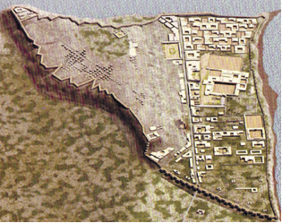

+ Baqtriyada
- Xorazmda
- So‘g‘diyonada
- Marg‘iyonada

**838. Mitridat I qaysi davlatning hukmdori bo‘lgan?**

- Baqtriya
+ Parfiya
- Midiya
- Ossuriya

**839. Qachon Parfiya Salavkiylar davlati tarkibidan ajralib chiqqan?**

- Mil. avv. 252-yilda
- Mil. avv. 251-yilda
+ Mil. avv. 250-yilda
- Mil. avv. 249-yilda

**840. Baqtriyadan tashqari, Yunon-Baqtriya podsholigi tarkibiga yana qayerlar kirgan? 1) Parfiya; 2) So‘g‘diyona; 3) Midiya; 4) Marg‘iyona.**

- 1, 2
- 3, 4
- 1, 3
+ 2, 4

**841. Qaysi davlatlar mil. avv. 250-yilda Salavkiylar davlati tarkibidan ajralib chiqqanlar? 1) Baqtriya; 2) Parfiya; 3) Midiya; 4) Ossuriya.**

+ 1, 2
- 3, 4
- 1, 3
- 2, 4

**842. Qachon Baqtriya Salavkiylar davlati tarkibidan ajralib chiqqan?**

- Mil. avv. 252-yilda
- Mil. avv. 251-yilda
+ Mil. avv. 250-yilda
- Mil. avv. 249-yilda

**843. Kimning hukmronligi davridan Yunon-Baqtriya davlati tarixi boshlangan?**

- Antiox
- Demetriy
- Yevtidem
+ Diodot

**844. Uzundara qal’asi qayerda joylashgan?**

- Xorazm vohasida
- Farg‘ona vodiysida
- Samarqand viloyatida
+ Boysun tog‘ida

**845. Quyidagi xaritada mil. avv. II asrdagi qaysi davlat chegaralari tasvirlangan?**

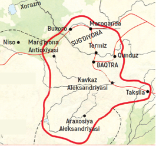

- Parfiya
- Kushon
- Ossuriya
+ Yunon-Baqtriya

**846. Quyidagi qaysi qal’a Makedoniyalik Aleksandrning So‘g‘diyonaga yurishlari davrida Oks – Amudaryodan o‘tish joyida qurilgan edi?**

- Uzundara qal’asi
+ Kampirtepa qal’asi
- Jonbosqal’a qal’asi
- Tuproqqal’a qal’asi

**847. Savalkiylar davlatining yirik shahar va madaniyat markazlariga aylangan shaharlarini toping. 1) Baqtra; 2) Persopol; 3) Maroqanda; 4) Kurushkat; 5) Marg‘iyona Antioxiyasi; 6) Termiz.**

- 1, 2, 5, 6
+ 1, 3, 5, 6
- 2, 3, 4, 5
- 2, 4, 5, 6

**848. Quyidagi qaysi qal’a ichida savdo karvonlariga xizmat ko‘rsatish uchun mo‘ljallangan g‘alla ombori bo‘lgan?**

- Uzundara qal’asida
+ Kampirtepa qal’asida
- Jonbosqal’a qal’asida
- Tuproqqal’a qal’asida

**849. Baqtriya orqali Xitoydan Hindistonga Buyuk ipak yo‘lining qaysi tarmog‘i o‘tgan edi?**

- Shimoliy tarmog‘i
+ Janubiy tarmog‘i
- G‘arbiy tarmog‘i
- Sharqiy tarmog‘i

**850. Makedoniyalik Aleksandr vafot etgach u tuzgan davlat uch qismga bo‘linib ketgan. Bu davlatlar kimlar tomonidan boshqarilgan?**

- Filip II ning ishonchli a’yonlari tomonidan
- Mahalliy hukmron sulolalar tomonidan
- Makedoniyaning eng obro‘li siyosatchilari tomonidan
+ Aleksandrning eng yaqin lashkarboshilari tomonidan

**851. Yunon-Baqtriya davlati hukmdorlarini to‘g‘ri ketma-ketlikda joylashtiring.**

+ Diodot, Yevtidem, Demetriy
- Yevtidem, Demetriy, Diodot
- Demetriy, Diodot, Yevtidem
- Diodot, Demetriy, Yevtidem

**852. Qaysi davlat Baqtriyaning raqibiga aylangan?**

- Lidiya
+ Parfiya
- Midiya
- Ossuriya

**853. Qachon ko‘chmanchi yuechji qabilalari Yunon-Baqtriya davlatini bosib olganlar?**

- Mil. avv. 160-150-yillarda
- Mil. avv. 150-140-yillarda
+ Mil. avv. 140-130-yillarda
- Mil. avv. 130-120-yillarda

**854. Yunon-mekedon istilosi davrida qaysi shahar “Marg‘iyona Antioxiyasi” nomi bilan atalgan?**

- Termiz
- Buxoro
- Samarqand
+ Marv

**855. Salavk kimni Sharqiy viloyatlar – Parfiya, Marg‘iyona, Baqtriya, So‘g‘diyonaga noib etib tayinlagan?**

+ Antioxni
- Demetriyni
- Diodotni
- Yevtidemni

**856. Nima Yunon-Baqtriya davlatining kuchsizlanishiga sabab bo‘lgan?**

- Ko‘chmanchi yuechji qabilalarining to‘xtovsiz hujumlari
- Parfiya davlati hukmdori Mitridat I ning harbiy tazyiqi
+ Davlatni tinimsiz urushlar olib borishga majbur bo‘lgani
- Bosib olingan shaharlar va qishloqlarda qo‘zg‘olonlarning avj olgani

**857. Bir qancha Baqtriya shahri hukmdori bo‘lgan va o‘zini podsho deb e’lon qilgan shaxsni toping.**

- Antiox
- Demetriy
+ Diodot
- Yevtidem

**858. So‘g‘diycha “Spitamana” nomining ildizlari bo‘lgan “Spenta-mana” so‘zi avesto tilida qanday ma’noni anglatgan?**

- “Muqaddas kitob”
+ “Muqaddas ruh”
- “Muqaddas joy”
- “Muqaddas ichimlik”

## 38-39-§ Qadimgi Xorazm.

**859. Quyidagi rasmdagi xorazmlik jangchi boshining tasviri nechanchi asrga oid?**

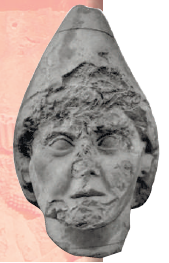

+ Milodiy I asrga
- Milodiy II asrga
- Milodiy III asrga
- Milodiy IV asrga

**860. Oqchaxon qal’a qayerda joylayshgan?**

+ Amudaryoning o‘ng qirg‘og‘ida
- Amudaryoning chap qirg‘og‘ida
- Sirdaryoning o‘ng qirg‘og‘ida
- Sirdaryoning chap qirg‘og‘ida

**861. Qadimgi Xorazmda qaysi fanlar rivojlangan? 1) Astronomiya; 2) Matematika; 3) Geometriya; 4) Tibbiyot; 5) Tarix.**

+ 1, 2, 3
- 2, 3, 4
- 1, 3, 5
- 2, 4, 5

**862. Xum sirtiga chekilgan yozuv namunasi topilgan Oybo‘yirqal’a nechanchi asrlarga oid?**

+ Mil. avv. V-IV asrlarga
- Mil. avv. IV-III asrlarga
- Mil. avv. III-II asrlarga
- Mil. avv. II-I asrlarga

**863. Quyidagi qaysi qal’aning saroy xonalari qadimgi ma’budlar, shohlar, jangchilar, musiqachilar, hayvonlar tasvirlari bilan bezatilgan?**

+ Tuproqqal’aning
- Bozorqal’aning
- Oybo‘yirqal’aning
- Qo‘yqirilganqal’aning

**864. Quyidagi qaysi qal’a devorida yozuvli teri o‘ramalarini ko‘tarib turgan kohin xattotning tasviri tushirilgan?**

- Oqchaxon qal’a
- Oybo‘yirqal’a
- Qo‘yqirilganqal’a
+ Tuproqqal’a

**865. Quyidagi suratda tasvirlangan Tuproqqal’adan topilgan devoriy surat qaysi asrlarga oid?**

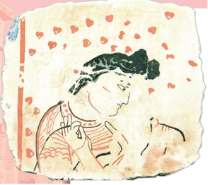

- Mil. avv. IV–III asrlarga
- Mil. avv. III–II asrlarga
+ Milodiy II–III asrlarga
- Milodiy III–IV asrlarga

**866. Quyidagi mil. avv. II-I asrlarga oid devoriy surat qayerdan topilgan?**

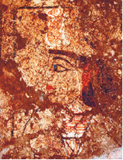

- Jonbosqal’adan
- Tuproqqal’adan
+ Oqchaxon qal’adan
- Qo‘yqirilganqal’adan

**867. Xorazm hukmdorlarining qarorgohi Tuproqqal’a qachon bunyod etilgan?**

- Mil. avv. IV–III asrlarda
- Mil. avv. III–II asrlarda
+ Milodiy II–III asrlarda
- Milodiy III–IV asrlarda

**868. Qachon Xorazm Ahamoniylar davlatidan ajralib chiqib, mustaqil davlatga aylangan?**

+ Mil. avv. IV asrda
- Mil. avv. III asrda
- Mil. avv. II asrda
- Mil. avv. I asrda

**869. Kimning ma’lumotiga ko‘ra Ahamoniylar davlatidan ajralib chiqqan davrda Xorazmda Farasman podsholik qilgan?**

- Gerodotning
+ Arrianning
- Strabonning
- Poliyenning

**870. Milodiy I asrda Xorazmda ishlab chiqilgan mahalliy taqvimdan xorazmliklar nechanchi asrga qadar foydalanishgan?**

- V asrgacha
- VI asrgacha
- VII asrgacha
+ VIII asrgacha

**871. Qadimgi Xorazmda Amudaryodan uzunligi necha kilometrga yetadigan keng sug‘orish kanallari chiqarilgan?**

- 10–20 km. ga
- 20–30 km. ga
- 30–40 km. ga
+ 40–50 km. ga

**872. Quyidagi qaysi qal’a ibodatxonasidan kohinlar osmon jismlarining harakatlarini kuzatgan?**

- Tuproqqal’a
- Oqchaxon qal’a
- Oybo‘yirqal’a
+ Qo‘yqirilganqal’a

**873. Quyidagi suratda kimlar tasvirlangan?**

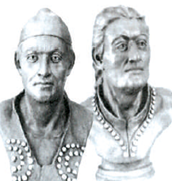

+ Qadimgi xorazmliklar
- Qadimgi so‘g‘dliklar
- Qadimgi saklar
- Qadimgi baqtriyaliklar

**874. Quyidagi Naqshi Rustamdagi (Eron) Xorazm jangchisining bo‘rtma tasviri qaysi asrga oid?**

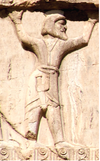

- Mil. avv. III asrga
- Mil. avv. IV asrga
+ Mil. avv. V asrga
- Mil. avv. VI asrga

**875. Qadimgi Xorazm yozuvi qaysi alifboga asoslangan edi?**

- Baqtriya
+ Aramey
- Yunon
- Kushon

**876. Bozorqal’a yodgorligi qayerda joylashgan?**

- Qashqadaryoda
+ Xorazmda
- Farg‘onada
- Buxoroda

**877. Qadimgi Xorazm vohasida qaysi ta’limot keng yoyilgan edi?**

- Mazdakiylik
+ Zardushtiylik
- Buddaviylik
- Moniylik

**878. Quyidagi suratda nima tasvirlangan?**

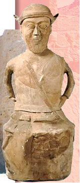

- Xorazmlik jangchi tasvirlangan haykal
+ Haykal shaklidagi ossuariy
- Oqchaxon qal’adagi qahramon haykali
- Zardushtiylik dini kohini

**879. Tuproqqal’aning qaysi qismida katta saroy va ibodatxonalar joylashgan?**

- Janubiy qismida
- Sharqiy qismida
+ Shimoliy qismida
- G‘arbiy qismida

**880. Qachon qadimiy Xorazm yozuvi vujudga kelgan?**

+ Mil. avv. V-IV asrlarda
- Mil. avv. IV-III asrlarda
- Mil. avv. III-II asrlarda
- Mil. avv. II-I asrlarda

**881. Qachon Xorazmda mustahkam istehkom – Qo‘yqirilganqal’a qurilgan?**

- Mil. avv. V asrda
- Mil. avv. IV asrda
+ Mil. avv. III asrda
- Mil. avv. II asrda

**882. Qachon Xorazm O‘rta Osiyoda shaharsozlik va me’morchilik keng rivojlangan muhim markazga aylangan?**

- Mil. avv. V–IV asrlarda
+ Mil. avv. IV–III asrlarda
- Mil. avv. III–II asrlarda
- Mil. avv. II–I asrlarda

**883. Misr kohinlari Nil toshqini vaqtini bilishgani singari qayerlik kohin-astronomlar Amudaryo suv sathining ko‘tarilishi vaqtini belgilab berishgan?**

- So‘g‘diyonalik
+ Xorazmlik
- Kushonlik
- Baqtriyalik

**884. Oqchaxon qal’a nechanchi asrlarda oid?**

- Mil. avv. III–II asrlarga
+ Mil. avv. II–I asrlarga
- Milodiy I–II asrlarga
- Milodiy II–III asrlaga

**885. Qadimgi xorazmliklar qanday ekinlar ekishgan? 1) Bug‘doy; 2) Arpa; 3) Sholi; 4) Makkajo‘xori; 5) Tariq.**

- 1, 2, 3
- 2, 3, 4
+ 1, 2, 5
- 3, 4, 5

**886. Qadimgi Xorazmda ibodatxonalar qoshidagi maktablarda nima o‘rgatilgan?**

+ Xat-savod va arifmetika hisobi
- Yozuv va ibodat qilish
- Ibodat qilish va xat-savod
- Arifmetika va tarix

**887. O‘rta Osiyodagi eng qadimgi yozuv qayerdan topilgan?**

- Samarqanddan
- Toshkentdan
+ Xorazmdan
- Farg‘onadan

**888. O‘rta Osiyoda zardushtiylik dafn marosimlari bilan bog‘liq eng qadimgi ossuariylar – suyakdonlar qayerdan topilgan?**

- Samarqanddan
+ Xorazmdan
- Toshkentdan
- Buxorodan

**889. Quyidagi qaysi qal’a 30 ta qahramon portreti bilan alohida ajralib turadi va ularning aksariyati qush shaklidagi toj kiydirilgan holda tasvirlangan?**

- Tuproqqal’a
+ Oqchaxon qal’a
- Oybo‘yirqal’a
- Qo‘yqirilganqal’a

**890. Qaysi qal’adan O‘rta Osiyodagi eng qadimgi yozuv namunasi topilgan?**

- Tuproqqal’adan
- Bozorqal’adan
+ Oybo‘yirqal’adan
- Qo‘yqirilganqal’adan

**891. Quyidagi rasmda qaysi qal’a tasvirlangan?**

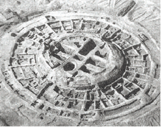

- Jonbosqal’a
- Tuproqqal’a
- Oqchaxon qal’a
+ Qo‘yqirilganqal’a

**892. Quyidagi suratda qaysi yozuv namunasi tasvirlangan?**

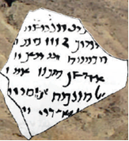

- Qadimgi Kushon yozuvi
- Qadimgi Baqtriya yozuvi
- Qadimgi So‘g‘d yozuvi
+ Qadimgi Xorazm yozuvi

**893. Qachon Xorazmda mahalliy taqvim ishlab chiqilgan?**

+ Milodiy I asrda
- Milodiy II asrda
- Milodiy III asrda
- Milodiy IV asrda

**894. Qadimgi Xorazm yozuvi necha harfdan tashkil topgan edi?**

- 29 ta harfdan
+ 20 ta harfdan
- 25 ta harfdan
- 22 ta harfdan

**895. Tuproqqal’a saroyidagi zallardan birida devor bo‘ylab supada bo‘yalgan loy haykallarining soni qancha bo‘lgan?**

- 105 ta
+ 115 ta
- 125 ta
- 135 ta

**896. Qadimgi Xorazmda ... va milodiy dastlabki asrlarda kumush va mis tangalar zarb qilingan.**

- mil. avv. IV asrda
- mil. avv. III asrda
- mil. avv. II asrda
+ mil. avv. I asrda

**897. Qayerdan suv va hosildorlik ma’budasi – Anaxita ramzini o‘zida aks ettirgan ko‘pdan ko‘p sopol haykalchalar topilgan?**

- Samarqanddan
- Toshkentdan
- Buxorodan
+ Xorazmdan

**898. Qadimgi Xorazm aholisi xo‘jaligining asosini nima tashkil etgan? 1) Hunarmandchilik; 2) Chorvachilik; 3) Sug‘orma dehqonchilik; 4) Ovchilik; 5) Savdo-sotiq.**

- 1, 2
+ 2, 3
- 4, 5
- 1, 4

**899. Qadimgi Xorazmning qaysi shaharlarida ulug‘vor va muhtasham binokorlik ishlari amalga oshirilgan? 1) Xiva; 2) Ayritom; 3) Jonbosqal’a; 4) Fayoztepa; 5) Bozorqal’a.**

- 1, 2, 3
- 2, 3, 4
- 3, 4, 5
+ 1, 3, 5

## 40-§ Qadimgi Qang‘ va Davan davlatlari.

**900. Qachon Davanning zotdor naslli otlari ovozasi Xitoygacha borgan?**

- Mil. avv. I asr oxirida
- Mil. avv. II asr boshida
+ Mil. avv. II asr oxirida
- Mil. avv. III asr boshida

**901. Qachon Davan davlatiga asos solingan?**

- Mil. avv. IV asrda
+ Mil. avv. III asrda
- Mil. avv. II asrda
- Mil. avv. I asrda

**902. Yilnomalarda yozilishicha qayerning imperatori o‘zining ilohiy nasl-nasabi va zavol bilmas ekanligini odamlar ongiga singdirmoq niyatida samoga chiqishda “samoviy otlar” qo‘shilgan aravaga muhtoj bo‘lib qolgan?**

- Rimning
+ Xitoyning
- Kushonning
- Hindistonning

**903. Qadimshunoslar Xitoyda anor va o‘rikning paydo bo‘lishini qayer bilan bog‘laydi?**

+ Davan bilan
- Qang‘ bilan
- So‘g‘d bilan
- Kushon bilan

**904. Xitoy va Davan o‘rtasida bo‘lgan jangda qayerdan madad yetib kelishidan cho‘chib, xitoyliklar sulhga rozi bo‘lgan?**

- Baqtriyadan
- Xorazmdan
+ Qang‘dan
- Parfiyadan

**905. Davan davlati qaysi davrlarda mavjud bo‘lgan?**

- Mil. avv. I asrdan – milodiy I asrgacha
- Mil. avv. II asrdan – milodiy II asrgacha
+ Mil. avv. III asrdan – milodiy III asrgacha
- Mil. avv. IV asrdan – milodiy IV asrgacha

**906. Qachon Shoshtepada doira shaklidagi olov ibodatxonasi qurilgan?**

- Mil. avv. I asrda
+ Mil. avv. II asrda
- Mil. avv. III asrda
- Mil. avv. IV asrda

**907. Qang‘ davlatida qaysi sohalar rivojlangan? 1) Kandakorlik; 2) Kulolchilik; 3) Qurolsozlik; 4) To‘qimachilik; 5) Binokorlik; 6) Zargarlik.**

- 1, 2, 3, 4
- 1, 3, 5, 6
+ 2, 3, 4, 6
- 1, 2, 4, 5

**908. Davan davlatiga ikkinchi yurishida xitoyliklar qamalning nechanchi kunida Ershiga keladigan suv yo‘lini to‘sgan va shaharning tashqi devorini buzgan?**

- Yigirmanchi kunida
- O‘ttizinchi kunida
+ Qirqinchi kunida
- Elliginchi kunida

**909. “Davanda 70 ta katta-kichik shahar bor, uning aholisi bir necha yuz ming kishidan iborat”. Ushbu jumla kimga tegishli?**

- Sim Syanga
+ Chjan Szyanga
- Strabonga
- Arrianga

**910. Qang‘ davlatida qanday omil mamlakat iqtisodi va savdo-sotiq rivojiga imkon yaratgan?**

- Hunarmandchilikning yuqori darajada rivojlanganligi
- Chorvachilik va dehqonchilikning rivojlanishi
+ Qang‘ hududidan Buyuk ipak yo‘lining shimoliy tarmog‘i o‘tganligi
- O‘zaro urushlarning nihoyatda kamligi

**911. Davan davlatiga ikkinchi yurishda Xitoy hukmdorining qo‘shinlari soni qancha edi?**

- 50 ming nafar
+ 60 ming nafar
- 30 ming nafar
- 20 ming nafar

**912. Quyidagi rasmdagi Davan davlatiga oid sopol idish nechanchi asrlarga taalluqli?**

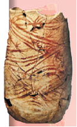

- Milodiy III—IV asrlarga
- Milodiy II—III asrlarga
+ Milodiy I—II asrlarga
- Milodiy IV—V asrlarga

**913. Qang‘ davlatining qaysi hududida o‘troq ziroatchi va savdo-hunarmandchilik madaniyati rivoj topgan?**

- Samarqand viloyatida
+ Toshkent vohasida
- Xorazm vohasida
- Farg‘ona vodiysida

**914. Qaysi tog‘ xitoy tilida “samoviy tog‘lar” deb tarjima qilinadi?**

- Himolay
+ Tyanshan
- Hindikush
- Ararat

**915. Davan davlatiga ikkinchi yurishda Xitoydan necha nafar sarkarda qo‘shinlari bilan jo‘nagan?**

- 40 nafar
- 30 nafar
- 60 nafar
+ 50 nafar

**916. Xitoy imperatori kimni elchi qilib, sovg‘a-salomlar va oltindan yasalgan ot haykali bilan Davanga jo‘natgan?**

- Sim Syanni
- U-Dini
- Chjan Szyanni
+ Che Linni

**917. Davan qachon yuksak taraqqiy etgan davlatga aylangan?**

+ Mil. avv. II-I asrlarda
- Mil. avv. III-II asrlarda
- Milodiy I-II asrlarda
- Milodiy II-III asrlarda

**918. Qang‘ davlatida aholi qanday ekinlar ekishgan? 1) Bug‘doy; 2) Sholi; 3) Arpa; 4) Makkajo‘xori; 5) Tariq.**

+ 1, 2, 3
- 2, 3, 4
- 1, 3, 5
- 3, 4, 5

**919. Qadimda Farg‘ona vodiysida tashkil topgan davlat Xitoy manbalarida qanday atalgan?**

+ Davan
- Qang‘
- So‘g‘d
- Kushon

**920. Xitoy va Davan o‘rtasida “Samoviy otlar” uchun urush necha yil davom etgan?**

- Ikki yil
- Uch yil
+ To‘rt yil
- Besh yil

**921. Xitoy hukmdorlari nimaning evaziga Ershini tashlab chiqishga majbur bo‘lgan?**

- Aholini asirlikka olishi evaziga
+ Aholisining tovon to‘lashi evaziga
- Aholini harbiy xizmatga olish evaziga
- Aholining mol-mulkini talon-taroj qilish evaziga

**922. Qanqa shahar-qal’asi saklarning sobiq poytaxti – Qang‘diz bo‘lib, u hozirgi qayerda joylashgan?**

- Xorazm vohasining Tuproqqal’a tumanida
- Samarqand viloyatining Urgut tumanida
- Buxoro viloyatining Qorako‘l tumanida
+ Toshkent vohasining Oqqo‘rg‘on tumanida

**923. Qayerda Farg‘onaning “samoviy otlari” ni “qanotli otlar” ham deyishgan?**

- Hindistonda
+ Xitoyda
- Eronda
- Rimda

**924. Sho‘rabashot, Axsikent va Uchqo‘rg‘on qaysi qadimiy davlat shaharlaridir?**

+ Davan
- Qang‘
- So‘g‘d
- Kushon

**925. Quyidagi suratdagi tamg‘a qaysi davlatga tegishli bo‘lgan?**

- Parfiya davlatiga
- Davan davlatiga
+ Qang‘ davlatiga
- Kushon davlatiga

**926. Qanqa shahar-qal’asi saklarning sobiq poytaxti – Qang‘diz bo‘lib, unga qachon asos solingan?**

- Mil. avv. IV asrda
+ Mil. avv. III asrda
- Mil. avv. II asrda
- Mil. avv. I asrda

**927. Xitoy manbalarida Qang‘ davlati qanday atalgan?**

- Qang‘dez
- Qang‘ar
+ Qang‘yuy
- Qang‘xa

**928. Qang‘ davlati qaysi hududlarni qamrab olgan?**

+ O‘rta Sirdaryo sohillari bo‘ylarini
- Quyi Zarafshon sohillari bo‘ylarini
- Yuqori Amudaryo sohillari bo‘ylarini
- Quyi Chirchiq sohillari bo‘ylarini

**929. Davan davlatining poytaxti qaysi shahar bo‘lgan?**

- Choch
- Qang‘dez
+ Ershi
- Bityan

**930. Qayerning zotdor otlari Xitoy hukmdorlarini o‘ziga jalb qilgan?**

- Xorazmning
+ Farg‘onaning
- Samarqandning
- Buxoroning

**931. Shoshtepada doira shaklidagi olov ibodatxonasi qurilgan bo‘lib, dumaloq shakl nimaning ramzi hisoblangan?**

- Osmonning
+ Quyoshning
- Yerning
- Oyning

**932. Qang‘ davlati qaysi davrlarda mavjud bo‘lgan?**

- Mil. avv. I asrdan – milodiy I asrgacha
- Mil. avv. II asrdan – milodiy II asrgacha
+ Mil. avv. III asrdan – milodiy III asrgacha
- Mil. avv. IV asrdan – milodiy IV asrgacha

**933. Qang‘liklar nimalarga sig‘inishgan?**

- Yer va osmonga
- Quyosh va oyga
- Suv va yerga
+ Olov va quyoshga

**934. Qachon Qang‘ davlatiga asos solingan?**

- Mil. avv. IV asrda
+ Mil. avv. III asrda
- Mil. avv. II asrda
- Mil. avv. I asrda

**935. Xitoy tarixchilari Qang‘dizni qanday atashgan?**

- Chanan
- Xayyan
+ Bityan
- Loyan

**936. Qachon Qang‘ qudratli davlat birlashmasiga aylangan?**

- Mil. avv. II asr boshida
+ Mil. avv. II asr oxirida
- Mil. avv. I asr boshida
- Mil. avv. I asr oxirida

**937. Farg‘onaning zotdor otlariga kimlar “samoviy” deb nom bergan?**

- Hindlar
- Yunonlar
+ Xitoyliklar
- Forslar

**938. Xitoyliklarni o‘zlariga notanish bo‘lgan Davandagi nimalar hayratga solgan?**

- Sholi va beda
- Arpa va bug‘doy
+ Beda va uzum
- Tut va arpa

**939. Qachon Qang‘ davlati parchalanib ketgan?**

- I asrda
- II asrda
+ III asrda
- IV asrda

**940. Qachon Davan davlati barham topgan?**

- Milodiy I asrda
- Milodiy II asrda
+ Milodiy III asrda
- Milodiy IV asrda

**941. Qang‘ davlatiga kimlar asos solishgan?**

+ Saklar
- Hunlar
- Daklar
- Massagetlar

**942. Qang‘ davlatidan Buyuk ipak yo‘lining qaysi tarmog‘i o‘tgan edi?**

- G‘arbiy tarmog‘i
- Sharqiy tarmog‘i
- Janubiy tarmog‘i
+ Shimoliy tarmog‘i

## 41-§ Kushon davlati.

**943. Kampirtepa yodgorligi qayerda joylashgan?**

- Qunduz yaqinida
- Xo‘jand yaqinida
+ Termiz yaqinida
- Marv yaqinida

**944. Qachon to‘xtovsiz urushlar oqibatida Kushon davlati inqirozga yuz tutgan va parchalanib ketgan?**

- Milodiy I asrda
- Milodiy II asrda
+ Milodiy III asrda
- Milodiy IV asrda

**945. Kushon podsholigi davrida qayerlarda katta buddaviylik ibodatxonalari mavjud bo‘lgan? 1) Xolchayon; 2) Eski Termiz; 3) Uzunqir; 4) Ayritom; 5) Dalvarzintepa.**

- 1, 2, 3
+ 2, 4, 5
- 1, 4, 5
- 2, 3, 4

**946. Quyidagi suratdagi milodiy I–II asrlarga oid Budda haykali qayerdan topilgan?**

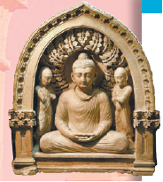

- Qoratepa
- Dalvarzintepa
+ Fayoztepa
- Xolchayon

**947. Kushonlar davriga oid qaysi yodgorliklardagi buddaviylik ibodatxonalarida o‘sha davr devoriy tasvirlari va haykaltaroshligining yuksak san’atkorona namunalari topib o‘rganilgan? 1) Xolchayon; 2) Ayritom; 3) Dalvarzintepa; 4) Eski Termiz.**

- 1, 2
+ 3, 4
- 1, 3
- 2, 4

**948. Qaysi yodgorliklardan yunon alifbosidagi kushon bitiklari topilgan?**

- Qadimgi Termiz, Kampirtepa
- Ayritom, Qadimgi Termiz
- Dalvarzintepa, Surxko‘tal
+ Surxko‘tal, Kampirtepa

**949. Kimning hukmronligi davridan Kushon podsholigida hukmdor nomi ko‘rsatilgan tanga zarb qilish boshlangan?**

+ Vima Kadfiz davrida
- Kanishka davrida
- Kudzula Kadfiz davrida
- Vasudeva davrida

**950. Do‘mbrachi hamda ud chalayotgan musiqachilar tasvirlari qayerdan topilgan?**

- Xolchayon
- Dalvarzintepa
- Eski Termiz
+ Ayritom

**951. Kushon davlatiga kim tomonidan asos solingan?**

- Vima Kadfiz
- Kanishka
+ Kudzula Kadfiz
- Vasudeva

**952. Kushon davlatida aramey yozuvini nima uchun o‘zlashtirish oson bo‘lgan?**

- Mixxatsimon bo‘lgani uchun
- Harflar soni kam bo‘lgani uchun
+ Alohida harflarga asoslangani uchun
- Sodda shaklli yozuv bo‘lgani uchun

**953. Kimning hukmronligi davrida Kushon davlati hududi yanada kengaygan?**

- Kudzula Kadfiz davrida
+ Vima Kadfiz davrida
- Kanishka davrida
- Vasudeva davrida

**954. Kushonlar davrida qaysi sohalar yuksak darajada taraqqiy etgan? 1) Zargarlik; 2) Kulolchilik; 3) Binokorlik; 4) Me’morchilik.**

- 1, 2
+ 3, 4
- 1, 3
- 2, 4

**955. Kushonlar davri yodgorliklarini toping. 1) Qiziltepa; 2) Xolchayon; 3) Uzunqir; 4) Dalvarzintepa; 5) Surxko‘tal; 6) Termiz; 7) Bozorqal’a; 8) Zartepa; 9) Tuproqqal’a; 10) Kampirtepa.**

- 1, 2, 3, 4, 5
- 1, 3, 5, 7, 9
- 6, 7, 8, 9, 10
+ 2, 4, 6, 8, 10

**956. Kanishka hukmronligi davrida Kushon podsholigi qaysi davlatlar bilan savdo va elchilik munosabatlarini yo‘lga qo‘ygan? 1) Parfiya; 2) Rim; 3) Misr; 4) Hindiston; 5) Yaponiya; 6) Xitoy.**

- 1, 2, 3
- 4, 5, 6
- 1, 3, 5
+ 2, 4, 6

**957. Qachon ko‘chmanchi yuechji qabilalari Yunon-Baqtriya davlatini bosib olganlar?**

- Mil. avv. 160-150-yillarda
- Mil. avv. 150-140-yillarda
+ Mil. avv. 140-130-yillarda
- Mil. avv. 130-120-yillarda

**958. Kushon hukmdorlari saroyi qaysi yodgorlikdan topilgan?**

+ Xolchayon
- Ayritom
- Eski Termiz
- Dalvarzintepa

**959. Quyidagi qaysi yozuv harflari burchakli va aylana shaklida yozilgan?**

- Aramey yozuvi asosidagi kushon yozuvi
- Yunon alifbosidagi kushon yozuvi
- Kushon-baqtriya yozuvi
+ Kushon shaklli yozuv

**960. Qayerlarda aramey alifbosi asosidagi xorazmiy va so‘g‘diy yozuvlar keng tarqalgan edi? 1) Sirdaryoning o‘rta oqimida; 2) Yettisuv va Sharqiy Turkistonda; 3) Farg‘ona vodiysida; 4) Amudaryoning quyi oqimida; 5) Zarafshon va Qashqadaryo vohalarida.**

- 1, 2, 3, 4, 5
- 2, 3, 4, 5
- 3, 4, 5
+ 4, 5

**961. Qaysi yodgorlikni o‘rganish natijasida aramey yozuvi asosidagi kushon-baqtriya alifbosidagi yozuv namunalari topilgan?**

+ Qadimgi Termiz
- Ayritom
- Dalvarzintepa
- Surxko‘tal

**962. Kimning hukmronligi davrida Kushon podsholigi o‘z taraqqiyotining cho‘qqisiga erishgan?**

- Vima Kadfiz davrida
+ Kanishka davrida
- Kudzula Kadfiz davrida
- Vasudeva davrida

**963. Kushon davlati tarkibiga kirgan hududlarni toping. 1) Hindiston; 2) Pokiston; 3) Yettisuv; 4) Parfiya; 5) Afg‘oniston; 6) Eronning g‘arbi; 7) O‘zbekistonning janubi.**

- 2, 3, 4
- 5, 6, 7
+ 1, 5, 7
- 2, 4, 6

**964. Kimning hukmronligi davrida Afg‘oniston va Kashmir Kushon davlatiga qo‘shib olingan?**

- Vima Kadfiz davrida
- Kanishka davrida
+ Kudzula Kadfiz davrida
- Vasudeva davrida

**965. Kushon davlatida qaysi soha yuqori darajaga erishgan?**

- Zargarlik
- Temirchilik
+ Kandakorlik
- Yog‘ochsozlik

**966. Qachongacha zardushtiylik va buddaviylik dinlari O‘rta Osiyoda mavjud bo‘lgan?**

- V asrgacha
- VI asrgacha
- VII asrgacha
+ VIII asrgacha

**967. Kushon davlati tashkil topayotganda Baqtriya va So‘g‘diyonaning asosiy aholisi qaysi dinda edi?**

- Xristianlik
+ Zardushtiylik
- Shomonlik
- Buddaviylik

**968. Kushon davlatida qaysi shaharlar xom g‘ishtdan qurilgan mustahkam istehkom devorlari bilan o‘ralgan edi? 1) Xolchayon; 2) Ayritom; 3) Dalvarzintepa; 4) Eski Termiz.**

- 1, 2
+ 3, 4
- 1, 3
- 2, 4

**969. Kushon davlatidagi o‘zaro madaniy va savdo-sotiq aloqalari tufayli O‘rta Osiyoda qadimgi qaysi yozuv keng tarqalgan?**

- So‘g‘d yozuvi
+ Aramey yozuvi
- Sanskrit yozuvi
- Kushon yozuvi

**970. Kimning hukmronligi davrida Kushon davlati ulkan davlatga aylangan?**

- Vima Kadfiz davrida
+ Kanishka davrida
- Kudzula Kadfiz davrida
- Vasudeva davrida

**971. Surxko‘tal yodgorligi qayerda joylashgan?**

+ Afg‘onistondagi Qunduz shahri yaqinida
- Tojikistondagi Xo‘jand shahri yaqinida
- O‘zbekistondagi Termiz shahri yaqinida
- Turkmanistondagi Marv shahri yaqinida

**972. Kushon podsholigi tarkibiga Hindistonning qaysi  qismi qo‘shib olinganidan keyin hozirgi O‘zbekistonning janubiy hududlari bilan yaqindan aloqalar o‘rnatilgan?**

+ Shimoliy qismi
- Janubiy qismi
- Sharqiy qismi
- G‘arbiy qismi

**973. Kushonlar davriga oid qaysi yodgorlikdan fil suyagidan yasalgan shaxmat donalari topilgan?**

- Xolchayon
- Ayritom
+ Dalvarzintepa
- Eski Termiz

**974. Kushon podsholigida qaysi hukmdor davrida pul islohoti o‘tkazilib, zarb qilingan tangalar qadri ortgan?**

+ Vima Kadfiz davrida
- Kanishka davrida
- Kudzula Kadfiz davrida
- Vasudeva davrida

**975. Quyidagi suratdagi milodiy II–III asrlarga oid Budda boshining tasviri qayerdan topilgan?**

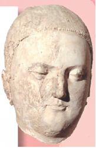

- Qoratepa
+ Dalvarzintepa
- Fayoztepa
- Xolchayon

**976. Qachon Kushon davlatiga asos solingan?**

+ Milodiy I asrda
- Milodiy II asrda
- Milodiy III asrda
- Milodiy IV asrda

**977. Quyidagi devoriy surat qaysi manzilgohdagi ibodatxonadan topilgan?**

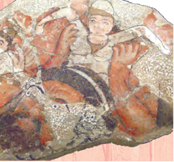

- Qoratepa
- Fayoztepa
- Xolchayon
+ Dalvarzintepa

**978. Birlashgan yuechji mulklarining birinchi hukmdori kim bo‘lgan?**

- Vima Kadfiz
- Kanishka
+ Kudzula Kadfiz
- Vasudeva

## 42-§ Buyuk ipak yo‘li.

**979. Buyuk ipak yo‘lida Farg‘onadan Xitoyga nima olib borilgan?**

- Guruch
+ Otlar
- Tuyalar
- La’l

**980. Qachon Buyuk ipak yo‘li vujudga kelgan?**

- Mil. avv. IV asrda
- Mil. avv. III asrda
+ Mil. avv. II asrda
- Mil. avv. I asrda

**981. Imperator U-Di davrida qaysi ekin Xitoyning butun shimoli bo‘ylab ekiladigan bo‘lgan?**

- Sholi
- Paxta
+ Beda
- Kanop

**982. Buyuk ipak yo‘li qaysi davrlarda mavjud bo‘lgan?**

- Mil. avv. IV asrdan – milodiy XIV asrgacha
- Mil. avv. III asrdan – milodiy XV asrgacha
+ Mil. avv. II asrdan – milodiy XVI asrgacha
- Mil. avv. I asrdan – milodiy XVII asrgacha

**983. Elchi Chjan Szyan qaysi hudud orqali o‘z vataniga qaytgan?**

- Norin vodiysi
- Tukiston vohasi
- Tajan vodiysi
+ Oloy vodiysi

**984. “Buyuk meridianal yo‘l” ga “Ipak yo‘li” degan nom qaysi nemis geografi tomonidan berilgan?**

+ F. Rixtgofen
- G. Shliman
- F. Shampolyon
- A. Dyuperron

**985. Elchi Chjan Szyan Norin daryosi bo‘ylab qayerga kelgan?**

- Xorazmga vohasiga
+ Farg‘ona vodiysiga
- Oloy vodiysiga
- Toshkent vohasiga

**986. Buyuk ipak yo‘lida qayerdan O‘rta Osiyo viloyatlariga ip-gazlama va paxta chigiti olib kelingan?**

- Xitoydan
+ Hindistondan
- Misrdan
- Yaponiyadan

**987. Buyuk ipak yo‘li qayerdan qayergacha borgan?**

+ Sariq dengiz sohillaridan, Sharqiy Turkiston, O‘rta Osiyo, Eron, Mesopotamiya, O‘rta Yer dengizi sohillarigacha
- Sariq dengiz sohillaridan, O‘rta Osiyo, Sharqiy Turkiston, Mesopotamiya, Eron, O‘rta Yer dengizi sohillarigacha
- Sariq dengiz sohillaridan, Eron, Mesopotamiya, Sharqiy Turkiston, O‘rta Osiyo, O‘rta Yer dengizi sohillarigacha
- Sariq dengiz sohillaridan, Mesopotamiya, Eron, O‘rta Osiyo, Sharqiy Turkiston, O‘rta Yer dengizi sohillarigacha

**988. Qaysi Xitoy imperatori o‘z saroyi yaqinida beda ektirgan?**

- Sin Shixuandi
+ U-Di
- Lyu Ban
- Pu I

**989. Buyuk ipak yo‘lida Xitoydan nima keltirilgan?**

+ Guruch
- Otlar
- Tuyalar
- La’l

**990. Buyuk ipak yo‘li orqali O‘rta Osiyodan qayerga uzum, yong‘oq, anor va boshqa dehqonchilik mahsulotlari yetkazilgan?**

+ Xitoyga
- Hindistonga
- Misrga
- Yaponiyaga

**991. Elchi Chjan Szyan hunlar asirligidan qochib, Markaziy Tyanshan dovonlari orqali qayerga chiqqan?**

- Fors qo‘ltig‘iga
+ Issiqko‘lga
- Qora dengizga
- Qizil dengizga

**992. Elchi Chjan Szyan Xitoyga Farg‘ona otlaridan birini va ... urug‘idan olib kelgan.**

- sholi
- bug‘doy
- arpa
+ beda

**993. Elchi Chjan Szyan hunlar qo‘liga asir tushgach necha yil hibsda yotgan?**

- Uch yil
- Yetti yil
+ O‘n yil
- Besh yil

**994. Qayerdan Xitoyga jun gazlama, gilam, zeb- ziynat buyumlari va qimmatbaho toshlar olib borilgan?**

- Parfiyadan
+ So‘g‘diyonadan
- Baqtriyadan
- Marg‘iyonadan

**995. Qachon “Buyuk meridianal yo‘l” ga “Ipak yo‘li” degan nom nemis geografi F. Rixtgofen tomonidan berilgan?**

+ 1877-yilda
- 1878-yilda
- 1879-yilda
- 1880-yilda

**996. Buyuk ipak yo‘lida Badaxshondan Xitoyga nima olib borilgan?**

- Guruch
- Otlar
- Tuyalar
+ Lojuvard 

**997. Kimning yurgan yo‘li Buyuk ipak yo‘liga asos bo‘lgan?**

- Chjan Xe
- Sim Syan
- Lyu Ban
+ Chjan Syan

**998. Buyuk ipak yo‘li necha ming kilometrcha uzunlikda bo‘lgan?**

- 9 ming km
- 10 ming km
- 11 ming km
+ 12 ming km

**999. Buyuk ipak yo‘lida Baqtriyadan Xitoyga nima olib borilgan?**

- Guruch
- Otlar
+ Tuyalar
- La’l

**1000. Qaysi Xitoy imperatori elchi Chjan Syanni ko‘chmanchi hun qabilalariga qarshi kurashda ittifoqchi va hamkorlar topish uchun jo‘natgan?**

- Sin Shixuandi
+ U-Di
- Lyu Ban
- Pu I

**1001. Chjan Szyan yurgan yo‘l bo‘ylab Xitoy mamlakatini qayer bilan bog‘lovchi jahon ahamiyatiga ega “Buyuk ipak yo‘li” deb ataluvchi karvon yo‘li o‘tadigan bo‘lgan?**

- Sharqiy va Shimoliy Osiyo bilan
- G‘arbiy va Janubiy Osiyo bilan
- Sharqiy va Markaziy Osiyo bilan
+ Markaziy va G‘arbiy Osiyo bilan

## 43-§ Qadimgi Italiya va uning aholisi.

**1002. Apennin yarimorolidagi eng katta daryo qaysi?**

- Tibr daryosi
+ Po daryosi
- Stiks daryosi
- Rubikon daryosi

**1003. Karfagen qayerda joylashgan edi?**

+ Afrikaning shimoliy sohilida
- Afrikaning janubiy sohilida
- Afrikaning sharqiy sohilida
- Afrikaning g‘arbiy sohilida

**1004. Mil. avv. VIII asrda kimlar Italiyada 12 ta shahar-davlat tuzishgan?**

- Lotinlar
- Samniylar
- Liqurlar
+ Etrusklar

**1005. Rivoyatga ko‘ra, dunyoga kelganlaridan so‘ng Romul va Remni savatga solib, qaysi daryo bo‘yiga tashlab ketganlar?**

+ Tibr daryosi
- Po daryosi
- Stiks daryosi
- Rubikon daryosi

**1006. Rivoyatga ko‘ra, voyaga yetganlarida Romul va Rem qaysi daryo bo‘yida shahar barpo etishga ahd qilishgan?**

+ Tibr daryosi
- Po daryosi
- Stiks daryosi
- Rubikon daryosi

**1007. Qadimgi Italiya aholisining asosiy mashg‘uloti nima bo‘lgan?**

- Chorvachilik va hunarmandchilik
+ Dehqonchilik va chorvachilik
- Ovchilik va savdo-sotiq
- Savdo-sotiq va dehqonchilik

**1008. Nima sababdan Mag‘rur Tarkviniy laqabli kishi Rimdan quvilgan?**

- Davlat xazinasini talon-taroj qilgani uchun
- Shaharni qamal qilgan gallarga yordam bergani uchun
- Senatga qarshi qo‘zg‘olon ko‘targani uchun
+ Mamlakatga saylab qo‘yilgan hukmdorni o‘ldirib, hokimiyatni egallab olgani uchun

**1009. Rimdagi qaysi tepalikda dushmanlardan himoyalanish uchun qal’a bunyod etilgan?**

- Palatin
+ Kapitoliy
- Vatikan
- Aventin

**1010. Italiyada kimlar Sharq mamlakatlari bilan erkin savdo-sotiq qilish uchun yunon koloniyalari bilan kurash boshlaganlar?**

- Lotinlar
- Samniylar
- Liqurlar
+ Etrusklar

**1011. Rim shahrining timsoli nima hisoblanadi?**

- Ona qoplon
- Ona sirtlon
+ Ona bo‘ri
- Ona ayiq

**1012. Etrusklarning asosiy mashg‘uloti nima bo‘lgan?**

- Hunarmandchilik
- Chorvachilik
+ Dehqonchilik
- Savdo-sotiq

**1013. Apennin yarim orolida joylashgan davlatni toping.**

- Angliya
+ Italiya
- Ispaniya
- Fransiya

**1014. Italiya qayerda joylashgan?**

- Bolqon yarim orolida
- Pireney yarim orolida
+ Apennin yarim orolida
- Qrim yarim orolida

**1015. “Italiya” so‘zi qanday ma’noni anglatadi?**

- “Italiklar mamlakati”
- “O‘tloqlar mamlakati”
+ “Buzoqchalar mamlakati”
- “Bo‘rilar mamlakati”

**1016. Etrusklar Sharq mamlakatlari bilan erkin savdo-sotiq qilish uchun yunon koloniyalari bilan kurash boshlaganlarida qaysi mamlakat ularga qo‘shilgan?**

- Finikiya
- Misr
- Numidiya
+ Karfagen

**1017. Qachon Rim respublika deb e’lon qilingan?**

- Mil. avv. 512-yilda
- Mil. avv. 511-yilda
- Mil. avv. 510-yilda
+ Mil. avv. 509-yilda

**1018. Nima Rim shahridagi lotinlarni qo‘shni qabilalar hujumlaridan himoya qilar edi? 1) Tog‘; 2) O‘rmon; 3) Daryo; 4) Botqoqlik.**

- 1, 2
+ 3, 4
- 1, 3
- 2, 4

**1019. Italiyaning shimoli-g‘arbiy qismida kimlar yashagan?**

- Lotinlar
- Samniylar
- Liqurlar
+ Etrusklar

**1020. Apennin yarimorolining qabilalari qanday nomlangan?**

- Lotinlar
- Keltlar
- Gallar
+ Italiklar

**1021. Qachon Rim shahriga aka-uka Romul va Rem tomonidan asos solingan?**

- Mil. avv. 756-yilda
- Mil. avv. 755-yilda
- Mil. avv. 754-yilda
+ Mil. avv. 753-yilda

**1022. Karfagen qayerning koloniyasi bo‘lgan?**

- Suriyaning
- Liviyaning
+ Finikiyaning
- Nubiyaning

**1023. Rim nechta tepalikda joylashgan?**

- 5 ta
- 6 ta
+ 7 ta
- 8 ta

**1024. Rim shahri qaysi daryo bo‘yidagi dehqonchilik manzilgohlaridan boshlangan?**

+ Tibr daryosi
- Po daryosi
- Stiks daryosi
- Rubikon daryosi

**1025. Qachon etrusklar Italiyada 12 ta shahar-davlat tuzishgan?**

+ Mil. avv. VIII asrda
- Mil. avv. VII asrda
- Mil. avv. VI asrda
- Mil. avv. V asrda

**1026. Etrusklar nima uchun yunon koloniyalari bilan kurash boshlaganlar?**

+ Sharq mamlakatlari bilan erkin savdo-sotiq qilish uchun
- Shimoliy Afrikadagi Karfagen bilan ittifoq tuzish uchun
- Italiyadagi yunon koloniyalarida hukmron bo‘lish uchun
- O‘rta Yer dengizida hukmronlikni qo‘lga kiritish uchun

**1027. Mil. avv. VIII asrda etrusklar Italiyada nechta shahar-davlat tuzishgan?**

- 9 ta
- 10 ta
- 11 ta
+ 12 ta

## 44-§ Rim respublikasi.

**1028. Rim respublikasida qo‘zg‘olon ko‘targan plebeylar qayerga ketib qolganlar va o‘z qonunlariga ega bo‘lgan yangi shahar tashkil qilamiz, deb patritsiylarni ogohlantirganlar?**

+ Rim atrofidagi Muqaddas tog‘ga
- Rim atrofidagi Muqaddas tekislikka
- Rim atrofidagi Muqaddas o‘rmonga
- Rim atrofidagi Muqaddas ko‘lga

**1029. Rim respublikasida konsullar necha nafar bo‘lgan?**

- 1 nafar
+ 2 nafar
- 3 nafar
- 4 nafar

**1030. Rim respublikasida “12 jadval qonunlari” nimani daxlsiz deb e’lon qilgan?**

- So‘z erkinligini
- Yashash huquqini
+ Xususiy mulkni
- Davlat hududini

**1031. Qadimgi Rim qonunchiligi nimaga  asoslangan edi?**

- Diniy qonunlarga
- Yozma qonunlarga
+ Og‘zaki qonunlarga
- Qabila qonunlariga

**1032. Rim respublikasida nima uchun liktorlar yelkalariga o‘rtasiga boltacha sanchilgan qayishqoq arqonchalardan bog‘lama taqib yurishardi?**

- Senat jinoyatchilarni jazolash imkoniyatiga egaligi alomati sifatida
+ Konsul jinoyatchilarni jazolash imkoniyatiga egaligi alomati sifatida
- Liktor jinoyatchilarni jazolash imkoniyatiga egaligi alomati sifatida
- Diktator jinoyatchilarni jazolash imkoniyatiga egaligi alomati sifatida

**1033. Konsullar yil davomida Rim respublikasini boshqarib, ... . 1) Urush e’lon qilar va sulh tuzar edilar; 2) Qonunlarni tasdiqlar va bekor qilar edilar; 3) Barcha muhim mansabdor shaxslarni tayinlar edilar; 4) Rimliklarni sud qilar edilar; 5) Harbiy davrlarda qo‘shinlarga qo‘mondonlik qilishar edilar; 6) Har yili Xalq majlisiga hisobot berar edilar.**

- 1, 2, 3, 4, 5, 6
- 2, 3, 4, 5, 6
- 3, 4, 5, 6
+ 4, 5, 6

**1034. Rim respublikasida har bir konsulni 12 kishidan iborat faxriy qorovul – ... qo‘riqlab yurar edi.**

+ “liktor”
- “goplit”
- “senturion”
- “gastat”

**1035. Rim respublikasida qaysi lavozim qashshoq rimliklar manfaatlarini ifoda etgan?**

- Xalq konsuli
+ Xalq tribuni
- Xalq liktori
- Xalq senatori

**1036. Rimga ko‘chib kelgan odamlar va ularning avlodlari qanday atalgan?**

- Periyek
+ Plebey
- Patritsiy
- Patriarx

**1037. Rim respublikasida qaysi lavozim cheklanmagan hokimiyatga ega bo‘lgan?**

- Arxont
- Konsul
- Strateg
+ Diktator

**1038. Kimlar yil davomida Rim respublikasini boshqarib, rimliklarni sud qilar, harbiy davrlarda qo‘shinlarga qo‘mondonlik qilib, har yili Xalq majlisiga hisobot berar edilar?**

- Arxontlar
- Diktatorlar
+ Konsullar
- Strateglar

**1039. Rim respublikasida Xalq majlisining qarorini qaysi organ tasdiqlagan?**

- Kongress
+ Senat
- Forum
- Agora

**1040. Rimdagi “12 jadval qonunlari” nimaga yozilib osib qo‘yilgan edi?**

- Yog‘och lavhaga
- Sopol lavhaga
+ Mis lavhaga
- Temir lavhaga

**1041. Rim respublikasida konsul jinoyatchilarni jazolash imkoniyatiga egaligi alomati sifatida liktorlar ... .**

- Boshlariga o‘rtasiga boltacha sanchilgan qayishqoq arqonchalardan bog‘lama taqib yurishardi
- Qo‘llariga o‘rtasiga boltacha sanchilgan qayishqoq arqonchalardan bog‘lama taqib yurishardi
- Bellariga o‘rtasiga boltacha sanchilgan qayishqoq arqonchalardan bog‘lama taqib yurishardi
+ Yelkalariga o‘rtasiga boltacha sanchilgan qayishqoq arqonchalardan bog‘lama taqib yurishardi

**1042. Qachon Rimning barcha fuqarolari mavqeidan qat’iy nazar qonun oldida teng deb hisoblangan qonunlar qabul qilingan?**

- Mil. avv. IV asr boshlarida
- Mil. avv. IV asr oxirlarida
+ Mil. avv. III asr boshlarida
- Mil. avv. III asr oxirlarida

**1043. “Senat” so‘zi lotinchada qanday ma’noni anglatadi?**

- “Aslzodalar yig‘ini”
- “Senatorlar yig‘ini”
- “Donolar kengashi”
+ “Oqsoqollar kengashi”

**1044. Rimning markaziy maydoni qanday atalgan?**

+ Forum
- Senat
- Agora
- Villa

**1045. Rim respublikasida qaysi lavozim majlislarda barcha fuqarolarning teng va yashirin ovozi bilan saylanar edi?**

- Xalq konsuli
+ Xalq tribuni
- Xalq liktori
- Xalq senatori

**1046. “Respublika” so‘zi qanday ma’noni anglatadi?**

+ “Xalq ishi, umumiy ish”
- “E’tiqod ishi, din ishi”
- “Davlat ishi, taxt ishi”
- “Shoh ishi, buyuk ish”

**1047. Rim respublikasida diktator hokimiyatda necha oydan ko‘p tura olmas edi?**

- 5 oy
+ 6 oy
- 7 oy
- 8 oy

**1048. Qachondan Rim davlati respublika deb yuritila boshlangan?**

- Mil. avv. VIII asr oxiridan
- Mil. avv. VII asr oxiridan
+ Mil. avv. VI asr oxiridan
- Mil. avv. V asr oxiridan

**1049. Rim respublikasida plebeylar talabiga ko‘ra, necha patritsiydan iborat hay’at tuzilib, ular qonunlarning yozma majmuasini tuzishlari kerak bo‘lgan?**

+ 10 ta patritsiydan
- 11 ta patritsiydan
- 12 ta patritsiydan
- 13 ta patritsiydan

**1050. Rim respublikasida Xalq majlisi qanday huquqlarga ega edi? 1) Urush e’lon qilish; 2) Sulh tuzish; 3) Qonunlarni tasdiqlash va bekor qilish; 4) Barcha muhim mansabdor shaxslarni tayinlash.**

- 1
- 1, 2
- 1, 2, 3
+ 1, 2, 3, 4

**1051. Rim respublikasida Xalq majlisi patritsiylardan bir yil muddatga hokim qilib saylagan ikki kishi nima deb atalgan?**

- Arxont
- Diktator
+ Konsul
- Strateg

**1052. Rim hukmdorlari muhim masalalarni muhokama qilish uchun ... ni chaqirganlar.**

+ Xalq majlisi
- Senat kengashi
- Oqsoqollar majlisi
- Beshyuzlar kengashi

**1053. Qadimgi Rimda birorta ham qonun ... da muhokama etilmasdan turib, Xalq majlisi tomonidan qabul qilinmagan.**

- Xalq yig‘ini
- Xalq sudi
+ Senat
- Beshyuzlar kengashi

**1054. Rimning tub aholisi qanday atalgan?**

- Periyek
- Plebey
+ Patritsiy
- Patriarx

**1055. “Veto” so‘zi qanday ma’noni anglatadi?**

+ Taqiqlayman
- Takrorlayman
- Tasdiqlayman
- Taqdirlayman

**1056. Rim respublikasida urush boshlangan taqdirda yoki xalq qo‘zg‘oloni ro‘y berganda qaysi lavozim tayinlanar edi?**

- Arxont va uning o‘rinbosari
+ Diktator va uning o‘rinbosari
- Konsul va uning o‘rinbosari
- Strateg va uning o‘rinbosari

**1057. Rim respublikasida qaysi lavozimdagi shaxs “veto” so‘zini aytishi mumkin bo‘lgan va bunday holda qonun qabul qilinmas edi?**

- Xalq konsuli
+ Xalq tribuni
- Xalq liktori
- Xalq senatori

**1058. Rim respublikasida har bir konsulni necha kishidan iborat faxriy qorovul – “liktorlar” qo‘riqlab yurar edi?**

- 9 kishidan iborat
- 10 kishidan iborat
- 11 kishidan iborat
+ 12 kishidan iborat

**1059. Rim respublikasida saylov kuni konsullikka o‘z nomzodini qo‘ygan badavlat quldorlar nima kiyib olishgan?**

- “Kandida” deb ataluvchi ko‘k-harir libos
- “Kandida” deb ataluvchi qora-harir libos
+ “Kandida” deb ataluvchi oq-harir libos
- “Kandida” deb ataluvchi qizil-harir libos

## 45-§ Rim respublikasida hayot.

**1060. Shaharga suv keladigan, ustida anhori bo‘lgan baland ko‘prik qanday atalgan?**

- Arena
- Akropol
- Agora
+ Akveduk

**1061. Qadimgi rimliklarda bosh ma’bud qanday nomlangan?**

- Vulkan
- Neptun
+ Yupiter
- Mars

**1062. Shisha yoki tosh parchalaridan ishlangan suratlar qanday ataladi?**

- Freska
- Ikona
+ Mozaika
- Miniatyura

**1063. Qadimgi rimliklarda dengiz ma’budi qanday nomlangan?**

- Uran
+ Neptun
- Yupiter
- Vulkan

**1064. Quyidagi devorga ishlangan tasvir qayerdan topilgan?**

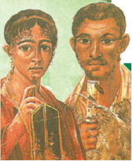

+ Pompey
- Rim
- Gerkulanum
- Neapol

**1065. Qadimgi rimliklarda olov va temirchilar xudosi qanday nomlangan?**

+ Vulqon
- Neptun
- Yupiter
- Merkuriy

**1066. Qadimgi Rimda qaysi ma’bud ibodatxonasida doimo olov yonib turgan?**

- Yupiter ibodatxonasida
+ Vesta ibodatxonasida
- Mars ibodatxonasida
- Vulqon ibodatxonasida

**1067. Qadimgi rimliklar olov yonib turar ekan, ... mavjuddir deb hisoblashgan.**

- Koinot
- Olam
- Rim
+ Hayot

**1068. Qadimgi Rimda pontifiklar hay’atiga kim rahbarlik qilgan?**

- Buyuk avgur
- Buyuk vestalka
+ Buyuk pontifik
- Buyuk magistr

**1069. Rim respublikasida nima odamlarning jamiyatdagi mavqeini bildirgan?**

- Yuqori lavozimlarda ishlashi
- Uy-joylarining hashamati
+ Kiyib yuradigan liboslari
- Bilim darajasining yuqoriligi

**1070. Muhim ishni boshlashdan oldin rimliklar bu ishda madad berishi uchun ... .**

+ xudolarga qurbonliklar bag‘ishlar edilar
- xalqqa non tarqatar edilar
- fol ochtirar edilar
- gladiatorlar o‘yinlarini o‘tkazar edilar

**1071. Qadimgi rimliklarda qaysi ma’bud osmon, momaqaldiroq va yashin podshosi hisoblangan?**

- Vulkan
- Neptun
+ Yupiter
- Morfey

**1072. Qadimgi rimliklarda xonadon o‘chog‘i homiysi qanday nomlangan?**

- Venera
- Diana
- Fortuna
+ Vesta

**1073. Qadimgi rimliklarda kimlar bayramlar taqvimi, marosimlar, tantanalar tartibini tuzishgan?**

- Avgurlar
- Vestalkalar
+ Pontifiklar
- Magistrlar

**1074. Rim respublikasida o‘g‘il bolalar 14 yoshga to‘lgunga qadar qanday toga kiyishgan?**

- Yashil yo‘lli toga
- Qora yo‘lli toga
- Moviy yo‘lli toga
+ Pushti yo‘lli toga

**1075. Qadimgi rimliklarda urush ma’budi qanday nomlangan?**

- Vulkan
- Uran
- Yupiter
+ Mars

**1076. Qadimgi rimliklarda savdo-sotiq ma’budi qanday nomlangan?**

- Vulqon
- Neptun
- Yupiter
+ Merkuriy

**1077. Qadimgi rimliklarda qaysi ma’bud Rim davlatining homiysi hisoblangan?**

+ Yupiter
- Uran
- Neptun
- Mars

**1078. Rim bozorlarida katta tovar bo‘lmish ... talab ko‘p edi.**

- togaga
- oltinga
+ qulga
- qurolga

**1079. Rim respublikasida o‘g‘il bolalar necha yoshga kirganlarida ular voyaga yetgan shaxs hisoblanar edi?**

- 12 yoshga
+ 14 yoshga
- 16 yoshga
- 18 yoshga

**1080. Qadimgi rimliklar barcha muhim ishlarni nimadan boshlashgan?**

+ Fol ochishdan
- Qurbonlik qilishdan
- Ehson tarqatishdan
- Ibodat qilishdan

**1081. Qadimgi rimliklarda ov ma’budasi qanday nomlangan?**

- Venera
+ Diana
- Vesta
- Fortuna

**1082. Qadimgi rimliklarda pontifiklar hay’atiga necha nafardan necha nafargacha ruhoniylar jamlangan edi?**

+ 5 nafardan 15 nafargacha
- 6 nafardan 16 nafargacha
- 7 nafardan 17 nafargacha
- 8 nafardan 18 nafargacha

**1083. Qadimgi rimliklarda fol ochish kimlarning yordamida amalga oshirilgan?**

+ Avgurlar
- Vestalkalar
- Pontifiklar
- Magistrlar

**1084. Xom suvoqqa ishlangan rasm qanday ataladi?**

+ Freska
- Ikona
- Mozaika
- Miniatyura

**1085. Qadimgi rimliklarda kim xudolar bilan maslahatlashib olib, xulosa beradi, deb hisoblashgan?**

- Buyuk avgur
- Buyuk vestalka
+ Buyuk pontifik
- Buyuk magistr

**1086. “Forum” nima?**

- Rimning muqaddas tepaligi
+ Rimning markaziy maydoni
- Rimdagi barcha xudolar ibodatxonasi
- Rim imperiyasidagi bozorlar

**1087. Rim respublikasida o‘g‘il bolalar necha yoshga kirganlarida oppoq toga kiya boshlar edilar?**

- 13 yoshga
+ 14 yoshga
- 15 yoshga
- 16 yoshga

## 46-§ Qullar va gladiatorlar.

**1088. O‘z mehnat qurollari, urug‘ligi bor, oilasi bilan birga yashaydigan “kulbali qullar” qayerda bo‘lgan?**

- Spartada
- Afinada
+ Rimda
- Bobilda

**1089. Spartakka qarshi kurashgan Rim sarkardasi kim?**

- Yuliy Sezar
- Oktavian Avgust
+ Mark Krass
- Mark Antoniy

**1090. Kim boshchiligidagi qullar qo‘zg‘oloni qadimgi dunyoda eng ommaviy va uyushgan qo‘zg‘olonlardan biri bo‘lgan?**

- Desebal
- Kriks
+ Spartak
- Ganik

**1091. Spartak nima uchun Kapuya shahridagi gladiatorlik maktabiga sotib yuborilgan?**

- Frakiyada Rim prokonsuli hayotiga qasd qilganligi uchun
+ Rim armiyasida xizmat qilishdan bosh tortganligi uchun
- Rimga qarshi qo‘zg‘olon ko‘tarishga uringanligi uchun
- Rimga qarshi kurashayotgan daklarga yordam bergani uchun

**1092. Qachon Spartak lashkari tor-mor etilgan?**

- Mil. avv. 68-yil kuzida
- Mil. avv. 69-yil qishida
- Mil. avv. 70-yil yozida
+ Mil. avv. 71-yil bahorida

**1093. Kolizey amfiteatri qayerda qurilgan?**

- Spartada
- Afinada
+ Rimda
- Bobilda

**1094. Rimliklarning sevimli tomoshalaridan biri bu … bo‘lgan.**

- teatr tomoshasi
- sport o‘yini
- otlar poygasi
+ gladiatorlar jangi

**1095. Spartak qayerlik bo‘lgan?**

- Gretsiyalik
- Makedoniyalik
+ Frakiyalik
- Galliyalik

**1096. Spartak boshchiligidagi qo‘zg‘olonchilar qaysi tog‘dagi qoyaga chiqib olganlar?**

- Golgofa tog‘idagi
- Olimp tog‘idagi
+ Vezuviy tog‘idagi
- Lasko tog‘idagi

**1097. Spartak va uning qancha tarafdorlari qorovullarga hujum qilganlar va gladiatorlar maktabidan qochib ketganlar?**

- 100 ga yaqin
+ 200 ga yaqin
- 300 ga yaqin
- 400 ga yaqin

**1098. Spartak Rim armiyasida xizmat qilishdan bosh tortganligi uchun qaysi shahardagi gladiatorlik maktabiga sotib yuborilgan?**

- Neapoldagi
- Rimdagi
- Pompeydagi
+ Kapuyadagi

**1099. Rimda mayda yer ijarachilari qanday atalgan?**

- Domen
+ Kolon
- Senor
- Allod

**1100. Kolizey amfiteatriga qancha tomoshabin sig‘gan?**

+ 50 ming
- 60 ming
- 70 ming
- 80 ming

**1101. Spartak qo‘shinlarini tor-mor etish uchun Vezuviy tog‘lariga qancha qo‘shin jo‘natilgan?**

- 2000 ming kishilik qo‘shin
+ 3000 ming kishilik qo‘shin
- 4000 ming kishilik qo‘shin
- 5000 ming kishilik qo‘shin

**1102. Qachon Spartak qo‘zg‘oloni bo‘lib o‘tgan?**

- Mil. avv. 77-74-yillarda
- Mil. avv. 76-73-yillarda
- Mil. avv. 75-72-yillarda
+ Mil. avv. 74-71-yillarda

**1103. Mil. avv. 74-71-yillarda Rimda kim boshchiligida qo‘zg‘olon bo‘lgan?**

- Desebal
- Kriks
+ Spartak
- Ganik

## 47-§ Rim respublikasining qulashi.

**1104. Yuliy Sezar yakkahokimlik uchun oshkora kurash boshlab yuborganda Pompeyning qo‘shinlari qayerda edi?**

- Britaniyada
- Afrikada
+ Ispaniyada
- Gretsiyada

**1105. Nikoh sovg‘asi tariqasida Mark Antoniy Misr malikasi Kleopatraga qaysi hududlarni bergan?**

- Rimning shimoliy provinsiyalarini
- Rimning janubiy provinsiyalarini
+ Rimning sharqiy provinsiyalarini
- Rimning g‘arbiy provinsiyalarini

**1106. Oktavian va Mark Antoniy ikkalasi ittifoq tuzganidan so‘ng, Antoniy Rim davlatining qaysi qismini o‘z qo‘liga olgan?**

- Shimoliy qismini
- Janubiy qismini
+ Sharqiy qismini
- G‘arbiy qismini

**1107. Shimoliy Yunonistonda Brut qo‘shin to‘plab, Rimga jiddiy xavf sola boshlagach, kimlar o‘zaro ittifoq tuzib, Brut boshliq respublika taradorlarini tor-mor etganlar? 1) Yuliy Sezar; 2) Oktavian Avgust; 3) Mark Krass; 4) Mark Antoniy.**

- 1, 2
- 3, 4
+ 2, 4
- 1, 3

**1108. Galliya urushlaridagi g‘alabalari tufayli kimning nufuzi va obro‘yi ancha ortgan?**

+ Yuliy Sezarning
- Oktavian Avgustning
- Mark Krassning
- Mark Antoniyning

**1109. Rim hukmdorlari ramzi nima hisoblangan?**

- Qoplon
+ Burgut
- Ona bo‘ri
- Quyosh

**1110. Qaysi Rim imperatorining zamonida Dunay daryosi bo‘ylarida yashovchi daklar bilan urushlar olib borilgan?**

- Konstantin zamonida
- Adrian zamonida
- Feodosiy zamonida
+ Trayan zamonida

**1111. Qachon Rimda muntazam yollanma qo‘shinlarga tayanuvchi harbiy boshliqlar real kuchga aylanganlar?**

- Milodiy I asrda
- Milodiy. II asrda
- Mil. avv. II asrda
+ Mil. avv. I asrda

**1112. Kimlarning hukmronligi davrida Rim imperiyasi inqirozi boshlangan?**

- Tiberiy va Klavdiy
+ Kaligula va Neron
- Trayan va Adrian
- Avreliy va Kommod

**1113. Milodiy 98-yilda kim Rim imperatori taxtini egallagan?**

- Konstantin
- Adrian
- Feodosiy
+ Trayan

**1114. Spartak qo‘zg‘oloni bostirilganidan keyin Rimda kimlar hokimiyat uchun ancha vaqt kurash olib borganlar? 1) Sezar; 2) Oktavian; 3) Krass; 4) Pompey.**

- 1, 2
- 1, 3
- 2, 4
+ 3, 4

**1115. Kim Misr malikasi Kleopatraga uylangan?**

- Gney Pompey
- Oktavian Avgust
- Mark Krass
+ Mark Antoniy

**1116. Rim imperiyasi Trayan zamonida Dunay daryosi bo‘ylarida yashovchi qaysi qabila bilan urushlar olib borgan?**

- Saklar bilan
- Hunlar bilan
+ Daklar bilan
- Keltlar bilan

**1117. Kleopatra qayerning malikasi edi?**

- Liviyaning
- Mesopotamiyaning
+ Misrning
- Yunonistonning

**1118. Qachon Rimning kuch-qudrati qayta tiklangan?**

- Milodiy I asr boshlarida
- Milodiy I asr oxirlarida
+ Milodiy II asr boshlarida
- Milodiy II asr oxirlarida

**1119. Qaysi davr Rim imperiyasining “oltin asri” deyiladi?**

- Mil. avv. II asr
- Mil. avv. I asr
- Milodiy I asr
+ Milodiy II asr

**1120. Kim Rimda mil. avv. 49-yilda yakkahokimlik uchun oshkora kurashni boshlab yuborgan?**

+ Yuliy Sezar
- Oktavian Avgust
- Mark Krass
- Gney Pompey

**1121. Trayan ustunida qanday manzara tasvirlangan?**

- Saklar bilan urush manzaralari
- Hunlar bilan urush manzaralari
+ Daklar bilan urush manzaralari
- Keltlar bilan urush manzaralari

**1122. Qaysi Rim imperatori Parfiya podsholigi bilan muvaffaqiyatli urush olib borgan?**

+ Trayan
- Konstantin
- Adrian
- Kommod

**1123. Qaysi mamlakat qirg‘oqlarida Mark Antoniy va Oktavian Avgust flotlari o‘rtasida jang bo‘lgan?**

- Italiya
- Finikiya
- Misr
+ Yunoniston

**1124. “Qur’a tashlandi!”. Ushbu ibora kimga tegishli?**

+ Yuliy Sezarga
- Oktavian Avgustga
- Mark Krassga
- Mark Antoniyga

**1125. Qayerdagi urushlardagi g‘alabalari tufayli Yuliy Sezarning nufuzi va obro‘yi ancha ortgan?**

- Gretsiyadagi
- Frakiyadagi
+ Galliyadagi
- Ispaniyadagi

**1126. Trayan ustuni qayerda qurilgan?**

- Spartada
- Afinada
+ Rimda
- Vizantiyda

**1127. Oktavian va Mark Antoniy ikkalasi ittifoq tuzganidan so‘ng, Oktavian Rim davlatining qaysi qismini o‘z qo‘liga olgan?**

- Shimoliy qismini
+ G‘arbiy qismini
- Janubiy qismini
- Sharqiy qismini

**1128. Qachon Trayan Rimda imperator taxtini egallagan?**

- 97-yilda
+ 98-yilda
- 99-yilda
- 100-yilda

**1129. Oktavian bilan bo‘lgan jangda yengilgan Kleopatra va Mark Antoniy qaysi shaharga qochganlar?**

- Rimga
- Vizantiyga
+ Aleksandriyaga
- Afinaga

**1130. Mark Antoniyning qaysi ishi Oktavian Avgustning noroziligiga sabab bo‘lgan?**

- O‘zining yakka hukmronligini o‘rnatishga intilishi
- Misrdan Rimga keladigan g‘allani to‘xtatib qo‘yishi
+ Nikoh sovg‘asi tariqasida Misr malikasi Kleopatraga Rimning sharqiy provinsiyalarini berishi
- Oktavian legionlarini o‘z tafariga og‘dirib olishga urinishi

**1131. Yollanma askarlarni Rimning harbiy kuch-qudrati va davlatning kuchayishi emas, faqat nima qiziqtirardi?**

- Unvon
+ O‘lja
- Yer
- Maosh

**1132. Yuliy Sezar Rimga boruvchi yo‘ldagi qaysi daryodan kechib o‘tar ekan, “Qur’a tashlandi!” degan iborani aytgan?**

- Po daryosidan
- Tibr daryosidan
+ Rubikon daryosidan
- Stiks daryosidan

**1133. Qachon Yuliy Sezar hukmronligi tugagan?**

+ Mil. avv. 44-yilda
- Mil. avv. 43-yilda
- Mil. avv. 42-yilda
- Mil. avv. 41-yilda

**1134. Nikoh sovg‘asi tariqasida kim Misr malikasi Kleopatraga Rimning sharqiy provinsiyalarini bergan?**

- Yuliy Sezar
- Oktavian Avgust
- Mark Krass
+ Mark Antoniy

**1135. Qachon Oktavian Senatdan “imperator” unvoni va “Avgust” nomini olgan?**

- Mil. avv. 32-yilda
- Mil. avv. 31-yilda
- Mil. avv. 30-yilda
+ Mil. avv. 29-yilda

**1136. Yuliy Sezarni o‘ldirish fitnasiga kim boshchilik qilgan?**

- Oktavian
- Antoniy
- Pompey
+ Brut

**1137. Qachon Yuliy Sezar Rimda yakkahokimlik uchun oshkora kurashni boshlab yuborgan?**

- Mil. avv. 52-yilda
- Mil. avv. 51-yilda
- Mil. avv. 50-yilda
+ Mil. avv. 49-yilda

**1138. Trayan ustuni balandligi qancha?**

- 10 metr
- 20 metr
- 30 metr
+ 40 metr

**1139. Rimda kimning hukmronligi davrida Suriya va Mesopotamiya hududlari imperiya tarkibiga qo‘shib olingan?**

- Konstantin davrida
- Adrian davrida
- Feodosiy davrida
+ Trayan davrida

**1140. Yuliy Sezar o‘ldirilgach kim Rimda respublikani qayta tiklashga urinib ko‘rgan?**

- Oktavian
- Antoniy
- Pompey
+ Brut

**1141. Kim Rim imperiyasining asoschisi hisoblanadi?**

- Yuliy Sezar
+ Oktavian Avgust
- Mark Krass
- Mark Antoniy

**1142. Rim imperiyasi Trayan zamonida qaysi daryo bo‘ylarida yashovchi daklar bilan urushlar olib borgan?**

- Dnepr
- Elba
- Reyn
+ Dunay

## 48-§ G‘arbiy Rim imperiyasining tanazzuli va halokati.

**1143. 410-yilda Rim Alarix boshchiligidagi qaysi qabila tomonidan egallangan?**

- Hunlar
- Franklar
+ Gotlar
- Vandallar

**1144. 410-yilda Rim kim boshchiligidagi gotlar tomonidan egallangan?**

- Odoakr
+ Alarix
- Attila
- Otton

**1145. So‘nggi G‘arbiy Rim imperatori nomini toping.**

- Oktavian
- Konstantin
- Avreliy
+ Romul

**1146. Kim G‘arbiy Rimning so‘nggi imperatori Romulni taxtdan ag‘dargan?**

+ Odoakr
- Alarix
- Attila
- Otton

**1147. 410-yilda kimlar gotlarga Rim shahri darvozasini ochib berganlar?**

- Plebeylar
+ Qullar
- Harbiylar
- Senatorlar

**1148. Alarix boshchiligidagi gotlar Rimni egallganda shaharning nechta darvozasi bo‘lgan?**

- 10 ta
+ 12 ta
- 14 ta
- 16 ta

**1149. Qachon Bosfor bo‘g‘ozidagi Vizantiy shahri Rim imperiyasining poytaxti deb e’lon qilingan?**

- 329-yilda
+ 330-yilda
- 331-yilda
- 332-yilda

**1150. Rimda kimning hukmronligi davridan so‘ng rimliklar yirik bosqinchilik urushlarini olib borolmaganlar?**

- Konstantin
- Adrian
- Feodosiy
+ Trayan

**1151. Qachon Rimga germanlarning vandal qabilalari hujum qilgan?**

- 453-yilda
- 454-yilda
+ 455-yilda
- 456-yilda

**1152. Odoakr kim bo‘lgan?**

- G‘arbiy Rim imperiyasida taxtdan ag‘darilgan so‘nggi imperator
+ German qabilalarining Rimdagi yollangan qo‘shini sarkardasi
- Rim imperiyasi hududiga sharqdan kelgan hunlarning hukmdori
- Sharqiy Rim imperiyasida mustaqil saltanat tuzgan imperator

**1153. Rimliklar kimlarni “varvarlar” deb atashgan?**

- Tillari o‘zlari uchun tushunarli bo‘lgan qabilalar va xalqlarni
+ Madaniy taraqqiyotning ancha quyi pog‘onasida turuvchi qabilalar va xalqlarni
- Tillari o‘zlari uchun tushunarli bo‘lmagan qabilalar va xalqlarni
- Madaniy taraqqiyotning ancha yuqori pog‘onasida turuvchi qabilalar va xalqlarni

**1154. Vizantiy shahri qaysi bo‘g‘ozda joylashgan edi?**

- Bering bo‘g‘ozida
- Gibraltar bo‘g‘ozida
+ Bosfor bo‘g‘ozida
- Dardanell bo‘g‘ozida

**1155. Qachon Rim imperiyasining kuch-qudrati zaiflasha boshlagan?**

- Milodiy I asrda
- Milodiy II asrda
+ Milodiy III asrda
- Milodiy IV asrda

**1156. Qachon Attila boshchiligidagi hunlar Italiyaga bostirib kirganlar?**

- 449-yilda
- 450-yilda
- 451-yilda
+ 452-yilda

**1157. Kimlar ikki hafta davomida Rimni talaganlar?**

- Hunlar
- Franklar
- Gotlar
+ Vandallar

**1158. 452-yilda Attila boshchiligidagi qaysi qabila Italiyaga bostirib kirgan?**

+ Hunlar
- Franklar
- Gotlar
- Vandallar

**1159. G‘arbiy Rim imperiyasiga qayerlar kirgan? 1) Bolqon yarimoroli; 2) Italiya; 3) Kichik Osiyo; 4) G‘arbiy Yevropa; 5) Misr; 6) Shimoliy Afrika.**

- 1, 2, 3
- 4, 5, 6
- 1, 3, 5
+ 2, 4, 6

**1160. Sharqiy Rim imperiyasiga qayerlar kirgan? 1) Bolqon yarimoroli; 2) Italiya; 3) Kichik Osiyo 4) G‘arbiy Yevropa; 5) Misr; 6) Shimoliy Afrika.**

- 1, 2, 3
- 4, 5, 6
+ 1, 3, 5
- 2, 4, 6

**1161. Rim imperiyasida kimning buyrug‘i bilan Vizantiy shahridagi barcha eski binolar buzib tashlangan va yangi shahar qurilgan?**

+ Konstantin
- Adrian
- Feodosiy
- Trayan

**1162. Imperiya ikkiga bo‘lingach, Sharqiy Rim imperiyasi ... .**

- varvar qabilalari ta’siriga tushib qolgan
- alohida davlatlarga parchalana boshlagan
+ imperatorning yagona hokimiyatini saqlab qolgan
- bir nechta shahar-respublikalarga bo‘linib ketgan

**1163. Gotlar Rim shahrini ishg‘ol qilganida nima uchun ibodatxonalar va kutubxonalar binolaridan tosh taxtalarni ko‘chirib olib ketganlar?**

- Rimni butunlay vayron qilish uchun
- Ular qimmatbaho sanalgani uchun
- Rimda o‘lja sifatida olib ketishga arziydigan boshqa narsa qolmagani uchun
+ Qo‘rg‘onchalarini o‘rab turgan devorlarni mustahkamlash uchun

**1164. Yunonlar kimlarni “varvarlar” deb atashgan?**

- Tillari o‘zlari uchun tushunarli bo‘lgan qabilalar va xalqlarni
- Madaniy taraqqiyotning ancha quyi pog‘onasida turuvchi qabilalar va xalqlarni
+ Tillari o‘zlari uchun tushunarli bo‘lmagan qabilalar va xalqlarni
- Madaniy taraqqiyotning ancha yuqori pog‘onasida turuvchi qabilalar va xalqlarni

**1165. Kimning zamonida Bosfor bo‘g‘ozidagi Vizantiy shahri Rim imperiyasining poytaxti deb e’lon qilingan?**

+ Konstantin
- Adrian
- Feodosiy
- Trayan

**1166. Kimning o‘limidan so‘ng Rim imperiyasi uning ikki o‘g‘li o‘rtasida G‘arbiy va Sharqiy qismlarga taqsimlangan?**

- Konstantinning
- Adrianning
+ Feodosiyning
- Trayanning

**1167. Kimlar Rimda o‘zlari bilan olib ketolmaydigan hamma narsani nobud qilganlar?**

- Hunlar
- Franklar
- Gotlar
+ Vandallar

**1168. 452-yilda kim boshchiligidagi hunlar Italiyaga bostirib kirganlar?**

- Odoakr
- Alarix
+ Attila
- Otton

**1169. Qachon Alarix boshchiligidagi gotlar Rimni egallaganlar?**

- 409-yilda
+ 410-yilda
- 411-yilda
- 412-yilda

**1170. Qachon G‘arbiy Rim imperiyasi qulagan?**

- 472-yilda
- 474-yilda
+ 476-yilda
- 478-yilda

**1171. 455-yilda kimlar Rimga hujum qilgan?**

- Hunlar
- Franklar
- Gotlar
+ Vandallar

**1172. Qachon Rim imperiyasi G‘arbiy va Sharqiy qismlarga ajralgan?**

- 393-yilda
- 394-yilda
+ 395-yilda
- 396-yilda

**1173. Milodiy III asrda Rim imperiyasining qaysi tarafidan ko‘chmanchi qabilalar paydo bo‘lganlar?**

- Janubi-sharqdan
- Janubi-g‘arbdan
- Shimoli-sharqdan
+ Shimoli-g‘arbdan

**1174. Qachon Qadimgi dunyo tarixi tugagan va O‘rta asrlar tarixi boshlangan?**

- 470-yilda
- 472-yilda
- 474-yilda
+ 476-yilda

**1175. Qaysi shaharni “boqiy shahar” deya ta’riflashgan?**

- Bobilni
- Konstantinopolni
+ Rimni
- Afinani

**1176. Alarix boshchiligidagi gotlar Rimni necha kun talaganlar?**

+ 3 kun
- 4 kun
- 5 kun
- 6 kun

**1177. Kim G‘arbiy Rim imperiyasiga barham bergan?**

+ Odoakr
- Alarix
- Attila
- Otton

**1178. Alarix boshchiligidagi gotlar Rimni 410-yilning qaysi oyida egallashgan?**

+ Avgust oyida
- May oyida
- Mart oyida
- Dekabr oyida

**1179. 330-yilda qaysi shahar Rim imperiyasining poytaxti deb e’lon qilingan?**

- Ravenna
- Korinf
+ Vizantiy
- Megara

**1180. Imperiya ikkiga bo‘lingach, G‘arbiy Rim imperiyasi ... .**

- varvar qabilalari ta’siriga tushib qolgan
+ alohida davlatlarga parchalana boshlagan
- imperatorning yagona hokimiyatini saqlab qolgan
- bir nechta shahar-respublikalarga bo‘linib ketgan

## 49-50-§ Qadimgi Rim madaniyati.

**1181. Qachon Rim eng yirik va aholisi ko‘p shaharga aylangan?**

- Mil. avv. II asrda
- Mil. avv. I asrda
+ Milodiy I asrda
- Milodiy II asrda

**1182. “Rim tarixi” asarining muallifi kim?**

- Arrian
+ Tit Liviy
- Kvint Kursiy Ruf
- Plutarx

**1183. 30 yoshida Iso necha nafar shogirdi bilan Falastin bo‘ylab sayohat qilgan?**

- 10 nafar
+ 12 nafar
- 14 nafar
- 18 nafar

**1184. Iso payg‘ambar ta’limoti izdoshlari nima deb atalgan?**

- Havoriylar
+ Xristianlar
- Apostollar
- Yepiskoplar

**1185. Iborani to‘ldiring: “Barcha yo‘llar ... ga boradi”.**

- Konstantinopol
- Afina
- Aleksandriya
+ Rim

**1186. Rivoyatga ko‘ra, vafotidan keyin nechanchi kuni Iso Masih qayta tirilib, osmonga ko‘tarilib ketgan?**

- Birinchi kuni
+ Uchinchi kuni
- Yettinchi kuni
- O‘ninchi kuni

**1187. Gumbaz shaklida ustunlarsiz qurilgan ibodatxona qaysi?**

- Parfenon
- Artemida
+ Panteon
- Galikarnas

**1188. “Makedoniyalik Aleksandr tarixi” asarining muallifini kim?**

- Arrian
- Tit Liviy
+ Kvint Kursiy Ruf
- Plutarx

**1189. “Yevangeliya” so‘zi qanday ma’noni anglatadi?**

+ “Xushxabar”
- “Gapirmoq”
- “Payg‘ambar”
- “Iymon”

**1190. Quyidagi qaysi so‘z “Barcha xudolar ibodatxonasi” degan ma’noni anglatadi?**

- Parfenon
- Artemida
+ Panteon
- Galikarnas

**1191. Dastlab rimlik zodagonlar bo‘lmish patritsiylar qayerda yashardilar?**

- Ikki qavatli shohona uylarda
+ Bir qavatli oddiy uylarda
- Tepaliklar o‘rtasidagi tekis joylarda
- Tepaliklardagi villalarda

**1192. Necha yoshida Iso o‘n ikki nafar shogirdi bilan Falastin bo‘ylab sayohat qilgan?**

- 20 yoshida
- 25 yoshida
+ 30 yoshida
- 35 yoshida

**1193. Qaysi imperator xristianlik boshqa dinlar bilan teng bir din deb e’lon qilingan farmon chiqargan?**

+ Konstantin
- Adrian
- Feodosiy
- Trayan

**1194. “Yevangeliya” (Injil) nima?**

- Payg‘ambarlar haqidagi rivoyatlar
- Inson yaratilishi haqidagi rivoyatlar
- Dunyo yaratilishi haqidagi rivoyatlar
+ Iso Masih haqidagi rivoyatlar

**1195. Rimda badavlat xonadon farzandlari necha yoshdan maktabga qatnagan?**

- 5 yoshdan
+ 6 yoshdan
- 7 yoshdan
- 8 yoshdan

**1196. Xristianlik diniga kim asos solgan?**

- Muso payg‘ambar
- Nuh payg‘ambar
- Dovud payg‘ambar
+ Iso payg‘ambar

**1197. Qachon imperator Konstantin xristianlik boshqa dinlar bilan teng bir din deb e’lon qilingan farmon chiqargan?**

+ 313-yilda
- 325-yilda
- 342-yilda
- 330-yilda

**1198. Kim yunon-rim sarkardalari hayoti haqida kitob yozgan?**

- Arrian
- Tit Liviy
- Kvint Kursiy Ruf
+ Plutarx

**1199. Dastlab badavlat bo‘lmagan oddiy rimliklar qayerda yashaganlar?**

- Ikki qavatli shohona uylarda
- Bir qavatli oddiy uylarda
+ Tepaliklar o‘rtasidagi tekis joylarda
- Tepaliklardagi villalarda

**1200. Rim tarixchilarini to‘g‘ri toping. 1) Kvint Kursiy Ruf; 2) Arrian; 3) Tit Liviy; 4) Strabon; 5) Plutarx; 6) Gerodot.**

- 1, 2
- 4, 5
- 2, 4
+ 1, 3

**1201. 30 yoshida Iso o‘n ikki nafar shogirdi bilan qayer bo‘ylab sayohat qilgan?**

- Italiya
+ Falastin
- Suriya
- Mesopotamiya

**1202. Qayerning me’morchiligida triumf arkalar  bunyod etilgan?**

- Karfagen
- Makedoniya
+ Rim
- Yunoniston

**1203. Rimda termalar qoshida ... ham bo‘lgan.**

- kurash zallari
+ kutubxona
- gladiatorlar maktablari
- skriptoriyalar

**1204. Xristianlar jamoalariga kimlar peshvolik qiladi?**

+ Yepiskoplar
- Patriarxlar
- Apostollar
- Kardinallar

**1205. Rimda “terma” deb nimalarga aytilgan?**

- Teatrlarga
- Ibodatxonalarga
- Qasrlarga
+ Hammomlarga

**1206. Rimdagi grammatikada (o‘rta maktabda) qanday fanlar o‘qitilgan? 1) Tibbiyot; 2) Tarix; 3) Geografiya; 4) Geometriya; 5) Musiqa; 6) Astronomiya.**

- 1, 2, 3, 4, 5, 6
+ 2, 3, 4, 5, 6
- 3, 4, 5, 6
- 4, 5, 6

**1207. Iso payg‘ambarni o‘lim jazosiga mahkum etgan Rim noibi kim?**

+ Pontiy Pilat
- Emiliy Pavel
- Fulviy Flakx
- Ovidiy Nazon

**1208. Iso payg‘ambar shogirdlari qanday atalgan?**

- Yepiskoplar
- Patriarxlar
+ Apostollar
- Kardinallar

**1209. Iso payg‘ambar qaysi shaharda tug‘ilgan?**

- Iyerusalim
+ Vifleyem
- Nazaret
- Xanaan

**1210. Qachon xristianlik dini vujudga kelgan?**

- Mil. avv. II asrda
- Mil. avv. I asrda
+ Milodiy I asrda
- Milodiy II asrda

**1211. Iso payg‘ambarni shogirdlari qayerga dafn qilishgan?**

+ Golgofa tog‘iga
- Vifleyem tog‘iga
- Vezuviy tog‘iga
- Nazaret tog‘iga

**1212. “Terma” so‘zi yunonchada qanday ma’noni anglatadi?**

- Sovuq
+ Issiq
- Hammom
- Tozalik

**1213. Rimda “stil” deb nimaga aytilgan?**

+ Mum bilan qoplangan taxtachaga yozish uchun mo‘ljallangan metall tayoqchaga
- Ohak bilan qoplangan taxtachaga yozish uchun mo‘ljallangan oddiy tayoqchaga
- Loy bilan qoplangan taxtachaga yozish uchun mo‘ljallangan suyakdan yasalgan tayoqchaga
- Qum bilan qoplangan taxtachaga yozish uchun mo‘ljallangan tosh tayoqchaga

**1214. Betonni kimlar ixtiro qilishgan?**

- Hindlar
+ Rimliklar
- Yunonlar
- Misrliklar