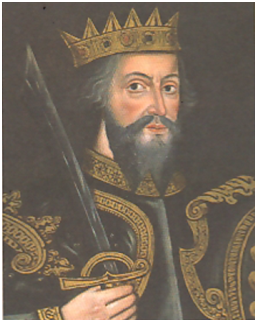
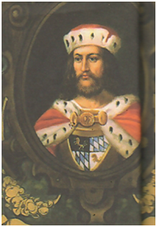
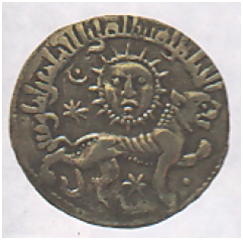
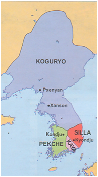
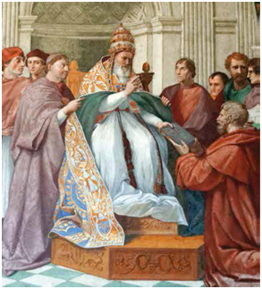
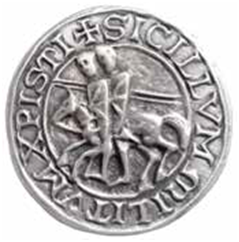
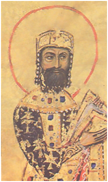
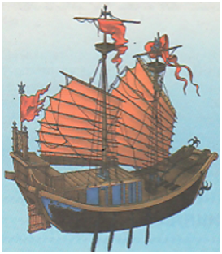

# 7-sinf Jahon tarixi (2022-yil darsligi)

_Tarix (Mavzulashgan) (2022-2025-yillar darsliklari)_

## 1-§ German qabilalari va Rim imperiyasi.

**1. O‘rta asrlar davrida shakllangan yer egaligi munosabatlari Yevropada nima deb atalgan?**

+ Feodal jamiyat
- Kapitalistik jamiyat
- Sotsialistik jamiyat
- Yer egaligi jamiyati

**2. Italiyada tuzilgan Ostgot qirolligining hukmdori kim?**

+ Teodorix
- Alarix
- Odoakr
- Boetsiy

**3. Ostgotlar va rimliklar o‘rtasidagi kelishmovchiliklar va Vizantiya istilolari qachonga kelib Ostgot qirolligining qulashiga sabab bo‘lgan?**

- VI asr boshlariga
+ VI asr o‘rtalariga
- VI asr oxirlariga
- VII asr boshlariga

**4. Franklar qayerda o‘z davlatini barpo etganlar?**

- Britaniyada
+ Galliyada
- Italiyada
- Shimoliy Afrikada

**5. O‘rta asrlarda german qabilalari orasida targ‘ibot orqali qaysi din tarqalib, ijtimoiy taraqqiyot yanada tezlashgan?**

- Totemizm
+ Xristianlik
- Shomonlik
- Animizm

**6. Germanlar jamiyatida harbiy bo‘linmalar nima deb atalgan?**

+ Drujina
- Senturiya
- Legion
- Agema

**7. O‘rta asrlarda “feodallar” deb kimlarga aytilgan?**

+ Yirik yer egalariga
- Shahar zodagonlariga
- Mayda yer egalariga
- Yirik qullardorlarga

**8. O‘rta asrlarda quyidagi qaysi xalqlar nondan ko‘ra sut, pishloq va go‘shtni ko‘proq istemol qilganlar?**

+ Germanlar
- Rimliklar
- Normandlar
- Slavyanlar

**9. Vestgotlar qachon janubi-g‘arbiy Galliyada ilk varvar qirolligi – Vestgot qirolligini tuzganlar?**

+ 418-yilda
- 476-yilda
- 410-yilda
- 452-yilda

**10. IV asrdan Rim imperiyasi o‘zining avvalgi qudratini yo‘qota boshlaganligining asosiy sababi nimada edi?**

- To‘xtovsiz urushlar
+ Qullar mehnatining past darajasi
- Saroydagi o‘zaro fitnalar
- German qabilalarining imperiya hududiga kelib o‘rnashishi

**11. German qabilalari qaysi hududlarda yashashgan?**

- Yevropaning janubida va Reyndan Elba daryosigacha bo‘lgan hududlarda
+ Yevropaning shimolida hamda Reyndan Elba daryosigacha bo‘lgan hududlarda
- Yevropaning shimolida hamda Reyndan Dunay daryosigacha bo‘lgan hududlarda
- Yevropaning shimolida hamda Visladan Elba daryosigacha bo‘lgan hududlarda

**12. Germanlar rimliklar bilan bo‘lgan savdo-sotiqda ularga nimlar yetkazib berishgan? 1) Qullar; 2) Vino; 3) Chorva mollari; 4) Kiyim-kechak; 5) Teri; 6) Qahrabo.**

- 1, 2, 4, 5
- 2, 3, 5, 6
- 2, 3, 4, 5
+ 1, 3, 5, 6

**13. O‘rta asrlar qaysi davrlarni o‘z ichiga oladi?**

- IV asr oxiridan XIV asr boshigacha
- V asr boshidan XV asr boshigacha
+ V asr oxiridan XV asr oxirigacha
- IV asr boshdan XIV asr oxirigacha

**14. “Germaniya” asarining muallifi kim?**

- Tit Liyiv
- Yuliy Sezar
- Plutarx
+ Korneliy Tatsit

**15. Ostgotlar Italiyada poytaxti qaysi shahar bo‘lgan kuchli qirollik tuzganlar?**

+ Ravenna
- Kapuya
- Gerkulanum
- Neapol

**16. Qachon Yevropada kitob bosish dastgohi yaratilgan?**

- XIV asr oxirlarida
- XV asr boshlarida
+ XV asr o‘rtalarida
- XV asr oxirlarida

**17. Ostgot qabilalari qayerda o‘z davlatini barpo etganlar?**

- Britaniyada
+ Italiyada
- Galliyada
- Shimoliy Afrikada

**18. Rim imperiyasining qaysi hududlarida yashagan german qabilalarining ko‘chishlari (milodiy IV–VI asrlar) Yevropa tarixida muhim voqealardan biri bo‘lgan?**

- G‘arbiy hududlarida
- Janubiy hududlarida
+ Shimoliy hududlarida
- Sharqiy hududlarida

**19. Langobard qirolligi qayerda tuzilgan edi?**

- Janubiy Italiyada
+ Shimoliy Italiyada
- Janubiy Ispaniyada
- Shimoliy Ispaniyada

**20. Nechanchi asrda Xitoyda kitob bosish dastgohi yaratilgan?**

- IX asrda
- X asrda
+ XI asrda
- XII asrda

**21. Qaysi ostgotlar qiroli antik madaniyatni saqlash va Rimni qayta tiklashni maqsad qilgan edi?**

+ Teodorix
- Alarix
- Odoakr
- Boetsiy

**22. Rim aholisining vestgotlarga qarshiligi hamda oziq-ovqat zaxiralarining tugashi varvarlarni shaharni tashlab, qayerga chekinishga majbur etgan?**

+ Janubiy Galliyaga
- Shimoliy Italiyaga
- Sharqiy Ispaniyaga
- G‘arbiy Britaniyaga

**23. German qabilalarida qaysi organ qabila boshlig‘ini saylash, qabila ichidagi nizolarni bartaraf etish, urush e’lon qilish va tinchlik o‘rnatish kabilarni hal qilgan?**

- Oqsoqollar yig‘ini
+ Xalq majlisi
- Konung vechesi
- Beshyuzlar kengashi

**24. O‘rta asarlarda german qabilalarida qaysi sohalar rivojlangan? 1) Kulolchilik; 2) Toʻquvchilik; 3) Kandakorlik; 4) Zargarlik; 5) Shishasozlik; 6) Teri va yogʻochga ishlov berish.**

- 1, 2, 4, 5
+ 1, 2, 4, 6
- 2, 3, 4, 5
- 2, 3, 5, 6

**25. Quyidagi qaysi sana Yevropada qulchilik jamiyatidan yer egaligi munosabatlariga (feodal jamiyatga) o‘tishning boshlanganligini anglatadi?**

- 418-yilda
+ 476-yilda
- 410-yilda
- 452-yilda

**26. Anglosakslar qayerda o‘z davlatini barpo etganlar?**

+ Britaniyada
- Italiyada
- Galliyada
- Shimoliy Afrikada

**27. Qachon alemann, got, franklarning yirik qabila ittifoqlari shakllangan?**

- V–VI asrlarda
- III–IV asrlarda
+ IV–V asrlarda
- II–III asrlarda

**28. IV asrda Rim imperiyasida soliqlarning oshib ketishi, oddiy shaharliklar va dehqonlar orasida norozilik kayfiyatini kuchayishi nima bilan yakun topgan?**

+ 395-yili Rim imperiyasining ikkiga: G‘arbiy va Sharqiy qismlarga bo‘linishi bilan
- 476-yilda G‘arbiy Rim imperiyasining qulashi bilan
- 455-yilda Rimga germanlarning vandal qabilalari hujumi bilan
- 452-yilda xunnlarning Italiyaga bostirib kirishi bilan

**29. Germanlar qabilasi kim tomonidan boshqarilgan?**

+ Konung
- Senyor
- Graf
- Gersog

**30. O‘rta asrlar davrida shakllangan yer egaligi munosabatlari Osiyoda nima deb atalgan?**

- Kapitalistik jamiyat
- Sotsialistik jamiyat
- Feodal jamiyat
+ Yer egaligi jamiyati

**31. O‘rta asrlarda german qabilalari xo‘jaligida qanday omil mehnat unumdorligining oshishi, hosilning ortishiga olib kelgan?**

- Dalalarni almashlab ekish usuli, ayollar va erkaklarning teng mehnat qilishi
- Yog‘ingarchilikning ko‘payishi, omochdan temir plugga o‘tilishi
+ Omochdan temir plugga o‘tilishi, dalalarni almashlab ekish usuli
- Iqlimning isishi va unumdor yer maydonlarining hajmi ortishi

**32. “Galliya urushi haqida xotiralar” asarining muallifi kim?**

- Tit Liyiv
+ Yuliy Sezar
- Plutarx
- Korneliy Tatsit

**33. Vestgotlar qachon Alarix boshchiligida “boqiy shahar” nomini olgan Rimni egallagan?**

- 418-yilda
- 476-yilda
+ 410-yilda
- 452-yilda

**34. IV–V asrlarda quyidaqi qaysi german qabilalarining yirik qabila ittifoqlari shakllangan? 1) Alemann; 2) Got; 3) Bavar; 4) Frank; 5) Saks.**

- 1, 2, 5
- 2, 4, 5
- 2, 3, 4
+ 1, 2, 4

**35. Quyidagi qaysi atama “qabila boshlig‘i”, “zodagonlarning oliy vakili” ma’nosini anglatadi?**

- Gersog
+ Konung
- Senyor
- Feodal

**36. Qachondan boshlab Rim imperiyasi o‘zining avvalgi qudratini yo‘qota boshlagan?**

- II asrdan
- III asrdan
+ IV asrdan
- V asrdan

**37. German qabilalarida nechanchi asrlarda mulkiy tabaqalanish kuchaygan?**

- V–VI asrlarda
- III–IV asrlarda
+ IV–V asrlarda
- II–III asrlarda

**38. O‘rta asrlarda german qabilalari asosan qanday mashg‘ulot bilan shug‘ullangan?**

+ Dehqonchilik va chorvachilik
- Baliqchilik va ovchilik
- Savdo-sotiq va hunarmandchilik
- Chorvachilik va ovchilik

**39. Ostgot qiroli Teodorixning rimlik zodagon va yetuk faylasuf bo‘lgan bosh vazirini toping.**

- Amvrosiy
- Aetsiy
- Flaviy
+ Boetsiy

**40. Qanday omil o‘rta asrlarda germanlarning diniy e’tiqodining o‘zgarib borishiga olib kelgan?**

- Dunyo haqidagi tasavvurlarning kengayishi
+ Rim imperiyasi bilan doimiy aloqalari
- Doimiy ko‘chib yurishlar
- Yozuvning kirib kelishi

**41. Germanlarda qabilani yangi joylarga ko‘chirish masalasi qaysi organ tomonidan hal qilingan?**

- Oqsoqollar yig‘ini
+ Xalq majlisi
- Konung vechesi
- Beshyuzlar kengashi

**42. Xalqlarning buyuk ko‘chishlarini sharqdan Yevropaga yurish boshlagan qaysi ko‘chmanchi qabilalar tezlashtirgan?**

- Vandallar
+ Xunnlar
- Franklar
- Slavyanlar

**43. Vestgotlarga 410-yilda “boqiy shahar” nomini olgan Rimni egallashda boshchilik qilgan sarkardani toping.**

- Attila
- Odoakr
+ Alarix
- Teodorix

**44. Rim imperiyasining shimoliy hududlarida yashagan german qabilalarining ko‘chishlari nechanchi asrlarda Yevropa tarixida muhim voqealardan biri bo‘lgan?**

+ Milodiy IV–VI asrlarda
- Milodiy III–IV asrlarda
- Milodiy V–VI asrlarda
- Milodiy II–III asrlarda

**45. O‘rta asrlarda quyidagi qaysi xalqlar hunarmandchilikda asosan qurol-yarog‘, asbob-uskunalar, kiyim-kechak va idishlar ishlab chiqarganlar?**

+ Germanlar
- Rimliklar
- Normandlar
- Slavyanlar

**46. Insoniyat tarixini davrlashtirish tamoyiliga ko‘ra, qaysi voqea bilan jahon tarixida O‘rta asrlar davri boshlanadi?**

- Sharqiy Rim impеriyasining qulashi bilan
- Xunnlarning Italiyaga bostirib kirishi bilan
+ G‘arbiy Rim impеriyasining qulashi bilan
- Olimpiya o‘yinlari o‘tkazila boshlanishi bilan

**47. Qayer bilan savdo-sotiq qilish german qabilalarining hayotida muhim rol o‘ynagan?**

- Eron bilan
- Kiyev Rusi bilan
- Xitoy bilan
+ Rim bilan

**48. German qabilalarida oliy hokimiyat organini toping.**

- Oqsoqollar yig‘ini
+ Xalq majlisi
- Konung vechesi
- Beshyuzlar kengashi

**49. Vandal va alan qabilalari qayerda o‘z davlatini barpo etganlar?**

- Britaniyada
- Italiyada
- Galliyada
+ Shimoliy Afrikada

**50. German qabilalari haqidagi ilk yozma ma’lumotlar quyidagi qaysi asarlarda keltirilgan? 1) “Tarix”; 2) “Germaniya”; 3) “Tarixiy yilnomlar”; 4) “Galliya urushlari haqida xotiralar”.**

- 1, 4
+ 2, 4
- 2, 3
- 1, 3

**51. O‘rta asrlarda rimliklar germanlarni nima bilan taminlaganlar? 1) Sopol; 2) Shisha; 3) Otlar; 4) Bronza idishlar; 5) Oltin va kumush taqinchoqlar; 6) Vino; 7) Qurollar; 8) Yog‘och; 9) Qimmatbaho matolar.**

- 1, 3, 4, 5, 7, 9
+ 1, 2, 4, 5, 7, 9
- 2, 3, 5, 6, 7, 8
- 2, 3, 4, 5, 6, 8

**52. Vestgotlar Rimni necha kun talashgan?**

- Ikki kun
+ Uch kun
- To‘rt kun
- Besh kun

**53. Xunnlar ta’qibidan qochib Rim imperiyasi hududiga o‘tgan qaysi qabilalar imperiya qo‘shinlarini tor-mor etgan?**

+ Vestgotlar
- Ostgotlar
- Sakslar
- Franklar

**54. Sarkarda Odoakr qachon o‘z qo‘shini bilan isyon ko‘tarib, so‘nggi G‘arbiy Rim imperatori Romul Avgustulni taxtdan ag‘dargan?**

- 418-yilda
+ 476-yilda
- 410-yilda
- 452-yilda

**55. O‘rta asrlarda quyidagi qaysi xalqlarda qabilaning barcha qurollangan erkin vakillari ishtirok etadigan xalq majlisi oliy hokimiyat organi hisoblangan?**

+ Germanlarda
- Slavyanlarda
- Normandlarda
- Xunnlarda

**56. O‘rta asrlarda germanlar diniy hayotida nimalarni ilohiylashtirganlar? 1) Suv; 2) Osmon; 3) Momaqaldiroq; 4) Daryo; 5) Shamol; 6) Yer.**

+ 2, 3, 5, 6
- 1, 2, 5, 6
- 2, 3, 4, 5
- 1, 3, 4, 5

## 2-3-§ Franklar davlati: qirollikdan imperiya sari.

**57. Qachon Suasson shahridagi frank zodagonlarining yig‘ilishida Pipin franklar qiroli deb e’lon qilingan?**

- 750-yilda
+ 751-yilda
- 753-yilda
- 756-yilda

**58. Qachon franklar tuzgan davlat poytaxt Parij atrofidagi viloyat – Il-de-Frans nomidan kelib chiqib, Fransiya deb atala boshlangan?**

- IX asrda
+ X asrda
- XI asrda
- XII asrda

**59. Franklarda davlat aholisi aralash – lotin-german tilida so‘zlashganlar, u keyinchalik qaysi tilning asosiga aylangan?**

- Nemis tilining
+ Fransuz tilining
- Ingliz tilining
- Ispan tilining

**60. Fransiyada Kapetinglar sulolasiga qachon asos solingan?**

+ 987-yilda
- 983-yilda
- 986-yilda
- 984-yilda

**61. “Karolus” qaysi frank hukmdorining lotincha nomi bo‘lgan?**

- Pipin Pakananing
- Karl Martellning
- Xlodvigning
+ Buyuk Karlning

**62. Qachon Verden shahrida tuzilgan shartnomaga muvofiq franklar imperiyasi uchga bo‘lib ketgan?**

- 848-yilda
+ 843-yilda
- 834-yilda
- 814-yilda

**63. Buyuk Karl saroyidagi yuqori lavozimlarni toping. 1) Moliya; 2) Pochta; 3) Soliq; 4) Harbiy soha; 5) Omborxona; 6) Oshxona; 7) Otxona.**

- 2, 3, 4, 5, 7
- 2, 3, 4, 5, 6
+ 1, 3, 4, 6, 7
- 1, 2, 3, 4, 6

**64. Franklar davlatida harbiy xizmat uchun taqdim etilgan yerlar nima deb atalgan?**

- “Feod”
- “Grass”
+ “Benefitsiy”
- “Kolon”

**65. Karolinglarning so‘nggi vakili kim?**

- Karl VI
+ Lyudovik V
- Filipp II
- Lyudovik IV

**66. Rimlik zodagonlar tomonidan hujumga uchragan papa Lev III katolik cherkoviga sodiqligini namoyish etgan qaysi hukmdorning saroyiga boshpana izlab borishga majbur bo‘lgan?**

+ Buyuk Karl
- Pipin Pakana
- Xlodvig
- Karl Martell

**67. Verden shartnomasidan so‘ng Karolinglar imperiyasining qaysi qismi Buyuk Karlning nabirasiga berilgan?**

- Shimoliy qismi
- Janubiy qismi
+ G‘arbiy qismi
- Sharqiy qismi

**68. Quyidagi qaysi hukmdor arablar hukmronligidagi Ispaniyaga bir necha bor yurishlar qilgan va bosib olingan kichik hududda Ispan markasini tuzgan?**

+ Buyuk Karl
- Pipin Pakana
- Xlodvig
- Karl Martell

**69. Franklada qirol hokimiyati va Rim papasi (katolik cherkovining boshlig‘i) boshchiligidagi g‘arbiy cherkov ittifoqini ta’minlagan omilni toping.**

- Qullar mehnatidan voz kechilishi
+ Qirol tomonidan xristian dinini qabul qilinishi
- Mamlakatda boshqa dinlarning ta’qiqlanishi
- Cherkovga katta mulklarning in’om qilinishi

**70. Fransiya qiroli Lyudovik VII ning rafiqasi Eleonora qaysi gersogligning merosxo‘ri hisoblangan?**

- Normandiya
+ Akvitaniya
- Burgundiya
- Flandriya

**71. German qabilalari barpo etgan davlatlar orasida mustahkam va uzoq yashagan qirollikni toping.**

- Ostgot qirolligi
+ Frank qirolligi
- Vestgot qirolligi
- Langobard qirolligi

**72. Karl Martell davrida franklar hududlariga Pireney tog‘lari ortidan kimlarning bosqini boshlangan?**

- Vandal qirolligining
+ Arab xalifaligining
- Vizantiya imperiyasining
- Iber qabilalarining

**73. Buyuk Karl davrida yirik qabilalarni kimlar boshqargan?**

- Markgraflar
+ Gersoglar
- Graflar
- Sheriflar

**74. Buyuk Karlning hukmronlik yillarida nechta harbiy yurishlar olib borilgan?**

- 47 ta
+ 53 ta
- 36 ta
- 29 ta

**75. Necha kun davom etgan Puatye jangida Karl Martellning otliq qo‘shini arablarning hujumini to‘xtatishga muvaffaq bo‘lgan?**

- Uch kun
- Besh kun
+ Yetti kun
- To‘qqiz kun

**76. Qaysi german qabilalari Rimni qamalga olganida, papa franklar qiroli Pipinga yordam so‘rab murojaat qilgan?**

- Vandallar
+ Langobardlar
- Ostgotlar
- Vestgotlar

**77. Qachon Rim papasining dunyoviy davlati (hozirgi Vatikan) vujudga kelgan?**

- 750-yilda
- 751-yilda
- 753-yilda
+ 756-yilda

**78. Kapetinglar qachondan boshlab o‘z domenida tartib o‘rnatib, mulklarini ko‘paytirganlar va asta-sekin Fransiyani birlashtira boshlaganlar?**

+ XII asr boshlaridan
- XII asr o‘rtalaridan
- XII asr oxirlaridan
- XIII asr boshlaridan

**79. Kimning hukmronlik davrida frank qirolligiga xavf solgan nizolarga barham berilgan?**

- Buyuk Karl
- Pipin Pakana
- Xlodvig
+ Karl Martell

**80. Franklarda imperator yiliga necha marta dunyoviy va ilmiy zodagonlar oliy kengashini o‘tkazgan, ularning roziligi bilan farmonlar chiqargan?**

+ Ikki marta
- Uch marta
- To‘rt marta
- Besh marta

**81. Merovinglar sulolasining asoschisini toping.**

- Teodorix
- Pipin Pakana
+ Xlodvig
- Karl Martell

**82. Nemischa “chagara viloyat” ma’nosini anglatuvchi so‘zni toping.**

+ “Marka”
- “Allod”
- “Feod”
- “Burg”

**83. Franklar davlatida markalarni kimlar boshqargan?**

+ Markgraflar
- Gersoglar
- Graflar
- Sheriflar

**84. Franklarda yozish uchun faqat qaysi til qo‘llanilgan?**

- Yunon tili
- German tili
+ Lotin tili
- Fransuz tili

**85. O‘rta asrlarda kimning ismidan Yevropa mamlakatlari hukmdorlari o‘zlarini korol (qirol) deb atay boshlaganlar?**

- Pipin Pakana
- Xlodvig
- Karl Martell
+ Buyuk Karl

**86. Frankalar davlatida kimning hukmronligi davrida cherkov yerlarini musodara qilish siyosati olib borilgan?**

- Pipin Pakana davrida
+ Karl Martell davrida
- Xlodvig davrida
- Buyuk Karl davrida

**87. Buyuk Karl franklar davlatini necha yil boshqargan?**

- 53 yil
+ 46 yil
- 36 yil
- 40 yil

**88. Karolinglar sulolasi qaysi yillarda hukmronlik qilgan?**

- 776–978-yillarda
+ 751–987-yillarda
- 789–951-yillarda
- 761–997-yillarda

**89. Qanday omil Karolinglar imperiyasining inqiroziga yo‘l ochgan? 1) Graflarning o‘z viloyatlarida yakkahokimlikni o‘rnatishga intilishi; 2) Graflar lavozimlarini merosiy bo‘lishiga intilishi; 3) Imperatorlar hududlarni o‘z o‘g‘illariga bo‘lib berishi.**

+ 1, 2
- 1, 3
- 2, 3
- 1, 2, 3

**90. Qaysi frank hukmdoriga “Martell” (“Bolg‘a”) laqabi berilgan?**

- Siagriy
- Pipin
- Xlodvig
+ Karl

**91. Qachon benefitsiy “feod” ga – shartnomaga ko‘ra harbiy xizmat va boshqa majburiyatlarni bajarish sharti bilan berilgan merosiy yer-mulkka aylangan?**

- IX asrda
+ X asrda
- XI asrda
- XII asrda

**92. Xlodvigning qo‘shini 486-yili qaysi shahar yaqinida Rim qo‘shinini yenggan?**

- Ravenna
+ Suasson
- Londinium
- Reyms

**93. Franklar imperiyasi parchalanib ketishi natijasida vujudga kelgan davlatlarni toping. 1) Fransiya; 2) Angliya; 3) Germaniya; 4) Italiya; 5) Ispaniya.**

- 1, 2, 4
- 1, 3, 5
+ 1, 3, 4
- 2, 3, 4

**94. Xlodvig qachon Rim cherkovi tartiblari bo‘yicha xristian dinini qabul qilgan?**

- 486-yilda
+ 496-yilda
- 488-yilda
- 484-yilda

**95. Buyuk Karlga qimmatbaho tuhfalar qatorida Quddusdagi Iso payg‘ambar qabri joylashgan yerni ramziy taqdim etgan xalifani toping.**

- Muoviya ibn Abu Sufyon
- Umar ibn Abdulaziz
- Abul Abbos Saffoh
+ Horun ar-Rashid

**96. Qachon Xlodvigning qo‘shini Suasson shahri yaqinida Rim qo‘shinini yenggan?**

+ 486-yilda
- 496-yilda
- 488-yilda
- 484-yilda

**97. O‘rta asrlarda ko‘plab harbiy yurishlarga boshchilik qilib, yirik saltanat tuzgani, davlatda yangi qonunlar ishlab chiqib, maorif va madaniyatga homiylik qilgani uchun tarixchilar tomonidan quyidagi qaysi shaxsga “Buyuk” nomi berilgan?**

- Pipinga
- Siagriyga
- Xlodvigga
+ Karlga

**98. Buyuk Karl qaysi yillarda saks qabilalariga qashi kurash olib borgan?**

+ 772–804-yillarda
- 762–801-yillarda
- 786–806-yillarda
- 779–809-yillarda

**99. Saks qabilalari qayerda yashaganlar?**

- Visla va Elba daryolari oralig‘ida
- Reyn va Dunay daryolari oralig‘ida
- Sena va Luara daryolari oralig‘ida
+ Reyn va Elba daryolari oralig‘ida

**100. O‘rta asrlarda frank qabilalari xo‘jalikda qanday mashg‘ulot bilan shug‘ullangan?**

+ Dehqonchilik va chorvachilik
- Baliqchilik va ovchilik
- Savdo-sotiq va hunarmandchilik
- Chorvachilik va ovchilik

**101. Buyuk Karl davrida yirik bo‘lmagan hududlarni kimlar boshqargan?**

- Markgraflar
- Gersoglar
+ Graflar
- Sheriflar

**102. Franklarning yozma qonunlar to‘plami “Sali haqiqati” kimning buyrug‘iga ko‘ra yozilgan?**

+ Xlodvig
- Pipin Pakana
- Buyuk Karl
- Karl Martell

**103. Zodagonlar va ruhoniylar qachon Robertinlar xonadonidan bo‘lgan graf Gugo Kapetni Fransiya qiroli deb e’lon qilganlar?**

+ 987-yilda
- 986-yilda
- 983-yilda
- 984-yilda

**104. Qachon Karl Martell va arablar o‘rtasida Puatye jangi bo’lib o‘tgan?**

+ 732-yilda
- 756-yilda
- 745-yilda
- 736-yilda

**105. Xlodvigning qo‘shinlari vestgotlarni bo‘ysundirib, qayerni egallagan?**

- Shimoliy Galliyani
- G‘arbiy Galliyani
+ Janubiy Galliyani
- Sharqiy Galliyani

**106. Franklar qiroli Pipin Pakananing bo‘yi necha santimetr bo‘lgan?**

- 125 sm
- 130 sm
+ 135 sm
- 140 sm

**107. Franklarning yozma qonunlar to‘plami “Sali haqiqati” qaysi tilda yozilgan?**

- Yunon tilida
- German tilida
+ Lotin tilida
- Fransuz tilida

**108. Karolinglar imperiyasi qo‘shinining asosiy bo‘limasini toping.**

+ Otliq qo‘shin
- Yengil qurollangan piyoda qo‘shin
- Og‘ir qurollangan piyoda qo‘shin
- Kamonchilar qo‘shini

**109. Rim papasi minnatdorchilik sifatida 800-yilning dekabrida Rimga kelgan Karlga qayerda imperatorlik tojini kiygizgan?**

- Panteon ibodatxonasida
- Avliyo Sofiya ibodatxonasida
+ Avliyo Pyotr ibodatxonasida
- Xori ibodatxonasida

**110. IX–X asrlarda Fransiyadagi quyidagi qaysi hududlar gersoglik unvonida bo‘lgan? 1) Normandiya; 2) Tuluza; 3) Akvitaniya; 4) Shampan; 5) Burgundiya; 6) Flandriya.**

- 2, 3, 5
- 1, 2, 3
+ 1, 3, 5
- 2, 4, 6

**111. “Martell” so‘zining ma’nosi nima?**

- “Nayza”
- “Qilich”
- “Qalqon”
+ “Bolg‘a”

**112. Buyuk Karl franklar davlatini qaysi yillar davomida boshqargan?**

+ 768–814-yillar
- 770–818-yillar
- 786–806-yillar
- 772–811-yillar

**113. Qachon Fransiyaning deyarli butun hududida Filipp II ning hukmronligi o‘rnatilib, qirol hokimiyati ancha mustahkamlangan?**

- XII asr boshlarida
- XII asr o‘rtalarida
- XII asr oxirlarida
+ XIII asr boshlarida

**114. Franklar davlatining parchalanib ketishiga nima sabab bo‘lgan?**

- Cherkov va davlat o‘rtasidagi ziddiyat
- Tashqi dushmanlarning hujumlari
+ Xlodvigning mamlakat hududlarini o‘g‘illariga taqsimlab berishi
- Mahalliy gallar va franklar orasidagi ziddiyat

**115. Franklar davlatining asoschisi kim?**

- Teodorix
- Pipin
+ Xlodvig
- Karl Martell

**116. Frank qo‘shinlarining eng uzoq davom etgan va og‘ir urushlari qaysi qabilalarga qarshi olib borilgan?**

- Vestgotlarga
- Ostgotlarga
+ Sakslarga
- Langobardlarga

**117. Franklar davlatida kimning davrida otliq qo‘shin jangchilariga dehqonlar foydalanayotgan ijara yoki jamoa yer maydonlaridan taqsimlab berila boshlangan?**

- Siagriy davrida
- Pipin Pakana davrida
- Xlodvig davrida
+ Karl Martell davrida

**118. Frankalar davlatida kimning hukmronligi davrida cherkov yerlarini musodara qilish siyosatidan voz kechishga qaror qilingan hamda cherkov bilan yaqinlashish siyosati amalga oshirilgan?**

+ Pipin Pakana davrida
- Karl Martell davrida
- Xlodvig davrida
- Buyuk Karl davrida

**119. Quyidagi qaysi atamaning ma’nosi “ehson”, “yaxshilik” dagan ma’noni anglatadi?**

- “Feod”
- “Grass”
+ “Benefitsiy”
- “Kolon”

**120. Franklarga Rim madaniyatining turli sohalarini, turmush tarzini o‘zlashtirish imkonini bergan omilni toping.**

- Lotin tili bilan tanishuv
+ Xristianlik bilan tanishuv
- Rim madaniyati bilan tanishuv
- O‘troq turmush tarzi bilan tanishuv

**121. Nemischa “markgraf” so‘zining ma’nosini toping.**

- “Qirol tayinlangan amaldor”
- “Saylangan harbiy yo‘lboshchi”
- “Otliq qo‘shin boshlig‘i”
+ “Chegara viloyati hokimi”

**122. Franklar qirolligida jang maydonlarida asosiy rol o‘ynagan qismni toping.**

+ Otliq qo‘shin
- Yengil qurollangan piyoda qo‘shin
- Og‘ir qurollangan piyoda qo‘shin
- Kamonchilar qo‘shini

**123. Karolinglar sulolasining asoschisi kim?**

+ Pipin Pakana
- Karl Martell
- Xlodvig
- Buyuk Karl

**124. G‘arbiy Frank qirolligida aholining asosiy qismi qaysi tilda so‘zlashuvchi rim-gallardan iborat bo‘lgan?**

- Sharqiy alemann tilida
- Janubiy german tilida
- G‘arbiy frank tilida
+ Shimoliy roman tilida

**125. “Sali haqiqati” ga ko‘ra yer-mulk kimlar tomonidan meros sifatida avloddan avlodga o‘tgan?**

+ Erkaklar tomonidan
- Ayollar tomonidan
- Ayollar va erkakalar tomonidan
- Cherkov tan olgan voris tomonidan

**126. Buyuk Karl tomonidan tashkil etilgan “Yangi Rim imperiyasi” ning markazini toping.**

- Vatikan
+ Axen
- Avinon
- Rim

**127. Xlodvigning qo‘shini 486-yili Rim qo‘shinini yenganidan keyin kimlarni bo‘ysundirgan?**

- Ostgotlarni
+ Vestgotlarni
- Langobardlarni
- Sakslarni

**128. Buyuk Karl o‘z davlati chegaralarini mustahkamlash maqsadida qanday ish qilgan?**

- Qal’alar qurgan
+ Markalar tuzgan
- Qo‘shinni kuchaytirgan
- Devor qurgan

**129. Puatye jangidagi g‘alaba sharafiga Karlga qanday laqab berilgan?**

- “Mavr”
- “Buyuk”
- “Qudratli”
+ “Martell”

**130. Buyuk Karl Rim papasiga ko‘maklashish uchun necha marta Alp tog‘laridan oshib, Italiyaga bostirib kirgan?**

+ Ikki marta
- Uch marta
- To‘rt marta
- Besh marta

**131. IX–X asrlarda Fransiya qiroli o‘z domeni bo‘lgan, qaysi shaharlarni o‘z ichiga olgan Il-de-Frans gersogligidagina hukmronlik qilgan?**

- Ruan va Verden
- Marsel va Kale
+ Parij va Orlean
- Axen va Reyms

**132. Fransiya qirollaridan qaysi biri Akvitaniya gersogligining merosxo‘ri – Eleonoraga uylanish orqali o‘z domenini yanada kengaytirgan?**

+ Lyudovik VII
- Filipp II
- Lyudovik VI
- Karl V

**133. Karolinglar imperiyasida imperator farmonlarining joylarda amalga oshirilishida kimlar jonbozlik ko‘rsatgan?**

- Rim papasi vakili va rasmiy qirol vakili
- Ritsarlar va baronlar
- Graf va gersoglar
+ Cherkov yepiskoplari va yirik monastir abbatlari

**134. Frank qabilalari dastlab qayerda yashaganlar?**

- Reyn daryosining yuqori qismida
- Dunay daryosining quyi qismida
+ Reyn daryosining quyi qismida
- Dunay daryosining yoqori qismida

**135. Buyuk Karl kimning o‘g‘li bo‘lgan?**

- Teodorixning
+ Pipin Pakananing
- Xlodvigning
- Karl Martellning

**136. Nemischa “gersog” so‘zining ma’nosini toping.**

- “Qirol tayinlangan amaldor”
+ “Saylangan harbiy yo‘lboshchi”
- “Otliq qo‘shin boshlig‘i”
- “Chegara viloyati hokimi”

**137. Nemischa “graf” so‘zining ma’nosini toping.**

+ “Qirol tayinlangan amaldor”
- “Saylangan harbiy yo‘lboshchi”
- “Otliq qo‘shin boshlig‘i”
- “Chegara viloyati hokimi”

**138. Franklar davlati qayerda barpo etilgan?**

- Janubiy Italiyada
- Sharqiy Ispaniyada
+ Shimoliy Galliyada
- G‘arbiy Britaniyada

**139. Franklarning nechanchi asrdan boshlab Rim imperiyasining ularga qo‘shni hududlari – Sena va Luara daryolari havzalariga tahdidlari kuchaya borgan?**

- V asr boshlaridan
+ V asr o‘rtalaridan
- V asr oxirlaridan
- VI asr boshlaridan

**140. Ilk oʻrta asrlarda Gʻarbiy Yevropada qirol yoki yirik feodal tomonidan vassalga muayyan ishni bajarish, koʻpincha harbiy xizmatni oʻtash sharti bilan inʼom qilinadigan yer nima deb atalgan?**

- “Feod”
- “Grass”
+ “Benefitsiy”
- “Kolon”

**141. Franklarning V asr o‘rtalaridan Rim imperiyasining ularga qo‘shni qayerlariga tahdidlari kuchaya borgan?**

- Sena va Reyn daryolari havzalariga
- Luara va Dunay daryolari havzalariga
- Elba va Visla daryolari havzalariga
+ Sena va Luara daryolari havzalariga

**142. IX–X asrlarda Fransiyadagi quyidagi qaysi hududlar graflik unvonida bo‘lgan? 1) Normandiya; 2) Tuluza; 3) Akvitaniya; 4) Shampan; 5) Burgundiya; 6) Flandriya.**

- 2, 3, 5
- 1, 2, 3
- 1, 3, 5
+ 2, 4, 6

**143. Qachon mahalliy Rim zodagonlari tomonidan papa Lev III ga qarshi isyon ko‘tarilgan?**

- 772-yilda
- 814-yilda
+ 800-yilda
- 804-yilda

**144. Fransiya qiroli Lyudovik VII ning hukmronlik yillarini toping.**

- 1121–1048-yillar
- 1118–1131-yillar
- 1114–1146-yillar
+ 1108–1137-yillar

**145. Fransiya qirollaridan qaysi biri qirollik yerida turgan baronlar qal’alarini o‘ziga bo‘ysundirishga muvaffaq bo‘lgan?**

- Lyudovik VII
- Filipp II
+ Lyudovik VI
- Karl V

**146. Ilk o‘rta asrlarning qaysi davrida Fransiya yerlari bir qator mustaqil mulkalar – grafliklar va gersogliklarga bo‘linib ketgan edi?**

- VIII–IX asrda
+ IX–X asrda
- X–XI asrda
- XI–XII asrda

**147. Isyonni bostirishdagi yordami uchun Rim papasi minnatdorchilik sifatida Rimga kelgan Karlga avliyo Pyotr ibodatxonasida qachon imperatorlik tojini kiygizgan?**

+ 800-yilning dekabrida
- 801-yilning martida
- 802-yilning fevralida
- 803-yilning yanvarida

**148. Franklar qirolligida viloyatlarni boshqarish kimlarga topshirilgan?**

- Gersoglarga
+ Graflarga
- Sheriflarga
- Markgraflarga

## 4-§ Britaniyadan Angliyaga.

**149. Buyuk Alfred buyrug‘iga ko‘ra yig‘ilib, to‘plam qilib chiqarilgan qadimgi qonunlar to‘plami qanday atalgan?**

+ “Alfred haqiqati”
- “Sali haqiqati”
- “Anglosaks haqiqati”
- “Britaniya haqiqati”

**150. Daniya qiroli Kanut nechanchi yilda ingliz sohiliga qo‘shin tushurib, uni katta qiyinchiliklarsiz zabt etgan?**

- 1017-yilda
+ 1013-yilda
- 1014-yilda
- 1003-yilda

**151. Quyidagi qaysi qirol davrida Angliyada birinchi marta alohida doimiy soliq olishni joriy qilgan va bu soliq “daniyaliklar puli” deb atalgan?**

- Ekbert
- Vilgelm
- Garold
+ Alfred

**152. Rim imperiyasi Britaniya orollarini istilo qilganida, orolning janubida qaysi qabilalar yashagan? 1) Kelt; 2) Skot; 3) Brit; 4) Pikt.**

- 1, 2
- 2, 3
+ 1, 3
- 2, 4

**153. Qachon Buyuk Britaniya hududida kelt qabilalari – brittlar yashagan?**

+ Mil. avv. I ming yillikda
- Mil. avv. II ming yillikda
- Mil. avv. III ming yillikda
- Mil. avv. IV ming yillikda

**154. Amvrosiy Avrelian qancha muddat anglosakslarga qarshi kurashgan?**

- Deyarli o‘n yil
- Deyarli chorak asr
+ Deyarli yarim asr
- Deyarli oltmish yil

**155. Daniya qiroli Kanut vafotidan so‘ng ingliz taxtiga kelgan qirolni toping.**

- Genrix
+ Eduard
- Karl
- Vilgelm

**156. Gersog Vilgelm Angliyaga qanday bahona bilan bostirib borgan?**

- Xristian dinini targ‘ib qilish bahonasida
- Normand aslzodalarini anglosakslardan himoya qilish bahonasida
+ Anglosakslarni daniyaliklardan ozod qilish bahonasida
- Normandlarni daniyaliklardan ozod qilish bahonasida

**157. Quyidagi qaysi organ Anglosakslar qirolligida oliy sud organi hisoblangan?**

- “Zodagonlar majlisi”
- “Konunglar majlisi”
- “Xalq kengashi”
+ “Donolar kengashi”

**158. Quyidagi qaysi qirol o‘z mamlakatida lotin mualliflarining asarlarini anglosaks tiliga tarjima qildirgan, o‘z mamlakati aholisini savodli qilishga intilgan hukmdor hisoblanadi?**

- Ekbert
- Vilgelm
- Garold
+ Alfred

**159. O‘rta asrlarda qaysi qirol davrida Angliyada qirollik sudi kuchaygan va qirollik moliya boshqarmasi tashkil topgan?**

- Vilgelm I davrida
+ Genrix I davrida
- Genrix II davrida
- Eduard I davrida

**160. Germanlar dastlab nechta kemada kelt va britt qabilalariga yordamga kelishgan?**

- Ikkita kemada
+ Uchta kemada
- To‘rtta kemada
- Beshta kemada

**161. London shahri bosib olingandan keyin juda ko‘plab skandinaviyaliklar Angliyaning qaysi qismiga o‘rnashib olib, bu o‘lkaning taraqqiyotiga ta’sir etgan?**

- Janubi-g‘arbiy qismiga
+ Shimoli-sharqiy qismiga
- Shimoli-g‘arbiy qismiga
- Janubi-sharqiy qismiga

**162. Kimlar Amvrosiy Avrelianni “Artorius” yoki “Artur” deb atashgan?**

- Askarlar
- Germanlar
- Rimliklar
+ Dostonchilar

**163. Qaysi qirol majlislarda ishtirokchilar bir-birlari bilan eng yaxshi joy masalasida bahslashmasliklari va o‘zlarini teng his qilishlari uchun davra stolini o‘ylab topgan?**

- Ekbert
- Garold
+ Artur
- Alfred

**164. Buyuk Britaniya Yevropaning qaysi qismida joylashgan?**

- Janubi-g‘arbiy qismida
- Shimoli-sharqiy qismida
+ Shimoli-g‘arbiy qismida
- Janubi-sharqiy qismida

**165. Anglosaks qirolliklarida qirol zodagonlardan iborat qaysi organga qaram edi?**

- “Zodagonlar majlisi”
- “Konunglar majlisi”
- “Xalq kengashi”
+ “Donolar kengashi”

**166. Qachon Rimning Britaniyadagi legioni Italiyaga, oroldagi rimlik aholi esa qit’aga qaytgan?**

- 411-yilda
- 417-yilda
- 426-yilda
+ 407-yilda

**167. Angl, saks, yut va friz qabilalari Germaniyaning qaysi qismida yashagan?**

- Janubiy qismida
- Sharqiy qismida
+ Shimoliy qismida
- G‘arbiy qismida

**168. VIII asr oxiri – XI asr o‘rtalarida Daniya va Norvegiya hududlarida yashagan skandinaviyaliklar qanday nom bilan atalgan?**

- Varyaglar
+ Vikinglar
- Berserklar
- Normannlar

**169. Britaniyada daniyaliklar istilo qilgan hududlar butun o‘rta asrlar davomida qanday nom bilan yuritilgan?**

+ Daniyaga qarashli mintaqa
- Vikinglarga qarashli mintaqa
- Normannlarga qarashli mintaqa
- Varyaglarga qarashli mintaqa

**170. O‘rta asrlarda mavjud bo‘lgan skot va pikt qabilalari hozirgi qaysi hududlarda yashaganlar? 1) Fransiya; 2) Irlandiya; 3) Shotlandiya; 4) Ispaniya.**

+ 2, 3
- 1, 2
- 3, 4
- 1, 3

**171. Ilk o‘rta asrlarda Rusda vikinglarni nima deb atashgan?**

- Berserklar
+ Varyaglar
- Poloveslar
- Normannlar

**172. O‘rta asrlarda quyidagi qaysi qirol davrida Angliyada moliyaviy va harbiy islohotlar o‘tkazilgan?**

- Vilgelm I davrida
- Genrix I davrida
+ Genrix II davrida
- Eduard I davrida

**173. Qachon Britaniya orollarining katta qismini rimliklar bosib olgan?**

- Milodiy 33-yilda
- Milodiy 53-yilda
+ Milodiy 43-yilda
- Milodiy 23-yilda

**174. Qachon normannlar Angliyaga qayta hujum boshlaganlar?**

+ XI asr boshlarida
- XI asr o‘rtalarida
- XI asr oxirlarida
- XII asr boshlarida

**175. 838-yilda normann bosqinchilarining Angliyaga qilgan hujumlaridan birini qaytara olgan hukmdorni toping.**

+ Ekbert
- Garold
- Artur
- Alfred

**176. O‘rta asrlarda Angliyada kimning davrida savodli ruhoniylar tayyorlash uchun yepiskopliklar qoshida yangi maktablar tashkil qilingan?**

- Ekbert davrida
+ Alfred davrida
- Vilgelm davrida
- Garold davrida

**177. Nima sababdan Angliya qiroli Genrix I vafotidan so‘ng taxt uchun kurash avj olgan?**

- Feodallar kuchayib ketgani uchun
- Farzandlari ko‘p bo‘lgani uchun
+ O‘g‘il farzandi bo‘lmagani uchun
- O‘limidan oldin taxt vorisini tanlamagani uchun

**178. Quyidagi qaysi qirol davrida Angliyada ingliz yerlarida tinchlik qaror topib, ilm-fan rivojlangan, madaniy yuksalish boshlangan?**

- Ekbert davrida
+ Alfred davrida
- Vilgelm davrida
- Garold davrida

**179. Birlashgan anglosaks qirolligi tashkil topishi bilanoq kimlarga qarshi qattiq kurash boshlashga majbur bo‘lgan?**

- Gallarga
+ Normannlarga
- Germanlarga
- Franklarga

**180. Buyuk Alfredning hukmronlik yillarini toping.**

- 880–913-yillar
- 851–899-yillar
- 866–902-yillar
+ 871–900-yillar

**181. 1066-yilda Angliyaga hujum qilgan Vilgelm I qayerning gersogi edi?**

- Brеtan
- Flandriya
- Burgundiya
+ Nоrmandiya

**182. Anglosakslar qirolligida yirik yer egalari nima deb atalgan?**

+ Lordlar
- Gersoglar
- Sheriflar
- Graflar

**183. Anglosakslar istilosi dahshatidan ko‘pgina brittlar va keltlar franklar davlatining qaysi hududiga ko‘chib o‘tishgan va keyinchalik u yerga Bretan deb nom berishgan?**

+ Armorika
- Flandriya
- Akvitaniya
- Normandiya

**184. Qachon normannlar Londonni bosib olib, talaganlar va yondirib yuborganlar?**

- 838-yilda
+ 842-yilda
- 829-yilda
- 879-yilda

**185. Normandiya gersogligi Fransiyaning qaysi qismida joylashgan edi?**

- Janubiy qismida
- Sharqiy qismida
+ Shimoliy qismida
- G‘arbiy qismida

**186. Qirol Artur tomonidan o‘ylab topilgan davra stoli qaysi qal’adagi zalda joylashgan edi?**

+ Kamelot
- York
- Tauer
- Vinchester

**187. Britaniyaning qaysi hududida yashagan angllarning shevasi tobora keng qo‘llanilib, ingliz tili vujudga kelgan?**

- Nortumbriya
+ Mersiya
- Uesseks
- Denlo

**188. Qachon Ekbеrt normann bosqinchilarning Angliyaga qilgan hujumlaridan birini qaytargan?**

+ 838-yilda
- 842-yilda
- 829-yilda
- 879-yilda

**189. Angliya qiroli Vilgelm I qaysi tilda gapirgan?**

- Eski ingliz tilida
- Eski kelt tilida
- Eski lotin tilida
+ Eski fransuz tilida

**190. Anglosakslar qirolligida grafliklarni boshqargan qirol vakili qanday atalgan?**

- Lord
- Gersog
+ Sherif
- Graf

**191. Qachon Uesseks hukmdori Ekbert oroldagi barcha anglosaks qirolliklari aholisini yagona davlatga birlashtirib, o‘zini qirol deb e’lon qilgan?**

- 838-yilda
- 842-yilda
+ 829-yilda
- 879-yilda

**192. Anglosakslarning istilolaridan so‘ng mahalliy brittlar orolning qaysi qismiga surib chiqarilgan?**

- Shimoli-sharqiy qismiga
- Janubi-sharqiy qismiga
- Janubi -g‘arbiy qismiga
+ Shimoli-g‘arbiy qismiga

**193. Qachon anglosaks davlatlari birlashtirilib, mamlakat umumiy nom bilan “Angliya” deb atala boshlangan?**

+ IX asr boshlarida
- IX asr o‘rtalarida
- IX asr oxirlarida
- X asr boshlarida

**194. Ilk o‘rta asrlarda vikinglar qayerlarda yashaganlar?**

- Germaniya va Angliya hududida
+ Daniya va Norvegiya hududida
- Shvetsiya va Polsha hududida
- Fransiya va Germaniya hududida

**195. Hozirgi kunda Angliyaning qaysi shahrida 24 a’zodan iborat davra suhbati yuzlab yillar davomida uzluksiz o‘kazilib kelinmoqda?**

- Manchesterda
+ Vinchesterda
- Liverpulda
- Londonda

**196. Amvrosiy Avrelian qachon brittlarni birlashtirib, anglosakslarga qarshi kurashgan?**

+ VI asr boshlarida
- VI asr o‘rtalarida
- VI asr oxirlarida
- VII asr boshlarida

**197. Rim imperiyasi Britaniya orollarini istilo qilganida, orolning shimolida qaysi qabilalar yashagan? 1) Kelt; 2) Skot; 3) Brit; 4) Pikt.**

- 1, 2
- 1, 3
+ 2, 4
- 2, 3

**198. Angliya qiroli Genrix II ning hukmronlik yillarini toping.**

+ 1154–1189-yillar
- 1156–1193-yillar
- 1158–1184-yillar
- 1152–1190-yillar

**199. Vikinglarning asosiy mashg‘uloti nimalar bo‘lgan? 1) Dengiz yo‘li orqali savdo-sotiq; 2) Qaroqchilik; 3) Dehqonchilik; 4) Bosqinchilik; 5) Ovchilik.**

- 2, 4, 5
- 2, 3, 4
+ 1, 2, 4
- 1, 2, 3

**200. Quyidagi suratda qaysi ingliz qiroli tasvirlangan?**

+ Vilgelm I
- Genrix I
- Karl I
- Eduard I

**201. Kanut Angliya bilan birgalikda qayerlarni o‘z ichiga olgan yirik davlat barpo qilgan? 1) Shotlandiya; 2) Irlandiya; 3) Norvegiya; 4) Fransiya; 5) Shvetsiya.**

- 1, 2, 5
- 1, 3, 4
+ 1, 3, 5
- 2, 3, 4

**202. Angliyada qaysi hukmdor davrida baronlarga harbiy xizmat o‘rniga xazinaga “qalqon puli” solig‘i to‘lashlariga ruxsat berilgan?**

- Vilgelm I davrida
- Genrix I davrida
+ Genrix II davrida
- Eduard I davrida

**203. London shahri qaysi daryo sohilida barpo etilgan?**

- Sena
- Luara
+ Temza
- Reyn

**204. Anglosaks qabilalari nechanchi asrlarda mahalliy brittlarning qolgan qismini bo‘ysundirib, o‘zlarining ilk feodal qirolliklarini tuzishgan?**

- IV–VI asrlarda
+ V–VI asrlarda
- IV–V asrlarda
- VI–VII asrlarda

**205. Quyidagi qaysi qirol hukmronligi davrida “Anglosakson solnomasi” tuzilgan?**

+ Alfred davrida
- Ekbert davrida
- Vilgelm davrida
- Garold davrida

**206. Ilk o‘rta asrlarda G‘arbiy Yevropada vikinglarni nima deb atashgan?**

- Berserklar
- Varyaglar
- Piktlar
+ Normannlar

**207. Milodiy 43-yildan boshlab rimliklarning Janubiy Britaniya ustidan necha yillik hukmronligi boshlangan?**

- 200 yillik
- 300 yillik
+ 400 yillik
- 500 yillik

**208. Vilgelm I Angliyani istilo qilgach, eng yaxshi yerlar va o‘rmonlarni … .**

- normand zodagonlariga bo‘lib bergan
+ qirol qo‘riqxonalari deb e’lon qilgan
- eski anglosaks egalarida qoldirgan
- qishloq jamoalariga bo‘lib bergan

**209. Qirol Alfredning o‘limidan so‘ng uning vorislari qayerga hujum boshlagan va qirollik tarkibiga qo‘shib olgan?**

- Armorika
- Bretan
+ Denlo
- Kent

**210. Pikt va skott qabilalaridan himoyalanish maqsadida brittlar kimlardan yordam so‘raganlar? 1) Angl; 2) Saks; 3) Ostgot; 4) Yut; 5) Vandal; 6) Friz.**

+ 1, 2, 4, 6
- 2, 3, 4, 5
- 1, 3, 5, 6
- 2, 4, 5, 6

**211. Afsonalarga ko‘ra, Qirol Arturning dumaloq stoli atrofida nechta ritsar o‘tirgan?**

- 12 ta
- 14 ta
- 22 ta
+ 24 ta

**212. Angliya qiroli Genrix II ga qaysi islohoti muntazam yollanma qo‘shin tuzish imkonini bergan?**

- Zodagonlardan ritsarlar qo‘shinini tuzilishi
- Xalq qo‘shini askarlariga maosh to‘lashni joriy qilinishi
- Barcha soliqlar miqdorining ikki barobar oshirilishi
+ Baronlarga harbiy xizmat o‘rniga “qalqon puli” solig‘ini joriy etilishi

**213. Qirol Alfred nechanchi yilda normannlarni o‘z hukmronligi ostidagi ingliz yerlarining daxlsizligini tan olganliklari haqidagi shartnomani tuzishga majbur etgan?**

- 883-yilda
- 892-yilda 
+ 879-yilda
- 876-yilda

**214. Qachon Vilgelm I normand va fransuz ritsarlaridan iborat qo‘shin bilan Angliya qirg‘oqlariga tushgan va uni bosib olgan?**

- 1016-yilda
- 1056-yilda
+ 1066-yilda
- 1060-yilda

**215. Buyuk Alfred davrida tuzilgan “Anglosakson solnomasi” necha yil davomida yozilgan?**

- 150 yil davomida
- 200 yil davomida
+ 250 yil davomida
- 300 yil davomida

**216. Gersog Vilgelm anglosaks qo‘shinlarini qaysi jangda mag‘lub etgan?**

- Galifaks jangida
- Tauer jangida
- Plimut jangida
+ Gastings jangida

**217. To‘rt asrga yaqin vaqt davomida qayshi shahar rimliklarning Britaniyadagi bosh shahri bo‘lgan?**

- Manchester
- Lukretsiya
+ London
- Derbi

**218. Daniya qiroli Kanut qachon Angliya qiroli deb e’lon qilingan?**

- 1017-yilda
+ 1013-yilda
- 1014-yilda
- 1003-yilda

## 5-§ Muqaddas Rim imperiyasi.

**219. O‘rta asrlarda quyidagi qaysi hukmdor qadimgi Rim imperatorlari saroyi o‘rniga o‘ziga saroy qurdirgan?**

- Genrix I
- Otton I
- Genrix II
+ Otton III

**220. Karolinglar sulolasining Sharqiy Frank qirolligidagi boshqaruvi qachon yakun topgan?**

- 910-yilda
- 912-yilda
+ 911-yilda
- 919-yilda

**221. Otton I qachon Lex daryosi sohilidagi jangda vengerlarning otliq qo‘shinini yenggan?**

- 995-yilda
+ 955-yilda
- 919-yilda
- 952-yilda

**222. Otton III davrida Muqaddas Rim imperiyasi tarkibiga quyidagi qaysi hududlar kirgan?**

- Germaniya va Janubiy Daniya
- Germaniya va Sharqiy Fransiya
+ Germaniya va Shimoliy Italiya
- Germaniya va G‘arbiy Moraviya

**223. Qaysi yil Germaniya qirolligining paydo bo‘lgan yili hisoblanadi?**

- 910-yil
- 912-yil
- 911-yil
+ 919-yil

**224. Imperator bo‘lganidan so‘ng Otton I asosiy e’tiborini nima sababdan sharqqa emas, balki Italiyaning janubiga qaratagan?**

- Eng katta boyliklar shu yerda jamlangan edi
+ Italiya german imperatorlarining “dunyoga hukmron bo‘lish” rejalarida asosiy o‘rin tutar edi
- Aholisining doimiy mashg‘uloti savdo-sotiqdan iborat edi
- Doimiy tarzda Italiya aholisi Otton I dan ularni o‘z davlatiga qo‘shib olishini so‘rar edi

**225. O‘rta asrlarda kimning davrida Germaniyada madaniy yuksalish boshlangan va bu odatda “Otton Uyg‘onish davri” deb atalgan?**

+ Otton I davrida
- Otton II davrida
- Otton III davrida
- Otton IV davrida

**226. Quyidagi qaysi hukmdor Rimda ko‘plab yepiskoplar ishtirokida o‘ziga ma’qul kelmagan papalardan birini sud qilib, lavozimidan chetlashtirgan?**

+ Otton I
- Otton III
- Genrix I
- Genrix II

**227. 962-yilda Otton I ni imperator deb e’lon qilgan Rim papasini toping.**

- Innokentiy III
+ Ioann XII
- Bonifatsiy VIII
- Piy IX

**228. Otton I Rim papasi Ioann XII tomonidan qachon imperator deb e’lon qilingan?**

+ 962-yilda
- 955-yilda
- 974-yilda
- 952-yilda

**229. O‘z hayotini Rim imperiyasini tiklashga bag‘ishlab, Rimda umrbod qolishga qaror qilgan german imperatorini toping.**

- Genrix I
- Genrix II
- Otton I
+ Otton III

**230. Qachondan boshlab Germaniyada papalar xristian cherkovi ustidan nazoratni qayta qo‘lga olish uchun imperatorlarga qarshi kurash boshlaganlar?**

- IX asrdan
- X asrdan
+ XI asrdan
- XII asrdan

**231. Imperator bo‘lganidan so‘ng Otton I asosiy e’tiborini sharqqa emas, balki qayerga qaratgan?**

- Italiyaning shimoliga
+ Italiyaning janubiga
- Italiyaning sharqiga
- Italiyaning g‘arbiga

**232. Germaniyada Shtaufenlar sulolasi qachon hokimiyat tepasiga kelgan?**

- 1131-yilda
- 1129-yilda
- 1126-yilda
+ 1137-yilda

**233. Saksoniyaliklar sulolasiga mansub bo‘lgan oxirgi german impеratori kim?**

- Genrix I
+ Genrix II
- Otton I
- Otton III

**234. Quyidagi qaysi shaxs kambag‘al oiladan bo‘lib, bilimga chanqoqligi tufayli arablar Ispaniyasidagi Qurdoba va Ishbiliya shaharlariga borib tahsil olgan?**

- Alkuin
+ Gerbert
- Prokopiy
- Eyngard

**235. Imperator Otton III rimliklar isyonidan keyin Rimda qolishdan qo‘rqib, qayerga ko‘chib o‘tgan?**

+ Ravenna
- Venetsiya
- Kapuya
- Milan

**236. Germaniyada o‘rta asrlarda qaysi hukmdorning buyrug‘iga binoan, qishloqlardagi har 9 xo‘jalikdan bittadan kishi jangchilikka tayyorlanish uchun burglarga (qal’alarga) ko‘chirilgan?**

+ Genrix I
- Otton I
- Genrix II
- Otton III

**237. Vizantiya malikasiga uylanib, Vizantiya bilan madaniy aloqalarni mustahkamlashga hissa qo‘shgan german imperatorini toping.**

- Genrix I
- Otton I
- Genrix II
+ Otton II

**238. Muqaddas Rim imperiyasi nechanchi yillarda hukm surgan?**

- 966–1807-yillarda
- 978–1803-yillarda
+ 962–1806-yillarda
- 981–1801-yillarda

**239. German imperatori Fridrix I Lenyano jangidagi mag‘lubiyatdan so‘ng Italiyaning qaysi qismidagi shaharlarga erkinlik huquqini berishga va ularning mustaqilligini tan olishga majbur bo‘lgan?**

+ Shimoliy qismidagi
- Janubiy qismdagi
- Sharqiy qismdagi
- G‘arbiy qismdagi

**240. German imperatori Fridrix I o‘g‘li Genrixni qayerning malikasi Konstansiyaga uylantirish orqali Italiyaning janubiy qismini ham o‘z ichiga olgan kuchli qirollikni qo‘lga kiritgan?**

- Lombardiya
- Kampaniya
+ Sitsiliya
- Umbriya

**241. German imperatorlaridan qaysi biri o‘z hokimiyatini Angliya va Fransiyadan ustunlikka erishishini orzu qilgan?**

- Genrix I
- Otton I
- Genrix II
+ Fridrix I

**242. German imperatori Fridrix I Italiyaga necha marotaba yurish qilgan?**

- Ikki marta
- Uch marta
- To‘rt marta
+ Besh marta

**243. O‘rta asrlarda quyidagi qaysi hukmdor o‘z hokimiyati ostida butun xristian dunyosini birlashtirish orzusida bo‘lgan?**

- Genrix I
- Otton I
- Genrix II
+ Otton III

**244. O‘rta asrlarda Qurdoba nomli shahar hozir qanday ataladi?**

- Seviliya
+ Kordova
- Granada
- Valensiya

**245. Venger feodallari nemislarning kimlarga qarshi olib borgan kurashlarida bir necha marta ittifoqchi bo‘lganlar?**

- Fransuzlarga
- Daniyaliklarga
+ Slavyanlarga
- Normannlarga

**246. German imperatorlaridan qaysi biri Muqaddas Rim imperiyasiga asos solgan?**

+ Otton I
- Genrix I
- Genrix II
- Otton III

**247. Muqaddas Rim imperiyasiga nima uchun “muqaddas” nomi berilgan?**

+ Xristian katolik cherkovi homiyligi ostida bo‘lgani uchun
- Hududi nihoyatda katta bo‘lgani uchun
- Aholisi asosan katoliklar bo‘lgani uchun
- Imperatorlar Rim papasi tomonidan saylangani uchun

**248. Shtaufenlar sulolasining taniqli vakili Fridrix I Barbarossaning hukmronlik yillarini toping.**

- 1153–1189-yillar
- 1154–1182-yillar
- 1158–1196-yillar
+ 1152–1190-yillar

**249. Genrixning humkronlik davri boshlangan paytda Germaniyaga shimoldan kimlar hujum qilib turgan?**

- Brittlar
- Vengerlar
+ Normannlar
- Piktlar

**250. German imperatori Fridrix I diqqat-e’tiborini salib yurishlari tufayli boyib ketgan qaysi hududga qaratgan?**

- Fransiya grafliklariga
+ Italiya shaharlariga
- Vizantiya imperiyasiga
- Yunon polislariga

**251. German imperatori Fridrix I qayerning qirollariga o‘z hokimiyatining ustunligini tan oldirishga intilgan? 1) Vengriya; 2) Chexiya; 3) Ispaniya; 4) Angliya; 5) Polsha; 6) Daniya.**

- 1, 3, 5, 6
+ 1, 2, 5, 6
- 2, 3, 4, 5
- 1, 3, 4, 5

**252. Qaysi yilda bo‘lib o‘tgan Lenyano jangida imperator Fridrix I qo‘shini italiyaliklardan mag‘lubiyatga uchragan?**

- 1155-yilda
- 1148-yilda
- 1158-yilda
+ 1176-yilda

**253. Qachon Saksoniya gersogi Genrix Sharqiy Frank davlati hukmdori etib saylangan?**

- 910-yilda
- 912-yilda
- 911-yilda
+ 919-yilda

**254. Qachon Otton III imperatorlik tojini kiyish uchun Rimga borgan?**

- 962-yilda
+ 996-yilda
- 955-yilda
- 983-yilda

**255. O‘rta asrlarda Ishbilya nomli shahar hozir qanday ataladi?**

+ Seviliya
- Kordova
- Granada
- Valensiya

**256. O‘rta asrlarda qaysi davlatning har bir yangi qiroli Rimga safar qilib, imperatorlik tojini kiygan?**

- Anglosakslar qirollari
- G‘arbiy Franklar qirollari
+ Muqaddas Rim imperiyasi qirollari
- Daniya qirollari

**257. Zamondoshlari tomonidan “dunyo mo‘jizasi” deb ta’riflangan hukmdorni toping.**

- Genrix I
- Otton I
- Genrix II
+ Otton III

**258. Genrixning humkronlik davri boshlangan paytda Germaniyaga janubdan kimlar hujum qilib turgan?**

- Brittlar
+ Vengerlar
- Normannlar
- Piktlar

**259. Germaniya qiroli Genrix I vengerlar bilan necha yilga tinchlik sulhi imzolab, kuchli otliq qo‘shin tuzishga kirishgan?**

- 8 yil
- 6 yil
+ 9 yil
- 7 yil

**260. Qachon german qiroli Genrix II Rimda imperator sifatida toj kiygan?**

- 1013-yilda
+ 1018-yilda
- 1015-yilda
- 1011-yilda

**261. German imperatori Genrix II ning hukmronlik yillarini toping.**

+ 1014–1024-yillar
- 1017–1126-yillar
- 1022–1129-yillar
- 1019–1033-yillar

**262. Kim o‘zining ustozi rohib Gerbertni Silvester II nomi bilan Rim papaligiga saylanishiga erishgan?**

- Genrix I
- Genrix II
- Otton I
+ Otton III

**263. Imperator Otton III ga ustozlik qilgan shaxsni toping.**

- Alkuin
+ Gerbert
- Prokopiy
- Eyngard

**264. “Skriptoriya” nima?**

- “Kasalxona”
- “Kutubxona”
- “Yotoqxona”
+ “Ustaxona”

**265. Kimning davrida Muqaddas Rim imperiyasi siyosiy jihatdan o‘zining eng yuqori cho‘qqisiga va harbiy qudratiga erishgan?**

- Genrix I davrida
- Otton I davrida
- Genrix II davrida
+ Fridrix I davrida

**266. German imperatori Fridrix I tomonidan vayron etilgan Milan shahri qachon qayta tiklanib, german istilosiga qarshi yangi jangga hozirlik ko‘ra boshlagan?**

- XII asrning 50–60-yillarida
+ XII asrning 60–70-yillarida
- XII asrning 70–80-yillarida
- XII asrning 80–90-yillarida

**267. German imperatori Fridrix I qachon Rimga borib toj kiygan va imperator deb e’lon qilingan?**

+ 1155-yilda
- 1146-yilda
- 1161-yilda
- 1137-yilda

**268. Qachon german imperatori Fridrix I Italiyaning shimoliy shaharlarini bo‘ysundirgan?**

- 1155-yilda
- 1148-yilda
+ 1158-yilda
- 1161-yilda

**269. Milan shahri boshchiligida qaysi hudud shaharlari german imperatori Fridrix I ga qarshi qo‘zg‘olon ko‘targan?**

+ Lombardiya
- Umbriya
- Sitsiliya
- Apuliya

**270. Otton I 955-yili qaysi daryo sohilidagi jangda vengerlarning otliq qo‘shinini yenggan?**

- Reyn
- Elba
+ Lex
- Dunay

**271. Germaniyada Shtaufenlar sulolasi inqirozini tezlashtirgan omilni ko‘rsating.**

+ Imperatorlarning davlatni Sitsiliyadan turib boshqarishi
- Shimoliy Italiya shaharlari bilan olib borilgan uzoq muddatli urushlar
- Taxt vorislari o‘rtasida bo‘lib o‘tgan nizolar
- Imperiyada xristian cherkovi ta’siri kuchayishi

**272. O‘rta asrlarda kimning davrida Germaniyada tantanali saroy marosimlari ishlab chiqilgan, imperator hokimiyatining timsollari: toj, but shakli solingan oltin shar, saltanat hassasi yaratilgan?**

+ Otton III
- Otton I
- Genrix I
- Genrix II

**273. Quyidagi suratda qaysi german qiroli tasvirlangan?**

- Genrix I
+ Otton I
- Genrix II
- Otton III

## 6-§ Vizantiya: G’arb va Sharq orasida.

**274. Vizantiya hukmdori Yustinian I ning hukmronlik yillarini toping.**

- 525–567-yillar
- 517–561-yillar
+ 527–565-yillar
- 522–572-yillar

**275. Nima sababdan vaqt o‘tishi bilan Sharqiy Rim imperiyasida lotin tili o‘rnini yunon tili egallagan?**

- Yunon tili lotin tilidan boyroq til bo‘lgani uchun
- G‘arbiy Rim imperiyasidan mustaqil ekanligini ko‘rsatish uchun
+ Aholining ko‘pchiligini yunonlar tashkil qilgani uchun
- Kitoblarning ko‘pchiligi yunon tilida yozilgani uchun

**276. O‘rta asrlarda Vizantiya aholisi o‘zlarini nima deb atashgan?**

+ Romeylar
- Ellinlar
- Yunonlar
- Vizantiylar

**277. Quyidagi qaysi shaharni ramziy ma’noda Osiyo va Yevropani bog‘laydigan “oltin ko‘prik” deb ataganlar?**

- Aleksandriya
- Rim
+ Konstantinopol
- Antioxiya

**278. O‘rta asrlarda Vizantiya shaharlarida hunarmandchilikning qaysi sohalari yuksalgan? 1) Miskarlik; 2) Shishasozlik; 3) Movut to‘qish; 4) Ipak gazlama to‘qish; 5) Kandakorlik; 6) Zargarlik; 7) Me’morchilik.**

- 1, 2, 3, 4, 5
- 2, 3, 4, 5, 7
- 1, 2, 3, 4, 6
+ 2, 3, 4, 6, 7

**279. O‘rta asrlarda Yevropada Vizantiya aholisini nima deb atashgan?**

- Romeylar
- Rimliklar
+ Yunonlar
- Vizantiylar

**280. “Vasilevs” so‘zi qaysi davlatning hukmdorlariga nisbatan qo‘llangan?**

+ Vizantiya imperiyasi
- G‘arbiy Rim imperiyasi
- Franklar qirolligi
- Muqaddas Rim imperiyasi

**281. O‘rta asrlarda Vizantiyada mavjud bo‘lgan oltin tanga nima deb atalgan?**

- Dinor
- Sestersiy
+ Numisma
- Draxma

**282. O‘rta asrlarda Vizantiyada kimning buyrug‘iga binoan, huquqshunoslar qadimgi Rim qonunlari majmuini yaratishgan?**

- Mixail I
+ Yustinian I
- Isaak II
- Irakliy II

**283. Yustinian I ning vafotidan so‘ng langobardlar Vizantiyadan qayerni tortib olganlar?**

- Italiyani
+ Ispaniyani
- Shimoliy Afrikani
- Bolqon yarimorolini

**284. Vizantiya imperatorlaridan qaysi biri Eron shohi Xusrav II ga qarshi kurash olib borgan?**

+ Irakliy I
- Yustinian I
- Isaak II
- Mixail VIII

**285. Ikkiga bo‘lingandan keyin Feodosiyning katta o‘g‘li Arkadiyga Rim imperiyasining qaysi hududlari tegishli bo‘lgan? 1) Bolqon yarimoroli; 2) Eron; 3) Kichik Osiyo yarimoroli; 4) Suriya; 5) Falastin; 6) Liviya; 7) Misr.**

- 1, 3, 5, 6, 7
+ 1, 3, 4, 5, 7
- 2, 3, 4, 5, 6
- 1, 2, 4, 5, 6

**286. Yustinian I davrida qanday omillar aholini xonavayron qilib, qo‘shinni holdan toydirgan? 1) G‘arbga qilgan harbiy yurushlari; 2) Xazinaning bo‘shab qolishi; 3) Sharqda Eron bilan janglari; 4) Soliqlarning oshirilishi.**

+ 1, 2, 3
- 1, 3, 4
- 1, 2, 4
- 1, 2, 3, 4

**287. O‘rta asrlarda Vizantiyada kimning davrida Konstantinopoldagi Ayo Sofiya (Avliyo Sofiya), Ravennadagi (Italiya) San-Vitale ibodatxonalari bunyod etilgan?**

- Mixail I davrida
+ Yustinian I davrida
- Isaak II davrida
- Irakliy II davrida

**288. Imperator Feodosiyning o‘g‘illari qachon Rim imperiyasini ikki mustaqil davlatga bo‘lib olishgan?**

- 390-yilda
- 359-yilda
+ 395-yilda
- 394-yilda

**289. Vizantiya o‘z qudrati cho‘qqisiga kimning davrida erishgan?**

- Mixail I
+ Yustinian I
- Isaak II
- Irakliy II

**290. O‘rta asrlarda qaysi davlat slavyanlar, avarlar, bijanaklar, vengerlar, bolgarlar, normannlar, saljuqiy turklar, arablar va eronliklar bilan urrushishga majbur bo‘lgan?**

+ Vizantiya imperiyasi
- G‘arbiy Rim imperiyasi
- Franklar qirolligi
- Muqaddas Rim imperiyasi

**291. O‘rta asrlarda qaysi davlat oltin tangasi ishonchli xalqaro pul hisoblangan?**

+ Vizantiya imperiyasi
- G‘arbiy Rim imperiyasi
- Franklar qirolligi
- Muqaddas Rim imperiyasi

**292. Yustinian I tomonidan zabt etilgan hududlarda yuritilgan qanday siyosat mahalliy aholi tomonidan qo‘llab-quvvatlanmagan?**

- Aholini harbiy xizmatga jalb qilish
+ Qullikni tiklashga intilish
- Xristian dinini joriy qilish
- Yerlarni qayta taqsimlash

**293. Eron bilan urushda zaiflashgan Vizantiyaning qaysi hududlari arablar tomonidan bosib olingan? 1) Misr; 2) Ispaniya; 3) Suriya; 4) Falastin.**

- 1, 2, 3
+ 1, 3, 4
- 2, 3, 4
- 1, 2, 4

**294. Vizantiyaning zaiflashuvi qaysi hududda Bulg‘oriya podsholigining vujudga kelishiga imkon bergan?**

- Qrim yarimorolida
- Kichik Osiyo yarimorolida
- Apennin yarimorolida
+ Bolqon yarimorolida

**295. O‘rta asrlarda Vizantiyaning iqtisodiy barqarorligini ta’minlagan omilni toping. 1) Ulkan hududga ega bo‘lganligi; 2) Aholining ko‘pchilik qismini soliq to‘laydigan erkin dehqonlar tashkil etganligi; 3) Sun’iy sug‘oriladigan maydonlardan mo‘l hosil olingaligi; 4) Qulchilikning G‘arbiy imperiyaga nisbatan sust rivojlanganligi; 5) Imperatorlarning oqilona iqtisodiy siyosati.**

- 1, 2, 3
+ 2, 3, 4
- 2, 4, 5
- 1, 3, 4

**296. “Uning amakisi oddiy askarlikdan sarkarda darajasiga ko‘tarilib, imperatorlik taxtini egallagan. Uni saroyga keltirib yaxshi ta’lim olishini ta’minlagan. Amakisining vafotidan so‘ng esa taxtga o‘tirgan”. Yuqoridagi jumlalar qaysi hukmdor hayotiga taalluqli?**

- Mixail I
+ Yustinian I
- Isaak II
- Irakliy II

**297. “Vasilevs” so‘zining ma’nosi nima?**

- Lotincha, “qadimgi”
+ Yunoncha, “podsho”
- Yunoncha, “qudratli”
- Lotincha, “buyuk”

**298. Vizantiyada faqat imperatorlar liboslarida qo‘llanilishi mumkin bo‘lgan rangni toping.**

- To‘q sariq
- To‘q yashil
+ To‘q qizil
- To‘q pushti

**299. Vizantiya imperiyasida nechanchi asrda Konstantinopol, Aleksandriya, Antioxiya, Edessa singari yirik savdo va hunarmandchilik markazlari gullab-yashnagan?**

- IV asrda
- V asrda
+ VI asrda 
- VII asrda

**300. Hozirgi zamon diplomatiya asoslariga o‘rta asrlardagi qaysi davlat diplomatiya qoidalari ko‘proq kirgan?**

+ Vizantiya imperiyasi
- G‘arbiy Rim imperiyasi
- Franklar qirolligi
- Muqaddas Rim imperiyasi

## 7-§ Slavyan davlatlarining tashkil topishi.

**301. Qadimda qipchoqlar qayerlarda yashaganlar?**

+ Yoyiq daryosidan Dunaygacha bo‘lgan hududlarda
- Dunay daryosidan Itilgacha bo‘lgan hududlarda
- Don daryosidan Elbagacha bo‘lgan hududlarda
- Elba daryosidan Vislagacha bo‘lgan hududlarda

**302. Kiyev Rusida kimning hukmronligi davrida urush harakatlari qipchoqlar yashaydigan hududlarga ko‘chirilgan?**

+ Vladimir Monomax
- Yaroslav Donishmand
- Yuriy Dolgorukiy
- Aleksandr Nevskiy

**303. Slavyan davlatlari nechanchi asrlarda tashkil topgan?**

- V–VIII asrlarda
- VI–IX asrlarda
+ VII–X asrlarda
- VIII–XI asrlarda

**304. Kiyev Rusi knyazi Vladimir qachon Vizantiya provaslav cherkovi udumlariga binoan xristianlikni qabul qilib, aholiga ham shu dinni qabul qildirgan?**

+ 988-yilda
- 962-yilda
- 996-yilda
- 973-yilda

**305. Qadimgi slavyanlarning asosiy mashg‘ulotini toping.**

- Chorvachilik
+ Dehqonchilik
- Baliqchilik
- Savdo-sotiq

**306. Buyuk Moraviyaga qachon ikki rohib – Kirill va Mefodiylar kelgan?**

- 828-yilda
+ 863-yilda
- 836-yilda
- 842-yilda

**307. O‘rta asrlarda Avliyo Sofiya nomidagi ibodatxonalar qaysi slavyan shaharlarida qurilgan? 1) Moskva; 2) Polosk; 3) Kiyev; 4) Novgorod.**

- 1, 2, 3
- 1, 2, 4
+ 2, 3, 4
- 1, 2, 3, 4

**308. Ilk slavyan davlati bo‘lgan Bulg‘or podsholigiga 681-yilda kim tomonidan asos solingan?**

- Simeon
- Vladimir
+ Asparux
- Meshko I

**309. Oleg 882-yilda Kiyevni egallagach qayerlardagi slavyan qabilalarini bo‘ysundirishda davom etgan?**

- Don havzasidagi
- Elba havzasidagi
- Dunay havzasidagi
+ Dnepr havzasidagi

**310. Kiyev Rusi knyazi Yaroslav Donishmand kimning to‘ng‘ich o‘g‘li edi?**

+ Vladimirning
- Olegning
- Svyatoslavning
- Ryurikning

**311. Slavyan xalqlari qo‘shni qabilalariga nimalar sotganlar? 1) Mo‘yna; 2) Atlas; 3) Asal; 4) Teri; 5) Asalari mumi.**

- 1, 2, 4
- 2, 3, 5
+ 1, 3, 5
- 2, 3, 4

**312. Slavyan qabilalarining ajdodlari qaysi hududlarda yashaganlar?**

- Reyn daryosining quyi oqimidan Dneprning yuqori havzasiga qadar bo‘lgan hududlarda
+ Elba daryosining yuqori oqimidan Dneprning o‘rta havzasiga qadar bo‘lgan hududlarda
- Elba daryosining quyi oqimidan Dneprning yuqori havzasiga qadar bo‘lgan hududlarda
- Dnepr daryosining yuqori oqimidan Elbaning o‘rta havzasiga qadar bo‘lgan hududlarda

**313. Qachon Buyuk Moraviya davlati o‘rnida Chexiya davlatiga asos solingan?**

- IX asr boshlarida
- IX asr o‘rtalarida
- IX asr oxirlarida
+ X asr boshlarida

**314. German imperatori Genrix IV qachon Rim papasiga qarshi kurashdagi yordami uchun chex knyaziga qirollik tojini in’om etgan?**

- 1062-yilda
- 1058-yilda
+ 1085-yilda
- 1073-yilda

**315. Qaysi slavyan knyazining harbiy sohadagi ilk muvaffaqiyati bijanaklarni (pecheneglarni) uzil-kesil mag‘lub etishi bo‘lgan?**

- Vladimir
- Oleg
- Svyatoslav
+ Yaroslav

**316. Knyaz Vladimir Monomax vafotidan so‘ng Kiyev Rusida … .**

- madaniy yuksalish kuzatiladi
- farovon va tinch hayot hukm sura boshlaydi
- knyaz vorislari o‘rtasida taxt uchun kurash avjiga chiqadi
+ qarama-qarshiliklar qaytadan boshlanib, knyazlik siyosiy-tarqoqlikka yuz tutadi

**317. Kiyev Rusi knyazi Vladimir Monomaxning hukmronlik yillarini toping.**

+ 1113–1125-yillar
- 1118–1127-yillar
- 1121–1129-yillar
- 1123–1131-yillar

**318. Yaroslav tomonidan qayerda Yaroslavl shahriga asos solingan?**

+ Volga bo‘yida
- Dnepr bo‘yida
- Don bo‘yida
- Ural bo‘yida

**319. Kirill va Mefodiylarning izdoshlari ularning faoliyatini qayerda davom ettirganlar? 1) Bolgariya; 2) Polsha; 3) Serbiya; 4) Xorvatiya; 5) Chexiya.**

- 1, 2, 3
+ 1, 3, 4
- 2, 4, 5
- 2, 3, 5

**320. “Slavyan” so‘zining ma’nosini toping.**

+ “Tushunarli bir xil tilda so‘zlashuvchilar”
- “Hech kim tushunmaydigan tilda so‘zlashuvchilar”
- “Har xil tilda so‘zlashuvchilar”
- “Qadimiy tilda so‘zlashuvchilar”

**321. Qaysi davrda zaiflasha boshlagan Bolgariyani Vizantiya istilo qilgan?**

+ XI asr boshlarida
- XI asr o‘rtalarida
- XI asr oxirlarida
- XII asr boshlarida

**322. Polsha cherkovi qachon arxiyepiskoplik rutbasini olib, nemis cherkovidan mustaqillikka erishgan?**

- 981-yilda
- 1003-yilda
+ 1000-yilda
- 966-yilda

**323. Ilk o‘rta asrlarda Itil nomi bilan hozirgi qaysi daryo atalgan?**

- Don daryosi
- Elba daryosi
- Dnepr daryosi
+ Volga daryosi

**324. Vizantiya tomonidan istilo qilingandan so‘ng, Bolgariya qachon yana mustaqillikka erishgan?**

- XII asr boshida
+ XII asr so‘ngida
- XIII asr boshida
- XIII asr so‘ngida

**325. O‘rta asrlarda qanday omil slavyanlarni Yevropa xalqlari oilasiga qo‘shilishini ta’minlab, ularning hukmdorlari – knyazlari hokimiyatining mustahkamlanishiga, madaniyatining yuksalishiga olib kelgan?**

- Qo‘shni davlatlar bilan savdo-sotiq ishlari
+ Xristian dinining qabul qilinishi
- O‘troq xalqlar hududlarini bosib olinishi
- Dehqonchilik va hunarmandchilikning rivojlanishi

**326. Qachon Dnepr daryosi havzasidagi qipchoqlar birlashib, Rus knyazi Vladimir Monomax qo‘shinlariga qarshi urushlar olib borganlar?**

- XI asr boshida
- XI asr o‘rtasida
+ XI asr so‘ngida
- XII asr boshida

**327. Turkiy bulg‘or qabilalari qaysi daryo bo‘ylarida yashaganlar?**

- Don
- Elba
- Dnepr
+ Itil

**328. Bolgariya hukmdorlaridan qaysi biri qo‘shni Vizantiya imperiyasi bilan muvaffaqiyatli urushlar olib borgan?**

+ Simeon
- Asparux
- Genrix IV
- Meshko I

**329. Kiyev Rusi aholisi kimlarni “poloveslar” deb atashgan?**

- Xazarlarni
- Avarlarni
+ Qipchoqlarni
- Bijanaklarni

**330. Janubiy slavyanlarga mansub bo‘lgan xalqlarni toping. 1) Bolgarlar; 2) Serblar; 3) Xorvatlar; 4) Chernogorlar; 5) Beloruslar; 6) Slovenlar; 7) Chexlar; 8) Shimoliy Makedoniyaliklar; 9) Polyaklar.**

+ 1, 2, 3, 4, 6, 8
- 2, 3, 5, 7, 8, 9
- 1, 3, 4, 6, 7, 8
- 2, 4, 5, 6, 8, 9

**331. Bolgarlar qaysi davlatning ta’siri ostida xristianlikni qabul qilganlar?**

- Kiyev Rusi
+ Vizantiya imperiyasi
- Chexiya qirolligi
- Muqaddas Rim imperiyasi

**332. Slavyanlarning ma’lum qismi VI asrda qaysi daryo sohiliga yetgan?**

- Reyn
- Don
+ Dunay
- Sena

**333. Kiyevdagi Avliyo Sofiya ibodatxonasini qaysi knyaz bunyod ettirgan?**

- Vladimir
- Oleg
- Svyatoslav
+ Yaroslav

**334. Sharqiy slavyan qabilalari qachon mamlakatni boshqarish uchun Ryuriklar xonadonidan knyaz chaqirishga qaror qilganlar?**

- IX asrning birinchi yarmida
+ IX asrning ikkinchi yarmida
- X asrning birnchi yarmida
- X asrning ikkinchi yarmida

**335. Ryurikning davomchisi Oleg qachon Kiyevni egallab, Kiyev Rusi davlatiga asos solgan?**

- 874-yilda
+ 882-yilda
- 856-yilda
- 828-yilda

**336. Polsha davlati qachon vujudga kelgan?**

- X asr boshlarida
+ X asr o‘rtalarida
- X asr oxirlarida
- XI asr boshlarida

**337. Rusda kimning davrida “Rus haqiqati” nomli qonunlar to‘plami tuzilgan?**

- Vladimir davrida
+ Yaroslav davrida
- Oleg davrida
- Svyatoslav davrida

**338. Knyaz Meshko I qachon xristianlikni nemis yepiskoplaridan qabul qilgan?**

- 989-yilda
- 963-yilda
- 978-yilda
+ 966-yilda

**339. O‘rta asrlarda qaysi xalqlarda asalarichilik (yovvoyi asal yig‘ish) xo‘jalikda muhim o‘rin tutgan?**

- Rimliklarda
+ Slavyanlarda
- Germanlarda
- Arablarda

**340. Ilk slavyan davlati bo‘lgan Bulg‘or podsholigiga podsho Asparux tomonidan qachon asos solingan?**

+ 681-yilda
- 672-yilda
- 677-yilda
- 683-yilda

**341. Kiyev Rusi knyazlari Igor va Svyatoslavlar kimlarga qarshi bosqinchilik urushlari olib borganlar? 1) Bijanaklarga; 2) Xorvatlarga; 3) Xazar qabilalariga; 4) Chernogorlarga; 5) Vizantiyaliklarga.**

+ 1, 3, 5
- 2, 4, 5
- 1, 2, 5
- 2, 3, 4

**342. Sharqiy slavyanlar taklifiga ko‘ra Ryuriklar xonadonidan knyazlik qilish uchun kelgan uch aka-uka dastlab qaysi shaharlarda hukmronlik qilishgan?**

+ Novgorod, Beloozero, Izborsk
- Moskva, Izborsk, Suzdal
- Kiyev, Izborsk, Novgorod
- Suzdal, Novgorod, Beloozero

**343. Qaysi yozuv asosida paydo bo‘lgan slavyan yozuvi keyinchalik “kirill yozuvi” nomini olgan?**

- Arab yozuvi
- German yozuvi
- Lotin yozuvi
+ Yunon yozuvi

**344. Bolgariya hukmdori Simeonning hukmronlik yillarini toping.**

- 839–872-yillar
- 827–893-yillar
+ 893–927-yillar
- 873–928-yillar

**345. Polshada kimning hukmronligi davrida qirollik tojiga erishilgan?**

- Meshko I davrida
+ Boleslav I davrida
- Simeon I davrida
- Meshko IV davrida 

**346. Chexiya qachon Muqaddas Rim imperiyasi tarkibiga kiritilgan bo‘lsa-da, o‘z mustaqilligini sezilarli darajada saqlab qolgan?**

- IX asrda
- X asrda
+ XI asrda
- XII asrda

**347. Qaysi knyaz davrida Novgorod va Kiyevda yilnomalar tuzila boshlangan?**

- Vladimir davrida
+ Yaroslav davrida
- Oleg davrida
- Svyatoslav davrida

**348. O‘rta asrlarda quyidagi qaysi slavyan davlatlarida Konstantinopol ta’siri va kirill yozuvi ustunligi qaror topgan? 1) Polsha; 2) Kiyev Rusi; 3) Xorvatiya; 4) Bolgariya; 5) Serbiya; 6) Chexiya.**

- 1, 2, 4
- 1, 3, 6
- 3, 4, 5
+ 2, 4, 5

**349. O‘rta asrlarda quyidagi qaysi slavyan davlatlarida Rimning ta’siri va lotin yozuvi ustunligi qaror topgan? 1) Polsha; 2) Kiyev Rusi; 3) Xorvatiya; 4) Bolgariya; 5) Serbiya; 6) Chexiya.**

+ 1, 3, 6
- 1, 2, 4
- 3, 4, 5
- 2, 4, 5

**350. Qachon Chexiya davlati Yevropada eng kuchli davlatlardan biriga aylangan?**

- X asrda
- XI asrda
- XII asrda
+ XIII asrda

**351. Sharqiy slavyanlarga mansub bo‘lgan xalqlarni toping. 1) Chexlar; 2) Polyaklar; 3) Ruslar; 4) Slovaklar; 5) Beloruslar; 6) Ukrainlar.**

- 1, 2, 4
- 4, 5, 6
- 2, 3, 4
+ 3, 5, 6

**352. Yaroslav va uning vorislari davrida Kiyev Rusi knyazligining asosiy tashqi dushmanlari qaysi qabila bo‘lib qolgan?**

- Xazarlar
- Avarlar
+ Qipchoqlar
- Bijanaklar

**353. Hozirgi Chexiya davlati o‘rnida qachon Buyuk Moraviya davlati paydo bo‘lgan?**

+ IX asr boshlarida
- IX asr o‘rtalarida
- IX asr oxirlarida
- X asr boshlarida

**354. Quyidagi qaysi hukmdorning o‘rta asrlada “Donishmand” nomiga sazovor bo‘lishi bunyodkorligi bilan bog‘liqdir?**

- Vladimir
- Oleg
- Svyatoslav
+ Yaroslav

**355. G‘arbiy slavyanlarga mansub bo‘lgan xalqlarni toping. 1) Chexlar; 2) Polyaklar; 3) Ruslar; 4) Slovaklar; 5) Beloruslar; 6) Ukrainlar.**

+ 1, 2, 4
- 4, 5, 6
- 2, 3, 4
- 3, 5, 6

## 8-§ Yangi din beshigi.

**356. Madinada islomni qabul qilganlar qanday nom bilan atalganlar?**

- Muhojirlar
+ Ansorlar
- Xalifalar
- Mahdiylar

**357. Muhammad (s.a.v.) ga qachondan boshlab Alloh taolodan ilohiy oyatlar nozil bo‘la boshlagan?**

+ 610-yildan
- 614-yildan
- 622-yildan
- 608-yildan

**358. “Ansorlar” so‘zining ma’nosini toping.**

+ Tarafdorlar
- Dushmanlar
- Qabiladoshlar
- Hamfikrlar

**359. Muhammad (s.a.v.) ning onasining ismini toping.**

- Fotima
- Oysha
+ Omina
- Halima

**360. Muhammad (s.a.v.) qayerda quraysh qabilasining hoshimiylar urug‘iga mansub oilada tavallud topgan?**

+ Makkada
- Madinada
- Yamanda
- Hijozda

**361. Badaviylar qadim zamonlardan qanday hayvonni boqqanlar?**

- Chopqir otlarni
- Ikki o‘rkachli tuyalarni
- Issiqqa chidamli qo‘ylarni
+ Bir o‘rkachli tuyalarni

**362. Buyuk Xitoy devorining qurilishi nechanchi asrdan boshlangan?**

- Mil. avv. II asrdan
- Mil. avv. III asrdan
+ Mil. avv. IV asrdan
- Mil. avv. V asrdan

**363. “Muslim” so‘zining ma’nosini toping. 1) “Sabrli”; 2) “Islomni qabul qilgan”; 3) “Itoatli”; 4) “Sadoqatli”.**

- 1, 2, 4
- 1, 3, 4
- 1, 2, 3
+ 2, 3, 4

**364. Quyidagi qaysi shahar “payg‘ambarlik shahri” degan nom olgan?**

- Yaman
- Hijoz
+ Madina
- Makka

**365. Bugungi kunda sunniylik qaysi to‘rtta fiqhiy mazhabdan iborat? 1) Hanafiy; 2) Ash’ariy; 3) Shofe’iy; 4) Molikiy; 5) Moturidiy; 6) Hanbaliy.**

- 1, 2, 3, 4
- 2, 3, 4, 5
+ 1, 3, 4, 6
- 2, 4, 5, 6

**366. Qachon payg‘ambar Muhammad (s.a.v.) tavallud topgan?**

- 560-yilda
+ 570-yilda
- 580-yilda
- 590-yilda

**367. Arablarda “Yaman” so‘zi qanday ma’noni bildirgan?**

+ “Haq”, “baxtli”
- “To‘kis”, “unumdor”
- “Quyoshli”, “sharqiy”
- “Yorug’”, “boy”

**368. Arabistonda nechanchi asrlarda aholi soni ko‘payib, qabilalar orasida suv manbalari va yaylovlar uchun kurash kuchaygan?**

- VII–VIII asrlarda
+ VI–VII asrlarda
- IV–V asrlarda
- V–VI asrlarda

**369. Muhammad (s.a.v.) ona qornida ikki oylik homila paytida otasi Abdulloh savdo ishlari bilan qayerda edi?**

- Eronda
- Iroqda
+ Suriyada
- Falastinda

**370. Alloh taolo tomonidan Muhammad (s.a.v.) ga Qur’on necha yil davomida nozil qilingan?**

- 18 yil davomida
- 20 yil davomida
- 10 yil davomida
+ 23 yil davomida

**371. Islom dinida mavjud bo‘lgan uchinchi yo‘nalish – xorijiylar qachon parchalanib, keyinchalik yo‘qolib ketgan?**

- VII asrning birinchi yarmida
+ VII asrning ikkinchi yarmida
- VIII asrning birnchi yarmida
- VIII asrning ikkinchi yarmida

**372. Muhammad (s.a.v.) olti oyligidan banu sa’dlik Halima ismli ayol tarbiyasiga o‘tib, ko‘chmanchilar orasida necha yil yashaydilar?**

- Ikki yil
- Uch yil
+ To‘rt yil
- Besh yil

**373. Islom dinida asosiy ikki mazhabdan tashqari mavjud bo‘lgan uchinchi yo‘nalishni toping.**

- Sunniylar
- Shialar
- Hanafiylar
+ Xorijiylar

**374. Islom dinining asoslarini toping. 1) Allohning birligiga, Muhammad (s.a.v.) Uning payg‘ambari ekanligiga iymon keltirish; 2) Har oyda Makkaga yoki Madinaga safar qilish; 3) Aqlan sog‘lom va voyaga yetgan har bir musulmonning besh vaqt namoz o‘qishi; 4) Voyaga yetgan va sog‘lom kishining Ramazon oyida bir oy ro‘za tutishi; 5) Ramazon oyida uy hayvonlaridan bir nechtasini qurbon qilishi; 6) Moli nisobiga yetgan kishining zakot berishi; 7) Yo‘liga va puliga qodir bo‘lsa, haj qilishi.**

- 1, 4, 5, 6, 7
- 2, 3, 4, 5, 6
+ 1, 3, 4, 6, 7
- 1, 2, 5, 6, 7

**375. Somiy (semit) til oilasida arablardan tashqari yana kimlar so‘zlashgan? 1) Yahudiylar; 2) Bobilliklar; 3) Ossuriylar; 4) Finikiyaliklar; 5) Oromiyalar.**

- 2, 3, 4, 5
- 1, 2, 3, 4
+ 1, 3, 4, 5
- 1, 2, 3, 4, 5

**376. Qaysi yil musulmon yil hisobining boshlanishi deb qabul qilingan?**

- 610-yil
- 570-yil
- 632-yil
+ 622-yil

**377. Quyidagi qaysi so‘z “yo‘nalish”, “oqim”, “yo‘l” degan ma’nolarni anglatadi?**

- “Hijrat”
- “Sahoba”
+ “Mazhab”
- “Ansor”

**378. Muhammad (s.a.v.) ning otasini ismini toping.**

+ Abdulloh
- Abdulmuttalib
- Abu Tolib
- Abu Bakr

**379. “Islom” so‘zining ma’nosini toping. 1) “Itoat etish”; 2) “Bo‘ysunish”; 3) “O‘zini Alloh irodasiga topshirish”; 4) “Targ‘ib qilish”.**

+ 1, 2, 3
- 1, 2, 4
- 1, 3, 4
- 2, 3, 4

**380. Tarixchi va geograf olim Hamdulloh Qazviniy Abul Ala Axvalaning “Tarix” asaridagi ma’lumotiga ko‘ra, saljuqiylar nechanchi asrda Buxoro va Samarqand shaharlariga kelib joylashgan?**

- VIII asrda
+ IX asrda
- X asrda
- XI asrda

**381. Buyuk Xitoy devorida qachongacha qurilish-ta’mirlash ishlari olib borilgan?**

- 1636-yilgacha
+ 1644-yilgacha
- 1646-yilgacha
- 1668-yilgacha

**382. Muhammad (s.a.v.) qachon vafot etgan?**

- 628-yilda
- 641-yilda
- 636-yilda
+ 632-yilda

**383. Muhammad (s.a.v.) necha yil davomida odamlarni Islom diniga da’vat qilgan?**

- 18 yil davomida
- 20 yil davomida
- 11 yil davomida
+ 23 yil davomida

**384. Qachon Arabiston yarimorolida yagona Allohga e’tiqod asosida islom dini vujudga kelgan?**

- VI asr boshlarida
- VI asr oxirlarida
+ VII asr boshlarida
- VII asr oxirlarida

**385. O‘rta asrlarda Arabiston yarimorolining qaysi shahri ko‘chmanchilar va mahalliy aholining mol ayirboshlash hamda savdo markazi bo‘lgan?**

- Madina
- Yaman
+ Makka
- Hijoz

**386. Ko‘chmanchi arablar – badaviylar (sahroyilar) xo‘jalikda qanday mashg‘ulot bilan shug‘ullangan? 1) Savdo-sotiq; 2) Tuyachilik; 3) Dehqoncilik; 4) Qo‘ychilik; 5) Yilqichilik.**

- 1, 2, 3
- 2, 3, 4
- 1, 3, 4
+ 2, 4, 5

**387. Inklarning shahri Machu-Pikchu qayerdagi balandlikda joylashgan?**

+ Perudagi
- Meksikadagi
- Chilidagi
- Paragvaydagi

**388. Islomda asosan nechta yo‘nalish bor?**

+ 2 ta
- 3 ta
- 4 ta
- 5 ta

**389. Islom paydo bo‘lishidan oldin arablar nimalarga sig‘inishgan? 1) Quyosh; 2) Shamol; 3) Oy; 4) Yulduz.**

- 1, 2, 3
+ 1, 3, 4
- 1, 2, 4
- 2, 3, 4

**390. “Rasululloh” so‘zining ma’nosini toping.**

+ “Allohning elchisi, payg‘ambari”
- “Ezgu amallar, so‘zlar haqida xabar beruvchi”
- “Qiroat qiluvchi, o‘quvchi”
- “Itoat etuvchi, bo‘ysunuvchi”

**391. Islom dinida mavjud bo‘lgan asosiy ikkita yo‘nalishni toping.**

- Xorijiylik va xavorijiylik
- Hanafiylik va Sunniylik
+ Sunniylik va Shialik
- Hamaviylik va Shialik

**392. “Qur’on” so‘zining ma’nosini toping.**

- “Iymon”, “sadoqat”
- “Xabar berish”, “da’vat qilish”
+ “Qiroat”, “o‘qish”
- “Itoat etish”, “bo‘ysunish”

**393. Necha yoshligida Muhammad (s.a.v.) ning onasi vafot etgan?**

- Uch yoshligida
- To‘rt yoshligida
- Besh yoshligida
+ Olti yoshligida

**394. Muhammad (s.a.v.) ning bobosini ismini toping.**

+ Abdulmuttalib
- Abdulloh
- Abu Tolib
- Abu Bakr

**395. Muhammad (s.a.v.) qachon Makka shahrini jangsiz egallagan?**

- 633-yilda
+ 630-yilda
- 622-yilda
- 632-yilda

**396. Bugungi kunda sunniylik qaysi ikkita aqidaviy ta’limotlardan iborat? 1) Hanafiy; 2) Ash’ariy; 3) Shofe’iy; 4) Molikiy; 5) Moturidiy; 6) Hanbaliy.**

- 1, 3
+ 2, 5
- 4, 6
- 3, 4

**397. Makka Muhammad (s.a.v.) tomonidan jangsiz egallangandan keyin shahardagi Ka’bada saqlanayotgan … Allohning “haq din” dagilarga in’omi deb e’lon qilingan.**

+ Qora tosh
- Sanam
- But
- Haykal

**398. Muhammad (s.a.v.) qaysi qabilaning hoshimiylar urug‘iga mansub oilada tavallud topgan?**

- Adnan
- Xazraj
- Banu Sa’d
+ Quraysh

**399. Teridan tayyorlanadigan suv saqlaydigan mesh (sanoch) ni kimlar ixtiro qilganlar?**

- Slavyanlar
+ Badaviylar
- Eronliklar
- Hindlar

**400. Arabiston shaharlari va ko‘chmanchi qabilalari nechanchi asrda yagona davlatga birlashgan?**

- V asrda
- VI asrda
+ VII asrda
- VIII asrda

**401. Necha yoshida Muhammad (s.a.v.) bir muddat amakisi Abu Tolibning chorvasini boqadilar, keyin tijorat ishlariga jalb qilinadilar?**

- 10 yoshida
- 11 yoshida
+ 12 yoshida
- 13 yoshida

**402. Bugungi kunda O‘rta Osiyoda, xususan, O‘zbekistonda islom dinining qaysi mazhabi keng yoyilgan?**

- Shofe’iylik
+ Hanafiylik
- Molikiylik
- Hanbaliylik

**403. “Changcheng” so‘zi xitoy tilida qanday ma’noni anglatadi?**

- “Katta devor”
+ “Uzun devor”
- “Baland devor”
- “Buyuk devor”

**404. Alloh taolo tomonidan Muhammad (s.a.v.) ga vahiy orqali nozil qilingan Qur’oni Karim necha suradan iborat?**

- 116 suradan
- 118 suradan
+ 114 suradan
- 110 suradan

**405. Islom paydo bo‘lishidan oldin Makkadagi Ka’ba qanday vazifani bajargan? 1) Qabila boshliqlari yig‘inlarini o‘tkazadigan joy; 2) Umumiy ziyoratgoh; 3) Qabila ilohlari saqlanadigan joy; 4) But va sanamlar saqlanadigan joy.**

- 1, 2, 3
- 1, 2, 4
+ 2, 3, 4
- 1, 3, 4

**406. An’anaga ko‘ra, Makka ahli jazirama issiqdan asrash uchun har yili go‘daklarni tog‘dagi yaylovlarda yashovchi qaysi qabilaga mansub ayollarga berib yuborganlar?**

- Quraysh
- Xazraj
+ Banu Sa’d
- Adnan

**407. Quyidagi qaysi yo‘nalish Payg‘ambar Muhammad (s.a.v.) ning sunnatlariga og‘ishmay amal qilish tarafdorlari hisoblanadi?**

+ Sunniylik
- Shialik
- Hanafiylik
- Xorijiylik

**408. “Xavorij” so‘zi qanday ma’noni anglatadi?**

- “Tark etganlar”
+ “Ajralib chiqqanlar”
- “Iymon keltirganlar”
- “Ko‘chib kelganlar”

**409. Musulmonlar haftaning qaysi kunini “sayyid al-ayyom va haj al-masakiyn” – “kunlarning ulug‘i va miskinlar uchun haj” deb hisoblaydilar?**

- Dushanba kunini
- Shanba kunini
+ Juma kunini
- Chorshanba kunini

**410. Muhammad (s.a.v.) necha oyligidan banu sa’dlik Halima ismli ayol tarbiyasiga o‘tgan?**

- Ikki oyligidan
- To‘rt oyligidan
+ Olti oyligidan
- Sakkiz oyligidan

**411. Ramazon hayitidan necha kun o‘tib Qurbon hayiti o‘tkaziladi?**

- Qirq kun
- Ellik kun
- Oltmish kun
+ Yetmish kun

**412. Muhammad (s.a.v.) qayerda vafot etgan va dafn etilgan?**

- Makka shahrida
- Ar-Riyod shahrida
+ Madina shahrida
- Rafha shahrida

**413. Muhammad (s.a.v.) va uning sahobalari qachon Yasribga hijrat (ko‘chish) qilganlar?**

+ 622-yilda
- 619-yilda
- 628-yilda
- 632-yilda

**414. Bobosining vafotidan so‘ng, Muhammad (s.a.v.) ni tarbiya qilishni o‘z zimmasiga olgan amakisini ismini toping.**

- Abdulmuttalib
- Abdulloh
+ Abu Tolib
- Abu Bakr

**415. Muhammad (s.a.v.) necha yoshida payg‘ambar bo‘lgan?**

- 30 yoshida
- 35 yoshida
+ 40 yoshida
- 45 yoshida

**416. Arabistonning o‘rta asrlardagi yuksak rivojlangan viloyatlarini toping.**

- Makka va Yasrib
- Quvayt va Makka
+ Hijoz va Yaman
- Yasrib va Madina

**417. Islomning qaysi yo‘nalishi tarafdorlari “Ahli sunna val jamoa” deb ataladi?**

+ Sunniylik
- Shialik
- Hanafiylik
- Xorijiylik

**418. Islomdagi shia mazhabidagilar kimning tarafdorlari hisoblanadi?**

- Abu Bakr tarafdorlari
- Umar tarafdorlari
- Usmon tarafdorlari
+ Ali tarafdorlari

**419. Muhammad (s.a.v.) olti oyligidan banu sa’dlik qaysi ayolning tarbiyasiga o‘tgan?**

- Fotima
- Oysha
- Omina
+ Halima

## 9-§ Arab xalifaligi: islom dunyosining barpo etilishi.

**420. Xulafoi-roshidinlarning so‘ngi xalifasini toping.**

- Abu Bakr
- Umar ibn Xattob
- Usmon
+ Ali ibn Abu Tolib

**421. Arablar olib borgan fathlar nechanchi asrlarda ulkan hududlarni qamrab olgan Arab xalifaligi davlatining tashkil topishi bilan yakunlangan?**

- V–VI asrlarda
- VI–VII asrlarda
+ VII–VIII asrlarda
- VIII–IX asrlarda

**422. Arab xalifaligini boshqargan sulolalarning ketma-ketligi qaysi javobda to‘g‘ri ko‘rsatilgan?**

- Xulafoi roshidinlar – Abbosiylar – Umaviylar
+ Xulafoi roshidinlar – Umaviylar – Abbosiylar
- Umaviylar – Abbosiylar – Xulafoi roshidinlar
- Abbosiylar – Xulafoi roshidinlar – Umaviylar

**423. Umaviylar sulolasi asoschisi kim?**

- Marvon II
+ Muoviya I
- Abul Abbos Saffoh
- Horun ar-Rashid

**424. “Xulafoi roshidinlar” so‘zlari qanday ma’noni anglatadi?**

- “Buyuk yo‘ldan boruvchi xalifalar”
+ “To‘g‘ri yo’ldan boruvchi xalifalar”
- “Din yo‘lidan boruvchi xalifalar”
- “Haq yo‘lidan boruvchi xalifalar”

**425. Abbosiy xalifalar Muhammad (s.a.v.) ning … Abbosning avlodlari hisoblanadi.**

+ amakisi
- bobosi
- tog‘asi
- jiyani

**426. Arab xalifasi Abu Bakrning xalifalik yillarini toping.**

+ 632–634-yillar
- 634–644-yillar
- 644–656-yillar
- 656–661-yillar

**427. Arabcha “xalifa” so‘zining ma’nosi nima?**

- “Rahnamo”
- “Izdosh”
- “Hukmdor”
+ “O‘rinbosar” 

**428. Arab xalifaligini Umaviylar sulolasi qaysi yillar davomida boshqargan?**

+ 661–750-yillar
- 658–732-yillar
- 682–745-yillar
- 649–756-yillar

**429. Qachon yangi musulmon yil hisobi – hijriy yil taqvimi joriy etilgan?**

- 627-yil mayda
- 635-yil noyabrda
+ 637-yil aprelda
- 640-yil martda

**430. Xalifa Umar davrida istilo etilgan hududlarni toping. 1) Suriya; 2) Falastin; 3) Marv; 4) Misr; 5) Eronning katta qismi; 6) Iroq; 7) O‘rta Yer dengizining Afrika sohillari; 8) O‘rta Osiyo janubi.**

- 1, 3, 5, 6, 7
- 2, 4, 6, 7, 8
+ 1, 2, 4, 5, 7
- 2, 3, 4, 5, 6

**431. Mo‘g‘ul xoni Xuloku qachon Bag‘dodni egallagan va Arab xalifaligi barham topgan?**

- 1255-yilda
+ 1258-yilda
- 1273-yilda
- 1261-yilda

**432. Qaysi xalifa davrida arablar Amudaryo sohillariga chiqishgan?**

- Abu Bakr
- Umar ibn Xattob
+ Usmon
- Ali ibn Abu Tolib

**433. Qaysi xalifa davrida Eron Sosoniylari davlatini fath etish tugallangan?**

- Abu Bakr
- Umar ibn Xattob
+ Usmon
- Ali ibn Abu Tolib

**434. Quyidagi qaysi xalifa davrida uning hukmronligini islomning barcha vakillari tan olmagan?**

- Abu Bakr
- Umar ibn Xattob
- Usmon
+ Ali ibn Abu Tolib

**435. Qaysi xalifa davrida musulmonlarning Tunis va Kavkazorti o‘lkalaridagi mavqei mustahkamlangan?**

- Abu Bakr
- Umar ibn Xattob
+ Usmon
- Ali ibn Abu Tolib

**436. Arab xalifaligidan birinchi bo‘lib ajralib chiqqan, Ispaniyada tashkil topgan amirlik qachondan boshlab Qurdoba (Kordova) amirligi deb atala boshlangan?**

- IX asrdan
+ X asrdan
- XI asrdan
- XII asrdan

**437. Qaysi xalifa taqvodor, din masalalarida adolatli bo‘lgani uchun nomiga qo‘shimcha “odil” unvonini ham olgan?**

- Abu Bakr
+ Umar ibn Xattob
- Usmon
- Ali ibn Abu Tolib

**438. Xalifalikdagi siyosiy vaziyat keskinlashishi natijasida qachon hokimiyat Abbosiylar qo‘liga o‘tgan?**

- VII asr oxirlarida
- VIII asr boshlarida
+ VIII asr o‘rtalarida
- VIII asr oxirlarida

**439. Xalifalikdan ilk mustaqil amirlik qachon ajralib chiqqan?**

+ 756-yilda
- 732-yilda
- 761-yilda
- 744-yilda

**440. G‘arbda arablar qaysi hududlarni bosib olganlar? 1) Shimoliy Afrika; 2) Jurjon; 3) Movarounnahr; 4) Ispaniyaning katta qismi; 5) Hind daryosi sohiligacha (Mo‘lton qal’asi); 6) Tabariston.**

- 1, 5
- 2, 3
- 5, 6
+ 1, 4

**441. Xalifa Ali ibn Abu Tolibning xalifalik yillarini toping.**

- 632–634-yillar
- 634–644-yillar
- 644–656-yillar
+ 656–661-yillar

**442. Quyidagi qaysi shahar o‘rta asrlarda “Xudoning in’omi” deya ta’riflangan?**

+ Bag‘dod
- Tabriz
- Marv
- Damashq

**443. Abbosiylar sulolaning eng mashhur xalifasi Horun ar-Rashidning xalifalik yillarini toping.**

- 750–754-yillar
- 768–803-yillar
+ 786–809-yillar
- 792–813-yillar

**444. Qaysi sulola davrida Arab xalifaligida xalifa lavozimi nasliy merosga aylantirilgan?**

- Abbosiylar davrida
- Xulafoi roshidinlar davrida
+ Umaviylar davrida
- Ma’muniylar davrida

**445. Arab xalifaligining umaviylar davridagi poytaxtini toping.**

- Bag‘dod
- Madina
- Makka
+ Damashq

**446. Xalifa Usmon buyrug‘i bilan yaratilgan Qur’on kitoblaridan biri hozirgi kunda yurtimizning qaysi shahridagi “Mo‘yi muborak” madrasasida saqlanmoqda?**

- Xiva
- Samarqand
- Buxoro
+ Toshkent

**447. Quyidagi qaysi xalifa davrida mamlakatni boshqarish uchun Maslahat kengashi tashkil qilingan, har bir viloyatga voliy (hokim) tayinlangan?**

+ Abu Bakr
- Umar ibn Xattob
- Usmon
- Ali ibn Abu Tolib

**448. Arab xalifaligidan qachon Misr, Eron, Movarounnahr va Xuroson mustaqillikka erishgan?**

+ IX asrda
- X asrda
- XI asrda
- XII asrda 

**449. Xalifalikdan ilk mustaqil amirlik qayerda ajralib chiqqan?**

- Eronda
+ Ispaniyada
- Suriyada
- Iroqda

**450. Abu Bakrning xalifaligi davrida arablar qaysi hududlarni fath etishgan?**

- Misr va Falastinni
- Eron va Iroqni
+ Iroq va Suriyani
- Falastin va Liviyani

**451. Arab xalifaligi qaysi sulola davrida mamlakat rahbari – xalifa (“o‘rinbosar”), davlat esa Xalifalik deb atala boshlangan?**

- Abbosiylar
+ Xulafoi roshidinlar
- Umaviylar
- Ma’muniylar

**452. Arab xalifaligini Abbosiylar sulolasi qaysi yillar davomida boshqargan?**

- 788–1233-yillar
- 744–1246-yillar
+ 750–1258-yillar
- 732–1251-yillar

**453. Arab xalifasi Usmonning xalifalik yillarini toping.**

- 632–634-yillar
- 634–644-yillar
+ 644–656-yillar
- 656–661-yillar

**454. Saljuqiy turklar qachon Bag‘dodni egallab, xalifani dunyoviy vazifalardan chetlatgan?**

- 1091-yilda
- 1074-yilda
- 1062-yilda
+ 1055-yilda

**455. Arab xalifaligidan Misr, Eron, Movarounnahr va Xuroson mustaqillikka erishganidan so‘ng, Abbosiylar tasarrufida faqat qaysi hududlar qolgan? 1) O‘rta Osiyo; 2) Yaqin Sharq; 3) Shimoliy Afrika; 4) Arabiston yarimoroli; 5) Kichik Osiyo.**

- 1, 3
- 1, 2
- 2, 5
+ 2, 4

**456. Xalifa Alining tarafdorlari qanday nom olishgan?**

- Sunniylar
+ Shialar
- Hanafiylar
- Xorijiylar

**457. Arablarning Yevropa bo‘ylab shimolga siljishlari qachon Puatye jangida to‘xtatilgan?**

- 722-yilda
+ 732-yilda
- 724-yilda
- 734-yilda

**458. Hokimiyatni egallagach abbosiylar o‘z qarorgohini qaysi shaharga ko‘chirgan?**

+ Bag‘dod
- Tabriz
- Makka
- Madina

**459. Kimning boshqaruvi davrida Arabiston yarimoroli aholisi Islomni to‘liq qabul qilgan?**

+ Abu Bakr
- Umar ibn Xattob
- Usmon
- Ali ibn Abu Tolib

**460. Xalifa Alining raqiblari qanday nom olishgan?**

- Sunniylar
- Shialar
- Hanafiylar
+ Xorijiylar

**461. Xalifalikning Jabal at-Tariq boshchiligidagi qo‘shini qaysi yillarda Pireney yarimorolidagi Vestgot qirolligini bo‘ysundirgan?**

- 701–704-yillarda
- 721–724-yillarda
- 714–717-yillarda
+ 711–714-yillarda

**462. Qaysi sulola davrida Arab xalifaligida davlat xazinasi hamda davlat arxivi tashkil etilgan, arab tili davlat tili deb e’lon qilingan?**

- Abbosiylar davrida
- Xulafoi roshidinlar davrida
+ Umaviylar davrida
- Ma’muniylar davrida

**463. Kimning buyrug‘i bilan Qur’oni karim matni to‘planib, bir butun kitob shakliga keltirilgan va turli o‘lkalarga tarqatilgan?**

- Abu Bakr
- Umar ibn Xattob
+ Usmon
- Ali ibn Abu Tolib

**464. Arab xalifaligida qachon hokimiyatni Umaviylar sulolasi egallagan?**

- 683-yilda
- 656-yilda
+ 661-yilda
- 632-yilda

**465. Sharqda arablar qaysi hududlarni bosib olganlar? 1) Shimoliy Afrika; 2) Jurjon; 3) Movarounnahr; 4) Ispaniyaning katta qismi; 5) Hind daryosi sohiligacha (Mo‘lton qal’asi); 6) Tabariston.**

- 1, 3, 4, 5
+ 2, 3, 5, 6
- 1, 2, 5, 6
- 2, 3, 4, 5

**466. Forscha “choryorlar” so‘zining ma’nosi nima?**

- “To‘rt xalifa”
+ “To‘rt do‘st”
- “To‘rt olam”
- “To‘rt hukmdor”

**467. Quyidagi qaysi xalifa davrida soliq-o‘lpon tizimi ishlab chiqilib, devon ro‘yxatiga kiritilgan barcha davlat xizmatchilariga maosh to‘lash joriy etilgan?**

- Abu Bakr
+ Umar ibn Xattob
- Usmon
- Ali ibn Abu Tolib

**468. Abbosiylar sulolasining eng mashhur xalifasini toping.**

- Marvon II
- Abul Abbos Saffoh
- Mut’azid
+ Horun ar-Rashid

**469. Kim boshchiligidagi arab lashkarlari Tustar qal’asini uzoq muddat qamal qilib, olti oyda ham egallay olishmagan?**

- Jabal at-Tariq
- Abu Bakr
- Usmon ibn Affon
+ Sa’d ibn Abu Vaqqos

**470. Arab xalifasi Umarning xalifalik yillarini toping.**

- 632–634-yillar
+ 634–644-yillar
- 644–656-yillar
- 656–661-yillar

**471. Musulmonlar qaysi xalifaning hukmronlik davrini islomning “oltin asri” deb tavsiflashgan?**

- Abu Bakr
+ Umar ibn Xattob
- Usmon
- Ali ibn Abu Tolib

## 10-§ Saljuqiylar davlati.

**472. Saljuqiylar davlati qaysi yillarda mavjud bo‘lgan?**

- 1047–1301-yillarda
- 1029–1326-yillarda
- 1042–1311-yillarda
+ 1038–1308-yillarda

**473. Qaysi xalqlarning qoʻshilishidan turk millati shakllana boshlagan? 1) O‘g‘uz; 2) Yunonlar; 3) Forslar; 4) Armanlar; 5) Gruzinlar; 6) Bolgarlar; 7) Ozarbayjonlar.**

+ 1, 2, 3, 4, 5
- 1, 3, 4, 5, 7
- 2, 3, 5, 6, 7
- 2, 3, 4, 5, 6

**474. Saljuqiy Sulton Malikshohning hukmronlik yillarini toping.**

- 1063–1072-yillar
- 1079–1088-yillar
+ 1072–1092-yillar
- 1054–1076-yillar

**475. Turli qabilalarning siquvi natijasida saljuqiylar ko‘chib o‘tgan Jand shahri respublikamizning qaysi viloyatiga to‘g‘ri keladi?**

- Buxoro
- Samarqand
+ Navoiy
- Jizzax

**476. Shimoldagi turli qabilalarning siquvi natijasida Sirdaryoning quyi oqimidagi Jand shahri atroflariga ko‘chib o‘tgan o‘g‘uzlar Saljuqbek boshchiligida … .**

+ Islom dinini qabul qilishgan
- Movarounnahrni bosib ola boshlashgan
- Xurosonni bosib ola boshlashgan
- G‘aznaviylarga tobelikka tushishgan

**477. “Siyosatnoma” asarining muallifi kim?**

- Fadl ibn Sahl
- Majd al-Mulk
- Hasan al-Maymandiy
+ Nizomulmulk

**478. To‘g‘rulbek abbosiylar hokimiyatini egallaganidan so‘ng saljuqiylar davlati chegaralari qayerlarni o‘z ichiga olgan edi?**

- Sirdaryodan Frot daryosigacha bo‘lgan yerlarni
- Amudaryodan Fors ko‘rfazigacha bo‘lgan yerlarni
- Sirdaryodan O‘rta Yer dengizigacha bo‘lgan yerlarni
+ Amudaryodan Furot daryosigacha bo‘lgan yerlarni

**479. Ko‘niya sultonligidagi qaysi shaharlar hunarmandchilik va savdo markazlari boʻlgan?**

+ Koʻniya, Qaysariya, Sivas
- Nikomediya, Nikeya, Antioxiya
- Ankira, Nikeya, Nikomediya
- Bursa, Qaysariya, Sivas

**480. Kimning davrida Ko‘niya sultonligi taraqqiyotining yuqori cho‘qqisiga chiqqan?**

+ Alouddin Kaykubod
- Qilich Arslon
- Sulaymon ibn Qutulmish
- Kayxusrav II

**481. Qaysi davlat XI asrda Vizantiya va Xitoy o‘rtasida joylashgan bo‘lib, salibchilarning Sharqqa qilgan hujumlarini qaytarishda xizmatlari katta bo‘lgan?**

+ Saljuqiylar
- Qoraxoniylar
- G‘aznaviylar
- Arab xalifaligi

**482. Saljuqiylar Mahmud Gʻaznaviyning roziligi bilan qachon Xuroson yerlariga ko‘chib o‘tganlar?**

- 1052-yilda
- 1032-yilda
+ 1025-yilda
- 1038-yilda

**483. O‘g‘uzlarning Ko‘niya sultonligining markazi Nikeya shahridan qayerga ko‘chirilgan?**

- Nikeya shahriga
+ Ko‘niya shahriga
- Qaysariya shahriga
- Sivas shahriga

**484. Saljuqiylar qaysi hududlarda hukmronlik qilgan turkiy sulola hisoblanadi? 1) Xuroson; 2) Yaqin Sharq; 3) G‘arbiy Osiyo; 4) Kichik Osiyo; 5) Uzoq Sharq; 6) Qisman Movarounnahr; 7) Oʻrta Sharq.**

+ 1, 2, 4, 6, 7
- 1, 3, 4, 5, 6
- 2, 3, 5, 6, 7
- 1, 2, 3, 5, 7

**485. Mansikert janggi qachon bo‘lgan?**

- 1077-yilda
- 1066-yilda
- 1070-yilda
+ 1071-yilda

**486. Quyidagi suratda qaysi saljuqiy sultonning tangasi tasvirlangan?**

- Alouddin Kaykubod
- Sulaymon ibn Qutulmish
+ Kayxusrav II
- Qilich Arslon

**487. Saljuqiylar davlat boshqaruvi, soliq va yer egaligi munosabatlarini qaysi davlatlardan qabul qilganlar?**

- G‘arbdagi xristian davlatlaridan
- Shimoldagi slavyan davlatlaridan
- Janubdagi arab davlatlaridan
+ Sharqdagi musulmon davlatlaridan

**488. Saljuqiy To‘g‘rulbek kimni Xurosonda qoldirib, o‘zi g‘arbga yurish boshlagan?**

- Doʻkakni
- Malikshohni
+ Chag‘ribekni
- Alp Arslonni

**489. XI asr oxirida Anatoliyani kimlar bosib olgan?**

- Arablar
- Qoraxoniylar
- G‘aznaviylar
+ O‘g‘uzlar

**490. Saljuqiylar davlati nomi kimning nomidan olingan?**

+ Saljuqbek ibn Doʻkak
- Toʻgʻrulbek ibn Saljuq
- Saljuqbek ibn Malikshoh
- Alp Arslon ibn Saljuq

**491. Shimoldagi turli qabilalarning siquvi natijasida o‘g‘uzlar Sirdaryoning quyi oqimidagi qaysi shahar atroflariga ko‘chib o‘tganlar?**

- Sivas
+ Jand
- Shosh
- Yangikent

**492. Qachon sharqdan mo‘g‘ullarning bostirib kelishi Saljuqiylar davlatini zaiflashtirib yuborgan?**

- 1236-yilda
+ 1243-yilda
- 1238-yilda
- 1248-yilda

**493. Saljuqiylar hukmdori Alp Arslonning hukmronlik yillarini toping.**

+ 1063–1072-yillar
- 1058–1075-yillar
- 1072–1092-yillar
- 1054–1076-yillar

**494. Qachon Bag‘dodda To‘g‘rulbek nomiga xutba o‘qilgan?**

- 1052-yilda
+ 1055-yilda
- 1025-yilda
- 1038-yilda

**495. Qachon o‘g‘uzlarning Ko‘niya sultonligi tuzilgan?**

- XI asr boshida
+ XI asr oxirida
- XII asr boshida
- XII asr oxirida

**496. Saljuqiy Sulton Malikshoh tomonidan Buxoro va Samaqand shaharlari qachon egallangan?**

- 1052-yilda
- 1063-yilda
- 1082-yilda
+ 1074-yilda

**497. Saljuqiylar davlatida bosh vazir devoni nima deb atalgan?**

- Devon ad-dar
+ Devoni a’lo
- Devon al-mashriq
- Devon al-mag‘rib

**498. XI asr oxirida Saljuqiylar mamlakati qaysi hududlarni o‘z ichiga olgan edi?**

- Sharqiy Turkistondan Boltiq va Qora dengizlarigacha bo‘lgan hududlarni
+ Sharqiy Turkistondan O‘rta Yer va Marmar dengizlarigacha bo‘lgan hududlarni
- Kasbiy dengizidan O‘rta Yer va Marmar dengizlarigacha bo‘lgan hududlarni
- Janubiy Sibirdan Bolqon yarimoroli va Kichik Osiyogacha bo‘lgan hududlarni

**499. Saljuqiylarning eng mashhur bosh vazirini toping.**

- Fadl ibn Sahl
- Majd al-Mulk
- Hasan al-Maymandiy
+ Nizomulmulk

**500. Saljuqiylar turkiy o‘g‘uz qavmi tarkibida dastlab qayerlarda yashaganlar?**

- Janubiy Qirg‘iston va Sirdaryoning o‘rta oqimida
- Shimoliy Qozog‘iston va Sirdaryoning quyi oqimida
+ Janubiy Qozog‘iston va Sirdaryoning o‘rta oqimida
- Janubiy Qozog‘iston va Amudaryoning o‘rta oqimida

**501. Sulton Malikshoh Buxoro va Samaqand shaharlarini egallaganidan keyin, qaysi hududni egallab Sharqiy Turkistonga yetib borgan?**

+ Farg‘onani
- Xurosonni
- Yettisuvni
- Panjobni

**502. Saljuqilar davlatida davlat boshqaruv tizimi ikkiga bo‘lingan bo‘lib, ular qaysilar edi?**

- Vazirlik va dargoh
- Devon va vazirlik
- Vazirlik va kengash
+ Dargoh va devon

**503. Kimlar Movarounnahrni egallaganidan keyin saljuqiylar Xuroson yerlariga ko‘chib o‘tganlar?**

- Qoraxitoylar
+ Qoraxoniylar
- Gʻaznaviylar
- Mo‘g‘ullar

**504. Xalifa al-Qoim hokimiyatni kimga topshirib, uni sulton hamda “Sharq va G‘arb podshohi” deb tan olishga majbur bo‘lgan?**

+ To‘g‘rulbekni
- Malikshohni
- Chag‘ribekni
- Alp Arslonni

**505. Saljuqiylar davlatiga kim tomonidan asos solingan?**

- Saljuqbek
+ Toʻgʻrulbek
- Malikshoh
- Alp Arslon

**506. Saljuqiylar davlatida viloyatlarni kimlar boshqargan?**

- Rais
- Amid
+ Voliy
- Bey

**507. Saljuqiylar Alp Arslon hukmronligi davrida qaysi hududga yurishlar uyushtirganlar?**

- Suriyaga
- Misrga
- Bolqon yarimoroliga
+ Kichik Osiyoga

**508. Xalifa al-Qoimning xalifalik yillarini toping.**

- 1083–1092-yillar
+ 1031–1075-yillar
- 1013–1057-yillar
- 1038–1081-yillar

**509. Eronda jangovar turkiy qabilalarga qarshi tura oladigan kuch mavjud emasligidan foydalangan saljuqiylar qisqa muddatda qayerlarni o‘zlariga bo‘ysundirganlar? 1) Shimoliy Eron; 2) Ozarbayjon; 3) Suriya; 4) Iroq; 5) G‘arbiy Eron.**

- 1, 2, 4
- 2, 3, 5
+ 2, 4, 5
- 1, 3, 4

**510. Qachon Saljuqiylar davlati bir nechta beyliklarga boʻlinib ketgan?**

- 1305-yilda
- 1314-yilda
+ 1308-yilda
- 1301-yilda

**511. Saljuqiylarning eng yuksalgan davri kimning hukmronlik yillariga to‘g‘ri kelgan?**

- To‘g‘rulbek
+ Malikshoh
- Chag‘ribek
- Alp Arslon

**512. XI asr oxirida kimlar Ko‘niya sultonligini tuzishgan?**

- Arablar
- Qoraxoniylar
- G‘aznaviylar
+ O‘g‘uzlar

**513. Qaysi davlatda hukmdor “Sulton ul-a’zam” deb atalgan?**

+ Saljuqiylarda
- G‘aznaviylarda
- Qoraxoniylarda
- Qoraxitoylarda

**514. Saljuqiylar davlatiga qachon asos solingan?**

- 1052-yilda
- 1025-yilda
- 1048-yilda
+ 1038-yilda

**515. O‘g‘uzlarning Ko‘niya sultonligining markazi dastlab qaysi shahar bo‘lgan?**

+ Nikeya
- Ko‘niya
- Qaysariya
- Sivas

**516. Saljuqiylar davlati qachon sharqiy va g‘arbiy qismlarga bo‘linib ketgan?**

- XI asr boshida
- XI asr oxirida
+ XII asr boshida
- XII asr oxirida

**517. Saljuqiy davlatida qaysi lavozimdagi shaxs “rais ur-ruaso” deb atalgan?**

- Bosh qo‘mondon
+ Bosh vazir
- Bosh qozi
- Bosh imom

## 11-§ Mo’g’ullar davlati.

**518. Mo‘g‘ullarning O‘rta Sharq va Old Osiyodagi harbiy harakatlari kim tomonidan davom ettirilgan?**

- Jo‘ji
- Tulu
+ Xuloku
- O‘qtoy

**519. Temuchinning yashagan yillarini toping.**

+ 1155–1227-yillar
- 1161–1229-yillar
- 1147–1218-yillar
- 1150–1236-yillar

**520. Mo‘g‘ullarning qo‘shinlari qaysi daryo bo‘yida qipchoqlarga yordamga kelgan ittifoqchi rus qo‘shinini mag‘lub etgan?**

+ Kalka
- Irtish
- Dunay
- Itil

**521. Mo‘g‘ullarning ijtimoiy munosabatlarida qachondan boshlab yangi xususiyat – mulkiy tabaqalanish kuchaya boshlagan?**

- XI asrning birinchi yarmida
- XI asrning ikkinchi yarmida
- XII asrning birinchi yarmida
+ XII asrning ikkinchi yarmida

**522. Qachon Sulton Sayfiddin Qutuz jasorati tufayli misrliklar mo‘g‘ullar qo‘shini ustidan g‘alaba qozongan?**

- 1258-yilda
+ 1260-yilda
- 1256-yilda
- 1252-yilda

**523. Mo‘g‘ullar diniy tasavvurlarida qayday e’tiqod yaxshi saqlanib qolgan?**

- Animizm
+ Shomonlik
- Totemizm
- Moniylik

**524. Mo‘g‘ullarning qurultoylarida qanday muhim masalalar hal etilgan? 1) Urush; 2) Yaylovlarni taqsimlash; 3) Sulh; 4) Ittifoq tuzish; 5) O‘ljalarni taqsimlash; 6) Xonni saylash; 7) No‘yonlarni sud qilish; 8) Xonlarni sud qilish.**

- 1, 2, 4, 6, 5, 7
- 1, 2, 3, 4, 5, 6
+ 1, 3, 4, 6, 7, 8
- 2, 4, 5, 6, 7, 8

**525. Botuxon tomonidan istilo qilingan hududlarda qaysi davlatga asos solingan?**

- No‘g‘ay xonligi
+ Oltin O‘rda xonligi
- Botu ulusi
- O‘zbek ulusi

**526. Nechanchi asrda mo‘g‘ullarning ijtimoiy tuzumida hali ham urug‘chilik xususiyatlari kuchli bo‘lgan?**

- X asrda
- XI asrda
+ XII asrda
- XIII asrda

**527. Asosiy qo‘shindan tashqari, Chingizxon ixtiyorida tashkil etilgan maxsus gvardiya nima deb atalgan?**

- “Tuman”
- “Hazora”
+ “Keshik”
- “Ayl”

**528. Botuxon 1237–1242-yillarda bosib olgan hududlarni ketma-ketlikda toping.**

- Polsha, Rus knyazliklari, Serbiya, Vengriya
+ Rus knyazliklari, Polsha, Serbiya, Bolgariya
- Serbiya, Bolgariya, Polsha, Rus knyazliklari
- Rus knyazliklari, Vengriya, Polsha, Litva

**529. Sayfiddin Qutuz mo‘g‘ullarni qaysi jangda tor-mor etgan?**

- Mansikert jangida
- Yarmuk jangida
+ Ayn Jalut jangida
- Abulustayn jangida

**530. Mo‘g‘ullarda har bir ko‘chmanchining kundalik hayotida ham, jang paytida ham, albatta, nimasi bo‘lishi lozim edi?**

- Qilich
- Xanjar
- Kamon
+ Arqon

**531. Xuloku qachon Eronni bosib olib, Xulokuylar davlatiga asos solgan?**

- 1258-yilda
- 1260-yilda
+ 1256-yilda
- 1252-yilda

**532. Ko‘chmanchi mo‘g‘ullarning asosiy mashg‘uloti nima bo‘lgan?**

- Dehqonchilik
- Baliqchilik
+ Chorvachilik
- Savdo-sotiq

**533. Mo‘g‘ullarning ijtimoiy hayotida mavjud bo‘lgan ko‘chmanchi xo‘jalik nima deb atalgan?**

- Urug‘
- Elat
- Qabila
+ Ayl

**534. Mo‘g‘ul xoni Xuloku kimning o‘g‘li edi?**

+ Tuluning
- Jo‘jining
- Chig‘atoyning
- O‘qtoyning

**535. Quyidagi qaysi atama mo‘g‘ulcha “davlat”, “xalq”, “odamlar” ma’nosi anglatadi?**

- “Keshik”
+ “Ulus”
- “Tuman”
- “Ayl”

**536. Chingizxon tomonidan dastlab quyidagi qaysi qabila bo‘ysundirilgan?**

- Tatar
- Uyg‘ur
+ Nayman
- Barlos

**537. Damashq jangsiz mo‘g‘ullarga taslim bo‘lganidan so‘ng Islom dunyosining markazi qayerga ko‘chgan?**

- Hirotga
- Nishopurga
+ Qohiraga
- Bag‘dodga

**538. Mo‘g‘ullar Suriyaga bostirib kirib qaysi shaharni vayron qilganlar?**

+ Halab
- Sheroz
- Bag‘dod
- Tabriz

**539. Jaloliddin Manguberdining fojiali o‘limidan so‘ng Sayfiddin Qutuz qayerdagi qul bozorida sotib yuborilgan?**

- Qohiradagi
+ Damashqdagi
- Bag‘doddagi
- Tabrizdagi

**540. Qachon Onon daryosi bo‘yidagi qurultoyda Temuchin ulug‘ xon deb e’lon qilingan?**

+ 1206-yilda
- 1210-yilda
- 1216-yilda
- 1208-yilda

**541. Qachon Chingizxon zabt etilgan hududlarni o‘g‘illariga ulus sifatida bo‘lib bergan?**

- 1223-yilda
+ 1224-yilda
- 1225-yilda
- 1226-yilda

**542. Mo‘g‘ullarning qayerga qilgan yurishlari ularning ko‘pgina harbiy uskunalar – jang qurollari bilan tanishish va ularni o‘zlashtirib olish imkonini bеrgan?**

- Xorazmga
+ Xitoyga
- Kiyev Rusiga
- Eronga

**543. Mo‘g‘ullarda harbiy qabila ittifoqlari kim tomonidan boshqarilgan?**

- Rais
- No‘yon
+ Xon
- Xoqon

**544. Xuloku qachon Arab xalifaligiga hujum uyushtirib, Bag‘dodni egallagan?**

+ 1258-yilda
- 1260-yilda
- 1256-yilda
- 1252-yilda

**545. Chingizxon qachon Shimoliy Xitoyga qarshi urush boshlagan?**

+ 1211-yilda
- 1210-yilda
- 1216-yilda
- 1218-yilda

**546. Misr taxtiga 15 yoshli qaysi hukmdor o‘tirgach, amaldagi boshqaruv Sayfiddin Qutuzning qo‘liga o‘tgan?**

+ Al-Mansur Ali
- Shajar ad-Durr
- As-Solih II
- Barquq

**547. Sayfiddin Qutuzni sotib olgan Misr sultonini toping.**

- Baybars
+ As-Solih II
- Al-Mansur Ali
- Shajar ad-Durr

**548. Mo‘g‘ullar Bag‘dod shahridagi katta kutubxonani yondirib, kitoblarni qaysi daryoga tashlab yuborganlar?**

- Varaxsh daryosiga
- Frot daryosiga
- Hind daryosiga
+ Dajla daryosiga

**549. “Mo‘g‘ullar g‘olibi” degan sharafli nomga sazovor bo‘lgan shaxsni toping.**

+ Sayfiddin Qutuz
- Alouddin Muhammad
- Temur Malik
- Jaloliddin Manguberdi

**550. Bag‘dod shahri egallangandan keyin, mo‘g‘ullar qayerga bostirib kirganlar?**

+ Yaqin Sharqqa
- O‘rta Sharqqa
- Uzoq Sharqqa
- G‘arbiy Osiyoga

**551. Sayfiddin Qutuz kimlarning avlodidan bo‘lgan?**

- Abbosiylar
- Mamluklar
+ Xorazmshohlar
- Safforiylar

**552. Chingizxon qaysi yilda Yettisuv va Sharqiy Turkistonga qarshi harbiy harakatlar boshlagan?**

- 1211-yilda
- 1210-yilda
- 1216-yilda
+ 1218-yilda

**553. Mo‘g‘ul qabilalari qadimdan qayerlarda yashab kelgan? 1) Janubiy Sibir; 2) Xuroson; 3) Eron; 4) Manchjuriya; 5) Mo‘g‘uliston.**

- 1, 3, 4
- 2, 3, 5
+ 1, 4, 5
- 3, 4, 5

**554. Chingizxonning nabirasi Botuxon qaysi yillarda Sharqiy Yevropada istilochilik urushlari olib borgan?**

- 1240–1245-yillarda
- 1233–1238-yillarda
- 1230–1235-yillarda
+ 1237–1242-yillarda

**555. Mamlakatni markazlashtirish maqsadida Chingizxon qayerni o‘z davlatining poytaxtiga aylantirgan?**

+ Qoraqurum
- Yorkent
- Xanoy
- Pekin

**556. Mo‘g‘ullarning sevimli quroli nima bo‘lgan?**

- Qilich
- Nayza
+ Kamon
- Jangovor bolta

**557. Chingizxon qaysi yillar davomida Xorazmshohlar davlatida harbiy istilolar olib borgan?**

+ 1219–1221-yillar
- 1218–1220-yillar
- 1217–1219-yillar
- 1220–1222-yillar

**558. Mo‘g‘ullar Bag‘dod shahrini egallagach uni qancha vaqt davomida talaganlar?**

- Bir haftadan ko‘proq
- Ikki haftadan ko‘proq
+ Uch haftadan ko‘proq
- To‘rt haftadan ko‘proq

**559. 1206-yilda qaysi daryo bo‘yidagi qurultoyda Temuchin ulug‘ xon deb e’lon qilingan?**

- Kalka
+ Onon
- Gobi
- Yaksart

**560. Chingizxon o‘z o‘g‘illaridan kimni taxt vorisi etib tayinlagan?**

- Jo‘ji
- Tulu
- Chig‘atoy
+ O‘qtoy

**561. Mo‘g‘ullarda urug‘ boshliqlari nima deb atalgan?**

- Rais
+ No‘yon
- Xon
- Xoqon

## 12-§ Hindiston – “ming ajoyibotlar mamlakati”.

**562. Qayerda qishloq jamoasining turli tabaqalarga mansubligi uning xususiy mulki oz yoki ko‘p ekanligi bilan o‘lchanmay, shaxsning qaysi kasta toifasiga mansubligi bilan belgilangan?**

- Xitoyda
- Yaponiyada
+ Hindistonda
- Eronda

**563. Rajput kim?**

- Dehqon
- Qul
+ Jangchi
- Hunarmand

**564. Ko‘chmanchi eftaliylar va mahalliy zodagon gujarotlarning avlodlari bo‘lgan rajputlar yashagan Rajputan hozir qanday ataladi?**

- Panjob
- Bengaliya
+ Rojaston
- Gujarot

**565. Quyidagi qaysi atama “yorliqqa olingan yer” degan ma’noni anglatadi?**

- “Ulus”
+ “Patta”
- “Grass”
- “Tanho”

**566. Istilochi eftaliylar Hindistonda qaysi kastaga asos solishgan?**

- Vayshilar
+ Rajputlar
- Kshatriylar
- Shudralar

**567. Kshaytriylar kimlar?**

+ “Jangchilar”
- “Erkin jamoa”
- “Donishmandlar”
- “Xizmatkorlar”

**568. VII asrda Hindistonda bo‘lgan xitoylik tarixchi Syuan Szyanning yozishicha, unda qancha katta-kichik knyazliklar bo‘lgan?**

- 50 ga yaqin
- 60 ga yaqin
+ 70 ga yaqin
- 80 ga yaqin

**569. Guptalar imperiyasi VI asrda Hindiston shimoli-g‘arbidan kelgan qaysi xalqning hujumlari natijasida parchalanib ketgan?**

- Xiyoniylar
+ Eftallar
- Kidariylar
- Sosoniylar

**570. Hindistonda grass olgan kishining asosiy majburiyati nima bo‘lgan?**

+ Doimo harbiy xizmatga shay turish, urushlarda ishtirok etish
- Qurilishlarda ishlash uchun odam yuborish
- Yetishtirilgan hosilning ma’lum qismini hukmdorga berish
- Farzandlaridan birini saroyda xizmatga yuborish

**571. Brahmanlar kimlar?**

- “Jangchilar”
- “Erkin jamoa”
+ “Donishmandlar”
- “Xizmatkorlar”

**572. Xarsha imperiyasi qachongacha Hindiston hududidagi so‘nggi yirik imperiya sifatida mavjud bo‘lgan?**

+ XIII asr boshlarigacha
- XIII asr oxirlarigacha
- XIV asr boshlarigacha
- XIV asr oxirlarigacha

**573. Quyidagi qaysi atama “podsho o‘g‘illari” degan ma’noni anglatadi?**

- “Roja”
- “Brahman”
- “Shudra”
+ “Rajput”

**574. Quyidagi qaysi atama “qultum” yoki “bo‘lak” degan ma’noni anglatadi?**

- “Patta”
- “Ulus” 
- “Tanho”
+ “Grass”

**575. Kannauj rojasi Xarshaning hukmronlik yillarini toping.**

- 601–638-yillar
- 611–642-yillar
+ 606–647-yillar
- 609–643-yillar

**576. Chandraguptaning hukmronlik yillarini toping.**

- 310–330-yillar
- 330–350-yillar
+ 320–340-yillar
- 340–360-yillar

**577. O‘rta asrlarda Hindistonda mavjud bo‘lgan vayshilar tabaqasiga mansub bo‘lganlarni toping.**

- Ko‘nchilar, to‘quvchilar, cho‘ponlar, kulollar, musiqachilar
- Kohinlar, o‘qituvchilar, shifokorlar
- Harbiylar, davlat amaldorlari, yirik yer egalari
+ Savdogarlar, chorvadorlar, dehqonlar

**578. Xarshaning hukmronlik yillarida unga vassal rojalar qancha bo‘lgan?**

- 10 ga yaqin
- 20 ga yaqin
- 30 ga yaqin
+ 40 ga yaqin

**579. Chandallar kimlar?**

- “Jangchilar”
+ “Hazar qilinganlar”
- “Donishmandlar”
- “Xizmatkorlar”

**580. O‘rta asrlarda Hindistonda mavjud bo‘lgan kshatriylar tabaqasiga mansub bo‘lganlarni toping.**

- Ko‘nchilar, to‘quvchilar, cho‘ponlar, kulollar, musiqachilar
- Kohinlar, o‘qituvchilar, shifokorlar
+ Harbiylar, davlat amaldorlari, yirik yer egalari
- Savdogarlar, chorvadorlar, dehqonlar

**581. Rajputlar faqat qanday qurollar bilan jang qilganlar? 1) Qilich; 2) Kamon; 3) Nayza; 4) Pilta miltiq; 5) Xanjar.**

- 1, 2, 4
+ 1, 3, 5
- 2, 3, 4
- 2, 4, 5

**582. Hindlarda in’om etilgan yer nima deb atalgan?**

- Iqto
- Ulus
- Tanho
+ Grass

**583. Rajputlar qanday qurollarni qo‘rqoqlar quroli deb hisoblashgan?**

- Kamonni
- Xanjarni
- Nayzanni
+ O‘tochar qurolni

**584. Hindistonning shimoliga 17 marta harbiy yurish uyushtirgan G‘azna hukmdori kim?**

- Sobuqtegin
- Alptegin
- Mas’ud
+ Mahmud

**585. Rajputlar hukmdorlari shimoliy va markaziy Hindistonning bir qismida qancha knyazlik tuzishgan?**

- 10 dan ortiq
+ 20 dan ortiq
- 30 dan ortiq
- 40 dan ortiq

**586. O‘rta asrlarda Hindistonda mavjud bo‘lgan tabaqalardan qaysi birining tarkibiga chiqindilarni tozalovchilar mansub bo‘lishgan?**

- Shudralarga
- Vayshilarga
+ Chandallarga
- Kshatriylarga

**587. Rajput davlatlarida qaysi din hukmron bo‘lgan?**

- Islom
- Buddaviylik
+ Hinduiylik
- Shomoniylik

**588. Hindistonning shimoliga musulmonlar o‘rnashib, ular istilo qilgan hududlarda qachon Dehli sultonligi tuzilgan?**

- XII asr boshlarida
- XII asr oxirlarida
+ XIII asr boshlarida
- XIII asr oxirlarida

**589. G‘azna hukmdori Mahmud qachon Hindistonning shimoliga 17 marta harbiy yurish uyushtirgan?**

- X asr boshlarida
- X asr oxirlarida
+ XI asr boshlarida
- XI asr oxirlarida

**590. Quyidagi qaysi davlatda dunyoning boshqa mamlakatlarida uchramaydigan kasta tuzumining qadimgi an’analari saqlangan?**

- Xitoyda
- Yaponiyada
+ Hindistonda
- Eronda

**591. O‘rta asrlarda Hiindistonda alohida xizmat ko‘rsatganlarni taqdirlash uchun foydalanilgan yer egaligini toping.**

- “Ulus”
- “Grass”
- “Tanho”
+ “Patta”

**592. Hindistonda rajputlar faqat … bilan shug‘ullangan.**

- savdo-sotiq
+ ov va harbiy ish
- dehqonchilik
- hunarmandchilik

**593. VII asr boshlarida Hindistonning qaysi qismida yangi imperiya – Xarsha imperiyasi tashkil topgan?**

- Janubida
- Sharqida
- G‘arbida
+ Shimolida

**594. Qachon Hindistonning shimolida yangi imperiya – Xarsha imperiyasi tashkil topgan?**

- VI asr boshlarida
- VI asr oxirlarida
+ VII asr boshlarida
- VII asr oxirlarida

**595. Guptalar sulolasining asoschisi kim?**

- Ashoka
+ Chandragupta
- Siddharta
- Samudragupta

**596. Guptalar imperiyasi qachon Hindiston shimoli-g‘arbidan kelgan eftaliylar hujumlari natijasida parchalanib ketgan?**

- IV asrda
- V asrda
+ VI asrda
- VII asrda

**597. Guptalar imperiyasi nechanchi asrlarda Arabiston dengizigacha bo‘lgan hududlarni birlashtirgan?**

- III–IV asrlarda
+ IV–V asrlarda
- V–VI asrlarda
- VI–VII asrlarda

**598. O‘rta asrlarda Hindistonda mavjud bo‘lgan shudralar tabaqasiga mansub bo‘lganlarni toping.**

+ Ko‘nchilar, to‘quvchilar, cho‘ponlar, kulollar, musiqachilar
- Kohinlar, o‘qituvchilar, shifokorlar
- Harbiylar, davlat amaldorlari, yirik yer egalari
- Savdogarlar, chorvadorlar, dehqonlar

**599. Shudralar kimlar?**

- “Jangchilar”
- “Erkin jamoa”
- “Donishmandlar”
+ “Xizmatkorlar”

**600. Xarsha imperiyasi qayergacha bo‘lgan hududlarni o‘z ichiga o‘lgan edi?**

- Janubiy Panjobdan to Fors qo‘ltig‘igacha
+ Sharqiy Panjobdan to Bengal ko‘rfazigacha
- Shimoliy Assamdan to Bengal ko‘rfazigacha
- Sharqiy Bengaliyadan to Fors qo‘ltig‘igacha

**601. Vayshilar kimlar?**

- “Jangchilar”
+ “Erkin jamoa”
- “Donishmandlar”
- “Xizmatkorlar”

**602. Hind rajputlari G‘arbiy Yevropa ritsarlaridan farqli o‘laroq … .**

+ aksari madaniyatli va ta’lim olgan bo‘lishgan
- jangovorlik borasida ancha sust bo‘lishgan
- shaxsiy manfatini davlat manfatidan ustun qo‘yishgan
- o‘ta boy bo‘lib, hashamatli saroylarda yashashgan

**603. VII asrga oid manbalarda hind rojalaridan biri ibodatxonalarga qancha qishloqni yer-mulk sifatida in’om etgani yozilgan?**

- 1000 ta qishloqni
+ 1400 ta qishloqni
- 1200 ta qishloqni
- 1300 ta qishloqni

**604. Hindlarda ma’lum xizmat muddatiga berilgan yer egaligi nima deb atalgan?**

+ “Patta”
- “Ulus”
- “Grass”
- “Tanho”

**605. O‘rta asrlarda Hindistonda mavjud bo‘lgan brahmanlar tabaqasiga mansub bo‘lganlarni toping.**

- Ko‘nchilar, to‘quvchilar, cho‘ponlar, kulollar, musiqachilar
+ Kohinlar, o‘qituvchilar, shifokorlar
- Harbiylar, davlat amaldorlari, yirik yer egalari
- Savdogarlar, chorvadorlar, dehqonlar

**606. Xarsha imperiyasining poytaxtini toping.**

- Jaunpur
+ Udjayini
- Vijayanagar
- Tanjavur

## 13-§ Xitoy – “Osmonosti imperiyasi”: yuksalish va tushkunliklar.

**607. Ilk o‘rta asrlarda quyidagi qaysi mamlakatda oddiy insonlar osmon o‘g‘li bilan faqat tiz cho‘kib, ko‘zlarini pastga qaratib so‘zlashishlari shart bo‘lgan?**

- Hindistonda
+ Xitoyda
- Yaponiyada
- Koreyada

**608. Xan imperiyasi zaiflasha boshlagach, mamlakatning qaysi tomonidan ko‘chmanchi turkiy qabilalarning hujumlari kuchaygan?**

- Janub va sharqdan
- Shimol va janubdan
+ Shimol va g‘arbdan
- G‘arb va janubdan

**609. O‘rta asrlarda qayerda vafot etgan marhumni shoyi matodan tikilgan kiyimda dafn etish aytilsa, yaqin qarindoshlari oxirgi pullariga bir burda non emas, aynan shoyi gazlamani sotib olishgan?**

- Hindistonda
+ Xitoyda
- Yaponiyada
- Eronda

**610. O‘rta asrlarda qaysi davlat mansabdorlari chiroyli iyerogliflar bilan davlat boshqaruvi san’ati bo‘yicha insho yozishlari, Konfutsiy va boshqa donishmandlar asarlaridan parchalarni yoddan aytib berishlari, marosimlarni bilishlari va insoniylik burchini ko‘rsata olishlari lozim edi?**

- Hindiston
+ Xitoy
- Yaponiya
- Koreya

**611. Ilk o‘rta asrlarda quyidagi qaysi xalqlarning ongida uch ta’limot – konfutsiylik, daosiylik va buddaviylik chirmashib ketgan edi?**

- Hindlar
+ Xitoyliklar
- Turkiylar
- Eroniylar

**612. Ilk o‘rta asrlarda Xitoyda har bir erkin dehqon qancha ekin maydoni bilan taqdirlangan?**

- 60 mu
- 70 mu
+ 80 mu
- 90 mu

**613. “Osmonosti imperiyasi” deya ta’rif berilgan mamlakatni toping.**

- Hindiston
+ Xitoy
- Yaponiya
- Eron

**614. Ilk o‘rta asrlarda qurilgan Buyuk kanal qaysi daryolarni bir-biri bilan birlashtirgan edi?**

- Dajla va Frot
+ Xuanxe va Yanszi
- Oks va Yaksart
- Gang va Sind

**615. Ilk o‘rta asrlarda Xitoy imperatori yerni dehqonlarga bo‘lib berishda nimaga qarab taqsimlab bergan?**

+ Mehnatga yaroqli kishilarning soniga qarab
- Oila a’zolari soniga qarab
- Chorva mollari soniga qarab
- Yashash joyining dalaga yaqin yoki uzoqligiga qarab

**616. Xitoydagi mayda podsholiklar qachon Turk xoqonligi bosqini xavfi ostida birlashgan?**

- VI asr boshlarida
+ VI asr oxirlarida
- VII asr boshlarida
- VII asr oxirlarida

**617. Qachon Xitoyda donishmandlar – Konfutsiy va Lao-szilarning axloqiy-siyosiy va diniy-falsafiy ta’limotlari qaror topgan?**

- Mil.avv. II asrda
- Mil.avv. III asrda
- Mil.avv. IV asrda
+ Mil.avv. V asrda

**618. Ilk o‘rta asrlarda konfutsiylik, daosiylik va buddaviylik asosida shakllangan sivilizatsiyani qanday nomlash mumkin?**

- Konfutsiylik yoki ko‘p dinli sivilizatsiya
- Aralash yoki Xiyot sivilizatsiyasi
+ Xitoy yoki Uzoq sharq sivilizatsiyasi
- Monoteistik yoki aralash sivilizatsiya

**619. O‘rta asrlarda Xitoyda 1 mu necha sotix yerga teng bo‘lgan?**

+ 6 sotixga
- 8 sotixga
- 10 sotixga
- 12 sotixga

**620. Xitoyning zaiflashishi natijasida qachon mamlakat mo‘g‘ullar hukmdori Xubilay tomonidan butunlay bosib olingan?**

- 1276-yilda
- 1278-yilda
- 1297-yilda
+ 1279-yilda

**621. O‘rta asrlarda Xitoyda imperator libosining rangi u hukmdor bo‘lgan yerning ramzi bo‘lgan, kashtalardagi ajdarholar nimani ifodalagan?**

+ Osmon va zaminni
- Oy va quyoshni
- Ezgulik va yovuzlikni
- Imperator va xalqni

**622. Quyidagi qaysi xalq o‘rta asrlarda kitob bosishni, poroxni kashf qilib, kompasni takomillashtirganlar?**

- Hindlar
+ Xitoyliklar
- Vizantiyaliklar
- Eroniylar

**623. Xan imperiyasi qachon inqirozga uchragan?**

- I asrda
- II asrda
+ III asrda
- IV asrda

**624. Shimoliy dashtlarning ko‘chmanchi qabilalari nechanchi asrlarda Xitoy hududiga qarab siljiy boshlagan?**

- II–III asrlarda
- III–IV asrlarda
+ IV–V asrlarda
- V–VI asrlarda

**625. Quyidagi qaysi davlat o‘rta asrlarda konfutsiylik an’analariga tayangan qudratli davlat bo‘lgan?**

- Hindiston
+ Xitoy
- Yaponiya
- Koreya

**626. O‘rta asrlarda Xitoyda mavjud bo‘lgan Suy sulolasining hukmronlik yillarini toping.**

+ 589–618-yillar
- 618–907-yillar
- 907–960-yillar
- 960–1279-yillar

**627. “Davlat boshqarmalari dengiz singari chuqur, ulardagi suiiste’molliklar esa osmon singari balanddir” degan maqol qayerda paydo bo‘lgan?**

- Hindistonda
- Yaponiyada
+ Xitoyda
- Koreyada

**628. O‘rta asrlarda Xitoyda mavjud bo‘lgan Sun sulolasining hukmronlik yillarini toping.**

- 589–618-yillar
- 618–907-yillar
- 907–960-yillar
+ 960–1279-yillar

**629. O‘rta asrlarning qaysi davrida Xitoyda amaldorlarning suiiste’molliklari va yer tanqisligi tufayli dehqonlar qo‘zg‘olonlari boshlangan?**

- VI–VIII asrlarda
- VIII–X asrlarda
+ X–XII asrlarda
- XII–XIV asrlarda

**630. Nechanchi asrlarda Xitoyda siyosiy tarqoqlik hukm surib, imperiya ko‘plab o‘zaro raqobatdagi podsholiklarga bo‘linib ketgan?**

- II–III asrlarda
- III–IV asrlarda
+ IV–V asrlarda
- V–VI asrlarda

**631. O‘rta asrlarda Xitoyda mavjud bo‘lgan Tan sulolasining hukmronlik yillarini toping.**

- 589–618-yillar
+ 618–907-yillar
- 907–960-yillar
- 960–1279-yillar

**632. O‘rta asrlarda Xitoyda mavjud bo‘lgan U Day sulolasining hukmronlik yillarini toping.**

- 589–618-yillar
- 618–907-yillar
+ 907–960-yillar
- 960–1279-yillar

**633. O‘rta asrlardagi qaysi xalqlar oppoq va silliq chinni yasash sirini takomillashtirganlar?**

- Hindlar
+ Xitoyliklar
- Yaponlar
- Koreyaliklar

**634. Vey podsholigining poytaxtini toping.**

- Pekin
+ Loyan
- Kayfin
- Yanchjou

**635. Vey sulolasi davrida mamlakatga qaysi davlatning bosqini xavfi kuchaygan?**

+ Turk xoqonligining
- Eron sosoniylarining
- Guptalar imperiyasining
- Kushon podsholigining

**636. Xitoyda yer olgan dehqonlar davlatga hosilning bir qismi sifatida soliq to‘lashdan tashqari, yana qanday majburiyatni ham olgan?**

+ Ommaviy ishlarda mehnat qilish
- Harbiy xizmatni o‘tash
- Davlatga pilla topshirish
- Tut daraxti o‘stirish

**637. Ilk o‘rta asrlarda qaysi sulola davrida Xitoyda yer egaligi munosabatlari rivojlanib, davlat chek yer tizimi shakllana boshlagan?**

- Tan sulolasi
- Sun sulolasi
- U Day sulolasi
+ Vey sulolasi

**638. Turkiy qabilalarning hujumlari natijasida Xan imperiyasi nechta podsholikka parchalanib ketgan?**

- 2 ta
+ 3 ta
- 4 ta
- 5 ta

## 14-§ Koreya o’rta asrlarda.

**639. Koryo qirolligiga kim tomonidan asos solingan?**

+ Van Gon
- Tangun
- Jumong
- Xvanun

**640. “Kimki tog‘da yuz kun faqat ermon (o‘simlik) va sarimsoq piyoz yeb yashasa, uning orzusi, albatta, ro‘yobga chiqadi”, ushbu jumla muallifini toping.**

- Van Gon
- Tangun
+ Xvanun
- Jumong

**641. Qayerlik olim Van In Yaponiyaning taxt vorisi bo‘lgan shahzodaga ustozlik qilgan?**

- Sillalik
- Koryolik
+ Pekchelik
- Koguryolik

**642. Qachon Koryo qirolligi o‘zaro kurashlar natijasida zaiflashib qolgan?**

- XII asr boshlarida
- XII asr oxirlarida
+ XIII asr boshlarida
- XIII asr oxirlarida

**643. Koguryo qirolligi o‘z hududini kengaytirish va mustaqilligini saqlab qolish maqsadida Xitoydagi qaysi sulolalarga qarshi tinimsiz kurashlar olib borgan? 1) Vey; 2) Xan; 3) Shu; 4) Suy; 5) Sun; 6) Tan; 7) U Day.**

- 2, 5, 6
- 1, 2, 4
+ 2, 4, 6
- 3, 6, 7

**644. Silla qirolligi qachon Xitoydagi Tan sulolasi bilan ittifoq tuzib, Koreya yarimorolini o‘z hokimiyati ostida birlashtirgan?**

- 688-yilda
+ 668-yilda
- 686-yilda
- 676-yilda

**645. Choson davlatining asoschisi kim?**

- Van Gon
+ Tangun
- Jumong
- Xvanun

**646. Ilk budda tasvirlari Koreyadan Yaponiyaga qaysi qirollik davrida yetib borgan?**

+ Pekche
- Silla
- Kaya
- Koguryo

**647. Tan sulolasi tomonidan Koguryo bosib olinganidan so‘ng, hududining katta qismi Xitoyga hamda janubdagi uncha katta bo‘lmagan qaysi qirollikka o‘tgan?**

- Pekche
+ Silla
- Kaya
- Koryo

**648. Koreya yarimorolining janubiy qismida nechanchi asrlarda Pekche davlati vujudga kelgan?**

- I–II asrlarda
- II–III asrlarda
+ III–IV asrlarda
- IV–V asrlarda

**649. Qaysi sulola hukmdorlari orqali Koreyaga xitoy yozuvi – iyerogliflar hamda buddizm kirib kelgan?**

+ Pekche
- Silla
- Koryo
- Koguryo

**650. Kyonbokkun saroyi qayerda qurilgan?**

- Hindistonda
- Xitoyda
- Yaponiyada
+ Koreyada

**651. Kogruyo Koreya yarimorolining qaysi qismida joylashgan edi?**

- Janubi-g‘arbida
- Shimoli-sharqida
+ Shimoli-g‘arbida
- Janubi-sharqida

**652. Qachon Silla qirolligining oltin davri boshlangan?**

- VII asr oxirlarida
- VIII asr boshlarida
+ VIII asr o‘rtalarida
- VIII asr oxirlarida

**653. Rivoyatga ko‘ra, qaysi hayvon Xvanunning shartini bajarib, qiz bolaga aylangan va Xvanun unga uylangan?**

+ Ayiq
- Ilon
- Yo‘lbars
- Tulki

**654. Koryo qirolligini Van Gon asos solgan sulola nechanchi yillarda boshqargan?**

- 908–1382-yillarda
- 914–1395-yillarda
- 922–1286-yillarda
+ 918–1392-yillarda

**655. Qadimgi Pxenbin hozirgi qaysi shahar?**

- Seul
- Xanson
+ Pxenyan
- Kyondju

**656. O‘rta asrlarda qayerda aholi odatda ikki toifaga: erkin aholi va urushda asirga olingan qullarga bo‘lingan?**

- Xitoyda
+ Koreyada
- Yaponiyada
- Hindistonda

**657. Koryo qirolligining poytaxti qaysi shahar bo‘lgan?**

- Kunneson
- Xanson
+ Sonak
- Kondju

**658. Koguryo qirolligi qachon qudratli davlatga aylangan?**

+ I–II asrlarda
- II–III asrlarda
- III–IV asrlarda
- IV–V asrlarda

**659. Koryo qiroli o‘z oldiga qanday vazifani qo‘ygan edi?**

- Aholini budda diniga o‘tkazish
+ Shimoli-sharqiy Xitoyda yo‘qotgan hududlarini qaytarib olish
- Xitoy bilan til biriktirgani uchun Silla qirolligidan qasos olish
- Choson qirolligini qayta tuzish

**660. Koreys xalqi rivoyatiga ko‘ra, kim odamlarni o‘qitib, dehqonchilik, tibbiyot, duradgorlik, to‘quvchilik, baliqchilik singari kasblarni o‘rgatgan?**

- Van Gon
- Tangun
+ Xvanun
- Jumong

**661. Pekche qirolligining markazi qaysi shahar bo‘lgan?**

- Pxenyan
- Xanson
- Kunneson
+ Kondju

**662. Mo‘g‘ullar qachon Koryo qirolligini bosib olgan?**

- 1247-yilda
- 1225-yilda
+ 1231-yilda
- 1253-yilda

**663. Choson qirolligining poytaxtini toping.**

- Seul
- Xanson
+ Pxenyan
- Kyondju

**664. Pekche qirolligi qachon markazlashgan davlatga aylangan?**

- III asrda
+ IV asrda
- V asrda
- VI asrda

**665. O‘rta asrlarda qayerlik tabib, hunarmand va olimlar hozirgi Yaponiyaning ijtimoiy va madaniy hayoti asoslari shakllanishiga katta ta’sir ko‘rsatganlar?**

- Sillalik
- Kayalik
+ Pekchelik
- Koguryolik

**666. Qachon Tan sulolasi tomonidan Koguryo bosib olingan?**

- 688-yilda
+ 668-yilda
- 686-yilda
- 676-yilda

**667. Qachon Koguryo har jihatdan rivojlangan qudratli davlatga aylangan?**

+ IV asr boshlarida
- IV asr oxirlarida
- V asr boshlarida
- V asr oxirlarida

**668. Silla qirolligi Koreya yarimorolining qaysi qismida joylashgan edi?**

- Janubi-g‘arbiy qismida
- Shimoli-sharqiy qismida
- Shimoli-g‘arbiy qismida
+ Janubi-sharqiy qismida

**669. Koreya yarimorolining qasyi qismida III–IV asrlarda Pekche davlati vujudga kelgan?**

- Shimoliy qismida
+ Janubiy qismida
- Sharqiy qismida
- G‘arbiy qismida

**670. Rivoyatlarga ko‘ra, Txeboxsan tog‘ida ilohiy maskan qurdirgan samoviy hukmdorning o‘g‘li kim edi?**

- Van Gon
- Tangun
+ Xvanun
- Jumong

**671. O‘rta asrlarda Koreyada mavjud bo‘lgan uchta qirollikdan qaysi birining qo‘shini o‘zining jangovarligi bilan ajralib turgan?**

- Silla
- Pekche
- Koryo
+ Koguryo

**672. Qadimgi Choson davlati qachon uch qirollikka – Pekche, Silla va Koguryoga bo‘linib ketgan?**

- Mil.avv. IV asrda
- Mil.avv. III asrda
- Mil.avv. II asrda
+ Mil.avv. I asrda

**673. Seul shahri ilk o‘rta asrlarda qanday nomlangan?**

- Pxenbin
+ Xanson
- Kunneson
- Kyondju

**674. Qachondan boshlab Shimoliy Koreyadagi qabilalarning qayta birlashuvi oqibatida yana qirolliklar tuzila boshlangan?**

- Mil.avv. II asrdan
+ Mil.avv. I asrdan
- Milodiy I asrdan
- Milodiy II asrdan

**675. Koguryo qirolligining asoschisini toping.**

- Van Gon
- Tangun
+ Jumong
- Xvanun

**676. Quyidagi xaritada qaysi davlatning qadimiy chegaralari tasvirlangan?**

- Hindiston
- Xitoy
- Yaponiya
+ Koreya

**677. Koguryo qirolligi qachon xitoyliklarni o‘z hududidan batamom surib chiqargan?**

+ IV asr boshlarida
- IV asr oxirlarida
- V asr boshlarida
- V asr oxirlarida

**678. Tonmyon qaysi koreys hukmdorining yana bir nomi hisoblanadi?**

- Van Gon
- Tangun
+ Jumong
- Xvanun

**679. Koryo qirolligining poytaxti hisoblangan Sonak shahri hozirgi qaysi shaharga to‘g‘ri keladi?**

- Janubiy Koreyadagi Seul
+ Shimoliy Koreyadagi Keson
- Shimoliy Koreyadagi Incheon
- Janubiy Koreyadagi Pusan

**680. Koreyscha “Choson” so‘zining ma’nosini toping.**

+ “Tonggi tarovat”
- “Osmonosti”
- “Ming gumbaz”
- “Kunchiqar”

**681. Koreyada “Uch qirollik” davri qariyib necha asr davom etgan?**

- Uch asr
- Besh asr
+ Yetti asr
- To‘qqiz asr

**682. Koguryo qirolligining dastlabki poytaxtini toping.**

+ Kunneson qal’asi
- Pxenyan qal’asi
- Xanson qal’asi
- Kyondju qal’asi

**683. Qachon Koguryo qirolligi poytaxti Pxenyanga ko‘chirilgan?**

- III asrda
- IV asrda
+ V asrda
- VI asrda

**684. Koreyslar kimning davrini koreys xalqining tashkil topish davri deb hisoblashadi?**

- Van Gon
+ Tangun
- Xvanun
- Jumong

## 15-§ O‘rta asrlarda kunchiqar  mamlakat – Yaponiya.

**685. “Ikebana” nima?**

- Baliqlar
+ Gullar
- Qushlar
- Daraxtlar

**686. O‘rta asrlarda quyidagi qaysi mamlakatda zodagonlar toifasi ancha kuchli bo‘lib, ko‘p hollarda amaldorlar imperatorga qaraganda, ko‘proq ularga qaram bo‘lganlar?**

- Xitoyda
- Koreyada
- Hindistonda
+ Yaponiyada

**687. O‘rta asrlarda Yaponiyada qanday omil Sharqning boshqa mamlakatlari tarixiga ta’sir etgan ko‘chmanchilar bosqinlaridan ishonchli himoya vositasi bo‘lib xizmat qilgan?**

- Kuchli samuraylar qatlami mavjudligi
+ Davlatning orollarda joylashuvi
- Yapon xalqidagi vatanparvarlik hissi
- Qurolsozlik va harbiy texnikaning rivojlanganligi

**688. Yaponiyada oliy harbiy hukmdorlar - daymyolar qachondan “syogun” unvoniga ega bo‘lganlar?**

- X asrdan
- XI asrdan
+ XII asrdan
- XIII asrdan

**689. “Busido” nima?**

+ Yapon samuraylarining yozilmagan qonunlari
- Yapon imperatorlarning qonunlar to‘plami
- Yaponiyada buddizm dinining qoidalari
- Yapon jamiyatining an’analari

**690. O‘rta asrlarda Yaponiyada kimlarning hayoti yozilmagan qonun (busido) qoidalari: o‘z burchiga sadoqat, jasurlik va sodiqlik g‘oyalariga asoslangan edi?**

- Imperatorlar
- Daymyolar
+ Samuraylar
- Syogunlar

**691. Quyidagi qaysi mamlakatda go‘zal bog‘lari mavjud bo‘lgan “Oltin pavilyon” qurilgan?**

+ Yaponiyada
- Xitoyda
- Hindistonda
- Koreyada

**692. “Nippon” nomini anglatuvchi iyerogliflar Xitoyning qaysi qismida “ya pon” deb o‘qilgan?**

- Shimolida
- Sharqida
- G‘arbida
+ Janubida

**693. Yaponiyaga buddaviylik qaysi mamlakatdan kirib kelgan?**

- Hindistondan
+ Xitoydan
- Mo‘g‘ulistondan
- Koreyadan

**694. Yaponiyada bog‘ yaratish san’atini rivojlanishiga hissa qo‘shgan omilni toping.**

- Tabiatga bo‘lgan muhabbat
- Yapon xalqi mentaliteti
+ Buddaviylik dini
- Qulay iqlim

**695. Quyidagi qaysi mamlakatda “haqiqatga tabiatni anglash orqali erishiladi” degan g‘oya mavjud bo‘lgan?**

- Xitoyda
+ Yaponiyada
- Hindistonda
- Koreyada

**696. Yaponlar kimlardan choy, sholi, tibbiyot yutuqlarini, harbiy ishlarni, iyerogliflarni va yana ko‘plab narsalarni o‘zlashtirganlar?**

- Hindlardan
+ Xitoyliklardan
- Tibetliklardan
- Koreyslardan

**697. Fudziyama tog‘i qaysi malakatda joylashgan?**

- Xitoyda
+ Yaponiyada
- Hindistonda
- Koreyada

**698. Minamoto-no Yoritomo qaysi syogunlikning birinchi syoguni hisoblanadi?**

- Muromachining
- Tokugavaning
- Ashikaganing
+ Kamakuraning

**699. Yaponiyada qachon qabilalar ittifoqi shakllangan?**

+ IV asrda
- V asrda
- VI asrda
- VII asrda

**700. Yaponcha “nippon” so‘zining ma’nosini toping.**

- “Tonggi tarovat yurti”
- “Osmonosti imperiyasi”
+ “Kunchiqar mamlakat”
- “Ming ajoyibotlar o‘lkasi”

**701. Samuraylar kimlar?**

- Dehqonlar
- Ruhoniylar
+ Harbiylar
- Savdogarlar

**702. Yaponiya qachondan boshlab Nippon deb atala boshlangan?**

- V asrdan
- VI asrdan
+ VII asrdan
- VIII asrdan

**703. O‘rta asrlarda Yaponiyada imperator qanday nom bilan atalgan?**

- “Samuray”
+ “Mikado”
- “Syogun”
- “Daymyo”

**704. XIII asr oxirida mo‘g‘ullar Yaponiyani qaysi davlat harbiy kemalarining floti ko‘magida bosib olishga uringanlar?**

- Koreya
+ Xitoy
- Hindiston
- Eron

**705. Yaponiya o‘rta asrlarda qayerning ta’sir ostida bo‘lgan?**

+ Xitoyning
- Koreyaning
- Hindistonning
- Mo‘g‘ulistonning

**706. Qachon Yaponiyani mo‘g‘ullar Xitoy harbiy kemalari floti ko‘magida bosib olishga uringanlar?**

- XIII asr boshida
+ XIII asr oxirida
- XIV asr boshida
- XIV asr oxirida

**707. Yaponlarning ajdodlari orollarga qit’adan ko‘chib o‘tganlar va shimoldagi qaysi orolda yashovchi aynlar kabi mahalliy qabilalarni surib chiqarganlar?**

+ Xokkaydo
- Xonsyu
- Sekoku
- Kyusyu

**708. O‘rta asrlarda Yaponiyada qaysi tabaqa vakillari o‘z xo‘jayinlarini yo‘qotsalar yoki nomunosib harakat qilishsa, o‘zlarini halok qilishgan?**

- Mikadolar
- Daymyolar
+ Samuraylar
- Syogunlar

**709. Yaponiya hududidagi minglab orollardan nechtasi yirik?**

- Uchtasi
+ To‘rttasi
- Beshtasi
- Oltitasi

## 16-§ Amerika o’rta asrlarda.

**710. O‘rta asrlarda Shimoliy Amerika qabilalarining asosiy qismi qanday mashg‘ulot bilan shug‘ullangan?**

+ Baliqchilik va ovchilik
- Dehqonchilik va chorvachilik
- Hunarmandchilik va savdo-sotiq
- Chorvachilik va baliqchilik

**711. Mayyalar davlatining poytaxtini toping.**

- Tenochtitlan
+ Chichen-Itsa
- Kusko
- Machu-Pikchu

**712. Qachon mayyalarda shahar-davlatlar vujudga kelgan?**

- Mil. avv. II ming yillikda
- Mil. avv. I ming yillikda
+ Milodiy I ming yillikda
- Milodiy II ming yillikda

**713. Markaziy va Janubiy Amerikada yevropaliklarga ma’lum bo‘lmagan qanday ekinlar yetishtirilgan? 1) Makkajo‘xori; 2) Kartoshka; 3) Sarimsoq; 4) Kungaboqar; 5) Karam; 6) Pomidor; 7) Kakao; 8) Sholi; 9) Tamaki.**

+ 1, 2, 4, 6, 7, 9
- 1, 4, 5, 6, 7, 9
- 2, 3, 4, 5, 6, 7
- 2, 3, 4, 5, 7, 8

**714. Quyidagi qaysi Amerika xalqi temir ma’danini bilishmaganligi sababli, bolta va pichoqlarni toshdan yasashda davom etgan?**

- Inklar
- Mayyalar
+ Asteklar
- Kechualar

**715. O‘rta asrlarda quyidagi qaysi xalq davlatida poytaxtni viloyatlar bilan bog‘laydigan, umumiy uzunligi 15 minglab kilometr bo‘lgan tosh yo‘llar barpo etilgan va pochta xizmati yo‘lga qo‘yilgan?**

- Asteklarda
+ Inklarda
- Mayyalarda
- Kechualarda

**716. Quyidagi hunarlardan qaysi biri asteklar xo‘jaligining asosi bo‘lgan?**

- Baliqchilik
- Chorvachilik
- Ovchilik
+ Sug‘orma dehqonchilik

**717. Ma’lumotning umumiy mazmunini rasm yoki rasmlarning ketma-ketligi orqali ifodalivchi yozuv turi qanday ataladi?**

+ Piktografik yozuv
- Iyeroglif yozuvi
- Mixxat yozuvi
- Tugunli yozuv

**718. Inklar xo‘jaligidagi asosiy ekinlarni toping.**

+ Makkajo‘xori va kartoshka
- Kartoshka va beda
- Kungaboqar va makkajo‘xori
- Bug‘doy va sholi

**719. O‘rta asrlarda Amerikada mavjud bo‘lgan xalqlardan qaysi birida yetishtirilgan hosil uch qismga bo‘linib bir qismi ibodatxonaga, ikkinchi qismi hukmdorga berilib uchinchi qismi qishloq jamoasida qoldirilgan?**

- Asteklarda
- Mayyalarda
+ Inklarda
- Kechualarda

**720. O‘rta asrlarda markaziy va janubiy Amerika hududlarida quyidagi qaysi qabilalar yashaganlar? 1) Kechua; 2) Guron; 3) Mayya; 4) Apachi; 5) Astek; 6) Olmek; 7) Toltek.**

- 1, 2, 4, 5, 7
+ 1, 3, 5, 6, 7
- 1, 2, 3, 5, 6
- 1, 2, 3, 4, 6

**721. Amerikalik hindularning mehnat va ov qurollari nimadan yasalgan? 1) Temir; 2) Tosh; 3) Jez; 4) Yog‘och; 5) Mis.**

- 1, 3, 4
- 2, 3, 5
- 1, 2, 5
+ 2, 3, 4

**722. O‘rta asrlarda Amerika hududlarida quyidagi qaysi qabilalar o‘z davlatlarini barpo etganlar? 1) Kechua; 2) Guron; 3) Mayya; 4) Apachi; 5) Astek; 6) Olmek; 7) Toltek.**

- 1, 2, 4
- 1, 2, 3
- 2, 3, 4
+ 1, 3, 5

**723. O‘rta asrlarda Amerika xalqlaridan qaysi birida piktografik yozuv shakllangan?**

- Mayyalarda
+ Asteklarda
- Inklarda
- Kechualarda

**724. Inklar davlatini kim boshqargan?**

- “Buyuk kishi”
- “Tlatoani”
+ “Oliy inka”
- “Kusko”

**725. Shimoldan kelgan atsteklar katta ko‘l o‘rtasidagi orollarda XII asrda qaysi shaharga asos solganlar?**

+ Tenochtitlan
- Chichen-Itsa
- Kusko
- Machu-Pikchu

**726. Mayyalarda shahar-davlatlar hukmdori qanday atalgan?**

+ “Buyuk kishi”
- “Oliy hukmdor”
- “Buyuk kohin”
- “Oliy Inka”

**727. Shimoldan kelgan atsteklar qachon Tenochtitlan shahriga asos solganlar?**

- X asrda
- XI asrda
+ XII asrda
- XIII asrda

**728. Mayyalarning iqtisodiy-madaniy taraqqiyoti qachon yozuvni yaratish imkonini bergan?**

- Mil. avv. I asr boshlarida
- Mil. avv. I asr oxirlarida
+ Milodiy I asr boshlarida
- Milodiy I asrda oxirlarida

**729. Inklar qaysi fanlar bo‘yicha chuqur bilimga ega bo‘lganlar? 1) Matematika; 2) Tarix; 3) Astronomiya; 4) Geografiya; 5) Geometriya; 6) Tibbiyot; 7) Botanika.**

+ 1, 3, 4, 6, 7
- 1, 2, 4, 5, 6
- 2, 3, 4, 5, 7
- 1, 3, 4, 5, 6

**730. O‘rta asrlarda Amerika xalqlaridan qaysi biri eng aniq taqvimlardan birini yaratganlar?**

- Asteklar
- Kechualar
+ Mayyalar
- Olmeklar

**731. O‘rta asrlarda mayya xalqlari qayerda yashaganlar?**

- Shimoliy Amerikaning Yukatan yarimorolida
+ Markaziy Amerikaning Yukatan yarimorolida
- Janubiy Amerikaning And tog‘lari yonbag‘rida
- Markaziy Amerikaning Karib dengizi orollarida

**732. Inklarda hunarmandchilikning qaysi sohalari ayniqsa yuksalgan edi? 1) Kulolchilik; 2) Zargarlik; 3) Dehqonchilik; 4) To‘qimachilik; 5) Baliqchilik; 6) Bo‘yoqchilik; 7) Qurilish.**

- 1, 2, 4, 5, 6
- 2, 3, 4, 5, 6
- 2, 3, 5, 6, 7
+ 1, 2, 4, 6, 7

**733. Inklarning aniq taqvimi necha oyga bo‘lingan edi?**

- 10 oyga
+ 12 oyga
- 11 oyga
- 13 oyga

**734. O‘rta asrlarda Amerikada mavjud bo‘lgan xalqlardan qaysi birida urush, hosilsizlik yillari yoki turli tabiiy ofatlar paytida barcha jabrlanganlarga davlat zaxirasidan makka doni va quritilgan kartoshka tarqatilgan?**

- Asteklarda
- Mayyalarda
+ Inklarda
- Kechualarda

**735. O‘rta asrlarda atstek xalqlari qayerda yashaganlar?**

- Shimoliy Amerikaning Florida yarimorolida
- Markaziy Amerikaning Yukatan yarimorolida
- Janubiy Amerikaning hozirgi Panama hududida
+ Markaziy Amerikaning hozirgi Meksika hududida

**736. O‘rta asrlarda qayerlik hunarmandlar ayniqsa naqshin idishlar, ajoyib gazlamalar, qush patlaridan tovus kabi tovlanadigan kashtalar tikishda mohir bo‘lganlar?**

- Inklar
- Mayyalar
+ Asteklar
- Kechualar

**737. Inklarning o‘ziga xos “tugunli xati” (kipu) bo‘lib, uning sirlari faqat kimlarga ma’lum edi?**

- Harbiylarga
+ Ruhoniylarga
- Hukmdorlarga
- Amaldorlarga

**738. O‘rta asrlarda Amerika xalqlaridan qaysi birining dini ko‘p xudolikka asoslangan edi?**

- Mayyalar
+ Asteklar
- Inklar
- Kechualar

**739. O‘rta asrlarda qaysi Amerika xalqi  maxsus tepaliklar yasab, baland poydevorlar ustida o‘zlarining zinapoyali ehromlarini, saroy va ibodatxonalarini barpo etganlar?**

- Asteklar
- Kechualar
+ Mayyalar
- Inklar

**740. Inklar davlatining hukmdori … sanalgan.**

- “yerning o‘g‘li” va uning odamlar oldidagi ramzi
- “xudoning o‘g‘li” va uning yerdagi ramzi
- “oyning o‘g‘li” va oyning yerdagi ramzi
+ “quyoshning o‘g‘li” va quyoshning yerdagi ramzi

**741. O‘rta asrlarda quyidagi qaysi shaharda har yili madhiya, qissalar yozadigan shoir-qo‘shiqchilar musobaqalari o‘tkazilib, g‘oliblar mukofotlangan?**

+ Tenochtitlanda
- Chichen-Itsada
- Kuskoda
- Machu-Pikchuda

**742. Inklarda jamoalar yetishtirgan hosilning qancha qismini davlat va ibodatxonalarga topshirganlar?**

- 1/3 qismini
+ 2/3 qismini
- 3/4 qismini
- 1/2 qismini

**743. Amerika xalqlari uy hayvonlaridan janubda qanday hayvon boqishganlar?**

- Sigir
- Echki
- It
+ Lama

**744. Amerika xalqlari uy hayvonlaridan shimolda qanday hayvon boqishganlar?**

- Sigir
- Echki
+ It
- Lama

**745. O‘rta asrlarda Amerika xalqlari dehqonchilikda nimadan o‘g‘it sifatida foydalanishgan?**

- Vulqonning kulidan
+ Shox-shabbalarning kulidan
- Maishiy chiqindidan
- Hayvot o‘g‘itidan

**746. O‘rta asrlarda qaysi Amerika xalqi yer taqchil bo‘lganidan, ko‘l tagidan suv o‘simliklari va unumdor loyni ko‘tarib, sollarda “suzuvchi dalalar” yaratganlar?**

+ Asteklar
- Kechualar
- Mayyalar
- Olmeklar

**747. Inklarda yetishtirilgan hosil necha qismga bo‘lingan?**

- Ikki qismga
+ Uch qismga
- To‘rt qismga
- Besh qismga

**748. O‘rta asrlarda quyidagi qaysi Amerika davlatida yozuv bo‘lmagani sababli, bolalar din, boshqaruv tartibi, qonunlar va udumlarga oid ma’lumotlarni yodlaganlar?**

+ Inklarda
- Asteklarda
- Mayyalarda
- Kechualarda

**749. Lotincha “pictus” va yunoncha “grapho” so‘zlari tarjimasini toping.**

- “Tushunarli”, “gapiraman”
- “Suratli”, “chizaman”
- “Xat”, “o‘qiyman”
+ “Rasmli”, “yozaman”

**750. O‘rta asrlarda inklar davlati qayerda vujudga kelgan edi?**

- Shimoliy Amerikaning Florida yarimorolida
- Markaziy Amerikaning Yukatan yarimorolida
+ Janubiy Amerikaning And tog‘lari yonbag‘rida
- Markaziy Amerikaning hozirgi Meksika hududida

**751. Kechua tillarida so‘zlashuvchi inklar qachon Urubamba daryosi havzasida Kusko shahriga asos solganlar?**

- X–XI asrlarda
- XI–XII asrlarda
+ XII–XIII asrlarda
- XIII–XIV asrlarda

**752. O‘rta asrlarda Amerikaning qaysi qismining tog‘ va tog‘oldi hududlarida dehqonchilik xo‘jaligi vujudga kelgan?**

- Shimoliy va Janubiy
+ Markaziy va Janubiy
- Janubiy va G‘arbiy
- Markaziy va Shimoliy

**753. O‘rta asrlarda “tugunli xat” (kipu) dan qaysi xalq foydalangan?**

- Asteklar
- Mayyalar
- Kechualar
+ Inklar

**754. Inklar davlatining poytaxtini toping.**

- Tenochtitlan
- Chichen-Itsa
+ Kusko
- Machu-Pikchu

**755. Mayyalar hayotida kimlarning o‘rni muhim bo‘lgan?**

- Savdogarlarning
+ Kohinlarning
- Harbiylarning
- Hukmdorlarning

**756. Quyidagi qaysi davlatda saroy va ibodatxonalarning derazalari bo‘lmagan, ular eshiklar orqali yoritilgan?**

- Asteklar davlatida
- Inklar davlatida
+ Mayyalar davlatida
- Kechualar davlatida

**757. Asteklar xo‘jaligidagi eng muhim ekinni toping.**

- Beda
+ Makkajo‘xori
- Kungaboqar
- Bug‘doy

**758. Quyidagi qaysi xalq o‘z rasadxonlarida kohinlar sayyoralarning quyosh tevaragida aylanish vaqtini hisoblab chiqqanlar hamda Quyosh va Oyning tutilishini oldindan aytib bera olganlar?**

- Asteklar      
- Kechualar     
+ Mayyalar
- Inklar

**759. Amerika qit’asiga keyinchalik Yevropadan olib kelingan hayvonlar to‘g‘ri ko‘rsatilgan javobni toping. 1) Ot; 2) Lama; 3) Sigir; 4) Qo‘y; 5) Alpaka; 6) Echki.**

- 1, 2, 4, 5
- 2, 3, 4, 5
+ 1, 3, 4, 6
- 2, 4, 5, 6

**760. Shimoliy Osiyodan Bering bo‘g‘ozi orqali odamlar Amerika qit’asiga qachon ko‘chib o‘ta boshlagan?**

- 20 ming yil avval
- 30 ming yil avval
+ 40 ming yil avval
- 50 ming yil avval

**761. O‘rta asrlarda matematikaga “nol” ni anglatuvchi belgini hindlardan avval qaysi xalqlar kiritilgan?**

- Asteklar
- Kechualar
+ Mayyalar
- Olmeklar

**762. Inklar shahri bo‘lgan Machu-Pikchuning ma’nosi nima?**

- “Eski qo‘rg‘on”
- “Eski qal’a”
- “Eski shahar”
+ “Eski tog‘”

**763. Asteklarda saylangan lashkarboshi, oliy hukmdor va bosh kohin vazifasini barjargan shaxs qanday atalgan?**

- “Buyuk kishi”
+ “Tlatoani”
- “Oliy inka”
- “Kusko”

**764. Amerika xalqlari xo‘jaligida parrandalardan nimalar boqilgan? 1) Kurka; 2) G‘oz; 3) Tovuq; 4) O‘rdak; 5) Tustovuq.**

- 1, 3
- 2, 4
+ 1, 4
- 2, 5

**765. Atsteklar qo‘shni qaysi xalqning taqvimi asosida o‘zlarining quyosh taqvimini yaratganlar?**

- Inklar
+ Mayyalar
- Asteklar
- Kechualar

**766. Quyidagi qaysi Amerika xalqi insonning bosh suyagida jarrohlik muolajalarini amalga oshirishni bilgan?**

- Asteklar
- Mayyalar
+ Inklar
- Kechualar

## 17-§ O’rta asrlarda xristian olamida sodir bo’lgan o’zgarishlar.

**767. Kiyev Rusi va Bolgariya qachon Vizantiyadan xristianlikning pravoslav mazhabini qabul qilgan?**

- X asr boshida
+ X asr oxirida
- IX asr boshida
- IX asr oxirida

**768. Frank qiroli ko‘magida qachon Italiyada Rim papalari davlati – Papa viloyati tashkil topgan?**

- 765-yilda
- 748-yilda
- 793-yilda
+ 756-yilda

**769. Lotincha “indulgensiya” so‘zining ma’nosi toping.**

- “Taqiqlash”
+ “Afv”
- “Jazolash”
- “Kechirish”

**770. Qaysi davlat monastirlaridan yetishib chiqqan serg‘ayrat rohiblar Yevropaning eng chekka joylariga ham borib, aholini xristianlikka o‘tkazganlar? 1) Fransiya; 2) Angliya; 3) Ispaniya; 4) Irlandiya.**

- 1, 2
+ 2, 4
- 3, 4
- 1, 3

**771. Kimning papaligi davrida katolik cherkovi o‘z qudratining cho‘qqisiga chiqqan?**

- Silvester III
+ Innokentiy III
- Urban II
- Grigoriy IX

**772. G‘arbda cherkov va’zlari qaysi tilda olib borilgan?**

- Yunon tilida
+ Lotin tilida
- German tilida
- Ingliz tilida

**773. O‘rta asrlarda xristian cherkovi aholidan undirgan soliq hosilning qancha qismini tashkil etgan?**

- 1/6 qismini
- 1/8 qismini
+ 1/10 qismini
- 1/12 qismini

**774. Yeretiklarga qarshi kurashish uchun tashkil qilingan cherkov sudi qanday atalgan?**

- Autodafe
+ Inkvizitsiya
- Interdikt
- Indulgensiya

**775. “Provaslav” so‘zining ma’nosini toping.**

+ “Sof din”, “chin e’tiqod”
- “Ta’qiqlash”, “o‘zgartirish”
- “Jahon”, “umumiy”
- “Avf”, “kechirish”

**776. Sharqda cherkov va’zlari qaysi tilda olib borilgan?**

+ Yunon tilida
- Lotin tilida
- German tilida
- Ingliz tilida

**777. “Selebat” nima?**

- Papa buyrug‘i bilan qirolning taxtdan ag‘darilishi
+ Ruhoniylarga uylanishni taqiqlanishi
- Mamlakatda diniy marosimlar o‘tkazilishi taqiqlanishi
- Gunohlardan avf qilish haqida farmon

**778. Inkvizitsiya sudida biror kishi qiynoqlarga chiday olmay, dahriyligiga iqror bo‘lganida, u qanday jazolarga hukm qilingan? 1) Butun umri davomida xoch belgisini taqib yurish; 2) Cherkovga xizmat qilish; 3) Har yakshanba kuni cherkovda tayoq bilan kaltaklanish; 4) Umrbod qamoq; 5) Muqaddas joylarga uzoq muddatli ziyoratga borish; 6) Ustunga bog‘lab yoqish.**

- 2, 3, 4
- 1, 3, 5
+ 2, 4, 6
- 1, 2, 3

**779. Yevropada yer egaligi munosabatlariga o‘tish jarayonida ekinzorlarning qancha qismi ibodatxona va monastirlar qo‘lida to‘plangan edi?**

- Ikkidan bir qismi
+ Uchdan bir qismi
- To‘rtdan bir qismi
- Beshdan bir qismi

**780. Salbchilar qo‘mondoni Bogemond I va Mosul amiri Kerboga o‘rtasdigi Antioxiya uchun jang qachon bo‘lib o‘tgan?**

- 1085-yil 18-yanvarda
- 1087-yil 15-dekabrda
- 1093-yil 22-fevralda
+ 1097-yil 20-oktyabrda

**781. “Katolik” so‘zining ma’nosini toping.**

- “Sof din”
- “Ta’qiqlash”
+ “Jahon”
- “Avf”

**782. Bazilika yepiskop Ekkleziy tomonidan nechanchi yillarda qurilgan?**

- 517–534-yillarda
- 519–532-yillarda
+ 527–548-yillarda
- 521–552-yillarda

**783. Yunoncha “yeretik” so‘zi qanday ma’noni anglatadi?**

- “Gunohkor”
- “Dindor”
+ “Dahriy”
- “La’natlangan”

**784. Provaslav cherkovida faqat kimlarga uylanish ta’qiqlangan edi?**

+ Rohiblarga
- Yepiskoplarga
- Arxiyepiskolarga
- Abbatlarga

**785. Quyidagi suratda qaysi Rim papasi tasvirlangan?**

- Silvester III
- Innokentiy III
- Urban II
+ Grigoriy IX

**786. Qachondan boshlab hozirgi kunga qadar rim-katolik va yunon-pravoslav cherkovlari mustaqil faoliyat yuritib kelmoqda?**

- 1065-yildan
- 1062-yildan
+ 1054-yildan
- 1041-yildan

**787. O‘rta asrlarda papalar aholiga o‘z hukmini o‘tkazishda kimlarga tayangan?**

- Harbiylarga
+ Rohiblarga
- Qirollarga
- Amaldorlarga

**788. Xristian dini qachondan german qabilalari orasida tarqala boshlagan?**

- III asrdan
+ IV asrdan
- V asrdan
- VI asrdan

**789. Cherkov tomonidan mahkumlarni gulxanda yondirish nima deyilgan?**

+ “Autodafe”
- “Inkvizitsiya”
- “Interdikt”
- “Indulgensiya”

**790. Qachon franklar qiroli Xlodvig xristianlikni qabul qilgan?**

- IV asr boshida
- IV asr oxirida
- V asr boshida
+ V asr oxirida

**791. O‘rta asrlarda cherkov va uning ta’limotiga qarshi kishilar qanday atalgan?**

- La’natlanganlar
- Gunohkorlar
+ Dahriylar
- Adashganlar

**792. “Oy o‘z yog‘dusini Quyoshdan olganidek, qirol hokimiyati o‘z jilosini papalikdan oladi”. Ushbu jumla qaysi Rim papasiga tegishli?**

- Silvester III
+ Innokentiy III
- Urban II
- Grigoriy IX

**793. Inkvizitsiya sudlari ayniqsa qaysi mamlakatda keng qo‘llanilgan?**

- Fransiyada
- Angliyada
+ Ispaniyada
- Italiyada

**794. Qaysi asrda Yevropada yer egaligi munosabatlariga o‘tish boshlangan?**

- III asrda
- IV asrda
+ V asrda
- VI asrda

**795. “Interdikt” nima?**

+ Mamlakatda ibodat va marosimlarni vaqtinchalik taqiqlash
- Qilgan gunohlarini kechirmaslik
- Qirolni taxtdan ag‘darish
- Imperatorni unvonidan mahrum qilish

**796. Yepiskop Ekkleziy tomonidan Bazilika qayerda qurilgan?**

- Rim
+ Revanna
- Milan
- Konstantinopol

**797. “Autodafe” (“e’tiqod, yoki din ishi”) so‘zi qaysi tildan olingan?**

- Lotincha
+ Portugalcha
- Yunoncha
- Fransuzcha

**798. Papa Innokentiy III ning papalik yillarini toping.**

+ 1198-1216-yillar
- 1199-1214-yillar
- 1196-1218-yillar
- 1200-1215-yillar

**799. Xristian dini Yevropada qachondan boshlab tarqala boshlagan?**

- III asrdan
+ IV asrdan
- V asrdan
- VI asrdan

**800. Yeretiklarni ushlash va jazolash uchun kelgan inkvizitorlar shahar aholisini yig‘ib, har bir kishi bir necha kun ichida gunohidan ixtiyoriy ravishda tavba qilishi mumkinligini e’lon qilishgan. Bu holatda insonni qanday yengil jazo kutardi? 1) Butun umri davomida xoch belgisini taqib yurish; 2) Cherkovga xizmat qilish; 3) Har yakshanba kuni cherkovda tayoq bilan kaltaklanish; 4) Umrbod qamoq; 5) Muqaddas joylarga uzoq muddatli ziyoratga borish; 6) Ustunga bog‘lab yoqish.**

- 2, 3, 4
+ 1, 3, 5
- 2, 4, 6
- 1, 2, 3

**801. O‘rta asrlarda katolik cherkovi nima sababdan yeretiklarni aynan gulhanda yoqish orqali jazolagan?**

- Yoqish qatl qilishning eng azobli usuli bo‘lgani uchun
+ Olov odamning ruhini yomon tanadan chiqarishiga va gunohlardan tozalashiga ishonishgani uchun
- Cherkov ta’limoti dahriyni boshqa dindor odam qatl qilinadigan yo‘l bilan jonini olishni ta’qiqlangani uchun
- Yoqish qatl qilishning eng tomashabob usuli bo‘lgani uchun

**802. Lotincha “inkvizitsiya” so‘zi qanday ma’noni anglatadi?**

+ “Qidiruv”
- “Jazolash”
- “Taqiqlash”
- “Afv”

**803. Inkvizitsiya sudlari qaysi papa davrida ayniqsa avj olgan?**

- Silvester III
- Innokentiy III
- Urban II
+ Grigoriy IX

**804. Papa Grigoriy IX ning papalik yillarini toping.**

- 1231-1246-yillar
- 1219-1233-yillar
+ 1227-1241-yillar
- 1222-1239-yillar

**805. Sharqiy Yevropada qanday omil cherkovning rasman g‘arbiy katolik va sharqiy pravoslav cherkovlariga bo‘linishiga olib kelgan?**

- Rim imperiyasining ikkiga bo‘linishi
+ Bolgarlarni xristian diniga o‘tkazishdagi raqobat
- Selebat borasidagi kelishmovchilik
- Cherkov tili borasidagi kelishmovchilik

**806. O‘rta asrlarda cherkov qo‘llagan jazolarning eng og‘iri qaysi edi?**

+ Mamlakatda ibodat va marosimlarni vaqtinchalik taqiqlash
- Qilgan gunohlarini kechirmaslik
- Qirolni taxtdan ag‘darish
- Imperatorni unvonidan mahrum qilish

**807. Yunoncha “bazilika” (basilike) so‘zining manosi nima?**

+ “Shohona bino”
- “Katta bino”
- “Eski bino”
- “Buyuk bino”

## 18-§ Salib yurishlari.

**808. Saljuqiylar hukmdori Malikshohning salibchilarga zarba berib, Mosul va Halab oralig‘idagi yerlarni egallagan ishonchli vakilini toping.**

+ Imomiddin Zangiy
- Nuriddin Zangiy
- Salohiddin Ayyubiy
- Sayfiddin Qutuz

**809. Gospitalyerlar ordenini yana qanday nom bilan atashgan?**

- Tampliyerlar
- Iyezuitlar
+ Ioanniylar
- Tevtonlar

**810. 1212-yildagi Fransiyadagi bolalar salib yurishi ishtirokchilarini qul qilib sotib yuborgan ikkita qulfurushni qatl qildirgan va Misr sultoni bilan bitim tuzib bolalarni bir qismini qaytarishga erishgan hukmdorni toping.**

+ Germaniya imperatori Fridrix II
- Fransiya qiroli Filip IV
- Vizantiya imperatori Isaak II Angel
- Quddus qiroli Bolduin I

**811. O‘rta asrlarda g‘arbda oddiy rohiblarning asosiy ishi ibodat va mehnat qilish bo‘lsa, diniy-ritsarlik ordeni a’zolarining asosiy vazifasi nima bo‘lgan?**

- Sudxo‘rlik
- Savdo-sotiq
+ Urush
- Dinga da’vat qilish

**812. Salib yurishlari uyushtirilishining asosiy va erishilmay qolgan maqsadi nima edi?**

- Quddusni musulmonlardan ozod qilish
- Falastinda xristian dini ustunligini ta’minlash
+ Sharqda kuchli xristian davlatini yaratish
- Musulmon dunyosini Yaqin Sharq mintaqasidan siqib chiqarish

**813. Qanday omil salibchilarga Vizantiya yerlarini to‘liq bo‘ysundirishga to‘sqinlik qilgan?**

+ Mahalliy yunonlarning mardonavor qarshiligi
- Vizantiya imperatorining provaslav slavyan davlatlaridan harbiy madad olishi
- Salibchilarning o‘lja ilinjida bir-birlari bilan doimiy ichki kurashlarga berilishi
- Sharqdan saljuqiylarning harbiy yurishlari

**814. Salib yurishlarida shaharliklar uyiga bostirib kirgan ritsar eshikka nimani osib qo‘ygani uy barcha jihozlari bilan yangi xo‘jayinga o‘tganligini anglatar edi?**

+ Qalqonni
- Qilichni
- Dubulg‘ani
- Bayroqni

**815. Qanday omil Rim papalarining G‘arbiy Yevropada siyosiy mavqeini yo‘qota boshlashiga va ularning yangi salib yurishlarini tashkil eta olmay qolishiga, shuningdek, salibchilarning asosiy kuchi bo‘lgan ritsarlarning o‘z yurtida qolib, qirol xizmatiga kirishiga sababchi bo‘lgan?**

- Sharqda uchralgan mag‘lubiyatlar
- Mayorat tizimining bekor qilinishi
+ Qirol hokimyatining kuchayishi va mamlakatni markazlashtirish siyosati
- Rim papalarining o‘z g‘oyaviy qarashlarini o‘zgartirishi

**816. Nima sababdan mahalliy aholida salibchilarga nisbatan nafrat kuchayib, qo‘zg‘olonlar bo‘lib turgan?**

- Aholi orasida xristian diniga o‘tkazish tadbirlari kuchaygani uchun
+ O‘z xo‘jayiniga, qirolga va ibodatxonaga alohida soliq to‘laganlari uchun
- Qo‘shimcha ishlarga jalb qilinganlari uchun
- Uylarini salibchilarga berishga majburlanganliklari uchun

**817. Ushbu suratda tasvirlangan muhr qaysi ritsarlik ordeniga tegishli?**

- Iyezuit ritsarlariga
- Gospitalyer ritsarlariga
- Tevton ritsarlariga
+ Tampliyer ritsarlariga

**818. Ikkinchi salib yurishlari davrida nemis salibchilari Kichik Osiyoda kimlar tomonidan tor-mor qilingan?**

+ Saljuqiylar
- Ayyubiylar
- Vizantiyaliklar
- Mamluklar

**819. O‘rta asrlarda salibchilar tuzgan Antioxiya knyazligi hududining katta qismini egallagan shaxsni toping.**

- Imomiddin Zangiy
+ Nuriddin Zangiy
- Salohiddin Ayyubiy
- Sayfiddin Qutuz

**820. Salibchilar mahalliy dehqonlardan hosilning qancha qismini soliq sifatida olgan?**

- 1/2 qismini
+ 1/3 qismini
- 1/4 qismini
- 1/5 qismini

**821. Birinchi salib yurishida Quddus shahri salibchilar tomonidan qachon egallangan?**

- 1096-yilda
- 1097-yilda
- 1098-yilda
+ 1099-yilda

**822. XI asrga kelib Quddus shahri deyarli necha asrdan buyon musulmonlar qo‘lida edi?**

- II asrdan
- III asrdan
- IV asrdan
+ V asrdan

**823. Katolik cherkovi salib yurishi ishtirokchilariga ayrim yengilliklarni, jumladan, dehqonlarga … e’lon qiladi. 1) Qarzlaridan kechilishini; 2) Oilalari cherkov himoyasiga o‘tishini; 3) Gunohlari kechirilishini; 4) Yurishda halok bo‘lganlarning ruhi jannatga tushishini.**

+ 1, 2
- 3, 4
- 2, 3
- 1, 4

**824. Musulmonlar Falastinni qayta egallaganidan so‘ng, Gospitalyerlar diniy-ritsarlik ordeni dastlab qayerga ko‘chgan?**

+ Rodosga
- Maltaga
- Kiprga
- Kritga

**825. Salib yurishlari yakunidan so‘ng yevropaliklar texnika sohasida nimalarni o‘zlashtirganlar? 1) Arbalet; 2) Suv soati; 3) Temirni toblash; 4) Ayrim gazlamalarni to‘qish; 5) Kopmas.**

+ 1, 3, 4
- 2, 3, 5
- 1, 2, 5
- 2, 3, 4

**826. Salohiddin Ayyubiy qachon salibchilardan Quddusni tortib olgan?**

- 1184-yilda
- 1191-yilda
+ 1187-yilda
- 1196-yilda

**827. Falastinning muqaddas joyi Quddusga, xristianlar rivoyatlariga ko‘ra, kim dafn etilgan?**

- Muso payg‘ambar
+ Iso payg‘ambar
- Dovud payg‘ambar
- Yusuf payg‘ambar

**828. Qachon Nuriddin Zangiy qo‘shini Damashqni egallashi bilan Suriyada musulmonlar yagona siyosiy hokimiyatga ega bo‘lgan?**

- 1169-yilda
+ 1155-yilda 
- 1187-yilda
- 1176-yilda

**829. Quyidagi qaysi diniy-ritsarlik ordeni xayriya va in’omlar olishdan tashqari, sudxo‘rlik bilan ham shug‘ullangan va Yevropada ularning boyliklari haqida afsonalar to‘qilgan?**

+ Tampliyerlar
- Iyezuitlar
- Ioanniylar
- Tevtonlar

**830. Salib yurishlari natijasida vujudga kelgan davlatlar ichida asosiysi qaysi bo‘lgan?**

- Antioxiya knyazligi
- Tripoli grafligi
- Edessa grafligi
+ Quddus qirolligi

**831. Yevropadan kelayotgan ritsarlar oqimi xristianlarga Yaqin Sharqdagi istilo qilingan hududlarni qancha vaqt qo‘lda saqlash imkonini bergan?**

- 100 yilcha
- 150 yilcha
+ 200 yilcha
- 250 yilcha

**832. Qachon salib yurishi Suriya bilan Falastinda salibchilarning o‘z davlatlarini tuzishi bilan yakunlangan?**

- 1096-yilda
+ 1099-yilda
- 1097-yilda
- 1098-yilda

**833. Nechanchi asrdan boshlangan musulmon hukmdorlarning o‘zaro urushlari xristianlarning Quddusga ziyoratlariga xavf tug‘dira boshlagan?**

- XI asr boshidan
+ XI asr oxiridan
- XII asr boshidan
- XII asr oxiridan

**834. Salib yurishlarida qatnashgan savdogarlarning asosiy maqsadi nima bo‘lgan?**

- O‘zlarining og‘ir hayotidan qutulib, Sharqda mulkka va ba xtli hayotga erishish
- Shon-shuhrat va boylikka erishish
- O‘zlarining yer-mulklarini yanada kengaytirib olish
+ Sharq mollari bilan savdo qilish orqali tez boyib ketish

**835. Quyidagi qaysi diniy-ritsarlik ordeni Muqaddas Bibi Maryamga bag‘ishlangan edi?**

- Tampliyerlar ordeni
+ Nemis ordeni
- Ioanniylar ordeni
- Gospitalyer ordeni

**836. Gospitalyerlar qanday tasviri bo‘lgan ritsarlik libosi kiyilgan?**

+ Qizil matoda oq but
- Oq matoda qizil but
- Oq matoda qora but
- Qora matoda oq but

**837. Ikkinchi salib yurishlari qaysi yillarda bo‘lib o‘tgan?**

- 1154–1156-yillarda
- 1151–1153-yillarda
+ 1147–1149-yillarda
- 1143–1145-yillarda

**838. To‘rtinchi salib yurishlari qaysi yillarda bo‘lib o‘tgan?**

+ 1202–1204-yillarda
- 1207–1209-yillarda
- 1210–1212-yillarda
- 1212–1214-yillarda

**839. “Tevton” so‘zi qaysi tildan olingan?**

- Nemischadan
- Portugalchadan
+ Lotinchadan
- Yunonchadan

**840. Uchinchi salib yurishlarida qaysi davlatlarning hukmdorlari qatnashgan? 1) Fransiya; 2) Angliya; 3) Italiya; 4) Germaniya; 5) Ispaniya.**

- 1, 2, 3
- 2, 3, 4
+ 1, 2, 4
- 2, 4, 5

**841. Salib yurishlarida qatnashgan ritsarlarning asosiy maqsadi nima bo‘lgan?**

- O‘zlarining og‘ir hayotidan qutulib, Sharqda mulkka va baxtli hayotga erishish
+ Shon-shuhrat va boylikka erishish
- O‘zlarining yer-mulklarini yanada kengaytirib olish
- Sharq mollari bilan savdo qilish orqali tez boyib ketish

**842. XI asrda Kichik Osiyo yarimoroli deyarli to‘liq kimlar qo‘lida edi?**

- Mo‘g‘ullar
- Arablar
- G‘aznaviylar
+ Saljuqiylar

**843. Dastlabki diniy-ritsarlik ordeni qaysi?**

- Tampliyerlar
- Iyezuitlar
+ Gospitalyerlar
- Tevtonlar

**844. Quddusga kelayotgan ziyoratchilarni himoya qilish uchun tuzilgan ikkinchi diniy-ritsarlik ordeni qanday nomlangan?**

+ Tampliyerlar
- Iyezuitlar
- Ioanniylar
- Tevtonlar

**845. Salib yurishlarida qatnashgan gersoglar, graflar, qirollar va imperatorlarning asosiy maqsadi nima bo‘lgan?**

- O‘zlarining og‘ir hayotidan qutulib, Sharqda mulkka va baxtli hayotga erishish
- Shon-shuhrat va boylikka erishish
+ O‘zlarining yer-mulklarini yanada kengaytirib olish
- Sharq mollari bilan savdo qilish orqali tez boyib ketish

**846. Vizantiyaliklar kimlarni “lotinlar” deb ataganlar?**

- Katoliklarni
- Diniy-ritsarlik ordeni a’zolarini
+ Salibchilarni
- Italiya aholisini

**847. Stefan boshchiligidagi bolalar salib yurishi ishtirokchilari Falastin tomon yo‘lga chiqqan yettita kemadan nechtasi yo‘lda halokatga uchragan?**

- 1 tasi
+ 2 tasi
- 3 tasi
- 4 tasi

**848. Katolik cherkovi salb yurishi ishtirokchilariga qanday va’dalar bergan? 1) Qarzlaridan kechilishi; 2) Oilalari cherkov himoyasiga o‘tishi; 3) Gunohlari kechirilishi; 4) Yurishda halok bo‘lganlarning ruhi jannatga tushishi.**

- 1, 2
+ 3, 4
- 2, 3
- 1, 4

**849. “Sinagoga” nima?**

- Buddaviylar ibodatxonasi
+ Yahudiylar ibodatxonasi
- Xristianlar ibodatxonasi
- Konfutsiylar ibodatxonasi

**850. Ikkinchi salib yurishda qayerlarning qirollari o‘z qo‘shini bilan ishtirok etgan? 1) Fransiya; 2) Angliya; 3) Italiya; 4) Germaniya; 5) Ispaniya.**

- 1, 2
- 3, 4
+ 1, 4
- 4, 5

**851. Stefan boshchiligidagi bolalar salib yurishi ishtirokchilari beshta kemada, ikkita qulfurush tomonidan qayerga olib borilib, qul qilib sotib yuborilgan?**

- Falastinga
- Suriyaga
- Vizantiyaga
+ Misrga

**852. So‘nggi sakkizinchi salib yurishi tashkilotchisi bo‘lgan hukmdorni toping.**

- Germaniya imperatori Fridrix II
+ Fransiya qiroli Lyudovik IX
- Vizantiya imperatori Isaak II Angel
- Quddus qiroli Bolduin I

**853. Salibchilar qayerda ko‘rgan shamol tegirmonlari XII asrdan Yevropada ham qurila boshlangan?**

- Falastinda
- Misrda
+ Suriyada
- Vizantiyada

**854. Tevtonlar qanday tasviri bo‘lgan ritsarlik libosi kiyilgan?**

- Qizil matoda oq but
- Oq matoda qizil but
+ Oq matoda qora but
- Qora matoda oq but

**855. 1099-yilgacha davom etgan salib yurishlari qayerlarda salibchilarning o‘z davlatlarini tuzishi bilan yakunlangan? 1) Eron; 2) Suriya; 3) Falastin; 4) Iroq; 5) Misr.**

- 1, 2
+ 2, 3
- 3, 4
- 4, 5

**856. Stefan boshchiligidagi bolalar salib yurishi ishtirokchilari Fransiyaning janubidagi qaysi portiga yetib kelgach, ikki nafar savdogar ularni “xudoning roziligi” uchun Suriyaga yetkazib qo‘yishni taklif qilgan?**

- Verden
- Kale
- Tuluza
+ Marsel

**857. Salib yurishlari to‘xtatilishining asosiy sababi bo‘lgan G‘arbiy Yevropa mamlakatlaridagi o‘zgarishlar qachondan boshlangan?**

- XII asr boshidan
- XII asr oxiridan
- XIII asr boshidan
+ XIII asr oxiridan

**858. Qachondan boshlab musulmon amirliklari birlashib, salibchilarga qarshi kurash boshlaganlar?**

- XI asrdan
+ XII asrdan
- XIII asrdan
- XIV asrdan

**859. Quyidagi qaysi voqea Yevropada uchinchi salib yurishlari tashkil qilinishiga olib kelgan?**

- Nuriddin Zangiy qo‘shinining Damashqni egallashi
+ Salohiddin Ayyubiyning salibchilardan Quddusni tortib olishi
- Nuriddin Zangiyning Antioxiya knyazligi hududining katta qismini egallashi
- Imomiddin Zangiyning Edessa grafligida o‘z hukmronligini saqlab qolishi

**860. Papa Urban II qachon Fransiyaning janubidagi Klermon shahrida nutq so‘zlagan?**

- 1086-yilda
+ 1095-yilda
- 1098-yilda
- 1083-yilda

**861. Salib yurishlari G‘arbiy Yevropa feodallarining qayerda uyushtirgan bosqinchilik va talonchilik urushlari edi?**

+ Yaqin Sharq
- Uzoq Sharq
- O‘rta Sharq
- Kichik Osiyo

**862. Ikkinchi salib yurishlari davrida fransiyaliklar qayerni qamal qilib, egallay olmay Yevropaga qaytganlar?**

- Qohirani
- Quddusni
+ Damashqni
- Bag‘dodni

**863. To‘rtinchi salib yurishi tashkilotchisi bo‘lgan Rim papasi kim?**

- Silvester III
+ Innokentiy III
- Urban II
- Grigoriy IX

**864. Salibchilar qayerni egallashganida birgina jome masjidda 10 ming musulmonni qirib tashlaganlar?**

- Damashq
- Bag‘dod
+ Quddus
- Qohira

**865. XIII asrga kelib nima sababdan G‘arbiy Yevropa savdogarlari salib yurishlari uyushtirilishidan manfaatdor bo‘lmay qolishgan?**

- Sharqdan kelgan mollar Yevropa bozorlarida to‘lib ketgani uchun
- Dengizda qaroqchilar ko‘payib ketgani uchun
- Sharq mollariga Yevropa aholisining qiziqishi so‘ngani uchun
+ Tinch yo‘l bilan savdo-sotiq qilish afzalligiga ishonch hosil qilishgani uchun

**866. Salibchilar kimlardan keltirgan pochta kaptarlaridan Yevropada ham foydalana boshlashgan?**

+ Arablardan
- Vizantiyaliklardan
- Misrliklardan
- Eroniylardan

**867. Qaysi diniy-ritsarlik ordeni a’zolari ko‘pchiligi Germaniyadan bo‘lgani uchun uni Nemis ordeni ham deyishgan?**

- Tampliyer
- Iyezuit
- Ioanniy
+ Tevton

**868. Tampliyerlar qanday tasviri bo‘lgan ritsarlik libosi kiyishgan?**

- Qizil matoda oq but
+ Oq matoda qizil but
- Oq matoda qora but
- Qora matoda oq but

**869. Quyidagi qaysi diniy-ritsarlik ordeni Quddusdagi ritsarlar joylashgan tepalik nomi bilan atalgan?**

+ Tampliyerlar
- Iyezuitlar
- Ioanniylar
- Tevtonlar

**870. To‘rtinchi salib yurishi davrida Falastinga borishlari uchun Venetsiya bilan kelishilgan 85 ming kumush markani deyarli 1/3 qismini to‘lay olmagani uchun salibchilar Venetsiyaning savdodagi asosiy raqibi bo‘lgan qayerga hujum qilishga majbur bo‘lgan?**

- Maltaga
- Genuyaga
+ Vizantiyaga
- Sitsiliyaga

**871. Salibchilarning Vizantiyaga urush boshlashiga nima bahona bo‘lgan?**

- Katolik savdogarlarining qatl eilishi
+ Taxtdan tushirilgan Isaak II Angelga toj-u taxtni qaytarish
- Vizantiyaliklarning salibchilarni Kichik Osiyoga o‘tishiga yo‘l qo‘ymaganliklari
- Vizantiya imperatorining Rim papasiga yo‘llagan haqoratli xati

**872. Nuriddin Zangiy qachon otasi o‘rniga taxtga o‘tirib, darhol salibchilarga qarshi urushga otlangan?**

- 1142-yilda
- 1153-yilda
- 1149-yilda
+ 1146-yilda

**873. Papa Urban II Fransiyaning janubidagi qaysi shaharda cherkov yig‘iniga to‘plangan ruhoniylar, ritsarlar va oddiy xalq vakillari huzurida nutq so‘zlagan?**

- Avinon
- Tuluza
- Marsel
+ Klermon

**874. Quyidagi suratda qaysi Vizantiya imperatori tasvirlangan?**

+ Aleksey I
- Buyuk Konstantin
- Mixail VIII Paleolog
- Yustinian I

**875. Nuriddin Zangiy qachon Misrni egallagan?**

+ 1169-yilda
- 1155-yilda
- 1187-yilda
- 1176-yilda

**876. Salib yurishlari ishtirokchilarining moddiy manfaatdan tashqari yana qanday maqsadi bo‘lgan?**

+ “Payg‘ambar qabri” ni musulmonlardan xalos etish
- “Muqaddas Quddus” shahrini musulmonlardan xalos etish
- Sharqda buyuk xristian davlarini yaratish
- Falastin aholisini xristian diniga o‘tkazish

**877. Dastlabki salb yurishida salibchilarning ko‘pchiligini kimlar tashkil etgan?**

+ Ritsarlar
- Dehqonlar
- Shaharliklar
- Zodagonlar

**878. Xoch (salib) ga sigʻinish qachon rasmiy tus olgan?**

- II asrda
- III asrda
+ IV asrda
- V asrda

**879. Uchinchi salb yurishlari qaysi yillarda bo‘lib o‘tgan?**

- 1196–1199-yillarda
- 1192–1195-yillarda
+ 1189–1192-yillarda
- 1185–1188-yillarda

**880. Sharqda qachon vujudga kelgan vaziyat salib yurishlari uchun qulay sharoit tug‘dirgan?**

- X asr boshida
- X asr oxirida
- XI asr boshida
+ XI asr oxirida

**881. Birinchi salib yurishlarida qaysi davlatlarning turli viloyatlaridan kelgan ritsarlar qatnashgan? 1) Fransiya; 2) Angliya; 3) Italiya; 4) Germaniya; 5) Ispaniya.**

- 1, 2, 3
- 2, 3, 4
+ 1, 3, 4
- 2, 4, 5

**882. Salibchilar Konstantinopolni ishg‘ol qilgach, Vizantiya xarobalarida tuzilgan davlat qanday nomlangan?**

- Salib imperiyasi
- Nikeya imperiyasi
- Muqaddas Sharqiy imperiya
+ Lotin imperiyasi

**883. Qachon Stefan ismli cho‘pon bola butun Fransiya bo‘ylab yurib, bolalarni salib yurishlariga targ‘ib qilgan?**

+ 1212-yilda
- 1213-yilda
- 1214-yilda
- 1215-yilda

**884. To‘rtinchi salib yurishi davrida salibchilar Falastinga borishlari uchun Venetsiyaga qancha kumush marka to‘lashlari kerak edi?**

- 65 ming marka
- 50 ming marka
+ 85 ming marka
- 70 ming marka

**885. O‘rta asrlarda diniy-ritsarlik ordenlariga qanday vazifalar qo‘yilgan edi? 1) Salibchilar mulklarini kengaytirish; 2) Salibchilar mulklarini himoya qilish; 3) Mahalliy aholining isyonlarini bostirish; 4) Aholini xristian diniga o‘tkazish.**

+ 1, 2, 3
- 1, 3, 4
- 2, 3, 4
- 1, 2, 4

**886. Salib yurishlari qaysi yillar oralig‘ida bo‘lib o‘tgan?**

- 1093–1286-yillar
+ 1096–1270-yillar
- 1094–1275-yillar
- 1095–1269-yillar

**887. “Mayorat” qanday tizim?**

+ Merosning katta o‘g‘ilga qoldirilishi
- Merosning kichik o‘g‘ilga qoldirilishi
- Merosning cherkovga qoldirilishi
- Merosning davlatga qoldirilishi

**888. Nuriddin Zangiy 1169-yilda Shirkuh va uning jiyani Salohiddin boshchiligida qo‘shin jo‘natib, qayerni egallagan?**

+ Misrni
- Suriyani
- Falastinni
- Armanistonni

**889. Salib yurishlari yakunidan so‘ng Yevropaga qanday ekinlar keltirilib ekila boshlangan? 1) Limon; 2) O‘rik; 3) Qovun; 4) Sholi; 5) Arpa; 6) Banan; 7) Grechixa; 8) Tarvuz; 9) Beda; 10) Shakarqamish.**

- 1, 2, 3, 7, 8, 9
+ 1, 2, 4, 7, 8, 10
- 2, 3, 5, 6, 9, 10
- 2, 3, 4, 5, 6, 7

**890. Kim Falastinda “sut va asal daryo bo‘lib oqishi, Quddus yerning kindigi, jannatmakon hosildor yerli o‘lka” ekanligini ta’kidlagan?**

- Silvester III
- Innokentiy III
+ Urban II
- Grigoriy IX

**891. Sakkizinchi salib yurishlari qaysi yillarda bo‘lib o‘tgan?**

- 1247–1248-yillarda
- 1262–1263-yillarda
- 1288–1289-yillarda
+ 1269–1270-yillarda

**892. Vizantiya poytaxti Konstantinopolda qachon imperator Aleksey I salibchi ritsarlarga vassallik qasamyodini qabul qildirgan?**

+ 1096-yil kuzida
- 1097-yil yozida
- 1098-yil bahorida
- 1099-yil qishida

**893. Nima sababdan xristianlar xochga sig‘inishgan?**

+ Xristian dini asoschisi Iso payg‘ambar xochga qoqib o‘ldirilgani uchun
- Xochning tomonlari dunyoning to‘rt tomonini anglatgani uchun
- Xoch Iso payg‘ambarning to‘rt havoriysi (shogirdi) ni anglatgani uchun
- Xristian dinini rasmiy dinga aylantirgan imperator Buyuk Konstantinning razmi bo‘lgani uchun

**894. Salib yurishlarida qatnashgan dehqonlarning asosiy maqsadi nima bo‘lgan?**

+ O‘zlarining og‘ir hayotidan qutulib, Sharqda mulkka va baxtli hayotga erishish
- Shon-shuhrat va boylikka erishish 
- O‘zlarining yer-mulklarini yanada kengaytirib olish
- Sharq mollari bilan savdo qilish orqali tez boyib ketish

**895. Musulmonlar Falastinni qayta egallaganidan so‘ng, Gospitalyerlar ordeni dastlab Rodos oroliga, bir necha asr o‘tib qayerga ko‘chgan?**

- Sitsiliyaga
+ Maltaga
- Kiprga
- Kritga

**896. Fransiyaning qaysi qishlog‘idan bo‘lgan Stefan ismli cho‘pon bola mamlakat bo‘ylab yurib, bolalarni salib yurishlariga targ‘ib qilgan?**

- Verden
+ Vandom
- Monblan
- Kale

## 19-§ Yevropada o’rta asr shaharlarining o’ziga xosligi.

**897. Yevropada X-XI asrlarda ishlab chiqarish yuksalishi eng avvalo qaysi sohada kuzatilgan?**

- Dehqonchilik
+ Hunarmandchilik
- Chorvachilik
- Savdo-sotiq

**898. Yevropada o‘rta asr shaharlari, eng avvalo, qanday joylarda paydo bo‘lgan? 1) Suv yo‘llariga yaqin joylarda; 2) Dushman hujumidan himoyalanishga qulay joylarda; 3) Xavfsiz joylarda; 4) Hunarmandlar o‘zlari yasagan buyumlarni sota oladigan joylarda; 5) Zodagonlar qal’alari atroflarida.**

- 1, 3, 4
- 2, 4, 5
+ 2, 3, 4
- 1, 2, 3

**899. O‘rta asrlar Yevropa shaharlaridagi sexlarda xalfalik muddati qanady voqea bilan tugagan?**

- Usta hunarmandning xalfaga yorliq berishi bilan
- Xalfaning o‘zi yangi do‘kon yoki sex ochish bilan
- Ma’lum miqdordagi to‘lovni to‘lash bilan
+ Nodir buyum yasash va uni sex oqsoqoli sinovidan o‘tkazish bilan

**900. Qachon Vengriya, Boltiqbo‘yi, Rus yerlarida yangi shaharlar vujudga kela boshlagan?**

- IX–X asrlarda
- X–XI asrlarda
- XI–XII asrlarda
+ XII–XIII asrlarda

**901. “Tovar xo‘jaligi” nima?**

+ Mahsulotlarni bozorda sotish yoki ayirboshlash uchun ishlab chiqaruvchi xo‘jalik
- Mahsulot bilan o‘zini o‘zi ta’minlovchi xo‘jalik
- Tabiat insonga nimani in’om etsa, shunga qanoatlanish orqali olib boriladigan xo‘jalik
- Dehqonchilik va chorvachilik bilan shug‘ullanuvchi xo‘jalik

**902. O‘rta asrlarda qayerda qirol farmoniga binoan asosiy yo‘llarga tosh yotqizila boshlangan?**

- Angliyada
- Ispaniyada
+ Fransiyada
- Italiyada

**903. Fransiyaning qator shaharlarida nechanchi asrlarda senyorlarga qarshi kurashlar bo‘lib o‘tgan?**

- IX–X asrlarda
- X–XI asrlarda
- XI–XII asrlarda
+ XII–XIII asrlarda

**904. Bir yoki bir nechta o‘xshash kasb egalarini birlashtirgan savdo-hunarmandchilik birlashmasi yoki o‘rta asrlar hunarmandlarining kasbiy asosdagi uyushmasi qanday ataladi?**

- Gildiya
- Faktoriya
+ Sex
- Kollegiya

**905. O‘rta asrlar Yevropa shaharlaridagi sexlarda xalfalar ish kuni necha soatni tashkil etgan?**

- 12-14 soatni
- 13-15 soatni
+ 14-16 soatni
- 15-17 soatni

**906. O‘rta asr Yevropa shaharlarning kengash binosi nima deb atalgan?**

- Sinagoga
- Duma
+ Ratusha
- Veche

**907. Italiya va Fransiyaning janubidagi Venetsiya, Genuya, Florensiya, Marsel, Tuluza shaharlarining boshqa shaharlardan oldinroq taraqqiy qilishida qanday omil muhim rol o‘ynagan?**

- Aholisining nihoyatda ko‘pligi
+ Dengiz savdo yo‘lida joylashgani
- Tashqi hujumlar deyarli yo‘qligi
- Tabiiy boyliklarning nihoyatda ko‘pligi

**908. O‘rta asrlar Yevropa shaharlarida 10-12 yillab ustachilikka o‘ta olmagan xalfalar tabaqasi qanday tashkilot tuzgan?**

+ “Birodarlik” jamiyati
- “Kasbdoshlar” uyushmasi
- “Xalfalar” ittifoqi
- “Ustalar va xalfalar” gildiyasi

**909. Levant yo‘lida joylashgan qaysi shaharlar kuchli dengiz floti tuzganlar va ularning savdodagi raqobati ba’zida urushlarga ham aylanib ketgan?**

+ Venetsiya va Genuya
- Milan va Marsel
- Seviliya va Florensiya
- Genuya va Milan

**910. Marko Poloning kitobidan ta’sirlanib, Hindistonga dengiz yo‘lini ochish uchun safarga chiqqan Xristofor Kolumb qaysi shaharlik edi?**

+ Genuya
- Milan
- Venetsiya
- Florensiya

**911. O‘rta asrlarda Yevropa shaharlari xo‘jaligining asosi nima bo‘lgan?**

- Dehqonchilik
+ Hunarmandchilik
- Chorvachilik
- Savdo-sotiq

**912. O‘rta asrlarda mavjud bo‘lgan Shimoliy savdo yo‘li qayerlarni bog‘lagan?**

- Marmar dengizi orqali Konstantinopol, Afina, Sirakuza, Rimni bog‘lagan
+ Boltiq dengizi orqali London, Bryugge, Lyubek, Novgorodni bog‘lagan
- Qora dengiz orqali Kiyev, Sofiya, Kipr, Venetsiyani bog‘lagan
- O‘rta Yer dengizi orqali Aleksandriya, Antioxiya, Quddus, Maltani bog‘lagan

**913. O‘rta asrlarda Yevropaning aholisi eng ko‘p yirik shaharlarini toping. 1) Parij; 2) London; 3) Konstantinopol; 4) Milan; 5) Lissabon; 6) Florensiya; 7) Kordova; 8) Seviliya.**

- 1, 2, 4, 5, 6
- 2, 3, 4, 5, 6, 7
+ 1, 3, 4, 6, 7, 8
- 1, 4, 6, 7, 8

**914. Buyuk Ipak yo‘li O‘rta Yer dengizining qaysi qismidagi sohiliga qadar davom etgan?**

- Janubiy qismidagi
+ Sharqiy qismidagi
- Shimoliy qismidagi
- G‘arbiy qismidagi

**915. O‘rta asrlarda xalfalik muddati kasbning murakkabligiga qarab necha yil davom etgan?**

+ 2-7 yil
- 3-8 yil
- 4-9 yil
- 5-10 yil

**916. O‘rta asrlar Yevropa shaharlarida tayyor buyumlar narxi kim tomonidan belgilangan?**

- Senyor
+ Sex oqsoqoli
- Shahar meri
- Hunarmand

**917. Qaysi shaharlik savdogarlar – Pololar oilasi vakillari XIII asrda mo‘g‘ullarning Osiyo ichkarisidagi qarorgohiga yetib borgan?**

- Genuya
- Milan
- Florensiya
+ Venetsiya

**918. O‘rta asrlar Yevropa shaharlarida qanday tashkilotning o‘z gerbi, bayrog‘i, ibodatxonasi va ba’zida alohida qabristoni ham bo‘lgan?**

- Yozuvchilar uyushmasining
- Olimlar kengashining
+ Hunarmandlar sexlarining
- Dehqonlar gildiyasining

**919. Yevropaliklar nechanchi asrda dengiz orqali o‘tib, XIII asrda Marko Polo sayohat qilgan o‘lkalarni o‘z ko‘zlari bilan ko‘rganlar?**

- XVI asrda
- XVII asrda
- XVIII asrda
+ XIX asrda

**920. Fransiyaning shimolida, Niderlandiya, Angliya va Germaniyada nechanchi asrlarda yangi shaharlar vujudga kela boshlagan?**

- IX–X asrlarda
+ X–XI asrlarda
- XI–XII asrlarda
- XII–XIII asrlarda

**921. O‘rta asrlarda Yevropa shaharlari aholisining asosiy qismini kimlar tashkil qilgan?**

+ Hunarmand va savdogarlar
- Dehqon va hunarmandlar
- Savdogar va kambag‘allar
- Kambag‘allar va yollanma ishchilar

**922. Italiya va Fransiyaning janubidagi Venetsiya, Genuya, Florensiya, Marsel, Tuluza shaharlari qachon yuksala boshlagan?**

+ IX–X asrlarda
- X–XI asrlarda
- XI–XII asrlarda
- XII–XIII asrlarda

**923. “Faktoriya” nima?**

- Shahar kengashi binosi
- Markaziy maydon
+ Savdo manzilgohi
- Tovar ishlab chiqaruvchi fabrika

**924. Yevropada nechanchi asrlarda ishlab chiqarish yuksalgan?**

- IX–X asrlarda
+ X–XI asrlarda
- XI–XII asrlarda
- XII–XIII asrlarda

**925. O‘rta asrlarda mavjud bo‘lgan Levant savdo yo‘li qayerlarni bog‘lagan?**

+ Ispaniya, Italiya, janubiy Fransiyani dengiz orqali Vizantiya hamda Osiyo mamlakatlari bilan
- Sharqiy Yevropani dengiz orqali G‘arbiy Osiyo hamda Yaqin Sharq mamlakatlari bilan
- Angliya, Ispaniya, Italiyani dengiz orqali Shimoliy Afrika mamlakatlari bilan
- Vizantiya, Bolqon yarimorolini dengiz orqali G‘arbiy Yevropa mamlakatlari bilan

**926. O‘rta asrlarda Yevropada hunarmandlarning nizomga rioya qilishini, tayyorlangan buyumlarning sifati va soni kim tomonidan nazorat qilingan?**

+ Sex oqsoqoli
- Senyor
- Shahar meri
- Feodal

**927. X-XI asrlarda Yevropada … ixtiro qilinishi va ot yordamida omoch tortish yer haydashni tezlashtirgan.**

+ bo‘yinturuqning
- temir plugning
- ikki dalali almashlab ekishning
- qo‘sh tishli omochning

**928. O‘rta asrlarda Yevropaning qaysi shaharlaridagi sexlarda tabaqalanish ro‘y berib, zargarlik, movutchilik va boshqa sexlar vujudga kelgan? 1) Milan; 2) Florensiya; 3) London; 4) Bristol; 5) Parij; 6) Bazel; 7) Bryugge.**

- 1, 3, 4, 5, 6, 7
- 1, 2, 3, 4, 5
+ 2, 3, 4, 5, 6
- 2, 3, 4, 5, 6, 7

**929. Marko Polo 25 yil davom etgan sayohatining necha yilini Xitoyni egallagan mo‘g‘ullar xoni Xubilay saroyida xizmatda o‘tkazgan?**

- 16 yilini
+ 17 yilini
- 18 yilini
- 19 yilini

**930. Yevropa shaharlarining turli asrlarda paydo bo‘lishining asosiy sababi nimada edi?**

+ Ijtimoiy-iqtisodiy rivojlanishidagi farqlar
- Tabiiy boyliklar miqdoridagi farqlar
- Aholi sonidagi farqlar
- Harbiy qudratdagi farqlar

**931. O‘rta asrlarda Shimoliy savdo yo‘li bo‘ylab joylashgan Germaniyaning nechta shahri Ganza shaharlar ittifoqiga kirgan?**

- 40 dan ortiq
- 50 dan ortiq
- 60 dan ortiq
+ 70 dan ortiq

**932. O‘rta asrlarda qaysi dengiz sohillari bo‘ylab italiyalik savdogarlar o‘zlarining savdo manzilgohlari – faktoriyalar tizimini yaratishgan?**

- Qora dengiz
+ O‘rta Yer dengizi
- Qizil dengiz
- Egey dengizi

## 20-§ Osiyoning o’rta asr shaharlari.

**933. Osiyo shaharlari nima sababdan Yevropa shaharlaridan farqli o‘laroq, yirik zamindorlarga qarshi kurash olib bormaganlar?**

+ Shaharlarning davlat yerlarida vujudga kelgani uchun
- Yirik zamindorlar shaharlar rivojidan manfaatdor bo‘lgani uchun
- Shaharlar o‘z erkinligini to‘lov evaziga sotib olgani uchun
- Hukmdorlar himoyasida bo‘lgani uchun

**934. O‘rta asrlarda Yaponiyada chorrahada va karvon yo‘li bo‘ylab qurilgan shaharni toping.**

- Nagoya
- Nara
+ Otsu
- Xyogo

**935. Xeyyan shahri qachon yong‘in natijasida vayron bo‘lgan?**

- 1171-yilda
- 1181-yilda
- 1169-yilda
+ 1177-yilda

**936. Osiyoning qaysi mamlakatida o‘rta asrlarda, G‘arbiy Yevropadan farqli o‘laroq, shaharlarda maishiy xizmat ko‘rsatish yaxshi yo‘lga qo‘yilgan edi?**

- Yaponiyada
- Koreyada
- Hindistonda
+ Xitoyda

**937. Yaponiyaning o‘rta asr shaharlaridan qaysilari budda ibodatxonalari yaqinida qurilgan?**

- Xyogo, Sapai
- Nagoya, Otsu
- Xeyyan, Nagoya
+ Nara, Xeyyan

**938. O‘rta asrlarda O‘rta Osiyo musulmon davlatlari shaharlarining asosiy aholi yashaydigan guzarlari nima deb atalgan?**

- Rabod
+ Shahriston
- Ark
- Qal’a

**939. O‘rta asrlarda O‘rta Osiyoning musulmon davlatlarida shahar hokimi qal’asi nima deb atalgan?**

- Rabod
- Shahriston
+ Ark
- Kent

**940. O‘rta asrlarda O‘rta Osiyoning musulmon davlatlarida shaharning qaysi qismida hunarmandlar guzar va mahallalari joylashgan edi?**

+ Rabod
- Shahriston
- Ark
- Qal’a

**941. O‘rta asrlarda kimlar 600–700 kishi va yana ko‘plab yuk sig‘adigan yirik kemalar – “jonka” larni qurishgan?**

- Arablar
- Hindlar
+ Xitoyliklar
- Koreyslar

**942. Sharq mamlakatlari o‘rta asrlarning rivojlangan davriga turli paytda o‘tganligi nima bilan izohlanadi?**

- Istilochilardan qanchalik talofat ko‘rgani bilan
+ Ishlab chiqarish taraqqiyoti turli darajada bo‘lgani bilan
- Geografik joylashuvining qulay yoki noqulayligi bilan
- Aholi sonining kam yoki ko‘pligi bilan

**943. O‘rta asrlarda chet ellik savdogarlar tomonidan O‘rta Osiyodagi qaysi shaharning qog‘ozi va gazlamalari yuqori baholangan?**

- G‘ijduvon
+ Samarqand
- Buxoro
- Marv

**944. O‘rta asrlarda Xitoyda yog‘och tanqis bo‘lganidan, qurilishda nimadan keng foydalanilgan? 1) G‘isht; 2) Paxsa; 3) Sopol; 4) Tosh; 5) Metall.**

- 1, 2, 3
- 3, 4, 5
- 2, 3, 4
+ 1, 3, 4

**945. Osiyoning yirik davlatlaridan biri Xitoyda o‘rta asrlar shaharlarining vujudga kelishi va rivojlanishi nechanchi asrlarga to‘g‘ri keladi?**

- VII–XI asrlarga
+ IX–XIII asrlarga
- VIII–XII asrlarga
- X–XIV asrlarga

**946. O‘rta asrlarda qayerlik ustalar parcha, ipak gazlamalari, jun gilamlari bilan shuhrat qozongan edi?**

+ Eron
- Xitoy
- Yaponiya
- Hindiston

**947. Qaysi Osiyo mamlakatida o‘rta asrlardayoq aholi juda zich yashagan edi?**

- Yaponiyada
- Koreyada
+ Xitoyda
- Hindistonda

**948. O‘rta asrlarda chet ellik savdogarlar tomonidan O‘rta Osiyodagi qaysi shaharning gazlama va kiyimlari yuqori baholangan?**

- G‘ijduvon
- Samarqand
- Buxoro
+ Marv

**949. Ilk o‘rta asrlardayoq qaysi shaharlarda mardikor bozorlari bo‘lgan? 1) Bag‘dod; 2) Sheroz; 3) Ishbiliya (Sevilya); 4) Damashq; 5) G‘arnota (Granada).**

- 1, 2, 5
+ 1, 3, 5
- 2, 3, 4
- 3, 4, 5

**950. Xitoyda qachon shaharsozlik yuksak darajaga ko‘tarilgan?**

- IX asrda
- X asrda
+ XI asrda
- XII asrda

**951. O‘rta asrlarda chet ellik savdogarlar tomonidan O‘rta Osiyodagi qaysi shaharning kulolchilik buyumlari yuqori baholangan?**

+ G‘ijduvon
- Samarqand
- Buxoro
- Marv

**952. O‘rta asrlarda Sharq shaharsozligida asosiy qurilish ashyolari nimadan iborat edi? 1) Tosh; 2) G‘isht; 3) Marmardan; 4) Paxsa; 5) Guvala.**

+ 1, 2
- 2, 3
- 3, 4
- 4, 5

**953. Xeyyan shahri qayta tiklanganidan so‘ng qanday nom olib, mamlakat poytaxtiga aylangan?**

- Tokiyo
- Osaka
+ Kioto
- Kamakura

**954. O‘rta asrlarda Sharq shaharsozligida kambag‘allar o‘z hovli-joylarini nimadan qurganlar? 1) Tosh; 2) Pishiq g‘isht; 3) Marmar; 4) Paxsa; 5) Guvala.**

- 1, 2
- 2, 3
- 3, 4
+ 4, 5

**955. O‘rta asrlarda Yaponiyada dengiz sohilida qurilgan shaharlarni toping.**

- Nagoya va Kioto
- Nara va Xeyyan
- Otsu va Tokiyo
+ Xyogo va Sapai

**956. Osiyda o‘rta asrlar bozorlari ko‘pincha qayerda joylashgan?**

- Ibodatxona yaqinida
+ Shahar darvozalari yaqinida
- Markaziy maydonda
- Hukmdor saroyi yonida

**957. O‘rta asrlarda Xitoyda shaharlar kimga bo‘ysungan?**

+ Imperatorga
- Shahar kengashiga
- Zodagonga
- Amaldorga

**958. O‘rta asrlarda Osiyodan farqli o‘laroq, qayerning iqtisodiy qoloqligi, undagi tinimsiz urushlar qit’aning xomashyo, tuz, oltin, fil suyagi, ziravorlar, qisman qullar manbayiga aylanishiga sabab bo‘lgan?**

- Avstraliya
- Janubiy Amerika
+ Afrika
- Shimoliy Amerika

**959. O‘rta asrlarda qayerlarda usta va savdogarlardan soliqlarni sex oqsoqollari yig‘ib bergan? 1) Arab xalifaligi; 2) Hindiston; 3) Yaponiya; 4) Xitoy; 5) Vizantiya.**

- 1, 2, 5
+ 1, 3, 4
- 3, 4, 5
- 2, 3, 4

**960. O‘rta asrlarda Yaponiyada qal’a yaqinida qurilgan shaharni toping.**

+ Nagoya
- Nara
- Otsu
- Xyogo

**961. Qayerda o‘rta asr shaharlari budda ibodatxonalari atrofida, aloqa bekati va yo‘llar ustida, dengiz bo‘yida, qal’alar atrofida vujudga kelgan?**

+ Yaponiyada
- Koreyada
- Hindistonda
- Xitoyda

**962. O‘rta asrlarda qayerda barcha ustalar sex a’zosi bo‘lishlari majburiy etib qo‘yilgan?**

- Hindistonda
- Yaponiyada
+ Xitoyda
- Vizantiyada

**963. O‘rta asrlarda Sharq shaharsozligida hukmdorlar, boylar o‘z saroylari, hovli-joylarini nimadan qurganlar? 1) Tosh; 2) Pishiq g‘isht; 3) Marmar; 4) Paxsa; 5) Guvala.**

- 1, 2
+ 2, 3
- 3, 4
- 4, 5

## 21-§ Yevropaning o’rta asrlar madaniyati.

**964. “Freska” nima?**

+ Nam suvoq ustiga tushurilgan rangli tasvir
- Koshin tosh, yog‘och, marmarlar, rangli shishalardan ishlangan naqsh, tasvir
- Yog‘ochning qattiq turlaridan ishlangan xudo, Bibi Maryam, Injil sahnalari, avliyolar tasviri
- Kitoblar ustuga oltin suvi yuritilib tushiriladigan tasvir

**965. Buyuk Karlning qayerdagi saroyida yunoncha “Akademiya” tashkil etilgan?**

- Avinon
- Parij
- Reyms
+ Axen

**966. Ayo Sofiya ibodatxonasi gumbazining diametri necha metr?**

- 21,5 metr
+ 31,5 metr
- 41,5 metr
- 51,5 metr

**967. O‘rta asrlarda G‘arbiy Yevropada qaysi fanda mantiq o‘rganilgan?**

- Grammatika
- Arifmetika
- Ritorika
+ Dialektika

**968. Quyidagi qaysi qirol o‘z saroyiga Italiya, Ispaniya, Angliya, Irlandiyadan bilimdon kishilarni taklif qilgan, yirik mansabdorlarga “xalq maktablari” ochishni buyurgan?**

- Buyuk Alfred
- Pipin Pakana
+ Buyuk Karl
- Xlodvig

**969. Konstantinopolda huquqshunoslik va falsafa fakultetlari bo‘lgan universitet qachon ochilgan?**

- XI asr boshlarida
+ XI asr o‘rtalarida
- XI asr oxirlarida
- XII asr boshlarida

**970. O‘rta asr imperatorlaridan qaysi biri lotin va yunon tillarini bilgan, yostig‘ining tagida doim mum surilgan yozuv taxtachasi bo‘lgan, bo‘sh paytlarida harflarni chiroyli yozishga uringan, lekin yozishni o‘zlashtira olmagan?**

+ Buyuk Karl
- Karl Martell
- Pipin Pakana
- Xlodvig

**971. Kesariyalik tarixchi Prokopiy nechanchi asrda yashagan?**

- V asrda
+ VI asrda
- VII asrda
- VIII asrda

**972. Konstantinopolda qachon Magnavr oliy maktabi ochilgan?**

- VIII asrda
+ IX asrda
- X asrda
- XI asrda

**973. Quyidagi qaysi shaxsni ilmga chanqoqligi va tirishqoqligi uchun zamondoshlari “mehnatsevar chumoli” deb ataganlar?**

- Alkuin
+ Eyngard
- Prokopiy
- Lev Diakon

**974. O‘rta asrlarda Yevropa maktablarida “yeti erkin san’at” deb atalgan tizim bo‘yicha qaysi fanlar o‘qitilgan? 1) Grammatika; 2) Tarix; 3) Ritorika; 4) Dialektika; 5) Adabiyot; 6) Arfmetika; 7) Geometriya; 8) Kimyo; 9) Astronomiya; 10) Musiqa.**

+ 1, 3, 4, 6, 7, 9, 10
- 1, 2, 4, 5, 7, 8, 9
- 2, 3, 5, 6, 7 ,8
- 2, 4, 7, 8, 9

**975. Oltingugurt, selitra, turli qatronlar aralashmasidan tayyorlangan yonuvchi modda qanday atalgan?**

- Lotin olovi
- Vizantiya olovi
- Rim olovi
+ Yunon olovi

**976. O‘rta asrlarda universitetlar fakultetlarini kim boshqargan?**

- Rektor
- Magistr
+ Dekan
- Kansler

**977. G‘arbiy Yevropadagi barcha maktablarda o‘rta asrlarning oxirigacha o‘qitish qaysi tilda olib borilgan?**

- Ingliz tilida
+ Lotin tilida
- German tilida
- Yunon tilida

**978. Kimning davrida “Karolinglar uyg‘onishi” deb nomlangan madaniy yuksalish boshlangan?**

+ Buyuk Karl
- Karl Martell
- Pipin Pakana
- Xlodvig

**979. O‘rta asrlarda G‘arbiy Yevropada qaysi fan barcha fanlarning onasi hisoblangan?**

+ Grammatika
- Arifmetika
- Ritorika
- Dialektika

**980. O‘rta asrlarda Seviliya va Valensiya universitetlari qayerda ochilgan?**

- Fransiyada
+ Ispaniyada
- Germaniyada
- Italiyada

**981. Konstantinopoldagi Ayo Sofiya (Avliyo Sofiya) ibodatxonasi qachon bunyod etilgan?**

- 522–527-yillarda
+ 532–537-yillarda
- 537–542-yillarda
- 528–533-yillarda

**982. Istanbuldagi “Qahriya” masjidi ilgari qanday atalgan?**

+ Xori monastiri
- Ayo Sofiya ibodatxonasi
- Hasan masjidi
- Al-Hamro saroyi

**983. Tarixchi Lev Diakon nechanchi asrda yashagan?**

- VII asrda
- VIII asrda
- IX asrda
+ X asrda

**984. Rus knyazi Vladimir qachon xalqi uchun dinni tanlay boshlagan?**

- IX asr boshida
- IX asr oxirida
- X asr boshida
+ X asr oxirida

**985. O‘rta asrlarda universitet talabalari asosan qaysi fanlarni o‘qishgan? 1) Tibbiyot; 2) Tarix; 3) Huquq; 4) Ideologiya; 5) Adabiyot.**

- 1, 2, 3
- 2, 3, 4
+ 1, 3, 4
- 3, 4, 5

**986. O‘rta asrlarda universitetlar tepasida saylangan … yoki hokimiyat tomonidan tayinlangan … turgan.**

- professor/rektor
- dekan/professor
- magistr/dekan
+ rektor/kansler

**987. O‘rta asrlarda Italiyada tashkil etilgan universitetni toping.**

+ Neapol universiteti
- Tuluza universiteti
- Valensiya universiteti
- Kembrij universiteti

**988. O‘rta asrlarda Fransiyada tashkil etilgan universitetni toping.**

- Neapol universiteti
- Valensiya universiteti
+ Tuluza universiteti
- Kembrij universiteti

**989. Yevropada birinchi universitetlar nechanchi asrlarda paydo bo‘lgan?**

- IX–X asrlarda
- X–XI asrlarda
+ XI–XII asrlarda
- XII–XIII asrlarda

**990. “Ikona” nima?**

- Nam suvoq ustiga tushurilgan rangli tasvir
- Koshin tosh, yog‘och, marmarlar, rangli shishalardan ishlangan naqsh, tasvir
+ Yog‘ochning qattiq turlaridan ishlangan xudo, Bibi Maryam, Injil sahnalari, avliyolar tasviri
- Kitoblar ustuga oltin suvi yuritilib tushiriladigan tasvir

**991. “Yunon olovi” qachon ixtiro qilingan?**

- V asrda
- VI asrda
+ VII asrda
- VIII asrda

**992. Avliyo Sofiya ibodatxonasi nechta derazalar gulchambari bilan qurshalgan?**

- 10 ta
- 20 ta
- 30 ta
+ 40 ta

**993. Quyidagi qaysi yodroglikning gumbazi bino ichida pastda turgan kishiga osmon gumbazi singari havoda muallaq turgandek tuyuladi?**

- Xori monastiri
+ Ayo Sofiya ibodatxonasi
- Hasan masjid
- Al-Hamro saroyi

**994. O‘rta asrlarda qaysi Yevropa davlatida o‘quvchilar ustozlari boshchiligida har yili bir necha bor o‘rmonga xivich tayyorlagani borishgan?**

- Fransiyada
- Angliyada
+ Germaniyada
- Italiyada

**995. Konstantinopoldagi Ayo Sofiya (Avliyo Sofiya) ibodatxonasi kimning davrida bunyod etilgan?**

- Mixail VIII Paleolog
- Aleksey I
- Isaak II Angel
+ Yustinian I

**996. O‘rta asrlarda universitetlar faqat kimga bo‘ysunib, uning homiyligida bo‘lgan?**

- Shahar meriga
+ Rim papasiga
- Zodagon feodalga
- Mamlakat hukmdoriga

**997. Kimning asarida Buyuk Karl hayoti va faoliyatiga oid ma’lumotlar keltirilgan?**

- Alkuin
+ Eyngard
- Prokopiy
- Lev Diakon

**998. O‘rta asrlarda universitetlarda darslar qaysi tilda olib borilgan?**

- Ingliz tilida
+ Lotin tilida
- German tilida
- Yunon tilida

**999. O‘rta asrlarda Oksford va Kembridj universitetlari qayerda ochilgan?**

+ Angliyada
- Fransiyada
- Germaniyada
- Italiyada

**1000. Yevropadagi dastlabki universitetlarni toping. 1) Boloniya; 2) Sevilya; 3) Parij; 4) Kembrij; 5) Tuluza.**

- 1, 2
- 2, 4
+ 1, 3
- 3, 5

**1001. O‘rta asrlarda qayerlarda kollegiyalar yangi o‘quv muassasalari – kollejlarga asos bo‘lgan? 1) Angliya; 2) Fransiya; 3) Ispaniya; 4) Italiya.**

+ 1, 2
- 1, 3
- 3, 4
- 2, 4

**1002. O‘rta asrlarda G‘arbiy Yevropada qaysi fanda notiqlik san’ati o‘rganilgan?**

- Grammatika
- Arifmetika
+ Ritorika
- Dialektika

**1003. Qaysi davrga kelib Yevropada har bir mamlakatning oʻz milliy tilida oʻqitiladigan maktablar ochila boshlangan?**

- XIII asrda
+ XIV asrda
- XV asrda
- XVI asrda

**1004. Rus knyazi Vladimirning Vizantiyadan xristianlikni qabul qilishida qaysi voqea muhim rol o‘ynagan bo‘lishi mumkin?**

+ Elchilarining Konstantinopildagi Ayo Sofia ibodatxonasi go‘zalligini tariflab berishi
- Vizantiya imperiyasining Italiyada Ravenna shahrini bosib olib, imperiya hududini kengaytirishi
- Knyaz Vladimirning aka-uka monaxlar Kirill va Mefodiy bilan uchrashuvi
- Knyazning Rim katolik cherkoviga dinni o‘rgatish uchun yepiskop yuborishni so‘rab yuborgan murojaati javobsiz qolgani

**1005. Buyuk Karl mamlakatda ochilgan “xalq maktablari” ni kimga toshirgan?**

+ Alkuin
- Eyngard
- Prokopiy
- Lev Diakon

**1006. “Mozaika” nima?**

- Nam suvoq ustiga tushurilgan rangli tasvir
+ Koshin tosh, yog‘och, marmarlar, rangli shishalardan ishlangan naqsh, tasvir
- Yog‘ochning qattiq turlaridan ishlangan xudo, Bibi Maryam, Injil sahnalari, avliyolar tasviri
- Kitoblar ustuga oltin suvi yuritilib tushiriladigan tasvir

**1007. Buyuk Karlning farmoni bilan toshdan qurilgan saroylar va ibodatxonalardan faqat qayerdagi saroy kopellasi (katoliklarning kichik ibodatxonasi) saqlanib qolgan?**

+ Axendagi
- Avinondagi
- Reymsdagi
- Parijdagi

**1008. O‘rta asrlarda universitetlar odatda qaysi fakultetdan iborat bo‘lgan? 1) San’at; 2) Tibbiyot; 3) Matematika; 4) Huquqshunoslik; 5) Fizika; 6) Ilohiyot.**

+ 1, 2, 4, 6
- 1, 3, 4, 5
- 2, 3, 4, 5
- 2, 4, 5, 6

**1009. Buyuk Karl qayerdan ikki taniqli qo‘shiqchilarni taklif etib, saroyda qo‘shiqchilar xori (dastasi) ni tuzdirgan?**

- Ispaniyadan
- Angliyadan
+ Italiyadan
- Germaniyadan

## 22-§ Arab xalifaligi mamlakatlari madaniyati.

**1010. O‘rta asrlarda sharqning qaysi buyuk olimi Yerning dumaloqligini aniqlagan, koinot markazi Yer emas, Quyosh ekanligi, Yer esa uning atrofida aylanishi haqidagi farazni ilgari surgan?**

- Muhammad al-Xorazmiy
- Ahmad al-Farg‘oniy
+ Abu Rayhon Beruniy
- Abu Ali ibn Sino

**1011. “Al-qonun fit-tib” asarining muallifi kim?**

- Muhammad al-Xorazmiy
- Ahmad al-Farg‘oniy
- Abu Rayhon Beruniy
+ Abu Ali ibn Sino

**1012. Bag‘dodda “Bayt ul-hikma” ilm dargohi qaysi xalifa davrida tashkil etilgan?**

- Muta’zid
+ Horun ar-Rashid
- Abul Abbos Saffoh
- Muoviya I

**1013. Arab xalifaligi davrida qaysi asrda Fesda (Marokash) “Qaroviyun” ilm dargohi tashkil etilgan?**

- VIII asrda
+ IX asrda
- X asrda
- XI asrda

**1014. Al-Ma’sudiy, ibn Dast, ibn Fadlan va ibn Batutalar sayohatlari davomida qayerlargacha borganlar?**

+ Atlantikadan Tinch okeanigacha, Afrikadan Rusga qadar
- Atlantikadan Hind okeanigacha, Afrikadan Rusga qadar
- Atlantikadan Tinch okeanigacha, Rumdan Rusga qadar
- Atlantikadan Tinch okeanigacha, Afrikadan Sibirga qadar

**1015. O‘rta asrda kimlarda dasturxon atrofida o‘zini tutishning nozik odob-me’yorlari, taomlarni tortish, qo‘llarni ovqatlanishdan oldin va keyin yuvish, tishlarni tozalash tartiblari joriy qilingan edi?**

+ Arablarda
- Vizantiyaliklarda
- Yevropaliklarda
- Hindlarda

**1016. “Bayt ul-hikma” kutubxonasida hind, yunon, arab, fors tillarida bitilgan qancha jild qo‘lyozma asarlar saqlangan?**

- 100 ming jild
- 200 ming jild
- 300 ming jild
+ 400 ming jild

**1017. Al-Ma’sudiy, ibn Dast, ibn Fadlan va ibn Batutalar O‘rta asrlarda qaysi fanni yuksaltirishga ulkan hissa qo‘shaganlar?**

- Tarix
+ Geografiya
- Kimyo
- Matematika

**1018. Arab xalifaligi davrida qaysi asrda Bag‘dodda “Bayt ul-hikma” ilm dargohi tashkil etilgan?**

- VIII asrda
+ IX asrda
- X asrda
- XI asrda

**1019. Quyidagi qomusiy allomalardan qaysi biri trigonometrik usullardan foydalanib, togʻ balandligini oʻlchashda avvalgi astronomlardan ham aniqroq natijaga erishgan?**

- Muhammad al-Xorazmiy
- Ahmad al-Farg‘oniy
+ Abu Rayhon Beruniy
- Abu Ali ibn Sino

**1020. X asrda Qurdoba xalifasi kutubxonasida qancha qo‘lyozma saqlangan?**

- 100 ming qo‘lyozma
- 200 ming qo‘lyozma
- 300 ming qo‘lyozma
+ 400 ming qo‘lyozma

**1021. Abu Ali ibn Sinoni qayerda “Avitsenna” qanday nom bilan atashgan?**

- Hindistonda
+ Yevropada
- Yunonistonda
- Vizantiyada

**1022. Quyidagi qaysi shaxs avval Bag‘doddagi rasadxonada ish olib borgan, so‘ngra Maʼmun topshirig‘iga binoan, Damashqdagi rasadxonada osmon jismlari harakati va o‘rnini aniqlash, yangicha zij (astronomik jadval) yaratish ishlariga rahbarlik qilgan?**

- Muhammad al-Xorazmiy
+ Ahmad al-Farg‘oniy
- Abu Rayhon Beruniy
- Abu Ali ibn Sino

**1023. Arab xalifaligi davrida masjid va madrasalardagi ikki minora nimaning ramzi hisoblangan?**

+ Allohga e’tiqodda ko‘tarilgan inson qo‘llari ramzi
- Diniy va dunyoviy bilimlar o‘rgatilishi ramzi
- Alloh va Muhammad (s.a.v.) ga sadoqat ramzi
- Insoniylik ustuni iymon va vijdon ramzi

**1024. Qaysi buyuk sharq olimi Yerning kattaligini o‘lchashda yangi usul qo‘llab, bir gradus meridian yoyning uzunligini hisoblab, shu asosda Yerning meridian aylanasining uzunligini hisoblab chiqqan?**

- Muhammad al-Xorazmiy
- Ahmad al-Farg‘oniy
+ Abu Rayhon Beruniy
- Abu Ali ibn Sino

**1025. Arab adabiyotining durdonasi bo‘lmish “Ming bir kecha” yaratilishida qaysi soha vakillari muhim rol o‘ynagan?**

- Shoirlar va ertakchilar
- Yozuvchilar va shoirlar
- Dostonchilar va baxshilar
+ Savdogarlar va sayyohlar

**1026. O‘rta asrlarda “Al-Hamro” saroyi qayerda bunyod etilgan?**

- Misrning Qohira shahrida
- Ispaniyaning Seviliya shahrida
+ Ispaniyaning Granada shahrida
- Eronning Isfahon shahrida

**1027. Arab xalifaligi davrida qaysi asrda Qohirada “Al-Azhar” ilm dargohi tashkil etilgan?**

- VIII asrda
- IX asrda
+ X asrda
- XI asrda

**1028. Muhammad al-Xorazmiyning yashagan yillarini toping.**

- 797–865-yillar
- 973–1048-yillar
+ 783–850-yillar
- 980–1037-yillar

**1029. Arablarda qachon qog‘oz yasashning o‘zlashtirilishi kitoblarning arzon va hammabop bo‘lib borishini ta’minlay boshlagan?**

- VII asrda
+ VIII asrda
- IX asrda
- X asrda

**1030. Arab xalifaligi davrida qaysi asrda Tunisda “Zaytuna” ilm dargohi tashkil etilgan?**

+ VIII asrda
- IX asrda
- X asrda
- XI asrda

**1031. Ismoil Somoniy maqbarasi yurtimizdagi qaysi shaharda joylashgan?**

- Termizda
+ Buxoroda
- Andijonda
- Samarqandda

**1032. O‘rta asrlarda “Hasan” masjidi qayerda bunyod etilgan?**

- Ispaniyaning Granada shahrida
- Ispaniyaning Seviliya shahrida
+ Misrning Qohira shahrida
- Eronning Isfahon shahrida

**1033. Quyidagi qaysi mutaffakir Ptolemeyning “Yulduzlar jadvali“ asarida berilgan maʼlumotlarni ko‘rib chiqish hamda o‘sha davrdagi barcha asosiy joylarning geografik koordinatalarini yangidan aniqlash yuzasidan olib borilgan muhim tadqiqotlarda faol ishtirok etgan?**

- Muhammad al-Xorazmiy
+ Ahmad al-Farg‘oniy
- Abu Rayhon Beruniy
- Abu Ali ibn Sino

**1034. Muhammad al-Xorazmiy kimlarning raqamlari asosidagi arab raqamlarini soddalashtirgan, kengaytirgan va keng tarqalishiga hissa qo‘shgan?**

- Xitoyliklarning
- Misrliklarning
- Yunonlarning
+ Hindlarning

**1035. Abu Ali ibn Sinoning yashagan yillarini toping.**

- 797–865-yillar
- 973–1048-yillar
- 783–850-yillar
+ 980–1037-yillar

**1036. Arab xalifaligida san’atning qaysi turi barcha sohalarga qaraganda yuksak taraqqiy etgan?**

- Xattotlik
+ Me’morchilik
- Koshinkorlik
- Zargarlik

**1037. Abu Rayhon Beruniyning yashagan yillarini toping.**

- 797–865-yillar
- 783–850-yillar
+ 973–1048-yillar
- 980–1037-yillar

**1038. Musulmon adabiyoti qachon fors tiliga tarjima qilingan hamda fors tilida yozila boshlangan?**

- IX asrda
+ X asrda
- XI asrda
- XII asrda

**1039. Arablarda yozma tarix qachon vujudga kelgan?**

+ Islom dini bilan bir davrda
- Xulafoi roshidinlar davrida
- Ummaviylar sulolasi davrida
- Abbosiylar sulolasi davrida

**1040. Ahmad al-Farg‘oniyning yashagan yillarini toping.**

+ 797–865-yillar
- 973–1048-yillar
- 783–850-yillar
- 980–1037-yillar

**1041. Arablar kimlardan choy yetishtirishni, qimmat pergament o‘rniga arzon qog‘oz tayyorlashni, porox va kompasdan foydalanishni o‘rganganlar?**

- Hindlardan
+ Xitoyliklardan
- Vizantiyaliklardan
- Eronliklardan

**1042. O‘rta asrlarda hindlardan arablar nimalarni o‘rganganlar? 1) Raqamlarni; 2) Shakarqamishdan shakar olishni; 3) Choy yetishtirishni; 4) Porox va kompasdan foydalanishni; 5) Apelsin va limon yetishtirishni.**

- 1, 2, 3
+ 1, 2, 5
- 3, 4, 5
- 2, 3, 4

**1043. Dengiz orqali arab savdogarlari qayerga boradigan “ziravorlar yo‘lini” o‘zlashtirib, hindlar bilan savdo-sotiq olib borganlar?**

+ Hindistonga
- Xitoyga
- Vizantiyaga
- Eronga

## 23-§ Xitoy, Koreya, Yaponiya va Hindiston xalqlari madaniyati.

**1044. O‘rta asrlarda qayerda 11 000 jildli, 900 ming varaqdan iborat ulkan ensiklopediyalar tuzilgan?**

- Hindistonda
- Koreyada
+ Xitoyda
- Yaponiyada

**1045. O‘rta asrlarda Yaponiyada ilm ahllari deb kimlarga aytilgan?**

- Hokku yozish san’atini egallaganlarga
+ Buddaviylik rohiblariga
- Saroy amaldorlariga
- Alifboni to‘liq o‘zlashtirganlarga

**1046. O‘rta asrlarda quyidagi qaysi sharq mamlakatida she’r yozish va musiqa asboblarini chalish o‘qimishli kishilar uchun zarurat bo‘lgan, shuningdek, shaharliklar orasida shoirlar musobaqalari o‘tkazilib turilgan?**

- Xitoyda
- Koreyada
- Hindistonda
+ Yaponiyada

**1047. Ajanta ibodatxonasining arxitekturaviy jihatdan o‘ziga xosligi nimada?**

+ Qoyaga o‘yib ishlanganligida
- To‘liq marmardan tiklanganligida
- O‘ta mustahkam pishgan g‘ishtdan foydalanilganligida
- Bironta ham mix ishlatilmasdan qurilganligida

**1048. O‘rta asrlarda Xitoyda keng yoyilgan konfutsiylik ta’limotini qo‘shni mamlakatlarga, xususan, qayerga ta’siri kuchli bo‘lgan?**

- Hindistonga
+ Koreyaga
- Mo‘g‘ulistonga
- Yaponiyaga

**1049. Xitoyliklar o‘rta asrlada qaysi fanlarda yuksak yutuqlarga erishganlar? 1) Tarix; 2) Matematika; 3) Astronomiya; 4) Geografiya; 5) Tibbiyot.**

+ 2, 3, 5
- 1, 2, 5
- 2, 3, 4
- 1, 4, 5

**1050. Qaysi asrga tegishli arab dengizchilariga oid hujjatda: “Xitoy ortidagi dengizning narigi tarafidagi tog‘li yerlarda oltinga boy Silla mamlakati bor”, deb yozilgan?**

- VIII asrga
+ IX asrga
- X asrga
- XI asrga

**1051. O‘rta asrlarda qayerda eng ommaviy o‘yin o‘n kishidan iborat bo‘lgan jamoalarning koptok bilan o‘ynaladigan o‘yini bo‘lgan?**

- Hindistonda
- Koreyada
+ Xitoyda
- Yaponiyada

**1052. Koreyada buddizmning tarqalishi qaysi davrga to‘g‘ri keladi?**

- IV asr boshlariga
+ IV asr oxirlariga
- V asr boshlariga
- V asr oxirlariga

**1053. O‘rta asrlarda qayerda XIII asrdan so‘ng qurilgan budda ibodatxonalari aynan borish mushkul bo‘lgan joylarda bunyod etilgan?**

- Hindistonda
+ Koreyada
- Xitoyda
- Yaponiyada

**1054. “Sanskrit” qayerning qadimgi va o‘rta asrlar adabiy tili hisoblanadi?**

- Xitoyning
- Koreyaning
- Yaponiyaning
+ Hindistonning

**1055. O‘rta asrlarda quyidagi qaysi xalqda raqsga shunchaki raqs sifatida qaramasdan, u orqali muhabbat, ilohlar va afsonaviy qahramonlar haqida ham hikoya qilingan?**

- Yaponlarda
+ Hindlarda
- Koreyslarda
- Xitoyliklarda

**1056. O‘rta asrlarda buddaviylikning Koreyadan oldin qadami yetgan joylari ichida yurtimizning qaysi makoni o‘rin olgan?**

- Xorazm
+ Surxondaryo
- Qashqadaryo
- Farg‘ona

**1057. O‘rta asrlarda Xitoyda qaysi bayram eng katta bayram hisoblangan va keng nishonlangan?**

+ Yangi yil bayrami
- Hosil bayrami
- Ranglar mayrami
- Fonuslar bayrami

**1058. Xitoyliklar qachonga qadar choyni suyuq taom singari pishirishgan?**

- XII asrgacha
- XIII asrgacha
+ XIV asrgacha
- XV asrgacha

**1059. Pyesa va asarlari ko‘plab zamonaviy tillarga o‘girilgan, o‘rta asrlarda ijod qilgan hind dramaturgi kim?**

- Surdas
+ Kalidasa
- Tulsidas
- Siddharta

**1060. Islom dinining Koreya zaminiga kirib kelishi qaysi asrlarda arab savdogarlarining dengiz yo‘llari orqali Janubi-Sharqiy Osiyo mamlakatlari bilan savdo-sotiq aloqalarini o‘rnatish davriga to‘g‘ri kelgan?**

- VI–IX asrlarda
+ VII–X asrlarda
- VIII–XI asrlarda
- IX–XII asrlarda

**1061. Konfutsiylik ta’limoti qachon Koguryo qirolligida kuzatilgan?**

+ III asrda
- IV asrda
- V asrda
- VI asrda

**1062. O‘rta asrlarda qayerda ilk gazeta chop etilgan?**

- Hindistonda
- Koreyada
+ Xitoyda
- Yaponiyada

**1063. O‘rta asrlarda quyidagi qaysi qirollikda qirol maslahatchisi lavozimiga bosh buddaviy rohib tayinlangan?**

- Pekche
- Koguryo
- Koryo
+ Silla

**1064. O‘rta asrlarda qayerda xalq karnavali – “fonuslar bayrami” o‘tkazilgan?**

- Hindistonda
- Koreyada
+ Xitoyda
- Yaponiyada

**1065. O‘rta asrlarda quyidagi qaysi xalq shifti bo‘lmagan va hovlisi kichik qal’ani eslatgan uylarda yashab, oddiy, bir xil ko‘rinishdagi kiyim kiyishgan?**

- Hindlar
+ Xitoyliklar
- Arablar
- Koreyslar

**1066. Qachon Xitoyning yuqori tabaqa vakillari orasida buddaviylik dini tarqala boshlagan?**

- Mil. avv. I ming yillik oxirlaridan
- Milodiy I ming yillik boshlaridan
+ Milodiy I ming yillik o‘rtalaridan
- Milodiy I ming yillik oxirlaridan

**1067. Quyidagi qaysi xalq hozirgi arab raqamlarini o‘nlik tizimini yaratgan va arifmetikani kashf qilgan?**

- Yaponlar
+ Hindlar
- Koreyslar
- Xitoyliklar

**1068. Konfutsiylik ta’limoti qachon Pekche qirolligida kuzatilgan?**

- III asrda
+ IV asrda
- V asrda
- VI asrda

**1069. Ajanta ibodatxonasi qaysi asrlarda bunyod etilgan?**

+ Mil. avv. II – milodiy VII asrlarda
- Mil. avv. I – milodiy VI asrlarda
- Mil. avv. II – milodiy V asrlarda
- Mil. avv. III – milodiy VIII asrlarda

**1070. Konfutsiylik ta’limoti qachon Silla qirolligida kuzatilgan?**

- III asrda
- IV asrda
- V asrda
+ VI asrda

**1071. Qachon Yaponiyada zodagonlarning bolalari uchun maktablar tashkil etila boshlangan?**

+ VIII asrda
- IX asrda
- X asrda
- XI asrda

**1072. Arablarning Koreyaga tashriflari davrida o‘zlari bilan olib kelgan musulmon madaniyati, ilm-fan yutuqlari ichida koreyslar uchun eng qimmatli va noyobi nima edi?**

- Zotdor arab otlari va tuyalar
+ Quyosh va oyning tutilishi vaqtlarini aniqlaydigan musulmon taqvimi
- Geografiya va Yer tuzilishiga oid kitoblar
- Arzon va yuqori sifatli qog‘ozlar

**1073. O‘rta asrlarda Silla qirolligida mavjud bo‘lgan besh farmoyishga taalluqli bo‘lganini toping. 1) Do‘stlik sadoqatini o‘rganish; 2) Har qanday tirik jonzotga ziyon-zahmat yetkazmaslik; 3) Jang maydonidan chekinmaslik; 4) Sababsiz qon to‘kishdan saqlanish; 5) Dangasa bo‘lmaslik, fahshga berilmaslik; 6) Qirolga sadoqat bilan bo‘ysunish; 7) So‘zlashda mulohazasiz va beparvo bo‘lmaslik; 8) Ota-onaga sadoqat bilan xizmat qilish; 9) Sarmast qiluvchi ichimliklarga ruju qo‘ymaslik; 10) O‘zini boshqalardan hech qachon yuqori qo‘ymaslik; 11) Xushbo‘y tarqatuvchi giyohlardan foydalanmaslik; 12) Gullar va huzur-halovatdan doimo uzoqroq yurish.**

- 2, 7, 8, 9, 10
- 1, 2, 5, 6, 12
+ 1, 3, 4, 6, 8
- 2, 4, 6, 7, 9

**1074. O‘rta asrlarda qayerlik xalqlar chovgon o‘yinini sevib o‘ynaganlar?**

+ Xitoylik
- Hindistonlik
- Yaponiyalik
- Koreyalik

**1075. O‘rta asrlarda Silla qirolligida mavjud bo‘lgan yetti farmoyishga taalluqli bo‘lganini toping. 1) Do‘stlik sadoqatini o‘rganish; 2) Har qanday tirik jonzotga ziyon-zahmat yetkazmaslik; 3) Jang maydonidan chekinmaslik; 4) Sababsiz qon to‘kishdan saqlanish; 5) Dangasa bo‘lmaslik, fahshga berilmaslik; 6) Qirolga sadoqat bilan bo‘ysunish; 7) So‘zlashda mulohazasiz va beparvo bo‘lmaslik; 8) Ota-onaga sadoqat bilan xizmat qilish; 9) Sarmast qiluvchi ichimliklarga ruju qo‘ymaslik; 10) O‘zini boshqalardan hech qachon yuqori qo‘ymaslik; 11) Xushbo‘y tarqatuvchi giyohlardan foydalanmaslik; 12) Gullar va huzur-halovatdan doimo uzoqroq yurish.**

- 1, 3, 4, 5, 9, 8, 11
- 1, 2, 6, 7, 8, 9, 10
- 2, 3, 5, 6, 7, 8, 9
+ 2, 5, 7, 9, 10, 11, 12

**1076. O‘rta asrlarda arab savdo kemalarida Koreyaga asosan nimalar keltirilgan? 1) Dorivor o‘simliklar; 2) Qand-shakar; 3) Dori-darmonlar; 4) Oltin; 5) Mis; 6) Uzum; 7) Uzum sharbati; 8) Kumush.**

+ 1, 3, 5, 6, 7
- 1, 2, 5, 7, 8
- 2, 3, 4, 5, 6
- 2, 4, 6, 7, 8

**1077. O‘rta asrlarda Hindistonda qurilgan Qutb Minor minorasining balandligi qancha?**

- 60 metr
+ 70 metr
- 50 metr
- 40 metr

**1078. Qachon yapon alifbosi kashf qilingan?**

+ IX asr o‘rtalarida
- X asr o‘rtalarida
- XI asr o‘rtalarida
- XII asr o‘rtalarida

**1079. O‘rta asrlarda Yaponiya yoshlarining bir qismi qonunlarni va adabiyotni o‘rganish uchun qayerga borishgan?**

+ Xitoyga
- Koreyaga
- Hindistonga
- Vizantiyaga

**1080. O‘rta asrlarda qayerda oddiy xalq abadiylikni va’da qiluvchi, hokimiyat, boylik va shon-shuhratga ruju qo‘yishni qoralaydigan, tenglikka chaqiruvchi daosizmni yoqlagan?**

- Hindistonda
- Koreyada
+ Xitoyda
- Yaponiyada

**1081. O‘rta asrlarda Xitoyda ma’lumotli sanalish uchun o‘qish, yozish, hisoblashdan tashqari, yana nimalarni bilish talab etilgan? 1) Kamondan o‘q otish; 2) Otda erkin yura olish; 3) Jang aravasini boshqara olish; 4) Musiqa; 5) Tarix.**

- 1, 4, 5
- 2, 3, 5
- 2, 3, 4
+ 1, 3, 4

**1082. Qaysi xalq ayollari kiyimi “sari” deb ataladi?**

+ Hindlar
- Yaponlar
- Koreyslar
- Xitoyliklar

**1083. Qaysi asrlarda xitoyliklar choy tayyorlashni o‘rganib, bu dorivor o‘simlikka ishqiboz bo‘lib qolganlar?**

- I–II asrlarda
- II–III asrlarda
+ III–IV asrlarda
- IV–V asrlarda

**1084. O‘rta asrlarda zamonaviy futbolning uzoq ajdodi qayerda vujudga kelgan?**

- Hindistonda
- Koreyada
+ Xitoyda
- Yaponiyada

**1085. Buddaviylik o‘rta asrlarda qayerdan Xitoyga va undan to Koreyaga o‘tguncha turli diniy e’tiqodlar muhitiga moslashib borgan?**

+ O‘rta Osiyodan
- Kichik Osiyodan
- Old Osiyodan
- G‘arbiy Osiyodan

**1086. O‘rta asrlarda qayerda ayrim monastirlarda jang san’ati – “ushu” o‘rgatilgan?**

- Hindistonda
- Koreyada
+ Xitoyda
- Yaponiyada

**1087. Xitoyda qachon ilk bo‘rtma iyeroglifli kitob bosmadan chiqarilgan?**

+ IX asrda
- X asrda
- XI asrda
- XII asrda

**1088. Ajanta ibodatxonasi necha xonadan iborat?**

- 17 ta
- 22 ta
+ 29 ta
- 31 ta

**1089. O‘rta asrlarda Xitoyda tarqalgan qaysi ta’limotda kishi rahimdil, boshqalarga yomonlik qilmaydigan, kattalarni, ayniqsa, ota-onalarni hurmat qiladigan bo‘lishi kerak edi?**

+ Konfutsiylikda
- Buddaviylikda
- Induizmda
- Daosizmda

**1090. Shaxmat o‘yinini qaysi xalq kashf qilgan?**

- Yaponlar
- Koreyslar
- Xitoyliklar
+ Hindlar