# 7-sinf O`zbekiston tarixi (2022-yil darsligi)

_Tarix (Mavzulashgan) (2022-2025-yillar darsliklari)_

## 1-§ Ajdodlarimizning ma’naviy qadriyatlari – jahon sivilizatsiyasi asoslaridan biri.

**1. Ilk o‘rta asrlar qaysi asrlarni o‘z ichiga oladi?**

+ IV–VIII asrlarni
- IX–XV asrlarni
- XVI–XIX asrlarni
- XIV–XVIII asrlarni

**2. Qadimdan «Turon» deb atalib kelingan yurtimiz  va unga tutash hududlar XVIII–XIX asr g‘arb olimlari va sayyohlari tomonidan qanday atalgan?**

- «Movarounnahr», «Xuroson»
+ «O‘rta Osiyo» yoki «Markaziy Osiyo»
- «Movarounnahr», «Turon»
- «Yettisuv», «Xuroson»

**3. Ilk o‘rta asrlarda qaysi so‘z «qishloq hokimi» degan ma’noni anglatgan?**

+ Dehqon
- Kadivar
- Kashovarz
- Chokar

**4. Qadimdan «Turon» deb atalib kelingan yurtimiz  va unga tutash hududlar arablar davridan qanday atalgan?**

+ «Movarounnahr», «Xuroson»
- «O‘rta Osiyo» yoki «Markaziy Osiyo»
- «Movarounnahr», «Turon»
- «Yettisuv», «Xuroson»

**5. O‘zbek xalqi qaysi atamalar bilan ulug‘langan?**

- «O‘zxon» va «o‘zbiy»
- «O‘zbek» va «o‘zixon»
+ «O‘zbiy» va «o‘zbek»
- «O‘zxon» va «o‘zbek»

**6. «O‘rta asrlar» tushunchasi tarix faniga qayerlik tarixchilari tomonidan olib kirilgan?**

- Nemis tarixchilari
- Fransuz tarixchilari
- Ingliz tarixchilari
+ Italyan tarixchilari

**7. Yevropada o‘rta asrlarning boshlanishi qaysi voqeaga to‘g‘ri keladi?**

- Franklar davlatining vujudga kelishiga (486-yil) 
- Buyuk Karl hukmronligining boshlanishiga (768-yil)
+ Rim imperiyasining qulashiga (476-yil)
- Rim imperiyasining ikkiga ajralishiga (395-yil)

**8. So‘nggi o‘rta asrlar qaysi asrlarni o‘z ichiga oladi?**

- IV–VIII asrlarni
- IX–XV asrlarni
+ XVI–XIX asrlarni
- XIV–XVIII asrlarni

**9. Rivojlangan o‘rta asrlar qaysi asrlarni o‘z ichiga oladi?**

- IV–VIII asrlarni
+ IX–XV asrlarni
- XVI–XIX asrlarni
- XIV–XVIII asrlarni

**10. Ilk o‘rta asrlarda dehqonlarning ekinzorlarida ishlovchi yersiz ishchilar nima deb atalgan?**

- Dehqon
+ Kadivar
- Kashovarz
- Chokar

**11. Qaysi asr boshlarida mamlakatimiz hududida arab xalifaligi hukmronligi o‘rnatilgan hamda o‘lkamiz madaniyatiga islom dinining ta’siri kuchaygan?**

- V asr boshlarida
- VI asr boshlarida
- VII asr boshlarida
+ VIII asr boshlarida

**12. Ilk o‘rta asrlarda erkin ziroatchilar tabaqasi nima deb atalgan?**

- Qo‘riqchi
- Kadivar
+ Kashovarz
- Chokar

**13. Bizning tariximizda «o‘rta asrlar» deb atalayotgan davr qachondan boshlangan?**

- IV asr boshlari hamda V asr oxirlaridan
- IV asr o‘rtalari hamda V asr boshlaridan
+ IV asr oxirlari hamda V asr o‘rtalaridan
- V asr oxirlari hamda VI asr o‘rtalaridan

**14. Zaminimizda tug‘ilib, voyaga yetgan Imom Buxoriy, Imom Termiziy, Mahmud Zamahshariy, Ahmad Yassaviy, Najmiddin Kubro singari mashhur ulamolar qaysi asrlarda yashagan?**

- X–XI asrlarda
- IX–XIII asrlarda
+ IX–XII asrlarda
- X–XIV asrlarda

**15. 7-sinf O‘zbekiston tarixi darsligi qaysi asrlar tarixini o‘rganadi?**

+ IV asrdan XIII asr boshlarigacha
- V asrdan XIV asr boshlarigacha
- VI asrdan XV asr boshlarigacha
- VII asrdan XVI asr boshlarigacha

**16. O‘rta asrlar, o‘z navbatida, qaysi davrlarga bo‘linadi?**

- Ilk, yangi va so‘nggi o‘rta asrlarga
- Rivojlangan va so‘nggi o‘rta asrlarga
- Yangi va so‘nggi o‘rta asrlarga 
+ Ilk, rivojlangan va so‘nggi o‘rta asrlarga 

## 2-§ IV–VII asrlarda mamlakatimiz xalqlarining turmush tarzi.

**17. «So‘nggi antik davr (milodiy II-IV asrlar) dan boshlangan tub o‘zgarishlar shu qadar tez kechdiki, oqibatda, bir tomondan, O‘rta Osiyoning dehqonchilik viloyatlarida (Sug‘diyona, Marg‘iyona, Toxariston, Xorazm, Choch, Farg‘ona va boshqalar) o‘nlab mahalliy hokimliklar tashkil topib, ikkinchi tomondan, ularning yiriklashish jarayoni ham jadal kechdi». Yuqoridagi ma’lumotlar manbasini toping.**

- Yahyo G‘ulomov, «O‘zbekistonda irrigatsiya tarixi»
- Karimov Tursun, «O‘zbek davlatchiligi tarixi»
- Habibulla Sulaymonov, «O‘zbekistonda feodalizm munosabatlarining rivojlanishi»
+ Ahmadali Asqarov, «O‘zbek xalqining etnogenezi va etnik tarixi» 

**18. Ilk o‘rta asrlarda «chokar» kim bo‘lgan?**

- Qishloq hokimi, mulkdor tabaqa
+ Dehqon mulkini qo‘riqlovchi, harbiy posbon
- Ziroatchi oddiy qo‘shchi
- Qishloqning dehqonlarga qaram aholisi

**19. Ilk o‘rta asrlarda «kashovarz» kim bo‘lgan?**

- Qishloq hokimi, mulkdor tabaqa
- Dehqon mulkini qo‘riqlovchi, harbiy posbon
+ Ziroatchi oddiy qo‘shchi
- Qishloqning dehqonlarga qaram aholisi

**20. Ilk o‘rta asrlarda «dehqon» kim bo‘lgan?**

+ Qishloq hokimi, mulkdor tabaqa
- Dehqon mulkini qo‘riqlovchi, harbiy posbon
- Ziroatchi oddiy qo‘shchi
- Qishloqning dehqonlarga qaram aholisi

**21. Ilk o‘rta asrlarda «kadivar» kim bo‘lgan?**

- Qishloq hokimi, mulkdor tabaqa
- Dehqon mulkini qo‘riqlovchi, harbiy posbon
- Ziroatchi oddiy qo‘shchi
+ Qishloqning dehqonlarga qaram aholisi

## 3-4-§ IV–VII asrlarda Xorazm.

**22. «Mobad» lar kimlar?**

- Ruhoniy shifokorlar
- Xattot kitobdorlar
+ Ruhoniylar – diniy marosimlarni bajaruvchilar
- Munajjim-olimlar

**23. Afrig‘iylar sulolasi Xorazmda qaysi asrlarda hukumronlik qilgan?**

+ III-X asrlarda
- V-VIII asrlarda
- VI-IX asrlarda
- IV-X asrlarda

**24. Qang‘ davlatidan mustaqil bo‘lgan Xorazmni qaysi sulola boshqargan?**

+ Afrig‘iylar sulolasi
- Siyovushiylar sulolasi
- Anushteginiylar sulolasi
- Ma’muniylar sulolasi

**25. Xorazmning afrig‘iy shohlari kumush tangalarining … tasviri tushirilgan edi.**

+ oldi tarafiga shoh surati, orqasiga esa suvoriy
- oldi tarafiga burgut surati, orqasiga esa qoplon
- oldi tarafiga shoh surati, orqasiga esa malika
- oldi tarafiga sher, orqasiga esa ot

**26. «Mudofaa jihatidan poytaxt nihoyatda mustahkam qilib qurilgan bo‘lib, shahar devorining o‘rtasida darvozaxona bo‘lgan. Darvoza qarshisida shahar markazidan kesib o‘tkazilgan ko‘chaning har ikki tomonlari bo‘ylab shaharliklarning turar joylari joylashgan. Shahar markazidan yuqoriroqda ibodatxona majmuasi joylashgan bo‘lib, uning burchak qismida esa balandligi 25 metr bo‘lgan ko‘p minorali xorazmshohlar qasri qad ko‘targan». Yuqoridagi ta’rif qaysi ilk o‘rta asr shahriga berilgan?**

- Ellikqal’a shahriga
+ Tuproqqal’a shahriga
- Qo‘yqirilganqal’a shahriga
- Oybuyurqal’a shahriga

**27. Xorazmshoh Afrig‘ o‘z qarorgohini Xorazmning qadimgi Kat shahriga ko‘chirganligi haqidagi ma’lumot muallifini toping.**

- Muhammad ibn Jarir at-Tabari
- Mahmud az-Zamaxshariy
- Abu Bakr Muhammad Narshaxiy
+ Abu Rayhon Beruniy

**28. Qadimiy Xorazmdagi afsonaga ko‘ra, Xubbining onasi dengiz malikasi o‘g‘irlab ketgan o‘g‘lini qayerdan yig‘lab qidirgan?**

- Sirdaryodan
+ Amudaryodan
- Orol dengizidan
- Kaspiy dengizidan

**29. Zaiflashib borayotgan Qang‘ davlatidan birinchi bo‘lib qaysi davlat ajralib chiqqan?**

+ Xorazm
- Sug‘diyona
- Marg‘iyona
- Baqtriya

**30. Suratdagi tanga qaysi Xorazm hukmdori davriga tegishli?**

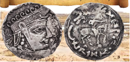

- Farasman
- Kubod
- Afrig‘
+ Shovshafar

**31. Qadimgi Xorazmda qayiqlarning burnida qaysi ayolning haykali o‘rnatilgan?**

+ Xubbining onasining haykali
- Zardushtning onasining haykali
- Jamshidning onasining haykali
- Afrig‘ning onasining haykali

**32. Xorazmshoh Afrig‘ poytaxtni Kat shahriga ko‘chirgach qaysi qasr ichida o‘ziga yangi saroy qurdirgan?**

+ Alfir
- Oychixon
- Tuproqqal’a
- Kabir

**33. Qachondan boshlab Xorazmning afrig‘iy shohlari kumush tangalar zarb etganlar?**

- Milodiy 318-yildan
- Milodiy 350-yildan
- Milodiy 321-yildan
+ Milodiy 305-yildan

**34. Xorazmda nechanchi asrgacha zardushtiylik dinining ta’siri kuchli bo‘lgan?**

- VI asrgacha
- VII asrgacha
+ VIII asrgacha
- IX asrgacha

**35. Xorazmda Xubbi qanday iloh bo‘lgan?**

- Yer ilohi
- Quyosh ilohi
- Chaqmoq ilohi
+ Suv ilohi

**36. Qadimiy Xorazmdagi afsonaga ko‘ra, qaysi iloh baliqni bir qo‘li bilan tutib quyoshga uzatar va uni quyosh shulasida qovurib yer edi, suvga cho‘kkanlarni qutqargan, so‘yilgan ho‘kizlarga jon bag‘ishlagan?**

- Ahuramazda
- Anahita
+ Xubbi
- Zaratushtra

**37. Ilk o‘rta asrlarda O‘rta Osiyodagi qaysi xalqning turmushida, asosan, baliq, qovun, qovoq, yovvoyi jiyda va tut alohida o‘rin tutgan?**

- Sug‘diylar
- Baqtriyaliklar
+ Xorazmliklar
- Marg‘iyonaliklar

**38. Afrig‘iylar davrida Xorazmda hukmronlik ramzi … bo‘lgan.**

- Yo‘lbars va qoplon
- Lochin va bo‘ri
+ Burgut va lochin
- Sher va burgut

**39. Tuproqqal’a haqida bildirilgan to‘g‘ri fikrlarni toping. 1) Shahar devorining o‘rtasida darvozaxona bo‘lgan; 2) Shahar markazidan yuqoriroqda ibodatxona majmuasi joylashgan; 3) Ibodatxona burchak qismida balandligi 25 metr bo‘lgan ko‘p minorali xorazmshohlar qasri qad ko‘targan; 4) Qasr imoratlari — ikki qavatli shoh saroyi va koshona turar joylarining devor tokchalari turli maz mundagi rangdor tasvirlar, bo‘rtma ganchkor naqshlar  hamda haykallar bilan bezatilgan; 5) Umumiy maydoni 20 gektarni tashkil etgan.**

+ 1, 2, 3, 4, 5
- 1, 2, 3, 4
- 1, 2, 3
- 1, 2

**40. Qang‘ davlatidan mustaqil bo‘lgan Xorazmning poytaxti qaysi shahar edi?**

- Ellikqal’a shahri
+ Tuproqqal’a shahri
- Qo‘yqirilgan qal’a shahri
- Oybuyur qal’a shahri

**41. Amudaryoga … kelib qo‘shilgan joyning quyidan boshlab, u hech qanday irmoqlarsiz jazirama sahrolar ichidan oqa boshlaydi va shu yerdan uning hayotbaxsh faoliyati boshlanib, Xorazm diyorini suv bilan ta’minlaydi.**

+ Surxon
- Zarafshon
- Chirchiq
- Norin

**42. Qaysi olim «Xorazm Jayhunning butun foydasini ola bilgan mamlakatdir», degan?**

- Ibn Arabshox
- Narshxiy
+ Istaxriy
- Ibn Battuta

**43. Qachon Xorazmshoh Afrig‘ o‘z qarorgohini Xorazmning qadimgi Kat shahriga ko‘chirgan?**

- Milodiy 318-yilda
- Milodiy 350-yilda
+ Milodiy 305-yilda
- Milodiy 321-yilda

**44. Xorazm vohasiga … sahrosi tutashib ketgan. … meridianidan sal sharqroqda qum tepaliklar chegarasi shimoliy-g‘arb tomonga buriladi va shu yo‘nalishda deyarli … ko‘ligacha borib yetadi.**

- Qizilqum/Xiva/Qorako‘l
- Qoraqum/Urganch/Qorako‘l
- Qoraqum/Xiva/Sariqamish
+ Qoraqum/Xiva/ Qorako‘l

**45. Ilk o‘rta asrlarda qaysi Xorazm shahrida balandligi 25 metr bo‘lgan ko‘p minorali xorazmshohlar qasri qad ko‘targan va qasr imoratlari — ikki qavatli shoh saroyi va koshona turar joylarining devor tokchalari turli mazmundagi rangdor tasvirlar, bo‘rtma ganchkor naqshlar hamda haykallar bilan bezatilgan edi?**

- Ellikqal’a shahrida
+ Tuproqqal’a shahrida
- Qo‘yqirilganqal’a shahrida
- Oybuyurqal’a shahrida

**46. Amudaryo qayerdan boshlanadi?**

- Himolayning Janubiy yonbag‘irlaridagi muzliklardan
+ Hindiqushning Shimoliy yonbag‘irlaridagi muzliklardan
- Turon tog‘ tizmalarining G‘arbiy yonbag‘irlaridagi muzliklardan
- Nurota tog‘ tizmalarining Janubiy yonbag‘irlaridagi muzliklardan

**47. Qadimiy Xorazmdagi afsonaga ko‘ra, kim o‘z xalqini daryoda urishishga o‘rgatgan?**

+ Xubbining onasi
- Zardushtning onasi
- Jamshidning onasi
- Afrig‘ning onasi

**48. Zardushtiylar ta’lim maskanlarida mobadlar bolalarga, asosan, nimalardan saboq berganlar?**

- O‘qish, yozish va dehqonchilik hunaridan
+ O‘qish, yozish va jang san’atidan
- Xattotlik va din asoslaridan
- Musiqa, she’riyat va munajjimlik ilmidan

**49. Qadimiy Xorazmdagi afsonaga ko‘ra, qaysi hukmdor taxtga o‘tirgan vaqtda Xubbi dom-daraksiz g‘oyib bo‘lgan, uni dengiz malikasi o‘g‘irlab ketgan?**

- Farasman
+ Jamshid
- Afrig‘
- Shovshafar

**50. Xorazm davlatining poytaxti dastlab Qoraqalpog‘istonning hozirgi Ellikqal’a tumanida joylashgan qadimgi qaysi shahar xarobasining o‘rnida bo‘lgan?**

+ Tuproqqal’a
- Ellikqal’a
- Qo‘yqirilganqal’a
- Oybuyurqal’a

**51. Ilk o‘rta asrlarda Tuproqqal’a shahri qancha maydonni egallagan edi?**

- 15 gektarni
+ 20 gektarni
- 25 gektarni
- 30 gektarni

## 5-§ IV–V asrlarda xioniylar va kidariylar.

**52. Qachon kidariylar va sosoniylar o‘rtasida to‘qnashuv bo‘lib o‘tgan va unda kidariylar yengilgan?**

- 422-yilda
+ 456-yilda
- 468-yilda
- 491-yilda

**53. Turonda kidariylar va еftaliylar hukmronligi o‘rnatilgach, xioniylarning siyosiy ahvoli o‘zgaradi va ular kimlarga tobe bo‘lib qolgan?**

+ Eftaliylarga
- Kidariylarga
- Sosoniylarga
- Toxariylarga

**54. Kimlarning hukmdori Sidolo jujanlar hujumi tufayli o‘z qarorgohini Bologa (Balx) ga ko‘chirgan?**

- Kidariylar
- Xiyoniylar
+ Yuechjilar
- Toxarlar

**55. Rasmda qaysi xalq tangasi tasvirlangan?**

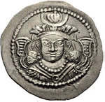

- Xiyoniylar
+ Kidariylar
- Eftaliylar
- Kushonlar

**56. Nima sababdan toxarlarni «kidariylar» deb atashgan?**

- Ular Kidar deb nomlangan urug‘dan bo‘lgani uchun
+ Ularga Kidar ismli hukmdor boshchilik qilganligi uchun
- Ular Kidar degan shaharga asos solgani uchun
- Ular Kidar degan xudoga sig‘ingani uchun

**57. Toxariylar kimlarning avlodlari bo‘lgan?**

- Kidariylarning
+ Kushonlarning
- Davanliklarning
- Oq xunnlarning

**58. Xiyoniylar davlati necha yil hukmronlik qilgan?**

- 100 yildan ortiq
- 130 yildan ortiq
- 110 yildan ortiq
+ 120 yildan ortiq

**59. Qachon sharqdan Sirdaryo va Orol bo‘ylari orqali Xorazm hamda Amudaryo havzasiga yana bir ko‘chmanchi chorvador aholi – toxarlar kirib kelgan?**

+ V asrning 20-yillarida
- V asrning 30-yillarida
- V asrning 40-yillarida
- V asrning 50-yillarida

**60. Xiyoniylar davlati qaysi hududlarni o‘z ichiga olgan edi? 1) Xorazm; 2) Xurosonning bir qismi; 3) Afg‘oniston; 4) Shimoliy Hindiston; 5) Toxariston; 6) Yettisuv.**

- 1, 2, 3, 4, 5, 6
- 2, 3, 4, 5, 6
+ 2, 3, 4, 5
- 2, 3, 4

**61. Tarixda xioniylar nomi bilan mashhur bo‘lgan qabilalarning asli vatanini ayrim tadqiqotchilar qayerda deb hisoblaydilar?**

- Sharqiy Turkistonda
- Sirdaryo bo‘yida
- Kaspiy dengizi bo‘yida
+ Orol dengizi bo‘yida

**62. «Kidara Kushon sha» degan yozuv bitilgan tangalar nechta hokim tomonidan bir vaqtning o‘zida zarb etilgan?**

+ Ikkita hokim tomonidan
- Uchta hokim tomonidan
- To‘rtta hokim tomonidan
- Beshta hokim tomonidan

**63. Kidariylarning tangalari qaysi yozuvda zarb etilgan?**

- Oromiy
- Eroniy
- Sanskrit
+ Braxmiy

**64. Tarixchi K. Treverning fikricha, xioniylar qachon o‘zining kuchaygan pallasiga kirgan?**

- IV asrning 50-yillarida
- IV asrning 60-yillarida
+ IV asrning 70-yillarida
- IV asrning 80-yillarida

**65. Kimlarga tegishli «Kidara Kushon sha» degan yozuv bitilgan tangalar topilgan?**

+ Kidariylarga
- Xiyoniylarga
- Yuechjilarga
- Kushonlarga

**66. Qachon xiyoniylar dastlab Zarafshon vohasini egallashgan, janub tomonga yurib, Kushon podsholigi hududida hukmronlik qilishgan?**

- III asrda
- V asrda
- VI asrda
+ IV asrda

**67. Xiyoniylar markazi qayer bo‘lgan Shimoliy Hindiston, Afg‘oniston, Xurosonning bir qismini ham o‘z ichiga olgan katta davlat tuzishgan?**

- Sug‘diyona
- Marg‘iyona
+ Toxariston
- Xorazm

**68. Kidariylar dastlab qayerda yashaganlar?**

- Yettisuvda
- Januby Sibirda
- Oloy vodiysida
+ Sharqiy Turkistonda

**69. Kidar Shimoliy Hindistonga yurish qilib, Gandhardan shimoldagi nechta davlatni o‘ziga bo‘ysundirgan?**

- 3 ta davlatni
+ 5 ta davlatni
- 7 ta davlatni
- 9 ta davlatni

**70. Kidariylar Shimoliy Hindistondagi Gupta davlatini egallab, u yerda necha yil hukumronlik qilganlar?**

- 45 yil
- 55 yil
- 65 yil
+ 75 yil

**71. Kidariylar qaysi hududdagi Gupta davlatini egallab, u yerda 75 yil hukumronlik qilganlar?**

- Sharqiy Afg‘onistondagi
- G‘arbiy Erondagi
+ Shimoliy Hindistondagi
- Janubiy Xitoydagi

**72. Yuechjilar (kushonlar) hukmdori Sidolo jujanlar hujumi tufayli o‘z qarorgohini qayerga ko‘chirgan?**

+ Bologa (Balx) ga
- Marvga
- Poykandga
- Varaxshaga

**73. G‘arb tarixchilari xioniylarni qaysi qabilalarga yaqin deb bilishgan?**

- Mo‘g‘ullarga qarindosh hisoblab, ularni «oq mo‘g‘ullar» deb ataydilar
+ Xunnlarga qarindosh hisoblab, ularni «oq xunnlar» deb ataydilar
- Uyg‘urlarga qarindosh hisoblab, ularni «oq uyg‘urlar» deb ataydilar
- Turkiylarga qarindosh hisoblab, ularni «oq turkiylar» deb ataydilar

**74. Kidariylar kimlar bilan to‘qnashgach Shimoliy Hindistonga chekingan?**

- Sosoniylar
- Xiyoniylar
- Yuechjilar
+ Eftaliylar

## 6-7-§ Eftaliylar.

**75. Turon shishalari rangdorligi, yarqiroqligi va tiniqligi jihatidan kimlarning shishasidan ustun turgan?**

- Hindiston
+ Vizantiya
- Xitoy
- Rim

**76. Firdavsiyning «Shohnoma» asarida Eftallar haqida qanday ma’lumotlar keltirilgan? 1) Vaxshunvor va Peruz davri voqealari; 2) Eftaliylarning podshosi Katulf nomi; 3) Gatfar ismli podshoh Katulfga o‘xshatilgan; 4) Eftaliylar davlatining dastlabki poytaxti Buxoro yaqinidagi Poykent va Varaxsha shaharlari bo‘lganligi.**

- 1, 2, 3, 4
- 1, 2, 4
+ 1, 2, 3
- 2, 3, 4

**77. Ilk o‘rta asrlarda qaysi davrdan boshlab Buxoro Turonning yirik madaniy va iqtisodiy markazlaridan biri bo‘lgan?**

- III asrdan
+ IV asrdan
- V asrdan
- VI asrdan

**78. Arab manbalarida «Madina at-tujjor» – Savdogarlar shahri» deb qaysi shahar atalgan?**

- Afrosiyob
- Varaxsha
- Buxoro
+ Poykand

**79. Eftallar davrida qaysi til xalqaro til sifatida Yettisuv va Farg‘ona, Sharqiy Turkiston, Xitoy hududlarida foydalanilgan?**

+ Sug‘diy tili
- Turkiy til
- Forsiy til
- Eftal tili

**80. Qaysi asrlarda Eftalon sulolasiga mansub qabila Turon hududida hukmronlik qilgan?**

- IV–V asrlarda
+ V–VI asrlarda
- VI–VII asrlarda
- VII–VIII asrlarda

**81. Ilk o‘rta asrlarda qaysi davlatda taxt otadan bolaga qolmay, shu suloladan kim loyiq deb topilsa o‘sha taxtga o‘tirgan?**

- Xiyoniylarda
- Kidariylarda
- Sosoniylarda
+ Eftallarda

**82. Eftallar davlatida hukmdor nima deb atalgan?**

+ Sho (shoh)
- Tudun
- Dehqon
- Ixshid

**83. Eftallar mamlakatimizga qayerdan kirib kelishgan?**

+ Sharqdan
- Shimoldan
- Janubdan
- G‘arbdan

**84. Ilk o‘rta asrlarda qaysi davlatda, asosiy dindan tashqari, tangrichilik, buddaviylik, moniylik, mazdakiylik e’tiqodlari va shaharlarda nestorianlar va yahudiylar jamoalari ham bo‘lgan?**

+ Eftaliylarda
- Kidariylar
- Xiyoniylarda
- Kushonlarda

**85. Qaysi yilda eftallar bilan bo‘lib o‘tgan urush sosoniylar shohi Pero‘zning halokati bilan tugagan?**

+ 484-yilda
- 481-yilda
- 479-yilda
- 492-yilda

**86. Suratdagi koshinda (freska) kim ta’svirlangan?**

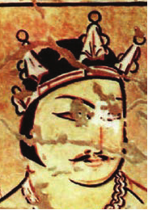

- Sosoniylar hukmdori
+ Eftallar hukmdori
- Xiyoniylar hukmdori
- Kidariylar hukmdori

**87. Qaysi yillarda Vizantiya imperatori huzurida bo‘lgan turk elchisi imperatorning: «Eftaliylar shaharlarda yashaydilarmi yoki qishloqlardami?» – degan savoliga: «Ular shaharlik sulolalar, oliy hazratlari», – deb javob bergan?**

- 588-589-yillarda
- 558-559-yillarda
- 578-579-yillarda
+ 568-569-yillarda

**88. Ilk o‘rta asr shahri bo‘lgan Zartepa hozirgi qaysi shahar atrofida joylashgan edi?**

- Samarqand
- Buxoro
+ Termiz
- Toshkent

**89. Poykant shahri ilk o‘rta asrlarda qayerda joylashgan edi?**

- Xorazmda
- Baqtriyada
+ Sug‘dda
- Marg‘iyonada

**90. Eftallar davlati viloyatlarining har biri o‘zining qanday tangalarini zarb etgan?**

- Mis yoki bronza
- Kumush yoki oltin
- Mis yoki oltin
+ Kumush yoki mis

**91. Suratda nima tasvirlangan?**

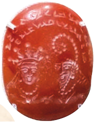

- Eftaliylar davridagi davlat ramzi
- Eftaliylar davridagi mamlakat bayrog‘i
+ Eftaliylar davridagi amaldorlar muhri
- Eftaliylar davridagi tanga

**92. 568-569-yillarda Vizantiya imperatori huzurida bo‘lgan … elchisi imperatorning: «Eftaliylar shaharlarda yashaydilarmi yoki qishloqlardami?» – degan savoliga: «Ular shaharlik sulolalar, oliy hazratlari», – deb javob bergan?**

+ turk
- sug‘d
- eron
- xitoy

**93. Ilk o‘rta asrlarda o‘ng tomonida hukmdor tasviri tushirilgan kumush va mis tangalar qayerda zarb etilgan?**

- Xorazmda
- Naxshab (Qarshi) vohasida
- Samarqand Sug‘dida
+ Buxoro Sug‘dida

**94. Eftallarda qizlar qanday ishlarga o‘rgatilgan? 1) Qilich chopishga; 2) Otda yurishga; 3) Kamondan o‘q otishga; 4) Safda yurishga.**

- 1, 3
- 1, 2
+ 2, 3
- 3, 4

**95. Ilk o‘rta asrlar davrining o‘ziga xos me’morchilik namunalaridan bo‘lgan 1) Zahoki Maron, 2) Shahri Vayron, 3) Fir qal’alari hozirgi qayerlarda joylashgan?**

- 1) Naxshab / 2) Xorazm / 3) Buxoro
+ 1) Naxshab / 2) Buxoro / 3) Xorazm
- 1) Buxoro / 2) Naxshab / 3) Xorazm
- 1) Xorazm / 2) Buxoro / 3) Naxshab

**96. To‘g‘ri to‘rtburchak shakldagi ushbu shaharning asosi 21 gektar bo‘lib, bu yerda mustahkam himoya inshootlari, hukmdor saroyi, mafkuraviy inshootlar, turar joylar qad rostlagan”. Yuqoridagi tarif qaysi shaharga berilgan?**

- Afrosiyob
- Varaxsha
+ Buxoro
- Poykand

**97. Eftallar qaysi dinga sig‘inganlar?**

- Buddizm
- Shomonizm
- Sintoizm
+ Zardushtiylik

**98. Zog‘ariq (Zovariq), Bo‘zsuv, Darg‘om kanallari qachon barpo etilgan?**

- III asrda
- IV asrda
+ V asrda
- VI asrda

**99. Eftallar davrida qaysi mamlakat hukmdorlari Turon shishalaridan o‘z saroylarini bezashda foydalanishgan?**

- Eronda
- Vizantiyada
+ Xitoyda
- Rimda

**100. Qadimgi davrda kichik manzilgoh sifatida paydo bo‘lgan Zartepa IV–V asrlarga kelib maydoni qancha gektar bo‘lgan yirik shaharga aylangan?**

- 18 gektar
- 28 gektar
- 27 gektar
+ 17 gektar

**101. Eftallar davrida Turonda qaysi soha yuksak darajada rivojlangan?**

- Chilangarlik
- Gilam to‘qish
+ Shishasozlik
- Qurol-yarog‘ yasash

**102. Eftallar davlatiga O‘rta Osiyodan tashqari qaysi hududlar ham kirgan? 1) Sharqiy Turkiston; 2) Afg‘oniston; 3) Shimoliy Hindiston; 4) Hozirgi Pokiston.**

+ 1, 2, 3, 4
- 1, 2, 3
- 1, 2, 4
- 2, 3, 4

**103. Eftallar davrida qaysi hududlarda mahalliy hokimlar tomonidan chiqarilgan chaqa tangalar mamlakatning ichki savdosida keng muomalada bo‘lgan?**

- Buxoro, Usturshona, Vardona, Naxshab, Samarqand va Sug‘diyona
- Chag‘oniyon, Poykand, Vardona, Naxshab, Samarqand va Marg‘iyona
+ Buxoro, Poykand, Vardona, Naxshab, Samarqand va Xorazm
- Buxoro, Poykand, Vardona, Naxshab, Samarqand va Termiz

**104. Qachon Panjikentda nisbatan qadimiyroq bo‘lgan qishloq o‘rniga umumiy maydoni 18 gektar bo‘lgan yangi shahar barpo etilgan?**

- III asrda
- IV asrda
+ V asrda
- VI asrda

**105. Ushbu sug‘orish tarmoqlarining qaysi biri Samarqand viloyati janubiy tumanlarining asosiy suv manbayi hisoblanadi?**

- Zog‘ariq
+ Darg‘om
- Bo‘zsuv
- Zovariq

**106. «Eftaliylar podshosi rimliklar va boshqa podsholardan qolishmaydigan holda aholiga g‘amxo‘rlik ko‘rsatadi, o‘zlari va qo‘shnilari bilan bo‘lgan munosabatlarda adolat mezonlariga amal qiladi». Ushbu jumlalar muallifi kim?**

- Yunon-rim tarixchisi Arrian
- Arab geografi al-Muqaddasiy
- Buxorolik tarixchi Narshaxiy
+ Vizantiyalik tarixchi Prokopiy Kesariyskiy

**107. Baqtriya yozuvi asosida shakllangan eftallar alifbosi nechta harfdan iborat bo‘lgan?**

- 20 harfdan
+ 25 harfdan
- 30 harfdan
- 32 harfdan

**108. Qaysi asrda sosoniylar va eftaliylar o‘rtasidagi harbiy to‘qnashuvlarda eftaliylar qo‘shinining ustun kelishi ular harbiy mahoratining yuqori darajada ekanligidan dalolat bergan?**

- III asrda
- IV asrda
+ V asrda
- VI asrda

**109. V-VI asrlarda orqa tomonida tik turgan kamonchi tasviri tushirilgan kumush tangalar qayerda zarb etilgan?**

- Xorazmda
- Naxshab (Qarshi) vohasida
+ Samarqand Sug‘dida
- Buxoro Sug‘dida

**110. V asrda Panjikentda nisbatan qadimiyroq bo‘lgan qishloq o‘rniga umumiy maydoni necha gektar bo‘lgan yangi shahar barpo etilgan?**

+ 18 gektar
- 28 gektar
- 17 gektar
- 27 gektar

**111. Qadimgi davrda kichik manzilgoh sifatida paydo bo‘lgan Zartepa qachon maydoni 17 gektar bo‘lgan yirik shaharga aylangan?**

- II–III asrlarga kelib
- III–IV asrlarga kelib
+ IV–V asrlarga kelib
- V–VI asrlarga kelib

**112. Eftaliylar davlatining dastlabki poytaxtlari qaysi shaharlar bo‘lgan?**

- Buxoro yaqinidagi Afrosiyob va Ayritom shaharlari
- Samarqand yaqinidagi Afrosiyob va Ayritom shaharlari
- Samarqand yaqinidagi Poykent va Varaxsha shaharlari
+ Buxoro yaqinidagi Poykent va Varaxsha shaharlari

**113. Ilk o‘rta asrlarda o‘ng tomonida podsho bosh qismi tasviri tushirilgan mahalliy kumush va mis tangalar qayerda muomalada bo‘lgan?**

- Xorazmda
+ Naxshab (Qarshi) vohasida
- Samarqand Sug‘dida
- Buxoro Sug‘dida

**114. Ushbu sug‘orish tarmoqlarining qaysilar Toshkent vohasi va Janubiy Qozog‘iston yerlarining bir qismini suv bilan ta’minlab kelmoqda? 1) Darg‘om; 2) Darband; 3) Zog‘ariq (Zovariq); 4) Bo‘zsuv.**

- 1, 4
- 2, 3
+ 3, 4
- 1, 2

**115. Ichki va tashqi savdo munosabatlarida eftaliylar dastavval qanday tangalaridan keng foydalanadilar?**

- Xitoy imperatorlarining oltin tangalaridan
+ Sosoniy hukmdorlarining kumush tangalaridan
- Kushon hukmdorlarining oltin tangalaridan
- Mahalliy zodagonlarning mis tangalaridan

**116. Yozma manbalarda eftallar qaysi nomlar bilan tilga olingan? 1) Eftaliylar; 2) Eftallar; 3) Eftalitlar; 4) Xaytallar.**

+ 1, 2, 3, 4
- 2, 3, 4
- 1, 2, 3
- 1, 2, 4

**117. Eftaliylar yozuvi qaysi alifbo asosida shakllangan edi?**

- Toxar alifbosi
+ Baqtriya alifbosi
- Sug‘d alifbosi
- Eron alifbosi

**118. Ilk o‘rta asrlarda old tomonida hukmdor boshi, orqa tomonida otliq chavandoz tasviri tushirilgan kumush va mis tangalar qayerda zarb etilgan?**

+ Xorazmda
- Naxshab (Qarshi) vohasida
- Samarqand Sug‘dida
- Buxoro Sug‘dida

**119. IV asrda Buxoroning nechta darvozasi bo‘lgan?**

- 4 ta
+ 7 ta
- 10 ta
- 12 ta

**120. Tashqi savdo bojidan manfaatdor bo‘lgan eftaliylar qanday yo‘l tutganlar?**

- Elchilik aloqarini kengaytirganlar
+ Ipak yo‘lini o‘z nazoratlari ostida tutib turishga harakat qilganlar
- Keng istilochilik yurishlarini olib borganlar
- Soliqlar va bojlarni kamaytirganlar

**121. Eftallar davrida Ipak yo‘li savdosida sosoniy savdogarlari bilan raqobatda asosan kimlar vositachi rolini o‘ynardi?**

- Baqtriyaliklar
- Xorazmliklar
- Marg‘iyonaliklar
+ Sug‘diylar

**122. Eftallar davrida Turon aholisining bir qismi … tilida, ikkinchi qismi esa … tilda so‘zlashgan.**

+ sug‘d/turkiy
- forsiy/sug‘d
- turkiy/forsiy
- toxar/kushon

**123. 568-569-yillarda Vizantiya imperatori huzurida bo‘lgan turk elchisi imperatorning: « …lar shaharlarda yashaydilarmi yoki qishloqlardami?» – degan savoliga: «Ular shaharlik sulolalar, oliy hazratlari», – deb javob bergan?**

- Kidariylar
- Xiyoniylar
+ Eftaliylar
- Kushonlar

**124. Eftallar nomi «Eftalon» degan … nomidan olingan bo‘lib, uni “Vaxshunvar” deb ham ataganlar.**

- shahar
+ shoh
- xudo
- qabila

**125. 568-569-yillarda qaysi mamlakat hukumdori huzurida bo’lgan turk elchisi imperatorning: «Eftaliylar shaharlarda yashaydilarmi yoki qishloqlardami?» – degan savoliga: «Ular shaharlik sulolalar, oliy hazratlari», – deb javob bergan?**

- Xitoy imperatori
+ Vizantiya imperatori
- Guptalar imperatori
- Rim imperatori

## 8-9-§ Turk xoqonligi.

**126. Qaysi davlat janubdan Eron sosoniylaridan, shimoldan esa Turk xoqonligidan zarbaga uchrab parchalanib ketgan?**

- Xiyoniylar
- Kushonlar
- Kidariylar
+ Eftaliylar

**127. Qaysi dinda olamning ibtidosi ikki qarama-qarshi yaratuvchi – yorug‘lik va ezgulik hamda zulmat va yovuzlikdan iborat, deb hisoblangan, hamda ibodat, ro‘za, sadaqa dinining arkoni hisoblangan?**

- Zardushtiylik
- Buddaviylik
- Shomonlik
+ Moniylik

**128. Eftallar davlati parchalanib ketgach qaysi hududlar Eron sosoniylari tasarrufiga o‘tgan?**

- Amudaryoning o‘ng sohillari bo‘ylab Kaspiy dengizigacha bo‘lgan viloyatlar
+ Amudaryoning janubiy qirg‘oqlarigacha bo‘lgan viloyatlar
- Sirdaryoning janubiy qirg‘oqlarigacha bo‘lgan viloyatlar
- Sirdaryoning o‘ng sohillari bo‘ylab Kaspiy dengizigacha bo‘lgan viloyatlar

**129. Eron shohi Xusrav I Anushervon qaysi turk xoqoniga kuyov bo‘lgan va ular o‘rtasidagi harbiy ittifoq mustahkamlangan?**

+ Istami
- Kultegin
- Qoracho‘rin
- Bumin

**130. Turk xoqonligida o‘n o‘q el sardori qancha suvoriyga ega bo‘lgan?**

+ Tuman (o‘n ming)
- Budun (bech ming)
- Shod (yuz ming)
- Tudun (ellik ming)

**131. Suratdagi to‘rt tomoni teng bo‘lgan salb – «adji» qaysi dinga taalluqli?**

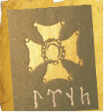

- Zardushtiylik
- Buddaviylik
+ Tangrichilik
- Moniylik

**132. Turk xoqonligi davriga oid qaysi manbada Tangri yagona, azaliy, abadiy, hayot beruvchi, yaratuvchi, o‘ldiruvchi, hukm qiluvchi, yordam beruvchi, jazolovchi, bandaning duosini qabul qiluvchi, himoya qiluvchi, marhamatiga oluvchi, hamma narsani biluvchi, insonlarga ilm beruvchi va yo‘l ko‘rsatuvchi kabi sifatlar bilan maqtalgan?**

- Bilga xoqon bitiklarida
+ Urxun-Yenisey yodgorliklarida
- Mug‘ qal’asi yozuvlarida
- Kultegin bitiklarida

**133. Turk xoqonligida qanday sabablarga ko‘ra hukmdor hokimiyatdan uzoqlashtirilgan?**

- Yangi hududlarni bosib ololmasa, ya’ni qabilalar uchun yangi maydonlarni o‘zlashtira olmasa
- Aholini o‘z diniga o‘tkaza olmasa, ya’ni Tangrichilik dinini qo‘shni hududlarga targ‘ib qila olmasa
+ Tangri bergan siyosiy hokimiyat ishonchni oqlamasa, ya’ni o‘z iqtidorini ko‘rsata olmasa
- O‘zidan nasl qoldira olmasa, ya’ni sulolani davom qildira olmasa

**134. Turk xoqonligi davrida qonuniy hujjat «Turk qonunnomasi» qayerda amalda bo‘lib, u ibodatxonada saqlangan?**

- Ustrushonada
- Marvda
- Buxoroda
+ Samarqandda

**135. Turk xoqonligida «budun» yoki «qora budun» nomlari bilan kimlar atalgan?**

- Yengil qurollangan piyoda askarlar
- Og‘ir qurollangan otliq suvoriylar
- O‘troq mahalliy aholi
+ Ko‘chmanchi chorvador aholi

**136. Turk xoqonligi davrida «Ezgu amal, ezgu fikr, ezgu so‘z» iborasi qaysi dinga taalluqli bo‘lgan?**

+ Zardushtiylik
- Buddaviylik
- Shomonlik
- Moniylik

**137. «Qovunchi davri qabristonlari, asosan, tuproq qo‘rg‘onlar va ustiga tosh uyilgan yer ostidagi maxsus qabr (katakomba) lardan iborat bo‘lib, ularning qabr xonalari (kameralari) ham gumbazli, keng va yer sathidan ancha chuqurlikda joylashgan…». Ushbu ma’lumotlar manbasini toping.**

- Karimov Tursun «O‘zbek davlatchiligi tarixi»
+ Ahmadali Asqarov «O‘zbek xalqining kelib chiqish tarixi»
- Yahyo G‘ulomov «O‘zbekistonda irrigatsiya tarixi»
- Habibulla Sulaymonov «O‘zbekistonda feodalizm munosabatlarining rivojlanishi»

**138. Turk xoqonligida kimlarga «yabg‘u xoqon» unvoni berilgan?**

- Kultegin va Buminga
+ Bumin va Istamiga
- Qoracho‘rin va Kulteginga
- Istami va Qoracho‘ringa

**139. «Katakomba» nima?**

- Podshohlar uchun maxsus qabr
- Oltindan yasalgan daxma ichidagi maxsus qabr
+ Ustiga tosh uyilgan yer ostidagi maxsus qabr
- Oilaviy dafn qilinadigan maxsus qabr

**140. «Qovunchi madaniyati» qayerdan topilgan?**

- Samarqand viloyati Yangiyer shahri hududidan
- Toshkent viloyati Yangikent shahri hududidan
- Farg‘ona viloyati Yangiyo‘l shahri hududidan
+ Toshkent viloyati Yangiyo‘l shahri hududidan

**141. Qaysi dinda ajdodlarga, Osmonga (Tangri) va yer-suvga sig‘inishgan?**

- Zardushtiylik
- Buddaviylik
+ Shomonlik
- Moniylik

**142. Turk xoqonligida el va xoqon hokimiyatining Tangri tomonidan qaysi xonadonga «Turk budun (xalqi)» ga in’om qilinganiga ishonilgan?**

+ Ashina
- Sagaris
- Akinak
- Daxyu

**143. Qaysi omillar Turk xoqonligining ahvolini yanada og‘irlashtirgan?**

- Qabilalarning markaziy hokimiyatga bo‘ysunmaslikka intilgani
- Turk xoqonligi tasarrufida bo‘lgan hududlardagi hokimlarning mustaqil siyosat yuritishi
- Bo‘ysundirilgan hududlarni mahalliy hokimlar orqali  boshqaruv tartibi
+ Vizantiya, Xitoy va Eron bilan doimiy raqobat

**144. Turklarning g‘arbga tomon yurishlariga kim boshchilik qilgan?**

- Qoracho‘rin
- Kultegin
- Bumin
+ Istami

**145. G‘arbiy Turk xoqonligi poxtaxtini toping.**

+ Yettisuv
- Sharqiy Turkiston
- O‘tukan vodiysi
- Oltoy

**146. Qaysi din jon va ruhlarga, ota-bobolar ruhiga sig‘inish e’tiqodini tarbiyalagan, hamda qadimgi turklarda «qam» deb yuritilgan?**

- Zardushtiylik
- Buddaviylik
+ Shomonlik
- Moniylik

**147. Eftaliylar davlati parchalanishiga nima sabab bo‘lgan?**

- Iqtisodiy qoloqlik va diniy mojarolar
+ Janubdan Eron sosoniylaridan, shimoldan esa Turk xoqonligidan zarbaga uchrashi
- Ichki ziddiyatlar va mamlakatda ketma-ket ro‘y bergan qurg‘oqchilik
- Toj-u taxt uchun kurashlar

**148. Turk xoqonligining mafkuraviy asosi qaysi din bo‘lgan?**

- Zardushtiylik
- Buddaviylik
+ Shomonlik
- Moniylik

**149. Tangrichilik ta’limotiga ko‘ra qaysi rang ilohiy buyuklik ramzi hisoblangan?**

- Qora rang
+ Ko‘k rang
- Qizil rang
- Sariq rang

**150. Turk xoqonligi qachon tashkil topgan?**

- V asr oxirlarida
- VI asr boshlarida
+ VI asr o‘rtalarida
- VI asr oxirlarida

**151. Turk xoqonligida qaysi tilda so‘zlashuvchi qabilalar ittifoqi xoqonlik asosini tashkil etar edi?**

- Oromiy
- Sug‘diy
- Kidariy
+ Turkiy

**152. Turk xoqonligida Ashina xonadoniga siyosiy hokimyat bergan iloh qanday atalgan?**

- Alloh
- Samo
+ Tangri
- Xubbi

**153. Turk xoqonligi tashkil topgach, dastlab qaysi hududda yashovchi turkiy qabilalar bo‘y sundirilgan?**

- Amudaryoning quyi qismida yashovchi qabilalar
- Sirdaryoning yuqori oqimida yashovchi qabilalar
+ Yettisuv va Sharqiy Turkistonga tutashgan yurtlarda yashovchi qabilalar
- Farg‘ona vodiysi va Xitoy oralig‘idagi yerlarda yashovchi qabilalar

**154. Turk xoqonligi ikkiga bo‘linganidan keyin qaysi hududlar Sharqiy turk xoqonligi tarkibiga o‘tgan? 1) Janubiy Sibir; 2) Yettisuv; 3) Urxun havzasi (Mo‘g‘uliston); 4) Sharqiy Turkiston; 5) Shimoliy Xitoy; 6) Sirdaryo va Amudaryo havzalari hamda ularga tutashgan hududlar.**

- 1, 2, 3
+ 1, 3, 5
- 2, 3, 4
- 2, 4, 6

**155. Sharqiy Turk xoqonligi poxtaxtini toping.**

- Yettisuv
- Sharqiy Turkiston
+ O‘tukan vodiysi
- Oltoy

**156. Turk xoqonligi ikkiga bo‘linganidan keyin qaysi hududlar G‘arbiy turk xoqonligi tarkibiga o‘tgan? 1) Janubiy Sibir; 2) Yettisuv; 3) Urxun havzasi (Mo‘g‘uliston); 4) Sharqiy Turkiston; 5) Shimoliy Xitoy; 6) Sirdaryo va Amudaryo havzalari hamda ularga tutashgan hududlar.**

- 1, 2, 3
- 1, 3, 5
- 2, 3, 4
+ 2, 4, 6

**157. Qaysi omil Turk xoqonligini tobora zaiflashtirgan?**

- Qabilalarning markaziy hokimiyatga bo‘ysunmaslikka intilgani
- Turk xoqonligi tasarrufida bo‘lgan hududlardagi hokimlarning mustaqil siyosat yuritishi
+ Bo‘ysundirilgan hududlarni mahalliy hokimlar orqali  boshqaruv tartibi
- O‘zaro ichki ziddiyatlar va urushlar

**158. Eftaliylar o‘z davlatning shimoliy hududlarini Turk xoqonligidan mudofaa qilish bilan band bo‘lgan bir paytda sosoniylar janubiy o‘lkalar bo‘lmish qaysi viloyatlarni ulardan tortib olganlar?**

- Marg‘iyona va Sug‘diyonani
- Sug‘diyona va Baqtriyani
+ Toxariston va Chag‘oniyonni
- Baqtriya va Toxaristonni

**159. Ajinatepadan topilgan budda haykali hozirda qaysi shahardagi Milliy arxeologiya muzeyida saqlanadi?**

+ Dushanbe shahrida
- Toshkent shahrida
- Bishkek shahrida
- Ostona shahrida

**160. Turk xoqonligi davriga oid budda haykallari Farg‘ona vodiysidagi …dan hamda Qo‘rg‘ontepa yaqinidagi …dan topilib, o‘rganilgan.**

- Quva/Oychixon qal’a
+ Quva/Ajinatepa
- Sangirtepa/Ajinatepa
- Qamchiq/Avliyotepa

**161. Turk xoqonligi eng kuchaygan davrda qayerlargacha bo‘lgan hududni egallagan?**

- Chukotka dengizidan Qrim yarimoroligacha, Sibirdan Hindistongacha
- Bering bo‘g‘ozidan Kichik Osiyo yarimoroligacha, Sibirdan Hindistongacha
+ Oxota dengizidan Qrim yarimoroligacha, Sibirdan Hindistongacha
- Kamchatka yarimorolidan Qrim yarimoroligacha, Oltoydan Hindistongacha

**162. Turk xoqonligi qaysi davlat bilan eftaliylarga qarshi o‘zaro harbiy ittifoq tuzgan va bu ittifoq qarindoshlik bilan mustahkamlangan?**

- Gupta imperatorlari
+ Eron sosoniylari
- Choch malikshohlari
- Sug‘d ixshidlari

**163. Turkiylarda qadimda qaysi hayvon ilohiylashtirilgan va ko‘plab nishonlarida uning tasviri mavjud bo‘lgan?**

- Kiyik
- Qoplon
+ Bo‘ri
- Ot

**164. Qayerdan topilgan buddasi haykalining bo‘yi 12 metrga boradi?**

- Varaxsha
- Oychixon qal’a
- Avliyotepa
+ Ajinatepa

**165. Quyidagi suratdagi haykal kimga qo‘yilgan?**

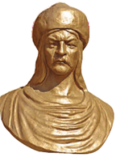

- Kultegin
+ Bumin
- Qoracho‘rin
- Istami

**166. Turk xoqonligida o‘n ming suvoriyga ega bo‘lgan tuman boshi nima deb yuritilgan?**

- «Tuman»
- «Budun»
+ «Shod»
- «Tudun»

**167. Turk xoqonligi qaysi hududda tashkil topgan?**

- Sirdaryo va Orol bo‘ylarida
- Mo‘g‘uliston va Manchjuriyada
+ Oltoy va Janubiy Sibirda
- Yettisuv va Sharqiy Turkistonda

**168. Turk xoqonligining markazi qayer bo‘lgan?**

- Janubiy Sibir
- Yettisuv
- Sharqiy Turkiston
+ Oltoy

**169. Qachon Turk xoqonligi Sharqiy turk xoqonligi va G‘arbiy turk xoqonligiga bo‘linib ketgan?**

- VI asrning 60-yillari oxirlarida
- VI asrning 70-yillari oxirlarida
+ VI asrning 80-yillari oxirlarida
- VI asrning 90-yillari oxirlarida

**170. Turk xoqonligining asoschisi kim?**

- Istami
- Qoracho‘rin
- Kultegin
+ Bumin

**171. Eftallar davlati parchalanib ketgach qaysi hududlar Turk xoqonligi tasarrufiga o‘tgan?**

+ Amudaryoning o‘ng sohillari bo‘ylab Kaspiy dengizigacha cho‘zilgan yerlar
- Amudaryoning janubiy qirg‘oqlarigacha bo‘lgan yerlar
- Sirdaryoning janubiy qirg‘oqlarigacha bo‘lgan yerlar 
- Sirdaryoning o‘ng sohillari bo‘ylab Kaspiy dengizigacha cho‘zilgan yerlar

**172. Turk xoqonligida o‘n o‘q budun yoki elning hokimi qanday nom bilan atalgan?**

- «Tudun» yoki «budun»
+ «Yabg‘u» yoki «jabg‘u»
- «Qora budun» yoki «tudun»
- «Sho» yoki «shoh»

**173. Turk xoqonligida … darajasiga faqat xoqon urug‘iga qon-qarindosh bo‘lganlargina ko‘tarilgan.**

- tudun
- qora budun
- budun
+ yabg‘u

**174. Qadimgi turk jamiyati xoqon Bumin mansub bo‘lgan qaysi xonadon vakillariga hukmdor sifatida qaraganlar?**

+ Ashina
- Sagaris
- Akinak
- Daxyu

**175. Nima sababdan turkiylar o‘z dini «shomonlik» ni «qam» deb atashgan?**

- «Qam» so‘zi «shomon» so‘ziga qaraganda chuqurroq ma’noga ega bo‘lganligi sababli
- Ushbu dinning oliy xudosi «qam» deb atalgani sababli
- Turklarda «shomon» so‘zi muqaddas hisoblanib, aytish taqiqlangani sababli
+ Turklarda «shomon» so‘zi bo‘lmagani sababli

**176. Turk xoqonligi o‘z mafkurasiga ko‘ra, “el” deb atalib, qadimgi tarixda u bilan bog‘liq qanday iboralar shakllangan? 1) «Mangu el»; 2) «Tangri (ilohiy) el»; 3) «Ilohiy el»; 4) «Turk eli».**

- 1, 2, 3
+ 1, 2, 4
- 1, 3, 4
- 2, 3, 4

**177. «Turk» so‘zi qanday ma’nolarni anglatadi?**

+ Baquvvat, barkamol, odillik
- Sof, toza, bejirim
- Kuch, qudrat, davlat
- Adolat, kuch, haqiqat

**178. VI asr o‘rtalarida Turk xoqonligining hududlari qayerlargacha cho‘zilgan edi?**

+ Sirdaryo va Orol dengizi bo‘ylarigacha
- Amudaryo va Orol dengizi bo‘ylarigacha
- Amudaryo va Kaspiy dengizi bo‘ylarigacha
- Sirdaryo va Kaspiy dengizi bo‘ylarigacha

## 10-11-§ G‘arbiy turk xoqonligi.

**179. Abruy qo‘zg‘oloni va uning bostirilishi haqida qaysi manbada keltirilgan?**

- Muhammad ibn Jarir at-Tabariyning «Tarix ar-rusul val-muluk» asarida
- Abu Rayhon Beruniyning «Qadimgi xalqlardan qolgan yodgorliklar» asarida
+ Abu Bakr Narshaxiyning «Buxoro tarixi» asarida
- Mahmud Qoshg‘ariyning «Devonu lug‘otit-turk» asarida

**180. Turk xoqoniga qarshi ko‘tarilgan qo‘zg‘olon bostirilgach, uning yo‘lboshchisi Abruy … .**

- bir umrlik zindonga tashlangan
- jangda halok bo‘lgan
+ o‘ldirilgan
- boshqa yurtga qochib ketgan

**181. Ilk o‘rta asrlarda O‘rta Osiyoda bola necha yoshga to‘lishi bilan uni bilim olishga yo‘llab, dastavval, xat-savod va hisob-kitobni o‘rganishga jalb etganlar?**

- 4 yoshga
+ 5 yoshga
- 6 yoshga
- 7 yoshga

**182. Qaysi asrga kelib G‘arbiy Turk xoqonligi taraqqiy etgan?**

- VI asrning birinchi choragida
- VI asrning ikkinchi choragida
+ VII asrning birinchi choragida
- VII asrning ikkinchi choragida

**183. Quyidagi qaysi asarda ulug‘ ajdodlarimizning qadimiy tarixi, boy madaniyati bilan birga Navro‘z  bayramiga oid ma’lumotlar ham aks etgan?**

- Alisher Navoiyning «Majolis un-nafois» asarida
- Abu Rayhon Beruniyning «Qadimgi xalqlardan qolgan yodgorliklar» asarida
- Abu Bakr Narshaxiyning «Buxoro tarixi» asarida
+ Mahmud Qoshg‘ariyning «Devonu lug‘otit-turk» asarida

**184. G‘arbiy Turk xoqonligi o‘z ehtiyoji va hayotiy zaruratidan kelib chiqib, qaysi islohotlarni amalga oshirgan? 1) «O‘nlik» tizimni yaratish; 2) Vazirliklarni tashkil etish; 3) Vassal hokimliklar hududida o‘z qarorgohlarini barpo etish; 4) Davlat boshqaruvini takomillashtirish.**

- 1, 2, 4
- 1, 2, 3
- 2, 3, 4
+ 1, 3, 4

**185. Turk xoqonligida o‘g‘rilik yoki buzuqlik qilgan shaxsga qanday jazo qo‘llanilgan?**

+ Qo‘li yoki oyog‘i kesilgan
- Mol-mulki bilan tovon to‘lashga majbur etilgan
- Qullikka sotilgan
- Qatl qilingan

**186. Quyidagi suratdagi tanga qaysi davlatga taalluqli?**

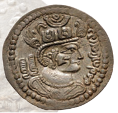

+ G‘arbiy Turk xoqonligi
- Sharqiy Turk xoqonligi
- Eron sosoniylari
- Kushon podsholigi

**187. Ilk o‘rta asrlarda quyidagi qaysi hududda bolalar kaftiga tanga qo‘yib, tiliga asal surtish odati bo‘lgan?**

+ Sug‘dda
- Buxoroda
- Xorazmda
- Chochda

**188. Qachon G‘arbiy Turk xoqonligi bilan Xitoy o‘rtasida, ayniqsa, iqtisodiy aloqalar faollashgan?**

- VI asrning birinchi yarmida
- VI asrning ikkinchi yarmida
+ VII asrning birinchi yarmida
- VII asrning ikkinchi yarmida

**189. Turk xoqonligiga qarshi qo‘zg‘olon ko‘targan Abruyning kelib chiqishi to‘g‘ri ko‘rsatilgan javobni toping.**

+ Xoqon xonadoniga mansub shaxs bo‘lgan
- Harbiy qatlamga mansub shaxs bo‘lgan
- Buxorxudotlar sulolasiga mansub shaxs bo‘lgan
- Kambag‘al kadivar qatlamiga mansub shaxs bo‘lgan

**190. Turk xoqonligi davrida qaysi hududga hozirgi Panjikentdan Karmanagacha bo‘lgan yerlar kirgan?**

- Toxariston hududlariga
- Choch hududlariga
+ Sug‘d hududlariga
- Ustrushona hududlariga

**191. Qachon Samarqandda avtomobil yo‘li qurilishi jarayonida buldozer yer tekislash ishlarini olib borayotganida yer ostidan bir necha katta rangli devor bo‘laklarini surib chiqarishi natijasida Afrosiyob shahri xarobalari topilgan?**

- XX asr 50-yillarida
+ XX asr 60-yillarida
- XX asr 70-yillarida
- XX asr 80-yillarida

**192. Mahmud Qoshg‘ariyning «Devonu lug‘otit-turk» asari qachon yaratilgan?**

+ XI asrda
- XII asrda
- X asrda
- IX asrda

**193. Turk xoqonligi davrida hunarmandchilik mahsulotlarini yasash uchun oltin, temir, mis qayerdan qazib olingan?**

+ Farg‘ona va Sug‘dda
- Iloqda
- Shahrisabzda
- Ustrushonada

**194. VII asrning birinchi yarmida G‘arbiy Turk xoqonligidan Xitoyga necha marta elchi yuborilgan?**

- Olti marotaba
- Yetti marotaba
- Sakkiz marotaba
+ To‘qqiz marotaba

**195. Turk xoqonligida shaxsga qarshi qaratilgan boshqa jinoyatlar uchun yetkazilgan zararni necha barobar qilib to‘lash sharti qo‘yilgan edi?**

- Besh barobar
+ O‘n barobar
- O‘n besh barobar
- Yigirma barobar

**196. Turk xoqonligida isyon ko‘tarish va sotqinlik jinoyati uchun qanday jazo berilgan?**

- Qo‘li yoki oyog‘i kesilgan
- Mol-mulki bilan tovon to‘lashga majbur etilgan
- Qullikka sotilgan
+ Qatl qilingan

**197. Qaysi manbada garchi turklar doimiy yashash joylariga ega bo‘lmasa ham, lekin ularning har birida ajratib berilgan yer borligi haqida ma’lumot berilgan?**

- Turkiy manbalarda
- Arab manbalarida
+ Xitoy manbalarida
- Vizantiya manbalarida

**198. Abruy qo‘zg‘olonini bostirish uchun qaysi turk xoqoni o‘g‘li Sheri Kishvar (El Arslon) boshliq qo‘shin yuborgan?**

+ Qoracho‘rin
- Kultegin
- Istami
- To‘n yabg‘u

**199. VII asrning birinchi yarmida G‘arbiy Turk xoqonligidan qaysi davlatga bir yilning o‘zida Buxoro, Samarqand, Ishtixon va Ustrushona (Jizzax va O‘ratepa viloyatlari) dan birlashgan juda katta savdo karvoni yuborilgan?**

- Vizantiyaga
- Rimga
+ Xitoyga
- Hindistonga

**200. Turk xoqonligida ishlab chiqilgan jinoyatchilikka qarshi qonun hujjatlariga ko‘ra, sodir etilgan jinoyat uchun jazoning asosiy qanday turlari berilgan? 1) Qatl еtish; 2) Tana a’zolarini kesib tashlash; 3) Zararni to‘lash; 4) Mol-mulk tarzida tovon to‘lash.**

- 2, 3, 4
- 1, 2, 4
- 1, 2, 3
+ 1, 2, 3, 4

**201. VII asrdan boshlab quyidagi qaysi hudud mustaqil mulklar ittifoqidan iborat bo‘lgan?**

- Toxariston
- Choch
- Ustrushona
+ Buxoro

**202. «Tempera» nima?**

- Tuxum sarig‘iga rangdor mineral toshlar aralashtirib tayyorlanadigan yonuvchi modda
- Tuxum oqiga rangsiz mineral upasi aralashtirib tayyorlanadigan taom
- Tuxum sarig‘iga rangdor mineral upasi aralashtirib tayyorlanadigan malham
+ Tuxum sarig‘iga rangdor mineral upasi aralashtirib tayyorlanadigan bo‘yoq

**203. Turk xoqonligida birovga jarohat yetkazgani yoxud mayib qilgani uchun qanday jazo turi qo‘llanilgan?**

- Qo‘li yoki oyog‘i kesilgan
+ Mol-mulki bilan tovon to‘lashga majbur etilgan
- Qullikka sotilgan
- Qatl qilingan

**204. Ilk o‘rta asrlarda «Hamuket» so‘zi Buxoro tilida qanday ma’noni anglatgan?**

- «Hamuk - oltinning shahari»
+ «Hamuk - gavharning shahari»
- «Hamuk - buyuklarning shahari»
- «Hamuk – ulug‘larning shahari»

**205. G‘arbiy Turk xoqonligi hukmdorlari qaysi davlatlar bilan bo‘lgan munosabatlarda uzoq yillar o‘z ta’sirini o‘tkazganlar?**

- Xitoy, Parfiya va Vizantiya
- Rim, Eron va Vizantiya
- Xitoy, Sharqiy Turk xoqonligi va Vizantiya
+ Xitoy, Eron va Vizantiya

**206. Ilk o‘rta asrlarda Sug‘d yozuvi qanday tartibda yozilgan?**

+ Chapdan o‘nga qarab
- O‘ngdan chapga qarab
- Tepadan pastga qarab
- Pastdan tepaga qarab

**207. Turk xoqonligi davrida hunarmandchilik mahsulotlarini yasash uchun tosh va tuz qayerdan qazib olingan?**

- Farg‘ona va Sug‘dda
- Iloqda
+ Shahrisabzda
- Ustrushonada

**208. Turk xoqonligi davrida Turon zaminida turkiy yozuv bilan bir qatorda yana qaysi yozuvlar ham keng qo‘llanilgan edi?**

- Baqtriya va Xorazm yozuvlari
+ Sug‘d va Xorazm yozuvlari
- Sug‘d va Baqtriya yozuvlari
- Baqtriya va Kushon yozuvlari

**209. Qayerda Sheri Kishvardan keyin podshohlik qilganlar Iskajkat, Sharg‘, Romtin, Faraxshiy (Varaxsha) qishlog‘iga asos solishgan?**

- Sug‘dda
+ Buxoroda
- Naxshabda
- Chochda

**210. Turk xoqonligiga qarshi Abruy qo‘zg‘oloni qayerda boshlangan?**

- Sug‘dda
+ Buxoroda
- Xorazmda
- Chochda

**211. G‘arbiy Turk xoqoni kimlar yordamida mustaqil hokimliklar ustidan nazoratni kuchaytirgan?**

+ O‘z noiblari – tudunlar yordamida
- O‘z qarindoshlari – jabg‘ular yordamida
- O‘z lashkarboshilari – shodlar yordamida
- O‘z amaldorlari – budunlar yordamida

**212. G‘arbiy Turk xoqonligida hukmdor qarorgohi vazifasini bajargan shaharlar nomlari to‘g‘ri moslashtirilgan javobni toping.**

- Suyab (Turfan), Beshbaliq (Oq Bishim), Ek-tog‘ (Sharqiy Turkiston)
+ Suyab (Oq Bishim), Beshbaliq (Turfan), Ek-tog‘ (Sharqiy Turkiston)
- Suyab (Sharqiy Turkiston), Beshbaliq (Turfan), Ek-tog‘ (Oq Bishim)
- Suyab (Oq Bishim), Beshbaliq (Sharqiy Turkiston), Ek-tog‘ (Turfan)

**213. Manbalarda Sheri Kishvar Buxoro shahristonini qurib, necha yil podshohlik qilgani aytiladi?**

- 30 yil
+ 20 yil
- 15 yil
- 10 yil

**214. Ilk o‘rta asrlarda O‘rta Osiyoda bolalar balog‘at yoshiga yetgach … .**

- xat-savod va hisob-kitobni o‘rganishga jalb etganlar
+ dunyo tanish, savdo-tijorat ishlarini o‘rganish uchun maxsus vakillar homiyligida boshqa davlatlarga yuborganlar
- uzoq muddatli harbiy hizmatga jalb qilganlar
- oila qurib, yangi avlod o‘stirishga undaganlar

**215. G‘arbiy Turk xoqonligida kimning davrida boshqaruv tartiblari isloh qilinib, viloyat hokimlarini xoqonlik ma’muriyati bilan bevosita bog‘lash va ularning ustidan nazoratni kuchaytirish maqsadida mahalliy hukmdorlarga xoqonlikning «yabg‘u» unvoni berilgan?**

- Qoracho‘rin
+ To‘n yabg‘u
- Bumin
- Istemi

**216. Ilk o‘rta asrlarda quyidagi qaysi hudud Sug‘d siyosiy ittifoqiga kirmagan bo‘lib, u alohida mustaqil davlat bo‘lgan?**

- Toxariston
+ Farg‘ona
- Buxoro
- Ustrushona

**217. «Bu ko‘hna shahar dunyo ahamiyatiga ega bo‘lgani uchun YUNESKO ning Butunjahon madaniy merosi ro‘yxatiga kiritilgan va unda: «Samarqand – madaniyatlar uchrashadigan makon», – degan so‘zlar yozib qo‘yilgan». Ushbu so‘zlar YUNESKO bosh direktori o‘rinbosari Xubert Gizen tomonidan qachon aytilgan?**

- 2014-yilda
- 2015-yilda
+ 2016-yilda
- 2017-yilda

**218. Ilk o‘rta asrlarda O‘rta Osiyodagi mahalliy hududlar va ularning hukmdorlari qanday atalganligini moslashtiring. 1) Sug‘d va Farg‘ona; 2) Toxariston; 3) Xorazm; 4) Kesh; 5) Buxoro; 6) Ustrushona; 7) Choch. a) «malikshoh»; b) «ixshid»; c) «xorazmshoh»; d) «ixrid»; e) «afshin»; f) «xudot»; g) «tudun».**

- 1-a, 2-b, 3-c, 4-d, 5-f, 6-e, 7-g
- 1-b, 2-a, 3-d, 4-c, 5-f, 6-e, 7-g
+ 1-b, 2-a, 3-c, 4-d, 5-f, 6-e, 7-g
- 1-b, 2-a, 3-c, 4-d, 5-e, 6-f, 7-g

**219. Ilk o‘rta asrlarda quyidagi qaysi hudud mahalliy hokimlari ayrim vaqtlarda Choch va Xorazmning mustaqil hukmdorlari bilan birlashib, ma’lum muddatlarda yirik shaharlarda o‘z qurultoylarini o‘tkazib turganlar?**

- Toxariston
+ Sug‘d
- Buxoro
- Ustrushona

**220. Turk xoqonligi davrida hunarmandchilik mahsulotlarini yasash uchun qo‘rg‘oshin, kumush va oltin qayerdan qazib olingan?**

- Farg‘ona va Sug‘dda
+ Iloqda
- Shahrisabzda
- Ustrushonada

**221. Qaysi Turk xoqoniga ulug‘ligi sababli «Biyog‘u» laqabi berilgan?**

- Istami
- To‘n yabg‘u
- Sheri Kishvar
+ Qarojurin

**222. VII asrning birinchi yarmida G‘arbiy Turk xoqonligidan qaysi davlatga to‘qqiz marotaba elchi yuborilgan?**

- Vizantiyaga
- Rimga
+ Xitoyga
- Hindistonga

**223. «Devoriy tasvirlarning ichida, ayniqsa, bir xonadan topilgani ancha yaxshi saqlanib qolgan. Devorlar, supa xom g‘isht va paxsadan bunyod etilgan. Xona to‘rida taxtga o‘xshash o‘rindiq joylashgan bo‘lsa kerak, supaning o‘sha qismi bo‘rtib turganligi aniqlangan. Xona devorlaridagi rasmlarda shoh a’yonlari, Chag‘oniyon, Toxariston, Sharqiy Turkiston, Choch, Chinu Mochin, Hindiston va boshqa mamlakatlardan kelgan elchilar, olib kelingan ot-ulov, sovg‘alar va ov sahnasi ifodalangan. Suratlar nihoyatda nafis ishlanib, yuqori did bilan bo‘yalgan». Yuqoridagi jumlalar qaysi shahar xarobalariga tegishli?**

+ Afrosiyob
- Varaxsha
- Ajinatepa
- Tuproqqal’a

**224. Ilk o‘rta asrlarda «hamuk» so‘zi Buxoro tilida qanday ma’noni anglatgan?**

- «Oltin»
- «Katta»
- «Buyuk»
+ «Gavhar»

**225. Buxoroda kimdan keyin podshohlik qilganlar Iskajkat, Sharg‘, Romtin, Faraxshiy (Varaxsha) qishlog‘iga asos solishgan?**

- To‘n yabg‘u
- Bumin
+ Sheri Kishvar
- Qarojurin

**226. Ilk o‘rta asrlarda O‘rta Osiyo shaharlarida sug‘d-turk ikki tilliligi rasmiy odat bo‘lganligi haqida kim, qaysi asarida yozib qoldirgan?**

- Alisher Navoiy «Majolis un-nafois» asarida
- Abu Rayhon Beruniy «Qadimgi xalqlardan qolgan yodgorliklar» asarida
- Abu Bakr Narshaxiy «Buxoro tarixi» asarida
+ Mahmud Qoshg‘ariy «Devonu lug‘otit-turk» asarida

**227. Quyidagi qaysi davlatda davlat boshqaruvidagi barcha bog‘inlarida lavozim egalari harbiy unvonga ega bo‘lishi shart hisoblangan?**

+ G‘arbiy Turk xoqonligida
- Sharqiy Turk xoqonligida
- Eftallar davlatida
- Kidariylar davlatida

**228. Abruy boshchiligidagi qo‘zg‘olondan vahimaga tushgan mulkdor dehqonlar va boy savdogarlar Buxoro viloyatini tark etib, qayerga borib o‘rnashganlar?**

- Farg‘ona vodiysiga
+ Turkiston va Taroz atrofiga
- Xorazm vohasiga
- Sharqiy Turkiston va Yettisuvga

**229. Rassom V. S. Kaydalov qalamiga mansub ushbu asarda qaysi tarixiy voqea tasvirlangan?**

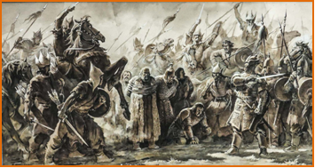

- Rofe ibn Lays qo‘zg‘oloni
- Oq kiyimlilar qo‘zg‘oloni
- Muqanna qo‘zg‘oloni
+ Abruy qo‘zg‘oloni

## 12-13-§ Mahalliy hokimliklarning tashkil topishi.

**230. Toxariston aholisining asosiy qismi nima bilan shug‘ullangan?**

+ O‘troq dehqonchilik bilan
- Chorvachilik bilan
- Hunarmandchilik bilan
- Savdo–sotiq bilan

**231. Turk xoqonligining mahalliy sulolalar boshqaruvini saqlab qolishdan maqsadi nima edi? 1) O‘troq o‘lkalarda siyosiy barqarorlikni ta’minlash; 2) Iqtisodiy taraqqiyot rivojini to‘xtatmaslik; 3) harbiy jihatdan ularga ko‘maklashish; 4) Mahalliy aholi va ko‘chmanchilar o‘rtasida ishonchli vositachilarga ega bo‘lish.**

+ 1, 2, 3
- 1, 3, 4
- 1, 2, 4
- 2, 3, 4

**232. Chochda qaysi turk xoqonining «yabg‘u-xoqon puli» deb nomlanuvchi tangalari muomalada bo‘lgan?**

- Tardu xoqon
- Istami yabg‘u
+ To‘n yabg‘u
- Qorajurin Biyog‘u

**233. VI–VII asrlarda Zarafshon vodiylarida joylashgan Samarqand, Buxoro va Qashqadaryo vohasidagi Kesh viloyatining … yirik mulklari birlashgan bo‘lib, ularning har biri o‘z hokimi, harbiy chokarlari va mis puli birligiga ega edi.**

+ o‘n bitta
- o‘n uchta
- o‘n beshta
- o‘n yettita

**234. Ilk o‘rta asrlarda Farg‘ona hukmdorlari nima deb atalgan?**

- Tudun
- Malikshoh
+ Ixshid
- Afshin

**235. Turk xoqonligi ikkiga bo‘lingach Choch … .**

- Eron sosoniylari tasarrufiga o‘tgan
- Mustaqillikni qo‘lga kiritgan
+ G‘arbiy Turk xoqonligi tarkibida bo‘lgan
- Sharqiy Turk xoqonligi tarkibida bo‘lgan

**236. Ilk o‘rta asrlarda Teginlar sulolasi quyidagi qaysi hududni boshqargan?**

- Chag‘oniyon
- Toxariston
- Farg‘ona
+ Choch

**237. Ilk o‘rta asrlarda «tujjor» deb kimlarga aytilgan?**

+ Savdogarlarga
- Harbiylarga
- Hukmdorlarga
- Dehqonlarga

**238. Turk xoqonligi davridagi Choch tangalarining o‘ziga xos tomoni nimada edi?**

+ Sug‘diy yozuvda bitilgani
- Yuqori sifatli oltindan zarb etilgani
- Shakli to‘tburchak bo‘lgani
- O‘rtasida teshikchasi borligi

**239. Turk xoqoni Tegin Tyanchjini qayerga hokim etib tayinlagan?**

- Chag‘oniyonga
- Toxaristonga
- Farg‘onaga
+ Chochga

**240. Ilk o‘rta asrlarda quyidagi qaysi hududning hisori qo‘ylari va tulporlari juda mashhur bo‘lgan?**

- Marg‘iyona
- Toxariston
- Farg‘ona
+ Sug‘d

**241. Qachondan Chochda Turk xoqonligi hukmronligi o‘rnatilib, voha aholisi etnik tarkibida turkiylar salmog‘i keskin oshgan?**

- VI asr birinchi yarmidan
+ VI asr ikkinchi yarmidan
- VII asr birinchi yarmidan
- VII asr ikkinchi yarmidan

**242. Toxariston haqidagi to‘g‘ri mulohazani toping. 1) 27 ta tog‘ va tog‘oldi viloyatlaridan iborat mustaqil hokimliklari bo‘lgan; 2) Poytaxti Balx shahri edi; 3) Hozirgi Janubiy O‘zbekiston, Janubiy Tojikiston va G‘arbiy Afg‘onistonni o‘z ichiga olgan edi; 4) Shimolda Hindikush tog‘lari bilan chegaradosh bo‘lgan; 5) Janubda Hisor bilan chegaradosh bo‘lgan; 6) G‘arbda Murg‘ob va Xerirud vodiysi bilan chegaradosh bo‘lgan; 7) Sharqda Pomir bilan chegaralangan.**

- 1, 2, 5, 7
- 1, 2, 3, 7
+ 1, 2, 6, 7
- 1, 2, 4, 7

**243. V–VII asrlarda Turk xoqonligi bir qancha hokimliklarga bo‘linib, qanchadan ortiq mustaqil hokimliklar tashkil topgan?**

- 10 dan ortiq
+ 15 dan ortiq
- 20 dan ortiq
- 25 dan ortiq

**244. Ilk o‘rta asrlarda qaysi hududning 27 ta tog‘ va tog‘oldi viloyatlaridan iborat mustaqil hokimliklari bo‘lgan?**

- Marg‘iyonada
+ Toxaristonda
- Xorazmda
- Sug‘dda

**245. Kimlar o‘z alifbosida «ch» harfi bo‘lmaganligi sababli Chochni «Shosh» deb atashgan?**

+ Arablar
- Eroniylar
- Xitoyliklar
- Turkiylar

**246. Chochga kimlarning kirib kelishi mahalliy a’yonlarning o‘troqlashib, zardushtiylikni qabul qilishiga sabab bo‘lgan?**

+ Sug‘diylarning
- Xorazmliklarning
- Toxaristonliklarning
- Turkiylarning

**247. Qaysi hududda G‘arbiy Turk xoqoni Tardu xoqon nomi chekilgan tangalar, keyinchalik To‘n yabg‘u xoqonning «yabg‘u-xoqon puli» deb nomlanuvchi tangalar muomalada bo‘lgan?**

- Chag‘oniyon
- Toxariston
- Farg‘ona
+ Choch

**248. Turkiylarda qaysi so‘z «davlat» ma’nosini bildirgan?**

- «Ulus»
+ «El»
- «Ayl»
- «Budun»

**249. Choch vassal mulk sifatida qaysi xoqon tasarrufida bo‘lgan?**

- Bumin yabg‘u
+ Istami yabg‘u
- Bilga xoqon
- Qorajurin Biyog‘u

**250. Teginlar sulolasi davrida Chochda soliq yig‘imlari nozirlari qanday atalgan?**

- Tegin
+ Tudun
- Ixrid
- Budun

**251. Ilk o‘rta asrlarda Qurama va Qoramozor tog‘lari yonbag‘irlarida qadimdan qaysi soha bilan shug‘ullanilgan?**

+ Yilqichilik
- Dehqonchilik
- Uzumchilik
- Sholichilik

**252. Ilk o‘rta asrlarda Varxuman ismli shaxs qaysi hududning hukmdori bo‘lgan?**

+ Sug‘d
- Marg‘iyona
- Toxariston
- Farg‘ona

**253. G‘arbiy Turk xoqoni To‘n yabg‘u o‘z qarorgohini … yaqinidagi Mingbuloq mavzesiga ko‘chirgan.**

- Qanha
+ Choch
- Ershi
- Afrosiyob

**254. Ilk o‘rta asrlarda quyidagi qaysi hududda ko‘paytirilgan tulpor otlarning dong‘i jahonga ketgan va «samoviy otlar» deb nom olgan edi?**

- Marg‘iyona
- Toxariston
+ Farg‘ona
- Sug‘d

**255. Ilk o‘rta asrlarda qaysi hudud ko‘plab diniy konfessiyalar kesishgan mintaqa bo‘lganligi uchun u yerda mahalliy turklarning tangrichilik, xristianlikning nestorian oqimi, moniylik kabi dinlar ham tarqalgan edi?**

- Sug‘dda
+ Chochda
- Toxaristonda
- Farg‘onada

**256. O‘rta Osiyoda VI–VII asrlarda davlatlar birlashmasi ittifoqida kimlar katta siyosiy nufuzga ega bo‘lib, mustaqil hokimliklar orasida eng yirigi hisoblangan?**

- Toxariston malikshohlari
+ Sug‘d ixshidlari
- Buxoro xudoylari
- Choch tudunlari

**257. Ilk o‘rta asrlarda O‘rta Osiyoda shaharlar qanday nomlangan uch qismdan iborat bo‘lgan? 1) «Ko‘shk»; 2) «Qasr»; 3) «Ko‘handiz»; 4) «Shahriston»; 5) «Rabod».**

- 1, 2, 3
- 2, 4, 5
+ 3, 4, 5
- 1, 3, 4

**258. Ilk o‘rta asrlarda quyidagi qaysi hududning Koson, Axsikat (Xushkat) va Quva (Qubo) kabi yirik markaziy shaharlari bo‘lgan?**

- Marg‘iyona
- Toxariston
- Sug‘d
+ Farg‘ona

**259. Ilk o‘rta asrlarda O‘rta Osiyo qishloqlarida qanday nomlar bilan shuhrat topgan istehkomli turar joylar qad ko‘targan? 1) «Ko‘shk»; 2) «Qasr»; 3) «Qo‘rg‘on»; 4) «Qo‘rg‘oncha».**

- 2, 3, 4
- 1, 2, 4
- 1, 2, 3
+ 1, 2, 3, 4

**260. Qachon Chochda o‘troq mahalliy aholining manzilgohlari soni nihoyatda oshgan?**

- V–VII asr boshlarida
- V–VII asr oxirlarida
- VI–VIII asr oxirlarida
+ VI–VIII asr boshlarida

**261. Xoqon To‘n yabg‘u qaysi yillarda hukmronlik qilgan?**

- 614–634-yillarda
- 619–638-yillarda
+ 618–630-yillarda
- 622–635-yillarda

**262. Toxaristonda hunarmandchilikning qaysi sohalari ayniqsa yuksalgan edi?**

- Qurolsozlik, shishasozlik, duradgorlik
- Qurolsozlik, kulochilik, to‘qimachilik
- Qo‘g‘oz tayyorlash, shishasozlik, to‘qimachilik
+ Qurolsozlik, shishasozlik, to‘qimachilik

**263. Chjou xonadoni va «o‘n o‘q» sulolasi vakillari Sug‘dda davlatni kim orqali boshqargan?**

- Podsho orqali
+ Oqsoqollar Kengashi oliy organi orqali 
- Turkiy ko‘chmanchi chorvador urug‘ oqsoqollari orqali
- O‘z vakillari «yabg‘u» lar orqali

**264. V–VII asrlarda mavjud bo‘lgan va rivojlangan davlatlarning muhrlarida asosan nimalarning tasviri tushirilgan?**

- Oldida hukmdor va orqasida malika yoki taxt vorisi bo‘lmish shahzodaning tasviri
+ Oldida hukmdor va orqasida o‘z davri uchun muhim bo‘lgan buyum yoki jonzotlarning tasviri
- Oldida diniy kalomlar, muhim ma’lumot beruvchi yozuvlar va orqasida hukmdorning tasviri
- Oldida o‘z davri uchun muhim bo‘lgan buyum yoki jonzotlar va orqasida diniy kalomlar, muhim ma’lumot beruvchi yozuvlar tasviri

**265. To‘n yabg‘u boshqaruvda islohotlar o‘tkazib, qaram o‘lkalarga o‘z vakillari – …  ni yuborgan.**

- «tegin»
- «tudun»
+ «eltabar»
- «budun»

**266. X asrda yashagan arab mualliflari (Ibn Xavqal va Ishtaxriy) ning qayd etishicha, birgina qaysi shaharning yigirma ikkita darvozasi bo‘lgan?**

- Qanha
+ Binkat
- Ershi
- Afrosiyob

**267. «Buyuk ipak yo‘li Qang‘ davlati davrida savdo karvonlari orqali ulkan hududdagi mulklar va shaharlarni, jumladan, Sug‘d va Chochni o‘zaro bog‘lagan bo‘lsa, Eftaliylar davrida Chochning Ipak yo‘lidagi muhim strategik ahamiyati kamaymadi. Shu bois, Sosoniylar podshosi Xusrav I ning eftaliylarga qarshi kurashi bayon etilgan manbada Choch Farg‘ona kabi eftaliylarning chegara hududi sifatida keltirilgan. Bu davrda Choch Sug‘d va boshqa mulkliklar kabi o‘z mustaqil ichki va tashqi siyosatini davom ettirgan». Ushbu ma’lumotlar kimning, qaysi asarida keltirilgan?**

- V.V. Bartold «Yettisuv tarixi bo‘yicha ocherklar»
- K. Trever «Qadimgi sharq sivilizatsiyasi»
- N.I. Veselovskiy «O‘rta Osiyo tarixidan ocherklar»
+ Y.F. Buryakov «Ilk o‘rta asrlardagi Choch tarixidan»

**268. Qaysi G‘arbiy Turk xoqoni o‘z qarorgohini Choch yaqinidagi Mingbuloq mavzesiga ko‘chirgan?**

- Bumin yabg‘u
- Istami yabg‘u
+ To‘n yabg‘u
- Qorajurin Biyog‘u

**269. X asrda yurtimizdagi qaysi shahar Binkat deb atalgan?**

- Xiva
- Buxoro
+ Toshkent
- Termiz

**270. Teginlar sulolasi davrida Chochda shahzoda, taxt vorisi qanday atalgan?**

+ Tegin
- Tudun
- Ixrid
- Budun

**271. Ilk o‘rta asrlarda Toxaristonning poytaxti qaysi shahar bo‘lgan?**

+ Balx
- Marv
- Varaxsha
- Afrosiyob

**272. Qaysi asrlarda Turonda, bir tomondan, yerga egalik qilish munosabatlari o‘rnatilgan va mustahkamlanib borgan, ikkinchi tomondan, ko‘chmanchi chorvadorlarning beto‘xtov shiddat bilan kirib kelishi hamda ularning o‘troqlashuvi kuzatilgan?**

- III–V asrlarda
- IV–VI asrlarda
+ V–VII asrlarda
- VI–VIII asrlarda

**273. Chochda sug‘diy til va yozuv qatorida turkiy til va yozuvning amal qilishi qaysi shahar xarobasidan topilgan sopol idishdagi bitiklarda o‘z aksini topgan?**

+ Qanha
- Bityan
- Ershi
- Afrosiyob

**274. Samarqandni poytaxt qilgan Sug‘d qaysi davlat tanazzulidan keyin mustaqilligini tiklagan?**

+ Qang‘ davlati
- Kushon podsholigi
- G‘arbiy Turk xoqonligi
- Sharqiy Turk xoqonligi

**275. Turk xoqonligi tashqi savdoda chetga nimalarni chiqargan?**

- Eloq kumushlarini, Tunkat va To‘qkat metallini, kulolchilik buyumlari
- Choch kumushlari, oltin va kumush, yashil feruzalarini
- Sholi va mevalar, Tunkat va To‘qkat metallini, moviy feruzalarini
+ Lashkarak kumushlarini, Tunkat va To‘qkat metallini, moviy feruzalarini

**276. Quyidagi Chag‘oniyon va Choch elchilari Sug‘d hukmdori Varxuman huzurida tasvirlangan devoriy surat qaysi shahar xarobalaridan topilgan?**

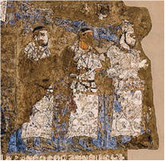

- Varaxsha
- Ayritom
- Ershi
+ Afrosiyob

**277. Turk-sug‘d namunasidagi tangalar deb qanday tangalarga aytiladi?**

- Sug‘d ixshidlari davrida, VII–VIII asrlarda turkiy yozuv va tilda zarb etilgan tangalarga
+ Turk xoqonligi davrida, VII–VIII asrlarda sug‘diy yozuv va tilda zarb etilgan tangalarga
- G‘arbiy Turk xoqonligi davrida, VII–VIII asrlarda old tomoni sug‘diy, orqa tomoni turkiy yozuv va tilda zarb etilgan tangalarga
- Sharqiy Turk xoqonligi davrida, VII–VIII asrlarda orqa tomoni sug‘diy, old tomoni turkiy yozuv va tilda zarb etilgan tangalarga

**278. Quyidagi rasmda qaysi istehkom tasvirlangan?**

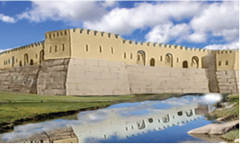

- Turoqqal’a
+ Zangtepa qal’asi
- Qo‘yqirilganqal’a
- Ajinatepa qal’asi

**279. Choch haqida bildirilgan to‘g‘ri mulohazalarni toping. 1) Choch (Toshkent vohasi) Chirchiq va Ohangaron havzalaridagi joylashgan; 2) Choch Ipak yo‘lining shimoli-sharqiy yo‘nalishida strategik ahamiyatga ega bo‘lgan hudud hisoblangan; 3) Vohaning turkiy hukmdorlari davlat ishlarini olib borishda sug‘diy til va yozuvidan deyarli foydalanishmagan; 4) VII–VIII asrlarga mansub tangalari sug‘diy yozuv va tilda zarb ettirishgan; 5) Chochda sug‘diy til va yozuv qatorida turkiy til va yozuvning amal qilishi Ershi shahri xarobasidan topilgan sopol idishdagi bitiklarda o‘z aksini topgan.**

+ 1, 2, 4
- 1, 2, 3
- 1, 3, 4
- 2, 3, 5

**280. Quyidagi rasmdagi Choch tangasi qaysi yillarga mansub?**

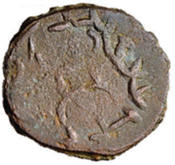

- 635-735-yillarga
- 620-720-yillarga
+ 625-725-yillarga
- 630-730-yillarga

## 14-15-§ Turon xalqlarining harbiy san’ati.

**281. «Turon» atamasi dastlab qaysi manbada tilga olingan?**

+ «Avesto» kitobida
- Arab tarixchilari manbalarida
- O‘rxun-Yenisey manbalarida
- Bilga xoqon bitigida

**282. Turkiy jangchilar qanday harbiy taktika usulidan keng foydalanishgan?**

+ Yolg‘ondan chekinish
- Dushmanning asosiy kuchlarini ikki yoki bir necha qismlarga ajratib yakson qilish
- Otliq askar hujumi bilan dushman saflarini yorib o‘tish
- Aylana usulini qo‘llashgan

**283. «Bu yer (Movarounnahr) ahlining e’tiqodicha, Jayhun orqasidan Sharqqa qarab cho‘zilgan yerlar Turon, G‘arbga tomon cho‘zilgan yerlar esa Eron deb ataladi. Kaykovus va Afrosiyob bu mamalakatlarni o‘zaro taqsim qilganlarida Turon Afrosiyobga, Eron esa Kaykabod o‘g‘li Kaykovusga tekkan». Ushbu jumlalar muallifi kim?**

- Johiz
- Ishtaxriy
- Ibn Xaldun
+ Ibn Arabshoh

**284. Turk xoqonligi davrida qaysi mustaqil hokimliklar o‘z harbiy qo‘shiniga ega edilar? 1) Ustrushona; 2) Sug‘diyona; 3) Marg‘iyona; 4) Toxariston; 5) Farg‘ona; 6) Xorazm; 7) Choch.**

- 1, 2, 3, 5, 6, 7
+ 2, 4, 5, 6, 7, 8
- 2, 3, 4, 5, 6, 7
- 1, 2, 3, 5, 7, 8

**285. Turk xoqonligi davrida yirik dehqonlarning qaysi hududdan topilgan uy-qo‘rg‘onlari burjli mudofaa devorlari va kamondan o‘q otishga mo‘ljallangan shinaklariga ega bo‘lgan?**

- Chag‘oniyon, Xorazm va Sug‘ddan
- Toxariston, Xorazm va Farg‘onadan
+ Xorazm, Sug‘d va Toxaristondan
- Choch, Toxariston, va Xorazmdan

**286. «Dudama» nima?**

- Jangovor sovutning turi
- Uzoqqa otuvchi kamonning turi
+ Chopuvchi qurolning turi
- Ot bilan jang qilish uslubining turi

**287. Turkiyalik olim Usmon Turonning «Turkiy xalqlar
mafkurasi» nomli kitobida keltirilishicha, turkiylar … .
1) Birinchi bo‘lib otdan jang vositasi sifatida foydalanganlar; 2) Egar-jabduq, uzangi va tizgin kabi anjomlarni kashf etganlar; 3) Chinliklar turklardan otga minishni, uzun qilichdan foydalanishni va jangovar kiyim yasashni o‘rganib olganlar; 4) Ayollardan maxsus harbiy qism tuzishgan; 5) Chodir-hammom va kasalxonalar kashf etib, ularni qo‘shin bilan birga otda olib yurishgan; 6) Turklar umrlarini ot ustida kechirganlar: ular ot ustida ovqatlanishar, mashvarat o‘tkazishar, nihoyat jang-u jadal qilishardi; 7) Palaxmonda ichiga yonuvchi modda solingan ko‘zalarni otishni joriy etishgan;
8) Dovuldek paydo bo‘lib, qush kabi bir zumda ko‘zdan yo‘qolgan.**

- 2, 3, 4, 5, 6, 7
- 1, 2, 3, 4, 6, 7
+ 1, 2, 3, 5, 6, 8
- 2, 3, 4, 5, 7, 8

**288. Turk xoqonligi qo‘shinida har bir tuman o‘zining tug‘i ya’ni … ga ega bo‘lgan.**

- maxsus kiyimi
- bayrog‘i
+ nishoni
- shiori

**289. Turon hududi qaysi asrda eftaliylar davlati tarkibiga kirgan?**

- III asrda
- IV asrda
+ V asrda
- VI asrda

**290. «Samarqand hokimining qabilasidan bo‘lgan ko‘pchilik jangchilar jasur va g‘ayratli bo‘lib, o‘limni nazar-pisand qilmagan. Janglarda hech bir raqib ularga bardosh bera olmagan. Ular jang davomida qurol-aslahaning barcha turlaridan mohirona foydalanishgan». Xitoylik sayyoh tomonidan esdaliklarida bitilgan yuqoridagi ma’lumotlar qaysi hudud jangchilariga nisbatan bayon etilgan?**

- Chag‘oniyon
- Toxariston
- Farg‘ona
+ Sug‘d

**291. «Turkiy xalqlar mafkurasi» nomli kitob muallifi olim Usmon Turon qayerlik?**

+ Turkiyalik
- Azarbayjonlik
- Gruziyalik
- Boshqirdistonlik

**292. «Manoqib al-atrok» asari muallifi kim?**

- Beruniy
+ Johiz
- Narshaxiy
- Ibn Arabshoh

**293. Turkiy suvoriylar tomonidan nimaning kashf etilishi otliq askarlarga ot ustida mustahkam o‘tira olish va og‘ir aslahalar bilan qurollanish imkonini bergan?**

- Bo‘yinturuq
+ Uzangi
- Egar
- Bargustivon

**294. VI asrda O‘rta Osiyo hududi Turk xoqonligiga o‘tishi bilan «tur» va «oriy» atamalari uyg‘unlashib, Turon nomi kimlarga nisbatan beriladigan bo‘lgan?**

- Toxarlar
+ Turklar
- Xorazmliklar
- Sug‘diylar

**295. «Turon» yoki «Turkiston» deyilganda qaysi hududdagi turkiylar mamlakati tushuniladi?**

- Amudaryo va Zafarshondan shimolda, to Sharqdagi Buyuk Xitoy devorigacha hududlar
- Amudaryo va Sirdaryodan janubda, to Sharqdagi Buyuk Xitoy devorigacha hududlar
- Amudaryo va Sirdaryodan shimolda, to Sharqdagi Gobi cho‘ligacha hududlar
+ Amudaryo va Sirdaryodan shimolda, to Sharqdagi Buyuk Xitoy devorigacha hududlar

**296. Turk xoqonligi otliq askarlari nima sababdan o‘zi bilan kamida ikki yoki uchta otni olib yurgan?**

+ Horigan otlarni charchamagan otlarga almashtirish imkoniyatini bergan
- Yuk ko‘tarish va jangda ishtirok etish uchun alohida-alohida otlardan foydalanilgan
- Uzoq muddatli yurishlar vaqtida go‘sht va terisidan foydalanish uchun
- Jang vaqtda askarlar soni ko‘p bo‘lib ko‘rinishi uchun

**297. «Sosoniy-forslar barcha xalqlardan davlatni boshqarish sohasida, xitoyliklar - hunarmandchilikda, yunonlar - ilm-fanda, turklar - harbiy ishda ustundirlar». Ushbu fikrlar muallifi kim?**

- Ibn Xaldun
+ Johiz
- Narshaxiy
- Ibn Arabshoh

**298. Ilk o‘rta asrlarda Turon jangchilarining ustunligi nimada edi?**

- Yengil va o‘tkir jangovor oyboltalar bilan qurollanganligida
- Ot ustida kamondan o‘q uza olishganligida
- Oyoq va qo‘llarini himoyalash maqsadida maxsus metall parchalaridan tayyorlangan sovut kiyganligida
+ Ikkiyoqlama o‘tkir tig‘li qilichlari bo‘lganligida

**299. Eftaliylar jangda asosan nimalardan foydalanishgan?**

+ Gurzi
- Xanjar
- Kamon
- Bolta

**300. Turk xoqonligi armiyasida qanday bo‘linma «tuman» deb atalgan?**

- O‘nlik bo‘linma
- Yuzlik bo‘linma
- Minglik bo‘linma
+ O‘n minglik bo‘linma

**301. Turon jangchilari dubulg‘asi nimadan yasalgan edi?**

- Misdan
- Bronzadan
- Qo‘rg‘oshindan
+ Temirdan

**302. Turk xoqonligi lashkarining asosini qaysi turdagi qo‘shin tashkil qilgan?**

+ Otliq qo‘shin
- Kamonchilar qo‘shini
- Og‘ir qurollangan piyoda askarlar qo‘shini
- Yengil qurollangan piyoda askarlar qo‘shini

**303. Turk xoqonligi davrida nimalar qoshida tashkil etilgan ta’lim dargohlarida yigitlarga otda erkin yura olish, qilichbozlik, kamondan o‘q otish, gurzi ishlatish, kurash tushish, palaxmon otish kabilar o‘rgatilgan?**

- Harbiy qa’lalar
+ Ibodatxonalar
- Davlat mahkamalari
- Saroylar

**304. «Palash» nima?**

- Uzun va og‘ir nayza
- Uzun va og‘ir bolta
- Uzun va og‘ir gurzi
+ Uzun va og‘ir qilich

**305. Eftaliylar kimlarning siyosatini davom ettirib, O‘rta Osiyo, Sharqiy Eron, Shimoliy Hindiston va Sharqiy Turkiston xalqlarini yagona davlatga birlashtirgan?**

- Kidariylar
- Xioniylar
+ Kushonlar
- Sosoniylar

**306. Turonliklar nimani uzun nayzaga bo‘ri yoki boshqa biror hayvonning tilla suvi yuritilgan boshi va otning yoli bilan birga o‘rnatishgan?**

- Qabila ramzini
- Bo‘linma bayrog‘ini
+ Tuman tug‘ini
- Hukmdor tamg‘asini

**307. Tarixchilar fikricha, turlar (turklar) qaysi xalqlarning tarmog‘i hisoblangan?**

- Hindi-xitoy
+ Oriy
- Hind-yevropa
- Axey

**308. Turkiy jangchilar himoyalanish chog‘ida qanday usulni qo‘llashgan?**

- Yolg‘ondan chekinish usulini
- Dushmanning asosiy kuchlarini ikki yoki bir necha qismlarga ajratib yakson qilish usulini
- Otliq askar hujumi bilan dushman saflarini yorib o‘tish usulini
+ Aylana usulini

## 16-17-§ VI–VII asrlarda Turon xalqlari madaniy hayoti.

**309. Ilk o‘rta asrlarda Turon gazmol markazlarida «zandanachi» matosi qanday rangli ipakdan ishlangan?**

+ Ko‘k rangli
- Qizil rangli
- Pushti rangli
- Oq rangli

**310. Quyida To‘nyuquq bitigidan parcha keltirilgan. Nuqtalar o‘rnini mos javoblar bilan to‘ldiring. «Men xoqon To‘nyuquq 1) … dunyoga keldim. Turk millati parishon bo‘ldi va birlashgan turk yurtida jamoa holidagi xalq qolmagandi. Dastlab 2) … (Qutlug’) yonida to‘qnashadi. Men ham ular bilan birga edim. Tangri menga sezgi berganligi sababli uning xoqon bo‘lishi uchun harakat qildim va o‘zini ham qistadim. U: «To‘nyuquq men bilan birga bo‘lganda men 3) … (millatni to‘plagan) xoqon bo‘layin», — deydi. Chinliklarning bu toza kuchni yo‘q qilish payiga tushganini bilishim hamon kunduz o‘tirmay, kecha uxlamay xoqonga arz qildim, dushmanlar birlashmasdan ustiga yuraylik, dedim. Tangrining yordami bilan yog‘iyni daf etdik. Xoqon va turk millati 4) … ga joylashishi bilan Janub va Shimol, Sharq va G‘arbdagi barcha urug‘lar kelib, bizga qo‘shildi».**

- 1-Chin, 2-Shod, 3-Tudun, 4-O‘tukan
- 1-Rum, 2-Eloq, 3-Eltarish, 4-O‘tukan
- 1-Mochin, 2-Tuman, 3-Eltarish, 4-O‘tukan
+ 1-Chin, 2-Shod, 3-Eltarish, 4-O‘tukan

**311. Ilk o‘rta asrlarda Turongi qaysi hududda faqat erkak va ayol xizmatchilar belbog‘ taqishardi, aslzoda ayollar esa belini bog‘lashmagan?**

- Baqtriyada
- Sug‘dda
+ Toxaristonda
- Xorazmda

**312. Quyidagi rasmdagi eftaliylar davriga oid ov manzarasi tasvirlangan mis idish qaysi davrga oid va qayerdan topilgan?**

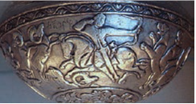

- III asr, Tojikistondan topilgan
- IV asr, Afg‘onistondan topilgan
+ V asr, Pokistondan topilgan
- VI asr, Hindistondan topilgan

**313. Yahudiylar qaysi davlat quvg‘inlaridan so‘ng Eronga, Samarqand va Buxoroga ko‘chib kelgan edilar?**

- Misr
+ Ossuriya
- Bobil
- Akkad

**314. Mug‘ tog‘i va Afrosiyobdan qaysi yozuv namunalari topilgan?**

- Baqtriya yozuvi
+ Sug‘d yozuvi
- Toxar yozuvi
- Xorazm yozuvi

**315. Quyidagi rasmda nima tasvirlangan?**

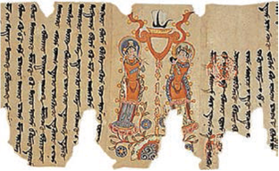

- Zardushtiylarning xorazmiy tilli diniy kitobati namunasi
+ Moniylarning sug‘diy tilli diniy kitobati namunasi
- Shomoniylarning turkiy tilli diniy kitobati namunasi
- Buddaviylarning sanskrit tilli diniy kitobati namunasi

**316. «Farzandlaringiz Masihiyning tarbiyasini olsin; ular Xudo oldida qanchalik kamtarlik, Xudo oldida kuchli sevgi nimani anglatishini, Xudodan qo‘rqish qanchalik go‘zal va buyuk ekanini va unda sof aql bilan yurganlarni qutqarishni o‘rgansinlar». Ilk o‘rta asrlarda ushbu tamoyilga qaysi din vakillari amal qilganlar?**

- Buddaviylik
- Zardushtiylik
- Tangrichilik
+ Xristianlik

**317. Qadimgi ko‘kturk (Kultegin va Bilga xoqon) bitiklari Oltoy va Sharqiy Turkistondan tashqari, yana qayerlardan topilgan qabrtoshlari, sopol va metall buyumlar, yog‘och hamda tanga pullarda saqlanib qolgan?**

- Xoram, Zarafshon, Choch
- Chag‘oniyon, Farg‘ona, Zarafshon
+ Yettisuv, Farg‘ona, Zarafshon
- Toxariston, Yettisuv, Farg‘ona

**318. «Daxarma» nima?**

- Tabiat in’omlari va mo‘jizalarining mohiyati haqida ta’lim
- Atrof-muhit va undagi jonzotlarning inson taqdiriga ta’siri haqida ta’lim
+ Diniy qonun-qoidalar va Xudoning mohiyati hamda irodasi (xudojo‘ylik) haqida ta’lim
- Jamiyatda o‘zini tutish va odob-ahloq qoidalari haqida ta’lim

**319. Qaysi din haykaltaroshlik rivojiga kuchli ta’sir ko‘rsatgan?**

- Moniylik
+ Buddaviylik
- Zardushtiylik
- Qam (shomonlik)

**320. Xorazmdagi qaysi qal’alardan topilgan zardushtiylarning ibodatxonasi diqqatga sazovor inshootlarning o‘rtasida qo‘sh devorlar bilan qurshalgan va ichkariga aylanma yo‘lagi orqali kiriladigan to‘g‘ri burchakli bino bo‘lgan?**

- Fir qal’asi va Ayozqal’adan
+ Jonbosqal’a va Tuproqqal’adan
- Qo‘yqirilganqal’a va Jonbosqal’adan
- Tuproqqal’a va Qo‘yqirilganqal’adan

**321. Ushbu devoriy surat qayerdan topilgan?**

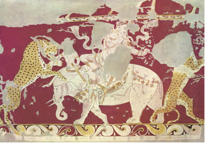

+ Varaxsha
- Panjikent
- Bolaliktepa
- Afrosiyob

**322. Quyidagi rasmda qaysi shahar xarobalari tasvirlangan?**

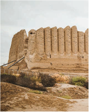

+ Marv
- Afrosiyob
- Varaxsha
- Qanha

**323. Bolaliktepa yodgorligi qayerda joylashgan?**

+ Surxon vohasida
- Toshkent vohasida
- Zarafshon vodiysida
- Farg‘ona vodiysida

**324. Ilk o‘rta asrlarda Turonda kaftan va yopinchiqlarning bezagida ... tunikasimon ko‘ylagi bezaklarining ta’siri sezilardi.**

- eftallar
- turkiylar
+ kushonlar
- kidariylar

**325. Zardushtiylik diniga oid Chilpiq qal’a qayerda joylashgan?**

- Karki tumani, Turkmaniston
- Ko‘ktepa tumani, Turkmaniston
- Beruniy tumani, Qoraqalpog‘iston
+ Amudaryo tumani, Qoraqalpog‘iston

**326. Qaysi asrda Samarqand va Buxoroda xristianlik tarqalib, diniy muassasalar tashkil qilingan?**

- VII asrda
- VI asrda
- IV asrda
+ V asrda

**327. «Vihara» nima?**

- Moniy o‘quv maskanlari
- Nasroniy o‘quv maskanlari
- Zardushtiy o‘quv maskanlari
+ Buddaviy o‘quv maskanlari

**328. Ilk o‘rta asrlarda Xorazmda o‘g‘il bolalarga nimalardan ta’lim berilgan?**

- O‘qish, yozish, hisob-kitob, zoologiya, botanika, astronomiya, muhandislik, tibbiyot va me’morchilik
- O‘qish, yozish, geografiya, zoologiya, botanika, astronomiya, muhandislik, tibbiyot va me’morchilik
- O‘qish, yozish, hisob-kitob, geografiya, zoologiya, botanika, tibbiyot va me’morchilik
+ O‘qish, yozish, hisob-kitob, geografiya, zoologiya, botanika, astronomiya, muhandislik, tibbiyot va me’morchilik

**329. Quva yodgorligi qayerda joylashgan?**

- Surxon vohasida
- Toshkent vohasida
- Zarafshon vodiysida
+ Farg‘ona vodiysida

**330. Ilk o‘rta asrlarda Turon hududidan o‘tgan savdo yo‘llarida eng qimmatbaho tovarlar qaysilar edi?**

+ Yozuv materiallari va kitoblar
- Xitoy shoyilari va qog‘ozlar
- Qimmatbaho toshlar va zeb ziynatlar
- Ziravorlar va matolar

**331. Turklarning turkiy run (ko‘k-turk) xati biri ikkinchisiga tutashib ketadigan nechta harfdan iborat edi?**

+ 38-40 ta harfdan
- 25-27 ta harfdan
- 28-30 ta harfdan
- 32-34 ta harfdan

**332. Quyidagi rasmda tasvirlangan To‘nyuquq bitiktoshi qaysi asrga oid va qayerdan topilgan?**

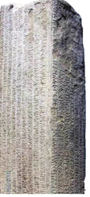

- VIII asr. Janubiy Qozog‘iston
- VII asr. Shimoliy Qozog‘iston
- VII asr. Shimoliy Mo‘g‘uliston
+ VIII asr. Janubiy Mo‘g‘uliston

**333. Yurtimizda qaysi ta’limot bilan bog‘liq an’analarga ko‘ra har bir ibodatxonada rohiblar tayyorlaydigan ta’lim muassasalari bo‘lganligi aniqlangan?**

+ Buddaviylik
- Zardushtiylik
- Tangrichilik
- Nasroniylik

**334. Panjikent, Varaxsha va Afrosiyob yodgorliklari qayerda joylashgan?**

- Surxon vohasida
- Toshkent vohasida
+ Zarafshon vodiysida
- Farg‘ona vodiysida

**335. Sug‘ddagi katta nestoriyan jamoalarining hujjatlari qaysi tilida yozilgan?**

+ Sug‘d tilida
- Yunon tilida
- Lotin tilida
- Yahudiy tilida

**336. Turkiy run yozuvi nimaga o‘yib yozishga nihoyatda qulay bo‘lgan?**

- Ohaktosh va sopolga
+ Tosh va yog‘ochga
- Sopol va paxsaga
- Metall va sopolga

## 18-19-§ VII–VIII asr boshlarida Turonda siyosiy vaziyat.

**337. «Ular xotinning bir poy etigini ham paypog‘i bilan topib oldilar. Etik va paypoq tilla (ishlatilib tikilgan va) qimmatbaho toshlar bilan bezatilgan edi, baho qilganlarida ikki yuz ming dirham turdi». Ushbu ma’lumotlar kimning qaysi asarida keltirilgan?**

- Sharafiddin Ali Yazdiyning «Zafarnoma» asarida
+ Abu Bakr Narshaxiyning «Buxoro tarixi» asarida
- Muhammad ibn Ja’farning «Movarounnahr yurishi» asarida
- Mahmud Qoshg‘ariyning «Devonu lug‘otit-turk» asarida

**338. Qutayba ibn Muslimni qaysi xalifa Xurosonga noib etib yuborgan?**

+ Abdurahmon ibn Marvon
- Umar ibn Abdulaziz
- Muoviya ibn Abu Sufyon
- Valid ibn Abdulmalik

**339. Qaysi siyosiy kuchning harbiy ustunligi Turon ahlini arab istilosiga qarshi kurashini uyushtirishi mumkin edi?**

- Mahalliy yirik mulkorlarning
- Sosoniylar davlatining
- Tan imperiyasining
+ G‘arbiy va Sharqiy Turk xoqonliklarining

**340. Xuroson noibi Qutayba ibn Muslim qaysi yillar davomida Chag‘oniyon, Poykand, Buxoro, Naxshab, Kesh, Xorazm, Samarqand, Choch va Farg‘onani bosib olgan?**

- 701-711-yillarda
- 703-713-yillarda
+ 705-715-yillarda
- 707-717-yillarda

**341. Qachon arab qo‘mondonlari Amudaryoning o‘ng sohiliga bosqinchilik yurishlarini boshlaganlar?**

- 667-yilda
+ 654-yilda
- 704-yilda
- 651-yilda

**342. Arab istilochilari Movarounnahrni necha yil davomida juda katta kuch, mablag‘ va talafotlar evaziga qo‘lga kiritganlar?**

- Deyarli ellik yil davomida
+ Deyarli yuz yil davomida
- Deyarli yuz ellik yil davomida
- Deyarli ikki yuz yil davomida

**343. Turklarning qaysi shaharni tashlab chiqishi, arab istilochilarining Movarounnahrga yurish imkoniyatini oshirgan?**

- Marv
+ Balx
- Poykand
- Buxoro

**344. Qaysi xoqonlik hukmdori Suluxonning turonliklarga yordam berishi arablarga qarshi turk-sug‘d ittifoqining kuchayishiga sabab bo‘lgan?**

- G‘arbiy Turk xoqonligi
- Sharqiy Turk xoqonligi
- No‘g‘ay xoqonligi
+ Turkash xoqonligi

**345. Arablar bosqini davrida Buxoro podshoxi Ubaydulloh ibn Ziyodga odam yuborib, necha kun muhlat so‘ragan edi?**

- To‘rt kun
- Besh kun
- Olti kun
+ Yetti kun

**346. Xuroson markazi qaysi shahar bo‘lgan?**

+ Marv
- Balx
- Poykand
- Buxoro

**347. Qaysi yili arablar Marv shahrini egallagan?**

- 667-yilda
- 654-yilda
- 683-yilda
+ 651-yilda

**348. Arablar Xurosonni istilo qilganch, viloyatni boshqarish uchun maxsus noib tayinlanib, uning qarorgohini qaysi shaharda joylashtirishgan?**

+ Marvda
- Poykandda
- Balxda
- Buxoroda

**349. Qaysi tillardagi solnomalarga ko‘ra, Qutayba ibn Muslim g‘ayratli va uddaburon lashkarboshi, adolatli hukmdor, xiyonatni yoqtirmaydigan, o‘jar tabiatli, ilmli va she’riyatni qadrlovchi inson sifatida gavdalanadi?**

- Arab va fors tilidagi
- Fors va turkiy tildagi
+ Xitoy va arab tilidagi
- Turkiy va arab tilidagi

**350. Qudratli turk xoqonliklari tanazzuli nafaqat arab istilochilari uchun qo‘l kelgan, balki azaliy raqib bo‘lgan qaysi davlat uchun ham ayni muddao bo‘lgan?**

- Mo‘g‘uliston
+ Xitoy
- Eron
- Hindiston

**351. Turon (Xuroson) da birinchi bo‘lib arablar qaysi shaharni egallashgan?**

+ Marv
- Balx
- Poykand
- Buxoro

**352. Quyidagi suratdagi ma’lmotlar qaysi manbaning 45-47-qatorlaridan olingan?**

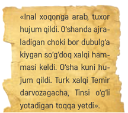

- O‘rxun-Yenisey yozuvlari
- Inal xoqon maqbarasi yozuvlari
+ To‘nyuquq bitiktoshi
- Bilga xoqon bitiktoshi

**353. Arablarning piyoda qo‘shinlar tarkibini asosini kimlar tashkil etgan?**

- Arab qabilalari aholisi
+ Zabt etilgan xalqlar vakillari
- Qullar va yollanma askarlar
- Ajam xalqlari jangchilari

**354. Qachon Qutayba ibn Muslimni xalifa Abdurahmon ibn Marvon Xurosonga noib etib yuborgan?**

- 701-yilda
- 703-yilda
- 702-yilda
+ 704-yilda

**355. Arablar qaysi yilda Chag‘oniyonga hujum qilishgan?**

+ 667-yilda
- 654-yilda
- 704-yilda
- 651-yilda

**356. Arab xalifaligi ma’muriyati Movarounnahrda qaysi dindan tashqari barcha dinlarni soxta dinlar deb e’lon qilgan?**

- Shomonlikdan tashqari
- Zardushtiylikdan tashqari
- Moniylikdan tashqari
+ Xristianlikdan tashqari

**357. Arab istilochilarining Movarounnahrdagi g‘alabasi sabablarini to‘g‘ri toping. 1) Xalifalikning qudrati; 2) Turon aholisining o‘z vaqtida dushmanga qarshi birlasha olmaganligi; 3) Mayda mulklarning o‘zini oqlamagan «mustaqil siyosati»; 4) Mahalliy hokimliklarni birlashtiruvchi kuchlarning o‘z muammolari bilan band bo‘lib qolganligi.**

- 1, 3, 4
- 1, 2, 4
+ 2, 3, 4
- 1, 2, 3

**358. Qaysi yilda Sug‘d ixshidi G‘urak va Panjikent hokimi Divashtich boshchiligida arablarga qarshi harbiy harakatlar boshlangan?**

+ 720-yilda
- 755-yilda
- 740-yilda
- 768-yilda

**359. Arablar qaysi hududni Movarounnahr, ya’ni «daryoning narigi tomoni» deb ataganlar?**

- Hozirgi Afg‘onistonning shimolini
- Eronning shimoli-sharqiy qismini
- Janubiy Turkmanistondan to Amudaryogacha bo‘lgan hududlarni
+ Amudaryodan shimolda joylashgan viloyatlarni

**360. Qaysi arab qo‘mondoni Movarounnahrni uzil-kesil bosib olishga erishgan?**

- Xolid ibn Valid
+ Qutayba ibn Muslim
- Tariq ibn Ziyod
- Musa ibn Nusayr

**361. Arablar qaysi hududlarni Xuroson deb ataganlar? 1) Hozirgi Afg‘onistonning shimoli; 2) Eronning shimoli-sharqiy qismi; 3) Sharqiy Turkiston va Yettisuv hududlari; 4) Amudaryodan to Sirdaryogacha bo‘lgan hududlar; 5) Janubiy Turkmanistondan to Amudaryogacha bo‘lgan hududlar.**

- 2, 3, 4
- 1, 3, 5
+ 1, 2, 5
- 2, 4, 5

**362. Qaysi xalifa Ubaydulloh ibn Ziyodni Xurosonga noib qilib tayinlab, Movarounnahrga yurish uchun yuborgan?**

- Abul Abbos Saffoh
+ Muoviya I
- Marvon II
- Horun ar-Rashid

**363. Ubaydulloh ibn Ziyod Poykand va Romitanni olganda qancha buxorolik asirni shaxsan o‘ziga olgan?**

+ To‘rt ming asirni
- Besh ming asirni
- Olti ming asirni
- Yetti ming asirni

**364. Arablarga qarshi fors, turk va sug‘d qo‘shinlari ittifoqi harakat qilib, qaysi shaharni qaytarib olgan edilar?**

- Marv
+ Balx
- Poykand
- Buxoro

**365. Qutayba ibn Muslim zimmasiga qanday vazifalar yuklangan edi? 1) Xurosonda davlat ishlarini yurgizish; 2) Yangi hududlarni egallash; 3) Masjid va madrasalar barpo ettirish; 4) Mahalliy aholini Islomga da’vat qilish.**

- 1, 2, 3, 4
- 1, 2, 4
+ 1, 3, 4
- 1, 2, 3

**366. Nima sababdan o‘lkamizda G‘arbiy Turk xoqonligi arablar hujumiga munosib qarshilik qila olmagan?**

+ Tan imperiyasining G‘arbiy Turk xoqonligiga hujumlari
- Sharqiy va G‘arbiy Turk xoqonliklari o‘rtasidagi siyosiy kurash
- G‘arbiy Turk xoqonligidagi ichki qabilalararo kurashlar
- Janubiy Sibirdan ko‘chib kelayotgan boshqa turkiy qabilalar oqimi va harbiy tazyiqining kuchayishi

**367. Qaysi ayrim hokimliklarning arab qo‘shinlarini qo‘llab-quvvatlashi arablarga istilo muvaffaqiyatini ta’minlagan?**

- Nasaf, Choch, Kesh
- Kesh, Eloq, Choch
- Sug‘d, Toxariston, Farg‘ona
+ Kesh, Nasaf, Xorazm

**368. Arablar istilosi davrida O‘rta Osiyodagi qaysi hududlar aholisining katta qismini jangovar turkiylar tashkil etardi? 1) Balx; 2) Xuttalon; 3) Chag‘oniyon; 4) Xorazm; 5) Choch; 6) Ustrushona; 7) Darvoz; 8) Sug‘d; 9) Badaxshon.**

- 3, 4, 5, 6, 7, 9
+ 1, 2, 3, 5, 6, 8
- 2, 3, 4, 5, 6, 7
- 1, 3, 5, 6, 8, 9

**369. Islom dinini qabul qilib, musulmon bo‘lgan mahalliy aholi vakillari dastlabki yillarda qaysi soliqlaridan ozod etilgan?**

+ Xiroj va jizyadan
- Zakot va ushrdan
- Ushr va jizyadan
- Xiroj va zakotdan

**370. Arablar bosqini arafasida 1) Sug‘d va Toxariston, 2) Choch va Iloq, 3) Farg‘ona, 4) Ustrushona, Chag‘oniyon, Kabodiyon, Xuttalon, Rasht, Darvoz, Badaxshon kabi o‘lkalar nimalarga bo‘linib ketgan edi?**

+ 1-mulklarga, 2-yarim mustaqil mulklarga, 3-hokimliklarga, 4-yarim mustaqil mulklarga
- 1-viloyatlarga, 2-yarim mustaqil mulklarga, 3-hokimliklarga, 4-yarim mustaqil mulklarga
- 1-mulklarga, 2-amirliklarga, 3-hokimliklarga, 4-yarim mustaqil mulklarga
- 1-mulklarga, 2-yarim mustaqil mulklarga, 3-hokimliklarga, 4-hokimliklarga

**371. Arablar Turon hududini bosib olgach, uni necha qismga bo‘lishgan?**

+ Ikki qismga
- Uch qismga
- To‘rt qismga
- Besh qismga

**372. Arablar qaysi yilda Maymurg‘ga hujum qilishgan?**

- 667-yilda
+ 654-yilda
- 704-yilda
- 651-yilda

**373. Arablarning yengil va og‘ir yaroqlar bilan qurollangan kuchli otliq qo‘shini asosini kimlar tashkil etgan?**

+ Arab qabilalari vakillari
- Zabt etilgan xalqlar qo‘shinlari
- Qullar va yollanma askarlar
- Ajam xalqlari jangchilari

**374. «Muhammad ibn Ja’farning bayon qilishicha, Ubaydulloh ibn Ziyod xalifa Muoviya I tomonidan Xurosonga yuborilib, u Jayhun (Amudaryo) daryosidan o‘tib Buxoroga kelgan vaqtida Buxoro podshohi, o‘g‘li Tag‘shoda kichik yoshli bo‘lgani tufayli, bir xotin kishi edi». Ushbu ma’lumotlar kimning qaysi asarida keltirilgan?**

- Sharafiddin Ali Yazdiyning «Zafarnoma» asarida
+ Abu Bakr Narshaxiyning «Buxoro tarixi» asarida
- Muhammad ibn Ja’farning «Movarounnahr yurishi» asarida
- Mahmud Qoshg‘ariyning «Devonu lug‘otit-turk» asarida

**375. G‘arbiy Turk xoqonligi vorisi bo‘lgan davlatni toping.**

+ Turkash xoqonligi
- Sibir xoqonligi
- Sharqiy Turk xoqonligi
- No‘g‘ay xoqonligi

**376. Arablar «Arodi at-turk», ya’ni «Turklar yerlari» deb qaysi hududlarni ataganlar?**

- Arablardan tortib olingan hukmdorlar yerlarini
- Arablarga tashlab ketilgan hukmdorlar yerlarini
- Arablarga bo‘ysungan hukmdorlar yerlarini
+ Arablarga bo‘ysunmagan hukmdorlar yerlarini

**377. Arablar istilosiga qarshi Movarounnahr xalqlarining birlashishiga to‘siq bo‘lgan sababni toping.**

- O‘z boshlaridan iqtisodiy inqirozni boshidan kechirayotganligi
- Kuchli boshqaruvchilik qobiliyatiga ega sulolalarning mavjud emasligi
+ Mulk hukmdorlari ichki mustaqil bo‘lgani bois, o‘zlarini ko‘p ham markazga tobe, deb hisoblamasligi
- Mahalliy urushlarning nihoyatda ko‘pligi

**378. Qaysi davlat zabt etilgach, arablarga Movarounnahr tomon yo‘l ochilgan?**

+ Sosoniylar davlati
- G‘arbiy Turk xoqonligi
- Sharqiy Turk xoqonligi
- Eftalalr davlati

**379. Ilk o‘rta asrlarda Eron xalqining tinkasini quritgan tarixiy jarayonlar qaysilar edi? 1) Uzoq yillar davom etgan qurg‘oqchilik; 2) Sosoniylarning o‘zaro ichki nizolari; 3) Eftaliylar va vizantiyaliklar bilan bo‘lgan tinimsiz to‘qnashuvlar; 4) Turkiylar bilan bo‘lgan tinimsiz to‘qnashuvlar.**

- 1, 3, 4
- 1, 2, 4
+ 2, 3, 4
- 1, 2, 3

**380. Arablar qaysi yilda Amudaryodan kechib o‘tib, Buxoro hududiga bostirib kirib, Poykand va Romitanni egallashgan?**

+ 673-yil kuzida
- 654-yil kuzida
- 671-yil bahorida
- 651-yil bahorida

**381. Arablar istilosi davrida O‘rta Osiyo hududidagi mahalliy hokimliklar qaysi davlat vassali edilar?**

- Sosoniylar davlati
+ G‘arbiy Turk xoqonligi
- Sharqiy Turk xoqonligi
- Eftaliylar davlati

**382. Arablar bosqini davrida Eron sosoniylari davlatidagi mahalliy hukmdorlar markaziy hokimiyatga nisbatan qanday yo‘l tutgan?**

- Goh u, goh bu tomonda turib kurashganlar
- Markaziy hokimiyatga katta yordam ko‘rsatishgan
- Arablar tomoniga o‘tib ketgan
+ Markazga yordam berishdan bosh tortgan

**383. Arablarga qarshi harbiy harakatlar boshlagan G‘urak va Divashtichga yordam berish uchun qayerdan turk lashkarlari yetib kelgan?**

- Usturshonadan
- Farg‘onadan
- Chochdan
+ Yettisuvdan

**384. O‘rta Osiyoda Islomni qabul qilgan aholining ko‘pchiligi nomigagina musulmon bo‘lib, uzoq vaqtlargacha pinhona o‘z dini va e’tiqodlarida qolavergan. Natijada islom dinini qabul qilishning yangi shartlari belgilab chiqilgan. Unga ko‘ra ... .**

- Masjidlarga kelish va arab tilida so‘zlashish shart edi
- Namozni ommaviy o‘qishi shart edi
+ Qur’on suralarini yod olishlari shart edi
- Muhammad (s.a.v.) payg‘ambarning hayot yo‘lini yod olishi shart edi

**385. IX asr muarrixi Muhammad Narshaxiyning yozishicha, Qutayba ibn Muslim (Amir Qutayba ibn Muslim ibn Umar ibn Husayn ibn Robiya ibn Xolid ibn Usayd Al-Xayr) …ning Boxila degan joyida tavallud topgan.**

- Yaman
+ Shom
- Hijoz
- Ajam

**386. Arablar tomonidan boshqa din vakillaridan yig‘ilgan jon solig‘i qanday atalgan?**

- Ushr
- Zakot
+ Jiz’ya
- Xiroj

**387. Movarounnahr aholisini tinchlantirish va arablar hokimiyatini mustahkamlash maqsadida qaysi Xuroson noibi islom dinini qabul qilganlardan xiroj va jiz’ya soliqlarini olmaslikka qaror qilgan?**

- Qutayba ibn Muslim
+ Ashros
- Abu Muslim
- Nasr ibn Sayyor

**388. Balx arablardan qaytarib olingach, kimlar turklar bilan birlashish rejasiga qarshi chiqib, turklarni «azaliy raqib» ekani bahonasida arablar bilan kelishishni afzal ko‘rgan edilar?**

+ Sosoniylar
- Sug‘diylar
- Toxarlar
- Chag‘oniylar

## 20-21-§ VIII asrda Xuroson va Movarounnahr.

**389. Ilk o‘rta asrlarda Xorazmda ishlab chiqarilgan qanday mahsulot Buyuk ipak yo‘lida ayirboshlanadigan mollar ichida eng mashhuri va bebahosi bo‘lgan?**

- Sopol
- Qog‘oz
- Gilam
+ Kamon

**390. VIII asrdan Turon o‘lkasidagi mahkama ishlarida mahalliy turkiy, xorazmiy, sug‘diy, boxtariy tillar va yozuvlar o‘rnini qaysi til va yozuv egallagan?**

- Ajam
- Uyg‘ur
+ Arab
- Fors

**391. Kim Muqannani odam yuborib, Marvdan Bag‘dodga oldirib keltirgan va bir necha yil davomida zindonda tutib turgan?**

+ Abu Ja’far Davonaqiy
- Qutayba ibn Muslim
- Nasr ibn Sayyor
- Abu Muslim

**392. Abu Muslim ismining lug‘aviy ma’nosi nima?**

+ «Muslimning otasi» deb tarjima qilinsada, mohiyati «eng yaxshi musulmon» demakdir
- «Muslimning kattasi» deb tarjima qilinsada, mohiyati «musulmonlar ishonchi» demakdir
- «Muslimning farzandi» deb tarjima qilinsada, mohiyati «musulmonlar yetakchisi» demakdir
- «Muslimning ibrati» deb tarjima qilinsada, mohiyati «musulmonlar qudrati» demakdir

**393. «Oq kiyimlilar» harakatning rahbari Hoshim ibn Hakim ismli … bo‘lgan.**

- mudarris
+ hunarmand
- savdogar
- dehqon

**394. 751-yil iyul oyidagi Talas vodiysida bo‘lib o‘tgan to‘qnashuv jarayonida Tan armiyasi tarkibidagi kimlar arablarga qarshi kurashdan bosh tortgan va xitoyliklar qo‘shinining ort qismiga zarba berganlar?**

- Farg‘onaliklar
- Qashqarliklar
- Kucharliklar
+ Qarluqlar

**395. Qaysi qog‘oz turi yuzi oq rangdagi dumaloq suv tomchi izlari bilan qoplangan bo‘lgan?**

- «Samarqand shoyi qog‘ozi»
+ «Miri Ibrohimiy» qog‘ozi
- «Nimkanop» qog‘ozi
- «Samarqand sulton qog‘ozi»

**396. Muqanna juda xunuk, boshi kal va bir ko‘zi ko‘r bo‘lganidan hamisha boshi va yuziga qaysi rangdagi parda tutib yurar edi?**

- Qizil rangdagi
- Qora rangdagi
- Oq rangdagi
+ Ko‘k rangdagi

**397. Muqanna haqidagi ma’lumotlar bizga kimning qaysi asari orqali yetib kelgan?**

- Sharafiddin Ali Yazdiyning «Zafarnoma» asari
+ Abu Bakr Narshaxiyning «Buxoro tarixi» asari
- Muhammad ibn Ja’farning «Movarounnahr yurishi» asari
- Mahmud Qoshg‘ariyning «Devonu lug‘otit-turk» asari

**398. «Oq kiyimlilar» qo‘zg‘oloni rahbarini toping.**

+ Hoshim ibn Hakim
- Rofe ibn Lays
- Yoqub ibn Lays
- Ziyod ibn Solih

**399. 751-yildagi xalifalik va Tan imperiyasi o‘rtasidagi Talas jangida asirga tushgan xitoylik jangchi hunarmandlar hatto qaysi hudud shaharlariga ham keltirilgan?**

- Eron
- Vizantiya
- Arabiston
+ Mesopotamiya

**400. Qayerda boshlangan qo‘zg‘olonni Abu Muslim mahalliy kuchlar yordami bilan zo‘rg‘a bostirgan?**

- Balxda
+ Buxoroda
- Marvda
- Chochda

**401. Arablarda qaysi rangdagi kiyim motam ramzi hisoblangan?**

- Oq rangdagi
- Yashil rangdagi
+ Qora rangdagi
- Moviy rangdagi

**402. 751-yildagi xalifalik va Tan imperiyasi o‘rtasidagi Talas jangida asirga tushgan xitoylik jangchilar orasidan tanlab olingan hunarmandlar Samarqandda nima ishlab chiqarish sanoatining yanada rivojlanishiga munosib hissa qo‘shganlar?**

- Ipak
+ Qog‘oz
- Porox
- Chinni

**403. Ilk o‘rta asrlarda «kudungarlik» qanday kasb bo‘lgan?**

- Kitoblarga rasm chizish
+ Matolarni bo‘yash
- Gilamlarga naqsh berish
- Sopol idishlariga ohor berish

**404. Muqqannaning otasi Hakim kimning davridagi Xuroson amiri lashkarboshilaridan biri edi?**

+ Abu Ja’far Davonaqiy
- Qutayba ibn Muslim
- Nasr ibn Sayyor
- Tohir ibn Husayn

**405. Tan davlati qachon millati koreys bo‘lgan Gao Syanchji (Gav Shanchji) qo‘mondonligida katta qo‘shinni Turonga jo‘natgan?**

- 720-yilda
- 755-yilda
- 740-yilda
+ 750-yilda

**406. Abu Muslim Xurosonga kelib aholini nimaga da’vat etgan?**

+ Payg‘ambar (s.a.v.) avlodlarini quvvatlashga
- Umaviylarni taxtdan ag‘darishga
- Soliqlarni to‘lamaslikka
- Xalifalikdan ajralib chiqishga

**407. Tan davlati 750-yilda millati … bo‘lgan Gao Syanchji (Gav Shanchji) qo‘mondonligida katta qo‘shinni Turonga jo‘natgan.**

- xitoy
+ koreys
- yapon
- mo‘g‘ul

**408. Ilk o‘rta asrlarda qog‘oz asosan qaysi daraxtining po‘stlog‘idan tayyorlangan?**

- Chinor daraxtining
+ Tut daraxtining
- Terak daraxtining
- Qarag‘ay daraxtining

**409. Qaysi qog‘oz turi o‘zining yupqaligi, silliqligi va yumshoqligi bilan boshqa qog‘oz navlaridan ajralib turgan?**

- «Samarqand shoyi qog‘ozi»
- «Miri Ibrohimiy» qog‘ozi
- «Nimkanop» qog‘ozi
+ «Samarqand sulton qog‘ozi»

**410. Qachon xalifalikda toj-u taxt uchun kurash kuchaygan?**

+ VIII asrning 40-yillarida
- VIII asrning 50-yillarida
- VIII asrning 60-yillarida
- VIII asrning 70-yillarida

**411. Muqqanna qayerlik edi?**

- Tabriz atrofi aholisidan, Baykand deb atalgan qishloqdan
- Damashq atrofi aholisidan, Rabot deb atalgan qishloqdan
- Balx atrofi aholisidan, Kufa deb atalgan qishloqdan
+ Marv atrofi aholisidan, Koza deb atalgan qishloqdan

**412. IX asrga kelib, O‘rta Osiyoda qog‘oz ishlab chiqarish shahar hunarmandchiligining eng muhim jabhalaridan biriga aylangach, asta-sekin qaysi shahar qog‘ozi butun Sharq va G‘arb bozorlarini ham egallagan?**

- Balx
- Buxoro
- Marv
+ Samarqand

**413. Umaviylarga qarshi targ‘ibot olib borish uchun Abu Muslim qayerga yuborilgan?**

- Eronga
- Suriyaga
- Movarounnahrga
+ Xurosonga

**414. Abbosiylar nima uchun Abu Muslimni Xuroson va Movarounnahrga noib qilib tayinlaganlar?**

+ Abu Muslimning xalq orasidagi obro‘yining tobora ortib borishiga xayrixoh emas edilar
- Xuroson va Movarounnahrda o‘z hokimiyatlarini mustahkamlash uchun
- Abu Muslim o‘z xizmatlari evaziga shuni talab qilgani uchun
- Yirik arab zodagonlari Abu Muslimni poytaxtda bo‘lishini xohlamaganlari uchun

**415. 751-yil iyul oyida arablarning Ziyod ibn Solih qo‘mondonligi ostidagi qo‘shini Gao Syanchjining …lardan iborat yirik qo‘shini bilan Talas daryosi bo‘yida to‘qnashgan. 1) Xitoylar; 2) Farg‘onaliklar; 3) Qashqarliklar; 4) Kucharliklar; 5) Qarluqlar; 6) Chochliklar.**

- 1, 2, 3, 4, 6
+ 1, 2, 3, 4, 5
- 1, 2, 3, 5, 6
- 2, 3, 4, 5, 6

**416. Muqanna ilm o‘rganishga mashg‘ul bo‘lgan qanday ilmlarini o‘rgangan? 1) Ko‘zbo‘yamachilik; 2) Sehr; 3) Tilsim; 4) Alkimyo.**

- 1, 3, 4
- 2, 3, 4
+ 1, 2, 3
- 1, 2, 4

**417. Ilk o‘rta asrlarda yurtimizda qog‘oz turlarini yaratishda xomashyo sifatida nimadan keng foydalanilgan?**

- Paxta, kanop va tut daraxti po‘stlog‘idan
- Kanop, ipak va terak daraxti po‘stlog‘idan
+ Paxta, ipak va tut daraxti po‘stlog‘idan
- Kanop, ipak va yong‘oq daraxti po‘stlog‘idan

**418. Qaysi jangdagi mag‘lubiyat Tan imperiyasining O‘rta Osiyo hududini egallash yo‘lidagi tajovuzkorona siyosatiga uzil-kesil chek qo‘ygan?**

- Dandanakon jangidagi
- Marv jangidagi
+ Talas jangidagi
- Mansikert jangi

**419. Muqanna qo‘zg‘oloni qaysi yilgacha davom etgan?**

- 792-yilgacha
- 769-yilgacha
- 776-yilgacha
+ 783-yilgacha

**420. Abu Muslim qaysi shaharda davlat va harbiy kuchlarning yuqori lavozimiga tayinlangan?**

- Marv
- Damashq
+ Bag‘dod
- Balx

**421. Rofe ibn Lays qo‘zg‘oloni qayerdan boshlanib Shosh, Farg‘ona, Buxoro, Naxshab va Xorazm viloyatlariga tarqalgan?**

- Nasafdan
+ Samarqanddan
- Qarshidan
- Ustrushonadan

**422. Qaysi diniy-falsafiy ta’limotning asosiy g‘oyasi mulkiy umumiylik, barcha narsalarning umumiy, teng bo‘lishidan iborat bo‘lgan?**

+ Mazdakiylikning
- Moniylikning
- Zardushtiylikning
- Buddaviylikning

**423. 751-yilda qayerda bo‘lib o‘tgan jangda asir tushgan xitoylik jangchilar hunarmandchilikdan xabardor bo‘lib, o‘z hayotlarini saqlab qolish niyatida mahalliy hunarmandlarga qog‘oz ishlab chiqarish sir-sinoatlarini o‘rgatishgan?**

- Murg‘ob yaqinida
- Maymurg‘ yaqinida
+ Talas yaqinida
- Jand yaqinida

**424. Qaysi qog‘oz turi rangi och sariq — novvot rangda bo‘lgan?**

+ «Samarqand shoyi qog‘ozi»
- «Miri Ibrohimiy» qog‘ozi
- «Nimkanop» qog‘ozi
- «Samarqand sulton qog‘ozi»

**425. Umaviylarga qarshi umumiy norozilik nihoyatda kuchayishiga nima sabab bo‘lgan edi?**

+ Xiroj solig‘i miqdorining oshirib yuborilgani hamda aholining muttasil hasharlarga majburan jalb etilishi
- Istilolar natijasida harbiylarning nihoyatda holdan toyganligi
- Bosib olingan yerlarni hukmron sulolala vakillari o‘zlashtirib olishi
- Arablar va mahalliy aholi o‘rtasidagi kelishmovchilik

**426. 751-yilda Talas yaqinidagi jangda asir tushgan xitoylik jangchilar hunarmandchilikdan xabardor bo‘lib, o‘z hayotlarini saqlab qolish niyatida Movarounnahrdagi mahalliy hunarmandlarga nimaning sir-sinoatlarini o‘rgatishgan?**

+ Qog‘oz ishlab chiqarishning
- Shoyi ishlab chiqarishning
- Chinni ishlab chiqarishning
- Porox ishlab chiqarishning

**427. Muqanna dastlab qanday kasb bilan shug‘ullangan?**

- Chilangarlik
+ Kudungarlik
- Kulolchilik
- Gilamdo‘zlik

**428. Muqanna o‘z yaqinlari bilan qayerdagi Som qal’asini qarorgohiga aylantirgan?**

- Farg‘ona vodiysidagi
+ Kesh vohasidagi
- Choch vohasidagi
- Zarafshon vodiysidagi

**429. «Xorazmda ishlab chiqarilgan kamonlar, Chochning sopol idishlari hamda Samarqand qog‘ozlari Buyuk ipak yo‘lida ayirboshlanadigan mollar ichida eng mashhuri va bebahosi bo‘lgan». Ushbu ma’lumotlar muallifi kim?**

- Turk olimi Usmon Turon
- Fors yozuvchisi Narshaxiy
- Arab tarixchisi Gardiziy
+ Arab tarixchisi Maqdisiy 

**430. 751-yildagi xalifalik va Tan imperiyasi o‘rtasidagi Talas jangida asirga tushgan xitoylik jangchilar orasidan tanlab olingan hunarmandlar qayerga keltirilgan?**

- Balxga
- Buxoroga
+ Samarqandga
- Chochga

**431. Tan imperiyasi qo‘shini farg‘onaliklar bilan ittifoqlikda qayerni vayron qilib, katta o‘ljani qo‘lga kiritgan va hokimini qatl qilgan, uning o‘g‘li esa arablardan yordam so‘ragan?**

- Badaxshon
- Buxoro
+ Choch
- Eloq

**432. Muqanna qayerda sarxanglikdan vazirlik darajasigacha ko‘tarilgan?**

+ Xurosonda
- Movarounnahrda
- Arabistonda
- Suriyada

**433. Qachon Samarqandda Rofe ibn Lays boshchiligida xalifalikka qarshi qo‘zg‘olon ko‘tarilgan?**

- 801-yilda
- 804-yilda
+ 806-yilda
- 802-yilda

**434. Qayerda «Oq kiyimlilar» yengilgach, mahalliy mulkdor tabaqa vakillari arablarga yordam bera boshlaganlar?**

- Eloq va Buxoroda
+ Narshax va Samarqandda
- Choch va Ustrushonada
- Kesh va Farg‘onada

**435. «Mening kim ekanimni bilasizmi?», «Yanglishdingiz, men sizning va butun olamning xudosiman»... va yana: «O‘zimni qanday nom bilan atashni istasam atay beraman», «Men xalqqa o‘zimni Odam (Ato) suratida, keyin Nuh suratida, keyin Ibrohim suratida, keyin Muso suratida, so‘ng Iso suratida, keyin Muhammad mustafo (s.a.v.) suratida, keyin Abu Muslim suratida ko‘rsatgan zotman, endi esa mana o‘zingiz ko‘rib turgan suratdaman», «Ular nafsoniy edilar, men esa ruhoniyman va ularning (badanlari) ichida edim, menda shunday qudrat borki, o‘zimni qanday suratda ko‘rsatishni istasam, shunday suratda ko‘rsata beraman». Ushbu jumlalar kimga tegishli?**

+ Hoshim ibn Hakim
- Qutayba ibn Muslim
- Nasr ibn Sayyor
- Abu Muslim

**436. Abu Muslim tarafdorlarining deyarli barchasi qaysi rangdagi libos kiyib olgan edilar?**

- Oq rangdagi
- Yashil rangdagi
+ Qora rangdagi
- Moviy rangdagi

**437. Qaysi yilda Abul Abbos Saffoh taxtga o‘tirgan va Arab xalifaligida davlat hokimiyati abbosiylar qo‘liga o‘tgan?**

- 720-yilda
- 755-yilda
- 740-yilda
+ 750-yilda

**438. Qaysi Xuroson noibi Rofe ibn Lays qo‘zg‘olonini bostirishda dehqonlardan bo‘lgan Somonxudotning nabiralari: Nuh, Ahmad va Yahyolardan yordam so‘ragan?**

- Nasr ibn Sayyor
- Qutayba ibn Muslim
+ Ma’mun
- Ashros

**439. Qaysi qog‘oz turi ipak qoldiqlari hamda po‘stloq tolalari bilan qorishtirib tayyorlangani uchun dolchin rangda bo‘lgan?**

- «Samarqand shoyi qog‘ozi»
- «Miri Ibrohimiy» qog‘ozi
+ «Nimkanop» qog‘ozi
- «Samarqand sulton qog‘ozi»

**440. Sharqiy Turk xoqonligi qaysi davlat tomonidan tugatilgan?**

- G‘arbiy Turk xoqonligi
+ Uyg‘ur xoqonligi
- Arab xalifaligi
- Tan imperiyasi

**441. Qaysi yilda Talas yaqinidagi jangda asir tushgan xitoylik jangchilar hunarmandchilikdan xabardor bo‘lib, o‘z hayotlarini saqlab qolish niyatida mahalliy hunarmandlarga qog‘oz ishlab chiqarish sir-sinoatlarini o‘rgatishgan?**

- 720-yilda
- 755-yilda
- 740-yilda
+ 751-yilda

**442. Umaviylar davrida xalifalikning poytaxti qaysi shahar edi?**

- Madina
- Makka
- Bag‘dod
+ Damashq

**443. 751-yil iyul oyidagi Talas vodiysida bo‘lib o‘tgan, xalifalik va Tan imperiyasi qo‘shinlari o‘rtasidagi jang necha kun davom etgan?**

- 3 kun
+ 5 kun
- 7 kun
- 9 kun

**444. Tan imperiyasi 751-yilda Turonga yurish boshlaganida, Abu Muslim esa ularga qarshi kim boshchiligida arab va turonliklardan iborat qo‘shin jo‘natgan?**

- Hoshim ibn Hakim
- Qutayba ibn Muslim
- Tariq ibn Ziyod
+ Ziyod ibn Solih

**445. Muqanna qo‘zg‘oloni yana qanday nom bilan atalgan?**

+ «Oq kiyimlilar» harakati
- «Qora kiyimlilar» harakati
- «Qizil kiyimlilar» harakati
- «Sariq kiyimlilar» harakati

**446. Abu Muslim qayerlik edi?**

- Xalablik
+ Kufalik
- Marvlik
- Damashqlik

**447. Muqqannaning otasi Hakim qayerlik edi?**

- Marvlik
+ Balxlik
- Tabrizlik
- Damashqlik

**448. Muqanna kimning zamonida Xuroson lashkarboshilaridan biri bo‘lib, vazir bo‘lgan va payg‘ambarlik da’vosini qilgan va bir qancha vaqt shu da’voda turgan?**

- Abu Ja’far Davonaqiy
- Qutayba ibn Muslim
- Nasr ibn Sayyor
+ Abu Muslim

**449. Muqanna kimning g‘oyalariga asoslangan ijtimoiy tenglik va erkin hayotga da’vat etuvchi ta’limotni targ‘ib etgan?**

- Buddaning
- Zardushtning
- Moniyning
+ Mazdakning

**450. Umaviylarga qarshi umumiy norozilik, ayniqsa, qaysi xalifa hukmronlik qilgan davrda nihoyatda kuchaygan?**

- Muoviya Abu Sufyon
+ Marvon Muhammad
- Umar Abdulaziz
- Hoshim Abdulmalik

**451. Turonda arab xalifaligi va islom manfaatlari himoyachisiga aylangan Abu Muslimdan xavfsiragan xalifa uni saroyga chaqirtirgan va … .**

- lavozimidan tushirgan
- surgun qilgan
- qamoqqa tashlagan
+ qatl ettirgan

**452. «Oq kiyimlilar» harakati yengilgach Muqannaning taqdiri qanday bo‘lgan?**

- Jangda halok bo‘lgan
- Qatl etilgan
+ O‘z joniga qasd qilgan
- Qochib ketgan

**453. «Muqanna» so‘zining ma’nosi nima?**

- «Isyonkor»
- «Xaloskor»
+ «Niqobdor»
- «Taqvodor»

**454. Muqanna harakati ayniqsa qayerda avj olib Iloq (Ohangaron) vodiysi va Shoshga ham o‘zining ta’sirini o‘tkazgan?**

- Keshda
- Badaxshonda
+ Sug‘dda
- Xorazmda

**455. Muqannaning haqiqiy ismi kim bo‘lgan?**

+ Hoshim ibn Hakim
- Qutayba ibn Muslim
- Nasr ibn Sayyor
- Mahmud ibn Ali

**456. «Sarxang» lik qanday lavozim edi?**

- Suv taqsimoti boshqaruvchisi
+ Kichik lashkarboshi
- Bosh kotib
- Soliq noziri

**457. Talas jangida mag‘lub bo‘lgan Tan imperiyasi qo‘shini qo‘mondoni Gao Syanchji … Li Siye va Duan Shoushilar bilan birga zo‘rg‘a qochib qutilgan.**

+ yordamchilari
- o‘g‘illari
- lashkarboshilari
- shogirdlari

**458. Qachon Muqannaning Som qal’asidagi qarorgohi qamalga olingan va egallangan?**

- 792-yilda
- 769-yilda
- 776-yilda
+ 783-yilda

**459. VIII asrning I yarmida Tan imperiyasi Buyuk ipak yo‘lini egallash va bu yo‘ldagi davlatlarni o‘ziga bo‘ysundirish uchun bir necha bor urushlar qilgan va qaysi hudud hokimining Xitoydan yordam so‘rashi bu yurishlarga bahona bo‘lgan?**

+ Farg‘ona
- Choch
- Xuttalon
- Ustrushona

## 22-23-§ Qarluqlar, O‘g‘uzlar, Tohiriylar.

**460. O‘g‘uzlar davlati parchalib ketganidan keyin, ularning ikkinchi qismi … .**

- Shimoliy Kavkaz dashtlariga borib o‘rnashadi
- Shimoliy Xitoy hududiga chekinadi
+ Movarounnahrga kirib boradi va yangi sulola – saljuqiylar boshchiligida Old Osiyo mamlakatlarini istilo qilishga kirishadi
- G‘arbiy Sibir dashtlariga ko‘chib borishadi

**461. Tohir ibn Husayndan oldin Xuroson noibi kim bo‘lgan?**

+ G‘asson
- Ashros
- Harsama
- Yamin

**462. Kimlarning yurtida poytaxtdan tashqari Jo‘l, Navkat, Karmankat, Yor kabi shaharlar va qator qishloqlar qad ko‘targan edi?**

+ Qarluqlar
- O‘g‘uzlar
- Tohiriylar
- Qoraxitoylar

**463. Xalifa Ma’mun Somonxudotning nabiralaridan Nuhga qayerni bergan?**

- Hirot
- Farg‘ona
- Shosh va Ustrushona
+ Samarqand

**464. Qaysi manbalarda yirik etnik uyushmalardan biri o‘g‘uzlar «guz» deb atalgan?**

+ Arab-fors manbalarida
- Turkiy manbalarda
- Xitoy manbalarida
- Kushon manbalarida

**465. Qarluqlar davlati poytaxti qaysi shahar bo‘lgan?**

- Irtish daryosidan janubroqdagi Jo‘l shahri
- Kama daryosidan shimolroqdagi Navkat shahri
+ Chu daryosidan shimolroqdagi Suyob shahri
- Sirdaryodan shimolroqdagi Karmankat shahri

**466. Xalifa Horun ar-Rashidning hukmronlik yillarini toping.**

+ 786–809-yillar
- 783–807-yillar
- 780–802-yillar
- 788–811-yillar

**467. Safforiy hukmdor Ya’qub ibn Lays qaysi yillarda hukmronlik qilgan?**

- 861-878-yillarda
- 871-892-yillarda
+ 873-879-yillarda
- 879-900-yillarda

**468. Narshaxiy ma’lumotlariga ko‘ra, xalifa Ma’mun mahalliy zodagon kimning o‘g‘illariga xat yozib, ularga Rofe ibn Lays bilan urushda Harsamaga yordam berishni buyurgan?**

- Nasr ibn Somonxudotning
- Ilyos ibn Somonxudotning
- Nuh ibn Somonxudotning
+ Asad ibn Somonxudotning

**469. Qarluqlar davlati qayerda tashkil topdi?**

- Oltoyda
+ Yettisuvda
- Sibirda
- Sharqiy Turkistonda

**470. Safforiylar hokimiyatga kelgan vaqtda Xuroson poytaxti qaysi shahar edi?**

- Marv
+ Nishopur
- Ray
- Isfahon

**471. Qarluqlar davlati qachon tashkil topgan?**

- VIII asr boshlarida
+ VIII asr o‘rtalarida
- VIII asr oxirlarida
- IX asr boshlarida

**472. Tohir ibn Husayn Xuroson va Movarouunahrga noyib bo‘lmasidan oldin, qayerning hokimi edi?**

- Balx yaqinidagi Kufa shahri hokimi
- Balx yaqinidagi Bo‘shang shahri hokimi
- Hirot yaqinidagi Kufa shahri hokimi
+ Hirot yaqinidagi Bo‘shang shahri hokimi

**473. Tohiriylarga qarshi ko‘tarilgan qo‘zg‘olon boshliqlari aka-uka Ya’qub va Amr ibn Layslarning kasbi nima edi?**

+ Miskar
- Duradgor
- Zargar
- Tunukachi

**474. Quyidagi suratda qaysi sulola tangasi tasvirlangan?**

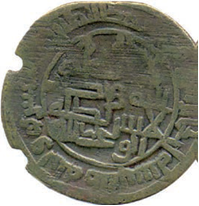

- Ma’muniylar
- Somoniylar
- Safforiylar
+ Tohiriylar

**475. Turkuy qabilalardan bo‘lmish qarluqlar qadimda qayerda yashaganlar?**

- Sharqiy Turkiston va Yettisuvda
- Irtish daryosining quyi oqimi va hozirgi Janubiy Qozog‘istonda
- Sharqiy Turkiston va hozirgi Sharqiy Qozog‘istonda
+ Oltoyning g‘arbida, so‘ngra Irtish daryosining o‘rta oqimida yashagan

**476. Xalifa Ma’mun Somonxudotning nabiralaridan Ahmadga qayerni bergan?**

- Hirot
+ Farg‘ona
- Samarqand
- Shosh va Ustrushona

**477. Qachon Tohir ibn Husayn boshliq Xuroson va Movarounnahr mulkdorlari Bag‘dodga yurish qilganlar va Ma’mun xalifalik taxtiga o‘tirgan?**

- 818-yilda
+ 813-yilda
- 810-yilda
- 815-yilda

**478. O‘g‘uzlar davlati poytaxtini toping.**

- Irtish daryosidan janubroqdagi Jo‘l shahri
- Kama daryosidan shimolroqdagi Navkat shahri
- Chu daryosidan shimolroqdagi Suyob shahri
+ Sirdaryo quyi oqimi bo‘yidagi Yangikent shahri

**479. VI–VII asrlarda Qarluqlar qaysi davlat tarkibiga kirgan?**

- Eron sosoniylari
- Tan imperiyasi
- Eftallar podsholigi
+ Turk xoqonligi

**480. Qarluqlar chetga asosan qaysi mahsulotlarni chiqarganlar?**

- Teri, zargarlik mahsulotlari, qullar
- Temir, mis, sopol buyumlar
- Sut, go‘sht, teri
+ Gilam, sholcha, namat

**481. Xalifa Ma’mun Somonxudotning nabiralaridan Yahyoga qayerni bergan?**

- Hirot
- Farg‘ona
- Samarqand
+ Shosh va Ustrushona

**482. Tohiriylar sulolasiga qaysi yili Tohir ibn Husayn tomonidan asos solingan?**

- 813-yilda
- 822-yilda
- 815-yilda
+ 821-yilda

**483. Asad ibn Somonxudotning o‘g‘illari da’vatiga ko‘ra, Rofe ibn Lays kim bilan sulh tuzgan va ular o‘rtasida quda-andalik vujudga kelib, xalifa Horun bu ishdan xotirjam bo‘lgan?**

- Hoshim ibn Hakim
+ Harsama A’yai
- Qutayba ibn Muslim
- Abu Muslim

**484. Qaysi yillarda xalifa Horun ar-Rashidning o‘g‘illari Ma’mun bilan Amin o‘rtasida taxt uchun kurash bo‘lib o‘tgan?**

- 811–815-yillarda
+ 809–813-yillarda
- 807–811-yillarda
- 804–808-yillarda

**485. Safforiylar davlatida Ya’qub ibn Lays qaysi yillarda hukmronlik qilgan?**

- 876-882-yillarda
+ 873-879-yillarda
- 879-900-yillarda
- 881-903-yillarda

**486. Xalifa Horun ar-Rashid vafotidan so‘ng, qaysi viloyatning zodagonlaridan Tohir ibn Husayn boshliq Xuroson va Movarounnahr mulkdorlari Ma’munga ukasi Aminga qarshi kurashda yordam berganlar?**

- Balx viloyatining
- Jand viloyatining
+ Hirot viloyatining
- Isfahon viloyatining

**487. Tohir ibn Husayn 811-yili qaysi shahar yaqinida xalifa Aminning Ali Moxon ismli sarkardasini mag‘lub etgan?**

- Marv
- Nishopur
+ Ray
- Isfahon

**488. Xalifa Ma‘mun qachon Tohir ibn Husaynni Xuroson va Movarounnahr noibi etib tayinlagan?**

- 819-yilda
- 820-yilda
+ 821-yilda
- 822-yilda

**489. Horun ar-Rashid Xurosonga safar vaqtida qayerda vafot etgan?**

- G‘aznada
- Isfahonda
+ Tusda
- Rayda

**490. Qachon o‘g‘uzlar davlati shimoli-sharqdan qo‘zg‘algan qipchoqlar tomonidan qaqshatqich zarbaga uchrab, bo‘linib ketgan?**

+ X asrning birinchi choragida
- X asrning ikkinchi choragida
- XI asrning birinchi choragida
- XI asrning ikkinchi choragida

**491. Xalifa Horun ar-Rashid vafotidan so‘ng, xalifalikning qaysi qismidagi arablar Aminni xalifalik taxtiga ko‘targanlar?**

- Shimoliy qismidagi
- Sharqiy qismidagi
+ Markaziy qismidagi
- Janubiy qismidagi

**492. Qaysi yillarda Xurosonda Tohiriylar davlati hukmronlik qilgan?**

+ 821–873-yillarda
- 828–884-yillarda
- 824–876-yillarda
- 826–878-yillarda

**493. Turk xoqonligi yemirilgach, o‘g‘uzlarning kattagina qismi qaysi hududlarda muqim o‘rnashib olganlar?**

- Yettisuv va Sharqiy Turkistonda
- Orol bo‘ylari va Kaspiy hududida
- Amudaryoning quyi oqimida
+ Sirdaryo havzasi hamda Orol dengizi bo‘yida

**494. Qachon qarluqlarning kattagina qismi musulmon bo‘lgan?**

- X asr boshlarida
+ X asr o‘rtalarida
- X asr oxirlarida
- XI asr boshlarida

**495. Qachon tohiriylar hukmronligi tugatilib, hokimiyat safforiylar qo‘liga o‘tgan?**

- 869-yilda
- 872-yilda
+ 873-yilda
- 876-yilda

**496. Qarluqlar davlati hukmdori nima deb yuritilgan?**

- «Xon» yoki «xoqon»
+ «Yabg‘u» yoki «jabg‘u»
- «Tudun» yoki «budun»
- «Elshoh» yoki «malik»

**497. O‘g‘uzlar qachon davlat tuzganlar?**

- VII asr oxiri va VIII asr boshida
- VIII asr oxiri va IX asr boshida
+ IX asr oxiri va X asr boshida
- X asr oxiri va XI asr boshida

**498. Safforiylar davlati nomi kimning nomidan olingan?**

+ Ya’qub ibn Lays as-Saffor
- Amr ibn Lays as-Saffor
- Rofe ibn Lays as-Saffor
- Umar ibn Lays as-Saffor

**499. Xalifa Horun ar-Rashidning Rofe ibn Laysga qarshi kurashi haqida qaysi manbada yozib qoldirilgan?**

- Sharafiddin Ali Yazdiyning «Zafarnoma» asarida
+ Abu Bakr Narshaxiyning «Buxoro tarixi» asarida
- Muhammad ibn Ja’farning «Movarounnahr yurishi» asarida
- Mahmud Qoshg‘ariyning «Devonu lug‘otit-turk» asarida

**500. Tohir ibn Husayn Ray yaqinidagi jangda ko‘rsatgan jasorati tufayli «Zul yaminayn» faxriy taxallusini olgan. Ushbu taxallus qanday ma’noni anglatadi?**

- «Ikki qanotda kurashuvchi»
- «Ikki usulda kurashuvchi»
+ «Ikki qo‘lda kurashuvchi»
- «Ikki qilichda kurashuvchi»

**501. Safforiy hukmdor Amir ibn Lays qaysi yillarda hukmronlik qilgan?**

- 861-878-yillarda
- 871-892-yillarda
- 873-879-yillarda
+ 879-900-yillarda

**502. O‘g‘uzlar davlati parchalib ketganidan keyin, ularning bir qismi … .**

+ Shimoliy Kavkaz dashtlariga borib o‘rnashadi
- Shimoliy Xitoy hududiga chekinadi
- Movarounnahrga kirib boradi va yangi sulola – saljuqiylar boshchiligida Old Osiyo mamlakatlarini istilo qilishga kirishadi
- G‘arbiy Sibir dashtlariga ko‘chib borishadi

**503. X asrda qarluqlar Movarounnahrning shimoliy hududlarini egallagach, qaysi hududlarga kelib o‘rnashganlar?**

- Sirdaryoning quyi qismiga
- Farg‘ona vodiysi va Yettisuv o‘lkasiga
+ Shosh atrofi, Farg‘ona, Zarafshon vodiylariga
- Talos va Farg‘ona vodiysiga

**504. Tohir ibn Husayn Xuroson va Movarounnahr amiri bo‘lgach, Asadning o‘g‘illaridan eng kattasi bo‘lgan kimga sarpo kiygizgan?**

- Ahmad ibn Asadga
- Yahyo ibn Asadga
+ Nuh ibn Asadga
- Ilyos ibn Asadga

**505. O‘g‘uzlar qaysi xalqlarning etnogenezida muhim rol o‘ynagan?**

+ Turkman, ozarbayjon, qoraqalpoqlarning
- Qirg‘iz va uyg‘urlarning
- Buryat, qozoq va udmurtlarning
- O‘zbek va tojiklarning

**506. Qachon Tohir ibn Husayn Ray yaqinida xalifa Aminning Ali Moxon ismli sarkardasini mag‘lub etgan?**

+ 811-yilda
- 812-yilda
- 813-yilda
- 814-yilda

**507. Rofe ibn Lays Horun ar-Rashidga qarshi xuruj qilib, Samarqandni olganida Horun ar-Rashid kimni unga qarshi urushga yuborgan?**

- Hoshim ibn Hakimni
- Qutayba ibn Muslimni
+ Harsama A’yaini
- Abu Muslimni

**508. Xalifa Ma’mun Somonxudotning nabiralaridan Ilyosga qayerni bergan?**

+ Hirot
- Farg‘ona
- Samarqand
- Shosh va Ustrushona

**509. Qachon o‘g‘uzlar Islom dinini qabul qilganlar?**

- VIII asrda
- IX asrda
+ X asrda
- XI asrda

**510. Qarluqlar qaysi xalqlarning etnogenezida muhim rol o‘ynagan?**

- Turkman, ozarbayjon, qoraqalpoqlarning
- Qirg‘iz va uyg‘urlarning
- Buryat, qozoq va udmurtlarning
+ O‘zbek va tojiklarning

**511. Qarluqlar davlati shimol va sharqdan …, g‘arbdan …, janubda esa … bilan chegaralangan edi.**

- Elsuvi daryosi vodiysigacha, chigil qabilasi yaylovlarigacha/yag‘molar vohasi va Sharqiy Turkiston/o‘g‘uz yurti va Farg‘ona vodiysi
- Yag‘molar vohasi va Sharqiy Turkiston/o‘g‘uz yurti va Farg‘ona vodiysi/Elsuvi daryosi vodiysigacha, chigil qabilasi yaylovlari
- O‘g‘uz yurti va Farg‘ona vodiysi/Elsuvi daryosi vodiysigacha, chigil qabilasi yaylovlarigacha/yag‘molar vohasi va Sharqiy Turkiston
+ Elsuvi daryosi vodiysigacha, chigil qabilasi yaylovlarigacha/o‘g‘uz yurti va Farg‘ona vodiysi/yag‘molar vohasi va Sharqiy Turkiston

## 24-25-§ Somoniylar.

**512. Somoniylar davrida ijarachilar qanday atalgan?**

- «Qo‘shchilar» yoki «kadivar»
- «Barzikor» yoki «kashovarz»
+ «Barzikor» yoki «qo‘shchilar»
- «Kashovarz» yoki «dehqon»

**513. X asrda qaysi turdagi yer-mulk dastavval asosan oliy tabaqali zodagonlar: sulola a’zolari – amirzodalar va yirik mansabdorlarga in’om etilgan va bunday mulk avvaliga bir umrga emas, balki ma’lum muddatga berilib, nasldan naslga o‘tkazilmagan, shuningdek, mulk egasi o‘ziga in’om qilingan hududlarda yashovchi aholidan olinadigan soliqlarning ma’lum qismini o‘zlariga olish huquqiga ega bo‘lganlar?**

- «Mulki xos»
- «Xolisa»
- «Muqto»
+ «Iqto»

**514. Qaysi somoniy hukmdor Samarqandni markazga aylantirgan va Movarounnahrning barcha viloyatlarini birlashtirish va uni Xurosondan ajratib olish choralarini ko‘rgan?**

- Nuh
- Ahmad
+ Nasr
- Ismoil

**515. X asrda «muqto» yoki «iqtodor» deb kimga aytilgan?**

- «Muqto» egasiga
- «Mulki xos» segasiga
+ «Iqto» egasiga
- «Xolisa» egasiga

**516. Sosoniy shohanshohi Xurmazd IV ning harbiy qo‘mondoni Bahrom Chubin kelib chiqishi bo‘yicha kimlardan edi?**

+ Sosoniylar xizmatidagi o‘g‘uz turklaridan edi
- Sosoniylar xizmatidagi qarluqlaridan edi
- Sosoniylar xizmatidagi sug‘d ixshidlaridan edi
- Sosoniylar xizmatidagi yag‘mo turklaridan edi

**517. Quyidagi suratda tasvirlangan idish qaysi sulola davriga oid?**

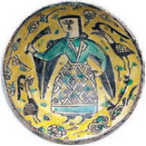

- Safforiylar
- Tohiriylar
+ Somoniylar
- G‘aznaviylar

**518. Sosoniy hukmdor Xurmazd IV ning hukmronlik yillarini toping.**

- 563-572-yillar
- 572-581-yillar
- 580-595-yillar
+ 579-590-yillar

**519. Somoniylar davrida Dargohda nimalar joylashgan edi? 1) Amir qarorgohi; 2) Saroy a’yonlari, navkar va xizmatkorlarining turar joylari; 3) Zarbxona; 4) Qurol-aslaha ombori.**

+ 1, 2
- 3, 4
- 2, 4
- 1, 3

**520. Sosoniy shohanshohi Xurmazd IV ning harbiy qo‘mondoni Bahrom Chubin qaysi hududlarni boshqargan?**

- Avval Rum va Armaniston, keyin esa Yettisuv va Sharqiy Turkiston noibi etib tayinlangan
- Avval Suriya va Falastin, keyin esa Ray va Xuroson noibi etib tayinlangan
+ Avval Armaniston va Ozarbayjon, keyin esa Ray va Xuroson noibi etib tayinlangan
- Avval Misr va Kichik Osiyo, keyin esa Movarounnahr va Xuroson noibi etib tayinlangan

**521. Somoniylar davrida lashkar ikki toifaga bo‘lingan bo‘lib, ular qaysilar edi?**

- Turkiy qabilalardan yig‘ilgan piyoda qismlar va arab-ajam xalqlaridan yig‘ilgan otliq qismlar
- Hukmdor xizmatida bo‘lgan mahalliy aholidan yig‘ilgan qismlar (gvardiya) va yollanma qo‘shindan iborat qismlar
+ Doimiy ravishda faoliyat ko‘rsatuvchi saralangan qismlar (gvardiya) va zarur hollarda viloyatlardan yig‘iladigan qismlar
- Og‘ir qurollangan otliq qismlar va yengil qurollangan piyoda qismlar

**522. Qachon Movarounnahrda hokimiyat qoraxoniylar qo‘liga o‘tgan?**

- IX asr boshida
- IX asr oxirida
- X asr boshida
+ X asr oxirida

**523. Qaysi somoniy hukmdor saroyning maxsus muntazam sarbozlaridan iborat yaxshi qurollangan harbiy qo‘shin tuzgan?**

- Nasr II
- Ahmad
+ Ismoil
- Nuh

**524. Ismoil Somoniy qaysi shahrini zabt etib, dashtliklarga qaqshatqich zarba bergan?**

- Navkat
+ Taroz
- Tus
- Ray

**525. Somoniylar mamlakatni boshqarishda dastavval ixcham boshqaruv ma’muriyatini tashkil etganlar va u qaysi idoradan iborat edi?**

- Mashvarat va dargohdan
- Devonlar (vazirliklar) va kengashdan
+ Amir dargohi va devonlar (vazirliklar) dan
- Kengash va qurultoydan

**526. Quyidagi suratdagi tanga qaysi somoniy hukmdorniki?**

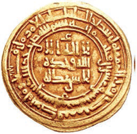

- Ahmad Ismoil
- Ismoil Asad
- Nuh Yahyo
+ Nasr Ahmad

**527. Somoniylardan kim butun Movarounnahrning hukmdoriga aylanib, o‘z nomi bilan kumush dirham zarb ettirgan?**

- Nuh
- Ahmad
+ Nasr
- Ismoil

**528. Somoniylar iqtisodiy inqirozdan chiqish uchun qanday tadbirni amalga oshirganlar?**

- Xalifalikdan katta miqdorda qarz olingan
- Bosqinchilik yurishlari amalga oshirilgan
+ Aholidan ikki marta soliq undirib olingan
- Aholidan ikki yillik soliq undirib olingan

**529. Sosoniy shohanshohi Xurmazd IV ning harbiy qo‘mondoni Baxrom Chubin avlodlari qayerda yashagan?**

+ Balxda
- Marvda
- Rayda
- Isfahonda

**530. Qachon Ismoil Somoniy butun Movarounnahr hukmini o‘z qo‘liga olishga erishib, «haqiqatan ham podshohlikka loyiq va haqli» ekanini isbotlagan?**

+ 892-yilda
- 882-yilda
- 899-yilda
- 879-yilda

**531. Abu Bakr Narshaxiyning ma’lumotlariga ko‘ra, qaysi Somoniy hukmdor davrida vazir devoni, moliya (kirim-chiqim) ishlari devoni, davlat hujjatlarini boshqarish ishlari devoni, soqchilar boshlig‘i devoni, xat-xabarlar mutasaddisi devoni, saroy ish boshqaruvchisi devoni, davlat xos mulklari devoni, muhtasib devoni, vaqflar devoni, qozilik ishlari devoni faoliyat olib borgan?**

- Ahmad davrida
+ Nasr II davrida
- Ismoil davrida
- Nuh davrida

**532. Alpteginning Nishopur bozoridan sotib olgan va keyinchalik o‘z iste’dodi bilan yirik harbiy sarkarda darajasiga ko‘tarilgan qulining ismi kim?**

- Samjuriy
- Foyiq
+ Sabuk
- Tosh

**533. Somoniylarda davlat ishlariga qabul qilishda qanday talablar mavjud edi? 1) Davlat tilini mukammal bilish; 2) She’r yozish sa’atidan habardor bo‘lish; 3) Zamona huquq me’yorlaridan to‘liq xabardorlik; 4) Tarix, adabiyot kabi ilmlardan boxabarlik; 5) Biror hunarning egasi bo‘lish; 6) Hisob-kitob ishlaridagi bilimdonlik.**

- 2, 4, 5, 6
- 1, 2, 3, 4
- 2, 3, 5, 6
+ 1, 3, 4, 6

**534. Rasmdagi Ismoil Somoniy maqbarasi qaysi davrga oid va qayerda joylashgan?**

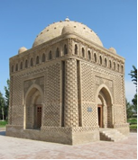

- Marv. IX asr
- Balx. IX asr
- Samarqand. X asr
+ Buxoro. X asr

**535. Ismoil Somoniyning vafotidan so‘ng siyosiy boshboshdoqlik avjiga chiqib, markaziy hokimiyat mavqeyiga putur yetishi mintaqaning qaysi hududlarida boshqa bir siyosiy sulola - qoraxoniylarning kuchayib borishi bilan bir vaqtga to‘g‘ri kelgandi?**

- Yettisuv va Sharqiy Turkistonda
- Janubiy Sibir va Oltoyda
+ Yettisuv va Qoshg‘arda
- Shimoliy Mo‘g‘uliston va Yettisuvda

**536. Somoniylar davlatida devonlar orasida qaysi biri bosh boshqaruv mahkamasi hisoblangan?**

- Vaqflar devoni
- Qozilik ishlari devoni
- Muhtasib devoni
+ Vazir devoni

**537. Qaysi somoniy hukmdor Movarounnahr va Xurosonni o‘z qo‘l ostida birlashtirgan va Buxoro shahri bu davlatning poytaxtiga aylangan?**

- Nasr Somoniy
- Ahmad Somoniy
+ Ismoil Somoniy
- Nuh Somoniy

**538. X asrda yirik mansabdorlarning davlat oldidagi xizmati uchun taqdim etilgan yer va suv, bazida ayrim viloyat yoki shaharlar va tumanlar hadya etilgan mulklar qanday atalgan?**

- «Mulki xos»
- «Xolisa»
- «Muqto»
+ «Iqto»

**539. Somoniylar davlati necha devon orqali idora qilingan?**

- 4 ta devon
- 8 ta devon
+ 10 ta devon
- 12 ta devon

**540. Abu Bakr Narshaxiyning ma’lumotlariga ko‘ra, Somoniylar davrida kim Registonga bir saroy (qurishni) buyurgan?**

+ Nasr II
- Ahmad
- Ismoil
- Nuh

**541. Qaysi yilgi jangda Ismoil Somoniy Nasr ustidan g‘olib chiqqan?**

- 869-yildagi
+ 888-yildagi
- 873-yildagi
- 901-yildagi

**542. Quyidagi suratda qaysi sulola hukmdorining jangdagi tasviri aks etgan?**

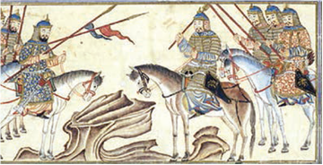

+ Somoniylar
- Safforiylar
- Qoraxoniylar
- G‘aznaviylar

**543. Qaysi somoniy hukmdor davrida Buxoroning Registon maydonida amir qasri qarshisida devonlar uchun saroy qurilib, mahkama mana shu maxsus binoga joylashgan edi?**

+ Nasr II davrida
- Ahmad davrida
- Ismoil davrida
- Nuh davrida

**544. Somoniylar davrida masjid xonaqoh va madrasalarga vaqtincha yoki abadiy foydalanish uchun berilgan yerlar qanday atalgan?**

- «Mulki xos»
- «Mulk yerlari»
- «Mulki sultoniy»
+ «Vaqf yerlari»

**545. IX asrda Movarounnahrning siyosiy hayotida ham o‘zgarishlar yuz beradi. Yurtga avval …, so‘ngra … boshchilik qiladi. Har biri hukmronligi davrida o‘z nomlaridan …dan chaqalar zarb etadi.**

+ Nuh/Ahmad/mis
- Nasr/Ahmad/mis
- Ahmad/Nuh/oltin
- Nuh/Ahmad/kumush

**546. Movarounnahr aholisining mustaqillikka erishishi, arab xalifalariga yoqmas edi. Shu boisdan xalifalik … .**

+ Safforiylar bilan somoniylarni to‘qnashtirishga va ularning har ikkisini ham zaiflashtirib, bu boy viloyatlarda o‘z ta’sirini qayta tiklashga harakat qilgan
- Barcha mulklarni o‘ziga tobe bo‘lgan Somoniylarga berishga harakat qilgan
- Barcha mulklarni o‘ziga itoatda bo‘lgan Safforiylarga berishga harakat qilgan
- O‘lkadagi katta-kichik qo‘zg‘olonlarni moddiy jihatdan qo‘llab-quvvatlagan

**547. Ismoil Somoniy qayerda tavallud topgan?**

- Samarqandda
+ Farg‘onada
- Chochda
- Buxoroda

**548. Somoniylar davrida quyidagi qaysi yerga egalik shakli davlat tasarrufidagi yerlar hisoblangan?**

- «Mulki xos»
- «Mulk yerlari»
+ «Mulki sultoniy»
- «Vaqf yerlari»

**549. Ismoil Somoniy necha yoshida otasi Ahmad vafot etib, akasi Nasr qo‘lida qolgan?**

- 8 yoshida
- 10 yoshida
- 12 yoshida
+ 14 yoshida

**550. Somoniylar davrida hukmron sulola vakillari, mulkdor dehqon va aslzodalarning tasarrufidagi katta-katta yer maydonlaridan tortib mehnatkash qishloq aholisiga tegishli mayda xususiy yerlargacha barchasi qanday atalgan?**

- «Mulki xos»
+ «Mulk yerlari»
- «Mulki sultoniy»
- «Vaqf yerlari»

**551. Somoniylar davrida oliy martabali din peshvolari va sayyidlar qo‘l ostidagi yerlar qanday atalgan?**

+ «Mulki xos»
- «Mulk yerlari»
- «Mulki sultoniy»
- «Vaqf yerlari»

**552. Somoniylar davrida qishloq jamoalari tasarrufidagi ma’lum yer maydonlari qanday atalgan?**

- «Mulki xos»
+ «Jamoa yerlari»
- «Muqto»
- «Iqto»

**553. Somoniylar davrida qo‘shinda to‘rt kishidan iborat guruhga boshliq qanday atalgan?**

+ «Visoqboshi»
- «Haylboshi»
- «Hojib ul-hujob»
- «Sarhang»

**554. Somoniylar davrida davlat soliqlari (xiroj va ushr) qanday usulda olingan?**

- Faqat yer egasidan yer uchun olinar edi
+ Yer egasidan ham, qo‘shchilardan ham alohida-alohida olinar edi
- Faqat qo‘shchilardan hosil uchun olinar edi
- Qo‘shchilardan ham yer uchun, ham hosil uchun olinar edi

**555. Quyidagi suratda qaysi davlat xaritasi keltirilgan?**

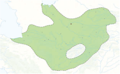

+ Somoniylar
- Safforiylar
- Toxiriylar
- Kidariylar

**556. Ismoil Somoniy qachon tavallud topgan?**

+ 849-yilda
- 852-yilda
- 844-yilda
- 860-yilda

**557. Qachon Movarounnahrning deyarli barcha viloyatlari somoniylar tasarrufiga o‘tgan?**

- IX asrning birinchi choragida
- IX asrning ikkinchi choragida
- IX asrning uchinchi choragida
+ IX asrning oxirgi choragida

**558. Alpteginning qaysi shahar bozoridan sotib olgan Sabuk ismli quli keyinchalik o‘z iste’dodi bilan yirik harbiy sarkarda darajasiga ko‘tarilgan?**

- Balx
- Ray
- Tus
+ Nishopur

**559. «Ismoil davlatchiligimiz tarixidagi tajriba va an’analarni uddaburonlik bilan davom ettira bilgan davlat arbobi hisoblanadi. U, eng avvalo, mamlakatimiz siyosiy birligini ta’minlash ishiga bel bog‘lab, Farg‘ona, Isfijob, Shosh, Samarqand, Buxoro, Xorazm, Chag‘oniyon, Xuttalon, Kesh, Xuroson, Seyiston, G‘azna kabi qator viloyatlarni o‘z hukmi ostida birlashtirdi... Ismoil markazlashgan davlatchilik asoslarini qaytadan tiklashga muvaffaq bo‘lgan». Ushbu fikrlar muallifi va manbasini toping.**

- Ziyodulla Bobur «Turkiston xalqlari tarixi»
+ Azamat Ziyo «O‘zbek davlatchiligi tarixi»
- Ravshan Nazarov «Tarixiy hujjatlar va manbalar tahlili»
- Murod Qosimov «Jahon tarixi va O‘zbekiston»

**560. Xuroson, G‘azna kabi viloyatlar X asrlarda qaysi sulola tobeligiga o‘tgan edi?**

- Somoniylar
- Saljuqiylar
- Qoraxoniylar
+ G‘aznaviylar

**561. Manbalarda keltirilishicha qaysi sulolaning kelib chiqishi sosoniy shohanshohi Xurmazd IV ning harbiy qo‘mondoni Bahrom Chubinga borib taqaladi?**

+ Somoniylar
- Safforiylar
- Tohiriylar
- Kidariylar

**562. Somoniylar davrida saralangan harbiy qismlardagi xizmat kamida nechta bosqichdan iborat bo‘lgan?**

- To‘rt bosqichdan
- Olti bosqichdan
+ Sakkiz bosqichdan
- O‘n bosqichdan

**563. Samjuriy, Alptegin, Tosh, Foyiqlar … .**

- Safforiylar xizmatida bo‘lgan turkiy qullar
+ Somoniylar xizmatida bo‘lgan turkiy qullar
- Tohiriylar xizmatida bo‘lgan turkiy qullar
- G‘aznaviylar xizmatida bo‘lgan turkiy qullar

**564. Somoniylarda qul qochib ketsa, … .**

- tutib olib, qatl qilingan
- butun davlat bo‘ylab qidiruvga berilgan
- egasiga zarar miqdori to‘lab berilgan
+ uni hech kim qidirmagan

**565. Somoniylar davrida kichik qo‘shin boshlig‘i qanday atalgan?**

- «Visoqboshi»
+ «Haylboshi»
- «Hojib ul-hujob»
- «Sarhang»

**566. Somoniylar davlatida yaxshi va uzoq xizmat qilgan sarbozlar qanday lavozimiga ko‘tarilgan?**

+ «Hojib»
- «Hojibi buzruk»
- «Hojib ul-hujob»
- «Hojib al-amir»

**567. Bir-biri bilan kurash olib borgan safforiy va somoniy hukmdorlarni toping.**

- Amir ibn Lays va Nasr Somoniy
+ Amir ibn Lays va Ismoil Somoniy
- Ya’qub ibn Lays va Yahyo Somoniy
- Ya’qub ibn Lays va Nuh Somoniy

**568. Kimning yozishicha, Somoniylar davlati asosan o‘nta devon orqali idora etilib, ular orasida vazir devoni bosh boshqaruv mahkamasi hisoblangan?**

- Ibn Arabshox
- Al Maqsidiy
- Ibn Hayqal
+ Narshaxiy

**569. Somoniylar davrida «hojib ul-hujob», «hojibi buzruk» qanday lavozim bo‘lgan?**

+ Hojiblarning boshlig‘i
- Hojarlarning boshlig‘i
- Hojilarning boshlig‘i
- Muhojirlarning boshlig‘i

**570. «U Somoniylarning sobiq quli, keyinchalik yirik harbiy sarkarda, Xuroson viloyatining hokimi va yirik yer egasi bo‘lgan. U boyib, Xuroson va Movarounnahrda joylashgan qishloqlarni sotib olgan, har bir shaharda qasri, hovli-joylari, karvonsaroylari mavjud bo‘lgan». Yuqoridagi fikr kim haqida bildirilgan?**

- Samjuriy
- Foyiq
- Sabuktegin
+ Alptegin

**571. Qaysi xalifa safforiylar hukmdori Amr ibn Laysga Xuroson bilan birga Movarounnahr ustidan ham hukm yuritish huquqi berilgani haqida farmon chiqargan?**

- Horun ar-Rashid
+ Mu’tazid
- Amin
- Ma’mun

## 26-27-§ Somoniylar davrida ijtimoiy-iqtisodiy hayot.

**572. Ilk o‘rta asrlarda qurilgan Qavat qal’a qaysi hududda joylashgan?**

- Farg‘onada
- Sirdaryoda
+ Xorazmda
- Buxoroda

**573. Somoniylar davrida xalqaro savdo-sotiqda qo‘llanilgan kumush tangalar qanday atalgan?**

+ Dirham
- Fals
- Dinor
- Chek

**574. Somoniylar davrida … Vador qishlog‘ida to‘qilgan mato «Vadoriy» nomi bilan mashxur edi.**

- Farg‘onaning
+ Samarqandning
- Shoshning
- Buxoroning

**575. Somoniylar davrida … Zandana qishlog‘ida to‘qilgan mallarang bo‘z mashxur edi.**

- Farg‘onaning
- Samarqandning
- Shoshning
+ Buxoroning

**576. Somoniylar davrida quyidagi qaysi hududda qayiqsozlik rivojlangan edi?**

- Samarqandda
+ Xorazmda
- Shoshda
- Sug‘dda

**577. Somoniylar maqbarasi kimning davrida qurilgan deb hisoblanadi?**

- Nasr II Somoniy
+ Ismoil Somoniy
- Yahyo Somoniy
- Ilyos Somoniy

**578. Somoniylar davrida tashqi savdo muomalasida savdo muomalasida sarroflik …laridan keng foydalanilgan.**

- dirham
- fals
- dinor
+ chek

**579. Somoniylar davrida qaysi soliqdan xazinaga tushadigan daromad davlat kirim-chiqimining kattagina qismini qoplar edi?**

- Jizyadan
- Ushrdan
- Zakotdan
+ Xirojdan

**580. Somoniylar davrida mamlakat ma’naviy hayotiga rahnamolik qilgan din va ilm peshvolari ustodlar keyinchalik nima deb ulug‘langan?**

- Hojibi buzruk
- Rais us-shuaro
- Amir ul-umaro
+ Shayx ul-islom

**581. «… qariyb 1000 yil avval qurilgan ushbu inshoot o‘zining konstruktiv va me’moriy yechimlari bilan mutaxassislarni lol qoldirmoqda. Uning tarxi kvadratga yaqin ko‘rinishda bo‘lib, to‘rt burchagida to‘rtta guldastasimon burjlari bor». Ushbu ta’rif qaysi inshootga berilgan?**

- Qadimiy Xorazmdagi Qavat qal’asiga
- Samarqand (Afrosiyob) dagi somoniylar qasrining bir qismi bo‘lgan binoga
+ Termiz yaqinidagi Qirqqiz qal’asiga
- Buxorodagi Ismoil Somoniy maqbarasiga

**582. «Chek» so‘zi qaysi tildan olingan?**

- Sug‘d tilidan
- Turk tilidan
+ Fors tilidan
- Arab tilidan

**583. Somoniylar davrida qaysi hudud kumush va qo‘rg‘oshin konlari hamda kumush tanga chiqaradigan zarbxonasi bilan mashhur edi?**

- Buxoro
- Samarqand
- Shosh
+ Iloq

**584. «Farsax» yoki «farsang» – taxminan necha kilometrga teng masofa o‘lchov birligi?**

+ 6 kilometrga
- 8 kilometrga
- 5 kilometrga
- 4 kilometrga

**585. Somoniylar «ismoiliy», «muhammadiy» deb atalgan bir necha xil … chiqargan edilar.**

- kumush falslar
- oltin falslar
- oltin dirhamlar
+ kumush dirhamlar

**586. Somoniylar davrida qaysi hudud o‘zining ko‘nchilik mahsulotlari va charm mollari bilan mashhur edi?**

- Buxoro
- Samarqand
+ Shosh
- Iloq

**587. Somoniylar davrida ustoddan keyin kimlar turgan?**

- Hojib
- Imom
+ Xatib
- Rais

**588. Somoniylar maqbarasi qaysi shaharda joylashgan?**

- Termizda
- Samarqandda
+ Buxoroda
- Nasafda

**589. Quyidagi suratdagi somoniylar davriga oid tanga qaysi shaharda zarb etilgan?**

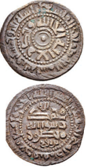

+ Buxoro
- Samarqand
- Termiz
- Shosh

**590. «… binoning old tomoni yogoch ustunli, peshayvonli bo‘lib, o‘rtada tomi gumbaz bilan yopilgan katta xona va uning ikki yonida yana qo‘shimcha xonalari bo‘lgan. Asosiy zal ohaktoshli ganchning ichiga tolasimon o‘simliklar qo‘shilgan materialdan juda nafis o‘ymakorlik usulida hashamdor qilib ishlangan». Ushbu ta’rif qaysi inshootga berilgan?**

- Qadimiy Xorazmdagi Qavat qal’adagi saroyga
+ Samarqand (Afrosiyob) dagi somoniylar qasrining bir qismi bo‘lgan binoga
- Termiz yaqinidagi Qirqqiz qal’asidagi hukmdor qasriga
- Buxorodagi Ismoil Somoniy maqbarasiga

**591. «Mayolika» nima?**

- Turar joy binolari qurilishida keng foydalanilgan sinchli konstruksiya
+ Sirlangan koshin va naqshlar o‘yilgan sirlangan yaxlit pishirilgan sopol taxtachalar — parchin
- Pardoz ishlarida somonli loy suvoq qatorida ishlatilgan ganchning har xil turlari
- Sirlanmagan koshin va sopol plitkalar

**592. Somoniylar davrida qaysi material ma’muriy va jamoat binolari qurilishida asosiy material bo‘lib qolgan?**

- Tosh
+ Pishiq g‘isht
- Marmar
- Xom g‘isht

**593. Somoniylar davrida ichki bozorlarda muomalada bo‘lgan mis chaqa qanday atalgan?**

- Dirham
+ Fals
- Dinor
- Chek

**594. Somoniylar davrida Buxoro qanday mahsuloti bilan mashhur bo‘lgan?**

+ Qovunlari
- Anorlari
- Olmalari
- Uzumlari

**595. «Madrasa» so‘zi arabchada qanday ma’noni anglatadi?**

- O‘qimoq
+ O‘rganmoq
- Bilmoq
- Yozmoq

**596. Somoniylar davrida mamlakat ma’naviy hayotiga nima deb atalgan din va ilm peshvolari rahnamolik qilgan?**

+ Ustod
- Ustoz
- Imom
- Shayx ul-islom

**597. Somoniylar davrida qayerda yuqori navli qog‘oz ishlab chiqarilar edi?**

- Buxoroda
+ Samarqandda
- Shoshda
- Iloqda

**598. «Turon me’morchiligi durdonasi bo‘lgan bu maqbara kubsimon hajmda bo‘lib, tomonlarining tashqi uzunligi 10 metrga yaqin. Nihoyatda jozibador ishlangan bu binoning ichki tomonlari 7,2x7,2 metr bo‘lib, usti gumbaz tarzida yopilgan». Ushbu ta’rif qaysi inshootga berilgan?**

+ Buxorodagi Somoniylar maqbarasiga
- Qadimiy Xorazmdagi Qavat qal’asiga
- Samarqand (Afrosiyob) dagi somoniylar qasrining bir qismi bo‘lgan binoga
- Termiz yaqinidagi Qirqqiz qal’asiga

**599. Somoniylar davrida Movarounnahrga qayerdan qimmatbaho mo‘ynalar, shamlar, cho‘qqi qalpoqlar keltirilgan?**

- Mo‘g‘uliston va Sharqiy Turkistondan
+ Bulg‘or va Xazardan
- Xitoy va Hindistondan
- Sibir va Mo‘g‘ulistondan

**600. Quyidagi rasmdagi idish qaysi sulola davriga oid?**

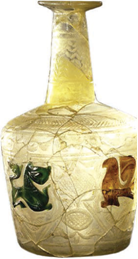

+ Somoniylar
- G‘aznaviylar
- Tohiriylar
- Safforiylar

**601. Somoniylar davrida Shimoliy yo‘l orqali qayerga Movarounnahrning shahar va qishloqlaridan bo‘z, kiyim-kechak, egar-jabduq, qilich, idishlar, zargarlik buyumlari, dori-darmon, quruq meva, kunjut va zig‘ir moyi kabi mollar olib borilgan?**

- Xitoyga
- Itil, Xazar va Bulg‘orga
+ Janubiy Sibir va Mo‘g‘ulistonga
- Hindiston va Sibirga

**602. Somoniylar davrida qaysi shaharda Turondagi ilk madrasa bunyod etilgan?**

- Samarqandda
- Termizda
- Shoshda
+ Buxoroda

**603. Somoniylarda kumush tangalar faqat hukumat boshlig‘i nomidan qaysi hududlardagi davlat zarbxonalarida so‘qilar edi?**

- Samarqand, Farg‘ona, Marv va Shosh
- Termiz, Buxoro, Hirot va Shosh
+ Marv, Samarqand, Buxoro va Shosh
- Xorazm, Samarqand, Buxoro va Shosh

**604. Somoniylar davrida Movarounnahrga qayerdan turli xildagi qimmatbaho mo‘ynalar, chorva mollari va chorvachilik mahsulotlari keltirilgan?**

- Mo‘g‘ulistondan
+ Sibirdan
- Xitoydan
- Bulg‘or va Xazardan

**605. Somoniylar davrida dehqonchilik solig‘i qanday atalgan?**

- Jizya
- Ushr
- Zakot
+ Xiroj

**606. Somoniylar davrida Xitoy bilan bo‘lgan savdoda qaysi mahsulotlar muhim o‘rin tutgan?**

- Ipak mato, egar-jabduq va choy
- Bo‘z, kiyim-kechak, tuz va ot
+ Choy, ipak mato, tuz va ot
- Chinni idishlar, tuz, teri va qurol

**607. «Xonaqoh» qanday inshoot hisoblanadi?**

+ G‘aribxona, musofirxona
- Tanga zarb qilinadigan muassasa
- Qurol-yarog‘ ombori
- Kitob va qo‘lyozmalar saqlanadigan bino

**608. Markaziy Osiyoda farsax odatda qadamlar bilan o‘lchangan va necha qadamga teng bo‘lgan?**

- 6 000 qadamga
- 8 000 qadamga
- 10 000 qadamga
+ 12 000 qadamga

**609. Somoniylar davrida Movarounnahr va Xorazmdan qayerga guruch, quruq mevalar, shirinliklar, tuzlangan baliq, paxta, shoyi matolar, movut, kimxob va gilamlar olib borib sotilgan?**

- Mo‘g‘uliston va Sharqiy Turkistonga
+ Itil, Xazar va Bulg‘orga
- Xitoy va Hindistonga
- Sibir va Mo‘g‘ulistonga

**610. «Movarounnahr viloyatlarining ichida eng ko‘p nufuzli hudud Farg‘ona vodiysi bo‘lganligini tushunib olish qiyin emas. Farg‘ona viloyatida ko‘plab shaharlar bo‘lgan. Uning poytaxti shu davrlarda Axsikent bo‘lib, shaharning kattaligi (aylanmasiga) 3 farsang masofaga cho‘zilgan». Ushbu ma’lumotlar muallifi kim?**

- Ibn Arabshox
- Narshxiy
+ Istaxriy
- Ibn Battuta

**611. VII–VIII asrlarda «cha» yoki «ming» deb nimaga aytilgan?**

- Pul birligining nomlariga
- Xitoy tangalariga
- Zotdor otlarning turlariga
+ Xushbo‘y choy o‘simligiga

**612. Quyidagi rasmdagi Qirqqiz qal’asi qayerda joylashgan?**

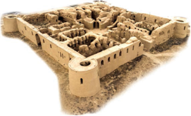

- Samarqand
+ Termiz
- Xorazm
- Surxondaryo

**613. Somoniylar tangalari orasida qaysi tanga yuqori sifatli sof kumushdan zarb etilib, ular asosan xalqaro savdo aloqalarida ishlatilgan?**

- «Fulusi somoniy»
- «Fals»
- «Muhammadiy»
+ «Ismoiliy»

## 28-29-§ G‘aznaviylar.

**614. G‘aznaviylar davrida …likning quyidagi shakllari bo‘lgan: ulug‘ …, saroy …i, navbatchi …, …-jomador.**

- sarhang
- sipoh
- amir
+ hojib

**615. G‘aznaviylar va Xorazm qo‘shinlari o‘rtasidagi jang qayerda bo‘lib o‘tgan?**

- Kat yaqinida
- Xiva yaqinida
- Urganch yaqinida
+ Hazorasp yaqinida

**616. Musulmon davlatlarida juma namozida hukmdor nomini aytib, uning haqiga duo o‘qish, olqishlash qanday atalgan?**

+ Xutba
- Hijrat
- G‘oziy
- G‘azot

**617. Quyidagilardan kim dushmanlarga qarshi kurashda somoniylarga yordam bergan va «Nosiriddin ad-davla» (Davlat va din himoyachisi) degan sharafli nomga sazovor bo‘lgan?**

- Alptegin
- Ma’sud G‘aznaviy
+ Sabuktegin
- Mahmud G‘aznaviy

**618. Qaysi g‘aznaviy hukmdor Abul Qosim ismli fors shoiriga «Firdavsiy» taxallusini bergan?**

- Alptegin
+ Mahmud G‘aznaviy
- Ma’sud G‘aznaviy
- Sabuktegin

**619. Qaysi G‘aznaviy hukmdor Abbosiylar xalifasini rasman tan olib, uni payg‘ambar avlodi sifatida qadrlagan?**

- Alptegin
- Sabuktegin
- Ma’sud G‘aznaviy
+ Mahmud G‘aznaviy

**620. Alptegin G‘azna va … viloyatlarini mustaqil idora etishga intilib, G‘aznaviylar davlat boshqaruvini qo‘lga oldgan.**

- Hirot
- Balx
- Marv
+ Kobul

**621. G‘aznaviylar davlati qo‘shinida o‘rta darajadagi harbiy lashkarboshilar qanday atalgan?**

+ Sarhang
- Hukmdor
- Sipohsolor
- Salor

**622. G‘aznaviylar davlati qo‘shinida quyidagi qaysi lavozim egasi sulolaning eng ishonchli vakili yoxud shu xonadon a’zosidan tayinlangan?**

- Sarhang
- Hukmdor
+ Sipohsolor
- Salor

**623. Qaysi yilda Mahmud kuyovi xorazmshoh Ma’mun ibn Ma’munga uyushtirilgan suiqasddan so‘ng shu yilning bahorida Xorazmga yurish qilgan?**

+ 1017-yilda
- 1018-yilda
- 1016-yilda
- 1019-yilda

**624. Qaysi mashhur shaxs G‘azna haqida gapirganda, bu shaharda hashamatli saroylar, madrasa va bozorlar ko‘pligini qayd etgan edi?**

+ Abu Rayhon Beruniy
- Muhammad al-Xorazmiy
- Abu Ali Ibn Sino
- Mahmud az-Zamaxshariy

**625. Suratdagi kimning haykali?**

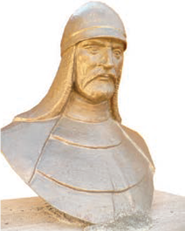

+ Alptegin
- Mahmud G‘aznaviy
- Sabuktegin
- Ismoil Somoniy

**626. G‘aznaviylar davrida viloyat boshlig‘i – voliyni kim tayinlagan?**

- Ulug‘ hojib
+ Oliy hukmdor
- Kutvol
- Devonbegi

**627. «Ma’naviy ulug‘vorlik bamisoli alanga va shamol, bularning harakat va parvoz xususiyati bor. Maishat еsa qiya yerdagi qum uyumiga o‘xshash. Uning tubanlikka surilish xosiyati bor», degan nasihatlar kimga tegishli?**

- Alpteginga
- Ma’sud G‘aznaviyga
+ Sabukteginga
- Mahmud G‘aznaviyga

**628. G‘aznaviylar davlatida qo‘shinga oliy qo‘mondonlik kimning ixtiyorida bo‘lgan?**

- Sarhang
+ Hukmdor
- Sipohsolor
- Salor

**629. Qaysi g‘aznaviy hukmdor saroyida Abulhasan Farruxiy, Abdulmajid Sanoiy, Unsuriy, Manuchehriy, Utbiy, Gardiziy, Bayhaqiy va shu singari shoir, tarixchilar faoliyat ko‘rsatishgan?**

- Alptegin
+ Mahmud G‘aznaviy
- Ma’sud G‘aznaviy
- Sabuktegin

**630. Qaysi yillarda qoraxoniylar Xurosonga bostirib kirganlar?**

- 1010-1012-yillarda
+ 1006-1008-yillarda
- 1008-1010-yillarda
- 1004-1006-yillarda

**631. G‘aznaviylar davrida xufiya ishlarni bajaruvchi mahram qanday atalgan?**

- Sipohdor
- Davotdor
- Martabador
+ Pardador

**632. G‘azna shahri qaysi sohaning qadimiy markazlaridan hisoblanadi?**

+ Metallsozlikning
- Qurolsozlikning
- Kulolchilikning
- Ko‘nchilikning

**633. Qaysi g‘aznaviy hukmdor Balx va Nishopurda ham bir qator qurilish ishlarini amalga oshirgan?**

- Alptegin
- Ma’sud G‘aznaviy
- Sabuktegin
+ Mahmud G‘aznaviy

**634. Qaysi g‘aznaviy hukmdor sipohsolor mansabiga ukasi Muhammad Yusufni loyiq topgan?**

- Alptegin
- Ma’sud G‘aznaviy
- Sabuktegin
+ Mahmud G‘aznaviy

**635. Mahmud G‘aznaviy Erondagi qaysi hududlarni o‘z mulkiga qo‘shib olgan?**

+ Ray va Jilob
- Chag‘oniyon va Qobodiyon
- Jilob va Taroz
- Taroz va Xuttalon

**636. Mahmud G‘aznaviy saroyida xizmat qilishni xohlamay, Abu Ali Ibn Sino kim bilan Xorazmdan chiqib ketishga qaror qilgan?**

- Beruniy
- Farruxiy
+ Masihiy
- Sanoiy

**637. Qaysi g‘aznaviy hukmdor G‘aznada ilk davlat madrasasini ochib, unga noyob qo‘lyozmalarni to‘platgan, bundan tashqari jome masjidi, ulkan suv to‘g‘oni va yana necha-necha inshootlar barpo еttirgan?**

- Alptegin
- Ma’sud G‘aznaviy
- Sabuktegin
+ Mahmud G‘aznaviy

**638. G‘aznaviylar davrida viloyatlardagi boshqaruv ishlarini olib borgan shaxs qanday atalgan?**

- Rais
+ Amid
- Voliy
- Kutvol

**639. G‘aznaviylar davlatida qo‘shinning bosh qo‘mondoni qanday atalgan?**

- Sarhang
- Hukmdor
+ Sipohsolor
- Salor

**640. Mahmud G‘aznaviy qoraxoniylarga tegishli bo‘lgan qaysi hududlarni o‘z davlati tarkibiga kiritgan?**

- Ray, Jilob, Taroz
+ Chag‘oniyon, Qobodiyon, Xuttalon
- Kobul, Marv, Balx
- Taroz, Qobodiyon, Ray

**641. G‘aznaviylar sulolasi nomi nimaning nomidan olingan?**

+ Saltanatning poytaxti G‘azna shahri nomidan
- Saltanatning eng qudratli hukmdori Mahmud G‘aznaviy nomidan
- Saltanatning oltin tangasi «g‘azna» nomidan
- Saltanatning eng kuchli turkiy qabilasi g‘aznalar nomidan

**642. Qaysi yillarda G‘azna viloyatini Alptegin noib va lashkar amiri sifatida bosh qargan?**

- 972-973 yillarda
- 955-956-yillarda
+ 962-963-yillarda
- 980-981-yillarda

**643. Mahmud G‘aznaviy kimni siymosini qog‘ozga ko‘chirtirib, qanday qilib bo‘lmasin, uni topib keltirishga farmon bergan?**

- Abu Rayhon Beruniy
- Abulhasan Farruxiy
- Abdulmajid Sanoiy
+ Abu Ali Ibn Sino

**644. G‘aznaviylar davlati qo‘shinida yuqori darajadagi harbiy lashkarboshilar qanday atalgan?**

- Sarhang
- Hukmdor
- Sipohsolor
+ Salor

**645. Mahmud G‘aznaviy va Ray malikasi Sayida Xotun haqidagi ma’lumotlar qaysi tarixchi olim asarida keltirilgan?**

+ Akbar Zamonov, «O‘rta asr tarixiy shaxslari hayotining ayrim noma’lum sahifalari»
- Olim Otaxonov, «O‘zbek davlatchiligi tarixi»
- Sayfiddin Meliqo‘ziev, «O‘zbekiston xalqlari tarixi»
- Jumaboy Rahimov, «Siyosiy tarixga doir monografiyalar»

**646. Mahmud G‘aznaviy saroyida xizmat qilishni xohlamay, Masihiy bilan Xorazmdan chiqib ketishga qaror qilgan olim kim?**

- Abu Rayhon Beruniy
- Abulhasan Farruxiy
+ Abu Ali Ibn Sino
- Abdulmajid Sanoiy

**647. Kim asli Sirdaryo bo‘ylarida yashagan barsxon turkiy qabilasiga mansub bo‘lib, yoshligida asir olinib, so‘ngra qul qilib sotilgan edi?**

- Alptegin
- Samjuriy
+ Sabuktegin
- Foyiq

**648. Sayida Xotun Rayda necha yil davomida shahzoda Majdiddin Davlo bilan birga hukmronlik qilgan?**

- 19 yil davomida
+ 29 yil davomida
- 22 yil davomida
- 35 yil davomida

**649. Somoniylar qo‘l ostida Alptegin qanday lavozimda ishlagan?**

+ Turkiy qo‘shin boshlig‘i
- Devon rahbari
- Hukmdorning maslahatchisi
- Din ulamolari hojibi

**650. Mahmud G‘aznaviy qachon vafot etgan?**

- 1022-yilda
- 1028-yilda
- 1025-yilda
+ 1030-yilda

**651. Mahmud G‘aznaviydan so‘ng bevosita hokimiyat ishlarini qo‘lga olgan Ali Qarib kim ismli shaxsning lavozimi nima bo‘lgan?**

- Saroy hojibi
+ Ulug‘ hojib
- Hojib-jomador
- Navbatchi hojib

**652. Qaysi olim Mahmud G‘aznaviy vafotidan (1030) keyin ham G‘aznada to umrining oxirigacha, ya’ni 1048-yilga qadar yashab qolgan?**

+ Abu Rayhon Beruniy
- Abulhasan Farruxiy
- Abu Ali Ibn Sino
- Abdulmajid Sanoiy

**653. Abul Qosim Firdavsiy Mahmud G‘aznaviy tomonidan G‘aznadan quvilgach qayerga yo‘l olgan?**

- Rayga
+ Tusga
- Balxga
- Nishopurga

**654. G‘aznaviylarda devonlar ijroiya idoralari bo‘lib, o‘sha davr manbalarida 5 ta devon nomi uchraydi. Ular qaysilar? 1) Vazir devoni (bosh vazir devoni); 2) Harbiy ishlar devoni; 3) Elchilik va boshqa rasmiy tadbirlarni yuritish devoni; 4) Moliya devoni; 5) Xat-xabar devoni; 6) Dehqonchilik va sug‘orish ishlari devoni; 7) Savdo-boj ishlari devoni.**

- 2, 4, 5, 6, 7
- 2, 3, 4, 5, 6
+ 1, 2, 3, 4, 5
- 1, 2, 3, 6, 7

**655. G‘aznaviylarda qaysi lavozim nafaqat hojiblar orasida, balki butun mamlakat hayotida katta mavqega ega bo‘lgan?**

- Saroy hojibi
- Hojib-jomador
+ Ulug‘ hojib
- Navbatchi hojib

**656. Qaysi g‘aznaviy hukmdor Ray viloyati malikasi Sayida Xotunga elchi jo‘natib, juma namozida o‘zining nomini xutbaga qo‘shib o‘qitishni, uning nomi bilan tanga pul chiqarilishini talab qilgan?**

- Alptegin
- Ma’sud G‘aznaviy
- Sabuktegin
+ Mahmud G‘aznaviy

**657. Qaysi sulola davrida xazinachi, joma xona va farrosh kabi mansab va xizmatlarning o‘rni katta bo‘lgan?**

+ G‘aznaviylar
- Tohiriylar
- Safforiylar
- Somoniylar

**658. Mahmud G‘aznaviy Xorazmga noib еtib tayinlagan Oltuntosh qanday lavozimda edi?**

- Sobiq devonbegi
- Sobiq amir ul-umaro
+ Sobiq bosh hojib
- Sobiq rais us-shuaro

**659. Qaysi hukmdor Xurosonni butkul Somoniylar davlatidan ajratib olgan va uning davrida G‘aznaviylar davlati Sharqning eng qudratli davlatlaridan biriga aylangan?**

+ Mahmud G‘aznaviy
- Ma’sud G‘aznaviy
- Sabuktegin
- Alptegin

**660. G‘aznaviylar davrida saroydagi o‘rta amaldor qanday atalgan?**

- Sipohdor
- Davotdor
+ Martabador
- Pardador

**661. G‘aznaviylar davlati boshqaruv tizimining markazida qaysi muassasalar turgan?**

+ Dargoh va devonlar (vazirliklar)
- Kengash va devonlar (vazirliklar)
- Majlis va devonlar (vazirliklar)
- Qurultoy va devonlar (vazirliklar)

**662. Sabuktegin qaysi yillarda hukmronlik qilgan?**

+ 977-997-yillarda
- 971-991-yillarda
- 962-982 yillarda
- 966-986-yillarda

**663. G‘aznaviylar davlati poytaxti qaysi shahar edi?**

- Kobul
- Balx
+ G‘azna
- Marv

**664. Sabukteginning o‘g‘li bo‘lgan kimning davrida G‘aznaviylar davlati hududi kengaydi?**

- Alptegin davrida
- Ma’sud G‘aznaviy davrida
- Alp Arslon davrida
+ Mahmud G‘aznaviy davrida

**665. G‘aznaviylar davlati boshqaruv tizimida qaysi muassasa faoliyatiga oliy hukmdor faoliyati bilan bog‘liq xizmatlar va amallar kirgan?**

+ Dargoh
- Kengash
- Majlis
- Devon

**666. G‘aznaviylar davrida oliy hukmdorning hujjatlarini yurituvchi shaxs qanday atalgan?**

- Sipohdor
+ Davotdor
- Martabador
- Pardador

**667. Qaysi buyuk olim Xorazmdan G‘aznaga olib ketilgan?**

+ Abu Rayhon Beruniy
- Muhammad al-Xorazmiy
- Abu Ali Ibn Sino
- Mahmud az-Zamaxshariy

**668. Qaysi g‘aznaviy hukmdor turkiy, arab, fors tillarini mukammal bilgan, she’riyatdan xabardor bo‘lgan?**

+ Mahmud G‘aznaviy
- Alptegin
- Ma’sud G‘aznaviy
- Sabuktegin

**669. Mahmud G‘aznaviy Xorazmga noib еtib tayinlagan sobiq bosh hojibi kim edi?**

- Anushtegin
- Foyiq
- Samjuriy
+ Oltuntosh

**670. G‘aznaviylar siyosiy nufuzi kimning davrida ortib, somoniylar tomonidan e’tirof etilgan?**

- Alptegin
- Bahrom Chubin
+ Sabuktegin
- Mahmud G‘aznaviy

**671. Qul qilib sotib yuborilgan Sabukteginni kim o‘z qaramog‘iga olgan?**

+ Alptegin
- Bahrom Chubin
- El Arson
- Ismoil Somoniy

**672. Bag‘dod xalifasi qaysi g‘aznaviy hukmdorga «Yamin ud-davla va amin ul-milla» («Musulmon davlatining o‘ng qo‘li va millatning omonligi») degan faxriy unvon va Xuroson hokimligiga yorliq, bayroq va nog‘ora yuborgan?**

+ Mahmud G‘aznaviyga
- Ma’sud G‘aznaviyga
- Sabukteginga
- Alpteginga

**673. Mahmud G’aznaviy davrida valiahd shahzoda hali voyaga yetmaganligi tufayli, Ray hududini o‘g‘li nomidan idora qilib turgan Sayida Xotunning erining ismi kim edi?**

- Abul Qosim Davlo
- Harsama Davlo
+ Faxriddin Davlo
- Majdiddin Davlo

**674. G‘azna shahri … daryosi bo‘yida, Kobul-Qandahor avtomobil yo‘lida joylashgan.**

- Panj
- Tajan
+ G‘azni
- Harirud

**675. G‘aznaviylar davriga oid manbalarda nechta devonning nomi tilga olingan?**

- 3 ta
- 4 ta
+ 5 ta
- 6 ta

**676. G‘aznaviylar davrida … miqyosida kutvol, sohibi devon kabi amaldorlar faoliyat ko‘rsatganlar.**

+ shahar
- saroy
- mamlakat
- viloyat

**677. G‘aznaviylar davrida qaysi mansab xizmatining o‘rni alohida e’tiborga loyiq bo’lgan?**

- Sipohdorlik
+ Hojiblik
- Amirlik
- Sarhanglik

**678. G‘aznaviylarda qaysi lavozim egasi rasmiy marosimlar, turli tadbirlarda hukmdorga eng yaqin joyda turgan, janglarda ham unga qo‘shinning eng salmoqli va mas’uliyatli qismiga boshchilik qilish vazifasi yuklatilgan?**

- Saroy hojibi
+ Ulug‘ hojib
- Hojib-jomador
- Navbatchi hojib

**679. G‘aznaviylar davrida saroy xizmatchisi qanday atalgan?**

+ Sipohdor
- Davotdor
- Martabador
- Pardador

**680. Quyidagi qaysi davlat qo‘shinida harbiy kemalar ham mavjud edi?**

- Somoniylar
- Tohiriylar
+ G‘aznaviylar
- Safforiylar

**681. Mahmud G‘aznaviy Rayga qo‘shin tortib, nechanchi yilda uni o‘z hukmronligiga o‘tkazgan?**

- 1017-yilda
- 1026-yilda
- 1023-yilda
+ 1029-yilda

**682. Quyidagi qaysi olimning eng sara asarlari G‘aznada dunyoga kelgan, sulton Mahmud bilan ko‘pgina yurishlarda ishtirok etgan, G‘aznada rasadxona ochib, shogirdlariga dars bergan va unumli ijod qilgan?**

+ Abu Rayhon Beruniy
- Abulhasan Farruxiy
- Abu Ali Ibn Sino
- Abdulmajid Sanoiy

**683. Mahmud G‘aznaviy davrida valiahd Majdiddin Davloning hali voyaga yetmaganligi tufayli, qaysi hududini o‘g‘li nomidan Sayida Xotun idora qilib turgan edi?**

- Nishopur
+ Ray
- Balx
- Marv

**684. Qaysi shoir ijodi uchun munosib haq olmaganligini ro‘kach qilib, berilgan 60 000 kumush dirhamni aholiga tarqatish orqali hurmatsizlik ko‘rsatgach, Mahmud G‘aznaviy qattiq g‘azablangan va uni o‘limga hukm qilgan, ammo keyinchalik ko‘ngli yumshab, hukmni bekor qilgan va shoirning shahardan chiqib ketishiga ruxsat bergan?**

+ Firdavsiy
- Gardiziy
- Unsuriy
- Manuchehriy

**685. G‘azna shahri qayerda joylashgan?**

- Afg‘onistonning shimoli-sharqiy qismida
+ Afg‘onistonning janubi-sharqiy qismida
- Afg‘onistonning shimoli-g‘arbiy qismida
- Afg‘onistonning janubi-g‘arbiy qismida

**686. G‘aznaviylar davrida viloyat boshlig‘i qanday atalgan?**

- Rais
- Amid
- Kutvol
+ Voliy

**687. Qaysi g‘aznaviy hukmdor otasining «Ma’naviy ulug‘vorlik bamisoli alanga va shamol, bularning harakat va parvoz xususiyati bor. Maishat еsa qiya yerdagi qum uyumiga o‘xshash. Uning tubanlikka surilish xosiyati bor», degan nasihatiga amal qilib, ilm-fan sohasiga katta e’tibor qaratgan?**

- Alptegin
+ Mahmud G‘aznaviy
- Ma’sud G‘aznaviy
- Sabuktegin

**688. G‘aznaviylar davrida shahar boshlig‘i qanday atalgan?**

+ Rais
- Amid
- Voliy
- Kutvol

## 30-31-§ Qoraxoniylar.

**689. 1008-yilda qaysi hukmdor 500 ta jangga o‘rgatilgan fillarga ega bo‘lgan katta qo‘shin bilan qoraxoniylarga qarshi chiqqan va ularning qo‘shinini butunlay yakson qilgan?**

- Alptegin
- Sabuktegin
- Ma’sud G‘aznaviy
+ Mahmud G‘aznaviy

**690. Qoraxoniylar davrida oltin, neft, feruza, temir konlari qayerda bo‘lgan?**

- Farg‘onada
- Nurota tog‘larida
- Ohangaron atrofi (Qoramozor) da
+ Buxoro va Ustrushonada

**691. Qaysi davr davomidagi sa’y-harakatlar natijasida qoraxoniylar sharqiy yo‘nalishda Balxash ko‘li — Cherchen daryosigacha (Sharqiy Turkiston) bo‘lgan yerlarni bo‘ysundirishga muvaffaq bo‘lishgan?**

- X asrning birinchi yarmidagi
+ X asrning ikkinchi yarmidagi
- XI asrning birinchi yarmidagi
- XI asrning ikkinchi yarmidagi

**692. Qoraxoniylar davlatida ov uyushtirish bilan shug‘ullanadigan shaxs qanday atalgan?**

- Biruk
- Ag‘ichi
- Oshchi
+ Qushchi

**693. Yettisuv viloyatida yuksalishni boshlagan qaysi davlat janub, g‘arb yo‘nalishlarida o‘z hukmronlik doiralarini kengaytirib borganlar va buning natijasida Cherchen daryosidan Xorazmgacha bo‘lgan hududni boshqargan?**

- G‘aznaviylar
- Qoraxitoylar
- Saljuqiylar
+ Qoraxoniylar

**694. Qoraxoniylar davlatida viloyat (mulk) larni kimlar boshqargan?**

- Yabg‘u
+ Takin
- Hojib
- Shod

**695. Qaysi viloyatda yuksalishni boshlagan qoraxoniylar janub, g‘arb yo‘nalishlarida o‘z hukmronlik doiralarini kengaytirib borganlar va buning natijasida Cherchen daryosidan Xorazmgacha bo‘lgan hududni boshqarganlar?**

+ Yettisuvda
- Sharqiy Turkistonda
- Qoshg‘arda
- Janubiy Sibirda

**696. Isfijob (Sayram) hokimi Bilgakulning qanday laqabi bo‘lgan?**

+ «Qora»
- «Buyuk»
- «Qudratli»
- «Adolatli»

**697. Qoraxoniylarning Turondagi hukmronligi necha yilga yaqin davom etgan?**

- 100 yilga yaqin
- 150 yilga yaqin
+ 200 yilga yaqin
- 250 yilga yaqin

**698. Qoraxoniylar davrida tuya yo qo‘y yungidan to‘qilgan issiq kiyim qanday atalgan?**

- Izlik
- Ichuq
+ Qars
- Ag‘cha

**699. Quyidagi qaysi davlatda siyosiy markaz sifatida o‘z tarixiy makonlaridagi katta shaharlardan bo‘lmish Bolasog‘un va nisbatan undan uzoqda bo‘lmagan Qoshg‘ar tanlangan?**

- G‘aznaviylarda
- Qoraxitoylarda
- Saljuqiylarda
+ Qoraxoniylarda

**700. Qoraxoniylar davrida qurilgan Minorai kalon qayerda joylashgan?**

- Termizda
- Surxondaryoda
- Navoiyda
+ Buxoroda

**701. Qoraxoniy hukmdor Ibrohim Nasr qayerda bunyod etilgan madrasa majmuyini ta’minlash uchun uch mehmonxona, bir karvonsaroy, bir erkaklar hammomi, suv ayirgich, uzumzor, bir qancha ekin yerlari va boshqalardan keladigan daromadni vaqf qilib bergan?**

- Marvda
- Buxoroda
+ Samarqandda
- Tarozda

**702. Qoraxoniylar davlatida oshxona mutasaddisi qanday atalgan?**

- Biruk
- Ag‘ichi
+ Oshchi
- Qushchi

**703. Mahmud Qoshg‘ariyning «Devonu lug‘otit-turk» asarida berilgan dunyo xaritasi markazida qaysi hudud tasvirlangan?**

- Movarounnahr va Xuroson
- Eron va Suriya
- Oltoy va Qoshg‘ar
+ Yettisuv va Sharqiy Turkiston

**704. Qoraxoniylar davlatida qaysi lavozimdagi shaxslarga bilimli, o‘quvli, yetuk, sheryurak, ko‘zi to‘q, uyat-andishali bo‘lish, astronomiya, matematika, geodeziya ilmlarini mukammal bilish, shaxmat va nardni raqiblaridan ustun darajada o‘ynash, harbiy san’atda benazir bo‘lish va hech qachon may ichmaslik, so‘z, iboralarning to‘g‘ri va ko‘chma ma’nolarini puxta bilish talabi qo‘yilgan?**

- Devonbegilarga
- Shayx ul-islomlarga
+ Elchilarga
- Hojiblarga

**705. Qoraxoniylar davrida … Minorai kalon, qator masjidlar, … Jarqo‘rg‘on minorasi, … masjid va minora, … maqbaralar, minora, masjidlar, … madrasalar bunyod etilgan.**

- Buxoroda/ Vobkentda/ Surxondaryoda/ Samarqandda/ O‘zganda
- Samarqandda/ Vobkentda/ Surxondaryoda/ O‘zganda/ Buxoroda
+ Buxoroda/ Surxondaryoda/ Vobkentda/ O‘zganda/ Samarqandda
- Samarqandda/ Surxondaryoda/ Vobkentda/ O‘zganda/ Buxoroda

**706. «Bu kitobni tartib beruvchi Bolasog‘unda tug‘ilgan, sabr-qanoatli kishidir. Ammo bu kitobni Qoshg‘arda tugal qilib, Mashriq maliki Tavg‘achxon dargohiga keltiribdir. Malik uni yorlaqab, ulug‘lab, o‘z saroyida Xos Hojiblik lavozimini beribdi». Quyidagi jumlalar kim va qaysi asar haqida?**

- Mahmud Qoshg‘ariy «Devonu lug‘otit-turk» asari
+ Yusuf Xos Hojib «Qutadg‘u bilig» asari
- Sharafiddin Ali Yazdiy «Zafarnoma» asari
- Kaykovus «Qobusnoma» asari

**707. X asr oxirida Somoniylar davlati o‘rniga nechta yangi davlat vujudga kelgan?**

+ 2 ta
- 3 ta
- 4 ta
- 5 ta

**708. G‘arbiy qoraxoniy xoqonligida shahar boshlig‘i qanday atalgan?**

+ Rais
- Hokim
- Voliy
- Kutvol

**709. X asr ikkinchi yarmi davomidagi sa’y-harakatlar natijasida qoraxoniylar qaysi yo‘nalishda Balxash ko‘li — Cherchen daryosigacha (Sharqiy Turkiston) bo‘lgan yerlarni bo‘ysundirishga muvaffaq bo‘lishgan?**

+ Sharqiy yo‘nalishda
- G‘arbiy yo‘nalishda
- Shimoliy yo‘nalishda
- Janubiy yo‘nalishda

**710. Kimlar tomonidan Yusuf Xos Hojib va Mahmud Qoshg‘ariyga «xos hojib» unvoni berilgan?**

- G‘aznaviylar
- Somoniylar
- Saljuqiylar
+ Qoraxoniylar

**711. Qachon qoraxoniylarning Movarounnahrda to‘liq hukmronligi qaror topgan?**

+ X asrning 40-yillarida
- X asrning 50-yillarida
- X asrning 60-yillarida
- X asrning 70-yillarida

**712. Somoniylar davlatining kuchsizlanishidan qaysi hududda yashagan turkiy qabilalar unumli foydalangan?**

- Sibir va Oltoyda
- Qoshg‘ar va Sharqiy Turkistonda
- Yettisuv va Sharqiy Turkistonda
+ Yettisuv va Qoshg‘arda

**713. Yusuf Xos Hojib «Qutadg‘u bilig» asarini qayerda yozib tugatgan?**

+ Qoshg‘arda
- Bolasog‘unda
- Yettisuvda
- Tarozda

**714. Qoraxoniylar somoniylarning o‘rnini olishlari bilan … . 1) Harbiylashgan boshqaruv tizimi joriy qilingan; 2) Markazlashgan davlat tizimiga zarba berilgan; 3) Boshqaruvda mulkchilik shakli joriy qilingan; 4) Qo‘l ostidagi viloyatlarni sulola namoyandalariga bo‘lib berish joriy qilingan.**

+ 2, 3, 4
- 1, 3, 4
- 1, 2, 4
- 1, 2, 3

**715. Qoraxoniylar davlatida tashqi siyosat bilan shug‘ullanuvchi mansabdorlarga, xususan, elchilar oldiga qo‘yilgan talablar kimning qaysi asarida keltirilgan?**

- Mahmud Qoshg‘ariy, «Devonu lug‘otit-turk»
+ Yusuf Xos Hojib, «Qutadg‘u bilig»
- Sharafiddin Ali Yazdiy, «Zafarnoma»
- Kaykovus, «Qobusnoma»

**716. Qoraxoniylar davlatida xazinachi qanday atalgan?**

- Biruk
+ Ag‘ichi
- Oshchi
- Qushchi

**717. Qoraxoniylar davlatida markazdagi boshqaruv tizimi qanday idoralardan iborat bo‘lgan?**

+ Dargoh va devonlardan
- Kengash va dargohlardan
- Dargoh va majlislardan
- Mahkama va majlislardan

**718. Qachon qoraxoniylar siyosiy birligi ikkiga: g‘arbiy va sharqiy xoqonliklarga bo‘linib ketgan?**

- XI asrning birinchi choragida
- XI asrning ikkinchi choragida
+ XI asrning uchinchi choragida
- XI asrning to‘rtinchi choragida

**719. Qachon Yettisuv va Qoshg‘arda yashovchi qarluq, chig‘il, yag‘mo kabi turkiy qabilalar o‘zlarining kuchli davlatlarini tuzishga muvaffaq bo‘lgan edilar?**

- X asrning birinchi yarmiga kelib
+ X asrning ikkinchi yarmiga kelib
- XI asrning birinchi yarmiga kelib
- XI asrning ikkinchi yarmiga kelib

**720. Qaysi hududda hokimiyatga qarshi ko‘tarilgan isyonlar, toj-u taxt uchun uzluksiz olib borilgan kurashlar Somoniylar davlati inqirozini yaqinlashtirgan edi?**

+ Xurosonda
- Movarounnahrda
- Cha‘goniyonda
- Xorazmda

**721. Qadimgi turkiylarda qaysi atama xoqon vorisi, valiahdiga nisbatan qo‘llanilib, keyinchalik harbiy lashkarboshilar unvoni sifatida ham ishlatilgan?**

- «Yabg‘u» (jabg‘u)
+ «Takin» (tegin)
- «Hojib» (buzruk)
- «Xon» (xoqon)

**722. Qoraxoniylar davrida olmaxon, sobol va boshqa hayvonlar terisidan ishlangan po‘stin qanday atalgan?**

- Izlik
+ Ichuq
- Qars
- Ag‘cha

**723. Qoraxoniylar davrida mis, kumush, qo‘rg‘oshin, temir konlari qayerda bo‘lgan?**

- Farg‘onada
- Nurota tog‘larida
+ Ohangaron atrofi (Qoramozor) da
- Buxoro va Ustrushonada

**724. Qachon qoraxoniy Ibrohim Nasr Samarqanddagi bir shifoxona ixtiyoriga butun imoratlari, rastalari bilan ikki karvonsaroyni in’om-hadya (vaqf) etgan?**

- 1060-yilda
- 1056-yilda
+ 1066-yilda
- 1068-yilda

**725. Qoraxoniylar davrida oltin, simob, kumush, temir, mis, feruza, navshadil, neft, kuporos, qatron konlari qayerda bo‘lgan?**

+ Farg‘onada
- Nurota tog‘larida
- Ohangaron atrofi (Qoramozor) da
- Buxoro va Ustrushonada

**726. 1008-yilda Mahmud G‘aznaviy qoraxoniylarni jangda yenggach qaysi hududlar g‘aznaviylar tasarrufida qolgan?**

- Balxash ko‘li — Cherchen daryosigacha (Sharqiy Turkiston) bo‘lgan yerlar
- Isfijob, O‘zgand, Murg‘ob daryosi quyi oqimlarigacha bo‘lgan yerlar
+ Termiz, Qabodiyon, Xuttalon kabi Amudaryodan shimoldagi yerlar
- Taroz va Sirdaryoning quyi oqimigacha bo‘lgan yerlar

**727. Yusuf Xos Hojib va Mahmud Qoshg‘ariyga qoraxoniylar tomonidan qanday unvon berilgan?**

- «Buyuk hojib»
- «Qutlug‘ hojib»
- «Ulug‘ hojib»
+ «Xos hojib»

**728. Qoraxoniylar davlat boshqaruvi haqidagi to‘g‘ri javobni toping. 1) Davlatni odatda «qoraxon» unvoni bilan ulug‘langan «buyuk xon» boshqargan; 2) Xonlik taxtiga merosiy udum asosida otadan keyin o‘g‘il yoki aka-ukasi kabi yaqin kishisi o‘tirgan; 3) Xonlar «qoraxon» unvoni bilan birga, tavg‘achxon, arslonxon, bug‘roxon kabi faxriy unvonlar bilan ham ulug‘langan.**

- 1, 2
+ 1, 3
- 2, 3
- 1, 2, 3

**729. Qoraxoniylar Movarounnahrni boshqarishda qanday usuldan foydalanishgan?**

+ Qo‘l ostidagi viloyatlarni sulola namoyandalariga bo‘lib berishgan
- Mahalliy amaldorlar xizmatidan foydalanishgan
- Mulklarni oldingi egalarida qoldirib, faqat soliq yig‘ish bilan shug‘ullanishgan
- Xorijiy, asosan, sosoniylar amaldorlari xizmatidan foydalanishgan

**730. Qoraxoniylar 1005-yilda qaysi hududlarni o‘z tasarruflariga kiritganlar?**

- Taroz va Sirdaryoning quyi oqimigacha
+ Buxoro, Samarqand va Amudaryogacha
- Isfijob, O‘zgand, Murg‘ob daryosi quyi oqimlarigacha
- Balxash ko‘li — Cherchen daryosigacha (Sharqiy Turkiston)

**731. Tarixchilar qoraxoniylarning nomi kimga nisbatan «qoraxon» deyilsa kerak, deb taxmin qiladilar?**

- Ibrohim Nasr
+ Bilgakul
- Sotuq Bug‘roxon
- Qutlugʻ Eltarish

**732. Qoraxoniylar davlatida otliqlar sardori qanday atalgan?**

- Biruk
- Ag‘ichi
+ Haylboshi
- Chovush

**733. X asr oxirida qaysi davlatning hududi Qoshg‘ardan Amudaryogacha cho’zilgan edi?**

- Qoraxitoylar
- Somoniylar
+ Qoraxoniylar
- G‘aznaviylar

**734. Quyidagi qaysi asar XI asrda yozilgan bo‘lib, qoraxoniylar davri tili morfologiyasi, fonetikasi, leksikasi, etimologiyasini o‘rganishda muhim manba hisoblanadi?**

+ Mahmud Qoshg‘ariyning «Devonu lug‘otit-turk» asari
- Yusuf Xos Hojibning «Qutadg‘u bilig» asari
- Sharafiddin Ali Yazdiyning «Zafarnoma» asari
- Kaykovusning «Qobusnoma» asari

**735. X asr ikkinchi yarmi davomida qoraxoniylar sharqiy yo‘nalishda qaysi hududlarni o‘z ta’sir doiralariga kiritib olganlar?**

- Taroz va Sirdaryoning quyi oqimigacha
- Buxoro, Samarqand va Amudaryogacha
- Isfijob, O‘zgand, Murg‘ob daryosi quyi oqimlarigacha
+ Balxash ko‘li — Cherchen daryosigacha (Sharqiy Turkiston)

**736. Qoraxoniylar do‘stona munosabatlar o‘rnatish tarafdori ekanligini bildirib, qo‘shnisi bo‘lgan qaysi davlat bilan elchilik aloqalarini o‘rnatgan, ammo bunday munosabatlar uzoqqa cho‘zilmagan?**

+ G‘aznaviylar bilan
- Somoniylar bilan
- Saljuqiylar bilan
- Sosoniylar bilan

**737. Quyidagi suratdagi qoraxoniylar davrida qurilgan Jarqo‘rg‘on minorasi qayerda joylashgan?**

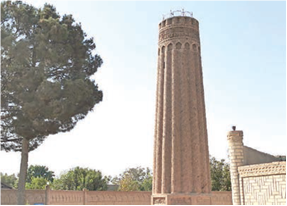

- Navoiyda
+ Surxondaryoda
- Termizda
- Buxoroda

**738. Qoraxoniylar davlatida markazdagi boshqaruv tizimi nechta idoradan iborat bo‘lgan?**

- 1 ta
+ 2 ta
- 3 ta
- 4 ta

**739. G‘arbiy qoraxoniylar davlatiga qaysi hududlar kirgan?**

+ Samarqand, Buxoro, Xuttalon, Chag‘oniyon, Choch-Iloq
- Taroz, Qoshg‘ar, Sirdaryoning quyi oqimi
- Yettisuv, Sharqiy Turkiston
- Isfijob, O‘zgan, Murg‘ob vohasi

**740. Qoraxoniylar davlatida siyosiy markaz sifatida o‘z tarixiy makonlaridagi katta shaharlardan bo‘lmish … va nisbatan undan uzoqda bo‘lmagan … tanlangan.**

- Taroz/Qoshg‘ar
+ Bolasog‘un/Qoshg‘ar
- Sayram/Bolasog‘un
- Isfijob/Taroz

**741. Yusuf Xos Hojib qayerda tug‘ilgan?**

- Qoshg‘arda
- Yettisuvda
+ Bolasog‘unda
- Tarozda

**742. Qaysi qoraxoniy hukmdor Samarqandda bunyod etilgan madrasa majmuyini ta’minlash uchun uch mehmonxona, bir karvonsaroy, bir erkaklar hammomi, suv ayirgich, uzumzor, bir qancha ekin yerlari va boshqalardan keladigan daromadni vaqf qilib bergan?**

+ Ibrohim Nasr
- Bilgakul
- Sotuq Bug‘roxon
- Qutlugʻ Eltarish

**743. Qachon Somoniylar davlati o‘rniga ikkita yangi davlat: Qoraxoniylar va G‘aznaviylar davlati vujudga kelgan?**

- X asr boshida
+ X asr oxirida
- XI asr boshida
- XI asr oxirida

**744. Qoraxoniylar davlatida taxtga kim o‘tirgan?**

+ Og‘a-inichilik udumi asosida sulolaning eng yoshi ulug‘ kishisi o‘tirgan
- Merosiy udum asosida otadan keyin o‘g‘il yoki aka-ukasi kabi yaqin kishisi o‘tirgan
- Qabilalar kengashida saylangan eng kuchli urug‘ vakili o‘tirgan
- Dargoh yig‘ilishida saylangan eng munosib, qudratli va bilimga ega kishi o‘tirgan

**745. X asr oxirida qaysi davlatning hududi Shimoliy Hindistondan Kasbiy dengizi janubigacha cho‘zilgan edi?**

- Qoraxitoylar
- Somoniylar
- Qoraxoniylar
+ G‘aznaviylar

**746. Qoraxoniylar quyidagi somoniylarning qaysi mulklarini egallashga muvaffaq bo‘lishgan? 1) Xorazm; 2) Farg‘ona; 3) Isfijob; 4) Badaxshon; 5) Samarqand; 6) Buxoro.**

- 1, 3, 4, 5
- 2, 3, 4, 5
+ 2, 3, 5, 6
- 1, 2, 3, 4

**747. Ismoil Somoniy Tarozni egallaganidan so‘ng turkiy qabilalar qayerga chekinishga majbur bo‘lishgan?**

- Isfijob (Sayram)
- Turkiston
+ G‘arbiy Qoshg‘ar
- Sharqiy Qoshg‘ar

**748. Qaysi qoraxoniy hukmdor 1066-yili Samarqanddagi bir shifoxona ixtiyoriga butun imoratlari, rastalari bilan ikki karvonsaroyni in’om-hadya (vaqf) etgan?**

+ Ibrohim Nasr
- Bilgakul
- Sotuq Bug‘roxon
- Qutlugʻ Eltarish

**749. Qoraxoniylar davrida Movarounnahrda qancha hunarmandchilik sohasi rivojlanib borgan?**

- Yigirmadan ortiq
+ O‘ttizdan ortiq
- Qirqdan ortiq
- Ellikdan ortiq

**750. G‘arbiy qoraxoniy xoqonligida qaysi davlat davrida mavjud bo‘lgan boshqaruv tizimi saqlanib qolgan edi?**

- G‘aznaviylar
+ Somoniylar
- Saljuqiylar
- Tohiriylar

**751. X asrning ikkinchi yarmida Isfijob (Sayram) hokimi Bilgakul o‘zini xoqon deb atab, oliy hukmronlikka da’vo bilan chiqqach ushbu hudud qaysi davlat tomonidan zabt etilgan?**

- Safforiylar
- Tohiriylar
+ Somoniylar
- G‘aznaviylar

**752. Quyidagi suratdagi qoraxoniylar davriga oid Raboti Malik karvonsaroyi qayerda joylashgan?**

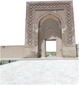

- Samarqand shahri yaqinida
- Buxoro shahri yaqinida
+ Navoiy shahri yaqinida
- Turkiston shahri yaqinida

**753. Yusuf Xos Hojib «Qutadg‘u bilig» asarini tugatib, qaysi hukmdor dargohiga keltirgan?**

- Bilgakul xoqon
- Sotuq Bug‘roxon
- Qutlugʻ Eltarish
+ Tavg‘achxon

**754. Qoraxoniylar davlatida kichik zobitlar qanday atalgan?**

- Biruk
- Ag‘ichi
- Haylboshi
+ Chovush

**755. X asr ikkinchi yarmi davomida qoraxoniylar qaysi yo‘nalishda Isfijob, O‘zgand, Murg‘ob daryosi quyi oqimlarigacha bo‘lgan hududlarni o‘z ta’sir doiralariga kiritib olganlar?**

- Sharqiy yo‘nalishda
+ G‘arbiy yo‘nalishda
- Shimoliy yo‘nalishda
- Janubiy yo‘nalishda

**756. Ismoil Somoniy qayerni egallaganidan so‘ng turkiy qabilalar G‘arbiy Qoshg‘ar yerlari tomonga chekinishga majbur bo‘lishgan?**

- Isfijob (Sayram)
- Turkiston
- Sharqiy Qoshg‘ar
+ Taroz

**757. «Qutadg‘u bilig» asari uchun qaysi hukmdor muallifga o‘z saroyida Xos Hojiblik lavozimini bergan va uning nomi Yusuf Ulug‘ Xos Hojib deb mashhur bo‘lgan?**

- Bilgakul xoqon
- Sotuq Bug‘roxon
- Qutlugʻ Eltarish
+ Tavg‘achxon

**758. X asr oxirida Somoniylar davlati qaysi yangi ikkita davlatga ajralgan?**

- G‘aznaviylar va Tohiriylar
- Qoraxitoylar va G‘aznaviylar
- Qoraxoniylar va Qoraxitoylar
+ Qoraxoniylar va G‘aznaviylar

**759. Qachon qoraxoniylar Buxoro, Samarqand va Amudaryogacha bo‘lgan hududlarni o‘z tasarruflariga kiritganlar?**

- 1003-yilda
- 1007-yilda
- 1012-yilda
+ 1005-yilda

**760. Qoraxoniylar davlatida mehmonlarni qabul qilish xizmati boshlig‘i qanday atalgan?**

+ Biruk
- Ag‘ichi
- Oshchi
- Qushchi

**761. Qoraxoniylar davrida oltin, mis, qo‘rg‘oshin, simob, marmar konlari qayerda bo‘lgan?**

- Farg‘onada
+ Nurota tog‘larida
- Ohangaron atrofi (Qoramozor) da
- Buxoro va Ustrushonada

**762. Qoraxoniylar davrida charmdan ishlangan oyoq kiyimlari qanday atalgan?**

+ Izlik
- Qars
- Ichuq
- Ag‘cha

**763. Qoraxoniylar hukmdori buyuk xon «qoraxon» unvonidan tashqari yana qanday faxriy unvonlar bilan ham ulug‘langan? 1) Tavg‘achxon; 2) Arslonxon; 3) Yabg‘uxon; 4) Bug‘roxon.**

- 1, 2, 3
- 1, 3, 4
+ 1, 2, 4
- 2, 3, 4

**764. G‘arbiy qoraxoniy xoqonligida viloyat boshliqlari qanday atalgan?**

- Rais
+ Hokim
- Voliy
- Kutvol

**765. Qachon ichki ziddiyatlarning kuchayishi va keskinlashuvi natijasida Somoniylar davlati kuchsizlana boshlagan?**

- X asrning birinchi yarmiga kelib
+ X asrning ikkinchi yarmiga kelib
- XI asrning birinchi yarmiga kelib
- XI asrning ikkinchi yarmiga kelib

**766. Cherchen daryosi qaysi hududda joylashgan?**

- Janubiy Yettisuvda
+ Sharqiy Turkistonda
- G‘arbiy Qoshg‘arda
- Shimoliy Qoshg‘arda

**767. Sharqiy qoraxoniylar davlatiga qaysi hududlar kirgan?**

- Samarqand, Buxoro, Xuttalon, Chag‘oniyon, Choch-Iloq
- Taroz, Qoshg‘ar, Sirdaryoning quyi oqimi
+ Yettisuv, Sharqiy Turkiston
- Isfijob, O‘zgan, Murg‘ob vohasi

**768. Qaysi hududni egallab bo‘lgandan so‘ng, qoraxoniylar Somoniylar davlati tarkibida bo‘lgan Movarounnahrga ham harbiy yurishlar uyushtirganlar?**

- Yettisuv va Uyg‘urlar yurtini
- Tyan-Shan va Qoshg‘arni
- Sharqiy Turkiston va Yettisuvni
+ Tyan-Shan va Yettisuvni

**769. Qoraxoniylar davlatida somoniylardan farqli ravishda kimlar, asosan, oliy hukmdor, viloyat hokimlarining davlat va raiyat ishlari bo‘yicha eng yaqin maslahatchilari hisoblanganlar?**

+ Hojiblar
- Raislar
- Voliylar
- Kutvollar

**770. Qachon Mahmud G‘aznaviyning o‘zi 500 ta jangga o‘rgatilgan fillarga ega bo‘lgan katta qo‘shin bilan qoraxoniylarga qarshi chiqqan va ularning qo‘shinini butunlay yakson qilgan?**

- 1003-yilda
- 1007-yilda
+ 1008-yilda
- 1005-yilda

**771. Quyidagi suratdagi Samarqandda joylashgan qoraxoniylar sulolasi qarorgohi xarobalari qaysi asrlarga oid?**

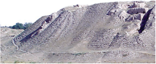

- IX-X asrlarga
- X-XI asrlarga
+ XI-XII asrlarga
- XII-XIII asrlarga

**772. Qoraxoniy Ibrohim Nasr 1066-yili qayerdagi bir shifoxona ixtiyoriga butun imoratlari, rastalari bilan ikki karvonsaroyni in’om-hadya (vaqf) etgan?**

- Marvdagi
- Buxorodagi
+ Samarqanddagi
- Tarozdagi

**773. X asr ikkinchi yarmi davomida qoraxoniylar g‘arbiy yo‘nalishda qaysi hududlarni o‘z ta’sir doiralariga kiritib olganlar?**

- Taroz va Sirdaryoning quyi oqimigacha
- Buxoro, Samarqand va Amudaryogacha
+ Isfijob, O‘zgand, Murg‘ob daryosi quyi oqimlarigacha
- Balxash ko‘li — Cherchen daryosigacha (Sharqiy Turkiston)

**774. Kimning hukmronligi davrida Qoraxoniylar sulolasi islomni qabul qilgan?**

- Ibrohim Nasr
- Bilgakul
+ Sotuq Bug‘roxon
- Qutlugʻ Eltarish

**775. Quyidagi suratdagi dunyo xaritasi qaysi asarda chizilgan?**

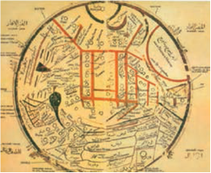

+ Mahmud Qoshg‘ariyning «Devonu lug‘otit-turk» asarida
- Yusuf Xos Hojibning «Qutadg‘u bilig» asarida
- Sharafiddin Ali Yazdiyning «Zafarnoma» asarida
- Kaykovusning «Qobusnoma» asarida

**776. Qoraxoniylar davlatida oliy davlat organi qaysi muassasa hisoblangan?**

- Devon
+ Dargoh
- Kengash
- Majlis

**777. X asrning ikkinchi yarmida qaysi hudud hokimi Bilgakul o‘zini xoqon deb atab, oliy hukmronlikka da’vo bilan chiqqan?**

+ Isfijob (Sayram)
- Turkiston
- Qoshg‘ar
- Taroz

## 32-33-§ Saljuqiylar.

**778. Qaysi asarda har qanday podshoh, xalq orzu qilgulik aql-zakovat, valine’mat sohiblari bo‘lmish vazirlar to‘g‘risida so‘z yuritilganda «Siyosatnoma» muallifi Nizomulmulkni alohida mehr-muhabbat bilan, har jihatdan namuna qilib ko‘rsatiladi va bunday «qilich va qalam sohibi» bo‘lmish vazirlarni e’zozlashga, qadrlashga da’vat etiladi?**

+ «Temur tuzuklari»
- «Zafarnoma»
- «Boburnoma»
- «Tarixi arba ulus»

**779. Saljuqiylar Arab xalifaligi poytaxti bo‘lgan qaysi shaharni egallashgan?**

- Madinani
- Damashqni
+ Bag‘dodni
- Makkani

**780. Saljuqiylar davrida qayerning bug‘doyi shuhrat qozongan?**

- Niso
+ Marv
- Xorazm
- Jurjon (Gurgon)

**781. Qaysi saljuqiy hukmdor zamonida Samarqand, Buxoro, Farg‘ona saljuqiylar qo‘l ostida birlashgan?**

+ Malikshoh
- Alp Arslon
- Tug‘rulbek
- Sanjar

**782. Qachon saljuqiylar va g‘aznaviylar o‘rtasida Dandanaqonda to‘qnashuv bo‘lgan va bu to‘qnashuvda g‘aznaviylar mag‘lubiyatga uchraganlar?**

- 1030-yilda
- 1045-yilda
+ 1040-yilda
- 1050-yilda

**783. Qaysi sharqiy saljuquy hukmdor qudrati avjiga chiqqan vaqtlarda g‘arbiy saljuqiylar (Eron, Iroq, Ozarbayjon) uning siyosiy ta’sirida bo‘lganlar?**

- Malikshoh
- Alp Arslon
- Tug‘rulbek
+ Sanjar

**784. Qaysi shahardagi «Nizomiya» nomidagi madrasada buyuk olim Abu Homid G‘azzoliy dars bergan?**

- Basra
- Isfahon
+ Bag‘dod
- Nishopur

**785. Qaysi yilda Rashiduddinning «Jome at-tavorix» kitobida saljuqiy hukmdor Ahmad Sanjarning toj kiyish marosimi tasvirlangan?**

+ 1307-yilda
- 1302-yilda
- 1311-yilda
- 1305-yilda

**786. Saljuqiylar davlatining eng yuksalgan davrida Bag‘dod xalifasi kimga «Malik al-Mashriq», ya’ni «Sharq hukmdori» hamda «Rukn ad-din» — «din suyanchig‘i» degan nom bergan?**

- Malikshohga
- Alp Arslonga
- Sanjarga
+ Tug‘rulbekka

**787. Qachon Saljuq ismli shaxs o‘zining fazilatlari, bilimdonligi, abjirligi va mardligi tufayli obro‘-e’tibor qozonib, bir qancha qabilalar sardori, katta harbiy kuch boshlig‘i darajasiga erishgan?**

- VIII asrda
- IX asrda
+ X asrda
- XI asrda

**788. Saljuqiylar davrida tarkibida oltindan tashqari qo‘shimcha metall aralashmasi bo‘lgan dinor qanday atalgan?**

+ Rukniy
- Fulusiy
- Qizil dinor
- Draxma

**789. XII asr oxiriga kelib qaysi sultonlikdan o‘zga biron-bir makonda rasmiy saljuqiy xonadoni qolmagan edi?**

+ Kichik Osiyodagi Onado‘li (Kunya) sultonligidan
- Yaqin Sharqdagi Suriya sultonligidan
- Yaqin Sharqdagi Iroq sultonligidan
- Janubiy Osiyodagi Kirmon sultonligidan

**790. Saljuqiy hukmdor Sulton Alp Arslon qayerda Vizantiya imperatori Roman IV Diogenni yenggan?**

+ Kichik Osiyoda
- Falastinda
- Suriyada
- Armanistonda

**791. Saljuqiylar davrida qayerning uzumlari, behisi, baqlajoni shuhrat qozongan?**

+ Niso
- Marv
- Xorazm
- Jurjon (Gurgon)

**792. Onado‘li sultonligi XIII asr o‘rtalarida kimlarga qaramlikka tushgan?**

- G‘aznaviylarga
- Vizantiyaliklarga
- Xorazmshohlarga
+ Mo‘g‘ullarga

**793. «Podshohning bir haftada ikki kun zulm ko‘rganlarni qabul qilmasdan iloji yo‘q. U zulmkorni jazolamog‘i, insofga chaqirmog‘i, raiyat so‘zlarini o‘z qulog‘i bilan vositachisiz eshitmog‘i kerak. Arzchilar eng muhim so‘zlarini aytmoqlari, (hukmdor esa) ular bo‘yicha hukm chiqarmog‘i lozim. Shunda mamlakatda podshoh ezilgan va adl istovchilarni haftada ikki kun qabul qilib, ularning so‘zini tinglar ekan, ovozasi tarqaydi. Zolimlar bundan cho‘chiydilar, qullarini kaltaklamaydilar». Ushbu misralar qaysi asardan keltirilgan?**

- Mahmud Qoshg‘ariy «Devonu lug‘otit-turk»
- Yusuf Xos Hojib «Qutadg‘u bilig»
- Sharafiddin Ali Yazdiy «Zafarnoma»
+ Nizomulmulk «Siyosatnoma»

**794. 1040-yilda kimlar o‘rtasida Dandanaqonda to‘qnashuv bo‘lgan?**

+ Saljuqiylar va g‘aznaviylar o‘rtasida
- Somoniylar va g‘aznaviylar o‘rtasida
- Qoraxoniylar va saljuqiylar o‘rtasida
- G‘aznaviylar va qoraxoniylar o‘rtasida

**795. Xorazmshohlar (anushteginiylar) qachon g‘arbiy saljuqiylarga zarba bergan?**

- XI asrning birinchi yarmida
- XI asrning ikkinchi yarmida
- XII asrning birinchi yarmida
+ XII asrning ikkinchi yarmida

**796. Saljuqiylar davlatida mulk, yer-suv taqsimlash, muhim davlat va boshqaruv mansablariga tayinlash ishlari, ariza va shikoyatlarni ko‘rib chiqish va moliyaviy kirim-chiqimlarning nazoratida kim turgan?**

- Bosh vazir
+ Sulton
- Devonbegi
- A’zam

**797. «Siyosatnoma» asari muallifi Nizomulmulk (Abu Ali Xasan ibn at-Tusiydir) kimlarning bosh vaziri bo‘lgan?**

- G‘aznaviylar
- Qoraxoniylar
+ Saljuqiylar
- Somoniylar

**798. Nizomulmulk vazirlik davrida qaysi shaharlarda «Nizomiya» nomidagi madrasalar qurdirgan? 1) Bag‘dod; 2) Damashq; 3) Basra; 4) Isfahon.**

+ 1, 3, 4
- 1, 2, 3
- 1, 2, 4
- 2, 3, 4

**799. Qachon saljuqiylar saltanati sharqiy va g‘arbiy qismlarga bo‘linib ketgan?**

- XI asr boshlarida
- XI asr oxirlarida
+ XII asr boshlarida
- XII asr oxirlarida

**800. Saljuqiylar davrida qayerning xurmolari, shakarqamishi, limonlari shuhrat qozongan?**

- Niso
- Marv
- Xorazm
+ Jurjon (Gurgon)

**801. Qaysi saljuqiy hukmdor Kichik Osiyoda Vizantiya imperatori Roman IV Diogenni yenggan?**

- Malikshoh
+ Alp Arslon
- Mahmud
- Tug‘rulbek

**802. Sharqiy saljuqiylar davlatiga qaysi hududlar kirgan?**

- Eron va Xuroson
- Yettisuv va Sharqiy Turkiston
+ Xuroson va Movarounnahr
- Movarounnahr va Yettisuv

**803. Movarounnahrga kimlarning sharqdan bostirib kirishi saljuqiy Sulton Sanjarning kuchi zaiflashishiga olib kelgan?**

+ Qoraxitoylarning
- Qipchoqlarning
- Yag‘molarning
- Qarluqlarning 

**804. Qachon saljuqiylar saltanati zaiflashib, mamlakatning parchalanish jarayoni boshlangan?**

- XI asrning birinchi yarmida
+ XI asrning ikkinchi yarmida
- XII asrning birinchi yarmida
- XII asrning ikkinchi yarmida

**805. Qaysi hukmdor davrida Saljuqiylar saltanati Sharqiy Turkistondan O‘rta dengizgacha bo‘lgan hududni o‘z ichiga olgan?**

+ Malikshoh
- Alp Arslon
- Tug‘rulbek
- Sanjar

**806. Quyidagi suratda qaysi hukumdorning toj kiyish marosimi tasvirlangan?**

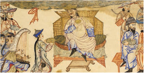

- Saljuqiy hukmdor Malikshohning
- Saljuqiy hukmdor Mahmudning
+ Saljuqiy hukmdor Ahmad Sanjarning
- Saljuqiy hukmdor Alp Arslonning

**807. «Nizomulmulk» so‘zining ma’nosi nima?**

- Davlatning tashkilotchisi
- Davlatning maslahatchisi
+ Davlatning tartibotchisi
- Davlatning targ‘ibotchisi

**808. Kimlar sababli Kichik Osiyoda turkiy davlat va millatga asos solingan?**

- G‘aznaviylar
- Qoraxoniylar
+ Saljuqiylar
- Mo‘g‘ullar

**809. Qachon saljuqiylar xonadoni vakillari faoliyati bilan bog‘liq Suriya, Iroq, Onado‘li (Kunya), Kirmon sultonliklari yuzaga kelgan?**

- XI asrning birinchi yarmida
+ XI asrning ikkinchi yarmida
- XII asrning birinchi yarmida
- XII asrning ikkinchi yarmida

**810. Qaysi asarning ikkinchi nomi «Siyar ulmuluk» (Podshohlarning turmush tarzi) deb ataladi?**

- «Temur tuzuklari»
+ «Siyosatnoma»
- «Zafarnoma»
- «Tarixi arba ulus»

**811. Saljuqiylar davrida qaysi hukumdor sharq va g‘arb yo‘nalishlararo savdosini yanada jonlantirish niyatida Xuroson va Iroq savdogarlarini ba’zi bir savdo to‘lovlaridan ozod etgan?**

+ Malikshoh
- Alp Arslon
- Tug‘rulbek
- Sanjar

**812. G‘arbiy saljuqiylar davlatiga qaysi hududlar kirgan?**

- Suriya, Ozarbayjon, Iroq
+ Eron, Iroq, Ozarbayjon
- Ozarbayjon, Suriya, Eron
- Iroq, Eron, Armaniston

**813. Saljuqiylar davrida g‘arbiy o‘lkalardan Kaspiy dengizi orqali Turkistonga qanday mahsulot olib kelingan?**

- Teri mahsulotlari
- Non mahsulotlari
+ Neft mahsulotlari
- Sut mahsulotlari

**814. Qaysi sulton o‘limidan keyin sharqiy saljuqiylar faoliyatiga chek qo‘yilgan?**

- Malikshoh
- Alp Arslon
- Tug‘rulbek
+ Sanjar

**815. Sulton Malikshoh sharq va g‘arb yo‘nalishlararo savdosini yanada jonlantirish niyatida qaysi hududlarning savdogarlarini ba’zi bir savdo to‘lovlaridan ozod etgan?**

- Movarounnahr va Xuroson
- Xorazm va Movarounnahr
+ Xuroson va Iroq
- Armaniston va Eron

**816. Saljuqiy hukmdor Sulton Alp Arslon Kichik Osiyoda qaysi Vizantiya imperatorini yenggan?**

- Isaak II Angel
+ Roman IV Diogen
- Mixail VIII Paleolog
- Manuel I Komnin

**817. Saljuqiylar davrida ham …, naqd pulsiz muomala qilish tizimidan foydalanilgan.**

- dirham
- fals
- dinor
+ chek

**818. Nizomulmulk davrida qaysi taniqli astronom shamsiy taqvim – kalendarni isloh etish uchun tuzilgan ishchi guruhga rahbarlikka taklif qilingan?**

- Ali Qushchi
+ Umar Xayyom
- Rashiduddin
- Abu Homid G‘azzoliy

**819. Quyidagi rasmdagi sopol plitka qaysi sulola daavriga mansub?**

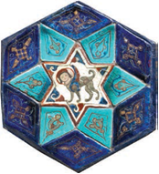

- G‘aznaviylar
- Qoraxoniylar
+ Saljuqiylar
- Somoniylar

**820. Qaysi hukmdor roziligi va bir necha shartlar bilan saljuqiy oilalari Xurosonga kela boshlaganlar?**

- Alptegin
- Ma’sud G‘aznaviy
- Sabuktegin
+ Mahmud G‘aznaviy

**821. Sharqiy Turkistondagi qaysi davlat saljuqiylar ustunligini tan olgan?**

- G‘aznaviylar
- Somoniylar
- Qoraxitoylar
+ Qoraxoniylar

**822. Saljuqiylar turkiy o‘guz qavmi tarkibida dastlab qayerlarda yashagan?**

+ Hozirgi Janubiy Qozog‘iston hududiga to‘g‘ri keladigan yaylovlarda, Sirdaryoning o‘rta oqimidagi yerlarda
- Hozirgi Janubiy Qirg‘iziston hududiga to‘g‘ri keladigan yaylovlarda, Amudaryoning o‘rta oqimidagi yerlarda
- Hozirgi Janubiy Tojikiston hududiga to‘g‘ri keladigan yaylovlarda, Amudaryoning quyi oqimidagi yerlarda
- Hozirgi Janubiy O‘zbekiston hududiga to‘g‘ri keladigan yaylovlarda, Amudaryoning quyi oqimidagi yerlarda

**823. Nizomulmulkning «Siyosatnoma» asarining eng qadimgi nusxasi hozirda qayerda saqlanadi?**

- Londondagi Britaniya muzeyida
- Parijdagi Luvr muzeyida
- Qohiradagi Al Azhar masjidida
+ Erondagi Tebriz Milliy kutubxonasida

**824. Qaysi asar yaratilgan davrdan boshlab olimlar, tarixchilar, adiblar, eng asosiysi, shoh-u hokimlar diqqatini o‘ziga tortib kelgan, asarni sultonlar va mansabdor shaxslar ko‘chirtirib olib, o‘z faoliyatlarida foydalanganlar?**

- «Temur tuzuklari»
+ «Siyosatnoma»
- «Zafarnoma»
- «Tarixi arba ulus»

**825. Saljuqiylar davrida eng yuqori darajadagi pul birligi o‘rnida sof oltindan zarb etilgan dinor (…) qabul qilingan.**

- sariq dinor
+ qizil dinor
- moviy dinor
- ko‘k dinor

**826. Saljuqiylar saltanatining zaiflashib, parchalanish jarayoni boshlanishiga asosiy sabab nima edi?**

- Qo‘shni davlatlar hujumlarning kuchayishi
- Ichki taxt uchun va sulolaviy kurashlar
+ Saltanatning haddan tashqari ulkan hududda yoyilganligi
- Mahalliy hokimliklarning mustaqilikka intilishi

**827. Saljuqiylar davlatida sulton qanday unvonga ega bo‘lgan?**

+ Sulton ul-a’zam
- Sulton az-zaman
- Sulton ul-mulk
- Sulton as-sahih

**828. Saljuqiylar davrida qayerning qovunlari shuhrat qozongan?**

- Niso
- Marv
+ Xorazm
- Jurjon (Gurgon)

**829. Saljuqiylar davlatida mamlakatning obodonchiligi, qurilishlar, karvon yo‘llarining xavfsizligini ta’minlash masalalarini kim nazorat qilib turgan?**

- Bosh vazir
+ Sulton
- Devonbegi
- A’zam

**830. Saljuqiylar davrida qaysi hududda chiqadigan mushk, oltin, kumush yombilar nafaqat tashqi bozorda, balki mintaqaning o‘zida ham qadrlangan?**

- Amudaryo quyi oqimi, o‘ng qirg‘og‘i yerlaridan
+ Sirdaryo quyi oqimi, o‘ng qirg‘og‘i yerlaridan
- Murg‘ob daryosi quyi oqimi, o‘ng qirg‘og‘i yerlaridan
- Zarafshon daryosi quyi oqimi, o‘ng qirg‘og‘i yerlaridan

**831. Movarounnahrga qoraxitoylarning sharqdan bostirib kirishi saljuqiy Sulton Sanjarning kuchi zaiflashishiga olib kelgan va bu o‘z o‘rnida saljuqiylarga qaram bo‘lgan qaysi hududning yuksalishi uchun sharoit yaratgan?**

+ Xorazm
- Eron
- Xuroson
- Onado‘li

**832. Qachon saljuqiylar Xorazm, Eron, Kavkazortiga harbiy yurishlar uyushtirganlar va bu hududlarni o‘z ta’sir doiralariga o‘tkazganlar?**

+ XI asrning 40-yillarida
- XI asrning 50-yillarida
- XI asrning 60-yillarida
- XI asrning 70-yillarida

**833. Hozirgi qaysi davlatdagi turkiy tilli xalq Turkistonni ota yurtimiz, ya’ni tarixiy vatanimiz, deb e’tirof etadi?**

+ Turkiya
- Gruziya
- Ozarbayjon
- Armaniston

**834. Quyidagi qaysi shaxs shoir, to‘rtliklar ustasi bo‘lish bilan birga yetuk yulduzshunos, matematika tarixida sonlardan butun musbat ildiz topishning umumiy qoidasini birinchi bo‘lib isbotlab bergan olim edi?**

+ Umar Xayyom
- Ali Qushchi
- Rashiduddin
- Abu Homid G‘azzoliy

## 34-35-§ Xorazmshohlar davlati va uning yuksalishi.

**835. Qaysi xorazmshoh vafotidan so‘ng uning o‘g‘illari Takash va Sultonshoh Mahmud o‘rtasida o‘zaro kurash kechgan?**

- Qutbiddin Muhammad
- Otsiz
- Alovuddin Muhammad
+ El Arslon

**836. Qutbiddin Muhammad saljuqiylar dargohiga qaram bo‘lib, har yili o‘zi yoki o‘g‘li Otsiz orqali viloyatdan undiriladigan soliqni poytaxt …ga olib borib turgan.**

- Jurjon
- Balx
+ Marv
- Nishopur

**837. Xorazmni qo‘lga kiritganidan keyin Sulton Sanjar uni kimga bergan?**

- Otsizning o‘g‘li Sulaymonshohga
- Qutbiddin Muhammadning jiyani Sulaymonshohga
+ Otsizning jiyani Sulaymonshohga
- Qutbiddin Muhammadning ukasi Sulaymonshohga

**838. Quyidagi qaysi sulola vakillari o‘z davlatida majburiy umumxalq harbiy ta’lim tizimini joriy qilgan?**

+ Anushteginiylar
- Qoraxoniylar
- Saljuqiylar
- G‘aznaviylar

**839. Quyidagi xaritada qaysi davlat hududi tasvirlangan?**

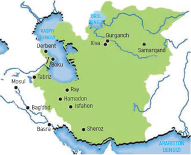

+ Xorazmshohlar davlati
- Qoraxoniylar davlati
- Saljuqiylar davlati
- G‘aznaviylar davlati

**840. Xorazmshoh Otsizdan so‘ng taxtga kim chiqqan?**

- Qutbiddin Muhammad
- Takash
- Alovuddin Muhammad
+ El Arslon

**841. Qutbiddin Muhammad saljuqiylar dargohiga qaram bo‘lib, har yili o‘zi yoki o‘g‘li Otsiz orqali viloyatdan undiriladigan soliqni poytaxt qaysi shaharga olib borib turgan?**

- Niso
+ Marv
- Balx
- Nishopur

**842. Qaysi xorazmshoh o‘zining ismi bitilgan oltin tangalarni zarb qilishni boshlagan?**

- Qutbiddin Muhammad
- Takash
+ Otsiz
- El Arslon

**843. Qaysi xorazmshoh Buxoroni egallagan?**

- Qutbiddin Muhammad
+ Otsiz
- Takash
- El Arslon

**844. Quyidagi qaysi sulola Xorazm doirasidan tashqariga chiqib, boshqaruvning saltanat darajasiga erishgan?**

- Afrig‘iylar sulolasi
- Oltintoshiylar sulolasi
- Ma’muniylar sulolasi
+ Anushteginiylar sulolasi

**845. Kimlar Movarounnahrdan qoraxitoylarni haydab chiqargan?**

+ Anushteginiylar
- Qoraxoniylar
- Saljuqiylar
- G‘aznaviylar

**846. «O‘zaro sulh shartnomasiga ko‘ra, xorazmshoh Otsiz Sulton Sanjarga tobelik bildirib, o‘rta asrlar odatiga ko‘ra, uning oyog‘i ostidagi yerni o‘pib, ta’zim еtishi shart edi. Lekin xorazmshoh bu kabi tobelik urfini bajarmadi. Sulton Sanjar huzuriga mulozimatga (xizmatga) keldi va otidan tushmagan holda sultonga salom berdi. Bu ham yеtmagandek, xorazmshoh sulton bilan uchrashuv joyini birinchi bo‘lib tark еtdi. Sulton Sanjar Otsizning bu «beodobligidan» jahli chiqsa ham, yaqinda o‘zi unga shafqat-muruvvat qilgani uchun ahdini o‘zgartirdi. Sulton bunga norozilik bildirmay, Marvga qaytib ketdi» Ushbu ma’lumotni qaysi tarixchi yozib qoldirgan?**

- An-Nasaviy
- Hofizi Abro‘
- Rashiduddin
+ Otamalik Juvayniy

**847. Sulton Muhammad Xorazmshohning asosiy maqsadi nima edi?**

- Movarounnahrdan qoraxitoylarni haydab chiqarish
+ Suriya, Kichik Osiyo va Misrni bo‘ysundirish
- Ozarbayjon, Eron, Xurosonni egallash
- Saljuqiylarning barcha mulklarini egallash

**848. Quyidagi suratda Xorazmdagi qaysi qal’a tasvirlangan?**

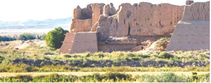

- Qo‘yqirilganqal’a
- Tuproqqal’a
+ Qizilqal’a
- Oybuyurqal’a

**849. Muhammad xorazmshoh Bag‘dod yurishi davrida qayerga yetganida g‘ayritabiiy hodisa yuz berib, to‘satdan havo sovib, uch kecha-yu uch kunduz qor yog‘gan va izg‘irin sovuq hammayoqni qamrab olgan?**

+ Hulvon viloyatiga
- Seyiston viloyatiga
- Dandanaqon viloyatiga
- Badaxshon viloyatiga

**850. Qaysi xorazmshoh Movarounnahrda qoraxitoylar bilan to‘qnashgan va qo‘li baland kelgan, Nishopurni egallab, Ozarbayjonga harbiy yurish uyushtirgan?**

- Qutbiddin Muhammad
- Takash
- Alovuddin Muhammad
+ El Arslon

**851. Xorazmshoh Takashning hukmronlik yillarini toping.**

+ 1172–1200-yillar
- 1170–1198-yillar
- 1182–1202-yillar
- 1176–1205-yillar

**852. Qoraxitoylarga qarshi qilingan yurishlarda xorazmshoh Muhammad otliq askarlari soni qancha bo‘lgan?**

- 250 ming nafar
- 300 ming nafar
- 350 ming nafar
+ 400 ming nafar

**853. Qaysi tarixchilarning yozishiga ko‘ra, Anushteginiylar sulolasining asoschisi Anushtegin dastlabki faoliyatini Jaloliddin Malikshoh I saroyidan boshlagan?**

- An-Nasaviy va Otamalik Juvayniy
- Hofizi Abro‘ va Nasaviy
+ Rashiduddin va Hofizi Abro‘
- Otamalik Juvayniy va Rashiduddin

**854. Qaysi xorazmshoh Movarounnahrdan qoraxitoylarni haydab chiqargan?**

- Takash
- Otsiz
+ Alovuddin Muhammad
- El Arslon

**855. Tarixchilardan Rashiduddin va Hofizi Abro‘larning yozishiga ko‘ra, Anushteginiylar sulolasining asoschisi Anushtegin dastlabki faoliyatini qaysi saljuqiy sulton saroyidan boshlagan?**

- Alp Arslon Arxas
+ Jaloliddin Malikshoh I
- Gʻiyosiddin Muhammad
- Sultonshoh I

**856. Xorazmshoh Muhammadning Fors Iroqi, Ozarbayjonga qilgan yurishida qancha suvoriysi bo‘lgan?**

+ 100 ming nafar
- 150 ming nafar
- 170 ming nafar
- 120 ming nafar

**857. Qaysi xorazmshoh G‘arbiy Eronning ayrim qismini hamda Kirmonni bo‘ysundirgan?**

- Qutbiddin Muhammad
+ Takash
- Alovuddin Muhammad
- El Arslon

**858. Qaysi shaxsga «Xorazm mutasarrufi» mansabiga tayinlanib, unga Xorazm shixnasi (qal’a boshlig‘i) unvoni berilgan?**

+ Anushtegin
- Takash
- Otsiz
- El Arslon

**859. Qaysi shahar Xorazm saltanatining birinchi va asosiy poytaxti bo‘lgan?**

+ Gurganch
- Xiva
- Hazorasp
- Kat

**860. Qachon Xorazm hokimligi lavozimi Anushteginning o‘g‘li Qutbiddin Muhammadga o‘tgan?**

- 1087-yilda
- 1077-yilda
- 1078-yilda
+ 1097-yilda

**861. Xorazmshoh Otsiz mustaqillik uchun qaysi saljuqiy sultonga qarshi kurash olib borgan?**

- Sulton Malikshoh
- Sulton Alp Arslon
- Sulton Tug‘rulbek
+ Sulton Sanjar

**862. Qaysi voqea xorazmshoh Alovuddin Muhammadni obro‘-e’tiborini nihoyatda oshirib yuborgan?**

- Bag‘dod xalifasining hujumini qaytarishi
- Eronni to‘liq egallashi
+ Movarounnahrdan qoraxitoylarni haydab chiqarishi
- Saljuqiylardan Xurosonni tortib olishi

**863. Quyidagi suratda tasvirlangan Sulton Sanjar maqbarasi qaysi shaharda joylashgan?**

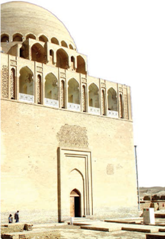

- Niso
+ Marv
- Balx
- Nishopur

**864. Qaysi xorazmshoh «ikkinchi Iskandar», «ikkinchi Sulton Sanjar» laqabi bilan mashhur bo‘lgan?**

- Takash
- Otsiz
+ Alovuddin Muhammad
- Jaloliddin Manguberdi

**865. Qaysi xorazmshoh Bag‘dod xalifasidan «Xorazm viloyati va u tomonidan Xorazmga qo‘shib olingan hamda olinadigan g‘arbiy, sharqiy chegaralardagi viloyatlarning hukmdori», deb tan olingan yorliq olgan?**

- Qutbiddin Muhammad
- Takash
+ Otsiz
- El Arslon

**866. Anushtegin qaysi saljuqiy sultonning ko‘zga ko‘ringan va ishonchli mansabdorlaridan sanalgan?**

+ Malikshoh
- Alp Arslon
- Tug‘rulbek
- Sanjar

**867. Qaysi xorazmshoh hukmronligi so‘nggida hatto Bag‘dodni – xalifalik poytaxtini zabt etishga shaylangan, ammo, yurish chog‘ida vafot etgan?**

- Qutbiddin Muhammad
+ Takash
- Otsiz
- El Arslon

**868. XIII asr boshlarida quyidagi qaysi davlat chegaralari Orol dengizidan Hind okeanigacha, Iroqdan Sharqiy Turkistongacha bo‘lgan ulkan hududni egallagan?**

+ Xorazmshohlar davlati
- Qoraxoniylar davlati
- Saljuqiylar davlati
- G‘aznaviylar davlati

**869. Otsiz otasidan keyin qaysi saljuqiy hukumdor hukmi bilan Xorazm hokimligiga tayinlangan?**

- Sulton Malikshoh
- Sulton Alp Arslon
- Sulton Tug‘rulbek
+ Sulton Sanjar

**870. Saljuqiylar davrida Xorazmda mavjud bo‘lgan «shixna» qanday lavozim edi?**

- Viloyat hokimi
+ Qal’a boshlig‘i
- Shahar boshqaruvchisi
- Sulton maslahatchisi

**871. Xorazmshoh Takash qo‘shinida qancha otliq askar bo‘lgan?**

- 100 ming nafar
+ 170 ming nafar
- 150 ming nafar
- 120 ming nafar

**872. Xorazm vohasida hukmronlik qilgan mahalliy sulolalar qadimdan qanday umumiy nomi bilan yuritib kelingan?**

+ Xorazmshohlar
- Malikshohlar
- Ixshidlar
- Xoqonlar

**873. Xorazmshoh Otsiz kimdan «Xorazm viloyati va u tomonidan Xorazmga qo‘shib olingan hamda olinadigan g‘arbiy, sharqiy chegaralardagi viloyatlarning hukmdori», deb tan olingan yorliq olgan?**

+ Bag‘dod xalifasidan
- Saljuqiy Sulton Sanjardan
- Saljuqiy Sulton Malikshohdan
- Damashq xalifasidan

**874. Muhammad xorazmshoh qancha qo‘shinini Bag‘dod yurishiga jo‘natgan?**

- 250 ming atrofidagi
- 300 ming atrofidagi
- 350 ming atrofidagi
+ 400 ming atrofidagi

**875. Otsiz Xorazm hokimligiga tayinlangan vaqti necha yoshda edi?**

- Yigirmaga ham kirmagan edi
+ O‘ttizga ham kirmagan edi
- Qirqqa ham kirmagan edi
- Ellikka ham kirmagan edi

**876. Qaysi xorazmshoh Marv, Nishopurni Xorazm tasarrufiga o‘tkazgan?**

- Qutbiddin Muhammad
- Takash
+ Otsiz
- El Arslon

**877. Qaysi xorazmshoh xalifa nomini xutbadan chiqarib tashlashni buyurgan?**

- Takash
- Otsiz
+ Alovuddin Muhammad
- El Arslon

**878. Qachon Anushtegin Xorazm hokimligi vazifasiga tayinlangan?**

- 1087-yilda
+ 1077-yilda
- 1078-yilda
- 1097-yilda

**879. Xorazmshoh Alovuddin Muhammadning hukmronlik yillarini toping.**

- 1198–1218-yillar
- 1206–1223-yillar
+ 1200–1220-yillar
- 1201–1224-yillar

## 36-37-§ Xorazmshohlar davlat boshqaruvi va ijtimoiy-iqtisodiy hayot.

**880. Tarixchi Juvayniyning yozishicha, qaysi shahar Turkon xotunning xos poytaxti hisoblangan?**

- Samarqand
+ Gurganch
- Buxoro
- Xo‘jand

**881. Muhammad Xorazmshohning onasi Turkon qaysi shaharda istiqomat qilar edi?**

- Samarqandda
+ Gurganchda
- Buxoroda
- Sig‘noqda

**882. Anushteginiylarda kim amaldorlarni ishga tayinlash va lavozimidan bo‘shatish, arzaq (nafaqa), oylik maosh hamda boshqa shu kabi to‘lovlarni belgilash huquqlariga ham ega bo‘lgan?**

- Shayx ul-islom
- Hojib
+ Vazir
- Muhtasib

**883. Chingizxon bosqini arafasida vazir lavozimi xorazmshoh Alovuddin Muhammad tomonidan bekor qilingan va oliy hukmdor qoshida nechta vakildan iborat kengashga o‘xshagan boshqaruv joriy etilgan?**

- To‘rt vakildan
- Besh vakildan
+ Olti vakildan
- Yetti vakildan

**884. Anushteginiylar davrida bozordagi tartibni kim ushlab turgan, mahsulotlarning sifatini, idishlarning tozaligini, mahsulotlarning yangiligini, tarozi toshlari va uzunlik o‘lchovchi asboblarning to‘g‘riligini nazorat qilgan?**

- Hojib
+ Muhtasib
- Kutvol
- Ustoz

**885. Quyidagi suratda qaysi xorazmshoh maqbarasi tasvirlangan?**

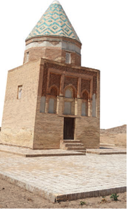

- Takash
- Otsiz
- Alovuddin Muhammad
+ El Arslon

**886. Anushteginiylar davrida Xorazmda qurilish ishlarida qaysi daraxt yog‘ochidan keng foydalanilgan?**

- Tut
- Gujum
+ Majnuntol
- Terak

**887. Quyidagi suratda tasvirlangan xorazmshoh El Arslonning taxtga o‘tirishi marosimi qaysi kitobda keltirilgan?**

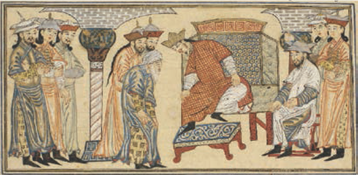

- «Tarixi arba ulus» kitobida
+ «Jome at-tavorix» kitobida
- «Xorazm tarixi» kitobida
- «Zafarnoma» kitobida

**888. «Tug‘ro» nima?**

- Bayroq
+ Muhr
- Nog‘ora
- Toj

**889. Qaysi tarixchi Sulton Muhammad Xorazmshoh farmonlarining onasi tomonidan bekor qilinishini «birinchidan, onasining unga bo‘lgan mehrini qadrlashi, ikkinchidan, mamlakatning barcha amirlari onasining urug‘idan ekanligi», deya izohlagan?**

+ An-Nasaviy
- Hofizi Abro‘
- Rashiduddin
- Otamalik Juvayniy

**890. Sulton Aluoddin Muhammadning onasi Turkon xotun yashiringan Ilol qal’asini qaysi mo‘g‘ul sarkardasi qamal qilgan?**

- Jebe
+ Subutoy
- Shiki Xutuxu
- Suketu Cho‘rbiy

**891. Anushteginiylarda oliy hukmdor kotibi qanday atalgan?**

+ Davatdor
- Amir a’lam
- Oxur amiri
- Choshnigir

**892. Turkon xotun yashiringan Ilol qal’asi mo‘g‘ullarga taslim bo‘lgach, mo‘g‘ul askarlari Turkon xotunni yaqinlari bilan birga Toliqonda turgan turgan kimning yoniga olib borganlar?**

- Chig‘atoyning
+ Chingizxonning
- O‘qtoyning
- Jo‘jining

**893. Anushteginiylar ismi yozilgan tangalar qayerlarda zarb qilingan? 1) Samarqand; 2) Buxoro; 3) O‘tror; 4) Termiz; 5) Chag‘oniyon; 6) Ardaxushmisan; 7) Darg‘an; 8) Vaxsh; 9) Balx; 10) Govshfinj; 11) Bomiyon; 12) G‘azna; 13) G‘ur; 14) Jurzuvon; 15) Zamindovar; 16) Yamur; 17) Kunduz; 18) Marv; 19) Niso; 20) Nishopur; 21) Peshovar; 22) Nuzkot.**

- 2, 3, 4, 5, 6, 7, 9, 10, 11, 12, 13, 15, 16, 17, 18, 19, 20, 21, 22
- 1, 2, 3, 5, 6, 7, 8, 9, 10, 11, 12, 13, 14, 15, 16, 18, 19, 20, 21
+ 1, 2, 3, 4, 5, 8, 9, 11, 12, 13, 14, 15, 16, 17, 18, 19, 20, 21
- 2, 3, 4, 5, 6, 7, 8, 9, 10, 11, 14, 15, 16, 17, 18, 19, 20, 21, 22

**894. Anushteginiylarda qaysi unvonga ega bo‘lgan vazirlar xonaga oliy hukmdordan boshqa kim kirsa ham, hattoki u taxt vorisi bo‘lgan taqdirda ham, u bilan salomlashish uchun o‘rnilaridan turishmagan?**

- «Sadr»
+ «Nizom ul-mulk»
- «Dastur»
- «Xojayi buzurg»

**895. Mo‘g‘ullar hujumi davrida Sulton Aluoddin Muhammad asir qilib olingan turli mamlakatlarning podshohlariga qanday chora ko‘rgan?**

- Minora tepasidan uloqtirgan
- Dorga ostirgan
+ Jayhun daryosiga cho‘ktirib yuborgan
- Boshi tanasidan judo qilingan

**896. Muhammad Xorazmshohning onasi Turkon xotun qanday laqabga ega bo‘lgan?**

- «Sultonlar sultoni»
- «Turk onasi»
- «Mashriq malikasi»
+ «Jahon hokimi»

**897. Anushteginiylarda vazirdan boshqa yana bir muhim mansab – bu ulug‘ yoki buyuk … hisoblangan.**

+ hojib
- muhtasib
- shayx
- ustoz

**898. Anushteginiylarda «Oliy toj faxriy majlisi» deb atalgan hukumat boshqaruvi kimning qo‘lida bo‘lgan va unga barcha devonlar bo‘ysungan?**

- Xorazmshohning
+ Bosh vazirning
- Turkon xotunning
- Shayx ul-islomning

**899. Anushteginiylarda oliy hukmdorga mo‘ljallangan o‘rin-ko‘rpa, gilam, chodir va shunga o‘xshashlar uchun mas’ul xizmat boshlig‘i qanday atalgan?**

- Davatdor
+ Farrosh
- Oxur amiri
- Choshnigir

**900. Anushteginiylarda vazirlik mansabining takomillashgan ko‘rinishi kimning hukmronligi davri bilan bog‘liq?**

- Takash
+ Otsiz
- Alovuddin Muhammad
- El Arslon

**901. Quyidagi suratda nima tasvirlangan?**

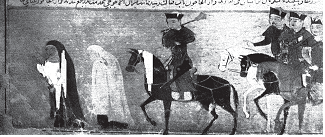

- Haj safariga otlangan Turkon xotun
- Gurganchga borayotgan Turkon xotun
- Mo‘g‘ullardan qochayotgan Turkon xotun
+ Mo‘g‘ullarga asir tushgan Turkon xotun

**902. Anushteginiylar davrida Urganch savdogarlari Bag‘dod, hattoki …ga qadar mahsulotlar olib borishgan.**

- Kunya
- Kirmon
- Onado‘li
+ Andalus

**903. Anushteginiylarda kim davlat boshlig‘ining asosiy maslahatchisi hisoblangan va o‘z harakatlari yuzasidan oliy hukmdorgagina hisobot bergan, rasmiy tantanalar, xalqaro munosabatlar, tobe mamlakatlar bilan muzokaralarda oliy hukmdor nomidan ish yuritgan?**

+ Vazir
- Shayx ul-islom
- Hojib
- Muhtasib

**904. Anushteginiylarda qoidaga ko‘ra, turkiy aslzodalar vakiligina qaysi mansabga tayinlanishi mumkin bo‘lgan?**

+ Hojib
- Muhtasib
- Shayx
- Ustoz

**905. Turkon xotun mo‘g‘ullarga asir tushgach qayerga olib ketilgan va o‘sha yerda vafot etgan?**

- Xonbaliqqa
- Bolasog‘unga
- Tarozga
+ Qoraqurumga

**906. Xorazmda anushteginiylar davrida harbiy devon boshlig‘i, albatta, … bo‘lishi shart edi.**

- sulola vakili
- xorazmlik
- turkiy
+ musulmon

**907. Anushteginiylarda sultonning shaxsiy otlari qaysi lavozimdagi shaxsning tasarrufida bo‘lgan?**

- Davatdor
- Amir a’lam
+ Oxur amiri
- Choshnigir

**908. Sulton Aluoddin Muhammadning onasi Turkon xotun yashiringan Ilol qal’asi necha kunlik qamaldan so‘ng suvsizlikdan mo‘g‘ullarga taslim bo‘lgan?**

- Besh kundan so‘ng
- O‘n kundan so‘ng
+ O‘n besh kundan so‘ng
- Yigirma kundan so‘ng

**909. Anushteginiylarda oliy hukmdorga beriladigan ovqat, ichimliklarni ta’tib ko‘ruvchi lavozim qanday atalgan?**

- Davatdor
- Amir a’lam
- Oxur amiri
+ Choshnigir

**910. Qaysi daraxt yog‘ochidan qurilgan inshootlar yengil bo‘lgan va toshdan qurilgan binolarga qaraganda zilzilaga chidamli hisoblangan?**

- Tut
- Gujum
+ Majnuntol
- Terak

**911. Xorazmda anushteginiylar davrida harbiy devon nechta devonga bo‘lingan?**

+ 2 ta devonga
- 3 ta devonga
- 4 ta devonga
- 5 ta devonga

**912. Anushteginiylarda vazirlar qanday unvonlar bilan siylangan? 1) Sadr; 2) Dastur; 3) Xojayi buzurg; 4) Nizom ul-mulk.**

- 1, 3, 4
- 1, 2, 4
- 1, 2, 3
+ 1, 2, 3, 4

**913. Quyidagi suratdagi Najmiddin Kubro maqbarasi qayerda joylashgan?**

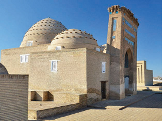

+ Turkmaniston
- O‘zbekiston
- Eron
- Tojikiston

**914. Anushteginiylar davrida xorazmshohlarga qaram bo‘lgan mulklarda kimning nomi bilan xutba o‘qilgan va tangalar zarb etilgan?**

- Saljuqiylar sultoni nomi bilan
- Bag‘dod xalifasi nomi bilan
- Damashq xalifasi nomi bilan
+ Xorazmshoh nomi bilan

**915. Anushteginiylarda qaysi mansab egasi har doim hukmdorning oldida yurgan, hukmdor safar va yurishlarga chiqqanida ham uni tark etmagan, rasmiy qabullar vaqtida vazirlar xorazmshohlarning o‘ng tomonidan o‘rin egallashgan?**

+ Vazir
- Shayx ul-islom
- Hojib
- Muhtasib

**916. Xorazmda anushteginiylar davrida «devon ravotib» qanday masalalar bilan shug‘ullangan?**

- Harbiy masalalarni ko‘rish
+ Harbiylarga maosh berish
- Harbiy lavozimlarga tayinlash
- Harbiylar ta’minoti

**917. Qaysi tarixchinng yozishicha, Turkon xotun qang‘li urug‘idan bo‘lgan xon Jonkishning qizi edi. Gurganch (Urganch) Turkon xotunning xos poytaxti hisoblangan, uning xos saroyi ham mavjud bo‘lgan?**

- An-Nasaviy
- Hofizi Abro‘
- Rashiduddin
+ Juvayniy

**918. Anushteginiylarda qaysi lavozimdagi shaxs otxonalar, oshxonalar, novvoyxonalar, chog‘ir saqlanadigan yerto‘lalarni nazorat qilgan, saroy xodimlari faoliyati uchun to‘liq javobgar bo‘lgan?**

- Hojib
- Muhtasib
- Shayx
+ Ustoz

**919. Anushteginiylar davrida Xorazmda qayerlik o‘ymakor duradgorlar fil suyagi va obnus daraxti yog‘ochidan ajoyib buyumlarni yasashgan?**

- Xivalik
- Hazorasplik
- Katlik
+ Urganchlik

**920. Mo‘g‘ullar hujumi davrida Sulton Aluoddin Muhammad bolalari, nevaralari, yaqinlarini xazinasi bilan vazir Nosiriddinning kuzatuvida qayerdagi Ilol (Tajan irmog‘idagi hudud) qal’asiga yuborgan?**

+ Eron tomondagi
- Iroq tomondagi
- Ozarbayjon tomondagi
- Suriya tomondagi

**921. «Arzaq» nima?**

- Mulk
- Mansab
- Qo‘shin
+ Nafaqa

**922. Anushteginiylarda vazirlar o‘z ona tili — turkiy tildan tashqari yana qaysi tillarni mukammal bilishi shart bo‘lgan?**

- Xitoy va hind tillarini
- Fors va xitoy tillarini
+ Arab va fors tillarini
- Hind va arab tillarini

**923. Anushteginiylarda kim fuqarolar va davlat hukmdori o‘rtasida vositachi vazifasini bajargan hamda mamlakatdagi tartib-intizom uchun asosiy javobgar hisoblangan?**

+ Vazir
- Shayx ul-islom
- Hojib
- Muhtasib

**924. Mo‘g‘ullar hujumi davrida Sulton Aluoddin Muhammad onasi va haramini qayerga olib ketgan?**

+ Mozandaronga
- Seyistonga
- Jurjonga
- Kirmonga

**925. Xorazmda anushteginiylar davrida «devon jaysh» qanday masalalar bilan shug‘ullangan?**

+ Harbiy masalalarni ko‘rish
- Harbiylarga maosh berish
- Harbiy lavozimlarga tayinlash
- Harbiylar ta’minoti

**926. Muhammad Xorazmshoh qaysi shaharni o‘z poytaxti deb e’lon qilgan?**

- Xo‘jandni
- Hirotni
+ Samarqandni
- Buxoroni

**927. Qaysi qabiladan tashkil etilgan oliy martabali sarkardalar Turkon xotun bilan yaqin bo‘lib, aksariyati saroyda Sulton Alouddin Muhammadga qarshi bo‘lib turgan biron-bir guruhga boshchilik qilganlar?**

- Qang‘lardan
+ Qipchoqlardan
- Yag‘molardan
- Turkmanlardan

**928. Anushteginiylarda qaysi lavozimdagi shaxs hukmdorning aynan o‘ziga tegishli ishlari bo‘yicha hisobot bergan, rasmiy marosimlarga amal qilinishini nazorat qilgan?**

- Muhtasib
+ Hojib
- Shayx
- Ustoz

## 38-§ Etnik jarayonlar va o‘zbek xalqining shakllanishi.

**929. O‘rta Osiyoda qaysi davlat davrida turkiyzabon etnoslar ustuvorlik qilib, o‘ziga xos uyg‘unlashgan madaniyat yuzaga kelgan?**

- Kushon davlati
- Eftallar davlati
+ Qang‘ davlati
- Kidariylar davlati

**930. Kelib chiqishi bir-biriga yaqin bo‘lgan turli qabila va elatlarning asrlar davomida qo‘shilib borishi qanday ataldi?**

+ Etnik jarayon
- Antropologik jarayon
- Geneologik jarayon
- Arxeologik jarayon

**931. Ilk o‘rta asrlarda sug‘diylar, baqtriylar, xorazmiylar, farg‘onaliklar, shoshliklar, yarim chorvador qang‘lar, ko‘chmanchi sak-massagetlar asosan qaysi tillarda so‘zlashgan?**

- Sug‘diy va g‘arbiy eroniy tillarda
- Sug‘diy va sharqiy eroniy tillarda
+ Turkiy va sharqiy eroniy tillarda
- Turkiy va g‘arbiy eroniy tillarda

**932. Qaysi davlat davrida «Qovunchi madaniyati» va O‘rta Osiyoning antropologik qiyofasi to‘liq shakllangan?**

- Kushon davlati
- Eftallar davlati
+ Qang‘ davlati
- Kidariylar davlati

**933. O‘zbeklar alohida etnik birlik (elat) bo‘lib, qayerlarda shakllangan? 1) Movarounnahr; 2) Janubiy Sibiy o‘lkalari; 3) Xorazm; 4) Yettisuv; 5) Sharqiy Turkistonning g‘arbiy mintaqalari; 6) Shimoliy Pokiston hududlari.**

- 2, 4, 5, 6
+ 1, 3, 4, 5
- 1, 2, 3, 4
- 1, 2, 4, 6

**934. O‘zbek xalqining asosini qaysi etnoslar tashkil etgan? 1) Kushonlar; 2) Sug‘diylar; 3) Baqtriylar; 4) Xorazmiylar; 5) Marg‘iyonaliklar; 6) Farg‘onaliklar; 7) Shoshliklar; 8) Sak-massagetlar.**

- 1, 4, 5, 6, 7, 8
- 1, 2, 3, 4, 5, 7
- 2, 3, 4, 5, 6, 7
+ 2, 3, 4, 6, 7, 8

**935. Qaysi asrda Movarounnahr mintaqasida yaxlit turkiy etnik qatlam, turkiy til muhiti vujudga kela boshlagan va o‘z navbatida sug‘diylar va boshqa mahalliy etnoslarda ham turkiylashish jarayoni jadallashgan?**

- VI asrda
- VII asrda
- VIII asrda
+ IX asrda

**936. Ilk o‘rta asrlarda quyidagi qaysi xalq yarim chorvador bo‘lgan?**

- Saklar
- Massagetlar
+ Qang‘lar
- Baqtriyaliklar

**937. Qaysi asrlarda o‘zbek xalqi shakllangan?**

- VII–X asrlarda
- VIII–XI asrlarda
+ IX–XII asrlarda
- X–XIII asrlarda

**938. Qaysi asrdan o‘lkamiz «Turkiston» nomi bilan atala boshlangan?**

- VI asrdan
+ VII asrdan
- VIII asrdan
- IX asrdan

**939. Movarounnahrda joylashgan aholi qadimdan qaysi tillarda so‘zlashgan?**

- Ikki tilda: sug‘d va sharqiy eroniy tillarda
+ Ikki tilda: sug‘d va turk tillarida
- Uch tilda: sug‘d, sharqiy eroniy va turk tillarida
- Uch tilda: sug‘d, sharqiy eroniy va baqtriya tillarida

**940. «Etnos» so‘zi yunoncha qanday ma’noni anglatadi?**

- «Qabila»
- «Jamoa»
- «Millat»
+ «Xalq»

**941. Qaysi sulola davrida Movarounnahr va Xorazmda siyosiy hokimiyat turkiy sulolalarga o‘tgan?**

+ Qoraxoniylar davrida
- Saljuqiylar davrida
- G‘aznaviylar davrida
- Tohiriylar davrida

## 39-40-§ Mintaqada Islom dinining yoyilishi.

**942. Qaysi shahar «Qubbatul islom» – «Islom dinining gumbazi» nomi bilan shuhrat topgan?**

+ Buxoro
- Samarqand
- Termiz
- Marv

**943. Kim umrining yarmini islomda adashgan oqimlarga qarshi kurashga bag‘ishlagan?**

- Abu Abdulloh Muhammad ibn Idris Shofe’iy
- Abu Abdulloh Ahmad ibn Hanbal
+ Abul Hasan Ash’ariy
- Abu Hanifa No‘mon ibn Sobit

**944. «Yo‘nalish», «yo‘l», «ta’limot» so‘zlari arabcha qaysi so‘z bilan ifodalandi?**

- Shariat
+ Mazhab
- Tariqat
- Fiqh

**945. Hadislarning yig‘ilishida qaysi buyuk vatandoshlarimizning xizmatlari katta bo‘lgan? 1) Abu Abdulloh Buxoriy; 2) Imom Termiziy; 3) Hakim Termiziy; 4) Imom Dorimiy.**

+ 1, 2, 3, 4
- 1, 2, 3
- 1, 2, 4
- 2, 3, 4

**946. Qachon O‘zbekistonda Moturidiy tavalludining 1130-yilligi keng nishonlangan?**

+ 2000-yilda
- 2002-yilda
- 2004-yilda
- 2006-yilda

**947. «Movarounnahr» so‘zining ma’nosi nima?**

- «Tog‘ning narigi tomoni»
- «Dengizning narigi tomoni»
- «Sahroning narigi tomoni»
+ «Daryoning narigi tomoni»

**948. Kim o‘ziga yomonlik qilganlarni ko‘rganida: «Bizlarni yomonlagan kishilarning gunohini Alloh kechirsin, bizlarni yaxshi ko‘rganlarni Alloh rahmat qilsin», deb duo qilgan ekan?**

- Abu Abdulloh Muhammad ibn Idris Shofe’iy
- Abu Abdulloh Ahmad ibn Hanbal
- Abu Abdulloh Molik ibn Anas
+ Abu Hanifa No‘mon ibn Sobit

**949. Hanbaliylik mazhabida nimani boshqa iloj qolmagandagina ishlatishga ruxsat beriladi?**

- Istehsonni
- Sunnatni
- Ijmoni
+ Qiyosni

**950. Hanbaliylik mazhabi asoschisi imom Abu Abdulloh Ahmad ibn Hanbal qaysi yillarda yashagan?**

- 767–804-yillarda
+ 780–855-yillarda
- 755–792-yillarda
- 761–801-yillarda

**951. Hanafiylik mazhabi qayerlarda keng tarqalgan?**

- Saudiya Arabistoni, Yaman, BAA, Quvayt, Qatarda
- Indoneziya, Malayziya, Misr, Sudan, Keniya, Mali, Liviyada
+ Hindiston, Pokiston, Afg‘oniston, Iroq, Suriya, Turkiya va qator Afrika mamlakatlarida
- Marokash, Jazoir, Tunis, Bangladeshda

**952. «Kunya» so‘zi qaysi so‘zning izofa qaratqichli birikma holatidagi shakli hisoblanadi?**

- Ibn (arabcha «o‘g‘li») so‘zining
- Ibn (arabcha «ota») so‘zining
+ Abu (arabcha «ota») so‘zining
- Abu (arabcha «o‘g‘li») so‘zining

**953. Qaysi yildan O‘zbekiston Prezidenti tashabbusi bilan Imom Moturidiy majmuasida «Kalom ilmi maktabi», moturidiylik ta’limotining yirik vakili Abul Mu’in Nasafiy ziyoratgohida esa «Aqoid maktabi»ni tashkil etilgan?**

- 2016-yildan
+ 2017-yildan
- 2018-yildan
- 2019-yildan

**954. Shofe’iylik mazhabi vakillari hanafiylar va molikiylarda mavjud bo‘lgan nimani rad qiladilar?**

- Sunnatni
- Ijmoni
+ Istehsonni
- Qiyosni

**955. O‘rta Osiyoda qayerda maxsus «Faqihlar madrasasi» degan ixtisoslashtirilgan madrasa qurilgan?**

+ Buxoroda
- Samarqandda
- Termizda
- Marvda

**956. Kim sunniy musulmonlar tomonidan hurmat bilan «Imomi A’zam» deb ataladi?**

- Abu Abdulloh Muhammad ibn Idris Shofe’iy
- Abu Abdulloh Ahmad ibn Hanbal
- Abu Abdulloh Molik ibn Anas
+ Abu Hanifa No‘mon ibn Sobit

**957. Nimaning chin mohiyati nafsni poklash, axloqni sayqallash, ma’naviy kamolotga erishishdan iborat?**

- Tariqat
+ Tasavvuf
- Mazhab
- Ta’limot

**958. Qaysi mazhab yangi vujudga kelgan diniy masalaning yechimini hal qilib bergan?**

- Hanbaliylik mazhabi
- Shofe’iylik mazhabi
+ Hanafiylik mazhabi
- Molikiylik mazhabi

**959. Molikiylik mazhabi asoschisi, imom Abu Abdulloh Molik ibn Anas qachon tavallud topgan?**

- 728-yilda
+ 711-yilda
- 719-yilda
- 705-yilda

**960. Ilk islom davrida ulamolarning bir ovozdan qabul qilgan qarorlari qanday atalgan?**

+ Ijmo
- Xutba
- Qiyos
- Sunnat

**961. Qaysi ta’limot mo‘taziliya, qadariya, jabariya kabi adashgan guruhlarning aqidaviy g‘oyalariga qarshi turgan?**

- Yassaviya ta’limoti
- Kubraviya ta’limoti
+ Ash’ariya ta’limoti
- Moturidiya ta’limoti

**962. Hanbaliylik mazhabi qayerlarda keng tarqalgan?**

+ Saudiya Arabistoni, Yaman, BAA, Quvayt, Qatarda
- Indoneziya, Malayziya, Misr, Sudan, Keniya, Mali, Liviyada
- Hindiston, Pokiston, Afg‘oniston, Iroq, Suriya, Turkiya va qator Afrika mamlakatlarida
- Marokash, Jazoir, Tunis, Bangladeshda

**963. Moturidiya ta’limoti asoschisi Abu Mansur Moturidiy qaysi yillarda yashagan?**

- 767–804-yillarda
- 780–855-yillarda
+ 870–944-yillarda
- 873–936-yillarda

**964. Qaysi asrlarda islom dini O‘rta Osiyo xalqlari davlatchiligi tarixida katta rol o‘ynay boshlagan?**

- VII–X asrlarda
- VIII–XI asrlarda
+ IX–XII asrlarda
- X–XIII asrlarda

**965. Qaysi ta’limotda inson o‘z xatti-harakatlarini tanlashda ixtiyorligi ta’kidlanadi?**

- Yassaviya ta’limotida
- Kubraviya ta’limotida
- Ash’ariya ta’limotida
+ Moturidiya ta’limotida

**966. Arabcha «tariqat» so‘zi qanday ma’noni anglatadi?**

- «Ta’limot»
+ «Yo‘l»
- «Ilm»
- «Haqiqat»

**967. Abu Hanifa No‘mon ibn Sobit qayerda tug‘ilgan va vafot etgan?**

+ Kufa/Bag‘dod
- Isfahon/Kufa
- Damashq/Isfahon
- Bag‘dod/Sheroz

**968. «Eng chiroyli xulq Imomi A’zamning xulqidir», deb kim e’tirof qilingan?**

- Abu Abdulloh Muhammad ibn Idris Shofe’iy
- Abu Abdulloh Ahmad ibn Hanbal
- Abu Abdulloh Molik ibn Anas
+ Abu Hanifa No‘mon ibn Sobit

**969. Kim islomda erkinlik tamoyilining homiysi bo‘lib, tijorat va boshqa sohalarda (turmush qurishda erkak va ayolga teng huquq berilishi, yetim bolalarning huquqlari va boshqalarda) inson huquqi va erkinliklarini himoya qilib kelgan?**

- Abu Abdulloh Muhammad ibn Idris Shofe’iy
- Abu Abdulloh Ahmad ibn Hanbal
- Abu Abdulloh Molik ibn Anas
+ Abu Hanifa No‘mon ibn Sobit

**970. Arablar timsolida yangi siyosiy kuchning paydo bo‘lishi oqibatida Turon necha qismga bo‘lingan?**

+ Ikki qismga
- Uch qismga
- To‘rt qismga
- Besh qismga

**971. Qaysi ta’limot sof diniy aqida doirasidan chiqmagan holda aql-idrokni ulug‘laydi va mantiqan asoslangan bilimning ahamiyatini alohida ta’kidlaydi?**

- Yassaviya ta’limoti
- Kubraviya ta’limoti
- Ash’ariya ta’limoti
+ Moturidiya ta’limoti

**972. Ash’ariya ta’limoti qaysi sulola davrida Xurosonda rivojlangan?**

+ Saljuqiylar davrida
- G‘aznaviylar davrida
- Somoniylar davrida
- Qoraxoniylar davrida

**973. Hanafiylik, molikiylik, shofe’iylik, hanbaliylik islomdagi qaysi yo‘nalish mazhablari hisoblanadi?**

+ Sunniylik
- Shialik
- Xorijiylik
- Salafiylik

**974. Molikiylik mazhabi qayerlarda keng tarqalgan?**

- Saudiya Arabistoni, Yaman, BAA, Quvayt, Qatarda
- Indoneziya, Malayziya, Misr, Sudan, Keniya, Mali, Liviyada
- Hindiston, Pokiston, Afg‘oniston, Iroq, Suriya, Turkiya va qator Afrika mamlakatlarida
+ Marokash, Jazoir, Tunis, Bangladeshda

**975. «Tilingni yaxshi hunar bilan o‘rgatgil va muloyim so‘zdan boshqa narsani odat qilmagil. Nedinkim, tilga har nechuk so‘zni o‘rgatsang, shuni aytur, so‘zni o‘z joyida ishlatgil, so‘z agar yaxshi bo‘lsa, ammo noo‘rin ishlatilsa, garchand u har nechuk yaxshi so‘z bo‘lsa ham yomon, nobop eshitilur. Shuning uchun behuda so‘zlamagilki, foydasizdur. Bunday befoyda so‘z ziyon keltirur va har so‘zki undan hunar isi kelmasa, bunday so‘zni gapirmaslik lozim». Ushbu jumlalar kimning qaysi asarida keltirilgan?**

- Mahmud Qoshg‘ariy, «Devonu lug‘otit-turk»
+ Kaykovus, «Qobusnoma»
- Yusuf Xos Hojib, «Qutadg‘u bilig»
- Sharafiddin Ali Yazdiy, «Zafarnoma»

**976. Hanafiylik mazhabi asoschisi Abu Hanifa nomi bilan mashhur Nu’mon Sobit Kufiy qaysi yilalrda yashagan?**

- 696–764-yillarda
+ 699–767-yillarda
- 683–759-yillarda
- 689–761-yillarda

**977. Hanbaliylik mazhabi asoschisi imom Abu Abdulloh Ahmad ibn Hanbal qaysi shahrda yashagan?**

- Kufa
- Isfahon
- Damashq
+ Bag‘dod

**978. Rasmdagi Abu Mansur Moturidiy maqbarasi qaysi shaharda joylashgan?**

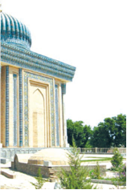

- Buxoro
- Termiz
+ Samarqand
- Navoiy

**979. Sunniylikdagi to‘rtala mazhab (hanafiylik, molikiylik, shofe’iylik, hanbaliylik) bir-biri bilan teng hisoblanib, nimasi bilan farq qiladi?**

- Xalifalikning qaysi sulolasi siyosatini qo‘llab-quvvatlashi bilan
- Qaror chiqarishda asoslanadigan manbalari bilan
+ Shariat masalalarida yengilroq yoki qattiqroq hukm chiqarishlari bilan
- Musulmonlarning huquqlari borasidagi qarashlari bilan

**980. Qaysi mazhabda birinchi manba Qur’oni karim, ikkinchi manba hadis hisoblanadi, shar’iy masalalarda Madina hayoti va odatlari ko‘p hollarda ustun turgan?**

- Hanbaliylik mazhabida
- Shofe’iylik mazhabida
- Hanafiylik mazhabida
+ Molikiylik mazhabida

**981. Shofe’iylik mazhabi qayerlarda keng tarqalgan?**

- Saudiya Arabistoni, Yaman, BAA, Quvayt, Qatarda
+ Indoneziya, Malayziya, Misr, Sudan, Keniya, Mali, Liviyada
- Hindiston, Pokiston, Afg‘oniston, Iroq, Suriya, Turkiya va qator Afrika mamlakatlarida
- Marokash, Jazoir, Tunis, Bangladeshda

**982. Qaysi atamalarining kelib chiqishi arab tilidan «jun, yung» ma’nosini bildiruvchi «suf» so‘zidan olingan? 1) Tasavvuf; 2) Sufiy; 3) Mutasavvif; 4) Mutavalli.**

- 1, 3, 4
- 1, 2, 4
+ 1, 2, 3
- 1, 2, 3, 4

**983. Shofe’iylik mazhabi asoschisi Abu Abdulloh Muhammad ibn Idris Shofe’iy qaysi yillarda yashagan?**

+ 767–804-yillarda
- 780–855-yillarda
- 755–792-yillarda
- 761–801-yillarda

**984. Hanbaliylik mazhabida nimalar asosiy manba hisoblanadi?**

+ Qur’on va sunnat
- Sunnat va ijmo
- Ijmo va qiyos
- Qiyos va istehson

**985. «Arodi at-turk» so‘zining ma’nosi nima?**

- «Turklar yerlari», ya’ni arablarga bo‘ysungan hukmdorlar yerlari
+ «Turklar yerlari», ya’ni arablarga bo‘ysunmagan hukmdorlar yerlari
- «Turklar yerlari», ya’ni arablarga uzoq bo‘lgan hukmdorlar yerlari
- «Turklar yerlari», ya’ni arablarga begona hukmdorlar yerlari

**986. Rasmdagi imomi A’zam maqbarasi qayerda joylashgan?**

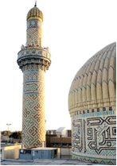

+ Bag‘dod
- Damashq
- Isfahon
- Kufa

**987. O‘rta Osiyoda qayerda dastlabki madrasalar VIII-IX asrlardan boshlab barpo qilingan?**

+ Buxoroda
- Samarqandda
- Termizda
- Marvda

**988. Moturidiya ta’limoti qayerlarda hozir ham oliy, o‘rta ta’lim tizimida va diniy o‘quv yurtlarida mustaqil fan sifatida o‘qitib kelinadi?**

- Marokash, Jazoir, Tunis, Bangladeshda
+ Suriya, Iroq, Turkiya, Pokiston, Hindiston, Shimoliy Afrika
- Hindiston, Pokiston, Afg‘oniston, Iroq, Suriya, Turkiya va qator Afrika mamlakatlarida
- Indoneziya, Malayziya, Misr, Sudan, Keniya, Mali, Liviyada

**989. «Imomi A’zam» so‘zining ma’nosi nima?**

- «Muqaddas imom»
+ «Ulug‘ imom»
- «Buyuk imom»
- «Oliy imom»

**990. Kim arab bo‘lmagan musulmonlarning teng huquqli ekanligi haqidagi g‘oyani ilgari surgan?**

- Abu Abdulloh Buxoriy
- Imom Termiziy
+ Abu Hanifa
- Imom Dorimiy

**991. Qaysi asrlarda musulmonlar orasida Qur’on oyatlari va hadislarni noto‘g‘ri tushungan toifalar paydo bo‘lgan?**

- VII–VIII asrlarda
+ VIII–IX asrlarda
- IX–X asrlarda
- X–XI asrlarda

**992. Ash’ariya ta’limoti asoschisi Abul Hasan Ash’ariy qaysi yillarda yashagan?**

- 767–804-yillarda
- 780–855-yillarda
- 870–944-yillarda
+ 873–936-yillarda

**993. Ash’ariya ta’limoti dastlab qayerda rivojlangan?**

- Suriyada
+ Iroqda
- Arabistonda
- Xurosonda

## 41-42-§ Ta’lim.

**994. Farjak madrasasi qayerda ochilgan?**

- Termizda
- Samarqandda
- Shoshda
+ Buxoroda

**995. Abu Homid G‘azzoliy qaysi yillarda yashagan?**

- 1052–1108-yillarda
- 1061–1114-yillarda
- 1065–1123-yillarda
+ 1058–1111-yillarda

**996. Kimning qaysi asarida sug‘d yozuvi ish yuritishda, savdo va madaniy aloqalarda katta ahamiyatga ega bo‘lib, qadimgi uyg‘ur, mo‘g‘ul va manjurlar yozuvlari paydo bo‘lishiga asos bo‘lganligi ta’kidlanadi?**

- S. P. Tolstov, «Qadimiy Xorazm sivilizatsiyasini izlab»
+ A. Sagdullayev, «Qadimgi O‘zbekiston ilk yozma manbalarda»
- V. V. Bartold, «Turkiston»
- Y. G. G‘ulomov, «Xorazmning sug‘orilish tarixi»

**997. «Ilmning sifati uch vajhdandir: yo bir pesha bila bog‘lang‘on ilm; ilm bilan bog‘liq pesha (hunar, kasb); xayr va dalolatga taalluqli odat». Ushbu jumlalar kimning qaysi asarida keltirilgan?**

- Mahmud Qoshg‘ariy, «Devonu lug‘otit-turk»
- Yusuf Xos Hojib, «Qutadg‘u bilig»
- Sharafiddin Ali Yazdiy, «Zafarnoma»
+ Kaykovus, «Qobusnoma»

**998. Ilk o‘rta asrlarda «pesha» deb nimaga aytilgan?**

- Xulq, atvor
- Urf, odat
+ Hunar, kasb
- Ilm, fan

**999. Abu Homid G‘azzoliy Sharq va G‘arbda kim sifatida tanilgan?**

- Munajjim va ilohiyotchi
+ Ilohiyotchi va faylasuf
- Hadishunos va munajjim
- Faylasuf va hadishunos

**1000. Ilk o‘rta asrlarda otlarni davolovchi kasbi qanday atalgan?**

+ Baytorlik
- Massohlik
- Xunyogarlik
- Korizkunlik

**1001. Kimning davrida Afshona qishlog‘ining ekin yerlari va biyobonlari madrasa talabalariga vaqf qilingan?**

- Abu Muslim
- Nasr ibn Sayyor
- Ubaydulloh ibn Ziyod
+ Qutayba ibn Muslim

**1002. Kimning «Ihyou ulumid-din» asarining «Ilm kitobi» qismida «ta’lim oluvchi va ta’lim beruvchi odoblari haqida» ibratli fikrlar bayon qilingan?**

- Abul Hasan Ash’ariyning
- Abu Hanifa No‘mon ibn Sobitning
+ Abu Homid G‘azzoliyning
- Abu Abdulloh Ahmad ibn Hanbalning

**1003. Qachon Balxda 400 ta madrasa va 900 ta maktab bo‘lgan?**

+ IX asr boshlarida
- IX asr oxirlarida
- X asr boshlarida
- X asr oxirlarida

**1004. Farjak madrasasi qachon yonib ketgan?**

- 941-yilda
- 946-yilda
- 932-yilda
+ 937-yilda

**1005. Sayyoh Istaxriy qaysi yillarda yashagan?**

- 845-921-yillarda
+ 850-934-yillarda
- 852-931-yillarda
- 849-928-yillarda

**1006. Mashhur sayyoh Istaxriy «Hozir … biror olim yo‘qki, uning … shogirdi bo‘lmasin», deb ta’kidlagan.**

- Samarqandda/eronlik
- Damshqda/xurosonlik
- Buxoroda/sug‘dlik
+ Bag‘dodda/xorazmlik

**1007. Ilk o‘rta asrlarda musiqa asboblari ustasi kasbi qanday atalgan?**

- Baytorlik
- Massohlik
+ Xunyogarlik
- Korizkunlik

**1008. Qaysi xorazmshoh davrida jami 4440 ta, faqatgina Gurganchning o‘zida 700 ta madrasa bo‘lgan?**

- Otsiz
+ Anushtegin
- Takash
- Alouddin Muhammad

**1009. Maktabdan yuqori bosqichdagi ta’lim dargohlari to «madrasa» nomi qat’iylashguncha qanday atalgan?**

- «Mashvarat»
+ «Majlis»
- «Kengash»
- «Yig‘in»

**1010. Ilk o‘rta asrlarda madrasalarda ilm bergan kishilar qanday atalgan? 1) Shayx; 2) Hakim; 3) Ustoz; 4) Ustod.**

+ 1, 2, 3
- 1, 2, 4
- 1, 3, 4
- 1, 2, 3, 4

**1011. Kimning davrida Buxoro hisorining ichida, ilgari butxona bo‘lgan joyda jome masjidi va madrasa bino qilingan?**

- Abu Muslim
- Nasr ibn Sayyor
- Ubaydulloh ibn Ziyod
+ Qutayba ibn Muslim

**1012. Ilk o‘rta asrlarda yer o‘lchovchi, tanobchi kasbi qanday atalgan?**

- Baytorlik
+ Massohlik
- Xunyogarlik
- Korizkunlik

**1013. Mug‘ tog‘idan topilgan hujjat qanday qog‘ozga bitilgan?**

+ Kul rang, ipak tolalari aralash «Xitoy» qog‘oziga
- Oq rang, ipak tolalari aralash «Xitoy» qog‘oziga
- Oq rang, ipak tolalari aralash «Samarqand» qog‘oziga
- Kul rang, ipak tolalari aralash «Samarqand» qog‘oziga

**1014. Turonda ilk oliy o‘quv yurti VIII–IX asrlarda qayerda paydo bo‘lgan?**

- Termizda
- Samarqandda
+ Buxoroda
- Shoshda

**1015. «Inshootlarning o‘rtasida qo‘sh devorlar bilan qurshalgan va ichkariga aylanma yo‘lagi bo‘lgan to‘g‘ri burchakli bino bo‘lgan. Xonalardan 140 ta teriga va yog‘ochga yozilgan turli mazmundagi hujjatlar hamda 138 ta katta-kichik haykalchalar topilgan». Ushbu ma’lumotlar kimning qaysi asaridan olingan?**

+ S. P. Tolstov, «Qadimiy Xorazm sivilizatsiyasini izlab»
- A. Sagdullayev, «Qadimgi O‘zbekiston ilk yozma manbalarda»
- V. V. Bartold, «Turkiston»
- Y. G. G‘ulomov, «Xorazmning sug‘orilish tarixi»

**1016. Kaykovus o‘zining «Qobusnoma» asarida qaysi kasblarni «ilmga taalluqli» deb atagan? 1) Tabiblik; 2) Xunyogarlik (musiqa asboblari ustasi); 3) Munajjimlik; 4) Baytorlik (otlarni davolovchi); 5) Muhandislik; 6) Massohlik (yer o‘lchovchi, tanobchi); 7) Binokorlik; 8) Shoirlik; 9) Korizkunlik.**

- 2, 3, 5, 6
- 1, 3, 5, 8
- 1, 6, 8, 9
+ 2, 4, 7, 9

**1017. Mug‘ tog‘idan topilgan hujjatni kim yozgan?**

- Xoriyenning quli yozgan
- G‘urakning quli yozgan 
+ Divashtichning quli yozgan
- Farasmanning quli yozgan

**1018. Mug‘ tog‘idan topilgan hujjatda qaysi asrda o‘lkamizda ro‘y bergan voqealar haqida so‘z boradi?**

- VII asrda
+ VIII asrda
- IX asrda
- X asrda

**1019. Ilk o‘rta asrlarda Turonda boshlang‘ich ta’limda necha yoshdagi bolalar o‘qitilgan?**

- 4 yoshdan 10 yoshgacha
- 5 yoshdan 11 yoshgacha
+ 6 yoshdan 12 yoshgacha
- 7 yoshdan 13 yoshgacha

**1020. Ilk o‘rta asrlarda qaysi davlatlarga oid bo‘lgan tangalarda podshohlarning rasmi tushirilib, ismlari bilan zarb etilganlari uchraydi?**

- Kushonlar va Qang‘ davlatiga
- Kidariylar va Kushonlarga
- Turk xoqonligi va Kidariylarga
+ Eftaliylar va Turk xoqonligiga

**1021. Qaysi davlat davrida Turonda sug‘dcha, xorazmcha, buxorocha, karoshti, eftaliycha yozuvlar mavjud bo‘lgan?**

- Kidariylar davrida
+ Eftaliylar davrida
- Kushonlar davrida
- Turk xoqonligi davrida

**1022. Kim «Hujjatul islom» (islom dalili) nomi bilan mashhur bo‘lgan?**

- Abul Hasan Ash’ariy
- Abu Hanifa No‘mon ibn Sobit
+ Abu Homid G‘azzoliy
- Abu Abdulloh Ahmad ibn Hanbal

**1023. Qaysi Turk xoqoni Vizantiya imperatoriga noma yuborgan?**

+ Istami
- Bumin
- Qoracho‘rin
- Alp Arslon

**1024. Kaykovus o‘zining «Qobusnoma» asarida qaysi kasblarni «biror pasha (hunar, kasb) bila bog‘liq ishlar» deb atagan? 1) Tabiblik; 2) Xunyogarlik (musiqa asboblari ustasi); 3) Munajjimlik; 4) Baytorlik (otlarni davolovchi); 5) Muhandislik; 6) Massohlik (yer o‘lchovchi, tanobchi); 7) Binokorlik; 8) Shoirlik; 9) Korizkunlik.**

- 2, 3, 5, 6, 8
+ 1, 3, 5, 6, 8
- 1, 2, 3, 5, 6
- 2, 4, 7, 8, 9

**1025. Mashhur sayyoh Istaxriyning «Kitob masolik va-l-mamolik» asari qaysi yillarda yozilgan?**

- 927-930-yillarda
- 928-931-yillarda
- 929-932-yillarda
+ 930-933-yillarda

**1026. Turk xoqoni Istami Vizantiya imperatoriga yuborgan nomasini kim olib borgan?**

- Fors elchisi
+ Sug‘d elchisi
- Sak elchisi
- Turk elchisi

**1027. Kim ilmni kimlarga o‘rgatmoq lozim, degan savolga «dunyoviy va diniy ilmlarni faqat qalbi ezgulikka limmo- lim insonlarga o‘rgatish lozim. Ilm faqat ezgulikka xizmat qilishi kerak», degan fikrni ilgari surgan?**

+ Abu Homid G‘azzoliy
- Abul Hasan Ash’ariy
- Abu Hanifa No‘mon ibn Sobit
- Abu Abdulloh Ahmad ibn Hanbal

**1028. Ilk o‘rta asrlarda Turonda madrasada ta’lim olish necha yoshdan boshlangan?**

+ 12, 14 yoshdan
- 13, 15 yoshdan
- 14, 16 yoshdan
- 15, 17 yoshdan

**1029. Kim «Ilmning avvali sukut qilish, keyin tinglash, keyin uni yod olish, keyin unga amal qilish, keyin esa tarqatish – boshqalarga o‘rgatishdir», deb yozgan?**

- Abul Hasan Ash’ariy
- Abu Hanifa No‘mon ibn Sobit
+ Abu Homid G‘azzoliy
- Abu Abdulloh Ahmad ibn Hanbal

**1030. Mashhur sayyoh Istaxriy o‘zining «Kitob masolik va-l-mamolik» asarida kimlarning ilmga o‘chliklarini yozgan?**

+ Xorazmliklarning
- Sug‘dliklarning
- Baqtriyaliklarning
- Shoshliklarning

## 43-44-§ Aql-zakovat bilan bunyod etilgan boy ma’naviyat.

**1031. Abu Iso Muhammad Termiziy qaysi yillarda yashagan?**

- 816–885-yillarda
+ 824–892-yillarda
- 814–881-yillarda
- 825–895-yillarda

**1032. Burhoniddin Marg‘inoniy qanday ulug‘ martabaga sazovor bo‘lgan?**

+ «Shayx ul-islom»
- «Shayx ur-rais»
- «Xos Hojib»
- «Hojibi buzruk»

**1033. Kim «hadis ilmining sultoni» degan sharafli unvonga sazovor bo‘lgan?**

+ Imom Buxoriy
- Mahmud Zamaxshariy
- Imom Termiziy
- Burhoniddin Marg‘inoniy

**1034. Abul Qosim Mahmud ibn Umar ibn Muhammad Zamaxshariy qaysi yillarda yashagan?**

+ 1075–1144-yillarda
- 1072–1141-yillarda
- 1066–1138-yillarda
- 1069–1135-yillarda

**1035. Musulmon olamidagi dastlabki o‘quv dargohlari — madrasalar VIII asrning oxirlarida o‘sha davrdagi ilmiy-madaniy markazlar hisoblangan qaysi qadimiy shaharlarda faoliyat ko‘rsata boshlagan? 1) Marv; 2) Buxoro; 3) Balx; 4) Samarqand; 5) Nasaf; 6) Termiz; 7) Xiva; 8) Ustrushona; 9) Shosh; 10) Marg‘ilon.**

+ 2, 4, 5, 6, 7, 9, 10
- 2, 3, 5, 7, 8, 9, 10
- 1, 2, 3, 4, 5, 6, 9
- 1, 4, 5, 6, 7, 8, 9

**1036. «Ilmdan boshqa najot yo‘q va bo‘lmagay!». Ushbu jumlalar muallifi kim?**

+ Imom Buxoriy
- Mahmud Zamaxshariy
- Imom Termiziy
- Burhoniddin Marg‘inoniy

**1037. Zamaxshariy «Al-Mufassal» asarini qancha vaqt davomida yozgan?**

+ Bir yarim yil davomida
- Ikki yarim yil davomida
- Uch yarim yil davomida
- To‘rt yarim yil davomida

**1038. Narshaxiyning «Tahqiqi viloyati Buxoro» («Buxoro tarixi») asari qayerda fransuz tilida nashr etilgan?**

+ Parijda
- Bryusselda
- Jenevada
- Marselda

**1039. Abu Bakr Muhammad ibn Ja’far Zakariyya al-Xattob ibn Sharik Narshaxiy qaysi yillarda yashagan?**

- 886–946-yillarda
- 897–957-yillarda
+ 899–959-yillarda
- 902–962-yillarda

**1040. Narshaxiyning «Tahqiqi viloyati Buxoro» («Buxoro tarixi») asari qayerda tojik tilida nashr etilgan?**

- Ashxobodda
- Bishkekda
- Ostonada
+ Dushanbeda

**1041. Payg‘ambar Muhammad alayhissalomning hadislariga bag‘ishlangan «Navodir al-usul fi ma’rifat axbor Rasul» («Rasululloh xabarlarini bilishga oid usullar») asari muallifi kim?**

- Imom Buxoriy
+ Hakim Termiziy
- Burhoniddin Marg‘inoniy
- Mahmud Zamaxshariy

**1042. Burhoniddin Marg‘inoniyning qancha asarlar yozganligi manbalarda qayd qilingan?**

- Ellikka yaqin
+ Yuzga yaqin
- Yuz ellikka yaqin
- Ikki yuzga yaqin

**1043. Imom Buxoriy hadislarni qabul qilishi uchun hadis aytuvchi qator talablarga javob berishi zarur bo‘lgan. Ulardan nimalardan iborat edi? 1) Musulmon bo‘lishi; 2) Yoshi, ya’ni voyaga yetganligi; 3) Aqlining rasoligi; 4) Gunoh ishlardan saqlanganligi; 5) Ilmga amal qilishi; 6) Eshitgan xabarining rostligini aniqlab keyin birovga aytadigan odam bo‘lishi; 7) Xotirasining kuchliligi; 8) Yolg‘ondan uzoq bo‘lishi; 9) Haj safariga borgan bo‘lishi.**

- 1, 2, 3, 4, 5, 6
- 1, 2, 3, 4, 5, 6, 7
+ 1, 2, 3, 4, 5, 6, 7, 8
- 1, 2, 3, 4, 5, 6, 7, 8, 9

**1044. Narshaxiy «Tahqiqi viloyati Buxoro» («Buxoro tarixi») asarini qaysi yillarda yozgan?**

+ 943–944-yillarda
- 944–945-yillarda
- 945–946-yillarda
- 946–947-yillarda

**1045. Imom Burhoniddin Marg‘inoniy qayerda tug‘ilgan?**

- Yozyovon tumanida
- Toshloq tumanida
- Beshariq tumanida
+ Rishton tumanida

**1046. Narshaxiyning «Tahqiqi viloyati Buxoro» («Buxoro tarixi») asari qaysi asrda Turonning arab xalifaligidan ajralib chiqishi, Movarounnahr va Xurosonda somoniylar hukmronligining o‘rnatilishi hamda Buxoroning iqtisodiy va madaniy hayoti tasvirlangan?**

- VIII asrda
+ IX asrda
- X asrda
- XI asrda

**1047. Zamaxshariyning «Usuldagi tartibotlar» asari nimaga bag‘ishlangan?**

- Fiqhga
+ Din asoslariga
- Arab tili grammatikasiga
- Hadislarga

**1048. Narshaxiyning «Tahqiqi viloyati Buxoro» («Buxoro tarixi») asari qayerda ingliz tilida nashr etilgan?**

- Londonda
- Oksfordda
+ Kembrijda
- Vashingtonda

**1049. «Al-Mufassal» asari muallifi kim?**

- Imom Buxoriy
- Imom Termiziy
- Burhoniddin Marg‘inoniy
+ Mahmud Zamaxshariy

**1050. Manbalarda aytilishicha, Imom Buxoriyning sahih to‘plamiga kiritilgan ishonchli hadislarning soni takrorlanadiganlari bilan birga ... ta bo‘lib, takrorlanmaydigan holda esa … hadisdan iborat bo‘lgan.**

- 6 275/2 000
+ 7 275/4 000
- 5 275/3 000
- 8 275/5 000

**1051. Narshaxiyning «Tahqiqi viloyati Buxoro» («Buxoro tarixi») asari qayerlarda fors tilida nashr etilgan?**

- Samarqand va Tehronda
+ Buxoro va Tehronda
- Buxoro va Isfahonda
- Samarqand va Isfahonda

**1052. Hadislarni yetkazuvchi, rivoyat qiluvchi, aytuvchi nima deb ataladi?**

- Mufassir
- Imom
+ Roviy
- Muhaddis

**1053. Qur’onni tafsir qiluvchilar qanday ataladi?**

- Mutavalli
- Muarrix
- Muhaddis
+ Mufassir

**1054. Imom Burhoniddin Abulhasan Ali ibn Abubakr ibn Abduljalil Farg‘oniy Marg‘inoniyning nasabi qaysi xalifaga borib taqaladi?**

+ Abu Bakr
- Umar
- Usmon
- Ali

**1055. Qachon Imom Termiziy Nishopurdan o‘z tug‘ilgan yurtiga qaytgan?**

+ 868-yilda
- 872-yilda
- 863-yilda
- 878-yilda

**1056. Kim «al-Hakim», ya’ni «(borliqdagi) hikmatni anglagan zot» nomiga musharraf bo‘lgan?**

- Imom Buxoriy
+ Hakim Termiziy
- Burhoniddin Marg‘inoniy
- Mahmud Zamaxshariy

**1057. Narshaxiy «Tahqiqi viloyati Buxoro» («Buxoro tarixi») asarini qaysi somoniy amirga bag‘ishlagan?**

- Ismoil ibn Ahmadga
- Ilyos ibn Asadga
- Nasr ibn Ahmadga
+ Nuh ibn Nasrga

**1058. Narshaxiy «Tahqiqi viloyati Buxoro» («Buxoro tarixi») asarini qaysi tilda yozgan?**

- Sug‘d tilida
- Turk tilida
- Fors tilida
+ Arab tilida

**1059. Burhoniddin Marg‘inoniyning «Hidoya» asari qayerda yozilgan?**

- Bag‘dodda
- Makkada
- Buxoroda
+ Samarqandda

**1060. Iso Termiziy maqbarasi qayerda joylashgan?**

- Denov tumanida
- Bandixon tumanida
- Angor tumanida
+ Sherobod tumanida

**1061. Imom Burhoniddin Marg‘inoniy qaysi yillarda yashagan?**

- 1117-1183-yillarda
+ 1123-1197-yillarda
- 1126-1191-yillarda
- 1119-1186-yillarda

**1062. Qachon Marg‘ilonda Burhoniddin al-Marg‘inoniyning 910 yilligi keng nishonlangan?**

- 2001-yilning noyabrida
- 2003-yilning noyabrida
+ 2000-yilning noyabrida
- 2006-yilning noyabrida

**1063. «Bad’u sha’ni Abu Abdulloh» («Abu Abdulloh ishining boshlanishi») nomli avtobiografik risola muallifi kim?**

- Imom Buxoriy
+ Hakim Termiziy
- Burhoniddin Marg‘inoniy
- Mahmud Zamaxshariy

**1064. Hakim Termiziyning qaysi asarida allomaning valiylik haqidagi qarashlari keng bayon etilgan?**

- «Navodir al-usul fi ma’rifat axbor Rasul» («Rasululloh xabarlarini bilishga oid usullar») asarida
+ «Xatm ul-avliyo» (ba’zi manbalarda «Xatm ul-valoyat») asarida
- «Kitob haqiqat al-odamiya» («Insoniyat haqiqati to‘g‘risida kitob») asarida
- «Adab al-nafs» («Nafs odobi») asarida

**1065. Imom Buxoriy maqbarasi qaysi shaharda joylashgan?**

- Termizda
+ Samarqandda
- Farg‘onada
- Buxoroda

**1066. Kimning «al-Jome as-sahih» (Sahih, ishonchli to‘plam) asari islomda Qur’oni karimdan keyingi o‘rinda turadigan ikkinchi muhim manba hisoblanadi?**

+ Imom Buxoriyning
- Mahmud Zamaxshariyning
- Imom Termiziyning
- Burhoniddin Marg‘inoniyning

**1067. Burhoniddin Marg‘inoniyning «Hidoya» asari qachon yozilgan?**

+ 1178-yilda
- 1172-yilda
- 1169-yilda
- 1165-yilda

**1068. Imom Buxoriyni qaysi shaharda olimlar hadislarning matn va isnodlarini o‘zgartirib, imtihon qilmoqchi bo‘lganlar?**

- Damashqda
+ Bag‘dodda
- Buxoroda
- Samarqandda

**1069. Hakim Termiziyning qaysi asarining bir qo‘lyozma nusxasi O‘zbekiston musulmonlar idorasi kutubxonasida saqlanmoqda?**

+ «Navodir al-usul fi ma’rifat axbor Rasul» («Rasululloh xabarlarini bilishga oid usullar») asarining
- «Xatm ul-avliyo» (ba’zi manbalarda «Xatm ul-valoyat») asarining
- «Kitob haqiqat al-odamiya» («Insoniyat haqiqati to‘g‘risida kitob») asarining
- «Adab al-nafs» («Nafs odobi») asarining

**1070. Zamaxshariy necha marta haj safarida bo‘lgan?**

+ Ikki marta
- Uch marta
- To‘rt marta
- Besh marta

**1071. Rasmdagi Imom Burhoniddin Marg‘inoniy ziyoratgohi qayerda joylashgan?**

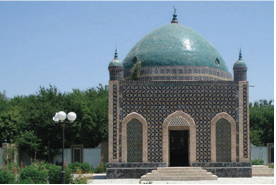

- Namangan viloyatida
+ Farg‘ona viloyatida
- Andijon viloyatida
- Sirdaryo viloyatida

**1072. Zamaxshariy qayerda vafot etgan?**

- Makkada 
- Xivada
+ Ko‘hna Urganchda
- Buxoroda

**1073. Narshaxiyning «Tahqiqi viloyati Buxoro» («Buxoro tarixi») asari qayerda rus va o‘zbek tilida nashr etilgan?**

- Sankt-Peterburgda
- Buxoroda
+ Toshkentda
- Moskvada

**1074. Zamaxshariyning «Turli masalalarning muhimi», «Vorislik huquqi ilmi bo‘yicha mashq» asarlari nimaga bag‘ishlangan?**

+ Fiqhga
- Din asoslariga
- Arab tili grammatikasiga
- Hadislarga

**1075. Hakim Termiziyning nechta asari bizgacha yetib kelgan?**

+ Oltmishga yaqini
- Yetmishga yaqini
- Saksonga yaqini
- To‘qsonga yaqini

**1076. Hakim Termiziy (Abu Abdulloh Muhammad ibn Ali ibn Hasan ibn Bashir Hakim Termiziy) tarjimayi holiga oid ma’lumotlar o‘rta asrlarda arab tilida ijod qilgan qaysi mualliflar asarlarida uchraydi? 1) Tojuddin Subkiy; 2) Xatib Bag‘dodiy Ibn Hojar Asqaloniy; 3) Is’hoq Rohuvaih; 4) Sullamiy.**

- 1, 3, 4
- 1, 2, 3
+ 1, 2, 4
- 2, 3, 4

**1077. Hakim Termiziy qaysi yillarda yashagan?**

- 780/790-885-yillarda
- 760/770-878-yillarda
- 740/750-853-yillarda
+ 750/760-869-yillarda

**1078. Ma’lumotlarga ko‘ra kim bir kuni bir insondan hadis eshitish va uni yozib olish uchun izlab borgan, u kishi otini chaqirish maqsadida etagiga yolg‘ondan yem solgandek ko‘rsatib, aldab chaqirayotganini ko‘rgan va oqibatda juda uzoqdan kelgan bo‘lsalar-da, u kishidan hadis eshitmay qaytib ketganlar?**

- Mahmud Zamaxshariy
+ Imom Buxoriy
- Imom Termiziy
- Burhoniddin Marg‘inoniy

**1079. Zamaxshariyning «G‘arib hadislar haqida ajoyib asar» asari nimaga bag‘ishlangan?**

- Fiqhga
- Din asoslariga
- Arab tili grammatikasiga
+ Hadislarga

**1080. Alisher Navoiy qaysi dostonining ustozi Abdurahmon Jomiy ta’rifiga bag‘ishlangan bobida Zamahshariyni eslab o‘tgan?**

- «Saddi Iskandariy» dostonida
- «Farhod va Shirin» dostonida
- «Hayrat ul-abror» dostonida
+ «Sab’ai sayyor» dostonida

**1081. Imom Buxoriy qaysi shogirdiga sen mendan bahra topganingdan ko‘ra, men sendan ko‘proq bahra topdim», deb aytgan?**

- Abulhasan Ali ibn Abubakrga
- Burhoniddin Marg‘inoniyga 
+ Imom Termiziyga
- Is’hoq Rohuvaihga

**1082. Abu Iso Muhammad Termiziy tavallud topgan Bug‘ qishlog‘i hozirgi qaysi tumanda joylashgan?**

- Denov tumanida
- Bandixon tumanida
- Angor tumanida
+ Sherobod tumanida

**1083. Qachon yurtimizda Termiziy tavalludining 1200 yilligi keng nishonlangan?**

+ 1990-yilda
- 1994-yilda
- 1991-yilda
- 1998-yilda

**1084. Zamaxshariy qayerning Zamaxshar qishlog‘ida tug‘ilgan?**

- Buxoro
+ Xorazm
- Samarqand
- Termiz

**1085. Kim Makkaga hajga borayotganlarida mashhur muhaddislar bilan uchrashib, ularning biridan hadis ilmidan saboq bermog‘ini iltimos qilgan, lekin qog‘oz-qalami yo‘qligi sababli u aytgan hamma hadislarni yod olgan?**

- Mahmud Zamaxshariy
- Imom Buxoriy
+ Imom Termiziy
- Burhoniddin Marg‘inoniy

**1086. Hadis to‘plovchilar qanday ataladi?**

- Mutavalli
- Muarrix
+ Muhaddis
- Mufassir

**1087. Imom Termiziy Imom Buxoriy bilan qaysi shaharda uchrashgan va ikki alloma birgalikda necha yil yashashgan?**

- Isfahonda, 3 yil
- Marvda, 8 yil
- Bag‘dodda, 2 yil
+ Nishopurda, 5 yil

**1088. Zamaxshariy «Al-Mufassal» asarini qayerda yashagan paytida yozgan?**

- Nishopurda
- Madinada
+ Makkada
- Bag‘dodda

**1089. Narshaxiyning «Tahqiqi viloyati Buxoro» («Buxoro tarixi») asarining qaysi tilga tarjima qilinib, qariyb uch asr davomida bir necha bor tahrir, qisqartirish va qo‘shimchalarni boshidan kechirgan nusxasi saqlanib qolgan?**

- Sug‘d tiliga
- Turk tiliga
+ Fors tiliga
- Arab tiliga

**1090. Quyidagi qaysi asarlar Imom Termiziy qalamiga mansub? 1) «Al-Jome’ as-sahih» («Ishonarli to‘plam»); 2) «Ash-Shamoil an-nabaviya» («Payg‘ambar alayhissalomning shakl va sifatlari»); 3) «Al-Ilal fil-hadis» («Hadislardagi illatlar»); 4) «at-Ta’rix» («Tarix»).**

- 1, 2, 4
- 1, 2, 3
- 2, 3, 4
+ 1, 2, 3, 4

**1091. Zamaxshariy qaysi yildan e’tiboran butun umrini ilm-fanga bag‘ishlagan?**

+ 1118-yildan
- 1122-yildan
- 1114-yildan
- 1129-yildan

**1092. Kim «Jorulloh» – «Allohning qo‘shnisi», «Arab va g‘ayri arablar ustozi », «Xorazm faxri» nomlari bilan ulug‘langan?**

- Al-Xorazmiy
+ Zamaxshariy
- Beruniy
- Abu Nasr Mansur

**1093. Burhoniddin Marg‘inoniyning «Hidoya» asari necha bobdan iborat?**

- 37 bobdan
- 47 bobdan
+ 57 bobdan
- 67 bobdan

**1094. Imom Termiziyning «Al-Jome’ as-sahih» asari nechta ishonchli hadislar to‘plamidan biri hisoblanadi?**

- 5 ta
+ 6 ta
- 7 ta
- 8 ta

**1095. «Hidoya» asari muallifi kim?**

- Imom Buxoriy
- Imom Termiziy
+ Burhoniddin Marg‘inoniy
- Mahmud Zamaxshariy

**1096. Imom Buxoriy Muhammad (s.a.v.) ning qancha hadislarini yodida saqlagan?**

- Besh yuz mingga yaqin
+ Olti yuz mingga yaqin
- Yetti yuz mingga yaqin
- Sakkiz yuz mingga yaqin

**1097. Kim hadis ilmi olimlaridan biri Is’hoq Rohuvaihning «Koshki sizlar Nabii sollallohu alayhi vasallamning sunnatlarini jamlagan muxtasar, sahih kitob jam qilsangiz edi!» degan so‘zlaridan keyin hadislarni jamlashni boshlagan?**

- Mahmud Zamaxshariy
+ Imom Buxoriy
- Imom Termiziy
- Burhoniddin Marg‘inoniy

**1098. Narshaxiyning «Tahqiqi viloyati Buxoro» («Buxoro tarixi») asarida … atrofidagi Karmana, Nur, Tavois, Iskajkat, Sharg‘, Zandana, Vardona, Afshona, Barkat, Romitan, Varaxsha, Baykand (Poykend), Forob va boshqalar haqida ma’lumot berilgan.**

- Farg‘ona
- G‘ijduvon
+ Buxoro
- Samarqand

**1099. Imom Buxoriyning «Al-Jome as-sahih» asari necha yil mobaynida yozib tugatilgan?**

- 14 yil mobaynida
- 12 yil mobaynida
- 18 yil mobaynida
+ 16 yil mobaynida

**1100. Narshaxiy qayerning Narshax qishlog‘ida tug‘ilgan?**

- Farg‘ona
- G‘ijduvon
+ Buxoro
- Samarqand

**1101. Hakim Termiziy nechta asar yozgan?**

- Ikki yuzga yaqin
- Uch yuzga yaqin
+ To‘rt yuzga yaqin
- Besh yuzga yaqin

**1102. Qachon musulmonlar tomonidan dunyodagi birinchi shifoxona tashkil qilingan?**

+ 707-yilda
- 709-yilda
- 711-yilda
- 718-yilda

**1103. Hakim Termiziyning «Kitob haqiqat al-odamiya» («Insoniyat haqiqati to‘g‘risida kitob»), «Adab al-nafs» («Nafs odobi») asarlari nimaga oid?**

- Fiqhga
- Mantiqqa
- Riyoziyotga
+ Tasavvufga

**1104. Zamaxshariy «Qur’on haqiqatlari va uni sharhlash orqali so‘zlar ko‘zlarini ochish» («Al-Kashshof an haqoiq it-tanziyl va uyun-il-aqoviyl fi vujuh it-ta’viyl») asarini qayerda yozgan?**

- Nishopurda
- Madinada
+ Makkada
- Bag‘dodda

**1105. Burhoniddin Marg‘inoniy qaysi mazhab bo‘yicha buyuk faqih va mujtahid darajasiga ko‘tarilgan?**

- Hanbaliy mazhabi
+ Hanafiy mazhabi
- Molikiy mazhabi
- Shofe’iy mazhabi

## 45-46-§ IX-XII asrlarda ilm-fan va madaniyatning yuksalishi.

**1106. Ma’mun akademiyasida Beruniyning qaysi sohadagi makatbi mashhur bo‘lgan?**

+ Astronomiya
- Matematika
- Kimyo
- Geometriya

**1107. Ilk o‘rta asrlarda qayerda asos solingan madrasaga shifoxona biriktirilgan?**

- Damashqda
- Bag‘dodda
- Qohirada
+ Nishopurda

**1108. Muhammad Muso Xorazmiy qaysi xalifa tomonidan Bag‘dodga olib ketilgan?**

- Horun
- Amin
+ Ma’mun
- Muoviya

**1109. Hozirgi geologiya, mineralogiya, fizika va kimyo sohalari uchun nihoyatda muhim va ishonchli bo‘lgan moddalar tahlili (diagnostikasi) ning usuli, ya’ni moddalar solishtirma og‘irligini aniqlash ilk bor qayerda kashf qilingan kashf qilingan?**

- Bag‘dodda, «Bayt al-Hikma» akademiyasida
- Misrda, Aleksandriya akademiyasida
- Afinada, Platon akademiyasida
+ Xorazmda, Ma’mun akademiyasida

**1110. Hozirgi geologiya, mineralogiya, fizika va kimyo sohalari uchun nihoyatda muhim va ishonchli bo‘lgan moddalar tahlili (diagnostikasi) ning usuli, ya’ni moddalar solishtirma og‘irligini aniqlash kim tomonidan kashf qilingan kashf qilingan?**

- Abul Xayr Hammor
- Abu Nasr
+ Beruniy
- Ibn Sino

**1111. XI-XII asrlarda Markaziy Osiyoda sariq loydan tayyorlanib, maxsus xumdonlarda pishirilgan g‘isht qanday atalgan?**

+ «Musulmon g‘isht»
- «Turon g‘isht»
- «Sug‘d g‘isht»
- «Dev g‘isht»

**1112. Diyorimizga qaysi asrga qadar asosan loy va xom g‘ishtdan qurib kelingan binolar o‘rniga endi pishiq g‘ishtlar ham ishlatila boshlangan?**

- VIII asrga qadar
+ IX asrga qadar
- X asrga qadar
- XI asrga qadar

**1113. Ma’mun akademiyasida Abu Nasrning qaysi sohadagi makatbi mashhur bo‘lgan?**

- Astronomiya
+ Matematika
- Kimyo
- Geometriya

**1114. Qachon mamlakatimizda Xorazm Ma’mun akademiyasining 1000 yilligi nishonlangan?**

+ 2006-yilda
- 2008-yilda
- 2004-yilda
- 2002-yilda

**1115. Xorazmshoh Abul Hasan Ali ibn Ma’mun tomonidan asos solingan akademiyaga kim boshchilik qilgan?**

- Muhammad Muso Xorazmiy
- Abu Ali Ibn Sino
+ Abu Rayhon Beruniy
- Mahmud Zamaxshariy

**1116. Xorazmshoh Abul Hasan Ali ibn Ma’mun qachon Gurganchda akademiyaga asos solgan?**

- 1006-yilda
+ 1004-yilda
- 1008-yilda
- 1002-yilda

**1117. IX-X asrlarda diyorimizga kelib-ketgan sayyoh va olimlar shaharlarga ta’rif bera turib, asosiy binolar sifatida nimalarni tilga olganlar?**

- Saroy va karvonsaroylarni
+ Masjid va madrasalarni
- Madrasa va hammomlarni
- Hammon va masjidlarni

**1118. Xorazmshoh Ma’munning zukko ma’rifatparvar va faylasuf bo‘lgan vaziri kim edi?**

+ Abu Husayn Suhayliy
- Nizom ul-Mulk
- Fazl ibn Sahl
- Abdulloh ibn Tohir

**1119. Abu Ali ibn Sino qaysi akademiyada faoliyat yuritgan?**

- «Bayt al-Hikma» akademiyasida
- Qohira akademiyasida
- Bag‘dod akademiyasida
+ Ma’mun akademiyasida

**1120. Nizomulmulk qaysi sulola davrida vazir bo‘lgan?**

- G‘aznaviylar
- Qoraxoniylar
+ Saljuqiylar
- Somoniylar

**1121. Marv noibi Ma’mun qachon Bag‘dod xalifaligi taxtiga o‘tirgan?**

+ 813-yilda
- 815-yilda
- 814-yilda
- 816-yilda

**1122. Rasmdagi Mag‘oki Attoriy masjidi qayerda joylashgan?**

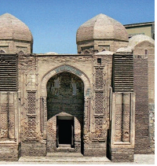

+ Buxoroda
- Samarqandda
- Termizda
- Marg‘ilonda

**1123. Ma’mun akademiyasida yig‘ilgan olimlarning aksariyati kimning asarlari sharhlovchilari yoki bu olimning biror fan sohasidagi ilmiy an’analari davomchilari bo‘lgan?**

- Abul Xayr Hammorning
- Abu Rayhon Beruniyning
+ Muhammad Muso Xorazmiyning
- Abu Ali Ibn Sinoning

**1124. XI-XII asrlarda Markaziy Osiyoda imoratlarni nechta burchakli peshtoqlari baland ko‘tarilgan va hashamatli gumbazlar bilan yopilgan holda qurish odat tusiga kirgan?**

+ Sakkiz burchakli
- O‘n burchakli
- Olti burchakli
- To‘rt burchakli

**1125. Nizomulmulk tomonidan qayerda asos solingan «Nizomiya» madrasalaridan birida olti ming talaba yashab, ta’lim olgan?**

- Damashqda
+ Bag‘dodda
- Qohirada
- Nishopurda

**1126. Ma’mun akademiyasida Abul Xayr Hammorning qaysi sohadagi makatbi mashhur bo‘lgan?**

- Astronomiya
- Matematika
+ Kimyo
- Geometriya

## 47-48-§ Muhammad ibn Muso al-Xorazmiy.

**1127. Muhammad ibn Muso al-Xorazmiy qaysi fanning asoschisi sifatida ilm-fan tarixida yuksak nom qozongan?**

+ Algebra
- Matematika
- Geometriya
- Arifmetika

**1128. Muhammad ibn Muso al-Xorazmiy qayerdagi Sinjor tekisligida yer meridiani darajasini o‘lchagan?**

- Iroqdagi
- Misrdagi
+ Suriyadagi
- Falastindagi

**1129. «Zij», «Usturlob bilan ishlash haqida kitob», «Usturlob yasash haqida kitob», «Usturlob yordamida azimutni aniqlash haqida», «Kitob ar-ruhoma», «Kitob at-tarix» asarlari muallifi kim?**

- Ahmad Farg‘oniy
+ Muhammad ibn Muso al-Xorazmiy
- Abu Nasr Forobiy
- Abu Rayhon Beruniy

**1130. Muhammad ibn Muso al-Xorazmiyning arifmetikaga oid risolasi … raqamlariga asoslangan bo‘lib, hozirgi kunda biz foydalanadigan o‘nlik hisoblash sistemasi va shu sistemadagi amallarning Yevropada tarqalishiga sabab bo‘lgan.**

- yunon
- bobil
- misr
+ hind

**1131. «Diksit Algoritmi» jumlasi ma’nosi nima?**

+ «Al-Xorazmiy shunday deydi»
- «Al-Xorazmiy shunday yozadi»
- «Al-Xorazmiy shunday yashaydi»
- «Al-Xorazmiy shunday ishlaydi»

**1132. Muhammad ibn Muso al-Xorazmiy nechta asar yozgan?**

- 10 dan ortiq
+ 20 dan ortiq
- 30 dan ortiq
- 40 dan ortiq

**1133. Muhammad ibn Muso al-Xorazmiy qadimiy qaysi davlatdan ma’lum bo‘lgan birinchi va ikkinchi darajali tenglamalarni yechish usullarini bayon qilgan?**

- Misrdan
+ Bobildan
- Hindistondan
- Ossuriyadan

**1134. Muhammad ibn Muso al-Xorazmiyning nechta asari bizgacha yetib kelgan?**

+ 10 tasi
- 20 tasi
- 30 tasi
- 40 tasi

**1135. Xalifa Ma’munning hukmronlik yillarini toping.**

- 810–830-yillar
+ 813–833-yillar
- 815–835-yillar
- 820–840-yillar

**1136. «Har gal mobil telefoningni qo‘lga olganda, unutma, uning «ichida» musulmon o‘zbek otaxon yashirin o‘tiradi!». Ushbu jumla muallifi bo‘lgan Britan jurnalisti kim?**

+ Endryu Marr
- Robert Fisk
- Metyu Vidard
- Pyer Bartolomey

**1137. Muhammad ibn Muso al-Xorazmiy qaysi yillarda yashagan?**

- 973–1048-yillarda
+ 783–850-yillarda
- 797–865-yillarda
- 873–950-yillarda

**1138. Muhammad ibn Muso al-Xorazmiyning «Kitob surat-al-arz» asari nimaga oid?**

- Matematikaga
- Geometriyaga
- Arifmetikaga
+ Geografiyaga

**1139. «Men arifmetikaning oddiy va murakkab masalalarini o‘z ichiga oluvchi … ni ta’lif qildim», deb yozgan Al-Xorazmiy.**

- «Hind hisobi haqida kitob»
- «Qo‘shish va ayirish haqida kitob»
+ «Al-jabr val-muqobala hisob haqida qisqacha kitob»
- «Usturlob yasash haqida kitob»

**1140. «Al-Xorazmiy» nomidan qaysi so‘z kelib chiqqan?**

- «Arifmetika»
+ «Algoritm»
- «Astrolyabiya»
- «Algebra»

**1141. «Xorazmiy o‘z davrining eng buyuk matematigi va agar barcha shart-sharoitlar nazarga olinsa, hamma davrlarning ham eng buyuklaridan biri», deb ta’kidlagan amerikalik tarixchi kim?**

+ J. Sarton
- E. Foner
- D. Gudvin
- H. Richardson

**1142. «Ta’lif qildim» so‘zining ma’nosi nima?**

- «Ta’rifladim»
- «O‘qidim»
- «Tuzdim»
+ «Yozdim»

**1143. Abu Ja’far (Abu Abdulloh) Muhammad ibn Muso al-Xorazmiy qayerda tug‘ilgan?**

- Guganchda
+ Xivada
- Hazoraspda
- Vazirda

**1144. Muhammad ibn Muso al-Xorazmiyning «Al-jabr val-muqobala» nomli risolasi nomidan qaysi so‘z kelib chiqqan?**

- «Arifmetika»
- «Astrolyabiya»
- «Algoritm»
+ «Algebra»

**1145. Muhammad ibn Muso al-Xorazmiy qaysi sonni son sifatida e’tirof etgan va hind sanoq tizimidan foydalanib, arab sanoq tizimiga asos solgan?**

+ 0 sonini
- 10 sonini
- 100 sonini
- 1000 sonini

**1146. Muhammad ibn Muso al-Xorazmiyning «Al-jabr val-muqobala», «Hind hisobi haqida kitob», «Qo‘shish va ayirish haqida kitob» asarlari nimaga oid?**

- Matematikaga
- Geometriyaga
+ Arifmetikaga
- Geografiyaga

**1147. X asrda yashagan qaysi sayyoh «Xorazmliklar aql-idrok, ilm, fiqh, qobiliyat hamda bilim kishilaridir», degan?**

- Ibn Battuta
- Al-Mas’udiy
+ Al-Muqaddasiy
- Ibn Fadlan

**1148. Muhammad ibn Muso al-Xorazmiyning aytishicha, algebrada uch xil son bilan ish ko‘riladi: … (jizr) yoki … (shay), … (mol) va oddiy son yoki … (pul birligi).**

+ ildiz/narsa/kvadrat/dirham
- narsa/kvadrat/dirham/ildiz
- kvadrat/dirham/ildiz/narsa
- dirham/ildiz/narsa/kvadrat

**1149. Qaysi yilda Sayyoralar tizimini nomlash ishchi guruhi Oyning kraterini Muso Xorazmiy nomi bilan atagan?**

- 1978-yilda
+ 1976-yilda
- 1971-yilda
- 1973-yilda

## 49-50-§ Ahmad Farg‘oniy.

**1150. Yevropa Uyg‘onish davrining qaysi mashhur olimi XV asrda Avstriya va Italiya universitetlarida astronomiyaga doir ma’ruzalarini Farg‘oniy asarlari asosida o‘qigan?**

- Makiavelli
- Shiller
- Dante
+ Regiomontan

**1151. Abul Abbos Ahmad ibn Muhammad ibn Kasir al-Farg‘oniy qaysi yillarda yashagan?**

- 973–1048-yillarda
- 783–850-yillarda
+ 797–865-yillarda
- 873–950-yillarda

**1152. «Usturlob yasash haqida kitob», «Yetti iqlimni hisoblash haqida» asarlari va «Oyning Yer ostida va ustida bo‘lish vaqtlarini aniqlash haqida risola» qo‘lyozmasi muallifi kim?**

- Abu Rayhon Beruniy
- Muhammad ibn Muso al-Xorazmiy
+ Ahmad Farg‘oniy
- Abu Nasr Farobiy

**1153. Ahmad Farg‘oniy Farg‘ona vodiysining qaysi qishlog‘ida tug‘ilgan?**

- Rishton qishlog‘ida
- Kufa qishlog‘ida
- Afshona qishlog‘ida
+ Qubo (Quva) qishlog‘ida

**1154. Qohira shahrining qayerida Ahmad al-Farg‘oniyning haykali o‘rnatilgan?**

- Markaziy maydonida
+ Roud orolida
- Parlament binosi oldida
- Milliy bog‘ida

**1155. Ahmad al-Farg‘oniyning «Samoviy harakatlar va umumiy ilmi nujum» («Astronomiya asoslari haqidagi kitob») asari qachon ikki marta lotin tiliga tarjima qilingan?**

- X asrda
- XI asrda
+ XII asrda
- XIII asrda

**1156. Ahmad Farg‘oniy avval …dagi rasadxonada ish olib bordi, so‘ngra …dagi rasadxonada osmon jismlari harakati va o‘rnini aniqlash, yangicha «Zij» yaratish ishlariga rahbarlik qilgan?**

- Damashq/Hamadon
+ Bag‘dod/Damashq
- Buxoro/Bag‘dod
- Sheroz/Samarqand

**1157. «Miqyosi Nil» uskunasi o‘rnatilgan binoda ishlatilgan buk daraxti qayerdan keltirilgan?**

- Ispaniyadan
- Armanistondan
- Suriyadan
+ Hindistondan

**1158. Qaysi samoviy jismdagi kraterlardan biriga Ahmad al-Farg‘oniy nomi berilgan?**

- Yupiterdagi
- Marsdagi
+ Oydagi
- Veneradagi

**1159. Ahmad Farg‘oniy qaysi yunon olimining «Yulduzlar jadvali» asarida berilgan ma’lumotlarni ko‘rib chiqish hamda o‘sha davrdagi barcha asosiy joylarning geografik koordinatalarini yangidan aniqlash yuzasidan olib borilgan muhim tadqiqotlarda faol ishtirok etgan?**

- Aristotelning
+ Ptolemeyning
- Demokritning
- Geraklitning

**1160. Farg‘oniy nomi XVIII asrda Yevropada kim tomonidan tilga olingan?**

- Makiavelli
+ Shiller
- Dante
- Regiomontan

**1161. Ahmad Farg‘oniyning Nil daryosi orollaridan biri — Roud «burni» ga qurgan «Miqyosi Nil» uskunasi Misrda nimaga asos solgan?**

- Yangicha dehqonchilik turiga
- Yangicha yer taqsimotiga
- Yangicha yil taqvimiga 
+ Yangicha soliq miqdoriga

**1162. Atoqli astronom Yan Geveliy qaysi yilda nashr qilingan «Selenografiya» kitobida oydagi kraterlardan birini buyuk vatandoshimiz Ahmad Farg‘oniy nomi bilan atagan?**

+ 1647-yilda
- 1645-yilda
- 1641-yilda
- 1649-yilda

**1163. Qachon Misr poytaxti Qohirada Ahmad al-Farg‘oniyga haykal o‘rnatilgan?**

+ 2007-yilda
- 2003-yilda
- 2005-yilda
- 2002-yilda

**1164. Qachon Ahmad al-Farg‘oniyning 1200 yillik tavallud sanasi nishonlangan?**

- 1992-yilda
+ 1998-yilda
- 1995-yilda
- 1991-yilda

**1165. Ilk o‘rta asrlarda Misr hududining qancha qismida dehqonchilik qilish, biron yegulik yetishtirish mumkin bo‘lgan?**

- Sakkiz foizida
+ Olti foizida
- O‘n foizida
- O‘n ikki foizida

**1166. Ahmad Farg‘oniy qachon Qohira yaqinidagi Ravzo orolida «nilometr», ya’ni suv sathini belgilovchi uskuna yasagan?**

+ 861-yilda
- 858-yilda
- 873-yilda
- 867-yilda

**1167. Ahmad Farg‘oniyning «Astronomiya asoslari haqidagi kitob» asari qaysi hudud orqali Yevropa mamlakatlarida astronomiya ilmining rivojini boshlab bergan?**

+ Ispaniya orqali
- Italiya orqali
- Shimoliy Afrika orqali
- Kichik Osiyo orqali

**1168. Farg‘oniy nomi XIV asrda Yevropada kim tomonidan tilga olingan?**

- Makiavelli
- Shiller
+ Dante
- Regiomontan

**1169. Ahmad al-Farg‘oniyning qaysi asari «Samoviy harakatlar va umumiy ilmi nujum» («Astronomiya asoslari haqidagi kitob») asari qachon boshqa Yevropa tillariga tarjima qilinganidan so‘ng, al-Farg‘oniyning nomi «Alfraganus» tarzida dunyoga tanilgan?**

- X asrda
- XI asrda
- XII asrda
+ XIII asrda

## 51-52-§ Abu Nasr Forobiy.

**1170. Quyidagi rasmdagi shohrud musiqiy asbobining chizmasi kimning kitobida tasvirlangan?**

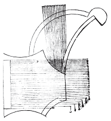

- Ahmad Farg‘oniy
+ Abu Nasr Forobiy
- Abu Rayhon Beruniy
- Abu Ali ibn Sino

**1171. Qaysi mutafakkir Aristotelning «Mo ba’da at-tabia» («Metafizika» – tabiatdan tashqari narsalar) asarini tushunish o‘ta qiyin bo‘lgani, kitob bozoridan arzimagan pulga Abu Nasr Forobiyning «Aristotel “Metafizika” kitobining maqsadi to‘g‘risida» kitobini sotib olib, bunday kitob topganidan xursand bo‘lib, xudoga shukur qilib, ataylab ro‘za tutdib, faqirlarga sadaqa ulashgani haqida yozgan?**

- Ahmad Farg‘oniy
- Abu Rayhon Beruniy
+ Abu Ali ibn Sino
- Al-Xorazmiy

**1172. Kim Sharq mamlakatlarida «Al-muallim as-Soniy» – «Ikkinchi muallim», «Sharq Arastusi» degan unvonlarga sazovor bo‘lgan?**

- Ahmad Farg‘oniy
- Abu Rayhon Beruniy
+ Abu Nasr Forobiy
- Abu Ali ibn Sino

**1173. «Baxt-saodatga erishuv yo‘llari» («Risola fi-t tanbeh ola asbob as-saodat»), «Shaharni boshqarish» («As-siyosat an-madaniya»), «Urush va tinch turmush haqida kitob» («Kitob fitoyii val xurub»), «Fazilatli xulqlar» («Asashrat al-Fazila») asarlari muallifi kim?**

+ Abu Nasr Forobiy
- Ahmad Farg‘oniy
- Abu Rayhon Beruniy
- Abu Ali ibn Sino

**1174. «Har qanday odam shahar-davlatga rahbarlik qilolmaydi. Rahbar bo‘lishning ikki sharti: 1. Inson tabiatida rahbarlik qilish qobiliyati (ma’naviy va aqliy yetuklik) bo‘lishi zarur. 2. Bunday odam yuqori mavqeyi, insoniy fazilatlari, qobiliyatlari bilan xalq orasida hurmat qozongan bo‘lishi zarur. Rahbarlik sohasida tajriba orttirish ham muhim». Ushbu jumlalar Abu Nasr Forobiyning qaysi asaridan olingan?**

- «Fazilatli xulqlar»
- «Shaharni boshqarish»
+ «Fozil odamlar shahri»
- «Baxt-saodatga erishuv yo‘llari»

**1175. Abu Nasr Forobiy qanday oilada tug‘ilgan?**

- Kelib chiqishi noma’lum bo‘lgan hunarmand oilasida
- Mahalliy aholidan bo‘lgan amaldor oilasida
- Eroniylardan bo‘lgan savdogar oilasida
+ Turkiy qabilalardan bo‘lgan harbiy xizmatchi oilasida

**1176. Abu Nasr Forobiyning qaysi risolasida jamiyatning kelib chiqishi, maqsad va vazifalari izchil yoritilgan?**

+ «Fozil odamlar shahri»
- «Fazilatli xulqlar»
- «Shaharni boshqarish»
- «Baxt-saodatga erishuv yo‘llari»

**1177. Abu Nasr Forobiy (Abu Nasr Muhammad ibn Muhammad ibn Uzlug‘ Tarxon Forobiy) qaysi yillarda yashagan?**

- 973–1048-yillarda
- 783–850-yillarda
- 797–865-yillarda
+ 873–950-yillarda

**1178. Abu Nasr Forobiy «Fozil odamlar shahri» asarida rahbar insonda bo‘lishi kerak bo‘lgan nechta xislat-fazilatni sanab o‘tgan?**

- 6 ta
- 8 ta
- 10 ta
+ 12 ta

**1179. Abu Nasr Forobiy qaysi tillarda falsafiy mazmundagi she’rlar ham yozgan?**

- Yunon va sug‘d tillarida
- Turkiy va arab tillarida
- Fors va turkiy tillarda
+ Arab va fors tillarida

**1180. Abu Nasr Forobiy qaysi yunon mutafakkirlari asarlarini tarjima qilgan?**

- Aristotel, Yevklid, Ptolemey, Porfiriy, Arximed
+ Platon, Aristotel, Yevklid, Ptolemey, Porfiriy
- Yevklid, Ptolemey, Porfiriy, Demokrit, Geraklit
- Ptolemey, Porfiriy, Demokrit, Geraklit, Suqrot

**1181. «Aristotel “Metafizika” kitobining maqsadi to‘g‘risida» risola muallifi kim?**

- Ahmad Farg‘oniy
- Abu Rayhon Beruniy
- Abu Ali ibn Sino
+ Abu Nasr Forobiy

**1182. Abu Nasr Forobiy asarlarini necha guruhga ajratish mumkin?**

+ 2 guruhga
- 3 guruhga
- 4 guruhga
- 5 guruhga

**1183. Abu Nasr Forobiy tug‘ilgan Forob shahri yana qanday nomlangan?**

- Taroz
+ O‘tror
- Turkiston
- Bolasog‘un

**1184. «Metafizika», «Etika», «Ritorika», «Sofistika» asarlari muallifi kim?**

- Yevklid
+ Aristotel
- Ptolemey
- Porfiriy

**1185. Abu Nasr Forobiy qancha asar yaratgan?**

- 150 dan ortiq
+ 160 dan ortiq
- 170 dan ortiq
- 180 dan ortiq

**1186. Abu Nasr Forobiy qancha tilni bilganligi qayd etilgan?**

- 40 dan ortiq tilni
- 50 dan ortiq tilni
- 60 dan ortiq tilni
+ 70 dan ortiq tilni

**1187. Qaysi mutafakkirlar Abu Nasr Forobiyning ta’limotini chuqur o‘rganib, uni yangi g‘oyalar bilan boyitganlar? 1) Ibn Sino; 2) Ahmad Farg‘oniy; 3) Umar Xayyom; 4) Al-Xorazmiy; 5) Beruniy.**

+ 1, 3, 5
- 1, 2, 4
- 2, 3, 4
- 2, 4, 5

**1188. «Musiqa haqida katta kitob» asari muallifi kim?**

- Ahmad Farg‘oniy
- Abu Rayhon Beruniy
- Abu Ali ibn Sino
+ Abu Nasr Forobiy

**1189. Abu Nasr Forobiy tug‘ilgan Forob shahri qayerda joylashgan edi?**

+ Sirdaryoning o‘ng qirg‘og‘ida
- Sirdaryoning chap qirg‘og‘ida
- Amudaryoning o‘ng qirg‘og‘ida
- Amudaryoning chap qirg‘og‘ida

**1190. Abu Nasr Forobiy o‘z asarlarini qaysi tilda yozgan?**

+ Arab tilida
- Fors tilida
- Turkiy tilda
- Sug‘d tilida

**1191. Abu Nasr Forobiy kimdan keyin «Ikkinchi muallim» («Al-muallim as-Soniy») deb ulug‘langan?**

- Arximeddan keyin
- Ptolemeydan keyin
+ Aristoteldan keyin
- Suqrotdan keyin

**1192. «Metafizika» so‘zining lug‘aviy ma’nosi nima?**

- «Fizikadan boshqa»
- «Fizikadan oldin»
+ «Fizikadan so‘ng»
- «Fizikadan qiyin»

**1193. Kim musiqani inson tarbiyasiga ta’sir qiluvchi omillardan biri deb bilgan?**

- Ahmad Farg‘oniy
+ Abu Nasr Forobiy
- Abu Rayhon Beruniy
- Abu Ali ibn Sino

##  53-54-§ Abu Rayhon Beruniy.

**1194. «Beruniy» so‘zining ma’nosi nima?**

- «Ichkarilik»
+ «Tashqarilik»
- «Shaharlik»
- «Vohalik»

**1195. Quyidagi rasmda Abu Rayhon Beruniyning XIII asrda ko‘chirilgan qaysi asari tasvirlangan?**

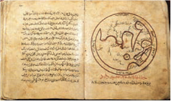

- «Geodeziya»
- «Mineralogiya»
- «Saydana»
+ «Kitob al-tafhim»

**1196. Abu Rayhon Beruniy ustozi Abu Nasr ibn Iroqdan qaysi fanlarga oid bilimlarni o‘rgangan?**

- Tibbiy, astronomiya va falsafa
- Ilohiyot, falsafa va algebra
- Mineralogiya, geometriya, astronomiya
+ Astronomiya, algebra va geometriya

**1197. «U arab adabiyoti okeanida yagona qoyadir. Hindshunoslikda Beruniyga teng keladigan kishini na ilgari va na so‘nggi vaqtlarda o‘tganini bilmaymiz». Beruniy haqida bildirilgan yuqoridagi fikrlar muallifi bo‘lgan nemis sharqshunosi Zaxau qaysi asrda yashagan?**

- XVI asrda
- XVII asrda
- XVIII asrda
+ XIX asrda

**1198. «Mehnatsiz shon-shavkatga, martabaga erishgan kishi hurmatga loyiqmi? Yuqori martabaga mehnatsiz erishgan kishi farog‘at va rohat soyasida yashaydi, yaxshi kiyinadi, ammo ulug‘lik libosidan mahrum, yalong‘ochdir». Ushbu jumlalar Abu Rayhon Beruniyning qaysi asarida keltirilgan?**

- «Geodeziya»
+ «Mineralogiya»
- «Saydana»
- «Kitob al-tafhim»

**1199. Xorazmdagi siyosiy ziddiyatlar va notinchlik sabab Beruniy necha yoshida ona shahrini tark etgan?**

- 29 yoshida
- 21 yoshida
+ 22 yoshida
- 25 yoshida

**1200. Quyidagi suratdagi suvga tushirilgan namuna asosida siqib chiqarilgan suyuqlikning hajmini aniqlash moslamasi chizmasi Abu Rayhon Beruniyning XI asrda yozilgan qaysi asarida keltirilgan?**

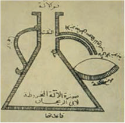

- «Geodeziya»
+ «Mineralogiya»
- «Saydana»
- «Kitob al-tafhim»

**1201. «Garchi biz bu kitobning ba’zi joylarida turli fanlarga o‘tib, bayonimizga aloqasi yo‘q masalalarga kirishib ketsak ham, bu gapni cho‘zish yoki ko‘paytirish maqsadida emas, balki o‘quvchini zeriktirmaslik uchundir. Chunki doim bir xil narsaga qarash malollik va sabrsizlikni olib keladi. O‘quvchi fandan fanga o‘tib tursa, turli bog‘larda yurganga o‘xshaydi...». Ushbu jumlalar Abu Rayhon Beruniyning qaysi asarida kelirilgan?**

+ «Qadimgi xalqlardan qolgan yodgorliklar»
- «Geodeziya»
- «Mineralogiya»
- «Kitob al-tafhim»

**1202. Abu Rayhon Beruniyning qaysi asari tibbiyotga bag‘ishlangan?**

- «Geodeziya»
- «Mineralogiya»
+ «Saydana»
- «Kitob al-tafhim»

**1203. Abu Rayhon Beruniy qaysi fanlarni puхtа egаllаgаn? 1) Fаlаkiyot (аstrоnоmiya); 2) Fizikа; 3) Riyoziyot (mаtematika); 4) Ilоhiyot; 5) Ma’dаnshunоslik.**

- 2, 3, 4
- 2, 3, 4, 5
- 1, 2, 3, 5
+ 1, 2, 3, 4, 5

**1204. «Qonuni Mas’udiy» asari muallifi kim?**

- Ahmad Farg‘oniy
+ Abu Rayhon Beruniy
- Abu Ali ibn Sino
- Al-Xorazmiy

**1205. Xorazmdagi siyosiy ziddiyatlar va notinchlik sabab Beruniy 22 yoshida ona shahrini tark etib, Kaspiy dengizi janubidagi qaysi shaharlarda yashagan?**

+ Jurjon va Ray
- Ray va Isfahon
- Isfahon va Hamadon
- Hamadon va Jurjon

**1206. Abu Rayhon Beruniy qancha asar yaratgan?**

- 50 dan ortiq
- 100 dan ortiq
+ 150 dan ortiq
- 200 dan ortiq

**1207. Qaysi mutafakkir shu paytgacha noma’lum bo‘lgan Amerika qit’asi mavjudligini taxmin qilib, o‘z asarlarida bu haqda bir necha bor yozgan?**

- Ahmad Farg‘oniy
+ Abu Rayhon Beruniy
- Abu Ali ibn Sino
- Al-Xorazmiy

**1208. Abu Rayhon Beruniyning ilk ustozi kim bo‘lgan?**

- Abu Sahl Iso al-Masihiy
+ Abu Nasr ibn Iroq
- Abu Sa’d al-Sam’ani
- Abulfazl Muhammad Bayhaqiy

**1209. Abu Rayhon Beruniyning g‘arbiy yarim sharda katta quruqlik borligi to‘g‘risidagi fikri qachon o‘z tasdig‘ini topgan?**

- XIII–XIV asrlarda
- XIV–XV asrlarda
+ XV–XVI asrlarda
- XVI–XVII asrlarda

**1210. Abu Rayhon Beruniy haykallari O‘zbekistonda qayerlarda o‘rnatilgan?**

+ Toshkent va Xorazmda
- Qoraqalpog‘iston va Toshkentda
- Xorazm va Qoraqalpog‘istonda
- Navoiy va Samarqandda

**1211. Mas’ud G‘aznaviyning hukmronlik yillarini toping.**

- 1029–1040-yillar
- 1033–1044-yillar
- 1026–1037-yillar
+ 1030–1041-yillar

**1212. Xorazm qachon Mahmud G‘aznaviy tomonidan zabt etilgan?**

+ 1017-yilda
- 1019-yilda
- 1011-yilda
- 1013-yilda

**1213. «Beruniy geologiya va mineralogiya fanlarining nazariyotchisi va asoschisidir». Ushbu jumlalar muallifi bo‘lgan akademik kim?**

- M. Islomov
- A. Haydarov
- B. Nazarov
+ H. Abdullayev

**1214. Abu Rayhon Beruniy nechta yulduzning koordinatalari va yulduz kattaliklari qayd etilgan yulduzlar jadvalini hamda dunyoning geografik xaritasini tuzgan?**

- 1039 ta
- 1059 ta
- 1049 ta
+ 1029 ta

**1215. «Beruniyning qiziqqan ilm sohalaridan ko‘ra, qiziqmagan sohalarini sanab o‘tish osondir». Ushbu jumlalar muallifi bo‘lgan sharqshunos olim kim?**

- V. V. Bartold
+ I. Y. Krachkovskiy
- A. I. Bazilevich
- Y. A. Primakov

**1216. Abu Rayhon Beruniy o‘zining birinchi astronomik tajribalarini necha yoshida boshlagan?**

- 18 yoshida
- 20 yoshida
- 22 yoshida
+ 16 yoshida

**1217. Quyidagi qaysi obyektlarga Abu Rayhon Beruniy nomi berilgan? 1) O‘zbekiston Fanlar akademiyasi Sharqshunoslik institutiga; 2) Toshkentdagi metro bekatiga; 3) Oydagi vulqonga; 4) Asteroidga.**

- 2, 3, 4
- 1, 2, 4
- 1, 2, 3
+ 1, 2, 3, 4

**1218. Abu Rayhon Beruniy ustozi Abu Sahl Iso al-Masihiydan qaysi fanlarga oid bilimlarni o‘rgangan?**

+ Tibbiy, astronomiya va falsafa
- Ilohiyot, falsafa va algebra
- Mineralogiya, geometriya, astronomiya
- Astronomiya, algebra va geometriya

**1219. Abu Rayhon Beruniyning ustozi Abu Nasr ibn Iroq nechta asarini sevimli shogirdiga bag‘ishlagan?**

- 13 ta asarini
- 10 ta asarini
+ 12 ta asarini
- 18 ta asarini

**1220. Abu Rayhon Beruniy «Qadimgi xalqlardan qolgan yodgorliklar» asarini qaysi yilda tugallgan?**

+ 1000-yilda
- 1003-yilda
- 1001-yilda
- 1008-yilda

**1221. Abu Rayhon Muhammad ibn Ahmad Beruniy qaysi yillarda yashagan?**

+ 973–1048-yillarda
- 797–865-yillarda
- 783–850-yillarda
- 873–950-yillarda

**1222. «… bir olim astronomiya sohasida men bilan bahsga kirishdi va ilmda mendan ancha past tursa-da, mendan o‘zini yuqori olib, hatto kaminani haqorat ham qildi. Vaholanki, faqat boylik ortiqchaligi oramizdagi farq edi». Beruniy qaysi shahardaligida yuqoridagi voqea ro‘y bergan?**

- Jurjon
+ Ray
- Isfahon
- Hamadon

**1223. «Qadimgi xalqlardan qolgan yodgorliklar», «Hindiston», «Mineralogiya», «Geodeziya» asarlari muallifi kim?**

- Abu Nasr Forobiy
- Ahmad Farg‘oniy
+ Abu Rayhon Beruniy
- Abu Ali ibn Sino

**1224. Abu Rayhon Beruniy o‘zining birinchi astronomik tajribalarini qaysi shaharda boshlagan?**

- Gurganch shahrida
- Ray shahrida
+ Kat shahrida
- Jurjon shahrida

**1225. Abu Rayhon Beruniyning o‘z ismi kim?**

- Rayhon
- Ahmad
+ Muhammad
- Ali

**1226. Abu Rayhon Beruniy Mas’ud G‘aznaviyning …ni o‘rganishiga, …dan xabardor bo‘lishiga ko‘maklashgan.**

- hind tili/tarix
- yunon tili/falsafa
- fors tili/matematika
+ arab tili/astronomiya

**1227. Abu Rayhon Beruniy tibbiyotga bag‘ishlangan «Saydana» asarida mingdan ortiq dorivor moddalar nomini nechta tilda yozib chiqqan?**

- 10 tilda
- 20 tilda
+ 30 tilda
- 40 tilda

**1228. «О‘rta asr va yangi zamon mualliflaridan hech biri hind madaniyatining chigal masalalarini chuqur ilmiy ruhda tushunishda Abu Rayhon Muhammad ibn Ahmad Beruniy erishgan yutuqlarga erisha olmadi». Ushbu jumlalar muallifi bo‘lgan hind olimi kim?**

- Kiran Kumar
+ Hamid Rizo
- Manjul Bhargava
- Satyajit Mayor

**1229. Abu Rayhon Beruniy faoliyatiga haqqoniy baho bergan amerikalik tarixchi Jorj Sarton qaysi asrni «Beruniy asri» deb ta’riflagan?**

- VIII asrni
- IX asrni
- X asrni
+ XI asrni

**1230. 2009-yil iyun oyida Eron hukumati tomonidan qayerdagi Birlashgan Millatlar Tashkilotining bo‘limiga to‘rt mashhur olim: Ibn Sino, Beruniy, Zokiriy Roziy (Reyz) hamda Umar Xayyomni o‘z ichiga olgan pavilyon taqdim etilgan?**

+ Venadagi
- Parijdagi
- Londondagi
- Berlindagi

**1231. Mahmud G‘aznaviy Hindistonga qilgan bir nechta yurishlarida Beruniyni kim sifatida yonida olib yurgan?**

+ Munajjim
- Tabib
- Geograf
- Tarixchi

**1232. Quyidagi rasmdagi Yer aylanishi chizmasi muallifi kim?**

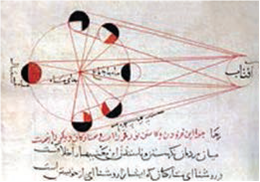

- Ahmad Farg‘oniy
+ Abu Rayhon Beruniy
- Abu Ali ibn Sino
- Al-Xorazmiy

**1233. Abu Rayhon Beruniy yashagan shahar qachon Beruniy nomini olgan?**

- 1977-yilda
- 1968-yilda
+ 1957-yilda
- 1973-yilda

**1234. Qachon O‘zbekistonda Abu Rayhon Beruniy tavalludining 1000 yilligi nishonlangan?**

- 1977-yilda
- 1968-yilda
- 1957-yilda
+ 1973-yilda

**1235. Abu Rayhon Beruniyning ikkinchi ustozi kim bo‘lgan?**

+ Abu Sahl Iso al-Masihiy
- Abu Nasr ibn Iroq
- Abu Sa’d al-Sam’ani
- Abulfazl Muhammad Bayhaqiy

**1236. Abu Rayhon Beruniy qayerda tug‘ilgan va vafot etgan?**

- Gurganch/Bag‘dod
+ Kat/G‘azna
- Xiva/Kobul
- Vazir/Balx

**1237. Qaysi asari Abu Rayhon Beruniyning ko‘p qirrali olim ekanini namoyish etgan?**

- «Geodeziya»
- «Mineralogiya»
+ «Qadimgi xalqlardan qolgan yodgorliklar»
- «Kitob al-tafhim»

**1238. Qachon Eron hukumati tomonidan Venadagi Birlashgan Millatlar Tashkilotining bo‘limiga to‘rt mashhur olim: Ibn Sino, Beruniy, Zokiriy Roziy (Reyz) hamda Umar Xayyomni o‘z ichiga olgan pavilyon taqdim etilgan?**

- 2012-yil iyun oyida
+ 2009-yil iyun oyida
- 2007-yil iyun oyida
- 2014-yil iyun oyida

**1239. Abu Rayhon Beruniy o‘zining falakiyotga oid asarlarida qaysi fikrni birinchi bo‘lib ilgari surgan?**

+ Yerning Quyosh atrofida aylanishi haqidagi
- Yerning shar shaklida ekanligi haqidagi
- Quyoshning boshqa yulduzlar kabi yulduzligi haqidagi
- Koinotning cheksizligi haqidagi

**1240. Abu Rayhon Beruniy ustozi Abu Sahl Iso al-Masihiy bilan qayerda payti uchrashgan?**

- Hamadonda
- Bag‘dodda
- G‘aznada
+ Jurjonda

**1241. Eron hukumati tomonidan Venadagi Birlashgan Millatlar Tashkilotining bo‘limiga taqdim etilgan, to‘rt mashhur olim: Ibn Sino, Beruniy, Zokiriy Roziy (Reyz) hamda Umar Xayyomni o‘z ichiga olgan pavilyon shaharnig qaysi qismidan joy olgan?**

- Hofburg saroyidan
- Vena davlat opera teatridan
+ Xalqaro markaziy Memorial maydonidan
- Albertina majmuasidan

**1242. Quyidagi suratda qanday asbob tasvirlangan?**

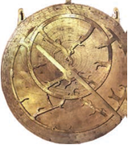

- Kvadrant
- Armil
+ Usturlob
- Jantariy

**1243. «Hindiston» filmi muallifi bo‘lgan hind olimi kim?**

- Kiran Kumar
+ Hamid Rizo
- Manjul Bhargava
- Satyajit Mayor

## 55-56-§ Abu Ali ibn Sino.

**1244. Abu Ali ibn Sino necha yoshidan boshlang‘ich matematika, mantiq, fiqh, falsafa ilmlari bilan shug‘ullana boshlagan?**

+ 13 yoshidan
- 14 yoshidan
- 15 yoshidan
- 16 yoshidan

**1245. Abu Ali ibn Sino necha yoshidayoq mashhur tabib — hakim bo‘lib tanilgan?**

- 15-16 yoshidayoq
+ 16-17 yoshidayoq
- 17-18 yoshidayoq
- 18-19 yoshidayoq

**1246. Abu Ali ibn Sinoning qaysi kitobida «Aql tarozisida o‘lchanmagan har qanday bilim, chin bo‘lolmaydi, demak, u haqiqiy bilim emas», deb yozilgan?**

- «Al-qonun fit-tib»
- «Kitob ash-shifo»
+ «Risolatun fi taqsim al-mavjudot»
- «Kitob al-ishorat fil mantiq va hikmat»

**1247. Abu Ali Ibn Sinoning «Al-qonun fit-tib» asari qachon lotinchaga tarjima qilingan?**

- XI asrda
+ XII asrda
- XIII asrda
- XIV asrda

**1248. Aytishlariga qaraganda, hakimlar aslida 4 ta bo‘lgan, G‘arbda kimlar?**

+ Arastu va Iskandar
- Iskandar va Suqrot
- Suqrot va Aflotun
- Aflotun va Arastu

**1249. Abu Ali ibn Sinoning «Tib qonunlari» asari lotincha tarjimasi to‘liq holda necha marta nashr qilingan?**

- 10 marta
- 20 marta
- 30 marta
+ 40 marta

**1250. Aytishlariga qaraganda, hakimlar aslida 4 ta bo‘lgan, Sharqda kimlar?**

- Ahmad Farg‘oniy va Abu Nasr Forobiy
+ Abu Nasr Forobiy va Abu Ali ibn Sino
- Abu Ali ibn Sino va Abu Rayhon Beruniy
- Abu Rayhon Beruniy va Hakim Termiziy

**1251. Qachon Belgiyaning Kortreyk shahrida Ibn Sinoga haykal qo‘yilgan?**

- 1999-yilda
+ 2000-yilda
- 2002-yilda
- 1997-yilda

**1252. Kim Sharqda «Shayx ar-rais» (donishmandlar sardori, allomalar boshlig‘i); «Sharaf al-mulk» (o‘lka, mamlakatning obro‘si, sharafi); «Hakim al-vazir» (vazirlar donishmandi) deb atalgan?**

- Ahmad Farg‘oniy
- Abu Rayhon Beruniy
+ Abu Ali ibn Sino
- Al-Xorazmiy

**1253. Qaysi samoviy jismdagi kraterga Abu Ali ibn Sinoning nomi berilgan?**

- Veneradagi
- Marsdagi
- Yupiterdagi
+ Oydagi

**1254. Qaysi asrda yashagan mashhur shved botanigi Karl Linney doimo yashil bo‘lib turuvchi bir tropik daraxtni Ibn Sino sharafiga «Avitsenniya» deb atagan?**

- XVI asrda
- XVII asrda
+ XVIII asrda
- XIX asrda

**1255. Abu Ali ibn Sino necha yoshida Qur’oni Karimni to‘liq yod olgan?**

- 8 yoshida
+ 10 yoshida
- 12 yoshida
- 6 yoshida

**1256. Abu Ali ibn Sinoning «Tib qonunlari» kitobining nodir nusxasi qaysi yilda ko‘chirilgan?**

- 1603-yilda
- 1608-yilda
- 1605-yilda
+ 1601-yilda

**1257. Abu Ali Ibn Sino tarixida birinchi bo‘lib … .**

- gigiyena qoidalari to‘plamini tuzgan
- tibbiyot niqobini qo‘llashni joriy etgan
- jarrohlik operatsiyasini amalga oshirgan
+ vabo bilan ofatni farqlagan

**1258. Abu Ali ibn Sino (Abu Ali al-Husayn ibn Abdulloh ibn al-Hasan ibn Ali) qaysi yillarda yashagan?**

- 973–1048-yillarda
- 797–865-yillarda
+ 980–1037-yillarda
- 873–950-yillarda

**1259. Abu Ali Ibn Sino bemorlarni davolashda nimalarga ahamiyat berish kerakligini aytgan?**

- 2 narsaga: ovqatlanish tartibi (parhez) va dorilar bilan davolash
+ 3 narsaga: ovqatlanish tartibi (parhez), dorilar bilan davolash va turli tibbiy tadbirlarni qo‘llash (qon olish, zuluk yoki banka qo‘yish va boshqalar)
- 4 narsaga: ovqatlanish tartibi (parhez), dorilar bilan davolash, turli tibbiy tadbirlarni qo‘llash (qon olish, zuluk yoki banka qo‘yish va boshqalar) va jismoniy faollik
- 5 narsaga: ovqatlanish tartibi (parhez), dorilar bilan davolash, turli tibbiy tadbirlarni qo‘llash (qon olish, zuluk yoki banka qo‘yish va boshqalar), jismoniy faollik va ruhiy sog‘lomlashtirish

**1260. Abu Ali ibn Sino qayerda tug‘ilgan va vafot etgan?**

+ Afshоna qishlog‘i/Hamadоn shahri
- Qubo qishlog‘i/Isfahon shahri
- Bug‘ qishlog‘i/Jurjon shahri
- Kufa qishlog‘i/Ray shahri

**1261. O‘zbekistonda Abu Ali Ibn Sino nomi bilan qanday xalqaro jurnallar nashr qilinmoqda?**

- «Ibn Sino» va «Madadsino» nomli
- «Abu Ali Ibn Sino» va «Avicenna» nomli
+ «Ibn Sino» va «Sino» nomli
- «Sino» va «Avicenna» nomli

**1262. Abu Ali Ibn Sinoning «Shayx ar-rais» nomi, eng avvalo, uning buyuk …ligiga ishoradir.**

+ faylasuf
- tabib
- ilohiyotchi
- astronom

**1263. Abu Ali Ibn Sinoning «Al-qonun fit-tib» asari qachongacha Yevropa tabobatida asosiy qo‘llanma sifatida foydalanilgan?**

- XIV asrgacha
- XV asrgacha
- XVI asrgacha
+ XVII asrgacha

**1264. Abu Ali ibn Sino ilmiy merosini o‘rganish ishlari qaysi asrga kelib jadal tus olgan?**

+ XIII asrga
- XIV asrga
- XV asrga
- XVI asrga

**1265. Abu Ali ibn Sino kitoblari orqali kimga shogird sanalgan?**

- Ahmad Farg‘oniyga
- Abu Rayhon Beruniyga
+ Abu Nasr Forobiyga
- Hakim Termiziyga

**1266. Abu Ali ibn Sino G‘arbda qanday nom bilan mashhur bo‘lgan?**

- Algoritm
+ Avitsеnna
- Alfraganus
- Algebra

**1267. O‘zbekistonda qayerlarda Ibn Sinoga haykal o‘rnatilgan?**

+ Buxoro shahri va Afshona qishlog‘ida
- Toshkent shahri va Afshona qishlog‘ida
- Buxoro shahri va Qubo qishlog‘ida
- Toshkent shahri va Qubo qishlog‘ida

**1268. Qachon O‘zbekistonda Ibn Sino xalqaro jamg‘armasi tuzilgan?**

+ 1999-yilda
- 2000-yilda
- 2002-yilda
- 1997-yilda