# 8-sinf O`zbekiston tarixi (2023-yil darsligi)

_Tarix (Mavzulashgan) (2022-2025-yillar darsliklari)_

## XIII asr boshlarida Xorazm davlatida siyosiy vaziyat.

**1. Sulton Muhammad Xorazmshoh qayerni o‘z poytaxti deb e’lon qilgan?**

- Buxoroni
+ Samarqandni
- Xo‘jandni
- Keshni

**2. Xorazmshoh qo‘shinida qal’alarni shturm va qamal qilishda ishlatiladigan shotilar qanday atalgan?**

+ “Salolim”
- “Jamoluqot”
- “Mataris”
- “Manjaniq”

**3. XIII asr boshida Xorazmshoh qo‘shinida zaxira rolini bajaruvchi maxsus qism qanday atalgan?**

- “Yozoq”
+ “Xofiya”
- “Xaros”
- “Qalb”

**4. Sulton Muhammad Xorazmshoh Movarounnahrdan keyin qaysi hududlarni egallagan? 1) Kirmon; 2) Mikron; 3) Seyiston; 4) Balujiston.**

- 1, 3, 4
- 1, 2, 3
+ 1, 2, 4
- 1, 2, 3, 4

**5. XIII asr boshida Xorazmshoh qo‘shinida tansoqchilar (xaros) qismi kimlardan tashkil etilgan edi?**

- Qarluqlardan
+ Mamluklardan
- Qang‘li-qipchoqlardan
- Turkmanlardan

**6. XIII asr boshida Xorazmshoh qo‘shinida tansoqchilar qismi qanday atalgan?**

- “Mamluk”
- “Xofiya”
+ “Xaros”
- “Yozoq”

**7. Qaysi yilga kelib Sulton Muhammad Xorazmshoh davlati tarkibiga Fors Iroqi (Iroqi Ajam), Mozandaron, Arron, Ozarbayjon, Shirvon, Fors, Kirmon, Mikron, Mang‘ishloq, Seyiston, G‘ur, G‘azna, Bomiyon yerlari, jumladan, Kaspiy dengizidan Hindistongacha bo‘lgan yerlar kirgan?**

+ 1217-yilga kelib
- 1219-yilga kelib
- 1216-yilga kelib
- 1218-yilga kelib

**8. XIII asr boshida Xorazmshoh qo‘shinining so‘l (chap) qismi qanday nomlangan?**

- “Avang‘or”
- “Qalb”
- “Maymana”
+ “Maysara”

**9. XIII asr boshida Xorazmshoh qo‘shinining markaz qismi qanday nomlangan?**

- “Avang‘or”
+ “Qalb”
- “Maymana”
- “Maysara”

**10. Muhammad Xorazmshoh qaysi yilda Xuroson, Kirmon, Mikron, so‘ng Balujistonni egallashga muvaffaq bo‘lgan?**

- 1214-yilda
- 1208-yilda
- 1210-yilda
+ 1212-yilda

**11. XIII asr boshida Xorazmshoh qo‘shinida tansoqchilar (xaros) qismi qancha kishini tashkil etgan?**

+ 10 ming kishini
- 20 ming kishini
- 30 ming kishini
- 40 ming kishini

**12. XIII asr boshida Xorazmshoh qo‘shinida raqibni tor-mor etishni yakunlash vazifasi qaysi qismga yuklatilgan?**

- Muqaddam qismga
+ Xofiya qismga
- Qalb qismga
- Yozoq qismga

**13. XIII asr boshida Xorazmshoh qo‘shinining jangovar tartibi necha qismdan tashkil topgan?**

- Uch qismdan
+ To‘rt qismdan
- Besh qismdan
- Olti qismdan

**14. Sulton Muhammad Xorazmshoh davrida saltanat asosan kimlardan iborat muntazam qo‘shinga ega edi?**

- Qarluqlar hamda qang‘li-qipchoqlardan
+ Qang‘li-qipchoq hamda turkmanlardan
- Turkmanlar hamda o‘g‘uzlardan
- O‘g‘uzlar hamda qarluqlardan

**15. Qachon Sulton Muhammad Xorazmshoh xalifa nomini xutbadan chiqarib tashlashni buyurgan?**

+ 1218-yil martida
- 1215-yil martida
- 1217-yil martida
- 1216-yil martida

**16. Sulton Muhammad Xorazmshoh qo‘shinining umumiy soni qancha bo‘lgan?**

- 250 000 kishiga qadar yetgan
- 300 000 kishiga qadar yetgan
- 350 000 kishiga qadar yetgan
+ 400 000 kishiga qadar yetgan

**17. XIII asr boshida Xorazmshoh qo‘shinida qanday turdagi qo‘shin ko‘pchilkni tashkil qilgan?**

- Piyodalar
- Kamonchilar
+ Otliqlar
- Tuyakashlar

**18. Xorazmshoh qo‘shinida qal’alarni shturm va qamal qilishda ishlatiladigan odimlovchi minoralar qanday atalgan?**

- “Salolim”
- “Jamoluqot”
+ “Mataris”
- “Manjaniq”

**19. Sulton Muhammad Xorazmshoh qaysi yilda Movarounnahrda qoraxoniylar boshqaruviga chek qo‘ygan?**

- 1214-yilda
- 1208-yilda
- 1210-yilda
+ 1212-yilda

**20. Muhammad Xorazmshoh G‘azna, G‘ur, Bomiyon yerlarini qachon egallagan?**

- 1210-yilda
- 1208-yilda
+ 1216-yilda
- 1214-yilda

**21. Sulton Muhammad Xorazmshohning Bag‘dod xalifaligi bilan kurashi natijasida xalifalikning kimlar bilan yaqinlashuvi yuz bergan?**

- Xitoylar
- Eroniylar
+ Mo‘g‘ullar
- Turkiylar

**22. XIII asr boshida Xorazmshoh qo‘shinining orqasida qanday qism bo‘lgan?**

+ Qo‘riqlovchi qism
- Zaxira qism
- Zarbdor qism
- Xizmatchi qism

**23. Xorazmshoh qo‘shinida qal’alarni shturm va qamal qilishda ishlatiladigan devorteshar mashinalar qanday atalgan?**

- “Salolim”
+ “Jamoluqot”
- “Mataris”
- “Manjaniq”

**24. XIII asr boshida Xorazmshoh qo‘shinining o‘ng qismi qanday nomlangan?**

- “Avang‘or”
- “Qalb”
+ “Maymana”
- “Maysara”

**25. Quyidagi suratda tasvirlangan qurol qanday atalgan?**

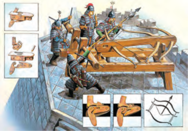

- “Mataris”
- “Jamoluqot”
- “Salolim”
+ “Taxsh”

**26. XIII asr boshida Xorazmshoh qo‘shinining old qismi qanday nomlangan? 1) Avang‘or; 2) Muqaddam; 3) Yozoq; 4) Qalb.**

- 2, 3, 4
- 1, 2, 4
- 1, 3, 4
+ 1, 2, 3

**27. Sulton Muhammad Xorazmshoh davrida qo‘shin qanday askarlardan iborat qismlarga bo‘lingan?**

- Og‘ir va yengil qurollangan askarlardan iborat qismlarga
+ Og‘ir va yengil qurollangan va tuya mingan askarlardan iborat qismlarga
- Og‘ir va yengil qurollangan va tuya mingan, kamonchi askarlardan iborat qismlarga
- Og‘ir va yengil qurollangan va tuya mingan, kamonchi hamda piyoda askarlardan iborat qismlarga

**28. Sulton Muhammad Xorazmshoh davrida nomuntazam armiya qanday atalgan?**

+ “Lashkari berun”
- “Lashkari xaros”
- “Lashkari mamluk”
- “Lashkari xofiya”

**29. Sulton Muhammad Xorazmshoh davrida qo‘shinning katta qismini kimlar tashkil etgan?**

+ “Lashkari berun”
- “Lashkari xaros”
- “Lashkari mamluk”
- “Lashkari xofiya”

**30. Xorazmshoh qo‘shinida qal’alarni shturm va qamal qilishda ishlatiladigan tosh otar qurilma qanday atalgan?**

- “Salolim”
- “Jamoluqot”
- “Mataris”
+ “Manjaniq”

**31. XIII asr boshida Xorazmshoh qo‘shinining asosi qaysi tamoyilga ko‘ra qism va bo‘linmalardan tashkil etilgan edi?**

- Urug‘lar tamoyiliga ko‘ra
- Viloyatlar tamoyiliga ko‘ra
- Elatlar tamoyiliga ko‘ra
+ Qabilalar tamoyiliga ko‘ra

**32. Muhammad Xorazmshohning onasi Turkon Xotun qaysi urug‘dan bo‘lgan kelinining o‘g‘li Qutbiddin O‘zloqshohni taxt vorisi etib tayinlagan?**

+ Qang‘li urug‘idan
- Qipchoq urug‘idan
- Turkman urug‘idan
- O‘g‘uz urug‘idan

## Xorazm va Mo‘g‘ul davlati o‘rtasidagi munosabatlar.

**33. Sulton Muhammad Xorazmshoh 1216-yilda Sayyid Bahouddin Roziy boshchiligida Chingizxonga elchilar yuborganida, Chingizxon ularni qayerda kutib olgan?**

- Mo‘g‘ulistonda
- Yettisuvda
+ Xitoyda
- Sharqiy Turkistonda

**34. Chingizxon Xorazmshohlar saltanati haqida ko‘proq ma’lumot to‘plash uchun o‘zinig qaysi ishonchli kishisini katta savdo karvoni bilan yuborgan?**

- Mahmud Yalavoch
- Ibn Kafroj Bug‘ro
- Faxriddin Dizakiy Buxoriy
+ Uxun

**35. Qadimgi va o‘rta asrlarda turkiylarda elchi, xabarchilarga nisbatan qanday atama ishlatilgan?**

- “Bug‘ro”
+ “Yalavoch”
- “Tegin”
- “Xojib”

**36. Kim Alouddin Muhammad Xorazmshohni “mo‘g‘ullarning harbiy kuchi sizning qudratingiz oldida hech narsa emas”, deb aldagan?**

- Umarxo‘ja O‘troriy
- Jamol Marog‘iy
+ Mahmud Yalavoch
- Ibn Kafroj Bug‘ro

**37. Mo‘g‘ullar va Muhammad Xorazmshoh o‘rtasidagi ilk to‘qnashuv qayerda bo‘lib o‘tgan?**

- Ili daryosi bo‘yida
- Cherchen daryosi bo‘yida
+ Irg‘iz daryosi bo‘yida
- Tarim daryosi bo‘yida

**38. Kim boshliq mo‘g‘ullar Chingizxon buyrug‘iga ko‘ra merkit qabilasini tor-mor qilib orqaga qaytmoqchi bo‘lganda Alouddin Xorazmshoh qo‘shiniga duch kelgan?**

+ Jo‘chixon
- Chig‘atoyxon
- O‘qtoyxon
- Tuluxon

**39. “Xorazmshohning ushbu dag‘dag‘asi va qilmishi Chingizxonga juda qattiq ta’sir qildi, unda ortiq chidam va toqat qolmadi. Nafrat o‘ti bilan yonib, u bir o‘zi tepalikka ko‘tarildi, bo‘yniga belbog‘ini tashlab, bosh yalang yerga yotib ibodat qildi. Uch kungacha yig‘lab xudoga nola qilib yordam so‘radi...”. Ushbu jumlalar kimning qaysi asaridan olingan?**

- Abu Usmon Minhojiddin ibn Sirojiddinning “Tabaqoti Nosiriy” asaridan
- Ibn Arabshohning “Fath al-buldon va ma’rifat al-ajsan” asaridan
- Abulg‘oziy Bahodirxonning “Shajarayi turk” asaridan
+ Rashiduddin Fazlullohning “Jome at-tavorix” asaridan

**40. Bahouddin Roziy elchiligiga javoban Chingizxon o‘z xizmatidagi kimlar orqali Xorazmshohga atab qimmatbaho sovg‘alar yuborgan?**

- Xitoy savdogarlari orqali
+ Musulmon savdogarlari orqali
- Mo‘g‘ul elchilari orqali
- Turkiy elchilar orqali

**41. O‘tror hokimi Inalchuqning Sulton Muhammadga qanday qarindoshligi bor edi?**

- Sulton Muhammadning amakisi edi
- Sulton Muhammadning ukasi edi
- Sulton Muhammadning kuyovi edi
+ Sulton Muhammadning tog‘asi edi

**42. Chingizxon qancha askari bilan Xorazmshoh-Anushteginiylar davlati ustiga harbiy yurishni boshlagan?**

- 100 mingga yaqin askari bilan
- 150 mingga yaqin askari bilan
+ 200 mingga yaqin askari bilan
- 250 mingga yaqin askari bilan

**43. Nima sababdan Inolchiq (G‘oyirxon) Chingizxon karvonini qirib tashlagan?**

- Karvon ahli orasida yuqumli kasallik tarqalganini bilib qolgan
+ Karvon ahli savdogarlar niqobi ostida jo‘natilgan mo‘g‘ul josuslari ekanini bilib qolgan
- Karvon ahli shaharni bosib olish uchun yuborilgan maxsus qism ekanini bilib qolgan
- Karvon ahli shaharni talash uchun yuborilgan qaroqchilardan iborat ekanini bilib qolgan

**44. Sulton Muhammad Xorazmshoh qachon o‘z davlat arboblaridan biri Sayyid Bahouddin Roziy boshchiligida Xitoyga elchilar jo‘natgan?**

+ 1216-yilda
- 1215-yilda
- 1214-yilda
- 1217-yilda

**45. Irg‘iz daryosi bo‘yidagi jangda Muhammad Xorazmshoh va mo‘g‘ullarning qancha askari to‘qnashgan?**

- Muhammad Xorazmshohning 50 ming kishilik qo‘shini bilan mo‘g‘ullarning 10 minglik qo‘shini
+ Muhammad Xorazmshohning 60 ming kishilik qo‘shini bilan mo‘g‘ullarning 20 minglik qo‘shini
- Muhammad Xorazmshohning 70 ming kishilik qo‘shini bilan mo‘g‘ullarning 30 minglik qo‘shini
- Muhammad Xorazmshohning 80 ming kishilik qo‘shini bilan mo‘g‘ullarning 40 minglik qo‘shini

**46. Xorazmshoh Chingizxon elchilaridan kimga Chigizxon haqidagi barcha ma’lumotlarni aytib berishni, Chingizxon qarorgohida turib, o‘ziga xizmat qilishni taklif etgan?**

- Umarxo‘ja O‘troriyga
- Jamol Marog‘iyga
+ Mahmud Yalavochga
- Ibn Kafroj Bug‘roga

**47. Qachon va qayerda chaqirilgan mo‘g‘ul urug‘ va qabila boshliqlarining qurultoyida Temuchin “Chingizxon” – ulug‘ xon (qoon) deb e’lon qilingan?**

+ 1206-yilda Onon daryosi bo‘yida
- 1204-yilda Cherchen daryosi bo‘yida
- 1208-yilda Irg‘iz daryosi bo‘yida
- 1202-yilda Tarim daryosi bo‘yida

**48. Qaysi yilda Chingizxon (Temuchin) boshliq tashkil etilgan davlat “Yeke mong‘ol ulus“ deb atalgan?**

- 1204-yilda
- 1202-yilda
- 1208-yilda
+ 1206-yilda

**49. Mo‘g‘ullarning jangdagi asosiy taktik hiylasi nima edi?**

- Soxta hujum
- Aylanib o‘tish
- Markazga zarba berish
+ Soxta chekinish

**50. Chingizxonning ulkan karvoni Inolchiq (G‘oyirxon) tomonidan qirib tashlangani haqidagi xabarni tasodifan omon qolgan bir mo‘g‘ul qayerga qochib borib, bo‘lgan voqeadan Chingizxonni xabardor qilgan?**

- Qoraqurumga
+ Pekinga
- Shandunga
- Guanchjouga

**51. Irg‘iz daryosi bo‘yidagi jangda kim boshliq xos askarlar Muhammad Xorazmshohni mag‘lubiyatdan qutqarib qolgan?**

+ O‘g‘li Jaloliddin boshliq askarlar
- Tog‘asi G‘oyirxon boshliq askarlar
- Lashakrboshisi Temur Malik boshliq askarlar
- O‘g‘li Qutbiddin Oʻzloqshoh boshliq askarlar

**52. Chingizxon qachon o‘z o‘g‘illari boshliq asosiy harbiy kuchlari bilan Xorazmshoh-Anushteginiylar davlati ustiga harbiy yurishni boshlagan?**

- 1217-yilda
- 1218-yilda
+ 1219-yilda
- 1220-yilda

**53. “Bahouddin Roziy elchiligining sababi Chingizxonning tarixi va mo‘g‘ul lashkarlarining Tamg‘och, To‘kir, Tibet mamlakatlari, Chin iqlimi, Uzoq Sharqdagi istilosi haqidagi xabarlar to‘g‘risida ishonchli odamlar orqali aniq ma’lumotlar yig‘ish hamda mo‘g‘ul lashkarlarining ahvoli, sifati, soni va quroli haqida ma’lumot to‘plashdan iborat edi”. Ushbu jumlalar kimning qaysi asarida keltirilgan?**

- Rashiduddin Fazlullohning “Jome at-tavorix” asarida
- Abulg‘oziy Bahodirxonning “Shajarayi turk” asarida
- Ibn Arabshohning “Fath al-buldon va ma’rifat al-ajsan” asarida
+ Abu Usmon Minhojiddin ibn Sirojiddinning “Tabaqoti Nosiriy” asarida

**54. 1216-yilda Xorazmshoh o‘z sharqiy chegarasini qayergacha yetkazgan?**

+ Qipchoq cho‘llarigacha
- Oltoy tog‘ tizmalarining g‘arbiy etaklarigacha
- Balxash ko‘li havzasigacha
- Issiqko‘lgacha

**55. Chingizxon qaysi yillarda Gobi sahrosining sharqiy chegarasidan to Tangritog‘ (Tyanshan) tizmasining g‘arbiy etaklarigacha bo‘lgan viloyatlarni Mo‘g‘ullar davlati hukmronligi ostida birlashtirgan?**

- 1217–1218-yillarda
+ 1218–1219-yillarda
- 1219–1220-yillarda
- 1220–1221-yillarda

**56. Sulton Muhammad Xorazmshoh Markaziy Osiyoda harbiy jihatdan katta zafarlarga erishgach, qayerni zabt etishni maqsad qilgan edi?**

- Hindistonni
+ Xitoyni
- Misrni
- Mo‘g‘ulistonni

**57. Irg‘iz daryosi bo‘yidagi jangning nechanchi kunida mo‘g‘ullar tongda gulxanlar yoqib, sezdirmasdan o‘z qarorgohini tark etgan va Muhammad Xorazmshoh qo‘shini bilan qayta to‘qnashuvdan qochishgan?**

- Birinchi kunida
+ Ikkinchi kunida
- Uchinchi kunida
- To‘rtinchi kunida

**58. Jang paytida mo‘g‘ullarning qanday o‘qlari dushman piyodalariga katta psixologik zarar yetkazgan?**

+ Maxsus hushtaklar bilan ta’minlangan o‘qlar
- Yondirilgan o‘qlar
- Portlovchi qism bog‘langan o‘qlar
- Uchiga o‘tkir zahar surtilgan o‘qlar

**59. O‘tror voqeasidan keyin Chingizxon kimni ikki mulozim bilan Xorazmshoh huzuriga elchi etib jo‘natgan?**

- Mahmud Yalavoch
- Amiriddin Haraviy
+ Ibn Kafroj Bug‘ro
- Jamol Marog‘iy

**60. 1218-yilda Inolchiq (G‘oyirxon) xorazmshohlarning qaysi chegara viloyati hukmdori edi?**

- Xo‘jand
- Taroz
+ O‘tror
- Jand

**61. Qaysi yilda Chingizxonning 100 ta mo‘g‘ul va 450 ta musulmon savdogaridan iborat ulkan savdo karvoni xorazmshohlarning chegara viloyati O‘tror yerlariga kirib kelgan?**

+ 1218-yilda
- 1219-yilda
- 1217-yilda
- 1216-yilda

**62. Mo‘g‘ullar va Muhammad Xorazmshoh o‘rtasidagi ilk to‘qnashuv qachon bo‘lib o‘tgan?**

- 1215-yilda
+ 1216-yilda
- 1217-yilda
- 1218-yilda

**63. Chingizxon qancha nafar turk azamatlaridan “kezik” (keshik) deb nomlangan xos soqchilar qismini tuzgan?**

+ 10 ming nafar
- 20 ming nafar
- 30 ming nafar
- 40 ming nafar

**64. Xorazmshoh Alouddin Muhammad Ibn Kafroj Bug‘ro boshchiligidagi Chingizxon elchilarini qanday jazolagan?**

+ Ibn Kafroj Bug‘ro o‘ldirilgan, ikki mulozimning soqol-mo‘ylovlari sharmandali tarzda qirib tashlangan
- Ibn Kafroj Bug‘roning soqol-mo‘ylovlari sharmandali tarzda qirib tashlangan, ikki mulozim o‘ldirilgan
- Ibn Kafroj Bug‘ro zindonga tashlangan, ikki mulozimning boshi olinib, Chingizxonga yuborilgan
- Ibn Kafroj Bug‘ro shahar ko‘chalarida sazoyi qilingan, ikki mulozim zindonga tashlangan

**65. “O‘trorning hokimi Inalchuqkim, Sulton Muhammadning tog‘asi erdi. Sulton Muhammad anga G‘oyirxon (deb) ot qo‘yub erdi. Bozirgonlar (Chingizxon savdogarlari nazarda tutilgan) ani ko‘ra bordi. Onlarning orasinda bir kishi bor erdi, Inalchuqning (eski) oshnosi erdi. Ul G‘oyirxon demay, Inalchuq dedi. Uning ul so‘zi yomon kelib savdogarlarni tutub, Sulton Muhammadga bir guruh kishi josuslikka kelibdi, deb xabarchi yubordi...”. Ushbu jumlalar kimning qaysi asaridan olingan?**

- Abu Usmon Minhojiddin ibn Sirojiddinning “Tabaqoti Nosiriy” asaridan
- Ibn Arabshohning “Fath al-buldon va ma’rifat al-ajsan” asaridan
+ Abulg‘oziy Bahodirxonning “Shajarayi turk” asaridan
- Rashiduddin Fazlullohning “Jome at-tavorix” asaridan

**66. 1216-yilda mo‘g‘ullar o‘z g‘arbiy hududlarini qayergacha kengaytirib kelganlar? 1) Oltoy tog‘ tizmalarining g‘arbiy etaklari; 2) Tangritog‘; 3) Balxash ko‘li havzasi; 4) Issiqko‘l.**

- 2, 3, 4
- 1, 2, 4
- 1, 2, 3
+ 1, 2, 3, 4

**67. O‘tror hokimi Inalchuqqa kim “G‘oyirxon” deb nom qo‘ygan?**

- Chingizxon
+ Sulton Muhammad
- Turkon Xotun
- Temur Malik

**68. Chingizxon 100 ta mo‘g‘ul va 450 ta musulmon savdogaridan iborat katta karvondagi savdogarlarga kimlarni boshchi qilib Xorazmshohlar saltanatiga yuborgan? 1) Uxun; 2) Umarxo‘ja O‘troriy; 3) Jamol Marog‘iy; 4) Faxriddin Dizakiy Buxoriy; 5) Amiriddin Haraviy.**

+ 2, 3, 4, 5
- 1, 3, 4, 5
- 1, 2, 4, 5
- 1, 2, 3, 4

## Muhammad Xorazmshohning mamlakat mudofaasiga oid tadbirlari va buning oqibati.

**69. Temur Malik taqdiri qanday yakun topgan?**

- Mo‘g‘ul amaldorlari uni tanib qolib, asir olganidan keyingi taqdiri noma’lum
- Mo‘g‘ul amaldorlari uni tanib qolib, ta’qib etgach Shomga qaytib ketgan
+ Mo‘g‘ul amaldorlari uni tanib qolib, qatl etishgan
- Mo‘g‘ul amaldorlari uni tanib qolib, zindonga tashlashgan

**70. Mo‘g‘ullar Xo‘jand qamali uchun qancha mahalliy aholini safarbar qilgan?**

- 20 mingga yaqin aholini
- 30 mingga yaqin aholini
- 40 mingga yaqin aholini
+ 50 mingga yaqin aholini

**71. Muhammad Xorazmshoh mo‘g‘ullarning asosiy zarbasi qayerga qaratilsa kerak degan fikr bilan shaharlarni mustahkamlagan?**

- Xorazm vohasiga
- Farg‘ona vodiysiga
+ Zarafshon vodiysiga
- Sirdaryo vohasiga

**72. Temur Malikning buyrug‘iga ko‘ra, nechta qayiq yasalgan va ular yondirilgan kamon o‘qi o‘tmasligi, yonib ketmasligi uchun usti namat bilan qoplanib, sirka shimdirilgan loy bilan suvab chiqilgan?**

- 16 ta qayiq
- 14 ta qayiq
+ 12 ta qayiq
- 10 ta qayiq

**73. Movarounnahrda 4 qismga bo‘lingan Chingizxon qo‘shinining birinchi qismiga kimlar boshchiliq qilishgan va ularga qanday vazifa yuklangan?**

- Chingizxon o‘zi bosh bo‘lgan, sarkardalar Jebe va Subutoylar bilan Zarafshon vohasi tomon – Buxoro hamda Samarqandni istilo etish uchun yo‘l olgan
- Aloq no‘yon va Suketu Cherbi bosh qilinib, Xo‘jand va Banokatni egallash vazifasi topshirilgan
- Jo‘chi boshchiligida Sirdaryoning yuqori oqimidagi Jand, Yangikent, Barchinlig‘kent, Sig‘noq shaharlarini bosib olish uchun yuborilgan
+ Chig‘atoy va O‘qtoy O‘trorni qamal etib, egallashi uchun qoldirilgan

**74. XIII asr boshlarida qayerning xoni “ediquti” deb atalgan?**

- Qarluq xoni
- Olmaliq xoni
- Merkit xoni
+ Uyg‘ur xoni

**75. Mo‘g‘ullar tomonidan asir olingan G‘oyirxon (Inolchiq) qayerda qatl qilingan?**

- Buxoroda
- O‘trorda
- Xo‘jandda
+ Samarqandda

**76. Qachon mo‘g‘ullar Samarqand tomon yo‘l olgan?**

- 1219-yilning iyul oyida
- 1219-yilning iyun oyida
- 1220-yilning may oyida
+ 1220-yilning mart oyida

**77. Muhammad Xorazmshohning vafotiga sabab bo‘lgan plevrit qanday kasallik?**

- Jigarga infeksiya tushishi
+ O‘pkaga suv yig‘ilishi
- Miyaga qon quyilishi
- Yurakka qon quyilishi

**78. Muhammad Xorazmshoh qayerda Qutbiddin O‘zloqshohni taxt vorisligini bekor qilib, katta o‘g‘li Jaloliddinni taxt vorisi deb e’lon qilgan?**

- Urganch shahrida
- Samarqand shahrida
+ Ashura orolida
- Valiyon qal’asida

**79. Urganchliklar o‘z ona shahrini mo‘g‘ullardan qancha vaqt himoya qilganlar?**

- Uch oy
- Besh oy
+ Yetti oy
- To‘qqiz oy

**80. Mo‘g‘ullar Xorazmda nimalardan manjaniq uchun tosh o‘rnida foydalanganlar?**

- Gujumdan arralangan g‘o‘lalardan
+ Tutdan arralangan g‘o‘lalardan
- Majnuntoldan arralangan g‘o‘lalardan
- Qayrag‘ochdan arralangan g‘o‘lalardan

**81. Movarounnahrda 4 qismga bo‘lingan Chingizxon qo‘shinining besh ming chog‘li uchinchi qismiga kimlar boshchiliq qilishgan va ularga qanday vazifa yuklangan?**

- Chingizxon o‘zi bosh bo‘lgan, sarkardalar Jebe va Subutoylar bilan Zarafshon vohasi tomon – Buxoro hamda Samarqandni istilo etish uchun yo‘l olgan
+ Aloq no‘yon va Suketu Cherbi bosh qilinib, Xo‘jand va Banokatni egallash vazifasi topshirilgan
- Jo‘chi boshchiligida Sirdaryoning yuqori oqimidagi Jand, Yangikent, Barchinlig‘kent, Sig‘noq shaharlarini bosib olish uchun yuborilgan
- Chig‘atoy va O‘qtoy O‘trorni qamal etib, egallashi uchun qoldirilgan

**82. Qachon Chingizxon Buxoro ustiga qo‘shin tortgan?**

+ 1220-yilning fevralida
- 1220-yilning martida
- 1221-yilning aprelida
- 1221-yilning yanvarida

**83. Mo‘g‘ullar qamali arafasida Samarqand shahridagi qo‘shin soni qancha bo‘lgan?**

- 100 ming nafar
+ 110 ming nafar
- 120 ming nafar
- 130 ming nafar

**84. “Muhammad Xorazmshoh katta o‘g‘li Jaloliddin, boshqa o‘g‘illari O‘zloqshoh va Oqshohlarni yoniga chorlab, shunday degan ekan: Hokimiyat iplari uzildi, saltanat asoslari bo‘shashdi va buzildi. Bu dushmanning maqsadi ayon bo‘ldi: uning changali va tishlari mamlakatga qattiq sanchildi. Men uchun faqat o‘g‘lim Jaloliddingina qasos olishga qodir. Endi men uni valiahd etib tayinlayman”. Ushbu ma’lumotlarni kim yozib qoldirgan?**

- Rashididdin Fazlulloh
+ Shihobiddin Nasaviy
- Abu Usmon Minhojiddin ibn Sirojiddin
- Alouddin Juvayniy

**85. Mo‘g‘ullarning Samarqand qamali paytida qancha shahar mudofaachilari dastlab suv toshqini, keyinroq suvsizlik bois taslim bo‘lishga majbur bo‘lgan?**

- 10 mingtacha
+ 20 mingtacha
- 30 mingtacha
- 40 mingtacha

**86. Buxoro arkida mo‘g‘ullarga qarshi kurashda jasorat ko‘rsatgan Ko‘kxon haqida kimning qaysi asarida keltirilgan?**

- Rashididdin Fazlullohning “Jome at-tavorix” asarida
+ Alouddin Juvayniyning “Tarixi jahongusho” asarida
- Abu Usmon Minhojiddin ibn Sirojiddinning “Tabaqoti Nosiriy” asarida
- Sharafuddin Ali Yazdiyning “Zafarnoma” asarida

**87. Sulton deb e’lon qilingan Jaloliddin ukalari Oqshoh va O‘zloqshohlar bilan Urganchga qaytib kelgach, unga qarshi suiqasd qilishga uringan Qutlug‘xon qayerning noibi edi?**

- Sobiq Yangikent noibi
+ Sobiq Jand noibi
- Sobiq Barchinlig‘kent noibi
- Sobiq Sig‘noq noibi

**88. Xorazmshoh saltanatida mo‘g‘ullar bilan urush arafasida o‘tkazilgan harbiy kengashda kuchlarni asosiy nuqtalarga to‘plab, dushmanga zarba berish rejasini kimlar taklif etgan?**

+ Sulton Muhammadning o‘g‘li Jaloliddin va Xo‘jand hokimi Temur Malik
- Sulton Muhammadning o‘g‘li O‘zloqshoh va O‘tror hokimi G‘oyirxon
- Sulton Muhammadning o‘g‘li O‘zloqshoh va Samarqand hokimi Tog‘ayxon
- Sulton Muhammadning o‘g‘li Oqshoh va Banokat hokim Malik Ingu

**89. Mo‘g‘ullar bosqini davrida Fanokat (Banokat) shahri hokimi kim edi?**

- Qutlug‘xon
- Tog‘ayxon
- Temur Malik
+ Malik Ingu

**90. Qachon Chingizxon o‘z o‘g‘illari boshliq 200 mingga yaqin asosiy harbiy kuchlari bilan Xorazmshoh-Anushteginiylar davlati ustiga yurishni boshlagan?**

+ 1219-yilda
- 1217-yilda
- 1220-yilda
- 1218-yilda

**91. Urganchga yetib borgan Temur Malik sulton Jaloliddin orqasidan qayerga yo‘l olgan va unga qo‘shilgan?**

- Hamadonga
+ Shahristonga
- Sherozga
- Isfahonga

**92. Mo‘g‘ullar bosqini davrida Xo‘jand shahri hokimi kim edi?**

- Qutlug‘xon
- Tog‘ayxon
+ Temur Malik
- Malik Ingu

**93. Mo‘g‘ullar qamali arafasida Urganchda qancha xorazmliklar qo‘shini bo‘lgan?**

- 80 ming nafar qo‘shin
- 90 ming nafar qo‘shin
- 100 ming nafar qo‘shin
+ 110 ming nafar qo‘shin

**94. Movarounnahrda 4 qismga bo‘lingan Chingizxon qo‘shinining ikkinchi qismiga kimlar boshchiliq qilishgan va ularga qanday vazifa yuklangan?**

- Chingizxon o‘zi bosh bo‘lgan, sarkardalar Jebe va Subutoylar bilan Zarafshon vohasi tomon – Buxoro hamda Samarqandni istilo etish uchun yo‘l olgan
- Aloq no‘yon va Suketu Cherbi bosh qilinib, Xo‘jand va Banokatni egallash vazifasi topshirilgan
+ Jo‘chi boshchiligida Sirdaryoning yuqori oqimidagi Jand, Yangikent, Barchinlig‘kent, Sig‘noq shaharlarini bosib olish uchun yuborilgan
- Chig‘atoy va O‘qtoy O‘trorni qamal etib, egallashi uchun qoldirilgan

**95. O‘tror noibi G‘ayir (Inolchiq) ning asir olinishi voqeasi kimning qaysi asarida keltirilgan?**

- Sharafuddin Ali Yazdiyning “Zafarnoma” asarida
+ Alouddin Juvayniyning “Tarixi jahongusho” asarida
- Abu Usmon Minhojiddin ibn Sirojiddinning “Tabaqoti Nosiriy” asarida
- Rashiduddin Fazlullohning “Jome at-tavorix” asarida

**96. Mo‘g‘ullar Urganchni egallagach, shaharni … .**

+ suvga bostirganlar
- yoqib yuborganlar
- buzib tashlaganlar
- aholisini quvib chiqarganlar

**97. Mo‘g‘ullar Urganchni egallagach, 50 mingdan oshiq bo‘lgan mo‘g‘ul jangchilarining har biriga qancha asirdan teggan?**

- 20 nafar asirdan
- 22 nafar asirdan
+ 24 nafar asirdan
- 26 nafar asirdan

**98. “Sizning ikki dushmaningiz bor edi – Jaloliddin va G‘iyosiddin. Ulardan birining kallasini sizga jo‘natdim” degan nomani Eronning Kirmon viloyati hokimi Baroq qaysi mo‘g‘ul hukmdoriga yuborgan?**

- Jo‘chiga
- Chig‘atoyga
- Tuluga
+ O‘qtoyga

**99. Sulton Jaloliddin halok bo‘lgach, Temur Malik so‘fiylar (ahli tasavvuf) kiyimida (jandasida) qayerga yo‘l olgan?**

+ Shomga
- Eronga
- Misrga
- Iroqqa

**100. Mo‘g‘ullar tomonidan Buxoro arki qamali necha kun davom etgan?**

- 10 kun
+ 12 kun
- 14 kun
- 16 kun

**101. Qachon Jaloliddin Manguberdi sulton deb e’lon qilingan?**

- 1220-yilning boshida
- 1220-yilning oxirida
+ 1221-yilning boshida
- 1221-yilning oxirida

**102. Urganch qamali vaqtida kim “Yo Vatan, yo sharafli o‘lim!” deb xitob qilgan?**

+ Najmiddin Kubro
- Jaloliddin Manguberdi
- Temur Malik
- Muhammad Xorazmshoh

**103. O‘trorni mo‘g‘ullardan himoya qilish uchun, qamal arafasida shaharda umumiy qancha qo‘shin to‘plangan?**

- 50 ming kishilik qo‘shin
- 60 ming kishilik qo‘shin
- 70 ming kishilik qo‘shin
+ 80 ming kishilik qo‘shin

**104. Mirkarim Osimning Temur Malik haqidagi hikoyasida, Temur Malik qaysi mo‘g‘ul lashkarboshisini yakkama-yakka jangga chorlagan?**

- Aloq no‘yonni
- Jebeni
- Subutoyni
+ So‘ktu no‘yonni

**105. Mo‘g‘ullar bosqini vaqtida, shahar yong‘in ichida qolganda Buxoro xalqi qaysi maqbarani qumga ko‘mib tashlaganlar?**

+ Somoniylar maqbarasini
- G‘aznaviylar maqbarasini
- Qoraxoniylar maqbarasini
- Safforiylar maqbarasini

**106. Mo‘g‘ullar Samarqanddan 30 mingta kimlarni asir qilib olib ketishgan?**

+ Hunarmandlarni
- Jangchilarni
- Olimlarni
- Ulamolarni

**107. Xorazmshohlar davrida Jurjon – qadimgi Girkaniya, Kaspiy dengizining janubi-sharqidagi viloyat va shahar qanday atalgan?**

- Hamadon
- Sheroz
- Isfahon
+ Shahriston

**108. O‘tror shahri qamali arafasida Sulton Muhammad qal’a noibi G‘oyirxon (Inolchiq) ga “Lashkari berun” deb atalgan … askar yuborgan, qamal arafasida unga yana …lik lashkar kelib qo‘shilgandi.**

- 40 ming/20 ming
+ 50 ming/10 ming
- 60 ming/10 ming
- 70 ming/20 ming

**109. Temur Malik vataniga qaytib kelib, qaysi shaharda yashagan?**

- Xo‘jand shahrida
+ O‘sh shahrida
- O‘tror shahrida
- Marv shahrida

**110. Mo‘g‘ullar tomonidan Xo‘jand qamaliga safarbar qilingan aholi shahardan necha kilometr masofadagi tog‘dan tosh keltirib, daryo o‘zaniga tashlashgan?**

+ 3 kilometr
- 4 kilometr
- 5 kilometr
- 6 kilometr

**111. Jaloliddin Manguberdining qaysi ukalari mo‘g‘ullarga qarshi kurashda halok bo‘lganlar? 1) G‘iyosiddin Pirshoh; 2) O‘zloqshoh; 3) Oqshoh; 4) Rukniddin G‘ursanchtiy.**

+ 2, 3, 4
- 1, 3, 4
- 1, 2, 4
- 1, 2, 3

**112. 1220-yil bahorida kim boshchiligidagi mo‘g‘ul qo’shinlari Fanokat (Banokat) shahriga yaqinlashgan?**

+ Aloq no‘yon va Sukatu cherbiy
- Sukatu cherbiy va Jebe
- Jebe va Subutoy
- Subutoy va Aloq no‘yon

**113. Mo‘g‘ullar Xorazmshohlar davlatining qaysi shahri qamali vaqtida eng ko‘p qurbon berganlar?**

- Samarqand qamali vaqtida
- O‘tror qamali vaqtida
- Xo‘jand qamali vaqtida
+ Urganch qamali vaqtida

**114. Chingizxon boshliq mo‘g‘ul qo‘shinlari ta’qibidan qutulgan Muhammad Xorazmshoh qayerdagi Ashuradi (Ashura) oroliga borib o‘rnashgan?**

+ Kaspiy dengizining janubidagi
- Orol dengizining janubidagi
- Qizil dengizning janubidagi
- Qora dengizning janubidagi

**115. “… qal’asi Sirdaryoning ikkiga ajralgan joyida qurilgan bo‘lib, atrofidagi tik jarliklar va daryo tabiiy mudofaa vazifasini bajarar edi. Shu bilan birga, qal’aga manjaniq otgan tosh yetib bormas, atrofi jar bo‘lgan qal’ani qamal qilish mushkul ish edi”. Yuqorida qaysi qal’a joylashuvi tasvirlangan?**

- Fanokat
+ Xo‘jand
- O‘tror
- Sig‘noq

**116. Sulton Muhammad qancha g‘ur jangchisini o‘z tog‘asi Tog‘ayxon boshchiligida Samarqand mudofaasi uchun mas’ul qilib qoldirgan?**

- 10 ming jangchini
- 20 ming jangchini
- 30 ming jangchini
+ 40 ming jangchini

**117. Mo‘g‘ullar Urganch qamalida foydalangan qaysi qurollar “toshbaqalar” deb atalgan? 1) Manjaniq; 2) Mataris; 3) Dabbobat; 4) Taxsh.**

- 1, 4
+ 2, 3
- 2, 3, 4
- 1, 2, 3, 4

**118. Mo‘g‘ullar qaysi shaharning bosh suv inshooti Jo‘yi arziz (Qo‘rg‘oshin novasi) ni buzib tashlab, shaharni suvsiz qoldirishgan?**

- Urganchning
- Buxoroning
+ Samarqandning
- Xo‘jandning

**119. Mo‘g‘ullar Samarqandning omon qolgan aholisiga shaharga qaytishiga ruxsat berib, jonlari omon qolgani uchun qancha miqdorda tovon to‘lash sharti qo‘yishgan?**

- 100 ming dinor
+ 200 ming dinor
- 300 ming dinor
- 400 ming dinor

**120. Jaloliddin Manguberdining qaysi ukasi unga xiyonat qilgan va Eronning Kirmon viloyati hokimi Baroq tomonidan qatl etilgan?**

- O‘zloqshoh
- Oqshoh
+ G‘iyosiddin Pirshoh
- Rukniddin G‘ursanchtiy

**121. Buxoro ahli o‘z himoyachilaridan ayrilgandan so‘ng, shaharliklar kim boshchiligida Chingizxon huzuriga bir guruh oqsoqollarni yuborganlar?**

- Buxoro qal’asi noibi Qutlug‘xon boshchiligida
- Buxoro shayx ul-islomi Qutbiddin boshchiligida
- Buxoro amiri Tog‘ayxon boshchiligida
+ Buxoro qozisi Badriddin boshchiligida

**122. O‘trorliklar shaharni mo‘g‘ullardan mudofaa qilib, uni qancha vaqt davomida o‘z qo‘llarida ushlab turganlar?**

- Uch oy
- To‘rt oy
+ Besh oy
- Olti oy

**123. Samarqand ostonasida necha kunlik jangdan keyin mo‘g‘ullar hiyla ishlatishga majbur bo‘lishgan?**

- Ikki kunlik jangdan keyin
+ Uch kunlik jangdan keyin
- To‘rt kunlik jangdan keyin
- Besh kunlik jangdan keyin

**124. Mo‘g‘ullar qaysi sanada Buxoroni to‘liq egallab, talon-toroj etganlar?**

- 1221-yil 16-avgustda
- 1220-yil 16-yanvarda
+ 1220-yil 16-fevralda
- 1221-yil 16-aprelda

**125. Movarounnahrga qarshi yurishda Chingizxon dastlab qayerlarni zabt etgan?**

- Farg‘ona va Janubiy Qozoq cho‘llarini
- Janubiy Qozoq cho‘llari va Sharqiy Turkistonni
+ Sharqiy Turkiston va Yettisuvni
- Yettisuv va Farg‘onani

**126. Mo‘g‘ullar bilan urush arafasida qanday omil Xorazmshohlar davlatiga ularning dushmandan ustun tomonlaridan foydalanishiga imkon bermagan?**

- Mamlakat hududining nihoyatda ulkanligi
- Hukmron sulola vakillari o‘rtasidagi kelishmovchiliklar
+ Muhammad Xorazmshoh bilan sarkardalar o‘rtasida mavjud ixtiloflar
- Amaldorlarning o‘z ishiga salbiy munosabati va sotqinligi

**127. Mo‘g‘ullar bilan urush arafasida nima sababdan Sulton Muhammad harbiy kuchlarni asosiy nuqtalarga to‘plab, dushmanga zarba berishni taklifini rad etgan?**

- Sulton bu taklif mo‘g‘ullar foydasiga ishlashidan qo‘rqar edi
+ Sulton katta qo‘shinni bir joyga to‘plashdan qo‘rqar edi
- Sulton katta qo‘shinni bir joyga to‘plash ko‘p vaqt oladi degan fikrda edi
- Sulton o‘z shaharlari mustahkamligiga haddan ziyod ishonar edi

**128. Buxoro himoyachilarining tinimsiz tungi hujumlaridan bezor bo‘lib, g‘azablangan Chingizxon shaharni butunlay … .**

+ yondirishni buyurgan
- suvga bostirishni buyurgan
- buzib tashlashni buyurgan
- tark etishni buyurgan

**129. Qachon Chingizxon qo‘shinlarining Urganchga yurishi boshlangan?**

- 1220-yilning boshlarida
- 1220-yilning oxirlarida
+ 1221-yilning boshlarida
- 1221-yilning oxirlarida

**130. Jaloliddin Urganchn tark etgach, shahar mudofaasi Turkon xotunning qarindoshlaridan biri bo‘lgan kimning qo‘lida qolgan?**

- O‘zloqshoh
+ Xumortegin
- Oqshoh
- Qutlug‘xon

**131. O‘tror qamali arafasida qal’a noibi G‘oyirxon (Inolchiq) boshchiligida shaharda qancha askar bo‘lgan?**

- 10 ming suvoriy
+ 20 ming suvoriy
- 30 ming suvoriy
- 40 ming suvoriy

**132. O‘tror shahri qayerda joylashgan edi?**

- Janubiy Qirg‘iz cho‘llarining Sirdaryoga tutashgan joyida
- Sharqiy Qirg‘iz cho‘llarining Sirdaryoga tutashgan joyida
+ Janubiy Qozoq cho‘llarining Sirdaryoga tutashgan joyida
- Sharqiy Qozoq cho‘llarining Sirdaryoga tutashgan joyida

**133. “Shahar darvozasiga bir qancha chorvalarni haydab kelishgan. Buni ko‘rgan mudofaachilar chorva himoyasiz degan fikrda shahardan tashqariga chiqib, suruv ortidan borib, pistirmaga tushishgan”. Mo‘g‘ullar qaysi shahar qamali vaqtida yuqoridagi hiyladan foydalanishgan?**

- Samarqand qamali
- Buxoro qamali
- Xo‘jand qamali
+ Urganch qamali

**134. Mo‘g‘ullar Urganchda qancha hunarmandni qo‘lga olganlar?**

- 80 ming hunarmandni
- 90 ming hunarmandni
+ 100 ming hunarmandni
- 110 ming hunarmandni

**135. Fanokat (Banokat) shahri qayerda joylashgan edi?**

- Amudaryoning yuqori oqimida
- Amudaryoning quyi oqimida
+ Sirdaryoning yuqori oqimida
- Sirdaryoning quyi oqimida

**136. Mo‘g‘ullarga qarshi Urganch mudofaasi uchun jangda ishtirok etgan zamonining buyuk allomasi Najmiddin Kubro (Ahmad ibn Umar Xivaqiy) necha yoshda edi?**

+ 76 yoshda
- 71 yoshda
- 82 yoshda
- 68 yoshda

**137. Mo‘g‘ullar bilan urush arafasida Sulton Muhammad dushmanga qarshi kurashning qanday taktikasini qo‘llashga qaror qilgan?**

- Qo‘shinlarni bir joyga to‘plab hujum qilish taktikasini
- Qo‘shinlarni asosiy strategik joylarga to‘plab hujum qilish taktikasini
- Qo‘shinlarni turli viloyatlarga bo‘lib yuborish taktikasini
+ Qo‘shinlarini turli shaharlarga bo‘lib yuborish taktikasini

**138. Chingizxon Xorazmshohlar davlati ustiga yurish boshlab, chegaradan o‘tganidan keyin uning qo‘shiniga Uyg‘ur ediquti (xoni) …, qarluqlar xoni … va Olmaliq hukmdori …lar kelib qo‘shilgan.**

- Malik Ingu/Aloq no‘yon/Baurchak
+ Baurchak/Arslonxon/Sig‘noqtegin
- Arslonxon/Sig‘noqtegin/Malik Ingu
- Sig‘noqtegin/Malik Ingu/Aloq no‘yon

**139. Movarounnahrda 4 qismga bo‘lingan Chingizxon qo‘shinining to‘rtinchi qismiga kimlar boshchiliq qilishgan va ularga qanday vazifa yuklangan?**

+ Chingizxon o‘zi bosh bo‘lgan, sarkardalar Jebe va Subutoylar bilan Zarafshon vohasi tomon – Buxoro hamda Samarqandni istilo etish uchun yo‘l olgan
- Aloq no‘yon va Suketu Cherbi bosh qilinib, Xo‘jand va Banokatni egallash vazifasi topshirilgan
- Jo‘chi boshchiligida Sirdaryoning yuqori oqimidagi Jand, Yangikent, Barchinlig‘kent, Sig‘noq shaharlarini bosib olish uchun yuborilgan
- Chig‘atoy va O‘qtoy O‘trorni qamal etib, egallashi uchun qoldirilgan

**140. Mo‘g‘ullar Samarqandda qancha kishilik qang‘li qo‘shiniga omonlik va’da qilib, shahar taslim bo‘lgach, ular ham qolgan himoyachilar bilan birga qirib tashlangan?**

- 10 minglik qo‘shinga
- 20 minglik qo‘shinga
+ 30 minglik qo‘shinga
- 40 minglik qo‘shinga

**141. Fanokat (Banokat) shahri mo‘g‘ullarga necha kun qarshilik ko‘rsata olgan?**

+ 3 kun
- 5 kun
- 7 kun
- 9 kun

**142. Mo‘g‘ullardan yengila boshlagan Buxoro himoyachilari qayerga chekinishgan?**

- Xorazmga
- Eronga
+ Xurosonga
- Yettisuvga

**143. Urganch qamali oldidan Chingizxon kimga shaharni tark etishni taklif qilgan?**

+ Najmiddin Kubroga
- Jaloliddinga
- Xumorteginga
- Qutlug‘xonga

**144. Xo‘jand shahrini egallash uchun kim boshchiligidagi mo‘g‘ul qo‘shinlari shaharga qarab yurgan?**

- Sukatu cherbiy
+ Aloq no‘yon
- Subutoy
- Jebe

**145. “Chingizxon otda masjidi jome oldiga kelib to‘xtadi va shaharning kazo-kazolarini o‘z huzuriga chaqirtirdi. Mo‘g‘ullar shahar omborxonalarini ochib, g‘allalarni tashib oldilar. Qur’on nusxalari saqlanadigan sandiqlarni otlarga oxur qildilar, masjidlarga meshlarda sharob keltirib joylab qo‘ydilar, shahar hofizlari va o‘yinchilarini chorlab, raqsga tushirdilar”. Buxoroda ro’y bergan ushbu voqealar kimning qaysi asarida keltirilgan?**

- Sharafuddin Ali Yazdiyning “Zafarnoma” asarida
- Abu Usmon Minhojiddin ibn Sirojiddinning “Tabaqoti Nosiriy” asarida
+ Rashididdin Fazlullohning “Jome at-tavorix” asarida
- Alouddin Juvayniyning “Tarixi jahongusho” asarida

**146. Muhammad Xorazmshoh qachon vafot etgan?**

+ 1220-yilning dekabr oyida
- 1220-yilning noyabr oyida
- 1221-yilning yanvar oyida
- 1221-yilning fevral oyida

**147. Chingizxon qayerdan turib Samarqandni qamal qilish ishiga boshchilik qilgan?**

- Sultonsaroy qasridan
- Shohsaroy qasridan
- Oqsaroy qasridan
+ Ko‘ksaroy qasridan

**148. Temur Malik qayerga yetgunga qadar mo‘g‘ullar bilan daryoda beto‘xtov jang qilib ketgan?**

- Barchinlig‘kent va Sig‘noqqa
- Sig‘noq va Yangikentga
- Yangikent va Jandga
+ Jand va Barchinlig‘kentga

**149. Chingizxon Xorazmshohlar davlati ustiga yurishni boshlagach yozni qayerda o‘tkazib, sentyabr oyida chegaradan o‘tgan?**

- Irg‘iz daryosi bo‘yida
+ Irtish daryosi bo‘yida
- Tajan daryosi bo‘yida
- Murg‘ob daryosi bo‘yida

**150. Chingizxon qachon vafot etgan?**

- 1226-yilda
+ 1227-yilda
- 1228-yilda
- 1229-yilda

**151. “Temur Malik kurashni sabot-matonat bilan davom ettirgach, unda bor-yo‘g‘i uchta kamon o‘qi qoladi: ularning ham bittasi singan va paykonsiz edi. U paykonsiz o‘q bilan uni ta’qib qilib kelayotgan uch mo‘g‘uldan birining ko‘zini ko‘r qiladi, qolganlariga esa: “Ikkingiz uchun ikki o‘q qoldi. O‘qlarimga achinaman. Yaxshisi, orqalaringga qaytib, hayotingizni saqlab qoling!” deydi”. Ushbu ma’lumotlar kimning qaysi asarida yozib qoldirilgan?**

+ Sharafuddin Ali Yazdiyning “Zafarnoma” asarida
- Abu Usmon Minhojiddin ibn Sirojiddinning “Tabaqoti Nosiriy” asarida
- Alouddin Juvayniyning “Tarixi jahongusho” asarida
- Rashididdin Fazlullohning “Jome at-tavorix” asarida

**152. Sulton deb e’lon qilingan Jaloliddin Urganchga qaytib kelgach, sobiq Jand noibi Qutlug‘xonning unga qarshi suiqasd qilishga urinishi va … sarkardalarining o‘zlarini xoinona tutishlari Jaloliddinni shahar mudofaasiga bosh bo‘lish fikridan qaytargan.**

+ qipchoq
- qang‘li
- turkman
- nayman

**153. Mo‘g‘ullar qamali arafasida Jaloliddin Urganchni tark etib, qayerga yo‘l olgan?**

- Hindistonga
- Eronga
- Shomga
+ Xurosonga

**154. Mo‘g‘ullarning Urganch qamali vaqtida, mudofaaga boshchilik qilayotgan Xumortegin sarosimaga tushib, qarshilik ko‘rsatish befoyda ekanini ko‘rgach … .**

+ mo‘g‘ullarga taslim bo‘lgan
- o‘z joniga qasd qilgan
- shahardan qochishga uringan
- o‘z vazifasini bajarishdan bosh tortgan

**155. Aloq no‘yon Xo‘jand qamali uchun qancha qo‘shinni safarbar qilgan?**

+ 20 ming nafar qo‘shinni
- 30 ming nafar qo‘shinni
- 40 ming nafar qo‘shinni
- 50 ming nafar qo‘shinni

**156. “Men bu shaharda ko‘p yillar mobaynida yashab keldim va har bir jon men uchun aziz. Ushbu og‘ir kunlarda men ularni tark eta olmayman”. Urganch qamali vaqtida Chingizxonga ushbu so‘zlar bilan javob bergan kim?**

+ Najmiddin Kubro
- Jaloliddin Manguberdi
- Temur Malik
- Muhammad Xorazmshoh

**157. Mo‘g‘ullar qamali arafasida Jaloliddin Urganchni kim bilan birga tark etgan?**

- Oqshoh
- O‘zloqshoh
+ Temur Malik
- Qutlug‘xon

**158. Xorazmshohlar chegarasidan o‘tgan Chingizxon o‘z qo‘shinini qayerda to‘plab, uni 4 qismga bo‘lgan?**

+ O‘tror shahri yaqinida
- Xo‘jand shahri yaqinida
- Taroz shahri yaqinida
- Jand shahri yaqinida

**159. Mo‘g‘ullar qamali arafasida Samarqandda qancha jangovor fil bo‘lgan?**

+ 20 ta
- 30 ta
- 40 ta
- 50 ta

**160. G‘oyirxon boshliq mudofaachilarning bir qismi O‘tror arkiga joylashib olib, mudofaani yana vaqtgacha davom ettirgan?**

+ Bir oygacha
- Ikki oygacha
- Uch oygacha
- To‘rt oygacha

**161. Mo‘g‘ullar Urganch qamali vaqtida shaharga taslim bo‘lish evaziga jon omonligi va’dasi bilan elchilar yuborishgan. Aslini olganda, bu elchilikdan maqsad vaqtdan yutish bo‘lib, bu orada … va Movarounnahrning boshqa hududlaridan yordamchi kuchlar yetib kelishi lozim edi.**

- Yangikent
- Barchinlig‘kent
+ Jand
- Sig‘noq

## Jaloliddin Manguberdi.

**162. Shihobiddin Nasaviyning yozishicha Jaloliddin Manguberdi bachkana ta’riflarni yoqtirmagan va o‘ziga faqat nima deb murojaat qilishlarini so‘ragan?**

- “Xorazmshoh”
- “Jaloliddin”
- “Shoh”
+ “Sulton”

**163. Jaloliddin Manguberdi qayerlarda mo‘g‘ullarga qarshi kurash olib borgan? 1) Xuroson; 2) Hindiston; 3) Eron; 4) Iroq; 5) Kavkaz.**

- 1, 3, 4
- 2, 4, 5
- 1, 2, 3, 4
+ 1, 2, 3, 4, 5

**164. Parvon dashtidagi jangdagi g‘alabadan keyin o‘lja tushgan arabi ot ustida tortishish paytida qizishib ketgan Jaloliddinning lashkarboshisi Amin Malik Sayfiddin Ig‘roqning boshiga … bilan urgan.**

- hassa
- gurzi
+ qamchi
- tayoq

**165. Xorazmshohlar davlatida hukmdor otini yetaklab yuruvchi, hukmdor uzangisi sohibi qanday atalgan?**

- “Tavochi”
- “Tunqotar”
- “Kutvol”
+ “Rikobdor”

**166. Jaloliddin Manguberdining qaysi g‘alabasi mo‘g‘ullarning afsonaviy qudrati, yengilmasligi haqidagi mish-mishlarga chek qo‘ygan?**

- Parvon yaqinidagi g‘alabasi
- G‘azni yaqinidagi g‘alabasi
+ Niso yaqinidagi g‘alabasi
- Valiyon yaqinidagi g‘alabasi

**167. Jaloliddin Manguberdi va mo‘g‘ullar o‘rtasida Sind (Hind) daryosi bo‘yida jang qachon bo‘lib o‘tgan?**

- 1220-yilning sentyabrida
- 1220-yilning dekabrida
- 1221-yilning oktyabrida
+ 1221-yilning noyabrida

**168. Jaloliddin Manguberdi mo‘g‘ullarga qarshi necha marotaba jang qilib, ularning nechtasida g‘olib bo‘lgan?**

+ 17 marotaba mo‘g‘ullarga qarshi jang qilib, ularning 14 tasida g‘olib bo‘lgan
- 18 marotaba mo‘g‘ullarga qarshi jang qilib, ularning 15 tasida g‘olib bo‘lgan
- 19 marotaba mo‘g‘ullarga qarshi jang qilib, ularning 16 tasida g‘olib bo‘lgan
- 20 marotaba mo‘g‘ullarga qarshi jang qilib, ularning 17 tasida g‘olib bo‘lgan

**169. Jaloliddin Manguberdi 1221-yilning boshida qayerda mo‘g‘ullarning pistirmadagi askarlari bilan to‘qnash kelgan va ularni tor-mor etgan?**

+ Niso yaqinida
- Valiyon yaqinida
- Som yaqinida
- Tabriz yaqinida

**170. Qaysi jang Jaloliddin Manguberdining mo‘g‘ullar ustidan qozongan dastlabki yirik g‘alabasi edi?**

- Niso jangi
+ Valiyon jangi
- Parvon jangi
- Sind jangi

**171. Movarounnahrning asosiy shaharlari egallangach, mo‘g‘ullarning bosqinchilik yurishlari Amudaryo janubidagi yirik savdo va madaniyat markazlari bo‘lgan qaysi shaharlarga yo‘naltirilgan? 1) Balx; 2) Hirot; 3) Marv; 4) G‘azna.**

+ 1, 2, 3, 4
- 1, 2, 3
- 1, 2, 4
- 1, 3, 4

**172. “U bug‘doyrang, o‘rta bo‘yli, turkiy qiyofali va turkiyda gapiradigan odam edi, shu bilan birga forsiyda ham so‘zlasha olardi. Uning mardligi, jasurligiga kelsak, yuqorida hikoya qilganim janglardagi faoliyatini eslab o‘tishning o‘zi kifoya qiladi”. Jaloliddin Manguberdi haqidagi ushbu ma’lumotlar kimning qaysi asarida keltirilgan?**

- Sharafuddin Ali Yazdiyning “Zafarnoma” asarida
- Alouddin Juvayniyning “Tarixi jahongusho” asarida
- Rashididdin Fazlullohning “Jome at-tavorix” asarida
+ Shihobiddin Nasaviyning “Siyrat as-sulton Jaloliddin Mangburni” asarida

**173. Sind daryosi bo‘yidagi jangdan Jaloliddin Manguberdini daryodan olib chiqqan oti qachon va qayerda o‘z ajali bilan o‘lgan?**

- 1224-yilda hozirgi Eron poytaxti Tehronning egallanishi jarayonida
- 1225-yilda hozirgi Armaniston poytaxti Yerevanning egallanishi jarayonida
+ 1226-yilda hozirgi Gruziya poytaxti Tbilisining egallanishi jarayonida
- 1227-yilda hozirgi Ozarbayjon poytaxti Bokuning egallanishi jarayonida

**174. Jaloliddin va mo‘g‘ullar o‘rtasidagi G‘azna yaqinida, Parvon dashtidagi jang qaysi daryo bo‘yida bo‘lib o‘tgan edi?**

+ Kobul daryosi bo‘yida
- Tajan daryosi bo‘yida
- Murg‘ob daryosi bo‘yida
- Frot daryosi bo‘yida

**175. Urganchdagi qaltis vaziyat tufayli shaharni tashlab chiqqan Jaloliddin necha kun ichida Xorazmdan Xurosonga borgan?**

- 12 kun ichida
- 14 kun ichida
+ 16 kun ichida
- 18 kun ichida

**176. Hozirda qaysi daryoning Jaloliddin Manguberdi otda sakragan tomoni “Ot sakrash”, narigi tomoni “Cho‘li Jaloliy” deb ataladi?**

- Dajla daryosining
+ Sind daryosining
- Frot daryosining
- Murg‘ob daryosining

**177. Qaysi jangdan keyin Jaloliddinning jasoratiga qoyil qolgan Chingizxon o‘z o‘g‘illariga qarata “Otaning faqat shunday o‘g‘li bo‘lishi lozim. U olovli jang maydonidan o‘zini qutqarib, halokatli girdobdan najot qirg‘og‘iga chiqdimi, undan hali ulug‘ ishlar, tashvishlar va qiyomatli isyonlar keladi!” degan va uning orqasidan ta’qib etishni taqiqlagan?**

- Niso jangidan keyin
- Valiyon jangidan keyin
- Parvon jangidan keyin
+ Sind jangidan keyin

**178. Sind daryosi bo‘yidagi jangda Jaloliddin Manguberdi balandligi necha metrlik jarlikdan daryoga oti bilan sakragan?**

+ 18–20 metrli jarlikdan
- 20–22 metrli jarlikdan
- 22–24 metrli jarlikdan
- 24–26 metrli jarlikdan

**179. Chingizxon Jaloliddin Manguberdiga qarshi kimni 45 minglik qo‘shin bilan yuborgan?**

- Aloq no‘yonni
+ Shixi Xutuxu no‘yonni
- Suketu Cherbini
- Jebeni

**180. Sind daryosi bo‘yidagi jangda Jaloliddin Manguberdining qo‘shini Chingizxon qo‘shinidan necha barobar kam bo‘lgan?**

- 2 barobar
+ 3 barobar
- 4 barobar
- 5 barobar

**181. Jaloliddin lashkarboshilaridan bo‘lgan Amin Malikning Jaloliddinga qanday qarindoshligi bor edi?**

+ Jaloliddinning qaynotasi edi
- Jaloliddinning amakisi edi
- Jaloliddinning ukasi edi
- Jaloliddinning tog‘asi edi

**182. Parvon dashtidagi jangdan keyin Jaloliddinning lashkarboshilari uni tark etganidan xabar topgan Chingizxon qanday tezlikda Jaloliddinni ta’qib qila boshlagan?**

- Bir haftalik yo‘lni bir kunda bosib o‘tadigan darajada tezlik bilan
+ Bir haftalik yo‘lni ikki kunda bosib o‘tadigan darajada tezlik bilan
- Bir haftalik yo‘lni uch kunda bosib o‘tadigan darajada tezlik bilan
- Bir haftalik yo‘lni to‘rt kunda bosib o‘tadigan darajada tezlik bilan

**183. Sind daryosi bo‘yidagi jangda Jaloliddinning nechta oti ishdan chiqqach, zaxiradagi otni keltirishgan?**

+ 2 ta oti
- 3 ta oti
- 4 ta oti
- 5 ta oti

**184. Chingizxon qo‘shinining 10 ming kishilik zaxira qismi qanday atalgan?**

- “Izofa”
+ “Keshik”
- “Avangard”
- “Qalb”

**185. Jaloliddin Manguberdi mo‘g‘ullarga qarshi necha yil davomida kurash olib borgan?**

- 9 yil davomida
- 10 yil davomida
+ 11 yil davomida
- 12 yil davomida

**186. Urganchdagi qaltis vaziyat tufayli shaharni tashlab chiqqan Jaloliddin qayerga borgan?**

+ Xuroson yerlaridagi Niso qo‘rg‘oniga
- Eron yerlaridagi Valiyon qo‘rg‘oniga
- Iroq yerlaridagi Som qo‘rg‘oniga
- Shom yerlaridagi Tabriz qo‘rg‘oniga

**187. Turkon xotun qaysi urug‘dan edi?**

- Turkmanlardan
- O‘g‘uzlardan
- Qarluqlardan
+ Qang‘li-qipchoqlardan

**188. Jaloliddin Manguberdi qaysi jangda Shixi Xutuxu no‘yonni yenggan?**

- Niso jangida
- Valiyon jangida
+ Parvon jangida
- Sind jangida

**189. O‘rta asrlardagi Niso qo‘rg‘oni hozirgi qaysi davlat hududida joylashgan?**

- Tojikistonda
- O‘zbekistonda
- Afg‘onistonda
+ Turkmanistonda

**190. Parvon dashtidagi jangdagi g‘alabadan keyin Jaloliddin Manguberdining qaysi lashkarboshilari o‘ljalarni taqsimlashda o‘zaro kelishmovchilik oqibatida qo‘shindan ajrab ketganlar? 1) Sayfiddin Ig‘roq; 2) A’zam Malik; 3) Muzaffar Malik; 4) Malik Ingu.**

- 2, 3, 4
- 1, 3, 4
- 1, 2, 4
+ 1, 2, 3

**191. 1221-yilning boshida Jaloliddin Manguberdi Niso yaqinida o‘zining qancha askari bilan mo‘g‘ullarning pistirmadagi otryadini tor-mor etgan?**

- O‘zining 200 ta askari bilan mo‘g‘ullarning 600 kishilik pistirmadagi otryadini tor-mor etgan
+ O‘zining 300 ta askari bilan mo‘g‘ullarning 700 kishilik pistirmadagi otryadini tor-mor etgan
- O‘zining 400 ta askari bilan mo‘g‘ullarning 800 kishilik pistirmadagi otryadini tor-mor etgan
- O‘zining 500 ta askari bilan mo‘g‘ullarning 900 kishilik pistirmadagi otryadini tor-mor etgan

**192. Jaloliddin Manguberdi Sind daryosi bo‘yidagi jangdan so‘ng o‘zini daryodan olib chiqqan otini e’zozlab, minmasdan yana necha yil olib yurgan?**

- 3 yil, ya’ni 1224-yil o‘z ajali bilan o‘lguniga qadar
- 4 yil, ya’ni 1225-yil o‘z ajali bilan o‘lguniga qadar
+ 5 yil, ya’ni 1226-yil o‘z ajali bilan o‘lguniga qadar
- 6 yil, ya’ni 1227-yil o‘z ajali bilan o‘lguniga qadar

**193. Urganchdagi qaltis vaziyat tufayli shaharni tashlab chiqqan Jaloliddin nechta kishisi bilan Xorazmni tark etgan?**

- 200 kishisi bilan
+ 300 kishisi bilan
- 400 kishisi bilan
- 500 kishisi bilan

**194. Parvon dashtidagi jangdagi g‘alabadan keyin Jaloliddin Manguberdi qo‘shinidan ajrab ketgan lashkarboshilar taqdiri qanday bo‘lgan?**

- O‘zaro jang qilganlar
- Bag‘dod xalifasi qo‘shiniga borib qo‘shilganlar
+ Chingizxon yuborgan qo‘shin tomonidan alohida-alohida tor-mor etilganlar
- Ko‘niya sultoni Alouddin Qayqubod qo‘shini tomonidan qurshab olinib, tor-mor etilganlar

**195. Jaloliddin Manguberdiga qarshi qaysi ukasi isyon ko‘targan?**

- O‘zloqshoh
- Oqshoh
+ G‘iyosiddin Pirshoh
- Rukniddin G‘ursanchtiy

**196. Parvon dashtidagi jangdagi g‘alabadan keyin Jaloliddinning sarkardalari qang‘li-qipchoqlardan Amin Malik va turkmanlar yo‘lboshchisi Sayfiddin Ig‘roq nimaning ustida talashib qolishgan?**

- Qimmatbaho oltin qilich ustida
- Qimmatbaho gavhar tosh ustida
+ Qimmatbaho arabi ot ustida
- Qimmatbaho ovchi lochin ustida

**197. Sind daryosi bo‘yidagi jangdan so‘ng Chingizxon qancha vaqt davomida Jaloliddin qo‘shinidan ajrab ketgan sarkardalar qal’alarini qo‘lga olib, ularni yo‘q qilish bilan band bo‘lgan?**

- Ikki oy davomida
+ Uch oy davomida
- To‘rt oy davomida
- Besh oy davomida

**198. G‘azna yaqinidagi Parvon dashtidagi jangda Jaloliddin Manguberdining g‘alabasidan keyin nima masalada uning lashkarboshilari o‘rtasida o‘zaro kelishmovchilik boshlangan?**

+ Qo‘lga kiritilgan o‘ljalarni taqsimlash masalasida
- Atrofga yuboriladigan zafarnomada kimning nomi birinchi bo‘lib yozilishi masalasida
- Egallangan hududlarni taqsimlash masalasida
- Viloyatga kim hokim bo‘lishi masalasida

**199. Qaysi jangda Jaloliddin Manguberdi dushmanga taslim bo‘lishni xohlamay otda daryoga sakrab, narigi qirg‘oqqa suzib o‘tgan?**

+ Sind jangida
- Niso jangida
- Valiyon jangida
- Parvon jangida

## Jaloliddin Manguberdi Xorazmshohlar davlatini tiklash yo‘lida.

**200. Jaloliddin Manguberdi Shimoliy Hindistonda qancha vaqt hukmronlik qilgan?**

- Bir yil
- Ikki yil
+ Uch yil
- To‘rt yil

**201. Jaloliddin Manguberdi necha yil davomida mo‘g‘ullarni nafaqat O‘rta Sharqqa, balki Sharqiy Yevropaga ham qo‘ymagan?**

+ O‘n bir yil davomida
- O‘n ikki yil davomida
- O‘n uch yil davomida
- O‘n to‘rt yil davomida

**202. Jaloliddin Xorazmshoh nima sababdan Ozarbayjonni o‘z davlatining markazi sifatida tanlagan?**

- Aholisi Xorazmshohga sodiq bo‘lgani uchun
- Mahalliy zodagonlar bilan mustahkam aloqa o‘rnatilgani uchun
+ Harbiy yurishlar uchun qulay yerda joylashgani uchun
- Qazilma boyliklari serob bo‘lgani uchun

**203. Jaloliddin Manguberdining eng ko‘p qo‘llagan jang usullaridan biri qaysi bo‘lgan?**

- Dushman qo‘shini qanotlariga hujum qilish
+ Dushman qo‘shini markaziga hujum qilish
- Dushman qo‘shini orqa tomoniga hujum qilish
- Dushman qo‘shini qo‘mondoni qarorgohiga hujum qilish

**204. 1231-yilda Jaloliddin Manguberdining kuchsizlanganidan foydalangan mo‘g‘ullar katta qo‘shin bilan qayerga bostirib kirib, Jaloliddin Manguberdini ta’qib etishgan?**

- Kurdistonga
- Gurjistonga
+ Ozarbayjonga
- Armanistonga

**205. Jaloliddin Manguberdi 1231-yilda mo‘g‘ullar ta’qibidan qochib, qayerga ketgan?**

- Gurjiston tog‘lariga chiqib ketgan
- Armaniston tog‘lariga chiqib ketgan
- Ozarbayjon tog‘lariga chiqib ketgan
+ Kurdiston tog‘lariga chiqib ketgan

**206. Qayerda Ko‘niya, Jazira, Damashq va Misrning birlashgan qo‘shini Jaloliddin Manguberdi kuchlarini mag‘lubiyatga uchratgan?**

- Basra yaqinida
+ Arzinjon yaqinida
- Marog‘a yaqinida
- Isfahon yaqinida

**207. Jaloliddin Manguberdining o‘limini ko‘pchilik mutaxassislar qaysi davlat tugatilishini tezlatgan omil sifatida baholashadi?**

- Ko‘niya sultonligini
+ Arab xalifaligini
- Dehli sultonligini
- Saljuqiylar davlatini

**208. Jaloliddin Manguberdini o‘limi haqida kimning qaysi asarida batafsil yozib qoldirilgan?**

- Sharafuddin Ali Yazdiyning “Zafarnoma” asarida
- Alouddin Juvayniyning “Tarixi jahongusho” asarida
- Rashididdin Fazlullohning “Jome at-tavorix” asarida
+ Shihobiddin Nasaviyning “Siyrat as-sulton Jaloliddin Mangburni” asarida

**209. “Jaloliddin davrida bir qancha fitnalar, g‘am-qayg‘u, mashaqqat-u anduhlarga, vazirlarning tarqalib ketishiga va mehnatkash ommaning atroflarda boshpana izlab yurishlariga barham berildi. Ular birlashtirildi va mustahkamlandi”. Ushbu jumlalar kimning qaysi asarida keltirilgan?**

+ Shihobiddin Nasaviyning “Siyrat as-sulton Jaloliddin Mangburni” asarida
- Sharafuddin Ali Yazdiyning “Zafarnoma” asarida
- Alouddin Juvayniyning “Tarixi jahongusho” asarida
- Rashididdin Fazlullohning “Jome at-tavorix” asarida

**210. 1231-yilning avgusti boshida qayerda Jaloliddin Manguberdiga to‘satdan 15 tacha mo‘g‘ul navkarlari hujum qilib qolgan?**

+ Amid (Diyorbakr) yo‘li yaqinida
- Mayaforiqin yaqinida
- Ayndor qishlog‘i yaqinida
- Ganja yaqinida

**211. Jaloliddin Manguberdi qo‘shinining qaysi qismiga mard, dovyurak askarlarni to‘plagan va o‘zi ham hamisha shu qismga boshchilik qilgan?**

- O‘ng qanot qismiga
- Chap qanot qismiga
+ Markaziy qismiga
- Zaxira qismiga

**212. Jaloliddin Manguberdini o‘ldirgan kurd qayerda o‘lib ketgan ukasi xuni uchun sultonni o‘ldirgan edi?**

+ Hilotda
- Basrada
- Marog‘ada
- Arzinjonda

**213. XIII asr boshlarida Ozarbayjon va Arronning hukmdorlari qanday atalgan?**

- “Sulton”
- “Shoh”
+ “Otabek”
- “Og‘abek”

**214. Qachon va qayerda Jaloliddin Manguberdi mo‘g‘ullarning Taynol no‘yon boshliq qo‘shinini yenggan?**

+ 1227-yil sentyabrda Isfahon yaqinida
- 1228-yil oktyabrda Tabriz yaqinida
- 1228-yil noyabrda Sheroz yaqinida
- 1227-yil dekabrda Hamadon yaqinida

**215. Ozarbayjon aholisi Xorazmshoh Jaloliddin Manguberdi qiyofasida o‘zini kimlar zo‘ravonligidan ozod etuvchi xaloskorni ko‘rgan?**

- Mo‘g‘ullar zo‘ravonligidan
+ Gurjilar zo‘ravonligidan
- Arablar zo‘ravonligidan
- Eroniylar zo‘ravonligidan

**216. Qachon Jaloliddin Manguberdi tavalludining 800 yilligi keng nishonlangan?**

- 1997-yil noyabrda
- 1998-yil noyabrda
+ 1999-yil noyabrda
- 2000-yil noyabrda

**217. Tabriz shahari qamalining nechanchi kunida Malika hukmdor Jaloliddin Manguberdiga elchilar yuborgan?**

- Beshinchi kunida
+ Yettinchi kunida
- To‘qqizinchi kunida
- O‘n birinchi kunida

**218. Jaloliddinning ukasi G‘iyosiddin Pirshoh kim tomonidan qo‘lga olinib, qatl etilgan?**

- Sheroz hokimi
- Isfahon hokimi
- Tabriz hokimi
+ Kirmon hokimi

**219. Mo‘g‘ullar kimning xiyonatidan so‘ng Jaloliddinning yangi davlati ular o‘ylagandek kuchli emasligini anglab, u bilan sulh tuzish fikridan qaytishgan?**

- Rukniddin G‘ursanchtiy
+ G‘iyosiddin Pirshoh
- O‘zloqshoh
- Oqshoh

**220. Tabriz qamali vaqtida Malika hukmdor, Jaloliddin Manguberdiga, o‘zini tashlab qochib ketgan otabek O‘zbek bilan orasidagi munosabatlar uzilgani va undan ajraganini ko‘rsatuvchi qayerlik imomlardan olgan fatvolarini ilova qilib noma yozgan?**

- Shom va Ozarbayjon
- Ozarbayjon va Damashq
- Damashq va Bag‘dod
+ Bag‘dod va Shom

**221. Kimga Jaloliddin Manguberdining o‘limi haqida xabar berib, suyunchi so‘raganlarida, u qayg‘uga botib: “Sizlar uning o‘limi bilan meni qutlamoqchimisizlar? Endi siz voqeaning achchig‘ini tatib ko‘rasiz. Alloh nomi bilan qasam ichamanki, uning halokati islom olamiga mo‘g‘ullarning bostirib kirishini anglatadi. Endilikda biz bilan mo‘g‘ullar o‘rtasida devor bo‘lib turgan Xorazmshohdek odam yo‘qdir”, deb javob bergan edi?**

- Ko‘niya sultoni Alouddin Qayqubod
- Bag‘dod xalifasi Nosir
- Dehli sultoni Shamsuddin Eltutmish
+ Damashq hokimi Malik Ashraf

**222. Jaloliddin Manguberdi kimlarning qo‘liga asir tushib, halok bo‘lgan?**

- Qaroqchi armanlar
- Qaroqchi gurjilar
+ Qaroqchi kurdlar
- Qaroqchi arablar

**223. Jaloliddin Manguberdi qaysi yilda bir paytlar xorazmshohlar mulki bo‘lgan Shimoliy Eron va Ozarbayjon hududlarini egallash maqsadida shu o‘lkalarga yurish boshlagan?**

- 1224-yilda
+ 1225-yilda
- 1226-yilda
- 1227-yilda

**224. Qachon xalifalik poytaxti Bag‘dod mo‘g‘ullar tomonidan egallangan, xalifalik esa tugatilgan?**

+ 1258-yilda
- 1256-yilda
- 1262-yilda
- 1267-yilda

**225. 1224-yilda Jaloliddin Manguberdi borgan Kirmon, Sheroz va Isfahon hududlari qaysi ukasiga tegishli edi?**

- Rukniddin G‘ursanchtiy
+ G‘iyosiddin Pirshoh
- O‘zloqshoh
- Oqshoh

**226. XIII asr boshida Shirvon deb qaysi mamlakatga aytilgan?**

- Suriyaga
- Ozarbayjonga
- Gurjistonga
+ Armanistonga

**227. Jaloliddin Manguberdi qayerda davlat barpo qilib, o‘z nomidan kumush va mis tangalar zarb ettirib, soliqlar joriy qilgan?**

- Shimoliy Suriyada
+ Shimoliy Hindistonda
- Shimoliy Eronda
- Shimoliy Ozarbayjonda

**228. Jaloliddin Manguberdi noiblarini tayinlab, Hindistondan qayerga ketgan?**

- Eronga
- Suriyaga
- Ozarbayjonga
+ Iroqqa

**229. Turkiyaning qaysi shahrida Jaloliddin Manguberdining taxminiy qabri topilgan?**

- Van shahrida
+ Silvan shahrida
- Erzurum shahrida
- Kars shahrida

**230. Qachon O‘zbekiston Respublikasi Prezidenti Shavkat Mirziyoyev tashabbusi bilan Urganch shahri markazida Jaloliddin Manguberdi yodgorlik majmuasi ochilgan?**

- 2019-yilda 29-may kuni
- 2020-yilda 29-sentyabr kuni
- 2021-yilda 29-aprel kuni
+ 2022-yilda 29-avgust kuni

**231. Mayaforiqin hozrida Turkiyaning qaysi viloyatida joylashgan?**

- Izmir viloyatida
+ Silvan viloyatida
- Antaliya viloyatida
- Ko‘niya viloyatida

**232. Jaloliddin Manguberdi umumiy dushman – mo‘g‘ullarga qarshi kurashga undab qaysi Bag‘dod xalifasiga maktub yo‘llagan?**

- Zohir
- Roshid
+ Nosir
- Musta’sim

**233. Jangda yengilgan Shatra viloyati hukmdorining qancha qo‘shini Jaloliddin Manguberdiga taslim bo‘lgan va uning tomoniga o‘tgan?**

+ Mingta otliq va besh mingta yaxshi qurollangan jangchilari
- Ikki mingta otliq va olti mingta yaxshi qurollangan jangchilari
- Uch mingta otliq va yetti mingta yaxshi qurollangan jangchilari
- To‘rt mingta otliq va sakkiz mingta yaxshi qurollangan jangchilari

**234. Qachon Ozarbayjon, Shirvon (Armaniston) va Gurjiston Xorazmshoh Jaloliddin qo‘liga o‘tgan?**

- 1224-yilda
- 1227-yilda
- 1225-yilda
+ 1226-yilda

**235. Jaloliddin Manguberdiga xiyonat qilib, unga qarshi fitna uyushtirish maqsadida Jazira va Ko‘niya hukmdorlariga maktub yo‘llagan Sharofulmulk qaysi lavozim egasi bo‘lgan?**

+ Bosh vazir
- Devonbegi
- Lashkarboshi
- Shayx ul-islom

**236. “Xorazmshohlar davlati Jaloliddin Manguberdi timsolida Yevropa va uning taraqqiyotini mo‘g‘ullar bosqini tufayli yuz beradigan tanazzuldan o‘z joni va qoni evaziga asrab qoldi!”. Ushbu jumlalar muallifi kim?**

- Aleksandr Bernshtam
+ Sergey Tolstov
- Mixail Masson
- Viktor Shishkin

**237. Jaloliddin Manguberdi yurish qilgan vaqtda qaysi davlatning hukmdori O‘zbek bo‘lib, davlatni amalda hukmdor O‘zbekning xotini Malika xotun boshqarardi?**

- Tabaristonning
+ Ozarbayjonning
- Gurjistonning
- Ko‘niyaning

**238. Bag‘dod xalifasi Nosirning qo‘shinlari tor-mor etilgach, Jaloliddin Manguberdi qayerga yurish qilgan?**

- Tabaristonga
+ Ozarbayjonga
- Gurjistonga
- Ko‘niyaga

**239. Tabriz qamali vaqtida Malika Janubiy Ozarbayjondagi qaysi shaharni o‘ziga berilishi sharti bilan Tabrizni Jaloliddin Manguberdiga berajagini bildirgan?**

- Solmas shahrini
+ Xoy shahrini
- Urmiya shahrini
- Varzukon shahrini

**240. Qachon Ko‘niya, Jazira, Damashq va Misrning birlashgan qo‘shini Jaloliddin Manguberdi kuchlarini mag‘lubiyatga uchratgan?**

+ 1230-yil avgustda
- 1229-yil aprelda
- 1229-yil mayda
- 1230-yil sentyabrda

**241. Muxolif kuchlarni Jaloliddin Manguberdiga qarshi birlashtirishga muvaffaq bo‘lgan Alouddin Qayqubod qayerning hukmdori edi?**

- Dehli sultoni
- Misr sultoni
+ Ko‘niya sultoni
- Jazira sultoni

**242. Qaysi yilda Xorazm viloyati Prezident farmoni bilan “Jaloliddin Manguberdi” ordeni bilan mukofotlangan?**

- 2001-yilda
- 2002-yilda
+ 2003-yilda
- 2004-yilda

**243. “Sening ortingda islomning dushmani turgani sir emas. Sen butun musulmonlarning sultonisan. Men bunday paytda senga qarshi bo‘lishni istamayman. Taqdir qo‘lida senga qarshi qurol bo‘lishni xohlamayman. Men kabi odam seningdek insonga qarshi qilich ko‘tarishi kechirilmas holdir!”. Ushbu mazmundagi maktubni qaysi Dehli sultoni Jaloliddin Manguberdiga yo‘llagan?**

- Qutbiddin Oyboq
+ Shamsuddin Eltutmish
- Muhammad Tug‘luq
- Alouddin Xiljiy

**244. Jaloliddin Manguberdining qaysi mamlakatlar hukmdorlariga nomalar yozib, ularni mo‘g‘ullarga qarshi kurashish yo‘lida birlashtirish xatti-harakatlari behuda ketgan? 1) Ko‘niya; 2) Jazira; 3) Damashq; 4) Misr.**

- 2, 3, 4
- 1, 2, 4
- 1, 2, 3
+ 1, 2, 3, 4

**245. Jaloliddin Manguberdi qachon noiblarini tayinlab, o‘zi Hindistondan ketgan?**

- 1221-yilda
- 1222-yilda
- 1223-yilda
+ 1224-yilda

**246. Jaloliddin Manguberdi 1231-yil bahorida qayerga kelib, barcha gina-kuduratlarini unutib, yana mo‘g‘ullarga qarshi ittifoq tuzish uchun musulmon hukmdorlarga murojaat etgan, lekin unga hech qayerdan javob xati kelmagan?**

- Urmiyaga
- Tabrizga
+ Ganjaga
- G‘aznaga

**247. Qachon Urganchda Mudofaa vazirligi tashabbusi asosida “Jaloliddin Manguberdi maktabi” qurilishiga ramziy tamal toshi qo‘yilgan?**

- 2019-yilda
- 2020-yilda
- 2021-yilda
+ 2022-yilda

**248. Kurdlar rahbari xonadonidan joy olgan, horib-tolgan Jaloliddin Manguberdini boshqa bir kurd nima sababdan o‘ldirgan?**

- O‘lgan o‘g‘li xuni evaziga
- O‘lgan otasi xuni evaziga
+ O‘lgan ukasi xuni evaziga
- O‘lgan akasi xuni evaziga

**249. Jaloliddin Manguberdi nima sababdan Hindistonni tark etgan?**

+ Hindistonda muqim o‘rnashish, ittifoqchilar topish mushkul ekanini anglab yetgan
- Xorazmshohlar mamlakatining g‘arbiy hududlarini mo‘g‘ullardan himoya qilishni maqsad qilgan
- Mo‘g‘ullar bilan urushni ularning hududida olib borishni istagan
- Eron janubida o‘rnashib olgan ukalarining chaqiruviga ko‘ra tark etgan

**250. Jaloliddin Manguberdi uni ta’qib qilib kelgan o‘n besh mo‘g‘ul navkaridan nechtasini o‘ldirgan va qolganlari uni ta‘qib qilishdan to‘xtagan?**

+ Ikkitasini
- Uchtasini
- To‘rttasini
- Beshtasini

**251. Qaysi mo‘g‘ul sarkardasi Jaloliddin Manguberdining jangdagi mardligiga qoyil qolib: “Zamonasining haqiqiy bahodiri, o‘z tengqurlarining sarvari ekan”, degan edi?**

+ Taynol no‘yon
- Aloq no‘yon
- Suketu Cherbi
- Shixi Xutuxu

**252. Sulton Jaloliddin o‘ldirilgan Ayndor qishlog‘i hozirgi Turkiya Respublikasining qaysi davlat bilan chegarasiga yaqin hududida joylashgan?**

- Armaniston
+ Ozarbayjon
- Gruziya
- Suriya

**253. 1224-yilda Jaloliddin Manguberdi Iroq hududida yangi davlat barpo qilayotganida qaysi davlatlar hukmdorlari u bilan yaxshi munosabatlar o‘rnatgan? 1) Ko‘niya; 2) Tabariston; 3) Damashq; 4) Misr.**

+ 2, 3, 4
- 1, 2, 3
- 1, 2, 4
- 1, 2, 3, 4

**254. Qaysi qozi Jaloliddin Manguberdiga Malikaning eri otabek O‘zbek bilan nikohi bekor bo‘lganini tasdiqlagan?**

+ Varzukon qozisi
- Urmiya qozisi
- Solmas qozisi
- Xoy qozisi

**255. Jaloliddin Xorazmshoh qaysi shaharni yangi barpo etgan davlatining poytaxtiga aylantirgan?**

- Basra shahrini
- G‘azna shahrini
+ Tabriz shahrini
- Marog‘a shahrini

**256. Jaloliddin Manguberdi o‘ldirilganda Mayaforiqin viloyati hokimi, Jaloliddinning noibi kim edi?**

- Malik Ashraf
+ Malik Muzaffar
- Malik Ingu
- Malik A’zam

**257. Qachon Jaloliddin Manguberdining ozodlik yo‘lidagi kurashi madh etila boshlangan?**

- 1939-yilda
- 1940-yilda
+ 1941-yilda
- 1942-yilda

**258. Jaloliddin Manguberdi qanday bo‘linmalarni tashkil etgan?**

+ Yengil qurollangan, tez harakat qiluvchi otliq bo‘linmalarni
- Yengil qurollangan, tez harakat qiluvchi piyoda bo‘linmalarni
- Og‘ir qurollangan, saflarni yotib o‘tuvchi otliq bo‘linmalarni
- Og‘ir qurollangan, mudofaaga moslashgan piyoda bo‘linmalarni

**259. 1231-yilning avgusti boshida Jaloliddin Manguberdi mo‘g‘ul navkarlari ta’qibidan qochayotib, o‘z sheriklaridan ajrab borib qolgan Ayndor qishlog‘i qayerda joylashgan edi?**

+ Mayaforiqin yaqinida
- Arzim yaqinida
- Amid yaqinida
- Malatya yaqinida

**260. “Davlat mukofotlari to‘g‘risida” gi qonunga muvofiq, “Jaloliddin Manguberdi” ordeni bilan kimlar mukofotlanishi mumkin? 1) Korxonalar; 2) Muassasalar; 3) Tashkilotlar; 4) Jamoat birlashmalari; 5) Ijodiy jamoalar; 6) Harbiy bo‘linmalar; 7) O‘zbekiston Respublikasining ma’muriy hududiy birliklari.**

+ 1, 2, 3, 4, 5, 6, 7
- 1, 2, 3, 4, 5, 6
- 1, 3, 4, 5, 7
- 2, 5, 6, 7

**261. Kim Jaloliddin Manguberdini “mo‘g‘ullar va musulmonlar orasidagi istehkom” deb ta’riflagan?**

- Shihobiddin Nasaviy
- Ibn al-Asir
- Al-Javziy
+ Ibn Vosil

**262. Qachon “Jaloliddin Manguberdi” ordeni ta’sis etilgan?**

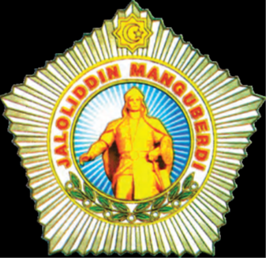

- 1997-yilda 30-noyabrda
- 1998-yilda 30-sentyabrda
- 1999-yilda 30-oktyabrda
+ 2000-yilda 30-avgustda

**263. Jaloliddin Manguberdi qayerda dafn etilgan?**

- Ayndorda
- Ganjada
+ Mayaforiqinda
- Diyorbakrda

**264. Nima sababdan Yaqin Sharqdagi boshqa musulmon hukmdorlari Jaloliddin Manguberdining mo‘g‘ullarga qarshi ittifoq tuzish taklifini rad etishgan va aksincha, unga qarshi kurashishgan?**

- Ular Sulton Jaloliddinning mulkni o‘zaro bo‘lib olishni maqsad qilishgan
+ Ular Sulton Jaloliddinning o‘sib borayotgan mavqeyidan xavfsiragan
- Ular Sulton Jaloliddinga qarshi mo‘g‘ullar bilan yashirin ittifoq tuzishgan
- Ular Sulton Jaloliddin siymosida o‘z mamlakatlariga tahdidni ko‘rishgan

**265. Shimoliy Hindiston hududida Jaloliddin Manguberdiga qaysi viloyat hukmdori hujum qilgan?**

+ Shatra viloyatining hukmdori
- Dehli viloyatining hukmdori
- Panjob viloyatining hukmdori
- Bengal viloyatining hukmdori

**266. 1225-yil mayda Jaloliddin Manguberdi qaysi shaharni jangsiz qo‘lga kiritgan?**

- Basra
- G‘azna
- Tabriz
+ Marog‘a

**267. 1224-yilda Hindistonni tark etgan Jaloliddin Manguberdi qayerlarga borib, mahalliy hukmdorlar bilan kelishib, biroz mustahkam kuchga ega bo‘lgan? 1) Kirmon; 2) Hamadon; 3) Sheroz; 4) Isfahon.**

- 1, 2, 3
+ 1, 3, 4
- 1, 2, 4
- 1, 2, 3, 4

**268. Jaloliddin Manguberdi ozarbayjonlik Malikani o‘z nikohiga olgach, Janubiy Ozarbayjondagi qaysi shaharlarni to‘y sovg‘asi sifatida mulk qilib bergan? 1) Xoy; 2) Varzukon; 3) Solmas; 4) Urmiya.**

- 1, 2, 3
- 1, 2, 4
- 2, 3, 4
+ 1, 3, 4

**269. Bag‘dod xalifasi Nosirning Jaloliddin Manguberdiga qarshi yo‘llagan 20 minglik qo‘shini qayerda tor-mor keltirilgan?**

- Jurjon yaqinida
- Marog‘a yaqinida
+ Basra yaqinida
- Damashq yaqinida

**270. XIII asr boshlarida Ozarbayjon va Arronning so‘nggi otabegi (hukmdori) kim edi?**

- Shams
- Jahon
+ O‘zbek
- Inanj

**271. Jaloliddin Manguberdining qaysi ukasi birinchi bo‘lib xiyonat yo‘liga o‘tgan?**

- Rukniddin G‘ursanchtiy
+ G‘iyosiddin Pirshoh
- O‘zloqshoh
- Oqshoh

**272. 1231-yil bahorida Jaloliddin Manguberdi qaysi tomonga yo‘l olish va u yerda kuch to‘plash niyatida edi?**

- Misr
+ Kichik Osiyo
- Hindiston
- Falastin

**273. Jaloliddin Manguberdi Marog‘a shahrini jangsiz qo‘lga kiritganidan keyin, qayerlar Xorazmshohga taslim bo‘lgan?**

+ Tabriz va G‘azna
- G‘azna va Basra
- Basra va Jurjon
- Jurjon va Tabriz

**274. Jaloliddin Manguberdi necha yil umr ko‘rgan?**

- O‘ttiz ikki yil
+ O‘ttiz uch yil
- O‘ttiz to‘rt yil
- O‘ttiz besh yil

**275. Mo‘g‘ullar O‘rta Sharqni qachon bosib olishgan?**

+ 1256-yilda
- 1252-yilda
- 1271-yilda
- 1273-yilda

**276. Shihobiddin Nasaviy o‘z asarida kimlarni “totorlar” deb atagan?**

- Turkiylarni
- Mamluklarni
+ Mo‘g‘ullarni
- Xitoyliklarni

**277. Jaloliddin Manguberdining qaysi lashkarboshilari Dehli sultoni Shamsuddin Eltutmish tomonga o‘tib ketgan?**

- Sayfiddin Ig‘roq va Muzaffar Malik
- Muzaffar Malik va Yazidak pahlavon
+ Yazidak pahlavon va Sunqurjiq
- Sunqurjiq va Sayfiddin Ig‘roq

## Chig‘atoy ulusining tashkil topishi.

**278. Chingizxon o‘limi oldidan o‘z valiahdi etib oliy hukmdor sifatida qaysi o‘g‘lini belgilagan va unga “xoqon” unvoni berilgan?**

- Jo‘chini
- Chig‘atoyni
+ O‘qtoyni
- Tuluni

**279. Qaysi davrda Chingizxon farzandlariga bo‘lib bergan uluslar mustaqil davlatlarga aylanib, nomigagina saltanat hukmdori – ulug‘ qoonga bo‘ysunganlar?**

- XIII asrning 1-yarmida
+ XIII asrning 2-yarmida
- XIV asrning 1-yarmida
- XIV asrning 2-yarmida

**280. Mo‘g‘ullar bosqinidan keyin qaysi shahar va uning atroflari olti oy mobaynida suv ofatini boshdan kechirgan?**

- Samarqand
- Marv
- Urganch
+ Balx

**281. Movarounnahr boshqaruvidagi Mahmud Yalavochga qanday mas’uliyat yuklangan edi? 1) Soliqlar tushumini muntazam nazorat etish; 2) Tashqi savdoni yo‘lga qo‘yish; 3) Qo‘shinga boshchilik qilish; 4) Mo‘g‘ullarga qarshi g‘alayon bo‘lishining oldini olish.**

- 1, 2
- 3, 4
- 2, 3
+ 1, 4

**282. Qachon Chingizxon o‘g‘illariga zabt etilgan yerlarni ulus etib bo‘lib bergan?**

- 1222-yil avgustda
- 1223-yil avgustda
- 1224-yil avgustda
+ 1225-yil avgustda

**283. Qaysi dinlar Chig‘atoy ulusida davlat dini bo‘lgan? 1) Buddizm; 2) Islom; 3) Shomonlik; 4) Tangrichilik.**

+ 2, 3, 4
- 1, 3, 4
- 1, 2, 4
- 1, 2, 3

**284. Qaysi viloyat Chig‘atoyning o‘limidan keyin ham ulus hokimiyatining markazi bo‘lib qolgan?**

- Olmaliq viloyati
+ Ili viloyati
- Xo‘jand viloyati
- Yettisuv viloyati

**285. Tarmashirinxon isyon ko‘targan amirlarga qarshi kuch to‘plash uchun qayerga yo‘l olganinda qo‘lga olinib, qatl etilgan?**

- Marvga
+ G‘aznaga
- Balxga
- Hirotga

**286. Qachon O‘qtoy Shimoliy Xitoydan yuqori daromad olish imkoniyatiga qiziqib qolgan edi?**

- 1238-yilda
- 1252-yilda
- 1231-yilda
+ 1240-yilda

**287. Qashqadaryo vohasidagi qaysi shahar yaqinida Kebekxon o‘zi uchun saroy qurdirgan va mamlakatni shu yerdan turib idora etgan?**

- Shahrisabz
+ Nasaf
- Koson
- Qamashi

**288. Dastlab qaysi til Chig‘atoy ulusida davlat tili bo‘lgan?**

- Chig‘atoy tili
- Xitoy tili
+ Mo‘g‘ul tili
- Uyg‘ur tili

**289. Qachon Mahmud Yalavoch O‘qtoy tomonidan Pekin gubernatori etib tayinlangan?**

+ 1238-yilda
- 1242-yilda
- 1246-yilda
- 1251-yilda

**290. Qaysi Chigʻatoy ulusi hukmdori davrida Chig‘atoy ulusining g‘arbiy qismi to‘la o‘troqlashgan?**

- Esan Buqa
- Qayduxon
+ Tarmashirinxon
- Kebekxon

**291. Chingizxon buyrug‘iga ko‘ra Balxob daryosidagi qaysi to‘g‘on buzib tashlangan?**

- Sultonband
- Qo‘rg‘oshin nova
+ Bandi amir
- Jo‘yi arziz

**292. Tarmashirin Chigʻatoy ulusi taxtiga kelguncha qayerda yashagan?**

- Farg‘ona vodiysida
- Toshkent vohasida
+ Qashqadaryo vohasida
- Zarafshon vodiysida

**293. “Ulus” so‘zi qanday ma’nolarni anglatadi?**

- “Hokimiyat”, “qudrat”
- “Qudrat”, “davlat”
+ “Davlat”, “xalq”
- “Xalq”, “hokimiyat”

**294. Qaysi tillar Chig‘atoy ulusida davlat tili bo‘lgan? 1) Mo‘g‘ul tili; 2) Chig‘atoy tili; 3) Fors tili; 4) Xitoy tili.**

- 2, 3, 4
- 1, 3, 4
- 1, 2, 4
+ 1, 2, 3

**295. Movarounnahrda yashayotgan mo‘g‘ullar qayerda yashovchi mo‘g‘ullarni “jete” deb atashgan?**

- Mo‘g‘uliston va Sharqiy Turkistonda
+ Sharqiy Turkiston va Yettisuvda
- Yettisuv va Xitoyda
- Xitoy va Mo‘g‘ulistonda

**296. Qaysi shahar hukmdori Ali al-Mulk Chig‘atoy ulusi xoni Buzanga qarshi kurashda ishtirok etgan va xon urushda qatl qilingan?**

+ Termiz
- Balx
- Marv
- Hirot

**297. Qaysi Chigʻatoy ulusi hukmdoriga “Sulton al-A’zam” (eng oliyjanob sulton) degan unvon berilgan?**

- Esan Buqa
- Qayduxon
+ Tarmashirinxon
- Kebekxon

**298. Chigʻatoy ulusi hukmdori Muborakshoh va Baroqxon qoʻshinlari qayerda toʻqnash kelgan va jang natijasida Muborakshoh taxtdan agʻdarilgan?**

- Marvda
- Hirotda
- Balxda
+ Xo‘jandda

**299. Qaysi yilda Chingizxon Selenga daryosidan Irtishgacha bo‘lgan yerlarni katta o‘g‘liga bergan?**

+ 1207-yilda
- 1208-yilda
- 1209-yilda
- 1210-yilda

**300. Qaysi Chigʻatoy ulusi hukmdori umrining oxirlarida falajga chalingan va uni jismonan davlatni boshqarishga layoqatsiz hisoblagan baʼzi moʻgʻul xonzodalari isyon koʻtargan?**

- Kebekxon
+ Baroqxon
- Olg‘uxon
- Muborakshoh

**301. Chig‘atoy Movarounnahr boshqaruvini dastlab Mahmud Yalavochga, keyin uning o‘g‘li Mas’udbekka topshirgan va o‘zi … .**

+ umrining oxirigacha O‘qtoy qoon (xoqon) saroyida hukmdorning maslahatchisi sifatida faoliyat ko‘rsatgan
- umrining oxirigacha janubiy va janubi-g‘arbiy o‘lkalarga harbiy yurishlar uyushtirgan
- umrining oxirigacha Qutlug‘ qishlog‘idagi yozgi qarorgohida, davlat ishlaridan chetda bo‘lgan
- umrining oxirigacha Ili vodiysidagi qishki qarorgohida, davlat ishlaridan chetda bo‘lgan

**302. Mahmud Yalavoch qachongacha Pekin gubernatori bo‘lgan?**

- 1251-yilgacha
- 1253-yilgacha
+ 1254-yilgacha
- 1258-yilgacha

**303. Yettisuvda yashayotgan mo‘g‘ullar qayerga ko‘chib kelganlarni “qoraunas” deb ataganlar?**

- Xitoyga
- Eronga
- Xurosonga
+ Movarounnahrga

**304. Chig‘atoy ulusining poytaxti bo‘lgan Olmaliq shahri hozirgi qaysi davlat hududida joylashgan tarixiy shahar hisoblanadi?**

- Mo‘g‘uliston
+ Xitoy
- Tojikiston
- Qirg‘iziston

**305. Xonni o‘z ko‘zi bilan ko‘rib, u bilan suhbatda bo‘lgan qaysi muallifning guvohlik berishicha, Tarmashirin 5 mahal namozni doimo masjidda jamoat bilan o‘qigan va masjidda kim bo‘lmasin, xonning yoniga borib, u bilan qo‘l berib ko‘risha olgan?**

- Al-Masudi
- Al-Idrisiy
- Ibn Jubayr
+ Ibn Battuta

**306. Chigʻatoy ulusining ilk musulmon hukmdori kim bo‘lgan?**

+ Muborakshoh
- Baroqxon
- Kebekxon
- Tarmashirinxon

**307. Qaysi so‘z qadimgi turkiy tilda “xarsh” yoki “qarsh” deb nomlangan?**

+ “Saroy”
- “Shahar”
- “Qal’a”
- “Xalq”

**308. Mo‘g‘ullar bosqinidan keyin …ning asosiy aholisi, …ning ko‘pchiligi, … va … kabi ulkan shaharlar aholisi ona shaharlarini yo tark etdilar, yoki qirib tashlandilar.**

- Marv/samarqandliklar/Buxoro/Urganch
+ Samarqand/buxoroliklar/Urganch/Marv
- Buxoro/urganchliklar/Marv/Samarqand
- Urganch/marvliklar/Samarqand/Buxoro

**309. Qachon Mahmud Torobiy qo‘zg‘oloni ko‘tarilgan?**

- 1245-yilda
- 1231-yilda
- 1242-yilda
+ 1238-yilda

**310. Qaysi Chigʻatoy ulusi hukmdori ko‘chmanchilik an’anasiga sodiq bo‘lgan mo‘g‘ul amirlarini dehqonchilik bilan shug‘ullanishga majbur qilgan?**

- Esan Buqa
- Qayduxon
- Kebekxon
+ Tarmashirinxon

**311. Tarmashirinxonga qarshi qayerda isyon ko‘targan Chig‘atoy amirlari xonning jiyani Buzan ibn Duva Temurni o‘zlariga hukmdor deb e’lon qilgan?**

+ Chig‘atoy ulusining sharqiy qismida
- Chig‘atoy ulusining g‘arbiy qismida
- Chig‘atoy ulusining janubiy qismida
- Chig‘atoy ulusining shimoliy qismida

**312. “Buzan Duva Temur o‘g‘li musulmon bo‘lib, ammo imoni sust, axloqi buzuq odam edi. Unga qasamyod qilib, Tarmashirinni ag‘darganlarining sababi shunda ediki, sulton o‘z bobosi, musulmon mamlakatlarini xonavayron etgan Chingizning vasiyatlarini bajarmagan”. Ushbu jumlalar kimning qaysi asaridan olingan?**

- Abu Usmon Minhojiddin ibn Sirojiddinning “Tabaqoti Nosiriy” asaridan
- Ibn Arabshohning “Fath al-buldon va ma’rifat al-ajsan” asaridan
+ Ibn Battutaning “Sayohatnoma” asaridan
- Abulg‘oziy Bahodirxonning “Shajarayi turk” asaridan

**313. Qayerda Mahmud Torobiy qo‘zg‘oloni ko‘tarilgan?**

- Samarqandda
- Xo‘jandda
- O‘trorda
+ Buxoroda

**314. Qaysi yilda Chig‘atoy ulusi taxtiga Yasavurning o‘g‘li Qozonxon o‘tirgan?**

- 1345-yilda
- 1336-yilda
- 1338-yilda
+ 1343-yilda

**315. Chingizxon buyrug‘iga ko‘ra qaysi shaharni suv bilan ta’minlovchi Qo‘rg‘oshin nova to‘g‘oni buzib tashlangan?**

+ Samarqand
- Marv
- Balx
- Urganch

**316. Baroqxon qachon Chigʻatoy ulusi taxtiga oʻtirgan?**

- 1262-yil kuzida
- 1263-yil kuzida
+ 1264-yil kuzida
- 1265-yil kuzida

**317. Qaysi yillarda Qarshi shahri Chig‘atoy ulusining poytaxti bo‘lgan?**

- 1312–1320-yillarda
- 1316–1324-yillarda
+ 1318–1326-yillarda
- 1320–1328-yillarda

**318. Chingizning vasiyatiga ko‘ra, uning avlodlari … “to‘y” deb ataladigan ziyofatga yig‘ilishardi.**

+ yilda bir marta
- ikki yilda bir marta
- uch yilda bir marta
- to‘rt yilda bir marta

**319. Qaysi Chigʻatoy ulusi hukmdori birinchi bo‘lib o‘z qarorgohini Movarounnahrga, Qashqadaryo vohasiga ko‘chirgan?**

- Esan Buqa
- Qayduxon
+ Kebekxon
- Tarmashirinxon

**320. Chigʻatoy ulusi hukmdori Baroqxon vafot etganidan keyin boshlangan taxt uchun kurashda O‘qtoy xoqonning nabirasi bo‘lgan kimning qo‘li baland kelgan?**

- Esan Buqa
- Kebekxon
+ Qayduxon
- Tarmashirinxon

**321. Kebekxonning ona tili turkiy til bo‘lganini kim qayd etgan?**

- Al-Masudi
+ Ibn Battuta
- Al-Idrisiy
- Ibn Jubayr

**322. Qaysi yilda Chigʻatoy avlodidan boʻlmish Olgʻu ulus xoni etib tayinlangan?**

- 1263-yilda
- 1271-yilda
+ 1260-yilda
- 1274-yilda

**323. Kebekxon qaysi davlatlar namunasida ikki xil tanga zarb ettirgan?**

- Yuan va Usmoniylar davlati
- Usmoniylar va Oltin O‘rda davlati
+ Oltin O‘rda va Hulakular davlati
- Hulakular va Yuan davlati

**324. Chig‘atoy ulusining sharqiy qismida tarqalgan vabo epidemiyasi qaysi davrda Yevropaga keng yoyilgan?**

- 1340-yillar birinchi yarmida
+ 1340-yillar ikkinchi yarmida
- 1350-yillar birinchi yarmida
- 1350-yillar ikkinchi yarmida

**325. Chig‘atoy ulusida qaysi shahar “Madinat ar-rijol” (Mardlar shahri) deb yuritilgan?**

+ Termiz
- Balx
- Marv
- Hirot

**326. Qaysi Chig‘atoy ulusi hukmdori ulusning sharqiy qismida tarqalgan vabo kasaliga g‘ayridinlarning turmush tarzi sabab deb hisoblagan va vabodan ularga qarshi kurashda qurol sifatida foydalangan?**

- Buzan ibn Duva Temur
+ Ali Sulton
- Qozonxon
- Esan Buqa

**327. Qaysi Chigʻatoy ulusi hukmdori tarixchilar tomonidan “Alouddin” nomi bilan ham tilgan olinadi?**

- Esan Buqa
- Qayduxon
+ Tarmashirinxon
- Kebekxon

**328. Eron va Xuroson Chingizxonning qaysi o‘g‘liga ulus qilib berilgan?**

- Jo‘chiga
- Chig‘atoyga
- O‘qtoyga
+ Tuluga

**329. Mavjud urf bo‘yicha Chig‘atoy ulusi hukmdori har yili mamlakatning Xitoyga yaqin qismiga kelib, … .**

- bu yerdagi aholining ahvolini ko‘rib qaytishi shart edi
+ bu yerdagi qo‘shinlarning ahvolini ko‘rib qaytishi shart edi
- bu yerdagi amirlarning ahvolini ko‘rib qaytishi shart edi
- bu yerdagi ma’muriy ishlarning ahvolini ko‘rib qaytishi shart edi

**330. Qaysi Chigʻatoy ulusi hukmdori davrida turk-mo‘g‘ul ko‘chmanchi zodagonlari, mahalliy malik va sadrlarning avtonom huquqlari bekor qilingan?**

- Esan Buqa
- Qayduxon
- Tarmashirinxon
+ Kebekxon

**331. Chig‘atoy ulusining qonun chiqaruvchi hokimiyati qanday atalgan?**

- Jirg‘a
- Majlis
- Kengash
+ Qurultoy

**332. Chig‘atoy ulusining maydoni qancha bo‘lgan?**

- 1 500 000 km/kv
- 2 500 000 km/kv
+ 3 500 000 km/kv
- 4 500 000 km/kv

**333. Chig‘atoy ulusi taxtiga Eragana Xotun aralashuvi bilan kim o‘tirgan?**

+ Muborakshoh
- Baroqxon
- Kebekxon
- Tarmashirinxon

**334. Chig‘atoy qaysi shahar yaqinida Qutlug‘ qishlog‘iga asos solgan?**

- Xo‘jand
- Samarqand
- Nasaf
+ Olmaliq

**335. Qaysi yilda Kebekxonning tashabbusi bilan o‘tkazilgan qurultoyda Chigʻatoy ulusi taxtiga uning akasi Esan Buqa chiqarilgan?**

- 1302-yilda
- 1305-yilda
- 1306-yilda
+ 1309-yilda

**336. Chingizxon buyrug‘iga ko‘ra qaysi shaharni suv bilan ta’minlovchi Sultonband to‘g‘oni buzib tashlangan?**

- Samarqand
+ Marv
- Balx
- Urganch

**337. Qaysi Chigʻatoy ulusi hukmdori islomni Chig‘atoy ulusining rasmiy diniga aylantirgan?**

+ Tarmashirinxon
- Esan Buqa
- Muborakshoh
- Kebekxon

**338. Guyukxon taxtga kelgach, Chig‘atoy ulusida uning buyrug‘i kim taxtdan ag‘darilgan?**

- Oriqbuqa
- Olg‘uxon
+ Qora-Hulagu
- Yasu Munke

**339. Mahmud Yalavoch O‘qtoy xoqon buyrug‘i bilan qayerga noib va yarg‘uchi (nozir) etib yuborilgan?**

- Sharqiy Turkistonga
+ Shimoliy Xitoyga
- G‘arbiy Mo‘g‘ulistonga
- Janubiy Yettisuvga

**340. Mo‘g‘ullar davrida “yarg‘uchi” qanday lavozim bo‘lgan?**

+ Nozir
- Kotib
- Vazir
- Noib

**341. Qaysi Chigʻatoy ulusi hukmdori Toshkent vohasidagi Ohangaronda islom diniga oʻtganligini eʼlon qilgan?**

- Baroqxon
- Kebekxon
- Olg‘uxon
+ Muborakshoh

**342. Chigʻatoy ulusi hukmdori Kebekxonning hukmronlik yillarini toping.**

- 1315–1323-yillar
- 1317–1325-yillar
- 1316–1324-yillar
+ 1318–1326-yillar

**343. Mo‘g‘ullar kelib chiqishi aralash bo‘lgan (asl mo‘g‘ul bo‘lmagan, duragay) odamlarni qanday atashgan? 1) Qoraunas; 2) Qorag‘unas; 3) Jete; 4) Yasovul.**

+ 1, 2
- 1, 4
- 3, 4
- 2, 3

**344. Mahmud Yalavochning harakatlari sabab oldindan miqdori belgilanmagan qaysi soliq qat’iy kumush solig‘iga almashtirilgan?**

- “Tamg‘a”
- “Begar”
+ “Qopchur”
- “Chavgon”

**345. Qayerdagi qarorgoh Chig‘atoyning qishki qarorgohi edi?**

+ Ili vodiysidagi
- Olmaliq shahridagi
- Qutlug‘ qishlog‘idagi
- Samarqand shahridagi

**346. Chig‘atoy ulusi xonligining haqiqiy asoschisi kim hisoblanadi?**

- Oriqbuqa
+ Olg‘uxon
- Qora-Hulagu
- Yasu Munke

**347. Rus davlatida “kopeyka” tarzida talaffuz qilingan “kepaki” pul birligi u yerga qaysi davlat orqali borgan?**

- Yuan davlati orqali
+ Oltin O‘rda davlati orqali
- Elxoniylar davlati orqali
- Usmoniylar davlati orqali

**348. Tarmashirinxon taxtga o‘tirishidan oldin qayerning noibi edi?**

+ G‘azna
- Marv
- Balx
- Hirot

**349. “Yasoq” qoidalarini yaxshi bilgan kimni zamondoshlari “Yasoq qo‘riqchisi” (yasovul) sifatida ta’riflab, qonunbuzarliklarga qat’iy qarshi turgani haqida yozadi?**

- Jo‘chini
+ Chig‘atoyni
- O‘qtoyni
- Tuluni

**350. Qayerdagi qarorgoh Chig‘atoyning yozgi qarorgohi edi?**

- Ili vodiysidagi
- Olmaliq shahridagi
+ Qutlug‘ qishlog‘idagi
- Samarqand shahridagi

**351. Qaysi Chigʻatoy ulusi hukmdori davrida sharqda Yuan imperiyasi (Xitoy) bilan, g‘arbda esa Elxoniylar (Eron hulakulari) bilan tinimsiz kurashlar olib borilgan?**

+ Esan Buqa
- Kebekxon
- Qayduxon
- Tarmashirinxon

**352. Xitoyda hukmronlik qilayotgan Xubilayxon qayerga oziq-ovqat yuborishni cheklab qoʻygan?**

+ Qoraqurumga
- Olmaliqqa
- Bolasog‘unga
- Xo‘jandga

**353. Chigʻatoy ulusi hukmdori Baroqxon qachon vafot etgan?**

- 1279-yilda
+ 1271-yilda
- 1276-yilda
- 1274-yilda

**354. Kebekxonning ilk tangalari taxminan qaysi yilda zarb etilgan?**

+ 1321-yilda
- 1319-yilda
- 1322-yilda
- 1325-yilda

**355. Janubiy Sibirdan Xorazm va Darbandgacha bo‘lgan yerlar Chingizxonning qaysi o‘g‘liga ulus qilib berilgan?**

+ Jo‘chiga
- Chig‘atoyga
- O‘qtoyga
- Tuluga

**356. Xitoy va Mo‘g‘uliston Chingizxonning qaysi o‘g‘liga ulus qilib berilgan?**

- Jo‘chiga
- Chig‘atoyga
+ O‘qtoyga
- Tuluga

**357. Chig‘atoy ulusi taxtiga O‘qtoy avlodidan bo‘lgan kim o‘tirgan davrda ulusning sharqiy qismida islom asosiy din darajasiga ko‘tarilgan?**

- Buzan ibn Duva Temur
- Qayduxon
+ Ali Sulton
- Esan Buqa

**358. Chigʻatoy ulusida qaysi hudud Esan Buqa davrida Kebekxonga mulk sifatida berilgan edi?**

- Farg‘ona vodiysi
- Toshkent vohasi
+ Qashqadaryo vohasi
- Zarafshon vodiysi

**359. O‘n minglik harbiy birlik yig‘iladigan maxsus ma’muriy-harbiy hududlar Qoshg‘ar va Sharqiy Turkistonda qanday atalgan?**

- “Tuman”
+ “O‘rchin”
- “El”
- “Ayl”

**360. Guyukxon taxtga kelgach, Chig‘atoyning buyuk xon bilan mustahkam do‘stlik aloqalariga ega bo‘lgan qaysi o‘g‘li ulus taxtiga o‘tirgan?**

- Oriqbuqa
- Olg‘uxon
- Qora-Hulagu
+ Yasu Munke

**361. Kebekxon davlatni qancha harbiy birlik yig‘iladigan maxsus hududlarga ajratgan?**

+ 10 minglik
- 20 minglik
- 30 minglik
- 40 minglik

**362. Xubilayxon boy hudud sanalgan Movarounnahr ustidan siyosiy nazorat oʻrnatish uchun qaysi xonzodalarni yuborgan?**

- Kebekxon va Tarmashirinxon
- Tarmashirinxon va Muborakshoh
+ Muborakshoh va Baroqxon
- Baroqxon va Kebekxon

**363. Chigʻatoy ulusi hukmdori Tarmashirinni masjidga kelishini kutib turmay, “Namoz Xudo uchunmi yoki Tarmashirin uchunmi?” deya namozni boshlashni buyurgan imom kim edi?**

- Rukniddin Yog‘iy
- Alouddin Yog‘iy
- Nizomiddin Yog‘iy
+ Hisomiddin Yog‘iy

**364. “Ulus” atamasi “mulk” ma’nosida qo‘llanmay qo‘yilgach, asta-sekin qaysi ma’noni anglata boshlagan?**

+ “Xalq”
- “Mamlakat”
- “Vatan”
- “Viloyat”

**365. Mahmud Torobiy qo‘zg‘olonidan keyin Chig‘atoy qanday ayblov bilan Mahmud Yalavochni Movarounnahr noibligidan chetlashtirib, uni ulus hududidan chiqartirib yuborgan?**

+ Qo‘zg‘olonni bostirishda sustkashlik qilgan deb
- Qo‘zg‘olonchilarga yon bosgan deb
- Qo‘zg‘olonni oldini olishda sovuqqonlik qilgan deb
- Qo‘zg‘olon ommalashib ketishiga sababchi bo‘lgan deb

**366. “Qarshi” so‘zi asli qaysi tildan olingan?**

- Mo‘g‘ul tilidan
+ Turkiy tildan
- Uyg‘ur tilidan
- Fors tilidan

**367. Chig‘atoy ulusining barcha ishlarini boshqargan Tukashi kimning xotini edi?**

- Oriqbuqa
- Olg‘uxon
- Qora-Hulagu
+ Yasu Munke

**368. Kebekxon pul islohotiga ko‘ra 1 dinor nechta dirhamga teng qilib belgilangan?**

- 2 dirhamga
- 4 dirhamga
+ 6 dirhamga
- 8 dirhamga

**369. Chig‘atoy amirlari Tarmashirinxon qancha vaqt mobaynida Xurosonga tutash viloyatda yashab, mamlakatning Xitoyga yaqin qismiga kelmagani uchun darg‘azab bo‘lishgan?**

- Ikki yil mobaynida
- Uch yil mobaynida
+ To‘rt yil mobaynida
- Besh yil mobaynida

**370. Mahmud Yalavoch qayerdan olinadigan soliqni oldindan to‘lay oladigan darajada boy bo‘lgan?**

- Xurosondan
+ Movarounnahrdan
- Sharqiy Turkistondan
- Xorazmdan

**371. Qaysi Chig‘atoy ulusi hukmdori ziyofat tiklashni bekor qilib, “to‘y” deb ataladigan odatga barham bergan?**

- Buzan ibn Duva Temur
- Ali Sulton
- Qozonxon
+ Tarmashirinxon

**372. Chig‘atoy qachon o‘z vorisi sifatida to‘ng‘ich o‘g‘lining farzandi, bosh nabirasi bo‘lgan Qora-Hulaguni tayinlagan?**

+ 1242-yilda
- 1238-yilda
- 1234-yilda
- 1246-yilda

**373. Chig‘atoy ulusi hukmdori unvonini toping.**

+ Xon
- Xoqon
- Elxon
- Qoon

**374. Qaysi Chig‘atoy ulusi hukmdori Mo‘g‘uliston va Xitoy o‘lkasidagi chingiziy xonlar Xubilayxon va Oriqbuqa o‘rtasidagi o‘zaro urushlardan foydalanib Xorazmning bir qismi, Turkiston va Afg‘onistonni qo‘lga kiritib, o‘zini mustaqil deb e’lon qilgan va xonlikning ilk tamal toshini qo‘ygan?**

- Muborakshoh
+ Olg‘uxon
- Qora-Hulagu
- Yasu Munke

**375. Musulmon mamlakatlarida azon aytuvchi qanday atalgan?**

- Mutavvali
+ Muazzin
- Muallim
- Mudarris

**376. Mahmud Yalavochning o‘g‘li Mas’udbek qaysi yillarda Movarounnahrni boshqargan?**

- 1245–1296-yillarda
- 1231–1282-yillarda
+ 1238–1289-yillarda
- 1242–1293-yillarda

**377. Qaysi yillarda Olmaliq shahri Chig‘atoy ulusining poytaxti bo‘lgan?**

+ 1224–1266-yillarda
- 1227–1269-yillarda
- 1231–1273-yillarda
- 1242–1284-yillarda

**378. Xubilayxonning Baroqxonni Mo‘g‘ulistonga bo‘ysundirish uchun yuborgan qoʻshinlari qayerdan quvib chiqarilgan?**

+ Sharqiy Turkistondan
- Yettisuvdan
- Movarounnahrdan
- Xurosondan

**379. Mahmud Yalavochning o‘g‘li Mas’udbek qachon vafot etgan?**

- 1296-yilda
- 1282-yilda
+ 1289-yilda
- 1293-yilda

**380. Qaysi yillarda Chig‘atoy ulusining sharqiy qismida vabo tarqalgan?**

- 1336–1337-yillarda
- 1337–1338-yillarda
+ 1338–1339-yillarda
- 1339–1340-yillarda

**381. O‘qtoy qaysi shaharni qayta qurishga farmon berganida Chig‘atoy unga “Bu ishing otamizning nizomiga, tutgan yo‘liga zid!” deb qattiq qarshilik ko‘rsatgan?**

- Marv
+ Hirot
- Balx
- Xo‘jand

**382. Mas’udbek Movarounnahrning nechta shahar va viloyatida bir xil vazn va yuqori qiymatli sof kumush tangalar zarb ettirib, ularni muomalaga chiqargan?**

- 12 ta
- 14 ta
+ 16 ta
- 18 ta

**383. Mas’udbek qayerda Mas’udiya madrasasini bino qilgan?**

- Samarqandda
- Xo‘jandda
- O‘trorda
+ Buxoroda

**384. Chig‘atoy o‘z ulusi hayotini yaxshilash uchun sharqiy o‘lkalarni qaysi daryo vodiysi bilan bog‘lovchi ulkan yo‘l qurdirgan?**

- Onon vodiysi
+ Ili vodiysi
- Irg‘iz vodiysi
- Tarim vodiysi

**385. Oltoy tog‘larining janubiy sarhadlaridan to Amudaryo va Sindgacha bo‘lgan yerlar, ya’ni Sharqiy Turkiston, Yettisuv, Movarounnahr, hozirgi Afg‘onistonning katta qismi Chingizxonning qaysi o‘g‘liga ulus qilib berilgan?**

- Jo‘chiga
+ Chig‘atoyga
- O‘qtoyga
- Tuluga

**386. Qaysi Chigʻatoy ulusi hukmdori o‘troq hayotga o‘tgan?**

- Esan Buqa
- Qayduxon
+ Kebekxon
- Tarmashirinxon

**387. XIII asr boshida Chigʻatoy ulusida taxt uchun kurashda kim g‘alaba qozongan?**

- Esan Buqa
+ Kebekxon
- Qayduxon
- Tarmashirinxon

**388. Qachon Mas’udbek pul islohoti o‘tkazgan?**

- 1263-yilda
+ 1271-yilda
- 1260-yilda
- 1274-yilda

**389. O‘n minglik harbiy birlik yig‘iladigan maxsus ma’muriy-harbiy hududlar Movarounnahr va unga tutash o‘lkalarda qanday atalgan?**

+ “Tuman”
- “O‘rchin”
- “El”
- “Ayl”

**390. Chig‘atoy ulusi pul birliklarini to‘g‘ri toping.**

- Fulus, kepaki
+ Kepaki, dirham
- Dirham, dinor
- Dinor, fulus

**391. Mahmud Yalavochning harakatlari sabab tinch aholi qanday yig‘imlarni to‘lashdan ozod qilingan?**

- Qo‘shimcha yig‘imlarni
+ Harbiy yig‘imlarni
- Mavsumiy yig‘imlarni
- Favqulotda yig‘imlarni

**392. Chigʻatoy ulusi hukmdori Olgʻuxon qachon vafot etgan?**

- 1260–1261-yillarda
- 1261–1262-yillarda
- 1262–1263-yillarda
+ 1263–1264-yillarda

**393. Yevropa tarixida “Qora o‘lim” deb yuritilgan vabo epidemiyasi natijasida Yevropa aholisining qancha foizi nobud bo‘lgan?**

- 10–20 foizi
- 20–30 foizi
+ 30–40 foizi
- 40–50 foizi

**394. “Kepaki” pul birligi joriy qilinguniga qadar Chigʻatoy ulusida qanday pullardan foydalanilgan?**

+ Mahalliy sulola hukmdorlarining pullaridan
- Yuan davlati pullaridan
- Elxoniylar davlati pullaridan
- Oltin O‘rda davlati pullaridan

**395. Kebekxon davrida Chingizxon bosqinidan buyon vayron bo‘lib yotgan qaysi shahar qayta tiklangan?**

- Marv
+ Balx
- Hirot
- Nasaf

**396. Qaysi yildagi qurultoyda O‘qtoyning to‘ng‘ich o‘g‘li Guyuk “ulug‘ xon” deb e’lon qilingan?**

- 1242-yildagi
- 1238-yildagi
- 1234-yildagi
+ 1246-yildagi

**397. Qaysi Chigʻatoy ulusi hukmdori davlatni moʻgʻul ulugʻ xonlari taʼsiridan toʻliq ajratib olgan?**

+ Baroqxon
- Kebekxon
- Olg‘uxon
- Muborakshoh

**398. Kebekxon pul islohotiga ko‘ra bir xil qiymatdagi og‘irligi necha grammdan ortiq bo‘lgan kichik dirhamlar va yirik dinorlar zarb qilingan?**

- 2 grammdan ortiq
- 4 grammdan ortiq
- 6 grammdan ortiq
+ 8 grammdan ortiq

**399. Mo‘g‘ulcha qaysi so‘z “qaroqchi”, “talonchi” degan ma’noni anglatadi?**

- “Qoraunas”
- “Qorag‘unas”
- “Yasovul”
+ “Jete”

**400. “Qopchur” qanday soliq?**

- Hosil solig‘i
- Savdo solig‘i
+ Chorva solig‘i
- Mahsulot solig‘i

**401. Chingizxon avlodlarida qayerning taxtiga o‘tirgan oliy hukmdor “xoqon”, uluslarda hukmronlik qilgan xonzodalar esa “xon” unvoni bilan yuritilgan?**

+ Mo‘g‘uliston
- Xitoy
- Sharqiy Turkiston
- Movarounnahr

**402. Qaysi Chigʻatoy ulusi hukmdori qo‘shni mo‘g‘ul mamlakatlari bilan kelishuv siyosatini yuritgan?**

- Esan Buqa
+ Kebekxon
- Qayduxon
- Tarmashirinxon

**403. Kim hokimiyatini mustahkamlash uchun Chig‘atoy ulusini boshqarayotgan Eragana Xotunga uylangan?**

- Oriqbuqa
+ Olg‘uxon
- Qora-Hulagu
- Yasu Munke

## Chig‘atoy ulusining ikki qismga bo‘linib ketishi va ijtimoiy-iqtisodiy hayot.

**404. Qaysi davrda Chig‘atoy ulusining mo‘g‘ul amaldorlari orasida o‘troqlikka ko‘chish, shahar hayotiga yaqinlashish, mahalliy o‘troq aholining boy madaniyatidan foydalanish jarayoni kuchaygan?**

- XIII asr boshlarida
+ XIII asr o‘rtalarida
- XIII asr oxirlarida
- XIV asr boshlarida

**405. “Alqissa, ikki yil ichida mamlakatda barqarorlik o‘rnatilib, fitnachilar dimog‘ini sharorat tark etib, yomonliklar bosilgach, amir Qazag‘on Donishmandchaga O‘qtoy qoon naslidan degan ayb qo‘yib, uni shahid qildi va Chig‘atoy naslidan bo‘lgan Bayonqulini saltanat taxtiga o‘tqazdi”. Ushbu jumlalar kimning qaysi asaridan olingan?**

- Abu Usmon Minhojiddin ibn Sirojiddinning “Tabaqoti Nosiriy” asaridan
- Ibn Arabshohning “Fath al-buldon va ma’rifat al-ajsan” asaridan
+ Muiniddin Natanziyning “Muntaxab ut-tavorixi Muiniy” asaridan
- Rashiduddin Fazlullohning “Jome at-tavorix” asaridan

**406. Chig‘atoy ulusi hukmdorlarining islom dinini qabul qilishi natijasida uyg‘ur yozuvi o‘rnini qaysi yozuv egallagan?**

- Fors yozuvi
+ Arab yozuvi
- Turkiy yozuv
- Chig‘atoy yozuvi

**407. “O‘rdu” so‘zining ma’nosi nima?**

- Saltanat
- Mulozamat
- Himmat
+ Xizmat

**408. Chig‘atoy ulusining dastlabki poytaxti Olmaliq shahri hozirgi Xitoyning qaysi viloyatiga qarashli joy hisoblanadi?**

- Fujian viloyatiga
+ Shinjon viloyatiga
- Hubei viloyatiga
- Shanxi viloyatiga

**409. Kim joriy etgan Chig‘atoy xonlarini nomigagina taxtga ko‘tarish an’anasi o‘zbek davlatchiligi tarixiga “qo‘g‘irchoq xon”, “soxta xon” kabi tushunchalarni olib kirgan?**

- Amir Hoji Barlos
- Amir Abdulloh
+ Amir Qazag‘on
- Amir Ali Sulton

**410. Boshlang‘ich maktablar qaysi asrlardan boshlab “kattoblar” deb ham atalgan?**

+ VIII–IX asrlardan
- IX–X asrlardan
- X–XI asrlardan
- XI–XII asrlardan

**411. XIII asrda Movarounnahrda “Xoniya” va “Mas’udiya” madrasalari qayerda bunyod etilgan?**

- Urganchda
- Samarqandda
+ Buxoroda
- Qarshida

**412. Mo‘g‘ullar saltanatida qaysi soliq bir yilda bir marta mo‘g‘ul hukmdorlarini sharaflash uchun ularga bo‘ysunuvchi xalqlardan yig‘ib olingan?**

- “Tamg‘a”
- “Kalon”
- “Qopchur”
+ “Shulen”

**413. Mo‘g‘ullar saltanatida nechta soliq turi joriy qilingan edi?**

- 3 ta
+ 4 ta
- 5 ta
- 6 ta

**414. Chig‘atoy ulusining poytaxti Olmaliq shahridan keyin qaysi shaharga ko‘chirilgan?**

- Samarqandga
- Buxoroga
+ Qarshiga
- Termizga

**415. XIII asrda qaysi shaharda Xorazm noibi Qutlug‘ Temur tomonidan qurdirilgan ulkan madrasa faoliyat yuritgan?**

+ Urganchda
- Xivada
- Hazoraspda
- Vazirda

**416. Qaysi davrda Movarounnahrda uyg‘ur yozuvi asosan saroyning ichki yozuviga aylanib qolgan?**

+ Temuriylar davrida
- Shayboniylar davrida
- Ashtarxoniylar davrida
- Mang‘itlar davrida

**417. Chig‘atoy ulusidagi soliq tizimi kim tomonidan ishlab chiqilgan edi?**

+ Mahmud Yalavoch
- Ma’sud Yalavoch
- Kebekxon
- Tarmashirinxon

**418. “Madrasa” so‘zi kelib chiqqan arabcha “darasa” so‘zining ma’nosi nima?**

- “Yozadigan joy”
- “Bilim oladigan joy”
+ “Dars oladigan joy”
- “Savod chiqaradigan joy”

**419. “Maktab” so‘zi kelib chiqqan arabcha “kataba” so‘zining ma’nosi nima?**

- “O‘qimoq”
- “O‘rganmoq”
- “Bormoq”
+ “Yozmoq”

**420. Mo‘g‘ullar saltanatida chorvachilar qanday soliq to‘lagan?**

- “Tamg‘a”
- “Kalon”
- “Shulen”
+ “Qopchur”

**421. Mo‘g‘ullar davrida qaysi tariqat yo‘nalishi rivojlangan?**

+ Kubraviya
- Yassaviya
- Naqshbandiya
- Qalandariya

**422. O‘rta Osiyoda qaysi asrdan ta’lim tili arab va fors tili bo‘lgan?**

+ VIII asrdan
- IX asrdan
- X asrdan
- XI asrdan

**423. Amir Qazag‘onni jangda yenggan Qozonxon dushmanni ta’qib qilish o‘rniga qayerga qaytib borgan?**

- Samarqandga
- Buxoroga
+ Qarshiga
- Termizga

**424. XIII asrda Movarounnahrda madrasa talabalarining yoshi … dan … gacha bo‘lgan.**

+ 10/40
- 15/45
- 20/50
- 25/55

**425. Chig‘atoy ulusida ta’limda qaysi til alohida nufuzga ega hisoblangan?**

- Arab tili
- Fors tili
- Mo‘g‘ul tili
+ Uyg‘ur tili

**426. Barlos urug‘idan Amir Hoji Barlos boshchiligidagi bir guruh amirlar kimning adolatsiz va qattiqqo‘l siyosatiga qarshi isyon ko‘tarishgan?**

- Amir Qazag‘onning
+ Amir Abdullohning
- Amir Tug‘luq Temurning
- Amir Ali Sultonning

**427. Munkaxonning onasi qayerda o‘zi barpo etgan “Xoniya” madrasasiga Sayfiddin Boxarziyni mudarris etib tayinlagan?**

- Samarqandda
- Qarshida
+ Buxoroda
- Qoraqurumda

**428. Quyodagi qaysi so‘z choparlar, yo‘lovchilar ot almashtiradigan joy ma’nosini anglatadi?**

- “Payza”
+ “Yom”
- “Barot”
- “Tamg‘a”

**429. XIII asrda Movarounnahrda ta’lim qanday toifalarga ajratilgan?**

- Faqat kunduzgi
+ Kunduzgi va sirtqi
- Kunduzgi, kechgi va sirtqi
- Kunduzgi, kechgi, sirtqi va muvaqqat

**430. Mo‘g‘ullar saltanatining poytaxti va ulug‘ xonning qarorgohi qaysi shahar edi?**

+ Qoraqurum
- Pekin
- Olmaliq
- Xonbaliq

**431. XIII asrda Movarounnahrda boshlang‘ich ta’lim masjidlarga qarashli maktablarda olib borilgan va necha yil davom etgan?**

- To‘rt yil atrofida
+ Besh yil atrofida
- Olti yil atrofida
- Yetti yil atrofida

**432. Mo‘g‘ullar saltanatida qaysi soliqda har bir podadan ikki yashar qo‘y, qimiz uchun har mingta otdan bir biya olingan?**

- “Tamg‘a”
- “Kalon”
+ “Shulen”
- “Qopchur”

**433. XIII asrda Movarounnahrda har bir madrasada qancha talaba bilim olgan?**

- 40–80 ga yaqin
- 50–90 ga yaqin
+ 60–100 ga yaqin
- 70–110 ga yaqin

**434. Chig‘atoy xonlaridan birinchi bo‘lib kim islom dinini qabul qilgan?**

- Baroqxon
- Kebekxon
+ Muborakshoh
- Tarmashirinxon

**435. XIII asrda Movarounnahrda qiz bolalarga kimlar dars bergan?**

- Imom-xatiblar
+ Otinlar
- Muazzinlar
- Naqiblar

**436. Qaysi Oltin O‘rda xoni davrida kubraviya tariqati xonlikning katta hududiga yoyilgan?**

+ Berkaxon
- Jonibekxon
- O‘zbekxon
- To‘xtamishxon

**437. Chig‘atoy ulusi, Oltin O‘rda, Qozon va Qrim xonliklarida kotiblarni, Boburiylar davlatida harbiy qismlarning hisob-kitob ishlarini olib boruvchi va ularga maosh to‘lovchi yirik amaldorlarni, Buxoro xonligida ma’muriy binolar qurishda mablag‘ (sarf-xarajat) hisobini olib boruvchi kishilarni, turkmanlarda urug‘ oqsoqollarini umumiy qaysi so‘z bilan atashgan?**

- “Oqsoqol”
+ “Baxshi”
- “Yasovul”
- “Kattob”

**438. Amir Qazag‘on qachon Chig‘atoy ulusi xoni Qozonxonga qarshi Amudaryo qirg‘og‘idagi Soli Saroy hududida qo‘shin to‘plagan?**

- 1342-yil qishida
- 1343-yil yozida
- 1344-yil bahorida
+ 1345-yil kuzida

**439. Mo‘g‘ullar saltanatida hunarmand va savdogarlar qanday soliq to‘lagan?**

+ “Tamg‘a”
- “Kalon”
- “Shulen”
- “Qopchur”

**440. Qaysi davrda Chig‘atoy ulusi xoqon nazoratida boshqarilgan?**

+ 1227-yildan XIII asrning 60-yillarigacha
- 1300-yil XIV asrning boshlaridan 40-yillarigacha
- 1260-yildan XIV asrning boshlarigacha
- 1340-yil XIV asrning 40-yillaridan 1370-yiligacha

**441. Qaysi yilda Tug‘luq Temur Chig‘atoy ulusining sharqiy qismida hukmdor bo‘lgan?**

+ 1348-yilda
- 1345-yilda
- 1352-yilda
- 1356-yilda

**442. Mo‘g‘ullar saltanatida ko‘chmanchilar mahsulot tarzida to‘laydigan soliq qanday atalgan?**

- “Tamg‘a”
- “Kalon”
+ “Shulen”
- “Qopchur”

**443. Chingizxon oilasi va nufuzli sarkardalar orasidagi yozishmalar qaysi tilda olib borilgan?**

- Xitoy tilida
+ Uyg‘ur tilida
- Turkiy tilda
- Mo‘g‘ul tilida

**444. XIII asr o‘rtalarida tasavvufning yirik namoyandalaridan bo‘lgan kim naqshbandiya tariqati silsilasida 12-maqomda zikr qilingan?**

- Sayfiddin Boxarziy
- Sa’diddin Hamuya
- Xoja Muhammad Samosiy
+ Xoja Ali Romitaniy

**445. XIII asrda Movarounnahrda faoliyat yuritgan Tamg‘achxon madrasasi qayerda bunyod etilgan?**

- Urganchda
+ Samarqandda
- Buxoroda
- Qarshida

**446. Amir Qazag‘on ilk bor “soxta xon” sifatida kimning naslidan bo‘lgan Donishmandchaxonni taxtga ko‘targan?**

- Jo‘chi
- Chig‘atoy
+ O‘qtoy
- Tulu

**447. Mo‘g‘ul qabilalarining o‘z yozuvi mavjud bo‘lmaganligi sabab Chingizxon mo‘g‘ullar uchun qaysi yozuvni qabul qilgan va o‘z farzandlariga ushbu yozuvni o‘rgatishni buyurgan?**

- Turkiy yozuvni
- Fors yozuvini
- Xitoy yozuvini
+ Uyg‘ur yozuvini

**448. Qaysi yilda Chig‘atoy ulusi rasman ikkiga bo‘linib ketgan?**

+ 1348-yilda
- 1345-yilda
- 1352-yilda
- 1356-yilda

**449. Qaysi yilda Qashqadaryo vohasida qishning qattiq kelishi natijasida Qozonxon qo‘shinidagi otlarga qirg‘in kelgan?**

- 1344-yilda
+ 1345-yilda
- 1346-yilda
- 1347-yilda

**450. XIII asrda Movarounnahrda quyidagi qaysi madrasada talabalarning darsni o‘zlashtirishlariga qarab oylik maosh belgilangan?**

- Qutlug‘ Temur madrasasida
+ Tamg‘achxon madrasasida
- Xoniya madrasasida
- Mas’udiya madrasasida

**451. Mo‘g‘ullar davrida Movarounnahrda poliz maydonlari, bog‘larda ishlovchilar qanday atalgan?**

- Muzori, kadivar
- Kadivar, kashovarz
- Kashovarz, bog‘bon
+ Bog‘bon, muzori

**452. Kimning vafoti bilan Chig‘atoy xonadoni a’zolarining Movarounnahrdagi hukmronligi amalda tugagan?**

- Buzan ibn Duva Temur
- Ali Sulton
- Tarmashirinxon
+ Qozonxon

**453. Mo‘g‘ullar saltanatida dehqonlar qanday soliq to‘lagan?**

- “Tamg‘a”
+ “Kalon”
- “Shulen”
- “Qopchur”

**454. Qaysi davrda Mo‘g‘ullarning o‘troqlashuvi va islom dinini qabul qilishi jarayoni bo‘lgan?**

- 1227-yildan XIII asrning 60-yillarigacha
+ 1300-yil XIV asrning boshlaridan 40-yillarigacha
- 1260-yildan XIV asrning boshlarigacha
- 1340-yil XIV asrning 40-yillaridan 1370-yiligacha

**455. XIII asrda Movarounnahrda madrasada o‘qish talabalar iqtidoriga qarab o‘rtacha necha yil davom etgan?**

- 5–10 yil
- 6–11 yil
+ 7–12 yil
- 8–13 yil

**456. XIII asrda Movarounnahrda o‘g‘il bolalarga kimlar dars bergan?**

+ Imom-xatiblar
- Otinlar
- Muazzinlar
- Naqiblar

**457. Amir Qazag‘on davrida aholi va amirlardan qaysi soliqlar olingan va shulardan boshqa to‘lov yig‘ilmagan?**

- Tamg‘a va ushr
+ Ushr va qopchur
- Qopchur va shulen
- Shulen va tamg‘a

**458. Mo‘g‘ullar davrida Movarounnahrda yerga ishlov beruvchilar qanday atalgan?**

- Kashovarz
+ Kadivar
- Bog‘bon
- Muzori

**459. Quyidagi qaysi so‘z “ijara” ma’nosini anglatadi?**

- “Payza”
- “Yom”
+ “Barot”
- “Tamg‘a”

**460. Qaysi davrda Markaziy Osiyoda ikki hokimiyatchilik boshqaruvi, O‘qtoy va Chig‘atoy xonadoni hukmronligi o‘rnatilgan?**

- 1227-yildan XIII asrning 60-yillarigacha
- 1300-yil XIV asrning boshlaridan 40-yillarigacha
+ 1260-yildan XIV asrning boshlarigacha
- 1340-yil XIV asrning 40-yillaridan 1370-yiligacha

**461. Amir Qazag‘on va Qozonxon qo‘shinlari qayerda to‘qnash kelgan va jangda amir Qazag‘onning ko‘ziga o‘q tegib, janubga chekingan?**

+ Xurosonda
- Movarounnahrda
- Sharqiy Turkistonda
- Yettisuvda

**462. Qaysi davrda Chig‘atoy ulusining ikki qismga bo‘linishi va Movarounnahrda amirlar boshqaruvi o‘rnatilgan?**

- 1227-yildan XIII asrning 60-yillarigacha
- 1300-yil XIV asrning boshlaridan 40-yillarigacha
- 1260-yildan XIV asrning boshlarigacha
+ 1340-yil XIV asrning 40-yillaridan 1370-yiligacha

**463. XIII asrda Movarounnahrda qayerda Xoja Bulg‘oriy madrasasi faoliyat yuritgan?**

- Urganchda
- Samarqandda
+ Buxoroda
- Qarshida

**464. Mo‘g‘ulistonning qaysi ulug‘ xoqoni soliq va hashar ishlarini tartibga solish to‘g‘risida maxsus farmon – yorliq chiqargan?**

- Tug‘luq Temur
- O‘qtoy
+ Munke
- Xubilay

**465. Qaysi Chig‘atoy xonining islom dinini qabul qilishi ulus hukmdorlarining islomlashuviga sabab bo‘lgan?**

- Baroqxon
- Kebekxon
- Muborakshoh
+ Tarmashirinxon

**466. Chig‘atoy ulusida qaysi lavozimdagi uyg‘ur xattotlari faoliyat olib borgan?**

+ Baxshi
- Otin
- Xatib
- Yasovul

## XIII asr – XIV asr birinchi yarmida ilm-fan.

**467. Xusrav Dehlaviy qaysi shaharda sulton saroyida yashab, o‘zining asarlini yozgan?**

- Agrada
- Kobulda
- Kalkuttada
+ Dehlida

**468. XIII asr o‘rtalarida qayerga qaytib kelgan Sa’diy Sheroziy dunyo tashvishlaridan o‘zini chetga olib, shahar chekkasidagi bir xonaqohda faqirona hayot kechirgan?**

+ Sherozga
- Hirotga
- Marvga
- Balxga

**469. Chig‘atoy ulusi davrida qaysi ilmlar ma’lum darajada rivoj topgan? 1) Adabiyot; 2) Tafsir; 3) Tarixnavislik; 4) Hadis.**

- 2, 3, 4
- 1, 2, 4
- 1, 2, 3
+ 1, 2, 3, 4

**470. Bahouddin Naqshbandning otasining ham, bobosining ham ismi kim bo‘lgan?**

- Mahmud
+ Muhammad
- Mustafo
- Mansur

**471. Quyidagi qaysi mutafakkir po‘stindo‘z va telpakdo‘z hunarmand bo‘lgan?**

+ Pahlavon Mahmud
- Xusrav Dehlaviy
- Sa’diy Sheroziy
- Jaloliddin Rumiy

**472. “Xamsa” dostoni, “Xizrxon va Duvalra”, “G‘oliblik kaliti”, “Falakning to‘qqiz gumbazi” asarlari muallifi kim?**

- Pahlavon Mahmud
+ Xusrav Dehlaviy
- Sa’diy Sheroziy
- Jaloliddin Rumiy

**473. Kim “Puryovaliy” nomini olgan?**

- Xusrav Dehlaviy
- Sa’diy Sheroziy
+ Pahlavon Mahmud
- Jaloliddin Rumiy

**474. Jaloliddin Rumiy qayerdagi madrasalarda o‘qigan va mudarrislik qilgan?**

- Bag‘dod, Tabriz, Jurjon
- Tabriz, Jurjon, Halab
+ Halab, Damashq, Bag‘dod
- Damashq, Bag‘dod, Tabriz

**475. Xusrav Dehlaviy Hindistonning shimoliga mo‘g‘ul bosqinidan qochib borgan asli qayerlik kishilar xonadonida dunyoga kelgan?**

- Sherozlik
+ Keshlik
- Balxlik
- Marvlik

**476. Jaloliddin Rumiy asli qaysi shahardan bo‘lgan?**

- Marv
+ Balx
- Hirot
- Termiz

**477. Bahouddin Naqshband yashagan yillarni toping.**

- 1316–1387-yillar
- 1324–1395-yillar
- 1321–1392-yillar
+ 1318–1389-yillar

**478. Quyidagi noma’lum musavvir miniatyurasida Pahlavon Mahmudning kim bilan kurash tushishi tasvirlangan?**

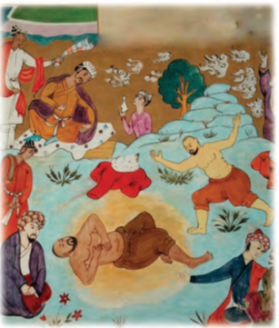

+ Hind polvoni bilan
- Turk polvoni bilan
- Mo‘g‘ul polvoni bilan
- Fors polvoni bilan

**479. Jaloliddin Rumiy qaysi tillarda ijod qilgan? 1) Uyg‘ur; 2) Arab; 3) Fors; 4) Turkiy.**

+ 2, 3, 4
- 1, 2, 4
- 1, 2, 3
- 1, 2, 3, 4

**480. Pahlavon Mahmud maqbarasi qayerda joylashgan?**

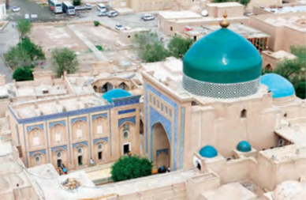

+ Xiva
- Urganch
- Hazorasp
- Kat

**481. Jaloliddin Rumiy yashagan yillarni toping.**

- 1247–1326-yillar
- 1253–1325-yillar
- 1219–1293-yillar
+ 1207–1272-yillar

**482. Nosiriddin Rabg‘uziy qaysi tilda ijod qilgan?**

- Arab tilida
+ Turkiy tilda
- Fors tilida
- Uyg‘ur tilida

**483. Sa’diy Sheroziy yashagan yillarni toping.**

- 1247–1326-yillar
- 1253–1325-yillar
+ 1219–1293-yillar
- 1207–1272-yillar

**484. “Masnaviyi ma’naviy” dostoni qancha baytdan iborat?**

- 16 ming baytdan
- 26 ming baytdan
+ 36 ming baytdan
- 46 ming baytdan

**485. Nosiriddin Rabg‘uziyning “Qisasi Rabg‘uziy” asari nechta qismdan iborat?**

- 52 qismdan
- 62 qismdan
+ 72 qismdan
- 82 qismdan

**486. Kimlar “Puryovaliy” nomini o‘zlarining harbiy hayqiriqlariga aylantirganlar?**

- Qang‘li-qipchoqlar
+ Yovmut turkmanlari
- Qora qo‘yunlilar
- Oq qo‘yunlilar

**487. “Majolis ul-ushshoq” asari muallifi kim?**

- Alisher Navoiy
- Pahlavon Mahmud
- Jaloliddin Rumiy
+ Sulton Husayn Mirzo

**488. Sa’diy Sheroziy Kichik Osiyo, Misr, Xuroson, Sharqiy Turkiston, Hindiston kabi mamlakatlar bo‘ylab necha yil sayohat qilgan?**

- 10 yil
- 15 yil
+ 20 yil
- 25 yil

**489. Bahouddin Naqshband xalq orasida qanday nomlar bilan mashhur bo‘lgan? 1) Xoja Bahouddin; 2) Bahouddin Balogardon; 3) Balogardon; 4) Xo‘jayi Buzruk.**

- 2, 3, 4
- 1, 2, 4
- 1, 2, 3
+ 1, 2, 3, 4

**490. Jaloliddin Rumiy kimning nabirasi bo‘lgan?**

+ Sulton Takashning
- Sulton Aluoddin Muhammadning
- Sulton El Arslonning
- Sulton Otsizning

**491. “Qisasul anbiyo” qaysi asarning yana bir nomi hisoblanadi?**

+ “Qisasi Rabg‘uziy”
- “Xizrxon va Duvalra”
- “G‘oliblik kaliti”
- “Falakning to‘qqiz gumbazi”

**492. Quyidagi qaysi mutafakkir yoshligida otasining yonida matolarga naqsh solish hunari bilan mashg‘ul bo‘lgan?**

+ Bahouddin Naqshband
- Pahlavon Mahmud
- Jaloliddin Rumiy
- Xusrav Dehlaviy

**493. Nosiriddin Rabg‘uziy “Qisasi Rabg‘uziy” asarini qaysi yilda yozgan?**

- 1304-yilda
- 1301-yilda
- 1306-yilda
+ 1309-yilda

**494. “Dil ba yor-u dast-ba kor”, ya’ni “Ko‘ngling doimo Allohda bo‘lsin, qo‘ling esa ishda” degan g‘oyani kim ilgari surgan?**

- Ahmad Yassaviy
- Najmiddin Kubro
+ Bahouddin Naqshband
- Pahlavon Mahmud

**495. “Guliston” va “Bo‘ston” asarlari muallifi kim?**

- Pahlavon Mahmud
- Xusrav Dehlaviy
- Jaloliddin Rumiy
+ Sa’diy Sheroziy

**496. “Masnaviyi ma’naviy” dostoni muallifi kim?**

- Pahlavon Mahmud
- Xusrav Dehlaviy
- Sa’diy Sheroziy
+ Jaloliddin Rumiy

**497. “Bahouddin” so‘zi qanday ma’noni anglatadi?**

- “Dinning quyoshi”
- “Dinning yulduzi”
- “Dinning ziyosi”
+ “Dinning nuri”

**498. Pahlavon Mahmud yashagan yillarni toping.**

+ 1247–1326-yillar
- 1253–1325-yillar
- 1219–1293-yillar
- 1207–1272-yillar

**499. Xusrav Dehlaviy yashagan yillarni toping.**

- 1247–1326-yillar
+ 1253–1325-yillar
- 1219–1293-yillar
- 1207–1272-yillar

**500. Jaloliddin Rumiy maqbarasi qayerda joylashgan? maqbarasi qayerda joylashgan?**

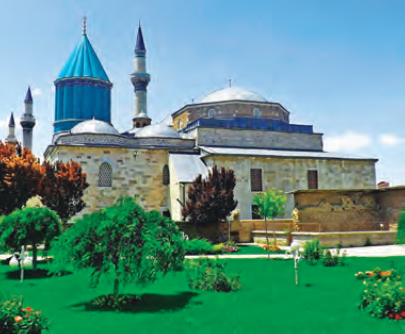

- Eron
- Hindiston
- Misr
+ Turkiya

**501. Sa’diy Sheroziy qayerda vafot etgan?**

+ Sherozda
- Hirotda
- Marvda
- Balxda

**502. “Puryovaliy” so‘zining ma’nosi nima?**

- Ruboiynavislar boshlig‘i
- Shoirlar boshlig‘i
- Faylasuflar boshlig‘i
+ Pahlavonlar boshlig‘i

**503. “Haqiqatlar xazinasi” nomli masnaviy muallifi kim?**

- Xusrav Dehlaviy
- Sa’diy Sheroziy
+ Pahlavon Mahmud
- Jaloliddin Rumiy

**504. Bahouddin Naqshbandning asl ismi kim?**

- Mahmud
+ Muhammad
- Mustafo
- Mansur

**505. XIII asrda hozirgi qaysi davlat sharqda Rum deb atalgan?**

- Suriya
+ Turkiya
- Armaniston
- Ozarbayjon

**506. Nosiriddin Rabg‘uziy “Qisasi Rabg‘uziy” asarini islom dinini qabul qilgan mo‘g‘ul beklaridan bo‘lgan kimning iltimosiga ko‘ra yozgan?**

- Tug‘luq Temur
- Ali Sulton
+ Nosiriddin To‘qbug‘a
- Muborakshoh

**507. Quyidagi qaysi mutafakkir XIV asr boshlarida o‘z hisobidan maqbara barpo etgan?**

- Xusrav Dehlaviy
- Sa’diy Sheroziy
+ Pahlavon Mahmud
- Jaloliddin Rumiy

## XIV asrning o‘rtalarida Turonda yuzaga kelgan siyosiy vaziyat.

**508. Аmir Temur qaysi amir yordamida Tug‘luq Temurxon qabuliga borgan?**

- Hoji Barlos
- Bayon suldus
+ Hoji Sayfiddin
- Boyazid

**509. Sarbadorlar harakati asoschilari aka-uka Hasan Hamza va Husayn Hamzalarning uyiga nechta mo‘g‘ul elchisi kelib, ulardan may va go‘zal qizlarni talab qilgan?**

- To‘rtta elchi
+ Beshta elchi
- Oltita elchi
- Yettita elchi

**510. “Loy jangi” da Amir Husayn mo‘g‘ullarning ko‘p qo‘llaydigan qaysi taktikasidan xavfsiragan va Amir Temurning dushman zaiflashgan paytda birgalikda hujum qilish da’vatiga quloq solmagan?**

- “Markazga hujum” taktikasidan
- “Otdan tushib urishish” taktikasidan
- “Qarshi hujum” taktikasidan
+ “Qochib urishish” taktikasidan

**511. Sarbadorlar harakati asoschilari aka-uka Hasan Hamza va Husayn Hamzalarni Sabzavorning mo‘g‘ullarga qaram noibiga topshirmagan Boshtin oqsoqoli kim edi?**

- Abdulla
- Abdullatif
- Abdurahmon
+ Abdurazzoq

**512. Amir Temur qayerdagi jang vaqtida o‘ng qo‘lining tirsagi va o‘ng oyog‘iga kamon o‘qi tegib, bir umr oqsoq bo‘lib qolgan?**

+ Seyiston
- Mozandaron
- Jurjon
- Sabzavor

**513. Amir Temurning nechta o‘g‘li va qizi bo‘lgan?**

- 3 o‘g‘li va 1 qizi
+ 4 o‘g‘li va 2 qizi
- 5 o‘g‘li va 3 qizi
- 6 o‘g‘li va 4 qizi

**514. “Loy jangi” da Amir Temur Amir Husayn qo‘shinining qaysi qismiga boshchilik qilgan?**

- O‘ng qanotiga
+ Chap qanotiga
- Markaziga
- Zaxirasiga

**515. Amir Temur qayerda vafot etgan?**

- Samarqandda
- Keshda
+ O‘trorda
- Qarshida

**516. Samarqanddagi sarbadorlar rahbari Mavlonozodaning “imomligi va amirligi” qancha vaqt davom etgan?**

- Deyarli yarim yil
+ Deyarli bir yil
- Deyarli bir yarim yil
- Deyarli ikki yil

**517. Amir Temur nechta davlatni o‘z ichiga olgan saltanat tuzgan?**

- 17 davlatni
+ 27 davlatni
- 37 davlatni
- 47 davlatni

**518. Amir Temur necha yillik yurishlarni amalga oshirgan? 1) “Ikki yillik”; 2) “Uch yillik”; 3) “To‘rt yillik”; 4) “Besh yillik”; 5) “Olti yillik”; 6) “Yetti yillik”.**

- 1, 2, 3
- 1, 3, 5
+ 2, 4, 6
- 2, 3, 4

**519. Tug‘luq Temurxonning Movarounnahrga bosqini vaqtida Kesh hokimi Hoji Barlos bilan yo‘lga chiqqan Аmir Temur qayerga yetganida Hoji Barlosga murojaat qilib, podshoh (Tug‘luq Temur) xizmatiga borishga ruxsat so‘ragan?**

+ Аmudaryo bo‘yiga
- Sirdaryo bo‘yiga
- Zarafshon bo‘yiga
- Murg‘ob bo‘yiga

**520. Chig‘atoyxon tomonidan barlos urug‘ining oqsoqoli Qoracha hojibga qayerning hokimligi berilgan bo‘lib, ushbu hududda barloslardan bo‘lgan amirlarning hokim bo‘lishi odat bo‘lib qolgan edi?**

+ Kesh
- Termiz
- Samarqand
- Naxshab

**521. Qaysi yilda Qarshi yaqinida Аmir Qazag‘on va Qozonxon o‘rtasida jang bo‘lib o‘tgan va unda Qozonxon o‘ldirilgan?**

- 1342-yil bahorida
- 1345-yil bahorida
+ 1346-yil bahorida
- 1348-yil bahorida

**522. “Loy jangi” dan keyin nima sababdan Ilyosxo‘ja qo‘shinlariga tegishli otlarning katta qismi qirilib ketgan edi?**

- Yem-xashak yetishmovchiligi oqibatida
- Jangda olgan jarohatlari oqibatida
+ Ot vabosi (o‘lati) tarqalishi oqibatida
- Askarlar tomonidan go‘sht sifatida iste’mol qilinishi oqibatida

**523. Amir Husayn ulug‘ amirlik maqomiga erishgach, Amir Temur qaysi viloyatni boshqargan?**

- Marv viloyatini
+ Kesh viloyatini
- Balx viloyatini
- Samarqand viloyatini

**524. Tug‘luq Temurxonning Movarounnahrga bosqini vaqtida qaysi amir Xuroson tomon jo‘nashga qaror qilgan?**

+ Hoji Barlos
- Bayon suldus
- Hoji Sayfiddin
- Boyazid

**525. Amir Temur qaysi yildan Kesh dorug‘asi bo‘lgan?**

- 1358-yildan
+ 1360-yildan
- 1367-yildan
- 1370-yildan

**526. Samarqanddagi qaysi sarbadorlar harakatining rahbari aholiga shaharning har bir a’zosidan katta miqdorda soliq va to‘lov yig‘ib, uni o‘z bilganicha sarf etib yurgan hukmdor shaharni o‘z holiga tashlab qo‘yganini uqtirib o‘tgan?**

- Abu Bakr Kalaviy
- Xurdak Buxoriy
+ Mavlonozoda
- Abdurazzoq

**527. Kim sarbadorlar rahbari Mavlonozoda “asilzoda yigit” bo‘lganini aytgan?**

+ Muiniddin Natanziy
- Hofizi Abru
- Ahmad Fasih Havofiy
- Rashiduddin Fazlulloh

**528. Amir Husayn Samarqand yaqinidagi qaysi manzilda sarbadorlarning dushman ustidan qozongan g‘alabalaridan mamnun bo‘lgani va ular bilan g‘alabani nishonlamoqchi ekanini bildirgan?**

+ Konigilda
- Soli Saroyda
- Qarosomonda
- Chibukobodda

**529. Amir Temur Amir Husayn bilan qayerda mahalliy hokimlardan Alibek Joniqurboniy qo‘lida tutqunlikda bo‘lgan?**

- Hirot yaqinida
- Balx yaqinida
+ Marv yaqinida
- Xiva yaqinida

**530. Amir Temurning qanday unvonlari bo‘lgan? 1) “Xon”; 2) “Amir”; 3) “Malik”; 4) “Sulton”; 5) “Ko‘ragon”.**

+ 2, 3, 4, 5
- 1, 2, 3, 4
- 1, 2, 3, 5
- 1, 2, 4, 5

**531. Sarbadorlar g‘alabasidan so‘ng samarqandliklar kimning itoatiga o‘tib, uni imom va amir sifatida qabul qilganlar?**

- Abu Bakr Kalaviy
+ Mavlonozoda
- Xurdak Buxoriy
- Abdurazzoq

**532. Amir Temur o‘ng qo‘lining tirsagi va o‘ng oyog‘iga kamon o‘qi tegib, bir umr oqsoq bo‘lib qolgan vaqtda Seyiston hokimi kim edi?**

- Amir Husayn
- Amir Bekchik
- Alibek Joniqurboniy
+ Malik Qutbiddin

**533. Amir Temur (Amir Temur ibn Amir Tarag‘oy ibn Amir Barqul) qayerda tug‘ilgan?**

- Samarqandda
+ Keshda
- O‘trorda
- Qarshida

**534. Samarqand yaqinidagi Konigilda bo‘lgan uchrashuvning ikkinchi kuni sarbadorlarning qaysi rahbarlari Amir Husayn buyrug‘i bilan qatl qilingan?**

- Mavlonozoda va Abdurazzoq
- Abdurazzoq va Abu Bakr Kalaviy
+ Abu Bakr Kalaviy va Xurdak Buxoriy
- Xurdak Buxoriy va Mavlonozoda

**535. Bayon suldus va Hoji Barlos tomonidan Chig‘atoy ulusi taxtiga kim o‘tqazilgan?**

+ Temurshoh
- Donishmandchaxon
- Bayonqulixon
- Tug‘luq Temurxon

**536. O‘rta asrlarda musulmon jamiyatida yaratilgan tarixiy asarlarda “ulug‘zodalar” va “begunohlar” degan atamalar kimlarga nisbatan ishlatilgan?**

+ Payg‘ambar avlodlariga
- Xalifalar avlodlariga
- Oliy tabadagi zodagonlarga
- Yuqori martabali din ahliga

**537. Bayon suldus qayerning hokimi edi?**

- Kesh
+ Hisor
- Naxshab
- Termiz

**538. Kim o‘sha davrning birinchi raqamli shaxmatchisi deya ulug‘langan faqih va hadisshunos olim Alouddin Tabriziy Sohibqiron bilan katta shaxmat o‘ynaganligini yozib qoldirgan?**

- G‘iyosiddin Ali
- Nizomiddin Shomiy
+ Ibn Arabshoh
- Sharafuddin Ali Yazdiy

**539. Amir Husayn va Amir Temurning Ilyosxo‘jaxon qo‘shiniga qarshi “Loy jangi” … va … oralig‘idagi bir maydonda, … arig‘i yaqinida bo‘lib o‘tgan.**

- Soli Saroy/Balx/Chig‘atoy
- Konigil/Samarqand/Salor
+ Chinoz/Toshkent/Bodom suvi
- Ohangaron/Turkiston/Jung‘ariq

**540. Sarbadorlarning qaysi rahbarini Amir Temur o‘z himoyasiga olib, qutqarib qolgan?**

- Abu Bakr Kalaviyni
- Xurdak Buxoriyni
- Abdurazzoqni
+ Mavlonozodani

**541. Amir Husayn ulug‘ amirlik maqomiga erishgach, chingiziylardan bo‘lmish kimni xon deb e’lon qilgan?**

- Ilyosxo‘ja
+ Qobilshoh
- Suyurg‘atmish
- Sulton Mahmud

**542. Sarbadorlar g‘alabasidan so‘ng Samarqandda ham diniy, ham siyosiy hokimiyat kimning qo‘lida mujassamlashgan?**

- Abu Bakr Kalaviy
- Xurdak Buxoriy
- Abdurazzoq
+ Mavlonozoda

**543. Quyidagi Amir Temur otasi Amir Taragʻoy bilan tasvirlangan kartina kim tomonidan chizilgan?**

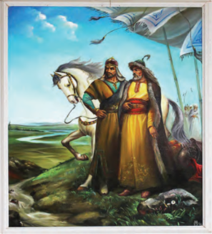

+ Orif Mo‘minov
- Bobur Ismoilov
- Javlon Umarbekov
- Said Otabekov

**544. Chig‘atoy ulusida “dorug‘a” qanday lavozim bo‘lgan?**

+ Tuman hokimi
- Shahar hokimi
- Xon maslahatchisi
- Qo‘shin qo‘mondoni

**545. Amir Temur tomonidan shaxmatning qanday turi kashf etilgan?**

- “Mo‘g‘ul shaxmati”
- “Movarounnahr shaxmati”
- “Amir shaxmati”
+ “Temur shaxmati”

**546. Amir Temur Amir Husayn bilan qaysi yurishda qatnashgan?**

- Hirot yurishida
- Balx yurishida
- Marv yurishida
+ Xiva yurishida

**547. Forschada “sarbador” so‘zi qanday ma’noni anglatadi?**

- “O‘limni ko‘zlagan”
- “Hayotini qurbon qilgan”
+ “Boshi dorda”
- “Joni fido”

**548. “Yada” nima?**

- Xonni taxtga o‘tqazish marosimi
- Qurbonlik qilish marosimi
+ Yomg‘ir chaqirish marosimi
- Ofatlarni quvish marosimi

**549. 1360–1370-yillarda Amir Qazag‘onning nabirasi Amir Husaynning tasarrufida qaysi yer-mulklar bo‘lgan?**

- Kesh va uning atrofidagi
- Marv va uning atrofidagi
+ Balx va uning atrofidagi
- Termiz va uning atrofidagi

**550. Amir Temur qaysi yildagi jang vaqtida o‘ng qo‘lining tirsagi va o‘ng oyog‘iga kamon o‘qi tegib, bir umr oqsoq bo‘lib qolgan?**

- 1368-yildagi
- 1365-yildagi
- 1360-yildagi
+ 1362-yildagi

**551. Аmir Qazag‘on tomonidan Chig‘atoy ulusi taxtiga o‘tqazilgan Donishmandchaxon qaysi yillarda hukmronlik qilgan?**

+ 1346–1348-yillarda
- 1342–1344-yillarda
- 1345–1347-yillarda
- 1348–1350-yillarda

**552. “Sarbadorlar” romani muallifi kim?**

- Maqsud Shayxzoda
- Said Ahmad
+ Muhammad Ali
- Oybek

**553. O‘rta asrlarda musulmon jamiyatida islom dini arkonlarini chuqur o‘rgangan, Qur’oni karimni yod bilgan ulamolar … sifatida bosqinchilar shafqatiga erishgan.**

- “oliy tabaqa”
- “asilzoda”
- “ulug‘zoda”
+ “begunoh”

**554. Qaysi yilda Amir Temur Amir Husayn bilan yaqinlashib, uning singlisi O‘ljoy Turkonga uylangan?**

- 1361-yilda
+ 1360-yilda
- 1367-yilda
- 1365-yilda

**555. Sarbadorlar harakati Xurosonning qaysi viloyatidagi Boshtin qishlog‘ida, aka-uka Hasan Hamza va Husayn Hamzalar tomonidan boshlangan?**

+ Sabzavor
- Mozandaron
- Seyiston
- Jurjon

**556. Ilyosxo‘ja qaysi shahardagi mag‘lubiyatidan keyin Movarounnahrni tashlab ketishga majbur bo‘lgan?**

+ Samarqand
- Buxoro
- Kesh
- Qarshi

**557. Chig‘atoy ulusi xoni Bayonqulixon amir Qazag‘onning o‘g‘li kim tomonidan jangda o‘ldirilgan?**

- Amir Аbdullatif
+ Amir Аbdulla
- Amir Аbdulaziz
- Amir Аbduxoliq

**558. Sarbadorlar harakati qaysi davrda Movarounnahrga ham yoyilgan?**

+ XIV asrning 50–60-yillarda
- XIV asrning 60–70-yillarda
- XIV asrning 70–80-yillarda
- XIV asrning 80–90-yillarda

**559. Tug‘luq Temurxon Movarounnahrga o‘g‘li Ilyosxo‘jani noib etib qoldirib, qaysi amirni undan boxabar bo‘lib turishga tayinlagan?**

- Amir Husayn
+ Amir Bekchik
- Alibek Joniqurboniy
- Malik Qutbiddin

**560. “Loy jangi” da Amir Husayn asosiy e’tiborni qo‘shin qanotlariga qaratgan va kimlar jang taqdirini hal qilishi lozim edi?**

+ Kamonchilar
- Otliqlar
- Piyodalar
- Naftandozlar

**561. Kim sarbadorlar rahbari Mavlonozodani “ulug‘zodalardan bo‘lgan donishmand” deya ta’riflagan?**

- Muiniddin Natanziy
+ Hofizi Abru
- Ahmad Fasih Havofiy
- Rashiduddin Fazlulloh

**562. Amir Temur saltanati poytaxti qaysi shahar bo‘lgan?**

+ Samarqand
- Kesh
- Shahrisabz
- Qarshi

**563. Amir Temur bolaligida qaysi shayxdan tahsil ko‘rgan?**

- Mir Sayyid Baraka
- Ahmad Yassaviy
+ Amir Kulol
- Zayniddin Taftazoniy

**564. Tug‘luq Temurxonning Movarounnahrga bosqini vaqtida qaysi amirlar uning qarorgohiga bosh egib borganlar?**

- Hoji Barlos va Bayon suldus
- Bayon suldus va Xizr
+ Xizr va Boyazid
- Boyazid va Hoji Barlos

**565. Kimlar Amir Temur haqida asar yozgan? 1) G‘iyosiddin Ali; 2) Nizomiddin Shomiy; 3) Ibn Arabshoh; 4) Sharafuddin Ali Yazdiy.**

- 1, 2, 3
- 1, 3, 4
- 2, 3, 4
+ 1, 2, 3, 4

**566. Amir Temurning onasining ismi kim bo‘lgan?**

- Tumanay Xotun
- Tegulun Xotun
- Turkon Xotun
+ Takina Xotun

**567. Аmir Temur Tug‘luq Temurxondan qayerning hokimligini olishni maqsad qilgan edi?**

- Samarqand viloyati
- O‘tror viloyati
- Qarshi viloyati
+ Kesh viloyati

**568. O‘rta asrlarda musulmon jamiyatida kimlar qamalda qolgan shahar ichida bo‘lsa, ziyon- zahmatsiz chiqarib yuborilgani aytiladi?**

+ Payg‘ambar avlodlari
- Xalifalar avlodlari
- Oliy tabadagi zodagonlar
- Yuqori martabali din ahli

**569. Amir Temurning otasining ismi kim bo‘lgan?**

+ Tarag‘oy bahodir
- Tug‘luq bahodir
- To‘xtamish bahodir
- Toluy bahodir

**570. Amir Temur hozirgi qaysi hududda tug‘ilgan?**

- Shahrisabz tumani, Yangiqo‘rg‘on qishlog‘ida
- Muborak tumani, Sovuqbuloq qishlog‘ida
+ Yakkabog‘ tumani, Xo‘ja Ilg‘or qishlog‘ida
- Chiroqchi tumani, Qatag‘on qishlog‘ida

**571. Kimning Movarounnahrga yurishi sababli tarixiy manbalarda ilk bor Amir Temur nomi tilga olingan?**

- Temurshoh
- Donishmandchaxon
- Bayonqulixon
+ Tug‘luq Temurxon

**572. Аmir Temur Kesh viloyatiga dorug‘a etib tayinlanganda necha yoshda edi?**

- 22 yoshda
+ 24 yoshda
- 26 yoshda
- 28 yoshda

**573. Samarqanddagi sarbadorlar harakatining rahbarlari va ularning kasblarini moslashtiring. 1) Abu Bakr Kalaviy; 2) Xurdak Buxoriy; 3) Mavlonozoda. a) mohir mergan; b) madrasa mudarrisi; c) hunarmandlar oqsoqoli.**

- 1b, 2a, 3c
- 1c, 2b, 3a
- 1a, 2b, 3c
+ 1c, 2a, 3b

**574. Samarqandda kimlar sarbadorlar harakatining faol ishtirokchilariga aylanganlar? 1) Dehqonlar; 2) Hunarmandlar; 3) Do‘kondorlar; 4) Madrasa mudarrislari; 5) Talabalar.**

- 1, 3, 4, 5
+ 2, 3, 4, 5
- 1, 2, 4, 5
- 1, 2, 3, 4

**575. Chig‘atoy ulusi xoni Qozonxondan norozi bo‘lgan amaldor, zodagonlar Soli Saroyga kimning huzuriga qochib o‘ta boshlagan?**

- Bayon suldus
- Hoji Barlos
+ Qazag‘on
- Temurshoh

**576. Amir Husayn va Amir Temurning qaysi yillardagi mo‘g‘ullarga qarshi kurashi Ilyosxo‘jani Movarounnahrni tark etishga majbur qilgan?**

+ 1363–1364-yillardagi
- 1364–1365-yillardagi
- 1365–1366-yillardagi
- 1366–1367-yillardagi

**577. “Loy jangi” da Amir Temur dastlab … tomonga qaytib ketib, keyin …ga yo‘l olgan.**

- Kesh/Buxoro
- Buxoro/Qarshi
- Qarshi/Samarqand
+ Samarqand/Kesh

**578. Qachon amir Qazag‘on fitnachilar tomonidan o‘ldirilgan?**

- 1363-yilda
- 1361-yilda
- 1359-yilda
+ 1358-yilda

**579. Hoji Barlos qayerning hokimi edi?**

+ Kesh
- Hisor
- Naxshab
- Termiz

**580. Sarbadorlarning qaysi rahbari “oliy tabaqa” (bu ibora aksariyat hollarda Muhammad (s.a.v) avlodlariga nisbatan ishlatilgan) vakili bo‘lgan?**

- Abu Bakr Kalaviy
- Xurdak Buxoriy
- Abdurazzoq
+ Mavlonozoda

**581. Аmir Qazag‘on tomonidan Chig‘atoy ulusi taxtiga o‘tqazilgan Bayonqulixon qaysi yillarda hukmronlik qilgan?**

- 1353–1363-yillarda
- 1351–1361-yillarda
- 1349–1359-yillarda
+ 1348–1358-yillarda

**582. Amir Temur (Amir Temur ibn Amir Tarag‘oy ibn Amir Barqul) qachon tug‘ilgan?**

- 1334-yil 9-fevralda
- 1335-yil 9-martda
+ 1336-yil 9-aprelda
- 1337-yil 9-mayda

**583. Amir Temur qachon vafot etgan?**

+ 1405-yil 18-fevralda
- 1406-yil 18-martda
- 1407-yil 18-aprelda
- 1408-yil 18-mayda

**584. Sarbadorlar davlatiga asos solinishi to‘g‘risida kimning qaysi asarida keltirilgan?**

- Sharafuddin Ali Yazdiyning “Zafarnoma” asarida
- Abu Usmon Minhojiddin ibn Sirojiddinning “Tabaqoti Nosiriy” asarida
+ Ahmad Fasih Havofiyning “Mujmali Fasihiy” asarida
- Rashiduddin Fazlullohning “Jome at-tavorix” asaridan

**585. XIV asrda qaysi shahar Farob deb atalgan?**

- Xo‘jand
- Yassi
- Termiz
+ O‘tror

**586. Chig‘atoy ulusining qaysi qismida mo‘g‘ul amirlari Tug‘luq Temurni xon deb e’lon qilganlar?**

- Janubiy qismida
- Shimoliy qismida
- G‘arbiy qismida
+ Sharqiy qismida

**587. Tug‘luq Temurxonning Movarounnahrga qaysi yilning fevral – mart oylaridagi yurishi vaqtida Аmir Temur o‘ziga yarasha siyosiy faoliyat yuritishga qodir, el-yurt oldida o‘z burchini anglab ulgurgan shaxs sifatida yetilib bo‘lgandi?**

- 1361-yilning
+ 1360-yilning
- 1367-yilning
- 1365-yilning

**588. Amir Husayn va Amir Temurning Ilyosxo‘jaxon qo‘shiniga qarshi “Loy jangi” qachon bo‘lib o‘tgan?**

- 1363-yil 22-iyul kuni
- 1364-yil 22-iyun kuni
+ 1365-yil 22-may kuni
- 1366-yil 22-mart kuni

**589. Amir Temur qachon Movarounnahr taxtiga chiqqan?**

- 1358-yilda
- 1360-yilda
- 1367-yilda
+ 1370-yilda

**590. Qachon Samarqand yaqinidagi Konigilda bo‘lgan uchrashuvning birinchi kuni sarbadorlarning boshliqlari Xurdak Buxoriy, Abu Bakr Kalaviy, Mavlonozoda sharafiga ziyofat uyushtirilgan?**

- 1365-yilning bahorida
+ 1366-yilning bahorida
- 1367-yilning bahorida
- 1368-yilning bahorida

**591. Sarbadorlar harakati qaysi davrda Xuroson janubi va Eronda ijtimoiy-siyosiy harakat sifatida paydo bo‘lgan?**

+ XIV asrning 30-yillarida
- XIV asrning 40-yillarida
- XIV asrning 50-yillarida
- XIV asrning 60-yillarida

## Amir Temur – Movarounnahr hukmdori.

**592. Chig‘atoy ulusi xoni Sulton Mahmudxonning hukmronlik yillarini toping.**

- 1386–1400-yillar
- 1387–1401-yillar
+ 1388–1402-yillar
- 1389–1403-yillar

**593. Mo‘g‘ullar davrida Xorazm ikki qismga bo‘lingan bo‘lib, markazi qaysi shahar bo‘lgan Shimoliy Xorazm Oltin O‘rda tarkibiga kirgan?**

- Xiva shahri
+ Urganch shahri
- Vazir shahri
- Kat shahri

**594. Qachon Balx shahri Amir Temur tomonidan egallangan?**

- 1369-yil avgustda
+ 1370-yil aprelda
- 1371-yil martda
- 1372-yil mayda

**595. Qaysi voqeadan so‘ng Movarounnahrda Amir Husayn hukmronligi o‘rnatilsa-da, Samarqand xalqi orasida unga ishonch kamaygan, Amir Temurning esa nufuzi ortgan edi?**

- Soli Saroy voqeasidan so‘ng
+ Konigil voqeasidan so‘ng
- Qarosomon voqeasidan so‘ng
- Chibukobod voqeasidan so‘ng

**596. 1370-yilda Amir Husayn Amir Temurga qarshi …, … va …dan qo‘shimcha kuch to‘plagan, uning otliqlari … atroflarida paydo bo‘lgan.**

+ Balx/Qunduz/Badaxshon/Termiz
- Qunduz/Badaxshon/Termiz/Balx
- Badaxshon/Termiz/Balx/Qunduz
- Termiz/Balx/Qunduz/Badaxshon

**597. Amir Temur Biyo degan joyda qarorgoh qurib, Amir Husaynga qarshi jangga tayyorgarlik ko‘rayotgan paytda uning yoniga kim kelib, buyuk kelajagi haqida bashorat qilgan?**

- Ahmad Yassaviy
- Amir Kulol
+ Mir Sayyid Baraka
- Zayniddin Taftazoniy

**598. Amir Temur qaysi shaharni o‘z davlatining poytaxtiga aylantirgan?**

+ Samarqand
- Buxoro
- Kesh
- Qarshi

**599. Mo‘g‘uliston yurishida g‘alaba qozonib, Samarqand tomon qaytayotgan Amir Temur qaysi shahar yaqinidagi Qarosomon mavzeyida ov bilan mashg‘ul bo‘lgan chog‘da qo‘lga olinishi rejalashtirilgan?**

+ O‘tror yaqinidagi
- Xo‘jand yaqinidagi
- Sayram yaqinidagi
- Yassi yaqinidagi

**600. Amir Temur taxtga o‘tirgach, dastlab qayerga kelib, davlat vazirini, tuman boshliqlari va mingboshilarni tayinlagan?**

+ Keshga
- Samarqandga
- Qarshiga
- Balxga

**601. Amir Temur hokimiyatini tan olmagan Shiburg‘on hokimi kim edi?**

+ Zinda Chashm
- Qobilshoh
- Joku Barlos
- Kayxusrav

**602. Amir Temur davrida mehmonxonalar, to‘xtash joylari qanday atalgan?**

- Koriz
- Tim
- Xonaqoh
+ Rabot

**603. Amir Temur hokimiyatini tan olmagan Shiburg‘on hokimi Zinda Chashm qaysi shaharlar atrofidagi yerlarni talon-toroj qila boshlagan?**

- Qarshi va Marv
- Marv va Balx
+ Balx va Termiz
- Termiz va Qarshi

**604. Musulmon olamida payg‘ambar avlodlari qanday ataladi?**

- So‘fiylar
- Shayxlar
- Sahobalar
+ Sayyidlar

**605. Ushbu surat kim tomonidan chizilgan?**

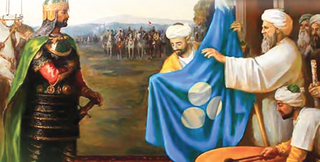

- Orif Mo‘minov
+ Muhammad Nuriddinov
- Bobur Ismoilov
- Javlon Umarbekov

**606. Amir Temur taxtga o‘tirgach, qayerdan boshqa barcha yerlarni o‘z hokimiyati ostiga birlashtirgan?**

- Xurosondan boshqa
- Farg‘onadan boshqa
- Ohangarondan boshqa
+ Xorazmdan boshqa

**607. Qaysi yilda Mo‘g‘uliston yurishida g‘alaba qozonib, Samarqand tomon qaytayotgan Amir Temurga nisbatan suiqasd uyushtirilgan?**

+ 1372-yilda
- 1373-yilda
- 1374-yilda
- 1375-yilda

**608. Amir Temur saltanatida сhingiziylardan kimlar “qo‘g‘irchoq” xonlar sifatida taxtda o‘tirganlar?**

- Donishmandchaxon va Bayonqulixon
- Bayonqulixon va Suyurg‘atmishxon
+ Suyurg‘atmishxon va Sulton Mahmudxon
- Sulton Mahmudxon va Donishmandchaxon

**609. Amir Temurga qarshi uyushtirilgan Qarosomon mavzeyidagi fitnaga aloqador Amir Muso kimning aralashuvi sababli (chunki Amir Muso uning yaqin qarindoshi edi) jazodan ozod etilgan?**

- To‘rabekxonim
+ Saroymulkxonim
- Chechak begim
- O‘ljoy Turkon og‘o

**610. Chig‘atoy ulusi xoni Suyurg‘atmishxonning hukmronlik yillarini toping.**

- 1368–1386-yillar
- 1369–1387-yillar
+ 1370–1388-yillar
- 1371–1389-yillar

**611. Balx shahri necha kunlik qamaldan so‘ng Amir Temur tomonidan egallangan?**

+ Ikki kunlik
- To‘rt kunlik
- Olti kunlik
- Sakkiz kunlik

**612. Amir Husayn bir paytlar akasi Kayqubodni qatl etganligi uchun xun olish maqsadida kim tomonidan o‘ldirilgan?**

- Amir Zinda Chashm
- Amir Qobilshoh
- Amir Joku Barlos
+ Amir Kayxusrav

**613. Balx shahri Amir Temur tomonidan egallangach, Amir Husayn qayerga yashirinib olgan joyidan qo‘lga olingan?**

- Saroy omborxonasiga
+ Jome masjidi minorasiga
- Madrasa hujrasiga
- Qurolxona yerto‘lasiga

**614. Shiburg‘on hokimi Zinda Chashmga qarshi Amir Temur kim boshchiligidagi qo‘shinni jo‘natgan?**

- Kayqubod
- Qobilshoh
- Kayxusrav
+ Joku Barlos

**615. “…da hokim bo‘lmish ularning bosh amiri (amir ul-umaro) ko‘p marta jangda men bilan yuzma-yuz kelib, qilich chopishgan kishi edi. Amir Husayn qatl etilganini eshitgach, mening qahrimdan qo‘rqib, o‘zini sergak tutdi va bordi-yu uni tutish uchun qo‘shin yuborguday bo‘lsam, to‘g‘ri ish qilmagan bo‘lur edim”. “Temur tuzuklari” da keltirilgan jumladagi nuqtalar o‘rnidagi joy nomini toping.**

- Xuttalon
+ Badaxshon
- Qo‘badiyon
- Shiburg‘on

**616. Qaysi yilda Amir Temurning xotini, Amir Husaynning singlisi O‘ljoy Turkon og‘o to‘satdan vafot etgan?**

+ 1366-yilda
- 1367-yilda
- 1368-yilda
- 1369-yilda

**617. Amir Temur Movarounnahr amiri bo‘lganch Chingizxon avlodiga mansub bo‘lgan kim xon bo‘lgan?**

- Ilyosxo‘ja
- Qobilshoh
+ Suyurg‘atmish
- Sulton Mahmud

**618. Amir Temur Biyo degan joyda qarorgoh qurib, Amir Husaynga qarshi jangga tayyorgarlik ko‘rayotgan paytda uning yoniga Mir Sayyid Baraka kelib, saltanat ramzlari bo‘lgan nimalarni topshirgan?**

- Bayroq va tug‘
- Tug‘ va toj
- Toj va nog‘ora
+ Nog‘ora va bayroq

**619. 1370-yilda Amir Temur Amir Husaynga qarshi qaysi shahar yaqinidagi Biyo degan joyda qarorgoh qurib, jangga tayyorgarlik ko‘rgan?**

- Qunduz
- Badaxshon
+ Termiz
- Balx

**620. Mo‘g‘ullar davrida Xorazm ikki qismga bo‘lingan bo‘lib, markazi qaysi shahar bo‘lgan Janubiy Xorazm Chig‘atoy ulusi tarkibiga kirgan?**

- Xiva shahri
- Urganch shahri
- Vazir shahri
+ Kat shahri

**621. Movarounnahr amiri bo‘lgan vaqtda Amir Temur necha yoshga kirgandi?**

- O‘ttiz ikki yoshga
+ O‘ttiz to‘rt yoshga
- O‘ttiz olti yoshga
- O‘ttiz sakkiz yoshga

**622. Jangda mag‘lub etilib, Samarqandga jo‘natilgan Shiburg‘on hokimi Zinda Chashmni Amir Temur … .**

- qatl etgan
- surgun qilgan
- yer-mulkini tortib olgan
+ afv etgan

**623. Amir Temurga qarshi uyushtirilgan Qarosomon mavzeyidagi fitnaga aloqador payg‘ambar avlodidan bo‘lganlar jazodan omon qolgan, lekin qayerga jo‘natilgan?**

- Yamanga
- Iroqqa
+ Hijozga
- Misrga

## Amir Temur markazlashgan davlat tuzish yo‘lida.

**624. Amir Temur davrida qaysi shahar Yassi deb atalgan?**

+ Turkiston
- O‘tror
- Sayram
- Xo‘jand

**625. Amir Temur Xorazmga birinchi marta yurish qilganida Gurganjga borish uchun qaysi shahar orqali o‘tishi kerak edi va bu shaharni Amir Temur qo‘shini ishg‘ol qilgan?**

- Xiva
- Vazir
- Hazorasp
+ Kat

**626. Amir Temur Kavkazga yurish boshlab, qaysi qal’alarni egallagan?**

+ Tiflis, Arzirum, Van
- Arzirum, Van, Urmiya
- Van, Urmiya, Solmas
- Urmiya, Solmas, Tiflis

**627. Amir Temurning “besh yillik” yurishi natijasida qayerdagi muzaffariylar sulolasiga barham berilgan?**

- Ozarbayjon
- Shirvon
- Iroq
+ Eron

**628. Qaysi Xorazm hukmdorining Oltin O‘rda xoni qizidan tug‘ilgan Sevinchbeka ismli qizi Amir Temurning o‘g‘liga olib berilgan?**

- Husayn So‘fi
+ Yusuf So‘fi
- Sulaymon So‘fi
- Abdurahmon So‘fi

**629. Amir Temurning beshinchi yurishida Xorazm hukmdori kim edi?**

- Husayn So‘fi
- Yusuf So‘fi
+ Sulaymon So‘fi
- Abdurahmon So‘fi

**630. Marsel Brionnnig “Menkim, Sohibqiron – Jahongir Temur” asarida Amir Temur qaysi shaharga “Dor ul-ulum val-omon” degan nom bergan?**

- Arzirum
- Tiflis
- Mordin
+ Basharo‘y

**631. Qachon Amir Temur o‘g‘li Mirzo Umarshayx Bahodirni Farg‘ona hokimi etib tayinlagan?**

- 1371-yilda
+ 1376-yilda
- 1374-yilda
- 1377-yilda

**632. Amir Temur qachon Mordin qal’asini egallagan?**

- 1393-yil fevralda
+ 1394-yil fevralda
- 1395-yil fevralda
- 1396-yil fevralda

**633. Amir Temur Xorazmni tinchlik yo‘li bilan davlat tarkibiga kiritish maqsadida Gurganjga kimni tinchlik haqidagi noma bilan yuborgan?**

- Jaloliddin Keshiyni
+ Alafa tavochini
- Hoji Sayfiddinni
- Abdulloh ar-Roziyni

**634. “Bu bashoratli xushxabar Mordin tashqarisida zafarli Sohibqironning sharafli qulog‘iga yetib keldi, g‘oyat quvonch va sevinchdan u qal’a aholisining gunohidan kechdi”. Ushbu Ulug‘bek (Muhammad Tarag‘ay) ning tug‘ilishi xabari haqidagi ma’lumotlar muallifi kim?**

- Juvayniy
+ Xondamir
- Ali Yazdiy
- Mirxond

**635. Qaysi yilda Erondagi muzaffariylar sulolasi mulklari Amir Temur tomonidan o‘ziga tobelik bildirgan hukmdorlarga taqsimlangan?**

- 1386-yilda
- 1392-yilda
+ 1388-yilda
- 1390-yilda

**636. Qachon Amir Temur Xurosonga yo‘l olgan va Hirot hukmdori o‘z kalitlarini Amir Temurga topshirgan?**

+ 1381-yil fevralida
- 1382-yil martida
- 1383-yil mayida
- 1384-yil aprelida

**637. Xorazm hukmdori Husayn So‘fi Amir Temurning qaysi elchisini zindonga tashlagan?**

+ Jaloliddin Keshiyni
- Alafa tavochini
- Hoji Sayfiddinni
- Abdulloh ar-Roziyni

**638. Muzaffariylar sulolasi qaysi yillarda hukmronlik qilgan?**

- 1307–1386-yillarda
- 1310–1389-yillarda
- 1311–1390-yillarda
+ 1314–1393-yillarda

**639. Amir Temurning “besh yillik” yurishi qaysi yillarni o‘z ichiga olgan?**

+ 1392–1396-yillarni
- 1393–1397-yillarni
- 1394–1398-yillarni
- 1395–1399-yillarni

**640. Amir Temur Shayx Zayniddin Toyobodiy bilan qaysi yilda ko‘rishgan?**

+ 1381-yilda
- 1380-yilda
- 1383-yilda
- 1382-yilda

**641. Hirot hukmdori Malik G‘iyosiddin Pir Ali Xurosondagi qaysi sulolani boshqargan?**

+ Kurdlar sulolasini
- Muzaffariylar sulolasini
- Jaloyiriylar sulolasini
- Shirvonshohlar sulolasini

**642. Amir Temurning “uch yillik” yurishi qaysi yillarni o‘z ichiga olgan?**

- 1385–1387-yillarni
+ 1386–1388-yillarni
- 1387–1389-yillarni
- 1388–1390-yillarni

**643. Amir Temur egallagan Mordin qal’asining hokimi kim edi?**

+ Sulton Iso
- Sulton Muso
- Sulton Ali
- Sulton Shayx

**644. Amir Temurning nechanchi yurishida Janubiy Xorazm Amir Temur davlati tarkibiga kirgan?**

- Birinchi yurishida
+ Ikkinchi yurishida
- Uchinchi yurishida
- To‘rtinchi yurishida

**645. Amir Temurning birinchi yurishida Xorazm hukmdori kim edi?**

+ Husayn So‘fi
- Yusuf So‘fi
- Sulaymon So‘fi
- Abdurahmon So‘fi

**646. Amir Temurning “yetti yillik” yurishi qaysi yillarni o‘z ichiga olgan?**

- 1396–1402-yillarni
- 1397–1403-yillarni
- 1398–1404-yillarni
+ 1399–1405-yillarni

**647. Amir Temur Hirot hukmdori Malik G‘iyosiddin Pir Ali huzuriga kimni elchi qilib yuborgan?**

- Jaloliddin Keshiyni
- Alafa tavochini
+ Hoji Sayfiddinni
- Abdulloh ar-Roziyni

**648. Amir Temur Mo‘g‘uliston xonlarini qayerga chekinishga majbur qilgan va ularning bosh qarorgohini egallagan?**

- Sibirdagi Tuman degan joyga
- Issiqko‘lning sharqiy qirg‘og‘iga
+ Irtish daryosi orqa tomoniga
- Yettisuvning shimoliga

**649. Qaysi hudud aholisi Ko‘chakiy degan ig‘vogarning gapiga uchib, Amir Temurning viloyat muhofazasi uchun qoldirgan uch ming nafar askarini qirib tashlagan?**

- Tabriz
+ Isfahon
- Sheroz
- Jurjon

**650. Amir Temur bilan yarash shartnomasini tuzgan Xorazmdagi so‘fiylar sulolasi vakili kim?**

- Husayn So‘fi
+ Yusuf So‘fi
- Sulaymon So‘fi
- Abdurahmon So‘fi

**651. Oltin O‘rda davlati tarkibiga qaysi hududlar kirgan? 1) Sirdaryoning quyi oqimi; 2) Xorazmning shimoliy qismi; 3) Shimoliy Kavkaz; 4) Sirdaryo bo‘ylaridan Sibirdagi Tuman degan joygacha bo‘lgan yerlar; 5) Bulg‘or yerlari; 6) G‘arbiy Sibir; 7) Qrim.**

- 1, 3, 4, 5, 7
- 1, 2, 4, 5, 6
+ 2, 3, 5, 6, 7
- 2, 3, 4, 5, 6

**652. Qaysi yilda Amir Temur Hirot hukmdori Malik G‘iyosiddin Pir Ali huzuriga elchi yuborgan?**

- 1381-yilda
+ 1380-yilda
- 1383-yilda
- 1382-yilda

**653. Xorazm hukmdorining qaysi Oltin O‘rda xoni qizidan tug‘ilgan Sevinchbeka ismli qizi Amir Temurning o‘g‘liga olib berilgan?**

+ O‘zbekxon
- Jonibekxon
- To‘xtamishxon
- Berkaxon

**654. Marsel Brionnnig “Menkim, Sohibqiron – Jahongir Temur” asarining “Janubiy Xurosonga yurish” bobida kimlar Amir Temurning hadyasini olmagani aytilgan?**

- Temirchilar
- Quruvchilar
+ To‘quvchilar
- Duradgorlar

**655. 1380-yilda Amir Temurning qaysi o‘g‘li boshchiligidagi 25 ming askardan iborat qo‘shin Balx, Shiburg‘on va Bodhizga yuborilgan va ushbu hududlar unga mulk sifatida berilgan?**

- Jahongir Mirzo
- Umarshayx Mirzo
+ Mironshoh Mirzo
- Shohrux Mirzo

**656. Amir Temurga o‘z kalitlarini topshirgan Hirot hukmdori inisi Malik Muhammad qayerning hokimi edi?**

- Bodhiz
- Shiburg‘on
- Balx
+ Saraxs

**657. Qachon Amir Temur Xorazmga birinchi marta yurish qilgan?**

+ 1371-yilda
- 1372-yilda
- 1373-yilda
- 1374-yilda

**658. Amir Temur qaysi yilda Xorazmga beshinchi marta yurish qilgan?**

- 1385-yilda
- 1386-yilda
- 1387-yilda
+ 1388-yilda

**659. Qaysi Xorazm hukmdori Oltin O‘rda xoni To‘xtamishxon bilan birlashib, Amir Temur davlatining chegara yerlarga hujum uyushtirgan?**

- Husayn So‘fi
- Yusuf So‘fi
+ Sulaymon So‘fi
- Abdurahmon So‘fi

**660. Amir Temur davlatida “muhassil” lavozimidagi odamlar qanday vazifani bajargan?**

+ Tovon puli yig‘gan
- Soliq yig‘gan
- Xabar yig‘gan
- Askar yig‘gan

**661. Qaysi shaharni qo‘ldan ketishi Xorazm hukmdori Husayn So‘figa kuchli ta’sir ko‘rsatgan?**

- Xiva shahrini
- Vazir shahrini
- Hazorasp shahrini
+ Kat shahrini

**662. Amir Temurning ikkinchi, uchinchi va to‘rtinchi yurishlarida Xorazm hukmdori kim edi?**

- Husayn So‘fi
+ Yusuf So‘fi
- Sulaymon So‘fi
- Abdurahmon So‘fi

**663. Amir Temur Shayx Zayniddin Toyobodiy bilan qaysi shaharda ko‘rishgan?**

- Marv
+ Hirot
- Kobul
- Tabriz

**664. Ulug‘bek (Muhammad Tarag‘ay) ning tug‘ilishi qaysi shahar ahlini jazodan saqlab qolgan?**

- Arzirum
- Tiflis
+ Mordin
- Basharo‘y

**665. Amir Temur davrida qayerdan shimolga chekingan mo‘g‘ul xonlari qish kelishi bilan Sirdaryo bo‘ylari va Farg‘ona vodiysiga qayta hujum uyushtirar edi?**

+ Yettisuvdan
- Sharqiy Turkistondan
- Xitoydan
- Mo‘g‘ulistondan

**666. Marsel Brionnnig “Menkim, Sohibqiron – Jahongir Temur” asarining nechanchi bobi “Janubiy Xurosonga yurish” deb nomlanadi?**

- VI bobi
- VII bobi
- VIII bobi
+ IX bobi

**667. Qaysi yilda Amir Temurning valiahd nabirasi Muhammad Sulton Mirzo dunyoga kelgan?**

- 1371-yilda
- 1373-yilda
+ 1375-yilda
- 1377-yilda

**668. Muzaffariylar sulolasining Amir Temur bilan jangda halok bo‘lgan so‘nggi hukmdori kim?**

- Shoh Malik
- Shoh Mut’azid
+ Shoh Mansur
- Shoh Muzaffar

**669. Husayn So‘fi qaysi shaharlarni egallab, Shimoliy Xorazm bilan Janubiy Xorazm yerlarini birlashtirgan?**

+ Kat va Xiva
- Xiva va Urganch
- Urganch va Hazorasp
- Hazorasp va Kat

**670. Xorazm hukmdorining Oltin O‘rda xoni qizidan tug‘ilgan Sevinchbeka ismli qizi Amir Temurning qaysi o‘g‘liga olib berilgan?**

+ Jahongir Mirzo
- Umarshayx Mirzo
- Mironshoh Mirzo
- Shohrux Mirzo

**671. Amir Temur Mo‘g‘uliston xonlari bosh qarorgohini egallagach, u yerga kimni xon qilib tayinlagan?**

- To‘g‘luq Temurxonni
- Sham’i Jahonni
+ Xizirxo‘jani
- Zinda Chashmni

**672. Xorazm hukmdori Husayn So‘fi qayerda vafot etgan?**

- Xiva qal’asida
- Hazorasp qal’asida
+ Gurganj qal’asida
- Kat qal’asida

**673. Amir Temur sharqiy hududlarni mo‘g‘ullar ta’siridan ozod etish uchun Sharqiy Turkiston tomon bir necha marta yurish qilib, qayerlarni o‘z tasarrufiga olgan? 1) Farg‘ona vodiysi; 2) O‘tror; 3) Yassi; 4) Sayram.**

- 2, 3, 4
- 1, 2, 4
- 1, 2, 3
+ 1, 2, 3, 4

**674. Amir Temur Mo‘g‘uliston xonlari bosh qarorgohini egallagach, Mo‘g‘uliston jilovi sifatida kimni o‘zi bilan olib qaytgan?**

- To‘g‘luq Temurxonni
+ Sham’i Jahonni
- Xizirxo‘jani
- Zinda Chashmni

**675. Mo‘g‘ullar davrida Jo‘chi ulusi tarkibiga kirgan Shimoliy Xorazmning markazi qaysi shahar edi?**

- Xiva shahri
+ Urganch shahri
- Hazorasp shahri
- Kat shahri

**676. Qaysi yilda Xorazmda so‘fiylar sulolasiga barham berilgan hamda Amir Temur nomiga xutba o‘qilib, tangalar zarb etilgan?**

- 1385-yilda
- 1386-yilda
- 1387-yilda
+ 1388-yilda

**677. Qachon Oltin O‘rdada yuz bergan g‘alayonlar vaqtida qo‘ng‘irot so‘fiylari sulolasidan Husayn So‘fi shimoliy Xorazmda mustaqil bo‘lib olgan?**

- XIV asrning 40-yillari oxirida
- XIV asrning 50-yillari oxirida
+ XIV asrning 60-yillari oxirida
- XIV asrning 70-yillari oxirida

**678. Qaysi shayx Malik G‘iyosiddin Pir Aliga “Parvardigori olam yuborgan baloni baland devor bilan to‘sa olmaysan, xalqqa ko‘p jabr qilma”, deb maktub yo‘llagan?**

- Sayyid Kulol
- Sayyid Baraka
+ Zayniddin Toyobodiy
- Ahmad Yassaviy

**679. Mo‘g‘ullar davrida Chig‘atoy ulusi tarkibiga kirgan Janubiy Xorazmning markazi qaysi shahar edi?**

- Xiva shahri
- Urganch shahri
- Hazorasp shahri
+ Kat shahri

**680. Oq O‘rda, Oltin O‘rda qaysi mo‘g‘ul ulusi tarkibiga kirgan?**

+ Jo‘chi ulusi
- Chig‘atoy ulusi
- O‘qtoy ulusi
- Tulu ulusi

**681. Amir Temurning Mo‘g‘ulistonga qarshi kurashi qaysi yillarda bo‘lib o‘tgan?**

- 1370–1389-yillarda
+ 1371–1390-yillarda
- 1372–1391-yillarda
- 1373–1392-yillarda

**682. Amir Temur Hirot va uning atroflarini qo‘lga kiritgach, asirga olingan qancha kishini ozod etishni buyurgan?**

- 1000 nafar kishini
+ 2000 nafar kishini
- 3000 nafar kishini
- 4000 nafar kishini

**683. So‘fiylar sulolasi davrida Xorazmning markazi qaysi shahar bo‘lgan?**

- Xiva
- Hazorasp
+ Gurganj
- Kat

**684. Mordin maliki Sulton Isoning Amir Temur huzuriga kelishi kimning qaysi asarida keltirilgan?**

+ Nizomiddin Shomiyning “Zafarnoma” asarida
- Alouddin Juvayniyning “Tarixi jahongusho” asarida
- Rashiduddin Fazlullohning “Jome at-tavorix” asarida
- Sharafuddin Ali Yazdiyning “Zafarnoma” asarida

**685. Malik G‘iyosiddin Pir Ali Amir Temur egallagan qaysi shaharning hukmdori bo‘lgan?**

- Marv
+ Hirot
- Kobul
- Tabriz

**686. Amir Temur “uch yillik” yurishi davomida qayerlarni bo‘ysundirgan?**

- G‘ilon, Shirvon, Bodhiz
- Shirvon, Bodhiz, Ozarbayjon
+ Ozarbayjon, Mozandaron, G‘ilon
- Mozandaron, G‘ilon, Shirvon

**687. Amir Temurning valiahd nabirasi Muhammad Sulton Mirzo vafon etgach, Turon taxtiga voris etib ukasi kim belgilangan?**

- Xalil Sulton Mirzo
- Abu Said Mirzo
- Ulug‘bek Mirzo
+ Pirmuhammad Mirzo

**688. Amir Temurning valiahd nabirasi Muhammad Sulton Mirzoning yashagan yillarini toping.**

- 1371–1399-yillar
- 1373–1401-yillar
+ 1375–1403-yillar
- 1377–1405-yillar

**689. Oq O‘rda davlati tarkibiga qaysi hududlar kirgan? 1) Sirdaryoning quyi oqimi; 2) Xorazmning shimoliy qismi; 3) Shimoliy Kavkaz; 4) Sirdaryo bo‘ylaridan Sibirdagi Tuman degan joygacha bo‘lgan yerlar; 5) Bulg‘or yerlari; 6) G‘arbiy Sibir; 7) Qrim.**

+ 1, 4
- 2, 3, 5
- 3, 4, 5, 7
- 1, 2, 3, 5, 6

## Amir Temurning davlat chegaralarini mustahkamlashi.

**690. Qachon Amir Temur Suriyaning ko‘plab muhim qal’a va shaharlarini, jumladan, Halabni ham katta qiyinchiliksiz egallagan?**

- 1402-yil bahor oylarida
+ 1400-yil kuz oylarida
- 1403-yil yoz oylarida
- 1401-yil qish oylarida

**691. 1404-yil yanvar oyida, Xitoyga qarshi yurish paytida Amir Temurning huzuriga kimning elchilari kelib hukmdorining uzrini qabul qilishni va toj-u taxtini qaytarib berishni so‘rashgan?**

+ To‘xtamishxon
- Boyazid Yildirim
- Faraj
- Qora Yusuf

**692. Qaysi yilda Amir Temur Shimoliy Kavkazdagi Terek daryosi bo‘yidagi jangda To‘xtamishxonni mag‘lub etgan?**

- 1382-yil aprelda
- 1391-yil aprelda
+ 1395-yil aprelda
- 1386-yil aprelda

**693. Amir Temur Misrdagi mamluklar sultoni Barquqqa qaysi masalada muammoni tinchlik yo‘li bilan hal etish maqsadida o‘z elchilarini jo‘natgan?**

+ Suriya masalasida
- Falastin masalasida
- Iroq masalasida
- Kavkaz masalasida

**694. Amir Temur Hindiston yurishidan qachon qaytgan?**

- 1397-yil bahorida
- 1398-yil bahorida
+ 1399-yil bahorida
- 1400-yil bahorida

**695. Qaysi yilda Usmoniylar imperiyasi sultoni Murod I Kosovo shahrida serblarga qarshi jang vaqtida halok bo‘lgan?**

- 1387-yilda
- 1396-yilda
+ 1389-yilda
- 1402-yilda

**696. “Masjidi jum’ada to‘rt yuz sakson ustun toshdin yasab, har birining uzunlig‘i yetti qari (3,5 metr) erdi, qo‘yub yasadilar. Va saqfini (shiftini) toshdin yasadilar. Masjid tugagandin so‘ng Dilkusho bog‘ig‘a borib, to‘ylar berdi. Ustakorlarg‘a to‘nlar kiydurub, otlar mindurdi”. 1399-yil mayida Amir Temur tomonidan boshlangan jome masjidi qurilishi haqidagi ushbu ma’lumotlar muallifi kim?**

- Juvayniy
- Xondamir
+ Ali Yazdiy
- Mirxond

**697. Amir Temur necha oylik tayyorgarlikdan so‘ng Xitoyga qarshi yurishga otlangan?**

- Ikki oylik
+ Uch oylik
- To‘rt oylik
- Besh oylik

**698. Hindlar Amir Temurga qarshi qancha qo‘shin bilan jang qilgan?**

- Besh ming otliq, o‘ttiz ming piyoda va 110 fil bilan
+ O‘n ming otliq, qirq ming piyoda va 120 fil bilan
- O‘n besh ming otliq, ellik ming piyoda va 130 fil bilan
- Yigirma ming otliq, oltmish ming piyoda va 140 fil bilan

**699. Amir Temurning valiahd nabirasi Muhammad Sulton qayerga dafn etilgan?**

- Ruhobod maqbarasiga
- Bibixonim maqbarasiga
+ Amir Temur maqbarasiga
- Xoja Ahror Vali maqbarasiga

**700. Amir Temur qancha qo‘shin bilan Xitoyga qarshi yurishga otlangan?**

- 100 ming kishilik qo‘shin bilan
- 150 ming kishilik qo‘shin bilan
+ 200 ming kishilik qo‘shin bilan
- 250 ming kishilik qo‘shin bilan

**701. “Yildirim Boyazidni dargohi olampanohga kelturdilar. Sohibqiron farmonladikim, “Ilkini yechib, hurmat bila keltursunlar!” Bas, ani hazrat qoshida izzat bila kelturib, hazrat ani ko‘rib, ko‘p izzat tutib, o‘z qoshida o‘lturguzdi... Yildirim Boyazid uchun podshohona oq uy tikib edilar. Sohibqiron Yildirim Boyazidga inoyat va shavkatlar qilib, har anga o‘z qoshida kelturub, suhbat tutib, ko‘ngul berur edi”. Ushbu jumlalar kimning qaysi asaridan olingan?**

- Nizomiddin Shomiyning “Zafarnoma” asaridan
- Alouddin Juvayniyning “Tarixi jahongusho” asaridan
- Rashiduddin Fazlullohning “Jome at-tavorix” asaridan
+ Sharafuddin Ali Yazdiyning “Zafarnoma” asaridan

**702. Anqara jangida Amir Temur qo‘shinining markaziga kim boshchilik qilgan?**

+ Amir Temur
- Xalil Sulton
- Mironshoh
- Shohrux Mirzo

**703. Usmoniylar imperiyasi sultoni Murod I Kosovo shahrida serblarga qarshi jang vaqtida halok bo‘lganida jang maydonining o‘zida taxtni sultonning necha yoshli o‘g‘li Boyazid egallagan?**

+ 19 yoshli
- 20 yoshli
- 21 yoshli
- 22 yoshli

**704. Amir Temur davrida Xitoyda qaysi sulola hukmron edi?**

- Yuan sulolasi
+ Min sulolasi
- Sun sulolasi
- Szin sulolasi

**705. Qaysi yilga kelib Amir Temurning turk sultoni Boyazid va Misr sultoni Faraj bilan munosabatlari keskinlashgan?**

- 1398-yilga kelib
- 1399-yilga kelib
+ 1400-yilga kelib
- 1401-yilga kelib

**706. Amir Temur davlati dastlab qayerlarda vujudga kelgan?**

+ Movarounnahr va Xorazmda
- Movarounnahr va Xurosonda
- Xuroson va Eronda
- Xuroson va Sharqiy Turkistonda

**707. Qaysi yilda Amir Temur Qunduzcha jangida To‘xtamishxonni mag‘lub etgan?**

- 1382-yilda
+ 1391-yilda
- 1385-yilda
- 1376-yilda

**708. Amir Temur qaysi Dehli sultoni bilan jang qilgan?**

- Alouddin Xiljiy
- Muhammad Tug‘luq
+ Sulton Mahmudxon
- Xizr Xon

**709. Amir Temur va Boyazid Yildirim o‘rtasidagi Anqara jangi qachon bo‘lgan?**

- 1400-yilning 20-mart kuni
- 1401-yilning 20-iyun kuni
+ 1402-yilning 20-iyul kuni
- 1403-yilning 20-may kuni

**710. Qaysi yilda Dashti Qipchoqqa otlangan Amir Temur ikki kecha-kunduz yo‘l yurib toliqqan qo‘shinni Ulug‘tog‘ yonbag‘riga hordiq chiqarish uchun tushirgan?**

- 1382-yilda
+ 1391-yilda
- 1385-yilda
- 1376-yilda

**711. Amir Temur qancha askar bilan Hindistonga yurish qilgan?**

- 62 ming askar
- 72 ming askar
- 82 ming askar
+ 92 ming askar

**712. Amir Temur qayerda vafot etgan?**

+ O‘tror
- Xo‘jand
- Yassi
- Yassi

**713. Qaysi yilda Oq O‘rda hokimi O‘rusxon uluslarni birlashtirish uchun chaqirgan qurultoyida o‘ziga qarshi bo‘lgan kishilarni o‘limga mahkum etgan?**

- 1382-yilda
- 1391-yilda
- 1385-yilda
+ 1376-yilda

**714. Amir Temur Boyazid Yildirim vafot etgach, saltanat taxtini marhum sultonning qaysi o‘g‘liga topshirgan?**

+ Muso
- Sulaymon
- Mustafo
- Iso

**715. Amir Temurning qaysi yillardagi harbiy yurishlari natijasida mamlakat chegaralari Eron, Iroq, Oltin O‘rda, Usmoniylar davlati, Ozarbayjon va Hindistonning shimoliy qismigacha yoyilgan?**

- 1379–1401-yillardagi
+ 1380–1402-yillardagi
- 1381–1403-yillardagi
- 1382–1404-yillardagi

**716. Hozirda Qarsaqpay koni yaqinidagi Oltin cho‘ku deb nomlanadigan, XIV asrda Ulug‘tog‘ deb atalgan tog‘ qaysi davlat hududida joylashgan?**

+ Qozog‘iston
- Qirg‘iziston
- Tojikiston
- Mo‘g‘uliston

**717. Amir Temurning Hindistonga yurishi qaysi yillarga to‘g‘ri keladi?**

- 1396–1397-yillarga
- 1397–1398-yillarga
+ 1398–1399-yillarga
- 1399–1400-yillarga

**718. Amir Temur davrida hirovul deb qo‘shinning qaysi qismi atalgan?**

+ Oldingi qismi
- Markaz qismi
- Zaxira qismi
- Qanot qismi

**719. Qaysi yilda To‘xtamishxon Amir Temur davlatiga qarashli Ozarbayjonni egallashga harakat qilgan?**

- 1382-yilda
- 1391-yilda
+ 1385-yilda
- 1376-yilda

**720. Misrdagi mamluklar sultoni Barquq Amir Temur elchilarini … .**

+ o‘limga mahkum etgan
- zindonga tashlagan
- qabul qilmasdan qaytarib yuborgan
- hurmat-izzat bilan kutib olgan

**721. Amir Temur hujum qilgan davrda Oltin O‘rdaning poytaxti qaysi shahar edi?**

- Ashtarxon
- Saroy Botu
- Yangi Saroy
+ Saroy Berka

**722. 1400-yil dekabrda Amir Temur qo‘shini qayerga yaqinlashganida Sohibqiron masalani tinchlik yo‘li bilan hal etish maqsadida Misr sultoni Faraj huzuriga elchilar jo‘natgan?**

- Bag‘dod ostonasiga
+ Damashq ostonasiga
- Halab ostonasiga
- Qohira ostonasiga

**723. Amir Temur Hindistonga yurish qilganida dastlab qayerlarni egallagan?**

- Mo‘lton va Hirot
- Hirot va Jurjon
- Jurjon va Kobul
+ Kobul va Mo‘lton

**724. Amir Temur Rus davlati tomon yurish qilib, qaysi hududlarga kirib borgan?**

- Novgorod, Suzdal va Shimoliy Rossiya hududidagi boshqa yerlarga
+ Ryazan, Yelets va Markaziy Rossiya hududidagi boshqa yerlarga
- Moskva, Pskov va Sharqiy Rossiya hududidagi boshqa yerlarga
- Vladimir, Kiyev va G‘arbiy Rossiya hududidagi boshqa yerlarga

**725. 1399-yil mayida Amir Temur tomonidan boshlangan jome masjidi qurilishida qayerdan keltirilgan ikki yuz toshtarosh usta ishlagan?**

+ Fors, Ozarbayjon, Hindiston
- Ozarbayjon, Hindiston, Iroq
- Hindiston, Iroq, Shirvon
- Iroq, Shirvon, Fors

**726. Qaysi yilda Usmoniylar imperiyasi sultoni Boyazid Nikopol yaqinida Vengriya qiroli Siguzmund boshchiligidagi, Yevropaning turli davlatlaridan yig‘ilgan otliq qo‘shinni tor-mor etib, Vizantiya imperiyasining poytaxti Konstantinopol shahrini qamal qilgan?**

- 1387-yilda
+ 1396-yilda
- 1389-yilda
- 1402-yilda

**727. Quyidagi surat qaysi rassom tomonidan chizilgan?**

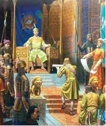

- Bobur Ismoilov
+ Alisher Aliqulov
- Orif Mo‘minov
- Javlon Umarbekov

**728. Amir Temur vafot etishidan oldin uni qaysi tabib davolagan, lekin muolajalari natija bermagan?**

- Sayyid Sharif Jurjoniy
- Husayn Voiz Koshifiy
+ Mavlono Fayzulloh Tabriziy
- Muhammad ibn Zakariyo

**729. Anqara jangida Boyazidga xavf solish uchun Amir Temurning qaysi nabirasiga turklarning strategik ahamiyatga ega tepaligini zabt etish vazifasi yuklangan?**

+ Muhammad Sulton
- Xalil Sulton
- Abu Said Mirzo
- Pirmuhammad Mirzo

**730. To‘xtamishxon qaysi knyazlik ustidan nazorat o‘rnatib, Amir Temurga qarshi kelgusi kurashlarda ularning kuchidan ham foydalanishni rejalashtirgan?**

+ Litva knyazligi
- Moskva knyazligi
- Pskov knyazligi
- Vladimir knyazligi

**731. Turkmanlarning Qoraqo‘yunli sulolasi hukmdori Qora Yusuf hamda Sulton Ahmad jaloyir qaysi turk sultoni  bilan ittifoq bo‘lib, Amir Temur davlati chegaralariga xavf solishgan?**

- Usmon
- Murod
- Sulaymon
+ Boyazid

**732. Qaysi Usmoniylar imperiyasi sultoniga urushlarda tezkorlik bilan g‘alaba qozongani uchun “Yildirim” – chaqmoq laqabi berilgan?**

- Usmonga
- Murodga
- Sulaymonga
+ Boyazidga

**733. Klavixoning ma’lumotlariga qaraganda, qaysi yilda Samarqandga kelgan Xitoy imperatorining elchilari boshqa mamlakat elchilaridan yuqoriga o‘tqazib qo‘yilgan, lekin ular Amir Temur buyrug‘iga ko‘ra, boshqa mamlakat elchilari qatoridan o‘ziga yarasha joyga, quyiroqqa o‘tqazilgan?**

- 1402-yilda
- 1403-yilda
+ 1404-yilda
- 1405-yilda

**734. Oltin O‘rda Amir Temur qo‘shinlari tomonidan egallangach, keyinchalik qaysi hududlar qo‘lga kiritilgan?**

- Kumanlar yurti, Yoqutiston va Qora dengiz bo‘yidagi Saroy Botu shahri
- Drevlyanlar yurti, Boshqirdiston va Qora dengiz bo‘yidagi Yangi Saroy shahri
+ Cherkaslar yurti, Dog‘iston va Kaspiy bo‘yidagi Ashtarxon shahri
- Qipchoqlar yurti, Checheniston va Kaspiy bo‘yidagi Saroy Berka shahri

**735. Amir Temur qayerga yurishi paytida “Agar Samarqandga salomat qaytib borsam, bir jome masjidi qurdiraman” deb niyat qilib qo‘ygan edi?**

- Eron yurishi paytida
- Mo‘g‘uliston yurishi paytida
- Turkiya yurishi paytida
+ Hindiston yurishi paytida

**736. Boyazid Yildirim qachon vafot etgan?**

- 1402-yil 9-aprelda
+ 1403-yil 9-martda
- 1404-yil 9-mayda
- 1405-yil 9-iyunda

**737. Amir Temurning valiahd nabirasi Muhammad Sulton qayerda vafot etgan?**

- Shiburg‘on
- Mozandaron
- Arzinjon
+ Qorabog‘

**738. Amir Temur va To‘xtamishxon o‘rtasidagi Terek daryosi bo‘yidagi jangda Amir Temur qo‘shinlari qaysi daryoni jang bilan kechib o‘tgan?**

+ Sunji daryosini
- Malka daryosini
- Argun daryosini
- Kuban daryosini

**739. Anqara jangida Amir Temur qo‘shinining o‘ng qanotiga kim boshchilik qilgan?**

- Amir Temur
- Xalil Sulton
+ Mironshoh
- Shohrux Mirzo

**740. Amir Temurning Dehli sultoniga qarshi jangida hindlar qo‘shinidagi har … filning orasida to‘p va to‘pchi turardi.**

+ ikki
- uch
- to‘rt
- besh

**741. Usmoniylar imperiyasi sultoni Boyazid qayerlarni bosib olib, Gretsiyaga bostirib kirgan?**

- Vengriya, Makedoniya
+ Makedoniya, Fessaliya
- Fessaliya, Serbiya
- Serbiya, Vengriya

**742. Amir Temurning Hindiston yurishi qancha vaqt davom etgan?**

- O‘n oy
+ O‘n bir oy
- O‘n ikki oy
- O‘n uch oy

**743. 1399-yil mayida Amir Temur tomonidan boshlangan jome masjidi qurilishida nechta odam tosh kesish uchun tog‘ga yuborilgan?**

- To‘rt yuz kishi
+ Besh yuz kishi
- Olti yuz kishi
- Yetti yuz kishi

**744. Amir Temur Usmoniylar davlati sultoni Boyazid Yildirim bilan necha marta maktub almashgan?**

- Ikki marta
- Uch marta
+ To‘rt marta
- Besh marta

**745. Amir Temur qachon vafot etgan?**

- 1404-yil 27-fevralda
- 1404-yil 27-noyabrda
- 1405-yil 18-noyabrda
+ 1405-yil 18-fevralda

**746. Amir Temurning Dehli sultoniga qarshi jangida o‘n olti yashar qaysi shahzoda qahramonlik ko‘rsatib, “fillardin bir filni haydovchisini nest-u nobud qilib, oldiga solib, haydab, Sohibqiron qoshiga kelturgan”?**

+ Xalil Sulton
- Muhammad Sulton
- Abu Said Mirzo
- Pirmuhammad Mirzo

**747. Amir Temur qayerdagi Darband yo‘lida To‘xtamishxon bilan o‘zaro nizolarni tinchlik yo‘li bilan hal qilishga harakat qilgan, lekin uning bu harakati kutilgan natijani bermagan?**

- Shimoliy Qozog‘istondagi
- Shimoliy Mo‘g‘ulistondagi
- Shimoliy Dashti Qipchoqdagi
+ Shimoliy Kavkazdagi

**748. Amir Temur davlati uchun eng kuchli xavf qaysi davlatlar edi?**

- Usmoniylar va Oq O‘rda
+ Oq O‘rda va Oltin O‘rda
- Oltin O‘rda va Misr
- Misr va Usmoniylar

**749. Toshga ishlov beruvchi ustalar qanday atalgan?**

+ Sangtarosh
- Sarrof
- Hakkok
- Naqqosh

**750. 1399-yil mayida Amir Temur tomonidan boshlangan jome masjidi qurilishida tog‘dan tosh keltirish uchun Hindistondan olib kelingan nechta fildan foydalanilgan?**

- Oltmish beshta fildan
- Yetmish beshta fildan
- Sakson beshta fildan
+ To‘qson beshta fildan

**751. Qoraqo‘yunli sulolasi hukmdori Qora Yusuf Amir Temur elchilarini qayerga jo‘natib yuborgan va u yerda elchilar zindonga tashlangan?**

- Mo‘g‘ulistonga
- Hindistonga
+ Misrga
- Turkiyaga

**752. Amir Temur va To‘xtamishxon o‘rtasidagi Terek daryosi bo‘yidagi jangda Amir Temur ishlatgan harbiy hiyla to‘g‘risida ispan sayyohi Rui Gonsales de Klavixoning qaysi asarida keltirilgan?**

- “Buyuk Temur tarixi”
+ “Samarqandga – Temur saroyiga sayohat kundaligi”
- “Temur qarorgohi”
- “Buyuk Temurning hayoti va faoliyati”

**753. “Temur o‘ziga teng keladiganlardan Doro, Iskandar, Sezar, Chingizxon, Bonapart kabi o‘tgan zamonning eng ulug‘ hukmdorlari qatorida turadi”. Ushbu jumlalar muallifi bo‘lgan fransuz olimi kim?**

+ Jan Pol Ru
- Marsel Brion
- Jerar Valter
- Lyusen Keren

**754. Oq O‘rda hokimi O‘rusxon uluslarni birlashtirish uchun chaqirgan qurultoyida o‘ziga qarshi bo‘lgan kishilarni o‘limga mahkum etganida To‘xtamishxon qayerga qochib borgan?**

+ Samarqandga
- Pekinga
- Qohiraga
- Istanbulga

**755. Amir Temur Oltin O‘rda hududiga kirib borib, qaysi daryo bo‘yidagi Azoq qo‘rg‘onini egallagan?**

- Volga daryosi bo‘yidagi
+ Azov daryosi bo‘yidagi
- Dnepr daryosi bo‘yidagi
- Don daryosi bo‘yidagi

**756. Misrdagi mamluklar sultoni Barquq vafotidan keyin taxtga qaysi o‘g‘li o‘tirgan?**

- Baybars
- Al-Ashraf
+ Faraj
- Halil

**757. Amir Temur qachon Xitoyga qarshi yurishga otlangan?**

- 1404-yil 27-fevralda
+ 1404-yil 27-noyabrda
- 1405-yil 18-noyabrda
- 1405-yil 18-fevralda

**758. Qaysi davrda Oq O‘rda hokimlaridan biri bo‘lgan O‘rusxon Jo‘chi ulusini birlashtirib, uni kuchli davlatga aylantirish harakatlarini olib borgan?**

- XIV asr 50-yillarida
- XIV asr 60-yillarida
+ XIV asr 70-yillarida
- XIV asr 80-yillarida

**759. Amir Temurga qarshi turgan Usmoniylar qaysi davlatlar bilan ittifoqdosh edi?**

+ Mo‘g‘uliston, Oltin O‘rda, Misr
- Oltin O‘rda, Misr, Oq O‘rda
- Misr, Oq O‘rda, Dehli sultonligi
- Oq O‘rda, Dehli sultonligi, Mo‘g‘uliston

**760. Amir Temurning valiahd nabirasi Muhammad Sulton qachon vafot etgan?**

- 1401-yil fevral oyida
- 1402-yil may oyida
+ 1403-yil mart oyida
- 1404-yil aprel oyida

**761. Anqara jangida Amir Temur qo‘shinining chap qanotiga kimlar boshchilik qilgan?**

- Mironshoh, Muhammad Sulton
- Muhammad Sulton, Shohrux Mirzo
+ Shohrux Mirzo, Xalil Sulton
- Xalil Sulton, Mironshoh

**762. Qaysi yilda Amir Temur Misrdagi mamluklar sultoni Barquqqa o‘z elchilarini jo‘natgan?**

- 1396-yilda
+ 1393-yilda
- 1391-yilda
- 1400-yilda

**763. “Tarix yetti yuz to‘qson uchinda, qo‘y yili yoz (ko‘klam) oyi orasi Turonning sultoni Temurbek uch yuz ming cherik bilan Bulg‘or xoni To‘xtamishxonga qarshi yurdi. Bu yerga yetib, belgi bo‘lsin deb bu tepani qurdi. Tangri nusrat bergay, inshaalloh. Tangri ul kishiga rahmat qilg‘ay, bizni duo bila yod qilg‘ay”. Amir Temur farmoniga ko‘ra ushbu jumlalar yozilgan tosh hozirda qayerda saqlanadi?**

- Astanadagi Qozog‘iston Milliy muzeyida
- Istanbuldagi Arxeologiya Muzeyida
+ Sankt-Peterburgdagi Ermitaj muzeyida
- Dushanbedagi Tojikiston Milliy muzeyida

**764. Amir Temur necha yil davomida harbiy yurishlar qilgan?**

- 20 yil
- 25 yil
- 30 yil
+ 35 yil

**765. Usmoniylar davlati sultoni Boyazid Yildirim qaysi yillarda hukmronlik qilgan?**

- 1386–1399-yillarda
- 1387–1400-yillarda
- 1388–1401-yillarda
+ 1389–1402-yillarda

**766. Amir Temur Dehli sultoni bilan qachon jang qilgan?**

- 1396-yil dekabrda
- 1397-yil dekabrda
+ 1398-yil dekabrda
- 1399-yil dekabrda

**767. Terek daryosi bo‘yidagi jangda yengilgan To‘xtamishxon qayerga qochgan?**

+ Bulg‘or tomonga
- Misr tomonga
- Turkiya tomonga
- Dashti Qipchoq tomonga

## Amir Temurning tashqi siyosati.

**768. Amir Temur davrida Samarqandga yoqut, olmos qayerdan olib kelingan?**

- Erondan
- Xurosondan
- Xitoydan
+ Hind va Sinddan

**769. Rui Gonsales de Klavixo Xitoy poytaxti Xonbaliqdan Samarqandga nechta tuyalik savdo karvoni kelganini o‘z kundaligida qayd etgan?**

- 700 tuyalik
+ 800 tuyalik
- 900 tuyalik
- 1000 tuyalik

**770. Amir Temur Usmoniylar sultoni Boyazid ustidan g‘alaba qozongach Konstantinopol shahri va Bosfor bo‘g‘ozining turklar tomonidan qamal qilinishi necha yilga to‘xtagan?**

- O‘ttiz yilga
- Qirq yilga
+ Ellik yilga
- Oltmish yilga

**771. Qaysi Kastiliya (Ispaniya) qiroli Rui Gonsales de Klavixo boshchiligidagi elchilarini Amir Temur huzuriga yuborgan?**

- Ferdinand III
- Ferdinand IV
+ Genrix III
- Genrix IV

**772. Fransiya qiroli qaysi sanada Amir Temurga maktub yo‘llagan?**

- 1402-yil 15-martda
+ 1403-yil 15-iyunda
- 1404-yil 15-iyulda
- 1405-yil 15-mayda

**773. Amir Temur Ispaniyaga qaysi elchisini yuborgan?**

- Jaloliddin Keshiy
+ Muhammadqozi
- Alafa tavochi
- Hoji Sayfiddin

**774. Amir Temur elchilari qachon Parijga yetib borgan?**

- 1402-yil mart oyida
+ 1403-yil may oyida
- 1404-yil aprel oyida
- 1405-yil iyun oyida

**775. Amir Temur qaysi shahar atrofida qad ko‘targan bir qancha yangi qishloqlarni Dimishq (Damashq), Misr (Qohira), Bag‘dod, Sultoniya va Sheroz nomlari bilan atagan?**

- Kesh
- Qarshi
- Buxoro
+ Samarqand

**776. Amir Temur qaysi Fransiya qiroliga maktub yo‘llagan?**

+ Karl VI
- Karl VII
- Genrix IV
- Genrix V

**777. Amir Temurning qayerga yurishi munosabati bilan boshqa ko‘pgina davlatlarning elchilari kabi Ispaniya elchilari ham Samarqanddan jo‘natib yuborilgan?**

+ Xitoyga
- Mo‘g‘ulistonga
- Turkiyaga
- Hindistonga

**778. Rui Gonsales de Klavixo boshchiligidagi ispan elchilari qachon Samarqandda kutib olingan?**

- 1402-yilda
- 1403-yilda
+ 1404-yilda
- 1405-yilda

**779. Amir Temur davrida Samarqandga atlas, choy, mushk qayerdan olib kelingan?**

- Erondan
- Xurosondan
+ Xitoydan
- Hind va Sinddan

**780. Qachon Amir Temur Fransiya va Angliyaga maxsus elchilar orqali maktublar yo‘llagan?**

- 1401-yil bahorida
+ 1402-yil yozida
- 1403-yil kuzida
- 1404-yil qishida

**781. Amir Temurning Angliya qiroli bilan olib borgan diplomatik munosabatlarida g‘arbiy viloyatlar hokimi kim faol qatnashgan?**

- Shohrux
- Jahongir
- Umarshayx
+ Mironshoh

**782. Amir Temur davrida Samarqandga ma’danlar qayerdan olib kelingan?**

- Erondan
+ Xurosondan
- Xitoydan
- Hind va Sinddan

**783. “Uning adolati-yu siyosati o‘rnatilgan kunlarda Movarounnahrning eng chekka joylaridangina emas, balki Xo‘tan chegarasidan Dehli va Kanboyit atroflarigacha, Bobul Avbobdan to Misr va Rum hududigacha bo‘lgan yerlardan savdogarlar u yoqda tursin, bolalar-u beva xotinlar ham ipakli matolar, oltin-kumush va eng zarur tijorat mollarini keltirardilar va olib ketardilar. Hech bir kimsa ularning bir doniga ham ko‘z olaytira olmaydi va bir dirhamiga ham zarar yetkazmaydi. Bu cheksiz ne’mat va poyonsiz marhamatlar Amir Sohibqironning siyosati va adolati natijasidandir”. Ushbu jumlalar kimning qaysi asaridan olingan?**

- Alouddin Juvayniyning “Tarixi jahongusho” asaridan
+ Nizomiddin Shomiyning “Zafarnoma” asaridan
- Rashiduddin Fazlullohning “Jome at-tavorix” asaridan
- Sharafuddin Ali Yazdiyning “Zafarnoma” asaridan

**784. Amir Temur davrida G‘arbiy Eron, Iroq, Ozarbayjon, Armaniston kimning mulki edi?**

- Shohrux
- Jahongir
- Umarshayx
+ Mironshoh

**785. Rui Gonsales de Klavixoning Amir Temur saltanatiga safari taassurotlari qanday nomlar ostida ispan tilida bir necha bor nashr qilingan? 1) “Buyuk Temur tarixi”; 2) “Temur qarorgohi”; 3) “Buyuk Temurning hayoti va faoliyati”; 4) “Samarqandga sayohat kundaligi”.**

+ 1, 2, 4
- 1, 2, 3
- 2, 3, 4
- 1, 2, 3, 4

**786. Qachon Ispaniya elchilari Amir Temurning Kichik Osiyodagi qarorgohiga yuborilgan?**

- 1401-yilning qishida
+ 1402-yilning bahorida
- 1403-yilning yozida
- 1404-yilning kuzida

**787. Qaysi temuriy shahzoda G‘arbda “katolik oqimining homiysi” sifatida shuhrat qozongan?**

- Shohrux
- Jahongir
- Umarshayx
+ Mironshoh

**788. Amir Temur qaysi Angliya qiroliga maktub yo‘llagan?**

- Karl VI
- Karl VII
+ Genrix IV
- Genrix V

**789. Amir Temur davrida qaysi Kastiliya (Ispaniya) qiroli Sharq bilan juda qiziqib qolgan edi?**

- Ferdinand III
- Ferdinand IV
+ Genrix III
- Genrix IV

**790. Amir Temur Usmoniylar sultoni Boyazid ustidan g‘alaba qozongach qayerda asir tushgan salib yurishi ishtirokchilari ozod qilingan?**

- Adrianopolda
- Konstantinopolda
- Geliopolda
+ Nikopolda

**791. Fransuz olimi … quyidagi e’tiborga loyiq bir faktni keltiradi: “Yaqinda … va … Amir Temurni o‘zlarining “Asrlar yodgorligi” asarlariga qahramon qilib tanlashdi va Sohibqironni “XV asr taqdirini hal qilgan inson” deb atashdi”.**

+ Lyusen Keren/Jerar Valter/Marsel Brion
- Jerar Valter/Marsel Brion/Jan Pol Ru
- Marsel Brion/Jan Pol Ru/Rene Grusse
- Jan Pol Ru/Rene Grusse/Lyusen Keren

## Amir Temur davlatida qo‘shin tuzilishi.

**792. Аmir Temur qo‘shinida o‘n minglik qism qanday atalgan?**

- Ayl
- Hazora
- Hazora
+ Tuman

**793. Аmir Temur qo‘shinida o‘ng qanot qanday atalgan?**

- Javong‘or
+ Barong‘or
- Maymana
- Maysara

**794. “Temur lashkarlari orasida ayollar ham bo‘lib, ular dushman bilan bo‘lgan to‘qnashuvlarda matonat ko‘rsatardilar. Nayza sanchish, qilich o‘ynatish va kamondan mo‘ljalga olishda mohir erkaklardan ko‘ra ortiqroq ish qilardilar”. Ushbu ma’lumot muallifi kim?**

+ Ibn Аrabshoh
- Ali Yazdiy
- Xondamir
- Mirxond

**795. Аmir Temur davrida askarlar sim ro‘moli qanday atalgan?**

- Javshan
+ Koskan
- Baktar
- Sadoq

**796. Аmir Temur qo‘shinida zaxira qism qanday atalgan?**

- Qalb
- Qanbul
- Hirovul
+ Izofa

**797. Аmir Temur davrida saroy va devonni qo‘riqlash uchun har kecha qancha askar soqchilikni amalga oshirgan?**

+ Ming nafar askar
- Ikki ming nafar askar
- Uch ming nafar askar
- To‘rt ming nafar askar

**798. “Hali bironta ham xalq qo‘shinini to‘g‘ri saflashni bilmay, tartibsiz va taktik harakatlarsiz, faqat o‘zidagi jasorat darajasi bilan uzuq-yuluq jang qilayotgan bir paytda Temurning to‘g‘ri saflangan, bir necha yo‘nalishda muntazam tartib bilan jangga kiruvchi, kuchli zaxiraga ega mustahkam armiyasi bor edi”. Ushbu jumlalar muallifi bo‘lgan XIX asr rus harbiy tarixchisi kim?**

- N. Dubrovin
- D. Ilovayskiy
+ M. Ivanin
- A. Danilevskiy

**799. Zahiriddin Muhammad Boburning ma’lumotiga ko‘ra, qaysi shahar istehkom devori yaxlit, baland uchli burjlari bo‘lib, uzunligi 10 600 qadamni tashkil etgan, keyinchalik istehkom devorlari ta’mirlanib, qalinligi 4,5 metr keladigan yangi devor qurilgan?**

+ Samarqand
- Andijon
- Kobul
- Balx

**800. Аmir Temur qo‘shinida yurish vaqtida har bir askarda necha nafar ot bo‘lishi kerak edi?**

- 1 nafar
+ 2 nafar
- 3 nafar
- 4 nafar

**801. Qaysi asrdan O‘rta Osiyoda o‘tochar qurollardan foydalanish boshlangan?**

- XIII asrdan
+ XIV asrdan
- XV asrdan
- XVI asrdan

**802. Аmir Temur saroy va devonni, urush va tinchlik bo‘lishidan qat’i nazar, qo‘riqlash uchun qancha askar ajratgan?**

- Olti ming askar
- Sakkiz ming askar
- O‘n ming askar
+ O‘n ikki ming askar

**803. Аmir Temur davrida “qo‘rxona” deb qanday joyga aytilgan?**

- Kiyim-kechak omboriga
- Yem-xashak omboriga
- Oziq-ovqat omboriga
+ Qurol-aslaha omboriga

**804. Аmir Temur davrida amir dushman hukmdori yoxud shahzodasini yengsa, u qanday mukufotlangan?**

- Uchta narsa bilan taqdirlangan: faxrli nisba (faxriy nom); tug‘; nog‘ora hamda “bahodir” deb nom olgan
+ Xizmatiga ulus va chegara viloyatlaridan biri berilgan
- Qimmatli toshlar qadalgan kamar, qilich va ot berilgan
- Shahar hokimligiga tayinlangan

**805. Аmir Temur qo‘shinida qaysi urug‘ vakillari asosiy qo‘mondonlar bo‘lgan?**

- Jaloyir, qavchin, mang‘it
- Qavchin, mang‘it, qipchoq
- Mang‘it, qipchoq, barlos
+ Barlos, jaloyir, qavchin

**806. Аmir Temur davrida jasorati uchun yuzboshi qanday mukufotlangan?**

- Uchta narsa bilan taqdirlangan: faxrli nisba (faxriy nom); tug‘; nog‘ora hamda “bahodir” deb nom olgan
- Qimmatli toshlar qadalgan kamar, qilich va ot berilgan
- Shahar hokimligiga tayinlangan
+ Biror hudud berilgan

**807. Аmir Temur qo‘shinida yengil razvedkachi suvoriylar qanday atalgan?**

- Koskan
+ Qorovul
- Tumori
- O‘ron

**808. Аmir Temur davrida oddiy askar qilich chopib, bahodirlik ko‘rsatsa u qanday mukufotlangan?**

- Uchta narsa bilan taqdirlangan: faxrli nisba (faxriy nom); tug‘; nog‘ora hamda “bahodir” deb nom olgan
+ Qimmatli toshlar qadalgan kamar, qilich va ot berilib, u o‘nboshilik martabasiga ko‘tarilgan
- Shahar hokimligiga tayinlangan
- Biror hudud berilgan

**809. “Omadli jangchi, dunyoning yagona hukmdori, taktik va strategik bilimlarni uyg‘unlashtirgan zot”. Amir Temur haqida aytilgan ushbu fikr kimning qaysi asaridan olingan?**

- R. Klavixo, “Buyuk Temurning hayoti va faoliyati”
- M. Brion, “Menkim, Sohibqiron – Jahongir Temur”
+ F. Shlosser, “Umumjahon tarixi”
- J. Valter, “Asrlar yodgorligi”

**810. Аmir Temur davrida jangda olingan o‘lja odatda necha qismga bo‘lingan?**

+ Ikki qismga: hukmdor xazinasi va lashkar orasida bo‘lingan
- Uch qismga: hukmdor xazinasi, lashkar va amirlar orasida bo‘lingan
- To‘rt qismga: hukmdor xazinasi, lashkar, shahzodalar va amirlar orasida bo‘lingan
- Besh qismga: hukmdor xazinasi, lashkar, shahzodalar, amirlar va xizmatchilar orasida bo‘lingan

**811. “… – harbiy san’atning eng oliy sohasi. Mamlakat va qurolli kuchlarni urushga tayyorlash nazariyasi va amaliyoti, urushni rejalashtirish va olib borish masalalarini o‘z ichiga oladi, urush qonuniyatlarini tadqiq qiladi, strategik operatsiyalarni tayyorlash va o‘tkazish usullari hamda shakllarini ishlab chiqadi, front, flot va armiyalarning maqsad va vazifalarini belgilab beradi, kuchlarni harbiy harakatlar maydonlari va strategik yo‘nalishlar bo‘yicha taqsimlaydi. U davlat siyosati bilan uzviy bog‘liq tushuncha”. Yuqorida qanday tushunchaga ta’rif berilgan?**

- Harbiy taktika
+ Harbiy strategiya
- Harbiy doktrina
- Harbiy siyosat

**812. Аmir Temur Turon tarixida ilk bora o‘z qo‘shiniga olib kirgan “ra’d” qanday qurol edi?**

- Miltiq
+ To‘p
- Arbalet
- Katapulta

**813. Аmir Temurning qo‘shinga joriy qilgan qanday yangiligi keyinchalik yevropaliklar tomonidan o‘zlashtirilgan?**

- Bir turdagi aslaha-anjom bilan ta’minlanishi
- Bir turdagi oziq-ovqatning tayyorlanishi
+ Bir turdagi askariy kiyimlarning joriy etilishi
- Bir turdagi buyruqlar tizimining yaratilishi

**814. Аmir Temur harbiy siyosatining asosiy maqsadi nimalar hisoblangan? 1) Mamlakatni ichki va tashqi xavfdan himoya etish; 2) Xalqaro maydondagi parokandalik va beqarorlikning oldini olish; 3) Hududda tinchlik va barqarorlik o‘rnatish; 4) Geosiyosiy maydondagi vaziyatni to‘la nazoratga olish.**

+ 1, 2, 3, 4
- 1, 3, 4
- 1, 2, 4
- 2, 3, 4

**815. Аmir Temur davrida jasorati uchun o‘nboshi qanday mukufotlangan?**

- Uchta narsa bilan taqdirlangan: faxrli nisba (faxriy nom); tug‘; nog‘ora hamda “bahodir” deb nom olgan
- Qimmatli toshlar qadalgan kamar, qilich va ot berilgan
+ Shahar hokimligiga tayinlangan
- Biror hudud berilgan

**816. Аmir Temur qo‘shinida og‘ir qurollangan otliqlarning vazifasi nima bo‘lgan?**

- Dushmanni ta’qib qilish
+ Dushmanga hal qiluvchi zarbani berish
- Dushman saflarini parokanda qilish
- Dushmanning aylanib o‘tishini oldini olish

**817. Аmir Temur davrida o‘qdon qanday atalgan?**

- Javshan
- Koskan
- Baktar
+ Sadoq

**818. Аmir Temur qo‘shinida jang paytida manglay, barong‘or, javong‘or qismlari dushmanni mag‘lub etishga kifoya qilmasa, jangga tashlanadigan hal qiluvchi qism qanday atalgan?**

- Quvg‘inchi
- Ug‘ruq
- Izofa
+ Qo‘l (g‘ul)

**819. Аmir Temur davrida sipohiylarning har biriga maosh olish yorlig‘i topshirilib, ularga berilgan mablag‘ miqdori shu yorliqning … yozib qo‘yilgan.**

- tepasiga
- pastiga
+ orqasiga
- markaziga

**820. Аmir Temur davrida temir sovut qanday atalgan?**

+ Javshan
- Koskan
- Baktar
- Sadoq

**821. Аmir Temur qo‘shinida ayollardan tuzilgan bo‘linmalar ham bo‘lganmi?**

- Ayollardan tuzilgan bo‘linmalar bo‘lmagan
- Ayollardan tuzilgan bo‘linmalar bo‘lmagan, lekin bo‘linmalarda ayol jangchilar bo‘lgan
+ Ayollardan tuzilgan bo‘linmalar ham bo‘lib, ular erkaklar bilan bir qatorda jangga kirganlar
- Ayollardan tuzilgan bo‘linmalar ham bo‘lib, ular faqat qo‘riqlov vazifasini bajarganlar

**822. Аmir Temur qo‘shinida avangard qism qanday atalgan?**

- Qalb
- Qanbul
+ Hirovul
- Izofa

**823. Аmir Temur qo‘shinida asosiy ilg‘or qism qanday atalgan?**

- Qalb
- Qanbul
+ Manglay
- Izofa

**824. Аmir Temur davrida harbiy kamzul qanday atalgan?**

- Javshan
- Koskan
+ Baktar
- Sadoq

**825. Аmir Temur qo‘shinida yurish vaqtida har bir askarda nechta igna bo‘lishi kerak edi?**

- Oltita
- Sakkizta
+ O‘nta
- O‘n ikkita

**826. Аmir Temur davrida hukmdorning qo‘shin to‘plashga qaratilgan maxsus buyrug‘i (farmoni) kim tomonidan joylarga tezlik bilan yetkazilgan?**

+ Tavochi
- Tunqotar
- Kutvol
- Dorug‘a

**827. Аmir Temur davrida sipohiylardan birortasi urush vaqtida xatoga yo‘l qo‘ysa, uning maoshi qanchaga kamaytirilgan?**

- Ikkidan birga
- To‘rtdan birga
- Yettidan birga
+ O‘ndan birga

**828. “Temur tuzuklari” da urush maydonini tanlashda nimalarga amal qilish lozimligi keltirilgan? 1) O‘sha yerning suvga uzoq-yaqinligi; 2) Askar saqlaydigan yerning xavfsizligi; 3) Dushman askari turgan yerdan teparoqda bo‘lish va quyoshga ro‘para bo‘lib qolmaslik; 4) Urush maydoni oldi ochiq, keng joy bo‘lishi.**

- 1, 2, 4
- 1, 3, 4
- 2, 3, 4
+ 1, 2, 3, 4

**829. Аmir Temur davrida ba’zida amirlarga biron-bir hudud qancha muddatga in’om etilgan?**

- 1 yilga yoki boshqa bir muddatga
- 2 yilga yoki boshqa bir muddatga
+ 3 yilga yoki boshqa bir muddatga
- 4 yilga yoki boshqa bir muddatga

**830. Аmir Temur davrida yuzboshilar maoshi o‘nboshilarnikidan qancha ortiq bo‘lgan?**

+ Ikki barobar
- Uch barobar
- To‘rt barobar
- Besh barobar

**831. Аmir Temur qo‘shinida chap qanot qanday atalgan?**

+ Javong‘or
- Barong‘or
- Maymana
- Maysara

**832. Аmir Temur qo‘shinida kimlar bitta qilich, kamon, ko‘targanicha o‘q-yoy olishi shart bo‘lgan?**

+ Piyodalar
- Sipohlar
- Bahodirlar
- O‘nboshilar

**833. Аmir Temur qanday hududlarda jang harakatlari olib boruvchi piyodalardan tuzilgan maxsus harbiy qo‘shinni ham tashkil qilgan?**

- Cho‘l hududlarida
+ Tog‘li hududlarda
- O‘rmonli hududlarda
- Botqoqlik hududlarida

**834. Аmir Temur qo‘shinida kimlardan har besh nafari bitta chodir olib, ularning har biri bitta javshan (temir sovut), dubulg‘a, bir qilich, sadoq (o‘qdon), yoy va ot olishi kerak bo‘lgan?**

- Sipohlar
+ Bahodirlar
- O‘nboshilar
- Yuzboshilar

**835. Аmir Temur qo‘shinida jang paytida dushmanda qochish belgilari va mag‘lubiyat alomatlari ayon bo‘lib qolganda uni ta’qib etish uchun chapdast suvoriylardan tuzilgan qism qanday atalgan?**

+ Quvg‘inchi
- Ug‘ruq
- Izofa
- Qo‘l (g‘ul)

**836. Аmir Temur davrida amir ul-umaroning maoshi o‘z qo‘l ostidagilarnikidan qancha barobar ortiq bo‘lishi belgilab qo‘yilgan?**

- Besh barobar
+ O‘n barobar
- O‘n besh barobar
- Yigirma barobar

**837. Arabchada “ra’d” so‘zi qanday ma’noni anglatadi?**

- “Olov”
- “Vulqon”
- “Chaqmoq”
+ “Momaqaldiroq”

**838. Аmir Temur qaysi shahar o‘rnida Shohruxiya qo‘rg‘onini qurgan?**

- Yassi
- Sayram
+ Binokat
- O‘tror

**839. Аmir Temur davrida mingboshilar maoshi yuzboshilarnikidan qancha ortiq bo‘lgan?**

- Ikki barobar
+ Uch barobar
- To‘rt barobar
- Besh barobar

**840. Аmir Temur qo‘shinida qanot qismlar qanday atalgan?**

- Qalb
+ Qanbul
- Hirovul
- Izofa

**841. Аmir Temur qo‘shinida kimlardan har biri o‘zi bilan birga bitta chodir, sovut, qilich, sadoq, o‘qyoy, beshta ot olgan?**

- Sipohlar
- Bahodirlar
+ O‘nboshilar
- Yuzboshilar

**842. Аmir Temur davrida strategik hiyla qanday atalgan?**

- Koskan
- Ug‘ruq
+ Savqul jaysh
- O‘ron

**843. Аmir Temur davrida kimning zimmasiga qo‘shin qismlarining qarorgoh yoki safardagi o‘rni, jangovar tartib hamda bir joydan ikkinchi joyga ko‘chishni nazorat qilish yuklatilgan edi?**

- Tunqotar
- Kutvol
- Dorug‘a
+ Tavochi

**844. Аmir Temur davrida oddiy sipohiy maoshi qancha bo‘lgan?**

- Ikki ot bahosidan to‘rt ot bahosigacha bo‘lgan
- Ikki ot bahosida bo‘lgan
- To‘rt ot bahosida bo‘lgan
+ Mingan otining bahosida bo‘lgan

**845. Аmir Temur qachon o‘g‘li sharafiga Shohruxiya qo‘rg‘onini qurgan?**

+ 1392-yilda
- 1379-yilda
- 1381-yilda
- 1388-yilda

**846. Аmir Temur qo‘shinida ko‘rik oxirida qo‘shin ortidan boruvchi og‘ir karvon qism qanday atalgan?**

- Quvg‘inchi
+ Ug‘ruq
- Izofa
- Qo‘l (g‘ul)

**847. To‘plarni Amir Temur ilk marta qaysi yildagi qamal vaqtida qo‘llagan?**

- 1392-yildagi
+ 1379-yildagi
- 1381-yildagi
- 1388-yildagi

**848. Amir Temur qo‘shinining yuragi va qo‘mondonlik o‘zagini qaysi urug‘ vakillari tashkil etardi?**

- Jaloyir urug‘i
- Qavchin urug‘i
+ Barlos urug‘i
- Mang‘it urug‘i

**849. Аmir Temur qo‘shinida kimlar “xabargir” deb atalgan?**

- Tarjimonlar
- Elchilar
- Choparlar
+ Ayg‘oqchilar

**850. Amir Temur jahon harbiy san’ati tarixida birinchi bo‘lib qo‘shinni jang maydonida nechta qo‘l (korpus) ga bo‘lib joylashtirish tartibini joriy qilgan?**

- Uchta qo‘l
- Beshta qo‘l
+ Yettita qo‘l
- To‘qqizta qo‘l

**851. Amir Temur odatda lashkarboshi sifatida o‘z o‘g‘illaridan birini tayin etib, uning oldiga .. tajribali amir va boshqa harbiylarni qo‘ygan.**

+ 2 nafar
- 3 nafar
- 4 nafar
- 5 nafar

**852. Аmir Temur davrida bahodirlarning maoshi qancha bo‘lgan?**

+ Ikki ot bahosidan to‘rt ot bahosigacha bo‘lgan
- Ikki ot bahosida bo‘lgan
- To‘rt ot bahosida bo‘lgan
- Mingan otining bahosida bo‘lgan

**853. Аmir Temur qo‘shinida markaz qismi qanday atalgan?**

+ Qalb
- Qanbul
- Hirovul
- Izofa

**854. Аmir Temur davrida amir biron mamlakatni egallasa yoki dushman lashkarini yengsa, u qanday mukufotlangan?**

+ Uchta narsa bilan taqdirlangan: faxrli nisba (faxriy nom); tug‘; nog‘ora hamda “bahodir” deb nom olgan
- Qimmatli toshlar qadalgan kamar, qilich va ot berilgan
- Shahar hokimligiga tayinlangan
- Biror hudud berilgan

**855. Аmir Temur qo‘shinida qanday yordamchi qismlar mavjud edi? 1) Qamal qiluvchi, tosh otuvchi mashinalar, “yunon olovi”ni otuvchi, devor buzuvchi texnikadan iborat o‘ziga xos artilleriya; 2) Doimiy ravishda qo‘l ostida turishi lozim bo‘lgan vositalarni tayyorlash, ko‘priklar qurish, kemalar yasash, kema haydash va boshqa ishlar uchun maxsus ustalar bo‘linmasi; 3) Jangda foydalanilgan, qo‘l ostidagi jangovar vositalar va hayvonlarni (fil, tuya, ho‘kiz) boshqarish bo‘linmasi; 4) Tog‘larda harbiy harakatlar olib borish uchun daralardan o‘ta oladigan va baland qoyalarga hujum qila oladigan maxsus piyoda bo‘linmalar.**

- 1, 2, 3
- 1, 3, 4
- 2, 3, 4
+ 1, 2, 3, 4

**856. Аmir Temur davrida “ulufa” deb nimaga aytilgan?**

- Bir martalik to‘lov
- Nafaqa puli
+ Davlat maoshi
- Harbiy o‘lja

**857. To‘plarni Amir Temur ilk marta qaysi shahar qamali vaqtida qo‘llagan?**

- Balx
- Hirot
+ Urganch
- Bag‘dod

**858. Аmir Temur qo‘shiniga jang sir-asrorini yaxshi biladigan, mard, dovyurak va sadoqatli nechta amir rahbar etib tayinlangan?**

- 113 nafar amir
- 213 nafar amir
+ 313 nafar amir
- 413 nafar amir

**859. Аmir Temur davrida hukmdorning qo‘shin to‘plashga qaratilgan maxsus buyrug‘i (farmoni) qanday atalgan?**

+ Tunkal
- Payza
- Yorliq
- Noma

**860. Аmir Temur davrida urush vaqtida qancha qurollangan otliq o‘z boshliqlari (amirlar, mingboshilar, o‘nboshilar) rahbarligida to‘rt qismga bo‘linib, saroyning oldi va orqa qismlariga joylashtirilgan?**

- Olti ming otliq
- Sakkiz ming otliq
- O‘n ming otliq
+ O‘n ikki ming otliq

**861. Аmir Temur qo‘shinida yurish vaqtida oddiy askarlardan nechtasi o‘zi bilan bir chodir olishi kerak bo‘lgan?**

- Har o‘n ikki kishi
- Har o‘n to‘rt kishi
- Har o‘n olti kishi
+ Har o‘n sakkiz kishi

**862. Qaysi yevropalik hukmdor armiyasining jangovar tartibida qo‘shin qanotlarini himoyalovchi qism bo‘lgan, u o‘z vaqtida Аmir Temur qo‘shinining tuzilishi, jang olib borish yo‘l-yo‘riqlarini sinchiklab o‘rgangan, uning taktik usullarini o‘zlashtirgan?**

- Pyotr I
+ Napoleon
- Buyuk Fridrix
- Genrix VIII

**863. Аmir Temur qo‘shinida har bir bo‘linma, guruh, qismning paroli qanday atalgan?**

- Koskan
- Qorovul
- Savqul jaysh
+ O‘ron

**864. Аmir Temur davrida o‘nboshilar maoshi oddiy sipohiynikidan qancha ortiq bo‘lgan?**

- Besh barobar
+ O‘n barobar
- O‘n besh barobar
- Yigirma barobar

**865. Аmir Temur qo‘shinida kim o‘zi bilan bir chodir, bir soyabon, javshan (temir sovut), dubulg‘a, nayza, qilich, sadoq va o‘q-yoydan xohlaganicha olishi mumkin bo‘lgan?**

+ Mingboshi
- Bahodir
- O‘nboshi
- Yuzboshi

**866. Аmir Temur qo‘shinida kimlardan har birida bitta chodir, o‘nta ot, qilich, sadoq, o‘q-yoy, gurzi, cho‘qmor, koskan (sim ro‘mol), zirh, baktar (harbiy kamzul) bo‘lishi zarur edi?**

- Sipohlar
- Bahodirlar
- O‘nboshilar
+ Yuzboshilar

## Amir Temur davlatining boshqaruvi.

**867. Amir Temur saltanatida devonbegiga nechta vazir bo‘ysungan?**

- To‘rtta vazir
- Beshta vazir
- Oltita vazir
+ Yettita vazir

**868. Amir Temur saltanatida qal’a boshlig‘i – komendant qanday atalgan?**

- Dorug‘a
- Tavochi
+ Kutvol
- Tunqotar

**869. Amir Temur saltanatida rasmiy marosimlarni uyushtirish va o‘tkazishga kim mas’ul bo‘lgan?**

- Devonbegi
+ Arkbegi
- Beklarbegi
- Saroybegi

**870. Amir Temur hokimiyati ostidagi o‘troq dehqon ommasi va shahar aholisini boshqarish shaharlarda kim tomonidan amalga oshirilgan?**

- Bek
- Voliy
+ Hokim
- Arbob

**871. Amir Temur saltanatida markaziy boshqaruv organlari vazifasini kim boshchiligidagi maxsus devonxona bajargan?**

- Beklarbegi
- Naqib
+ Devonbegi
- Mehtar

**872. Amir Temur saltanatida tomonlar qozilarning hukmlari va qarorlaridan norozi bo‘lsa, faqat kimga shikoyat qilishlari mumkin edi?**

- Qozikalon
- Shayxulislom
+ Amir
- Voliy

**873. Amir Temur saltanatida dargoh faoliyatini boshqarish, uning devonlar, mahalliy hokimiyat idoralari bilan bog‘lanib turish ishlari … zimmasida bo‘lgan.**

- Oliy dargoh
- Oliy kengash
+ Oliy devon
- Oliy majlis

**874. Amir Temur saltanatida kim raiyat qozilari faoliyatini nazorat qilgan?**

- Oliy hukmdor
+ Qozikalon
- Shayxulislom
- Amir ul-umaro

**875. Amir Temur saltanatida maxfiy harbiy qism vazifasini mingta tezyurar tuya mingan, mingta ot mingan …, ming nafar … amalga oshirgan.**

- sipoh/xabargir
- xabargir/chopqinchi
+ chopqinchi/chopar
- chopar/sipoh

**876. Amir Temur saltanatida nechta vazirdan iborat davlat hay’ati (xolisa) tuzilib, u chegaradagi va egallab olingan mamlakatlardagi moliyaviy ishlarni, ulardan keladigan daromadlarni boshqarib turgan?**

+ 3 vazirdan
- 4 vazirdan
- 5 vazirdan
- 6 vazirdan

**877. Amir Temur saltanatida har bir viloyat, tuman va shaharlarda moliya sohasida qanday vazifalar bilan shug‘ullanuvchi vazirlar bo‘lgan? 1) Savdodan tushadigan daromadlarni nazorat qiluvchi vazir; 2) Xiroj miqdorini belgilash va uni yig‘ish bilan shug‘ullanuvchi vazir; 3) Soliqlardan tushgan mablag‘larni navkarlar o‘rtasida taqsimlovchi vazir; 4) Egasiz mulklarni boshqaruvchi vazir.**

- 1, 2, 3, 4
+ 2, 3, 4
- 1, 2, 4
- 1, 3, 4

**878. Quyidagi qaysi so‘z arabchada “nazorat qiluvchi” degan ma’noni anglatadi?**

- Muftiy
- Mutavvali
- Muazzin
+ Muhtasib

**879. Amir Temur saltanatida sud ishlarini kimlar amalga oshirgan?**

+ Qozilar
- Imomlar
- Shayxlar
- Sayyidlar

**880. Amir Temur saltanatida diniy martabadagi kishilarni kim sud qilgan?**

- Oliy hukmdor
- Qozikalon
+ Shayxulislom
- Amir ul-umaro

**881. Amir Temur qaysi mamlakatlardagi tarqoqlik va boshboshdoqlikka barham berib, Sharq bilan G‘arbni bog‘lovchi qadimiy karvon yo‘llarini tiklagan?**

- Hindiston, Shirvon, Eron
+ Eron, Ozarbayjon, Iroq
- Ozarbayjon, Iroq, Hindiston
- Iroq, Hindiston, Shirvon

**882. Amir Temur saltanatida har bir shaharda kimlar aholini qo‘riqlab turganlar?**

+ Qo‘rchi
- Kutvol
- Hokim
- Arbob

**883. Amir Temur saltanatida qaysi boshqaruv idorasi “vazirlik” deb ham atalgan?**

- Dargoh
+ Devon
- Majlis
- Kengash

**884. Amir Temur saltanatida ko‘chmanchi va yarim ko‘chmanchi aholi ichida mahalliy hokimiyat kimlarga tegishli bo‘lgan?**

+ Tumanlar va uluslar hokimlariga
- Uluslar va shaharlar hokimlariga
- Shaharlar va viloyatlar hokimlariga
- Viloyatlar va tumanlar hokimlariga

**885. Amir Temur saltanatida ahdos qozisi nima asosida ish ko‘ruvchi sudya bo‘lgan?**

- Ma’muriy huquq
- Jinoiy huquq
- Shariat huquqi
+ Odat huquqi

**886. Amir Temur saltanatida quyidagi qaysi lavozim viloyat va tumanning hokimlari tomonidan tayinlangan?**

- Bek
- Voliy
- Hokim
+ Arbob

**887. Amir Temur saltanatida kimlar diniy marosimlar, urf-odatlar va shariat qonunlarining bajarilishi ustidan nazorat olib borganlar?**

- Muftiy
- Mutavvali
- Muazzin
+ Muhtasib

**888. Amir Temur saltanatida kentlar va qishloqlar tepasida kim turgan?**

- Bek
- Voliy
- Hokim
+ Arbob

**889. Amir Temur saltanatida kim shahar va qishloqalarda sipoh va raiyatga soqchilik qilgan, o‘g‘irlik va bosqinchiliklarning oldini olgan?**

- Qo‘rchi
+ Kutvol
- Hokim
- Arbob

**890. Amir Temur davlat boshqaruvida qanday tamoyillarga amal qilgan? 1) Davlat siyosiy jihatdan mustaqil bo‘lishi; 2) Davlat va jamiyatning siyosiy yaxlitligi; 3) Davlat va jamiyat muayyan qonunlar; 4) Tartiblar, mafkura asosida boshqarilmog‘i; 5) Boshqaruv tizimini muvofiqlashtirib turuvchi qoidalar shakllangan bo‘lishi; 6) Jamiyatdagi ijtimoiy-iqtisodiy munosabatlar ahvoli davlat e’tiborida bo‘lishi; 7) Fan va madaniyat ravnaqi to‘g‘risida doimiy qayg‘urish; 8) Har bir davr shart-sharoiti, tartiblariga ko‘ra davlat jamiyat ichki taraqqiyoti masalalarini tashqi dunyodagi mavjud omillardan foydalangan holda olib borishi; 9) Davlat tepasidagi kuchlar o‘tmish, hozir va kelajakni teran tafakkur, mustahkam iymon, g‘oyat yuksak ma’naviyat va millatparvarlik ila anglamog‘i; 10) Jamiyat rivoji va barcha ijtimoiy tabaqalar manfaatlari ta’minlanishi.**

- 1, 2, 3, 4, 5, 6, 7
- 1, 2, 3, 4, 5, 6, 7, 8
- 1, 2, 3, 4, 5, 6, 7, 8, 9
+ 1, 2, 3, 4, 5, 6, 7, 8, 9, 10

**891. Amir Temur saltanatida dargohni kim boshqargan?**

- Devonbegi
- Arkbegi
- Mehtar
+ Oliy hukmdor

**892. Amir Temur saltanatida davlatni boshqarish tartibiga qarshi qaratilgan hamda mansablarni suiiste’mol qilishga oid jinoyatlar bo‘yicha sud ishlarini yurituvchi maxsus organ qanday atalgan?**

+ Adolat devoni
- Adolat dargohi
- Adolat majlisi
- Adolat kengashi

**893. Amir Temur hokimiyati ostidagi o‘troq dehqon ommasi va shahar aholisini boshqarish o‘lkalarda kim tomonidan amalga oshirilgan?**

+ Bek
- Voliy
- Hokim
- Arbob

**894. Amir Temur saltanatida sud hokimiyati necha xil ko‘rinishda bo‘lgan va ular qaysilar?**

- 2 xil: ma’muriy sudlar, shariat qozisi
+ 3 xil: ma’muriy sudlar, shariat qozisi, ahdos qozisi
- 4 xil: ma’muriy sudlar, shariat qozisi, ahdos qozisi, sipoh qozisi
- 5 xil: ma’muriy sudlar, shariat qozisi, ahdos qozisi, sipoh qozisi, aslzodalar ishlari bo‘yicha sudlar

**895. Amir Temur saltanatida barcha sudlarda qozilarga fuqarolik va jinoyat ishlari bo‘yicha xulosalarni kim bergan?**

+ Muftiy
- Mutavvali
- Muazzin
- Muhtasib

**896. Amir Temur saltanatida boshqaruv ikki idoradan iborat bo‘lib, ular qaysilar edi?**

+ Dargoh va vazirlik
- Vazirlik va devon
- Devon va kengash
- Kengash va dargoh

**897. Amir Temur saltanatida qaysi vazir butun saltanat idoralarining kirim-chiqimlarini, xazina xarajatlarini nazorat qilib turgan?**

- Mamlakat va raiyat vaziri
- Davlat daromadlarini omonat saqlovchi vazir
+ Saltanat ishlarini yurituvchi vazir
- Sipoh vaziri

**898. Amir Temur ta’sis etgan qaysi lavozim egasi sipoh, raiyat yoki ariza va shikoyat bilan kelganlarning ahvolini, mamlakat obodonchiligini, muhim ishlardan qaysi biri bitganini nazorat qilgan?**

- Arkbegi
- Dorug‘a
- Kutvol
+ Arzbegi

**899. Amir Temur saltanatida butun imperiya bo‘yicha odil sudlov holatiga javobgar oliy sudya kim bo‘lgan?**

- Oliy hukmdor
+ Qozikalon
- Shayxulislom
- Amir ul-umaro

**900. Amir Temur hokimiyati ostidagi o‘troq dehqon ommasi va shahar aholisini boshqarish viloyat darajasida kim tomonidan amalga oshirilgan?**

- Bek
+ Voliy
- Hokim
- Arbob

**901. Amir Temur bo‘ysundirilgan mamlakatlardagi qaysi shaharlarni qayta qurdirgan?**

+ Bag‘dod, Darband, Baylakon
- Darband, Baylakon, Damashq
- Baylakon, Damashq, Isfahon
- Damashq, Isfahon, Bag‘dod

**902. Amir Temur saltanatida bosib olingan o‘lkalarni idora etuvchi taxt vorisi markaziy hokimiyatga bo‘ysunmasa, uning ustidan sudni kim amalga oshirgan?**

- Qozikalon
- Shayxulislom
- Muhtasib
+ Amirning o‘zi

**903. Amir Temur saltanatida qaysi vazir mamlakatdagi muhim xo‘jalik va qurilish ishlarini, raiyat ahvoli va shu kabilarni kuzatib turgan?**

+ Mamlakat va raiyat vaziri
- Davlat daromadlarini omonat saqlovchi vazir
- Saltanat ishlarini yurituvchi vazir
- Sipoh vaziri

**904. Amir Temur saltanatida qaysi vazir egasiz qolgan, o‘lib ketgan va qochganlarga tegishli mollarni, savdogarlar molmulkidan olinadigan zakot va bojlarni, mamlakat chorvalarini, ularning o‘tloq-yaylovlarini boshqarib, bulardan yig‘ilgan daromadlarni omonat saqlagan?**

- Mamlakat va raiyat vaziri
+ Davlat daromadlarini omonat saqlovchi vazir
- Saltanat ishlarini yurituvchi vazir
- Sipoh vaziri

**905. Amir Temur saltanatida qaysi vazir sipohiylarning maoshlari va armiyaning holatidan xabardor bo‘lib, boshqarib turgan?**

- Mamlakat va raiyat vaziri
- Davlat daromadlarini omonat saqlovchi vazir
- Saltanat ishlarini yurituvchi vazir
+ Sipoh vaziri

**906. Amir Temur har bir mamlakatda mehnatga layoqatli kimlarni aniqlab, ularga vazifa yuklanishi va ish berilishi haqida farmon chiqargan?**

- Ishsizlarni
- Jinoyatchilarni
+ Gadolarni
- Nogironlarni

**907. Amir Temur saltanatida har bir viloyat, tuman va shaharlarda moliya ishlarini nechta vazir yuritgan?**

- 2 ta vazir
+ 3 ta vazir
- 4 ta vazir
- 5 ta vazir

## Amir Temurning jahon tarixida tutgan o‘rni.

**908. O. Bo‘riyevning “Amir Temur – Turon sultoni” asarida Germaniyaning qaysi shahridagi qirol Fridrix saroyida Sohibqironning surati turgani va u zal “Amir Temur zali” deyilishi keltirilgan?**

- Myunxen
- Nyurnberg
+ Potsdam
- Berlin

**909. Amir Temur davrida mamlakat xo‘jaligining asosini qaysi soha tashkil etgan?**

- Lalmikor dehqonchilik
+ Sug‘orma dehqonchilik
- Chorvachilik
- Bog‘dorchilik

**910. Quyidagi qaysi adiblar Amir Temur tarixi bo‘yicha “Zafarnoma” nomli asarlar yozishgan?**

+ Sharafuddin Ali Yazdiy va Nizomiddin Shomiy
- Nizomiddin Shomiy va Ibn Arabshoh
- Ibn Arabshoh va Hofiz Abru
- Hofiz Abru va Sharafuddin Ali Yazdiy

**911. Qaysi Rossiya tarixchilarining ta’kidlashicha, Amir Temurning To‘xtamish ustidan qozongan g‘alabasi faqat O‘rta Osiyo uchun emas, balki butun Sharqiy Yevropa, shuningdek, Rus knyazliklarining birlashishi uchun ham buyuk ahamiyat kasb etgan edi?**

+ B. D. Grekov va A. Y. Yakubovskiy
- A. Y. Yakubovskiy va N. I. Dubrovin
- N. I. Dubrovin va A. S. Danilevskiy
- A. S. Danilevskiy va B. D. Grekov

**912. Amir Temurga yevropaliklar qanday nom berishgan?**

- “Vizantiyaning xaloskori”
- “Xristianlarning xaloskori”
- “Dunyoning xaloskori”
+ “Yevropaning xaloskori”

**913. Amir Temur Usmonli sultoni Boyazid I Yildirimni qachon tor-mor keltirgan?**

- 1400-yilda
- 1401-yilda
+ 1402-yilda
- 1403-yilda

**914. Fransiyadagi Luvr muzeyi maydonining kattaligi bo‘yicha jahonda nechanchi o‘rinda turadi?**

- Birinchi o‘rinda
+ Ikkinchi o‘rinda
- Uchinchi o‘rinda
- To‘rtinchi o‘rinda

**915. “Temur” operasi qaysi nemis millatiga mansub italiyalik san’atkor librettosiga yozilgan?**

- Georg Fridrix Hendel
- Alessandro Skarlatti
- Luidji Bochcherini
+ Nikolo Franchesko Haym

**916. Yevropa olimlarining Amir Temur haqidagi birinchi ilmiy tadqiqotini toping.**

+ “Skifiyalik Tamerlanning ulug‘vorligi”
- “Temur va uning saroyiga oid xotiralar”
- “Buyuk Temur tarixi”
- “Samarqandga – Temur saroyiga sayohat kundaligi”

**917. Amir Temur haqida asar yozgan Pero Meksika qayerlik tarixchi edi?**

+ Ispaniyalik
- Fransiyalik
- Angliyalik
- Italiyalik

**918. Hozir jahonning qancha mamlakatida Amir Temur faoliyatiga oid asarlar chop etilgan?**

- 40 dan ziyod
+ 50 dan ziyod
- 60 dan ziyod
- 70 dan ziyod

**919. Versal saroyi qurilgach, qaysi yilda Luvr qal’asi muzeyga aylantirilgan?**

- 1789-yilda
+ 1793-yilda
- 1795-yilda
- 1786-yilda

**920. Pero Meksika qaysi asrda Amir Temur haqida asar yozgan?**

- XV asrda
+ XVI asrda
- XVII asrda
- XVIII asrda

**921. Luvr muzeyi eksponatlari nechta kolleksiyaga ajratilgan?**

+ 6 ta
- 8 ta
- 10 ta
- 12 ta

**922. Qachon Xalqaro Amir Temur jamg‘armasi tashkil qilingan?**

- 1996-yilda
- 1998-yilda
+ 1995-yilda
- 1997-yilda

**923. Abulhay Habibiy qayerda 1018 sahifadan iborat “Temur davri san’atlari” asarini chop ettirgan?**

- Istanbul
- Kobul
+ Tehron
- Qohira

**924. Luvr muzeyi binosi qaysi yilda Fransiya qiroli Filippe Avguste tomonidan qal’a sifatida bunyod etilgan?**

- 1185-yilda
- 1189-yilda
+ 1190-yilda
- 1194-yilda

**925. O‘zbekistondagi qaysi shaharlarda Amir Temur haykali o‘rnatilgan?**

- Samarqand, Shahrisabz, Termiz
- Shahrisabz, Termiz, Qarshi
- Termiz, Qarshi, Toshkent
+ Toshkent, Samarqand, Shahrisabz

**926. “Tamerlan” asari muallifi bo‘lgan fransuz olimi kim?**

+ J. P. Ru
- Keren
- M. Dagen Hort
- M. Brion

**927. Fransiyadagi Luvr muzeyiga har yili qancha sayyoh tashrif buyuradi?**

- Qariyb 4 million
- Qariyb 6 million
- Qariyb 8 million
+ Qariyb 10 million

**928. “Skifiyalik Tamerlanning ulug‘vorligi” asari muallifi kim?**

+ Perondino
- Pero Meksika
- Ioann Grinlo
- Rui Gonsales de Klavixo

**929. Qachon O‘zbekiston Respublikasi Prezidenti Sh. Mirziyoyev harbiy ta’lim-tarbiya beradigan kursantlar maktablariga “Temurbeklar maktabi” deb nom berish taklifini ilgari surgan va ushbu taklif yoshlar tomonidan mamnuniyat bilan qabul qilingan?**

- 2016-yil 30-martda
+ 2017-yil 30-iyunda
- 2018-yil 30-iyulda
- 2019-yil 30-mayda

**930. Fransuz olimi Keren “Tamerlan yoxud Sohibqiron saltanati”, J. P. Ru “Tamerlan” nomli kitoblarida Amir Temur haqidagi qancha asar ro‘yxatini keltirgan?**

+ 100 dan ortiq asar
- 200 dan ortiq asar
- 300 dan ortiq asar
- 400 dan ortiq asar

**931. Amir Temur suhbatlarida ishtirok etgan, uning saltanatini o‘z ko‘zi bilan ko‘rgan va bu haqda asar yozgan yevropalik birinchi muallif, Rim papasi va Fransiya qiroli Karl VI ning elchisi kim?**

- Perondino
- Pero Meksika
+ Ioann Grinlo
- Rui Gonsales de Klavixo

**932. Xristofor Morlo qaysi asrda Amir Temur haqida sahna asari yaratgan?**

- XV asrda
+ XVI asrda
- XVII asrda
- XVIII asrda

**933. 2014-yil 22-avgustda qaysi shahar “Amir Temur” ordeni bilan taqdirlangan?**

+ Termiz
- Toshkent
- Shahrisabz
- Samarqand

**934. Qaysi yilga kelib Yevropa xalqlari tillarida Amir Temur va temuriylar haqida chop etilgan asarlar soni 700 dan ziyodni, sharq tillarida esa 900 dan ortiqni tashkil etgan?**

- 1997-yilga
- 1998-yilga
- 1999-yilga
+ 2000-yilga

**935. Qayerda ispan elchisi Rui Gonsales de Klavixoning “Esdaliklar” kitobi nashrdan chiqqan?**

- Madrid
- Toledo
- Granada
+ Sevilya

**936. Sharafuddin Ali Yazdiyning “Zafarnoma” asari qaysi yilda yozilgan?**

- 1424-yilda
- 1421-yilda
+ 1425-yilda
- 1428-yilda

**937. Kimning qaysi asarida Amir Temur ko‘klarga ko‘tarilgan?**

- Ibn Arabshohning “Amir Temur tarixi” asarida
+ Sharafuddin Ali Yazdiyning “Zafarnoma” asarida
- Hofiz Abruning “Tarixlar sarasi” asarida
- Mirxondning “Soflik bog‘i” asarida

**938. Amir Temur Usmonli sultoni Boyazid I Yildirimni tor-mor keltirgach, kimlar Amir Temurning oltin haykalchasini quydirib, ostiga “Yevropa xaloskoriga” deb yozib qo‘yganlar?**

- Inglizlar
- Ispanlar
- Vizantiyaliklar
+ Fransuzlar

**939. Qaysi yilda nemis olimi M. Dagen Hort Yevropa sharqshunoslarining Amir Temur va temuriylar davriga bag‘ishlangan asarlar ro‘yxati–bibliografiyasini chop ettirgan?**

- 1911-yilda
- 1914-yilda
- 1918-yilda
+ 1913-yilda

**940. Elchi Ioann Grinlo qachon Amir Temur bilan uchrashgan?**

- 1400-yilning iyulida
+ 1401-yilning avgustida
- 1402-yilning sentyabrida
- 1403-yilning oktyabrida

**941. “Skifiyalik Tamerlanning ulug‘vorligi” asari qayerda chop etilgan?**

- Neapol
+ Florensiya
- Genuya
- Venetsiya

**942. Fransiyadagi Luvr muzeyi badiiy kolleksiyasi bo‘yicha jahonda nechanchi o‘rinda turadi?**

+ Birinchi o‘rinda
- Ikkinchi o‘rinda
- Uchinchi o‘rinda
- To‘rtinchi o‘rinda

**943. Qachon “Amir Temur” ordeni ta’sis etilgan?**

+ 1996-yil 26-aprelda
- 1998-yil 26-martda
- 1995-yil 26-mayda
- 1997-yil 26-avgustda

**944. Rui Gonsales de Klavixo qaysi yillarda “Esdaliklar” asarini yozgan?**

- 1401–1404-yillarda
- 1402–1405-yillarda
+ 1403–1406-yillarda
- 1404–1407-yillarda

**945. Qaysi asarda Amir Temur taxtga chiqqan vaqtdan boshlab 1402-yil avgust oyigacha bo‘lgan voqealar haqida qimmatli ma’lumotlar berilgan?**

- “Skifiyalik Tamerlanning ulug‘vorligi”
+ “Temur va uning saroyiga oid xotiralar”
- “Buyuk Temur tarixi”
- “Samarqandga – Temur saroyiga sayohat kundaligi”

**946. Luvr muzeyidagi Sharq kolleksiyasi nechta zalni egallagan?**

- 20 ta zalni
- 22 ta zalni
+ 24 ta zalni
- 26 ta zalni

**947. Qachon nemis kompozitori Georg Fridrix Hendel “Temur” operasini yaratgan?**

- 1723-yilda
- 1721-yilda
- 1728-yilda
+ 1724-yilda

**948. “Buyuk Temur tarixi” asari muallifi kim?**

- Perondino
+ Pero Meksika
- Ioann Grinlo
- Rui Gonsales de Klavixo

**949. “Matlayi sa’dayn” asari muallifi kim?**

- Hofiz Abru
- Ibn Arabshoh
+ Abdurazzoq Samarqandiy
- G‘iyosiddin Ali

**950. Yevropa olimlarining Amir Temur shaxsi va faoliyatiga qiziqishi qaysi asrdan boshlangan?**

- XV asrdan
+ XVI asrdan
- XVII asrdan
- XVIII asrdan

**951. “Temur va uning saroyiga oid xotiralar” asari muallifi kim?**

- Perondino
- Pero Meksika
+ Ioann Grinlo
- Rui Gonsales de Klavixo

**952. Amir Temur Yevropaning qaysi davlatlari bilan bevosita savdo va diplomatik aloqalar o‘rnatgan?**

+ Fransiya, Angliya, Kastiliya
- Angliya, Kastiliya, Neapol
- Kastiliya, Neapol, Navarra
- Neapol, Navarra, Fransiya

**953. Qaysi yilda ispan elchisi Rui Gonsales de Klavixoning “Esdaliklar” kitobi nashrdan chiqqan?**

- 1577-yilda
- 1553-yilda
+ 1582-yilda
- 1591-yilda

**954. Abulhay Habibiy qachon 1018 sahifadan iborat “Temur davri san’atlari” asarini chop ettirgan?**

- 1978-yilda
+ 1974-yilda
- 1981-yilda
- 1985-yilda

**955. Xristofor Morlo qayerlik dramaturg edi?**

- Ispaniyalik
- Fransiyalik
+ Angliyalik
- Italiyalik

**956. “Temur va uning saroyiga oid xotiralar” asari necha bobdan iborat?**

+ 23 bobdan
- 28 bobdan
- 19 bobdan
- 16 bobdan

**957. Qachon Toshkentdagi Amir Temur xiyobonida Temuriylar tarixi davlat muzeyi barpo etilgan?**

- 1998-yilda
- 1997-yilda
- 1995-yilda
+ 1996-yilda

**958. O‘zbekistondagi qaysi shaharlar “Amir Temur” ordeni bilan taqdirlangan?**

- Termiz, Toshkent, Qarshi
- Toshkent, Qarshi, Samarqand
+ Samarqand, Shahrisabz, Termiz
- Shahrisabz, Termiz, Toshkent

**959. Hozirgi paytga kelib Amir Temur va temuriylar haqida … mamlakatda … dan ziyod tadqiqotchining asarlari chop etilgan.**

+ 33/500
- 43/600
- 53/700
- 63/800

**960. “Tamerlan yoxud Sohibqiron saltanati” asari muallifi bo‘lgan fransuz olimi kim?**

- J. P. Ru
+ Keren
- M. Dagen Hort
- M. Brion

**961. Amir Temurning qaysi maqbara uchun yasattirgan shamdonlaridan biri Luvr muzeyida saqlanadi?**

- Go‘ri Amir maqbarasi
- Jaloliddin Rumiy maqbarasi
- Bibixonim maqbarasi
+ Ahmad Yassaviy maqbarasi

**962. Rui Gonsales de Klavixoning “Samarqandga – Temur saroyiga sayohat kundaligi” qaysi yillarda yozilgan?**

- 1401–1404-yillarda
- 1402–1405-yillarda
+ 1403–1406-yillarda
- 1404–1407-yillarda

**963. Amir Temur haqida asar yozgan Perondino qayerlik olim edi?**

- Ispaniyalik
- Fransiyalik
- Angliyalik
+ Italiyalik

**964. Kimning qaysi asarida Amir Temur salbiy inson sifatida tasvirlangan?**

+ Ibn Arabshohning “Amir Temur tarixi” asarida
- Sharafuddin Ali Yazdiyning “Zafarnoma” asarida
- Hofiz Abruning “Tarixlar sarasi” asarida
- Mirxondning “Soflik bog‘i” asarida

**965. “Soflik bog‘i” asari muallifi kim?**

- Hofiz Abru
- Ibn Arabshoh
+ Mirxond
- G‘iyosiddin Ali

**966. Qachon Toshkent, Samarqand va xorijiy mamlakatlarda YUNESKO rahbarligida Amir Temur tavalludining 660 yilligi keng nishonlangan?**

+ 1996-yilda
- 1998-yilda
- 1995-yilda
- 1997-yilda

**967. Amir Temurning qaysi qirolga yozgan maktubi Luvr muzeyida saqlanadi?**

- Karl V
+ Karl VI
- Genrix IV
- Genrix V

**968. “Temurning Hindistonga yurishi” asari muallifi kim?**

- Hofiz Abru
- Ibn Arabshoh
- Abdurazzoq Samarqandiy
+ G‘iyosiddin Ali

**969. “Tarixlar sarasi” asari muallifi kim?**

+ Hofiz Abru
- Ibn Arabshoh
- Abdurazzoq Samarqandiy
- G‘iyosiddin Ali

**970. “Buyuk Temur” nomli sahna asari muallifi kim?**

- Perondino
- Pero Meksika
- Ioann Grinlo
+ Xristofor Morlo

**971. “Skifiyalik Tamerlanning ulug‘vorligi” asari qachon chop etilgan?**

- 1577-yilda
- 1582-yilda
+ 1553-yilda
- 1591-yilda

**972. 1996-yil oktyabr oyida qaysi shaharlar “Amir Temur” ordeni bilan taqdirlangan?**

- Termiz va Samarqand
+ Samarqand va Shahrisabz
- Shahrisabz va Toshkent
- Toshkent va Termiz

**973. “Amir Temur tarixi” asari muallifi kim?**

- Hofiz Abru
+ Ibn Arabshoh
- Abdurazzoq Samarqandiy
- G‘iyosiddin Ali

## Amir Temur davlatida obodonlashtirish va bunyodkorlik.

**974. Amir Temur davrida Samarqand shahrida Ohanin, Shayxzoda, Chorsu, Korizgoh, So‘zangaron, Feruza deb nimalarga aytilgan?**

- Bozorlarga
- Dahalarga
+ Darvozalarga
- Majsidlarga

**975. Amir Temur zabt etgan mamlakatlarining qaysi shaharlarini qayta tiklagan?**

+ Bag‘dod, Darband, Baylakon
- Darband, Baylakon, Sheroz
- Baylakon, Sheroz, Damashq
- Sheroz, Damashq, Bag‘dod

**976. Amir Temur davrida qayerdagi Mug‘on shahrida 12 ta bog‘ barpo etilgan?**

- Suriya
- Eron
+ Ozarbayjon
- Armaniston

**977. Amir Temur hukmronligining ilk davrida qaysi shaharni poytaxtga aylantirish niyatida bo‘lgan?**

+ Kesh
- Buxoro
- Termiz
- Qarshi

**978. “Bu bog‘ Samarqanddan 13 kilometr janubda, hozirgi katta O‘zbekiston traktining chap tomonida bo‘lgan. Amir Temur bu bog‘da zafarli yurishlardan qaytgach, dam olgan, xorijiy elchilarni qabul qilgan. Unda ariqlar, to‘rtta hovuz, katta saroy bo‘lgan. Saroy sun’iy tepa ustiga qurilgan, atrofi xandaq bilan o‘ralgan. Unga ikkita ko‘tarma ko‘prik orqali kirilgan”. Yuqorida qaysi bog‘ tasvirlangan?**

- Bog‘i Behisht
- Bog‘i Baland
+ Bog‘i Davlatobod
- Bog‘i Dilkusho

**979. “Amir Temur Samarqanddan yetti farsax (42 km) narida, Zarafshon tog‘i etagida qurdirgan (taxminan Urgut tumanida). Unda saroy va qal’a bo‘lgan. Bog‘ning hududi juda ham katta bo‘lib, yo‘qolib qolgan ot 6 oydan so‘ng topilgan ekan”. Yuqorida qaysi bog‘ tasvirlangan?**

- Bog‘i Behisht
+ Bog‘i Jahonnamo
- Bog‘i Davlatobod
- Bog‘i Dilkusho

**980. Amir Temur quyidagi qaysi shaharda shayx Ahmad Yassaviy qabri ustiga maqbara qurdirgan?**

- O‘tror
- Xo‘jand
- Sayram
+ Turkiston

**981. “Bu bog‘ni Amir Temur 1397-yilda qurdirgan. Mazkur bog‘ Samarqandning g‘arbida bo‘lgan. Undagi saroy to‘rtburchak shaklida bo‘lib, har tomoni 1500 qadamni tashkil qilgan. Devorlariga marmar qoplanib, sahni qorayog‘och va fil suyagidan ishlangan”. Yuqorida qaysi bog‘ tasvirlangan?**

- Bog‘i Maydon
- Bog‘i Nav (Yangi bog‘)
- Bog‘i Chinor
+ Bog‘i Shamol

**982. Amir Temur davrida Movarounnahrdagi qaysi daryolardan kanal qazilgan?**

- Amudaryo, Sirdaryo
+ Sirdaryo, Ohangaron
- Ohangaron, Zarafshon
- Zarafshon, Amudaryo

**983. “Sohibqiron Samarqand shimolidagi Cho‘ponota maqbarasi yaqinida (hozirgi aeroport atrofi) nabirasi (Mironshohning qizi) ga atab qurdirgan. Uni barpo qilishda Eron, Ozarbayjon va boshqa mamlakatlar bog‘bon ustalari hamda me’morlari qatnashgan. Bog‘ o‘rtasida Tabriz oq marmaridan qurilgan hashamatli qasr bo‘lib, uning atrofidagi uzumlar, anjirzor va olmazorlar bog‘ga go‘zal bir tarovat baxsh etib turgan”. Yuqorida qaysi bog‘ tasvirlangan?**

- Bog‘i Behisht
+ Bog‘i Baland
- Bog‘i Davlatobod
- Bog‘i Dilkusho

**984. “Cho‘ponota tepaligi etagida, Samarqandning shimolida joylashgan. Tarixiy manbalarga qaraganda, bog‘da hashamatli bir ayvon (ko‘shk) va qimmatbaho toshlardan yasalgan taxt bo‘lgan. Amir Temurning nabirasi Mirzo Ulug‘bek bu bog‘ni yanada obod qilgan”. Yuqorida qaysi bog‘ tasvirlangan?**

+ Bog‘i Maydon
- Bog‘i Nav (Yangi bog‘)
- Bog‘i Chinor
- Bog‘i Shamol

**985. Amir Temur quyidagi qaysi shaharda masjid qurdirgan?**

+ Tabriz
- Sheroz
- Bag‘dod
- Isfahon

**986. Shodimulk og‘o maqbarasi, Shirinbeka og‘o maqbarasi qaysi me’moriy majmuaga mansub?**

- Sitorai Mohi Xosa majmuasiga
+ Shohizinda majmuasiga
- Chor Minor majmuasiga
- Registon majmuasiga

**987. Amir Temur Xurosondagi qaysi daryo vodiysida obodonchilik va dehqonchilik ishlari tanazzulga yuz tutganini ko‘rib, daryodan 20 ta kanal qazdirib, suv chiqartirgan, dehqonchilik va obodonchilik ishlarini rivojlantirgan?**

- Saraxs
- Tajan
- Panj
+ Murg‘ob

**988. Oqsaroy qayerda qurilgan?**

- Samarqand
- Termiz
+ Kesh
- Qarshi

**989. Amir Temur davrida qayerda 42 kilometr kanal qazilgan?**

+ Qorabog‘
- Marog‘a
- Arzinjon
- Shiburg‘on

**990. Amir Temur davrida hunarmandchilik nechta ixtisoslashgan sohasi bo‘lgan va ular qaysilar?**

- Ikkita: Harbiy faoliyat, qurilish sohasiga ixtisoslashgan hunarmandchilik
- Uchta: Harbiy faoliyat, qurilish sohasi, kundalik ro‘zg‘or va boshqa ehtiyoj uchun buyumlar tayyorlashga ixtisoslashgan hunarmandchilik
- To‘rtta: Harbiy faoliyat, qurilish sohasi, kundalik ro‘zg‘or va boshqa ehtiyoj uchun buyumlar, kiyim-kechak va ba’zi buyumlar tayyorlashga ixtisoslashgan hunarmandchilik
+ Beshta: Harbiy faoliyat, qurilish sohasi, kundalik ro‘zg‘or va boshqa ehtiyoj uchun buyumlar, kiyim-kechak va ba’zi buyumlar tayyorlash, davlat ahamiyatiga ega va boshqa sohalarga ixtisoslashgan hunarmandchilik

**991. “Amir Temur Samarqandning sharqida (Konigilning janubi-g‘arb tarafida, hozirgi Qo‘shtamg‘alik tepaligi o‘rnida) barpo qildirgan. Unda ajoyib chinorlar ko‘p bo‘lgan. Bog‘ning markazida saroy joylashgan”. Yuqorida qaysi bog‘ tasvirlangan?**

- Bog‘i Maydon
- Bog‘i Nav (Yangi bog‘)
+ Bog‘i Chinor
- Bog‘i Shamol

**992. Amir Temur qayerdan pillachilar, tikuvchilar, to‘quvchilar, sangtaroshlar, duradgorlar, chodir tikuvchilar, kamon-yoy yasovchi ustalar, qurolsozlar, qalpoq yasovchilar, mol tabiblari, naqqoshlar, qirg‘iydorlar, shisha idishlar va chinni ishlab chiqarish bo‘yicha muhandislarni olib kelgan?**

- Kichik Osiyodan
- Erondan
- Halabdan
+ Suriyadan

**993. Amir Temur tomonidan yaratilgan to‘rtburchak shakldagi, har tomoni taxminan 1 kilometr masofaga cho‘zilgan, sahnidan o‘tgan ariqlar ularni teng to‘rt qismga ajratib turgan bog‘lar qanday atalgan?**

+ Chorbog‘
- Ko‘shkbog‘
- Gulbog‘
- Arkbog‘

**994. Amir Temur davrida Movarounnahrdagi qaysi daryolarga ko‘priklar qurilgan?**

- Sirdaryo, Qashqadaryo, Murg‘ob
- Qashqadaryo, Murg‘ob, Zarafshon
+ Zarafshon, Amudaryo, Sirdaryo
- Amudaryo, Sirdaryo, Qashqadaryo

**995. Amir Temur davrida qaysi shahar va uning atrofida 10 dan ortiq betakror bog‘lar yaratilgan?**

- Kesh
- Qarshi
+ Samarqand
- Termiz

**996. Quyidagi suratdagi 100 ga yaqin po‘lat plastinkalardan tashkil topgan sovut qayerdan topilgan?**

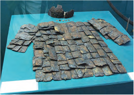

- Quva, Farg‘ona viloyati
+ Shohruxiya, Toshkent viloyati
- Kesh, Qashqadaryo viloyati
- Afrosiyob, Samarqand viloyati

**997. “1397-yilda Amir Temurning xotinlaridan biri Tukal xonim sharafiga qurilgan. Bu bog‘ Samarqanddan 5 kilometr sharqda, Panjikent yo‘lining o‘ng tomonida (qadimiy Hinduvon qishlog‘i o‘rnida) joylashgan. Har tarafi 900 metr uzunlikdagi baland paxsa devor bilan o‘ralgan. Bog‘ning to‘rtta darvozasi markazida hashamatli saroy bo‘lgan. Saroy uch qavatli bo‘lib, har qavatida favvora otilib turgan. Saroy devorlariga Sohibqiron olib borgan urushlardan lavhalar chizib qo‘yilgan”. Yuqorida qaysi bog‘ tasvirlangan?**

- Bog‘i Behisht
- Bog‘i Baland
- Bog‘i Davlatobod
+ Bog‘i Dilkusho

**998. Amir Temur buyrug‘iga ko‘ra, kim biron sahroni obod qilsa yoki biron bog‘ ko‘kartirsa, yoxud biron xarob bo‘lib yotgan yerni obod qilsa birinchi yili undan hech narsa olmaganlar va nechanchi yili xiroj olishni boshlashgan?**

- Ikkinchi yili
+ Uchinchi yili
- To‘rtinchi yili
- Beshinchi yili

**999. Samarqand shahri Amir Temur davrida o‘zining qadimiy o‘rni Afrosiyobdan birmuncha …da butunlay yangitdan qurilgan.**

- shimolroq
- sharqroq
- g‘arbroq
+ janubroq

**1000. Amir Temur davrida qaysi shahar “Qubbat ul-ilm val-adab” unvoniga ega bo‘lgan?**

+ Kesh
- Buxoro
- Termiz
- Qarshi

**1001. Amir Temur davrida Samarqand shahrining nechta darvozasi bo‘lgan?**

- 4 ta
+ 6 ta
- 8 ta
- 10 ta

**1002. Mo‘g‘ullar bosqiniga qadar O‘rta Osiyoda shaharlarning asosiy qismi nima deb atalgan?**

- “Ark”
- “Rabot”
- “Hisor”
+ “Shahriston”

**1003. Amir Temur qaysi shaharda otasining qabri ustiga maqbara, o‘g‘li Jahongirga maqbara bilan masjid qurdirgan?**

- Samarqand
- Termiz
+ Kesh
- Qarshi

**1004. Amir Temur davrida Movarounnahrdagi qayerlarda irrigatsiya – sug‘orish ishlari olib borilgan? 1) Buxoro; 2) Samarqand; 3) Shahrisabz; 4) Farg‘ona.**

- 1, 2, 4
- 1, 3, 4
- 2, 3, 4
+ 1, 2, 3, 4

**1005. Amir Temur qayerdan g‘isht teruvchi me’morlar, binokorlar, metall ustalari, sangtaroshlar hamda zargarlarni olib kelgan?**

- Kichik Osiyodan
+ Hindistondan
- Fors va Ozarbayjondan
- Tabriz va Xorazmdan

**1006. “Bu bog‘ni 1404-yilda Amir Temur Samarqandning janubida qurdirgan. Lolazor qishlog‘i o‘rnida joylashgan. Bu bog‘ to‘rtburchak shaklida bo‘lib, atrofi baland paxsa devor bilan o‘ralgan, har burchagida minora qad ko‘tarib turgan. Markazida boshqa bog‘lardagiga nisbatan kattaroq qasr, uning oldida katta hovuz bo‘lgan”. Yuqorida qaysi bog‘ tasvirlangan?**

- Bog‘i Maydon
+ Bog‘i Nav (Yangi bog‘)
- Bog‘i Chinor
- Bog‘i Shamol

**1007. Amir Temur davrida tantana paytida … faqat …dan mukammal asbob-anjomi-yu qurol-yarog‘i bilan jihozlangan suvoriy jangchini yasab, namoyish qilgan.**

+ qamish to‘quvchi/qamish
- kulol/loy
- zargar/oltin
- duradgor/yog‘och

**1008. Amir Temur davrida hunarmandchilikning qancha turi bo‘lgan?**

- 400 ga yaqin turi
+ 500 ga yaqin turi
- 600 ga yaqin turi
- 700 ga yaqin turi

**1009. Amir Temur, keyinchalik temuriylar davrida shaharlarning asosiy qismi nima deb atalgan?**

- “Ark”
- “Rabot”
+ “Hisor”
- “Shahriston”

**1010. Amir Temur va temuriylar davrida hukmdorlar va ularga yaqin amirlar, yirik davlat amaldorlari ishlatadigan oliy navli qog‘oz turi qanday atalgan?**

- “Xon qog‘oz”
- “Amiriy qog‘oz”
+ “Sultoniy qog‘oz”
- “Xitoyi qog‘oz”

**1011. Amir Temur qayerdan musavvirlar, xattotlar, sozandalar, muarrixlar, me’morlar, qurilish ishlari bo‘yicha hunarmandlar, olimlar va din arboblarini olib kelgan?**

- Kichik Osiyodan
+ Erondan
- Halabdan
- Suriyadan

**1012. Amir Temur qayerdan qurolsozlar, to‘pchi muhandislar, kumushga ishlov beruvchi ustalar, g‘isht teruvchilar, zargarlar, movut ishlab chiqaruvchilar, sangtaroshlar, o‘q-yoy ustalari, arqon eshuvchi ustalarni olib kelgan?**

+ Kichik Osiyodan
- Erondan
- Halabdan
- Suriyadan

**1013. Amir Temur qayerdan sangtaroshlarni olib kelgan?**

- Kichik Osiyodan
- Hindistondan
+ Fors va Ozarbayjondan
- Tabriz va Xorazmdan

**1014. “Olam ravnaqi va ro‘shnoligi yo‘lida hafsalasi nihoyatda baland bo‘lgan (Amir Temur) obodonchilikka yaraydigan biron parcha yerning zoye bo‘lishini ravo ko‘rmasdi”. Ushbu jumlalar muallifi kim?**

- G‘iyosiddin Ali
- Nizomiddin Shomiy
+ Sharafuddin Ali Yazdiy
- Ibn Arabshoh

**1015. “1378-yilda Sohibqiron Samarqandning g‘arbida suyukli xotini Xayrunnisoga atab qurdirgan. Ayrim yozma manbalarda “Bog‘i jannat” nomi bilan ataladi. Bog‘ o‘rtasidagi atrofi xandaq bilan muhofaza etilgan sun’iy tepalik ustida Tabriz oq marmaridan qurilgan hashamatli saroy bo‘lgan. Saroyga bir necha ko‘tarma ko‘priklar orqali kirilgan. Bu bog‘ning bir tarafida hayvonot bog‘i bo‘lib, turli xil hayvonlar saqlangan”. Yuqorida qaysi bog‘ tasvirlangan?**

+ Bog‘i Behisht
- Bog‘i Baland
- Bog‘i Davlatobod
- Bog‘i Dilkusho

**1016. Amir Temur quyidagi qaysi shaharda madrasa qurdirgan?**

- Tabriz
- Sheroz
+ Bag‘dod
- Isfahon

**1017. Qashqadaryo viloyatidagi Eski Anhor kanalini Amir Temur kimning ustidan qozongan g‘alabasi sharafiga qurdirgan?**

+ Sulton Boyazid
- Sulton Mahmudxon
- To‘xtamishxon
- Qora Yusuf

**1018. “Temur qanday hunar yoki kasb bo‘lmasin, agar unda biron fazilat va foyda bo‘lsa, shu kasb egalariga g‘oyatda mehr qo‘yar edi. U munajjim-u tabiblarni (o‘ziga) yaqin tutib, ularning gaplariga e’tibor qilar va so‘zlarini tinglardi...”. Ushbu jumlalar muallifi kim?**

+ Ibn Arabshoh
- Sharafuddin Ali Yazdiy
- Mirxond
- Zahiriddin Muhammad Bobur

**1019. Bibixonim jome masjidi, Ko‘ksaroy va Bo‘stonsaroylar qaysi shaharda joylashgan?**

- Termiz
+ Samarqand
- Kesh
- Qarshi

**1020. Amir Temur qayerdan imoratsozlar va naqqoshlarni olib kelgan?**

- Kichik Osiyodan
- Hindistondan
- Fors va Ozarbayjondan
+ Tabriz va Xorazmdan

**1021. Amir Temur quyidagi qaysi shaharda saroy qurdirgan?**

- Tabriz
+ Sheroz
- Bag‘dod
- Isfahon

**1022. “Temurbekdin burun Temurbekdek ulug‘ podshoh Samarqandni poytaxt qilg‘on emasdur... Chun Keshning qobiliyati shahar bo‘lmoqqa Samarqandcha emas edi, oxir poytaxt uchun Temurbek Samarqandni ixtiyor qildi”. Ushbu jumlalar kimning qaysi asarida keltirilgan?**

- Ibn Arabshohning “Amir Temur tarixi” asarida
- Sharafuddin Ali Yazdiyning “Zafarnoma” asarida
- Mirxondning “Soflik bog‘i” asarida
+ Zahiriddin Muhammad Boburning “Boburnoma” asarida

**1023. Samarqanddagi Amir Temur bog‘lari tuzilishiga ko‘ra necha xil bo‘lgan?**

+ Ikki xil
- Uch xil
- To‘rt xil
- Besh xil

**1024. Amir Temur qayerdan paxta yigiruvchilarni olib kelgan?**

- Kichik Osiyodan
- Erondan
+ Halabdan
- Suriyadan

## Temuriylar davrida Movarounnahr va Xuroson.

**1025. Shohrux davlati qayerlarda hukmronlik qilayotgan Usmoniylar davlati bilan o‘zaro munosabatlar o‘rnatgan?**

- Kichik Osiyo va Misrda
- Misr va Suriyada
- Suriya va Old Osiyoda
+ Old va Kichik Osiyoda

**1026. Xalil Sulton Mirzo kimning o‘g‘li edi?**

- Jahongirning
+ Mironshohning
- Umarshayxning
- Shohruxning

**1027. Qaysi yillarda Xalil Sultonning Shohrux, Pirmuhammad qo‘shinlari bilan Movarounnahr taxti uchun bir necha bor harbiy to‘qnashuvi sodir bo‘lgan?**

+ 1405–1406-yillarda
- 1406–1407-yillarda
- 1407–1408-yillarda
- 1408–1409-yillarda

**1028. Shohrux Amir Temurning nechani o‘g‘li edi?**

- Birinchi o‘g‘li
- Ikkinchi o‘g‘li
- Uchinchi o‘g‘li
+ To‘rtinchi o‘g‘li

**1029. Shohrux qachon Xitoyga elchilar jo‘natgan?**

+ 1419-yilda
- 1420-yilda
- 1421-yilda
- 1422-yilda

**1030. Amir Temurning qizidan tug‘ilgan nevarasi Sulton Husayn Mirzo qayerlarda o‘z hokimiyatini o‘rnatmoq niyatida Xalil Sultonga qarshi bosh ko‘targan?**

- Amudaryoning o‘ng sohilidagi viloyatlarda
+ Amudaryoning chap sohilidagi viloyatlarda
- Sirdaryoning o‘ng sohilidagi viloyatlarda
- Sirdaryoning chap sohilidagi viloyatlarda

**1031. Amir Temurning o‘g‘li Shohrux necha yil hukmronlik qilgan?**

- Deyarli 20 yil
- Deyarli 30 yil
+ Deyarli 40 yil
- Deyarli 50 yil

**1032. Shohruxning a’yoni, diplomat va tarixchi Abdurazzoq Samarqandiy qaysi yillarda elchi qilib yuborilgan?**

- 1439–1442-yillarda
- 1440–1443-yillarda
+ 1441–1444-yillarda
- 1442–1445-yillarda

**1033. Xalil Sulton Mirzoga qarshi birinchi bo‘lib bosh ko‘targan amir Xudoydot bilan Shayx Nuriddin qayerlarning hokimlari edilar?**

- Farg‘ona va Xorazm
- Xorazm va Sayram
- Sayram va Turkiston
+ Turkiston va Farg‘ona

**1034. Rasman Shohrux davlatining poytaxti qaysi shahar bo‘lgan?**

- Samarqand
- Qarshi
+ Hirot
- Balx

**1035. Shohrux davlati qayerlarda hukmronlik qilayotgan Mamluklar davlati bilan o‘zaro munosabatlar o‘rnatgan?**

- Kichik Osiyo va Misrda
+ Misr va Suriyada
- Suriya va Old Osiyoda
- Old va Kichik Osiyoda

**1036. Shohrux qaysi yillarda Makkaga Ka’ba ustiga yopinchiq – ka’bapo‘sh jo‘natgan?**

- 1443–1444-yillarda
+ 1444–1445-yillarda
- 1445–1446-yillarda
- 1446–1447-yillarda

**1037. Amudaryodan shimolda Movarounnahr va Turkiston hududidagi Ulug‘bek boshchiligidagi davlatning poytaxti qaysi shahar edi?**

+ Samarqand
- Qarshi
- Kesh
- Termiz

**1038. Shohruxning a’yoni, diplomat va tarixchi Abdurazzoq Samarqandiy qayerga elchi qilib yuborilgan?**

- Xitoyga
+ Hindistonga
- Turkiyaga
- Misrga

**1039. Shohruxning a’yoni, diplomat va tarixchi Abdurazzoq Samarqandiy Hindistonning qaysi qismidagi bir qator davlat, shaharlarda bo‘lgan va barcha safar xotiralarini o‘z asarida yozib qoldirgan?**

- Markaziy va Shimoliy Hindistondagi
+ Markaziy va Janubiy Hindistondagi
- Markaziy va G‘arbiy Hindistondagi
- Markaziy va Sharqiy Hindistondagi

**1040. Qachon qoraqo‘yunli turkmanlar bilan bo‘lgan jangda Mironshoh Qora Yusuf tomonidan o‘ldirilgan?**

- 1405-yil 18-martda
- 1406-yil 19-yanvarda
- 1407-yil 22-fevralda
+ 1408-yil 22-aprelda

**1041. Amudaryodan janubda joylashgan Shohrux boshchiligidagi davlatning poytaxti qaysi shahar edi?**

- Kobul
+ Hirot
- Balx
- Marv

**1042. Shohrux qaysi yilga qadar hozirgi O‘rta Osiyo, Afg‘oniston, Pokiston, Shimoliy Hindiston, Eron, Kavkazdan iborat katta hududda boshqaruv tizginini bo‘shashtirmagan?**

- 1444-yilga qadar
- 1445-yilga qadar
- 1446-yilga qadar
+ 1447-yilga qadar

**1043. Amir Temur qachon vafot etgan?**

+ 1405-yil 18-fevralda
- 1406-yil 18-martda
- 1407-yil 18-aprelda
- 1408-yil 18-mayda

**1044. Amir Temur o‘ziga voris va taxt valiahdi etib qaysi nabirasini vasiyat qilib qoldirgan?**

- Xalil Sultonni
- Abu Saidni
- Sulton Muhammadni
+ Pirmuhammad Jahongirni

**1045. Amir Temur davlatida G‘azna, Kobul va Shimoliy Hind mulklarining hokimi kim edi?**

- Xalil Sulton
- Abu Said
- Sulton Muhammad
+ Pirmuhammad Jahongir

**1046. Amir Temurning o‘g‘li Shohruxning siyosiy faoliyati qayerga hokim etib tayinlanishidan boshlangan?**

+ Xuroson
- Iroq
- Ozarbayjon
- Eron

**1047. 1405-yilning 18-mart kuni kim o‘zboshimchalik bilan Samarqandni egallab, o‘zini Movarounnahrning hukmdori deb e’lon qilgan?**

+ Xalil Sulton
- Abu Said
- Sulton Muhammad
- Pirmuhammad Jahongir

**1048. Shohrux Xitoyga jo‘natgan elchilar qachon qaytib kelgan?**

- 1419-yilda
- 1420-yilda
- 1421-yilda
+ 1422-yilda

**1049. Amir Temurning o‘g‘li Shohrux qachon tavallud topgan edi?**

- 1378-yilda
- 1374-yilda
+ 1377-yilda
- 1371-yilda

**1050. Xuroson hokimi Shohrux o‘ziga qarashli bo‘lgan … va …da, so‘ng uning qo‘liga o‘tgan … va …da hokimiyatini mustahkamlagan.**

- Kirmon/Mozandaron/Mashhad/Seyiston
- Seyiston/Kirmon/Mozandaron/Mashhad
- Mashhad/Seyiston/Kirmon/Mozandaron
+ Mozandaron/Mashhad/Seyiston/Kirmon

**1051. Kimning hukmronligi davrida Amir Temur saltanatining asosiy qismi uning qo‘li ostida saqlanib qolsa-da, ammo bu ulkan mamlakat amalda ikki davlatga bo‘lingan edi?**

- Jahongir
- Mironshoh
- Umarshayx
+ Shohrux

**1052. Shohrux davlati Hindistondagi qaysi hududlar bilan o‘zaro munosabatlar o‘rnatgan? 1) Dehli sultonligi; 2) Kalikut; 3) Vijayanagar; 4) Bengal; 5) Janpur.**

+ 1, 2, 3, 4, 5
- 1, 2, 3, 4
- 2, 3, 5
- 3, 4

**1053. 1409-yil bahorida kim Xalil Sultonni Samarqand yaqinidagi Sheroz qishlog‘ida mag‘lubiyatga uchratib, o‘zini asirlikka olgan?**

- Shohrux
- Pirmuhammad
+ Amir Xudoydot
- Shayx Nuriddin

**1054. Amir Temur taxti valiahdi hisoblangan Pirmuhammad qachon o‘z vaziri Pirali Toz uyushtirgan suiqasd natijasida o‘ldirilgan?**

- 1405-yil 18-martda
- 1406-yil 19-yanvarda 
+ 1407-yil 22-fevralda
- 1408-yil 22-aprelda

**1055. Shohrux kim boshchiligida Makkaga Ka’ba ustiga yopinchiq – ka’bapo‘sh jo‘natgan?**

+ Shayx Nuriddin Murshidiy
- Shayx Sayyid Kulol
- Shayx Zayniddin Toyobodiy
- Shayx Ali Romitaniy

**1056. Amir Temur barpo etgan saltanat o‘z ichiga jami nechta o‘lka va viloyatni olgan edi?**

- 17 ta
+ 27 ta
- 37 ta
- 47 ta

**1057. Shohrux davlati va Xitoy o‘rtasida 1412-yildan 1430-yilga qadar jami necha marta elchilik almashuvi bo‘lgan?**

- Ikki marta
- Uch marta
- To‘rt marta
+ Besh marta

**1058. Qayerlar uchun qoraqo‘yunli turkmanlar bilan bo‘lgan jangda Mironshoh Qora Yusuf tomonidan o‘ldirilgan?**

- Kurdiston va Ozarbayjon
+ Ozarbayjon va Iroq
- Iroq va Suriya
- Suriya va Kurdiston

**1059. Amir Temurning o‘g‘li Shohruxning siyosiy faoliyati qaysi yilda boshlangan?**

- 1395-yilda
+ 1397-yilda
- 1399-yilda
- 1392-yilda

**1060. Shohrux tomonidan jangda mag‘lub etilgan Amir Xudoydot … .**

+ mamlakatdan qochib ketgan
- jangda halok bo‘lgan
- qatl etilgan
- zindonga tashlangan

**1061. Shohrux Xalil Sultonni qo‘lga olgan kimning qo‘shinlarini yengib, Xalil Sultonni asirlikdan ozod qilgan?**

- Mironshoh
- Pirmuhammad
+ Amir Xudoydot
- Shayx Nuriddin

**1062. Amir Temur taxtining qonuniy valiahdi Pirmuhammad Amudaryodan kechib o‘tib, Xalil Sultonga qarshi qaysi shahar tomon askar tortgan?**

- Samarqand
+ Nasaf
- Buxoro
- Termiz

**1063. Amir Temur qayerda vafot etgan?**

- Samarqandda
- Keshda
+ O‘trorda
- Qarshida

## Mirzo Ulug‘bek.

**1064. Mirzo Ulug‘bek qaysi me’moriy majmualarni qurilishini oxiriga yetkazgan?**

- Xoja Ahror Vali, Go‘ri Amir
+ Go‘ri Amir, Shohizinda
- Shohizinda, Bibixonim
- Bibixonim, Xoja Ahror Vali

**1065. Qayerda bo‘lgan jangda Mirzo Ulug‘bek va Abdullatifning 90 ming kishilik birlashgan qo‘shini Alouddavla qo‘shinini tor-mor qilgan va Hirot qaytarib olingan?**

- Hirot yaqinida
- Tajan yaqinida
+ Tarnob yaqinida
- Murg‘ob yaqinida

**1066. Mavlono Havofiyning ilmini Mirzo Ulug‘bek sinovdan o‘tkazgach, u yana kimning suhbatidan o‘tkaziladi?**

- Ali Qushchi
- Alouddin ibn Muhammad
- G‘iyosiddin Jamshid
+ Qozizoda Rumiy

**1067. Shohrux Mirzo qachon vafot etgan?**

- 1446-yil 12-aprelda
+ 1447-yil 12-martda
- 1448-yil 12-mayda
- 1449-yil 12-iyunda

**1068. Mirzo Ulug‘bek qaysi yilda haj safariga ketayotganida fojiali halok bo‘lgan?**

- 1446-yilda
- 1447-yilda
- 1448-yilda
+ 1449-yilda

**1069. Mirzo Ulug‘bek davrida Registon maydonida Ulug‘bek madrasasidan tashqari xonaqoh, karvonsaroy va o‘ymakor yog‘ochlar bilan bezalgan qaysi masjid barpo etilgan?**

- Ko‘k gumbaz masjidi
- Qutbuddin Sadr masjidi
- Ko‘kaldosh masjidi
+ Muqatta masjidi

**1070. Mirzo Ulug‘bekning xos navkarlaridan bo‘lgan kim tomonidan Abdullatif o‘ldirilgan?**

- Shamsiddin Muhammad Miskin
- Mironshoh Qavchin
- Shayx Nuriddin
+ Bobo Husayn bahodir

**1071. Amir Temur davrida joriy qilingan tamg‘a solig‘ini kim qayta tiklagan?**

- Sulton Abu Said
+ Mirzo Ulug‘bek
- Abulqosim Bobur
- Sulton Mahmud

**1072. 1449-yilda Abdullatif Amudaryodan kechib o‘tib, qayerlarni osongina zabt etgan?**

- Xuzor, Qarshi, Buxoro
- Qarshi, Buxoro, Termiz
+ Termiz, Shahrisabz, Xuzor
- Shahrisabz, Xuzor, Qarshi

**1073. Mirzo Ulug‘bek qachon G‘ijduvonda madrasa barpo etgan?**

+ 1433-yilda
- 1420-yilda
- 1417-yilda
- 1441-yilda

**1074. Ulug‘bek rasadxonasi qaysi anhor bo‘yidagi Ko‘hak tepaligida bunyod etilgan?**

+ Obirahmat anhori
- Bo‘zsuv anhori
- Darg‘om anhori
- Bulung‘ur anhori

**1075. Kimning davrida Registon maydoni shakllana boshlagan?**

- Amir Temur
- Abu Said
- Shohrux Mirzo
+ Mirzo Ulug‘bek

**1076. Mirzo Ulug‘bek Samarqandda barpo etgan madrasalarida necha marta dars bergan?**

+ Haftada bir marta
- Oyda bir marta
- Uch oyda bir marta
- Yilda bir marta

**1077. Mirzo Ulug‘bek necha yoshida haj safariga ketayotganida fojiali halok bo‘lgan?**

+ 55 yoshida
- 57 yoshida
- 58 yoshida
- 61 yoshida

**1078. Shohrux Mirzo kimni o‘rniga voris qilib tayinlagan?**

- Mirzo Ulug‘bekni
- Boysung‘urni
- Alouddavlani
+ Voris belgilashga ulgurmagan

**1079. Qachon Alouddavla Ulug‘bekning katta o‘g‘li Abdullatifning qo‘shinini tor-mor qilib, uni asirga olgan?**

+ 1447-yilning bahorida
- 1448-yilning bahorida
- 1449-yilning bahorida
- 1450-yilning bahorida

**1080. Abulqosim Bobur muvaffaqiyatsiz Samarqand qamalidan so‘ng kim bilan bitim tuzib, Hirotga qaytgan?**

+ Sulton Abu Said
- Sulton Mahmud
- Sulton Ahmad
- Sulton Husayn

**1081. Mirzo Ulug‘bek qaysi shaharda rasadxona bunyod etgan?**

- Buxoroda
+ Samarqandda
- Shahrisabzda
- G‘ijduvonda

**1082. Qaysi yilda Abulqosim Bobur Hirotni egallagan va temuriylarning Xurosondagi hukmdori bo‘lgan?**

- 1447-yil yanvarda
- 1448-yil dekabrda
+ 1449-yil fevralda
- 1450-yil noyabrda

**1083. Mirzo Ulug‘bek qayerdagi jangda mo‘g‘ullar ustidan g‘alaba qozongan va mamlakat sharqiy chegaralarini mustahkamlagan?**

+ Issiqko‘l yaqinidagi
- Taroz yaqinidagi
- Ohangaron yaqinidagi
- Chinoz yaqinidagi

**1084. Qaysi yilda Istanbulga ingliz olimi va sharqshunosi, Oksford universitetining professori Jon Grivs kelgan va Ulug‘bek “Zij” ining bir nusxasini Angliyaga olib ketgan?**

+ 1638-yilda
- 1648-yilda
- 1650-yilda
- 1653-yilda

**1085. Ulug‘bek madrasasining birinchi mudarrisi kim bo‘lgan?**

- Ali Qushchi
+ Muhammad Havofiy
- G‘iyosiddin Jamshid
- Qozizoda Rumiy

**1086. Abdullatif shahar qozisi bo‘lgan kimning qarshiligiga qaramasdan otasi Mirzo Ulug‘bekni haj safariga yuborishga qaror qilgan?**

+ Shamsiddin Muhammad Miskin
- Mironshoh Qavchin
- Shayx Nuriddin
- Bobo Husayn bahodir

**1087. Ulug‘bek rasadxonasi qaysi yillarda qurilgan?**

- 1425–1426-yillarda
- 1426–1427-yillarda
- 1427–1428-yillarda
+ 1428–1429-yillarda

**1088. Mirzo Ulug‘bek qaysi shaharda tug‘ilgan?**

- Hamadon
+ Sultoniya
- Darband
- Baylakon

**1089. Kim orqali Mirzo Ulug‘bekning “Zij” asari Turkiyada tarqalgan va u orqali Yevropa mamlakatlariga yetib borgan?**

- G‘iyosiddin Jamshid
- Muhammad Havofiy
+ Ali Qushchi
- Qozizoda Rumiy

**1090. Ulug‘bek rasadxonasida samoni kuzatish va o‘rganish uchun kimning yordamida astronomik o‘lchov asbobi – ulkan sekstant o‘rnatilgan?**

- Ali Qushchi
- Muhammad Havofiy
+ G‘iyosiddin Jamshid
- Qozizoda Rumiy

**1091. Ulug‘bek rasadxonasida faoliyat yuritgan qaysi olimning asl ismi Alouddin ibn Muhammad bo‘lgan?**

- G‘iyosiddin Jamshid
- Muhammad Havofiy
+ Ali Qushchi
- Qozizoda Rumiy

**1092. XV asrda “sudxi faxriy” deb nimaga aytilgan?**

- Astrolyabiya
- Kvadrant
+ Sekstant
- Teleskop

**1093. Mirzo Ulug‘bek qaysi yilda 1018 yulduz to‘plamini “Ziji jadidi Ko‘ragoniy” asarida tartiblab chiqqan?**

- 1431-yilda
+ 1437-yilda
- 1434-yilda
- 1439-yilda

**1094. Qayerda Abdullatif va Mirzo Ulug‘bek qo‘shini o‘rtasida jang bo‘lgan va unda Ulug‘bek yengilgan?**

+ Damashq qishlog‘i yaqinida
- Bag‘dod qishlog‘i yaqinida
- Qohira qishlog‘i yaqinida
- Isfahon qishlog‘i yaqinida

**1095. Mirzo Ulug‘bek mo‘g‘ullar ustidan g‘alaba qozongan jangda qo‘lga kiritgan ikki bo‘lak nefrit toshidan qaysi maqbara uchun qabrtosh yasattirgan?**

- Bibixonim maqbarasi
- Xoja Ahror Vali maqbarasi
+ Amir Temur maqbarasi
- Ahmad Yassaviy maqbarasi

**1096. Mavlono Havofiyning Ulug‘bek madrasasiga birinchi mudarris qilib tayinlanishi to‘g‘risida kimning qaysi asarida yozib qoldirgan?**

+ Zayniddin Vosifiyning “Badoye ul-vaqoye” asarida
- Rashiduddin Fazlullohning “Jome at-tavorix” asarida
- Ibn Arabshohning “Fath al-buldon va ma’rifat al-ajsan” asarida
- Abu Usmon Minhojiddin ibn Sirojiddinning “Tabaqoti Nosiriy” asarida

**1097. Yan Geveliyning “Astronomiya darakchisi” kitobida astronomiya ma’budasi Uraniyaning o‘ng tomonida kimlar tasvirlangan? 1) Mirzo Ulug‘bek; 2) Vilgelm IV (nemis olimi); 3) Ptolemey; 4) Yan Geveliy; 5) Tixo Brage (daniyalik astronom); 6) Richchi Ole (italiyalik olim).**

+ 1, 2, 4
- 4, 5, 6
- 2, 4, 5
- 3, 5, 6

**1098. Mirzo Ulug‘bek Samarqandda nechta madrasa barpo etgan?**

+ Ikkita madrasa
- Uchta madrasa
- To‘rtta madrasa
- Beshta madrasa

**1099. Abdullatifdan yengilgan Mirzo Ulug‘bek Samarqanddan keyin yana qaysi shaharga kira olmagan?**

- Termiz
- Nasaf
+ Shohruxiya
- Sultoniya

**1100. Qachon Abdullatif va Mirzo Ulug‘bek qo‘shini o‘rtasida jang bo‘lgan va unda Ulug‘bek yengilgan?**

- 1448-yil sentyabrda
+ 1449-yil oktyabrda
- 1450-yil noyabrda
- 1451-yil dekabrda

**1101. Qaysi yilda ingliz olimi Jon Grivs Ulug‘bek “Zij” idagi 98 yulduzning jadvalini chop etgan?**

- 1638-yilda
+ 1648-yilda
- 1650-yilda
- 1653-yilda

**1102. Mirzo Ulug‘bekning o‘g‘li Abdullatif kimning qo‘shini Hirotga yaqinlashib kelayotganidan xabar topib, poytaxtni tashlab, Movarounnahr tomon qochgan?**

- Sulton Husayn Mirzo
- Boysung‘ur
+ Abulqosim Bobur
- Alouddavla

**1103. “Temurxon naslidin Sulton Ulug‘bek – Ki, olam ko‘rmadi sulton aningdek. Aning abnoyi jinsi bo‘ldi barbod – Ki, davr ahli biridin aylamas yod”. Ushbu misralar Alisher Navoiyning qaysi asaridan olingan?**

- “Majolis un-nafois”
- “Nasoyim ul-muhabbat”
- “Mezon ul-avzon”
+ “Xamsa”

**1104. Ulug‘bek rasadxonasi qoshida nechta jilddan iborat kitob saqlanadigan boy kutubxona bo‘lgan?**

+ 15 000 jilddan iborat
- 20 000 jilddan iborat
- 25 000 jilddan iborat
- 30 000 jilddan iborat

**1105. Mirzo Ulug‘bekning onasining ismi kim bo‘lgan?**

- Qutlug‘ Nigorxonim
- Robiya Sulton begim
+ Gavharshod begim
- Saroymulkxonim

**1106. Qaysi yilda Shohrux Mirzo Ulug‘bekni Movarounnahr va Turkistonga hokim qilib tayinlagan?**

- 1406-yilda
- 1407-yilda
- 1408-yilda
+ 1409-yilda

**1107. “Zamonasining Aflotuni” deb nom olgan olim kim?**

- G‘iyosiddin Koshiy
+ Qozizoda Rumiy
- Muhammad Havofiy
- Ali Qushchi

**1108. Abdullatifdan yengilgan Mirzo Ulug‘bekni Samarqandga kiritmagan shahar amiri kim edi?**

- Shamsiddin Muhammad Miskin
+ Mironshoh Qavchin
- Shayx Nuriddin
- Bobo Husayn bahodir

**1109. Yan Geveliyning “Astronomiya darakchisi” kitobida astronomiya ma’budasi Uraniyaning chap tomonida kimlar tasvirlangan? 1) Mirzo Ulug‘bek; 2) Vilgelm IV (nemis olimi); 3) Ptolemey; 4) Yan Geveliy; 5) Tixo Brage (daniyalik astronom); 6) Richchi Ole (italiyalik olim).**

- 1, 2, 4
- 4, 5, 6
- 2, 4, 5
+ 3, 5, 6

**1110. Ulug‘bek rasadxonasida faoliyat yuritgan, Ulug‘bekning shogirdi, “O‘z davrining Ptolemeyi” nomini olgan olim kim?**

- G‘iyosiddin Jamshid
- Muhammad Havofiy
+ Ali Qushchi
- Qozizoda Rumiy

**1111. Abulqosim Bobur necha kunlik qamaldan so‘ng Samarqandni tashlab, Hirotga qaytgan?**

- O‘ttiz kunlik
+ Qirq kunlik
- Ellik kunlik
- Oltmish kunlik

**1112. Mirzo Ulug‘bek Samarqandda balandligi necha metr bo‘lgan quyosh soati o‘rnatgan?**

- 20 metr
- 30 metr
- 40 metr
+ 50 metr

**1113. Mirzo Ulug‘bekning otasi kim bo‘lgan?**

- Jahongir Mirzo
- Umarshayx Mirzo
- Mironshoh Mirzo
+ Shohrux Mirzo

**1114. Mirzo Ulug‘bek davrida Shahrisabzda qaysi masjid barpo etilgan?**

+ Ko‘k gumbaz masjidi
- Qutbuddin Sadr masjidi
- Ko‘kaldosh masjidi
- Muqatta masjidi

**1115. Mirzo Ulug‘bek (Muhammad Tarag‘ay) qachon halok bo‘lgan?**

- 1446-yil 27-sentyabrda
- 1447-yil 27-dekabrda
- 1448-yil 27-noyabrda
+ 1449-yil 27-oktyabrda

**1116. Mirzo Ulug‘bek davrida qayerdagi Gumbazi Sayidon yodgorligi qayta tiklangan?**

- Buxorodagi
- Samarqanddagi
+ Shahrisabzdagi
- G‘ijduvondagi

**1117. Mirzo Ulug‘bek davrida qayerda qurilgan madrasa peshtoqiga “Ilm olmakka intilmoq har bir muslim va muslima uchun ham farz, ham qarz” degan ibora shior sifatida o‘yib yozdirib qo‘yilgan?**

+ Buxoroda
- Samarqandda
- G‘ijduvonda
- Shahrisabzda

**1118. Abulqosim Boburning yashagan yillarini toping.**

- 1419–1454-yillar
- 1420–1455-yillar
- 1421–1456-yillar
+ 1422–1457-yillar

**1119. Abulqosim Bobur va Sulton Abu Said o‘rtasidagi bitimga ko‘ra, qaysi daryo ilgarigidek ikkala davlat o‘rtasidagi chegara bo‘lib qolgan?**

+ Amudaryo
- Zarafshon
- Murg‘ob
- Tajan

**1120. Qaysi yilda ingliz olimi Jon Grivs Ulug‘bek “Zij” ining birinchi maqolasini lotincha tarjimada nashr etgan?**

- 1638-yilda
- 1648-yilda
+ 1650-yilda
- 1653-yilda

**1121. Mirzo Ulug‘bek Movarounnahr bilan Turkistonning hokimi deb e’lon qilinsa-da, aslida uning hokimiyati chegaralari dastlab qaysi viloyatlar bilan cheklangan?**

- Farg‘ona, Turkiston, Samarqand
+ Samarqand, Buxoro, Nasaf
- Buxoro, Nasaf, Farg‘ona
- Nasaf, Farg‘ona, Turkiston

**1122. Alisher Navoiy qaysi asarida Ulug‘bekning she’rlaridan namunalar keltirib o‘tgan?**

- “Mahbub ul-qulub”
- “Mezon ul-avzon”
+ “Majolis un-nafois”
- “Munojot”

**1123. Mirzo Ulug‘bekning matematikaga oid asarini toping.**

- “Ziji jadidi Ko‘ragoniy”
+ “Bir daraja sinusini aniqlash haqida risola”
- “Risolayi Ulug‘bek”
- “Tarixi arba’ ulus”

**1124. Mirzo Ulug‘bek qaysi yilda otasining rizosi bilan Mo‘g‘uliston ustiga yurish boshlagan?**

- 1434-yilda
+ 1425-yilda
- 1429-yilda
- 1432-yilda

**1125. Abulqosim Bobur qayerda vafot etgan?**

- Hamadon
+ Mashhad
- Hirot
- Tabriz

**1126. Mirzo Ulug‘bek sa’y-harakatlari tufayli zamonasining qancha olimlari Samarqandga yig‘ilganlar?**

+ 100 dan oshiq olimlar
- 200 dan oshiq olimlar
- 300 dan oshiq olimlar
- 400 dan oshiq olimlar

**1127. Ulug‘bek rasadxonasida qaysi mahalliy ustalar qo‘li bilan ko‘plab zaruriy astronomik o‘lchov asboblari yasalgan va o‘rnatilgan? 1) Iso Usturlobiy; 2) Alouddin ibn Muhammad; 3) Abu Mahmud Xo‘jandiy; 4) Usta Ibrohim.**

- 1, 2, 3
+ 1, 3, 4
- 1, 2, 4
- 2, 3, 4

**1128. “Al-Majistiy” asari muallifi kim?**

+ Klavdiy Ptolemey
- Galen
- Aristotel
- Diofant Iskandariyalik

**1129. Abulqosim Bobur qayerda tavallud topgan?**

- Hamadon
- Mashhad
+ Hirot
- Tabriz

**1130. Sultoniya shahri hozirda Eronning qaysi viloyati hududiga to‘g‘ri keladi?**

- G‘ilon viloyati
- Ardabil viloyati
+ Zanjan viloyati
- Yazd viloyati

**1131. Mirzo Ulug‘bekning yashagan yillarini toping.**

- 1391–1446-yillar
- 1392–1447-yillar
- 1393–1448-yillar
+ 1394–1449-yillar

**1132. Mirzo Ulug‘bekning astronomiyaga oid asarini toping.**

+ “Ziji jadidi Ko‘ragoniy”
- “Bir daraja sinusini aniqlash haqida risola”
- “Risolayi Ulug‘bek”
- “Tarixi arba’ ulus”

**1133. Ali Qushchi qachon Istanbulga borib, rasadxona qurgan?**

+ 1473-yilda
- 1477-yilda
- 1481-yilda
- 1484-yilda

**1134. Yan Geveliyning “Astronomiya darakchisi” kitobi qaysi asrga oid?**

- XVI asrga
+ XVII asrga
- XVIII asrga
- XIX asrga

**1135. Shohrux Mirzo qayerda vafot etgan?**

+ Ray viloyatida
- Mozandaron viloyatida
- Seyiston viloyatida
- Kirmon viloyatida

**1136. Mirzo Ulug‘bek davrida qaysi shaharlar ilm-fan markazlariga aylangan?**

+ Samarqand, Buxoro, Kesh
- Buxoro, Kesh, Hirot
- Kesh, Hirot, Balx
- Hirot, Balx, Samarqand

**1137. Mirzo Ulug‘bek katta o‘g‘li Abdullatifni Alouddavlaning qo‘lidan asirlikdan ozod qilish uchun qayerga bo‘lgan da’vosidan voz kechgan?**

- Taroz va Turkistonga
- Samarqand va Movarounnahrga
+ Hirot va Xurosonga
- Sheroz va Eronga

**1138. Mirzo Ulug‘bekning qaysi asarining yagona nusxasi Hindistonda, Aligarx universiteti kutubxonasida saqlanadi?**

- “Ziji jadidi Ko‘ragoniy”
- “Bir daraja sinusini aniqlash haqida risola”
+ “Risolayi Ulug‘bek”
- “Tarixi arba’ ulus”

**1139. Ulug‘bek madrasasida Batlimusning “Al-Majistiy” asari bo‘yicha o‘tilgan darsining asl mohiyatini faqat kimlar tushungan?**

- Ali Qushchi va G‘iyosiddin Jamshid
- G‘iyosiddin Jamshid va Qozizoda Rumiy
+ Qozizoda Rumiy va Mirzo Ulug‘bek
- Mirzo Ulug‘bek va Ali Qushchi

**1140. “Sultoni azim, oliy himmatli xoqon, din-diyonat homiysi, hanafiya mazhabining posboni, asilzoda sulton, ibni sulton, amirul mo‘minin Ulug‘bek Ko‘ragon” yozuvlari bitilgan, Ulug‘bek farmoniga binoan, XV asr o‘rtalarida marmartoshdan yasalgan lavh Amir Temur qurdirgan qaysi masjid hovlisida joylashgan?**

- Muqatta masjidi
- Ko‘kaldosh masjidi
+ Bibixonim masjidi
- Ko‘k gumbaz masjidi

**1141. Mirzo Ulug‘bekning o‘g‘li Abdullatif Hirotda qancha muddat hokimlik qilgan?**

- O‘n kun
+ O‘n besh kun
- Yigirma kun
- Yigirma besh kun

**1142. Kim toj-u taxtni egallasa, tamg‘a solig‘ini bekor qilishi evaziga Mirzo Ulug‘bekka qarshi fitna uyushtirgan?**

- Abu Said
- Abulqosim Bobur
- Abdulaziz
+ Abdullatif

**1143. Mirzo Ulug‘bek yer yuzining o‘rtalik kengligini necha daraja deb belgilagan?**

- 13,52 daraja
+ 23,52 daraja
- 33,52 daraja
- 43,52 daraja

**1144. Ulug‘bek madrasasida kim Batlimusning “Al-Majistiy” asari bo‘yicha ma’ruza o‘tgan?**

- Ali Qushchi
+ Muhammad Havofiy
- G‘iyosiddin Jamshid
- Qozizoda Rumiy

**1145. Shohrux Mirzoning vafotidan so‘ng taxtni kim egallagan?**

- Mirzo Ulug‘bek
- Boysung‘ur
+ Alouddavla
- Abdullatif

**1146. Mirzo Ulug‘bek Movarounnahr bilan Turkistonning hokimi deb e’lon qilinganda necha yoshda edi?**

+ O‘n besh yoshda
- O‘n olti yoshda
- O‘n yetti yoshda
- O‘n sakkiz yoshda

**1147. Mirzo Ulug‘bekning tarixga oid asarini toping.**

- “Ziji jadidi Ko‘ragoniy”
- “Bir daraja sinusini aniqlash haqida risola”
- “Risolayi Ulug‘bek”
+ “Tarixi arba’ ulus”

**1148. Mo‘g‘ulistonda bo‘lgan urushda qozongan g‘alabaning nishoni tarzida … yaqinidagi Ilono‘tdi darasi ichida Mirzo Ulug‘bek qoyatoshga yozdirgan o‘ziga xos “zafarnoma” hozirgi kungacha saqlanadi.**

- Termiz
- Qarshi
+ Jizzax
- Nasaf

**1149. Kimning yozishicha, Ulug‘bek rasadxonasi uch qism (oshiyona) li bo‘lgan?**

- Ali Yazdiy
- Xondamir
- Mirxond
+ Bobur

**1150. Dunyodagi ikkinchi globusni qayerning astronomlari yasashgan?**

- Bag‘dod
- Damashq
- Qohira
+ Samarqand

**1151. Qaysi sanada Ulug‘bek madrasasida Mirzo Ulug‘bek rahbarligida 90 olim va talaba huzurida imtihon darsi o‘tilgan?**

- 1419-yilning 21-oktyabrida
- 1419-yilning 21-dekabrida
+ 1420-yilning 21-sentyabrida
- 1420-yilning 21-noyabrida

**1152. Mirzo Ulug‘bekning o‘g‘li Abdullatif qachon o‘ldirilgan?**

- 1450-yil mart oyida
+ 1450-yil may oyida
- 1451-yil mart oyida
- 1451-yil may oyida

**1153. Havof viloyati hozirgi qaysi davlatdagi tarixiy hudud hisoblanadi?**

+ Erondagi
- Afg‘onistondagi
- Ozarbayjondagi
- Iroqdagi

**1154. Mirzo Ulug‘bek tamg‘a solig‘ini qayta tiklab, qaysi soliqni kamaytirgan?**

- Jon solig‘ini
- Chorva solig‘ini
+ Yer solig‘ini
- Suv solig‘ini

**1155. XV asrda sharqda kimni Batlimus deb atashgan?**

- Galen
+ Klavdiy Ptolemey
- Aristotel
- Diofant Iskandariyalik

**1156. Ulug‘bek rasadxonasi atrofida olimlar yashaydigan yer-chorbog‘lar qanday nomlar bilan shuhrat topgan?**

+ Bog‘imaydon va Chinnixona
- Chinnixona va Chilustun
- Chilustun va Bog‘ishamol
- Bog‘ishamol va Bog‘imaydon

**1157. Mirzo Ulug‘bek qachon Samarqandda madrasa barpo etgan?**

- 1433-yilda
+ 1420-yilda
- 1417-yilda
- 1441-yilda

**1158. Amir Temur sag‘anasiga qo‘yilgan ko‘k nefrit qabrtoshni Ulug‘bek qayerga yurishidan olib kelgan?**

+ Mo‘g‘uliston
- Sharqiy Turkiston
- Eron
- Hindiston

**1159. Qachon Mirzo Ulug‘bek va Abdullatifning 90 ming kishilik birlashgan qo‘shini Hirotga yurish qilgan?**

- 1447-yilning bahorida
+ 1448-yilning bahorida
- 1449-yilning bahorida
- 1450-yilning bahorida

**1160. Ulug‘bek rasadxonasining balandligi qancha bo‘lgan?**

+ 31 metr
- 38 metr
- 42 metr
- 47 metr

**1161. Mirzo Ulug‘bekning hukmronlik yillarini toping.**

+ 1409–1449-yillar
- 1408–1448-yillar
- 1407–1447-yillar
- 1406–1446-yillar

**1162. Mirzo Ulug‘bek davrida qaysi majmuada masjid, peshtoq, chortoq qurilgan?**

- Go‘ri Amir
- Xoja Ahror Vali
+ Shohizinda
- Bibixonim

**1163. Mirzo Ulug‘bekning o‘limdan so‘ng, o‘g‘li Abdullatif qancha muddat hukmronlik qilgan?**

- To‘rt oy
- Besh oy
+ Olti oy
- Yetti oy

**1164. “Arg‘ay o‘t” so‘zining ma’nosi nima?**

- Mo‘g‘ulcha “arg‘a” – yurish, turkcha “o‘t” – tez
- Mo‘g‘ulcha “arg‘a” – hujum, turkcha “o‘t” – katta
- Mo‘g‘ulcha “arg‘a” – sakrash, turkcha “o‘t” – jarlik
+ Mo‘g‘ulcha “arg‘a” – aldash, turkcha “o‘t” – olov

**1165. Xalq ichida “Naqshi jahon” degan nom bilan shuhrat topgan yodgorlikni toping.**

- Bibixonim masjidi
- Qutbuddin Sadr madrasasi
- Amir Temur maqbarasi
+ Ulug‘bek rasadxonasi

**1166. Mirzo Ulug‘bek (Muhammad Tarag‘ay) qachon tug‘ilgan?**

- 1393-yil 22-iyunda
+ 1394-yil 22-martda
- 1395-yil 22-mayda
- 1396-yil 22-aprelda

**1167. Mirzo Ulug‘bekdan bizga nechta asar meros qolgan?**

- 2 ta asar
- 3 ta asar
+ 4 ta asar
- 5 ta asar

**1168. Qaysi yilda ingliz olimi Jon Grivs Ulug‘bek “Zij” idagi geografik jadvalni nashr etgan?**

- 1638-yilda
+ 1648-yilda
- 1650-yilda
- 1653-yilda

**1169. Mirzo Ulug‘bekning yulduzlarga bag‘ishlangan asarini toping.**

- “Ziji jadidi Ko‘ragoniy”
- “Bir daraja sinusini aniqlash haqida risola”
+ “Risolayi Ulug‘bek”
- “Tarixi arba’ ulus”

**1170. Ulug‘bek rasadxonasida O‘rta Osiyo, Yaqin va O‘rta Sharq o‘lkalaridagi nechta geografik punktning joylashuvi Samarqand kenglik koordinatalari bilan belgilab chiqilgan?**

- 583 ta
+ 683 ta
- 783 ta
- 883 ta

**1171. Kimning yozishicha, kunlardan birida Ulug‘bek ot ustida quyoshning balandligini vaqt birligida o‘lchab, undan tushayotgan nurning tekislikka nisbatan og‘ish burchagini trigonometrik usulda yoddan hisoblab chiqara olgan ekan?**

- Ali Qushchi
- Muhammad Havofiy
+ G‘iyosiddin Jamshid
- Qozizoda Rumiy

**1172. Mirzo Ulug‘bek davrida qayerda Mirzoyi hammomi va karvonsaroyi, Chilustun (qirq ustun) va Chinnixona saroylari barpo etilgan?**

- Buxoroda
+ Samarqandda
- Shahrisabzda
- G‘ijduvonda

**1173. Mirzo Ulug‘bek qachon Buxoroda madrasa barpo etgan?**

- 1433-yilda
- 1420-yilda
+ 1417-yilda
- 1441-yilda

**1174. Ulug‘bek rasadxonasida faoliyat yuritgan qaysi matematik va astronom olimning asl ismi Salohiddin Muso ibn Muhammad bo‘lgan?**

- G‘iyosiddin Jamshid
- Muhammad Havofiy
- Ali Qushchi
+ Qozizoda Rumiy

**1175. Mirzo Ulug‘bek yil hisobida faqatgina qancha soniyaga xato qilgan?**

- 15 soniyaga
+ 25 soniyaga
- 35 soniyaga
- 45 soniyaga

**1176. Abulqosim Bobur kimning o‘g‘li edi?**

+ Boysung‘ur Mirzoning
- Badiuzzamon Mirzoning
- Muhammad Mirzoning
- Husayn Mirzoning

**1177. Nima sababdan Ulug‘bek rasadxonasi xalq ichida “Naqshi jahon” nomi bilan shuhrat topgan?**

- Rasadxona tashqarisi samoviy jismlar tasvirlari bilan bezatilgani uchun
- Rasadxona orqali yulduzlar harakati kuzatilgani uchun
- Rasadxona ichida yer shaklidagi ulkan globus o‘rnatilgani uchun
+ Rasadxona ichi koinot, yer kurrasi tasvirlari bilan bezatilgani uchun

**1178. Quyidagilardan Mirzo Ulug‘bek davrida Samarqandda qad ko‘targan madrasalarni toping. 1) Muqatta; 2) Xonim; 3) Firuzshoh; 4) Shohmalik; 5) Xojabek Mirabduvali; 6) Qutbuddin Sadr; 7) Ko‘k gumbaz.**

- 1, 3, 4, 6, 7
- 1, 2, 3, 4, 5
- 2, 4, 5, 6, 7
+ 2, 3, 4, 5, 6

**1179. Qaysi yilda Abulqosim Bobur Samarqand uchun muvaffaqiyatsiz yurish qilgan?**

- 1448-yilda
- 1450-yilda
- 1452-yilda
+ 1454-yilda

## Sulton Husayn Mirzo.

**1180. Samarqandda Abu Said Mirzo qaysi yillarda hukmronlik qilgan?**

+ 1451–1469-yillarda
- 1453–1471-yillarda
- 1455–1473-yillarda
- 1456–1474-yillarda

**1181. Sulton Husayn Mirzoning mastligidan foydalanib qaysi nabirasini qatl etilishi haqidagi farmonga muhr bostirganlar?**

- Muzaffar Mirzo
- Mansur Mirzo
+ Mo‘min Mirzo
- Muhammad Mirzo

**1182. Mo‘min Mirzo kimning o‘g‘li bo‘lgan?**

- Imomqulining
+ Badiuzzamonning
- Said Mirzoning
- Yusuf Mirzoning

**1183. Sulton Husayn Mirzoning Xurosondagi hukmronlik yillarini toping.**

- 1464–1501-yillar
- 1466–1503-yillar
+ 1469–1506-yillar
- 1470–1507-yillar

**1184. Kim ta’riflaganidek, Sulton Husayn Mirzo ikki tomonlama ulug‘ (“karim ut-tarafayn”) bo‘lgan?**

- Ali Yazdiy
- Xondamir
- Mirxond
+ Bobur

**1185. Sulton Husayn Mirzo davrida Xurosonning qaysi shaharlarida ko‘plab noyob obidalar barpo etilgan? 1) Hirot; 2) Mashhad; 3) Marv; 4) Nishopur.**

- 1, 3, 4
- 1, 2 ,4
- 1, 2 ,3
+ 1, 2 ,3, 4

**1186. Sulton Husayn Mirzoning qancha o‘g‘il va qizi bo‘lgan?**

- 13 o‘g‘il, 10 qizi
+ 14 o‘g‘il, 11 qizi
- 15 o‘g‘il, 12 qizi
- 16 o‘g‘il, 13 qizi

**1187. Sulton Husayn Mirzo qayerga dafn etilgan?**

+ O‘zi qurdirgan madrasa ichidagi maqbaraga
- Vafot etgan joyidagi tepalikka
- Saroyi hovlisiga
- Dafn etilgan joyi noma’lum

**1188. Sulton Husayn Mirzoning onasi temuriylardan kimning nabirasi bo‘lgan?**

- Jahongir Mirzoning
- Umarshayx Mirzoning
+ Mironshoh Mirzoning
- Shohrux Mirzoning

**1189. Abulqosim Bobur temuriylardan kimning nabirasi bo‘lgan?**

- Jahongir Mirzoning
- Umarshayx Mirzoning
- Mironshoh Mirzoning
+ Shohrux Mirzoning

**1190. Sulton Husayn Mirzo kimga juda ishongan va mendan keyin taxtga munosib shoh bo‘ladi deb doim unga yon bosgan?**

+ Mo‘min Mirzo
- Muzaffar Mirzo
- Mansur Mirzo
- Muhammad Mirzo

**1191. Sulton Husayn Mirzo qanday taxallus bilan ijod qilgan?**

+ “Husayniy”
- “Sulton Husayn”
- “Mirzo”
- “Husayn Mirzo”

**1192. Sulton Husayn Mirzo do‘sti Alisher Navoiyni maxsus yorliq bilan chaqirib olib, uni qaysi lavozimga tayinlagan?**

- Vazir
+ Muhrdor
- Hirot hokimi
- Saroy shoiri

**1193. Abulqosim Bobur qachon vafot etgan?**

- 1452-yilda
- 1455-yilda
+ 1457-yilda
- 1460-yilda

**1194. Sulton Husayn Mirzo farmon chiqarish, rasmiy xat yozishda kimning uslubidan foydalangan va hujjatni “so‘zimiz”, “Abul G‘oziy Sulton Husayn so‘zimiz” iboralari bilan boshlagan?**

- Abulqosim Boburning
- Abu Said Mirzoning
- Alisher Navoiyning
+ Amir Temurning

**1195. Sulton Husayn Mirzoning barcha g‘azallari qaysi bahrda yozilgan?**

- Hazaj bahrida
+ Ramal bahrida
- Munsarih bahrida
- Rajaz bahrida

**1196. Qaysi yilda Abu Said Mirzo halok bo‘lgan?**

- 1464-yilda
- 1465-yilda
- 1467-yilda
+ 1469-yilda

**1197. Sulton Husayn Mirzoning “Risola” asari kimga bag‘ishlangan edi?**

- Amir Temurga
+ Alisher Navoiyga
- Mo‘min Mirzoga
- Badiuzzamonga

**1198. Kim halok bo‘lgach, Sulton Husayn Mirzo Hirotni egallagan?**

- Abulqosim Bobur
- Suton Mahmud
- Sulton Ahmad
+ Abu Said Mirzo

**1199. Qaysi yillarda Sulton Husayn Mirzo Urganch, Xiva, Hazorasp, Tirsakni qoʻlga kiritgan va shu yerda kuch to‘plab, Xurosonga yurish qilgan?**

- 1462–1463-yillarda
+ 1463–1464-yillarda
- 1464–1465-yillarda
- 1465–1466-yillarda

**1200. Quyidagi Sulton Husayn Mirzo tasviri kim tomonidan chizilgan?**

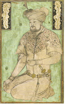

- Sultonali Mashhadiy
- Mirak Naqqosh
- Mahmud Muzahhib
+ Kamoliddin Behzod

**1201. Turkiyaning Istanbul shahridagi To‘pqopi muzeyi kutubxonasida Sulton Husayn Mirzoning Usmoniylar davlati (Rum) elchisi bo‘lgan kimning Istanbulga yetib borgunicha yo‘lda muhofaza etish topshirilgan farmoni asl nusxasi saqlanadi?**

+ Pahlavon Muhammad
- Pahlavon Mahmud
- Pahlavon Mansur
- Pahlavon Mirzo

**1202. Sulton Husayn Mirzoning davlati nima sababdan zaiflashgan?**

+ Sulton va saroy amaldorlarining maishatga berilib ketishi oqibatida
- Shaboniylar bosqini oqibatida
- Shahzodalar o‘rtasidagi taxt tuchun kurash oqibatida
- Mahalliy amirlarning mustaqillikka intilishi oqibatida

**1203. Kimning tadbirkorligi sabab Sulton Husayn Mirzoning taxtini egallagan Yodgor Mirzo qo‘lga olingan?**

+ Alisher Navoiyning
- Darvishali Changiyning
- Sayyid Hasan Ardasherning
- Mavlono Binoiyning

**1204. Sulton Husayn Mirzo qaysi hududlarni boshqargan? 1) Xorazm; 2) Seyiston; 3) Qandahor; 4) Balx; 5) G‘aznadan Damg‘ongacha bo‘lgan yerlar.**

- 2, 3, 4, 5
- 1, 2, 4
- 1, 2, 3
+ 1, 2, 3, 4, 5

**1205. Qayerda Sulton Husayn Mirzoga qarshi fitna uyushtirilib, u ovga chiqqanda, shahar darvozalari berkitib olingan?**

- Balxda
- Samarqandda
- Hirotda
+ Marvda

**1206. Alisher Navoiy do‘sti Sulton Husayn Mirzoning taxtga chiqishi munosabati bilan unga qaysi qasidasini taqdim etgan?**

+ “Hiloliya”
- “Sultoniya”
- “Husayniya”
- “Shohiya”

**1207. Sulton Husayn Mirzo kim tomonidan Abu Said Mirzo zindonidan qutqarilib, Hirotga olib kelingan?**

- Otasi tomonidan
+ Onasi tomonidan
- Amakisi tomonidan
- Xotini tomonidan

**1208. Sulton Husayn Mirzo qaysi yilda Abulqosim Boburning Samarqandga – Abu Said Mirzoga qarshi yurishida qatnashgan?**

- 1451-yilda
+ 1454-yilda
- 1455-yilda
- 1457-yilda

**1209. Sulton Husayn Mirzo temuriylardan kimning evarasi bo‘lgan?**

- Jahongir Mirzoning
+ Umarshayx Mirzoning
- Mironshoh Mirzoning
- Shohrux Mirzoning

**1210. Turkiyaning Istanbul shahridagi To‘pqopi muzeyi kutubxonasida Sulton Husayn Mirzoning qaysi yilda chiqarilgan farmonining asl nusxasi saqlanadi?**

- 878-hijriy (1473-milodiy) yilda
+ 879-hijriy (1474-milodiy) yilda
- 880-hijriy (1475-milodiy) yilda
- 881-hijriy (1476-milodiy) yilda

**1211. Sulton Husayn Mirzoning onasining ismi kim bo‘lgan?**

- Gavharshod begim
+ Feruzabegim
- Qutlug‘ Nigorxonim
- Robiya Sulton begim

**1212. Qaysi yilda shayboniylar Hirotni zabt etgan?**

+ 1507-yilda
- 1508-yilda
- 1509-yilda
- 1510-yilda

**1213. Sulton Husayn Mirzo (Husayniy, Husayn ibn Mirzo G‘iyosiddin Mansur ibn Mirzo Boyqaro) qaysi yillarda yashagan?**

- 1433–1501-yillarda
- 1435–1503-yillarda
+ 1438–1506-yillarda
- 1439–1507-yillarda

**1214. Qaysi temuriy avlodlaridan bo‘lgan Yodgor Muhammad Mirzo Sulton Husayn Mirzo poytaxtda yo‘qligidan foydalanib o‘zining nomiga xutba o‘qitib olgan?**

- Jahongir Mirzo
- Umarshayx Mirzo
- Mironshoh Mirzo
+ Shohrux Mirzo

**1215. Qaysi yilda Sulton Husayn Mirzo Niso viloyati, soʻng Astrobodni egallagan?**

- 1457-yilda
+ 1458-yilda
- 1462-yilda
- 1465-yilda

**1216. Sulton Husayn Mirzo kimning tavsiyasi bilanAbu Said Mirzo saroyida qolgan, ammo ko‘p o‘tmay qamoqqa olingan?**

- Otasining
- Amakisining
+ Onasining
- Xotinining

**1217. Sulton Husayn Mirzo qachon yurak xastaligidan vafot etgan?**

- 1501-yilning kuzida
- 1503-yilning qishida
+ 1506-yilning bahorida
- 1507-yilning yozida

**1218. Qaysi yilda Sulton Husayn Mirzo Hirotni egallagan?**

- 1467-yilda
+ 1469-yilda
- 1470-yilda
- 1473-yilda

**1219. Sulton Husayn Mirzo necha yoshida Abulqosim Bobur saroyiga xizmatga kirgan?**

- 10 yoshida
- 12 yoshida
+ 14 yoshida
- 16 yoshida

**1220. Qaysi yilda Sulton Husayn Mirzo fitna sababli qishni Marv bilan Xiva oraligʻidagi biyobonda oʻtkazgan?**

+ 1457-yilda
- 1458-yilda
- 1462-yilda
- 1465-yilda

**1221. Sulton Husayn Mirzoning hozirgacha 202 ta …i, Navoiy g‘azaliga bog‘langan 3 ta …i, 6 ta …, shuningdek, fors-tojikcha 2 ta …i, 1 … va bir necha mustaqil baytlari ma’lum.**

- ruboiy/g‘azal/g‘azal/muxammas/muxammas
- muxammas/muxammas/g‘azal/ruboiy/g‘azal
+ g‘azal/muxammas/ruboiy/g‘azal/ruboiy
- ruboiy/ruboiy/g‘azal/muxammas/g‘azal

**1222. Abulqosim Bobur vafot etgach, Sulton Husayn Mirzo kimning xizmatiga kirgan?**

- Balx hukmdori
- Kobul hukmdori
- Xiva hukmdori
+ Marv hukmdori

**1223. Sulton Husayn Mirzo qancha qo‘shin bilan Niso viloyati, soʻng Astrobodni egallagan?**

+ 300 kishilik qoʻshin
- 400 kishilik qoʻshin
- 500 kishilik qoʻshin
- 600 kishilik qoʻshin

**1224. Qachon Yodgor Muhammad Mirzo Sulton Husayn Mirzo poytaxtda yo‘qligidan foydalanib o‘zining nomiga xutba o‘qitib olgan?**

- 1467-yilning sentyabrida
- 1469-yilning avgustida
+ 1470-yilning iyulida
- 1473-yilning iyunida

**1225. Sulton Husayn Mirzo qayerdan do‘sti Alisher Navoiyni maxsus yorliq bilan chaqirib olgan?**

- Astroboddan
- Buxorodan
+ Samarqanddan
- Bag‘doddan

**1226. Sulton Husayn Mirzo qaysi tilda yozishni rag‘batlantirgan va shunga da’vat qilgan?**

- Arab tilida
+ Turkiy tilda
- Fors tilida
- Tojik tilida

**1227. Sulton Husayn Mirzoning “Risola” asari qachon turk olimi Ismoil Hikmat tomonidan topilib, ilmiy muomalaga kiritilgan?**

- 1935-yilda
- 1938-yilda
- 1941-yilda
+ 1945-yilda

**1228. Alisher Navoiy “Majolis un-nafois” tazkirasining …-majlisini to‘liq Sulton Husayn Mirzo ijodiga bag‘ishlab, uning devonidagi … g‘azalning matla’ini keltirgan.**

- 4/144
- 6/154
+ 8/164
- 10/174

## Amir Temur va temuriylar davrida iqtisodiy munosabatlar.

**1229. Temuriylar davrida tarxonlik yorlig‘ini va “tarxon” nomini olgan mulkdorning qanday to‘lov va majburiyatlari bo‘lgan?**

- Hukmdorga urush paytlarida qo‘shin to‘plab berishi kerak bo‘lgan
- Barcha mulklaridan tushadigan foydaning o‘ndan bir qismini davlat xazinasiga topshirgan
- Davlat miqyosidagi qurilishlarda o‘z hududidagi aholini majburiy mehnatga jalb qilgan
+ Barcha soliq, to‘lov va majburiyatlardan ozod qilingan

**1230. Shohrux va Ulug‘bek hukmronligi davrida qaysi daryo suvining bir qismi Qashqadaryo vohasiga burilgan?**

- Amudaryo
+ Zarafshon
- Sirdaryo
- Ohangaron

**1231. Alisher Navoiyning tashabbusi bilan qaysi viloyatida Turuqband suv ombori qurilgan?**

+ Tus viloyatida
- Mashhad viloyatida
- Obivard viloyatida
- Niso viloyatida

**1232. Abdurazzoq Samarqandiyning yozishicha, Shohrux davrida Farg‘ona kimning suyurg‘oli bo‘lgan?**

- Shoh Malik
+ Mirzo Ahmad
- Boysung‘ur
- Mirzo Qaydu bahodir

**1233. Amir Temurning qaysi xotinining asl ismi Saroymulkxonim bo‘lgan?**

- Tukal xonim
- O‘ljoy Turkon og‘o
+ Bibixonim
- Xayrunniso

**1234. Mirzo Ulug‘bek qayerning Somonjuq dashtiga suv chiqargach, yangi yerlar o‘zlashtirilgan?**

- Samarqandning
- Qarshining
- Shahrisabzning
+ Buxoroning

**1235. XV asrda Movarounnahr va Xurosonda yer mulkchiligi asosan nechta shaklda bo‘lgan?**

- Ikki shaklda
- Uch shaklda
+ To‘rt shaklda
- Besh shaklda

**1236. Amir Temur davrida harbiy yurishlarda mag‘lub etilgan aholidan olingan “sari shumor” solig‘i qaysi soliqqa to‘g‘ri keladi?**

- Zakot solig‘iga
- Ushr solig‘iga
- Tamg‘a solig‘iga
+ Jizya solig‘iga

**1237. Temuriylar davrida savdo boji, savdogarlardan olinadigan soliq qanday atalgan?**

+ Tamg‘a
- Ushr
- Qopchur
- Shulen

**1238. “Miri” atamasi qayerdan kelib chiqqan?**

+ Amir Temurning “amir” unvonidan
- O‘lchov birligi bo‘lgan “mir” nomidan
- Kumush sifatini aniqlovchi “miron” atamasidan
- Soliq yig‘uvchilar vazifasini bajargan “mirza” lavozimidan

**1239. Amir Temur nomi bilan zarb qilingan tangalardagi gerb nechta kichik halqadan iborat bo‘lgan?**

- Bitta halqadan
- Ikkita halqadan
+ Uchta halqadan
- To‘rtta halqadan

**1240. Mo‘g‘ullar vayron etgan Sultonband to‘g‘oni Shohrux va Ulug‘bek hukmronligi davrida tiklangach, qaysi shahar va uning vodiysi suv bilan ta’minlangan?**

- Kobul
- Balx
- Hirot
+ Marv

**1241. Kim o‘zining “Rosti rusti” shiorining mohiyatiga mos keladigan va soliq to‘lovchilar manfaatini himoya qilishga qaratilgan adolatli, ibratga loyiq soliq tizimini yaratgan va uning joriy qilinishini izchil nazorat qilgan?**

- Mirzo Ulug‘bek
- Sulton Husayn Mirzo
+ Amir Temur
- Shohrux Mirzo

**1242. Mo‘g‘ullar vayron etgan, Shohrux va Ulug‘bek hukmronligi davrida tiklangan Sultonband qaysi daryoning bosh to‘g‘oni edi?**

- Chirchiq
- Ohangaron
+ Murg‘ob
- Tajan

**1243. Qaysi yilda Kavkazning Baylakon mavzeida Araks daryosidan Barlos kanali qazilgan?**

- 1399-yilda
- 1400-yilda
+ 1401-yilda
- 1402-yilda

**1244. Temuriylar davrida uzluksiz ravishda koriz, buloq va daryo suvi bilan sug‘oriladigan ekin yerlaridan olinadigan hosilning qancha qismi oliy saltanat xazinasi uchun olingan?**

+ Bir hissasi
- Ikki hissasi
- Uch hissasi
- To‘rt hissasi

**1245. Mirzo Ulug‘bek qachon muomaladagi fulusiy pullar islohotini amalga oshirgan?**

- 1439-yilda
- 1443-yilda
- 1432-yilda
+ 1428-yilda

**1246. XV asrda Movarounnahr va Xurosonda xususiy yerlar qanday atalgan?**

- Mulki devoniy
+ Mulk
- Mulki vaqf
- Mulki xolisa

**1247. Abdurazzoq Samarqandiyning yozishicha, Shohrux davrida Tus, Mashhad, Obivard, Nisoni o‘z ichiga olgan Xuroson kimning suyurg‘oli bo‘lgan?**

- Shoh Malik
- Mirzo Ahmad
+ Boysung‘ur
- Mirzo Qaydu bahodir

**1248. Temuriylar davrida davlat yerlarini qanday tarzda in’om qilish keng tarqalgan?**

- Iqto
+ Suyurg‘ol
- Xolisa
- Tumori

**1249. Temuriylar davrida yerdan olinadigan soliqning asosiy turi nima hisoblangan?**

- Tamg‘a
- Ushr
- Qopchur
+ Xiroj

**1250. Temuriylar davrida misdan yasalgan mayda chaqa pul qanday atalgan?**

+ “Fulus”
- “Tanga”
- “Dirham”
- “Miri”

**1251. Abdurazzoq Samarqandiyning yozishicha, Shohrux davrida Kobul, G‘azna, Qandahor viloyatlari kimning suyurg‘oli bo‘lgan?**

- Shoh Malik
- Mirzo Ahmad
- Boysung‘ur
+ Mirzo Qaydu bahodir

**1252. Amir Temur qaysi shahar qamali vaqtida Saroymulkxonimga “Qo‘shinning zaxirasi tugadi, zar yuboring”, deyilgan maktub yo‘llagan va undan “Ulug‘ amir, zaringiz tugagan bo‘lsa, siyosatingiz ham tugadimi?” degan javob olgan?**

- Jurjon
- Tabriz
- Hamadon
+ Isfahon

**1253. XV asrda Movarounnahr va Xurosonda dehqonchilik yerlarining eng katta qismi qanday yerlar hisoblangan?**

- Xususiy yerlar
- Vaqf yerlari
+ Davlat yerlari
- Jamoa yerlari

**1254. Temuriylar davrida qanday yerlardan soliq olishda hosilning uchdan bir va to‘rtdan bir qoidasiga amal qilingan?**

- Cho‘l hududidagi yerlardan
- Buloq suvi bilan sug‘oriladigan yerlardan
+ Lalmikor yerlardan
- Daryo bo‘yidagi yerlardan

**1255. Amir Temur davrida og‘irligi 6 grammga teng kumush tanga qanday atalgan?**

- “Miri”
- “Fulus”
+ “Tanga”
- “Dirham”

**1256. Amir Temur farmoni bilan qaysi daryodan 20 dan ortiq sug‘orish tarmoqlari qazilib, Marv vohasi qayta obod etilgan?**

- Tajan
+ Murg‘ob
- Araks
- Qarun

**1257. Amir Temur davrida “kalontor” deb kimlarga aytilgan?**

- Saroy a’yonlari
+ Elning kattalari
- Harbiy boshliqlar
- Ijarachi dehqonlar

**1258. XV asrda Movarounnahr va Xurosonda davlat yerlari qanday atalgan?**

+ Mulki devoniy
- Mulk
- Mulki vaqf
- Mulki xolisa

**1259. Temuriylar davrida bosh hukmdor tomonidan yirik mulk egalariga biron xizmati uchun qanday yorliq berish keng tarqalgan?**

+ Tarxon
- Payza
- Bek
- Xudot

**1260. Kim o‘zigacha amalda bo‘lgan xazinani idora qilishning dargoh tamoyilidan, dargoh va vazirlik tamoyiliga o‘tgan hamda xazina daromadlarini soliqli va soliqsiz daromadlarga ajratgan?**

- Mirzo Ulug‘bek
- Sulton Husayn Mirzo
+ Amir Temur
- Shohrux Mirzo

**1261. Temuriylar davrida butun bir shahar yoki viloyat ko‘pincha kimlarga in’om tariqasida berilgan? 1) Hukmron sulola namoyandalari; 2) Yirik harbiy mansabdorlar; 3) Yirik davlat mansabdorlari; 4) Oliy tabaqadagi ruhoniylar.**

+ 1, 2, 3
- 1, 2, 4
- 1, 3, 4
- 1, 2, 3, 4

**1262. Mirzo Ulug‘bek tashqi savdodan davlat xazinasiga tushadigan daromadni ko‘paytirish maqsadida qaysi soliqni birmuncha oshirgan?**

+ Tamg‘a
- Ushr
- Qopchur
- Xiroj

**1263. Temuriylar davrida uzluksiz ravishda koriz, buloq va daryo suvi bilan sug‘oriladigan ekin yerlaridan olinadigan hosilning qancha qismi egasiga qolgan?**

- Bir hissasi
+ Ikki hissasi
- Uch hissasi
- To‘rt hissasi

**1264. Amir Temur davrida davlat daromadlari va yerlari bilan shug‘ullanuvchi oliy mansabdorlardan iborat hay’at qanday atalgan?**

- Devon
- Dargoh
- Kengash
+ Xolisa

**1265. Amir Temur davrida davlat xavf ostida qolib, harbiy safarbarlik e’lon qilingan paytlarda favqulodda qaysi soliq yig‘ib olingan?**

+ Avorizot
- Sari shumor
- Qopchur
- Kalon

**1266. XV asrda Movarounnahr va Xurosonda madrasa va masjidlar tasarrufidagi yerlar qanday atalgan?**

- Mulki devoniy
- Mulk
+ Mulki vaqf
- Mulki xolisa

**1267. Alisher Navoiyning tashabbusi bilan qurilgan Turuqband suv omboridan kanal orqali 10 farsax masofaga, ya’ni qayerga suv keltirilgan?**

- Astrobodga
+ Mashhadga
- Sherozga
- Yazdga

**1268. Mirzo Ulug‘bek tomonidan muamalaga chiqarilgan fulusiy pullar xalq o‘rtasida qanday nom bilan shuhrat topgan?**

- “Fulusi amir”
+ “Fulusi adliya”
- “Fulusi zamon”
- “Fulusi sultoniy”

**1269. Amir Temur davrida og‘irligi 1,5 grammga teng kumush tanga qanday atalgan?**

+ “Miri”
- “Fulus”
- “Tanga”
- “Dirham”

**1270. Temuriylar davrida dehqonchilik maydonlarining ikkinchi kattagina qismi qanday yerlardan iborat bo‘lgan?**

+ Xususiy yerlar
- Vaqf yerlari
- Davlat yerlari
- Jamoa yerlari

**1271. Mirzo Ulug‘bek qaysi shaharlarda bir vaqtning o‘zida zarbxonalar tashkil etib, bir xil vazndagi salmoqdor fuluslar zarb ettirgan va muomalaga chiqargan? 1) Hirot; 2) Buxoro; 3) Samarqand; 4) Balx; 5) Qarshi; 6) Termiz; 7) Toshkent; 8) Shohruxiya; 9) Andijon.**

- 1, 2, 3, 4
+ 2, 3, 5, 6
- 2, 3, 4, 5
- 1, 2, 5, 6

**1272. Temuriylar davrida suyurg‘ol egasiga o‘z suyurg‘oli doirasida qanday huquqlar berilgan? 1) Amaldorlar tayinlash; 2) Boshqa mamlakatlar bilan aloqa o‘rnatish; 3) Soliqlar va turli to‘lovlarni to‘plash; 4) Aybdorlarni jazolash.**

- 2, 3, 4
+ 1, 3, 4
- 1, 2, 3
- 1, 2, 3, 4

**1273. Kavkazning Baylakon mavzeida Araks daryosidan chiqarilgan Barlos kanali uzunligi qancha bo‘lgan?**

+ 10 farsax (60–70 km)
- 20 farsax (70–80 km)
- 30 farsax (80–90 km)
- 40 farsax (90–100 km)

**1274. Amir Temur davrida soliqlar hokimiyat tomonidan belgilab qo‘yilgan qaysi oylarda to‘planar edi?**

- Hamal, asad, saraton oylarida
+ Saraton, sumbula-mezon, qavs oylarida
- Sumbula-mezon, qavs, hamal oylarida
- Qavs, hamal, asad oylarida

**1275. Abdurazzoq Samarqandiyning yozishicha, Shohrux davrida Xorazm kimning suyurg‘oli bo‘lgan?**

+ Shoh Malik
- Mirzo Ahmad
- Boysung‘ur
- Mirzo Qaydu bahodir

**1276. Shohrux va Ulug‘bek hukmronligi davrida qaysi kanal qayta tiklangan?**

- Darg‘om
+ Angor
- Bulung‘ur
- Obirahmat

## Ikkinchi Renessans asoschilari.

**1277. Mirzo Ulug‘bek davrida ta’limning ikkinchi, o‘rta bosqichida o‘qish muddati necha yilni tashkil qilgan?**

- Bir yilni
- Ikki yilni
+ Uch yilni
- To‘rt yilni

**1278. Shohrux Mirzoning rafiqasini toping.**

- Feruzabegim
- Chechak begim
- To‘rabekxonim
+ Gavharshodbegim

**1279. Burhoniddin Nafis ibn Avaz Hakim al-Kirmoniy qayerning Kirmon shahridan edi?**

- Iroqning
+ Eronning
- Ozarbayjonning
- Suriyaning

**1280. Mirzo Ulug‘bek davrida ta’lim necha bosqichni tashkil etgan?**

- Ikki bosqichni
+ Uch bosqichni
- To‘rt bosqichni
- Besh bosqichni

**1281. XIV-XV asrlarda qaysi fan “ilmi nujum” deb atalgan?**

+ Astronomiya
- Matematika
- Mantiq
- Adabiyot

**1282. Amir Temur o‘z zamonasidagi ijtimoiy guruhlarni nechta toifaga bo‘lgan?**

- Olti toifaga
- Sakkiz toifaga
- O‘n toifaga
+ O‘n ikki toifaga

**1283. Mirzo Ulug‘bek davrida ta’lim davomiyligi umumiy necha yilni tashkil qilgan?**

+ 8 yilni
- 10 yilni
- 12 yilni
- 14 yilni

**1284. Ulug‘bek rasadxonasida qaysi olim astronomik fizikani tabiiy falsafadan mustaqil ravishda o‘rgangan?**

- Muhammad Havofiy
+ Ali Qushchi
- Jamshid Koshiy
- Qozizoda Rumiy

**1285. Amir Temur davrida “Dor ushshifo” nomli yirik kasalxonaga kim rahbarlik qilgan?**

- Burhoniddin Nafis ibn Avaz Hakim al-Kirmoniy
- Sultan Ali Tabib
+ Mir Sayyid Sharif Sheroziy
- Tojiddin Hakim

**1286. Amir Temur davrida qayerda “Dor ushshifo” nomli yirik kasalxona bo‘lgan?**

- Shahrisabzda
+ Samarqandda
- Qarshida
- Hirtoda

**1287. Alisher Navoiyning tabiblar va tibbiyot haqidagi fikrlari asosan qaysi asarida bayon etilgan va ushbu asarda tibbiyot va tabiblar masalasiga maxsus bob bag‘ishlagan?**

- “Muhakamat ul-lug‘atayn”
+ “Mahbub ul-qulub”
- “Mezon ul-avzon”
- “Majolis un-nafois”

**1288. Temuriylar renessansi Osiyo va islom tarixida qaysi asrlarni qamrab oladi?**

- XII–XIII asrlarni
- XIII–XIV asrlarni
+ XIV–XV asrlarni
- XV–XVI asrlarni

**1289. XIV-XV asrlarda qaysi fan “riyoziyot” deb atalgan?**

- Astronomiya
+ Matematika
- Mantiq
- Adabiyot

**1290. Qayerlarda olib borilgan qazishma ishlarida Amir Temur davrida qurilgan usti yopiq suv quvurlari va shunga o‘xshagan suv inshootlarini ko‘p uchratganlar?**

- Shahrisabz va Qarshi
- Qarshi va Samarqand
+ Samarqand va Shohruxiya
- Shohruxiya va Shahrisabz

**1291. Amir Temur hakimlar, tabiblar, munajjimlar va muhandislarni nechanchi ijtimoiy toifaga kiritgan?**

- Oltinchi toifaga
+ Sakkizinchi toifaga
- O‘ninchi toifaga
- O‘n ikkinchi toifaga

**1292. “Renessans” so‘zi qaysi tildan olingan?**

- Lotin tilidan
+ Fransuz tilidan
- Italyan tilidan
- Yunon tilidan

**1293. Mirzo Ulug‘bek hukmronligi davrida qaysi olim har bir daraja uchun o‘ta aniqlikdagi va har bir daqiqa uchun farqlarni o‘z ichiga olgan to‘rtta eng kichik raqamlar (sakkizta kasr hajmiga teng) uchun sinuslar jadvalini ishlab chiqqan?**

+ Jamshid Koshiy
- Muhammad Havofiy
- Ali Qushchi
- Qozizoda Rumiy

**1294. “Renessans” so‘zi qanday ma’noni anglatadi?**

- “Intilish”, “taraqqiyot”
- “Ilm-fan”, “o‘rganish”
+ “Qayta tug‘ilish”, “uyg‘onish”
- “Madaniyat”, “rivojlanish”

**1295. “Hakimlar va tabiblar bilan ittifoqda bemorlarni davolatar edim”, deb kim aytgan?**

+ Amir Temur
- Mirzo Ulug‘bek
- Shohrux Mirzo
- Sulton Husayn Mirzo

**1296. Mirzo Ulug‘bek davrida qaysi tabib mohir jarroh bo‘lib, ko‘z kataraktasini jarrohlik yo‘li bilan muvaffaqiyatli davolagan?**

- Burhoniddin Nafis ibn Avaz Hakim al-Kirmoniy
- Sultan Ali Tabib
- Mir Sayyid Sharif Sheroziy
+ Tojiddin Hakim

**1297. Alisher Navoiy qaysi tabibni “aql-idrok va tafakkur ramzi” deb atagan?**

- Abu Bakr Roziyni
- Tojiddin Hakimni
+ Abu Ali ibn Sinoni
- Mir Sayyid Sharif Sheroziyni

**1298. Amir Temur davrida tibbiyot fani shu qadar yuksak darajaga ko‘tarilgan ediki, hatto … .**

- murakkab jarrohlik operatsiyalarini o‘kazishni ham bilganlar
+ o‘lgan odamning jasadini balzamlash usulini ham bilganlar
- ko‘z gavharini tiklash yo‘lini ham bilganlar
- ona qornidagi bolani davolashni ham bilganlar

**1299. Amir Temur qaysi bino peshtoqiga “Adolat davlatning asosi va hukmdorlar shioridir” degan hikmatli so‘zlarni yozdirgan?**

+ Oqsaroy
- Ko‘ksaroy
- Go‘ri Amir maqbarasi
- Ahmad Yassaviy maqbarasi

**1300. Mirzo Ulug‘bek davrida ta’limning birinchi, quyi bosqichida o‘qish muddati necha yilni tashkil qilgan?**

- Bir yilni
+ Ikki yilni
- Uch yilni
- To‘rt yilni

**1301. Hukumat komissiyasi tomonidan Samarqanddagi Go‘ri Amir maqbarasidagi kimlarning daxmalari ochilib ko‘rilgan? 1) Amir Temur; 2) Jahongir; 3) Mironshoh; 4) Shohrux; 5) Mirzo Ulug‘bek; 6) Muhammad Sulton.**

- 1, 2, 3, 4, 6
- 1, 2, 3, 5, 6
- 1, 2, 3, 4, 5
+ 1, 3, 4, 5, 6

**1302. “Dori tayyorlash san’ati” nomli kitobi muallifi kim?**

+ Burhoniddin Nafis ibn Avaz Hakim al-Kirmoniy
- Sultan Ali Tabib
- Mir Sayyid Sharif Sheroziy
- Tojiddin Hakim

**1303. Qaysi olim astronomiyaning falsafaga taxminiy bog‘liqligi to‘g‘risidagi risolasida Yerning aylanishini asoslash uchun empirik dalillarni keltirgan?**

- Muhammad Havofiy
- Jamshid Koshiy
- Qozizoda Rumiy
+ Ali Qushchi

**1304. Mirzo Ulug‘bek davrida amaliy darslar qancha talaba ishtirokida o‘tkazilgan?**

+ O‘n–o‘n besh nafar talaba
- O‘n besh–yigirma nafar talaba
- Yigirma–yigirma besh nafar talaba
- Yigirma besh–o‘ttiz nafar talaba

**1305. Amir Temur kimlarni “saltanat korxonasiga rivoj beruvchilar” deb atagan? 1) Hakimlar; 2) Tabiblar; 3) Munajjimlar; 4) Muhandislar.**

+ 1, 2, 3, 4
- 1, 3, 4
- 1, 2, 4
- 2, 3, 4

**1306. Mirzo Ulug‘bek davrida ta’limning uchinchi, yuqori bosqichida o‘qish muddati necha yilni tashkil qilgan?**

- Bir yilni
- Ikki yilni
+ Uch yilni
- To‘rt yilni

**1307. Mirzo Ulug‘bek Samarqandda qurdirgan shifoxonasiga ishlash uchun kimni taklif qilgan?**

+ Burhoniddin Nafis ibn Avaz Hakim al-Kirmoniy
- Sultan Ali Tabib
- Mir Sayyid Sharif Sheroziy
- Muhammad Sabzavoriy

**1308. Shohrux Mirzo va Gavharshodbegim tomonidan qo‘llab-quvvatlangan, matematika va astronomiya sohalari rivojiga katta hissa qo‘shgan olim kim?**

- Muhammad Havofiy
- Ali Qushchi
+ Jamshid Koshiy
- Qozizoda Rumiy

**1309. Shohruxiya shahri hozirgi qaysi shahar yaqinida joylashgan?**

- Samarqand
- Buxoro
- Farg‘ona
+ Toshkent

**1310. Mirzo Ulug‘bek davrida ma’ruzalar qancha talabadan iborat katta guruhlarga o‘qilgan?**

- Qirq nafar talabadan
- Ellik nafar talabadan
- Oltmish nafar talabadan
+ Yetmish nafar talabadan

**1311. Qachon hukumat komissiyasi tomonidan Samarqanddagi Go‘ri Amir maqbarasi, Bibixonim maqbarasidagi daxmalar ochilib ko‘rilgan va ulardagi jasadlar mumiyolangani aniqlangan?**

+ 1941-yilning 18-iyunida
- 1940-yilning 18-iyulida
- 1940-yilning 18-mayida
- 1941-yilning 18-martida

## Temuriylar davri me’morchiligi.

**1312. Amir Temur davrida yangi qurila boshlangan Samarqand qal’asi qanday atalgan?**

- “Ark”
- “Rabot”
- “Shahriston”
+ “Hisor”

**1313. Oqsaroyning qurilishi qachon boshlangan?**

- 1379-yilning bahorida
+ 1380-yilning bahorida
- 1381-yilning bahorida
- 1382-yilning bahorida

**1314. Amir Temur qurdirgan meʼmoriy inshootlar ichida qaysi biri eng yirik va nodir obida hisoblanadi?**

+ Oqsaroy
- Ko‘ksaroy
- Go‘ri Amir maqbarasi
- Ahmad Yassaviy maqbarasi

**1315. Kimning davrida binokorlikda Хitoy chinnisiga o‘xshash oq fondagi ko‘k naqshlar ustun bo‘lgan?**

- Amir Temur
+ Mirzo Ulug‘bek
- Shohrux Mirzo
- Sulton Husayn Mirzo

**1316. Temuriylar me’morchiligi XVI–XVIII asrlarda qayerlarda yangi shakllangan uchta me’morchilik maktabining boshlang‘ich nuqtasi bo‘lgan? 1) Markaziy Osiyo; 2) Hindiston; 3) Eron; 4) Kichik Osiyo.**

- 1, 2, 4
+ 1, 2, 3
- 1, 3, 4
- 2, 3, 4

**1317. Temuriylar me’morchiligi qaysi sulola me’morchiligining o‘ziga xos jihatlaridan foydalangan?**

- Qoraxoniylar
- Somoniylar
- G‘aznaviylar
+ Saljuqiylar

**1318. Quyidagi qaysi inshoot gumbazining balandligi 44 metr, diametri 22 metr bo‘lgan?**

+ Xoja Ahmad Yassaviy maqbarasi
- Bibixonim jome masjidi
- Go‘ri Amir maqbarasi
- Ulug‘bek rasadxonasi

**1319. Kimning davrida gumbazosti tuzilmalarning yangi xillari ishlab chiqilgan?**

- Amir Temur
+ Mirzo Ulug‘bek
- Shohrux Mirzo
- Sulton Husayn Mirzo

**1320. Kimning davrida binokorlikda ko‘k va zarhal ranglar ustun bo‘lgan?**

+ Amir Temur
- Mirzo Ulug‘bek
- Shohrux Mirzo
- Sulton Husayn Mirzo

**1321. Oqsaroy qayerda joylashgan?**

- Samarqand
- Qarshi
+ Shahrisabz
- Termiz

**1322. XIV-XV asrlarda Movarounnahrda qurilishda, asosan, qaysi rang ishlatilgan?**

- Zarhal
- Oq fondagi ko‘k
+ Feruza-ko‘k
- Ko‘k-oltin

**1323. Go‘ri Amir (Amir Temur) maqbarasi qaysi shaharda joylashgan?**

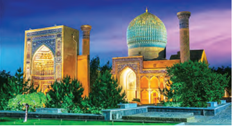

- Buxoroda
+ Samarqandda
- Shahrisabzda
- Qarshida

**1324. Oqsaroyda qaysi yillarda konservatsiya ishlari olib borilgan?**

- 1973–1975-yillarda
- 1987–1989-yillarda
+ 1994–1996-yillarda
- 2000–2002-yillarda

**1325. Oqsaroy qabulxonasi arkining kirish qismida nimalar tasvirlangan?**

+ Sher va quyosh, uchta halqa
- Uchta halqa, yarim oy va yulduz
- Yarim oy va yulduz, suvoriy
- Suvoriy, sher va quyosh

**1326. XIV-XV asrlarda Movarounnahrda peshtoq-u ravoq hamda toqlarga parchin va girihlar qoplab imoratga pardoz beruvchilar qanday atalgan?**

- “Sangtarosh”
- “Banno”
+ “Ustod”
- “Naqqosh”

**1327. Qachon Keshda bo‘lgan ispan elchisi Klavixo ustalar hanuz Oqsaroy qurilishi ishlarini davom ettirishayotganligini taʼkidlagan?**

- 1401-yil sentyabrda
- 1402-yil oktyabrda
- 1403-yil iyulda
+ 1404-yil avgustda

**1328. Amir Temur davrida Samarqandga nechta darvozadan kirilgan?**

- To‘rtta darvozadan
+ Oltita darvozadan
- Sakkizta darvozadan
- O‘nta darvozadan

**1329. “Moarrak” nima?**

+ Plitkalar mozaikasi
- Ganch ohak bilan mahkamlangan g‘isht
- Gumbaz qoplamasi
- Kubik shaklidagi maqbara

**1330. “U balandligi 31 metr bo‘lgan uch qavatli o‘ziga xos inshoot edi. Bino ichidagi hovli 50 metrga 55 metr o‘lchamda bo‘lgan. Temuriylar davriga xos bino kubik shaklidagi maqbara (chohartak) bo‘lib, bino ustida tekis, asosan ko‘k (feruza) gumbaz joylashgan”. Yuqoridagi jumlalar qaysi inshoot haqida?**

- Xoja Ahmad Yassaviy maqbarasi
- Bibixonim jome masjidi
- Go‘ri Amir maqbarasi
+ Ulug‘bek rasadxonasi

**1331. Amir Temur davrida yangi qurilgan Samarqand qancha gektar bo‘lgan?**

- 300 gektar
- 400 gektar
+ 500 gektar
- 600 gektar

**1332. Amir Temur davrida qaysi yilda yangi qurila boshlangan Samarqand qal’a devori va xandaq bilan o‘ralgan?**

- 1370-yilda
+ 1371-yilda
- 1373-yilda
- 1376-yilda

**1333. Xoja Ahmad Yassaviy maqbarasi hozirda qaysi davlat hududida joylashgan?**

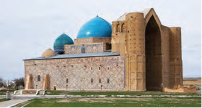

- Tojikiston
- Mo‘g‘uliston
+ Qozog‘iston
- O‘zbekiston

**1334. Temuriylar davridagi asosiy qurilish materiali nima bo‘lgan?**

- Gips bilan qoplangan g‘isht
+ Ganch ohak bilan mahkamlangan g‘isht
- Mayolika qoplangan g‘isht
- Oltin qum aralashgan g‘isht

**1335. Kimning davrida gumbazlar tuzilishida qirralar oralig‘i kengaygan, ikki qavatli gumbazlar qurishda ichkaridan yoysimon qovurg‘alarga tayangan tashqi gumbazni ko‘tarib turuvchi poy gumbazning balandligi oshgan?**

+ Amir Temur
- Mirzo Ulug‘bek
- Shohrux Mirzo
- Sulton Husayn Mirzo

**1336. Klavixoning guvohlik berishicha, Amir Temur qaysi inshootning qurilishidan uncha qoniqmay, uning gumbazini qayta qurishni buyurgan?**

- Oqsaroy
- Ko‘ksaroy
+ Go‘ri Amir maqbarasi
- Ahmad Yassaviy maqbarasi

**1337. Moviy masjid, Ali maqbarasi va Hazrat Ali ziyoratgohi kim tomonidan qurilgan?**

- Amir Temur
- Mirzo Ulug‘bek
- Shohrux Mirzo
+ Sulton Husayn Mirzo

**1338. Temuriylar davrida mayolika inshootning qaysi qismi qoplamasi uchun ishlatilgan?**

+ Gumbaz
- Ark
- Peshtoq
- Ravoq

**1339. Quyidagilardan usta meʼmorlarni toping. 1) Yusuf Sheroziy; 2) Shams Abdulvahob Sheroziy; 3) Tojuddin Isfahoniy; 4) Sharafuddin Tabriziy.**

+ 2, 3, 4
- 1, 2, 3
- 1, 2, 4
- 1, 3, 4

**1340. Samarqandga kiraverishda Ko‘hak tepaligidagi Cho‘pon ota maqbarasi kimning davrida qurilgan?**

- Amir Temur
+ Mirzo Ulug‘bek
- Shohrux Mirzo
- Sulton Husayn Mirzo

**1341. XVII asr o‘rtalarida Abdulazizxon madrasasining tashqi ko‘rinishidagi hind me’morchiligi manzarasi Agra shahridagi Tojmahal maqbarasi qurilishida ishtirok etgan … ikki nafar o‘ymakor usta va … gumbaz quruvchisi tomonidan yaratilgan.**

- keshlik/buxorolik
+ buxorolik/samarqandlik
- samarqandlik/hirotlik
- hirotlik/keshlik

**1342. XIV-XV asrlarda Movarounnahrda binolarni bezatishda, asosan, qaysi rang ishlatilgan?**

- Zarhal
- Oq fondagi ko‘k
- Feruza-ko‘k
+ Ko‘k-oltin

**1343. Moviy masjid, Ali maqbarasi va Hazrat Ali ziyoratgohi qayerda joylashgan?**

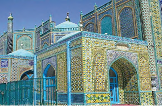

- Marv viloyatida
- Badaxshon viloyatida
+ Balx viloyatida
- G‘azna viloyatida

**1344. Oqsaroy peshtoqlaridagi … bilan …ning juft tasviri ramziy ma’noga ega.**

+ sher/quyosh
- ot/oy
- ohu/yulduz
- qoplon/tog‘

**1345. Oqsaroyning gumbazli arkini yasash va bezashda tosh kesuvchi qaysi usta ishtirok etgani gumbaz yozuvlarida saqlangan?**

+ Muhammad Yusuf Tabriziy
- Shams Abdulvahob Sheroziy
- Tojuddin Isfahoniy
- Sharafuddin Tabriziy

**1346. “Uning toq va ravoqlari ayiq yulduziga yetadi, binobarin, dunyoda unga teng keladigan narsani hech kim hech qachon ko‘rmagan va eshitmagan”. Oqsaroy haqidagi ushbu ta’rif kimning qaysi asarida keltirilgan?**

- Sharafuddin Ali Yazdiyning “Zafarnoma” asarida
+ Nizomiddin Shomiyning “Zafarnoma” asarida
- Alouddin Juvayniyning “Tarixi jahongusho” asarida
- Rashiduddin Fazlullohning “Jome at-tavorix” asarida

**1347. XVII asr o‘rtalarida qayerdagi Abdulazizxon madrasasining tashqi ko‘rinishi hind me’morchiligi manzarasi aks ettirilgan devoriy suratlar bilan bezatilgan edi?**

+ Buxorodagi
- Samarqanddagi
- Shahrisabzdagi
- G‘ijduvondagi

**1348. Amir Temur davrida Samarqand Afrosiyobdan …, mo‘g‘ullar davridagi ichki va tashqi shahar o‘rnida qurila boshlangan.**

+ janubda
- shimolda
- sharqada
- g‘arbda

**1349. Quyidagi qaysi inshoot balandligi 33 metrga yetgan?**

- Xoja Ahmad Yassaviy maqbarasi
+ Bibixonim jome masjidi
- Go‘ri Amir maqbarasi
- Ulug‘bek rasadxonasi

**1350. XIV-XV asrlarda Movarounnahrda binolardagi yozuvlarda xattotlikning qaysi yozuvidan foydalanilgan?**

- Nastaliq
- Muhaqqaq
- Devoniy
+ Kufiy

**1351. Oqsaroy binosining hozirgi vaqtgacha saqlanib qolgan qismi qanchani tashkil etadi?**

- 27 metrni
- 35 metrni
+ 38 metrni
- 42 metrni

**1352. Kimning yozishiga qaraganda, Amir Temur to‘rtinchi marta, yaʼni 1379-yili Xorazmga yurishidan qaytganidan so‘ng xorazmlik bir guruh kishilarni Keshga ko‘chirib keltirgan?**

- Ali Yazdiy
- Hofizi Abru
+ Abdurazzoq Samarqandiy
- Xondamir

**1353. Bibixonim jome masjidi qaysi shaharda joylashgan?**

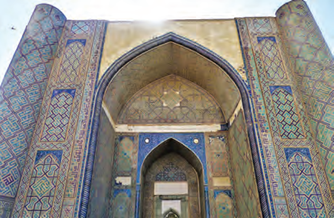

- Buxoroda
+ Samarqandda
- Shahrisabzda
- Qarshida

**1354. Temuriylar davridagi binolarning muhim qismi alohida ajralib turadigan … edi.**

- gumbaz
- ark
+ peshtoq
- ravoq

**1355. “Mahallalar, bozorlar, ko‘chalar va aksar xonadonlarda oqar suvlar bor. Qaysi joyga bormagin, katta hovlilarning birortasi hovuzsiz va daraxtsiz emas. Shu sababdan, (shahar) “Jannat ad-dunyo” (Dunyoning jannati) degan unvon olmish”. Samarqand haqidagi ushbu jumlalar muallifi kim?**

- Bobur
+ Hofizi Abru
- Ali Yazdiy
- Xondamir

**1356. XIV-XV asrlarda Movarounnahrda g‘isht terib, imorat qaddini bino qiluvchilar qanday atalgan?**

- “Sangtarosh”
+ “Banno”
- “Ustod”
- “Lavvoh”

**1357. Oqsaroy binosining umumiy balandligi o‘z davrida qancha bo‘lgan?**

- 40 metrdan baland
- 50 metrdan baland
- 60 metrdan baland
+ 70 metrdan baland

**1358. Oqsaroy peshtoq ravog‘ining eni … metr, balandligi … metr, umumiy balandligi … metrdan oshiqroqni tashkil etgan.**

- 12,5/30/40
+ 22,5/40/50
- 32,5/50/60
- 42,5/60/70

**1359. Qaysi yilda YUNESKO homiyligida Shahrisabz shahrining 2700 yilligi nishonlanishi munosabati bilan Oqsaroy qayta ta’mirlangan?**

- 1999-yilda
- 2000-yilda
- 2001-yilda
+ 2002-yilda

**1360. Quyidagilardan yog‘och o‘ymakor ustani toping.**

+ Yusuf Sheroziy
- Shams Abdulvahob Sheroziy
- Tojuddin Isfahoniy
- Sharafuddin Tabriziy

**1361. Oqsaroyda qaysi yillarda arxeologik tadqiqotlar olib borilgan?**

+ 1973–1975-yillarda
- 1987–1989-yillarda
- 1994–1996-yillarda
- 2000–2002-yillarda

## Xattotlik va miniatyura.

**1362. Kamoliddin Behzodning shaxs sifatida dunyoqarashi shakllanishida kimning o‘rni katta bo‘lgan?**

- Xusrav Dehlaviy
- Abdurahmon Jomiy
+ Alisher Navoiy
- Nizomiy Ganjaviy

**1363. Kamoliddin Behzodning eng mashhur “Yusuf va Zulayxo” miniatyurasi kimning qaysi asari uchun tayyorlangan?**

- Alisher Navoiyning “Majolis un-nafois” asari uchun
- Xusrav Dehlaviyning “Matla’ ul-anvor” asari uchun
+ Sa’diy Sheroziyning “Bo‘ston” asari uchun
- Abdurahmon Jomiyning “Haft avrang” asari uchun

**1364. Kim “Yoshlikdan xatga maylim bor edi. Uning ishqi ko‘zimdan uyquni qochirardi. Bekordan bekor yurmasdan, qo‘limga qalam olardim. Ertalabdan kechgacha mashq qilar edim, shuning uchun menda na yotish va na yeyishning g‘ami bor edi” mazmunida she’r bitgan?**

- Abduljamil Kotib
- Mavlono Shamsuddin Munshiy
- Darvesh Muhammad Toqiy
+ Sultonali Mashhadiy

**1365. Kamoliddin Behzodning Ali Yazdiyning “Zafarnoma” asariga chizgan nechta miniatyurasi Milliy kutubxonada saqlanadi?**

- 4 ta miniatyurasi
- 6 ta miniatyurasi
+ 8 ta miniatyurasi
- 10 ta miniatyurasi

**1366. Sultonali Mashhadiy qaysi yillarda yashagan?**

- 1430-1518-yillarda
+ 1432-1520-yillarda
- 1434-1522-yillarda
- 1437-1525-yillarda

**1367. Kamoliddin Behzod Sulton Husayn Mirzo saroyida qaysi lavozimni egallagan?**

- Muhrdor
- Kotib
- Munshiy
+ Kitobdor

**1368. Alisher Navoiyning shaxsiy kutubxonasida nechta yirik san’atkor xattotlikda samarali ijod qilgan?**

+ 11 nafar
- 13 nafar
- 16 nafar
- 18 nafar

**1369. Amir Temur qiyofasining asl holatiga yaqin suratlar qaysi asarning dastlabki ko‘chirilgan nusxalarida uchraydi?**

+ “Zafarnoma”
- “Tarixi jahongusho”
- “Tabaqoti Nosiriy”
- “Jome at-tavorix”

**1370. Qaysi temuriy shahzodalar xat san’at turi bilan shug‘ullanishgan? 1) Ibrohim ibn Shohrux; 2) Boysung‘ur Mirzo; 3) Pirmuhammad Sulton; 4) Badiuzzamon Mirzo.**

- 1, 2, 3
+ 1, 2, 4
- 2, 3, 4
- 1, 2, 3, 4

**1371. Kamoliddin Behzod qaysi temuriy hukmdor rassomi bo‘lgan?**

- Mirzo Ulug‘bek
+ Sulton Husayn Mirzo
- Abu Said Mirzo
- Abulqosim Bobur

**1372. Kamoliddin Behzodning yashagan yillarini toping.**

+ 1455–1535-yillar
- 1451–1531-yillar
- 1460–1540-yillar
- 1462–1542-yillar

**1373. Amir Temur davrida qaysi xattotlar mashhur bo‘lgan?**

- Sultonali Mashhadiy, Abduljamil Kotib
- Abduljamil Kotib, Mavlono Shamsuddin Munshiy
+ Mavlono Shamsuddin Munshiy, Oltun
- Oltun, Sultonali Mashhadiy

**1374. Sultonali Mashhadiy ko‘chirgan qancha asar bizgacha yetib kelgan?**

- 30 ta asar
- 40 ta asar
+ 50 ta asar
- 60 ta asar

**1375. Sultonali Mashhadiy nima uchun oq qog‘ozga emas, balki nimtatir rang berilgan qog‘ozga yozishni maslahat bergan?**

- Xat sifatli chiqishi uchun uchun
+ Ko‘z charchamasligi uchun
- Siyoh yaxshi singishi uchun
- Ranglar yorqinroq bo‘lishi uchun

**1376. “Xat tozaligi ruh tozaligidir”. Ushbu jumlalar muallifi kim?**

- Abduljamil Kotib
- Mavlono Shamsuddin Munshiy
- Darvesh Muhammad Toqiy
+ Sultonali Mashhadiy

**1377. Qaysi yildan keyin Boysung‘ur Mirzo Hirotda xattotlik va naqqoshlik ustaxonasi tashkil qilgan?**

- 1410-yildan keyin
- 1415-yildan keyin
+ 1420-yildan keyin
- 1425-yildan keyin

**1378. “Kalligrafiya” nima?**

+ Xattotlik
- Lavvohlik
- Sahhoflik
- Naqqoshlik

**1379. Sultonali Mashhadiyning faoliyati borasida Navoiy qaysi asarida ma’lumot berib o‘tgan?**

- “Mahbub ul-qulub”
- “Mezon ul-avzon”
+ “Majolis un-nafois”
- “Munojot”

**1380. Kim “Qiblat ul-kuttob” (Kotiblar qiblasi) va “Sulton ul-xattotin” (Xattotlar sultoni) kabi faxriy nomlar bilan mashhur bo‘lgan?**

- Abduljamil Kotib
- Mavlono Shamsuddin Munshiy
- Darvesh Muhammad Toqiy
+ Sultonali Mashhadiy

**1381. Temuriylar davridagi miniatyuralarda Sharqiy Turkiston san’atiga xos bo‘lgan turkiy obrazlarda … rassomchiligining ta’siri sezilib turgan.**

- Hindiston
- Arabiston
- Mo‘g‘uliston
+ Xitoy

**1382. Kamoliddin Behzod qayerda tug‘ilgan?**

- Tabriz
+ Hirot
- Balx
- Marv

**1383. Kim Nizomiyning “Maxzan ul-asror” masnaviysini, Hofizning devonini, Alisher Navoiyning g‘azaliyot devonini kitob shakliga keltirgan?**

- Abduljamil Kotib
- Mavlono Shamsuddin Munshiy
- Darvesh Muhammad Toqiy
+ Sultonali Mashhadiy

**1384. Kamoliddin Behzod qayerdagi musavvirlar ustaxonasi bosh musavviri boʻlgan?**

- Tabrizdagi
+ Hirotdagi
- Balxdagi
- Marvdagi

**1385. Qanday rangdagi qog‘ozlarga rangli siyoh bilan xat bitilgan?**

+ Xol-xol va to‘q rangdagi
- To‘q va nimtatir rangdagi
- Nimtatir va sariq rangdagi
- Sariq va xol-xol rangdagi

**1386. Amir Temur va temuriylar davrida qaysi shaharlarda miniatyura maktablari tashkil etilgan?**

- Hirot, Balx
- Balx, Buxoro
- Buxoro, Samarqand
+ Samarqand, Hirot

**1387. Amir Temur davrida ijod qilgan sangtarosh va xattotni toping.**

- Mavlono Shamsuddin Munshiy
+ Oltun
- Abduljamil Kotib
- Darvesh Muhammad Toqiy

**1388. “Zafarnoma” asaridagi miniatyuralarni dastlab … boshlagan va … yakunlagan.**

- Mahmud Muzahhib/Mirak Naqqosh
+ Mirak Naqqosh/Behzod
- Behzod/Sultonali Mashhadiy
- Sultonali Mashhadiy/Mahmud Muzahhib

**1389. Qanday nom bilan ataluvchi qog‘ozning kerakli rangdagisini olish uchun unga zaʼfaron, xina va bir necha tomchi siyoh qo‘shilgan?**

- “Samarqand qog‘oz”
- “Sultoniy qog‘oz”
+ “Xitoyi qog‘oz”
- “Xuroson qog‘oz”

**1390. Miniatyura rassomchiligining taraqqiyoti qaysi sohaning rivoji bilan bog‘liq bo‘lgan?**

- Binokorlik
- Tasviriy san’at
+ Adabiyot
- Naqqoshlik

**1391. Temuriylar faoliyati bilan bog‘liq holda, Osiyoning qaysi markaziy shaharlarida bir necha miniatyura maktablari vujudga kelgan? 1) Bag‘dod; 2) Sheroz; 3) Tabriz; 4) Hirot; 5) Samarqand; 6) Dehli.**

+ 1, 2, 3, 4, 5, 6
- 2, 3, 4, 5
- 1, 2, 3, 4
- 2, 3, 4, 5, 6

**1392. Kamoliddin Behzodning miniatyuralari Chester Beytining qayerdagi kutubxonasida saqlanadi?**

+ London
- Nyu York
- Liverpul
- Vashington

**1393. Quyidagi miniatyurada kimning qabulidagi jarayon tasvirlangan?**

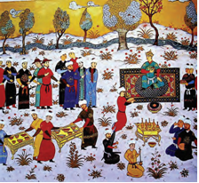

- Amir Temur
- Sulton Husayn Mirzo
- Mirzo Ulug‘bek
+ Mirzo Boysung‘ur

**1394. Kamoliddin Behzodning “Yusuf va Zulayxo” miniatyurasi qachon yaratilgan?**

+ 1488-yilda
- 1483-yilda
- 1492-yilda
- 1497-yilda

**1395. Kamoliddin Behzod qayerda vafot etgan?**

+ Tabriz
- Hirot
- Balx
- Marv

**1396. Sharq manbalarida qaysi rangga bo‘yalgan qog‘oz motamni anglatgan?**

+ Ko‘k rang
- Qizil rang
- Sariq rang
- Yashil rang

**1397. Hozir Turkiya va Berlin kutubxonalarida saqlanayotgan miniatyura nusxalari qaysi asrlarga oid?**

- XII–XIII asrlarga
- XIII–XIV asrlarga
+ XIV–XV asrlarga
- XV–XVI asrlarga

**1398. Sultonali Mashhadiy kimning taklifi bilan Mashhaddan Hirotga kelib, Sulton Husayn Mirzo kutubxonasida xattotlarga boshchilik qilgan?**

- Sulton Husayn Mirzo
+ Alisher Navoiy
- Mirzo Boysung‘ur
- Mo‘min Mirzo

**1399. “Miniatyura” so‘zining ma’nosi nima?**

+ “Qizil boʻyoq”
- “Yashil boʻyoq”
- “Sariq boʻyoq”
- “Zangori boʻyoq”

**1400. Quyidagilardan kimlar Alisher Navoiyning shaxsiy kutubxonasida xattotlik qilganlar? 1) Sultonali Mashhadiy; 2) Mavlono Shamsuddin Munshiy; 3) Abduljamil Kotib; 4) Oltun; 5) Darvesh Muhammad Toqiy.**

- 2, 3, 4
- 2, 4, 5
- 1, 2, 3
+ 1, 3, 5

**1401. O‘rta asrlarda necha xil asosiy xat uslublari mavjud bo‘lgan?**

+ 10 xil
- 11 xil
- 12 xil
- 13 xil

**1402. Sultonali Mashhadiyning so‘zlariga qaraganda, qog‘ozga qaysi rangni berish uchun zaʼfaron ishlatilgan?**

- Xol-xol rang
- To‘q rang
- Nimtatir rang
+ Sariq rang

**1403. Sharq manbalarida qaysi rangga bo‘yalgan qog‘oz bayram kayfiyatini anglatgan?**

- Ko‘k rang
+ Qizil rang
- Sariq rang
- Yashil rang

**1404. Qaysi temuriy shahzoda o‘z saroyida 40 xattotdan iborat guruhni to‘plagan edi?**

- Ibrohim ibn Shohrux
- Pirmuhammad Sulton
+ Mirzo Boysung‘ur
- Badiuzzamon

## Temuriylar davrida hunarmandchilik.

**1405. Temuriylar saltanatida nima bilan quyilgan po‘lat ayniqsa yuqori sifatli bo‘lgan?**

- Jez
+ Kumush
- Bronza
- Oltin

**1406. Amir Temur va Ulug‘bek davrida buyum va idishlar qanday metallardan ishlangan? 1) Oltinsimon bronza; 2) Latun; 3) Qizil mis.**

- 1, 3
- 1, 2
- 2, 3
+ 1, 2, 3

**1407. Temuriylar davrida qabrtoshlar qanday rangli marmardan, ayrim hollarda o‘ta noyob toshlardan ishlangan?**

+ Bo‘z rangli
- Xol-xol rangli
- Nimtatir rangli
- To‘q rangli

**1408. Xo‘ja Zayniddin va Baland masjidlari qaysi asrga oid?**

- XIII asrga
- XIV asrga
- XV asrga
+ XVI asrga

**1409. Temuriylar davrida amaliy san’at turlaridan qaysilar yuksak san’at darajasiga ko‘tarilgan? 1) Kulolchilik; 2) To‘qimachilik; 3) Gilamdo‘zlik; 4) Kashtachilik.**

+ 2, 3, 4
- 1, 2, 3
- 1, 2, 4
- 1, 2, 3, 4

**1410. Temuriylar davrida qanday tosh o‘ymakorligi ham ma’lum darajada mavjud edi?**

+ Yashma toshi
- Ahat toshi
- Serdolik toshi
- Qizil ahat toshi

**1411. Shayx Sayfiddin Boxarziy maqbarasi qaysi asrga oid?**

- XIII asrga
+ XIV asrga
- XV asrga
- XVI asrga

**1412. Ikki tonnali bronza qozon qaysi inshootda joylashgan?**

- Oqsaroyda
- Ko‘ksaroyda
- Go‘ri Amir maqbarasida
+ Ahmad Yassaviy maqbarasida

**1413. Kimlar davrida metall o‘ymakorligi taraqqiy etgan?**

+ Amir Temur va Ulug‘bek
- Ulug‘bek va Shohrux
- Shohrux va Sulton Husayn Mirzo
- Sulton Husayn Mirzo va Amir Temur

**1414. Shayx Sayfiddin Boxarziy maqbarasi qayerda joylashgan?**

- Shahrisabzda
- Termizda
+ Buxoroda
- Samarqandda

**1415. Temuriylar davri hunarmandlari qaysi mamlakat uslubida keramika ishlab chiqargan?**

- Hindiston
- Rum
+ Xitoy
- Eron

**1416. Temuriylar davrida nimalarga qisman o‘simliksimon, asosan geometrik shakllarda xattotlik namunalari bilan so‘zlar bitilgan?**

- Peshtoqlarga
+ Qabrtoshlarga
- Gumbazlarga
- Eshiklarga

**1417. Temuriylar davrida kulolchilikda oppoq idishlarga sir ustidan qaysi element yordamida naqsh berish yangilik edi?**

- Simob
- Nikel
+ Kobalt
- Alyuminiy

**1418. Temuriylar davrida kulolchilikda nimalar yangilik hisoblangan? 1) Yashil, zangori tusdagi yorqin sir ustiga sodda o‘simliknamo naqshlarni qora bo‘yoqlar bilan tushirish; 2) Uyurma gullar ishlash; 3) Oppoq idishlarga sir ustidan kobalt elementi yordamida naqsh berish.**

+ 1, 2, 3
- 1, 3
- 1, 2
- 2, 3

## Alisher Navoiy.

**1419. Alisher Navoiy qanday ta’riflar bilan tilga olinadi? 1) “Shoirlar sultoni”; 2) “G‘azal mulkining sultoni”; 3) “Ilm-fan homiysi”; 4) “Mutafakkirlarning mutafakkiri”.**

- 2, 3, 4
- 1, 2, 3
- 1, 3, 4
+ 1, 2, 3, 4

**1420. “Asarda vaqf yerlari, mulklari, ularning miqdori, ulardan foydalanish, vaqf mulki va mablag‘i evaziga quriladigan bino va inshootlar, bu yo‘nalishda madrasa va xonaqohlarda o‘rnatilgan tartiblar haqida fikr yuritiladi. Navoiy o‘z ixtiyoridagi mablag‘lar hisobiga qurilgan xayriya muassasalari, ilmiy-madaniy binolar va bog‘larni sanab o‘tadi. Asar Navoiy va Sulton Husayn Mirzo munosabatlarini o‘rganishda ham muhim manbadir”. Yuqoridagi ma’lumotlar Alisher Navoiyning qaysi asari to‘g‘risida?**

- “Siroj ul-muslimin”
+ “Vaqfiya”
- “Tarixi anbiyo va hukamo”
- “Tarixi muluki Ajam”

**1421. Sulton Husayn Mirzoning Alisher Navoiyga jilovdorlik qilgani voqeasi kimning qaysi asarida keltirilgan?**

- Muiniddin Natanziyning “Muntaxab ut-tavorixi Muiniy” asarida
- Abu Usmon Minhojiddin ibn Sirojiddinning “Tabaqoti Nosiriy” asarida
+ Zayniddin Vosifiyning “Badoye ul-vaqoye” asarida
- Rashiduddin Fazlullohning “Jome at-tavorix” asarida

**1422. Alisher Navoiyning onasining ismi kim bo‘lgan?**

- Feruzabegim
- Gavharshod begim
- Robiya Sulton begim
+ Ismi ma’lum emas

**1423. Alisher Navoiyning “Tarixi muluki Ajam” (“Ajam shohlari tarixi”) asari qachon yozilgan?**

- 1483-yilda
- 1481-yilda
+ 1488-yilda
- 1486-yilda

**1424. Alisher Navoiy musharraf bo‘lgan “Amirul muqarrab” unvonining ma’nosi nima?**

- “Bosh amir”
- “Xalq ulug‘lagan amir”
+ “Podshoga eng yaqin amir”
- “Ulug‘ amir”

**1425. Alisher Navoiyga Qirg‘izistonning qaysi shahrida haykal o‘rnatilgan?**

- Bishkek
- Jalolobod
+ O‘sh
- Norin

**1426. Alisher Navoiyning bobosi Umarshayx Mirzo vafotidan keyin kimning xizmatiga o‘tkazilgan?**

- Jahongir Mirzo
- Mironshoh Mirzo
+ Shohrux Mirzo
- Pirmuhammad Mirzo

**1427. Sulton Husayn Mirzo saltanatida qaysi lavozim “amir” deb atalgan?**

- Shahar hokimi
- Lashkarboshi
+ Vazir
- Viloyat hokimi

**1428. Alisher Navoiyning otasi G‘iyosiddinga “kichkina” laqabi yoshiga nisbatan berilgan bo‘lib, kimning kichik o‘g‘li va ko‘kaldoshi bo‘lgan G‘iyosiddin Mansur bilan bira o‘sgan?**

- Jahongir Mirzo
+ Umarshayx Mirzo
- Mironshoh Mirzo
- Shohrux Mirzo

**1429. Alisher Navoiy qayerda “Ixlosiya”, “Nizomiya” madrasalari, “Xalosiya” xonaqohi, “Shifoiya” shifoxonasi, Qur’on tilovat qiluvchilarga mo‘ljallangan “Dorul huffoz” binosini qurdirgan?**

- Astrobodda
- Mashhadda
+ Hirotda
- Marvda

**1430. Alisher Navoiyga Ozarbayjonning qaysi shahrida haykal o‘rnatilgan?**

- Shirvon
- Ganja
- Naxchivan
+ Boku

**1431. Alisher Navoiy kimning hukmronligi davrida tug‘ilgan?**

- Abulqosim Bobur
- Abu Said Mirzo
+ Shohrux Mirzo
- Sulton Ahmad

**1432. Alisher Navoiyning bobosi Amir Temurning qaysi o‘g‘lining emikdoshi (ko‘kaldosh) bo‘lgan va ulg‘aygach ham uning doimiy xizmatida bo‘lgan?**

- Jahongir Mirzo
+ Umarshayx Mirzo
- Mironshoh Mirzo
- Shohrux Mirzo

**1433. Zamondoshlari Alisher Navoiyni qanday ataganlar?**

- “Mir Alisher”
+ “Nizomiddin Mir Alisher”
- “Mavlono Alisher”
- “Mir Alisher Navoiy”

**1434. Alisher Navoiyning “Tarixi anbiyo va hukamo” (“Payg‘ambarlar va hakimlar tarixi”) asari qachon yozilgan?**

+ 1485–1498-yillarda
- 1482–1495-yillarda
- 1489–1502-yillarda
- 1491–1504-yillarda

**1435. Yodgor Mirzoga qarshi jangda mag‘lub Sulton Husayn Mirzo, 1470-yilning o‘zida payt poylab, Navoiyning maslahati bilan qayerdan juda qisqa muddatda Hirotga yetib kelgan va maishatdan charchab uxlab yotgan Yodgor Mirzoni qo‘lga olgan?**

- Tajan daryosi bo‘ylaridan
+ Murg‘ob daryosi bo‘ylaridan
- Zarafshon daryosi bo‘ylaridan
- Ohangaron daryosi bo‘ylaridan

**1436. Alisher Navoiyning “Tarixi anbiyo va hukamo” asarining nechanchi bo‘limida “Qissasul anbiyo” lar an’analari davom ettirilib, Odam alayhissalom, Nuh, Iso, Muso, Ya’qub, Sulaymon, Yusuf, Dovud kabi payg‘ambarlar tarixiga oid qissalar keltiriladi?**

+ Birinchi bo‘limida
- Ikkinchi bo‘limida
- Uchinchi bo‘limida
- To‘rtinchi bo‘limida

**1437. Alisher Navoiyga qaysi shaharlarda haykallar o‘rnatilgan? 1) Boku; 2) Moskva; 3) Shanxay; 4) Tokio; 5) Vashington; 6) Ashxobod; 7) O‘sh; 8) Toshkent; 9) Samarqand; 10) Guliston; 11) Termiz; 12) Navoiy.**

- 6, 8, 10, 11, 12
- 3, 4, 5, 6, 9, 10, 12
- 2, 3, 4, 5, 6, 7, 8, 9, 11
+ 1, 2, 3, 4, 5, 6, 7, 8, 9, 10, 11, 12

**1438. “Asarining birinchi bo‘limida “Qissasul anbiyo” lar an’analari davom ettirilib, Odam alayhissalom, Nuh, Iso, Muso, Ya’qub, Sulaymon, Yusuf, Dovud kabi payg‘ambarlar tarixiga oid qissalar keltiriladi. Navoiy Luqmoni hakimga ham anbiyolar qatoridan joy beradi. Asarning “Hukamo zikrida” deb nomlangan ikkinchi bo‘limida insoniyat tarixida chuqur iz qoldirgan donishmand hakimlar Fishog‘urs, Jomosp, Buqrot, Suqrot, Aflotun, Arastu, Bolinos, Jolinus, Batlimus, Buzurgmehr kabi antik davr allomalari haqida ibratli hikoyalar keltiriladi, ularning donishmandligi, ilmiy kashfiyotlari siri qisqa satrlarda talqin qilinadi”. Yuqoridagi ma’lumotlar Alisher Navoiyning qaysi asari to‘g‘risida?**

- “Siroj ul-muslimin”
- “Vaqfiya”
+ “Tarixi anbiyo va hukamo”
- “Tarixi muluki Ajam”

**1439. Alisher Navoiy iqtidorli talabalarga oyiga … oltin pul va yiliga … qop oziq-ovqat mahsulotlari bergan.**

+ 24/besh
- 26/o‘n
- 28/o‘n besh
- 30/yigirma

**1440. Alisher Navoiy 1480–1500-yillar mobaynida o‘z mablag‘lari hisobidan bir necha madrasa, … ta rabot … ta masjid, … ta xonaqoh, … ta ko‘prik, … ta hovuz, … ta hammom qurdirgan.**

- 30/15/8/7/10/7
- 35/16/9/8/15/8
+ 40/17/10/9/20/9
- 45/18/11/10/25/10

**1441. Alisher Navoiyning “Vaqfiya” asari qachon yozilgan?**

- 1483-yilda
+ 1481-yilda
- 1488-yilda
- 1486-yilda

**1442. Alisher Navoiyning “Tarixi anbiyo va hukamo” asarining “Hukamo zikrida” deb nomlangan nechanchi bo‘limida insoniyat tarixida chuqur iz qoldirgan donishmand hakimlar va antik davr allomalari haqida ibratli hikoyalar keltiriladi, ularning donishmandligi, ilmiy kashfiyotlari siri qisqa satrlarda talqin qilinadi?**

- Birinchi bo‘limida
+ Ikkinchi bo‘limida
- Uchinchi bo‘limida
- To‘rtinchi bo‘limida

**1443. Sulton Husayn Mirzo Navoiyni o‘z yoniga chaqirgach, qaysi lavozimga tayinlagan?**

- Vazir
+ Muhrdor
- Astrobod hokimi
- Hirot dorug‘asi

**1444. Sulton Husayn Mirzo hukmronligining dastlabki yillarda kimning avlodi bo‘lgan Yodgor Muhammad taxt da’vosi bilan qo‘zg‘algan?**

- Jahongir Mirzo
- Umarshayx Mirzo
- Mironshoh Mirzo
+ Shohrux Mirzo

**1445. Kimning ma’lumotlariga ko‘ra, Alisher Navoiyning otasi G‘iyosiddin Kichkina pahlavon va bardoshli shaxs bo‘lgan?**

- Abdurazzoq Samarqandiy
- Hofiz Abru
- Ibn Arabshoh
+ Davlatshoh Samarqandiy

**1446. Alisher Navoiyga Xitoyning qaysi shahrida haykal o‘rnatilgan?**

- Pekin
+ Shanxay
- Guanchjou
- Nankin

**1447. Alisher Navoiyning otasining ismi kim bo‘lgan?**

+ G‘iyosiddin Muhammad
- Shayx Abusaid Chang
- Kamol Turbatiy
- Ismi ma’lum emas

**1448. Sulton Husayn Mirzo saltanati poytaxti qaysi shahar bo‘lgan?**

+ Hirot
- Balx
- Astrobod
- Kobul

**1449. Alisher Navoiyning onasi kimning qizi bo‘lgan?**

- Kamol Turbatiy
+ Shayx Abusaid Chang
- Sayyid Hasan Ardasher
- Pahlavon Muhammad

**1450. Qachon Sulton Husayn Mirzo Hirotni qo‘lga olgan va Samarqandga xat yo‘llab, Navoiyni o‘z yoniga chaqirgan?**

- 1465-yilda
- 1461-yilda
- 1467-yilda
+ 1469-yilda

**1451. Alisher Navoiyning donishmandligi, tadbirkorligi bilan ko‘plab g‘alayon-u qon to‘kishlarning oldini olishi, urushlarni yarashga aylantirishi qaysi lavozimda faoliyat yuritgan paytlari yaqqol namoyon bo‘lgan?**

+ Vazir
- Muhrdor
- Astrobod hokimi
- Hirot dorug‘asi

**1452. Alisher Navoiyga Turkmanistonning qaysi shahrida haykal o‘rnatilgan?**

+ Ashxobod
- Mari
- Arqadagʻ
- Sarhadobod

**1453. Alisher Navoiyning o‘zi tuzgan birinchi devoni qanday ataladi?**

- “Navodir un-nihoya” (“Nihoyasiz nodirliklar”)
- “Maxzan ul-asror” (“Sirlar xazinas”)
+ “Badoye ul-bidoya” (“Badiiylik ibtidosi”)
- “Matla ul-anvor” (“Nurlar boshlanishi”)

**1454. Alisher Navoiy qayerda tug‘ilgan?**

- Samarqand
- Astrobod
+ Hirot
- Balx

**1455. Amir Temurning o‘g‘li Shohrux Mirzo qaysi yillarda yashagan?**

- 1362–1393-yillarda
- 1356–1394-yillarda
- 1366–1408-yillarda
+ 1377–1447-yillarda

**1456. Alisher Navoiyning otasi G‘iyosiddin qanday nomlar bilan atalganligi ko‘p tarqalgan? 1) “G‘iyosiddin bahodir”; 2) “G‘iyosiddin Kichkina”; 3) “Kichkina bahodir”.**

- 1, 2
- 1, 3
+ 2, 3
- 1, 2, 3

**1457. Alisher Navoiyga O‘zbekistonning qaysi shaharlarida haykallar o‘rnatilgan? 1) Toshkent; 2) Buxoro; 3) Samarqand; 4) Guliston; 5) Andijon; 6) Termiz; 7) Navoiy.**

- 2, 3, 4, 5, 6
+ 1, 3, 4, 6, 7
- 1, 2, 3, 4, 5
- 2, 4, 5, 6, 7

**1458. Alisher Navoiy qayerda “Xusraviya” madrasasini qurdirgan?**

- Astrobodda
- Mashhadda
- Hirotda
+ Marvda

**1459. Alisher Navoiyning birinchi devonini … .**

- o‘zi tuzgan
+ muxlislari tuzgan
- shogirtlari tuzgan
- saroy ahli tuzgan

**1460. Alisher Navoiy qaysi yillarda vazir lavozimida faoliyat yuritgan?**

- 1469–1472-yillarda
+ 1472–1476-yillarda
- 1476–1487-yillarda
- 1487–1488-yillarda

**1461. Alisher Navoiy musharraf bo‘lgan “amiri kabir” unvonining ma’nosi nima?**

- “Bosh amir”
- “Xalq ulug‘lagan amir”
- “Podshoga eng yaqin amir”
+ “Ulug‘ amir”

**1462. Yosh Alisher … nazariga tushgan, … yosh shoir iste’dodiga yuqori baho bergan, u … e’tirofini qozongan.**

- Mavlono Lutfiy/Kamol Turbatiy/Ali Yazdiy
+ Ali Yazdiy/Mavlono Lutfiy/Kamol Turbatiy
- Kamol Turbatiy/Ali Yazdiy/Mavlono Lutfiy
- Mavlono Lutfiy/Ali Yazdiy/Kamol Turbatiy

**1463. Alisher Navoiyga Yaponiyaning qaysi shahrida haykal o‘rnatilgan?**

- Osaka
+ Tokio
- Nagoya
- Kioto

**1464. Alisher Navoiyning otasi G‘iyosiddin bahodir Shohruxning nabirasi bo‘lgan kimning ishonchli beklaridan biri bo‘lgan?**

+ Abulqosim Bobur
- Abu Said
- Abdullatif
- Alouddavla

**1465. Yosh Alisher Navoiy kimlardan ta’lim olgan?**

+ Sayyid Hasan Ardasher, Pahlavon Muhammad
- Pahlavon Muhammad, Shayx Abusaid Chang
- Shayx Abusaid Chang, Kamol Turbatiy
- Kamol Turbatiy/Sayyid Hasan Ardasher

**1466. Alisher Navoiy kim bilan ijodiy hamkorlikda bo‘lgan?**

- Ali Yazdiy
- Mavlono Lutfiy
+ Abdurahmon Jomiy
- Pahlavon Muhammad

**1467. Quyidagi Alisher Navoiy miniatyurasi (XVI asr) muallifi kim?**

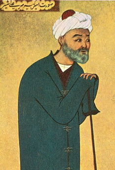

+ Mahmud Muzahhib
- Mirak Naqqosh
- Sultonali Mashhadiy
- Kamoliddin Behzod

**1468. Alisher Navoiyning otasi G‘iyosiddinning ko‘kaldoshi G‘iyosiddin Mansur qayerda hukmronlik qilgan?**

+ Hamadonda
- Isfahonda
- Jurjonda
- Kirmonda

**1469. Qaysi yilda Sulton Husayn Mirzo Alisher Navoiyni vazirlikka tayinlagan?**

- 1469-yilda
+ 1472-yilda
- 1476-yilda
- 1487-yilda

**1470. Sulton Husayn Mirzoga qarshi ikkinchi marta bosh ko‘targan Yodgor Mirzoga qarshi yurish paytida, qayerda qo‘zg‘olon bo‘lgani xabari kelgan va Sulton Husayn Mirzo Alisher Navoiyga katta vakolatlar berib, u yerga yuborgan?**

+ Hirotda
- Balxda
- Astrobodda
- Kobulda

**1471. Alisher Navoiy qaysi yillarda muhrdor lavozimida faoliyat yuritgan?**

+ 1469–1472-yillarda
- 1472–1476-yillarda
- 1476–1487-yillarda
- 1487–1488-yillarda

**1472. Alisher Navoiy qayerda xayriya binosini qurdirgan?**

- Astrobodda
+ Mashhadda
- Hirotda
- Marvda

**1473. 1470-yilning bahorida Yodgor Mirzo qayerda ikkinchi marta Sulton Husayn Mirzoga qarshi bosh ko‘targan?**

- Hirotda
- Balxda
+ Astrobodda
- Kobulda

**1474. Alisher Navoiy qaysi mashhur shaxslarning ustozi sanaladi?**

+ Kamoliddin Behzod, Mirxond, Xondamir
- Mirxond, Xondamir, Davlatshoh Samarqandiy
- Xondamir, Davlatshoh Samarqandiy, Mirak Naqqosh
- Davlatshoh Samarqandiy, Mirak Naqqosh, Kamoliddin Behzod

**1475. Alisher Navoiy qachon tug‘ilgan?**

- 1440-yil 19-fevralda
- 1440-yil 9-fevralda
- 1441-yil 19-fevralda
+ 1441-yil 9-fevralda

**1476. Alisher Navoiy qaysi yillarda Astrobod hokimi lavozimida faoliyat yuritgan?**

- 1469–1472-yillarda
- 1472–1476-yillarda
- 1476–1487-yillarda
+ 1487–1488-yillarda

**1477. Alisher Navoiyga AQSH ning qaysi shahrida haykal o‘rnatilgan?**

+ Vashington
- Nyu York
- Chikago
- Dallas

**1478. Alisher Navoiy qaysi yillarda shohning amri va istagiga ko‘ra o‘zining birinchi devonini tuzgan?**

- 1469–1472-yillarda
+ 1472–1476-yillarda
- 1476–1487-yillarda
- 1487–1488-yillarda

**1479. Amir Temurning o‘g‘li Umarshayx Mirzo qaysi yillarda yashagan?**

- 1362–1393-yillarda
+ 1356–1394-yillarda
- 1366–1408-yillarda
- 1377–1447-yillarda

**1480. Alisher Navoiy qaysi asaridan so‘ng ko‘p o‘tmay, ketma-ket nasriy kitoblar yaratgan?**

- “Badoye ul-bidoya” dan keyin
- “Navodir un-nihoya” dan keyin
- “Vaqfiya” dan keyin
+ “Xamsa” dan keyin

**1481. Shohruxning nabirasi Abulqosim Bobur qaysi yillarda yashagan?**

- 1420–1455-yillarda
+ 1422–1457-yillarda
- 1424–1459-yillarda
- 1427–1462-yillarda

**1482. Alisher Navoiyga Rossiyaning qaysi shahrida haykal o‘rnatilgan?**

- Sankt-Peterburg
- Astraxan
+ Moskva
- Qozon

**1483. “Ushbu asar qisqa tarix bo‘lib, Eron shohlari xronikasi bayon qilingan “Tarixi Tabariy”, “Shohnoma” asarlarini mantiqan to‘ldiradi, ulardagi faktlarni izchil ilmiy tizimga soladi. Asarda afsonaviy shoh Qayumarsdan sosoniylarning so‘nggi vakili Yazdi Shahriyorgacha bo‘lgan shohlar tarixi, mifologik talqini beriladi”. Yuqoridagi ma’lumotlar Alisher Navoiyning qaysi asari to‘g‘risida?**

- “Siroj ul-muslimin”
- “Vaqfiya”
- “Tarixi anbiyo va hukamo”
+ “Tarixi muluki Ajam”