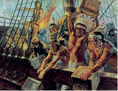
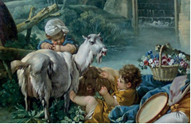
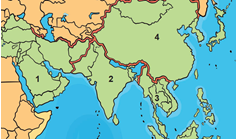
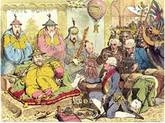
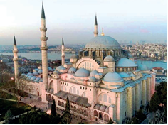
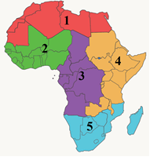
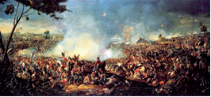
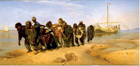
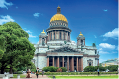
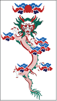

# 9-sinf Jahon tarixi (2024-yil darsligi)

_Tarix (Mavzulashgan) (2022-2025-yillar darsliklari)_

## Kirish.

**1. Yangi tarixda qaysi asrdan boshlangan o‘zgarishlar natijasida dastlab G‘arbiy Yevropa va Shimoliy Amerikada shakllangan yangi jamiyatni “kapitalistik jamiyat” deb atay boshlashgan?**

- XV asrdan
+ XVI asrdan
- XVII asrdan
- XVIII asrdan

**2. Insoniyat tarixining o‘rta asrlar davri … deb ataladi. 1) “Kapitalistik jamiyat”; 2) “Agrar sivilizatsiya”; 3) “An’anaviy jamiyat”.**

- 1, 2
- 1, 3
+ 2, 3
- 1, 2, 3

**3. Yangi davrda industrial sivilizatsiya shakllanishi uchun zarur bo‘lgan sharoit faqat qayerda vujudga kelgan?**

- Osiyo mamlakatlarida
+ Yevropa mamlakatlarida
- Shimoliy Amerika mamlakatlarida
- Janubiy Amerika mamlakatlarida

**4. Yangi tarixning qaysi davridan boshlab buyuk texnik ixtirolar amalga oshirilgan?**

- XVII asr boshidan
- XVII asr oxiridan
- XVIII asr boshidan
+ XVIII asr oxiridan

**5. Yangi tarix nechta bosqichga bo‘linadi?**

+ Ikki bosqichga
- Uch bosqichga
- To‘rt bosqichga
- Besh bosqichga

**6. Insoniyat tarixida agrar sivilizatsiya qaysi davrlarni o‘z ichiga oladi?**

- Poleolit davridan boshlanib, XVII asrning 80-yillarigacha
- Eneolit davridan boshlanib, XVI asrning 50-yillarigacha
- Mezolit davridan boshlanib, XIX asrning 90-yillarigacha
+ Neolit davridan boshlanib, XVIII asrning 60-yillarigacha

**7. Nima agrar sivilizatsiyadan sanoat ishlab chiqarishi va industrial sivilizatsiyaga o‘tish uchun asos yaratgan?**

+ Sanoat inqilobi
- Demokratik inqilob
- Kapitalistik inqilob
- Burjua inqilobi

**8. Yangi tarixning ikkinchi bosqichi qaysi davrni o‘z ichiga oladi?**

- Amerika burjua inqilobidan XIX asrning o‘rtasidagi sanoatlashtirishgacha bo‘lgan davrni
- Vizantiya imperiyasining qulashidan XIX asrning boshidagi “Napoleon urushlari” gacha bo‘lgan davrni
- Buyuk geografik kashfiyotlardan XVIII asrning oxiridagi Buyuk fransuz burjua inqilobigacha bo‘lgan davrni
+ XIX asrning boshidan Birinchi jahon urushining yakuni – 1918-yilgacha bo‘lgan davrni

**9. XVIII asr oxiri va XIX asrda fan va texnika sohalarida erishilgan juda ulkan yutuqlar …ga olib keldi.**

+ sanoat inqilobi
- demokratik inqilob
- kapitalistik inqilob
- burjua inqilobi

**10. Yangi tarix qaysi davrlarni o‘z ichiga oladi?**

- XIV asr oxiri – XV asr boshlaridagi Vizantiya imperiyasining qulashidan Birinchi jahon urushining boshlanishi – 1914-yilgacha bo‘lgan davrni
+ XV asr oxiri – XVI asr boshlaridagi Buyuk geografik kashfiyotlardan Birinchi jahon urushining yakuni – 1918-yilgacha bo‘lgan davrni
- XVI asr oxiri – XVII asr boshlaridagi Amerika burjua inqilobidan Ikkinchi jahon urushining boshlanishi – 1939-yilgacha bo‘lgan davrni
- XVII asr oxiri – XVIII asr boshlaridagi Buyuk fransuz burjua inqilobidan Ikkinchi jahon urushining yakuni – 1945-yilgacha bo‘lgan davrni

**11. Yangi tarixning birinchi bosqichi qaysi davrni o‘z ichiga oladi?**

- Amerika burjua inqilobidan XIX asrning o‘rtasidagi sanoatlashtirishgacha bo‘lgan davrni
- Vizantiya imperiyasining qulashidan XIX asrning boshidagi “Napoleon urushlari” gacha bo‘lgan davrni
+ Buyuk geografik kashfiyotlardan XVIII asrning oxiridagi Buyuk fransuz burjua inqilobigacha bo‘lgan davrni
- XIX asrning boshidan Birinchi jahon urushining yakuni – 1918-yilgacha bo‘lgan davrni

**12. O‘z egasiga daromad keltiruvchi xususiy mulk (fabrika, zavod, kon, bank va boshqalar) va mablag‘, o‘zini o‘zi ko‘paytiruvchi sarmoya qanday ataladi?**

+ Kapital
- Aksiya
- Divident
- Byudjet

**13. Yangi tarixda G‘arbiy Yevropaning ilg‘or mamlakatlarida kapitalistik jamiyat zamirida sanoatga asoslangan yangi sivilizatsiya shakllandi va u qanday nomlandi?**

+ “Industrial sivilizatsiya”
- “Kapitalistik sivilizatsiya”
- “An’anaviy sivilizatsiya”
- “Demokratik sivilizatsiya”

**14. Nima Yangi tarixning asosiy mazmunini tashkil etadi?**

- Osiyo mamlakatlarining kapitalistik jamiyatga o‘tishi
- Amerikada yangi mustaqil davlatlarning tashkil topishi
+ Yevropada industrial sivilizatsiyaning jadal rivojlanishi
- Dunyoda demokratik g‘oyalarning keng tarqalishi

**15. Yangi tarix qanday tushunchalarga asoslangan yangicha dunyoqarashning shakllanishi bilan O‘rta asrlardan farq qiladi? 1) Kishilarning tabiiy tengligi; 2) Shaxsning erkinligi; 3) Shaxsning sha’ni.**

- 1, 2
- 1, 3
- 2, 3
+ 1, 2, 3

## 1-mavzu. Buyuk geografik kashfiyotlar. Mustamlaka tizimining shakllanishi.

**16. XV asr o‘rtalarida Yaponiyada joylashib olgan xitoy savdogarlari yaratgan tizimning shimoliy qismiga qaysi hududlar kirgan?**

- Koreya va Annam
- Annam va Siam
- Siam va Yaponiya
+ Yaponiya va Koreya

**17. Amerika qit’asida yevropaliklar qurgan birinchi shahar qaysi?**

- Gavana
+ Panama
- Karakas
- Morokaybo

**18. XV asrda Osiyoda qaysi imperiya tarqalib ketgandan so‘ng – quruqlik orqali savdo qiyinlashib qolgan davrda – dengiz savdosi juda katta foyda keltirgan?**

- Temuriylar imperiyasi
- Guptalar imperiyasi
+ Mo‘g‘ullar imperiyasi
- Tan imperiyasi

**19. XV asrda qayerda hind kemalariga fil suyagi, oltin va Afrikadagi Zanzibar hududi orqali keltirilgan afrikalik qullar, giyohvandlik moddalari, Levantning pushti rang suvi (mushkambar) va venetsiyaliklar olib kelgan mato yuklanardi?**

- Malakka
+ Adan
- Gujorat
- Surat

**20. Qanday asboblar kemalarni boshqarish san’atini rivojlantirgan va ochiq dengizdagi holatni aniqroq belgilash imkoniyatini bergan?**

+ Kompas, usturlob
- Usturlob, teleskop
- Teleskop, sekstant
- Sekstant, kompas

**21. Kolumb birinchi ekspeditsiyasi davomida San Salvador orolidan keyin qayerlarni kashf qilgan?**

- Kichik Antil va Puerto Riko orollarini
- Puerto Riko va Gaiti orollarini
+ Gaiti va Kuba orollarini
- Kuba va Kichik Antil orollarini

**22. Yevropaliklar va qora tanlilarning nikohidan tug‘ilgan farzandlar qanday atalgan?**

+ Mulat
- Kreol
- Metis
- Bastard

**23. Kim boshchiligidagi ekspeditsiya birinchi bo‘lib Avstraliya qirg‘oqlariga suzib kelgan?**

- Abel Tasman
- Luis Torres
- Fernando Magellan
+ Villem Yanszon

**24. Qachon Usmoniylar imperiyasi ziravorlar savdosining asosiy yo‘lini to‘sib qo‘ygan?**

- 1419-yilda
+ 1453-yilda
- 1428-yilda
- 1492-yilda

**25. Adan shahri savdogarlarining “karimiylar” uyushmashi qaysi mahsulot savdosini bir necha asr nazorat qilgan?**

- Oltin
+ Ziravor
- Qul
- Ipak

**26. “Mulat” atamasi qachon vujudga kelgan?**

- XVII asr boshlarida
+ XVII asr o‘rtalarida
- XVII asr oxirlarida
- XVIII asr boshlarida

**27. XVI asr o‘rtalarida quyidagi qaysi hududda yirik oltin, kumush va mis konlari bo‘lgan?**

- Boliviya
- Braziliya
- Chili
+ Peru

**28. Qachon Fernando Magellan boshchiligidagi ekspeditsiyaning qolgan a’zolari Ispaniyaga yetib kelgan?**

+ 1522-yil 6-sentyabrda
- 1520-yil 20-martda
- 1519-yil 20-sentyabrda
- 1521-yil 6-martda

**29. Amerika qit’asi bilan Olovli Yer orasidagi bo‘g‘oz qanday ataladi?**

- “Kolumb bo‘g‘ozi”
+ “Magellan bo‘g‘ozi”
- “Vespuchchi bo‘g‘ozi”
- “Da Gama bo‘g‘ozi”

**30. XV asrda Hindistonning qaysi shahridan bo‘lgan savdogarlar Adan va Malakka orollari o‘rtasidagi hududda keng ko‘lamli savdo tarmog‘ini vujudga keltirgan?**

- Kalkutta
- Kambey
- Surat
+ Gujorat

**31. Kolumb qaysi yillarda yana uchta ekspeditsiya uyushtirgan?**

+ 1493 –1504-yillarda
- 1494 –1505-yillarda
- 1495 –1506-yillarda
- 1496 –1507-yillarda

**32. Fernando Magellan qayerda mahalliy aholi bilan bo‘lgan jangda halok bo‘lgan?**

+ Filippin orollarida
- Mariana orollarida
- Seyshel orollarida
- Kanar orollarida

**33. Kimning ekspeditsiyasi Ezgu umid burnini aylanib o‘tib, Hind okeaniga chiqqan?**

- Xristofor Kolumb
- Fernando Magellan
+ Vasko da Gama
- Amerigo Vespuchchi

**34. Qaysi asrlarda yevropaliklar tomonidan yangi savdo yo‘llarining ochilishi tarixda “Buyuk geografik kashfiyotlar” nomini olgan?**

- XIII–XV asrlarda
- XIV–XVI asrlarda
+ XV–XVII asrlarda
- XVI–XVIII asrlarda

**35. Dengizchi Villem Yanszon qayerlik bo‘lgan?**

- Ispaniyalik
+ Gollandiyalik
- Portugaliyalik
- Italiyalik

**36. Qachon Buyuk Ipak yo‘li Konstantinopolni zabt etgan turklar tomonidan yopib qo‘yilgan?**

- 1419-yilda
+ 1453-yilda
- 1428-yilda
- 1492-yilda

**37. Qachon Kolumb ekspeditsiyasi yo‘lga chiqqan?**

- 1419-yil 3-oktyabrda
- 1453-yil 3-noyabrda
- 1428-yil 3-aprelda
+ 1492-yil 3-avgustda

**38. Kolumb uyushtirgan oxirgi uchta ekspeditsiyasida qaysi hududlarni kashf etgan? 1) Kichik Antil orollari; 2) Puerto Riko oroli; 3) Gaiti oroli; 4) Yamayka; 5) Trinidad; 6) Markaziy Amerika; 7) Janubiy Amerikaning shimoliy qirg‘oqlari; 8) Kuba oroli.**

- 1, 4, 5, 6, 7, 8
+ 1, 2, 4, 5, 6, 7
- 2, 3, 5, 6, 7
- 3, 4, 6, 7, 8

**39. Portugaliyaliklar Hindiston bilan savdo qiluvchi kimlarni u yerdan siqib chiqarishgan?**

+ Arablarni
- Yaponlarni
- Xitoylarni
- Forslarni

**40. Kolumb ekspeditsiyasi boshlanganidan necha kun o‘tib orolga yetib borgan?**

- 50 kun
- 60 kun
+ 70 kun
- 80 kun

**41. Qachon Fernando Magellan Mariana orollariga yetib borgan?**

- 1522-yil 6-sentyabrda
- 1520-yil 20-martda
- 1519-yil 20-sentyabrda
+ 1521-yil 6-martda

**42. XV asr o‘rtalarida Yaponiyada joylashib olgan xitoy savdogarlari yaratgan tizimning janubiy qismiga qaysi hududlar kirgan? 1) Annam; 2) Yaponiya; 3) Siam; 4) Yava; 5) Koreya; 6) Sumatra; 7) Birma.**

+ 1, 3, 4, 6, 7
- 1, 2, 3, 5, 6
- 2, 3, 4, 5, 6
- 1, 2, 3, 4, 7

**43. Vasko da Gama ekspeditsiyasi qaysi arab dengizchisi ko‘magida Hindistonga yetib borgan?**

- Mahmud ibn Majid
+ Ahmad ibn Majid
- Muhammad ibn Majid
- Ali ibn Majid

**44. XVI asr o‘rtalariga kelib, Amerikaning qaysi hududidagi mis konlari dunyoda qazib olinayotgan qimmatbaho metallning yarmini bera boshlagan?**

- Boliviya
- Braziliya
- Chili
+ Peru

**45. Qachondan boshlab Amerikada konkistadorlar boy ruda konlarini muntazam ekspluatatsiya qilishni boshlashgan?**

- XVI asrning 20-yillaridan
+ XVI asrning 30-yillaridan
- XVI asrning 40-yillaridan
- XVI asrning 50-yillaridan

**46. Qachon Vasko da Gama ekspeditsiyasi Hindistonga yetib borgan?**

- 1492-yilda
- 1495-yilda
+ 1498-yilda
- 1499-yilda

**47. Kolumb yetib borgan birinchi orolini “San Salvador” deb atagan. Uning ma’nosi nima?**

- “Ilohiy Xaloskor”
- “Muqaddas Najotkor”
+ “Muqaddas Xaloskor”
- “Ilohiy Najotkor”

**48. Fernando Magellan nechta dengizchi bilan safarga chiqqan edi?**

- 223 nafar
- 233 nafar
- 243 nafar
+ 253 nafar

**49. Qaysi yillarda ispan ekspeditsiyalari Janubiy Amerika qirg‘oqlari, Meksika ko‘rfazi, Karib dengizidagi mayda orollarni egallagan edilar?**

+ 1500 –1501-yillarda
- 1501 –1502-yillarda
- 1502 –1503-yillarda
- 1503 –1504-yillarda

**50. Adan shahri qayerda joylashgan edi?**

+ Yaman
- Suriya
- Eron
- Misr

**51. Kim boshchiligidagi ekspeditsiya Amerika qit’asi bilan Olovli Yer orasidagi bo‘g‘ozni aylanib o‘tib, notanish ulkan okeanga chiqqan va u bu okeanda suzgan uch oy davomida ob-havo qulay kelib, biron marta ham bo‘ron turmagan va unga “Tinch” deb nom bergan?**

- Amerigo Vespuchchi
- Vasko da Gama
- Luis Torres
+ Fernando Magellan

**52. XV–XVII asrlarda yangi yerlarning ochilishi va mustamlakalarga aylantirilishining muhim natijalaridan biri … bo‘lib, u Yevropada dastlabki kapitalning jamg‘arilishiga katta turtki bo‘ldi, kapitalistik xo‘jalikning shakllanishini tezlashtirdi va industrial sivilizatsiyaga asos yaratdi.**

- “Kapital inqilobi”
- “Savdo inqilobi”
+ “Narx-navo inqilobi”
- “Tovar inqilobi”

**53. Vasko da Gama ekspeditsiyasi qancha vaqt davom etgan?**

+ Qariyb ikki yil
- Qariyb uch yil
- Qariyb to‘rt yil
- Qariyb besh yil

**54. Qachon Avstraliya kashf etilgan?**

+ 1605-yilda
- 1642-yilda
- 1623-yilda
- 1606-yilda

**55. Dengizchi va astronom Amerigo Vespuchchi … ekspeditsiyasi tarkibida … qirg‘oqlarini tadqiq etgan va Kolumb ochgan yerlar Hindiston emas, balki yangi materik degan xulosaga kelgan.**

- ispaniyaliklar/Argentina
- florensiyaliklar/Meksika
+ portugaliyaliklar/Braziliya
- genuyaliklar/Panama

**56. XV asr oxiri – XVI asr boshlarida kimlar Hindiston bilan savdoni monopoliya qilib olgan edilar?**

- Ispaniyaliklar
- Gollandiyaliklar
+ Portugaliyaliklar
- Italiyaliklar

**57. Vasko da Gama qayerlik edi?**

+ Portugaliyalik
- Ispaniyalik
- Gollandiyalik
- Italiyalik

**58. Kimlar tomonidan Atlantika okeanidagi Madeyra orollari kashf etilgan?**

- Ispaniyaliklar
+ Portugaliyaliklar
- Gollandiyaliklar
- Italiyaliklar

**59. Vasko da Gama ekspeditsiyasi Hindistonning qaysi shahriga yetib borgan?**

+ Kalkutta
- Gujorat
- Kambey
- Surat

**60. XVI asrning ikkinchi yarmi – XVII asr boshlarida ispan dengizchilari Tinch okeani havzasida qaysi hududlarni kashf etishgan? 1) Solomon orollari; 2) Filippin; 3) Janubiy Polineziya; 4) Melaneziya.**

- 2, 3, 4
- 1, 2, 3
+ 1, 3, 4
- 1, 2, 3, 4

**61. XV asrda …da yuk yuklagan hind kemalari Hindistonning g‘arbidagi … yoki … shaharlariga kelar, bu yerda yuklarning katta qismini qoldirib, … to‘quvchilari tomonidan tayyorlangan paxta matolarini yuklardi va … yoki … orqali … orollariga suzib ketardi.**

+ Adan/Kambey/Surat/Gujorat/Kalkutta/Seylon/Malakka
- Kambey/Seylon/Gujorat/Kalkutta/Adan/Malakka/Surat
- Malakka/Kalkutta/Adan/Kambey/Surat/Gujorat/Seylon
- Kalkutta/Kambey/Malakka/Surat/Adan/Seylon/Gujorat

**62. XV asr o‘rtalarida Yaponiyaning qaysi oroliga joylashib olgan xitoy savdogarlari o‘ziga xos tizim: Janub, Xitoy va Shimoldan iborat “savdo uchburchagi” ni shakllantirgan?**

- Xonsyu oroliga
- Xokkaydo oroliga
+ Okinava oroliga
- Xokkaydo oroliga

**63. Qachon Villem Yanszon ekspeditsiyasi Avstraliya qirg‘oqlariga suzib kelgan?**

- 1605-yilda
- 1642-yilda
- 1623-yilda
+ 1606-yilda

**64. Qaysi yildan boshlab Amerikaning ichki hududlarini o‘zlashtirishga kirishilgan va dastlabki qo‘rg‘onlar qurilishi boshlangan?**

- 1508-yildan
+ 1510-yildan
- 1512-yildan
- 1514-yildan

**65. Dengizchi va astronom Amerigo Vespuchchi qayerlik edi?**

- Genuyalik
- Neapollik
- Venetsiyalik
+ Florensiyalik

**66. Fernando Magellan ekspeditsiyasi a’zolaridan nechtasi omon qolgan?**

- 14 kishi
- 16 kishi
+ 18 kishi
- 20 kishi

**67. Kolumb ekspeditsiyasi nechta kemada yo‘lga chiqqan?**

- Ikkita kemada
+ Uchta kemada
- To‘rtta kemada
- Beshta kemada

**68. Adan shahri savdogarlarining “karimiylar” uyushmashi inqirozga yuz tutgach, ularning o‘rnini Hindistonning qaysi shahridan bo‘lgan savdogarlar egallagan?**

- Kalkutta
- Dehli
- Agra
+ Gujorat

**69. Yevropada XV–XVII asrlarda keng tarqalgan yelkanli kema turini toping.**

+ Karavella
- Galeon
- Birema
- Karakka

**70. Fernando Magellan boshchiligidagi ekspeditsiya qaysi davlat qiroli bayrog‘i ostida yo‘lga chiqqan?**

- Portugaliya
+ Ispaniya
- Angliya
- Gollandiya

**71. Qachon Kolumb ekspeditsiyasi orolga yetib borgan?**

+ 1492-yil 12-oktyabrda
- 1453-yil 12-noyabrda
- 1486-yil 12-dekabrda
- 1498-yil 12-yanvarda

**72. Qaysi davr Okinava uchun “oltin davr” bo‘lgan va u yerda nafaqat qirg‘oq bo‘ylab suzadigan mahalliy kemalarni, balki xalqaro ekipajdan iborat xitoy, yapon va malaylarning “Jonka” kemalarini ham uchratish mumkin edi?**

- XIII asr o‘rtalari
- XIV asr o‘rtalari
+ XV asr o‘rtalari
- XVI asr o‘rtalari

**73. XV asr oxiri – XVI asr boshlarida Hindistondan Lissabonga ziravorlar va shirinliklar olib kelgan savdogarlar qancha foizgacha foyda olganlar?**

- 700 foizgacha
+ 800 foizgacha
- 900 foizgacha
- 1000 foizgacha

**74. Fernando Magellan qayerlik bo‘lgan?**

+ Portugaliyalik
- Ispaniyalik
- Florensiyalik
- Genuyalik

**75. Yevropalik va hindularning nikohidan tug‘ilgan farzandlar qanday atalgan?**

- Mulat
- Kreol
+ Metis
- Bastard

**76. Amerikada “konkista” davri qachongacha davom etgan?**

- XVII asr boshlarigacha
+ XVII asr o‘rtalarigacha
- XVII asr oxirlarigacha
- XVIII asr boshlarigacha

**77. Qachon Avstraliya alohida qit’a ekanligi isbotlangan va Yangi Zelandiya kashf etilgan?**

- 1605-yilda
+ 1642-yilda
- 1623-yilda
- 1606-yilda

**78. Avstraliya kim tomonidan kashf etilgan?**

- Abel Tasman
+ Luis Torres
- Fernando Magellan
- Villem Yanszon

**79. … – sanoat, fan va texnikaning taraqqiyotiga asoslangan jamiyat.**

- Industrial jamiyat
- Kapitalistik jamiyat
- Kapitalistik sivilizatsiya
+ Industrial sivilizatsiya

**80. “Levant” O‘rtayer dengizi qaysi hududlarining umumiy nomlanishi?**

- G‘arbiy
- Janubiy
- Shimoliy
+ Sharqiy

**81. Kolumb qaysi tipdagi kemalarda ekspeditsiyaga chiqqan?**

- Galeon
- Karakka
- Birema
+ Karavella

**82. “Konkista” so‘zining ma’nosi nima?**

- “Ozod qilish”
- “Kashf etish”
+ “Bosib olish”
- “Barpo etish”

**83. “O‘n besh yoshli kapitan”, “Yer markaziga sayohat” asarlari muallifi kim?**

- Gerbert Uells
- Aleksandr Dyuma
+ Jyul Vern
- Meri Shelli

**84. Qachon Vasko da Gama ekspeditsiyasi Portugaliyaga qaytib kelgan?**

- 1492-yilda
- 1495-yilda
- 1498-yilda
+ 1499-yilda

**85. Kim boshchiligidagi ekspeditsiyasidan keyin Yer dumaloq ekanligi amalda isbotlangan?**

- Amerigo Vespuchchi
- Vasko da Gama
- Luis Torres
+ Fernando Magellan

**86. XV asrda hind savdogarlari qayerda tovarlarini malay yoki xitoy savdogarlariga o‘tkazib, ziravor hamda xitoy tovarlari — ipak mato va chinni yuklab ortga qaytardilar?**

- Kalkutta
+ Malakka
- Adan
- Seylon

**87. Qachon Amerika qit’asida yevropaliklar qurgan birinchi shaharga asos solingan?**

- 1513-yilda
- 1515-yilda
- 1517-yilda
+ 1519-yilda

**88. Adan shahri savdogarlarining “karimiylar” uyushmashi qachon inqirozga yuz tutgan?**

- XIII asrda
- XIV asrda
+ XV asrda
- XVI asrda

**89. Hindistonga eltuvchi dengiz yo‘lini kimlar kashf etgan?**

- Ispaniyaliklar
- Gollandiyaliklar
- Italiyaliklar
+ Portugaliyaliklar

**90. Kolumb birinchi ekspeditsiyasiga qaysi nomdagi kemalarda chiqqan? 1) “Trinidad”; 2) “Santa-Mariya”; 3) “Pinta”; 4) “Santiago”; 5) “Ninya”.**

+ 2, 3, 5
- 1, 2, 3
- 1, 3, 4
- 2, 4, 5

**91. Qachon Atlantika okeanidagi Madeyra orollari kashf etilgan?**

+ 1419-yilda
- 1453-yilda
- 1428-yilda
- 1492-yilda

**92. XVI asr o‘rtalariga kelib, Amerikaning qaysi hududlaridagi oltin va kumush konlari dunyoda qazib olinayotgan qimmatbaho metallning yarmini bera boshlagan? 1) Braziliya; 2) Peru; 3) Boliviya; 4) Chili.**

+ 2, 3, 4
- 1, 2, 3
- 1, 3, 4
- 1, 2, 3, 4

**93. XV asrda Okinavadagi savdo operatsiyalaridan keladigan foyda necha foizgacha yetgan?**

- 700 foizgacha
- 800 foizgacha
- 900 foizgacha
+ 1000 foizgacha

**94. Buyuk geografik kashfiyotlardan keyin jahon savdosi O‘rtayer dengizidan qayerga ko‘chgan?**

+ Atlantika okeaniga
- Tinch okeaniga
- Hind okeaniga
- Shimoliy muz okeaniga

**95. Kim Avstraliyani janubdan aylanib o‘tib, uning alohida qit’a ekanligini isbotlagan va Yangi Zelandiyani kashf etgan?**

+ Abel Tasman
- Luis Torres
- Fernando Magellan
- Villem Yanszon

**96. Fernando Magellan boshchiligidagi ekspeditsiya qachon yo‘lga chiqqan?**

- 1522-yil 6-sentyabrda
- 1520-yil 20-martda
+ 1519-yil 20-sentyabrda
- 1521-yil 6-martda

**97. Vasko da Gama ekspeditsiyasi a’zolarining qanchasi yo‘lda halok bo‘lgan?**

- 1/3 qismi
+ 2/3 qismi
- 1/4 qismi
- 2/4 qismi

**98. Kolumb umumiy nechta ekspeditsiya uyushtirgan?**

- Uchta ekspeditsiya
+ To‘rtta ekspeditsiya
- Beshta ekspeditsiya
- Oltita ekspeditsiya

**99. Dengizchilarning kashfiyotlari, dengizlarning oqimlari, shamolning yo‘nalishi to‘g‘risidagi bilimlar qaysi fanni rivojlantirgan?**

- Geografiya
- Okeanologiya
- Geologiya
+ Kartografiya

**100. Nima sababdan Kolumb yangi ochilgan yerlar aholisini “hindular” deb atagan?**

- Odamlarning tashqi ko‘rinishi hindlarga o‘xshar edi
+ Ushbu hududlar Hindiston ekanligiga ishonchi komil edi
- Aholi so‘zlashadigan til hindchaga juda yaqin edi
- Keyinchalik Hindistonni kashf qilishiga umid qilgan edi

## 2-mavzu. G‘arbiy Yevropa mamlakatlarida industrial jamiyat asoslarining yaratilishi.

**101. Yevropada bozor munosabatlari shakllanayotgan davrda dehqonlar O‘rta asrlardagi … ekishdan ko‘p dalali ekishga o‘tgan.**

- Ikki dalali
+ Uch dalali
- To‘rt dalali
- Besh dalali

**102. “Kapital” so‘zi kelib chiqqan “capitalis” so‘zi qanday ma’noni anglatadi?**

- “Mablag‘”
- “Tadbirkor”
+ “Hukmron”
- “Mahsulot”

**103. London shahri qaysi davlat poytaxti?**

- Gollandiya
- Daniya
+ Angliya
- Fransiya

**104. XVI asrda qanday sabablar natijasida o‘n minglab parijliklar vafot etgan va shaharning rivojlanishi sekinlashgan? 1) Diniy urushlar; 2) Zilzila; 3) Vabo epidemiyasi.**

- 1, 2
+ 1, 3
- 2, 3
- 1, 2, 3

**105. Antverpen shahri qaysi davlatda joylashgan?**

+ Gollandiya
- Daniya
- Angliya
- Fransiya

**106. Kapital yig‘uvchi, jamiyatning yangi qatlami qanday atalgan? 1) Proletariat; 2) Kapitalist; 3) Burjua.**

- 1, 2, 3
- 1, 3
- 1, 2
+ 2, 3

**107. XVI asrda G‘arbiy Yevropadagi markazlashgan eng katta davlat qaysi edi?**

- Gollandiya
- Daniya
- Angliya
+ Fransiya

**108. … - pul bo‘lib xizmat qiladigan qimmatbaho metallar qiymatining pasayishi tufayli tovarlar narxining sezilarli darajada oshish jarayoni.**

- “Kapital inqilobi”
- “Savdo inqilobi”
+ “Narxlar inqilobi”
- “Tovar inqilobi”

**109. Yevropada bozor munosabatlari shakllanayotgan davrda bug‘doyni yanchish, shaxtadan suv chiqarish uchun qanday inshootlardan foydalanishgan? 1) Suv charxpalagi; 2) Chig‘ir; 3) Shamol tegirmoni.**

+ 1, 3
- 1, 2
- 2, 3
- 1, 2, 3

**110. “Tovar ishlab chiqaruvchi xo‘jaliklar” deganda nima tushuniladi?**

- Faqat o‘z ehtiyoji uchun mahsulot yetishtiruvchi xo‘jaliklar
- Davlat buyurtmasi asosida ishlab chiqaruvchi xo‘jaliklar
- Tabiiy resurslardan foydalanmaydigan xo‘jaliklar
+ Bozorda sotishga mo‘ljallangan mahsulot ishlab chiqaruvchi xo‘jaliklar

**111. Manufakturada ish nimalarga asoslangan edi? 1) Ilg‘or texnologiya; 2) Mehnat taqsimoti; 3) Qo‘l hunari.**

- 1, 2, 3
- 1, 3
- 1, 2
+ 2, 3

**112. “Manufaktura” so‘zi qaysi qaysi so‘zlar qo‘shilmasidan kelib chiqqan?**

+ “Manus” – “qo‘l”, “factura” – “tayyorlash”
- “Manus” – “hunarmad”, “factura” – “ishlash”
- “Manus” – “ustaxona”, “factura” – “sotish”
- “Manus” – “ishchi”, “factura” – “xizmat qilish”

**113. Shaharlarning rivojlanishi har doim qanday omilga bog‘liq bo‘lgan?**

- Aholi soniga
+ Geografik joylashuviga
- Qonunlarning qat’iyligiga
- Mudofaaning mustahkamligiga

**114. Industrial sivilizatsiyaning asoslari qaysi g‘oyalar hisoblanadi? 1) Inson erkinligi; 2) Inson tengligi; 3) Inson buyukligi.**

- 2, 3
+ 1, 2
- 1, 3
- 1, 2, 3

**115. Yevropaliklar tomonidan Hindiston va Amerikaga dengiz yo‘llarining ochilishi natijasida, dastlab Portugaliyaning qaysi shahri jadal rivojlangan?**

- Kadis
- Sevilya
+ Lissabon
- Portu

**116. Qimmatli qog‘ozlar, tovarlar, xomashyo, qimmatbaho metallar va valyutalar kabi turli aktivlarni sotish va sotib olish mumkin bo‘lgan savdo maydonchasi qanday ataladi?**

- Sindikat
- Bank
+ Birja
- Korporatsiya

**117. “Manufaktura” nima?**

- Hunarmand sexi
- Savdo markazi
- Kasb maktabi
+ Katta korxona

**118. “Proletariat” so‘zi qaysi tildan kelib chiqqan?**

- Italyanchadan
- Fransuzchadan
+ Lotinchadan
- Ispanchadan

**119. Burjua jamiyatidagi hukmron sinf vakili, kapital egasi, yollanma mehnatdan ekspluatatsiya qiluvchi qanday ataladi?**

- Burjuaziya
+ Kapitalist
- Intelligensiya
- Proletariat

**120. “Kapital” so‘zi qaysi tildan kelib chiqqan?**

- Italyanchadan
+ Lotinchadan
- Fransuzchadan
- Ispanchadan

**121. O‘rta asrlarda Yevropada banklar rolini qanday muassasa bajarardi?**

- Katolik cherkovi
+ Sarroflik do‘konlari
- Hunarmandlar sexlari
- Shahar meriyasi

**122. Yevropada xavf-xatar katta bo‘lgan uzoq masofalar bilan savdo qilish uchun savdogarlar qanday tashkilotga birlasha boshlagan?**

- Savdo gildiyalari
- Korxona konsernlari
- Kapital sindikatlari
+ Aksionerlik kompaniyalari

**123. Yevropada eski zodagonlar va ritsarlar bilan quda-andachilik qilib, o‘zlariga yuqori martaba va unvonlar sotib olgan tadbirkorlar qanday atalgan?**

- “Shaharlik zodagonlar”
- “Burjua zodagonlar”
+ “Yangi zodagonlar”
- “Soxta zodagonlar”

**124. Zamonaviy ko‘rinishdagi ilk bank - Avliyo Georgiy banki qayerda paydo bo‘lgan?**

- Florensiya
- Venetsiya
- Kapuya
+ Genuya

**125. Yevropaliklar tomonidan Hindiston va Amerikaga dengiz yo‘llarining ochilishi natijasida, dastlab Ispaniyaning qaysi shahri jadal rivojlangan?**

- Kadis
+ Sevilya
- Lissabon
- Portu

**126. “Birjada ko‘p miqdordagi tovar va pul bilan shartnomalar tuzilardi, tovarlar esa faqat namunalarda taqdim etilardi, pul o‘rniga esa qimmatli qog‘ozlar – tilxatlar berilishi mumkin edi. Masalan, baliqlar – ovlanmasdan, bug‘doy – hosil yig‘ilmasdan oldin sotilar edi. XVI asrda Amsterdam birjasida Gollandiyaga olib kelingan lola piyozlari (ildizlari) savdosida ham hali ochilmagan gullar sotila boshlanadi. Bitta lola piyoziga odamlar o‘z kvartirasi yoki restoranini berib yuborishardi. Oxir-oqibat tarixda “lola talvasasi” nomi bilan tanilgan bu hodisa Niderlandlar davlatining iqtisodini inqirozga uchratadi. Oltin – bu barkamollik. Oltin xazinalar yaratadi va unga ega kishi xohlagan narsasini qila oladi va hatto inson qalbini jannatga olib kirishga qodir”. Ushbu xat Ispaniya qiroli Fernando va qirolicha Izabellaga kim tomonidan yozilgan?**

- F. Magellan
- A. Vespuchchi
+ X. Kolumb
- V. Da Gama

**127. Quyidagi qaysi mamlakatlarda savdogarlar ulgurji savdoga katta ehtiyoj seza boshlagan va vaqti-vaqti bilan o‘tkaziladigan yarmarkalarga mahsulot olib borish o‘rniga, yirik shaharlarda tashkil qilingan va “birja” deb atalgan maxsus joylarda o‘z mahsulotlarini e’lon qila boshlagan? 1) Angliya; 2) Gollandiya; 3) Fransiya 4) Ispaniya.**

+ 1, 2, 3
- 1, 3, 4
- 2, 3, 4
- 1, 2, 3, 4

**128. “Manufaktura” so‘zi qaysi tildan kelib chiqqan?**

- Italyanchadan
+ Lotinchadan
- Fransuzchadan
- Ispanchadan

**129. Kapitalistik munosabatlar jadal rivojlangan G‘arbiy Yevropa mamlakatlarida kishilarning yangi turi – … paydo bo‘lgan.**

- ishchi
+ tadbirkor
- proletar
- bankir

**130. Kishilar bir-biridan kapitalning mavjudligi va daromad darajasiga qarab farqlanadigan jamiyat qanday ataladi?**

+ “Sinfiy jamiyat”
- “Kapitalistik jamiyat”
- “Proletar jamiyat”
- “Iqtisodiy jamiyat”

**131. Qaysi davrdan Yevropaning savdo chorrahalari Shimoliy dengiz qirg‘oqlariga ko‘chgan?**

- XV asrning birinchi yarmidan
- XV asrning ikkinchi yarmidan
- XVI asrning birinchi yarmidan
+ XVI asrning ikkinchi yarmidan

**132. Yangi jamiyatda yollanib ishlaydigan qatlam qanday atalgan?**

- Burjuaziya
- Kapitalist
- Intelligensiya
+ Proletariat

**133. Kapitalizm rivojlanishi uchun zarur bo‘lgan ikkita eng muhim shartni toping. 1) Kapital to‘plash imkoniyatining paydo bo‘lishi; 2) Ilg‘or texnologiyalar taraqqiyoti; 3) Bank sohasining rivojlanganligi; 4) Erkin ishchi kuchining mavjudligi.**

- 1, 2
- 2, 3
+ 1, 4
- 3, 4

**134. “Bank” so‘zi qaysi tildan kelib chiqqan?**

+ Italyanchadan
- Lotinchadan
- Fransuzchadan
- Ispanchadan

**135. O‘rta asrlarda “bank” deb nimaga aytilgan?**

+ Sarroflar almashish uchun tangalarni terib qo‘yadigan stolga
- Savdogarlar o‘z mahsulotlarini saqlaydigan omborga
- Davlat soliq yig‘adigan joyga
- Pul ishlab chiqaradigan ustaxonaga

**136. London shahri qaysi daryo bo‘yida joylashgan?**

+ Temza
- Sena
- Marna
- Elba

**137. “Bank” so‘zi kelib chiqqan “banco” so‘zi qanday ma’noni anglatadi?**

- “Stol”
- “Hamyon”
- “Pul”
+ “Kursi”

**138. “Proletariat” so‘zi kelib chiqqan “proletarius” so‘zi qanday ma’noni anglatadi?**

- “Ishchi”
- “Aholi”
+ “Kambag‘al”
- “Mehnatkash”

**139. XVI asrda Yevropaning Shimoliy dengiz qirg‘oqlaridagi asosiy savdo markazi qaysi shahar bo‘lgan?**

- London
+ Antverpen
- Amsterdam
- Rotterdam

**140. Yevropaliklar tomonidan Hindiston va Amerikaga dengiz yo‘llarining ochilishi natijasida qaysi mamlakat shaharlari savdo yo‘llaridan chetda qolgan va o‘zlarining avvalgi ahamiyatini yo‘qotgan?**

- Ispaniya
- Gollandiya
+ Italiya
- Portugaliya

**141. Qachon zamonaviy ko‘rinishdagi ilk bank - Avliyo Georgiy banki paydo bo‘lgan?**

- XIII asrda
- XIV asrda
+ XV asrda
- XVI asrda

**142. Faqat o‘z mehnatini sotish, yollanma mehnat evaziga tirikchilik qiladigan, hech qanday kapitalning foydasi hisobiga yashamaydigan ijtimoiy sinf qanday ataladi?**

- Burjuaziya
- Kapitalist
- Intelligensiya
+ Proletariat

**143. Yangi jamiyatning asosiy sinflari qaysilar hisoblanadi? 1) Intelligensiya; 2) Kapitalist; 3) Proletariat.**

+ 2, 3
- 1, 2
- 1, 3
- 1, 2, 3

**144. Parij shahri qaysi davlat poytaxti?**

- Gollandiya
- Daniya
- Angliya
+ Fransiya

**145. Kompaniyaning umumiy xarajatlari uchun mablag‘ qo‘shib, foydadan o‘z ulushini olish huquqini beruvchi qimmatbaho qog‘oz qanday ataladi?**

+ Aksiya
- Obligatsiya
- Chek
- Veksel

**146. Boylik keltirishi mumkin bo‘lgan barcha mulk: uy, mehnat qurollari, mexanizmlar, ixtirolar umumiy nom bilan nima deb ataladi?**

- Aksiya
+ Kapital
- Byudjet
- Divident

## 3-mavzu. Gumanizm: G‘arbiy Yevropada Yangi davr madaniyati va fani.

**147. Leonardo da Vinchi qaysi san’atni “san’atlar malikasi” deb atagan?**

+ Rasm chizish
- Haykal yasash
- Musiqa chalish
- She’r yozish

**148. Tomas Mor qaysi yillarda yashagan?**

- 1564–1616-yillarda
+ 1478–1535-yillarda
- 1452–1519-yillarda
- 1547–1616-yillarda

**149. Injil rivoyatlariga ko‘ra, yosh yigit David dahshatli devsifat jangchini nima bilan o‘ldirgan?**

- Nayza
- Qilich
- Kamon o‘qi
+ Palaxmon toshi

**150. Uilyam Shekspir asarlari sahnalashtirilgan “Globus” teatrining yog‘ochdan yasalgan binosi qachon yonib ketgan va g‘ishtdan qayta qurilgan?**

- XVI asr oxirlarida
+ XVII asr boshlarida
- XVII asr o‘rtalarida
- XVII asr oxirlarida

**151. Nikolay Kopernik qaysi millatga mansub bo‘lgan?**

- Italyan
- Slovak
- Venger
+ Polyak

**152. Isaak Nyuton qaysi yillarda yashagan?**

- 1564–1642-yillarda
- 1548–1600-yillarda
+ 1642–1727-yillarda
- 1632–1704-yillarda

**153. “Tiriklikdan, borliqdan ko‘ra, San’atning qismati buyukdir har dam, Uni yenga olmas, o‘lim ham, vaqt ham”. Ushbu she’r muallifi kim?**

- Rafael Santi
+ Mikelanjelo Buonarroti
- Leonardo da Vinchi
- Rembrandt

**154. Rassomlar qaysi olimni, ko‘pincha, olma bilan tasvirlashgan?**

+ Isaak Nyuton
- Galileo Galiley
- Nikolay Kopernik
- Jordano Bruno

**155. “Utopiya” asari muallifi kim?**

- Fransua Rable
- Migel de Servantes
- Uilyam Shekspir
+ Tomas Mor

**156. Mikelanjeloning David haykali balandligi – … metr, og‘irligi – … tonna.**

- 3,2/3,7
- 4,2/4,7
+ 5,2/5,7
- 6,2/6,7

**157. Uilyam Shekspir qaysi yillarda yashagan?**

+ 1564–1616-yillarda
- 1478–1535-yillarda
- 1452–1519-yillarda
- 1547–1616-yillarda

**158. Uilyam Shekspir qaysi millatga mansub bo‘lgan?**

- Nemis
+ Ingliz
- Italyan
- Ispan

**159. Uilyam Shekspir asarlari sahnalashtirilgan “Globus” teatri binosi qachon ingliz parlamentining qaroriga binoan buzib tashlangan?**

+ 1644-yilda
- 1641-yilda
- 1637-yilda
- 1648-yilda

**160. Isaak Nyuton qaysi millatga mansub bo‘lgan?**

- Nemis
- Fransuz
+ Ingliz
- Italyan

**161. “Chaqaloq ko‘targan Madonna”, “Mona Liza” (“Jokonda”) kartinalari muallifi kim?**

- Rafael Santi
+ Leonardo da Vinchi
- Mikelanjelo Buonarroti
- Rembrandt

**162. Kim “Inson — tabiatning ajoyib mo‘jizasi”, deb hisoblagan?**

- Fransua Rable
- Migel de Servantes
+ Uilyam Shekspir
- Tomas Mor

**163. Rafael Santi necha yil umr ko‘rgan?**

- 31 yil
- 35 yil
+ 37 yil
- 42 yil

**164. Qaysi olim yevropalik olimlar orasida birinchi bo‘lib osmon jismlarini teleskop yordamida kuzatgan?**

- Isaak Nyuton
+ Galileo Galiley
- Nikolay Kopernik
- Jordano Bruno

**165. Injil rivoyatlariga ko‘ra, yosh yigit David dahshatli devsifat … bilan jangga tushishga jur’at qilgan.**

+ Goliaf
- Leviafan
- Serafim
- Gavril

**166. “Antik davr” deganda qaysi sivilizatsiyalar tushuniladi?**

- Qadimgi Yunoniston sivilizatsiyasi
- Qadimgi Rim sivilizatsiyasi
+ Qadimgi yunon-rim sivilizatsiyasi
- Qadimgi Mesopotamiya va Misr sivilizatsiyasi

**167. “Antik” so‘zi kelib chiqqan “antiquitas” so‘zi qanday ma’noni anglatadi?**

- “Antiqa”
+ “Qadimgi”
- “Ulug‘vor”
- “Qadrli”

**168. Nikolay Kopernik necha yil davomida osmon jismlarini kuzatib, Yer Quyosh atrofida va o‘z o‘qi atrofida aylanadi, degan xulosaga kelgan?**

- 10 yil
- 20 yil
+ 30 yil
- 40 yil

**169. O‘rta asrlarda Yevropada fan va adabiyot tili qaysi til bo‘lgan?**

+ Lotin tili
- Yunon tili
- Sanskrit tili
- German tili

**170. Qaysi olim geliotsentrik nazariyaga asos solgan?**

- Isaak Nyuton
+ Galileo Galiley
- Nikolay Kopernik
- Jordano Bruno

**171. Jon Lokk qaysi yillarda yashagan?**

- 1564–1642-yillarda
- 1548–1600-yillarda
- 1642–1727-yillarda
+ 1632–1704-yillarda

**172. Rafael Santi qaysi yillarda yashagan?**

- 1478–1535-yillarda
- 1473–1543-yillarda
- 1475–1564-yillarda
+ 1483–1520-yillarda

**173. Galileo Galiley qaysi yillarda yashagan?**

+ 1564–1642-yillarda
- 1548–1600-yillarda
- 1642–1727-yillarda
- 1632–1704-yillarda

**174. Migel de Servantes qaysi yillarda yashagan?**

- 1564–1616-yillarda
- 1478–1535-yillarda
- 1452–1519-yillarda
+ 1547–1616-yillarda

**175. Gumanizm qayerda paydo bo‘lgan?**

+ Italiya
- Ispaniya
- Fransiya
- Germaniya

**176. Jordano Bruno qaysi yillarda yashagan?**

- 1564–1642-yillarda
+ 1548–1600-yillarda
- 1642–1727-yillarda
- 1632–1704-yillarda

**177. Uilyam Shekspir asarlari sahnalashtirilgan “Globus” teatri qaysi yillarda faoliyat yuritgan?**

+ 1599–1644-yillarda
- 1596–1641-yillarda
- 1592–1637-yillarda
- 1603–1648-yillarda

**178. Galileo Galiley qayerlik bo‘lgan?**

+ Italiyalik
- Ispaniyalik
- Portugaliyalik
- Gollandiyalik

**179. Qaysi olim ko‘plab ixtirolarning loyihalarini chizib qoldirgan va ba’zi oldindan mavjudlarini takomillashtirgan?**

- Isaak Nyuton
- Galileo Galiley
- Jordano Bruno
+ Leonardo da Vinchi

**180. Gumanizm qachon paydo bo‘lgan?**

- XII–XIII asrlarda
- XIII–XIV asrlarda
+ XIV–XV asrlarda
- XV–XVI asrlarda

**181. “David” haykali muallifi kim?**

- Rafael Santi
+ Mikelanjelo Buonarroti
- Leonardo da Vinchi
- Rembrandt

**182. “Utopiya” so‘zining ma’nosi nima?**

- “Quyoshi botmas yer”
- “Inson qadrlanadigan yer”
+ “Mavjud bo‘lmagan yer”
- “Orzu qilinadigan yer”

**183. Galileo Galiley kimning ta’limotini davom ettirgan?**

- Jordano Bruno
- Isaak Nyuton
+ Nikolay Kopernik
- Jon Lokk

**184. Migel de Servantes qaysi millatga mansub bo‘lgan?**

- Nemis
- Ingliz
- Italyan
+ Ispan

**185. “Don Kixot” asari asari muallifi kim?**

- Uilyam Shekspir
+ Migel de Servantes
- Fransua Rable
- Tomas Mor

**186. Mikelanjelo Buonarroti qayerlik bo‘lgan?**

+ Italiyalik
- Ispaniyalik
- Portugaliyalik
- Gollandiyalik

**187. Rafael Santi qayerlik bo‘lgan?**

- Ispaniyalik
- Portugaliyalik
+ Italiyalik
- Gollandiyalik

**188. Qaysi olim olam abadiy mavjud, u hech qachon yo‘q bo‘lmaydi, degan xulosani dadil ilgari surgan, olamning cheksizligi va abadiyligi haqidagi nazariyani yaratgan?**

- Isaak Nyuton
- Galileo Galiley
- Nikolay Kopernik
+ Jordano Bruno

**189. Leonardo da Vinchi bir vaqtning o‘zida … edi. 1) rassom; 2) shoir; 3) me’mor; 4) haykaltarosh; 5) musiqachi; 6) ixtirochi.**

- 1, 2, 5
- 2, 3, 4, 5
- 2, 3, 4, 5, 6
+ 1, 2, 3, 4, 5, 6

**190. Leonardo da Vinchi qayerlik bo‘lgan?**

- Ispaniyalik
+ Italiyalik
- Portugaliyalik
- Gollandiyalik

**191. Qaysi faylasuf olim insonning tabiiy huquqlari: yashash, erkinlik va mulk huquqlari haqidagi ta’limotni yaratgan, shuningdek, hokimiyatni bo‘lish – ijro hokimiyatini qonun chiqaruvchi hokimiyatdan ajratish haqidagi ta’limotni ham ishlab chiqqan?**

- Tomas Mor
+ Jon Lokk
- Isaak Nyuton
- Frensis Bekon

**192. Qaysi olim cherkov tomonidan gulxanda yoqishga hukm qilingan?**

- Isaak Nyuton
- Galileo Galiley
- Nikolay Kopernik
+ Jordano Bruno

**193. Tomas Mor qaysi davlat qirolining birinchi vaziri bo‘lgan?**

+ Angliya
- Portugaliya
- Gollandiya
- Prussiya

**194. Qaysi asrga kelib ko‘plab ruhoniylar va hatto Rim papalari ham gumanizm g‘oyalari bilan qiziqib, gumanistlarga o‘z fikrlarini erkin bayon qilish imkonini bergan?**

- XIII asrga
- XIV asrga
- XV asrga
+ XVI asrga

**195. Kim insonlarni o‘rab turgan olamni teatr, odamlarni esa aktyorlar deb tasavvur qilgan?**

- Fransua Rable
- Migel de Servantes
+ Uilyam Shekspir
- Tomas Mor

**196. Uilyam Shekspir asarlari sahnalashtirilgan “Globus” teatri qaysi shaharda faoliyat yuritgan?**

- Manchester
- Liverpul
+ London
- Birmingem

**197. “Otello”, “Hamlet”, “Qirol Lir”, “Romeo va Julyetta” asarlari muallifi kim?**

+ Uilyam Shekspir
- Fransua Rable
- Migel de Servantes
- Tomas Mor

**198. Rembrandt qayerlik bo‘lgan?**

- Ispaniyalik
- Portugaliyalik
- Italiyalik
+ Gollandiyalik

**199. Leonardo da Vinchi qaysi yillarda yashagan?**

- 1564–1616-yillarda
- 1478–1535-yillarda
+ 1452–1519-yillarda
- 1547–1616-yillarda

**200. “Antik” so‘zi qaysi tildan olingan?**

- Italyanchadan
- Fransuzchadan
+ Lotinchadan
- Yunonchadan

**201. Jon Lokk qaysi millatga mansub bo‘lgan?**

- Nemis
- Fransuz
+ Ingliz
- Italyan

**202. Injil rivoyatlariga ko‘ra, dahshatli devsifat jangchi bilan jangga tushishga jur’at qilgan yosh yigit Davidning kasbi nima bo‘lgan?**

- Hunarmand
+ Cho‘pon
- Dehqon
- Jangchi

**203. Qaysi olim mexanika va astronomiyaning nazariy asoslarini yaratgan, butun olam tortishish qonunini ishlab chiqqan, ko‘zguli teleskopni kashf qilgan?**

+ Isaak Nyuton
- Galileo Galiley
- Nikolay Kopernik
- Jordano Bruno

**204. “U shunchalar yoqimliki, suratni ko‘rib insoniylikdan ko‘ra ko‘proq ilohiy oziq olasan”, deb qaysi asar haqida o‘sha davr tarixchilaridan biri yozgan?**

- “Chaqaloq ko‘targan Madonna”
+ “Mona Liza”
- “Sikstin madonnasi”
- “Madonna Benua”

**205. David haykalini Mikelanjelo necha yoshida yaxlit marmar toshdan yasagan?**

- 24 yoshida
+ 26 yoshida
- 28 yoshida
- 30 yoshida

**206. “Sikstin madonnasi” kartinasi muallifi kim?**

+ Rafael Santi
- Leonardo da Vinchi
- Mikelanjelo Buonarroti
- Rembrandt

**207. Jordano Bruno qaysi millatga mansub bo‘lgan?**

+ Italyan
- Slovak
- Venger
- Polyak

**208. Nikolay Kopernik qaysi yillarda yashagan?**

- 1478–1535-yillarda
+ 1473–1543-yillarda
- 1475–1564-yillarda
- 1483–1520-yillarda

**209. “Gumanist” so‘zi kelib chiqqan “humanus” so‘zi qanday ma’noni anglatadi?**

- Dunyoviy
+ Insoniy
- Ilohiy
- Haqqoniy

**210. “Adashgan o‘g‘ilning qaytishi” kartinasi muallifi kim?**

- Rafael Santi
- Leonardo da Vinchi
- Mikelanjelo Buonarroti
+ Rembrandt

**211. Mikelanjelo Buonarroti qaysi yillarda yashagan?**

- 1478–1535-yillarda
- 1473–1543-yillarda
+ 1475–1564-yillarda
- 1483–1520-yillarda

## 4-mavzu. Yevropada Reformatsiya: Yangi davr qadriyatlarining shakllanishi.

**212. XVI asr boshlarida Germaniyaning qaysi qismida dehqonlar qo‘zg‘oloni boshlangan?**

- Sharqida
- G‘arbida
+ Janubida
- Shimolida

**213. “95 tezislar” deb ataluvchi da’vat qanday maqsadda tuzilgan edi?**

- Cherkovni isloh qilish uchun
- Aholini diniy bilimini oshirish uchun
+ Ilmiy munozara uchun
- Yangi diniy mazhab tuzish uchun

**214. Shahzoda Villem van Oranye Niderlandning qaysi hududlari hukmdori deb e’lon qilingan?**

- Sharqiy hududlari
- G‘arbiy hududlari
- Janubiy hududlari
+ Shimoliy hududlari

**215. XVI asrda Niderlandda ispan aristokratlari kimlarni “gyozlar” deb ataganlar?**

- Shaharliklarni
+ Dvoryanlarni
- Dehqonlarni
- Barcha niderlandlarni

**216. “Utrext uniyasi” ittifoqiga nechta Niderland viloyati birlashgan edi?**

- Olti viloyat
+ Yetti viloyat
- Sakkiz viloyat
- To‘qqiz viloyat

**217. Qachon “Iso jamiyati” yoki iyezuitlar (Iyezus — Iisus, Iso) ordeni ta’sis etilgan?**

- 1526-yilda
- 1572-yilda
+ 1540-yilda
- 1579-yilda

**218. “Protestantizm” so‘zi qaysi tildan kelib chiqqan?**

- Yunoncha
- Inglizcha
- Nemischa
+ Lotincha

**219. XVI asr ikkinchi yarmida Niderlandda tashkil topgan yangi davlat sodda qilib qanday nom bilan atalgan?**

- “Birlashgan provinsiyalar”
+ “Gollandiya Respublikasi”
- “Utrext ittifoqi”
- “Niderland federatsiyasi”

**220. Gollandiya va Zelandiya Niderlandning qaysi qismida joylashgan?**

- Sharqiy
- G‘arbiy
- Janubiy
+ Shimoliy

**221. “Individualizm” so‘zi qaysi tildan kelib chiqqan?**

- Yunoncha
- Inglizcha
- Nemischa
+ Lotincha

**222. Niderlandda ispanlarga qarshi xalq harakatiga kimlar jalb qilingan? 1) Shaharliklar; 2) Hunarmandlar; 3) Dehqonlar; 4) Savdogarlar; 5) Ruhoniylar; 6) Zodagonlar.**

- 2, 3, 4, 5
+ 1, 2, 3, 4, 6
- 1, 3, 4, 5, 6
- 1, 2, 4, 5

**223. Yangi davr boshlarida G‘arbiy Yevropada qaysi davlatda butun boshli shaharlar katolik cherkoviga qarashli bo‘lgan?**

- Ispaniya
+ Germaniya
- Fransiya
- Portugaliya

**224. Germaniyada dehqonlar qo‘zg‘oloni qaysi yillarda bo‘lib o‘tgan?**

- 1522–1524-yillarda
+ 1524–1526-yillarda
- 1525–1527-yillarda
- 1527–1529-yillarda

**225. XVI asrda G‘arbiy Yevropadagi qaysi davlatlar aholisi birbiriga dushman ikki diniy mazhabga ajralib, bir-biriga qarshi urushlar olib borgan?**

- Ispaniya, Portugaliya
- Portugaliya, Germaniya
+ Germaniya, Fransiya
- Fransiya, Ispaniya

**226. Martin Lyuterdan jahli chiqqan Rim papasi uni qaysi shahar sudiga chaqirgan?**

- Vittenberg
- Geydelberg
+ Vorms
- Leypsig

**227. Niderlandda qaysi yilda Gollandiya va Zelandiya dengizchilari Bril shahrini egallagan?**

- 1526-yilda
+ 1572-yilda
- 1540-yilda
- 1579-yilda

**228. XVI asr o‘rtalarida Niderland hududi qaysi davlatga qaram edi?**

+ Ispaniya
- Portugaliya
- Germaniya
- Fransiya

**229. “Yevropada Reformatsiya” atamasi nimaning isloh qilish jarayonini anglatadi?**

- Parlamentni
- Monarxiyani
- Feodal tuzumni
+ Katolik cherkovini

**230. “Individualizm” so‘zi kelib chiqqan “individium” so‘zi qanday ma’noni anglatadi?**

- “Insoniy”
+ “Bo‘linmas”
- “Yagona”
- “Alohida”

**231. Katolik cherkovi tomonidan protestantlarga qarshi qo‘llanilgan barcha tadbirlar tarixda qanday nom olgan?**

- “Monoreformatsiya”
- “Panreformatsiya”
- “Antireformatsiya”
+ “Kontrreformatsiya”

**232. XVI asr boshlarida Yevropada yuz bergan narx-navo inqilobi natijasida, avvalo, kimlar aziyat chekkan?**

- Hunarmandlar
- Savdogarlar
- Zodagonlar
+ Dehqonlar

**233. Qachon Niderland shimoliy viloyatlari “Utrext uniyasi” deb nomlangan hujjatni imzolab, ittifoq tuzganlar?**

- 1526-yilda
- 1572-yilda
+ 1579-yilda
- 1540-yilda

**234. “Utrext uniyasi” ittifoqiga birlashgan Niderland viloyatlaridan qaysi biri eng qudratlisi edi?**

- Zelandiya
- Utrext
+ Gollandiya
- Frizland

**235. Iyezuitlar oldiga qanday vazifa qo‘yilgan?**

- “Adashgan olomonni cherkovdan quvish”
- “Adashgan olomonni qirg‘in qilish”
- “Adashgan olomonni sud qilish”
+ “Adashgan olomonni cherkovga qaytarish”

**236. Qaysi yillarda Niderlandda ocharchilik yuz bergan?**

- 1563 –1564-yillarda
- 1564 –1565-yillarda
+ 1565 –1566-yillarda
- 1566 –1567-yillarda

**237. Jan Kalvin qaysi millatga mansub edi?**

- Nemis
- Ingliz
- Italyan
+ Fransuz

**238. “Agar cherkov bizga oq ko‘rinadigan narsa qora deb aytsa, biz uni darhol qora deb tan olishimiz kerak”. Ushbu shior qaysi tashkilotga tegishli?**

+ Iyezuitlar ordeni
- Tampliyerlar ordeni
- Tevtonlar ordeni
- Gospitalyerlar ordeni

**239. Xristianlarning muqaddas kitobi nima?**

- Rigveda
+ Injil
- Tavrot
- Yevangeliya

**240. Yevropada Reformatsiya kim tomonidan boshlangan?**

- Tomas Myunser
+ Martin Lyuter
- Ignatiy Loyola
- Jan Kalvin

**241. Yevropada Reformatsiya qaysi davlatda boshlangan?**

- Ispaniya
+ Germaniya
- Fransiya
- Portugaliya

**242. Jan Kalvin qaysi shaharda protestantlikning yangi oqimiga asos solgan?**

+ Jeneva
- Parij
- Bryussel
- Vorms

**243. XVI asr boshlarida Germaniyada boshlangan dehqonlar qo‘zg‘oloni butun mamlakatni qamrab olgach qanday nom olgan?**

- “Buyuk dehqonlar” qo‘zg‘oloni
- “Buyuk dehqonlar” inqilobi
+ “Buyuk dehqonlar” urushi
- “Buyuk dehqonlar” islohoti

**244. “Utrext uniyasi” ga ko‘ra qaysi ispan qiroli Niderland taxtidan tushirilganligi e’lon qilingan?**

- Fernando II
+ Filipp II
- Karl V
- Genrix IV

**245. Germaniyada boshlangan dehqonlar qo‘zg‘oloni qanday nom olgan?**

+ “Xalq Reformatsiyasi”
- “Xalq Inqilobi”
- “Dehqonlar Reformatsiyasi”
- “Dehqonlar Inqilobi”

**246. Germaniyada dehqonlar qo‘zg‘oloni bostirilgach, reyxstag (parlament) da ko‘pchilik bo‘lgan katoliklar Reformatsiyaning yutuqlarini bekor qilish tashabbusi bilan chiqqan, M. Lyuter tarafdorlari esa bunga norozilik bildirgan. Shu paytdan boshlab ular … deb atala boshlangan.**

- “lyuteranlar”
+ “protestantlar”
- “yeretiklar”
- “pravoslavlar”

**247. Yevropada protestantlikning Injilni mustaqil o‘qish, xudo oldida shaxsiy javobgarlik hissi kabi o‘ziga xos jihatlari aholi orasida nimani rivojlanishiga ko‘maklashgan?**

+ Individualizm
- Protestantizm
- Plyuralizm
- Katolitsizm

**248. Yevropada Reformatsiya qaysi universitet ilohiyot fani professori tomonidan boshlangan?**

+ Vittenberg
- Geydelberg
- Vorms
- Leypsig

**249. Qaysi ispan qiroli Niderlandda kalvinizm ta’limotiga qarshi yuqori diniy lavozimlarga ispanlarni tayinlay boshlagan va mamlakatga ispan inkvizitsiyasini kiritishga tayyorlangan?**

- Fernando II
+ Filipp II
- Karl V
- Genrix IV

**250. O‘rta asrlarda G‘arbiy Yevropada puldor kishilar hali qilib ulgurmagan gunohlari uchun nima sotib olardi?**

- Autodafe
- Interdikt
- Inkivizitsiya
+ Indulgensiya

**251. Tomas Myunserning kasbi kim bo‘lgan?**

- Dehqon
+ Ruhoniy
- Hunarmand
- Savdogar

**252. Ignatiy Loyola … zodagoni edi.**

+ ispan
- nemis
- fransuz
- portugal

**253. “95 tezislar” deb ataluvchi da’vat muallifi kim?**

- Tomas Myunser
+ Martin Lyuter
- Ignatiy Loyola
- Jan Kalvin

**254. XVI asr ikkinchi yarmida Niderlandda tashkil topgan yangi davlat rasman qanday nom bilan atalgan?**

+ “Birlashgan provinsiyalar”
- “Gollandiya Respublikasi”
- “Utrext ittifoqi”
- “Niderland federatsiyasi”

**255. Yangi davr boshlarida G‘arbiy Yevropada tarqoq knyazliklardan iborat bo‘lgan qaysi davlat ichki ishlarida hal qiluvchi rolga katolik cherkovi da’vo qilgan?**

- Ispaniya
- Fransiya
+ Germaniya
- Portugaliya

**256. Yevropada Reformatsiya qaysi yilda boshlangan?**

+ 1517-yilda
- 1519-yilda
- 1522-yilda
- 1524-yilda

**257. XVI asr boshlarida Yevropaga qayerdan g‘alla va kumushning oqib kelishi natijasida narx-navo inqilobi yuz bergan?**

+ Amerikadan
- Osiyodan
- Afrikadan
- Avstraliyadan

**258. Kimning tarafdorlari “lyuteranlar” deb atalgan?**

- Tomas Myunser
+ Martin Lyuter
- Ignatiy Loyola
- Jan Kalvin

**259. “Reformatsiya” so‘zi kelib chiqqan “reforma” so‘zi qanday ma’noni anglatadi?**

- “Yangilik”
- “Qonun”
+ “Islohot”
- “Zamonaviy”

**260. “Iso jamiyati” kim tomonidan tashkil etilgan?**

- Ispaniya qiroli
+ Rim papasi
- Germaniya imperatori
- Burgundiya gersogi

**261. “Duo o‘qi va ishla!” degan shior kimning ta’limotining asosi bo‘lgan?**

- Tomas Myunser
- Martin Lyuter
- Ignatiy Loyola
+ Jan Kalvin

**262. “Iso jamiyati” ning asoschisi kim edi?**

- Tomas Myunser
- Martin Lyuter
+ Ignatiy Loyola
- Jan Kalvin

**263. “95 tezislar” deb ataluvchi da’vat nimaga qarshi qaratilgan edi?**

- Autodafe
- Interdikt
- Inkivizitsiya
+ Indulgensiya

**264. Yevropada tashkil topgan birinchi burjua davlati qaysi?**

- Shveysariya Ittifoqi
- Neapol qirolligi
+ Niderland Respublikasi
- Buyuk Britaniya imperiyasi

**265. Germaniyada qachon dehqonlar qo‘zg‘oloni boshlangan?**

- 1517-yilda
- 1519-yilda
- 1522-yilda
+ 1524-yilda

**266. Reformatsiya davrida “dindan qaytgan” deb hisoblanganlar sud hukmiga ko‘ra qanday jazolangan?**

+ Gulxanda yoqilgan
- Dorga osilgan
- Boshi olingan
- Suvga cho‘ktirilgan

**267. Germaniyada dehqonlar qo‘zg‘oloni bostirilgach, Tomas Myunser … .**

- qamoqqa tashlangan
- qochib ketgan
- avf etilgan
+ qatl qilingan

**268. Qachon Ispaniya Gollandiyani tan olganligi haqidagi shartnomani imzolagan?**

- 1603-yilda
- 1605-yilda
- 1607-yilda
+ 1609-yilda

**269. “Gyozlar” so‘zining ma’nosi nima? 1) Gadoylar; 2) Tilanchilar; 3) Qashshoqlar.**

+ 1, 2, 3
- 1, 3
- 1, 2
- 2, 3

**270. Germaniyada boshlangan dehqonlar qo‘zg‘oloniga kim boshchilik qilgan?**

+ Tomas Myunser
- Martin Lyuter
- Ignatiy Loyola
- Jan Kalvin

**271. Yevropada Reformatsiya boshlanganda Martin Lyuter necha yoshda edi?**

- 30 yoshda
- 31 yoshda
- 32 yoshda
+ 33 yoshda

**272. Individualizmning negizida qanday g‘oyalar yotadi? 1) Insonning tabiatdan ustunligi; 2) Har bir shaxsning yagona va beqiyos ekanligini tan olish; 3) Shaxsning huquqlarini mutlaqlashtirish.**

- 1, 2, 3
+ 2, 3
- 1, 2
- 1, 3

**273. Gollandiya Respublikasi o‘z mustaqilligi uchun necha yil kurashgan?**

- 20 yil
- 25 yil
+ 30 yil
- 35 yil

**274. O‘rta asrlarda G‘arbiy Yevropada cherkov marosimlari qaysi tilda o‘tkazilgan?**

+ Lotin tilida
- Yunon tilida
- Lotin va yunon tilida
- Mahalliy tilda

**275. “Protestantizm” so‘zi kelib chiqqan “protestatio” so‘zi qanday ma’noni anglatadi? 1) “Tantanali bayonot”; 2) “E’lon qilish”; 3) “Norozilik”.**

+ 1, 2, 3
- 1, 3
- 1, 2
- 2, 3

**276. Niderlandda kimlar o‘zlarini “gyoz” deb atab, ispanlarga norozilik belgisi sifatida tilanchining charm xaltasi va sadaqa yig‘iladigan yog‘och kosani namoyishkorona olib yurishgan?**

- Shaharliklar
+ Dvoryanlar
- Dehqonlar
- Ruhoniylar

**277. Papa dindan qaytganlarni jazolashni qanday sudga topshirgan?**

- Autodafe sudiga
- Interdikt sudiga
+ Inkivizitsiya sudiga
- Indulgensiya sudiga

**278. Insonning shaxsiy hayoti jamoaga bog‘liq bo‘lmagan, faqat uning o‘ziga tegishli alohida bir hodisa deb qaraladigan, jamiyat manfaatlaridan inson huquqlarini mutlaq ustun qo‘yadigan ta’limot qanday ataladi?**

+ Individualizm
- Abolitsionizm
- Plyuralizm
- Irridentizm

**279. “Duo o‘qi va ishla!” degan shior kimlarga ma’qul kelgan? 1) Yangi zodagonlar; 2) Ruhoniylar; 3) Burjuaziya.**

- 2, 3
- 1, 2
+ 1, 3
- 1, 2, 3

**280. Reformatsiya davrida siyosiy jihatdan tarqoq bo‘lgan qaysi davlat papa boshliq katolik reaksiyaning barcha dahshatini o‘zida his qilgan?**

- Ispaniya
+ Italiya
- Germaniya
- Portugaliya

## 5-mavzu. Angliyada qirol hokimiyatining kuchayishi. Absolyutizm.

**281. Angliya qiroli Yakov I qayerlik edi?**

- Angliyalik
- Uelslik
+ Shotlandiyalik
- Shimoliy Irlandiyalik

**282. XVII asr boshlarida Angliya aholisining qancha qismi qishloqlarda yashagan?**

- 2/4 qismi
- 3/4 qismi
- 3/5 qismi
+ 4/5 qismi

**283. “Puritanlar” so‘zi kelib chiqqan “puritans” so‘zi qanday ma’noni anglatadi?**

- “Ilohiylik”
- “Soflik”
+ “Tozalik”
- “Kamtarlik”

**284. Qaysi Angliya hukmdori davrida Reformatsiya o‘z nihoyasiga yetgan?**

- Genrix VIII
- Yakov I
- Karl I
+ Yelizaveta I

**285. Qaysi Angliya qiroli davrida qirol bilan parlament o‘rtasidagi nizo yanada keskinlashgan va qirol parlamentni tarqatib yuborib, o‘zining shaxsiy hukmronligini o‘rnatgan?**

- Yakov I
- Genrix VIII
+ Karl I
- Karl II

**286. Angliyada 1643-yilning oxiriga kelib, mamlakat hududining qancha qismi qirol hukmronligi ostida edi?**

- Ikkidan bir qismi
- Uchdan ikki qismi
- To‘rtdan bir qismi
+ To‘rtdan uch qismi

**287. Angliyada qirol bilan parlament o‘rtasidagi fuqarolar urushi davrida parlament tarafdorlarini nima sababdan “dumaloq boshlar” deb atashgan?**

- Dumaloq dubulg‘a kiyishgan
+ Sochini doira shaklida olishgan
- Shlyapalari dumaloq bo‘lgan
- Qalqonlari doira shaklida bo‘lgan

**288. Qaysi yilda Angliyada cheklangan yoki konstitutsion monarxiya o‘rnatilgan?**

- 1660-yilda
- 1658-yilda
- 1672-yilda
+ 1688-yilda

**289. “Moskva”, “Marokash”, “Ost Indiya” savdo kompaniyalari qaysi davlatga tegishli bo‘lgan?**

- Gollandiya
+ Angliya
- Portugaliya
- Ispaniya

**290. Quyidagi qaysi qirol Angliyada katolik dinini qayta tiklash uchun harakat boshlagan?**

- Karl I
- Karl II
- Yakov I
+ Yakov II

**291. Yelizaveta I vafotidan keyin Angliya taxtiga kim o‘tirgan?**

- Georg II
+ Yakov I
- Karl I
- Genrix IX

**292. Angliyada qirol ustidan qozonilgan g‘alabadan keyin o‘tkazilgan parlament islohotlaridan norozilikning ifodachisi kim bo‘lgan?**

- Karl I
- Oliver Kromvel
+ Jon Lilbern
- Frensis Bekon

**293. Angliya qirolichasi Yelizaveta I qaysi sulola vakili bo‘lgan?**

- Lankaster
- Styuart
+ Tyudor
- Vindzor

**294. Angliyada qirol bilan parlament o‘rtasidagi fuqarolar urushida Oliver Kromvel qaysi qo‘shinga qo‘mondonlik qilgan?**

+ Otliqlar
- Flot
- Artilleriya
- Piyodalar

**295. Puritanlik qanday qoidalarga asoslangan hayot tarzi edi? 1) Axloq qoidalariga qat’iy amal qilish; 2) Ehtiyojlarning o‘ta cheklanishi; 3) Tejamkorlik; 4) Mehnatsevarlik.**

- 1, 2, 3
- 1, 2, 4
- 2, 3, 4
+ 1, 2, 3, 4

**296. Angliyada qaysi yillarda qirol bilan parlament o‘rtasida fuqarolar urushi bo‘lib o‘tgan?**

- 1640–1646-yillarda
+ 1642–1648-yillarda
- 1643–1649-yillarda
- 1645–1651-yillarda

**297. Qaysi Angliya hukmdori davrida mamlakat “Dengizlar malikasi” va “Dunyo ustaxonasi” deb atala boshlangan?**

+ Yelizaveta I
- Karl I
- Genrix VIII
- Yakov I

**298. “Protektor” so‘zining ma’nosi nima? 1) “Homiy”; 2) “Himoyachi”; 3) “Haloskor”.**

+ 1, 2
- 1, 3
- 2, 3
- 1, 2, 3

**299. Qaysi yilda Angliyada “Shonli inqilob” sodir bo‘lgan?**

- 1658-yilda
- 1660-yilda
+ 1688-yilda
- 1672-yilda

**300. Qirolning cheklanmagan hokimiyati to‘g‘risidagi g‘oya asosida G‘arbiy Yevropa mamlakatlarida shakllangan hokimiyat qanday atalgan? 1) “Mutlaq monarxiya”; 2) “Absolyutizm”; 3) “Individualizm”.**

- 1, 2, 3
+ 1, 2
- 1, 3
- 2, 3

**301. Parlament Angliya taxtiga taklif qilgan Villem van Oranye qayerning hukmdori edi?**

+ Gollandiya
- Shotlandiya
- Uels
- Daniya

**302. Angliyada qirol bilan parlament o‘rtasidagi fuqarolar urushi davrida qirol armiyasidagi asosiy kuchni qaysi qo‘shin turi tashkil qilgan?**

- Artilleriya
- Flot
- Piyodalar
+ Otliqlar

**303. Qachon Londonda dastlabki birja faoliyat yurita boshlagan?**

+ 1600-yilda
- 1603-yilda
- 1605-yilda
- 1608-yilda

**304. Angliya qirolichasi Yelizaveta I ning asosiy vazifalari nimalardan iborat bo‘lgan? 1) Mustamlakalarga ega bo‘lish; 2) Mamlakat yaxlitligini mustahkamlash; 3) Kelishmovchilik va janjallarga chek qo‘yish.**

- 1, 2
+ 2, 3
- 1, 3
- 1, 2, 3

**305. Angliya qirolichasi Yelizaveta I qachon vafot etgan?**

- 1598-yilda
- 1601-yilda
+ 1603-yilda
- 1605-yilda

**306. Quyidagi qaysi voqealar Angliyada 1640-yilda sodir bo‘lgan? 1) Xazina bo‘shab qolgan; 2) Mamlakatda ko‘plab ochlar qo‘zg‘olonlari, London ko‘chalarida tartibsizliklar bo‘lib o‘tgan; 3) Mamlakat hududining to‘rtdan uch qismi qirol hukmronligi ostiga o‘tgan; 4) Shotlandiya Angliyaga qarshi harbiy harakatlarni boshlab yuborgan; 5) “Uzoq muddatli parlament” yig‘ilgan.**

+ 1, 2, 4, 5
- 2, 3, 4, 5
- 1, 2, 3, 4
- 1, 2, 3, 4, 5

**307. “Yengilmas armada” qaysi davlat floti bo‘lgan?**

+ Ispaniya
- Portugaliya
- Gollandiya
- Fransiya

**308. Qayerda kalvinistlar “puritanlar” deb atalgan?**

- Gollandiya
+ Angliya
- Portugaliya
- Ispaniya

**309. Angliyada Styuartlar davrida monopoliya tizimi natijasida tashqi savdoni, asosan, qayerlik boylar egallab olgan va u yerda juda qudratli savdo oligarxiyasi vujudga kelgan edi?**

- Manchesterlik
- Liverpullik
- Nottingemlik
+ Londonlik

**310. Qachon Angliya parlamenti qirol Yakov II ni taxtdan mahrum qilgan?**

- 1658-yilda
- 1660-yilda
+ 1688-yilda
- 1672-yilda

**311. Londonda dastlabki birja faoliyat yurita boshlaganda Angliyada kim hukmronlik qilayotgandi?**

+ Yelizaveta I
- Karl I
- Genrix VIII
- Yakov I

**312. Angliya qiroli Genrix VIII qaysi sulola vakili bo‘lgan?**

- Lankaster
- Styuart
+ Tyudor
- Vindzor

**313. Angliyaning respublika deb e’lon qilinishi kimlarning hayotida qariyb hech narsa o‘zgartirmagan?**

+ Shaharlik qashshoqlar va dehqonlar
- Dehqonlar va hunarmandlar
- Hunarmandlar va savdogarlar
- Savdogarlar va shaharlik qashshoqlar

**314. Angliyada qirol bilan parlament o‘rtasidagi fuqarolar urushi davrida parlament tarafdorlari qanday atalgan?**

+ “Dumaloq boshlar”
- “Gyozlar” (“gadoylar”)
- “Kavalerlar” (“otliqlar”)
- “Yeretiklar”

**315. Angliyada qirol bilan parlament o‘rtasidagi fuqarolar urushida kimlar parlamentni qo‘llab-quvvatlagan? 1) Savdogarlar; 2) Yirik yer egalari; 3) Qaram dehqonlar; 4) Tadbirkorlar; 5) Yangi dvoryanlar; 6) Saroy amaldorlari; 7) Ingliz cherkovi.**

- 1, 2, 5
- 2, 4, 5, 6
- 2, 3, 6, 7
+ 1, 4, 5

**316. Angliyada respublika o‘rnatilgach, qaysi hokimiyat to‘liq protektor (Oliver Kromvel) qo‘liga o‘tgan?**

- Qonun chiqaruvchi hokimiyat
+ Ijro hokimiyati
- Sud hokimiyati
- Barcha hokimiyat

**317. Oliver Kromvel protektorati qaysi yillarni o‘z ichiga oladi?**

+ 1653–1658-yillar
- 1651–1656-yillar
- 1655–1661-yillar
- 1649–1654-yillar

**318. Qachon Angliya qiroli Karl I qatl etilgan?**

- 1643-yilda
- 1640-yilda
- 1638-yilda
+ 1649-yilda

**319. Qachon Angliyada hokimiyatga Yelizaveta I kelgan?**

- 1572-yilda
- 1588-yilda
- 1564-yilda
+ 1558-yilda

**320. Angliyada qirol ustidan qozonilgan g‘alabadan keyin o‘tkazilgan parlament islohotlaridan kimlar norozi edi? 1) Dehqonlar; 2) Shaharliklar; 3) Aksariyat mayda mulkdorlar.**

- 1, 2
- 1, 3
- 2, 3
+ 1, 2, 3

**321. Qachon Karl II Styuart parlament qo‘ygan shartlar asosida Angliya taxtini egallagan?**

- 1658-yilda
+ 1660-yilda
- 1688-yilda
- 1672-yilda

**322. Angliya qiroli Yakov I qaysi sulola vakili edi?**

- Lankaster
+ Styuart
- Tyudor
- Vindzor

**323. Angliyada qirol bilan parlament o‘rtasidagi fuqarolar urushida qaysi davlat armiyasi parlament ittifoqchisi bo‘lgan?**

- Irlandiya
+ Shotlandiya
- Uels
- Fransiya

**324. Qaysi Angliya hukmdori davrida absolyutizmning inqirozi kuchaygan, burjua inqilobi uchun iqtisodiy, siyosiy va g‘oyaviy asoslar shakllangan?**

- Yelizaveta I
- Karl I
- Genrix VIII
+ Yakov I

**325. Qaysi yilda Angliyada “Uzoq muddatli parlament” yig‘ilgan?**

- 1643-yilda
+ 1640-yilda
- 1649-yilda
- 1638-yilda

**326. Absolyutizm Angliyada qachon shakllangan?**

- XIV asrda
- XV asrda
+ XVI asrda
- XVII asrda

**327. Qachon Angliyada burjua inqilobi boshlangan?**

- 1628-yilda
- 1643-yilda
+ 1640-yilda
- 1637-yilda

**328. Qachon ingliz floti ispanlarning qudratli floti – “Yengilmas armada” ni tor-mor qilgan?**

- 1583-yilda
- 1592-yilda
- 1574-yilda
+ 1588-yilda

**329. Qachon parlament Angliya taxtiga Villem van Oranyeni taklif qilgan?**

- 1658-yilda
- 1660-yilda
+ 1688-yilda
- 1672-yilda

**330. Angliyada qirol bilan parlament o‘rtasidagi fuqarolar urushi davrida qirol tarafdorlari qanday atalgan?**

- “Dumaloq boshlar”
- “Gyozlar” (“gadoylar”)
+ “Kavalerlar” (“otliqlar”)
- “Yeretiklar”

**331. Angliyada qirol bilan parlament o‘rtasidagi fuqarolar urushida kimlar qirolni qo‘llab-quvvatlagan? 1) Savdogarlar; 2) Yirik yer egalari; 3) Qaram dehqonlar; 4) Tadbirkorlar; 5) Yangi dvoryanlar; 6) Saroy amaldorlari; 7) Ingliz cherkovi.**

- 1, 2, 5
- 2, 4, 5, 6
+ 2, 3, 6, 7
- 1, 4, 5

**332. Qachon Angliya respublika deb e’lon qilingan?**

- 1645-yili 19-martda
+ 1649-yili 19-mayda
- 1647-yili 19-iyunda
- 1651-yili 19-aprelda

**333. Angliyada qirol bilan parlament o‘rtasidagi fuqarolar urushida parlament qo‘shini g‘alaba qozongach, mamlakatda qanday islohotlar o‘tkazilgan? 1) Zodagon yer egalari taxt foydasiga to‘lanadigan feodal soliqlardan ozod etilgan; 2) Yer zodagonlarning xususiy mulkiga aylangan; 3) Savdogarlar savdo yuritishga ruxsatnoma sotib olmaydigan bo‘lgan; 4) Cherkov parlamentga bo‘ysundirilgan; 5) Dehqonlarning feodal qaramligi bekor qilingan.**

- 1, 2
- 1, 2, 3
+ 1, 2, 3, 4
- 1, 2, 3, 4, 5

**334. Qaysi yilda Shotlandiya Angliyaga qarshi harbiy harakatlarni boshlab yuborgan?**

+ 1640-yilda
- 1643-yilda
- 1649-yilda
- 1638-yilda

**335. Qaysi Angliya qiroli davrida ayrim mustaqil shimoliy grafliklar va Uels ham qirol hokimiyatini tan olgan?**

+ Genrix VIII
- Yakov I
- Karl I
- Yelizaveta I

**336. Kimning vafoti bilan Angliyada Tyudorlar sulolasi yakun topgan?**

+ Yelizaveta I
- Karl I
- Genrix VIII
- Yakov I

**337. Qaysi davlat floti mag‘lubiyatidan keyin Angliya dengizda hukmron bo‘lib olgan?**

+ Ispaniya
- Portugaliya
- Gollandiya
- Fransiya

**338. Qaysi yilda Angliyada xazina bo‘shab qolgan, ko‘plab ochlar qo‘zg‘olonlari, London ko‘chalarida tartibsizliklar bo‘lib o‘tgan?**

+ 1640-yilda
- 1643-yilda
- 1649-yilda
- 1638-yilda

**339. Oliver Kromvel boshchiligidagi inqilobiy armiya qayerni bo‘ysundirish uchun u yerga bostirib kirgan?**

+ Irlandiya
- Shotlandiya
- Uels
- Fransiya

**340. Amerikadagi birinchi ingliz mustamlakasi qanday nomlangan?**

- Karolina
+ Virjiniya
- Pensilvaniya
- Massachusets

**341. Angliyada “Uzoq muddatli parlament” ning absolyutizmga qarshi qaratilgan dastlabki qarorlaridan biri … bo‘lgan.**

- qirol domenining kamaytirilishi
+ qirol ministrlarining sudga tortilishi
- qirol vorisini tanlash huquqi parlamentga o‘tkazilishi
- qirol oilasi uchun belgilangan maosh tayinlanishi

**342. Qaysi Angliya hukmdori faqat cherkovnigina emas, balki toifalar vakillaridan iborat parlamentni ham o‘ziga bo‘ysundirgan?**

+ Genrix VIII
- Yakov I
- Karl I
- Yelizaveta I

**343. XVII asrdagi Angliya burjua inqilobi nima sababdan tugallanmay qolgan?**

- Absolyutizmni to‘liq yo‘q qila olmagan, monarxiya saqlanib qolgan
+ Dehqonlarni yerning to‘liq egalariga aylantirmagan, ularni feodal qaramlikdan ozod qilmagan
- Ishchilar sinfi shakllanmagan
- Sanoat burjuaziyasi jamiyatning asosiy kuchiga aylanmagan

**344. Oliver Kromvel boshchiligidagi inqilobiy armiya Irlandiyadan so‘ng qayerga bostirib kirgan?**

- Gollandiya
+ Shotlandiya
- Fransiya
- Daniya

**345. Angliyada Yelizaveta I necha yil hukmronlik qilgan?**

- 35 yil
- 40 yil
+ 45 yil
- 50 yil

**346. Qachon Amerikadagi birinchi ingliz mustamlakasiga asos solingan?**

+ XVII asr boshlarida
- XVII asr o‘rtalarida
- XVII asr oxirlarida
- XVIII asr boshlarida

## 6-mavzu. Buyuk Britaniya: imperiya quyoshining porlashi.

**347. Qachon to‘quvchi Jeyms Xargrivs mexanik urchuq ixtiro qilgan?**

+ 1765-yilda
- 1767-yilda
- 1761-yilda
- 1769-yilda

**348. Angliyada XVII asrda yirik yer egaligining shakllanishi qaysi mahsulot ishlab chiqarishni ko‘paytirish uchun sharoit yaratgan va ushbu mahsulot narxining pasayishiga olib kelgan?**

+ Don
- Paxta
- Kartoshka
- Jun

**349. Qaysi sulola vakillari davrida inglizlar qirol taxtda o‘tirishi, ammo mamlakatni boshqarmasligiga ko‘nikib qolgan?**

+ Gannoverliklar
- Yorklar
- Lankasterlar
- Plantagenetlar

**350. Qaysi yilda Angliyada “Shonli inqilob” sodir bo‘lgan?**

- 1658-yilda
- 1660-yilda
+ 1688-yilda
- 1672-yilda

**351. Qachon Angliya parlamenti mashinalarni buzganlik uchun o‘lim jazosi berish haqida qonunni qabul qilgan?**

- 1765-yilda
- 1767-yilda
- 1761-yilda
+ 1769-yilda

**352. XVIII asrda Angliya Hindistonning shimoli-sharqidagi qaysi hududni egallagan?**

- Bombey
- Bixar
+ Bengaliya
- Madras

**353. Universal bug‘ mashinasi kim tomonidan yaratilgan?**

- Jon Key
- Edmund Kartrayt
+ Jeyms Uatt
- Jeyms Xargrivs

**354. Qaysi davrda Buyuk Britaniya ko‘pgina mustamlakalarga: Shimoliy Amerikada 13 ta shtat, Kanada, Nyufaundlend oroli, Karib dengizidagi orollar, Hindistonning bir qismi va Afrikadagi faktoriyalarga ega bo‘lgan?**

- XVIII asrning 40-yillarida
- XVIII asrning 50-yillarida
+ XVIII asrning 60-yillarida
- XVIII asrning 70-yillarida

**355. “Shonli inqilob” dan keyin Angliya qiroli qanday huquqni rasman o‘zida saqlab qolgan?**

- Parlamentni tarqatib yuborish huquqini
+ Vazirlarni tayinlash huquqini
- Urush e’lon qilish huquqini
- Sulh tuzish huquqini

**356. XVIII asrda Angliya parlamentida nechta asosiy partiya mavjud edi?**

- Bitta partiya
+ Ikkita partiya
- Uchta partiya
- To‘rtta partiya

**357. XVIII asrda ingliz qirollari o‘zlarining qaysi vakolatlarini qo‘llamay qo‘ygan?**

+ Parlament aktlariga “veto” qo‘yish, siyosiy jinoyatlar uchun afv etish
- Siyosiy jinoyatlar uchun afv etish, urush e’lon qilish
- Urush e’lon qilish, sulh tuzish
- Sulh tuzish, parlament aktlariga “veto” qo‘yish

**358. Fransuzlar bilan inglizlar o‘rtasida Hindiston uchun ochiq urush qachon boshlanib ketgan?**

- XVII asr oxirlarida
- XVIII asr boshlarida
+ XVIII asr o‘rtalarida
- XVIII asr oxirlarida

**359. Qaysi davrga kelib Angliyada an’anaviy yer egalari – dehqonlar qariyb qolmagan?**

- XVII asrning 40-yillariga
- XVII asrning 50-yillariga
- XVII asrning 60-yillariga
+ XVII asrning 70-yillariga

**360. Hindistondagi qayer Mumbay deb ham atalgan?**

+ Bombey
- Bixar
- Bengaliya
- Madras

**361. “Shonli inqilob” dan keyin Angliyada hokimiyat to‘laligicha … .**

+ ikki palata — Lordlar palatasi va Jamoa palatasidan iborat ikki palatali parlament qo‘lida jamlangan
- protektor qo‘lida jamlangan
- yakka hukmronlikka ega qirol qo‘lida jamlangan
- respublika qonun chiqaruvchi kengashi qo‘lida jamlangan

**362. Kimning yangi dastgohi to‘quvchilik ishlab chiqarishi unumdorligini 40 martaga oshirgan?**

- Jon Key
+ Edmund Kartrayt
- Jeyms Uatt
- Jeyms Xargrivs

**363. Qachon Angliya “Buyuk Britaniya” deb atala boshlangan?**

+ 1707-yilda
- 1719-yilda
- 1727-yilda
- 1716-yilda

**364. “Luddchilar” kimlarning harakati bo‘lgan?**

- Ish haqi oshirilishi uchun kurashuvchilar
+ Mashina va dastgohlarni buzuvchilar
- Ishchilar kasaba uyushmalarini tuzuvchilar
- Korxona va fabrikalarni yoquvchilar

**365. Angliya parlamentidagi vigilar nimani tarafdorlari edilar?**

- Parlament huquqlarini
+ Mamlakat hayotida muhim iqtisodiy va siyosiy islohotlar o‘tkazilishini
- Qirolning huquq va manfaatlari hamda mavjud tartiblarning buzilmasligini
- O‘rta qatlam vakillari manfaatlarini

**366. Qachon parlament Angliya bilan Shotlandiya o‘rtasida ittifoqqa birlashishi haqidagi kelishuv (uniya) ni qonunlashtirgan?**

+ 1707-yilda
- 1719-yilda
- 1727-yilda
- 1716-yilda

**367. Angliya qirollari Georg I va Georg II necha yil hukmronlik qilgan?**

- 30 yil
- 35 yil
- 40 yil
+ 45 yil

**368. Angliyada nima sababdan sanoat to‘ntarishi to‘qimachilikda boshlangan? 1) Ishlab chiqarishni chegaralaydigan sexlarning yo‘qligi; 2) Parlament tomonidan sohani rivojlantirish bo‘yicha chiqarilgan qonun; 3) Arzonligi va chidamliligi jihatidan hind matolari bilan bellasha oladigan mahsulotga ehtiyojning oshib borayotganligi.**

- 1, 2, 3
- 1, 2
- 2, 3
+ 1, 3

**369. Angliyada sanoat to‘ntarishi dastlab qaysi sohada boshlangan?**

+ To‘qimachilik
- Ko‘mir qazib olish
- Metallurgiya
- Kemasozlik

**370. XVIII asrda Angliyada Maxfiy Kengashdan nechta kishidan iborat kollegiya ajralib chiqqan va qirol ularga amalda mamlakatni boshqarishni topshirgan?**

- 3–5 kishidan
- 4–6 kishidan
+ 5–7 kishidan
- 6–8 kishidan

**371. XVIII asrda Angliya Hindiston uchun qaysi davlat bilan kurashgan?**

- Portugaliya
- Ispaniya
- Gollandiya
+ Fransiya

**372. Bir monarx boshchiligidagi davlatlar ittifoqi quyidagi qaysi atama bilan ataladi?**

+ “Uniya”
- “Federatsiya”
- “Konfederatsiya”
- “Imperiya”

**373. Angliya parlamentidagi vigilar nimani himoya qilardi?**

+ Parlament huquqlarini
- Mamlakat hayotida muhim iqtisodiy va siyosiy islohotlar o‘tkazilishini
- Qirolning huquq va manfaatlari hamda mavjud tartiblarning buzilmasligini
- O‘rta qatlam vakillari manfaatlarini

**374. Angliya va Fransiya o‘rtasida qaysi yillarda ispan taxti uchun urush bo‘lgan?**

- 1700–1713-yillarda
+ 1701–1714-yillarda
- 1702–1715-yillarda
- 1703–1716-yillarda

**375. To‘quvchi va mexanik Jon Keyning to‘quv dastgohi to‘qish jarayonini necha marta tezlashtirgan?**

+ 2 marta
- 3 marta
- 4 marta
- 5 marta

**376. XVIII asrning 40-yillarida Angliya va Fransiya savdo raqobati Amerikaga ko‘chib, qaysi hudud uchun ochiq urushga aylangan?**

- Gudzon ko‘rfazi
- Virjiniya
- Luiziana
+ Kanada

**377. “Utrext sulhi” dan avvalroq Angliya qaysi davlatning iqtisodiy va siyosiy tobeligiga erishgan edi?**

- Gollandiyaning
- Ispaniyaning
+ Portugaliyaning
- Fransiyaning

**378. Qachon duradgor Xeys suv g‘ildiragi (charx) bilan harakatga keltiriladigan mashina yaratgan?**

- 1765-yilda
+ 1767-yilda
- 1761-yilda
- 1769-yilda

**379. Angliyada necha nafar luddchi qatl etilgan?**

- 20 nafar
- 30 nafar
+ 40 nafar
- 50 nafar

**380. XVIII asrda Angliya parlamentidagi “vigi” lar qanday partiya edi?**

- Sotsial
- Monarxist
- Konservator
+ Liberal

**381. Qaysi davrga kelib, Angliyada sanoat to‘ntarishi uchun sharoit yetilgan edi?**

- XVII asr oxirlariga
- XVIII asr boshlariga
+ XVIII asr o‘rtalariga
- XVIII asr oxirlariga

**382. Qachon Angliya parlamenti vakolatining uch yillik muddati o‘rniga olti yillik muddat o‘rnatilgan?**

- 1707-yilda
- 1719-yilda
- 1727-yilda
+ 1716-yilda

**383. Angliyada necha yil ichida yuz bergan “agrar inqilob” oqibatida yerlar yirik mulkdorlar qo‘lida to‘plangan, dehqonlar yo‘qolgan, qishloq xo‘jaligida yollanma ishchilar asosiy kuch bo‘lib qolgan?**

- Yuz yil
- Yuz ellik yil
- Ikki yuz yil
+ Ikki yuz ellik yil

**384. XVIII asrda Ispaniya va Gollandiyaning Angliya bilan raqobati qaysi davlat foydasiga hal bo‘gan?**

+ Angliya
- Ispaniya
- Gollandiya
- Fransiya

**385. “Uniya” so‘zi qanday ma’noni anglatadi?**

- “Jipslashmoq”
+ “Birlashmoq”
- “To‘planmoq”
- “Yig‘ilmoq”

**386. … – manufaktura ishlab chiqarishidan mashinalar keng qo‘llaniladigan fabrika ishlab chiqarishiga o‘tish.**

- Narx-navo inqilobi
- Industrial sivilizatsiya
+ Sanoat to‘ntarishi
- Kapitalistik jamiyat

**387. Angliya va Fransiya o‘rtasida tuzilgan “Utrext sulhi” ga ko‘ra, Angliya nimalarga ega bo‘lgan? 1) Gibraltar; 2) Kale porti; 3) Menorka oroli; 4) Fransiyaga qarashli bo‘lgan Gudzon ko‘rfazi qirg‘oqlaridagi keng yerlar; 5) Luiziananing bir qismi; 6) Ispan mustamlakalari bilan savdo qilish huquqi; 7) Amerika mustamlakalariga qullar yetkazib berish huquqi; 8) Karib dengizida harbiy kemalar saqlash huquqi.**

+ 1, 3, 4, 6, 7
- 2, 3, 5, 7, 8
- 2, 4, 5, 6, 7
- 1, 2, 4, 6, 8

**388. “Uniya” so‘zi qaysi tildan olingan?**

+ Lotin tilidan
- Fransuz tilidan
- Ingliz tilidan
- Yunon tilidan

**389. Angliya qaysi davlatdan Yamayka orolini protektorat paytida tortib olgan?**

- Gollandiyadan
+ Ispaniyadan
- Portugaliyadan
- Fransiyadan

**390. Qachonga kelib Angliya dunyoning birinchi sanoat mamlakatiga aylangan?**

- XVII asr oxiriga
- XVIII asr boshiga
- XVIII asr o‘rtasiga
+ XVIII asr oxiriga

**391. Angliya parlamentidagi torilar nimani quvvatlardi?**

- Parlament huquqlarini
- Mamlakat hayotida muhim iqtisodiy va siyosiy islohotlar o‘tkazilishini
+ Qirolning huquq va manfaatlari hamda mavjud tartiblarning buzilmasligini
- O‘rta qatlam vakillari manfaatlarini

**392. Normannlar anglo-sakslarni bosib olganidan beri Angliyani nechta qirollik sulolasi boshqargan?**

- Oltita sulola
- Yettita sulola
+ Sakkizta sulola
- To‘qqizta sulola

**393. XVIII asrda Fransiya Hindistonda nechta joyni, uni ham mustahkamlamaslik sharti bilan o‘zida saqlab qolgan?**

+ Beshta joyni
- Oltita joyni
- Yettita joyni
- Sakkizta joyni

**394. XVIII asrda quyidagi qaysi huquqlar Angliya parlamentiga o‘tgan? 1) Siyosiy jinoyatlar uchun afv etish; 2) Urush e’lon qilish; 3) Sulh tuzish.**

- 1, 2
- 1, 3
+ 2, 3
- 1, 2, 3

**395. Qaysi metallurg metallarni prokatlash stani (chig‘irlash ustaxonasi) ni ixtiro qilgan?**

- Modsli
- Xeys
- Uatt
+ Kort

**396. Angliyaning “Ost Indiya” kompaniyasi XVII asrda qayerni egallab, bir nechta mustahkamlangan portlarni barpo qilgan?**

- Bengaliya
- Bixar
- Madras
+ Bombey

**397. Qachon to‘quvchi va mexanik Jon Key to‘quv dastgohini ixtiro qilgan?**

- 1742-yilda
+ 1733-yilda
- 1761-yilda
- 1758-yilda

**398. Normannlar qachon anglo-sakslarni bosib olgan?**

- 1074-yilda
- 1059-yilda
- 1052-yilda
+ 1066-yilda

**399. Qachon inglizlar fransuzlarni Kanadadan umuman siqib chiqargan?**

- 1751-yilda
+ 1763-yilda
- 1733-yilda
- 1746-yilda

**400. “Utrext sulhi” qachon imzolangan?**

- 1712-yilda
+ 1713-yilda
- 1714-yilda
- 1715-yilda

**401. To‘quvchi Jeyms Xargrivs ixtiro qilgan mexanik urchuqda bir yo‘la nechta yigirgich ishlagan?**

- 13–16 yigirgich
- 14–17 yigirgich
+ 15 –18 yigirgich
- 16 –19 yigirgich

**402. Angliya va Fransiyaning XVIII asrdagi kurashini o‘sha davr kishilari qanday atagan?**

- “Ikki yuz yillik urush”
- “Anglo-frank urushi”
+ “Ikkinchi yuz yillik urush”
- “Atlantika urushi”

**403. “Faktoriya” so‘zi kelib chiqqan “factorie” so‘zi qaysi tildan olingan?**

- Lotin tilidan
+ Fransuz tilidan
- Ingliz tilidan
- Yunon tilidan

**404. Angliyada birinchi bo‘lib dastgoh buzgan afsonaviy ishchi kim?**

+ Ned Ludd
- Jon Boll
- Uot Tayler
- Jorj Bayron

**405. XVIII asrda Angliyaning bosh raqibi qaysi davlat edi?**

- Gollandiya
- Portugaliya
- Ispaniya
+ Fransiya

**406. Butun XVIII asr davomida Angliya qaysi davlat bilan qizg‘in kurash olib borgan?**

- Portugaliya
- Ispaniya
- Gollandiya
+ Fransiya

**407. Angliya qirollari Georg I va Georg II qaysi suloladan bo‘lgan?**

- Yorklar
+ Gannoverliklar
- Plantagenetlar
- Lankasterlar

**408. Boshqa davlat yoki mustamlaka hududida xorijiy (ko‘pincha, yevropalik) savdogarlar tomonidan tashkil etilgan savdo manzilgohi qanday atalgan?**

- Uniya
- Gildiya
+ Faktoriya
- Korporatsiya

**409. Qachon Angliyada qirolning parlamentda ko‘pchilik o‘ringa ega bo‘lgan partiya vakillaridan vazirlarni tayinlashi odat tusiga kirgan?**

- XV asrda
- XVI asrda
- XVII asrda
+ XVIII asrda

**410. XVIII asrda Angliya tashqi siyosatida qaysi yo‘nalishlar ustuvor bo‘lgan? 1) Qit’adagi biron-bir davlatning kuchayib ketishiga yo‘l qo‘ymaslik; 2) Yangi mustamlakalarni egallash; 3) Yo‘qotilgan hududlarni qaytarish.**

+ 1, 2
- 1, 3
- 2, 3
- 1, 2, 3

**411. Angliya qirollik sulolalarini to‘g‘ri ketma-ketlikda joylashtiring.**

- Styuartlar, gannoverliklar, yorklar, plantagenetlar, tyudorlar, normannlar, vindzorlar, lankasterlar
+ Normannlar, plantagenetlar, lankasterlar, yorklar, tyudorlar, styuartlar, gannoverliklar, vindzorlar
- Yorklar, normannlar, gannoverliklar, plantagenetlar, styuartlar, vindzorlar, lankasterlar, tyudorlar
- Tyudorlar, normannlar, vindzorlar, plantagenetlar, yorklar, gannoverliklar, lankasterlar, styuartlar

**412. Tokarlik dastgohini kim yaratgan?**

+ Modsli
- Xeys
- Uatt
- Kort

**413. Kim qizining nomi bilan “Jenni” deb atalgan mexanik urchuq ixtiro qilgan?**

- Jon Key
- Edmund Kartrayt
- Jeyms Uatt
+ Jeyms Xargrivs

**414. Bugungi kunda Buyuk Britaniyaning rasmiy nomi qanday?**

+ Buyuk Britaniya va Shimoliy Irlandiya Qo‘shma Qirolligi
- Buyuk Britaniya va Shotlandiya Qo‘shma Qirolligi
- Buyuk Britaniya va Uels Qo‘shma Qirolligi
- Buyuk Britaniya va Angliya Qo‘shma Qirolligi

**415. Quyidagi Hindistondagi qaysi hududlar Angliya tomonidan XVIII asrda egallangan? 1) Bombey; 2) Bixar; 3) Bengaliya; 4) Madras.**

- 1, 2, 3
+ 2, 3, 4
- 1, 2, 4
- 1, 3, 4

**416. XVIII asrda Angliya parlamentidagi “tori” lar qanday partiya edi?**

- Sotsial
- Monarxist
+ Konservator
- Liberal

**417. “Ajabmasmi, ochlik mehmonga kelib, Qashshoq jon holatda faryodlar ursa. Dastgoh sindirganning suyagi sinib, Hayot paypoqdan ham arzonroq tursa”. Ushbu jumlalar muallifi kim?**

- Ned Ludd
- Jon Boll
- Redyard Kipling
+ Jorj Bayron

## 7-mavzu. “Davlat – bu men!”: Fransiyada mutlaq monarxiya.

**418. XVIII asrda qaysi davlatdagi mustaqillik uchun kurash va qabul qilingan konstitutsiya misolida odamlar o‘z intilishlarining amalga oshishiga ishonch hosil qila boshlagan?**

- Gollandiya Respublikasi
- Shveysariya Ittifoqi
+ Amerika Qo‘shma Shtatlari
- Shotlandiya Uniyasi

**419. Fransiya qiroli Lyudovik XIV ning fikricha, … bitta maqsadga – uning sulolasini, avvalo, uning o‘zini ulug‘lashga xizmat qilishi lozim.**

- siyosat
- madaniyat
+ san’at
- adabiyot

**420. XVII asr boshlarida qaysi qirol davridagi islohotlar sabab Fransiya iqtisodiy o‘sish davrini boshdan kechirgan?**

- Lyudovik XIV
- Lyudovik XVI
- Genrix III
+ Genrix IV

**421. Qachon Fransiya taxtiga qirol Lyudovik XIV kelgan?**

+ 1661-yilda
- 1650-yilda
- 1659-yilda
- 1664-yilda

**422. Lyudovik XIV qancha vaqt hukmronlik qilgan?**

- 70 yil-u 100 kun
+ 72 yil-u 110 kun
- 74 yil-u 120 kun
- 76 yil-u 130 kun

**423. Fransiyada savdo, sanoat va moliya bosh nazoratchisi Jan Batist Kolber davrida nimani qo‘llab-quvvatlash hukumatning asosiy iqtisodiy siyosatiga aylangan?**

- Yangi mustamlakalarni egallashni
- Sanoatni rivojlantirishni
- Soliqlarni kamaytirish siyosatini
+ Manufaktura tashabbusini

**424. Fransiya uchun muvaffaqiyatsiz yakunlangan “Yetti yillik urush” natijasida mamlakat qayerdagi bir nechta orollarni saqlab qolgan?**

- Ost Indiya
+ Vest Indiya
- Afrika
- Okeaniya

**425. Tarixchilarning yozishicha, Yevropa qishloqlari qaysi asrgacha O‘rta asrlarda qolib ketgan?**

- XVII asrgacha
- XVIII asrgacha
+ XIX asrgacha
- XX asrgacha

**426. XVII asrning so‘nggi ellik yilida Fransiyada nechta qurg‘oqchilik yillari kuzatilgan?**

+ O‘nga yaqin
- O‘n beshga yaqin
- Yigirmaga yaqin
- Yigirma beshga yaqin

**427. Qaysi Fransiya qiroli “Qirol-Quyosh” deb atalgan?**

+ Lyudovik XIV
- Lyudovik XVI
- Genrix III
- Genrix IV

**428. XVIII asrning qaysi yillarida Fransiyada iqtisod, ayniqsa, mustamlakalar bilan savdoga aloqador sohalar jadal rivojlangan?**

- 1710–1770-yillarida
+ 1720–1780-yillarida
- 1730–1790-yillarida
- 1740–1810-yillarida

**429. Yevropa tarixida eng ko‘p vaqt taxtda o‘tirgan qirol kim?**

- Filipp II
- Karl V
- Genrix IV
+ Lyudovik XIV

**430. Angliya va Fransiya o‘rtasidagi “Yetti yillik urush” qaysi yillarda bo‘lib o‘tgan?**

- 1747–1754-yillarda
- 1751–1758-yillarda
- 1753–1760-yillarda
+ 1756–1763-yillarda

**431. 1790-yilda Fransiyada hammasi bo‘lib nechta “Jenni” to‘qimachilik dastgohi bo‘lgan?**

- 800 ta
+ 900 ta
- 1100 ta
- 1200 ta

**432. Lyudovik XIV Fransiyani amalda necha yil boshqargan?**

- 48 yil
- 50 yil
- 52 yil
+ 54 yil

**433. “Varfolomey kechasi” voqeasi qaysi yilda sodir bo‘lgan?**

- 1567-yilda
- 1570-yilda
+ 1572-yilda
- 1575-yilda

**434. Qachon Fransiyada kardinal Rishelyo ministr bo‘lgan?**

- 1620 –1638-yillarda
- 1625–1643-yillarda
+ 1624 –1642-yillarda
- 1622 –1640-yillarda

**435. Qachon Fransiya Shimoliy Amerika shtatlari bilan ittifoqchilik shartnomasini tuzgan?**

+ 1778-yilda
- 1780-yilda
- 1784-yilda
- 1790-yilda

**436. XVII asrning ikkinchi yarmi, ayniqsa, qaysi yillarda Fransiya sanoatida sezilarli o‘sish yuz bergan?**

- 1661 –1681-yillarda
+ 1665 –1685-yillarda
- 1668–1688-yillarda
- 1670 –1690-yillarda

**437. XVI–XVIII asrlarda qaysi davlatda protestant (kalvinizm) tarafdorlari “gugenotlar” deb atalgan?**

- Angliya
- Gollandiya
- Germaniya
+ Fransiya

**438. Fransiya uchun muvaffaqiyatsiz yakunlangan “Yetti yillik urush” natijasida mamlakat qayerlardagi mustamlakalaridan ayrilgan? 1) Shimoliy Amerika; 2) Hindiston; 3) Afrika; 4) Janubiy Amerika.**

+ 1, 2, 3
- 1, 2, 4
- 1, 3, 4
- 1, 2, 3, 4

**439. Fransiya aholisi 1650-yilda qancha bo‘lgan?**

- 14 mln.
- 16 mln.
- 18 mln.
+ 20 mln.

**440. XVIII asrda Fransiyada birinchi bo‘lib koksdan foydalangan holda cho‘yan eritish va birinchi bug‘ mashinalari kimlarga tegishi korxonalarda qo‘llanilgan?**

- Burjuaziyaga
- Davlat amaldorlariga
- Chet elliklarga
+ Dvoryanlarga

**441. Fransiya aholisi 1710-yilda qancha bo‘lgan?**

- 14-15 mln.
+ 16-17 mln.
- 18-19 mln.
- 20-21 mln.

**442. “Janoblar, siz o‘ylaysizki davlat – bu siz? Davlat – bu men”, degan jumla muallifi bo‘lgan Fransiya qirolini toping.**

- Genrix III
- Genrix IV
+ Lyudovik XIV
- Lyudovik XVI

**443. XVII asr boshlarida Fransiya qanday islohotlar sababli iqtisodiy o‘sish davrini boshidan kechirgan? 1) Soliqlarning kamaytirilishi; 2) Manufakturalar uchun qulay moliyaviy sharoitning yaratilishi; 3) Ishlab chiqarishni rag‘batlantiruvchi boj soliqlarining joriy qilinishi; 4) Texnik qulayliklarning qo‘llab-quvvatlanishi.**

- 1, 2, 3
- 1, 3, 4
- 2, 3, 4
+ 1, 2, 3, 4

**444. “Fuqarolarning huquqlari yo‘q, faqat majburiyatlari bor”. Ushbu ibora qaysi qirolga tegishli?**

- Filipp II
- Karl V
- Genrix IV
+ Lyudovik XIV

**445. XVIII asrda qaysi davlatlar sanoat sohasidagi texnologik rivojlanishning yuqori darajasiga erishgan edi?**

- Gollandiya va Portugaliya
- Portugaliya va Fransiya
+ Fransiya va Angliya
- Angliya va Gollandiya

**446. XVIII asrda Fransiya savdoning umumiy hajmi bo‘yicha dunyoda nechanchi o‘ringa chiqib olgan?**

- Birinchi o‘ringa
+ Ikkinchi o‘ringa
- Uchinchi o‘ringa
- To‘rtinchi o‘ringa

**447. Fransiya bilan Shimoliy Amerika shtatlari o‘rtasidagi ittifoqchilik shartnomasini tuzilishi qaysi yilda Fransiya va Angliya o‘rtasidagi urushga olib kelgan?**

+ 1778-yilda
- 1780-yilda
- 1784-yilda
- 1790-yilda

**448. Butun XVII asr davomida G‘arbiy Yevropada klassik feodalizmning vatani qaysi davlat bo‘lib qolgan?**

+ Fransiya
- Angliya
- Ispaniya
- Portugaliya

**449. XVIII asrning qaysi davrida Fransiyadagi metallurgiya korxonalarining yarmidan ko‘pi dvoryanlarga tegishli edi?**

- 1760-yillarda
- 1770-yillarda
+ 1780-yillarda
- 1790-yillarda

**450. 1790-yilda Angliyada nechta “Jenni” to‘qimachilik dastgohi bo‘lgan?**

- 10 mingdan ko‘p
+ 20 mingdan ko‘p
- 30 mingdan ko‘p
- 40 mingdan ko‘p

**451. Lyudovik XIV qaysi yillarda yashagan?**

- 1635–1712-yillarda
+ 1638–1715-yillarda
- 1639–1716-yillarda
- 1642–1719-yillarda

**452. “Gugenotlar” haqidagi to‘g‘ri ma’lumotlarni toping. 1) Odam o‘z ruhini cherkov aralashuvisiz ham qutqarishi mumkinligiga ishonishgan; 2) Xristian dinidagi dabdabali marosimlarga qarshi chiqishgan; 3) Ortiqcha xarajatlarga qarshi chiqishgan.**

- 1, 2
- 1, 3
- 2, 3
+ 1, 2, 3

**453. XVIII asrda Fransiya savdoning umumiy hajmi bo‘yicha dunyoda qaysi davlatdan keyingi o‘ringa chiqib olgan?**

+ Angliyadan
- Ispaniyadan
- Gollandiyadan
- Portugaliyadan

**454. XVIII asrda fransuz kemalari Atlantika okeani orqali Afrikaga nimalar olib borgan?**

+ Rom va matolar
- Qora tanli qullar
- Shakarqamish, kofe, indigo, paxta
- Qurol va otlar

**455. Kim Fransiya mustamlaka imperiyasining asoschisiga aylangan?**

- Lyudovik XIV
- Genrix IV
+ Jan Batist Kolber
- Kardinal Rishelyo

**456. XVII asrda G‘arbiy Yevropadagi qaysi davlatda dvoryanlar burjualashmagan, aksincha, burjuaziyaning dvoryanlashuvi yuz bergan?**

- Angliya
+ Fransiya
- Portugaliya
- Ispaniya

**457. Qaysi Fransiya qiroli burjuaziyani katta pulga sotib olgan dvoryanlik unvonlari, huquq va lavozimlaridan mahrum qilgan?**

+ Lyudovik XIV
- Lyudovik XVI
- Genrix III
- Genrix IV

**458. XVIII asrda fransuz kemalari Vest Indiya plantatsiyalaridan Yevropaga nimalar olib kelgan?**

- Rom va matolar
- Qora tanli qullar
+ Shakarqamish, kofe, indigo, paxta
- Qurol va otlar

**459. Kardinal Rishelyo hukumati tomonidan amalga oshirilgan islohotlarni toping. 1) Gugenotlarning siyosiy avtonomiyasi yo‘q qilingan; 2) Soliqlar kamaytirilgan; 3) Feodal zodagonlarning isyoni bostirilgan; 4) Mahalliy hokimiyatlarning huquqlari provinsiyalar boshqaruvchilari foydasiga qisqartirilgan.**

- 1, 2, 3
+ 1, 3, 4
- 2, 3, 4
- 1, 2, 3, 4

**460. XVIII asrda savdoning umumiy hajmi bo‘yicha dunyoda qaysi davlat birinchi o‘rinda edi?**

+ Angliya
- Ispaniya
- Gollandiya
- Portugaliya

**461. Qaysi qirol davri Fransiya tarixida absolyutizm asri, “Buyuk asr”, san’at va madaniyat gullagan asr bo‘lgan?**

- Genrix III
- Genrix IV
+ Lyudovik XIV
- Lyudovik XVI

**462. Lyudovik XIV necha yoshida rasman Fransiya qiroli deb e’lon qilingan?**

+ 5 yoshida
- 6 yoshida
- 7 yoshida
- 8 yoshida

**463. Fransiya qiroli Lyudovik XIV ning dastlabki qadami qaysi lavozimni bekor qilish bo‘lgan va bu vazifani qirolning o‘zi bajaradigan bo‘lgan?**

- Bosh qo‘mondon
- Yepiskop
+ Birinchi ministr
- Oliy sudya

**464. Qaysi davrda Angliya va Fransiya savdo hajmi tenglashgan?**

- XVII asr oxirlarida
- XVIII asr boshlarida
+ XVIII asr o‘rtalarida
- XVIII asr oxirlarida

**465. XVIII asrda Fransiyada savdoning umumiy hajmi necha marta ko‘paygan?**

- Ikki marta
- Uch marta
+ To‘rt marta
- Besh marta

**466. XVIII asrda fransuz kemalari Afrikadan Vest Indiya plantatsiyalariga nimalar olib borganlar?**

- Rom va matolar
+ Qora tanli qullar
- Shakarqamish, kofe, indigo, paxta
- Qurol va otlar

## 8-mavzu. Fransiya burjua inqilobi.

**467. Robespyer, Marat va Danton qaysi siyosiy oqim yo‘lboshchilari bo‘lgan?**

- Jirondachilar
+ Yakobinchilar
- Royalistlar
- Respublikachilar

**468. 1788-yilga kelib, Fransiyaning xarajatlari uning daromadidan nech foizga ortib ketgan?**

- 10 foizga
+ 20 foizga
- 30 foizga
- 40 foizga

**469. Napoleon Shimoliy Italiyada nechta armiyani tor-mor etgan?**

- Ikkita armiyani
- Uchta armiyani
+ To‘rtta armiyani
- Beshta armiyani

**470. Qachon Fransiya qiroli Lyudovik XVI General shtatlar majlisini ochgan?**

- 1787-yil 16-aprelda
+ 1789-yil 5-mayda
- 1789-yil 14-iyulda
- 1791-yil 22-sentyabrda

**471. XVIII asr oxirlarida Fransiyadagi turli tabaqa kishilari bir-biridan mutlaqo farq qilmaydi, demak, ular bir xil huquq va erkinliklarga ega bo‘lishi lozim, deya ta’kidlagan ma’rifatparvar faylasuflarni toping. 1) Sharl Lui de Monteskyo; 2) Jan Jak Russo; 3) Volter.**

- 1, 2
- 1, 3
- 2, 3
+ 1, 2, 3

**472. Qaysi voqeadan keyin Fransiyada burjua inqilobi yakunlangan?**

- Qirol qatl qilinganidan keyin
- Yakobinchilar diktaturasi tugatilganidan keyin
+ Konsullik o‘rnatilganidan keyin
- Konstitutsiya qabul qilinganidan keyin

**473. Buyuk fransuz burjua inqilobi davrida qaysi qishloq yaqinidagi jangda fransuz qo‘shinlari pruss armiyasi hujumlarini qaytargan?**

- Rodez qishlog‘i
- La-Roshel qishlog‘i
+ Valmi qishlog‘i
- Gavr qishlog‘i

**474. Zamonaviy kimyo fanining asoschisi bo‘lgan qaysi olim gilyotinada qatl qilingan?**

+ Antuan Lavuaze
- Jorj-Lui Lekler
- Pyer Rami
- Jan-Batist Lamark

**475. Qaysi sanada Fransiyada Direktoriya hukumati boshlig‘i harbiylar tazyiqi ostida iste’foga chiqqan?**

+ 18-bryumer (9-noyabr) da
- 19-bryumer (10-noyabr) da
- 20-bryumer (11-noyabr) da
- 21-bryumer (12-noyabr) da

**476. Napoleon Bonapart qaysi shaharni olganidan keyin uni birdaniga diviziya generali darajasiga ko‘tarishgan va “Fransiyaning ichki harbiy kuchlari qo‘mondoni” etib tayinlashgan?**

+ Tulon
- Marsel
- Bordo
- Lion

**477. Fransiya burjua inqilobi yillarida konsullar qaysi hokimiyatning rahbarlari hisoblanishgan?**

- Qonun chiqaruvchi hokimiyatning
+ Ijroiya hokimiyatining
- Sud hokimiyatining
- Uch konsul uch xil hokimiyat rahbari bo‘lgan

**478. XVIII asr oxirlarida fransuz jamiyatidagi birinchi tabaqaga kimlar kirgan?**

- Dvoryanlar
- Burjuaziya
- Oddiy odamlar
+ Ruhoniylar

**479. Buyuk fransuz burjua inqilobi davrida, avstriyaliklar va prussiyaliklarning hujumidan keyin Qonun chiqaruvchi majlis qanday shior bilan xalqqa murojaat qilgan?**

- “Fransiya xavf ostida!”
+ “Vatan xavf ostida!”
- “Xalq xavf ostida!”
- “Inqilob xavf ostida!”

**480. Fransiyada Ta’sis majlisi qachon “Inson va fuqaro huquqlari deklaratsiyasi” ni qabul qilgan?**

+ 1789-yilda
- 1791-yilda
- 1793-yilda
- 1795-yilda

**481. 1789-yilda General shtatlardagi nechanchi tabaqa deputatlari o‘z yig‘ilishini “Milliy kengash” deb e’lon qilgan?**

- Birinchi tabaqa
- Ikkinchi tabaqa
+ Uchinchi tabaqa
- To‘rtinchi tabaqa

**482. Qachon gilyotina birinchi marta fransuz vrachi Jozef Gilotenning taklifi bilan qo‘llanilgan?**

- 1791-yilda
+ 1792-yilda
- 1793-yilda
- 1794-yilda

**483. Gilyotina birinchi marta qayerda qo‘llanilgan?**

- Belgiyada
- Shveysariyada
- Kanadada
+ Fransiyada

**484. Napoleon nechta kemaga joylashgan qo‘shini bilan Misrga yurish qilgan?**

- 300 kemaga
+ 350 kemaga
- 400 kemaga
- 450 kemaga

**485. Bastiliya qal’asi boshlig‘i lavozimi qanday atalgan?**

+ Komendant
- Konstebl
- Marshal
- Yevfreytor

**486. Buyuk fransuz burjua inqilobida Ta’sis majlisidagi so‘l deputatlar qanday atalgan?**

+ Jirondachilar
- Robspyerchilar
- Royalistlar
- Yakobinchilar

**487. Direktoriya davrida qaysi mamlakat Fransiyaga qaram respublikaga aylantirilgan?**

- Belgiya
+ Gollandiya
- Neapol
- Prussiya

**488. 1789-yildagi General shtatlar majlisida kim uchinchi tabaqa qarashlarining ifodachisi bo‘lgan?**

- Sharl Lui de Monteskyo
- Jan Jak Russo
- Volter
+ Onore de Mirabo

**489. Fransiya qiroli Lyudovik XVI General shtatlar majlisidagi nutqida nimani so‘ragan?**

+ Aholiga yangi soliqlar joriy qilishni
- Mavjud soliqlar miqdorini oshirishni
- Soliqlarni yiliga ikki marta yig‘ib olishni
- Barcha tabaqaga soliqlar joriy etishni

**490. Buyuk fransuz burjua inqilobidan keyin Parijda hokimiyat qaysi organning qo‘liga o‘tgan?**

+ Parij Kommunasining
- Ta’sis majlisining
- Milliy kengashning
- General shtatlarning

**491. Fransiyadagi yangi Qonun chiqaruvchi majlis zafarli urush mamlakatda vatanparvarlik hissini kuchaytiradi va inqilobiy holatni bartaraf etadi, degan fikr bilan … qarshi urush e’lon qilgan, … qo‘shin kiritgan.**

- Prussiyaga/Ispaniyaga
- Ispaniyaga/Avstriyaga
+ Avstriyaga/Belgiyaga
- Belgiyaga/Prussiyaga

**492. Qachon Napoleon Misrdan Fransiyaga qaytib kelgan?**

- 1798-yilda
+ 1799-yilda
- 1803-yilda
- 1801-yilda

**493. Bastiliya qulagan qaysi sana Fransiya milliy bayrami sifatida nishonlanadi?**

- 5-may
- 16-aprel
- 22-sentyabr
+ 14-iyul

**494. Fransiya qiroli Lyudovik XVI necha yildan beri yig‘ilmagan General shtatlarni – barcha tabaqa va barcha provinsiyalar vakillari yig‘ilishini chaqirishini e’lon qilgan?**

- 165 yildan beri
- 170 yildan beri
+ 175 yildan beri
- 180 yildan beri

**495. Buyuk fransuz burjua inqilobi davrida qaysi siyosiy oqim chegarasiz, ayovsiz va ma’nosiz terror olib borgan?**

- Jirondachilar
+ Yakobinchilar
- Royalistlar
- Respublikachilar

**496. Bastiliyada qaysi faylasuf mahbus sifatida hibsda bo‘lgan?**

- Monteskyo
- Didro
+ Volter
- Russo

**497. Lyudovik XVI Bastiliya egallanganligi haqida xabar topganda: “Bu …-ku!” – deydi. “Yo‘q, shohim, bu – …!” – deb javob berishadi unga.**

+ isyon/inqilob
- inqilob/xiyonat
- xiyonat/qo‘zg‘olon
- qo‘zg‘olon/isyon

**498. Qachon fransuz xalqi Bastiliya qal’asiga bostirib kirgan va uni egallagan?**

- 1787-yil 16-aprelda
- 1789-yil 5-mayda
+ 1789-yil 14-iyulda
- 1791-yil 22-sentyabrda

**499. Fransiya qiroli Lyudovik XVI oldingi qirol Lyudovik XV ning … edi.**

- o‘g‘li
+ nabirasi
- ukasi
- jiyani

**500. Bastiliya qal’a va qamoqxonasi qayerda joylashgan?**

+ Parij
- Marsel
- Reyms
- Lion

**501. Buyuk fransuz burjua inqilobi davrida yakobinchilarga nega bunday nom berilgan?**

- Yetakchisi Lui Yakob ismli shaxs bo‘lgani uchun
+ Avliyo Yakob monastirining kutubxonasida yig‘ilganlari uchun
- Bu oqim Avliyo Yakob kunida tashkil topgani uchun
- Markazi Parijning Sent-Yakob okrugida joylashgani uchun

**502. Buyuk fransuz burjua inqilobi davrida qaysi siyosiy oqim vakilari inqilob hali oxiriga yetgani yo‘q, o‘rta va kichik burjuaziya hokimiyatga kelmadi, dehqonlarga yer berilmadi, deb hisoblagan?**

- Jirondachilar
- Robespyerchilar
- Royalistlar
+ Yakobinchilar

**503. 1796-yilda Napoleon boshchiligidagi qo‘shinlar kimlar egallab turgan Shimoliy Italiyaga bostirib kirgan?**

- Prussiyaliklar
- Ispaniyaliklar
- Vengriyaliklar
+ Avstriyaliklar

**504. Buyuk fransuz burjua inqilobida Ta’sis majlisi deputatlaridan qirol tarafdorlari bo‘lganlar qanday atalgan?**

- So‘llar yoki jirondachilar
- O‘nglar yoki robspyerchilar
+ O‘nglar yoki royalistlar
- So‘llar yoki yakobinchilar

**505. Qachon Robespyer va uning tarafdorlari qonundan tashqari deb e’lon qilingan va gilyotinada qatl qilingan?**

- 1792-yil 16-iyunda
- 1793-yil 19-aprelda
+ 1794-yil 27-iyulda
- 1795-yil 21-noyabrda

**506. Qirol Lyudovik XVI qatl qilingandan keyin qaysi mamlakatlar Fransiyaga urush e’lon qilgan? 1) Prussiya; 2) Angliya; 3) Ispaniya; 4) Avstriya; 5) Gollandiya.**

- 1, 3, 4
- 1, 2, 3
- 2, 4, 5
+ 2, 3, 4

**507. Gilyotina mexanizmi qanday nomlangan edi?**

- “Intizomiy qatl qilishning zamonaviy vositasi”
- “Inqilobiy qatl qilishning doimiy vositasi”
+ “Insonparvarlik bilan qatl qilishning vaqtinchalik vositasi”
- “Individual qatl qilishning samarali vositasi”

**508. Fransiyada 19-bryumerdagi davlat to‘ntarishidan keyin Konsullik necha kishidan iborat ijroiya hokimiyati bo‘lib, ulardan har biri “Fransuz Respublikasining konsuli” unvoniga ega bo‘lgan?**

+ Uch kishidan
- To‘rt kishidan
- Besh kishidan
- Olti kishidan

**509. “Royal” so‘zining ma’nosi nima?**

- “Xalq”
+ “Qirol”
- “Mulk”
- “Qudrat”

**510. Direktoriya Fransiya Respublikasining nechta kishi (direktorlar) dan iborat hukumati bo‘lgan?**

- Uch kishidan
+ Besh kishidan
- Yetti kishidan
- To‘qqiz kishidan

**511. Qaysi yozuvchining 35 jildli “Ensiklopediya” kitobi Bastiliyada saqlangan?**

- Monteskyo
+ Didro
- Volter
- Russo

**512. Konvent qaysi yillarda Fransiyaning oliy qonun chiqaruvchi organi sifatida faoliyat yuritgan?**

- 1789–1792-yillarda
+ 1792–1795-yillarda
- 1795–1799-yillarda
- 1799–1804-yillarda

**513. 1795-yilning avgustida Konvent tomonidan qabul qilingan yangi Fransiya konstitutsiyada qanday huquq bekor qilingan?**

- So‘z erkinligi huquqi
+ Umumiy saylov huquqi
- Bepul ta’lim huquqi
- Xususiy mulk huquqi

**514. Qaysi voqea bilan Fransiyadagi burjua inqilobining birinchi bosqichi yakunlangan?**

+ Konstitutsiya qabul qilinishi
- Bastiliyaning olinishi
- Respublikaning e’lon qilinishi
- Ta’sis majlisi tuzilishi

**515. Napoleon Bonapart qaysi shaharni olgani uchun yakobinchilar undan qarzdor edilar?**

- Marsel
+ Tulon
- Lion
- Bordo

**516. Qaysi yilda Buyuk fransuz inqilobi davridagi parijliklarning so‘nggi ommaviy chiqishlari sodir bo‘lgan?**

- 1792-yilda
- 1793-yilda
- 1794-yilda
+ 1795-yilda

**517. Qaysi sanada Parij yaqinidagi Sen Klu degan joyda yig‘ilish o‘tkazayotgan Oqsoqollar kengashi va Beshyuzlar kengashi 4 -5 ming kishilik qo‘shin tomonidan o‘rab olingan?**

- 18-bryumerda
+ 19-bryumerda
- 20-bryumerda
- 21-bryumerda

**518. Buyuk fransuz burjua inqilobi davrida jirondachilarga nega bunday nom berilgan?**

+ Ko‘pchiligi Jironda departamentidan bo‘lganligi uchun
- Ko‘pchiligi Jironda oilasiga mansub bo‘lganligi uchun
- Ko‘pchiligi “Jironda”, ya’ni “erksevar” taxallusini olgani uchun
- Ko‘pchiligi Parijning Jironda ko‘chasidan bo‘lgani uchun

**519. “Terror” so‘zi qanday ma’noni anglatadi?**

- “O‘ldirish, yo‘q qilish”
- “Vahima, falokat”
+ “Qo‘rquv, dahshat”
- “Qirg‘in, ofat”

**520. Qachon Konvent monarxiyani bekor qilish va Fransiyada Respublika tuzumini o‘rnatish to‘g‘risida dekret qabul qilgan?**

+ 1792-yil 22-sentyabrda
- 1794-yil 12-mayda
- 1790-yil 5-avgustda
- 1791-yil 13-noyabrda

**521. Konventga qarshi isyon ko‘targan monarxiya tarafdorlarini general Bonapart qanday tor-mor qilgan?**

+ Artilleriya yordamida
- Otliq qo‘shin yordamida
- Piyoda qo‘shin yordamida
- Dengiz qo‘shini yordamida

**522. 1791-yilda avstriyaliklar va prussiyaliklarning Fransiyaga qarshi urushiga qaysi davlat ham qo‘shilgan?**

- Rossiya
- Ispaniya
- Portugaliya
+ Angliya

**523. Buyuk fransuz burjua inqilobida qaysi organ “Inson va fuqaro huquqlari deklaratsiyasi” ni qabul qilgan?**

- Parij Kommunasi
+ Ta’sis majlisi
- Milliy kengash
- General shtatlar

**524. “Terror” so‘zi qaysi tildan olingan?**

+ Lotin tilidan
- Yunon tilidan
- Fransuz tilidan
- Ingliz tilidan

**525. XVIII asr oxirlarida Fransiyada birinchi va ikkinchi tabaqa hammasi bo‘lib mamlakat aholisining qancha foizini tashkil qilgan?**

+ 6 foizini
- 8 foizini
- 10 foizini
- 12 foizini

**526. Fransiyada Konsullik qaysi yillarda faoliyat yuritgan?**

- 1789–1792-yillarda
- 1792–1795-yillarda
- 1795–1799-yillarda
+ 1799–1804-yillarda

**527. Napoleon Shimoliy Italiyada …ni egallab, …ga qarab yurish boshlagan.**

- Venetsiya/Rim
+ Pyemont/Milan
- Genuya/Neapol
- Parma/Florensiya

**528. Qachon Fransiyada Konvent yangi konstitutsiya qabul qilgan?**

+ 1795-yilning avgustida
- 1796-yilning mayida
- 1797-yilning fevralida
- 1798-yilning sentyabrida

**529. XVIII asr oxirlarida fransuz jamiyati nechta tabaqaga bo‘lingan edi?**

- Ikkita tabaqaga
+ Uchta tabaqaga
- To‘rtta tabaqaga
- Beshta tabaqaga

**530. 1791-yilda Fransiya agressiyasiga qarshi kimlar Fransiyaga bostirib kirgan hamda bir necha qal’ani egallab olgan?**

- Inglizlar va belgiyaliklar
- Belgiyaliklar va avstriyaliklar
+ Avstriyaliklar va prussiyaliklar
- Prussiyaliklar va inglizlar

**531. Fransiyada burjua inqilobi davrida qaysi organ o‘zini “Milliy ta’sis majlisi” (“Assemblee nationale constituante”) deb e’lon qilgan?**

+ Milliy kengash
- Xalq fronti
- Inqilobiy ittifoq
- General shtatlar

**532. 1788-yilga kelib, Fransiyaning tashqi qarzi qancha livrga yetgan?**

- Ikki milliard
- Uch milliard
- To‘rt milliard
+ Besh milliard

**533. Buyuk fransuz inqilobidan keyin mamlakat hayotida qanday muhim o‘zgarishlar sodir bo‘lgan? 1) Feodal qoidalar va absolyutizm tugatilgan; 2) Dehqonlar yer olgan; 3) Fransiya respublika deb e’lon qilingan; 4) Huquqiy davlat va fuqarolik jamiyati shakllanishi uchun asos solingan; 5) Burjua mulkchiligi o‘rnatilgan; 6) Sanoat to‘ntarishi uchun sharoit yaratilgan.**

- 1, 2, 4, 6
- 2, 4, 5
- 2, 3, 4, 5
+ 1, 2, 3, 4, 5, 6

**534. Buyuk fransuz burjua inqilobi davrida, qaysi sanada fransuz qo‘shinlari Valmi qishlog‘i yaqinidagi jangda pruss armiyasi hujumlarini qaytargan?**

+ 1792-yil 22-sentyabrda
- 1794-yil 12-mayda
- 1790-yil 5-avgustda
- 1791-yil 13-noyabrda

**535. XVIII asr oxirlarida Fransiya qaysi davlat bilan foydasiz savdo shartnomasi imzolagan va mamlakatda import tovarlari mahalliy tovarlardan arzon qilib qo‘yilgan?**

- Niderland
- Ispaniya
+ Buyuk Britaniya
- Portugaliya

**536. Napoleon Misrdan keyin qayerga yurish qilgan?**

- Liviya
- Efiopiya
- Eron
+ Suriya

**537. Fransiyada Direktoriya qaysi yillarda faoliyat yuritgan?**

- 1789–1792-yillarda
- 1792–1795-yillarda
+ 1795–1799-yillarda
- 1799–1804-yillarda

**538. Qachon Bastiliya butunlay vayron qilingan?**

- 1789-yilda
- 1790-yilda
+ 1791-yilda
- 1792-yilda

**539. XVIII asr oxirlarida Fransiyada qaysi tabaqalar soliq to‘lamas edi?**

- Birinchi tabaqa
+ Birinchi va ikkinchi tabaqa
- Ikkinchi va uchinchi tabaqa
- Barcha tabaqalar soliq to‘lagan

**540. Napoleon qachon Misrga yurish qilgan?**

- 1796-yilda
- 1801-yilda
+ 1798-yilda
- 1799-yilda

**541. Qaysi yilda parijliklar Konvent ishiga ta’sir ko‘rsatishga ikki marta urinib ko‘rishgan?**

- 1792-yilda
- 1793-yilda
- 1794-yilda
+ 1795-yilda

**542. XVIII asr oxirlarida fransuz jamiyatidagi uchinchi tabaqaga kimlar kirgan? 1) Dehqonlar; 2) Ishchilar; 3) Burjuaziya; 4) Kambag‘allar.**

- 1, 2, 3
- 1, 3, 4
- 1, 2, 4
+ 1, 2, 3, 4

**543. Fransiya tarixida qabul qilingan ilk konstitutsiyaga ko‘ra, mamlakatda qanday rejim o‘rnatilgan?**

- Respublika
+ Konstitutsion monarxiya
- Diktatura
- Harbiy diktatura

**544. Qachon Konventning qaroriga binoan qirol Lyudovik XVI qatl qilingan?**

- 1795-yil martda
- 1792-yil fevralda
+ 1793-yil yanvarda
- 1794-yil sentyabrda

**545. Fransiyada 19-bryumerdagi davlat to‘ntarishida Oqsoqollar kengashi va Beshyuzlar kengashi taklif qilingan qanday idora usulini tasdiqlashgan?**

- Respublikani
- Diktaturani
- Monarxiyani
+ Konsullikni

**546. XVIII asr oxirlarida fransuz jamiyatidagi ikkinchi tabaqaga kimlar kirgan?**

+ Dvoryanlar
- Burjuaziya
- Oddiy odamlar
- Ruhoniylar

**547. Fransiyadagi 1795-yilgi konstitutsiya inqilobning eng muhim yutug‘i bo‘lgan, kimlarga qarashli yerlarning sotilishi qonuniyligini tasdiqlagan? 1) Emigrantlar; 2) Zodagonlar; 3) Cherkov; 4) Taxt.**

- 1, 2, 3
- 2, 3, 4
+ 1, 3, 4
- 1, 2, 3, 4

**548. Fransiyada General shtatlar qaysi yillarda faoliyat yuritgan?**

- 1298–1785-yillarda
- 1300–1787-yillarda
+ 1302–1789-yillarda
- 1305–1792-yillarda

**549. “Inson va fuqaro huquqlari deklaratsiyasi” qanday huquqlarni e’lon qilgan? 1) Ish tashlash erkinligi; 2) So‘z va matbuot erkinligi; 3) Xususiy mulkning daxlsizligi.**

- 1, 2
- 1, 3
+ 2, 3
- 1, 2, 3

**550. Qachon Robespyer Konventda gulduros qarsaklar  ostida qamoqqa olingan?**

- 1792-yil 16-iyunda
- 1793-yil 19-aprelda
+ 1794-yil 27-iyulda
- 1795-yil 21-noyabrda

**551. “Milliy ta’sis majlisi” (“Assemblee nationale constituante”) qaysi yillarda faoliyat yuritgan?**

- 1788–1790-yillarda
+ 1789–1791-yillarda
- 1790–1792-yillarda
- 1791–1793-yillarda

**552. Qachon Ta’sis majlisi Fransiya tarixida ilk konstitutsiyani qabul qilgan?**

- 1789-yil avgustda
- 1790-yil yanvarda
+ 1791-yil sentyabrda
- 1792-yil noyabrda

**553. “Inson va fuqaro huquqlari deklaratsiyasi” ning mohiyati qaysi so‘zlarda o‘z ifodasini topgan?**

+ “Ozodlik, Tenglik, Birodarlik”
- “Tinchlik, Totuvlik, Taraqqiyot”
- “Ittifoq, Birdamlik, Hamkorlik”
- “Adolat, Vijdon, Qonun”

**554. Gilyotina Fransiyada necha yil davomida ishlatilgan?**

- 170 yil davomida
- 175 yil davomida
- 180 yil davomida
+ 185 yil davomida

**555. Qachon Fransiyada yangi Qonun chiqaruvchi majlis o‘z ishini boshlagan?**

+ 1791-yilda
- 1792-yilda
- 1793-yilda
- 1794-yilda

**556. Direktoriya davrida qaysi hududlar Fransiyaga qo‘shib olingan?**

- Elbaning so‘l qirg‘og‘i va Gollandiya
- Dunayning g‘arbiy qirg‘og‘i va Italiya
+ Reynning so‘l qirg‘og‘i va Belgiya
- Tibrning shimoliy qirg‘og‘i va Shveysariya

**557. 1795-yilning avgustida Konvent tomonidan qabul qilingan yangi Fransiya konstitutsiyaga ko‘ra, Ijro hokimiyati Oqsoqollar kengashi tayinlaydigan nechta kishidan iborat Direktoriyaga topshirilgan?**

- Uch kishidan iborat
- O‘n kishidan iborat
- Yetti kishidan iborat
+ Besh kishidan iborat

**558. 1795-yilning avgustida Konvent tomonidan qabul qilingan yangi Fransiya konstitutsiyaga ko‘ra, Qonunchilik hokimiyati ikki palatadan iborat bo‘lgan. Ular qaysilar edi?**

- Oqsoqollar kengashi va Ta’sis majlisi
+ Besh yuzlar kengashi va Oqsoqollar kengashi
- General shtatlar va Qonun chiqaruvchi majlis
- Ta’sis majlisi va Milliy kengash

**559. Bonapart qachon Kampo-Formio degan joyda Avstriyani Fransiyaning g‘alabasini tan olishga va sulh tuzishga majbur qilgan?**

+ 1797-yil oktyabrda
- 1795-yil sentyabrda
- 1796-yil dekabrda
- 1798-yil yanvarda

**560. Buyuk fransuz burjua inqilobining ikkinchi bosqichida … . 1) Monarxiya ag‘darib tashlangan; 2) Ko‘pgina monarxistik gazetalar yopilgan; 3) Sobiq vazirlar qamoqqa olingan; 4) Balog‘at yoshidagi barcha erkaklarga saylash huquqi berilgan.**

- 1, 2, 3
- 1, 3, 4
- 2, 3, 4
+ 1, 2, 3, 4

## 9-mavzu. Germaniya imperiyasidagi siyosiy-iqtisodiy jarayonlar.

**561. O‘ttiz yillik urush natijasiga ko‘ra, Yevropadagi siyosiy gegemonlik qaysi davlatga o‘tgan?**

+ Fransiya
- Angliya
- Ispaniya
- Gollandiya

**562. XVIII asrda Germaniyadagi xalqaro savdoning muhim markazlari qaysi shaharlar edi?**

+ Leypsig va Gamburg
- Gamburg va Lyubek
- Lyubek va Berlin
- Berlin va Leypsig

**563. O‘ttiz yillik urush natijasiga ko‘ra, Muqaddas Rim imperiyasi o‘zining shimoldagi ko‘plab shaharlaridan ayrilgan, shu sababli dengiz savdosi, asosan, … savdo kompaniyalari orqali olib borilgan.**

- ingliz
- fransuz
- portugal
+ golland

**564. Muqaddas Rim imperiyasi hududida bo‘lib o‘tgan birinchi Umumyevropa urushi – “O‘ttiz yillik urush” qaysi yillarda bo‘lib o‘tgan?**

+ 1618–1648-yillarda
- 1620–1650-yillarda
- 1623–1653-yillarda
- 1626–1656-yillarda

**565. Qayerdan Yevropaga oltin va kumushning katta miqdorda keltirilishi Germaniya misining ahamiyatiga jiddiy putur yetkazgan?**

- Osiyodan
- Afrikadan
- Avstraliyadan
+ Amerikadan

**566. XVIII asrning birinchi yarmida qaysi german mamlakati faol tashqi siyosatdan voz kechgan va Prussiya hamda Gabsburglarning Avstriyadagi mulklari o‘rtasida vositachi bo‘lgan?**

- Bavariya
+ Saksoniya
- Tyuringiya
- Frankoniya

**567. Muqaddas Rim imperiyasi tarkibidagi qaysi shaharni “Elbadagi Florensiya” deb atashgan?**

+ Drezden
- Berlin
- Meysen
- Leypsig

**568. Qaysi davrdan Bavariya kurfyurstlari o‘zlarining hududlarini kengaytirish borasidagi rejalaridan voz kechganlar?**

- XVII asr oxirlaridan
- XVIII asr boshlaridan
+ XVIII asr o‘rtalaridan
- XVIII asr oxirlaridan

**569. Qaysi davrda Saksoniya kurfyurstligi (knyazligi) Muqaddas Rim imperiyasi tarkibidagi eng qudratlilardan biri bo‘lgan?**

- XVII asrning birinchi yarmida
- XVII asrning ikkinchi yarmida
+ XVIII asrning birinchi yarmida
- XVIII asrning ikkinchi yarmida

**570. Qaysi yilda Germaniyada “Hunarmandchilik ustavi” qabul qilingan?**

+ 1731-yilda
- 1727-yilda
- 1719-yilda
- 1742-yilda

**571. XVIII asrda eng katta yutuqqa erishgan german mamlakati qaysi edi?**

- Bavariya
- Saksoniya
+ Prussiya
- Avstriya

**572. Germaniyada qaysi asrlar uchun siyosat va dinning o‘zaro aloqadorligi xarakterli jihat bo‘lgan?**

- XV–XVI asrlar
+ XVI–XVII asrlar
- XVII–XVIII asrlar
- XVIII–XIX asrlar

**573. Prussiya qiroli Fridrix Vilgelm I davrida armiyani mustahkamlash bo‘yicha qanday ishlar olib borilgan? 1) Askarlarni harbiy forma bilan ta’minlash uchun mato ishlab chiqaruvchi manufaktura qurilgan; 2) Chetdan mato olib kelish taqiqlangan; 3) Qurol-yarog‘ tayyorlash uchun qurol zavodlari barpo etilgan.**

- 1, 2
- 1, 3
- 2, 3
+ 1, 2, 3

**574. O‘ttiz yillik urushga yakun yasagan “Vestfal sulhi” qachon tuzilgan?**

+ 1648-yilda
- 1650-yilda
- 1653-yilda
- 1656-yilda

**575. Muqaddas Rim imperiyasi tarkibidagi savdo va noshirlik ishi markaziga aylangan qaysi shaharni “Kichik Parij” deb atashgan?**

- Drezden
- Berlin
- Meysen
+ Leypsig

**576. XVI asrda Germaniyada davlat tuzilishi sohasida qanday islohotlar amalga oshirilgan? 1) Sud va soliq tizimi markazlashgan; 2) Boj siyosatini amalga oshirish boshlangan; 3) Muntazam armiya tuzilgan.**

- 1, 2
- 1, 3
- 2, 3
+ 1, 2, 3

**577. “Vestfal sulhi” ga ko‘ra, … 1) Muqaddas Rim imperiyasi imperatori boshqa Yevropa monarxlari orasidagi alohida maqomidan mahrum qilingan; 2) Imperiyaning tarqoqlik holati uzoq davrga mustahkamlab qo‘yilgan; 3) Sanoat inqilobi uchun shariot yaratilgan.**

- 1, 3
- 2 ,3
+ 1, 2
- 1, 2 ,3

**578. XVI asrda Germaniyaning xalqaro miqyosdagi iqtisodiy roli uning nima ishlab chiqarish bo‘yicha dunyoda birinchi o‘rinni egallab kelganligi bilan belgilanar edi?**

- Ko‘mir
- Oltin
+ Mis
- Jun

**579. XVIII asrda Germaniyada qaysi shahar to‘qimachilik manufakturasining markaziga aylangan?**

- Drezden
+ Berlin
- Meysen
- Leypsig

**580. Germaniyaning Vena ostonalarida usmoniylar ustidan qozongan g‘alabasi … Yevropani usmoniylar bosqinidan saqlab qolgan.**

- Shimoliy
+ Markaziy
- G‘arbiy
- Janubiy

**581. Ichki siyosiy tarqoqlik qaysi davrda Germaniyani Yevropaning kuchli davlatlari qo‘lida qo‘g‘irchoqqa aylantirib qo‘ygan?**

- XVII asrning birinchi yarmida
+ XVII asrning ikkinchi yarmida
- XVIII asrning birinchi yarmida
- XVIII asrning ikkinchi yarmida

**582. Qaysi davlat qo‘shinlarida qat’iy tayoq intizomi o‘rnatilgan bo‘lib, “askar dushman o‘qidan ko‘ra ko‘proq kapralning tayog‘idan qo‘rqishi kerak” degan g‘oya hukmron bo‘lgan?**

- Angliya
- Fransiya
- Rossiya
+ Prussiya

**583. Prussiya qiroli Fridrix Vilgelm I qaysi yillarda hukmronlik qilgan?**

+ 1713–1740-yillarda
- 1740–1786-yillarda
- 1786–1795-yillarda
- 1795–1818-yillarda

**584. Prussiya qiroli Fridrix Vilgelm I davrida armiya soni qancha bo‘lgan?**

- 65 ming
- 75 ming
+ 85 ming
- 95 ming

**585. XV asr oxiri – XVI asr boshlarida nemis yerlari qaysi davlatning tarkibiy qismi hisoblanar edi?**

+ Muqaddas Rim imperiyasi
- Litva knyazligi
- Prussiya qirolligi
- Avstriya imperiyasi

**586. “Karlovits tinchlik sulhi” ga ko‘ra, Turkiya qaysi hududlarni tark etgan? 1) Deyarli butun Vengriya; 2) Transilvaniya; 3) Bukovina; 4) Xorvatiyaning katta qismi.**

- 1, 2, 3
- 2, 3, 4
+ 1, 2, 4
- 1, 2, 3, 4

**587. XVIII asrda Muqaddas Rim imperiyasida qaysi german mamlakati gegemonlik qilayotgan edi?**

- Prussiya
- Bavariya
- Saksoniya
+ Avstriya

**588. “Karlovits tinchlik sulhi” qachon imzolangan?**

- 1683-yil 26-sentyabrda
+ 1699-yil 26-yanvarda
- 1675-yil 26-avgustda
- 1687-yil 26-noyabrda

**589. Germaniyada qabul qilingan “Hunarmandchilik ustavi” ga ko‘ra, … . 1) Shogirdlarning sexlarga ega bo‘lishi yengillashtirilgan; 2) Mahsulot narxini erkin belgilash tizimiga o‘tilgan; 3) Hunarmand ayollar mehnatiga ruxsat berilgan.**

- 1, 2
+ 1, 3
- 2, 3
- 1, 2, 3

**590. XVII asrda Muqaddas Rim imperiyasi imperatori odatda, qaysi sulola vakili bo‘lar edi?**

- Saksoniyaliklar
+ Gabsburglar
- Gogensollernlar
- Frankoniyaliklar

**591. Germaniyadagi yirik knyazliklarda absolyutizmning eng kuchaygan davri qachonga to‘g‘ri keladi?**

- XV asr oxiri – XVI asrga
- XVI asr oxiri – XVII asrga
+ XVII asr oxiri – XVIII asrga
- XVIII asr oxiri – XIX asrga

**592. XVIII asrda qaysi german mamlakati Ispaniya va Avstriya taxti uchun bo‘lgan urushlar natijasida xarob holatga keltirilgan?**

+ Bavariya
- Saksoniya
- Tyuringiya
- Frankoniya

**593. XVIII asrda jadal rivojlangan Drezden va Leypsig shaharlari qayerda joylashgan edi?**

- Bavariya
+ Saksoniya
- Tyuringiya
- Frankoniya

**594. Qachon Prussiya qirollik deb e’lon qilingan?**

- 1722-yilda
+ 1701-yilda
- 1708-yilda
- 1713-yilda

**595. Qaysi yilda Vena ostonalarida usmoniylarning qo‘shini Germaniya knyazliklari birlashgan qo‘shini tomonidan tor-mor qilingan?**

+ 1683-yilda
- 1699-yilda
- 1675-yilda
- 1687-yilda

**596. Nemislarning Afrika, Hindiston va Xitoyda o‘z hududlariga ega bo‘lish uchun intilishi kimlarning bosimi ostida amalga oshmagan?**

- Fransuzlar va ispanlar
- Ispanlar va gollandlar
+ Gollandlar va inglizlar
- Inglizlar va fransuzlar

**597. “Vestfal sulhi” dan keyin Muqaddas Rim imperiyasi qancha mahalliy knyazlik, graflik, gersoglik, yepiskoplik va abbatliklardan tashkil topgan?**

- 150 dan ortiq
- 200 dan ortiq
+ 250 dan ortiq
- 300 dan ortiq

**598. Yuqori tabaqa vakillari o‘rtasidagi ziddiyatlar va ovoz berishning murakkab tizimi tufayli Muqaddas Rim imperiyasi reyxstagida butun XVIII asr davomida nechta qonun qabul qilingan?**

- Bitta qonun
+ Ikkita qonun
- Uchta qonun
- To‘rtta qonun

**599. Qaysi davrgacha Shimoliy Italiya va uning vositachiligida butun Sharqning G‘arbiy Yevropa bozorlari bilan aloqalari Germaniya yerlaridan o‘tgan?**

- XVI asr boshlarigacha
+ XVI asr o‘rtalarigacha
- XVI asr oxirlarigacha
- XVII asr boshlarigacha

**600. Germaniya knyazliklari usmoniy turklar ustidan g‘alaba qozonganidan keyin, venger va slavyan xalqlari qariyb ikki yuz yil qaysi sulola monarxiyasi zulmi ostida qolgan?**

+ Gabsburglar
- Shtaufenlar
- Saksoniyaliklar
- Gogensollernlar

**601. XVIII asrda qaysi german monarxiyalari ajralib turgan? 1) Brandenburg; 2) Prussiya; 3) Saksoniya; 4) Bavariya; 5) Gabsburglar Avstriyasi; 6) Shvabiya.**

+ 2, 3, 4, 5
- 1, 3, 4, 6
- 1, 2, 3, 5
- 2, 3, 4, 6

**602. Qachon Fridrix Vilgelm I Prussiya qiroli deb e’lon qilingan?**

- 1722-yilda
- 1701-yilda
- 1708-yilda
+ 1713-yilda

**603. Germaniyadagi qaysi shaharda Yevropada birinchi chinni manufakturasiga asos solingan?**

- Drezden
- Berlin
+ Meysen
- Leypsig

**604. XVII asrning ikkinchi yarmida qaysi davlat Germaniya hududi bo‘lgan Strasburg shahri va Reyn daryosining chap qirg‘oq yerlarini egallab olgan?**

- Angliya
- Gollandiya
- Ispaniya
+ Fransiya

**605. Prussiya qiroli Fridrix II qaysi yillarda hukmronlik qilgan?**

- 1713–1740-yillarda
+ 1740–1786-yillarda
- 1786–1795-yillarda
- 1795–1818-yillarda

**606. XVII asrda Muqaddas Rim imperiyasi imperatori qanday huquqlarga ega edi? 1) Xalqaro munosabatlarda imperiyaning vakili bo‘lgan; 2) Oliy sud hokimiyatiga ega bo‘lgan; 3) Imperiya qonunlari faqat imperator tomonidan tasdiqlangandan so‘ng kuchga kirgan.**

- 1, 2
- 2, 3
- 1, 3
+ 1, 2, 3

**607. Qachon Germaniyada protestantizm va isloh qilingan katolitsizmning qaror topishi bir qator boshqa modernizatsiya jarayonlari uchun imkoniyat yaratgan?**

- XV asrda
+ XVI asrda
- XVII asrda
- XVIII asrda

**608. Muqaddas Rim imperiyasining oliy qonun chiqaruvchi organi qanday atalgan?**

- Bundestag
- Seym
- Parlament
+ Reyxstag

**609. XVIII asrda Boltiq dengizidagi g‘alla savdosi qaysi Germaniya shahri orqali o‘tardi?**

- Leypsig
- Gamburg
- Meysen
+ Lyubek

**610. Prussiya qiroli Fridrix II davrida armiya soni qancha bo‘lgan?**

- 100 ming
+ 200 ming
- 300 ming
- 400 ming

**611. Prussiya qiroli Fridrix Vilgelm I ni qanday atashgan?**

+ “Qirol-askar”
- “Qirol-qo‘mondon”
- “Qirol-kapral”
- “Qirol-general”

**612. Qachon Germaniya knyazliklari usmoniy turklar bosqiniga qarshi kurashish uchun tarixda birinchi marta yakdil qaror qabul qilganlar va milliy ozodlik qo‘shinini tuzganlar?**

+ 1683-yilda
- 1699-yilda
- 1675-yilda
- 1687-yilda

**613. XV asr oxiri — XVI asr boshlarida Muqaddas Rim imperiyasiga qaysi hududlar kirgan? 1) Yevropa markazidagi german yerlari: Tyuringiya, Saksoniya, Vyurtemberg, Frankoniya, Reyn viloyati, Bavariya, Shvabiya; 2) Gabsburglarning Avstriyadagi meros mulklari; 3) Markaziy Yevropadan sharqdagi bosib olingan hududlar; 4) Bolqon yarim orolining shimoliy hududlari; 5) Chex taxtiga qarashli yerlar; 6) Elzas va Lotaringiya gersogliklari; 7) Niderlandlar yerlari; 8) Belgiyaning sharqiy qismi.**

- 1, 3, 4, 5, 7, 8
+ 1, 2, 3, 5, 6, 7
- 2, 4, 5, 6, 7, 8
- 1, 2, 3, 4, 6, 7

**614. Prussiya davlat daromadining qancha qismi armiyani boqishga sarflangan?**

- 1/2 qismi
- 1/3 qismi
+ 2/3 qismi
- 3/4 qismi

## 10-mavzu. Rossiya – Buyuk knyazlikdan imperiya sari.

**615. Qachon Rossiya tomonidan Astraxon (Ashtarxon) xonligi bosib olingan?**

+ 1556-yilda
- 1569-yilda
- 1558-yilda
- 1552-yilda

**616. Rusda hukmdorlar ilgari qanday atalgan?**

- “Buyuk podsho”
- “Buyuk boyar”
- “Buyuk voyevoda”
+ “Buyuk knyaz”

**617. Rossiyaning yangi qonunlar to‘plami “Sudebnik” ga ko‘ra, … . 1) Dvoryanlarni jinoyat va nojo‘ya qilmishlari uchun boyarlar sudiga berish taqiqlangan; 2) Dvoryanlardan ming nafariga Moskva uyezdidan yer-mulk ajratib berilgan; 3) Davlat lavozimlarini faqat zodagon naslidan bo‘lgan kishilar egallashi tartibiga chek qo‘yilgan; 4) Boyarlar uchun aholidan yig‘iladigan soliqlar bekor qilingan.**

- 1, 2, 3
- 1, 3, 4
- 2, 3, 4
+ 1, 2, 3, 4

**618. Qaysi davrga kelib Moskva Rusining geosiyosiy holatini uning G‘arb bilan Sharq o‘rtasida joylashganligi belgilab bergan?**

- XVI asrning boshlariga
+ XVI asrning o‘rtalariga
- XVI asrning oxirlariga
- XVII asrning boshlariga

**619. XVIII asrda Osiyo bilan Amerika o‘rtasidagi qaysi bo‘g‘oz kashf qilingan?**

+ Bering bo‘g‘ozi
- Magellan bo‘g‘ozi
- Dreyk bo‘g‘ozi
- Gibraltar bo‘g‘ozi

**620. … – ekinlar hosildorligi va chorvachilik mahsuldorligini oshirish, yangi texnologiyalar, mexanizatsiya, o‘g‘itlar va boshqalarni joriy etish orqali mahsulot ishlab chiqarishni ko‘paytirish.**

- Yalpi dehqonchilik
- Kooperativ dehqonchilik
+ Intensiv dehqonchilik
- Ekstensiv dehqonchilik

**621. Rossiya podshohi Ivan IV ning o‘g‘li Fyodor Ivanovich o‘zidan voris qoldirmasdan vafot etgach, Zemstvo sobori kimni podsho etib saylagan?**

+ Boris Godunov
- Kuzma Minin
- Dmitriy Pojarskiy
- Mixail Romanov

**622. Romanovlar sulolasi Rossiyani qachongacha boshqargan?**

- 1918-yil aprelgacha
- 1915-yil dekabrgacha
- 1909-yil iyulgacha
+ 1917-yil fevralgacha

**623. Qachon Rossiya podshohi Ivan IV ning o‘g‘li Fyodor Ivanovich vafot etgan?**

- 1579-yilda
- 1587-yilda
+ 1598-yilda
- 1591-yilda

**624. “Shimoliy urush” yakunida imzolangan Rossiya–Shvetsiya tinchlik shartnomasiga ko‘ra, Rossiya qaysi dengizga chiqish huquqiga ega bo‘lgan?**

- O‘rtayer dengiziga
- Qora dengizga
- Shimoliy dengizga
+ Boltiq dengiziga

**625. Qaysi asrdan Rossiya iqtisodiyotida yangi alomatlar bozorda sotish uchun mo‘ljallangan mahsulot ishlab chiqarishning rivojlanishida va manufakturalar vujudga kelishida namoyon bo‘lgan?**

- XV asrdan
- XVI asrdan
+ XVII asrdan
- XVIII asrdan

**626. Rossiya tarixidagi notinch, g‘alayonlar davrida kimlar yetakchiligida xalq lashkari to‘plangan?**

- Boris Godunov va Mixail Romanov
- Mixail Romanov va Kuzma Minin
+ Kuzma Minin va Dmitriy Pojarskiy
- Dmitriy Pojarskiy va Boris Godunov

**627. XVIII asrda Rossiyada texnik ixtirolarni amalga oshirgan olimlarni toping.**

- I. P. Kulibin, G. D. Derjavin
- G. D. Derjavin, D. I. Fonvizin
- D. I. Fonvizin, I. I. Polzunov
+ I. I. Polzunov, I. P. Kulibin

**628. XVIII asr oxirlarida Rech Pospolitaya qaysi davlatlar tomonidan taqsimlangan?**

- Gabsburglar monarxiyasi, Shvetsiya qirolligi, Litva knyazligi
- Shvetsiya qirolligi, Litva knyazligi, Usmoniylar imperiyasi
- Litva knyazligi, Usmoniylar imperiyasi, Prussiya qirolligi
+ Prussiya qirolligi, Rossiya imperiyasi, Gabsburglar monarxiyasi

**629. Rossiyadagi birinchi bug‘ mashinasi va dunyoda birinchi ikki silindrli bug‘ dvigatelini yaratgan shaxs kim?**

- Xariton Laptev
+ Ivan Polzunov
- Ivan Kulibin
- Semyon Chelyuskin

**630. Qachon Rossiyaning yangi poytaxti – Sankt-Peterburgga asos solingan?**

- 1700-yilda
+ 1703-yilda
- 1705-yilda
- 1709-yilda

**631. Rossiyada absolyut monarxiyaning to‘la qaror topishi qaysi hukmdor nomi bilan bog‘liq?**

- Boris Godunov
- Mixail Romanov
- Ivan IV
+ Pyotr I

**632. Boris Godunov vafot etgach, Rossiyaning ichki ishlariga qaysi davlatlar zo‘r berib aralasha boshlaganlar?**

- Litva va Polsha
+ Polsha va Shvetsiya
- Shvetsiya va Daniya
- Daniya va Litva

**633. XVII asr boshlarida qaysi davlatlar Rossiyaning katta qismini, jumladan, Moskvani bosib olgan?**

+ Shvetsiya va Polsha
- Polsha va Muqaddas Rim imperiyasi
- Muqaddas Rim imperiyasi va Litva
- Litva va Shvetsiya

**634. Quyidagi shaxslardan qaysi biri sarkarda bo‘lgan?**

- Boris Godunov
- Kuzma Minin
+ Dmitriy Pojarskiy
- Mixail Romanov

**635. XVIII asr oxirlarida Rech Pospolitaya qaysi yillarda taqsimlangan? 1) 1772-yilda; 2) 1779-yilda; 3) 1793-yilda; 4) 1795-yilda.**

- 2, 3
- 1, 2, 3
+ 1, 3, 4
- 1, 2, 3, 4

**636. XVII asrda Rossiya tashqi siyosatining asosiy vazifasi nima edi?**

- Livon urushida g‘alaba qozonish
- Sharqqa yurish
+ O‘z yerlarni qaytarish
- Boltiqbo‘yi masalasini hal qilish

**637. Rossiyada boyarlar hokimiyatiga zarba berish maqsadida Ivan IV mamlakat yerlaridan ajratib olgan qismi qanday atalgan?**

- Zemstvo
- Uyezd
- Sudebnik
+ Oprichnina

**638. XVIII asrning ikkinchi yarmida Rossiya tomonidan egallangan qaysi yangi hududlarda krepostnoylik huquqi joriy qilingan? 1) Chap qirg‘oq Ukraina; 2) Volga orti; 3) Ural etaklari.**

- 1, 2
- 1, 3
- 2, 3
+ 1, 2, 3

**639. XVIII asrda Rossiyaning qaysi shahrida Rossiya Fanlar akademiyasi, keyinchalik akademiya qoshida gimnaziya va universitet tashkil topgan?**

- Moskva
+ Sankt-Peterburg
- Yekaterinburg
- Kiyev

**640. XVIII asrda Rossiyaning qaysi shahrida matematika va navigatsiya fanlari maktabi, artilleriya, tibbiyot maktablari ochilgan?**

+ Moskva
- Sankt-Peterburg
- Yekaterinburg
- Kiyev

**641. Taxtga kelgan qaysi imperatorning kaltabin siyosati tufayli “Yetti yillik urush” dagi rus qo‘shinining g‘alabasini yo‘qqa chiqqan?**

- Yekaterina II
- Pyotr I
+ Pyotr III
- Yelizaveta Petrovna

**642. … – ekin maydonlarining kengayishi va chorva mollari sonining ko‘payishi hisobiga mahsulot yetishtirishni ko‘paytirish, texnikadan yetarli darajada foydalanmaslik, yerga ishlov berishning qoloq usuli va hosilning pastligi.**

- Yalpi dehqonchilik
- Kooperativ dehqonchilik
- Intensiv dehqonchilik
+ Ekstensiv dehqonchilik

**643. Qachon Pyotr I imperator deb e’lon qilingan va Buyuk Pyotr degan nom olgan?**

+ 1721-yilda
- 1724-yilda
- 1725-yilda
- 1727-yilda

**644. Dehqonlarning biriktirilgan hududni hokimiyat ruxsatisiz tark etishini, qochib ketganlar majburan qaytarilishini, ma’lum bir feodalning ma’muriy va sud hokimiyatiga bo‘ysunishini ta’minlaydigan huquqiy normalar majmuasi qanday ataladi?**

- Oprichnina
+ Krepostnoylik
- Votchina
- Zemstvo

**645. Qachon Rossiya tomonidan Qozon xonligi bosib olingan?**

- 1556-yilda
- 1569-yilda
- 1558-yilda
+ 1552-yilda

**646. Rossiyada boyarlar hokimiyatiga zarba berish maqsadida Ivan IV qachon mamlakat yerlaridan katta qismini ajratib olgan?**

- 1583-yilda
- 1572-yilda
+ 1565-yilda
- 1569-yilda

**647. “Oprichnina” so‘zining ma’nosi nima?**

- “Qo‘shib berilgan”
- “Sovg‘a qilingan”
- “Musodara etilgan”
+ “Ajratib olingan”

**648. Rossiyada notinch, g‘alayonlar davrida qaysi davlat Moskvani egallab olgan?**

- Litva
- Shvetsiya
- Prussiya
+ Polsha

**649. Qaysi Rossiya hukmdori tashqi siyosatining asosiy maqsadlaridan biri mamlakatni kuchli harbiy-dengiz flotiga ega davlatga aylantirish bo‘lgan?**

- Boris Godunov
- Mixail Romanov
- Ivan IV
+ Pyotr I

**650. Rossiyada Pyotr I qaysi yillarda hukmronlik qilgan?**

- 1685–1721-yillarda
- 1688–1724-yillarda
+ 1689–1725-yillarda
- 1691–1727-yillarda

**651. Ivan IV qachon Rossiya taxtga o‘tirgan?**

+ 1547-yilda
- 1549-yilda
- 1552-yilda
- 1554-yilda

**652. XVI asrning o‘rtalarida rus podsholari, avvalo, qaysi tomondan kelayotgan xavfni bartaraf qilishga intilganlar?**

+ Sharqdan
- Shimoldan
- Janubdan
- G‘arbdan

**653. Nishtadt shahri qayerda joylashgan?**

- Shvetsiya
- Norvegiya
+ Finlandiya
- Daniya

**654. XVIII asr oxirlarida Rech Pospolitaya taqsimlanishi natijasida Rossiya qaysi hududlarni o‘z tarkibiga qo‘shib olgan? 1) Kurlandiya; 2) G‘arbiy Belorussiya; 3) Livoniya; 4) G‘arbiy Ukraina.**

- 2, 3
- 1, 2, 3
- 1, 3, 4
+ 1, 2, 3, 4

**655. Bering bo‘g‘ozi qaysi qit’alar o‘rtasida joylashgan?**

- Amerika bilan Yevropa o‘rtasida
- Osiyo bilan Afrika o‘rtasida
+ Osiyo bilan Amerika o‘rtasida
- Amerika bilan Antarktida o‘rtasida

**656. Qaysi urushda g‘alaba qozonganidan keyin Rossiya Yevropaning qudratli davlatlaridan biriga aylangan?**

- “Livon urushi”
+ “Shimoliy urush”
- “Qrim urushi”
- “Yetti yillik urush”

**657. Rossiya tarixida kim birinchi bor podsholik (sar) tojini kiygan?**

- Boris Godunov
- Mixail Romanov
+ Ivan IV
- Pyotr I

**658. Rossiyaning mag‘lubiyati bilan yakunlangan “Livon urushi” qaysi yillarda bo‘lib o‘tgan?**

- 1554–1579-yillarda
- 1556–1581-yillarda
+ 1558–1583-yillarda
- 1560–1585-yillarda

**659. Rossiya g‘alaba qozongan “Shimoliy urush” qaysi davlatga qarshi olib borilgan edi?**

+ Shvetsiya
- Polsha
- Turkiya
- Avstriya

**660. Ivan IV davrida Rossiyada tuzilgan joylardagi mahalliy o‘zini o‘zi boshqarish organlari qanday atalgan?**

+ Zemstvo
- Uyezd
- Sudebnik
- Oprichnina

**661. Qachon Rossiyada yangi ekinlar - tamaki, kartoshka, kungaboqar ekila boshlangan?**

- XVIII asr boshlaridan
+ XVIII asr o‘rtalaridan
- XVIII asr oxirlaridan
- XIX asr boshlaridan

**662. “Grozniy” so‘zining ma’nolarini toping. 1) “Dahshatli”; 2) “Qo‘rqinchli”; 3) “Qudratli”.**

+ 1, 2
- 1, 3
- 2, 3
- 1, 2, 3

**663. Ryuriklar sulolasi Rossiyani necha yil boshqargan?**

- 500 yil
- 600 yil
+ 700 yil
- 800 yil

**664. XVIII asr oxiriga kelib Rossiyada aholi soni qanchaga yetgan?**

- 26 mln. kishiga
+ 36 mln. kishiga
- 46 mln. kishiga
- 56 mln. kishiga

**665. Oltin O‘rdaga qaramlikdan ozod bo‘lgan Rus yerlarining Moskva atrofida birlashish jarayoni qachon nihoyasiga yetgan?**

- XV asr oxirlarida
+ XVI asr boshlarida
- XVI asr o‘rtalarida
- XVI asr oxirlarida

**666. XVII asrda Rossiyada asosiy oziq-ovqat mahsuloti nima edi?**

+ G‘alla
- Kartoshka
- Makkajo‘xori
- Javdar

**667. “Sizlar hech bir narsaga ega emassiz, joningiz – xudoga, taningiz, mol-mulkingiz va bor bisotingiz esa menga tegishli”. Ushbu jumlalar rus davlatidagi qanday siyosat mohiyatini anglatadi?**

- Samoderjaviye
- Oprichnina
+ Krepostnoylik
- Zemstvo

**668. XVII asrda Rossiya Qora dengizga chiqish yo‘lida qaysi davlatning qarshiligini yengishi lozim edi?**

- Shvetsiya
- Polsha
+ Usmoniylar
- Avstriya

**669. Quyidagi qaysi imperatorlar davri Rossiyada “islohotlar davri” hisoblanadi?**

- Fyodor Ivanovich va Yelizaveta Petrovna
+ Yelizaveta Petrovna va Yekaterina II
- Yekaterina II va Pyotr I
- Pyotr I va Fyodor Ivanovich

**670. XVIII asrning ikkinchi yarmida Rossiyani qaysi imperatorlar boshqargan?**

- Fyodor Ivanovich va Yelizaveta Petrovna
+ Yelizaveta Petrovna va Yekaterina II
- Yekaterina II va Pyotr I
- Pyotr I va Fyodor Ivanovich

**671. XVIII asrda Osiyoning eng shimoliy chekkasini kashf etgan shaxsni toping.**

+ S. I. Chelyuskin
- M. D. Laptev
- L. I. Polzunov
- I. P. Kulibin

**672. Rossiyada qaysi yillarda krepostnoy zulmiga qarshi Yemelyan Pugachyov boshchiligidagi dehqonlar urushi bo‘lib o‘tgan?**

- 1771–1773-yillarda
- 1772–1774-yillarda
+ 1773–1775-yillarda
- 1774–1776-yillarda

**673. Rossiyaning mag‘lubiyati bilan yakunlangan “Livon urushi” da qaysi hudud masalasi hal qilinmay qolgan?**

- Ukraina
- Volga orti
- Ural etaklari
+ Boltiqbo‘yi

**674. Qachon rus olimi M. V. Lomonosov tashabbusi bilan Moskva universiteti tashkil qilingan?**

- 1751-yilda
- 1769-yilda
+ 1755-yilda
- 1783-yilda

**675. Qachon Rossiya chegaralarida qudratli davlat – Rech Pospolitaya tashkil topgan?**

- 1556-yilda
+ 1569-yilda
- 1558-yilda
- 1552-yilda

**676. Quyidagi qaysi urushlarda Rossiya g‘alaba qozongan? 1) “Shimoliy urush”; 2) “Livon urushi”; 3) “Yetti yillik urush”.**

- 1, 2
- 2, 3
+ 1, 3
- 1, 2, 3

**677. Rus davlatida podsho tomonidan muhim siyosiy masalalarni muhokama qilish va qonunlar qabul qilish uchun yig‘ilgan tabaqaviy-vakillik organi qanday atalgan?**

- Boyarlar dumasi
+ Zemstvo sobori
- Knyaz yig‘ini
- Xalq vechesi

**678. Qaysi podsho davrida Rossiya imperiyaga aylangan?**

+ Pyotr I
- Ivan IV
- Mixail Romanov
- Boris Godunov

**679. Rus davlati paydo bo‘lganidan beri feodal jamiyatdagi oliy tabaqa, zodagonlar qatlami qanday atalgan?**

- Dvoryan
+ Boyar
- Voyevoda
- Krepostnoy

**680. Qachon Rossiya hukmdori Ivan IV oprichninani bekor qilishga majbur bo‘lgan?**

- 1583-yilda
+ 1572-yilda
- 1565-yilda
- 1569-yilda

**681. Qachon Ukraina Rossiyaga qo‘shib olingan?**

+ 1654-yilda
- 1667-yilda
- 1672-yilda
- 1685-yilda

**682. Quyidagi shaxslardan qaysi biri qishloq oqsoqoli bo‘lgan?**

- Boris Godunov
+ Kuzma Minin
- Dmitriy Pojarskiy
- Mixail Romanov

**683. Qachon Moskvada chaqirilgan Zemstvo sobori Mixail Romanovni Rossiya podshosi etib saylagan?**

- 1612-уilda
+ 1613-уilda
- 1614-уilda
- 1615-уilda

**684. Rus davlatida boyarlar … – vorisiylik asosida ota mulk yerlariga egalik qilishgan, o‘z hududlarida mutlaq hokimiyatga ega bo‘lishgan va knyazga xizmat qilishgan.**

- “oprichnina”
- “pomestye”
- “zemstvo”
+ “votchina”

**685. Qaysi yildagi “Kaspiy yurishi” natijasida ruslar Kaspiy dengizining g‘arbiy qirg‘og‘ini, jumladan, Resht, Boku, Astrobodni zabt etishgan?**

+ 1722-yildagi
- 1725-yildagi
- 1728-yildagi
- 1731-yildagi

**686. Qaysi davlat bilan tuzilgan sulhga ko‘ra, chap qirg‘oq Ukraina Kiyev shahri bilan Rossiya tarkibiga kirgan?**

- Shvetsiya
+ Polsha
- Usmoniylar
- Avstriya

**687. Rus davlatida knyaz, podsho xizmatida bo‘lgan, harbiy yoki davlat xizmati uchun to‘lov sifatida yer – pomestyega egalik qilgan imtiyozli tabaqa qanday atalgan?**

+ Dvoryan
- Boyar
- Voyevoda
- Krepostnoy

**688. Qachon tuzilgan sulhga ko‘ra, chap qirg‘oq Ukraina Kiyev shahri bilan Rossiya tarkibiga kirgan?**

- 1654-yilda
+ 1667-yilda
- 1672-yilda
- 1685-yilda

**689. Qaysi rus hukmdori ichki siyosatining asosiy maqsadi dvoryanlar tabaqasini kuchaytirish orqali boyarlar mavqeyini zaiflashtirishga qaratilgan edi?**

- Boris Godunov
- Mixail Romanov
+ Ivan IV
- Pyotr I

**690. Rossiya g‘alaba qozongan “Shimoliy urush” qaysi yillarda bo‘lib o‘tgan?**

+ 1700–1721-yillarda
- 1702–1723-yillarda
- 1705–1726-yillarda
- 1708–1729-yillarda

**691. Ivan Grozniy davrida podshoning yakkahokimligini o‘rnatish, boyarlarning mustaqilligiga barham berish va dushmanlarini zo‘rlik va terror vositalari bilan bostirish siyosati qanday atalgan?**

+ Oprichnina
- Krepostnoylik
- Votchina
- Zemstvo

**692. Motor yordamida oqimga qarshi suzadigan kema, bir arkali ustunsiz ko‘prik loyihasi, uch oyoqli o‘ziyurar aravacha (o‘ziga xos avtomobil), Yekaterina II uchun lift, protez oyoq, tuxum kattaligida, ichida teatr-avtomat joylashtirilgan soat, projektor kabi ixtirolar muallifi kim?**

- Xariton Laptev
- Ivan Polzunov
+ Ivan Kulibin
- Semyon Chelyuskin

**693. “Rus Leonardo da Vinchisi” deb nom olgan shaxs kim?**

- Xariton Laptev
- Ivan Polzunov
+ Ivan Kulibin
- Semyon Chelyuskin

**694. Qaysi davrda Rossiya tomonidan Sibirdagi xonliklar va xalqlarni bo‘ysundirish uchun uzoq davom etgan kurash boshlangan?**

- XVI asrning boshlarida
+ XVI asrning o‘rtalarida
- XVI asrning oxirlarida
- XVII asrning boshlarida

**695. Qachon Rossiya podshohi Ivan IV birinchi bor erkin aholi turli toifalari vakillarining yig‘ilishini – Zemstvo soborini chaqirgan?**

- 1547-yilda
+ 1549-yilda
- 1552-yilda
- 1554-yilda

**696. Qachon Kuzma Minin va Dmitriy Pojarskiy yetakchiligidagi xalq lashkari Moskva uchun bo‘lgan janglarda Polsha qo‘shinini mag’lubiyatga uchratgan va Moskvani chet el bosqinchilaridan ozod qilgan?**

+ 1612-уilda
- 1613-уilda
- 1614-уilda
- 1615-уilda

**697. Rossiyada kimning vafotidan keyin notinch, g‘alayonlar davri boshlangan va qisqa vaqt ichida bir nechta podsho almashgan?**

+ Boris Godunov
- Kuzma Minin
- Dmitriy Pojarskiy
- Mixail Romanov

**698. XVIII asrda yashab ijod qilgan mashhur rus masalchisi kim?**

- G. D. Derjavin
- D. J. Fonvizin
+ I. A. Krilov
- F. G. Volkov

**699. Qaysi Rossiya hukmdori “Grozniy” laqabi bilan atalgan?**

- Boris Godunov
- Mixail Romanov
+ Ivan IV
- Pyotr I

**700. XVI asrning o‘rtalarida Rossiyaning g‘arbdagi asosiy raqiblari qaysi davlatlar edi?**

+ Shvetsiya va Polsha
- Polsha va Muqaddas Rim imperiyasi
- Muqaddas Rim imperiyasi va Litva
- Litva va Shvetsiya

**701. Qaysi hukmdor davrida rus me’morchiligida Yevropa va rus milliy an’analarini uyg‘unlashtirgan yo‘nalish paydo bo‘lgan?**

- Yekaterina II
+ Pyotr I
- Pyotr III
- Yelizaveta Petrovna

**702. XVIII asr oxirlarida Rech Pospolitaya necha marta taqsimlangan?**

- Ikki marta
+ Uch marta
- To‘rt marta
- Besh marta

**703. XVIII asrning ikkinchi yarmidan Rossiyada krepostnoy zulmi yanada kuchayganligi kimlarning qonunlarida o‘z aksini topgan?**

- Pyotr I va Pyotr III
- Pyotr III va Yelizaveta Petrovna
+ Yelizaveta Petrovna va Yekaterina II
- Yekaterina II va Pyotr I

**704. XVIII asrda Laptevlar ekspeditsiyasi qaysi hududlarni o‘rganib chiqqan?**

- Shimoliy dengizni Peterburgdan to Arxangelskgacha bo‘lgan hududini
+ Shimoliy Muz okeanini Murmanskdan to Chukotkagacha bo‘lgan hududini
- Boltiq dengizini Tverdan to Kronshtadgacha bo‘lgan hududini
- Shimoliy Muz okeanini Novgoroddan to Kamchatkagacha bo‘lgan hududini

**705. “Shimoliy urush” ga yakun yasagan shartnoma qayerda imzolangan?**

- Helsinki shahrida
- Stokgolm shahrida
- Riga shahrida
+ Nishtadt shahrida

**706. Qaysi hukmdor davrida Qozon xonligi va Astraxon (Ashtarxon) xonliklari zabt etilib, Rossiya tarkibiga qo‘shib olingan?**

- Boris Godunov
+ Ivan Grozniy
- Mixail Romanov
- Fyodor Ivanovich

**707. Hozirda Osiyoning eng shimoliy chekkasi qanday ataladi?**

+ Chelyuskin burni
- Laptev burni
- Polzunov burni
- Kulibin burni

**708. “Yetti yillik urush” qaysi yillarda bo‘lib o‘tgan?**

- 1750–1757-yillarda
- 1752–1759-yillarda
- 1754–1761-yillarda
+ 1756–1763-yillarda

**709. Rus milliy teatri asoschisi, rus aktyorlarining butun bir avlodini tarbiyalashda katta xizmat ko‘rsatgan savdogar shaxs kim?**

- G. D. Derjavin
- D. J. Fonvizin
- I. A. Krilov
+ F. G. Volkov

## 11-mavzu. XVII–XVIII asrlarda Shimoliy Amerika: yangi davlatning vujudga kelishi.

**710. Nechanchi Qit’a Kongressi Shimoliy Amerikada mustaqillik uchun urush boshlashga qaror qilgan?**

- Birinchi Qit’a Kongressi
+ Ikkinchi Qit’a Kongressi
- Uchinchi Qit’a Kongressi
- To‘rtinchi Qit’a Kongressi

**711. Qaysi yilda bo‘lib o‘tgan saylovlarda Jorj Vashington AQSH ning birinchi prezidenti etib saylangan?**

- 1786-yilda
- 1787-yilda
- 1788-yilda
+ 1789-yilda

**712. Shimoliy Amerikada mustaqillik uchun olib borilgan urush ayni paytda burjua inqilobi bo‘lib, u ikkita, ya’ni qaysi muammolarni hal qilishi lozim edi?**

- Ijtimoiy tenglikka erishish va milliy mustaqillikka erishish
+ Milliy mustaqillikka erishish va Amerikada kapitalistik munosabatlarni o‘rnatish
- Amerikada kapitalistik munosabatlarni o‘rnatish va mamlakat hududini kengaytirish
- Mamlakat hududini kengaytirish va ijtimoiy tenglikka erishish

**713. AQSH Mustaqillik Deklaratsiyasida davlat qurilishining asosi sifatida nima e’lon qilingan?**

- Qonun ustuvorligi prinsipi
+ Xalq suvereniteti prinsipi
- Hokimiyatlar bo‘linishi prinsipi
- Huquq va erkinliklar kafolatlanishi prinsipi

**714. Shimoliy Amerikada dastlab yevropaliklar ijodiga taqlid qilingan bo‘lsa, qaysi asrdan boshlab o‘ziga xos Amerika madaniyati va san’ati rivojlangan?**

- XVII asrdan
- XVIII asrdan
+ XIX asrdan
- XX asrdan

**715. Angliyaning Shimoliy Amerikadagi ilk mustamlakasi qaysi?**

+ Virjiniya
- Massachusets
- Karolina
- Pensilvaniya

**716. Qaysi davrga kelib Angliyaning Shimoliy Amerikadagi mustamlakalarida yagona ichki bozor vujudga kela boshlagan, savdo aloqalari rivojlangan va ko‘pchilik aholi o‘zlarini “amerikalik” deb atay boshlagan?**

- XVII asrning oxirlariga
- XVIII asrning boshlariga
+ XVIII asrning o‘rtalariga
- XVIII asrning oxirlariga

**717. Jeymstaun manzilgohi qaysi mustamlakada tashkil qilingan?**

+ Virjiniya
- Massachusets
- Karolina
- Pensilvaniya

**718. Qachon Shimoliy Amerikada Buyuk Britaniyadan ajralib chiqishga da’vat etuvchi qaror qabul qilingan?**

- 1773-yil avgustda
- 1774-yil sentyabrda
- 1775-yil noyabrda
+ 1776-yil mayda

**719. Buyuk Britaniya-AQSH tinchlik muzokaralarida AQSH tomonidan kimlar qatnashgan?**

- J. Adams, J. Jey, J. Vashington
- J. Jey, J. Vashington, J. Medison
- J. Vashington, J. Medison, B. Franklin
+ B. Franklin, J. Adams, J. Jey

**720. AQSH Mustaqillik Deklaratsiyasi, asosan, kimning zakovatining mahsuli bo‘lgan?**

+ Tomas Jefferson
- Benjamin Franklin
- Jon Adams
- Jorj Vashington

**721. AQSH da mustaqillik uchun urush boshlangunga qadar nechta kollej ochilib, keyinchalik universitetlarga aylangan?**

- Yettita
- Sakkizta
+ To‘qqizta
- O‘nta

**722. Shimoliy Amerikada Buyuk Britaniyadan ajralib chiqishga da’vat etuvchi rasmiy bayonotnoma tayyorlash uchun kim boshchiligida komissiya tuzilgan?**

+ Tomas Jefferson
- Benjamin Franklin
- Jon Adams
- Jorj Vashington

**723. XVIII asrda AQSH da klassik ta’lim va kasb-hunar ta’limini qo‘shib olib boruvchi qanday muassasalar ochilgan?**

+ Akademiya
- Kollej
- Gimnaziya
- Universitet

**724. Qaysi yilda Britaniya va uning Amerikadagi sobiq mustamlakalari o‘rtasida sulh imzolangan va unga muvofiq, Buyuk Britaniya Amerika Qo‘shma Shtatlarining tuzilganligini, uning mustaqilligi, ozodligi va suverenitetini tan olgan?**

- 1781-yilda
- 1782-yilda
+ 1783-yilda
- 1784-yilda

**725. AQSH da Federal Konvent faoliyati davomida bahslar, asosan, qaysi masalalar xususida borgan? 1) Kongress; 2) Federal hukumat va Oliy sudning maqomi; 3) Shtatlar bilan markaziy hokimiyat o‘rtasidagi munosabatlar.**

- 1, 2
- 1, 3
- 2, 3
+ 1, 2, 3

**726. Birinchi Qit’a Kongressi qaysi sohani boshqarish uchun “Kontinental Uyushma” tashkilotini tuzgan?**

+ Iqtisodiyotni
- Armiyani
- Qishloq xo‘jaligini
- Immigratsiyani

**727. Shimoliy Amerikada mustamlakachilar bilan savdo hindu qabilalari o‘rtasida raqobatni kuchaytirgan, XVII asrda … .**

+ ular o‘rtasida o‘zaro qonli urushlar boshlangan
- barcha qabilalar yagona konfederatsiyaga birlashgan
- savdo butunlay to‘xtab qolgan
- qabilalar mustamlakachilar bilan tinchlik shartnomasi tuzishgan

**728. Jorj Vashington qayerlik edi?**

- Massachusets
- Pensilvaniya
+ Virjiniya
- Jorjiya

**729. Jeymstaun qachon tashkil qilingan?**

- 1603-yilda
+ 1607-yilda
- 1620-yilda
- 1614-yilda

**730. XVIII asrda AQSH da qaysi sohaga inson va jamiyatni to‘g‘ri yo‘lga solishning vositasi sifatida qarala boshlangan?**

+ Maorif
- San’at
- Adabiyot
- Siyosat

**731. Quyidagi suratda Shimoliy Amerikadagi qaysi voqea tasvirlangan?**

- “Plimut choyxo‘rligi”
+ “Boston choyxo‘rligi”
- “Jeymstaun choyxo‘rligi”
- “Filadelfiya choyxo‘rligi”

**732. Buyuk geografik kashfiyotlardan so‘ng Markaziy va Janubiy Amerikada qaysi davlatlar mustamlakalari tashkil qilingan?**

- Angliya va Fransiya
- Fransiya va Ispaniya
+ Ispaniya va Portugaliya
- Portugaliya va Angliya

**733. Plimut manzilgohi qaysi mustamlakada paydo bo‘lgan?**

- Virjiniya
+ Massachusets
- Karolina
- Pensilvaniya

**734. Qaysi yilda AQSH da nashr qilingan gazetalar soni yuztadan ortib ketgan?**

- 1785-yilda
- 1788-yilda
+ 1790-yilda
- 1793-yilda

**735. Qachon AQSH da Federal Konvent ish boshlagan?**

- 1782-yil martda
- 1783-yil iyunda
+ 1787-yil mayda
- 1789-yil aprelda

**736. Quyidagi asarlar va ular yozilgan yillar to‘g‘ri ko‘rsatilgan javobni toping. 1) “So‘nggi mogikan”; 2) “Chingachguk – ulkan ilon”; 3) “Izquvar”. a) 1826-yil; b) 1840-yil; c) 1841-yil.**

- 1b, 2c, 3a
- 1c, 2a, 3b
- 1b, 2a, 3c
+ 1a, 2c, 3b

**737. “Inauguratsiya” nima?**

- Parlament sessiyasining ochilishi
+ Prezident qasamyodi
- Hukumat iste’fosi
- Yangi qonun kuchga kirishi

**738. XVII asrda Shimoliy Amerikaning sharqiy qirg‘oqlarida manzilgohlar tashkil qilish paytida tarqalgan qaysi kasallik hindular katta qismining o‘limiga olib kelgan?**

- Vabo
- O‘lat
- Qizamiq
+ Chechak

**739. Qachon Plimut manzilgohi paydo bo‘lgan?**

- 1603-yilda
- 1607-yilda
+ 1620-yilda
- 1614-yilda

**740. Birinchi Qit’a Kongressida qaysi hududdan tashqari barcha mustamlakalardan vakillar qatnashgan?**

- Massachusets
- Virjiniya
- Pensilvaniya
+ Jorjiya

**741. Tomas Jefferson qayerlik edi?**

- Massachusets
- Pensilvaniya
+ Virjiniya
- Jorjiya

**742. Qaysi davrga kelib Shimoliy Amerika hindularining aksariyati yo‘q qilingan?**

- XIX asr boshlariga
- XIX asr oxirlariga
+ XX asr boshlariga
- XX asr oxirlariga

**743. Federal Konvent tarkibida qaysi “Amerikaning otalari” bor edi? 1) Jorj Vashington; 2) Richard Stil; 3) Jeyms Uilson; 4) Jozef Addison; 5) Benjamin Uest; 6) Benjamin Franklin; 7) Jeyms Medison; 8) Aleksandr Gamilton.**

- 2, 4, 5, 6
+ 1, 3, 6, 7, 8
- 1, 3, 4, 6, 7
- 3, 5, 6, 7

**744. Qachondan boshlab Shimoliy Amerikadagi mustamlakalarga Afrikadan ko‘plab qora tanli qullar olib kelingan?**

- XV asrdan
- XVI asrdan
+ XVII asrdan
- XVIII asrdan

**745. Shimoliy Amerikada XVIII asr ikkinchi yarmida ijod qilgan ocherk va ko‘plab she’rlar mualliflarini toping.**

- Jon Singlton Kopli va Richard Stil
+ Richard Stil va Jozef Addison
- Jozef Addison va Benjamin Uest
- Benjamin Uest va Jon Singlton Kopli

**746. Amerikaliklarning Buyuk Britaniya hukumatiga qarshi dastlabki norozilik chiqishlari sabablari nimalar edi? 1) Cheklovlar; 2) Soliqlarning oshirilishi; 3) Siyosiy tazyiq.**

+ 1, 2
- 1, 3
- 2, 3
- 1, 2, 3

**747. Konstitutsiyaga ko‘ra AQSH da qaysi hokimiyatni boshqarish uchun saylanadigan va keng vakolatlarga ega bo‘lgan AQSH prezidenti lavozimi joriy qilingan?**

- Sud hokimiyatini
- Qonun chiqaruvchi hokimiyatni
+ Ijro hokimiyatini
- Barcha turdagi hokimiyatni

**748. Birinchi Qit’a Kongressi qayerda yig‘ilgan?**

- Plimut
+ Filadelfiya
- Boston
- Jeymstaun

**749. Mustaqillik uchun urush paytida harbiy harakatlar asosan AQSH ning qaysi qismida bo‘lib o‘tgan?**

- Janubida
- G‘arbida
+ Shimolida
- Sharqida

**750. Qaysi yilga kelib Shimoliy Amerikadagi mustamlakalarda 26 ta haftalik jurnal nashr qilingan?**

- 1762-yilga
+ 1765-yilga
- 1767-yilga
- 1769-yilga

**751. Jorj Vashington qaysi yillarda yashagan?**

- 1728–1795-yillarda
- 1731–1798-yillarda
+ 1732–1799-yillarda
- 1735–1802-yillarda

**752. Qachon AQSH Konstitutsiyasi qabul qilingan?**

- 1776-yil 4-iyulda
- 1782-yil 22-oktyabrda
- 1783-yil 11-noyabrda
+ 1787-yil 17-sentyabrda

**753. “So‘nggi mogikan”, “Chingachguk – ulkan ilon”, “Izquvar” asarlari muallifi bo‘lgan amerikalik yozuvchi kim?**

- Jozef Addison
+ Fenimor Kuper
- Richard Stil
- Benjamin Uest

**754. Mustaqillik uchun urush yillarida qachon ingliz qo‘shinining asosiy qismi taslim bo‘lgan va Buyuk Britaniya hukumati AQSH bilan muzokaralar o‘tkazishga qaror qilgan?**

- 1781-yilda
+ 1782-yilda
- 1783-yilda
- 1784-yilda

**755. Benjamin Franklin qaysi yillarda yashagan?**

+ 1706–1790-yillarda
- 1708–1792-yillarda
- 1712–1796-yillarda
- 1715–1799-yillarda

**756. XVIII asr oxirida amerikalik qaysi rassomlar Yevropaning taniqli rassomlariga aylangan?**

- Jon Singlton Kopli va Richard Stil
- Richard Stil va Jozef Addison
- Jozef Addison va Benjamin Uest
+ Benjamin Uest va Jon Singlton Kopli

**757. Shimoliy Amerikadagi mustamlakalarda o‘ldirilgan har bir hindu uchun qancha funt sterling to‘langan?**

- 30–80 funt sterling
- 40–90 funt sterling
+ 50–100 funt sterling
- 60–110 funt sterling

**758. Shimoliy Amerikada mustaqillik uchun urush davrida Amerika armiyasining bosh qo‘mondoni kim bo‘lgan?**

- Tomas Jefferson
- Benjamin Franklin
- Jon Adams
+ Jorj Vashington

**759. AQSH da qaysi yilda 75 ta gazeta nashr qilingan?**

+ 1785-yilda
- 1788-yilda
- 1790-yilda
- 1793-yilda

**760. AQSH Mustaqillik Deklaratsiyasida xalqning qaysi huquqlari e’tirof etilgan? 1) Zolimlarga qarshi isyon qilish; 2) Yashash; 3) Ozod bo‘lish; 4) Tenglik.**

- 2, 3
- 1, 3, 4
- 2, 3, 4
+ 1, 2, 3, 4

**761. Qachon Birinchi Qit’a Kongressi yig‘ilgan?**

- 1773-yil avgustda
+ 1774-yil sentyabrda
- 1775-yil noyabrda
- 1776-yil fevralda

**762. Mustaqillik uchun urush boshlanishidan oldin Jorj Vashington qanday unvonda edi?**

- Kapitan
- Mayor
+ Polkovnik
- General

**763. Buyuk Britaniya hukumati AQSH bilan qaysi shaharda tinchlik muzokaralarini o‘tkazgan?**

- London
- Vashington
- Filadelfiya
+ Parij

**764. Buyuk geografik kashfiyotlardan so‘ng Shimoliy Amerika, asosan, qaysi davlatlar tomonidan egallab olingan?**

+ Angliya va Fransiya
- Fransiya va Ispaniya
- Ispaniya va Portugaliya
- Portugaliya va Angliya

**765. Qachon Shimoliy Amerikadagi mustamlakalarda birinchi manufakturalar paydo bo‘lgan?**

- XVII asrning birinchi yarmida
+ XVII asrning ikkinchi yarmida
- XVIII asrning birinchi yarmida
- XVIII asrning ikkinchi yarmida

**766. Qachon Yel universitetiga asos solingan?**

+ 1701-yilda
- 1704-yilda
- 1706-yilda
- 1707-yilda

**767. Qaysi sana AQSH da Mustaqillik kuni sifatida nishonlanadi?**

+ 4-iyul
- 22-oktyabr
- 11-noyabr
- 17-sentyabr

**768. Mustaqillik uchun urush yillarida AQSH qaysi davlat bilan “Do‘stlik va tijorat bitimi” ni imzolagan?**

- Germaniya
- Ispaniya
- Rossiya
+ Fransiya

**769. “Amerika otalari” dan qaysi biri elektr sohasidagi kashfiyotlari va yashinqaytargichni ixtiro qilishi bilan ham mashhur bo‘lgan, oddiy varrak yordamida chaqmoq elektr razryad ekanligini isbotlagan?**

+ Benjamin Franklin
- Aleksandr Gamilton
- Jeyms Medison
- Jon Adams

**770. Qachon AQSH Mustaqillik Deklaratsiyasi qabul qilingan?**

+ 1776-yil 4-iyulda
- 1782-yil 22-oktyabrda
- 1783-yil 11-noyabrda
- 1787-yil 17-sentyabrda

**771. Angliyaning Shimoliy Amerikadagi ilk manzilgohi qaysi?**

- Plimut
- Filadelfiya
- Boston
+ Jeymstaun

**772. AQSH ning birinchi prezidenti kim bo‘lgan?**

- Tomas Jefferson
- Benjamin Franklin
- Jon Adams
+ Jorj Vashington

**773. Konstitutsiyaga ko‘ra AQSH prezidenti necha yil muddatga saylangan?**

- 3 yil
+ 4 yil
- 5 yil
- 6 yil

**774. Qaysi yillarda hindular orasida tarqalgan chechak tufayli to‘liq bo‘shab qolgan joyda Plimut manzilgohi paydo bo‘lgan?**

+ 1617–1619-yillarda
- 1618–1620-yillarda
- 1619–1621-yillarda
- 1620–1622-yillarda

**775. Mustaqillikdan keyin AQSH ning qaysi shtatlarida plantatsion qullik saqlanib qolgan?**

+ Janubiy shtatlarda
- Shimoliy shtatlarda
- G‘arbiy shtatlarda
- Sharqiy shtatlarda

**776. Buyuk Britaniyaga Shimoliy Amerikadagi mustamlakalaridan nimalar olib ketilgan? 1) Qimmatbaho xomashyo; 2) Teri; 3) Paxta.**

- 1, 2
- 1, 3
- 2, 3
+ 1, 2, 3

## 12-mavzu. Lotin Amerikasi mustamlakachilik zulmi ostida.

**777. Qayerda XVI asr oxiriga kelib, mahalliy hindular deyarli to‘liq qirilib ketgandi?**

+ Braziliya
- Chili
- Meksika
- Panama

**778. “Konkista” nima?**

- Atlantikani kesib o‘tish
+ Amerikani zabt etish
- Hindularni qirib tashlash
- Savdo yo‘llarini ochish

**779. “Konkistador” so‘zining ma’nosi nima?**

- “Jangchi”
- “Dengizchi”
- “Inqilobchi”
+ “Bosqinchi”

**780. Lotin Amerikasidagi Ispaniya mustamlakalarida mahalliy hokimiyat mustamlakalarning metropoliyalar bilan raqobatlashuvining oldini olish uchun nimalarni taqiqlagandi? 1) Uzum yetishtirishni; 2) Olxo‘ri yetishtirishni; 3) Ipak qurti boqishni.**

- 1, 2
- 1, 3
- 2, 3
+ 1, 2, 3

**781. Qaysi davrga kelib ispan va portugal mustamlakalari Shimoliy Amerikadagi inqilobiy voqealar ta’siri ostida bir-biri bilan o‘zaro savdo qilish huquqini qo‘lga kiritgan?**

- XVIII asrning birinchi choragiga
- XVIII asrning ikkinchi choragiga
- XVIII asrning uchinchi choragiga
+ XVIII asrning oxirgi choragiga

**782. Qachon konkistador Kortes Meksika hududiga tushgan?**

- 1522-yilda
+ 1519-yilda
- 1515-yilda
- 1531-yilda

**783. Lotin Amerikasidagi har bir hindu jamoasi kon va plantatsiyalarda ishlash, mol boqish, bino, ko‘prik, yo‘llar qurish uchun o‘z orasidan … yoshdan … yoshgacha bo‘lgan ma’lum sondagi erkaklarni ajratishi lozim edi.**

- 13/50
- 14/55
+ 15/60
- 16/65

**784. Qaysi davrda Palmares (Palma Respublikasi) ni qurshab turgan butun portugal armiyasi hujumga tashlangan?**

- XVII asr 60-yillarida
- XVII asr 70-yillarida
+ XVII asr 80-yillarida
- XVII asr 90-yillarida

**785. Lotin Amerikasida qaysi toifaning vakillari hunarmandchilik, mayda savdogarlik va boshqa erkin kasblar bilan shug‘ullanishar, boy latifundistlar qo‘lida boshqaruvchi, xizmatkorlar boshlig‘i va nazoratchi bo‘lib ishlashardi, kichik yer egalarining ko‘pchiligini tashkil qilardi hamda mustamlaka davrining oxiriga kelib, ular pastki diniy lavozimdagilar safini to‘ldirganlar, manufaktura ishchilariga va askarlarga aylanganlar?**

- Metis
- Mulat
- Sambo
+ Kreol

**786. Hindu va afrikalik nikohidan tug‘ilganlar qanday atalgan?**

- Metis
- Mulat
+ Sambo
- Kreol

**787. Qayerda qochoq qora tanli qullar Palmares (Palma Respublikasi) ni e’lon qilganlar?**

- Kosta-Rika
- Kuba
- Meksika
+ Braziliya

**788. Yevropalik va hindu nikohidan tug‘ilganlar qanday atalgan?**

+ Metis
- Mulat
- Sambo
- Kreol

**789. Lotin Amerikasidagi hindulardan qanday soliq olingan?**

- Ustama solig‘i
- Mulk solig‘i
- Yer solig‘i
+ Jon solig‘i

**790. Lotin Amerikasidagi Ispaniya mustamlakalarida viloyatlarni kim boshqargan?**

- Alkold
- General-kapitan
+ Gubernator
- Korrexidor

**791. “Konkistador” so‘zi qaysi tildan kelib chiqqan?**

- Lotincha
+ Ispancha
- Portugalcha
- Fransuzcha

**792. Qachon ispan mustamlakalarida qochoq qullarni topish, ushlash bilan shug‘ullanuvchi fondlar tashkil qilingan?**

+ XVI asr birinchi yarmida
- XVI asr ikkinchi yarmida
- XVII asr birinchi yarmida
- XVII asr ikkinchi yarmida

**793. Yevropaliklar olib kelgan kasalliklar tufayli XVI asrda qaysi hududdagi mahalliy aholining soni 10 marta kamayib ketgan?**

- Janubiy Florida
+ Markaziy Meksika
- Sharqiy Braziliya
- Yuqori Yukatan

**794. Palmares (Palma Respublikasi) aholisi qancha bo‘lgan?**

- 10 ming
+ 20 ming
- 30 ming
- 40 ming

**795. Atuey qayerning birinchi milliy qahramoni va Amerikaning birinchi isyonchisi hisoblanadi?**

- Yamayka
+ Kuba
- Meksika
- Chili

**796. Qachondan boshlab Amerikadagi mustamlakalarga qul sifatida ayollarni ham olib kela boshlashgan?**

- XVI asrdan
- XVII asrdan
+ XVIII asrdan
- XIX asrdan

**797. XVIII asrda Gaiti oroli qaysi davlat mustamlakasi edi?**

- Ispaniya
- Portugaliya
- Angliya
+ Fransiya

**798. “Plantatsiya” so‘zining ma’nosi nima?**

- “Hosil yig‘ish”
- “Ekilgan maydon”
- “Keng yer-mulk”
+ “O‘simlik ekish”

**799. Gaiti orolining fransuzcha nomi qanday edi?**

+ San-Domingo
- San-Salvador
- San-Sebastian
- San-Paulu

**800. Palmares (Palma Respublikasi) ni qaysi organ boshqargan?**

+ Oqsoqollar Kengashi
- Xalq Majlisi
- Respublika Kongressi
- Vakillar Parlamenti

**801. Konkistador Kortes qancha askari bilan atsteklar poytaxtini juda tez egallab olgan?**

+ 600 nafar
- 700 nafar
- 800 nafar
- 900 nafar

**802. Konkistador – XV asr oxiri – XVI asrlarda, Yangi Dunyo – Amerikani mustamlaka qilish davridagi … yoki … bosqinchilaridir.**

+ ispan/portugal
- portugal/ingliz
- ingliz/fransuz
- fransuz/ispan

**803. Amerikaning birinchi isyonchisi Atuey qachon qatl qilingan?**

- 1502-yilda
- 1509-yilda
+ 1512-yilda
- 1518-yilda

**804. “Plantatsiya” so‘zi qaysi tildan kelib chiqqan?**

+ Lotincha
- Ispancha
- Portugalcha
- Fransuzcha

**805. Lotin Amerikasidagi Ispaniya mustamlakalaridagi quyidagi qaysi lavozim hokimiyati nasliy edi?**

- Alkold
+ Kasik
- Gubernator
- Korrexidor

**806. Qayerda shakarqamishni yig‘ib olish mavsumida qullar sutkasiga 18 –20 soatlab ishlar va faqat ikki martagina ovqatlanar edi?**

- Yamayka
+ Kuba
- Meksika
- Braziliya

**807. Lotin Amerikasidagi Ispaniya mustamlakalarida qishloq okruglarini kim boshqargan?**

+ Alkold
- Kasik
- Gubernator
- Korrexidor

**808. XVIII asrda Fransiyaning qaysi organi Gaiti orolidagi oq tanli bo‘lmagan barcha erkin kishilarning yevropaliklar bilan teng huquqliligini e’lon qilgan?**

+ Ta’sis majlisi
- General shtatlar
- Milliy kengash
- Direktoriya

**809. Lotin Amerikasidagi Ispaniya mustamlakalarida kimlar butun hokimiyatga ega edi? 1) Vitse-qirol; 2) Admiral-general; 3) General-kapitan.**

- 1, 2
+ 1, 3
- 2, 3
- 1, 2, 3

**810. Palmares (Palma Respublikasi) qaysi yillarda mavjud bo‘lgan?**

- 1610-yildan 1677-yilgacha
- 1620-yildan 1687-yilgacha
+ 1630-yildan 1697-yilgacha
- 1640-yildan 1707-yilgacha

**811. Lotin Amerikasidagi Ispaniya mustamlakalarida hindu qishloqlarining tepasida kimlar turgan?**

- Alkold
+ Kasik
- Gubernator
- Korrexidor

**812. Palmares (Palma Respublikasi) aholisi, hatto …ni ham o‘zlashtirib olgan edi.**

- toshga ishlov berish
- yog‘och o‘ymakorligi
- shisha ishlab chiqarish
+ metallga qayta ishlov berish

**813. Lotin Amerikasidagi Ispaniya mustamlakalarida shaharlarni kim boshqargan?**

- Alkold
- Kasik
- Gubernator
+ Korrexidor

**814. Lotin Amerikasidagi Ispaniya mustamlakalaridagi quyidagi qaysi lavozim Ispaniya qiroli nomidan ruhoniylarning tayinlanishini tasdiqlar edi?**

+ Vitse-qirol
- Korrexidor
- Gubernator
- Alkold

**815. Qachon Kolumb Amerikani ochgan?**

- 1498-yilda
- 1501-yilda
- 1503-yilda
+ 1492-yilda

**816. Yevropaliklar Yangi Dunyoga qanday kasalliklarni olib kelishgan? 1) Vabo; 2) O‘lat; 3) Tif.**

+ 1, 2, 3
- 1, 2
- 1, 3
- 2, 3

**817. Lotin Amerikasida qora tanli qullarning mehnatidan, birinchi navbatda, qaysi plantatsiyalarida foydalanilar edi?**

+ Shakarqamish va paxta
- Paxta va choy
- Choy va kauchuk
- Kauchuk va shakarqamish

**818. Fransiyaning o‘z hududiga qadam qo‘ygan Gaiti orolidagi qullarga ozodlik berilishi to‘g‘risidagi dekret qachon qabul qilingan?**

- 1787-yilda
- 1789-yilda
+ 1791-yilda
- 1794-yilda

**819. Qachon Peru hindulari borish qiyin bo‘lgan tog‘li hududlardan birida Yangi Ink davlatini tuzganlar?**

+ XVI asrning 30-yillarida
- XVI asrning 40-yillarida
- XVI asrning 50-yillarida
- XVI asrning 60-yillarida

**820. Lotin Amerikasi kimlar tomonidan zabt etilgan?**

- Inglizlar va fransuzlar
- Fransuzlar va ispanlar
+ Ispanlar va portugallar
- Portugallar va inglizlar

**821. Qachon Lotin Amerikasidagi ispan va portugal mustamlakalarida ustama solig‘i kamaytirilgan?**

- XVIII asrning birinchi choragida
- XVIII asrning ikkinchi choragida
- XVIII asrning uchinchi choragida
+ XVIII asrning oxirgi choragida

**822. Konkistador Pisarro necha kishilik otryadi bilan inklarning ko‘pming kishilik armiyasini mag‘lubiyatga uchratgan?**

+ 168 kishilik
- 178 kishilik
- 188 kishilik
- 198 kishilik

**823. Ispan Amerikasi shaharlarida mahalliy hokimiyat organlari mavjud bo‘lib, ular, asosan, qanday ishlar bilan shug‘ullangan? 1) Plantatsiya xo‘jaligi; 2) Sud ishlari; 3) Obodonlashtirish.**

- 1, 2
- 1, 3
+ 2, 3
- 1, 2, 3

**824. “Latifundiya” so‘zi qaysi tildan kelib chiqqan?**

+ Lotincha
- Ispancha
- Portugalcha
- Fransuzcha

**825. XVI asrda ispan mustamlakalarida qo‘lga tushgan qullarni necha kun ichida egasiga qaytarishar yoki qamoqqa tashlardilar?**

- Bir kun
- Ikki kun
+ Uch kun
- To‘rt kun

**826. Hisob-kitoblarga ko‘ra, oq tanli “qul ovlovchilar” ushlab kelgan har … afrikalikdan faqat ikkitasi qul bozorida sotilishi vaqtigacha tirik qolar edi. Qolganlari Afrikada qullarni to‘plash lagerlarida yoki kemalarda Atlantika bo‘ylab suzish paytida kaltaklanish, ochlik yoki kasallikdan vafot etishgan. Agar 400 yil davomida Amerikaga … mln. ga yaqin qul olib kelinganini hisobga olsak, bu davrda Afrikada … mln. dan ortiq odam ushlangani ma’lum bo‘ladi.**

+ 10/15/70
- 15/20/80
- 20/25/90
- 25/30/100

**827. XVIII asrga kelib, butun Lotin Amerikasi qaysi davlatlarning mustamlakalariga aylantirilgan? 1) Ispaniya; 2) Portugaliya; 3) Belgiya; 4) Gollandiya; 5) Angliya; 6) Germaniya; 7) Fransiya.**

- 1, 3, 4, 5
- 2, 3, 5, 6, 7
+ 1, 2, 4, 5, 7
- 1, 2, 3, 4, 5, 6, 7

**828. Mustamlakachilarga qarshi Kuba hindulari qachon bosh ko‘targan?**

- 1510–1511-yillarda
+ 1511–1512-yillarda
- 1512–1513-yillarda
- 1513–1514-yillarda

**829. Mustamlakachilarga qarshi birinchilardan bo‘lib qaysi hudud hindulari bosh ko‘targan?**

- Kosta-Rika
+ Kuba
- Meksika
- Braziliya

**830. Lotin Amerikasiga birinchi ko‘chib kelgan ispan va portugallarning avlodlari qanday atalgan?**

- Metis
- Mulat
- Sambo
+ Kreol

**831. Palmares (Palma Respublikasi) aholisi, asosan, nima bilan shug‘ullangan?**

- Ovchilik va chorvachilik
- Chorvachilik va qishloq xo‘jaligi
+ Qishloq xo‘jaligi va hunarmandchilik
- Hunarmandchilik va ovchilik

**832. XVIII asrda Gaiti orolida … plantator qo‘lida … qul ishlardi.**

- 3 –4 ming/400 ming
+ 4 –5 ming/500 ming
- 5 –6 ming/600 ming
- 6 –7 ming/700 ming

**833. Yevropalik va afrikalik nikohidan tug‘ilganlar qanday atalgan?**

- Metis
+ Mulat
- Sambo
- Kreol

**834. “Latifundiya” so‘zining ma’nosi nima?**

- “Hosil yig‘ish”
- “Ekilgan maydon”
+ “Keng yer-mulk”
- “O‘simlik ekish”

## 13-mavzu. Ma’rifat asri: ilm-fan va  madaniyat rivoji.

**835. “Rekviyem” (requem – tinchlik, orom) musiqiy asari muallifi kim?**

- Iogann Volfgang Gyote
- Iogann Sebastyan Bax
- Lyudvig van Betxoven
+ Volfgang Amadey Motsart

**836. Qaysi adib doktor Faust haqidagi qadimiy nemis afsonasini qayta yozgan?**

- Iogann Sebastyan Bax
- Volfgang Amadey Motsart
+ Iogann Volfgang Gyote
- Lyudvig van Betxoven

**837. “Ensiklopediya yoki Fan, san’at va hunar izohli lug‘ati” ga nechta kishi obuna bo‘lgan?**

- 1000 kishi
- 2000 kishi
- 3000 kishi
+ 4000 kishi

**838. “Qiyin taklif”, “Beparvo” asarlari muallifi bo‘lgan rassom kim?**

- Sharl Le Bren
- Fransua Bushe
+ Antuan Vatto
- Klod Loren

**839. “Matto bayon etgan buyuk musibat” musiqiy asari Iso Masihning … Matto hikoya qilib bergan Isoning uqubatlarini, his-hayajonini ifodalaydi.**

- do‘sti
- qotili
- ustozi
+ shogirdi

**840. Kim tomonidan mayatnikli soatning kashf qilinishi avtomatik hisoblash asboblarini yaratish uchun asos bo‘lgan?**

- L. Eyler
+ X. Gyuygens
- G. Leybnis
- I. Nyuton

**841. Qachon mayatnikli soatning kashf qilinishi avtomatik hisoblash asboblarini yaratish uchun asos bo‘lgan?**

- 1649-yilda
- 1663-yilda
+ 1657-yilda
- 1652-yilda

**842. Gotfrid Vilgelm Leybnis qaysi yillarda yashagan?**

- 1643–1727-yillarda
+ 1646–1716-yillarda
- 1707–1783-yillarda
- 1711–1792-yillarda

**843. Ma’rifat davri odamlar ongida … tushunchasini shakllantirgan.**

- “ijtimoiy huquq”
+ “tabiiy huquq”
- “siyosiy huquq”
- “ahloqiy huquq”

**844. Qaysi simfoniya markazida bo‘ysunmas isyonkor obrazi, taqdirning hech qanday zarbalari sindira olmaydigan jasur, qo‘rqmas insonning qiyofasi namoyon bo‘ladi?**

+ “Qahramonona”
- “Fantaziya yo‘lida sonata” (“Oydin”)
- “Rekviyem” (requem – tinchlik, orom)
- “Figaroning uylanishi”

**845. Qaysi kompozitor Avstriyaning qadimiy go‘zal shaharchasi Zalsburgda dunyoga kelgan?**

- Iogann Sebastyan Bax
+ Volfgang Amadey Motsart
- Iogann Volfgang Gyote
- Lyudvig van Betxoven

**846. Ma’rifat davrining asosiy belgilari nimalarda namoyon bo‘ladi? 1) Ilm-fanga bo‘lgan ishonch; 2) Inson ongining qudratiga ishonch; 3) Ta’limning hal qiluvchi roli; 4) Mavjud tizimni tanqid qilish; 5) Barchaning qonun oldida tengligi g‘oyasi; 6) Cherkovni tanqid qilish.**

- 1, 3, 4, 5
- 2, 4, 5, 6
- 1, 2, 3, 5, 6
+ 1, 2, 3, 4, 5, 6

**847. Ma’rifatparvarlar barcha odamlar tabiatan berilgan qanday huquqlarga ega deb hisoblashgan? 1) Yashash; 2) Erkinlik; 3) Tenglik.**

+ 1, 2, 3
- 1, 2
- 1, 3
- 2, 3

**848. XVIII asrning birinchi yarmida “qirolning birinchi tasvirchisi” deb ta’riflangan rassom kim?**

- Sharl Le Bren
+ Fransua Bushe
- Antuan Vatto
- Klod Loren

**849. Ma’rifatparvarlik g‘oyalari dastlab qayerda paydo bo‘lgan?**

- Italiya
+ Angliya
- Fransiya
- Germaniya

**850. Qaysi asr Yevropa tarixiga “Ma’rifat asri” nomi bilan kirgan?**

- XV asr
- XVI asr
- XVII asr
+ XVIII asr

**851. Quyidagi qaysi kompozitor umrining so‘nggi kunlarigacha ongni, yorqin kuchlar tantanasi va g‘alabasini sharaflashga bag‘ishlangan asarlar yaratish orzusi bilan yashagan?**

+ Lyudvig van Betxoven
- Karl Geynrix Graun
- Iogann Sebastyan Bax
- Volfgang Amadey Motsart

**852. Eng mashhur fransuz ma’rifatparvarlarini toping. 1) Volter; 2) Sharl Monteskyo; 3) Jan Jak Russo; 4) Deni Didro.**

- 1, 3
- 1, 2, 3
- 1, 3, 4
+ 1, 2, 3, 4

**853. Leonard Eyler qaysi yillarda yashagan?**

- 1643–1727-yillarda
- 1646–1716-yillarda
+ 1707–1783-yillarda
- 1711–1792-yillarda

**854. Daniel Defoning millatini toping.**

- Fransuz
- Nemis
+ Ingliz
- Irland

**855. Quyidagi olimlar va ularning mamlakatlari mos berilgan javobni toping. 1) Isaak Nyuton; 2) Gotfrid Vilgelm Leybnis; 3) Leonard Eyler. a) Shveysariya, Rossiya, Prussiya; b) Germaniya; c) Angliya.**

+ 1c, 2b, 3a
- 1b, 2c, 3a
- 1c, 2a, 3b
- 1a, 2b, 3c

**856. XVIII asrda qaysi fan mustaqil fan sifatida paydo bo‘lgan?**

- Amaliy mexanika
- Matematika
+ Kimyo
- Fizika

**857. “Gulliverning sayohati” romani muallifi kim?**

- Daniel Defo
+ Jonatan Svift
- Genri Filding
- Jon Milton

**858. Ma’rifatparvarlik g‘oyalari qayerda rivoj topgan?**

- Italiya
- Angliya
+ Fransiya
- Germaniya

**859. Isaak Nyuton qaysi yillarda yashagan?**

+ 1643–1727-yillarda
- 1646–1716-yillarda
- 1707–1783-yillarda
- 1711–1792-yillarda

**860. Qaysi musiqiy asar kompozitorning baxtsiz muhabbati haqida?**

- “Qahramonona”
+ “Fantaziya yo‘lida sonata” (“Oydin”)
- “Rekviyem” (requem – tinchlik, orom)
- “Figaroning uylanishi”

**861. “Matto bayon etgan buyuk musibat” musiqiy asari muallifi kim?**

+ Iogann Sebastyan Bax
- Volfgang Amadey Motsart
- Iogann Volfgang Gyote
- Lyudvig van Betxoven

**862. “Fantaziya yo‘lida sonata” (“Oydin”) musiqiy asari muallifi kim?**

- Karl Geynrix Graun
- Iogann Sebastyan Bax
+ Lyudvig van Betxoven
- Volfgang Amadey Motsart

**863. Quyidagi qaysi adib ma’rifatchilarning oliyjanob g‘oyalari odamlarni o‘zgartirmaganligini, burjua jamiyati ham feodal jamiyat singari mukammallikdan ancha yiroq ekanligini o‘zining romanida ochib bergan?**

- Daniel Defo
+ Jonatan Svift
- Genri Filding
- Jon Milton

**864. Volfgang Amadey Motsart hayotining so‘nggi o‘n yilini qayerda o‘tkazgan?**

- Berlin
- Rim
- Milan
+ Vena

**865. “Uzoq hayot yo‘lin o‘tdim-u bosib, Olam haqiqatin ayladim yakun: Faqat shu munosib hayot va erkka, Kim har kun ular-chun kurashga kirsa!”. Ushbu jumlalar muallifi bo‘lgan qahramonni toping.**

+ Doktor Faust
- Robinzon Kruzo
- Gulliver
- Figaro

**866. “Inson siz o‘ylagandan ko‘ra qudratliroq”, deb yozgan adib kim?**

- Daniel Defo
- Jon Milton
- Genri Filding
+ Jonatan Svift

**867. “Qahramonona” simfoniyasi muallifi kim?**

+ Lyudvig van Betxoven
- Karl Geynrix Graun
- Iogann Sebastyan Bax
- Volfgang Amadey Motsart

**868. “Ensiklopediya yoki Fan, san’at va hunar izohli lug‘ati” necha tomdan iborat bo‘lgan?**

- 15 tom
- 25 tom
+ 35 tom
- 45 tom

**869. Qaysi kompozitor 3 yoshidan boshlab musiqani o‘rgana boshlagan, 4 yoshida o‘zining birinchi konsertini yozgan, 12 yoshida yozgan operasining premyerasi Milan teatrida qo‘yilgan, 14 yoshida Italiyadagi eng obro‘li musiqa akademiyasining akademigi bo‘lgan?**

- Iogann Sebastyan Bax
+ Volfgang Amadey Motsart
- Iogann Volfgang Gyote
- Lyudvig van Betxoven

**870. Qaysi musiqiy asar XVIII asr oxirida Fransiyada yuz bergan inqilobiy voqealar ruhi bilan yo‘g‘rilgan va Bonapartga bag‘ishlangan?**

+ “Qahramonona”
- “Fantaziya yo‘lida sonata” (“Oydin”)
- “Rekviyem” (requem – tinchlik, orom)
- “Figaroning uylanishi”

**871. “Ensiklopediya yoki Fan, san’at va hunar izohli lug‘ati” qaysi yillarda nashr qilingan?**

- 1748–1777-yillarda
+ 1751–1780-yillarda
- 1755–1784-yillarda
- 1759–1788-yillarda

**872. “Figaroning uylanishi” operasi muallif kim?**

- Iogann Sebastyan Bax
- Iogann Volfgang Gyote
+ Volfgang Amadey Motsart
- Lyudvig van Betxoven

**873. XVIII asrda qaysi fan shakllangan?**

+ Amaliy mexanika
- Matematika
- Kimyo
- Fizika

**874. XVIII asrda qaysi fanlarda yangi yo‘nalishlar shakllangan?**

- Amaliy mexanika va matematika
+ Matematika va fizika
- Fizika va kimyo
- Kimyo va amaliy mexanika

**875. Qaysi asrlar Yevropa tarixida “Uyg‘onish davri” deb atalgan?**

- XIII–XV asrlar
- XIV–XVI asrlar
+ XV–XVII asrlar
- XVI–XVIII asrlar

**876. Lyudvig van Betxoven 22 yoshidan boshlab qayerda yashagan?**

- Berlin
- Rim
- Milan
+ Vena

**877. Qaysi nemis kompozitori hayot davrida mashhur emasdi, uning asarlari odamlarga o‘ta jiddiy tuyulardi, cherkov esa xudodan qo‘rqish ohanglarining yetarli emasligi uchun uning musiqalarini yoqtirmas edi?**

+ Iogann Sebastyan Bax
- Volfgang Amadey Motsart
- Iogann Volfgang Gyote
- Lyudvig van Betxoven

**878. Quyidagi surat muallifi bo‘lgan rassomni toping.**

+ Fransua Bushe
- Sharl Le Bren
- Antuan Vatto
- Klod Loren

**879. “Robinzon Kruzoning hayoti va g‘aroyib sarguzashtlari” romani muallifi kim?**

+ Daniel Defo
- Jonatan Svift
- Genri Filding
- Jon Milton

**880. Quyidagi qaysi adib o‘z qahramonini ishbilarmon, mehnatsevar, o‘z kuchiga ishonuvchi qilib yaratgan?**

+ Daniel Defo
- Jon Milton
- Genri Filding
- Jonatan Svift

**881. Lyudvig van Betxoven qaysi voqeadan so‘ng Bonapartga bag‘ishlangan simfoniyasi nomini o‘zgartirgan va uni Bonapart nomi bilan bog‘lamagan?**

- Misrga hujum qilganidan so‘ng
- Avstriyani bosib olganidan so‘ng
+ O‘zini imperator deb e’lon qilganidan so‘ng
- Konsul sifatida saylanganidan so‘ng

**882. Eng mashhur ingliz ma’rifatparvarini toping.**

+ Adam Smit
- Deni Didro
- Sharl Monteskyo
- Volter

**883. Quyidagi olimlar va ularning ixtirolari mos berilgan javobni toping. 1) Isaak Nyuton; 2) Gotfrid Vilgelm Leybnis; 3) Leonard Eyler. a) 0 va 1 raqamlari bilan ikkilik sanoq sistemasini tasvirlab berdi, u mexanikaga “tirik kuch” (kinetik energiya tushunchasining prototipi) tushunchasini kiritdi va energiyaning saqlanish qonunini shakllantirgan; b) Differensial va integral hisoblash, yorug‘likning tabiatini tushuntirish, butun olam tortishish qonunini kashf etgan; c) Sonlar nazariyasi, variatsion hisoblash, kompleks funksiyalar nazariyasi, sirt differensial geometriyasini yaratgan.**

- 1c, 2a, 3b
- 1b, 2c, 3a
- 1a, 2b, 3c
+ 1b, 2a, 3c

**884. “Ensiklopediya yoki Fan, san’at va hunar izohli lug‘ati” qaysi davlatda nashr qilingan?**

- Gollandiya
- Germaniya
+ Fransiya
- Angliya

**885. Dastlab qishloq ruhoniysi, keyinroq esa Irlandiyadagi Dublin ibodatxonasi rahbari bo‘lgan adibni toping.**

- Daniel Defo
+ Jonatan Svift
- Genri Filding
- Jon Milton

**886. Qaysi kompozitor dahshatli kasallik oqibatida butunlay eshitmay qolgan?**

- Karl Geynrix Graun
- Iogann Sebastyan Bax
+ Lyudvig van Betxoven
- Volfgang Amadey Motsart

**887. Lyudvig van Betxoven o‘zini kimning vorisi deb hisoblagan?**

+ Volfgang Amadey Motsart
- Iogann Sebastyan Bax
- Karl Geynrix Graun
- Georg Fridrix Xendel

**888. Doktor Faust haqidagi qadimiy nemis afsonasi qayta yaratilishiga necha yil sarflangan?**

- 30 yil
- 40 yil
- 50 yil
+ 60 yil

## 14-mavzu. Osiyo va Afrika mamlakatlari: an’anaviy jamiyatlarda taraqqiyot muammolari.

**889. Yangi davr boshlariga kelib, Sharq mamlakatlarining taraqqiyotda Yevropaga nisbatan sezilarli orqada qola boshlashining asosiy sabablarini toping. 1) Sharq davlatlarida harbiy xarajatlar miqdori G‘arb davlatlarinikidan ancha yuqori edi; 2) VI–XVII asrlardan boshlab Sharq mamlakatlarida transport vositalari (kemalar, portlar, yo‘llar, kanallar qurilishi) va kommunikatsiya tizimining (kitob chop qilish, savodxonlik darajasi) rivojlanish sur’atlari G‘arb mamlakatlariga nisbatan pasaygan; 3) O‘rta asrlarning oxirlaridan boshlab Sharq mamlakatlari yakkalanish yoki “yopiq eshiklar” prinsipiga asoslanib, faol tashqi siyosat olib bormagan; 4) Yevropalik mustamlakachilar kirib kelishi arafasida Sharqning ko‘plab mamlakatlarida tarixan yaratilgan moddiy, ijtimoiy va ma’naviy boyliklarni rivojlantirish o‘rniga tabiiy resurslardan uzoq vaqt ekstensiv foydalanish natijasida kelib chiqqan ijtimoiy-iqtisodiy inqiroz kuzatilayotgan edi; 5) Yevropaliklar tomonidan yangi dengiz savdo yo‘llarining ochilishi Sharq savdogarlari o‘zlashtirgan eski savdo yo‘llarining inqiroziga olib kelgan.**

- 1, 3, 4
- 1, 2, 3, 4
- 1, 3, 4, 5
+ 1, 2, 3, 4, 5

**890. XVI asrda qaysi sivilizatsiyasining asosiy belgilari kishilarning kamtarona hayot tarzi, diniy sabr-toqat, yer egaligining o‘ziga xos shakli, hayotning davlat tomonidan tartibga solinishi hisoblangan?**

- Hind sivilizatsiyasi
- Islom sivilizatsiyasi
+ Xitoy-konfutsiylik sivilizatsiyasi
- Afrika sivilizatsiyasi

**891. Quyidagi xaritada Osiyo mintaqalari to‘g‘ri berilgan javobni toping.**

- 1 – Sharqiy Osiyo, 2 – Janubiy Osiyo, 3 – Janubi-sharqiy Osiyo, 4 – Janubi-g‘arbiy Osiyo
- 1 – Sharqiy Osiyo, 2 – Janubi-sharqiy Osiyo, 3 – Janubiy Osiyo, 4 – Janubi-g‘arbiy Osiyo
+ 1 – Janubi-g‘arbiy Osiyo, 2 – Janubiy Osiyo, 3 – Janubi-sharqiy Osiyo, 4 – Sharqiy Osiyo
- 1 – Janubi-sharqiy Osiyo, 2 – Sharqiy Osiyo, 3 – Janubi-g‘arbiy Osiyo, 4 – Janubiy Osiyo

**892. Qaysi Osiyo davlati aholisi tarkibida Yevropa dvoryanlariga monand oliyhimmat ritsarlar (samuraylar) va knyazlar mavjud bo‘lgan Sharqdagi yagona mamlakat edi?**

- Koreya
- Hindiston
- Xitoy
+ Yaponiya

**893. XVI-XVIII asrlarda Osiyodagi an’anaviy jamiyatlarda nima kuchli ta’sirga ega edi?**

- Oila
- Davlat
+ Din
- Jamoa

**894. Sharqda O‘rta asrchilik tizimining inqirozi, avvalo, nimalarda namoyon bo‘lgan? 1) Yerga davlat mulkchiligining buzilishida; 2) Markaziy hokimiyatning susayganligida; 3) Soliq tizimining susayganligida.**

- 1, 2
- 1, 3
- 2, 3
+ 1, 2, 3

**895. Sharq mamlakatlarida ko‘p asrlar davomida rivojlanib kelgan an’anaviy jamiyat jihatlariga nimalarni kiritish mumkin? 1) Davlat rolining yuqoriligi; 2) Urug‘-qabilachilik va quldorlik munosabatlari qoldiqlarining saqlanib qolishi; 3) Jamiyat iqtisodiy hayotida shaharlar rolining pastligi; 4) Ijtimoiy hayotning ahamiyati yo‘qolishi.**

+ 1, 2, 3
- 1, 2, 4
- 2, 3, 4
- 1, 3, 4

**896. “Hukmdorning fe’li shamolga monand, xalqning tabiati esa maysaga o‘xshaydi. Shamol qaysi tomonga essa, maysalar ham shu tomonga egiladi”. Ushbu jumlalar muallifi kim?**

+ Konfutsiy
- Sun Szi
- Budda
- Tangun

**897. Osiyo sivilizatsiyalarida yerlarning bosh mulkdori … bo‘lib, … shaxsida mujassamlashgan edi.**

- jamoa/dehqon
+ davlat/hukmdor
- din ahli/shayxulislom
- boylar/zodagon

**898. Afrika qit’asining aholi eng zich joylashgan qismi qaysi bo‘lgan?**

- Sharq
- G‘arb
+ Shimol
- Janub

**899. Markaziy va Janubiy Afrikaning mahalliy aholisi XVIII asr boshlariga kelib ham qabilachilik holatida yashar edi, qabila urug‘larga bo‘lingan bo‘lib, jamiyatda bosh rolni … o‘ynardi. 1) qabila boshlig‘i; 2) harbiy sarkarda; 3) shaman.**

- 1
- 1, 2
- 2, 3
+ 1, 2, 3

**900. Afrikaning qaysi hududida yerlar unumdor bo‘lib, odamlar qadim zamonlardan dehqonchilik va chorvachilik bilan shug‘ullangan?**

- Sharqda, Hind okeani va Fors ko‘rfazi qirg‘oqlarida
- G‘arbda, Atlantika okeani qirg‘oqlarida
+ Shimolda, O‘rtayer va Qizil dengizlar qirg‘oqlarida
- Janubda, Atlantika va Hind okeanlari qirg‘oqlarida

**901. “Oila – kichik davlat, davlat esa – katta oila”. Ushbu jumlalar muallifi kim?**

+ Konfutsiy
- Sun Szi
- Budda
- Tangun

**902. XVI asrda qaysi sivilizatsiya dunyoning eng aholisi ko‘p va boy qismi bo‘lib qolayotgan edi?**

- Hind sivilizatsiyasi
- Islom sivilizatsiyasi
+ Xitoy-konfutsiylik sivilizatsiyasi
- Afrika sivilizatsiyasi

**903. Yevropa tarix fanida sharqona taraqqiyot shaklini qanday atashadi? 1) “An’anaviy sivilizatsiya”; 2) “An’anaviy jamiyat”; 3) “An’anaviy tarix”.**

+ 1, 2
- 1, 3
- 2, 3
- 1, 2, 3

**904. Islom dini nimaga asoslangani uchun ko‘plab xalqlar o‘rtasida keng tarqalgan?**

- Yakka xudolikka
+ Barcha musulmonlarning tengligiga
- O‘limdan keyingi hayotning mavjudligiga
- O‘zgarmas qoidalarga

**905. Insoniyat tarixida ishlab chiqaruvchi kuchlar va xo‘jalik sohalari bo‘yicha jamiyatlarning bosqichlari va ularning asoslari to‘g‘ri berilgan javobni toping. 1) Agrar yoki an’anaviy jamiyat; 2) Industrial yoki mashina jamiyati; 3) Postindustrial yoki axborot jamiyati. a) sanoat; b) axborot va xizmat ko‘rsatish; c) qishloq xo‘jaligi, urf-odat va an’analar.**

+ 1c, 2a, 3b
- 1b, 2c, 3a
- 1a, 2b, 3c
- 1c, 2b, 3a

**906. Qaysi davrgacha G‘arbning Sharqdan ustunligi faqat tashqi ko‘rinish bo‘lib, bu davrda Sharq harbiy ishda, moddiy ne’matlarni ishlab chiqarishda Yevropadan ancha oldinda edi?**

- XVII asrning boshlarigacha
+ XVII asrning o‘rtalarigacha
- XVII asrning oxirlarigacha
- XVIII asrning boshlarigacha

**907. Yaponiyada qaysi rejim tomonidan faqat xitoycha tartiblarni joriy qilinishi yapon jamiyatining rivojlanishini to‘xtatib, uni vaqtincha faol xalqaro aloqalardan uzib qo‘ygan?**

+ Tokugava
- Minamoto
- Asikaga
- Takeda

**908. Afrikadagi eng katta cho‘l qaysi?**

- Masai Mara
- Savanna
- Kalaxari
+ Sahroyi Kabir

**909. XV asrda Afrikada urushlar tez-tez yuz berganligi tufayli qaysi hudud orqali arab dunyosi va Yevropaga ko‘plab qora tanli qullarni keltirib sotish boshlangan?**

+ Sudan
- Efiopiya
- Liviya
- Mavritaniya

**910. XVI-XVIII asrlarda G‘arbiy Yevropa va Osiyo sivilizatsiyalari o‘rtasidagi asosiy farq Osiyoda … bo‘lgan.**

- xususiy yer egaligining rivojlanganida
- o‘ziga xos kapitalistik munosabatlarning shakllanganida
- feodal tarqoqlikning to‘liq tugatilganida
+ yerga davlat mulkchiligining saqlanib qolayotganida

**911. XVI asr birinchi yarmidan XVIII asrning o‘rtalarigacha Sharq mamlakatlarining G‘arb mamlakatlari bilan savdo necha foizdan oshmasdi?**

- 5–10 foizdan
+ 10–20 foizdan
- 20–30 foizdan
- 30–40 foizdan

**912. O‘rta asrlarda Afrikaning qaysi hududlarida xristianlik va islom ancha keng tarqalgan?**

- G‘arbi va shimolida
+ Shimoli va markazida
- Markazi va janubida
- Janubi va g‘arbida

**913. Qaysi sivilizatsiyani Xitoydan ko‘p yangiliklarni: yozuv tizimini, moddiy madaniyatning ancha qismini qabul qilgani uchun uni Xitoy sivilizatsiyasining bitta tarmog‘i ham deyishadi?**

- Koreya sivilizatsiyasi
+ Yaponiya sivilizatsiyasi
- Hind sivilizatsiyasi
- Janubi-sharqiy Osiyo sivilizatsiyasi

**914. Qaysi Osiyo sivilizatsiyasiga mansub jamiyatda kishilarning ijtimoiy holati uning tug‘ilish omili, ya’ni ota-onasining jamiyatdagi o‘rni bilan belgilangan, odamlar kasta (tabaqa) larga bo‘lingan bo‘lib, insonning jamiyatdagi o‘rni uning qaysi kastaga mansubligi bilan bog‘liq bo‘lgan?**

- Koreya sivilizatsiyasi
- Yaponiya sivilizatsiyasi
+ Hind sivilizatsiyasi
- Xitoy-konfutsiylik sivilizatsiyasi

**915. Qaysi Osiyo davlatida shaxs va uning o‘z hayot yo‘lini erkin tanlash huquqi rad etilmagan?**

- Koreya
- Hindiston
- Xitoy
+ Yaponiya

**916. Sharq mamlakatlari yangi tarixining asosiy mazmunini … jamiyatdan … jamiyatga o‘tish tashkil qiladi.**

- postindustrial/axborot
- axborot/an’anaviy
+ an’anaviy/industrial
- industrial/postindustrial

**917. “Agar G‘arbda hayotning asosi urush bo‘lsa, Sharqda – tinchlik (xotirjamlik); G‘arb xalqlarining asosi – alohida shaxs, Sharq xalqlarining asosi – oila; G‘arbda harakatlantiruvchi kuch – bu huquq va moddiy manfaat, Sharqda – bu hissiyot va namoyishkorona beg‘arazlik”. Ushbu jumlalar muallifi kim?**

- M. Veber
+ L. Delyusin
- N. Danilevskiy
- K. Yaspers

**918. Yevropa tarix fanida sharqona taraqqiyot shaklidagi qanday belgilarni asosiy belgilar sifatida kiritishadi? 1) Ko‘pchilik avloddan avlodga o‘tib kelayotgan kamtarona hayot tarzi; 2) Diniy sabr-toqat; 3) Yer egaligining o‘ziga xos shakli; 4) Kishilar hayotining davlat tomonidan tartibga solinishi.**

- 1, 2, 3
- 1, 2, 4
- 2, 3, 4
+ 1, 2, 3, 4

## 15-mavzu. Xitoy: yuksalish va inqiroz orasida.

**919. Xitoyda minlar hokimiyati uchun, hukmron tuzumga qarshi tobora yirik miqyosdagi urushga aylanib borayotgan …, ayniqsa, xavfli edi.**

- zodagonlar qo‘zg‘olonlari
- qo‘shni davlatlar hujumlari
- yevropaliklar ekspansiyasi
+ dehqonlar qo‘zg‘olonlari

**920. XVI asr boshlarida Xitoy dehqonlari, sholidan tashqari, yana qaysi mahsulot yetishtirishda katta yutuqlarni qo‘lga kiritganlar?**

- Bug‘doy
+ Paxta
- Kartoshka
- Makkajo‘xori

**921. “Mandar” so‘zining ma’nosi nima? 1) “Boshqarmoq”; 2) “Itoat etmoq”; 3) “Idora etmoq”.**

+ 1, 3
- 1, 2
- 2, 3
- 1, 2, 3

**922. Xitoyda minlar sulolasi qaysi yillarda hukmronlik qilgan?**

+ 1368–1644-yillarda
- 1371–1647-yillarda
- 1373–1649-yillarda
- 1380–1656-yillarda

**923. XVI–XVII asrlarda teatr san’atining eng mashhur turi bo‘lgan “kunsyuy” asosida shakllangan … operasi butun dunyoga tanilgan.**

+ Pekin
- Nankin
- Guanchjou
- Shanxay

**924. Qayerda Manchjur qabilalarining ittifoqi paydo bo‘lgan?**

+ Amur daryosidan janubda
- Argun daryosidan shimolda
- Anmin daryosidan sharqda
- Tumen daryosidan g‘arbda

**925. “G‘arbga sayohat” romanida xitoylik ruhoniyning mo‘jiza izlab qayerga qilgan safari tasvirlanadi?**

- Bengaliya
+ Hindiston
- Birma
- Vyetnam

**926. “Osmon yaratgan va mehnat bilan olinadigan oziq-ovqat mahsulotlari haqida” ensiklopediyasi qachon paydo bo‘lgan?**

+ 1637-yilda
- 1644-yilda
- 1656-yilda
- 1659-yilda

**927. XVIII asrda Rossiya va Xitoy qaysi hududlar uchun o‘zaro raqobat qilgan? 1) Janubiy Sibir; 2) Uzoq Sharq; 3) Markaziy Osiyo.**

- 1, 2
+ 2, 3
- 1, 3
- 1, 2, 3

**928. Min sulolasi davrida xitoyliklar dunyoqarashining asosi bo‘lgan konfutsiylikdan voz kechmagan holda bu ta’limotni o‘zgargan tarixiy vaziyatga mos ravishda, yangicha sharhlay boshlagan olim kim?**

- Su Insin
+ Van Yanmin
- Li Shi Chjen
- Syuy Guansi

**929. “Osmon yaratgan va mehnat bilan olinadigan oziq-ovqat mahsulotlari haqida” ensiklopediyasi muallifi kim?**

+ Su Insin
- Van Yanmin
- Li Shi Chjen
- Syuy Guansi

**930. Qaysi hudud egallab olinganidan so‘ng, Xitoy hududi chinlar tomonidan to‘lib bosib olingan?**

- Sichuan
- Yunnan
- Shandun
+ Tayvan

**931. “Chin” (“Sin”) so‘zining ma’nosi nima?**

- “Ulug‘”, “qudratli”
- “Hukmdor”, “oliy”
+ “Sof”, “toza”
- “Ilohiy”, “yengilmas”

**932. XVI asr davomida Xitoyda yer egaligining qaysi turi kamayib borgan?**

- Davlat yerlari
- Jamoat yerlari
- Umumiy yerlar
+ Xususiy yerlar

**933. “Mandarin” so‘zi kelib chiqqan “mandar” so‘zi qaysi tildan olingan?**

- Ispancha
- Fransuzcha
+ Portugalcha
- Inglizcha

**934. XVI asr davomida Xitoyda xususiy yerlar asta-sekin kimlarning qo‘liga o‘tgan? 1) Katta yer egalari; 2) Sudxo‘rlar; 3) Amaldorlar; 4) Imperator.**

- 1, 3
- 2, 3, 4
- 1, 2, 3
+ 1, 2, 3, 4

**935. XVI asr boshlarida Xitoyda yerga egalik qilishning nechta asosiy turi bo‘lgan va ular qaysilar?**

- Bitta – davlat yer egaligi
+ Ikkita – davlat va xususiy yer egaligi
- Uchta – davlat, xususiy va jamoat yer egaligi
- To‘rtta – davlat, xususiy, jamoat va umumiy yer egaligi

**936. XVII–XVIII asrlarda qaysi hududlar chinlarga bo‘ysundirilgan? 1) Koreya; 2) G‘arbiy va Shimoliy Mo‘g‘uliston; 3) Vyetnam; 4) Koshg‘ar.**

- 1, 2, 3
- 1, 3, 4
- 2, 3, 4
+ 1, 2, 3, 4

**937. XVI asr boshlarida Xitoy dehqonlari qaysi mahsulot ekishning uyali usuli va sifatli urug‘ tayyorlashdan foydalanardi?**

- Bug‘doy
- Makkajo‘xori
+ Sholi
- Arpa

**938. XVII asrning birinchi yarmida yevropalik missionerlar bilan tanishgan va lotin tilini o‘rgangan xitoylik amaldor kim?**

- Su Insin
- Van Yanmin
- Li Shi Chjen
+ Syuy Guansi

**939. “Osmon yaratgan va mehnat bilan olinadigan oziq-ovqat mahsulotlari haqida” ensiklopediyasida Xitoydagi qaysi soha rivojlanishining uzoq yo‘li yoritilgan?**

- Dehqonchilik
+ Hunarmandchilik
- Bog‘dorchilik
- Chorvachilik

**940. Manchjurlarning chin sulolasi Xitoyda qaysi yilgacha hukmronlik qilgan?**

- 1903-yilgacha
- 1908-yilgacha
+ 1911-yilgacha
- 1914-yilgacha

**941. Qachon manchjurlar sardori Abaxay o‘zini xon, yangi davlatni esa “Chin” (“Sin”) deb atagan?**

+ 1636-yilda
- 1644-yilda
- 1647-yilda
- 1652-yilda

**942. Qaysi davrgacha Xitoy iqtisodiy jihatdan dunyoning eng qudratli davlatlaridan biri bo‘lib qolgan?**

- XVIII asrning boshigacha
- XVIII asrning o‘rtasigacha
+ XVIII asrning oxirigacha
- XIX asrning boshigacha

**943. Xitoyda minlar sulolasi davrida islohotlar tarafdori bo‘lgan kuchlar tomonidan ilgari surilgan g‘oyalarni toping. 1) Davlat apparatini isloh qilish; 2) Yangi hududlarni egallash; 3) Sulolani taxtdan ag‘darish; 4) Mamlakatni boshqarishda bevosita imperatorning rolini oshirish; 5) Davlat manufakturalari va ustaxonalarini xususiylashtirish; 6) Dehqonlarning yerlarini tortib olishni to‘xtatish; 7) Soliqqa tortish tizimini tartibga solish.**

- 2, 3, 4, 5
- 1, 2, 4, 6, 7
+ 1, 4, 5, 6, 7
- 2, 4, 5, 6

**944. “Shoh – shohligini, fuqaro – fuqaroligini, ota – otaligini, o‘g‘il esa farzandligini qilishi kerak”. Ushbu jumlalar muallifi kim?**

+ Konfutsiy
- Van Yanmin
- Budda
- Tangun

**945. Min sulolasi davrida dorilarni tayyorlash va saqlashdagi talablar (farmakopeya) bo‘yicha yirik asar yaratib, unda 1900 ga yaqin o‘simlik, hayvonot va minerallarga oid dorilar haqida yozgan shifokor kim?**

- Su Insin
- Van Yanmin
+ Li Shi Chjen
- Syuy Guansi

**946. XVIII asrning o‘rtalarida Xitoy hukumati nima sababdan yevropaliklar bilan savdo qilishni taqiqlagan va izolatsiya siyosatini yuritgan? 1) Yevropaliklarning Xitoy hududida o‘rnashishi; 2) Missionerlar tomonidan xristian dinining joriy etilishi; 3) Afyun olib kelib sotilishi.**

- 1, 2
- 2, 3
- 1, 3
+ 1, 2, 3

**947. XVII–XVIII asrlarda qaysi hudud chinlarga vassallikni tan olgan?**

- Tibet
+ Birma
- Malayziya
- Tailand

**948. XVII asrda yevropaliklar Xitoyga nimalar olib kelardilar?**

+ Tamaki va o‘qotar qurollar
- O‘qotar qurollar va charm mahsulotlari
- Charm mahsulotlari va kartoshka
- Kartoshka va tamaki

**949. XVI asrda Xitoyda provinsiya (viloyat) larni boshqaruvchi oliy tabaqaga mansub zodagonlarni kiyimlari nimalarning rasmlari bilan bezatilganligiga qarab bilsa bo‘lardi? 1) Xudolar; 2) Hayvonlar; 3) O‘simliklar.**

- 1, 2, 3
- 1, 3
- 1, 2
+ 2, 3

**950. XVIII asr oxirlarida Xitoyda qancha aholi yashagan?**

- 100 mln.
- 200 mln.
+ 300 mln.
- 400 mln.

**951. “Qishloq xo‘jaligi ensiklopediyasi” muallifi kim?**

- Su Insin
- Van Yanmin
- Li Shi Chjen
+ Syuy Guansi

**952. XVII asrda yevropaliklar Xitoydan nimalar olib ketishgan?**

+ Ipak va chinni
- Chinni va qog‘oz
- Qog‘oz va porox
- Porox va ipak

**953. XVI asrda Xitoyda oddiy odamlarga nimalar taqiqlangan edi? 1) Uylarini bezash; 2) Mo‘ynali kiyim kiyish; 3) Zargarlik buyumlarini taqish; 4) Qimmatbaho idishdan foydalanish.**

- 1, 2
- 2, 3, 4
- 1, 2, 3
+ 1, 2, 3, 4

**954. Qaysi sulola davrida Xitoy o‘z qudratining cho‘qqisiga erishgan?**

- Min sulolasi
+ Sin sulolasi
- Tan sulolasi
- Yuan sulolasi

**955. Manchjurlar va xitoyliklar o‘rtasidagi ijtimoiy munosabatlarga oid to‘g‘ri javobni toping. 1) Manchjurlar xitoyliklarga ikkinchi darajali odamlar sifatida qaragan; 2) Xitoyliklar va manchjurlar o‘rtasida nikoh taqiqlangan; 3) Bo‘ysunish belgisi sifatida xitoylik erkaklar sochlarini uzun qilib o‘rishlari kerak edi; 4) Manchjurlar xitoyliklardan alohida qurilgan maxsus rayonlarda yashashgan.**

+ 1, 2, 3, 4
- 1, 2, 3
- 2, 3, 4
- 1, 2, 4

**956. Qaysi yillarda Xitoyda dehqonlar qo‘zg‘olonining avj olishi va bir guruh qo‘zg‘olonchilarning Pekinni egallashi chinlarga Xitoyni egallashga yordam bergan?**

- 1638–1643-yillarda
+ 1639–1644-yillarda
- 1640–1645-yillarda
- 1641–1646-yillarda

**957. XVI asrda Xitoyda dehqonlar uchun yerlarning ijara haqi hosilning necha foizini tashkil etardi?**

- 30 foizini
- 40 foizini
+ 50 foizini
- 60 foizini

**958. Xitoyda provinsiya (viloyat) larni boshqargan oliy tabaqaga mansub zodagonlar qanday atalgan?**

- Shenshi
+ Mandarin
- Kanton
- Sianling

**959. XVIII asrning qaysi davrida Rossiya Xitoy bilan o‘zaro aloqalar o‘rnatishga uringan?**

- 60-yillarida
+ 70-yillarida
- 80-yillarida
- 90-yillarida

**960. XVI asrda Xitoyda qaysi sohada o‘z davri uchun ancha mukammal bo‘lgan dastgohlar, shu jumladan, suv bilan aylantiriluvchi qurilmalar qo‘llanilgan?**

- Un ishlab chiqarishda
- Qog‘oz ishlab chiqarishda
- Porox ishlab chiqarishda
+ Gazlama ishlab chiqarishda

**961. XVI asrgacha Xitoyda dehqonlardan soliqlar qanday shaklda olingan?**

+ Natural holda sholi bilan
- Kumush tanga bilan
- Oltin tanga bilan
- Qog‘oz pul bilan

**962. Quyidagi karikatura muallifi kim?**

+ J. Gilrey
- T. Rulendson
- U. Hogart
- A. Mandelson

**963. Xitoydagi mahalliy vatanparvarlarning qaysi shaharda chinlarga qarshi yagona front tuzish uchun urinishi muvaffaqiyat qozonmagan?**

- Pekin
- Shanxay
+ Nankin
- Guanchjou

**964. Qachon Manchjur qabilalarining ittifoqi paydo bo‘lgan?**

- XV asr oxirida
- XVI asr boshida
- XVI asr o‘rtasida
+ XVI asr oxirida

**965. XVIII asrning o‘rtalarida Xitoy hukumati mamlakat janubidagi qaysi shahardan tashqari barcha shaharlarda yevropaliklar bilan savdo qilishni taqiqlagan va izolatsiya siyosatini yuritgan?**

- Pekin
- Nankin
+ Guanchjou
- Shanxay

**966. XVI asrdan boshlab Xitoyda dehqonlardan soliqlar qanday shaklda olina boshlangan?**

- Natural holda sholi bilan
+ Kumush tanga bilan
- Oltin tanga bilan
- Qog‘oz pul bilan

**967. XVIII asrning o‘rtalarida yevropaliklar qayerdan Xitoyga afyun olib kelib sotishgan?**

+ Bengaliya
- Hindiston
- Birma
- Vyetnam

**968. XVI asr boshlarida Xitoyda aholining asosiy oziq-ovqati nima edi?**

- Bug‘doy
- Makkajo‘xori
+ Sholi
- Arpa

**969. XVIII asrning o‘rtalarida yevropaliklar Xitoyga afyun olib kelib nimaning evaziga sotishgan?**

- Oltin
+ Kumush
- Chinni
- Ipak

**970. XVII asrda kimlar Guanchjou hududiga o‘rnashib, bu yerda savdo olib borish uchun Xitoy hukumatidan ruxsat olgan?**

- Portugallar
- Ispanlar
+ Inglizlar
- Gollandlar

**971. Manchjurlar o‘z davlatini tuzib, qo‘shni qaysi davlatni bo‘ysundirgan?**

- Sibir xonligi
+ Mo‘g‘uliston
- Xitoy
- Koreya

**972. Qaysi davlat Filippinni egallab olganidan keyin atrofdagi orollarda savdo bilan shug‘ullanuvchi minglab Xitoy fuqarolarini yo‘q qilib yuborgan?**

- Portugaliya
+ Ispaniya
- Angliya
- Gollandiya

**973. XVII asrda kimlar Tayvan orollarining bir qismini egallab olgan?**

- Portugallar
- Ispanlar
- Inglizlar
+ Gollandlar

**974. Min sulolasi davrida qaysi akademiya qayta tiklangan?**

- Fanlar akademiyasi
- Tibbiyot akademiyasi
+ Tasviriy san’at akademiyasi
- Harbiy akademiya

**975. Qachon Pekinga kirib kelgan chinlar hukmdori Shunchji Xitoy imperatori deb e’lon qilingan?**

- 1636-yilda
+ 1644-yilda
- 1647-yilda
- 1652-yilda

## 16-mavzu. Hindiston Boburiylar imperiyasi davrida.

**976. Mirzo Abdulqodir Bedil qaysi yillarda yashagan?**

- 1635 –1712-yillarda
- 1640 –1717-yillarda
+ 1644 –1721-yillarda
- 1647 –1724-yillarda

**977. Qaysi yilda Eron shohi Nodirshoh qo‘shinlari Hindistonga bostirib kirib, Dehlini talagan?**

- 1737-yilda
+ 1739-yilda
- 1742-yilda
- 1745-yilda

**978. Yangi davrda Hindistonda tibbiyot sohasida qaysi yo‘nalishlar yaxshi rivojlangan va Yevropa faniga nisbatan ancha ilg‘or edi? 1) Xirurgiya; 2) Plastik xirurgiya; 3) Farmakologiya.**

- 1, 3
- 1, 2
- 2, 3
+ 1, 2, 3

**979. Mirzo Bobur qancha qo‘shin bilan Hindistonga yurish qilgan?**

+ 20 ming
- 30 ming
- 40 ming
- 50 ming

**980. XVII asrda Hindistondagi qaysi hududning o‘ta nozik va chiroyli paxta matolari juda mashhur edi?**

- Bixar
- Gujorat
+ Bengaliya
- Vidjanagar

**981. Boburiy hukmdor Jahongirshohning o‘g‘li Shohjahon qaysi yillarda hukmronlik qilgan?**

- 1601 –1622-yillarda
- 1605 –1627-yillarda
- 1616 –1638-yillarda
+ 1628 –1657-yillarda

**982. XVII asrda qaysi davlatning “Ost Indiya” kompaniyasi Hindistonda qurilgan kemalarga tez-tez buyurtma berardi?**

- Gollandiya
- Portugaliya
- Ispaniya
+ Angliya

**983. Toj Mahal saroyi qurilishida ishlatilgan qaysi toshning kunduzi oq rangda, tongda pushti, oydin kechada esa kumushrangda ko‘rinadigan xususiyati bor?**

- Bazalt
- Nefrit
- Granit
+ Marmar

**984. “Ost Indiya” qaysi hududlar bilan savdo qiluvchi xususiy kompaniya, Angliya hukumatining bosib olingan hududlarni ekspluatatsiya qilish apparati bo‘lgan? 1) Hindiston; 2) Janubi-sharqiy Osiyo; 3) Xitoy.**

- 1, 2
- 1, 3
- 2, 3
+ 1, 2, 3

**985. Boburiy hukmdor Humoyunshoh qachon vafot etgan?**

- 1552-yilda
- 1555-yilda
+ 1556-yilda
- 1558-yilda

**986. Mirzo Boburning vorislari ichida eng mashhuri, haqiqiy imperiyaning asoschisi, Hindiston tarixida buyuk islohotchi sifatida nom qoldirgan hukmdor kim?**

+ Akbarshoh
- Humoyunshoh
- Shohjahon
- Shoh Avrangzeb

**987. Qaysi yilda Mirzo Bobur Hindistonga yurish qilgan?**

- 1520-yilda
+ 1526-yilda
- 1529-yilda
- 1532-yilda

**988. Boburiy hukmdor Akbarshohning o‘g‘li Jahongirshoh qaysi yillarda hukmronlik qilgan?**

- 1601 –1622-yillarda
+ 1605 –1627-yillarda
- 1616 –1638-yillarda
- 1628 –1657-yillarda

**989. Boburiylar imperiyasida kimning davrida hududiy-ma’muriy islohotlar natijasida imperiya noiblar tomonidan boshqariladigan hududlarga ajratilgan, butun imperiya uchun bir xil uzunlik va og‘irlik o‘lchov birliklari tizimi hamda taqvim joriy qilingan?**

- Shoh Avrangzeb
- Shohjahon
- Humoyunshoh
+ Akbarshoh

**990. “Sipohiy” so‘zi qaysi tildan olingan?**

- Arabcha
- Hindcha
+ Forscha
- Turkiycha

**991. Hind olimi Nilakanta qaysi fanda o‘z asarlari bilan Gregori, Leybnis va boshqa yevropalik olimlardan ancha oldinlab ketgan?**

- Astronomiya
- Kimyo
+ Matematika
- Fizika

**992. XVII asrda qaysi hind shaharlarida aholi soni yarim milliondan oshardi? 1) Dehli; 2) Laxor; 3) Agra; 4) Ahmadobod.**

- 1, 3
- 1, 2, 3
- 2, 3, 4
+ 1, 2, 3, 4

**993. Mirzo Bobur qachon vafot etgan?**

- 1527-yilda
- 1529-yilda
+ 1530-yilda
- 1532-yilda

**994. Mirzo Bobur Hindistonda asos solgan davlatini G‘arb tarixchilari, Boburning kelib chiqishini Chingizxonga bog‘lab, qanday atashgan?**

- “Buyuk Chingiziylar imperiyasi”
- “Buyuk Boburiylar imperiyasi”
+ “Buyuk Mo‘g‘ullar imperiyasi”
- “Buyuk Temuriylar imperiyasi”

**995. XVII asrda yevropaliklar hindlarning qaysi qurollariga yuqori baho berishgan? 1) To‘p; 2) Mushket; 3) To‘pponcha.**

+ 1, 2, 3
- 1, 2
- 1, 3
- 2, 3

**996. Mirzo Bobur Hindistonda asos solgan davlatining chegarasi g‘arbda qayergacha bo‘lgan?**

+ Kobul
- Bengaliya
- Hirot
- Dehli

**997. Humoyunshoh Dehli taxtini tashlab qochganidan so‘ng, hokimiyat qaysi yillarda afg‘on feodallari qo‘lida qolgan?**

- 1537 –1552-yillarda
+ 1540 –1555-yillarda
- 1542 –1557-yillarda
- 1547 –1562-yillarda

**998. XVII asrda hind shaharlarida aholining qancha qismi yashardi?**

- 5 –10 foizi
- 10 –15 foizi
+ 15 –20 foizi
- 20 –25 foizi

**999. “Sipohiy” so‘zi qanday ma’noni anglatadi?**

- “Dushman”
+ “Askar”
- “Yollangan”
- “Qo‘riqchi”

**1000. XVII asrda Hindistonda savdogarlar va bankirlar orasida … keng tarqalgan bo‘lib, savdogar uning vositasida Samarqand va Jiddada, Pega va Maskatda, hatto Astraxanda ham osongina pul olishi mumkin bo‘lgan.**

- sarroflik cheklari
+ kredit xatlari
- qarz yorliqlari
- omonat biletlari

**1001. Mirzo Bobur qaysi sanada, Dehli taxtiga o‘tirganidan keyin, hind zodagonlarining birlashgan qo‘shinini yenggan?**

- 1524-yil 18-mayda
- 1525-yil 17-iyunda
- 1526-yil 21-aprelda
+ 1527-yil 13-martda

**1002. Qachon inglizlar Bengaliyani bosib olganlar?**

- 1739-yilda
+ 1757-yilda
- 1742-yilda
- 1761-yilda

**1003. Toj Mahal saroyi qaysi Boburiy hukmdor tomonidan sevimli xotini Mumtoz Mahalga bag‘ishlab qurilgan?**

- Humoyunshoh
- Akbarshoh
- Shoh Avrangzeb
+ Shohjahon

**1004. XVI asr 20-yillarida Zahiriddin Muhammad Bobur qayerda hukmronlik qilayotgan edi?**

+ Kobul
- Andijon
- Samarqand
- Hirot

**1005. Hindiston hududida Sherxon Sur davlati qaysi yillarda mavjud bo‘lgan?**

- 1536–1551-yillarda
+ 1540–1555-yillarda
- 1544–1558-yillarda
- 1551–1566-yillarda

**1006. Inglizlarning Hindistonni bosib olishdagi muvaffaqiyatlariga ularning sanoatdagi ilg‘orligi bilan birga ulkan … qo‘shinlariga egaligi ham sabab bo‘lgan.**

- yanichar
- rajput
- mahdiy
+ sipohiy

**1007. Qaysi Boburiy hukmdor musulmon bo‘lmaganlardan olinadigan soliq – “jizya” ni bekor qilgan?**

+ Akbarshoh
- Humoyunshoh
- Shohjahon
- Shoh Avrangzeb

**1008. “Tolerantlik” so‘zining ma’nosi nima?**

+ “Bag‘rikenglik”
- “Hamjihatlik”
- “Adolatlilik”
- “Insoniylik”

**1009. “Nal va Daman” poemasi muallifi kim?**

- Abul Fazl
- Sa’diy Sheroziy
- Mirzo Abdulqodir Bedil
+ Abul Fayziy

**1010. Yangi davrda Hindistonda tabiiy fanlar ichida qaysi biri alohida yuqori o‘rin egallagan?**

+ Tibbiyot
- Biologiya
- Astronomiya
- Kimyo

**1011. Angliyaning “Ost Indiya” kompaniyasi savdo kompaniyasidan mustamlaka hokimiyatiga aylanib borishi oqibatida qaysi davrdan boshlab Hindistonda egallangan hududlarda harbiy va ma’muriy hokimiyatni o‘rnatish hamda diplomatik kelishuvlar kompaniya faoliyatining asosiy turlari bo‘lib qolgan?**

- XVII asr oxirlaridan
- XVIII asr boshlaridan
+ XVIII asr o‘rtalaridan
- XVIII asr oxirlaridan

**1012. Islohotlar ichida Boburiy hukmdor Akbarshohga eng katta shuhrat keltirgani qaysi islohot bo‘lgan?**

- Moliyaviy islohot
- Ma’muriy islohot
+ Diniy islohot
- Harbiy islohot

**1013. Toj Mahal saroyi necha yil davomida qurilgan?**

- 15 yil davomida
+ 20 yil davomida
- 25 yil davomida
- 30 yil davomida

**1014. Boburiylar imperiyasida kim hukmronlik qilgan davr misli ko‘rilmagan madaniy yuksalish davri bo‘lgan?**

- Humoyunshoh
+ Akbarshoh
- Shoh Avrangzeb
- Shohjahon

**1015. Toj Mahal saroyi qaysi shaharda qurilgan?**

- Dehli
- Bombey
+ Agra
- Laxor

**1016. Boburiy hukmdor Akbarshoh qaysi yillarda yashagan?**

+ 1542 –1605-yillarda
- 1545 –1607-yillarda
- 1547 –1610-yillarda
- 1550 –1613-yillarda

**1017. XVII asrda Hindistonning qirg‘oqbo‘yidagi qaysi shahrida yevropaliklarnikiga o‘xshash kemalar qurilardi?**

- Kalikut
- Bombey
- Mangalur
+ Surat

**1018. Toj Mahal saroyining balandligi – … metr, … gektar hududda joylashgan.**

+ 74/17
- 64/27
- 54/37
- 44/47

**1019. Ukalaridan bir necha janglarda mag‘lub bo‘lgan Humoyunshoh Sind orqali qayerga qochgan?**

- Afg‘onistonga
- Rumga
+ Eronga
- Arabistonga

**1020. Boburiylar imperiyasi kimning hukmronligi davrida eng yuksak taraqqiyotga erishgan?**

- Shoh Avrangzeb
- Shohjahon
- Humoyunshoh
+ Akbarshoh

**1021. Qaysi davrga kelib Boburiylar imperiyasining real inqirozi boshlangan va imperator na ma’muriy, na harbiy huquqqa ega bo‘lmagan, o‘ziga xos davlatlar uyushmasining ramziy hukmdoriga aylanib qolgan?**

- XVII asr boshlariga
- XVII asr oxirlariga
+ XVIII asr boshlariga
- XVIII asr oxirlariga

**1022. XVI asrda qaysi yevropaliklar Hindistonning Malabar qirg‘oqlaridagi bir necha bazani egallab olgan edilar?**

- Gollandlar
- Ispanlar
- Inglizlar
+ Portugallar

**1023. Mirzo Bobur kimni Dehli taxtida qoldirgan?**

- Komronshoh
- Hindolshoh
- Askariyshoh
+ Humoyunshoh

**1024. XVI asr 20-yillarida Dehlida kim hukmronlik qilayotgan edi?**

- Sulton Oyboq
+ Sulton Ibrohim
- Sulton Qayqubod
- Sulton Bahlul

**1025. XVII asrda Hindistondagi qaysi shaharlar Angliyaning “Ost Indiya” kompaniyasining savdo va siyosiy faoliyati markazlari bo‘lgan? 1) Dehli; 2) Kalkutta; 3) Madras; 4) Surat.**

+ 1, 2, 3
- 1, 2, 4
- 1, 3, 4
- 2, 3, 4

**1026. Qaysi yilda Angliyaning “Ost Indiya” kompaniyasi Hindistonda o‘z korxonalarini ochish huquqini qo‘lga kiritgan?**

+ 1600-yilda
- 1603-yilda
- 1605-yilda
- 1608-yilda

**1027. Qaysi Boburiy hukmdor diniy murosasozlik siyosatini olib borgan, mamlakatni boshqarishga musulmonlar bilan birga hindlarni ham jalb qilgan, hindlarni har qanday ta’qib qilishlarini to‘xtatgan, o‘z mamlakati doirasida to‘liq diniy erkinlikni e’lon qilib, musulmon bo‘lmaganlarning har qanday kamsitilishini bekor qilgan?**

- Shoh Avrangzeb
- Shohjahon
- Humoyunshoh
+ Akbarshoh

**1028. Angliyaning “Ost Indiya” kompaniyasi Hindistondan Yevropada sotish uchun nimalar olib ketgan? 1) Gazlama; 2) Makkajo‘xori; 3) Ip; 4) Indigo; 5) Afyun; 6) Mo‘yna; 7) Selitra.**

- 1, 3, 5
- 3, 5, 6, 7
+ 1, 3, 4, 5, 7
- 2, 3, 4, 5, 6

**1029. Humoyunshoh Dehli taxtini tashlab qochganidan so‘ng, hokimiyat qaysi urug‘dan bo‘lgan afg‘on feodallari qo‘lida qolgan?**

- Durroniy urug‘idan
- Lodiy urug‘idan
- Gilzay urug‘idan
+ Sur urug‘idan

**1030. Angliyaning “Ost Indiya” kompaniyasi qaysi yillarda faoliyat yuritgan?**

+ 1600–1858-yillarda
- 1610–1868-yillarda
- 1620–1878-yillarda
- 1630–1888-yillarda

**1031. Hindiston tarixiga bag‘ishlangan asar yozgan shoir va tarixchi kim?**

+ Abul Fazl
- Sa’diy Sheroziy
- Mirzo Abdulqodir Bedil
- Abul Fayziy

**1032. Boburiy hukmdor Akbarshohning qaysi islohoti taraqqiyparvar ahamiyatiga qaramasdan, dehqonlarning ahvolini yanada og‘irlashtirgan va sudxo‘rlikka keng yo‘l ochgan?**

- Yer islohoti
+ Soliq islohoti
- Pul islohoti
- Suv islohoti

**1033. Mirzo Bobur Hindistonda asos solgan davlatining chegarasi sharqda qayergacha bo‘lgan?**

- Kobul
+ Bengaliya
- Hirot
- Dehli

**1034. Toj Mahal saroyi nimadan qurilgan?**

- Oq granitdan
+ Oq marmardan
- Oq nefritdan
- Oq bazaltdan

**1035. Qaysi Boburiy hukmdor musulmon bo‘lmaganlardan olinadigan soliq – jizyani qaytadan tiklagan, hindlar uchun qolgan barcha soliqlarni ikki hissaga oshirgan, ularga o‘z bayramlarini nishonlashni taqiqlagan, hind ibodatxonalarini buzib tashlashni buyurgan?**

+ Shoh Avrangzeb
- Shohjahon
- Humoyunshoh
- Jahongirshoh

**1036. Boburiy hukmdor Shohjahonning o‘g‘li Shoh Avrangzeb qaysi yillarda hukmronlik qilgan?**

+ 1658 –1707-yillarda
- 1663 –1712-yillarda
- 1667 –1716-yillarda
- 1670 –1719-yillarda

**1037. Qaysi Boburiy hukmdor davrida imperiya o‘z qudratining eng cho‘qqisiga yetgan?**

- Shoh Avrangzeb
+ Shohjahon
- Humoyunshoh
- Akbarshoh

**1038. Panipat jangi qachon bo‘lib o‘tgan?**

- 1524-yil 18-mayda
- 1525-yil 17-iyunda
+ 1526-yil 21-aprelda
- 1527-yil 13-martda

**1039. XVII asrda hind shaharlarida hunarmandchilikning qaysi turi, ayniqsa, keng rivojlangandi?**

+ To‘qimachilik
- Zargarlik
- Kulolchilik
- Temirchilik

**1040. XVII asrda Hindistonda to‘qimachilik sohasida qanday yangi dastgohlar paydo bo‘lgan? 1) Yirik naqshli matolarni to‘qish dastgohi; 2) Lentali dastgoh; 3) Bir nechta urchuqli dastgoh.**

- 1, 2, 3
+ 1, 2
- 1, 3
- 2, 3

**1041. Toj Mahal saroyi qurilishida qancha odam qatnashgan?**

+ 20 ming
- 30 ming
- 40 ming
- 50 ming

**1042. Eron shohi Nodirshoh hujumidan keyin Shimoliy Hindistonni kimlar bosgan?**

- Turkiylar
- Xitoyliklar
+ Afg‘onlar
- Kurdlar

**1043. Boburiy hukmdor Humoyunshohnig o‘g‘li Akbarshoh Dehli taxtiga kelganida necha yoshda edi?**

- 12 yoshda
+ 13 yoshda
- 14 yoshda
- 15 yoshda

**1044. Mirzo Boburning o‘g‘illari qaysi hududlar feodallari bilan birga taxtda o‘tirgan akasi Humoyunshohga qarshi birlashganlar? 1) Bengaliya; 2) Gujorat; 3) Bixar.**

+ 1, 3
- 1, 2
- 2, 3
- 1, 2, 3

## 17-mavzu. Yaponiya va Koreyada ijtimoiy-siyosiy jarayonlar.

**1045. Yaponcha “sintoizm, sinto” so‘zlari qanday ma’noni anglatadi?**

- “Xizmat qilish”
+ “Xudolar yo‘li”
- “Izzat-hurmatli darvoza”
- “Qo‘mondon, lashkarboshi”

**1046. XVI asr oxirida Koreyada yapon bosqinchilariga qarshi qanday nomlangan xalq partizan guruhlari tuzilgan?**

- “Buyuk ish uchun”
- “Ulug‘ ish uchun”
- “Muqaddas ish uchun”
+ “Haq ish uchun”

**1047. Yaponcha “mikado” so‘zi qanday ma’noni anglatadi?**

- “Xizmat qilish”
- “Xudolar yo‘li”
+ “Izzat-hurmatli darvoza”
- “Qo‘mondon, lashkarboshi”

**1048. Koreyada “Qonunlarning buyuk to‘plami” deb nomlangan hujjat qachon tuzilgan?**

+ 1785-yilda
- 1789-yilda
- 1792-yilda
- 1796-yilda

**1049. Qaysi sulola hukmronligi davrida Yaponiyaga Xitoy madaniyati, rassomchiligi, adabiyoti, me’morchiligi, falsafasi va harbiy san’ati sohalari ta’siri sezilarli bo‘lgan?**

- Tan sulolasi
+ Min sulolasi
- Sin sulolasi
- Yuan sulolasi

**1050. XVI–XVIII asrlar davomidagi Koreya haqidagi to‘g‘ri javobni toping. 1) Mamlakat Xitoy, Yaponiya, Rossiya va Yevropa davlatlarining mustamlakachilik obyektiga aylanib borgan; 2) Ichki islohotlar hamda oqilona tashqi siyosat tufayli o‘z mustaqilligini saqlab qolishga muvaffaq bo‘lgan; 3) Amalga oshirilgan islohotlar mamlakatdagi mavjud tizimning inqirozini to‘xtata olmagan.**

+ 1, 3
- 1, 2
- 2, 3
- 1, 2, 3

**1051. Syogun Yosimune amalga oshirgan ma’muriy islohot bo‘yicha necha foiz boshqaruvchi ma’murlar almashtirilgan?**

- 70 foiz
+ 80 foiz
- 90 foiz
- 100 foiz

**1052. Kimlar bilan birga Yaponiyada katolik – iyezuit missionerlari paydo bo‘lgan?**

- Inglizlar va gollandlar
- Gollandlar va portugallar
+ Portugallar va ispanlar
- Ispanlar va inglizlar

**1053. XVI–XVIII asrlarda Yaponiyadagi eng muhim siyosiy voqea nima bo‘lgan?**

- Imperator hokimiyatining sustlashishi
+ Mamlakatning markazlashgan yagona davlatga birlashishi
- Feodallarning yanada mustaqillikka intilishi
- Syogun hokimiyatining tugatilishi

**1054. “Missioner” deb kimga aytilgan?**

- Davlat tomonidan diplomatik aloqalarni o‘rnatish uchun yuborilgan shaxsga
- Qo‘mondon tomonidan biror harbiy xizmat yoki buyurtmani bajarish uchun yuborilgan shaxsga
+ Cherkov tomonidan o‘z dinini targ‘ib qilish va boshqa dindagilarni o‘z e’tiqodiga o‘tkazish uchun yuborilgan shaxsga
- Xalq tomonidan hukumat oldida aholi manfaatlarini himoya qilish uchun yuborilgan shaxsga

**1055. XVI–XVIII asrlarda Yaponiyada viloyatlarni nazorat qilgan feodallar qanday atalgan?**

- Mikado
- Samuray
- Syogun
+ Daymyo

**1056. “Kabuki” nima?**

- O‘rtada joylashgan qal’a atrofida yapon bog‘ini yaratish san’ati
+ An’anaviy yapon teatri
- Qofiyalashmagan besh qator lirik she’r
- Samuraylar kodeksi

**1057. Tokio shahri XVI–XVIII asrlarda qanday atalgan?**

- Osaka
- Kioto
+ Edo
- Xakata

**1058. Syogun Yosimune faoliyatiga oid to‘g‘ri javobni toping. 1) Moliya bo‘yicha mas’ul kishi tayinlab, u butun davlat xarajatlari va tushumlari ustidan nazorat o‘rnatgan; 2) Xarajatlarga qarshi kurash e’lon qilinib, maishatbozlik va hashamdorlik taqiqlangan; 3) Ocharchilikka qarshi kurashish uchun sholi zaxirasini yaratishni buyurgan; 4) Xarajatlarga qarshi kurash e’lon qilinib, maishatbozlik va hashamdorlik taqiqlangan; 5) Isrofgarchilik, poraxo‘rlik, firibgarlik kabi illatlarga qarshi kurash e’lon qilgan; 6) Qo‘riq yerlarni o‘zlashtirish hisobiga dehqonchilik bilan shug‘ullanishni rag‘batlantirish siyosatini yuritgan; 7) Yerni sotish, sotib olish yoki garovga qo‘yishni taqiqlovchi qonun chiqargan; 8) Eng yaxshi sholi dalalari uchun mukofot e’lon qilgan; 9) Qat’iy tejamkorlik siyosati tufayli budjet xarajatlarini kamaytirgan; 10) Uning faoliyati savdogarlar, sudxo‘rlar va dvoryanlarning noroziligiga sabab bo‘lgan.**

+ 1, 2, 4, 6, 7, 8
- 2, 4, 5, 6, 7, 9
- 1, 2, 3, 4, 5, 8
- 2, 3, 4, 6, 7, 10

**1059. XVI asr oxirida qancha Xitoy qo‘shinining yordamga kelganligi koreyslarning yaponlarga qarshi kurashini yengillashtirgan?**

- Qirq minglik
+ Ellik minglik
- Oltmish minglik
- Yetmish minglik

**1060. XVI–XVIII asrlarda Yaponiyada imperator poytaxti qaysi shahar bo‘lgan?**

- Osaka
+ Kioto
- Edo
- Xakata

**1061. Koreyada Li Sun Sin qaysi qo‘shinga qo‘mondonlik qilgan va yaponlar ustidan g‘alaba qozongan?**

- Otliq
- Piyoda
+ Flot
- Artilleriya

**1062. Ienari Tokugava sulolasidan chiqqan nechanchi syogun edi?**

- Sakkizinchi
- To‘qqizinchi
- O‘ninchi
+ O‘n birinchi

**1063. Syogun Yosimune qaysi yillarda hukmronlik qilgan?**

- 1708–1737-yillarda
- 1711–1740-yillarda
+ 1716–1745-yillarda
- 1719–1748-yillarda

**1064. Tokugava syogunli Yaponiyani qachongacha boshqargan?**

- 1862-yilgacha
+ 1867-yilgacha
- 1871-yilgacha
- 1878-yilgacha

**1065. Koreyada qirol Yeongjo davrida amalga oshirilgan islohotlarni toping. 1) Qat’iy tejamkorlik siyosati tufayli budjet xarajatlarini kamaytirgan; 2) Ocharchilik holati uchun maxsus don omborlari tashkil etilgan; 3) Guruchdan spirtli ichimliklar tayyorlash man etilgan; 4) Ba’zi bir davlat soliqlari bekor qilingan; 5) Isrofgarchilik, poraxo‘rlik, firibgarlik kabi illatlarga qarshi kurash e’lon qilgan; 6) So‘roq qilish paytida qiynoqning eng og‘ir turlari (oyoqlarni sindirish) taqiqlangan; 7) Dehqonlarning katta yer egalariga shaxsiy qaramligini bekor qilish va qul ayolning nevarasi ozod inson bo‘lishi haqida deklaratsiya e’lon qilingan.**

- 1, 3, 5, 6, 7
- 2, 3, 4, 5, 6
+ 2, 3, 4, 6, 7
- 1, 2, 4, 5, 7

**1066. Manchjurlar va Koreya o‘rtasida tuzilgan birinchi shartnomaga ko‘ra, Koreya qaysi davlatning yordamidan va u bilan ittifoqchilik munosabatlaridan voz kechishi kerak edi?**

- Yaponiya
- Mo‘g‘uliston
+ Xitoy
- Vyetnam

**1067. Yangi davrda Koreyada “tog‘ va suvni tasvirlash” janrida ijod qilgan rassomlarni toping. 1) Masuo Basyo; 2) Chon Son; 3) Li Myonuk; 4) Kim Xondo.**

- 1, 2, 3
- 1, 3, 4
+ 2, 3, 4
- 1, 2, 4

**1068. Tokugava hukmronligi davrida Yaponiyada necha yoshdan oshgan, o‘z ismini yoza oladigan va oddiy matnni o‘qiy oladigan har bir kishi savodli hisoblangan?**

- Besh yoshdan
+ Olti yoshdan
- Yetti yoshdan
- Sakkiz yoshdan

**1069. Yaponcha “samuray” so‘zi qanday ma’noni anglatadi?**

+ “Xizmat qilish”
- “Xudolar yo‘li”
- “Izzat-hurmatli darvoza”
- “Qo‘mondon, lashkarboshi”

**1070. Qaysi yilda manchjurlar bilan tuzilgan yangi shartnomaga ko‘ra, Koreya qiroli o‘zini manchjurlarning vassali deb tan olgan?**

- 1627-yilda
+ 1637-yilda
- 1644-yilda
- 1651-yilda

**1071. Qachon syogun Yosimune Yaponiyaga yevropaliklarning tabiiy va amaliy fanlar bo‘yicha kitoblarini kiritishga ruxsat bergan?**

- 1739-yilda
+ 1742-yilda
- 1748-yilda
- 1751-yilda

**1072. Yaponiyaga yevropaliklar kirib kelishining to‘g‘ri ketma-ketligini toping.**

- Inglizlar – gollandlar – ispanlar – portugallar
+ Portugallar – ispanlar – gollandlar – inglizlar
- Ispanlar – portugallar – inglizlar – gollandlar
- Gollandlar – inglizlar – portugallar – ispanlar

**1073. Syogun Yosimune qaysi shaharga Yaponiya madaniyati va tarixi bilan qiziquvchi yevropaliklarni taklif qilgan?**

+ Edo
- Osaka
- Kioto
- Nagoya

**1074. Yaponiyada nechta syogun sulolasi mavjud bo‘lgan va ular qaysilar?**

- Ikkita: minamoto, ashikaga
+ Uchta: minamoto, ashikaga, tokugava
- To‘rtta: minamoto, ashikaga, tokugava, oda
- Beshta: minamoto, ashikaga, tokugava, oda, takeda

**1075. “Missioner” so‘zi qaysi tildan olingan?**

- Inglizcha
+ Fransuzcha
- Ispancha
- Portugalcha

**1076. Tokugava Ieyasu qachon syogun unvonini qabul qilgan?**

+ 1603-yilda
- 1605-yilda
- 1608-yilda
- 1610-yilda

**1077. Yaponiyada joriy etilgan o‘zini o‘zi ajratib qo‘yish siyosatiga ko‘ra, … . 1) Har qanday o‘zga dinlar taqiqlangan; 2) Xitoy va Yevropadan kitob olib kirishga taqiq qo‘yilgan; 3) Yaponlarning mamlakatdan tashqariga chiqishi taqiqlangan; 4) Ispanlar va portugallar mamlakatdan chiqarib yuborilgan.**

+ 1, 2, 3, 4
- 1, 2, 4
- 1, 2, 3
- 2, 3, 4

**1078. O‘zini o‘zi ajratib qo‘yish siyosati Yaponiyada qaysi asrda joriy etilgan?**

- XIV asrda
- XV asrda
- XVI asrda
+ XVII asrda

**1079. Qaysi yilda Xitoy va Koreyaning birlashgan qo‘shinlari Pxenyan va Seulni yaponlardan ozod qilgan?**

- 1591-yilda
- 1592-yilda
+ 1593-yilda
- 1594-yilda

**1080. Yaponiyada qaysi syogun “100 moddali farmon” deb ataluvchi qonunlar to‘plamini joriy etgan?**

- Ienari
- Yosinobu
- Ienobu
+ Yosimune

**1081. XVI–XVIII asrlarda Yaponiyada imperator … . 1) Podsholik qilgan; 2) Diniy marosimlar va an’analar o‘tkazilishini nazorat qilgan; 3) Davlatni boshqargan.**

+ 1, 2
- 1, 3
- 2, 3
- 1, 2, 3

**1082. Yaponcha “syogun” so‘zi qanday ma’noni anglatadi?**

- “Xizmat qilish”
- “Xudolar yo‘li”
- “Izzat-hurmatli darvoza”
+ “Qo‘mondon, lashkarboshi”

**1083. Qachon Yaponiyada syogun xristian dinini taqiqlovchi qonun chiqargan?**

+ 1614-yilda
- 1619-yilda
- 1622-yilda
- 1627-yilda

**1084. XVI asrda Koreyaga janubda qaysi davlat tomonidan xavf kuchaygan?**

+ Yaponiya
- Mo‘g‘uliston
- Xitoy
- Vyetnam

**1085. Yosimune qanday syogun sifatida tarixga kirgan?**

+ Islohotchi
- Zolim
- Ma’rifatparvar
- Istilochi

**1086. Yaponiyada syogunlar qaysi yillarda hukmronlik qilgan?**

- 1186–1861-yillarda
+ 1192–1867-yillarda
- 1203–1878-yillarda
- 1215–1890-yillarda

**1087. Syogun Ienari faoliyatiga oid to‘g‘ri javobni toping. 1) Moliya bo‘yicha mas’ul kishi tayinlab, u butun davlat xarajatlari va tushumlari ustidan nazorat o‘rnatgan; 2) Xarajatlarga qarshi kurash e’lon qilinib, maishatbozlik va hashamdorlik taqiqlangan; 3) Ocharchilikka qarshi kurashish uchun sholi zaxirasini yaratishni buyurgan; 4) Xarajatlarga qarshi kurash e’lon qilinib, maishatbozlik va hashamdorlik taqiqlangan; 5) Isrofgarchilik, poraxo‘rlik, firibgarlik kabi illatlarga qarshi kurash e’lon qilgan; 6) Qo‘riq yerlarni o‘zlashtirish hisobiga dehqonchilik bilan shug‘ullanishni rag‘batlantirish siyosatini yuritgan; 7) Yerni sotish, sotib olish yoki garovga qo‘yishni taqiqlovchi qonun chiqargan; 8) Eng yaxshi sholi dalalari uchun mukofot e’lon qilgan; 9) Qat’iy tejamkorlik siyosati tufayli budjet xarajatlarini kamaytirgan; 10) Uning faoliyati savdogarlar, sudxo‘rlar va dvoryanlarning noroziligiga sabab bo‘lgan.**

- 1, 2, 4, 6
- 4, 7, 8, 9
+ 3, 5, 9, 10
- 2, 6, 7, 8

**1088. XVI–XVIII asrlardagi Yaponiya aholisi toifalariga oid to‘g‘ri javobni toping. 1) “Si”; 2) “No”; 3) “Ko”; 4) “Syo”. a) hunarmandlar; b) samuraylar; c) savdogarlar; d) dehqonlar.**

- 1c, 2d, 3a, 4b
- 1a, 2c, 3b, 4d
+ 1b, 2d, 3a, 4c
- 1d, 2b, 3c, 4a

**1089. XVI–XVIII asrlarda Yaponiyada syogunlar qarorgohi qaysi shahar bo‘lgan?**

- Osaka
- Kioto
+ Edo
- Xakata

**1090. Qaysi yilda Yaponiya qirg‘oqlariga portugallar kelgan?**

- 1529-yilda
- 1535-yilda
- 1538-yilda
+ 1542-yilda

**1091. Syogun Yosimune davrida qaysi jinoyat uchun o‘lim jazosi belgilangan?**

- O‘g‘rilik
- Qotillik
+ Poraxo‘rlik
- Talonchilik

**1092. XVI–XVIII asrlarda Yaponiyada mamlakatni birlashtirishda qaysi shaxslar xizmatlari beqiyos bo‘lgan? 1) Oda Nobunaga; 2) Toyotomi Xideyosi; 3) Tokugava Ieyasu.**

- 1, 2
- 1, 3
- 2, 3
+ 1, 2, 3

**1093. Qaysi yilda manchjurlar Koreyaga bostirib kirganlar?**

+ 1627-yilda
- 1637-yilda
- 1644-yilda
- 1651-yilda

**1094. Sintoizm dinida asosiy xudo, mikadoning ajdodi Amaterasu qanday ma’buda hisoblanadi?**

- Osmon ma’budasi
- Yer ma’budasi
+ Quyosh ma’budasi
- Oy ma’budasi

**1095. Yaponiyada qachon qabul qilingan qonunga binoan, barcha xristian missionerlari mamlakatdan quvib yuborilgan?**

- XVI asr boshida
+ XVI asr oxirida
- XVII asr boshida
- XVII asr oxirida

**1096. XVI–XVIII asrlardagi Yaponiyaning yirik shaharlarini toping. 1) Edo; 2) Kioto; 3) Osaka; 4) Nagoya; 5) Nagasaki; 6) Xakata.**

- 1, 2, 4
- 1, 3, 4, 5
- 2, 3, 4, 5, 6
+ 1, 2, 3, 4, 5, 6

**1097. O‘zini o‘zi ajratib qo‘yish siyosati Yaponiyada qancha vaqt davom etgan?**

- 50 yildan ortiq
- 100 yildan ortiq
- 150 yildan ortiq
+ 200 yildan ortiq

**1098. Syogun Ienari qaysi yillarda hukmronlik qilgan?**

- 1784–1834-yillarda
+ 1787–1837-yillarda
- 1790–1840-yillarda
- 1792–1842-yillarda

**1099. Manchjurlar bilan tuzilgan yangi shartnomaga ko‘ra, Koreya hukumati … majburiyatini olgan. 1) minlar sulolasi bilan har qanday munosabatlarni to‘xtatish; 2) manchjurlarga Xitoyga qarshi urushda yordam berish; 3) har yili o‘lpon to‘lab turish.**

- 1, 2
- 1, 3
- 2, 3
+ 1, 2, 3

**1100. Xokku janrining eng mashhur namoyandasi kim?**

- Chon Son
- Li Myonuk
+ Masuo Basyo
- Kim Xondo

**1101. XVIII asrda yaponlar qaysi tilni o‘zlashtirib olib, matematika, astronomiya va tibbiyot bo‘yicha o‘z bilimlarini rivojlantirgan?**

- Portugal tilini
- Ispan tilini
- Golland tilini
+ Ingliz tilini

**1102. XVI–XVIII asrlar davomidagi Yaponiya haqidagi to‘g‘ri javobni toping.**

- Amalga oshirilgan islohotlar mamlakatdagi mavjud tizimning inqirozini to‘xtata olmagan
- Mamlakat Xitoy, Rossiya va Yevropa davlatlarining mustamlakachilik obyektiga aylanib borgan
- Feodal tarqoqlik va iqtisodiy tushkunlik avj olgan
+ Ichki islohotlar hamda oqilona tashqi siyosat tufayli o‘z mustaqilligini saqlab qolishga muvaffaq bo‘lgan

**1103. Koreyada qirol Yeongjo qaysi yillarda hukmronlik qilgan?**

+ 1725–1776-yillarda
- 1727–1778-yillarda
- 1732–1783-yillarda
- 1734–1785-yillarda

**1104. Yapon ijodkori Akiro Kurosavaning kasbi nima?**

- Rassom
- Shoir
- Yozuvchi
+ Kinorejissor

**1105. “Xokku” nima?**

- O‘rtada joylashgan qal’a atrofida yapon bog‘ini yaratish san’ati
- An’anaviy yapon teatri
+ Qofiyalashmagan besh qator lirik she’r
- Samuraylar kodeksi

**1106. “Tomchi suvda ummonni ko‘rish kerak” degan badiiy tamoyil qaysi san’atga nisbatan ishlatilgan?**

- Kabuki
- Busido
- Ikebana
+ Xokku

**1107. Tokugava Ieyasu qaysi shaharni poytaxt qilib olgan?**

- Osaka
- Kioto
+ Edo
- Xakata

**1108. XVI–XVIII asrlarda Yaponiyada imperator qanday atalgan?**

+ Mikado
- Samuray
- Syogun
- Daymyo

**1109. Yaponiya Uzoq Sharqda, … orollarida joylashgan bo‘lib, uni “Kunchiqar mamlakat” deb atashadi.**

+ Tinch okeani
- Atlantika okeani
- Hind okeani
- Shimoliy muz okeani

**1110. Kimlar yapon orollariga feodal o‘zaro to‘qnashuvlar avjida o‘qotar qurollar (arkebuzalar va mushketlar) olib kelganlar?**

- Ispanlar
- Gollandlar
+ Portugallar
- Inglizlar

**1111. Yosimune Tokugava sulolasidan chiqqan nechanchi syogun edi?**

+ Sakkizinchi
- To‘qqizinchi
- O‘ninchi
- O‘n birinchi

**1112. Nima sababdan Tokugava sulolasi nomiga bo‘lsa-da, imperator hokimiyati daxlsizligini saqlab qolgan?**

+ Imperator xudoning avlodi, “tirik xudo” hisoblangan
- Yangi syogun faqat imperator tomonidan tasdiqlanishi shart edi
- Fuqarolar urushi kelib chiqishini oldini olish uchun
- Boshqa feodallarning hukmronlikka bo‘lgan intilishini yo‘qqa chiqarish uchun

**1113. Yaponiya qo‘shini qaysi yilda Koreya hududiga bostirib kirib, Seul va Pxenyan shaharlarini egallagan?**

- 1591-yilda
+ 1592-yilda
- 1593-yilda
- 1594-yilda

**1114. Yaponiyada qaysi davrga kelib, deyarli barcha samuraylar, shuningdek, dehqonlar, hunarmandlar va savdogarlarning katta qismi savodli bo‘lgan?**

- XVII asrning boshiga
- XVII asrning oxiriga
- XVIII asrning boshiga
+ XVIII asrning oxiriga

**1115. Yangi davrda Koreyaga qayerning peyzaj usuli kirib kelgan?**

- Yaponiya
- Hindiston
+ Xitoy
- Manchjuriya

**1116. XVI–XVIII asrlarda Yaponiyada harbiy hukmdor qanday atalgan?**

- Mikado
- Samuray
+ Syogun
- Daymyo

## 18-mavzu. Usmoniylar imperiyasi: yuksalish, inqiroz va islohot.

**1117. Qaysi yurishlar usmoniylarning rejalari ulkan bo‘lganligidan dalolat beradi? 1) Venaning qamal qilinishi; 2) Hindiston qirg‘oqlariga ekspeditsiya; 3) Maltani bosib olishga urinish.**

- 1, 2
- 2, 3
- 1, 3
+ 1, 2, 3

**1118. Qaysi yilda imzolangan usmoniylar va safaviylar o‘rtasidagi sulhga ko‘ra, Armanistonning bir qancha tumanlari Turkiya tasarrufiga o‘tgan?**

- 1512-yilda
- 1513-yilda
- 1514-yilda
+ 1515-yilda

**1119. XVI asr boshlarida Usmoniylar imperiyasining doimiy piyoda qo‘shini qanday atalgan?**

+ Yanichar
- Sipohiy
- Sanjoqbey
- Vali

**1120. “Sayohatnoma” asari muallif kim?**

- Kotib Chalabiy
- Mulla Mehmet Chalabiy
- Mustafo Koshifzoda
+ Avliyo Chalabiy

**1121. Qachon Usmoniylar imperiyasidagi aholining tarkibi bir xil, huquqsiz, shafqatsiz ekspluatatsiya qilinadigan olomonga aylangan?**

- XV asr davomida
+ XVI asr davomida
- XVII asr davomida
- XVIII asr davomida

**1122. Turkiyada Sulton Salim III islohotlaridan norozi bo‘lgan yanicharlar qo‘zg‘olon ko‘tarib, Istanbulni egallashgan va sulton … .**

- taxtdan tushirilgan
+ o‘ldirilgan
- mamlakatdan qochib ketgan
- qamoqqa tashlangan

**1123. Turk sultoni Sulaymon I Qonunchi qaysi yillarda hukmronlik qilgan?**

- 1518 –1564-yillarda
- 1519–1565-yillarda
+ 1520 –1566-yillarda
- 1521 –1567-yillarda

**1124. Qaysi davlat sultonlarining shiori: “Kuch va qudrat – davlat va qo‘shinda” bo‘lgan?**

+ Usmoniylar
- Safaviylar
- Boburiylar
- Shayboniylar

**1125. Yangi davrda Usmoniylar imperiyasida qaysi omillar savdoning rivojlanishiga to‘sqinlik qilar edi? 1) Ko‘p sonli ichki bojlar; 2) Qaroqchilar hujumi; 3) Transport vositalarining rivojlanmaganligi; 4) Dengiz aloqalarining og‘irligi.**

- 1, 2, 3
+ 1, 3, 4
- 2, 3, 4
- 1, 2, 3, 4

**1126. Qaysi yilda Usmoniylar armiyasi Salim I qo‘mondonligida Shimoliy Suriyaga bostirib kirgan?**

- 1514-yilda
- 1515-yilda
+ 1516-yilda
- 1517-yilda

**1127. XVI asrda Turkiyaning vassaliga aylangan Transilvaniya hozirgi qaysi davlat hududida joylashgan?**

- Bolgariya
- Ukraina
- Vengriya
+ Ruminiya

**1128. Turk sultoni Sulaymon I Qonunchi davrida oldinroq bosib olingan qaysi hududlarning ichki avtonomiyasi sezilarli darajada qisqartirilgan? 1) Transilvaniya; 2) Moldaviya; 3) Valaxiya.**

- 1, 2
+ 2, 3
- 1, 3
- 1, 2, 3

**1129. XVI asr boshida Eron poytaxtini egallagan turk qo‘shini u yerda mustahkamlanib ololmasdan qayerga chekingan?**

+ Onado‘li
- Bolqon
- Suriya
- Kavkaz

**1130. Yangi davrda Turkiya tashqi siyosatda, Rossiyaga qarshi kurashish uchun, qaysi davlatlar bilan yaqinlasha boshlagan?**

+ Angliya va Fransiya
- Fransiya va Gollandiya
- Gollandiya va Ispaniya
- Ispaniya va Angliya

**1131. Turk sultoni Sulaymon I Qonunchi davrida quyidagi qaysi shaharni egallashga bo‘lgan harakat muvaffaqiyatsiz yakunlangan?**

+ Vena
- Belgrad
- Budapesht
- Varshava

**1132. Turk sultoni Sulaymon I Qonunchi necha marotaba harbiy yurishlarda ishtirok etgan?**

- 11 marotaba
- 12 marotaba
+ 13 marotaba
- 14 marotaba

**1133. “Yanichar” so‘zining ma’nosi nima?**

- “Buyuk qo‘shin”
- “Yengilmas qo‘shin”
- “Piyoda qo‘shin”
+ “Yangi qo‘shin”

**1134. Turkiya XVIII asrda Rossiya bilan necha marta urush olib borgan?**

- Ikki marta
- Uch marta
- To‘rt marta
+ Besh marta

**1135. XVI asr boshida Safaviylar davlati poytaxti qaysi shahar bo‘lgan?**

- Isfahon
- Tehron
- Sheroz
+ Tabriz

**1136. XVI asr boshlarida Usmoniylar imperiyasida vali qanday hududni boshqargan?**

+ Viloyat
- Shahar
- Qishloq
- Tuman

**1137. Qaysi turk sultoni Ka’baning kalitini qo‘lga kiritgan?**

- Mehmed II
- Sulaymon I Qonunchi
- Boyazid II
+ Salim I

**1138. Usmoniylar imperiyasida sultonning barcha fuqarolari uning qullari hisoblangan, shuning uchun … .**

- faqat zodagonlar davlat lavozimlariga tayinlangan
- faqat turklar harbiy bo‘la olgan
+ quyi tabaqadan bo‘lgan odamlar ham eng yuqori davlat lavozimlariga ko‘tarilishlari mumkin bo‘lgan
- oddiy fuqarolar keng huquqlarga ega bo‘lmagan

**1139. Yangi davrda Usmoniylar imperiyasiga qarashli Bolgariyaning qaysi shahrida temir buyumlar yasash rivojlangan edi?**

- Belgrad
- Iznik
- Kastamonu
+ Somonovo

**1140. XVI asr boshida Suriya va Misr kimlar qo‘l ostida birlashtirilgan edi?**

- Safaviylar
- Ayyubiylar
+ Mamluklar
- Muzaffariylar

**1141. Qaysi sulton davrida usmoniylarning qo‘shinlari Qizil dengizning butun qirg‘oqbo‘yi yerlarini va Janubiy Arabistonni bosib olgan?**

- Mehmed II
+ Sulaymon I Qonunchi
- Boyazid II
- Salim I

**1142. Makka va Madina shaharlari qayerda joylashgan?**

+ Xijoz
- Yaman
- Bahrayn
- Najd

**1143. Yangi davrda Turkiyaning qaysi shahrida kulolchilik rivojlangan edi?**

- Diyorbakir
- Erzurum
+ Iznik
- Kastamonu

**1144. Turk sultoni Sulaymon I Qonunchi necha yil hukmronlik qilgan?**

+ 46 yil
- 48 yil
- 50 yil
- 52 yil

**1145. Turk sultoni Sulaymon I Qonunchi Yevropada … imperiyasi bilan qattiq kurash olib borgan.**

- Gogensollernlar
- Saksoniyaliklar
+ Gabsburglar
- Frankoniyaliklar

**1146. Turkiyada Sulton Salim III islohotlaridan soliqlar oshirilganligi uchun norozi bo‘lgan qatlamlarni toping. 1) Dehqonlar; 2) Yirik feodallar; 3) Musulmon ruhoniylari; 4) Hunarmandlar; 5) Yanicharlar.**

- 1, 3
- 2, 4, 5
- 2, 3, 5
+ 1, 4

**1147. Turkiyada Sulton Salim III islohotlari to‘g‘ri berilgan javobni toping. 1) Harbiy majburiyatni o‘tashdan bosh tortgan mulkdorlarning mol-mulki musodara qilingan; 2) Armiya qayta tuzilib, yangicha intizom joriy etilgan; 3) Harbiy muhandislik va dengiz floti bilim yurtlari tashkil etilgan; 4) Yevropaning ilg‘or usullari asosida to‘p quyish o‘zlashtirilgan; 5) Xorijdan mutaxassislar taklif etilib, flot uchun 23 ta yirik harbiy kema qurilgan va flot qayta tashkil qilingan.**

- 1, 3, 4
- 2, 3, 4, 5
- 1, 2, 3, 5
+ 1, 2, 3, 4, 5

**1148. Yangi davrda Turkiyaning qaysi shaharlarida misdan buyumlar yasash rivojlangan edi? 1) Diyorbakir; 2) Erzurum; 3) Kastamonu; 4) Iznik.**

+ 1, 2, 3
- 1, 2, 4
- 2, 3, 4
- 1, 2, 3, 4

**1149. Quyidagi suratdagi Sulaymon masjidi qaysi shaharda joylashgan?**

+ Istanbul
- Anqara
- Diyorbakir
- Erzurum

**1150. Qaysi shaharning bosib olinishi va venger-chex qo‘shinining tor-mor keltirilishi turklarga Venetsiyani bosib olish uchun yo‘l ochib bergan?**

- Vena
+ Belgrad
- Budapesht
- Varshava

**1151. Usmoniylar imperiyasida otliq askar qanday atalgan?**

- Yanichar
+ Sipohiy
- Sanjoqbey
- Vali

**1152. XVI asr boshida Sharqdagi qaysi davlatning kuchayishi nafaqat usmoniylarning Sharqdagi bosqinchilik yurishlarini cheklab qo‘ygan, balki uning ichki xotirjamligiga ham putur yetkazgan?**

- Hindistondagi Boburiylar davlati
+ Erondagi Safaviylar davlati
- O‘rta Osiyodagi Shayboniylar davlati
- Yaqin Sharqdagi Mamluklar davlati

**1153. Qaysi yildagi shartnomaga ko‘ra, Vengriya hududlari Turkiya va Avstriya o‘rtasida bo‘lib olingan?**

- 1539-yildagi
- 1543-yildagi
+ 1547-yildagi
- 1551-yildagi

**1154. Qaysi sulton davrida Usmoniylar imperiyasi o‘z harbiy yutuqlarining eng cho‘qqisiga ko‘tarilgan?**

- Mehmed II
+ Sulaymon I Qonunchi
- Boyazid II
- Salim I

**1155. Sinon qaysi asrning buyuk me’mori hisoblanadi?**

- XV asrning
+ XVI asrning
- XVII asrning
- XVIII asrning

**1156. Turkiyada qaysi sulton islohotlari “Yangi tuzum” (“Nizom-i-jadid”) deb nom olgan?**

+ Salim III
- Sulaymon I Qonunchi
- Boyazid II
- Salim I

**1157. XVI asr boshlarida Usmoniylar imperiyasida “sanjoq” deb qanday ma’muriy hududga aytilgan?**

- Viloyat
- Shahar
- Qishloq
+ Tuman

**1158. Shimoliy Suriyaga bostirib kirgan Salim I qo‘mondonligidagi turklar qo‘shini qayerdagi birinchi jangdayoq to‘liq g‘alabani qo‘lga kiritgan?**

- Bag‘dod yaqinidagi
+ Xalab yaqinidagi
- Damashq yaqinidagi
- Basra yaqinidagi

**1159. Qaysi hudud egallab olinganidan so‘ng usmoniy sultonlarning hokimiyati butun Shimoliy Afrika qirg‘oqlaridan to Marokashgacha bo‘lgan hududlarda o‘rnatilgan?**

+ Misr
- Suriya
- Tripoli
- Jazoir

**1160. Qachon Turkiyada Sulton Salim III taxtga kelgan?**

- 1787-yilda
+ 1789-yilda
- 1793-yilda
- 1795-yilda

**1161. Qaysi yilda usmoniy sulton Salim I armiyasi Qohiraga kirgan?**

- 1514-yilda
- 1515-yilda
- 1516-yilda
+ 1517-yilda

**1162. XVI asr boshida qaysi davlatda islom dinining shialik oqimi davlat diniga aylantirilgan?**

- Hindistondagi Boburiylar davlatida
+ Erondagi Safaviylar davlatida
- O‘rta Osiyodagi Shayboniylar davlatida
- Yaqin Sharqdagi Mamluklar davlatida

**1163. Turk sultoni Sulaymon I Qonunchi ishtirok etgan harbiy yurishlarning nechtasi Yevropada olib borilgan?**

+ 10 tasi
- 11 tasi
- 12 tasi
- 13 tasi

**1164. Yangi davrda Usmoniylar imperiyasida ishlab chiqarilgan mashhur mahsulotlar va ular ishlab chiqarilgan joylar nomlari mos keltirilgan javobni toping. 1) Bursa; 2) Ushak va Konya; 3) Anqara. a) echki junidan to‘qilgan matolar; b) gilamlar; c) barqut.**

- 1a, 2b, 3c
- 1b, 2a, 3c
+ 1c, 2b, 3a
- 1a, 2c, 3b

**1165. XVI asrda Usmoniylar imperiyasida quyidagi qaysi ekin kamroq miqdorda yetishtirilgan?**

+ Paxta
- Bug‘doy
- Arpa
- Tariq

**1166. Qaysi yilda Manu shahri yaqinidagi Chaldiron tekisligida bo‘lib o‘tgan jangda usmoniylar qo‘shini safaviylarga qattiq zarba berib, ularning poytaxtini egallagan?**

- 1512-yilda
- 1513-yilda
+ 1514-yilda
- 1515-yilda

**1167. Qaysi sulton hukmronligi davrida Usmoniylar imperiyasining umumiy maydoni butun Yevropa hududidan katta bo‘lgan?**

- Mehmed II
+ Sulaymon I Qonunchi
- Boyazid II
- Salim I

**1168. Turkiyada Sulton Salim III islohotlaridan imtiyozlardan mahrum bo‘lganliklari uchun norozi bo‘lgan qatlamlarni toping. 1) Dehqonlar; 2) Yirik feodallar; 3) Musulmon ruhoniylari; 4) Hunarmandlar; 5) Yanicharlar.**

- 1, 3
- 2, 4, 5
+ 2, 3, 5
- 1, 4

**1169. XVII asrda Turkiyada matematika va astronomiya sohasida faoliyat olib borgan olimlarni toping. 1) Xizir Xalifa Tabariy; 2) Mulla Mehmet Chalabiy; 3) Kotib Chalabiy; 4) Mustafo Koshifzoda.**

- 1, 2, 3
- 2, 3, 4
+ 1, 2, 4
- 1, 2, 3, 4

**1170. Yangi davrda Usmoniylar imperiyasida shaharlar aholisining tez ko‘payib borishiga asosiy sabab nima edi?**

+ Hunarmandchilik mahsulotlariga bo‘lgan talabning ortib borishi
- Tozalikka e’tiborning kuchayishi
- Qishloqlardan aholining ommaviy ko‘chib ketishi
- Davlat tomonidan qabul qilingan qonunlar

**1171. XVII asrda qurilgan Bag‘dod va Ravon ko‘shklari turk sultonining qaysi saroyida joylashgan?**

+ To‘pqopi
- Yildiz
- Shirbudun
- Marmar

**1172. Yangi davrda Usmoniylar imperiyasida hunarmandchilikning qaysi sohalari, ayniqsa, o‘sgan? 1) Jun va ipak matolar to‘qish; 2) Teriga ishlov berish; 3) Metallga ishlov berish.**

- 1, 2
- 1, 3
- 2, 3
+ 1, 2, 3

**1173. Usmoniylar imperiyasining qaysi hududida yarmarka savdosi kengayib borgan?**

- Kichik Osiyo
- Yaqin Sharq
+ Bolqon
- Shimoliy Afrika

**1174. Turklar tomonidan Istanbulning bosh arxitektori deb hisoblanadigan Sinon, ba’zi ma’lumotlarga ko‘ra, jami nechta obidalarni yaratgan?**

- 100 dan ortiq
- 200 dan ortiq
+ 300 dan ortiq
- 400 dan ortiq

**1175. XVI asr boshlarida Usmoniylar imperiyasida sipohiylar zimmasiga zarurat tug‘ilganida sulton farmon bergani zahotiyoq uning ijrosini ta’minlash kimning zimmasiga yuklatilgan?**

- Yanichar
- Cherik
+ Sanjoqbey
- Vali

**1176. XVI asr boshida Eron urushi tugagandan so‘ng usmoniylar … yerlariga yurish boshlagan.**

- german
+ arab
- venger
- rus

**1177. Qaysi yilda turklarning Vena ostonasidagi mag‘lubiyati Yevropa davlatlarining Usmoniylar imperiyasiga qarshi uch asrlik urushida yevropaliklar foydasiga burilish yasagan?**

+ 1683-yilda
- 1685-yilda
- 1688-yilda
- 1692-yilda

**1178. Yangi davrda qaysi Yevropa davlati savdogarlari uchun Turkiyada atigi uch foiz miqdorida boj to‘lovi joriy etilgan?**

- Angliya
- Ispaniya
- Rossiya
+ Fransiya

## 19-mavzu. Eron rivojlanish va qaramlik arafasida.

**1179. Eronda safaviylar sulolasidan keyin qaysi sulola hokimiyatga kelgan?**

- Qojarlar
+ Afshariylar
- Durroniylar
- Pahlaviylar

**1180. XVII asr boshlarida Erondagi qaysi hukmdor inglizlarning “Ost Indiya” kompaniyasi savdo kemalarini qabul qilish to‘g‘risida buyruq bergan?**

- Taxmasp II
- Mir Mahmud
- Og‘a Muhammad
+ Abbos I

**1181. Qachon Ismoil I Safaviy o‘zini shahanshoh deb e’lon qilgan?**

+ 1502-yilda
- 1500-yilda
- 1508-yilda
- 1505-yilda

**1182. Qaysi Eron hukmdori “Xatoiy” taxallusi bilan ijod qilgan?**

+ Shoh Ismoil
- Shoh Abbos
- Shoh Husayn
- Shoh Taxmasp

**1183. Qachon Eronda qojarlar rahnamosi Og‘a Muhammad o‘zini shahanshoh deb e’lon qilgan?**

- 1736-yilda
- 1747-yilda
- 1758-yilda
+ 1796-yilda

**1184. XVI–XVIII asrlarda qaysi sohalarda Eronning qadimiy madaniy an’analari davomiyligi saqlanib qolingan? 1) Shaharsozlik; 2) Amaliy san’at; 3) She’riyat.**

- 1, 2
- 1, 3
- 2, 3
+ 1, 2, 3

**1185. Kamoliddin Behzod qaysi yillarda yashagan?**

- 1443–1523-yillarda
- 1448–1528-yillarda
- 1451–1531-yillarda
+ 1455–1535-yillarda

**1186. Qaysi davrga kelib Eronda gollandlarning “Ost Indiya” kompaniyasi inglizlarning “Ost Indiya” kompaniyasi bilan raqobatda muvaffaqiyatga erishib, ularni ortda qoldirgan?**

- XVII asr boshlariga
+ XVII asr o‘rtalariga
- XVII asr oxirlariga
- XVIII asr boshlariga

**1187. Ismoil I Safaviy markaziy hokimiyatni mustahkamlash maqsadida qaysi yer egaligini deyarli butunlay bekor qilgan?**

- Iqto
- Tiyul
- Xolisa
+ Suyurg‘ol

**1188. Qaysi yillarda afg‘onlar Eronda hokimiyatda turgan?**

- 1723–1727-yillarda
+ 1726–1730-yillarda
- 1728–1732-yillarda
- 1732–1736-yillarda

**1189. Safaviylarning so‘nggi hukmdori kim?**

- Ismoil II
- Abbos III
- Sulton Husayn
+ Taxmasp II

**1190. Shoh Abbos I Usmoniylar imperiyasi bilan jangda g‘olib chiqib, qayerlarni o‘z davlatiga qo‘shib olgan? 1) Hozirgi Iroq; 2) Afg‘oniston; 3) Pokistonning bir qismi; 4) Ozarbayjon; 5) Armaniston; 6) Gruziyaning bir qismi; 7) Kaspiy dengizi bo‘yidagi G‘ilon va Mozandaron.**

- 2, 3, 5, 6
- 2, 4, 5, 7
- 1, 3, 4, 6, 7
+ 1, 2, 3, 4, 5, 6, 7

**1191. Kamoliddin Behzod G‘arbda … sifatida tan olingan.**

- “Sharq Leonardosi”
- “Sharq Mikelanjelosi”
- “Sharq Rembrandti”
+ “Sharq Rafaeli”

**1192. Qachon Eronda qojar qabilasi hokimiyatni qo‘lga olgan?**

- 1736-yilda
- 1747-yilda
- 1758-yilda
+ 1796-yilda

**1193. Shoh Abbos I Eron poytaxtini Tabriz shahridan qaysi shaharga ko‘chirgan?**

- Hamadon
+ Isfahon
- Sheroz
- Mashhad

**1194. XVI asr oxiri — XVII asr boshlarida Eronda “mulki devoniy” (amlok) deb qanday yerlarga aytilgan?**

+ Davlat yerlari
- Xususiy yerlar
- Jamoat yerlari
- Masjid-madrasa yerlari

**1195. Shoh masjidi, Shayx Lutfulla masjidi, Ali Kара va Chexel Sotun saroy ansambllari Eronning qaysi shahrida joylashgan?**

+ Isfahon
- Tabriz
- Sheroz
- Tehron

**1196. Safaviylar davlatida boshlangan iqtisodiy inqirozni oldini olish uchun hukmdorlar qaysi soliqlar miqdorini oshirganlar?**

- Boj solig‘i va dehqonlar to‘laydigan soliq
+ Dehqonlar to‘laydigan soliq va jon solig‘i (jizya)
- Jon solig‘i (jizya) va chorva solig‘i
- Chorva solig‘i va boj solig‘i

**1197. Qachon Eronda zend qabilasi hokimiyatni qo‘lga olgan?**

- 1736-yilda
- 1747-yilda
+ 1758-yilda
- 1796-yilda

**1198. Qachon afg‘onlar o‘z yetakchisi Mir Mahmud boshchiligida Eronga hujum qilgan va shoh Sulton Husayn hokimiyatni topshirishga majbur bo‘lgan?**

- 1713-yilda
- 1717-yilda
+ 1722-yilda
- 1710-yilda

**1199. Kamoliddin Behzod … rassomlik maktabining yirik ustalaridan biri hisoblanadi.**

- Kobul
+ Hirot
- Sheroz
- Isfahon

**1200. Eronda qojarlar sulolasi hukmronligi qachongacha davom etgan?**

- 1920-yilgacha
+ 1925-yilgacha
- 1928-yilgacha
- 1929-yilgacha

**1201. Eronda qojarlar sulolasi davrida poytaxt qaysi shaharga ko‘chirilgan?**

- Sheroz
+ Tehron
- Yazd
- Kirmon

**1202. Qaysi yilda Eron shohi Og‘a Muhammadxon saroy fitnasi natijasida o‘ldirilgan?**

- 1796-yilda
+ 1797-yilda
- 1798-yilda
- 1799-yilda

**1203. XVI-XVIII asrlarda Eronda bir umrga, lekin meros bo‘lib qolmaslik sharti bilan berilgan yer qanday atalgan?**

- Iqto
+ Tiyul
- Xolisa
- Suyurg‘ol

**1204. Nodir Qulibek qaysi qabiladan bo‘lgan?**

- Pushtunlarning zend qabilasidan
- Afg‘onlarning qojar qabilasidan
+ Turkmanlarning afshar qabilasidan
- Turkiylarning yovmut qabilasidan

**1205. Qachon Nodir Quli barcha qabilalar asilzodalarining qurultoyida o‘zini “Eron shohi Nodirshoh” deb e’lon qilishga erishgan?**

+ 1736-yilda
- 1747-yilda
- 1758-yilda
- 1796-yilda

**1206. Qachon safaviy sulton Husayn dehqonlarning yerni tashlab ketishlarini taqiqlovchi farmon chiqargan?**

- 1713-yilda
- 1717-yilda
- 1722-yilda
+ 1710-yilda

**1207. Qachon Eron shohi Nodirshoh o‘zaro ichki nizolar natijasida o‘ldirilgan?**

- 1736-yilda
+ 1747-yilda
- 1758-yilda
- 1796-yilda

**1208. Ismoil I Safaviy qaysi shaharni o‘z davlatining poytaxti etib belgilagan?**

+ Tabriz
- Isfahon
- Sheroz
- Mashhad

**1209. XVII asrda Eron iqtisodiyoti uchun xavfli bo‘lgan holatlardan biri qanday mahsulotlarni mamlakatdan ko‘plab olib chiqib ketilayotganligi edi? 1) Xalq iste’moli mollari; 2) Kumush tangalar; 3) Oltin va kumush buyumlar.**

- 1, 2
- 1, 3
+ 2, 3
- 1, 2, 3

**1210. Eron shohi Nodirshoh islomning qaysi mazhabini davlat dini sifatida o‘rnatgan?**

- Shia mazhabini
- Hanbaliy mazhabini
+ Sunniy mazhabini
- Hanafiy mazhabini

**1211. Qachon Ismoil I Safaviy Tabriz shahrini ishg‘ol etgan?**

- 1500-yilda
- 1508-yilda
+ 1502-yilda
- 1505-yilda

**1212. XVI-XVIII asrlarda Eronning qaysi shahri miniatura markaziga aylangan?**

- Tabriz
- Sheroz
+ Isfahon
- Tehron

**1213. Ismoil Safaviy qaysi shahar hokimi edi?**

- Tabriz
- Sheroz
- Mashhad
+ Ardabil

**1214. Qaysi asrdan e’tiboran Safaviylar davlatida iqtisodiy inqiroz boshlangan?**

- XV asrdan
- XVI asrdan
- XVII asrdan
+ XVIII asrdan

**1215. Qaysi safaviy shoh imperiyasi tarkibiga Eron va Ozarbayjondan tashqari Armaniston, Gruziya, Dog‘istonning bir qismi, Afg‘oniston, Xiva va Buxoro xonliklari va Hindistonning shimoliy qismi kirgan?**

- Ismoil I
- Abbos I
+ Nodirshoh
- Taxmasp II

**1216. Yangi davrda Eronda hukmronlik qilgan sulolalar ketma-ketligi to‘g‘ri berilgan javobni toping.**

+ Safaviylar – afshariylar – zendlar – qojarlar
- Afshariylar – qojarlar – safaviylar – zendlar
- Qojarlar – zendlar – afshariylar – safaviylar
- Zendlar – safaviylar – qojarlar – afshariylar

**1217. Qaysi shaharni ishg‘ol etgach Ismoil I Safaviy o‘zini shahanshoh deb e’lon qilgan?**

+ Tabriz
- Isfahon
- Sheroz
- Mashhad

**1218. Qaysi asrda Eronga G‘arbiy Yevropa tovarlarining ko‘plab keltirilishi mahalliy hunarmandchilik sanoati bilan kuchli raqobatni keltirib chiqargan?**

- XV asrda
- XVI asrda
+ XVII asrda
- XVIII asrda

**1219. XV asr oxirida Eronning markaziy hokimiyatga bo‘ysunmaydigan bir qancha mustaqil hududlarga bo‘linib ketishi va zaiflashuvi qaysi davlatning bosqini xavfini kuchaytirgan?**

- Hindiston
- Misr
+ Turkiya
- Xitoy

**1220. Ismoil I Safaviy davrida islom dinining qaysi mazhabi Eronning davlat diniga aylangan?**

- Sunniy mazhabi
+ Shia mazhabi
- Hanbaliy mazhabi
- Hanafiy mazhabi

**1221. Eron shohi Og‘a Muhammadxon saroy fitnasi natijasida o‘ldirilgach, taxtga … Fotih Ali o‘tirgan.**

- o‘g‘li
- ukasi
+ jiyani
- kuyovi

**1222. Eron shohi Nodirshoh halokatidan keyin mamlakatda boshlangan toj-u taxt uchun kurashda qaysi qabilalar asosiy rolni o‘ynagan?**

- Qojar va afshar
- Afshar va yovmut
- Yovmut va zend
+ Zend va qojar

**1223. Qachon portugallar Hormuz orolini va undagi yirik savdo portini egallab olishgan?**

- 1501-yilda
- 1504-yilda
+ 1507-yilda
- 1509-yilda

**1224. Qaysi hukmdor davrida eng yirik yer-mulk egalarining mustaqilligi tugatilib, Safaviylar davlati o‘z qudratining cho‘qqisiga erishgan?**

- Ismoil I
+ Abbos I
- Nodirshoh
- Taxmasp II

**1225. Shoh Abbos I davrida Eron egallagan hududlar … daryosidan … daryosigacha bo‘lgan masofaga kengaygan.**

- Iordan/Panjob
- Zohab/Brahmaputra
+ Dajla/Hind
- Frot/Sind

**1226. XVI-XVII asrlarda miniatura san’atining rivojlanishiga qayerdagi “Behzod maktabi” katta ta’sir ko‘rsatgan?**

+ Hirot
- Kobul
- Sheroz
- Isfahon

**1227. XVII – XVIII asrlarda Eron, birinchi o‘rinda, qaysi Yevropa davlatlari mustamlakachilik intilishlarining obyektiga aylangan? 1) Angliya; 2) Fransiya; 3) Gollandiya; 4) Rossiya.**

+ 1, 2, 4
- 1, 2, 3
- 2, 3, 4
- 1, 2, 3, 4

**1228. XVI-XVII asrlarda Eronda ijod qilgan kurd mumtoz adabiyotining yorqin namoyandasi kim?**

- Sodiqbek Afshar
+ Ahmad Hasaniy
- Mirza Shafiq
- Soib Tabriziy

**1229. Ismoil I Safaviy qaysi yillarda hukmronlik qilgan?**

- 1500–1522-yillarda
+ 1502–1524-yillarda
- 1508–1530-yillarda
- 1505–1527-yillarda

**1230. Eron shohi Abbos I qaysi shaharlarda ingliz faktoriyalarini ochishga ruxsat bergan?**

+ Sheroz va Isfahon
- Isfahon va Tabriz
- Tabriz va Tehron
- Tehron va Sheroz

**1231. Qachon Eronda safaviylar sulolasi hukmronligi butunlay barham topgan?**

+ 1736-yilda
- 1747-yilda
- 1758-yilda
- 1796-yilda

**1232. Qaysi safaviy hukmdor muntazam qo‘shin barpo etgan?**

- Ismoil I
+ Abbos I
- Nodirshoh
- Taxmasp II

**1233. Shoh Abbos I Safaviy qaysi yillarda hukmronlik qilgan?**

- 1584–1630-yillarda
- 1589–1632-yillarda
+ 1587–1629-yillarda
- 1590–1636-yillarda

**1234. Fors ko‘rfazini egallab olish uchun dastlabki harakatni XVI asrda kimlar boshlab bergan?**

- Inglizlar
- Ispanlar
+ Portugallar
- Gollandlar

**1235. Ismoil I Safaviy qaysi yer egaligi shaklini joriy qilgan?**

- Iqto
+ Tiyul
- Xolisa
- Suyurg‘ol

**1236. XVI-XVII asrlarda Eronda ijod qilgan kurd shoiri kim?**

- Sodiqbek Afshar
- Ahmad Hasaniy
+ Mirza Shafiq
- Soib Tabriziy

**1237. Qaysi davrdan Eron iqtisodiy va siyosiy tushkunlikni boshidan kechirgan va xalqning ahvoli og‘irlashgan?**

- XVII asr birinchi yarmidan
+ XVII asr ikkinchi yarmidan
- XVIII asr birinchi yarmidan
- XVIII asr ikkinchi yarmidan

**1238. Nima sababdan Safaviylar davlatida iqtisodiy inqiroz boshlangan? 1) Tiyul yer egaligining ko‘payishi; 2) Davlatga qarashli yer miqdori kamayishi; 3) Savdo yo‘llarining o‘zgarishi.**

+ 1, 2
- 1, 3
- 2, 3
- 1, 2, 3

## 20-mavzu. Afrika: mustamlakachilikning boshlanishi.

**1239. XVI asrda “korsarlar” deb kimlarga aytilgan?**

- Andalusiyalik musulmonlar
- Mahalliy zodagonlar
- Shahar hunarmandlari
+ Dengiz qaroqchilari

**1240. … – bu mehnat daromadi va kapital qo‘yilmalardan olingan daromaddan tashqari har qanday daromad.**

- Divident
+ Renta
- Kredit
- Kapital

**1241. Qayerdan janubda joylashgan mamlakatlar Tropik Afrika deb ataladi?**

- Kunene daryosi
- Zambezi daryosi
+ Sahroyi Kabir
- Kalaxari sahrosi

**1242. XVI–XVII asrlarda Efiopiya janub va g‘arbdan kimlarning hujumini qaytargan?**

- Usmoniy turklar
+ Dushman qabilalar va portugallar
- Ispanlar va arablar
- Inglizlar

**1243. Atlantika okeani orqali amalga oshirilgan qul savdosi jarayonida qancha afrikalik halok bo‘lgan?**

- 30–40 million
- 40–50 million
- 50–60 million
+ 60–70 million

**1244. XVII asr oxiri – XVIII asr boshlarida Sudanning eng kuchli va boy davlati qaysi edi?**

+ Darfur
- Xamaj
- Fung
- Xartum

**1245. Qachondan Misrda sanoatning ba’zi, ayniqsa, eksportga ishlaydigan tarmoqlarida manufaktura ishlab chiqarishiga o‘tila boshlangan, ayrim shaharlarda to‘qimachilik sanoatida manufakturalar tashkil qilingan?**

- XVIII asrdan
+ XVII asrdan
- XVI asrdan
- XV asrdan

**1246. Uzoq davom etgan mustamlakachilik davrida Afrika xalqlari taraqqiyotida qanday muhim o‘zgarishlar sodir bo‘lgan? 1) Tabiiy boyliklarning yevropaliklar tomonidan jadal o‘zlashtirilishi natijasida sanoat paydo bo‘lgan; 2) Pul-tovar xo‘jaligi kengayib, bozor munosabatlari tarkib topgan; 3) Kishilarning kundalik hayoti va dunyoqarashida yangi tamoyillar shakllangan; 4) Yevropa madaniyati bilan milliy madaniyatlarning uyg‘unlashuvi bo‘lgan madaniyat rivojlangan.**

- 1, 2, 3
- 1, 2, 4
- 2, 3, 4
+ 1, 2, 3, 4

**1247. XVI–XVII asrlarda Efiopiya shimoldan kimlarning hujumini qaytargan?**

+ Usmoniy turklar
- Dushman qabilalar va portugallar
- Ispanlar va arablar
- Inglizlar

**1248. XVI asr oxirigacha Afrikaning g‘arbiy qirg‘oqlarida o‘rnashib olgan yagona davlat qaysi edi?**

+ Portugaliya
- Ispaniya
- Gollandiya
- Angliya

**1249. Mulay Ismoil Marokashni necha yil boshqargan?**

- 45 yil
- 50 yil
+ 55 yil
- 60 yil

**1250. Jazoirda korsarlar yetakchisi Aruj vafotidan so‘ng uning ukasi Xayriddin Barbarossa ispanlarga qarshi kurashda yordam so‘rab kimlarga murojaat qilgan?**

- Mamluklarga
- Fransuzlarga
+ Usmoniylarga
- Inglizlarga

**1251. Qaysi Afrika davlati hukmdori “negus” deb atalgan?**

- Misr
- Tunis
+ Efiopiya
- Jazoir

**1252. Qachon Sudanda “Sennar sultonligi” deb atalgan davlat tashkil topgan?**

- 1508-yilda
- 1503-yilda
- 1501-yilda
+ 1504-yilda

**1253. Yevropaliklar Afrikaga, asosan, qaysi asrdan boshlab kirib kelgan?**

+ XV asrdan
- XVI asrdan
- XVII asrdan
- XVIII asrdan

**1254. Al-Azhar masjidi qaysi yilda boshlangan Napoleon Bonapart boshchiligidagi fransuz bosqinchilariga qarshi xalq harakatining ham markaziga aylangan?**

- 1800-yilda
+ 1798-yilda
- 1802-yilda
- 1796-yilda

**1255. Qaysi Marokash hukmdori o‘z faoliyatini ikkita maqsadga: turklar va yevropaliklar tahdididan mamlakat mustaqilligini saqlab qolish; mamlakatning iqtisodiy gullab-yashnashini ta’minlashga yo‘naltirgan?**

- Sidi Muhammad ibn Abdulloh
- Ahmad al-Mansur
- Ahmad Karamanli
+ Mulay Ismoil

**1256. Qachon Tunisda sipohiylarning yangi sardori Husayn ibn Ali yangi monarxiyaga va husayniylar sulolasiga asos solgan?**

+ XVIII asr boshlarida
- XVIII asr oxirlarida
- XIX asr boshlarida
- XIX asr oxirlarida

**1257. Qachon Tripoli ispanlar tomonidan zabt etilgan?**

- 1519-yilda
- 1517-yilda
- 1516-yilda
+ 1510-yilda

**1258. XVIII asrda Mulay Ismoilning kimi bo‘lgan Sidi Muhammad ibn Abdulloh Marokashda tinchlik va tartib o‘rnata olgan?**

- O‘g‘li
+ Nabirasi
- Jiyani
- Ukasi

**1259. Afrikada qul savdosi bilan shug‘ullangan birinchi yevropaliklar kimlar edi?**

- Ispaniyaliklar
- Gollandiyaliklar
+ Portugaliyaliklar
- Angliyaliklar

**1260. Qachon usmoniy sulton Salim I armiyasi Misrning poytaxti Qohirani egallab, vayron qilgan?**

+ 1517-yilda
- 1522-yilda
- 1519-yilda
- 1524-yilda

**1261. Qaysi asrdan Shimoliy Afrikadagi ko‘pchilik arab mamlakatlari turklar tomonidan zabt etilib, Usmoniylar imperiyasi tarkibiga qo‘shib olingan?**

- XIV asrdan
- XV asrdan
+ XVI asrdan
- XVII asrdan

**1262. XVII asr oxiri – XVIII asr boshlarida Sennar sultonligi bilan qo‘shni qaysi davlat o‘rtasida urush boshlangan?**

- Misr
- Liviya
- Marokash
+ Efiopiya

**1263. Liviyada “qulo‘g‘lilar” deb kimlarga aytilgan?**

- Otasi arab, onasi berber bo‘lganlarga
- Otasi berber, onasi yevropalik bo‘lganlarga
- Otasi yevropalik, onasi turk bo‘lganlarga
+ Otasi turk, onasi arab bo‘lganlarga

**1264. XVI asr boshlarida Jazoirning qirg‘oq bo‘yi hududlarini kimlar bosib olgan?**

- Inglizlar
- Portugallar
+ Ispanlar
- Gollandlar

**1265. XVII asr birinchi yarmida Afrikadagi qul savdosida Portugaliyaning o‘rnini qaysi davlat egallagan?**

- Ispaniya
- Angliya
+ Gollandiya
- Fransiya

**1266. Sudandagi Darfur davlatiga eng katta foyda keltiradigan asosiy tovar nima bo‘lgan?**

- Tuz
+ Qullar
- Oltin
- Kumush

**1267. Xayriddin Barbarossa hukmronlik yillarida Ispaniya qirg‘oqlariga nechta ekspeditsiya uyushtirgan?**

- Beshta
- Oltita
+ Yettita
- Sakkizta

**1268. XVI-XVIII asrlarda Afrikaning qaysi mintaqasida yashovchi ayrim bushmen qabilalari yuqori paleolitga mos keladigan taraqqiyot bosqichida edilar?**

- Kongo daryosining o‘rta oqimi
- Ubangi daryosi havzasi
+ Kalaxari cho‘llari
- Sharqiy Ekvatorial Afrikaning qator viloyatlari

**1269. … – feodal foydasiga ishlab berish, oziq-ovqat (natural) va naqd pul shaklida mavjud bo‘lgan.**

- Feodal divident
+ Feodal renta
- Feodal kredit
- Feodal kapital

**1270. XV-XVI asrlarda Sudanda yangi siyosiy tuzumning asosini tashkil qilishni qaysi viloyatlar uddalagan?**

- Xamaj va Xartum
- Xartum va Fung
+ Fung va Darfur
- Darfur va Xamaj

**1271. Afrikadagi qul savdosining eng rivojlangan davri qaysi asrlarga to‘g‘ri keladi?**

- XV–XVI asrlar
- XVI–XVII asrlar
+ XVII–XVIII asrlar
- XVIII–XIX asrlar

**1272. Marokash hukmdori Sidi Muhammad ibn Abdulloh qaysi yillarda hukmronlik qilgan?**

+ 1757 –1790-yillarda
- 1759 –1792-yillarda
- 1763 –1796-yillarda
- 1766 –1799-yillarda

**1273. XVII asr ikkinchi yarmi va butun XVIII asr davomida Afrikaning qaysi mintaqalari qul savdosida monopoliya o‘rnatish uchun asosiy kurash maydoni bo‘lgan?**

- Markaziy va Sharqiy Afrika
- Sharqiy va Janubiy Afrika
- Janubiy va G‘arbiy Afrika
+ G‘arbiy va Markaziy Afrika

**1274. Sudanning qaysi viloyati poytaxti Sennar shahri edi?**

- Xamaj
- Xartum
+ Fung
- Darfur

**1275. Qachon turk hukmronligi va mamluklar zulmiga qarshi, Qohiradagi Al-Azhar masjidining taniqli shayxlari chaqirig‘iga binoan, qohiralik hunarmand va savdogarlar o‘z do‘konlarini yopganlar?**

+ 1795-yilning yozida
- 1798-yilning kuzida
- 1796-yilning qishida
- 1797-yilning bahorida

**1276. Quyidagi xaritada Afrika mintaqalari to‘g‘ri berilgan javobni toping.**

- 1) G‘arbiy Afrika; 2) Shimoliy Afrika; 3) Sharqiy Afrika; 4) Janubiy Afrika; 5) Markaziy Afrika
+ 1) Shimoliy Afrika; 2) G‘arbiy Afrika; 3) Markaziy Afrika; 4) Sharqiy Afrika; 5) Janubiy Afrika
- 1) Markaziy Afrika; 2) Sharqiy Afrika; 3) Shimoliy Afrika; 4) G‘arbiy Afrika; 5) Janubiy Afrika
- 1) Sharqiy Afrika; 2) Markaziy Afrika; 3) G‘arbiy Afrika; 4) Janubiy Afrika; 5) Shimoliy Afrika

**1277. Qaysi usmoniylar sultoni musulmonlarni ozod qilish shiori ostida butun Liviyani imperiyaga qo‘shib olgan?**

- Sulaymon I Qonunchi
+ Salim I
- Salim III
- Murod II

**1278. Qachon Liviyada Ahmad Karamanli boshchiligida qulo‘g‘lilar hokimiyati o‘rnatilgan?**

- XVII asr boshlarida
- XVII asr oxirlarida
+ XVIII asr boshlarida
- XVIII asr oxirlarida

**1279. “Morisklar” deb kimlarga aytilgan?**

+ Andalusiyalik musulmonlar
- Mahalliy zodagonlar
- Shahar hunarmandlari
- Dengiz qaroqchilari

**1280. Xayriddin va uning vorislari davrida shakllangan Jazoirning harbiy-siyosiy tizimi qachongacha o‘zgarmasdan qolgan?**

- XVIII asr boshlarigacha
- XVIII asr oxirlarigacha
+ XIX asr boshlarigacha
- XIX asr oxirlarigacha

**1281. Mulay Ismoildan keyin Marokashda necha yil barqarorlik bo‘lmagan?**

- O‘n yil
- Yigirma yil
+ O‘ttiz yil
- Qirq yil

**1282. Afrikaning qaysi hududlarida, asosan, qora tanli xalqlar yashaydi?**

- Janubiy va Shimoliy Afrika
- Shimoliy va G‘arbiy Afrika
- G‘arbiy va Tropik Afrika
+ Tropik va Janubiy Afrika

**1283. Husayniylar sulolasi Tunisni qachongacha boshqargan?**

- 1949-yilgacha
+ 1957-yilgacha
- 1961-yilgacha
- 1968-yilgacha

**1284. XVI asrda qaysi Afrika mamlakati mamluklar hukmronligi ostida bo‘lgan?**

- Sudan
+ Misr
- Liviya
- Jazoir

**1285. Marokashda “shariflar” deb kimlarga aytilgan?**

+ O‘zlarini Muhammad payg‘ambar avlodlari deb hisoblovchilar
- Hukmron sulola vakillari
- Mahalliy zodagon oilalar
- Oliy martabali din peshvolari

**1286. XVI asrda arablarning mahalliy qaysi qabilasi doimiy qarshilik ko‘rsatsa-da, Tripolini xristianlardan ozod qilishga qurbi yetmagan?**

+ Berber
- Tuareg
- Fulbe
- Zulu

**1287. Afrikadagi arab mamlakatlariga qaysilar kiradi? 1) Efiopiya; 2) Misr; 3) Jazoir; 4) Liviya; 5) Tunis; 6) Sudan; 7) Marokash; 8) Gana.**

- 1, 3, 5, 6, 8
+ 2, 3, 4, 5, 6, 7
- 2, 4, 5, 6, 7, 8
- 1, 2, 3, 4, 6

**1288. Qaysi davrdan Afrikadagi mustamlaka bozorlarini egallash uchun kurashga Angliya, Fransiya, Shvetsiya, Daniya kabi boshqa Yevropa davlatlari ham qo‘shilgan?**

- XVII asr birinchi yarmidan
+ XVII asr ikkinchi yarmidan
- XVIII asr birinchi yarmidan
- XVIII asr ikkinchi yarmidan

**1289. Portugaliyaliklar hozirgi Shimoliy Liberiyaning qirg‘oqlarini qanday nomlar bilan ataganlar? 1) “Qalampirli qirg‘oq”; 2) “Qul qirg‘og‘i”; 3) “Fil suyagi qirg‘og‘i”; 4) “Oltin qirg‘oq”.**

- 1, 2, 3
+ 1, 3, 4
- 2, 3, 4
- 1, 2, 4

**1290. XVI asrda Marokashning yuksalishiga eng katta hissa qo‘shgan sulton kim edi?**

- Mahmud al-Mansur
- Yahyo al-Mansur
+ Ahmad al-Mansur
- Umar al-Mansur

**1291. Qachon Marokash janubida shariflar yuksala boshlagan?**

- XV asr boshida
- XV asr oxirida
+ XVI asr boshida
- XVI asr oxirida

**1292. Xayriddin Barbarossa hukmronlik yillarida Ispaniya qirg‘oqlariga ekspeditsiya uyushtirib, qancha andalusiyalik musulmonlarni u yerdan Jazoir va Tunisga olib kelgan?**

- 60 ming
+ 70 ming
- 80 ming
- 90 ming

**1293. “Barbarossa” so‘zining ma’nosi nima?**

- “Uzun soch”
+ “Sariq soqol”
- “Qora mo‘ylov”
- “Ko‘k tish”

**1294. Afrikaning qaysi qismida, asosan, arab xalqlari istiqomat qiladi?**

+ Shimoliy Afrikada
- Janubiy Afrikada
- G‘arbiy Afrikada
- Sharqiy Afrikada

**1295. XVI-XVIII asrlarda Afrikaning qaysi mintaqalaridagi aholi ibtidoiy sharoitda yashardi? 1) Hozirgi Nigeriya va Kamerun davlatlari; 2) Ubangi daryosi havzasi; 3) Kongo daryosining o‘rta oqimi; 4) Sharqiy Ekvatorial Afrikaning qator viloyatlari; 5) Butun Janubiy Afrika.**

- 2, 3
- 1, 3, 4
- 2, 3, 5
+ 1, 2, 3, 4, 5

**1296. Qachon Tunis turk qo‘shinlari tomonidan zabt etilib, usmoniylar siyosiy tartibi o‘rnatilgan?**

+ 1574-yilda
- 1551-yilda
- 1565-yilda
- 1567-yilda

**1297. Ehromlar oldidagi jang boshlanishidan oldin Napoleon: “Askarlar! Qirq asrlik tarix bugun sizlarga mana shu ehromlar balandligidan qarab turibdi!” – deb, shu mashhur so‘zlari bilan fransuzlarni o‘zining qo‘shinidan uch baravar ko‘p bo‘lgan kimlarga qarshi kurashga ilhomlantirgan?**

- Turklar
- Inglizlar
- Arablar
+ Mamluklar

**1298. Qachon bir guruh inglizlar Afrikaning g‘arbiy sohilidagi Serra-Leone hududidan yer sotib olib, tajriba sifatida u yerda qora tanlilar davlatini tuzishgan va sobiq qullarni ko‘chirib keltirishgan?**

- 1784-yilda
+ 1787-yilda
- 1792-yilda
- 1795-yilda

**1299. Portugaliyaliklar Volta va Niger daryolari oralig‘ini qanday nom bilan ataganlar?**

- “Oltin qirg‘oq”
- “Fil suyagi qirg‘og‘i”
+ “Qul qirg‘og‘i”
- “Qalampirli qirg‘oq”

**1300. Qachon Jazoir va Tunisdagi singari Tripolida ham yanicharlar tomonidan saylanadigan deylar hokimiyati o‘rnatilgan?**

+ XVII asr birinchi choragida
- XVII asr ikkinchi choragida
- XVII asr uchinchi choragida
- XVII asr so‘nggi choragida

**1301. Qachon Marokashda shariflar avlodining boshqa bir sulolasi Filaliylar hokimiyatga kelib, mamlakat qudratining yuksalishiga katta hissa qo‘shganlar?**

- XVII asr boshlarida
+ XVII asr o‘rtalarida
- XVII asr oxirlarida
- XVIII asr boshlarida

**1302. Mustaqilligini saqlab qolgan yagona Afrika davlati qaysi?**

- Misr
- Tunis
+ Efiopiya
- Jazoir

**1303. Tropik Afrikadagi barcha davlatlarning asosiy xususiyati nimada?**

+ Ko‘plab urug‘-qabila institutlarining saqlanib qolishida
- Feodal munosabatlarga asoslanishida
- Markazlashgan hokimiyat tizimining mavjudligida
- Demokratik an’analarning rivojlanganligida

**1304. Qul savdosi, asosan, Markaziy Afrikaning qaysi qismida rivojlangan edi?**

- Janubiy qismida
- Shimoliy qismida
+ G‘arbiy qismida
- Sharqiy qismida

**1305. Portugaliyaliklar Afrika sohil bo‘ylarini nechta zonaga ajratib, bu zonalarni ulardan olinadigan asosiy tovarning nomi bilan ataganlar?**

- Uchta zonaga
+ To‘rtta zonaga
- Beshta zonaga
- Oltita zonaga

**1306. XVI-XVIII asrlarda Afrikada bir paytlar kuchli va nisbatan taraqqiy etgan davlatlarning tarkibiga kirgan yerlar, asosan, qayer yana siyosiy tarqoqlik holatiga qaytgan?**

- Sharqiy Sudan
+ G‘arbiy Sudan
- Shimoliy Sudan
- Janubiy Sudan

**1307. Marokashdagi Shariflar imperiyasi qanday davlat edi?**

- Hokimiyat kuchli, yagona hukmdor hokimiyati asosida qurilgan edi
- Yirik yer egalari mustaqil bo‘lgan, feodal tarqoq davlat edi
- Zamonaviy parlamentar monarxiya elementlari mavjud edi
+ Markazlashmagan, shaharlar federatsiyasidan iborat edi

**1308. Shimoliy Afrikaning iqtisodiy jihatdan o‘ziga xos tomoni nimada?**

- Yuksak qadimiy merosga ega
- Unumdor yerlarga mo‘l
+ Savdo chorrahasida joylashgan
- Qazilma boyliklarga boy

**1309. Afrikada qaysi davrdan qabilalarning davlatlarga birlashish jarayoni kuchaygan?**

- XVII asr boshidan
- XVII asr oxiridan
- XVIII asr boshidan
+ XVIII asr oxiridan

**1310. Qayerlardan pastda joylashgan hudud Janubiy Afrika deyiladi? 1) Kunene daryosi; 2) Zambezi daryosi; 3) Sahroyi Kabir.**

+ 1, 2
- 1, 3
- 2, 3
- 1, 2, 3

**1311. Afrika qit’asi, odatda, nechta qismga bo‘lib o‘rganiladi va ular qaysilar?**

- Ikkiga: Ekvator shimoli, Ekvatordan janubi
+ Uchga: Shimoliy, Tropik, Janubiy
- To‘rtga: Shimoliy, Janubiy, Sharqiy, G‘arbiy
- Beshga: Shimoliy, Janubiy, Sharqiy, G‘arbiy, Tropik

**1312. 1530-yildan 1600-yilgacha bo‘lgan 70 yil ichida faqat portugaliyaliklarning o‘zlari tomonidan Amerikaga qancha qul olib ketilgan?**

+ 1 mln. ga yaqin
- 2 mln. ga yaqin
- 3 mln. ga yaqin
- 4 mln. ga yaqin

**1313. Sennar sultonligida sulton hokimiyati to‘liq inqirozga yuz tutgach, hokimiyat qaysi sulolaga o‘tgan?**

- Darfur vazirlari
+ Xamaj vazirlari
- Fung vazirlari
- Xartum vazirlari

## 21-mavzu. Buyuk Britaniyaning yuksalishi.

**1314. Qaysi yilda Angliyada 588 mln. funt paxta qayta ishlangan?**

- 1820-yilda
+ 1848-yilda
- 1850-yilda
- 1864-yilda

**1315. XIX asr o‘rtalarida Hindiston aholisi Buyuk Britaniyanikiga nisbatan qancha ko‘p edi?**

- Taxminan 4 barobar
- Taxminan 6 barobar
- Taxminan 8 barobar
+ Taxminan 10 barobar

**1316. Qaysi davrdan boshlab Angliya Yer sharining barcha qit’alari va dengizlarida faol bosqinchilik siyosatini olib borgan?**

- XIX asrning birinchi choragidan
+ XIX asrning ikkinchi choragidan
- XIX asrning uchinchi choragidan
- XIX asrning so‘nggi choragidan

**1317. Qachon Angliya Janubiy Afrikadagi bir qator hududlarni bosib olgan?**

- 1840-yilda
- 1841-yilda
- 1842-yilda
+ 1843-yilda

**1318. Qaysi yilda Angliya Afg‘oniston amiri bilan sulh tuzishga va vaqtincha bu mamlakatni bosib olishdan voz kechishga majbur bo‘lgan?**

- 1838-yilda
+ 1842-yilda
- 1845-yilda
- 1851-yilda

**1319. “Funt” so‘zi qaysi tildan olingan?**

+ Lotincha
- Inglizcha
- Nemischa
- Fransuzcha

**1320. Qachon Angliyada sanoat inqilobi boshlangan?**

- XVIII asr boshida
- XVIII asr o‘rtasida
+ XVIII asr oxirida
- XIX asr boshida

**1321. Qachon Angliyada ishchilarning turli xil ittifoqlarga birlashishlarini qat’iyan taqiqlovchi qonun qabul qilingan edi?**

+ 1799-yilda
- 1791-yilda
- 1805-yilda
- 1802-yilda

**1322. Qaysi davrdan Angliya jahon sanoat ishlab chiqarishidagi yetakchilik o‘rnini yo‘qota borgan?**

- XIX asr 60-yillaridan
+ XIX asr 70-yillaridan
- XIX asr 80-yillaridan
- XIX asr 90-yillaridan

**1323. Buyuk Britaniyaning “Oq koloniyalari” da, asosan, Yevropadan, birinchi navbatda, qayerlardan kelgan ko‘chmanchilar istiqomat qilib, bu hududlar mahalliy aholi yashaydigan boshqa hududlarga nisbatan imtiyozli mavqega ega bo‘lgan?**

- Irlandiya va Shotlandiya
- Shotlandiya va Uels
- Uels va Angliya
+ Angliya va Irlandiya

**1324. Qaysi davrga kelib Angliya fabrikali ulkan shaharlar, qudratli sanoat, murakkab mashinalar va zamonaviy texnikaga ega bo‘lgan ilg‘or sanoat mamlakatiga aylangan?**

- XVIII asrning oxirlariga
- XIX asrning boshlariga
+ XIX asrning o‘rtalariga
- XIX asrning oxirlariga

**1325. Buyuk Britaniyada parlament islohotidan so‘ng saylangan yangi parlament necha yoshgacha bo‘lgan bolalar uchun 8 soatlik ish vaqti belgilagan?**

+ 13 yoshgacha
- 14 yoshgacha
- 15 yoshgacha
- 16 yoshgacha

**1326. XIX asr o‘rtalarida Angliyada to‘qimachilik dastgohining ish unumdorligi qanchaga ortgan?**

- Deyarli yigirma marta
- Deyarli o‘ttiz marta
+ Deyarli qirq marta
- Deyarli ellik marta

**1327. Buyuk Britaniya “oq koloniyalari” ga qaysilar kirgan? 1) Hindiston; 2) Kanada; 3) Avstraliya; 4) Yangi Zelandiya.**

- 1, 2, 3
+ 2, 3, 4
- 1, 3, 4
- 1, 2, 3, 4

**1328. Buyuk Britaniyada o‘tkazilgan ikkinchi parlament islohotiga ko‘ra, … .**

- Quyi palata davlat budjetini nazorat qilish huquqini saqlab qolgan
- Buyuk Britaniya hukumatining faqat quyi palata oldida javobgarligi belgilab qo‘yilgan
+ Shaharlarda o‘z uyiga ega bo‘lgan hamda alohida xonadonda turadigan barcha erkaklarga saylov huquqi berilgan
- Quyi palata hukumatga ishonchsizlik bildirgan taqdirda, hukumat iste’foga chiqishga majbur bo‘ladigan bo‘lgan

**1329. XIX asr 30–40-yillarida Angliya … . 1) kapitalistik dunyoning eng rivojlangan mamlakatiga aylangan; 2) sanoatining asosiy tarmoqlarida fabrikali ishlab chiqarish uzil-kesil g‘alaba qozongan, sanoat to‘ntarishi o‘z nihoyasiga yetgan; 3) jahon sanoat ishlab chiqarishi va savdosida birinchi o‘ringa chiqqan; 4) “dunyo ustaxonasi” ga aylangan.**

- 1, 2, 3
- 1, 3, 4
- 2, 3, 4
+ 1, 2, 3, 4

**1330. XIX asrda Angliyada paydo bo‘lgan yangi sinf qanday atalgan?**

+ Proletariat
- Burjuaziya
- Aristokratiya
- Kapitalist

**1331. Dunyodagi birinchi temiryo‘l kim tomonidan qurilgan?**

+ Jorj Stefenson
- Jeyms Uatt
- Jeyms Xargrivs
- Edmund Kartrayt

**1332. XIX asr tarixga … asri sifatida kirgan.**

- ko‘mir konlari
- metall quyish
+ bug‘ mashinalari
- sanoat taraqqiyoti

**1333. “Birinchi afyun urushi” natijasida inglizlar qayerni bosib olgan?**

- Tayvan
- Makao
- Shandun
+ Gonkong

**1334. Qachon Angliyada dunyodagi birinchi temiryo‘l qurilgan?**

- 1816-yilda
- 1822-yilda
- 1814-yilda
+ 1825-yilda

**1335. “Birinchi afyun urushi” natijasida Xitoydagi Chin (Sin) hukumati chet el, avvalo, Angliya savdosi uchun (jumladan, afyun olib kirish uchun) nima qilishga majbur bo‘lgan?**

- Bojni kamaytirishga
- Soliqni bekor qilishga
+ Qator portlarini ochishga
- Yangi imtiyozlar berishga

**1336. XIX asr boshlarida Angliya sanoatida 5 mingta bug‘ mashinasi ishlatilgan bo‘lsa, keyingi 15 yilda ular soni necha barobarga oshgan?**

- Ikki barobarga
+ Uch barobarga
- To‘rt barobarga
- Besh barobarga

**1337. Qachon Misr hukmdori Ismoil I Angliya hukumatiga Suvaysh kanalining 45% aksiyasini sotishga majbur qilingan?**

- 1872-yilda
+ 1875-yilda
- 1879-yilda
- 1883-yilda

**1338. XIX asr o‘rtalarida to‘qimachilik sanoati rivojlanishi bilan Angliyaga chetdan qaysi mahsulotni olib kirish qariyb besh marta ko‘paygan?**

- Ipak
- Paxta
- Kanop
+ Jun

**1339. Qaysi yilda parlament Angliyadan tashqariga mashinalar olib chiqishga qisman ruxsat bergan?**

- 1810-yilda
+ 1824-yilda
- 1829-yilda
- 1833-yilda

**1340. Buyuk Britaniyada o‘tkazilgan parlament islohotiga ko‘ra, … . 1) Quyi palata davlat budjetini nazorat qilish huquqini saqlab qolgan; 2) Buyuk Britaniya hukumatining faqat quyi palata oldida javobgarligi belgilab qo‘yilgan; 3) Shaharlarda o‘z uyiga ega bo‘lgan hamda alohida xonadonda turadigan barcha erkaklarga saylov huquqi berilgan; 4) Quyi palata hukumatga ishonchsizlik bildirgan taqdirda, hukumat iste’foga chiqishga majbur bo‘ladigan bo‘lgan.**

- 1, 2, 3
+ 1, 2, 4
- 2, 3, 4
- 1, 2, 3, 4

**1341. “Yanada Buyuk Britaniya” asari muallifi kim?**

+ Charlz Dilk
- Oskar Uayld
- Jorj Bayron
- Charlz Dikkens

**1342. Angliyada qurilgan dunyodagi birinchi temiryo‘lning uzunligi qancha bo‘lgan?**

- 30 kilometr (16 milya)
+ 40 kilometr (26 milya)
- 50 kilometr (36 milya)
- 60 kilometr (46 milya)

**1343. Qachon Britaniya “Quyosh hech qachon botmaydigan imperiya” deb atala boshlangan?**

- XVI asrda
- XVII asrda
- XVIII asrda
+ XIX asrda

**1344. “Funt” so‘zi qanday ma’nolarni anglatadi? 1) “Og‘irlik”; 2) “O‘lchov”; 3) “Qadoq”.**

- 1, 2
+ 1, 3
- 2, 3
- 1, 2, 3

**1345. Trafalgar jangida ingliz floti qaysi davlat flotini mag‘lubiyatga uchratgan?**

- Ispaniya
- Portugaliya
- Gollandiya
+ Fransiya

**1346. Qachon Buyuk Britaniya Kanadaga dominion maqomini berishga majbur bo‘lgan?**

- 1853-yilda
- 1858-yilda
- 1864-yilda
+ 1867-yilda

**1347. Trafalgar jangi qachon sodir bo‘lgan?**

+ 1805-yilda
- 1807-yilda
- 1811-yilda
- 1814-yilda

**1348. Qaysi asr ko‘p jihatdan Buyuk Britaniya asri bo‘lgan?**

- XVI asr
- XVII asr
- XVIII asr
+ XIX asr

**1349. “Dominion” so‘zi qaysi tildan olingan?**

- Lotincha
+ Inglizcha
- Fransuzcha
- Yunoncha

**1350. Qaysi yilda Angliya sanoatida 5 mingta bug‘ mashinasi ishlatilgan?**

+ 1810-yilda
- 1820-yilda
- 1830-yilda
- 1840-yilda

**1351. Napoleon davrida qaysi davlatga qarshi urush Fransiya uchun halokatli yakunlangan?**

- Avstriya
- Germaniya
+ Rossiya
- Ispaniya

**1352. Qaysi yilda Buyuk Britaniyada parlament islohoti o‘tkazilib, parlamentga saylov tartibi o‘zgartirilgan?**

- 1825-yilda
- 1828-yilda
+ 1832-yilda
- 1837-yilda

**1353. Angliya quyidagi qaysi nomlar bilan ta’riflangan? 1) Dunyo ustaxonasi; 2) Jahon bankiri; 3) Jahon izvoshchisi.**

- 1, 2
- 2, 3
- 1, 3
+ 1, 2, 3

**1354. XIX asr o‘rtalarida Angliyada nimalarga boj to‘lovlari pasaytirilgan? 1) Qimmatbaho metallar; 2) G‘alla; 3) Sanoat xomashyosi.**

- 1, 2
+ 2, 3
- 1, 3
- 1, 2, 3

**1355. “Chartizm” Angliyadagi qaysi sinfning birinchi mustaqil harakati edi?**

+ Proletariat
- Burjuaziya
- Aristokratiya
- Kapitalist

**1356. XIX asrning boshlarida qaysi hukmdor Angliyaga qit’a qamali e’lon qilgan va uning Osiyo hamda Afrikadagi mustamlakalariga tahdid sola boshlagan?**

- Aleksandr I
- Fridrix II
+ Napoleon
- Fernando VII

**1357. Buyuk Britaniya imperiyasi Yer yuzi aholisining qancha qismini birlashtirgan edi?**

- 1/3 qismini
- 2/3 qismini
+ 1/4 qismini
- 2/4 qismini

**1358. Buyuk Britaniyada o‘tkazilgan parlament islohotiga ko‘ra, yirik sanoat markazlariga parlamentdan nechta o‘rin ajratib berilgan?**

- 124 o‘rin
- 134 o‘rin
+ 144 o‘rin
- 154 o‘rin

**1359. Qaysi davrda Buyuk Britaniya eng yirik mustamlakachi davlatga aylangan?**

- XVIII asrning oxirlarida
- XIX asrning boshlarida
+ XIX asrning o‘rtalarida
- XIX asrning oxirlarida

**1360. Qachon Buyuk Britaniya parlamenti ish tashlashni taqiqlovchi qonun qabul qilgan?**

+ 1825-yilda
- 1828-yilda
- 1832-yilda
- 1837-yilda

**1361. “Chartizm” so‘zi qaysi tildan olingan?**

- Lotincha
+ Inglizcha
- Fransuzcha
- Yunoncha

**1362. XIX asr o‘rtalarida Hindistonda qancha aholi yashagan?**

- 100 mln.
- 200 mln.
+ 300 mln.
- 400 mln.

**1363. Ko‘chib kelgan inglizlardan tashkil topgan “oq koloniyalar” da burjuaziyaning huquqlarini kengaytirishni, amalda ularni mustamlakalarni boshqarishga sherik qilishni taklif qilgan shaxs kim?**

+ Charlz Dilk
- Oskar Uayld
- Jorj Bayron
- Charlz Dikkens

**1364. Buyuk Britaniyada parlament islohotidan so‘ng saylangan yangi parlament necha yoshgacha bo‘lgan bolalarning mehnat qilishini taqiqlagan?**

+ 9 yoshgacha
- 10 yoshgacha
- 11 yoshgacha
- 12 yoshgacha

**1365. Qachon Buyuk Britaniyada ikkinchi parlament islohoti o‘tkazilgan?**

- 1853-yilda
- 1858-yilda
- 1864-yilda
+ 1867-yilda

**1366. Misr hukmdori Ismoil I qaysi yillarda yashagan?**

+ 1830–1895-yillarda
- 1833–1898-yillarda
- 1837–1902-yillarda
- 1839–1904-yillarda

**1367. XIX asr o‘rtalarida Angliyada bitta mashinali urchuq yigiradigan ip miqdori qanchaga ko‘paygan?**

+ Ikki barobar
- Uch barobar
- To‘rt barobar
- Besh barobar

**1368. Angliyada chartizm vujudga kelishining sabablarini toping. 1) Iqtisodiy inqiroz; 2) Ishchilarning siyosiy huquqlarga ega emasligi; 3) Hukumatning ishchilarga qarshi siyosati.**

- 1, 2
- 2, 3
- 1, 3
+ 1, 2, 3

**1369. Buyuk Britaniya mustamlakalari ichida eng yirigi qaysi hisoblangan?**

- Yangi Zelandiya
- Janubiy Afrika
- Misr
+ Hindiston

**1370. XIX asrning qaysi davri Angliya tarixida kapitalizm jadal rivojlangan davr hisoblanadi?**

- 10–20-yillari
- 20–30-yillari
+ 30–40-yillari
- 40–50-yillari

**1371. Angliya va Xitoy o‘rtasidagi “Birinchi afyun urushi” qaysi yillarda bo‘lib o‘tgan?**

- 1836–1839-yillarda
+ 1839–1842-yillarda
- 1843–1846-yillarda
- 1845–1848-yillarda

**1372. Chartizm harakati ishtirokchilari qanday talablar bilan chiqishgan? 1) Ishchilarga siyosiy huquqlar berish; 2) Mehnatkashlar ahvolini yaxshilash; 3) Aholi huquqlarini himoya qilish.**

- 1, 2
- 1, 3
+ 2, 3
- 1, 2, 3

**1373. “Chartizm” so‘zi qanday ma’nolarni anglatadi? 1) “Xartiya”; 2) “Hujjat”; 3) “Qonun”.**

+ 1, 2
- 1, 3
- 2, 3
- 1, 2, 3

**1374. Mustamlakalar resurslari va diplomatiyaga tayangan Angliya Fransiyaga qarshi yangidan yangi koalitsiyalar tashkil etgan va Napoleonni qaysi davlatga qarshi urushga majbur etgan?**

- Avstriya
+ Rossiya
- Germaniya
- Ispaniya

**1375. XIX asrning birinchi choragida Angliyada sanoatning qaysi yangi tarmog‘i paydo bo‘lgan?**

- Mashinasozlik
- Paroxodsozlik
+ Parovozsozlik
- Stanoksozlik

**1376. Funt Angliyada va boshqa ba’zi mamlakatlarda necha grammga teng og‘irlik o‘lchovi hisoblanadi?**

- 253,6 grammga
- 353,6 grammga
+ 453,6 grammga
- 553,6 grammga

**1377. XIX asrning birinchi choragida Angliyada cho‘yan eritish qanchaga ko‘paygan?**

- Ikki marta
- Uch marta
- To‘rt marta
+ Besh marta

**1378. “Temiryo‘llar sigirlarning o‘tlashiga to‘sqinlik qiladi, tovuqlar tuxum qo‘yishni to‘xtatadi, tutundan zaharlangan havo uchayotgan qushlarni o‘ldiradi... yo‘l bo‘yidagi uylar yonib ketadi... lokomotiv portlashi sodir bo‘lsa, barcha yo‘lovchilar parcha-parcha bo‘ladi”. Qaysi davrda ingliz matbuotida temiryo‘llar haqida yuqoridagilarni yozishgan?**

+ 1820-yillarda
- 1830-yillarda
- 1840-yillarda
- 1850-yillarda

**1379. XIX asrning so‘nggi choragida hali juda katta mustamlakalarga ega bo‘lgan Angliya qaysi sohalarda yetakchilikni saqlab kelayotgan edi? 1) Dengizda hukmronlik; 2) Jahon savdosida vositachilik; 3) Sug‘urta va bank ishlari; 4) Sanoat ishlab chiqarishi.**

+ 1, 2, 3
- 1, 3, 4
- 2, 3, 4
- 1, 2, 3, 4

**1380. Chartizm ingliz ishchilarining qaysi yillardagi dastlabki ommaviy ijtimoiy-siyosiy harakati hisoblanadi?**

- 1830–1842-yillardagi
- 1832–1844-yillardagi
- 1834–1846-yillardagi
+ 1836–1848-yillardagi

**1381. Qachon Angliya Yangi Zelandiyani bosib olgan?**

+ 1840-yilda
- 1841-yilda
- 1842-yilda
- 1843-yilda

**1382. Britaniya imperiyasi qirolining dominiondagi vakili kim hisoblangan?**

- Vitse-qirol
- General-kapitan
- Admiral-general
+ General-gubernator

**1383. “Dominion” so‘zi qanday ma’nolarni anglatadi? 1) “Egalik”; 2) “Mulk”; 3) “Qaram o‘lka”.**

- 1, 2
+ 1, 3
- 2, 3
- 1, 2, 3

**1384. “Blyuxer” nomli birinchi parovozni kim ixtiro qilgan?**

+ J. Stefenson
- J. Uatt
- J. Xargrivs
- E. Kartrayt

**1385. XIX asrning ikkinchi choragida Angliya Hindistondagi qaysi hududlarni bosib olgan?**

+ Sind vodiysi va Kashmir
- Kashmir va Panjob
- Panjob va Seylon oroli
- Seylon oroli va Sind vodiysi

**1386. Ingliz olimi Charlz Dilk qaysi yillarda yashagan?**

- 1841–1909-yillarda
+ 1843–1911-yillarda
- 1847–1915-yillarda
- 1850–1918-yillarda

**1387. XIX asrda qaysi davlatda vrachlar yo‘lovchilarni poyezdda tez harakatlanish tufayli miya xastaligiga chalinish xavfi haqida ogohlantirgan edi?**

- Angliya
+ Germaniya
- AQSH
- Fransiya

**1388. Qachon Angliya Borneo orolining shimoliy qismini bosib olgan?**

- 1840-yilda
- 1841-yilda
+ 1842-yilda
- 1843-yilda

**1389. “Tred-yunion” deb qanday tashkilotga aytilgan?**

- Advokatlik firmasi
- Savdogarlar ittifoqi
- Yoshlar tashkiloti
+ Kasaba uyushmasi

**1390. Qaysi yilda Angliyada 120 mln. funt paxta qayta ishlangan?**

- 1848-yilda
+ 1820-yilda
- 1850-yilda
- 1864-yilda

**1391. “Erkin savdo” o‘rniga Angliyani va butun Britaniya imperiyasini chet davlatlar raqobatidan himoya qilishga qaratilgan “adolatli savdo” ni joriy qilish zarur deb hisoblagan shaxs kim?**

- Charlz Dikkens
- Oskar Uayld
- Jorj Bayron
+ Charlz Dilk

**1392. XIX asrda Angliyada qanday omil metallurgiya sohasining rivoji uchun katta turtki bo‘lgan?**

- Poyezdlar ishlab chiqarilishi
- Yelkansiz yangi tipdagi zirhli kemalarning yasalishi
- Yangi temir konlarining ochilishi
+ Armiya uchun artilleriya qurollariga davlat buyurtmalari

## 22-mavzu. Fransiya inqilob va imperiyalar davrida.

**1393. Napoleon shunday degan edi: “Mening haqiqiy shon-shuhratim … jangda g‘alaba qozonganimda emas. Ular unutilishi mumkin. Lekin mening “Fuqarolik kodeksim” abadiy yashaydi”.**

- 10 ta
- 20 ta
- 30 ta
+ 40 ta

**1394. Napoleon nashr etgan “Fuqarolik kodeksi” yana qanday nom bilan ataladi?**

+ “Napoleon kodeksi”
- “Fransiya kodeksi”
- “Inqilob kodeksi”
- “Imperiya kodeksi”

**1395. Napoleon Bonapart qaysi yillarda yashagan?**

+ 1769–1821-yillarda
- 1771–1823-yillarda
- 1775–1827-yillarda
- 1778–1830-yillarda

**1396. Napoleon bosqini vaqtida Rossiya armiyasi bosh qo‘mondoni kim edi?**

- A. V. Suvorov
- P. I. Bagration
+ M. I. Kutuzov
- A. Y. Yermolov

**1397. Napoleon Rossiyaning qaysi shahrini egallagan, ammo armiyasida tartib yo‘qolib, askarlar yoppasiga talonchilik bilan shug‘ullana boshlagach, shaharni tashlab chiqishga majbur bo‘lgan?**

- Sankt-Peterburg
- Kiyev
- Novgorod
+ Moskva

**1398. Fransuzlar tomonidan Suvaysh kanali ochilganidan keyin dengiz yo‘li qanchaga qisqargan?**

- 6 ming km. ga
- 7 ming km. ga
+ 8 ming km. ga
- 9 ming km. ga

**1399. Qachon Napoleon Bonapartning jiyani Lui Napoleon Bonapart Fransiya Prezidenti etib saylangan?**

- 1848-yil fevralda
+ 1848-yil dekabrda
- 1851-yil fevralda
- 1852-yil dekabrda

**1400. Qachon Napoleon “Fuqarolik kodeksi” – burjua huquqi normalari to‘plamini nashr etgan?**

- 1801-yilda
+ 1804-yilda
- 1807-yilda
- 1808-yilda

**1401. Borodino qishlog‘i qayerda joylashgan?**

- Sankt-Peterburg yaqinida
- Kiyev yaqinida
- Novgorod yaqinida
+ Moskva yaqinida

**1402. Ikkinchi imperiya davrida Fransiyadagi fabrika va zavodlarda necha yoshli bolalar mehnat qilgan?**

- 6–10 yoshli
+ 8–12 yoshli
- 10–14 yoshli
- 12–16 yoshli

**1403. Fransiyada 1848-yildagi inqilobda kimlarning harakati ancha keskin tus olgan?**

- Dehqonlarning
+ Ishchilarning
- Hunarmandlarning
- Burjuaziyaning

**1404. Yevropa mamlakatlari qo‘shinlaridan iborat qurolli kuchlar bilan Napoleon armiyasi o‘rtasidagi hal qiluvchi Leypsig jangi qachon bo‘lib o‘tgan?**

- 1810-yilda
- 1812-yilda
+ 1813-yilda
- 1815-yilda

**1405. Vaterloo jangida mag‘lub bo‘lgan va ikkinchi bor taxtdan voz kechgan Napoleon qayerga surgun qilingan?**

- Elba oroliga
+ Muqaddas Yelena oroliga
- Sardiniya oroliga
- Korsika oroliga

**1406. Napoleon va Rossiya armiyasi o‘rtasidagi hal qiluvchi Borodino jangi qachon bo‘lib o‘tgan?**

- 1810-yil 7-oktyabrda
+ 1812-yil 7-sentyabrda
- 1813-yil 7-dekabrda
- 1815-yil 7-noyabrda

**1407. Birinchi imperiya qulagach, surgun qilingan Napoleon qachon Fransiyaning janubiga yetib kelgan?**

- 1812-yil iyunda
- 1813-yil iyulda
- 1814-yil mayda
+ 1815-yil martda

**1408. “Xatolar” she’ri muallifi kim?**

- G‘. G‘ulom
+ A. Oripov
- E. Vohidov
- H. Olimjon

**1409. Fransiyada Birinchi imperiya qaysi yillarda hukm surgan?**

- 1797–1807-yillarda
- 1799–1809-yillarda
- 1802–1812-yillarda
+ 1804–1814-yillarda

**1410. Parij Kommunasi qaysi yilda faoliyat yuritgan?**

- 1870-yilda
+ 1871-yilda
- 1872-yilda
- 1873-yilda

**1411. Napoleon Bonapart vafot etgan Atlantika okeanidagi orolni toping.**

- Sardiniya oroli
- Korsika oroli
- Elba oroli
+ Avliyo Yelena oroli

**1412. Napoleon urushlaridan keyin chaqirilgan Vena Kongressi qaroriga ko‘ra egallangan hududlar va ularni egallagan davlatlar mos keltirilgan javobni toping. 1) Rossiya; 2) Prussiya; 3) Avstriya; 4) Angliya. a) Reyn viloyati va Vestfaliya, Polshaning g‘arbiy hududlari; b) Malta va Seylon orollari, Kap yerlari; c) Lombardiya va Venetsiya (Italiya); d) Varshava gersogligi (Polshaning bir qismi).**

- 1b, 2c, 3a, 4d
+ 1d, 2a, 3c, 4b
- 1c, 2b, 3d, 4a
- 1a, 2d, 3b, 4c

**1413. Qachon Lui Napoleon Bonapart davlat to‘ntarishi o‘tkazgan va o‘zi uchun xavfli bo‘lgan kishilarning barchasini qamoqqa olgan?**

- 1849-yilda
- 1850-yilda
+ 1851-yilda
- 1852-yilda

**1414. Buyuk fransuz inqilobidan keyingi bir asrdan ko‘proq vaqt davomida Fransiya yana … inqilobni boshdan kechirgan, … marta respublika, … marta imperiya ta’sis etilgan.**

- ikkita/ikki/bir
- uchta/uch/bir
+ to‘rtta/to‘rt/ikki
- beshta/besh/ikki

**1415. “Borodino” she’rini kim tarjima qilgan?**

+ G‘. G‘ulom
- A. Oripov
- E. Vohidov
- H. Olimjon

**1416. Napoleon III asos solgan Ikkinchi imperiya qaysi yilgacha mavjud bo‘lgan?**

+ 1870-yilgacha
- 1871-yilgacha
- 1872-yilgacha
- 1873-yilgacha

**1417. Fransiya – Prussiya urushida qaysi sanada Fransiya armiyasi taslim bo‘lgan?**

- 1870-yil 1-sentyabrda
+ 1870-yil 2-sentyabrda
- 1870-yil 3-sentyabrda
- 1870-yil 4-sentyabrda

**1418. Fransiyadagi korxonalarda 1869-yilda qancha bug‘ mashinasi ishlangan?**

- 23 ming 200 ta
- 24 ming 200 ta
- 25 ming 200 ta
+ 26 ming 200 ta

**1419. Vaterloo qishlog‘i hozirgi qaysi davlat hududida joylashgan?**

+ Belgiya
- Gollandiya
- Germaniya
- Avstriya

**1420. Fransiyadagi ikkinchi Respublika Muvaqqat hukumati necha yoshga to‘lgan barcha erkaklarga saylov huquqini bergan?**

- 18 yoshga
- 19 yoshga
- 20 yoshga
+ 21 yoshga

**1421. Buyuk Britaniyaga qarshi qit’a qamalidan ko‘zlagan maqsadiga erisha olmagach, aholi orasida kuchaygan norozilik va milliy-ozodlik harakatlaridan odamlarni chalg‘itish uchun Napoleonga katta bir g‘olibona urush kerak edi va u qaysi davlatga qarshi urush boshlashni rejalashtirgan?**

- Ispaniya
- Prussiya
+ Rossiya
- Avstriya

**1422. Austerlis jangida Napoleon qaysi davlatlarning birlashgan armiyasi ustidan hal qiluvchi g‘alabani qo‘lga kiritgan?**

- Angliya va Rossiya
+ Rossiya va Avstriya
- Avstriya va Prussiya
- Prussiya va Angliya

**1423. Ikkinchi imperiya davrida Fransiyada sanoatning qaysi sohalari hajmi uch barobarga ko‘paygan? 1) Toshko‘mir qazib olish; 2) Po‘lat ishlab chiqarish; 3) Cho‘yan eritish; 4) Temir eritish.**

- 1, 2, 3
+ 1, 3, 4
- 2, 3, 4
- 1, 2, 3, 4

**1424. Napoleon urushlari davridagi qaysi jang “Uch imperator jangi” deb atalgan?**

+ Austerlis jangi
- Leypsig jangi
- Borodino jangi
- Vaterloo jangi

**1425. Qaysi Fransiya qiroli taxti qo‘zg‘olonchilar tomonidan yoqib yuborilgan?**

- Karl X
- Lyudovik XVI
+ Lui Filipp
- Lyudovik XVIII

**1426. “Borodino” she’ri muallifi kim?**

- A. S. Pushkin
- N. A. Nekrasov
- A. K. Tolstoy
+ M. Y. Lermontov

**1427. Qachon Fransiyada Ikkinchi imperiya qulagan?**

+ 1870-yil 4-sentyabrda
- 1871-yil 4-dekabrda
- 1872-yil 4-noyabrda
- 1873-yil 4-oktyabrda

**1428. Fransiyadagi korxonalarda 1852-yilda qancha bug‘ mashinasi ishlangan?**

+ 6 ming
- 7 ming
- 8 ming
- 9 ming

**1429. Napoleon urushlaridan keyin chaqirilgan Vena Kongressi nimani taqiqlovchi deklaratsiya qabul qilgan?**

- Mustamlakalar egallashni
- Afyun savdosini
+ Qul savdosini
- Siyosiy qatag‘onlarni

**1430. Qaysi yilda Fransiyada qish juda sovuq kelib, kuzgi g‘alla nobud bo‘lgan, oqibatda oziq-ovqat mahsulotlari, birinchi navbatda, nonning narxi keskin oshib ketgan hamda tut daraxtlarini sovuq urib, pilla yetishtiruvchi to‘qimachilik sanoati inqirozga uchragan va ishsizlikni yuzaga keltirgan?**

- 1824-yilda
- 1830-yilda
+ 1846-yilda
- 1848-yilda

**1431. Napoleon urushlari davridagi Austerlis jangi qaysi yilda bo‘lib o‘tgan?**

+ 1807-yilda
- 1810-yilda
- 1812-yilda
- 1813-yilda

**1432. Napoleon urushlaridan keyin chaqirilgan Vena Kongressining yakunlovchi hujjatiga binoan, Fransiya hududi o‘zining qaysi yildagi chegarasigacha qisqartirilgan?**

+ 1789-yildagi
- 1797-yildagi
- 1804-yildagi
- 1812-yildagi

**1433. Napoleon qaysi jangdagi g‘alabasidan ruhlanib, “qit’a qamali” deb nomlangan siyosatini e’lon qilgan?**

+ Austerlis jangidagi
- Leypsig jangidagi
- Borodino jangidagi
- Vaterloo jangidagi

**1434. Fransiya qiroli Lui Filipp davrida kimlarning ahvoli og‘irligicha qolgan va ular tomonidan boshlangan bir necha qo‘zg‘olon shafqatsizlarcha bostirilgan?**

- Hunarmandlar va askarlar
- Askarlar va ishchilar
+ Ishchilar va dehqonlar
- Dehqonlar va hunarmandlar

**1435. Napoleon urushlari davridagi qaysi jang “Xalqlar jangi” deb nom olgan?**

- Austerlis jangidagi
+ Leypsig jangidagi
- Borodino jangidagi
- Vaterloo jangidagi

**1436. Ittifoqchi davlatlar va Napoleon o‘rtasidagi hal qiluvchi Vaterloo jangi qachon bo‘lib o‘tgan?**

- 1812-yilda
- 1813-yilda
- 1814-yilda
+ 1815-yilda

**1437. Fransiyadagi 1830-yil inqilobi iyul oyida ro‘y berganligi tufayli tarixga … nomi bilan kirgan.**

+ “Iyul monarxiyasi”
- “Iyul inqilobi”
- “Iyul respublikasi”
- “Iyul imperiyasi”

**1438. Qaysi yildagi davlat to‘ntarishidan so‘ng Napoleon Fransiyada Birinchi konsul lavozimini egallagan?**

- 1797-yildagi
+ 1799-yildagi
- 1802-yildagi
- 1804-yildagi

**1439. Napoleon ikkinchi bor taxtdan voz kechgach, g‘olib davlatlar Kongress chaqirgan Vena shahri qaysi davlat poytaxti hisoblanadi?**

- Gollandiya
- Belgiya
- Shveysariya
+ Avstriya

**1440. Qachon Senat Napoleonni “Fransuzlar imperatori Napoleon I” deb e’lon qilgan?**

- 1797-yilda
- 1799-yilda
- 1802-yilda
+ 1804-yilda

**1441. Napoleon urushlaridan keyin chaqirilgan Vena Kongressidan keyin Yevropada qaysi davlatlarning ta’siri kuchaygan?**

- Rossiya va Prussiya
- Prussiya va Avstriya
- Avstriya va Buyuk Britaniya
+ Buyuk Britaniya va Rossiya

**1442. Birinchi imperiya qulagach, Napoleon O‘rtayer dengizidagi qaysi orolga surgun qilingan?**

+ Elba oroliga
- Muqaddas Yelena oroliga
- Sardiniya oroliga
- Korsika oroliga

**1443. Qachon Napoleon Rossiyaga qarshi urush boshlagan?**

- 1810-yilda
+ 1812-yilda
- 1813-yilda
- 1815-yilda

**1444. Fransiya qiroli Lui Filipp davrida qabul qilingan konstitutsiyaga ko‘ra, … . 1) So‘z, matbuot, yig‘inlar o‘tkazish erkinliklari e’lon qilingan; 2) Shaxs va mol-mulk daxlsizligi kafolatlangan; 3) Saylovchilar uchun yosh va mulk senzlari kamaytirilgan.**

- 1, 2
+ 1, 3
- 2, 3
- 1, 2, 3

**1445. Qachon Fransiya qiroli Karl X mamlakat parlamentini tarqatib yuborgan va fuqarolar saylov huquqlarining yanada cheklanishini ma’lum qilgan?**

- 1824-yilda
+ 1830-yilda
- 1846-yilda
- 1848-yilda

**1446. Qachon Fransiyada Ikkinchi imperiya o‘rnatilgan?**

- 1849-yil 2-martda
- 1850-yil 2-iyulda
- 1851-yil 2-fevralda
+ 1852-yil 2-dekabrda

**1447. Qaysi yilda ittifoqchi davlatlar armiyasi Parij shahriga kirib kelgan, Napoleon taxtdan voz kechishga majbur bo‘lgan va Birinchi imperiya qulagan?**

- 1812-yilda
- 1813-yilda
+ 1814-yilda
- 1815-yilda

**1448. Napoleonning Rossiyaga qarshi urushi Rossiya tarixiga qanday nom bilan kirgan?**

+ “Vatan urushi”
- “Napoleon urushi”
- “Buyuk urush”
- “Sovuq urush”

**1449. Parij shahrida 1830-yilda boshlangan inqilobning maqsadi nima edi?**

- Imperiyani qayta tiklash
- Konstitutsion monarxiyani joriy qilish
+ Respublika tuzumini o‘rnatish
- Hukmron sulolani almashtirish

**1450. Qachon Parij shahrida yuz bergan inqilob natijasida Fransiya qiroli Lui Filipp taxtdan voz kechib, mamlakatdan qochib ketgan?**

+ 1848-yil fevralda
- 1848-yil dekabrda
- 1851-yil fevralda
- 1852-yil dekabrda

**1451. Ikkinchi imperiya davrida Fransiya iqtisodiyotida an’anaviy qaysi sohani rivojlantirishga asosiy e’tibor qaratilgan?**

- Xizmat ko‘rsatishni
- Og‘ir sanoatni
+ Yengil sanoatni
- Bank-moliya tizimini

**1452. Qachon Fransiya qiroli Lyudovik XVIII vafot etgan?**

+ 1824-yilda
- 1830-yilda
- 1846-yilda
- 1848-yilda

**1453. Qachon Lui Napoleon Bonapart Napoleon III nomi bilan Fransiya imperatori deb e’lon qilingan?**

- 1849-yil 2-martda
- 1850-yil 2-iyulda
- 1851-yil 2-fevralda
+ 1852-yil 2-dekabrda

**1454. Parij shahrida 1830-yilda boshlangan inqilobning ishtirokchilari kimlar edi? 1) Burjuaziya; 2) Ishchilar; 3) Hunarmandlar; 4) Talabalar.**

- 1, 2, 3
- 1, 3, 4
- 2, 3, 4
+ 1, 2, 3, 4

**1455. Napoleon qaysi davlatga qarshi “qit’a qamali” deb nomlangan siyosatini e’lon qilgan?**

- Rossiya
- Prussiya
- Avstriya
+ Buyuk Britaniya

**1456. “Haligacha hal etilmagan savol bu quyidagi savoldir: nima muhimroq – armiyani yo‘qotishmi yoki Moskvani yo‘qotishmi?”. Ushbu jumlalarni kim o‘z maktublaridan birida yozgan edi?**

- A. V. Suvorov
- P. I. Bagration
+ M. I. Kutuzov
- A. Y. Yermolov

**1457. Fransiya qiroli Lyudovik XVIII vafot etgach, taxtni ukasi bo‘lgan kim egallagan?**

- Lyudovik XIX
- Lyudovik XX
- Karl IX
+ Karl X

**1458. “Muqaddas ittifoq” tarkibiga kirgan davlatlar hukmdorlari to‘g‘ri keltirilgan javobni toping. 1) Rossiya; 2) Avstriya; 3) Prussiya. a) Fridrix Vilgelm III; b) Aleksandr I; c) Frans II.**

+ 1b, 2c, 3a
- 1c, 2a, 3b
- 1c, 2b, 3a
- 1a, 2c, 3b

**1459. Napoleon ikkinchi marta taxtga o‘tirganida hokimiyatni necha kun boshqargan?**

- 70 kun
- 80 kun
- 90 kun
+ 100 kun

**1460. Ikkinchi imperiya davrida Fransiyada sanoatning qaysi sohasi hajmi sakkiz marta ko‘paygan?**

- Toshko‘mir qazib olish
+ Po‘lat ishlab chiqarish
- Cho‘yan eritish
- Temir eritish

**1461. “Muqaddas ittifoq” qanday maqsadda tuzilgan?**

- Mustamlakalarni qayta taqsimlash maqsadida
- Egallab olinmagan yerlarda ta’sir doiralarini belgilab olish maqsadida
+ Yevropada kelgusida ro‘y berishi mumkin bo‘lgan inqiloblarga qarshi birgalikda kurashish maqsadida
- Yevropani g‘oliblar manfaatlari yo‘lida qayta taqsimlash maqsadida

**1462. “Muqaddas ittifoq” qayerda tuzilgan?**

+ Parij
- Vena
- Sankt-Peterburg
- Berlin

**1463. “Muqaddas ittifoq” qaysi davlatlar monarxlari o‘rtasida tuzilgan?**

- Buyuk Britaniya, Fransiya, Rossiya
+ Rossiya, Avstriya, Prussiya
- Avstriya, Prussiya, Buyuk Britaniya
- Prussiya, Buyuk Britaniya, Fransiya

**1464. Napoleon urushlaridan keyin chaqirilgan Vena Kongressining asosiy maqsadi nima edi?**

- Fransiyaning siyosiy tuzumini belgilash
- Mustamlakalarni qayta taqsimlash
+ Yevropani g‘oliblar manfaatlari yo‘lida qayta taqsimlash
- Mintaqaviy yangi urushlarni oldini olish

**1465. Ikkinchi imperiya davrida Fransiyada ish kuni necha soat davom etgan?**

- 10–12 soat
- 12–14 soat
+ 14–16 soat
- 16–18 soat

**1466. Qachon fransuzlar O‘rtayer dengizi va Qizil dengizni bog‘lovchi Suvaysh kanalini ochib, kemalar qatnovini yo‘lga qo‘yishgan?**

- 1864-yilda
+ 1869-yilda
- 1871-yilda
- 1875-yilda

**1467. XIX asrda yevropalik qaysi millat eng ko‘p inqilobni amalga oshirgan?**

- Inglizlar
- Nemislar
+ Fransuzlar
- Gollandlar

**1468. Qachon boshlangan Fransiya – Prussiya urushi dastlabki janglardanoq Fransiya hukumati va armiyasining yaroqsizligini ko‘rsatgan?**

+ 1870-yil iyulda
- 1871-yil iyunda
- 1872-yil mayda
- 1873-yil martda

**1469. Fransiyada 1850–1870-yillarda sanoat ishlab chiqarishi qanchaga o‘sgan?**

- Deyarli ikki barobarga
+ Deyarli uch barobarga
- Deyarli to‘rt barobarga
- Deyarli besh barobarga

**1470. Napoleon ikkinchi bor taxtdan voz kechgach, Fransiyada … .**

- respublika tuzumi o‘rnatilgan
- imperiya o‘z faoliyatini davom ettirgan
+ burbonlar hokimiyati qayta tiklangan
- ittifoqchi davlatlarning hokimiyati o‘rnatilgan

**1471. Qachon inqilobdan cho‘chib chet elga qochib ketgan Fransiya qiroli Karl X o‘rniga burjuaziya burbonlarning qarindoshi Lui Filippni taxtga o‘tqazgan?**

- 1824-yilda
+ 1830-yilda
- 1846-yilda
- 1848-yilda

**1472. Fransiya qiroli Lui Filipp taxtdan voz kechib, qayerga qochib ketgan?**

- Gollandiya
- Belgiya
- Ispaniya
+ Buyuk Britaniya

**1473. Qaysi sanada Parij ishchilari Lui Napoleon Bonapart va uning sulolasi taxtdan ag‘darilganligini e’lon qilgan?**

- 1870-yil 1-sentyabrda
- 1870-yil 2-sentyabrda
- 1870-yil 3-sentyabrda
+ 1870-yil 4-sentyabrda

**1474. Napoleon urushlaridan keyin chaqirilgan Vena Kongressi qaysi yillarda bo‘lib o‘tgan?**

- 1813–1814-yillarda
+ 1814–1815-yillarda
- 1815–1816-yillarda
- 1816–1817-yillarda

**1475. Napoleon nashr etgan “Fuqarolik kodeksi” nimalarni ta’minlagan? 1) Mulk huquqi; 2) Xususiy tadbirkorlik erkinligi; 3) Oilaviy huquq normalari.**

- 1, 2
- 1, 3
- 2, 3
+ 1, 2, 3

**1476. Surgundan Fransiyaga qaytgan Napoleonga qarshi yuborilgan qirol Lyudovik XVIII ning qancha ming kishilik qo‘shini Napoleon tomoniga o‘tib ketgan?**

- 10 ming kishilik
- 20 ming kishilik
+ 30 ming kishilik
- 40 ming kishilik

**1477. Napoleon Bonapart qachon vafot etgan?**

+ 1821-yilda
- 1823-yilda
- 1827-yilda
- 1830-yilda

**1478. Fransiyadagi ikkinchi Respublika Muvaqqat hukumati qanday erkinliklarni e’lon qilgan? 1) Ish tashlash erkinligi; 2) Matbuot erkinligi; 3) Namoyishlar o‘tkazish erkinligi.**

- 1, 2
- 1, 3
+ 2, 3
- 1, 2, 3

**1479. Quyidagi “Vaterloo jangi” kartinasi muallifi kim?**

+ Vilyam Sedler
- Devid Roberts
- Edvard Burn-Jons
- Jon Constebl

**1480. Parij Kommunasi necha kun faoliyat yuritgan?**

- 70 kun
+ 72 kun
- 74 kun
- 76 kun

**1481. Qaysi yilda Rossiya Napoleon bilan tinchlik hamda ittifoq to‘g‘risida Tilzit shartnomasini imzolab, Fransiyaning Yevropadagi barcha g‘alabalarini tan olgan?**

+ 1807-yilda
- 1810-yilda
- 1812-yilda
- 1813-yilda

**1482. Napoleon Bonapart tug‘ilgan Ayachcho shahri qayerda joylashgan?**

- Sardiniya orolida
+ Korsika orolida
- Elba orolida
- Avliyo Yelena orolida

**1483. Napoleon ikkinchi marta taxtga o‘tirganida ittifoqchi qaysi davlatlar juda katta armiyani unga qarshi qo‘ygan?**

- Rossiya, Avstriya, Buyuk Britaniya
+ Buyuk Britaniya, Gollandiya, Prussiya
- Gollandiya, Prussiya, Rossiya
- Prussiya, Rossiya, Avstriya

**1484. Birinchi imperiya qulagach, ittifoqchi davlatlar Fransiyada Burbonlar sulolasi hokimiyatini tiklashga qaror qilganlar va qatl etilgan qirol Lyudovik XVI ning ukasi bo‘lgan kim Senatning qarori bilan taxtga o‘tqazilgan?**

- Lyudovik XVII
+ Lyudovik XVIII
- Karl IX
- Karl X

**1485. Birinchi imperiya qulagach, ittifoqchilar Fransiya bilan sulh shartnomasini imzolaganlar va unga ko‘ra, Fransiya … .**

+ Napoleon davrida bosib olgan barcha hududlardan mahrum etilgan
- katta miqdorda tovon to‘lash majburiyatini olgan
- armiyani tarqatib yuborish majburiyatini olgan
- Amerika va Afrikadagi barcha mustamlakalaridan mahrum etilgan

**1486. “Muqaddas ittifoq” qachon tuzilgan?**

- 1814-yil 26-dekabrda
- 1814-yil 26-oktyabrda
- 1815-yil 26-noyabrda
+ 1815-yil 26-sentyabrda

**1487. Qachon Fransiya ikkinchi marta Respublika deb e’lon qilingan?**

+ 1848-yil 25-fevralda
- 1848-yil 25-dekabrda
- 1851-yil 25-fevralda
- 1852-yil 25-dekabrda

## 23-mavzu. Germaniya va Italiyada mamlakatni birlashtirish uchun kurash.

**1488. Qachon Germaniyada “Pomeshchiklar va dehqonlar o‘rtasidagi munosabatlarni tartibga solish to‘g‘risida” gi farmon qabul qilingan?**

- 1847-yilda
- 1848-yilda
- 1849-yilda
+ 1850-yilda

**1489. Italiya qirolligi qaysi davlat ko‘magida Venetsiyani egallagan?**

+ Fransiya
- Prussiya
- Angliya
- Avstriya

**1490. XIX asr o‘rtalaridagi Italiyani birlashtirish uchun boshlangan qo‘zg‘olonlar mag‘lubiyatining asosiy sababi nima edi?**

- Xalq ko‘magining yo‘qligi
+ Vatanparvarlarining tarqoqligi
- Manfaatlarning turlichaligi
- Tashqi dushmanlarning ko‘pligi

**1491. Qachon Rim shahri Italiya qirolligining poytaxtiga aylangan?**

- 1861-yilda
- 1864-yilda
- 1866-yilda
+ 1870-yilda

**1492. Germaniya imperiyasining birinchi kansleri, Germaniyani birlashtirish rejasini amalga oshirgan siyosatchi, davlat arbobi kim?**

- Alfred Krupp
- Verner fon Simens
+ Otto fon Bismark
- Avgust Borzig

**1493. “Karbonariylar” so‘zining ma’nosi nima?**

- “Baliqchilar”
- “Konchilar”
+ “Ko‘mirchilar”
- “Ishchilar”

**1494. Vena kongressida imzolangan aktga binoan, Muqaddas Rim imperiyasi o‘rnida nechta mustaqil davlat va nechta erkin shahardan iborat “German ittifoqi” tuzilgan?**

- 14/2
- 24/3
+ 34/4
- 44/5

**1495. XIX asr o‘rtalarida qaysi yilda Yevropada iqtisodiy inqiroz yuz bergan?**

+ 1847-yilda
- 1848-yilda
- 1849-yilda
- 1850-yilda

**1496. Germaniya inqilobiga qaysi qatlamning konstitutsiyaviy monarxiya tarafdori bo‘lgan mo‘tadil qismi rahbarlik qilgan?**

+ Burjuaziya
- Proletariat
- Aristokratiya
- Intelligensiya

**1497. “Jang maydonida halok bo‘layotgan jangchining so‘nib borayotgan ko‘zlariga hech bo‘lmasa bir bor tikilgan kishi urush boshlashdan oldin yaxshilab o‘ylab ko‘radi”. Ushbu jumlalar muallifi kim?**

- Kamillo di Kavur
+ Otto fon Bismark
- Juzeppe Madzini
- Juzeppe Garibaldi

**1498. Birlashgan Italiya qirolligining oldida qanday muammolar turardi? 1) Shimol va Janub o‘rtasida rivojlanishdagi katta farq; 2) Mamlakatda pulning yetishmasligi; 3) Dehqonlarning zodagonlarga qaramligi; 4) Saylov huquqining cheklanganligi.**

- 1, 2, 3
- 1, 2, 4
- 2, 3, 4
+ 1, 2, 3, 4

**1499. “Karbonariylar” so‘zi qaysi tildan olingan?**

+ Italyancha
- Lotincha
- Yunoncha
- Fransuzcha

**1500. Otto fon Bismark ishlab chiqqan Shimoliy Germaniya ittifoqi konstitutsiyasi nechanchi yilda Veymar Respublikasi konstitutsiyasi qabul qilingunga qadar amal qilib kelgan?**

+ 1919-yilda
- 1920-yilda
- 1922-yilda
- 1914-yilda

**1501. Vena kongressida imzolangan aktga binoan tashkil etilgan German ittifoqining eng katta davlatlari qaysilar edi?**

- Prussiya va Gannover
- Gannover va Saksen-Lauenburg
- Saksen-Lauenburg va Luksemburg
+ Avstriya va Prussiya

**1502. Italyan qo‘mondoni, inqilobchi, siyosatchi, Risordjimento yetakchilaridan biri, Italiyaning milliy qahramoni va yozuvchi bo‘lgan shaxsni toping.**

+ Juzeppe Garibaldi
- Kamillo di Kavur
- Viktor Emmanuil
- Juzeppe Madzini

**1503. Otto fon Bismark qayerda vafot etgan?**

- Shyonxauzen
- Saksoniya-Anxalt
- Pomeraniya
+ Fridrixsru

**1504. Germaniyada inqilobdan keyingi necha yil sanoat uchun hal qiluvchi davr bo‘lgan?**

- Besh yil
+ O‘n yil
- O‘n besh yil
- Yigirma yil

**1505. Juzeppe Garibaldi Sitsiliya qirolligining qaysi shahrini egallagan?**

- Kataniya
- Sirakuza
+ Palermo
- Messina

**1506. XIX asr 50–60-yillarida dunyoda eng yirik hisoblangan lokomotiv zavodining egasi kim?**

+ Borzig
- Krupp
- Simens
- Galske

**1507. Otto fon Bismark qaysi yillarda yashagan?**

- 1813–1896-yillarda
+ 1815–1898-yillarda
- 1819–1902-yillarda
- 1821–1904-yillarda

**1508. Germaniya inqilobining asosiy maqsadlari nimalar edi? 1) Yirik mustamlaka imperiyasini barpo etish; 2) Siyosiy tarqoqlikka barham berish; 3) Feodal tartiblarni tugatish.**

- 1, 2
+ 2, 3
- 1, 3
- 1, 2, 3

**1509. Sitsiliyadan keyin Juzeppe Garibaldi qo‘shini qaysi davlatga yurish qilgan va uni tugatgan?**

- Genuya respublikasi
- Sardiniya qirolligi
- Toskana gersogligi
+ Neapol qirolligi

**1510. Qachon Juzeppe Garibaldi o‘z harbiy kuchlari bilan Sitsiliya oroliga kelib tushgan?**

- 1859-yilda
+ 1860-yilda
- 1861-yilda
- 1862-yilda

**1511. Qachon Prussiya qirolligida konstitutsiya joriy etilgan?**

- 1847-yilda
+ 1848-yilda
- 1849-yilda
- 1850-yilda

**1512. Napoleon taxtdan ag‘darilgach, barcha italyan davlatlari qaysi davlatga qaram bo‘lib qolgan?**

- Prussiya
- Angliya
- Ispaniya
+ Avstriya

**1513. “1805, Genuya – 1872, Piza”. Ushbu ma’lumotlar kim haqida?**

- Juzeppe Garibaldi
- Kamillo di Kavur
- Viktor Emmanuil
+ Juzeppe Madzini

**1514. Gogensollernlar sulolasi Germaniyaning qaysi qismida hukmronlik qilgan?**

+ Janubi-g‘arbida
- Janubi-sharqida
- Shimoli-g‘arbida
- Shimoli-sharqida

**1515. German ittifoqi tarkibiga qaysi imperiya kirgan?**

+ Avstriya
- Prussiya
- Saksoniya
- Bavariya

**1516. XIX asrda Germaniyadagi kapitalizm rivojlanishi yo‘li qanday nom olgan?**

- “Yangicha” yo‘l
- “Germancha” yo‘l
- “Yevropacha” yo‘l
+ “Prusscha” yo‘l

**1517. … – bu xususiy mulkni boshqarishning bir turi bo‘lib, yirik yer egalari bo‘lgan nemis zodagonlari xususiy xo‘jaligining kapitalistik tarzda isloh qilingan shaklidir, ya’ni ular yollanma mehnatdan foydalanganlar, lekin shu bilan birga, krepostnoylar mehnatini ham saqlab qolganlar.**

- Nemis xo‘jaligi
- Latifundiya xo‘jaligi
+ Yunker xo‘jaligi
- Plantatsiya xo‘jaligi

**1518. Qaysi yilda Prussiya Avstriya ustidan g‘alaba qozongan?**

- 1862-yilda
+ 1866-yilda
- 1869-yilda
- 1871-yilda

**1519. Italiyada faoliyat yuritgan karbonariylar yashirin inqilobiy jamiyatining asosiy maqsadlari nimalar edi? 1) Monarxlar zulmini yengish; 2) Siyosiy huquqlarni qo‘lga kiritish; 3) Konstitutsiyaviy hukumat o‘rnatish.**

- 1, 2
+ 1, 3
- 2, 3
- 1, 2, 3

**1520. German ittifoqi tarkibiga nechta qirollik kirgan?**

- To‘rtta
+ Beshta
- Oltita
- Yettita

**1521. XIX asr 50–60-yillarida ko‘plab davlatlarni qurol bilan ta’minlab turgan shaxsni toping.**

- Avgust Borzig
+ Alfred Krupp
- Verner fon Simens
- Fon Unru

**1522. Italiya qirolligi Savoyya va Nitsadan qaysi davlat foydasiga voz kechishga majbur bo‘lgan?**

+ Fransiya
- Prussiya
- Angliya
- Avstriya

**1523. Qaysi sanada Viktor Emmanuil boshchiligida yagona Italiya qirolligi e’lon qilingan?**

- 1860-yil 17-mayda
+ 1861-yil 17-martda
- 1862-yil 17-aprelda
- 1863-yil 17-iyulda

**1524. Qachon Otto fon Bismark Prussiya bilan Germaniyadagi mavjud boshqa davlatlar o‘rtasida “Shimoliy Germaniya ittifoqi” ni tuzish haqida shartnoma imzolanishiga erishgan?**

- 1862-yilda
+ 1866-yilda
- 1869-yilda
- 1871-yilda

**1525. Italiyada Risorjimento uchun boshlanish nuqta qaysi voqea bo‘lgan?**

- Germaniya inqilobi
- Angliyadagi sanoat to‘ntarishi
+ Buyuk fransuz inqilobi
- Napoleonning Italiyaga yurishi

**1526. Italiyalik siyosatchi, yozuvchi va faylasuf, XIX asrda milliy-ozodlik harakati va liberal islohotlarning birinchi bosqichida muhim rol o‘ynagan shaxs kim?**

- Juzeppe Garibaldi
- Kamillo di Kavur
- Viktor Emmanuil
+ Juzeppe Madzini

**1527. Qachon Prussiya imperatori Vilgelm I Versal saroyining serhasham zalida Germaniya imperatori deb e’lon qilingan?**

- 1870-yil fevralda
+ 1871-yil yanvarda
- 1872-yil dekabrda
- 1873-yil sentyabrda

**1528. XIX asr o‘rtalarida Italiyadagi qaysi davlatlar mamlakatdagi siyosiy tarqoqlikning tayanchi bo‘lib qolayotgan edi? 1) Sitsiliya qirolligi; 2) Neapol qirolligi; 3) Papa viloyati.**

+ 1, 2
- 1, 3
- 2, 3
- 1, 2, 3

**1529. Qachon Italiya qirolligi Venetsiyani egallagan?**

- 1861-yilda
- 1864-yilda
+ 1866-yilda
- 1870-yilda

**1530. Vena kongressida imzolangan aktga binoan, Angliya, Daniya va Niderland qirolligi tarkibida bo‘lgan qaysi qirollik German ittifoqining a’zosi deb tan olingan?**

- Golshteyn
- Saksen-Lauenburg
- Luksemburg
+ Gannover

**1531. “Yosh Italiya” nomli inqilobiy tashkilotni kim tuzgan?**

- Juzeppe Garibaldi
- Kamillo di Kavur
- Viktor Emmanuil
+ Juzeppe Madzini

**1532. Italiya qirolligi bosh vaziri K. Kavur Avstriya zulmiga qarshi kurashda qaysi davlat bilan shartnoma tuzishga erishgan?**

- Rossiya
- Prussiya
+ Fransiya
- Ispaniya

**1533. Qachon graf Kamillo Kavur “Risorjimento” nomli gazeta nashr qilgan?**

- 1841-yilda
- 1844-yilda
+ 1847-yilda
- 1849-yilda

**1534. XIX asr 50–60-yillaridagi temiryo‘llar quruvchisini toping.**

- Avgust Borzig
- Alfred Krupp
- Verner fon Simens
+ Fon Unru

**1535. Otto fon Bismarkni qanday atashgan?**

- “Buyuk kansler”
- “Donishmand kansler”
+ “Temir kansler”
- “Adolatli kansler”

**1536. Italiya birlashgandan so‘ng, qanday sabab hukmron doiralarni bosqinchilikka, mustamlaka imperiyasini tuzishga chorlagan?**

- Sanoatning sust taraqqiy etganligi
+ Ichki bozorning sust taraqqiy etganligi
- Tashqi savdoning sust taraqqiy etganligi
- Texnologiyalarning sust taraqqiy etganligi

**1537. Italiyada karbonariylar yashirin inqilobiy jamiyati qaysi yillarda faoliyat yuritgan?**

- 1800–1825-yillarda
- 1802–1827-yillarda
- 1805–1830-yillarda
+ 1807–1832-yillarda

**1538. Sitsiliyada Juzeppe Garibaldini xalq ommasi kim sifatida kutib olgan?**

- Bosqinchi
- Jinoyatchi
+ Xaloskor
- Isyonkor

**1539. XIX asr 50–60-yillaridagi dengiz kabellari va telegraf simlarining egalarini toping. 1) Fon Unru; 2) Simens; 3) Galske.**

- 1, 2
- 1, 3
+ 2, 3
- 1, 2, 3

**1540. “Agar bugun maktab qurmasak, ertaga qamoqxonalar qurishga to‘g‘ri keladi”. Ushbu jumlalar muallifi kim?**

+ Otto fon Bismark
- Kamillo di Kavur
- Juzeppe Garibaldi
- Juzeppe Madzini

**1541. Viktor Emmanuil qaysi davlatning qiroli edi?**

+ Sardiniya qiroli
- Neapol qiroli
- Sitsiliya qiroli
- Lombardiya qiroli

**1542. Italiya qirolligi e’lon qilingach, … . 1) Qirol Viktor Emmanuil II nomi bilan taxtga o‘tirgan; 2) Mamlakatda konstitutsiyaviy monarxiya qaror topgan; 3) Ikki palatali (Senat va Deputatlar palatasi) parlament joriy etilgan.**

- 1, 2
- 1, 3
- 2, 3
+ 1, 2, 3

**1543. Germaniya inqilobini bostirish uchun Prussiya qiroli qanday va’dalar bergan? 1) Parlamentga saylov belgilash; 2) Respublika tuzumini o‘rnatish; 3) Konstitutsiya ishlab chiqish.**

- 1, 2
+ 1, 3
- 2, 3
- 1, 2, 3

**1544. Italiyadagi qaysi shahar “Abadiy shahar” deb nom olgan?**

- Venetsiya
- Florensiya
+ Rim
- Genuya

**1545. “Risorjimento” so‘zining ma’nosi nima?**

+ “Uyg‘onish”
- “Birlashtirish”
- “Yangilanish”
- “Yuksalish”

**1546. Vena kongressida imzolangan aktga binoan, Angliya, Daniya va Niderland qirolligi tarkibida bo‘lgan qaysi buyuk gersoglik German ittifoqining a’zosi deb tan olingan?**

- Gannover
- Golshteyn
+ Luksemburg
- Saksen-Lauenburg

**1547. Vena kongressida imzolangan aktga binoan, Angliya, Daniya va Niderland qirolligi tarkibida bo‘lgan qaysi gersogliklar German ittifoqining a’zolari deb tan olingan? 1) Gannover; 2) Golshteyn; 3) Saksen-Lauenburg; 4) Luksemburg.**

- 1, 2
+ 2, 3
- 2, 3, 4
- 1, 2, 3, 4

**1548. Kapitalizm rivojlanishining “Amerikacha yo‘li” ga nimalar kiradi? 1) Feodalizm elementlari saqlanib qolgan; 2) Feodal tuzumning elementlari yo‘q; 3) Siyosiy hokimiyat burjuaziya qo‘lida; 4) Burjuaziya siyosiy hokimiyatga ega emas; 5) Demokratiya mavjud; 6) Demokratiya rivojlanmagan.**

- 2, 4, 6
- 1, 3, 5
- 1, 4, 6
+ 2, 3, 5

**1549. XIX asrning 40-yillarida Italiyada kimning hokimiyati ostida birlashish g‘oyasi paydo bo‘lgan?**

- Neapolitan qiroli
+ Rim papasi
- Sardiniya qiroli
- Toskana gersogi

**1550. Fransiyada boshlangan 1848-yilgi fevral inqilobi ta’sirida Germaniyaning qaysi shahrida qo‘zg‘olon boshlangan?**

- Myunxen
- Kyoln
+ Berlin
- Gamburg

**1551. Qaysi yilda Italiyaga fransuz intervensiyasining yangi davri boshlanib, Italiya o‘n besh yilga Napoleon imperiyasining hukmronligi ostida qolgan?**

- 1798-yilda
- 1799-yilda
+ 1800-yilda
- 1801-yilda

**1552. “1810, Turin, Po departamenti – 1861, Turin”. Ushbu ma’lumotlar kim haqida?**

- Juzeppe Garibaldi
+ Kamillo di Kavur
- Viktor Emmanuil
- Juzeppe Madzini

**1553. Muqaddas Rim imperiyasi qachon tarqalib ketgangan edi?**

- 1803-yilda
+ 1806-yilda
- 1808-yilda
- 1811-yilda

**1554. XIX asr o‘rtalaridagi Italiyani birlashtirish uchun boshlangan qo‘zg‘olonlarda burjuaziya kimlarni yordamga chaqirmagan?**

- Ziyolilarni
- Ishchilarni
+ Dehqonlarni
- Hunarmandlarni

**1555. Otto fon Bismark qayerda tug‘ilgan?**

+ Shyonxauzen
- Saksoniya-Anxalt
- Pomeraniya
- Fridrixsru

**1556. Qaysi yilda Janubiy Italiyadagi Neapolitan qirolligida “karbonariylar” ning maxfiy tashkiloti paydo bo‘lib, ular mamlakatni birlashtirishga harakat qilgan?**

- 1800-yilda
- 1802-yilda
- 1805-yilda
+ 1807-yilda

**1557. Vena kongressida qaysi sanada imzolangan aktga binoan, Muqaddas Rim imperiyasi o‘rnida “German ittifoqi” tuzilgan?**

- 1814-yil 8-iyunda
- 1814-yil 8-iyulda
+ 1815-yil 8-iyunda
- 1815-yil 8-iyulda

**1558. Italiyani birlashtirish jarayonida qaysi ikkita masala hal etilgan?**

- Sanoat inqilobini yakunlash va mamlakatning shimoli-sharqini avstriyaliklardan ozod qilish
+ Mamlakatning shimoli-sharqini avstriyaliklardan ozod qilish va milliy davlatni tashkil etish
- Milliy davlatni tashkil etish va parlamentni joriy etish
- Parlamentni joriy etish va sanoat inqilobini yakunlash

**1559. XIX asrning o‘rtalarida Otto fon Bismark Germaniya imperiyasidagi qaysi davlatda kanslerlik qilardi?**

- Avstriya
- Luksemburg
+ Prussiya
- Gannover

**1560. XIX asrning boshlarida qaysi davlat ta’siri ostida Italiyada kapitalizm rivojini tezlashtirgan muhim o‘zgarishlar amalga oshirilgan?**

+ Fransiya
- Gollandiya
- Avstriya
- Angliya

**1561. XIX asrning o‘rtalarida Germaniya imperiyasidagi eng qudratli davlat qaysi edi?**

- Avstriya
- Luksemburg
+ Prussiya
- Gannover

**1562. Italiya qirolligi qaysi davlatga qarshi urush boshlab, Venetsiyani egallagan?**

- Fransiya
- Prussiya
- Rossiya
+ Avstriya

**1563. Qaysi yillarda Shimoliy Italiyada sanoat rivojlanishi boshlangan?**

+ 1840-yillarda
- 1850-yillarda
- 1860-yillarda
- 1870-yillarda

**1564. XIX asr o‘rtasida Prussiya parlamenti qanday atalgan?**

+ Millat majlisi
- Ta’sis majlisi
- Xalq majlisi
- German majlisi

**1565. Qaysi davlat vakili German ittifoqining doimiy raisi sanalardi?**

+ Avstriya
- Prussiya
- Gannover
- Luksemburg

**1566. German ittifoqi tarkibiga nechta shahar-respublika kirgan?**

+ To‘rtta
- Beshta
- Oltita
- Yettita

**1567. Qaysi yillarda Italiyada Avstriya zulmiga qarshi kurashning hal qiluvchi janglari bo‘lib o‘tgan?**

- 1840-yillarda
+ 1850-yillarda
- 1860-yillarda
- 1870-yillarda

**1568. Qaysi davlat o‘z qo‘shinlarini olib chiqqach, Rim shahri Italiya qirolligining poytaxtiga aylangan?**

- Avstriya
+ Fransiya
- Prussiya
- Angliya

**1569. Italiyaning birlashishida beqiyos rol o‘ynagan italyan davlat arbobi, Italiyaning birinchi bosh vaziri kim?**

- Juzeppe Garibaldi
+ Kamillo di Kavur
- Viktor Emmanuil
- Juzeppe Madzini

**1570. “1807, Nitsa – 1882, Kaprera oroli”. Ushbu ma’lumotlar kim haqida?**

+ Juzeppe Garibaldi
- Kamillo di Kavur
- Viktor Emmanuil
- Juzeppe Madzini

**1571. Qaysi sulolaning qizil hoshiya bilan bezatilgan oq-qora bayrog‘i ostida Shimoliy Germaniya birlashtirilgan?**

- Gabsburglar
- Saksoniyaliklar
- Frankoniyaliklar
+ Gogensollernlar

**1572. Kapitalizm rivojlanishining “Prusscha yo‘li” ga nimalar kiradi? 1) Feodalizm elementlari saqlanib qolgan; 2) Feodal tuzumning elementlari yo‘q; 3) Siyosiy hokimiyat burjuaziya qo‘lida; 4) Burjuaziya siyosiy hokimiyatga ega emas; 5) Demokratiya mavjud; 6) Demokratiya rivojlanmagan.**

- 2, 4, 6
- 1, 3, 5
+ 1, 4, 6
- 2, 3, 5

## 24-mavzu. Rossiya: taraqqiyotning o‘zgacha yo‘li.

**1573. Rossiya bilan Eron o‘rtasida boshlangan urush qaysi yilda Ozarbayjonning Rossiyaga qo‘shilgan qismining Eron tomonidan tan olinishi bilan yakunlangan?**

- 1810-yilda
- 1811-yilda
- 1812-yilda
+ 1813-yilda

**1574. “Qrim urushi” yana qanday nomlangan?**

+ “Sharqiy urush”
- “G‘arbiy urush”
- “Shimoliy urush”
- “Janubiy urush”

**1575. XIX asrning boshlarida chorizmning Kavkazni bo‘ysundirish istagi qaysi hududlar xalqlarining kuchli qarshiligiga uchragan? 1) Boshqirdiston; 2) Dog‘iston; 3) Checheniston; 4) Adigeya.**

- 1, 2, 3
- 1, 2, 4
+ 2, 3, 4
- 1, 2, 3, 4

**1576. Rossiyada “Dekabristlar qo‘zg‘oloni” qaysi shahardagi Senat maydonida sodir bo‘lgan?**

+ Sankt-Peterburg
- Moskva
- Kiyev
- Novgorod

**1577. Rossiyada dekabristlar qo‘zg‘oloni qaysi kunga belgilangan edi?**

- Davlat Dumasida imperator nutq so‘zlaydigan kunga
- Senat maydonida harbiy parad o‘tkaziladigan kunga
+ Vafot etgan imperator Aleksandr I o‘rniga ukasi Nikolay I taxtga o‘tirishiga bag‘ishlangan marosim kuniga
- Imperatorning tug‘ilgan kuni sharafiga o‘tkaziladigan bayram kuniga

**1578. Qachon Sirdaryo va Sibir harbiy liniyalari hamda Verniy qal’asi barpo qilingan?**

- 1832-yilda
- 1843-yilda
+ 1854-yilda
- 1865-yilda

**1579. Rossiyada krepostnoylik huquqi bekor qilinganidan keyin, dehqonlarga berilgan yerga to‘lov qilishi uchun, davlat tomonidan foizi bilan necha yil davomida to‘lab borish sharti evaziga pul berilgan?**

- 19 yil davomida
- 29 yil davomida
- 39 yil davomida
+ 49 yil davomida

**1580. Rossiyadagi “narodniklik” harakatlari yo‘nalishi va vakillari to‘g‘ri berilgan javobni toping. 1) Anarxistik (isyonchilik) yo‘nalishi; 2) Tashviqotchilik yo‘nalishi; 3) Fitnachilik yo‘nalishi. a) P. L. Lavrov; b) P. N. Tkachyov; c) M. A. Bakunin.**

- 1c, 2b, 3a
- 1a, 2b, 3c
- 1b, 2a, 3c
+ 1c, 2a, 3b

**1581. Qaysi yillarda butun Gruziya hududi Rossiya imperiyasi tarkibiga qo‘shib olingan?**

- 1801–1802-yillarda
- 1802–1803-yillarda
+ 1803–1804-yillarda
- 1804–1805-yillarda

**1582. XIX asrning qaysi yillarida Rossiyada yer, moliya, sud, universitet, maktab, matbuot sohasida islohotlar amalga oshirilgan?**

- 40–50-yillarda
- 50–60-yillarda
+ 60–70-yillarda
- 70–80-yillarda

**1583. Rossiyadagi “narodniklik” harakatlari mazmuni va ularning yo‘nalishi to‘g‘ri berilgan javobni toping. 1) Har qanday hokimiyatga qarshi; Xalq inqilobga tayyor, faqat uni faol harakatga chorlash kerak; Dehqonlarning o‘zini o‘zi boshqaradigan, erkin federatsiyasini tuzish. 2) Ziyolilarga tayangan; Dehqonlar inqilobga tayyor emas; Dehqonlarni faol harakatga tashviqot orqali tayyorlash mumkin. 3) Inqilobchilarga tayangan; Samoderjaviyening jamiyatda tayanchi yo‘q; Hokimiyatni qo‘lga olib, o‘zgarishlarni amalga oshirish. a) Fitnachilik yo‘nalishi; b) Anarxistik (isyonchilik) yo‘nalishi; c) Tashviqotchilik yo‘nalishi.**

+ 1b, 2c, 3a
- 1a, 2c, 3b
- 1c, 2a, 3b
- 1a, 2b, 3c

**1584. XIX asr boshlarida qaysi davlat tor-mor qilingandan so‘ng Rossiyaning Yevropadagi mavqeyi oshib ketgan va u o‘z yerlarini Yevropadagi mamlakatlar hisobiga kengaytirish imkoniyatiga ega bo‘lgan?**

- Usmoniylar imperiyasi
+ Napoleon imperiyasi
- Polsha qirolligi
- Prussiya qirolligi

**1585. Verniy qal’asi hozirgi qaysi shahar?**

+ Olmaota
- Chimkent
- Ostona
- Taroz

**1586. Rossiyadagi “narodniklik” harakatining qaysi yo‘lboshchi dehqonlar inqilobga tayyor, faqat ziyolilardan chiqqan qahramon ularni inqilobga chaqirishi lozim, deb hisoblagan?**

- P. L. Lavrov
+ M. A. Bakunin
- P. N. Tkachyov
- A. I. Gersen

**1587. Qachon Rossiyada Aleksandr I taxtga o‘tirgan?**

+ 1801-yilda
- 1804-yilda
- 1808-yilda
- 1809-yilda

**1588. Qachon Rossiya imperatori Aleksandr I dehqonlarni katorga qilishni taqiqlagan?**

- 1801-yilda
- 1804-yilda
- 1808-yilda
+ 1809-yilda

**1589. Bagrationlar sulolasi qayerda hukmronlik qilgan?**

- Armaniston
+ Gruziya
- Ruminiya
- Ozarbayjon

**1590. XIX asr boshlarida Rossiyada yo‘llarning yomon ahvoli sababli Volga bo‘yida yetishtirilgan don qancha vaqtda Moskvaga yetib kelgan?**

- Bir yildan keyin
- Bir yarim yildan keyin
+ Ikki yildan keyin
- Ikki yarim yildan keyin

**1591. Qaysi yilda Usmoniylar imperiyasi bilan Rossiya o‘rtasida urush boshlanib, shu yili rus qo‘shinlari Moldaviya va Valaxiyani egallagan?**

+ 1806-yilda
- 1807-yilda
- 1808-yilda
- 1809-yilda

**1592. Rossiyadagi “narodniklik” harakatining qaysi yo‘lboshchi dehqonlar inqilobga tayyor emas, shuning uchun ma’lumotli kishilardan tashviqotchilarni bu ishga jalb qilish, uzoq tushuntirish orqali dehqonlarni inqilobga tayyorlashlari lozim, deb yozgan?**

+ P. L. Lavrov
- M. A. Bakunin
- P. N. Tkachyov
- A. I. Gersen

**1593. Qaysi yilda Rossiya bilan Eron o‘rtasida boshlangan urush natijasida Ozarbayjonning asosiy qismi Rossiyaga qo‘shib olingan?**

- 1801-yilda
+ 1804-yilda
- 1806-yilda
- 1809-yilda

**1594. Rossiyada krepostnoylik huquqi bekor qilinganidan keyin, pomeshchik o‘z ixtiyoridagi yerning qancha qismini saqlab qolish huquqiga ega bo‘lgan?**

- 1/2 qismini
+ 1/3 qismini
- 1/4 qismini
- 1/5 qismini

**1595. XIX asrda A. N. Voronixin, A. D. Zaxarov, T. de Tomon, O. I. Bove, D. I. Jilyardi, K. I. Rossi, O. Manferran qaysi sohada ijod qilgan?**

- Musiqa
- Adabiyot
- Tasviriy san’at
+ Arxitektura

**1596. XIX asrda qurilgan Birja binosi Rossiyaning qaysi shahrida joylashgan?**

+ Sankt-Peterburg
- Moskva
- Qozon
- Yekaterinburg

**1597. Qaysi yilda Rossiya imperatori Aleksandr I manifestiga binoan, Gruziya Rossiya tarkibiga qo‘shib olingan?**

+ 1801-yilda
- 1804-yilda
- 1806-yilda
- 1809-yilda

**1598. XVIII asrning oxiridan boshlab V. A. Tropinin, V. A. Venetsianov qaysi sohada ijod qilgan?**

+ Tasviriy san’at
- Musiqa
- Tarix
- Adabiyot

**1599. Quyidagi XIX asrga oid “Burlaklar Volgada” kartinasi muallifi kim?**

- V. A. Tropinin
- V. A. Venetsianov
+ I. Y. Repin
- N. M. Karamzin

**1600. XIX asrda qurilgan Triumfalnaya arka Rossiyaning qaysi shahrida joylashgan?**

- Sankt-Peterburg
+ Moskva
- Qozon
- Yekaterinburg

**1601. XIX asrning uchinchi choragida Rossiyadagi paroxodlar soni qancha edi?**

- 100 ta
- 200 ta
- 300 ta
+ 400 ta

**1602. XIX asrning qaysi yillari rus ijtimoiy-siyosiy hayotida inqilobiy – demokratik mafkuraning shakllanish davri bo‘lgan?**

- 20–30-yillar
+ 30–40-yillar
- 40–50-yillar
- 50–60-yillar

**1603. XIX asr boshida qaysi yillarda Rossiya bilan Eron o‘rtasida Ozarbayjon uchun urush bo‘lib o‘tgan?**

+ 1804–1813-yillarda
- 1805–1814-yillarda
- 1806–1815-yillarda
- 1807–1816-yillarda

**1604. Rus ijtimoiy-siyosiy hayotidagi inqilobiy – demokratik mafkuraning asoschilari kimlar edi?**

- P. L. Lavrov va V. G. Belinskiy
+ V. G. Belinskiy va A. I. Gersen
- A. I. Gersen va M. A. Bakunin
- M. A. Bakunin va P. L. Lavrov

**1605. Rossiyada qaysi yilda dehqonlarning zavod va fabrikalar qurishiga ruxsat berilgan?**

- 1801-yilda
- 1803-yilda
- 1815-yilda
+ 1818-yilda

**1606. XIX asrning II yarmida O‘rta Osiyodagi qaysi davlat Rossiya tomonidan bosib olingan? 1) Qo‘qon xonligi; 2) Xiva xonligi; 3) Buxoro amirligi.**

+ 1
- 1, 2
- 2, 3
- 1, 2, 3

**1607. XIX asrning uchinchi choragida Rossiyadagi temiryo‘llar uzunligi Angliyadagidan necha marta kam edi?**

- 10 marta
+ 15 marta
- 20 marta
- 25 marta

**1608. Quyidagi qaysi bino hozirda Rus muzeyi binosi hisoblanadi?**

- Admiralteystvo
- Moskva universiteti
+ Mixaylov saroyi
- Isaakiyev ibodatxonasi

**1609. XIX asrning I yarmida qayer Rossiyaga qo‘shib olingandan so‘ng O‘rta Osiyodagi uchta davlat – Qo‘qon va Xiva xonliklari hamda Buxoro amirligini zabt etish uchun tayyorgarlik boshlab yuborilgan?**

+ Qozog‘iston
- Ozarbayjon
- Checheniston
- Dog‘iston

**1610. Krepostnoylik huquqini bekor qilish to‘g‘risida manifestga ko‘ra, dehqonlar … kabi huquqlarga ega bo‘lgan. 1) pomeshchikning ruxsatisiz oila qurish; 2) mustaqil ravishda shartnoma, savdo bitimlari tuzish; 3) ko‘chmas mulk sotib olish; 4) ko‘chmas mulkni meros qoldirish.**

- 1, 2, 4
- 1, 3
+ 1, 2, 3, 4
- 2, 3, 4

**1611. Qachon Rossiyada “kapitalistik uklad” shakllana boshlagan?**

- XVIII asr oxirlarida
+ XIX asr boshlarida
- XIX asr o‘rtalarida
- XIX asr oxirlarida

**1612. XIX asrning boshlarida Kavkazortining Rossiyaga qo‘shib olinishi butun … Kavkazni bo‘ysundirish muammosini keltirib chiqargan.**

- Sharqiy
- Janubiy
- G‘arbiy
+ Shimoliy

**1613. XIX asrda M. I. Glinka, M. P. Musorgskiy, P. I. Chaykovskiy, N.A. Rimskiy-Korsakov qaysi sohada ijod qilgan?**

- Tasviriy san’at
+ Musiqa
- Tarix
- Adabiyot

**1614. Qaysi urushdagi mag‘lubiyat Rossiyada krepostnoylik huquqi bekor qilinmasa, kapitalizm tez sur’atlar bilan taraqqiy etishi mumkin emasligini ko‘rsatib bergan?**

- “Shimoliy urush”
- “Kavkaz urushi”
+ “Qrim urushi”
- “Vatan urushi”

**1615. Qaysi yilda Buxarestda Usmoniylar imperiyasi bilan Rossiya o‘rtasida tinchlik shartnomasi imzolanib, unga binoan, Moldaviyaning sharqiy qismi Rossiyaga qo‘shib olingan?**

- 1806-yilda
- 1810-yilda
+ 1812-yilda
- 1817-yilda

**1616. Rossiyada krepostnoylik huquqi bekor qilinganidan keyin dehqonlarga berilgan yer qanday atalgan?**

- “Pomeshchik yerlar”
+ “Chek yerlar”
- “Narodnik yerlar”
- “Ustav yerlar”

**1617. Qaysi yillarda Ozarbayjonning asosiy qismi Rossiyaga qo‘shib olingan?**

- 1801–1803-yillarda
- 1802–1804-yillarda
- 1803–1805-yillarda
+ 1804–1806-yillarda

**1618. XVIII asrning oxiridan boshlab N. M. Karamzin qaysi sohada ijod qilgan?**

- Tasviriy san’at
- Musiqa
+ Tarix
- Adabiyot

**1619. XIX asrning II yarmida O‘rta Osiyodagi qaysi davlat Rossiya tomonidan bo‘ysundirilgan? 1) Qo‘qon xonligi; 2) Xiva xonligi; 3) Buxoro amirligi.**

- 1
- 1, 2
+ 2, 3
- 1, 2, 3

**1620. Qrim urushida Rossiya imperiyasi qaysi davlatlar koalitsiyasiga qarshi urushgan? 1) Buyuk Britaniya; 2) Fransiya; 3) Usmoniylar imperiyasi; 4) Sardiniya qirolligi; 5) Prussiya.**

+ 1, 2, 3, 4
- 1, 2, 5
- 2, 3, 4
- 1, 2, 3, 4, 5

**1621. Qaysi yildagi islohot arafasida Rossiyada 1500 chaqirimlik temiryo‘l mavjud edi?**

- 1837-yildagi
- 1842-yildagi
- 1856-yildagi
+ 1861-yildagi

**1622. Dekabristlar qo‘zg‘oloni bostirilganch, necha kishi o‘lim jazosiga hukm qilinib, qatl etilgan?**

- Uch kishi
- To‘rt kishi
+ Besh kishi
- Olti kishi

**1623. XIX asrda A. S. Pushkin, M. Y. Lermontov, F. M. Dostoyevskiy, L. N. Tolstoy, A. P. Chexov, N. V. Gogol qaysi sohada ijod qilgan?**

- Tasviriy san’at
- Musiqa
- Tarix
+ Adabiyot

**1624. Quyidagi qaysi soha ko‘proq umumlashtiruvchi san’at sifatida insonning Vatan oldidagi burchini, uning muvaffaqiyatlari uchun faxr tuyg‘usini, davlatning birlamchiligi va uning qudrati g‘oyasini yaxshiroq aks ettiradi?**

- Musiqa
- Adabiyot
- Tasviriy san’at
+ Arxitektura

**1625. Qaysi davr Rossiya tarixida rus madaniyatining “oltin davri” deb nomlangan?**

- XVIII asrning birinchi yarmi
- XVIII asrning ikkinchi yarmi
+ XIX asrning birinchi yarmi
- XIX asrning ikkinchi yarmi

**1626. XIX asr rus arxitekturasi uchun quyidagi qaysi yo‘nalish xarakterlidir?**

- Modernizm
+ Klassitsizm
- Sentimentalizm
- Realizm

**1627. Rossiyaga juda qimmatga tushgan “Kavkaz urushi” qaysi yillarda bo‘lib o‘tgan?**

- 1815–1862-yillarda
+ 1817–1864-yillarda
- 1820–1867-yillarda
- 1824–1871-yillarda

**1628. Rossiyadagi “narodniklik” harakatining qaysi yo‘lboshchi fitna yo‘li bilan ozchilik tomonidan inqilobni amalga oshirish mumkin, deb hisoblagan?**

- P. L. Lavrov
- M. A. Bakunin
+ P. N. Tkachyov
- A. I. Gersen

**1629. Qachon Rossiya imperatori Aleksandr II krepostnoylik huquqini bekor qilish to‘g‘risida manifest imzolagan?**

- 1859-yil 19-oktyabrda
- 1860-yil 19-dekabrda
+ 1861-yil 19-fevralda
- 1862-yil 19-noyabrda

**1630. Rossiyada qaysi yildan yerning erkin savdosiga ruxsat berilgan?**

+ 1801-yildan
- 1803-yildan
- 1815-yildan
- 1818-yildan

**1631. Dekabristlar qo‘zg‘oloni qanday maqsadda tashkil qilingan edi? 1) Samoderjaviyeni ag‘darib tashlash; 2) Krepostnoylikni yo‘q qilish; 3) Dumani tarqatish.**

+ 1, 2
- 1, 3
- 2, 3
- 1, 2, 3

**1632. Rossiyada krepostnoylik huquqi bekor qilinganidan keyin, pomeshchik o‘z ixtiyoridagi cho‘l hududlarda joylashgan yerning qancha qismini saqlab qolish huquqiga ega bo‘lgan?**

+ 1/2 qismini
- 1/3 qismini
- 1/4 qismini
- 1/5 qismini

**1633. Dekabristlar qo‘zg‘oloni bostirilganch, necha kishi Sibirga surgun qilingan?**

- 110 kishi
+ 120 kishi
- 130 kishi
- 140 kishi

**1634. Quyidagi suratda Rossiyadagi qaysi ibodatxona tasvirlangan?**

- Avliyo Vasiliy ibodatxonasi
- Smolniy ibodatxonasi
+ Isaakiyev ibodatxonasi
- Novodevichiy ibodatxonasi

**1635. Rossiya mag‘lubiyatga uchragan “Qrim urushi” qaysi yillarda bo‘lib o‘tgan?**

- 1850–1853-yillarda
- 1851–1854-yillarda
- 1852–1855-yillarda
+ 1853–1856-yillarda

**1636. Qachon Polsha qirolligi Rossiya imperiyasining tarkibiy qismi deb e’lon qilingan?**

+ 1832-yilda
- 1843-yilda
- 1854-yilda
- 1865-yilda

**1637. Rossiyada Sankt-Peterburg bilan Sarskoye Seloni bog‘lovchi temiryo‘l qachon qurilgan?**

+ 1837-yilda
- 1842-yilda
- 1856-yilda
- 1861-yilda

**1638. Rossiya tarixiga “Dekabristlar harakati” nomi bilan kirgan qo‘zg‘olon qaysi sanada sodir bo‘lgan?**

- 1824-yil 13-dekabrda
+ 1825-yil 14-dekabrda
- 1826-yil 15-dekabrda
- 1827-yil 16-dekabrda

**1639. XIX asrning qaysi yillarida Rossiyada “narodniklik” deb nom olgan harakat shakllangan?**

- 40–50-yillarda
- 50–60-yillarda
+ 60–70-yillarda
- 70–80-yillarda

**1640. XIX asr boshida Rossiya bilan Eron o‘rtasidagi Ozarbayjon uchun bo‘lib o‘tgan urush yakuniga ko‘ra, Rossiya qayerda harbiy kemalarga ega bo‘lish huquqini qo‘lga kiritgan?**

- O‘rtayer dengizida
+ Kaspiy dengizida
- Qizil dengizda
- Qora dengizda

**1641. … – ma’lum iqtisodiy tizimda xo‘jalik yuritishning turli shakllarining mavjudligini bildiradi (masalan, bozor bilan sust bog‘langan patriarxal, yarim natural xo‘jalik; mayda tovar ishlab chiqaruvchi xo‘jalik (hunarmandlar, kosiblar); kapitalistik va boshqalar).**

- Rejali iqtisodiyot
+ Ko‘p ukladli iqtisodiyot
- Intensiv iqtisodiyot
- Ekstensiv iqtisodiyot

**1642. Qrim urushi Qora dengiz havzasidagi qaysi hududlardagi manfaatlar to‘qnashuvi natijasida yuzaga kelgan?**

- Kichik Osiyo va Kavkaz
+ Kavkaz va Bolqon
- Bolqon va Qrim
- Qrim va Kichik Osiyo

**1643. Qachon Rossiyada “Yelizaveta” deb atalgan ilk paroxod paydo bo‘lgan?**

- 1801-yilda
- 1803-yilda
+ 1815-yilda
- 1818-yilda

**1644. “Krepostnoylik” so‘zi kelib chiqqan “krepost” so‘zi qaysi tildan olingan?**

- Lotin tilidan
+ Rus tilidan
- Yunon tilidan
- Skandinav tilidan

**1645. Rossiyada qaysi yilda pomeshchiklarga dehqonlarni to‘lov evaziga ozod qilishga ruxsat berilgan?**

- 1801-yilda
+ 1803-yilda
- 1815-yilda
- 1818-yilda

**1646. XIX asr boshida qaysi hududning qo‘shib olinishi Rossiyaning Eron va Usmoniylar imperiyasi bilan to‘qnashuviga olib kelgan?**

- Armaniston
+ Gruziya
- Ruminiya
- Ozarbayjon

**1647. Krepostnoylik huquqini bekor qilish to‘g‘risida manifestga ko‘ra, dehqonlarni … taqiqlangan edi. 1) sotib olish; 2) sotish; 3) boshqa birovga hadya qilish.**

- 1, 2
- 1, 3
- 2, 3
+ 1, 2, 3

**1648. XVIII asrning oxiridan boshlab Rossiyada tasviriy san’atda ba’zi rassomlar ijodiga xos bo‘lgan sentimentalizmni qaysi yo‘nalish siqib chiqara boshlagan?**

- Modernizm
+ Klassitsizm
- Postmodernizm
- Realizm

**1649. … – dehqon qaramligining eng to‘liq va og‘ir shakli bo‘lib, u dehqonlarning yerga bog‘lanishi, ya’ni ularning yer uchastkalarini tark etishini taqiqlash, yer egasining ma’muriy va sud hokimiyatiga bo‘ysunishini nazarda tutgan.**

+ Krepostnoylik
- Samoderjaviye
- Oprichnina
- Zemstvo

**1650. Usmoniylar imperiyasi bilan Rossiya o‘rtasida Moldaviya va Valaxiya uchun qaysi yillarda urush bo‘lib o‘tgan?**

- 1804–1810-yillarda
- 1805–1811-yillarda
+ 1806–1812-yillarda
- 1807–1813-yillarda

**1651. Qachon Rossiya imperatori Aleksandr I yarmarkalarda dehqonlarni sotishni taqiqlagan?**

- 1801-yilda
- 1804-yilda
+ 1808-yilda
- 1809-yilda

## 25-mavzu. 1800–1870-yillarda AQSH: fuqarolar urushi va keyingi taraqqiyot.

**1652. Kimlar bilan uzoq davom etgan savdodan so‘ng AQSH Tinch okeani qirg‘oqlaridagi Oregonning katta qismini egallagan?**

+ Angliyaliklar
- Meksikaliklar
- Fransiyaliklar
- Ispaniyaliklar

**1653. Qachon AQSH da “Qullikka qarshi kurashish Amerika jamiyati” tashkil qilingan?**

- 1831-yilda
- 1832-yilda
+ 1833-yilda
- 1834-yilda

**1654. XIX asr o‘rtalarida AQSH ning janubiy shtatlari nima sababdan shimoldan ancha ortda qolayotgan edi?**

- Aholi kam bo‘lgani uchun
+ Qulchilik mavjud bo‘lgani uchun
- Qazilma boyliklar deyarli yo‘q bo‘lgani uchun
- Eski manufakturalar ko‘p bo‘lgani uchun

**1655. XIX asr boshida amerikaliklar ham, fransuzlar ham qaysi hududning asl chegaralari haqida hech qanday tasavvurga ega emas edilar?**

- Texas
- Oregon
- Alyaska
+ Luiziana

**1656. Qullikni bekor qilish tarafdorlari qanday atalgan?**

- Patsifistlar
+ Abolitsionistlar
- Proteksionistlar
- Kollaboratsionistlar

**1657. AQSH ning janubidagi abolitsionistlar partizan otryadi komandiri Jon Braun boshchiligidagi qo‘zg‘olon bostirilgach, J. Braun va uning safdoshlari … .**

- mol-mulki musodara qilingan
- qamoqqa tashlangan
- mamlakatdan surgun qilingan
+ qatl qilingan

**1658. AQSH Luizianani necha dollarga sotib olgan?**

- 10 million
+ 15 million
- 20 million
- 25 million

**1659. “AQSH da qullikni bekor qilgan. Kambag‘al fermer oilasida o‘sgan. Yoshligidan jismoniy mehnat bilan shug‘ullangan. Oilasining moddiy ahvoli og‘ir bo‘lgani uchun u maktabda bir yilcha o‘qigan, lekin o‘qish va yozishni o‘rganib, kitobga mehr qo‘ygan”. Ushbu jumlalar qaysi AQSH prezidenti haqida?**

- Teodor Ruzvel
+ Avraam Linkoln
- Endryu Jekson
- Martin Van Byuren

**1660. … – qullar mehnatiga asoslangan, qishloq xo‘jaligi mahsulotlari, asosan, katta foyda keltiradigan paxta yetishtiradigan xo‘jalik.**

- Fermer xo‘jaligi
- Yunker xo‘jaligi
+ Plantatsiya xo‘jaligi
- Latifundiya xo‘jaligi

**1661. AQSH dagi qullarning hayoti haqida hikoya qiluvchi “Tom tog‘aning kulbasi” asari muallifi kim?**

- Piter Abrahams
- Edgar Allan Po
+ Garriyet Bicher Stou
- Jek London

**1662. XIX asr birinchi yarmida AQSH yalpi eksportining yarmidan ko‘prog‘ini qaysi mahsulot tashkil qilgan?**

- G‘alla
- Kartoshka
- Jun
+ Paxta

**1663. Kongress AQSH Konstitutsiyasiga nechanchi tuzatish kiritishni qabul qilib, unga binoan, AQSH hududida tug‘ilgan yoki qonuniy yashab kelayotgan barcha kishilarga, jumladan, qora tanlilarga ham fuqarolik huquqi berilgan?**

- 13-tuzatish
+ 14-tuzatish
- 15-tuzatish
- 16-tuzatish

**1664. XIX asrda AQSH ning qaysi hududida oltin vasvasasi sodir bo‘lgan?**

- Janubiy Nevada
- G‘arbiy Luiziana
+ Shimoliy Kaliforniya
- Sharqiy Arizona

**1665. AQSH dagi fuqarolar urushida Shimolning nechta shtatiga qarshi Janubning nechta shtati kurash olib borgan?**

+ 24/11
- 23/12
- 22/13
- 21/14

**1666. AQSH da qullik rasman bekor qilinganidan keyin, oq tanli aholini boshqa etnik guruhlar (asosan, qora tanlilar va hindular) dan ajratish qanday atalgan?**

- Aparteid
+ Segregatsiya
- Diskriminatsiya
- Seleksiya

**1667. Fuqarolar urushidan keyin AQSH da … . 1) Sanoat to‘ntarishi yakunlangan; 2) Mamlakatni temiryo‘llar tarmog‘i o‘rab olgan; 3) Atlantika okeanidan Tinch okeanigacha bo‘lgan transkontinental temiryo‘l qurib bitkazilgan.**

- 1, 2
- 1, 3
- 2, 3
+ 1, 2, 3

**1668. AQSH da chiqa boshlagan “Xaloskor” nomli gazeta noshiri kim edi?**

- Uolt Uitmen
- Jeyms Louell
+ Uilyam Garrison
- Genri Longfello

**1669. Robert Fulton namoyish qilgan birinchi paroxod (bug‘ dvigatelli kema) ning bug‘ qozoni va mexanizmlari qayerda yasalgan edi?**

+ Angliya
- Fransiya
- Gollandiya
- Germaniya

**1670. AQSH Alyaskani qaysi davlatdan sotib olgan?**

- Angliya
- Meksika
- Fransiya
+ Rossiya

**1671. XIX asrning qaysi davrida AQSH da Morzening elektromagnit telegrafi keng tarqalgan va mamlakat bo‘ylab axborot yetkazishni tezlashtirgan?**

- 20-yillarida
- 30-yillarida
+ 40-yillarida
- 50-yillarida

**1672. XIX asr boshida AQSH ga qaysi davlatdan ko‘plab zamonaviy mashinalar keltirilgan?**

+ Angliya
- Fransiya
- Gollandiya
- Germaniya

**1673. Qaysi yilda prezident Avraam Linkoln AQSH hududida qullikni bekor qilish to‘g‘risida farmon imzolagan?**

- 1861-yilda
+ 1862-yilda
- 1863-yilda
- 1864-yilda

**1674. Qaysi yilda AQSH Oliy sudi qora tanli kishi teng huquqli fuqaro bo‘lishi mumkin emas, degan qaror chiqargandan so‘ng Shimoliy shtatlarni qullikka qarshi namoyishlar qamrab olgan?**

- 1854-yilda
+ 1857-yilda
- 1859-yilda
- 1861-yilda

**1675. XIX asrning qaysi davrida avj olgan yo‘llar qurilishi AQSH da yagona ichki bozorining shakllanishida muhim ahamiyat kasb etgan?**

- Birinchi o‘n yilligida
+ Ikkinchi o‘n yilligida
- Uchinchi o‘n yilligida
- To‘rtinchi o‘n yilligida

**1676. AQSH da g‘arbga boradigan asosiy Kamberlend yo‘li qaysi shahardan boshlangan?**

+ Baltimor
- Nyu York
- Sent Luis
- Boston

**1677. Avraam Linkoln qayerdagi teatrda janubliklar tarafdori tomonidan otib o‘ldirilgan?**

+ Vashington
- Nyu York
- Boston
- Filadelfiya

**1678. AQSH da qaysi yillarda yirik daryolarda va Buyuk ko‘llarda muntazam paroxod qatnovi yo‘lga qo‘yilgan?**

- 1815–1817-yillarda
- 1816–1818-yillarda
- 1817–1819-yillarda
+ 1818–1820-yillarda

**1679. Qaysi yilda AQSH da “Xaloskor” nomli gazeta chiqa boshlagan?**

+ 1831-yilda
- 1832-yilda
- 1833-yilda
- 1834-yilda

**1680. AQSH Alyaskani necha dollarga sotib olgan?**

- 5,2 mln.
- 6,2 mln.
+ 7,2 mln.
- 8,2 mln.

**1681. Qachon AQSH dan ajralib chiqqan janubiy shtatlar o‘zlarining Konfederatsiyasini tashkil qilganlar?**

- 1859-yil yanvarda
- 1860-yil martda
+ 1861-yil fevralda
- 1862-yil dekabrda

**1682. Avraam Linkoln qachon otib o‘ldirilgan?**

- 1863-yilda
- 1864-yilda
+ 1865-yilda
- 1866-yilda

**1683. XIX asr birinchi yarmida AQSH da qullikka qarshi qat’iy kurashga chorlagan demokrat shoirlarni toping. 1) Uolt Uitmen; 2) Jeyms Louell; 3) Uilyam Garrison; 4) Genri Longfello.**

+ 1, 2, 4
- 1, 3, 4
- 2, 3, 4
- 1, 2, 3

**1684. XIX asrning birinchi yarmida AQSH temiryo‘llar qurilishining sur’ati bo‘yicha dunyoda nechanchi bo‘lgan?**

+ Birinchi
- Ikkinchi
- Uchinchi
- To‘rtinchi

**1685. Avraam Linkolnni otib o‘ldirgan janubliklar tarafdori J. V. Butning kasbini toping.**

- Rejissyor
- Jurnalist
- Yozuvchi
+ Aktyor

**1686. AQSH Luizianani qaysi hukmdordan sotib olgan?**

- Aleksandr I
+ Napoleon Bonapart
- Migel Idalgo
- Georg III

**1687. XIX asr o‘rtalaridagi urush natijasida AQSH Meksikaning qancha hududini egallagan?**

+ Qariyb yarimini
- Qariyb uchdan birini
- Qariyb to‘rtdan birini
- Qariyb beshdan birini

**1688. Qachon Meksikaning Texas provinsiyasi AQSH tarkibiga qo‘shib olingan?**

- 1853-yilda
- 1848-yilda
+ 1836-yilda
- 1846-yilda

**1689. AQSH dagi fuqarolar urushida qancha kishi jabrlangan?**

+ 1,5 millionga yaqin
- 2,5 millionga yaqin
- 3,5 millionga yaqin
- 4,5 millionga yaqin

**1690. XIX asr boshlarida AQSH ning, avvalo, qaysi shtatlarida sanoat to‘ntarishi boshlangan?**

+ Shimoliy shtatlarida
- Sharqiy shtatlarida
- G‘arbiy shtatlarida
- Janubiy shtatlarida

**1691. XIX asr ikkinchi yarmida AQSH tarkibiga yangi qo‘shilgan qaysi shtatlarda qulchilik masalasida ikki yil davomida o‘ziga xos kichik fuqarolar urushi davom etgan?**

- Nebraska va Missuri
- Missuri va Arizona
- Arizona va Kanzas
+ Kanzas va Nebraska

**1692. Ottava va Kvebek shaharlari qaysi davlatda joylashgan?**

- AQSH
+ Kanada
- Meksika
- Kuba

**1693. AQSH da qullik bekor qilinganidan keyin, plantatsiyalardagi yer va ish qurollarini bo‘lib olishni xohlagan qora tanlilarning talabi qanday bo‘lgan?**

+ “40 akr yer va bitta xachir”
- “50 akr yer va ikkita xachir”
- “60 akr yer va uchta xachir”
- “70 akr yer va to‘rtta xachir”

**1694. AQSH qachon Meksikadan yangi hudud sotib olgan?**

- 1867-yilda
- 1846-yilda
- 1848-yilda
+ 1853-yilda

**1695. Qachon AQSH Luizianani sotib olgan?**

- 1800-yilda
+ 1803-yilda
- 1808-yilda
- 1812-yilda

**1696. AQSH dagi fuqarolar urushida qancha odam halok bo‘lgan?**

- 550 ming
- 650 ming
+ 750 ming
- 850 ming

**1697. 1861-yilda AQSH aholisining qancha qismi Shimolda yashardi?**

- 1/3 qismi
+ 2/3 qismi
- 1/4 qismi
- 2/4 qismi

**1698. Fuqarolar urushi davrida AQSH tarkibida nechta shtat bor edi?**

- 32 shtat
- 33 shtat
- 34 shtat
+ 35 shtat

**1699. AQSH da fuqarolar urushi boshlanganda, Avraam Linkolnning armiyaga … ming ko‘ngilli so‘rab qilgan murojaatiga … ming kishi harbiy xizmatga kirish istagini bildirgan.**

- 55/100
- 65/200
+ 75/300
- 85/400

**1700. AQSH aholisi qaysi yilda 23,1 mln. kishiga yetgan?**

- 1830-yilda
- 1840-yilda
+ 1850-yilda
- 1860-yilda

**1701. XIX asr boshida AQSH qayerni qo‘lga kiritganidan keyin uning hududi birdaniga ikki baravarga kengaygan?**

- Texas
- Oregon
- Alyaska
+ Luiziana

**1702. … – o‘ziga tegishli yoki ijaraga olingan yer uchastkasida amalga oshiriladigan tadbirkorlik turidagi xususiy qishloq xo‘jaligi korxonasi.**

+ Fermer xo‘jaligi
- Yunker xo‘jaligi
- Plantatsiya xo‘jaligi
- Latifundiya xo‘jaligi

**1703. XIX asr ikkinchi yarmida Shimol bilan Janub o‘rtasidagi yangi janjal Kongressda qaysi shtatlarini AQSH tarkibiga qabul qilish jarayonida yuz bergan?**

- Missuri va Kanzas
+ Kanzas va Nebraska
- Nebraska va Arizona
- Arizona va Missuri

**1704. Qaysi yilning oxirida AQSH ning janubida abolitsionistlar partizan otryadi komandiri Jon Braun boshchiligida qo‘zg‘olon boshlangan?**

- 1854-yilning
- 1857-yilning
+ 1859-yilning
- 1861-yilning

**1705. AQSH da g‘arbga boradigan asosiy Kamberlend yo‘li qachon Ohayo daryosigacha yetkazilgan?**

- 1819-yilda
- 1811-yilda
+ 1818-yilda
- 1825-yilda

**1706. AQSH 1810–1821-yillarda qaysi davlatdan hududlar olgan?**

- Angliya
- Meksika
- Fransiya
+ Ispaniya

**1707. Robert Fulton birinchi paroxodni (bug‘ dvigatelli kemani) qaysi daryoda namoyish qilgan?**

- Missisipi
- Missuri
+ Gudzon
- Ohayo

**1708. Qaysi yilda Shimol bilan Janub o‘rtasidagi yangi janjal Kongressda yangi ikkita shtatni AQSH tarkibiga qabul qilish jarayonida yuz bergan?**

+ 1854-yilda
- 1857-yilda
- 1859-yilda
- 1861-yilda

**1709. AQSH ning qaysi shahrida “Xaloskor” nomli gazeta chiqa boshlagan?**

- Nyu York
- Vashington
- Baltimor
+ Boston

**1710. 1861-yilda AQSH ning deyarli butun sanoati mamlakatning qaysi qismida joylashgan edi?**

+ Shimolida
- Janubida
- G‘arbida
- Sharqida

**1711. AQSH qaysi daryoning g‘arbiy qismida joylashgan Luizianani sotib olgan?**

+ Missisipi
- Missuri
- Gudzon
- Ohayo

**1712. AQSH da 1850-yilda temiryo‘llarning uzunligi qanchaga yetgan?**

- 12 ming km. ga
- 13 ming km. ga
+ 14 ming km. ga
- 15 ming km. ga

**1713. XIX asr birinchi yarmida Yevropada, ayniqsa, qaysi davlatda paxta xomashyosiga bo‘lgan talabning ortishi AQSH janubida paxtachilikning rivojlanishiga, janubiy shtatlarning Yevropa to‘qimachilik sanoati uchun xomashyo bazasiga aylanishiga olib kelgan?**

+ Angliya
- Fransiya
- Gollandiya
- Germaniya

**1714. AQSH da qazilgan Eri kanalining uzunligi qancha bo‘lgan?**

- 480 km.
+ 580 km.
- 680 km.
- 780 km.

**1715. XIX asr boshida AQSH ning qaysi hududlarida aholi zich joylashgan edi?**

- Shimoliy chegara hududlarida
+ Sharqiy qirg‘oqbo‘yi hududlarida
- G‘arbiy qirg‘oqbo‘yi hududlarida
- Janubiy chegara hududlarida

**1716. AQSH da bo‘lib o‘tgan “Fuqarolar urushi” o‘z mohiyatiga ko‘ra qanday inqilob edi?**

+ Burjua-demokratik inqilob
- Sanoat inqilobi
- Harbiy-siyosiy inqilob
- Madaniy inqilob

**1717. AQSH ning Missuri shtati qachon tashkil qilingan?**

- 1817–1819-yillarda
+ 1818–1820-yillarda
- 1819–1821-yillarda
- 1820–1822-yillarda

**1718. Qachon Kongress AQSH Konstitutsiyasiga tuzatish kiritishni qabul qilib, unga binoan, AQSH hududida tug‘ilgan yoki qonuniy yashab kelayotgan barcha kishilarga, jumladan, qora tanlilarga ham fuqarolik huquqi berilgan?**

- 1864-yil 9-martda
- 1865-yil 9-iyunda
+ 1866-yil 9-iyulda
- 1867-yil 9-mayda

**1719. Qaysi yilda AQSH prezidenti Avraam Linkoln “Qullarni ozod qilish to‘g‘risida proklamatsiya” ni e’lon qilgan?**

- 1861-yilda
- 1862-yilda
+ 1863-yilda
- 1864-yilda

**1720. AQSH da Konfederatsiya armiyasi egallab olgan Samter federal forti qaysi shtatda joylashgan edi?**

+ Janubiy Karolina
- Shimoliy Karolina
- Janubiy Dakota
- Shimoliy Dakota

**1721. Qachon AQSH Tinch okeani qirg‘oqlaridagi Oregonning katta qismini egallagan?**

- 1853-yilda
- 1848-yilda
- 1836-yilda
+ 1846-yilda

**1722. Avraam Linkoln qaysi yillarda AQSH prezidenti bo‘lgan?**

- 1859–1863-yillarda
- 1860–1864-yillarda
+ 1861–1865-yillarda
- 1862–1866-yillarda

**1723. Fuqarolar urushidan keyin AQSH ning janubida sanoatning qaysi sohasi jadal rivojlangan?**

+ Mashinasozlik
- To‘qimachilik
- Cho‘yan eritish
- Ko‘mir qazib olish

**1724. AQSH dagi fuqarolar urushi davrida nechta jang bo‘lib o‘tgan?**

- Mingga yaqin
+ Ikki mingga yaqin
- Uch mingga yaqin
- To‘rt mingga yaqin

**1725. Qaysi yildan paroxodlar Atlantika okeani orqali Yevropaga muntazam qatnaydigan bo‘lgan?**

- 1817-yildan
+ 1819-yildan
- 1821-yildan
- 1825-yildan

**1726. Qaysi yilda AQSH tarkibiga 11 ta qulchilik mavjud shtat va 11 ta erkin yollanma mehnatga asoslangan shtat kirgan?**

- 1819-yilda
- 1820-yilda
+ 1821-yilda
- 1822-yilda

**1727. Qachon Kongress AQSH Konstitutsiyasiga tuzatish kiritib, qullikni bekor qilgan?**

- 1862-yil 1-oktyabrda
- 1863-yil 1-dekabrda
- 1864-yil 1-yanvarda
+ 1865-yil 1-fevralda

**1728. Kongress AQSH Konstitutsiyasiga qullikni bekor qilib kiritgan tuzatishini qaysi shtat rasman 2013-yildagina ratifikatsiya qilgan?**

- Missuri
+ Missisipi
- Texas
- Jorjiya

**1729. Qaysi yillarda AQSH da fuqarolar urushi bo‘lib o‘tgan?**

- 1859–1863-yillarda
- 1860–1864-yillarda
+ 1861–1865-yillarda
- 1862–1866-yillarda

**1730. Meksikaning Texas provinsiyasi AQSH tarkibiga qo‘shib olinishi qaysi yillardagi AQSH bilan Meksika o‘rtasidagi urushga olib kelgan?**

- 1853–1855-yillarda
- 1848–1850-yillarda
- 1836–1838-yillarda
+ 1846–1848-yillarda

**1731. AQSH ning qaysi davlatdan olgan hududlarida Arizona, Nyu Mexiko, Kaliforniya, Nevada va Yuta shtatlari tashkil qilingan?**

- Angliya
+ Meksika
- Fransiya
- Ispaniya

**1732. Avraam Linkoln qaysi yillarda yashagan?**

- 1807–1863-yillarda
- 1808–1864-yillarda
+ 1809–1865-yillarda
- 1810–1866-yillarda

**1733. Kongress AQSH Konstitutsiyasiga nechanchi tuzatishni kiritib, qullikni bekor qilgan?**

+ 13-tuzatishni
- 14-tuzatishni
- 15-tuzatishni
- 16-tuzatishni

**1734. “Abolitsionistlar” so‘zi qaysi tildan olingan?**

+ Lotin tilidan
- Yunon tilidan
- Ingliz tilidan
- Fransuz tilidan

**1735. Quyidagi qaysi yilda AQSH da iqtisodiy inqiroz yuz berib, birinchi navbatda, Shimol sanoati va qishloq xo‘jaligiga katta zarar yetkazgan, Nyu York va boshqa katta shaharlarda namoyishlar, mitinglar va g‘alayonlar boshlanib ketgan?**

- 1854-yilda
+ 1857-yilda
- 1859-yilda
- 1861-yilda

**1736. AQSH da bo‘lib o‘tgan fuqarolar urushidan keyin, mamlakat qishloq xo‘jaligida erkin fermerlikka asoslangan qanday yo‘l qaror topgan?**

- “G‘arbcha” yo‘l
+ “Amerikacha” yo‘l
- “Yangicha” yo‘l
- “Burjuacha” yo‘l

**1737. Avraam Linkoln AQSH ning nechanchi prezidenti bo‘lgan?**

+ 16-prezidenti
- 17-prezidenti
- 18-prezidenti
- 19-prezidenti

**1738. AQSH Luizianani qaysi davlatdan sotib olgan?**

- Angliya
- Meksika
+ Fransiya
- Rossiya

**1739. Jon Fitch ishini muvaffaqiyatli davom ettirgan muhandis Robert Fulton qachon birinchi paroxodni (bug‘ dvigatelli kemani) namoyish qilgan?**

- 1801-yilda
- 1803-yilda
+ 1807-yilda
- 1812-yilda

**1740. Qaysi yildagi prezidentlik saylovlarida respublikachilar partiyasidan nomzod, qullikka qarshi siyosiy faoliyati bilan shuhrat qozongan Avraam Linkoln AQSH prezidenti etib saylangan?**

- 1859-yildagi
+ 1860-yildagi
- 1861-yildagi
- 1862-yildagi

**1741. AQSH qachon Yangi Meksikani olgan?**

- 1867-yilda
- 1846-yilda
+ 1848-yilda
- 1853-yilda

**1742. 1861-yilda AQSH aholisi soni qancha edi?**

- 21 million
+ 31 million
- 41 million
- 51 million

**1743. Qaysi yilda AQSH Alyaskani sotib olgan?**

+ 1867-yilda
- 1846-yilda
- 1848-yilda
- 1853-yilda

**1744. “Abolitsionistlar” so‘zi kelib chiqqan “abolitio” so‘zi qanday ma’noni anglatadi?**

- “Taqiq qo‘yish”
- “Cheklab o‘tish”
- “Ovoz berish”
+ “Bekor qilish”

**1745. Jon Fitch qachon bug‘ dvigatelli qayiq yasagan?**

- 1784-yilda
+ 1787-yilda
- 1791-yilda
- 1795-yilda

**1746. Qaysi yilda AQSH da qulchilik birinchi marta milliy muammoga aylanib, butun mamlakat uni muhokama qilishga kirishgan?**

- 1819-yilda
- 1820-yilda
+ 1821-yilda
- 1822-yilda

**1747. Qachon AQSH da “Yangi Angliya abolitsionistik tashkiloti” tuzilgan?**

- 1831-yilda
+ 1832-yilda
- 1833-yilda
- 1834-yilda

**1748. XIX asr o‘rtalarida AQSH bilan urush natijasida Meksika Texasdan tashqari butun … hududlaridan ayrilgan.**

+ shimoliy
- sharqiy
- g‘arbiy
- janubiy

**1749. XIX asr boshlarida qaysi urush AQSH iqtisodiyotining oyoqqa turishi va gullab-yashnashi uchun juda katta imkoniyat yaratgan?**

- “Shimoliy urush”
- “Kavkaz urushi”
- “Qrim urushi”
+ “Napoleon urushlari”

**1750. AQSH ning Janubiy shtatlardagi qulchilik tizimi bilan Shimoldagi erkin yollanma mehnatga asoslangan tizim o‘rtasida ziddiyat dastlab qaysi yangi tashkil qilingan shtatni Qo‘shma Shtatlar tarkibiga qabul qilish paytida yuzaga kelgan va mamlakatning bo‘linib ketishiga olib keluvchi jiddiy ziddiyatga aylangan?**

- Arizona shtatini
- Kanzas shtatini
- Nebraska shtatini
+ Missuri shtatini

**1751. XIX asr boshida AQSH ning qaysi shtatlarida iqtisodiyotning asosini qullar mehnatidan foydalanuvchi qishloq xo‘jaligi tashkil qilar edi?**

- Shimoliy shtatlarida
- Sharqiy shtatlarida
- G‘arbiy shtatlarida
+ Janubiy shtatlarida

**1752. Qaysi yilda AQSH da Buyuk ko‘llarni Gudzon daryosi orqali Nyu York porti bilan bog‘lagan Eri kanalining qurilishi yakunlangan?**

- 1817-yilda
- 1819-yilda
- 1821-yilda
+ 1825-yilda

**1753. AQSH da qachon Konfederatsiya armiyasi Samter federal fortini kuch bilan egallab olgan?**

+ 1861-yil aprelda
- 1862-yil iyunda
- 1863-yil iyulda
- 1864-yil mayda

## 26-mavzu. Yaponiya va Koreya: ma’rifatli boshqaruv va mustaqil taraqqiyot uchun kurash.

**1754. XIX asrda Yaponiyada joriy etilgan yagona pul birligi qanday atalgan?**

- Yuan
- Von
- Bat
+ Iyena

**1755. Yaponiyada Amaterasu qanday xudo hisoblanadi?**

- Osmon xudosi
+ Quyosh xudosi
- Urush xudosi
- Olov xudosi

**1756. Yaponcha “busido” so‘zi qanday ma’noni anglatadi?**

+ “Jangchining yo‘li”
- “Qonli yo‘l”
- “Olovli yo‘l”
- “Ma’rifat yo‘li”

**1757. Koreyada qirol Yeongjo qaysi yillarda hukmronlik qilgan?**

+ 1724–1776-yillarda
- 1726–1778-yillarda
- 1729–1781-yillarda
- 1731–1783-yillarda

**1758. XIX asrdagi qaysi voqealar Koreyaning hukmron doiralariga juda katta ta’sir ko‘rsatgan va Seullik hukmdorlar mamlakatni tashqi dunyodan yana ham qattiqroq va yana ham to‘laroq ajratib qo‘yish yo‘liga o‘tganlar? 1) Fransiyaning Koreya qirg‘oqlariga kemalarini yuborishi; 2) Xitoyning chet davlatlar uchun zo‘ravonlik bilan “ochilishi”; 3) Manchjurlarning G‘arbning qudratli davlatlariga taslim bo‘lishi.**

- 1, 2
- 1, 3
+ 2, 3
- 1, 2, 3

**1759. Qachon tashqi kuchlar Yaponiyani ochilishga majbur etgan?**

+ 1854-yilda
- 1868-yilda
- 1869-yilda
- 1873-yilda

**1760. “Busido” nima?**

- Qonunlar to‘plami
+ Samuraylar kodeksi
- Tarixiy yilnoma
- She’riy janr

**1761. XIX asr birinchi yarmida Koreyada, asosan, qaysi millat xristian cherkovi missionerlari vakillari yashirin kirib kelib, o‘z faoliyatlarini olib borayotgan edilar?**

+ Fransuz
- Ingliz
- Ispan
- Portugal

**1762. “Meydzi islohotlari” davrida Yaponiya hukumati o‘z oldiga qanday vazifani qo‘ygan edi?**

- An’analar to‘la yangilangan, mustaqillikni to‘la saqlab qolgan holda G‘arb namunasida Yaponiyani zamonaviylashtirish
- An’analardan voz kechmagan, qadimiy yapon davlatchiligi namunasida Yaponiyani shakllartirish
- An’analardan voz kechmagan, G‘arb davlatlari homiyligi va nazoratidagi Yaponiyani zamonaviylashtirish
+ An’analardan voz kechmagan, mustaqillikni to‘la saqlab qolgan holatda G‘arb namunasida Yaponiyani zamonaviylashtirish

**1763. XIX asr birinchi yarmida o‘z missionerlarining o‘limi uchun tovon sifatida Koreyaga o‘z kemalarini yuborgan fransuzlar Koreya hukumatidan nimani talab qilishgan?**

- Tovon to‘lanishini
+ Portlarining ochilishini
- Bojlarning kamaytirilishini
- Harbiylarni kiritilishini

**1764. XIX asrda Koreyada kimning hukmronlik qilish davri “tevongun”, ya’ni “hokim” nomi bilan mashhur?**

- Yeongjo
+ Li Xa In
- Xon Gyon Ne
- Li Sze Xvan

**1765. Koreyada qaysi yilda Chjechjyu orolida dehqonlar va baliqchilarning qo‘zg‘oloni bo‘lib o‘tgan?**

- 1808-yilda
+ 1813-yilda
- 1817-yilda
- 1822-yilda

**1766. Qaysi yilda Rim papasi Koreya yepiskopligi tuzilganligini e’lon qilgan?**

- 1829-yilda
- 1830-yilda
+ 1831-yilda
- 1832-yilda

**1767. Qaysi davrga kelib Yaponiyada mamlakatni tashqi dunyodan yopib qo‘yish noto‘g‘ri ekanligi ko‘pchilikka ayon bo‘lib qolgan?**

- XVIII asr oxirlariga
+ XIX asr boshlariga
- XIX asr o‘rtalariga
- XIX asr oxirlariga

**1768. XIX asrda yevropacha andoza asosida tuzilgan yapon armiyasidagi askarlarga singdirilgan qaysi g‘oyalar “yaponcha milliy ruh” ning qirralari, belgilari deb hisoblangan? 1) O‘z davlatining manfaatlariga sodiqlik; 2) Imperatorga muhabbat; 3) O‘limni nazar-pisand qilmaslik.**

- 1, 2
- 1, 3
- 2, 3
+ 1, 2, 3

**1769. Yaponiyada “Meydzi islohotlari” davrida o‘tkazilgan agrar islohotga ko‘ra, dehqonlarga berilgan chek yerlarga solingan soliq hosildan olinadigan daromad hajmining necha foiziga teng bo‘lgan?**

- 20 foiziga
- 30 foiziga
- 40 foiziga
+ 50 foiziga

**1770. XIX asrda Koreyada “noron” deb kimlarga aytilgan?**

+ Oqsoqollarga
- Qo‘mondonlarga
- Dehqonlarga
- Hukmdorlarga

**1771. XIX asrda Koreya hukmron tabaqalarining zamon talablariga mos iqtisodiy islohotlarni o‘tkazmaganligi, mamlakatni tashqi dunyodan ajratib qo‘yganligi, oxir-oqibat, Koreyaning qaysi davlat mustamlakasiga aylanib qolishiga olib kelgan?**

+ Yaponiya
- Xitoy
- Fransiya
- AQSH

**1772. Yaponiyada “Meydzi islohotlari” davrida o‘tkazilgan agrar islohotga ko‘ra, yerni … ruxsat berilgan. 1) sotish va sotib olishga; 2) xususiy mulkka aylantirishga; 3) meros qoldirishga.**

+ 1, 2
- 1, 3
- 2, 3
- 1, 2, 3

**1773. Yaponiyada qaysi imperator hukmronligi rasman “Meydzi” deb atalgan?**

- Xiroxito
- Akixito
- Naruxito
+ Musuxito

**1774. XIX asrda syogunat tugatilishi va imperator hukmronligi tiklanishi Yaponiya tarixida qanday nom olgan?**

- “Musuxito inqilobi”
+ “Meydzi inqilobi”
- “Syogun inqilobi”
- “Ma’rifatli inqilob”

**1775. XIX asr birinchi yarmida o‘z missionerlarining o‘limi uchun tovon sifatida Koreyaga o‘z kemalarini yuborgan fransuzlarning nechta kemasi Koreya qirg‘oqlari yaqinida sayozlikka o‘tirib qolgan?**

+ Ikkita kema
- Uchta kema
- To‘rtta kema
- Beshta kema

**1776. Qaysi yilda AQSH bilan Yaponiya o‘rtasida “Tinchlik va do‘stlik to‘g‘risida” shartnoma imzolangan?**

+ 1854-yilda
- 1868-yilda
- 1869-yilda
- 1873-yilda

**1777. XIX asrda Yaponiya hukumati qaysi masalaga uning ichki ishlariga chet davlatlar aralashuvi xavfidan himoya qiluvchi asosiy omil deb qaragan?**

+ Ishlab chiqarishni sanoatlashtirish masalasiga
- Armiyani G‘arb namunasida qayta qurish masalasiga
- Millatni imperator atrofida birlashtirish masalasiga
- Aholi savodxonligi va madaniyatini yuksaltirish masalasiga

**1778. Qaysi asrda Yaponiya chet elliklar uchun yopib qo‘yilgan edi?**

- XV asrda
- XVI asrda
+ XVII asrda
- XVIII asrda

**1779. Yaponiyada aholiga kim Amaterasu xohishiga ko‘ra paydo bo‘lganligi, shuning uchun ham bu davlat Osmon va Yer kabi abadiy mavjudligi, unga xudo Amaterasudek mehribonlik xos ekanligi, uning hech qachon nohaq bo‘lishi mumkin emasligi singdirilgan?**

+ Imperator
- Syogun
- Samuray
- Knyaz

**1780. XIX asrda Koreyada qaysi hukmdor dvoryan bo‘lmagan qatlamlar: savdogarlar, o‘ziga to‘q mayda yer egalarining ayrim vakillariga ham davlat xizmatiga kirish imkoniyatini yaratgan?**

- Yeongjo
+ Li Xa In
- Xon Gyon Ne
- Li Sze Xvan

**1781. Qaysi davrda Koreyadagi missionerlardan biri mamlakatdagi xalq g‘azabi haqida o‘z yashirin xabarida: “Kichik bir uchqun shunday yong‘in keltirib chiqarishi mumkinki, uning oqibatlarini, hatto taxmin qilib ham bo‘lmaydi”, deya yozgan?**

- XVIII asrning oxirlarida
- XIX asrning boshlarida
+ XIX asrning o‘rtalarida
- XIX asrning oxirlarida

**1782. XVIII–XIX asr boshlarida Xitoy (Chin sulolasi) ga quyidagi qaysi davlatlar vassal bo‘lgan? 1) Manchjuriya; 2) Mo‘g‘uliston; 3) Koreya; 4) Annam; 5) Tibet; 6) Birma; 7) Jung‘oriya.**

- 2, 3, 6
- 1, 2, 7
+ 3, 4, 6
- 1, 4, 5

**1783. Yaponiyada “Meydzi islohotlari” davrida qaysi davlatdan harbiy mutaxassislar taklif etilgan?**

- AQSH
- Angliya
+ Fransiya
- Rossiya

**1784. XIX asrda Koreyada asilzodalar va oddiy xalqni “tenglashtirish” maqsadida xalq uchun qanday rangdagi oyoq kiyimni kiyib yurishni taqiqlangan?**

+ Qora rangdagi
- Oq rangdagi
- Qizil rangdagi
- Sariq rangdagi

**1785. Yaponiyada “Meydzi islohotlari” davrida o‘tkazilgan agrar islohotdan 10 yil o‘tib, yer olgan dehqonlarning qancha qismi o‘zlariga berilgan yerni qo‘llarida saqlab qola olganlar?**

- 1/2 qismi
+ 1/3 qismi
- 1/4 qismi
- 1/5 qismi

**1786. Yaponiyada “Meydzi islohotlari” davrida o‘tkazilgan ma’muriy islohotga ko‘ra, … . 1) knyazlar yerlarining bir qismi musodara qilingan; 2) knyazlar boshqaruv huquqidan mahrum etilgan; 3) joylarda hokimiyat imperator tayinlaydigan gubernatorlar qo‘liga o‘tgan.**

- 1, 2
- 1, 3
- 2, 3
+ 1, 2, 3

**1787. XIX asrda Yaponiyada Fusima va Toba yaqinida muxolifat kuchlar bilan bo‘lgan jangda mag‘lubiyatga uchragan syogun qayerga qochgan?**

- Kioto
- Osaka
- Xakata
+ Edo

**1788. XIX asr birinchi yarmida nima Koreyaga Fransiyaning harbiy kemalari yuborilishi uchun bahona bo‘lgan?**

- Fransuz missionerlarining Koreyadan quvilishi
- Fransuz elchisining Koreyada o‘ldirilishi
+ Fransuz missionerlarining xristian dinini qabul qilgan koreyslar bilan birga qatl etilishi
- Fransuz ofitserining Koreyada qamoqqa tashlanishi

**1789. XIX asrda qaysi sharq davlatida iqtisodiy o‘sishning yuqori darajasi ta’minlangan, zamonaviy sanoatning asoslari yaratilgan, o‘rtacha umr darajasi ikki marta oshgan, zamonaviy boshlang‘ich ta’lim keng joriy qilingan, ayni paytda mustamlakachilar tomonidan mahalliy aholini kamsitishga qaratilgan avtoritar siyosat olib borilishi milliy-ozodlik harakatiga sabab bo‘lgan?**

+ Koreya
- Yaponiya
- Xitoy
- Hindiston

**1790. XIX asrda Koreyada oddiy kishilar to‘laydigan … barcha qatlamlar uchun majburiy … bilan almashtirilgan.**

- jon solig‘i/mulk solig‘i
- mulk solig‘i/harbiy soliq
+ harbiy soliq/uy boshi solig‘i
- uy boshi solig‘i/jon solig‘i

**1791. XIX asr boshlarida Koreyada Chjechjyu orolida dehqonlar va baliqchilarning qo‘zg‘oloni bo‘lib o‘tganidan keyin, mamlakatda sodir bo‘lgan qanday ofat natijasida ochlik va kasalliklardan ko‘plab odamlar qirilib ketgan?**

- Suv toshqini
- O‘lat tarqalishi
- Chigirtkalar bosqini
+ Qurg‘oqchilik

**1792. XIX asrda Koreyaga o‘z ta’sirini o‘tkazish uchun kurashda qaysi davlat g‘olib chiqqan?**

- Rossiya
+ Yaponiya
- AQSH
- Xitoy

**1793. XVIII–XIX asr boshlarida qaysi davlat Annam deb atalgan?**

- Kambodja
- Bruney
- Laos
+ Vyetnam

**1794. XIX asrda AQSH bilan Yaponiya o‘rtasida imzolangan “Tinchlik va do‘stlik to‘g‘risida” gi shartnomaga ko‘ra, Yaponiya AQSH ga nechta portini ochgan?**

- Bitta portini
+ Ikkita portini
- Uchta portini
- To‘rtta portini

**1795. “Meydzi” so‘zining ma’nosi nima?**

- “Shonli boshqaruv”
- “Qudratli boshqaruv”
+ “Ma’rifatli boshqaruv”
- “Adolatli boshqaruv”

**1796. XIX asrda Koreyada podsholikning obro‘sini oshirish uchun tevongun qaysi asrda yonib ketgan Kyonbokkun saroyini tiklagan?**

- XIV asrda
- XV asrda
+ XVI asrda
- XVII asrda

**1797. XIX asrda Yaponiyada busido an’analarida tarbiyalangan, davlat xizmatchilariga aylangan kimlar mutlaqo pora olishmas va barcha topshiriqlarni so‘zsiz bajarishar edi?**

- Daymyolar
- Syogunlar
+ Samuraylar
- Mikadolar

**1798. XIX asrda qaysi sharq davlati an’anaviy sivilizatsiya mamlakatlari ichida birinchi bo‘lib industrial taraqqiyot yo‘liga kirgan, mamlakatda kapitalistik taraqqiyot uchun sharoit yaratilgan, konstitutsiya qabul qilingan, siyosiy partiyalar paydo bo‘la boshlagan va huquqiy davlatning belgilari shakllangan?**

- Koreya
+ Yaponiya
- Xitoy
- Hindiston

**1799. Qaysi davlat harbiy-dengiz floti Yaponiyani ochilishga majbur etgan?**

- Angliya
- Fransiya
- Gollandiya
+ AQSH

**1800. “Meydzi islohotlari” davrida Yaponiyada dastlab qaysi sohada islohot o‘tkazilgan?**

+ Agrar islohot
- Ma’muriy islohot
- Harbiy islohot
- Madaniy islohot

**1801. Yaponiyada muxolifat qo‘shinlari qayerda to‘plangan syogun tarafdorlarini tor-mor etgan, syogunat tugagan va imperator hukmronligi tiklangan?**

+ Xokkaydo orolida
- Xonsyu orolida
- Kyusyu orolida
- Sekoku orolida

**1802. Qaysi yilda Koreya qirg‘oqlari yaqinida paydo bo‘lgan kema Buyuk Britaniya nomidan savdo munosabatlari o‘rnatishni taklif qilgan, lekin rad javobini olgan?**

- 1829-yilda
- 1830-yilda
- 1831-yilda
+ 1832-yilda

**1803. XIX asrdan Koreyani chet davlat uchun ochish va uni mustamlakaga aylantirishga intilish kimlarning faolligi oshgani bilan ifodalangan?**

- Savdo kompaniyalari vakillarining
- Harbiy flot askarlarining
- Xorijiy elchilarning
+ Xristian missionerlarining

**1804. XIX asrda yaponlarga nima vatanparvarlikning oliy namunasi sifatida singdirilgan?**

- Vatan uchun qurbon bo‘lish
+ Imperatorga sodiqlik
- Xudo Amaterasuga sig‘inish
- Tinimsiz mehnat qilish

**1805. Qachon Yaponiyada muxolifat qo‘shinlari syogun tarafdorlarini tor-mor etgan, syogunat tugagan va imperator hukmronligi tiklangan?**

- 1854-yil kuzda
- 1868-yil qishda
+ 1869-yil bahorda
- 1873-yil yozda

**1806. XIX asrda Koreyada podsholikning obro‘sini oshirish uchun tevongun kimlar bosqini paytida yonib ketgan Kyonbokkun saroyini tiklagan?**

- Manjurlar
- Xitoylar
- Mo‘g‘ullar
+ Yaponlar

**1807. Qaysi yilda Yaponiyada Fusima va Toba yaqinida muxolifat kuchlar bilan bo‘lgan jangda syogun mag‘lubiyatga uchragan?**

- 1854-yilda
+ 1868-yilda
- 1869-yilda
- 1873-yilda

**1808. XVIII–XIX asr boshlarida Xitoy quyidagi qaysi hududlarni o‘z ichiga olgan ulkan imperiya bo‘lgan? 1) Manchjuriya; 2) Mo‘g‘uliston; 3) Koreya; 4) Annam; 5) Tibet; 6) Birma; 7) Jung‘oriya.**

- 2, 3, 5, 6
+ 1, 2, 5, 7
- 3, 4, 5, 6
- 1, 4, 5, 7

**1809. XIX asrda Koreyada qaysi hukmdor eng muhim davlat lavozimlariga o‘z odamlarini qo‘yib olgan “noron” asilzodalar partiyasining zo‘ravonligiga chek qo‘ygan?**

- Yeongjo
+ Li Xa In
- Xon Gyon Ne
- Li Sze Xvan

**1810. XIX asr boshlarida Koreyada qaysi hukmron sulolaga qarshi boy zamindor Xon Gyon Ne boshchiligidagi eng yirik qurolli qo‘zg‘olon bo‘lib o‘tgan?**

- Xvan sulolasiga
- Pak sulolasiga
+ Li sulolasiga
- Son sulolasiga

**1811. XIX asrda yaponlarga barcha Osiyo davlatlari nima uchun Yaponiya imperatori hokimiyati ostiga birlashishi lozimligi haqidagi g‘oya singdirilgan?**

- Yagona Sharqiy imperiyani yaratish uchun
- Yapon millatini boshqalardan ustunligini isbotlash uchun
+ G‘arb davlatlari siquviga qarshi turmoq uchun
- Abadiy hukmron mavqega erishish uchun

**1812. XIX asrning o‘rtalarida kapitalistik davlatlar, ayniqsa, kimlar bir necha bor Koreya portlarini o‘zlari uchun “ochishga” va teng bo‘lmagan shartnomalar tuzishga urinib ko‘rganlar?**

- Fransiyaliklar
- Angliyaliklar
- Gollandiyaliklar
+ Amerikaliklar

**1813. XIX asrda AQSH bilan Yaponiya o‘rtasida imzolangan “Tinchlik va do‘stlik to‘g‘risida” gi shartnomaga ko‘ra, Yaponiya AQSH …ni qabul qilgan.**

- prezidenti
- generali
+ konsuli
- admirali

**1814. … – biror dinga e’tiqod qiluvchi xalqlar orasida boshqa bir dinni targ‘ib qilish.**

- Protestantlik
+ Missionerlik
- Tolerantlik
- Irridentlik

**1815. Yaponiyada “Meydzi islohotlari” davrida o‘tkazilgan harbiy islohotga ko‘ra, … . 1) oliy qo‘mondonlik syogunga topshirilgan; 2) umumiy harbiy majburiyat joriy etilgan; 3) samuraylar doimiy harbiy xizmat qilish imtiyozidan mahrum bo‘lganlar; 4) yevropacha nusxadagi yangi qo‘shinning shakllantirilishi belgilangan.**

- 1, 2, 3
- 1, 3, 4
+ 2, 3, 4
- 1, 2, 3, 4

## 27-mavzu. Xitoy qo‘zg‘olon va urushlar davrida.

**1816. Qachon taypinlar chinlar hukmronligiga qarshi kurashish va Xitoyda “an’anaviy jamiyat” o‘rnatish uchun yetarli kuchga aylangan edi?**

- 1849-yil mayda
+ 1850-yil iyunda
- 1851-yil iyulda
- 1852-yil martda

**1817. Xitoy gubernatorlaridan biri afyun urushi paytida paroxodlarning g‘ildiraklarini … emas, mashinalar aylantirishini o‘zi uchun “kashf” etgan.**

- odamlar
+ buqalar
- otlar
- tuyalar

**1818. Xitoycha “Taypin tyango” qanday ma’noni anglatadi?**

- “Buyuk adolatning samoviy davlati”
- “Buyuk tinchlikning samoviy davlati”
+ “Buyuk faravonlikning samoviy davlati”
- “Buyuk huzur-halovatning samoviy davlati”

**1819. Chin hukumati qaysi shaharni ishg‘ol qilib, taypinlar qo‘zg‘olonini bostirgan?**

+ Nankin
- Pekin
- Guanchjou
- Shanxay

**1820. XIX asrning boshlarida Xitoyda dehqonlarning yer-mulki kimlarning qo‘liga o‘tib ketgan? 1) Sudxo‘rlar; 2) Savdogarlar; 3) Amaldorlar; 4) Chet elliklar.**

+ 1, 2
- 1, 2, 3
- 2, 3, 4
- 1, 2, 3, 4

**1821. XIX asrda Xitoy imperatorining mamlakat portlarini tashqi savdo uchun yopiq deb e’lon qilishi keyinchalik qanday nom olgan?**

- “Yopiq portlar” siyosati
- “Yopiq Xitoy” siyosati
+ “Yopiq eshiklar” siyosati
- “Yopiq savdo” siyosati

**1822. Kanton hozirda Xitoyning qaysi provinsiyasi hisoblanadi?**

- Yunnan
+ Guandun
- Sichuan
- Shandun

**1823. Lin Szesyuy ingliz kemalarining qayerga kelishini taqiqlagan?**

+ Guanchjou
- Shanxay
- Makao
- Gongkong

**1824. Taypinlarga boshchilik qilgan Xun Syusyuan qayerlik edi?**

- Yunnan
+ Guandun
- Sichuan
- Shandun

**1825. “Kalligrafiya” nima?**

- Kandakorlik
- Ganchkorlik
+ Xattotlik
- Naqqoshlik

**1826. XIX asrning qaysi davrida butun Xitoy bo‘ylab yuzta dehqonlar qo‘zg‘oloni alanga olgan?**

- 20-yillarida
- 30-yillarida
+ 40-yillarida
- 50-yillarida

**1827. Qo‘zg‘olon bostirilgach, taypinlar rahbari Xun Syusyuan … .**

- qatl qilingan
- qamoqqa tashlangan
- qochib ketgan
+ o‘z joniga qasd qilgan

**1828. Qaysi yilda Xitoyga afyun kiritilishiga to‘sqinlik qilish maqsadida chinlar Kanton hokimi etib Lin Szesyuyni tayinlashgan?**

- 1836-yilda
- 1837-yilda
- 1838-yilda
+ 1839-yilda

**1829. Taypinlarni yana qanday atashgan?**

- “Qora kiyimlilar”
- “Oq ro‘mollilar”
- “Sariq qalqonlilar”
+ “Uzun sochlilar”

**1830. “Afyun” so‘zi kelib chiqqan “abijun” so‘zining ma’nosi nima? 1) “Mudratuvchi”; 2) “Tinchlantiruvchi”; 3) “Uxlatuvchi”.**

- 1, 2
+ 1, 3
- 2, 3
- 1, 2, 3

**1831. Taypinlar davlatida aholi turmushi harbiy tartib asosida qurilgan bo‘lib, nechta oilaning qo‘shinga bitta askar yetkazib berishi belgilab qo‘yilgan edi?**

+ Har bir oilaning
- Har ikki oilaning
- Har uch oilaning
- Har to‘rt oilaning

**1832. Taypinlar davlatida … . 1) yerga bo‘lgan xususiy mulkchilik tugatilgan; 2) bo‘linma komandirlarini xalq saylagan; 3) ayol va erkaklarga teng huquq berilgan; 4) qizlarning oyog‘ini bog‘lash qadimiy odati bekor qilingan; 5) barcha ta’lim muassasalari yopilgan; 6) afyun, tamaki chekish, spirtli ichimliklar ichish, qimor o‘yinlari taqiqlangan.**

- 2, 3, 4
- 1, 3, 4, 5
+ 1, 2, 3, 4, 6
- 1, 2, 3, 4, 5, 6

**1833. Taypinlarni yengishda chin davlati ma’murlariga qaysi davlatlar yordam ko‘rsatgan? 1) Yaponiya; 2) Buyuk Britaniya; 3) Fransiya; 4) AQSH.**

- 1, 2, 3
- 1, 2, 4
+ 2, 3, 4
- 1, 2, 3, 4

**1834. Xitoyda soyalar teatri qachon paydo bo‘lgan?**

- 1600 yil avval
+ 1700 yil avval
- 1800 yil avval
- 1900 yil avval

**1835. Qaysi davrga kelib Xitoyda Chin (Sin) imperiyasi inqirozining belgilari tobora aniqroq namoyon bo‘la boshlagan?**

- XVIII asrning oxirlariga
+ XIX asrning boshlariga
- XIX asrning o‘rtalariga
- XIX asrning oxirlariga

**1836. XIX asrning birinchi yarmida Xitoyga kiritilayotgan barcha ingliz tovarlari narxining yarmidan ko‘prog‘ini qaysi mahsulot tashkil etar edi?**

- Paxta
+ Qoradori
- Choy
- Kanop

**1837. Xitoyda “Taypinlar qo‘zg‘oloni” qaysi yillarda bo‘lib o‘tgan?**

- 1849–1863-yillarda
+ 1850–1864-yillarda
- 1851–1865-yillarda
- 1852–1866-yillarda

**1838. XIX asr Xitoy madaniyatining yorqin namoyandalaridan biri Un Szishan kim bo‘lgan?**

+ Rassom
- Yozuvchi
- Shoir
- Aktyor

**1839. Xun Syusyuan xristian dini bilan tanishgandan so‘ng xudo unga Xitoyni iblisdan xalos qilish va adolat podsholigini o‘rnatishni topshirganligini e’lon qilgan. “Xitoyni iblisdan xalos qilish” deganda kimlarni nazarda tutgan?**

- Chet elliklarni
- Boshqa dinlar vakillarini
- Korrupsiyaga botgan amaldorlarni
+ Chin imperatorlarini

**1840. XIX asr o‘rtalarida Xitoy aholisi Yer shari aholisining qancha qismini tashkil etardi?**

- Salkam 1/2 qismini
+ Salkam 1/3 qismini
- Salkam 1/4 qismini
- Salkam 1/5 qismini

**1841. Taypinlarning qaysi rejasi qo‘zg‘olonda ishtirok etayotgan mulkdor tabaqalarni qo‘zg‘olondan uzoqlashtirgan?**

- Mulkdor tabaqani sinf sifatida tugatish
+ Yerni oila a’zolari soniga qarab teng bo‘lib berish
- Barcha yerni davlat ixtiyoriga o‘tkazish
- Yerga jamoaviy ishlov berish

**1842. XIX asrda quyidagi ajdar tasviri nimada tasvirlangan?**

- Xitoy qog‘oz pulida
+ Taypinlar bayrog‘ida
- Chin hukumati bayrog‘ida
- Xitoy imperatori muhrida

**1843. XIX asr o‘rtalarida Xitoyda qancha aholi yashar edi?**

- 200 mln. ga yaqin
- 300 mln. ga yaqin
+ 400 mln. ga yaqin
- 500 mln. ga yaqin

**1844. Qaysi yilda Britaniya hukumati afyun va ingliz tovarlarini olib kirishni qonunlashtirish uchun Xitoyga qarshi urush boshlagan?**

- 1838-yilda
- 1839-yilda
+ 1840-yilda
- 1841-yilda

**1845. Lin Szesyuy Guandundagi afyun savdosiga qarshi kurash bo‘yicha faoliyatini nechta asosiy yo‘nalishda olib borgan?**

+ Ikkita yo‘nalishda
- Uchta yo‘nalishda
- To‘rtta yo‘nalishda
- Beshta yo‘nalishda

**1846. Hozirda Guanchjou shahri Xitoyning qaysi provinsiyasi markazi hisoblanadi?**

- Yunnan
+ Guandun
- Sichuan
- Shandun

**1847. Qaysi davrga kelib Xitoy G‘arb davlatlari, so‘ngra esa AQSH, Rossiya va Yaponiyaning ham mustamlakachilik manfaatlari kesishgan eng dolzarb hududga aylangan?**

- XVIII asrning oxirlariga
- XIX asrning boshlariga
+ XIX asrning o‘rtalariga
- XIX asrning oxirlariga

**1848. XIX asrda Xitoy portlari tashqi savdo uchun yopilganidan keyin, tashqi savdo faqat qaysi port orqali imperator amaldorlari nazorati ostida olib boriladigan bo‘lgan?**

- Shanxay porti
- Gongkong porti
- Makao porti
+ Guanchjou porti

**1849. Qaysi yilda imperator Xitoy portlarini tashqi savdo uchun yopiq deb e’lon qilgan?**

- 1834-yilda
+ 1857-yilda
- 1839-yilda
- 1865-yilda

**1850. Afyun qaysi tilda ko‘proq “qoradori” deb yuritiladi?**

- Arab tilida
- Fors tilida
+ O‘zbek tilida
- Hind tilida

**1851. “Birinchi afyun urushi” yakunida Xitoy nimani tan olmagan?**

+ Afyun olib kirilishining qonuniy ekanligini
- Urushdagi mag‘lubiyatini
- Portlarni chet elliklarga ochilishini
- Savdo bojlari kamaytirilishini

**1852. Qaysi yilda chin hukumati taypinlar qo‘zg‘olonini bostirgan?**

- 1863-yilda
+ 1864-yilda
- 1865-yilda
- 1866-yilda

**1853. XIX asrning birinchi yarmida Xitoyni “ochish” maqsadida nechta ingliz missiyasi kelgan?**

+ Ikkita missiya
- Uchta missiya
- To‘rtta missiya
- Beshta missiya

**1854. Taypinlar davlatida aholi qanday tartibda joylashtirilgan?**

- Erkaklar va ayollar bitta mehnat lageriga, bolalar boshqa yerga
- Erkaklar va o‘g‘il bolalar bitta mehnat lageriga, ayollar va qiz bolalar boshqa yerga
+ Erkaklar bitta mehnat lageriga, ayollar va bolalar boshqa yerga
- Erkaklar va bolalar bitta mehnat lageriga, ayollar boshqa yerga

**1855. Taypinlarga boshchilik qilgan Xun Syusyuan fikricha, ularning davlatida … lozim edi. 1) dehqonlar jamoa bo‘lib yashashlari; 2) hech bir narsada tengsizlik bo‘lmasligi; 3) hammaning to‘q va kiyimi but bo‘lishi uchun yerga ega bo‘lgan holda unga birgalikda ishlov berish; 4) oziq-ovqat bo‘lganida birgalikda tanovul qilish; 5) kiyim-kechak bo‘lganida ularni baravar taqsimlash; 6) pul bo‘lganida uni birgalikda sarflash.**

- 3, 4, 5
- 2, 3, 5, 6
- 1, 2, 3, 4, 5
+ 1, 2, 3, 4, 5, 6

**1856. XIX asrda inglizlarning “Ost Indiya” kompaniyasi qaysi mamlakatni ikkinchi Hindistonga aylantirishni istayotgan edi?**

+ Xitoy
- Koreya
- Yaponiya
- Birma

**1857. “Afyun” so‘zi kelib chiqqan “abijun” so‘zi qaysi tildan olingan?**

+ Yunoncha
- Lotincha
- Arabcha
- Forscha

**1858. Taypinlarga boshchilik qilgan Xun Syusyuanning kasbini toping.**

+ Qishloq o‘qituvchisi
- Konfutsiylik rohibi
- Qo‘shin qo‘mondoni
- Davlat amaldori

**1859. Inglizlarning “Ost Indiya” kompaniyasi qaysi yilgacha Xitoy bilan savdoda monopol huquqdan foydalangan?**

+ 1834-yilgacha
- 1857-yilgacha
- 1839-yilgacha
- 1865-yilgacha

**1860. “Birinchi afyun urushi” qaysi yillarda bo‘lib o‘tgan?**

- 1837–1840-yillarda
- 1838–1841-yillarda
+ 1839–1842-yillarda
- 1840–1843-yillarda

**1861. XIX asrda Xitoyga qarashli qaysi orol Aomin deb atalgan?**

- Matsu oroli
- Gonkong oroli
- Tayvan oroli
+ Makao oroli

**1862. Uzoq yillar Angliya kimlardan Xitoydagi Makao orolini tortib olishga uringan, lekin bu harakatlarni Xitoy hukumati ma’qullamagan, ular norozilik belgisi sifatida birmuncha vaqt inglizlar bilan savdo munosabatlarini to‘xtatib ham qo‘yishgan?**

- Gollandlardan
- Ispanlardan
+ Portugallardan
- Fransuzlardan

**1863. “Birinchi afyun urushi” yakunida Buyuk Britaniya qaysi orolni bosib olgan va Xitoyni chet el savdogarlari uchun bir nechta portlarni ochib qo‘yish haqidagi shartnomani imzolashga majbur etgan?**

- Tayvan orolini
- Makao orolini
- Matsu orolini
+ Gonkong orolini

**1864. XIX asrning birinchi yarmida inglizlarning eng katta yutuqlari Xitoyga qo‘shni Hindistondan qaysi mahsulotni kiritishni ko‘paytirgani bo‘lgan?**

- Paxta
+ Qoradori
- Choy
- Kanop

**1865. Manchjurlar o‘lim bilan tahdid qilish orqali xitoylik erkaklarni Chin hokimiyatiga bo‘ysunish ramzi sifatida … .**

- mo‘ylovi va soqolini oldirishgan
- sochini butunlay olib tashlashga majburlashgan
+ sochini manchjurliklar kokiliga o‘xshatib o‘rdirishgan
- o‘ta oddiy ko‘rinadigan kiyim kiydirishgan

**1866. Taypinlar davlatida kim hududlarda davlat hokimiyatini amalga oshirgan?**

- Jamoa sardori
+ Harbiy qism boshlig‘i
- Qishloq oqsoqoli
- Tayinlangan amaldor

## 28-mavzu. Hindistonning Buyuk Britaniya mustamlakasiga aylanishi.

**1867. Qachon inglizlar Hindistonni tark etgan?**

- 1941-yilda
- 1944-yilda
+ 1947-yilda
- 1950-yilda

**1868. Angliya hukumati tashkil qilgan qaysi organ Buyuk Britaniyaning Hindistondagi mustamlakachilik siyosatining yo‘nalishlarini belgilab borgan?**

- “Hindiston ishlari bo‘yicha kontinental kengashi”
- “Hindiston ishlari bo‘yicha qirollik kengashi”
+ “Hindiston ishlari bo‘yicha nazorat kengashi”
- “Hindiston ishlari bo‘yicha gubernator kengashi”

**1869. Qachon Hindistonda Yevropa tipidagi dastlabki uchta universitet ochilgan?**

- 1855-yilda
- 1856-yilda
+ 1857-yilda
- 1858-yilda

**1870. Qachon Panjob knyazligi “Ost Indiya” kompaniyasi hududiga qo‘shib olingan?**

- 1842-yilda
+ 1849-yilda
- 1851-yilda
- 1858-yilda

**1871. “Sipohiy” so‘zi qanday ma’noni anglatadi?**

- “Dushman”
+ “Askar”
- “Yollangan”
- “Qo‘riqchi”

**1872. Sipohiylar qaysi boburiy hukmdorni hind xalqini mustamlakachilarga qarshi qo‘zg‘olon ko‘tarishga chorlovchi chaqiriqni imzolashga majbur etganlar?**

- Shoh Alam II
- Akbarshoh II
+ Bahodirshoh II
- Jahongirshoh II

**1873. Qaysi yilda Hindiston o‘z tarixida birinchi marta mustaqil davlatchiligidan mahrum qilingan?**

- 1842-yilda
+ 1849-yilda
- 1851-yilda
- 1858-yilda

**1874. XIX asrning qaysi davrida Hindistonda inglizlar tomonidan hindlar va musulmonlarni zo‘rlik bilan xristian diniga o‘tkazilishi haqida mamlakat bo‘ylab tarqalgan xabar norozilikni yanada kuchaytirgan?**

- 30-yillarida
- 40-yillarida
+ 50-yillarida
- 60-yillarida

**1875. Hindiston tarixida “Sipohiylar qo‘zg‘oloni” qanday nom olgan?**

+ “Mustaqillik uchun birinchi urush”
- “Mustaqillik uchun muqaddas urush”
- “Mustaqillik uchun shonli urush”
- “Mustaqillik uchun so‘nggi urush”

**1876. Qachon inglizlar Hindistonni Buyuk Britaniya mulki deb e’lon qilganlar?**

- 1855-yilda
- 1856-yilda
- 1857-yilda
+ 1858-yilda

**1877. XIX asrda ingliz tovarlari hech qanday to‘siqsiz Hindistonga olib kirilishi natijasida, mamlakatdagi qaysi sanoat inqirozga uchragan?**

- Oziq-ovqat sanoati
+ To‘qimachilik sanoati
- Temirchilik sanoati
- Kulolchilik sanoati

**1878. XIX asr o‘rtalarida Hindistonda nechta feodal knyazliklar bor edi?**

- Taxminan 400 ta
- Taxminan 500 ta
+ Taxminan 600 ta
- Taxminan 700 ta

**1879. Hindistonda “roja” deb kimga aytilgan?**

+ Knyaz
- Askar
- Dehqon
- Savdogar

**1880. Hindistonda sipohiylar qo‘zg‘oloni bostirilgach, jangda asir tushganlar mustamlakachilar tomonidan qanday jazolangan?**

- Boshi tanasidan judo qilingan
- Tiriklay ko‘milgan
+ To‘p og‘ziga bog‘lab, o‘t ochilgan
- Baland minoradan pastga uloqtirilgan

**1881. Hindistonda o‘z mustaqilligini yo‘qotgan so‘nggi knyazlik qaysi?**

- Bengaliya
- Madras
- Gujorat
+ Panjob

**1882. Hindistonda sipohiylar qo‘zg‘olonining boshlanishiga bevosita turtki bo‘lgan sabab nima bo‘lgan?**

- Qo‘shimcha soliqning joriy etilishi
+ Patron bilan o‘qlanadigan miltiqning joriy etilishi
- Yevropacha harbiy kiyimning joriy etilishi
- Ma’muriyatga bepul ishlab berish majburiyatining joriy etilishi

**1883. Hindistonda qachon inglizlar tomonidan qoni va rangi hind, didi, tili va fikrlash usuli ingliz bo‘lgan qatlamni tarbiyalashga kirishilgan va bu ishni amalga oshirish maqsadida Yevropa tipidagi kam sonli o‘rta maktablar ochilgan?**

- XIX asrning 20-yillarida
+ XIX asrning 30-yillarida
- XIX asrning 40-yillarida
- XIX asrning 50-yillarida

**1884. Qayer Britaniya tojining eng katta gavhari hisoblangan?**

- Kanada
+ Hindiston
- Avstraliya
- Misr

**1885. Hindiston general-gubernatori qaysi yilda Londonga: “Hindiston tekisliklari to‘quvchilar suyaklari bilan to‘ldi”, – deya xabar bergan?**

- 1831-yilda
+ 1834-yilda
- 1837-yilda
- 1842-yilda

**1886. Qaysi yevropalik millat mustamlakachilaridan biri “chet ellik bosqinchilar hindlarga nisbatan zo‘ravonlik va hatto qattiq shafqatsizlik ham qilgan, ammo hali hech kim ularga bizchalik nafrat bilan munosabatda bo‘lmagan”, – deb yozgan edi?**

+ Ingliz
- Fransuz
- Portugal
- Ispan

**1887. XIX asrda nima Hindistonni inglizlar tomonidan talashning asosiy quroli bo‘lgan?**

- Kredit
- Boj
+ Soliq
- Subsidiya

**1888. Hindistonni to‘liq nazoratga olish uchun inglizlarga necha yil kerak bo‘lgan?**

- Qariyb yetmish yil
- Qariyb sakson yil
- Qariyb to‘qson yil
+ Qariyb yuz yil

**1889. XIX asrning birinchi yarmida Hindiston qishloq xo‘jaligida qaysi plantatsiyalar ko‘paygan? 1) Paxta; 2) Choy; 3) Qahva; 4) Kauchuk; 5) Shakarqamish.**

- 1, 2, 4
- 2, 3, 5
- 1, 2, 3, 4
+ 1, 2, 3, 4, 5

**1890. Hindistonning milliy qahramonlaridan biri malika Lakshmi Bay … .**

+ janglarning birida halok bo‘lgan
- inglizlar tomonidan qatl qilingan
- kasallik sababli vafot etgan
- o‘z joniga qasd qilgan

**1891. Hindistonda sipohiylar orasida yangi joriy etilgan patronli miltiqning patroni ustidagi, tish bilan yirtib tashlash kerak bo‘lgan qog‘ozga surtilgan yog‘ qaysi hayvonlar yog‘ining aralashmasidan tayyorlangan, degan gap tarqalib ketgan?**

- Fil va sigir
+ Sigir va cho‘chqa
- Cho‘chqa va ot
- Ot va fil

**1892. XIX asrning birinchi yarmida Hindistondan Angliyaga nimalar yetkazilgan? 1) Bug‘doy; 2) Sholi; 3) Choy; 4) Kauchuk.**

+ 1, 2, 3
- 1, 3, 4
- 2, 3, 4
- 1, 2, 3, 4

**1893. Hindistonda sipohiylar qo‘zg‘olonini bostirishda mustamlakachilar tomonidan qo‘llangan qanday tadbir Dehli uchun jang taqdirini hal qilgan?**

- Shaharni suv bilan ta’minlaydigan kanalning to‘silishi
+ To‘plarni fillarga ortib, shaharga olib kirilishi
- Oziq-ovqat zahiralari saqlangan omborning yondirilishi
- Yangi qurol, pulemyotning qo‘llanilishi

**1894. Hindistonda “rani” deb kimga aytilgan?**

- Raqqosa
- Rafiqa
+ Malika
- Joriya

**1895. Boburiylar sulolasi Hindistonda qaysi yillarda hukmronlik qilgan?**

- 1519–1851-yillarda
- 1521–1853-yillarda
- 1523–1855-yillarda
+ 1526–1858-yillarda

**1896. Hindistonda sipohiylar qo‘zg‘oloni bostirilgach, mustamlakachilar tomonidan qanday islohotlar amalga oshirilgan? 1) Yer egalarining soliqlarni oshirishi taqiqlab qo‘yilgan; 2) Mahalliy knyazlarning o‘z yerlariga egaligi daxlsiz deb e’lon qilingan; 3) “Ost Indiya” kompaniyasi tugatilgan; 4) Hindistonni boshqarish Britaniya ma’murlari qo‘liga o‘tgan.**

- 1, 2, 3
- 1, 3, 4
- 2, 3, 4
+ 1, 2, 3, 4

**1897. Hindistonning milliy qahramonlaridan biri malika Lakshmi Bayga qarshi kurashgan ingliz generali bu jasoratli ayolni qo‘zg‘olon rahbarlari orasida … deb atagan.**

+ “eng dovyurak va eng jasur”
- “eng jasur va eng shijoatli”
- “eng shijoatli va eng vatanparvar”
- “eng vatanparvar va eng dovyurak”

**1898. Kim “inglizlarning bir to‘plam kitobi butun Hindiston va Afrika adabiyotining hammasidan qimmat turadi”, degan edi?**

+ Ingliz amaldori
- Hind zodagoni
- Amerikalik jurnalist
- Fransuz sayyohi

**1899. Hindistonni boshqarish to‘g‘risidagi Buyuk Britaniya parlamenti qonuniga ko‘ra, “Ost Indiya” kompaniyasining qaysi shahardagi gubernatori Buyuk Britaniyaning Hindistondagi barcha mustamlakalari general-gubernatori etib tayinlangan?**

+ Kalkutta
- Bombey
- Mangalur
- Kalikut

**1900. Buyuk Britaniya Hindistonda qaysi yillarda hukmronlik qilgan?**

- 1852–1941-yillarda
- 1855–1944-yillarda
+ 1858–1947-yillarda
- 1861–1950-yillarda

**1901. Hindistonda “Sipohiylar qo‘zg‘oloni” qachon boshlangan?**

- 1855-yilda
- 1856-yilda
+ 1857-yilda
- 1858-yilda

**1902. Hinduiylik dinida qaysi hayvon muqaddas hisoblanadi va uning go‘shti iste’mol qilinmaydi?**

+ Sigir
- Cho‘chqa
- Ot
- Fil

**1903. Sipohiylar qaysi shaharni egallab, boburiy hukmdorni hind xalqini mustamlakachilarga qarshi qo‘zg‘olon ko‘tarishga chorlovchi chaqiriqni imzolashga majbur etganlar?**

- Agra
- Bombey
- Kalkutta
+ Dehli

**1904. Islomda qaysi hayvon go‘shti harom hisoblanadi?**

- Sigir
+ Cho‘chqa
- Ot
- Fil

**1905. Hindistonning milliy qahramonlaridan biri, asrab olingan o‘g‘lini orqasida ko‘tarib, inglizlarga qarshi isyonchilarga rahbarlik qilgan malika Lakshmi Bay necha yoshda bo‘lgani taxmin qilinadi?**

- 15 yoshlarda
+ 20 yoshlarda
- 25 yoshlarda
- 30 yoshlarda

**1906. Hind milliy madaniyatining G‘arb madaniyati bilan yaqinlashuvi qanday nom olgan?**

+ “Hind uyg‘onishi”
- “Hind inqilobi”
- “Hind islohoti”
- “Hind yangilanishi”

**1907. Inglizlar Hindistonni tark etganidan so‘ng mamlakat aholisining necha foizi savodsizligicha qolgan edi?**

- 59 foizi
- 69 foizi
- 79 foizi
+ 89 foizi

**1908. “Sipohiy” so‘zi qaysi tildan olingan?**

- Arabcha
- Hindcha
+ Forscha
- Turkiycha

**1909. Qayerni “Britaniya imperiyasi tojidagi marvarid” deb atashgan?**

- Kanada
+ Hindiston
- Avstraliya
- Misr

**1910. Hindistondagi sipohiylar inglizlar tomonidan kimlar orasidan yollangan askarlar bo‘lgan?**

- Ko‘chmanchi qabilalar
- Kelgindi yevropaliklar
- Kavkazlik qullar
+ Mahalliy aholi

## 29-mavzu. Usmoniylar imperiyasi inqiroz va islohotlar davrida.

**1911. Qaysi yilda Misrda qo‘zg‘olon ko‘tarilgan va Muhammad Ali mamlakatning hukmdori deb e’lon qilingan?**

- 1830-yilda
- 1801-yilda
- 1829-yilda
+ 1805-yilda

**1912. Turkiyada Tanzimatning yangi bosqichi nimalarda ifodalanadi? 1) Temiryo‘llar, telegraf liniyalari, sanoat korxonalarining qurilishi; 2) Yer, fuqarolik va jinoiy kodekslarning qabul qilinishi; 3) Pul islohoti; 4) Dunyoviy mazmundagi maktablarning ochilishi; 5) Milliy harakatlarga yon bosish va ularning teng huquqli ekanligini tan olish; 6) Xristianlarni davlat tashkilotlariga xizmatga olish.**

- 2, 3, 4
- 1, 3, 4, 5
- 1, 2, 3, 4, 6
+ 1, 2, 3, 4, 5, 6

**1913. “Qrim urushi” dagi g‘alaba natijasida Turkiya … .**

- Bolqonda yangi hududlarga ega bo‘lgan
+ Buyuk Britaniya va Fransiyaga yanada qaram bo‘lib qolgan
- Qora dengizda harbiy flot saqlash huquqiga ega bo‘lgan
- Rossiyaga siyosiy bosim o‘tkaza boshlagan

**1914. “Yangi usmoniylar” tashkiloti qancha a’zoga ega edi?**

- 150 ga yaqin
+ 250 ga yaqin
- 350 ga yaqin
- 450 ga yaqin

**1915. Qrim urushi vaqtida Sevastopol himoyasida qaysi buyuk rus yozuvchisi qatnashgan?**

+ L. N. Tolstoy
- A. S. Pushkin
- M. Y. Lermontov
- N. V. Gogol

**1916. “Tanzimat” so‘zi qaysi tildan olingan?**

+ Arabcha
- Forscha
- Turkcha
- Hindcha

**1917. “Yangi usmoniylar” tashkiloti safida qaysi dramaturg bor edi?**

- Ibrohim Shinasi
- Ziyobey
- Husnu Yusuf
+ Namiq Kemal

**1918. XIX asrda Parijda ta’lim olgan turk rassomlarini toping. 1) No‘mon posho; 2) Husnu Yusuf; 3) Ibrohim posho; 4) Ahmad Shekib posho.**

- 1, 2, 3
- 1, 3, 4
+ 2, 3, 4
- 1, 2, 3, 4

**1919. Qachon Fransiya Jazoirni bosib olgan?**

+ 1830-yilda
- 1801-yilda
- 1829-yilda
- 1805-yilda

**1920. “Yangi usmoniylar” tashkiloti qayerda “Yosh Turkiya”, uning ishtirokchilari – “Yosh turklar” nomini olgan?**

- Uzoq Sharqda
- Yaqin Sharqda
+ Yevropada
- Amerikada

**1921. Birinchi turk xususiy teatrini kim tashkil qilgan?**

- Husnu Yusuf
+ No‘mon posho
- Ahmad Shekib posho
- Ibrohim posho

**1922. XIX asr boshlarida eski yanicharlar armiyasi yo‘q qilingan, yangisi esa hali tuzilmagan davrda qaysi yilda Turkiya rus–turk urushida mag‘lubiyatga uchragan?**

- 1834-yilda
- 1822-yilda
- 1826-yilda
+ 1829-yilda

**1923. Qrim urushining asosiy sabablari Rossiyaning qayerlardagi diniy, siyosiy va iqtisodiy manfaatlarining boshqa Yevropa mamlakatlari manfaatlari bilan to‘qnashuvi bo‘lgan?**

- Qora dengizi sohillari va Bolqondagi
+ Bolqon va Yaqin Sharqdagi
- Yaqin Sharq va Kavkazdagi
- Kavkaz va Qora dengizi sohillaridagi

**1924. Quyidagi qaysi so‘z lotinchada “ruxsat”, “yon berish” degan ma’nolarni anglatadi?**

- Konvensiya
- Konferensiya
- Kollegiya
+ Konsessiya

**1925. Turk sultoni Mahmud II davrida qayerda harbiy-tibbiyot bilim yurti ochilgan?**

- Anqara
- Edirna
+ Istanbul
- Izmir

**1926. Tanzimat davrida Turkiyada madaniyat sohasidagi islohotlar natijasida nimalar paydo bo‘lgan? 1) Birinchi universitetlar; 2) Akademiyalar; 3) Pedagogik maktablar; 4) Dunyoviy (ya’ni diniy bo‘lmagan) maktablar.**

- 1, 2, 3
- 1, 3, 4
- 2, 3, 4
+ 1, 2, 3, 4

**1927. “Qrim urushi” da harbiy harakatlar qaysi hududlarga yoyilgan? 1) Kavkaz; 2) Dunay knyazliklari; 3) Kamchatka; 4) Kuril orollari.**

- 1, 2, 3
- 1, 3, 4
- 2, 3, 4
+ 1, 2, 3, 4

**1928. “Qrim urushi” da harbiy harakatlar qaysi dengizlarga yoyilgan? 1) Boltiq; 2) O‘rtayer; 3) Qora; 4) Marmar; 5) Azov; 6) Oq; 7) Barens.**

- 2, 3, 4, 6
- 1, 2, 4, 5
+ 1, 3, 5, 6, 7
- 2, 3, 4, 5, 6, 7

**1929. … – maxsus masala bo‘yicha ko‘p tomonlama xalqaro shartnoma, bitim (odatda, davlatlar o‘rtasida).**

+ Konvensiya
- Konferensiya
- Kollegiya
- Konsessiya

**1930. Qrim urushi vaqtida ruslar qaysi shaharni ingliz, fransuz va turklardan 350 kun himoya qilishgan?**

- Feodosiya
- Bogʻchasaroy
- Yalta
+ Sevastopol

**1931. “Yangi usmoniylar” tashkiloti safida qaysi qatlamlar vakillari bor edi? 1) Yozuvchilar; 2) Jurnalistlar; 3) Amaldorlar; 4) Ofitserlar; 5) Savdo burjuaziyasi.**

+ 1, 2, 3, 4, 5
- 2, 3, 4, 5
- 1, 3, 4
- 1, 2, 3

**1932. Qachon Yevropa davlatlari Usmoniylar imperiyasi hududini bo‘lib olish uchun kurashni avj oldirgan?**

- XVIII asr oxirlarida
+ XIX asr boshlarida
- XIX asr o‘rtalarida
- XIX asr oxirlarida

**1933. Qaysi Rossiya imperatori sultonga Turkiya hududida yashovchi barcha pravoslav xristianlarga Rossiyaning homiylik qilish huquqini tan olish to‘g‘risida ultimatum topshirgan?**

+ Nikolay I
- Nikolay II
- Aleksandr I
- Aleksandr II

**1934. Sulton Mahmud II Turkiyada kapitalizmning rivojlanishiga yana bir to‘siq bo‘lgan nimaga nafaqat qarshilik qilmagan, balki uni rag‘batlantirgan ham?**

+ Chet el kapitali
- Ichki bojxonalar
- Boj solig‘i
- Chet el tovarlari

**1935. Turkiyada “Tasviri efkar” (“G‘oyalar ifodachisi”) gazetasini kim tashkil qilgan?**

- Namiq Kemal
- Ziyobey
- Ahmad Shekib posho
+ Ibrohim Shinasi

**1936. Turkiyada kim tayyorlagan memorandum “Tanzimat” nomi bilan ma’lum bo‘lgan islohotlarning yangi bosqichini boshlab bergan?**

- Namiq Kemal posho
- Ibrohim Shinasi posho
+ Mustafo Rashid posho
- Ahmad Shekib posho

**1937. Asl turk pyesalari qaysi yilda “Gedik posho” teatri sahnasida paydo bo‘lgan?**

- 1858-yilda
- 1863-yilda
+ 1869-yilda
- 1872-yilda

**1938. Turk sultoni Mahmud II harbiy islohotdan keyin, islohotlarning keyingi bosqichini, asosan, nimalarni amalga oshirishga qaratgan? 1) Harbiy-len tizimi bekor qilish; 2) Diniy ulamolarni siyosatdan chetlatish; 3) Ichki bojxonalarga barham berish; 4) Viloyatlar hokimlarining to‘g‘ridan to‘g‘ri sultonga bo‘ysunishini ta’minlaydigan yangi boshqaruv tizimini joriy qilish.**

- 1, 2, 3
+ 1, 3, 4
- 2, 3, 4
- 1, 2, 3, 4

**1939. Qaysi yilda “Yosh turklar” tashkillashtirgan fitna fosh qilingan, ularning bir qismi qamoqqa olingan, ba’zilari chet elga qochib ketgan?**

- 1858-yilda
- 1861-yilda
+ 1865-yilda
- 1867-yilda

**1940. Birinchi turk xususiy teatri qachon ochilgan?**

+ XIX asrning 50-yillarida
- XIX asrning 60-yillarida
- XIX asrning 70-yillarida
- XIX asrning 80-yillarida

**1941. XIX asrning birinchi yarmida Angliya Turkiyani savdo konvensiyasi imzolashga majbur qilgan, unga ko‘ra Turkiyaga olib kiriladigan barcha ingliz tovarlariga ular qiymatining necha foizi miqdorida boj solig‘i o‘rnatilgan?**

- 3 foizi
+ 5 foizi
- 7 foizi
- 9 foizi

**1942. Turk sultoni Mahmud II davrida hukumatdagi eski lavozimlar o‘rniga yevropacha tipdagi qanday idoralar tashkil qilingan? 1) Ichki ishlar vazirligi; 2) Tashqi ishlar vazirligi; 3) Moliya vazirligi; 4) Harbiy vazirlik.**

+ 1, 2, 3
- 1, 3, 4
- 2, 3, 4
- 1, 2, 3, 4

**1943. XIX asrda yevropaliklar Usmoniylar imperiyasini qanday atashgan?**

+ “Yevropaning kasal odami”
- “Osiyoning kasal odami”
- “Yevrosiyoning kasal odami”
- “Dunyoning kasal odami”

**1944. XIX asrning birinchi yarmida narxi arzon bo‘lgan chet el tovarlarining kirib kelishi oqibatida turklarning qaysi sanoati raqobatlashish uchun oxirgi imkoniyatidan mahrum bo‘lgan?**

- Kulolchilik sanoati
- To‘qimachilik sanoati
- Temirchilik sanoati
+ Kosibchilik sanoati

**1945. Tanzimat davridan oldin Turkiyada teatr san’ati, asosan, satirik yo‘nalishdagi tomoshalarni namoyish qiladigan qaysi teatrdan iborat edi?**

- Soyalar teatri
- Masxarabozlar teatri
+ Qo‘g‘irchoq teatri
- Komik teatr

**1946. XIX asrda turk adabiy tilida qanday yangi so‘zlar paydo bo‘lgan? 1) “Vatan”; 2) “Millat”; 3) “Vatanparvarlik”; 4) “Inqilob”.**

- 1, 2, 3
- 1, 3, 4
- 2, 3, 4
+ 1, 2, 3, 4

**1947. XIX asrda Turkiyadagi “Teatr” gazetasida kimning mamlakat ijtimoiy hayotida teatrning ahamiyati va roli haqidagi maqolasi chop etilgan?**

- Husnu Yusuf
+ Namiq Kemal
- Ziyobey
- Ibrohim Shinasi

**1948. XIX asrning qaysi davriga kelib mustamlakachi davlatlar Turkiyada uning siyosatini belgilashga imkon beruvchi iqtisodiy va siyosiy mavqega ega bo‘lib olganlar?**

- 50-yillariga
+ 60-yillariga
- 70-yillariga
- 80-yillariga

**1949. Tanzimat davrida Turkiyada … . 1) Yanicharlarning zamonaviy akademiyasi ochilgan; 2) Sog‘liqni saqlash vazirligi tashkil etilgan; 3) Fanlar akademiyasi tashkil etilgan; 4) Iqtisodiy va siyosiy fanlar maktabi tashkil etilgan; 5) Tarixda birinchi marta Usmoniylar imperiyasidan talabalar xorijga o‘qishga ketishgan.**

- 1, 3, 4
- 1, 2, 3, 4
+ 2, 3, 4, 5
- 1, 2, 3, 4, 5

**1950. Qrim urushida mag‘lub bo‘lgan qaysi Rossiya imperatori diqqat-e’tiborini krepostnoylikni bekor qilish va O‘rta Osiyoni bosib olishga qaratgan?**

- Nikolay I
- Nikolay II
- Aleksandr I
+ Aleksandr II

**1951. XIX asrda Turkiyada adabiyot va teatr sohasidagi faollik ilgari … ko‘rinishida bo‘lib, asosan, tor doiradagi saroy ahliga xizmat qilgan tasviriy san’atga ham ta’sir qilgan.**

+ miniatura
- kalligrafiya
- naqqoshlik
- peyzaj

**1952. “Qrim urushi” yakunida qaysi sanada tinchlik shartnomasi imzolangan?**

- 1853-yil 30-iyulda
- 1854-yil 30-iyunda
- 1855-yil 30-mayda
+ 1856-yil 30-martda

**1953. “Qrim urushi” da harbiy harakatlar dunyo bo‘ylab keng hududlarga yoyilga bo‘lsada, nimaga urush bunday nom olgan?**

+ Asosiy qonli janglar Qrimda bo‘lganligi sababli
- Urush Qrimda boshlanganligi sababli
- Asosiy maqsad Qrimni egallash bo‘lganligi sababli
- Urushning so‘nggi janggi Qrimda bo‘lganligi sababli

**1954. Qrim urushida mag‘lub bo‘lgan Rossiya qayerdagi flotidan ayrilgan?**

- Boltiq dengizidagi
+ Qora dengizdagi
- Azov dengizidagi
- Barens dengizidagi

**1955. Turkiyada Tanzimatning yangi bosqichida Yevropa davlatlari bilan hamkorlik nimalarda ifodalanadi? 1) Kreditlar olish; 2) Imperiya tarkibidagi chekka hududlarni mandat ostida topshirish; 3) Iqtisodga chet el kapitalini jalb etish; 4) Chet elliklarning Turkiyada yer va ko‘chmas mulkka bo‘lgan huquqlarini kafolatlash.**

- 1, 2, 3
+ 1, 3, 4
- 2, 3, 4
- 1, 2, 3, 4

**1956. Turkiyada Tanzimatning dastlabki bosqichidagi islohotlar chala, bir tomonlama xarakterga ega bo‘lib, ular kimlarning qarshiligiga uchragan va oxirigacha amalga oshirilmagan? 1) Zodagonlar; 2) Ruhoniylar; 3) Dehqonlar.**

+ 1, 2
- 1, 3
- 2, 3
- 1, 2, 3

**1957. Qaysi yildan turk tilida birinchi gazeta – “Voqealar kundaligi” nashr qilina boshlangan?**

- 1829-yildan
+ 1832-yildan
- 1838-yildan
- 1843-yildan

**1958. … – davlat korxonalarini, mulkini muayyan muddatga chet el kapitaliga berish haqidagi kelishuv, shartnoma.**

- Konvensiya
- Konferensiya
- Kollegiya
+ Konsessiya

**1959. Usmoniylar imperiyasida Mahmud II islohotlari boshlanganidan qancha vaqt o‘tgach, yanicharlar isyon ko‘targanlar?**

+ Bir oy
- Ikki oy
- Uch oy
- To‘rt oy

**1960. “Qrim urushi” yakunida qayerda tinchlik shartnomasi imzolangan?**

- London
- Istanbul
+ Parij
- Sankt-Peterburg

**1961. XIX asr boshlarida Marokash qaysi davlat protektorati bo‘lib qolgan?**

- Buyuk Britaniya
- Ispaniya
+ Fransiya
- Portugaliya

**1962. “Usmoniylar ma’rifat jamiyati” va “Kitobsevarlar jamiyati” ni tashkil qilgan yangi turk adabiyotining ko‘zga ko‘ringan vakillarini toping. 1) Ibrohim Shinasi; 2) Namiq Kemal; 3) Ziyobey; 4) Ahmad Shekib posho.**

+ 1, 2, 3
- 1, 3, 4
- 2, 3, 4
- 1, 2, 3, 4

**1963. Usmoniylar imperiyasida “Tanzimat” davri qaysi yillarni o‘z ichiga oladi?**

- 1838–1875-yillar
+ 1839–1876-yillar
- 1840–1877-yillar
- 1841–1878-yillar

**1964. “Yosh turklar” qaysi sultonni konstitutsiya qabul qilishga ishontirish yoki majbur qilish umidida edilar?**

- Mahmud II
+ Abdul Aziz
- Abdul Hamid
- Salim III

**1965. Qaysi yilda Istanbulda maxfiy siyosiy tashkilot tuzilib, o‘z oldiga Turkiyada konstitutsion tuzum joriy qilinishiga erishishni maqsad qilib qo‘ygan?**

- 1858-yilda
- 1861-yilda
+ 1865-yilda
- 1867-yilda

**1966. Qaysi yilda Turkiya amalda Misr ustidan o‘z hukmronligini yo‘qotgan?**

- 1830-yilda
- 1801-yilda
- 1829-yilda
+ 1805-yilda

**1967. XIX asr boshlarida qaysi turk sultonining Misrda o‘z hokimiyatini tiklash uchun urinishi muvaffaqiyat qozonmagan?**

+ Salim I
- Salim III
- Mahmud II
- Abdul Aziz

**1968. XIX asrning ikkinchi yarmida Turkiyaning chet davlatlardan qarzi qancha edi?**

- 1,4 mlrd. frank
+ 2,4 mlrd. frank
- 3,4 mlrd. frank
- 4,4 mlrd. frank

**1969. Qachon turk sultoni Mahmud II chet ellik ofitserlar yordamida yangi qo‘shin tashkil qilish to‘g‘risida farmon imzolagan?**

- 1834-yil avgustda
- 1822-yil yanvarda
+ 1826-yil mayda
- 1829-yil aprelda

**1970. XIX asrda usmoniy turklar adabiyotida hukmronlik qilib kelgan … inqirozga yuz tutib, o‘rniga Yevropa ta’siri ostidagi yangi … shakllana boshlagan.**

- burjua adabiyoti va san’ati/xalq folklori
- xalq folklori/teologik janr
- teologik janr/saroyning nozik so‘z san’ati
+ saroyning nozik so‘z san’ati/burjua adabiyoti va san’ati

**1971. “Tanzimat” so‘zi kelib chiqqan “tanzim” so‘zi qanday ma’noni anglatadi?**

- “Islohot o‘tkazish”
+ “Tartib o‘rnatish”
- “Joriy etish”
- “Yangilab borish”

**1972. Turk sultoni Mahmud II islohotlariga qarshi chiqqan yanicharlar isyoni bostirilgach, o‘n minglab yanicharlarning jasadlari qayerga uloqtirilgan?**

- Bosfor va Dardanellga
- Dardanell va Qora dengizga
- Qora dengiz va Marmar dengiziga
+ Marmar dengizi va Bosforga

**1973. “Qrim urushi” qaysi yillarda bo‘lib o‘tgan?**

- 1850–1853-yillarda
- 1851–1854-yillarda
- 1852–1855-yillarda
+ 1853–1856-yillarda

**1974. Qaysi yilda Angliya Turkiyani savdo konvensiyasi imzolashga majbur qilgan?**

- 1829-yilda
- 1832-yilda
+ 1838-yilda
- 1843-yilda

**1975. Usmoniylar imperiyasida timar yoki len egasi shaxsan harbiy yurishlarda qatnashishi va har qancha aqcha daromadi hisobidan o‘zi bilan bitta otliq askar ham olib kelishi shart bo‘lgan?**

- 1 ming aqcha
- 2 ming aqcha
+ 3 ming aqcha
- 4 ming aqcha

**1976. Qachon inglizlar Misrni egallagan, ammo u yerda o‘rnashib ololmaganlar?**

- 1830-yilda
+ 1801-yilda
- 1829-yilda
- 1805-yilda

**1977. XIX asr o‘rtalarida Bolqon va Yaqin Sharqda Rossiya ta’siri kuchayishining oldini olish maqsadida tarkibiga qaysi davlatlar kirgan harbiy koalitsiya tuzilgan?**

- Angliya, Fransiya, Avstriya
- Fransiya, Avstriya, Prussiya
- Avstriya, Prussiya, Turkiya
+ Turkiya, Angliya, Fransiya

**1978. Tanzimat davridan keyin Turkiyada Yevropa teatr truppalari qayerlarda tomoshalar ko‘rsata boshlagan?**

- Bozor maydonlarida va xususiy teatrlarda
- Xususiy teatrlarda va sulton saroyida
+ Sulton saroyida va mashhur odamlarning uylarida
- Mashhur odamlarning uylarida va bozor maydonlarida

## 30-mavzu. G‘arb mamlakatlarining Eron va Afg‘onistonni egallash uchun urinishlari.

**1979. Fransiya bilan Rossiya o‘rtasida Tilzit sulhi qachon imzolangan?**

- 1801-yilda
- 1803-yilda
+ 1807-yilda
- 1809-yilda

**1980. “Birinchi ingliz–afg‘on urushi” da inglizlarning qancha kishilik qo‘shinidan juda kam odam qochib qutulgan?**

- 14 000 kishilik
- 15 000 kishilik
+ 16 000 kishilik
- 17 000 kishilik

**1981. “Birinchi ingliz–afg‘on urushi” da Do‘st Muhammad qaysi shaharni qamal qilayotgan payti asir tushib, Hindistonga jo‘natilgan?**

- Qandahor
- Hirot
+ Kobul
- Balx

**1982. Qachon Sharqiy Gruziya Rossiyaga qo‘shib olingan?**

+ 1801-yilda
- 1803-yilda
- 1807-yilda
- 1809-yilda

**1983. Inglizlar Afg‘onistonga bostirib kirish uchun sadozoiylar sulolasidan bo‘lgan, taxtdan ag‘darilib, inglizlar tomonga qochib ketgan kimdan foydalanganlar?**

+ Shuja al-Mulk
- Do‘st Muhammad
- Sheralixon
- Mahmudshoh

**1984. Qaysi yilda imzolangan yangi ingliz–eron shartnomasiga ko‘ra, Eron shohi Buyuk Britaniyaga dushman bo‘lgan barcha Yevropa davlatlari bilan imzolangan kelishuv va shartnomalarni bekor qilishni va yana bir qancha majburiyatlarni o‘z zimmasiga olgan?**

- 1807-yil avgustda
- 1809-yil martda
- 1813-yil oktyabrda
+ 1814-yil noyabrda

**1985. “Ikkinchi rus–eron urushi” qachon boshlangan?**

- 1825-yil mayda
+ 1826-yil iyulda
- 1827-yil iyunda
- 1828-yil aprelda

**1986. Afg‘onistonda Fathxonga afg‘on zodagonlarining o‘zboshimchaligiga chek qo‘yish, o‘zaro feodal urushlarni to‘xtatish, shoh xazinasiga undiriladigan soliq tushumlarini tartibga keltirish ishida katta yordam bergan yosh, harakatchan ukasi kim?**

- Shuja al-Mulk
+ Do‘st Muhammad
- Sheralixon
- Mahmudshoh

**1987. XIX asrda Eron …da sal oldinroq boshlangan G‘arb standartlari va modasiga taqlid qilish bu davrda yanada kuchaygan.**

- she’riyati
+ tasviriy san’ati
- musiqasi
- kiyinish madaniyati

**1988. “Birinchi rus–eron urushi” qaysi yillarda bo‘lib o‘tgan?**

- 1803–1812-yillarda
+ 1804–1813-yillarda
- 1805–1814-yillarda
- 1806–1815-yillarda

**1989. Mamlakatda islohotlar o‘tkazishga jazm qilgan Eron shohining birinchi vaziri Amir Nizom qayerga surgun qilingan?**

- Sabzavor
+ Koshon
- Ardabil
- Astrobod

**1990. Eronda bobiylar dastlab kimlarni o‘z tomoniga og‘dirishga harakat qilganlar? 1) Xalq; 2) Shoh; 3) Saroy ahli; 4) Viloyatlar imomlari.**

- 1, 2, 3
- 1, 3, 4
+ 2, 3, 4
- 1, 2, 3, 4

**1991. “Birinchi ingliz–afg‘on urushi” da inglizlar poytaxtga deyarli jangsiz kirib kelgach, Do‘st Muhammad Hindikush tomonga chekinib, qaysi davlatdagi o‘zbeklar yordamida inglizlarga qarshi urushni davom ettirgan?**

- Qo‘qon xonligi
- Belujiston xonligi
- Kashmir xonligi
+ Qunduz xonligi

**1992. XIX asrda Eronda taxtga qaysi hukmdor kelishi bilan Hirot masalasi yanada keskinlashgan?**

- Fotih Ali
+ Muhammad shoh
- Nosiriddin shoh
- Muzaffariddin

**1993. Eron hukmdori Muhammad shoh Hirotga yurish boshlaganda qaysi davlat norozilik bildirib, Eron bilan diplomatik munosabatlarini to‘xtatgan?**

+ Angliya
- Fransiya
- Rossiya
- Turkiya

**1994. “Ikkinchi rus–eron urushi” qaysi yillarda bo‘lib o‘tgan?**

- 1825–1827-yillarda
+ 1826–1828-yillarda
- 1827–1829-yillarda
- 1828–1930-yillarda

**1995. “Birinchi ingliz–afg‘on urushi” qaysi yillarda bo‘lib o‘tgan?**

- 1837–1841-yilllarda
+ 1838–1842-yilllarda
- 1839–1843-yilllarda
- 1840–1844-yilllarda

**1996. “Birinchi ingliz–afg‘on urushi” da qaysi yilda inglizlar poytaxtga deyarli jangsiz kirib kelgan?**

- 1838-yilda
+ 1839-yilda
- 1840-yilda
- 1841-yilda

**1997. Qachon fransuz vakolatxonasi Erondan chiqarib yuborilgan?**

- 1801-yilda
- 1803-yilda
- 1807-yilda
+ 1809-yilda

**1998. XIX asrning dastlabki yillaridan Eron qaysi davlatlarning siyosiy hamda iqtisodiy manfaatlari obyektiga aylangan?**

- Rossiya va Portugaliya
- Portugaliya va Angliya
+ Angliya va Fransiya
- Fransiya va Rossiya

**1999. Bobiylar rivoyatga ko‘ra 1000 yil avval yo‘qolgan nechanchi imom Mahdiyning Yer yuzida adolat o‘rnatish uchun yaqinda tashrif buyurishi g‘oyasini targ‘ib qilar edilar?**

- 9-imom
- 10-imom
- 11-imom
+ 12-imom

**2000. Bobiylar harakatining keng yoyilishidan xavfsiragan Eron shohining buyrug‘iga ko‘ra, bobiylar yetakchisi Ali Muhammad … .**

- ozod qilingan
- surgun qilingan
- qamoqqa tashlangan
+ otib tashlangan

**2001. Mamlakatda islohotlar o‘tkazishga jazm qilgan Eron shohining birinchi vaziri Amir Nizom qachon shoh buyrug‘i bilan o‘ldirilgan?**

- 1844-yilda
- 1848-yilda
- 1850-yilda
+ 1852-yilda

**2002. Said Ali Muhammad qachon o‘zini Bob deb e’lon qilgan?**

+ 1844-yilda
- 1848-yilda
- 1850-yilda
- 1852-yilda

**2003. XIX asr boshida Angliya va Eron o‘rtasida imzolangan siyosiy va savdo shartnomasi qaysi davlatlarga qarshi qaratilgan edi?**

- Rossiya va AQSH
- AQSH va Gollandiya
- Gollandiya va Fransiya
+ Fransiya va Rossiya

**2004. Hozirgi kunda Afg‘onistonning poytaxti qaysi shahar?**

- Qandahor
- Hirot
+ Kobul
- Balx

**2005. Mamlakatda islohotlar o‘tkazishga jazm qilgan Eron shohining birinchi vaziri Amir Nizom o‘z imtiyozlaridan ajralishni istamagan kimlarning keskin qarshiligiga uchragan?**

+ Feodallar
- Chet elliklar
- Ulamolar
- Amaldorlar

**2006. Afg‘onistonda qaysi yilda Zamonshoh tomonidan qatl qilingan Payindi xonning o‘g‘li Fathxon Zamonshohning isyonchi ukalaridan biri Mahmud bilan birlashgan?**

- 1800-yilda
+ 1801-yilda
- 1802-yilda
- 1803-yilda

**2007. Qaysi davlat tomonidan doimiy bosim va tahdid natijasida Eron hukmdori shoh Muhammad Afg‘onistondan qo‘shinlarini olib chiqib ketishga majbur bo‘lgan?**

- Fransiya
- Rossiya
+ Angliya
- Turkiya

**2008. XIX asr boshida Eronning fikricha, uning Kavkaz ortini qo‘shib olish yo‘lidagi urinishiga faqat qaysi davlat to‘siq bo‘layotgan edi?**

- Angliya
- Fransiya
- Turkiya
+ Rossiya

**2009. Qaysi davrda Eronda Said Ali Muhammad ismli shaxs rahbarligida shia diniy mazhabining bobiy tariqati vakillari isyoni boshlangan?**

- 1840-yillarning boshlarida
+ 1840-yillarning oxirlarida
- 1850-yillarning boshlarida
- 1850-yillarning oxirlarida

**2010. Turkmanchoy qishlog‘i qayerda joylashgan edi?**

+ Tabriz–Tehron yo‘lida
- Tehron–Sheroz yo‘lida
- Sheroz–Isfahon yo‘lida
- Isfahon–Tabriz yo‘lida

**2011. Qaysi yilga qadar Eron Yevropada “Fors davlati” deb atalgan?**

- 1931-yilga
+ 1935-yilga
- 1941-yilga
- 1945-yilga

**2012. Qachon dehqonlar va hunarmandlar tomonidan qo‘llab-quvvatlangan Zenjon bobiylari qo‘zg‘olon ko‘targan?**

+ 1850-yil mayda
- 1856-yil oktyabrda
- 1852-yil noyabrda
- 1848-yil sentyabrda

**2013. Qaysi yilda Fransiya, Avstriya va boshqa bir qator Yevropa mamlakatlari ham Eronda savdo imtiyozlariga ega bo‘lgan?**

- 1837-yilda
+ 1841-yilda
- 1856-yilda
- 1848-yilda

**2014. Qaysi yillarda Eronda kelib chiqishi turkiy bo‘lgan qojarlar sulolasi hukmronlik qilgan?**

- 1792–1922-yillarda
+ 1795–1925-yillarda
- 1797–1927-yillarda
- 1801–1931-yillarda

**2015. Eron hukmdori shoh Muhammad Afg‘onistondan qo‘shinlarini olib chiqib ketganidan keyin qaysi yilda Angliya va Eron o‘rtasida diplomatik munosabatlar tiklangan?**

- 1837-yilda
+ 1841-yilda
- 1856-yilda
- 1848-yilda

**2016. Qachon Eron hukmdori Muhammad shoh Hirotga yurish boshlagan?**

+ 1837-yilda
- 1841-yilda
- 1856-yilda
- 1848-yilda

**2017. XIX asr boshida Afg‘onistonda taxtdan tushirilgan qaysi hukmdor ko‘zlari ko‘r qilinib, zindonga tashlangan?**

- Payindixon
- Fathxon
+ Zamonshoh
- Mahmudshoh

**2018. Qaysi Eron shohi qaysi rus podshosidan o‘z qo‘shinlarini Gruziya va Kavkazortining boshqa hududlaridan olib chiqib ketish talabini qo‘yganda, “Birinchi rus–eron urushi” boshlangan?**

+ Fotih Ali/Aleksandr I
- Muhammad shoh/Aleksandr II
- Nosiriddin shoh/Nikolay I
- Muzaffariddin/Nikolay II

**2019. XIX asrdagi rus-eron urushlarida qaysi davlat g‘alaba qozongan?**

+ Ikkalasida ham Rossiya g‘alaba qozongan
- Birinchisida Rossiya, ikkinchisida Eron g‘alaba qozongan
- Birinchisida Eron, ikkinchisida Rossiya g‘alaba qozongan
- Ikkalasida ham Eron g‘alaba qozongan

**2020. “Birinchi rus–eron urushi” ga yakun yasagan Guliston shartnomasiga ko‘ra, … . 1) Eron Gruziya, Dog‘iston va Ozarbayjonning katta qismiga bo‘lgan da’vosidan voz kechgan; 2) Eron Rossiyaga 5 mln. rubl miqdorida tovon to‘lagan; 3) Kaspiy dengizida harbiy flotga ega bo‘lish faqat Rossiyaning huquqi qilib belgilangan; 4) Rus va eron savdogarlari bir-birlarining hududida erkin savdo qilish huquqini qo‘lga kiritganlar.**

- 1, 2, 3
+ 1, 3, 4
- 2, 3, 4
- 1, 2, 3, 4

**2021. Eronda qojarlar sulolasi davrida qaysi shahar poytaxt bo‘lgan?**

- Tabriz
+ Tehron
- Sheroz
- Isfahon

**2022. Rus–eron urushlari qaysi hudud xalqlariga ma’lum yengilliklar, birinchi navbatda, tinchlik olib kelgan?**

- Yaqin Sharq
- Ural
- Kichik Osiyo
+ Kavkaz

**2023. XIX asrdagi rus-eron urushlari yakunida chet davlatlarning, birinchi navbatda, qaysi davlatlarning Erondagi pozitsiyalari yanada mustahkamlangan?**

- Rossiya va Fransiya
- Fransiya va AQSH
- AQSH va Angliya
+ Angliya va Rossiya

**2024. “Birinchi ingliz–afg‘on urushi” da inglizlarning qo‘zg‘olonchilar safini qanday yo‘l bilan bo‘lib tashlashga urinishlari amalga oshmagan?**

+ pora berib
- vahima solib
- pistirma qo‘yib
- ig‘vo tarqatib

**2025. Eron hukmdori Muhammad shoh vafot etgach, qayer atrofidagi qishloqlardan dehqonlar va hunarmandlar kelib bobiylarga qo‘shilgan?**

- G‘ilon
+ Mozandaron
- Zenjon
- Kirmon

**2026. “Birinchi ingliz–afg‘on urushi” da Hindistonda qancha kishilik sipohiylar qo‘shini yig‘ilib, ingliz zobitlari boshchiligida Afg‘onistonga yurish boshlangan?**

- 3 ming
- 4 ming
- 5 ming
+ 6 ming

**2027. Qachon Buyuk Britaniya vakili bilan Eron shohi hukumati o‘rtasida “Dastlabki kelishuv” deb atalgan shartnoma imzolangan?**

- 1807-yil avgustda
+ 1809-yil martda
- 1813-yil oktyabrda
- 1814-yil noyabrda

**2028. Qaysi hududda qo‘zg‘olon ko‘targan bobiylar shoh hokimiyatiga qarshi chiqib, yerga nisbatan bo‘lgan xususiy mulkchilikni yo‘q qilish, insonning shaxsiy erkinligini e’lon qilish talabini qo‘yishgan?**

- G‘ilon
- Mozandaron
+ Zenjon
- Kirmon

**2029. “Bob” so‘zi qanday ma’noni anglatadi?**

- “Kalit”
- “Devor”
+ “Darvoza”
- “Eshik”

**2030. Bobiylar ta’limotiga ko‘ra, … kerak bo‘lgan. 1) hamma odamlar qonun oldida teng bo‘lishi; 2) xorijliklar Erondan quvib chiqarilishi; 3) xorijliklarning mol-mulki bobiylarga taqsimlanishi.**

- 1, 2
- 1, 3
- 2, 3
+ 1, 2, 3

**2031. Birinchi rus-eron urushi Britaniya va Rossiya imperiyalari o‘rtasida tarixda qanday nom olgan Osiyo va Kavkazorti uchun raqobatni boshlab bergan?**

+ “Katta o‘yin”
- “Imperiyalar o‘yini”
- “Taxtlar o‘yini”
- “Osiyodagi o‘yin”

**2032. “Birinchi rus–eron urushi” ga yakun yasagan Guliston shartnomasi qachon imzolangan?**

- 1807-yil avgustda
- 1809-yil martda
+ 1813-yil oktyabrda
- 1814-yil noyabrda

**2033. Guliston shartnomasi Angliyaning qayerda o‘z nazoratini o‘rnatishga bo‘lgan intilishini yo‘qqa chiqargan?**

+ Kaspiy dengizining janubiy qismida
- Fors ko‘rfazining shimoliy qismida
- Qizil dengizning sharqiy qismida
- Marmar dengizining g‘arbiy qismida

**2034. Rossiya va Eron o‘rtasida imzolangan Turkmanchoy shartnomasiga ko‘ra, … . 1) Dog‘iston ikki davlat o‘rtasidagi bufer zona deb e’lon qilingan; 2) Ikki davlat o‘rtasidagi chegara, asosan, Araks daryosi bo‘ylab belgilangan; 3) Faqat Gruziya va Shimoliy Ozarbayjon emas, Sharqiy Armaniston – Yerevan va Naxichevan xonliklari, Ordubad okrugi ham Rossiyaga o‘tib ketgan; 4) Rossiya savdogarlari Eronda imtiyozlarga ega bo‘lgan.**

- 1, 2, 3
- 1, 3, 4
+ 2, 3, 4
- 1, 2, 3, 4

**2035. Qachon Afg‘oniston hukmdori Do‘st Muhammad vafot etgan?**

+ 1863-yilda
- 1868-yilda
- 1874-yilda
- 1879-yilda

**2036. Qachon Eron hukmdori Muhammad shoh vafot etgan?**

- 1850-yil mayda
- 1856-yil oktyabrda
- 1852-yil noyabrda
+ 1848-yil sentyabrda

**2037. Qachon AQSH Eron bilan “do‘stlik va savdo” to‘g‘risidagi shartnomani imzolagan?**

- 1837-yilda
- 1841-yilda
+ 1856-yilda
- 1848-yilda

**2038. Rus–eron urushlari davrida qaysi hududda mahalliy xonlarning doimiy qo‘zg‘olonlari bo‘lib, Hirotdan yordam olib turganlar?**

- G‘ilon
- Mozandaron
+ Xuroson
- Kirmon

**2039. Qachon “Ikkinchi rus–eron urushi” ga yakun yasagan Turkmanchoy qishlog‘ida tinchlik shartnomasi imzolangan?**

- 1825-yilda
- 1826-yilda
- 1827-yilda
+ 1828-yilda

**2040. Qaysi yilda Angliya va Eron o‘rtasida siyosiy va savdo shartnomasi imzolanib, unga binoan, ayrim Angliya tovarlari boj solig‘idan ozod qilingan va uning fuqarolari Eron portlarida erkin joylashish huquqini olgan?**

+ 1801-yilda
- 1803-yilda
- 1807-yilda
- 1809-yilda

**2041. Fransiya bilan Rossiya o‘rtasida Tilzit sulhi imzolangandan so‘ng Eron qaysi davlat bilan yanada yaqinlashgan?**

- Turkiya
+ Angliya
- Fransiya
- Rossiya

**2042. XIX asrning ikkinchi yarmi Yevropa davlatlarining, birinchi navbatda, qaysi davlatlarning Eronda faol mustamlakachilik ekspansiyasi davri bo‘lgan?**

+ Angliya va Rossiya
- Rossiya va Fransiya
- Fransiya va Avstriya
- Avstriya va Angliya

**2043. Qayerdagi qo‘zg‘olon bostirilgandan so‘ng bobiylar harakati susaymagan, aksincha, yanada kengroq yoyilgan?**

- G‘ilon
+ Mozandaron
- Zenjon
- Kirmon

**2044. Do‘st Muhammaddan keyin Afg‘oniston taxtini egallagan o‘g‘li kim?**

- Mahmudshoh
- Shuja al-Mulk
- Abdurahmonxon
+ Sheralixon

**2045. “Ikkinchi rus–eron urushi” davrida Rossiya armiyasi … daryosidan o‘tib … shahri va boshqa bir qator Eron shaharlarini egallagan.**

- Dajla/Tehron
- Frot/Isfahon
+ Araks/Tabriz
- Karun/Sheroz

**2046. Afg‘onistonda Zamonshohning ukasi Mahmudshoh taxtni egallagandan so‘ng Fathxon qanday lavozimni egallagan?**

- Bosh qo‘mondon
+ Buyuk vazir
- Poytaxt hokimi
- Oliy imom

**2047. Buyuk Britaniya vakili bilan Eron shohi hukumati o‘rtasida imzolangan “Dastlabki kelishuv” deb atalgan shartnomaga ko‘ra, … . 1) Eron Angliyaga dushman bo‘lgan boshqa davlatlar, jumladan, Fransiya bilan munosabatni uzgan; 2) Mamlakatga ingliz harbiy instruktorlarini kiritgan; 3) Fors qo‘ltig‘ida ingliz harbiy kemalarining turishiga ruxsat bergan; 4) Britaniya tomoni har yili Eronga 160 ming tuman yordam puli berish majburiyatini olgan.**

- 1, 2, 3
- 1, 3, 4
- 2, 3, 4
+ 1, 2, 3, 4

**2048. Afg‘onistonda Payindixonning o‘g‘li Fathxon Zamonshohning isyonchi ukalaridan biri Mahmud bilan birlashib, avval …ni, keyin …ni egallagan.**

- Kobul/Hirot
- Hirot/Balx
- Balx/Qandahor
+ Qandahor/Kobul

**2049. Bobiylar Mozandaronda qancha vaqt shoh qo‘shinlariga qarshilik ko‘rsatishgan?**

- To‘rt oy
- Olti oy
+ Sakkiz oy
- O‘n oy

## 31-mavzu. Afrika: qul savdosi va mustamlakachilikning kuchayishi.

**2050. Afrikadagi qaysi davlatlar qul savdosi sababli tarqalib ketgan?**

+ Benin, Kongo
- Kongo, Vida
- Vida, Ardra
- Ardra, Benin

**2051. XIX asrning qaysi davriga kelib, Misrning jahon kapitalistik xo‘jaligiga tortilishi oqibatlari aniq ko‘zga tashlanib qolgan?**

- 40-yillariga
- 50-yillariga
- 60-yillariga
+ 70-yillariga

**2052. Qachon Liviyada Ali Qaramoniy hokimiyatga kelgan?**

- 1827-yilda
- 1830-yilda
+ 1832-yilda
- 1836-yilda

**2053. Qaysi davrda Senegal, Gambiya va Rio Grande hududlari ochilgan?**

- XVIII asrning birinchi yarmida
- XVIII asrning ikkinchi yarmida
+ XIX asrning birinchi yarmida
- XIX asrning ikkinchi yarmida

**2054. Qachon Afrikada Liberiya ozod davlati tuzilgan?**

- 1844-yilda
+ 1847-yilda
- 1851-yilda
- 1856-yilda

**2055. Afrikadagi quyidagi qaysi davlatlarda feodal monarxiyalar qaror topgan edi? 1) Efiopiya; 2) Misr; 3) Tunis; 4) Marokash; 5) Sudan; 6) Madagaskar.**

- 3, 4, 5
- 2, 3, 4, 6
- 1, 2, 3, 4, 5
+ 1, 2, 3, 4, 5, 6

**2056. XIX asrda Muhammad as-Senusiyning qarashlarida islom mistitsizmi (so‘fiylik) bilan … belgilari uyg‘unlashib ketgan edi.**

+ vahhobiylik
- mahdiylik
- bobiylik
- hanafiylik

**2057. Fransiyada nechanchi respublika yillarida Jazoir Fransiya milliy hududining tarkibiy qismi deb rasman e’lon qilingan?**

- Birinchi respublika
+ Ikkinchi respublika
- Uchinchi respublika
- To‘rtinchi respublika

**2058. Qachon qo‘zg‘olon natijasida Misr poshosi Xurshid hokimiyatdan ag‘darilgandan so‘ng Qohira shayxlari Muhammad Alini Misr poshosi etib saylaganlar, Turkiya hukumati esa buni tasdiqlagan?**

- 1801-yilda
- 1803-yilda
+ 1805-yilda
- 1808-yilda

**2059. Qul savdosi yuridik jihatdan Fransiyada qachon taqiqlangan?**

- 1852-yilda
- 1807-yilda
- 1808-yilda
+ 1848-yilda

**2060. Atlantika okeani orqali amalga oshirilgan qul savdosi jarayonida qancha kishi halok bo‘lgan?**

- 30–40 million
- 40–50 million
- 50–60 million
+ 60–70 million

**2061. Suvaysh kanali necha yilda qazib bitkazilgan?**

- To‘rt yilda
- Olti yilda
- Sakkiz yilda
+ O‘n yilda

**2062. … – odamlarning irqlarga bo‘linishini va bir irqning boshqasidan (qolganlaridan) ustunligini tasdiqlovchi mafkura yoki qarashlar tizimi.**

- Natsizm
- Aparteid
+ Rasizm
- Shovinizm

**2063. Qaysi yilda Misrda O‘rtayer dengizi bilan Qizil dengizni bog‘lovchi Suvaysh kanalini qazish ishlari boshlangan?**

- 1857-yilda
+ 1859-yilda
- 1864-yilda
- 1869-yilda

**2064. XIX asrning qaysi davrida Liviyaning ijtimoiy hayotida Senusiyya musulmon birodarlari ta’sirli rol o‘ynay boshlagan?**

- 30–40-yillarida
+ 40–50-yillarida
- 50–60-yillarida
- 60–70-yillarida

**2065. “Rasizm” so‘zining ma’nosi nima?**

- Ayirmachilik
- Millatchilik
- Buzg‘unchilik
+ Irqchilik

**2066. Misr hukmdori Muhammad Ali Sudanni istilo qilishidan oldin, u yerdan Misrga yiliga qancha qul jo‘natilgan?**

- 7–8 ming
- 8–9 ming
+ 9–10 ming
- 10–11 ming

**2067. Afrikada Bornni hamda Chad ko‘li atrofi o‘rganilganidan bir necha yildan keyin Chad ko‘lidan …ga boradigan yo‘l kashf qilingan, … va … vohalari tadqiq etilgan.**

- Kufra/Ubari/Niger
+ Niger/Kano/Sokoto
- Kano/Sokoto/Kufra
- Sokoto/Kufra/Ubari

**2068. XIX asrda Yevropa davlatlari … va … Afrikani ochish va bo‘lib olish jarayonini davom ettirganlar.**

+ Markaziy/Janubiy
- Janubiy/G‘arbiy
- G‘arbiy/Sharqiy
- Sharqiy/Markaziy

**2069. Qaysi yilda fransuzlar Jazoir shahrini egallaganlar?**

- 1836-yilda
+ 1844-yilda
- 1839-yilda
- 1848-yilda

**2070. Qul savdosining Afrika uchun eng og‘ir oqibatlaridan biri psixologik holat bo‘lib, qulchilikning eng g‘ayriinsoniy ko‘rinishi bo‘lmish qaysi mafkurani shakllanishiga olib kelgan?**

- Natsizm
+ Rasizm
- Aparteid
- Shovinizm

**2071. Yevropa va Amerikadagi shaharlar – Bristol, Liverpul, Manchester, London, Nant, Ruan, Amsterdam, Nyu York, Yangi Orlean, Rio de Janeyrolarning jadal rivojlanishi va gullab-yashnashi nima bilan bog‘liq edi?**

+ Qul savdosi
- Ziravor savdosi
- Oltin savdosi
- Tuz savdosi

**2072. “Intervensiya” so‘zi qaysi tildan olingan?**

- Fransuz tilidan
- Ingliz tilidan
- Yunon tilidan
+ Lotin tilidan

**2073. Qariyb to‘rt asr ichida arablar musulmon mamlakatlariga qancha qul yetkazib bergan?**

- 13–14 million
- 14–15 million
+ 15–16 million
- 16–17 million

**2074. Qachon Fransiya hukumati Jazoir hududiga ochiq harbiy intervensiyani boshlagan?**

+ 1830-yil yozida
- 1832-yil kuzida
- 1834-yil qishida
- 1836-yil bahorida

**2075. Suvaysh kanali ochilgandan so‘ng Misrni o‘z nazoratiga olish uchun qaysi davlatlar o‘rtasida qizg‘in kurash boshlanib ketgan?**

- AQSH va Turkiya
- Turkiya va Angliya
+ Angliya va Fransiya
- Fransiya va AQSH

**2076. Qaysi davrda Yevropada qulchilik va qul savdosiga qarshi norozilik harakatlari paydo bo‘la boshlagan?**

- XVIII asrning boshlarida
+ XVIII asrning oxirlarida
- XIX asrning boshlarida
- XIX asrning oxirlarida

**2077. Afrikada kimlar Sharqiy Afrikaning Tanganika ko‘li qirg‘oqlariga yetib borganlar va Viktoriya ko‘lini kashf qilishgan?**

- Portugallar
- Gollandlar
+ Inglizlar
- Fransuzlar

**2078. … – bir yoki bir necha davlatning boshqa bir davlat ichki ishlariga zo‘rlik bilan aralashuvi, uning hududiy yaxlitligi yoki siyosiy mustaqilligiga qarshi qaratilgan harakatlari.**

- Anneksiya
+ Intervensiya
- Kollaboratsiya
- Koalitsiya

**2079. Senusiyya musulmon birodarlari jamiyatiga asos solgan Muhammad ben Ali as-Senusiy qayerlik edi?**

- Misrlik
- Sudanlik
- Marokashlik
+ Jazoirlik

**2080. “Qabrdagi gulchambar” romani muallif kim?**

- Garriyet Bicher Stou
+ Piter Abrahams
- Jek London
- Mark Tven

**2081. Liviyada kimning hukmronlik davrida O‘rtayer dengizi havzasida Yevropa davlatlari bilan AQSH o‘rtasida harbiy-siyosiy raqobat ancha faollashgan?**

+ Yusuf Qaramoniy
- Ali Qaramoniy
- Mustafo Najib posho
- Muhammad ben Ali as-Senusiy

**2082. Qul savdosi natijasida to‘rt asr ichida ko‘pchilikning, avvalo, kimlarning tasavvurida qul deganda afrikalik, ya’ni qora tanli odam aks etadigan bo‘lib qolgan?**

- Amerikaliklarning
- Osiyoliklarning
- Afrikaliklarning
+ Yevropaliklarning

**2083. Qariyb to‘rt asr ichida yevropalik qulfurushlar Amerikaga qancha qul olib kelishgan?**

- 13–14 million
- 14–15 million
+ 15–16 million
- 16–17 million

**2084. Qaysi yilda fransuzlar Jazoir poytaxti Konstantin shahrini zabt etganlaridan so‘ng Abdulqodirga qarshi janglarni boshlab yuborgan?**

- 1836-yilda
- 1844-yilda
+ 1839-yilda
- 1848-yilda

**2085. Monroviya shahri Afrikadagi qaysi davlatda joylashgan?**

- Marokash
- Efiopiya
- Sudan
+ Liberiya

**2086. Afrikadagi qaysi davlatlar o‘z mustaqilligini saqlab qolgan?**

- Madagaskar va Sudan
- Sudan va Liberiya
+ Liberiya va Efiopiya
- Efiopiya va Madagaskar

**2087. Qaysi yilda Sudandan Misr hukmdori Muhammad Ali ixtiyoriga qariyb 200 ming qul jo‘natilgan?**

- 1825-yilda
- 1828-yilda
- 1836-yilda
+ 1839-yilda

**2088. XIX asrning boshlarida qanday omillar Jazoirga Yevropa davlatlarining e’tiborini jalb qilayotgan edi? 1) Davlatining kuchsizligi; 2) Qazilma resurslarga boyligi; 3) O‘rtayer dengizining qulay Markaziy qismida joylashganligi.**

- 1, 2
+ 1, 3
- 2, 3
- 1, 2, 3

**2089. Misr tarixidagi yangi davrning boshlanishi turk armiyasi tarkibiga kiruvchi qaysi xalq korpusi boshlig‘i Muhammad Ali nomi bilan bog‘liq?**

+ Alban
- Venger
- Xorvat
- Bolgar

**2090. Qul savdosi yuridik jihatdan AQSH da qachon taqiqlangan?**

- 1852-yilda
- 1807-yilda
+ 1808-yilda
- 1848-yilda

**2091. Qaysi davrda Misrda temiryo‘llar qurilishi jadal olib borilgan, sug‘orish kanallari qazilgan, portlar qayta jihozlangan?**

- 1850–1860-yillarda
+ 1860–1870-yillarda
- 1870–1880-yillarda
- 1880–1890-yillarda

**2092. Afrikadagi qaysi yangi paydo bo‘lgan davlatlar qul savdosida vositachilik qilish bilan boyib borgan?**

- Benin, Kongo
- Kongo, Vida
+ Vida, Ardra
- Ardra, Benin

**2093. XIX asrning qaysi davridan keyin Tunis va Marokash Yevropa davlatlarining mustamlakasiga aylantirilgan?**

- 40-yillaridan
- 50-yillaridan
- 60-yillaridan
+ 70-yillaridan

**2094. Qul savdosi yuridik jihatdan Buyuk Britaniyada qachon taqiqlangan?**

- 1852-yilda
+ 1807-yilda
- 1808-yilda
- 1848-yilda

**2095. Afrikada kimlar ekspeditsiyasi Tripoli orqali Sahroyi Kabirga o‘tib, Bornni hamda Chad ko‘li atrofini o‘rganib chiqqan?**

- Fransuzlar
+ Inglizlar
- Portugallar
- Gollandlar

**2096. Jazoir hukmdori Abdulqodir fransuzlar bilan tinchlikdan mamlakatidagi qaysi sohalarni isloh qilishda foydalangan? 1) Ma’muriy; 2) Sud; 3) Soliq.**

- 1, 2
- 1, 3
- 2, 3
+ 1, 2, 3

**2097. Afrikani muntazam tadqiq qilish qachon boshlangan?**

- XVIII asrning boshlarida
- XVIII asrning o‘rtalarida
+ XVIII asrning oxirlarida
- XIX asrning boshlarida

**2098. Qaysi yilda Jazoir hukmdori Abdulqodir va fransuzlar o‘rtasida yarashish va erkin savdo to‘g‘risida bitim imzolangan?**

- 1830-yilda
- 1832-yilda
+ 1834-yilda
- 1836-yilda

**2099. G‘arbiy Afrikadagi eng qadimgi davlatlar qaysi?**

- Tunis va Gana
+ Gana va Mali
- Mali va Misr
- Misr va Tunis

**2100. Qul savdosi Afrikadagi qaysi an’anaviy hunarmandchilik sohalari rivojlanishiga to‘sqinlik qilgan? 1) Naqqoshlik; 2) To‘qimachilik; 3) Zargarlik.**

- 1, 2
- 1, 3
+ 2, 3
- 1, 2, 3

**2101. Usmoniylar sultoni tomonidan Liviyaga jo‘natilgan Mustafo Najib posho qaramoniy sulolasidan bo‘lgan kimni butun qarindoshlari bilan asir olgan va sulola hokimiyatdan jangsiz ag‘darilgan?**

- Yusuf Qaramoniy
+ Ali Qaramoniy
- Ahmad Qaramoniy
- Muhammad Qaramoniy

**2102. XIX asr boshlarida Sudanda eng “foydali” hunar qaysi bo‘lgan?**

- Oltin savdosi
+ Qul savdosi
- Tuz savdosi
- Fil suyagi savdosi

**2103. “Intervensiya” so‘zi kelib chiqqan “interventio” so‘zi qanday ma’noni anglatadi?**

+ “Aralashuv”
- “Kelishuv”
- “Birlashuv”
- “To‘qnashuv”

**2104. Qachon G‘arbiy Afrikaning ichkarisiga birinchi sayohat uyushtirilgan?**

+ 1795-yilda
- 1797-yilda
- 1799-yilda
- 1801-yilda

**2105. Qaysi yilda Sudandan Misr hukmdori Muhammad Ali ixtiyoriga 40 ming qul jo‘natilgan?**

+ 1825-yilda
- 1828-yilda
- 1836-yilda
- 1839-yilda

**2106. Afrikada kimlar yevropaliklar ichida birinchi bo‘lib Buganda hududiga kirib borganlar?**

- Portugallar
- Gollandlar
+ Inglizlar
- Fransuzlar

**2107. XIX asrning qaysi davrida Qohira hukumati Yevropa davlatlarining bosimi ostida qul savdosini taqiqlashga majbur bo‘lgan?**

- 40-yillarida
- 50-yillarida
- 60-yillarida
+ 70-yillarida

**2108. Misr hukmdori Muhammad Ali qanday islohotlarni amalga oshirgan? 1) Mamluklarning yerlarini musodara qilgan; 2) Parlamentni tashkil qilgan; 3) Flot va armiyani Yevropa andozasida isloh etgan; 4) Misrliklardan ofitserlar korpusini tuzgan; 5) Chet el kapitalini jalb qilish uchun kompaniyalarga konsessiyalar bergan; 6) Harbiy o‘quv yurtlarini tashkil ettirgan; 7) Dehqonlarning farzandlari uchun majburiy ta’lim beradigan dunyoviy maktablarni ochgan; 8) Har bir viloyatga yaqin odamlaridan noib tayinlagan; 9) Birinchi “Al-Vakayi al-Misr” (“Misr voqealari”) arab gazetasini nashr ettirgan; 10) Savdoda monopoliya joriy qilgan; 11) Qurol-yarog‘, qand ishlab chiqaruvchi, temir quyish va boshqa zavodlarni qurdirgan.**

- 1, 2, 5, 6, 7, 8, 9, 10
+ 1, 3, 4, 6, 7, 9, 10, 11
- 2, 3, 4, 5, 6, 7, 8, 9
- 2, 4, 5, 9, 10, 11

**2109. Amalda qulchilik AQSH da qaysi yillardagi Fuqarolar urushigacha saqlanib qolgan?**

- 1858–1862-yillardagi
- 1859–1863-yillardagi
- 1860–1864-yillardagi
+ 1861–1865-yillardagi

**2110. Qulchilikka qarshilar qanday atalgan?**

+ Abolitsionistlar
- Patsifistlar
- Kollaboratsionistlar
- Proteksionistlar

**2111. Liviyada Yusuf Qaramoniy hukmronligi yillarini toping.**

- 1790–1827-yillar
- 1793–1830-yillar
+ 1795–1832-yillar
- 1799–1836-yillar

**2112. Kap mustamlakasi Afrikaning qaysi qismida joylashgan edi?**

+ Janubida
- Shimolida
- G‘arbida
- Sharqida

**2113. Jazoirda qaysi yilda chet elliklarga qarshi kurashga Abdulqodir boshchilik qilgan?**

- 1830-yilda
+ 1832-yilda
- 1834-yilda
- 1836-yilda

**2114. Usmoniylar sultoni tomonidan jo‘natilgan qaysi vali Liviyada yumshoq siyosat olib borgan va tinch yo‘l bilan mamlakatni ushlab turishga harakat qilgan?**

- Yusuf Qaramoniy
- Ali Qaramoniy
+ Mustafo Najib posho
- Muhammad ben Ali as-Senusiy

**2115. XIX asrda kapitalistik tuzumning genezisida muhim rol o‘ynagan qanday savdo bekor qilingandan so‘ng Yevropa davlatlarining harakatlari Afrika qit’asini bosib olish va mustamlakaga aylantirishga qaratilgan?**

- Fil suyagi savdosi
- Ziravor savdosi
+ Qul savdosi
- Tuz savdosi

**2116. Qaysi yillarda Sudan Misr hukmdori Muhammad Ali qo‘shinlari tomonidan zabt etilgan?**

+ 1820–1822-yillarda
- 1822–1824-yillarda
- 1824–1826-yillarda
- 1826–1828-yillarda

**2117. Misr hukmdori Muhammad Ali qaysi yillarda yashagan?**

+ 1769–1849-yillarda
- 1770–1850-yillarda
- 1771–1851-yillarda
- 1772–1852-yillarda

**2118. Birlashgan Millatlar Tashkilotining ma’lumotlariga qaraganda, 1650-yildan 1850-yilgacha Afrika aholisining soni o‘zgarmasdan turgan va qancha kishini tashkil etgan?**

+ 100 mln. kishini
- 200 mln. kishini
- 300 mln. kishini
- 400 mln. kishini

**2119. 1800-yildan 1870-yilgacha Afrikaga nechta yirik geografik ekspeditsiyalar yuborilgan?**

- 60 dan ortiq
+ 70 dan ortiq
- 80 dan ortiq
- 90 dan ortiq

**2120. Fransiya Ikkinchi respublikasi yillarini toping.**

+ 1848–1851-yillar
- 1850–1853-yillar
- 1852–1855-yillar
- 1854–1857-yillar

**2121. Yevropaliklar qul savdosi bilan qachondan qachongacha shug‘ullanganlar?**

- XV asrning boshlaridan XIX asr 60-yillarigacha
+ XV asrning o‘rtalaridan XIX asr 70-yillarigacha
- XV asrning oxirlaridan XIX asr 80-yillarigacha
- XVI asrning boshlaridan XIX asr 90-yillarigacha

**2122. Jazoir hukmdori Abdulqodir fransuzlar bilan tinchlikdan va qaysi davlat hukmdori islohotlarining muvaffaqiyatlaridan ilhomlangan hamda markaziy hokimiyatni mustahkamlash, savdo va ishlab chiqarishni rivojlantirish yo‘lida bir qator tadbirlarni amalga oshirgan?**

- Liviyadagi Yusuf Qaramoniy
- Sudandagi Mustafo Najib
- Marokashdagi Muhammad as-Senusiy
+ Misrdagi Muhammad Ali